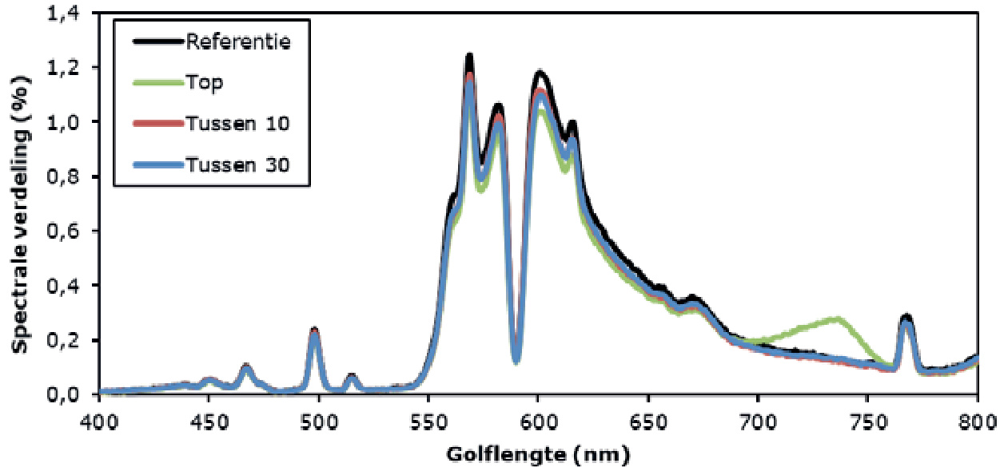

  

# Verrood licht in tomaat: een praktijkproef  

# Referaat  

Wanneer verrood licht wordt toegevoegd aan LED belichting leidt dit bij tomaat tot een hogere productie, door de vorming van meer plantgewicht en een hoger aandeel van dit gewicht in de vruchten. De vraag was in hoeverre dit ook geldt als verrood licht wordt toegevoegd aan SON-T licht in een praktijksituatie. Daarom heeft Wageningen University & Research BU Glastuinbouw in opdracht van Kas als Energiebron en een aantal telersverenigingen een praktijkproef uitgevoerd waarbij 10 en $3 0 ~ \mu \mathrm { m o l / m } ^ { 2 } / \mathsf { s }$ verrood licht werd gegeven boven of tussen het gewas. De behandeling met $3 0 ~ \mu \mathrm { m o l / m } ^ { 2 } / \mathsf { s }$ verrode tussenbelichting resulteerde in een productietoename van $1 1 \%$ . Tegelijkertijd neemt de vruchtkwaliteit en houdbaarheid toe. De behandelingen met $1 0 ~ \mu \mathrm { m o l / m } ^ { 2 } / \mathsf { s }$ verrode top –en tussenbelichting hadden nauwelijks effect op de productie. Het toepassen van verrood licht heeft perspectief, en verdient nader onderzoek als onderdeel van het groeilicht spectrum in de glastuinbouw.  

# Abstract  

Applying additional far-red light to a background of red/blue LED light was shown to increase fruit yield in tomato due to a higher biomass production and a shift of the biomass towards the fruits. The question arose to which extent additional far-red light would have comparable effects when added to HPS light at a commercial scale. Therefore, Wageningen University & Research BUGreenhouse Horticulture conducted a trial at a commercial tomato company where 10 and $3 0 ~ \mu \mathrm { m o l / m } ^ { 2 } / \mathsf { s }$ additional far red light was given as top- or interlighting. Tomato fruit yield was increased by $1 1 \%$ at $3 0 ~ \mu \mathrm { m o l / m } ^ { 2 } / \mathsf { s }$ far-red interlighting, while fruit quality and shelf life were improved. The treatments with $1 0 ~ \mu \mathrm { m o l / m } ^ { 2 } / \mathsf { s }$ far-red top- or interlighting hardly affected fruit yield. Applying additional far-red light as part of the supplementary light spectrum offers perspectives for greenhouse horticulture, and requires further research. This research was funded by Kas als Energiebron and Dutch tomato grower organizations.  

# Rapportgegevens  

Rapport WPR-729 Projectnummer: 3742230200 DOI nummer: 10.18174/460196 Thema: Energie en Klimaat  

Dit project / onderzoek is mede tot stand gekomen door de bijdrage van Stichting Programmafonds Glastuinbouw en het Ministerie van Economische Zaken binnen het Programma Kas als Energiebron en de telers(verenigingen) Harvest House, Prominent, Tasty Tom, Looye, RedStar en The Tomato Company.  

# Disclaimer  

$\circledcirc$ 2019 Wageningen, Stichting Wageningen Research, Wageningen Plant Research, Business unit Glastuinbouw, Postbus 20, 2665 MV Bleiswijk T 0317 48 56 06, www.wur.nl/plant-research.   
Kamer van Koophandel nr.: 09098104   
BTW nr.: NL 8113.83.696.B07   
Stichting Wageningen Research. Alle rechten voorbehouden. Niets uit deze uitgave mag worden verveelvoudigd, opgeslagen in een geautomatiseerd gegevensbestand, of openbaar gemaakt, in enige vorm of op enige wijze, hetzij elektronisch, mechanisch, door fotokopieën, opnamen of enige andere manier zonder voorafgaande schriftelijke toestemming van Stichting Wageningen Research.   
Stichting Wageningen Research aanvaardt geen aansprakelijkheid voor eventuele schade voortvloeiend uit het gebruik van de resultaten van dit onderzoek of de toepassing van de adviezen.  

# Adresgegevens  

# Wageningen University & Research, BU Glastuinbouw  

Postbus 20,2665 ZG Bleiswijk Violierenweg1,2665 MV Bleiswijk T $+ 3 1$ (0)317 48 56 06  

# Inhoud  

Samenvatting 5  

1 Inleiding 7  

1.1 Doelstellingen 8   
1.1.1 Technische doelstellingen 8   
1.1.2 Energiedoelstelling 8  

# 2 Materiaal en methoden  

# 9  

2.1 Teelt en behandelingen 9   
2.1.1 Teelt 9   
2.1.2 Behandelingen 9   
2.2 Metingen 10   
2.2.1 Lichtmetingen 10   
2.2.2 Plantmetingen 10   
2.2.3 Fotosynthese 11   
2.2.4 Pigmentbepaling 11   
2.2.5 Vruchtkwaliteit en houdbaarheid 11   
2.2.6 Lamp- en planttemperatuur 11   
2.2.7 Data analyse 12  

# 3 Resultaten  

13  

3.1 Teelt en klimaat 13   
3.1.1 Lamp- en planttemperatuur 13   
3.2 Plantmetingen 14   
3.2.1 Plantlengte en bladlengte 14   
3.2.2 Vruchtkwaliteit en houdbaarheid 15   
3.3 Productie 16   
3.4 Destructieve waarnemingen 17   
3.4.1 Vruchtgewicht en drogestofgehalte 17   
3.4.2 Bladgewicht en drogestofgehalte 17   
3.4.3 Bladoppervlakte 18   
3.4.4 Drogestofverdeling 18   
3.4.5 Plantsap analyse 19   
3.5 Lichtmetingen 20   
3.5.1 Lichtspectrum en intensiteit 20   
3.5.2 Lichtonderschepping 21   
3.5.3 Totale lichtsom en lichtbenutting 22   
3.6 Fotosynthesemetingen en pigmentbepaling 22   
3.6.1 Fotosynthese 22   
3.6.2 Pigmentbepaling 24  

# Discussie en conclusies 25  

4.1 Additioneel verrood licht leidt tot hogere productie en betere vruchtkwaliteit 25   
4.2 Hoeveel verrood licht is nodig voor het gewenste effect? 25   
4.3 Aanbevelingen 26  

Literatuur 29  

Bijlage 1	 Spectrum in het gewas 31  

# Samenvatting  

In de afgelopen jaren is zowel het areaal belichte tomaten gestegen, als de gemiddelde intensiteit waarmee belicht wordt. Dit is nodig om jaarrond tomaten te kunnen leveren van een goede kwaliteit, maar dit gaat wel gepaard met een hoog elektriciteitsgebruik. Om deze toename van elektriciteitsgebruik af te remmen, zal er kennis ontwikkeld moeten worden om de efficiëntie van het lichtgebruik te verhogen. Daarvoor is kennis noodzakelijk over effecten van lichtkleuren op groei en kwaliteit, mogelijkheden voor energiebesparing en stuurmogelijkheden voor het gewas.  

Eerder onderzoek wijst uit dat belichten met verrood LED licht als toevoeging aan rood/blauw LED belichting, een positief effect heeft op productie door een hoger plantgewicht en een hoger aandeel van dit plantgewicht in de vruchten. Daarnaast verbetert de vruchtkwaliteit. De vraag was echter nog wat het effect is van additioneel verrood licht in combinatie met SON-T belichting op praktijkschaal. Daarom zijn gedurende de winterperiode van eind 2016 - voorjaar 2017 de effecten van 10 en $3 0 ~ \mu \mathrm { m o l / m } ^ { 2 } / \mathsf { s }$ verrood licht boven of tussen het gewas met SON-T belichting als basis op een praktijkbedrijf gevolgd.  

De productie in de behandeling met $3 0 ~ \mu \mathrm { m o l / m } ^ { 2 } / \mathsf { s }$ verrood tussenbelichting was $1 1 \%$ hoger dan van de referentie, terwijl in de behandeling met $1 0 \ \mu \mathrm { m o l / m } ^ { 2 } / \mathsf { s }$ tussen- en top behandeling respectievelijk een toename van 2 en $1 \%$ gevonden werd. De productietoename wordt veroorzaakt door een aangepaste assimilatenverdeling waarbij relatief meer assimilaten naar de vruchten gaan. Daarnaast is de totale biomassaproductie hoger, terwijl de morfologische verschillen klein waren. Ook de vruchtkwaliteit en houdbaarheid nemen toe. Deze positieve effecten moeten in vervolgonderzoek geplaatst worden in het kader van andere lichtkleuren om te komen tot een energiezuinig en optimaal lichtspectrum voor tomaat en andere gewassen.  

# 1 Inleiding  

In de afgelopen jaren is het areaal en de gebruikte intensiteit van belichte teelten fors toegenomen, hetgeen gepaard gaat met een hoog elektriciteitsgebruik. Om deze ontwikkeling een halt toe te roepen zullen we gebruik moeten maken van nieuwe kennis, om de productie op peil te houden met een lagere elektriciteitsbehoefte voor de belichting. Specifieke golflengten, zoals verrood licht $7 0 0 - 8 0 0 ~ \mathsf { n m }$ ) hebben afhankelijk van de verhouding met de andere lichtkleuren in het spectrum, effect op de groei en ontwikkeling van planten (DemotesMainard et al. 2016). Zoals blijkt uit onderzoek dat bij Wageningen University & Research, Business Unit Glastuinbouw is uitgevoerd, leidt het bijbelichten met verrood licht (dat grotendeels buiten het gebied van de fotosynthetisch actieve straling valt) bij tomaat tot een andere assimilatenverdeling (meer assimilaten naar de vruchten in plaats van naar het blad), met als gevolg een hogere productie (hoger gemiddeld vruchtgewicht) en een betere vruchtkwaliteit.  

Om bij een toenemende belichtingsvraag het elektriciteitsgebruik af te remmen, zal de efficiëntie van het lichtgebruik verhoogd moeten worden. Dat zou kunnen door een deel van het assimilatielicht te vervangen worden door een korte periode met een lagere intensiteit verrood licht. Wat het effect is van een lage intensiteit verrood licht, in combinatie met SON-T licht op de productie en kwaliteit is niet bekend.  

In een project uit 2011/2012 werden tomaten belicht met $1 6 0 ~ { \mu \mathrm { m o l / m } } ^ { 2 } / s$ rood/blauwe LEDs $( 9 0 / 1 0 \%$ ) en LEDs met een zonlichtspectrum met en zonder verrood belichting (in aanwezigheid van natuurlijk licht). Dit leidde in eerste instantie tot spectaculaire resultaten: de rood/blauwe LEDs met verrood hadden in het begin van de teelt een $2 5 \%$ hogere productie dan dezelfde behandeling zonder verrood. De oorzaak voor deze stijging was tweeledig: de hogere ontwikkelingssnelheid leidde tot een hoger aantal geoogste trossen en het gemiddeld vruchtgewicht was hoger. Verder hadden de vruchten die geteeld waren met extra verrood licht een hoger droge stof gehalte. Later in de teelt viel de productie in deze behandeling sterk terug, mogelijk veroorzaakt door de steeds kleiner wordende bladeren, en daarmee de lichtonderschepping en assimilatenaanmaak (Hogewoning, Sanders, Peekstok, & Persoon, 2012).  

In het seizoen 2015/2016 is er door WUR Glastuinbouw onderzoek gedaan naar de effecten van bijbelichten met 31 en $5 5 ~ \mu \mathrm { m o l } / \mathrm { m } ^ { 2 } / \mathsf { s }$ verrood licht. Daaruit bleek dat het toevoegen van verrood licht aan rood/blauw LED licht leidde tot een toename in biomassa, een andere assimilatenverdeling (meer assimilaten naar de vruchten in plaats van naar het blad), met als gevolg een hogere productie (hoger gemiddeld vruchtgewicht) en een betere vruchtkwaliteit (meer suikers en zuren en een hoger droge stof percentage). Een van de redenen voor de hogere totale groei is de hogere fotosynthese onder verrode bijbelichting. In tegenstelling tot de eerder genoemde studie is in dit project op tijd gestopt met verrood licht: op moment dat de bladlengtes af begonnen te nemen (begin maart), werd het verrode licht afgeschakeld, en herstelde het gewas zich weer, zodat er eind maart een gewas stond dat de zomer in kon.  

Uit deze onderzoeken blijkt dat verrode bijbelichting bij tomaat een hogere productie en betere vruchtkwaliteit op kan leveren. Echter, deze proeven hebben plaatsgevonden in combinatie met rood/blauw LED belichting dat nog geen gemeengoed is in de tomatenteelt. De meerderheid van de belichte tomatenteelten vindt namelijk nog plaats onder SON-T belichting. Ook kan de vraag gesteld worden waar het verrode licht gegeven moet worden: is het noodzakelijk om als topbelichting gegeven te worden boven het gewas, of zijn vergelijkbare resultaten te behalen wanneer verrood licht als tussenbelichting wordt toegepast? Omdat verrood licht relatief veel wordt gereflecteerd kan het wellicht efficiënter benut worden als het wordt gegeven als tussenbelichting. Kunnen de genoemde effecten zoals productieverhoging en kwaliteitsverbetering met een lagere intensiteit verrood licht ook behaald worden? In dit rapport worden deze vragen behandeld en de resultaten beschreven van de praktijkproef die plaats heeft gevonden in het seizoen van 2016/2017.  

# 1.1 Doelstellingen  

Het doel van dit onderzoek is om na te gaan hoe de efficiëntie van belichting verhoogd kan worden door gebruik te maken van verrood licht. Dit is getoetst op een praktijkbedrijf.  

# 1.1.1 Technische doelstellingen  

•	Monitoren van teelt, productie en vruchtkwaliteit van een met SON-T belichte tomatenteelt in de praktijk waarbij belicht wordt met een lage intensiteit verrood licht boven of tussen het gewas. •	Begrip krijgen van de fysiologische processen die beïnvloed worden door het gebruik van additioneel verrood licht zoals fotosynthese en assimilatenverdeling. •	Nagaan of de efficiëntie van verrood licht bepaald wordt door de positie van de belichting.  

# 1.1.2 Energiedoelstelling  

•	Verhogen van de efficiëntie van lichtgebruik door toepassen van additioneel verrood licht. •	Nagaan wat de meest energie-efficiënte wijze is om additioneel verrood licht toe te passen. •	Nagaan of er mogelijkheden zijn een deel van het PAR licht te vervangen door een (lage intensiteit) verrood licht om zo het elektriciteitsgebruik van de belichting te verlagen welke intensiteit nodig is om de voordelen van verrood te benutten zoals hogere productie en betere vruchtkwaliteit.  

# 2 Materiaal en methoden  

# 2.1 Teelt en behandelingen  

# 2.1.1 Teelt  

De proef vond plaats op een praktijkbedrijf. Op 21 oktober 2016 is het ras Siranzo (intermediate type trostomaat, vruchtgewicht 140-150 gram, Rijk Zwaan Nederland B.V., De Lier) geplant met een stengeldichtheid van $2 . 5 \mathsf { s t } / \mathsf { m } ^ { 2 }$ . De planten waren geënt en getopt en stonden op Grodan PRO blokken en Grotop Master matten (Grodan, Roermond). Op 21 november 2016 (week 47) startte de belichting met verrood licht. Op 26 januari 2017 is de tussenbelichting van een hoogte van 1.4 meter naar een hoogte van 2 meter boven de goot verhangen, voor een optimale onderschepping van het verrode licht. De proefvakken hadden een oppervlakte van $4 0 \mathsf { m } ^ { 2 }$ (lengte $2 5 ~ \mathsf { m }$ , breedte $1 . 6 0 ~ \mathsf { m }$ ). In week 52 is de stengeldichtheid verhoogd van 2.5 naar 3.75 stengels/ $m ^ { 2 }$ . Gedurende de teelt werden de trossen gesnoeid op 5 vruchten/tros. De belichting met verrood licht en de plantwaarnemingen zijn gestopt op 25 april 2017 (week 16). De oogstwaarnemingen zijn gestopt op 23 mei 2017 (week 21).  

# 2.1.2 Behandelingen  

De vier behandelingen waren verdeeld over 2 goten (Figuur 1):  

1.	 Referentie: $1 8 0 ~ \mu \mathrm { m o l / m } ^ { 2 } / \mathsf { s }$ SON-T topbelichting.   
2.	 Top: $1 8 0 ~ \mu \mathrm { m o l / m } ^ { 2 } / \mathsf { s }$ SON-T topbelichting en $1 0 ~ \mu \mathrm { m o l / m } ^ { 2 } / \mathsf { s }$ verrood LED topbelichting.   
3.	 Tussen 10: $1 8 0 \ \mu \mathrm { m o l / m } ^ { 2 } / s$ SON-T topbelichting en $1 0 ~ \mu \mathrm { m o l / m } ^ { 2 } / \mathsf { s }$ verrood LED tussenbelichting.   
4.	 Tussen 30: $1 8 0 ~ \mu \mathrm { m o l / m } ^ { 2 } / \mathsf { s }$ SON-T topbelichting en $3 0 ~ \mu \mathrm { m o l / m } ^ { 2 } / \mathsf { s }$ verrood LED tussenbelichting.  

  
Figuur 1 Overzicht van de proefopstelling.  

# 2.2 Metingen  

# 2.2.1 Lichtmetingen  

# Spectrum en intensiteit  

Na installatie van de verrood belichting is de intensiteit van de SON-T en verrood tussenbelichting bepaald. Uit de eerste meting bleek dat de intensiteit van de behandeling “tussen $1 0 ^ { \prime \prime }$ te hoog was. Vervolgens is er een tweede laag grijsfilterfolie aangebracht die de intensiteit heeft teruggebracht naar de gewenste waarde. De intensiteit is op 3 plekken per behandeling op 13 hoogtes in het gewas bepaald met de JETI specbos 1211UV (JETI Technische Instrumente GmbH, Jena, Duitsland).  

  
Figuur 2 Foto van verrood tussenbelichtingsmodule in gewas.  

# Lichtonderschepping  

De lichtonderschepping door het gewas is gemeten op 28-02-2017. Deze meting heeft plaatsgevonden zonder lamplicht op een bewolkte dag. De positie van de sensor was haaks op de goot en de sensorlengte was een halve padbreedte. De metingen in de bovenste 1.5 meter van het gewas zijn gedaan bij een interval van $2 5 \mathsf { c m }$ ; na 1.5 meter is gemeten met een interval van $5 0 \ c m$ tot aan de goot. In totaal is de lichtintensiteit gemeten op 10 hoogten in het gewas, met 4 metingen per gewashoogte. Vervolgens is de lichtonderschepping berekend aan de hand van de referentiemetingen die tegelijkertijd boven het gewas plaatsvonden. De metingen zijn uitgevoerd met de Sunscan (Delta-T Devices Ltd, Cambridge, UK).  

# 2.2.2 Plantmetingen  

# Periodieke metingen  

Wekelijks zijn de bladlengte van het blad onder de bloeiende tros en de toename in plantlengte van 5 planten per behandeling bepaald, evenals het gewicht en aantal geoogste trossen. In de periode januari – april zijn maandelijks vers- en drooggewicht van de geplukte bladeren en geoogste tomaten bepaald.  

Oogstmetingen hebben wekelijks plaatsgevonden van 20-12-2016 t/m 23-5-2017. Per behandeling werd de oogst bepaald aan 50 stengels. Het aantal stengels waarvan de oogst bepaald is, is tweemaal aangepast. De eerste keer omdat er stengels de behandeling uitgingen vanwege de toename in lengte. De tweede keer omdat de extra aangehouden stengels vanaf 14-3-2017 mee geoogst werden.   
Na het uitschakelen van het verrode licht op 25-4-2017, zijn de oogstmetingen nog 4 weken gecontinueerd om eventuele na-ijleffecten te monitoren.  

# Destructieve plantmetingen  

Op 19-4-2017 zijn er drie stengels per behandeling destructief gemeten waarbij stengellengte, aantal bladeren, aantal trossen en vruchten, en het vers- en drooggewicht van alle organen bepaald zijn. De bladoppervlakte is gemeten van alle bladeren per stengel met de LI3100C (LI-COR, Lincoln, Nebraska USA). Van de bladeren 6-8 en 16-18 (geteld vanaf de top, bladlengte minimaal $5 c m$ ) is apart de lengte, breedte en droge stofgehalte bepaald. De jonge vruchten (diameter tussen $1 - 3 \ c m$ ) zijn apart gewogen en gedroogd. De monsters werden gedroogd in een geventileerde droogstoof bij $8 0 ^ { \circ } C$ .  

# 2.2.3 Fotosynthese  

De fotosynthesesnelheid is bepaald aan 4 volgroeide, onbeschaduwde bladeren per behandeling. De metingen zijn uitgevoerd met de LI-COR 6400XT en 6400-40 fluorescentie meetkop.   
De bloktemperatuur was ingesteld op $2 2 ^ { \circ } \mathsf { C } ,$ de relatieve luchtvochtigheid was $70 \%$ , de ${ \mathsf { C O } } _ { 2 }$ concentratie in de bladkamer was 700 ppm en de flow was $2 0 0 ~ \mu \mathsf { m o l / s }$ . De fotosynthese is bepaald onder 10 lichtniveaus (2000, 1500, 1200, 900, 600, 300, 200, 100, 50 en $0 ~ { \mu \mathrm { m o l / m } } ^ { 2 } / { \Sigma }$ met een 9:1 rood/blauw spectrum. Bij elke lichtstap werd ook de chlorofylfluorescentie bepaald.  

# 2.2.4 Pigmentbepaling  

Drie bladponsjes met een diameter van 1 cm uit bladeren van het bovenste volgroeide blad (blad 7 geteld vanaf de top van de plant) en blad 12 zijn op 1-3-2017 genomen ter analyse. Voor het nemen van de bladponsjes is eerst de SPAD waarde gemeten op 4 punten op het blad met de Minolta SPAD-502 (Konica Minolta, Inc., Tokyo, Japan). Vervolgens zijn de ponsjes ingevroren in vloeibaar stikstof en bewaard bij $\boldsymbol { - 8 0 ^ { \circ } C }$ . Van het overgebleven blad is de oppervlakte en het gewicht bepaald waaruit de het specifieke bladoppervlakte is berekend (SLA, $\mathsf { m } ^ { 2 } / \mathsf { g } ) ,$ ). Een week later is er $3 \mathsf { m } \mathsf { N } , \mathsf { N }$ -dimethylformamide (DMF) toegevoegd aan de bevroren bladponsje en vond de extractie plaats bij $- 2 0 ^ { \circ } \mathsf C$ . Twee weken later werd de oplossing 2 keer verdund met DMF. Vervolgens zijn de absorptiespectra bepaald met een Cary 4000 spectrofotometer (Varian Instruments, Walnut Creek Ca, VS). Tenslotte is het gehalte aan chlorofyl a,b en carotenoïden bepaald volgens Wellburn (Wellburn, 1994).  

# 2.2.5 Vruchtkwaliteit en houdbaarheid  

De vruchtkwaliteit en houdbaarheid is maandelijks gemeten van januari tot en met april. Daarbij werd refractie $( ^ { \circ } \mathsf { B } \mathsf { r i x } )$ , titreerbaar zuur (mmol ${ \sf H } _ { 3 } { \sf O } ^ { + } / 1 0 0 { \sf g }$ fruit), percentage sap van vruchtwand en de stevigheid van de vruchtwand (Fbp, N) gemeten.  

# 2.2.6 Lamp- en planttemperatuur  

Vanuit de BCO bestond het vermoeden dat niet alleen het verrode licht, maar ook de warmte die wordt ingebracht door de modules meerproductie zou kunnen veroorzaken. Daarop is de lamp-, plant- en koptemperatuur gemeten in respectievelijk 10, 10 en 3 herhalingen met de Testo 830 T2 IR thermometer (Testo, Ternat, België).  

# 2.2.7 Data analyse  

Deze proef is opgezet zonder herhalingen van behandelingen. De variatie binnen de experimentele eenheden is gebruikt om verschillen tussen behandelingen aan te tonen. Er is daarom zorgvuldigheid geboden bij het interpreteren van de toegepaste statistiek. Om verschillen tussen behandelingen aan te tonen is analysis of variance (ANOVA) toegepast met het programma GenStat (Versie 18.1.0.17005, VSN International Ltd, Hemel Hempstead, UK). Post-hoc vergelijkingen zijn gemaakt met Fisher’s protected LSD test. Het gebruikte significantieniveau is 0.05. Als p-waardes lager waren werden verschillen als significant beschouwd. Foutbalken in grafieken geven de standaardfout van het gemiddelde weer.  

# 3 Resultaten  

# 3.1 Teelt en klimaat  

Tijdens deze proef is geteeld conform de inzichten van de teler. Dit betekent dat sturing plaatsvond op basis van waarnemingen aan de meetplanten van de teler, en niet aan de planten onder de verrood behandelingen. De realisatie van het klimaat is als zodanig van toepassing op de hele kas.  

De gemiddelde etmaaltemperatuur gedurende de proef was ${ \mathsf { 1 9 . 9 ^ { \circ } C } }$ (dag: $2 2 . 1 ^ { \circ } \mathsf { C } ;$ nacht $1 7 . 8 ^ { \circ } \mathrm { C } )$ . De luchtvochtigheid was vrijwel constant per etmaal met gemiddeld $8 0 . 6 \%$ (dag: $7 8 . 8 \%$ ; nacht: $8 3 . 1 \%$ ). De gemiddelde ${ \mathsf { C O } } _ { 2 }$ concentratie gedurende de lichtperiode was 835 ppm. De hoeveelheid zon- en lamplicht waren constant tot en met week 9, en vanaf week 10 is het aantal belichtingsuren afgenomen.  

  
Figuur 3 Berekende wekelijkse stralingssommen van zon- en lamplicht.  

In januari werd overmatige wortelgroei geconstateerd. Daarop werd besloten om de getroffen planten uit te sluiten van de proefvakken.  

# 3.1.1 Lamp- en planttemperatuur  

Temperatuurmetingen aan de tussenbelichtingsmodules laat zien dat het afplakken van de module leidt tot een hogere temperatuur (Tabel 1). Dit is logisch gezien het feit dat lichtenergie wordt omgezet in convectieve energie. Desondanks heeft dat geen aantoonbare invloed op de planttemperatuur vlak naast de modules, en er zijn ook geen verschillen in koptemperatuur gevonden.  

Tabel 1 Temperaturen van verrood modules $[ n = 1 0 ,$ ), plant naast modules ${ \mathit { n } } { = } { } 1 0 ,$ ) en kop $( n { = } 3 )$ ; verschillende letters geven betrouwbare verschillen aan.   

<html><body><table><tr><td rowspan="2">Behandeling</td><td colspan="2">Temperatuur (°C)</td></tr><tr><td>Lamp</td><td>Plant Kop</td></tr><tr><td>Referentie</td><td>21.6</td><td>22.0</td></tr><tr><td>Verrood top</td><td>21.7</td><td>22.2</td></tr><tr><td>Verrood tussen 10</td><td>31.0a 22.0</td><td>21.8</td></tr><tr><td>Verrood tussen 30</td><td>28.2 b 22.0</td><td>22.0</td></tr></table></body></html>  

# 3.2 Plantmetingen  

# 3.2.1 Plantlengte en bladlengte  

De bladlengte was tot en met 17 januari niet betrouwbaar verschillend tussen de behandelingen. Echter, vanaf 24 januari werd er tot $10 \%$ $( 4 c m )$ korter blad waargenomen in de behandelingen met verrood tussenbelichting (Figuur 44). Het verschil werd niet groter en schommelde van week tot week. De plantlengte was nauwelijks verschillend tussen de behandelingen. Verschillen van $1 \%$ werden gevonden in de periode van novemberfebruari, maar de uiteindelijke plantlengte in de verroodbehandelingen verschilde $1 \%$ of minder van de referentie (Figuur 5).  

  
Figuur 4 Verloop van bladlengte gedurende de proef. Data afkomstig van 5 planten per behandeling.  

  
Figuur 5 Verloop van de plantlengte. Data afkomstig van 5 planten per behandeling.  

# 3.2.2 Vruchtkwaliteit en houdbaarheid  

Bij de eerste meting in januari werd er geen positief effect van verrood licht op de vruchtkwaliteit gevonden. Het belangrijkste verschil werd gevonden in de stevigheid, die hoger was bij de behandelingen met verrood. De bevinding dat er in januari nog weinig effect was op vruchtkwaliteit heeft mogelijk te maken met het feit dat deze vruchten niet vanaf het begin van de ontwikkeling al additioneel verrood licht gehad hebben.  

De meting in februari liet een duidelijk positief effect zien van verrood licht op de vruchtkwaliteit. Het smaakcijfer van de vruchten uit de behandelingen met verrood was $5 - 2 0 \%$ hoger dan de referentie voor de behandelingen top en tussen 10, en tussen 30 respectievelijk. Dit werd voornamelijk veroorzaakt door een hogere refractie, en toegenomen stevigheid.  

Bij de meting in maart werd alleen nog een positief effect gevonden bij de behandeling tussen 30 door een toename in stevigheid.  

Tenslotte werd er in april geen verschil meer gevonden tussen de behandelingen, waarschijnlijk vanwege de toegenomen hoeveelheid instraling van de zon, dat ook verrood licht bevat, waardoor het effect van de behandelingen veel minder was.  

Tabel 2 Resultaten smaakmetingen; waarden zijn een gemiddelde van 4 bepalingen van januari – april.   

<html><body><table><tr><td>Behandeling</td><td>Smaakcijfer</td><td>Refractie</td><td>Zuur</td><td>%Sap</td><td>Stevigheid</td></tr><tr><td>Referentie</td><td>31</td><td>3.6</td><td>6.6</td><td>20</td><td>42</td></tr><tr><td>Top</td><td>32</td><td>3.7</td><td>6.2</td><td>20</td><td>49</td></tr><tr><td>Tussen 10</td><td>32</td><td>3.8</td><td>6.4</td><td>19</td><td>49</td></tr><tr><td>Tussen 30</td><td>33</td><td>3.9</td><td>6.6</td><td>19</td><td>61</td></tr></table></body></html>  

Tegelijkertijd met de vruchtkwaliteit, is de houdbaarheid bepaald (Tabel 3). Gemiddeld genomen, is de houdbaarheid van de behandelingen met $1 0 ~ \mu \mathrm { m o l / m } ^ { 2 } / \mathsf { s }$ verrood top- en tussenlicht minder dan 1 dag langer houdbaar dan de referentie. In de tussen 30 behandeling hadden de trossen een houdbaarheid van 2.2 dagen langer dan de referentie. Tegelijkertijd wordt er een trend waargenomen dat de houdbaarheid licht afneemt naar het voorjaar toe.  

Tabel 3 Gemiddelde houdbaarheid van geoogste trossen in dagen $( n { = } 8 )$ .   

<html><body><table><tr><td>Behandeling</td><td>18-jan</td><td>21-feb</td><td>13-mrt</td><td>11-apr</td><td>Gemiddeld</td></tr><tr><td>Referentie</td><td>18.3</td><td>17.0</td><td>16.6</td><td>15.1</td><td>16.7</td></tr><tr><td>Top</td><td>18.3</td><td>18.3</td><td>17.0</td><td>16.3</td><td>17.5</td></tr><tr><td>Tussen 10</td><td>17.6</td><td>16.4</td><td>18.6</td><td>15.8</td><td>17.1</td></tr><tr><td>Tussen 30</td><td>19.5</td><td>19.9</td><td>19.3</td><td>17.0</td><td>18.9</td></tr></table></body></html>  

# 3.3 Productie  

Vanaf het begin van de teelt werd een productietoename in de behandelingen met verrood tussenbelichting gevonden. Bij de verrood top behandeling werd geen productietoename gevonden. Aan het einde van het belichtingsseizoen (25-4-2017) was de productie in de tussen 30 behandeling $1 1 \%$ hoger dan van de referentie, terwijl in de tussen 10 en top behandeling respectievelijk een toename van 2 en $1 \%$ gevonden werd (Figuur 6). De productie is na het einde van het belichtingsseizoen nog geregistreerd, om vast te stellen of het gewas goed de zomer in kon gaan en of er na-ijleffecten van de behandelingen zijn. De behaalde productiewinst is voor de top behandeling in die periode gestegen, terwijl voor de tussen 10 behandeling het verschil met de referentie wegebt. Voor de tussen 30 behandeling was de productiewinst een maand na het belichtingsseizoen nog geheel aanwezig.  

  
Figuur 6 Verloop van de cumulatieve productie. De belichting met verrood en SON-T is beëindigd op 25-4 zoals aangegeven door de stippellijn.  

# 3.4 Destructieve waarnemingen  

# 3.4.1 Vruchtgewicht en drogestofgehalte  

Bij de verrood tussen behandelingen werd een hoger gemiddeld vruchtgewicht en droge stofgehalte gevonden bij de detailmetingen in de periode van week 2-11 (Tabel 4). De top behandeling gaf een hoger droge stofgehalte en een lager vruchtgewicht. De tussen 30 behandeling had een $4 \%$ hoger vruchtgewicht en een $6 . 5 \%$ hoger droge stofgehalte. De verschillen in droge stofgehalte zijn zeer consistent en betrouwbaar verschillend voor alle behandelingen ten opzichte van de referentie ( $_ { \mathsf { p } < 0 . 0 0 1 }$ ). Het vruchtgewicht is door relatief grote variatie niet betrouwbaar verschillend. Bij analyse van alle oogstbepalingen van de proef (week 50, 2016 – week 16, 2017) wordt dezelfde trend waargenomen als bij de detailmetingen, waarbij het verschil in vruchtgewicht $( 2 . 5 \% )$ tussen de referentie en tussen 30 behandeling betrouwbaarheid benaderd $_ { \cdot \mathsf { p } = 0 . 0 5 }$ ).  

Tabel 4 Gemiddeld vruchtgewicht en droge stofgehalte over de periode van 17 januari – 21 maart. Verschillende letters geven betrouwbare verschillen aan.   

<html><body><table><tr><td>Behandeling</td><td>Vruchtgewicht (g) Droge stofgehalte (%)</td></tr><tr><td>Referentie</td><td>147 4.7% a</td></tr><tr><td>Top</td><td>145 4.9% b</td></tr><tr><td>Tussen 10</td><td>149 4.9% b</td></tr><tr><td>Tussen 30</td><td>153 5.0% b</td></tr></table></body></html>  

# 3.4.2 Bladgewicht en drogestofgehalte  

Het versgewicht van het blad dat geplukt werd, varieerde sterk in de tijd. In december woog het blad gemiddeld 42 gram, het hoogtepunt met 68 gram/blad werd bereikt begin februari waarna het gewicht weer afnam tot 45 gram/blad aan het einde van het belichtingsseizoen. Gemiddeld genomen is er geen verschil in bladgewicht tussen de behandelingen (Tabel 5). Het droge stof gehalte was relatief constant gedurende de proef met een gemiddelde van $9 . 3 \%$ , en de verschillen tussen de behandelingen zijn niet betrouwbaar.  

Tabel 5 Versgewicht van bladeren en droge stofgehalte.   

<html><body><table><tr><td>Behandeling</td><td>Bladgewicht (g)</td><td>Droge stofgehalte (%)</td></tr><tr><td>Referentie</td><td>55.8</td><td>9.3%</td></tr><tr><td>Top</td><td>54.7</td><td>9.3%</td></tr><tr><td>Tussen 10</td><td>52.5</td><td>9.2%</td></tr><tr><td>Tussen 30</td><td>54.9</td><td>9.5%</td></tr></table></body></html>  

# 3.4.3 Bladoppervlakte  

Het bladoppervlakte van bladeren 6-9 en 16-19 (geteld vanaf de top van de plant) is apart bepaald bij de destructieve meting in week 15. Tegelijkertijd is lengte en breedte gemeten. Bladoppervlakte van individuele bilviadueerlenbklandesrlenchktawnosrldeecnhtvewrokrldaearndvderokolradaredbldaodolrendgeteb.laLdilnenagirte.rLeignreasisrie rleagatrezsiesinedlaattmziaeanr $1 8 \%$ van de avarri1a8tie% vnabnladeopvpareiravtliaekitnebvleardkolapapredrvklakntewovredreklnadarodorkdaen bwlaordldengtdeoo(rF dgeuubrla7d)l.eDngetbe a(Fdibgrueuerdt7e).kaDne echter $7 7 \%$ evdatne dkea nvaerciahtier n77bl%advoapnpedrevlvakrtiaetive rink abrlaedn.opOpverrvilgaektvearviaerbkellaernenz.oaOlsvebreigheanvdaerliianbgelenbzloaadlnsummer dragen niet significant bij aan de verklaring van bladoppervlakte. De bladlengte verschilde nauwelijks tussen de eibnehrainddeleintgoepn.beDheanbldaedlibnrge.edte was echter ruim $4 c m$ kleiner in de top behandeling.  

  
Figuur 7 Resultaat van regressie analyse waarbij links de bladlengte en rechts de bladbreedte gebruikt is verklarende variabele voor bladoppervlakte.  

dHeevtatontdale dbelastdroupcptiervelamktetivnegr.scOhnildaennkisetdteuvsesresnchdiellebnehinanbdlaeldilnegnegnt.eDziejnLAeIr gweaesngveemrisdcdheilllden4.5 ten tijde vaargnedneodmesntriunctbileavdeopmpetrivnlga.ktOendvankisn diev vdeureslcehibllaedneirnebn atudlsesnegntedezijbnehearngdelingverns.chillen waargenomen in bladoppervlakte van individuele bladeren tussen de behandelingen.  

# 3t.o4ta.l4e sDtrofpgreosdtuocftiveirsd3e-li1n3g%  

eDere itnotdaelevdrruocghteesnt.ofIpnroddeutcotpieeins $3 - 1 3 \%$ 1h0ogberhianndelbinegheandweolirndgteenrmooekt vmeirnrdoeordvliecrhdtedealdn nbiajadrehret erentie a(dT.abOeml d6a).t Thegtedlirjokgeretisjtdofwgoredhtaletreeveanvdersvcrhucihvtinegn wmaeatrvgernroomdelnicvhatnhdoegedr loigte dstaonfvinerde irnefge.rIentailele, verrood hbethaannddeleienlgveannwdoerdbt oermamsisnadeinr bdieomvrauscshat evnerudietgeledrnuakatr dnedsrtoeonggel,wiecnhtmheoegreirndaenvraluschtetn.wIonrdte top en tussen 10 behandelingen wordt er ook minder verdeeld naar het blad. Omdat het droge stof gehalte van de vbreulc6h.teRnelmateiteverbriomdaliscshatphrodguerctliegtedna-nvienrdel rnegfevraen tdie,viserhreotoadabnedheaenldvealindgenbitoemnaospszaicihntdeevvarnuchten uitgedrukt in drooggewicht hoger dan als het wordt uitgedrukt in versgewicht (zoals gedaan wordt in de BperhodauncdteieliwnagarnemingenS)t.  

Tabel 6 Relatieve biomassaproductie en -verdeling van de verrood behandelingen ten opzichte van de referentie.   

<html><body><table><tr><td>Behandeling</td><td>Stengel</td><td>Blad</td><td>Vruchten</td><td>Totaal</td></tr><tr><td>Referentie</td><td>100%</td><td>100%</td><td>100%</td><td>100%</td></tr><tr><td>Top</td><td>88%</td><td>96%</td><td>105%</td><td>103%</td></tr><tr><td>Tussen 10</td><td>92%</td><td>97%</td><td>109%</td><td>106%</td></tr><tr><td>Tussen 30</td><td>92%</td><td>101%</td><td>116%</td><td>113%</td></tr></table></body></html>  

# 3.4.5 Plantsap analyse  

Op aanvraag van de BCO is er een verkennende plantsapanalyse uitgevoerd door NovaCropControl, om te bepalen of de behandelingen verschillen veroorzaken in opname van elementen. In Figuur 8 zijn de meest in het oog springende resultaten weergegeven. Omdat alle verrood behandelingen dezelfde trends vertoonden en het een enkele bepaling was, zijn de resultaten van de drie verrood behandelingen gemiddeld. Vooral in jong blad valt op dat de hoeveelheid suikers in het blad fors toeneemt $( + 5 9 \% )$ . Daarnaast is het aandeel NH4 (ammonium) in N (stikstof) sterk gestegen, hoewel de daling in ${ \mathsf { N O } } _ { 3 }$ (nitraat) resulteert in een kleine stijging van N totaal met $5 \%$ . De elementen calcium, chloor en zink zijn beduidend minder aanwezig in bladeren van de verrood behandelingen.  

  
Figuur 8 Plantsapanalyse van jong en oud blad. De resultaten van de verrood behandelingen zijn gemiddeld en het verschil t.o.v. de referentie is weergegeven. De rekeneenheid van suikers is $\%$ van het plantsap, voor de overige elementen is de eenheid ppm.  

# 3.5 Lichtmetingen  

# 3.5.1 Lichtspectrum en intensiteit  

Het lichtspectrum boven het gewas is gelijk voor alle behandelingen behalve de verrood top behandeling (Figuur 9). Daar is tussen $7 0 0 - 7 6 0 \ \mathrm { n m }$ een piek te zien afkomstig van de verrode modules boven het gewas. Aan de hoeveelheid verrood die de SON-T belichting afgeeft $( 2 0 . 6 \mu \mathrm { m o l } / \mathrm { m } ^ { 2 } / \mathsf { s } )$ , voegt de verrode topbelichting 11.0 $\mu \mathrm { m o l } / \mathsf { m } ^ { 2 } / \mathsf { s }$ toe. De gemeten gemiddelde lichtintensiteit van de SON-T lampen ter hoogte van $1 . 8 \mathsf { m }$ onder de lampen was $1 4 5 ~ \mu \mathrm { m o l } / \mathrm { m } ^ { 2 } / \mathsf { s }$ .  

  
Figuur 9 Spectrale verdeling gemeten boven het gewas.  

De behandelingen met tussenbelichting hebben tot aan de tussenbelichting hetzelfde spectrum als de referentie behandeling, terwijl de top behandeling een hogere hoeveelheid verrood licht geeft boven in het gewas (Figuur 10). Onder de tussenbelichting ( $8 0 \ c m$ onder de kop) verandert het spectrum waarbij de hoeveelheid verrood toeneemt in de behandelingen met tussenbelichting. De waarden in de grafiek zijn de “piekintensiteiten” omdat de metingen recht onder de lamp zijn weergegeven en niet de gemiddelde intensiteit per $\mathsf { m } ^ { 2 }$ . Op ongeveer 200 cm vanaf de top van het gewas neemt het verschil in verrood licht weer af.  

  
Figuur 10 Intensiteit van het verrode licht afkomstig van SON-T en de verrood LED tussenbelichting in de behandelingen op verschillende hoogtes in het gewas.  

# 3.5.2 Lichtonderschepping  

De gemiddelde plantlengte (de afstand van de top tot steenwolblok) was gelijk tussen de behandelingen tijdens de bepaling van de lichtonderschepping en bedroeg $2 8 8 \pm 1$ cm. Er was geen aantoonbaar verschil in totale lichtonderschepping tussen de behandelingen. Gemiddeld was de totale lichtonderschepping $9 5 . 5 \%$ (Figuur 11). In de top behandeling wordt minder licht geabsorbeerd $7 5 \ c m$ onder de kop van het gewas, maar dat wordt weer gecompenseerd door een hogere onderschepping in lagere gewaslagen.  

  
Figuur 11 Lichtonderschepping in procenten gemeten vanaf de top tot onderkant van het gewas. Merk op dat de bovenste halve meter gewas al ongeveer de helft van het invallend licht absorbeert.  

# 3.5.3 Totale lichtsom en lichtbenutting  

Gedurende de proef is de totale hoeveelheid inkomende straling van zonlicht en lamplicht op weekbasis geregistreerd in de eenheid $\mathsf { 1 / c m } ^ { 2 }$ . Op basis van de aanname dat de transmissie van het kasdek $70 \%$ is, is vervolgens de hoeveelheid zonlicht in $\mathsf { m o l } / \mathsf { m } ^ { 2 }$ uit gerekend. De hoeveelheid lamplicht is uitgerekend door de gemeten intensiteit van de SON-T belichting te vermenigvuldigen met het aantal belichtingsuren. De lichtsom is op twee manieren berekend: op basis van PAR of PAR en verrood. Bij de laatste berekening is rekening gehouden met de hoeveelheid verrood in zonlicht en SON-T belichting (Tabel 7). Vervolgens is de lichtbenuttingsefficiëntie (LBE) berekend, uitgedrukt in totale droge stofproductie per mol licht. Als de LBE berekend wordt op basis van PAR zoals gebruikelijk, is er een toename in LBE bij de behandelingen met verrood licht tot $1 3 \%$ . Wordt er rekening gehouden met de toevoeging van verrood licht dan wordt er bij de tussen verrood behandelingen een lichte stijging van de LBE waargenomen van $3 - 4 \%$ .  

Tabel 7 lichtsommen van zon- en lamplicht zonder en met verrood (FR), en de daaruit volgende lichtbenuttingsefficiëntie in gram droge stof (DS) per mol.   

<html><body><table><tr><td rowspan="2"></td><td colspan="3">Lichtsom (mol/m²)</td></tr><tr><td>PAR (400-700nm)</td><td>PAR+FR (400-800nm) PAR(400-700nm)</td><td>PAR+FR (400-800nm)</td></tr><tr><td>Zonlicht</td><td>1555</td><td>2115</td><td></td></tr><tr><td>Lamplicht (SON-T)</td><td>1307</td><td>1450</td><td></td></tr><tr><td>Referentie</td><td>2862</td><td>3565 0.71</td><td>0.57</td></tr><tr><td>Top</td><td>2862</td><td>3680 0.73</td><td>0.57</td></tr><tr><td>Tussen 10</td><td>2862</td><td>3670 0.75</td><td>0.59</td></tr><tr><td>Tussen 30</td><td>2862</td><td>3878 0.80</td><td>0.59</td></tr></table></body></html>  

# 3.6 Fotosynthesemetingen en pigmentbepaling  

# 3.6.1 Fotosynthese  

In de teelt is de reactie van volgroeide en onbeschaduwde bladeren uit de vier behandelingen op een toename in licht gemeten. De fotosynthesemetingen laten zien dat de bladeren niet verschillen in fotosynthesekarakteristieken (Figuur 12). Dat betekent dat ze bij eenzelfde hoeveelheid rood/blauw LED licht in de meetcuvet van de fotosynthesemeter eenzelfde fotosynthesesnelheid hebben.  

  
Figuur 12 Verloop van de fotosynthesesnelheid bij toenemende hoeveelheid licht in de meetcuvet van de fotosynthesemeter voor bladeren afkomstig van de verschillende behandelingen.  

Het blad van de behandelingen met verrood tussenbelichting heeft een hogere geleidbaarheid ten opzichte van de top behandeling (Figuur 13). De tussen 10 behandeling is betrouwbaar verschillend van referentie en top behandelingen met een gemiddelde geleidbaarheid van 0.46 mol ${ \sf H } _ { 2 } { \sf O } { \sf m } ^ { - 2 } { \sf S } ^ { - 1 } .$ , terwijl de top behandeling de laagste geleidbaarheid had van 0.31 mol $\mathsf { H } _ { 2 } \mathsf { O } \mathsf { m } ^ { - 2 } \mathsf { S } ^ { - 1 }$ . Dit is een toename van $4 8 \%$ . De interne ${ \mathsf { C O } } _ { 2 }$ concentratie is ten hoogste $5 \%$ verschillend, tussen de top en tussen 10 behandelingen. Deze verschillen leiden echter niet tot betrouwbare verschillen in fotosynthesesnelheid (Figuur 12). In alle behandelingen is de geleidbaarheid niet limiterend is voor ${ \mathsf { C O } } _ { 2 }$ opname maar kan het wel invloed hebben op de verdampingscapaciteit.  

  
Figuur 13 Verloop van de totale geleidbaarheid van blad bij toenemende hoeveelheid licht.  

# 3.6.2 Pigmentbepaling  

Chlorofyl, ook wel bladgroen genoemd, is het voornaamste pigment dat licht opvangt voor de fotosynthese. Omdat bekend is dat de hoeveelheid van dit pigment kan afnemen onder verrood licht, is er een bepaling gedaan op 1 maart 2016. Daarbij is volgroeid blad verzameld boven in het gewas (blad 7) en halverwege (blad 12). In de top van de planten is geen verschil waargenomen in chlorofylgehalte. De verschillen waren wel zichtbaar bij bladeren midden in het gewas (Figuur 14).  

  
Figuur 14 Chlorofyl gehalte per eenheid bladoppervlakte van bladeren boven in het gewas (top) en midden in het gewas. Betrouwbare verschillen in chlorofylgehalte van de midden bladeren zijn aangegeven met verschillende letters.  

De hoeveelheid chlorofyl op oppervlaktebasis midden in het gewas is duidelijk lager met verrood. Dit geld ook voor de berekening op gewichtsbasis. Daarbij is er geen verschil of het verrode licht wordt toegediend boven het gewas of tussen het gewas. Er is in verhouding een grotere afname van chlorofyl a ten opzichte van chlorofyl b wat duid op aanpassing van de pigmenten aan de toegenomen hoeveelheid verrood licht in het spectrum.  

# 4 Discussie en conclusies  

# 4.1 Additioneel verrood licht leidt tot hogere productie en betere vruchtkwaliteit  

Het toevoegen van $3 0 ~ \mu \mathrm { m o l / m } ^ { 2 } / \mathsf { s }$ verrood licht tussen het gewas in een achtergrond van SON-T belichting verhoogt de productie met $1 1 \%$ . Een lagere intensiteit verrood licht boven of tussen het gewas is niet voldoende om een significante productiestijging te realiseren. De oorzaak van de toegenomen productie is een combinatie van factoren. De eerste factor is een toename in biomassaproductie, de tweede een veranderde assimilatenverdeling, waardoor een groter gedeelte hiervan naar de vruchten gaat. Daardoor zijn de vruchten zwaarder in de behandeling met verrode tussenbelichting, en hebben ze een hoger droge stofgehalte, een hogere refractie en een beter smaakcijfer.  

Aangezien de planten al vier trossen hadden gevormd voordat de verrood behandelingen werden gestart, werd er verwacht dat pas na het oogsten van deze trossen het effect van verrood meetbaar zou zijn. Dit bleek echter niet het geval. Al na 3-4 weken oogsten (ongeveer 2-3 trossen per stengel) werd er een productietoename waargenomen in de behandelingen met verrood tussenbelichting. Deze initiële productietoename werd veroorzaakt door een hoger aantal geoogste vruchten. Een verklaring hiervoor kan zijn dat de trosaanmaak kort na het ophangen van de verrood tussenbelichting is versneld doordat de modules toen dicht bij de kop van de planten hingen, waardoor de koptemperatuur mogelijk is beïnvloedt. Gedurende de teelt bij normale positie van de tussenbelichting speelt dit geen rol.  

Het productieverschil (in $\mathsf { k g } / \mathsf { m } ^ { 2 } .$ ) veroorzaakt door verrood belichting blijft bestaan na beëindigen van belichting. Het is dus niet zo dat de plant na het afschakelen van het verrode licht moet herstellen. De plant kan ook na een periode van belichting met extra verrood licht zonder problemen de zomer in. Uit de metingen van de destructieve biomassabepaling aan het einde van de belichtingsperiode blijkt uit geen enkele waarneming dat het met verrood licht belichte gewas substantieel zwakker is dan in de referentie.  

De belangrijkste bevinding is dat er tegelijkertijd een hogere biomassaproductie en andere assimilatenverdeling wordt gevonden. De balans tussen deze processen is belangrijk en kan gestuurd worden met het aandeel verrood licht in het spectrum. Uit deze proef blijkt dat de lagere intensiteiten verrood licht zoals toegepast in de top en tussen 10 behandelingen kunnen leiden tot hogere droge stofproductie maar nauwelijks tot hogere productie in $\mathsf { k g } / \mathsf { m } ^ { 2 }$ . Alleen bij toepassing van $3 0 ~ \mu \mathrm { m o l / m } ^ { 2 } / \mathsf { s }$ verrood tussenbelichting is er sprake van een hogere droge stofproductie en een gewijzigde biomassaverdeling die samen leiden tot een substantiële productiestijging.  

Ondanks de theoretisch lage fotosynthetische efficiëntie van verrood licht is er een toename in biomassaproductie. Dit kan worden verklaard doordat verrood licht de fotosynthese efficiëntie van het rode licht verhoogt (Zhen & van Iersel, 2017).  

# 4.2 Hoeveel verrood licht is nodig voor het gewenste effect?  

De SON-T belichting die toegepast wordt in de praktijk bevat al een aandeel verrood licht. In deze proef bedroeg dit $2 0 . 6 ~ { \mu \mathrm { m o l } } / { \ m { \mu \mathrm { m } } ^ { 2 } } / { \mu }$ van de gemeten $1 4 5 ~ { \mu \mathrm { m o l / m } } ^ { 2 } / { \mu \mathrm { m } }$ PAR licht. In de top behandeling, die $1 1 \ \mu \mathrm { m o l } / \mathsf { m } ^ { 2 } / \mathsf { s }$ verrood licht daaraan toevoegde, leidde dat niet tot een toename in productie, maar wel tot een hoger droge stofgehalte van de vruchten en betere vruchtkwaliteit.  

De tussenbelichting met $1 0 ~ { \mu \mathrm { m o l / m } } ^ { 2 } / { \mu \mathrm { m } }$ verrood licht leidde tot een marginale productieverhoging van $2 \%$ . Eén van de factoren kan zijn dat als het verrode licht als tussenbelichting wordt toegepast, er meer wordt geabsorbeerd en minder reflectie plaatsvind op het gewas dan wanneer het boven het gewas wordt gegeven.  

Daarnaast wordt er lokaal een hoge intensiteit verrood licht toegepast, waarvan de effecten nog onbekend zijn. De toename in productie is hoger dan op basis van de $1 \%$ regel was te verwachten, waarbij uitgegaan wordt van $1 \%$ meer licht $= 1 \%$ meer productie (Marcelis, Broekhuijsen, Meinen, Nijs, & Raaphorst, 2004). In de behandeling met $3 0 ~ \mu \mathrm { m o l / m } ^ { 2 } / \mathsf { s }$ verrood bedroeg de toevoeging $9 \%$ op de totale lichtsom wat leidde tot een biomassatoename van $1 3 \%$ . Hetzelfde geldt voor de behandeling met $1 0 ~ \mu \mathrm { m o l / m } ^ { 2 } / \mathsf { s }$ tussenbelichting, terwijl dezelfde intensiteit gegeven boven het gewas wel overeenkomt met de $1 \%$ regel. Mogelijk speelt de positie van de verrood belichting een rol. Op basis van deze resultaten kan gezegd worden dat verrood tenminste even efficiënt is als PAR licht op gewasniveau.  

De lichtbenuttingsefficiëntie neemt toe, dus het is aangetoond dat met verrood licht het gewas efficiënter omgaat met licht (energiedoelstelling 2). Dit effect is niet dusdanig groot dat er meteen fors minder belicht kan worden. Niet alle meer geproduceerde biomassa gaat naar de vruchten omdat er in een praktijkproef niet geoptimaliseerd kan worden voor een specifieke lichtbehandeling. Daarnaast is het nog onduidelijk of de toename in biomassa wordt veroorzaakt door een efficiëntere benutting van lamplicht, zonlicht of beide.  

Er kan worden geconcludeerd dat met name het toevoegen van $3 0 ~ \mu \mathrm { m o l / m } ^ { 2 } / \mathsf { s }$ verrood licht tussen het gewas bijdraagt aan de productie van het gewas, via een toename in biomassaproductie en andere assimilatenverdeling. Uit eerdere proeven met verrood licht in combinatie met LED belichting hebben we gezien dat dat ook geldt voor $3 0 ~ \mu \mathrm { m o l / m } ^ { 2 } / \mathsf { s }$ verrood licht boven het gewas. Op basis van de gevonden resultaten kan niet worden aangetoond of de positie van de verrood belichting een belangrijke rol speelt. Belichten met 30 $\mu \mathrm { m o l } / \mathsf { m } ^ { 2 } / \mathsf { s }$ verrood licht lijkt dus voldoende om effect te genereren, zowel als aanvulling op SON-T of LED. Uit deze resultaten is ook duidelijk dat $1 0 ~ \mu \mathrm { m o l / m } ^ { 2 } / \mathsf { s }$ verrood licht tussen of boven het gewas maar een zeer klein effect heeft op de productie. De exacte ondergrens waarboven aanvullend belichten met verrood effect heeft, is op basis van dit onderzoek niet te zeggen. Wel is het aannemelijk dat de ondergrens tussen 10 en $3 0 ~ \mu \mathrm { m o l / m } ^ { 2 } / \mathsf { s }$ ligt. Of een lage intensiteit verrood licht een deel van het PAR kan vervangen waardoor elektra bespaard kan worden (energiedoelstelling 3) is een vraag die dus nog beantwoord moet worden in vervolgonderzoek. In deze proefopstelling is er niet voor gekozen om een behandeling toe te voegen waarbij een deel van het SON-T licht vervangen wordt door verrood gezien de complexiteit van de lichtverdeling bij wijzigingen in de installatie.  

# 4.3 Aanbevelingen  

Uit verschillende onderzoeken is gebleken dat extra verrood licht effect kan hebben op de productie (zwaardere vruchten) of vruchtkwaliteit (hoger suikergehalte). Welk van deze effecten het sterkst en het meest gewenst is, verschilt tussen de genotypen. De grovere soorten zullen meer baat hebben bij een toename in gemiddeld vruchtgewicht, terwijl in andere segmenten verbetering van kwaliteit en smaak prioriteit heeft. Mogelijk kan door het aanhouden van meer vruchten per tros een toename in droge stofgehalte omgezet worden in een groter aantal oogstbare vruchten. Toepassing van verrood licht biedt kort gezegd meer stuurmogelijkheden.  

In proeven met verrood licht wordt scherp gekeken naar de bladoppervlakte, omdat die door de toename in generativiteit voor een afname in lichtonderschepping zou kunnen zorgen. Uit de meting van lichtonderschepping tijdens de teelt bleek dat de verschillen die gevonden zijn in bladlengte niet leidden tot een verschil in lichtonderschepping. Dat betekent dat een verschil in bladlengte van ca. $10 \%$ (ca. $4 ( m$ ) niet leidt tot een aantoonbaar verschil in lichtonderschepping, en dat dit gecompenseerd kan worden door het aanhouden of weghalen van een extra blaadje uit de kop. De reden hiervoor kan zijn dat de bladlengte voor de cultivar Siranzo geen betrouwbare maatstaf is voor bladoppervlakte (3.2.1). Bladbreedte voorspelt in dit geval de bladoppervlakte beter. Het is dus raadzaam om de relatie tussen bladlengte en –breedte en bladoppervlakte goed te bepalen, of de lichtonderschepping te meten van het gewas. Niet alleen in proeven, maar ook in de praktijk is de lichtonderschepping een belangrijke factor voor de lichtbenuttingsefficiëntie (van zon- en assimilatielicht) en dus productie.  

Een goede lichtonderschepping en –verdeling kan ook een reden zijn om tussenbelichting toe te passen. Deze mogelijkheid om tussenbelichting toe te passen in hoog opgaande gewassen roept ook de vraag op wat dan het ideale spectrum zou moeten zijn. Immers, het gewas zelf beïnvloedt het spectrum van het inkomende licht.  

Daarom worden bladlagen dieper in het gewas van nature blootgesteld aan een ander spectrum dan van het oorspronkelijke zon- of assimilatielicht, waarvan de relatieve toename van verrood licht door de gewaslagen heen een belangrijk voorbeeld is. Toepassing van verrood licht als tussenbelichting lijkt op basis van dit onderzoek perspectieven te bieden. Bij de huidige tussenbelichtingssytemen wordt met name rood/blauw licht toegepast. Vervolgonderzoek is nodig om te bepalen of het toevoegen van verrood aan het spectrum van tussenbelichting dezelfde positieve effecten heeft als in deze en voorgaande proeven.  

Breder gezien is het noodzakelijk om te onderzoeken welke lichtspectra op plant- en gewasniveau het meest efficiënt benut worden en de gewenste stuurmogelijkheden geven. Hierbij is het belangrijk om de gevonden effecten op de aanmaak en verdeling van assimilaten te kunnen verklaren en te vertalen naar praktijkgerichte lichtrecepten. Hiervoor is het aan te bevelen om onderzoek te doen naar de werkingsmechanismen van verrood licht. Dit geldt niet alleen voor tomaat maar ook voor veel andere tuinbouwgewassen waar belichting gemeengoed is of toeneemt in areaal en intensiteit.  

# Literatuur  

Demotes-Mainard, S., Péron, T., Corot, A., Bertheloot, J., Le Gourrierec, J., Pelleschi-Travier, S., Sakr, S. (2016). Plant responses to red and far-red lights, applications in horticulture. Environmental and Experimental Botany, 121, 4–21. http://doi.org/10.1016/j.envexpbot.2015.05.010   
Hogewoning, S. W., Sanders, J., Peekstok, T., & Persoon, S. (2012). Lichtkleuren onderzoek: wat is de ontbrekende schakel voor succesvolle productieverhoging? Retrieved from http://www.tto.nu/uploads/up_221_2913b856e23ffc577b8e513efe573705.pdf   
Marcelis, L., Broekhuijsen, G., Meinen, E., Nijs, L., & Raaphorst, M. (2004). Lichtregel in de tuinbouw $1 \%$ licht $= 1 \%$ productie? Plant Research International B.V., Wageningen, Nota 305. Retrieved from https://library.wur.nl/WebQuery/wurpubs/fulltext/296393   
Wellburn, A. (1994). The spectral determination of chlorophylls a and b, as well as total carotenoids, using various solvents with spectrophotometers of different resolution. Journal of Plant Physiology. Retrieved from http://www. sciencedirect.com/science/article/pii/S0176161711811922   
Zhen, S., & van Iersel, M. W. (2017). Far-red light is needed for efficient photochemistry and photosynthesis. Journal of Plant Physiology, 209, 115–122. http://doi.org/10.1016/j.jplph.2016.12.004  

# Bijlage 1 Spectrum in het gewas  

  
Figuur 15 Spectrale verdeling in het gewas gemeten op 100 cm onder de kop en 20 cm onder de verrood belichting in de tussen 10 en 30 behandelingen. De verhouding tussen SON-T spectrum en verrood tussenbelichting verschuift door de tussenbelichting met verrood licht.  

# Bijlage 2	 Invloed van overmatige wortelgroei op vruchtkwaliteit  

Bij de smaakmeting aan de tomaten geoogst op 15-2-2017 is vanwege het voorkomen van overmatige wortelgroei gekeken naar de effecten daarvan op smaak en vruchtgewicht. Voor de smaakmetingen zijn er enkele trossen meegenomen uit de top en tussen 30 behandeling, omdat die voorhanden waren. In het geval van tomaten uit de top behandeling afkomstig van planten met overmatige wortelgroei is er geen afname in smaakcijfer, maar wel een afname in stevigheid van $2 1 \%$ ten opzichte van onbesmette planten (Tabel 8). In het geval van de tussen 30 behandeling was er een substantiële achteruitgang van het smaakcijfer van tomaten van planten met overmatige wortelgroei, vergeleken met planten zonder overmatige wortelgroei, vooral omdat de refractie omlaag ging. Ook hier was de stevigheid van vruchten met overmatige wortelgroei minder dan van vruchten afkomstig van onbesmette planten.  

Tabel 8 Resultaten van smaakmetingen aan tomaten van planten met en zonder overmatige wortelgroei. OW $\mathbf { \bar { \rho } } = \mathbf { \rho }$ overmatige wortelgroei.   

<html><body><table><tr><td>Behandeling</td><td>Smaakcijfer</td><td>Refractie</td><td>Zuur</td><td>%Sap</td><td>Stevigheid</td></tr><tr><td>Top</td><td>27</td><td>3.4</td><td>6.0</td><td>18</td><td>34</td></tr><tr><td>Top OW</td><td>27</td><td>3.3</td><td>6.3</td><td>19</td><td>27</td></tr><tr><td>Tussen 30</td><td>30</td><td>3.7</td><td>6.7</td><td>18</td><td>43</td></tr><tr><td>Tussen 30 OW</td><td>25</td><td>3.3</td><td>6.2</td><td>17</td><td>31</td></tr></table></body></html>  

Bij de vruchtmetingen van 28-2-2017 is er gekeken naar het gemiddeld vruchtgewicht en het droge stofgehalte (Tabel 9). Dit is gedaan bij de referentie en top behandelingen, omdat daar voldoende vruchten konden worden geoogst van besmette planten. In beide gevallen is er een afname in gemiddeld vruchtgewicht van planten met overmatige wortelgroei. Het droge stofgehalte was alleen lager voor de vruchten uit de top behandeling.  

Tabel 9 Gemiddeld vruchtgewicht en afname ten opzichte van gezonde planten op 28-2-2017. OW $\mathbf { \bar { \rho } } = \mathbf { \rho }$ overmatige wortelgroei.   

<html><body><table><tr><td>Behandeling</td><td>Gemiddeld vruchtgewicht (g) Afname (%)</td></tr><tr><td>Referentie 149</td><td></td></tr><tr><td>Referentie OW</td><td>139 -7%</td></tr><tr><td>Top</td><td>148</td></tr><tr><td>Top OW</td><td>129 -13%</td></tr></table></body></html>  

Hoewel overmatige wortelgroei niet direct leidt tot uitval van planten, kan er wel kwaliteitsvermindering optreden en mogelijk ook een afname in productie door een lager gemiddeld vruchtgewicht.  

  

Wageningen University & Research,   
BU Glastuinbouw   
Postbus 20   
2665 ZG Bleiswijk   
Violierenweg 1   
2665 MV Bleiswijk   
$\intercal + 3 1$ (0)317 48 56 06   
www.wur.nl/glastuinbouw  

Rapport WPR-729  

De missie van Wageningen University & Research is ‘To explore the potential of nature to improve the quality of life’. Binnen Wageningen University & Research bundelen Wageningen University en gespecialiseerde onderzoeksinstituten van Stichting Wageningen Research hun krachten om bij te dragen aan de oplossing van belangrijke vragen in het domein van gezonde voeding en leefomgeving. Met ongeveer 30 vestigingen, 5.000 medewerkers en 10.000 studenten behoort Wageningen University & Research wereldwijd tot de aansprekende kennisinstellingen binnen haar domein. De integrale benadering van de vraagstukken en de samenwerking tussen verschillende disciplines vormen het hart van de unieke Wageningen aanpak.  