# Cherry Tomato Production in Intelligent Greenhouses—Sensors and AI for Control of Climate, Irrigation, Crop Yield, and Quality  

# 智能温室中的樱桃番茄生产——传感器和人工智能在气候、灌溉、作物产量和质量控制中的应用

Silke Hemming $\ast \textcircled { \scriptsize { \parallel } }$ , Feije de Zwart, Anne Elings , Anna Petropoulou $\textcircled{1}$ and Isabella Righini $\textcircled{1}$  

Business Unit Greenhouse Horticulture, Wageningen University & Research (WUR),   
6708PB Wageningen, The Netherlands; feije.dezwart@wur.nl (F.d.Z.); anne.elings@wur.nl (A.E.); anna.petropoulou@wur.nl (A.P.); isabella.righini@wur.nl (I.R.)   
\* Correspondence: silke.hemming@wur.nl  

Received: 2020年10月21日; Accepted: 2020年11月6日; Published: 2020年11月11日  

摘要: 温室和室内农业系统在为不断增长的全球人口提供新鲜和营养食物方面发挥着重要作用。农场规模不断扩大，温室种植者需要做出复杂的决策，以在满足市场需求的同时最大化产量并最小化资源使用。然而，温室行业越来越缺乏高技能劳动力。此外，COVID-19大流行等极端事件可能使农场暂时难以进入。这凸显了对更自主和远程控制温室生产策略的需求。本文描述并分析了第二届"自主温室挑战赛"的结果。在该挑战赛中，在六个高科技温室隔间中进行了为期六个月的樱桃番茄种植实验。温室运营的主要目标是通过AI技术控制温室气候和作物，以最大化净利润。五个具有AI和园艺背景的国际团队在远程操作各自隔间的竞赛中接受了挑战。他们开发了智能算法，并使用传感器数据来确定气候设定值和作物管理策略。所有AI支持的团队都优于作为参考的人工操作温室。从团队获得的结果以及对不同气候-作物策略的分析中，可以检测到未来在温室生产中实施远程控制系统的挑战和机遇。

关键词: 人工智能; 传感器; 资源利用效率; 番茄产量; 室内农业; 自主温室; 气候控制; 灌溉控制; 远程控制; 数据驱动种植

# 1. 引言

温室和室内农业系统在提供富含维生素和矿物质的新鲜水果和蔬菜方面发挥着重要作用。温室结合了单位面积的高作物产量和单位产品的高水利用效率[1]，但代价是高能源需求[2]和高投资。全球许多国家的温室生产正在增加[3]，以提供新鲜食物，最好是本地生产的[4]。然而，受过教育和有经验的劳动力稀缺。在许多国家，缺乏能够监督温室作物生产所有方面的高技能劳动力[5]。当前的COVID-19大流行表明，季节性劳动力的可获得性对园艺生产至关重要[6]。对高学历和经验丰富的作物管理者的需求增加，就像对温室和其他农业系统更多自动化和远程控制的需求一样。随着农场规模扩大或暂时难以进入，对气候、灌溉和作物状态的远程监测变得更加重要。更多的传感器和客观的数字信息对于作物管理者做出明智决策以实现高产优质变得至关重要。由于气候变化，水和（基于化石燃料的）能源等自然资源变得越来越稀缺，提高资源效率变得紧迫。温室种植者需要做出许多决策，以同时最大化产量和最小化资源使用。作物和温室气候模型和/或新的智能算法可以帮助种植者全面了解所有可用信息，并支持复杂决策以预测产量和资源使用。

当今的高科技温室配备了不同的标准传感器，用于监测光照、温度、湿度和$\mathrm{CO}_2$，并主动控制不同的执行器（例如，照明、遮阳、加热、通风、冷却、$\mathrm{CO}_2$加注、雾化、除湿、灌溉和施肥），以控制每个时刻对作物生产重要的所有生长因素。当今的种植者根据经验确定气候、灌溉和作物管理策略，并手动定义气候和灌溉控制的设定值。然后，执行器根据过程计算机中配置的设定值运行，而传感器为控制回路提供测量数据的反馈。监测作物状态的附加传感器能够为种植者提供有关光合作用速率[7]、液流和水力状态[8]以及叶片温度[9]的进一步信息，以添加到其手动决策中。自动温室气候控制算法已经在过去开发出来，并广泛应用于现代高科技温室[10-22]；然而，对作物状态的自动控制仍处于起步阶段。

动态气候模型已经开发出来[10,18,23-28]，它们充当真实温室的数字孪生体。先前的研究[29]提供了当今温室气候模型的概述。机械模型为气候控制行动的智能决策支持提供了机会。过去或未来情景的模拟提供了有关过去不同的气候控制如何改善作物生产以及未来需要采取哪些行动来实现特定作物生产目标的信息。这些模型还可以与智能算法结合，自动确定气候设定值，这一行动目前由种植者手动执行。为了通过自动算法控制作物生产，可以使用机械温室气候和作物模型，并将其与真实温室结合，通过过程计算机发送自动确定的设定值以控制不同的执行器。过去已经对番茄[30,31]、甜椒[32,33]或盆栽植物[34]进行了此类最优控制实验。

作物在每个温室生产系统中都扮演着核心角色。作物管理决策和行动主要由温室工作人员采取。在高架蔬菜生产的温室中，仍然需要人工进行种植、作物训练、叶片和果实修剪以及果实收获。虽然人工需求很高，但作物管理决策可以得到支持。由于经验丰富且训练有素的作物管理者稀缺，作物模拟模型可以在决策中发挥作用。其他研究[35-43]提供了温室作物模型和建模方法的概述。作物模型可以用作现实的虚拟表示[44]。它们可以用于模拟不同的生长条件和作物管理策略，并预测作物发育、产量和果实质量。作物模型可以帮助理解作物在不同生长条件下的行为，并支持种植者做出决策。

AI算法广泛应用于园艺研究，并最近在实践中得到实施。主要应用领域包括植物胁迫检测[45]、果实检测或计数[46]、害虫、疾病或杂草检测[47-49]、产量预测或收获[50,51]。不同光谱范围内的不同相机和光谱系统用于检测，不同的计算机视觉和机器学习算法用于分析。然而，AI在温室作物生产控制中的应用仍然有限[52-57]。最近进行了一项基准实验，在2018年第一届自主温室挑战赛中，使用人工智能（AI）算法优化温室黄瓜作物的净利润。在该实验中，获胜的AI算法优于经验丰富的种植者的人工决策[58]。作物产量（A级：可商业销售的果实）增加了$6\%$，净利润增加了$17\%$，与作为参考的种植者相比。

本文描述了2020年在荷兰瓦赫宁根大学与研究机构Bleiswijk的六个高科技温室隔间中进行的第二届自主温室挑战赛的结果。该挑战赛旨在使用AI算法实现自动和远程控制温室作物生产，以更少的资源在新鲜食品生产方面取得进一步突破。虽然第一次实验[58]更简单，仅对黄瓜生产进行了3-4个月的控制，但第二次实验更复杂，以证明AI控制在更长的六个月期间的价值。必须种植不同的作物，樱桃番茄需要更复杂的控制，因为它不仅可以控制产量，还可以控制产品质量。在第一次实验中，作物在夏秋生长季节种植，而在第二次实验中，作物在冬春夏季节种植。增加了其他挑战，例如没有固定的产品价格，但价格取决于果实质量，而果实质量取决于营养控制，营养控制是产量（更多收入但价格更低）和产品质量（高价格但产量更低）之间的权衡。与第一次实验[58]类似，五个多学科国际团队远程自动控制自己的温室隔间，第六个由当地经验丰富的人类参考种植者组成的团队作为手动控制的参考。实验的目标是通过实现高产量和产品价格并最小化资源使用和成本来最大化净利润。

本文的目的是从净利润、产量和资源使用方面描述实验结果，分析不同的气候和作物管理策略，借助虚拟温室的数字孪生模型解释结果，并检测未来自动控制的可能改进。该实验提供了一个有价值的公共数据集，可用于未来的AI训练目的，可在补充材料中找到：https://doi.org/10.4121/uuid:88d22c60-21b3-4ea8-90db-20249a5be2a7。

# 2. 材料与方法

# 2.1. 温室隔间与设备

本论文所述的实验在荷兰瓦赫宁根大学与研究机构Bleiswijk的一个高科技温室中进行，该温室包含六个相同的隔间。每个隔间的地板面积为$96~\mathrm{m}^2$，并配备了与商业高科技温室相当的技术（图1）。该设置与我们之前[58]中描述的实验相当，但照明系统有所不同。人工照明系统由6个高压钠灯（HPS，容量为$100~\mu\mathrm{mol}/\mathrm{m}^2/\mathrm{s}$，使用Lights Interaction Agro的Papillon灯具和Philips Master GreenPower Plus 1000W EL灯泡，荷兰）和8个多光谱可控LED灯（容量从0到$109~\mu\mathrm{mol}/\mathrm{m}^2/\mathrm{s}$，其中$12~\mu\mathrm{mol}/\mathrm{m}^2/\mathrm{s}$为远红光，因此不计入PAR，其他光谱通道最大值为：蓝光$=11$，红光$=49$，白光$=37~\mu\mathrm{mol}/\mathrm{m}^2/\mathrm{s}$；Elixia，Heliospectra，瑞典）组成。LED灯的电源与HPS灯耦合，意味着LED灯只能作为HPS灯的补充使用。为了控制自然光和节能，安装了两种内部可移动幕布（LUXOUS 1547 D FR节能幕和OBSCURA 9950 FR W遮光幕，Ludvig Svensson，瑞典）。为了控制温度，安装了地板上的轨道管道加热系统和作物高度的管道加热系统（峰值容量分别为180和$30~\mathrm{W}/\mathrm{m}^2$），两者均可独立控制。此外，还配备了连续屋顶通风系统（每$\mathrm{m}^2$温室开口面积为$0.3~\mathrm{m}^2$，装有防蓟马网）、雾化系统（最大容量为$330~\mathrm{g}/\mathrm{m}^2/\mathrm{h}$）和$\mathrm{CO}_2$供应系统（最大容量$15~\mathrm{g}/\mathrm{m}^2/\mathrm{h}$）。植物在岩棉块中生长，岩棉块放置在岩棉板上（Grodan GT Master，Grodan，荷兰），位于高架沟槽上。预混营养液的灌溉水通过滴灌系统供应，由开关控制的灌溉泵加压。多余的灌溉水（排水）在沟槽中收集，并测量其数量、EC和pH值。

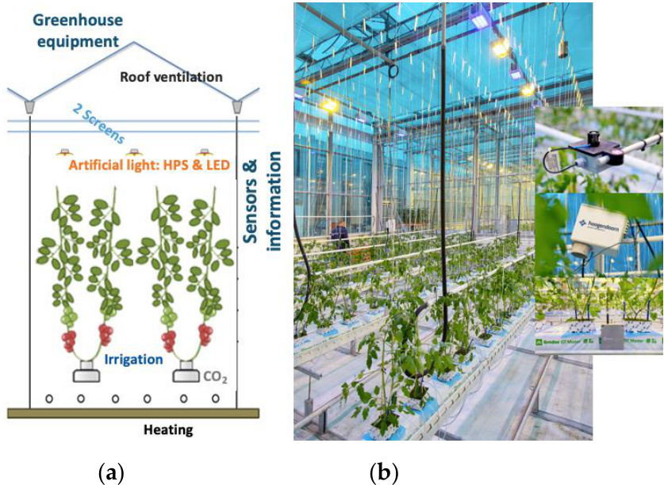  
图1. 温室实验隔间，$96~\mathrm{m}^2$地板面积（$76.8~\mathrm{m}^2$种植面积），配备不同设备：（a）隔间示意图，带有作物和设备：屋顶通风、两种幕布、人工照明（高压钠灯，HPS；LED）、灌溉系统、$\mathrm{CO}_2$供应、两种加热系统。（b）隔间照片，带有年轻番茄作物、设备和传感器。该设置原理在[58]中描述。

# 2.2. 温室控制

五个国际团队（Automatoes，AiCU，DIGILOG，IUA.CAAS，The Automators）分别控制自己的温室隔间（此处描述为隔间306，302，305，304，301）。第六个隔间（303）由荷兰种植者手动控制，作为参考。参赛团队使用自己的控制算法来确定气候和灌溉控制的设定点。设定点控制与我们在[58]中描述的早期实验相当：人工照明HPS和LED（开/关；$0\%$或$100\%$），如果开启，则控制四个LED光谱通道（蓝光、红光、远红光、白光）的照明强度$(0-100\%)$，能量幕位置$(0-100\%)$，遮光幕位置$(0-100\%)$，最小轨道管道温度$(^\circ\mathrm{C})$，最小作物管道温度$(^\circ\mathrm{C})$，通风开口$(%)$，通风温度$(^\circ\mathrm{C})$，湿度设定点$(g/\mathrm{m}^3)$，$\mathrm{CO}_2$浓度$(ppm)$，以及两次灌溉之间的时间$(min)$。设定点通过数字界面（LetsGrow.com，荷兰）传输到过程计算机（IISI，Hoogendoorn，荷兰），然后操作设备（图2）。灌溉水由控制软件准备，并发送到每个隔间的每日储水箱，然后通过滴灌系统提供给作物。基于在岩棉板中获得的GroSense传感器数据（Grodan，荷兰）和排水水的详细化学分析，团队可以请求更改营养液成分、EC和pH值。不同的传感器自动收集气候和灌溉数据（见第2.3节），并通过过程计算机和数字界面（代表在附加软件TransferApp中的REST API）将数据返回给团队。温室工作人员在作物上手动收集数据，并在平板电脑上记录这些观察结果（见第2.4节）。这些信息也通过数字界面发送。基于这些观察结果，团队生成作物管理设置，这些设置通过数字界面传递。每周，这些设置被翻译成作物管理和人类在温室中的操作说明。

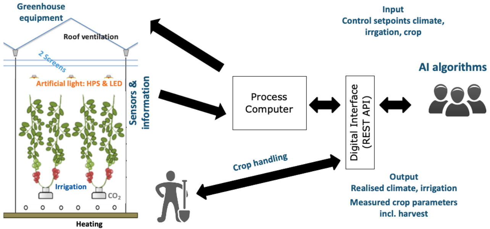  
图2. 数据交换示意图，从团队及其AI算法通过数字界面（REST API）到过程计算机和温室执行器，以及从传感器通过相同方式返回数据，在团队和工作人员之间交换作物处理、测量作物参数。该设置原理在[58]中描述。

参赛团队开发了混合系统，结合了专家知识和控制与预测算法来支持他们的生长策略。开发了各种算法并进行了应用，从条件、基于规则的算法，到基于数据的算法，包括深度预测控制（DePC）、长短期记忆网络（LSTM）双向LSTM、强化学习和模仿学习。

# 2.3. 传感器

在每个温室隔间中，标准传感器持续进行测量。标准传感器与我们之前[58]中描述的实验相当，可分为：

1. 监测室外天气参数的传感器：室外累计总辐射（$\scriptstyle ( { \mathrm { J } } / \cos ^ { 2 } / { \mathrm { d } } )$），室外光合有效辐射PAR（$\mu \mathrm { m o l } / \mathrm { m } ^ { 2 } / \mathrm { s } )$，室外气温（${ \mathrm { ( } } ^ { \circ } { \mathrm { C } } { \mathrm { ) } }$），室外相对湿度（$( \% )$），以及风速（$\mathrm { ( m / s ) }$）；

2. 室外天气预报参数：室外总辐射预报（$\mathrm { W } / \mathrm { m } ^ { 2 } )$，室外气温预报（${ \mathrm { ( } } ^ { \circ } { \mathrm { C } } { \mathrm { ) } }$，室外相对湿度预报（$( \% )$，以及风速预报（$\mathrm { ( m / s ) }$）；

3. 监测内部气候参数和设备状态的传感器：灯具状态（开/关）包括两个照明系统（HPS和LED）以及LED照明四个通道的强度（$( 0 { - } 1 0 0 \% )$，节能幕和遮阳幕位置（$( \% )$，室内气温（${ \mathrm { ( } } ^ { \circ } { \mathrm { C } } { \mathrm { ) } }$，加热管道温度（$^{ \circ } \mathrm { C } )$，加热功率使用（$\mathrm { W } / \mathrm { m } ^ { 2 } )$包括两个加热系统，室内绝对湿度（$\mathrm { g } / \mathrm { m } ^ { 3 } )$，$\mathrm { C O } _ { 2 }$加注量（$\mathrm { { k g / h a / h } } )$；

4. 监测灌溉参数和设备状态的传感器：灌溉供应量（$\mathrm { L } / \mathrm { m } ^ { 2 } )$，排水量（$\mathrm { L } / \mathrm { m } ^ { 2 } )$，排水EC值（$\scriptstyle ( \mathrm { d } S / \mathrm { m } )$，排水pH值（$\mathrm { \ p H \left( - \right) }$，实验室EC值（$\scriptstyle ( \mathrm { d } \mathsf { S } / \mathbf { m } )$，实验室pH值（$( - )$，以及实验室温度（${ } ^ { ( \circ } \mathrm { C } )$。

设备控制设定点和测量数据每5分钟交换一次。此外，还从测量数据中计算了以下每日数据：室内PAR总和（$\mathrm { m o l } / \mathrm { m } ^ { 2 } )$，加热能耗（$\mathrm { k } W \mathrm { h } / \mathrm { m } ^ { 2 } )$，电力消耗（$\mathrm { k } W \mathrm { h } / \mathrm { m } ^ { 2 } )$，$\mathrm { C O } _ { 2 }$加注量（$\mathrm { k g } / \mathrm { m } ^ { 2 } )$，以及水消耗量（$\mathrm { L } / \mathrm { m } ^ { 2 } )$。测量和计算均备份到数字接口（图2）。

各团队可以在实验开始时安装额外的传感器。他们选择了不同类型的传感器，如附加的光合有效辐射、作物温度、茎流计、作物重量、红外叶片温度计、植物温度相机、RGB相机和热成像相机（仅图片，不允许视频流）。来自额外传感器的数据由团队通过特定供应商公司的接口和/或团队通过单独接口安排，以不同的时间间隔接收，具体取决于参数和设备。

# 2.4. 作物

实验使用了一种未确定品种的樱桃番茄作物。幼苗品种为"Axiany"（Axia Seeds，荷兰），于2019年10月19日播种，嫁接到Maxifort砧木上，种植在岩棉块中，并于2019年12月16日移植到温室隔间中。各团队于2019年12月20日开始接管远程控制。作物采用高架栽培系统种植。初始植株密度和茎密度由各团队预先确定，在2.6到4.0茎/平方米之间变化，所有团队都选择了双茎幼苗。参考组以4.0茎/平方米开始。在种植期间，各团队的茎密度变化时间不同。第一次收获是在2020年2月13日，所有团队的最后一次收获都定在2020年5月29日。基于这个最后收获日期，各团队需要选择打顶日期（去除作物顶端），时间从2020年4月16日到30日不等。参考隔间的作物于2020年4月16日打顶。

各团队每周向温室工作人员发送关于茎密度、果实和叶片修剪的指示。随着时间的推移，茎密度在2.6到8.0茎/平方米之间变化。果实修剪策略导致不同的最大植株负荷，在500到800个果实/平方米之间。每周在10株样本植株上手动测量作物参数，如茎伸长（厘米/周）、茎粗（毫米）、果实生长期（天）和花序形成率（花序/周）。茎粗指的是植株顶部最高开花簇下方的茎粗。果实生长期指的是从簇上第一个果实明显开始生长到该簇收获之间的时间。植株负荷（果实数/平方米）是根据茎密度、新花序和收获花序的数量、每个新花序的果实数估算的，并每周与团队共享。收获是按花序进行的，大约每两周五次。温室工作人员手动获取收获数据，包括收获花序数（个/平方米）和A级新鲜果实重量（千克/平方米）。此外，还在实验室进行了果实质量分析。基于实验室测量的总可溶性固形物（TSS，◦Brix）、可滴定酸（Acid，mmol H3O+/100g）、从番茄果壁压出的果汁百分比（%Juice，%）、作为咀嚼时感知硬度指标的果壁断裂力（Bite，N）和平均单果重（Weight，g），使用WUR番茄风味模型2.1版（2011年更新）[59]计算果实风味（0=不喜欢，100=喜欢）。结果每两周与团队共享一次。

# 2.5. 资源利用效率

资源利用效率基于测量数据计算：热能利用效率（MJ/千克番茄）和电能利用效率（kWh/千克番茄），CO2利用效率（kg CO2用量/千克番茄），水利用效率（升供应量/千克番茄），肥料利用效率（克肥料/千克番茄）。肥料利用效率是根据平均供应EC估算的，使用1 EC对应1千克溶解盐/立方米水的粗略关系。

# 2.6. 经济学

净利润基于收入减去成本计算。收入由收获的番茄果实重量（千克）×每千克果实价格和果实质量决定。价格取决于果实质量，即其Brix值，以及季节（图A1）。成本基于实验期间各团队使用的资源相关运营成本。幼苗的初始成本（单株幼苗成本×隔间中放置的幼苗数量），单茎植株为2.00欧元，双茎植株为2.20欧元。实验期间测量了每个温室隔间的电力、供暖、CO2、水、营养和劳动力资源使用量，并乘以给定价格：高峰电价（07:00-23:00）0.08欧元/千瓦时，非高峰电价（23:00-07:00）0.04欧元/千瓦时；供暖价格0.03欧元/千瓦时；CO2价格在12千克/平方米以下为0.08欧元/千克，超过部分为0.20欧元/千克；作物维护劳动力成本为0.0085欧元/茎/平方米/天。使用的其他温室设备相同，因此资本成本未计入净利润计算。所有经济参数在挑战开始前已与各团队沟通，因此没有不确定性。

# 2.7. 性能分析

各团队使用自己的人工智能算法操作不同的温室隔间。结果产生了不同的气候、灌溉和作物管理策略，影响了作物产量、产品质量和资源利用效率，从而影响了收入、成本和净利润。

在性能分析中，将不同隔间中实际温室作物生产的结果与温室气候和作物模拟模型（虚拟温室作物生产，即数字孪生）进行了比较。通过这个真实温室的数字孪生，可以进行详细分析，以更好地理解不同生长因素（如光照、温度、$\mathrm{CO}_2$等）的作用。

虚拟温室作物生产模型由动态温室气候模型KASPRO [24]和番茄作物模型INTKAM [43]组合而成。该组合模型假设水和养分供应充足，并忽略病虫害的存在和影响。KASPRO模型根据我们实验中实现的室外天气条件以及我们温室中实现的气候控制设置（使用真实的结构和设备参数）计算温室气候。该模型通过一个与真实温室中使用的控制算法相当的控制算法处理这些控制设置。气候模型的输出包括各种气候参数，如光照强度、温度、$\mathrm{CO}_2$浓度和空气湿度。然后将此输出用作番茄作物模型INTKAM [43]的输入，该模型从每小时光合作用速率的总和计算每日总光合作用。每小时光合作用速率是动态气候条件下动态作物结构（叶面积指数和植株负荷）的结果。作物光合作用减去作物异化作用产生碳水化合物量。然后根据各生长器官（根、茎、叶、果实）的相对潜在生长率，将每日碳水化合物量分配到这些器官中。下一步计算干物质分数和新鲜器官重量。最后一步，根据果实的生理年龄[60]确定单个果实的收获时间，得出番茄产量结果。净利润按上述方法计算。

数字孪生用于计算每个隔间的番茄作物产量，同时使用真实温室结构、真实设备、真实天气条件以及各个隔间中实现的气候和作物管理策略作为输入。计算输出为预测的鲜重产量$( \mathrm{kg}/\mathrm{m}^2 )$。作物模型经过适当校准。通过这个校准后的温室数字孪生，研究了实验中每个隔间光照、气温和$\mathrm{CO}_2$控制策略变化对鲜重生产的影响。通过每天最多增加或减少$3\mathrm{h}$的照明时间（不改变应用的光照强度）来研究光照可用性的影响。$\mathrm{CO}_2$施用量在50到$200\mathrm{kg/ha/h}$之间变化，同时将$\mathrm{CO}_2$浓度设定点与应用策略相比从$-100$到$+50$ ppm变化。温度设定点与应用策略相比从$^{-2}$到$2^{\circ}C$变化。研究了这些变化对净利润的影响。

# 3. 结果

# 3.1. 气候策略

在实验期间，各团队在其温室隔间中应用了不同的气候策略。图3显示了每个隔间在生长期间实现的平均温度。图4显示了使用的加热量。虽然一些隔间在整个季节表现出相对稳定的温度（301、303和304），但其他隔间在最初几周表现出较高的温度，然后处于中等水平，并在最后大幅增加（305和306），可能是为了在季节早期加速发育并在季节结束时加速果实成熟。虽然305和306似乎应用了相同的概念，但305的温度低于306。尽管306应用了高温制度，但该团队达到了更高的热能利用效率（表2）。这是通过允许高湿度和尽可能限制通风来实现的（数据未显示）。参考种植者（303）在整个季节应用了相对较高的温度，这也导致了最高的加热使用量（图4；表2）。

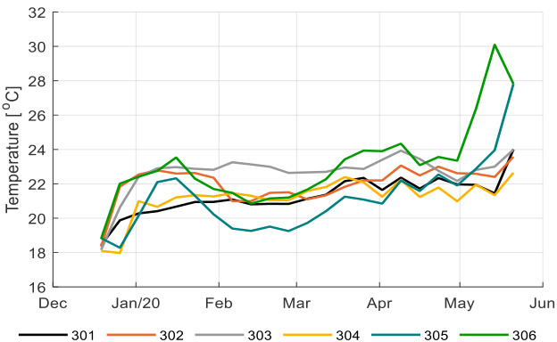  
图3. 六个温室隔间（301-306）的每周平均温度（℃）。

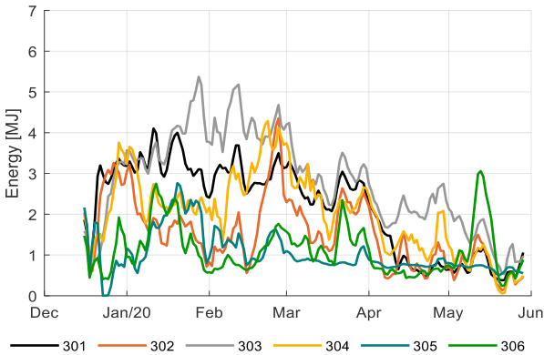  
图4. 六个温室隔间（301-306）的加热能量使用（MJ）。数据通过3天的移动平均进行平滑处理。

图5显示了不同隔间在生长期间的光合有效辐射（PAR）的每日总量。每日PAR总量由进入温室的自然光量和人工光源（HPS和LED）在光照控制策略中添加的量组成。图6显示了仅来自人工光源的每日PAR总量；305的人工光源使用量最高，占总PAR光量的48%；304和302的人工光源使用量较低，占总PAR光量的41%。人工光源的使用反映在电力消耗中（表2）。最佳策略（306）和参考种植者（303）采用了平均策略，电力消耗也处于平均水平。

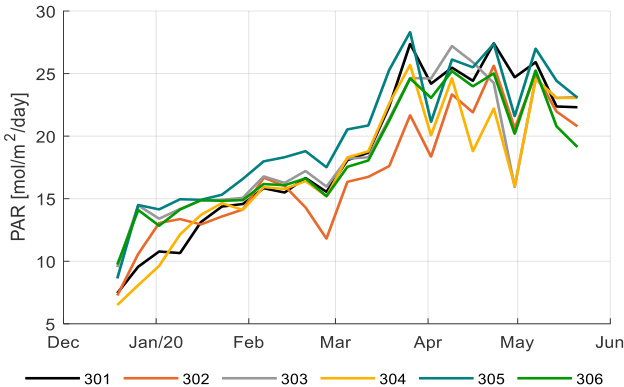  
图5. 六个温室隔间（301-306）的每周平均每日总光合有效辐射（PAR）光量（mol/m²/d）（自然光和人工光源）。

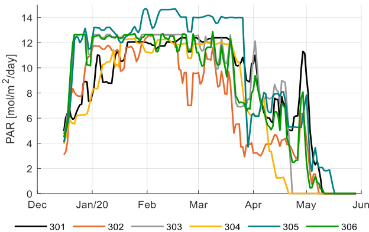  
图6. 不同温室隔间（301-306）中仅来自人工光源的每日PAR光量（mol/m²/d）。数据通过3天的移动平均进行平滑处理。

图7显示了光照期间温室隔间内的CO₂浓度。在大部分季节，数值在600到900ppm之间变化，在季节结束时降低到400-600ppm。图8显示了CO₂的施用量。301和302在整个季节保持了较高的CO₂水平；301通过非常高的CO₂施用量实现了这一点（图8）；302通过较低的施用量实现了相同的水平，两者的CO₂利用效率相当（表2）；305实现了更低的CO₂水平（图7），但由于产量较低（图16），其CO₂利用效率相当（表2）。参考种植者（303）开始时CO₂浓度和施用量相对较低，但在生长周期结束时增加了（图7和图8）。304采用了相反的策略，由于在冬季保持高CO₂水平并在夏季保持低CO₂水平，同时通风损失较少，因此实现了最佳的CO₂利用效率（表2）。

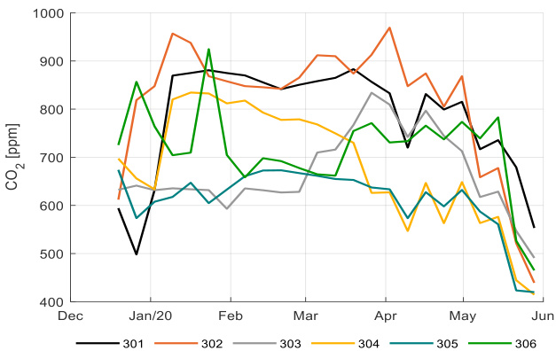  
图7. 光照期间不同温室隔间（301-306）的每周平均CO₂浓度（ppm）。

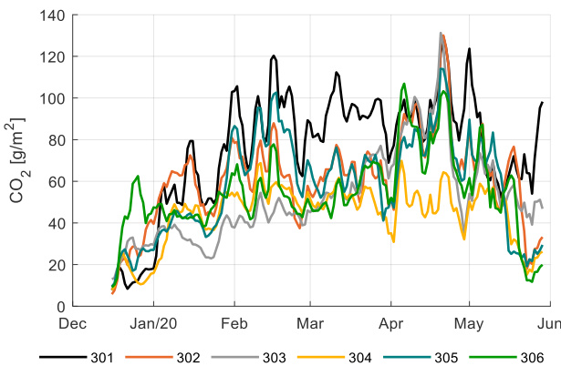  
图8. 不同温室隔间（301-306）的每日CO₂施用量（g/m²）。数据通过3天的移动平均进行平滑处理。

# 3.2. 灌溉策略与果实质量

不同隔间提供的灌溉水量存在显著差异。这是由于不同的灌溉供应策略（图9）导致不同的排水量（图10），以及不同的人工照明和通风控制（数据未显示）。排水被收集并重新利用，作物水分吸收量低于供水量。灌溉供水量在302隔间的533 L/m²到304隔间的832 L/m²之间变化。减去收集并重新利用的排水量后，作物水分吸收量在302隔间的334 L/m²到304隔间的537 L/m²之间变化。平均用水量为450 L/m²，采用最佳策略的306隔间使用了430 L/m²。

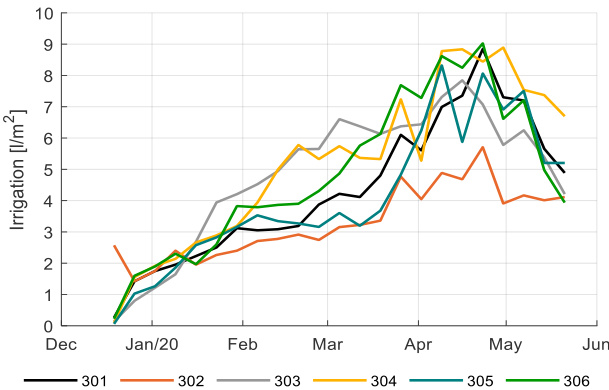  
图9. 不同温室隔间（301-306）每日灌溉水量（L/m²）的周平均值。

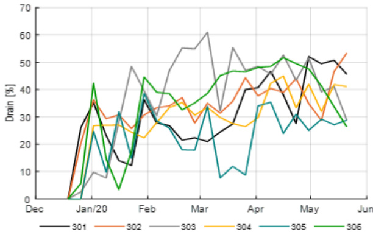  
图10. 不同温室隔间（301-306）应用的排水百分比（%）的周平均值。

图11显示了生长季节期间不同隔间排水水的EC值。通常认为排水水的EC值反映了根区的EC值。各团队的EC值相对稳定，但在生长中期可以注意到305隔间出现了一个峰值。可能有一段时间控制算法没有足够关注EC控制。通常认为高EC值会导致高Brix值和风味评分[61]。然而，尽管305隔间在排水EC值峰值后约四周显示出明显更高的Brix值（图17），但图12中的汇总数据显示在实验中并未观察到这种关系。尽管如此，Brix值和风味之间的正相关关系被观察到（图13）。Brix值的差异导致了价格的差异，如图A2所示。

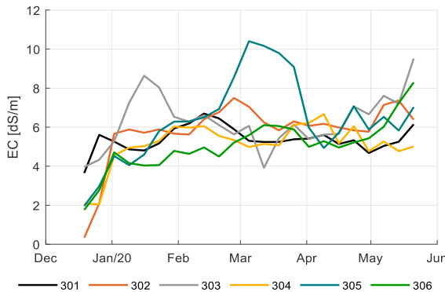  
图11. 不同温室隔间（301-306）排水水的EC值（dS/m）。

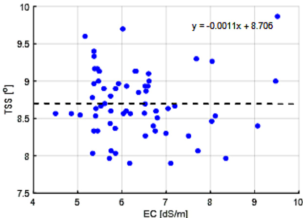  
图12. 不同温室隔间（301-306）总可溶性固形物（TSS，°Brix）与EC值（dS/m）的相关性。

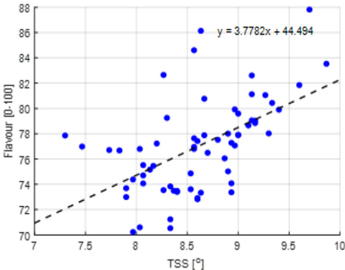  
图13. 不同温室隔间（301-306）番茄果实TSS值（°Brix）与果实风味（0=不喜欢，100=喜欢）的相关性。

# 3.3. 作物策略与产量

图14显示了不同团队的初始茎密度，从2.6到4.0茎/$\mathrm{m}^2$不等。较低的初始茎密度（图16）降低了植物起始材料的成本。在生长期间，茎密度增加到$4.5 \substack{-5.8}$茎/$\mathbf{m}^2$，这是由于所有团队都进行了茎的发育。在作物周期的最后阶段，为了在打顶前充分利用果实，参考种植者（303）将茎密度提高到8.0茎/$\mathbf{m}^2$。这样做的目的是使每茎能够发育出两个额外的果簇。然而，由于劳动力成本与每$\mathbf{m}^2$的茎数相关，这一行动导致了最高的劳动力成本（图A5）和利润的减少（图15）。尽管产量有所增加，但植物负载最终为零（图16）。

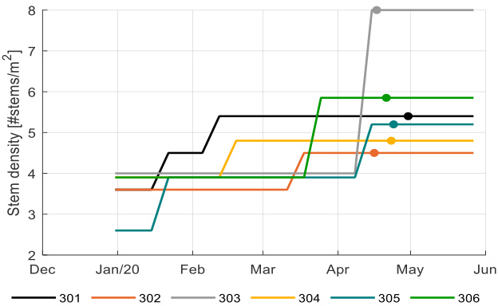  
图14. 不同温室隔间（301-306）的茎密度（#茎/$\mathrm{m}^2$）和打顶日期（$\left(-\mathbf{O}-\right)$）。

图14和表1显示了不同团队选择的打顶日期，从4月17日到30日不等。较早的打顶日期确保所有剩余果实能够在生长周期结束前成熟；过早打顶会导致在生长周期结束时没有果实可收获（本实验中未出现这种情况）；过晚打顶会导致作物投资于新果实，而无法在结束前完全成熟（301和304，图15）。尽管打顶日期有所不同，但除301和304外，其他隔间在挑战结束时的植物负载均为零。

表1. 不同温室隔间（301-306）的最终果穗数（#/茎）和果实数（$\#/\mathrm{stem},\#/\mathrm{m}^2$），平均气温和打顶日期，种植日期为2019年12月16日。

| 温室隔间 | 果穗数量 | 平均温度(℃) | 单茎果实数(#/茎) | 单位面积果实数(#/m²) | 打顶日期 |
|----------|----------|-------------|------------------|----------------------|----------|
| 301      | 23.8     | 21.34       | 332              | 1577                 | 2020年4月30日 |
| 302      | 22.0     | 22.04       | 292              | 1165                 | 2020年4月16日 |
| 303      | 23.2     | 22.70       | 302              | 1323                 | 2020年4月17日 |
| 304      | 21.7     | 21.37       | 325              | 1373                 | 2020年4月23日 |
| 305      | 22.0     | 21.40       | 351              | 1340                 | 2020年4月24日 |
| 306      | 22.6     | 23.25       | 315              | 1459                 | 2020年4月21日 |

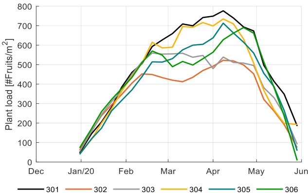  
图15显示了不同温室隔间（301-306）在实验期间（2019年12月16日至2020年5月29日）的植株负载（果实数/$\mathrm{m}^2$）。植株负载由发育速率、每穗果实数、收获果实数（表1）和茎密度（图14）决定，一旦作物进入生殖生长阶段。它与干物质从叶片（碳水化合物的源）向果实（碳水化合物的库）的分配有关，因此是监测源-库平衡以及营养生长（叶片）和生殖生长（果实）之间平衡的合适参数。由于植株负载显示了每个时刻同时生长的果实数量，其积分除以成熟时间即可得到最终收获的果实数量（表1）。301和304隔间在大部分季节保持了最高的植株负载（图15）。304隔间在末期较低的植株负载导致产量相对下降（图16）。最盈利的策略（306）保持了平均植株负载，并在末期有所增加；然而，它们的植株负载、果实干重、果实干物质分数以及所有气候因素（图3、图5和图7）似乎已经足够平衡，从而在整个季节达到了最高的总产量（图16）。参考种植者采用了类似的植株负载策略，也导致了高产量（图16），但由于资源使用量（表2）和劳动力成本较高，净利润较低（图A5）。

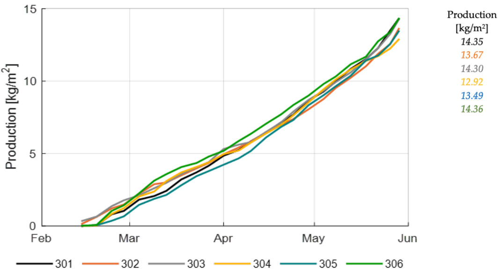  
图16. 不同温室隔间（301-306）A级番茄果实的累计和总产量（$\mathrm{kg}/\mathrm{m}^2$）。

图15显示了实验期间不同隔间的植株负载。植株负载由发育速率、每穗果实数、收获果实数（表1）和茎密度（图14）决定，一旦作物进入生殖生长阶段。它与干物质从叶片（碳水化合物的源）向果实（碳水化合物的库）的分配有关，因此是监测源-库平衡以及营养生长（叶片）和生殖生长（果实）之间平衡的合适参数。由于植株负载显示了每个时刻同时生长的果实数量，其积分除以成熟时间即可得到最终收获的果实数量（表1）。301和304隔间在大部分季节保持了最高的植株负载（图15）。304隔间在末期较低的植株负载导致产量相对下降（图16）。最盈利的策略（306）保持了平均植株负载，并在末期有所增加；然而，它们的植株负载、果实干重、果实干物质分数以及所有气候因素（图3、图5和图7）似乎已经足够平衡，从而在整个季节达到了最高的总产量（图16）。参考种植者采用了类似的植株负载策略，也导致了高产量（图16），但由于资源使用量（表2）和劳动力成本较高，净利润较低（图A5）。

表2. 不同团队和温室隔间在实验期间（2019年12月16日至2020年5月29日）的资源利用效率（单位资源/每公斤番茄产量），包括热量（MJ/kg）、电力（kWh/kg）、CO₂（kg/kg）、水（L/kg）和养分（g/kg）。

| 温室隔间 | 热量 (MJ/kg) | 电力 (kWh/kg) | CO₂ (kg/kg) | 水 (L/kg) | 养分 (g/kg) |
|----------|--------------|---------------|-------------|-----------|-------------|
| 306      | 12.9         | 18.7          | 0.63        | 25.0      | 83.0        |
| 302      | 18.5         | 17.6          | 0.74        | 25.2      | 81.0        |
| 301      | 25.3         | 19.9          | 0.87        | 25.9      | 78.0        |
| 304      | 25.9         | 17.7          | 0.56        | 26.9      | 90.0        |
| 305      | 12.8         | 24.0          | 0.72        | 27.9      | 100.0       |
| 303      | 33.0         | 19.0          | 0.60        | 27.4      | 99.0        |

图16显示了不同隔间A级番茄果实的累计和总鲜重产量。306、301和参考种植者（303）的策略达到了最高产量。只有306能够在低资源使用（表2）的情况下达到如此高的产量，因此获得了高净利润（表3）。产量范围在12.9至14.4 kg/m²之间。

表3. 不同团队和温室隔间（301-306）在实验期间（2019年12月16日至2020年5月29日）的总成本、总收入和净利润（€/m²）。

| 温室隔间 | 总成本 (€/m²) | 总收入 (€/m²) | 净利润 (€/m²) |
|----------|---------------|---------------|---------------|
| 306      | 26.07         | 37.22         | 6.86          |
| 302      | 25.04         | 35.27         | 6.27          |
| 305      | 28.64         | 35.09         | 3.59          |
| 304      | 25.36         | 33.00         | 3.35          |
| 301      | 29.58         | 36.73         | 3.19          |
| 303      | 29.38         | 35.56         | 3.10          |

图17和图18分别显示了不同隔间番茄果实的糖度（Brix）和风味随时间的变化；305隔间达到了最高的Brix和风味值，因此获得了最高价格（图A2），而参考种植者大多达到了较低的Brix和风味值，因此价格相对较低（图A2）。最佳策略306和排名第二的302达到了平均的Brix、风味和价格。然而，两者在生长初期都能够保持高质量，当时价格最高（图A1，图17）。

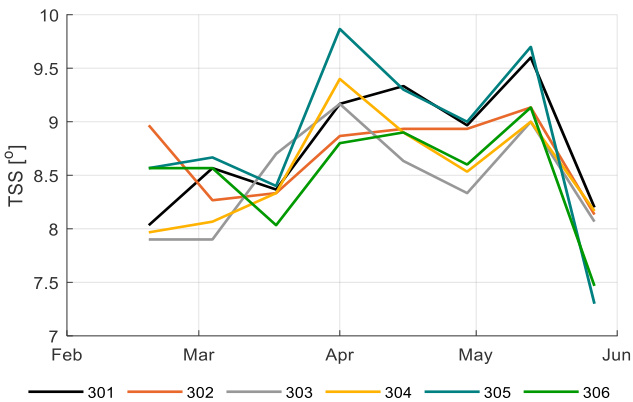  
图17. 不同温室隔间（301-306）番茄果实的糖度（Brix，°）

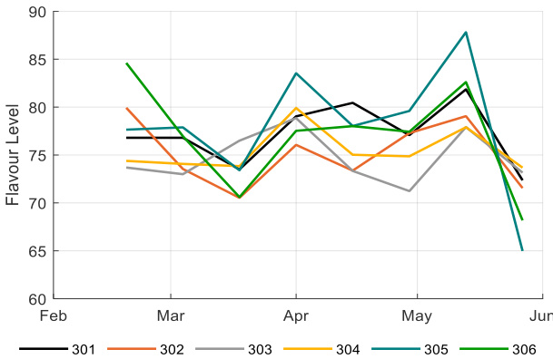  
图18. 基于WUR风味番茄模型2.1版（2011）计算的不同温室隔间（301-306）番茄果实的风味（0=不喜欢，100=喜欢）

# 3.4. 资源利用效率

表2总结了所有团队和隔间的资源利用效率，这是气候和灌溉控制资源使用（第3.1和3.2节）与实现作物生产（第3.3节）的结果。参考种植者（303）在资源利用效率方面排名最低，加热、水和养分使用量高，但电力和CO₂使用量平均；尽管他们实现了高产量（图16）。305团队实现了最佳的加热利用效率和最低的电力利用效率。304团队则相反，这表明加热和照明在一定程度上可以互换，因为灯具不仅提供光，还提供额外的热负荷。采用最佳策略的团队（306）不仅实现了最高利润，还实现了低资源消耗。在加热、CO₂和肥料方面处于最低水平，电力利用效率处于平均水平。

# 3.5. 经济结果

表3显示了不同隔间的总收入、总成本和净利润（€/m²）。这意味着应该针对不同的温室隔间和不同的生产价格，同时最大限度地减少资源使用（MJ/kg）和成本。表3显示了不同隔间的总收入、总成本和净利润。

总收入由果实收获量、果实质量和产品价格组成。假设每公斤番茄的产品价格随果实质量（Brix）在生长期间变化，反映了市场现实（图A1）。由于不同隔间在生长季节的果实质量不同（图17），产品价格也不同（图A2）。结合实现的果实收获量（图16），这导致了实现的总收入（图A3，表3）。最高收入由306隔间的策略实现（37.2€/m²）。

总成本（表3）由资源使用量（表2）和资源成本（见第2.7节）组成。最低成本由排名第二的302团队实现（33.0€/m²），而最佳策略的平均成本为26.07€/m²，参考种植者的成本较高（29.38€/m²），特别是在能源和劳动力成本方面非常高（图A5）。

净利润排名如表3所示。采用最佳策略的团队实现了最高净利润，收入最高且成本平均，而参考种植者实现了最低净利润，收入平均但成本高。净利润发展情况如图A4所示，收入发展情况如图A3所示，而成本组成部分的更多详细信息如图A5所示。净利润范围从3.10到6.86€/m²。所有AI运营的温室都能够达到比参考种植者更高的净利润。

# 3.6. 性能分析

经过充分验证的温室气候和作物模型KASPRO-INTKAM的可用性，即温室番茄生产数字孪生的可用性，使得这些模型能够用于定量性能分析。从现有实现数据中自动提取重要气候策略（温度、${ \mathrm { C O } } _ { 2 }$和光照）后，将重要气候参数（如温度（图A6）、$\mathrm { C O } _ { 2 }$（图A7）和光照（图A8））的模拟结果与实际气候参数进行了比较。数据显示模拟结果与实际结果具有可比性。在对作物模型进行适当校准后，将模拟的收获鲜重（图A9）与实际作物产量进行了比较。数据显示，在收获期的大部分时间里，模拟结果与实际结果具有可比性。然而，图A9显示，在打顶后最后两周的最终增长没有被捕捉到。为了在这些最后几周获得更接近的匹配，需要对模型进行进一步改进，包括改进生殖和营养部分之间的干物质分配，以及去除植物顶端后成熟速度的逐渐增加。在此期间没有进行更深入的性能分析。

在模型验证之后，进行了性能分析，分析了控制策略变化对实验中每个隔间鲜重产量和净利润的影响。由于作物生长主要受光照和$\mathrm { C O } _ { 2 }$可用性的影响，且温室必须处于有利温度才能保证作物的正常生长和发育，因此对这三个主要参数的变化进行了敏感性分析。仅显示了净利润数据。

图19显示了$\mathrm { C O } _ { 2 }$供应变化对不同团队应用策略的净利润的模拟影响。每个团队以不同的方式控制$\mathrm { C O } _ { 2 }$浓度，导致$\mathrm { C O } _ { 2 }$剂量范围从303隔间的$7 . 2 \mathrm { k g } / \mathrm { m } ^ { 2 }$到301隔间的$1 1 . 7 \mathrm { k g } / \mathrm { m } ^ { 2 }$。通过将$\mathrm { C O } _ { 2 }$设定值从$- 1 0 0$变化到$+ 5 0 \mathrm { p p m }$，同时将剂量能力从50变化到$2 0 0 \mathrm { k g / h a / h }$来评估敏感性。这导致了$\mathrm { C O } _ { 2 }$供应$( \mathbf { k g } )$的变化。最低的$\mathrm { C O } _ { 2 }$设定值显著降低了一些团队的生产，最多降低$0 . 7 2 \mathrm { k g } / \mathrm { m } ^ { 2 }$，代表301团队$\mathrm { \ t { 1 . 8 0 } } \mathrm { p e r } \mathrm { m } ^ { 2 }$的价值。在$\mathrm { C O } _ { 2 }$价格为$\epsilon 0 . 0 8 \mathrm { p e r } \mathrm { k g }$时，很明显收入的减少远远超过$\mathrm { C O } _ { 2 }$的节省，因此减少$\mathrm { C O } _ { 2 }$剂量对盈利能力不利。当增加$\mathrm { C O } _ { 2 }$剂量时，有一些好处可以获得，但对大多数团队来说，好处很小，这表明团队正在以相当优化的策略运作。

图20显示了温度变化对不同团队应用策略的净利润的影响。温度与应用的策略相比从$^ { - 2 }$变化到$2 ^ { \circ } C$。该分析表明，降低温度可能会节省一些加热成本，但降低的产量导致净利润下降。模拟显示，温度的增加是有利可图的，尽管利润的增加再次很小。因此可以得出结论，根据模拟模型，温度变化的潜在收益很小。

最后，图21显示了人工光照变化对不同团队应用策略的净利润的影响。通过每天最多增加或减少$^ { 3 \mathrm { h } }$的光照时间，而不改变应用的光照强度，研究了光照可用性的影响。增加光照将导致更高的电力成本、更高的产量和略低的加热成本。减少光照时间通常会产生相反的效果。可以观察到，净利润对光照应用的响应比$\mathrm { C O } _ { 2 }$剂量和温度变化的响应要强得多。此外，响应是非线性的，但好处，除了团队303和305，对大多数团队来说都很小，这表明团队应用的光照策略已经接近最优。

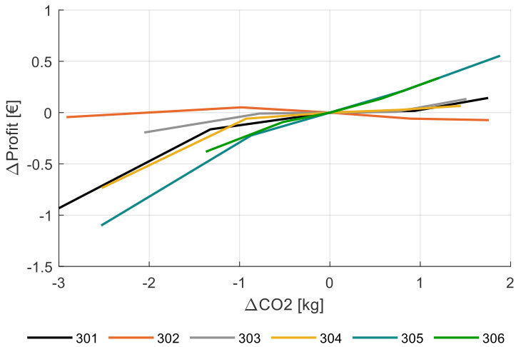  
图19. 不同温室隔间（301-306）$\mathrm { C O } _ { 2 }$供应$( \mathrm { k g } / \mathrm { m } ^ { 2 } )$变化对模拟净利润$( \epsilon / \mathbf { m } ^ { 2 } )$的影响

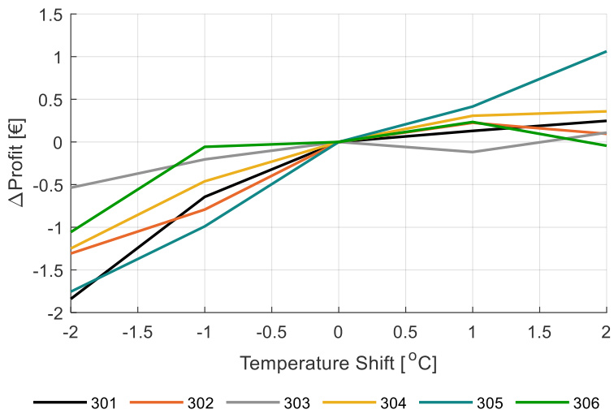  
图20. 不同温室隔间（301-306）加热温度策略从$^ { - 2 }$到$+ 2 \ ^ { \circ } { \mathsf { C } }$变化对模拟净利润$( \epsilon / \mathbf { m } ^ { 2 } )$的影响

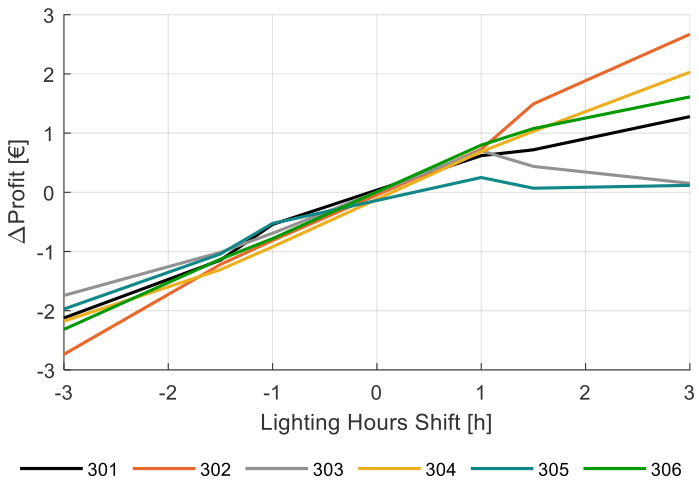  
图21. 不同温室隔间（301-306）每日光照时间从$^ { - 3 }$到$+ 3 \mathrm { h }$变化对模拟净利润$( \epsilon / \mathrm { m } 2 )$的影响

性能分析中光照对净利润的强烈影响需要进行一些更深入的分析。由于自然光量在夏季的大幅增加（图5）和产品价格的下降（图A1），额外人工光照的盈利能力预计在生长季节（2019年12月16日至2020年5月29日）会有所不同。为了分析人工光照的影响，模拟了在保持其余光照策略不变的情况下，每周额外增加2小时人工光照的效果。结果如图22所示。

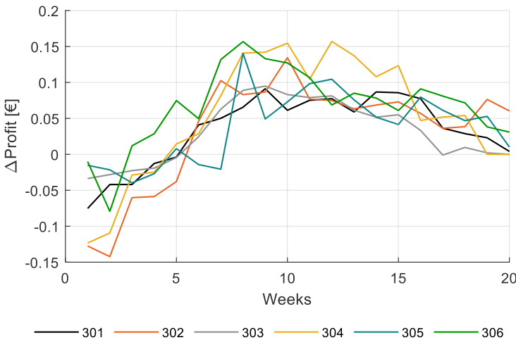  
图22. 不同温室隔间（301-306）每周额外增加$+ 2$小时光照对模拟净利润$( \epsilon / \mathrm { m } ^ { 2 } )$的影响

图22显示，在种植后第十周左右（2019年12月16日种植，因此在2月和3月）每周额外增加$2 \mathrm { h }$人工光照，导致净利润增加约$0 . 1 \ : \mathrm { \in / m } ^ { 2 }$，并在生长季节末期大幅下降。基于自然光的增加和产品价格的下降，可以预期在生长季节末期的影响很小。然而，模拟还显示，在种植后的最初几周，增加额外的人工光照会导致净利润下降。那时作物仍然很小，只有少数果实作为碳水化合物的库。人工光照的控制可以基于整个季节的作物源-库平衡，其中植物负载（图15）可以作为一个衡量标准。图22中的数据显示了基于作物参数的智能控制的可能性。

为了探索优化光照策略的潜力，实施了一种算法，该算法改变了每个隔间（301-306）每周的光照时间，直到计算的净利润显示出特定隔间的最大值。模拟显示，302团队的净利润增加了$3 . 6 \notin / \mathrm { m } ^ { 2 }$，这是应用人工光照最少的团队。对于具有最佳策略的306团队，如果他们在生长季节开始时应用较少的人工光照，在结束时应用较多的人工光照，模拟显示净利润增加了$1 . 4 \ : \mathrm { \in } / \mathrm { m } ^ { 2 }$。图23显示了最佳策略团队306在实际光照策略中应用的每日光照量与导致优化净利润的模拟优化光照量的对比。为了简化，没有研究与其他生长因素（如温度或${ \mathrm { C O } } _ { 2 }$）的相互作用。这里展示的性能分析方法可以用于未来分析更多细节。

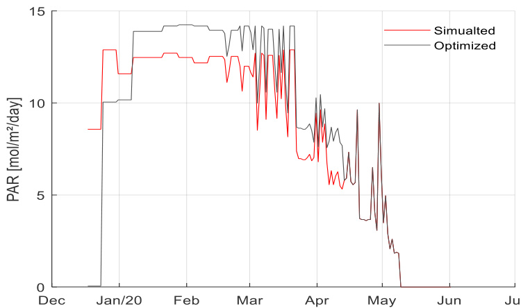  
图23. 最佳策略团队306实际应用（蓝线）和模拟优化（红线）的每日光照量$\mathrm { ( m o l / m } ^ { 2 } / \mathrm { d } )$，以实现优化净利润

# 4. 讨论

# 4.1. 种植策略

盈利的番茄生产意味着在合理使用资源的情况下生产出最大数量的特定品质果实。产品质量由果实大小和Brix值（果实甜度）决定，而产品价格则取决于季节。通过种植选择，种植者旨在实现特定的果实大小。由于果实大小与每平方米的果实数量呈负相关，种植者需要在实现目标果实大小和增加果实数量之间取得平衡。果实数量由每串果实的数量和每平方米的茎数决定。在我们的实验中，一些团队通过减少每串果实的数量和增加每平方米的茎数来优化产量，这节省了劳动力，而其他团队则采用了更高的茎密度和更低的每串果实数量，这促进了更均匀发育的果串。可以得出结论，茎密度是优化的重要参数。自动化监测不同作物参数在未来将允许自动优化。

我们假设灌溉施肥会影响果实质量，从而影响盈利能力。虽然通常认为根区EC值对番茄果实的Brix值有积极影响[61]，但对于这种樱桃番茄品种，我们未能找到良好的相关性。图12显示了收获前35天测量的Brix值与排水EC平均值之间的相关性，为便于计算，这段时间被视为果实生长期。综合所有数据，排水EC值对Brix值没有影响，Brix值平均为8.7。同样，排水EC值对果实干物质含量也没有影响，平均为9.0%（数据未显示）。可以得出结论，关于所用樱桃番茄品种的数据和现有知识尚不允许进行自动优化。

在性能分析中，我们使用虚拟温室和作物模型进行模拟，以分析不同生长因素对作物产量和净利润的影响。樱桃番茄的累计鲜重产量可以被很好地参数化和模拟，除了在生长周期结束时所有隔间都观察到的产量低估。INTKAM模型中的干物质分配基于器官的潜在生长速率，显然这些速率对于已经打顶的番茄植株描述不够充分。

虚拟温室和作物模型的模拟表明，作物生产的净利润对CO₂施用策略不太敏感。然而，当CO₂施用量大幅减少时，可以观察到产量和净利润的明显下降。总的来说，与团队已经应用的CO₂水平相比，增加CO₂施用量几乎不会增加净利润。夏季高水平的CO₂施用量并没有导致空气中CO₂浓度升高，因此也没有增加产量，因为开窗导致补充的CO₂流失。在冬季，当窗户关闭时，CO₂施用量通常会导致空气中CO₂浓度升高和产量增加。然后限制因素来自作物本身，它知道可以吸收和转化为碳水化合物的CO₂量是有限的。然而，团队似乎使用了足够高的CO₂浓度（图19）。可以得出结论，在增加施用能力和CO₂设定值的情况下，作物的额外收入几乎不会超过实验中应用的CO₂策略的额外成本。然而，CO₂控制显然为自主控制提供了可能性，以优化CO₂施用量与通风管理（成本）和CO₂浓度与作物产量（收入）之间的关系。

我们还使用虚拟温室和作物模型进行模拟，以研究温度对作物产量和净利润的影响。温度对作物生长和发育的影响有多个方面，因此很复杂。就光合作用而言，在适度范围内（18-24°C）[62]，温度的影响很小，这意味着总碳水化合物产量不会发生太大变化。温度对维持呼吸的影响要大得多[63]，因此，温度升高会导致可用于生长的碳水化合物减少。温度对发育的果穗数量也有影响。这被认为是线性的[36]，这在当前实验中得到证实。在本项目应用的温度范围内，果穗形成率从19°C昼夜平均温度下的每周1.1个果穗到24°C昼夜平均温度下的每周1.47个果穗不等（数据未显示）。如果其他生长因素保持不变，这将导致更多但更小的果实。由于较小的果实可能会降低产品价格，优秀的种植者会平衡温度（形成的果穗数量）、每穗果实数量和每平方米茎数，以生产出具有令人满意果实重量的最大数量果实。茎密度是一个战略决策，在生长季节只能偶尔改变，每穗果实数量可以每周修改，温度可以随时控制；然而，番茄作物在产量方面的反应是基于至少几天或一周的温度管理。可以得出结论，温度策略为自主控制提供了明确的机会。由于温度管理通过果穗形成率和果实成熟时间影响形成的果穗数量，相机系统可以自动检测这些参数。另外两个参数，每穗果实数量和每平方米茎数，可以通过例如传感器或作物光合作用能力的模型估计来优化。

我们还使用虚拟温室和作物模型进行模拟，以研究光照策略对作物产量和净利润的影响。光照对作物光合作用的瞬时效应和日累积效应之间存在显著差异。只要光照是限制因素，增加光照就会导致更高的光合作用速率。然而，即使瞬时光合作用已达到最佳值，如果光照时间延长，日累积值也会发生变化。这就是为什么更多光照导致更多模拟生长和产量的原因（图21）。然而，在整个生长季节，反应并不相同。假设幼苗的生长受库限制，这意味着产生的碳水化合物超过了小植株的加工能力，这也被纳入了作物模拟模型中。在这个阶段增加光照只会增加成本，而不会促进额外生长。随后是一个过渡阶段，在此期间生长从库限制转变为源限制生长。成年作物处于源限制生长状态，在这个阶段增加人工光照被证明在经济上是有利可图的。

然而，随着太阳光照量的增加和作物价值在生长季末期的下降，额外人工光照的盈利能力下降。研究表明，基于经济可行性优化人工光照应用的算法鼓励在冬季和早春使用人工光照，但不鼓励在夏季使用。可以得出结论，光照策略为基于作物源-库平衡的自动优化提供了明确的机会。

# 4.2. 传感器、算法与控制

温室是高度非线性、复杂的多输入多输出（MIMO）系统[64]。其基础生产过程涉及的变量响应时间存在差异。温室气候和作物光合作用对控制和外部输入的变化反应迅速，而作物生长和生产对控制变化的反应相对较慢[17]。虽然温室气候信息可以通过许多数据点获得，但与作物相关的信息却很少。然而，机器学习算法（如深度学习、神经网络）的性能高度依赖于训练数据的多样性和规模[65]。

在温室作物实验开始之前，各团队可以使用由可用气候-作物模型模拟的虚拟温室环境来探索、构建和训练算法[24,43]。当现实世界的数据在数量和质量上不足以用于训练目的时，使用合成训练数据集在早期应用中已被证明非常有用[51,66]。在实际种植实验中，除了通过标准传感器收集上下文相关数据外，各团队还使用他们偏好的额外传感器收集数据（见第2.3节），以提高其算法的效率和鲁棒性。在实验开始前的探索阶段，各团队应该考虑到系统架构不会因从虚拟到实际种植环境的过渡期间的数据可用性而受到阻碍。换句话说，选择使用可用模型进行基于模型控制的团队，应该用他们能够在温室实验中监测的参数/数据来训练他们的算法。

各团队的额外传感器从低成本定制到新型气候和作物监测传感器各不相同。自然和机械通风气候传感器（用于温度、湿度和$\mathrm { C O } _ { 2 }$）以及NIR和PAR传感器被团队放置在不同高度，以监测气候均匀性。参数的空间映射支持了团队在气候控制决策（通风、$\mathrm { C O } _ { 2 }$剂量、光照策略）和作物管理（茎密度、果实修剪）方面的算法。光学低分辨率和高分辨率相机系统RGB以及热成像相机的数字图像使团队能够远程直观地检查作物生长和健康状况，监测果实的数量和成熟度以及不同作物高度的叶片温度。广角相机能够控制执行器的操作（如灯的开/关、幕布开启）。一些团队根据专家知识对收集的图像数据集进行标记，并将其用于表型分析某些作物性状。在文献中，几位作者专注于温室种植作物的气候或数字图像数据的空间映射[67-72]。未来在自动化计算机视觉分析和自动化控制方面仍有许多机会。机械传感器从采样植物中收集直接反馈。称重槽和作物称重传感器允许实时监测作物和植物重量。这些数据可能被团队用于寻找不同气候、灌溉和作物管理决策下作物和植物重量变化之间的相关性，从而支持他们的算法。此外，固定位置的液流和茎直径传感器允许自动监测流体运输和茎直径。一些团队利用这些信息来定义他们的加热温度和灌溉策略，因为之前的研究[73]报道了叶片温度、茎和液流测量值与植物水分状况和干旱胁迫的关联。

每个团队在确定温室气候和作物的策略和控制时都采用了不同的方法。然而，大多数团队决定将系统分解为长期和短期决策和控制。团队306的决策方案由三个管理层次组成：战略、战术和操作。战略层旨在定义他们的作物策略（例如，决定茎的数量、叶片修剪和温度-光照比）。它接收历史数据、专家知识、数字图像和作物登记数据作为输入。战术决策定义了他们的气候策略，并根据天气预报、战略层的输出和室内气候测量生成$2 4 \mathrm { - h }$基线设定值。操作层接收短期预期室外条件、战术层的24小时设定值和气候测量数据，以生成气候控制设定值。为了找到最佳的温室气候控制，该团队探索了模型预测控制（MPC）和非线性模型预测控制（NMPC）框架，以解决非线性动力学问题。他们使用数据驱动的预测控制（DeePC）计算最优控制策略。利用天气预报和历史数据以及实时反馈，他们的单一优化框架确定了一个代表系统动力学的非参数模型，估计了状态并优化了系统在定义范围内的轨迹[74]。对于灌溉，该团队应用了一种灌溉控制算法，该算法将总太阳辐射与上次灌溉后基质中的水分含量（WC）梯度相关联[74]。通过通风控制温度和湿度是通过直接控制窗户位置来管理的，而不是依赖气候计算机通常应用的通风温度和P-band。最后，历史数据、作物参数与天气预报相结合，用于分类气孔行为并优化窗户开启。

其他团队探索了使用长短期记忆（LSTM）或双向LSTM（BiLSTM），或尝试了强化学习算法。AI算法与基于条件的（基于规则的）决策和基于历史记录或经验数据的专家策略相结合，用于气候或作物生长策略或两者兼而有之。我们可以得出结论，目前还没有团队实现完全自主的基于AI的控制。所有团队都在决策回路中使用了人类。未来仍需进一步改进以实现完全自主控制。

# 5. 结论

在本实验中，所有通过AI远程控制温室番茄种植的团队都优于人类参考种植者。作物管理已被证明对高质量生产至关重要。
• 优化光照策略比优化$\mathrm{CO}_2$或温度更能提高最佳策略团队的生产和净利润。
• 基于光照、$\mathrm{CO}_2$、温度和作物源-库平衡的自动控制，为自主控制作物生长提供了明确的机会。
• 需要获取作物生长各个方面的客观数据，因为数据缺乏阻碍了AI和/或最优控制策略的进一步发展。
• 可以通过特定的作物传感器获取客观数据，特别是未来需要进一步开发稳健的摄像头和计算机视觉算法来检测作物特定参数（如植物负载），以实现完全自主种植。
• 实现完全自主种植的最后一步是自动化所有作物处理，这需要更多的机器人技术开发（本研究未涉及）。

补充材料：第二届自主温室挑战赛的完整数据集和分析基础已在线发布，网址为https://doi.org/10.4121/uuid:88d22c60-21b3-4ea8-90db-20249a5be2a7。

作者贡献：概念化，S.H.；方法论，S.H.、F.D.Z.、A.E.和A.P.；软件，F.D.Z.和A.E.；验证，F.D.Z.、A.E.和A.P.；正式分析，F.D.Z.、A.E.、I.R.和A.P.；调查，F.D.Z.、A.E.、A.P.和I.R.；资源，S.H.；数据管理，F.D.Z.、A.E.、A.P.和I.R.；写作-初稿准备，S.H.；写作-审阅和编辑，F.D.Z.、A.E.、A.P.和I.R.；可视化，A.P.；监督，S.H.；项目管理，S.H.；资金获取，S.H.。所有作者均已阅读并同意出版的手稿版本。

资金支持：本次国际挑战赛的组织由腾讯资助，Grodan、Heliospectra、KPN、LetsGrow.com、Axia Seeds提供了材料赞助。

致谢：我们要感谢我们的赞助商和国际评审团成员。我们还要感谢我们的温室设施工作人员，他们进行了作物管理（工作人员）。最后，我们要感谢所有参与本次挑战赛的团队和个人成员。

利益冲突：作者声明无利益冲突。

# 附录A

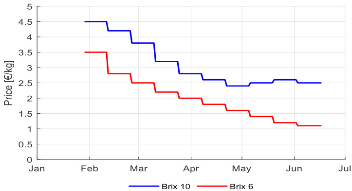  
图A1. 番茄价格(€/kg)随不同Brix值(6和10)在收获期间(2月13日至5月29日2020年)的变化

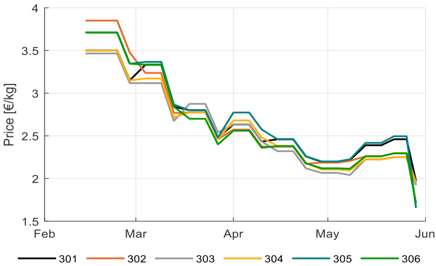  
图A2. 不同团队在不同温室隔间(301-306)实现的番茄价格(€/kg)，基于收获期间(2月13日至5月29日2020年)的果实质量(Brix)

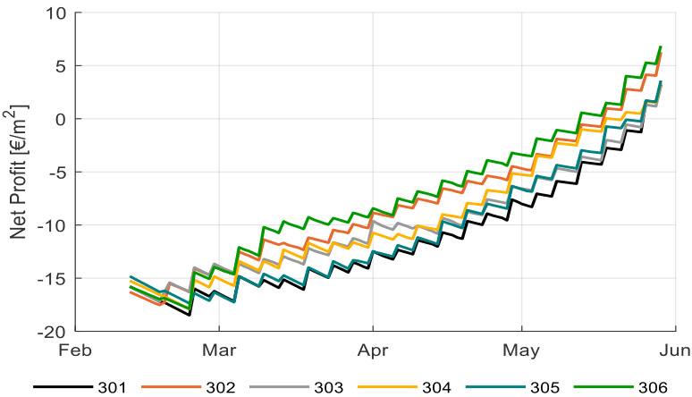  
图A3. 不同温室隔间(301-306)中不同团队在收获期间(2月13日至5月29日2020年)实现的累计收入(€/m²)

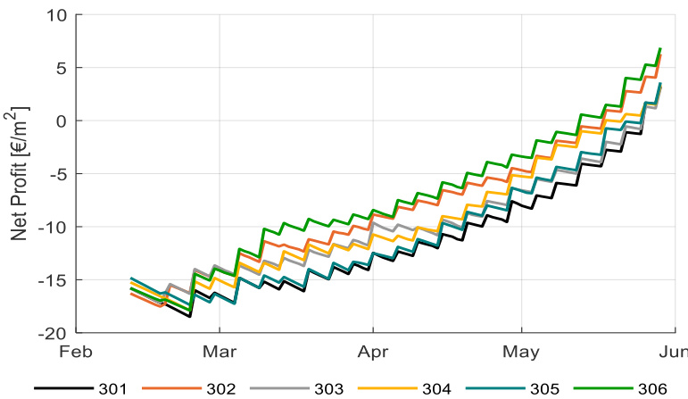  
图A4. 不同团队在不同温室隔间(301-306)在收获期间(2月13日至5月29日2020年)实现的净利润发展(€/m²)及总净利润(€/m²)

  
图A5. 续

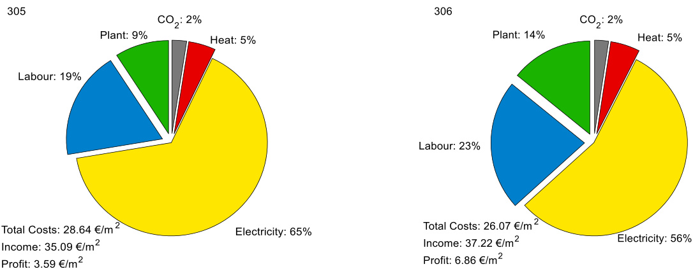  
图A5. 净利润(€/m²)，不同实现的成本组成部分(供热、电力、CO₂、植物和劳动力)，收入以及实验期间不同温室隔间(301-306)的净利润

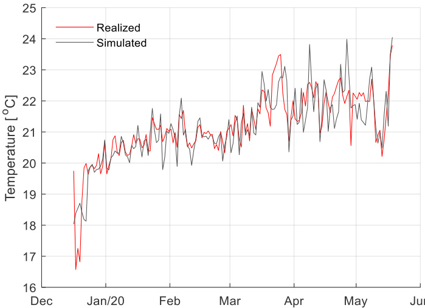  
图A6. 在实验期间(2019年12月16日至2020年5月29日)自动蒸馏气候策略后，其中一个温室隔间(301)测量和模拟的温室空气温度(°C)

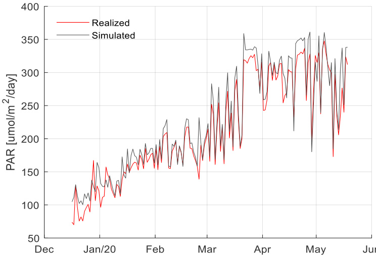  
图A7. 在实验期间(2019年12月16日至2020年5月29日)自动蒸馏气候策略后，其中一个温室隔间(301)测量和模拟的平均PAR(μmol/m²/d)

  
图A8. 在实验期间(2019年12月16日至2020年5月29日)自动蒸馏气候策略后，其中一个温室隔间(301)测量和模拟的温室空气CO₂浓度(ppm)

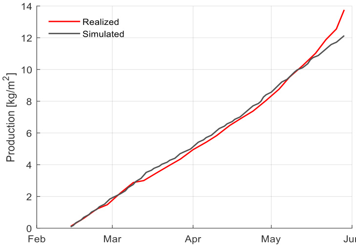  
图A9. 在实验期间(2019年12月16日至2020年5月29日)校准模型与实际气候和作物策略后，测量和模拟的累计鲜重产量(kg/m²)

# 参考文献

1 Stanghellini, C. 温室园艺生产：水资源的高效利用. Acta Hortic. 2014, 1034, 25–32. [CrossRef]   
2. Graamans, L.; Baeza, E.; Dobbelsteen, A.; van den Tsafaras, I.; Stanghellini, C. 植物工厂与温室：资源利用效率的比较. Agric. Syst. 2018, 160, 31–43. [CrossRef]   
3. Rabobank. 2018年世界蔬菜地图. RaboResearch 食品与农业综合企业. 在线获取: https: //research.rabobank.com/far/en/sectors/regional-food-agri/world_vegetable_map_2018.html (访问日期: 2019年3月11日).   
4. CBI. 哪些趋势为欧洲新鲜水果和蔬菜市场带来机遇或威胁? 在线获取: https://www.cbi.eu/market-information/fresh-fruit-vegetables/trends (访问日期: 2020年8月19日).   
5. Brain, D. 温室行业的劳动力现状如何? Greenhouse Grower. 在线获取: https://www.greenhousegrower.com/management/what-is-the-current-state-of-laborin-the-greenhouse-industry/ (访问日期: 2018年11月15日).   
6. Wageningen 发展创新中心和SNV荷兰发展组织. 园艺部门快速评估. 园艺部门快速评估. 简介. 在线获取: https://www.wur.nl/upload_mm/0/e/a/9eb7eb86-cbfc-4f4c-bc3d-fdb7303681bc_Rapid% 20Assessment%20Horticulture%20Introductory%20Brief.pdf (访问日期: 2020年7月1日).   
7. Mortensen, L.M.; Ringsevjen, F. 半封闭温室光合作用测量——智能气候控制的未来标准. Eur. J. Hortic. Sci. 2020, 85, 219–225. [CrossRef]   
8. Steppe, K.; Vandegehuchte, M.W.; Tognetti, R.; Mencuccini, M. 液流作为理解植物水力功能的关键特征. Tree Physiol. 2015, 35, 341–345. [CrossRef]   
9. Yu, L.; Wang, W.; Zhang, X.; Zheng, W. 叶片温度传感器综述：测量方法与应用. In 农业中的计算机与计算技术 IX. CCTA 2015. IFIP 信息与通信技术进展; Li, D., Li, Z., Eds.; Springer: Cham, Switzerland, 2016.   
10. Bot, G.P.A. 温室气候：从物理过程到动态模型. 博士论文, Wageningen 农业大学, Wageningen, 荷兰, 1983.   
11. Challa, H.; Bot, G.P.A.; Nederhof, E.M.; van de Braak, N.J. 九十年代的温室气候控制. Acta Hortic. 1988, 230, 459–470. [CrossRef]   
12. Udink ten Cate, A.J. 温室气候的建模与（自适应）控制. 博士论文, Wageningen 农业大学, Wageningen, 荷兰, 1983.   
13. Tantau, H.J. 气候控制算法. Acta Hortic. 1980, 106, 49–54. [CrossRef]   
14. Van Straten, G.; van Willgenburg, G.; van Henten, E.; van Ooteghem, R. 温室栽培的最优控制; CRC Press: Boca Raton, FL, USA, 2010; ISBN 9781420059618.   
15. Seginer, I. 优化温室操作以获得最佳空气环境. Acta Hortic. 1980, 106, 169–174. [CrossRef]   
16. Hashimoto, Y. 通过监测叶片温度进行短期植物生长的计算机控制. Acta Hortic. 1980, 106, 139–146. [CrossRef]   
17. Van Henten, E.J. 温室气候管理：一种最优控制方法. 博士论文, Wageningen 大学, Wageningen, 荷兰, 1994.   
18. Tap, F. 基于经济学的温室番茄作物生产最优控制. 博士论文, Wageningen 大学, Wageningen, 荷兰, 2000.   
19. Van Beveren, P.J.M.; Bontsema, J.; van Straten, G.; van Henten, E.J. 使用最小能量和种植者定义边界进行温室气候的最优控制. Appl. Energy 2015, 159, 509–519. [CrossRef]   
20. Van Ooteghem, R.J.C. 太阳能温室的最优控制设计. 博士论文, Wageningen 大学, Wageningen, 荷兰, 2007.   
21. Speetjens, S.L. 面向Watergy温室基于模型的自适应控制. 设计与实现. 博士论文, Wageningen 大学, Wageningen, 荷兰, 2008.   
22. Trigui, M.; Barrington, S.; Gauthier, L. 温室气候控制策略，第一部分：模型开发. J. Agric. Eng. Res. 2001, 78, 407–413. [CrossRef]   
23. Takakura, T.; Jordan, K.A.; Boyd, L.L. 温室中植物生长和环境的动态模拟. Trans. ASABE 1971, 14, 964–971. [CrossRef]   
24. de Zwart, H.F. 使用模拟模型分析温室栽培中的节能潜力. 博士论文, Wageningen 大学, Wageningen, 荷兰, 1996.   
25. Vanthoor, B.H.E. 基于模型的温室设计方法. 博士论文, Wageningen 大学, Wageningen, 荷兰, 2011.   
26. Takakura, T. 覆盖下的气候. 植物生物工程中的数字动态模拟; Kluwer Academic Publishers: Dordrecht, 荷兰, 1993.   
27. López-Cruz, I.L.; Fitz-Rodríguez, E.; Torres-Monsivais, J.C.; Trejo- Zúñiga, E.C.; Ruíz-García, A.; Ramírez-Arias, A. 蔬菜生产的温室气候控制策略. In 生物系统工程：二十一世纪的生物工厂与食品生产; Guevara-González, R., Torres-Pacheco, I., Eds.; Springer International Publishing: Cham, Switzerland, 2014; pp. 401–421.   
28. Baptista, F.J.; Litago, J.; Navas, L.M.; Meneses, J.F. 葡萄牙地中海温室物理和统计动态气候模型的验证与比较. Acta Hortic. 2001, 559, 479–486. [CrossRef]   
29. López-Cruz, I.L.; Fitz-Rodríguez, E.; Salazar-Moreno, R.; Rojano-Aguilar, A.; Kacira, M. 温室气候动态数学模型的开发与分析：综述. Eur. J. Hortic. Sci. 2018, 83, 269–280. [CrossRef]   
30. Ramírez-Arias, A.; Rodríguez, F.; Guzmán, J.L.; Berengue, M. 温室作物生长的多目标分层控制架构. Automatica 2012, 48, 490–498. [CrossRef]   
31. Elings, A.; Heinen, M.; Werner, B.E.; de Visser, P.; van den Boogaard, H.A.G.M.; Gieling, T.H.; Marcelis, L.F.M. 温室园艺中水和养分供应的前馈控制：系统开发. Acta Hortic. 2004, 654, 195–202. [CrossRef]   
32. Buwalda, F.; van Henten, E.J.; de Gelder, A.; Bontsema, J.; Hemming, J. 甜椒栽培的最优控制策略——1. 动态作物模型. Acta Hortic. 2006, 718, 367–374. [CrossRef]   
33. van Henten, E.J.; Buwalda, F.; de Zwart, H.F.; de Gelder, A.; Hemming, J.; Bontsema, J. 甜椒栽培的最优控制策略——2. 产量模式和能源效率的优化. Acta Hortic. 2006, 718, 391–398. [CrossRef]   
34. Sørensen, J.C.; Kjaer, K.H.; Ottosen, C.O.; Jørgensen, B.N. DynaGrow：用于温室补光多目标和能源成本高效控制的下一代软件. In 计算智能. 计算智能研究; Merelo, J., Melicio, F., Cadenas, J.M., Dourado, A., Madani, K., Ruano, A., Filipe, J., Eds.; Springer: Cham, Switzerland, 2019; p. 792.   
35. Gary, C.; Jones, J.W.; Tchamitchian, M. 园艺作物建模：现状. Sci. Hortic. 1998, 74, 3–20. [CrossRef]   
36. Heuvelink, E. 番茄生长与产量：定量分析与综合. Ph.D. Thesis, Wageningen University, Wageningen, The Netherlands, 1996.   
37. Jones, J.W.; Dayan, E.; Allen, L.H.; van Keulen, H.; Challa, H.A. 动态番茄生长与产量模型(TOMGRO). Trans. ASAE 1991, 34, 0663–0672. [CrossRef]   
38. Bertin, N.; Heuvelink, E. 番茄作物干物质生产：两种模拟模型的比较. J. Hortic. Sci. 1993, 68, 905–1011. [CrossRef]   
39. Kuijpers, W.J.P.; van de Molengraft, M.J.; van Mourik, S.; van ’t Ooster, A.; Hemming, S.; Henten, E.J. 具有共同结构的模型选择：番茄作物生长模型. Biosyst. Eng. 2019, 187, 247–257. [CrossRef]   
40. Sarlikioti, V.; Visser, P.H.B.; de Buck-Sorlin, G.H.; Marcelis, L.F.M. 植物结构如何影响番茄的光吸收和光合作用：使用功能结构植物模型构建植物结构理想型. Ann. Bot. 2011, 108, 1065–1073. [CrossRef]   
41. Visser, P.H.B.; de Buck-Sorlin, G.H.; van der Heijden, G.W.A.M. 使用番茄3D模型和光线追踪优化温室照明. Front. Plant. Sci. 2014. [CrossRef]   
42. Vanthoor, B.H.E.; de Visser, P.H.B.; Stanghellini, C.; van Henten, E.J. 基于模型的温室设计方法：第二部分，番茄产量模型的描述与验证. Biosyst. Eng. 2011, 110, 378–395. [CrossRef]   
43. Marcelis, L.F.M.; Elings, A.; de Visser, P.H.B.; Heuvelink, E. 番茄作物生长与发育的模拟. Acta Hortic. 2009, 821, 101–110. [CrossRef]   
44. Marshall-Colon, A.; Long, S.P.; Allen, D.K.; Allen, G.; Beard, D.A.; Benes, B.; von Caemmerer, S.; Christensen, A.J.; Cox, D.J.; Hart, J.C.; et al. 作物in silico：使用集成多尺度建模平台生成虚拟作物. Front. Plant. Sci. 2017, 8, 786. [CrossRef]   
45. Nishina, H. 智能温室中"会说话的植物"方法技术的开发. Agric. Agric. Sci. Proc. 2015, 3, 9–13. [CrossRef]   
46. Rahnemoonfar, M.; Sheppard, C. 深度计数：基于深度模拟学习的水果计数. Sensors 2017, 17, 905. [CrossRef]   
47. Mishra, P.; Polder, G.; Vilfan, N. 使用自主平台进行植物病害检测的近距离光谱成像：近期研究综述. Curr. Rob. Rep. 2020, 1, 43–48. [CrossRef]   
48. Nieuwenhuizen, A.T.; Kool, J.; Suh, H.K.; Hemming, J. 温室中番茄叶片上红蜘蛛危害的自动检测. Acta Hortic. 2020, 1268, 165–172. [CrossRef]   
49. Suh, H.K.; IJsselmuiden, J.; Hofstee, J.W.; van Henten, E.J. 迁移学习在田间条件下甜菜和自生马铃薯分类中的应用. Biosyst. Eng. 2018, 174, 50–65. [CrossRef]   
50. Bac, W. 提高甜椒机器人收获的障碍物感知能力. Ph.D. Thesis, Wageningen University, Wageningen, The Netherlands, 2015.   
51. Barth, R. 收获机器人视觉原理：在农业中播种人工智能. Ph.D. Thesis, Wageningen University, Wageningen, The Netherlands, 2018.   
52. Martin-Clouaire, R.; Boulard, T.; Cros, M.J.; Jeannequin, B. 使用经验知识确定气候设定点：一种人工智能方法. In The Computerized Greenhouse: Automated Control Application in Plant Production; Hashimoto, Y., Bot, G.P.A., Day, W., Tantau, H.J., Nonami, H., Eds.; Academic Press: Cambridge, MA, USA, 1993; pp. 197–224.   
53. Kurata, K. 通过机器学习进行温室控制. Acta Hortic. 1988, 230, 195–200. [CrossRef]   
54. Seginer, I. 人工神经网络在温室环境控制中的一些应用. Comput. Electron. Agric. 1997, 18, 167–186. [CrossRef]   
55. Blasco, X.; Martínez, M.; Herrero, J.M.; Ramos, C.; Sanchis, J. 基于模型的温室气候预测控制以减少能源和水消耗. Comput. Electron. Agric. 2007, 5, 49–70. [CrossRef]   
56. Morimoto, T.; Hashimoto, Y. 人工智能在全植物生产系统识别与控制中的应用. Control Eng. Pract. 2000, 8, 555–567. [CrossRef]   
57. Caponetto, R.; Fortuna, L.; Nunnari, G.; Occhipinti, L.; Xibilia, M.G. 软计算在温室气候控制中的应用. IEEE Trans. Fuzzy Syst. 2000, 8, 753–760.   
58. Hemming, S.; de Zwart, H.F.; Elings, A.; Righini, I.; Petropoulou, A. 利用人工智能远程控制温室蔬菜生产——温室气候、灌溉和作物生产. Sensors 2019, 19, 1807. [CrossRef]   
59. Verkerke, W.; Janse, J.; Kersten, M. 番茄果实口感模型的实际应用. Acta Hort. 1998, 456, 199–205. [CrossRef]   
60. Elings, A.; Broekhuijsen, A.G.M.; Harkema, H.; Dieleman, J.A. 番茄果实生理成熟度与颜色的关系. Acta Hort. 2004, 654, 37–43. [CrossRef]   
61. Li, Y.L.; Stanghellini, C.; Challa, H. 电导率和蒸腾作用对温室番茄(Lycopersicon esculentum L.)生产的影响. Scientia Hort. 2001, 88, 11–29. [CrossRef]   
62. Qian, T.; Elings, A.; Dieleman, J.A.; Gort, G.; Marcelis, L.F.M. 使用同步估计方法和非线性混合效应模型估计修改后的Farquhar-von Caemmerer-Berry模型的光合作用参数. Environ. Exp. Bot. 2012, 82, 66–73. [CrossRef]   
63. Penning de Vries, F.W.T. 植物细胞维持过程的成本. Ann. Bot. 2015, 39, 77–92. [CrossRef]   
64. Iddio, E.; Wang, L.; Thomas, Y.; McMorrow, G.; Denzer, A. 温室节能运行与建模：文献综述. Renew. Sust. Energ. Rev. 2020, 117, 109480. [CrossRef]   
65. Hyontai, S.U.G. 机器学习算法的性能与数据多样性. In MATEC Web of Conferences, Proceedings of the 22nd International Conference on Circuits, Systems, Communications and Computers (CSCC 2018), Majorca, Spain, 14–17 July 2018; EDP Sciences: Les Ulis, France, 2018.   
66. Olatunji, J.R.; Redding, G.P.; Rowe, C.L.; East, A.R. 使用在合成数据集上训练的CGAN重建猕猴桃果实几何形状. Comput. Electron. Agric. 2020, 177, 105699. [CrossRef]   
67. Sang-Yeon, L.; In-bok, L.; Uk-hyeon, Y.; Rack-woo, K.; Jun-gyu, K. 用于监测和控制温室内部环境的最佳传感器布置. Biosyst. Eng. 2019, 188, 190–206.   
68. Liu, X.; Zhao, D.; Jia, W.; Ji, W.; Ruan, C.; Sun, Y. 基于实例分割的温室黄瓜果实检测. IEEE Access 2019, 7, 139635–139642. [CrossRef]   
69. Huang, Y.H.; Te Lin, T. 从视频流中进行水果检测、定位和测量的高通量图像分析框架. In Proceedings of the ASABE Annual International Meeting, American Society of Agricultural and Biological Engineers, Boston, MA, USA, 7 July 2019.   
70. Li, H.; Zhang, M.; Gao, Y.; Li, M.; Ji, Y. 基于机器视觉的温室绿熟番茄检测方法. Trans. Chinese Soc. Agric. Eng. 2017, 33, 328–334.   
71. Zhao, Y.; Gong, L.; Zhou, B.; Huang, Y.; Liu, C. 通过结合AdaBoost分类器和颜色分析检测温室场景中的番茄. Biosyst. Eng. 2016, 148, 127–137. [CrossRef]   
72. Yuan, T.; Li, W.; Feng, Q.; Zhang, J. 基于双目立体视觉的温室黄瓜果实光谱成像检测. In Proceedings of the American Society of Agricultural and Biological Engineers, Pittsburgh, PA, USA, 20–23 June 2010.   
73. Vermeulen, K.; Steppe, K.; Linh, N.S.; Lemeur, R.; De Backer, L.; Bleyaert, P.; Berckmans, D. 番茄植株茎直径、液流速率和叶片温度对干旱胁迫的同步响应. Acta Hort. 2007, 801, 1259–1266. [CrossRef]   
74. Kerkhof, L. 自主温室的最优控制：一种数据驱动方法. Master’s Thesis, University of Techology, Delft, The Netherlands, 12 July 2020.  

# References  

1 Stanghellini, C. Horticultural production in greenhouses: Efficient use of water. Acta Hortic. 2014, 1034, 25–32. [CrossRef]   
2. Graamans, L.; Baeza, E.; Dobbelsteen, A.; van den Tsafaras, I.; Stanghellini, C. Plant factories versus greenhouses: Comparison of resource use efficiency. Agric. Syst. 2018, 160, 31–43. [CrossRef]   
3. Rabobank. World Vegetable Map 2018. RaboResearch Food & Agribusiness. Available online: https: //research.rabobank.com/far/en/sectors/regional-food-agri/world_vegetable_map_2018.html (accessed on 11 March 2019).   
4. CBI. Which Trends Offer Opportunities or Pose Threads on the European Fresh Fruit and Vegetables Market? Available online: https://www.cbi.eu/market-information/fresh-fruit-vegetables/trends (accessed on 19 August 2020).   
5. Brain, D. What Is the Current State of Labor in the Greenhouse Industry? Greenhouse Grower. Available online: https://www.greenhousegrower.com/management/what-is-the-current-state-of-laborin-the-greenhouse-industry/ (accessed on 15 November 2018).   
6. Wageningen Centre for Development Innovation and SNV Netherlands Development Organization. Rapid Assessment of the Horticulture Sector. Rapid Assessment of The Horticultural Sector. Introductory Brief. Available online: https://www.wur.nl/upload_mm/0/e/a/9eb7eb86-cbfc-4f4c-bc3d-fdb7303681bc_Rapid% 20Assessment%20Horticulture%20Introductory%20Brief.pdf (accessed on 1 July 2020).   
7. Mortensen, L.M.; Ringsevjen, F. Semi-closed greenhouse photosynthesis measurements—A future standard in intelligent climate control. Eur. J. Hortic. Sci. 2020, 85, 219–225. [CrossRef]   
8. Steppe, K.; Vandegehuchte, M.W.; Tognetti, R.; Mencuccini, M. Sap flow as a key trait in the understanding of plant hydraulic functioning. Tree Physiol. 2015, 35, 341–345. [CrossRef]   
9. Yu, L.; Wang, W.; Zhang, X.; Zheng, W. A Review on Leaf Temperature Sensor: Measurement Methods and Application. In Computer and Computing Technologies in Agriculture IX. CCTA 2015. IFIP Advances in Information and Communication Technology; Li, D., Li, Z., Eds.; Springer: Cham, Switzerland, 2016.   
10. Bot, G.P.A. Greenhouse Climate: From Physical Processes to a Dynamic Model. Ph.D. Thesis, Wageningen Agricultural University, Wageningen, The Netherlands, 1983.   
11. Challa, H.; Bot, G.P.A.; Nederhof, E.M.; van de Braak, N.J. Greenhouse climate control in the nineties. Acta Hortic. 1988, 230, 459–470. [CrossRef]   
12. Udink ten Cate, A.J. Modelling and (Adaptive) Control of Greenhouse Climates. Ph.D. Thesis, Wageningen Agricultural University, Wageningen, The Netherlands, 1983.   
13. Tantau, H.J. Climate control algorithms. Acta Hortic. 1980, 106, 49–54. [CrossRef]   
14. Van Straten, G.; van Willgenburg, G.; van Henten, E.; van Ooteghem, R. Optimal Control of Greenhouse Cultivation; CRC Press: Boca Raton, FL, USA, 2010; ISBN 9781420059618.   
15. Seginer, I. Optimizing greenhouse operation for best aerial environment. Acta Hortic. 1980, 106, 169–174. [CrossRef]   
16. Hashimoto, Y. Computer control of short term plant growth by monitoring leaf temperature. Acta Hortic. 1980, 106, 139–146. [CrossRef]   
17. Van Henten, E.J. Greenhouse Climate Management: An Optimal Control Approach. Ph.D. Thesis, Wageningen University, Wageningen, The Netherlands, 1994.   
18. Tap, F. Economics-based Optimal Control of Greenhouse Tomato Crop Production. Ph.D. Thesis, Wageningen University, Wageningen, The Netherlands, 2000.   
19. Van Beveren, P.J.M.; Bontsema, J.; van Straten, G.; van Henten, E.J. Optimal control of greenhouse climate using minimal energy and grower defined bounds. Appl. Energy 2015, 159, 509–519. [CrossRef]   
20. Van Ooteghem, R.J.C. Optimal Control Design for a Solar Greenhouse. Ph.D. Thesis, Wageningen University, Wageningen, The Netherlands, 2007.   
21. Speetjens, S.L. Towards Model Based Adaptive Control for the Watergy Greenhouse. Design and Implementation. Ph.D. Thesis, Wageningen University, Wageningen, The Netherlands, 2008.   
22. Trigui, M.; Barrington, S.; Gauthier, L. A strategy for greenhouse climate control, Part I: Model development. J. Agric. Eng. Res. 2001, 78, 407–413. [CrossRef]   
23. Takakura, T.; Jordan, K.A.; Boyd, L.L. Dynamic simulation of plant growth and environment in the greenhouse. Trans. ASABE 1971, 14, 964–971. [CrossRef]   
24. de Zwart, H.F. Analyzing Energy-Saving Potentials in Greenhouse Cultivation Using a simulation Model. Ph.D. Thesis, Wageningen University, Wageningen, The Netherlands, 1996.   
25. Vanthoor, B.H.E. A Model-Based Greenhouse Design Method. Ph.D. Thesis, Wageningen University, Wageningen, The Netherlands, 2011.   
26. Takakura, T. Climate under Cover. Digital Dynamic Simulation in Plan Bio-Engineering; Kluwer Academic Publishers: Dordrecht, The Netherlands, 1993.   
27. López-Cruz, I.L.; Fitz-Rodríguez, E.; Torres-Monsivais, J.C.; Trejo- Zúñiga, E.C.; Ruíz-García, A.; Ramírez-Arias, A. Control strategies of greenhouse climate for vegetables production. In Biosystems Engineering: Biofactories and Food Production in the Century XXI; Guevara-González, R., Torres-Pacheco, I., Eds.; Springer International Publishing: Cham, Switzerland, 2014; pp. 401–421.   
28. Baptista, F.J.; Litago, J.; Navas, L.M.; Meneses, J.F. Validation and comparison of a physical and statistical dynamic climatic model for a Mediterranean greenhouse in Portugal. Acta Hortic. 2001, 559, 479–486. [CrossRef]   
29. López-Cruz, I.L.; Fitz-Rodríguez, E.; Salazar-Moreno, R.; Rojano-Aguilar, A.; Kacira, M. Development and analysis of dynamical mathematical models of greenhouse climate: A review. Eur. J. Hortic. Sci. 2018, 83, 269–280. [CrossRef]   
30. Ramírez-Arias, A.; Rodríguez, F.; Guzmán, J.L.; Berengue, M. Multiobjective hierarchical control architecture for greenhouse crop growth. Automatica 2012, 48, 490–498. [CrossRef]   
31. Elings, A.; Heinen, M.; Werner, B.E.; de Visser, P.; van den Boogaard, H.A.G.M.; Gieling, T.H.; Marcelis, L.F.M. Feed-forward control of water and nutrient supply in greenhouse horticulture: Development of a system. Acta Hortic. 2004, 654, 195–202. [CrossRef]   
32. Buwalda, F.; van Henten, E.J.; de Gelder, A.; Bontsema, J.; Hemming, J. Toward an optimal control strategy for sweet pepper cultivation—1. A dynamic crop model. Acta Hortic. 2006, 718, 367–374. [CrossRef]   
33. van Henten, E.J.; Buwalda, F.; de Zwart, H.F.; de Gelder, A.; Hemming, J.; Bontsema, J. Toward an optimal control strategy for sweet pepper cultivation—2. Optimization of the yield pattern and energy efficiency. Acta Hortic. 2006, 718, 391–398. [CrossRef]   
34. Sørensen, J.C.; Kjaer, K.H.; Ottosen, C.O.; Jørgensen, B.N. DynaGrow: Next Generation Software for Multi-Objective and Energy Cost-Efficient Control of Supplemental Light in Greenhouses. In Computational Intelligence. Studies in Computational Intelligence; Merelo, J., Melicio, F., Cadenas, J.M., Dourado, A., Madani, K., Ruano, A., Filipe, J., Eds.; Springer: Cham, Switzerland, 2019; p. 792.   
35. Gary, C.; Jones, J.W.; Tchamitchian, M. Crop modelling in horticulture: State of the art. Sci. Hortic. 1998, 74, 3–20. [CrossRef]   
36. Heuvelink, E. Tomato Growth and Yield: Quantitative Analysis and Synthesis. Ph.D. Thesis, Wageningen University, Wageningen, The Netherlands, 1996.   
37. Jones, J.W.; Dayan, E.; Allen, L.H.; van Keulen, H.; Challa, H.A. Dynamic tomato growth and yield model (TOMGRO). Trans. ASAE 1991, 34, 0663–0672. [CrossRef]   
38. Bertin, N.; Heuvelink, E. Dry-matter production in a tomato crop: Comparison of two simulation models. J. Hortic. Sci. 1993, 68, 905–1011. [CrossRef]   
39. Kuijpers, W.J.P.; van de Molengraft, M.J.; van Mourik, S.; van ’t Ooster, A.; Hemming, S.; Henten, E.J. Model selection with a common structure: Tomato crop growth models. Biosyst. Eng. 2019, 187, 247–257. [CrossRef]   
40. Sarlikioti, V.; Visser, P.H.B.; de Buck-Sorlin, G.H.; Marcelis, L.F.M. How plant architecture affects light absorption and photosynthesis in tomato: Towards an ideotype for plant architecture using a functional-structural plant model. Ann. Bot. 2011, 108, 1065–1073. [CrossRef]   
41. Visser, P.H.B.; de Buck-Sorlin, G.H.; van der Heijden, G.W.A.M. Optimizing illumination in the greenhouse using a 3D model of tomato and a ray tracer. Front. Plant. Sci. 2014. [CrossRef]   
42. Vanthoor, B.H.E.; de Visser, P.H.B.; Stanghellini, C.; van Henten, E.J. A methodology for model-based greenhouse design: Part 2, description and validation of a tomato yield model. Biosyst. Eng. 2011, 110, 378–395. [CrossRef]   
43. Marcelis, L.F.M.; Elings, A.; de Visser, P.H.B.; Heuvelink, E. Simulating growth and development of tomato crop. Acta Hortic. 2009, 821, 101–110. [CrossRef]   
44. Marshall-Colon, A.; Long, S.P.; Allen, D.K.; Allen, G.; Beard, D.A.; Benes, B.; von Caemmerer, S.; Christensen, A.J.; Cox, D.J.; Hart, J.C.; et al. Crops in silico: Generating virtual crops using an integrative and multi-scale modeling platform. Front. Plant. Sci. 2017, 8, 786. [CrossRef]   
45. Nishina, H. Development of speaking plant approach technique for intelligent greenhouse. Agric. Agric. Sci. Proc. 2015, 3, 9–13. [CrossRef]   
46. Rahnemoonfar, M.; Sheppard, C. Deep count: Fruit counting based on deep simulated learning. Sensors 2017, 17, 905. [CrossRef]   
47. Mishra, P.; Polder, G.; Vilfan, N. Close range spectral imaging for disease detection in plants using autonomous platforms: A Review on recent studies. Curr. Rob. Rep. 2020, 1, 43–48. [CrossRef]   
48. Nieuwenhuizen, A.T.; Kool, J.; Suh, H.K.; Hemming, J. Automated spider mite damage detection on tomato leaves in greenhouses. Acta Hortic. 2020, 1268, 165–172. [CrossRef]   
49. Suh, H.K.; IJsselmuiden, J.; Hofstee, J.W.; van Henten, E.J. Transfer learning for the classification of sugar beet and volunteer potato under field conditions. Biosyst. Eng. 2018, 174, 50–65. [CrossRef]   
50. Bac, W. Improving Obstacle Awareness for Robotic Harvesting of Sweet-Pepper. Ph.D. Thesis, Wageningen University, Wageningen, The Netherlands, 2015.   
51. Barth, R. Vision Principles for Harvest Robotics. Sowing Artificial Intelligence in Agriculture. Ph.D. Thesis, Wageningen University, Wageningen, The Netherlands, 2018.   
52. Martin-Clouaire, R.; Boulard, T.; Cros, M.J.; Jeannequin, B. Using empirical knowledge for the determination of climatic setpoints: An artificial intelligence approach. In The Computerized Greenhouse: Automated Control Application in Plant Production; Hashimoto, Y., Bot, G.P.A., Day, W., Tantau, H.J., Nonami, H., Eds.; Academic Press: Cambridge, MA, USA, 1993; pp. 197–224.   
53. Kurata, K. Greenhouse control by machine learning. Acta Hortic. 1988, 230, 195–200. [CrossRef]   
54. Seginer, I. Some artificial neural network applications to greenhouse environmental control. Comput. Electron. Agric. 1997, 18, 167–186. [CrossRef]   
55. Blasco, X.; Martínez, M.; Herrero, J.M.; Ramos, C.; Sanchis, J. Model-based predictive control of greenhouse climate for reducing energy and water consumption. Comput. Electron. Agric. 2007, 5, 49–70. [CrossRef]   
56. Morimoto, T.; Hashimoto, Y. AI approaches to identification and control of total plant production systems. Control Eng. Pract. 2000, 8, 555–567. [CrossRef]   
57. Caponetto, R.; Fortuna, L.; Nunnari, G.; Occhipinti, L.; Xibilia, M.G. Soft computing for greenhouse climate control. IEEE Trans. Fuzzy Syst. 2000, 8, 753–760.   
58. Hemming, S.; de Zwart, H.F.; Elings, A.; Righini, I.; Petropoulou, A. Remote control of greenhouse vegetable production with artificial intelligence—Greenhouse climate, irrigation, and crop production. Sensors 2019, 19, 1807. [CrossRef]   
59. Verkerke, W.; Janse, J.; Kersten, M. Practical Application of a model for tomato fruit taste. Acta Hort. 1998, 456, 199–205. [CrossRef]   
60. Elings, A.; Broekhuijsen, A.G.M.; Harkema, H.; Dieleman, J.A. The relation between physiological maturity and colour of tomato fruits. Acta Hort. 2004, 654, 37–43. [CrossRef]   
61. Li, Y.L.; Stanghellini, C.; Challa, H. Effect of electrical conductivity and transpiration on production of greenhouse tomato (Lycopersicon esculentum L.). Scientia Hort. 2001, 88, 11–29. [CrossRef]   
62. Qian, T.; Elings, A.; Dieleman, J.A.; Gort, G.; Marcelis, L.F.M. Estimation of photosynthesis parameters for a modified Farquhar-von Caemmerer-Berry model using the simultaneous estimation method and the nonlinear mixed effects model. Environ. Exp. Bot. 2012, 82, 66–73. [CrossRef]   
63. Penning de Vries, F.W.T. The cost of maintenance processes in plant cells. Ann. Bot. 2015, 39, 77–92. [CrossRef]   
64. Iddio, E.; Wang, L.; Thomas, Y.; McMorrow, G.; Denzer, A. Energy efficient operation and modelling for greenhouses: A literature review. Renew. Sust. Energ. Rev. 2020, 117, 109480. [CrossRef]   
65. Hyontai, S.U.G. Performance of machine learning algorithms and diversity in data. In MATEC Web of Conferences, Proceedings of the 22nd International Conference on Circuits, Systems, Communications and Computers (CSCC 2018), Majorca, Spain, 14–17 July 2018; EDP Sciences: Les Ulis, France, 2018.   
66. Olatunji, J.R.; Redding, G.P.; Rowe, C.L.; East, A.R. Reconstruction of kiwifruit fruit geometry using a CGAN trained on a synthetic dataset. Comput. Electron. Agric. 2020, 177, 105699. [CrossRef]   
67. Sang-Yeon, L.; In-bok, L.; Uk-hyeon, Y.; Rack-woo, K.; Jun-gyu, K. Optimal sensor placement for monitoring and controlling greenhouse internal environments. Biosyst. Eng. 2019, 188, 190–206.   
68. Liu, X.; Zhao, D.; Jia, W.; Ji, W.; Ruan, C.; Sun, Y. Cucumber fruits detection in greenhouses based on instance segmentation. IEEE Access 2019, 7, 139635–139642. [CrossRef]   
69. Huang, Y.H.; Te Lin, T. High-throughput image analysis framework for fruit detection, localization and measurement from video streams. In Proceedings of the ASABE Annual International Meeting, American Society of Agricultural and Biological Engineers, Boston, MA, USA, 7 July 2019.   
70. Li, H.; Zhang, M.; Gao, Y.; Li, M.; Ji, Y. Green ripe tomato detection method based on machine vision in greenhouse. Trans. Chinese Soc. Agric. Eng. 2017, 33, 328–334.   
71. Zhao, Y.; Gong, L.; Zhou, B.; Huang, Y.; Liu, C. Detecting tomatoes in greenhouse scenes by combining AdaBoost classifier and colour analysis. Biosyst. Eng. 2016, 148, 127–137. [CrossRef]   
72. Yuan, T.; Li, W.; Feng, Q.; Zhang, J. Spectral imaging for greenhouse cucumber fruit detection based on binocular stereovision. In Proceedings of the American Society of Agricultural and Biological Engineers, Pittsburgh, PA, USA, 20–23 June 2010.   
73. Vermeulen, K.; Steppe, K.; Linh, N.S.; Lemeur, R.; De Backer, L.; Bleyaert, P.; Berckmans, D. Simultaneous response of stem diameter, sap flow rate and leaf temperature of tomato plants to drought stress. Acta Hort. 2007, 801, 1259–1266. [CrossRef]   
74. Kerkhof, L. Optimal Control of Autonomous Greenhouses: A Data-Driven Approach. Master’s Thesis, University of Techology, Delft, The Netherlands, 12 July 2020.  

出版商声明：MDPI对已发布地图中的管辖权声明和机构从属关系保持中立。

$\copyright$ 2020 由作者所有。获许可方 MDPI，瑞士巴塞尔。本文是一篇开放获取文章，根据知识共享署名（CC BY）许可协议的条款和条件分发（http://creativecommons.org/licenses/by/4.0/）。