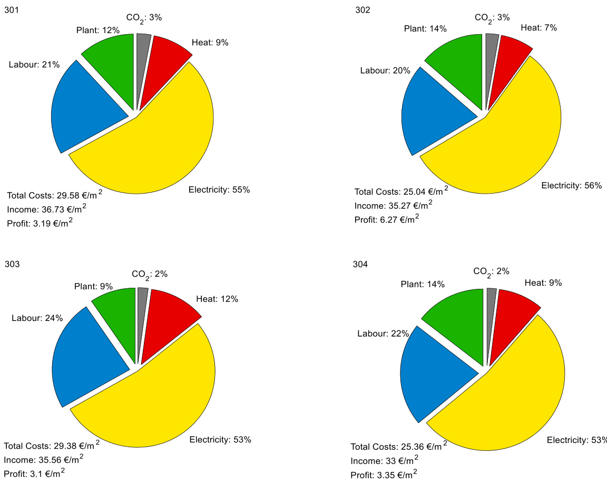

# Article Cherry Tomato Production in Intelligent Greenhouses—Sensors and AI for Control of Climate, Irrigation, Crop Yield, and Quality  

Silke Hemming $\ast \textcircled { \scriptsize { \parallel } }$ , Feije de Zwart, Anne Elings , Anna Petropoulou $\textcircled{1}$ and Isabella Righini $\textcircled{1}$  

Business Unit Greenhouse Horticulture, Wageningen University & Research (WUR),   
6708PB Wageningen, The Netherlands; feije.dezwart@wur.nl (F.d.Z.); anne.elings@wur.nl (A.E.); anna.petropoulou@wur.nl (A.P.); isabella.righini@wur.nl (I.R.)   
\* Correspondence: silke.hemming@wur.nl  

Received: 21 October 2020; Accepted: 6 November 2020; Published: 11 November 2020  

Abstract: Greenhouses and indoor farming systems play an important role in providing fresh and nutritious food for the growing global population. Farms are becoming larger and greenhouse growers need to make complex decisions to maximize production and minimize resource use while meeting market requirements. However, highly skilled labor is increasingly lacking in the greenhouse sector. Moreover, extreme events such as the COVID-19 pandemic, can make farms temporarily less accessible. This highlights the need for more autonomous and remote-control strategies for greenhouse production. This paper describes and analyzes the results of the second “Autonomous Greenhouse Challenge”. In this challenge, an experiment was conducted in six high-tech greenhouse compartments during a period of six months of cherry tomato growing. The primary goal of the greenhouse operation was to maximize net profit, by controlling the greenhouse climate and crop with AI techniques. Five international teams with backgrounds in AI and horticulture were challenged in a competition to operate their own compartment remotely. They developed intelligent algorithms and use sensor data to determine climate setpoints and crop management strategy. All AI supported teams outperformed a human-operated greenhouse that served as reference. From the results obtained by the teams and from the analysis of the different climate-crop strategies, it was possible to detect challenges and opportunities for the future implementation of remote-control systems in greenhouse production.  

Keywords: artificial intelligence; sensors; resource use efficiency; tomato yield; indoor farming; autonomous greenhouses; climate control; irrigation control; remote control; data driven growing  

# 1. Introduction  

Greenhouses and indoor farming systems play an important role in providing fresh food, such as fruits and vegetables being high in vitamins and minerals. Greenhouses combine high crop production per unit area with a high water use efficiency per unit of produce [1], but at the cost of high energy demand [2] and high investments. Greenhouse production is increasing in many countries worldwide [3] to provide fresh food, preferably produced locally [4]. However, educated and experienced labour is scarce. In many countries skilled labour to oversee all aspects of greenhouse crop production [5] is lacking. The current COVID-19 pandemic has shown that the availability of seasonal labor is critical for horticulture production [6]. The need of highly educated and experienced crop managers has increased, just like the need for more automation and remote control of greenhouses and other farming systems. As farms become larger, or temporarily less accessible, remote monitoring of climate, irrigation, and crop status becomes more important. More sensors and objective digital information become crucial for crop managers to take informed decisions to reach high crop yield with high quality. Due to climate change, natural resources such as water and (fossil-based) energy are becoming scarcer and improving the resource efficiency becomes urgent. A greenhouse grower needs to make many decisions to simultaneously maximize production and to minimize resources. Crop and greenhouse climate models and/or new intelligent algorithms can help the grower to oversee all information available and to support complex decisions to predict yields and resource use.  

Today’s high-tech greenhouses are equipped with different standard sensors for monitoring light, temperature, humidity, and $\mathrm { C O } _ { 2 }$ and for actively controlling different actuators (e.g., lighting, screening, heating, ventilation, cooling, $\mathrm { C O } _ { 2 }$ dosing, fogging, dehumidification, irrigation, and fertilizer dosing) in order to control all growth factors important for crop production at every moment. Today’s growers determine the climate, irrigation and crop management strategies based on experience and defines the setpoints for climate and irrigation control manually. Actuators then operate based on setpoints configured in a process computer, while sensors give feedback on measured data for the control loop. Additional sensors monitoring crop status are able to provide the grower with further information on photosynthesis rate [7], sap flow and hydraulic status [8] and leaf temperature [9] to be added to his manual decisions. Automated greenhouse climate control algorithms have already been developed in the past and are today widely introduced in modern high-tech greenhouses [10–22]; however, automated control on crop status are still in its infancy.  

Dynamic climate models have been developed [10,18,23–28] which act as a digital twin of the real greenhouse. An overview of today’s greenhouse climate models is given in a previous study [29]. Mechanistic models give the opportunity to be used for intelligent decision support on climate control actions. Simulations of past or future scenarios provide information on how a different climate control in the past could have improved crop production and which actions are required to reach a certain crop production goal in the future. These models can also be coupled with intelligent algorithms to automatically determine climate setpoints, an action that is currently performed manually by the grower. In order to control crop production by an automated algorithm, mechanistic greenhouse climate and crop models can be used and coupled with a real greenhouse, to send automatically determined setpoints via a process computer to control the different actuators. Such optimum control experiments have been conducted with tomato [30,31], sweet pepper [32,33] or pot plants [34] in the past.  

The crop has a central role in every greenhouse production system. Crop management decisions and actions are mostly taken by the greenhouse staff. Manual labor is still required for planting, crop training, leaf and fruit pruning, and fruit harvesting in greenhouses with high-wire vegetable production. While manual labor requirement is high, crop management decisions can be supported. Since experienced and well-trained crop managers are scarce, crop simulation models can play a role in decision making. An overview of greenhouse crop models and modelling approaches are given in other studies [35–43]. Crop models can be used as virtual representations of reality [44]. They can be used to simulate different growing conditions and crop management strategies and predict crop development and yield, and fruit quality. Crop models can help to understand the crop behavior under different growing conditions and can support the grower in making decisions.  

AI algorithms are widely used in horticultural research and have recently been implemented in practice. Main application fields are plant stress detection [45], fruit detection or counting [46], pest, disease, or weed detection [47–49], yield prediction or harvesting [50,51]. Different camera and spectroscopy systems in different spectral ranges are used for detection, different computer vision and machine learning algorithms are used for analysis. However, the use of AI for greenhouse crop production control is still limited [52–57]. Recently a benchmark experiment has been conducted to use artificial intelligent (AI) algorithms to optimize net profit of a cucumber crop in a greenhouse experiment during the first Autonomous Greenhouse Challenge in 2018. In that experiment the winning AI algorithm outperformed the human decisions of experienced growers [58]. Crop production (class A:  

commercially sellable fruits) was increased by $6 \%$ and net profit by $1 7 \%$ compared to the growers who acted as a reference.  

In the current paper the results of the second Autonomous Greenhouse Challenge conducted in six high-tech greenhouse compartments at Wageningen University & Research, Bleiswijk, in The Netherlands in 2020, was described. The challenge was designed to make further breakthroughs in fresh food production with fewer resources using AI algorithms for and automatic and remote control of a greenhouse crop production. While the first experiment [58] was simpler with only a 3–4 months control of cucumber production, this second experiment was more complex to prove the value of AI control over a longer six months period. A different crop had to be grown, cherry tomatoes require more complex control since it can be controlled not only on yield but also on product quality. While in the first experiment the crop was grown during a summer–autumn growing season, in this second experiment the crop was grown during winter–spring–summer. Other challenges were added such as no fixed product prices, but prices were dependent on fruit quality and fruit quality was dependent on nutrient control, nutrient control was an offtrade of yield (more income but lower prices) and product quality (high prices but lower yield). Comparable to the first experiment [58], five multi-disciplinary international teams automatically controlled their own greenhouse compartment remotely, a sixth team of local experienced human reference growers acted as manually controlled reference. The goal of the experiment was to maximize net profit by realizing high yield and product prices and minimize resource use and costs.  

The aim of this paper is to describe the results of the experiment in terms of net profit, yields and resource use, to analyze different climate and crop management strategies, to explain the results with the help of a digital twin model of a virtual greenhouse, and to detect possible improvements of automatic control for the future. The experiment provided a valuable public dataset which can be used for future AI training purposes and which can be found at Supplementary Materials: https://doi.org/10.4121/uuid:88d22c60-21b3-4ea8-90db-20249a5be2a7.  

# 2. Materials and Methods  

# 2.1. Greenhouse Compartments and Equipment  

The experiment described in this paper has been conducted in a high-tech greenhouse with six identical compartments at Wageningen University & Research, Bleiswijk, The Netherlands. Each compartment measured $9 6 ~ \mathrm { m } ^ { 2 }$ floor area and was equipped with technology comparable to commercial high-tech greenhouses (Figure 1). The set-up is comparable to our earlier experiment described in [58] however, differences in the lighting systems apply. The artificial lighting system consisted of 6 high-pressure-sodium (HPS) lamps (capacity of $1 0 0 \mu \mathrm { m o l } / \mathrm { m } ^ { 2 } / \mathrm { s } .$ ePapillon fixture of Lights Interaction Agro with a Philips Master GreenPower Plus 1000W EL light bulb, The Netherlands) and 8 multi-spectrum controllable LED lamps (capacity from 0 to $1 0 9 ~ { \mu \mathrm { m o l / m } } ^ { 2 } / \mathrm { s } ,$ from which $1 2 \mathrm { \mu m o l / m } ^ { 2 } / \mathrm { s }$ is far-red and therefore not counted as PAR, the other spectrum channels are max. blue $= 1 1$ , red $= 4 9$ , and white $= 3 7 \mathrm { \mu m o l / m } ^ { 2 } / \mathrm { s } ;$ Elixia, Heliospectra, Sweden). Power supply to the LED lamps was coupled to the power supply of the HPS, meaning that LED lamps could only be used additionally to the HPS-lamps. For control of natural light and energy saving two types of inside moveable screens (LUXOUS 1547 D FR energy screen and OBSCURA 9950 FR W light blocking screen, Ludvig Svensson, Sweden) were present. For temperature control a rail pipe heating system on the floor and a pipe heating system at crop height (peak capacity 180 and $3 0 \mathrm { W } / \mathrm { m } ^ { 2 } .$ , respectively) were installed, both controllable independently. Next to that, a continuous roof ventilation (ventilation area of $0 . 3 \mathrm { m } ^ { 2 }$ opening per $\mathbf { m } ^ { 2 }$ greenhouse), equipped with anti-thrips netting was available and a fogging system (maximum capacity of $3 3 0 \mathrm { g } / \mathrm { m } ^ { 2 } / \mathrm { h } )$ , and $\mathrm { C O } _ { 2 }$ supply (maximum capacity $1 5 \mathrm { g } / \mathrm { m } ^ { 2 } / \mathrm { h } \rangle$ ) were mounted. Plants were grown in rockwool cubes, placed on rockwool slabs (Grodan GT Master, Grodan, The Netherlands), located on elevated gutters. Irrigation water, premixed with nutrients was supplied with drippers, pressurized by an on/off controlled irrigation pump. The surplus of irrigation water (drain) was collected in the gutter and measured in terms of quantity, EC, and pH.  

  
Figure  1. GreGerneehnohuoseuse peexrpiemrienmtealntcaol mcopamrtpmaretnmtse,nt9s6, $9 6 ~ \mathrm { m } ^ { 2 }$ flaoroer a(7re6.a $( 7 6 . 8 ~ \mathrm { ~ m } ^ { 2 }$ crrowpi-nggroawriena)g paroeav)idperdovwiditehd dwififtehrednitfferqeunitpemqeunitp.m(ae)ntS. (ea)mSechofemcoemofpacrotmepnatr twmietnht cwroitph acnrodpeaqnudipemqeunitp:mreonoft: vreonotf lvaetinotinl,atiwoon,stcwreoenscs,reaerntisf, cairatlifilicgihalt l(ihgihgth(-hpirgeshs-upre-ssoudrieu-smod(iHuPmS)(,HLPESD),),LiErrDi)g,aitriroingastyisotne smy,stCeOm2, $\mathrm { C O } _ { 2 }$ lsyu,ptpwloy htewaotinhgeastyinstgesmys.t(ebm)sP. (cbt )urPei cotfuoreneofc o nmepcaortmpeanrt mwietnht twhiethyotuhengyochuenrgrychtoermryatto cmraotpoacfrtoerp tahfteetrtahnesptrlantspwliatnht ewqiutihpemqeuinpt amnedntseansdosres.nsPorirns.ciPprlienocifptlheosfeth-ueps eta-rulipereadrleisecridbesdcriinbe[5d8i].n [58].  

# 2.2. Greenhouse Control  

Five international teams (Automatoes, AiCU, DIGILOG, IUA.CAAS, The Automators) controlled their own greenhouse compartment (described here as compartment 306, 302, 305, 304, 301, respectively) 3r0e1m, orteslpyecbtaisveldy)ornetmhoetire yowbansealdgornitthmeisr. wAnsiaxltghorgitrheemnsh.oAu seixctohmgrpeaernthmoeunste(3co03m)pwarats menatn(u3a0l3l)y controlled by Dutch growers and served as a reference. Competing teams used their own control oalwgnorcitohntmrsoltoaldgeotreirthminsettohedectliermaiteneanthdeircrligmatitoenacnodnitrroilgsaetitopnoicnotsn. rSoeltpseotipnotsinttesa.mSestcpouilndtsctoenatrmosl were comparable to our earlier experiment described in [58]: artificial lighting HPS and LED (on/off; $0 \%$ or $1 0 0 \%$ ) and if on, the lighting intensity of the four LED spectrum channels (blue, red, far-red, rwedh,itfea)r $( 0 { - } 1 0 0 \% )$ )i,te)ne(r0g–1y0s0cr%e)e,nenpeorsgityiosncr $( 0 { - } 1 0 0 \% )$ )t,ibolnac(k0–o1u0t0sc%r)e,ebnlapcoksoituitosnc $( 0 { - } 1 0 0 \% )$ i,timoini(0m–u10m0r%a)i,l pmiipneimteumprearialtupriep ${ \mathrm { ( } } ^ { \circ } { \mathrm { C } } { \mathrm { ) , } }$ , pmeirnaitumruem(°Ccr),opmipniipmeutemcpreorpatpuirpe ${ \mathrm { ( } } ^ { \circ } \mathrm { C } ) .$ ,pemriantiumreu(m°Cv),enmtilnaitimounmo pvenitnilga $( \% )$ , ovpeenntilnatgi(o%n)t,evmenpteilratiuornet ${ } ^ { ( ^ { \circ } C ) }$ ,ehrautumriedi(t°yC)d,ehfiucimtisdeitypodienfti $( \mathrm { g } / \mathrm { m } ^ { 3 } )$ ,o $\mathrm { C O } _ { 2 }$ gc/omn3)c,eCntOratcionc(epntprmat)i,oan(dpptim),e abnetdwteiemnesubbetsewqeueennts iurbrisgeaqtuioenttuirrnisga(tmioin). uSretnpso(inmtisn)w.eSretspeonitntvsiawaedriegistealnitntveiraf aced(iLgietaslGirnotwe.rcfaocme The Netherlands) to a process computer (IISI, Hoogendoorn, The Netherlands), which then operated the ewqhuiicphmtheentnaocpceoradtiendg ltyh(eFiegquriep2m).enAt nacuctroirednitnsgollyut(iFoinguwraes2p).reApanruetdribeyntascoelnutriaolnfewrtaisg aptiroenpacroemdpbuyt ear and sent to a daily storage tank per compartment before being provided to the crop with drippers. Based on GroSense sensor data (Grodan, The Netherlands) obtained in the rockwool slabs, and detailed rcohcekmwicoaol aslnablsy,siasnodf tdheetadilreadinchweatmeirc,aplraonvaildyesdiseovfetrhyefodrtaniinghwt,atehre, tperaomvisdceoduledvesreyn fdoretqniugehst,sthoectheanmgse ctohuelcdosmenpdosrietiqoune,stEsCt,oacnhdanpgHe tohfet hceomnuptorsiietinotns,oEluCt,ioan.dDpiHffeorfetnhtesennustroiresnitnstolhuetigorne.enDihfofeursentcoslelnesctoersd data on climate and irrigation automatically (see Section 2.3) and returned them to the teams via the tphreomcetsos cthoemtpeuatmers avniadthe pdriogicteaslsicnotemrfpauctee(rRaenpdretshentdaitgiiotnalali nSteartfeacTera(nRsefepreAsepnptlaitciaotinoanl  SPtraotgerTarmanmsifnerg IAnpteprlifcaacteioRnESPTroAgPraI).mSmtainffgi nItnhterfgarcee nRhEoSusTe cAoPllI)e.ctSetdafdfatian otnhecrogprepeanrhaomuseteercsolmleacnteuda lldyatan doen tceroepd these observations on a tablet (see Section 2.4). This information was sent via the digital interface as well. Based on these observations the teams generated crop management settings that were passed saeltstoinbgys thaetdwigeirtealpianstserdfacles.oObyntahewdeiegkitlaylbinatseirsf,atche.sOenseattiwnegesklwyebraesitsr,atnhselsaetesdettioncgrsowpemreatnragneslmatendt instructions for the humans in the greenhouse.  

  
Fiigurre 2.2. Shcehmeemoe odfatdaaetxacehxacnhgaenfgroemfrtohme tehaemtse anmds ahneidr tAhIeiarlgAoIr tahlgmo rviitahamdivgiai a idnitgeirtfalcien(teRrEfSacTe A(RPIE)StTowAaPrId)st tohweaprrdosctehses cporomcpesustecroamnpdutthergarnedenthoeugsreeacnthuoautosresacntudadtoatras farnodmdsaetnasforosmvisaetnhseosrasmviea wthaeysabamcek,wadyatbaacekx,cdhatnagexcbheatnwgeenbetewaemens taenadmswaonrdkewrosrkoenrscoronpc rohpanhdalindgli,nag,nadndmemaesausruerdedccrrop parrametterrs. Pririnciciplleeoffttheesseet-t-up earrlilierrdessccrriibed iin [[58].]  

Theccoomppeteitninggtetaeamsmsdedvevloelpoepdehdyhbyribdr isdy styesmtesmasndacnodmcboimnebdinexdperxtpeorlt cpieoslicwiietshwcoitnhtrcolnatnrdol parned cptrievdeicatligvoeriatlhgmorsitthomssutpopsorutptphoeritr tghreoirwignrogwsitrnagtesgtrieast.egDiievs. sDeivaelrgsoeriatlhgmorsitwhemrse ewxeprleoerexdploarned apnpdl eadp,pvliaerdy,invgafrryoinmgcfornodmi conadl,itriuolne-abl,asreuldea-lbgaosreitdhamlgs,otroitdhamtas,etnoabdlaetdaperneadbiclteidvepcroendtirctoilv(eDceoePntCr)o,l l(oDnegePshC)o,rtl-otnergmshomret-mteorrmy mnetmworyksne(tLwSoTrMks) (LbSidTirMe)c, iboindiarlecLtiSoTnMal, LrSeiTnMfo,rrceinmfeonrtcelmeaernt lnega,rnaindg, iamnitdaitimointalteiaornlienagr.ning.  

# 2.3. Sensors  

IIn  each grreeenhoousesecocmopmaprtarmtemnetnstasntdaanrdasredn soernsscorsnticnounotiunsluyoumselaysumredasduartead. Sdtatnad.arSdtasnednasrords were comparable to our earlier experiment described in [58] and can be divided into:  

1. SSeennssorosrsmoonintiotorirninggooutstisideeweeatatheerrpaarraameetteerrs:s :ccuumulualtaitviveeooutstisideegglolobbala lrraadiaiatitioon ( $\scriptstyle ( { \mathrm { J } } / \cos ^ { 2 } / { \mathrm { d } } )$ outustisdidee phhototsoysyntnhtehteitciaclallylyacatcitvieve aradidaitaitoionnPPAR $( \mu \mathrm { m o l } / \mathrm { m } ^ { 2 } / \mathrm { s } )$ ,aiarir teempeerrataturere outstisidee ${ \mathrm { ( } } ^ { \circ } { \mathrm { C } } { \mathrm { ) } } .$ , outustisdideererlealtaitviveehumi iditityy( $( \% )$ ,aand wiind sspeeed ( $\mathrm { ( m / s ) }$ );   
2. Outustisdidee weeatahtherer forreeccaastst parrameetteerrs:s: outustisdiedeglgolobbalalrraadiaitaitoionn forreeccaastst $( \mathrm { W } / \mathrm { m } ^ { 2 } )$ , outtsisidee aiirr etempereartaturreefoforreeccaastst( ${ \mathrm { ( } } ^ { \circ } { \mathrm { C } } { \mathrm { ) } }$ ,ooutustisdideererlealtaitviveehhumididitityyfoforereccaastst( $( \% )$ ,aannddwininddssppeeeddfofroercecaasts t( $\mathrm { ( m / s ) }$ ;   
3. SSeennssoorsrsmoonititoriring i insisideeclcilimaatteepaarrametterrssand eequiipmenttssttattus:  alamp ststaattuss((on//offff))offbotth ilgighthitninggsyssytsetems s( (HPPSSaannddLLEED) )aannddini tnetennsistiytyofo fttheeffourrcchaannelesls off LEDlilightitingg( $( 0 { - } 1 0 0 \% )$ , ennererggyyaannddblbalacckk--oouttsscrcreeen posistiition ( $( \% )$ ,airirtteemperratturre iinssiide ( ${ \mathrm { ( } } ^ { \circ } { \mathrm { C } } { \mathrm { ) } } .$ ,heeaatiting piipeetteemperratturre $( ^ { \circ } \mathrm { C } )$ ,hheeataitninggpoowererusseedd( $( \mathrm { W } / \mathrm { m } ^ { 2 } )$ ofrorbbotoht heeataitninggssyystsetems,s,aiariraabssollutteehumiiditity iinssiidee( $( \mathrm { g } / \mathrm { m } ^ { 3 } )$ , $\mathrm { C O } _ { 2 }$ odsoasgaeg e( $( \mathrm { { k g / h a / h } } )$ ;   
4. SSeennsosrosrs moonintiotroirningg feertritgigataitoionn paarraameteetersrs and equiipmentt sttattus:: riririgaatitionssupplly amountt ( $( \mathrm { L } / \mathrm { m } ^ { 2 } )$ ,rdarianinamamouonutn(tl $( \mathrm { L } / \mathrm { m } ^ { 2 } )$ ,radirnaiEnCE(Cd $\scriptstyle ( \mathrm { d } S / \mathrm { m } )$ ,nadn d rdariani np $\mathrm { \ p H \left( - \right) }$ , CE iCninslsalbab(d $\scriptstyle ( \mathrm { d } \mathsf { S } / \mathbf { m } )$ ,p $\mathrm { \ p H }$ ninslsalabb( $( - )$ , annddt etemppereartaturerei innslsalabb( ${ } ^ { ( \circ } \mathrm { C } )$ .  

Botth ssettpoiinttssfforrcconttrrolloffeequiipmeenttaand meeaassurreed daattaaweerre eexxcchaanggeed ata taa5-5-mini-ni-nitnetrervvala.l. IIn  addition, tthefoflollolowiwnign gdadilayi ldyatdaatwa swcalscuclaltceudlaftreodmftrhoem tehaesurmeedasduatrae:dindsiatdae: PiAnsRidseumP $( \mathrm { m o l } / \mathrm { m } ^ { 2 } )$ , (hmeoalt/inmg2),enheragtiynugsedn $( \mathrm { k } W \mathrm { h } / \mathrm { m } ^ { 2 } )$ , (ekleWcthri/cmit2y),uesledct $( \mathrm { k } W \mathrm { h } / \mathrm { m } ^ { 2 } )$ ,d $\mathrm { C O } _ { 2 }$ dho/sma2g),e $( \mathrm { k g } / \mathrm { m } ^ { 2 } )$ ,sawgaete(rkgc/omns2)u,mwpattieorn $( \mathrm { L } / \mathrm { m } ^ { 2 } )$ .pMtieoans(ul/rem2).enMtseasnudr ecamlceunltastaionndscawlecruelasteinotnsbawcekrteostehnet tbeacmk stovtihaeatedaigmitsalvian taerdfiagcitea(lFiingtuerfea2c)e.  

rTea2)m. s could install additional sensors at the start of the experiment. They chose different types of seTnesaorms, csouuclhdaisnsatdaldlitaidondiatlioansaplirsaetnesdormseatstuhresmtaernttobfotxhesefxopreirnidmoeonrt teThmepyecrahtousre,dihffuemreindtitty paensd ${ \mathrm { C O } } _ { 2 } ,$ ,nisnordso,osruPchARasmaedtdeirtsi,ocnraolpatsepmirpateeradtumre,aspuyreamnoenmtetbeorxs,e s lfaobr  iwnedigohotr stenmsporesr,ataudrdei,tihounamlisdiutbystarnatde water content, EC and temperature sensors, stem diameter, sap flow meters, crop weight, infrared leaf thermometer, plant temperature camera’s, RGB camera’s, and thermal imaging camera’s (pictures only, video streaming was not allowed). Data from additional sensors was received by teams at different time intervals depending on the parameters and devices and acquired via the specific supplier companies’ interfaces and/or arranged by teams via separate interface.  

# 2.4. Crop  

The experiment was conducted with an indetermined type of cherry tomato crop. Seedlings cv. “Axiany” (Axia Seeds, The Netherlands) were sown on 19 October 2019, grafted on Maxifort rootstock, planted in rockwool cubes and were transplanted to the greenhouse compartments on 16 December 2019. Teams took over remote control on 20 December 2019. The crop was grown in a high-wire growing system. Initial plant density and stem density were determined by the teams in advance and varied between 2.6 and 4.0 stems $/ \mathrm { m } ^ { 2 }$ , all teams opted for a 2-stem young plant. The reference started with $4 . 0 \mathrm { s t e m s } / \mathrm { m } ^ { 2 }$ . Changes in stem density during the cropping period were different for the teams in time. The first harvest was on 13 February 2020, and the last harvest was for all teams set to 29 May 2020. Based on this last harvest date, the date of topping (removal of head of the crop) had to be chosen by the teams and differed from 16 to 30 April 2020. The crop in the reference compartment was topped on 16 April 2020.  

Teams sent weekly instructions with regards to stem density, and fruit and leaf pruning in the top of the canopy to the greenhouse staff. Stem density over time ranged from 2.6 to 8.0 stems $/ \mathbf { m } ^ { 2 }$ . Fruit pruning strategies led to a different maximum plant load of 500 to 800 fruits $/ \mathrm { m } ^ { 2 }$ . Crop parameters such as stem elongation (cm per week), stem thickness (mm), fruit growth period (d), and truss formation rate (#truss/week) were manually measured per week on 10 sample plants. The stem thickness refers to the thickness of the stem just below the highest flowering cluster near the plant top. The fruit growth period refers to the time between the day that the first fruits on the cluster clearly start to grow and the day of harvest of the cluster. Plant load $( \# \mathrm { f r u i t s } / \mathrm { m } ^ { 2 } ,$ ) was estimated from stem density, numbers of new and harvested trusses, and number of fruits per new truss, and was weekly shared with the teams. Harvest was performed per truss, approximately five times every two weeks. Harvest data on number of harvested trusses $( \# / \mathbf { m } ^ { 2 } )$ and fresh fruit weight $( \mathrm { k g } / \mathrm { m } ^ { 2 } )$ of class $\mathbf { A } ,$ were obtained manually by the greenhouse staff. Additionally, fruit quality analyses were carried out in the laboratory. Based on laboratory measurements of total soluble solids (TSS, ◦Brix), titratable acid (Acid, mmol $_ \mathrm { H _ { 3 } O + / 1 0 0 g }$ ), $\%$ juice pressed from the fruit wall of the tomato $( \% \mathrm { J u i c e } , \% )$ , breaking force of the fruit wall, as an indicator of the perceived firmness during chewing (Bite, N) and average fruit weight (Weight, g), the fruit flavor ( $0 =$ dislike, $1 0 0 =$ like) were calculated with the WUR Flavor Tomato Model version 2.1 (update 2011) [59]. Results were shared with teams every second week.  

# 2.5. Resource Use Efficiency  

Resource use efficiency was calculated based on measured data: energy use efficiency for heat $( \mathrm { M J / k g }$ tomato) and electricity $( \mathrm { k } W \mathrm { h / k g }$ tomato), $\mathrm { C O } _ { 2 }$ use efficiency $( \mathrm { k g } \mathsf { C O } _ { 2 }$ dosage/kg tomato), water use efficiency (L supplied/kg tomato), fertilizer use efficiency (g fertilizer/kg tomato). Fertilizer use efficiency was estimated based on the average supply EC and using the rough relation that 1 EC corresponds to $1 \mathrm { k g }$ of dissolved salts per $\mathbf { m } ^ { 3 }$ of water.  

# 2.6. Economics  

Net profit was calculated based on income minus costs. The income was determined from the $\mathrm { k g }$ tomato fruits harvested $\mathbf { \boldsymbol { x } }$ price per $\mathbf { k g }$ fruits and fruit quality. The price depended on fruit quality, namely its Brix value, and on the season (Figure A1). The costs were based on the operational costs related to resources used by the teams during the experiment. Initial costs for the young plants (costs of a young plant $\mathbf { \boldsymbol { x } }$ number of young plants placed in the compartment) were € 2.00 for a 1-stem plant. and € 2.20 for a 2-stem plant. Resource use of electricity, heating, ${ \mathrm { C O } } _ { 2 }$ , water, nutrients, and labor were measured during the experiment per greenhouse compartment and multiplied with the given price: electricity on-peak price $( 0 7 { : } 0 0 { - } 2 3 { : } 0 0 \mathrm { h } )$ € 0.08 per kWh and off-peak price $( 2 3 { : } 0 0 { - } 7 { : } 0 0 \mathrm { { h } } ) \in 0 . 0 4 \mathrm { { p e r \ k W h ; } }$ heating price $\notin 0 . 0 3$ per kWh; $\mathrm { C O } _ { 2 }$ price € 0.08 per $\mathrm { k g }$ up to $1 2 \mathrm { k g } / \mathrm { m } ^ { 2 }$ and € 0.20 per kg above; labor for crop maintenance $\notin 0 . 0 0 8 5$ per stem per $\mathbf { m } ^ { 2 }$ per day. Other greenhouse equipment used, was identical, and therefore capital costs were not considered in the calculation of the net profit. All economical parameters were communicated to the teams prior to the start of the challenge and had therefore no uncertainty.  

# 2.7. Performance Analysis  

Teams operated the different greenhouse compartments using their own AI algorithms. The outcome were different management strategies for climate, irrigation, and crop, affecting crop yields, product qualities and resource use efficiencies, and thus income, costs, and net profit.  

In a performance analysis the realized results of the real greenhouse crop production in different compartments were compared with a greenhouse climate and crop simulation model, a virtual greenhouse crop production (digital twin). With the availability of this digital twin of the real greenhouse, a detailed analysis can be performed to better understand the roles of different growth factors such as light, temperature, $\mathrm { C O } _ { 2 }$ etc.  

The virtual greenhouse crop production model consisted of a combination of a dynamic greenhouse climate model KASPRO [24] and a tomato crop model INTKAM [43]. The combined model assumes adequate supply of water and nutrients and ignores the presence and effects of pests and diseases. The KASPRO model computes the greenhouse climate as a function of the realized outside weather conditions in our experiment and the realized greenhouse climate control settings in our greenhouse with the real parameters of construction and equipment. The model processes these control settings by a control algorithm comparable to the ones used in the real greenhouses. The climate model output consists of various climate parameters, such as light intensity, temperature, $\mathrm { C O } _ { 2 }$ concentration and air humidity. This output is then used as input for the tomato crop model INTKAM [43], which computes daily gross photosynthesis from the sum of hourly photosynthesis rates. The hourly photosynthesis rates are the outcome of a dynamic crop architecture (leaf area index and plant load) under the dynamic climate conditions. Crop photosynthesis minus crop dissimilation results in the amount of carbohydrates produced. The daily amount of carbohydrates is then partitioned over the growing organs (roots, stems, leaves, fruits) according to their relative potential growth rates. Dry matter fraction and fresh organ weights are calculated in a next step. In a last step, the harvest moment of individual fruits is determined on its physiological fruit age [60], tomato yield results. The net profit is computed as described above.  

The digital twin was used to calculate the tomato crop yield of each compartment, while using the real greenhouse construction, the real equipment, the real weather conditions and the realized climate and crop management strategies in the individual compartment as inputs. The calculated output was the predicted fresh yield $( \mathrm { k g } / \mathrm { m } ^ { 2 } )$ . The crop model was appropriately calibrated. With this calibrated digital twin of the greenhouse, the effects of changes in light, air temperature and $\mathrm { C O } _ { 2 }$ control strategies on fresh production were investigated for each compartment of the experiment. The influence of light availability was investigated by increasing or decreasing the number of lighting hours by max $3 \mathrm { h }$ per day, not changing the applied light intensity. $\mathrm { C O } _ { 2 }$ dosing capacity was varied from 50 to $2 0 0 \mathrm { k g / h a / h } ,$ while simultaneously changing the setpoint of $\mathrm { C O } _ { 2 }$ concentration from $- 1 0 0$ to $+ 5 0$ ppm compared to the applied strategy. Temperature setpoints were changed by $^ { - 2 }$ to $2 ^ { \circ } C ,$ compared to the applied strategy. Effects on net profit were investigated.  

# 3. Results  

# 3.1. Climate Strategies  

During the experiment, teams applied different climate strategies in their greenhouse compartments. Figure 3 shows the realized average temperature during the growing period for each compartment. Figure 4 shows the heating used. While some compartments showed a relatively sSteansbolres t2e02m0,p2e0r,axture regime throughout the season (301, 303, and 304), others showed higher tempera8tuofr e2s9 during the first weeks, then a moderate level and a large increase at the end (305 and 306), probably to tatococaeaclcecerelaletereradttevdelevovepellomopepnmtenantrtleyaarirlnlytihinettsheheaesoeanasaondafnandsdtfefanstftereuniftfrruiuipitterniipnegniaintngtghaetttethnhedeeoenfndtdhoeffsttehaessosenea.asoWonh..i lWeWh3hi0ill5e a30n05d5a3n0d6d3a30p6paeapaprpeedarteodattopopalpypptllhyethsheaesmsaemceocncoconencpcete,ptt,e,ttmepmeprpeaertrauatrtueursresosfof3f03505wewerererellolowererttthaan tthosse of 306.. Despiitte  tthe  hiigh ttemperatture regiimes applliied iin 306  tthe  tteam  reached  hiigher  heat  use  effffiffiiciiency ((Taabllee22).). Thiisswassachiieved by alllowiing a hiigh humiidiitty and lliimiittventtiillattiion wherre posssiiblle ((datta nottshown)). The refference growers ((303))applliied rellattiivelly hiigh ttemperattures tthroughoutttthe seaso n,,, whiich allso resultltted iin ttheehiigheststtheatitiing use ((Fiiigurere 4;4;;Tabablblele 2)2.)).  

  
Fiigurre 3. Weeklly averrage ttemperratturre ${ } ^ { ( ^ { \circ } C ) }$ )iin tthe siix grreenhouse comparrttmenttss((301–306).).  

  
Fiigurre 4. Heatitiing enerergrgy ususasagagege((M(MJM)JJ)i)niintnhtteheseisxsi ixgxrgegrereneehnohuosueusceocmopmaprptarmrttemnmtesn(tts3s0((13–0310–63)30.06D)).a tDasttamasosmomtohoeotdthebedy abymaovmionvgianvgearvaegreafigletefirltoefr3ofda3yds.a  

Figure 5 shows the total daily integral of photosynthetically active radiation (PAR) during the growing period for difffferent compartments.. The daily PAR integral consists of the amount of natural light entering the greenhouse and the amount of artiffiicial light (HPS and LED) added in the light control  sttrrattegy.y.FiFgiguruere6 s6hsohwoswtshet hdeaildyaiPlyARPiAntRegirnatlefgroalmfarrotimficairatlilfigcihatlinligohtnilny;g3o0n5lhy;ad3t0h5ehaidghtehset ahritgihfiecsitalalritgifhitcinalgliugshatgiengwuitsha $4 8 \%$ iotfht4h8e%tootfalthPeAtRotliaglhPtAcaRmliegfhrtocmamtheeflraomptsh;ealnadm3p0s4; and 3024 haand l3o0w2 ehraadrltiofiwciearlalirgtihfitciinagl luisgahgtienwg iuths $4 1 \%$ oitfhth4e1 t%otoafltPhAeRtoltiaglhPtAcaRmliegfhrtocma tmhe flraomptsh. eAlratimfipcis.alAlirgtihfitciinagl luisgahgtienigs ruesflaegcetiesdrienflelcetcetdriicniteyleccotnriscuitmypctoinosnu(mTapbtlieon2)(. Tahbelete2a).mThweitheathmewbietsht tsthreatbegstys(t3r0a6t)egayn (d3t0h6e) raenfdertehneceregfreorewnecresg(r3o03w)ehrsad(3a0n3)ahvaerdaagne satvreartaegey satrnadtetghyu,saenledctrhiucist yelceoctnrsicuitmypctions.  

  
FiFigigurrere5.5.WeWeWkeleyklalyv eraavgerataogtealtdotatialy dpdahaioltyospyhnhtohtoeotsiycnanltlhyetatictaialvlleyr adcitaitvieonr(aPdAiaRti)iolingh(tPiAnAtRe)g rlailg $\mathrm { ( m o l / m } ^ { 2 } / \mathrm { d } )$ ((n(amtoulr/aml 2s/ud)n) l(ingahttuaranaldsaurntnilifigchihatlalingdhatairntigfi)iciinalt lhlieg hgtrienegn)hionutshecgoremeepnahrtomusentcso(m30p1a–rt3t0m6e).n  

  
Fiigurre6.6. Daily PAR lliight iinttegral $\mathrm { ( m o l / m } ^ { 2 } / \mathrm { d } )$ ) of arttiifificiial lliighttiing onlly iin diiffffeerreent grreeenhousse ccompaaratrtmeentntsts( (3(30011–-306)).)  Data  smoothed by a moviing average fifililtlter off 3 days..  

Figure 7 shows the $\mathrm { C O } _ { 2 }$ concentration inside the greenhouse compartments during the light period. Values vary between 600 and $9 0 0 \mathrm { p p m }$ for most of the season, lowering to $4 0 0 { \mathrm { - } } 6 0 0 { \mathrm { p p m } }$ at the end of the season. Figure 8 shows the $\mathrm { C O } _ { 2 }$ dosage. Compartment 301 and 302 maintained high $\mathrm { C O } _ { 2 }$ levels throughout the season; 301 achieved that with very high $\mathrm { C O } _ { 2 }$ dosage (Figure 8); 302 realized the same levels with lower dosage, both with comparable $\mathrm { C O } _ { 2 }$ use efficiencies (Table 2); and 305 achieved much lower $\mathrm { C O } _ { 2 }$ levels (Figure 7), however, resulting in comparable $\mathrm { C O } _ { 2 }$ use efficiencies (Table 2) due to lower production (Figure 16). The reference growers (303) started with relatively low $\mathrm { C O } _ { 2 }$ concentration and dosage but increased it at the end of the growing cycle (Figures 7 and 8). Compartment 304 had the opposite strategy resulting in the best $\mathrm { C O } _ { 2 }$ use efficiency (Table 2) since they maintaFingeurdeh6i.ghD $\mathrm { C O } _ { 2 }$ PlAevRelisgdhturiinteg rwalin(tmerol/wmit2/hdl)oowf varetinftiicliatli loinghltoisnsgesonalnydi lnodwifefre $\mathrm { C O } _ { 2 }$ glreveenlhsodusuer ing summceor,mwpahritcmhelintmsi(t3s0t1h-3e0v6)e.nDtialtatisomnolotshseeds.b  

  
FiFgiugruer e7 .7.Weekelkylya vaevreargaeg $\mathrm { C O } _ { 2 }$ 2cocnocnecnetnrtartaitoionn( p(ppm) )dduruirninggththeelilgighthtpepreiroioddinindidffifefrernetntgrgerenehnohuosues cocompapratrmtmenetnst(s3(0310–13–0360)6.  

  
FiFgiugruere8 8.DaDialiyl $\mathrm { C O } _ { 2 }$ 2ddosoasgaeg $( \mathrm { g } / \mathrm { m } ^ { 2 } )$ 2)inindidffifefrernetntgrgerenehnohuosuesecocompapratrmtmenetnst(s3(0310–13–0360)6. .DaDtat asmsmootohtehde rbsyb2y0a2a0m,mo2v0o,ivnxign gavaevreargaegefilftiletrerofo3f 3dadyasy.  

# 3..2. IIrriigattiion Sttrattegiies and FruiittQualliitty  

The amounttoffiirriigatiion water  provided  in  the difffffferent  compartmentts diifffffered substtanttiiallly.. Thiis was caused by diiffffferrenttirirrriigatitiion ssupplly ssttrrattegiies ((Fiigure 9)), rresullttiing iin diiffffferrenttdrraiinage ((Fiigurre 10),),,and by diifffffeerreenttaartrtitiififficiciciiaal liliightitiing  aand  veentitilillatitiion cconttrroll((datta  nottsshown).). Draiin watter wasscapttureredttoto beberrere-e-u-ususeseded,d,c,rcroropop wawtaettreruruputpattkaekiesiilselslesestshttahnatnhtethaemaomuonutunontftowffawtweartteserurspsupulpipepldlii.edTd..hTeThahemaomumonotuonftt iorofrfiigirartiigoanttiiowonantewrasttuerprpsluiuepdplvliieaerdi evdvarbriietdw ebentt $5 3 3 \mathrm { L } / \mathrm { m } ^ { 2 }$ flloiitrtecr/o/m22pfaforortrmceonmtmp3pa0ar2rttmom $8 3 2 \mathrm { L } / \mathrm { m } ^ { 2 }$ ofo8r3c2ollimitteperar//rtm22effonotr 3c0o4m.mpAafrtrtetmrmeseuntbtt3r0a4c4.t.iAnffgtteterhsesucbottlrlraeacttieindgattnhedecrcoeol-lulescetteded arananidnrewe--autsesere,dtdhdreraciirnowpwawtteaertr,e,trthuepctraokpewattse $3 3 4 { \mathrm { L } } / { \mathrm { m } } ^ { 2 }$ wfwoars c3o34m4lpliitaterertr//me22nftfo3r0c2coamnmpdp $5 3 7 \mathrm { L } / \mathrm { m } ^ { 2 }$ 30f02o2racnodm5p3a7rtlliimttern//tm3220f4fo.orTchoemapvpaeartatmgmenuntsta3g0e4..wTahse $4 5 0 \mathrm { L } / \mathrm { m } ^ { 2 }$ utushsaeagte awmasw4i4t5h0 tllihitterb//ems2t2,,stthrheaetetegaym(3w0wi6itt)huttshed $4 3 0 \mathrm { L } / \mathrm { m } ^ { 2 }$ .e  

  
Fiigurre 9.9. Weeklly averrage offttheedaiaililly aamoounttofoffiirirririgigatatitioionnwatateterer $( \mathrm { L } / \mathrm { m } ^ { 2 } )$ provided  iin tthe diiffffferrentt grreen house comparrttmenttss((301–306).).  

  
Figure 10.. Weeklly averragee off the draiin percenttages $( \% )$ applied in the difffferent greenhouse compartments (301–306).  

Figure 11 shows the EC of the drain water from the different compartments during the growing season. The EC of the drain water is in general assumed to reflect the EC in the root zone. Teams were quite stable in EC, but a peak can be noted in compartment 305 in the middle of the growing period. Probably there was a short period where the control algorithm was not paying enough attention to the EC-control. In general, it is assumed that a high EC value induces high Brix and flavor ratings [61]. However, although compartment 305 showed a notably higher Brix value about four weeks after the hSiegnshorEs 2C0-2v0,al20u,exs in the drain of compartment 305 (Figure 17), aggregated data in Figure 12 show11tohfa2t9 sSuecnshoras 2r0e2l0a,t2i0o,nx was not observed in the experiment. Still, the positive correlation between Brix11aonfd2 flSaenvsorsw20a2s0,o2b0,sxerved (Figure 13). Differences in Brix led to differences in prices, as shown in Figur1e1 oAf12.9  

  
Fiigurree11.1. EC $\scriptstyle ( \mathrm { d } \mathsf { S } / \mathbf { m } )$ )iin drraaiin waatteerriintthee grreeenhoousseeccoompaartrtmeentsts(3(30011––33006)6.)  

  
Fgirgeuerneh1o2.usCeocroremlaptiaortnmbetntwse(e3n0t1o–t3al0s6)o.luble solids (TSS, $^ \circ \mathrm { B r i x } \dot { }$ ) and EC $\mathrm { ( d S / m ) }$ of the different greenhouse compartments (301–306).  

  
Figure 13. Correlation between TSS of tomato fruits $( ^ { \mathrm { o } } )$ and fruit flavor ( $0 =$ dislike, $1 0 0 =$ like)) of the different greenhouse compartments (301–306).  

# 3S.e3n. oCrsr2o0p20S,t2r0a,txegies and Production  

Figure 14 shows the initial stem densities of the different teams varying from 2.6 to 4.0 stems per $\mathrm { m } ^ { 2 }$ .thAe leonwd i(nFitgiaulrsete16m).density reduced the costs for plant starting material. During the growing period stem Fdiegnusriteie1s4waenrde iTnacbrlea1sesdhoupwttoh $4 . 5 \substack { - 5 . 8 }$ sntetompspinerg $\mathbf { m } ^ { 2 }$ ,tebsyoaflldoifwfienregnsthtoeoatms st,ovdaervyeilnogpftro sme cAopnrdilar1y7 sttoe3m0s..AIn etharelyentod phinasgedoaftetheenscurorepscayllclre,mjuasitnibnegfofreuitosptopirnipg,etnhuenrteilfetrhenecnedgrofo twhersgr(o30w3i)ngdopuebriloed; stem density to 8.0 stems per $\mathbf { m } ^ { 2 }$ . The purpose was to enable the development of two additional fruit clusters per stem. However, since labor costs were related to stems per $\mathbf { m } ^ { 2 }$ , this action resulted in the haibglheetsot lriapbeonr cfoulslty( Fbiegfuore tAh5e) eand (a30r1edauncdti3o0n4i,nFingeut rpero15fi)t.(IFnigsupriteeAo4f)t,hwehvilaer ibaotiosntiingtporpopdiuncgtidoant east, tphleaentnldo(aFdigwuares z1e6)r.o  

  
Fiigure 14. Sttem densiitty ((# sttems $/ \mathrm { m } ^ { 2 }$ )  and  ttoppiing  dates $\left( - \mathbf { O } - \right)$ )iin diifffferrenttgrreenhousse ccomparrttmentts ((301–306))..  

Figure 14 and Table 1 show the chosen topping dates of different teams, varying from April 17 to 30. An early topping date ensures all remaining fruits to ripen until the end of the growing period; a too early topping date would leave no fruits to harvest towards the end (which was not the case in this experiment); a too late topping date would cause the crop to invest in new fruits without being able to ripen fully before the end (301 and 304, Figure 15). In spite of the variation in topping dates, plant load was zero at the end of the challenge, except for 301 and 304.  

Table 1. Final number of trusses (#/stem) and number of fruits $( \# / \mathrm { s t e m } , \# / \mathrm { m } ^ { 2 } )$ , average air temperature and topping dates in different greenhouse compartments (301–306), planting date 16 December 2019.   

<html><body><table><tr><td>Greenhouse Compartment</td><td>Number of Trutem)</td><td>Average Temperature</td><td>Number of Fruits (#/stem)</td><td>Number of Fruits (#/m²)</td><td>Topping Dates</td></tr><tr><td>301</td><td>23.8</td><td>21.34</td><td>332</td><td>1577</td><td>30 April 2020</td></tr><tr><td>302</td><td>22.0</td><td>22.04</td><td>292</td><td>1165</td><td>16 April 2020</td></tr><tr><td>303</td><td>23.2</td><td>22.70</td><td>302</td><td>1323</td><td>17 April 2020</td></tr><tr><td>304</td><td>21.7</td><td>21.37</td><td>325</td><td>1373</td><td>23 April 2020</td></tr><tr><td>305</td><td>22.0</td><td>21.40</td><td>351</td><td>1340</td><td>24 April 2020</td></tr><tr><td>306</td><td>22.6</td><td>23.25</td><td>315</td><td>1459</td><td>21 April 2020</td></tr></table></body></html>  

  
hFiFegifguirunerae1l15n.5.uPlmlanbntetlrloaoafdf(f(rfruruiuitists $/ \mathrm { m } ^ { 2 } .$ 2))viiensdtdieifffdfer(reTenanttbglgrere1en)n.hoCououssemecpcoaomrmtpmaaretrtnmtmee3nt0st1s((3a30n01d1––3064)6 )rremealailzinzetedadibnbyeydiitfffhefrerentn nttetlaeoamamsdsdfduorurirnimnggtohtstheeoxfexptpehreirimsmeanestnaotlanlp(epFreiroigodud(r1(e6116D5D)e.ceecTemhmbeeblreor2w021e09r19uplnuatnintlitl2l92o9MaMdayaoy2f023202)40. )  

aTanabalbevle1r1.asgFhieonapwlsannurtemleboevaradonftw rfitruhsusiatesnd(i#en/vsctereleomap)seamntedonwtuaprmadbrseartmhofetfreurnistd.s (hT#/ohsteweefimv,ne#ar/l,mtn2h)u,eiamrvbeperlaragnoetfalitoratueds,msefprseurpiateurrsetem idgehpt,efnradunsidtotdonrpytphimnegadtdteavtrefslroianpctdimiofefnen,rtaernatdtgear,elewcnlhiiocmuhasteiescfotaemctmpoaprsetr(maFetinugtrsuer 3ed0se13p–,3e50n,6d)a,enpndlta7n[)t3is6ne]g,edamanetded1t6hoeDhepacve. re2i0ob1ed9e.bnetween epdlaentnionug ahndtot orpepaicnhg. hTehehfiignhalesntutmotbaelr pofrotrduscsteisonpetrhsrtoeumg hvoaruitedthbetsweeaseonn21(.F7i(g3u0r4e) a1n6)d. 2A3.8 (301). rTahbelet epalmaGnrtweiletonhahtdohuesstbereatste gstyratweagsy 3m0a6inatcahiinevde dbayntahveereafgerenucme bgeroowfetrsu,ssaelsoNpleuermasbdteienrmgo(ft2o2 6a).ThoiNpguphimnbger of ctirounss(eFsigCpueormespt1ae6r)mt,mhenonuwtmebver odfufertuoitaslspoerhtirguhssr,esaonudrscte umsed(eTnasibtlye t2o)gaentdhelrabdoertFercruoimsttsisn(#ne/etmth2pe)rtoftiatlDwnautsemsber of (fFriugiutsrepeAr5 $\mathbf { m } ^ { 2 }$ . Ultimately, 301 also had the highest number of fruits $\mathrm { m } ^ { - 2 }$ formed, whereas 302 had the iglourwe1st6nsuhomwb3s0e1rthoef fcrumitsu $\mathrm { m } ^ { - 2 }$ e2f3oa.r8nmdetdo.taTl hfre tseha2p1m.r3o4wdiuthctitohne bofe sttos3mt3ra2attoefgryui3t0s6clha1as5sd77aAcihniedvieffde rt2eh0ne2t0second rhtimgehnetst nHuimghbesrt opfrforduiutcstipoenr $\mathbf { m } ^ { 2 }$ (rTeabclhee1d),bpyartthley setxrpaltaeignye idnb3y0t6h, ebryel3a0ti1vaelnydhtihgehrsetfe rm1e6ndAcepnrsiilty of r5s (8350s3t)e.mOs $\mathbf { m } ^ { - 2 }$ 0f6rowmasthaeblentdoorfeaMcahrcthisonhiwgahrdpsr(oFdiugcutrieon14a)l.soNuwimtbhear lofwfrureitso,utorcge tuhser (wTiat2bh0l2te0he fruit s,waeihgihgth, lneeatdpsrtofitto(taTlahblaerv3e).stPerdofdruecsthiowneriagnhgte(Fdifgruorme 162)..  

  
1F6i.gCuruem1u6l.atCivuemaunladtitvoteaalnpdrotdotuacltipornodofuctliaosns oAf tcolamssatAo ftroumitast(okfgr/umit2s) $( \mathrm { k g } / \mathrm { m } ^ { 2 } )$ rien tdigffrereenhtogurseenhouse tcmoemnptsar(t3m01e–n3ts06()3.01–306).  

Figure 15 shows the plant load in different compartments during the experimental period. Plant load is determined by development rate, number of fruits per truss, number of fruits harvested (Table 1) and stem density (Figure 14) once the crop entered the generative state. It is associated with the dry matter partitioning towards fruits (sink of carbohydrates) from the leaves (source of carbohydrates), and therefore an appropriate parameter for monitoring source-sink balance and balance between vegetative (leaves) and generative (fruits) growth. As the plant load shows the number of concurrently growing fruits at each moment in time, its integral divided by the ripening time gives the final number of fruits harvested (Table 1). Compartment 301 and 304 maintained the highest plant load for most of the season (Figure 15). The lower plant load of 304 at the end resulted in a relatively decrease of production at the end (Figure 16). The most profitable strategy (306) maintained an average plant load with an increase towards the end; however, their plant load, fruit dry weight, fruit dry matter fraction, and all climate factors (Figure 3, Figure 5, and Figure 7) seemed to have been balanced enough to reach the highest total production throughout the season (Figure 16). A comparable plant load strategy was maintained by the reference growers, also leading to a high production (Figure 16), however due to also high resource use (Table 2) and labor costs net profit was lower (Figure A5).  

Table 2. Resource use efficiency (unit resource used per $\mathbf { k g }$ tomato produced) for different teams and their crop in different greenhouse compartments during the experimental period, heat $( \mathrm { M J / k g } )$ , electricity $( \mathrm { k W h / k g } )$ , $\mathrm { C O } _ { 2 } \left( \mathrm { k g / k g } \right) .$ , water $\mathrm { ( L / k g ) }$ , and nutrients $( \mathrm { g / k g } )$ .   

<html><body><table><tr><td>CGrmenhoment</td><td>Heat (MJ/kg)</td><td>Elewhicigy</td><td>CO2 (kg/kg)</td><td>Water (L/kg)</td><td>Nutrients (g/kg)</td></tr><tr><td>306</td><td>12.9</td><td>18.7</td><td>0.63</td><td>25.0</td><td>83.0</td></tr><tr><td>302</td><td>18.5</td><td>17.6</td><td>0.74</td><td>25.2</td><td>81.0</td></tr><tr><td>301</td><td>25.3</td><td>19.9</td><td>0.87</td><td>25.9</td><td>78.0</td></tr><tr><td>304</td><td>25.9</td><td>17.7</td><td>0.56</td><td>26.9</td><td>90.0</td></tr><tr><td>305</td><td>12.8</td><td>24.0</td><td>0.72</td><td>27.9</td><td>100.0</td></tr><tr><td>303</td><td>33.0</td><td>19.0</td><td>0.60</td><td>27.4</td><td>99.0</td></tr></table></body></html>  

Figure 16 shows the cumulative and total fresh production of tomato fruits class A in different compartments. Highest production was reached by the strategy in 306, by 301 and the reference growers (303). Only 306 was able to reach this high production also with a low resource use (Table 2); thus, a high net profit (Table 3). Production ranged from 12.9 to $1 4 . 4 \mathrm { k g } / \mathrm { m } ^ { 2 }$ .  

Table 3. Total costs, total income, and net profit $( \epsilon / \mathrm { m } ^ { 2 } )$ for different teams and greenhouse compartments (301–306) during the experimental period (16 December 2019 until 29 May 2020).   

<html><body><table><tr><td>Greenhouse Compartment</td><td>Total Costs (€/m²)</td><td>Total Income (€/m²)</td><td>Net Profit (€/m²)</td></tr><tr><td>306</td><td>26.07</td><td>37.22</td><td>6.86</td></tr><tr><td>302</td><td>25.04</td><td>35.27</td><td>6.27</td></tr><tr><td>305</td><td>28.64</td><td>35.09</td><td>3.59</td></tr><tr><td>304</td><td>25.36</td><td>33.00</td><td>3.35</td></tr><tr><td>301</td><td>29.58</td><td>36.73</td><td>3.19</td></tr><tr><td>303</td><td>29.38</td><td>35.56</td><td>3.10</td></tr></table></body></html>  

Figures 17 and 18 show tomato fruit quality over time in different compartments in terms of Brix and flavor, respectively; 305 reached highest Brix and flavor values, and thus highest prices (Figure A2), and the reference growers mostly reached low Brix and flavor values, thus relatively low prices (Figure A2). The best strategy 306 and the second best in ranking 302 reached average Brix, flavor and prices. However, both were able to have high quality at the beginning of the growing period, when prices were highest (Figure A1, Figure 17).  

  
Fiigurre 17. Briix offttomattoffruiitts $( ^ { \mathrm { o } } )$ in  diffffferentt greenhouse comparrttmentts((301–306).)  

  
Fiigurre 18. Flavor of tomato fruiitts( $0 =$ dislike, $1 0 0 =$ like) based on calculations  with  WUR  Flavor Tomatto Modell verrssiion 2..1((2011),),ffrruititssffrrom diifffefreerentn tggrereennhhoouuseseccoompparatrtmeentnsts(3(0310–13–0360)6.)  

# 3.4. Resource Use Efficiency  

Table 2 summarizes the resource use efficiency of all teams and compartments, a result of resources used for climate and irrigation control (Sections 3.1 and 3.2) and realized crop production (Section 3.3). Reference growers (303) ranked lowest in resource use efficiency with a high usage of heating, water, and nutrients, but average usage of electricity and ${ \mathrm { C O } } _ { 2 }$ ; although, they realized a high production (Figure 16). Team 305 realized the best heating use efficiency and the l2owest electricity use efficiency. Team 304 was opposite, which indicates that heating and lighting are partly interchangeable, as lamps do not only provide light, but additional heat loads. The team with the best strategy (306) managed not only to achieve the highest profit, but also a low consumption of resources. In heat, $\mathrm { C O } _ { 2 }$ and fertilizer among the lowest and for electricity an average resource efficiency.  

# 3e.f5f. cEiceoncoy.mic Result  

Thaeblnee2t pRreosofituricsefuosremefofiscti eonfctyh(eungirtorewseorusrtceheusmedospteirmkgptortmanttoperrofdourcmeda)nfcoer idnifdfeirceanttotr.eaTmhsisanmdeans that otnhe rs hcoroupldinaidmiffeorrenat hgirgehenphroudseuctoiomnparntdmepnrtosducrtinpgritches,exwpheirliememnitnailmpiezrinodg rheesaotu(rcMeJ/uksg)e, and costs ealsesctorciiciatye(dk.WTha/bklge),3CsOh2o(kwkgs/kagn),dwoavterv(li/ekgw) oafnrdeanluitzrieiedntso(tga/lkign).come, total costs, and net profit in different compartments.  

Total income consists of the amount of fruit harvest, frui2t quality and product prices. Product prices per $\mathrm { k g }$ tomato were assumed to vary with fruit quality (Brix) during the growing period, reflecting market reality (Figure A1). Since fruit quality varied for different compartments during the growing season (Figur3e01 7), produc2t5p.3r ices varie1d9 9as well (F0i.g8u7re A2).25T.9ogether 7w8.i0th the realized fruit harvest (Figure 16) thi3s04was leading25t.o9 the reali1z7e.d7 income 0(.F5i6gure A236, 9Table 3).90.H0ighest income was realized by the strateg3y05in 306 $( 3 7 . 2 \ell / \mathrm { m } ^ { 2 } )$ .  

Total costs (Table303) consists o3f3.t0he amoun1t9.o0f resourc0e.6u0se (Ta2b7l.e42) and 9c9o.s0ts of the resources (see Section 2.7). Lowest costs were realized by the second in ranking team, 302 $( 3 3 . 0 \ell / \mathrm { m } ^ { 2 } )$ , while the best strategy has average costs $( 2 6 . 0 7 \notin / \mathrm { m } ^ { 2 } )$ ) and the reference growers were high in costs $( 2 9 . 3 8 \notin / \mathrm { m } ^ { 2 } )$ , especially very in high energy and labor costs (Figure A5).  

The ranking in net profit is shown in Table 3. The team with the best strategy realized highest net profit with highest income and average costs, while the reference growers realized the lowest in net profit with average income, but high costs. The net profit development is shown in Figure $\mathbf { A } 4 ,$ income development in Figure A3, while more detailed information on cost components is given in Figure A5. Net profit ranged from 3.10 to $6 . 8 6 \notin / \mathrm { m } ^ { 2 }$ . All AI operated greenhouses were able to reach higher net profits than the reference.  

# 3.6. Performance Analysis  

The availability of the well validated greenhouse climate and crop models KASPRO-INTKAM; thus, the availability of a digital twin of the greenhouse tomato production, allowed the use of the models for a quantitative performance analysis. After automated distillation of important climate strategies (temperature, ${ \mathrm { C O } } _ { 2 } ,$ , and lighting) from the existing realized data, simulation results of important climate parameters, such as temperature (Figure A6), $\mathrm { C O } _ { 2 }$ (Figure A7) and light (Figure A8) were compared with realized climate parameters. Data shows that simulated and realized results are comparable. After appropriate calibration of the crop model, simulated fresh weight of harvest (Figure A9) was compared to realized crop production. Data shows that the simulated and realized results are comparable during the largest part of the harvest period. However, Figure A9 shows that the final boost in the last two weeks after topping was not captured. Further improvements on the model would be needed for a closer match in these last weeks by refinements on the dry matter partitioning between generative and vegetative parts and the gradual increase of the ripening speed after removal of the plant apex. A more in-depth analysis of the performance during this period was not conducted.  

After this model validation, a performance analysis was carried out, analyzing the effects of changes in control strategies on fresh production and net profit for each compartment of the experiment. As crop growth is predominantly affected by the availability of light and $\mathrm { C O } _ { 2 }$ and the greenhouse has to be at a favorable temperature to allow a proper growth and development of the crop, a sensitivity analysis was carried out on changes in these three major parameters. Data shown on net profit only.  

Figure 19 shows the simulated effect of variations in $\mathrm { C O } _ { 2 }$ -supply on net profit with respect to the strategy as applied by the different teams. Each team has controlled the $\mathrm { C O } _ { 2 }$ -conentration in a different way resulting in a range of $\mathrm { C O } _ { 2 }$ dosing from $7 . 2 \mathrm { k g } / \mathrm { m } ^ { 2 }$ for compartment 303 to $1 1 . 7 \mathrm { k g } / \mathrm { m } ^ { 2 }$ for compartment 301. The sensitivity was evaluated by changing the $\mathrm { C O } _ { 2 }$ setpoint by $- 1 0 0$ to $+ 5 0 \mathrm { p p m } ,$ while also changing the dosing capacity from 50 to $2 0 0 \mathrm { k g / h a / h }$ . This resulted in a changed $\mathrm { C O } _ { 2 }$ supply $( \mathbf { k g } )$ . The lowest $\mathrm { C O } _ { 2 }$ setpoints, reduced the production for some teams substantially, up to $0 . 7 2 \mathrm { k g } / \mathrm { m } ^ { 2 } .$ , representing a value of $\mathrm { \ t { 1 . 8 0 } } \mathrm { p e r } \mathrm { m } ^ { 2 }$ for team 301. At a $\mathrm { C O } _ { 2 }$ price of $\epsilon 0 . 0 8 \mathrm { p e r } \mathrm { k g }$ it is clear that the reduction of income is far more than the savings on $\mathrm { C O } _ { 2 }$ , so reduction of $\mathrm { C O } _ { 2 }$ -dosing is not beneficial for profitability. When increasing $\mathrm { C O } _ { 2 }$ dosing, there is some benefit to gain, but the benefit is small for most teams, which show that the teams were operating at quite an optimal strategy.  

Figure 20 shows the effect of variations in temperature on net profit with respect to the strategy as applied by the different teams. Temperature was varied by $^ { - 2 }$ to $2 ^ { \circ } C ,$ compared to the applied strategy. This analysis shows that a decrease may save some on heating, but the lowered production leads to a decreased net profit. Increase of the temperature was simulated to be profitable although the increment in profit was again small. It can therefore be concluded that according to the simulation model, with changes in temperature potential gains were small.  

Finally, Figure 21 shows the effect of variations in artificial lighting on net profit with respect to the strategy as applied by the different teams. The influence of light availability was investigated by increasing or decreasing the number of lighting hours by max $^ { 3 \mathrm { h } }$ per day, not changing the applied light intensity. An increase of lighting will result in higher electricity costs, higher production, and a little less cost for heating. A decrease of the number of lighting hours will generally do the opposite. It can be observed that the response of net profit on the application of light is much stronger than the rebsepnoenfsiceiaolf  fcohrapnrgoefsitianb $\mathrm { C O } _ { 2 }$ dWoshiengiancrdetaesimnpgerCaOtu2rde.osiMnogr,etohverre, itshesoremsepobensnefsiteetomgsation,bebuqtutithelbineenaerf,i exiscespmtaflolrftoeramo3st03teanmdst,ewa hmic3h05s,hwo hwicthatltrehaedteyampspliwedreaolopteroaftliingghtaitnqguiintethaenroeapltitmy.  

  
FiFgiugruere1 91. .CChahnagnegeinins ismimulualtaetdednentetprporfiotf $( \epsilon / \mathbf { m } ^ { 2 } )$ )fofrorvavrayriynign $\mathrm { C O } _ { 2 }$ 2suspuplpyl $( \mathrm { k g } / \mathrm { m } ^ { 2 } )$ )fofrorthtehedidffifefrernetn greenhouse compartments (301–3–06).  

  
FiFgiugruer2e0.20.ChCahnagnegienisni 2smiumlautleatdednenteptroprfiot $( \epsilon / \mathbf { m } ^ { 2 } )$ f2)orfovrarvyairnygintgemtepmerpaetruarteursehisfthsi $^ { - 2 }$ −t2o $+ 2 \ ^ { \circ } { \mathsf { C } }$ Cononthteh applied heating temperature strategy for the different greenhouse compartments (301–306).  

  
Fiigure 21. Change in siimullatted nett profifit $( \epsilon / \mathrm { m } 2 )$ )fforr varryi inggtthee daialiylylilgighthitningghhoourusr $^ { - 3 }$ 3tto $+ 3 \mathrm { h }$ on top offtthe realliizediilllumiinattiion sttrrattegyfforrtthe diiffffeerreentt grreeenhoousseeccoompaartrtmeenntsts( 3(30011––33006)6.)  

ThTehsetrstornognegffeffcetcotfolfiglihgthotnonenteptrporfiotfitnitnhtehpeeprfeorfromramnacnecaenanlyalsyisirserqeuqirueirseas saosmoemwehwahtadtedepepr ananlyalsiys. sB.eBceacuasuesoef tohfethlaerlgaerignecirneacrseaosfethoef tahmeoaumntooufntaotfurnaltsuranlisguhntltiogwhtatrodswsaurdmsmseurm(Fmigeurr(eFi5g) uarned thaenrdedthuectrioednuocftipornodofucptrpordicuecst tporiwcaersdtsoswuarmdms esru(mFimguere(FAig1)u,rteheAr1e),vtehneureovfeandudeitoifoandaldiatritoinfiacli alrltigfihcti calnigbhet ecxapnecbtede txopedcitffedr tdourdiinffgetrhed ugrionwginthgesegarsowni(n1g6  sDeeacseomnb(e1r620D1e9c etom2b9erM2a0y1290t2o0)2.9ToManyal2y0z2e0t).heT effaencatloyfzaert ihfieceifaflelcitghotf ianrtifimciea, ltlhieghetffiencttiomf te,wtoheadefdfieticotnoaflthwourasdodfitaiortniafilcihaol luirgshotifnagrtpifeircidalalyi,gfhotrineagcph wedeaky,dfuorrinegatchewgreoewk indgursienagsotnh,ewghriolewimnaginsteaisnoin,g twhheiillelumaiinattaiioninfogrtthe  iolltuhemrinwaeteioksnufno-rcthaengoetdh.e Thweerekssulutno-nchnaentgperdo.fitTtherroeusgulhtoount tnhet gprofwitinthgrsoeuagsohnouist tsheogwrnoiwninFig sueraes2o2n.  

  
Figure 22. Change in simulated net profit $( \epsilon / \mathrm { m } ^ { 2 } )$ for additional $+ 2$ illumination hours for each individual week while maintaining the remaining illumination strategy unchanged for the different greenhouse compartments (301–306).  

Figure 22 shows that the additional $2 \mathrm { h }$ of artificial lighting during 1 week, thus 14 additional hours per week, resulted in an increase of net profit of around $0 . 1 \ : \mathrm { \in / m } ^ { 2 }$ when applied around the tenth week after planting (planting 16 December 2019, thus in February and March) and in a strong drop towards the end of the growing period. The small effect at the end of the growing period can be expected, based on the increase of natural light and the decrease in product prices. However, the simulation also shows that in the first weeks after planting, adding additional artificial lighting leads to a decrease in net profit. The crop then is still small and only few fruits act as a sink for carbohydrates. Control of artificial light could be based on crop source-sink balance throughout the season, of which plant load (Figure 15) could be a measure. The data in Figure 22 shows possibilities of intelligent control on crop-based parameters.  

To explore the potential of an optimized lighting strategy, an algorithm was implemented that changed the amount of lighting hours per week per compartment (301–306) until the computed net profit showed a maximum for the particular compartment. An increase in net profit of $3 . 6 \notin / \mathrm { m } ^ { 2 }$ for team 302 was simulated, which was the team with the lowest application of artificial light. An increase in net profit of $1 . 4 \ : \mathrm { \in } / \mathrm { m } ^ { 2 }$ was simulated for the team with the best strategy 306 with the highest realized net profit, if they would have applied a little less artificial light in the beginning of the growing season and somewhat more at the end. Figure 23 shows the daily amount of light as applied in reality in the lighting strategy of the team with the best strategy 306 versus the simulated optimized amount of light leading to optimized net profit. For simplification reasons, interactions with other growth factors, such as temperature or ${ \mathrm { C O } } _ { 2 } ,$ were not investigated. The methodology for performance analysis shown here could be applied for analyzing more details in the future.  

  
Fiigurre232.3.DaDilayilaymaomuontuonft  liogfhlt $\mathrm { ( m o l / m } ^ { 2 } / \mathrm { d } )$ ma2s/da)ppalsieadpipnlrieadliitny (rbelauleitliyn(e)blauned ltihne)si amnudlatehde  ospitmimuliazted aomptoiumnitzoefdliagmhto(urnetdolfinlieg)hltea(rdeidnglitnoe)olpetaidmiinzgedtonoetptpirmoifizteidnnceotmpproafrittminencto3m0p6.  

# 4. Discussion  

# 4.1. Cropping Strategy  

Profitable tomato production implies the production of the maximum number of fruits of a certain quality while using a rational amount of resources. The product quality is determined by the size (tcoerotsaimnalqlufarluiittys hwahvileaulsoiwngerapraitcieo)nanldaBmroixu(nftruoiftsrewsiotuhrchiegs.hTerheBrpixrohdauvcetaqhuiaglihteyripsrdicet,erdempiennedibnyg tohne season). With the choices in cultivation, growers aim on realizing a certain fruit size. As fruit size is ndegpaetinvdeilnygcornresleatseodnt).o tWhiethntuhmebcehr oicfefsrui intsc(uplteirvastieomn, pgreor $\mathbf { m } ^ { 2 ^ { \cdot } }$ )s, raeiamchoingretahleiztianrgeatcferrutiatisnizfreumitesainzse. thAastftrhueitgsriozwe eirs hnaesgtaotivmealynacgoerrtehleatneudmtobetrheofnfruumitbseprrofdfurcueitds. (Tpher nstuemb, epreorf fmru),itrseiascdhietnegr tmhienetadrgbeyt tfhreuintusimzbeermeofa tnrsutshsaets tphergsrteomw,etr heansutombmearnoafgferutihtes pneurmtrbuesrsoafnfdrutihtse sptreomdudcends.itTy.heI nourmdebretr ofo bfrtauitns tihsedeetesirrme idnteodtablyntuhme bneurmofbferuoiftst,rtuhsesensupmerbestreomf ,frtuhietsnpuemrbsetermofifsrtuoitas cperttariunsesxatenndttihnetesrtcehmandgenasbitley. wInitohrsdtermtodoebntsaiitny. hHeodweesivrerd,  tgoi tvaeln tuhme fbaecrtotfhfartuitns,t thihsecnhualmlebnergeo ft fhreufirtsuiptesrwsteremhisatroveascterdt aindesxtoelnd pienrtecrlcuhsatenrg,etahbelemwaixtihmsutem nduemnbsietry.ofHforuwietsvepr,ergiclvuesntetrheis caoctnstthratininedt. sThcihsalwleansgdeotnhe  ifnruoirtsdewr etroe limit the difference in maturity of the consecutive fruits within a cluster [60]. It limits the number of frduointse ion oartdreurstsotloimiatxtihmeadlif1f6erfeonrcseininglem,atnudrit2y0 offorthseplciot ntrsuescsuetsi.veRferaulitzsedwidtahtian oanclcursotperp[e6r0f]o.rItmlianmcites (tFhigeunruesm1b4e–r1o6f; fTraubitlse o1)nsahtoruwstshtaot smoamxiemtaela1m6sforptseindgfloer, anladr2g0e fnourmspbleitrtorfufsrsueist.sRaenadlizaeldowdaetranounmcbreorp of stems per $\mathbf { m } ^ { 2 }$ , which saved on labor, where other teams applied a higher stem density and a lower nlouwmebrernoufmfrbueitrsopferstcelumstepr,erwhmic,hwprhoicmhotseadvedveonlylraibpoern,ewd hcleurseteortsh.eIrt cteoaulmdsbaepcpolniecldudaehditghaetrthstesem adrenismitpyoartnadntaploarwaemrenteurms fboer ofptfirmuitzsatpieorn.clAusutteor,mwatheidchrepcrordmiontgedo fervelenlvyanritpcernoepddcaltuasitse rns.eeItdecoduilnd the future to allow automated optimization.  

It was assumed that fertigation would have an effect on fruit quality, and therewith on profitability. Whereas it is often assumed that the EC in the root zone has a positive effect on the Brix value of the tomato fruits [61], for this cherry tomato variety a good correlation could not be found. Figure 12 shows the correlation of measured Brix and average EC in the drain value during the 35 days prior to the harvest, which, for ease of computation, was considered as the fruit growth period. Combining all data, there was no effect of the EC in the drain on the Brix, which was on average 8.7. Similarly, there was no effect of the EC in the drain on the fruit dry matter content, which was in average $9 . 0 \%$ (data not shown). A parallel peak in EC and Brix values was observed halfway the harvest period for 305 but this was not a trend as other compartments also showed periods with a notably higher EC that did not result in an increased Brix. It could be concluded that the data and available knowledge on the used cherry tomato variety do not allow for automated optimization yet.  

In the performance analysis, simulations with the virtual greenhouse, and crop model were carried out to analyze the effect of different growth factors on crop production and net profit. Cumulative fresh production of cherry tomato could be well parameterized and simulated, apart from the under-estimated production at the end of the growing cycle that was observed for all compartments. The dry matter partitioning in the INTKAM model is based on the potential growth rates of organs, and apparently, these rates are not adequately described for a tomato plant that has been topped.  

Simulations with the virtual greenhouse and crop model demonstrated that net profit of the crop production was not very sensitive to $\mathrm { C O } _ { 2 }$ dosing strategy. However, when the $\mathrm { C O } _ { 2 }$ dosing was strongly reduced a clear reduction in production and net profit could be observed. In general, increasing $\mathrm { C O } _ { 2 }$ dosing compared to the levels already applied by the teams hardly increased net profit. High levels of $\mathrm { C O } _ { 2 }$ dosage during summer did not result in high air $\mathrm { C O } _ { 2 }$ concentration, and therefore not in increased production, because window opening led to loss of the supplemented $\mathrm { C O } _ { 2 }$ . In winter, when windows are closed, $\mathrm { C O } _ { 2 }$ dosage does in general lead to elevated air $\mathrm { C O } _ { 2 }$ concentration and production increase. The limitations then are set by the crop that knows limits to the amount of $\mathrm { C O } _ { 2 }$ it can absorb and convert into carbohydrates. However, teams seem to have used high enough $\mathrm { C O } _ { 2 }$ concentrations (Figure 19). It could be concluded that at increased dosing capacities and $\mathrm { C O } _ { 2 }$ setpoints, the additional revenue of the crop hardly exceeded the additional costs for $\mathrm { C O } _ { 2 }$ beyond the realized $\mathrm { C O } _ { 2 }$ strategies applied in the experiment. However, the control of $\mathrm { C O } _ { 2 }$ clearly offers possibilities for autonomous control to optimize $\mathrm { C O } _ { 2 }$ dosage in relation to ventilation management (costs) versus $\mathrm { C O } _ { 2 }$ concentration and crop production (income).  

Simulations with the virtual greenhouse and crop model were also carried out to study the effect of temperature on crop production and net profit. The effect of temperature on crop growth and development has a number of aspects and is therefore complex. With regards to photosynthesis, the effect temperature is small within moderate ranges $( 1 8 - 2 4 ~ ^ { \circ } C )$ [62], which implies that gross carbohydrate production will not change much. Temperature has a much stronger effect on maintenance respiration [63], so, increased temperature leads to reduced carbohydrate availability for growth. There is also an effect on the number of trusses developed. This is assumed to be linear [36], which was confirmed in the current experiment. Within the temperature ranges applied in this project, the truss formation rate varied from 1.1 cluster per week at $1 9 ^ { \circ } \mathrm { C }$ diurnal average temperature to 1.47 cluster per week at $2 4 ^ { \circ } C$ diurnal average temperature (data not shown). If other growth factors stay the same, this would lead to more, but smaller fruits. Since smaller fruits might reduce the product price, a good grower balances temperature ( $\mathbf { \bar { \rho } } = \mathbf { \rho }$ number of trusses formed), number of fruits per truss and number of stems per $\mathbf { m } ^ { 2 }$ in such a way that the maximum number of fruits with a satisfying fruit weight is produced. Stem density is a strategic decision that can be changed only sporadically during the growing season, number of fruits per truss can be modified weekly, and temperature can be controlled at any moment; although, the response of the tomato crop in terms of production is based on the temperature management over at least several days or one week. It could be concluded that the temperature strategy offers clear opportunities for autonomous control. Since temperature management influences the number of trusses formed through truss formation rate and fruit ripening time over time, camera systems could automatically detect these parameters. The other two parameters, number of fruits per truss and the number of stems per $\mathbf { m } ^ { 2 }$ , can be optimized by, e.g., sensors or model estimates of the photosynthetic capacity of the crop.  

Simulations with the virtual greenhouse and crop model were also carried out to study the effect of lighting strategies on crop production and net profit. There is a strong difference between the instantaneous effect and the integrated daily effect of light on crop photosynthesis. As long as light is the limiting factor, its increase will cause a higher photosynthesis rate. However, even if instantaneous photosynthesis has reached on optimum, the integrated daily value will change if the light period is lengthened. This is the reason why more light caused more simulated growth and production (Figure 21). However, the response is not the same during the entire growing season. It is assumed that juvenile plants are sink limited in their growth, meaning that there are more carbohydrates produced than the small plants can process, which has also been incorporated in the crop simulation model. Increase of light in this phase only adds to costs, not to extra growth. There follows a transition phase during which growth changes from sink to source limited growth. An adult crop knows a source limited growth, and extra artificial lighting during this phase was proved to be financially profitable.  

However, as the amount of solar light increase and the value of the crop decreases towards the end of the growing period, the profitability of extra artificial lighting drops. It was shown that an algorithm optimizing the application of artificial light on its economic viability encourages artificial lighting in winter and early spring but discourages the use in summer. It could be concluded that the lighting strategy offers clear opportunities for automated optimization on source-sink balance of the crop.  

# 4.2. Sensors, Algorithms, and Control  

Greenhouses are highly non-linear, complex, multi-input and multi-output (MIMO) systems [64]. The underlying production processes present differences in response times of the variables involved. Greenhouse climate and crop photosynthesis respond rapidly to changes in control and external inputs, whereas crop growth and production respond comparatively slow to changes in control [17]. Whereas greenhouse climate information is available with many datapoints, crop related information is sparsely available. However, the performance of machine learning algorithms (e.g. deep learning, neural networks), highly depends on the diversity and size of training data [65].  

Prior to the start of the greenhouse crop experiment, teams could explore, build, and train algorithms using a virtual greenhouse environment emulated by the available climate-crop models [24,43]. The use of synthetic training datasets has been shown to be very useful in earlier applications, when real-world data are not quantitatively and qualitatively sufficient for training purposes [51,66]. In the real growing experiment, contextually relevant data was collected via standard sensors, next to that data was collected by teams with additional sensors of their preference (see Section 2.3) to improve and increase the efficiency and robustness of their algorithms. During this exploration phase prior to the start of the experiment, teams should have accounted for such a systems’ architecture that would not be hampered by the data availability during the transition from the virtual to actual growing environment. In other words, teams that selected model-based control using the available models, should have trained their algorithms with parameters/data that they would be able to monitor in the greenhouse experiment.  

Additional sensors of the teams varied from low-cost tailor made, to novel sensors for climate and crop monitoring. Natural and mechanical ventilated climate sensors for temperature, humidity, and $\mathrm { C O } _ { 2 }$ as well as NIR and PAR sensors were placed by teams on different heights, to monitor climate homogeneity. Spatial mapping of the parameters supported algorithms of the teams on climate control decisions (ventilation, $\mathrm { C O } _ { 2 }$ dosage, lighting strategy) and crop management (stem density, fruit pruning). The digital images of optical low- and high- resolution camera systems RGB, and thermal cameras allowed teams to remotely and visually inspect crop growth and well-being, monitor the number and ripening of the fruits as well as the temperature of the leaves at different crop heights. Wide-view cameras enabled the control of operations of actuators (e.g. lamps on/off, screen opening). Some teams labelled the collected imagery datasets based on expert knowledge and used them for phenotyping certain crop traits. In literature, several authors focused on spatial mapping of climate or digital image data for greenhouse growing crops [67–72]. Here are still many opportunities for automated computer vision analysis and automated control in the future. Mechanical sensors collected direct feedback from sampled plants. Weighing gutters and crop load cells allowed real-time monitoring of the crop and plant weight. Such data were potentially used by the teams in finding correlations between crop and plant weight changes under different climate, irrigation and crop management decisions that could support their algorithms. Furthermore sap-flow and stem diameter sensors on fixed positions allowed automated monitoring of fluid transport and stem diameter. The information was used by some teams for defining their heating temperature and irrigation strategies as previous research [73] reported associations of leaf temperature, stem and sap flow measurements with the water status of the plant and drought stress.  

Each team followed a different approach for determining their strategies and controls of the greenhouse climate and crop. However, the majority decided to breakdown the system into longand short-term decisions and controls. The decision-making scheme of team 306 consisted of three managerial levels: strategic, tactical, and operational. The strategic level aimed at defining their crop strategy (e.g., decisions on number of stems, leaf pruning, and temperature-light ratio). It received historical data, expert knowledge, digital images and crop registration data as input. Tactical decisions defined their climate strategy and generated $2 4 \mathrm { - h }$ baseline setpoints based on weather forecast, outputs of the strategic level, and indoor climate measurements. The operational level received data on the short term anticipated outdoor conditions, 24-h setpoints from tactical level and climate measurements, to generate climate control setpoints. To find an optimal greenhouse climate control the team explored model predictive control (MPC) and non-linear model predictive control (NMPC) framework to address the non-linear dynamics. Computation of their optimal control policies was conducted using data-enabled predictive control (DeePC). Using weather forecast and historic data and real time feedback their single optimization framework determined a non-parametric model representing the dynamics of the system, estimated the states and optimized the systems trajectories for a defined horizon [74]. For irrigation, the team applied an irrigation control algorithm that related total solar radiation and the gradient water content (WC) in the slab after the last irrigation [74]. Control of temperature and humidity through ventilation was managed with direct control of the windows position instead of relying on ventilation temperature and P-band usually applied by the climate computer. Finally, historical data, crop parameters coupled with weather forecast were used to classify stomata behavior and optimize window opening.  

Other teams explored the use of long-short-term memory (LSTM) or bidirectional LSTM (BiLSTM) or tried reinforcement learning algorithms. AI algorithms were combined with conditional (rule based) decisions and expert policies based on historical recorded or empirical data for either climate or crop growing strategies or both. We can conclude that none of the teams had implemented a fully autonomous AI based control yet. All teams used humans in the decision loop. Further improvements towards fully autonomous control still have to be made in the future.  

# 5. Conclusions  

In the experiment described here all teams remotely controlling the greenhouse tomato crop production by AI outperformed the human reference growers. Crop management has been shown to be important for high (quality) production.   
. Optimizing lighting strategies would have improved the production and net profit of the team with the best strategy more than optimizing $\mathrm { C O } _ { 2 }$ or temperature.   
+ There are clear opportunities for autonomously control crop growth based on automated control of lighting, ${ \mathrm { C O } } _ { 2 } ,$ temperature, and source-sink balance of the crop.   
• Objective is data needed on all aspects of growing since the lack of data hampers further development of AI and/or optimum control strategies.   
• Objective data can be obtained by specific crop sensors, especially the further development of robust camera’s and computer vision algorithms to detect crop specific parameters (e.g., plant load) seem to be interesting to improve in the future for fully autonomous growing.   
• The last step towards fully autonomous growing would be to automate also all crop handling, more development on robotics would be needed for that (not part of this research).  

Supplementary Materials: The complete dataset of the second Autonomous Greenhouse Challenge and basis of this analysis is published online at https://doi.org/10.4121/uuid:88d22c60-21b3-4ea8-90db-20249a5be2a7.  

Author Contributions: Conceptualization, S.H.; methodology, S.H., F.D.Z., A.E., and A.P.; software, F.D.Z. and A.E.; validation, F.D.Z., A.E., and A.P.; formal analysis, F.D.Z., A.E., I.R., and A.P.; investigation, F.D.Z., A.E., A.P., and I.R.; resources, S.H.; data curation, F.D.Z., A.E., A.P., and I.R.; writing—original draft preparation, S.H.; writing—review and editing, F.D.Z., A.E., A.P., and I.R.; visualization, A.P.; supervision, S.H.; project administration, S.H.; funding acquisition, S.H. All authors have read and agreed to the published version of the manuscript.  

Funding: This organization of the international challenge has been funded by Tencent, additional sponsorship by providing materials by Grodan, Heliospectra, KPN, LetsGrow.com, Axia Seeds.  

Acckknnoowleleddggmeentnst: We would liike to htahnaknkouorusrpsopnosnorssorasndanoduroiunrteirntaetrinoantailojnuarly umrey mberms.beWrse.alsWoewaolsulo wliokueltdolitkheantok tohuarnckololeuargcuoellseoafgoueusr ogfreoeunrhgoruesenfhaociulisteyfawchiloitcyarwriheodcoaurrtitehdeocurto tphme acrnoapgemaenatg(ewmoernkte r(sw).oFriknearlsl)y. Fiwneallwy,ouwled  lwikoeultdo ltihkaentkoatlhlatneakmalsl ataenadmisn dainvdidinuadlivtiedaumalmteamb emrsepmabretircsipatritnincgipinattihnigs  icnhtahlliesncghea.llenge.  

CoonflfilcitcstsofofInItnetrersets: :TThheeaautuhthorosrsddecelcalraerenonoc ocnonflfilcitctofoifnitnetrersets.  

# AppeennddixixA  

  
FFiFgigurere A1.1.Toomataotopprirciceesesccv.v.Axixaianny $( \mathsf { { \epsilon } / { k g } } )$ )ddeeppeenndi ininggoonndi ifffefreerentn tBBrirxixvvalaulueeses( 6(6aanndd110)0 )dduurirninggt ththe hhaararvveesetsitninggppereiroiodd( 1(133FFeebrbruruarayryuuntnitlil2929 Maayay2022002)0.)  

  
Figure A2. Realized tomato prices $( \mathbf { \epsilon } \mathbf { \epsilon } ) \mathbf { k } \mathbf { g } )$ of different teams in different greenhouse compartments o(r3sF0i21g0–u2u30r,0e62)A0A,d2x.urRienaglitzhedhtaormveasttoinpgripcesrsi(o€d/k(1g)3  oFfebdrifufaereynutntteiala 2m9s iMnadydi2ff0e2r0e)nbtagsrede nohnothusesiercforoumitpqaurtalmiteyn(tsBr(i3x0)1.1  

  
FFiiggurree A3.3.Cumullaatitiveei inccomee $( \epsilon / \mathbf { m } ^ { 2 } )$ )iin di ifffefreerentn tgrgereennhhoouusesecocompparatrtmeenntsts(3(30011–-306))rreeaalilizeed by di ifffefreerentntetaeamssdduruirninggthtehehahravrevsetsitninggpepreiroiodd(1(313FeFberburaurayryunutniltil2 92 9 Mayay2 022002)0.)  

  
FiFgiguruereA4A.4. Net prrofifit devellopment $( \epsilon / \mathbf { m } ^ { 2 } )$ rrealliized by diiffffeerreent teteaams inindidffifefrernetntgrgerenehnohuosues cocompparatrtmeentnsts((330011–-306) during the harvestiing perriiod (1133FFeebrburuarayryunutniltil2929MaMya2y020)20a)nadntdo taoltanle neptropfriotfi(€t $( \epsilon / \mathrm { m } ^ { 2 } )$ .  

  
Figure A5. Cont.  

  
Figure A5. Net profit $( \epsilon / \mathrm { m } ^ { 2 } )$ , different realized cost components (heat, electricity, $\mathrm { C O } _ { 2 }$ , plant and labor), income and net profit in diffe2rent greenhouse compartments (301–306) during the experiment.  

  
Fiigurre A6.6 Meassurred and ssiimullatted grreeenhousse aairirtteempeerratturree ${ \mathrm { ( ^ { \circ } C ) } }$ )afftter auttomatted diistitlillattiion off cclilimatteessttrratteegiieess duriringttheeeexpeeririmeenttala l peeririood((1166 Deecceembbeerr22001199 untitli l2299 Maay22002200))fforr onee offtthe ocrcFsoio2mgm0up2pr0ae,arrt2tA0m,m6ex.entMtsse(a(3s30u01r1).e).  

  
FiFgiguurere A7.7. Meeassurreedaandsisimullaatteedaaveerraagee PARR $\mathrm { ( \mu m o l / m } ^ { 2 } / \mathrm { d } \mathrm { ) }$ )afatfetreraautotomataetedd idsitsitlilaltaitoionnofofclcilimataet stsrtrataeteggieiessduriring ttheeeexxpeeririmeenttal peeririod ((1166Deecceember 22019 untitli 2299Maay 22002200) ffoor ooneeofo ththe ccoompparatrtmeentnsts(3(3001)1.)  

  
FiFgiugruereA8A.8.Meaesausruerdedanadndsismimulualtaetde $\mathrm { C O } _ { 2 }$ 2c ocnocnecnetnrtartaitoinon(p(ppm) )ofotfhtehegrgerenehnohuosueseaiarirafatfetrerauatuotomataetde didsitisltlialltiaotinonofocfliclmimataetsetsrtartaetgeigeisesdudruirnigntghtehexepxepreirmimenetnatlapl epreiroidod(1(616DeDcecembebrer20210919unutnilti2l92 9 Mayay2 022002)0 fofroronoeneofotfhtehceocmompapratrmt emnetnst(s3(0310).1  

  
Figure A9. Measured and simulated cumulative fresh weight production $( \mathrm { k g } / \mathrm { m } ^ { 2 } )$ of the af2ter calibration ofFtihgeurmeodAe9l.s wMitehastuhreeadctuaanldclisimatuelatned ccroupmsutlratievgeiefsrdesuhrinwgetihgehte xpreoridmuectnitoalnp(ekrigo/dm()16ofDetcheembafetr 20c1a9liburnattiilo2n9 oMf tahye20m2o0)d.  

# References  

1 Stanghellini, C. Horticultural production in greenhouses: Efficient use of water. Acta Hortic. 2014, 1034, 25–32. [CrossRef]   
2. Graamans, L.; Baeza, E.; Dobbelsteen, A.; van den Tsafaras, I.; Stanghellini, C. Plant factories versus greenhouses: Comparison of resource use efficiency. Agric. Syst. 2018, 160, 31–43. [CrossRef]   
3. Rabobank. World Vegetable Map 2018. RaboResearch Food & Agribusiness. Available online: https: //research.rabobank.com/far/en/sectors/regional-food-agri/world_vegetable_map_2018.html (accessed on 11 March 2019).   
4. CBI. Which Trends Offer Opportunities or Pose Threads on the European Fresh Fruit and Vegetables Market? Available online: https://www.cbi.eu/market-information/fresh-fruit-vegetables/trends (accessed on 19 August 2020).   
5. Brain, D. What Is the Current State of Labor in the Greenhouse Industry? Greenhouse Grower. Available online: https://www.greenhousegrower.com/management/what-is-the-current-state-of-laborin-the-greenhouse-industry/ (accessed on 15 November 2018).   
6. Wageningen Centre for Development Innovation and SNV Netherlands Development Organization. Rapid Assessment of the Horticulture Sector. Rapid Assessment of The Horticultural Sector. Introductory Brief. Available online: https://www.wur.nl/upload_mm/0/e/a/9eb7eb86-cbfc-4f4c-bc3d-fdb7303681bc_Rapid% 20Assessment%20Horticulture%20Introductory%20Brief.pdf (accessed on 1 July 2020).   
7. Mortensen, L.M.; Ringsevjen, F. Semi-closed greenhouse photosynthesis measurements—A future standard in intelligent climate control. Eur. J. Hortic. Sci. 2020, 85, 219–225. [CrossRef]   
8. Steppe, K.; Vandegehuchte, M.W.; Tognetti, R.; Mencuccini, M. Sap flow as a key trait in the understanding of plant hydraulic functioning. Tree Physiol. 2015, 35, 341–345. [CrossRef]   
9. Yu, L.; Wang, W.; Zhang, X.; Zheng, W. A Review on Leaf Temperature Sensor: Measurement Methods and Application. In Computer and Computing Technologies in Agriculture IX. CCTA 2015. IFIP Advances in Information and Communication Technology; Li, D., Li, Z., Eds.; Springer: Cham, Switzerland, 2016.   
10. Bot, G.P.A. Greenhouse Climate: From Physical Processes to a Dynamic Model. Ph.D. Thesis, Wageningen Agricultural University, Wageningen, The Netherlands, 1983.   
11. Challa, H.; Bot, G.P.A.; Nederhof, E.M.; van de Braak, N.J. Greenhouse climate control in the nineties. Acta Hortic. 1988, 230, 459–470. [CrossRef]   
12. Udink ten Cate, A.J. Modelling and (Adaptive) Control of Greenhouse Climates. Ph.D. Thesis, Wageningen Agricultural University, Wageningen, The Netherlands, 1983.   
13. Tantau, H.J. Climate control algorithms. Acta Hortic. 1980, 106, 49–54. [CrossRef]   
14. Van Straten, G.; van Willgenburg, G.; van Henten, E.; van Ooteghem, R. Optimal Control of Greenhouse Cultivation; CRC Press: Boca Raton, FL, USA, 2010; ISBN 9781420059618.   
15. Seginer, I. Optimizing greenhouse operation for best aerial environment. Acta Hortic. 1980, 106, 169–174. [CrossRef]   
16. Hashimoto, Y. Computer control of short term plant growth by monitoring leaf temperature. Acta Hortic. 1980, 106, 139–146. [CrossRef]   
17. Van Henten, E.J. Greenhouse Climate Management: An Optimal Control Approach. Ph.D. Thesis, Wageningen University, Wageningen, The Netherlands, 1994.   
18. Tap, F. Economics-based Optimal Control of Greenhouse Tomato Crop Production. Ph.D. Thesis, Wageningen University, Wageningen, The Netherlands, 2000.   
19. Van Beveren, P.J.M.; Bontsema, J.; van Straten, G.; van Henten, E.J. Optimal control of greenhouse climate using minimal energy and grower defined bounds. Appl. Energy 2015, 159, 509–519. [CrossRef]   
20. Van Ooteghem, R.J.C. Optimal Control Design for a Solar Greenhouse. Ph.D. Thesis, Wageningen University, Wageningen, The Netherlands, 2007.   
21. Speetjens, S.L. Towards Model Based Adaptive Control for the Watergy Greenhouse. Design and Implementation. Ph.D. Thesis, Wageningen University, Wageningen, The Netherlands, 2008.   
22. Trigui, M.; Barrington, S.; Gauthier, L. A strategy for greenhouse climate control, Part I: Model development. J. Agric. Eng. Res. 2001, 78, 407–413. [CrossRef]   
23. Takakura, T.; Jordan, K.A.; Boyd, L.L. Dynamic simulation of plant growth and environment in the greenhouse. Trans. ASABE 1971, 14, 964–971. [CrossRef]   
24. de Zwart, H.F. Analyzing Energy-Saving Potentials in Greenhouse Cultivation Using a simulation Model. Ph.D. Thesis, Wageningen University, Wageningen, The Netherlands, 1996.   
25. Vanthoor, B.H.E. A Model-Based Greenhouse Design Method. Ph.D. Thesis, Wageningen University, Wageningen, The Netherlands, 2011.   
26. Takakura, T. Climate under Cover. Digital Dynamic Simulation in Plan Bio-Engineering; Kluwer Academic Publishers: Dordrecht, The Netherlands, 1993.   
27. López-Cruz, I.L.; Fitz-Rodríguez, E.; Torres-Monsivais, J.C.; Trejo- Zúñiga, E.C.; Ruíz-García, A.; Ramírez-Arias, A. Control strategies of greenhouse climate for vegetables production. In Biosystems Engineering: Biofactories and Food Production in the Century XXI; Guevara-González, R., Torres-Pacheco, I., Eds.; Springer International Publishing: Cham, Switzerland, 2014; pp. 401–421.   
28. Baptista, F.J.; Litago, J.; Navas, L.M.; Meneses, J.F. Validation and comparison of a physical and statistical dynamic climatic model for a Mediterranean greenhouse in Portugal. Acta Hortic. 2001, 559, 479–486. [CrossRef]   
29. López-Cruz, I.L.; Fitz-Rodríguez, E.; Salazar-Moreno, R.; Rojano-Aguilar, A.; Kacira, M. Development and analysis of dynamical mathematical models of greenhouse climate: A review. Eur. J. Hortic. Sci. 2018, 83, 269–280. [CrossRef]   
30. Ramírez-Arias, A.; Rodríguez, F.; Guzmán, J.L.; Berengue, M. Multiobjective hierarchical control architecture for greenhouse crop growth. Automatica 2012, 48, 490–498. [CrossRef]   
31. Elings, A.; Heinen, M.; Werner, B.E.; de Visser, P.; van den Boogaard, H.A.G.M.; Gieling, T.H.; Marcelis, L.F.M. Feed-forward control of water and nutrient supply in greenhouse horticulture: Development of a system. Acta Hortic. 2004, 654, 195–202. [CrossRef]   
32. Buwalda, F.; van Henten, E.J.; de Gelder, A.; Bontsema, J.; Hemming, J. Toward an optimal control strategy for sweet pepper cultivation—1. A dynamic crop model. Acta Hortic. 2006, 718, 367–374. [CrossRef]   
33. van Henten, E.J.; Buwalda, F.; de Zwart, H.F.; de Gelder, A.; Hemming, J.; Bontsema, J. Toward an optimal control strategy for sweet pepper cultivation—2. Optimization of the yield pattern and energy efficiency. Acta Hortic. 2006, 718, 391–398. [CrossRef]   
34. Sørensen, J.C.; Kjaer, K.H.; Ottosen, C.O.; Jørgensen, B.N. DynaGrow: Next Generation Software for Multi-Objective and Energy Cost-Efficient Control of Supplemental Light in Greenhouses. In Computational Intelligence. Studies in Computational Intelligence; Merelo, J., Melicio, F., Cadenas, J.M., Dourado, A., Madani, K., Ruano, A., Filipe, J., Eds.; Springer: Cham, Switzerland, 2019; p. 792.   
35. Gary, C.; Jones, J.W.; Tchamitchian, M. Crop modelling in horticulture: State of the art. Sci. Hortic. 1998, 74, 3–20. [CrossRef]   
36. Heuvelink, E. Tomato Growth and Yield: Quantitative Analysis and Synthesis. Ph.D. Thesis, Wageningen University, Wageningen, The Netherlands, 1996.   
37. Jones, J.W.; Dayan, E.; Allen, L.H.; van Keulen, H.; Challa, H.A. Dynamic tomato growth and yield model (TOMGRO). Trans. ASAE 1991, 34, 0663–0672. [CrossRef]   
38. Bertin, N.; Heuvelink, E. Dry-matter production in a tomato crop: Comparison of two simulation models. J. Hortic. Sci. 1993, 68, 905–1011. [CrossRef]   
39. Kuijpers, W.J.P.; van de Molengraft, M.J.; van Mourik, S.; van ’t Ooster, A.; Hemming, S.; Henten, E.J. Model selection with a common structure: Tomato crop growth models. Biosyst. Eng. 2019, 187, 247–257. [CrossRef]   
40. Sarlikioti, V.; Visser, P.H.B.; de Buck-Sorlin, G.H.; Marcelis, L.F.M. How plant architecture affects light absorption and photosynthesis in tomato: Towards an ideotype for plant architecture using a functional-structural plant model. Ann. Bot. 2011, 108, 1065–1073. [CrossRef]   
41. Visser, P.H.B.; de Buck-Sorlin, G.H.; van der Heijden, G.W.A.M. Optimizing illumination in the greenhouse using a 3D model of tomato and a ray tracer. Front. Plant. Sci. 2014. [CrossRef]   
42. Vanthoor, B.H.E.; de Visser, P.H.B.; Stanghellini, C.; van Henten, E.J. A methodology for model-based greenhouse design: Part 2, description and validation of a tomato yield model. Biosyst. Eng. 2011, 110, 378–395. [CrossRef]   
43. Marcelis, L.F.M.; Elings, A.; de Visser, P.H.B.; Heuvelink, E. Simulating growth and development of tomato crop. Acta Hortic. 2009, 821, 101–110. [CrossRef]   
44. Marshall-Colon, A.; Long, S.P.; Allen, D.K.; Allen, G.; Beard, D.A.; Benes, B.; von Caemmerer, S.; Christensen, A.J.; Cox, D.J.; Hart, J.C.; et al. Crops in silico: Generating virtual crops using an integrative and multi-scale modeling platform. Front. Plant. Sci. 2017, 8, 786. [CrossRef]   
45. Nishina, H. Development of speaking plant approach technique for intelligent greenhouse. Agric. Agric. Sci. Proc. 2015, 3, 9–13. [CrossRef]   
46. Rahnemoonfar, M.; Sheppard, C. Deep count: Fruit counting based on deep simulated learning. Sensors 2017, 17, 905. [CrossRef]   
47. Mishra, P.; Polder, G.; Vilfan, N. Close range spectral imaging for disease detection in plants using autonomous platforms: A Review on recent studies. Curr. Rob. Rep. 2020, 1, 43–48. [CrossRef]   
48. Nieuwenhuizen, A.T.; Kool, J.; Suh, H.K.; Hemming, J. Automated spider mite damage detection on tomato leaves in greenhouses. Acta Hortic. 2020, 1268, 165–172. [CrossRef]   
49. Suh, H.K.; IJsselmuiden, J.; Hofstee, J.W.; van Henten, E.J. Transfer learning for the classification of sugar beet and volunteer potato under field conditions. Biosyst. Eng. 2018, 174, 50–65. [CrossRef]   
50. Bac, W. Improving Obstacle Awareness for Robotic Harvesting of Sweet-Pepper. Ph.D. Thesis, Wageningen University, Wageningen, The Netherlands, 2015.   
51. Barth, R. Vision Principles for Harvest Robotics. Sowing Artificial Intelligence in Agriculture. Ph.D. Thesis, Wageningen University, Wageningen, The Netherlands, 2018.   
52. Martin-Clouaire, R.; Boulard, T.; Cros, M.J.; Jeannequin, B. Using empirical knowledge for the determination of climatic setpoints: An artificial intelligence approach. In The Computerized Greenhouse: Automated Control Application in Plant Production; Hashimoto, Y., Bot, G.P.A., Day, W., Tantau, H.J., Nonami, H., Eds.; Academic Press: Cambridge, MA, USA, 1993; pp. 197–224.   
53. Kurata, K. Greenhouse control by machine learning. Acta Hortic. 1988, 230, 195–200. [CrossRef]   
54. Seginer, I. Some artificial neural network applications to greenhouse environmental control. Comput. Electron. Agric. 1997, 18, 167–186. [CrossRef]   
55. Blasco, X.; Martínez, M.; Herrero, J.M.; Ramos, C.; Sanchis, J. Model-based predictive control of greenhouse climate for reducing energy and water consumption. Comput. Electron. Agric. 2007, 5, 49–70. [CrossRef]   
56. Morimoto, T.; Hashimoto, Y. AI approaches to identification and control of total plant production systems. Control Eng. Pract. 2000, 8, 555–567. [CrossRef]   
57. Caponetto, R.; Fortuna, L.; Nunnari, G.; Occhipinti, L.; Xibilia, M.G. Soft computing for greenhouse climate control. IEEE Trans. Fuzzy Syst. 2000, 8, 753–760.   
58. Hemming, S.; de Zwart, H.F.; Elings, A.; Righini, I.; Petropoulou, A. Remote control of greenhouse vegetable production with artificial intelligence—Greenhouse climate, irrigation, and crop production. Sensors 2019, 19, 1807. [CrossRef]   
59. Verkerke, W.; Janse, J.; Kersten, M. Practical Application of a model for tomato fruit taste. Acta Hort. 1998, 456, 199–205. [CrossRef]   
60. Elings, A.; Broekhuijsen, A.G.M.; Harkema, H.; Dieleman, J.A. The relation between physiological maturity and colour of tomato fruits. Acta Hort. 2004, 654, 37–43. [CrossRef]   
61. Li, Y.L.; Stanghellini, C.; Challa, H. Effect of electrical conductivity and transpiration on production of greenhouse tomato (Lycopersicon esculentum L.). Scientia Hort. 2001, 88, 11–29. [CrossRef]   
62. Qian, T.; Elings, A.; Dieleman, J.A.; Gort, G.; Marcelis, L.F.M. Estimation of photosynthesis parameters for a modified Farquhar-von Caemmerer-Berry model using the simultaneous estimation method and the nonlinear mixed effects model. Environ. Exp. Bot. 2012, 82, 66–73. [CrossRef]   
63. Penning de Vries, F.W.T. The cost of maintenance processes in plant cells. Ann. Bot. 2015, 39, 77–92. [CrossRef]   
64. Iddio, E.; Wang, L.; Thomas, Y.; McMorrow, G.; Denzer, A. Energy efficient operation and modelling for greenhouses: A literature review. Renew. Sust. Energ. Rev. 2020, 117, 109480. [CrossRef]   
65. Hyontai, S.U.G. Performance of machine learning algorithms and diversity in data. In MATEC Web of Conferences, Proceedings of the 22nd International Conference on Circuits, Systems, Communications and Computers (CSCC 2018), Majorca, Spain, 14–17 July 2018; EDP Sciences: Les Ulis, France, 2018.   
66. Olatunji, J.R.; Redding, G.P.; Rowe, C.L.; East, A.R. Reconstruction of kiwifruit fruit geometry using a CGAN trained on a synthetic dataset. Comput. Electron. Agric. 2020, 177, 105699. [CrossRef]   
67. Sang-Yeon, L.; In-bok, L.; Uk-hyeon, Y.; Rack-woo, K.; Jun-gyu, K. Optimal sensor placement for monitoring and controlling greenhouse internal environments. Biosyst. Eng. 2019, 188, 190–206.   
68. Liu, X.; Zhao, D.; Jia, W.; Ji, W.; Ruan, C.; Sun, Y. Cucumber fruits detection in greenhouses based on instance segmentation. IEEE Access 2019, 7, 139635–139642. [CrossRef]   
69. Huang, Y.H.; Te Lin, T. High-throughput image analysis framework for fruit detection, localization and measurement from video streams. In Proceedings of the ASABE Annual International Meeting, American Society of Agricultural and Biological Engineers, Boston, MA, USA, 7 July 2019.   
70. Li, H.; Zhang, M.; Gao, Y.; Li, M.; Ji, Y. Green ripe tomato detection method based on machine vision in greenhouse. Trans. Chinese Soc. Agric. Eng. 2017, 33, 328–334.   
71. Zhao, Y.; Gong, L.; Zhou, B.; Huang, Y.; Liu, C. Detecting tomatoes in greenhouse scenes by combining AdaBoost classifier and colour analysis. Biosyst. Eng. 2016, 148, 127–137. [CrossRef]   
72. Yuan, T.; Li, W.; Feng, Q.; Zhang, J. Spectral imaging for greenhouse cucumber fruit detection based on binocular stereovision. In Proceedings of the American Society of Agricultural and Biological Engineers, Pittsburgh, PA, USA, 20–23 June 2010.   
73. Vermeulen, K.; Steppe, K.; Linh, N.S.; Lemeur, R.; De Backer, L.; Bleyaert, P.; Berckmans, D. Simultaneous response of stem diameter, sap flow rate and leaf temperature of tomato plants to drought stress. Acta Hort. 2007, 801, 1259–1266. [CrossRef]   
74. Kerkhof, L. Optimal Control of Autonomous Greenhouses: A Data-Driven Approach. Master’s Thesis, University of Techology, Delft, The Netherlands, 12 July 2020.  

Publisher’s Note: MDPI stays neutral with regard to jurisdictional claims in published maps and institutional affiliations.  

$\copyright$ 2020 by the authors. Licensee MDPI, Basel, Switzerland. This article is an open access article distributed under the terms and conditions of the Creative Commons Attribution (CC BY) license (http://creativecommons.org/licenses/by/4.0/).  