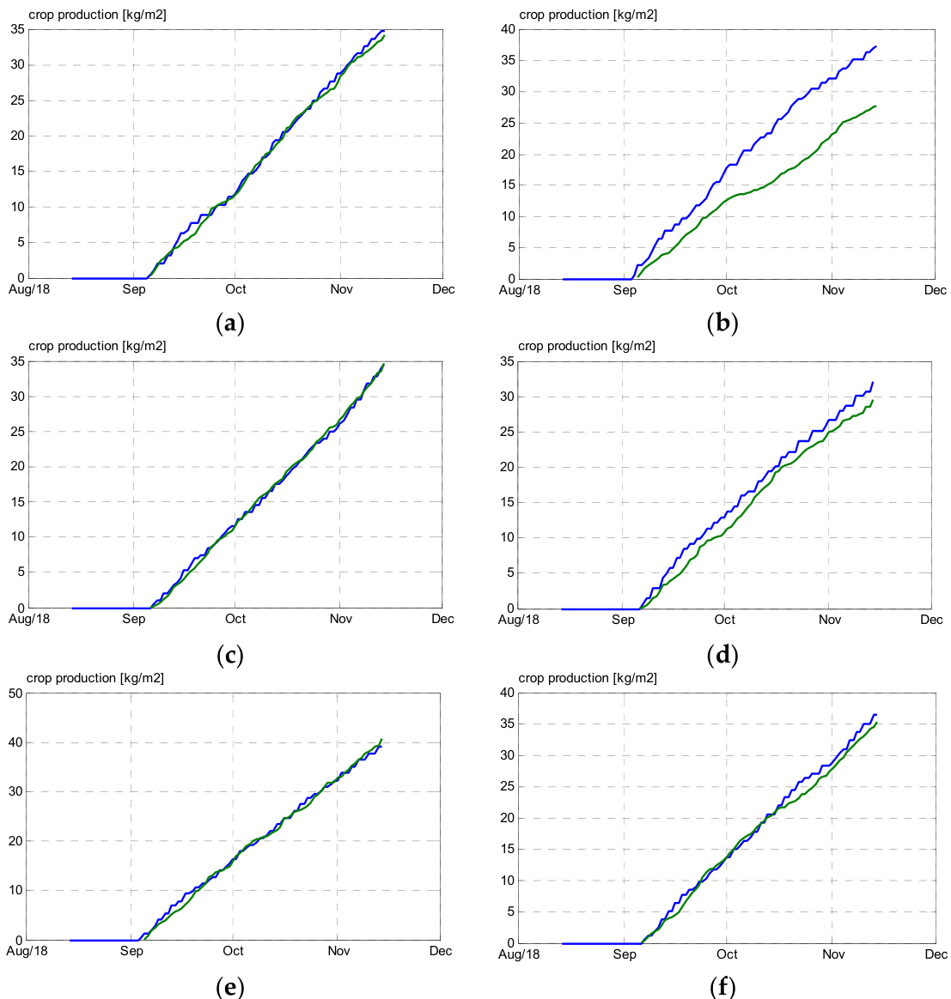

# Article Remote Control of Greenhouse Vegetable Production with Artificial Intelligence—Greenhouse Climate, Irrigation, and Crop Production  

Silke Hemming \*, Feije de Zwart, Anne Elings, Isabella Righini $\textcircled{1}$ and Anna Petropoulou  

Wageningen University & Research, Business Unit Greenhouse Horticulture,   
6708PB Wageningen, The Netherlands; feije.dezwart@wur.nl (F.d.Z.); anne.elings@wur.nl (A.E.); isabella.righini@wur.nl (I.R.); anna.petropoulou@wur.nl (A.P.)   
\* Correspondence: silke.hemming@wur.nl  

Received: 26 March 2019; Accepted: 11 April 2019; Published: 16 April 2019  

Abstract: The global population is increasing rapidly, together with the demand for healthy fresh food. The greenhouse industry can play an important role, but encounters difficulties finding skilled staff to manage crop production. Artificial intelligence (AI) has reached breakthroughs in several areas, however, not yet in horticulture. An international competition on “autonomous greenhouses” aimed to combine horticultural expertise with AI to make breakthroughs in fresh food production with fewer resources. Five international teams, consisting of scientists, professionals, and students with different backgrounds in horticulture and AI, participated in a greenhouse growing experiment. Each team had a $9 6 \mathrm { m } ^ { 2 }$ modern greenhouse compartment to grow a cucumber crop remotely during a 4-month-period. Each compartment was equipped with standard actuators (heating, ventilation, screening, lighting, fogging, $\mathrm { C O } _ { 2 }$ supply, water and nutrient supply). Control setpoints were remotely determined by teams using their own AI algorithms. Actuators were operated by a process computer. Different sensors continuously collected measurements. Setpoints and measurements were exchanged via a digital interface. Achievements in AI-controlled compartments were compared with a manually operated reference. Detailed results on cucumber yield, resource use, and net profit obtained by teams are explained in this paper. We can conclude that in general AI performed well in controlling a greenhouse. One team outperformed the manually-grown reference.  

Keywords: artificial intelligence; sensors; resource use efficiency; crop production; indoor farming  

# 1. Introduction  

The global population is increasing rapidly together with the demand for healthy fresh food [1]. The greenhouse industry can play an important role providing fresh food, such as fruits and vegetables being high in vitamins and minerals. Greenhouses allow a high crop production per area combined with a high water use efficiency per unit of produce [2]. Worldwide, the area of greenhouse production is increasing [3]. However, the greenhouse industry encounters difficulties finding enough skilled labor to manage crop production [4]. A crop manager must have a high level of knowledge and experience in order to control crop growth. As farms become larger, monitoring all details of the various greenhouse compartments becomes more demanding. Moreover, resources (water, fossil energy) are becoming scarcer, which causes an urgent need for maximum resource efficiency.  

A greenhouse protects the crop from outside influences, such as rain, wind, low temperatures, or pests. A modern high-tech greenhouse is equipped with active control of actuators (e.g., heating, lighting, irrigation) in order to create a favorable growing climate. Of course, this comes at the cost of resource consumption (e.g., fuel, electricity, water). A grower determines the climate and irrigation strategy and defines the setpoints for all climate and irrigation parameters. Actuators are operated based on the setpoints, and sensors give feedback on measured data for the control loop. Automated greenhouse climate control algorithms have already been developed decades ago [5–12]. Today, modern high-tech greenhouses are equipped with process computers, which are able to control greenhouse actuators based on the setpoints manually set by the grower.  

In order to add more automated control, various greenhouse climate and crop models have been developed. An overview of today’s greenhouse climate models is given in a previous study [13]. An overview of greenhouse crop models and modelling approaches are given in other studies [14,15]. Dynamic greenhouse climate models and dynamic crop models have been used to determine setpoints automatically and take over the decision of the grower. If climate and crop simulation models [15,16] are combined and connected to the sensors and actuators of a greenhouse, greenhouse climate and crop growth can be controlled by automated algorithms. Such experiments have been conducted successfully with tomato [17] and sweet pepper in The Netherlands [18,19]. In this experiment, outside weather conditions and weather forecasts were used for climate simulations. Crop growth simulations were carried out along with the cropping cycle to predict further crop growth and development for different sets of setpoints. The optimum set was then applied in the greenhouse automatically. The computations were repeated every day, and in this way, crops were grown with an optimum control strategy. Other experiments with tomato have previously been conducted [20].  

Another way to take over parts of the decisions of a grower is to use machine learning algorithms for greenhouse climate control [21]. Diverse methods have been applied in research, such as K-algorithms [22], Bayesian networks [23], support vector machines regression [24–26], neural networks [27–34], reinforcement learning [35], or genetic algorithms [36–38]. However, to our knowledge machine learning has not been used yet to control climate and irrigation and make crop management decisions for growing a greenhouse crop autonomously during a longer period with yield levels comparable to commercial practice.  

On the other hand, the use of artificial intelligence (AI) has reached major breakthroughs in several areas of daily life and society, such as medical applications [39], autonomous cars [40], or robotics [41]. AI algorithms have been shown to outperform humans in complex decisions, e.g., checkers [42], chess [43], and go [44]. It is obvious to use AI also for agricultural purposes [45].  

In order to combine the use of modern AI algorithms and greenhouse climate, irrigation, and crop growth control, in 2018 an international challenge on “autonomous greenhouses” was conducted at the high-tech research greenhouses of Wageningen University and Research in cooperation with five multi-disciplinary international teams. The challenge aimed at combining horticultural expertise with AI to make breakthroughs in fresh food production with fewer resources. The experiment was set-up with the goal of benchmarking the use of state-of-the-art AI algorithms for cucumber production. In the experiment existing commercial greenhouse equipment (actuators), standard sensors for measurement and control, and a standard commercial process computer were combined with the latest AI technology in order to maximize net profit and minimize resource use, while controlling greenhouse crop growing remotely. The goal of this paper is to describe the results obtained by teams concerning net profit and resource use, to analyze differences in climate and crop growing strategies used, and to investigate which lessons can be learned from the results for the future, in terms of optimizing crop yields and net profit.  

# 2. Materials and Methods  

# 2.1. Greenhouse Compartments and Actuators  

Six identical greenhouse compartments were available for the cucumber growing experiment. Each compartment was equipped with standard actuators, also available in commercial high-tech greenhouses (Figure 1). Two pipe heating systems, a rail pipe heating on the floor, and a pipe heating on crop height (peak capacity 180 and $3 0 \mathrm { W } / \mathrm { m } ^ { 2 }$ respectively), were available, both controllable by different isfefteproeintts.seCtpoonitintsu.ouCsornotoifnvueonutsilartioonf ( venttiillattiionar(evaeonft $0 . 3 \mathrm { m } ^ { 2 }$ oaprenaingofpe0r. $\mathbf { m } ^ { 2 }$ mg2reeonpheoniunseg  epqeurippme2d grweietnhhaonutsi-et,herqipuispnpettdinwgi)t,htawnotit-tyhpreispsofnietntsiindge) mtwoovetaybplessocfrienesnisd(eLmUoXvOeaUbSle1s5c4r7eeDnsF(RLUenXeOrgUySs1c5r4ee7n aFnRd eOnBeSrCgyUsRcAre9e9n5a0nFdROWBlSiCghUtRblAoc9k9i5n0gFsRcreWenl,igLhutdbvliogckSivnegnssciroene,nS,wLeudevni)g, Savheingshs-iporne,ssSuwre-dseond)i,uam iagrthi-fipcrieasl luirgeh-tsiondgiusmystaermti i(ciapl alciigthy onfg $1 8 7 \ \mathrm { \mu m o l / m } ^ { 2 } / \mathrm { s } )$ i, ya fofg1gi8n7gμsmysotle/m /(sm),axai fmougmg ncgapsaycsiteymof $3 3 0 \mathrm { g } / \mathrm { m } ^ { 2 } / \mathrm { h } )$ a,paancdit $\mathrm { C O } _ { 2 }$ 3s3u0pgp/lym2(/mh)a,xainmduCmOc2aspuapciptly $1 5 \ : \mathrm { g } / \mathrm { m } ^ { 2 } / \mathrm { h } )$ mwcearpe acivtayil1a5blge/.mP2l/ahn)tswewrereavgariolawblnei.n lraonctks wooelresugbrsotrwanteicnurboecskawnodopl lsaucebsdtroanterocukbwesooalnsdubpsltarcaetedsolanbrs;otchkewpoloalnts-usbusbtsrtartaetes lsaybst;etmhewpalsatnhte-n ulobcsattreatdeosnyshtaenmgiwngasgtuhtteenrsl.ocIrartiegdatoionnhawnagteirngangdutnteurtsr.ieInrrtisgwateiroensuwpatpelireadnwditnhutdririepntpserwseorpeesruatpepdl ibeyda wvitahlvder. pTphersuorpelruasteodf tbhyeanvutarliven. tTshoelustuiropnlu(dsroafitnh)ewnaustriecnotllseocltuetdioin (tdhreaihna)nwgiansgregcuotltlerctiendaicnltohsed hlaonogpinsgy sgtuetmte.  

  
iFgiugruer e1.1.GrGerenehnohuosuese xepxepreirmimenetnatlaclocompapratrmt emnetns,ts9, $9 6 ~ \mathrm { m } ^ { 2 }$ rgoruonudn dfl ofloro(r7 $( 7 6 . 8 \mathrm { m } ^ { 2 }$ rcorpo-pg-rgorwoiwnigngaraerae)a) qeuqiupipepdedwiith  diifffferreenttacatcutautaotros.rs(.a)(Sa)chSecmheomfec omf pcaortmpeanrt mwietnhtcrwoipt hancdraocptua tnodrs:acrtouoaftvoersn:tilraotiofn, etnwtio astciroene,nts,waortsicfirceiealnlsi,gahrtt, ifircriaglatliognhts,yisrtreigma,t $\mathrm { C O } _ { 2 }$ yssutpepml,y,CtwO2o shuepatpilnyg, stywsotehmesa. (nbg) Psiycstuermeso. f(ob)ne icotumrpeaorftmoneentcowmitphatrhtemyeonut nwgi tchrothpeafytoeru tnhgectroapnsapftlearnt.h  

# 2.2. Sensors and Remote Control  

Five teams (Sonoma, iGrow, deep_greens, The Croperators, AiCU) were able to control the operation of all actuators remotely based on their own AI algorithm. A sixth greenhouse compartment was controlled by Dutch growers and served as a reference (growers $\mathbf { \Sigma } = \mathbf { \Sigma }$ reference). Competing teams used their own AI algorithms to determine the climate and irrigation control setpoints, such as minimum rail pipe temperature ${ } ^ { ( ^ { \circ } C ) }$ , minimum crop pipe temperature ${ } ^ { ( ^ { \circ } C ) }$ , heating temperature $( ^ { \circ } C )$ , ventilation temperature ${ } ^ { ( ^ { \circ } C ) }$ , minimum ventilation opening $( \% )$ , humidity deficit setpoint $( \mathrm { g } / \mathrm { m } ^ { 3 } ) .$ , energy scree3n position $( 0 { - } 1 0 0 \% )$ , blackout screen position $( 0 { - } 1 0 0 \% )$ , artificial illumination ( $0 \%$ or $1 0 0 \%$ ), $\mathrm { C O } _ { 2 }$ concentration (ppm), and time between last and next irrigation turn (min). Setpoints were sent via a digital interface (LetsGrow.com) to a central climate process computer (IISI, Hoogendoorn, The Netherlands), which then operated the actuators accordingly (Figure 2). A nutrient solution for fertigation was prepared by a central fertigation computer and then stored in a buffer tank per compartment before being provided to the crop with drippers. The composition, concentration (EC), and pH of the nutrient solution was determined by the teams. Based on detailed chemical analysis of theodnradientaiwleadtecr,hpermoivciadl eadn aelvyesirsyoffortthnei gdhrta,itnhewtaetear,msprcovuildedseenvderyeqfuoretsntisgthot,cthaentgeatmhse coumldposseintidon, ECr,eaqnude $\mathrm { \ p H }$ ofcthhaengneuthriecnotmsoploustitoion.n  

  
FigFuirgeur2.e 2S.cShcehmeemoefofdadtataexecxchhaannggeeffrrom tthe teams and their AII allgorirtithmvivaia adidgiigtiatlailnitnetrfearfcaec(eR(ERSETST APIA)PtIo)wtoawrdasrdtshtehperporcoecsesscsocompuptuetre raannddttheegrreenhouse actuators and dattaafrfroomsesnesnosrosrsvivaitahtehseasmaeme waywabyackb,adcka,t adeaxtcahaexncgheabnegtewebentwteaenmsteaanmd swaornkderswornkcerospohnancrdloipngh, andl imnge,asaunrdedmcreoapsupraerdamcreoteprs.  

Standard sensors continuously measured data, such as cumulative outside global radiation $\mathrm { ( J / c m } ^ { 2 } / \mathrm { d } )$ t,aonudtasrid esepnhsotrosscyonntthientuicoaullsly acmtievaesurraediatdiaotna PsAucRh $( \mu \mathrm { m o l } / \mathrm { m } ^ { 2 } / \mathrm { s } )$ ,ivaeiroteutmsipderagtluorbealoruatsdidatei ${ \mathrm { ( } } ^ { \circ } { \mathrm { C } } { \mathrm { ) } } .$ , out(Js/icdme2r/edl)a, toiuvtesihduempihdoittoys $( \% )$ h,etwicianldlysapcetievde $\mathrm { ( m / s ) }$ ,t onutPsiAdRe (gμlomboal/lmra2/dsi),ataiorntefmorpecratstu $( \mathrm { W } / \mathrm { m } ^ { 2 } )$ ,eo(u°tCs)i,de airotuetmsipderraetluatrievfeohruecmaisdti ${ } ^ { ( ^ { \circ } C ) }$ ,),ouwtisnidespreleadti(vme/sh),uomuitsdiidtey gflorbeaclarsat $( \% )$ ,own ifnordecsapsete(dWf/omr2e)c,aosutt $\mathrm { ( m / s ) }$ ,irair temtepmerpaetruatreuriensfiodrec ${ } ^ { ( ^ { \circ } C ) }$ (,°aCi)r, houtms ideitryeldaetifivcei thiunsmiidei $( \mathrm { g } / \mathrm { m } ^ { 3 } )$ c,ahstea(t%in),gwpinpde tsepmeepderfaotruecrae ${ } ^ { ( ^ { \circ } C ) }$ ,/sh),eatirng potweemrpuersaetdu $( \mathrm { W } / \mathrm { m } ^ { 2 } )$ f(°orC),boaitrh huemaitidnitgy sdyesfticeitmisn, liadem(pg/smtat),ushe $( \mathrm { o n / o f f } )$ ,p $\mathrm { C O } _ { 2 }$ mdpeorsatguere $( { \mathrm { o n / o f f } } )$ ,easticnregen pospitoiowne $( \% )$ eodf b(oWt/hmsc)refoernsb,oirtrhighaetiaotin gsuspypstley $( 1 / \mathrm { m } ^ { 2 } )$ ,mdprasitant $( 1 / \mathrm { m } ^ { 2 } )$ n,/dofrfa)i,nCEOC2 $\mathrm { ( d S / m ) }$ e, a(onnd/odfrf)a,ins $\mathrm { \ p H \left( - \right) }$ . Thepfoosiltliowni(n%g)doaftbaotwhasccraelecnusl,aitreridgfartiomn tshueppmlyea(ls/umre),d dratian: il/nsmid),edPraAiRn sEuCm( $\mathrm { ( m o l / m } ^ { 2 } )$ d, hderaitinnpgHen(−e)r.gy used $( \mathrm { k } W \mathrm { h } / \mathrm { m } ^ { 2 } )$ , electricity used $( \mathrm { k } W \mathrm { h } / \mathrm { m } ^ { 2 } )$ , $\mathrm { C O } _ { 2 }$ dosage $( \mathrm { k g } / \mathrm { m } ^ { 2 } )$ , water consumption $( 1 / \mathrm { m } ^ { 2 } )$ , and was provided to the teams as well. Measurements and calculations were sent back to the teams via a digital interface (Figure 2). Both, setpoints for control of actuators and measurements were exchanged at a 5-min-interval.  

Teams were allowed to install additional sensors at the start of the experiment. They chose different typdeisf foefrseentstyorpse, soufcsheans oRrGs,BscuachmaersaRs,GtBhecramaelrcaas,mtherearsm, salecnasomresrfaosr, snent sroardsiaftoirone, trroaodt izaotinoens,ernosotrzso, ncreop andsesnusbosrts,ractreopwaeingdhst,usbtsetrmatediawemiegthetr,,sctreomp dsiapmfletoewr, cmreotperssa,pafnlod wimreltesrs taenmdpweriraetluerses-theumpiedriattyu-rlieg-ht senhsuormindeitwy-olirgkhst. sOenseotreanemtwchoroksse toO nreltyeaonmtcheosteatnodarerldygorneetnhheosutasnedsaerndsogrseeonhlyou(iseGrsoenws).o  

# 2.3. Crop and Crop Parameters  

3C. uCcroupmabnderCsrsoepePdalrianmgestecrvs. “Hi-Power” were sown on 20 July 2018, in rockwool cubes and were transplaCnutceudmtboetrshesegerdelienghsocuvs.e“cHoi-mPopawretrm” ewnetrseosnow14n oAnu2g0uJsut 2y021081,8,atint hroecsktwarotolofcutbheseaxnpderwiemrent. Thtercarnosplawnatsedgrtowthneignraeehnihgohu-sweirceogmrpoawrtinmgenstysstoenm1.4PAlaungtusdte2n0si1t8y, atntdhestsetamrtdoefntshiteyexhpaedritomebnet.chTohseen byctrhoeptewams sgrboewfonrienthaehisgtahr-t,wirres uglrtoinwginign  svyasltueems bPeltanwtedeenn2s.i6tyaand 3s.t6esmtedmesn $/ \mathrm { m } ^ { 2 }$ (hiaGdrtow,be2.c6hsotsemn sb $/ \mathrm { m } ^ { 2 }$ ; deethpe_gtreeaemns, $2 . 6 \mathrm { s t e m s } / \mathrm { m } ^ { 2 }$ ;rtA, irCesUu,lt3i.n6gstienmvsa $/ \mathrm { m } ^ { 2 }$ ;s Sboetnwoemean, 32.36 satnedms3 $/ \mathrm { m } ^ { 2 }$ t;eTmhse/mCr2o(ipGeraotwo,rs2,. $3 . 2 \mathrm { s t e m s } / \mathrm { m } ^ { 2 } ,$ . Thederefpe_rgerneceensw, a2s. $2 . 5 \mathrm { s t e m s } / \mathrm { m } ^ { 2 }$ .AiTChUe fir3s.6t hsatrevmes/tmw2;asSono6mSae,pt3.e3msbterm2s0/1m82, aTnhdethCerloapsterhaatorrvse,st3.w2as schsetedumlse/dmf2o).r Talhleteraefmerseonc e7 Dweacse2m.5bsetre2m0s1/8m. 2B. aTsheed foirnsthiasrlvaests thawravsesotnd6a tSee, tphtemdbateer o2f0t1o8,ppaindgt(hre lmaostval of head of the crop) had to be chosen by the teams and differed from 19–28 November 2018. The reference was topped on 9 November 2018. Crop development and harvest is shown in Figures A1–A4.  

Teams sent weekly instruction for fruit and leaf pruning in the top of the canopy to the greenhouse workers. Fruit pruning strategies ranged from a stable procedure of $5 0 \%$ fruit removal for the whole cropping period to a more variable strategy of removing alternately $5 0 \%$ and $67 \%$ of the fruits. With respect to leaf pruning, the majority of the teams decided for on pruning $( 0 \% )$ or on pruning a small fraction of leaves $( 3 3 \% )$ . One team used a deviating strategy of removing $5 0 \%$ of the leaves throughout the whole cropping. As a standard procedure applied to all crops, greenhouse workers removed leaves below last harvested fruits. Three harvest quality categories were distinguished (A: ${ > } 3 7 5 \ \mathrm { g }$ and no defects, B: $3 0 0 { - } 3 7 4 ~ \mathrm { g }$ or defects e.g., shape, color, others, C: ${ < } 3 0 0 \ \mathrm { g }$ per fruit). Harvest data such as number and weight of fruits $( \# / \mathbf { m } ^ { 2 }$ and $\mathrm { k g } / \mathrm { m } ^ { 2 }$ per quality category A–C) were measured manually by the workers. Crop related parameters such as stem elongation (cm per week), fruit growth period (d per fruit), leaf formation rate (# per stem per week), and cumulative number of leaves (# per stem) were also measured. Instructions by teams and data measured by workers were exchanged via the digital interface (Figure 2).  

# 2.4. AI Algorithms  

Each competing team developed their own AI algorithms, which varied between supervised, unsupervised, and reinforcement machine learning (Dynamic Regression, Deep Reinforcement Learning DRL, Deep Deterministic Policy Gradient DDPG, Generative Adversarial Networks GAN, Convolutional Neural Networks CNN, Recurrent Neural Networks RNN).  

In order to use AI techniques, training data is essential. Since training data with a wide variation for the described application are scarce, an artificial training data set was created. The use of artificial training data sets has been shown to be very useful in other applications earlier [46]. In this experiment artificial training data was created using the broadly validated dynamic greenhouse climate model KASPRO [16] and the cucumber crop model INTKAM [15] that was modified for a high-wire cucumber crop. The artificial dataset was provided to the teams before the start of the experiment.  

# 2.5. Performance Criteria  

Teams’ performance was evaluated based on three criteria.  

Sustainability: $2 0 \%$ of the total score of a team was given for sustainability. The following aspects were calculated based on measured data: Energy use efficiency $( \mathrm { M J / k g }$ cucumber), $\mathrm { C O } _ { 2 }$ dosage $( \mathrm { k g / k g }$ cucumber), water use efficiency $( \mathrm { m } ^ { 3 } / \mathrm { k g }$ cucumber), pesticide usage as registered (mL/cucumber).  

Net profit: $5 0 \%$ of the total score of a team was given for the net profit. Net profit was calculated based on the following obtained data: number of fruits harvested $\mathbf { \boldsymbol { x } }$ price per fruit and category. The prices varied per week during the cultivation period and were determined by a jury at the start of the experiment, and reflected an average seasonal trend. The prices varied between $\epsilon 0 . 3 0$ and $ { \mathrm { \in } } 0 . 4 0$ per fruit (class A). B-class fruits had a $1 5 \%$ lower value, and C-class fruits had no value. The prices were revealed on a weekly basis during the growing cycle in order to mimic price uncertainty, typical for agricultural products in practice. Also, the initial costs for the young plants (costs of a young plant x number of young plants placed in the compartment) and costs of the substrate were considered. This way, the teams had to weigh the faster initial growth of a high stem density crop against the higher initial costs. Other greenhouse equipment used was identical, and therefore not considered in the calculation of the net profit. The fact that capital costs equal for all teams were left out of consideration explains the high values of net profit shown in the results. Resource use of electricity, heating, ${ \mathrm { C O } } _ { 2 } ,$ water, nutrients, chemical and biological pesticides, and labor were measured during the experiment per greenhouse compartment, and assigned to the teams. Multiplied with the given price, costs were calculated and communicated with teams weekly during the ongoing experiment.  

AI algorithm: $3 0 \%$ of the total score of teams was given by a jury based on novelty of the AI algorithm with respect to the overall scientific community, novelty with respect to application on the horticultural domain (novelty), capacity to operate autonomously at a distance without manual interventions (functionality), capacity to operate without too many additional sensors or information (robustness), and easiness of implementation on a large scale (scalability).  

# 2.6. Analysis and Interpretation of Results  

The AI-based operation of the different greenhouse compartments by different teams resulted in different cropping, climate, and irrigation strategies, and different yields and resource use efficiencies. In order to properly analyze and compare the different approaches, a combination of a dynamic greenhouse climate model KASPRO [16] and a cucumber crop simulation model INTKAM [15], which was modified for a high-wire cucumber crop, was used. The combined model assumes adequate supply of water and nutrients and does not simulate the presence and effects of pests and diseases.  

The KASPRO model computes the greenhouse climate as a function of outside weather conditions and greenhouse climate control settings. The model processes these settings by a control algorithm comparable to the ones used. The analysis was by commercial greenhouse climate computers. The model takes full account of the limitations of real greenhouses, which means, for instance, that a $\mathrm { C O } _ { 2 }$ dosing setpoint of $8 0 0 \mathrm { p p m }$ is simply not met in sunny periods when the vents are wide open to carry off the heat excess. This is caused by the limitations in maximal supply rate, just like in real greenhouses.  

The greenhouse climate, as computed by KASPRO [16], is then fed to INTKAM [15], which computes the daily gross photosynthesis from the sum of hourly photosynthesis-rates. The hourly values are the result of light-intensity, temperature, $\mathrm { C O } _ { 2 }$ -concentration, and relative air humidity in combination with the dynamically-simulated crop architecture (in particular leaf area index). After subtracting maintenance costs, the daily amount of assimilates is partitioned over the growing organs (roots, stem, leaves, and fruits) on the basis of their relative potential growth rates. Next, dry matter fraction and fresh organ weights are computed, and finally the harvest moment of individual fruits is determined on the basis of, amongst others, fruit weight [15].  

With the availability of these models, the contribution of the variation seen in the control strategies of the different teams in the final production could be determined. The variations applied referred to both the observed cropping and climate strategies to interpret and understand the results of the different AI-based operations and identify which additional improvements could have been made.  

In a first step, the combined model was used to calculate the cucumber yield of each of the compartments, while using the actually applied crop density, fruit and leaf pruning strategy, and the realized lighting and climate (temperature and $\mathrm { C O } _ { 2 }$ ) setpoints in that compartment as model inputs. The calculated model output was the predicted fresh yield $\mathrm { ( k g / m } ^ { 2 } .$ , #fruits $/ \mathbf { m } ^ { 2 }$ ) per greenhouse compartment, which could then be compared with the realized yield in the same greenhouse compartment to validate the models.  

In a next step, for each greenhouse compartment, model calculations were carried out applying the cropping strategy of other teams or the reference in order to predict the changes in yield while maintaining the original lighting and climate strategy. In another step, model calculations were carried out for each greenhouse compartment, maintaining the original cropping and climate strategy but applying the lighting strategy of the other teams. In another step, calculations were made for each greenhouse compartment applying the climate strategy $( C O _ { 2 } )$ of each of the other teams, while maintaining the original cropping and lighting strategy. For joint comprehensibility, interactions of cropping, lighting, and climate strategies were not calculated. The simulations of the swapping strategies represent the yield retrieved prior to topping, to eliminate the effect of early topping dates selected by some of the teams.  

# 3. Results  

In Figure 3, the cumulative cucumber production per team in the different greenhouse compartments during the experimental period is given. From the beginning, one team (Sonoma) had the highest production and was able to continue this, as is shown by the highest curve slope. This team obtained this harvest with a high daily light integral (Figure 4), as they assumed that with a higher daily light integral a greater harvest could be obtained. Therefore, team Sonoma focused its AI algorithms on this particular aspect. The algorithm allowed them to obtain a high daily light integral by mAaIxialmgiozriitnthgmtshseonan tmthoisunptarotficaurltairficaisaplelcitg..hTth(eFiaglguorrerit5hbm), awllhoiwlwe dodptthiemi ztiongobottaihine ra dheifighnhindagailflyacltigogrhst, such as teinmtepgeraltbuyremaanxdi $\mathrm { C O } _ { 2 }$ .g tHhenacem,otuhnetyorfearltiizfiecdiatlhlieghtig(Fhiegsutryei5elbd), awnhdiltehoepytiwmeizrienaglsoothaerbldeetfionimngaintain highfalicgtohrts,usuecehffiasctienmcpyeroaftutrheacnrdo pCfOo2.rHaelnocneg, tpheryiroedal(iFziegdutrhe  6h)i.g  

  
FigFiugruere3e.3..Cuumullattiive cucumbbererrprprordoudcutiicotninoonf dodififfdeirffenentrteteneatamtmes.a.ms.  

  
FiguFriegu4r. C4.oCurosuersoefotfotoatlalddaialily lliight integrall inn $\mathrm { m o l } / \mathrm { m } ^ { 2 }$ siindseidtheethgre egnrheeounsheojuste ajubostvea tbhoevcertohp,e crop, composed of both artificial light and natural light, realized by different teams.  

  
Figure 5. Course of daily light integral of (a) natural light and (b) artificial light only inside the greenhouse, just above the crop realized by different teams.  

  
iFgiigugruerre6 6.C. oCuoCrusoreusroesfeo golifhgtlhiutgshuet fufesifcef ceinefficnyciiyenicngycgiucncucgmubcmeubrceupremprberemromlpotelor oltmadolladiltayoiltlyailghdgthaiitnlityentgliergalrhatiniindtiefdfgiefrfaelrneitnt odcimoffpmerapertanrtmtcemonetmsn.tpsa.rtments.  

AnAnontohttehrertrettaeamam T((ThTehe CrCoropopepreartaottrosr)s)iniicnrceraesaesdedthtteheddadialaiyillyl lgliighgthtiniitnettgergarlallafatafefttrera ashshohrotrttppepreiroriiododatat ththehe bbebegeigniininiingngofofOcOtcotboebre(rF(iFgiugruerse4s a4nadnd5db5),b)h),,ohwoewvevrv,eertr,h,tithshiidssi diidndontnolotetlaeldeaatdodtaotohaiahgihgiehgrehlrieglrihlgtihguthsutesuesffeifcfeiecffiinecinyecniynciyn OicnOtcoOtbocetbroe(brFe(irFgi(ugFriuegr6eu)r,6e)s,i6sn)i,cnesciaentcatethtaehtsetahsmaeemsateimtmiemttiehmteheyetymheamiyanitmnatiaininentdeaidanlaeoldwoawCloOCw2O $\mathrm { C O } _ { 2 }$ ecneotnrntacrteiaotnitnor.naI.tniIoanda.dIintdiotaindo,dnti,httiehoyen,y tpohtpetydeofdopfrtoeardcafrcorpoapcrpruronupinpignrusgtnrsitanrtaegtgesytgrtyahtaehtgarytetrsehusaltutelrtdesidunilitneisdnuisfnufificfniecsinuetnffiatcsaiseissnmitimlaisltsaeitsemtsioltasotuessuttsaotiansitnuhstehaeginrgotrhwoetwhgtrhoofowafltlahl rofufrituasil,tl sfa,rnaudnitids,iasprnpodrboiasbaplbyrlotybhtaehbcelaycuatshueseocfaoafupsaep ropofrxoaixpmipamrtoaetlxeyilmy30a3t%0el%ay $3 0 \%$ tdaebfdrofurittuesidt(sfFr(iFugiutgrsue(rF7ei).g7)uT.rhTehs7e).sreTersheueslstuesltrsehsohuwlotsw hstahtoatwhatihgiahgthda adhilaiyigllhyi gldihagtihlitynitlniegtgehrgtarlianaltneadgnrdalhaiahgnihgdhCaOCh2iOgc2ohc $\mathrm { C O } _ { 2 }$ nrctaortinaotcienonantraeartieimoinpmoaproteartinamtnptroportdoaudnctuticpotrinofdnaufcattcoitrosn,r sfw,ahcwithcoihrcsh, swisrheirlceahltaeitsderdteoltaotehtedhitreoiretfhfeefeficretcetoffnoecntthtoehnepthpoehtopotshoyostnyotnhstyehsneitshisersairtsaetre[a4t[e74][74f]7o]frofrcoruccuccmu bmebrbeerprrpoprdoudcutuicotino,nt,otgoegtehtehrerwiwtihitth bbablallanancnecededcrcorropop mamanananagagegemememenentnt(ts(t(sesttememddedenensnistsityityayanandndpprprurununininingngsgtsrtsrtaratatetegegygy).y).)  

GrGorrowowewerersrss(r(erfefrernecnec)es)sttasartrtaterdtdewdiwtihwthiatrhaelarteirlveaeltilavytielvloeylwylholaworvwhesahtr.avrTevshete.syt.TahlTleohyewyealdlaollowowewederdldoaliwolyewrleirgdhadtilaiyinltyleiglrihagtlhst naitnetgheregarlbsaelasgtiatnthnteihnebgebg(eiFgniigniunriegn(4g)F,(iFgaiungrduert4eh)e,4r)a,enfaodnrtdehtoehnrelerfyeofurosereoednolnoylwyusluesdveldloslwofwlealvreteivlfiselcosifaolaflriatgirfthitcfi(acFilialgligulirhgeth(5tFb(i)Fg,iugwruietrh5ebt5)h,be), piwthitlthohsteohpephpyilhtoilhsoastpothphyhi styhataphtaptrhotihsaicashpapwrporuaolcadhchpwroewupolaudrledptrpherepeacpraeortpehtbehecetrtceorpofpboerbtteethtrefraofproptrrhtoehaeacphaipnrpgoraoacauhctihunigmnganuastueutamusonmn. eTsaheseaosyno.wnT.ehrTehyaeybwlewrteoreaballbealnteocteobsabluaplnapclneycesoufs,puaplnpydlyodf,eofam,nadn d efdomer,amanasdnsidfmofrio,lara,tseasissmwi imltaihltaettsheswiriwtchirtothhptehipreriucrrncoirnpogpsrtpuranutinenigny,g twrstahrtiaectgheyrg,eys,wulhwtiehcdihcihnretrsheueslltuoeltdweedisnti nathmtehoeluonltwooewfsetasbtaomartomeudonuftrnutoiftosfa(Fbaiobgrotuertede7df)rafurnitudsitas(Fh(iFgiuhgrlueirge7h)t7u)asnaednedafficahiiehgnihcgyhli(gFlihgthutruesue6s)e. efIfenifcfiaecinte,cntych(yeF(imFgiaugnruera6el).g6)rI.onIwfnaefcrats,ctw,heterhemaambnlaeuntauolargleragolriwozewrteshreswhewirgerhaebsaltbellitegothroteuraeslieazleiezffitehctieheehnichgyihgdehusetrsiltniglgihgatlhutmsouesteftfehifecfiecwinhecnoylcey dcudrrouiprnigpnigna lgamlcomyscotlset.hteMhiewnihwmohlioezliecnrgcorfporpupiipntiganbgcoycrctylieco.lneMisiMnainmiimzipzniognrtgfarfnurtituoitabjbaeocbrtotiirvoteinofniosriscaunacniumimpmboperotargtnratontowbeojrebsjc,etiacvtniedveftohfriosr suctcruactmuegbmyebrewgrargsorcwolewraesr,rlsya,nadndtdhstihusicsctrestasrtsaeftugelylgywawpsapcsllieceladeralbyrylaytnhadensdmusacuncceucsaeslsfsguflrluoyllwayeprapsp.l  

  
iFgiigugruerre7e.7.7N.NuNumumbmebrerorfofafbaobrotorerttdedfdrffurriutuisittsasanandndnnunumumbmebrerorfoffmamianaiitnantitanaiiendedfdrffurriutuisittsbsabsaessdedoononcnchchohsoessenenfnrfrfuriutuitiptprprurunuiniingng tsrstatrrtaeattgeegygypypepreertrettaeeamamddudruiurniringngtghtthehececucucucucumumbmbebreergrrgorrowowiwniingngegexexpxpepreierirmimemenent.nt.  

FiguFriegsu8reasn8dan9ds h9oshwotwhteh $\mathrm { C O } _ { 2 }$ 2cconcentration andthteh eC $\mathrm { C O } _ { 2 }$ osdaogseargealriezaeldizpedr tpeearmt,eraesmp,ercteisvpeleyc.tively. All teAalllmteseasmtmasrststeadrtewditwhiitrthelraetlliavtiievleyllylyollow $\mathrm { C O } _ { 2 }$ concenttrratatiitoionon,,n,dudueutetotllo slsossosf  oCf $\mathrm { C O } _ { 2 }$ edtouoehitigoghhvivegenhtiilvlaetiniotninlation ratesr.ateMes.o. sMtMotosestatmeasamimns ciirnecareseaeasde $\mathrm { C O } _ { 2 }$ 2ccoconncceenttration ffrom miidid-d-O-OcOctcotboerbreornownarwrdas.r.dFsr.omFmromimid-mNiodv-eNmobverermber towatrodwsatrhdes tethnedenonfd tohfetheexepexepreiermiimemnetn,t,,mooststtteams lowerreeddththeheeC $\mathrm { C O } _ { 2 }$ osdsaogsea..gTee.aTmeaSomnoSomomna oiinmcrareiansecerdetahse d the $\mathrm { C O } _ { 2 }$ CcoOn22ceontcreantiroatniocno cnotintiunouosulsylydduriring the totallccrrop ipnigngp eprieorido.dT.heThCreoCpreorapteorsatsourdsdseundlyddeonluyb ldedoubled the dthoesadgoes agnedancdonccoenncetrnatrtiatoinontotowarrds  the end offttheecrcorpop(F(iFgiugreur9e) a9)nda nwderwe earbleeatbolceatcohcautpchwiuthp with theirtheairvheasrtvewsitthwithatthastrsatrtaetgeygy(F(iFgigurre 3).. Team deep__grgerenesnhsahdatdhetheighiegsthteostatlodtoasladgoe,sawghei,chwdhiidch did not, hshoowenv)e.r, lead to high concentrations, due to an unfavorable ventilation strategy (data not shown).  

  
FiguFrFiei 8r.e  8.. Courrsese  oCf $\mathrm { C O } _ { 2 }$ ecenonttnracatetiionontnriaintniopnpmi nii pdipifffme intt odoimffpearrettnmt tctso dmdupriainrntg mtthehenetcsc duumrbibenerg the cucuemxpbperiimemxenpntet..riment.  

  
FiguFrieg9u.reC9o.uCrosuersoef $\mathrm { C O } _ { 2 }$ 2d2odsoasaggeeiin $\mathrm { k g } / \mathrm { m } ^ { 2 }$ in dififffereerentntcocmopmaprtamrtemntesndtsurdinugritnhge cthuceucmucbeurmexbperereixmpeenrt.iment.  

FruitFrguritogwrtohwdthurdautriaotinoinsitshtehetitime between flfloweeririnngganadn dhahrvaresvteosft aocfuaccuumcbuermfbrueirt,fraunidt,vanridedvaried betwbeetnweaesnlaitstliettlaesa1s1 1ddaayssto as mucchhasa2s42d4aydsa.yTsh. Tovheraollvearvaelrlagaevferuaitggerforwutith gdruorawtitohndwuarsa1t7i.o3n was 17.3 dAaiyCs,U, btuhutetvavlroainreigdednstont(ao2bt1la.y6blbdyetabywese)tewnaevtehrenatdgihefefferdueiinffttetgrereaonmtwst.heaDdemeusrp.a_tgiDorene.npTs_hghirasedectonhrserehslhatoderstehsweti(ts1h3.ot4rhtdeasaytvs()e1ra3an.g4dedays) and gArieCenUhtohuseeltoenmgpeesrta(t2u1r.e6 duariynsg) tahvefrraugite gfrouiwt hgrpoerwitohd (dFuirgautrieo1n0. .TFhiigsurceor1r0elsahtoews swtihtehatvher agveerage greegngrheoenunhshoeoutsesemtepmerpaetrauatrueredtuor iwnhgicthfefrufuiritusitwegereoewxtphospeedrdidourdrin(ngFgigruorwe h1h..0). Figure 10 shows the average greenhouFsiieguturerem11p1esrhaotwuwsrsethteoawmhoiucnht forfuhietesatiiwnegrenerxrgpyo..sTeedamdmudreienpg_greoenwnstsshs.h  

fFriogmu trthehe1o1otshheros wbsectahueseae tmthoeiiur natllgoforihitehamtindegecieidnedr gtoyo.crTreatemadveerypy_wgarareremnasaiirsr thteomwpeaeravateurrye ,dpirffoebraeabnlltysttorategy fromshthohorerteonththeheres rbrueiict aduesveeltlohpeimreanlt gtoiirmite.h. TmThiidsercreiesduelltdtedtdo ncnraeaahthieighah rvresroyurwcea rumse afiorortehematptiinenrgat(TuTarabebl,ep1r1)o..bably to shTorgtgetnhetrhewiiftrhuhihtigdhedvaeiilyoyplliigmghet nstutmimsm,,em.maiiTnlhlyiys roemsmualartrteiifdfiicianal lalighitg(hF rgeusreoeu5rbc),e, wuhsiiellefbobllrochkeiiantgi nga (urTrallble 1). Togeltihghetr  (wFiigtuhrehi5gah), desapileycilaillgyhtatstuhemsb,egminaniinlgy, ftrhoeymwaerrtiefiacbilael  tloighatv(eFaiguoroed5hba)r,vewsht idleu rbilnogctkhienfgirsntatural light  (Figure 5a), especially at the beginning, they were able to have a good harvest during the first weeks, but at the cost of high resource use on electricity (Table 1). Unfortunately, in October, technical problems (connection of AI remote control) and extremely low irrigation during several days led to a dip inweheakrs,vbesut,aftrtohme cowsht iocfh itgheryeswoeurecenuosteaobnlelteoctcriactictyh-(Tuapblaeg1a)i.nU.  

pTreoablme mAsiC(cUonanpepcltieodn roeflaAtIi vrelmyoltoewcotnetmropl)eraantdureextsr(eFmigeluyrelo1w0)irarnigdatailonwdudraiinlgy lsiegvhetr ialntdeagyrsale(dFitgoure 4), whilae dmipaiTinentahamianrivAneisgCt tUfhreoapmhpilgwiehdiecsrhtetflrahteuiiyvtewldyerlneosniwtoyt e(anbmlupeemtroabtceuart $/ \mathrm { m } ^ { 2 }$ ()F,pigwaughraieicnh1.0t)oganetdhearleoxwpldaiinlythlieghetxtirnetemgerlaly high fruit aFibgourTrteiao4mn) rAawithCeU(eFaimgpaupilrnietad7in)rieanlngatditvhleol ywhi gloihwgehstefumrsupeie readtffieuncriseiestny(cF(iinegsu (rmeFbie1gr0/u)rmea2n,6d).wahTilchohewtCodrgaoeiltpyhelriagethxotrpils,anitdnegutrehalet o the dete(ceFtxitogreunrmeoefl4ys),hmiwaglhlifferuinmtgaiabnlotradtiinsoienargsaetehse(pFihogitgusrhiens7t)thfarneuidirtlcodowemnlispgithaytrtu(nsmeuemnfftbeciirn/enmNc2i)o,e svw(eFhmiigcbuherret,o6g)w.etTrher aCedrxvopiplseaeirnadtotrhose,l ower the heduxutremetimod iettlhye lhdeiegvthelcfsrti.u Itnnaobfosrtdmieoarln  trfoaunerge(aFdliugdcuiesrera7es)leastnipdvoletosaiwinrl ghheuitrmucsioedimetfpfyi,acrtitehmneceyinetsdi(enFaicNgtuiorveaet6m)e.bdTerth,heweCerrmoeipsaetdriavntigosresd,ystem (whitcdohuleowtwoasetrhi nethtdeenthseuicvtmieioldnyitouyfslsemdveailnls ftIuhnegosareldcedorisnteoda-srheadslufpcoetfsrieOnlcatihovebierrac;iordmhautpamrintdomiteysn,thtiohnewyNn)do evaencmtdibvseatrta,erdtwetdrhevaemdnivtsitsliaentdging by opensiynsgtebmot(hwlheiec-hanwdaswiintedn-sivdelyveunstesd. iSnettihnegstechoenmd-ihnailmf uofmOtcetombper;r adtautrae nooftthsheopwipn)e  raanidl sytasrttemd to 40 $^ { \circ } C$ alvleonwtileadtifnogrbmy aoipnetneinagnbcoetholfeteh-eanaidrwgirnede-nsihdoeuvsentse.mSeptteirnagtuthre $( { \mathrm { n i g h t } } = 1 9 { \mathrm { ~ } } ^ { \circ } C$ earantdurdeaoyf $= 2 5 ^ { \circ } C )$ and prevreaniltesdysittefmrotom4f0al°liCnagl,lowheidlefovrenmtaiilantienga.ncFeoorftthies raierasgroene,nthoeustertaetemgpyerlaetdurteo(anisgthete=p  i1n9c°rCeasnedof the heatisdntaegye ep= ni2ne5crrg°eyCa)sdeaeonfmdtahpneredhve(eaFntitgenudgreietnfe1r1og)ymbdfueatlmlnianongtdt (owFhsiiguluecrhveea1n1nt)ilebavtuitndnge.ontFtoirnstcuhrciesharaseneaiesnovintd,hetenhteaiisnrtcrtraetaemsgepyielnreatdthuetoraeiarin the samestteteimempeifrnractaruemraes .ei  

  
FigurFieg1u0r.eC10o.uCrosuerosef aofvaevraergaegeg rgereennhouse  air temperraatutrueredudruinrigntghethfreufitrugirtogwrtohwptehriopde riinodififnerdeinfft erent compartments during the cucumber experiment. The lines are, therefore, the moving average of greenghreoeunsheoauisreteaimr tpemrapteurraetuirnetihne tfhreuiftrguirtogwrtohwtphe rpioerdiopdrepcredceindignegaecahchahravrevsets. .TThheeccurrveeoffAiiCU,,being a moving average of the temperature in 22 days, is therefore smoother than the curve of deep_greens, whicdheiesp_agreseunlst, owfhaic1h3i-sdaryesmulotvoifnag1a3-vdearyagme.o  

  
Figure 11. Course of heating energy use in different compartments during the cucumber experiment.  

In Figure 12 the course of irrigation supply is given. Notable is the relatively high amount of irrigation supply of team The Croperators, and also the relatively high supply of the reference growers. In this experiment, high drain did not result in high water use because drain water was captured and fed back to the irrigation water, while taking the nutrients from the drain water into account qwuhaelnitrye,fisillnicnegithienfilruriegnactieosnthweaotxerygbeunffaervtaialnakb. iHtiyg. hHorwleovwerd,rianinthimsiegxhtpearffiemctent th esurcohoteqffueacltisty,wseirnecneoit ianflaulyeznecedsitnhed eotxaiylg. en availability. However, in this experiment such effects were not analyzed in detail.  

  
Figure 12.. Course of irrigation water supply (a) and drain percentage ${ \bf ( b ) }$ in difffferent compartments during the cucumber experiment..  

In Table  1 tthe sustaiinability factors obtained during the growing experiment are presented for each team. In general, team Sonoma was able to realize the lowest resource  use  for ${ \mathrm { C O } } _ { 2 }$ , heating, and water per $\mathrm { k g }$ cucumbers produced (class A $. +$ class B). Only on electricity use for artiffiicial light did they realize average values. The reference team of  growers obtaiined thellowestt usage off ellecttriiciitty.. In ttottall,, deeep__grgerenesn sobotbatianiendetdhteheighiegshtersetsroeusroceurucse ufosre  hfeoartihnega,tielnegc,treilceitcty,riacnitdy $\mathrm { C O } _ { 2 }$ d(TCabOl2e(1T),abwlehic1)h, twoghiecthetrogweithelrowitphrolodwuctpirondaulcstoiolendaltso alleodwtoneatloprwofinte(tTparbolfeit2().TIanblTea2b)l.eI2n,Tcaosbtlse, 2i ,nco smtse, iancdo nmet, parnodfitneatreprsohfoitwanrefosrheoawcnh fteoarmea.cHhitgehaems.t nHeitghpreostfitnewtapsrofbitaiwnaesdobytatienaemd bSyonteoama,Swonhosmea,AIwshtroastegAyI rsetrsautletegdy irnesaulbtetdteirnpaerbfeotrtemrapnecref othramnatnhce tmhanutahlegrmoawneurasl.gSronwoemrsa. Swonotmhea cwhoalnletnhgeec.  

In order to analyze the difffferent cropping, lighting, and climate control strategies, we used a combination of a dynamic climate and crop modell.. The  validation  of model predicted yield per greenhouseccompaartrtmeentntanadn drearleiazleizdeydielydielpderptearmte,a nm,d tahnuds theu sgrtehenhgoreuesnehcoumspeacrtomepnatritsmsehnotwins isnhoFiwgnu rienAF5i.guAregoAod5.agAregeomoednta gwreaes fmoeuntdwfoars aflolutenadmfsoranadllctoemampasrtamnedntcso,mexpcaerpt tmfeonrtsd,eepxc_egprteefnosr. Tdheepr_egarseoenssf.oTrhteherepaosornsagfroeretmhenpt ofrpargerdeiectmeednatnodf rperaelidzicetde dyiaelnd froeraldiezepd_ygirelednfsorwedre tpe_cghrneiecnasl pwreorbeletemcsh(nciocnalnepcrtoioblneomfsA(IcorennmeoctteiocnonotfroAl)I arendmoetxetrceomnetrlyoll)oawn idrreixgtarteiomneloyvleorwseivrreirgaaltdioanyso, vwehriscehvewrasl ndoatysi,mwuhliactehdwbaystnheotcsoimbuilnaetdedmboydetlh.eTchoemdbaitnaeodf dmeoedpe_lg.rTeehnesdisa,ttahoefredfoereep,_ngorteceonnssisd,etrheedrfefuortrhe,erniont tchoensaindaelryesids.f  

In Figures 13 and 14, the results of the strategy analysis on cucumber yield and net proffiit are shown, respectively. The winning team, Sonoma, could have improved their yield by applying the cropping and climate (temperature  and $\mathrm { C O } _ { 2 }$ ) strategy of AiCU, whereas AiCU could have improved their yield, and thus net proffiit,,  by  applying  the  lighting  strategy  of  Sonoma. From that we conclude that a dense crop with a high number of fruits per $\mathbf { m } ^ { 2 }$ is only effffective when combined with a high light integral and high levels of  temperature  and $\mathrm { C O } _ { 2 }$ .  

In summary, , moosts tetaeams swewreraebaleb lteo tobtoabitnaiangaoogdo oprdopdruocdtiuocnt iaondalnodwlroesworuerscoeursceaunsderaenacdhrae anceht paronfiet cplrosfeitoctlohseepteorftohremapnecrfeorfmaanceuaolfgrmoawneursa,logrreovweenrbs,etoterr.evAellndbaettateorf.thAellgrdoawtainogfetxhpe rgirmoewnitnisg pexupbleirsihmeednutnisdeprudbloiis1h0e.d41u2n1/dueurid:oei41908.74a172b1-/0u4udid:-e44c9889-79ab71b8--0848d3da-a4dc3809b-9a9ba18(-S8u8p3palaedm3e0nbta9ray. Materials).  

Table 1. Sustainability factors of different teams obtained per $\mathbf { k g }$ cucumber (fresh weight) during theTeaxbple r1i.mSeunst.a   

<html><body><table><tr><td rowspan="2"></td><td>kg</td><td>kWh</td><td>kWh</td><td>L</td><td>mL</td></tr><tr><td>CO2</td><td>Electricity</td><td>Heat</td><td>Water</td><td>Pesticide</td></tr><tr><td colspan="6">per kg Cucumber</td></tr><tr><td>Reference</td><td>0.20</td><td>3.02</td><td>3.20</td><td>5.52</td><td>0.34</td></tr><tr><td>Sonoma</td><td>0.20</td><td>3.59</td><td>2.49</td><td>4.91</td><td>0.35</td></tr><tr><td>iGrow</td><td>0.20</td><td>3.12</td><td>2.94</td><td>5.89</td><td>0.39</td></tr><tr><td>deep_greens</td><td>0.47</td><td>4.39</td><td>13.61</td><td>5.87</td><td>0.49</td></tr><tr><td>The Croperators</td><td>0.29</td><td>3.82</td><td>4.87</td><td>5.98</td><td>0.35</td></tr><tr><td>AiCU</td><td>0.26</td><td>3.17</td><td>3.13</td><td>7.62</td><td>0.48</td></tr></table></body></html>  

Table 2. Costs and income of different teams per $\mathrm { m } ^ { 2 }$ greenhouse area.   

<html><body><table><tr><td></td><td>Reference</td><td>Sonoma</td><td>iGrow</td><td>Deep_Greens</td><td>The Croperators</td><td>AiCU</td></tr><tr><td>Young plants and substrate slabs</td><td>€3.74</td><td>€2.74</td><td>€3.74</td><td>€2.29</td><td>€2.74</td><td>€2.47</td></tr><tr><td>Electricity</td><td>€8.89</td><td>€10.97</td><td>€8.68</td><td>€9.35</td><td>€10.91</td><td>€7.04</td></tr><tr><td>Heating</td><td>€0.95</td><td>€0.77</td><td>€0.82</td><td>€2.92</td><td>€1.40</td><td>€0.70</td></tr><tr><td>CO2</td><td>€0.59</td><td>€0.62</td><td>€0.55</td><td>€1.00</td><td>€0.85</td><td>€0.59</td></tr><tr><td>Water</td><td>€0.27</td><td>€0.25</td><td>€0.28</td><td>€0.21</td><td>€0.29</td><td>€0.28</td></tr><tr><td>Labour</td><td>€8.32</td><td>€9.47</td><td>€8.85</td><td>€8.73</td><td>€9.48</td><td>€10.03</td></tr><tr><td>Costs</td><td>€22.76</td><td>€24.82</td><td>€22.92</td><td>€24.50</td><td>€25.67</td><td>€21.11</td></tr><tr><td>Income</td><td>€43.94</td><td>€49.60</td><td>€42.95</td><td>€31.88</td><td>€42.82</td><td>€36.21</td></tr><tr><td>NetProfit</td><td>€21.18</td><td>€24.78</td><td>€20.03</td><td>€7.38</td><td>€17.15</td><td>€15.10</td></tr></table></body></html>  

  
FigFuigreur1e3.13R. eRaeliazliezdedc uccuucumbbeerrprroduction (greyscale bars)) and prreedicitceteddcuccucumbmebreprrpordoudctuicotniopnerper gregernehenohuoseusceo cmopmarptamrtemntenotf odfiffdeirffeenrtetnetatmeas (misG(rioGwr,oRwe,feRrefnerce,ncAei,CAUi,CSUo,nSoomnao,mTah,eTChreopCerroapteorast),oruss)i,ng theuscirnogptphiengcr(o1pstpibnagr)(,1lsitgbhatri)n,gli(g2hntidngba(2r)n,dorb $\mathrm { C O } _ { 2 }$ r(3CrdO2b(a3r)dstbrart)esgtryatoefgeyacofheoafcthoefottheeortthearmtesa.mSso.lid linSesoliwdiltihnienstwhiethgirnetyhsec aglre ybsacrasleinbdaircsaitnedliocawte rlopwreordpurcotidounc tihoannthtahnat hreatalriezaelidzebdy btyhethteatema,m,wwhehreraesasthe topthceoltorplecsoslobralres srebparesreenptrheisgehnetrhpigrehdeirctperdedpicrtoeducptriodn,ucet.igo.,n,tea.gm.,  itGearomwi rGeraoliwzerde alizceudcuamcbuecruymiebledr of appyireolxdi omfatpelpyr $3 6 \mathrm { k g } / \mathrm { m } ^ { 2 }$ ; 3w6itkhg /tmhe;liwgithtitnhgesltirgahtteinggy sotfraStoengoymofaS(obnuotmsam(beuctlisamatecalinmdactreoapnpdincrgosptrpiatnegy) thesytrcaoteuglyd)htahevye rceoaullidzehdavaeyrielaldizoefdaap pyrieolxdimofaateplpy $4 0 \mathrm { k g } / \mathrm { m } ^ { 2 }$ y, 4w0hkilge/mwi,thwthile liwgihtthinthgesltirgahtetignygosftrAatieCgUy, it would have been only approximately $3 3 \mathrm { k g } / \mathrm { m } ^ { 2 }$ .  

  
FigFuirgeur1e4.14R.eRaeliazliezdednentept rporfiotfi(tg(rgeryesycsaclaelebabrasr)s)ananddprperedidcitceted neettprrofiftitperrgrreenhouse compartment of diffoefrdeinfftetreantmtse(aimGsro(iwG,roRewf,eRrefnecre,nAcei,CAUi,CSUo,nSomnoa,mTa,heThCeroCrpoepraetroatrosr)su) suisnigngthtehecrcoroppiing ((1sttbar),,  or lighortilnigh(t2ingd (b2anr)d  sbtarra)t estgryatoefgeyaocfheoafcthoefottheeortthearmtes.amTsh.eTphredpircetdeidctneedtnpertopfirtofuitnduenrdtehrethdeiffdeirffenrte $\mathrm { C O } _ { 2 }$ straCtOeg2 isetsraftoergieascfhortea cmhitsenaomt isllnuostrialltuesdtrdatuedtodutehetolitmheitleidmietffeedcetffoenctnoent pnreotfiptr.  

# 4. 4D.isDcisucsusisosino  

# 4.1.4 1C.roCproGprGorwoiwnigngStSrtartaetgeyg  

ThTehgeogaolaolfocfliclmi amtaet eananddcrcroop management is to maxiimiizettottala lcrcrooppgrgorowtwht hrartaetbeybfyinfidnindigntghethe besbtesbtalbanlacnecbeebtewtewenenc lcilmimataetefafactctorrss(l(ilightt,, ${ \mathrm { C O } } _ { 2 }$ , temperatturre)) anddcrcrooppcchahrarcatcetreisrtiisctsic(sp(lapnltanatnadnd stesmtedmednseintsyi,tlye,alfeafrear,efar,ufirturite rmeomvoavl)a,l)s,uscuhcthhtahtathtehemaxaixmimuum frfarcatcitoion offaasssiimililattes iis diisttriibuted to thetofrtuhiet sf.ruTithsi.sTihsisacishiaecvhiedvebdy bmyaminatianitnainigntghtehemaxaiximum number of fruiits perr $\mathbf { m } ^ { 2 }$ iwtihtohuotuatffaeffcteicntging phopthostyonstyhnetthiecticcapcacpiatcyi. Iyf. fIrfufirtuliotalodaids tisootohoi ghigihn irnelraetliaotinotno tpohpohtostoysnytnhtehtiecticacpapcaitcyi,t y,oyuonugnfgrufritusitswill abowritl,lwabhoircth, whililchawviellahanveegatinvegiatmivpeaictmopnactotanltpotraoldpurcotdiounc.t Iofnf.rIufiftrluoitaldoiasdtiosotolowlo,wp,ropdroudctuicotinonwill be rweilla tibveerleyllaotiwv,elays ltohewr,eais tahleirmeitistoa flriumititwtoeifgrhuti. Twheigchotn. sTehqeuecnocneseisq tuheantcethiesrtehiastatchleorseeisasasoclioasteion between the total number of fruits harvested and total fresh production. Cucumber fruits are harvested whaerne thaeryvehsatevde awchieenvtehdeya chearvteaianchwieivgehdt , acnedrtfariunit weiegighth,taisn dclforsueiltywreliagthetdistoclforsueiltylernelgatthe[d4t8o],frwuhitich is the most important quality trait.  

Light is the basis for plant growth, as it provides the energy for photosynthesis [47,49]. $\mathrm { C O } _ { 2 }$ air concentration is the other important environmental factor, being the carbon source for plant growth. Light and $\mathrm { C O } _ { 2 }$ interact in a non-linear manner, but on the whole, both factors have a stronger positive effect at higher levels of the other factor [50,51]. Under the circumstances of the experiment, higher light integrals resulted in higher yields for the teams. Team iGrow, AiCU, and the Reference would have rea(cFhigeudrehi1g3h).erThyieelladrsgeurnedlaetri vthee fsfuecptpolfelmigehnttoalnliygiehltdinisgilulsuestorfatSeodnboymthaeofracTthtehaCtrtoepaemraStonrso (mFaigcuorueld13). Thehalavregreeraeclhateidv eoenfflyecstliogfhltilgyhthiognhyeirelydieilsdisllautsthriagtehderbyC tOh2edfaocstatghesa.t Itentaemr-cShoanogminagcoCuOl2d ahpapvleicraetaiochned onlsytrsaltieghietlsydihdignhoetrryeiseulldt sinasttrhoignhgepr $\mathrm { C O } _ { 2 }$ tdiosnaignecrs.eaIsnete(rF-icghuaren g1i3n).g $\mathrm { C O } _ { 2 }$ aoepsplnioctatmioenans,trhaotewgeivesr,dtihdatnot resoutlhteirn setrtiongspwriotdhudcitfifoerneintclrevaeslse o(fFiliguhrtea1n3d).CTOh2iisndcoems bniontatmioenanw,ithoawdeivffeer,rethntatcrotphemr asnetatginegmsenwtith diffceoruelndtnloetvhelasveofrelisgulhttedanind $\mathrm { C O } _ { 2 }$ hiingchoermpbriondauticotino nws.itFhurathdeirffmeroerne,t lcirgohtpamndanCaOg2emaenatgceomuledntnaorte hanave resiunlttegdrailnpeavrtenofhigrehenrhporuosdeuacntidocnrso.pFumratnhaergemoeren,t l[i5g2h].t aTnhed $\mathrm { C O } _ { 2 }$ rmioasniallguestmraetnet tahre iamnpionrtteagnrcael opfart of sgirmeeunlthaonuesoeusalnyd ecfrionpingmtahnealgigehmtiengt r[e5g2i].mTehweitshc ecrnoapriomsainllaugsetrmaetnet,thpelainmt apnodrtsatnecme dofensisimtyu,latanndeloeaufsly defiprniun igntghestlriagthetgiyn,garsetghiems eawffietcht  clirgohpt  imntaenracgeeptmioen.t, plant and stem density, and leaf pruning strategy, as theseAasffpehctotliogsyhtntihnetteircceaptiaocint.y  

ctAosrsphacohtioesvyendthtehtei chicgahpeasctitpyriosdumcationlny(Fdiegtuerem1i3n)e.dTbhey ldiigffhitcualntyd ${ \mathrm { C O } } _ { 2 } .$ ,atnetaicmipsatihnagt fmuatuxiremiwzeadthtehrese factonrsdiaticohnise.vFeodr tehxeamhipgleh,eisfthpigrohdliugchtiloenve(lFsiagruerex1p3e)c. eTdh,efrdui tffilcoauldtcyains ibne ianctriecaispeadt;inhgo fwuetvuere, ifwliegahtther co lnedvietilsornes.maFionr oexwarmelpaltie,veiftohitghhe flriugihtt oleavd,elasbaorte oenxpaencdteudn, efrvueint dl iosatrdibcuatniobneoifnfcrrueitaseovd;erhtohewsetveemr,  if light levels remain low relative to the fruit load, abortion and un-even distribution of fruits over the stem will be the result. Growers manage their crops with this understanding, but may reduce risks by maintaining sub-optimal amounts of fruits in relation to future conditions. AI control can make such choices more explicit and find better combinations of growing conditions (combining weather forecasts, lighting, and $\mathrm { C O } _ { 2 }$ strategies). This was demonstrated in this experiment, where the reference team of growers would have increased their yield and net profit by applying the lighting and cropping strategy of Sonoma.  

The different lighting strategies of the teams illustrated the predominant effect of daily light integrals on yield and net profit. Among the factors affecting the economic feasibility of implementing higher light integrals are the energy costs and the product market price. Considering the low cost of electricity and the rule of thumb that a $1 \%$ increment in light returns a $1 \%$ increase in yield [50], the strategy of Sonoma to maximize the amount of artificial light while optimizing limiting factors, such as temperature and ${ \mathrm { C O } } _ { 2 }$ , paid off.  

# 4.2. Control Strategy  

Greenhouse production is the result of complex interactions between physical, chemical, and biological processes of climate, water and nutrient supply, crop growth, and development [53]. Despite occurring instantaneously, the effects of climate on the crop are not immediately perceptible, but in response times that differ from less than a second (e.g., photosynthesis) to weeks (e.g., harvest weight). Crop responses to greenhouse management in conventional greenhouse systems are observed and evaluated by the growers who optimize the dynamic behavior of the system based on long-term accumulated experience and intuition [53]. In modern greenhouses, climate computers allow adjustment of a great amount of settings by the grower. However, crop management (fruit and leaf pruning, harvest) is decided upon, and carried out, manually. In the autonomous challenge, the climate in the manually grown reference was managed by growers with the aid of a climate computer that provided information on the outdoor and indoor climate. As modern greenhouse climate computers are parameterized in order to perform large parts of the greenhouse climate control automatically, the manually operated greenhouse required only occasional adjustments of the settings based on the observed and registered crop responses.  

Optimal control refers to a control strategy that maximizes an explicit goal function [53]. Dynamic modelling is a key element towards intelligent determination of set points while considering optimal control. Previous research on this topic encompassed combined dynamic crop [18] and climate models [16] to determine temperature strategies that reduce production fluctuations and heat consumption in sweet pepper [19]. A multi-objective hierarchical control system was applied in a previous study [20] to determine reference trajectories for diurnal and nocturnal climate (temperature) and fertigation (EC) set points to maximize profit, tomato fruit quality, and water use efficiency. Mathematical dynamic models are built on scientific knowledge that describes the complex interactions within a greenhouse system. They enable a quantitative approach of the greenhouse system as transparent mechanistic models [13], allowing for optimization algorithms to find an optimal control, and they are physically interpretable.  

Together with the expansion of cloud computing technology and the greater capacity of data, AI techniques are likely to be more suitable than mathematical models [54] in dealing with complex systems such as greenhouses. Continuous learning and adaptation of AI algorithms on historical data allows optimization of greenhouse processes and performance of certain tasks [45], such as determination of climate set points for growers. Previous studies in the field of greenhouse production on the control of climate variables with AI techniques have been carried out [21,22,28,35,54,55]. However, the studies were focused on the optimization of restricted amounts of environmental or crop variables.  

During the autonomous greenhouse challenge, 5 teams developed an AI framework to reach a high net profit while maximizing the resource use efficiency of cucumber greenhouse production. The value of estimating optimal strategies on time series input depends on the future states of the system, which can be difficult to model using conventional supervised learning methods. Even though time series forecasting remains a complex task, deep neural networks have demonstrated in previous studies their ability to learn the non-linear dependencies and generate robust algorithms [56,57]. The complexity of the greenhouse production systems in these experiments was addressed by almost all teams with deep neural networks (deep_greens), architectures such as convolutional neural network (CNN; The Croperators) and recurrent neural network (RNN; AiCU tested this next to dynamic regression model and expert decisions), combined with reinforcement learning principles, such as model-based Bayesian reinforcement learning (BRL; Sonoma) and deep deterministic policy gradient( DDPG; iGrow used this together with GAN networks).  

Model-based Bayesian reinforcement learning (BRL) has generated significant interest by the AI community. Learning with BRL is achieved by calculating the posterior distribution of the observed data. Incorporation of domain knowledge in prior distribution and notions of risks into the algorithm enables the acceleration of the learning process, yielding more robust policies [58,59]. BRL provides an elegant solution to the action-selection (exploration-exploitation) tradeoff in classical reinforcement learning [60]. Team Sonoma built a BRL algorithm that included different components aiming at encoding the expert policy and transferring it into a learnable model by means of imitation learning. The initialized agent operated on a continual model-based policy optimization process, that improved its performance through every environmental interaction. Due to the relatively short timeframe of the challenge, the team relied on a hand-crafted expert policy without accounting for continuous learning. Sonoma tried to incorporate the best knowledge on climate and crop management, starting from the assumption that light is a defining growth factor for a high-wire cucumber crop [50]. Based on this assumption they developed a temperature and $\mathrm { C O } _ { 2 }$ -based artificial light control optimization strategy. The algorithm accounted for short-term forecasts of outside global radiation to facilitate decisions on the control of the lighting system.  

Deep Deterministic Policy Gradient (DDPG) is a policy-based learning algorithm, suitable for solving continuous actions, in which the agent directly learns from unprocessed observations through the policy gradient method, which relies upon the optimization of parametrized policies with respect to an expected return through gradient ascent [61]. Furthermore, Generative Adversarial Networks (GAN) belongs to a set of generative models, as they are able to produce new content. The GAN framework simultaneously trains a generative model that captures the distribution of data and a discriminative model that estimates the probability that a sample comes from training data rather than from the data of the generative model. The learning of the generative model is based on maximizing the probability of the discriminative model to detect the origin of the data. This competition enables improvement of both methods until the data origin is indistinguishable [62]. Team iGrow implemented a DDPG lifelong learning algorithm and a GAN framework to initially train their AI agent on a simulation environment and then transfer the knowledge gain into the greenhouse experiment. In their methodology their algorithm learned conditional distributions over future states of the greenhouse system, given the current states and possible actions that the agent could receive as an input. The agent queried the model with the various actions and selected those that maximized net profit by considering predictions of the cucumber price and resource efficiency. The final decisions were made by selecting the actions that resulted in less variance of the Q value.  

The Croperators developed a greenhouse control system aiming to be easily implementable in commercial greenhouses. The conceptual scheme is based on a 3-layer approach trying to mimic the levels of greenhouse management normally performed by growers. The system ranges from a top layer that is close to the growers and includes a transparent understandable model, to a bottom layer that is based on black box CNN model. A similar hierarchical approach decision system has been previously described [54]. The top layer was used to determine the long-term crop management strategy based on a crop growth simulation model that is able to predict crop growth and the energy-climate requirements. The output of the top layer is the average climate targets of temperature, relative air humidity, ${ \mathrm { C O } } _ { 2 } ,$ and supplemental light needed to reach their goal function, which was maximizing net profit. The intermediate layer received the daily climate targets together with weather forecast, real time indoor climate, and data from the additional sensors of the team, and generated as an output the ideal climate trajectories, aiming at meeting the daily targets. The bottom layer was the actual operative section, meant to define the setpoints in order to reach the optimal climate profiler. Unlike the other teams The Croperators measured crop fresh weight with a weighing gutter, estimated fruit weight, and incorporated these data along with $2 4 \mathrm { h }$ climate data into their algorithm. Data from the plant-based monitoring system of a previous study [28] were also included, as suggested in literature by different authors [28,54,63,64].  

The teams integrated expert policy into their AI approach in a unified framework. Decisions regarding the climate and irrigation control strategies were taken autonomously in different time intervals by the learning algorithms, whereas the additional expert agents corrected for extremes. Despite the available results on crop responses, crop-related decisions, such as leaf pruning strategy for all teams, except The Croperators, were determined by expert policies and not by the algorithms.  

Artificial datasets were initially generated with the available climate and crop models and enabled the development of the elementary framework. The predictive and prescriptive power of the algorithms depended partly on the training datasets, and may have restricted algorithms in making early-season crop management decisions. Algorithms capture information present in the data, and the limited variation among the attributes in the training datasets may have affected the performance of the algorithms in the beginning of the experimental period [65]. However, the idea of the experiment was that over the course of the season, the AI algorithms would be improved on the basis of provided management decisions and their effects on greenhouse climate and crop production. As could be observed, towards the end of the growing period, all algorithms indeed managed to establish a favorable greenhouse climate.  

# 4.3. Sensors  

Next to the standard sensors, teams used additional sensors (data not shown). We did not see a correlation of overall yield and net profit results obtained by the teams with the type and number of additional sensors used. Team Sonoma only used an additional leaf wetness sensor for their AI algorithm and obtained the overall best results. The good result was, however, satisfactorily explained by the high light integral and $\mathrm { C O } _ { 2 }$ concentration. At the beginning of the experiment they also installed 8 RGB cameras. However, the images from these cameras were not used in the AI algorithm. Team iGrow did not install any additional sensors but was able to come close to performance of the reference. The Croperators installed the highest number of additional sensors. They installed several crop related sensors, such as a weighing gutter to determine crop transpiration (by measuring crop and substrate weight), and other sensors to monitor crop temperature, stem diameter, and crop sap flow meters. All the additional information from the other sensors did not seem to give them an obvious advantage concerning the end result. Therefore, no clear correlation of overall performance of teams can be made with the type and number of additional sensors used. However, since in this experiment important crop performance information was still obtained by manual counting and measuring, we cannot conclude that additional sensors may not be useful in the future. It might be that AI control of crops in greenhouses can substantially be improved by a dedicated choice of robust sensors giving direct information on crop performance, instead of indirect information on aerial or root zone environment of the crop (climate and irrigation). Automated information on crop growth parameters (stem elongation, fruit development time, leaves formation rate, cumulative number of leaves), now manually obtained by the greenhouse workers, would be essential.  

# 5. Conclusions  

The first successful benchmark experiment on remote control of greenhouse cucumber production with the use of state-of-the-art artificial intelligence algorithms has been carried out. We showed that AI algorithms can compete with experienced manual growers and can even outperform them.  

However, more developments towards robustness, scalability, and generalization of algorithms will be essential. For the development of new AI algorithms, a large and complete set of training data with a wide range of variations will be needed. We have shown that artificial training data do provide a firstwsitehpawihdenrarenagletorfaivnairinagtiodnastawislllbaecknienedg.edH. oWweehvaevre,schuorwrenthatrtairfiticfiaciladl tartaindinogndoattcaodvoeprraolvliadsepects (e.g., apfeisrtstasntedpdwisheansresa)latrnadinipnrgo vdiadtae iosnlalcykianlgi.mHitoewdedvers,crui rprteiontnaortfiftihciealadctaut aldcornopt cmoavenraaglle amsepnect.t  

T(eo.g.m, apkeset tahnedsdtiespeatsoesw) arndsparorveiadle“oanultyoanliomitoeudsdgesrcereinpthionusofe ”t,heitacwtuoaullcdrobpemreaqnuaigremdetnot automate crop registrations and obtain automated data on pest and diseases. Next to that, it might be helpful to explore how manual labor in the greenhouses can be automated or robotized.  

In the meantime, AI has affirmed that a combination of high amount of light, temperature, and $\mathrm { C O } _ { 2 }$ aCtOthae rtihgehrt gmhtomoenmtesntdsudriunrigngthtehepprroduction processsaraere sesesnetinatliatol tobtoaibntahiing hipgrho iptsroinfitasnin an autumauntucmucnucmucbuemr bcerrocprocpyclyec. eA. nAanlaylsyesse sshowed thattthiissstsrtartaetgeygywowuoldu lhdavheapvaeidpaoifdf eovffenevmeonrematore at high hpilgahntpldaentnsdietinesi.t eMs.aMnaunaulaglrgoroweresrsccan apply the lesssoonsn slelaeranrended rdeicrtleycttloytthoeitrhdeiari ydapirlayctpicrea,ctice, even ewvietnhowuithoAuI.t  

AI-asAsIi-satsesdistoerd -omr a-nmagneagdegdrgerenehnohouusseeprroduction can potoetnetniatillaylliymipmropvreovcreocprporpodpurcotidounctiinon in locatiloncsatiwohnesrewkhneroewklendogweleisd lgiemiistelid,miptoesds,ibployssailbsloyinalgsoreienhgoreuesnehs oupsersatoepde rbaytehdigbhylyhsigkihllye ds kpilelresdonnel. The technical make-up of the greenhouse has to meet certain minimum criteria to enable this. For example, sensor and communication facilities have to be in place, the greenhouse construction and installations should enable interventions, and fertigation and crop protections should meet minimum standfaordtsh.eFtouprtghreorwder-vsekliollps tmheatntarwe inllobweadnaeyesdredqutioremdafkore(AneI ar)f-uolpltialmtaelrgnraeteivnehofuosrethpreotdoupctgioron.wer-skills that are nowadays required for (near)-optimal greenhouse production.  

Suppl0e4mdde-n4tca8r9-y9bM18a-t8e8ri3alasd:30Dbat9a .collected in this research is available on https://doi.org/10.4121/uuid:e4987a7b04dd-4c89-9b18-883aad30ba9a.  

AuthovralCidoantitorin,buF.tdi .oZn.,s:A.CEo.;nfcoerpmtaulalnizalaytisios,n,F.Sd..HZ.,; Am.eEt.,hIo.Rd.,olAo.gP.y;, iFn.vde.sZt.i,gaAti.oEn., IF..Rd.;Zs.,ofAt.wE.a, rI.eR, .F;. rde.sZo.,urAc.eEs,.,SI..HR..;, A.P.; validadtiaotan,cFu.rda.tiZo.,n,AF..Ed..;Zf.o, rI.mR.a;lwarnitailnygsi—s,orFi.gdi.nZa.l, dAr.aEf.t, Ip.rRe.p,aAra.tPi.;o in,nvS.eHst.;igwartitoin,g F—. rde.vZi.,ewA.aEn.,dI.eRd.i;tirnegs,oFu.rdc.eZs., SA. EH..,; data curatiIo.nR,. F.Ad. .P.Z;.,viIs.uR.a;lizwartitoin,gI.—R.o, rAig.Pi .n;asludprearfvtispioren,pSa.rHa.t;ioprno, Se.ctHa.;dwmirintisntrgat—iorne,vSi.eHw. afunnddeindgitiancqg,uiFs.idti.oZn., SA. .HE.., I.R., A.P.; visualization, I.R., A.P.; supervision, S.H.; project administration, S.H.; funding acquisition, S.H.  

Funding: This organization of the international challenge has been funded by Tencent and David Wallerstein (CXO, Tencent).  

Acknowledgments: The study has been supported by LetsGrow.com by creating the digital interface (API) used to exchange data between teams and the greenhouse. We would like to thank our colleagues of our greenhouse facilitfyacwilihtoy cwahroriceadrroieudt othutetchreocprompamnangaegmemenetnt( (worrkers). We allssoo wouoludl ldikliekteo tohatnhkanalkl taelalmtesaamnsd iandiviinduiavlidual team tmeaembmersmbpearstipcairptiactipnagtiingtihnitshcishcalhlaellnegneg.  

ConfliCctosnfolifctIsntoefrIenste: eTsht:eTahuetahuotrhsordsecdleacrlaerenonococonnflfilicttof interestt..TThehefufnudnedrserhsadhando rnolerionlethien  tdheseigdnesoifgtnheof the study;stiundtyh;einctohllecotilloenct,iaon,aalynsaleyss,eos,r oirntientreprperteattaitoion offdata; intthe wrirtitnign gofotfhtehmeamnuasncurispctr,ioprt,inotrhiendtehceisidoencitsoion to publisphutbhlieshretshuelrtes.s  

# AppeAnpdpixenAd  

  
FigurFeigAu1r.eYAo1.unYgoucnugccumcubmerbecrocrpoplpalnatneteddi in tthe six greenhousesecocompmaprtamrtemntes,ntpsi,ctpuircetsuorfesdiofferdeinffterent stem sdt emnsditeines ciehsocsheonsebnybtyetaeams: ((a) iGrow;; (b)b)dedepe_pg_regernese;n(cs); (Aci)CUA;i (CdU) ;So(dn)omSao;n(oe)mRae; e(re)nRc e;f(efr)ence; (f) The Croperators.  

  
Figure A2. Cucumbeerrcrcrrooppafatfetre r11 monotnht,hp,pipctitcutruerseosfodf fdfieffrernetnctocmopmarptamrtemntesnotosf toefatmeas:m(sa: i(GaG)roioGwr;o(bwb); (dbe)edpe_egpre_eegenrnes;e; (n(cs); (Aci)CAUi;C(Ud;)  (Sdo)nSomnaoa;m(eae);) (Ree)efRerefenrce;n; c(fef); (Tfh)heThCeroCpreorpatetororarsts.ors.  

  
Figure A3. Cucumberccrropaaftfeterr44 monotnhtsh,s,pipcitcutruerseosfodfifdfieffrernetnctocmopmaprtamrtemntesntosf toefatmeas:m(sa: i(aG)rioGwr;o(wb); (dbe)edpe_egpr_egernese;n(cs); (Aci)CAUi ;C(Ud;)(Sdo)nSomnoa;m(ae;) (Re)efRereefenrcen;c(ef); (Tf)heThCeroCpreorpaetroarts.ors.  

  
FigurFei AuAr4e. CA4u.cCuCucmcubuemrbsbehrs vhaearsvrtevesetdse,tde,pdip,ci tpuriercestsuorofefsf uoif ffrruoimtms fdifrifoefremer tdncitoffcemorpemanrptmrcteonmtmsepnotafsrteomafmetnes:tas(m )so:f ate)aTmhse: (Car)oTpheeraCtororsp;e(rba)toSrosn; o(bm)aS;o(cn)oAmiaC; (Uc;)(Ad)iCRUef;e(rde)nRce;fe(ree)ndcee;p(e_)grdeenps_;g(rf)eeinGsr;o(fw).iGrow.  

  
Figure A5. Valaildiadtaitoinonresreulstusltosf  omfodmeloedelaend  raenadlizredalcirzoepdpcrrodpucptironduscitinognreualsiznegd rcleiamliaztedsectlpiomiantes saentdpocirnotps manadnacgreomp emntasntargatemgienstastriantpeugtiefso rasmiondpeultsifomrulmatoidoenlfsoirm5utleatimosn: f(oa)r i5Gtreoawm, s(:b()ad)eieGpr_ogwre,e(nbs) (dce)eGpr_ogrweer $\mathbf { \tau } = \mathbf { \tau }$ r(ecf)erGernocwe,e(rd=) rAeifeCrUe,n(ce), (Sdo)noAimCa,U(,f()e)ThSeonCorompa,er(af)toTrhs.e  

# References  

1. FAO. The State of Food Security and Nutrition in the World—Building Climate Resilience for Food Security And Nutrition; Food and Agriculture Organization of the United Nations (FAO): Rome, Italy, 2018; ISBN 978-92-5-130571-3.   
2. Stanghellini, C. Horticultural production in greenhouses: Efficient use of water. Acta Hortic. 2014, 1034, 25–32. [CrossRef]   
3. Rabobank. World Vegetable Map 2018. RaboResearch Food & Agribusiness. Available online: https: //research.rabobank.com/far/en/sectors/regional-food-agri/world_vegetable_map_2018.html (accessed on 11 March 2019).   
4. Brain, D. What Is the Current State of Labor in the Greenhouse Industry? Greenhouse Grower. Available online: https://www.greenhousegrower.com/management/what-is-the-current-state-of-laborin-the-greenhouse-industry/ (accessed on 15 November 2018).   
5. Bot, G.P.A. Greenhouse Climate: From Physical Processes to a Dynamic Model. Ph.D. Thesis, Wageningen Agricultural University, Wageningen, The Netherlands, 1983.   
6. Challa, H.; Bot, G.P.A.; Nederhof, E.M.; Van de Braak, N.J. Greenhouse climate control in the nineties. Acta Hortic. 1988, 230, 459–470. [CrossRef]   
7. Udink ten Cate, A.J. Modelling and (Adaptive) Control of Greenhouse Climates. Ph.D. Thesis, Wageningen Agricultural University, Wageningen, The Netherlands, 1983.   
8. Tantau, H.J. Climate control algorithms. Acta Hortic. 1980, 106, 49–54. [CrossRef]   
9. Van Straten, G.; van Willgenburg, G.; van Henten, E.; van Ooteghem, R. Optimal Control of Greenhouse Cultivation; CRC Press: Boca Raton, FL, USA, 2010; ISBN 9781420059618.   
10. Takakura, T.; Jordan, K.A.; Boyd, L.L. Dynamic simulation of plant growth and environment in the greenhouse. Trans. ASABE 1971, 14, 964–971. [CrossRef]   
11. Seginer, I. Optimizing greenhouse operation for best aerial environment. Acta Hortic. 1980, 106, 169–174. [CrossRef]   
12. Hashimoto, Y. Computer control of short term plant growth by monitoring leaf temperature. Acta Hortic. 1980, 106, 139–146. [CrossRef]   
13. López-Cruz, I.L.; Fitz-Rodríguez, E.; Salazar-Moreno, R.; Rojano-Aguilar, A.; Kacira, M. Development and analysis of dynamical mathematical models of greenhouse climate: A review. Eur. J. Hortic. Sci. 2018, 83, 269–280. [CrossRef]   
14. Gary, C.; Jones, J.W.; Tchamitchian, M. Crop modelling in horticulture: State of the art. Sci. Hortic. 1998, 74, 3–20. [CrossRef]   
15. Marcelis, L.F.M.; Elings, A.; de Visser, P.H.B.; Heuvelink, E. Simulating growth and development of tomato crop. Acta Hortic. 2009, 821, 101–110. [CrossRef]   
16. De Zwart, H.F. Analyzing Energy-Saving Potentials in Greenhouse Cultivation Using a simulation Model. Ph.D. Thesis, Wageningen University, Wageningen, The Netherlands, 1996.   
17. Elings, A.; Heinen, M.; Werner, B.E.; de Visser, P.; van den Boogaard, H.A.G.M.; Gieling, T.H.; Marcelis, L.F.M. Feed-forward control of water and nutrient supply in greenhouse horticulture: Development of a system. Acta Hortic. 2004, 654, 195–202. [CrossRef]   
18. Buwalda, F.; Van Henten, E.J.; De Gelder, A.; Bontsema, J.; Hemming, J. Toward an optimal control strategy for sweet pepper cultivation—1. A dynamic crop model. Acta Hortic. 2006, 718, 367–374. [CrossRef]   
19. Van Henten, E.J.; Buwalda, F.; de Zwart, H.F.; de Gelder, A.; Hemming, J.; Bontsema, J. Toward an optimal control strategy for sweet pepper cultivation—2. optimization of the yield pattern and energy efficiency. Acta Hortic. 2006, 718, 391–398. [CrossRef]   
20. Ramírez-Arias, A.; Rodríguez, F.; Guzmán, J.L.; Berengue, M. Multiobjective hierarchical control architecture for greenhouse crop growth. Automatica 2012, 48, 490–498. [CrossRef]   
21. Martin-Clouaire, R.; Boulard, T.; Cros, M.J.; Jeannequin, B. Using empirical knowledge for the determination of climatic setpoints: An artificial intelligence approach. In The Computerized Greenhouse: Automated Control Application in Plant Production; Hashimoto, Y., Bot, G.P.A., Day, W., Tantau, H.J., Nonami, H., Eds.; Academic Press: Cambridge, MA, USA, 1993; pp. 197–224. [CrossRef]   
22. Kurata, K. Greenhouse control by machine learning. Acta Hortic. 1988, 230, 195–200. [CrossRef] Hernande ; del Sagrado, J.; Rodrígu nchez, J.A. Modelling of energy demand of a high-tech greenhouse in warm climate based on bayesian networks. Math. Probl. Eng. 2015, 2015, 201646. [CrossRef]   
24. Wang, D.; Wang, M.; Qiao, X. Support vector machines regression and modelling of greenhouse environment. Comput. Electron. Agric. 2009, 66, 46–52. [CrossRef]   
25. Yu, H.; Chen, Y.; Gul Hassan, S.; Li, D. Prediction of the temperature in a Chinese solar greenhouse based on LS-SVM optimized by improved PSO. Comput. Electron. Agric. 2016, 122, 94–102. [CrossRef]   
26. Zou, W.; Yao, F.; Zhang, B.; He, C.; Guan, Z. Verification and predicting temperature and humidity in a solar greenhouse based on convex bidirectional extreme learning machine algorithm. Neurocomputing 2017, 249, 72–85. [CrossRef]   
27. Dariouchy, E.; Aassif, K.; Lekouch, L.; Bouirden, G. Maze Prediction of the intern parameters tomato greenhouse in a semi-arid area using a time-series model of artificial neural networks. Measurement 2009, 42, 456–463. [CrossRef]   
28. Ehret, D.L.; Hill, B.D.; Helmer, T.; Edwards, D.R. Neural network modelling of greenhouse tomato yield, growth and water use from automated crop monitoring data. Comput. Electron. Agric. 2011, 79, 82–89. [CrossRef]   
29. Ferreira, P.M.; Faria, E.A.; Ruano, A.E. Neural network models in greenhouse air temperature prediction. Neurocomputing 2002, 43, 51–75. [CrossRef]   
30. He, F.; Ma, C. Modelling greenhouse air humidity by means of artificial neural network and principal component analysis. Comput. Electron. Agric. 2010, 71, 19–23. [CrossRef]   
31. Linker, R.; Seginer, I. Greenhouse temperature modelling: A comparison between sigmoid neural networks and hybrid models. Math. Comput. Simul. 2004, 65, 19–29. [CrossRef]   
32. Seginer, I. Some artificial neural network applications to greenhouse environmental control. Comput. Electron. Agric. 1997, 18, 167–186. [CrossRef]   
33. Taki, M.; Ajabshirchi, Y.; Ranjbar, S.F.; Rohani, A.; Matloobi, M. Heat transfer and MLP neural network models to predict inside environment variables and energy lost in a semi-solar greenhouse. Energy Build. 2016, 110, 314–329. [CrossRef]   
34. Taki, M.; Mehdizadeh, S.A.; Rohani, A.; Rahnama, M.; Rahmati-Joneidabad, M. Applied machine learning in greenhouse simulation; new application and analysis. Inf. Process. Agric. 2018, 5, 253–268. [CrossRef]   
35. Tchamitchian, M.; Kittas, C.; Bartzanas, T.; Lykas, C. Daily temperature optimization in greenhouse by reinforcement learning. In Proceedings of the IFAC 16th Triennial World Congress, Prague, Czech Republic, 4–8 July 2005.   
36. Blasco, X.; Martínez, M.; Herrero, J.M.; Ramos, C.; Sanchis, J. Model-based predictive control of greenhouse climate for reducing energy and water consumption. Comput. Electron. Agric. 2007, 5, 49–70. [CrossRef]   
37. Dai, C.; Yao, M.; Xie, Z.; Chen, C.; Liu, J. Parameter optimization for growth model of greenhouse crop using genetic algorithms. Appl. Soft Comput. 2008, 9, 13–19. [CrossRef]   
38. Guzmán-Cruz, R.; Castañeda-Miranda, R.; García-Escalante, J.J.; López-Cruz, I.L.; Lara-Herrera, A.; de la Rosa, J.I. Calibration of a greenhouse climate model using evolutionary algorithms. Biosyst. Eng. 2009, 104, 135–142. [CrossRef]   
39. He, J.; Baxter, S.L.; Xu, J.; Xu, J.; Zhou, X.; Zhang, K. The practical implementation of artificial intelligence technologies in medicine. Nat. Med. 2019, 25, 30–36. [CrossRef]   
40. Waldrop, M.M. Autonomous vehicles: No drivers required. Nature 2018, 518, 20–23. [CrossRef] [PubMed]   
41. Goldberg, K. Robots and the return to collaborative intelligence. Nat. Mach. Intell. 2019, 1, 2–4. [CrossRef]   
42. Samuel, A.L. Some studies in machine learning using the game of checkers. IBM J. Res. Dev. 1959, 44, 206–226. [CrossRef]   
43. Hassabis, D. Artificial intelligence: Chess match of the century. Nature 2017, 544, 413–414. [CrossRef]   
44. Silver, D.; Huang, A.; Maddison, C.; Guez, A. Mastering the game of go with deep neural networks and tree search. Nature 2016, 529, 484–489. [CrossRef]   
45. Liakos, K.G.; Busato, P.; Moshou, D.; Pearson, S.; Bochtis, D. Machine learning in agriculture: A review. Sensors 2018, 18, 2674. [CrossRef] [PubMed]   
46. Barth, R. Vision Principles for Harvest Robotics. Sowing Artificial Intelligence in Agriculture. Ph.D. Thesis, Wageningen University, Wageningen, The Netherlands, 2018.   
47. Farquhar, G.D.; von Caemmerer, S.; Berry, J.A. A biochemical model of photo-synthetic $\mathrm { C O } _ { 2 }$ assimilation in leaves of C3 species. Planta 1980, 149, 78–90. [CrossRef]   
48. Marcelis, L.F.M. Non-destructive measurements and growth analysis of the cucumber fruit. J. Hortic. Sci. 1992, 67, 457–464. [CrossRef]   
49. Li, T. Improving Radiation use Efficiency in Greenhouse Production Systems. Ph.D. Thesis, Wageningen University, Wageningen, The Netherlands, 2015.   
50. Marcelis, L.F.M.; Broekhuijsen, A.G.M.; Nijs, E.M.F.M.; Raaphorst, M.G.M.; Meinen, E. Quantification of the growth response to light quantity of greenhouse grown crops. Acta Hortic. 2006, 711, 97–104. [CrossRef]   
51. Qian, T.; Elings, A.; Dieleman, J.A.; Gort, G.; Marcelis, L.F.M. Estimation of photosynthesis parameters for a modified Farquhar-von Caemmerer-Berry model using the simultaneous estimation method and the nonlinear mixed effects model. Environ. Exp. Bot. 2012, 82, 66–73. [CrossRef]   
52. Marcelis, L.F.M.; De Pascale, S. Crop management in greenhouses: Adapting the growth conditions to the plant needs or adapting the plant to the growth conditions? Acta Hortic. 2009, 807, 163–174. [CrossRef]   
53. Van Straten, G.; Challa, H.; Buwalda, F. Towards user accepted optimal control of greenhouse climate. Comput. Electron. Agric. 2000, 26, 221–238. [CrossRef]   
54. Morimoto, T.; Hashimoto, Y. AI approaches to identification and control of total plant production systems. Control Eng. Pract. 2000, 8, 555–567. [CrossRef]   
55. Caponetto, R.; Fortuna, L.; Nunnari, G.; Occhipinti, L.; Xibilia, M.G. Soft computing for greenhouse climate control. IEEE Trans. Fuzzy Syst. 2000, 8, 753–760. [CrossRef]   
56. Borovykh, A.; Bohte, S.M.; Oosterlee, C.W. Conditional time series forecasting with convolutional neural networks. Lect. Notes Comput. Sci. 2017, 729–730.   
57. Ogunmolu, O.; Gu, X.; Jiang, S.; Gans, N.R. Nonlinear identification using deep dynamic neural networks. In Proceedings of the IEEE International Conference on Information and Automation (ICIA), Yunnan, China, 8–10 August 2015. [CrossRef]   
58. Vlassis, N.; Ghavamzadeh, M.; Mannor, S.; Poupart, P. Bayesian reinforcement learning. In Reinforcement Learning: Adaptation, Learning and Optimization; Springer: Berlin/Heidelberg, Germany, 2012; Volume 12. [CrossRef]   
59. Ghavamzadeh, M.; Mannor, S.; Pineau, J.; Tamar, A. Bayesian reinforcement learning: A survey. Found. Trends Mach. Learn. 2015, 8, 359–483. [CrossRef]   
60. Ross, S.; Pineau, J. Model-based Bayesian reinforcement learning in large structured domains. In Proceedings of the Twenty Four Conference on Uncertainty in Artificial Intelligence, Helsinki, Finland, 9–12 July 2008; p. 476.   
61. Peters, J. Policy gradient methods. Scolarpedia 2010, 5, 3698. [CrossRef]   
62. Goodfellow, I.J.; Pouget-Abadie, J.; Mirza, M.; Xu, B.; Warde-Farley, D.; Ozair, S.; Courville, A.; Bengio, Y. Generative adversarial nets. In Proceedings of the 27th International Conference on Neural Information Processing Systems, Montreal, Canada, 8–13 December 2014; Volume 2, pp. 2672–2680.   
63. Ehret, D.; Lau, A.; Bittman, S.; Lin, W.; Shelford, T. Automated monitoring of greenhouse crops. Agronomie 2001, 21, 403–414. [CrossRef]   
64. Nishina, H. Development of speaking plant approach technique for intelligent greenhouse. Agric. Agric. Sci. Proc. 2015, 3, 9–13. [CrossRef]   
65. Sug, H. Performance of machine learning algorithms and diversity in data. MATECV Web Conf. 2018, 210, 04019. [CrossRef]  