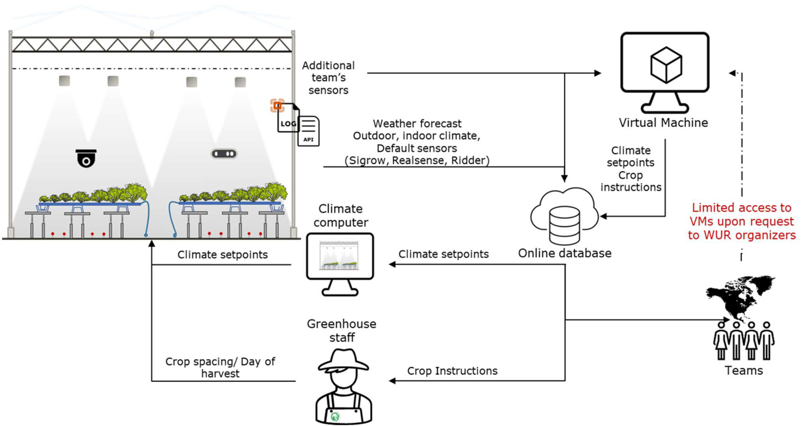
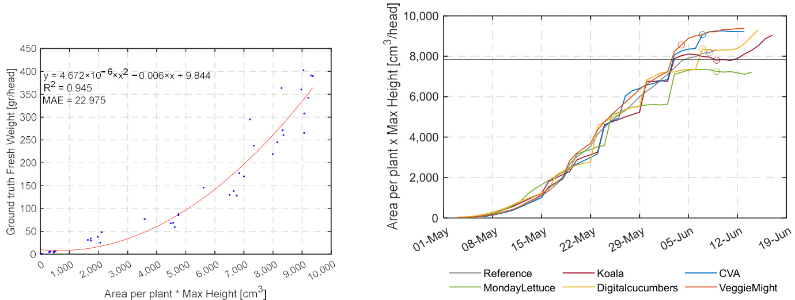
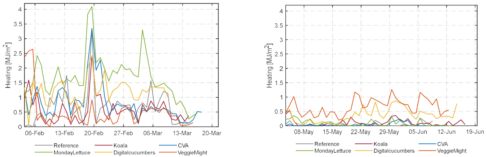

# Article Lettuce Production in Intelligent Greenhouses—3D Imaging and Computer Vision for Plant Spacing Decisions  

Anna Selini Petropoulou $\ast \textcircled { \scriptsize { \parallel } }$ , Bart van Marrewijk $\textcircled{1}$ , Feije de Zwart $\textcircled{1}$ , Anne Elings $\textcircled{1}$ , Monique Bijlaard, Tim van Daalen, Guido Jansen $\textcircled{1}$ and Silke Hemming $\textcircled{1}$  

Citation: Petropoulou, A.S.; van Marrewijk, B.; de Zwart, F.; Elings, A.; Bijlaard, M.; van Daalen, T.; Jansen, G.; Hemming, S. Lettuce Production in Intelligent Greenhouses—3D Imaging and Computer Vision for Plant Spacing Decisions. Sensors 2023, 23, 2929. https://doi.org/10.3390/ s23062929  

Academic Editor: Yiannis Ampatzidis  

Received: 30 January 2023   
Revised: 20 February 2023   
Accepted: 27 February 2023   
Published: 8 March 2023  

Copyright: $\circledcirc$ 2023 by the authors. Licensee MDPI, Basel, Switzerland. This article is an open access article distributed under the terms and conditions of the Creative Commons Attribution (CC BY) license (https:// creativecommons.org/licenses/by/ 4.0/).  

Business Unit Greenhouse Horticulture, Wageningen University & Research (WUR),   
6708 PB Wageningen, The Netherlands   
\* Correspondence: anna.petropoulou@wur.nl  

Abstract: Recent studies indicate that food demand will increase by $3 5 \mathrm { - } 5 6 \%$ over the period 2010–2050 due to population increase, economic development, and urbanization. Greenhouse systems allow for the sustainable intensification of food production with demonstrated high crop production per cultivation area. Breakthroughs in resource-efficient fresh food production merging horticultural and AI expertise take place with the international competition “Autonomous Greenhouse Challenge”. This paper describes and analyzes the results of the third edition of this competition. The competition’s goal is the realization of the highest net profit in fully autonomous lettuce production. Two cultivation cycles were conducted in six high-tech greenhouse compartments with operational greenhouse decision-making realized at a distance and individually by algorithms of international participating teams. Algorithms were developed based on time series sensor data of the greenhouse climate and crop images. High crop yield and quality, short growing cycles, and low use of resources such as energy for heating, electricity for artificial light, and $\mathrm { C O } _ { 2 }$ were decisive in realizing the competition’s goal. The results highlight the importance of plant spacing and the moment of harvest decisions in promoting high crop growth rates while optimizing greenhouse occupation and resource use. In this paper, images taken with depth cameras (RealSense) for each greenhouse were used by computer vision algorithms (Deepabv $^ { 3 + }$ implemented in detectron2 $\mathrm { v } 0 . 6$ in deciding optimum plant spacing and the moment of harvest. The resulting plant height and coverage could be accurately estimated with an ${ \mathrm { R } } ^ { 2 }$ of 0.976, and a mIoU of 98.2, respectively. These two traits were used to develop a light loss and harvest indicator to support remote decision-making. The light loss indicator could be used as a decision tool for timely spacing. Several traits were combined for the harvest indicator, ultimately resulting in a fresh weight estimation with a mean absolute error of $2 2 \mathrm { g }$ . The proposed noninvasively estimated indicators presented in this article are promising traits to be used towards full autonomation of a dynamic commercial lettuce growing environment. Computer vision algorithms act as a catalyst in remote and non-invasive sensing of crop parameters, decisive for automated, objective, standardized, and data-driven decision making. However, spectral indexes describing lettuces growth and larger datasets than the currently accessible are crucial to address existing shortcomings between academic and industrial production systems that have been encountered in this work.  

Keywords: artificial intelligence; computer vision; sensors; lettuce; indoor farming; autonomous greenhouses; climate control; plant spacing; remote control; data driven growing  

# 1. Introduction  

Recent studies strongly indicate that food demand will increase by $3 5 \mathrm { - } 5 6 \%$ over the period of 2010–2050 as a result of population increase, economic development, and urbanization, among other drivers [1]. The expected increase in food demand places pressure on natural resources and may lead to negative environmental impacts as well as biodiversity losses [2]. Among the possible solutions are the transformation of food production into a green industrial process and the promotion of policies for plant-based and high-nutrient diets [3].  

Greenhouse systems allow sustainable intensification of food production with demonstrated high crop production per cultivation area [4]. While vegetable production is increasing in area and volume, the number of farms declines, resulting in more vegetable area and volume per farm and per grower [5]. At the same time, the availability of labor is an industry-wide challenge as well as the lack of experienced managers and growers in crop production. Greenhouses are highly dynamic production systems operating through an integrated set of activities performed by growers [6]. Growers need to consider various performance indicators such as yield, quality, timing, and sustainability standards and meet the volatile market demands, and prices in uncertain environmental conditions subject to weather conditions, for example [7].  

Modern horticultural production is highly dependent on up-to-date information on farm operations. Production processes are already highly automated and controlled [8]. Information systems driven by the rapid developments in cloud computing, the Internet of Things, Big Data, machine learning, augmented reality, and robotics are changing the horticulture horizon toward precision horticulture [9–12]. Digital technologies, computational power, and high-fidelity sensors act as catalysts in the transition toward advanced and autonomous production systems. Non-invasive, near real-time data and information with high spatial and temporal resolution create opportunities for advisory or automated decision software and the design of advanced models, known as digital twins [13]. Monitoring and interpretation of the system’s dynamics at coarser and granular levels allow for location-specific operations to ascertain desired conditions that meet crop demands.  

Digital twins are equivalent to real-life objects mimicking the behavior and states over their lifetime in virtual space [13]. Greenhouse digital twins can be seen as coupled dynamic climate and crop models representing the actual physical, biological, and integrated technical systems as virtual representations of reality [14]. Digital twins can be used to simulate the effects of different growing conditions and crop management strategies, give insights into their effect on performance indicators, and support decision-making [15]. There have been several achievements in the implementation of mechanistic crop and climate models in horticultural research to facilitate decision making in greenhouse operations [16–18]. Broadly validated dynamic models of the greenhouse climate and crop include, e.g., KASPRO [19] and INTKAM [20], which have been used for several research activities. A benchmark experiment in optimizing net profit using AI for the remote control of cucumber cultivation in 2018 [21] and a follow-up on optimizing the net profit of tomatoes as a function of yield and quality a year later [22], showed the potential of AI in controlling and outperforming human decisions by experienced growers. Automated greenhouse control wasthus demonstrated to be possible; therefore, our next focus was on the autonomy, robustness, and scalability of such control systems [23]. The goal of the third edition of the Autonomous Greenhouse Challenge was the full autonomous control of lettuce cultivation.  

Commercial greenhouse production of lettuce (Lactuca sativa L.) is already highly automated. Lettuce is grown in controlled greenhouse environments including hydroponic, aquaponic, and vertical growing systems. The systems minimize labor requirements by using conveyor belts and lifts throughout the growing processes from seedling to harvesting [24]. Lettuce hydroponic systems include Nutrient Film Techniques (NFT), Deep Flow Techniques (DFT), as well as Ebb and Flow systems. NFTs are the most widespread method of recirculating nutrient solution systems [25] and employ a shallow stream of water with dissolved nutrients flowing over the roots of plants in water-tight gullies, here referred to as gutters. The nutrient solution is initially stored in a reservoir, pumped out into the gutters at an angle, and drained to a tank for filtering before re-cycling to the reservoir for re-use. Gutters are automatically filled with the growing media and lettuce heads and transported on conveyor belts to the main greenhouse area. When lettuce heads are fully grown, they are moved toward the harvesting area. At the harvesting area, cutting machines remove the plants from the gutters and transfer the lettuce heads for packaging while the gutters are washed, and the process starts again. During the growing period in the greenhouse, the distance between the gutters and crops on the gutters largely determines the required amount of greenhouse space and, therefore, resource use. From the perspective of greenhouse automation, it is important to note that the automated optimization of lettuce plant spacing is not yet implemented in practice.  

Optimal cultivation temperatures for lettuce are relatively low and range from $1 5 . 5 ^ { \circ } { ^ { \circ } } C$ to $2 8 ^ { \circ } C$ during the daytime to $3 ^ { \circ } C$ to $1 2 ^ { \circ } \mathrm { C }$ at night time [26]. The optimal $\mathrm { \ p H }$ ranges for the nutrient solution from 5.8 to 6.5 and its optimal electrical conductivity (EC) should be $1 . 5 \mathrm { m S / c m }$ [27]. A wide variety of crop types can be distinguished among the existing lettuce cultivars, with crisp head and butterhead commonly grown in the United States and Western Europe, respectively, whereas Romaine and loose-leaf types are mainly cultivated in Mediterranean areas [28]. The crop is susceptible to physiological problems including outer leaf tip burn, inner tip burn, and discoloration of ribs [29]. Growth of lettuces, as with any crop, is related to incident radiation and $\mathrm { C O } _ { 2 }$ concentration, and due to the relatively high surface area to volume ratio, has high transpiration rates [29]. A fully autonomous decision of optimum climate setpoints can contribute to better crop growth and lower resource use.  

Since plant spacing is an important criterion for good vegetative growth on an $\mathbf { m } ^ { 2 }$ basis, it is a major aspect of yield maximization. Densely planted lettuces can obstruct morphological characteristics such as head size, leaf expansion and color, and compactness [30–32]. Wider spacing ensures higher light availability per head and that nutritional requirements are satisfied; however, this comes at the expense of less efficient utilization of the growing area and resources used. Optimum plant spacing is a management decision in hydroponic lettuce cultivation that can potentially be determined using 3D camera images and other sensor data, together with artificial intelligence algorithms to fully automate the operational process.  

Modern camera systems and innovative artificial intelligence (AI) technologies such as computer vision allow objective, non-invasive, and continuous data for precision horticulture applications [33]. Advances in machine learning for image processing have resulted in a wide range of research and applications for crop monitoring [34]. Applications of computer vision can be found in the fields of pests, disease or weed detection [35–37], fruit and flower detection, counting and fruit ripeness [38,39], crop stress detection [40], yield estimation, or moment of harvesting [41,42]. Moving cameras or flying drones with mounted cameras scan plants from various viewpoints, addressing matters of occlusion and creating 3D representations of the crop [43]. High-resolution imaging in combination with deep learning techniques is expected to have great potential for precision farming and remote control operations for purposes of autonomous greenhouses [44].  

Traditional computer vision techniques struggle with the challenging greenhouses environment because of varying environmental conditions. Light conditions are continuously changing, and occlusion makes it difficult to identify individual plants or plant organs [45]. The development of hand-crafted algorithms was often time-consuming and not reliable enough. However, recent development in the field of deep learning made it easier to use vision systems in greenhouses. High classification accuracies of up to $9 9 . 7 \%$ [46] on large plant datasets such as the “Oxford-Flowers $1 0 2 ^ { \prime \prime }$ [47] dataset show the power of deep learning for plant phenotyping. Already in 2017, the first paper appeared on the quality assessment of lettuce using artificial neural networks [48]. Lettuce was binarily classified as good” or “reject”. Although the algorithm was not complex as it had only two layers, it was one of the first publications that showed the possibility of using neural networks for lettuce classification. The ability of networks to learn plant features from single lettuce images can be determined by the recently published lettuce dataset [49]. At the moment, three papers have been published, obtaining high accuracy to estimate fresh weight from the images with a Root Mean Squared Error (RMSE) up to $2 5 . 3 \mathrm { g }$ [50–52].  

The above-mentioned examples are only focusing single lettuce images. With the development of instance segmentation algorithms it is possible to determine the growth rate of lettuce over time by extracting the leaf area of single lettuce plants, as seen in [53], their experiments were in a semi-commercial setting without overlapping lettuces. A more commercial example can be found in [54], in which aerial images were collected and the number of lettuces was determined including a size estimation into three different categories. One of the conclusions was that despite the fact that many individual lettuces can be detected, there is still a gap between object detection and trait measurements [54]. In greenhouses, the environmental conditions are much better for high-quality imaging, reducing the AI and trait measurement gap. Other researchers developed a high-throughput system for individual plant phenotyping of lettuce [55]. Each lettuce head was placed in an individual pot; by detecting the pot and by applying semantic segmentation, many plant traits were calculated including projected area and perimeter. The area and size are two of the most interesting growth indicators. However, when the leaves became larger than the pot size, prediction accuracy decreased; as a result, the growth curves were only accurate for the first weeks. It can be noticed that most experiments were carried out in semi-commercial conditions. When the leaves were overlapping, either the experiment stopped, or the extraction of the parameters was removed. Next to that, in each experiment, the interpretability of the results was difficult. There is still a mismatch between object detection, determining plant traits, and more importantly, what a grower should do with the provided information. If AI can extract growth rate, how should a grower use this information to improve the cultivation? Therefore, more advanced methods are needed that can extract information in greenhouses and conform to commercial practice while maintaining interpretability.  

This paper describes the results of the third Autonomous Greenhouse Challenge, an experiment in which the autonomous control of lettuce production has been realized in six different greenhouse compartments, each controlled by AI algorithms developed by participating teams. During the experiment, the goal was to decide upon climate and crop management strategies to optimize the net profit of lettuce production, considering yield and product prices, resource use, and costs including greenhouse occupation. The experiment provided valuable public datasets which can be used for future AI training purposes, and which can be found under the Data Availability Statement. In this paper, we give an overall analysis of the results obtained by the teams. Next to that, we focus on the research question, of how computer vision and deep learning algorithms can be used for automated operational decisions of lettuce greenhouse production, as currently plant spacing and harvesting are determined on fixed schedules since transplanting. Furthermore, we examine how better utilization of the occupied growing area, efficient resource use that meets crop growing demands, and timely planning of harvest events can be supported by non-invasively estimated indicators such as the proposed light loss and harvest indicator. Results of other studies focus on answering similar questions on crop trait detection with computer vision in highly controlled and steady environmental conditions. This research realizes steps closer to commercial practice by processing smaller datasets of canopy images under varying environmental conditions.  

# 2. Materials and Methods  

This paper describes different steps of the realized research methodology, and an overview is given in Figure 1. In the preparation phase teams developed their own AI algorithms based on provided annotated single lettuce images and climate data time series from a climate and crop simulator [49]. After this preparation phase, two lettucegrowing experiments were conducted in greenhouses at Wageningen University & Research (Section 2.1. Greenhouse compartments and equipment Section 2.2. Crop and Section 2.3 Greenhouse climate and crop control). During the first greenhouse experiment, teams could gain experience in controlling the lettuce growth based on real-time data from the greenhouse (Section 2.4 Data communication, Section 2.5 Remote sensing, and data lciomllaetcetitoinm). sNereiwesadnantoatawt edrei cmoallgecst,eodf t5h6e fuTlelacmrospcouunlde retfhienecathmeira’aslgfioerlitdhomf svibewf haensdecloinmda tgerteiemnehoseursiesedxapteariwmerne .coAllneoctehder[5s6e]t  fTeanmnsotcaotueld  rmefiangest,hfeuirl aclrgopritchamnso mbeafgoerse, tahnedscelciomnadtegtriemeneshoseursiesexwpereimcoelnlte. eAdno[t5h6]e.rAsfeteorfthaenneoxtpaetreidmiemnatsg,eas,nfaunllalcyrsoips lciamnaotpe,ycirmoapg,eas,nadnrdescloiumracte utisme eswasesrimesadwe raencdollgeicvtend i[n56t].hisAftpearptehre(eSxepcteiroinme3n.tsR,easnu eacntialoynsis3.o1f–c3l.i3m).atAe,ncarodpd,itainodnarlesaonuarlcyesiussoefwplaasnmt asdpeacaindg gdievceisniiontshiwsapsampeard(eSe(Scteicotnio3n. eRseuslutlst sSecttiion s3..41)–3b.a3s). Aonnadidfifteiorennatl ainmalgyseisporfocpelsasnitngspamceitnhgodesci(sSieocntsiowna2s 6mIadmea (rSoeccetsisoing3  fRoersuplltsanStecstipoanci3n.4g) bdaesceisdionsd).iffTehrentreismualtgse pareocedsisicnugssmeedthaonds (cSoenctcilounde2.d6 eIcmtiaognesp4roacnesdsi5n.g for plant spacing decisions). The results are discussed and concluded in Sections 4 and 5.  

  
iFgiugruere1.1.Reseseeaarrcch metthodology of the  growiingeexpereirimenetnstsanadndananlaylsyi siosforfe sruelstus.ltsD.atDaftraofmrothmet nanontoattaetdedsisninglgeleleltetutuccee imaageess sisffound  in [[49]], whereas the annotated full crop data are found 5i6n].[56].  

# 2.1. Greenhouse Compartments and Equipment  

Each greenhouse compartment at the research facility of Wageningen University & ReseEarch girneeBlnehisowuisjek,cTohmepaNrettmhernltanatdst,hehardesaeasrizceh offa $9 6 ~ \mathrm { m } ^ { 2 }$ . TWhaegceonminpgaertnmUenitsvewrseirtey esqeuairpcphe dinwiBtlheistawnijdka,rdThaectuNaettohrse rallasnodasv,aihlabdleainsiczoemofme9r6ciaml2h. igTh-etecohmgrpeaernthmoeunstes  awse qshuiopwpnedinwFiitghusrtea1n.daArdp iapcet-uraitlorhseatlisnogaovna tlhaeb fleoionrcowimthmaerpciealkhciagpha-tceitcyhogfr $1 2 0 \mathrm { ~ W / m } ^ { 2 }$ hconwtrnoillnedFibgyutrhee1h.eaAt inpigpte-rmapilerhaetautriensgetopnoitnhtse  fclonotrinwuiotuhs aropofe avkenctailpataicoitny(voefn1ti2la0tioWn/ oanretraollf $0 . 3 \dot { \mathrm { ~ m ~ } } ^ { 2 }$ hoepehneiantignpgetr $\mathbf { m } ^ { \hat { 2 } }$ egreateunrheosuestepaorienat,s,eqcouinptipneudowusitrhoaonftiv-tehnrtilpastinoentti(nvge)n,ttilwatoi rteyapeosfo0f.i3nsmid2 eopmeonvienagblpeesrcreme2ngsr(eLeUnXhoOuUsSe 1a5r4e7a,DeFqRuiepnperdgywsictrheeanatin-tdhrOiBpSsCnUetRtiAn9g)9,5t0 yFpResWoflignhsitdbelomckoivnegasbclreesecnr,eeLnusd(vLigUSXvOenUsSs o1n5)4,7wDhiFteR LeEneDrgayrtisficrcieaelnl iagnhdtsOofBSdiCmUmRaAbl9e9 iRnteWnslitgyhctobnltorcolkliendginscar eceon,t iLnuoduvsigraSnvgenbsestown)e,enw2h7itaenLd $2 7 0 \mu \mathrm { m o l / m } ^ { 2 } / \mathrm { s }$ hatnsdofefdfiicimenmcay of $2 . 4 ~ \mu \mathrm { m o l / J }$ , (VYPR 2p, Fluence by Osram), a fogging system (maxim2um capacity of $3 3 0 \mathrm { \ g / m } ^ { 2 } / \mathrm { h } )$ , and $\mathrm { C O } _ { 2 }$ supply (maximum capacity $\mathbf { \bar { 1 5 } } \mathbf { \tilde { g } } / \mathbf { \bar { m } } ^ { 2 } / \mathbf { h } )$ were available. Plants were grown in soil-pressed pots on NFT hydroponic gutters (Hortiplan, Belgium) placed on an inclination. A recirculating water system was supplying water and nutrients via pressure-compensated narrow tubes injecting water into the gutters.  

aTtihoene.xAp erreicmirecnutl aotfitnhgewthaitredr sAyustoenmomwoasu suGprepelynihnogusweatCehr allnedn gneutwriaesnctsonvdiaucptredssinu othmepfiernsstahtaeldf onfar2r0o22witnusbiexsdiinfjfecrteintghiwgaht-etrecinhtoVetnhleo-gtyutpte rgsr.eenhouses compartments of WagTehneinegxepnerUinmiveenrtsiotfyt&heRtehsieradrcAh,uitnonBloeimsowuijsk,GTrhee nNheothuesrel aCnhdasl. eTnhgeebawsiacsgcroenendhuoctuesde hceofnisrtsrtuhctailofnoafn2d02e2q iunipsmixendtiffweirtehnatcthuigatho-trescahs Vwe lnlloa-sttyhpesgtarenednarhdousseens ocrosmapnadrtcomnetnrotsl of the greenhouse compartments were identical to the elements which can be found in commercial greenhouses (see Section 2.2 Crop and Section 2.3 Greenhouse climate and crop conmtrmole)r.ciHaolwperavcetri,cteh.eDgirfefenrehnotutseacmo sm(pCarVtAm,enDtisgiiztealwCauscumucbhers,maKlloearl at,haMnoindcoaymLmetetrucciael, pVreagcgticeeM. iDgihfft)eraendt taeraemfesr(eCncVeA,wDeriegictoalnCtruoclluinmgbtehrse,sKixoacloa,mpMaortndmaeyntLse.ttuce, VeggieMight) and a reference were controlling the six compartments.  

# 2.2. CTrowpo  

Tucwtoedcuilntiv6ateiqounaclygclresenofhloeuttsuecgercov.wi“nLgugcaonmop”a(rRtimjkenZtsw.aLaent,tTuchesNwetehrerlgarnodws)nwinerea choyndroucptoendiicn 6NFeqTuaslysgtre emn.hoSeuesedsgroweriengpcrompapgaratemde ntos  sLeettdulicnesg swe8rewgeroekwsn ibnefaorheydtrhoetproaniscplNaFntTi nsygsdteatme. TSehedysouwnerge plarnotpsawgaetredgtro swene idnlicnugbse8s  owfeceokms pbeafcotered  tpheat.r aOns tphlaendtianygs dofater.anTshpelaynotuing (p2laFnetsbrwueareygarnodw3n  iMnacyub2e0s2 2o,frceosmpepcatictveldyp),etaht.eOsenetdhliendgasysweorfetrpalnascpeldanitnitnhge (g2r eFenbhruoaursye  acnodm3paMrtamye2n0t2s2i,nressmpealclt ihvoeleys) otfhselisgehetdllyintigltsewdegruettpelrascetdo iwnhtihcehgwreaetnerhowuitshe cnoutmripeanrtsmweansts iunpsplmiealdl ahtoalecserotfasilnigfrhetlqyuteilntceyd. gutters to which water with nutrients was supplTiehde laetttaucerstawinerferegqruoewncyi.n  

Teahret lteot-thuecaerst dwiestraengcreo. wThneign $3 . 2 \mathrm { ~ m ~ }$ wpelraes t1ic0 cgumttwerisd,e,alslohtahveinmgax3i0mpulamntplhaonltesd,enwsithy awna $1 1 \mathrm { { c m } }$ ohuenardte-tdo)-phleanrtsdpisetranmc2ei.nTthe ignuittiaelrs twageer.e $1 0 \mathrm { c m }$ eswiwder,esogrtohwe nmianxitwmou rmopwlsanotf sduecnhsigtyuttwears a9s2 d(reopuicnteddedi)npFliagnutrsep1.erP $\mathbf { m } ^ { \breve { 2 } }$ tianptpheairnainticael  spteasgtes,. aLnedttduicsesasweesrewegreomwonniintotrwedo rwoeweskloyf sbuychexgpuetrttesrswaisthdoeupticitnetdeirfnerFinggurewi1t.hPlanyt aoppereatriaoncael, cpoenstsr,olandecdiisieoansesinwtehre monitored weekly by experts without interfering with any operational control decisions in the compartments. Irrigation and nutrient recipes were determined by the experienced greenhouse staff of the Bleiswijk Research Center.  

Leafy vegetables are sellable to retail at a particular weight and shape. The lettuce heads in the area of evaluation (Figure 2) were classified at the moment of harvest into three categories. Class A were sellable lettuces with a minimum average weight of $2 5 0 \mathrm { g } ,$ Class B were lettuces with a weight between 220 and $2 5 0 \mathrm { g } ,$ and Class C were non-sellable lettuce heads that were underweighted and or showed visible deformations. Malformations referred to quality aspects related to the shape of the plant and defects of the leaves (e.g., leaf discoloration, leaf rotting, and diseases).  

  
Figure 2. (a ) Cross- and( $( \mathbf { b } )$ ttop--viveiewsescetcitoionsn sofofonoenegrgerenehnohuosuesexepxepriermiemnetanltaclocmopmarptamrtemntenwtitwhit9h6 $9 6 ~ \mathrm { m } ^ { 2 }$ ground floor. (a) Compartment with crop and actuators: rail pipe, irrigation system, NFT gutters, $\mathrm { C O } _ { 2 }$ supply, LED artificial light, and two screens. (b) Arrangement of lettuce gutters. Green boxes represent the harvest area for data analysis.  

# 2.3. Greenhouse Climate and Crop Control  

Strategic and operational climate control was carried out by participating teams of the third Autonomous Greenhouse Challenge. Strategic decisions include, e.g., the use (installation) of screens or artificial lighting or the starting density of the crops, operational decisions included, e.g., the timing and amount of screen or lighting hours or crop spacing decisions. The AI algorithms of the teams were determining control setpoints of the heating temperature, $\mathrm { C O } _ { 2 }$ concentration, humidity deficit, lighting intensity, operation of the blackout, and energy screens, as well as leeward and windward ventilation. The mechanistic climate and lettuce crop models of WUR (KASPRO and INTKAM, respectively) could be used by the teams as a training environment for the algorithms before the start of each cultivation cycle.  

Resource use was calculated based on measured data: heating energy $\left( \mathrm { M J } / \mathrm { m } ^ { 2 } \right)$ with a price of 0.0375 EUR/kWh, electricity $( \mathbf { k } W \mathbf { h } / \mathbf { m } ^ { 2 } )$ with a price of 0.125 EUR/kWh for the on-peak hours (07:00–23:00), and 0.075 EUR/kWh for the off-peak hours, $\mathrm { C O } _ { 2 }$ use $( \mathrm { k g } C O _ { 2 } ^ { - } / \mathrm { m } ^ { 2 } )$ with a price of 0.12 EUR/kg.  

As in commercial practice, the spacing system allows for several plant densities; densities could be reduced from the starting density of 92 heads per $\mathbf { m } ^ { 2 }$ via a density of 60, 45, 30, 23, and 18, to the lowest density of 15 lettuce heads per $\mathbf { m } ^ { 2 }$ . The teams’ algorithms had to automatically make the spacing decisions.  

The following prices per lettuce head were given Class $\mathrm { A } = 0 . 5 0$ EUR/head, Class $\mathtt { B } = 0 . 4 0$ EUR/head, and Class $C = 0 . 0 0$ EUR/head. In commercial practice, harvested lettuce heads are sold per head, but as in reality, the economics of the greenhouse is eventually expressed in resource usage and production per average $\mathbf { m } ^ { 2 }$ of the growing area. Therefore, the price of the lettuce was multiplied by the average number of heads per $\mathbf { m } ^ { 2 }$ of the growing area. The formula to calculate the average lettuce crop density (heads/ $\mathbf { \dot { m } } ^ { 2 }$ ) is the following:  

$$
A v e r a g e C r o p D e n s i t y = \frac { D } { \sum _ { d = 1 } ^ { D } \frac { 1 } { d e n s i t y _ { d } } }
$$  

where $D$ is the total number of days since transplanting until harvest and densi $\cdot y _ { d }$ is the plant density at day $d$ .  

Teams had to maximize net profit. Net profit was calculated from income minus costs. Income was determined by multiplying the yield with the price per class. The total costs consisted of fixed and variable components associated with the greenhouse operation. On top of that teams were ‘charged’ for every manual intervention on their autonomous algorithm (EUR 1 per intervention). This penalty was meant to strongly discourage such interventions ensuring that the algorithms would work as autonomously as possible. Fixed costs accounted for the plant material, maintenance, and depreciation costs of the greenhouse equipment. The variable costs accounted for the resource use (electricity for artificial lighting, energy for heating, and $\mathrm { C O } _ { 2 }$ injection).  

# 2.4. Data Communication  

Data communication between the underlying systems was vital to ensure a stable, uninterrupted integration and operation. In this experiment, an Azure file share was made available to ensure enough storage capacity for collected datasets. Azure Virtual Machines—NCasT4_v3-series (VMs) were used for high-performance computing and deploying AI workloads, such as real-time inferencing of user requests. The infrastructure supported the communication between the greenhouse climate computer, control systems, sensing devices, and the state of actuators, measured indoor and outdoor climate (Figure 3) (Appendix A Table A1). Numerical time-series data of the realized controls, climate, and additional sensor sensors can be found under the Data Availability Statement.  

  
FiFgiguurere3.3. Dattaaccommunicicaatitoionnstsrtructctuurere Dataataflfolowssfrfroominindoororaannddoouttdoororclcilimataeteaannddaadditiitoionnala sensors to the virtual machines and the online database. Decisions of algorithms of teams are written from the Virtual Machines to the online database from where another communication protocol writes the controls to the greenhouse climate computer before their implementation in the actual greenhouse caonmdpamrtoments.ofGhraerevnehsto.use staff receives decisions from online database for spacing and moment of harvest.  

# 2.5. Remote Sensing and Data Collection  

In each greenhouse compartment, standard sensors were made available, comparable to earlier experiments described in [21,22]. These consist of an outside weather station, obtawineeatdhewresatahteirofno,roebctasit,neadndwienadtohoer  cfloirmecataes tp, arnadmientderoso(rteclmimpeartaetupraer,armeleateirvse(atiermhpuemriadt iutrye, PrAelRatlivgeht,a $\mathrm { C O } _ { 2 }$ ) amliodnitgy,wiPthA tRhelisgthat,usCoOf2)allalaocntugatwoirtsh(htheaetisntga,tufosgogfinagl,l liagcthutiantgo,rsc(rheeantiing,, $\mathrm { C O } _ { 2 } \mathrm { \cdot }$ )gin $5 \mathrm { m i n }$ tintge,rsvcarles.enTihneg,ouCtOp2u)tionf5thme isntaintdearvdalsse.nTsohresowuatsp uctonotfi tnhueoustsalyndaavradilasbelnesoasr input for the teams’ algorithms.  

IIn ccoommeerrciciaal prrooductcition, leletttucceetrtraaititssaarreesseleldoom ccololelectceted duriring t theeggrroowiningg ccyclceleaand crcorop pperefrofrormaanncceeisisevevalauluataeteddbbyygrgoroweresr’s’vivsiusaulali nisnpsepcetcitoionsnsonolnyl. IIn tht ihsis eexxpeeririmeent,t ReeallSensse D415 [[57]]ccaameerrasswerre hung $1 \mathrm { m }$ aaboveettheegrroowiing ccrroop i inntthee aarereaaofofe veavlaulautaiotino.nT. hTehceacmaemraeruaseus esstesrteor evoisivoisni oandasntdo rsetsordesptdhe,pRthG,BR, aGnBd,  IaRndimIRagiems.agAells caAlmlecrampearampeatrearsm,ebteortsh, ibntortihnsiinctraindsicexatrnidnsiecx,tarirnesipcr,ovairdeepdrowviitdhetdhewpituhblitsheedpudbaltiasshetd udnadtearsetthuenDdaetrathAevSauilpapblileitmyeSntatreymMeante. iTalh.eTsehepsaerpaamraetmerestecrsouclodulbdebuesuesdetdotococnovnevretrt the i imaaggeessttoopoiointtclcolouds.s.IImaageessweerreettaakeen eeveerry $1 5 \mathrm { m i n }$ ni in eeaacchhccoompaartrtmeenttduriringgtthe ccultlitivataitoionnccyyclceles.s  

Peeriroiodicic deestsrtructcitviveehhararvvesetstsofofsisxix plalanntsts peerrccoompaartrtmeentn t wereeretatakkeennoonnt thhee daayyoof plalantiting aand ssubsseequeentltly on aaweeeklly baasissisDeesstrtrucctitiveemeeassurrementtssoffpllanttheiight,t diaiameetteer,r,f rferseshhweiegighth,t,aannd drryyweiegighht,t,aannddscscooreressfoforrleleafa fdefeoforrmataitoion dueetto oouteterrleleafa titippbburrnn weerereccaarrireieddoout.t. Theeiindiiviiduaall leetttuccee pllaantsts weereretatakkeennfrfroomt thheerirgighht taanddlelfetf sisideeooffeeaacchhccoompaartrtmeenttaasssshoown i innFiFgigurere22b.b.Neexxttttoot thata,t,i imaaggeessooffththeei nindidviivdiduala plpalantnstswereeremaadde eaecahc $1 5 \mathrm { m i n } .$ ;n;aannexeaxamplpelecacnanbebefofouunnddinin(F(iFgiugruer e4)4.)  

  
iFgiugruere4.4.TTwooeexamplle  images  of RealSense D415ffrromththeedadyayofofplpalnatintign(gle(flte)fta)nadntdhethdeaydaofy harvest (right). On the day of harvest, plants were sampled from the field of view of the camera and were destructively measured for height, diameter, fresh weight, dry weight, and quality.  

# .26..6I.mImagaegeProrocceesssiing ffor Plant Spacing Deciisiions  

Onneeofofttheemaiin research questionsiis howiimaaggesestatkaeknenini na agrgereenehnohuoseusceoncfonrfmortmo ocommerecricailalprraacctiticce and  computer vision can bee useseddtotodedtetremr imnientehtehoepotipmtiaml salpascpiancgi tsrtartaetgegy.y.To do tthiis,,  the images  of thelletttucceeccrrooppininthtehegrgerenehnohuosuesneeneedetdo tboebrelraetleadt etod a relevant crop variable, such as crop growth rate. From the time series of images taken nisnisdiedeththeeggrreenhouses  (Figure 4),, the coverrageeccaannbebec aclacluclualtaetdedovoevretrimtiem. eT.hTehceovceorvaegrea can be defined as the area covered with green leaves relative to the total ground surface area. However, coverage might not be a good indicator to determine plant growth rate, as plant growth rate may decline once the leaves touch neighboring plants. It can be assumed ltahnat gforrowvetrhyrahtieghmcaoyvdeeraclgienegronwceththise lheamvepsetroeud. hSno,eicgohvberoarignegmpilgahntsn. Iot cbaenabseuaistsaublme hpatrfaomretvertyohbieguhsceodvfeorasgpeacgirnogwdtehciisiohnas.mCpreorpe dv.olSuo,mecovnetrhaegecomntirgahrty nmoitghbtedae scuritbae aprlanmtegtreorwttohbreatuesevdefnoirf sthpea cionvgerdaegceisiisocnlso.seCtro $1 0 0 \%$ .uCmreo po nvotlhuemceocnatrnarbye emstiigmhtatdeedsbcryi lcaonvtergargoewatnhdrahteigehvtean idf tchaen cboevuesreadgteoisdectleorsemitnoe1c0r0op%.grCorowtphvroaltuesmien ctiamneb. eTehsetivmolautemde overatigemea insdahreilegvhatnatncdrocpanpabreamuseetedr,tohodweteevrerm, itnemcirgohtpngortodwirtehctrlayt eassienstsiifmse.paTchinegvowlaus vcaerriteidmeouitscao relcetlvya.nAtncortohperpoaprtaiomnetmeir,g htobweetovecra,lcitulamtieglhitghntoitntdeirrcecpttliyonas(soreslisgihftslopsasc)i. wTahsecdairfrfierdenotumt ectohrordesctolfy.“cAonvoetrahgeer”o(pSteicotinonmi2.g6h.2t),be“vtolcuamlceuolvateer tligmhet”i(nStecrtcioenp t2i.o6.n3)(,oarnlidg o“slisg).htTlhoessdoivfferrteinmte”m(eStehcotidosn o2.f6.“4c)oavrereaxgpel”ai(nSeedcitinotnhe2f.o6l.l2o),w“invgolsuecmtieonosvaefrtetrimd es”cr(iSbienctgi .h6.o3w), carnopd s“eligmhetnltoastisoonv(eSrectiomne”2 6(.S1e)cftrionm 2g.r6e.e4n)haoruesexipmlaginese ids inmtphlemfeolnltoedw.i  

dFoesrcoripbtinmgizihnogwspacrcionpg sdegcimsieontsa,tihoench(Salelcetniogne li2e.s6.i1n)refraloizmingraeefanshtopulasent igmroawgtehs rate on one hand and limited use of space on the other hand. Early spacing facilitates fast growth rates thus increasing yield over time, late spacing facilitates less occupation of space thus decreasing resource use. An optimum spacing decision is therefore necessary.  

# r2o.6w.1t.hCraotpe sSetghumsenitnactrieoan  

First, the lettuce crop needs to be segmented from the background. The growth of each lettuce head over time was identified using instance segmentation. However, this is .o6.n1l.yCprospsiSblegimnetnhteatfiirosnt 2 weeks. After that, the lettuce heads start to touch each other, andFlierastv,etshoevlertltaupcpeecdr.opAsneviesdibslteoinbeFisgeugreme5niteids aflromosthiempboascskigbrleouton id. eTnhtiefygrwohwicth alecahvlesttbuecloenhgetaodwohviecrh tlietmtuecewahseaid.eTnthiefirefdorues,isnegmianstiacnsceeg smegntmaetinotnatiisouns.edHionwtehivsesr,tutdhiys. nSlpyecpiofiscsaillbyl,eDineetphLeafbirvs $3 +$ , wehieckhs isAiftmeprltehmaet,ntehde ilenttduectechtreoand2s(svt0a.r6t)t[o58t]o.uFcohretaracihniontgh npdurlpeoasves2o3viemrlagpepsehda.vAesbeveisnibalneniont aFtiegdu, riensw5ihticish  aelacmhosptixiemlpwoass ebiltehetro aindennotiaftyedwahsi ebaavceksgrboeulonndgort loettwuhciec,ha nletxtaucmeplheeiasds.hoTwhenrienfoFrieg,urse5m.aAnltlicsetsteigngmsefnotrattriaoiniinsg uwserde kienpt the same as in the original implementation detectron2. Only the number of iterations was set to 2500 and the image size was set to $1 0 2 4 \times 1 0 2 4$ . For validation purposes, 12 additional images have been annotated. The evaluation was carried out on the validation dataset using the mean Intersection over Union (mIoU) metric Equation (2). In which M denotes the mask of the class, respectively.  

$$
m I o U = \frac { \left( \left| \frac { M _ { G T l e t t u c e } \cap M _ { L e t t u c e } } { M _ { G T l e t t u c e } \cup M _ { L e t t u c e } } \right| + \left| \frac { M _ { G T b a c k g r o u n d } \cap M _ { b a c k g r o u n d } } { M _ { G T b a c k g r o u n d } \cup M _ { b a c k g r o u n d } } \right| \right) } { 2 }
$$  

  
Figure 5. EFxiagmurpel e5.ofExoraimgipnlael o(lfefotr)igainda a(nlenfott)aatend iamnangoeta(treidghitm). gTehe(riagnhnto).taTtehde iamnangoteatheads itmwao classes in blue the lettuce class and pink the background class.  

# 2..6..2. Cove2er.r6a.g2e.e  

The coveraTaghewcwoasvsecrallcgcueullawattaesdcbabylycsuselegagtmemedenbttiyinsgetgthmeiinmtiangestshweiithmhtathghe strwaintnhedtdhDeDetereapiLnaeabdbvD3+e+ modell. In tmthoesdsels.seIegngmtmheenstedsdeiigmaegnetsetdheiemnaugmemsb eterhreofnpupiimxebllesrclolafaspsiifixfieldsd acalsalslestitftuiuecde awsalsestdtdiuivciiedewda bytthe ttottabllyntuhmembtboetrraoloffnpupiixmxebllses,r,ssoefepEiEqxqeulasat,tiisoene((E3)q.).  

$$
C o v e r a g e [ \% ] = \frac { \# l e t t u c e p i x e l s } { \# t o t a l p i x e l s } \cdot 1 0 0 \
$$  

# 2.6.3. Volume over Time  

To determine the lettuce head volume over time from images taken in the greenhouse wiitth condiittiions tthattconfform tto prracttiice a “grround pllane” iissneeded. Thiis ground pllane was determined by fitting a plane using RANSAC [59] through the non-lettuce pixels on tthe day offpllanttiing.  RANSAC  can  compensate for sllight skewness in camera mounting. This method assumes that the camera position does not change after planting. The height is subsequently calculated by determining the point-to-plane distance for each pixel classified as lettuce (Figure 6). The volume was then calculated by multiplying the height by the pixel size in mm and dividing by the density at each moment in time. By dividing by the density, the volume per plant was calculated which was needed to correct for different plant densities. The growth was then determined based on the volume increase.  

$$
H e i g h t _ { i } [ \mathrm { c m } ] \ = d i s t \_ p l a n e _ { i } - d i s t _ { i }
$$  

$$
\cdot t i m e \left[ \mathrm { c m } ^ { 3 } \right] \ = \ \frac { \sum _ { i = 0 } ^ { N } \left( H e i g h t _ { i } \cdot p i x e l s i z e ^ { 2 } \right) } { d e n s i t y } \cdot 1 0 0 0
$$  

  
Fiigurre 6. SFiidgeuvrvieie6w. oSoifdpepoivininetwclloufudpowiwinithicilnogugrdreewn tthienfifgittrtteedngtrhoeufnitd epdllagnreousnsiidngplRaRnAeNuSsAiAnCg[[5R58A]]NttoSo dettermiine  tdheteehremi ignhet. hAet ththehiegbhboto.tttAotmthtthehebpopltltaontmststahattet thpheleasntsatsratrattdadtthaeteeasntadnrdtabdaoabtvoevaetnhtedhepabpaolnavtnesttashtaetthptelhadenatdsyaoyt ohfahravrevste.st.  

# 2..6..4. Liigh2t.L6L.o4os.sLoiogvhetr LTioimsmse  

ForooptpitimaFlaolursueosopeftitomhfeatlghreuesegenrheoefuntsheoeaursgerae,aeirtneihsao,iumitspeiosartriaemnat,ptoiotr teiasvnatilumtaopteoertvthaelnustaptaoecitenhvgeadlsuepcaiatseciiotnhg. Idnetchiisi orens.edaIrencihts,ihtoihsne. lriIegsnhetatlrhocishs,wrteahsecarllicghuh,ltatlehoedssolivgewrhatis lmocesa.slSciuwml aptsleidficeadlocvwueleratdeteidtmereo.mvieSnriemdtipifmlitfehi.edlSiigmwhtpe loss after spacing was larger than the light loss before spacing due to overlapping leaves. The light loss after spacing was calculated by subtracting 100 minus the current coverage (Section 2.6.2) (Equation (6)). The light loss before spacing was calculated by determining the difference between the current coverage and the theoretical coverage. This theoretical coverage was the projection of previous coverage divided by the previous density and multiplied by the new density (Equation (7)). This difference indicated how much light was lost due to overlapping leaves. Now the light loss was calculated (Equation (8)). If for example, the light loss was negative, it indicated that too many leaves were overlapping, resulting in a light loss that was larger than the light loss after spacing. On the other hand, if the light loss was positive, then the spacing decision was too early, because in the new spacing density, there was more light lost than before.  

$$
L i g h t L o s s _ { c u r r e n t } = 1 0 0 - c o v e r a g e _ { t }
$$  

$$
L i g h t L o s s _ { b e f o r e \ s p a c i n g } = c o v e r a g e _ { t } - \frac { c o v e r a g e _ { t - 1 } } { d e n s i t y _ { t - 1 } } d e n s i t y _ { t }
$$  

$$
L i g h t L o s s = L i g h t L o s s _ { c u r r e n t } - L i g h t L o s s _ { b e f o r e \ s p a c i n g }
$$  

where $t$ denotes the time when spacing occurred and $t - 1$ time before spacin  

# 3. Results  

Two experiments were carried out consecutively. The first experiment offered the teams the possibility to test their algorithms in growing a real crop in a real greenhouse to bridge the gap between simulation and reality. The second experiment was the eventual challenge that determined the winner of this third Autonomous Greenhouse Challenge. In both experiments, the algorithms were optimizing income against costs to achieve a maximum net profit. The challenge was the outside conditions during the second experiment (early summer) were very different from those in the first experiment (late winter). Both data sets are made publicly available and can be used for further development of intelligent control of lettuce production systems. We show both but focus more on the second data set which was determining the winner of the competition.  

The results of realized climate, resource use, crop yield, and applied plant spacing are given for the two cultivation cycles in the six greenhouse compartments.  

# 3.1. Climate and Resource Use Analysis  

The climate control strategy in the greenhouse largely determines the use of resources. Figure 7 illustrates the average daily greenhouse air temperature in the different compartments during the late winter and early summer experiments. The realized daily average temperature ranged between $1 8 ^ { \circ } C$ and $2 2 . 5 ^ { \circ } \mathrm { C }$ for the first experiment (winter), whereas for the second experiment (early summer) the minimum and maximum diurnal temperatures were on average $1 ^ { \circ } \mathrm { C }$ higher. Teams decreased their energy consumption for heating by more than $8 0 \%$ , up to $9 7 \%$ , except for two teams DigitalCucumbers and VeggieMight (Appendix A Figure A1). For DigitalCucumbers the operation of the heating pipes is reflected in the high diurnal temperature realized in their compartment augmented by their low ventilation rates that maintained the highest $\mathrm { C O } _ { 2 }$ concentration (Figure 8), despite the low $\mathrm { C O } _ { 2 }$ dosage rates. VeggieMight realized lower temperatures, due to the higher ventilation rates, despite the higher energy used for heating. Appendix A Figure A1 shows the energy consumption for heating over time in both experiments, an important part of the resource use.  

  
Figure 7. Average daily temperature ${ } ^ { ( \circ } \mathrm { C } )$ of all compartments during the first and second cultivation.  

  
Figure 8. $\mathrm { C O } _ { 2 }$ concentration (ppm) for the different compartments during the first and second cuFlitigvuarteio8n.  

The daily light integral (DLI), $\mathrm { m o l } \mathrm { m } ^ { - 2 } \mathrm { p l a n t } ^ { - 1 }$ in the greenhouse compartments is tighuerseu8mT. hCoefOdo2aucitlosyni cdliegnsthrutanitilniotgnehg(tr,paiplnm(fl)DufLeoInr)c,tehmdeobldyifmtf−he2reptnleatanctmo−’1msipsnactrthemenegnruteseadnguheroi(nuAgspetphceonfmdiirpsxtarAatnmFdiegsnuetrcseoinsAdt2h) ualnstiudv atmtoipofnp.eodutusipdwe isthuntlhiegahrt,tiifincfilaulelingchetdfobryetahceh team’(sAscprpeendiuxs aAgeFi(gAurpepeAn4)d. xEsApeFcigalulryethAe2 loangde rtodpapyeldenugpthwaitnhdthiegharetrifiinctiealnslitgihets fofrseoalacrhrtaedaimati(oAnprpeesnuldtiexdAinFaighuirgeheAr4c).uEmsupleactiavlel DtLhIeTdhlueorindngageilrtyhdleiasgyehctloientdgeteghxrpaalenr(iDdmLehI)ni,gt.hmTeorhleimrnetaelpnilszaietnidteisnidonfotohsreodlgarileyernaPdhAioaRutifsoernceoraemcshputalteretadmeianststahisehtsihugehme uofcmsuomlfaurolrautatisdviieda teiDosLnuInaldniugdrhiatn,r tgiinfitfchliueaelsnleicgeohdntdbuyeritxnhpge rtiehmaeetmnw’ts.osTcurhleteirnveautilsioazngeede x(ipAnedpriopmoernendtiasxilisyAilPFliuAgsRutrfaeoterAde2i)anc Fnitdgetuaormep p9.aesIdntuthphe wsietuchomtnhdoefeaxrsptioeflriaicrimalerlnaitdg,ithaetaifomnrVeaeangcgdhiteeaMartiimgfih(ctiAarpleapleizgnehdtixdtuhAreiFnhig uhtrehesetAct4uw).moEulscaputeilvctievalaDltyiLoI h(Feixglpouenrregie1mr0e)ndtaseysiplsietinellgtuthsetrzaentredodhiionguhrFesirgoufirntethe9ni.rsiIatinretistfihcoeif als eiolcloaurnmdrianedaxitiapoteinroin(mAerpenpst,uelntedaidxmiAnVFeaigghuiregehMAeirg4)h aunrmedualtiahzteievdheitghDheLeIhstidgtuhorteiasnltglcitughmetusilenacteiorvncedepDetxLioIpne(rFipigmeruernhete.1aT0d)hoedferlsepatlitituzeceted,heianszdeaorroershduolautirlosyfoPtfhAtehRienfirtoerallreitagifceihcnita eoapmeratsio tnhoef tshueimr bolfacskoluatr srcaredeianti(oAnppaenddiaxrtAifiFcigalurleigAht3)d,uarindgthtehier ltowoplcaunltivdaetnisointy (xTpaebrliem1e).ntCsoims pilalruasbtlreatceudmiunlatFiivgeurDeLI9s. fIonr atlhletesaemcsonwderexopbesreirmvendt,inttehaemfirVstegexgipe rMiimgehntt. eHaAloi3zw)e,edavntehrd,etihnheitigrhhleosfiwtrscptu aemxntupledaretiinvmseietnyDt(,LTtIah(beF ileig1u)hr.teCd1oe0m)mpdaenrsdapbiotlfe lctehuttemuzuceleraotwivahesouDmrLsaIisonfloytrhcaeoillrvteaeraetidmf scwiwiatlehr llaurotimbfisiceniravtlieoldingi(hntA,tphapse $5 0 \%$ xteoAx $8 8 \%$ mroefnttAh.4e)Hmaonewdaestvuherere,dhiinlgithghehesttfotiroistgtailenlxaitpgehdrtiifmnrtoenmrtc eLtphEteiDolsing(phAteprdphenmadadinxodfAo eFtitguucer,eaAs4a).reDsulrtinofgttheisneteclolingde netxoppereirmateiontn, ocfotmhepiarrbalbalcekloiguthts clreevenls(Awperpe angdiaxinAreFqiguired At3o),reaancdhththeiertlaorwgept awnetidgehnt,sitllyu(sTtraabtled1)b.yCtohmepcaorlaobrledccuirmculelastinvebDotLhIsfifgoruraells.t aDmues twoetrhee hbisgerhveerdsoilnatrhrea fdiirastioenx,plersismaerntti.ficHiaolwliegvhetr winasthnefeidrsetdeixnptehrismexntp,etrihemleingth. AdpepmeandixofA eFtitguucerewAa5sshmoaiwnsl ythceoevlercterdiciwtyitchoanrstuifimcipatliolingohvt,eratsim50e%intboo8th8%exopfertihmeenmtesaosfueraecdhltiegahtm, rainginmapteodrtafnrtopmartLoEfDtshe (rAespopuerncediuxse.A  

  
Figure 9. Indoor  photosynthetiic actiive radiiattiion (PAR)  for the different compartments during the ffiirst and second cultivation.  

  
Figure 10. Cumulative light intercepted by each lettuce head per compartment in the first and second cFuilgtiuvraeti1o0n.. LCiugmhtuilnatievrceelpitgihotn ipnetrerlceettputceedhbeyadeawcahslceatltcucleatheedabdypaermcuoltimpliacrattmioen tofinthtehdeafiilrystligahntd isnetceognradl (cDulLtiIv)awtiiothn thLie ghrteient ecrocveeprtaiogne per $\mathbf { m } ^ { 2 }$ tgurcoewhienagdarweas, dciavlciduleadtebdybthyeahemaudltidpelnicsiat iy onnoefatche pdaritlicyulliagrhtdiany.teTghrea lc(irDclLeIs)  (wo)i,thmtahrek gthreednacyosvaetrwagheicphetrhem2letgtruocwe ihnegaadrserae,adcihveidtehdebtyartghet fhreasdh dwenigsihtty of $2 5 0 ~ \mathrm { g }$ by linearly interpolating the data of the weekly destructive measurements on randomly fsrelsehctewdeilgethttuocfe 2h5e0adgs.b  

Table 1. The average density of lettuce heads for the two cultivations as calculated using Equation (1).   

<html><body><table><tr><td>Experiment Planting Date</td><td>Reference</td><td>Koala</td><td>CVA</td><td>Monday Lettuce</td><td>Digital Cucumbers</td><td>Veggie Might</td></tr><tr><td>3 February</td><td>32.7</td><td>34.5</td><td>31.9</td><td>41.4</td><td>37.7</td><td>32.9</td></tr><tr><td>3 May</td><td>29.0</td><td>30.4</td><td>29.9</td><td>36.7</td><td>31.7</td><td>28.7</td></tr></table></body></html>  

All climate strategies applied by theLtetatumcseresultedCiuncudimffbeerresnces in reMsoigurhcte use whic3h2.a7r e summ3ar4i.z5ed in Tab3l1e.92.  

Table 2. Net profit of different teams in the second experiment consisting of crop income minus costs (fixed costs, heating costs, electricity costs, $\mathrm { C O } _ { 2 }$ costs, and intervention costs).   

<html><body><table><tr><td></td><td>CVA</td><td>Meighe</td><td>C Ddugmtbers</td><td>Koala</td><td> Monday</td><td>Reference</td></tr><tr><td>Total income [€/m²]</td><td>12.16</td><td>10.38</td><td>15.84</td><td>14.16</td><td>11.83</td><td>12.12</td></tr><tr><td>Fixed costs [€/m²]</td><td>7.85</td><td>6.41</td><td>8.50</td><td>7.06</td><td>9.64</td><td>6.59</td></tr><tr><td>Heating Costs</td><td>0.01</td><td>0.29</td><td>0.16</td><td>0.04</td><td>0.03</td><td>0.02</td></tr><tr><td>Electricity costs [€/m²]</td><td>0.23</td><td>0.00</td><td>0.46</td><td>0.00</td><td>0.45</td><td>0.34</td></tr><tr><td>CO2-costs [€/m²]</td><td>0.60</td><td>0.53</td><td>0.34</td><td>0.11</td><td>0.18</td><td>0.53</td></tr><tr><td>Total operational costs [€/m²]</td><td>8.69</td><td>7.24</td><td>9.45</td><td>7.24</td><td>10.30</td><td>7.48</td></tr><tr><td>Intervention Costs [€/m²]</td><td>2.00</td><td>1.00</td><td>3.00</td><td>1.00</td><td>2.00</td><td></td></tr><tr><td>Net profit [€/m²]</td><td>1.47</td><td>2.14</td><td>3.39</td><td>5.93</td><td>-0.47</td><td>4.64</td></tr></table></body></html>  

# 3.2. Crop Yield Analysis  

Feirgeunrted1e1nsihtioewssrtehaleiizneidtiaolvpelratnitmde.nTsihtireosuogfh9o2uthetahdesc/ $\mathbf { \dot { m } } ^ { 2 }$ vcahtiosennpbeyriaoldlst,elaemttsuacendhtehaed diwfferenstpdaecendsitiaecscorredailinzgedt ovthere tidmecei.siTohnrsooufgheoacuht ttheacmu’lstiavlagtoiorinthpmer.ioTdhse, lretatsuocne hfoera dtsh wseprea csipnagcewdaasctco rbdailnagn cteo ftahsetdcercoipsiogrnoswoft he acnhdtemaimn’ismailzgeorgirtehemn.hTohues eresapsaocnefuotriltihzeatsipoancitnhgu wraes tourbcaelaunsce afansdt crosptsgfrorwstphaacindg.mAinsitmhiezeavgereraegnehopulasen tspdaecnesiuttyilizmaptiaocntetdhucsosrtesodurecet usresaonudrceosutsefoarnsdplacbinorg.foArsstphaecianvgereavgenptsl,atnetadmenssiMtyo inmdapyaLctettducoestasnduDeitgoitraelsCoucrcuemubser anatdtelambpotrefdortos peaxcpilnogitetvhenatsd,vteaantmasgeMofnhdiagyhLerettduecnesiatineds aDnigdi tfaelwCeurcuspmabcienrsg  aitntte rmvpetnetdiotno exrpelsopietctthievealdy.vaTnthaegeaovferhaigheerpldaentsitdiesnsaintidesfewofertshpeactiwngo inctuelrtiveantion s,cryecslpesectfiovrelty.heThsei average plant densities of the two cultivation cycles for the six compartments are shown in Table 1.  

  
FiFgiugruere1 1.1L.eLtteuttcuecdeednesintsyit(yh e(ahdesa $\mathrm { m } ^ { 2 }$ )ma2)ndanhdarhvaerstvedsattedsa(teo)s i(no)thien dt ihfefedreifnfterceonmtpcaortmpearntsmdeuntrisndgutrhien firtshteafnirds tseacnodnsdecoulntidvcautilotinvapteiroino dp.  

Duruirnigngthtehefirfisrtstexepxepreirmimenetn, ,thtehetetaeam’ms salaglogroirtihthms sese emededtotohahvaevecocompuptuetdedthteh hahravrevsetstitimeequitite accurattelly at the target weiightt off2 $2 5 0 ~ \mathrm { g } ,$ sacsacnabnebse esneein iFnigFuirgeu1r2e 1T2h. Tchreocprsopofs  DofigDitiaglitCaulcCucmubemrbsearsndanVdegVgeigegMieigMhitgghtregwrepwooproloyr,ltyh, ethyewyewr ersetilsltiflalrfaorf fofrfofrmo tmh thteartgaertgedtedwewigeihgththtehe moomenetnt thata ttthe ffii rst cultivation was tterrmiinatted. Forrththeesesceocnodn exepxepreirmimenetn, ,thtehealaglogroirtihthmssofofalal lpapratritcicpiapnatnstswereretotoolaltae eininhahravrevsetsitnign,g,thtehehahravrevsets wewiegihgthtwawsash ihgihgehretrhtahnanthtehetatragregtet weiegihgth.t. Onlnylythtehererfefrernecnec ecocompapratrtmenetn,t, wasashahravrevsetsetde timely. Appendix A Table A3 summarizes the lettuce weight at harvest and the number of cuolft icvualttiiovnatdiaoynsdpaeyrscopemrpcaortmpeanrt.mIteanlts.oIts haolswossthoewdsattehseatdawtheischatthwehiidcehalt thaergideteawl etiagrhgte would have been achieved for the different compartments by linearly interpolating the weekly fresh weight measurement.  

  
Figure 12. Development of fresh weight [g/plant] in the different compartments for the first and seFcigonurdec1ul2t.ivDaetivoenl.oTphmeecnutrovfesf rwesehrewobetiagihnte[dg/bpyllainte]airninttheerpdoilfafteiroentofctohme pwaeretkmlyenrtasnfdormtlhyesfairmstplaend psleacnotsndancdu(ltdievsattriuocnt.i vTelhye) cwuerivgehsedwheereadosbotfailentetducbe.yTlhineeanrdinotfetrhpeoliantieosnreopfretsheentswteheeklcyhorsaenddoamtley osfahmarpvl edstpalnadnttshaenfrdes(dheswteriugchtitvaetlyh)arwveisgt.heTdhehceiardclsesof(ole),ttruecper.esTehnet ethned  doafytsheonlinwehsicrehptrhes elenttsutchee hcehaodserneadcahtedoft heartavregstetafnredsthewferiegsht owfe $2 5 0 \mathrm { g }$ a.  

Total lettuce crop yields (Figure 12 and Appendix A Table A3 and the quality assessment (TAotpapl elnetdtiuxceA cFrigopureyiAel6d)sre(sFuilgtuerdein12a caonmd pAutpepdeindcioxmAe fTroabmlet hiAs3cualntidvatthieonqcuyacllite.y IansSsecstsiomne n3.t3(tAhpispiencdoimx eAisFicgoumrpeaAre6d) rweistuhltehde icno satscoasmsopcuitaeteddinwciothmtehfersoemcotnhids cullttiivatition ccycclleet.oInobSteaictniothne3c.o3mthpisu tiendc onemtepirsocfiot (mTpaabrled2).  

# 3.3. Net Profit  

TNhete Pcroomfitbination of climate strategies, resource use, crop yield, and quality realized by the teaTmhes creosmulbtiendatiinondifofecrleinmt antetsptraotfietgsi.esD,erteasilosuarce suhsoe,wcnrionpTyaiebled 2.a  

# 3.4. Plant Spacing Analysis  

TPlhaentneSt parcionfigt iAsnraelysiinsg on crop yield, quality, resource use, and greenhouse occupation. The realized plant growth rates, plant densities, and realized final harvest due to timely estimation of plant weights were shown to be crucial for the net profit. Therefore, the options of different detailed computer vision analyses to make timely decisions on spacing decisions are shown in this paper.  

# 3s.4p.a1c. Cngovdercaigsie  

The computer-vision-based data analysis of plant growth mainly relies on the segmentation of the images of lettuces taken at a defined area over time. An example of such an image is shown in Figure 12 (left). There results of being segmented with the DeepLabv $^ { \cdot 3 + }$ algorithm as described in the Materials and Methods sectionare shown in Figure 13 (right). The algorithm had a mIoU of $9 8 . 2 \%$ on the validation dataset, with $1 0 0 \%$ indicating that the seDgeempeLnatabtvio3+n iaslgpoeriftehctm. Easv ednetshcroiubegdh tihnethvealiMdatieorinaldsatansdetMweatshroedlsatisveceltiyosnmaraell,s thhoewsne gi-n mFiegnutarteio1n3 (priogchet)d.uTrehecalngboerictohnmsihdaedread tmoIobeUsouff9fi8c.i2en%tloynrtohbeuvsta,lisidnactieon ldyatasemt,alwl iftrhac1ti0o0n% oifnpdricoacteisnsgedtihmatagtehse  frsoegmmtehnetdataitoanseits speegrfmecnt.taEtivoenotcchuorurgehd toheb evianlciodrarteicotn. Adnateaxsaetmpwlae isregliavtievneilny sFimgaulrl,e  t1h3e. sAeltghmoeungthatihoenrepraorecewdhuirte ceadngebsevciosinbslied(eriegdhtt),osbheoswuifnfigciwenhtelryerpoibxuelst, wsienrceefaolsnelly a ssmigalnlefdracsti‘loenttoufcep’r,otchesseed igmesa gaeres frreloamtivtehleydsamtalsle.tsThsegalmgeonrtitahtimonapocpceuarred atlosobteoinbceorrorbecuts.t iAndexalimnpglewisthgidvifefnerien tFiliguhrtec1o3n.dAitlitohnosuignhtthergereaernehwouhsites eadsgsehsovwisniibnle t(hreigchotr)r,eschtloywpirnogcewsshedrebpoitxtoelms  rwoewreoffalFsiegluyraes1si3.g  

  
Fiigurree113. Examplle of  a rreeala (l(elfetf)t aannddsesgegmenetnetedd(r(irgihgth) )imimagaegeusuisnigngDeDepeLpaLbavb3v+3. Frrom tthe sseegmeeFnittgaatuitioroenn,1,tt4hhesechcovwveersrataghge $[ \% ]$ ]rwcwaeasnsctcalagcleculoalftaetcedu.d  

Fiigurre 14 sshowsstthe perrccenttage offccultlitivatition arrea ccoverreed by lletttucce fforreacch iimage oveerrtitimeefofroreaecahcchocmopmaprtarmtemnet.nIt.n Itnhethfiersftiresxtpexripmereinmt,elnets,slefsfiscieffnitcisepnatcespoacceupoactciuopnatinodn caonvderacgoevewreargeobwsereveodb, sdeurevetod,thdeuexptlo rtahtievexdpelcoisriaotinv-emadkeicnisgiofn-thmeatkeianmgs.ofCotnhseidterainmgs. thCeonmsiodrersitnrgattehgeicmdoerceisistornast edguicrindgectihsieosnescodnudrienxgptehreimsecnot,ntdeaexmpsetrairmgetnet,dtemaomres  etfafircgietnetd spmaocre oecfcfiucipeantitosnp. aAcehiogchcucpoavteiroang.eApehricgehntcaogveerwagserepaelriczendtiangea swhaosrtreratlizmed. iMnoaststheaormtesr mtiaminet.aiMneodsta tceoavmersagmeaibnotavien $9 0 \% ,$ ocnolvyetreagmesaVbeogvgeie9M0ig%h, toanldy  RtefaermesncVeesgegeimeeMdigtoh th avned sRpeafcerdentcoeoseaermlyedif onhlayvceosvpearcaegde  iosoceoanrsliydiefroend yfocrotvheeradgecisicon smidaekriendg.f rHtohwe edveecri,siaosn exmpalkainge.dHino twhevemr,ataesrieaxlpslaindedmienththoed smsaetcetriioanl,scaonvdermaegtehomdigshstecntiootnb,ecaovgeoroadgepamriagmhtetneort tboedaecgidoeodonpsarpacmientge,rstioncdeegcriodewtohnmspigahcitnbge, hsianmcepegreodwatlhrema idgyhbtybteohoalamtepesrpeadc ianlgr.e  

  
Figure 14. Coverage $[ \% ]$ of the greenhouse with lettuce heads, as calculated with the segmentation aFlgigoruirteh1m4.TCheovfrerqaguen[t%ly] sohf othwengsrteepnwhiosuesfeallwiotfhcloevtteurcaegehiesaadsr,esasu lctaolfcuslpatceidngwiatchtitohnes.s  

# 3F.i4.g2u.reC1r4o.pCVoovleuramge [o%v]erofTtihme eg  

2.NCexrtotpoVcolvuemraegoe,vceroTpimweidth, height, and volume are suitable crop traits associated with growth. To explore the potential of these traits, in this research height and volume were determined over time. Since volume is strongly correlated with height, a comparison betweNenexctatlocucloavterdagaen,dcrmopanwuiadl chr,ohpeihgehitg,hatnids vsohlouwmne ianreFisguitraebl1e5. Foipgturaei 1s5asshociwastead stwriotnhg crorwretlha.tiTonebxeptlworee nthtehepcotaelcnutilalteodf theisgehtrasitist fionlltohwi srfersoemartchehReiaglhSteansed  cvaomluermae imweargesdeatnedrmthineemdaonvuearltliy me.eSaisnucredvohleuimgheti(sgsrtoroungdl ytrcuotrhr)e,lawtiethd awihtihgh $\mathrm { R } ^ { 2 }$ hat,nad cslomppeacrliossoen tobe1t.wTehenr ecfaolrceu, ldaatieldy ahenidg hmt amneuaaslurcerompenhtesifgrhotmisthsehoRewanlSien sFei gcaurmeer1a5.wFeirgeuarsesu15mesdhotowsbea csotrroenctg  acnordrewlaetrieounsbeedt twoeceanlctuhleatcealtchuelavtoelduhmei.  

gInesFaignudrteh1e6,mtahneucallcyulmaeteasduhreidghteifgrohtm(girmoaugneds trauktehn),bwyitheaRheiaglhSeRn2saencdasmloerpae  oclvoesre titom1e.isThsehroefwonref,ordaillycohemigphatrtmeanstus.reRmefenrtesnfcreoamntdheVeRgegaileSMenigsehtcahamver a lwoewre raspsruedmiectdetdo pbleanctorhreicgthatnduewetroethuseeedatrloycsalpcaucliantge tdhecivsioloun.meD.igitalCucumbers has the highest plant height, elongation occurred when plants were touching each other due to high density. An interesting phenomenon is that after the last spacing decision (ca. after 5 June) not only height (Figure 16) but also volume (Figure 17) is reaching a plateau. This means that the daily fresh weight increase (Figure 12) of the last weeks is not visible in this method of image analysis.  

  
1Fg5i.hgtCu(orFrerieg1l5ua.trieCono1r6or)felbmautaitnoaunlaslolofyvmoaelnausmualreley(dFmgirgeouausrneudr1et7dr)ugtirshorhuenaigcdhtir(nugtrhoauhpnelidagthretua(tugh.rhoTeuihgnishdt)tmroeufatlhnetsht uteichgeashttt)hoef lettuces ildyuersfitrneugschtdievwseteriumgcethiatvsieunrcmeremeaeasnsuterse(Fmcioegnmutprsaecroe1d2m)pwoafritethdhewprilteahdstipctrwededieckhtseidigshteniog(tphrtvei(dspircbetledeidcitnehdetihghihesit)gmhfetr)tohfrmodmoRfealSense acgaemaernaliymsaisg.es of lettuces.  

  
Fuirgeu1r6.e D16a.i yDcaailcyuclaltceudllaettetduclethteuicgehthferioghmtRfreoalmSeRnesaelcSaemnseeraciamaegreasiimn alglecsoimnpallrtcmoemnptsardtumriengts during tchueltcivualtivoantistoanrts.tart.  

  
aFisgaurveo1l7u.mDeaiolfy 6es7t0i5mcatme3d/ lhetatudceanvdoluMmoenidnaaylLl ectotmucpear4t8m4e4nctsmd3/uhrienagd.thAe cpualrtitvoaftitohni speriod.  

nInd FiMgounrdea1y7Letthteucde,ailryesepsetictmivaetleyd.  pBleacnatusveoloufmtehies ghigvhenpulasintgdiemnasigtiyngo. The circles iynLdeitctuatce omnowrehliecahvedsaywterheotavregrleatphpainrvge(sctovweriaghetwofa $2 5 0 \mathrm { g }$ %w, caosmrepacrheeddt.oL8a7.r2g%e differences Ab).etSiwnecenohtevhaedr icasoprpemaicnphgaerldte).maTveenastmsdsowarnerosetocrotobensdterfriobvuemtdeh. gIohnvtohleouwsmevecoiolnunmtdhe.exipmeargiemaenat,lytshies idtifference in volume between CVA and MondayLettuce is remarkable. At the optimal harvest day, CVA thas a volOupmtiemoafl $6 7 0 5 \mathrm { c m } ^ { 3 }$ /headDeansdi tyMondayLCeotvtuercaeg $4 8 4 4 \mathrm { c m } ^ { 3 }$ /Hheiagdh.tA[cpma]rt of thVioslluamrgee difference is caDuasted by the pla[nHt edaedns/itmy,]which is [at%t]he end 15 and 22.5 plants/ $\mathbf { m } ^ { 2 }$ fmo/rPClaVnAt] and Monda7yJLuentet2u0c2e,2 respectively1.5Because of th8e7.h2igh plant den1s5i.t7y of MondayL6e7t0t5uce, more leaves were overlapping (coverage was $9 8 . 5 \%$ , compared to $8 7 . 2 \%$ of CVA). Since overlapping leaves do not contribute to volume in the image analysis it explains the lower volume of MondayLettuce with respect to CVA (Figure 17). This phenomenon is also summarized in Table 3. In this table, the volume is sorted from high to low. Although the weight of the lettuce at optimal harvest day in each compartment is approximately $2 5 0 { \mathrm { g } } ,$ there are differences in volume per head for similar crop densities. The Reference for example had a much higher volume than Koala. Both Figures 16 and 17, and Table 3 show differences from the similar weight. From this, it can be concluded that the volume calculation alone will not be a conclusive trait for the estimation of the weight of the head of lettuce.  

Table 3. Overview of plant traits at optimal harvest date (when target weight of $2 5 0 ~ \mathrm { g }$ per lettuce head is reached). Teams are sorted from high to low volume.   

<html><body><table><tr><td>Compartment</td><td>Optimal Harvest Date</td><td>Density [Heads/m²]</td><td>Coverage [%]</td><td>Max Height [cm]</td><td>Volume [cm³/Plant]</td></tr><tr><td>CVA</td><td>7 June 2022</td><td>15</td><td>87.2</td><td>15.7</td><td>6705</td></tr><tr><td>Reference</td><td>8 June 2022</td><td>18</td><td>96.8</td><td>15.3</td><td>6379</td></tr><tr><td>VeggieMight</td><td>4 June 2022</td><td>18</td><td>90.9</td><td>16.5</td><td>6090</td></tr><tr><td>Koala</td><td>9 June 2022</td><td>18</td><td>98.2</td><td>14.4</td><td>5581</td></tr><tr><td>DigitalCucumbers</td><td>7 June 2022</td><td>18</td><td>86.7</td><td>16.8</td><td>5356</td></tr><tr><td>MondayLettuce</td><td>9 June 2022</td><td>22.5</td><td>98.5</td><td>16.4</td><td>4844</td></tr></table></body></html>  

# 3.4.3. Harvest Indicator over Time  

As presented in the previous section teams could have harvested earlier given the target harvest weight of $2 5 0 \mathrm { g }$ per head. From Figure 17 and Table 3, there were differences in volume for similar harvest moments, indicating that volume might not be an ideal indicator for determining the ideal moment of harvest. The correlation coefficient of all calculated traits from the image analysis can be found in Appendix A Table A3. From this table the area per plant multiplied by the maximum height has the highest correlation VcIoEeWfficient, higher than volume.  

In Figure 18 (left), the fresh weight as a function of area per plant multiplied by maximum height is visualized. From this figure, it can be concluded that there is still some noidse,ptichtes tMheamnoAmbesnotlut theatEtrhreorh(arMveAsEt)i insd $2 2 . 9 8 { \mathrm { g } } ,$ /f h7e8a40d camn3disRsMatSisEfioefd.3I1.n2.TaAbclceo4r tdhinegextoacthe secdoantde-sorfdtehreefqreusaht iwonei,gthtechriatrervieosnt awnedighatrivsesrteiancdhiecdataotr $7 8 4 0 \mathrm { c m } ^ { 3 }$ .  

  
Figure 18. Relation of calculated area per plant multiplied by maximum height $[ \mathrm { c m } ^ { 3 } ]$ and measured fresFhigwuerieg1h8t [Rge/lahteiaodn]o(flceaftl)c.ulAartead apreraplaerntplmanutltimpulliteidplibeydmbyaxmimaxuimuhmeihgehitg $[ \mathrm { c m } ^ { 3 }$ m/3h]eand] amseashuarrevdest indfirceasthorwienigrehatl[igz/ihnegatdh]e(lteafrtg).etArweeaigpehrt polf $2 5 0 \mathrm { g }$ /lthiepalidedinbayllmcaoximpuarmtmheingthst([dcomt3s/)h(eraigd]hta)s.  

Figure 18 (right) illustrates the area per plant multiplied by the maximum height as the most representative harvest indicator. The colored circles indicated the moments of harvest that satisfy the fresh weight criterion $2 5 0 \mathrm { g }$ whereas the grey horizontal line depicts the moment that the harvest indicator of $7 8 4 0 \mathrm { c m } ^ { 3 }$ is satisfied. In Table 4 the exact dates of the fresh weight criterion and harvest indicator are given for the different teams.  

Table 4. Overview of area per plant multiplied by max height criterion at optimal harvest date (when harvest indicator is $7 8 4 0 \mathrm { c m } ^ { 3 }$ per lettuce head is reached).   

<html><body><table><tr><td>Compartment</td><td>Realized Harvest Date [dd/mm]</td><td>Harvest Date Stisfyiner the FW</td><td>Harvest Date Satisfying the Areagher Pliant xMax</td><td>Satisfying the Area per Phant xMan</td></tr><tr><td>Reference</td><td>9 June</td><td>[dd/mm] 8 June</td><td>[dd/mm] 5 June</td><td>[cm3] 79,144</td></tr><tr><td>Koala</td><td>17 June</td><td>9 June</td><td>3 June</td><td>78,819</td></tr><tr><td>CVA</td><td>13 June</td><td>7 June</td><td>3 June</td><td>80,717</td></tr><tr><td>MondayLettuce</td><td>14 June</td><td>9 June</td><td>-</td><td>-</td></tr><tr><td>DigitalCucumbers</td><td>15 June</td><td>7 June</td><td>7 June</td><td>83,610</td></tr><tr><td>VeggieMight</td><td>13 June</td><td>4 June</td><td>3 June</td><td>82,410</td></tr></table></body></html>  

# 3.4.4. Light Loss over Time  

In Figure 19, the result of the calculation of light loss over time of the second experiment is shown. This light loss factor can be calculated by comparing the coverage factor just before and just after a spacing instance. Therefore, the result yields a number of points rather than a time series. The hypothesis is that spacing is optimal when the light loss calculation gives a result close to zero at each spacing action. A light loss calculation close to zero means that the lettuce heads just started touching each other by the time that the spacing was performed. This allows for minimal greenhouse space occupation, which saves on resources, whereas quality losses are prevented. Figure 19 shows that especially VeggieMight and the Reference spaced too early, whereas Koala always spaced very late. DigitalCucumbers had two good spacing moments at the end of the experiment but was too late for two others. In the beginning, for both the first and second spacing decisions, they were the latest team which resulted in large light losses and irreversible damage to the crop (Appendix A Figure A6). CVA seemed to have the best spacing strategy since most of their spacing decisions were made with light loss points close to zero. However, even this team had once a large light loss smaller than $^ { - 1 0 }$ . Keep in mind that the calculation of light loss can only be carried out after spacing. It should therefore be treated as an observable parameter to train decision-making algorithms that base the decision on (a combination of) covered fraction and average head volume.  

After combining Figure 19 with Figure 14, we learn that $9 8 \%$ seems to be a reasonable coverage strategy for autonomous spacing decisions.  

  
Figure 19. Light loss calculation for all compartments for the spacing instances of the second experiment. Negative values indicate a (too) late spacing and large positive values a too-early spacing.  

# 4. Discussion  

In the experiment of this study, the strategic and operational scheme of lettuce crop cultivation was determined by AI algorithms developed by teams participating in the chalcleunssgieo.nThese AI algorithms were based on greenhouse climate and crop sensor information. nTthefienxapleoriptmiemnitzaotfitohni stasrtguedtyw, tahsensetraptreogfiitc, tahnudsopnetrhatei onaelhsacnhedmsiedeofalehtitguhc ecrcorpopg rowth artaitoenawnadshdigetherplmaintedqubaylitAyIfoalrgaorhitihghmisndceovmeeloapned obny ttheeamotsheprarhtiacnipdaltionwg riensothuerce use nfogre loTwhecsoestsA. Sianlgceorgitrheemnshowuesre obccasuepdation igsreessnehnotuiasle, oclpitimatael palnadntcsrpoapcisnegnsdoercisions are important.  

Commercial lettuce growing is a continuous process of daily planting young plantlets and harvesting the full-grown lettuce heads. Target weight is realized over a reasonable time window (6–8 weeks) dependent on the cultivation strategy. Economics were expressed per $\mathbf { m } ^ { 2 }$ of the production area, therefore the resource use and selling prices were multiplied by the average number of lettuce heads per $\mathbf { m } ^ { 2 }$ (Equation (2)).  

Teams had two cultivation cycles. The first cycle was used by the teams to test and explore their algorithms, the second cycle determined the winner. As this means that the teams must have applied their latest skills and knowledge in this second growing cycle, the discussion is focusing on the early summer results.  

For an efficient greenhouse occupation, and to leverage the effect of the average density of lettuce heads on the final profit, some teams maintained high densities (Table 1). At high densities, neighboring plants competed for light (Figure 10). In both experimental cycles, 11–15 mols PAR/head was needed to realize the target weight of $2 5 0 \mathrm { g }$ per head. However, MondayLettuce used only 9 mol/head in the second experiment. This team ymoafinlteattiunceed haelaodws counmthuelaftinvaelDprLoIfaitn,dsoinmceotemabimnsatmioanintwaiitnhetdhehihgihghdesntsditeinesi(tyT abmleong all ttehaimghs indtehnesistiecso,ndneciuglhtibvoartinogn  iptlyainetlsdecdotmhepeltoewdesftoarmlioguhntt o(fFitgotuarlelig1h0)t inItnercbeoptthion per pmleant.alAclyscol,esD,i1gi1t–a1l5CumcoulsmPbeArRs/rheealidz ewdaas hniegehdedentosirtey.alTizhe  thiegtharplgaetn twdeingshit yo fre2s5u0lted in intertwined root systems that made the first spacing difficult and seems to be linked to the eoaumtermtaiipntbauirne(dAaplpoewndciuxmAulFaitgiuvre DAL6I) and itnhecoavmebrisinvaetliyonmwaliftohrtmhedhiagnhdeesltodnegnastietdy  plants (Figure 16).  

nTepaemr Vpelagngti.eMAlisgoh,t rDeiaglitzaeldCtuhceuhmigbherestrceualmizueladtiavehingdhodore nPsAitRy,. eTvheen hwiigthopultanptplying yanryesulptepdleimneinttaelrltigwhitniendg (roAoptpseynsdtiexmAs Ftihgaut remaAd4)e  tTheisfiwrsatssapraecsiunlgt odfifzfeicroultdeapnldoyment hours of the blackout screen and a very limited deployment of the energy screenThe choice not to use any lighting or any blackout screens saved fixed costs associated with the equipment and the associated running costs for electricity. However, also this team suffered from the occurrence of outer tip burn and malformations on the plants, even though they had the lowest average plant density. The high fraction of class C products resulted in a low income. Similar to VeggieMight, team Koala, did not use supplemental lighting. This team was also restrictive with $\mathrm { C O } _ { 2 }$ dosing in the first weeks of the cropping cycle. The team maintained a high coverage bouncing from $9 3 \%$ to $9 8 . 9 \%$ . The fact that the algorithm of this team managed to reduce costs, managed to have a high average head density and had a high fraction of class A resulted in team Koala being the winner.  

The final harvest was too late for all teams (Figure 12). Timely harvest would have resulted in lower resource use and higher average plant density. The effect of earlier harvest on net profit cannot be quantified, unfortunately, since the quality of the lettuce heads at earlier moments in time cannot be predicted from the collected data.  

Contrary to commercial greenhouse operations with continuous planting, spacing, and harvesting, the two growing cycles of this study concerned single batches. The choice for single batches was required to fit the format of the Autonomous Greenhouse Challenge aimed at allowing teams to develop and show the potential of autonomous algorithms growing a crop based on data analyses and vision. As a result, the computed profits, although valid according to the rules of the Challenge, cannot completely be compared with commercial practice. Dedicated trials would be needed to reflect deeper on the lettuce growth responses in continuous commercial cycles. However, such trials were outside the scope of this research. Nevertheless, results show that greenhouse occupation is essential and that optimum plant spacing decisions are important.  

In fully autonomous cultivation such decisions should be made based on continuous sensor information. In this study camera images obtained by RealSense cameras in the greenhouse were used to obtain information on crop growth. DeepLabv $^ { 3 + }$ was used to separate the lettuce from the background. The model was only trained with a minimal amount of data. However, considering the output images in 3.4 and the high mIoU (98.2) it can be concluded that the segmentation proved suitable to be used as a base for crop spacing decisions.  

The RealSense cameras also provided data on the development of height and volume over time. We expected that these two traits could be used to describe growth. The development of volume over time has been related to biomass, as in [60,61]. As the height and width information was proved to be very accurate (a mIoU of $9 8 . 2 \%$ for the covering fraction and an ${ \mathrm { R } } ^ { 2 }$ of 0.976 for the height estimation) the lettuce head volume could be reasonably estimated. However, the computed volume showed to be not suitable to predict the crop weight. First, this can be explained by the fact that overlapping leaves do not contribute to coverage or volume. Secondly, in Figure 16 the height over time flattens during the last 2 weeks, and related to that, in Figure 18 also the volume flattens during the last days. At the same time, destructive measurements show that the fresh weight grows especially in these last days. As neither the coverage nor the height and volume indicated this fresh weight growth, it can be concluded that in the final stage, growth takes place from the central point of the head, resulting in more compact lettuce heads.  

The product of the multiplied area per lettuce head with the maximum height resulted in the highest correlation coefficient with fresh weight (Appendix A Table A3). Three papers using the [50–52] dataset had a RMSE up to 25.3. As indicated, we obtained a lower accuracy, however, we should take into account that the datasets are not fully comparable. Our dataset is made within the greenhouse, with many plants and resultingly overlapping leaves. The previous dataset and other research in lettuce growth contained data of single plants only [53,55]. In our research, the predicted fresh weight was able to determine non-destructively the moment of harvest for the majority of the teams. The suggested harvest indicator dates can be closely related to the harvest dates that satisfy the target weight criterion deducted from the intermediate destructive harvests. For MondayLettuce no results were derived as the high final density of the team resulted in notably lower volume for the team (Table 3) that was hampered by the high leaf occlusion.  

The light loss indicator proved to be a good and automatically computable parameter to judge spacing decisions just after the spacing was performed. This hindsight factor is therefore welcome as an indicator to learn about the suitable covering factor to use as a threshold for making a spacing step. In Section 3.4.4, based on the light loss indicator, a covering factor of $9 8 \%$ seemed to be a suitable moment for spacing. The results of teams that spaced at even higher covering factors correlated with more severe issues with outer leaf tip burn and malformations and are therefore not advisable. Spacing at lower thresholds might have given a better quality but would for sure also lead to higher costs per $\mathbf { m } ^ { 2 }$ due to lower average plant densities. Further experience with spacing on a lower threshold might show that possible higher quality outweighs the additional costs. The Reference and VeggieMight for example had a light loss indicator that was mostly greater than 10. For these teams, a later spacing strategy would likely not have had negative consequences.  

In the future, other harvest indicators can be explored by deploying spectral indexes to describe lettuce growth, to address existing shortcomings (overlapping leaves, increased compactness). Spectral indexes can be successfully linked to the leaf area index in greenhouses [62]. Kizil et al. [63] estimated the yield of lettuce plants using spectral indexes. Although their solution only worked for single plants it might be an opportunity to explore further for the purpose of spacing decisions and fresh weight estimation. Also, it is good to point out that in literature growth from non-destructive measurements is mostly determined under ‘ceteris paribus’ conditions, meaning that the environment does not change. In commercial practice and the given dataset, the environment is continually changing due to different climate, light, and spacing strategies. The latter necessitates the utilization of larger datasets than those currently accessible. The acquisition of such datasets combined with the given dataset has the potential to bridge the divide between academic research and industrial production systems in the future.  

# 5. Conclusions  

In the experiment described here, teams autonomously were able to control greenhouse lettuce crop production by AI algorithms. Autonomous AI algorithms were developed based on greenhouse climate sensor information in time and on crop images maximizing the net profit of lettuce cultivation.   
? Realized crop growth and densities due to timely spacing decisions and realized final target harvest due to timely estimation of crop weight have shown to have a large impact on net profit.   
. Images from 3D cameras and intelligent computer vision algorithms are helpful to make timely decisions on plant spacing and final harvest decisions.   
• Images of the lettuce crop canopy in the greenhouse have to be related to relevant crop parameters to predict crop growth. From the images inside the greenhouses over time, coverage, crop volume, maximum height, and light loss can be calculated to determine the optimum spacing moment. If the light loss is close to zero, an optimum spacing moment was reached, in our experiments that were at a coverage of $9 8 \%$ . The product of area per plant with a maximum height of the plant is a promising indicator for the moment of harvest given a target weight. Deviations from other destructive indicators are highly linked to the results of the crop’s architecture as the impact of leaf occlusion.   
. We have shown that computer vision and deep learning algorithms can be used for automated plant spacing decisions toward the autonomous control of greenhouses. The provided open-source dataset contributes to another step in the development of autonomous greenhouses.   
· The reality gap between optimum research and commercial production conditions is a crucial aspect to be considered in computer vision applications. Larger datasets need to be acquired to bridge the gap.   
. Early pest and disease detection, real-time inclusion of the volatile market prices, robotics in activities of crop handling are among the next steps for higher levels of automation in horticulture (not part of this research).  

Author Contributions: Conceptualization, A.S.P. and S.H.; methodology, S.H., F.d.Z., A.E., B.v.M. and A.S.P.; software, B.v.M., G.J., T.v.D. and F.d.Z.; validation, F.d.Z., B.v.M. and A.S.P.; formal analysis, B.v.M. and A.S.P.; investigation, M.B., A.E., F.d.Z., G.J., T.v.D., B.v.M. and A.S.P.; resources, S.H.; data curation, F.d.Z., B.v.M. and A.S.P.; writing—original draft preparation, A.S.P., B.v.M. and S.H.; writing—review and editing, F.d.Z., A.E., M.B., G.J. and T.v.D.; visualization, A.S.P. and B.v.M.; supervision, S.H.; project administration, S.H.; funding acquisition, S.H. All authors have read and agreed to the published version of the manuscript.  

Funding: This organization of the international challenge has been funded by Tencent, with additional sponsorship by providing materials by Fluence, Gebr. Geers B.V., Sigrow, LetsGrow.com, Ridder, Hortiplan, Glastuinbouw Nederland, Kas als Energiebron and Gemeente Lansingerland.  

Data Availability Statement: The complete dataset of the 3rd Autonomous Greenhouse Challenge: Time-series data on realized climate with annotated crop lettuce-images is published online at https://doi.org/10.4121/21960932.v1, (accessed on 2 January 2023).  

Acknowledgments: We would like to thank our sponsors and our international jury members. We also would like to thank the colleagues of our greenhouse facility who carried out part of the daily crop supervision. Finally, we would like to thank all teams and individual team members participating in this challenge.  

Conflicts of Interest: The authors declare no conflict of interest. The funders had no role in the design of the study; in the collection, analyses, or interpretation of data; in the writing of the manuscript; or in the decision to publish the results.  

# Appendix A  

Table A1. Data collected throughout the cultivation cycles for all greenhouse compartments on outdoor and indoor greenhouse climate, weather forecast, requested and realized operational controls, weekly destructive plant measurements on which images were annotated, and final harvest plant data. Data are open access [49,56].   

<html><body><table><tr><td>Parameter</td><td>Unit</td><td>Intervals</td><td>Description</td></tr><tr><td rowspan="15"></td><td>Outdoor temperature</td><td>℃</td><td>5 min</td><td>Meteo</td></tr><tr><td>Outdoor relative humidity</td><td>%</td><td>5 min</td><td>Meteo</td></tr><tr><td>Global radiation</td><td>W/m²</td><td>5 min</td><td>Meteo</td></tr><tr><td>Wind speed</td><td>m/s</td><td>5 min</td><td>Meteo</td></tr><tr><td>Wind direction</td><td></td><td>5 min</td><td>Meteo</td></tr><tr><td>Rain</td><td>[1 rain-0 dry]</td><td>5 min</td><td>Meteo</td></tr><tr><td>Hestouts hunidity eomteher</td><td>W/m²</td><td></td><td></td></tr><tr><td></td><td></td><td>5min</td><td>Meteo</td></tr><tr><td>Temperature greenhouse</td><td>℃</td><td>5 min</td><td>Indoor climate</td></tr><tr><td>Relative humidity greenhouse</td><td>%</td><td>5 min</td><td>Indoor climate</td></tr><tr><td>CO2 concentration greenhouse</td><td>ppm</td><td>5 min</td><td>Indoor climate</td></tr><tr><td>Humiditydeficit</td><td>g/m³</td><td>5 min</td><td>Indoor climate</td></tr><tr><td>Leeward vent position</td><td>% [0-100]</td><td>5 min</td><td>Indoor climate</td></tr><tr><td>Windward vent position</td><td>% [0-100]</td><td>5 min</td><td>Indoor climate</td></tr><tr><td>Temperature rail pipe</td><td>℃</td><td>5 min</td><td>Indoor climate</td></tr><tr><td>Assimilation lighting (LED)</td><td>% [0-100]</td><td></td><td>Indoor climate</td></tr><tr><td>Energy screen position</td><td>% [0-100]</td><td>5 min</td><td></td></tr><tr><td>Blackout screen position</td><td>% [0-100]</td><td>5 min 5 min</td><td>Indoor climate Indoor climate</td></tr></table></body></html>  

Table A1. Cont.   

<html><body><table><tr><td></td><td>Parameter</td><td>Unit</td><td>Intervals</td><td>Description</td></tr><tr><td rowspan="11"></td><td>Cumulative minutes of CO2 dosing</td><td>minutes</td><td>5 min</td><td>Indoor climate</td></tr><tr><td>Heating temperature</td><td>℃</td><td>5 min</td><td>Indoor climate</td></tr><tr><td>Outdoor temperature</td><td>℃</td><td>5 min</td><td>Meteo</td></tr><tr><td>Outdorbel iy humidty</td><td></td><td></td><td></td></tr><tr><td></td><td>w/</td><td>5min</td><td>Meteo</td></tr><tr><td>Wind speed</td><td>m/s</td><td>5 min</td><td>Meteo</td></tr><tr><td>Degree of cloudiness</td><td>[1-8]</td><td>5 min</td><td>Meteo</td></tr><tr><td>Ventilation temperature</td><td>℃</td><td>5 min</td><td>Indoor climate</td></tr><tr><td>Lee side min vent position</td><td>% [0-100]</td><td>5 min</td><td>Indoor climate</td></tr><tr><td>Net pipe minimum</td><td>℃</td><td>5min</td><td>Indoor climate</td></tr><tr><td>Energy screen</td><td>% [0-100]</td><td>5 min</td><td>Indoor climate</td></tr><tr><td>Blackout screen</td><td>% [0-100]</td><td>5 min</td><td>Indoor climate</td></tr><tr><td>CO2</td><td>Ppm</td><td>5 min</td><td>Indoor climate</td></tr><tr><td>Humidity deficit</td><td>g/m3</td><td>5 min</td><td>Indoor climate</td></tr><tr><td>A class harvest</td><td>g</td><td>At harvest</td><td>>250g</td></tr><tr><td>B class harvest</td><td>g</td><td>At harvest</td><td>220-250 g</td></tr><tr><td></td><td>C class harvest</td><td>g</td><td>At harvest</td><td>c220 gorvinte</td></tr><tr><td rowspan="5">dor</td><td>Plant density</td><td>#/m²</td><td>Team dependent</td><td>9 plats/m²2t</td></tr><tr><td>Day of harvest</td><td>t Dnsps anting</td><td>Once</td><td>Team dependent</td></tr><tr><td>Height</td><td>cm</td><td>Weekly/At harvest</td><td>Weatharvespled ywhntsh</td></tr><tr><td>Diameter</td><td>cm</td><td>Wearly/At</td><td></td></tr><tr><td>Fresh Weight</td><td>g</td><td>Weekly /At</td><td>Weekly sampled plants andatharvestdaywhich</td></tr><tr><td>Dry Weight</td><td></td><td>g</td><td>harvest Wearly/At</td><td>was team dependent</td></tr><tr><td>Leaf deformation</td><td></td><td>[1-3]</td><td>Weekly/At</td><td>Weekly sampled plants andat hamesepen which</td></tr><tr><td></td><td>RGB, depth images</td><td></td><td>Endiof each</td><td>Scoring protocol 1-3, applies to a head of lettuce Annotated yigle crop and</td></tr></table></body></html>  

TWable A2. Actuators and defaul sensors installed in all the greenhouse compartments durin25g otfh3e growing cycles and description of the installed equipment.   

<html><body><table><tr><td colspan="2">Greenhouse Compartments</td><td>Description</td></tr><tr><td rowspan="10">Equipment</td><td>Rail pipe</td><td>Max capacity 129 W/m²</td></tr><tr><td>Energy screen</td><td>LUXOUS 1547 D FR, Ludvig Svensson</td></tr><tr><td>Blackout screen</td><td>OBSCURA 9950 FR W, Ludvig Svensson</td></tr><tr><td>LED lights</td><td>Dimming 27-270 μmol/m²/s with efficiency 2.4 μmol/J, VYPR 2p,Fluence by Osram</td></tr><tr><td>Fogging</td><td>330 g/m²/h</td></tr><tr><td>CO2 supply</td><td>Max capacity 15 g/m²/h</td></tr><tr><td>Hydroponic gutters (NFT)</td><td>Length 3.2 m,30 plant holes,11 cm heart-to-heart distance,10 cmwide, Hortiplan</td></tr><tr><td>Measuring box</td><td>Indoor temperature,relative humidity and CO2 sensor in ventilated measuring box placed in the middle of the compartment above the growing crop</td></tr><tr><td>PAR sensor</td><td>PAR sensor placed above canopy and</td></tr><tr><td>RGB, depth camera</td><td>below LED lights Depth Camera D415—Intel RealSense</td></tr></table></body></html>  

  
Figure A1. Heating energy consumption $\left( \mathrm { M J } / \mathrm { m } ^ { 2 } \right)$ of all compartments during the first and second cFuilgtiuvraetioAn1.  

  
Figure A2. Energy screen usage in all compartments during the first and second cultivation.  

Table A3. Realized harvest dates and fresh weight at the moment of harvest along with the dates at which the weight target was realized by interpolating linearly the weekly destructive measured data.   

<html><body><table><tr><td>Compartment</td><td>Realized Harvest Date [dd/mm]</td><td>Numberof Cultivation Days [Days]</td><td>Average FW at Realized Harvest [g/Head]</td><td>Harvest Date Satisfying the FW Criterion</td><td>Average FW Satisfying the FW Criterion</td></tr><tr><td>Reference</td><td>9 June</td><td>38</td><td>271.18</td><td>[dd/mm] 8 June</td><td>[g/Head] 258.10</td></tr><tr><td>Koala</td><td>17 June</td><td>46</td><td>402.81</td><td>9 June</td><td>260.50</td></tr><tr><td>CVA</td><td>13 June</td><td>42</td><td>342.06</td><td>7 June</td><td>265.35</td></tr><tr><td>MondayLettuce</td><td>14 June</td><td>43</td><td>294.96</td><td>9 June</td><td>254.02</td></tr><tr><td>DigitalCucumbers</td><td>15 June</td><td>44</td><td>390.85</td><td>7 June</td><td>260.61</td></tr><tr><td>VeggieMight</td><td>13 June</td><td>43</td><td>389.80</td><td>4 June</td><td>251.91</td></tr></table></body></html>  

Table A4. Correlation coefficient between measured and predicted fresh weight using corresponding parameters derived using RGB and depth image.   

<html><body><table><tr><td>Parameters</td><td>Correlation Coefficient</td></tr><tr><td>Coverage percentage</td><td>0.5392</td></tr><tr><td>Average height [cm]</td><td>0.6953</td></tr><tr><td>Median height [cm]</td><td>0.6946</td></tr><tr><td>Max height [cm]</td><td>0.7606</td></tr><tr><td>Volume [cm³]</td><td>0.6785</td></tr><tr><td>Head density</td><td>-0.7912</td></tr><tr><td>Volume per plant [cm³ /head]</td><td>0.8975</td></tr><tr><td>Area per plant [cm²]</td><td>0.8987</td></tr><tr><td>Mm per pixel</td><td>-0.6784</td></tr><tr><td>Area per plant divided by volume per plant</td><td>-0.4801</td></tr><tr><td>Volume per plant divided by area per plant</td><td>0.6741</td></tr><tr><td>Area per plant multiplied by volume per plant</td><td>0.9214</td></tr><tr><td>Area per plant divided by mm per pixel</td><td>0.9048</td></tr><tr><td>Area per plant divided by the maximum height</td><td>0.8126</td></tr><tr><td>Area per plant divided by median height</td><td>0.8400</td></tr><tr><td>Area per plant divided by average height</td><td>0.8360</td></tr><tr><td>Area per plant multiplied by the maximum height</td><td>0.9340</td></tr><tr><td>Area per plant multiplied by the median height</td><td>0.9048</td></tr><tr><td>Area per plant multiplied by average height</td><td>0.9065</td></tr></table></body></html>  

  
Figure A3. Blackout screen usage in all compartments during the first and second cultivation.  

  
Figure A4. Artificial lighting usage in all compartments during the first and second cultivation.  

  
Figure A5. Electricity consumption $( \mathrm { k } W \mathrm { h } / \mathrm { m } ^ { 2 } )$ in all compartments during the first and second cigulutirveatAio5.n.E  

  
Figure A6. Classification of lettuces at the different harvest moments as Class A, Class B, and Class C leFtitgucres fAo6r. tChleasfisrisfitc(alteifot)naonfdlestteuccoensda(trtihgehtd)ifcfuelrteivntathioarn.veTsthemcolamsseinfitcsatisoCnlawssasAc,aCrrliaesds Bo,uatnudsiCnlgasas standardized protocol that distinguished the harvested products given the satisfaction of the target fresh weight, the presence, and severity of the outer-leaf burn, and the presence of diseases and or malformations that resulted in non-sellable products.  

# References  

1. van Dijk, M.; Morley, T.; Rau, M.L.; Saghai, Y. A meta-analysis of projected global food demand and population at risk of hunger for the period 2010–2050. Nat. Food 2021, 2, 494–501. [CrossRef]   
2. Foley, J.A.; Ramankutty, N.; Brauman, K.A.; Cassidy, E.S.; Gerber, J.S.; Johnston, M.; Mueller, N.D.; O’Connell, C.; Ray, D.K.; West, P.C.; et al. Solutions for a cultivated planet. Nature 2011, 478, 337–342. [CrossRef]   
3. Aznar-Sánchez, J.A.; Velasco-Muñoz, J.F.; López-Felices, B.; Román-Sánchez, I.M. An Analysis of Global Research Trends on Greenhouse Technology: Towards a Sustainable Agriculture. Int. J. Environ. Res. Public Health 2020, 17, 664. [CrossRef] [PubMed]   
4. StGarnegenhehloliunsi,eC.TeHcohrntiocluoltguy:ralTporowdarudctsiona inSgursetaeinhaobuleses:AEgfrificuieltnutrue.se Ionft.waJt.er.EnAvcitraonH.ortRice.s.201P4u,b1li0c34  2H5e–a3l2t.h[C2r0o2s0s,Re1f]7   
5. Vhetgteptsa:/b/ldeos;i Yoiregl/d10a.n3d39C0/uiljteirvpahte1d70A2r0e6a64p.er Kind of Vegetable. 2021. Available online: https://www.cbs.nl/en-gb/figures/detail/ 37738ENG (accessed on 5 September 2021).   
6. Vhetrtdpos:u//wd,oCi.;orRgo/b1b0.e1m76o6n0d/,acRt.;ahKorrutizc.e2, 0J.1W4.1I0n3te4.g1r.ation of Production Control and Enterprise Management Systems in Horticulture. In Proceedings of the 7th International Conference on Information and Communication Technologies in Agriculture, Food and Environment (HAICTA 2015), Kavala, Greece, 17–20 September 2015; pp. 124–135.   
7.6. PVaeyrnde,ouHw.J,. CH.;eRmobmbinegm,oS.n;dv,aRn.;RKernusi,zBe.,AJ..;Wv.aInteHgernatteion,nEo.fJ ;PrvoadnuMctoiounrikC,oSn.trQoul antdifyEintgertphrei sreo leMaofnawgeamthenrtfSoyrsetceasmtseirnroHr orntitchuelutnucre.rtIaninPtryocoefegdrienegnshofutsheee7ntehrIgnyteprneadticotinoanl Canodnfperoewnecre omnarInkfeotrtrmaadtinogn aBniodsyCsot.mEmngu.n2ic0a2t2i,o2n2T4,ec1h–5n.o[loCgrioess iRnefA]   
8. VaenrdoEunwv,irCo.n; Bmoentdt(,HNA.;I CScThAm2e0it1z5,),HK.;aZvawlia,nkGerles,ecHe,. 1T7o–w2a0rSdespateSmbaerrte2r01G5r;eepnp.p1o2rt4:–P13u5b.lic-Private Partnership to Boost Digital Standardisation and Innovation in the Dutch Horticulture. Int. J. Food Syst. Dyn. 2014, 5, 44–52. [CrossRef]   
9. Tuznocuenrtisa,inAt.y; oKfagtrseoeunlahso,uNse.;eBnaertgzyanparse,diTc.;tiKoint tans,dCp.oIwnterrnmeatrkofetTthriandginsgi.nBaiogsryicstu.ltEunrge.,2r0e2c2e,n2t2a4,d1v–a5n.ces and future challenges. Biosyst. Eng. 2017, 164, 31–48. [CrossRef]   
10. Wolfert, S.; Ge, L.; Verdouw, C.; Bogaardt, M.J. Big data in smart farming—A review. Agric. Syst. 2017, 153, 69–80. [CrossRef]   
11. Khattmpisl:a//rids,oi.Ao.;rgP/r1e0n.1af8e4t6a1-/Bijoflsdú. ,v5Fi.1X..51D5e.ep learning in agriculture: A survey. Comput. Electron. Agric. 2018, 147, 70–90. [CrossRef]   
192.. ZThzaoi,uZn.i;s,MAa.r;tíKnaetzs,oJ.uFl.a;sB, eNlt.r;aBn,arVt.z;aMnasr,tíTn.e;z,KiNtt.aLs.,DCe.cIisnitoenrnseutpopfoTrthsinysgtseimnsafgoricauglrtiucruel,turrece4.n0t aSduvravnecyeasnadncdhfaullteunrgeecs.haClloemnpguets.. EBleicotsryosnt. EAngr.ic2.021072,01,6147,03,1–04582.56. [CrossRef]   
113.0. VWerodlofeurtw, SC.; ;GTe,kLi .n;eVrderodgoaun,wB, ;CB.;eBuolegnasa,rAdt.;, MW.oJl.feBritg, Sd.atDaiignitaslmtawritnfsairnmsinmgar—tAfaremvinegw. Agrriic. Systt. 20217,, 18593,,16093–08406.  [CrossRef]   
114.1. MKarmshilallr-isC,olAo.n;  PAr.;enLaofnetga, -SB.Po.l;dAúl,leFn.,X.D.KD.e;eApllelena,rGn.i;nBgeairnd,aDg.riAc.;ulBteunre:s,AB ;sVuornveCya. eCmomepruetr. SE.;leCcthrroins.tenAsgerinc,.A2.;01C8o,x,14D7.J, ;7H0–ar9t0,. J.C.; et al. Crops In Silico: Generating Virtual Crops Using an Integrative and Multi-scale Modeling Platform. Front. Plant Sci. 2017, 8, 786. [CrossRef] [PubMed]   
15. TEzlaecthrorn,.A.;grRiic.h2a0r2d0s, 1C7.0E, ;1J0e5e2n5,6S.  Transforming agrifood production systems and supply chains with digital twins. Npj Sci. Food 2V02e2r,d6o,u1w–,5.C[ .C;roTseskRienfe]r   
16. Bhuttwpasl:/d/ad,oFi.;orVga/n10.H1e0n1t6e/jn.,agEs.Jy.;.2D0e20.G1e0l3d0e4r,6.A.; Bontsema, J.; Hemming, J. Toward an optimal control strategy for sweet pepper cuMltairvsahtailol-n-C1o. oAn,dyAn.;aLmoicncgr,oSp.P.m; oAdlelle.n,AcDt.aKH.;orAtillc.en2,00G6.,; 7B1e8a,r3d6,7D–.3A7.4;  [BCernoes,sRBe.;f]V   
17. TcHhartm, iJt.cCh.;i aetn,alM. .C; rHoepnsrIyn- SMiloicnto:brGoeunsesroautsi,nBg ;VJiertaunanleCqruoinp,sBU.;sLinagiaenr, IJ.ntSegrriasttiev:eCalni dmaMteuslteit--spcoalientMdoetderlimnignaPtliaotnfofromr .gFreroenth.oPulasne toScmi.a2to01es7., 8A,c7ta8 6H. ohrtipc.s:1//9d9o8,i.4o5r6g,/ 1302.13–38298/.fp[lCs.r2o0s1s7R.e0f0]7   
118.5. KTozlaockhotrs,a,AD.;.;RSicarhiadradksi,s,C.GE..;;DJeaelna,mSa.gTkriadnis,foKr.;miDnogliangirtiifso,oSd.; pKraolidaukcattisons,sIy.stDeemvselaonpdmseunptpolfyacnhianitneslliwgietnhtdi ingditoaolrtewnivnisr.oNnpmjeSncti. and energy management system for greenhouses. Energy Convers. Manag. 2010, 51, 155–168. [CrossRef]   
119.6. dBeuZwalrdt,a ,HF..F; VAanalHyzeintge nE,nEe.rJg.;y-DSeavGienlgdeOrp, tiAo.;nsBiontGsremena,hJo.;usHeeCmulmtivnagt,ioJ.nTUoswinagrda aSinmoupltaitimoanl cMondtrelo. Psthr.aDt.eTgyhefsoirs sWwaegetenpienpgpeenr University, Wageningen, The Netherlands, 1996.   
210.7. MTcarhcaelmiist,cLh.i;aEnl,inMg.s;,HAe.;nrDye-MViossnetrb,rPo.;usHseousv,elBi.n; kJ,e aEn.nSeiqmuilna,tiBn.;gLgargoiewrt,hJ.aSnedrrdisetve:elcolipmaetentseotf-tpo imnattodectreorpm. AncatiaoHnofrotirc.gr2e0e0n9,ho82u1s,e 1t0o1m–1a1t0o.e[s.CrAocstasRHeof]rt artificial intelligence—Greenhouse climate, irrigation, and crop production. Sensors 2019, 19, 1807. [CrossRef]   
22. Hemming, S.; Zwart, F.D.; Elings, A.; Petropoulou, A.; Righini, I. Cherry tomato production in intelligent greenhouses—Sensors and AI for control of climate, irrigation, crop yield, and quality. Sensors 2020, 20, 6430. [CrossRef]   
23. Hamon, R.; Junklewitz, H.; Sanchez, I. Robustness and Explainability of Artificial Intelligence; EUR 30040 EN; Publications Office of the European Union: Luxembourg, 2020; ISBN 978-92-76-14660-5. [CrossRef]   
24. Ciaglia Anne Bennett. High Tech Growing Systems Help Improve Efficiencies and Meet Consumer Demand. 2017. Available online: https: //gpnmag.com/article/automation-high-tech-growing-systems-help-improve-efficiencies-meet-consumer-demand/ (accessed on 10 October 2022).   
25. Savvas, D.; Passam, H. Hydroponic Production of Vegetables and Ornamentals; Embryo Publications: Athens, Greece, 2002; p. 463.   
26. Jones, J.B., Jr. Hydroponics: A Practical Guide for the Soilless Grower; CRC Press: Boca Ratos, FL, USA, 2016.   
27. Resh, H.M. Hydroponic Food Production: A Definitive Guidebook for the Advanced Home Gardener and the Commercial Hydroponic Grower, 7th ed.; CRC Press: Boca Ratos, FL, USA, 2016.   
28. van Treuren, R.; van Eekelen, H.D.; Wehrens, R.; de Vos, R.C. Metabolite variation in the lettuce gene pool: Towards healthier crop varieties and food. Metabolomics 2018, 14, 1–4. [CrossRef]   
29. Masarirambi, M.T.; Nxumalo, K.A.; Musi, P.J.; Rugube, L.M. Common physiological disorders of lettuce (Lactuca sativa) found in Swaziland: A review. Am.-Eurasian J. Agric. Environ. Sci. 2018, 18, 50–56.   
30. Martinetti, L.; Ferrante, A.; Penati, M. Influenza della concimazione sulla produzione quanti-qualitativa di ortaggi baby leaf per la quarta gamma in coltivazione biologica e convenzionale. La Riv. Di Sci. Dell’alimentazione 2009, 38, 23–33.   
31. Scuderi, D.; Giuffrida, F.; Noto, G. Effects of salinity and plant density on quality of lettuce grown in floating system for fresh-cut. Acta Hortic. 2009, 843, 219–226. [CrossRef]   
32. Mengistu, F.G.; Tabor, G.; Dagne, Z.; Atinafu, G.; Tewolde, F.T. Effect of planting density on yield and yield components of lettuce (Lactuca sativa L.) at two agro-ecologies of Ethiopia. Afr. J. Agric. Res. 2021, 17, 549–556.   
33. Ojo, M.O.; Zahid, A. Deep Learning in Controlled Environment Agriculture: A Review of Recent Advancements, Challenges and Prospects. Sensors 2022, 22, 7965. [CrossRef]   
34. Javaid, M.; Haleem, A.; Khan, I.H.; Suman, R. Understanding the potential applications of Artificial Intelligence in Agriculture Sector. Adv. Agrochem 2022. [CrossRef]   
35. Mishra, P.; Polder, G.; Vilfan, N. Close Range Spectral Imaging for Disease Detection in Plants Using Autonomous Platforms: A Review on Recent Studies. Curr. Robot. Rep. 2020, 1, 43–48. [CrossRef]   
36. Nieuwenhuizen, A.T.; Kool, J.; Suh, H.K.; Hemming, J. Automated spider mite damage detection on tomato leaves in greenhouses. Acta Hortic. 2020, 1268, 165–172. [CrossRef]   
37. Suh, H.K.; Ijsselmuiden, J.; Hofstee, J.W.; van Henten, E.J. Transfer learning for the classification of sugar beet and volunteer potato under field conditions. Biosyst. Eng. 2018, 174, 50–65. [CrossRef]   
38. Rahnemoonfar, M.; Sheppard, C. Deep Count: Fruit Counting Based on Deep Simulated Learning. Sensors 2017, 17, 905. [CrossRef]   
39. Fonteijn, H.; Afonso, M.; Lensink, D.; Mooij, M.; Faber, N.; Vroegop, A.; Polder, G.; Wehrens, R. Automatic Phenotyping of Tomatoes in Production Greenhouses Using Robotics and Computer Vision: From Theory to Practice. Agronomy 2021, 11, 1599. [CrossRef]   
40. Nishina, H. Development of Speaking Plant Approach Technique for Intelligent Greenhouse. Agric. Agric. Sci. Procedia 2015, 3, 9–13. [CrossRef]   
41. Bac, C.W. Improving Obstacle Awareness for Robotic Harvesting of Sweet-Pepper. Ph.D. Thesis, Wageningen University, Wageningen, The Netherlands, 2015.   
42. Barth, R. Vision Principles for Harvest Robotics: Sowing Artificial Intelligence in Agriculture. Ph.D. Thesis, Wageningen University, Wageningen, The Netherlands, 2018. [CrossRef]   
43. Paulus, S. Measuring crops in 3D: Using geometry for plant phenotyping. Plant Methods 2019, 15, 1–13. [CrossRef]   
44. Tian, H.; Wang, T.; Liu, Y.; Qiao, X.; Li, Y. Computer vision technology in agricultural automation—A review. Inf. Process. Agric. 2019, 7, 1–19. [CrossRef]   
45. Tian, Z.; Ma, W.; Yang, Q.; Duan, F. Application status and challenges of machine vision in plant factory—A review. Inf. Process. Agric. 2021, 9, 195–211. [CrossRef]   
46. Wu, H.; Xiao, B.; Codella, N.; Liu, M.; Dai, X.; Yuan, L.; Zhang, L. Cvt: Introducing convolutions to vision transformers. In Proceedings of the IEEE/CVF International Conference on Computer Vision, Montreal, BC, Canada, 11–17 October 2021; pp. 22–31.   
47. Nilsback, M.-E.; Zisserman, A. Automated Flower Classification over a Large Number of Classes. In Proceedings of the 2008 Sixth Indian Conference on Computer Vision, Graphics & Image Processing, Bhubaneswar, India, 16–19 December 2008; pp. 722–729. [CrossRef]   
48. Valenzuela, I.C.; Puno, J.C.V.; Bandala, A.A.; Baldovino, R.G.; de Luna, R.G.; De Ocampo, A.L.; Cuello, J.; Dadios, E.P. Quality assessment of lettuce using artificial neural network. In Proceedings of the 2017 IEEE 9th International Conference on Humanoid, Nanotechnology, Information Technology, Communication and Control, Environment and Management (HNICEM), Manila, Philippines, 1–3 December 2017; pp. 1–5. [CrossRef]   
49. Hemming, S.; de Zwart, F.; Elings, A.; Bijlaard, M.; van Marrewijk, B.; Petropoulou, A. 3rd Autonomous Greenhouse Challenge: Online Challenge Lettuce Images; Dataset: 4TU.ResearchData. 2021. Available online: https://doi.org/10.4121/15023088.v1 (accessed on 2 January 2023).   
50. Lin, Z.; Fu, R.; Ren, G.; Zhong, R.; Ying, Y.; Lin, T. Automatic monitoring of lettuce fresh weight by multi-modal fusion based deep learning. Front. Plant Sci. 2022, 13. [CrossRef] [PubMed]   
51. Gang, M.-S.; Kim, H.-J.; Kim, D.-W. Estimation of Greenhouse Lettuce Growth Indices Based on a Two-Stage CNN Using RGB-D Images. Sensors 2022, 22, 5499. [CrossRef] [PubMed]   
52. Zhang, Y.; Li, M.; Li, G.; Li, J.; Zheng, L.; Zhang, M.; Wang, M. Multi-phenotypic parameters extraction and biomass estimation for lettuce based on point clouds. Measurement 2022, 204, 112094. [CrossRef]   
53. Lu, J.-Y.; Chang, C.-L.; Kuo, Y.-F. Monitoring Growth Rate of Lettuce Using Deep Convolutional Neural Networks. In Proceedings of the 2019 ASABE Annual International Meeting, Boston, MA, USA, 7–10 July 2019. [CrossRef]   
54. Bauer, A.; Bostrom, A.G.; Ball, J.; Applegate, C.; Cheng, T.; Laycock, S.; Rojas, S.M.; Kirwan, J.; Zhou, J. Combining computer vision and deep learning to enable ultra-scale aerial phenotyping and precision agriculture: A case study of lettuce production. Hortic. Res. 2019, 6, 70. [CrossRef] [PubMed]   
55. Du, J.; Lu, X.; Fan, J.; Qin, Y.; Yang, X.; Guo, X. Image-Based High-Throughput Detection and Phenotype Evaluation Method for Multiple Lettuce Varieties. Front. Plant Sci. 2020, 11, 563386. [CrossRef]   
56. Petropoulou, A.; van Marrewijk, B.; Hemming, S.; de Zwart, F.; Elings, A.; Bijlaard, M. 3rd Autonomous Greenhouse Challenge-Real Challenge Data Climate and Images. Dataset: 4TU.ResearchData. 2023. Available online: https://data.4tu.nl/articles/dataset/3rd_ Autonomous_Greenhouse_Challenge_Online_Challenge_Lettuce_Images/15023088 (accessed on 2 January 2023).   
57. Intel ®Depth Camera D415–Intel®RealSenseTM Depth and Tracking Cameras. Available online: https://www.intelrealsense. com/depth-camera-d415/ (accessed on 14 October 2022).   
58. Chen, L.C.; Zhu, Y.; Papandreou, G.; Schroff, F.; Adam, H. Encoder-decoder with atrous separable convolution for semantic image segmentation. In Proceedings of the European Conference on Computer Vision (ECCV), Munich, Germany, 8–14 September 2018; pp. 801–818.   
59. Fischler, M.A.; Bolles, R.C. Random Sample Consensus: A Paradigm for Model Fitting with Applications to Image Analysis and Automated Cartography. Commun. ACM 1981, 24, 381–395. [CrossRef]   
60. Gray, D.; Steckel, J.R. Hearting and mature head characteristics of lettuce (Lactuca sativa L.) as affected by shading at different periods during growth. J. Hortic. Sci. 1981, 56, 199–206. [CrossRef]   
61. Aikman, D.P.; Benjamin, R. A model for plant and crop growth, allowing for competition for light by the use of potential and restricted crown zone areas. Ann. Bot. 1994, 73, 185–194. [CrossRef]   
62. Sarlikioti, V.; Meinen, E.; Marcelis, L. Crop Reflectance as a tool for the online monitoring of LAI and PAR interception in two different greenhouse Crops. Biosyst. Eng. 2011, 108, 114–120. [CrossRef]   
63. Kizil, Ü.; Genc, L.; Inalpulat, M.; ¸Sapolyo, D.; Mirik, M. Lettuce (Lactuca sativa L.) yield prediction under water stress using artificial neural network (ANN) model and vegetation indices. Žemdirbyste˙ $\vdots = .$ Agric. 2012, 99, 409–418.  

Disclaimer/Publisher’s Note: The statements, opinions and data contained in all publications are solely those of the individual author(s) and contributor(s) and not of MDPI and/or the editor(s). MDPI and/or the editor(s) disclaim responsibility for any injury to people or property resulting from any ideas, methods, instructions or products referred to in the content.  