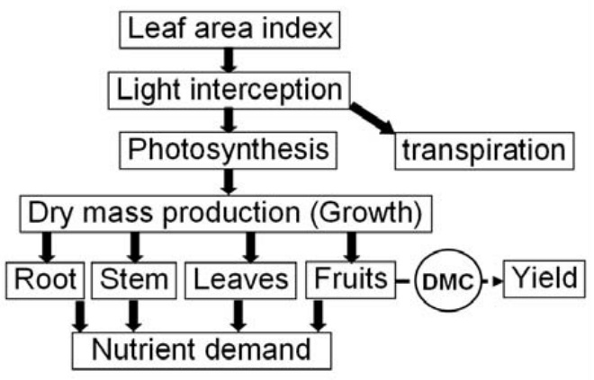
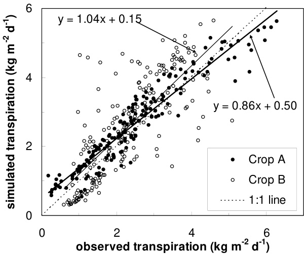
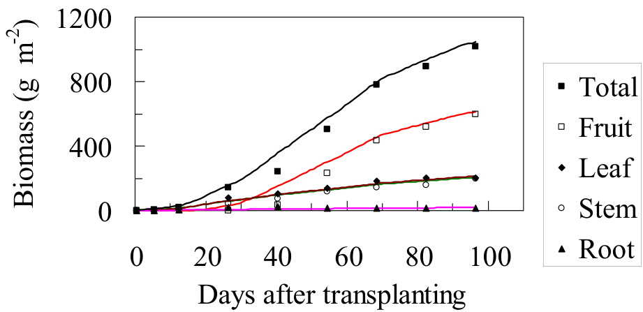

# Simulating Growth and Development of Tomato Crop  

# 番茄作物生长与发育的模拟

L.F.M. Marcelis, A. Elings 和   
P.H.B. de Visser   
瓦赫宁根大学温室园艺研究所   
P.O. Box 16, 6700 AA 瓦赫宁根   
荷兰   
E. Heuvelink   
瓦赫宁根大学   
园艺供应链研究组   
Majkeweg 22, 6709 PG 瓦赫宁根   
荷兰  

关键词: 模拟, 光照, $\mathrm { C O } _ { 2 }$ , 温度, 叶面积, 源-库比, 养分, 水分吸收  

# 摘要  

作物模型是测试假设、综合和传递知识、描述和理解复杂系统以及比较不同情景的有力工具。模型可用于预测和规划生产，在决策支持系统以及温室气候、供水和养分供应的控制中发挥作用。本文描述了番茄作物生长和发育的机理模拟。讨论了决定番茄作物产量、生长、发育以及水分和养分吸收的主要过程与生长条件和作物管理的关系。器官的起始被模拟为温度的函数。叶面积扩展的模拟也基于温度，除非达到最大比叶面积。叶面积是冠层光截获的重要决定因素。辐射在冠层中随深度呈指数衰减。对于叶片光合作用，有几种模型可用。蒸腾作用根据Penman-Monteith方法计算。净同化物产量计算为冠层总光合作用与维持呼吸的差值。净同化物产量用于不同植物器官的生长和生长呼吸。同化物在植物器官间的分配基于器官的相对库强度进行模拟。植物-养分关系的模拟从计算每个植物器官所需的不同大量养分浓度开始，需求取决于器官的个体发育阶段。随后，从这些所需浓度和器官的干重计算所需的养分吸收。当根表面没有可用性限制时，实际吸收将等于所需吸收。当根系无法满足需求时，吸收减少，植物养分浓度下降，作物产量可能会降低。结论是，机理作物模型能够准确模拟不同气候区温室种植番茄的产量、生长、发育以及水分和养分关系。  

# 引言  

模型是测试假设、综合和传递知识、描述和理解复杂系统以及比较不同情景的有力工具。作物模型可用于确定理想的生长条件，探索与新技术的引入相关的生长条件的影响，以及确定对特定环境特别重要的作物目标性状。模型已用于决策支持系统、温室气候和灌溉控制，以及生产的预测和规划。  

预测生长和产量的模型已为包括番茄在内的多种作物开发(Dayan等，1993；Gary等，1995；Heuvelink，1995a；Marcelis等，1998；Cooman，2002；Cooman和Schrevens，2003；Dai等，2006；Boote和Scholberg，2006)。  

本文分析了番茄机理作物模型的主要过程。建模概念基于TOMSIM(Heuvelink，1999)和INTKAM(Gijzen，1994；Marcelis等，2000)模型。涉及的过程包括叶面积扩展、光截获、光合作用、呼吸、坐果、干物质分配、蒸腾作用以及水分和养分吸收。  

# 作物生长的模拟  

机理作物生长模型考虑了主要的作物生理过程(图1)。首先要考虑的是叶片的光截获。计算的光截获主要取决于作物的叶面积和作物上的光入射。随后计算光合作用速率，然后计算光合产物用于呼吸、转化为结构干物质(DM)、DM在不同植物器官间的分配，最后从干重计算鲜重。蒸腾作用的计算与光合作用的计算并行进行。此外，还计算养分需求和吸收。  

# 叶面积  

叶面积是决定冠层吸收入射辐射比例的最重要因素。叶面积形成速率被模拟为每$\mathrm { m } ^ { 2 }$茎数、温度和光强的函数。此外，品种或砧木可能影响叶面积扩展。次优的水分和养分供应可能限制叶面积扩展(见水分和养分吸收部分)。此外，番茄作物的叶面积量受修剪下部老叶和有时一些非常幼嫩的叶子的影响。  

叶面积指数为3至4 $\mathbf { \tilde { m } } ^ { 2 }$叶$\mathrm { m } ^ { - 2 }$地面)对番茄来说似乎是最佳的，因为此时已经有约$90 \mathrm { - } 9 5 \%$的可见光被冠层截获(Heuvelink等，2005)。在荷兰七个商业农场的测量显示，在夏季，光截获平均为$90 \%$，值在86和$96 \%$之间变化。  

在作物模型中，主要使用两种方法来模拟叶面积指数：1)叶面积被描述为植物发育阶段(或累积温度总和)的函数；2)叶面积从模拟的叶干重计算(Marcelis等，1998)。在番茄中，叶片的起始速率主要由温度决定，而每片叶的叶面积也受同化物供应的影响，这取决于辐射(Heuvelink和Marcelis，1996)。由于同化物供应的这些影响，第一种方法在温室生产中不能给出可靠的结果，因为温室中温度与辐射的相关性低于露地情况。在第二种方法中，首先计算叶干重，然后乘以比叶面积(SLA)。然而，SLA在一个生长季节中远非恒定(Heuvelink，1999)，并且往往与辐射水平呈负相关。更合适的是将两种方法结合起来，如Gary等(1995)首次提出的那样。如果整个冠层的SLA小于最大SLA $\mathrm { ( S L A _ { m a x } ) }$，则叶面积增加是潜在的。潜在叶面积增加计算为潜在新叶材料重量与最小SLA $( \bar { \mathrm { S L A } } _ { \mathrm { m i n } } )$的乘积。如果实际SLA大于$\mathrm { \bar { S } L A _ { \mathrm { m a x } } }$(如果叶子比允许的更薄)，叶面积增加等于新叶材料重量与$\mathrm { S L A } _ { \mathrm { m a x } }$的乘积。$\mathrm { S L A } _ { \mathrm { m a x } }$是一个常数，而$\mathrm { \ S L A _ { m i n } }$根据Heuvelink(1999)的描述，取决于一年中的日期。  

# 光截获

作物产量通常与累积截获的辐射呈线性关系，尽管环境条件如$\mathrm{CO}_2$浓度和温度可能会影响这种关系。在许多情况下，产量与累积入射辐射之间也存在线性关系。Cockshull等(1992)在收获的前12周观察到，每$100~\mathrm{MJ}$入射太阳辐射可生产$2~\mathrm{kg}$新鲜番茄。Penning de Vries和Van Laar(1982)表明，当其他条件相同时，累积总$\mathrm{CO}_2$同化量与累积截获的光合有效辐射之间的关系斜率随纬度(范围0到$60^\circ$)增加而增加。这意味着在相同日光照积分下，热带地区的作物产量可能远低于高纬度地区。这种差异主要是由于在热带地区，相同的日光照积分是通过比高纬度地区更短的日照时间实现的，但最大光强更高，而在此光强下光合作用效率较低。Heuvelink(1995b)观察到，在北欧温室中种植的番茄，植株总干物质产量为$\overline{2.5}~\mathrm{g/MJ}$温室内的入射PAR。该作者从文献中估计北欧的值为$3.0-3.3~\mathrm{g/MJ}$ PAR。在印度尼西亚热带低地的实验中，我们估计温室内的光能利用效率约为$2.1~\mathrm{g/MJ}$入射PAR(Elings和Impron，未发表)。

辐射吸收的模拟基于以下原理：辐射吸收随叶面积增加而增加，但相互遮荫会减少截获。这一假设导致辐射呈指数衰减，相当于Lambert-Beer定律(Marcelis等，1998；Papadopoulos和Pararajasingham，1997)。冠层对辐射的吸收$(I_{abs,L}$表示被上层LAI吸收的辐射)可以近似为：

$$
I_{abs,L} = (1 - \rho)I_o(1 - e^{-k^*L})
$$

其中$\rho$表示冠层反射系数，$I_o$表示冠层顶部的辐射水平，$k$表示消光系数，$L$表示叶面积指数。$\rho$和$k$的典型值分别为0.07和0.7(Marcelis等，1998)。

然而，一般来说，$k$会因辐射方向与叶片位置和几何形状的关系而不同。由于直接辐射和漫射辐射在冠层中的消光剖面不同，以及光合作用的光饱和效应，应将太阳光束(直接通量)与其余入射辐射(漫射通量)区分开来。Hemming等(2008)和Heuvelink与Gonzalez-Real(2008)表明，当所有辐射都变为漫射(通过使用特定的温室覆盖物或遮阳网)时，产量可能显著提高(高达$10\%$)。最近开发了所谓的功能结构模型，可以同时模拟植物的三维结构和功能，即生理过程(Vos等，2007)。这使得能够更精确地预测不同行结构对植物功能、叶片位置分布和几何形状、不同颜色和位置光源的影响。对于番茄，也构建了此类模型(de Visser等，未发表数据；Dong等，2007)。

# 光合作用、呼吸作用和蒸腾作用

光合作用的建模在很大程度上可以独立于植物种类，不同植物仅在叶片光合特性参数值上有所不同。详细的作物光合作用模型将叶片光合作用分别模拟为遮荫叶片和受光叶片在(多层)冠层中深度的函数，同时考虑光的直接和漫射成分。生化类型模型(Farquhar等，1980)已被证明非常适合叶片光合作用，它考虑了光、$\mathrm{CO}_2$浓度和温度等主要决定因素。决定光合作用的最重要因素是光强；光合作用通常表现出与光强的饱和型关系。特别是在$\mathrm{CO}_2$可能耗尽或富集的温室中，模型还应包括$\mathrm{CO}_2$对光合作用的影响。在较宽范围内(约$15-25^\circ\mathrm{C}$)，温度对总光合作用的影响有限(Farquhar等，1980)；在较低和较高温度下，光合作用可能会显著降低。低空气湿度可能导致气孔关闭，从而降低光合作用(Bakker，1991)。

在模拟叶片光合作用的同时，可以计算叶片蒸腾作用。Penman-Monteith方程被广泛接受用于计算蒸腾作用(Stanghellini，1987；Marcelis，1989)。叶片蒸腾作用的模拟包括计算叶片的温度和能量平衡。这需要可见光、近红外和热辐射(来自和朝向加热管、温室屋顶和土壤)、空气水汽压差和空气温度的信息。此外，还需要叶片气孔和边界层导度的值。边界层导度取决于叶片大小、叶片毛状体的存在和风速(Stanghellini，1987)。

在大多数作物生长模型中，呼吸作用分为生长呼吸和维持呼吸(Amthor，1989)。净同化物产量是冠层总光合作用与维持呼吸的差值。维持呼吸计算为不同植物器官干重与其维持系数(维持的特定呼吸成本)的乘积，这些系数随温度升高而增加(Amthor，1989)。然而，这种方法可能会导致具有较老茎部的大型番茄作物的呼吸作用被高估，因为这些茎部的呼吸需求相对较低。因此，Heuvelink(1995a)使维持系数依赖于作物的相对生长速率。生长呼吸通常计算为不同植物器官干重生长速率与生长系数(每个器官生长的特定呼吸成本)的乘积。关于生长呼吸的模拟有合理的共识(Thornley和Johnson，1990)。然而，维持呼吸的模拟仍然是一个存在很大不确定性的领域。一些作者(Gifford，1995)提出将总作物呼吸模拟为总光合作用的恒定比例，因为这在几种情况下给出了合理的结果。在温室种植的番茄中，De Koning(1994)估计这一比例平均为$22\%$。

最大光合速率$\left(\mathrm{P}_{\max}\right)$在作物生长季节中会发生变化。这种变化有$80\%$可以用前一周的辐射水平来解释(未发表数据)。下层叶片的$\mathrm{\Delta P_{\max}}$比上层叶片低约$35\%$。下层冠层深度$\mathrm{\Delta P_{\max}}$较低可能是由于适应了较低的光照水平(Hogewoning等，2008)。由于冠层下层叶片的光照水平较低，$\mathrm{\Delta P_{\max}}$较低对作物光合作用的影响很小。

# 干物质分配

不同植物器官之间，特别是向果实的干物质分配随时间而变化。分配给果实的干物质比例是产量和营养生长与生殖生长速率平衡的重要决定因素。种植者一直在寻找适当控制这种平衡的方法。向单个果穗的干物质分配基于Heuvelink(1996)和Marcelis(1994)描述的库强度概念进行模拟。分配给器官的同化物比例$(f_i)$与其潜在生长速率(库强度，$S$)与所有植物部分总潜在生长速率$(\Sigma S)$的比值成正比。

$$
f_i = S / \Sigma S
$$

库强度可以定义为一个器官对同化物积累的潜在需求或潜在能力。潜在生长速率被量化为在非限制性同化物供应条件下的生长速率(Marcelis, 1996)。番茄果实的潜在生长速率取决于其发育阶段(从开花开始的积温)(Heuvelink和Marcelis, 1989)并表现出品种差异(De Koning, 1994)。一个果穗的潜在生长速率取决于果穗上的果实数量和每个果实的潜在生长。因此，分配给果实的干物质比例与果实数量的关系曲线呈饱和型(Heuvelink, 1997)。每穗果实数量少可能会严重限制果实产量。这种情况经常发生在热带地区：例如Kleinhelz等(2006)观察到果实与植株总干重的最大比率为0.3，而Cockshull等(1992)和De Koning(1994)报告北欧地区的值约为0.7。每穗果实数量少可能是由于坐果不良造成的，如果授粉不良，例如由于没有熊蜂或花朵振动(使用电动蜂)，可能会发生这种情况。在高温$( > 2 \bar { 5 } ^ { \circ } \mathrm { C }$日平均温度)和低温$( < 1 8 ^ { \circ } \mathrm { C }$日平均温度)下，坐果效果不理想(De Koning, 1994; Peet等, 1997; Sato等, 2006; Van der Ploeg和Heuvelink, 2007)。此外，低源库比可能会限制坐果(Bertin等, 1995)。因此，在温带气候区，低源库比可能会限制坐果，而在炎热的热带地区，高温会限制坐果。这将负面影响干物质向果实的分配。预测所有条件下果实产量的作物模型应包括这些对坐果影响的模拟。为了番茄植株的最佳发育，需要稳定的源库比。当由于高辐射等原因导致源高时，库的数量也应该高。增加每$\mathrm { m } ^ { 2 }$库(果实)数量的一个非常有效的方法是增加每$\mathrm { m } ^ { 2 }$的茎数(每$\mathrm { m } ^ { 2 }$更多植株或每株更多茎)。这已经在一些国家(如荷兰)的种植者中应用，在夏季期间保留额外的茎，将茎密度从约2.5增加到约4茎/$\langle { \bf m } ^ { 2 }$。我们粗略估计，在太阳辐射水平高于$1 5 \mathrm { ~ M J ~ m } ^ { - 2 }$时，至少需要4到5茎$/ \mathrm { m } ^ { 2 }$来平衡源库强度。Kleinhelz等(2006)观察到在泰国潮湿热带地区种植的番茄在8茎$/ \mathrm { m } ^ { 2 }$时果实生长最快。在这些条件下，高茎密度也可能有利于冠层内的微气候。

果穗和叶片的形成和收获或去除被计算为温度的函数(De Koning, 1994)。植物器官的鲜重生长通过将器官的干重除以干物质含量获得。营养器官的干物质含量被假定为恒定，而果实的干物质含量被计算为年日、温度和营养液EC的函数(De Koning, 1994)。

# 水分和养分吸收

作物的水分吸收在水分供应不受限制时从蒸腾作用和鲜重生长计算，或者可以根据植物和根际介质中的水势差计算(Marcelis, 1989; Elings等, 2004)。

养分需求主要取决于由非营养因素(如植物发育、光强、温度)决定的不同植物器官的生长(Le Bot等, 1998)。每个器官的养分需求计算为干重生长与最大养分浓度的乘积，如几位作者所述(Mankin和Fynn, 1996; Kläring等, 1997; Bellert等, 1998; Marcelis等, 2005)。最大养分浓度是当养分供应不受限制时达到的浓度。每个大量养分的最大浓度被模拟为单个果穗、叶片、与果穗相关的茎部分和整个根。这些浓度通常表现出个体发育变化。对于每个器官，所需的养分浓度可以通过随热时间初始线性增加或减少，然后保持恒定值来描述；这种关系可以用3个参数描述：最小和最大浓度以及斜率(Marcelis等, 2003; Elings等, 2004)。

当水分和养分供应不受限制时，模拟的植物养分吸收将等于其需求。该模型可以与一个详细的基质模型耦合，该模型确定根系是否能满足水分和养分需求，并计算养分吸收速率(Heinen, 2001; Elings等, 2004)。除了使用详细的基质模型外，水分和养分吸收也可以计算为所需吸收与减少因子的乘积，其中减少因子取决于基质中的湿度和养分浓度。

根际介质中的养分短缺会导致植物中的养分浓度低。模拟植物中的低养分浓度会影响叶片光合作用、叶面积发育和干物质分配。这一概念被Elings等(2004)和Marcelis等(2003)应用。

# 作物生长模型的验证

本文描述的番茄模拟主要基于INTKAM和TOMSIM模型。这些模型已经在不同植物密度、种植日期、温度、光照水平、$\mathrm { C O } _ { 2 }$浓度等条件下的实验温室中得到了广泛验证(Heuvelink, 1995a, 1996)。

这些模型也被证明能够准确模拟荷兰$( 5 2 ^ { \circ } \mathrm { N })$商业农场(包括封闭温室)的番茄产量和蒸腾作用(Heuvelink, 1999; Heuvelink等, 2008; Elings和Voogt, 2008; 图2和3)。同样的模型能够准确模拟热带低地番茄作物的生长和干物质分配。

# 结论

已经开发出机理作物模型，能够准确模拟不同气候区温室种植番茄的产量、生长、发育以及水分和养分关系。特别是，总冠层光合作用和与生长条件相关的植株总干物质生产得到了很好的预测。如果每穗果实数量估计正确，营养生长和生殖生长之间的干物质分配可以很好地模拟。然而，在导致坐果不良的条件下，坐果的模拟似乎是模型的弱点。如果模型能够基于历史数据进行校准，蒸腾作用和养分吸收的模拟会得到改善。此外，植物过程对主要生长条件的适应仍然知之甚少，也没有量化。许多作物模型还没有考虑产品质量。现在是将果实质量建模纳入作物生长模型的时候了(Heuvelink等, 2004; Struik等, 2005)。

作物模型的发展现在已经如此先进，以至于模型被种植者和顾问用来支持作物管理决策。模型也是气候和灌溉施肥控制系统的一部分。对于后一个目的，来自植物传感器或作物登记的在线反馈很重要(Marcelis等, 2000)。

# 参考文献

Amthor, J.S. 1989. 呼吸作用与作物生产力. Springer-Verlag, 纽约.   
Bakker, J.C. 1991. 湿度对气孔密度及其与叶片导度关系的影响. Scientia Hort. 48:205-212.   
Bellert, C., Le Bot, J., Dorais, M., Lopez, J. and Gosselin, A. 1998. 水培番茄植株的氮积累与生长. Acta Hort. 458:293-301.   
Bertin, N. 1995. 同化物竞争和果实位置影响无限生长型温室番茄的坐果. Ann. Bot. 75:55-65.   
Boote, K.J. and Scholberg, J.M.S. 2006. 园艺作物动态生长模型的开发、参数化和测试. Acta Hort. 718:23-34.   
Cockhull, K.E., Graves, C.J. and Cave, C.R.J. 1992. 遮荫对温室番茄产量的影响. J. Hort. Sci. 67:11-24.   
Cooman, A. 2002. 使用统计和系统动力学模型在高海拔热带地区进行保护性番茄种植的可行性. 博士论文. 比利时鲁汶天主教大学.   
Cooman, A. and Schrevens, E. 2003. TOMGRO输出变量对气候条件变化的敏感性分析. Acta Hort. 654:155-162.   
Dai, J., Luo, W., Li, Y., Yuan, C., Chen, Y. and Ni, J. 2006. 预测三种温室作物生物量产量和产量的简单模型. Acta Hort. 718:81-88.   
Dayan, E., Van Keulen, H., Jones, J.W., Zipori, I., Shmuel, D. and Challa, H. 1993. 温室番茄生长模型的开发、校准和验证：I. 模型描述. Agr. Syst. 43:145-163.   
De Koning, A.N.M. 1994. 温室番茄的发育和干物质分配：定量方法. 博士论文. 瓦赫宁根农业大学, 瓦赫宁根.   
Dong, Q.X., Wang, X.L., Yang, L.L., Barczi, J.F. and De Reffye, F. 2007. Greenlabtomato：番茄发育的3D结构模型. New Zealand J. Agr. Res. 50:1229-1233.   
Elings, A. and Voogt, W. 2008. 温室作物蒸腾作用管理：未来方向. Acta Hort. 801:1221-1228.   
Elings, A., De Visser, P.H.B., Marcelis, L.F.M., Heinen, M., Van den Boogaard, H.A.G.M., Gieling, T. and Werner, B.E. 2004. 温室园艺中水分和养分供应的前馈控制：系统开发. Acta Hort. 654:195-202.   
Farquhar, G.D., Von Caemmerer, S. and Berry, J.A. 1980. C3植物叶片光合$\mathrm{CO}_2$同化的生化模型. Planta 149:78-90.   
Gary, C., Barczi, J.F., Bertin, N. and Tchamitchian, M. 1995. 番茄植株单个器官生长和发育的模拟：模型和用户友好界面. Acta Hort. 399:199-205.   
Gifford, R.M. 1995. 生产力模型中的植物呼吸作用：概念化、表示和全球陆地碳循环研究问题. Functional Plant Biol. 30:171-186.   
Gijzen, H. 1994. 蒸腾作用和水分吸收模拟模型及整体生长模型的开发. AB-DLO报告18, AB-DLO 瓦赫宁根.   
Heinen, M. 2001. FUSSIM2：模拟模型简介及其在施肥灌溉场景中的应用. Agron. 21:285-296.   
Hemming, S., Dueck, T.A., Janse, J. and Van Noort, F. 2008. 漫射光对作物的影响. Acta Hort. 801:1293-1300.   
Heuvelink, E. 1995a. 番茄作物的干物质生产：测量与模拟. Ann. Bot. 75:369-379.   
Heuvelink, E. 1995b. 番茄作物的生长、发育和产量：温室中的定期破坏性测量. Scientia Hort. 61:99-99.   
Heuvelink, E. 1996. 番茄干物质分配：动态模拟模型的验证. Ann. Bot. 77:71-80.   
Heuvelink, E. 1997. 果实负载对番茄干物质分配的影响. Scientia Hort. 69:51-59.   
Heuvelink, E. 1999. 番茄作物生长和发育动态模拟模型的评估. Ann. Bot. 83:413-422.   
Heuvelink, E. and Gonzalez-Real, M.M. 2008. 植物-温室相互作用和作物管理的创新. Acta Hort. 801:63-74.   
Heuvelink, E. and Marcelis, L.F.M. 1989. 番茄和黄瓜的干物质分配. Acta Hort. 260:149-157.   
Heuvelink, E. and Marcelis, L.F.M. 1996. 同化物供应对甜椒和番茄叶片形成的影响. J. Hort. Sci. 71:405-414.   
Heuvelink, E., Bakker, M., Marcelis, L.F.M. and Raaphorst, M. 2008. 封闭温室中的气候与产量. Acta Hort. 801:1083-1092.   
Heuvelink, E., Bakker, M.J., Elings, A., Kaarsemaker, R. and Marcelis, L.F.M. 2005. 叶面积对番茄产量的影响. Acta Hort. 691:43-50.   
Heuvelink, E., Tijskens, P. and Kang, M.Z. 2004. 园艺产品品质建模概述. Acta Hort. 654:19-30.   
Hogewoning, S.W., Trouwborst, G., Engbers, G.J., Harbinson, J., Van Ieperen, W., Ruijsch, J., Schapendonk, A.H.C.M., Pot, S.C. and Van Kooten, O. 2007. 植物对发光二极管（LED）辐照的生理适应. Acta Hort. 761:183-191.   
Kläring, H.-P., Schwarz, D. and Heissner, A. 1997. 使用光合作用和蒸腾作用模型控制番茄作物的营养液浓度. Acta Hort. 450:329-334.   
Kleinhelz, V., Katroschan, K., Schütt, F. and Stützel, H. 2006. 热带湿润地区保护地栽培番茄的生物量积累与分配. Europ. J. Hort. Sci. 71:173-182.   
Le Bot, J., Adamowicz, S. and Robin, P. 1998. 园艺作物植物营养建模：综述. Scientia Hort. 74:47-81.   
Mankyn, K.R. and Fynn, R.P. 1996. 植物个体养分吸收建模：将需求与微气候联系起来. Agr. Syst. 50:101-114.   
Marcelis, L.F.M. 1989. 温室作物植物-水分关系和光合作用的模拟. Scientia Hort. 41:9-18.   
Marcelis, L.F.M. 1994. 黄瓜干物质分配的模拟模型. Ann. Bot. 74:43-52.   
Marcelis, L.F.M. 1996. 库强度作为整株植物干物质分配的决定因素. J. Exp. Bot. 47:1281-1291.   
Marcelis, L.F.M., Brajeul, E., Elings, A., Garate, A., Heuvelink, E. and de Visser, P.H.B. 2005. 甜椒养分吸收建模. Acta Hort. 691:285-292.   
Marcelis, L.F.M., De Groot, C.C., Del Amor, F.M., Elings, A., Heinen, M. and De Visser, P.H.B. 2003. 保护地栽培中的作物养分需求与管理. Proceedings 525. The International Fertiliser Society, York, UK p.117-152.   
Marcelis, L.F.M., Heuvelink, E. and Goudriaan, J. 1998. 园艺作物生物量生产和产量建模：综述. Scientia Hort. 74:83-111.   
Marcelis, L.F.M., Van den Boogaard, R. and Meinen, E. 2000. 通过结合使用作物模型和植物传感器控制作物生长和养分供应. p.351-356. In: Proc. Int. Conf. Modelling and control in agriculture, horticulture and postharvested processing. IFAC.   
Papadopoulos, A.P. and Pararajasingham, S. 1997. 株距对温室番茄(Lycopersicon esculentum Mill.)光截获和利用的影响：综述. Scientia Hort. 69:l-29.   
Peet, M.M., Willits, D.H. and Gardner, R. 1997. 雄性不育番茄胚珠发育和花粉后生产过程对慢性亚急性高温胁迫的响应. J. Exp. Bot. 48:101-111.   
Penning De Vries, F.W.T. and Van Laar, H.H. 1982 植物生长和生产的模拟. Pudoc, Wageningen.   
Sato, S., Kamiyama, M., Iwata, T., Makita, N., Furukawa, H. and Ikeda, H. 2006. 日均温适度升高通过破坏雄性生殖发育中的特定生理过程对番茄坐果产生不利影响. Ann. Bot. 97:731-738.   
Stanghellini, C. 1987. 温室作物的蒸腾作用：气候管理的辅助工具. 博士论文. 瓦赫宁根农业大学.   
Struik, P.C., Yin, X. and De Visser, P.H.B. 2005. 复杂品质性状：现在是建模的时候了. Trends Plant Sci. 10:513-516.   
Thornley, J.H.M. and Johnson, I.R. 1990. 植物和作物建模：植物和作物生理学的数学方法. Clarendon Press, Oxford.   
Van der Ploeg, A. and Heuvelink, E. 2005. 次优温度对番茄生长和产量的影响：综述. J. Hort. Sci. Biotechnol. 80:652-659.   
Vos, J., Marcelis, L.F.M., de Visser, P.H.B., Struik, P.C. and Evers, J.B. (eds.) 2007. 作物生产中的功能-结构植物建模. Springer, Dordrecht.  

# Literature Cited  

Amthor, J.S. 1989. Respiration and crop productivity. Springer-Verlag, New York.   
Bakker, J.C. 1991. Effects of humidity on stomatal density and its relation to leaf conductance. Scientia Hort. 48:205-212.   
Bellert, C., Le Bot, J., Dorais, M., Lopez, J. and Gosselin, A. 1998. Nitrogen accumulation and growth of fruiting tomato plants in hydroponics. Acta Hort. 458:293-301.   
Bertin, N. 1995. Competition for assimilates and fruit position affect fruit set in indeterminate greenhouse tomato. Ann. Bot. 75:55-65.   
Boote, K.J. and Scholberg, J.M.S. 2006. Developing, parameterizing, and testing of dynamic crop growth models for horticultural crops. Acta Hort. 718:23-34.   
Cockhull, K.E., Graves, C.J. and Cave, C.R.J. 1992. The influence of shading on yield of glasshouse tomatoes. J. Hort. Sci. 67:11-24.   
Cooman, A. 2002. Feasibility of protected tomato cropping in the high altitude tropics using statistical and system dynamic models for plant growth and development. Ph.D. thesis. Catholic University Leuven, Belgium.   
Cooman, A. and Schrevens, E. 2003. Sensitivity analysis of TOMGRO output variables to varitations in climate conditions. Acta Hort. 654:155-162.   
Dai, J., Luo, W., Li, Y., Yuan, C., Chen, Y. and Ni, J. 2006. A simple model for prediction of biomass production and yield of three greenhouse crops. Acta Hort. 718:81-88.   
Dayan, E., Van Keulen, H., Jones, J.W., Zipori, I., Shmuel, D. and Challa, H. 1993. Development, calibration and validation of a greenhouse tomato growth model: I. Description of the model. Agr. Syst. 43:145-163.   
De Koning, A.N.M. 1994. Development and dry matter distribution in glasshouse tomato: a quantitative approach. Diss. Wageningen Agr. Uni., Wageningen.   
Dong, Q.X., Wang, X.L., Yang, L.L., Barczi, J.F. and De Reffye, F. 2007. Greenlabtomato: a 3D architectural model of tomato development. New Zealand J. Agr. Res. 50:1229-1233.   
Elings, A. and Voogt, W. 2008. Management of greenhouse crop transpiration: the way forward. Acta Hort. 801:1221-1228.   
Elings, A., De Visser, P.H.B., Marcelis, L.F.M., Heinen, M., Van den Boogaard, H.A.G.M., Gieling, T. and Werner, B.E. 2004. Feed-forward control of water and nutrient supply in greenhouse horticulture: development of a system. Acta Hort. 654:195-202.   
Farquhar, G.D., Von Caemmerer, S. and Berry, J.A. 1980. A biochemical model of photosynthetic $\mathrm { C O } _ { 2 }$ assimilation in leaves of C3 species. Planta 149:78-90.   
Gary, C., Barczi, J.F., Bertin, N. and Tchamitchian, M. 1995. Simulation of individual organ growth and development on a tomato plant: model and a user-friendly interface. Acta Hort. 399:199-205.   
Gifford, R.M. 1995. Plant respiration in productivity models: conceptualisation, representation and issues for global terrestrial carbon-cycle research. Functional Plant Biol. 30:171-186.   
Gijzen, H. 1994. Development of a simulation model for transpiration and water uptake and an integral growth model. AB-DLO Report 18, AB-DLO Wageningen.   
Heinen, M. 2001. FUSSIM2: brief description of the simulation model and application to fertigation scenarios. Agron. 21:285-296.   
Hemming, S., Dueck, T.A., Janse, J. and Van Noort, F. 2008. The effect of diffuse light on crops. Acta Hort. 801:1293-1300.   
Heuvelink, E. 1995a. Dry matter production in a tomato crop: measurements and simulation. Ann. Bot. 75:369-379.   
Heuvelink, E. 1995b. Growth, development and yield of a tomato crop: periodic destructive measurements in a greenhouse. Scientia Hort. 61:99-99.   
Heuvelink, E. 1996. Dry matter partitioning in tomato: validation of a dynamic simulation model. Ann. Bot. 77:71-80.   
Heuvelink, E. 1997. Effect of fruit load on dry matter partitioning in tomato. Scientia Hort. 69:51-59.   
Heuvelink, E. 1999. Evaluation of a dynamic simulation model for tomato crop growth and development. Ann. Bot. 83:413-422.   
Heuvelink, E. and Gonzalez-Real, M.M. 2008. Innovation in plant-greenhouse interactions and crop management. Acta Hort. 801:63-74.   
Heuvelink, E. and Marcelis, L.F.M. 1989. Dry matter distribution in tomato and cucumber. Acta Hort. 260:149-157.   
Heuvelink, E. and Marcelis, L.F.M. 1996. Influence of assimilate supply on leaf formation in sweet pepper and tomato. J. Hort. Sci. 71:405-414.   
Heuvelink, E., Bakker, M., Marcelis, L.F.M. and Raaphorst, M. 2008. Climate and yield in a closed greenhouse. Acta Hort. 801:1083-1092.   
Heuvelink, E., Bakker, M.J., Elings, A., Kaarsemaker, R. and Marcelis, L.F.M. 2005. Effect of leaf area on tomato yield. Acta Hort. 691:43-50.   
Heuvelink, E., Tijskens, P. and Kang, M.Z. 2004. Modelling product quality in horticulture: an overview. Acta Hort. 654:19-30.   
Hogewoning, S.W., Trouwborst, G., Engbers, G.J., Harbinson, J., Van Ieperen, W., Ruijsch, J., Schapendonk, A.H.C.M., Pot, S.C. and Van Kooten, O. 2007. Plant physiological acclimation to irradiation by light emitting diodes (LEDs). Acta Hort. 761:183-191.   
Kläring, H.-P., Schwarz, D. and Heissner, A. 1997. Control of nutrient solution concentration in tomato crop using models of photosynthesis and transpiration. Acta Hort. 450:329-334.   
Kleinhelz, V., Katroschan, K., Schütt, F. and Stützel, H. 2006. Biomass accumulation and partitioning of tomato under protected cultivation in the humid tropics. Europ. J. Hort. Sci. 71:173-182.   
Le Bot, J., Adamowicz, S. and Robin, P. 1998. Modelling plant nutrition of horticultural crops: a review. Scientia Hort. 74:47-81.   
Mankyn, K.R. and Fynn, R.P. 1996. Modeling individual nutrient uptake by plants: relating demand to microclimate. Agr. Syst. 50:101-114.   
Marcelis, L.F.M. 1989. Simulation of plant-water relations and photosynthesis of greenhouse crops. Scientia Hort. 41:9-18.   
Marcelis, L.F.M. 1994. A simulation model for dry matter partitioning in cucumber. Ann. Bot. 74:43-52.   
Marcelis, L.F.M. 1996. Sink strength as a determinant of dry matter partitioning in the whole plant. J. Exp. Bot. 47:1281-1291.   
Marcelis, L.F.M., Brajeul, E., Elings, A., Garate, A., Heuvelink, E. and de Visser, P.H.B. 2005. Modelling nutrient uptake of sweet pepper. Acta Hort. 691:285-292.   
Marcelis, L.F.M., De Groot, C.C., Del Amor, F.M., Elings, A., Heinen, M. and De Visser, P.H.B. 2003. Crop nutrient requirements and management in protected cultivation. Proceedings 525. The International Fertiliser Society, York, UK p.117-152.   
Marcelis, L.F.M., Heuvelink, E. and Goudriaan, J. 1998. Modelling of biomass production and yield of horticultural crops: a review. Scientia Hort. 74:83-111.   
Marcelis, L.F.M., Van den Boogaard, R. and Meinen, E. 2000. Control of crop growth and nutrient supply by the combined use of crop models and plant sensors. p.351-356. In: Proc. Int. Conf. Modelling and control in agriculture, horticulture and postharvested processing. IFAC.   
Papadopoulos, A.P. and Pararajasingham, S. 1997. The influence of plant spacing on light interception and use in greenhouse tomato (Lycopersicon esculentum Mill.): A review. Scientia Hort. 69:l-29.   
Peet, M.M., Willits, D.H. and Gardner, R. 1997. Response of ovule development and post-pollen production processes in male-sterile tomatoes to chronic, sub-acute high temperature stress. J. Exp. Bot. 48:101-111.   
Penning De Vries, F.W.T. and Van Laar, H.H. 1982 Simulation of plant growth and production. Pudoc, Wageningen.   
Sato, S., Kamiyama, M., Iwata, T., Makita, N., Furukawa, H. and Ikeda, H. 2006. Moderate increase of mean daily temperature adversely affects fruit set of Lycopersicon esculentum Mill. by disrupting specific physiological processes in male reproductive development. Ann. Bot. 97:731-738.   
Stanghellini, C. 1987. Transpiration of greenhouse crops: an aid to climate management. Ph.D. thesis. Agricultural University, Wageningen.   
Struik, P.C., Yin, X. and De Visser, P.H.B. 2005. Complex quality traits: now time to model. Trends Plant Sci. 10:513-516.   
Thornley, J.H.M. and Johnson, I.R. 1990. Plant and crop modelling: A mathematical approach to plant and crop physiology. Clarendon Press, Oxford.   
Van der Ploeg, A. and Heuvelink, E. 2005. Influence of suboptimal temperature on tomato growth and yield: a review. J. Hort. Sci. Biotechnol. 80:652-659.   
Vos, J., Marcelis, L.F.M., de Visser, P.H.B., Struik, P.C. and Evers, J.B. (eds.) 2007. Functional-structural plant modelling in crop production. Springer, Dordrecht.  

# 图表

  
图1. 作物生长模型主要计算步骤的示意图

  
图2. 两个番茄作物（作物A和B）每日蒸腾模拟的验证（来自Elings和Voogt, 2008）

  
图3. 印度尼西亚热带低地（南纬1°，海拔25米）温室种植番茄干物质生产模拟的验证。符号为测量值，线条为模拟值。模型输入为气候数据和种植密度