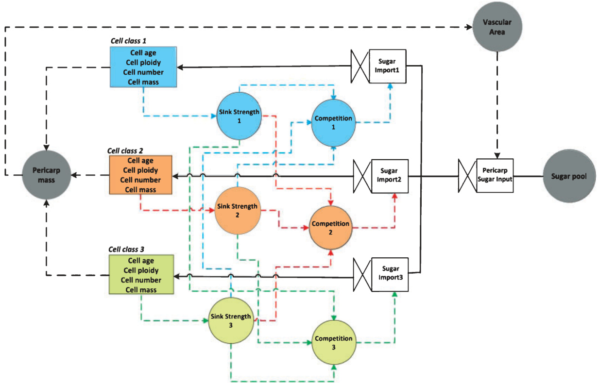
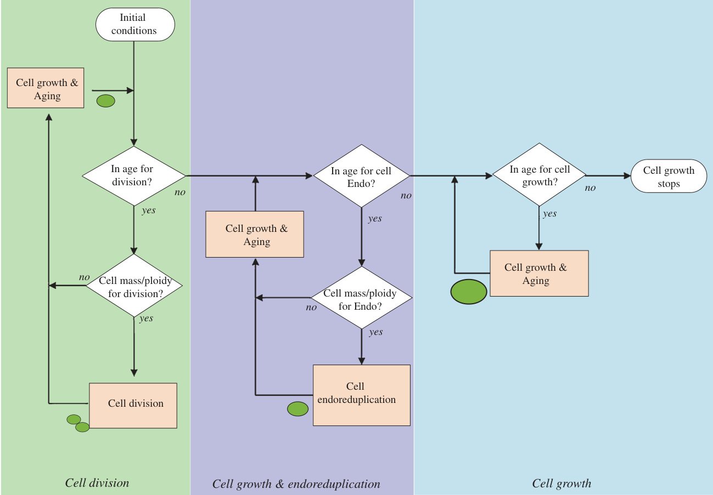
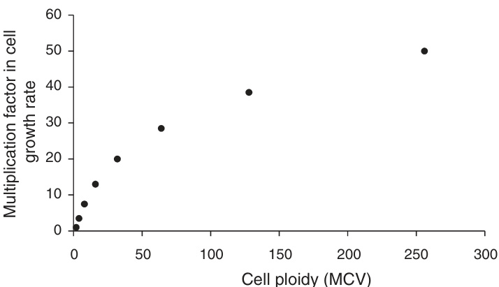
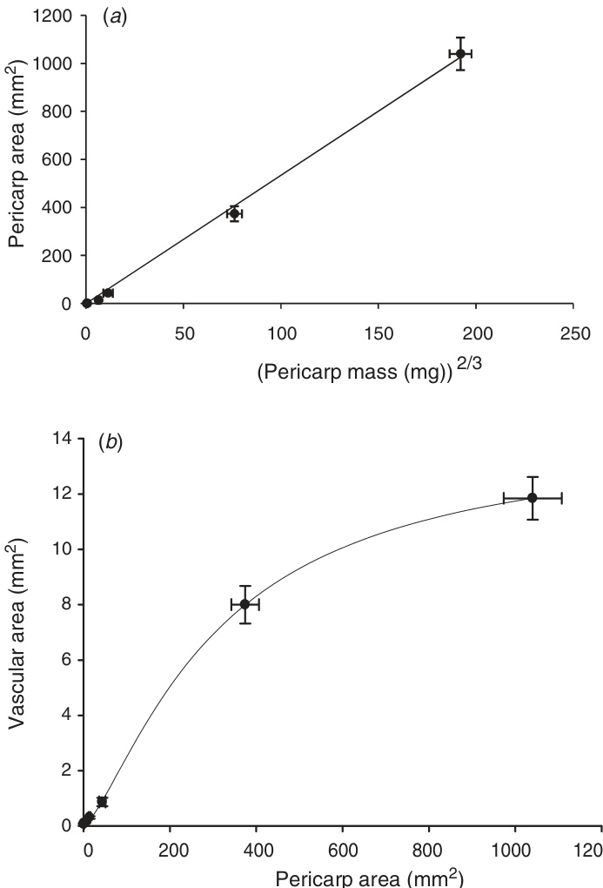
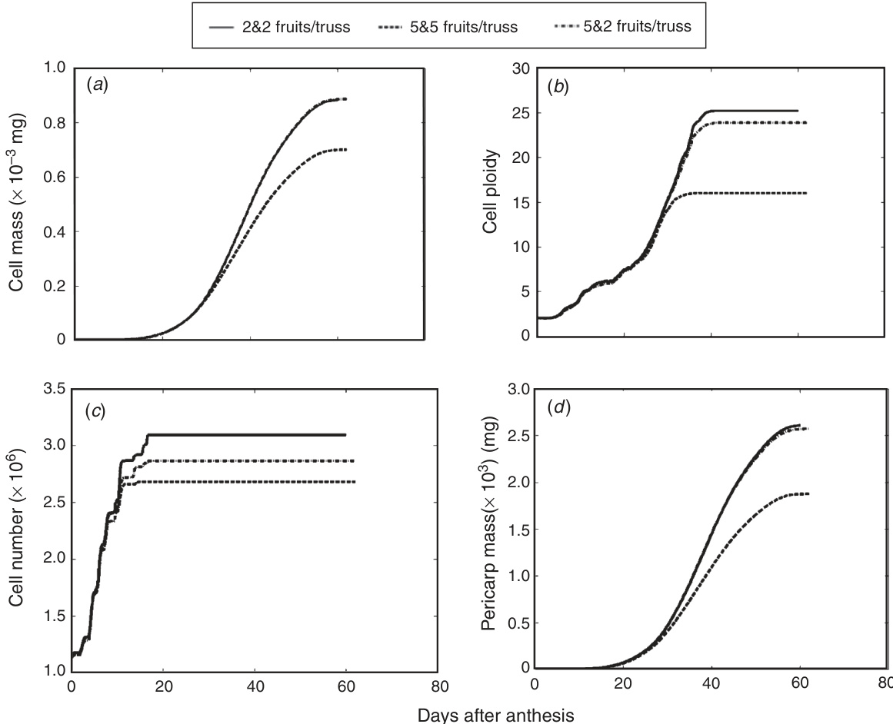
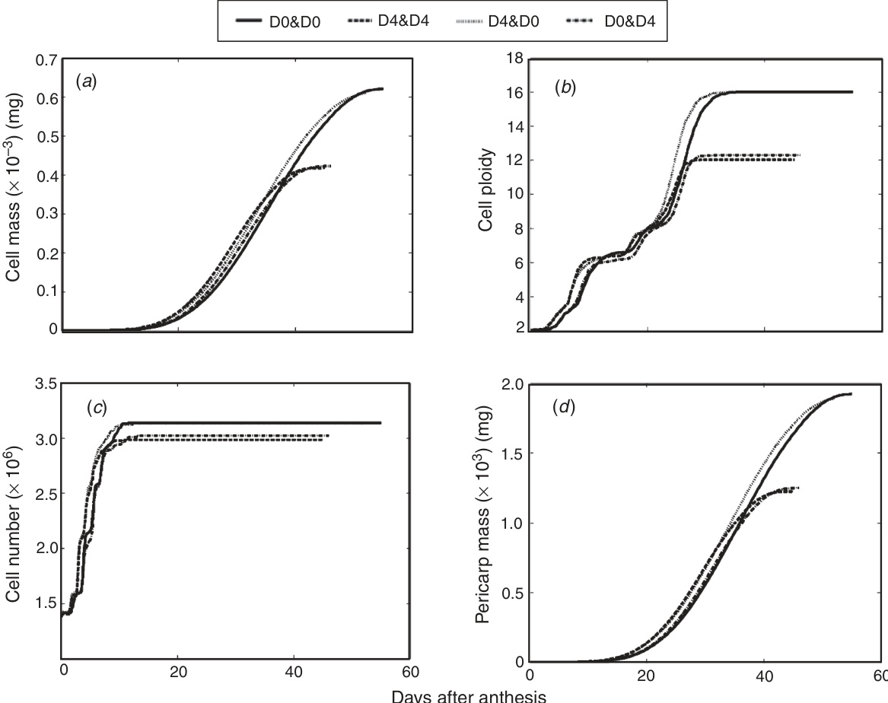

# A dynamic model of tomato fruit growth integrating cell division, cell growth and endoreduplication  

Julienne FanwouaA,B,C,D, Pieter H. B. de Visser A, Ep Heuvelink B, Xinyou Yin C, Paul C. Struik C and Leo F. M. Marcelis A,B  

AWageningen UR Greenhouse Horticulture, PO Box 644, 6700 AP Wageningen, The Netherlands. BHorticultural Supply Chains, Wageningen University, PO Box 630, 6700 AP Wageningen, The Netherlands. CCentre for Crop Systems Analysis, Wageningen University, PO Box 430, 6700 AK Wageningen, The Netherlands. DCorresponding author. Email: jfanwoua@yahoo.fr  

Abstract. In this study, we developed a model of tomato (Solanum lycopersicum L.) fruit growth integrating cell division, cell growth and endoreduplication. The fruit was considered as a population of cells grouped in cell classes differing in their initial cell age and cell mass. The model describes fruit growth from anthesis until maturation and covers the stages of cell division, endoreduplication and cell growth. The transition from one stage to the next was determined by predefined cell ages expressed in thermal time. Cell growth is the consequence of sugar import from a common pool of assimilates according to the source–sink concept. During most parts of fruit growth, potential cell growth rate increases with increasing cell ploidy and follows the Richards growth function. Cell division or endoreduplication occurs when cells exceed a critical threshold cell mass : ploidy ratio. The model was parameterised and calibrated for low fruit load conditions and was validated for high fruit load and various temperature conditions. Model sensitivity analysis showed that variations in final fruit size are associated with variations in parameters involved in the dynamics of cell growth and cell division. The model was able to accurately predict final cell number, cell mass and pericarp mass under various contrasting fruit load and most of the temperature conditions. The framework developed in this model opens the perspective to integrate information on molecular control of fruit cellular processes into the fruit model and to analyse gene-by-environment interaction effects on fruit growth.  

Additional keywords: cell aging, cell cycle, cell expansion, gene-based modelling, ploidy level, source-sink relations.  

Received 9 January 2013, accepted 2 June 2013, published online 12 July 2013  

# Introduction  

The control of fruit size is complex. This complexity emerges from the cumulative and interactive effects of successive genetically and environmentally controlled, diverse cellular processes during fruit development. In most fleshy fruits, growth starts with intense cell division (Gillaspy et al. 1993). After the first weeks of fruit growth cell division gradually declines and rapid cell growth starts to occur (Gillaspy et al. 1993; Bertin et al. 2003a). During this period individual cells accumulate water and carbon resulting in spectacular increase in cell volume (more than 10 000-fold in tomato mesocarp cells) and fruit volume (Cheniclet et al. 2005). In many fleshy fruits, cell growth is accompanied by an increase in cell DNA content through the process of endoreduplication, i.e. an incomplete cell cycle where cells continue to increase their DNA content (S-phase) without mitosis (M-phase) (Bourdon et al. 2010). At the subcellular scale, cell division, cell growth and endoreduplication are controlled by networks of multiple genes of which expression is sensitive to the environment (Baldet et al. 2006; Chevalier 2007). The regulation of fruit size is further complicated by the interrelationships between fruit cellular processes. For example, a positive correlation between cell size and the number of endoreduplication cycles was reported in some plant organs, including tomato fruits (Kondorosi et al. 2000; Bertin 2005; Cheniclet et al. 2005; Bourdon et al. 2010). Several authors observed that most cells that start endoreduplication are not able to re-enter mitosis (Sugimoto-Shirasu and Roberts 2003; John and Qi 2008; Sabelli et al. 2008). Experimental data show that cell growth is strongly linked with cell cycle regulation and suggest that there is a critical cell size for endoreduplication or cell division to occur (Nasmyth 1979; Jorgensen and Tyers 2004; Francis 2007).  

Models have proven to be powerful tools to understand the behaviour of complex systems (Struik et al. 2005). In order to unravel the complexity of fruit size, ecophysiological models describing underlying fruit growth processes have recently been proposed (Génard et al. 2007; Liu et al. 2007; Martre et al. 2011). Bertin et al. (2003b) proposed a simple phenomenological model of cell proliferative activity in growing tomato fruits under constant environmental conditions. Their model assumes an initial phase of exponential cell proliferation after which the proliferative activity declines as division proceeds. This model was able to predict differences in cell number between two tomato cultivars, but did not address environmental effects (Bertin et al. 2003b). In the last two decades, progress in the understanding of molecular control of the cell cycle inspired the development of several models of cell cycle regulation (Tyson et al. 2002; Novák and Tyson 2004; Csikász-Nagy et al. 2006; Barik et al. 2010; Roodbarkelari et al. 2010). These models attempt to predict the behaviour of cells based on differential equations describing the network of protein interactions. The main drawbacks of these models are their complexity and the difficulty to measure model parameters, limiting the possibilities for their application at the tissue and fruit scales (Bertin et al. 2007; Martre et al. 2011).  

Most expansion models describe fruit growth at the organ scale. A typical example is the peach (Prunus persica L.) model by Fishman and Génard (1998) in which the fruit is considered as one big cell and thermodynamic equations are used to describe water and carbon accumulation in the fruit. This model was used to predict fruit load and tree water status effects on the fresh and dry mass of peach fruits (Fishman and Génard 1998). The model was further modified to describe plastic and elastic changes of cell wall in mango (Mangifera indica L.) fruits (Lechaudel et al. 2007) and the switch from symplasmic to apoplasmic phloem unloading in growing tomato fruits (Liu et al. 2007). Carbon accumulation in the fruit has also been modelled using the sink regulation concept (Marcelis et al. 1998). This concept assumes that carbon import into a fruit depends on the fruit sink strength relative to the sink strength of all other organs. In these models, organ sink strength is defined as the potential capacity of the organ to accumulate assimilates and is quantified by the organ’s potential growth rate (Grossman and DeJong 1995; Marcelis et al. 1998). The sink strength approach has been used to model assimilate import in several fruit species including cucumber (Cucumis sativus L.) (Marcelis 1994), tomato (Heuvelink 1996), kiwifruit (Actinidia deliciosa C.F.Liang & A.R.Ferguson) (Lescourret et al. 1998a), peach (Lescourret et al. 1998b) and grapevine (Vitis vinifera L.) (Vivin et al. 2002).  

In comparison with the number of expansion and cell division models, only few models of endoreduplication have been developed so far. A mathematical model was proposed to describe endoreduplication in maize (Zea mays L.) endosperm (Schweizer et al. 1995) and later in orchid flowers (Lee et al. 2004). The model by Lee et al. (2004) assumes that the potential for endoreduplication decreases for cells with higher ploidy levels. Model predictions agreed well with experimental data, but the high number of relevant parameters is a major disadvantage of this model. The same holds for two modelling studies on cell cycle regulation including endoreduplication (Csikász-Nagy et al. 2006; Roodbarkelari et al. 2010). A simpler model describing mitotic activity and endoreduplication in tomato fruits was proposed by Bertin et al. (2007). Their model was able to predict the number of cells and ploidy levels in two contrasting tomato cultivars, but environmental effects were not considered.  

An notable feature of the Bertin et al. (2007) model is that it integrates the arrest of mitosis with the onset of endoreduplication. Although experimental data suggest that underlying fruit cellular processes are interrelated, integrating two or more cellular processes has been rarely done in fruit ecophysiological models. An attempt to integrate cell division and cell growth was made by Beemster et al. (2006) in their model of Arabidopsis leaf growth. Their model assumes that a critical ratio between cell size and cell DNA content triggers the synthesis of cyclins and CDKs regulating the S and M phases. This model was used to simulate the effects of an overproduction of cell cycle inhibitor on cell division and expansion, but endoreduplication was not presented (Beemster et al. 2006). Even though it is difficult to integrate all physiological processes in one model, several authors agree that models integrating the main underlying processes would improve our understanding of the emerging properties of a complex system (Génard et al. 2007; Yin and Struik 2010). In the case of fruit growth, such models would also open the way to analyse complex fruit environment responses (Liu et al. 2007; Martre et al. 2011). In order to achieve this goal, Génard et al. (2007) proposed to describe each process underlying fruit growth in a simple way.  

The objectives of this study were to (1) develop a model of tomato fruit growth integrating cell division, cell growth and endoreduplication, and (2) use the model to analyse assimilate supply and temperature effects on fruit growth at the cell and fruit scale.  

# Model description  

The model describes the growth of a tomato fruit pericarp from anthesis until maturation, thus covering the period of cell division, cell endoreduplication and cell expansion. In our previous studies we showed that there is a linear relationship between pericarp size and fruit size (Fanwoua et al. 2012a, 2012b). In the model the pericarp consists of a population of cells grouped into $q$ cell classes (Fig. 1). Cell classes are used to represent differences between fruit cells. They are defined based on the mass and age of cells at the beginning of the simulation. This definition accounts for the variability already present at anthesis in many fleshy fruits including tomato (Bertin 2005; Baldet et al. 2006). The distributions of initial cell mass and age across cell classes are assumed to follow a normal distribution. Cells do not move from class to class during fruit development. Within each class all cells have the same mass, age, ploidy and behaviour. The age of cells in class $n$ $( C e l l A g e _ { \mathrm { n } } )$ is expressed in degree-hours; $n \left( C e l l A g e _ { \mathrm { n } } \right)$ integrates hourly values of degreehours $( ^ { \circ } \mathrm { C h } )$ , i.e. the differences between hourly temperature and the base temperature $T b$ ( $T b = 5 . 7 ^ { \circ } \mathrm { C }$ Adams et al. 2001).  

In the model cells can increase their age (cell aging), increase mass (cell growth), increase their number (cell division), or increase their ploidy level (cell endoreduplication) (Fig. 2). The model assumes that each of these processes occurs simultaneously for all cells within a given class. Cell growth, cell division and endoreduplication are closely linked to cell age as described below.  

# Cell growth  

Cell growth involves the increase in total cytoplasmic mass (Génard et al. 2007) and is the consequence of resource exchange between the cell and the rest of the plant. At the fruit level, growth has often been modelled using the source–sink concept (Grossman and DeJong 1995; Marcelis et al. 1998). We applied this approach to the cell scale. For each time step of one hour, the actual cell growth rate (ActualCellGrowthRaten, $\mathrm { m g h ^ { - 1 } } )$ and the average cell mass $( C e l l M a s s _ { \mathrm { n } }$ , mg) in each class are calculated. The actual cell growth rate is calculated as the ratio between the actual amount of sugar imported by class $n$ (ActualClassSugarImportn, $\mathrm { m g h } ^ { - 1 } ,$ ) and the number of cells in class n(CellClassNumbern):  

  
Fig. 1. General scheme of the fruit model structure showing sugar distribution between different cell classes within the fruit. Rectangles represent state variables in a cell class, valves represent rates, circles are model parameters, solid arrows represent sugar flow, dashed arrows indicate information flow. For simplicity, we represent only three cell classes for this illustration.  

  
Fig. 2. Schematic representation of the decision for an average cell to grow, divide or endoreduplicate (Endo) within a cell class in the fruit model. Rectangles represent cellular processes, diamonds are decision rules, solid arrows show progression through the scheme.  

$$
\begin{array} { r } { A c t u a l C e l l G r o w t h R a t e _ { n } \ ( i ) = A c t u a l C l a s s S u g a r I m p o r t _ { n } \ ( i ) } \\ { / C l a s s C e l l N u m b e r _ { n } \ ( i ) . \quad ( } \end{array}
$$  

Calculation of ClassCellNumbern is described in the cell division section. The actual amount of sugar imported by class $n$ $( 1 \leq n \leq q )$ depends on the actual amount of sugar imported by the pericarp (PeriSugarInput, $\mathrm { m g h } ^ { - 1 }$ ) and should not exceed the sink strength or potential growth rate of class $n$ (ClassSinkStrengthn, $\mathrm { m g h } ^ { - 1 }$ ).  

$$
\begin{array} { r } { \begin{array} { r } { A c t u a l C l a s s S u g a r I m p o r t _ { n } \ ( i ) = m i n ( P e r i S u g a r I n p u t \ ( i ) } \\ { \times ~ C l a s s C o m p e t i t i o n _ { n } \ ( i ) , } \\ { C l a s s S i n k S t r e n g t h _ { n } \ ( i ) ) . \ ( } \end{array} } \end{array}
$$  

At each step $i$ , sugar is imported from a common fruit sugar pool (SugarPool, mg fruit– $^ { - 1 } \mathrm { h } ^ { \hat { - } 1 }$ ) to the pericarp (PeriSugarInput (i)) via vascular tissues. The amount of sugar imported to the pericarp depends on the contact surface area between the vascular and pericarp tissue (VascArea, $\mathrm { m m } ^ { 2 \cdot }$ ) and on the respiration coefficient (RespCoef).  

$$
\begin{array} { c } { { ( i ) = \gamma \times S u g a r P o o l \times V a s c A r e a \ : ( i - 1 ) } } \\ { { \times \ : ( 1 - R e s C o e f ) , } } \end{array}
$$  

where $\gamma$ is a constant proportionality factor $( \mathrm { m m } ^ { - 2 } )$ . The pool of sugar available for the fruit (SugarPool) and the respiration coefficient (RespCoef) are assumed to be constant (Gifford 2003). The contact surface area between the vascular tissue (VascArea) depends on the area of the pericarp tissue according to an empirical function determined experimentally (see below).  

In Eqn 2, ClassCompetitionn describes the competitive ability of cells in class $n$ to import sugar relative to that of all other cell classes. This variable accounts for the interaction between fruit cells (Bertin 2005). As pointed out by Génard et al. (2007), ‘a tissue cannot be considered as being a simple juxtaposition of independent cells’. In the model ClassCompetitionn is calculated by dividing the sink strength of class $n$ (ClassSinkStrengthn) by the total sink strength of all classes.  

$$
C l a s s C o m p e t i t i o n \ ( i ) = \frac { C l a s s S i n k S t r e n g t h _ { n } \ ( i ) } { \sum _ { n = 1 } ^ { q } C l a s s S i n k S t r e n g t h _ { n } \ ( i ) } .
$$  

Sink strength of a class $n$ is the product of the potential growth rate of individual cells in class $n$ (PotCellGrowthRaten, $\mathbf { \bar { m g h } } ^ { - 1 } )$ and the number of cells in class $n$ (ClassCellNumbern).  

$$
\begin{array} { r } { C l a s s S i n k S t r e n g t h _ { n } \ ( i ) = P o t G r o w t h R a t e _ { n } \ ( i ) \qquad } \\ { \times C l a s s C e l l N u m b e r _ { n } \ ( i ) . \qquad } \end{array}
$$  

We assumed that the potential growth rate (PotCellGrowthRaten) of dividing cells (RateDiv) during one division cycle length (CycleLength) depends only on temperature. RateDiv was estimated experimentally. For nondividing cells, PotCellGrowthRaten depends on cell ploidy $( C e l l P l o i d y _ { \mathrm { n } } )$ and cell age $( C e l l A g e _ { \mathrm { n } } )$ following a Richards growth rate equation (Hunt 1982).  

$$
\begin{array} { c } { { P o t C e l l g r o w t h r a t e _ { n } \left( i \right) = \displaystyle \frac { a \times c \times E } { d } \times \left( 1 + E \right) ^ { - \left( \frac { 1 } { d } + 1 \right) } } } \\ { { \times d e g h o u r ( i ) \times f ( C e l l P l o i d y _ { n } ( i ) ) , } } \end{array}
$$  

where $E = e ^ { b - c \times ( C e l l A g e _ { n } ( i ) - C e l l A g e . d i \nu i s i o n ) }$ , $a$ is the maximum cell mass (mg), $b$ is a scaling parameter, $c$ is a rate constant determining the spread of the curve along cell age $( \mathrm { m g } \mathrm { m g } ^ { - 1 }$ $( ^ { \circ } \mathbf { C h } ) ^ { - 1 } )$ , $d$ is a shape parameter determining where the inflection point occurs and CellAge_division $( ^ { \circ } \mathrm { C h } )$ is the total time a cell spends in the division phase. The function $\it { f ( C e l l P l o i d y _ { \mathrm { n } } ) }$ was determined experimentally and describes the multiplication factor in potential cell growth rate per unit change in cell ploidy. Calculation of CellPloidyn is described in the endoreduplication section.  

# Cell division  

The cell cycle machinery is equipped with several ‘checkpoints’ where cell cycle events are monitored and signals generated, which determine whether the cell cycle should proceed or be temporally or definitively arrested (Murray 2004). This probably explains why DNA synthesis and mitosis are each preceded by a gap phase (G1 and G2 phases) during which a cell needs to grow before committing itself to the next cycle event (Francis 2007). For example, in several organisms it has been postulated that a cell must reach a critical cell size per unit DNA content for DNA synthesis (S phase) or mitosis to occur (Zetterberg et al. 1995; Csikász-Nagy et al. 2006). To account for this role of cell size and DNA content in cell division, we assumed in the model that cell division occurs if cell mass : ploidy ratio in a class $n$ (DNACellMassRation) reaches a critical threshold value (DNACellMassThresholdDivn).  

$$
D N A C e l l M a s s R a t i o _ { n } \ ( i ) = \frac { C e l l M a s s _ { n } \ ( i ) } { 2 \times C e l l P l o i d y _ { n } \ ( i ) } .
$$  

In the model, DNACellMassThreshol $l D i \nu _ { \mathrm { n } }$ increases with increasing cell cycle number (CycleNumbern), so that the potential of cells to divide decreases with increasing cell cycle number.  

$$
\begin{array} { r l } & { D N A C e l l M a s s T h r e s h o l d D i \nu _ { n } \ ( i ) } \\ & { = D N A C e l l M a s s T h r e s h o l d D i \nu 0 } \\ & { \quad \times \left( \rho _ { 1 } \times ( 1 + C y c l e N u m b e r _ { n } \ ( i ) ^ { \rho _ { 2 } } \right) , } \end{array}
$$  

where DNACellMassThresholdDiv0 is the threshold cell mass : ploidy ratio just before the first cell division cycle, $\rho _ { 1 }$ and $\rho _ { 2 }$ are constant parameters ( $\dot { \rho } _ { 1 }$ and $\rho _ { 2 }$ are unitless).  

When cell division occurs in a given class, all its cells are involved in the division process, and there is no difference between a mother and a daughter cell. Division events are accompanied by the doubling of the number of cells and halving of mass per cell in a class.  

If DNACellMassRation $( i \mathrm { ~ - ~ } 1 ) { \geq } D N A M a s s T h r e s h o l d D i \nu _ { \mathrm { n } } ,$ then  

$$
C l a s s \_ C e l l N u m b e r \_ ( i ) = 2 \times C l a s s \_ C e l l N u m b e r \ ( i - 1 ) ,
$$  

$$
C e l l M a s s _ { n } \ ( i ) = 0 . 5 \times C e l l M a s s _ { n } \ ( i - 1 ) .
$$  

The model assumes a predefined age above which all cells in a class should exit cell division, CellAge_division $( ^ { \circ } \mathrm { C h } )$ (Fig. 2). It has been observed in most fruits including tomato that the cell division period is restricted to the first weeks of fruit development and can be modified by the environmental factors like temperature (Bertin 2005).  

# Cell endoreduplication  

Endoreduplication is a modified cell division cycle where cells continue to increase their DNA content (S phase) without cell division (Chevalier et al. 2011). Most cells that start endoreduplication are no longer able to divide (SugimotoShirasu and Roberts 2003; Sabelli et al. 2008). In the model, endoreduplication can only occur in cells that have exited the cell division phase and their age is below a threshold value CellAge_endo (Fig. 2). The ‘decision’ of a cell to endoreduplicate follows a similar mechanism as described above for cell division. Endoreduplication occurs if cell mass : ploidy ratio (DNACellMassRation) reaches a threshold value (DNACell MassThresholdEndon) (Fig. 2). Endoreduplication events are characterised by the doubling of cell ploidy.  

If DNACellMassRation $( i ) \geq$ DNAMassThresholdEndon (i), then  

$$
C e l l P l o i d y _ { n } \ ( i ) = 2 \times C e l l P l o i d y _ { n } \ ( i - 1 ) .
$$  

We assumed that the threshold cell mass $\because$ ploidy ratio for endoreduplication to occur in a class $n$ (DNACellMass ThresholdEndon) is not constant, but increases with increasing number of cell division cycle (CycleNumberDivn) and the number of endocycles (endocountn). Thus a cell with a higher number of cell division cycles or a higher number of endocycles needs to grow larger in order to endoreduplicate.  

$$
\begin{array} { r l } & { D N A C e l l M a s s T h r e s h o l d E n d o _ { n } \left( i \right) } \\ & { \ = D N A C e l l M a s s T h r e s h o l d E n d o 0 } \\ & { \quad \times \left( \mu _ { 1 } \times C y c l e N u m b e r D i \nu _ { n } \left( i \right) + \mu _ { 2 } \times e n d o c o u n t _ { n } \left( i \right) \right) , } \end{array}
$$  

where DNACellMassThresholdEndo0 is the threshold cell mass : ploidy ratio just before the first endoreduplication cycle, endocountn is the number of endocycles performed by cells in class $n$ ; $\mu _ { 1 }$ and $\mu _ { 2 }$ are constant parameters ( $\mathbf { \mu } _ { \mu _ { 1 } }$ and $\mu _ { 2 }$ are unitless).  

# Materials and methods  

# Experimental data  

To parameterise and validate our model, we used our recent experimental data (Fanwoua et al. 2012a, 2012b) and those published in other literature (e.g. Nafati et al. 2011). We give below brief information about the experiments by Fanwoua et al. (2012a, 2012b).  

Three experiments were conducted in a glasshouse in Wageningen $( 5 1 . 5 7 ^ { \circ } \mathrm { N } ,$ $5 . 3 1 ^ { \circ } \mathrm { E }$ , the Netherlands) using a largefruited tomato (Solanum lycopersicum L.) cv. Moneyberg of which final fruit FW is ${ \sim } 8 0 \mathrm { g }$  

The experiments were conducted to investigate the effects of fruit load (Experiment 1) and temperature (Experiments 2 and 3) on tomato fruit growth. In Experiments 1 and 2, plants were grown at $2 2 / 1 8 ^ { \circ } \mathrm { C }$ day/night temperature. In Experiment 1, three fruit load treatments were applied on all trusses starting from the anthesis of flowers at the second proximal position of the third truss: a continuously low fruit load of two fruits per truss (2&2 fruits/truss), a continuously high fruit load of five fruits per truss (5&5 fruits/truss) and a switch from high (five fruits per truss) to low fruit load treatment (two fruits per truss) 7 days after anthesis (daa) (5&2 fruits/truss). Each treatment was replicated five times. The second proximal fruit of the third truss in each treatment was harvested at anthesis, 7 daa and at breaker stage (detailed in work by Fanwoua et al. 2012a).  

In Experiment 2 all trusses were pruned to five fruits. Trusses flowering at the same moment were selected and enclosed in small transparent cuvettes (diameter: $1 3 \mathrm { c m }$ , length: $2 0 \mathrm { c m } )$ . Heated air was continuously blown in the cuvette to heat the trusses by $4 { - } 5 ^ { \circ } \mathrm { C }$ compared with the greenhouse air temperature $( 2 2 / 1 8 ^ { \circ } \mathrm { C }$ day/night). Heating was applied either only during the first 7 daa (D4&D0), from 7 daa until fruit maturity (breaker stage) (D0&D4) or both (D4&D4). In the control treatment (D0&D0) trusses were also enclosed into cuvettes but the heating system was switched off, so that the temperature inside the cuvette was the same as the greenhouse air temperature. Each treatment was replicated five times. The second proximal fruit of the third truss in each treatment was harvested at breaker stage for measurement (detailed in work by Fanwoua et al. 2012b).  

The aim of Experiment 3 was to investigate the effect of continuous heating on fruit growth. Greenhouse air temperature was $2 1 / 1 8 ^ { \circ } \mathrm { C }$ day/night. All trusses were pruned to five fruits. Trusses flowering at the same moment were enclosed in small cuvettes as described for Experiment 2. Heating was applied continuously from anthesis until breaker stage. In the control treatment trusses were also enclosed in cuvettes but not heated. Each heating treatment was replicated five times. The second proximal fruit in each selected truss was harvested at a specific thermal time (calculated as the temperature sum above a base temperature of $5 . 7 ^ { \circ } \mathrm { C }$ (Adams et al. 2001)), i.e. 0, 69, 129, 232, $3 7 4 ^ { \circ } \mathrm { C d }$ after anthesis, and at breaker stage. This corresponded to 0, 2, 5, 11, 18 and 46 daa in the heating treatment or to 0, 3, 7, 15, 25 and 54 daa in the control treatment (detailed in work by Fanwoua et al. 2012b).  

In all three experiments, fruit diameter, fruit mass, and pericarp mass were measured. Pericarps isolated from the fruits were fixed and embedded in Technovit 7100 (Kulzer, Wehrheim, Germany) (detailed in work by Fanwoua et al. 2012a). Sections $3 \mu \mathrm { m }$ thick) were made, stained and photographed on a light microscope (Eclipse 50i, Nikon Instruments Europe, Kingston, UK). Images obtained were analysed in Image J (National Institutes of Health, Bethesda,  

MD, USA) to measure pericarp volume, cell volume, cell number according to the method described by Fanwoua et al. (2012a). Cell mass was calculated as the ratio between pericarp mass and cell number. Image J was also used to analyse the distribution of individual cell volumes (converted into cell mass) in the pericarp of young tomato fruits at anthesis. From this distribution the mean, standard deviation, minimum, maximum cell mass at anthesis were estimated.  

# Model simulation and sensitivity analysis  

Model simulation and sensitivity analysis were conducted in Matlab (The Mathworks, Natick, MA, USA). The sensitivity of final model output to changes in parameter values was analysed. For each parameter and output investigated, model sensitivity was quantified by the normalised sensitivity coefficient:  

$$
s e n s i t i \nu i t y \ c o e f f i c i e n t = ( { \Delta Y } / { Y } ) / ( { \Delta P } / { P } ) ,
$$  

where $\Delta P / P$ is the relative change in model parameter value, $\Delta Y / Y$ is the relative change in model output. Model outputs were: final pericarp cell mass, pericarp cell number, pericarp cell ploidy and pericarp mass.  

# Model parameter estimation  

Model parameters were either estimated from measurements on tomato fruits cv. Moneyberg as described in ‘Materials and methods’ or derived from the literature. Table 1 presents a summary of model parameters estimated experimentally or derived from the literature. The value of few model parameters could not be estimated experimentally or found in the literature. For each of these parameters model calibration was conducted by comparing model output obtained for several values of the parameters with experimental data of final cell and pericarp characteristics measured under low fruit load treatment (Experiment 1). Table 2 presents a summary of model parameters estimated by model calibration.  

Simulations started at anthesis. At this stage the average number of cell layers in the pericarp was measured to be 12 and used as the number of cell classes in the model. This choice was motivated by the fact that large variations in cellular characteristics are observed at different cell layers of the tomato pericarp from the exocarp to the endocarp (Fanwoua et al. 2012a, 2012b).  

Four parameters described the initial conditions within each cell class: the initial cell number $n _ { 0 }$ initial cell mass (mass0), initial cell age $\left( \mathrm { a g e _ { 0 } } \right)$ , and initial cell ploidy (ploidy0). The initial cell number was estimated as the measured number of cells in the tomato pericarp at anthesis $( 1 . 1 3 \times 1 0 ^ { 6 }$ cells) distributed equally among the 12 cell classes $( n _ { 0 } = 0 . 9 4 \times 1 0 ^ { 5 }$ cells). The distribution of initial cell mass across cell classes was assumed to follow a normal distribution with mean $\mu _ { \mathrm { m 0 } }$ and standard deviation $\sigma _ { \mathrm { m 0 } }$ . Measurements performed on tomato pericarp at anthesis resulted in estimates of $\mu _ { \mathrm { m 0 } }$ and $\sigma _ { \mathrm { m 0 } }$ of $7 . 6 5 \times 1 0 ^ { - 8 } \mathrm { m g }$ and $8 . 5 6 \times 1 0 ^ { - 9 } \mathrm { m g }$ respectively. The distribution of cell age across the different cell classes was also assumed to follow a normal distribution with mean $\mu _ { \mathrm { a g e 0 } }$ and standard deviation $\sigma _ { \mathrm { a g e 0 } }$ . Cell age at anthesis could not be measured directly from our experiments. In a population of tomato pericarp cells, Bertin et al. (2003a) observed $80 \%$ of 2C cells and $20 \%$ of 4C cells at anthesis and few 8C cells 2 daa. These data suggest that in the tomato fruit at anthesis, few cells have just stopped cell division. Based on the observations by Bertin et al. (2003a) we assumed that in the tomato pericarp at anthesis the oldest cells have just reached the threshold age for a cell to exit the cell division phase (CellAge_division) and the youngest cells have just been produced by the meristem and have an age of zero. Maximum cell age at anthesis was assumed to be equal to CellAge_division (Table 1) and for a normal distribution it is known that $9 9 \%$ of the probability density lies between mean minus three times standard error, and mean plus three times the standard error. This enables the estimation of $\dot { \mu } _ { \mathrm { a g e 0 } }$ and $\sigma _ { \mathrm { a g e 0 } }$ ( $\mu _ { \mathrm { a g e 0 } } { = } 2 7 4 5 . 6 ^ { \circ } \mathrm { C h }$ and $\sigma _ { \mathrm { a g e 0 } } = 9 1 5 . 2 \ ^ { \circ } \mathrm { C h } _ { , }$ . The initial cell ploidy was assumed to be 2C or 4C if cell age was below or above the threshold cell age for cell division, respectively.  

Table 1. List of parameters estimated experimentally or derived from the literature In Experiment 1, parameter estimation was based on five replicate fruits from the continually low fruit load treatment. Parameter estimation in Experiment 3 based on 3–5 replicate fruits   

<html><body><table><tr><td>Parameter description</td><td>Symbol</td><td>Value</td><td>Source</td></tr><tr><td>Number of cell classes</td><td>q</td><td>12</td><td>Experiment 1</td></tr><tr><td>Initial conditions</td><td></td><td></td><td></td></tr><tr><td>Mean initial cell dry mass</td><td>μmo</td><td>7.64908 × 108 mg</td><td>Experiment 1</td></tr><tr><td>Standard deviation initial cell dry mass</td><td>Om0</td><td>8.564×109mg</td><td>Experiment 1</td></tr><tr><td>Mean initial cell age</td><td>μage0</td><td>2745.6Ch</td><td>Experiment 1</td></tr><tr><td>Standard deviation initial cell age</td><td>Tage0</td><td>915.2Ch</td><td>Experiment 1</td></tr><tr><td>Initial cell number</td><td>n</td><td>1.13 × 106</td><td>Experiment 1</td></tr><tr><td>Base temperature</td><td>Tb</td><td>5.7℃</td><td>Adams et al. (2001)</td></tr><tr><td>Cell division</td><td></td><td></td><td></td></tr><tr><td>Cell cycle length</td><td>CycleLength</td><td>892.3 Ch</td><td>Experiment 1</td></tr><tr><td>Potential growth rate of dividing cells</td><td>RateDiv</td><td>8.2 × 10-10 mgh-1</td><td>Experiment 1</td></tr><tr><td>Age above which cells cannot divide</td><td>CellAge_division</td><td>5491.2Ch</td><td>Experiment 3</td></tr><tr><td>Threshold cell mass : ploidy ratio that triggers the first division cycle</td><td>DNACellMassThresholdDiv0</td><td>2.5×10-8</td><td>Chevalier et al. (2011), Experiment 1</td></tr><tr><td>Cell endoreduplication</td><td></td><td></td><td></td></tr><tr><td>Threshold cell mass : ploidy ratio that triggers the first endocycle</td><td>DNACellMassThresholdEndo0</td><td>3.2 ×10-8</td><td>Kononowicz et al. (1992), Experiment 1</td></tr><tr><td>Age above which cells can no longer endoreduplicate</td><td>CellAge_endo</td><td>13728 Ch</td><td>Nafati et al. (2011)</td></tr><tr><td>Cell growth</td><td>CellAge_growth</td><td>20 592Ch</td><td></td></tr><tr><td>Age above which cells can no longer grow Parameter in the Richards function</td><td></td><td>1.32 ° 104 mg</td><td>Experiment 3 Experiment 1</td></tr><tr><td>Parameter in the Richards function</td><td>a b</td><td></td><td></td></tr><tr><td>Parameter in the Richards function</td><td></td><td>-7.24</td><td>Van der Ploeg and Heuvelink (2005) Van der Ploeg and Heuvelink (2005)</td></tr><tr><td>Parameter in the Richards function</td><td>C d</td><td>2.7 × 10-4 mg mg-1 (Ch)-1 10-4</td><td></td></tr><tr><td>Fruit sugar input</td><td></td><td>6.3 mg fruit-1 h-1</td><td>Van der Ploeg and Heuvelink (2005) Van der Ploeg and Heuvelink (2005)</td></tr><tr><td>Respiration coefficient</td><td>SugarPool</td><td></td><td></td></tr><tr><td></td><td>RespCoef</td><td>0.3</td><td>Ho et al. (1987)</td></tr></table></body></html>  

Table 2. List of parameters estimated by model calibration Model calibration was based on data measured from five replicate fruits in the low fruit load treatment (Experiment 1)   

<html><body><table><tr><td>Description</td><td>ParameterA</td><td>Value</td></tr><tr><td>Parameter describing variation in DNACellMassThresholdDivn</td><td>p1</td><td>0.584</td></tr><tr><td>Parameter describing variation in DNACellMassThresholdDivn</td><td>p2</td><td>0.815</td></tr><tr><td>Parameter describingvariation inDNACellMassThresholdEndon</td><td>μ1</td><td>0.3</td></tr><tr><td>Parameter describing variation in DNACellMassThresholdEndon</td><td>μ2</td><td>210.1446</td></tr><tr><td>Constant proportionality factor</td><td>Y</td><td>0.09298mm-2</td></tr></table></body></html>

ANote: $\rho _ { 1 } , \rho _ { 2 } .$ , $\mu _ { 1 }$ and $\mu _ { 2 }$ are unitless.  

Six parameters were involved in the dynamics of cell division: the duration of one complete cell cycle, CycleLength, the constant RateDiv representing the potential growth rate of a cell in the division phase, the threshold cell mass : ploidy ratio that triggers the first cell division, DNACellMassThresholdDiv0 (Eqn 8), the parameters $( \rho _ { 1 } , \rho _ { 2 } )$ describing the variation in DNACellMassThresholdDivn (Eqn 8) after the first division cycle and the threshold cell age above which a cell should exit the cell division phase, CellAge_division.  

The numbers of cells at anthesis and 7 daa in the pericarp of fruits grown under low fruit load were used to calculate the duration of one cell cycle, CycleLength $= 8 9 2 . 3 \mathrm { \textrm { ‰} }$ or 2.6 days, which is similar to the value of cell cycle length reported by Bertin et al. (2003b) in tomato fruit. Considering that cell mass of dividing cells is doubled during one Cycle Length enabled us to estimate the potential growth rate of dividing cells RateDiv. Parameter RateDiv was estimated experimentally to be $0 . 3 7 8 \times 1 0 ^ { - 9 } \mathrm { m g h ^ { - 1 } }$ . DNACellMassThres holdDiv0 was estimated as the ratio between cell mass and cell ploidy at the G2/M transition. We assumed that in a population of dividing cells, the largest cells correspond to cells at the $\mathbf { G } 2 / \mathbf { M }$ transition. Cell mass at G2/M transition was thus estimated as the average mass of the largest cells in the pericarp at anthesis. DNACellMassThresholdDiv0 was calculated as the ratio between the average mass of the largest cells at anthesis and cell ploidy at the G2/M transition (i.e. 4C) (Chevalier et al. 2011), (DNACellMassThresholdDiv $0 { = } 2 . 5 \times 1 0 ^ { - 8 } )$ . Parameters $\rho _ { 1 }$ and $\rho _ { 2 }$ were estimated by model calibration. CellAge_division was calculated experimentally as the temperature sum above which no more cell division occurs in the pericarp (CellAge_division $5 4 9 1 ^ { \circ } \mathrm { C h }$ ).  

Five sets of parameters described the dynamics of cell growth and endoreduplication after the division phase: the parameters of the Richards function describing the growth rate of a diploid cell $( a , b , c$ and $d$ of Eqn 6), the threshold cell mass : ploidy ratio just before the first endoreduplication cycle, DNACellMassThresholdEndo0 (Eqn 12), parameters describing the variation in DNACellMassThresholdEndon during fruit development ( $\mathbf { \bar { \rho } } _ { \mu _ { 1 } }$ and $\mu _ { 2 }$ of Eqn 12), the multiplication factor in potential cell growth rate per unit increase in cell ploidy, $f$ (ploidy) (Eqn 6), and the age above which cell endoreduplication and cell growth stops, CellAge_endo and CellAge_growth respectively.  

Parameters defining the potential growth rate of a diploid cell $( a , \ b , \ c$ and $d$ were estimated assuming that potential cell growth follows a similar growth curve as potential fruit growth reported for tomato (Van der Ploeg and Heuvelink 2005). $( \bar { a = } 1 3 . 2 \times 1 0 ^ { - 5 } \mathrm { m g } ;$ $\dot { b } = 7 . 6 \times 1 0 ^ { - 8 }$ ; $c { = } 0 . 2 7 \times 1 0 ^ { - 3 } \mathrm { m g \mathrm { m g } ^ { - 1 } }$ $( ^ { \circ } \mathrm { C h } ) ^ { - 1 }$ ; $d = 0 . 1 \times \mathrm { i } 0 ^ { - 3 }$ ).  

DNACellMassThresholdEndo0 was estimated as the ratio between cell mass and cell ploidy at the G1/S transition. It is well established that before the first endoreduplication cycle cells are diploid (ploidy $= 2 C$ ) at G1/S transition (Chevalier et al. 2011). Measurement of cell mass at G1/S transition is not straightforward and could not be directly conducted from our experiments. To estimate cell mass at G1/S transition, we assumed that cell growth rates during the G1 and G2 phases are similar. This assumption implies that the proportion of time a cell spends in the G1 phase (compared with the sum of time spent in G1 and G2) equals the proportion of mass contributed by the G1 phase (compared with the sum of mass due to G1 and G2 i.e. cell mass at G2/M transition). Kononowicz et al. (1992) observed that tobacco cells spend $6 3 . 8 \%$ of time in G1 phase based on the sum of time spent in G1 and G2 phases. Cell mass at G1/S transition was estimated as $6 3 . 8 \%$ of cell mass at $\mathrm { G } 2 / \mathrm { M }$ transition (DNACellMassThresholdEndo $0 = 3 . 2 \times 1 0 ^ { - 8 } ,$ .  

Further, f(ploidy) was deduced from a relationship between cell size and endoreduplication index described by Nafati et al. (2011) as shown in Fig. 3. Based on known duration of endoreduplication (Bertin et al. $2 0 0 3 a$ ; Nafati et al. 2011) and cell growth in tomato pericarp, we adopted the values 13 728 $^ { \circ } \mathrm { C h }$ and $2 0 5 9 2 \ ^ { \circ } \mathrm { C h }$ for CellAge_endo and CellAge_growth respectively.  

The relationships between first, pericarp mass and pericarp area, and second, pericarp area and vascular area estimated experimentally are shown in Fig. 4.  

Variation in environmental conditions was defined by two parameters: the pool of sugar available for the fruit, SugarPool, and the fruit local temperature, TempFruit. SugarPool was estimated from the maximum growth rate of tomato fruit under non-limiting assimilate conditions (Van der Ploeg and Heuvelink 2005) and including the respiration costs $( S u g a r P o o l = 6 . 3 \mathrm { m g }$ fruit– $^ { 1 } \mathrm { h } ^ { - 1 }$ ). The constant proportionality factor $\gamma$ was estimated by calibrating the model to the situation of non-limited assimilate supply $( \gamma = 0 . 0 9 2 9 8 \mathrm { h } ^ { - 1 } \mathrm { m m } ^ { - 2 } )$ . Hourly greenhouse temperature measured during the experiment was used in the model as TempFruit.  

  
Fig. 3. Relationship between multiplication factor in cell growth rate and cell ploidy. MCV is the mean C value deduced from the linear relationship between mean cell length and cell ploidy published by Nafati et al. (2011; Fig. 2d). Cell length was transformed into cell mass by the following steps: (1) cell length to cell volume based on data for cell length, cell width and cell volume used in the work by Fanwoua et al. (2012a); (2) data for several fruits on their mass, cell number and cell volume from work by Fanwoua et al. (2012a) were used to estimate cell mass from cell volume; (3) the relationship between cell mass and cell ploidy allowed us to determine the relationship between multiplication factor in cell growth rate and cell ploidy. The last point on the graph corresponds to the highest MCV, i.e. 256.  

Since the initial cell age and cell mass in the model were derived from a normal distribution each model run could result in a different output. For this reason simulation results were presented as the average of 70 model runs, which correspond to the number of runs at which the average model output remained stable.  

# Simulation results  

# Model sensitivity analysis  

The sensitivity of final model output to $10 \%$ increase or $10 \%$ decrease in model parameters was analysed. Simulations were conducted under the conditions of non-limited fruit sugar supply and standard temperature $2 2 / 1 8 ^ { \circ } \mathrm { C }$ day/night).  

Table 3 shows the sensitivity coefficients of final cell mass, final cell number, final cell ploidy and final pericarp mass to $10 \%$ increase or decrease in parameter values. Final cell mass was largely and positively influenced by all four parameters of the Richards function $\cdot a { - } d$ in Eqn 6). The sensitivity coefficients of final cell mass to a $10 \%$ change in the value of each of these parameters were on average larger than one. Final cell mass was also largely and positively influenced by the threshold cell mass : ploidy ratio before the first division cycle (DNACellMassThresholdDiv0 in Eqn 8), the duration of the endoreduplication period (CellAge_endo), and the two parameters describing the variation in the threshold cell mass : ploidy ratio for cell division $( \rho _ { 1 }$ and $\rho _ { 2 }$ in Eqn 8) (Table 3). Final cell mass was negatively influenced by the threshold cell mass : ploidy ratio before the first endoreduplication cycle (DNACellMassThresholdEndo0 in Eqn 12), the duration of cell division period $( C e l l A g e _ { - }$ division) and one parameter involved in the dynamics of the threshold cell mass : ploidy ratio for endoreduplication ( $\mathbf { \bar { \rho } } _ { \mu _ { 2 } }$ in Eqn 12). All parameters that influenced final cell mass also influenced final cell ploidy in the same direction. For most parameters, the sensitivity coefficient (in absolute term) of final cell ploidy was larger than that of final cell mass. The magnitude of effects of a $10 \%$ change in parameter value was not similar for an increase and a decrease in the value of several parameters.  

  
Fig. 4. Relationship between $( a )$ pericarp area and a transformed expression of pericarp mass and $( b )$ vascular area and pericarp area. Each point represents the mean of measurements on 3–5 tomato fruits. Pericarp area and vascular area were measured in ImageJ using 2D images of fruit sections at the equatorial position. The slope of the linear regression in $( a )$ is $\alpha = 5 . 3 4$ , $P { < } 0 . 0 0 0 1$ , $\operatorname { R } ^ { 2 } { = } 0 . 9 9$ ; the equation fitted in $( b )$ is $y { = } \mathbf { a } _ { 1 } / ( 1 + \left( x / \mathbf { a } _ { 2 } \right) ^ { \mathbf { a } 3 } )$ , $\mathrm { a } _ { 1 } = 1 4 . 0 7$ , $\mathrm { a } _ { 2 } = 3 0 6 . 7$ , $\mathtt { a } _ { 3 } = - 1 . 3 6$ , $P { < } 0 . 0 0 0 1$ , $\operatorname { R } ^ { 2 } = 0 . 9 9$ . (Data source: Experiment 3).  

Final pericarp cell number was largely influenced by six parameters of which sensitivity coefficients were larger or equal to one (Table 3): the duration of cell division (CellAge_division), the threshold cell mass : ploidy ratio before the first division cycle (DNACellMassThresholdDiv0 in Eqn 8), and two parameters describing its variation over time $( \rho _ { 1 } , \rho _ { 2 }$ in Eqn 8), the cell cycle length (CycleLength) and the initial pericarp cell number $\left( n _ { 0 } \right)$ . Final pericarp cell number was positively influenced by CellAge_division and $n _ { 0 }$ . The effect of CellAge_division on final cell number was more than proportional to the change in the value of this parameter with larger effects when its value was increased by $10 \%$ (Table 3). A $10 \%$ increase or decrease in $n _ { 0 }$ resulted in a proportional change in final pericarp cell number (Table 3). The effects of DNACellMassThresholdDiv0 and of $\rho _ { 1 }$ and $\rho _ { 2 }$ on final pericarp cell number were exactly the same. These three parameters negatively influenced final cell number with larger effects when their value was decreased by $10 \%$ . CycleLength also negatively influenced the final pericarp cell number with larger effects when its value was decreased by $10 \%$ . In general, if a change of parameter value strongly affected final pericarp cell number, it had a weaker and opposite effect on final cell mass (Table 3). For each model parameter analysed, the additive combination of its effects on final cell mass and final cell number was equivalent to its effects on pericarp mass. Final pericarp mass was largely influenced by the four parameters of the Richards function ( $\dot { a } \mathrm { - } d$ in Eqn 6), the parameters describing the threshold cell mass $:$ ploidy ratio threshold for cell division (DNACellMassThresholdDiv0, $\rho _ { 1 }$ and $\rho _ { 2 }$ in Eqn 8), one parameter used in describing the variation of the threshold cell mass : ploidy ratio for endoreduplication ( $\mathbf { \bar { \rho } } _ { \mu _ { 2 } }$ in Eqn 12).  

Table 3. Sensitivity coefficients of final simulated pericarp cell mass, pericarp cell number, pericarp cell ploidy and pericarp mass after $1 0 \%$ increase or decrease in model parameter values   
Simulations were conducted under the conditions of non-limited fruit sugar supply and standard temperature $2 2 / 1 8 ^ { \circ } \mathrm { C }$ day/night)   

<html><body><table><tr><td></td><td colspan="2">Cell mass</td><td colspan="2">Cell number</td><td colspan="2">Cell ploidy</td><td colspan="2">Pericarp mass</td></tr><tr><td></td><td>+10%</td><td>-10%</td><td>+10%</td><td>-10%</td><td>+10%</td><td>10%</td><td>+10%</td><td>-10%</td></tr><tr><td>CycleLength</td><td>0.97</td><td>1.00</td><td>-1.25</td><td>-1.88</td><td>1.05</td><td>1.58</td><td>-0.40</td><td>-0.69</td></tr><tr><td>q</td><td>0</td><td>0</td><td>0</td><td>0</td><td>0</td><td>0</td><td>0</td><td>0</td></tr><tr><td>a</td><td>3.21</td><td>2.50</td><td>0</td><td>0</td><td>2.63</td><td>3.68</td><td>3.21</td><td>2.50</td></tr><tr><td>b</td><td>2.35</td><td>5.93</td><td>-1.25</td><td>0</td><td>2.63</td><td>6.84</td><td>0.81</td><td>5.93</td></tr><tr><td>C</td><td>2.40</td><td>2.10</td><td>0</td><td>0</td><td>2.63</td><td>3.68</td><td>2.40</td><td>2.10</td></tr><tr><td>d</td><td>2.03</td><td>1.64</td><td>0</td><td>0</td><td>2.63</td><td>3.68</td><td>2.03</td><td>1.64</td></tr><tr><td>no</td><td>-0.67</td><td>-0.66</td><td>1.00</td><td>1.00</td><td>-1.05</td><td>-1.05</td><td>0.26</td><td>0.41</td></tr><tr><td>DNACellMassThresholdDiv0</td><td>0.97</td><td>1.59</td><td>-1.25</td><td>-4.38</td><td>1.05</td><td>3.68</td><td>-0.40</td><td>-2.09</td></tr><tr><td>DNACellMassThresholdEndo0</td><td>-1.66</td><td>-2.23</td><td>0</td><td>0</td><td>-3.68</td><td>-2.63</td><td>-1.66</td><td>-2.23</td></tr><tr><td>CellAge_division</td><td>-1.81</td><td>-2.25</td><td>4.38</td><td>1.56</td><td>-3.68</td><td>-2.63</td><td>1.77</td><td>-0.34</td></tr><tr><td>CellAge_growth</td><td>0.43</td><td>1.13</td><td>0</td><td>0</td><td>0</td><td>0</td><td>0.43</td><td>1.13</td></tr><tr><td>CellAge_endo</td><td>1.83</td><td>1.51</td><td>0</td><td>0</td><td>2.63</td><td>3.68</td><td>1.83</td><td>1.51</td></tr><tr><td>Y</td><td>0.66</td><td>0.89</td><td>0</td><td>0</td><td>1.05</td><td>1.58</td><td>0.66</td><td>0.89</td></tr><tr><td>SugarPool</td><td>0.66</td><td>0.89</td><td>0</td><td>0</td><td>1.05</td><td>1.58</td><td>0.66</td><td>0.89</td></tr><tr><td>p1</td><td>0.97</td><td>1.59</td><td>-1.25</td><td>-4.38</td><td>1.05</td><td>3.68</td><td>-0.40</td><td>-2.09</td></tr><tr><td>p2</td><td>0.97</td><td>1.59</td><td>-1.25</td><td>-4.38</td><td>1.05</td><td>3.68</td><td>-0.40</td><td>-2.09</td></tr><tr><td>μ1</td><td>0</td><td>-0.21</td><td>0</td><td>0</td><td>0</td><td>-0.53</td><td>0</td><td>-0.21</td></tr><tr><td>μ2</td><td>-1.66</td><td>-2.23</td><td>0</td><td>0</td><td>-3.68</td><td>-2.63</td><td>-1.66</td><td>-2.23</td></tr></table></body></html>  

# Model validation: analysis of fruit growth characteristics in response to assimilate supply  

Model parameters estimated experimentally were measured under non-limited sugar supply (except for CellAge_division and CellAge_growth, Table 1). Parameter estimation by model calibration was also conducted for the situation of non-limited fruit sugar supply (Table 2). The predictive quality of the model was evaluated for the situation of limited fruit sugar supply by comparing model predictions with final pericarp characteristics measured on fruits grown in Experiment 1 under continuously high fruit load of five fruits per truss (5&5 fruits/truss) or under high fruit load (five fruits per truss) during the first 7 daa and low fruit load (two fruits per truss) for the rest of fruit growth duration (5&2 fruits/truss). To simulate the effects of sugar limitation on fruit growth, the pool of sugar available for the fruit SugarPool was reduced to $6 2 . 5 \%$ . Assuming that high fruit load induces assimilate limitation, the percentage of reduction of SugarPool was calculated as the ratio between the amount of dry matter partitioned into individual tomato fruits of a fivefruits truss and a two-fruits truss. This calculation was based on the fact that $70 \%$ of dry matter is partitioned into a tomato truss (Heuvelink 1996) under standard fruit load (i.e. seven fruits/truss for Moneyberg, Prudent et al. 2010).  

Fig. 5 depicts the time course of cell mass, cell number, cell ploidy and pericarp mass simulated by the model under continuously non-limited (2&2 fruits/truss) or limited (5&5 fruits/truss) sugar supply, or under limited sugar supply during the first 7 daa and non-limited supply for the rest of fruit growth (5&2 fruits/truss). Continuously limited sugar supply during fruit growth decreased final pericarp cell mass by $20 \%$ compared with the situation where sugar supply was not limiting (Fig. 5a). Simulated final pericarp cell mass under continuously limited sugar supply agreed with cell mass measured experimentally in the 5&5 fruits/truss treatment (Table 4). The effect of fruit load on measured and simulated final cell mass was not statistically significant (Table 4). In general, variations in measured fruit and cell characteristics were large compared with simulated results (Tables 4, 5). When sugar limitation was imposed only during the first 7 daa, the model did not predict a reduction in cell growth, which remained potential (Fig. 5a). This prediction agreed well with measured final cell mass in the 5&2 fruit load treatment which was similar to cell mass measured in the 2&2 fruit load treatment (Table 4).  

  
Fig. 5. Dynamics of simulated (a) cell mass, $( b )$ cell ploidy, (c) cell number, and (d) pericarp mass during tomato fruit growth in the treatments with continuously low fruit load (2&2 fruits/truss, solid line), continuously high fruit load (5&5 fruits/truss, dashed line) and a switch from high to low fruit load 7 days after anthesis (5&2 fruits/truss, dash-dotted line). Each line represents the mean of 70 model runs.  

The dynamic of endoreduplication during fruit growth is shown in Fig. $5 b$ . In all treatments endoreduplication rate was reduced at the transition between the cell division phase and the cell growth phase. Continuously low sugar supply decreased final ploidy level (Fig. 5b). When limited sugar supply was applied only during the first 7 daa, final cell ploidy level was slightly reduced (Fig. 5b).  

Limited sugar supply resulted in a reduction in the final number of pericarp cells (Fig. 5c). This effect was more pronounced when sugar limitation was imposed continuously than when sugar limitation was applied only during the first 7 daa (Fig. 5c). Model predictions of final number of pericarp cells in the 5&5 fruits/truss and 5&2 fruits/truss treatments did not differ significantly from experimental data (Table 4). The effects of fruit load on final measured and simulated cell number were not statistically significant (Table 4).  

Continuously limited sugar supply induced a decrease in final simulated pericarp mass by $28 \%$ compared with the situation where assimilate supply was not limiting (Fig. 5d). When sugar limitation was imposed only during the first 7 daa, pericarp growth remained potential and final pericarp mass was not affected (Fig. 5d). Model predictions of final pericarp mass in the 5&5 fruits/truss and 5&2 fruits/truss treatments were not significantly different from values measured experimentally (Table 4). The significant reduction of final simulated pericarp mass in the 5&5 fruits/truss treatment was in line with experimental data. The absence of effect of the 5&2 fruits/ truss treatment on final simulated pericarp mass also agreed with experimental data. Model prediction of a significant difference between the pericarp mass in the 5&5 fruits/truss treatment and the 5&2 fruits/truss treatment did not correspond with experimental results (Table 4).  

# Model validation: analysis of fruit growth characteristics in response to temperature  

Hourly fruit temperatures recorded from the four fruit heating treatments (D0&D0, D4&D4, D4&D0, D0&D4) in Experiment 2 were input in the model to simulate temperature effects on fruit growth. For these simulations we used the initial cell number measured in Experiment 2 $( n _ { 0 } = 1 . 1 5 \times 1 0 ^ { 5 }$ cells), which was slightly higher than the value measured in Experiment 1. This resulted in small differences in model simulations of sugar and temperature effects (Tables 4, 5). Fig. 6 shows the time course of simulated cell mass, cell ploidy, cell number and pericarp mass in each heating treatment.  

The largest final cell mass was simulated when fruits were not heated continuously (D0&D0) or when heating was applied only during the first 7 daa (D4&D0) (Fig. 6a). Continuously  

Each measured value is the mean $\pm$ s.e. of the mean of five fruits at breaker stage in Experiment 1. Each simulated value is the mean $\pm$ s.e. of 70 model runs at day 60, 62 and 62 for treatments 2&2F, 5&5F and 5&2F respectively heating fruits (D4&D4) resulted in a $32 \%$ reduction in final simulated cell mass (Fig. 6a). Final simulated cell mass was also reduced in fruits heated from 7 daa until maturity (Fig. 6a). Model predictions of final cell mass agreed with values measured experimentally in the D0&D0, D4&D4 and D0&D4 treatments (Table 5). The model overestimated the final cell mass in the D4&D0 treatment (Table 5). Heating treatments did not significantly affect final measured cell mass, but significantly reduced simulated cell mass in the D4&D4 and D0&D4 treatments compared with the D0&D0 and D4&D0 treatments (Table 5). The model predicted similar final cell mass in the D0&D0 and D4&D4 treatments, which agreed with experimental results (Table 5).  

Table 4. Measured and simulated final pericarp characteristics in the treatments with continuously low fruit load (2&2 fruits/truss), continuously high fruit load (5&5 fruits/truss) and a switch from high to low fruit load (5&2 fruits/truss)   

<html><body><table><tr><td>Pericarp characteristics</td><td>Treatments</td><td>MeasuredB</td><td>SimulatedB</td></tr><tr><td rowspan="3">Cell number (× 106)</td><td>2&2F</td><td>3.11±0.34aA</td><td>3.09±0.12aA</td></tr><tr><td>5&5F</td><td>2.62±0.26aA</td><td>2.68±0.06aA</td></tr><tr><td>5&2F</td><td>2.73±0.36aA</td><td>2.86±0.05aA</td></tr><tr><td>1.s.d.A</td><td></td><td>0.99</td><td></td></tr><tr><td rowspan="2">Average cell mass (x 10-3) mg</td><td>2&2F</td><td>0.87±0.14aA</td><td>0.88±0.01 aA</td></tr><tr><td>5&5F</td><td>0.75±0.12aA</td><td>0.70±0.01 aA</td></tr><tr><td></td><td>5&2F</td><td>0.88±0.02aA</td><td>0.89±0.01 aA</td></tr><tr><td>1.s.d.A</td><td></td><td>0.25</td><td></td></tr><tr><td rowspan="3">Pericarp mass (× 10³) mg</td><td>2&2F</td><td>2.63 ±0.07bA</td><td>2.61±0.05 bA</td></tr><tr><td>5&5F</td><td>1.87±0.19aA</td><td>1.87±0.04 aA</td></tr><tr><td>5&2F</td><td>2.37±0.27abA</td><td>2.54±0.04 bA</td></tr><tr><td>1.s.d.A</td><td></td><td>0.60</td><td></td></tr></table></body></html>

AFor the same measured or simulated pericarp characteristic, l.s.d. calculated experimentally was used to compare means across fruit load treatments. The l.s.d. calculated experimentally was also used to compare means between measured and simulated data. BFor the same measured or simulated pericarp characteristic, means across fruit load treatments were not statistically different when followed by the same lowercase letter $( P > 0 . 0 5 )$ . For the same fruit load treatment, differences between measured and simulated values were not statistically different when followed by the same capital letter $( P > 0 . 0 5$ ).  

Final cell ploidy level was reduced in fruits heated continuously (D4&D4) compared with non-heated fruits (D0&D0) or fruits heated only during the first 7 daa (D4&D0) treatments (Fig. 6b). Heating fruits from 7 daa until maturity (D0&D4) also resulted in the decrease in final cell ploidy level (Fig. 6b). In all temperature treatments, cell endoreduplication rate was sharply reduced towards the transition between the cell division and the cell growth phase.  

Heating fruits continuously (D4&D4) resulted in a $5 \%$ decrease of simulated final cell number compared with nonheated fruits (Fig. 6c). The model simulated the largest final number of cells in continuously non-heated fruits (D0&D0) and in fruits where heating was applied only during the first 7 daa (D4&D0). Comparison between 2009 experimental data and model simulations shows that in all heating treatments the model accurately predicted final number of pericarp cells (Table 5). Heating treatments did not significantly affect final simulated pericarp cell number, which agreed with experimental results (Table 5).  

Table 5. Measured and simulated final pericarp characteristics in the treatments without fruit heating (D0&D0), with heating applied continuously from anthesis till breaker stage (D4&D4), with heating applied only during the first 7 days after anthesis (D4&D0), with heating applied only from 7 days after anthesis till breaker stage (D0&D4) Each measured value is the mean $\pm$ s.e. of the mean of 4–5 fruits at breaker stage in Experiment 2. Each simulated value is the mean $\pm$ s.e. of 70 model runs at day 55, 45, 52 and 46 for treatments $ { \mathrm { D 0 } } \&  { \mathrm { D 0 } }$ , D4&D4, D4&D0 and D0&D4 respectively   

<html><body><table><tr><td>Pericarpcharacteristics</td><td>Treatments</td><td>MeasuredB</td><td>SimulatedB</td></tr><tr><td rowspan="5">Cell number (× 10)</td><td>D0&D0</td><td>3.14±0.09aA</td><td>3.13±0.07aA</td></tr><tr><td>D4&D4</td><td>2.85±0.29aA</td><td>2.98±0.06aA</td></tr><tr><td>D4&D0</td><td>3.53±0.50aA</td><td>3.13 ±0.07aA</td></tr><tr><td>D0&D4</td><td>3.28±0.51aA</td><td>3.02±0.08aA</td></tr><tr><td></td><td>1.20</td><td></td></tr><tr><td>1.s.d.A Cell mass (× 10-³) mg</td><td></td><td>0.57±0.04aA</td><td>0.62±0.01bA</td></tr><tr><td rowspan="3"></td><td>D0&D0 D4&D4</td><td>0.47±0.03aA</td><td>0.42±0.01aA</td></tr><tr><td>D4&D0</td><td>0.47±0.04aA</td><td>0.61±0.01bB</td></tr><tr><td>D0&D4</td><td>0.49±0.06aA</td><td>0.42±0.01aA</td></tr><tr><td>1.s.d.A</td><td></td><td>0.13</td><td></td></tr><tr><td rowspan="3">Pericarp mass (× 10³)mg</td><td>D0&D0</td><td>1.80±0.10bA</td><td>1.92±0.03bA</td></tr><tr><td>D4&D4</td><td>1.32±0.08aA</td><td>1.22±0.02aA</td></tr><tr><td>D4&D0</td><td>1.58±0.11abA</td><td>1.89±0.03bB</td></tr><tr><td></td><td>D0&D4</td><td>1.51±0.11abA</td><td>1.25±0.02aA</td></tr><tr><td>1.s.d.A</td><td></td><td>0.29</td><td></td></tr></table></body></html>

AFor the same measured or simulated pericarp characteristic, l.s.d. calculated experimentally was used to compare means across temperature treatments. The l.s.d. calculated experimentally was also used to compare means between measured and simulated data. BFor the same measured or simulated pericarp characteristic, means across temperature treatments were not statistically different when followed by the same lowercase letter $( P > 0 . 0 5 ) ,$ ). For the same temperature treatment, differences between measured and simulated values were not statistically different when followed by the same uppercase letter $( P > 0 . 0 5 )$ ).  

Model simulations of pericarp growth under continuous fruit heating (D4&D4) showed a $36 \%$ decrease in final pericarp mass compared with non-heated fruits (Fig. 6d). Final pericarp mass was reduced by $3 5 \%$ in fruits heated from 7 daa until fruit maturation (D0&D4) (Fig. 6d). The largest final simulated pericarp masses were observed in the treatments with the longest pericarp growth durations (D0&D0 and D4&D0). Final pericarp masses predicted by the model in the D0&D0, D4&D4 and D0&D4 agreed with values measured experimentally (Table 5). The model overestimated pericarp mass in the D4&D0 treatment (Table 5). Model prediction of pericarp mass reduction in continuously heated fruits (D4&D4) compared with non-heated fruits (D0&D0) agreed with experimental results. The model overestimated the reduction in final simulated pericarp mass in the D0&D4 treatment compared with the D0&D0 treatment.  

# Discussion  

Our dynamic model of fruit growth integrates three fundamental cellular processes responsible for the variation in fruit size:  

  
Fig. 6. Dynamics of simulated (a) cell mass, $( b )$ cell ploidy, (c) cell number, and $( d )$ pericarp mass during tomato fruit growth in the treatments without fruit heating (D0&D0, solid line), with heating applied continuously from anthesis until breaker stage (D4&D4, dashed line), with heating applied only during the first 7 days after anthesis (D4&D0, dotted line), and with heating applied only from 7 days after anthesis till breaker stage (D0&D4, dash-dotted line). Each line represents the mean of 70 model runs.  

cell division, cell growth and endoreduplication. It describes variation in cell number, cell mass and cell ploidy in tomato fruit pericarp from anthesis until maturation. In the model, cell division or endoreduplication is triggered by a threshold cell mass : ploidy ratio (Fig. 2). This assumption implies a link between cell growth and cell division. Several authors suggested that cell growth and the progress through the cell cycle might be closely related (Nasmyth 1979; Jorgensen and Tyers 2004; Francis 2007). This link between cell growth and cell division can be clearly seen in meristematic tissues where cell size remains fairly constant despite having divided several times (Beemster et al. 2003). At the subcellular scale cell division and endoreduplication are controlled by a complex network of genes. The main components of this network are CDKs and cyclins of which concentrations determine whether the cell duplicates its DNA (S phase) or divides (M phase) (Chevalier et al. 2011). Csikász-Nagy et al. (2006) proposed that the rate of synthesis of cyclins involved in the triggering of DNA synthesis or cell division might be proportional to cell mass. This hypothesis suggests an indirect link between cell division and cell growth.  

In our model the threshold cell mass : ploidy ratio that triggers cell division and endoreduplication increases with the number of division cycles and endocycles (Eqns 8, 12). This implies that the capacity of a cell to perform the next division or endoreduplication cycle decreases as the number of division cycles or endocycles increases. Experimental data confirm that the rate of cell division and endoreduplication decreases during fruit development (Bertin 2005; Nafati et al. 2011). In our model, the rate of endoreduplication is more strongly reduced by increasing number of endocycles than division cycles (Eqn 12, values of parameter $\mu _ { 1 }$ and $\mu _ { 2 }$ of Table 2). This explains why the rate of endoreduplication sharply declines at the transition between the cell division and the endoreduplication phase (Figs 5b, 6b). In their model of orchid flower, Lee et al. (2004) used an empirical function decreasing with time to describe the reduction of endoreduplication rate during organ development. A similar function was used by Bertin et al. (2007) to describe the decrease in cell division rate during the development of tomato fruits. Bertin et al. (2007) proposed that during fruit development, the proportion of endoreduplicating cells might decrease with an increase in the number of cell cycles and in the number of endoreduplication cycles already performed by the cell, although these hypotheses were not implemented in their model. The downregulation of endoreduplication might be related to a longer S-phase required to duplicate larger DNA sizes, a downregulation of S-phase CDKs or the build-up of S-phase inhibitors during fruit development (Bertin et al. 2007; Bourdon et al. 2010). More studies are necessary to understand the control of endoreduplication during fruit development.  

In our model, the sink strength of a cell increases with increasing endoreduplication (Eqns 5, 6). Many experimental studies report a positive correlation between cell size and endoreduplication in tomato fruit (Cheniclet et al. 2005; Nafati et al. 2011), although this correlation was not detected in some cases (Bertin et al. 2003a). The positive correlation between cell size and endoreduplication is commonly interpreted using the ‘karyoplasmic ratio’ theory (Hara et al. 2011). According to this theory, the ratio between the size of the nucleus and the size of the cytoplasm tends to be constant. Endoreduplication results in an increase in the size of the nucleus. This in turn affects the size of the cell which adjusts its cytoplasmic size to correspond with the size of the nucleus (Hara et al. 2011). The relationship between cell size and endoreduplication is introduced in our model by relating the potential cell growth rate with cell ploidy (Eqn 6). Besides its role in the determination of cell size, endoreduplication has been postulated to be involved in plant adaptation to adverse environmental conditions (Barow 2006) or in cell differentiation (Chevalier et al. 2011).  

Sink strength is often described as the product of sink size and sink activity (Ho 1992). In our model sink size is represented by cell number and the sink strength of a class of cells is proportional to the cell number of that class (Eqn 5). Experimental data suggest that variation in cell number is mainly responsible for differences in sink strength and final size of tomato fruits (Ho 1992; Bertin et al. $2 0 0 3 a$ ; Bertin 2005). Several authors conclude that cell number is a good measure of sink size (Ho 1992; Génard et al. 2007). Sink activity involves physiological processes responsible for the sink’s assimilate import (Ho 1992). In our model, this component of sink strength is represented by the potential cell growth rate (Eqns 5, 6). In the tomato fruit, cell growth results from cell sugar import controlled by several physiological processes (Gillaspy et al. 1993). Fruit cells import sugar in the form of sucrose. Imported sucrose is enzymatically transformed into glucose and fructose or transiently stored as starch, which is used as a reservoir for the formation of hexoses. The accumulation of hexoses into fruit cells creates a gradient in osmotic potential leading to cell sugar and water import (Massot et al. 2010). Cell growth is also controlled by cell wall synthesis and degradation (Prudent et al. 2010). These physiological processes are not implemented in our model. Fishman and Génard (1998) proposed a mechanistic approach to model the main physiological processes responsible for sugar and water import into a fruit. A similar approach could be implemented in our model in the future to model sugar and water import.  

The arrest of cellular processes in our model is determined by a predefined cell age (Fig. 2). This simplification was based on the experimental observation that cellular processes are restricted to specific periods during fruit development (Bertin 2005; Nafati et al. 2011). For our model parameterisation, we did not have enough experimental data describing the dynamics of cellular processes and cell age defining the arrest of cellular processes was estimated either from a different tomato cultivar (CellAge_endo, Nafati et al. 2011) or from high fruit load treatment (CellAge_division, CellAge_growth). These estimations affected the final cell number, cell mass and ploidy predicted by the model. In reality, the molecular mechanism controlling the arrest of cellular processes is complex and not yet properly understood. It is generally accepted that the arrest of cell division and the onset of endoreduplication require the inhibition of specific regulators of the M-phase or mitosis inducing factors (MIFs) (Chevalier et al. 2011). The role of these MIFs in the transition from cell division to endoreduplication is suggested by their temporal expression pattern during fruit development. For example, CDKB1, CycA3, CycA2, CycD3 are highly expressed in dividing cells and downregulated at the onset of endoreduplication (Inzé and de Veylder 2006). In tomato, it was observed that endoreduplication and fruit maturation are associated with the maximum expression of KRP1 and KPR2 genes, respectively (Bourdon et al. 2010). Our fruit growth model could be extended by associating the onset/arrest of cellular processes with the expression profile of these genes.  

Model sensitivity results showed that decreasing the value of some parameters by $10 \%$ had different magnitudes of effects on the output than increasing their value (Table 3). Such effects could be related to non-linear relationships between these parameters and the output variable. The sensitivity of final cell mass to parameters describing cell growth was in line with our expectations (Table 3). Model parameters that influenced final cell mass also influenced final cell ploidy in the same direction. This can be explained by the positive relationship between cell growth and ploidy (Eqn 6). Final pericarp cell mass was also influenced by parameters involved in the dynamics of cell division (Table 3). The effects of these parameters on final cell mass and cell number were opposite. For instance, the negative effect of cell division duration on final cell mass was probably an indirect effect resulting from the positive influence of cell division duration on cell number. A large cell number in the pericarp could lead to a stronger competition between cells for assimilates, and smaller final cell mass. Many examples in the literature illustrate the fact that an increase or decrease in cell division duration can have the opposite effects on final cell size (Higashi et al. 1999; Bertin 2005).  

Final pericarp mass was partly sensitive to parameters involved in the dynamics of cell growth and cell division. Parameters that strongly influenced final cell mass had a large effect on final pericarp mass (Table 3). Several experiments have highlighted the importance of cell growth and cell size in the determination of final fruit size (Marcelis 1993; Harada et al. 2005; Gonzalez et al. 2007). However, most studies have shown that genotypic or environmentally related variations in fruit size are mainly associated with variations in cell division activity in many fruit species including tomato (Bertin et al. 2003a), melon (Cucumis melo) (Higashi et al. 1999), strawberry (Fragaria $\times$ ananassa) (Cheng and Breen 1992), cherry (Prunus avium) (Olmstead et al. 2007), peach (Scorzal et al. 1991) and olive (Olea europaea) (Rosati et al. 2012). Our sensitivity analysis showed that cell division duration had the largest influence on final cell number (Table 3). Its effects on final pericarp mass were moderated by its opposite effects on final cell mass (Table 3). In melon, Higashi et al. (1999) observed that differences in final cell number and fruit size between a large and a small-fruited melon cultivar were caused by differences in cell division duration. Similar results were reported in pear (Pyrus pyrifolia) (Zhang et al. 2006), peach (Yamaguchi et al. 2002) and tomato (Bertin et al. 2003a). Besides the duration of the cell division period, the final cell number was sensitive to other parameters involved in the dynamics of cell division in the model (Table 3). The negative effects of cell cycle length and the positive effects of the initial cell number were in line with our expectations. The sensitivity of final pericarp cell number to the initial cell number highlights the importance of pre-anthesis cell division in the determination of final cell number and fruit size. Baldet et al. (2006) showed that fruit-load induced variations in pre-anthesis cell division and cell number at anthesis were important in determining the final cell number and fruit size in tomato. Rosati et al. (2012) reported similar results in olive. Variations in the final cell number and fruit size at the proximal and distal positions of a tomato truss have also been associated with differences in cell number at anthesis (Bertin et al. $2 0 0 3 a \mathrm { \ i }$ ).  

We simulated the effects of limited sugar supply to the fruit by reducing the common sugar pool to $6 2 . 5 \%$ . A similar approach was used by Fishman and Génard (1998) in the peach fruit model, and later by Liu et al. (2007) in the tomato fruit model. In these models the common sugar pool was reduced by $50 \%$ to simulate the effects of high fruit load on fruit growth. Our calculation of the reduction of pool of sugar $( 6 2 . 5 \% )$ took into account the fraction of assimilates partitioned to individual fruits under low and high fruit load conditions. This calculation was validated by the comparison between model output and measurements. Model predictions of final cell mass, cell number and pericarp mass agreed with experimental data for all fruit load treatments (Table 4). In fruit cells, sugar is involved in osmotically-driven cell expansion (Doerner 2008). The effect of limited assimilate supply on cell division could be associated with the role of sugar as a signal regulating the expression of cell cycle genes (Joubès et al. 2000; Baldet et al. 2006). For example, Baldet et al. (2006) observed that fruit load induced assimilate limitations resulted in reduced pericarp cell number and low transcript levels of cyclins B2, cyclins D3 and cyclins dependent kinase B2 in tomato.  

In our model, temperature affects fruit growth by influencing the rate and duration of fruit cellular processes. Although temperature can influence many other aspects of fruit growth and development, experimental data support our assumption that the effect of temperature on fruit growth and final fruit size largely emerges from its effects on process rate and duration (Marcelis and Baan Hofman-Eijer 1993; Bertin 2005; Van der Ploeg and Heuvelink 2005). Temperature effects on respiration are not taken into account in our model. These effects could be introduced in the future, for example by using the Q10 concept (Tjoelker et al. 2001). Other aspects of fruit growth that can be affected by temperature include sugar translocation and metabolism (Walker and Ho 1977), production of plant hormones (Atta-Aly 1992) or cell expansion direction (Fanwoua et al. 2012b).  

Globally, the model simulated reasonably well the final cell number, cell mass and pericarp mass under several contrasting temperature conditions (Table 3). According to the model heating increases the rate and decreases the duration of cell division, cell growth and pericarp growth. The magnitude of increase in the rate of these processes relative to the decrease in their duration determined the final pericarp and cell phenotypes. This is in agreement with the responses of cell division, cell expansion and fruit growth described by other authors (Marcelis and Baan Hofman-Eijer 1993; Bertin 2005). Model simulations of temperature effects were conducted under conditions of limited assimilate supply. When assimilate is not limiting, the increase in the rate of cellular processes due to high temperature can entirely compensate for the reduction in process duration resulting in no temperature effects on final cell phenotype (Bertin 2005). The increase in cell growth rate under high temperature might be partly associated with a higher activity of enzymes involved in physiological processes underlying cell growth (Van der Ploeg and Heuvelink 2005). High temperature can reduce the duration of the cell cycle leading to more cell divisions in the short term (López-Sáez et al. 1969). High temperatures can influence physiological and molecular processes responsible for cell growth and cell division in tomato via their effects on the production of plant hormones (Atta-Aly 1992; Sasaki et al. 2005).  

According to our model, limited assimilate supply affects final pericarp mass via the reduction of both cell number and cell mass, whereas high temperature mainly affects cell mass. A range of responses of fruit size, cell size and cell number to assimilate limitation and temperature has been reported in the literature (Marcelis 1993; Marcelis and Baan Hofman-Eijer 1993; Bertin 2005; Fanwoua et al. 2012a, 2012b). For example, Bertin (2005) observed that limited assimilate supply reduced tomato fruit size via a reduction in cell number depending on fruit position within the truss. In the same experiment, she associated the absence of temperature effects on tomato fruit size to the inverse and compensating effect of temperature on cell number and cell size in tomato. Assimilate supply reduced fruit size in cucumber via both a reduction in cell number and cell size (Marcelis 1993).  

Comparison between simulated and measured mean endoreduplication levels could not be directly conducted because we did not have enough experimental data. Bertin (2005) observed that the mean ploidy level measured during tomato fruit growth follows a sigmoidal function. The time course of endoreduplication emerging from our model also followed a sigmoidal pattern (Fig. 5b). Bertin (2005) reported a final mean C-value (24C) similar to the value predicted by our model (25C) (Figs 5b, 6b). Data on environmental control of endoreduplication during fruit growth are scarce in the literature. Bertin (2005) observed that high fruit load delayed endoreduplication in tomato fruit, but did not significantly reduce final cell ploidy level.  

# Concluding remarks  

The model presented here uniquely integrates three main underlying processes during fruit growth from anthesis until fruit maturation: cell division, cell growth and endoreduplication. It demonstrates the importance of cell division and cell growth in the variation of final fruit size.  

The model generated acceptable predictions of fruit and cell phenotypes under various contrasting fruit load and temperature conditions. This shows that the present model has the potential to predict fruit growth under various environmental conditions and can be employed for in silico experiments on fruits. However, the model does not consider sugar transformations, and does not take into account water relations within the fruit. One possibility for future work is to incorporate these aspects of fruit growth into the fruit model, as this would improve our understanding of fruit quality build-up and its interaction with the environment. The present model could also be extended by incorporating information on the molecular control of fruit cellular processes. This may be done by relating some model parameters with the expression profile of specific genes. Such a model could be used to gain more insight into the effects of the genotype $\times$ environment interaction on fruit growth.  

# Acknowledgements  

We thank Gerco Angenent for insightful discussion on the model concept and Bert van’t Ooster for his helpful assistance on the model sensitivity analysis.  

# References  

Adams SR, Cockshull KE, Cave CRJ (2001) Effect of temperature on the growth and development of tomato fruits. Annals of Botany 88, 869–877. doi:10.1006/anbo.2001.1524   
Atta-Aly MA (1992) Effect of high temperature on ethylene biosynthesis by tomato fruit. Postharvest Biology and Technology 2, 19–24. doi:10.1016/0925-5214(92)90023-I   
Baldet P, Hernould M, Laporte F, Mounet F, Just D, Mouras A, Chevalier C, Rothan C (2006) The expression of cell proliferation-related genes in early developing flowers is affected by a fruit load reduction in tomato plants. Journal of Experimental Botany 57, 961–970. doi:10.1093/jxb/ erj082   
Barik D, Baumann WT, Paul MR, Novak B, Tyson JJ (2010) A model of yeast cell-cycle regulation based on multisite phosphorylation. Molecular Systems Biology 6, 1–18. doi:10.1038/msb.2010.55   
Barow M (2006) Endopolyploidy in seed plants. BioEssays 28, 271–281. doi:10.1002/bies.20371   
Beemster GTS, Fiorani F, Inzé D (2003) Cell cycle: the key to plant growth control? Trends in Plant Science 8, 154–158. doi:10.1016/ S1360-1385(03)00046-3   
Beemster G, Vercruysse S, De Veylder L, Kuiper M, Inzé D (2006) The Arabidopsis leaf as a model system for investigating the role of cell cycle regulation in organ growth. Journal of Plant Research 119, 43–50. doi:10.1007/s10265-005-0234-2   
Bertin N (2005) Analysis of the tomato fruit growth response to temperature and plant fruit load in relation to cell division, cell expansion and DNA endoreduplication. Annals of Botany 95, 439–447. doi:10.1093/aob/mci042   
Bertin N, Borel C, Brunel B, Cheniclet C, Causse M (2003a) Do genetic make-up and growth manipulation affect tomato fruit size by cell number, or cell size and DNA endoreduplication? Annals of Botany 92, 415–424. doi:10.1093/aob/mcg146   
Bertin N, Génard M, Fishman S (2003b) A model for an early stage of tomato fruit development: cell multiplication and cessation of the cell proliferative activity. Annals of Botany 92, 65–72. doi:10.1093/aob/ mcg111   
Bertin N, Lecomte A, Brunel B, Fishman S, Génard M (2007) A model describing cell polyploidization in tissues of growing fruit as related to cessation of cell proliferation. Journal of Experimental Botany 58, 1903–1913. doi:10.1093/jxb/erm052   
Bourdon M, Frangne N, Mathieu-Rivet E, Nafati M, Cheniclet C, Renaudin J-P, Chevalier C (2010) Endoreduplication and growth of fleshy fruits. In ‘Progress in botany 71’. (Eds U Lüttge, W Beyschlag, B Büdel, D Francis) pp. 101–132. (Springer: Berlin)   
Cheng GW, Breen PJ (1992) Cell count and size in relation to fruit size among strawberry cultivars. Journal of the American Society for Horticultural Science 117, 946–950.   
Cheniclet C, Rong WY, Causse M, Frangne N, Bolling L, Carde J-P, Renaudin J-P (2005) Cell expansion and endoreduplication show a large genetic variability in pericarp and contribute strongly to tomato fruit growth. Plant Physiology 139, 1984–1994. doi:10.1104/pp.105. 068767   
Chevalier C (2007) Cell cycle control and fruit development. In ‘Cell cycle control and plant development’. (Ed. D. Inzé) pp. 269–293. (Blackwell Publishing: Oxford)   
Chevalier C, Nafati M, Mathieu-Rivet E, Bourdon M, Frangne N, Cheniclet C, Renaudin J-P, Gévaudant F, Hernould M (2011) Elucidating the functional role of endoreduplication in tomato fruit development. Annals of Botany 107, 1159–1169. doi:10.1093/aob/mcq257   
Csikász-Nagy A, Battogtokh D, Chen KC, Novák B, Tyson JJ (2006) Analysis of a generic model of eukaryotic cell-cycle regulation. Biophysical Journal 90, 4361–4379. doi:10.1529/biophysj.106.081240   
Doerner P (2008) Signals and mechanisms in the control of plant growth. In ‘Plant growth signaling’. (Eds L Bögre, G Beemster) pp. 1–23. (Springer: Berlin)   
Fanwoua J, de Visser PHB, Heuvelink E, Angenent G, Yin X, Marcelis LFM, Struik PC (2012a) Histological and molecular investigation of the basis for variation in tomato fruit size in response to fruit load and genotype. Functional Plant Biology 39, 754–763. doi:10.1071/FP12093   
Fanwoua J, de Visser PHB, Heuvelink E, Angenent G, Yin X, Marcelis LFM, Struik PC (2012b) Response of cell division and cell expansion to local fruit heating in tomato fruit. Journal of the American Society for Horticultural Science 137, 294–301.   
Fishman S, Génard M (1998) A biophysical model of fruit growth: simulation of seasonal and diurnal dynamics of mass. Plant, Cell & Environment 21, 739–752. doi:10.1046/j.1365-3040.1998.00322.x   
Francis D (2007) The plant cell cycle 15 years on. New Phytologist 174, 261–278. doi:10.1111/j.1469-8137.2007.02038.x   
Génard M, Bertin N, Borel C, Bussières P, Gautier H, Habib R, Léchaudel M, Lecomte A, Lescourret F, Lobit P, Quilot B (2007) Towards a virtual fruit focusing on quality: modelling features and potential uses. Journal of Experimental Botany 58, 917–928. doi:10.1093/jxb/erl287   
Gifford RM (2003) Plant respiration in productivity models: conceptualisation, representation and issues for global terrestrial carbon cycle research. Functional Plant Biology 30, 171–186. doi:10.1071/FP02083   
Gillaspy G, Ben-David H, Gruissem W (1993) Fruits: a developmental perspective. The Plant Cell 5, 1439–1451.   
Gonzalez N, Gevaudant F, Hernould M, Chevalier C, Mouras A (2007) The cell cycle associated protein kinase WEE1 regulates cell size in relation to endoreduplication in developing tomato fruit. The Plant Journal 51, 642–655. doi:10.1111/j.1365-313X.2007.03167.x   
Grossman YL, DeJong TM (1995) Maximum fruit growth potential following resource limitation during peach growth. Annals of Botany 75, 561–567. doi:10.1006/anbo.1995.1059   
Hara Y, Kimura A, Kubiak JZ (2011) Cell-size-dependent control of organelle sizes during development. In ‘Cell cycle in development’. (Ed. JZ Kubiak) pp. 93–108. (Springer: Berlin)   
Harada T, Kurahashi W, Yanai M, Wakasa Y, Satoh T (2005) Involvement of cell proliferation and cell enlargement in increasing the fruit size of Malus species. Scientia Horticulturae 105, 447–456. doi:10.1016/j. a.2005.02.006 dynamic simulation model. Annals of Botany 77, 71–80. doi:10.1006/ anbo.1996.0009   
Higashi K, Hosoya K, Ezura H (1999) Histological analysis of fruit development between two melon (Cucumis melo L. reticulatus) genotypes setting a different size of fruit. Journal of Experimental Botany 50, 1593–1597.   
Ho LC (1992) Fruit growth and sink strength. In ‘Fruit and seed production. Aspects of development, environmental physiology and ecology’. (Eds C Marshall, J Grace) pp. 101–124. (Cambridge University Press: Cambridge)   
Ho LC, Grange RI, Picken AJ (1987) An analysis of the accumulation of water and dry matter in tomato fruit. Plant, Cell & Environment 10, 157–162.   
Hunt R (1982) ‘Plant growth curves: the functional approach to plant growth analysis.’ (Cambridge University Press: Cambridge)   
Inzé D, de Veylder L (2006) Cell cycle regulation and plant development. Annual Review of Genetics 40, 77–105. doi:10.1146/annurev.genet.40. 110405.090431   
John PCL, Qi R (2008) Cell division and endoreduplication: doubtful engines of vegetative growth. Trends in Plant Science 13, 121–127. doi:10.1016/j.tplants.2008.01.004   
Jorgensen P, Tyers M (2004) How cells coordinate growth and division. Current Biology 14, R1014–R1027. doi:10.1016/j.cub.2004.11.027   
Joubès J, Walsh D, Raymond P, Chevalier C (2000) Molecular characterization of the expression of distinct classes of cyclins during the early development of tomato fruit. Planta 211, 430–439. doi:10.1007/ s004250000306   
Kondorosi E, Roudier F, Gendreau E (2000) Plant cell-size control: growing by ploidy? Current Opinion in Plant Biology 3, 488–492. doi:10.1016/ S1369-5266(00)00118-7   
Kononowicz AK, Hasegawa PM, Bressan RA (1992) Cell cycle duration in tobacco cells adapted to NaCl. Environmental and Experimental Botany 32, 1–9. doi:10.1016/0098-8472(92)90024-V   
Lechaudel M, Vercambre G, Lescourret F, Normand F, Génard M (2007) An analysis of elastic and plastic fruit growth of mango in response to various assimilate supplies. Tree Physiology 27, 219–230. doi:10.1093/ treephys/27.2.219   
Lee H-C, Chiou D-W, Chen W-H, Markhart AH, Chen Y-H, Lin T-Y (2004) Dynamics of cell growth and endoreduplication during orchid flower development. Plant Science 166, 659–667. doi:10.1016/j.plantsci.2003. 10.034   
Lescourret F, Habib R, Génard M, Agostini D, Chadoeuf J (1998a) Pollination and fruit growth models for studying the management of kiwifruit orchards. I. Models description. Agricultural Systems 56, 67–89. doi:10.1016/S0308-521X(97)00042-5   
Lescourret F, Ben Mimoun M, Génard M (1998b) A simulation model of growth at the shoot-bearing fruit level: I. Description and parameterization for peach. European Journal of Agronomy 9, 173–188. doi:10.1016/ S1161-0301(98)00035-5   
Liu H-F, Génard M, Guichard S, Bertin N (2007) Model-assisted analysis of tomato fruit growth in relation to carbon and water fluxes. Journal of Experimental Botany 58, 3567–3580. doi:10.1093/jxb/ erm202   
López-Sáez JF, González-Bernáldez F, González-Fernández A, Ferrero GG (1969) Effect of temperature and oxygen tension on root growth, cell cycle and cell elongation. Protoplasma 67, 213–221. doi:10.1007/ BF01248741   
Marcelis LFM (1993) Effect of assimilate supply on the growth of individual cucumber fruits. Physiologia Plantarum 87, 313–320. doi:10.1111/ j.1399-3054.1993.tb01736.x   
Marcelis LFM (1994) A simulation model for dry matter partitioning in cucumber. Annals of Botany 74, 43–52.   
Marcelis LFM, Baan Hofman-Eijer LR (1993) Effect of temperature on the growth of individual cucumber fruits. Physiologia Plantarum 87, 321–328. doi:10.1111/j.1399-3054.1993.tb01737.x   
Marcelis LFM, Heuvelink E, Goudriaan J (1998) Modelling biomass production and yield of horticultural crops: a review. Scientia Horticulturae 74, 83–111. doi:10.1016/S0304-4238(98)00083-1   
Martre P, Bertin N, Salon C, Génard M (2011) Modelling the size and composition of fruit, grain and seed by process-based simulation models. New Phytologist 191, 601–618. doi:10.1111/j.1469-8137. 2011.03747.x   
Massot C, Génard M, Stevens R, Gautier H (2010) Fluctuations in sugar content are not determinant in explaining variations in vitamin C in tomato fruit. Plant Physiology and Biochemistry 48, 751–757. doi:10.1016/j.plaphy.2010.06.001   
Murray AW (2004) Recycling the cell cycle: cyclins revisited. Cell 116, 221–234. doi:10.1016/S0092-8674(03)01080-8   
Nafati M, Cheniclet C, Hernould M, Do PT, Fernie AR, Chevalier C, Gévaudant F (2011) The specific overexpression of a cyclin-dependent kinase inhibitor in tomato fruit mesocarp cells uncouples endoreduplication and cell growth. The Plant Journal 65, 543–556. doi:10.1111/j.1365-313X.2010.04446.x   
Nasmyth KA (1979) A control acting over the initiation of DNA replication in the yeast Schizosaccharomyces pombe. Journal of Cell Science 36, 155–168.   
Novák B, Tyson JJ (2004) A model for restriction point control of the mammalian cell cycle. Journal of Theoretical Biology 230, 563–579. doi:10.1016/j.jtbi.2004.04.039   
Olmstead JW, Iezzoni AF, Whiting MD (2007) Genotypic differences in sweet cherry fruit size are primarily a function of cell number. Journal of the American Society for Horticultural Science 132, 697–703.   
Prudent M, Bertin N, Génard M, Munos S, Rolland S, Garcia V, Petit J, Baldet P, Rothan C, Causse M (2010) Genotype-dependent response to carbon availability in growing tomato fruit. Plant, Cell & Environment 33, 1186–1204.   
Roodbarkelari F, Bramsiepe J, Weinl C, Marquardt S, Novák B, Jakoby MJ, Lechner E, Genschik P, Schnittger A (2010) CULLIN 4-RIN FINGERLIGASE plays a key role in the control of endoreplication cycles in Arabidopsis trichomes. Proceedings of the National Academy of Sciences of the United States of America 107, 15 275–15 280. doi:10.1073/pnas.1006941107   
Rosati A, Caporali S, Hammami SBM, Moreno-Alías I, Paoletti A, Rapoport HF (2012) Tissue size and cell number in the olive (Olea europaea) ovary determine tissue growth and partitioning in the fruit. Functional Plant Biology 39, 580–587.   
Sabelli P, Larkins B, Verma D, Hong Z (2008) The endoreduplication cell cycle: regulation and function. In ‘Cell division control in plants’. (Eds PS Desh, ZH Verma) pp. 75–100. (Springer: Berlin)   
Sasaki H, Yano T, Yamasaki A (2005) Reduction of high temperature inhibition in tomato fruit set by plant growth regulators. Japan Agricultural Research Quarterly 39, 135–138.   
Schweizer L, Yerk-Davis GL, Phillips RL, Srienc F, Jones RJ (1995) Dynamics of maize endosperm development and DNA endoreduplication. Proceedings of the National Academy of Sciences of the United States of America 92, 7070–7074. doi:10.1073/pnas.92. 15.7070   
Scorzal R, May LG, Purnell B, Upchurch B (1991) Differences in number and area of mesocarp cells between small- and large-fruited peach cultivars. Journal of the American Society for Horticultural Science 116, 861–864.   
Struik PC, Yin X, de Visser P (2005) Complex quality traits: now time to model. Trends in Plant Science 10, 513–516. doi:10.1016/j.tplants.2005. 09.005   
Sugimoto-Shirasu K, Roberts K (2003) ‘Big it up’: endoreduplication and cell-size control in plants. Current Opinion in Plant Biology 6, 544–553. doi:10.1016/j.pbi.2003.09.009   
Tjoelker MG, Oleksyn J, Reich PB (2001) Modelling respiration of vegetation: evidence for a general temperature-dependent $Q _ { 1 0 }$ Global Change Biology 7, 223–230. doi:10.1046/j.1365-2486.2001.00397.x   
Tyson JJ, Csikasz-Nagy A, Novak B (2002) The dynamics of cell cycle regulation. BioEssays 24, 1095–1109. doi:10.1002/bies.10191   
Van der Ploeg A, Heuvelink E (2005) Influence of sub-optimal temperature on tomato growth and yield: a review. The Journal of Horticultural Science & Biotechnology 80, 652–659.   
Vivin PH, Castelan M, Gaudillère JP (2002) A source/sink model to simulate seasonal allocation of carbon in grapevine. Acta Horticulturae 584, 43–56.   
Walker AJ, Ho LC (1977) Carbon translocation in the tomato: effects of fruit temperature on carbon metabolism and rate of translocation. Annals of Botany 41, 825–832.   
Yamaguchi M, Haji T, Miyake M, Yaegaki H (2002) Varietal differences in cell division and enlargement periods during peach (Prunus persica Batsch) fruit development. Journal of the Japanese Society for Horticultural Science 71, 155–163. doi:10.2503/jjshs.71.155   
Yin X, Struik PC (2010) Modelling the crop: from system dynamics to systems biology. Journal of Experimental Botany 61, 2171–2183. doi:10.1093/jxb/erp375   
Zetterberg A, Larsson O, Wiman KG (1995) What is the restriction point? Current Opinion in Cell Biology 7, 835–842. doi:10.1016/0955-0674(95) 80067-0   
Zhang C, Tanabe K, Wang S, Tamura F, Yoshida A, Matsumoto K (2006) The impact of cell division and cell enlargement on the evolution of fruit size in Pyrus pyrifolia. Annals of Botany 98, 537–543. doi:10.1093/ aob/mcl144  