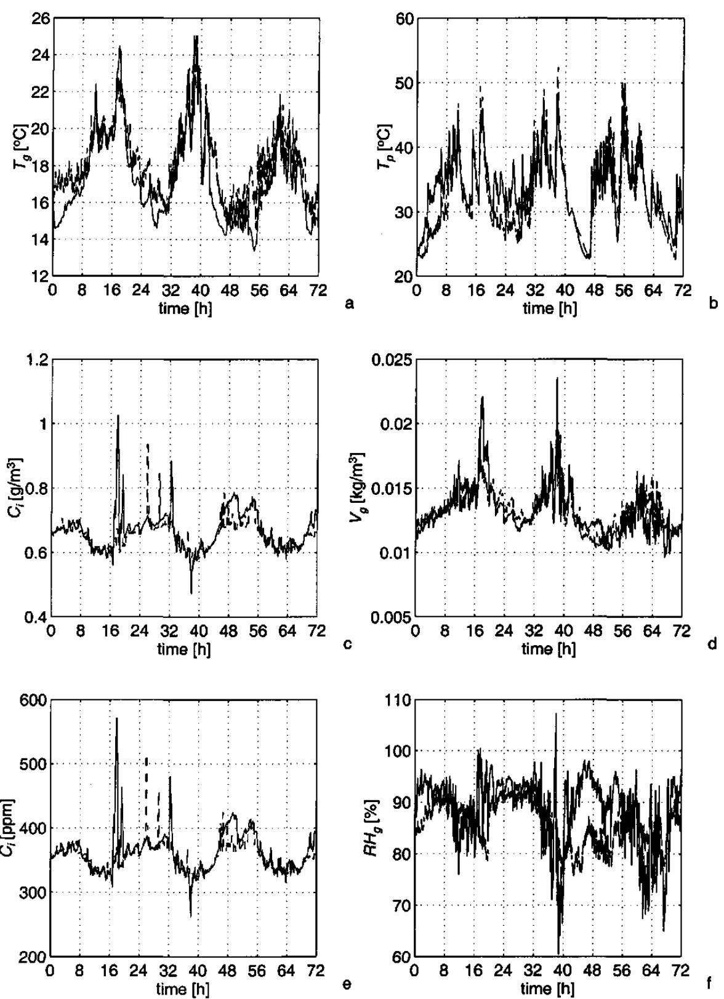
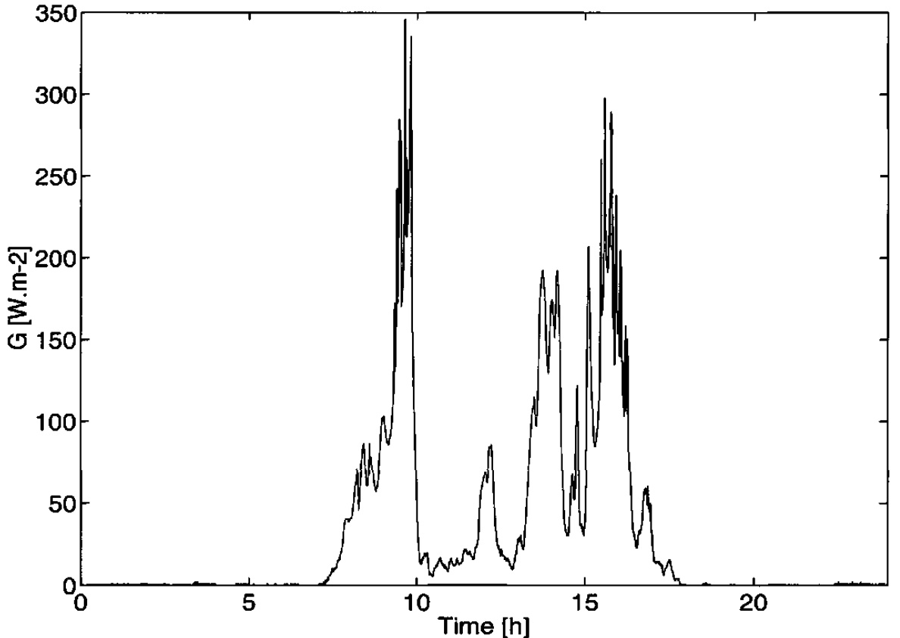
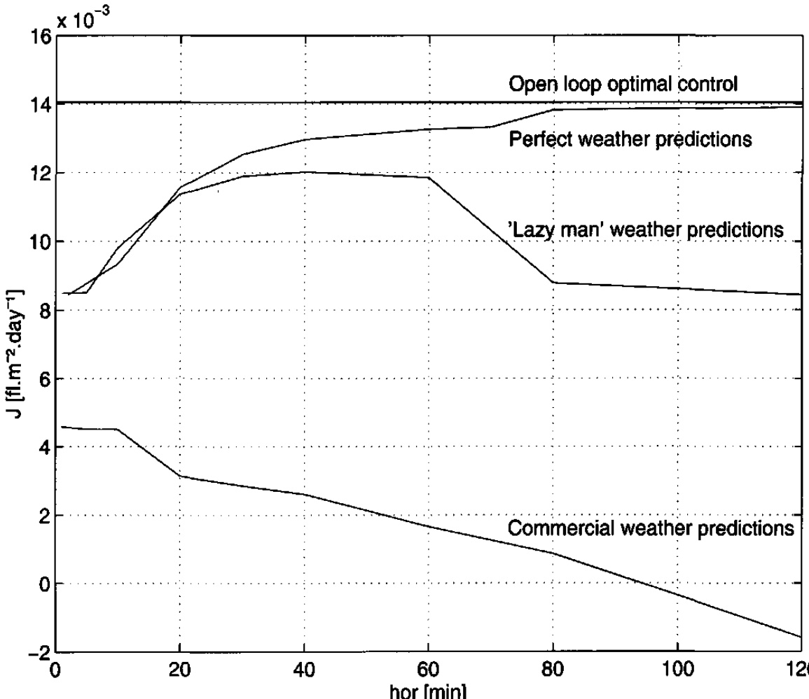
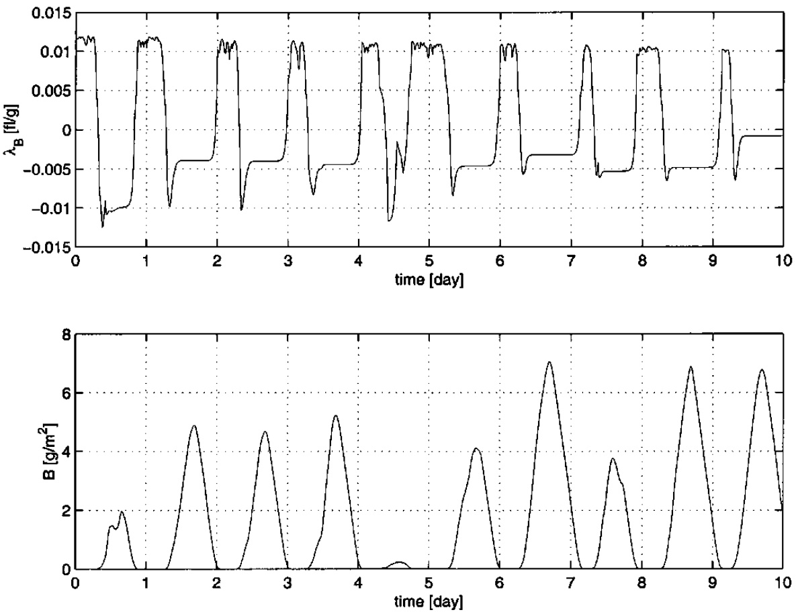
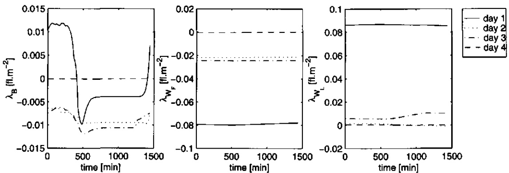

# Stellingen  

1．Een zuiver economische doelfunctie stelt hoge eisen aan het model van het proces en is daardoor vaak onpraktisch. (Dit proefschrift).  

2.Bij voorbaat een Gompertz curve inbrengen in een dynamisch groeimodel is een principieel onjuiste manier van modelleren.  

3．Toestands beschrijving van het menselijk gedrag  

$$
\dot { x } = f ( x , u , d )
$$  

$$
\mathbf { y } = \hbar ( x , u , d )
$$  

Hierin zijn de functies $f \ e \pi$ h erfelijk bepaald, $x$ is het karakter,u de persoonlijke beslissingen, $d$ de omstandigheden en y het menselijk gedrag.Dit systeem is regelbaar enwaarneembaar.  

4.Wetenschap functioneert in onze maatschappij als het moderne orakel van Delphi.  

5．Door de beschikbaarheid van snellere computers is de neiging groot om minder te denken en meer te proberen,waardoor de effectiviteit omlaag gaat.  

6. Geloof in de goedheid van de mens geeft blijk van een gebrek aan zelfkennis.  

7.Vertrouwen op God in je dagelijks leven is als het uitbreiden van een korte termijn doelfunctie met de resultaten van een lange termijn optimalisatie (Spreuken 3:5-6).  

# Stellingen behorend bij het proefschrift Economics-based Optimal Control of Greenhouse Tomato Crop Production'van Frank Tap,Wageningen,26 september 2000.  

# Economics-based Optimal Control of Greenhouse Tomato Crop Production  

Frank Tap  

Promotor: Dr. ir. G. van Straten Hoogleraar in de meet-, regel- en systeemtechniek   
Co-promotor: Dr.ir. L.G. van Willigenburg Universitair docent, leerstoelgroep Meet-,regel- en systeemtechniek  

# Economics-based Optimal Control of Greenhouse Tomato Crop Production  

Frank Tap  

# proefschrift  

ter verkrijging van de graad van doctor   
op gezag van de rector magnificus   
van Wageningen Universiteit,   
dr. ir. L Speelman,   
in het openbaar te verdedigen   
op dinsdag 26 september 2000   
des namiddags te half twee in de Aula.  

Nederlandse vertaling titel: De op economie gebaseerde optimale besturing van de productie van een tomaten gewas in en kas.  

Tap,Frank,2000.  

Economics-based optimal control of greenhouse tomato crop production./R.F. Tap Thesis Wageningen Agricultural University.-With ref.-With summary in Dutch ISBN 90-5808-236-9  

This project has been carried out under contract to the “Nederlandse Maatschappij voor Energie en Milieu BV (NOVEM)" within the framework of the program "Agrarische sector" that is financed by the Netherlands Ministry of Economic Affairs.  

# Voorwoord  

Het proefschrift dat voor u ligt had niet tot stand kunnen komen zonder de hulp van vele mensen Op deze plaats wil ik graag van de gelegenheid gebruik maken een aantal van hen te bedanken:  

Allereerst mijn begeleiders Gerard van Willigenburg en Gerrit van Straten. Gerard bedankt voor het helder houden van de regeltechnische visie. Gerrit bedankt voor je modelmatige inbreng en je oog voor detail bij het interpreteren van de resultaten.  

Mijn kamergenoten Tien Biing Tsair en Leo Lukasse.Het was gezellig en motiverend.Ik heb hee. goede herinneringen aan onze gezamenlijke tijd  

Ik wil de afstudeerders Arien Peterse en Sander Steenvoorden bedanken voor het maken van een simulatie programma van een conventionele kasklimaat regelaar. Verder Atila Biro bedankt voor de eerste aanzet voor het maken van een vergelijking tussen de optimale en conventionele regelaar.  

Bij de experimenten in de kas waren velen betrokken zonder wiens hulp het allemaal niet mogelijk was geweest.Kees van Asselt,Arend van Spriel,Theo Damen,Maarten Baan Hofman en al de anderen van Unifarm,Ep Heuvelink,Remmy Buiskool en de HAS stagiaires Jan de Winter en Jurjen van Dijken,allemaal bedankt.  

Ad de Koning bedankt voor de hulp bij het ontwikkelen van het gereduceerde tomaten model.  

Henk Veen wil ik bedanken voor zijn snelle en plezierige hulp bij mijn vele computer probleempjes.  

De mensen van Evangeliegemeente De Deur in Armhem bedankt voor het mij met de beide benen op de grond houden en het laten zien dat wetenschap en promoveren niet het belangrijkste is wat er bestaat.  

Magda bedankt voor je aanmoediging bij de laatste loodjes en voor de tijd die je voor dil proefschrift hebt opgeofferd.  

Frank  

# Contents  

Voorwoord i  

Contents iii  

Nomenclature vii  

1 Introduction 1.1 Greenhouse horticulture in the Netherlands 1.2 The present greenhouse climate control 1.3 The greenhouse crop production optimal control problem 1.4 Goal 1.5 Outline of this thesis 1.6 References  

# 2A dynamic model for the optimal control of greenhouse tomato crop production  

2.1 Introduction   
2.2 Goal function   
2.3 Greenhouse model   
2.4 The greenhouse model of Tchamitchian et al. (1992)   
2.5 The augmented greenhouse model 2.5.1 Ventilation 2.5.2 Greenhouse air heat balance 2.5.3 Transpiration 2.5.4 Condensation at the greenhouse cover 2.5.5 The heating system 2.5.6 Humidity mass balance   
2.6Tomato model   
2.7 The tomato model of de Koning   
2.8 Model order reduction 2.8.1 The assimilate buffer 2.8.2 Photosynthesis 2.8.3 Respiration 2.8.4 Buffer switching function 2.8.5 Fruit and leaf weight 2.8.6 Harvest model   
2.9Discussion   
2.10 References  

2.11 Appendix A: An example of parameter deduction  

# 3Calibration and validation of a dynamic model for the optimal control of greenhouse tomato crop production  

3.1Introduction 31   
3.2Calibration and validation 32  

3.2.1 Calibration parameter selection 32   
3.2.2 Calibration 33   
3.2.3 Evaluation 34   
3.2.4 Greenhouse crop production model 35   
3.3Tomato crop production model 36   
3.3.1 Sensitivity analysis 36   
3.3.2 Calibration 39   
3.3.3 Validation 44   
3.4Greenhouse model 44   
Heating pipe model 44   
The greenhouse climate model 47   
Processing of the measurements 48   
3.4.4Calibration 50   
3.4.5 Validation 53   
3.5Discussion 58   
3.6Acknowledgement 60   
3.7 References 60   
3.8Appendix 1: List of used symbols 61   
3.9Appendix 2: Model equations 61   
3.9.1 Greenhouse model 61   
3.9.2 Tomato model 62  

# 4 Optimal control of greenhouse climate: computation of the influence of fast and slow dynamics  

4.1 Introduction   
4.2 Optimal control problems   
4.3 Computation of optimal controls and comparison   
4.4 Discussion   
4.5 References   
4.6 Appendix 4.6.1 Indoor climate and crop model 4.6.2 The criterion 4.6.3 Model parameters 4.6.4 $\mathbf { C O } _ { 2 }$ conversion factor  

# 5 Receding horizon optimal control of greenhouse climate based on the lazy man weather prediction  

5.1 Introduction   
5.2 The optimal greenhouse climate control problem   
5.3 Receding horizon optimal control algorithm and results   
5.4 Discussion and future research   
5.5 References.   
5.6 Appendix.  

# 6 Two Time-scale Receding Horizon Optimal Control of Greenhouse Tomato Crop Production  

6.1Introduction  

6.2The optimal control problem 86   
6.3Two time-scale decomposition 88   
6.4Two Time-scale Receding Horizon Optimal Control 89   
6.4.1 The general receding horizon optimal control algorithm 89   
6.4.2 Two time-scale receding horizon optimal control of greenhouse tomato crop   
production 91   
6.5Simulation and experimental results 91   
6.5.1 Slow subproblem 91   
6.5.2 Fast subproblem 97   
6.6Discussion 100   
6.7 Conclusions 101   
6.8Acknowledgement 101   
6.9 References 101  

# 7 Comparison of conventional and optimal control of greenhouse tomato crop production.  

7.1Introduction   
7.2Optimal control 7.2.1 Model 7.2.2 Criterion 7.2.3 Two time-scale decomposition   
7.3Conventional control   
7.4 Experimental comparison   
7.5 Simulated comparison 7.5.1 Initial conditions 7.5.2 Matching the humidity constraint violation 7.5.3 Sensitivity of the energy consumption with respect to $\alpha$ （204号 7.5.4 Results   
7.6Discussion   
7.7 Conclusions   
7.8 References  

# Conclusions 121  

Summary 123  

Samenvatting 125  

Curriculum vitae 127  

# Nomenclature  

symbol description   
（20 $\alpha$ （204号 pipe air heat transfer coefficient Chapter 4: ${ \mathrm { C O } } _ { 2 } { \mathrm { C H } } _ { 2 } { \mathrm { O } }$ molar weight fraction   
（204号 $\alpha _ { \mathfrak { r } }$ （204号 lettuce selling price, per $\pmb { \mathrm { g } }$ dry weight   
（204号 $\alpha _ { 2 }$ （204号 $\mathbf { C O _ { 2 } }$ supply cost   
（204号 $\alpha _ { 3 }$ （204号 heating price   
（204号 $\beta$ （20 heat absorption efficiency Chapter 4: yield factor   
（204号 $\gamma$ （204号 apparent psychometric constant Chapter 4: ventilation rate parameter   
（20 $\boldsymbol { \Gamma }$ （20 $C O _ { 2 }$ compensation point   
（204号 $\Gamma _ { \mathfrak { d } }$ （20 （204号 $\mathbf { C O _ { 2 } }$ compensation point at $2 0 ^ { \circ } C$   
$\varepsilon$ （204号 inside outside cover heat resistance ratio Chapter 4: light use efficiency   
（204号 $\varepsilon _ { 0 }$ （204号 saturation light use efficiency   
$5$ ventilation rate parameter   
（204号 $\eta$ （204号 radiation conversion factor   
（204号 $\theta$ （20 ventilation rate parameter   
$\kappa$ （204号 ventilation rate parameter   
$\lambda$ （204号 vaporisation energy of water Chapter 4: ventilation rate parameter   
$\Lambda$ （204号 pressure constant   
$\mu$ （204号 ${ \mathrm { C O } } _ { 2 } { \mathrm { C H } } _ { 2 } 0$ molar weight fraction Chapter 4: leaf conductance to $C O _ { 2 }$ diffusion   
（204号 $\nu$ （ ventilation rate parameter   
$5$ （20 ventilation rate parameter   
$\rho$ （204号 specific mass of water   
$\rho _ { a }$ （20 specific mass of air   
$\sigma$ （204号 ventilation rate parameter   
（204号 $\tau$ （20 pipe air heat transfer coefficient parameter Chapter 4: roots shoot dry weight ratio   
（204号 $v$ （204号 pipe air heat transfer coefficient parameter   
（204号 $\varphi$ （204号 heating system water flow   
（204号 ${ \pmb \varphi } ^ { \prime }$ （204号 boiler water flow   
（204号 ${ \varphi _ { h } }$ （204号 mixing valve water flow   
（204号 ${ \varphi } _ { i n j }$ （204号 $\mathbf { C O } _ { 2 }$ injection flux   
（204号 $\Phi _ { \nu }$ （204号 ventilation flux   
（204号 $x$ （204号 ventilation rate parameter   
nominal valueunits W.m2.℃   
1.4667 ■   
0.02 fg1   
1.2.104 fg   
7.3.109 sw1   
0.01   
0.8 ■   
0.067 kPa.℃1   
3.68.105 · ppm   
40 ppm   
3.0 · g.1   
17.10-6 g.J1   
2.7060.10-5 ·   
0.7 ·   
4.02. 105 ·   
5.03.10-5 m.s1 J.g1   
4.02.10   
0.46152 N.m.C-1.   
1.4667 · s.m1   
3.68.105 %1   
6.3233.10-5 %-1   
998 kg.m3   
1.29 kg.m3   
7.1708.10 %1   
3.0 C-1/2   
0.07 ·   
0.74783 W.m2.℃-3/ ms-1   
4.10-4 ms1 m.s1   
0-2.1 . 103 g.s1.m²2 m.s   
0.0156 %-1  

$\psi$ （204号 0 A （20 $a _ { \mathrm { \scriptscriptstyle I } }$ （204号 （20 $a _ { 2 }$ （204号 $a _ { 3 }$ （204号 A （204号 ${ { a } _ { \nu } }$ （204号 $b$ （20 $B$ （20 $b _ { 1 }$ （20 （204号 $c$ （204号 （20 $C _ { a }$ （20 $c _ { i }$ （204号 $C _ { g }$ （20 $c _ { \rho }$ （20 $c _ { p }$ （20 $C _ { p }$ （204号 （204号 $c _ { s }$ （204号 （20 $d _ { \mathrm { { \iota } } }$ （204号 $d _ { z }$ （204号 $d _ { 3 }$ （204号 $d _ { 4 }$ （204号 （204号 $D _ { g }$ （204号 DFi Dm $D _ { p }$ （204号 E （204号 $E _ { p i n }$ （204号 $f$ （204号 （20 $f _ { 1 }$ （20 （20 $f _ { 2 }$ （20 $f _ { g c }$ （20 （20 $f _ { m r }$ （20 （204号 $f _ { r c }$ （204号 $g$  

ventilation rate parameter 7.4.10 m.s1   
humidity ratio parameter 0.622   
Chapter 4: density of $\mathfrak { C O } _ { 2 }$ 1.83.10-3 g.mr1   
available amount of assimilates g.d   
saturation vapour pressure parameter 0.611 kPa   
saturation vapour pressure parameter 17.27 1   
saturation vapour pressure parameter 239 （204号 $o _ { C }$ （204号   
heating pipe outer surface area （ $\mathbf { m ^ { 2 } }$   
Chapter 4: effective leaf area ratio   
air density 1.32 kg.m3   
buffer switching function   
assimilate buffer dry weight per ground area g.m2   
buffer switching function coefficient 2.7 m2g1   
$\mathtt { C O } _ { 2 }$ concentration ppm   
air specific heat at constant pressure 1.10 J.kg1.K-1   
greenhouse air $\mathbf { C O _ { 2 } }$ concentration g.m3   
greenhouse heat capacity 32.10 J.C-1.m2   
outside air $\mathtt { C O } _ { 2 }$ concentration g.m3   
air specific heat at constant pressure 1010 JC1.kg1   
specific heat of water at constant pressure 4180 JC1.kg1   
greenhouse soil heat capacity 120.10 JC.m²   
plant development rate parameter 2.1332.10 （204号 $\mathsf { \pmb { s } } ^ { \mathbf { - 1 } }$ （204号   
plant development rate parameter 2.4664.107 （204号 $\mathsf { s } ^ { - 1 }$ （   
plant development rate parameter 20.0 ℃   
plant development rate parameter 7.4966 . 10-11   
air vapour pressure deficit kPa   
developmental stage of fruit i according to de Koning   
mean fruit developmental stage   
plant developmental stage   
crop transpiration rate g.s1.m²   
energy input J   
fruit assimilate requirement quotient 1.20   
fruit growth rate coefficient 8.1019.107 s1   
fruit growth rate coefficient 4.6296.10-6 s1   
gross crop photosynthesis g.s1.m²2   
maintenance respiration （204号 ${ \bf g . 5 ^ { - 1 } . m ^ { - 2 } }$ （204号   
respiration g.s1.m2   
leaf conductance mm.s-1   
$G$ （204号 outside short-wave radiation W.m²   
$z _ { 1 }$ （204号 leaf conductance parameter 20.3 mm.s\`   
$8 2$ （20 leaf conductance parameter 0.44   
$g _ { 3 }$ （204号 leaf conductance parameter 2.5.103 s.m2.μmol-1   
$g _ { 4 }$ （204号 leaf conductance parameter 3.1.10-4 mg1   
$g _ { b }$ （204号 boundary layer conductance 10 mm.s-1 Chapter 4: boundary layer conductance 0.007 s.m1   
$g _ { F }$ （204号 relative fruit growth rate s1   
（204号 $g _ { L }$ （204号 relative leaf growth rate s   
（20 $g _ { i a r }$ （204号 structural leaf area ratio 0.075 （204号 $\mathbf { m ^ { 2 } . g ^ { - 1 } }$ （2   
（204号 $\theta _ { s }$ （204号 stomatal conductance 0.005 s.m   
（204号 $g _ { V }$ relative vegetative growth rate （204号 $\mathsf { \pmb { s } } ^ { - 1 }$ （204号   
（20 ${ \pmb g } _ { \pmb x }$ （20 carboxilation conductance S.m-1   
（204号 $\pmb { \mathcal { g } } _ { \mathbf { \lambda } \mathbf { \mathbf { \mathbf { \math } } } }$ （20 carboxilation conductance parameter 0.3 s.K2.m1   
（204号 $g _ { \nu 2 }$ （20 carboxilation conductance parameter -24 K   
gx3 carboxilation conductance parameter 75 （20 ${ \bf K } ^ { 2 }$ （20   
（204号 $h$ harvest coefficient s1   
（204号 $H$ （204号 heat input 0-200 W.m2   
（204号 $h _ { F }$ （20 fruit harvest coefficient s1   
$h _ { i }$ leaf harvest coefficient s   
（204号 $H _ { \mu }$ （204号 heat uptake by the pipe W.m   
（204号 $i$ （20 fruit number   
（204号 $I$ （2 incident PAR μmol.s.m²   
（204号 $J$ （20 criterion function fl.m-2   
（20 $\kappa$ （20 extinction coefficient 0.9   
（204号 $k _ { d }$ （204号 soil to soil heat transfer coefficient 2.0 W.C1.m²   
（204号 $k _ { r }$ （204号 roof heat transfer coefficient 7.9 W.C1.m²   
（204号 $k _ { s }$ （204号 soil heat transfer coefficient 5.75 W.℃1.m²2   
（204号 $k _ { \nu }$ （204号 ventilation heat transfer coefficient W.C-1.m²   
（204号 $l$ （ LAI-correction function 一   
（204号 $L$ （20 leaf area index   
（20 $l _ { l }$ （20 vaporisation energy coeficient 2.501.106 J.g1   
（204号 $l _ { 2 }$ （204号 vaporisation energy coefficient 2.381.10 J.g1.℃-1   
$m$ （204号 LAI-correction function parameter 2.511   
（204号 $m _ { \mathrm { I } }$ （20 mass transfer parameter 1.0183 .103 g.s.m²   
（204号 $m _ { 2 }$ （204号 mass transfer parameter 0.33   
（204号 $M _ { a i r }$ （20 air density 1.29 kg.m3   
（204号 $M _ { c }$ （204号 greenhouse cover condensation water mass flow g.s1.m²   
Mco $C O _ { 2 }$ molar mass 0.0044 kg  

$m _ { F }$ （20 $m _ { L }$ （ （20 $m _ { p }$ （ $N$ （20 （204号 $p$ （20 $P$ （20号 $p ^ { * }$ （204号 $p _ { i }$ （20 $p _ { 2 }$ （2 （204号 $p _ { 3 }$ （2 （204号 $p _ { 4 }$ （2 $p _ { s }$ （20 （204号 $p _ { a m }$ （20 $p _ { c }$ （20号 $\pmb { P _ { c } }$ （204号 $p _ { c }$ （20 $p _ { F }$ （204号 （204号 $p _ { 8 }$ （2 （20 $p _ { g } ^ { * }$ （204号 $p _ { G }$ （20 （204号 $P _ { g }$ （20 $p _ { H }$ （204号 $p _ { m }$ （204号 $P _ { n }$ （20 （204号 $P _ { T }$ （204号 $P _ { \nu }$ （204号 $q$ （204号 （20 $Q _ { r }$ （204号 $\varrho _ { g }$ （20 $Q _ { G }$ （20 （204号 $Q _ { r }$ （20 $Q _ { R }$ （204号 $r$ （204号 $R$ （20 $r _ { F }$ （20 $R _ { g }$ （204号  

fruit maintenance respiration coefficient 1.157 . 107 s1 vegetative maintenance respiration coefficient 2.894.107 的 Watt to μmol conversion factor 4.57 μmol.J1 total number of fruits 1   
vapour pressure kPa Chapter 4: PAR global radiation ratio 0.45   
Crop photosynthesis g.sm² Chapter 4: humidity bounds penalty function fm2s1 saturated vapour pressure kPa net-photosynthesis parameter -2.17 .104 g.s1.m2 net-photosynthesis parameter 3.31.103 g.s.m² net-photosynthesis parameter 577 W.m2 net-photosynthesis parameter 221 g.m3 net-photosynthesis parameter 5.00.10-5 g.s.m² atmospheric air pressure 101.0 kPa $\mathbf { C O } _ { 2 }$ price 5.104 （20 $\mathbf { f l . g } ^ { - 1 }$ （204号 $\mathbf { C O _ { 2 } }$ penalty function （20 $\bf { i l . m ^ { - 2 } . s ^ { - 1 } }$ saturated vapour pressure at cover temperature kPa fruit price 0.02 f.g1   
greenhouse air vapour pressure kPa greenhouse air saturated vapour pressure kPa PAR to global radiation ratio 0.475 · crop photosynthesis g.s-1.m2 heating price 7.3.109 fl.w-1 maximum photosynthesis 2.2538.10-3 g.s1.m²2 net-photosynthesis g.s1.m²2 temperature penalty function fl.m-2.s-1 humidity penalty function fl.m2.s-1 evaporation radiation parameter 0.01 m2.g $\mathbf { C O _ { 2 } }$ saturation point $\mathsf { Q } _ { 1 0 }$ value 2.0   
growth $\mathbf { Q } _ { 1 0 }$ -value 1.6   
fruit growth rate temperature $\bf { Q } _ { 1 0 }$ -value 1.0   
maintenance respiration $Q _ { 1 0 }$ -value 2.0   
maintenance respiration $Q _ { 1 0 }$ -value 2.0   
evaporation vapour pressure deficit parameter 0.01 m2g1 crop respiration gs.m² relative fruit respiration rate s gas constant 8.3144 J.mol-1.K  

（204号 $r _ { 8 }$ （204号 specific growth rate m1 （204号 $r _ { \frac { p m } { g m } }$ （20 saturation growth rate at $2 0 \%$ 5.8.106 s （204号 $r _ { h }$ （20 relative mixing valve opening 0-1 · （204号 $R _ { i }$ （204号 inside relative humidity % （204号 $r _ { L }$ （20 relative leaf respiration rate （204号 $\mathbf { s } ^ { \mathbf { - 1 } }$ （2 （204号 $R _ { o }$ （204号 outside relative humidity % （20 $R _ { p }$ （204号 incident photosynthetic active radiation （20 $\mathbf { W . m ^ { - 2 } }$ （204号 $r _ { r }$ （20 rootsmaintenance respiration coefficient 1.16.107 （20 $\mathbf { s ^ { - 1 } }$ （204号 $r _ { s }$ （20 shoot maintenance respiration coefficient 3.47.107 （204号 $\boldsymbol { \mathsf { s } } ^ { - 1 }$ （20 （204号 $p _ { w }$ （204号 relative window opening 0-100 $\%$ （20 （204号 $r _ { w i }$ （204号 relative lee side window opening 0-100 $9 0$ （20 （204号 $r _ { w w }$ （204号 relative windward side window opening 0-100 $\%$ （204号 （204号 $\pmb { \mathscr { s } }$ （2 saturated water vapour pressure curve slope kPa.C-1 （204号 $\pmb { s } _ { 1 }$ （20 saturated water vapour pressure curve slope parameter 1.8407 .104 kPa.℃-3 （204号 $s _ { 2 }$ （204号 saturated water vapour pressure curve slope parameter 9.7838.10-4 kPa.C2 （204号 $s _ { 3 }$ saturated water vapour pressure curve slope parameter 0.051492 kPa.C1 （204号 $S _ { A }$ （204号 total absolute sink strength g.d1 （204号 $l$ time s （204号 $T$ （204号 temperature （204号 $^ \circ _ { \mathbf { C } }$ （204号 $t _ { 0 }$ （20 starting time s （204号 $T _ { \theta }$ （20 absolute zero 273.15 （204号 $\circ _ { C }$ （204号 （204号 $T _ { a }$ （204号 air temperature $^ \circ _ { \mathbb { C } }$ （20 （204号 $T _ { c }$ （204号 cover temperature $^ \circ _ { \bf C }$ （204号 （204号 $T _ { d }$ （204号 deep soil temperature 10.0 $o _ { C }$ （20 （204号 $t _ { f }$ （2 final time s $l _ { g }$ （204号 greenhouse transmittance 0.55 1 （204号 $T _ { g }$ （204号 greenhouse air temperature $o _ { C }$ （204号 （20 $T _ { \widehat { \mathbf { \alpha } } _ { G } }$ （204号 growth rate temperature effect reference temperature 20.0 $o _ { C }$ （20号 （204号 $T _ { h }$ （20 boiler water temperature $o _ { C }$ （20 （20 $T _ { o }$ （204号 outside air temperature $o _ { C }$ （204号 $T _ { p }$ （204号 heating pipe temperature （204号 $o _ { C }$ （204号 Chapter 4: plant temperature ℃ $T _ { p i }$ （204号 incoming heating system water temperature $o _ { C }$ （204号 $T _ { p o }$ （204号 outgoing heating system water temperature （204号 $o _ { C }$ （204号 （20 $T _ { R }$ （204号 maintenance respiration reference temperature 25.0 $\circ _ { C }$ （204号 $T _ { s }$ （204号 greenhouse soil temperature ℃  

$\nu$ （204号 vegetative assimilate requirement quotient 1.23   
$V$ （20 water vapour concentration kg.m-3 $\nu _ { \mathrm { { 1 } } }$ （20 vegetative fruit growth ratio parameter 1.3774   
$\nu _ { 2 }$ （204号 vegetative fruit growth ratio parameter -0.168 C-1 $\nu _ { 3 }$ （20 vegetative fruit growth ratio parameter 19.0 ℃ （20 $V _ { a }$ （20 air water vapour concentration kg.m3 （204号 $V _ { i }$ （20 greenhouse air water vapour concentration kg.m-3 $V _ { g } / A _ { g }$ （204号 average greenhouse height 3.0 m $V _ { o }$ （204号 outside air water vapour concentration kg.m （20 $V _ { p }$ （20 heating pipe volume （20 $m ^ { 3 }$ （204号 ${ \pmb w }$ outside wind speed m.s $W$ （204号 humidity ratio ■ （20 $W _ { c } ^ { * }$ （204号 humidity ratio at saturated vapour pressure at the cover   
（20 $W _ { F }$ （204号 fruit dry weight g.m² WFi fruit dry weight of fruit i g.m² （204号 $W _ { g }$ （204号 greenhouse air humidity ratio   
$W _ { H _ { F } }$ harvested fruit dry weight g.m² WH harvested leaf dryweight g.m² （204号 $\boldsymbol { W } _ { L }$ （204号 leaf dry weight per ground area g.m² （204号 $W _ { n }$ （204号 non-structural dry weight g.m² $w _ { R }$ （204号 LAI correction function parameter 32.23 g.m² $W _ { s }$ （204号 structural dry weight g.m² （204号 $W _ { \nu }$ （204号 vegetative dry weight g.m² $y _ { F }$ （204号 fruit harvest coeficient parameter 0.5983   
$y _ { L }$ （20 leaf harvest coefficient parameter 0.5983 一 2 leaf fraction of vegetative dry weight 0.6081  

# 1Introduction  

# 1.1 Greenhouse horticulture in the Netherlands  

In the Netherlands greenhouse horticulture is of great economic and social importance.Its annual returns are seven billion guilders of which 75 till $80 \%$ is exported. Moreover about 40,0o0 people work in this industry (Anonymous,1998).Also from an environmental point of view it is very important as it uses 5 percent of the total Dutch fosil fuel consumption and the area of greenhouse horticulture adds up to over 10,000 ha.In 1997 an official agreement with the Dutch government, the covenant “Greenhouse Horticulture and Environment",has been signed by Dutch greenhouse horticulture to reduce its environmental load. The main_ goals of the covenant are (a) an energyefficiency improvement of $65 \%$ in 2010 compared to 1980,(b) a 72 till $8 8 \%$ reduction of the crop protection chemicals compared to the average in the period 1984-1988,and (c) a reduction of the emission of fertilisers like phosphate and nitrogen with $7 5 \%$ in 2000 and $9 5 \%$ in 2010 compared to 1980.  

# 1.2 The present greenhouse climate control  

The greenhouse climate computers that have become very common in large parts of Dutch horticulture,do not only control the climate,but also function as programming memory, in which desired and realised climate paterns can be recorded.The software for climate control has been developed in a heuristic way.The main control devices in a greenhouse-i.e.the heating system and the ventilation windows-are used for both temperature and humidity control.For that reason the algorithms contain many if-then rules,partly combined with simple proportional control. In the course of time a number of other functions were added, like the control of irigation, energy screens,heating buffers and $C O _ { 2 }$ supply.Based on experience,a number of adaptation mechanisms relevant to growing crops were included,like a temperature increase at high global radiation levels. Moreover the software takes care of security and protection against extreme conditions.  

Aresult of this development is that the control software contains several hundreds of setings.The setings can be divided into three main categories: those concerned with the setpoint trajectories, those concerned with modifications of the setpoint trajectories as a reaction to the actual circumstances,and those concerned with the parameters of the underlying controllers.When the control equipment is installed the manufacturer has to tune many of these setings.Once in operation most growers manipulate about 5 to 20 settings among these to control the greenhouse climate. Different growers may use different settings.  

This approach,although a major improvement over manual control,has important drawbacks: (a) the setpoint tracking in practice is far from ideal,among other things because of interactions between control loops and because of restrictions in the control devices,(b) the setpoint trajectories, and especially their adaptations are not linked ina scientific way to the crop behaviour,due to which energy inefficient adaptations can occur,(c) the number of settings is that large that the system is not transparent,and consequences of the settings,for instance to crop yield or energy consumption,are unclear.  

# 1.3 The greenhouse crop production optimal control problem  

During the last decades much scientific knowledge has been gathered with respect to greenhouses and crops in the form of mathematical models (merely a selection from the Netherlands:Bakker 1991,Bot 1983,Heuvelink 1996,de Koning 1994,Marcelis 1994,Miguel 1998,Nederhoff 1994, Stanghellini 1987,de Zwart 1996).These mathematical models reflect scientific knowledge in a quantitative form,thus paving the way towards application of economically optimal control. Such a strategy furthermore requires the formulation of a criterion that reflects the desired objectives,to be met by the control system,in terms of the behaviour of the greenhouse crop system. Given the model and the criterion optimal control comes up with the best possible solution. Other approaches to the control of greenhouse climate such as neural nets (e.g. Seginer, 1997) and fuzzy control (e.g. Ehrlig et al 1996) use models which hardlyrely on scientific knowledge but mainly on data and experience and in which the desired objectives are not stated explicitly.Since, in the case of optimal control,the model and the criterion are susceptible to interpretation they can be modified relatively easy.Therefore the judgement and improvement of the quality of the optimal control system is relatively easy and clear whereas both are much more difficult and unclear in the other approaches. An additional advantage is that the theory can be applied straightforwardly to non-linear systems. Finally many numerical algorithms have been developed to really compute the optimal controls.  

The greenhouse crop production optimal control problem is very complex.First, it contains several time-scales: 1 to 2 months at the crop level,1 to 2 days at the level of soil and some processes in the crop and 10 to 20 minutes at the level of the greenhouse climate.Second,its fast dynamics are exitated by strongly influencing and fast fluctuating external inputs (the weather),especially the global radiation.Moreover,accurate long-term weather predictions are not available.A final problem is the absence of on-line crop measurements.To properly control the greenhouse crop production all these difficulties must be considered and resolved.  

Past research has dealt with parts of the optimal greenhouse crop production control problem. The total problem can be divided into a slow sub-problem,dealing with the crop,and a fast sub-problem dealing with the greenhouse.Seginer et al (1998） for instance considered only the slow subproblem,whereas Hwang (1993) focussed on the fast sub-problem.Chalabi et al (1996),Ioslovich et al (1996) optimise a part of the greenhouse crop system.Among the first who tackles the overall control problem is van Henten (1994).He presents a methodology to decompose the system into two time-scales despite the presence of strongly influencing and fast fluctuating external inputs. According to this methodology first the long-term problem must be solved,then using the results of the long-term problem,the short term problem can be tackled.Van Henten applies this methodology to lettuce.  

To apply the methodology proposed by van Henten in practice,two additional problems have to be solved.The first one relates to the exogenous inputs,i.e.the weather,which for optimal control computations must be known over the full optimisation horizon. Secondly,since optimal control is essentially open loop,feedback is required to deal with initial state and modelling errors and errors due to imperfect weather predictions.In this thesis the two time-scale decomposition of van Henten is combined with two types of weather predictions and receding horizon optimal control,and is applied to a tomato crop.The combination of these approaches,to the best knowledge of the authors,is new and results in a so called Two Time-scale Receding horizon Optimal Control (TTROC) algorithm.TTROC is applied to tomato instead of lettuce,because it is a much more important crop and its behaviour resembles that of other important greenhouse crops like sweet pepper and cucumber.  

# 1.4 Goal  

The goal of this research is to develop and test a real-time implementable multivariable optimal control algorithm for greenhouse tomato crop production and to compare its performance with that of aconventional controller especially with respect to its energy eficiency,its profitability and its transparency.  

# 1.5 Outline of this thesis  

To maximally benefit from optimal control an accurate dynamic model with not too many state variables is needed to describe both the crop and greenhouse behaviour.Most crop models from literature are either too complicated for control purposes (e.g. Heuvelink l996,de Koning 1994, Jones et al l99l) or they are not accurate enough on a seasonal scale,because they do not describe the long-term crop growth dynamics (e.g. Tchamitchian et al,1992).Moreover crop and grenhouse behaviour are mostly described separately.As these modelsare calibrated separately, their mutual influence is not taken into account in the calibration.This separation may very well lead to inaccuracies.Therefore chapter two describes the development of a combined greenhouse tomato crop production model,consisting of a tomato crop model and a greenhouse model.The tomato crop model is derived from the model of de Koning (1994) by reasoned aggregation.The greenhouse model is an extended version of the model of Udink ten Cate (1985).First the tomato model will be calibrated,and subsequently the greenhouse model, using the model output from the tomato model.In chapter three,the calibration and validation of the complete model is presented.In chapter four the importance of the fast dynamics in generating the optimal controls in greenhouse crop production is shown.Normally,singular perturbation theory (Kokotovic et al.(1986)) is used to do this,but because of the strongly influencing fast fluctuating exogenous inputs (i.e.the global radiation) this theory can not be applied in this case.  

The method suggested by van Henten (1994) to separate the fast and slow dynamics in the presence of strongly influencing fast fluctuating exogenous inputs,is elaborated in this thesis.In chapter five a way to solve the fast sub-problem is presented,combining receding horizon optimal control with the lazy man weather prediction,resulting in areal time implementable feedback control algorithm (TTROC).In chapter six the overall problem is solved including both the fast and the slow subproblem. This chapter presents the total solution of the greenhouse tomato crop production control problem,combining the long-term solution with the result of chapter five.In chapter seven a comparison is made both experimentally and in simulation between the controller from chapter six and a conventional greenhouse climate control computer. In experiment the TTROC algorithm resulted in a slight increase of crop yield and much less violation of the temperature and humidity bounds.In simulation TTROC improves the energy efficiency by $8 . 5 \%$ compared to conventional control. Against a $5 \%$ drop of crop yield the energy consumption reduces by $1 2 . 5 \%$ . Extrapolation with the assumption that investments in biomass on the plants will finally pay off,suggests an average achievable gain in profit of $60 \%$ Also the experiment suggests that the algorithm is robust with respect to modelling errors.One of the most important conclusions,presented in chapter eight is that the technical feasibility of TTROC of a greenhouse tomato crop production system has been demonstrated.The use of scientific models and the explicit economic goal function,has led to many insights,which can be presented orderly to the grower.These insights can also be utilised to improve conventional control.  

#  

1.6 References   
Anonymous (1998). Kwantitatieve informatie voor de glastuinbouw 1997 - 1998 Groenten, snijbloemen,potplanten. Serie Glastuinbouwinformatie.   
Bakker, J.C. (i991). Analysis of humidity effects on growth and production of glasshouse fruit vegetables.Ph.D.Thesis, Wageningen Agricultural University,Wageningen.   
Bot,G.P.A. (1983). Greenhouse climate: from physical processes to a dynamic model. Ph.D. Thesis,Wageningen Agricultural University,Wageningen.   
Bryson,A.E.and Y.C. Ho (1975). Applied optimal control. Hemisphere, New York.   
Chalabi, Z.S.,B.J.Bailey and D.J. Wilkinson (1996). A real-time optimal control algorithm for greenhouse heating. Computers and electronics in agriculture. 15 (1),1-13.   
Ehrlig,H., M. Kuhne and J. Jakel (1996). Development of a fuzzy control system for greenhouses. Acta Horticulturae, 406,463-470.   
Henten, E.J. van (1994). Greenhouse climate management: an optimal control approach. PhD. Thesis,Wageningen Agricultural University,Wageningen.   
Heuvelink,E. (1996). Tomato growth and yield: quantitative analysis and synthesis.Ph.D. Thesis, Wageningen Agricultural University,Wageningen.   
Hwang, Y. (i993). Optimization of greenhouse temperature and carbon dioxide in subtropical climate.Ph.D. Thesis, University of Florida,Florida.   
Ioslovich, 1., P.O. Gutman and I. Seginer (1996).A non-linear optimal greenhouse control problem with heating and ventilation. Optimal Control Applications and Methods,17(3),157- 170.   
Jones,J.W., E. Dayan,L.H. Allen, H. van Keulen and H. Challa (1991). A dynamic tomato growth and yield model (TOMGRO). Transactions of the American Society of Agricultural Engineers 34,663-672.   
Koning, A.N.M de (1994). Development and dry matter distribution in glasshouse tomato: a quantitative approach.Ph.D.Thesis,Wageningen Agricultural University,Wageningen.   
Kokotovic, P.V., H.K. Khalil and J. O'Reilly (1986). Singular perturbation methods in control:analysis and design. Academic Press,London.   
Marcelis, L.F.M. (1994). Fruit growth and dry mater partitioning in cucumber. Ph.D. Thesis, Wageningen Agricultural University,Wageningen.   
Miguel, A.A.F.(1998).Transport phenomena through porous screens and openings: from theory to greenhouse practice.Ph.D.Thesis.Wageningen Agricultural University,Wageningen.   
Nederhoff, E.M. (1994). Effectsof $C O _ { 2 }$ concentration on photosynthesis, transpiration and production of greenhouse fruit vegetable crops. Ph.D. Thesis. Wageningen Agricultural University,Wageningen   
Seginer,I. (1997). Some artificial neural network applications to greenhouse environmental control. Computers and Electronics in Agriculture 18(2,3), 167-186.   
Seginer,I.and I. Ioslovich (1998). Seasonal optimization of the greenhouse environment for a simple two-stage crop growth model. Journal of Agricultural Engineering Research,70,145- 155   
Stanghellini, C.(1987). Transpiration of greenhouse crops: an aid to climate management.Ph.D. Thesis,Wageningen Agricultural University,Wageningen   
Tchamitchian, M., L.G. van Willigenburg and G. van Straten (1992). Short term dynamic optimal control of the greenhouse climate. MRS-report 92-3，Wageningen Agricultural University, Wageningen.   
Udink ten Cate, A.J. (1985). Modelling and simulation in greenhouse climate control. Acta Horticulturae,174, 461-467.  

Zwart,H.F. de (1996). Analyzing energy-saving options in greenhouse cultivation using a simulation model.Ph.D. Thesis,Wageningen Agricultural University,Wageningen.  

# 2 A dynamic model for the optimal control of greenhouse tomato crop production  

R.F.Tap,G. van Straten,L.G. van Willigenburg  

# abstract:  

Real-time economically optimal control of greenhouse crop production requires the simultaneous consideration of temperature, $\mathbf { C O _ { 2 } }$ and humidity inside the greenhouse,and their effects upon the crop.A comprehensive dynamic model of low order is presented that is suitable to this end.It describes air temperature, heating pipe temperature, virtual soil temperature, $\mathbf { C O } _ { 2 }$ concentration, and relative humidity as functions of the control inputs heating valve opening,windward and lee side window opening and $C O _ { 2 }$ -dosage.In addition,a continuous time big-leaf-big-fruit reduced model for tomato growth is developed and incorporated, with fruit development stage, assimilate buffer, leaf weight and fruit weight as state variables.This reduced model is obtained by‘reasoned aggregation’of an existing large size tomato model. The interaction between crop and physical environment by transpiration and $\mathbf { C O } _ { 2 }$ assimilation is taken into account. The main contribution of this paper lies in selecting,combining,adjusting and translating significant components of plant and greenhouse models into one comprehensive and transparent set of differential equations of the order 9,which is suitable for optimal control.This paper presents the derivation of the model equations, including default parameters.Inchapter $3 ,$ the calibration of the model will be discussed. The model has been used in an actual on-line optimal tomato crop cultivation experiment.  

keywords: greenhouse model,model reduction,optimal control, tomato model, Lycopersicor esculentum Mill.  

# 2.1 Introduction  

At present,greenhouse climate control computers use individual PI-like or heuristic controllers to control greenhouse temperature，humidity and $\mathbf { C O } _ { 2 }$ concentration. The time evolution of the setpoints of the individual controllers,and the way in which the setpoints are adapted under measured changing weather conditions,are usually,in some form,specified by the grower.These specifications are based on his experience.In this way the grower tries to realise favourable crop growth conditions throughout the cultivation period.  

Although the climate may be favourable from a plant perspective it may be unfavourable from a financial perspective.For instance,the optimal growing temperature for tomatoes is about 21 $o _ { C }$ However,on a cold and windy winter day,the heating costs may not counterbalance the revenues obtained from maintaining this optimal growing temperature.Maximisation of profit implies balancing of costs and revenues.This can be done using an optimal control approach.  

In optimal control, control input trajectories are determined that maximise (minimise) a criterion function,subject to a dynamic model of the controlled system.The criterion function is chosen to reflect the growers profit,i.e. both the revenues of crop production and the costs associated with climate control are taken into account.The dynamic model,which must be represented as a set of first-order differential equations,must reflect the dynamics of the greenhouse and the crop in  

  
FIG.1. The greenhouse-crop system.  

# relation to the outside weather conditions and control actions (figure 1).  

The physical climate system and the crop system are interconnected. In particular，the $\cos _ { 2 }$ concentration and the air humidity exert an influence on the crop,but are also actively influenced by the crop itself.In view of the time scale differences between the greenhouse dynamics and the crop dynamics,these systems are often seen as detached from each other,where the environment of the plant - assumed to be controlled inan ideal way by manipulating the control inputs - is seen as the input for the crop model. Because the $\mathbf { C O _ { 2 } }$ consumption and evaporation of the crop influence the greenhouse climate,for optimal control purposes,the greenhouse and crop growth model cannot be separated and must be considered as one.  

The purpose of this paper is to present an integrated dynamic model to describe the growth of tomatoes in a greenhouse as a function of the control inputs-window opening,heating valve position and $\mathbf { C O } _ { 2 }$ dosage -,and of the external inputs -solar radiation and outside air conditions -, such that this model is suitable for on-line optimal control of tomato cultivation.Tomato is chosen, because it is a fruit bearing crop,and it is plausible that the results can be transferred to other fruit bearing crops such as sweet pepper and cucumber. An important requirement for optimal control is that the model should be of sufficiently low order.The model is based on physical knowledge about the greenhouse and physiological knowledge about tomato plant growth and behaviour.Mechanistic models are chosen,since they offer the possibility to examine and interpret the sub processes of the system.The 9th-order model developed in this paper incorporates results from Bakker (1983), Hwang (1993),van Henten (1994),de Jong (1985),de Koning (1994),Nederhoff and de Graaf  

# (1993),Nederhoff and Vegter (1994) and Tchamitchian, van Wiligenburg and van Straten (1992).  

# 2.2 Goal function  

In order to study the requirements posed upon the models to be used for optimal control, it is instructive to look at the ultimate goal function to be used.In the context of this study,the criterion function is given by  

$$
J = \int _ { t _ { 0 } } ^ { t _ { f } } \Biggl ( p _ { F } \frac { d W _ { H _ { F } } } { d t } - p _ { C } \varphi _ { i n j } - p _ { H } H _ { u } - P _ { C } - P _ { V } - P _ { T } \Biggr ) d t
$$  

where $t _ { 0 }$ and $t _ { f }$ are the begin and end time of the growing season, dWis thefruit harvest rate， $\varphi _ { i n j }$ is the $\mathbf { C O } _ { 2 }$ injection flux, $H _ { u }$ is the heat uptake by the heating system, $p _ { F } , p _ { C }$ ,and $p _ { H }$ are the prices of fruits, $\mathbf { C O _ { 2 } }$ injection and of the heating and finally $P _ { c }$ is the $\mathbf { C O } _ { 2 }$ penalty function, $P _ { \nu }$ is the humidity penalty function and $P _ { T }$ is the temperature penalty function. The fruit harvest rate depends upon the fruit weight and the temperature.Where the increase of fruit weight on its turn depends on light, $\mathbf { C O } _ { 2 }$ and temperature. While light is given by the external radiation, $\mathbf { C O } _ { 2 }$ and temperature need to be computed by the model. These quantities are also required for the penalty functions of $\mathbf { C O } _ { 2 }$ and temperature,which are included to avoid extreme situations outside the validity range of the model.The humidity penalty function is included because there is no way at present to explicitly express the effects of air humidity on the crop,and on risks of pests and diseases.In practice,the humidity is used as an important tool for the grower to prevent these risks. The inclusion of a penalty function requires that humidity levels can be computed by the model. Finally,the model should provide entries in order to compute the costs of resource inputs.  

# 2.3 Greenhouse model  

In the literature many greenhouse models have been presented. Some are first principle models,for instance the models by Bot (1983)and morerecently by de Zwart (1996),others are transfer function models like the models of Udink ten Cate (1983 and 1985)or black box models.Models based on first principles often give adetailed descriptionand therefore are of high order.Black box models are often relatively simpleand of low order.By nature they do not incorporate any direct knowledge of the system.As a result they are not suitable for interpretation and adaptation to other grenhouse configurations.Furthermore,their range of validity is often very limited,whereas in optimal greenhouse climate control extreme circumstances might occur.  

# 2.4 The greenhouse model of Tchamitchian et al. (1992)  

Vennegoor op Nijhuis (1986) compares the model of Udink ten Cate (1985) and Bot (1983) with each other and with measurements.Both models turn out to be equally reliable,whereas the model of Udink ten Cate needs much less computing time.Tchamitchian et al. (1992) prefer the model of Udink ten Cate,because the number of states is less and because Bot's model needs the effective sky temperatureas an input,which,most of the time,is not measured.Themodel of Tchamitchian et.al.,used for optimal control purposes,is an adapted version of the model by Udink ten Cate.The model of Udink ten Cate is obtained by linearising the climate process in the vicinity of a working point and by assuming mainly first-order responses.Tchamitchian et al.neglected the dead times in the model of Udink ten Cate and changed the heat input by assuming the changes of the pipe temperature are fast enough to consider the pipes to be in a pseudo-equilibrium state. They end up with a three state model described by three first order differential equations.The first one is for the greenhouse air temperature ( $T _ { g } )$ 1  

$$
C _ { g } \frac { d T _ { g } } { d t } = k _ { \nu } \left( T _ { o } - T _ { g } \right) + H + k _ { r } \left( T _ { o } - T _ { g } \right) + k _ { s } \left( T _ { s } - T _ { g } \right) + \eta G
$$  

where $T _ { \phi }$ the outside air temperature, $H$ the heat input (a control), $T _ { s }$ the greenhouse soil temperature, $G$ the incoming short-wave radiation, $C _ { g }$ the greenhouse heat capacity, $k _ { v }$ the ventilation heat transfer coefficient, $k _ { r }$ the roof heat transfer coefficient, $k _ { s }$ the soil heat transfer coefficient and $\eta$ the radiation conversion factor. The ventilation heat transfer coefficient $k _ { \nu }$ is not a constant but it is a function of the ventilation rate $\Phi$ ：  

$$
k _ { \nu } = M _ { a i r } c _ { p } \Phi _ { v }
$$  

where $M \sb { \varphi i r }$ is the air density and $c _ { p }$ is the air specific heat. ${ \Phi } .$ ，itself is a function of the outside wind speed $( w )$ and the window opening $r _ { w }$ which is a control variable.  

$$
\Phi _ { \nu } = \kappa + \theta w + \nu w r _ { w }
$$  

Here $\kappa , \theta$ and $\nu$ are ventilation rate parameters. The soil temperature $( T _ { s } )$ is described by:  

$$
C _ { s } \frac { d T _ { s } } { d t } { = } - k _ { s } \left( T _ { s } - T _ { s } \right) + k _ { d } \left( T _ { d } - T _ { s } \right)
$$  

Here $c _ { s }$ is the greenhouse soil heat capacity and $k _ { d }$ is the soil to soil heat transfer coefficient. The model considers two soil layers,the deepest of which has a constant temperature $T _ { d }$ .The greenhouse air $\mathbf { C O } _ { 2 }$ concentration $( C _ { i } )$ is described by the third differential equation:  

$$
\frac { V _ { g } } { A _ { g } } \frac { d C _ { i } } { d t } = \Phi _ { \nu } \big ( C _ { o } - C _ { i } \big ) + \varphi _ { i n j } + R - \mu P
$$  

$V _ { g } / A _ { g }$ is equal to the average greenhouse height, $c _ { \theta }$ is the outside $\mathbf { C O } _ { 2 }$ concentration, ${ \varphi } _ { i n j }$ is the $\mathbb { C } \mathbb { O } _ { 2 }$ injection flux which is a control variable, $R$ is the respiration of the crop, $P$ is the crop photosynthesis and $\mu$ is the fraction of the molar weight of $\mathbf { C O _ { 2 } }$ and $\mathrm { C H } _ { 2 } 0$ 、The values of $R$ and $P$ result from the crop model. The units of allsymbols and the values of all parameters are given in the start of this thesis in the Nomenclature.  

# 2.5 The augmented greenhouse model  

Fhe model of Tchamitchian et al. (Equations 2 till 6) lacks some essential processes and quantities and it does not give a good description of some other processes.For instance it does not describe the greenhouse air humidity,whereas this is an important quantity.Firstly it strongly influences the greenhouse heat balance,and secondly keeping the humidity within certain bounds prevents pests and diseases.So below,those missing processes and quantities will be described.First a more accurate description of the ventilation will be given,then the greenhouse air heat balance is extended with the transpiration and condensation energy and also the pipe temperature is added to describe the heat input from the heating system.Next the added terms are described separately and finally the humidity balance is given.  

# 2.5.1 Ventilation  

The relation for the natural ventilation flux through the windows (equation 3) does not discriminate between the windward $r _ { w w }$ and lee side window opening $r _ { w l }$ ，whereas in reality they have very different influence upon the ventilation (de Jong,1990). Therefore equation 3 is replaced by:  

$$
\Phi _ { \nu } = \left( \frac { \sigma r _ { w l } } { 1 + \chi r _ { w l } } + \zeta + \xi r _ { w w } \right) w + \psi
$$  

where $\sigma , x , 5 , 5$ and $\psi$ are parameters determining the ventilation rate. This relation is developed byvan Henten (1994),and is based on the work of de Jong (199O).The contribution to the ventilation due to the temperature diference between inside and outside air is neglected, since it is only significant at very low wind speeds.  

# 2.5.2 Greenhouse air heat balance  

The assumption that the heating system is in pseudo-equilibrium state does not hold and results in very rapid changes of the optimal heating.To describe the heat input in a more realistic way a differential equation for the heating pipe temperature has been added. Consequently the heating term in equation 2 is changed.Furthermore equation 2 is extended with two latent heat terms,to describe the influence of transpiration and condensation on the greenhouse temperature:  

$$
C _ { g } \frac { d T _ { g } } { d t } = k _ { \nu } \left( T _ { o } - T _ { s } \right) + \alpha \left( T _ { p } - T _ { g } \right) + k _ { r } \left( T _ { o } - T _ { g } \right) + k _ { s } \left( T _ { s } - T _ { g } \right) + \eta G - \lambda E + \frac { \lambda } { \varepsilon + 1 } M _ { c }
$$  

$\alpha \big ( T _ { p } - T _ { g } \big )$ is the heat input from the heating pipes, $T _ { p }$ being the heating pipe temperature and $\alpha$ the pipe air heat transfer coefficient. $\lambda E$ describes the energy needed for the transpiration of the crop,where $E$ is the rate of transpiration of the crop and $l$ is the vaporisation energy of water. According to the ASHRAE handbook (1993) $\lambda$ is a linear function of the temperature $( ^ { \circ } C )$  

$$
\lambda = l _ { 1 } - l _ { 2 } T
$$  

where $l _ { i }$ and $l _ { 2 }$ are vaporisation energy coefficients. $\frac { \lambda } { \varepsilon + 1 } M _ { c }$ describes the energy released to the greenhouse air by condensation of water vapour at the greenhouse cover,where $M _ { c }$ is the water  

mass flow as a result of condensation at the greenhouse cover. $\frac { 1 } { \varepsilon + 1 }$ is the fraction of the condensation heat transported to the inside air. The introduction of the heating pipe temperature, transpiration and condensation, requires that additional relations are derived.  

# 2.5.3 Transpiration  

The transpiration $E$ is computed by an adapted version of the transpiration model of PenmanMonteith (Nederhoff and de Graaf.,1993).The model of Penman-Monteith is chosen because it does not need the leaf temperature as an input,in contrast to the models of Stanghellini (1987) and Joliet (l992). In this way it saves one state variable,while still being reasonably accurate (Jolliet and Bailey,1992).  

$$
E = \frac { s n \eta G + \rho _ { a } c _ { p } D _ { g } g _ { b } } { \lambda \left( s + \gamma ( 1 + \frac { g _ { b } } { g } ) \right) }
$$  

The Penman-Monteith model assumes the leaf area index (LAI) to be one.Basically，the evaporation is built up by a contribution from the net absorbed shortwave radiation nnG and a contribution due to the air vapour pressure deficit $D _ { g } , s$ is the slope of the saturated water vapour pressure curve,approximated by the polynomial:  

$$
s = s _ { 1 } T _ { g } ^ { 2 } + s _ { 2 } T _ { g } + s _ { 3 }
$$  

where $s _ { 1 } , s _ { 2 }$ and ${ \pmb S } _ { 3 }$ are polynomial parameters. $\rho _ { a } c _ { p }$ is the volumetric heat capacity of air, $g _ { b }$ is the boundary layer conductance, $\gamma$ is the apparent psychometric constant and $8$ is the leaf conductance. All these quantities are assumed to be constants. The vapour pressure deficit of the air $D _ { g }$ follows from the difference between the saturated vapour pressure $p _ { g } ^ { + }$ at $T _ { g }$ (Murray,1967):  

$$
p _ { g } ^ { * } = a _ { 1 } e ^ { \frac { a _ { 2 } T _ { g } } { a _ { 3 } + T _ { g } } }
$$  

and the vapour pressure of the air at the prevailing water content $p _ { z }$ ：  

$$
p _ { g } = \Lambda \bigl ( T _ { g } + T _ { 0 } \bigr ) \ d V _ { i }
$$  

where $\pmb { \Lambda }$ is a constant that can be derived from the ideal gas law, $T _ { 0 }$ is used to convert $T _ { g }$ from $o _ { C }$ to Kelvin and $V _ { i }$ is the air water vapour concentration. So:  

$$
D _ { g } = p _ { g } ^ { * } - p _ { g }
$$  

Nederhoff relates the leaf conductance to the short-wave radiation and the $\mathbf { C O } _ { 2 }$ concentration by the regression equation:  

$$
g = g _ { 1 } { \left( 1 - g _ { 2 } e ^ { - g _ { 3 } G } \right) } e ^ { - g _ { 4 } C _ { i } }
$$  

where $\pmb { g } _ { 1 }$ through $g _ { 4 }$ are regression coefficients.Because the leaf area index (LAI) in equation 10 is assumed to be 1, it must be modified to be valid for other values of the LAI.  

$$
E = W _ { L } \frac { q s n \eta G + r \rho c _ { p } D _ { g } g _ { b } } { \lambda \left( s + \gamma ( 1 + \frac { g _ { b } } { g } ) \right) }
$$  

Since LAI is not part of the model,equation 1O has been augmented with $q \dot { W } _ { L }$ and $r W _ { L }$ ,where $\boldsymbol { W } _ { L }$ is the leaf dry weight. $q$ and $r$ represent the different sensitivities of the radiation and the vapour pressure deficit to a change in leaf dry weight.This augmentation is a linearisation of the true behaviour which will be saturated for large $W _ { L }$ ：  

# 2.5.4 Condensation at the greenhouse cover  

Detailed modelling of the vapour transport from and to the cover would require a dynamic description of the cover temperature,the humidity inside the greenhouse,the possible reevaporation of condensate and the present amount of condensate against the cover. To calculate condensation, the humidity inside the greenhouse $( V _ { i } )$ and the cover temperature $( T _ { c } )$ are needed. The humidity concentration is a state variable that will be described bya differential equation (equation 27).In order to keep the model as simple as possible,the cover temperature is calculated as an algebraic average between outside temperature and inside temperature (Bakker, 1983):  

$$
T _ { c } = \frac { \varepsilon } { \varepsilon + 1 } T _ { o } + \frac { 1 } { \varepsilon } T _ { g }
$$  

In this way the influence of the heat capacity of the cover and the long waveradiation from the sky are ignored.This approximation is allowed,since Bakker shows that,although instantaneously the condensation may be wrong,on average the condensation is correct on a daily scale. Condensation at the greenhouse cover takes place when the cover temperature $( T _ { c } )$ is below the dewpoint of the greenhouse air.Introducing the humidity ratio as the mass of water vapour per unit mass of moist air, condensation takes place when the humidity ratio at saturated vapour pressure at the cover $( W _ { c } ^ { * } )$ （204号 is less than the humidity ratio of the greenhouse air $( W _ { g } )$ . The superscript \* indicates that the considered quantity is at saturated vapour pressure. To compute $\boldsymbol { W } _ { c } ^ { * }$ ,first the saturated vapour pressure $( p _ { c } ^ { * } )$ at $\boldsymbol { T _ { c } }$ is computed according to equation 12 (replacing $T _ { g }$ by $T _ { c }$ ). The vapour pressure in the greenhouse air $( p _ { g } )$ is calculated according to equation 13. When we know the vapour pressure the humidity ratio can be calculated as follows:  

$$
W = \frac { \omega p } { p _ { a m } - p }
$$  

where $\omega$ is the humidity ratio parameter and $p _ { a m }$ is the atmospheric air pressure. Substituting $p _ { c } ^ { * }$ or  

$p _ { g }$ for $p , W _ { c } ^ { * }$ respectively $W _ { g }$ can be computed. Using $\boldsymbol { W } _ { c } ^ { * }$ and $\boldsymbol { W } _ { g }$ the condensation rate $( M _ { c } )$ is calculated as:  

$$
\begin{array} { r } { \left\{ \begin{array} { l l } { M _ { c } = m _ { 1 } \middle | T _ { g } - T _ { c } \middle | ^ { m _ { 2 } } \left( W _ { g } - W _ { c } ^ { \star } \right) \quad \mathrm { i f } \ W _ { g } > W _ { c } ^ { \star } } \\ { M _ { c } = 0 \qquad } & { \mathrm { i f } \ W _ { g } \leq W _ { c } ^ { \star } } \end{array} \right. } \end{array}
$$  

where $m _ { 1 } \big | T _ { g } - T _ { c } \big | ^ { m _ { 2 } }$ is the mass transfer coeficient, and $m _ { 1 }$ and $m _ { 2 }$ are the mass transfer coefficient parameters (Kimball,1986;Monteith and Unsworth，1990)．In the condensation process simultaneously water and energy are transported. At the moment the water condensates,the condensation energy is released to the surrounding.That is why the condensation is part of both the temperature equation (equation 8) and the humidity equation (equation 27).  

# 2.5.5 The heating system  

By taking the heat input as one of the control variables the dynamics of the heating system are neglected. Since measurements show that the time constant of the heating system is of the same order of magnitude as that of the greenhouse air， the greenhouse system dynamics will be influenced noticeably by the heating system dynamics.Therefore the model is augmented by an equation for the heating pipe temperature $T _ { p }$ (see figure 2):  

$$
\rho C _ { p } V _ { p } \frac { d T _ { p } } { d t } = \rho C _ { p } \varphi \bigl ( T _ { p i } - T _ { p o } \bigr ) + A _ { p } \beta G - A _ { p } \alpha \bigl ( T _ { p } - T _ { g } \bigr )
$$  

which is an approximation,since the real heating pipe is a distributed parameter system.The water in the heating pipe is assumed to be a perfectly mixed volume with temperature $T _ { p }$ 1  

  
FIG.2. Water flows and temperatures in the heating system.  

$$
T _ { p } = \frac { T _ { p i } + T _ { p o } } { 2 }
$$  

where $T _ { p i }$ is the incoming and $T _ { p o }$ is the outgoing water temperature. Both $T _ { p i }$ and $T _ { p o }$ are dependent variables that will be expressed as a function of the state variables of the system (e.g. $T _ { g } )$ （204号 and the independent inputs (e.g. the boiler water temperature $T _ { h }$ ). In equation $2 0 ~ \rho$ is the water density, $C _ { p }$ is the specific heat of water at constant pressure and $V _ { p }$ is the heating pipe volume. The second term on the right in equation 20 is the heat supplied to the heating system by the boiler, where ${ \pmb \varphi }$ $[ \mathbf { m ^ { 3 } \ s ^ { - 1 } } ]$ is the water flow that is pumped through the heating system. The last term represents the radiant heat input from the sun,where $\beta$ is the heat absorption efficiency and $G$ is the outside short-wave solar radiation.This term is included since measurements showed that the pipe temperature was always higher than the greenhouse temperature,also when the heating valve was closed and the sun was shining.Moreover,in calibrating the model only a good fit was obtained when this term was included in the model (Chapter 3).The control variable in this model is the mixing valve opening. It is assumed that the flow $( \varphi _ { h } )$ of water from the boiler through the mixing valve is proportional to the relative mixing valve opening $( r _ { h } ) :$  

$$
\varphi _ { h } = r _ { h } \varphi ^ { \prime }
$$  

where the incoming flow of water in the mixing valve $( \varphi ^ { \prime } \{ \mathbf { m } ^ { 3 } \ : \mathbf { s } ^ { - 1 } \} )$ is supposed to be independent of $r _ { h }$ .Figure 2 shows that $T _ { p i }$ is a result of the mixing of two flows of water,respectively with temperatures $T _ { p o }$ and $T _ { h }$ (boiler water temperature). Using the law of conservation of heat the following expressions are obtained to express the unknown $T _ { p i }$ and $T _ { p o }$ into known model or input values:  

$$
{ \cal T } _ { p i } = \frac { T _ { p o } \left( \varphi - r _ { h } \varphi ^ { \prime } \right) + \left( T _ { h } r _ { h } \varphi ^ { \prime } \right) } { \varphi }
$$  

Combining equations 21 and 23 results in:  

$$
T _ { p i } - T _ { p o } = \frac { 2 } { 2 \frac { \varphi } { \varphi _ { h } } - 1 } \big ( T _ { h } - T _ { p } \big )
$$  

Using equation 20 and 24 the heating energy input to the system, a major cost quantity for the optimal control of the system, can be described in one of the following ways:  

$$
\begin{array} { r } { E _ { p i n } = \rho C _ { p } \int \displaylimits _ { \imath _ { 0 } } ^ { \imath _ { f } } \varphi \big ( T _ { p i } - T _ { p o } \big ) d \imath } \\ { = \rho C _ { p } \int \displaylimits _ { \imath _ { 0 } } ^ { \imath _ { f } } \varphi _ { h } \big ( T _ { h } - T _ { p } \big ) d \imath } \end{array}
$$  

In the third term of equation $2 0 A _ { p }$ is the outer surface area of the heating pipes and $\alpha$ is the heat transfer coefficient between the heating pipe and the greenhouse air, so $_ { A _ { p } \alpha \big ( T _ { p } - T _ { g } \big ) }$ is the heat flow from the heating pipes to the greenhouse air.As the mechanism of heat transfer between the pipes and the air is by convection, $\alpha$ itself also depends on the temperature difference between the heating pipe and the air (derived from de Jong,1985):  

$$
\alpha = \upsilon \sqrt { \tau + \sqrt { \left| T _ { g } - T _ { p } \right| } }
$$  

The values of v and $\tau$ depend on the geometry of the heating system and the rest of the greenhouse.  

# 2.5.6 Humidity mass balance  

The greenhouse air vapour content is needed to describe the condensation and transpiration,that are part of the greenhouse air heat balance (equation 8). Moreover the vapour concentration is of interest in its own right,because it is an important variable to control the risk of pestsand diseases. Therefore the Iast state is the greenhouse air vapour content. Because it is assumed that the ground area is covered with plastic and reevaporation of condensate from the greenhouse cover is neglected,the only source of vapour in the vapour balance is the crop transpiration. Vapour removal takes place through both condensation and ventilation,therefore the following balance equation is used:  

$$
\frac { d V _ { i } } { d t } = \frac { A _ { g } } { V _ { g } } \left( E - \Phi _ { v } \left( V _ { i } - V _ { o } \right) - M _ { c } \right)
$$  

with $V _ { i }$ and $V _ { o }$ representing,respectively the inside and outside absolute humidity concentration. The condensation term $M _ { c }$ only considers condensation on the greenhouse cover，not the condensation on the plant,since during normal operation condensation on the plant wil not occur. Elimination of this restriction would require the explicit modelling of the temperature of the plant parts.This is not done,since it would result in a significant increase of the model order.  

The differential equations for $T _ { g }$ (equation 8）, $T _ { s }$ (equation 5), $T _ { p }$ (equations 20 and 24),Ci (equation 6) and $V _ { i }$ (equation 27) along with the accompanying algebraic equations constitute the complete physical greenhouse climate model.  

# 2.6 Tomato model  

The essential processes in a crop,needed to describe the fruit harvest rate,are photosynthesis, distribution of assimilates and growth and maintenance respiration.Photosynthesis describes the production of assimilates and is a function of radiation,leaf temperature, $\mathsf { C O } _ { 2 }$ concentration, humidity and LAI. The assimilate distribution describes the distribution of the assimilates among the different plant parts,like roots,stem,leafs and fruits.It is assumed to be controlled by the instantaneous and average temperature of the different plant parts,the average radiation and the amount of fruits and vegetative units.Growth respiration is proportional to growth,that in turn depends on the amount of available assimilates and the temperature.Maintenance respiration is the combustion of assimilates needed to maintain the plant.It is a function of the root, stem, leaf and fruit dry weight and the temperature. Radiation, temperature, $C O _ { 2 }$ -concentration and humidity can be seen as input for the plant. Consequently the remaining quantities must be calculated by the model i.e.the dry weight and temperature of the roots,stem,leafs and fruits,the LAI,the average temperatures and the average radiation.  

In the literature there are several tomato models available that describe the relationship between the yield and the greenhouse climate.A major drawback is their size.TOMGRO (Jones et al.,1991) for instance contains 69 states and the model of de Koning (1994) more than 30O states for a fullgrown plant,which is far too many for control purposes.Another major drawback of the existing models is the fact that they are discrete time models with a time step of one day.Therefore it is hard to use them in the on-line implementation of an optimal control scheme with a horizon shorter than a day. What is needed is a sufficiently low order continuous time model or a discrete time model with a sufficiently small sample time.  

In order to construct such a model from existing knowledge the model of de Koning (1994) is taken as starting point, since it gives a comprehensive description of the distribution of assimilates over the various plant parts.The model reduction is done by ‘reasoned aggregation',in order to maintain as much of the mechanistic description as possible.Another interesting option to arive at reduced models is to generate time-series models by applying system identification techniques on data generated by simulating sophisticated tomato models (Young and Lees,.1994), like TOMGRO,or the models of de Koning or Heuvelink (1996).The drawback of such a model is that its state variables are no longer directly related to the processes in the plant.Therefore such a model is harder to interpret and extrapolate.  

Based on these considerationsaso called'big leaf,big fruit' model is constructed,which means that separate fruits or leafs willnot be considered.The plant is assumed to consist of only one fruit and one leaf.Doing so, the model states will still have a physical meaning and can be judged qualitatively and simulation results can be evaluated and compared with measurements performed on parts of the system.  

# 2.7 The tomato model of de Koning  

The model of de Koning describes both the distribution of assimilates among the different plant parts and the organogenesis and development.The model consists of a set of diference equations with a time step of one day.The assimilate production,along with temperature sums and radiation sums are used as an input to the model.The model gives a good quantitative description of tomato growth,but it does not adequately describe fruit abortion. The model describes the plant growth since anthesis of the first fruit.The initial condition for the vegetative dry weight is required as an input.The tomato plant consists of fruits and vegetative units.The tomato fruitsare organised in trusses and to every truss belongs one vegetative unit, where a vegetative unit consists of the stem and leafs between two trusses.On average a vegetative unit contains 3 leafs.Every truss is described by 2 states namely the truss number and the percentage of fruit-set.Every fruit is described by 6 states namely: the average temperature since anthesis of the fruit ,the number of days after anthesis of the fruit,the solar irradiance received by the crop averaged over the first three weeks after anthesis of the fruit,the fruit developmental stage,the fruit dry weight and a state indicating the existence of the fruit. Every vegetative unit is described by 4 states: the vegetative developmental stage,the vegetative dry weight, the average temperature since the origination of the vegetative unit and a state indicating the existence of the vegetative unit.There are 4 overall plant states: the $2 4 - \ h$ mean air temperature,the cumulative adaptation factor to the availability of dry matter,the dry mater available for growth and the plant'sphysiological age.Fora full-grown tomato plant the total easilyadds up to over 3O0 states.For a tomato plant with 6 trusses,with 8 fruits on every truss, the number of states would be: $6 \times ( 4 + 2 + 6 ^ { * } 8 ) + 4 = 3 2 8$ states.  

To determine the vegetative and fruit growth rates,de Koning computes the total absolute sink strength $S _ { A }$ of the whole plant and compares this with the available amount of assimilates $A$ at the end of every day. When $\pmb { S } _ { A } < \pmb { A }$ the plant parts get what they ask for and the rest of $A$ is stored in the assimilate buffer. When $\pmb { S } _ { A } > \pmb { A }$ ， $A$ is distributed among the different plant parts according to their relative sink strengths.The total absolute sink strength is the sum of the absolute sink strengths of every fruit and vegetative plant part. The absolute fruit sink strength is calculated for every single tomato and depends on the truss number,the fruit position within the truss,the fruit developmental stage,the solar radiation received by the crop averaged over the first three weeks after anthesis of thefruit,the average solar radiation received by the crop over the first three weeks after anthesis of the first flower of the first truss,the $2 4 - \ln$ mean air temperature,the average temperature since anthesis and an adaptation factor to the plant's amount of dry matter available for growth.The function used for this calculation is the first derivative of a Gompertz growth curve.So the vegetative and fruit growth rates do not depend on the fruit or vegetative weight.  

# 2.8 Model order reduction  

The modification of the model by de Koning into a big-leaf-big-fruit model that can be used for cultivation control requires two major steps.First,the leafs, trusses and fruits have to be aggregated into single leaf and fruit units.Second,since the model only describes the distribution of assimilates over the various plant parts,the model has to be enhanced by a photosynthetic production equation in order to generate the amounts of assimilates available for fruit and leaf growth.  

The basic conceptual scheme of the reduced model is shown in Figure 3.Assimilates are produced by photosynthesis $( P _ { g } )$ and are stored in an assimilate buffer $( B )$ .From the buffer the assimilates are distributed among the different plant parts: the fruits $( W _ { F } )$ ，the stem,the leafs $( W _ { L } )$ and the roots.The partitioning terms are derived from the model of De Koning，by aggregating and simplifying so that they only contain states and inputs of the aggregated reduced model.  

On first sight only two states remain in the reduced order tomato model,namely the fruit dry weight andthe leaf dry weight.However,to describe the assimilatedistribution a third state is needed,the asimilate buffer.Finallyto describe the harvest offruits the average developmental stage is needed as a fourth state as will be shown.  

The'model describes the flow of assimilates in a tomato plant (Figure 3). $g _ { F } W _ { F }$ is the fruit growth rate and the total vegetative growth rate is defined by:  

$$
g _ { V } W _ { V } = \frac { 1 } { z } g _ { L } W _ { L }
$$  

where $\mathbf { \ d } \mathbf { W } _ { \nu }$ is the sum of the leaf weight and the stem weight, while $g _ { L } W _ { L }$ is the leaf growth rate and $\frac { 1 - z } { z } g _ { L } W _ { L }$   
total vegetative weight $( z < 1 )$ . It is assumed that the overall vegetative growth rate is equal to the leaf growth rate $( g _ { V } = g _ { L } )$ . In this way, stem and roots do not appear as separate state variables, without discarding the resources needed for them.This is acceptable,because stem and roots only have a minor influence on photosynthesis and on the distribution of assimilates.The conversion of assimilates to fruits and leafs costs some assimilates,the growth respiration,reflected by $f$ and $\pmb { \nu }$ the fruit and vegetative assimilate requirement quotients （ $f$ and $\nu > 1$ ).It is assumed that respiration $( R )$ proceeds at the expense of the assimilate buffer except when the buffer is empty.At that moment structural matter from the leafs and the fruits will be respired.This is different from the model of de Koning,where the assimilate buffer respires,never the fruits or leafs themselves. At the end of every day de Koning first calculates the respiration,then the remaining assimilates in the buffer are distributed among the fruitsand the leafs.AIso the harvest is described differently: the fruit harvest rate $( h _ { F } W _ { F } )$ and the leaf harvest rate $( h _ { L } W _ { L } )$ are described by a separate harvest model.Here the harvest rates are assumed to be proportional to the fruit dry weight and the leaf dry weight. The harvest coefficients $h _ { F }$ and $h _ { L }$ depend on the greenhouse air temperature (equations 47 and 48).To simplify the model it is assumed that the temperature of the various plant parts equals the air temperature.Most of the time this will hold,but during times of high transpiration or high radiation considerable deviations can occur. Therefore in the calculation of the transpiration (equation 16) implicitly an analytic relation for the leaf temperature has been used,that takes the radiation into account.  

  
FIG.3 Block diagram of the reduced order tomato model  

The model of de Koning uses the so called relative sink strength to model the partitioning of the assimilates.The available assimilates are distributed among the different plant parts at the end of every day.In optimal greenhouse climatecontrol it is convenient to know the fruit dry weight and leaf dry weight at every moment,therefore a continuous distribution model is needed.To do this,at every moment the available amount of assimilates must be known,along with the demand for assimilates from the different plant parts. When the buffer $B$ is empty the assimilate flux generated byphotosynthesis $P _ { g }$ is distributed according to the relative sink strength among the different plant parts. When $B$ is bigger than zero or when $P _ { g }$ is bigger than or equal to the total potential growth rate of the plant, every plant part grows at its potential growth rate.The assimilate surplus is stored in the assimilate buffer.When possble,the relations for the discrete distribution model are also used for the continuous distribution model. Often the instantaneous behaviour is not known, therefore it is assumed that the relations that hold for the average temperatures also hold for the instantaneous temperatures. In the following the diffrential equations of the tomato model are presented.  

# 2.8.1 The assimilate buffer  

The mass balance for the assimilate buffer $B$ is:  

$$
\frac { d B } { d t } = P _ { g } - b \Bigg ( f g _ { F } W _ { F } + \nu g _ { L } \frac { W _ { L } } { z } \Bigg ) - b \Bigg ( r _ { F } W _ { F } + r _ { L } \frac { W _ { L } } { z } \Bigg )
$$  

where $P _ { g }$ is the gross photosynthesis, $b$ is a buffer switching function to be discussed below, $f$ is the fruit assimilate requirement quotient, $g _ { F }$ is the relative fruit growth rate, $r _ { F }$ is the relative fruit respiration rate, $\nu$ is the vegetative assimilate requirement quotient, $8 L$ is the relative leaf growth rate, $r _ { L }$ is the relative leaf respiration rate and $z$ is the leaf fraction of vegetative dry weight. So $f _ { B _ { F } } W _ { F }$ is the amount of assimilates needed for the growth of the fruits and $\nu g _ { L } \frac { W _ { L } } { z }$ Wis te amount of assimilates needed for the growth of the vegetative plant parts.The assimilate buffer is filled by the photosynthesisandemptiedbythetotalplantgrowthrate $f g _ { F } W _ { F } + \nu g _ { L } { \frac { W _ { L } } { z } }$ and by the plant respiration rate $r _ { F } W _ { F } + r _ { L } \frac { W _ { L } } { z }$ WThetopatsstsfof andthe vegetaivegohatevg WTeplantssfi rate $r _ { F } W _ { F }$ and the vegetative respiration rate WBythetroucof z itisssut are constant ratios between leaf dry weight, stem dry weight and root dry weight. The reasoning behind this is that a plant is a self regulating system,that tries to keep these ratios constant (Heuvelink,1996).  

# 2.8.2 Photosynthesis  

In the literature many detailed models are available to describe photosynthesis (e.g.Farquhar, Caemmerer and von Berry.(1980), Gijzen (1992)).To keep the model as simple as possible,a very simple model, namely the empirical net-photosynthesis model of Nederhof(1994),is chosen as a starting point:  

$$
P _ { n } = p _ { 1 } + p _ { 2 } { \frac { I } { p _ { 3 } + I } } { \frac { C } { p _ { 4 } + C } } + p _ { 5 } L
$$  

where $p _ { i }$ t $p _ { s }$ are regression parameters, $I$ is the incident PAR (photosynthetic active radiation), $c$ is the $C O _ { 2 }$ concentration expressed in ppm ( $c _ { i }$ (equation 6) is expressed in $\mathbf { g } / \mathbf { m } ^ { 3 } )$ and $L$ is the LAI.This photosynthesis model may be wrong for high $\mathbf { C O } _ { 2 }$ concentrations,since the measurements on which it is based did not contain any high $\mathbf { C O } _ { 2 }$ concentrations. Moreover it is only valid for $L$ -values greater than 1.For the translation of $G$ t0 $I$ the following relation is used:  

$$
I = \eta m _ { p } p _ { G } G
$$  

where $\eta$ represents the radiation loss at the cover, $m _ { p }$ converts the units from Watt to μmol and $p _ { G }$ is the PAR to global radiation ratio. The conversion of $C _ { i }$ to $c$ is done by:  

$$
C = \frac { 1 0 ^ { 6 } R _ { g } } { M _ { \mathrm c o _ { 2 } } P _ { a m } } ( T _ { g } + T _ { 0 } ) C _ { i }
$$  

where ${ \pmb R } _ { g }$ is the gas constant, $M _ { { c o } _ { 2 } }$ is the molar weight of $\mathbf { C O _ { 2 } }$ and $T _ { 0 }$ is the absolute zero temperature.Equation 3O depicts the net photosynthesis $P _ { n }$ ,i.e.the difference between the gross photosynthesis $P _ { g }$ and the maintenance respiration $R$ ：  

$$
P _ { n } = P _ { g } - R
$$  

where $R$ can be deduced from $P _ { n }$ by taking $I = 0$ . So by subtracting $R$ (equation 37） from $P _ { n }$ in equation 30, $P _ { g }$ can be calculated、This resuits in:  

$$
P _ { _ { g } } = p _ { 2 } { \frac { I } { p _ { 3 } + I } } { \frac { C } { p _ { 4 } + C } }
$$  

However,in doing so,the correction factor for leaf area contained as an empirical additive term in equation 30 is lost. Therefore equation 34 must be modified to hold for all $L$ . Since the leaf area index is not a state variable of thereduced model it can not be used to modify equation 34,so leaf weight is used instead.An empirical multiplication factor is formulated,which saturates at high leaf weights,and which makes the photosynthesis almost proportional to leaf weight at low leaf area indices:  

$$
l = \frac { \left( \displaystyle \frac { W _ { L } } { w _ { R } } \right) ^ { m } } { 1 + \left( \displaystyle \frac { W _ { L } } { w _ { R } } \right) ^ { m } }
$$  

where $m$ and $w _ { R }$ are the LAI-correction function parameters. $l$ is a monotonously rising function of $\boldsymbol { W } _ { L }$ ,with a minimum of O and a maximum asymptote of 1. $l$ is made a function of $\boldsymbol { W } _ { \boldsymbol { L } }$ and not of $L$ , since $L$ is not explicitly modelled.  

Combining the previous results in a modified $P _ { g }$ ：  

$$
P _ { _ { g } } = P _ { _ { m } } l { \frac { I } { p _ { 3 } + I } } { \frac { C } { p _ { 4 } + C } }
$$  

where $p _ { 3 }$ and $p _ { 4 }$ keep their original values and $P _ { m }$ (the maximum gross photosynthesis） is modified compared to $p _ { z }$ ：  

# 2.8.3 Respiration  

When $I$ is taken O in equation 30, $P _ { n }$ is equal to minus the maintenance respiration.  

$$
R = - p _ { 1 } - p _ { 5 } L
$$  

As can be seen equation 30 seemingly leads to a respiration loss which is independent of temperature and which decreases when leaf area increases.In reality the maintenance respiration will increase when plant weight increases and it willalso increase with temperature.Therefore,the respiration is described by more realistic $\bf { Q } _ { 1 0 }$ relationships (de Koning,1994):  

$$
\begin{array} { r } { r _ { F } = m _ { F } \mathcal { Q } _ { R } ^ { \frac { T _ { g } - T _ { R } } { 1 0 } } } \\ { r _ { L } = m _ { L } \mathcal { Q } _ { R } ^ { \frac { T _ { g } - T _ { R } } { 1 0 } } } \end{array}
$$  

where $m _ { F }$ is the fruit maintenance respiration coefficient and $m _ { L }$ is the leaf maintenance respiration coefficient, both at reference temperature $T _ { R } . \ Q _ { R }$ is the $\bf { Q } _ { 1 0 }$ value for the temperature effect on the maintenance respiration at reference temperature $T _ { R }$ . The total respiration $( R )$ is the sum of the fruit respiration $( r _ { F } W _ { F } )$ and the vegetative respiration $( r _ { L } \frac { W _ { L } } { z } )$ . For the vegetative respiration it is assumed that $r _ { L }$ also holds for the stem and the roots.  

# 2.8.4 Buffer switching function  

Physically, when $B = 0$ , the buffer cannot be emptied any further. Consequently,at that point, plant growth plus growth and maintenance respiration willbecome equal to the photosynthesis.When the buffer is empty and the photosynthesis is zero,plant growth willcome to a halt,and respiration energy is assumed to be drawn from the various plant parts (cf.Equations 41 and 42).In order to obtain this behaviour in the model,the buffer switching function $b$ is introduced.A straightforward idea is to choose the variable $b$ to be O when $\boldsymbol { B } = \boldsymbol { 0 }$ ,and 1 otherwise.This behaviour is depicted in Figure 4.A severe disadvantage of this choice is that the function is discontinuous, which willcause numerical problems in the simulation.Moreover,it is not very likely that areal plant willtruly show this kind of on/off behaviour.Therefore,a continuous function is used instead (Figure 5):  

$$
b = 1 - e ^ { - b _ { 1 } B }
$$  

where $b _ { I }$ is the buffer switching coefficient. Its value can be chosen such that equation 4O rapidly approaches the asymptotic value of 1.  

# 2.8.5 Fruit and leaf weight  

Because there is a strong correlation between LAI and leaf dry weight,LAI and leaf dry weight are notboth state variables.On the other hand there is no simple analytic relation relating leaf dry weight andLAI. Since the model describes the mass flow of assimilates and because some essential processes depend on the leaf dry weight,leaf dry weight is chosen to be astate variable.Based on the same argument also the fruit dry weight is a state variable of the model.Therefore the second and third differential equation give a description of the dynamic behaviour of the fruit dry weight $W _ { F }$ and the leaf dry weight $\boldsymbol { W } _ { L }$  

$$
\begin{array} { c } { { \displaystyle \frac { d W _ { _ { F } } } { d t } = b g _ { _ { F } } W _ { _ { F } } - \big ( 1 - b \big ) r _ { _ { F } } W _ { _ { F } } - h _ { _ { F } } W _ { _ { F } } } } \\ { { \displaystyle \frac { d W _ { _ { L } } } { d t } = b g _ { _ { L } } W _ { _ { L } } - ( 1 - b ) r _ { _ { L } } W _ { _ { L } } - h _ { _ { L } } W _ { _ { L } } } } \end{array}
$$  

where $b g _ { F } W _ { F }$ is the fruit growth rate and $\log _ { L } W _ { L }$ is the leaf growth rate, $( 1 - b ) _ { r _ { F } } W _ { F }$ and $( 1 - b ) _ { r _ { L } } W _ { L }$ represents the loss of fruits and vegetative parts by maintenance respiration in the case of lack of assimilate reserves. Finally $h _ { F } W _ { F }$ is the fruit harvest rate and $h _ { L } W _ { L }$ the leaf harvest rate.  

  
FIG.4.Switchingfunction  

  
FIG.5 Continuised switching function  

When allfruits or vegetative units are considered as a whole,only an average sink strength of every fruit or vegetative unit can be distinguished.The total fruit and vegetative sink strength is then obtained through multiplication by the number of vegetative units or fruits.Consequently when we assume an average vegetative unit and fruit weight,the vegetative growth and fruit growth are proportional to the vegetative weight and fruit weight,divided by these average weights.Therefore the vegetative growth rate and fruit growth rate in equation 29 are represented byg $g _ { L } \frac { W _ { L } } { z }$ and $g _ { F } W _ { F }$ . In case of a full-grown tomato plant these assumptions are not unrealistic.  

Simulations show that in the reduced order model the actual values of $g _ { L }$ and $g _ { F }$ must be chosen such that (most of the time) the assimilate buffer is empty at the end of the night and (most of the time) it is not ermpty at the beginning of the night. This way the values of $g _ { L }$ and $g _ { F }$ determine the length of the (night) period during which assimilates are available for distribution over leafs and fruits.The growth rate used byde Koning is relatively large for small and almost full-grown fruits, whereas it is relatively small in between. On a young plant only smallfruits grow, and therefore $g _ { F }$ （204号 has to be bigger for small plants. On a mature plant, fruits of all different ages grow and therefore （204号 $g _ { F }$ must be smaller. Furthermore the growth rate $8 F$ increases with temperature.Equation 43 is the most simple equation that exhibits this behaviour:  

$$
g _ { F } = \big ( f _ { 1 } - f _ { 2 } D _ { _ P } \big ) Q _ { G } ^ { { \frac { T - T _ { G } } { 1 0 } } }
$$  

Here $f _ { 1 }$ and $f _ { 2 }$ are fruit growth rate coefficients and $D _ { p }$ (equation 46) is the plant developmental stage. $Q _ { G }$ is the $\bf { Q } _ { 1 0 }$ -factor for the temperature effect on the fruit growth rate, ${ \cal T } _ { G }$ is the reference temperature for the temperature effect on growth. The ratio between $g _ { L }$ and $g _ { F }$ is the same as used by de Koning and is determined by the temperature (as opposed to Heuvelink (1996)):  

$$
\frac { g _ { L } } { g _ { F } } = \nu _ { 1 } e ^ { \nu _ { 2 } \left( T - \nu _ { 3 } \right) }
$$  

$\boldsymbol { \nu } _ { 1 } , \boldsymbol { \nu } _ { 2 }$ and $\boldsymbol { \nu } _ { 3 }$ are the vegetative fruit growth ratio parameters.  

# 2.8.6 Harvest model  

To determine the revenues information is needed about the harvested amount of fruits.Since fruit harvesting regulates the total fruit dry weight and leaf picking regulates the total leaf dry weight, harvesting and picking are essential processes and should therefore be incorporated. No forcing function is used to describe the harvest of fruits and picking of leafs,since the harvest and picking time and the weight of the fruits and leafs that willbe harvested and picked depend on the past climate and the state of the plant and,as a consequence,they may vary.Therefore the following harvest model has been developed, which is a modification of the harvest model by de Koning.  

In practice fruits are harvested when they start to turn red,which in the model of de Koning,is indicated by the fruit developmental stage of every individual fruit $( D _ { F i } )$ . Since the reduced order model is a socalled 'big fruit' model,the information on the separate fruits is lost. Only amean fruit developmental stage for all fruits $( D _ { m } )$ can be defined. This $D _ { m }$ can be deduced from the original individual fruit developmental stages in the following way:  

$$
D _ { m } = \frac { \displaystyle \sum _ { i = 1 } ^ { N } W _ { { { F } _ { i } } } D _ { { { F } _ { i } } } } { \displaystyle \sum _ { i = 1 } ^ { N } W _ { { { F } _ { i } } } }
$$  

Here $i$ is the number of the fruit, $W _ { F i }$ is the fruit dry weight of fruit $i$ and $N$ is the total number of fruits. Simulations show that $D _ { m }$ has a minimum of O and a maximum of about O.7. Instead of $D _ { m }$ the plant developmental stage $( D _ { p } )$ is introduced, defined as the normalised version of $D _ { m }$ ,such that its minimum is $\mathfrak { d }$ and its maximum is 1. $D _ { p }$ is called plant developmental stage since it is assumed to describe both the fruits and the leafs.Simulations show that the behaviour of $D _ { p }$ and $D _ { F i }$ is almost the same. Therefore the same function is used to describe the plant development rate as de Koning used for a single fruit.A difference with the developmental stage for a single fruit is that, $D _ { m }$ is reduced by the harvesting of fruits which reached a $D _ { F i } = 1$ . From equations 41 and 45 it can be deduced that the reduction rate equals $h _ { F }$ . Combining this with the plant development rate from de Koning gives,after normalisation, the fourth differential equation of the tomato model:  

$$
\frac { d D _ { P } } { d t } = d _ { 1 } + d _ { 2 } \ln \left( \frac { T } { d _ { 3 } } \right) - d _ { 4 } t - h
$$  

where $h$ is the harvest rate coefficient and $d _ { 1 } , d _ { 2 } , d _ { 3 }$ and $d _ { 4 }$ are plant development rate parameters.The values of these parameters are deduced from de Koning.As an example the deduction of the nominal value of $d _ { 4 }$ is discussed in the Appendix of this chapter.  

As mentioned before fruit harvesting startswhen the first fruits start to turn red,or to put it differently,when the first $D _ { F i }$ becomes one. Simulation of equation 45 shows that $D _ { m }$ starts at zero,then rises to about 0.7 and later stays constant at the same Ievel. At the moment $D _ { m }$ reaches its threshold value of O.7 the first fruits are harvested. Correspondingly when $D _ { p }$ becomes one, it does not mean that allfruits are ripe,but that there are some fruits thatcan be harvested.From that moment on, $D _ { p }$ will be kept constant, or to put it differently $\frac { d D _ { P } } { d t }$ will be kept equal to zero. So the harvest coefficient $( h )$ becomes:  

$$
\left\{ \begin{array} { l l } { \displaystyle h = 0 } \\ { \displaystyle h = d _ { 1 } + d _ { 2 } \ln \left( \frac { T } { d _ { 3 } } \right) - d _ { 4 } t } \end{array} \right.
$$  

$$
i f 0 < D _ { p } < 1
$$  

The fruit an leaf harvest rate coefficients are both proportional to $h$ ：  

$$
\begin{array} { r } { h _ { _ { F } } = y _ { _ { F } } h } \\ { h _ { _ { L } } = y _ { _ { L } } h } \end{array}
$$  

where $y _ { L }$ and $y _ { F }$ are the leaf and fruit harvest rate coefficient parameters. In doing this,the fact is neglected that the leafs of a vegetative plant part are often harvested about one week before the fruits of the corresponding truss. So it would be more accurate to use a diffrent development stage threshold value for the harvest of fruits and the picking of leafs.Furthermore the harvest model of equations 47 and 48 assumes the harvest to be a continuous process,that takes place 24 hours a day, whereas in fact it is a discrete proces,that willhappen during certain periods of time.In practice, daily the ripe fruits are harvested and about once a week three leafs are picked from every plant. Because picking and harvesting takes place that often the continuous model exhibits almost the same behaviour.Finally it follows from equations 41,42,47 and 48 that the total weight of harvested fruits $( W _ { H _ { F } }$ )and the total weight of picked leafs $( W _ { H _ { L } } )$ can be described by:  

$$
W _ { H _ { F } } = \int \displaylimits _ { t _ { 0 } } ^ { t _ { f } } h _ { F } W _ { F } d \tau
$$  

$$
W _ { H _ { L } } = \int _ { t _ { 0 } } ^ { t _ { f } } h _ { L } W _ { L } d \tau
$$  

# 2.9 Discussion  

By nature a greenhouse is a distributed parameter system,i.e. with infinitely many states.Dynamic models describing tomato crop growth have been presented in the literature,with over 3O0 states. Based on several mechanistic high-order models,in this paper a 9-th order model,suitable for optimal control purposes,was presented, which describes the main behaviours observed in tomato crop growth in greenhouses.The nominal parameter values were deduced from the high-order models.  

The greenhouse model is an augmented version of the model of Tchamitchian et al. (1992).The greenhouse model describes the air temperature, $\mathbf { C O } _ { 2 }$ concentration,humidity，heating pipe temperature and soil temperature of a greenhouse.The control variables are the windward and lees side window opening, the heating water mixing valve position and the $\mathbf { C O _ { 2 } }$ injection flux. It is assumed that the greenhouse is heated by one single pipe system and sheer $\mathbf { C O _ { 2 } }$ is injected. The grenhouse air is assumed to be a perfectly mixed fluid and the ground to be covered with plastic. There are no screens inside the greenhouse neither are there any heating tanks.Furthermore the dynamics of the cover temperature are ignored,describing them by an analytical equation, neglecting the long wave radiation.Also condensation on the cover is described by a simple analytic relation. The model is only valid under normal operating conditions,so for extreme temperatures or wind speeds, it may become less reliable.  

The tomato model is a simplification of the model of de Koning derived by reasoned aggregation. It givesa description of the overall behaviour of the plant.It describes the total leaf and fruit dry weight,and the weight of picked leafsand harvested fruits,but it does not describe which fruits are picked or how much a particular fruit weighs.Neither does it describe the number of fruits, nor the formation of fruits,trusses or leafs.Condensation on the plant parts is not described either,as the fruit and leaf temperature are not explicitly modelled.So implicitly it is assumed that hardly ever condensation on the plant will occur.Finally the fruit quality is not part of the model.The model has onlya limited range of validity since the model is based on the model of de Koning (1994), that is only valid in a temperature range of 17 to $2 3 \%$ and with an electrical conductivity in the root environment between 0.3 and $0 . 9 \bar { \bf S } . \bar { \bf m } ^ { - 1 }$ .Moreover it is assumed that the grower takes proper care of the plants and that watering and nutrition of the plants is adequately.  

In developing the reduced-order model from high-order models the vital issues are the selection, translation and combination of information,and compromising between accuracy and the modelorder.The steps taken to arrive at the reduced-order model have been motivated carefully,where possible.Of course they are still susceptible to criticism and further investigation.Especially the assimilate buffer and the different plant growth rates,which are important processes in terms of optimal control,we believe,need further investigation.Also neglecting condensation on different plant parts may result in unrealistic optimal control patterns in some cases.Still, compared to some previous models developed for optimal control purposes,this model guarantees a much more accurate description.  

To actually apply the model in optimal control experiments it needs to be calibrated. The calibration,based on a sensitivity analyses,is presented in a companion paper. In yet another paper results of optimal control experiments with the calibrated model will be reported (Chapter 6).  

# 2.10 References  

ASHRAE 1993.1993 ASHRAE handbook fundamentals SI Edition. Ch. 6.  

Bakker JC.1983.Vochtafvoer uit de kas door ventilatie en condensatie in relatie tot gewastranspiratie. Intern verslag nr.50 PTG. (In Dutch)   
Bot GPA.1983. Greenhouse climate: from physical processes to a dynamic model. PhD thesis. Wageningen Agricultural University.   
Farquhar GD, Caemmerer S von, Berry JA. 1980. A biochemical model of photosynthetic $\mathtt { C O } _ { 2 }$ assimilation in leafs of $c _ { 3 }$ species.Planta 149:78-90   
Gijzen H.1992. Simulation of photosynthesis and dry mater production of greenhouse crops. Simulation Reports CABO-TT 28, Wageningen: AB-DLO.   
Henten EJ van.1994. Greenhouse climate management: an optimal control approach. PhD thesis, Wageningen Agricultural University.   
Heuvelink E.1996. Tomato growth and yield: quantitative analysis and synthesis.PhD-thesis, Wageningen Agricultural University.   
Hwang Y.1993.Optimization of greenhouse temperature and carbon dioxide in subtropical climate.PhD thesis,University of Florida.   
Jolliet O,Bailey BJ.1992.The efect of climate on tomato transpiration in greenhouses: measurements and models comparison. Agricultural and Forest Meteorology 58: 43-62.   
Jones JW,Dayan E,Allen LH, Keulen H van, Challa H. 1991.A dynamic tomato growth an yield model (TOMGRO). Trans ASAE 34: 663-672   
Jong Tde.1985.Metingen aan-ensimulatie van het kasklimaat,Deel I.MSc-thesis,Department of Physics and Meteorology,Wageningen Agricultural University. (In Dutch)   
Jong T de.199o. Natural ventilation of large multi-span greenhouses.PhD-thesis,Wageningen  

Agricultural University   
Kimball BA.1986.A modular energy balance program including subroutines for greenhouses and other latent heat devices.U.S.department of agriculture. Agricultural research service.ARS33.   
Koning ANM de. 1994. Development and dry matter distribution in glasshouse tomato:a quantitative approach.PhD-thesis.Wageningen Agricultural University.   
Monteith JL, Unsworth MH.1990.Principles of environmental physics. London: Edward Armold, 2nd edition.   
Murray FW.1967. On the computation of saturation vapor pressure. Journal of Applied Meteorology.6:203-204.   
Nederhoff EM, Graaf R de. 1993. Effects of $\mathbf { C O } _ { 2 }$ on leaf conductance and canopy transpiration of greenhouse grown cucumber and tomato.Journal of Horticultural Science. 68: O00-000   
Nederhoff EM, Vegter JG.1994.Photosynthesis of stands of tomato, cucumber and sweet pepper measured in greenhouses under various $\mathbf { C O _ { 2 } }$ -concentrations,Annals of Botany   
Stanghellini C.1987. Transpiration of greenhouse crops,an aid to climate management. PhDthesis,Wageningen Agricultural University.   
Tchamitchian M,Willigenburg LG van, Straten G van.1992. Short term dynamic optimal control of the greenhouse climate. MRS report 92-3.   
Udink ten Cate AJ.1983. Modeling and (adaptive) control of greenhouse climates.PhD-thesis, Wageningen Agricultural University.   
Udink ten Cate AJ.1985. Modeling and simulation in greenhouse climate control. Acta Horticulturae 174: 461-467   
Vennegoor op Nijhuis JAB.1986.Simulaties met een fysisch kasklimaatmodel en een regeltechnisch kasklimaatmodel en de vergelijking van deze simulaties. MSc-thesis, Department of Physics and Meteorology,Wageningen Agricultural University. (In Dutch)   
Young PC, Lees MJ.1994. Simplicity out of complexity in glasshouse climate modelling. Acta Horticulturae. 406: 15-28   
Zwart HF de.1996.Analyzing energy-saving options in greenhouse cultivation using a simulation model. PhD-thesis,Wageningen Agricultural University.  

# 2.11 Appendix: An example of parameter deduction  

Equation 46 is deduced from equation 3.4.8. of de Koning:  

FDRf(TxFDS), = 0.0165 + 0.0012xlnRADFDR - 0.00005×TRUSS + $\begin{array} { r } { \mathrm { F L D K } _ { \mathrm { f ( T N F I S ) , \it 1 } } = \underbrace { 0 . \cup 1 0 9 + \mathrm { { U . A D U I } \it { Z } } \times \mathrm { { I m K A D F r D R } } - \mathrm { { U . O U O U O } } \times \mathrm { { I . K U S } } + \mathrm { { } } } _ { \mathrm { l n { ( T _ { i } / 2 0 ) } \times \{ 0 . 0 3 9 2 3 - 0 . 2 1 2 7 \times \mathrm { { I D S } } _ { \mathrm { { t . 1 } } } + 0 . 4 5 0 5 \times \mathrm { { F D S } } _ { \mathrm { { t . 1 } } } ^ { 3 } - 0 . 2 4 0 0 \times \mathrm { { F D S } } _ { \mathrm { { t . 1 } } } ^ { 3 } \} } } } \end{array}$ where $\mathbf { F D R _ { f ( T \times F D S ) } }$ is the fruit development rate $( d ^ { - 1 } )$ calculated with ‘temperature $\times \mathbf { \nabla } \mathbf { F D S } ^ { \prime }$ interaction, index t represents the number of days after anthesis,RADFDR is the average solar irradiance received by the crop $( \mathbf { M J \ m ^ { - 2 } \ d ^ { - 1 } } .$ ）averaged over three weeks after anthesis of the fruit considered, TRUSS is the truss position (truss number), $\pmb { \mathrm { T _ { t } } }$ is the $2 4 - \ h$ mean temperature $( 1 7 - 2 7 ^ { \circ } C )$ and $\mathrm { \bf F D S } _ { \mathrm { t } }$ is the fruit development stage $( 0 \leq \mathrm { F D S } _ { \mathrm { t } } \leq 1 ) .$ with $\mathrm { F D S } _ { \mathrm { t } } = \mathrm { F D S } _ { \mathrm { t - 1 } } + \mathrm { F D R } _ { \mathrm { t } }$ . $d _ { 4 }$ is deduced from the term:  

-0.00005xTRUSS  

To compute TRUSS two other equations are used.First the equation describing the flowering rate (equation 3.2.3.de Koning):  

$$
\begin{array} { r } { \mathrm { F R } _ { \mathrm { t } } = a _ { \mathrm { F R } } + 0 . 1 4 5 4 \times \mathrm { l n } ( \mathrm { T } _ { \mathrm { t } } ) - 0 . 0 0 1 0 \times \mathrm { A } _ { \mathrm { t } - 1 } } \end{array}
$$  

where $\mathrm { F R } _ { \mathrm { I } }$ is the flowering rate (trusses d-l) at t days after anthesis of the first truss, $a _ { F R }$ is a cultivar dependent parameter and $A _ { t }$ is the plant's physiological age expressed as the number of the flowering truss.Secondly an equation is needed that describes the evolution of the plants physiological age (equation 3.2.3 de Koning):  

$$
A _ { t } = A _ { t - 1 } + F R _ { t }
$$  

Assuming that:  

$$
\mathbf { A } _ { \mathrm { t } } = \mathbf { F } \mathbf { R } _ { a } { \times } d a y
$$  

where $\mathrm { F R } _ { \mathrm { a } }$ is the average flowering rate and assuming that the temperature is on average $2 1 \circ _ { C }$ and the effective season length is 275 days, it follows from equation A.3,A.4 and A.5 that $\mathrm { F R } _ { \mathrm { a } } = 0 . 1 3$ day -1. So the average growing period of a truss is $1 / \mathrm { F R _ { a } } = 7 . 7 2$ days. Using this TRUSS can be approximated:  

$$
\mathrm { T R U S S } = \frac { d a y } { 7 . 7 2 } = \frac { t } { 6 . 6 7 \cdot 1 0 ^ { 5 } }
$$  

where $t$ is the time in seconds. The value of $d _ { 4 }$ follows from equation A.2 and A.6.  

# 3 Calibration and validation of a dynamic model for the optimal control of greenhouse tomato crop production  

R.F. Tap, G. van Straten, L.G. van Willigenburg  

# Abstract  

This paper describes the calibration and validation of a greenhouse tomato crop production model developed for optimal control purposes.The calibration of the greenhouse and crop model has been performed sequentially,first the tomato model is calibrated, then the greenhouse model is calibrated using the outputs of the tomato model as inputs.This way the mutual influence of the different submodels is partly taken into account in the calibration process,resulting in a more accurate description of the overall system behaviour.The calibration parameters are chosen, based on insight in the model and a sensitivity analysis of the model outputs to a parameter change.The calibration results are evaluated using the parameter covariance matrices and their eigenvalue decomposition. The different sub-models are validated using independent experimental data.The calibration and validation results show that the heating pipe model performs well,the performance of the greenhouse model and of the tomato model is reasonable.The overall model gives a reasonable description of the continuous time behaviour of greenhouse tomato crop production for the use in on-line optimal control.  

ceywords: greenhouse model,Lycopersicon esculentumMill,tomato model,calibration,validation  

# 3.1 Introduction  

In this paper the greenhouse tomato crop production model presented in a companion paper (Chapter 2),will be calibrated and validated.The overallmodel can be divided into three interacting sub-models.The first sub-model is the greenhouse model,describing the greenhouse climate,i.e. the greenhouse air temperature, soil temperature, $\mathbf { C O } _ { 2 }$ concentration and humidity concentration. Within this model a separate sub-model is distinguished to describe the heating pipe temperature. The controls influencing the greenhouse climate are the $\mathbf { C O } _ { 2 }$ injection flux,the windward and leeside window opening and the heating water mixing valve position.The exogenous inputs are the outside global radiation, the temperature, the $\mathbf { C O _ { 2 } }$ concentration, the humidity and the wind-speed. The third sub-model is the tomato crop model describing the growth of a tomato crop and the harvest of tomatoes as influenced by the radiation and the greenhouse climate.  

Usually the calibration of the greenhouse climate model and of the crop model are distinct activities.However,in calibrating a greenhouse climate model, the evaporation flux and the $\mathbf { C O _ { 2 } }$ consumption and production of the crop need to be known.As these quantities are difficult to assess experimentally,model-based relationships can be used to estimate these fluxes,but theresult is that the calibration of the greenhouse climate depends upon the parameters of the crop model. Hence,in this paper,greenhouse climate and crop model are calibrated and validated in conjunction.First the crop model is calibrated using global radiation and measured greenhouse climate as inputs.Next the combined greenhouse-crop model is calibrated for the greenhouse climate parameters,thus giving account to the interactive nature of the greenhouse-crop system.  

The model in this paper is obtained through combining different,mostly scientific,models form the literature.As a consequence of this procedure the meaning of the parameters in the original models and also the model structure may change.Therefore the model obtained in this way needs to be calibrated.E.g.the heat transfer coefficient in the model of Tchamitchianet al.(1992),which is the starting point for the present greenhouse model, also accounted for the latent heat influence.In our model the latent heat is modelled explicitly so the neat transfer coefficient will be different.The tomato model is a continuous-time model which is a reduced version of a complex discrete-time model.During the reduction process the model structure and the meaning of existing parameters are changed and new parameters have been introduced.  

To out knowledge,this is the first time a greenhouse and a tomato crop model are calibrated simultaneously resulting in a joint greenhouse tomato crop production model. In this paper, first the relevant theory on calibration and validation will be presented.Then the theory will be applied to the tomato crop model and the greenhouse climate model.The results and the encountered problems will be discussed.As the results rely heavily upon the measurement data,many problems are related to data problems (e.g.sensor failure or lack of crop measurement data).In Appendix 1 the list of symbols used is given and in Appendix 2 the model equations are stated.For a further description of the model and the symbols one is referred to the companion paper (Chapter 2).  

# 3.2 Calibration and validation  

Calibration of a model is the process of altering model parameters to get a better fit between simulated and measured data.The parameters chosen for calibration are those,(i) that are uncertain, (ii) that effect the model behaviour most (sensitivity) and (ii) that effect the model behaviour in the way that is needed to obtain a better fit between measured and simulated data.  

# 3.2.1 Calibration parameter selection  

The calibration parameters can be selected in a formal way,or by reasoning,i.e.by looking at the role of the parameters in the model. Formally the extent to which every parameter influences the process behaviour and in what way it effects the process behaviour,can be examined using a sensitivity analysis. The time evolution of the model sensitivity $( S ( t ) )$ of all states with respect to all parameters is defined as:  

$$
S ( t ) \equiv { \frac { \partial x ( t ) } { \partial p } }
$$  

where $\boldsymbol { x } ( t ) \in \mathbb { R } ^ { n }$ is the time evolution of the state vector, $\boldsymbol { p } \in \mathbb { R } ^ { m }$ is the parameter vector and $t$ denotes time.From this it follows that $S ( t )$ is an $\scriptstyle \mathtt { n } \times \mathtt { m }$ dimensional sensitivity matrix,where every element represents the time evolution of the derivative of one state to one parameter.Frank (1976) derives the following first order differential equation as an approximation for the time evolution of $S ( t )$ ：  

$$
\frac { d S } { d t } = \frac { \partial f } { \partial x } S + \frac { \partial f } { \partial p }
$$  

with  

$$
S ( t _ { \theta } ) = 0
$$  

where the right-hand side of the output equation is defined by $f$ ·  

$$
\frac { d x } { d t } { = } f ( x , u , p )
$$  

where $u$ are the controls which do not depend on $p$ .Often it is more convenient to look at the sensitivity of the outputs,rather than the states.If the outputs are calculated from the states by  

$$
y = g ( x , u , p )
$$  

then the output sensitivities are linked algebraically to the state sensitivities by  

$$
S _ { y } = \frac { \partial y } { \partial p } = \frac { \partial g } { \partial p } S + \frac { \partial g } { \partial p }
$$  

To be able to make a good comparison between different sensitivities the relative sensitivity $S _ { r e l }$ is calculated:  

$$
S _ { r e l } = S { \frac { p } { y } } = { \frac { \partial y } { \partial p } } { \frac { p } { y } }
$$  

A drawback is that this can yield numerical problems when $y$ is very small or equal to zero.  

Parameter ranking is done on the basis of  

$$
I = \int \limits _ { t _ { 0 } } ^ { t _ { f } } \Bigl | S _ { r e l } \Bigr | d t
$$  

were $t _ { 0 }$ is the initial time and $t _ { f }$ the final time.  

To make the final selection also the course in time of the sensitivities and knowledge about the certainty of the nominal parameter value is used.  

# 3.2.2 Calibration  

Once the calibration parameters are selected they are optimised in a Ieast squares sense (Bard, 1974).The actual calibration is done in MATLAB using the multivariable, non linear,optimisation function fmins (MATLAB,1992) to minimise the weighted sum of squared errors $( J )$  

$$
\begin{array} { l } { { \displaystyle { J = \sum _ { h = 1 } ^ { L } \sum _ { i = 1 } ^ { M } \sum _ { j = 1 } ^ { N } w _ { h } \big ( \hat { y } _ { h } ( t _ { i } , p ) - y _ { h j } ( t _ { i } ) \big ) ^ { 2 } } } } \\ { { \displaystyle { p ^ { * } = \arg \operatorname* { m i n } J ( p ) } } } \end{array}
$$  

where $w _ { h }$ is the relative weight of each output, $\hat { y } _ { k } ( t _ { i } , p )$ is the simulated output $y _ { h }$ at time $t _ { i }$ and $y _ { h j } ( t _ { i } )$ is the $j$ th replicate of measurement $y _ { h }$ at time $t _ { i } , L$ is the number of outputs, $M$ is the number observation instants (times),and $N$ is the number of replicates at each observation instant (time). $p$ is the set of calibration parameters and $p ^ { * }$ are the parameters minimising $v ( p )$ The different weights $w _ { h }$ determine the relative importance of the various outputs in (9) with respect to each other.  

# 34 Calibration and validation of a dynamic model for the optimal control of greenhouse tomato crop production  

# 3.2.3 Evaluation  

To judge the result of the fitting procedure the covariance matrix $v _ { p }$ of the estimates is of interest (Bard, 1974):  

$$
V _ { p } \equiv E \big ( \delta p ^ { * } \delta p ^ { * ^ { T } } \big )
$$  

where $p ^ { * }$ is the parameter vector that minimises equation $9 . \delta p ^ { * }$ indicates a shift in $p ^ { * }$ due to a change in measured values.So $V _ { p }$ is the expectation value of $( \delta p ^ { * } ) ^ { 2 }$ over all possible measured values. Equation 10 can be approximated by (Bard 1974):  

$$
V _ { p } \approx H ^ { * ^ { - 1 } } \approx \frac { 1 } { 2 } { \sigma } _ { \varepsilon } ^ { 2 } \Bigg \lbrace \sum _ { i = 1 } ^ { M } Y ( t _ { i } ) ^ { T } Y ( t _ { i } ) \Bigg ) ^ { - 1 }
$$  

Here $H ^ { * }$ is the Hessian and the right hand term is the first order approximation,where $\sigma _ { e } ^ { 2 }$ is the residual error variance defined by:  

$$
\sigma _ { \varepsilon } ^ { 2 } = \frac { 1 } { L M N - k } \sum _ { h = 1 } ^ { L } \sum _ { i = 1 } ^ { M } \sum _ { j = 1 } ^ { N } w _ { h } \big ( \hat { y } _ { h } ( t _ { i } , p ^ { * } ) - y _ { h j } ( t _ { i } ) \big ) ^ { 2 }
$$  

LMN is the number of measurements and $k$ is the number of estimated parameters. $Y ( t _ { i } )$ isa matrix composed of first order derivatives of the model output with respect to the calibration parameters:  

$$
Y ( t _ { i } ) = \left[ \begin{array} { c c c c } { \frac { \partial \hat { y } _ { 1 } ( t _ { i } ) } { \partial p _ { 1 } } } & { \frac { \partial \hat { y } _ { 1 } ( t _ { i } ) } { \partial p _ { 2 } } } & { \ldots } & { \frac { \partial \hat { y } _ { 1 } ( t _ { i } ) } { \partial p _ { p } } } \\ { \frac { \partial \hat { y } _ { 2 } ( t _ { i } ) } { \partial p _ { 1 } } } & { \frac { \partial \hat { y } _ { 2 } ( t _ { i } ) } { \partial p _ { 2 } } } & { \ldots } & { \frac { \partial \hat { y } _ { 2 } ( t _ { i } ) } { \partial p _ { p } } } \\ { \vdots } & { \vdots } & { \ddots } & { \vdots } \\ { \frac { \partial \hat { y } _ { \lambda } ( t _ { i } ) } { \partial p _ { 1 } } } & { \frac { \partial \hat { y } _ { L } ( t _ { i } ) } { \partial p _ { 2 } } } & { \ldots } & { \frac { \partial \hat { y } _ { L } ( t _ { i } ) } { \partial p _ { p } } } \end{array} \right]
$$  

In order to facilitate the comparison of the relative accuracy of the parameters, $V _ { p }$ is normalised for the size of the calibration parameters:  

$$
V _ { p } \approx C _ { p } H ^ { * - 1 } C _ { p } ^ { T } \approx C _ { p } N ^ { - 1 } C _ { p } ^ { T } = \frac { 1 } { 2 } \sigma _ { \varepsilon } ^ { 2 } C _ { p } \Bigg ( \sum _ { i = 1 } ^ { M } Y ( t _ { i } ) ^ { T } Y ( t _ { i } ) \Bigg ) ^ { - 1 } C _ { p } ^ { T }
$$  

where $c _ { p }$ is a diagonal matrix with the reciprocal of the nominal parameter values on the diagonal:  

$$
C _ { p } = \left[ \begin{array} { c c c c } { \displaystyle \frac { 1 } { p _ { 1 } } } & { \displaystyle 0 } & { \cdots } & { \displaystyle 0 } \\ { \displaystyle 0 } & { \displaystyle \frac { 1 } { p _ { 2 } } } & { \ddots } & { \displaystyle \vdots } \\ { \displaystyle \vdots } & { \displaystyle \ddots } & { \displaystyle \ddots } & { \displaystyle 0 } \\ { \displaystyle 0 } & { \displaystyle \cdots } & { \displaystyle 0 } & { \displaystyle \frac { 1 } { p _ { n } } } \end{array} \right]
$$  

The correlation matrix $R _ { p }$ is obtained by normalising $V _ { p }$ with respect to its diagonal elements:  

$$
R _ { p } ( i , j ) = \frac { V _ { p } ( i , j ) } { \sqrt { \left| V _ { p } ( i , i ) V _ { p } ( j , j ) \right| } }
$$  

where $i$ and $j$ run from 1 to the number of calibration parameters. When $R _ { p } ( i , j )$ is close to one or minus one, parameters $i$ and $j$ are strongly correlated and it is hard to estimate them separately.  

Dominant directions of parameter uncertainty can be found from an eigenvalue decomposition of $\boldsymbol { V } _ { p }$ defined by:  

$$
V _ { p } V = V \Lambda
$$  

where $\Delta$ is a diagonal matrix of eigenvalues and the columns of matrix $V$ are the corresponding eigenvectors. The columns of $V$ represent an orthogonal set of linear combinations of the calibration parameters. When a diagonal element of $\Lambda$ has a relatively large value,it means that the corresponding eigenvector， that is the corresponding column of $V$ ，hasa relatively large uncertainty.Moreover when one element of this eigenvector is relatively large it means that the corresponding parameter is relatively uncertain and only big variations in this parameter will significantly influence the sum of squared errors.  

Even when it is possible to obtain a good fit when calibratinga model on a given data set this does not guarantee that the model is satisfactory,especially when the numberof calibrated parameters is large compared to the data-set.The ultimate evaluationof the calibration,is validation,that is the comparison of simulation results with measurements that have not been used to calibrate the model.  

# 3.2.4 Greenhouse crop production model  

Due to their interaction,ideally,allsub-models of the greenhouse crop production model should be calibrated simultaneously.However,this is not possible,since there are no data-sets available that include measurements of all states,controls and exogenous inputs over a sufficiently long period of time.And even if these data-sets would be available it is practically impossible to carry out the calibration, because of the large number of calibration parameters.Yet there are data-sets available for tomato crops and data-sets for the greenhouse.Using these data-sets it is possble to calibrate the separate sub-models sequentially partly taking into account their interaction.As the greenhouse model needs input from the tomato crop model,first the tomato model,and after that the greenhouse model must be calibrated. Since the time constants of the tomato model are much larger than those of the greenhouse model the tomato model can be simulated with a considerably larger time step than the overall model while the simulation period of the greenhouse model can be much smaller than that of the overall model. Doing so much less data is needed and with respect to the tomato model,different data-sets can be used, not necessarily restricted to the same greenhouse.So also data collected by others can be used.This is a benefit as greenhouse tomato crop growth experiments are very costly and time consuming.Since the tomato model is a non linear model, which behaves differently in different stages of the crop development, a complete growing season of about 3Oo days is needed to cover the whole validity range of the model.As for the greenhouse model, the data-sets have to be from the considered greenhouse.  

To calibrate the tomato model,two data sets collcted by Heuvelink (1996),are used.Both sets contain greenhouse climate data and the accompanying plant data regarding the same cultivar Counter.These data sets are not suitable for calibration of the greenhouse model, because they are not from the same greenhouse compartment that will be used for the optimal control experiment and because they do not include the outside climate and controls.To calibrate the greenhouse model a data set with data from the outside weather,the controls and the inside climate regarding that greenhouse are used. The crop processes which influence the greenhouse model,are simulated by the tomato model.  

The greenhouse model is divided into two sub-models,one describing the heating pipe temperature and one describing the remaining greenhouse states. First the heating pipe model is calibrated using the measured greenhouse air temperature as an input. This subdivision is introduced for two reasons.In the first place to keep the calibration simple. Secondly to obtain a better heating pipe model,as in this way the heating pipe model is not influenced by possible weaknesses of the greenhouse climate model.  

The greenhouse model has 42 parameters,the heating pipe model 6 and the tomato model 23. Sensitivity analysis has been used to select the calibration parameters for the tomato crop model.To save time a combination of reasoning and trial and error was used to select the calibration parameters for the climate and heating pipe model.  

In the calibration it is assumed that the models are standard reduced models,which means that the independent variable, in this case the time,is assumed to be measured precisely.  

# 3.3 Tomato crop production model  

In the calibration of the tomato crop production model a comparison is made between the model outputsand the measured plant outputs,i.e.the fruit dry weight,the leaf dry weight,the fruit harvest dry weight and the leaf harvest dry weight $( W _ { F } , W _ { L } , W _ { H _ { F } }$ and $\boldsymbol { W } _ { H _ { L } }$ ）  

# 3.3.1 Sensitivity analysis  

The calibration parameters are selected by performing a sensitivity analysis using real greenhouse climate data.Several data sets from different parts of the year are available.Simulations show that when the model is calibrated for one data set it does not accurately describe tomato crop growth for other data sets.Probably this is caused by the small number of data-points.Every data-set consists namely of ten to fifteen measurement instants of four crop outputs,so every data set contains only about forty data points.Compared to the number of calibration parameters,this is very few.To increase the number of data points two data sets are used.Since the model will be used in an optimal control experiment during summer and autumn,two data-sets from Heuvelink (1996) covering this period (experiment 7 and 8) are chosen for calibration.  

  
FIG.1 Relative sensitivities of $W _ { F } , W _ { L } , W _ { H _ { F } }$ and $\boldsymbol { W } _ { \boldsymbol { H } _ { L } }$ to a change in $P _ { m }$ , using the weather data from experiment number 10 from Heuvelink (1996).  

In the sensitivity analysis the data from experiment number 1O from Heuvelink (1996) have been used.As an example figure 1 shows the time evolution of the relative sensitivities of the fruit and leaf dry weight and of the cumulative harvested weight offruits and leaves to a change in parameter $P _ { m }$ . As can be seen $P _ { m } ^ { \mathrm { ~ \tiny ~ , ~ } } \mathbf { s }$ biggest influence is on the fruit weight. This is because the main part of the assimilates goes to the fruits. The influence of $P _ { m }$ has amaximum at about $ \varepsilon = 4 0 d a y s$ . At that time a one percent increase of $P _ { m }$ results in a six percent increase of $W _ { F }$ .There are two reasons for this:(i)when the photosynthesis is higher,more leaves will be produced and consequently the photosynthesis will get even higher.As aresult more assmilates are available for fruit growth. (ii) Fruit growth is proportional to the present fruit weight, so when more fruits are produced in the past,consequently also more fruits will be produced in the future.Similar arguments apply to the leaves,but as a result of different values for the specific fruit and leaf growth rate coefficients (equation A.37),and thedifference in initial fruit and leaf weight and the difference in fruit and leaf harvest, $S _ { P _ { m } } ^ { W _ { f } } ( t )$ ,the relative sensitivity of state $W _ { F }$ with respect to parameter $p$ , is both larger and shaped differently than $S _ { P _ { r + 1 } } ^ { W _ { L } } ( t )$ . The sensitivities of $W _ { H _ { F } }$ and $W _ { H _ { L } }$ are equal to zero up to the  

# 38 Calibration and validation of a dynamic model for the optimal control of greenhouse tomato crop production  

<html><body><table><tr><td>outputs</td><td>y</td><td>yF</td><td>V</td><td>P</td><td>WR</td><td>d</td><td>d</td><td>V</td></tr><tr><td>WF</td><td>2.19.103</td><td>6.91.102</td><td>1.80-104</td><td>1.98.104</td><td>2.23.104</td><td>5.09-103</td><td>5.89.103</td><td>5.75.104</td></tr><tr><td>W</td><td>6.92-102</td><td>6.57.102</td><td>1.12:104</td><td>1.25-104</td><td>1.62-104</td><td>3.53-103</td><td>4.08-103</td><td>3.58-104</td></tr><tr><td>D</td><td>0</td><td>0</td><td>0</td><td>0</td><td>0</td><td>5.53.103</td><td>6.39.103</td><td>0</td></tr><tr><td>WHr</td><td>8.01:102</td><td>3.79-103</td><td>1.02-104</td><td>8.45.103</td><td>6.27.103</td><td>4.07-104</td><td>4.71:104</td><td>3.24-104</td></tr><tr><td>WH</td><td>2.73.102</td><td>3.81:103</td><td>6.53.103</td><td>5.16:103</td><td>4.71:103</td><td>4.19.104</td><td>4.84-104</td><td>2.09-104</td></tr><tr><td>total</td><td>3.96:103</td><td>8.95-103</td><td>4.59.104</td><td>4.59-104</td><td>4.96.104</td><td>9.68-104</td><td>1.12.105</td><td>1.47.105</td></tr></table></body></html>  

Table 1 Integral absolute sensitivities of five tomato output variables (fruit dry weight $W _ { F }$ , leaf dry weight $\boldsymbol { W } _ { \boldsymbol { L } }$ ,plant developmental state $D _ { p }$ ,harvested fruit dry weight $W _ { H _ { f } }$ and harvested leaf dry weight $W _ { H }$ )to eight tomato model parameters and their total value per parameter.  

moment that the harvest starts at $1 = 5 5$ days.Since the harvest of fruits and leaves is proportional to the weight offruit and leaves, $S _ { P _ { m } } ^ { W _ { M _ { F } } } ( 5 5 ) = S _ { P _ { m } } ^ { W _ { F } }$ (55) and $S _ { P _ { m } } ^ { \Psi _ { H _ { L } } } ( 5 5 ) = S _ { P _ { m } } ^ { W _ { L } }$ (55). Since $W _ { H _ { p } }$ and $W _ { H _ { L } }$ （204号 aethiste $W _ { F }$ and $W _ { L } , S _ { P _ { \overline { { s } } } } ^ { W _ { H _ { F } } } ( t )$ and $S _ { P _ { \infty } } ^ { W _ { H _ { L } } } ( t )$ behave like the average value of the $S _ { P _ { \pi } } ^ { W _ { F } } ( t )$ and $S _ { P _ { \eta } } ^ { W _ { L } } ( t )$ after $t = 5 5 d a y s$ . This appears from the graphs in figure 1.c and 1.d.They are much smoother,and change slower than the graphs in figure 1.a and 1.b.  

Table l shows the five parameters chosen for calibration together with three additional parameters with their sensitivity according to equation 8.It turns out that the vegetative fruit growth parameter $\nu _ { 3 }$ (equation A.37,determining the temperature dependence of the assimilate distribution) and the plant development rate parameter $d _ { 3 }$ (equation A.25 and A.38 determining the temperature dependence of the harvest rate and of the plant development rate) are very sensitive parameters,but since they are chosen reference values (de Koning,1994),their value is exactly known,so they will not be used for calibration. $\boldsymbol { W } _ { H _ { F } }$ and $\boldsymbol { W } _ { H _ { L } }$ are very sensitive to a change in the plant development rate parameter $d _ { \mathrm { { \scriptscriptstyle 1 } } }$ , since ${ \pmb d } _ { 1 }$ not only determines the harvest rate but also the moment harvesting starts (equation A.38 through A.4O,the harvest rate equations).This results in extremely high relative sensitivities around that moment,but not afterwards.The sensitivities to the LAI-correction function parameters $m$ (not shown in table 1) and $w _ { R }$ (equation A.30, LAI-correction function) yield similar time evolutions,so using both of them for calibration is superfluous.As equation A.30 is completely new compared to de Koning (1994),at least one of them needs to be calibrated,and  

Table 2 Nominal and calibrated values of the tomato model calibration parameters   

<html><body><table><tr><td>parameter</td><td>nominal value</td><td>calibrated value</td></tr><tr><td>yF</td><td>0.5983[-]</td><td>1.636[-]</td></tr><tr><td>y</td><td>0.5983[-]</td><td>0.4805[-]</td></tr><tr><td>W</td><td>32.23 [g.m-2]</td><td>17.80[g.m-21</td></tr><tr><td>P</td><td>194.7 [g.s1.m²]</td><td>118.7 [g.s1.m2]</td></tr><tr><td></td><td>1.725 [-]</td><td>1.377 [-]</td></tr></table></body></html>  

since $w _ { g }$ is the most sensitive one, $w _ { R }$ ischosen.Disregarding their signs, the time evolutions of the relative sensitivities to a change in maximum photosynthesis $P _ { m }$ and $w _ { R }$ are very similar,only for $t > 8 0$ days the relative sensitivity of $\boldsymbol { W } _ { H _ { L } }$ toa  

change in $w _ { \bar { \pi } } , \ S _ { w _ { \bar { \pi } } } ^ { { w _ { { \mu } _ { L } } } } ( t )$ , is almost zero, whereas $S _ { P _ { m } } ^ { W _ { H _ { L } } } ( t )$ is almost one. Because of this different influence both $P _ { m }$ and $w _ { R }$ are chosen as calibration parameters. Furthermore,compared to Nederhoff (1994)， the photosynthesis function has been adapted and consequently the photosynthesis parameters probably need to be changed. $P _ { m }$ is also chosen because it is the maximum photosynthesis (equation A.31)，which is an important quantity.Moreover the corresponding parameter $p _ { 2 }$ from Nederhoff (1994) shows considerable variation between different experiments. The vegetative fruit growth ratio parameter $\pmb { \nu } _ { 1 }$ directly influences the distribution ratio between fruits and leaves (equation A.37),as can be seen from the opposite signs of $S _ { \nu _ { 1 } } ^ { \mathcal { W } _ { L } } ( t )$ and $S _ { \nu _ { 1 } } ^ { W _ { F } } ( t )$ and furthermore the tomato output variables are quite sensitive to a change in $\nu _ { \mathrm { { i } } }$ (Table 1). This combination makes it a suitable calibration parameter.  

Finally the fruit and leaf harvest coefficient parameters $y _ { F }$ and $y _ { I }$ (equation A.39 and A.40) are chosenas calibration parameters,since they determine the fruit and leaf harvest,that are modelled in a completely different way than in the model of de Koning (1994).  

The zeros in table 1 represent the fact that $D _ { p }$ does not depend upon any state of the plant model but only on the greenhouse temperature.  

# 3.3.2 Calibration  

The weights $w _ { h }$ in equation $9$ are all set equal to one since every $y _ { h }$ represents the weight of a part of the plant or a harvested part of the plant. $D _ { p }$ is not used because there are no measurements available. Table 2 shows the calibration results.It shows that unlike the a priori assumption $y _ { F }$ and $y _ { L }$ are unequal. Apparently a larger fraction of the fruits is harvested than of the leaves.This can be explained by the fact that the absolute fruit growth rate $( g _ { F } W _ { F } )$ is bigger than the absolute leaf growth rate $( g _ { L } W _ { L } )$ . So to regulate the amount of fruits $y _ { F }$ must be bigger than $y _ { I }$ (equation A.23 and A.24). The nominal values of $P _ { m }$ and $w _ { R }$ are determined using only a two week period of the 1994 experiment and are therefore not very certain. Still the order of magnitude of the nominal and calibrated values is the same.The nominal value of $\nu _ { 1 }$ is directly derived fromde Koning.The  

Table3The covariance matrix,its eigenvalue decomposition and the correlation matrix of the tomato model for the parameters $y _ { F } , y _ { L } , w _ { R } ,$ $P _ { m }$ and $\nu _ { I }$ for experiment 7 and 8   

<html><body><table><tr><td colspan="10">100×V V:</td></tr><tr><td>0.2450</td><td>0.1016</td><td>0.0920</td><td>0.0100</td><td>-0.0088</td><td>-0.0395</td><td>0.0147</td><td>0.9951</td><td>-0.0833</td><td>0.0331</td></tr><tr><td>0.1016</td><td>3.0234</td><td>0.2988</td><td>0.1562</td><td>0.1242</td><td>-0.5181</td><td>0.8529</td><td>-0.0280</td><td>0.0549</td><td>-0.0186</td></tr><tr><td>0.0092</td><td>0.2988</td><td>3.2845</td><td>0.5189</td><td>0.0171</td><td>-0.8405</td><td>-0.5184</td><td>-0.0167</td><td>0.1378</td><td>0.0075</td></tr><tr><td>0.0100</td><td>0.1562</td><td>0.5189</td><td>0.1496</td><td>0.0342</td><td>-0.1517</td><td>-0.0500</td><td>-0.0602</td><td>-0.8522</td><td>-0.4945</td></tr><tr><td>-0.0088</td><td>0.1242</td><td>0.0171</td><td>0.0342</td><td>0.0376</td><td>-0.2368</td><td>0.0340</td><td>-0.0716</td><td>-0.4947</td><td>0.8651</td></tr><tr><td></td><td></td><td></td><td></td><td></td><td></td><td></td><td></td><td></td><td></td></tr><tr><td>Rp:</td><td></td><td></td><td></td><td></td><td>100×A :</td><td></td><td></td><td></td><td></td></tr><tr><td>1</td><td>0.1180</td><td>0.1026</td><td>0.0524</td><td>-0.0913</td><td>3.5672</td><td>0</td><td>0</td><td>0</td><td>0</td></tr><tr><td>0.1180</td><td>1</td><td>0.0948</td><td>0.2322</td><td>0.3681</td><td>0</td><td>2.8393</td><td>0</td><td>0</td><td>0</td></tr><tr><td>0.1026</td><td>0.0948</td><td>1</td><td>0.7402</td><td>0.0488</td><td>0</td><td>0</td><td>0.2406</td><td>0</td><td>0</td></tr><tr><td>0.0524</td><td>0.2322</td><td>0.7402</td><td>1</td><td>0.4556</td><td>0</td><td>0</td><td>0</td><td>0.0765</td><td>0</td></tr><tr><td>-0.0913</td><td>0.3681</td><td>0.0488</td><td>0.4556</td><td>1</td><td>0</td><td>0</td><td>0</td><td>0</td><td>0.0166</td></tr></table></body></html>  

  
FIG.2Results of simultaneous calibration on experiment no.7and 8 for experiment no.7of Heuvelink (5 7-88 till 13-10-88). o replicates of measurements,- simulations.  

  
FIG.3Results of simultaneous calibration on experiment no.7and 8 for experiment no.8 Heuvelink (5-7-9C till 27-9-90) o measurements, simulations.  

  
Fig.4Tomato model validation results for experiment no.10 Heuvelink (3-8-88 till 23-11-88) o measurements,- simulations.  

calibrated value is $20 \%$ lower than the nominal value. This may be caused by the change from a discrete-time model to a continuous-time model. The model of de Koning used the average temperature over one day as an input to compute the ratio between the potential fruit and vegetative growth rate,whereas the reduced model uses the instantaneous temperature.As most of the time the buffer is only filled during day time,the reduced model uses a higher effective temperature.To compensate for this, the calibrated value of $\pmb { \nu } _ { \mathrm { l } }$ is lower than the nominal value.  

Figure 2 and 3 show the calibration results.The circles are the measurements and the lines are the simulation results.Every circle represents one replicate of a measurement, i.e.measurement of one plant.In figure 2,until the moment the harvest starts (day 5O) the $W _ { F }$ and $W _ { L }$ are a little too high, after that they are too low. Until day 8O the simulation of $W _ { H _ { F } }$ gives a good fit,after that it is too low. Finally the fit of $W _ { H _ { L } }$ is not very good.In Figure 3,especially until the harvest starts, the simulation results of $W _ { F }$ and $W _ { L }$ are too high,later they give a good fit. $W _ { H _ { p } }$ gives a good fit, whereas $\boldsymbol { W } _ { \boldsymbol { H } _ { L } }$ is too low.In both figures,at the start of the simulation, $B$ is too big compared to $\overline { { W } } _ { L _ { 3 } }$ （20 later the value of $B$ is more realistic.Furthermore both figures show that $D _ { p }$ gives a good description of the moment the harvest starts.  

Table 3 shows $V _ { p } , V , \Lambda$ and $R _ { p }$ for experiment 7 and 8.In $\Lambda$ the first two diagonal element are relatively big so the corresponding eigenvectors of $V _ { p }$ (the first two columns of $V$ ）are relatively uncertain.Since in both eigenvectors the second and third element are relatively big,the second and third parameter, $y _ { L }$ and $w _ { R }$ ,are relatively uncertain. Because, in the experimental data, the leaves are picked about once every four weeks (figure 2 and 3),it is impossble to obtain a good fit for the leaf harvesting model which assumes continuous leaf harvesting.In reality the leaf harvest is approximately continuous,as the leaves are picked at least once a week.Furthermore,the moment the first leaves are picked is assumed to be equal to the moment the first fruits are harvested.In reality the picking of leaves starts about one or two weeks earlier. Since the model gives a good prediction of the moment the fruit harvest starts,the prediction of the moment the leaf harvest starts is one or two weeks late. Consequently the estimated value of $y _ { L }$ (equation A.40) is relatively uncertain. $w _ { R }$ determines the $\boldsymbol { W } _ { L }$ dependence of the photosynthesis (equation A.3O). This dependence only manifests when $\boldsymbol { W } _ { \perp }$ is small,not when $\pmb { W } _ { L }$ is big. Because most of the time the plant is full grown, $w _ { R }$ is hard to determine,therefore also $w _ { R }$ is relatively uncertain.  

The third diagonal element of $\Lambda$ is more than ten times smaller than the first two, so compared to the first two,the third eigenvector is relatively certain. Hence $y _ { F }$ is relatively certain,as the third eigenvector is almost completely determined by $y _ { F }$ . This means that the assumption of continuous harvest is beter for the fruits than for the leaves.This is to be expected,since in the experimental data the fruits are harvested three times a week and the leaves are picked once every four weeks, whereas in the model both are described bya monotonously rising function.Furthermore there is no time Iag as in the case of the picking of leaves.The last two diagonal elements of $\Lambda$ are another three and fourteen times smaller. Accordingly $P _ { m }$ and $\pmb { \nu } _ { \mathbf { i } }$ are relatively certain. Like $w _ { R } , P _ { m }$ determines the photosynthesis,but unlike $w _ { R }$ ,the influence of $P _ { m }$ manifests for all $\boldsymbol { W } _ { L }$ . As a result  

# 44 Calibration and validation of a dynamic model for the optimal control of greenhouse tomato crop production  

$\pmb { P _ { m } }$ is relatively certain. $\pmb { \nu } _ { 1 }$ is the most certain parameter, indicating that equation A.37 gives a good description of the ratio between the relative fruit growth rate and the relative leaf growth rate.  

# 3.3.3 Valldation  

The tomato model is calibrated using two summer data sets (set 1: 5-7-'88 till $1 3 - 1 0 = 8 8$ set 2:5-7- $3 9 0$ till $2 7 - 9 = 9 0 )$ . This is the same period of the year that the optimal control experiment is carried out. The validation data are from almost the same period of the year $( 3 - 8 - ^ { 3 } 8 8$ till 23-11- $\because 8 8 ^ { \prime }$ +  

Figure 4 shows the validation results.Figure 4.b clearly shows that the model gives a good description of the fruit growth.After day5O the fruit weight is a little high.This may be due to the fact that the predicted fruit harvest starts about one week late (figure 4.e).Apart from this shift in time,the fruit harvest prediction is reasonable.During the whole simulation period the predicted leaf weight isa little too high (figure 4.c).The larger difference between day 43and 64 is partly caused by the discrete picking of leafs at day43,while the model is continuous and the predicted leaf picking starts only at day 56 (figure 4.f). Overallthe validation results for this data set are quite good.Using a diferent data-set with autumn/winter measurements the results are less good, suggesting that the temperature dependence of the assimilate distribution needs further attention. Maybe not only $\nu _ { \mathrm { { l } } }$ but also $\boldsymbol { v } _ { 2 }$ and $\nu _ { \mathfrak { I } }$ need to be calibrated. Probably the results can be improved further by simultaneous calibration on data sets from all seasons.  

# 3.4 Greenhouse model  

Asalready explained,first the heating system model has been calibrated and secondly the greenhouse climate model (i.e. greenhouse temperature,soil temperature, $\mathbf { C O } _ { 2 }$ concentration and humidity concentration). The heating system can be calibrated separately, since it is a subsystem, whose inputs and outputs and state are measured. Once the heating system model is calibrated, the outputs of the heating system model and of the tomato model will function as inputs in calibrating the greenhouse model. Then the heat balance, the $\mathbf { C O } _ { 2 }$ mass balance and the vapour mass balance will be calibrated simultaneously.  

# 3.4.1 Heating pipe model  

First of all the parameters that will be calibrated must be chosen.Because there are only six parameters in the heating pipe model no formal sensitivity analysis is performed for the heating pipes.Combining trial and error with prior knowledge about the uncertainty of the parameters,the calibration parameters are selected.It turns out that a good fit can be obtained by calibrating the  

<html><body><table><tr><td>parameter</td><td>nominal value</td><td>calibrated value</td></tr><tr><td></td><td>0.7478[W.m².C]</td><td>1.524 [W.m2.℃-1]</td></tr><tr><td>β</td><td>1·104[-]</td><td>6.323.10 [-]</td></tr><tr><td>T</td><td>2.0 [C]</td><td>5.733 [C]</td></tr></table></body></html>  

Table 4 Nominal and calibrated values of the heating pipe calibration parameters ${ \pmb { \nu } }$ ， $\beta$ and $T _ { c }$ for the data of March 3Oth and March 31st 1994.  

followingthree uncertain parameters.Firstly the airpipe heat transfer coefficient parameter U from equation A.19, the exact value of whichdependsonthe geometry of the heating pipe construction. Secondly the heating pipe radiation  

absorption efficiency coefficient $\beta$ defined in equation A.3,because it is a new parameter compared to the model of Tchamitchian et al.，whose value is unknown.The third calibration parameter is introduced to correct for sensor failure.When the heating is turned off, the incoming temperature, $T _ { p i } ,$ and the outgoing temperature, $T _ { p o } ,$ of the heating system water should be almost equal after about one hour.However, the measurements show a difference of about $4 \%$ ,that lasts for several hours.As a correction the temperature difference $T _ { g } - T _ { p }$ in equation A.19 has been augmented with a correction temperature $T _ { c } , { \mathrm { s o } } \alpha \big ( T _ { g } - T _ { p } \big )$ becomes:  

$$
\upsilon \sqrt { \tau + \sqrt { { T } _ { g } - { T } _ { p } + { T } _ { c } } \vert } \left( { T } _ { g } - { T } _ { p } + { T } _ { c } \right)
$$  

The third calibration parameter is this correction temperature $T _ { c }$ 号  

The data used for calibration of the model come from the experiment in 1994 growing the same cultivar of tomatoes in the same compartment of the same greenhouse (Tap,van Wiligenburg and van Straten,1996)as in the 1995 greenhouse optimal control experiment (Chapter 7).In the 1994 experiment the greenhouse climate was measured every minute and every seven days destructive plant measurements were performed.Every minute new controls were applied to the grenhouse, that were computed by an optimal control algorithm.The controls were not measured but for the calibration it is assumed that the realised controls equal the computed ones.The longest period from the 1994 experiment that the control was working consecutively,is used for calibration.This is a period of one and a half day from March 30 till March311994.Table 4 shows the calibration results. The calibrated value of $\pmb { \nu }$ is more than two times the nominal value and $T _ { c }$ is almost three times its nominal value of $2 . 0 ~ ^ { \circ } \mathrm { C }$ (equation A.2O). These two may be correlated, because when $T _ { c }$ is bigger the heat transfer from pipe to air is smaler and when D is bigger the heat transfer is bigger.This can also be concluded from $R _ { p }$ in table 5. The nominal value for $\beta$ is a rough estimate.Therefore the difference between the nominal and calibrated value of $\beta$ is not alarming.  

Table 5 shows the covariance matrix $V _ { p }$ of the calibration of the pipe temperature.The third diagonal element of the eigenvalue matrix $\Lambda$ is relatively big. So the corresponding eigenvector of $V _ { p }$ ,i.e. the third column of $V$ ,isrelatively uncertain. Since this eigenvector is mainly determined by $\beta$ , this means that $\beta$ is relatively uncertain,indicating that the radiation influence on the pipe  

<html><body><table><tr><td colspan="6">104 xV：</td></tr><tr><td>V: -0.7583</td><td>-0.6475</td><td>-0.0751</td><td>0.6175</td><td>0.4817</td><td>0.2392</td></tr><tr><td>-0.0678</td><td>0.1929</td><td>-0.9789</td><td>0.4817</td><td>6.0397</td><td>-1.1043</td></tr><tr><td>-0.6483</td><td>-0.7372</td><td>0.1901</td><td>0.2392</td><td>-1.1043</td><td>0.7007</td></tr><tr><td>10²×A:</td><td colspan="5"></td></tr><tr><td>0.8650</td><td>0</td><td>0</td><td>R: 1</td><td>0.2495</td><td>0.3636</td></tr><tr><td>0</td><td>0.2017</td><td>0</td><td>0.2495</td><td>1</td><td>-0.5368</td></tr><tr><td>0</td><td>0</td><td>6.2911</td><td>0.3636</td><td>-0.5368</td><td>1</td></tr></table></body></html>  

Table5The covariance matrix,its eigenvalue decomposition and the correlation matrix of the heating pipe model calibration parameters U, $\beta$ and $T _ { c }$ for data of March 30th and March 31st 1994.  

temperature is not described very well by this model. The first two diagonal elements of $\Lambda$ are small compared to the third element. Since both corresponding eigenvectors are mainly determined by the first and third parameter, it means that $\wp$ and $T _ { c }$ arerelatively certain. The non-diagonal elements of $R _ { p }$ are quite small,indicating that it is possible to estimate every parameter separately.  

In figure 5 the dashed line is the value of $T _ { p }$ derived from the measurements according to equation A.20 and the solid line is the simulation of $T _ { p }$ after calibration.As one can see the calibration yields good results.Especially the slow changes are welldescribed,the high frequencies are described less accurately. The deviation between calibration and measurement at $\pmb { t = 1 } 3 0 0$ is due to unmodelled non-linearity's in the valve characteristics. Comparing $T _ { p }$ with $T _ { g }$ ,it shows that $T _ { p }$ is always higher than $T _ { g }$ ,even when the heating valve is closed,indicating that the term $A _ { p } \beta G$ in equation A.3 can not be left out.The heating pipe model is validated together with the greenhouse climate model.The results will be discussed in the next section.  

  
FIG.5Calibration results of the heating pipe temperature.-- measurements, simulations.  

  
FIG. 6. Measurements of the greenhouse air temperature and the soil temperature.  

# 3.4.2 The greenhouse climate model  

The greenhouse climate model is calibrated the same way as the heating system model.Firstly the states used for calibration are chosen.Secondly the calibration parameters are chosen.Thirdly an optimisation criterion is selected and finally the actual calibration is performed.  

The heat exchange between greenhouse air and soil is determined by the greenhouse air temperature and the top soil temperature.This is described by the first order model equation A.2.In reality the soil system is a distributed system. The graphs of $T _ { g }$ and $T _ { s }$ in figure 6 show that the measurements of $T _ { g }$ and $T _ { s }$ are almost in counter-phase. The maximum phase shift of equation A.2 is only 90 degrees however,instead of the observed 180 degrees.As the observed soil temperature can not be described by equation A.2, $T _ { s }$ is not used for calibration,only the remaining model states,i.e. $T _ { g }$ $c _ { i }$ and $H _ { i }$ are used for calibration. $T _ { s }$ does not describe the soil temperature at the sensor position, $T _ { s }$ serves to describe the heat flow between greenhouse air and soil.  

The inputs of the greenhouse model are the plant states that influence the greenhouse climate, namely the fruit dry weight and the leaf dry weight,furthermore the outside weather and the controls.Here the controls are the window opening,the relative heating valve opening and the $\mathbf { C O } _ { 2 }$ injection flux.During the calibration $T _ { p }$ is simulated,so the measured $T _ { p }$ is not an input.By simulating $T _ { p }$ ,all model interactions are taken into account.  

# 3.4.3 Processing of the measurements  

The dry bulb temperature, $T _ { g }$ ，and the wet bulb temperature, $T _ { w }$ ，are both measured by a thermocouple inside a ventilated measurement box in the middle of the greenhouse compartment. Fromthesethe inside relative humidityiscalculated.First te saturated vapour presure at $T _ { g } , p _ { g } ^ { * } ,$ （20 according to equation A.1O and the humidity ratio at saturated vapour pressure at $T _ { g } , \ W _ { g } ^ { * } $ （24号 according to equation A.16,must be calculated. $\boldsymbol { W } _ { g } ^ { * }$ is used to compute the humidity ratio for dry bulb temperature $T _ { g }$ and wet bulb temperature $T _ { \ w }$ (ASHRAE,1993):  

  
FIG.7. Greenhouse temperature calibration results.---- measurements,-- -simulations.  

$$
W _ { g w } = \frac { \big ( w _ { 1 } - \big ( w _ { 4 } - w _ { 3 } \big ) T _ { w } \big ) W _ { g } ^ { * } - w _ { 2 } \big ( T _ { g } - T _ { w } \big ) } { w _ { 1 } + w _ { 3 } T _ { g } - w _ { 4 } T _ { w } }
$$  

Where $w _ { 1 }$ through $w _ { 4 }$ are humidity ratio parameters. The inverse relation of equation A.16 yields the vapour pressure Pgw:  

$$
p _ { g w } = \frac { p _ { a t m } W _ { g w } } { \omega + W _ { g w } }
$$  

the relative humidity of the greenhouse air $V _ { g R }$ is the percentage ratio between $p _ { g } ^ { * }$ and $p _ { g w }$  

$$
V _ { g R } = 1 0 0 \frac { \bar { p } _ { g w } } { \bar { p _ { g } } _ { g } _ { g } _ { g } }
$$  

Theabsolute humidity is the product of the relative humidity and the absolute saturation humidity at $T _ { g } , p _ { g } ^ { * }$ . Combining this with equation A.11 yields:  

$$
V _ { g } = { \frac { V _ { g R } p _ { g } ^ { * } } { 1 0 ^ { 4 } \Lambda \left( T _ { g } + T _ { 0 } \right) } }
$$  

where $\Lambda$ is an absolute saturation humidity parameter. Since wet bulb measurements do not work when it is freezing,the outside relative humidity is not determined by wet bulb temperature measurements. So a Vaisala capacitive humidity sensor is used.For calibration purposes the measured relative humidity is adapted to $0 . 9 3 \times H _ { R }$ ，since the measured values of the outside reiative humidity exceed the $100 \%$ ，which is physically impossible. The value of O.93 is chosen such that the maximum value of the adapted relative humidity is about $98 \%$ 、Based on this corrected outside relative humidity the outside absolute humidity is calculated.So the exact absolute value of the outside absolute humidity is unsure,but qualitatively its time evolution willbe correct.  

The $\mathbf { C O } _ { 2 }$ -concentration inside and outside are both measured with an Uras3G infra red absorption $\mathrm { C O } _ { 2 }$ -meter,which is a quite accurate device.Because there is only one instrument available for the whole greenhouse,it measures all compartments one at a time. Consequently every lO-12 minutes one measurement is available for every compartment. Also a Siemens non dispersive infrared $\mathbf { C O _ { 2 } }$ analyser is available for the inside measurement.This device has a bias,that slowly changes in time,but it gives continuous measurement results.Since the time interval during which has been measured is quite short $( 1 7 9 6 ~ \mathrm { m i n . } ~ \$ ),itisassumed that the bias is a constant. This bias has been determined.by comparing the URAS and Siemens measurements.The by this offset corrected Siemens $\mathbf { C O } _ { 2 }$ measurements,are used for the calibration. There are no minute by minute plant measurementsavailable, sotheinterpolatedplant measurements are used as the value of the fruit dry weight and the leaf dry weight.  

<html><body><table><tr><td>quantity</td><td colspan="2">Wn</td></tr><tr><td>T</td><td>7.64.10³ [℃-2]</td><td></td></tr><tr><td>C</td><td>8.29 [ppm2]</td><td></td></tr><tr><td>V</td><td>4.72.10² [kg²2.m]</td><td></td></tr></table></body></html>

Table 6 Greenhouse model calibration weights.  

The weighting parameters $w _ { h }$ (equation 9） are taken proportional to the reciprocal of the variance of $y _ { h }$ . It is assumed that the variance of $y _ { h }$ is proportional to $y _ { h } ^ { 2 }$ . This yields:  

$$
w _ { h } = \frac { t _ { f } - t _ { 0 } } { \displaystyle \int _ { t _ { 0 } } ^ { t _ { f } } y _ { h } ^ { 2 } d t }
$$  

Table 6 shows the resulting values of $w _ { h }$  

The $y _ { h }$ ，with $h$ running from 1 to 3,denote respectively $T _ { g } , C _ { i }$ and $V _ { i } \cdot \ell _ { 0 }$ and $l _ { f }$ are the starting and end time of the calibration period.  

# 3.4.4 Calibration  

To save time,the choice of the parameters that willbe calibrated is based on the function of the parameters in the model, prior knowledge about the uncertainty of the parameters and on trying different combinations of parameters. When the greenhouse volume, $V _ { g }$ ,is chosen as a calibration parameter,the calibration yields an unrealistically big volume of 2O times the true volume.The result is a very smooth time evolution of $C _ { i }$ and $H _ { i }$ ,with only very smal fast fluctuations,whereas the data set shows fast changing signals as a result of strongly fluctuating window openings.When the greenhouse volume is set on its true value the time evolution of the simulation includes the fast fluctuations,but the sum ofsquared errors has a much bigger value.In the simulation it is namely assumed that the computed window openings equal the real ones,but in reality there are some dynamics and a time lag between computations and the actual control action.Also the greenhouse air dynamics are ignored by the static ventilation model.The original value of the greenhouse volumeyields the right dynamic behaviourand arelatively high sum of squared errors.So despite a low wsse,a large $V _ { g }$ yieldsa very bad fit.Therefore $V _ { g }$ is not used for calibration.  

  
FIG. 8. $\mathbf { C O _ { 2 } }$ concentration calibration results.---- measurements,- - simulations.  

The problem in choosing the right calibration parameters is to find a combination of parameters that yields a good fit for both the $C O _ { 2 }$ concentration and the humidity.It is easy to get a good fit for both greenhouse temperature and $\mathbf { C O } _ { 2 }$ concentration or both greenhouse temperature and the humidity  

  
FIG.9.Simulation results of the heating pipe temperature,using the simulated greenhouse climate as an input instead of the measured greenhouse climate.----- measurements,- simulations  

<html><body><table><tr><td>parameter</td><td>nominal value</td><td>calibrated value</td></tr><tr><td>9</td><td>0.01[m²g]</td><td>4.691-10³[m2.g]</td></tr><tr><td>r</td><td>0.01[m2g1]</td><td>0.2216 [m2.g]</td></tr><tr><td>n</td><td>0.7 [-]</td><td>0.5213 [-]</td></tr><tr><td>in</td><td>0.0021 [g.s1]</td><td>1.181-10-3 [g.s-1]</td></tr></table></body></html>

Table 7 Nominal and calibrated values of the greenhouse calibration parameters.  

concentration,but it is hard to fit all three simultaneously.  

In calibrating the greenhouse temperature,the $\mathbf { C O } _ { 2 }$ concentration and the humidity，4 parameters have been calibrated.Firstlytwoparameters concerning the transpiration,namely $q$ and $r$ from equation A.14and  

furthermore the radiation conversion factor $\eta$ from equation A.1 and finally the $\mathbf { C O _ { 2 } }$ injection flux （204号 ${ \varphi } _ { i n j }$ from equation A.4. Since the Penman-Monteith equation has been modified, $q$ and $r$ need to be calibrated. Since the model of Tchamitchian does not incorporate separate latent heat terms, the original value of $\eta$ is quite big.Now that the latent heat is included, $\eta$ needs modification.The expectation is that $\eta$ will become smaller now. The best fit for the $\mathsf { C O } _ { 2 }$ concentration and the humidity can be obtained by adapting the photosynthesis and the respiration, however this would require a recalibration of the tomato model. Measurements show that the $\mathbf { C O } _ { 2 }$ injection flux differs from day to day.Probably this has to do with the degree of fullness of the $\mathbf { C O _ { 2 } }$ cylinders and the $\mathbf { C O } _ { 2 }$ demand of the other greenhouse compartments.As its exact value is unknown then, the $\mathbf { C O } _ { 2 }$ injection flux has been calibrated.  

  
FIG.10. Absolute humidity calibration results.---- measurements,- -simulations.  

Table 7 shows the nominal and calibrated values of the parameters used for greenhouse calibration. Matrix V from table 8 shows that every eigenvector is almost entirely determined by one parameter and every eigenvector by a different parameter. Combining V and A shows that $r$ is the most uncertain parameter and $q$ is relatively uncertain as well.This indicates that the moisture balance (equation A.5） is relatively uncertain.This can be caused by all terms,the evapotranspiration (equation A.14) the ventilation (equation A.7) and the condensation (equation A.17) The correlation matrix shows a considerable correlation between qand r,which is logical since $q$ and $r$ are both parameters of the numerator of the transpiration function (equation A.14).Furthermore $V$ and $\Lambda$ （20 show that $\eta$ and especially ${ \varphi } _ { i n j }$ are relatively certain,indicating that the model can give a good description of the $\mathbf { C O } _ { 2 }$ concentration and the. greenhouse air temperature.  

# 3.4.5 Validation  

The validation and calibration data were all measured at the same greenhouse compartment. The controls are generated by the receding horizon optimal control algorithm tested in the 95 experiment at the Horticultural department in Wageningen.  

In the validation the simulated (predicted) values for the greenhouse climate,including the heating pipe temperature,willbe compared to the measurements.To calculate the simulation, the measured controls,outside climate and initial values are used as inputs to the model.The plant measurements are used to compute the photosynthesis and transpiration of the crop.Since the plant measurements were taken every 1O days, the intermediate values are linearly interpolated.  

Asthe simulated soil temperature Ts is an artificial quantity,its value is not equal to the soil temperature measurements.Therefore the initial value for Ts can not be taken from the measurements.To remove the effect of this choice of the initial value of Ts,three extra days are simulated before the start of the validation period,to get a good initial value for Ts,assuming that the influence of the initial value is negligible after three days.This has been tested by starting with  

<html><body><table><tr><td colspan="8">V</td></tr><tr><td>V: -0.3000</td><td>0.9452</td><td>-0.1287</td><td>0.0017</td><td>0.0660</td><td>-0.1015</td><td>0.0039</td><td>0.0002</td></tr><tr><td>0.9539</td><td>0.2972</td><td>0.0413</td><td>0.0004</td><td>-0.1015</td><td>0.3570</td><td>0.0015</td><td>0.0000</td></tr><tr><td>0.0008</td><td>0.1350</td><td>-0.9903</td><td>0.0333</td><td>0.0039</td><td>0.0015</td><td>0.0041</td><td>-0.0001</td></tr><tr><td>-0.0001</td><td>0.0063</td><td>-0.0327</td><td>0.9995</td><td>0.0002</td><td>0.0000</td><td>-0.0001</td><td>-0.0073</td></tr><tr><td>A:</td><td></td><td></td><td></td><td></td><td></td><td></td><td></td></tr><tr><td>0.3889</td><td></td><td></td><td></td><td>R</td><td></td><td></td><td></td></tr><tr><td></td><td>0</td><td>0</td><td>0</td><td>1</td><td>-0.6614</td><td>0.2360</td><td>0.0087</td></tr><tr><td>0</td><td>0.0347</td><td>0</td><td>0</td><td>-0.6614</td><td>1</td><td>0.0405</td><td>0.0004</td></tr><tr><td>0</td><td>0</td><td>0.0035</td><td>0</td><td>0.2360</td><td>0.0405</td><td>1</td><td>-0.0180</td></tr><tr><td>0</td><td>0</td><td>0</td><td>0.0073</td><td>0.0087</td><td>0.0004</td><td>-0.0180</td><td>1</td></tr></table></body></html>  

Table 8The covariance matrix,its eigenvalue decomposition and the correlation matrix of the greenhouse model for the parameters ${ \mathfrak { q } } , { \mathfrak { r } } , { \mathfrak { n } }$ and $\varphi _ { i n j }$ for the data of March 30th and March 31st 1994.  

3 different $\mathbf { T s } ( 0 )$ : 14, 15 and $1 6 ^ { \circ } C$ .After three days Ts was almost the same for all three situations with a mutual difference less than $1 0 ^ { - 6 } \circ _ { C }$ ，which is satisfactory,since Ts has an average value of about $1 5 \circ _ { C }$ with an amplitude of $2 ^ { \circ } C$  

The outside relative humidity $( R H _ { o }$ ）is measured using a capacitive sensor. The $R H _ { o }$ measurements,as can be seen in figure 1la, have a maximum value higher than $100 \%$ （20 $( 1 1 5 \% )$ ， which is physically impossible.Therefore in the validation, $R H _ { o }$ measurements for the same time period from IMAG (figure 11b) will be used instead.IMAG is at the opposite side of Wageningen compared to the Horticultural department,at a distance of about 3 km.Figure 11b shows that the $R H _ { o }$ of IMAG stays under $100 \%$ . Comparing the accompanying absolute humidity (figure 11d) with the rain detection measurements in figure I3a shows that at the moment it starts raining,a sudden upward change of the absolute outside humidity occurs. Comparing the absolute humidity measurements of IMAG (figure 1ld) and the absolute humidity measurements inside the greenhouse (figure 1ic),shows that sudden changes in the outside humidity concentration can be seen in the inside concentration.This is to be expected,as the outside humidity concentration is part of the inside humidity balance when the windows are open (equation A.5).Moreover the simulations based on the IMAG measurements look much more like the inside relative humidity $( R H _ { i } )$ measurements than those using the original measurements.  

  
FIG.11. Inside and outside humidity measurements of 2-9-95 till 4-9-95.  

  
FIG.12. Greenhouse climate model validation results for 2-9-95 till 4-9-95.--- measurement, - simuiation.  

  
FIG.13.Measured outside weather of 2-9-95till4-9-95.  

  
FIG.14.Measured ( $r _ { h }$ and $r _ { w }$ ) and calculated $( \varphi _ { c }$ ) controls of 2-9-95 till 4-9-95.  

Figure l2a shows that during day time,when the sun is shining (figure I3d),the model gives a good prediction of the measured greenhouse temperature.During the night however,the greenhouse air temperature is about $2 ^ { \circ } C$ too low. This can be caused by a too large air soil heat transfer coefficient resulting in atoo big heat flux to the soil. It may also be caused by a too small pipe-air heat transfer coefficient.Furthermore the heat exchange with the outside air through the cover can be too big in the model. The ventilation itself does not seem to be too large since exactly between 40 and $4 8 \ h$ when $T _ { 8 }$ is too low, the simulated humidity concentration is too high. From O-8 h and from $2 0 - 2 8 \ h ,$ the model predicts a too high pipe temperature.This may be caused by non-linearity's in the heating water mixing valve characteristics.Because during both periods the valve is often opened till about $30 \%$ ,while in the other periods it is often opened $100 \%$ ，  

Figure 13f shows the outside $C O _ { 2 }$ measurements. The peaks in the signal are not realistic. They may be measurement errors (e.g. the wrong channel of the $\mathbf { C O _ { 2 } }$ multiplexer),or perhaps,depending on the wind direction, the exhaust fumes of the heating system influence the measurements.Figure 12c and 1le, both show the inside $\mathbf { C O _ { 2 } }$ concentration. Most of the time the model description is very good except for some peaks.Comparing figure l4c and 12d shows that the peaks are caused by the $\mathbf { C O _ { 2 } }$ injection. Since the $\mathbf { C O _ { 2 } }$ dosage sometimes did not work,the peaks may be caused by the fact that in reality no $\mathbf { C O _ { 2 } }$ is dosed, while the simulation is based on the assumption that $\mathbf { C O _ { 2 } }$ is being dosed.The deviation from 48 till 56 h can be caused by a too low ventilation in the model during this period,it also might be caused by the too high outside $\mathbf { C O } _ { 2 }$ measurements，,which appear especially during this period.  

Figure l2d shows the absolute inside humidity.Figure 12f shows the relative inside humidity of the greenhouse air $R H _ { i }$ . Since the $R H _ { i }$ -value depends on both $T _ { g }$ and $V _ { i }$ ，the relative error of $R H _ { i }$ depends on the relative errors of the simulated $T _ { g }$ and $V _ { i }$ . In the period from 20 - 28 h both errors compensate each other,in the period from O - 8 h. the error in $R H _ { i }$ comes from $T _ { g }$ and in the period from $4 2 - 5 6 \ h .$ ，both errors intensify each other. Furthermore during the day time the amplitude of the fluctuations of the simulated $R H _ { i }$ are much bigger than the measured $R H _ { i }$ Possible causes are a too large amplitude of $\pmb { E } , \pmb { \Phi } _ { \pmb { \nu } }$ ,or $M _ { c }$ (equation A.5).  

The erratic behaviour of $V _ { i }$ can also be caused by the assumption that the ventilation is a static function,while in reality dynamics are involved.Because the wind-speed varies rapidly，the simulated ventilation varies rapidly,causing fast changes in $R H _ { i }$ in the model.  

# 3.5 Discussion  

It is clear that the calibration and validation of the greenhouse tomato crop production model can be further improved. Suggestions how to do this are presented in the text. Keeping in mind the large variance in the crop measurements,it is to be expected that themodels will never become highly accurate, Therefore the models that are presented here will be used for the development of optimal control of greenhouse tomato crop production.  

The heating pipe model gives good calibration results. Compared to the other heating pipe calibration parameters,the heating pipe radiation absorption efficiency coefficient $\beta$ is the most uncertain.In the validation the results are less good,since the model is influenced by the errors in the greenhouse climate model.The covariance matrix of the greenhouse climate calibration parameters shows that the evaporation radiation parameter $q$ and the evaporation vapour pressure deficit parameter r (equation A.14)are the most uncertain parameters.The validation shows that the simulated relative humidity sometimes displays considerable deviations from the measurements. Therefore the humidity model needs further attention.  

Overall the calibration and validation results of the greenhouse model are satisfactory.There are several reasons for the remaining deviations between the greenhouse model and measurements.for this.First there are sensor problems (the humidity sensor, the $\mathbf { C O _ { 2 } }$ sensor and the pipe temperature sensor).Secondly it is assumed that the realised controls equal the computed ones,whereas this is not always the case.Furthermore the model assumes the greenhouse to be a perfectly stirred tank, whereas in reality there is a spatial distribution.Improving the measurements and measuring the controls willprobably improve the calibration results,just like the use of more advanced models for photosynthesis (e.g. Nederhoff,1994)，ventilation， condensation or evapotranspiration (e.g. Stanghelini,1987). Doing this a trade off has to be made between the complexity and the accuracy of the model,in order to be able to use it for the on-line optimal control of tomato crop production.  

The calibration and validation results of the tomato model are reasonable.Validation results for a similar period of the year as used for thecalibrationare quite good,validation results for adifferent period are less good.This may be overcome by calibrating the tomato model simultaneously on different data-sets from different seasons.However the quality of calibration is determined by both the model and the measurement data.As the number of crop measurements is small,the variation in the calibrated parameters is large.The plant measurements themselves are quite accurate,but there is a large variation between individual plants,and there are even large variations between crops when they are grown under equal conditions.Consequently an increase of the number of crop measurements,preferably continuous crop measurements,would greatly improve the calibration possibilities.  

The change from a complex discrete-time model to a reduced order continuous-time model, possibly causes many of the encountered tomato crop calibration problems.Jones et al.(1999) chose a similar approach in reducing a complicated tomato model (in their case TOMGRO v3.0). Yettheir reduced model is still a discrete-time model,as the partitioning of assimilates takes place once a day.This way no assimilate buffer is needed,so they can stay much closer to the original tomato model. Therefore it is easier to obtain a good correspondence between model and measurements.However,their reduced model is not continuous in time,so it can not be used for the on-line control of greenhouse tomato crop production.As our reduced tomato model is continuous in time,its calibration would benefit greatly when online plant measurements would be available. Especially so,when they would concern a whole growing season.This way much more information is available and consequently the plant dynamics can be calibrated much better.  

Jones found that some tomato parameters depend upon the cultivar.Probably the same will hold for he tomato model presented in this paper. As every greenhouse and its heating system is situated and constructed diferently,the greenhouse and heating system parameters willdepend on the situation.  

Therefore on-line parameter estimation is needed,to apply this model to the optimal control of an arbitrary greenhouse tomato crop production system.  

# 3.6 Acknowledgement  

The authors like to thank Ep Heuvelink for making available his experimental data.  

# 3.7 References  

ASHRAE.1993. 1993 ASHRAE handbook fundamentals SI Edition. Ch. 6.   
Bakker JC 1983.Vochtafvoer uit de kas door ventilatie den condensatie in relatie tot gewastranspiratie, Intern verslag nr. 5O PTG. (In Dutch)   
Bakker JC.1986. Measurement of canopy transpiration or evapotranspiration in greenhouses by means of a simple vapour balance model. Agricultural and Forest Meteorology. 37: 133-141.   
Bard Y.1974. Nonlinear parameter estimation. New York: Academic press.   
Bertin $\mathbf { N } _ { \mathbf { 9 } }$ Heuvelink E. 1993.Dry-matter production in a tomato crop: comparison of two simulation models. Journal of Horticultural Science. 68: 995-1011.   
Bot GPA.1983. Greenhouse climate: from physical processes to a dynamic model. PhD thesis. Wageningen Agricultural University.   
Farquhar GD, Caemmerer $\mathbb { S } \ y _ { \mathbb { 0 } \mathbb { n } _ { \geqslant } }$ Berry JA.1980.A biochemical model of photosynthetic $\mathbf { C O } _ { 2 }$ assimilation in leaves of $C _ { 3 }$ species. Planta 149: 78-90.   
Frank PM.1976.Empfindlichkeitsanalyse dynamischer Systeme:Eine einfihrende Darstellung. Munchen.R. Oldenbourg Verlag.   
Gijzen H. 1992. Simulation of photosynthesis and dry matter production of greenhouse crops. Simulation Reports CABO-TT 28. Wageningen: AB-DLO.   
Henten EJ van.1994. Greenhouse climate management: an optimal control approach. PhD thesis. Wageningen Agricultural University.   
Henten EJ van, Straten G van.1994.Sensitivity analysis of a dynamic growth model of lettuce. Journal ofagricultural engineeringresults.59:19-31.   
Heuvelink E.1996. Tomato growth and yield: quantitative analysis and synthesis. PhD thesis, Wageningen Agricultural University.   
Hwang Y.1993. Optimization of greenhouse temperature and carbon dioxide in subtropical climate.PhD thesis. University of Florida.   
Jolliet O,Bailey BJ.1992.The effect of climate on tomato transpiration in greenhouses: measurements and models comparison.Agricultural and Forest Meteorology.58: 43-62.   
Jones JW, Dayan E, Allen LH, Keulen H van, Challa H. 1991.A dynamic tomato growth an yield model (TOMGRO), Trans ASAE 34: 663-672.   
Jones JW，Kenig A，Vallejos CE. 1999. Reduced state-variable tomato growth model, Transactions of the ASAE, 42(1): 255-265.   
JongTde.1985.Metingen aan- en simulatievan het kasklimaat,Deel I.Msc-thesis Departmentof Physics and Meteorology,Wageningen Agricultural University.   
Jong T de.199o. Natural ventilation of large multi-span greenhouses. PhD-thesis, Wageningen Agricultural University.   
Koning ANM de.1994.Development and dry matter distribution in glasshouse tomato:a quantitative approach. PhD-thesis,Wageningen Agricultural University.  

MATLAB.1992.MATLAB Reference Guide.  

Nederhoff EM. 1994. Effectsof $c o _ { 2 }$ concentration on photosynthesis, transpiration and production of greenhouse fruit vegetable crops. PhD-thesis,Wageningen Agricultural University.   
Nederhoff EM, Graaf R de. 1993. Effects of $\mathbf { C O } _ { 2 }$ on leaf conductance and canopy transpiration of greenhouse grown cucumber and tomato. Journal of Horticultural Science 68: 000-000   
Nederhof EM, Vegter JG. 1994. Photosynthesis of stands of tomato, cucumber and sweet pepper measured in greenhouses under various $\mathbf { C O } _ { 2 }$ -concentrations.Annals ofBotany.   
Stanghellini C.1987. Transpiration of greenhouse crops, an aid to climate management. PhDthesis,Wageningen Agricultural University.   
Tap RF,Straten G van. 1995.Development of a reduced order tomato model. Preprints IMACS/IFAC M²SABI'95 symposium.VI.A.2.1-6.   
Tap RF, Willigenburg LG van, Straten $\pmb { \mathbb { G } }$ van.1996. Experimental results of receding horizon optimal control of greenhouse climate. Acta Horticulturae. 406: 229-238.   
Tchamitchian M, Willigenburg LG van, Straten G van.1992. Short term dynamic optimal control of the greenhouse climate. Wageningen: MRS report 92-3.   
Udink ten Cate AJ.1985.Modeling and simulation in greenhouse climate control.Acta Horticulturae.174: 461-467.  

# 3.8 Appendix 1: List of used symbols  

<html><body><table><tr><td colspan="2">symboldescription value</td><td colspan="2">units</td><td rowspan="2">g.Pa1.m℃-1</td></tr><tr><td>h</td><td>absolute saturation humidity parameter</td><td>2.16675.102</td><td></td></tr><tr><td>W</td><td>humidity ratio parameter</td><td>2501</td><td>Jg1</td><td></td></tr><tr><td>W2</td><td>humidity ratio parameter</td><td>1.006</td><td></td><td>J.g℃-</td></tr><tr><td>W3</td><td>humidity ratio parameter</td><td>1.805</td><td></td><td>J.g1C-1</td></tr><tr><td>W4</td><td>humidity ratio parameter</td><td>4.186</td><td></td><td>J.g-1C-1</td></tr></table></body></html>  

# 3.9 Appendix 2: Model equations  

Symbols see Nomenclature  

# 3.9.1 Greenhouse model  

$$
\begin{array} { r l } & { C _ { g } \frac { d T _ { g } } { d t } = k _ { \nu } \bigl ( T _ { o } - T _ { g } \bigr ) + \alpha \bigl ( T _ { p } - T _ { g } \bigr ) + k _ { r } \bigl ( T _ { o } - T _ { g } \bigr ) + k _ { s } \bigl ( T _ { s } - T _ { g } \bigr ) + \eta G - \lambda E + \frac { \lambda } { \varepsilon + 1 } M _ { c } } \\ & { C _ { s } \frac { d T _ { s } } { d t } = - k _ { s } \bigl ( T _ { s } - T _ { g } \bigr ) + k _ { d } \bigl ( T _ { d } - T _ { s } \bigr ) } \\ & { \rho C _ { p } V _ { p } \frac { d T _ { p } } { d t } = \frac { 2 \rho C _ { p } \varphi \varphi _ { h } } { 2 \varphi - \varphi _ { h } } \bigl ( T _ { h } - T _ { p } \bigr ) + A _ { p } \beta G - A _ { p } \alpha \bigl ( T _ { p } - T _ { g } \bigr ) } \end{array}
$$  

# 62 Calibration and validation of a dynamic model for the optimal control of greenhouse tomato crop production  

$$
\begin{array} { l } { { \displaystyle { \frac { V _ { g } } { A _ { g } } \frac { d C _ { i } } { d t } = \Phi _ { \nu } \big ( C _ { o } - C _ { i } \big ) + \varphi _ { i n j } + R - \mu P _ { g } } } } \\ { { \displaystyle { \frac { d V _ { i } } { d t } = \frac { A _ { g } } { V _ { g } } \big ( E - \Phi _ { \nu } \big ( V _ { i } - V _ { o } \big ) - M _ { c } \big ) } } } \end{array}
$$  

$$
\begin{array} { r l } & { \mathbb { i } _ { k } - \mathcal { M } _ { c } \mathcal { A } ^ { n } , } \\ & { \Phi _ { k } = \left( \frac { \mathcal { M } _ { k } } { 1 + \mathcal { Z } _ { k } } + \xi + \xi \xi _ { m _ { k } } \right) ^ { \alpha _ { k } + \beta _ { k } } } \\ & { \mathcal { A } - \mathbb { i } _ { k } - \mathbb { i } _ { k } ^ { 2 } } \\ & { \quad \times \mathbb { i } _ { k } ^ { T } + \mathbb { i } _ { k } ^ { T } } \\ & { \quad \times \mathbb { i } _ { k } ^ { T } + \mathbb { i } _ { k } ^ { T } + \mathbb { i } _ { k } ^ { T } , } \\ & { \rho _ { k } ^ { \ast } = \mathbb { i } _ { k } ^ { T } + \mathbb { i } _ { k } ^ { T } , } \\ & { \quad R _ { k } = \mathbb { i } _ { \{ \tilde { T } _ { k } ^ { \ast } + \tilde { T } _ { k } ^ { \ast } \} } } \\ & { \quad R _ { k } ^ { \ast } = \mathbb { i } _ { \{ \tilde { T } _ { k } ^ { \ast } + \tilde { T } _ { k } ^ { \ast } \} } } \\ & { \quad R _ { k } ^ { \ast } = \mathbb { i } _ { \{ \tilde { T } _ { k } ^ { \ast } + \tilde { T } _ { k } ^ { \ast } \} } \times \mathbb { i } _ { k } ^ { \alpha _ { k } } } \\ & { \quad E = \mathbb { i } _ { \{ \tilde { T } _ { k } ^ { \ast } + \tilde { T } _ { k } ^ { \ast } \} } \Bigg ( \mathbb { i } _ { k } ^ { \alpha _ { k } } + \mathbb { i } _ { k } ^ { \alpha _ { k } } \Bigg ) } \\ & { \quad \times \mathbb { i } _ { \{ \tilde { T } _ { k } ^ { \ast } + \tilde { T } _ { k } ^ { \ast } \} } } \\ & { \quad \mathbb { i } _ { k } ^ { T } - \mathbb { i } _ { k } ^ { T } + \mathbb { i } _ { k } ^ { T } . } \end{array}
$$  

# 3.9.2 Tomato model  

$$
\frac { d B } { d t } = P _ { \mathrm { { g } } } - b \Bigg ( f g _ { F } W _ { F } + \nu g _ { L } \frac { W _ { L } } { z } \Bigg ) - b R
$$  

$$
\frac { d W _ { F } } { d t } = b g _ { F } W _ { F } - \big ( 1 - b \big ) r _ { F } W _ { F } - h _ { F } W _ { F }
$$  

$$
\frac { d W _ { L } } { d t } = b g _ { L } W _ { L } - ( 1 - b ) r _ { L } W _ { L } - h _ { L } W _ { L }
$$  

$$
\frac { d D _ { p } } { d t } = d _ { 1 } + d _ { 2 } \ln \left( \frac { T _ { g } } { d _ { 3 } } \right) - d _ { 4 } t - h
$$  

$$
\begin{array} { r l r } {  { W = \frac { \omega p } { p _ { a t m } - p } } } & { ( \ell  } \\ { \quad } & { { } } & { { } } \\ { \{ M _ { c } = m _ { 1 } \middle | T _ { g } - T _ { c } | ^ { m _ { 2 } } ( W _ { g } - W _ { c } ^ { * } ) }  & { \mathrm { i f } \ W _ { g } > W _ { c } ^ { * } } \\ { \quad } & { { } } & { { } } \\ {  \{ M _ { c } = 0  }  & { \mathrm { i f } \ W _ { g } } \end{array}
$$  

$$
\begin{array} { l } { \displaystyle \varphi _ { h } = r _ { h } \varphi ^ { \prime } } \\ { \displaystyle \alpha = \upsilon \sqrt { \tau + \sqrt { \left| T _ { s } - T _ { p } \right| } } } \\ { \displaystyle T _ { p } = \frac { T _ { p ^ { + } } + T _ { p o } } { 2 } } \\ { \displaystyle T _ { p ^ { i } } - T _ { p o } = \frac { 2 } { 2 \frac { \varphi } { \varphi _ { h } } - 1 } \big ( T _ { h } - T _ { p } \big ) } \end{array}
$$  

$$
\frac { d W _ { H _ { F } } } { d t } = h _ { F } W _ { F }
$$  

$$
\frac { d W _ { H _ { L } } } { d t } = h _ { L } W _ { L }
$$  

$$
\begin{array} { r l } { C = \frac { \Vert \mathbf { \phi } \Vert ^ { 2 } R _ { k _ { 1 } } } { M _ { k _ { 2 } , \theta _ { 0 } } } ( T _ { \psi _ { k } } + T _ { \psi _ { k } } ) } & { } \\ { I = \mathbf { m } \cdot \mathbf { p } \cdot \mathbf { g } \cdot \boldsymbol { \mathcal { O } } } & { } \\ { I = \frac { \left( \mathbf { y } _ { k _ { 1 } } ^ { \prime } \right) } { M _ { k _ { 2 } } } } & { } \\ { I = \frac { \left( \mathbf { y } _ { k _ { 2 } } ^ { \prime } \right) } { M _ { k _ { 1 } } } } & { } \\ { 1 + \left( \mathbf { \phi } _ { \mathbf { x } _ { k _ { 2 } } } ^ { \prime } \right) } & { } \\ { T _ { \psi _ { k } } = \mathbf { p } _ { k _ { 2 } } ^ { \prime } \frac { C } { M _ { k _ { 1 } } + I _ { k _ { 2 } } + I _ { k _ { 2 } } + C } } & { } \\ { T _ { \psi _ { k } } = m _ { k _ { 1 } } \mathbf { \phi } _ { \mathbf { p } \cdot \mathbf { x } _ { k _ { 2 } } } ^ { \prime \dagger \prime \prime } } & { } \\ { T _ { \psi _ { k } } = m _ { k _ { 2 } } \mathbf { \phi } _ { \mathbf { x } \cdot \mathbf { y } \cdot \mathbf { x } _ { k _ { 2 } } } ^ { \prime \dagger \prime \prime } } & { } \\ { T _ { \psi _ { k } } = m _ { k _ { 1 } } \mathbf { \phi } _ { \mathbf { x } \cdot \mathbf { y } \cdot \mathbf { x } _ { k _ { 2 } } } ^ { \prime \dagger \prime } } & { } \\ { R = \tau _ { k _ { 1 } } \mathbf { \phi } _ { \mathbf { x } \cdot \mathbf { y } \cdot \mathbf { x } _ { k _ { 2 } } } ^ { \prime } } & { } \\ { R = \tau _ { k _ { 2 } } \mathbf { \phi } _ { \mathbf { x } \cdot \mathbf { y } \cdot \mathbf { x } _ { k _ { 2 } } } ^ { \prime \dagger } } & { } \\ { R = \tau _ { k _ { 1 } } \mathbf { \phi } _ { \mathbf { x } \cdot \mathbf { y } \cdot \mathbf { x } _ { k _ { 2 } } } ^ { \prime } } & { } \\ { R = \tau _ { k _ { 2 } } \mathbf { \phi } _ { \mathbf { x } \cdot \mathbf { x } _ { k _ { 2 } } } ^ { \prime \dagger } } & { } \\ { R = \tau _ { k _ { 1 } } \mathbf { \phi } _ { \mathbf { x } \cdot \mathbf { x } _ { k _ { 2 } } } ^ { \prime \prime } } & { } \\ { R = \tau _ { k _ { 2 } } \mathbf { \phi } _ { \mathbf { x } \cdot \mathbf { x } _ { k _ { 2 } } } ^ { \prime \prime \prime } } &  \end{array}
$$  

$$
\begin{array} { r l } & { b = 1 - e ^ { - \phi \lambda } } \\ & { z _ { r } - \langle f _ { r } - f _ { r } \rangle _ { r } D _ { r } Q _ { r } ^ { \xi , z } \star } \\ & { \frac { \lambda } { 2 } } \\ & { \frac { \lambda } { 2 } - \nu _ { r } e ^ { \lambda \xi _ { r } \lambda } \star } \\ & { [ h = 0  } \\ & {  ( \frac { \lambda } { d } + d _ { 2 1 } ) ( \frac { \lambda } { d _ { 3 } } ) - d _ { 1 }  } \\ & {  \frac { h } { 2 } - \nu _ { r } \hbar } \\ & { \bar { h } _ { r } - \gamma _ { r } \hbar } \\ & { \bar { W } _ { n r } -  \frac { \lambda } { 2 } \bar { h } _ { n } W _ { n r } d \mathrm { t }  } \\ & {  \bar { W } _ { n r } -  \frac { \lambda } { 2 } \bar { h } _ { n } W _ { n r } d \mathrm { t }  } \\ & { W _ { n r } +  \frac { \lambda } { 2 } \bar { h } _ { n } W _ { n r } d \mathrm { t }  } \end{array}
$$  

# 64 Calibration and validation of a dynamic model for the optimal control of greenhouse tomato crop production  

# Optimal control of greenhouse climate: computation of the influence of fast and slow dynamics  

R.F. Tap,L.G. van Willigenburg,G. van Straten,E.J.van Henten  

Abstract.In case of optimal greenhouse climate control the fast greenhouse dynamics are generally ignored.Only the slow dynamics that describe the crop behaviour are considered.Through the computation of optimal climate controls for growing lettuce in greenhouses,subjected to actual weather,it is demonstrated that the neglect of the greenhouse dynamics seriously affects the result (net profit).  

Key Words.Agriculture；greenhouse climate；multivariable control systems；optimal control; optimisation  

# Introduction  

The profit obtained from lettuce crop production in greenhouses is mainly determined by the production rate,the price of letuce,and the costs associated with maintaining a favourable climate in the greenhouse.The control of the temperature, the $\mathbf { C O _ { 2 } }$ -concentration and the relative humidity,the main climate variables in the greenhouse,results in conflicting interests concerning heating,ventilation and $\mathbf { C O } _ { 2 }$ supply, the main control variables.At present hierarchical ruies based on experience guide the choice of setpoints for temperature, $\mathsf { C O } _ { 2 }$ -concentration and relative humidity. In reality the market gardener does not want to realize setpoints but he wants to maximise profit.  

Optimal control of greenhouse climate entails the operation of the control variables such that the economic profit of the grower is maximised.The basis of this approach is a crop model that describes the crop behaviour under influence of the indoor climate conditions which in turn are determined by the outside weather conditions and the exerted control actions. This system is characterised by both fast and slow dynarnics,the first associated with the greenhouse climate and the second with crop growth.The computation of optimal controls for such systems raises numerical difficulties (Kalman,1964).In the literature solutions for the seasonal optimisation problem have been presented assuming slowly changing weather (e.g. Seginer,1992;van Henten and Bontsema, 1991).As the dynamics describing cropbehaviour are much slower than the physical greenhouse dynamics,the later can be ignored in this case and seasonal optimization can treat the physical climate as immediately realizable through the control.It can be shown that the error by assuming the greenhouse dynamics to be infinitely fast in these type of calculations is small(van Henten and Bontsema,1992).However,because the weather in realitychanges fast and is a dominant disturbance,it is no longer obvious that the greenhouse dynamics can still be ignored.To compute optimal controls the weather should be completely known overthe time interval over which the optimisation takes place. Since long term weather predictions are unreliable we are confronted with a trade off concerning the choice of this time interval.Iffor instance we take it smallthe weather predictions used will be good and we have no numerical difficulties,however the system behaviour in the long run is not taken into account.  

Our aim is to determine the effects of neglecting the influence of the fast changing weather and the fast greenhouse dynamics on the calculated optimal control.To do this we will consider the optimisation over a short period of time (compared to the growing period)for the situation with and without greenhouse dynamics and by using either measured weather data or a smoothed version of it.It is assumed to be known in advance what the weather will be like every minute (perfect weather prediction).The criterion of comparison will be the profits made when the optimal controls resulting from each of these four combinations are applied to the system modeled by fast greenhouse dynamics subjected to the measured weather data.  

# Optimal control problems  

The crop model describes the crop behaviour under influence of the indoor climate conditions, which in turn are determined by the outside weather conditions and the exerted control actions.This can be formalised as  

$$
\begin{array} { l } { \displaystyle \frac { d x _ { c } } { d t } = f ( x _ { c } , x _ { p } , u _ { e } , u _ { c } ) } \\ { \displaystyle } \\ { \displaystyle \frac { d x _ { p } } { d t } = g ( x _ { c } , x _ { p } , u _ { e } ) } \end{array}
$$  

in which $\pmb { x _ { c } }$ are state variables that represent the indoor climate,  

$$
\pmb { x } _ { c } = \left( \begin{array} { c } { \pmb { x } _ { c l } } \\ { \pmb { x } _ { c 2 } } \\ { \pmb { x } _ { c 3 } } \\ { \pmb { x } _ { c 4 } } \end{array} \right) = \left( \begin{array} { c } { \pmb { T } _ { g } } \\ { \pmb { T } _ { s } } \\ { \pmb { T } _ { s } } \\ { \pmb { C } _ { i } } \\ { \pmb { V } _ { i } } \end{array} \right)
$$  

where $T _ { g }$ is the greenhouse temperature, $T _ { s }$ is the greenhouse soil temperature, $C _ { i }$ is the greenhouse $\mathsf { C O } _ { 2 }$ concentration and $V _ { i }$ is the greenhouse water vapour density. The variable $x _ { p }$ represents state variables associated with crop development,  

$$
\begin{array} { r } { \pmb { x } _ { p } = \left( \begin{array} { c } { \pmb { x } _ { p l } } \\ { \pmb { x } _ { p 2 } } \end{array} \right) = \left( \begin{array} { c } { \pmb { W } _ { n } } \\ { \pmb { W } _ { s } } \end{array} \right) } \end{array}
$$  

where $W _ { n }$ is the non-structural dry weight and $W _ { s }$ is the structural dry weight of the crop. The external inputs $\pmb { u } _ { e }$ are given by  

$$
\begin{array} { r } { \boldsymbol { u } _ { e } ^ { * } = \left( \begin{array} { l } { u _ { e l } } \\ { u _ { e 2 } } \\ { G } \\ { w _ { e 3 } } \\ { w _ { e 4 } } \\ { u _ { e 5 } } \end{array} \right) = \left( \begin{array} { l } { T _ { e } } \\ { G } \\ { W } \\ { C _ { e } } \\ { R _ { o } } \end{array} \right) } \end{array}
$$  

where $T _ { o }$ is the outside air temperature, $G$ is the incoming shortwave radiation,w is the wind speed, $C _ { o }$ is the outside air $\mathsf { C O } _ { 2 }$ concentration and $R _ { o }$ is the outside relative humidity.Finally the control $\pmb { u } _ { c }$ is defined by  

$$
\begin{array} { r } { \boldsymbol { u } _ { c } ^ { \phantom { } } = \left( \begin{array} { l } { \boldsymbol { u } _ { e l } ^ { \phantom { } } } \\ { \boldsymbol { u } _ { e 2 } ^ { \phantom { } } } \\ { \phantom { + } \boldsymbol { u } _ { e 3 } ^ { \phantom { } } } \end{array} \right) = \left( \begin{array} { l } { H } \\ { \boldsymbol { r } _ { w } ^ { \phantom { } } } \\ { \Phi _ { i } ^ { \phantom { } } } \end{array} \right) } \end{array}
$$  

where $H$ is the heat input, $r _ { w }$ is the relative window aperture and ${ \Phi } _ { i }$ is the $\mathbf { C O } _ { 2 }$ injection flux. Given the model (1)..(5) the goal is to maximise the criterion,  

$$
J = \oplus ( x _ { p } ( t _ { f } ) ) \ - \ \intop _ { 0 } ^ { t _ { f } } L ( x _ { c } , x _ { p } , u _ { e } , u _ { c } ) d t
$$  

which represents the profit made within $[ 0 , t _ { f } ]$ . The function $\Phi$ represents the benefits obtained from marketing the product at the final time $t _ { f }$ The function $L$ represents the cost made at any instant in time related to $\mathbf { C O _ { 2 } }$ injection and heating.  

The problem simplifies when the indoor climate is considered so fast,that it is practically memoryless compared to crop growth.In that case $f$ is considered to be zero and then $\pmb { x } _ { c }$ algebraically depends on ${ \pmb u } _ { e ^ { \pmb ) } } { \pmb u } _ { c }$ and $\ v { x } _ { p }$ and the model can be formalised as  

$$
\frac { d x _ { p } } { d t } = h ( x _ { p } , u _ { e } , u _ { c } )
$$  

To investigate the importance of considering the greenhouse dynamics results obtained with the model (1),(2) are compared with those of (8).The functions $f$ (van Henten, 1993), $\pmb { \mathscr { g } }$ (Tchamitchian et al., 1993) and $J$ are described explicitly in the appendix. The function $\pmb { h }$ can be derived from $f$ and $\pmb { g }$  

For lettuce the function $\Phi$ equals the weight of the heads of lettuce times the price of the product per kilo.When an optimisation is caried out for one season the price is the auction price,which we consider to be known.The growth of the cropat different times during the season has different meaning for the final weight of the product.In order to perform an optimisation for a part of the season,the price must reflect the relative importance of that part of the season.Van Henten has shown that the course in time of this importance is almost independent of the weather.So the price used in short term optimisations can be determined on the basis of long term considerations. Because this has not been done yet,the price used here is only an estimation. Since our goal is to compare optimal solutions this is not a serious drawback.  

# Computation of optimal controls and comparison  

The relative humidity is not partof the crop growth model.It is believed however that the humidity should stay within certain borders.To enforce this we have introduced in $L$ a penalty function $P$ which punishes exceedings of those borders.  

The optimal control is obtained by solving the associated two point boundary value problem (TPBVP）with a first order gradient algorithm.To discover the influence of the greenhouse dynamics this is done for both greenhouse model (1), (2)and greenhouse model (8).The influence offast varying weather on the optimal control is determined by calculating the optimal control for both measured weather and a smoothed version of it. This provides four situations:dynamic greenhouse model (1),(2) and measured weather (dm),dynamic greenhouse model (1),(2) and smoothed weather (ds)，static greenhouse model (8） and measured weather (sm) and static greenhouse model (8) and smoothed weather (ss).  

  
Fig.1.Measured global radiation  

<html><body><table><tr><td></td><td>Penalty</td><td>Profit</td><td>Crite-</td></tr><tr><td>rion ds</td><td>-7.6 · 103</td><td>14.1 · 10</td><td>6.5 · 10</td></tr><tr><td>gm</td><td>-0.3 · 10-</td><td>14.5 · 103</td><td>14.2 - 10</td></tr><tr><td></td><td>-2.8·10</td><td>8.4·103</td><td>5.6 · 10</td></tr><tr><td>sm</td><td>-1.1 · 103</td><td>6.3·103</td><td>5.2 · 10'</td></tr></table></body></html>

Table 1 Optimisation results $( f / m ^ { 2 } )$ （204号  

The smoothed version of the weather is obtained by applying a moving average filter over a two hours period to the measured weather data,where the result is assigned to the middlemost point of that period.  

To make a relevant comparison we simulated the behaviour of the greenhouse model (1), (2) influenced by the measured weather and the optimal controls generated by the four different options. In table 1 the results are given. The criterion value is divided into the net profit without considering the humidity boundsand the "penalty"costs associated with violating the humidity bounds.The penalty function is such that the associated costs are small compared to the real costs while keeping the humidity reasonably within its bounds.So a trade off exists between exceedings of the humidity bounds and the profit made by doing so.The window opening and the heat input are largely determined by the humidity bounds.Without humidity bounds the heating is turned off while the windows are closed during daytime and opened at night to cool the greenhouse.With the humidity bounds the heat input and the window opening are completely different.  

  
Fig. 2. Optimal $\mathbf { C O _ { 2 } }$ dosage- dm sm  

The influence of the fast greenhouse dynamics emerges from the comparison of Fig.1 and 2.Both sm and dm try to provide a high $\mathbf { C O } _ { 2 }$ -concentration when there is a lot of radiation, but only dm is successful. Because dm considers the greenhouse dynamics it starts to dose $\mathbf { C O } _ { 2 }$ about $2 0 \ \mathrm { m i n }$ before there is a radiation peak.Because sm does not consider the greenhouse dynamics it doses $\mathbf { C O } _ { 2 }$ at the moment there is a radiation peak. Table 1 shows the consequences on the profit of this. Because'ss is based on smoothed weather the controls are slowly varying and ss yields a better result than sm. Ds does not consider the fast weather variations.That’s why ds yields a poorer result than dm.  

# Discussion  

Optimal control yields the best results when the system behaviour is completely known in advance. This implies perfect knowledge of the state equations and of the disturbances.The optimality of the controls is heavily influenced by the accuracy of the greenhouse dynamics,the crop dynamics,and the weather predictions.This cals for an accurate dynamic model and good weather forecasts.In case of the crop dynamics for example a beter knowledge of the influence of humidity on crop growth would improve the control and make the penalty function redundant.  

From the diferences between ds and ss it is evident that the greenhouse dynamics have a considerable influence on the optimal control and corresponding profit. This influence is bigger when the weather is less smooth (dm versus sm), because this causes a non smooth control which together with the fast changing weather activates the fast dynamics which can then no longer be ignored. Therefore if,in the optimization,the fast dynamics are considered short term weather predictions, which are hard to obtain at present,are also needed. This need may open a new direction of research.In practice the possibility to obtain reliable short term weather predictions willdetermine if we will actually gain by taking into account the greenhouse dynamics.  

# References  

Henten,E.J. van.1993. Validation of a dynamic lettuce growth model for greenhouse climate control. Agricultural Systems (submitted).   
Henten,E.J. van and J. Bontsema.1991. Optimal control of greenhouse climate. In: Mathematical and control applications in agriculture and horticulture (Y.Hashimoto and W.Day,Eds.),Proc. of IFAC/ISHs Workshop,Matsuyama, Japan, pp. 27-32. Pergamon Press, Oxford.   
Henten, E.J. van and J. Bontsema. 1992. Singular perturbation methods applied to a variational problem in greenhouse climate control. In: Proc.of the 3Ist CDC conference,Tucson,Arizona, 6 pP.   
Kalman,R.E.1964.Towards a theory of dificulty of computation in optimal control.In:Proc. 1964 IBM symposium on computation and control. pp. 25-43.   
Seginer，I. 1992. Optimal dynamic management of the greenhouse environment. In: The greenhouse Ecosystem (G. Stanhhill and H.Z. Enoch, Eds.), Chap. 16. Elsevier.   
Tchamitchian, M., L.G.van Willigenburg and G. van Straten. 1993. Optimal control applied to tomato crop production in a greenhouse. Accepted for publication in: The ECC93 conference proceedings.  

# Appendix  

# Indoor Climate And Crop Model  

The temperature dependence of $g _ { x }$ given by van Henten (1993), which is only valid for temperatures between $5 \%$ and $4 0 \%$ ,has been modified to enlarge its domain of validity.  

$$
\begin{array} { r l } { \frac { d \overline { { \mathcal { R } } } _ { 3 } } { d t } } & { \frac { 1 } { d t } \langle G _ { r } \mathcal { R } _ { r } ^ { ( 2 ) } \phi _ { r } ^ { ( 3 ) } ( G _ { r } \mathcal { R } _ { r } ^ { ( 2 ) } ) \rangle } \\ & { = \langle \frac { d } { d t } \rangle - \frac { d } { d t } \langle G _ { r } G _ { r } G _ { \phi } \rangle \langle \frac { d } { d t } \rangle } \\ & { \frac { d \overline { { \mathcal { R } } } _ { 3 } } { d t } \langle G _ { r } \mathcal { R } _ { r } ^ { ( 3 ) } \phi _ { r } ^ { ( 4 ) } ( G _ { r } \phi _ { r } ^ { ( 4 ) } ) \phi _ { r } ^ { ( 4 ) } ( G _ { r } \phi _ { r } ^ { ( 4 ) } ) \rangle } \\ & { \frac { d \overline { { \mathcal { R } } } _ { 3 } } { d t } \langle G _ { r } \phi _ { r } ^ { ( 3 ) } \rangle , } \\ { \frac { d \overline { { \mathcal { R } } } _ { 4 } } { d t } } & { \frac { d } { d t } \langle G _ { r } \phi _ { r } ^ { ( 4 ) } \rangle , } \\ & { \frac { d \overline { { \mathcal { R } } } _ { 5 } } { d t } , } \\ & { \frac { d \overline { { \mathcal { R } } } _ { 6 } } { d t } - \frac { d } { d t } \langle G _ { r } \phi _ { r } ^ { ( 3 ) } \rangle , } \\ & { \frac { d } { d t } \langle G _ { r } \phi _ { r } ^ { ( 4 ) } \rangle + \frac { d } { d t } \langle G _ { r } \phi _ { r } ^ { ( 4 ) } \rangle + \frac { d } { d t } \langle G _ { r } \phi _ { r } ^ { ( 4 ) } \rangle \rangle } \\ & { \frac { d } { d t } \langle G _ { r } \phi _ { r } ^ { ( 4 ) } \rangle } \\ & { \frac { d } { d t } \langle G _ { r } \phi _ { r } ^ { ( 4 ) } \rangle , } \\ & { \frac { d } { d t } \langle G _ { r } \phi _ { r } ^ { ( 4 ) } \rangle } \end{array}
$$$$
\begin{array} { r l } & { \frac { d V _ { \parallel } } { d t } = \frac { d V _ { \parallel } } { \gamma } \Bigg [ \Delta _ { \mathrm { e } } \frac { \Gamma \kappa \phi } { \kappa } \Bigg ( \frac { \Delta \epsilon } { \gamma } \Bigg _ { \mathrm { e } } ^ { \frac { \Gamma \kappa \phi } { 2 } } \Bigg . \Bigg | _ { \mathbb { R } ^ { 2 } } \Bigg . \Bigg | _ { \mathbb { R } ^ { 2 } } \Bigg . \Bigg | _ { \mathbb { R } ^ { 2 } } \Bigg . \Bigg | _ { \mathbb { R } ^ { 2 } } \Bigg . \Bigg | _ { \mathbb { R } ^ { 2 } } \Bigg . \Bigg | _ { \mathbb { R } ^ { 2 } } \Bigg . \Bigg | _ { \mathbb { R } ^ { 2 } } \Bigg . \Bigg | _ { \mathbb { R } ^ { 2 } } \Bigg . \Bigg | _ { \mathbb { R } ^ { 2 } } \Bigg . \Bigg | _ { \mathbb { R } ^ { 2 } } \Bigg . \Bigg | _ { \mathbb { R } ^ { 2 } } \Bigg . \Bigg | _ { \mathbb { R } ^ { 2 } } \Bigg . \Bigg | _ { \mathbb { R } ^ { 2 } } \Bigg . \Bigg | _ { \mathbb { R } ^ { 2 } } \Bigg . \Bigg | _ { \mathbb { R } ^ { 2 } } \Bigg . } \\ & { \Bigg . \Bigg . \Bigg \quad \Bigg | _ { \mathbb { R } ^ { 2 } } \Bigg . \Bigg . \Bigg . \Bigg \quad - \Delta _ { \mathrm { e } } \Bigg . \Bigg . \Bigg . \Bigg | _ { \mathbb { R } ^ { 2 } } \Bigg . \Bigg . \Bigg | _ { \mathbb { R } ^ { 2 } } \Bigg . \Bigg . \Bigg | _ { \mathbb { R } ^ { 2 } } \Bigg . \Bigg . \Bigg | _ { \mathbb { R } ^ { 2 } } \Bigg . \Bigg . \Bigg } \\ &  \Bigg . \Bigg \Bigg . \Bigg \quad \Bigg | _ { \mathbb { R } ^ { 2 } } \Bigg . \Bigg . \Bigg . \Bigg \quad - \frac { d } { \gamma } \Bigg . \Bigg | _ { \mathbb { R } ^ { 2 } } \Bigg . \Bigg | _ { \mathbb { R } ^ { 2 } } \Bigg . \Bigg | _ { \mathbb { R } ^ { 2 } } \Bigg . \Bigg | _ { \mathbb { R } ^ { 2 } } \Bigg . \Bigg | _ { \mathbb { R } ^ { 2 } } \Bigg . \Bigg . \Bigg | _ { \mathbb { R } ^ { 2 } } \Bigg . \Bigg . \Bigg | _ { \mathbb { R } ^ { 2 } } \Bigg . \Bigg . \Bigg . \Bigg \lbrace _ { \mathbb { R } ^ { 2 } } \Bigg . - \frac { d } { \gamma } \Bigg . \Bigg | _ { \mathbb { R } ^ { 2 } } \Bigg . \Bigg . \Bigg | _ { \mathbb { R } ^ { 2 } } \Bigg . \Bigg . \Bigg | _ { \mathbb { R } ^ { 2 } } \Bigg . \Bigg | _ { \mathbb { R } ^ { 2 } } \Bigg . \Bigg | _ { \mathbb { R } ^ { 2 } } \Bigg . \Bigg | _ { \mathbb { R } ^ { 2 } } \Bigg . \Bigg | _  \mathbb \end{array}
$$  

$$
\Gamma = \Gamma _ { 0 } Q _ { \Gamma } ^ { \frac { r _ { g } - 2 0 } { 1 0 } }
$$  

$$
\begin{array} { r l } { g _ { s } } & { - \frac { g _ { s , x } } { ( T _ { d } + g _ { s } ) ^ { 2 } \frac { 1 } { g _ { s } } \mu _ { d } } } \\ { \tau _ { s } } & { - \tau _ { s } \omega _ { e } ^ { 2 } \frac { \mathbf { P } _ { e } ^ { 2 } \mathbf { P } _ { e } } { U _ { e } ^ { 2 } \tau _ { s } ^ { 2 } } } \\ { \tau _ { s } } & { - \tau _ { s } ( t - 1 ) ^ { s } \frac { \mathbf { P } _ { e } ^ { 4 } \mathbf { P } _ { e } } { \mu _ { d } } } \\ { f _ { m } } & { - ( \tau _ { s } ( t - 1 ) ^ { s } ) ^ { s } \frac { \mathbf { P } _ { e } ^ { 4 } \mathbf { P } _ { e } } { \mu _ { d } } \tau _ { s } \mu _ { d } ^ { 2 } } \\ { f _ { e } } & { \frac { 1 } { \omega _ { e } } ( f _ { m } + \frac { 1 } { \omega _ { e } } \mathbf { P } _ { e } \mathbf { P } _ { e } ) } \\ { T _ { e } } & { \{ \tau _ { s } ( \tau _ { s }   }  \\ { \tau _ { s } } & {   \frac { \omega _ { e } } { \tau _ { s } + 2 \sqrt { 3 } \tau _ { s } }  \quad \widetilde { G }  \mathbf { \tau } ^ { 1 0 }  } \\ { V _ { s } } & { - \frac { \alpha _ { e } B _ { 0 } } { 1 0 0 ( T _ { e } ^ { 2 } + T _ { s } ^ { 2 } )  \mathbf { S }   \mathbf { P } ^ { 0 }  ^ { 2 } } } \end{array}
$$  

$$
P = \left\{ \begin{array} { c c } { { 1 0 ^ { - 7 } ( 7 0 - R _ { i } ) } } & { { R _ { i } \leq 7 0 } } \\ { { 0 } } & { { 7 0 < R _ { i } < 9 0 } } \\ { { 1 0 ^ { - 7 } ( R _ { i } - 9 0 ) } } & { { R _ { i } \geq 9 0 } } \end{array} \right.
$$  

$$
R _ { i } = { \frac { 1 0 0 } { a _ { \nu } } } V _ { i } ( T _ { g } + 2 7 3 . 1 5 ) e ^ { \frac { - 1 7 . 4 T _ { g } } { 2 9 9 \cdots T _ { g } } }
$$  

# The Criterion  

$$
J = \alpha _ { 1 } ( 1 - \tau ) ( W _ { n } + W _ { s } ) - \int _ { 0 } ^ { t _ { f } } ( \alpha _ { 2 } \Phi _ { i } + \alpha _ { 3 } H + P ) d t
$$  

# Model Parameters  

$$
\begin{array} { r l } & { C _ { g } = 3 2 \cdot 1 0 ^ { 3 } ~ \mathrm { J . K ^ { - 1 } . m ^ { - 2 } } } \\ & { \eta = 0 . 7 } \\ & { k _ { x } = 5 . 7 5 ~ \mathrm { W . m ^ { - 2 } . K ^ { - 1 } } } \\ & { T _ { d } = 1 0 . 0 ~ \mathrm { o C } } \\ & { M _ { a } = 1 . 2 9 ~ \mathrm { k g . m ^ { - 3 } } } \\ & { \kappa = 5 . 0 3 \cdot 1 0 ^ { 5 } ~ \mathrm { m . s ^ { - 1 } } } \\ & { \gamma = 3 . 6 8 \cdot 1 0 ^ { - 5 } } \end{array}
$$  

$$
\begin{array} { r l } & { k _ { r } = 7 . 9 ~ { \mathrm { W } } { \mathrm { } } { \mathrm { . } } { \mathrm { R } } ^ { - 2 } { \mathrm { { K } } } ^ { \cdot 1 } } \\ & { C _ { s } = 1 2 0 { \cdot } 1 0 ^ { 3 } ~ { \mathrm { J } } { \mathrm { } } { \mathrm { . } } { \mathrm { R } } ^ { \cdot 1 } { \mathrm { { m } } } ^ { 2 } } \\ & { k _ { d } = 2 . 0 ~ { \mathrm { W } } { \mathrm { } } { \mathrm { . } } { \mathrm { { K } } } ^ { 1 } } \\ & { V _ { s } / A _ { s } = 3 . 0 ~ { \mathrm { m } } } \\ & { C _ { a } = 1 0 ^ { 3 } ~ { \mathrm { J } } { \mathrm { } } { \mathrm { . } } { \mathrm { k g } } ^ { - 1 } { \mathrm { { K } } } ^ { - 1 } } \\ & { \lambda = 4 . 0 2 { \cdot } 1 0 ^ { 5 } } \\ & { t _ { s } = 0 . 5 5 } \end{array}
$$  

p = 0.45   
β= 0.8   
8iar = 0.075m².g1   
ω=1.83·10³g.m²2.ppm1   
g,= 0.005 s.m1   
gx= 0.3 s.K².m-1   
8x=75K²   
Q= 1.6   
Qr= 2.0   
r=1.16.10s   
Cpa = 3.53.10³ m.s1   
α = 0.02 f.g   
α = 7.3.109 f.W1  

α= 30/44   
K = 0.9   
T = 0.07   
£0= 17:10g.J² g= 0.007 s.m gx2 = -24 K   
m= 5.8.10s = 40 ppm   
r= 3.47-107s Q,= 2.0   
a, = 1.32 kg.m³ = 1.2·10 f.g1  

$$
1 ~ \frac { g } { m ^ { 3 } } ~ = ~ \frac { 8 3 1 4 ( T * 2 7 3 . 1 5 ) } { 4 4 . 1 0 ^ { - 3 } { \times } 1 . 1 0 ^ { - 6 } { \times } 1 . 0 1 . 1 0 ^ { 5 } } ~ p p m
$$  

# 5 Receding horizon optimal control of greenhouse climate based on the lazy man weather prediction'  

R.F. Tap,L.G. van Willigenburg, G. van Straten  

Abstract: In greenhouse climate control a long term control strategy can be computed based on a model describing plant behaviour in relation to indoor climate and outdoor weather and a criterion reflecting maximum profit.In these computations the greenhouse climate dynamics,which are fast compared to those of the plant,are usually ignored.Recently it has been demonstrated that ingnoring these dynamics results in a serious loss of performance due to the fast changing weather which acts as external inputs.To maximaly benefit from the weather a two time scal decomposition of the optimal control problem is needed,together with reliable short term weather predictions.In this paper we demonstrate that the so calle ‘lazy man’weather prdeiction in combination with a receding horizon controller,alows for proper exploitation of the fast chnaging weather and results in a real-time implementable feedback control law,that solves the optimal control problem related to the smallest time-scal. It is shown that in our application,which concerns lettuce cultivation,the best choice for the horizon length of the receding horizon controller is one hour.  

Keywords: Dynamic optimization,receding horizon optimal control, greenhouse climate control, disturbance exploitation.  

# 5.1 Introduction  

At present climate control in greenhouses is performed by climate computers that use setpoint controllers to control temperature,humidity and $\mathtt { C O } _ { 2 }$ concentration. A setpoint controller tries to follow the course of the setpoint of an individual climate variable.The setpoints generated by the computer are based on "experience”of the individual grower and the computer manufacturer.This "experience" is reflected in many (in the order of 300) climate computer setings which bave to be tuned individually for every single application.The "experience" is largely based on rules of thumb. This approach to greenhouse climate control has many drawbacks.Setpoint controllers do not properly account for interactions and also the influence of the outside weather and the costs associated to maintaining a favourable greenhouse climate are not properly accounted for.The "experience"of growers and manufacturers turns out to be very diverse and usually is not based on scientific knowledge of plant and greenhouse climate behaviour.Therefore one can state that at present greenhouse climate control is not performed in the most predictable,scientific and economic manner.This is unsatisfactory,both from the point of view of the growers,who seek maximal profitability,as wellas from the point of view of the government,which desires to reduce environmental pollution and energy consumption through legislation.  

Optimal control is based on a dynamic model describing the system behaviour and a criterion which is maximised (minimised) (Bryson and Ho 1975,Lewis 1986).The scientific knowledge on plant and greenhouse behaviour can be implemented directly through proper construction of a dynamic model.This model accounts for all types of interaction within the system,as well as the influence of the weather as major external disturbance.The growers' overall goal to obtain maximum profit can be implemented directly through a proper choice of the criterion (Seginer 1992). Given a choice of the model and the criterion there are,in theory, no computer setings that have to be tuned while the control,which is computed directly,is performed ina known,scientific and economic manner.  

A major problem in the development of numerical algorithms for optimal greenhouse climate control is the fact that the system contains both fast dynamics representing the greenhouse climate behaviour and slow dynamics describing the plant behaviour (stiff system). It has been demonstrated that ignoring the fast dynamics results in serious loss of performance in case of fast changing weather (Chapter 4).One could state that in order to be able to exploit the effect of the external disturbances - something rather unusual in regulator or tracking problems,but highly relevant here - the fast dynamics should be taken into account.The fast changing weather disturbances prevent the application of "standard" singular perturbation methods for optimal control of stiff systems (Van Henten 1994a).However,in the context of greenhouse climate control,Van Henten's work suggests that it is still possible to decompose the optimal control problem and algorithm into two parts (Van Straten,1994).The first part deals with the slow dynamicsand disturbances,the second with the fast dynamics and disturbances.This paper focuses on the second part.To benefit most from the incorporation of the greenhouse dynamics in this framework,it should be accompanied by proper short term weather predictions (cf.Ioslovich et al.,1995).In this paper we demonstrate that the lazy man weather prediction,which simply assumes the weather to stay equal to the last measurement, is a proper short term weather prediction when used in conjunction with a receding horizon optimal controler.The choice of the horizon length of the controller is based on an analysis of the loss of performance compared to the situation where we have perfect weather predictions.In our examples,which concern different days in the development of letuce in a greenhouse without a heat storage tank,the best horizon length is shown to be 1 hour. Also we show that the use of commercially available short term weather predictions leads to very poor results because these regional predictions turn out to be very inaccurate locally.  

The paper is organised as follows.In section 2 we state the optimal control problem given an arbitrary fixed horizon length.In section 3 we describe the receding horizon optimal controler and the numerical algorithm to solve the successive optimal control problems involved in it. Results obtained with the receding horizon optimal controller for several horizon lengths and three types of weather predictions are also presented.Perfect weather predictions,the lazy man weather predictions and commercially available short term weather predictions are considered.In section 4 the results as well as possibilities for future research are discussed.  

# 5.2 The optimal greenhouse climate control problem  

A general optimal control problem is formulated as follows.Given a (non-linear) system describe( by n first order differential equations,  

$$
\dot { x } = f ( x , u , t ) , x \in R ^ { n } , u \in R ^ { m }
$$  

where u is a vector of m control variables and given the initial state of this system,  

$$
x ( t _ { 0 } ) = x _ { 0 }
$$  

maximise (minimise) the criterion,  

$$
J \left( u ( t ) , x ( \mathbf { \boldsymbol { \mathbf { \mathit { \varepsilon } } } } _ { t o } ) , \mathbf { \boldsymbol { \mathbf { \mathit { \varepsilon } } } } _ { t _ { f } } \right) = \Phi ( \mathbf { \boldsymbol { \mathbf { \mathit { x } } } } ( \mathbf { \boldsymbol { \mathbf { \mathit { \varepsilon } } } } _ { t f } ) ) + \int _ { \mathbf { \boldsymbol { \mathbf { \mathit { \varepsilon } } } } _ { t _ { 0 } } } ^ { \mathbf { \boldsymbol { \mathbf { \mathit { \varepsilon } } } } _ { t _ { f } } } L ( \mathbf { \boldsymbol { \mathbf { \mathit { x } } } } ( t ) , u ( t ) , t ) d t
$$  

The optimal greenhouse climate control problem consists of a dynamic model describing both the greenhouse climate behaviour,i.e.the fast part of the dynamics,and the plant behaviour i.e.the slow part of the dynamics and a criterion representing maximum profit over the control horizon [to,tf].The model equations are given in the appendix.For a list of symbols and the list of parameter values one is referred to Chapter 2 and 4.The model is almost the same as presented in Chapter 4 except for an additional equation describing the dynamics of the heating tube temperature (Eqn.A.3).Altogether there are seven state variables.  

Equations (A.1-A.2,A.4) describe the dynamics of the greenhouse temperature and $\mathbf { C O } _ { 2 }$ concentration and have been taken from Tchamitchian et.al.(1992).Theyare mainly based on the model of Udink ten Cate (1985).Equation (A.7) which describes the dynamics of the water vapour concentration is based on Van Henten (1994b). Finally,equations (A.5,A.6) which describe the lettuce crop growth are taken from Van Henten (1994b).  

Given the decomposition of the control problem based proposed by van Henten,the criterion needed to compute the short term control action would be given by  

$$
J = \int \limits _ { t _ { o } } ^ { t _ { f } } \Bigl ( \lambda _ { n } \dot { W _ { n } } + \lambda _ { s } \dot { W _ { s } } - \alpha _ { 2 } \phi _ { i } - \alpha _ { 3 } H _ { u } - P _ { R } \Bigr ) d t
$$  

where ${ \mathfrak { P i } }$ is the $\mathtt { C O } _ { 2 }$ injection rate,with an associated price $\mathbf { a } _ { 2 }$ $\mathbf { H } _ { \mathbf { u } }$ the heat input to the pipe system, with price $\alpha 3$ ， $\mathbf { P } _ { \mathbf { R } }$ a penalty function on humidity constraints, to be explained below. The variables $\lambda _ { n }$ and $\lambda _ { S }$ represent the marginal value of the rate of increase of non-structural dry weight ${ \bf w _ { n } }$ and structural dry weight $\mathbf { W _ { S } } ,$ resp.These variables are co-states that should be computed from the solution of a seasonal optimization, assuming average seasonal weather and a static greenhouse assumption.The co-states act as a marginal price.Note that the price is a time variable part of the criterion and is different from the price of lettuce received at the end of the growing season (van Henten 1994a).Since both structural and non-structural dry weight are sold on the market,the difference vanishes at the end of the crop growth period (Van Henten,1994a).We have assumed the crop to be 4O days old.Therefore,in this study,the distinction between the two variables was dropped.Moreover，for the time being，it has been assumed that the costates do not vary significantly within the horizon of the short term optimization,which is a couple of hours here as will be shown later. $s o \lambda _ { \Pi }$ and $\lambda _ { S }$ are assumed to be equal to the price of lettuce at the end of the growing season. With these assumptions the criterion reduces to  

$$
J = \alpha _ { i } ( l - \tau ) ( \Delta W _ { n } + \Delta W _ { s } ) \cdot \int _ { t _ { o } } ^ { t _ { f } } ( \alpha _ { 2 } \phi _ { i } + \alpha _ { 3 } H _ { u } + P _ { R } ) d t
$$  

where,  

$$
P _ { \scriptscriptstyle R } = \left\{ \begin{array} { c c } { { 5 \bullet 1 0 ^ { - 7 } ( 7 0 - R _ { i } ) } } & { { R _ { i } \le 7 0 } } \\ { { 0 } } & { { 7 0 < R _ { i } < 9 0 . } } \\ { { 5 \bullet 1 0 ^ { - 7 } ( R _ { i } - 9 0 ) } } & { { R _ { i } \ge 9 0 } } \end{array} \right.
$$  

The first term on the right of equation (5) represents the money obtained from growing lettuce from $\scriptstyle { \mathbf { t } } = { \mathbf { t } } _ { 0 }$ until t=tf.The first term of the integrand represents the costs associated with CO2 dosage, where we assumed a fixed price for CO2.The second term of the integrand represents costs associated with heating.The remaining term of the integrand represents penalties associated with the violation of humidity constraints.These constraints provide a means to prevent the system from moving into regions where efects occur that have not been incorporated into the model.The humidity，for instance,influences the vulnerability to diseases，which is not described in our relatively simple model. In effect,a grower can use the humidity constraints to express his willingness to take risks.  

The criterion,representing a mix of direct profit and a 'risk insurance premium',is maximized by searching for optimal control sequences of $\mathbf { C O } _ { 2 }$ dosage $\varphi _ { \mathrm { i } } ( \mathfrak { t } )$ ,and of heating input $\eta _ { \mathrm { h } } ( \mathbf { t } )$ ,hidden in the term ${ { \mathbf { H } } _ { \mathbf { u } } }$ ,and window opening $\mathrm { r w } ( \mathfrak { t } )$  

The initial state of the system is,  

$$
\begin{array} { r l r l r l } & { } & { \boldsymbol { x } ( t _ { 0 } ) = \left( T _ { g } \left( t _ { 0 } \right) \quad T _ { s } \left( t _ { 0 } \right) \quad T _ { s } ( t _ { 0 } ) \quad C _ { i } ( t _ { 0 } ) } & { V _ { i } ( t _ { 0 } ) } & { W _ { n } ( t _ { 0 } ) } & { W _ { c } ( t _ { 0 } ) \right) \boldsymbol { \mathcal { T } } } \\ & { } & { = \left( 1 3 \quad 1 4 \quad 1 5 \quad 0 . 6 5 \quad 0 . 0 0 8 5 \quad 1 6 \quad 7 4 \right) \boldsymbol { T } } \end{array}
$$  

The controls are bounded,  

$$
O \leq r _ { h } \leq 1 0 0 \% , 0 \leq r _ { \mathrm { { w } } } \leq 1 0 0 \% , 0 \leq \varphi _ { i } \leq 5 \bullet 1 0 ^ { - 3 } { \mathrm { g s } } ^ { - l } { \mathrm { m } } ^ { - 2 }
$$  

# 5.3 Receding horizon optimal control algorithm and results  

After each sampling instant s ${ \bf { i } } , { \bf { i } } { = } 0 , 1 , 2 , \ldots$ .at which all measurements and controls are updated a receding horizon optimal controllr computes the solution to a new optimal control problem.The initial time to of each problem equals the next sampling instant i.e.,  

$$
t _ { 0 } = s _ { i + 1 } , i = 0 , 1 , 2 , \ldots
$$  

The initial state $x ( s _ { i + 1 } )$ $i { = } 0 , l , 2 , . .$ of each problem is adjusted using the measurements at si and the model. The final time tf of each problem is adjusted according to,  

$$
t _ { i } = s _ { i + 1 } + t _ { k }
$$  

where th is the fixed horizon length of the receding horizon optimal controller. Our controllr uses a fixed sampling period of 1 minute i.e.,  

$$
s _ { i + 1 } - s _ { i } = T = 6 0 s , i = 0 , 1 , 2 , \ldots
$$  

so measurements and controls are updated every one minute.This implies that every one minute an optimal control problem has to be solved on-line.To compute numerical solutions to optimal control problems a discretization in time has to be performed.In our case the discrete time step in the computation was also one minute i.e.,  

$$
\Delta t = T = 6 0 s .
$$  

So each numerical solution consists of controls for every one minute within $[ \mathbb { s } _ { \mathrm { i } + 1 } , \mathbb { s } _ { \mathrm { i } + 1 + \mathrm { t h } } ] .$ $\bf { i = } 0 , 1 , 2 ,$ .i.e.  

$$
u ( s _ { i + 1 } + k \Delta t ) , \ k = 0 , l , 2 , . . . , \frac { t _ { h } } { \Delta t } - l , \ i = 0 , l , 2 , . . . .
$$  

These controls,which have to be computed on-line, become available only at the next sampling instant $\scriptstyle s i + I = s i + T = s i + \Delta t .$ 、So from each optimal control sequence (13) only the value for which $k = 0$ （204号 is actually applied to the system.The algorithm used to compute the optimal control sequences (13) was of the first order gradient type (Bryson and Ho 1975 pp.221） where the successive improvements of each optimal control sequence $\delta u ( s _ { i + 1 } + k \Delta t ) , k = 0 , l , 2 , . . . , t _ { h } / \Delta t - l$ are computed according to,  

$$
\delta u ( t _ { 0 } + k \Delta t ) = \vartheta \frac { \partial H } { \partial u } \bigg | _ { t _ { 0 } + k \Delta t } , k = 0 , l , 2 , . . . , \frac { t _ { h } } { \Delta t } - I
$$  

where H is the hamiltonian, defined by  

$$
H ^ { - } = ( \alpha _ { 2 } \varphi _ { i } + \alpha _ { 3 } H _ { u } + P _ { \bar { \kappa } } ) + \lambda ^ { T } f
$$  

  
Figure 1 : Criterion value in Dutch Guilders (fl) against the optimization horizon.  

with $\lambda$ a vector of co-states,and f the right hand side of Eqn. (1),and where $\vartheta$ is chosen to minimize the criterion which constitutes a line search.All controls are bounded from above and below so equation (14) only holds for each control variable if its bounds (8) are not violated.  

The receding horizon optimal controller just described was simulated during 24 hours using weather data of several selected days out of a season in which letuce was grown in a greenhouse. In these optimization calculations the non differentiable nature of the penalty function (6) did not cause any numerical problems.Figure 1 shows the performance using three different types of weather predictions for different values of the fixed control horizon th． The line at the top represents the outcome of the receding horizon optimization using perfect weather predictions.The middle line is obtained when the assumption is made that the actually observed weather remains the same over the specified horizon. Since the control is updated every minute,also this‘lazy man weather forecast' is updated every minute.The lower line is obtained by using commercially available hourly weather predictions over the next 24 hours,which become available at 7am and 11 am. These forecasts were used without looking at the actual weather.  

FromFigure 1 a number of things can be concluded.All results can be compared to the theoretical best solution which is obtained by computing the optimization over the complete day using perfect weather predictions,i.e. when in Eqn. (5) $t _ { 0 } = 0$ h and $\scriptstyle 1 + 2 + \frac { 1 } { 4 }$ 、In this situation a criterion value is found of $\phantom { + } \overline { { 1 . 4 0 5 } } { \cdot } 1 0 ^ { - 2 }$ By comparing this with the value obtained with the receding horizon controller using perfect weather forecasts it can be seen that the loss due to the use of a receding horizon controller in stead of the open loop solution is only $1 \%$ if a two hour horizon is taken. One could say that the control action needed at time t is hardly influenced by the weather at time $t + 2$ hours or more.The converse is also true: the loss increases as shorter control horizons are used,indicating the significance of anticipating the weather in view of the dynamics of the system.  

Both the optimal (open loop) solution and the perfect weather receding horizon solution represent a theoretical condition not achievable in practice because the weather cannot be known in advance. Therefore it is interesting to look at the loss in performance when the lazy man prediction is used. When the control horizon is relatively long,apparently the deviations from the actual weather become so large that they have a marked effect upon the computed control action.The criterion value drops from 1.4· $1 0 ^ { - 2 }$ to $\phantom { - } 0 . 8 4 \cdot 1 0 ^ { - 2 }$ .There is,however,an optimum choice for the control horizon in this case.Using a receding horizon controller with a control horizon of 1 hour in combination with the lazy man weather prediction results in a loss of performance of about $15 \%$ with respect to the unachievable optimal solution,and of only $6 \%$ with respect to the receding horizon solution using perfect weather.A control horizon of 1 hour is the best choice in case the lazy man weather prediction is used.Furthermore a control horizon of 1 hour results in real-time implementable control algorithms on a PC Pentium/6O if the sampling interval T is 1 minute.  

Using just commercially available weather predictions without looking at the actual weather results in serious loss of performance which increases with an increasing control horizon. Of course,it can be expected that improvements will be possble if such forecasts are combined with actual measurements,for instance by modifying the lazy man prediction on the basis of the trend in the forecasts.However,the results of the lazy man optimization show that the maximum gain in performance that can be achieved when the lazy man weather prediction is replaced by other types of weather prediction and/or measurements is in the order of $10 \%$ only.  

# 5.4 Discussion and future research  

Several remarks and questions as to the results presented in section 3 arise.Results have been presented for one selected day，where fair variations in weather occurred.Repetition of the computation for other days showed about the same or smaller loss in performance.It can be expected that the differences are smaller when the weather behaves in a more predictable way.This underlines the feasibility of the receding horizon optimal control.  

In the computations we assumed a constant price for lettuce during the day.As said before,this price should follow from an optimization of the slow problem resulting from the decomposition according to van Henten (1994a). He reports co-state paterns of lettuce over the season suggesting that the variations within a day are small,as compared to variations over the season. So,the assumption of a constant price over 24 hours is not unreasonable.The final implementation of the receding horizon controller requires that first the seasonal optimization is solved.This can be done beforehand, using average weather data.  

All our results are based on simulation and optimization using the model (A.1-A.7). The results are therefore conditional on the assumption that the model is a reasonable approximation of the real system.The crop model is validated in a field experiment (Van Henten,1994b).Yet future work should include a series of comparative tests between the proposed controller,and the best available commercial control systems, over a whole growing season. Another subject of future research will be to investigate to what extent the optimal control is affected by uncertainties in model parameters and structure.Because the model had to be used in a control context, the order was kept as low as possible.The choice of model order should be guided by its computational complexity and accuracy.The advantage of an economic criterion is that this decision can be made in direct economic terms.Furthermore the robustness of this controller is a subject that needs more attention.  

Several aspects such as the occurrence and influence of plant diseases are not described by the model.In particular,condensation on the leaves,which is most likely to occur in the early morning hours,is known to increase the vulnerability to diseases.Therefore the violation of bounds on humidity are punished in the criterion (5).The optimization willthen naturally be constrained.The stricter the bounds are specified,the less room there is for economic optimization. The choice of these bounds is up to the grower,but in a practical implementation the effect of these choices could be presented to the grower as a means of influencing the control by weighing of risk against profit.  

The modelling of lettuce growth is relatively easy as compared to other crops.The economic importance of lettuce in our region, however,is limited in contrast to,for instance,tomatoes. Therefore,further research is directed to the growth of tomatoes in greenhouses.Yet,the adopted approach to optimal control using a decomposition into a slow seasonal problem and a fast short term problem in combination with feed-back bya receding horizon optimal controler remains the same.We expect that also in case of tomatoes and other products the lazy man weather prediction will serve as an easy and appropriate short term weather prediction.It has to be noted that the assumption was made that $\mathtt { C O } _ { 2 }$ was freely available. In cases where $\mathbf { C O } _ { 2 }$ is generated by gas burning combined with heat storage,there is an additional constraint due to the restricted capacity of the heat storage.  

Finaly the real-time implementable numerical algorithm to compute successive optimal controls can be improved.Many algorithms for solving optimal control problems are known (Bryson and Ho 1975,Sage and White 1977) so there are possibilities for improvement of the numerical efficiency of the algorithm. This allows for the use of smaller sampling intervals or slower computers.The accuracy of the time discretization performed within the numerical algorithm can be improved which also allows for application of more general sampling schemes (Van Willigenburg 1994) and larger sampling intervals.The optimal control algorithm usually computes a local minimum where we actually desire a global minimum.In practice,this may be less serious than it seems,because performance in any case improves as compared to setpoint control.  

# 5.5 References.  

Bryson A.E., Ho Y. 1975. Applied optimal control. Hemisphere.   
Ioslovich,I., Seginer,I. Gutman, P.-O., Borshchevsky,M.1995. Sub-optimal CO2 enrichment of greenhouses.J.agric. Engng. Res. 60,117-136.   
Lewis F.L. 1986. Optimal Control. Wiley.   
Sage A.P., White A.1977. Optimum Systems Control, Prentice Hall, Englewood Cliffs.   
Seginer I.1992.Optimal dynamic management of the greenhouse environment. In: The Greenhouse Ecosystem (G. Stanhill and H.Z.Enoch,Eds.),chap.16,Elsevier.   
Tchamitchian M., Van Willigenburg L.G., Van Straten G. 1993. Optimal control applied to tomato crop production in a greenhouse.Proceedings ECC'93,26-28 June,Groningen,The Netherlands,Vol. 3,1348-1351.   
Udink ten Cate A.J. 1985.Modelling and simulation in greenhouse climate control. Acta Horticulturae,147 (Greenhouse climate and its control), 461-467.   
Van Henten E.J.1994a. Greenhouse climate management: An optimal control approach,Ph.D. Thesis,Wageningen University,Department of Agricultural Engineering and Physics,The Netherlands.   
Van Henten E.J.1994b.Validation of a dynamic letuce growth model for greenhouse climate control, Agricultural Systems 45, 55-72.   
Van Straten, G.1994. On-line optimal control of greenhouse crop cultivation. IFAC Workshop on Modelling and control in agriculture， Silsoe， September 1994.Submittd to Acta Horticulturae.   
Van Willigenburg,L.G.1995.Digital optimal control and LQG compensation of asynchronous and aperiodically sampled non-linear systems. Proc. 3rd European Control Conference, Rome, 5-8 sept. 1995 (ECC'95), Vol.1, 496-500.  

# 5.6 Appendix.  

$$
\begin{array} { l } { \displaystyle \frac { d T _ { s } } { d t } = \frac { I } { C _ { s } } \int ( k _ { \nu } + k _ { r } ) ( T _ { 0 } - T _ { s } ) + k _ { s } ( T _ { s } - T _ { s } ) + H _ { s } + \eta G \jmath } \\ { \displaystyle \frac { d T _ { s } } { d t } = \frac { I } { C _ { s } } \int k _ { s } ( T _ { s } - T _ { s } ) + k _ { d } ( T _ { d } - T _ { s } ) \jmath } \end{array}
$$  

$$
\begin{array} { r l } & { \frac { d T _ { i } } { d t } = c _ { i } \left( H _ { s } + H _ { u } \right) } \\ & { \frac { d C _ { i } } { d t } = \frac { A _ { g } } { V _ { g } } \Big ( \Phi _ { o } \cdot ( C _ { o } \cdot C _ { i } ) + \varphi _ { i } \cdot f _ { \ast } + f _ { \pi } J } \\ & { \frac { d V _ { i } } { d t } = \frac { A _ { g } } { V _ { g } } \Big \{ F \cdot \Phi _ { v } \cdot ( V _ { i } \cdot V _ { o } ) J } \\ & { \frac { d W _ { s } } { d t } = \alpha f _ { s c } \cdot f _ { m ^ { - } } \frac { r _ { t } } { \beta } W . } \\ & { \frac { d W _ { u } } { d t } = r _ { s c } \Psi , } \end{array}
$$  

where,  

$$
\begin{array} { r l } & { \lambda _ { 1 } - \lambda _ { 2 } \lambda _ { 3 } } \\ & { = \lambda _ { 1 } \frac { \lambda _ { 2 } } { \mu _ { 1 } } } \\ & { \quad + \frac { \lambda _ { 3 } } { \mu _ { 2 } } \frac { \lambda _ { 3 } } { \mu _ { 1 } } \frac { \lambda _ { 2 } } { \mu _ { 2 } } \psi _ { \lambda } } \\ & { \quad - \frac { \lambda _ { 3 } } { \mu _ { 2 } } \frac { \lambda _ { 3 } } { \mu _ { 3 } } \frac { \lambda _ { 3 } } { \mu _ { 3 } } \psi _ { \lambda } - \frac { \lambda _ { 3 } } { \mu _ { 3 } } } \\ & { \quad - \frac { \lambda _ { 3 } } { \mu _ { 3 } } \frac { \lambda _ { 3 } } { \mu _ { 3 } } \psi _ { \lambda } } \\ & { \quad \times - \lambda _ { 3 } \mu _ { 4 } ^ { \lambda _ { 4 } } \psi _ { \lambda } } \\ & { \quad - \frac { \lambda _ { 4 } } { \mu _ { 5 } } \frac { \lambda _ { 5 } } { \mu _ { 6 } } \frac { \lambda _ { 5 } } { \mu _ { 6 } } \psi _ { \lambda } - \frac { \lambda _ { 5 } } { \mu _ { 5 } } } \\ & { \quad - \frac { \lambda _ { 5 } } { \mu _ { 6 } } \frac { \lambda _ { 6 } } { \mu _ { 7 } } \frac { \lambda _ { 7 } } { \mu _ { 8 } } } \\ & { \quad - \frac { \lambda _ { 6 } } { \mu _ { 7 } } \frac { \lambda _ { 7 } } { \mu _ { 7 } } + \frac { \lambda _ { 6 } } { \mu _ { 7 } } \frac { \lambda _ { 7 } } { \mu _ { 7 } } } \\ & { \quad \times - \frac { \lambda _ { 7 } } { \mu _ { 7 } } ( \lambda _ { 1 } - \lambda _ { 2 } ) \psi _ { \lambda } } \\ & { \quad \quad + \frac { \lambda _ { 8 } } { \mu _ { 8 } } \frac { \lambda _ { 8 } } { \mu _ { 7 } } } \end{array}
$$  

$$
\begin{array} { r l } & { \Gamma = \Gamma _ { 0 } \frac { { { T _ { \mathrm { r } } } \cdot { ^ { 2 0 } } } } { { { T _ { \mathrm { s } } } } } } \\ & { { { r _ { \mathrm { s } } } } = { r _ { \mathrm { s s } } } \frac { { { { T _ { \mathrm { r } } } \cdot { ^ { 2 0 } } } } } { { { T _ { \mathrm { s } } } \cdot { ^ { 2 0 } } } } \frac { { { W _ { \mathrm { n } } } } } { { { W _ { \mathrm { s } } } + { W _ { \mathrm { n } } } } } } \\ & { { { f _ { \mathrm { s s } } } } = ( { { { r _ { \mathrm { s } } } } \left( { I \cdot \tau } \right) { W _ { \mathrm { s } } } + { r _ { \mathrm { r } } } \left. { { W _ { \mathrm { s } } } } \right) \frac { { { { T _ { \mathrm { r } } } \cdot { ^ { 2 0 } } } } } { { { T _ { \mathrm { s } } } \cdot { ^ { 2 0 } } } } } } \\ &  { { f _ { \mathrm { { r } } } } = \frac { 1 } { \alpha } \left( { { { f _ { \mathrm { { n r } } } } + \frac { { { I } \cdot \beta } } { \beta } } } { { { r _ { \mathrm { s } } } } { { W _ { \mathrm { s } } } } } \right) } \\ & { { { T _ { \mathrm { p } } } } = \left\{ \begin{array} { l l } { { { T _ { \mathrm { s } } } } } & { { { G < 2 5 0 } } } \\ { { { T _ { \mathrm { s } } } + 2 5 } } & { { { G \geq 2 5 0 } } } \end{array} \right. } \end{array}
$$  

$$
\begin{array} { r l } & { V _ { \vartheta } = \cfrac { a _ { \nu } R _ { \vartheta } } { I O O ( T _ { o } + 2 7 3 . I 5 ) } e ^ { \frac { I 7 . 4 T _ { o } } { 2 3 9 + T _ { o } } } } \\ & { R _ { i } = \cfrac { I O O } { a _ { \nu } } V _ { i } ( T _ { s } + 2 7 3 . I 5 ) e ^ { \frac { - I 7 . 4 T _ { s } } { 2 9 9 + T _ { e } } } } \\ & { E = A _ { p } C _ { p e } \left( \cfrac { a _ { \nu } e ^ { \frac { I 7 . 4 T _ { p } } { 2 7 3 . I 5 + T _ { p } } } } { 2 7 3 . I 5 + T _ { p } } - V _ { i } \right) } \end{array}
$$  

# 84 Receding horizon optimal control of greenhouse climate based on the lazy man weather prediction  

# 6 Two Time-scale Receding Horizon Optimal Control of Greenhouse Tomato Crop Production  

R.F.Tap,L.G.van Willigenburg,G.van Straten  

Abstract:A systematic approach to greenhouse climate control is presented based on scientific knowledge about the greenhouse and crop dynamics and the growers goal to maximise profit.To maximise profit both a long and a short-term weather prediction method are incorporated. The approach is designed to benefit from,and deal properly with,the diferent time scales characterising the dynamics of the problem. The approach results in a real-time implementable Two Time-scale Receding horizon Optimal Control (TTROC) algorithm. For the first time a solution of the long term optimal control problem for greenhouse tomato crop production is presented. The slow costates show that the leaves and fruits while on the plant havea value.This value shows a distinct seasonal pattern. Experimental results obtained with the TTROC in a real greenhouse growing tomatoes as well as simulation results with the TTROC are presented.The experimental results of the application of the TTROC control algorithm show proper performance.The small difference between the experimental and simulation results despite model discrepancies,using the same costates,indicates the robustness of the algorithm.  

Keywords: Dynamic optimisation,receding horizon optimal control, greenhouse climate control, disturbance exploitation..  

# 6.1 Introduction  

At present climate control in greenhouses is performed by climate computers that use setpoint controllers to control temperature,humidity and $\mathbf { C O _ { 2 } }$ concentration. A setpoint controller tries to follow the trajectory of the setpoint of an individual climate variable.The setpoints generated by the computer are based on "experience" of the individual grower and the computer manufacturer.This "experience" is reflected in many climate computer settings (in the order of 3OO) which have to be tuned individually for every single application.The "experience" is largely based on rules of thumb. This approach to greenhouse climate control has many drawbacks.Setpoint controllers do not properly account for interactions and also the influence of the outside weather and the costs associated to maintaining a favourable greenhouse climate are not properly accounted for.The "experience"of growers and manufacturers turns out to be very diverse and usually is not based on scientific knowledge of plant and greenhouse climate behaviour.Therefore,one can state that at present，greenhouse climate control is not performed in the most predictable,scientific and economic manner.This is unsatisfactory,both from the point of view of the growers,who seek maximal profitability,as wellas from the point of view of the government, which desires to reduce environmental pollution and energy consumption through legislation.  

Optimal control is based on adynamic model describing the system behaviour and a criterion which is maximised (minimised) (Bryson and Ho 1975,Lewis 1986).The scientific knowledge on plant and greenhouse behaviour can be implemented directly through proper construction of a dynamic model.This model accounts for interactions within the system,as well as the influence of the weather which is the major exogenous input.The growers'overall goal to obtain maximum profit can be implemented directly through a proper choice of the criterion (Seginer 1992). Given achoice of the model and the criterion there are,in theory,no computer setings that have to be tuned,while the control, which is computed directly,is performed in a known,scientific and economic manner.  

A major problem in the development of numerical algorithms for optimal greenhouse climate control is the fact that the system contains both fast dynamics,representing the greenhouse climate behaviour and slow dynamics，describing the plant behaviour (stiff system).It has been demonstrated that ignoring the fast dynamics results in serious loss of performance in case of fast changing weather (Chapter 4).One could state that in order to be able to exploit the eect of the exogenous inputs - something rather unusual in regulator or tracking problems,but highly relevant here -the fast dynamics should be taken into account. The fast changing weather prevents the application of "standard" singular perturbation methods for optimal control of stiff systems (van Henten 1994). However,in the context of greenhouse climate control,van Henten's work suggests that it is still possible to decompose the optimal control problem and algorithm into two parts.The first part deals with the slow dynamics (and exogenous inputs),the second with the fast dynamics (and exogenous inputs).  

To apply the optimal control approach in practice,two additional problems have to be solved.The first one relates to the exogenous inputs,i.e.the weather,which for optimal control computations must be known over the full optimisation horizon.Secondly,since optimal control is essentially open loop,feedback is required to deal with initial state and modelling errors and errors due to imperfect weather predictions.In this paper the two time-scale decomposition of van Henten is combined with two types of weather predictions and receding horizon optimal control.The combination of these approaches,to the best knowledge of the authors,is new and results in a so called Two Time-scale Receding horizon Optimal Control (TTROC) algorithm. This paper focuses mainly on practical considerations and on the implementation of the approach.Results obtained with TTROC in an experiment are presented. Several theoretical issues related to the TTROC approach will be discussed briefly. They will be the subject of future research.  

The paper is organised as follows.In section two we state the optimal control problem.In section three the two time-scale decomposition of van Henten is described.In section four the concept of receding horizon optimal control is introduced into the two time-scale environment.In section five the experimental results are presented and compared with simulations to investigate the influence of the difference between model predictions and measurements.Finally the results are discussed and conclusions are drawn in section six.  

# 6.2 The optimal control problem  

A general optimal control problem is formulated as folows. Given a (non-linear) dynamic system described by $n$ first order differential equations,  

$$
\dot { x } = f ( x , u , t ) ,
$$  

with $\boldsymbol { x } \in \mathbb { R } ^ { \ n }$ and $u \in \mathbb { R } ^ { \mathbf { n } }$ ,where $\mu$ is a vector of m control variables,and given the initial state of this system,  

$$
x ( t _ { 0 } ) = x _ { 0 }
$$  

maximise (minimise) the criterion,  

$$
J \left( u ( t ) , x ( \mathbf { \Phi } _ { t o } ) , \mathbf { \Phi } _ { t o } , \mathbf { \Phi } _ { t f } \right) = \Phi ( x ( \mathbf { \Phi } _ { t f } \mathbf { \Phi } ) ) - \int \displaylimits _ { t _ { o } } ^ { t _ { f } } L ( x ( t ) , u ( t ) , t ) d t
$$  

  
Figure 1 Simplified representation of the greenhouse-crop system.  

where $\Phi$ represents the value (or costs) of the end states and $L$ represents the net income (or net costs)at every moment.In the remainder of this paper the choice is made to define $J$ as the net costs. Consequently,a negative value of $J$ means net profit,and the optimisation problem becomes a minimisation problem.  

The dynamic model describes both the greenhouse climate behaviour,i.e.the fast part of the dynamics,and the plant behaviour i.e.the slow part of the dynamics.Figure 1 shows the interactions.The criterion represents the negative profit over the growing season i.e.the control horizon $[ t _ { \sigma } , t _ { f } ]$ The complete model equations and the parameters are given in Chapter 2.Altogether there are nine state variables.  

Since tomatoes are harvested throughout the season and the final value of the crop is zero,there is no $\Phi$ part in the criterion.As the goal of the grower is profit maximisation,the goal function to be minimised was worked out as  

$$
J = \int _ { t _ { 0 } } ^ { t _ { f } } \biggl ( - p _ { F } \frac { d W _ { H _ { r } } } { d t } + p _ { C } \Phi _ { i n j } + p _ { H } H _ { u } + P _ { C } + P _ { V } + P _ { T } \biggr ) d t
$$  

where $p _ { F }$ is the auction price of the tomatoes per gram dry weight, $W _ { H _ { F } }$ is the harvested fruit weight, er the heat input. $P _ { C } , P _ { V }$ ，and $P _ { T }$ are penalty functions. They are introduced to adhere costs to situations where the $\mathbf { C O _ { 2 } } .$ ，humidity and temperature reach values where adverse effects on crops appear,that are not described by the models.In the normal operating range the penalties are zero. In case of the temperature the penalty function is given by:  

$$
P _ { T } = \left\{ \begin{array} { c c } { \alpha _ { T } ( T _ { l } - T _ { g } ) } & { T _ { g } \leq T _ { l } } \\ { 0 } & { T _ { l } < T _ { g } < T _ { h } } \\ { \alpha _ { T } ( T _ { g } - T _ { h } ) } & { T _ { g } \geq T _ { l } } \end{array} \right.
$$  

where $T _ { l }$ is the lower temperature boundary, $T _ { h }$ is the upper temperature boundary and $\alpha _ { T }$ is the slope of the penalty function.The other penalty functions are similar.As aresult the boundaries are soft and a trade-off can be made between crossing the boundaries and an increase of the profit. Crossing the boundaries must be seen as taking risk. As the boundaries are exceeded further and for a longer period of time,the risk of crop damage increases. Accordingly $\alpha _ { T }$ represents the risk expressed in money units of crossing the temperature boundary by $1 ^ { \circ } C$ during 1 second.  

# 6.3 Two time-scale decomposition  

The greenhouse tomato crop production system is a stiff system. The time constants vary from about 2O minutes in case of the greenhouse temperature to several weeks in case of the fruit and leaf dry weight. Often,singular perturbation theory is applied for the optimal control of stiff systems.In singular perturbation theory it is assumed that the fast subsystem is in quasi steady state.Only during a short transient time after the initial and before the final time,the dynamics of the fast subsystem are taken into account, the so called boundary layer solutions.In case of the greenhouse tomato crop production system exposed to Dutch weather conditions however,most of the time the dynamics of the fast sub-system are excited by the strongly influencing and fast fluctuating exogenous inputs.Especially the solar radiation,which is the main influence and which changes very rapidly, causes the greenhouse climate to change repeatedly.  

To deal with this problem,as in standard singular perturbation theory,van Henten (1994) divides the system into a slow and a fast subsystem:  

$$
\begin{array} { c } { \dot { x } = f ( x , z , u , v , t ) } \\ { \dot { \varepsilon } \dot { z } = g ( x , z , u , v , t ) } \end{array}
$$  

where $z$ are the fast states, $\pmb { x }$ the slow states, $u$ the controls, $\pmb { \nu }$ the exogenous inputs, $t$ the time and $\pmb { \varepsilon }$ the time scaling parameter. The criterion is:  

$$
J = \Phi ( x ( \underset { t _ { f } } { } ) , \underset { t _ { f } } { } ) - \underset { t _ { o } } { \overset { \prime _ { f } } { \int } } L ( x , z , u , \nu , t ) d t
$$  

First the slow subproblem is solved, taking $\scriptstyle { \varepsilon = 0 } .$ From this, $z$ follows as a function of $x , u , v , t colon$  

$$
z = h ( x , u , v , t )
$$  

The result is an optimal slow control trajectory for the whole season $u _ { s } ^ { * }$ .From this the accompanying optimal seasonal state $x _ { s } ^ { * }$ and co-state trajectory $l _ { s } ^ { \ast }$ are calculated.According to van Henten the co-states represent the marginal value of the accompanying state:  

$$
\lambda _ { s } ( t ) = \frac { \partial J } { \partial x _ { s } ( t ) }
$$  

These are then taken as part of the criterion function of the fast subproblem:  

$$
{ \cal J } _ { _ f } = \int _ { t _ { a } } ^ { t _ { f } } \Bigl ( - { \cal L } \bigl ( x _ { s } ^ { * } , z , u , \nu , \tau \bigr ) + \ \lambda _ { s } ^ { * } { } ^ { T } f \bigl ( x _ { s } ^ { * } , z , u , \nu , \tau \bigr ) \Bigr ) d \tau
$$  

where $z$ is subject to:  

$$
\dot { z } = g ( x _ { s } ^ { * } , z , u , \nu , t )
$$  

$l _ { 0 }$ and $t _ { f }$ are the initial and final time of the growing season, the $\nu$ are the long term weather predictions and $x _ { s } ^ { * }$ is a result of the long term optimisation.  

# 6.4 Two Time-scale Receding Horizon Optimal Control  

There are three additional problems associated with the implementation of the approach of van Henten,described above.First the poor reliability of long term weather predictions,second the stiff nature of the fast subproblem,and associated to this,the large number of computations and data needed and finally the open loop character of the optimal control.These problems all can be overcome by shortening the horizon of the fast sub-problem and applying receding horizon optimal control to solve it.In addition,using the actual weather as prediction over this shortened prediction horizonand updating it at each control step is a practical first approximation to tackle the weather forecast problem.This approach is known as the‘lazy man’weather prediction.Moreover in equation 12 instead of $\boldsymbol { x } _ { s } ^ { * }$ , the actual $\mathbf { \Delta x } ,$ as computed from equation 6 with the actual control, is used,thus compensating for deviations from the seasonal optimum due to the actual weather.  

The two time-scale decomposition proposed by van Henten as well as the modifications mentioned here,all result in loss of performance compared to the ideal situation where we have perfect knowledge of the weather and the stif system.Through a numerical example van Henten illustrated the loss of performance due to his two time-scale decomposition to be modest. The results of Chapter 5 indicate also that the losses due to these modifications will be modest. Since the slow subproblem has large time-constants, it can be solved using historical statistical data not including fast changes. This reduces the number of computations and amount of data needed.  

# 6.4.1 The general receding horizon optimal control algorithm  

After each sampling instant $\mathfrak { s } _ { i } , \ i { = } 0 , 1 , 2 , . . . ,$ at which all measurements and controls are updated,a receding horizon optimal controllr computes the solution to a new optimal control problem.The initial time $t _ { 0 }$ of each problem equals the next sampling instant i.e.,  

$$
\mathfrak { t } _ { 0 } = s _ { i + 1 } , i = 0 , 1 , 2 , \ldots
$$  

The initial state $\chi ( t _ { 0 } ) = \hat { x } ( s _ { i + 1 } )$ $i = 0 , 1 , 2 , \ldots$ . where $\hat { \bar { x } } ( s _ { i + 1 } )$ is a state estimate computed from the model and the measurements at $\pmb { \mathscr { s } } _ { j }$ in case of the greenhouse climate, from the model and the measurements at $\pmb { s _ { 0 } }$ in case of the crop dry weights,from the model only in case of the soil temperature and the assimilate buffer. The final time $t _ { f }$ of each problem is adjusted according to:  

$$
t _ { f } = s _ { i + 1 } + t _ { h }
$$  

where $t _ { h }$ is the fixed horizon length of the receding horizon optimal controler. Our controller uses & fixed sampling period of one minute i.e.,  

$$
s _ { i + 1 } - s _ { i } = T , \ i = 0 , 1 , 2 , \ldots
$$  

with $T = 6 0$ seconds,which implies that every one minute an optimal control problem has to be solved on-line.In order to solve this problem the continuous expressions were discretised with a discretisation step $\Delta t ,$ chosen to be 6O seconds as well i.e.,  

$$
\Delta t = T
$$  

So each numerical solution consists of controls for every $6 0$ seconds within $[ s _ { i + l } , s _ { i + l } + t _ { h } ] , \ i = 0 , 1 , 2 , \ldots$ i.e.  

$$
u ( s _ { i + 1 } + k \Delta t ) , \ k = 0 , 1 , 2 , . . . , \frac { t _ { h } } { \Delta t } - I , \ i = 0 , 1 , 2 , . . . .
$$  

From these controls,which become available at the next sampling instant $\begin{array} { r } { s _ { i + 1 } = s _ { i } + T = s _ { i } + \Delta t . } \end{array}$ only the value for which $k = 0$ is actually applied to the system. The algorithm used to compute the optimal control sequences (16) was of the first order gradient type (Bryson and Ho 1975 pp.221) where the successive improvements of each optimal control sequence $\delta u ( s _ { i + 1 } + k \Delta t ) , k = 0 , 1 , 2 , . . . , t _ { h } / \Delta t - 1$ are computed according to,  

$$
\delta u ( t _ { 0 } + k \Delta t ) = \vartheta \frac { \partial H } { \partial u } \Bigg | _ { t _ { 0 } + k \Delta t } , k = 0 , 1 , 2 , . . . , \frac { t _ { h } } { \Delta t } - 1
$$  

where $H$ is the hamiltonian defined by  

$$
H = - L ( x , z , u , \nu , \tau ) + \lambda ^ { T } f
$$  

  
Figure 2 The hourly averaged global radiation G and outside temperature $\mathbf { T _ { 0 } }$ for1March till 31 October  

with λ the vector of co-states and $f$ the right hand side of Eqn. 6. $\vartheta$ is obtained by performing a line search for each control sequence to find the $\vartheta$ -value that minimises the criterion. All controls are bounded from above and below so equation18only holds for each control variable if its bounds are not violated. Otherwise that control will be kept on its boundary value.  

# 6.4.2 Two time-scale receding horizon optimal control of greenhouse tomato crop production  

The receding horizon optimal control algorithm is applied to the fast sub-problem of the greenhouse tomato crop production control problem.Lazy man weather predictions $\nu _ { f }$ are used to replace the disturbance sequence v.In Chapter 5 in a numerical study for lettuce cultivation in a greenhouse without heat storage an optimal optimisation horizon $t _ { h }$ of one hour is found.As $t _ { h }$ is mainly determined by the time constants of the greenhouse,the crop and the exogenous inputs, $t _ { h }$ is also taken one hour in case of a tomato crop.To improve the controller performance,instead of the slow state trajectories generated by the slow subproblem,slow state trajectories which are simulated online are used as an input to the fast subproblem.The on-line simulated state-trajectories are more accurate since they are computed from the actual measured weather,while the state trajectories resulting from the slow subproblem are computed from the less accurate long term weather predictions.All together this results in the following optimal control problem. Find the optimal control sequence $u ^ { * } ( t )$ that minimises the goal function $J$ defined by:  

$$
x ( t _ { 0 } ) = \hat { x } ( s _ { i + 1 } )
$$  

$$
 { \boldsymbol { z } } \{  { \boldsymbol { t } } _ { 0 } \} = \hat {  { \boldsymbol { z } } } (  { \boldsymbol { s } } _ { i + 1 } )
$$  

$$
\dot { x } = f ( x , z , u , \nu , t )
$$  

$$
\dot { z } = g ( x , z , u , \nu , t )
$$  

$$
J = \int _ { t _ { 0 } } ^ { t _ { 0 } + t _ { h } } \Big ( - L ( x , z , u , \nu _ { f } , \tau ) + \lambda _ { s } ^ { * ^ { T } } f ( x , z , u , \nu _ { f } , \tau ) \Big ) d \tau
$$  

where $t _ { \theta }$ is the initial time, $t _ { h }$ is the short term horizon and $\nu _ { f }$ are the short term weather predictions, $\hat { x } ( s _ { i + 1 } )$ ， $i = 0 , 1 , 2 , \ldots$ .is computed from the model and the measurements at $\pmb { s _ { 0 } }$ and $\hat { z } ( s _ { i + 1 } ) \ i = 0 , 1 , 2 , . . .$ （204号 is computed from the model and the measurements at $s _ { i }$ .The accompanying short term hamiltonian is defined by:  

$$
H _ { f } = \smash { \left( - L ( x , z , u , v _ { f } , \tau ) + \ \lambda _ { s } ^ { * ^ { T } } \iint ( x , z , u , \nu _ { f } , \tau ) \right) + \lambda _ { f } ^ { T } g }
$$  

with $\lambda _ { f }$ the vector of fast co-states and $g$ the right hand side of eqn.7.Equation 24 is the short term version of equation 19.This problem is solved using the algorithm of section 4.1.  

# 6.5 Simulation and experimental results  

# 6.5.1 Slow subproblem  

Table 1 The penalty parameters   

<html><body><table><tr><td></td><td>T night T day</td><td>CO2</td><td>RH</td></tr><tr><td>lower boundary</td><td>15C 17C</td><td></td><td>65%</td></tr><tr><td>upper boundary</td><td>25C 25℃</td><td>1000 ppm</td><td>90%</td></tr><tr><td>slope</td><td>5.10-6 5.10-6</td><td>1.10-8</td><td>1.17</td></tr></table></body></html>  

Theslow subproblem has been solved usinghourlyaveraged weather measurements (Figure 2)， collected during the 1995 experiment (Chapter 6).The penalty parameters are given in table 1. The αrH-value is taken from Tap et al. 1997. The start of the  

growing season is skipped,so that the optimisation starts with a mature crop,that is the developmental stage $D$ equals 1,and fruits and leaves are harvested throughout the simulation period. The crop states $W _ { F }$ and $\boldsymbol { W } _ { L } ,$ with time constants of weeks,are categorised as slow and the greenhouse states $T _ { g }$ $_ { 3 } , T _ { p } , V _ { i }$ and $C _ { i }$ with time constants of about 2O minutes,as fast. The assimilate buffer $B$ and the soil temperature $T _ { s }$ both have a time-scale with time-constants of about one day. This makes it more or Iess a three time-scale problem.To prevent the introduction of a third timescale $B$ is categorised with the other crop states as slow and $T _ { s }$ with the other greenhouse states as fast. The function $h$ from equation $9$ has been determined numerically using a non-linear equation solver,since the climate model is too complicated to do this analytically.  

To solve the optimal control problem of the slow subproblem,initially the first order gradient algorithm from equation 18 has beenused.This algorithm is not able to find satisfactory solutions for the slow subproblem,which is probably due to the penalty functions and the large number of controls (three per control instant,i.e. $3 \times 2 4 5 \times 2 4 \div$ . Therefore using the outcome of the first order gradient algorithm as a first guess,subsequently sequential search (Seginer et al.1993) has ben used.This means that at every control instant the controls are determined that minimise $J .$ At every control instant, starting with $s _ { I } ,$ ,each control is changed step by step until J reaches a minimum. The step size is equal to the difference between the upper and lower boundary of every control divided by the number of steps in the control,i.e. $\begin{array} { r } { \varDelta u = ( u _ { m a x } - u _ { m i n } ) / N . } \end{array}$ First the relative heating valve opening has been changed, then the window opening,then the $\mathbf { C O _ { 2 } }$ dosage flux. This loop is iterated until no further improvement is found at $s _ { i }$ This is done for all control instants $\scriptstyle s _ { i } , \mathrm { i = 0 , } 1 , 2 , \ldots$ one after another, first with a small $N$ for fast convergence later with larger values of $N$ to obtain accurate results.This method is computationally more involved but comes up with much better criterion values.  

  
Figure 3 $\lambda _ { w _ { p } }$ and $\lambda _ { w _ { L } }$ for 1 March till 31 October 1995 and $\bf { p } _ { F } { = } 0 . 0 2$ fl/g  

  
Figure 4 $l _ { \theta }$ for1March till 31 October 1995 and $\scriptstyle \mathtt { p } _ { \mathtt { F } } = 0 . 0 2 { \\\mathtt { f } } \mathtt { t } / \mathtt { g }$  

Figure 3 and 4 show the slow co-states. Comparing $\lambda _ { W _ { p } }$ and $\lambda _ { w _ { i } }$ it appears that $\lambda _ { w _ { p } }$ is almost proportional to the integral of $\lambda _ { w _ { L } }$ ．As the assimilates are mainly stored in the fruits and the production of assimilates increases when $W _ { L }$ increases this seems logical. When $T _ { 0 }$ is compared with $\lambda _ { w _ { L } }$ it shows that $\lambda _ { w _ { L } }$ looks very much like $\int ( T _ { o } - T _ { R } ) d t$ (not shown),where $T _ { R }$ is a reference temperature, indicating the temperature integrating behaviour of the plant, As co-states represent the marginal value of the accompanying state (equation 10), $\lambda _ { s } ( t )$ represents the costs of producing an extra unit of plant material.Figure 3 shows that it is always favourable to produce fruits,especially at the start of the season. $\lambda _ { w _ { F } }$ goes to zero because it has no use to produce fruits that are left unharvested. At the start of the season it is unfavourable to produce too many leaves (high $\lambda _ { w _ { i } } )$ maybe because an increase of leaf area causes an increase of transpiration.In summer this will enlarge the humidity problems.Between day 8O and 160 leaf production is profitable,perhaps because leaf area is needed to guarantee enough assimilate production at the end of the season (as from day 16O)when the global radiation is decreasing (figure 2).At the end of the season it is a waste to invest in leaves since there is not enough time to receive pay back.Both the fruit and leaf co-state change only slowlyand do not display a clear day-night patern.The buffer co-state on the other hand does displaya clear day-night patern (figure 4 and 5).This is caused by the fact that the buffer gets filled during day-time and becomes empty during the night.The differential equation of $B$ is:  

$$
\frac { d B } { d t } = P _ { g } - b \Bigg ( f g _ { F } W _ { F } + \nu g _ { L } \frac { W _ { L } } { z } \Bigg ) - b \Bigg ( r _ { F } W _ { F } + r _ { L } \frac { W _ { L } } { z } \Bigg )
$$  

Here $P _ { 8 }$ is the photosynthesis and $b$ is the buffer switching function defined by:  

  
Figure 5 The first 10 days of $\lambda _ { B }$ and $\mathbf { B }$ for 1 March till 10 March 1995 and $\bf { p } _ { F } { = } 0 . 0 2$ fl/g,using hourly averagesasweather data  

  
Figure 6 The calculated pattern of RH in time for1 March till 31 October 1995.  

$$
b = 1 - e ^ { - b _ { 1 } B }
$$  

where $b _ { l }$ is a positive constant. During the night ${ \cal P } _ { g } = 0 ,$ so $B$ will decrease.As soon as the assimilate buffer changes from not-empty to empty, $b$ becomes zero, so the differential equation for $B$ suddenly changes to $\dot { B } = 0$ . This causes a sudden change in the second right-hand term of the costate equation:  

$$
\dot { \lambda } ^ { r } = - \frac { \partial L } { \partial x } - \lambda ^ { r } \frac { \partial f } { \partial x }
$$  

where $f$ is defined by equation 6. At the start of the day period the inverse happens, also causing a sudden change in $l _ { B }$ During day time $i$ depends on both $W _ { F }$ and $\theta _ { L } ,$ during the night it only depends on $W _ { F } .$ Therefore the night value of $l _ { B }$ looks like $\lambda _ { W F }$ and its day value looks like a combination of $\lambda _ { W F }$ and $l _ { W L }$ (figure 3 and 4). Together this explains the day-night pattern.  

Figure 6 shows the calculated course of the greenhouse relative humidity over the season as a byproduct of the slow subproblem. The relative humidity values over $100 \%$ are probably due to inaccuracies in the modeldescription of the ventilation and condensation (Chapter 3).In spring the relative humidity inside the greenhouse stays well within its limits. By day $R H _ { g }$ goes down to its lower boundary,at night $R H _ { g }$ goes up to its upper boundary. During the summer $R H _ { g }$ considerably violates the upper boundary of $90 \%$ . This can be explained from the equation describing the transpiration $E$  

  
Figure 7 The calculated pattern of $W _ { F }$ and $w _ { L }$ in time for 1 March till 31 October 1995.  

  
Figure8The course in time of the seasonal (or) long-term criterion function and its components for 1 March till 31 October 1995.  

$$
E = W _ { L } \frac { q s n \eta G + r \rho c _ { p } D _ { g } g _ { b } } { \lambda \left( s + \gamma ( 1 + \frac { g _ { b } } { g } ) \right) }
$$  

Here $W _ { L }$ is the leaf dry weight, $G$ the global radiation and $D _ { g }$ is the vapour pressure deficit, all other symbols can be assumed constant. During summer $W _ { L }$ and $G$ are high (figure 7 and 2), consequently $E$ is high.As the ventilation capacity is only limited this causes humidity problems.  

Figure 7 shows $W _ { F }$ and $W _ { L }$ .Both first go up and later down again as a result of the increasing and decreasing amount of radiation. $W _ { F }$ reaches its maximum value 36 days later than $W _ { L }$ because the leaf area is an input to fruit growth. The maximum of $W _ { F }$ $( 2 7 2 g / \mathrm { m } ^ { 2 } )$ is about 1.5 times higher than that of $W _ { L }$ 1 $( 1 7 8 ^ { - } \cdot \sigma / \pi ^ { 2 } )$ .Comparing these values with measurements in a commercial greenhouse given by de Koning (1994) shows a similar course in time, indicating that the model and the control perform reasonably well.  

  
Figure 9 Co-states for 1 September 1995  

Figure 8 shows the long term criterion and its components.The optimal $\mathbf { C O } _ { 2 }$ dosage cost (b) and the $\mathbf { C O } _ { 2 }$ penalty contributions (d） are small. The true net costs $( J _ { r e a l } )$ (g） are determined by the difference between the heating costs (c)and the fruit income (a).Additionally the temperature (e) and humidity penalty (f) make a significant contribution to the long term criterion (i).During summer the temperature penalty is quite high,because during day time it is often physically impossible to keep the temperature below the upper temperature boundary.In summer also the relative humidity penalty has its highest values as explained before.So the grower pays an insurance premium to himself of about 13 fl/m² for a too high temperature,and puts aside about $6 \pi m ^ { 2 }$ for a too high humidity level. If nothing happens he kan add those amounts to (i),4- （204号 $1 9 \approx \mathrm { f l } / \mathrm { m } ^ { 2 }$ real profit $( \gamma )$ ，The same result can be obtained by computing the net income as the difference between the fruit income (a) and costs (b and c) $- 2 8 + 1 3 \approx - 1 5$ fl/m².In these computations the labor costs associated with an increase in production are not taken into account.  

# 6.5.2 Fast subproblem  

Having obtained the solution of the slow subproblem the fast subproblem (equation 20 through 24) can be solved.This has been done in simulation and on-line by the TTROC controller in a real greenhouse.Comparing the experimental and simulation results reveals the sensitivity of the algorithm to modelling and measurement errors.  

# 6.5.2.1 Experimental results  

The optimal control experiment lasted 90 days (3 August till 31 October 1995)and was carried out in the same greenhouse the model is calibrated on (Chapter 3).Figure 10 presents a one day sample of the experimental (subscript exp) and simulation results (subscript sim). In simulation the measured weather data from the experiment are used as inputs.The first row of figure 1O shows the measured outside climate,the second row shows the measured greenhouse climate data and the fifth row the controls applied to the greenhouse.The upper temperature boundary used in the control algorithm is $2 5 ^ { \circ } C ,$ the lower one is $1 5 \%$ during the night and $1 7 \%$ during day time.The upper relative humidity boundary is $9 5 \%$ and the lower one is $6 5 \%$ . At the time the experiment was done, the slow subproblem was not solved yet.As the plant co-states were unknown,an assumption has been made about their value:  

$$
\begin{array} { r l } { \lambda _ { B } = ~ 0 ~ = ~ 0 . 0 0 \hbar / g } \\ { ~ \lambda _ { w _ { F } } = - p _ { F } = - 0 . 0 2 \hbar / g } \\ { ~ \lambda _ { w _ { L } } = - p _ { F } = - 0 . 0 2 \hbar / g } \end{array}
$$  

Figure 3 shows that between day 156 and 245 this is a reasonable assumption with respect to $W _ { F }$ but not for $\boldsymbol { W } _ { L }$ which is closer to O.02 than to $- 0 . 0 2 f v _ { g }$ .Figure 4 shows that $\lambda _ { B }$ is close to zero, so the assumption of equation 30 is quite realistic,except for $\lambda _ { w _ { L } }$ . Figure 10 (d,e,f and $| \mathfrak { m } , \mathfrak { n } , \mathfrak { o } \rangle$ shows the behaviour of the controller. For this day during night time the heating $( r _ { h , e x p } )$ is turned on $( \mathbf { m } )$ to satisfy the temperature constraint (d).During day time the heating is turned of,as the temperature staysabove its lower boundary and the relative humidity (f) stays beneath its upper boundary. During the night,when the humidity is expected to be no problem the windows (o) are closed to save energy. During day time the windows are opened to keep the temperature as low as possible. This is advantageous because it minimises the respiration losses,and because fruits,leaves and harvested fruits have the same value it maximises the income.Tillabout 8 a.m.the windows are closed as much as possible to benefit from the high $\mathbf { C O } _ { 2 }$ concentration (e) at the end of the night. $\mathbf { C O _ { 2 } }$ dosage (n) takes place from 8.30 til $8 . 4 5 ~ \mathrm { a . m } .$ ,because at that time the windows can be kept closed while the sun is shining.  

# 6.5.2.2 Effect of model errors  

To investigate the influence of the difference between model predictions and measurements,the controller is simulated as if on-line for the same day as discussed in the previous section.Whereas during the experiment the actual measurements are used to update the states to serve as initial conditions for the coming horizon,in the simulation the simulated values are used.Hence differences between experiment and simulation are due to modelling errors.  

The third row of figure 1O (g,h,and i) shows the simulated greenhouse climate and the sixth row (p,q and r) shows the simulated controls (subscript $\sin ( p _ { F } )$ . Comparing the experimental and simulation results reveals that during the night in simulation the controller can keep the temperature much closer to its lower boundary value (d and g). Looking at the heating valve (m and p) and window controls (o and r） it shows that the overall patern is the same in both cases,but in simulation the controls behave more quietly,especially the window opening. This is a result of model inaccuracies,probably mainly in the part describing ventilation.The ventilation part of the model does not include any temperature effects, thus implicitly it assumes that for wind-speed $w { = } 0$ there is no ventilation.Errors in the ventilation part explain the fact that during the night the simulated $\mathbf { C O _ { 2 } }$ concentration (h) is considerably higher than the measured one (e). They can also explain the difference in the simulated (i) and measured (f) relative humidity,given the similarity of the controls.Despite these inaccuracies it can be seen that the RHOC algorithm is still able to control the real greenhouse satisfactorily.  

  
Figure 1O The outside weather -i.e. the global radiation G, outside temperature $\mathbf { T _ { 0 } }$ and wind-speed w- and the experimental (subscript exp) and simulated (subscript sim) greenhouse climate -i.e.the inside temperature $\mathbf { T _ { \delta g } } ,$ （204号 $\mathsf { C O } _ { 2 }$ concentration $C _ { i }$ and the relative humidity $\mathbb { R } \mathbb { H } _ { \mathrm { i } }$ - and controls - i.e. the relative heating valve opening $r _ { h } ,$ relative window opening $\mathbf { r _ { w } } ,$ and the $\mathbf { C O } _ { 2 }$ dosage flux -for 1 September 1995.The simulations are performed for $\lambda _ { B } = 0$ $\lambda _ { W F } = p _ { F }$ $\lambda _ { m } = p _ { F }$ (subscript pr)and for $\lambda _ { B } = \lambda _ { S } , _ { B }$ $\lambda _ { W F } = \lambda _ { s , W F } , \lambda _ { W L } = \lambda _ { s , W L }$ (subscript $h _ { s } )$ _  

# 6.5.2.3 Effect of slow co-states  

To investigate the influence of the co-state the simulation is repeated for the $\lambda$ -values for this day resulting from the long term optimisation (figure 9) instead of the constant values of equation 30. During the night $l _ { B }$ is bigger than during day time.Thus,during day time the photosynthesis is stimulated and during the night the growth of the plant. $\lambda _ { w _ { p } }$ is almost constant at $\lambda _ { \scriptscriptstyle \Psi _ { F } } = - 0 . 0 2 \mathrm { f l } / \mathrm { g } ,$ （204号 which is the same as assumed in the experiment and which is also equal to the value of the harvested fruits. As 1 September is close to the end of the growing season $\lambda _ { w _ { L } }$ has a positive value, which is in clear contrast to the assumption made during the experiment.During the day it is almost constant at $\lambda _ { w _ { t } } = 0 . 0 2 7 \ : \mathrm { f l / g }$ decreasing only a litte.The positive value indicates that it is unfavourable to produce extra leaves at this moment. The results of the simulation using these $\lambda -$ values are shown in row four and seven of figure 1O (subscript sim, $h _ { s } )$ ，  

The differences between the two simulations can all be explained by the difference in $\lambda _ { w _ { L } }$ -values 1 $x _ { s }$ is positive, $p _ { F }$ negative). As $\lambda _ { s }$ is positive, it is profitable if $\boldsymbol { W } _ { L }$ decreases.During the night when the assimilate buffer is empty,the only process taking place is respiration.When the temperature increases, the respiration increases and consequently $W _ { L }$ decreases. Consequently the night temperature will be higher using $l _ { s }$ instead of $p _ { F }$ ，As the allocation of assimilates depends on temperature,during day time the temperature must be as high as possible to produce less leaves and more fruits.This can be achieved by closing the windows more,however the window opening must be large enough to carry away the vapour production.When the windows are closed, or almost closed,the optimal control algorithm immediately tries to take advantage of this situation and starts to dose $\mathbf { C O _ { 2 } }$ Because of the very changeable global radiation however,the window opening is also very changeable and so the advantage of dosing $\mathbf { C O _ { 2 } }$ is rather small.  

# 6.6 Discussion  

The TTROC approach needs only a few climate computer settings (in the order of ten),as opposed to the current climate computers (in the order of 3OO). Most of the process knowledge is part of the program in the form of mathematical models.On-line tuning of the models (adaptive control) may offer possibilities to improve the performance.  

The computation of the long term strategy is very involved, which may be due to the stiffness of the long term problem. The assimilate buffer $B$ and the soil temperature $T _ { s }$ both have intermediate timeconstants of about one day.This may make the overall problem a three time-scale problem.A solution to this problem starts with an off-line seasonal optimisation. Then every day an optimisation over the coming day is performed off-line,based on commercially available weather predictions and the long-term criterion augmented by the seasonal crop co-states.Finally,every minute an optimal control problem with an optimisation horizon of one hour is solved on-line,using lazy man weather predictions and the long-term criterion augmented by the seasonal and daily costates.  

From the long term co-state the seasonal strategy can be obtained.The exact dates when to invest in fruits or leaves,may difer from year to year.A further improvement would be to use a statistical average weather patern instead of the weather of 1995.However,both van Henten and Seginer (1998)found only little difference between the co-state pattrns computed for different years.The initial positive value of $\lambda _ { w _ { p } }$ may depend on the initial condition of the crop,possibly too many leaves are produced in the previous period.Therefore the computation of the he long term co-state start at the start of the season.  

# 6.7 Conclusions  

For the first time a solution of the long term optimal control problem for greenhouse tomato crop production was presented.The slow co-states show that the leaves and fruits while on the plant have a value.This value shows a distinct seasonal patern.From the computed long term co-states it shows that it is always favourable to invest in fruits,especially at the start of the season. Investing in leaves is only profitable in the middle of the season.At the end of the season it is a waste to invest in leaves since there is not enough time for the investment to pay back.  

On-line control can be achieved by solving the slow sub-problem first. Secondly the short term criterion must be modified with the long term co-states.Combined with lazy man weather predictions and the receding horizon control approach to solve the short term problem, this results ina real time implementable control algorithm.  

The experimental results of the application of the TTROC control algorithmshow proper performance. The small diference between the experimental and simulation results despite model discrepancies,using the same co-states,indicates the robustness of the algorithm. Simulations show that the values of the slow co-state in the short term criterion considerably influence the control behaviour,hence it is very important to obtain the right values.  

# 6.8 Acknowledgement  

This project has been caried out under contract to the “Nederlandse Maatschappij voor Energie en Milieu BV (NOVEM)” within the framework of the program“Agrarische sector” that is financed by the Netherlands Ministry of Economic Affairs.  

# 6.9 References  

Bryson AE Jr,Ho YC.1975. Applied Optimal Control. New York: Hemisphere.   
Henten EJ van.1994. Greenhouse climate management: an optimal control approach. PhD thesis. Wageningen Agricultural University.   
Koning ANM de. 1994. Development and dry matter distribution in glasshouse tomato:a quantitative approach.PhD thesis,Wageningen Agricultural University.   
Lewis FL 1986.Optimal Control. New York: John Wiley & Sons.   
Seginer I. 1992. Optimal dynamic management of the greenhouse environment. In: The Greenhouse Ecosystem (G. Stanhill and H.Z. Enoch, Eds.), chap.16,Elsevier.   
Seginer I,Sher A.1993.Optimal Greenhouse Temperature trajectories for a multi-state-variable tomato model. In: The computerized greenhouse, Academic Press Inc.   
Seginer I, Ioslovich I.1998.Seasonal optimization of the greenhouse environment for a simple two-stage crop growth model. Journal of Agricutural Engeneering Research 70,145-155.   
Tap RF, Straten G van, Willigenburg LG van. 1997. Comparison of classical and optimal control of greenhouse tomato crop production. Preprints of the $j ^ { \hat { \mathbf { d } } }$ IFAC Workshop on  

Mathematical and control applications in agriculture and horticulture,Hannover,Germany, 1-6.  

# 7 Comparison of conventional and optimal control of greenhouse tomato crop production.  

R.F. Tap,L.G. van Willigenburg,G. van Straten  

# Abstract  

This paper describes a comparison of conventional and optimal control of greenhouse tomato crop production by experiment and in simulation.The experiments performed in areal greenhouse show differences in control variables and greenhouse climate,but similar crop behaviour.The simulations reveal that a considerable part of the energy consumption is used for dehumidification ( $1 1 \%$ for the selected days).Therefore,carefully choosing the humidity constraints is important. Moreover, simulation shows that optimal control can be expected to be more energy-efficient than conventional control, the, difference being in the order of at least $8 \%$ in this case. Because the optimal controller explicitly takes the long term efects into account,its seasonal performance is much better than of the conventional controller.  

# Keywords:  

Greenhouse cultivation, optimal control, receding horizon control, tomato crop,energy-efficiency  

# 7.1 Introduction  

Present greenhouse computer algorithms usually aim at maintaining set-points for temperature, humidity and $C O _ { 2 }$ concentration. These setpoints are based on knowledge and experience about what is beneficial for the plant,but the control costs are not explicitly taken into account.There is a considerable amount of scientific knowledge on greenhouse and crop behaviour. Using.optimal control this knowledge can be employed to increase the profit obtained from crop production along with the energy efficiency of greenhouses. Up till now optimal greenhouse climate control concepts either did not include long term considerations (Hwang,1993),or they assumed perfect long-term weather predictions (van Henten,1994). Chalabi (1996) and Aikman (1997) did some experiments on optimal control of $\mathrm { C O } _ { 2 }$ concentration and temperature, using a short term criterion.  

In contrast the two times-scale receding horizon optimal control (TTRHOC) developed in Chapter 6 does include long-term considerations and in addition uses realistic weather predictions.Moreover, all three main greenhouse variables - temperature, $\mathbf { C O } _ { 2 }$ concentration and humidity - are controlled This paper presents both an experimental and a simulated comparison of conventional and optimal control of greenhouse tomato crop production.To the best knowledge of the authors this is the first time that receding horizon optimal control is implemented in a real greenhouse simultaneously controlling the three greenhouse climate variables.In section two of this paper the optimal control problem,underlying the receding horizon optimal control,will be stated along with the solution algorithm.Section three describes the conventional greenhouse climate control.The results of the experimental comparison are presented in section four. Since it is difficult to judge allaspects of the comparison inan experiment,the two systems are also compared in simulation.The results are presented in section five,followed by discussion and conclusions (section six and seven).  

# 7.2 Optimal control  

Optimal control is based on a model of the process and a goal function or optimisation criterion. The model describes the system behaviour as a function of the states,controls,external inputs and time.The criterion function is the design tool which may be a function of the states,controls, external inputs and time.Optimal control determines the controls that will minimise the criterion function.  

# 7.2.1 Model  

The model is described in detail elsewhere in Chapter 2.The model consists of two interacting parts:the physical greenhouse climate model and the crop model. The climate model is a modification of amodel of Udink ten Cate (1985)and the tomato crop model is obtained from the model of de Koning (1994) by reasoned aggregation. The greenhouse climate model describes the behaviour of the greenhouse climate (i.e.air temperature,humidity and $\mathbf { C O } _ { 2 }$ concentration） under the influence of the control actions (i.e.lee and windward side window opening,heating water mixing valve opening and the $\mathbf { C O _ { 2 } }$ injection flux), the external inputs (i.e. the outside climate: global radiation,air temperature, humidity, $\mathbf { C O _ { 2 } }$ concentration,wind speed and wind direction and finally under influence of the plant.A separate sub-model describes the dynamics of the heating system.The crop model describes the production and distribution of assimilates in a tomato plant. Forthat purpose it contains four states,the assimilate buffer dry weight,the leaf dry weight,the fruit dry weight and the plant development stage. Summarising the complete joint model consists of nine states, four controls and five external inputs:  

$$
\dot { x } = f ( x , d , u , t )
$$  

where $\pmb { x }$ are the states, $d$ are the external inputs, $\mu$ are the controls and $t$ is the time.  

# 7.2.2 Criterion  

It is assumed that the goal of the grower is to make as much profit as possible.Hence the negative profit or in other words the net costs, is chosen as the criterion function $J$ to be minimised.  

$$
J = \int \limits _ { t _ { 0 } } ^ { t _ { f } } \Bigl ( - p _ { F } { \dot { W } } _ { H _ { F } } + p _ { C } \Phi _ { i n j } + p _ { H } H _ { u } + P _ { C } + P _ { V } + P _ { T } \Bigr ) d t
$$  

where $t _ { 0 }$ is the beginning of the growing season and $t _ { f }$ the end, $p _ { F }$ is the auction price of the tomatoes per gram dry weight, $\dot { W } _ { H _ { F } }$ is the fruit harvest rate, $p _ { c }$ is the $\mathbf { C O _ { 2 } }$ price, ${ \varphi } _ { i n j }$ is the $\mathbf { C O } _ { 2 }$ injection flux, $p _ { H }$ is the heating price and $H _ { \mu }$ is the heat input. $P _ { c } , P _ { \nu }$ ，and $P _ { T }$ are penalty functions concerning $\mathbf { C O _ { 2 } }$ ，humidity and temperature, that account for unmodelled effects.These functions represent soft constraints that discourage the optimal climate to violate certain boundaries. Form and effect will be discussed in more detail in section 7.5.2.  

# 7.2.3 Two time-scale decomposition  

The greenhouse model has time constants of about 2O minutes,whereas the crop model has time constants of several weeks,so the combined greenhouse-crop model is a stiff model.For this kind of models singular perturbation methods (Kokotovic et al.,1986) are used to compute optimal controls.Because of fast fluctuating external inputs that strongly influence the system behaviour, the standard singular perturbation methods can not be used (van Henten,1994).Therefore van  

Henten suggests another way to solve this problem.First the long-term optimisation for the slow sub-problem is solved,then the resulting co-states of the slow sub-problemare used to adapt the short-term criterion function. Subsequently the short-term optimisation is solved using this adapted criterion function.  

The approach used in this paper differs in two ways from the one of van Henten.Firstly van Henten assumes perfect a priori weather knowledge both for the slow and fast sub-problem, whereas in this paper averaged weather is used for the slow sub-problem while a short-term weather prediction is used for the fast sub-problem. Secondly the fast sub-problem is solved using areceding horizon algorithm with a horizon shorter than the growing season.These modifications make the method applicable in practice.The short-term criterion function is a modification of the long-term criterion function (equation 3):  

$$
J = \int _ { t _ { 0 } } ^ { t _ { f } } \bigl ( - p _ { F } \dot { W } _ { H _ { r } } + p _ { C } \dot { \varphi } _ { i n j } + p _ { H } H _ { u } + P _ { C } + P _ { V } + P _ { \_ } + \lambda _ { \_ } \dot { B } + \lambda _ { u _ { r } } \dot { W } _ { \_ } + \lambda _ { u _ { \lambda } } \dot { W } _ { \_ } \bigr ) d t
$$  

where $i _ { \theta } , i _ { w _ { p } }$ and $\lambda _ { w _ { L } }$ are the co-states derived from the slow sub-problem and $\dot { B } , \dot { W } _ { F }$ and $\dot { W } _ { L }$ are the corresponding state derivatives. So the products $\lambda _ { B } ^ { \dot { B } }$ etc.convey the future cost or profit per time unit of the present investments in these states.Because of the fast fluctuating external inputs (the outside weather,notably the global radiation) and the unreliable long term weather predictions, receding horizon optimal control with lazy man weather predictions is used (Chapter 5). The lazy man prediction simply states that the weather over the next short term horizon willstay the same as the actually measured weather. The measurements and hence the predictions are updated every control step.The advantages of this method are threefold,(i) it is real time implementable,(ii) it introduces feedback and (ii) the application of the lazy man weather predictions combined with updates every control step yields higher profits than using fixed weather based on a commercially available forecast with an update twice a day (Chapter 5).  

# 7.3 Conventional control  

Conventional greenhouse climate controllers are rule based setpoint controllers for temperature, humidity and $\mathbf { C O _ { 2 } }$ concentration.The setpoints are generated by the climate computer on the basis of settings supplied by the grower and the outside weather conditions.Essentially,the conventional controllers are simple ${ \bf P } _ { - }$ or PI-controllers together with combinatorial rules, to enforce setpoints or setpoint ranges,based on knowledge and experience about what is beneficial for the plant,without explicitly taking the control costs into account (Peterse and Steenvoorde, 1994).  

# 7.4 Experimental comparison  

The optimal control algorithm has been tested and compared with a conventional controller in two experiments in 1994 (Tap et al.1994) and 1995.The experiments were done in two compartments of a real greenhouse with tomatoes.One compartment was controlled by a conventional climate computer,the other by the receding horizon optimal control algorithm.The first experiment from 1994 is mainly used to overcome practical implementation problems. Because the greenhouse is controlled optimally only during short periods,this experiment can not be used to compare both control strategies,however it did indicate that the optimal control algorithm is able to control the grenhouse.From the second experiment in 1995,slightly over one month of continuous crop and climate measurements from both control strategies are available.  

  
Figure 1 Measurements from May 17 till September 14 $1 9 9 5 ,$ of fruit and leaf dry weight and the harvester fruit dry weight per plant during the tillday 214).  

Figure1 shows the crop measurements in both compartments.In the optimally controlled compartment the climate is controlled by the conventional controler till day 214,from then on the optimal controller has taken over control. So the differences in growth and yield up to that $\mathrm { d a y , }$ are not caused by the control.After that day the optimal and conventional fruit weight and harvested fruit weight stay almost equal to each other. Only the optimal leaf weight $( 6 2 \ g )$ at the end was significantly larger than the conventional one $( 4 8 g )$ . This can be explained by the lower greenhouse temperature obtained in the optimally controlled greenhouse，causing a more vegetative crop. Further it must be observed that the experiment has run simultaneously in both compartments only during the period of one month.Compared to the time-constants of the crop this is too short to expect any significant differences.Moreover the experiment is performed only once, $5 0 ,$ considering the variability in plants，the results are not statistically reliable.Therefore，to demonstrate any differences by experiments,the experiments must last longer and several repetitions are needed.  

Figure 2 shows measurements of the optimal and conventional greenhouse climate for day 244 and 245.One sees that the optimal greenhouse temperature is lower,the optimal pipe temperature is higher and the optimal window opening is larger than the conventional ones.Together this results in a relative humidity that is about $5 . 1 0 \%$ lower, while the conventional controller was given an upper relative humidity boundary setting of $90 \%$ and the optimal controller one of $9 5 \%$ .It shows that the optimal controller,with the present settings,values the maintaining of the upper relative humidity boundary more than the conventional controller,resulting in a lower optimal relative humidity at the expense of a higher heat input. Figure 2 displays two controls, the third control, the $\mathbf { C O } _ { 2 }$ -dosage flux,is not shown,as it was not known in case of the conventional controller.From the measured peaks in the conventional $\mathbf { C O } _ { 2 }$ concentration around $\mathbf { t } = 2 4 4 . 7 \ \mathrm { d a y s } ,$ follows that $\mathbf { C O } _ { 2 }$ has been dosed. The increase of the $\mathrm { C O } _ { 2 } .$ -concentration during the night is caused by the respiration of the crop.The bang-bang nature of the optimal controls is a result of the fact that there are no costs associated with the window control,and the presence of control limits.It could be avoided by assigning costs to the opening and closing of the windows and the heating valve (wear costs).In reality opening the windows too widely can cause cold spots inside the greenhouse.As this is not described by the model,the possible negative effects are not reckoned with. Crop observations however did not show any negative effects,as the crop looked a litle better in the optimally controlled greenhouse. Perhaps this is due to the lower relative humidity，which stimulates crop evaporation.  

  
Figure 2 Measurements of state (greenhouse temperature ${ \bf { T } } _ { \perp } ,$ pipe temperature $\mathbf { T _ { p } } ,$ greenhouse $c 0 _ { 2 }$ concentration $C _ { i }$ 、greenhouse air relative humidity RHi) and control variables (the relative window opening $r _ { w }$ and the relative heating valve opening $| \mathfrak { r } _ { \mathrm { h } } \rangle$ of the optimal $( \longleftarrow )$ and conventional $( - 1 )$ controlled greenhouse for two days (September I and 2 1995).  

The experiments indicate clearly that the control of the relative hurmidity strongly influences the overallbehaviour of the controler.To stick to the upper relative humidity boundary the optimal pipe temperature is higher and the optimal windows are opened further than in the conventional case,resulting in a lower $\bar { \mathbf { C } } \bar { \mathbf { O } } _ { 2 }$ concentration and temperature.  

# 7.5 Simulated comparison  

Insimulation itis much easier to perform a comparison than in practice,because simulation experiments take Iess time and the problem of the stochastical dispersion of the crop does not affect the simulation.Moreover,reliable energy computations are easier to perform in simulation than in pactice.Despite model inaccuracy,comparison by simulation is useful,as both controllers control the same greenhouse-crop model. The absolute value of the simulated harvest and energy consumption may difer from the true ones,but the relative performance of the different controllers is expected to be affected less. If one controller performs $10 \%$ better than the other in simulation, in reality the improvement is expected to be about the same orther of magnitude.  

# 7.5.1Initial conditions  

Because the optimal controller computations are lengthy (about $1 \%$ of real time),computation over a whole season is infeasible.As will be explained later on in more detail the optimisation is performed using the weather data of four characteristic days throughout the year 1995 (March 2, May 22,August 13and October 31).To perform simulations initial conditions of the state variables have to be chosen for each of these days.The initial conditions in the optimal and conventional case are chosen to be the same.As initial crop states,the crop states at the start of the four days,resulting from the seasonal optimisation (Chapter 6) have been taken.It should be noted that these crop states are expected to be closer to optimality than can normally be achieved by conventional control.To obtain initial values for the greenhouse climate variables,one day preceding the day to be simulated，has been simulated using the conventional controller.The final values of the conventional greenhouse state variables of that day are used as initial values for the simulation of the next day,both in the conventional and optimal case.A lead time of one day is taken because after one day the influence of the initial value of that day is damped out.In this way realistic starting values are obtained.As the conventional controller behaves differently from the optimal one,the conventional climate may difer from the optimal climate.Therefore the conventional climate values are sub-optimal values for the optimal case.  

# 7.5.2 Matching the humidity constraint violation  

To compare the conventional and optimal controller it is important to grant them both the same optimisation space.As can be learned from the experimental results the conventional controler does not stay within the imposed bounds.So,in order to make the results comparable,the optimal controller must be allowed to violate those bounds to the same extent. Simulations show that the optimisation space is mainly determined by the humidity penalty.Therefore the humidity penalty must be adapted such that it is the same in the conventional and optimal case.Since the conventional controller is widespread in practice,it has been assumed that the humidity trajectories it realizes are acceptable to the growers,despite the violation of the bounds.In addition,it has been assumed that it does not mater when exactly the constraint violations occur.So the optimal humidity penalty is adapted such that on average it equals the conventional one.  

The humidity penalty is defined by:  

$$
\begin{array} { r } { \left\{ \begin{array} { l l } { P _ { \nu } = \alpha \big ( R H - R H _ { \mathrm { m i n } } \big ) \quad \mathrm { i f } \quad R H < R H _ { \mathrm { m i n } } } \\ { P _ { \nu } = 0 \qquad \quad \mathrm { i f } \ R H _ { \mathrm { m i n } } < R H < R H _ { \mathrm { m a x } } } \\ { P _ { \nu } = - \alpha \big ( R H - R H _ { \mathrm { m a x } } \big ) \qquad \quad \mathrm { i f } \ R H _ { \mathrm { m a x } } < R H } \end{array} \right. } \end{array}
$$  

where RH is the greenhouse air relative humidity expressed in percent. In equation 4 there are three parameters that can be adjusted, namely $R H _ { \operatorname* { m i n } } , R H _ { \operatorname* { m a x } }$ and $\alpha$ . We have chosen to adapt the slope of the humidity penalty $\alpha$ ，since the lower and upper relative humidity boundaries $R H _ { \operatorname* { m i n } }$ and $R H _ { \operatorname* { m a x } }$ can not be chosen freely,for they are more or less known quantities.The slope parameter $\alpha$ represents the costs in guilders of exceeding these boundaries by one percent during one second. This is not a known quantity,but it is estimated by the following procedure.First the conventional climate is simulated for a certain period of time.Based on this climate the integral violation of the humidity boundary is calculated for the conventional control. Then $\alpha$ for the optimal case is found byan iterative Iine search to match the integrated constrained violation to the conventional one The corresponding $\alpha$ -value is denoted by $\alpha ^ { * }$ +  

Figure 3 shows the integral violation of the humidity boundaries $\frac { 1 } { \alpha } \int P _ { \nu } d t$ as a function of $\alpha .$ In the case of conventional control this is a constant, since the conventional control is not influenced by $\alpha .$ （20 So the realised climate is fixed and $\frac { 1 } { \alpha } \int P _ { \nu } d t$ is constant.The value of the conventional integral violation only depends on the values of $R H _ { \min }$ and $R H _ { m a x }$ When $R H _ { \operatorname* { m i n } }$ and $R H _ { m a x }$ are close together, the violation will be large,when they are far apart the violation will be small.In the case of the optimal control $\frac { \int P _ { V } d t } { \alpha }$ is influenced by  

$R H _ { \operatorname* { m i n } }$ and $R H _ { m a x }$ and by $\alpha ,$ because the optimal control is influenced bythe humiditypenalty.When $\alpha = 0$ ，the optimal control is tolerant to constraint violations so that $\frac { 1 } { \alpha } \int P _ { \nu } d t$ has its maximum value,when $\alpha = \infty$ ,if possible, RH will stay within its boundaries.  

  
Figure 3 Integral violation of the humidity boundary as a function of the slope parameter $a$  

In Tap et al (1997) $\alpha ^ { * }$ is calculated for one characteristic autumn day (14-9-'95). $\alpha ^ { * }$ is quite sensitive to the choice of the  

period over which the optimisation is performed,as the exceeding of the boundaries by the conventional controller depends strongly upon which period of time is chosen. Simulations for March of the conventional controler show for many days a much larger exceeding of the boundaries than for this single day in September. To find the seasonal $\alpha ^ { * }$ the procedure should be applied to the whole season. Because the optimal controller computations are lengthy (about 14 of real time), computation over a whole season in this way is infeasible. Therefore,to get $\textbf { a }$ better approximation of the seasonal $\alpha ^ { * }$ ,instead of using one day,as in Tap et al (1997),the optimisation is performed using the weather data of four characteristic days throughout the year 1995 (March 2, May $2 2$ 、August 13 and October 31).To calculate the optimal control,the two time-scale receding horizon optimal control approach is used.In the short-term criterion the slow co-states based on the $\alpha ^ { * }$ for $1 4 - 9 = 9 5$ $( \alpha ^ { * } { = } 1 . 1 7 { \cdot } 1 0 ^ { 7 } \mathrm { f } 1 / \% \mathrm { s m } ^ { 2 } )$ from Tap et al (1997) are used. To get the ‘true $\alpha ^ { * }$ value', the whole procedure based on a whole season,including the long-term optimisation,should be iterated.Fortunatelysimulations indicatethat $\alpha ^ { * }$ is not verysensitive tosmallchanges in $\lambda _ { p } , \lambda _ { w _ { p } }$ （24号  

  
Figure 4 Integral violationof the humidity boundaryas function of the slope in the humidity penalty function $( a )$ for March2(1),May 22 (2),August 13 (3),October 31 (4) and for these four days together (total), both for the optimal controller (一 )and the conventional controller $( \cdots - )$ The numbers are at the intersection point of the optimal and conventionalcurves of one day.  

  
Figure 5 The optimal relative window opening, $\mathbf { C O } _ { 2 }$ concentration and relative humidity for $\mathbf { \alpha } \mathbf { { a } } = 4 . 8 9 7 3 { \cdot } 1 0 ^ { - 8 }$ （20 $\mathbf { f 1 . m ^ { . 2 } } s ^ { . 1 } \mathbf { . \% _ { R H } } \mathbf { \bar { \Gamma } } ^ { 1 }$ .(upper three graphs)and $\alpha = 4 . 9 6 5 0 ^ { \cdot } 1 0 ^ { - 8 } \mathrm { f } 1 . \mathrm { m } ^ { - 2 } . \mathrm { s } ^ { - 1 } . \%$ (lower three graphs) and $l _ { W _ { L } }$ that would result from redoing the seasonal optimisation. The settings of the conventional controller do have a major influence on the value of $\alpha ^ { * }$ .The settings used are common in practice. To get a fair comparison the lower temperature setpoints equal the lower temperature boundaries of the optimal controller $1 5 \%$ at night, and $1 7 \div C$ during daytime).  

Figure 4 shows the results of the $\alpha$ -matching procedure.Each ‘conventional’ curve is the result of one simulation of the conventional controller for that particular day.Each‘optimal’curve represents the result of 32 computations of the optimal control for one day,each for a different $\alpha .$ The curves labelled total,represent the total integral violation of the relative humidity boundary over these four days.Comparing figure 3 and 4 one can see that the curves in figure 4 have the expected shape,except for the jump to be discussed below. The $\alpha$ -value at the jump is taken as $\alpha ^ { * }$ So $\alpha ^ { * } = 4 . 9 \dot { 6 } 5 2 { \cdot } 1 0 ^ { - 8 } \ \mathrm { \bar { f } l . m ^ { - 2 } } . 5 ^ { - 1 } . \dot { 9 } \dot { 6 } 5 2 \ \cdot \mathrm { \bar { f } }$ It turns out that a different value of $\alpha ^ { * }$ holds for each day. For day1,2and 4 this is a smaller value and for day 3 a larger value.It also shows that day1 and 4 haveavery smallintegral violationof the humidity boundary,whereas the integral violation of day 2 and 3 is considerably (10 to 30 times) larger.  

  
Figure 6 The integral heating costs as function of the slope in the humidity penalty function $( a )$ for March 2 (1),May 22 (2),August 13 (3),October 31 (4) and for these four days together (total).  

It is interesting to analyse the cause of the jump in somewhat greater detail. It appears that the jump in the total optimal curve is caused by the jump in the curve of day 2.This jump is caused by a sudden change in strategy，as shown in Figure 5 When $\alpha < \alpha ^ { * }$ (upper three graphs in figure 5) around $\mathbf { t } = 5 0 0 \mathrm { m i n }$ the windows are closed and $\mathbf { C O _ { 2 } }$ is being dosed.The humidity penalty is compensated by the extra photosynthesis. When $\alpha > \alpha ^ { * }$ (lower three graphs in figure 5) the extra photosynthesis does not compensate for the humidity penalty any more,so the windows are opened and no $\mathbf { C O _ { 2 } }$ is being dosed. This strategy change causes a discontinuity in the integral violation of the humidity boundary. Therefore there exists no $\alpha$ such that the optimal and conventional integral humidity penalty are equal to each other. The $\alpha$ chosen to be $\alpha ^ { * }$ is the one which approximates this condition most. With $\alpha ^ { * } = 4 . 9 6 5 2 { \cdot } 1 0 ^ { - 8 } \mathrm { f l } . \mathrm { m } ^ { - 2 } . 5 ^ { - 1 } . 9 6 \mathrm { R H } ^ { - 1 }$ the optimal integral violation is $8 . 9 9 5 { \cdot } 1 0 ^ { 5 }$ $\begin{array} { r } { \ s . \mathcal { I } _ { \pmb { \theta } _ { \mathbf { R H } } } . } \end{array}$  

# 7.5.3 Sensitivity of the energy consumption with respect to $\alpha$  

The slope of the humidity penalty function $( a )$ determines to what extent the humidity boundaries are maintained.To satisfy the humidity boundaries the windows are opened and when necessary the heating is turned on.The optimal control algorithm weighs the heating costs against the humidity penalty.Therefore the heat input will increase as α increases.Figure 6 shows the integral heating costs as a function of α. It turns out that the dependence of the heat input on $\alpha$ depends strongly on the weather of the considered day.On day1 the humidity boundaries are hardly violated (figure 4), so the heat input is almost independent of α. Onday 2 the violation is bigger and from figures 3 and 6 it follows that the violation can easily bereduced by extra heating.Onday3 the violation has the same order of magnitudeas on day 2,but the violation can not easily be reduced by extra heating, probably because it isa very hot day and extra heating will not only decrease the humidity penalty but also increase the temperature penalty. On day 4 the violation of the humidity penalty can be reduced to a certain level, but for higher $\alpha$ the heat input is independent of $\alpha .$ The total heat input for these four days shows an almost linear relation between $\alpha$ and the heat input for these α-values. The total heat input shows an $11 \%$ increase from $\alpha = 0$ to $\alpha = \alpha ^ { * }$ .This indicates that $1 1 \%$ of the optimal energy consumption is related to dehumidification.The actual percentage for a specific day can be larger or smaller.This value is of the same order of magnitude as the annual values de Halleux and Gautier (1998) found in their simulation experiments under Quebec climatic conditions using different ventilation regimes ( $1 2 . 6 \%$ and $1 8 . 4 \% )$  

Table 1 The optimal and conventional criterion and its components and the cash flow for $\alpha ^ { * } = 4 . 9 6 5 2 { \cdot } 1 0 ^ { - 8 }$ $\mathbf { f l . m ^ { - 2 } { \bar { . } s ^ { - 1 } } } \mathbf { \cdot } \mathbf { \mathcal { I } _ { O _ { R H } } } ^ { - 1 }$ expressed in fl·ha1day1 for March2 (day1),May 22 (day 2),August 13 (day 3), October 31 (day 4) of 1995 and the average over these four days (average).   

<html><body><table><tr><td></td><td colspan="2">day 1</td><td colspan="2">day 2</td><td colspan="2">day 3</td><td colspan="2">day 4</td><td colspan="2">average</td></tr><tr><td></td><td>opt.</td><td>conv.</td><td></td><td>opt. conv.</td><td>opt.</td><td>conv.</td><td>opt.</td><td>conv.</td><td>opt.</td><td>conv.</td></tr><tr><td>1</td><td>-SprW,dt</td><td>-581</td><td>-433</td><td>-1124 -1282</td><td></td><td>-1463 -1687</td><td>-725</td><td></td><td>-699</td><td>-973 -1025</td></tr><tr><td>2</td><td>Pcindt</td><td>63</td><td>0</td><td>47</td><td>0</td><td>24 0</td><td>0</td><td>0</td><td>34</td><td>0</td></tr><tr><td>3</td><td>pHdt</td><td>973</td><td>738</td><td>318</td><td>484</td><td>0 410</td><td>691</td><td>636</td><td>496</td><td>567</td></tr><tr><td>4</td><td>Pvdt</td><td>6</td><td>9</td><td>233</td><td>317</td><td>198 94</td><td>8</td><td>47</td><td>111</td><td>117</td></tr><tr><td>5</td><td>Pedt</td><td>0</td><td>0</td><td>0</td><td>0</td><td>0 0</td><td>0</td><td>0</td><td>0</td><td>0</td></tr><tr><td>6</td><td>Prdt</td><td>82</td><td>247</td><td>76</td><td>705</td><td>0 0</td><td>0</td><td>33</td><td>39</td><td>246</td></tr><tr><td>7</td><td>SagBdt</td><td>-59</td><td>-16</td><td>2</td><td>-57</td><td>-2 -2</td><td>0</td><td>0</td><td>-15</td><td>-19</td></tr><tr><td>8</td><td>awWdt</td><td>-747</td><td>-95</td><td>-793</td><td>-714</td><td>845 1089</td><td>3</td><td>3</td><td>-173</td><td>71</td></tr><tr><td>9</td><td>awWedt</td><td>51</td><td>891</td><td>-8</td><td>-12</td><td>-103</td><td>-173 -1</td><td>-1</td><td>-15</td><td>176</td></tr><tr><td>10</td><td>1</td><td>-213</td><td>1341</td><td>-1248</td><td>-559</td><td>-501</td><td>-270</td><td>-24</td><td>18</td><td>-497 132</td></tr><tr><td>11</td><td>cash flow</td><td>-455</td><td>-305</td><td>759</td><td>798</td><td>1439</td><td>1277</td><td>34</td><td>63 443</td><td>458</td></tr><tr><td>12</td><td>projected gain</td><td>292</td><td>210</td><td>1552</td><td>1512</td><td>594</td><td>188</td><td>31</td><td>60 616</td><td>387</td></tr></table></body></html>  

  
Figure7The simulated relative humidity for March 2 (day1),May22 (day2),August13(day3),October 31 (day 4), both for the optimal controller(—---) and the conventional controller $( - \longrightarrow )$  

# 7.5.4 Results  

Table 1 shows the results of the comparison by simulation. It presents the final values of the criterion function and its components (equation 3） both for the optimal and the conventional controller for the four simulated days individually and averaged over these four days，at $\alpha ^ { * } = 4 . 9 6 5 2 \cdot 1 0 ^ { - 8 } \mathrm { { f l } . m ^ { - 2 } . } s ^ { - 1 } . \% { _ { \mathrm { R H } } } ^ { - 1 }$  

# Fruit harvest and energy consumption  

During day1and 4 more fruits are harvested (row1 in Table1)and more energy (row 3) is used in the‘optimal’ greenhouse than in the‘conventional’ greenhouse,on day 2 and 3 it is just the opposite. On average less fruits are harvested $( 5 \% )$ in the optimal controlled greenhouse,while the heat demand is $13 \%$ lower.This results in a $8 \%$ lower energy consumption per harvested fruit weight, i.e. the optimally controlled greenhouse has an $8 \%$ higher energy efficiency than the conventional one.  

# $C O _ { 2 }$ dosage  

On day 1,2 and 3 the optimal controller doses $\mathbf { C O } _ { 2 }$ (row 2） in contrast to the conventional controller It should be noted that this result is affected by the premise that pure $\mathbf { C O _ { 2 } }$ is used for $\mathbf { C O } _ { 2 }$ enrichment.In greenhouses where flue gas can be used,its dosing would probably be more extensive.  

# Penalties  

As $\alpha ^ { * }$ is chosen such that the relative humidity penalties are almost equal,the difference in humidity penalties is small,as expected (row 4).Yet,as stated before,considerable differences can occur from day to day,since it is not possible to choose one fixed seasonally valid humidity constraint function that would equate the penalties between the conventional and optimal controllers over all days. The overall optimal relative humidity penalty is $5 \%$ lower, showing thatthe‘optimal’controller has taken more effort to stay within the desired humidity area, probably resulting in a higher heat input. Both controllers stay within the $\mathbf { C O } _ { 2 }$ bounds (row 5). The optimal controller has a small temperature penalty (row 6),that is caused by the sudden change in lower temperature boundary at sunrise from $1 5 ^ { \circ } C$ to $1 7 ^ { \circ } C ,$ which the optimal controller can not track.The conventional controller has a more substantial temperature penalty. This is because it does not take the temperature boundary as serious as the ‘optimal' controller. During the night for instance the conventional greenhouse temperature fluctuates around the lower boundary，whereas the optimal temperature stays just above the lower boundary temperature.The higher temperature penalty represents a higher risk of damage to the crop due to too high or too low temperatures.If the‘optimal’ temperature penalty was set equal to the conventional one，yieiding both controllers the same temperature optimisation space，the comparison would be more fair.This could have been done by applying the procedure of section 5.2 aiso to the slope of the temperature penalty. The expectation is the results will be in favour of the optimal controller.  

# Long term investments  

The negative value of the last three terms of the goal function represents the expected future profit because of a change in buffer,fruit and leaf dry weight (rows 7,8 and 9,respectively).As the buffer is emptied almost every night,the differences in the investments in the buffer are not important.However,the differences in the investment in fruits and leafs are important. These investments represent the ability to harvest more fruits in the future.A negative co-state means a positive marginal contribution of an investments in the corresponding state to the seasonal profit.Figure 8 shows the values of the different co-states for the four days (note the scales). It shows that throughout the season the value of the co-states changes,thus the ability to harvest fruits in future changes with time.The optimal controller invests in leaf and fruit weight to raise the future production,whereas the conventional controllr consumes them, to raise the present production.  

  
Figure 8 The course of the co-states in time for March 2 (day 1), May22 (day2),August 13 (day 3), October 31 (day 4).  

# Short term cash flow and expected long term profit  

Together, the fruit harvest, the heating costs and the $\mathbf { C O _ { 2 } }$ costs,constitute the cash flow over the day (row 1 minus row 2 and 3). In Table 1,row 11 this is expressed as a positive value in the case of net income.On day 1,2 and 4 the conventional controller has a higher cash flow.The average ‘optimal’ is three percent lower. Obviously the difference in cash flow depends on the ratios between the gas, $\mathbf { C O } _ { 2 }$ and the tomato price.As the optimal controller uses less gas, the outcome would be different for a higher gas price.The conventional control has a higher cash flow,but meanwhile it violates the temperature boundary considerably more often and it invests less in future harvest. Both effects are included in $J$ (equation 3). So $J$ in row 10 equals the real cash flow,minus the risk of damage to the plant due to unfavourable climate conditions,plus the expected future profit. Considering $J ,$ tablel shows that on average the conventional controller suffers a loss,whereas the optimal control gains a profit. Another way of evaluating the controllers is by taking the investment in future fruits into account,assuming that these fruits will sooner or later be harvested as well,and then generate a true cash flow.This number coined 'projected gain' is presented in rowl2,computed as the negative value of the sum of rows 1,2, 3 and 8.  

# Initial conditions  

It is assumed that on every simulation day the optimal and conventional controllers have equal initial crop conditions,taken from the long term optimisation in Chapter 6.Because of this,in the conventional case fruits are harvested that would not have been present if the initial crop conditions were determined by the conventional control. So the conventional control has an undeserved advantage.To get abetter comparison,the initial crop conditions in the conventional case must be taken from a seasonal simulation of the conventional controller.  

# Relative humidity  

Figure 7 shows the optimal and conventional relative humidity for the four considered days.Both yield about the same total humidity penalty,but they are obtained in a different way.The optimal humidity is higher on day 3 but lower on the other days.By using the right penalty function,the optimal controller automatically shifts the heating to the moments it is most effective to dehumidify. Therefore the optimal controller saves energy.  

# Temperature  

Despite the fact that the temperature setpoint of the conventional controler equals the lower temperature boundary of the optimal controller,the air temperature is lower in the optimally controlled greenhouse (not shown). This stems from the fact that in simulation the conventional controller uses a so-called minimum pipe temperature.This value depends on the circumstances but is somewhere between 40 and $5 0 ^ { \circ } C$ ，The optimal controller does not have a minimum pipe temperature. It turns out that the optimal pipe temperature is about $1 5 ^ { \circ } C$ lower than the conventional one. The optimal controler closes the heating valve during daytime,to save energy, and only opens it at night to control the humidity.  

# 7.6 Discussion  

Penalty functions offer a clear way to tune the optimal controller.It is possible to both choose the boundary values and determine the degree of violation of those boundary values (the slope of the penalty function $\alpha$ ),whereas it is much less obvious to tune a conventional controller.  

Experimentally it is hard to make a good comparison between the conventional and optimal controller.To proof statistically relevant differences,a large number of experiments needs to be done.As the greenhouse crop system is a non linear system with large time-constants it is best to perform experiments that last a whole growing season. In simulation a comparison is much easier to perform.When the simulation is based on validated models this will yield valuable results.  

The comparison of the conventional and optimal control of greenhouse crop production,based on simulation results of four days,shows that it is possble to considerably raise the energy efficiency of greenhouses $( 8 \% )$ .With the chosen prices this means $3 \%$ decrease in profit over these days, but the future optimal result (497 $\mathbf { f l } \cdot \mathbf { \hslash } \mathbf { a } ^ { - 1 } \cdot \mathbf { \hslash } \mathbf { a y } ^ { - 1 }$ profit) is expected to be considerably higher than the conventional one $( 1 3 2 ~ \mathrm { f l \cdot h a ^ { - l } \cdot d a y ^ { - l } } ~ \mathrm { l o s s } )$ 1  

The comparison can be made more fair,and simultaneously the results can probably be improved further in favour of the optimal control,in two ways.First the initial values should not be equal for both the optimal and conventional controller,but should result from their past behaviour.This will favour the results of the optimal controller. Secondly the procedure described in this paper to match the humidity constraints,must be applied both to the relative humidity penalty and the temperature penalty.  

Energy for dehumidification is an important part of the energy budget.Therefore the humidity constraints have a major influence on the heating costs and consequently on the controler behaviour.Afair comparison with a conventional controller is obtained by determining the value of the relative humidity penalty slope that gives both controllers the same optimisation spacet $\alpha ^ { * } = 4 . 9 6 5 2 { \cdot } 1 0 ^ { - \bar { 8 } } \ \mathbf { f } \mathbf { 1 } . \mathbf { \bar { m } } ^ { - 2 } . \mathbf { s } ^ { - 1 } . 9 \% \mathbf { R } \mathbf { H } ^ { - 1 } )$ ：   
In comparing whole seasons the use of one $\alpha ^ { * }$ for a whole season might have undesired consequences.In Tap et al (1997) one could see a shift of the heating to the most efficient period in a day.In this paper we notice a shift between different days towards the day it is most easy to comply with the boundaries.For a whole season this might mean a shift between different seasons, thus causing one season to closely keep up with the boundaries,and another season to severely violate them for prolonged periods of time,which is unwanted.Therefore,instead of one fixed seasonal $\alpha ^ { * }$ ,a course in time of $\alpha ^ { * } \left( \alpha ^ { * } ( t \right)$ ）mightbe desirable,oralternatively, $\alpha ^ { * }$ could be made an (increasing) function of the duration of violation.From the point of view of energy saving potential,it is important that the physiological meaning of humidity constraints and their violation is investigated more thoroughly.  

Of course the results of the comparison depend on many choices,like the choice of the greenhouse tomato crop model,the setings chosen for the conventional controller,the choice of the penalty functions etc.Stil this comparison clearly points out the advantages and the potential of optimal greenhouse climate control.  

# 7.7 Conclusions  

Based on a limited survey over four days,optimal control can be expected to be more energyefficient than conventional control. The difference observed is in the order of $8 \%$ ,and probably higher.   
A considerable part of energy consumption is for dehumidification ( $1 1 \%$ for the selected days). Carefully choosing the humidity constraints is therefore important.More insight in the risks of   
stretching the bounds may lead to energy savings,even in a conventional controller setting. Optimal control allows better control over constraints. The advantages of optimal control are the result of simultaneously considering long and shortterm effects and   
The optimal controller explicitly takes the long term effects into account. On the short term it   
pays in terms of short term profit. Therefore the benefit of the optimal controller over the conventional one will be much larger on a seasonal scale.   
Optimal control using scientific knowledge results in easy to interpret control behaviour.  

# 7.8 References  

Aikman, D.P., J.R. Lynn, Z.S. Chalabi, B.J. Bailey. 1997. $C O _ { 2 }$ optimization in the glasshouse tomato. Acta Horticulturae，443, 137-145.   
Chalabi, Z.S.,B.J.Bailey,D.J.Wilkinson.1996.A real-time optimal control algorithm for greenhouse heating. Computers and electronics in agriculture,15 (1),1-13.   
Halleux,D.de,L. Gauthier.1998. Energy consumption due to dehumidification of greenhouses under northern latitudes. Journal of agricultural engineering research 69,35-42.   
Hwang, Y.1993.Optimization of greenhouse temperature and carbon dioxide in subtropical climate.Ph.D.Thesis,University of Florida,Florida  

Kokotovic,P.V.,H.K.Khalil and J.O'Reilly.1986.Singular perturbation methods incontrol: analysis and design.Academic Press,London.  

Koning,A.N.M.de.1994. Development and dry matter distribution in glasshouse tomato:a quantitative approach.Ph.D.Thesis,Wageningen Agricultural University,Wageningen   
Tap,R.F., L.G. van Willigenburg and G.van Straten 1994. Experimental results of receding horizon optimal control of greenhouse climate. Acta Horticulturae,406,229-238   
Tap,R.F.,L.G. van Willigenburg and G.van Straten 1997. Comparison of classical and optimal control of greenhouse tomato crop production. Preprints of the $3 ^ { \mathrm { i d } }$ IFAC Workshop on Mathematical and control applications in agriculture and horticulture,Hannover, Germany, 1-6   
Udink ten Cate. 1985. Modeling and simulation in greenhouse climate control. Acta Horticulturae,174, 461-467.   
Van Henten, E.J. 1994. Greenhouse climate management: an optimal control approach. Ph.D. Thesis Wageningen Agricultural University,Wageningen.   
Van Steenvoorden, S.,A.Peterse. 1994. Kasklmaatregeling. Vergelijking van een optimale en klassieke kasklimaatregeling. (Dutch) MSc-thesis Wageningen Agricultural University, Wageningen.  

# Conclusions  

1.The Two Time-scale Receding horizon Optimal Control (TTROC) algorithm developed in this thesis has successfully been implemented in a real greenhouse.This algorithm deals appropriately with the different time-scales characterising the greenhouse crop system. It requires the use of both long-term and short-term weather predictions.Both types of weather predictions significantly influence the control. Compared to conventional control,a single experiment with the TTROC algorithm resulted in a slight increase of crop yield and much less violation of the temperature and humidity bounds. Although experimental results can vary significantly, the experiment indicates the advantage of using the TTROC algorithm.  

2.The calibration and validation of the greenhouse crop model revealed that it is difficult to accurately model all the phenomena described by the model. Especially the accurate modelling of humidity and crop development is troublesome.Despite this result the controls computed by TTROC in the experiment and the controls computed by TTROC in a simulation with the same experimental weather data, were very similar.This suggests that the TTROC algorithm is robust with respect to modelling errors.  

3.In simulation TTROC improves the energy efficiency by $8 . 5 \%$ compared to conventional control. Against a $5 \%$ drop of crop yield the energy consumption reduces by $1 2 . 5 \%$ . The simulation was performed over four characteristic days.Extrapolation from these four days with the assumption that investments in bio-mass on the plants would finally pay off,suggests an average achievable gain in profit of $60 \%$ . Care was taken to ensure that optimal and conventional control did not differ in violating the humidity bounds,otherwise a fair comparison would be impossible. The greenhouse did not contain a heat storage，and autonomous availability of $C O _ { 2 }$ was assumed.  

4.A considerable part of energy consumption is for dehumidification ( $11 \%$ for four characteristic days).Carefully choosing the humidity constraints is therefore important. More insight in the risks of stretching the bounds may lead to energy savings,even in a conventional controller setting.  

5．The conventional control, with the usual setings,is not able to maintain the imposed humidity bounds.Because there is no mechanism to regulate the violation,in practice the humidity bounds are chosen tighter than necessary. This increases the energy consumption.  

6.In TTROC an adjustable penalty is associated to the violation of the bounds.The degree to which the imposed humidity bounds are obeyed can be set by adjusting the penalty parameters. Relaxing the penalty results in less energy consumption.  

7.In general tlie optimal control aims at lower temperatures than the conventional control. Given the experimental and simulation results,the present practice of using a minimum pipe temperature is questionable.Maintaining a minimum pipe temperature is less energy efficient and reduces the cash flow.  

8．For the first time a solution of the long term optimal control problem for greenhouse tomato crop production was presented.The slow co-states,which are part of the solution show how leaves and fruits must be valued at each stage.These values show a distinct seasonal patern. From these patterns it follows that investing in fruits is always favourable, especially at the start of the season. Investing in leaves is only profitable in the middle of the season.At the end of the season it is a waste to invest in leaves since there is not enough time for the investment to pay back.  

9. The statistical average weather pattern is the most suitable long term weather prediction for use in the TTROC algorithm  

10. Unlike the present conventional climate control computers,a climate computer performing optimal control,only has a very limited amount of settings (less than ten),which all have a clear meaning while their quantitative effect can be shown to the grower,before he decides to implement them.  

11.Simulation results clearly show that it is highly beneficial to use measurements of the weather at the greenhouse location, instead of commercially available weather predictions,obtained once or twice a day.Using a receding horizon controller with a control horizon of 1 hour in combination with the lazy man weather prediction results in a loss of performance of about $1 5 \%$ compared to optimal control with perfect a priori knowledge of the weather.The loss is only 6 $\%$ with respect to receding horizon control assuming perfect a priori knowledge of the weather over the receding control horizon.A receding control horizon of 1 hour is the best compromise between uncertainty related to weather prediction and a loss of performance due to shortening the control horizon.  

12.The technical feasibility of the two time-scale receding horizon optimal control of a greenhouse tomato crop production system has been demonstrated.The use of scientific models and the explicit economic goal function,has led to many insights,which can be presented orderly to the grower. These insights can also be utilised to improve conventional control.  

# Summary  

The designand testing ofan optimal control algorithm,based on scientific models of greenhouse andtomato crop and an economic criterion (goal function),to control greenhouse climate,is described.An important characteristic of this control is that it aims at maximising an economic criterion, determined by the heating and $\mathbf { C O _ { 2 } }$ supply cost on the one side and the of tomato yield on the other side. Unlike conventional control,the economic criterion,e.g. when energy taxes are included in it，directly leads to predictable energy savings.Whereas growers，using the conventional control,are inclined to optimise the climate for the crop,the economic criterion makes a trade off between yield and costs. The costs are mainly energy costs.As a result the energy efficiency improves.  

In case of the grenhouse an existing model is modified and extended with a description of the air humidity and a heating pipe model. In case of the crop the number of states of the tomato model of de Koning has been reduced from several hundred to four based on'reasoned aggregation',to make it suitable for control purposes.This results in a combined greenhouse crop model of nine states. The calibration of this model has been done sequentially.First the tomato model has been calibrated and then the greenhouse model using the output of the tomato model as an input.The different submodels have been calibrated using independent data. The validation shows that the models predict the trend of the different states well.The value of the states displays a clear deviation,with the exception of the pipe temperature,which is accurately predicted.  

The time-scales of the greenhouse crop system are very different. Simulations show that neglecting the fast greenhouse dynamics results in a considerable loss of performance.To take these different time-scales and the poor predictability of the weather into account,a time-scale decomposition is used.First a long term optimisation over a growing season is carried out,based on a long term weather prediction, neglecting the greenhouse dynamics. For the first time a solution of the longterm optimal greenhouse tomato crop production problem is presented. This solution is used to adapt the short-term criterion.In the short-term optimisation the greenhouse dynamics are taken into account.The computations are carried out using the receding horizon'principle combined with 'lazy man'weather predictions,and an optimal horizon of one hour.This way feedback is introduced into the system and the control becomes real-time implementable.  

Economic results of experiments with the implemented optimal control algorithm show the applicability of the optimal control.The results were not inferior to the experimental results obtained with the conventional control in a second adjacent greenhouse compartment.The experiments seem unique because,to our best knowledge, never before the climate in a greenhouse has been completely determined by an optimal control algorithm designed on the basis of a greenhouse crop model and an economic criterion.The small difference between experimental and simulated results,despite model discrepancies,indicates the robustness of the algorithm.As an objective comparison of the optimal and conventional control is only possible based on a larger number of experiments,in this research the conventional and optimal control are compared by means of simulation.The simulations clearly show that a considerable amount of the energy consumption is needed for dehumidification $( 1 1 \% )$ . Therefore it is important to choose the humidity bounds adequately. To be able to compare the results the penalty on crossing the $90 \%$ upper humidity bound is tuned such that the cumulative crossing for the conventional and optimal controller are equal.  

The comparison shows that the optimal control of a greenhouse tomato crop production system without heat storage and autonomous availability of $C O _ { 2 } .$ ，when simulated over four characteristic days,improves the energy efficiency by $8 . 5 \%$ Against a $5 \%$ drop of crop yield the energy consumption reduces by $12 . 5 \%$ . The optimal controller explicitly takes into account long-term effects.This may reduce the short term profit.However,assuming that the investments in bio-mass on the plant willfinally pay off,extrapolation of the results from these four days shows an average gain in profit of $60 \%$  

# Samenvatting  

Het ontwerp en de test van een optimaal regelalgoritme,gebaseerd op wetenschappelijke modellen van kas en tomaten gewas en een economisch criterium (doelfunctie)，voor de regeling van het klimaat in kassen waarin tomaten worden geteeld,wordt beschreven.Belangrijk kenmerk van deze regeling is dat deze streeft naar maximalisatie van een economisch criterium,aan de ene kant bepaald door de kosten voor het verwarmen en $\mathbf { C O } _ { 2 }$ doseren en aan de andere kant door de opbrengst van de geoogste tomaten. In tegenstelling tot conventionele regelingen leidt het economisch criterium, wanneer hier bijvoorbeeld energieheffingen in zijn opgenomen,rechtstreeks tot een voorspelbare hoeveelheid energiebesparing.Waartuinders geneigd zijn,via de conventionele besturing，uitsluitend het klimaat voor het gewas te optimaliseren，weegt het economisch criterium opbrengsten af tegen kosten.welke voornamelijk bestaan uit energiekosten. Hierdoor neemt de energie efficientie toe.  

Voor de kas is een bestaand model aangepast en uitgebreid met een beschrijving van de vochthuishouding en een model voor de verwarmingsbuis.Voor het gewas is het aantal toestanden van het tomatenmodel van de Koning op basis van ‘beredeneerde aggregatie' gereduceerd van enkele honderden tot vier,om het geschikt te maken voor regeldoeleinden.Dit resulteert in een gecombineerd kas- gewasmodel van negen toestanden.De kalibratie van dit model is sequentieel uitgevoerd.Eerst is het tomatenmodel gekalibreerd,daarna het kasmodel waarbij de uitvoer van het tomatenmodel aIs invoer is gebruikt.De verschillende sub-modellen zijn gekalibreerd met onafhankelijke data.De validatie laat zien dat de modellen de trend van de verschillende toestanden goed voorspellen. In de waarde van de toestanden zit wel een duidelijke afwijking,met uitzondering van de buistemperatuur, die zeer nauwkeurig wordt voorspeld.  

De tijdschalen van het kas- en gewassysteem zijn sterk verschillend.Simulaties tonen aan dat het verwaarlozen van de snelle kas dynamica leidt tot aanzienlijk mindere prestaties.Om deze verschillende tijdschalen ende slechte voorspelbaarheid vande weersinvloedenop te vangen,wordt gebruik gemaakt van een tijdschalen decompositie.Eerst wordt een lange termijn optimalisatie over een groeiseizoen uitgevoerd,op basis van een lange termijn weersvoorspelling，waarbij de kas dynamica wordt verwaarloosd.Voor de eerste keer wordt er een oplossing gepresenteerd van het lange termijn optimale besturings probleem van het produceren van tomaten in een kas.Deze oplossing wordt gebruikt om het korte termijn criterium aan te passen.Bij de korte termijn optimalisatie wordt de kas dynamica wel meegenomen.Bij de berekening wordt het ‘receding horizon'principe gebruikt in combinatie met ‘lazy man'weersvoorspelingen en een optimale horizon van één uur. Hierdoor is fedback in het systeem geintroduceerd terwijl de regeling realtime implementeerbaar wordt.  

Economische resultaten van experimenten met het geimplementeerde optimale besturings-algoritme tonen de toepasbaarheid van de optimale regeling aan.De resultaten deden in het experiment niet onder voor resultaten behaald met een conventionele regeling，in een tweede aangelegen kascompartiment.De experimenten lijken uniek omdat, voor zover wij weten,nooit eerder in de wereld het klimaat in een kas volledigwerd bepaald door een optimaal besturings-algoritme ontworpen op grond van een kas en gewas model en een economisch criterium. Het kleine verschil tussen experimentele en gesimuleerde resultaten， ondanks model afwijkingen，wijst op de robuustheid van het algoritme. Daar een objectieve vergelijking van de optimale en conventionele regeling allen mogelijk is op basis van een groter aantal experimenten zijn de conventionele en optimale regeling in dit onderzoek vergeleken door middel van simulatie.De simulaties laten zien dat een aanzienlijk deel van het energieverbruik nodig is voor ontvochtiging $( 1 1 \% )$ .Daarom is het belangrijk de vochtgrenzen goed te kiezen. Om de uitkomsten te kunnen vergelijken is de straf op de overschrijding van de $90 \%$ bovengrens van het vochtgehalte zo ingesteld dat de cumulatieve overschrijding voor de conventionele en de optimale regelaar gelijk zijn.  

De vergelijking laat zien dat de optimale regeling bij een tomatenteeltsysteem met een kas zonder warmteopslag en onafhankelijke beschikbaarheid van $\mathbf { C O _ { 2 } }$ in simulatie voor vier kenmerkende dagen leidt tot een ca. $8 . 5 \%$ toename van de energie efficientie. Tegenover $5 \%$ afname van de gewasopbrengst staat een daling van het energieverbruik met $1 2 . 5 \%$ 、De optimale regelaar houdt expliciet rekening met lange termijn effecten. Dit kan ten koste gaan van de korte termijn winst. Echter,onder de aanname dat de investeringen in de biomassa aan de plant zich uiteindelijk terugbetalen,volgt uit extrapolatie van deze resultaten over vier dagen een gemiddelde toename van de winst van $60 \%$  

# Curriculum vitae  

Richard Frank Tap werd geboren op 25 december 1964 te Utrecht.In 1983 behaalde hij het VWO diploma aan College Blaucapel te Utrecht.Aansluitend begon hij de studie Technisch Natuurkunde aan de Universiteit Twente,die hij in 1990 afrondde.In 1992 begon hij zijn promotie-onderzoek, als AIO,bij de sectie meet- regel- en systeemtechniek van de vakgroep agrotechniek en-fysica van de lanbouwuniversiteit Wageningen.De resultaten van dit onderzoek hebben tot dit proefschrift geleid.Sinds 1 oktober 1998 is hij als systeem ontwikkelaar in dienst van MARIN Wageningen, waar hij zich onder andere bezig houdt met het dynamisch positioneren van schepen.  