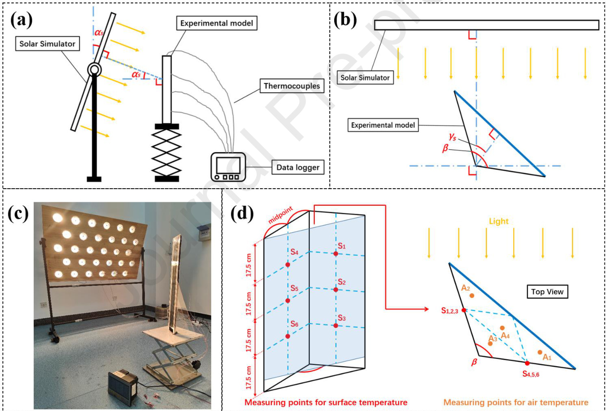

# Journal Pre-proof  

Analysis of influencing factors on the performance of wavy-shape solar Trombe walls based on orthogonal experimental design and simulation methods  

Yongliang Shen, Hongkuan Chen, Shuli Liu, Wenjie Ji, Haibo Jin, Sheher Yar Khan, Mahesh Kumar, Abdur Rehman Mazhar  

PII: S0360-5442(24)03646-6   
DOI: https://doi.org/10.1016/j.energy.2024.133868   
Reference: EGY 133868  

To appear in: Energy  

Received Date: 2 July 2024  

Revised Date: 17 October 2024  

Accepted Date: 16 November 2024  

Please cite this article as: Shen Y, Chen H, Liu S, Ji W, Jin H, Khan SY, Kumar M, Mazhar AR, Analysis of influencing factors on the performance of wavy-shape solar Trombe walls based on orthogonal experimental design and simulation methods, Energy, https://doi.org/10.1016/j.energy.2024.133868.  

This is a PDF file of an article that has undergone enhancements after acceptance, such as the addition of a cover page and metadata, and formatting for readability, but it is not yet the definitive version of record. This version will undergo additional copyediting, typesetting and review before it is published in its final form, but we are providing this version to give early visibility of the article. Please note that, during the production process, errors may be discovered which could affect the content, and all legal disclaimers that apply to the journal pertain.  

$\circledcirc$ 2024 Published by Elsevier Ltd.  

# Analysis of influencing factors on the performance of wavy-shape solar Trombe walls based on orthogonal experimental design and simulation methods  

Yongliang Shen a, Hongkuan Chen b, Shuli Liu b\*, Wenjie Ji b, Haibo Jin a, Sheher Yar Khanb, Mahesh Kumarb, Abdur Rehman Mazharc  

a School of Materials Science and Engineering, Beijing Institute of Technology, Beijing 100081, China   
b School of Mechanical Engineering, Beijing Institute of Technology, Beijing 100081, China   
c College of Electrical & Mechanical Engineering, National University of Sciences & Technology, Pakistan \* Corresponding Author: Shuli Liu Email: shuli79@126.com / shuli.liu@bit.edu.cn  

Abstract: The potential energy-saving benefits of a novel wavy-shaped Trombe wall have been demonstrated in previous research. However, due to the complexity of the physical processes involved and the presence of multiple influencing factors, definitive trends have not been identified or elucidated on the underlying mechanisms of performance enhancement. This study bridges this gap and investigates the effects of four primary influencing factors on the performance of the wavy-shaped Trombe wall. The orthogonal design of experiments is utilized to enhance research efficiency, and a methodology that integrates experimental techniques with computational fluid dynamics (CFD) simulation is employed to obtain precise data. Subsequently, analysis of variance and direct analysis are performed based on the collected data. The findings indicate that the maximum heat flux is observed at an intersection angle $( \beta )$ of $9 5 ^ { \circ }$ , indicating optimal heat supply performance. Moreover, heat flux levels are comparable at intersection angles of $9 5 ^ { \circ }$ , $1 1 5 ^ { \circ }$ , and $1 3 5 ^ { \circ }$ . Furthermore, selecting a larger $\beta$ is recommended when prioritizing enhanced ventilation in the design. Additionally, the solar altitude angle $( a _ { s } )$ , azimuth angle $( \gamma _ { s } )$ , and solar radiation intensity $( I )$ are all influential factors in the system's overall performance. Notably, $\gamma _ { s }$ emerges as the most impactful variable on system performance during operation.  

Keywords: Trombe wall; Orthogonal design; Solar energy utilization; Building energy saving; CFD simulation  

<html><body><table><tr><td colspan="2">Nomenclature</td><td colspan="2">Abbreviations</td></tr><tr><td>I</td><td>Solar radiation intensity, W/m²</td><td>PCM</td><td>Phase change material</td></tr><tr><td>h</td><td>Surface heat transfer coefficient, W/(m²·K)</td><td>TES</td><td>Thermal energy storage</td></tr><tr><td>Va</td><td>Wind speed, m/s</td><td>CFD</td><td>Computational fluid dynamics</td></tr><tr><td>Kf</td><td>The sum of the air temperature difference,℃C</td><td>HVAC</td><td>Heating, ventilation and air condition</td></tr><tr><td>T</td><td>Temperature,℃</td><td>ODOE</td><td>Orthogonal Design of Experiments</td></tr><tr><td>SSf</td><td>The sum of squared deviation</td><td>QTH</td><td>Quartz Tungsten Halogen Lamp</td></tr><tr><td>C</td><td>The average of the sum of squares</td><td>RE</td><td>Relative error</td></tr><tr><td>f</td><td>Factor</td><td>RME</td><td>Relative mean error</td></tr><tr><td>Ff</td><td>A key factor to reflect the importance ranking of each factor</td><td></td><td></td></tr><tr><td>L</td><td>Levels</td><td>Subscripts</td><td></td></tr><tr><td></td><td></td><td>E</td><td>Experiment</td></tr><tr><td>Greek letters</td><td></td><td>S</td><td>Simulation</td></tr><tr><td></td><td>Intersection angle</td><td></td><td>One single level</td></tr><tr><td>as</td><td>Solar altitude angle</td><td>i</td><td>Each case</td></tr><tr><td>2s</td><td>Solar azimuth angle</td><td></td><td></td></tr></table></body></html>  

# 1. Introduction  

Potential energy crises can be risky for human society since both the global energy demand and prices have been increasing sharply and continuously [1]. It is worth noting that buildings are responsible for a major part of energy consumption in the world, and most of the energy is used for heating, ventilation and air condition systems (HVAC) [2]. Buildings account for $20 \%$ of the world’s total energy consumption, wherein, $3 3 \mathrm { \sim } 5 5 \%$ of the building energy consumption comes from HVAC systems [3]. Nowadays in several countries, buildings are expected to achieve energy-saving designs. Passive solar systems like solar chimneys [4] and solar roofs [5] meet this need since they can effectively reduce building energy consumption by harnessing solar energy. Akaf's study has shown that passive solar systems can reduce a building's heating energy demand by up to $87 \%$ [6]. Among various passive solar systems, the Trombe wall is a typical one that is well-known and widely used. It can not only supply heat to indoor rooms but facilitate ventilation under the drive of solar radiation [7, 8]. Despite the Trombe Wall no longer being a novel concept in contemporary times, its significant potential for further development remains evident as a result of its distinct advantages. Over the years, attempts to improve the Trombe wall were generally divided into three categories: integrating Phase Change Materials (PCMs), improving the main structural elements, and adding new functions.  

# 1.2 Methods for improving the performance of the Trombe wall  

Improving the performance of a Trombe wall can be approached through various methods, including integration of TES material like Phase Change Material (PCM), improvement in the structure, and integration of multifunctional assembly. Following is the recent literature on these methods.  

Combining TES materials like PCMs in Trombe walls can effectively improve their heat storage capacity, which has become a widely used improvement method based on the original structure of Trombe walls. PCMs, usually contained by absorber walls, store thermal energy during the daytime and release it to keep the Trombe wall working after sunset. Studies have shown that PCMs make a Trombe wall work $2 { \sim } 4$ more hours every day [9], hence further reducing a building's average annual energy demand by $10 \% \sim 3 0 \%$ , depending on climatic conditions [10-12]. In recent years, some scientists have been further exploring the underlying mechanisms of Trombe walls integrated with PCMs. Duan et al. [13] chose a mixture of $5 5 \%$ decanoic acid and $45 \%$ lauric acid as a kind of PCM to integrate with the Trombe wall. They reached an important conclusion that the PCM with a wider range of phase change temperatures and high latent heat was a better choice. Li et al. [14] proposed a new design with double layers of PCMs that can be active for a whole year. The melting temperature of the outer PCM is higher, which can isolate external heat into the room in summer, while the phase change temperature of the inner PCM is lower, which can reduce the loss of indoor heat to the outside in winter. Through a numerical study, they found that the indoor temperature was reduced by $3 . 2 8 ^ { \circ } \mathrm { C }$ in summer and raised by $0 . 1 1 ^ { \circ } \mathrm { C }$ in winter, compared with the reference room with a classical Trombe wall [15]. Liu et al. [11] applied radiation cooling and PCM to the Trombe wall, effectively reducing the indoor peak temperature and prolonging the temperature reaching the peak. The studies of Zhang et al. [16] and Ke et al. [17] showed a strong correlation between indoor thermal comfort and the type and location of PCMs.  

The other performance enhancement technique for Trombe wall is to improve the main components which include the glazing, the air gap, and the absorber wall. Improving each component is usually a significant way to improve the whole performance. Xiao et al. [18] applied a low-energy glass to the Trombe wall. Compared to typical walls, the combination of low-energy glass and air conditioning reduced heating demand by $6 1 . 4 \%$ , and compared to the traditional Trombe wall system, it reduced heating demand by $1 1 . 1 \%$ . The convective heat transfer coefficient between the air flow inside the air gap and the surface of the absorber wall is a key parameter of the whole system. It determines both the capacity of heat absorbing and air flow driving and the coefficient depends significantly on the dimensions of the air gap. The study by Guo et al. [19] showed that the effect of air gap thickness on the performance of Trombe walls is complex. An air gap with too small a thickness led to more heat loss at night; An air gap with excessive thickness reduced the temperature difference of the airflow and reduced the amount of heat brought into the room. Mahmud Hussain Ali et al. [20] improved the efficiency of the Trombe wall system by approximately $1 7 \%$ by partially emptying the air gap. Zhang et al. [21] proposed a zigzag Trombe wall that effectively distributed the heat throughout the day, especially in the morning, thereby promoting the heating performance. Liang et al. [22] achieved an increase in indoor temperature by installing multiple semicircular fins on an absorber wall and encapsulating them with Nano-PCM.  

In recent years, some research has begun to add additional multifunctional features to the Trombe wall. Ji et al. [23] proposed a photovoltaic Trombe wall in 2007. The system can not only convert solar light energy into heat energy for indoor heating but also convert it into electricity for more use. After Ji's work, this design has been further explored and improved [24-27]. The air-purification Trombe wall was proposed by Yu et al. in 2016 [28]. Its basic principle is to remove formaldehyde by a solar-driven chemical reaction when the air flows through the air gap so that the system can play the role of heating and ventilation while purifying the indoor air. This design cleverly takes advantage of the Trombe wall's ability to both absorb solar light and circulate indoor air. Subsequent studies have verified the feasibility of this new design and improved it to achieve better comprehensive performance [29-31].  

# 1.3 Research gap and Objective of this study  

In addition to the above improving methods, an innovation in the shape of the Trombe wall will be also significant, but few studies focused on it. In the previous research, a novel wavy-shape Trombe wall was proposed, which maintains the original advantages of the traditional structure and has been proved to achieve a better performance by small-scale experiments [32]. However, the previous research has not been able to find clear trends or reveal the internal mechanisms, mainly because the physical process is complex and involves multiple influencing factors. In this paper, this new design was further studied. Based on the Orthogonal Design of Experiments (ODOE), four fundamental influencing factors were picked out to be explored, and 16 sets of experiments were designed. According to the experience of the previous study [32], the air velocity data measured in the experiment is not accurate enough, and can only meet the qualitative analysis but not the quantitative analysis. The main reasons are the special shape of the air gap, the small cross-sectional area, and the unstable air velocity. In order to solve this problem, this study used the method of combining experiments and CFD simulations. The surface and air temperatures were measured in the experiments, and the obtained data was afterward used to verify the CFD models. Thus, the air mass flow rate data as well as the heat flux data could be directly got through simulations, hence the calculation error caused by the change of air physical properties with temperature was avoided at the same time. Taking advantage of the ODOE and the analysis of variance, influence degrees of those four factors on the performance are analyzed efficiently.  

# 2. Methodology  

# 2.1 Description of the proposed wavy-shape Trombe wall  

In our previous study [32], a wavy-shape Trombe wall was proposed. The structure is shown in Fig. 1, where the wavy-shape Trombe wall and the glass façade form multiple independent triangular ventilation ducts. Based on the principles of heat transfer and fluid mechanics, the wavy-shape structure has the following advantages compared to traditional flat plate structures at the same occupied volume:  

• There is a larger convective heat transfer area between the wavy-shape Trombe wall and the airflow inside the ventilation duct.   
• The wavy-shape Trombe wall had two different facing surfaces. When the azimuth angle of the sun increases, there is always one facing surface with a smaller incident angle, which makes the Trombe wall more efficient in utilizing solar energy.   
• The wavy-shape had a disturbance effect on the airflow inside the ventilation duct, and the enhancement of turbulence enhanced the heat transfer between the surface of the collector wall and the airflow.  

  
Fig. 1 The wavy-shape Trombe wall proposed in the previous study [32]  

The previous experimental study showed that the wavy-shape Trombe wall had better heating performance than traditional Trombe walls for most of the day. The results also indicated that the intersection angle had a significant impact on the surface temperature, airflow temperature, and airflow velocity. Due to the simultaneous effects of multiple physical processes such as solar radiation absorption, surface convective heat transfer, and airflow flow on the dynamic thermal performance of the wavyshape Trombe wall, its internal mechanism is relatively complex. This study further investigates the effects of structural and climatic parameters on the dynamic thermal performance of a wavy-shape Trombe wall.  

# 2.2 Experimental design based on the ODOE  

The Orthogonal Design of Experiments (ODOE) a special method of experimental design is introduced in this paper to increase experimental efficiency. For multifactorial experiments, the experimental design commonly adopts a fully implemented approach, that is, all possible combinations of all levels of each factor are tested once. But when the number of factors and their respective levels is large, there usually could be hundreds or thousands of cases of experiment, hence it is not practical to use this method sometimes [33]. However, the ODOE is suitable for such situation, since it is an efficient and economical experimental design method to study the impacts of multiple factors from only a small group of experiments [34, 35]. The high efficiency of the ODOE derives from strong representativeness of each selected combination of various levels of each factor. Based on an orthogonal table, representative combinations with the characteristics of "uniform dispersion, neatness, and comparability" can be selected from all possible combinations [34]. As a result, the experimental results can be obtained by merely testing these typical cases.  

The ODOE is very applicable to this study since the physical process in the air gap is complex, involving solar light absorbing process natural convection process, and multiple influencing factors. To be specific, four fundamental influencing factors were picked out based on the actual operation of a wavy-shape Trombe wall. As shown in Fig. 2 (a), a wavy-shape Trombe wall is installed outside a building, usually on the sunny side. Compared with a conventional Trombe wall, a wavy-shape absorber wall replaces a flat one. The wavy-shape absorber wall and the outside glazing form triangular air gaps that are isolated from each other. Every air gap works in the same pattern as a conventional Trombe wall: two surfaces absorb solar energy and its surface temperature thus increases; the surfaces heat the air inside the gap and the resulting density differences drive the airflow, in other words, natural convection generates the internal flow; the heated air flows into the indoor room through a channel to supply heat, or flows into the outside environment to enhance the ventilation. Since each air gap is isolated and does not influence others, it is reasonable to focus on a single air gap and find four fundamental influencing factors, as shown in Fig. 2 (b). $\alpha _ { s }$ and $\gamma _ { s }$ are respectively the solar altitude angle and azimuth angle [36]. $\beta$ is the intersection angle of the wavy-shape surfaces. $I$ is the intensity of the solar radiation $( \mathrm { W } / \mathrm { m } ^ { 2 } )$ . With a constant width and height of a wavy-shape Trombe wall, these four variables completely describe the geometry of the wall as well as the lighting conditions, thereby describing the external conditions of the system at a certain moment during operation.  

  
Fig. 2 Schematic of (a) a wavy-shape Trombe wall and (b) one of the isolated air gaps  

According to the principle of selecting orthogonal tables, the number of columns in the orthogonal table should be greater than or equal to the number of major factors. However, it should not be too large; otherwise, the number of experiments will increase a lot [33]. A $\scriptstyle \mathbf { L 1 6 } ( 4 ^ { 5 } )$ orthogonal table was thus used in designing this experiment as shown in Table. 1. According to this table, up to 5 different factors were involved and each of them is respectively set to 4 different levels. Each column of the table represents a case of experiments where the 5 variables were set to the corresponding ranks. For example, in the $6 ^ { \mathrm { { t h } } }$ case, factor B was set in level 2. In total, there were 16 cases of experiments. In this study, $\beta , \alpha _ { s , \gamma _ { s } }$ and $I$ were set as factors A, B, C and $\mathbf { D }$ respectively, as tabulated in Table 1. Each factor was set to 4 different levels. Factor $\mathbf { E }$ was a "blank" column in this experiment, which plays an important role in accounting for possible errors among the four factors and in the subsequent analysis of variance [33, 34]. Taking advantage of the ODOE, the number of experimental cases required for a problem with 4 factors and 4 levels was reduced from hundreds to just 16.  

Table. 1 Orthogonal Table L16(45)   

<html><body><table><tr><td>Cases</td><td></td><td>1</td><td>2</td><td>3</td><td>4</td><td>5</td><td>6</td><td>7</td><td>8</td><td>9</td><td>10</td><td>11</td><td>12</td><td>13</td><td>14</td><td>15</td><td>16</td></tr><tr><td rowspan="5">Factors</td><td>A</td><td>1</td><td>1</td><td>1</td><td>1</td><td>2</td><td>2</td><td>2</td><td>2</td><td>3</td><td>3</td><td>3</td><td>3</td><td>4</td><td>4</td><td></td><td>4</td></tr><tr><td>B</td><td>1</td><td>2</td><td>3</td><td>4</td><td>1</td><td>2</td><td>3</td><td>4</td><td>1</td><td>2</td><td>3</td><td>4</td><td>1</td><td>2</td><td>3</td><td>4</td></tr><tr><td>C</td><td>1</td><td>2</td><td>3</td><td>4</td><td>2</td><td>1</td><td>4</td><td>3</td><td>3</td><td>4</td><td>1</td><td>2</td><td>4</td><td>3</td><td>2</td><td>1</td></tr><tr><td>D</td><td>1</td><td>2</td><td>3</td><td>4</td><td>3</td><td>4</td><td>1</td><td>2</td><td>4</td><td>3</td><td>2</td><td>1</td><td>2</td><td>1</td><td>4</td><td>3</td></tr><tr><td>E</td><td>1</td><td>2</td><td>3</td><td>4</td><td>4</td><td>3</td><td>2</td><td>1</td><td>2</td><td>1</td><td>4</td><td>3</td><td>3</td><td>4</td><td>1</td><td>2</td></tr></table></body></html>  

Values of the 4 levels of each factor in this experiment are listed in Table. 2. The values of $\beta$ were based on the results of the previous study [32]. Three wavy-shape Trombe wall models with $\beta$ of $6 0 ^ { \circ }$ , $9 0 ^ { \circ }$ and $1 2 0 ^ { \circ }$ have been tested, and the results have been compared with that of a conventional flat Trombe wall model. It was found that the $9 0 ^ { \circ }$ and $1 2 0 ^ { \circ }$ models have better performances in heat supplying than the flat model with a large range of solar azimuth angles. However, the $6 0 ^ { \circ }$ model had the worst performance in heat supply, mainly because of its unsatisfactory performance in average air velocity in the air gap. The tight narrow space of the air gap caused by small $\beta$ is surmised to be the main reason, it causes resistance and impedes the airflow. Hence the value of the $1 ^ { \mathrm { s t } }$ level of $\beta$ was set to $7 5 ^ { \circ }$ in order to avoid the range of smaller angles, and the value of the $4 ^ { \mathrm { t h } }$ level was set to $1 3 5 ^ { \circ }$ to extend the testing range of $\beta$ .  

Table. 2 Levels of factors   

<html><body><table><tr><td>Factors</td><td>(A)</td><td>αs (B)</td><td>Ys (C)</td><td>I (D)</td></tr><tr><td rowspan="4">1 Levels</td><td>75°</td><td>10°</td><td>0°</td><td>500 W/m²</td></tr><tr><td>2 95°</td><td>20°</td><td>20°</td><td>600 W/m²</td></tr><tr><td>3</td><td>115° 30°</td><td>40°</td><td>700 W/m²</td></tr><tr><td>4 135°</td><td>40°</td><td>60°</td><td>800 W/m²</td></tr></table></body></html>  

In practice, factors $a _ { s } , \gamma _ { s }$ and I change regularly with date and time, and the rules are different in different places in the world. Specifically, the changing law of $\pmb { a } _ { s }$ and $\gamma _ { s }$ is mainly determined by the latitude, and the data in the northern and southern hemispheres is symmetrical [36]. The intensity of received sunlight outside the atmosphere depends mainly on the distance to the sun, but such distance is almost the same anywhere on Earth. Thus, $I$ is determined by the local climate. It is impracticable to consider all diverse geographical and climatic conditions over the world, otherwise, the needed range of these factors will be excessively large and there will be huge differences between levels. This would not be conducive to exploring the rules effectively. From the above consideration, this research focuses on the heat supply during the winter (from December to February) in Beijing $4 0 ^ { \circ }$ north latitude) and sets the values of factors based on relevant data [36]. This will also facilitate possible practical experiments in the future. Furthermore, this research will be significant because there is a large population and numerous cities near the $4 0 ^ { \circ }$ north latitude.  

# 2.3 Experimental methods  

The experimental methods in this paper are basically consistent with the previous study [32], except for two differences. First, this article considers the solar altitude angle $\alpha _ { s }$ , therefore, the longitudinal angle of the light source needs to be adjusted. Second, as mentioned above, the air velocity will no longer be measured, but calculated by CFD.  

# 2.3.1 Small-scale wavy-shape Trombe wall models  

Four small-scale wavy-shape Trombe wall models with different $\beta$ were constructed. As mentioned before, since the airflow in each triangular air gap was isolated, it is reasonable to construct the model of only one air gap to simulate the whole wavy-shape Trombe wall, as shown in Fig. 3 (a). Each model had an inlet for airflow at the bottom of the front glazing. The tops of models were all open as the outlets for airflow. The dimensions of the four models are shown in Fig. 3 (b). All four models had the same height of $7 0 \mathrm { c m }$ and the air gaps were all $2 . 4 \mathrm { c m }$ wide [32]. Moreover, their inlets were all 3 cm wide. The photo of four finished models is shown in Fig. 3 (c). The absorber walls and the glazing were respectively constructed of stainless-steel plates painted with solar-absorber paint and acrylic plates. The bottom surfaces were also made of stainless-steel plates. The thickness of the stainless-steel plates and acrylic plates was both $1 \mathrm { m m }$ . For each model, the V-shaped stainless-steel plate and the acrylic plate were stuck together, and the junctions were sealed. In addition, one-centimeter-thick nitrile rubber covered the back and under surfaces of each model to isolate heat transfer.  

  
Fig. 3 (a) Schematic of a wavy-shape Trombe wall model; (b) Photo of the four experimental models; (c) Dimensions of the four experimental models  

# 2.3.2 Experimental rig and procedure  

The schematic of the experimental rig is shown in Fig. 4 (a) and Fig. 4 (b), and a photo was taken through the experiment as shown in Fig. 4 (c). The solar simulator was constructed with a series of crossed-arranged quartz tungsten halogen lamps (QTH). The specific parameters of the solar simulator can be viewed in the previous study [32]. In each of the 16 experimental cases, $\alpha _ { s }$ was set by adjusting the longitudinal angle of the solar simulator; $\gamma _ { s }$ was set by turning the experimental model to the specific azimuth angle; $I$ was set by simultaneously regulating the voltage and the distance of the absorber surface to the light source. Firstly, the solar simulator was switched on. After the light reach steady state value, the required $\alpha _ { s }$ and $\gamma _ { s }$ were set and the model began to be heated. Then, the voltage and the distance of the absorber surface to the light source were adjusted until $I$ on the surface of the absorber wall reach the expected value. A handheld solar meter was used to measure I during this process. T-type thermocouples were used to measure the surface temperature of the absorber wall as well as the air temperature on the outlet surface. The distribution of the measuring points of one model is shown in Fig. 4 (d) and all four models follow the same rule. All the thermocouples in the experiment had plastic cylindrical shields, with only the tip portion exposed to the environment for measuring the air temperature. The tip portion has an extremely small radiation receiving area, and thus it can be considered that the influence of environmental radiation is highly limited. The values were monitored by a data logger and were recorded when they reach to a steady state. In the same time, the indoor atmospheric pressure and temperature were measure by an atmospheric-pressure gauge during each of the 16 experimental cases, because that data was required as the boundary condition for subsequent CFD models. Specifications of all measuring apparatus used in this experiment are listed in Table. 3.  

  
Fig. 4 Schematic of the experimental rig ((a) front view; (b) top view); (c) Photo of the experimental rig; (d) Measuring points for wall surface and air temperature  

Table. 3 Specifications of measuring apparatus   

<html><body><table><tr><td>Apparatus</td><td>Properties</td><td>Value</td></tr><tr><td rowspan="5">Solar meter</td><td>Brand</td><td>CEAULight</td></tr><tr><td>Product model</td><td>CEL-NP2000-2A</td></tr><tr><td>Diameter of probe</td><td>10 mm</td></tr><tr><td>Available wavelength</td><td>190 nm～11000 nm</td></tr><tr><td>Response time</td><td>< 0.4 s</td></tr></table></body></html>  

<html><body><table><tr><td rowspan="2">Thermocouples</td><td colspan="2"></td></tr><tr><td>Accuracy Type</td><td>±10 W/m² T</td></tr><tr><td rowspan="3">Data logger</td><td>Accuracy</td><td>±0.5C</td></tr><tr><td>Brand</td><td></td></tr><tr><td>Product model</td><td>Beijing Heshixingye R7100-A16-R06-PW4-SU-MB-VAC</td></tr><tr><td rowspan="5">Atmospheric- pressure gauge</td><td>Accuracy</td><td>±0.5 ℃</td></tr><tr><td>Available pressure</td><td>80～110 kPa</td></tr><tr><td>Accuracy of pressure</td><td>0.5 kPa</td></tr><tr><td>Available temperature</td><td>0~80°℃</td></tr><tr><td>Accuracy of temperature</td><td>±1℃</td></tr></table></body></html>  

# 2.4 Simulation methods  

# 2.4.1 Geometries  

The commercial CFD software ANSYS Fluent 19.2 was used to model the air gap of each experimental model, representing the internal airflow region. As mentioned before, a total of 16 CFD models would be built to simulate 16 sets of experiments to obtain the required data. Since there were 4 different wavyshape Trombe wall models, there should be 4 corresponding geometries for the models. The dimensions are shown in Fig. 3, as well as the locations of the inlet and outlet. As last, 4 geometric models of slender trigonal air flow regions with different $\beta$ were built.  

# 2.4.2 Boundary conditions  

The azimuth and zenith angle as well as the intensity of the light were all different in the 16 CFD models, and the simulations were steady state type. In view of this feature, the "Solar Ray Tracing" model was used in this study. The "Solar Ray Tracking" is a type of calculation model that simulates actual solar radiation. The model considers the radiative transfer equation (RTE) in the direction as a field equation, which can be written as:  

$$
\nabla \cdot ( I ( \stackrel {  } { r } , \stackrel {  } { s } ) \stackrel {  } { s } ) + ( \alpha + \sigma _ { s } ) I ( \stackrel {  } { r } , \stackrel {  } { s } ) = a n ^ { 2 } \frac { \sigma T ^ { 4 } } { \pi } + \frac { \sigma _ { s } } { 4 \pi } \int _ { 0 } ^ { 4 \pi } I ( \stackrel {  } { r } , \stackrel {  } { s } ) \Phi ( \stackrel {  } { s } , \stackrel {  } { s } ) d \Omega \stackrel {  } { s } .
$$  

Where $\sigma$ is the Stefan-Boltzman constant; $\sigma _ { \mathrm { s } }$ is the scattering coefficient of the gas; $a$ is the absorption coefficient of the gas; $n$ is the refractive index of the gas; $r$ is a Cartesian coordinate in space $( \mathbf { x } , \mathbf { y } , z ) ; s$ is the unit vector in the direction of the beam $( n _ { \mathrm { x } } , n _ { \mathrm { y } } , n _ { \mathrm { z } } )$ .  

The sun direction vector and the intensity $I$ were set in each model based on Table. 1 and Table. 2. This light condition would be automatically applied to all the parts of one model. Through the setting of the solar radiation parameters of each component of the simulation model, the model automatically computed the process of photothermal conversion. The occlusion of light between different parts of the model would also be considered during the calculation. The absorptivity of the absorber all and the bottom surface was set as 0.9 which is the absorptivity of the commercial solar-absorber paint. The glazing was considered as a semi-transparent surface and the transmissivity was set as 0.92.  

There were three wall surfaces in each model: the "V-shape" absorber wall, the bottom surface, and the glazing wall. The "Shell Conduction" method was used in setting the boundary conditions of these wall surfaces. The vital advantage of this method was that such solid parts of the experimental model need not be built into the geometric model, nor into grid, but the thermal conduction inside the "shells" and between the "shells" and the airflow region could be calculated. It is necessary for this study since the surface temperature data would be used in verifying the CFD models. Moreover, the fluid-solid coupling calculation was replaced by this method, hence the computation efficiency was increased. The "shell" on the glazing wall was one- millimeter-thick acrylic plates; the "shell" on the absorber wall and the bottom surface consisted of two layers: one-millimeter-thick stainless-steel plate painted with solar-absorber paint and one-centimeter-thick nitrile rubber. The properties of these materials are listed in Table. 4.  

Table. 4 Material properties   

<html><body><table><tr><td>Material</td><td>Density kg/m³</td><td>Specific heat J/(kg·K)</td><td>Thermal Conductivity W/(m:K)</td></tr><tr><td>Stainless steel</td><td>7710</td><td>460</td><td>22.1</td></tr><tr><td>Acrylic</td><td>1180</td><td>1464</td><td>0.18</td></tr><tr><td>Nitrile rubber</td><td>1100</td><td>1300</td><td>0.25</td></tr></table></body></html>  

The bottom surface was considered adiabatic, "convection thermal" condition was applied on the absorber wall and the glazing wall. In previous studies, the value of the surface heat transfer coefficient $h$ was usually obtained through empirical study. According to heat transfer theory [40], the approximate range of surface heat transfer coefficients for natural convection of air is $1 { \sim } 1 0 \ \mathrm { W / ( m ^ { 2 } { \cdot } K ) }$ . Moreover, the empirical equation Eq. (2) has also been widely used [41-44], where $\boldsymbol { V _ { a } }$ is the air velocity in the outside environment. However, this equation was rarely applied when the wind speed was close to zero. In the experiment in this study, the $\boldsymbol { V _ { a } }$ was theoretically zero, however, because the laboratory was not completely an enclosed and stable space, it was inevitable that there would be some weak airflow and unstable small disturbances around the experimental models. Based on the above discussion, the value of $h$ was repeatedly adjusted, and finally, it was found that the data of 16 simulation models could fit the experimental data well at the same time when $h$ was about $5 . 6 \mathrm { W } / ( \mathrm { m } ^ { 2 } { \cdot } \mathrm { K } )$ . Thus, the surface heat transfer coefficient $h$ of the absorber wall and the glazing wall was set to $5 . 6 \mathrm { W } / ( \mathrm { m } ^ { 2 } { \cdot } \mathrm { K } )$ , moreover, the temperature of the outside air had been measured during each case of the experiment as mentioned before. That data is shown in Table. 5. Besides, the inlet and outlet were set respectively as "pressure-inlet" and "pressureoutlet", whose backflow pressure and temperature were also set as measured.  

$$
h = 2 . 8 + 3 V _ { a }
$$  

Table. 5 Indoor temperature and atmospheric pressure   

<html><body><table><tr><td>Cases</td><td>Temperature ℃</td><td>Pressure Pa</td><td>Cases</td><td>Temperature ℃</td><td>Pressure Pa</td></tr><tr><td>1</td><td>29.4</td><td>100190</td><td>9</td><td>29.4</td><td>100210</td></tr><tr><td>2</td><td>29.6</td><td>99950</td><td>10</td><td>30.2</td><td>100080</td></tr><tr><td>3</td><td>29.6</td><td>99943</td><td>11</td><td>29.6</td><td>99917</td></tr><tr><td>4</td><td>29.8</td><td>99376</td><td>12</td><td>28.5</td><td>99523</td></tr><tr><td>5</td><td>29.6</td><td>100180</td><td>13</td><td>29.6</td><td>100210</td></tr><tr><td>6</td><td>30.1</td><td>99970</td><td>14</td><td>29.9</td><td>100130</td></tr><tr><td>7</td><td>29.8</td><td>99940</td><td>15</td><td>29.8</td><td>99793</td></tr><tr><td>8</td><td>28.6</td><td>99483</td><td>16</td><td>28.9</td><td>99553</td></tr></table></body></html>  

# 2.4.3 Mesh Generation  

The geometric models in this CFD study contain only airflow regions and have simple shapes and structures. Therefore, "sweep" method in the finite element software ANSYS Meshing 19.2 was used to generate the meshes. Furthermore, the "inflation" method was used to densify the grids near the absorber wall since the boundary layer is important for natural convection, as shown in Fig. 5 (a).  

The grid independence study was conducted in the $4 ^ { \mathrm { t h } }$ case in orthogonal table, as shown in Fig. 5 (b). Considering the air temperature and velocity along a perpendicular line, the independence of grid was verified. The difference in temperature and velocity distribution along the height of that line between the grids of 900,000 and 1,200,000 is simultaneously small, and the maximum relative differences are smaller than $1 \%$ . Therefore, the settings for the mesh of 900,000 grids meet the accuracy requirements, which is suitable to conduct further CFD calculations.  

  
Fig. 5 (a) Example of the generated mesh; (b) Grid independence validation  

# 3. Results and discussions  

# 3.1 Validation of the CFD method  

As mentioned before, the surface and air temperature data are utilized to validate the CFD method, Also, CFD simulation will provide detailed data on other parameters. In order to analyze the error between simulated and experimental data, the relative error (RE) and relative mean error (RME) are calculated [45]. The surface temperature of the absorber wall is listed in Table. 6. In this table, $T _ { \mathrm { E } }$ and $T _ { \mathrm { { S } } }$ are respectively experimental and simulated temperature data. Numbers of the measuring points have been shown in Fig. 4 (d). Besides, the average air temperature of the outlet surface is listed in Table. 7. For the experimental data, the average value is calculated by averaging the temperatures of the four measuring points as shown in Fig. 4 (d), while the simulated average air temperature can be obtained directly in the CFD model.  

Table. 6 Experimental and simulated surface temperature values  

<html><body><table><tr><td></td><td></td><td colspan="6">Measuring Points</td><td>Max RE</td><td>RME</td></tr><tr><td></td><td>Cases</td><td>1</td><td>2</td><td>3</td><td>4</td><td>5</td><td>6</td><td>%</td><td>%</td></tr><tr><td></td><td>TE/C</td><td>64.8</td><td>60.8</td><td>51.1</td><td>64.2</td><td>60.6</td><td>50.9</td><td></td><td></td></tr><tr><td>1</td><td>Ts/℃</td><td>64.85</td><td>60.98</td><td>54.98</td><td>64.85</td><td>60.95</td><td>54.98</td><td>8.02</td><td>2.93</td></tr><tr><td></td><td>RE / %</td><td>0.08</td><td>0.30</td><td>7.59</td><td>1.01</td><td>0.58</td><td>8.02</td><td></td><td></td></tr><tr><td></td><td>TE/C</td><td>69.8</td><td>66.6</td><td>54.9</td><td>70.3</td><td>67.9</td><td>56.2</td><td></td><td></td></tr><tr><td>2</td><td>Ts/C</td><td>65.54</td><td>61.41</td><td>55.05</td><td>65.23</td><td>61.67</td><td>56.26</td><td>9.18</td><td>5.11</td></tr><tr><td></td><td>RE / %</td><td>6.10</td><td>7.79</td><td>0.27</td><td>7.21</td><td>9.18</td><td>0.11</td><td></td><td></td></tr><tr><td></td><td>TE/C</td><td>62.6</td><td>60.4</td><td>51.9</td><td>65.1</td><td>63.5</td><td>54.9</td><td></td><td></td></tr><tr><td>3</td><td>Ts/C</td><td>58.97</td><td>55.46</td><td>50.10</td><td>65.23</td><td>61.67</td><td>56.26</td><td>8.18</td><td>3.83</td></tr><tr><td></td><td>RE /%</td><td>5.80</td><td>8.18</td><td>3.47</td><td>0.20</td><td>2.88</td><td>2.48</td><td></td><td></td></tr><tr><td></td><td>TE/C</td><td>50.5</td><td>50.0</td><td>45.9</td><td>55.3</td><td>52.5</td><td>48.4</td><td></td><td></td></tr><tr><td>4</td><td>Ts/C</td><td>46.91</td><td>44.88</td><td>41.85</td><td>51.21</td><td>49.14</td><td>46.09</td><td>10.24</td><td>7.46</td></tr><tr><td></td><td>RE / %</td><td>7.11</td><td>10.24</td><td>8.82</td><td>7.40</td><td>6.40</td><td>4.77</td><td></td><td></td></tr><tr><td></td><td>TE/C</td><td>72.7</td><td>67.7</td><td>59.9</td><td>76.7</td><td>72.0</td><td>62.1</td><td></td><td></td></tr><tr><td>5</td><td>Ts/C</td><td>77.98</td><td>72.73</td><td>64.25</td><td>82.54</td><td>77.26</td><td>68.69</td><td>10.61</td><td>7.91</td></tr><tr><td></td><td>RE /%</td><td>7.26</td><td>7.43</td><td>7.26</td><td>7.61</td><td>7.31</td><td>10.61</td><td></td><td></td></tr><tr><td></td><td>TE/C</td><td>80.7</td><td>77.8</td><td>65.7</td><td>82.0</td><td>76.0</td><td>65.7</td><td></td><td></td></tr><tr><td>6</td><td>Ts/C</td><td>87.83</td><td>81.69</td><td>72.01</td><td>87.82</td><td>81.70</td><td>72.02</td><td>9.62</td><td>7.94</td></tr><tr><td></td><td>RE / %</td><td>8.84</td><td>5.00</td><td>9.60</td><td>7.10</td><td>7.50</td><td>9.62</td><td></td><td></td></tr><tr><td></td><td>TE/C</td><td>46.9</td><td>46.3</td><td>41.4</td><td>48.9</td><td>47.8</td><td>42.6</td><td></td><td></td></tr><tr><td>7</td><td>Ts/C</td><td>43.60</td><td>42.06</td><td>39.68</td><td>48.38</td><td>46.83</td><td>44.36</td><td>9.16</td><td>4.60</td></tr><tr><td></td><td>RE / %</td><td>7.04</td><td>9.16</td><td>4.15</td><td>1.06</td><td>2.03</td><td>4.13</td><td></td><td></td></tr><tr><td></td><td>TE/C</td><td>56.7</td><td>55.8</td><td>50.5</td><td>58.9</td><td>58.9</td><td> 53.5</td><td></td><td></td></tr><tr><td>8</td><td>Ts/C</td><td>54.10</td><td>51.43</td><td>50.00</td><td>59.59</td><td>56.83</td><td>52.38</td><td>7.83</td><td>3.36</td></tr><tr><td></td><td>RE / %</td><td>4.59</td><td>7.83</td><td>0.99</td><td>1.17</td><td>3.51</td><td>2.09</td><td></td><td></td></tr><tr><td></td><td>TE/C</td><td>70.3</td><td>64.0</td><td>54.4</td><td>82.3</td><td>75.9</td><td>66.9</td><td></td><td></td></tr><tr><td>9</td><td>Ts/C</td><td>75.57</td><td>70.51</td><td>60.45</td><td>86.69</td><td>81.54</td><td>72.85</td><td>11.12</td><td>8.41</td></tr><tr><td></td><td>RE / %</td><td>7.50</td><td>10.17</td><td>11.12</td><td>5.33</td><td>7.43</td><td>8.89</td><td></td><td></td></tr><tr><td></td><td>TE/C</td><td> 54.2</td><td> 52.1</td><td>46.4</td><td>60.5</td><td>59.0</td><td> 52.9</td><td></td><td></td></tr><tr><td>10</td><td>Ts/C</td><td>51.80</td><td>49.33</td><td>45.32</td><td>62.69</td><td>60.11</td><td>55.79</td><td>5.46</td><td>3.84</td></tr><tr><td></td><td>RE / %</td><td>4.43</td><td>5.32</td><td>2.33</td><td>3.62</td><td>1.88</td><td>5.46</td><td></td><td></td></tr><tr><td></td><td>TE/C</td><td>73.8</td><td>70.6</td><td>60.0</td><td>71.5</td><td>69.2</td><td>59.8</td><td></td><td></td></tr><tr><td>11</td><td>Ts/C</td><td>75.22</td><td>70.75</td><td>63.37</td><td>75.20</td><td>70.78</td><td>63.38</td><td>5.99</td><td>3.53</td></tr><tr><td></td><td>RE / %</td><td>1.92</td><td>0.21</td><td>5.62</td><td>5.17</td><td>2.28</td><td>5.99</td><td></td><td></td></tr><tr><td></td><td>TE/C</td><td>58.0</td><td>55.6</td><td>50.0</td><td>59.3</td><td>57.7</td><td> 52.9</td><td></td><td></td></tr><tr><td>12</td><td>Ts/C</td><td>58.57</td><td>55.88</td><td>51.24</td><td>61.46</td><td>58.73</td><td>54.02</td><td>3.64</td><td>1.92</td></tr><tr><td></td><td>RE / %</td><td>0.98</td><td>0.50</td><td>2.48</td><td>3.64</td><td>1.79</td><td>2.12</td><td></td><td></td></tr><tr><td></td><td>TE/C</td><td>51.6</td><td>49.1</td><td>41.6</td><td>62.4</td><td>58.3</td><td>50.0</td><td></td><td></td></tr><tr><td>13</td><td>Ts/C</td><td>50.45</td><td>48.16</td><td>44.29</td><td>62.58</td><td>60.05</td><td>55.56</td><td>11.12</td><td>4.17</td></tr><tr><td></td><td>RE /%</td><td>2.23</td><td>1.91</td><td>6.47</td><td>0.29</td><td>3.00</td><td>11.12</td><td></td><td></td></tr><tr><td>14</td><td>TE/C</td><td>57.6</td><td>55.9</td><td>48.5</td><td>64.0</td><td>61.9</td></table></body></html>  

<html><body><table><tr><td></td><td>RE / %</td><td>5.43</td><td>3.15</td><td>7.94</td><td>6.92</td><td>5.30</td><td>10.22</td><td rowspan="5"></td></tr><tr><td></td><td>TE/C</td><td>81.8</td><td>77.7</td><td>66.0</td><td>86.4</td><td>81.6</td><td>68.9</td></tr><tr><td>15</td><td>Ts/C</td><td>86.62</td><td>80.92</td><td>71.28</td><td>95.52</td><td>86.68 76.74</td><td>11.38</td></tr><tr><td></td><td>RE / %</td><td>5.89</td><td>4.14 8.00</td><td>10.56</td><td>6.23</td></tr><tr><td></td><td>TE/C</td><td>72.4</td><td>69.8</td><td>62.9</td><td>72.7</td></tr><tr><td rowspan="3">16</td><td>Ts/℃</td><td>79.29</td><td>74.58</td><td>66.46</td><td></td><td>69.3 62.4 74.55</td><td rowspan="3">9.52</td></tr><tr><td></td><td></td><td></td><td></td><td>79.29</td><td>66.46</td></tr><tr><td>RE / %</td><td>9.52</td><td>6.85</td><td>5.66</td><td>9.06</td><td>7.58 6.51</td></tr></table></body></html>  

Table. 7 Experimental and simulated air temperature values   

<html><body><table><tr><td colspan="3">Cases</td><td colspan="3">Cases</td></tr><tr><td rowspan="3">1</td><td>TE/℃</td><td>55.90</td><td></td><td>TE/℃</td><td>59.48</td></tr><tr><td>Ts/C</td><td>59.08</td><td>9</td><td>Ts/C</td><td>64.56</td></tr><tr><td>RE / %</td><td>5.69</td><td></td><td>RE /%</td><td>8.55</td></tr><tr><td rowspan="3">2</td><td>TE/℃</td><td>56.50</td><td></td><td>TE/℃</td><td>48.58</td></tr><tr><td>Ts/℃</td><td>61.17</td><td>10</td><td>Ts/C</td><td>49.50</td></tr><tr><td>RE /%</td><td>8.27</td><td></td><td>RE /%</td><td>1.90</td></tr><tr><td rowspan="3">3</td><td>TE/℃</td><td>54.20</td><td></td><td>TE/C</td><td>56.25</td></tr><tr><td>Ts/C</td><td>57.21</td><td>11</td><td>Ts/C</td><td>60.84</td></tr><tr><td>RE / %</td><td>5.55</td><td></td><td>RE / %</td><td>8.16</td></tr><tr><td rowspan="4">4</td><td>TE/℃</td><td>51.25</td><td>12</td><td>TE/℃</td><td>47.23</td></tr><tr><td>Ts/℃</td><td>47.35</td><td></td><td>Ts/℃</td><td>49.83</td></tr><tr><td>RE /%</td><td>7.61</td><td></td><td>RE /%</td><td>5.52</td></tr><tr><td>TE/℃</td><td>62.03</td><td></td><td>TE/C</td><td>44.85</td></tr><tr><td rowspan="3">5</td><td>Ts/℃</td><td>67.27</td><td>13</td><td>Ts/℃C</td><td>47.41</td></tr><tr><td>RE /%</td><td>8.46</td><td></td><td>RE /%</td><td>5.71</td></tr><tr><td>TE/℃</td><td>65.20</td><td></td><td>TE/℃</td><td>48.28</td></tr><tr><td rowspan="3">6</td><td>Ts/C</td><td>72.68</td><td>14</td><td>Ts/C</td><td>52.30</td></tr><tr><td>RE / %</td><td>11.47</td><td></td><td>RE / %</td><td>8.33</td></tr><tr><td>TE/C</td><td>39.98</td><td></td><td>TE/℃</td><td>61.75</td></tr><tr><td rowspan="3">7</td><td>Ts/C</td><td></td><td>15</td><td>Ts/C</td><td></td></tr><tr><td></td><td>42.87</td><td></td><td></td><td>67.28</td></tr><tr><td>RE /%</td><td>7.24</td><td></td><td>RE /%</td><td>8.96</td></tr><tr><td rowspan="3">8</td><td>TE/℃</td><td>49.40</td><td>16</td><td>TE/℃</td><td>55.43</td></tr><tr><td>Ts/℃</td><td>50.51</td><td></td><td>Ts/C</td><td>60.99</td></tr><tr><td>RE /%</td><td>2.25</td><td></td><td>RE /%</td><td>10.03</td></tr></table></body></html>  

For the surface temperature, the max RE of a single measuring point is $1 1 . 3 8 \%$ , appearing at measuring point 6 in the $1 5 ^ { \mathrm { t h } }$ case. As can be seen from Table. 6, most of the measuring points have a RE below $10 \%$ . The max RME among all experimental cases is $8 . 4 1 \%$ , appearing in the $9 ^ { \mathrm { t h } }$ case. For the average air temperature, the max RE $1 1 . 4 7 \%$ appears in the $6 ^ { \mathrm { { t h } } }$ case. Moreover, only the REs of the $6 ^ { \mathrm { { t h } } }$ and $1 6 ^ { \mathrm { t h } }$ cases are larger than $10 \%$ . In general, it can be obtained by calculation that the overall RMEs of surface and air temperature are respectively $5 . 4 2 \%$ and $7 . 1 1 \%$ . The above results show that the variation between the simulated and experimental results is small and in agreement with each other [45]. The CFD method is thus validated.  

# 3.2 Impact on airflow temperature  

The air temperature difference between outlet and inlet of the air gap is a vital parameter, which reflects the capacity of the absorber wall heating the inside airflow. Such values are directly obtained through CFD model by differencing the average air temperature on the outlet surface and the indoor air temperature of the laboratory. As mentioned before, the indoor temperature has been measured during each set of the experiment. Finally, the results obtained in 16 sets of simulations are listed in Table. 8.  

Table. 8 Air temperature difference between outlet and inlet   

<html><body><table><tr><td>Cases</td><td>Temperature difference (C)</td><td>Cases</td><td>Temperature difference (C)</td></tr><tr><td>1</td><td>29.68</td><td>9</td><td>35.16</td></tr><tr><td>2</td><td>31.60</td><td>10</td><td>19.27</td></tr><tr><td>3</td><td>27.58</td><td>11</td><td>31.27</td></tr><tr><td>4</td><td>17.52</td><td>12</td><td>21.33</td></tr><tr><td>5</td><td>37.64</td><td>13</td><td>17.78</td></tr><tr><td>6</td><td>42.58</td><td>14</td><td>22.40</td></tr><tr><td>7</td><td>13.10</td><td>15</td><td>37.48</td></tr><tr><td>8</td><td>21.94</td><td>16</td><td>32.06</td></tr></table></body></html>  

The analysis of variance is conducted to analyze the impact of the four key factors on the air temperature difference, which is a commonly used data analysis method in ODOE. The calculation process is as follows [33, 34]:  

Firstly, a critical number during this process is $K _ { f l } ,$ which is the sum of the air temperature difference at one single level $( l , l = 1 , 2 , 3 , 4 )$ in one factor $( f , f { = } \beta , \alpha _ { s } , \gamma _ { s } , I )$ . In subsequent calculations, $V _ { i }$ represents the air temperature value of each case $( i , i = 1 \sim 1 6 )$ . Based on the orthogonal table, the $K _ { f l }$ is calculated by Eq. (3):  

$$
\begin{array} { l l } { { K _ { \beta 1 } = V _ { 1 } + V _ { 2 } + V _ { 3 } + V _ { 4 } \qquad } } & { { K _ { \gamma 1 } = V _ { 1 } + V _ { 6 } + V _ { 1 1 } + V _ { 1 6 } } } \\ { { K _ { \beta 2 } = V _ { 5 } + V _ { 6 } + V _ { 7 } + V _ { 8 } \qquad } } & { { K _ { \gamma 2 } = V _ { 2 } + V _ { 5 } + V _ { 1 2 } + V _ { 1 5 } } } \\ { { K _ { \beta 3 } = V _ { 9 } + V _ { 1 0 } + V _ { 1 1 } + V _ { 1 2 } \qquad } } & { { K _ { \gamma 3 } = V _ { 3 } + V _ { 8 } + V _ { 9 } + V _ { 1 4 } } } \\ { { K _ { \beta 4 } = V _ { 1 3 } + V _ { 1 4 } + V _ { 1 5 } + V _ { 1 6 } \qquad } } & { { K _ { \gamma 4 } = V _ { 4 } + V _ { 7 } + V _ { 1 0 } + V _ { 1 3 } } } \\ { { K _ { \alpha 1 } = V _ { 1 } + V _ { 5 } + V _ { 9 } + V _ { 1 3 } \qquad } } & { { K _ { \it { 1 1 } } = V _ { 1 } + V _ { 7 } + V _ { 1 2 } + V _ { 1 4 } } } \\ { { K _ { \alpha 2 } = V _ { 2 } + V _ { 6 } + V _ { 1 0 } + V _ { 1 4 } \qquad } } & { { K _ { \it { 1 2 } } = V _ { 2 } + V _ { 8 } + V _ { 1 1 } + V _ { 1 3 } } } \\ { { K _ { \alpha 3 } = V _ { 3 } + V _ { 7 } + V _ { 1 1 } + V _ { 1 5 } \qquad } } & { { K _ { \it { 1 3 } } = V _ { 3 } + V _ { 5 } + V _ { 1 0 } + V _ { 1 6 } } } \end{array}
$$  

As mentioned before, factor $E$ in is a "blank" column in this experiment used to regard possible errors, whose $K _ { e l }$ is calculated in the same way by Eq. (4).  

$$
\begin{array} { c c } { { K _ { e 1 } = V _ { 1 } + V _ { 8 } + V _ { 1 0 } + V _ { 1 5 } } } & { { \qquad K _ { e 3 } = V _ { 3 } + V _ { 6 } + V _ { 1 2 } + V _ { 1 3 } } } \\ { { K _ { e 2 } = V _ { 2 } + V _ { 7 } + V _ { 9 } + V _ { 1 6 } } } & { { \qquad K _ { e 4 } = V _ { 4 } + V _ { 5 } + V _ { 1 1 } + V _ { 1 4 } } } \end{array}
$$  

After that, the values of the sum of squared deviation $S S _ { f }$ are obtained. The calculation formulas are demonstrated in Eq. (5)- Eq. (6).  

$$
\mathsf C = \left( \sum _ { i = 1 } ^ { 1 6 } V _ { i } \right) ^ { 2 } \bigg / 1 6
$$  

$$
{ S S _ { f } = \big ( { K _ { f 1 } } ^ { 2 } + { K _ { f 2 } } ^ { 2 } + { K _ { f 3 } } ^ { 2 } + { K _ { f 4 } } ^ { 2 } \big ) / 4 - C }
$$  

In Eq. (5), $C$ is the average of the sum of squares of the 16 sets of result values, also known as the correction number. Besides, the sum of the squared deviation of the "blank" factor $E$ could be calculated in the same way, as demonstrated in Eq. (7).  

$$
S S _ { e } = { \left( { K _ { e 1 } } ^ { 2 } + { K _ { e 2 } } ^ { 2 } + { K _ { e 3 } } ^ { 2 } + { K _ { e 4 } } ^ { 2 } \right) } / 4 - C
$$  

Based on the above calculations, the Joint Hypotheses Test is conducted, it is also known as the F-test [33]. The $F$ value of each factor $F _ { f }$ is calculated by Eq. (8).  

$$
F _ { f } = S S _ { f } / S S _ { e }
$$  

Finally, the obtained data is listed in Table. 9.  

Table. 9 Analysis of variance of the airflow temperature difference   

<html><body><table><tr><td>Factors</td><td>SSf</td><td>Ff</td><td>F0.05</td><td>Fo.01</td></tr><tr><td>β</td><td>12.26</td><td>6.45</td><td>9.28</td><td>29.46</td></tr><tr><td>αs</td><td>108.32</td><td>57.01**</td><td></td><td></td></tr><tr><td>2s</td><td>695.09</td><td>365.84**</td><td></td><td></td></tr><tr><td>I</td><td>291.51</td><td>153.43**</td><td></td><td></td></tr><tr><td>E</td><td>1.90</td><td></td><td></td><td></td></tr></table></body></html>

\* F0.05 < Ff < F0.01; $^ { * * } F _ { f } { > } F _ { 0 . 0 1 }$  

During this analysis, $F _ { f }$ is the ratio of $S S _ { f }$ and $S S _ { e }$ , which is a key factor to reflect the importance ranking of each factor. If the value is close to or less than 1, the effect of the factor on the result is close to that of the random error E, and it can be assumed that the change of that factor does not influence the result. Conversely, the higher the value, the more significant the impact of the factor on the concerned result. Therefore, the influence of 4 factors on the airflow temperature difference is ranked from the strongest to the weakest as follows: $\gamma _ { s } > I > \alpha _ { s } > \beta$ . Furthermore, $F _ { 0 . 0 5 }$ and $F _ { 0 . 0 1 }$ in Table. 9 are the baseline values used for comparison, and these two values can be obtained by querying the authoritative table [33], where 0.05 and 0.01 are called significant levels. In Table. 9, values of $F _ { f }$ that are greater than $F _ { 0 . 0 5 }$ or $F _ { 0 . 0 1 }$ are marked. Factors $\begin{array} { r } { \alpha _ { s } , \gamma _ { s } , I , } \end{array}$ and all have a very significant effect on the air temperature difference, while $\beta$ has a weak effect.  

In addition to the analysis of variance, direct analysis method is also conducted to better explain the impact of the 4 key factors on the air temperature difference. As explained above, $K _ { f l }$ is the sum of the result value at one single level in a factor. Based on the strong representativeness of each case selected by ODOE, $K _ { f l }$ can largely represent the performance of the system at that level for that factor. To observe the trend intuitively, Fig. 6 is plotted.  

  
Fig. 6 Direct analysis of the airflow temperature difference  

As can be seen from Fig. 6, the air temperature fluctuates only slightly with the increase of $\beta$ , and the maximum temperature difference occurs at level 2, that is when $\beta$ is $9 5 ^ { \circ }$ . The air temperature difference decreases gradually with the increase of $\alpha _ { s }$ , especially from level 3 $( 3 0 ^ { \circ } )$ to level 4 $( 4 0 ^ { \circ } )$ . Similarly, the air temperature difference continues to decrease with the increase of $\gamma _ { s }$ . The difference is that the magnitude of the change is the largest of the four parameters, which is also consistent with the conclusions obtained by analysis of variance. Moreover, the decline rate increases faster and faster with the increase of $\alpha _ { s }$ and $\gamma _ { s }$ . Conversely, the increase of I makes the air temperature difference rise steadily, and the rising speed is stable.  

Based on the above data and discussions, some inferences can be made. The air temperature difference between the inlet and outlet of the air gap depends on two processes: one is the absorber wall absorbing the sunlight, and the other is the absorber wall heating the inside airflow. Obviously, the three parameters ${ a } _ { s } , \gamma _ { s }$ , and $I$ are directly related to the absorption process. As mentioned above, the temperature difference decreases with the increase of the two parameters $\alpha _ { s }$ and $\gamma _ { s }$ , which is in line with common sense, and such an overall trend is the same as a conventional flat wall. This is also in line with the conclusion of a previous study [32]: the air temperature difference of the wavy-shape Trombe wall also decreases as $\alpha _ { s }$ increases, but the rate of decline is slower than that of the traditional flat Trombe wall, which is also a manifestation of the advantages of this novel structure. As for the reason why the temperature difference decreases faster and faster with the increase of $\alpha _ { s }$ and $\gamma _ { s }$ , it is speculated that it is caused by the occlusion of the two wall surfaces of the V-shaped air gap from each other, as well as the uneven change trend of the trigonometric function. The steady change of temperature difference with $I$ is in line with the speculation based on the principle of heat transfer, and this is no different from the conventional Trombe wall.  

The problem involved in $\beta$ is much more complex and cannot be directly analyzed, because its value affects both absorption and heating processes. As mentioned earlier, $\beta$ has a weak effect on temperature differences, which is the weakest of the 4 factors. From the previous research [32] and the wall temperature data obtained from this study (Table. 6), the influence of $\beta$ on the wall surface temperature is also very small. Therefore, it can be intuitively inferred that in terms of temperature difference, the influences of $\beta$ on the absorption and heating processes are both inherently weak, rather than having a large impact on both processes but they canceling each other out.  

# 3.3 Impact on mass flow rate  

Besides the air flow temperature, the mass flow rate of the air is another important parameter that determines the heating capacity of the whole system. Compared with pure experimental research [32], this combination of CFD and experimental research can obtain mass flow rate data in addition to air velocity data, which is a more intuitive parameter reflecting the mass transfer performance. However, the mass flow rates in the 16 cases could not be directly compared with each other because the mass flow rate is an extensive property but the air gaps of 4 experimental models have different cross-sectional areas. To solve this problem, the average mass flow rate per unit area, that is, the ratio of mass flow rate to cross-sectional area, is used in this analysis to replace the mass flow rate. Although the cross-sectional areas of the individual air gap models in the study are different, in practical applications, total crosssectional areas of their corresponding wavy-shape Trombe walls are equal, as long as the lengths of walls are equal. Such total cross-sectional areas all equal half the area of the slender rectangle, as shown in Fig. 7. Therefore, it is reasonable to use the mass flow rate per unit area for comparison. The simulated results of the 16 cases are listed in Table. 10. The analysis of variance and the direct analysis are conducted using the same methods as in Section 3.2, and the results are shown in Table. 11 and Fig. 8.  

  
Fig. 7 Schematic diagram of the same total cross-sectional areas  

Table. 10 Mass flow rate per unit area   

<html><body><table><tr><td>Cases</td><td>Mass flow rate per unit area [kg/(s:m²)]</td><td>Cases</td><td>Mass flow rate per unit area kg/(s:m2)</td></tr><tr><td>1</td><td>0.4275</td><td>9</td><td>0.5128</td></tr><tr><td>2</td><td>0.4386</td><td>10</td><td>0.4362</td></tr><tr><td>3</td><td>0.4193</td><td>11</td><td>0.4956</td></tr><tr><td>4</td><td>0.3653</td><td>12</td><td>0.4328</td></tr><tr><td>5</td><td>0.5045</td><td>13</td><td>0.4336</td></tr><tr><td>6</td><td>0.5323</td><td>14</td><td>0.4637</td></tr></table></body></html>  

<html><body><table><tr><td>7</td><td>0.3730</td><td>15</td><td>0.5422</td></tr><tr><td>8</td><td>0.4140</td><td>16</td><td>0.5066</td></tr></table></body></html>  

Table. 11 Analysis of variance of the mass flow rate per unit area   

<html><body><table><tr><td>Factors</td><td>SSf</td><td>Ff</td><td>F0.05</td><td>F0.01</td></tr><tr><td>β</td><td>11.95</td><td>376.97**</td><td>9.28</td><td>29.46</td></tr><tr><td>as</td><td>4.07</td><td>128.39**</td><td></td><td></td></tr><tr><td>Ys</td><td>18.68</td><td>589.27**</td><td></td><td></td></tr><tr><td>I</td><td>9.07</td><td>286.12**</td><td></td><td></td></tr><tr><td>E</td><td>0.0317</td><td></td><td></td><td></td></tr></table></body></html>

\* F0.05 < Ff < F0.01; \*\* Ff > F0.01  

  
Fig. 8 Direct analysis of the mass flow rate per unit area  

As can be seen from Table. 11, all four key factors have a very significant effect on the mass flow rate. It is important to note that the influence of $\beta$ on the airflow temperature is weak but the influence on the mass flow rate is strong. In general, the influence of 4 factors on the mass flow rate is ranked from the strongest to the weakest as follows: $\gamma _ { s } > \beta > I > \alpha _ { s }$ . Compared to the ranking of the influence on the airflow temperature difference, $\gamma _ { s }$ is still the strongest. Moreover, the ranking between $\gamma _ { s } , I ,$ and $\alpha _ { s }$ remained unchanged, but $\beta$ changed from last place to second place.  

In Fig. 8, the trends of the mass flow rate with the three variables $a _ { s } , \gamma _ { s }$ , and $I$ are very similar to those of the airflow temperature difference in Fig. 6. The mass flow rate per unit area decreases gradually with the increase of $\alpha$ and $\gamma _ { s } .$ , and the magnitude of the change with $\gamma _ { s }$ is larger. Besides, the decline rate becomes faster and faster with the increase of $\alpha _ { s }$ and $\gamma _ { s }$ . The trend of mass flow rate with $\beta$ is completely different from that of the airflow temperature difference. The mass flow rate per unit area increases with $\beta$ , and the largest span occurs between level 1 $( 7 5 ^ { \circ } )$ and level 2 $( 9 5 ^ { \circ } )$ . The magnitude of change caused by $\beta$ in Fig. 8 is much larger than that in Fig. 6.  

Based on the above data and discussions, it can be concluded that the influence of $a _ { s } , \gamma _ { s }$ and $I$ on mass flow rate is basically the same as the influence on the air temperature. Further, when values of these three parameters change, the absorption capacity of the absorber wall to sunlight changes, and the influence of such change on the heat receiving and flowing of the internal airflow is basically the same. To be specific, the increase of $\alpha _ { s }$ and $\gamma _ { s }$ and the decrease of $I$ will not only weaken the heat absorption of the airflow but slow down it.  

The factor $\beta$ has a much stronger effect on mass flow than it does on airflow temperature. That is to say, it significantly affects the flow of the air, but weakly affects the heat absorption. The reason for the trend shown in Fig. 8 can be speculated that the increase of $\beta$ will make the airflow channel wider, and thus the resistance to the airflow will decrease. The mass flow rate will get larger as a result. In fact, it had been found in the previous research that the air velocity would get extremely low when $\beta$ is as small as $6 0 ^ { \circ }$ [32], which can also verify the conclusions of this study.  

# 3.4 Impact on heat flux  

The heat flux directly reflects the heating capacity of the system, which is also the most important performance indicator in this study. It can be obtained by calculating the heat flux of the outlet surface of each CFD model. Its value depends on the combination of airflow temperature and mass flow rate discussed earlier. In this study, the heat flux is the ratio of the heating power of a single air gap to its cross-sectional area, and its physical meaning is the average heating power per unit cross-sectional area. Since this is also a parameter for area averaging, heat fluxes can be directly compared between different experimental cases, as discussed in Section 3.3 (Fig. 7). The simulated results of the 16 cases are listed in Table. 12. The analysis of variance and the direct analysis are conducted, and the results are shown in Table. 13 and Fig. 9.  

Table. 12 Heat flux of different cases   

<html><body><table><tr><td>Cases</td><td>Heat flux kW/m²</td><td>Cases</td><td>Heat flux kW/m²</td></tr><tr><td>1</td><td>12.413</td><td>9</td><td>17.041</td></tr><tr><td>2</td><td>13.555</td><td>10</td><td>7.967</td></tr><tr><td>3</td><td>11.337</td><td>11</td><td>14.606</td></tr><tr><td>4</td><td>6.249</td><td>12</td><td>8.780</td></tr><tr><td>5</td><td>18.151</td><td>13</td><td>7.226</td></tr><tr><td>6</td><td>21.639</td><td>14</td><td>9.669</td></tr><tr><td>7</td><td>4.692</td><td>15</td><td>19.028</td></tr><tr><td>8</td><td>8.748</td><td>16</td><td>15.188</td></tr></table></body></html>  

Table. 13 Analysis of variance of the Heat flux   

<html><body><table><tr><td>Factors</td><td>SSf</td><td>Ff</td><td>F0.05</td><td>F0.01</td></tr><tr><td>β</td><td>13.08</td><td>13.67*</td><td>9.28</td><td>29.46</td></tr><tr><td>as</td><td>37.44</td><td>39.12**</td><td></td><td></td></tr><tr><td>2s</td><td>351.40</td><td>367.18**</td><td></td><td></td></tr><tr><td>I</td><td>110.35</td><td>115.30**</td><td></td><td></td></tr><tr><td>E</td><td>0.956</td><td></td><td></td><td></td></tr></table></body></html>

\* F0.05 < Ff < F0.01; \*\* Ff > F0.01  

As can be seen from Table. 13, factors $\alpha _ { s } , \gamma _ { s }$ , and $I$ all have a very significant effect on the heat flux, at the same time, $\beta$ has a relatively significant effect too. In general, the influence of 4 factors on the mass flow rate is ranked from the strongest to the weakest as follows: $\gamma _ { s } > I > \alpha _ { s } > \beta$ . This ranking is exactly the same as that of the airflow temperature difference. For the results of direct analysis, it is worth noting that the trends shown in Fig. 9 are all the same as those in Fig. 6. This shows that the heat flux and the airflow temperature have the same trend with these four parameters. Hence the detailed trend will not be repeated.  

  
Fig. 9 Direct analysis of the heat flux  

The 4 concerned factors should be divided into two categories. Factor $\beta$ is a design variable, while $\alpha _ { s } , \gamma _ { s }$ , and $I$ are environmental variables. For the 3 environmental variables, the first thing worth noting is that they have similar effects on airflow temperature, mass flow rate and heat flux. The three concerned performance indicators all decrease with the increase of either $\alpha _ { s }$ or $\gamma _ { s }$ , and the decline rate increases faster and faster with the increase of these two factors. Conversely, they increase steadily with the increase of $I$ , and the increasing rate is stable. Second, the impact intensity of these 3 environmental variables is not the same, and their influences on the 3 different performance indicators all rank as $\gamma _ { s } >$ $I > \alpha _ { s }$ from the strongest to the weakest. The impact of $\gamma _ { s }$ is much stronger than that of other two factors. This shows that in the actual operation of the wavy-shape Trombe Wall, the horizontal position of the sun is the most important factor affecting its performance in all aspects, at least in the winter in Beijing.  

Factor $\beta$ , as the only design variable in this study, had minimal impact on performance overall. It has a weak effect on airflow temperature difference and a slightly stronger effect on heat flux, and its effect on airflow temperature difference and heat flux is the weakest of the 4 factors. It has a significant impact only on the mass flow rate. Moreover, what is most obvious in the results of the direct analysis is that the heat flux and the airflow temperature have the same trend with these four parameters, while that of the mass flow rate is a little different. It can therefore be speculated that the main variable determining the heat flux is the airflow temperature rather than the mass flow rate. Therefore, further, the main effect of $\beta$ is on mass flow, but such an effect barely influences heat flux, which is the most important performance indicator. Finally, what is most important is the guidance of the results of this study for optimal design. Based on Fig. 9, the lowest heat flux occurs when $\beta$ equals $7 5 ^ { \circ }$ . The best performance occurs when $\beta$ is  

$9 5 ^ { \circ }$ , however, the performances are similar when $\beta$ is $9 5 ^ { \circ }$ , $1 1 5 ^ { \circ }$ or $1 3 5 ^ { \circ }$ . In fact, as explained above, the selected values of $\beta$ in this study are based on the previous experimental study that had ruled out the worst $6 0 ^ { \circ }$ model [32]. The results of this study confirm the previous conclusion that small $\beta$ leads to poor performance. It is further discovered that the system will have good performance in heat supplying when $\beta$ is between about $9 5 ^ { \circ }$ and $1 3 5 ^ { \circ }$ , and the change with $\beta$ is small, at least in the winter of Beijing.  

# 4. Conclusions  

This paper aims to explore the impact of 4 key factors on the performance of the wavy-shape Trombe wall. Those four factors are solar altitude angle $( a _ { s } )$ , solar azimuth angle $( \gamma _ { s } )$ , intersection angle $( \beta )$ of the wavy-shape surfaces, and intensity of the solar radiation $( I )$ . For this purpose, both experimental and CFD research was conducted. The wall surface temperature data obtained by experiments was used to validate the CFD method, therefore other data was obtained by CFD simulation, consisting of the air temperature difference between outlet and inlet of the air gap, the mass flow rate per unit area, and the heat flux. What is most important is that the Orthogonal Design of Experiments (ODOE) was introduced into the study, and the experimental efficiency is hence increased. By conducting both the analysis of variance and direct analysis, the main direct conclusions are summarized as follows.  

Three environmental variables all have a significant effect on the overall performance of the wavyshape Trombe wall. Their influences on the performance are ranked from the strongest to the weakest as follows: $\gamma _ { s } > I > \alpha _ { s }$ . This shows that the horizontal position of the sun is the most important factor affecting the performance.   
The design variable $\beta$ has the weakest effect on the overall performance. It has a significant impact only on the mass flow rate.   
When $\beta$ equals $7 5 ^ { \circ }$ , the heat flux reaches the lowest, while the best performance occurs when $\beta$ is $9 5 ^ { \circ }$ . However, the heat fluxes are similar when $\beta$ is $9 5 ^ { \circ }$ , $1 1 5 ^ { \circ }$ or $1 3 5 ^ { \circ }$ .   
Since the mass flow rate per unit area increases with $\beta$ , a larger $\beta$ should be chosen when stronger ventilation is the primary goal of the design.  

In addition, the main inferred conclusions are summarized as follows.  

The main variable determining the heat flux is the airflow temperature rather than the mass flow rate.   
Factor $\beta$ significantly affects the flow of the air, but weakly affects its heat absorption. However, such a significant impact on flow barely influences heat flux.   
Small $\beta$ leads to poor performance. But the wavy-shape Trombe wall will have good performance in heat supplying when $\beta$ is between about $9 5 ^ { \circ }$ and $1 3 5 ^ { \circ }$ , and the change with $\beta$ in that range is small.  

# Acknowledgments  

The authors would like to acknowledge the financial support for this study provided by National Natural Science Foundation of China (No. 52178063) and the Postdoctoral Fellowship Program of CPSF (GZC20233388).  

References   
[1] F. Abbassi, N. Dimassi, L. Dehmani, Energetic study of a Trombe wall system under different Tunisian building configurations, Energy and Buildings 80 (2014) 302-308.   
[2] Z. Hu, W. He, J. Ji, S. Zhang, A review on the application of Trombe wall system in buildings, Renewable and Sustainable Energy Reviews 70 (2017) 976-987.   
[3] D. Wang, L. Hu, H. Du, Y. Liu, J. Huang, Y. Xu, J. Liu, Classification, experimental assessment, modeling methods and evaluation metrics of Trombe walls, Renewable and Sustainable Energy Reviews 124 (2020) 109772.   
[4] N. Monghasemi, A. Vadiee, A review of solar chimney integrated systems for space heating and cooling application, Renewable and Sustainable Energy Reviews 81 (2018) 2714-2730.   
[5] C. Zhang, C. Shen, J. Wang, Recent advances in building envelopes of energy-saving and positive energy, Renewable Energy 227 (2024) 120571.   
[6] H.R. Akaf, M.E. Kohansal, S. Moshari, J. Gholami, A novel decision-making method for the prioritization of passive heating systems use; case study: Tehran, Journal of Building Engineering 26 (2019) 100865.   
[7] A. Briga-Sá, A. Martins, J. Boaventura-Cunha, J.C. Lanzinha, A. Paiva, Energy performance of Trombe walls: Adaptation of ISO 13790:2008(E) to the Portuguese reality, Energy and Buildings 74 (2014) 111-119.   
[8] P. Bevilacqua, R. Bruno, J. Szyszka, D. Cirone, A. Rollo, Summer and winter performance of an innovative concept of Trombe wall for residential buildings, Energy 258 (2022) 124798.   
[9] Y. Xiao, Q. Yang, F. Fei, K. Li, Y. Jiang, Y. Zhang, H. Fukuda, Q. Ma, Review of Trombe wall technology: Trends in optimization, Renewable and Sustainable Energy Reviews 200 (2024) 114503. [10] A.M. Elsaid, F.A. Hashem, H.A. Mohamed, M.S. Ahmed, The energy savings achieved by various Trombe solar wall enhancement techniques for heating and cooling applications: A detailed review, Solar Energy Materials and Solar Cells 254 (2023) 112228.   
[11] H. Liu, Q. Tan, Y. Shi, B. Yu, M. Zhang, Enhancing indoor thermal comfort and energy efficiency: A comparative study of RC-PCM Trombe wall performance, Renewable Energy 227 (2024) 120542. [12] S. Zhou, A.G. Razaqpur, CFD modeling and experimental validation of the thermal performance of a novel dynamic PCM Trombe wall: Comparison with the companion static wall with and without PCM, Applied Energy 353 (2024) 121985.   
[13] S. Duan, L. Wang, Z. Zhao, C. Zhang, Experimental study on thermal performance of an integrated PCM Trombe wall, Renewable Energy 163 (2021) 1932-1941.   
[14] S. Li, N. Zhu, P. Hu, F. Lei, R. Deng, Numerical study on thermal performance of PCM Trombe Wall, Energy Procedia 158 (2019) 2441-2447.   
[15] N. Zhu, S. Li, P. Hu, F. Lei, R. Deng, Numerical investigations on performance of phase change material Trombe wall in building, Energy 187 (2019) 116057.   
[16] Y. Zhang, Z. Zhu, Z. Peng, J. Luo, X. Sun, J. Li, F. Peng, The Trombe wall equipped with PCMs for the enhancement of the indoor thermal quality, Energy and Buildings 297 (2023) 113407.   
[17] W. Ke, J. Ji, C. Zhang, H. Xie, Y. Tang, C. Wang, Effects of the PCM layer position on the comprehensive performance of a built-middle PV-Trombe wall system for building application in the heating season, Energy 267 (2023) 126562.   
[18] Y. Xiao, T. Zhang, Z. Liu, H. Fukuda, Thermal performance study of low-e glass Trombe wall assisted with the temperature-controlled ventilation system in Hot-Summer/Cold-Winter Zone of China, Case Studies in Thermal Engineering 45 (2023) 102882.   
[19] S.-r. Guo, X.-c. Jiang, Y.-h. Jia, M.-l. Xiang, Y.-x. Liao, W.-t. Zhang, R.-y. Huang, E.-s. Long, Experimental and numerical study on indoor thermal environment of solar Trombe walls with different air-channel thicknesses in plateau, International Journal of Thermal Sciences 193 (2023) 108469. [20] M.H. Ali, M.K. Mawlood, R.E. Jalal, Minimizing energy losses and enhancing performance of Trombe wall systems through partial evacuation of the air gap, Energy and Buildings 307 (2024) 113959. [21] H.-L. Zhang, B. Li, D.-K. Shi, W.-W. Wang, F.-Y. Zhao, Thermal performance and ventilation analysis of a zigzag Trombe wall: Full numerical and experimental investigations, Energy and Buildings 306 (2024) 113955.   
[22] D. Liang, M. Ibrahim, T. Saeed, A.M. El-Refaey, Z. Li, M.A. Fagiry, Simulation of a Trombe wall with a number of semicircular fins placed on the absorber plate for heating a room in the presence of nano-PCM, Journal of Building Engineering 50 (2022) 104173.   
[23] J. Jie, Y. Hua, H. Wei, P. Gang, L. Jianping, J. Bin, Modeling of a novel Trombe wall with PV cells, Building and Environment 42(3) (2007) 1544-1552.   
[24] Z. Hu, W. He, J. Ji, D. Hu, S. Lv, H. Chen, Z. Shen, Comparative study on the annual performance of three types of building integrated photovoltaic (BIPV) Trombe wall system, Applied Energy 194 (2017) 81-93.   
[25] Y. Lin, J. Ji, F. Zhou, Y. Ma, K. Luo, X. Lu, Experimental and numerical study on the performance of a built-middle PV Trombe wall system, Energy and Buildings 200 (2019) 47-57.   
[26] O.K. Ahmed, K.I. Hamada, A.M. Salih, Enhancement of the performance of Photovoltaic/Trombe wall system using the porous medium: Experimental and theoretical study, Energy 171 (2019) 14-26. [27] A.A. Abed, O.K. Ahmed, M.M. Weis, A.K. Ahmed, Z.H. Ali, Influence of glass cover on the characteristics of PV/trombe wall with BI-fluid cooling, Case Studies in Thermal Engineering 27 (2021) 101273.   
[28] B. Yu, N. Li, W. He, J. Ji, S. Zhang, H. Chen, Multifunctional solar wall for dehumidification, heating and removal of formaldehyde: Part 1. System description, preparation and performance of SiO2/TiO2 adsorbent, Building and Environment 100 (2016) 203-214.   
[29] N. Li, X. Cao, G. Zhang, Y. Wang, X. Hu, J. Liu, B. Yu, J. Ji, X. Liu, The experimental and numerical  

study on a novel all-day PCM thermal-catalytic purified Trombe wall in winter, Energy 299 (2024) 131397.  

[30] L. Xiao, Y.-Q. Zhang, S.-Y. Wu, Performance of a modified built-middle photovoltaicthermocatalytic Trombe wall system by fins, Applied Thermal Engineering 248 (2024) 123124. [31] H. Wu, N. Li, G. Zhang, G. Zhang, J. Ji, B. Yu, Performance analysis on a wood-color thermal catalytic Trombe wall in wood buildings, Energy and Buildings 308 (2024) 114034.   
[32] H. Chen, S. Liu, M. Eftekhari, Y. Li, W. Ji, Y. Shen, Experimental studies on the energy performance of a novel wavy-shape Trombe wall, Journal of Building Engineering 61 (2022) 105242.   
[33] D.J. Olive, Orthogonal Designs, in: D.J. Olive (Ed.), Linear Regression, Springer International Publishing, Cham, 2017, pp. 245-282.   
[34] S. Yang, D. Zhou, Y. Wang, P. Li, Comparing impact of multi-factor planning layouts in residential areas on summer thermal comfort based on orthogonal design of experiments (ODOE), Building and Environment 182 (2020) 107145.   
[35] D. Wang, J. Wang, S. Ding, H. Chu, Study on evaporation heat transfer performance of composite porous wicks with spherical-dendritic powders based on orthogonal experiment, International Journal of Heat and Mass Transfer 156 (2020) 119794.   
[36] D. Sakthivadivel, K. Balaji, D. Dsilva Winfred Rufuss, S. Iniyan, L. Suganthi, Chapter 1 - Solar energy technologies: principles and applications, in: J. Ren (Ed.), Renewable-Energy-Driven Future, Academic Press2021, pp. 3-42.   
[37] Q. Meng, Y. Wang, L. Zhang, Irradiance characteristics and optimization design of a large-scale solar simulator, Solar Energy 85(9) (2011) 1758-1767.   
[38] Y. Li, S. Liu, A. Shukla, Experimental analysis on use of thermal conductivity enhancers (TCEs) for solar chimney applications with energy storage layer, Energy and Buildings 116 (2016) 35-44. [39] S.-Y. Wu, X.-Q. Yan, L. Xiao, Numerical analysis on geometric and shape parameters of solar dualcatalytic Trombe wall performance, Solar Energy 199 (2020) 460-473.   
[40] C.H. Forsberg, Chapter 7 - Natural (free) convection, in: C.H. Forsberg (Ed.), Heat Transfer Principles and Applications, Academic Press2021, pp. 267-304.   
[41] M. Rabani, V. Kalantar, M. Rabani, Passive cooling performance of a test room equipped with normal and new designed Trombe walls: A numerical approach, Sustainable Energy Technologies and Assessments 33 (2019) 69-82.   
[42] M. Maerefat, A.P. Haghighi, Natural cooling of stand-alone houses using solar chimney and evaporative cooling cavity, Renewable Energy 35(9) (2010) 2040-2052.   
[43] R. Bassiouny, N.S.A. Koura, An analytical and numerical study of solar chimney use for room natural ventilation, Energy and Buildings 40(5) (2008) 865-873.   
[44] J. Mathur, N.K. Bansal, S. Mathur, M. Jain, Anupma, Experimental investigations on solar chimney for room ventilation, Solar Energy 80(8) (2006) 927-935.  

[45] J. Long, M. Jiang, J. Lu, A. Du, Vertical temperature distribution characteristics and adjustment methods of a Trombe wall, Building and Environment 165 (2019) 106386.  

# Highlights:  

1) A novel wavy-shape Trombe wall for improving the thermal Performance.   
2) The impact of 4 factors on the wavy-shape Trombe wall are explored.   
3) Orthogonal experimental design and simulations are used to efficiently analyzed.   
4) The azimuthal angle is the most important factor affecting the performance.  

# Declaration of interests  

☒ The authors declare that they have no known competing financial interests or personal relationships that could have appeared to influence the work reported in this paper.  

☐ The authors declare the following financial interests/personal relationships which may be considered as potential competing interests:  