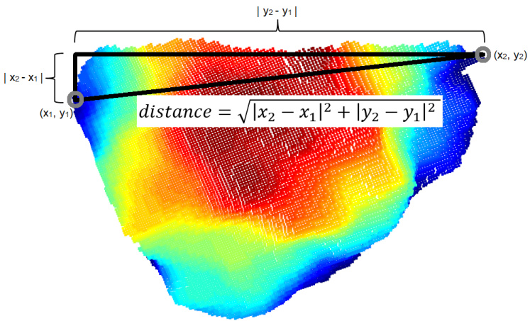

# Perception models for selective harvesting robots in fruit and vegetable production  

# 果蔬采摘机器人的感知模型

PieterBlok  

  

# 命题

1. 主动学习是训练卷积神经网络时选择和标注图像最有效的方法。（本论文）  
2. 卷积神经网络的使用是商业化西兰花采摘机器人的关键成功因素。（本论文）  
3. 科学伦理要求编辑在数据和分析软件未公开的情况下拒绝论文。  
4. 初级研究员和高级研究员的职称是不必要的等级制度。  
5. 设定优先级不可避免地会导致某些任务无法完成。  
6. 环境可持续性要求禁止2小时以内的短途航班。

以上命题属于题为《果蔬采摘机器人的感知模型》的论文

Pieter Blok 瓦赫宁根，2022年12月21日

# 果蔬采摘机器人的感知模型

Pieter Blok  

# 论文委员会

# 导师

Prof. Dr E.J. van Henten 教授，农场技术组
瓦赫宁根大学与研究中心

联合导师  
Dr G.W. Kootstra  
副教授，农场技术组  
瓦赫宁根大学与研究中心  

Dr F.K. van Evert 精准农业高级研究员
瓦赫宁根大学与研究中心  

# 其他成员

Prof. Dr I. Athanasiadis, 瓦赫宁根大学与研究中心  
Dr G. Cielniak, 林肯大学，英国  
Prof. Dr C. McCool, 波恩大学，德国  
Dr B.R. Pichlmaier, AGCO集团，德国

本研究在生产和生态与资源保护研究生院的主持下进行。

# 果蔬采摘机器人的感知模型

Pieter Blok  

# 论文

为满足瓦赫宁根大学博士学位要求而提交，由校长Prof. Dr A.P.J. Mol授权，在论文委员会面前公开答辩，时间为2022年12月21日星期三下午4点，地点为Omnia礼堂。

Pieter Blok  
《果蔬采摘机器人的感知模型》，204页。

博士论文，瓦赫宁根大学，荷兰瓦赫宁根（2022年）含参考文献，附英文、荷兰文和韩文摘要

ISBN: 978-94-6447-471-8   
DOI: https://doi.org/10.18174/579739  

# 伟人之所以伟大，并非生来就会绘画
# 伟人之所以伟大，是因为他们画得很多

Macklemore & Ryan Lewis - 一万小时

# 目录  

摘要 ix   
荷兰文摘要 . . xiii   
韩文摘要 . . xvii   
术语表 xxi   
前言 . . xxiii   
1 绪论 . 3   
2 基于粒子滤波和卡尔曼滤波的果园机器人导航定位 . 17   
3 数据增强和网络简化对基于Mask R-CNN的花椰菜头图像检测的影响 . 39   
4 不同遮挡程度下花椰菜头基于图像的尺寸估计. 73   
5 使用MaskAL的主动学习减少在视觉相似类花椰菜数据集上训练Mask R-CNN的标注工作量 . . 109   
6 结论、实践反思与总体讨论 . . 141   
参考文献 . 157   
致谢 . . 169   
个人简历 . . 173   
出版物、数据集和源代码 . 175   
PE&RC培训与教育声明. . 177  

# 摘要

由于城市化、人口老龄化和最近的COVID-19疫情，从事果蔬生产手工劳动的人越来越少。劳动力供应的减少可能导致新鲜果蔬供应的减少，这在世界人口爆炸式增长的时代是不可取的。目前受到劳动力短缺影响的一项劳动密集型任务是果蔬的选择性收获。选择性收获是指农业工人目测评估作物，然后只收获达到所需颜色、大小和重量的作物。工人还需要评估作物是否没有病害和缺陷。

选择性收获是一项可以由机器人执行的任务。为了让机器人能够选择性收获果蔬，必须成功执行一系列机器人任务。其中一项关键任务是感知。机器人感知是使用传感器和软件模型感知环境的过程。软件模型的任务是解释传感器数据，并将这些解释用于机器人的感知任务。选择性收获中的一个重要感知任务是作物的检测和评估，例如使用摄像头和图像分析软件。这一感知任务对于自主收获行动至关重要。另一个感知任务是检测机器人附近的标志物，作为机器人定位和导航的基础。机器人定位和导航是自动驾驶中的核心任务，使机器人能够移动到另一棵树或作物以执行下一次收获行动。

尽管对选择性收获机器人的需求迫切，但目前市场上只有少数产品。选择性收获机器人的商业化受到当前感知模型无法在各种作物情况下表现的限制。换句话说，许多感知模型在部署到不同农场、田地和生长条件时，还不能提供足够的泛化性能。感知模型的泛化性能很重要，因为它决定了选择性收获机器人在无法预先建模或训练的情况下是失败还是成功。在选择性收获中，感知模型的泛化性能取决于其应对栽培环境变化、作物变化、传感器限制和遮挡的能力。遮挡是指作物或标志物部分可见。当叶子或栽培材料从传感器的角度与作物或标志物重叠时，就会发生遮挡。

本博士论文的目标是研究和开发感知模型，使其能够在不同农场、田地和生长条件下实现更好的泛化性能，无论栽培环境的变化、作物的变化、传感器的限制和遮挡如何。本论文的研究重点是为果蔬生产中任何选择性收获机器人必须执行的四项任务提供感知支持：自主导航、作物检测、作物大小估计以及确定哪些作物需要收获。最终目标是这项研究能够为提高果蔬栽培中选择性收获机器人的商业成功率做出积极贡献。第1章概述部分对本博士论文的研究范围进行了更详细的解释。第2至5章包含研究结果。第6章以总体结论和讨论结束本论文。

第2章重点研究了果园中机器人定位和导航的两种概率模型。在本研究中，将基于模型的粒子滤波器与基于线的卡尔曼滤波器进行了比较。基于模型的粒子滤波器配备了传感器-环境模型，该模型模拟了传感器（激光雷达扫描仪）与果园环境之间的相互作用和不确定性。基于线的卡尔曼滤波器配备了线拟合方法，用于检测机器人两侧的树行。假设是，由于粒子滤波器配备了更先进的传感器-环境模型，因此可以实现比卡尔曼滤波器更好的机器人导航。这一假设在具有遮挡和缺失标志物的商业果园中进行了测试。研究结果证实了这一假设：使用粒子滤波器时，50%的机器人横向偏差在最佳导航线的0.05米范围内，而使用卡尔曼滤波器时，只有25%的横向偏差在最佳导航线的0.05米范围内。此外，在机器人需要在缺失标志物的树行之间导航的六次实验中，有五次粒子滤波器的横向偏差低于卡尔曼滤波器。

第3章重点研究了一种名为Mask R-CNN的卷积神经网络，该网络用于彩色图像中花椰菜头的检测和像素分割。这种基于图像的检测和分割对于机器人估计花椰菜头的大小至关重要。该大小估计值被用作确定是否应该收获花椰菜头的输入。对于机器人的收获性能，重要的是Mask R-CNN能够在种植不同花椰菜品种的不同田地中实现泛化。因此，第3章重点研究了提高Mask R-CNN在检测具有不同纹理和颜色的三种花椰菜品种时的泛化性能。研究了两项技术：数据增强和网络简化。数据增强是一种图像合成技术，在Mask R-CNN训练期间应用，使输入图像在颜色、方向或纹理上发生轻微变化。通过这种方式，Mask R-CNN在不断变化的输入图像版本上进行训练，这可以提高泛化性能。网络简化包括减少Mask R-CNN模型复杂性的方法，例如通过移除网络层。这有助于提高泛化性能。假设是通过数据增强和网络简化，可以在三种花椰菜品种的图像上实现更好的Mask R-CNN泛化性能。结果表明，网络简化没有改善图像泛化，而数据增强确实改善了图像泛化。在数据增强中，几何变换（图像的旋转、裁剪和缩放）比光度变换（光、颜色和纹理的变化）更有效。通过应用几何数据增强，Mask R-CNN能够检测到三种花椰菜品种中232个可收获花椰菜头中的229个。此外，Mask R-CNN在模型之前未训练过的公开数据集中检测到了176个可收获花椰菜头中的175个。

第4章重点研究了遮挡花椰菜头的大小估计。使用Mask R-CNN的改进版本Occlusion R-CNN（ORCNN）进行大小估计。ORCNN用于估计花椰菜头的可见部分和不可见部分。不可见部分是可见部分和遮挡部分的组合。假设是通过使用ORCNN的可见和不可见估计，可以提高遮挡花椰菜头的大小估计。通过将ORCNN的大小估计与标准Mask R-CNN模型的大小估计进行比较来验证这一假设，标准Mask R-CNN模型只能估计花椰菜头的可见部分。研究结果证实了这一假设：使用ORCNN时，在估计487个具有不同程度遮挡的花椰菜头的大小时，误差降低了4.3毫米。在估计161个遮挡率在50%到90%之间的严重遮挡花椰菜头的大小时，ORCNN的误差也显著降低。

第5章重点研究了概率方法和Mask R-CNN的新集成。通过这种集成，尝试优化Mask R-CNN，使其能够用更少的图像标注来检测花椰菜病害和缺陷。训练Mask R-CNN需要图像标注，但选择和标注图像既耗时又昂贵。在第5章中，尝试通过一种名为MaskAL的Mask R-CNN新主动学习方法来解决这个问题。MaskAL自动选择Mask R-CNN最不确定的未标注图像。假设是这些图像对泛化性能的贡献最大，因为它们包含Mask R-CNN仍可改进的信息。假设是使用MaskAL可以更快地提高Mask R-CNN的性能，从而与随机采样方法相比减少标注工作量。这一假设在包含14,000张图像的测试集上进行了验证，其中主要是健康的花椰菜头，但也零星出现有病害和缺陷的花椰菜头。研究结果证实了这一假设：与随机采样方法相比，使用MaskAL可以节省1400张图像标注。与在14,000张图像完整数据集上训练的Mask R-CNN模型相比，MaskAL仅使用17.9%的训练图像就达到了该模型93.9%的性能。随机采样方法使用16.4%的训练图像达到了该模型81.9%的性能。

从四个章节的结果可以得出结论，传感器-环境建模、几何数据增强、不可见感知和主动学习的方法提高了测试果园和花椰菜图像中的感知性能。由于在果园和花椰菜图像中存在不同的栽培环境变化、作物变化、传感器限制和遮挡，可以得出结论，本博士论文的预定目标已经实现。需要指出的是，所研究的变化可能特定于实验和硬件设置的条件。因此，无法研究果园或花椰菜图像中可能出现的所有变化。在第6章中，对这些和其他研究局限性进行了更详细的解释。

最后但同样重要的是，值得一提的是，本博士论文的研究结果被用于优化一个Mask R-CNN模型，该模型目前正在五台商用花椰菜收获机器人上部署。该Mask R-CNN模型在这五台机器人上已经运行了一年多。该模型的稳定性能是研究方法的实际证据，表明这些方法使感知模型能够在不同农场、田地和生长条件下实现足够的泛化性能。总之，可以得出结论，本博士论文的研究为提高选择性收获机器人的商业成功率做出了积极贡献。

# Samenvatting  

Verstedelijking, vergrijzing en de recentelijke COVID-19 pandemie, hebben ertoe geleid dat er steeds minder mensen beschikbaar zijn om het handmatige werk in de fruit- en groenteteelt uit te voeren. De verminderde beschikbaarheid van arbeid kan leiden tot een verlaagd aanbod van vers fruit en groenten en dit is onwenselijk in tijden van een explosief groeiende wereldbevolking. Een arbeidsintensieve taak die momenteel te leiden heeft onder het arbeidstekort is de selectieve oogst van fruit en groenten. Selectieve oogst houdt in dat landarbeiders het gewas visueel beoordelen en dan enkel de gewassen oogsten die de gewenste kleur, grootte en gewicht hebben bereikt. Daarnaast beoordelen de arbeiders of het gewas vrij is van ziekten en gebreken.  

De selectieve oogst van fruit en groenten is een taak die door een robot uitgevoerd zou kunnen worden. Om een robot in staat te stellen een fruit- of groentegewas selectief te oogsten, moeten een aantal robot taken succesvol worden uitgevoerd. Een van die robot taken betreft perceptie. Robot perceptie is het proces van het waarnemen van de omgeving met behulp van sensoren en softwaremodellen. De taak van de softwaremodellen is het interpreteren van sensorgegevens en het gebruiken van deze interpretaties voor perceptietaken op de robot. Een belangrijke perceptietaak in selectief oogsten is de detectie en de beoordeling van het gewas, bijvoorbeeld met behulp van een camera en beeldverwerkingssoftware. Deze perceptietaak vormt de basis voor de autonome oogstactie. Een andere perceptietaak is het detecteren van oriëntatiepunten in de nabije omgeving van de robot zodat robotlokalisatie en -navigatie kan plaatsvinden. Robotlokalisatie en -navigatie zijn kerntaken in de autonome voortbeweging van een robot en stellen een robot in staat naar een andere boom of gewas te bewegen om daar de volgende oogstactie uit te voeren.  

Ondanks de dringende behoefte aan selectieve oogstrobots, zijn er momenteel nog maar weinig op de markt. De commercialisatie van selectieve oogstrobots wordt mede beperkt door het onvermogen van de huidige perceptiemodellen om in een verscheidenheid aan gewassituaties te functioneren. Met andere woorden, veel van de perceptiemodellen zijn nog niet in staat om goede generalisatieprestaties te leveren wanneer deze worden toegepast op diverse landbouwbedrijven, velden en teeltomstandigheden. De generalisatieprestatie van een perceptiemodel is belangrijk, omdat het bepaalt of een selectieve oogstrobot zal falen of slagen in situaties die vooraf niet gemodelleerd of getraind konden worden. Bij selectief oogsten wordt de generalisatieprestatie van een perceptiemodel bepaald door zijn vermogen om te kunnen omgaan met variaties in de teeltomgeving, variaties in het gewas, sensorbeperkingen en occlusies. Occlusie is een ander woord voor de gedeeltelijke zichtbaarheid van het gewas of oriëntatiepunt. Occlusies kunnen ontstaan als bladeren of teeltmateriaal het gewas of oriëntatiepunt overlappen vanuit het perspectief van de sensor.  

Het doel van deze PhD dissertatie was het onderzoek naar en de ontwikkeling van perceptiemodellen die betere generalisatieprestaties kunnen behalen op diverse landbouwbedrijven, velden en teeltomstandigheden, ongeacht de variaties in de teeltomgeving, variaties in het gewas, sensorbeperkingen en occlusies. Het onderzoek in deze dissertatie spitste zich toe op robot perceptie voor vier kerntaken die door elke selectieve oogstrobot in de fruit- en groenteteelt moet worden uitgevoerd: autonome navigatie, gewasdetectie, gewasgrootte schatting, en bepaling welke gewassen geoogst moeten worden. Het uiteindelijke doel was dat dit onderzoek een positieve bijdrage zou kunnen leveren aan de commerciële slagingskans van selectieve oogstrobots in de fruit- en groenteteelt. In hoofdstuk 1, de algemene inleiding, wordt de opzet van deze PhD dissertatie nader toegelicht. Hoofdstukken $2  { \mathrm { t } } /  { \mathrm { m } } 5$ bevatten de onderzoeksresultaten. Hoofdstuk 6 sluit deze dissertatie af met een algemene conclusie en discussie.  

Hoofdstuk 2 richtte zich op twee probabilistische modellen voor robotlokalisatie en -navigatie in boomgaarden. In dit onderzoek werd een model-gebaseerde particle filter vergeleken met een lijn-gebaseerde Kalman filter. Het model-gebaseerde particle filter had een omgevingsmodel die de interactie tussen de sensor (LIDAR scanner) en de boomgaard modelleerde en daarin onzekerheden meenam. Het lijn-gebaseerde Kalman filter had een lijn fitting methode om de bomenrijen aan weerszijden van de robot te detecteren. De onderzoekshypothese was dat met het particle filter betere robot navigatie kon worden bereikt dan met het Kalman filter, omdat het particle filter een geavanceerder sensor-omgeving model had. Deze hypothese werd getoetst in een commerciële fruitboomgaard met geoccludeerde en afwezige oriëntatiepunten. De resultaten van het onderzoek bevestigden de hypothese: met het particle filter was $5 0 \%$ van de robot’s zijdelingse afwijking binnen $^ { 0 , 0 5 \mathrm { { m } } }$ van de optimale navigatielijn, terwijl met het Kalman filter slechts $2 5 \%$ van de zijdelingse afwijking binnen $^ { 0 , 0 5 \mathrm { ~ m ~ } }$ van de optimale navigatielijn was. Daarnaast had het particle filter lagere zijdelingse afwijkingen dan het Kalman filter in vijf van de zes experimenten waar de robot tussen bomenrijen met afwezige oriëntatiepunten moest navigeren.  

Hoofdstuk 3 richtte zich op een convolutioneel neuraal netwerk, genaamd Mask RCNN, die gebruikt werd voor de detectie en pixel segmentatie van broccolikoppen in kleurbeelden. Deze beeld-gebaseerde detectie en segmentatie is essentieel voor het op grootte schatten van broccolikoppen met een robot. Deze grootte schatting dient namelijk als input voor de bepaling of een broccolikop geoogst moet worden of niet. Voor de oogstprestaties van de robot is het van belang dat Mask R-CNN goede generalisatieprestaties kan bereiken in verschillende velden waar verschillende broccoli cultivars groeien. Hoofdstuk 3 richtte zich op het verbeteren van de generalisatieprestaties van Mask RCNN voor de detectie van broccolikoppen van drie cultivars die een andere textuur en kleur hadden. Twee technieken werden onderzocht: data augmentatie en netwerkvereenvoudiging. Data augmentatie is een beeldsynthesetechniek die wordt toegepast tijdens het trainen van Mask R-CNN en ervoor zorgt dat de beelden een andere kleur, oriëntatie, of textuur krijgen. Op die manier wordt Mask R-CNN getraind op steeds veranderende versies van de beelden, en dit kan de generalisatieprestaties verbeteren. Netwerkvereenvoudiging betreft methoden die de complexiteit van het Mask R-CNN model verminderen, bijvoorbeeld door middel van het verwijderen van netwerklagen. Dit kan gunstig zijn voor de generalisatieprestaties. De hypothese was dat door data augmentatie en netwerkvereenvoudiging, betere generalisatieprestaties van Mask R-CNN bereikt kunnen worden op beelden van de drie broccoli cultivars. Uit de resultaten bleek dat netwerkvereenvoudiging de Mask R-CNN prestatie verslechterde, terwijl data augmentatie de prestatie verbeterde. Binnen data augmentatie, bleken de geometrische transformaties (rotatie, bijsnijden en zooming van het beeld) effectiever dan de fotometrische transformaties (veranderingen in licht, kleur en textuur). Door het toepassen van geometrische data augmentatie bleek Mask R-CNN in staat $\mathbf { o m } \ 2 2 9$ van de 232 oogstbare broccolikoppen van de drie cultivars te detecteren. Daarnaast detecteerde Mask R-CNN 175 van de 176 oogstbare broccolikoppen in een online beschikbare dataset waar het model niet eerder op getraind was.  

Hoofdstuk 4 richtte zich op de grootte schatting van geoccludeerde broccolikoppen. Deze grootte schatting werd uitgevoerd met een aangepaste versie van Mask R-CNN, genaamd Occlusion R-CNN (ORCNN). ORCNN kan naast het zichtbare deel van de broccolikop ook het amodale deel schatten. Het amodale deel combineert het zichtbare en het geoccludeerde deel. De hypothese was dat de grootte schatting van geoccludeerde broccolikoppen kan worden verbeterd door gebruik te maken van de zichtbare en amodale schatting van ORCNN. Deze hypothese werd getoetst door de grootte schattingen van ORCNN te vergelijken met die van een standaard Mask R-CNN model welke alleen het zichtbare deel van de broccolikop kon schatten. De resultaten van het onderzoek bevestigden de hypothese: met ORCNN werd een $4 . 3 \ \mathrm { m m }$ lagere fout geobserveerd in de grootte schatting van 487 broccolikoppen met variërende occlussiegraden. ORCNN had daarnaast een significant lagere fout bij het op grootte schatten van 161 zwaar geoccludeerde broccolikoppen met een occlussiegraad tussen $5 0 \%$ en $9 0 \%$ .  

Hoofdstuk 5 richtte zich op een nieuwe integratie van probabilistiek en Mask R-CNN. Met deze integratie werd geprobeerd Mask R-CNN te optimaliseren voor de detectie van broccoliziekten en -gebreken met minder beeldannotaties. Beeldannotaties zijn nodig om Mask R-CNN te trainen, maar het selecteren en annoteren van beelden is tijdrovend en duur. In hoofdstuk 5 werd geprobeerd dit probleem te verlichten door middel van een nieuw actief leermethode voor Mask R-CNN, genaamd MaskAL. MaskAL selecteerde automatisch ongelabelde beelden waar Mask R-CNN het meest onzeker over was. De veronderstelling was dat deze beelden het meest zouden bijdragen aan de generalisatieprestatie, omdat zij informatie bevatten waarop Mask R-CNN zichzelf nog kan verbeteren. De hypothese was dat met MaskAL, de prestaties van Mask R-CNN sneller verbeterd zouden kunnen worden, en daardoor de annotatie inspanning verminderd zou kunnen worden in vergelijking met een willekeurige selectiemethode. Deze hypothese werd getest op een dataset van 14.000 beelden met hoofdzakelijk gezonde broccolikoppen, maar ook sporadisch voorkomende broccolikoppen met ziekten en gebreken. De resultaten van het onderzoek bevestigden de hypothese: met MaskAL konden 1400 beeldannotaties worden bespaard ten opzichte van de willekeurige selectiemethode. In vergelijking met een Mask R-CNN model die getraind was op de complete dataset van 14.000 beelden, behaalde MaskAL $9 3 . 9 \%$ van de prestaties van dat model met slechts $1 7 . 9 \%$ van de trainingsbeelden. De willekeurige selectiemethode behaalde $8 1 . 9 \%$ van de prestaties van dat model met $1 6 . 4 \%$ van de trainingsbeelden.  

De resultaten van de vier hoofdstukken hebben aangetoond dat de methoden voor sensor- en omgevingsmodellering, geometrische data augmentatie, amodale perceptie en actief leren, hebben geleid tot betere perceptieprestaties in de getestte boomgaard en broccoli beelden. Aangezien er in de boomgaard en de broccoli beelden verschillende variaties in de teeltomgeving, variaties in het gewas, sensorbeperkingen en occlusies aanwezig waren, kan worden geconcludeerd dat het vooropgestelde doel van deze PhD dissertatie is bereikt. Een belangrijke kanttekening is dat de onderzochte variaties mogelijk specifiek waren voor de experimentele opzet en de gekozen hardware. Zodoende konden niet alle variaties die in een boomgaard of in broccoli beelden kunnen voorkomen, onderzocht worden. In hoofdstuk 6 worden deze onderzoekslimitaties verder toegelicht.  

Als laatste praktische test werden de bevindingen uit deze PhD dissertatie gebruikt om een Mask R-CNN model te optimaliseren voor de toepassing op vijf commerciële broccoli oogstrobots. Het Mask R-CNN model werkt inmiddels al meer dan een jaar onafgebroken op deze vijf robots. De solide prestaties van het model is een praktische bevestiging dat de onderzochte methoden het perceptiemodel in staat stelden goede generalisatieprestaties te behalen op diverse landbouwbedrijven, velden en teeltomstandigheden. Er kan dus geconcludeerd worden dat het onderzoek uit deze PhD dissertatie een positieve bijdrage heeft kunnen leveren aan het verbeteren van de commerciële slagingskans van selectieve oogstrobots.  

# 개요  

요즘의 농촌사회는 도시화와 고령화 그리고 최근의 COVID-19 팬데믹까지 겪으며 노동력부족현상에시달리고있다. 부족한노동력은곧신선한과일과채소의공급에영향을미치게되는데이는전세계인구가폭발적으로증가하고있는시기에반갑지않은소식이다. 잘익은작물을눈으로확인해색, 크기, 무게, 병해유무등의기준에부합하는작물만선택적으로수확하는선택적수확은작업자들에게도강도높은체력을요구한다.  

이러한선택적수확작업은로봇을활용해이뤄질수있다. 로봇이선택적수확작업을진행하기위해서는인지작업이선행되어야한다. 인지작업이란센서와소프트웨어모델을사용해주변환경을감지하는것을뜻한다. 이미지분석소프트웨어모델은카메라센서를통해얻은데이터를해석하게되는데이는대상작물의감지및평가를하는인지작업에있어중요한역할을한다. 인지작업의또다른역할은로봇이위치와주변공간을설정하여주행하게 하는데 있다. 이는 자율주행에 있어 핵심 역할을 수행하여 로봇이 과수와 과수사이, 작물과작물사이를이동하며수확활동을할수있도록한다.  

이렇듯 선택적 수확 로봇에 대한 필요성이 절실해지고 있음에도 시장의 반응은 미적지근하다. 그나마시장에서상용되고있는선택적수확로봇들은현재인지모델의한계로인해 한가지 작물에만 작업이 가능한 것으로 제한되어 있다. 다르게 말하자면, 현재 상용되고 있는 선택적 수확 로봇들은 인지모델의 한계로 다른 형태의 농장이나 들판 또는재배환경에유연하고탄력적으로대응할수없다는것이다. 인지모델의일반화가선택적수확로봇개발에있어매우중요한이유가바로여기에있다. 인지모델의일반화를통해로봇이 미리 훈련되지 못한 환경(다양한 작물, 수확 작업 환경 등) 혹은 예상치 못한 상황(센서의한계, 폐색영역등)에서수확작업을성공적으로해낼수있는지없는지를결정할수 있기 때문이다. 여기서 폐색영역이란 작물이나 랜드마크가 부분적으로 가려져 있는것을뜻하는데, 센서의시야범위에다른잎이나재배도구등이작물혹은랜드마크와겹쳐져있을때에나타난다.  

본 박사학위 연구논문의 초기목적은 선택적 수확 로봇이 다른 형태의 지형과 작물의성장환경, 다양한작물, 센서의한계, 폐색영역등의상황에서더나은결과를낼수있도록하는인지모델을연구하고개발하는것이다. 본연구논문은과일과채소생산활동에서필요한선택적수확로봇에있어(1) 자율주행(2) 작물탐지(3) 작물크기판단(4)수확대상작물판별의4가지과제가반드시선행되어야한다는점에초점을맞추었다. 최종적으로는본연구가과일과채소의재배현장에서선택적수확이상업적수준에서의실질적인성공을이룰수있도록기여하는것을목표로한다. 제1장서론에서는본박사학위연구논문의목적에 대한 자세한 설명과 연구범위를 다루고 있고 제2-5장에서는 연구 결과를, 그리고제6장에서는연구결론과고찰을다룬다.  

제2장은과수원에서의로봇공간설정과주행에필요한두가지확률모델들에대해논한다. 해당 연구에서는 모델 기반 파티클 필터와 라인 기반(가상의 차선 기반) 칼만 필터(Kalman Filter)를비교한다. 모델기반파티클필터는센서(LIDAR 스캐너)와과수원환경사이의 불확실성과 상호작용을 모델링하는 센서-환경모델을 갖추고 있다. 라인 기반 칼만필터는로봇의양측에있는수열을감지하는직선조정(Line Fitting) 방법을사용한다.파티클필터가더욱더향상된센서-환경모델을갖추고있기때문에파티클필터가칼만필터보다더나은로봇항법을구현한다는가정으로폐색영역으로인한가림현상과중간중간에과수가없는과수원에서테스트했을때의결과는다음과같았다. 파티클필터로는50%의 측면 편위가 최적화된 항로에서 0.05m의 편차를 보였던 반면, 칼만 필터로는 고작 $2 5 \%$ 에 머무르는 것으로 그쳤다. 뿐만 아니라, 로봇이 과수가 없는 수열을 지나야하는5-6번의 테스트들에서도 파티클 필터가 칼만 필터에 비해 낮은 측면 편위를 보였던 것을통하여해당가정이옳았음을증명하였다.  

제3장에서는 색채 이미지에서의 브로콜리 송이를 감지(Detection) 및 분할(Segmen-tation)하기위해사용된Mask R-CNN에대해논한다. 이미지기반감지및분할은로봇이브로콜리송이의크기를예측하는데있어매우중요한역할을한다. 송이크기에따라로봇은 해당 브로콜리를 수확할 것인지에 대한 결정을 내린다. 로봇이 수확작업을 수행할것인지결정하기위해서는Mask R-CNN이브로콜리를재배하는여러필드들에서얻어낸데이터를일반화해야한다. 따라서3장에서는서로다른색채와질감을가진3가지브로콜리 종자들을 감지하여 일반화하는 Mask R-CNN의 성능을 향상하는 방법에 대해 초점을맞춘다. 이를 위해서 (1) 데이터 증강(Data Augmentation) 과 (2) 네트워크 단순화(Net-work Simplification)의 2가지 기술이 연구되었다. 데이터 증강은 Mask R-CNN이 학습되는 동안 사용되는 영상 합성 기법으로, 입력된 이미지의 색채, 방향 혹은 질감에 약간의변형을줌으로써Mask R-CNN이계속적으로다른이미지를훈련하여더나은일반화작업을수행할수있도록한다. 네트워크단순화는네트워크계층들을제거하는등의활동을통해Mask R-CNN의복잡도를줄여역시일반화작업능력을향상시킨다. 데이터증강과네트워크 단순화를 통해 Mask R-CNN이 3가지 브로콜리 종자 이미지들에 대한 더 나은일반화 작업능력을 수행할 수 있게 된다는 가정 하에 진행한 일련의 연구에서 네트워크단순화는이미지일반화를향상시키지못했으나데이터증강으로는훨씬더효율적인작업을수행할수있음이증명되었다. 데이터증강을통해기하학적변환(방향전환, 크롭핑,이미지확대)이광도변환(빛, 색채, 질감의변화)에비해더욱효과가크다는것도발견했다. 기하학적 데이터 증강을 접목시킴으로써 Mask R-CNN은 232개의 수확할만한3가지종자들의브로콜리송이중229개를감지해냈다. 또한, Mask R-CNN은모델에서사전훈련이 되지 않았던 공용 데이터셋에서도 176개의 수확할만한 브로콜리 송이 중 175개를감지해냈다.  

제4장은부분적으로가려진브로콜리송이의크기를예측하는것에중점을둔다. 이는Mask R-CNN에서약간변형된폐색영역R-CNN (ORCNN)을이용해실현된다. ORCNN은브로콜리송이의가시적인부분과무형(Amodal)인부분을예측하는데사용되었다. 무형인 부분이라 함은 눈에 보이는 부분과 가려져 보이지 않는 부분을 모두 뜻한다. ORCNN으로무형인부분을미리예측함으로써브로콜리송이의폐색영역의크기예측정확도를높일수있다는가정하에ORCNN의크기예측결과와기본적인Mask R-CNN으로브로콜리 송이의 가시적인 부분만의 크기를 예측한 것을 비교하는 것으로 진행되었다. 다양한형태의 폐색영역을 보였던 487개의 브로콜리 송이 중 ORCNN이 예측한 실크기는 MaskR-CNN이 예측한 것에 비해 $4 . 3 \mathrm { m m }$ 적은 오류를 범했다. 뿐만 아니라, ORCNN은 브로콜리 송이가 $5 0 \mathrm { - } 9 0 \%$ 정도 가려진 161개의 경우에서도 월등히 좋은 예측 결과를 내며 해당가정이옳았음을증명하였다.  

제5장은확률론적방법과Mask R-CNN을새롭게통합함으로써최소한의이미지어노테이션(Annotation)으로도 브로콜리의 병해를 감지할 수 있도록 Mask R-CNN을 최적화하는 연구에 대해 다룬다. Mask R-CNN을 트레이닝하기 위해서는 이미지 어노테이션이필요하고 이는 많은 시간이 소요될 뿐만 아니라 비용적으로도 부담이 크다. 이러한 문제점을 개선하고자 Mask AL이라는 Mask R-CNN을 위한 액티브 러닝(Active Learning)을시도했다. MaskAL은자동적으로Mask R-CNN이가장불확실해하는미식별이미지들을선별해낸다. Mask R-CNN이 이러한 이미지들에 담긴 정보들을 처리해낸다면 일반화 작업을보다빠르게수행해낼수있으며, 이는곧어노테이션작업역시랜덤샘플링에비해더효율적으로진행될것이라는가정하에건강한브로콜리송이와병해를입은브로콜리송이가 포함된 14,000개의 이미지에 테스트가 진행되었다. 해당 가정은 MaskAL 덕분에랜덤 샘플링에 비해 1,400장의 이미지 어노테이션을 진행하지 않아도 된다는 결과로 가정이옳았음이증명되었다. MaskAL은Mask R-CNN 모델에서학습된14,000장의이미지중단17.9%의학습된이미지를사용하여93.9%의정확도를기록했던반면, 랜덤샘플링은16.4%의학습된이미지를사용하여81.9%의정확도를보이는데그쳤다.  

이러한결과를종합해보면, 센서-환경모델링, 기하학적데이터증강, 무형인식, 액티브 러닝은 테스트가 진행된 과수원과 브로콜리 이미지의 인지수행능력을 향상시킨다는결론에이른다. 각기다른재배환경과작물의다양성, 센서의한계와폐색영역등을통해앞서언급한본박사학위연구의목적을달성하였다. 한가지주목할점이있다면, 연구된편차는 테스트 및 하드웨어 설정에 따라 달라질 수 있음을 밝힌다. 따라서, 모든 편차가과수원이나브로콜리이미지들에서동일하게보이지않을수있다. 제6장에서는이것을비롯한다른연구결과의고찰에대해논한다.  

마지막으로 언급하지만 여전히 중요한 것으로, 해당 박사학위 연구에서 발견한 결과들은 현재 사용중인 5대의 브로콜리 수확 로봇의 Mask R-CNN 모델 최적화를 위해 적용되었음을밝힌다. Mask R-CNN 모델은지금까지1년여넘는기간동안해당로봇들에서안정적으로운영되고있다. 이모델의견고한운영능력은해당연구방법들이인지모델이각기 다른 재배 환경과 재배 조건에서도 적절한 일반화 작업을 수행할 수 있도록 한다는것을실제로증명한다. 이를통해서본박사학위연구가선택적과채수확로봇의상용화확산및성공에긍정적인기여를했다는결론을내렸다.  

# 术语表

# 缩写词

2D 二维  
3D 三维  
AIoU 非模态交并比  
ANOVA 方差分析  
AUS 澳大利亚  
CNN 卷积神经网络  
COCO 常见物体上下文  
CUDA 统一计算设备架构  
Det 检测  
Diam 直径  
Diff 差异  
DO 随机失活  
DPL 深度像素损失率  
Est 估计  
FC 全连接  
FN 假阴性  
FP 假阳性  
GLCM 灰度共生矩阵  
GNSS 全球导航卫星系统  
GT 真实值  
IMU 惯性测量单元  
IoU 交并比  
KF 卡尔曼滤波器

| 缩写 | 全称 |
|------|------|
| LIDAR | 激光成像检测与测距 |
| MAD | 中位绝对误差 |
| MAE | 平均绝对误差 |
| mAP | 平均精度均值 |
| Mask R-CNN | 基于区域的卷积神经网络掩码 |
| MaskAL | Mask R-CNN的主动学习软件 |
| NL | 荷兰 |
| NMS | 非极大值抑制 |
| OCR | 遮挡率 |
| ORCNN | 基于区域的卷积神经网络遮挡 |
| PAL | 概率主动学习 |
| PF | 粒子滤波器 |
| PID | 比例积分微分 |
| PLC | 可编程逻辑控制器 |
| QR | 快速响应 |
| RANSAC | 随机采样一致性 |
| Resnet | 残差神经网络 |
| RGB | 红绿蓝 |
| RGB-D | 红绿蓝深度 |
| RMSE | 均方根误差 |
| ROI | 感兴趣区域 |
| ROS | 机器人操作系统 |
| RPN | 区域建议网络 |
| SLAM | 同步定位与地图构建 |
| TP | 真阳性 |
| UK | 英国 |
| USA | 美国 |
| VIoU | 可见交并比 |

# 前言

在我开始在瓦赫宁根大学与研究中心（WUR）工作大约半年后，我获得了一个参与新项目的机会。该项目专注于开发一种用于西兰花的选择性收获机器人。当时已经存在一些西兰花收获机器，例如Dobmac机器，但这些机器无法选择性收获西兰花头，导致所有花头都被收获而不区分大小。这对于我们当时合作的荷兰西兰花种植者来说是不可取的，因为非选择性收获会导致收获潜力的过多损失（这是因为西兰花头在田间不会均匀成熟）。

因此，在2014年，我们与Firma Goodijk、Agritronics BV（现为TEC BV）和WUR开始了为期4年的公私合作伙伴关系，旨在开发一种选择性收获西兰花的机器人。WUR的任务是开发计算机视觉硬件和软件，使机器人能够在田间检测西兰花头并估计其大小。我与前同事Bas Speetjens一起开始开发一个相机箱。当Bas问我是否愿意开发计算机视觉软件时，我说：我非常愿意（尽管我当时在开发计算机视觉软件方面没有任何经验）。

我首先测试了前同事Ruud Barth开发的软件。Ruud凭借该软件赢得了2013年EMVA青年专业奖，但遗憾的是，他的软件在田间表现不佳。这是因为该软件是基于仅在实验室中出现的图像特征开发的，而不是在田间。因此，最好从头开始开发新的计算机视觉软件。在开始开发之前，我问自己：西兰花头与叶子和背景的区别是什么？我很快发现西兰花头的纹理是一个非常显著的特征。西兰花头由数百个微小的花蕾组成，这些花蕾赋予了它独特的纹理。因此，在收集了田间种植的西兰花图像后，我在Sexbierum的Hotel de Harmonie房间里花了整个晚上开发纹理过滤器，以区分西兰花头和叶子及背景。

这些纹理过滤器在田间表现良好。然而，我们也发现枯黄叶子具有独特的纹理，有时会被错误地识别为西兰花头。因此，在下一个软件迭代中，我们添加了一个颜色过滤器来过滤掉枯黄叶子。颜色过滤器被证明是一个很好的补充。然而，在接下来的几周里，我们发现当软件在其他种植不同西兰花品种的田地中使用时，纹理和颜色过滤器并不总是正常工作。这是因为不同品种的西兰花通常具有与过滤器优化时不同的颜色或纹理。因此，每次在种植不同西兰花品种的田地中使用软件时，都必须手动调整过滤器。

这种手动调整不仅耗时，而且需要只有我具备的技能（毕竟，我是开发该软件的人）。结果是，没有我的输入，西兰花收获机器人就无法正常工作。你可以想象，这完全不够高效。

2018年，我们与Firma Goodijk的公私合作伙伴关系结束了。当时，我们有一个可工作的原型，但我们都意识到它还不够实用。我们意识到需要大量的技术改进，这将需要大量资金。对此非常清楚的是Tony Wisdom，一位来自美国的大型西兰花种植者。Tony和我自2015年以来一直保持联系，他当时告诉我，他迫切希望找到一种机器人替代品来替代西兰花的手工选择性收获。他认为我们的原型是手工收获的替代品。

因此，在2018年，决定由Tony和他的公司Automated Harvesting Solutions LLC继续开发该原型。接手项目后，Tony问我和我的同事Toon Tielen：你们需要什么来实现这个目标？与Toon讨论后，我们很快达成一致，认为计算机视觉软件需要升级为深度学习。当时，深度学习已经在计算机视觉领域引起了轰动，但Toon和我仍然怀疑这是否真的是“下一个大事件”。尽管如此，我们告诉Tony，我们希望用深度学习升级我们的软件，但由于缺乏特定知识，这将需要更多时间，因此需要更多资金来开发。Tony回答说：如果你们认为这可行，我们就应该去做。

因此，在2018年春天，我开始着手我的第一个深度学习软件实现。我开始用2014-2017年间在荷兰收集的西兰花图像训练深度学习模型。训练模型相对容易，但我立即意识到，不可能将在荷兰图像上训练的模型直接用于美国。当Toon和我在2018年8月前往美国测试深度学习模型时，我立即降低了Tony和他的同事Ian Mintz的期望，我说：听着，伙计们，可能需要我花几个小时或几天时间来优化这个模型以适应美国的种植条件。我继续说：让我们先收集图像，然后在这些图像上重新训练模型。Tony和Ian回答说：同意，但我们现在在田间，所以让我们先测试这个深度学习模型是否有效。当机器人启动深度学习分析进入田间时，我有点紧张。

接下来发生的事情我永远不会忘记：在分析第一张图像时，所有西兰花头立即被深度学习模型检测到。在接下来的五分钟里，几乎所有西兰花头都成功地在图像中被检测到，尽管深度学习模型仅用荷兰的西兰花图像进行了训练。回顾那五分钟，我可以说它们对我的科学生涯产生了重大影响。它们甚至激励我进行这项博士研究，其结果现在就在你面前。这本小册子将阐明深度学习是否真的是“下一个大事件”。希望你喜欢阅读它。

Pieter Blok 瓦赫宁根，2022年12月

  

# 1  

# 概述  

# 1.1 果蔬生产及其面临的挑战  

水果和蔬菜是人类饮食的重要组成部分，它们为人体提供必需的营养物质并增强免疫系统（UN, 2020）。世界卫生组织（WHO）建议每天至少摄入400克水果和蔬菜，以预防心脏病、癌症和糖尿病等慢性疾病（WHO, 2020）。然而，目前许多消费者，包括高收入人群，都未能达到这一营养目标（Mason-D'Croz等, 2019）。  

扩大水果和蔬菜生产是缩小营养差距的步骤之一（Mason-D'Croz等, 2019）。2020年，全球用于水果和蔬菜生产的土地面积为1.23亿公顷（FAOSTAT, 2020），这一面积相当于整个南非的陆地面积。其中，约6000万公顷是果园（FAOSTAT, 2020）。果园是指种植果树或灌木以在数年内生产水果的土地。在这些果园中，果树通常以固定间距成行种植（图1.1a）。在蔬菜生产中，也采用类似的种植方法，但作物之间的间距更小（图1.1b）。成行种植便于执行作物处理任务，如除草、间苗、喷洒和收获。  

  
图1.1: (a) 韩国梨园（梨子用纸袋包裹以确保表皮光滑）。 (b) 荷兰西兰花田。  

尽管目前水果和蔬菜生产中的一些作物处理任务已经机械化，但仍有一些任务必须完全由人工完成。其中之一就是人工选择性收获水果和蔬菜。选择性收获是指农业工人通过视觉评估作物，然后确定哪些作物符合收获的质量要求。常见的质量要求包括作物的颜色、大小、重量、成熟度以及是否无病害和缺陷。选择性收获通常应用于单位经济价值较高的水果和蔬菜，以及成熟不均匀的水果和蔬菜（Kootstra等, 2021）。常见的例子包括苹果、梨、橙子、猕猴桃、番茄、花椰菜和西兰花。  

人工选择性收获面临诸多挑战。首先，选择正确的收获样本可能会受到人为错误的影响，因为仅凭视觉评估，人们往往难以准确估计作物的确切大小和成熟度（Kootstra等, 2021）。其次，如今种植者越来越难找到能够进行选择性收获的人。人工收获者数量减少的原因包括城市化、人口老龄化和COVID-19等全球性事件。2020年，在美国，由于COVID-19导致的人工短缺，造成了生菜1600万美元、苹果500万美元和葡萄400万美元的经济损失（Ridley & Devadoss, 2020）。仅在英国，目前就短缺约9万名人工收获者，这对食品供应产生了负面影响（FarmingUK, 2022）。在世界人口爆炸式增长（预计到2050年将达到近100亿人）的时期，食品供应压力是不受欢迎的（UN, 2017）。  

# 1.2 选择性收获机器人  

人工选择性收获带来的问题可以通过收获机器人来缓解。收获机器人是移动的、自主的、决策的机电设备，无需直接人工即可执行收获任务（Lowenberg-DeBoer等, 2020）。  

水果和蔬菜收获机器人的研究可以追溯到20世纪80年代。自那时起，至少发表了45篇关于这一主题的科学文章（Bac等, 2014; Kootstra等, 2021; Oliveira等, 2021）。这些文章提供了选择性收获机器人的构建方式及其执行收获任务的一般蓝图。文献中调查的45个收获机器人都配备了传感器、数据处理系统和执行器。凭借这三个主要组件，机器人能够感知环境、规划行动并自主执行该行动。除了明显的自主收获行动外，选择性收获机器人还需要自主驾驶到另一个作物或树木以执行下一个收获行动。鉴于选择性收获机器人的自主性取决于自主驾驶和自主收获，本博士论文将重点关注这两方面。本博士论文特别关注改进基于传感器的机器人感知，以完成这两项任务。感知是感知周围环境的能力，这至关重要，因为选择性收获机器人需要与环境互动。由于传感器在感知中起着关键作用，接下来的两段将重点介绍自主驾驶的传感器（1.2.1节）和自主收获的传感器（1.2.2节）。  

# 1.2.1 自主驾驶的传感器

机器人通常配备多个传感器。传感器可分为本体感受传感器和外感受传感器。本体感受传感器收集机器人状态的信息，而外感受传感器收集环境状态的信息。对于自主驾驶，最常见的本体感受传感器是惯性测量单元（IMU）、陀螺仪和轮式编码器（Oliveira等，2021）。通过这些传感器，可以跟踪机器人位置和方向的相对变化，并将其作为自主驾驶的输入。

自主驾驶中常用的外感受传感器包括全球导航卫星系统（GNSS）、红绿蓝（RGB）彩色相机、RGB深度（RGBD）相机和激光成像检测与测距（LIDAR）扫描仪（Oliveira等，2021）。这四种传感器的区别在于它们感知环境的能力或无法感知环境，以及它们是主动传感器还是被动传感器。主动传感器向环境发射能量并测量反射回传感器的能量（Siegwart等，2011）。被动传感器只测量进入传感器的环境能量（Siegwart等，2011）。

GNSS是一种主动传感器，它不感知环境，但可以通过来自多个卫星的信号确定机器人在地球上的位置。实时动态（RTK）GNSS可以提供与实际位置相差$2 \mathrm { c m }$以内的位置估计，但不幸的是，当来自多个卫星的信号被树冠阻挡时，它可能会失去准确性。这使得RTK-GNSS不适合用于果园中的自主驾驶。另一种选择是使用RGB彩色相机。RGB相机是一种依赖户外照明进行图像采集的被动传感器。RGB相机采集的图像可以用作自主驾驶的输入，但变化的光照条件可能会对图像质量产生破坏性影响，从而影响机器人的驾驶性能。RGB-D相机根据是否具有自己的照明源，可以是主动或被动传感器。RGB-D相机生成彩色图像和深度图像，其中每个像素值表示相机与环境之间的深度测量。与RGB相机相比，使用RGB-D相机的优势在于额外的深度信息可以用于避障等任务。LIDAR扫描仪通常比RGB-D相机具有更大的深度范围和更高的深度精度。LIDAR扫描仪是一种主动传感器，它向环境发射激光束，然后利用激光束的反射来定位环境中的物体。一个缺点是LIDAR扫描仪产生的深度数据比RGB-D相机更稀疏。

# 1.2.2 自主收获的传感器

对于自主收获，最常用的两种传感器是RGB相机和RGB-D相机（Fountas等，2022；Oliveira等，2021）。这两种相机都可以用于拍摄环境图像，从中提取与自主收获相关的视觉信息。这些视觉信息的例子包括水果和蔬菜的位置以及它们是否符合质量要求。RGB-D相机的优势在于它提供的深度信息可以用于定位环境中的作物，并估计其三维（3D）姿态或大小和重量。除了RGB和RGB-D相机外，一些调查的收获机器人还配备了超声波、感应或触觉传感器，使机器人能够更好地接近或抓取水果或蔬菜（Oliveira等，2021）。

# 1.3 选择性收获机器人的感知模型

除了传感器，选择性收获机器人还需要一个带有软件模型的处理单元来处理传感器数据。在本论文中，模型被定义为真实现象的概念和数学表示（Rogers，2012）。软件模型的作用是解释传感器数据，并将这些解释用于预测和决策任务。自主驾驶和收获的一个重要软件模型是感知模型。感知模型用于感知和解释机器人操作的环境。

在自主驾驶中，感知模型可以用作机器人定位和导航的基础（Siegwart等，2011）。机器人定位涉及确定机器人在环境中的位置（Siegwart等，2011）。机器人导航涉及规划和运动控制，以将机器人移动到环境中的期望位置，同时避开障碍物（Siegwart等，2011）。由于导航取决于机器人的特定运动学和运动方式，并且这可能因不同的机器人平台而异，本博士论文专注于机器人定位和自主收获的感知模型。农业中最常见的机器人定位感知模型在1.3.1节中描述。最常见的自主收获感知模型在1.3.2节中描述。

# 1.3.1 自主驾驶期间的机器人定位感知模型

对于果园和田间环境中的自主驾驶，重要的是感知模型能够从传感器数据中提取有关机器人位置的有意义信息。位置信息可以通过特征提取过程提供。机器人定位的有意义特征是环境中可识别的地标，例如作物或树木的行，或单个树干。这些地标位置的信息可以揭示机器人在环境中的位置。

对于机器人定位，重要的是即使地标的视线被其他物体阻挡，或者存在传感器噪声，地标也是可感知和独特的。传感器噪声和不可感知的地标可能导致感知模型错过关键信息，这可能会在模型需要执行其定位任务时产生一定程度的不确定性（Thrun等，2005）。为了使感知模型更好地处理这些环境和传感器的不确定性，可以为其配备这些不确定性的特定概念。当不确定性在模型中明确建模，并且决策基于概率而不是“单一最佳猜测”时，我们称该模型为概率模型（Thrun等，2005）。

常用的机器人定位概率模型是递归贝叶斯滤波器（Castellano-Quero等，2020）。这些滤波器可以通过预测和校正过程来近似机器人的状态（可以是其位置和方向）。预测可用于估计机器人在下一个时间点的位置。一个简单的例子是基于机器人的速度预测机器人的位置。在校正步骤中，也称为测量更新步骤，传感器数据与预测的状态估计一起使用，以生成更新的状态估计（后验状态估计）。

根据Shalal等（2013）的研究，卡尔曼滤波器（Kalman，1960）和粒子滤波器（Thrun，2002）是农业中广泛使用的递归贝叶斯滤波器。这两种滤波器的区别在于它们对系统状态和传感器噪声的建模方式。卡尔曼滤波器适用于具有高斯噪声的线性系统，而粒子滤波器适用于具有非高斯噪声的非线性系统（Hiremath，2013）。由于其非线性和非高斯方法，粒子滤波器通常能更好地应对果园和田间环境中存在的变化和不确定性（Hiremath，2013）。

除了概率模型，机器学习模型也可以用于机器人定位中的地标检测。机器学习模型是基于数据分析形成的数学表示（Parsons，2021）。机器学习模型通过最小化数据与表示数据的模型参数之间的不匹配的算法进行优化（Parsons，2021）。优化后，具有优化参数的机器学习模型可以用于对新数据进行预测。在机器学习子领域中，深度学习模型目前在处理点云（来自LIDAR扫描仪）和分析图像（来自相机）方面最为突出（Fayyad等，2020）。深度学习模型是受人类大脑生物神经网络启发的

# 1.3.2 自主收获期间的图像分析感知模型

深度学习模型目前也是自主收获期间图像分析最广泛使用的感知模型（Kootstra等，2021；Oliveira等，2021）。在深度学习子领域中，卷积神经网络（CNNs）目前最为突出（Kamilaris & Prenafeta-Boldú，2018）。

CNNs自20世纪90年代就已存在（LeCun等，1998），但直到2012年AlexNet（Krizhevsky等，2012）的引入，它们的使用才迅速增长。这主要是因为从2012年开始，由于计算能力的提高和公开数据集的可用性，使得有效训练CNNs成为可能（LeCun等，2015）。CNNs由堆叠在一起的卷积层组成，每一层都能够提取更具区分性的图像特征。通过这种层次化的特征提取方法，CNN可以将低层次的图像特征（如边缘）转换为更抽象的特征（如特定物体的形状）（LeCun等，2015）。由于这种特征提取在训练过程中自动优化，CNN通常比由人工优化特征的传统机器学习模型表现更好。Kamilaris和Prenafeta-Boldú（2018）的文献综述证实了这一点：在这项研究中，CNN在所有22项农业研究中的表现都优于特征工程的机器学习模型。根据Zhang等（2019）的研究，当今CNNs感知性能的提升部分促成了果园机器人比以往任何时候都更接近成功商业化。

对于自主收获任务，重要的是CNN能够检测图像中的水果或蔬菜。这项任务称为目标检测，它很重要，因为它为引导机械化工具收获水果或蔬菜提供了所需的输入。目标检测任务是定位图像中的物体并确定该物体是什么的组合（Zou等，2019）。后者被称为分类，它可以用于分类作物的不同健康和成熟阶段，作为选择性收获的输入。

对于自主收获，常用的目标检测模型有Faster Region-based CNN（Faster R-CNN）（Ren等，2017）和You Only Look Once（YOLO）（Redmon等，2016）（Fountas等，2022；Oliveira等，2021；Zhou等，2022）。YOLO模型目前已经升级到第七版（Wang等，2022）。YOLO和Faster RCNN都可以通过围绕物体绘制边界框来检测图像中的单个物体，然后确定相关的类别标签和置信度分数（图1.2a）。通过检测到的边界框和3D后处理模型，可以估计作物的姿态、大小和重量，作为选择性收获的输入。然而，对于大多数水果和蔬菜来说，使用边界框无法准确估计其形状，因为它们大多不是矩形。对于这些水果和蔬菜，检测到的边界框也会包含大量不属于作物的像素，这可能会对大小估计和机器人抓取产生负面影响。

另一种选择是使用能够确定边界框内哪些像素属于物体的CNN（图1.2b）。提供这种功能的CNN是实例分割模型。常用的实例分割模型有You Only Look At CoefficienTs（YOLACT）（Bolya等，2020）和Mask Region-based CNN（Mask R-CNN）（He等，2017）。

  
图1.2：（a）目标检测模型在田间种植的西兰花图像上的输出。除了边界框预测（绿色矩形）外，模型还提供了类别预测（西兰花）和置信度分数（0.99）。（b）实例分割模型的输出，它提供了与目标检测模型相同的输出，外加边界框内的额外像素分割（绿色像素）。

# 1.4 果园和田间环境中的感知挑战

尽管感知模型取得了进展，但迄今为止调查的45个收获机器人中只有3个实现了商业化（Kootstra等，2021）。这种有限商业化的原因之一是许多现场部署的模型在各种作物情况下的功能有限。换句话说，许多部署的模型还不能在不同的农场、田地和生长条件下实现足够的泛化性能。泛化指的是模型在各种情况下都能表现良好的能力，无论遇到未见过的和未训练的输入和变化（Goodfellow等，2016）。感知模型的泛化性能很重要，因为它决定了选择性收获机器人在无法预先建模或训练的情况下是否会失败或成功。在选择性收获中，感知模型的泛化性能取决于其应对栽培环境变化（1.4.1节）、作物变化（1.4.2节）、遮挡（1.4.3节）和传感器限制（1.4.4节）的能力。

# 1.4.1 栽培环境的变化

许多部署的感知模型无法充分泛化的原因之一是它们不能很好地处理果园和田间环境中存在的变化。果园和田间环境是未受控制的，因此会受到风、灰尘、雾、雨、阳光变化和阴影的影响。所有这些环境变化都会降低地标、水果和蔬菜的可见性，使感知模型更难检测到它们。除了可见性降低外，某些变化还会干扰传感器数据，从而对感知模型的性能产生负面影响。例如，灰尘颗粒、废气和雨滴或雾滴可能会导致LIDAR扫描仪发射的激光束被反射，使它们出现在激光扫描数据中。当感知模型没有充分建模或训练以应对这些环境变化时，就会出现问题。

除了环境变化外，栽培系统在不同田地和农场之间也可能有所不同。例如，在果园中，不同的修剪技术或训练系统可能会导致不同的树结构和果实发育。修剪和训练技能甚至可能因人而异，导致同一果园内的变化。在蔬菜生产中，栽培系统通常较少多样化。然而，即使在蔬菜生产中，由于种植方法的差异也可能出现变化。一个例子是行栽和床栽之间的差异。在行栽中，植物种植在单行中（见图1.1b中的示例）。在床栽中，有一个高床，上面种植两行或更多行植物。这导致不同的植物距离和密度，但通常也会导致不同的植物稳定性，因为外行的植物更靠近床的斜坡，这使得它们的根系不那么牢固。对于这些植物来说，它们通常会开始向通常风吹的方向倾斜。当使用俯视相机视角时，这最终可能导致作物可见性降低。

# 1.4.2 作物的变化

如前所述，栽培环境的变化也会影响作物的变化。然而，除了前面提到的可见性、位置、种植距离和植物密度的变化外，作物本身也可能有许多变化。这主要是因为大多数水果和蔬菜的成熟不均匀，这意味着收获成熟和未收获成熟的作物可能并排生长。对于感知模型来说，确定哪些作物是收获成熟的可能具有挑战性，因为这通常涉及检测颜色和大小的轻微变化。除了颜色检测和大小估计外，感知模型还应确定水果或蔬菜是否没有疾病和缺陷。检测疾病和缺陷可能具有挑战性，因为一些疾病症状和缺陷几乎不可见或看起来相似。更复杂的是：感知模型还应该能够在不同品种的水果或蔬菜上表现良好。品种是植物物种内的栽培变种，具有不同的产量、抗病性或其他特征，如颜色、质地或大小。如果不同品种之间存在很大差异，那么部署的感知模型可能无法在具有与模型优化时不同特征的品种上充分泛化。

# 1.4.3 遮挡

品种之间可能不同的另一个特征是它们的营养生长。种植具有广泛营养生长的品种可能会导致植物的叶子部分遮挡水果或蔬菜，使其可见性降低。如果植物种植得更近，也会降低可见性，增加叶子遮挡的可能性。除了叶子外，单个作物之间也可能相互遮挡。这主要发生在果园中，因为果树的3D结构比蔬菜更复杂，而且果园中的许多水果都是成簇生长的。在果园中，栽培材料（如支撑线和杆子）也可能遮挡水果。在自主驾驶中，地标可能被高草、杂草和树枝遮挡，使机器人定位和导航更加困难。根据Zhang等（2020）、Kootstra等（2021）和Oliveira等（2021）的研究，遮挡是果园和田间环境中部署的感知模型面临的最大挑战之一。

# 1.4.4 传感器的限制

遮挡也会对传感器数据本身产生很大影响。例如，当使用基于立体视觉原理的RGB-D相机时，如果物体从一个相机的视角不可见，遮挡可能会导致某些图像区域的深度数据丢失（Fu等，2020）。除了深度数据丢失外，基于立体视觉的RGB-D相机还需要与物体保持最小距离才能生成深度数据（有时可能高达50厘米）。在RGB-D相机安装在机械臂上的情况下，这可能会导致在收获机器人最关键的动作之一：抓取和切割水果或蔬菜时缺乏深度感知。

事实上，所有类型的传感器都有其局限性和缺陷（Siegwart等，2011）。例如，与RGB-D相机生成的点云相比，LIDAR扫描仪生成的点云更稀疏且缺乏颜色信息。因此，在LIDAR生成的点云中，感知模型更难视觉识别物体。此外，LIDAR扫描仪的随机测量误差会随距离非线性传播，这意味着对远处物体的深度测量将不太可靠（Siegwart等，2011）。

# 1.5 研究范围

上述挑战存在的一个作物是西兰花（Brassica oleracea var. italica）。西兰花是一种在露天田地中以行栽或床栽方式种植的蔬菜。行栽和床栽之间的差异可能导致不同的作物遮挡和西兰花花头位置的不同。这使得西兰花花头的自主检测和大小估计具有挑战性。除了这些挑战外，西兰花作物通常在作物发育和健康状况方面存在很大差异。使问题更具挑战性的是不同品种西兰花花头在质地和颜色上的差异。这使得西兰花成为研究选择性收获机器人的一个具有挑战性且有趣的作物。目前，开发西兰花选择性收获机器人也迫在眉睫，因为西兰花的手工收获劳动强度大且成本高（KWIN，2018）。

对于西兰花选择性收获机器人的商业成功，至关重要的是感知模型能够在不同农场、田地和生长条件下实现泛化，无论栽培环境的变化、作物的变化、遮挡和传感器限制如何。本博士论文旨在提高应用于不同西兰花选择性收获机器人原型的感知模型的泛化性能。尽管机器人原型不同，但有一个共同的感知方法：所有原型都配备了RGB-D立体视觉相机。RGB-D相机安装在一个屏蔽柜中，该柜安装在机械臂前方。柜内有发光二极管（LED），提供人工照明，使机器人能够在白天和夜间进行收获。RGB-D相机以俯视视角捕捉西兰花作物的图像。相机由车轮编码器触发，该编码器根据机器人的运动向相机提供电子触发。获取图像后，感知模型必须确定图像中西兰花花头的位置，它们是否足够大可以收获，以及它们是否没有疾病和缺陷。当模型决定收获一个西兰花花头时，西兰花花头中心点的3D坐标被发送到机械臂的可编程逻辑控制器（PLC）。PLC然后将西兰花花头的3D坐标转换为机器人坐标系中的位置。车轮编码器用于跟踪相对位移。当机械臂的位置接近可收获西兰花花头的位置时，机械臂会自动下降，抓住西兰花花头，去除叶子，切割并将其运输到传送带上。传送带将西兰花花头运输到由拖拉机牵引的拖车上的储存箱中。运输到农场后，西兰花花头被清洗、用塑料包装并出售。

为了使收获机器人完全自主，重要的是它能够在西兰花田中自主行驶。这种自主驾驶可以使用RTK-GNSS进行。然而，使用RTK-GNSS时，当没有足够的卫星信号时，机器人也更容易停机。RTK-GNSS可能更大的问题是缺乏对环境的感知。当西兰花花头向机器人必须行驶的轨道倾斜时，这就会成为问题。因此，自主驾驶最好使用LIDAR或基于相机的系统进行，这样可以感知植物的位置。作为开发这种驾驶系统的第一步，目前正在进行果园自主驾驶的研究。在果园中，目前对基于树木的驾驶系统的需求更为迫切，因为在那里根本无法使用RTK-GNSS。果园研究也为在水果和蔬菜生产中更广泛地部署感知模型提供了机会。

# 1.6 研究目标

为了使机器人能够自主行驶并选择性收获西兰花花头，需要研究改进感知模型。为了使感知模型适用于商业西兰花收获机器人，至关重要的是它们能够在不同农场、田地和生长条件下实现泛化，无论栽培环境的变化、作物的变化、遮挡和传感器限制如何。

因此，本博士论文的目标是：

"提高水果和蔬菜生产中选择性收获机器人感知模型的泛化性能，以西兰花选择性收获为用例"

假设是：

"通过使用新的建模和机器学习方法，感知模型将能够更好地应对果园和田地中存在的变化"

该假设在水果和蔬菜生产中选择性收获机器人必须执行的四个关键任务上进行了测试：自主导航、作物检测、作物大小估计以及确定哪些作物可以收获。接下来的四章分别涵盖这些研究主题，最后一章讨论了总体发现。

# 1.7 论文大纲

第2章重点介绍使用LIDAR扫描仪进行果园机器人定位和导航的新建模方法。本研究的目的是解决在商业果园中自主导航机器人时，面对遮挡和缺失地标的环境变化挑战。通过建模LIDAR扫描仪激光束与果园环境之间的相互作用，并包括不确定性，尝试提高基于粒子滤波模型的导航性能。为了测试目的，在可比较的田间条件下将粒子滤波器与基于线的卡尔曼滤波器进行了比较。假设是由于先进的传感器-环境建模，粒子滤波器将优于卡尔曼滤波器。

第3章重点介绍机器学习方法，以提高Mask R-CNN在三个西兰花品种图像上的泛化性能。研究重点是正则化方法，这些方法修改学习算法以减少泛化误差（Goodfellow等，2016）。在第3章中，通过数据增强和网络简化来研究正则化。数据增强是一种在Mask R-CNN训练期间应用的图像合成技术，它会导致输入图像在颜色、方向或纹理上发生轻微变化。通过这样做，Mask R-CNN在不断变化的输入图像版本上进行训练，这可以提高泛化性能。网络简化包括减少Mask R-CNN模型复杂性的方法，例如通过移除网络层。这有助于提高泛化性能。假设是通过使用网络简化和数据增强，Mask R-CNN可以在具有不同纹理和颜色的三个西兰花品种图像上实现泛化。

第4章重点介绍一种新的机器学习方法，以提高被叶子遮挡的西兰花花头的大小估计。研究重点是使用Occlusion R-CNN（Follmann等，2018）。Occlusion R-CNN（ORCNN）是Mask R-CNN的修改版本，它可以为每个对象分割两个掩码而不是一个（掩码是边界框内像素分割的另一个词；见图1.2b）。通过额外的掩码分割，ORCNN将能够分割西兰花花头的可见区域和amodal区域。Amodal区域是西兰花花头可见区域和遮挡区域的组合。假设是通过使用可见区域和amodal区域，与只能分割可见区域的Mask R-CNN模型相比，被遮挡西兰花花头的大小估计可以得到改善。

第5章重点介绍概率方法和机器学习的新集成。通过这种集成，尝试优化Mask R-CNN以使用更少的图像注释检测西兰花疾病和缺陷。训练Mask R-CNN需要图像注释，但选择和注释图像既耗时又昂贵。在第5章中，提出了一种新的主动学习方法，以减少图像选择和注释所需的时间。新的主动学习方法自动选择Mask R-CNN最不确定的图像，前提是这些图像在重新训练Mask R-CNN时对泛化性能的贡献最大。假设是通过使用基于不确定性的主动学习，与随机采样方法相比，可以更快地提高Mask R-CNN的性能，从而减少注释工作。

第6章通过验证假设是否有效以及研究目标是否实现来总结论文。总结了第2至5章的主要发现，并在可比文献的背景下进行了讨论。此外，还讨论了研究的局限性，并为未来的研究提出了建议。

果园机器人 Randwijk(NL) -2018

  

# 2  

# Robot navigation in orchards with localisation based on particle filter and Kalman filter  

# 基于粒子滤波和卡尔曼滤波的果园机器人导航定位

Pieter M. Blok1,2, Koen van Boheemen1, Frits K. van Evert1 Joris IJsselmuiden2, Gook-Hwan Kim3  

1Agrosystems Research, Wageningen University & Research, Wageningen, The Netherlands   
2Farm Technology Group, Wageningen University & Research, Wageningen, The Netherlands   
3National Academy of Agricultural Science, RDA, Wanju-gun, Republic of Korea  

# 摘要  

目前果园生产高度依赖人工劳动。随着劳动力成本上升和劳动力短缺问题的加剧，自主果园机器人的出现可以缓解这些担忧。每个移动果园机器人的核心功能是自主导航，这依赖于基于传感器的果园环境机器人定位。本研究验证了两种概率定位算法在果园行内导航中的适用性，这两种算法都使用了2D LIDAR扫描仪。第一种定位算法是带有激光束模型的粒子滤波器，第二种算法是带有线检测算法的卡尔曼滤波器。我们评估了这两种算法在荷兰商业苹果园中自主导航机器人时的性能。进行了两个实验来评估两种算法在可比条件下的导航性能。第一个实验评估了导航精度，而第二个实验测试了算法的鲁棒性。在第一个实验中，当机器人以$0.25 ~ \mathrm{m/s}$的速度行驶时，粒子滤波器的横向偏差均方根误差（RMSE）为$0.05 \mathrm{m}$，卡尔曼滤波器为$0.09 \mathrm{m}$。在$0.50 \mathrm{m/s}$时，粒子滤波器的RMSE为$0.06 \mathrm{m}$，卡尔曼滤波器为$0.09 \mathrm{m}$。此外，使用粒子滤波器时，横向偏差在最佳导航线两侧均匀分布，而使用卡尔曼滤波器时，机器人倾向于导航到最佳线的左侧。第二个实验测试了算法在六种不同树行模式中应对缺失树木的鲁棒性。粒子滤波器在五种树行模式中具有较低的横向偏差RMSE。在六种模式中的三种中，使用卡尔曼滤波器导航会导致横向偏差偏向最佳线的左侧。在两个实验中，粒子滤波器和卡尔曼滤波器的角度偏差范围相同。从结果中我们得出结论，对于自主果园机器人的行内导航，带有激光束模型的粒子滤波器优于基于线的卡尔曼滤波器。

关键词：概率定位，自主机器人导航，粒子滤波器，卡尔曼滤波器，果园

# 2.1 引言

每年全球生产超过6.75亿吨水果（Statista，2018）。水果生产通常是劳动密集型的，因为它依赖于多项人工任务，如作物维护和选择性收获。劳动力成本上升和劳动力短缺给果园的劳动力供应带来了压力。预计由于城市化进程加快和农场继承人的缺乏，这一劳动力问题在未来只会更加严重。为了解决这些问题，许多研究工作致力于开发果园机器人系统。果园机器人有潜力在劳动力短缺时期替代人工劳动。每个移动果园机器人的核心功能是自主导航，包括在果园环境中安全自主地引导机器人。反过来，导航依赖于自主定位，即使用传感器和软件算法确定机器人在果园中的位置和方向（姿态）。更具体地说，软件算法使用传感器数据提供机器人相对于周围环境的位置信息。基于这些信息，机器人可以自主地在树行之间导航以执行自主任务。

据我们所知，目前至少有四种自主果园机器人商业化。其中两种机器人的自主导航完全依赖于全球导航卫星系统（GNSS）接收器（Greenbot，2018；PrecisionMakers，2018），而另外两种机器人则使用不同传感器的组合。这两种机器人都使用GNSS接收器和激光成像检测与测距（LIDAR）扫描仪进行自主导航（ASI-Robots，2018；NAIO-Technologies，2018）；其中一种机器人还使用了摄像头（NAIO-Technologies，2018）。当关注这些传感器在果园环境中自主定位的适用性时，Li等人（2009）指出，基于GNSS接收器的机器人定位在GNSS信号被树冠阻挡时容易发生操作故障。基于摄像头的视觉机器人定位被证明是一种替代方案，然而Shalal等人（2013）强调，变化的户外光照条件，例如直射阳光或阴影，可能会对导航性能产生负面影响。LIDAR扫描仪在户外环境中被证明更加鲁棒（Weiss & Biber，2011），并被认为是果园机器人定位的主要传感器（Shalal等人，2013）。LIDAR扫描仪从多个扫描角度发射激光束，并测量每个光束在被物体反射后返回的飞行时间。补充传感器，如惯性测量单元（IMU）、陀螺仪和车轮编码器，通常集成在移动果园机器人中以跟踪机器人姿态的相对变化。

在类似研究中提出的大多数定位算法都基于从LIDAR扫描仪获得的数据（Andersen等人，2010；Barawid等人，2007；Bergerman等人，2012；Blok等人，2018；Freitas等人，2012；Hansen等人，2009；Hiremath等人，2014；Jæger-Hansen等人，2012；Libby & Kantor，2010；Marden & Whitty，2014；Shalal等人，2015；Zhang等人，2014）。提出的方法在处理LIDAR数据的方式上有所不同。一些算法基于线检测方法，通过拟合观察到的激光扫描点来估计树行。使用与树行相似的线的位置和方向，对机器人相对于该线的姿态进行估计。果园机器人导航中常用的线检测算法包括霍夫变换（Barawid等人，2007）、随机样本一致性（RANSAC）（Marden & Whitty，2014）和最小二乘线拟合（Andersen等人，2010；Bergerman等人，2015）。然而，Hiremath（2013）指出，仅基于这些线检测算法的机器人导航可能会受到动态和不可预测情况的负面影响，例如悬垂的树枝、碎片、固定障碍物（水果箱）和移动障碍物（动物或人员）。另一种方法是在未知环境中结合同时定位与地图构建（SLAM）。基于LIDAR的SLAM是一种有前途的户外定位方法（Christiansen等人，2011；Lepej & Rakun，2016），然而SLAM需要更多的处理时间和计算资源（Shalal等人，2015）。此外，Chen等人（2018）指出，当大量激光束从非树木物体（如农业工具、树木支撑物和其他障碍物）返回时，基于LIDAR的SLAM可能会变得不太可靠。

另一种基于概率计算的方法被证明更适合用于动态和不可预测的情况（Thrun等人，2005）。与依赖单一估计不同，概率算法通过具有多个假设的概率分布来表示信息。因此，这些算法在处理动态环境（如果园）中的传感器限制和传感器噪声时往往更加鲁棒。果园机器人定位中常用的两种概率算法是卡尔曼滤波器（Andersen等人，2010；Bergerman等人，2015；Hansen等人，2011；Shalal等人，2015）和粒子滤波器（Bergerman等人，2012；Blok等人，2018；Kurashiki等人，2010）。前者使用高斯分布进行定位，而后者使用具有多个粒子的随机采样来估计机器人的姿态。Shalal等人（2013）指出，卡尔曼滤波器是行作物和果园中机器人定位的主要算法。此外，我们发现大多数提出的卡尔曼滤波器在其测量更新步骤中使用线检测算法。这些基于线的算法通过特征提取从数百个激光扫描点生成几条线，从而大幅减少用于机器人定位的数据量。另一种定位方法通过在粒子滤波器中结合环境模型和激光束模型来评估单个激光束（Blok等人，2018；Hiremath等人，2014）。这种概率方法允许对机器人定位进行广泛的数据分析，因为这两个模型结合了单个激光束与环境的相互作用。然而，这种粒子滤波器需要更多关于果园环境的先验信息，并且比基于线的卡尔曼滤波器计算量更大（Hiremath，2013）。

尽管有这些努力，迄今为止的研究尚未在商业果园中验证不同概率定位算法在可比情况下的表现。本研究的目的是确定最适合果园行内机器人导航的概率定位算法。基于Blok等人（2018）和Hiremath等人（2014）的研究结果，我们假设由于先验信息程度更高和数据分析更广泛，带有激光束模型的粒子滤波器在机器人导航方面将优于基于线的卡尔曼滤波器。本研究的目的是评估在商业果园中自主导航机器人时，粒子滤波器和卡尔曼滤波器的导航精度和鲁棒性。

我们研究的第一个贡献是在商业果园中比较了两种概率定位算法在可比条件下的表现。我们研究的第二个贡献是引入了一种新方法来评估机器人在真实果园条件下的导航鲁棒性。我们的研究集中在果园机器人的行内导航上，没有研究自主转向以及障碍物和地头的检测。

# 2.2 材料与方法

# 2.2.1 机器人平台

使用软件控制的机器人（Husky A200，Clearpath Robotics，加拿大基奇纳）作为机器人平台，在商业果园中测试自主机器人导航（图2.1）。该机器人具有刚性框架，四个固定车轮的轴距为$0.54\mathrm{m}$，轮距为$0.67\mathrm{m}$。机器人使用滑移转向进行转弯。

在机器人上集成了三个传感器，用于提供机器人状态和环境信息。第一个是2D LIDAR扫描仪（LMS-111，Sick AG，德国瓦尔德基希）。该扫描仪的视场角为$270^{\circ}$，角分辨率为$0.50^{\circ}$，可产生541个测量值，所有测量值以$50\mathrm{Hz}$的频率更新。每个测量值包括激光束被物体反射后的传播距离和反射光束的强度。后者受物体距离和反射特性的影响。距离测量的系统误差约为$0.03\mathrm{m}$（Sick-Sensor-Intelligence，2016）。LIDAR扫描仪水平安装在机器人前部，距地面$0.50\mathrm{m}$。LIDAR检测范围限制在$4.0\mathrm{m}$，因此只能观察到机器人两侧各一行树（果园中行间距为$3.0\mathrm{m}$）。第二个传感器是IMU（UM6，CH Robotics，澳大利亚Box Hill North）。该传感器输出滚转和俯仰角，精度为$2^{\circ}$，偏航角精度为$5^{\circ}$，所有数据以$20\mathrm{Hz}$的频率更新（ChRobotics，2018）。最后一个用于导航的传感器是测量车轮里程计的车载编码器。编码器的分辨率为每米78,000转（Clearpath-Robotics，2016）。

除了这些传感器外，我们还为机器人配备了实时动态（RTK）GNSS接收器（HiPer Pro，拓普康，日本东京），以获取地面真实位置信息。RTK-GNSS接收器安装在机器人中部，距地面$0.50\mathrm{m}$。接收器以$2\mathrm{Hz}$的频率更新水平位置估计，精度为$0.02\mathrm{m}$。在机器人的装载舱中放置了一台定制计算机。该计算机配备Intel Core i7-3770T CPU和8GB DDR3内存。计算机上安装了来自Clearpath Robotics的预配置版Ubuntu Linux 14.04LTS，以及机器人操作系统（ROS）。使用Python（2.7版）构建了一个软件程序，用于处理传感器数据、获取地面真实测量值、运行定位算法并控制机器人。

  
图2.1：用于果园导航的Husky A200机器人及其2D LIDAR扫描仪。

# 2.2.2 带激光束模型的粒子滤波器

开发了一个粒子滤波器来估计机器人相对于树行的姿态。将两行树之间的中线作为最佳导航线。在机器人的状态信念中使用了两个姿态变量（图2.2）。第一个姿态变量是横向偏差$(d)$，即垂直于中线的位置偏差估计。当机器人位于中线左侧时，横向偏差为负；当机器人位于中线右侧时，横向偏差为正。第二个姿态变量是方向偏差$(\alpha)$，定义为机器人行进方向（航向）与两行树方向之间的差异。当机器人朝向中线左侧时，角度偏差为负；当朝向右侧时，角度偏差为正。在机器人的状态信念中使用了两个环境变量，为粒子滤波器提供一定的灵活性，以应对果园中不断变化的条件。第一个环境变量是两行树之间的行间距$(r)$，第二个环境变量是树行宽度$(\boldsymbol{w})$（图2.2）。四个状态变量总结在表2.1中。

在算法初始化时，随机生成125个粒子（图2.3中的步骤1）。这些粒子代表四个状态变量的随机离散模拟。通过这些随机模拟，粒子滤波器生成了关于机器人可能姿态和果园环境的多个假设。然后，粒子滤波器通过两个顺序重复的步骤来估计机器人的姿态：预测步骤和测量更新步骤。在预测步骤中，使用IMU和车轮编码器数据更新角度和横向偏差的先前信念（图2.3中的步骤2）。当机器人移动时，通过这两个传感器测量从上一次估计姿态开始的方向变化和行进距离，以预测机器人的新姿态。

  
图2.2：机器人行内定位状态信念的图形表示。绿色圆圈代表树干，机器人前方的蓝色传感器代表LIDAR扫描仪。$d$表示机器人相对于中线的横向偏差，$\alpha$表示机器人航向相对于中线的角度偏差。粒子滤波器的环境变量是树行宽度$(\boldsymbol{w})$和两行树之间的行间距$(r)$。

表2.1：粒子滤波器的状态变量。

| 状态变量 | 符号 | 初始化值采样自均匀分布U(min,max) | 单位 |
|----------|------|----------------------------------|------|
| 横向偏差 | dp   | U(-0.1,0.1)                      | m    |
| 角度偏差 | ap   | U(-10,10)                        | 。   |
| 树行间距 | ip   | U(-0.5,0.5) + r                  | m    |
| 树行宽度 | wp   | U(0.05,0.5)                      | m    |

  
图2.3：粒子滤波器的原理示意图。(1) 粒子滤波器从随机粒子的初始化开始。(2) 在预测步骤中，使用IMU和车轮编码器数据更新角度和横向偏差的先前信念。(3 & 4) 在测量更新步骤中，使用概率密度函数为粒子分配权重。与2D LIDAR扫描仪实际测量的激光束距离相对应的粒子被分配更高的权重（例如中心的红色粒子）。与实际测量的激光束距离不对应的粒子被分配较低的权重（例如右侧的红色粒子）。(5) 在重采样步骤中，获得一组新的粒子。从这个新的粒子集中，估计平均横向和角度偏差。完成后，在每个处理周期中依次执行步骤2到5。

在测量更新步骤中（图2.3中的步骤3和4），将激光束模型与果园环境模型相结合，计算单个激光束击中树干或继续前进的概率。激光束模型和环境模型受到Hiremath等人（2014）工作的启发，他们使用类似的方法在玉米田中进行机器人定位。我们修改了Hiremath的激光束模型和环境模型，以适应果园环境中的机器人定位。具体来说，我们排除了Hiremath等人（2014）使用的玉米茎两侧悬垂叶子的区域。因此，我们的环境模型基于机器人两侧的三个区域（图2.4）。$R _ { 1 }$是激光束在到达包含树干的区域之前通过的区域。$R _ { 2 }$是包含树干的区域。$R _ { 3 }$是$R _ { 2 }$之后的区域。

  
图2.4：果园环境模型，由机器人两侧的区域$R _ { 1 }$、$R _ { 2 }$和$R _ { 3 }$组成。$b _ { 1 }$、$b _ { 2 }$和$b _ { m a x }$表示激光束到达这些区域所需传播的距离。在点A和B之间，来自扫描角度$\phi$的激光束预计会击中区域$R _ { 2 }$中的树干。$m _ { 1 }$是击中返回的第一个点，$m _ { 2 }$是最后一个点。$t$表示树干半径，$q$表示行内距离。

激光束到达一个区域所需传播的距离取决于从粒子获得的四个状态变量$( \hat { d } _ { p } , \hat { \alpha } _ { p } , \hat { r } _ { p } , \hat { w } _ { p } )$，以及2D LIDAR扫描仪发射激光束的角度$( \phi )$（图2.4）。计算激光束传播的距离。$b _ { 1 }$表示激光束到达区域$R _ { 1 }$末端的传播距离（公式2.1）。$b _ { 2 }$表示激光束到达区域$R _ { 2 }$末端的传播距离（公式2.2）。$b _ { m a x }$是激光束可以传播的最大距离。然而，由于激光束可能会继续传播并击中相邻行中的树干，最大距离被限制为行间距离（公式2.3）。

$$
b _ { 1 } ( \phi ) = \frac { ( \frac { \hat { r } _ { p } - \hat { w } _ { p } } { 2 } ) - \hat { d } _ { p } } { \sin ( \phi + \hat { \alpha } _ { p } ) }
$$  

$$
b _ { 2 } ( \phi ) = \frac { ( \frac { \hat { r } _ { p } + \hat { w } _ { p } } { 2 } ) - \hat { d } _ { p } } { \sin ( \phi + \hat { \alpha } _ { p } ) }
$$  

$$
b _ { m a x } ( \phi ) = \frac { \hat { r } _ { p } } { \sin ( \phi + \hat { \alpha } _ { p } ) }
$$  

使用距离计算（公式2.1到2.3），我们评估了每个粒子与LIDAR扫描仪测量的距离的对应关系。每个粒子分析135个激光束，使用$2 ^ { \circ }$的激光束间隔以提高计算速度。对于135个激光束中的每一个，获得一个概率密度函数，表示激光束的击中或未击中概率作为其传播距离$x$的函数。我们使用Hiremath等人（2014）的四个方程来获得概率密度函数（公式2.4到2.7）。在区域$R _ { 1 }$中（图2.4），假设没有障碍物，光束返回的唯一原因是测量噪声（公式2.4）。我们假设每米激光束传播距离有$1 \%$的概率$\lambda = 0 . 0 1 { \mathrm { . } }$）的测量噪声。

$$
P _ { 1 } ( x ) = \lambda \cdot e ^ { - \lambda x } \qquad { \mathrm { w i t h ~ } } x \in [ 0 , b _ { 1 } ]
$$  

在区域$R _ { 2 }$中，激光束返回的概率受三个方面影响（公式2.5）。首先，激光束在到达区域$R _ { 2 }$之前通过区域$R _ { 1 }$而不击中物体的概率。这由$\psi _ { 1 } = ( 1 -$ $P _ { 1 } ( b _ { 1 } ) )$建模。其次，激光束在区域$R _ { 2 }$内击中树干的概率。这个概率表示为$p _ { h i t }$，取决于行内距离$( q )$和树干半径$\mathbf { \rho } ( t )$（公式2.6）。第三，测量噪声的概率，估计为每米激光束传播距离$1 \%$的概率$\stackrel { \triangledown } { \boldsymbol { \lambda } } = 0 . 0 1 )$）。

$$
P _ { 2 } ( x ) = \psi _ { 1 } \cdot { \Biggl ( } { \frac { p _ { h i t } } { b _ { 2 } - b _ { 1 } } } + ( 1 - p _ { h i t } ) \cdot e ^ { - \lambda ( x - b _ { 1 } ) } { \Biggl ) } \qquad { \mathrm { w i t h ~ } } x \in [ b _ { 1 } , b _ { 2 } ]
$$  

$$
p _ { h i t } = \frac { 2 \cdot t } { q \cdot \sin ( \phi + \hat { \alpha } _ { p } ) }
$$  

在区域$R _ { 3 }$中，激光束返回的概率受两个方面影响（公式2.7）。首先，激光束在到达区域$R _ { 3 }$之前通过区域$R _ { 1 }$和$R _ { 2 }$而不击中物体的概率。这由$\psi _ { 1 }$和$\psi _ { 2 } = ( 1 { - } P _ { 2 } ( b _ { 2 } ) )$表示。其次，测量噪声的概率，估计为每米激光束传播距离$1 \%$的概率$\dot { \lambda } = 0 . 0 1 \mathrm { ) }$）。

$$
P _ { 3 } ( x ) = \psi _ { 1 } \cdot \psi _ { 2 } \cdot \lambda \cdot e ^ { - \lambda ( x - b _ { 2 } ) } \qquad \mathrm { w i t h } \ x \in [ b _ { 2 } , b _ { m a x } ]
$$  

对于135个激光束中的每一个，我们计算了概率$P _ { 1 }$、$P _ { 2 }$和$P _ { 3 }$，然后将它们组合成一个概率密度函数。然后，将LIDAR扫描仪观察到的距离插入概率密度函数中，以获得该激光束返回的可能性（图2.3中的步骤3）。通过将135个分析光束的可能性相乘，获得每个粒子的总权重（图2.3中的步骤4）。具有高权重的粒子具有高概率代表机器人的实际姿态。高概率粒子的过滤是通过与粒子权重成比例的低方差重采样完成的，类似于Thrun等人（2005）描述的方法。在每次测量更新步骤中执行重采样，以获得一组新的125个粒子。从新的粒子集中，计算平均横向和角度偏差作为机器人导航的输入（图2.3中的步骤5）。重采样后，向新获得的粒子集添加随机噪声，以避免粒子收敛过快，并增加粒子多样性以实现稳健的机器人定位。

# 2.2.3 基于直线检测的卡尔曼滤波

卡尔曼滤波与粒子滤波一样，估计两个位姿变量：机器人相对于两行树之间中心线的横向偏差$(d)$和角度偏差$(\alpha)$。卡尔曼滤波使用单峰高斯分布对这两个状态信念进行建模。与粒子滤波类似，两个事件依次且重复地影响状态信念：预测步骤和测量更新步骤。预测步骤与粒子滤波相同，以便进行公平比较。测量更新步骤不同，采用直线检测方法，使用$\mathbf{k}$均值聚类和最小二乘直线拟合。首先，$\mathbf{k}$均值（MacQueen, 1967）将观测到的激光点聚类为两组，分别代表两行树：机器人左侧一行和右侧一行。这两个聚类组是通过使用欧几里得距离函数迭代最小化总类内方差$\left(J\right)$产生的（公式2.8）。

$$
J = \sum _ { j = 1 } ^ { k } \sum _ { i = 1 } ^ { n } \| x _ { i } ^ { j } - c _ { j } \| ^ { 2 }
$$  

其中$k$为聚类数量，$n$为激光扫描点数，$x _ { i } ^ { j }$为聚类$j$中激光扫描点$i$的位置，$c _ { j }$为聚类$j$的质心位置。

聚类后，使用普通最小二乘法拟合激光扫描点的直线。公式2.9用于确定所提出直线的拟合程度。选择$R^{2}$最高的直线，并将其拟合到扫描点聚类中作为树行的估计。这在机器人两侧分别进行，得到两条直线。通过平均两条直线的起点和终点计算中心线。根据这个近似中心线，使用图2.2的原理计算角度和横向偏差。为了用高斯分布对状态信念建模，选择标准差为1-$R^{2}$。

$$
R ^ { 2 } = 1 - \frac { \displaystyle \sum _ { i = 1 } ^ { n } ( x _ { i } - \hat { x _ { i } } ) ^ { 2 } } { \displaystyle \sum _ { i = 1 } ^ { n } ( x _ { i } - \bar { x } ) ^ { 2 } }
$$  

其中$n$为激光扫描点数，$x _ { i }$为数据集中激光扫描点的水平位置，$\hat { x _ { i } }$为拟合线性方程获得的水平位置，$\bar { x }$为聚类组中的平均水平位置。

卡尔曼滤波通过使用贝叶斯规则乘积（公式2.10和公式2.11）将先验信念的高斯分布与测量更新步骤的高斯分布相结合，估计后验信念。从结果高斯分布的均值$(\mu^{\prime})$中获得横向和角度偏差，并用作机器人导航的输入。

$$
\mu ^ { \prime } = \frac { \tau ^ { 2 } \mu + \sigma ^ { 2 } \nu } { \tau ^ { 2 } + \sigma ^ { 2 } }
$$  

$$
\sigma ^ { 2 ^ { \prime } } = \frac { 1 } { \frac { 1 } { \tau ^ { 2 } } + \frac { 1 } { \sigma ^ { 2 } } }
$$  

其中$\mu$和$\sigma^{2}$为预测步骤后先验信念高斯分布的均值和方差，$\nu$和$\scriptstyle{\tau^{2}}$为测量更新步骤后高斯分布的均值和方差，$\mu^{\prime}$和$\sigma^{2^{\prime}}$为后验状态信念高斯分布的均值和方差。

# 2.2.4 机器人控制

两种定位算法都以$0.5\mathrm{~s~}$的固定周期进行处理，以便与RTK-GNSS地面真值测量同步控制机器人。两种算法都使用最后可用的激光扫描数据来定位机器人。根据获得的横向和角度偏差，我们使用公式2.12计算机器人的期望转向角$\left(\theta\right)$，该公式源自Hague和Tillett（1996）。在公式2.12中，考虑了机器人的速度，以在所有速度下对转向控制进行临界阻尼。我们引入了一个额外的比例因子$f_{\alpha}$，设置为0.5，以强制机器人对观察到的横向偏差比角度偏差做出更强的响应。此外，比例因子$f_{d}$设置为0.25，以在横向或角度偏差接近其最大值时生成被认为对该机器人安全的转向角。将期望转向角插入比例积分微分（PID）控制函数中，计算发送给机器人的指令角度。PID控制增益是通过不同控制增益组合的迭代试错搜索获得的。我们发现$K_{p}=0.75$，$K_{i}=0.05$和$K_{d}=0.40$的组合为该机器人提供了期望的转向响应。在现场实验中，转向控制和增益保持不变。

$$
\theta = - f _ { d } \cdot \hat { d } - f _ { \alpha } \cdot \sqrt { 4 \cdot f _ { d } \cdot \nu } \cdot \hat { \alpha }
$$  

其中$f_{d}$为横向偏差的比例因子，$f_{\alpha}$为角度偏差的比例因子，$\nu$为机器人的速度。

# 2.2.5 田间实验

2017年2月，我们在一个商业苹果园中设置了两项实验，以评估机器人使用粒子滤波器或卡尔曼滤波器时的导航性能。该果园位于荷兰Randwijk，地势平坦，由直线排列的树行组成，行内距离为$1.0\mathrm{m}$，行间距离为$3.0\mathrm{m}$。

在第一个实验中，我们评估了机器人在果园中自主行驶时两种算法的导航精度。精度由机器人在$0.25\mathrm{m/s}$和$0.50\mathrm{m/s}$两种速度下行驶时的横向和角度偏差决定。我们使用了两个$100\mathrm{m}$的果园路径，机器人以相同方向行驶，以便进行公平比较。机器人行驶的前$10\mathrm{m}$未被计入，以确保机器人的起始姿态不会影响精度实验的结果。在果园路径的末端，由人工操作员停止机器人。

在第二个实验中，我们评估了两种算法的导航鲁棒性。鲁棒性由机器人在六种缺失树木的树行模式中自主行驶时的横向和角度偏差决定。果园中的树木可能因多种原因缺失，例如存在垂直于树行的维护路径或移除病树。由于无法在商业果园中实际移除树木，我们使用以下程序从激光扫描数据中虚拟移除树木。将高反射率胶带贴在树干上（图2.5a），这使得从这些树木返回的激光束强度远高于未覆盖胶带的树木。高反射率胶带的典型激光束返回强度范围为800到1000，而树木和树枝的激光束强度范围为200到600。我们的软件从测量数据中移除了强度高于700的激光扫描点，使这些树干对机器人不可见。在机器人以$0.25\mathrm{m/s}$的速度行驶$15\mathrm{m}$时，测试了六种不同的缺失树木模式（图2.5b）。每种模式重复两次。

在这两个实验中，我们使用RTK-GNSS接收器跟踪机器人的轨迹，并将其存储在机器人计算机上以供离线处理。处理后的行驶轨迹仅评估了保证RTK-fix信号的路径。因此，假设RTK-GNSS接收器测量的所有地面真值位置与实际位置的精度在$0.02\mathrm{~m~}$或以内。机器人的横向偏差$(d)$通过计算机器人位置到中心线的最短垂直距离获得（公式2.13）。角度偏差$(\alpha)$通过从机器人的航向中减去地面真值中心线的固定航向获得。地面真值中心线通过连接路径的起点和终点构建，这些点是通过手动将RTK-GNSS接收器放置在行驶路径的两行树之间获得的。

  
图2.5: (a) 一棵覆盖了高反射率胶带的树，以便从激光扫描数据中移除树干。(b) 用于测试算法处理缺失树木鲁棒性的六种树行模式。

$$
d ( t ) = \frac { ( y _ { 2 } - y _ { 1 } ) x _ { t } - ( x _ { 2 } - x _ { 1 } ) y _ { t } + x _ { 2 } y _ { 1 } - y _ { 2 } x _ { 1 } } { \sqrt { ( y _ { 2 } - y _ { 1 } ) ^ { 2 } + ( x _ { 2 } - x _ { 1 } ) ^ { 2 } } }
$$  

其中$( x _ { t } , y _ { t } )$为时间$t$时机器人位置的坐标，$( x _ { 1 } , y _ { 1 } )$为地面真值中心线起点的坐标，$( x _ { 2 } , y _ { 2 } )$为地面真值中心线终点的坐标。

我们使用均方根误差（RMSE）作为评估两项实验中导航性能的指标。均方根误差是角度和横向偏差平均幅度的度量，它不考虑偏差方向，为较大偏差分配较高值（公式2.14）。

$$
R M S E = \sqrt { \frac { 1 } { n } \sum _ { i = 1 } ^ { n } ( p _ { t } - a _ { t } ) ^ { 2 } }
$$  

其中$p _ { t }$为时间$t$的预测值，$\boldsymbol { a } _ { t }$为时间$t$的实际值，$n$为观测次数。

# 2.3 结果

在这两项实验中，我们观察到机器人导航平稳，没有发生碰撞或故障。机器人总共在八次不同的试验中自主导航了$1200\mathrm{m}$。在第一个实验中，评估了机器人在$0.25\mathrm{m/s}$和$0.50\mathrm{m/s}$速度下使用两种算法时的导航精度。当机器人以$0.25\mathrm{m/s}$的速度使用粒子滤波器导航时，观察到横向偏差的均方根误差（RMSE）为0.05 m（表2.2）。在相同速度下，使用卡尔曼滤波器时观察到RMSE为$0.09\mathrm{~m~}$。在$0.50\mathrm{m/s}$时，粒子滤波器的RMSE为$0.06\mathrm{m}$，卡尔曼滤波器的RMSE为$0.09\mathrm{m}$（表2.2）。图2.6左侧的前两个箱线图表明，在两种速度下，粒子滤波器的横向偏差有$50\%$在中心线$0.05\mathrm{m}$以内。

当机器人使用卡尔曼滤波器导航时，横向偏差中只有不到$25\%$在中心线$0.05\mathrm{~m~}$以内（图2.7）。此外，超过$75\%$的横向偏差偏向最优线的左侧（图2.7）。当我们分析这种次优的定位性能时，我们观察到最小二乘直线拟合容易受到从树枝返回的远程激光扫描点簇的影响。由于最小二乘直线拟合仅为激光扫描点簇生成一条最佳拟合线，这些远程扫描点导致直线从真实树干位置偏移。这种效应在靠近机器人的簇中尤为明显，导致生成非平行线（图2.8a）。因此，中心线有时会被错误估计，导致不合理的机器人转向和偏向中心线一侧的横向偏差，从而使横向偏差的RMSE增加。由于机器人在使用卡尔曼滤波器时主要在中心线的一侧行驶，我们还观察到在0.25和$0.50\mathrm{m/s}$速度下，角度偏差的RMSE分别降低了$0.62^{\circ}$和$0.29^{\circ}$（表2.2）。

表2.2: 使用粒子滤波器（PF）和卡尔曼滤波器（KF）导航机器人时，相对于中心线的横向和角度偏差的均方根误差（RMSE）。

| 试验 | 实验 | 导航测试 | 横向偏差RMSE [m] (PF) | 横向偏差RMSE [m] (KF) | 角度偏差RMSE [°] (PF) | 角度偏差RMSE [°] (KF) |
|------|------|----------|----------------------|----------------------|----------------------|----------------------|
| 1    | 1 (精度) | V= 0.25 m/s | 0.05 | 0.09 | 3.24 | 2.62 |
| 2    | 1 (精度) | V= 0.50 m/s | 0.06 | 0.09 | 2.16 | 1.87 |
| 3    | 2 (鲁棒性) | 树行模式1 | 0.04 | 0.04 | 2.67 | 2.47 |
| 4    | 2 (鲁棒性) | 树行模式2 | 0.03 | 0.09 | 2.59 | 2.40 |
| 5    | 2 (鲁棒性) | 树行模式3 | 0.04 | 0.08 | 2.47 | 2.43 |
| 6    | 2 (鲁棒性) | 树行模式4 | 0.03 | 0.04 | 2.55 | 2.12 |
| 7    | 2 (鲁棒性) | 树行模式5 | 0.04 | 0.06 | 2.78 | 3.05 |
| 8    | 2 (鲁棒性) | 树行模式6 | 0.04 | 0.07 | 2.52 | 2.85 |

在第二个实验中，在六种缺失树木的树行模式中，粒子滤波器在五种模式下的横向偏差均方根误差（RMSE）低于卡尔曼滤波器（表2.2）。图2.6的箱线图显示，在所有树行模式中，粒子滤波器的横向偏差有$50\%$在中心线$0.05\mathrm{~m~}$以内。卡尔曼滤波器仅在三种模式（模式1、4和5，见图2.7）中达到了相同的水平。在模式2、3和6中，当使用卡尔曼滤波器时，机器人主要在中心线左侧行驶。这种偏差导致横向偏差的RMSE较高（表2.2）。在研究卡尔曼滤波器的次优定位时，我们发现了一些由远离树干的树枝的激光扫描数据引起的错误线偏移（图2.8b）。这些线偏移在模式3和6中尤为严重，这些模式在机器人两侧都有连续的缺失树木。粒子滤波器和卡尔曼滤波器在角度偏差的RMSE上具有可比性（表2.2和图2.9、2.10）。

  
图2.6：使用粒子滤波器导航时横向偏差的箱线图。水平虚线表示树行中心线。当机器人在中心线左侧时观察到负偏差，在右侧时观察到正偏差。箱内的红线表示分布的中位数。$50\%$的数据位于蓝色箱子的两端之间，分别代表第$25^{th}$百分位数（第一四分位数）和第$75^{th}$百分位数（第三四分位数）。须线表示第一和第三四分位数之外的变异性，而十字表示异常值。$n$值对应于唯一存储的RTK-GNSS位置数量。

  
图2.7：使用卡尔曼滤波器导航时横向偏差的箱线图。水平虚线表示树行中心线。$n$值对应于唯一存储的RTK-GNSS位置数量。

  
图2.8：卡尔曼滤波器中最小二乘直线拟合算法错误线偏移的两个示例。卡尔曼滤波器的姿态估计由居中的蓝线表示。(a) 在第一个实验中，由于图像底部树枝的激光扫描返回（圆圈），左线发生了偏移。(b) 在第二个实验中，由于图像右上角树枝的激光扫描返回，右线发生了偏移。在这两个图像中，黑色箭头表示机器人的地面真值姿态。红色虚线表示粒子滤波器的姿态估计。

  
图2.9：使用粒子滤波器导航时角度偏差的箱线图。水平虚线表示树行中心线。$n$值对应于唯一存储的RTK-GNSS位置数量。

  
图2.10：使用卡尔曼滤波器导航时角度偏差的箱线图。水平虚线表示树行中心线。$n$值对应于唯一存储的RTK-GNSS位置数量。

# 2.4 讨论

我们使用相同的机器人平台、相同的转向控制参数和固定的0.5秒数据处理周期评估了这两种定位算法。后者允许与RTK-GNSS地面真值测量同步，但也导致了控制机器人的延迟。这种控制延迟在使用更快的基于线的卡尔曼滤波器时尤为明显。我们承认，如果在算法计算完成后直接控制机器人的实时控制，可能会在本研究中产生不同的导航性能或结论。然而，我们预计这些影响是微小的，因为机器人在两个实验中的速度都很低$( \leq 0.5 \: \mathrm{m} / \mathrm{s} )$。

通过在相似条件下比较这两种算法，我们还能够比较果园环境的两种不同世界模型。两种世界模型都基于直线树行的假设，但粒子滤波器的世界模型使用了更多关于果园环境的先验信息。这种更高程度的先验信息结合对单个激光束的评估，使得粒子滤波器在八次试验中的七次中以较低的横向偏差RMSE导航机器人。为了允许机器人在具有不同间距或配置的直线树行果园中导航，需要提前在粒子滤波器中输入这些先验信息。卡尔曼滤波器的世界模型基于机器人两侧各有一条直线树行，当机器人在具有不同行内或行间距离的果园中使用时，不需要用户输入。

导航结果是在冬季获得的，这意味着草和杂草的生长停滞，树上没有叶子、花朵和果实。在其他季节，我们预计会有更多的激光束从高草、杂草、叶子和因果实和叶子重量而弯曲的树枝返回。这些环境变化可能需要调整两种世界模型，以保证果园中机器人的准确定位和导航。粒子滤波器的世界模型可以扩展为两个树枝区域，一个在树干区域前面，一个在后面，类似于Hiremath等人（2014）的方法。Hiremath等人（2014）证明了该方法的适用性，他们在玉米植株之间导航机器人时，横向偏差的RMSE为$0.04\mathrm{~m~}$。卡尔曼滤波器的世界模型可以扩展为更复杂的线检测算法，当两条线彼此平行时赋予更高的概率。

我们还认为RANSAC算法可能是线检测的更好替代方案，因为该算法可以从其线性拟合中排除异常值。Marden和Whitty（2014）在将基于RANSAC的SLAM与扩展卡尔曼滤波器（EKF）结合时，观察到横向偏差的RMSE为$0.04\mathrm{~m~}$。另一个基于PEARL算法（RUBY）改进的有前途的线检测算法，在测试带有异常值的模拟LIDAR数据时，优于传统的RANSAC算法（Malavazi等人，2018）。此外，可以通过增加LIDAR扫描仪的检测范围或应用不同传感器的数据融合来减少异常值对位置估计的影响。Shalal等人（2015）研究了LIDAR数据和相机图像的EKF融合，当机器人在两行树之间导航时，横向偏差的RMSE为$0.09\mathrm{m}$。当Shalal等人（2015）的机器人靠近一行树进行近距离作物监测时，观察到了类似的RMSE值。尽管这些RMSE略高于我们研究中获得的值，但我们相信LIDAR数据与相机图像的融合有望从位置估计中排除树枝或非树对象。

# 2.5 结论

采用激光束模型的粒子滤波器比基于直线的卡尔曼滤波器具有更好的导航精度。此外，粒子滤波器在处理缺失树木时表现出更强的鲁棒性。当果园机器人使用卡尔曼滤波器导航时，在八次试验中有五次出现了偏向中心线左侧的横向偏差。粒子滤波器和卡尔曼滤波器在角度偏差方面表现相当。根据实验结果，我们得出结论：对于自主果园机器人的行内导航，采用激光束模型的粒子滤波器优于基于直线的卡尔曼滤波器。

# 作者贡献声明

Pieter M. Blok：概念化，数据管理，资源，撰写初稿。  
Koen van Boheemen：方法论，软件开发，调查，撰写-审阅与编辑。  
Frits K. van Evert：监督，概念化，撰写-审阅与编辑。  
Joris IJsselmuiden：监督，概念化，撰写-审阅与编辑。  
Gook-Hwan Kim：项目管理，监督，资金获取。

# 致谢

本研究得到了韩国农村发展厅农业科技发展合作研究计划（项目编号PJ012289）的支持。

# 补充材料

点击下方图片观看Husky A200机器人在荷兰商业果园中导航的4分钟视频（仅限PDF版本）。

# 2014年荷兰Sexbierum的西兰花采摘机器人

# 3  

# The effect of data augmentation and network simplification on the image-based detection of broccoli heads with Mask R-CNN  

# 数据增强和网络简化对基于Mask R-CNN的花椰菜头图像检测的影响

Pieter M. Blok1,2, Frits K. van Evert1, Antonius P.M. Tielen3, Eldert J. van Henten2, Gert Kootstra2  

1农业系统研究，瓦赫宁根大学与研究中心，荷兰瓦赫宁根  
2农业技术组，瓦赫宁根大学与研究中心，荷兰瓦赫宁根  
3温室园艺，瓦赫宁根大学与研究中心，荷兰瓦赫宁根  

# 摘要  

目前，花椰菜头是通过人工选择性收获的。我们工作的目标是开发一种能够选择性收获花椰菜头的机器人，从而降低劳动力成本。这种机器人的一个关键要素是能够检测花椰菜头的图像处理算法。在本研究中，我们使用基于区域的卷积神经网络（Mask RCNN）开发了一个深度学习算法。为了应用于机器人，该算法必须能够检测任何品种的花椰菜头，这意味着它可以在花椰菜图像上进行泛化。我们假设我们的算法可以通过网络简化和数据增强来实现泛化。我们发现网络简化降低了泛化性能，而数据增强则提高了泛化性能。在数据增强中，几何变换（旋转、裁剪、缩放）比光度变换（光照、颜色、纹理）带来了更好的图像泛化。此外，当训练图像中有5%是某个花椰菜品种的图像时，算法能够对该品种进行泛化。我们的算法从三个品种中检测到了232个可收获花椰菜头中的229个。我们还在一个在线花椰菜数据集上测试了我们的算法，该算法之前没有在该数据集上进行过训练。在这个数据集上，我们的算法检测到了176个可收获花椰菜头中的175个，证明该算法成功实现了泛化。最后，我们对配备我们算法的机器人进行了成本效益分析。我们得出结论，该机器人比人工收获更有利可图，我们的算法为机器人商业化提供了充分的基础。

关键词：农业，计算机视觉，学习，感知，传感器

# 3.1 引言

在农业中，许多任务都依赖于人力。这种劳动力变得越来越昂贵和稀缺，这给需要手工完成的任务带来了问题，例如作物的选择性收获。选择性手工收获包括对作物的视觉评估，然后只收获那些达到所需大小、质量或成熟度的样本。花椰菜（Brassica oleracea var. italica）就是一种需要选择性手工收获的作物。在荷兰，花椰菜通常在一个生长季节内手工收获三次（KWIN，2018）。成本研究表明，花椰菜的手工收获每公顷最多需要107个工时，占总生产成本的23%（KWIN，2018）。受劳动力稀缺和成本上升的推动，花椰菜种植者正在寻找选择性收获的替代方法。一个有前途的替代方案是能够选择性收获花椰菜的农业机器人。阻碍花椰菜收获机器人开发的一个关键因素是缺乏能够替代人类视觉感知的自动检测系统。

文献中可以找到几项关于花椰菜自动检测的研究。Ramirez（2006）是第一个使用红绿蓝（RGB）彩色图像和基于纹理的分析来检测花椰菜头的人。不幸的是，Ramirez（2006）的数据集仅限于13张RGB图像，这对于得出该算法在露天条件下适用性的结论来说太小了。Blok等人（2016）在RGB图像上使用了Laws纹理滤波器来检测两个不同品种的花椰菜头。他们还包括了用于成熟度评估的额外颜色分析。尽管精确度达到了99.5%，但研究人员观察到召回率为91.2%，这对应于228个花椰菜头中的20个假阴性。这些假阴性是由于纹理和颜色特征的固定阈值无法充分泛化到那些纹理或颜色与所选阈值不同的花椰菜头。泛化是图像分析中的一个常见挑战，它包括算法在新图像上执行的能力（Goodfellow等，2016）。

机器学习可以提供比基于阈值的算法更好的图像泛化（Kamilaris & Prenafeta-Boldú，2018）。Kusumam等人（2017）使用视点特征直方图（VFH）、支持向量机（SVM）分类器和时间滤波器在RGB-Depth（RGB-D）图像中通过三维（3D）视觉检测花椰菜头。在600张Ironman品种的花椰菜图像上，平均精度（AP）为95.2%，在1,169张Titanium品种的花椰菜图像上，AP为84.5%，这表明他们的算法无法充分泛化到不同花椰菜品种的图像。Kusumam等人（2017）的一个局限性是，他们的机器学习算法基于一组预定义的图像特征，这些特征的泛化能力在不同花椰菜品种的图像上被发现是有限的。

图像泛化可以通过深度学习进一步改进。卷积神经网络（CNN）是一种常用于图像分析的深度学习网络。CNN在训练过程中内部优化特征提取（LeCun等，2015）。Kamilaris和Prenafeta-Boldú（2018）表明，在所有22个农业案例研究中，CNN都优于预定义的特征工程机器学习。Bender等人（2020）使用Faster Region-based CNN（Faster R-CNN）（Ren等，2017）研究了花椰菜和西兰花的检测，并报告了95%的平均精度（mAP）。不幸的是，这项研究侧重于单个植物的检测，没有研究对选择性收获至关重要的花椰菜头检测。Jiang等人（2018）表明，使用Mask Region-based CNN（Mask R-CNN）代替基于阈值的算法时，对卷心菜和花椰菜的检测性能几乎翻倍。Mask R-CNN（He等，2017）是Faster RCNN的升级版，执行实例分割（对象检测和像素分割的组合）。Mask R-CNN允许对不同的对象进行实例感知分割，即使它们被其他对象重叠或遮挡（Romera-Paredes & Torr，2016）。实例感知分割是精确测量花椰菜大小的理想特性，因为花椰菜头可能被叶子部分遮挡。因此，我们将研究重点放在Mask R-CNN上。

为了使Mask R-CNN在花椰菜图像上泛化，网络在训练过程中不能过拟合。当过于复杂的模型拟合训练数据集并且模型无法泛化到新数据时，就会发生网络过拟合（Rosebrock，2018）。网络过拟合可以通过正则化来解决。正则化涉及对学习算法的任何修改，以减少泛化误差，可能会以增加训练误差为代价（Goodfellow等，2016）。正则化有两种类型：显式和隐式。显式正则化涉及改变网络架构以限制神经网络的容量。常见的显式正则化方法包括dropout（随机断开神经元）、权重衰减（惩罚大权重）和网络简化（移除网络层）。隐式正则化是在训练过程中应用的，不会限制神经网络的容量。隐式正则化的两个例子是早停和数据增强。早停是在泛化误差增加时终止训练过程。数据增强涉及广泛的图像合成技术，通过应用图像变换从原始图像生成新的训练样本。通过数据增强，网络在不断变化的输入图像版本上进行训练，使网络能够学习更鲁棒的特征。

大多数正则化研究仅关注数据增强(Perez & Wang, 2017; Shijie等, 2017; Zhu等, 2018)。Hernández-García和König(2020)研究了dropout、权重衰减和数据增强的综合效果，发现数据增强带来了最高的准确率提升。然而，他们的研究针对的是All-CNN(Springenberg等, 2015)和宽残差网络(WRN)(Zagoruyko & Komodakis, 2017)，这些网络的架构比Mask R-CNN简单。Mask R-CNN网络更高的复杂性可能意味着需要其他正则化策略，例如网络简化。在我们的研究中，我们研究了网络简化和数据增强对Mask R-CNN图像泛化的影响。

我们假设通过网络简化和数据增强，Mask R-CNN可以在多个花椰菜品种的图像上实现泛化。我们研究的第一个目标是使用原型花椰菜收获机器人拍摄的三个花椰菜品种的图像来验证这一假设。我们研究的第一个贡献是对网络简化和数据增强对Mask R-CNN图像泛化影响的定量分析。

最终，机器人会带来新的收益和新的成本。收益主要来自劳动力成本的节省。成本主要来自机器人投资。如果收益高于成本，那么机器人商业化就有了基础。我们研究的第二个目标是对配备我们Mask R-CNN算法的选择性花椰菜收获机器人进行成本效益分析。我们研究的第二个贡献是对必须在田间工作的选择性花椰菜收获机器人进行成本效益分析。

# 3.2 材料与方法

# 3.2.1 图像数据集

本节重点介绍了使用的图像采集系统(第3.2.1.1段)、在田间采集的花椰菜图像(第3.2.1.2段)、这些图像的标注方式(第3.2.1.3段)、不同花椰菜品种图像之间的特征变异性(第3.2.1.4段)以及如何汇总标注图像用于Mask R-CNN的训练和测试(第3.2.1.5段)。

# 3.2.1.1 图像采集系统

我们使用了一个由图像采集系统组成的原型机器人，该系统采集一行花椰菜作物的俯视图图像。使用了两种不同的图像采集系统，因为机器人首先在荷兰(图3.1a)进行了测试，然后在美国(图3.2a)进行了测试。虽然两个系统都构建为封闭盒子以实现均匀照明，但它们使用了不同的RGB彩色相机和发光二极管(LED)照明(表3.1)。在两个系统中，彩色相机的白平衡都使用色彩校准板(X-Rite ColourChecker Classic)设置并固定。安装了立体视觉相机(IDS Ensenso N35)以获取深度图像来估计花椰菜头的大小(图3.1b和图3.2b)。在两个系统中，彩色相机和立体视觉相机都由连接到机器人前轮的电子编码器轮硬件触发。该编码器在机器人每相对位移$0.15\mathrm{m}$($\pm0.01\mathrm{m}$误差)时生成一个硬件触发信号给相机。

# 3.2.1.2 花椰菜图像

使用荷兰图像采集系统(图3.1)，在弗里斯兰省的九个不同花椰菜田地上，连续四年(2014-2017)拍摄了近14,000张Ironman品种和13,000张Steel品种的花椰菜图像。在所有田地上，花椰菜植株以单行种植，行距为$0.75\mathrm{m}$，株距为$0.33\mathrm{m}$。使用美国图像采集系统(图3.2)，2018年在华盛顿州的一个花椰菜田地上获取了14,000张Emerald-Crown品种的花椰菜图像。在该田地上，花椰菜植株以单行种植，行距为$0.61\mathrm{m}$，株距为$0.23\mathrm{m}$。

  
图3.1: (a) 连接到原型机器人上用于在荷兰采集花椰菜图像的图像采集系统概览 (b) 荷兰图像采集系统由一个RGB彩色相机、一个立体视觉相机和40条LED灯条组成，用于人工照明。

  
图3.2: (a) 连接到原型机器人上用于在美国采集花椰菜图像的图像采集系统概览 (b) 美国图像采集系统由一个RGB彩色相机、一个立体视觉相机和21条LED灯条组成，用于人工照明。

表3.1: 荷兰和美国使用的相机和LED概览。

|  | 荷兰 | 美国 |
| --- | --- | --- |
| **相机规格** |  |  |
| 相机型号 | AVT Prosilica GC2450 | IDS UI-5280FA-C-HQ |
| 图像分辨率(像素) | 2448x2050 | 2456x2054 |
| 镜头 | Kowa LM12JCM | Fujifilm HF8XA-5M |
| 焦距(mm) | 12 | 8 |
| 0.5米处视野(m) | 0.53 x 0.44 | 0.62 x 0.52 |
| 图像场景重叠率(%) | 66 | 71 |
| **LED规格** |  |  |
| LED型号 | Paulmann 70209 YourLED | OSRAM VFP2400S-G3-865-03 |
| LED灯条数量 | 40 | 21 |
| 色温(K) | 6000 | 6500 |
| 光通量(lm) | 13,500 | 144,900 |

# 3.2.1.3 真实标注

从图像数据集中随机选取了3,000张包含花椰菜头的图像，每个品种各1,000张。两名经过培训的研究助理对3,000张图像中发现的4,706个花椰菜头进行了标注。所有花椰菜头无论大小都被标注，以使标注适用于其他计算机视觉任务。过熟的花椰菜头（可通过黄色的花蕾视觉区分）未被标注，因为这些花椰菜头不需要收获。标注过程包括三个步骤（图3.3）。首先，使用LabelImg（Lin，2019）为每个花椰菜头绘制边界框。其次，将边界框放大至全屏，以便精确标注花椰菜头的轮廓像素。第三，将像素标注放回原始大图像中，为每张图像生成二值掩码。完成后，另一名研究助理独立验证并在必要时修正边界框和掩码。

  
图3.3：RGB花椰菜图像的真实像素标注。首先，绘制边界框（红色矩形）以包围每个花椰菜头的区域。然后，将边界框放大至全屏，以便精确描绘花椰菜头的轮廓（红线）。轮廓闭合后，内部区域自动填充像素并放回原始图像中生成二值掩码。白色像素表示花椰菜头，黑色像素表示背景。

# 3.2.1.4 图像特征相似性

为了计算图像特征相似性，我们首先将3,000张图像通过零填充调整为$1 0 2 4 \mathrm { x } 1 0 2 4$像素的分辨率。该分辨率与Mask R-CNN的处理分辨率相同（Abdulla，2017）。然后，我们使用三个颜色特征和四个纹理特征量化花椰菜头之间的图像特征相似性。颜色特征为色调、饱和度和亮度（HSL），纹理特征为能量、相关性、同质性和对比度，这些特征均从灰度共生矩阵（GLCM）中提取（Haralick等，1973）。这三个颜色特征和四个纹理特征与相关研究使用的特征相对应（Blok等，2016；Ramirez，2006）。我们计算了每个标注花椰菜头的平均特征值。为每个特征生成了包含101个bin的归一化直方图。因此，每个花椰菜品种生成了七个特征直方图。然后，我们使用卡方$( \chi ^ { 2 } )$距离（公式3.1）量化了三个品种特征直方图之间的相似性水平。低卡方距离表示两个品种花椰菜头之间的特征相似性高，而高卡方距离表示特征相似性低。

$$
\chi ^ { 2 } = \frac { 1 } { 2 } \cdot \sum _ { i = 1 } ^ { n } \frac { ( p ( i ) - q ( i ) ) ^ { 2 } } { p ( i ) + q ( i ) }
$$  

其中$p$是一个品种的特征直方图，$q$是另一个品种的特征直方图，$n$是直方图bin的数量

表3.2显示，Ironman品种和Steel品种的花椰菜头在纹理上相似，但在颜色（色调）上不同（参见图3.4中的一些示例）。Ironman和Emerald-Crown的花椰菜头在颜色（色调）上相似，但在纹理上不同。Steel和Emerald-Crown的花椰菜头相似性最低，在纹理和颜色（色调）上都不同。

表3.2：两个品种花椰菜头之间三个颜色特征和四个纹理特征的卡方距离。加粗值表示卡方距离低于0.1，对应高特征相似性。GLCM、H、S、L、E、Cor.、Hom.和Con.分别是灰度共生矩阵、色调、饱和度、亮度、能量、相关性、同质性和对比度的缩写。

|  | 色度(H) | 饱和度(S) | 亮度(L) | 能量(E) | 相关性(Cor.) | 同质性(Hom.) | 对比度(Con.) |
| --- | --- | --- | --- | --- | --- | --- | --- |
| Ironman-Steel | 0.91 | 0.16 | 0.50 | 0.01 | 0.04 | 0.06 | 0.03 |
| Ironman-Emerald Crown | 0.09 | 0.68 | 0.84 | 0.45 | 0.48 | 0.61 | 0.59 |
| Steel-Emerald Crown | 0.92 | 0.74 | 0.91 | 0.47 | 0.39 | 0.60 | 0.60 |

  
图3.4：每个品种的四个随机花椰菜头马赛克图（第一行：Ironman，第二行：Steel，第三行：Emerald-Crown）。花椰菜头图像是从更大的图像中裁剪出来的（参见图3.3中的示例）。花椰菜头大小不一，有些被叶子遮挡。一些小型花椰菜头的像素质量低于可收获花椰菜头的像素质量，因为小型花椰菜头位于作物深处，距离相机更远（例如，第三行右侧的图像）。

# 3.2.1.5 训练集、验证集和测试集

在图像特征检查后，我们将每个品种的1,000张图像随机分为一个600张图像的训练集、一个100张图像的验证集和三个各100张图像的测试集。训练集用于在训练期间调整Mask R-CNN的网络权重。验证集在训练期间用于控制网络的学习率，以最小化过拟合的风险（参见3.2.2.2节）。三个测试集完全独立于训练过程，并用于四个不同的实验来评估网络的性能。我们使用了三个不同的测试集，因为一个实验的结果会影响下一个实验中的算法选择（参见3.2.5节）。

除了这三个测试集外，我们还从Bender等人（2019）的在线数据集中提取了一个包含300张花椰菜图像的独立测试集。Bender等人（2019）的图像是在澳大利亚（新南威尔士州）的一个花椰菜田每周采集的，花椰菜植株以单行种植（参见图3.5中的两个示例）。Bender等人（2019）没有报告花椰菜作物的品种，因此我们没有在这些图像上训练我们的算法，而仅用它们来测试我们训练算法的泛化能力。300张图像中的所有404个花椰菜头都按照3.2.1.3节中的程序进行了标注，无论其大小如何。

  
图3.5：（a）来自Bender等人（2019）数据集的湿润花椰菜作物图像 （b）来自Bender等人（2019）数据集的干燥花椰菜作物图像。

# 3.2.2 Mask R-CNN

本节重点介绍Mask R-CNN的网络架构（3.2.2.1节）、使用的Mask R-CNN软件（3.2.2.2节）和Mask R-CNN训练方法（3.2.2.3节）。

# 3.2.2.1 网络架构

Mask R-CNN（He等，2017）是一个由多个分支组成的网络（图3.6）。首先是一个骨干网络，它是一个通过特征金字塔网络（FPN）从图像中提取不同分辨率尺度特征图的神经网络。通常，骨干网络是Resnet残差网络（He等，2016）的变体。在骨干网络之后，有一个区域建议网络（RPN），它从特征图中提出不同对象的感兴趣区域（ROI）。为了避免同一对象的重复ROI，使用非极大值抑制（NMS）来丢弃与更自信的ROI重叠的ROI。NMS后剩余的ROI通过ROI Align层重新对齐。然后，ROI被转换为固定大小的特征图，这些特征图在所谓的网络头中的两个并行分支中进一步处理。第一个分支有两个全连接（FC）层，其中一个执行对象分类，另一个通过回归进行边界框细化。第二个分支有两个全卷积层，用于分割边界框内的对象像素，生成掩码（图3.6）。

  
图3.6：Mask R-CNN神经网络架构的示意图（图片改编自Shi等（2019））。数字1-3表示用于训练网络的训练阶段（参见3.2.2.3节）。

# 3.2.2.2 软件

在我们的研究中，我们使用了Matterport在线Mask R-CNN仓库的代码（版本2.1）（Abdulla，2017）。Mask R-CNN代码安装在一台配备Intel Core i9-7940X处理器（64GB DDR4 RAM）和两个12GB图形处理单元（GPU）（NVIDIA GeForce RTX 2080 Ti）的计算机上。计算机的操作系统是Ubuntu Linux（版本16.04）。使用Tensorflow（GPU版本1.7.0）、CUDA（版本9.0）和CUDNN（版本7.0.5）作为计算后端。Mask R-CNN代码在Python（版本3.6）中部署，使用Keras库（版本2.1.6）进行深度学习。我们在代码中添加了两个额外的Keras函数，以最小化网络过拟合的风险。当网络权重在训练集图像上过于特定地参数化时，就会发生网络过拟合，这使得在独立验证集图像上泛化变得更加困难，导致验证损失增加（损失总结了分类、定位和分割误差）。这两个Keras函数会自动检测验证损失的增加，然后尝试解决过拟合问题。第一个函数（"ReduceLROnPlateau"）在验证损失连续五个epoch增加时，自动将学习率降低一半（学习率不允许小于$1 0 ^ { - 4 }$）。第二个函数（"EarlyStopping"）用于在验证损失连续十个epoch增加时自动停止训练过程。一个epoch是指网络对整个训练数据集的一次完整训练。最后，代码被修改，使Mask R-CNN对我们所需的类别（花椰菜头和背景）进行二分类。

# 3.2.2.3 网络训练

Mask R-CNN使用随机梯度下降优化器进行训练，图像批量大小为1。我们还使用迁移学习，用另一个在不同数据集上训练的Mask R-CNN的权重初始化Mask R-CNN的网络权重。这种迁移学习使我们能够使用从另一个Mask R-CNN算法中学到的特征图，从而使我们的Mask R-CNN能够有效地在我们的花椰菜数据集上进行训练。迁移学习是使用在Microsoft Common Objects in Context（COCO）数据集（Lin等，2014）上训练的Mask R-CNN完成的，该数据集也包含一个花椰菜类别。然而，我们不能直接使用这个花椰菜类别，因为COCO图像中的花椰菜头是在盘子里的，而不是在田间的。

我们分三个阶段训练Mask R-CNN（图3.6），类似于Abdulla（2017）。在第一训练阶段，仅训练Mask R-CNN的上层（RPN和网络头），最多训练40个epoch（取决于"EarlyStopping"函数）。在第二训练阶段，上层（RPN和网络头）与Resnet骨干网络的上半部分一起训练，包括第四和第五卷积Resnet阶段（图3.6）。第二阶段最多训练80个epoch（取决于"EarlyStopping"函数）。在第三训练阶段，完整的Mask R-CNN网络最多训练40个epoch（取决于"EarlyStopping"函数）。通过这种三阶段训练方法，我们逐渐优化了COCO迁移学习Mask R-CNN的特征层，以适应我们自己的数据集。在每个训练阶段，初始学习率为$1 0 ^ { - 3 }$。根据"ReduceLROnPlateau"函数，初始学习率可以自动降低到$1 0 ^ { - 4 }$。权重衰减（L2正则化）设置为$1 0 ^ { - 4 }$。

# 3.2.3 网络简化和数据增强

我们的研究重点是网络简化（3.2.3.1节）和数据增强（3.2.3.2节）。

# 3.2.3.1 网络简化

我们通过将具有101个隐藏层的深度残差骨干网络（Resnet101）简化为具有50个隐藏层的相同残差骨干网络的较浅版本（Resnet50）来研究网络简化。对于这两个残差骨干网络，都使用了在Microsoft COCO数据集上训练的Resnet50或Resnet101进行迁移学习。

# 3.2.3.2 数据增强

我们研究了三种不同类型的数据增强，并将其与不使用数据增强进行比较。第一种数据增强包括三种几何变换：图像旋转、图像裁剪/分割和图像缩放（图3.7）。这些几何变换，以下简称G，被报告为农业深度学习中最常见的数据增强（Kamilaris & PrenafetaBoldú，2018）。第二种数据增强包括四种光度变换：光照变换、颜色变换、纹理增强和纹理模糊（图3.7）。这些变换，以下简称P，试图解决三个花椰菜品种之间颜色和纹理特征的差异（表3.2）。第三种数据增强结合了三种几何变换和四种光度变换，简称GP。

在使用数据增强时，每个训练图像都使用Imgaug软件库（版本0.2.8）（Jung，2019）从G、P或GP的增强集中随机选择一个变换进行转换。Imgaug操作符的参数设置使得转换后的图像代表视觉上真实的图像（图3.7）。对于每种类型的数据增强，在每个训练epoch期间随机创建600张转换后的图像，这些图像用于训练（原始图像不用于训练）。在不使用数据增强的情况下，则在每个训练epoch期间使用600张原始图像。

  
图3.7：三种几何变换（左）和四种光度变换（右）的示例，以及这些变换在Mask R-CNN数据增强中使用Imgaug操作符进行参数化的方式。

# 3.2.4 实验设置

我们设置了四个实验。在前三个实验中，我们研究了网络简化和数据增强对Mask R-CNN图像泛化能力的影响。在第四个实验中，我们计算了配备Mask R-CNN的选择性花椰菜采摘机器人的成本和收益。

# 3.2.4.1 实验1

实验1的目的是确定网络简化和数据增强对品种特定分割的影响。品种特定意味着Mask R-CNN在相同品种的图像上进行训练和测试。在实验1中，Mask R-CNN使用两种Resnet骨干网络（Resnet50和Resnet101）和四种数据增强（无、G、P、GP）的八种组合进行训练（图3.8）。

# 3.2.4.2 实验2

实验2的目的是确定网络简化和数据增强是否可以帮助Mask R-CNN在未用于训练的花椰菜品种图像上进行泛化。我们使用实验1中训练好的网络，在未参与训练的另外两个花椰菜品种的图像上进行测试（图3.8）。我们称之为品种通用分割。当分割性能与实验1中的品种特定分割偏差不超过$5\%$时，我们确定达到了图像泛化。我们选择$5\%$的阈值，是因为与Blok等人（2016）和Kusumam等人（2017）当前的花椰菜头检测算法相比，这个值使我们能够将泛化误差改善超过$50\%$（他们在测试两种不同花椰菜品种的算法时都经历了$10\%$的性能损失）。

# 3.2.4.3 实验3

实验3的目的是研究需要多少品种特定的训练图像才能使Mask R-CNN在该品种的图像上泛化。这在Mask R-CNN需要应用于新品种时非常有用。在实验3中，训练是在三个品种的十个混合数据集上进行的（表3.3）。这十个数据集代表了七个不同百分比的品种特定图像（对于每个品种）：$5\%$、$10\%$、$25\%$、$33.3\%$、$50\%$、$80\%$、$90\%$。对于验证集，我们使用了相同的百分比。数据集的其余部分包含另外两个品种的图像（表3.3）。由于实验1和实验2分别在$0\%$品种特定图像（实验2）和$100\%$品种特定图像（实验1）上训练时提供了数据，我们能够研究九个不同百分比的品种特定图像$(0\%$、$5\%$、$10\%$、$25\%$、$33.3\%$、$50\%$、$80\%$、$90\%$和$100\%$）。与实验2类似，当分割性能与实验1中的品种特定性能偏差不超过$5\%$时，我们确定达到了图像泛化。在实验3中，Mask R-CNN仅使用在前两个实验中表现最好的方法进行训练。

  
图3.8：在实验1中，Mask R-CNN在相同品种的图像上进行训练和测试（品种特定）。在实验2中，实验1中训练好的网络在未用于训练的两个品种的图像上进行测试（品种通用）。总共，Mask R-CNN使用两种Resnet骨干网络（Resnet50和Resnet101）和四种数据增强（无、G、P、GP）的八种不同组合进行训练。

表3.3：在实验3中，Mask R-CNN在三个花椰菜品种（Emerald-Crown、Ironman、Steel）的十个混合数据集上进行训练。

| 混合数据集 | 品种特定训练图像 Emerald-Crown | Steel | 总图像数 |
|-----------|-------------------------------|-------|---------|
| 1         | 30 (5%)                       | Ironman 30 (5%) | 540 (90%) |
| 2         | 60 (10%)                      | 60 (10%) 480 (80%) | 600 600 |
| 3         | 150 (25%)                     | 300 (50%) | 600 |
| 4         | 200 (33.3%)                   | 150 (25%) 200 (33.3%) 200 (33.3%) | 600 |
| 5         | 300 (50%)                     | 150 (25%) 150 (25%) | 600 |
| 6         | 480 (80%)                     | 60 (10%) 60 (10%) | 600 |
| 7         | 540 (90%)                     | 30 (5%) 30 (5%) | 600 |
| 8         | 30 (5%)                       | 540 (90%) 30 (5%) | 600 |
| 9         | 60 (10%)                      | 480 (80%) 60 (10%) | 600 |
| 10        | 150 (25%)                     | 300 (50%) | 150 (25%) 600 |

# 3.2.4.4 实验4

实验4的目的是计算配备Mask R-CNN的机器人的成本和收益。该实验仅针对可收获的花椰菜头进行，因为这些花椰菜头需要由机器人采摘。可收获花椰菜头的选择标准来自Seminis（2017），其确定当花椰菜头直径在10到15厘米之间时是可销售的，因此是可收获的。在本实验中，使用了在实验3中表现最好的Mask R-CNN模型。

# 3.2.5 评估

在前三个实验中，Mask R-CNN的分割性能是针对所有花椰菜头进行评估的，无论其大小如何（第3.2.5.1节）。在第四个实验中，Mask R-CNN的检测性能仅针对可收获的花椰菜头进行评估（第3.2.5.2节）。实验4的检测指标用于成本效益分析（第3.2.5.3节）。

在所有实验中，我们使用了10^-3的非极大值抑制（NMS）阈值。该阈值移除了所有与更自信的ROI重叠的ROI。我们选择这个阈值是因为花椰菜头通常不会重叠，因为它们单独生长。

# 3.2.5.1 花椰菜头分割的评估指标

在前三个实验中，分割性能通过两个指标获得：算法的置信度和交并比（IoU）。置信度的阈值决定了是否存在分割（置信度≥阈值）或不存在分割（置信度<阈值）。IoU的阈值决定了分割是花椰菜（IoU≥阈值）还是背景（IoU<阈值）。IoU是衡量真实掩码M_gt和预测掩码M_p之间像素重叠的指标，其值在0（无重叠）到1（完全重叠）之间变化，见公式3.2。

$$
\mathrm { I o U = } \frac { | M _ { \mathrm { g t } } \cap M _ { \mathrm { p } } | } { | M _ { \mathrm { g t } } \cup M _ { \mathrm { p } } | } \qquad \mathrm { 其中~ | \cdot | ~ 给出掩码像素的总数 }
$$

通过置信度和IoU的阈值，我们确定了真阳性（置信度≥阈值且IoU≥阈值）、假阳性（置信度≥阈值且IoU<阈值）和假阴性（置信度<阈值或IoU<阈值）的数量。真阳性（TP）是被分割为花椰菜的花椰菜。假阳性（FP）是被分割为花椰菜的背景。假阴性（FN）是未被分割的花椰菜。

真阳性、假阳性和假阴性的比率决定了精确率（公式3.3）和召回率（公式3.4）。精确率是正确分割的百分比。召回率衡量了Mask R-CNN检测和分割所有对象像素的能力。精确率和召回率都源自置信度和IoU的一个阈值。由于这个单一的阈值集，精确率和召回率并不能表达分割是否精确定位。因此，我们使用了平均精度（mAP），它是通过平均101个召回值（0.0-1.0，步长0.01）和10个IoU值（0.5-0.95，步长0.05）的精确率计算得出的。当分割没有精确定位时，mAP接近零；当分割精确定位时，mAP接近一。

$$
P = { \frac { \mathrm { T P } } { \mathrm { T P } + \mathrm { F P } } }
$$

$$
R = { \frac { \mathrm { T P } } { \mathrm { T P } + \mathrm { F N } } }
$$

在实验1中，mAP是针对之前训练的品种的每个测试图像计算的。每个品种在第一个测试集中有100张测试图像，因此计算了300个品种特定的mAP（图3.8）。对这些300个mAP使用了显著性水平为5%的成对Wilcoxon检验（Wilcoxon，1945）来测试八种训练方法之间是否存在统计学差异。我们使用Wilcoxon检验是因为它可以处理非正态分布的数据，如mAP。

在实验2中，mAP是针对未训练的两个品种的每个测试图像计算的。再次使用了第一个测试集中的测试图像，得到了600个品种通用的mAP（图3.8）。对这些600个mAP使用了显著性水平为5%的成对Wilcoxon检验来检查是否存在显著差异。

在实验3中，我们使用了与第一个测试集独立的第二个测试集中的图像。这样做是因为第一个测试集的结果决定了实验3中训练方法的选择。我们计算了每个品种特定图像百分比的mAP。5%到25%的品种特定图像产生了两倍的mAP，因为这些百分比有两个不同训练的Mask R-CNN。例如，品种X的5%混合有一个Mask R-CNN使用5%-90%-5%混合训练，另一个使用5%-5%-90%混合训练（表3.3）。这两个训练的Mask R-CNN模型在测试品种X的测试图像时产生了200个mAP。对于高于25%的百分比，只有一个Mask R-CNN模型被训练（表3.3），每个品种产生100个mAP。由于每个品种都被测试，0%到25%的品种特定图像有600个mAP，33.3%到100%的品种特定图像有300个mAP。由于计算的mAP不同，我们使用了汇总统计量分析而不是Wilcoxon检验。

# 3.2.5.2 可收获花椰菜头检测的评估指标

在实验4中，使用了两个不同的数据集来测试Mask R-CNN对可收获花椰菜头的检测性能。第一个数据集由第三个测试集中的300张图像组成。这些图像与第二个测试集的图像是独立的，因为第二个测试集的结果决定了实验4中Mask R-CNN模型的选择。第二个数据集由从Bender等人（2019）的在线数据集中获取的300张图像组成。

从这两个数据集中，我们根据估计的大小选择了可收获的花椰菜头。大小是从立体视觉图像获得的深度图像的世界坐标中估计的（我们的数据集和Bender的数据集都包含来自立体视觉相机的图像对）。由于54%的花椰菜头（892个中的482个）被叶子部分遮挡，我们使用标注边界框的最大边（在世界坐标中）作为直径的度量。直径在10到15厘米之间的花椰菜头被分类为可收获的。

Mask R-CNN在检测两个数据集中发现的408个可收获花椰菜头的能力上进行了评估。通过使用0.99的置信度阈值和0.5的IoU阈值，获得了真阳性、假阳性和假阴性的数量。IoU阈值被认为是允许机械臂成功切割可收获花椰菜头的最小像素重叠。根据真阳性、假阳性和假阴性的数量，我们计算了精确率（公式3.3）和召回率（公式3.4）。

# 3.2.5.3 成本效益分析

根据实验4中408个可收获花椰菜头的检测指标，我们使用公式3.A.1到3.A.6（附录3.A）估算了机器人的初步成本和收益。我们进行成本效益分析时假设机器人可以在一次通过中收获四行单行花椰菜（在荷兰的种植条件下）。成本参数总结在表3.A.1中（附录3.A）。我们从三项成本研究（Agriconnect，2019；Edwards，2019；KWIN，2018）和一项关于生菜收获机器人的类似研究（Birrell等，2020）中提取了成本参数。无法在文献中找到的成本参数是从与荷兰和美国的五位花椰菜种植者的非正式小组访谈中提取的。

# 3.3 结果

# 3.3.1 网络简化和数据增强对品种特异性分割的影响（实验1）

图3.9总结了网络简化和数据增强对品种特异性mAP的影响。从Resnet101简化到Resnet50导致所有数据增强的mAP下降（图3.9a垂直比较）。对于两种Resnet骨干网络，三种数据增强都比没有数据增强提高了mAP（图3.9a水平比较）。对于Resnet50和Resnet101，几何数据增强（G）带来的mAP提升最大。使用Resnet101和几何数据增强（R101/G）达到了最高的mAP 0.77。图3.9b以镜像矩阵的形式总结了成对Wilcoxon检验的p值。R101/G完全绿色的水平单元格表明，R101/G的mAP显著高于其他七种训练方法。

  
图3.9：（a）总结了三个花椰菜品种的品种特异性分割mAP。绿色单元格表示与R101/No（没有任何网络简化和数据增强的训练方法）相比mAP有所提高。红色单元格表示与R101/No相比mAP有所下降。（b）镜像矩阵总结了成对Wilcoxon检验的p值。绿色单元格表示行中训练方法的mAP显著高于列中训练方法的mAP$( \mathrm { p } { \leq } 0 . 0 5 )$。当单元格为红色时，表示列中训练方法的mAP显著高于行中训练方法的mAP$\mathrm { ( p { s } } 0 . 0 5 \mathrm { ) }$。

# 3.3.2 网络简化和数据增强对品种通用分割的影响（实验2）

图3.10展示了实验2的结果。当网络从Resnet101简化到Resnet50时，品种通用mAP下降（图3.10a垂直比较）。所有数据增强都比没有数据增强提高了mAP（图3.10a水平比较）。使用R101/G和R101/GP达到了最高的mAP 0.71。图3.10a中的百分比显示，所有训练方法的品种通用mAP与实验1的品种特异性mAP偏差超过$5\%$，这表明没有任何品种通用训练方法在未训练品种上实现了图像泛化。在图3.10b中，R101/G和R101/GP的六个绿色水平单元格表明，这些训练方法的mAP显著高于其他六种训练方法。

  
图3.10：（a）总结了三个花椰菜品种的品种通用分割mAP。百分比表示与实验1的品种特异性分割相比的泛化性能。与图3.9a类似，绿色单元格表示与R101/No相比mAP有所提高，红色单元格表示与R101/No相比mAP有所下降。（b）与图3.9b类似，镜像矩阵总结了成对Wilcoxon检验的p值$( \mathrm { p } { \le } 0 . 0 5 )$。

# 3.3.3 实现花椰菜品种Mask R-CNN泛化所需的品种特异性训练图像数量（实验3）

在实验3中，仅使用R101/G进行训练，因为该训练方法在实验1和2中都获得了最高的mAP。图3.11总结了mAP与添加到600张图像训练集中的品种特异性图像数量的关系。在没有品种特异性训练图像时，mAP为0.71（这是实验2中R101/G的mAP）。这个mAP比600张品种特异性训练图像的mAP（实验1中R101/G的mAP）低$9\%$。使用30张品种特异性训练图像$(5\%)$时，mAP为0.77，比600张品种特异性训练图像的mAP低$1\%$（图3.11）。因此，使用$5\%$的品种特异性图像进行训练就实现了图像泛化。使用200张$(33.3\%)$、300张$(50\%)$、480张$(80\%)$和540张$(90\%)$品种特异性训练图像时，mAP比600张品种特异性训练图像$(100\%)$的mAP高$2\%$。

  
图3.11：绿色实线描绘了mAP与600张混合训练集中品种特异性图像数量的关系。绿色区域表示均值的$95\%$置信区间。百分比表示与实验1中R101/G的mAP（图最右侧600张品种特异性训练图像的mAP）相比的泛化性能。黑色虚线表示图像泛化的最小mAP。零张品种特异性训练图像的mAP等于实验2中R101/G的mAP。

# 3.3.4 可收获花椰菜头的检测（实验4）

在实验3中，当Mask R-CNN使用200、300、480和540张品种特异性训练图像进行训练时，达到了最高的mAP。在实验4中，我们测试了使用200张品种特异性图像训练的Mask R-CNN，这意味着我们使用了在该算法子集中使用最少品种特异性训练图像优化的Mask R-CNN。

在我们的数据集（第三测试集）上，Mask R-CNN检测到了232个可收获花椰菜头中的229个（参见图3.12了解一些成功检测案例）。召回率为$98.7\%$（表3.4）。观察到了三个假阴性。一个假阴性出现在被大叶子遮挡的花椰菜头上（图3.13a）。两个假阴性出现在被叶子（严重）遮挡的花椰菜头上（图3.13b和3.13c）。叶子遮挡导致花椰菜头被分割成两个相距较远的部分，其中一个部分被检测为一个单独的（较小的）花椰菜头，导致IoU低于阈值（图3.13b和3.13c）。因此，对较小花椰菜头部分的两次检测也是假阳性（因为IoU低于阈值）。总共有两个假阳性（图3.13b和3.13c），精确率为$99.1\%$（表3.4）。

在Bender等人（2019）数据集的图像上，Mask R-CNN检测到了176个可收获花椰菜头中的175个（参见图3.14了解一些成功检测案例）。有一个假阴性出现在仅部分出现在图像中的花椰菜头上（图3.15a）。有一个假阳性出现在一片黄色叶子上（图3.15b）。召回率和精确率均为$99.4\%$（表3.4）。

Mask R-CNN还在剩余的花椰菜头上进行了测试，这些花椰菜头要么太小$(<10\mathrm{cm})$，要么太大$(>15\mathrm{cm})$（表3.4）。在两个数据集中检测小尺寸花椰菜头时，有50个假阴性和8个假阳性（表3.4）。在大尺寸花椰菜头上没有出现错误。在两个数据集中对所有尺寸的花椰菜头进行目标检测评估时，成功检测到了892个花椰菜头中的838个，召回率为$93.9\%$。在两个数据集中，849个花椰菜头检测中有11个假阳性，精确率为$98.7\%$。对于所有花椰菜分割，与真实掩码的平均IoU为0.87。中位数为0.90（图3.16）。

表3.4：Mask R-CNN在我们自己的数据集和Bender等人（2019）数据集上对花椰菜头的检测性能。TP是真阳性数量，FN是假阴性数量，FP是假阳性数量。

| 数据集 | 收获规格 | 真阳性(TP) | 假阴性(FN) | 假阳性(FP) | 召回率 | 准确率 |
|--------|----------|------------|------------|------------|--------|--------|
| **自有数据集(第三测试集)** | 可收获(10-15 cm) | 229 | 3 | 2 | 98.7% | 99.1% |
|  | 过小(<10 cm) | 183 | 46 | 6 | 79.9% | 96.8% |
|  | 过大(>15 cm) | 27 | 0 | 0 | 100.0% | 100.0% |
|  | 所有尺寸 | 439 | 49 | 8 | 90.0% | 98.2% |
| **Bender等人(2019)** | 可收获(10-15 cm) | 175 | 1 | 1 | 99.4% | 99.4% |
|  | 过小(<10 cm) | 108 | 4 | 2 | 96.4% | 98.2% |
|  | 过大(>15 cm) | 116 | 0 | 0 | 100.0% | 100.0% |
|  | 所有尺寸 | 399 | 5 | 3 | 98.8% | 99.3% |
| **两个数据集** | 可收获(10-15 cm) | 404 | 4 | 3 | 99.0% | 99.3% |
|  | 过小(<10 cm) | 291 | 50 | 8 | 85.3% | 97.3% |
|  | 过大(>15 cm) | 143 | 0 | 0 | 100.0% | 100.0% |
|  | 所有尺寸 | 838 | 54 | 11 | 93.9% | 98.7% |

  
图3.12：（a）在Ironman品种的可收获花椰菜头上的真阳性检测。（b）在Steel品种的可收获花椰菜头上的真阳性检测。（c）在Emerald-Crown品种的可收获花椰菜头上的真阳性检测。红色矩形是真实标注的边界框，红色像素表示真实掩码。绿色矩形是Mask RCNN预测的边界框，绿色像素表示Mask R-CNN预测的掩码。图像a-c中的所有检测都是真阳性，因为置信度和IoU值都超过了阈值$\mathrm { C o n f } { \geq } 0 . 9 9$和IoU ${ \geq } 0 . 5$）。尺寸表示估计的大小。

  
图3.13：（a）在我们自己的数据集（第三测试集）上，Mask R-CNN在一个被大叶子遮挡的花椰菜头（Emerald-Crown品种）上出现了一个假阴性。（b）在一个被叶子遮挡的花椰菜头（Ironman品种）上观察到一个假阳性（绿色边界框）和一个假阴性（红色边界框）。（c）在一个被叶子遮挡的花椰菜头（Emerald-Crown品种）上观察到一个假阳性（左侧绿色边界框）和一个假阴性（左侧红色边界框）。在图像b和c中，叶子将花椰菜头分成两个相距较远的部分，其中一个部分被检测为一个单独的（较小的）花椰菜头，而不是完整的花椰菜头，导致IoU低于阈值。

  
图3.14：（a）在Bender等人（2019）的测试图像上对两个可收获花椰菜头的真阳性检测。（b）在Bender等人（2019）的另一张测试图像上对一个可收获花椰菜头的真阳性检测。（c）对一个可收获花椰菜头的真阳性检测，以及对一个过熟花椰菜头（不应收获）的未检测。

  
图3.15：（a）在Bender等人（2019）的测试集上，Mask R-CNN在一个部分出现在图像中的花椰菜头上出现了一个假阴性（红色边界框）。（b）Mask R-CNN在一片黄色叶子上出现了一个假阳性（左侧绿色边界框）。

  
图3.16：箱线图展示了两个数据集中所有849个花椰菜检测（所有尺寸）的真实掩码和预测掩码之间的交并比。蓝色框内的黑线表示分布的中位数。$5 0 \%$的数据位于蓝色框的末端之间。末端表示$2 5 ^ { \mathrm { t h } }$百分位数（第一四分位数）和${ 7 5 } ^ { \mathrm { t h } }$百分位数（第三四分位数）。须线表示第一和第三四分位数之外的变异性，而黑点表示异常值。

# 3.3.5 成本效益分析

在两个数据集上，可收获花椰菜头的检测召回率为$9 9 . 0 \%$（表3.4）。该召回率用于预测选择性收获机器人的收获性能。根据预测的收获性能，我们估计机器人的暂定收益为每公顷16,059欧元（使用附录3.A中的公式3.A.2和表3.A.1）。

机器人的固定成本为每公顷385欧元（附录3.A中的公式3.A.3和表3.A.1）。为了计算机器人的可变成本，我们首先需要计算机器人的操作速度。我们发现机器人的操作速度不受图像分析时间的限制（最长时间为0.27秒（图3.17）），而是受切割花椰菜所需时间的限制（2.0秒，附录3.A中的表3.A.1）。2.0秒的周期时间导致操作速度为$0 . 1 7 \mathrm { m } / \mathrm { s }$（附录3.A中的公式3.A.6），根据非正式小组访谈，这与人类收获团队的速度相当。以$0 . 1 7 ~ \mathrm { m } / \mathrm { s }$的机器速度，机器人操作员需要19.2小时来收获一公顷花椰菜（附录3.A中的公式3.A.5）。机器人的可变成本为每公顷4,310欧元（附录3.A中的公式3.A.4）。使用机器人，每公顷的收入为11,365欧元（附录3.A中的公式3.A.1）。

  
图3.17：箱线图展示了Mask R-CNN在两个数据集中所有600张图像上的图像分析时间。最大图像分析时间为0.27秒。箱线图的解释见图3.16。

对于手工收获，我们计算出每公顷的收益为16,387欧元（附录3.A中的公式3.A.2和表3.A.1）。该收益比机器人的收益高328欧元。手工收获的固定成本为每公顷77欧元（附录3.A中的公式3.A.3和表3.A.1），比机器人的固定成本低308欧元。手工收获的可变成本为每公顷5,654欧元（附录3.A中的公式3.A.4和表3.A.1）。这些可变成本比机器人的可变成本高1,344欧元。手工收获的较高可变成本是由于手工收获一公顷花椰菜需要额外的87.8人工小时。使用手工收获，每公顷的收入为10,657欧元，比机器人的收入低708欧元。

# 3.4 讨论

在实验1和2中，我们观察到当网络从Resnet101简化到Resnet50时，mAP下降。这一结果与Yu等人（2019）一致，他们发现Mask R-CNN在检测草莓果实时，使用Resnet101比Resnet50表现更好。Resnet是一种旨在限制反向传播过程中信息丢失的神经网络（它解决了梯度消失问题）。通过这一特性，更深的残差网络可以学习更多且可能更好的图像特征而不会丢失信息，这最终可以提高性能（He等人，2016）。我们的结果支持训练更深的残差网络以提高性能的想法。

在实验1和2中，使用任何类型的数据增强进行训练都比不使用数据增强获得了更高的mAP。几何变换的数据增强带来了最大的mAP提升。这一发现与Taylor和Nitschke（2017）一致，尽管他们使用了不同的变换（翻转而不是缩放，主成分分析而不是光照变换）。通过几何变换，网络在具有变换方向、位置和尺度的图像上进行训练，这些几何变换后的图像很可能类似于我们测试集中的花椰菜头，因为测试图像也包含不同大小、尺度和位置的花椰菜头。因此，几何变换后的图像使神经网络能够学习到鲁棒的特征来检测测试图像中的花椰菜头，从而获得更高的mAP。对于光度变换，我们预计变换后的图像与测试集中的花椰菜头相似度较低。例如，光照变换可能将花椰菜像素转换为不现实的暗或亮像素，特别是当输入图像已经较暗或较亮时。此外，纹理变换有可能改变花椰菜头的纹理模式，使网络学习到的纹理模式与测试集中花椰菜头的纹理模式不相似，从而导致较低的mAP。

在实验3中，我们发现当训练数据集中$5 \%$的图像来自某个花椰菜品种时，Mask R-CNN实现了对该品种的图像泛化。这意味着Mask R-CNN算法可以应用于新的作物品种，只需对该品种的少量图像进行重新训练即可。

在实验4中，我们观察到Mask R-CNN在Bender等人（2019）的数据集上具有更高的检测性能，而我们的算法之前并未在该数据集上进行训练。总的来说，Mask R-CNN检测到了408个可收获花椰菜头中的404个。这些花椰菜头来自3个品种、5个生长季节和11个位于3个不同国家的花椰菜田。我们的结果表明，Mask R-CNN成功泛化到了多个颜色和纹理不同的花椰菜品种的图像上。与Blok等人（2016）和Kusumam等人（2017）的算法相比，这是一个改进，他们的算法无法充分泛化到两个花椰菜品种的图像上。

在小尺寸花椰菜头上较高的假阴性和假阳性数量表明，Mask R-CNN仍有改进空间，特别是在测量花椰菜头大小方面。对于选择性收获，这些假阴性和假阳性不会影响性能，因为假阴性对应于不需要收获的小尺寸花椰菜头，而假阳性将通过大小过滤掉。此外，选择性收获机器人为检测之前的假阴性提供了多次机会，因为这些小尺寸花椰菜头在机器人下一次田间作业时会生长到可收获的大小。

Mask R-CNN的最大图像分析时间仅为机械臂周期时间的七分之一。这带来了两个积极影响。首先，对于每个需要切割的花椰菜头，最多可以处理七帧图像。这种多重图像分析增加了检测到花椰菜头的概率。其次，可以在不影响机器人操作速度的情况下降低计算硬件的配置。这种硬件降配降低了机器人的固定成本。

配备Mask R-CNN的机器人收益高于成本。与人工收获相比，机器人也更有利可图。成本效益分析基于两个成本假设。第一个假设是当出现假阴性时，花椰菜头会完全经济损失。这种经济损失可能过于悲观，因为选择性收获机器人在下一次田间作业时提供了多次机会来检测和收获之前的假阴性。第二个假设是人类检测和切割花椰菜的成功率为0.99（这两个指标均来自非正式小组访谈）。为了与机器人进行公平比较，我们还需要获取人类的检测召回率和切割成功率。在未来的研究中，我们希望在实地评估机器人。

# 3.5 结论

网络简化并没有提高Mask R-CNN在多个花椰菜品种上的图像泛化能力。数据增强确实提高了Mask R-CNN的图像泛化能力。在数据增强中，几何变换比光度变换带来了更好的图像泛化效果。此外，当训练数据集中仅包含$5\%$的某个花椰菜品种图像时，Mask R-CNN就能对该品种实现泛化。我们的算法成功检测到了232个可收获花椰菜头中的229个，这些花椰菜来自三个不同纹理和颜色的品种。此外，我们的算法检测到了在线数据集中的176个可收获花椰菜头中的175个，而我们的算法之前并未在该数据集上进行训练。我们得出结论，与文献中现有的花椰菜检测算法相比，我们的Mask R-CNN算法在多个花椰菜品种上实现了更好的图像泛化。配备Mask R-CNN的机器人收益高于成本，而且比人工收获更有利可图。我们得出结论，Mask R-CNN为选择性花椰菜收获机器人的商业化提供了充分的基础。

# 作者贡献声明

Pieter M. Blok：概念化，方法论，软件开发，数据管理，撰写初稿。Frits K. van Evert：监督，概念化，审阅和编辑。Antonius P.M. Tielen：软件开发，调查，资源。Eldert J. van Henten：监督，审阅和编辑。Gert Kootstra：监督，概念化，审阅和编辑。

# 致谢

我们感谢Skagit Valley Farm的Tony Wisdom和Firma Goodijk的Wiebe Goodijk提供的专业知识和资金支持。我们还要感谢所有在本研究中提供帮助的人：Jan Zijlstra、Ian Mintz、Paul Goedhart、Wim van den Berg、Janne Kool、Koen van Boheemen、Ard Nieuwenhuizen、Paul Penders、Renee Spierings、Lodewijk Voorhoeve、Bernardo Mendonca、Joris IJsselmuiden和Hyejeong Kim。

# 3.A 附录A - 成本效益分析

本节总结了成本效益分析中使用的方程和成本参数。有关方程3.A.1至3.A.6中使用的成本参数的值和描述，请参见表3.A.1。

使用方程3.A.1，我们计算了配备Mask R-CNN的机器人每公顷花椰菜的收入$(i_{r})$。每公顷收入是收益$(b_{r})$与成本之间的差额，成本是固定成本$(c_{fr})$和可变成本$(c_{\nu r})$的总和。

$$
i_{r} = b_{r} - c_{fr} - c_{\nu r}
$$

机器人的收益$(b_{r})$取决于每公顷成功收获的花椰菜头的收入（方程3.A.2）。收入来自每公顷花椰菜头数$(bh_{ha})$、每个花椰菜头的销售价值$(s_{\nu})$以及机器人的收获成功率。收获成功率取决于检测系统的召回率$(r)$（使用表3.4）和机械臂的花椰菜切割成功率$(s)$。

$$
b_{r} = bh_{ha} \cdot s_{\nu} \cdot (r \cdot s)
$$

机器人每公顷的固定成本$(c_{fr})$是根据机器人的价格$(p_{r})$、残值$(\nu_{r})$、经济寿命$(t_{r})$和每年收获的公顷数$(ha_{y})$计算的（方程3.A.3）。

$$
c_{fr} = \frac{p_{r} - \nu_{r}}{t_{r} \cdot ha_{y}}
$$

机器人的可变成本$(c_{\nu r})$是作物生产成本$(c_{c})$和劳动力成本的总和（方程3.A.4）。劳动力成本来自小时工资$(c_{l})$和每公顷的总劳动力需求。总劳动力需求是作物护理$(l_{c})$、收获$(l_{h})$和收获后$(l_{ph})$的劳动力总和。收获劳动力$(l_{h})$（方程3.A.5）取决于操作机器人所需的人数$(p)$、每年花椰菜切割次数$(cu_{y})$以及机器人的收获能力。收获能力取决于机器人的操作宽度$(w_{r})$和操作速度$(\nu)$。操作速度受花椰菜头之间的行内间距$(d_{bh})$以及分析图像$(t_{i})$或切割花椰菜$(t_{a})$所需的最大时间的影响（方程3.A.6）。我们还计算了地头转弯（假设为反向转弯）所需的劳动力。该劳动力取决于田块宽度$(\boldsymbol{w}_{f})$、机器人的转弯半径$(\boldsymbol{r}_{t})$以及摄像头与机械臂之间的距离$(d_{ca})$。该距离是机器人在开始转弯程序之前完成收获操作必须行驶的距离。在方程3.A.5中，我们考虑了$\mathrm{m}^{2}$与公顷$\mathrm{\Omega}^{}10,000\mathrm{m}^{2} = 1\mathrm{\Omega}$ ha)之间的转换以及秒与小时$(3,600s = 1\mathrm{h})$之间的转换。

$$
c_{\nu r} = {c_{c}} + {c_{l}} \cdot ({l_{c}} + {l_{h}} + {l_{ph}})
$$

$$
\begin{array}{c} l_{h} = \frac{p \cdot cu_{y} \cdot \left(\frac{10,000}{w_{r} \cdot v} + \left(\frac{w_{f}}{w_{r}} - 1\right) \cdot \frac{2 \cdot d_{ca} + (\pi + 1) \cdot r_{t}}{v}\right)}{3,600} \\ {\nu = \frac{d_{bh}}{\operatorname*{max}(t_{i}, t_{a})}} \end{array}
$$

为了确定机器人相对于人工收获的盈利能力，我们还使用方程3.A.1至3.A.4计算了人工收获的成本和收益。所有成本参数都可以在表3.A.1中找到。

表3.A.1：用于机器人收获（"Robot"）和人工收获（"Hand"）成本效益分析的成本参数。来源是指用于提取成本参数的参考文献。从$p$到$t_{a}$（用于计算收获劳动力）的成本参数仅针对机器人收获获得，而不针对人工收获，因为人工收获的劳动力已被KWIN（2018）估计为107小时。

| 参数 | 描述 | 单位 | 机器人 | 来源 | 人工 | 来源 |
|------|------|------|--------|------|------|------|
| bhha | 每公顷西兰花头数 |  | 30,400 | KWIN (2018) | 30,400 | KWIN (2018) |
| Su | 单个西兰花销售价值 | € | 0.55 | KWIN (2018) | 0.55 | KWIN (2018) |
| r | 可收获西兰花的检测召回率 |  | 0.99 | 第3.3.4节 | 0.99 | 专家访谈 |
| S | 西兰花切割成功率 |  | 0.97 | Birrell et al. (2020)+ | 0.99 | 专家访谈 |
| pr | 机器购买价格 | € | 500,000 | 专家访谈 | 150,000 | 专家访谈 |
| Vr | 机器残值 | € | 115,000 | 按购买价格的23%计算 | 34,500 | 按购买价格的23%计算 |

† 由于没有机器人切割西兰花成功率的数据，我们采用了Birrell等人(2020)研究中97%的分离成功率，该研究涉及一个类似的用例（机器人收割生菜）。

表3.A.1（续）：   

| 参数 | 描述 | 单位 | 机器人 | 来源 | 人工 | 来源 |
|------|------|------|--------|------|------|------|
| tr | 机器经济寿命 | 年 | 10 | 专家访谈 | 15 | 专家访谈 |
| hay | 每年收获公顷数 | 公顷 | 100 | 专家访谈 | 100 | 专家访谈 |
| Cc | 每公顷作物成本 | € | 2,607 | KWIN (2018) | 2,607 | KWIN (2018) |
| c | 荷兰小时工资 | € | 15.31 | Agriconnect (2019) KWIN (2018) | 15.31 | Agriconnect (2019) KWIN (2018) |
| lc | 作物护理人工 | 小时 | 49 | KWIN (2018) | 49 | KWIN (2018) |
| lh | 收获人工 | 小时 | 19.2 | 第3.3.5节 | 107 | KWIN (2018) |
| lph | 收获后人工 | 小时 | 43 | KWIN (2018) | 43 | KWIN (2018) |
| p | 操作机器人所需人数 |  | 1 | 专家访谈 |  |  |
| cuy | 每年西兰花切割次数 |  | 3 | KWIN (2018) |  |  |
| Wr | 机器人操作宽度 | 米 | 3 | 专家访谈 |  |  |
| U | 操作速度 | 米/秒 | 0.17 | 第3.3.5节 |  |  |
| wf | 田块宽度 | 米 | 60 | 专家访谈 |  |  |
| dca | 摄像头与机械臂距离 | 米 | 2 | 专家访谈 |  |  |
| rt | 机器人转弯半径 | 米 | 5 | 专家访谈 |  |  |
| dbh | 行内距离 | 米 | 0.33 | 第3.2.1.2节 |  |  |
| ti | 最大图像分析时间 | 秒 | 0.27 | 第3.3.5节 |  |  |
| ta | 机械臂循环时间 | 秒 | 2.0 |  |  |  |

‡ 机械臂的循环时间是机械臂前后运动时间（1.2秒）与去除叶片和切割花椰菜时间（0.8秒）的总和（基于机械臂的规格参数）。

  

# 4  

# Image-based size estimation of broccoli heads under varying degrees of occlusion  

# 基于图像的不同遮挡程度下西兰花头尺寸估计

Pieter M. Blok1,2, Eldert J. van Henten2, Frits K. van Evert1, Gert Kootstra  

1Agrosystems Research, 瓦赫宁根大学与研究中心, 荷兰瓦赫宁根  
2Farm Technology Group, 瓦赫宁根大学与研究中心, 荷兰瓦赫宁根  

# 摘要  

西兰花作物的生长和可收获性通过西兰花头的大小来监测。目前这种尺寸估计是由人工完成的，存在不一致且成本高的问题。我们工作的目标是开发一种基于RGB-Depth（RGB-D）图像的软件算法，用于估计田间种植的西兰花头的大小。为了使算法成功，必须解决遮挡问题，即由于叶片重叠导致西兰花头部分可见。这种部分可见性会导致尺寸估计误差。在本研究中，我们研究了使用深度学习算法来处理遮挡问题。我们特别应用了基于遮挡区域的卷积神经网络（ORCNN），该网络可以分割西兰花头的可见区域和amodal区域（即可见区域和遮挡区域的组合）。我们假设ORCNN通过其amodal分割可以改善被遮挡西兰花头的尺寸估计。ORCNN尺寸估计方法与仅使用可见西兰花区域进行尺寸估计的Mask R-CNN方法进行了比较。两种方法的尺寸估计性能在包含系统化叶片遮挡程度的487张西兰花图像测试集上进行了评估。ORCNN的平均尺寸误差为6.4毫米，优于Mask R-CNN的10.7毫米。此外，在161个遮挡率在50%到90%之间的严重遮挡西兰花头上，ORCNN的绝对尺寸误差显著更低。我们的软件和数据集可在https://git.wur.nl/blok012/sizecnn 获取。

关键词：尺寸估计，遮挡，深度学习，农业，数据集，计算机视觉

# 4.1 引言

作物尺寸的田间估计是植物表型分析、生长监测和收获的重要任务。目前，这种作物尺寸估计主要由人工完成，可能存在不一致且成本高的问题。一个有前景的替代方案是使用带有软件算法的传感器系统，在作物仍在树上或植株上时自主估计其尺寸。该系统有可能提高尺寸估计的准确性和频率，同时降低劳动力成本。

最近的研究集中在苹果（Gongal等，2018）、西兰花（Kusumam等，2017）、柑橘（Lin等，2019）和芒果（Wang等，2017）的田间尺寸测量上。这些研究有两个共同点。第一个共同点是所有研究人员都使用了生成RGB-Depth（RGB-D）图像的基于摄像头的系统。RGB-D图像由红绿蓝彩色图像（RGB）和配准的深度图像组成，其中每个像素包含图像平面与物体之间的距离测量值。在四项研究中的三项中，彩色图像用于检测作物，而深度图像用于估计作物的尺寸。在Kusumam等（2017）的研究中，检测和尺寸估计是在由深度图像创建的三维（3D）图像上完成的。第二个共同点是所有研究人员都使用了特征工程的软件算法来处理RGB-D图像。在Kusumam等（2017）和Lin等（2019）的研究中使用了机器学习算法，但没有研究人员使用深度学习算法。深度学习算法目前在田间水果和作物检测方面提供了最先进的性能（Blok等，2021c；Ge等，2019；Kang和Chen，2020；Nejati等，2020；Yu等，2019）。在Kamilaris和Prenafeta-Boldú（2018）的研究中表明，深度学习算法在所有22个农业案例研究中都优于特征工程算法。基于这些发现，我们的研究将重点放在使用RGB-D摄像头和深度学习算法进行作物尺寸估计上。

Gongal等（2018）、Kusumam等（2017）、Lin等（2019）和Wang等（2017）的作物尺寸研究的一个局限是，算法是在没有或仅有最小遮挡的作物上进行测试的，这意味着结果只能部分反映田间尺寸估计性能。通常，农业图像场景是密集和杂乱的，存在多种形式的作物遮挡。当存在作物遮挡时，作物的（大部分）部分被其他作物器官、周围植物或材料覆盖，使得算法更难检测和估计作物尺寸。Zhang等（2020）也承认了这一挑战，他们对在密集和杂乱的农业图像场景中测试的深度学习算法进行了文献综述。在Zhang等（2020）中，指出遮挡是深度学习算法在分析这些复杂图像场景时面临的最大挑战之一。我们工作的目标是开发一种深度学习算法，即使作物被遮挡也能准确估计其尺寸。在我们的研究中，我们选择西兰花（Brassica oleracea var. italica）作为模型作物，因为西兰花头可能会被叶片和杂草严重遮挡。

使用3D软件算法可以检测和估计被遮挡的西兰花头的尺寸。例如，可以使用Frustum Pointnet算法（Qi等，2018）来检测部分遮挡的3D物体。可以使用3D形状补全算法来估计被遮挡作物的形状，类似于Ge等（2020）估计被遮挡草莓果实形状的方法。然而，3D算法也可能存在一些局限性，例如由于3D农业数据集的可用性有限，导致分析时间较长和迁移学习优化不足。另一种处理遮挡的方法是使用多个摄像头或摄像头位置获取同一物体的多视角图像。这种多视角成像在其他被遮挡作物环境中已经证明了其有效性，例如甜椒（Barth等，2016；Lehnert等，2019）和黄瓜（Boogaard等，2020），但多视角成像也有其缺点，例如与单幅图像分析相比，硬件成本更高，图像分析时间更长。因此，我们将研究能够从单幅RGB-D图像中估计被遮挡西兰花头尺寸的深度学习方法。

与Gongal等（2018）、Kusumam等（2017）、Lin等（2019）和Wang等（2017）的算法类似，尺寸估计算法预计将执行两个不同的子任务。第一个子任务是基于图像的西兰花头检测。第二个子任务是在配准的深度图像中，使用第一个子任务的检测输出估计西兰花头的尺寸。基于图像的西兰花检测可以通过一组特殊的深度学习算法完成：卷积神经网络（CNNs）。适合此任务的CNNs包括目标检测算法和实例分割算法。目标检测算法，如Faster R-CNN（Ren等，2017）或YOLOv4（Bochkovskiy等，2020），可以在RGB图像中用矩形边界框检测西兰花头，类似于Bender等（2020）检测西兰花植物的方法。其他目标检测算法专门设计用于检测圆形（YOLO-Tomato（Liu等，2020））或椭圆形（BubCNN（Haas等，2020）），这可能更符合西兰花头的形状。然而，使用边界框、圆形和椭圆形检测无法指定检测形状内的像素是属于西兰花头还是遮挡西兰花的物体。由于缺乏像素区分，目标检测算法需要额外的过滤算法来移除不属于西兰花头的像素，因为这些像素不能用于配准深度图像中的尺寸估计。另一种方法是使用实例分割算法，如Mask R-CNN（He等，2017）或YOLACT++（Bolya等，2020）。实例分割算法可以分割边界框内的西兰花头像素。通过这种额外的像素分割，尺寸估计算法将减少对额外过滤算法的依赖，使得实例分割算法成为更合适的自主西兰花尺寸估计系统。

当使用实例分割算法分割被遮挡的西兰花头时，像素分割将仅代表西兰花头的可见区域。当使用这种部分完成的分割进行尺寸估计时，有可能低估实际尺寸。缓解这个问题的一种方法是扩展实例分割算法，添加一个形状补全算法，如Ge等（2020）所做的那样，从西兰花头的可见区域近似更大的形状。另一种方法是通过实例分割算法估计被遮挡西兰花头的更大形状，该算法分割西兰花头的可见和遮挡部分。这种分割称为amodal分割（Zhu等，2017），这可能更好地揭示被遮挡西兰花头的实际形状。然而，使用amodal分割时，一些分割的像素将属于遮挡西兰花头的物体。显然，这些像素需要通过额外的过滤算法移除，以确保准确的尺寸估计。总之，使用实例分割算法分割可见西兰花区域或amodal西兰花区域时，需要额外的形状补全或过滤算法来估计西兰花头的尺寸。问题是这些算法可能会导致额外的尺寸估计误差。

一个可能的解决方案是使用可以生成两个分割的实例分割算法：一个用于西兰花头的amodal区域，另一个用于可见区域。amodal分割可用于估计被遮挡西兰花头的更大形状，而可见分割可用于提取估计其真实世界尺寸所需的西兰花头深度值。这种双重分割使尺寸估计算法减少对额外形状补全或过滤算法的依赖，从而可能改善尺寸估计。

基于遮挡区域的卷积神经网络（ORCNN）（Follmann等，2018）是一种可以生成这种双重分割的实例分割算法。ORCNN是一个扩展的Mask R-CNN网络，具有多个掩码头分支，其中一个可以训练为分割可见西兰花像素，另一个可以训练为分割amodal西兰花像素。由于ORCNN生成了可见区域和amodal区域的像素分割，因此它可以用于预测各种作物形状。

在本文中，我们假设当使用能够同时分割西兰花头可见区域和amodal区域的算法时，可以提高被遮挡西兰花头的尺寸估计精度。我们研究的目的是通过比较ORCNN与仅基于可见西兰花像素单次分割的Mask R-CNN尺寸估计方法的性能来验证这一假设。我们的研究是在包含2560张具有系统化遮挡程度的西兰花图像数据集上进行的。本研究的第一个贡献是提出了一种使用双重图像分割来更好处理作物遮挡的新型尺寸估计方法。第二个贡献是发布了作物尺寸估计软件和具有系统化遮挡程度的西兰花图像数据集。

# 4.2 材料与方法

# 4.2.1 图像数据集

本段重点介绍了如何在西兰花田中获取RGB-D图像（第4.2.1.1节），以及如何对获取的图像进行预处理和标注（第4.2.1.2节）。然后，解释了如何在RGB图像（第4.2.1.3节）和配准的深度图像（第4.2.1.4节）中计算西兰花的遮挡率。最后，描述了如何将标注的图像汇总用于CNN训练和测试（第4.2.1.5节）。

# 4.2.1.1 图像采集

据我们所知，目前有两个在线可用的田间种植西兰花的RGBD图像数据集（Bender等，2019；Kusumam等，2016）。遗憾的是，这两个数据集的西兰花图像都没有或仅有轻微遮挡。此外，Kusumam等（2016）没有公布真实尺寸测量数据。因此我们决定不使用这些图像，而是采集两个具有系统化遮挡程度的西兰花图像数据集。这两个数据集是使用两台不同的相机在美国和荷兰的两个西兰花田中采集的。在这两个田中，种植了两种不同的西兰花品种，且处于不同的生长季节。作物条件和成像硬件的差异为算法训练和测试提供了多样化的数据集。

第一个数据集于2018年在美国圣玛丽亚的西兰花田中采集。在该田中，种植了品种为Avenger的西兰花，采用双行种植，行距为$0.31\mathrm{m}$，株距为$0.20\mathrm{m}$。在图像采集前，我们选择了田中两个不同畦上的两行西兰花。在这两行中，我们随机选择了122个被遮挡的西兰花头，其直径在85到$228\mathrm{mm}$之间（平均直径为$156\mathrm{mm}$）。选定的西兰花头都贴有二维码（QR code）以便识别。然后，使用一台原型收获机器人采集RGB-D图像。该机器人配备了一个图像采集系统，用于获取西兰花作物的俯视RGB-D图像（图4.1a）。图像采集系统被设计为一个封闭的盒子，以确保均匀照明。该系统配备了一台RGB彩色相机（IDS UI5280FA-C-HQ）和$8\mathrm{mm}$镜头（Fujifilm HF8XA-5M），一台单色立体视觉相机（IDS Ensenso N35）和21条LED灯带（OSRAM VFP2400SG3-865-03）用于人工照明（图4.1b）。彩色相机位于立体视觉相机的中心，但有$52\mathrm{mm}$的垂直偏移（图4.1c）。两台相机与西兰花头之间的距离约为$0.6\mathrm{m}$。在这个距离下，相机的视野为$0.62\mathrm{m}$（宽）×$0.52\mathrm{m}$（高）。在图像采集前，使用水平仪对两台相机进行调平，以确保相机与西兰花头之间的水平和垂直对齐。

彩色相机和立体视觉相机的图像通过连接到机器人前轮的电子编码器轮产生的硬件触发信号同时采集。该编码器在机器人每移动$0.15\mathrm{m}$（误差为$±0.01\mathrm{m}$）时向相机发送一个硬件触发信号。RGB图像（由彩色相机生成）和深度图像（由立体视觉相机生成）被配准，每个硬件触发信号生成一张$1280×1024$像素的RGB-D图像。机器人以约$0.14\mathrm{m/s}$的恒定速度在两行西兰花上移动，采集122个选定西兰花头在自然遮挡（叶片）下的图像。总共采集了947张RGB-D图像（每个西兰花头4到10帧）。由于机器人在作物上方移动，不同帧中由于相机视角的变化会出现各种自然遮挡，见图4.2中的三个示例。图像采集后，移除遮挡西兰花头的叶片，机器人再次在相同行上移动，采集每个西兰花头在无遮挡情况下的4到10帧图像。最后，使用圆形尺测量西兰花头的直径（图4.3b）。

  
图4.1：（a）连接到原型收获机器人上的图像采集系统概览，用于在美国田中采集西兰花头的俯视RGB-D图像。（b）图像采集系统由一台RGB彩色相机、一台单色立体视觉相机和21条LED灯带组成，用于人工照明。（c）RGB相机（上部黑色相机）和立体视觉相机（下部蓝色相机）之间有$52\mathrm{mm}$的垂直偏移。

  
图4.2：（a）原型收获机器人在西兰花作物上方移动，采集同一西兰花头（贴有二维码）的多帧图像。在本例中，第一帧是在西兰花头位于图像顶部时采集的。在这一帧中，西兰花头受到严重的叶片遮挡。（b）另一帧是在西兰花头位于图像中心时采集的。在这一帧中，西兰花头受到中等程度的遮挡。（c）在最后一帧中，由于相机位置的变化，贴有二维码的西兰花头位于图像底部，遮挡程度较低。

第二个数据集于2020年在荷兰Sexbierum的西兰花田中采集。在该田中，种植了品种为Ironman的西兰花，采用单行种植，行距为$0.75\mathrm{m}$，株距为$0.33\mathrm{m}$。使用安装在金属框架上的Intel RealSense D435相机采集西兰花作物的俯视RGB-D图像（图4.3a）。RealSense相机与西兰花头之间的距离约为$0.6\mathrm{m}$。在这个距离下，相机的视野为$0.79\mathrm{m}$（宽）×$0.58\mathrm{m}$（高）。在每次采集西兰花头图像前，使用水平仪对RealSense相机进行调平，以确保相机与西兰花头之间的水平和垂直对齐。RGB-D图像在日光下采集，不使用人工照明。使用遮阳伞创造漫射光条件。RealSense相机的RGB图像和深度图像被配准，每个软件触发信号生成一张1280×720像素的RGB-D图像。

在田中，从多行作物中随机选择了250个被遮挡的西兰花头。选定的西兰花头直径在68到$239\mathrm{mm}$之间（平均直径为$137\mathrm{mm}$）。首先，采集西兰花头在自然遮挡（叶片和杂草）下的一帧图像，见图4.4a。然后，采集同一西兰花头在不同遮挡情况下的多帧图像。通过从邻近植株上剪下一片叶子并将其放置在西兰花头上方，创建人为但看起来自然的遮挡（图4.4b）。每个西兰花头重复此过程5到10次。最后，移除西兰花植株上的所有叶片，采集最后一帧无遮挡的图像（图4.4c）。总共在该西兰花田中采集了1613张RGB-D图像。图像采集后，使用与在美国测量西兰花头相同的圆形尺测量西兰花头的直径（图4.3b）。

  
图4.3：（a）Intel RealSense D435相机安装在金属框架上，用于在荷兰Sexbierum的田中采集西兰花头的俯视RGB-D图像。（b）图像采集后，使用圆形尺测量西兰花头的直径。

  
图4.4：对于第二个数据集中的每个西兰花头，采集了5到10帧具有不同遮挡程度的图像。（a）第一帧是在西兰花头自然遮挡下采集的。（b）然后，从邻近西兰花植株上随机剪下一片叶子，将其放置在西兰花头上方，创建人为但看起来自然的遮挡。此过程重复5到10次，以创建不同的遮挡。在本例中，剪下的叶子遮挡了西兰花头的下部。（c）最后一帧是在移除所有遮挡叶片后采集的。

# 4.2.1.2 图像预处理与标注

两个数据集中的所有2560张RGB-D图像都被重新缩放并零填充到1280x1280像素的分辨率，见图4.2和图4.4中的示例。这种零填充使我们能够在西兰花头仅部分出现在相机视野内的情况下，将标注外推到黑色区域，见图4.5中的示例。图像标注使用LabelMe软件（版本4.5.6）（Wada，2016）完成。首先，对无遮挡的图像帧进行标注。在这些帧中，每个西兰花头都用两个掩码标注：一个用于可见西兰花区域的多边形掩码，一个用于amodal西兰花区域的圆形掩码。圆形掩码沿着西兰花头的圆周绘制（图4.5a）。我们选择圆形掩码是因为这与用于获取真实值的圆形尺的形状相对应（图4.3b）。然后，将圆形amodal掩码复制到同一西兰花植株有遮挡的帧中（图4.5b）。这个过程使我们能够用无遮挡帧中绘制的amodal掩码精确标注被遮挡的西兰花头。必要时，由另一位图像标注者检查并校正amodal掩码的位置。最后，为所有图像标注可见西兰花区域的多边形掩码。这些可见西兰花标注的示例是图4.5中的蓝色多边形。图像中存在但未在田间标记和测量的其他西兰花头，也由图像标注者根据最佳猜测进行标注。这些标注的示例见图4.5a和图4.5b底部。这些标注用于训练CNN和计算检测指标。标注过程的软件程序可以在我们的git仓库中找到。

  
图4.5：图像标注过程包括以下步骤：（a）首先标注无遮挡帧。对于每个西兰花头，为amodal区域绘制圆形掩码（红色圆圈），为可见区域绘制多边形掩码（蓝色多边形）。对于图像底部部分捕捉到的西兰花头，其amodal掩码被绘制到图像的零填充区域（黑色区域）。这个amodal标注由图像标注者根据最佳猜测完成。（b）然后，将所有amodal掩码复制到同一西兰花头有遮挡的帧中。可见掩码是独立绘制的，因为它们无法被复制。

# 4.2.1.3 RGB图像中遮挡率的计算

在RGB图像中，被遮挡西兰花头的可见区域像素面积$A _ { \nu }$除以同一西兰花头在无遮挡帧中的可见区域像素面积$A _ { t }$。这个除法得到RGB图像中的遮挡率（OCR）（公式4.1）。OCR计算的一个可视化示例是将图4.5b中蓝色多边形的面积除以图4.5a中蓝色多边形的面积。

$$
{ \mathsf { O C R } } = 1 - { \frac { A _ { \nu } } { A _ { t } } }
$$  

对具有自然叶片遮挡和人为叶片遮挡的西兰花图像分别量化了遮挡率。在2560张西兰花图像中，有1197张具有自然遮挡。这些图像来自第一个数据集和第二个数据集中具有自然遮挡的帧，见图4.4a中的示例。在自然情况下，西兰花头平均被叶片和杂草遮挡$25.9\%$（标准差为$23.6\%$）。剩余的1363张西兰花图像具有人为叶片遮挡，见图4.4b和图4.4c中的两个示例。在这种人为情况下，西兰花头平均被遮挡$44.9\%$，标准差为$30.3\%$。图4.6显示了两种情况下遮挡率的分布。

  
图4.6：箱线图显示了在2560张RGB图像中计算的西兰花遮挡率分布。$n$是分别用于计算自然遮挡率和人为遮挡率的RGB图像数量。箱内的线表示分布的中位数。$50\%$的数据位于箱的末端之间，分别代表第25百分位数（第一四分位数）和第75百分位数（第三四分位数）。须线表示第一和第三四分位数之外的变异性，而点表示异常值。

# 4.2.1.4 深度图像中像素丢失的计算

使用的两个深度相机都是立体视觉相机。这些相机使用左右两个单色相机来生成深度图像。由于两个相机的视角不同，场景的某些部分可能由于遮挡而只能被一个相机看到。对于这些图像部分，无法计算深度。在我们的数据集中，通过比较RGB图像中西兰花像素的面积$A _ { \nu }$与配准深度图像中同一西兰花区域的深度像素面积$A _ { d }$，量化了深度像素丢失率（DPL）。深度像素丢失率用公式4.2计算。深度像素丢失率的一个可视化示例是图4.7a中蓝色区域与图4.7b中绿色区域之间的差异。

$$
\mathrm { D P L } = 1 - { \frac { A _ { d } } { A _ { \nu } } }
$$  

在所有2560张深度图像中，平均深度像素丢失率为$20.2\%$（标准差为$19.9\%$）。在947张Ensenso N35的深度图像中，平均深度像素丢失率为$17.5\%$（标准差为$17.7\%$）。在1613张Intel RealSense D435的深度图像中，平均深度像素丢失率为$21.7\%$（标准差为$20.9\%$）。图4.8显示了两个深度相机的深度像素丢失分布。

  
图4.7：（a）蓝色多边形可视化RGB图像中的可见掩码标注。（b）绿色多边形可视化将可见掩码标注（蓝色轮廓）复制到配准深度图像后具有深度值的像素。蓝色轮廓内的黑色像素是西兰花头没有深度值的像素。深度图像的灰度基于深度值：颜色较浅的像素离相机更远。

  
图4.8：箱线图显示了本实验中使用的两个深度相机的深度像素丢失率分布。箱线图的解释见图4.6。$n$是每个相机的深度图像数量。

# 4.2.1.5 训练集、验证集和测试集

来自372株独特西兰花植株的2560张标注图像被分为训练集、验证集和测试集。首先，将同一株独特西兰花植株的所有图像放入单独的组中。然后，根据西兰花头测量直径的分层抽样标准，将这些图像组放入训练集、验证集或测试集中。这种分层抽样确保同一株西兰花植株的所有图像都被放入训练集、验证集或测试集中，并且每个集合中都会出现各种范围的西兰花直径。372株独特西兰花植株被分为222株的训练集（$60\%$）、75株的验证集（$20\%$）和75株的测试集（$20\%$）。然后将属于这些独特植株的图像放入三个集合中，得到1569张图像的训练集（$61.3\%$）、504张图像的验证集（$19.7\%$）和487张图像的测试集（$19.0\%$）。

# 4.2.2 西兰花头尺寸估计

西兰花尺寸估计包括两个子任务：RGB图像中西兰花头的分割（将在4.2.2.1节中描述），以及配准深度图像中西兰花头的直径估计（将在4.2.2.2节中描述）。

# 4.2.2.1 使用Mask R-CNN和ORCNN进行西兰花头分割

将ORCNN与传统的Mask R-CNN算法进行比较，以评估额外的amodal分割对尺寸估计性能的影响。本节通过网络架构（4.2.2.1.1节）、使用的软件和硬件（4.2.2.1.2节）、训练过程（4.2.2.1.3节）和图像推理过程（4.2.2.1.4节）来描述两个CNN的技术细节。

# 4.2.2.1.1 网络架构

Mask R-CNN（He等，2017）是一个由多个分支组成的神经网络。首先是一个骨干网络，它通过特征金字塔网络从图像中提取不同分辨率尺度的特征图。在我们的研究中，使用ResNeXt-101（32x8d）（Xie等，2017）残差网络作为骨干网络。在骨干网络之后，有一个区域建议网络，它从特征图中提出可能的不同对象的感兴趣区域（ROI）。为了避免同一对象的重复ROI，使用非极大值抑制（NMS）来丢弃与更置信的ROI重叠的ROI。然后，剩余的ROI通过ROI Align层重新对齐并转换为固定大小的特征图。这些特征图在所谓的网络头中的两个并行分支中进一步处理。第一个头分支有两个全连接层，其中一个执行对象分类，另一个执行边界框检测。第二个分支是掩码头分支，它有四个$3 \times 3$卷积层，用于分割边界框内的对象像素，生成掩码。

除了掩码头分支外，ORCNN（Follmann等，2018）与Mask R-CNN（He等，2017）具有相同的架构。在ORCNN中，对象分类和边界框检测是在amodal实例的真实类别和框上进行训练的，因为根据定义这是最大的区域。然后，所有分割都在同一个amodal边界框内完成。ORCNN的原始网络架构有三个掩码头分支：一个用于可见掩码，一个用于amodal掩码，一个用于遮挡掩码（即amodal掩码和可见掩码之间的差异）。在我们的研究中，移除了遮挡掩码分支，因为我们的尺寸应用不需要这个掩码头。剩下的可见和amodal掩码头分支都基于Mask R-CNN的掩码头分支，表明它们都有四个$3 \times 3$卷积层，参见图4.9中的网络架构示意图。

  
图4.9：本研究中使用的ORCNN网络架构示意图。红色虚线框内的部分代表传统的Mask R-CNN架构。ORCNN有两个掩码头分支：一个用于可见掩码分割，一个用于amodal掩码分割。该图像改编自Follmann等（2018）和Shi等（2019）。

# 4.2.2.1.2 软件和硬件

使用了Lam（2020）在线ORCNN仓库的软件代码。该代码基于Detectron2（Wu等，2019）的Mask R-CNN代码。我们从代码中移除了所有遮挡掩码的代码引用。剩下的ORCNN网络只输出可见和amodal掩码。该网络的代码可以在我们的git仓库中找到。

Mask R-CNN代码是从ORCNN代码实现的。首先，复制了ORCNN代码。在这个复制的代码中，我们禁用了所有amodal掩码头分支的软件引用。剩下的软件只有一个用于可见掩码分割的掩码头分支，其余代码与ORCNN代码完全相同。这使得传统Mask R-CNN和ORCNN之间可以进行公平比较。

两个网络都安装在一台配备Intel Core i7 8700K处理器（32 GB DDR4内存）的计算机上。该计算机配备了两个图形处理单元（GPU）（一个NVIDIA GeForce GTX 1080 Ti和一个NVIDIA GeForce GTX 1070 Ti）以加速CNN的训练和测试。计算机的操作系统是Ubuntu Linux（版本18.04）。使用CUDA（版本10.1）作为计算后端。两个代码都部署在Python（版本3.8）中，使用Pytorch（版本1.4）和Torchvision（版本0.5）作为深度学习库。

# 4.2.2.1.3 训练过程

使用迁移学习将两个网络的权重初始化为在Microsoft Common Objects in Context（COCO）数据集（Lin等，2014）上训练的Mask R-CNN的权重。然后，CNN在我们自己的训练数据上进行微调。Mask R-CNN和ORCNN的训练过程完全相同。两个网络都使用动量为0.9、权重衰减为$1.0 \cdot 10^{-4}$的随机梯度下降优化器进行训练。图像批量大小为2。训练过程使用了相同的数据增强：随机水平翻转图像（概率为0.5）和沿图像最短边调整图像大小（同时保持图像的宽高比）。这两种增强都是Detectron2（Wu等，2019）的Mask R-CNN代码的默认数据增强。

两个网络都训练了15,000次迭代。前1000次迭代作为预热，使用较低的学习率$4.0 \cdot 10^{-5}$，慢慢增加到初始学习率$2.0 \cdot 10^{-2}$。这种学习率增加用于在训练初始阶段稳定学习过程。在第1000次到第7000次迭代之间，使用初始学习率$2.0 \cdot 10^{-2}$。然后，0.1的步进式学习率衰减生效，使得在第7000次到第11,000次迭代之间学习率为$2.0 \cdot 10^{-3}$。在第11,000次迭代时再次应用衰减，使得在第11,000次到最后一次迭代之间学习率为$2.0 \cdot 10^{-4}$。

每20次迭代计算一次训练和验证损失（损失总结了分类、定位和分割误差）。训练损失在1569张训练图像上计算，验证损失在504张验证图像上计算。这些验证图像不用于训练神经网络权重，而是用于检查网络是否过拟合。当网络权重在训练图像上过于专门优化时，会导致网络过拟合，使得在验证图像上更难泛化，从而导致验证损失增加。训练结束后，选择验证损失最低的网络权重。

# 4.2.2.1.4 图像推理过程

使用选定的网络权重来分割可见掩码（使用Mask R-CNN时）或分割可见和amodal掩码（使用ORCNN时）。Mask R-CNN和ORCNN的掩码分割使用固定的置信度阈值$\left( \tau _ { \mathrm { C N N } } = 0 . 5 \right)$和固定的非极大值抑制（NMS）阈值$\left( { \tau _ { \tt N M S } } = 0 . 0 1 \right)$。使用此NMS阈值，所有与更置信实例重叠的实例都被移除，从而每个西兰花头只得到一个实例分割。这种方法被认为是有效的，因为西兰花头是单独生长且不相互重叠的。

# 4.2.2.2 直径估计

西兰花尺寸估计的第二个子任务是在配准深度图像中计算真实世界的直径，使用Mask R-CNN或ORCNN的分割输出。本段描述了用于此计算的软件方法。直径估计方法由三个算法组成：圆拟合（第4.2.2.2.1节）、直方图过滤（第4.2.2.2.2节）和像素到毫米的转换（第4.2.2.2.3节）。

# 4.2.2.2.1 分割掩码上的圆拟合

第一个算法涉及圆拟合过程，以估计西兰花头在像素中的直径。使用Mask R-CNN时，圆拟合过程应用于可见掩码（图4.10）。使用ORCNN时，圆拟合过程应用于amodal掩码（图4.11）。

圆拟合过程涉及几个子方法。首先，提取掩码的像素轮廓。从该轮廓中获取凸包形状。凸包排除了原始掩码轮廓的凹点，这些凹点被认为与圆拟合无关。从凸包的轮廓点中，使用Kanatani和Rangarajan（2011）的最小二乘法，通过Klear（2019）的软件拟合一个圆。从拟合的圆中提取中心点坐标和半径。

我们在训练和验证图像上测试圆拟合算法时注意到，最小二乘法有时会丢弃生长在西兰花头轮廓外的西兰花小花的轮廓点。这种轮廓点的丢弃导致西兰花直径的低估。为了防止这种情况，实现了一个额外的软件方法，该方法从最小二乘圆拟合或最小外接圆拟合中选择最大的半径。这个最小外接圆是使用OpenCV软件库（版本4.2）在掩码的所有轮廓点上绘制的。通过这个最小外接圆拟合过程，扩展的西兰花小花被包括在圆中。在最小二乘圆和最小外接圆之间选择最大的半径后，通过将半径乘以2来计算像素直径。

  
图4.10：使用Mask R-CNN分割输出的直径估计方法示意图。

  
图4.11：使用ORCNN分割输出的直径估计方法示意图。

# 4.2.2.2.2 深度图像中的直方图过滤

在将像素直径转换为真实世界直径之前，对深度图像应用了直方图过滤。该过滤算法从可见掩码中移除所有不属于西兰花头的错误分割像素。错误分割，即使只代表几个像素，当这些像素转移到配准深度图像时，可能会导致厘米甚至分米的偏移（因为错误分割的像素可能属于比西兰花头高几公分的叶子）。深度偏移会导致不准确的像素到毫米转换和不准确的直径估计。

首先，将可见西兰花区域的像素分割（图4.12a）掩码到深度图像上，生成如图4.12b所示深度掩码。将深度掩码内所有具有深度值的像素放入一个包含十个区间的直方图中（图4.12c）。选择具有最多深度像素的直方图区间，假设这代表西兰花头的大部分深度像素。从选定的区间中提取最低和最高深度值。这些深度值被平均，得到区间中心的深度值。从该深度值中减去5厘米并加上$5 \mathrm { c m }$，得到西兰花头的深度范围，假设其深度范围永远不会超过$1 0 \ \mathrm { c m }$。移除落在选定深度范围之外的其他深度像素，参见图4.12c中的红色区间。属于该区间（或多个区间）的深度像素被视为深度异常值。

由于西兰花的深度范围可能因西兰花头的大小而异，因此实现了额外的过滤方法。该过滤方法从西兰花头的选定深度像素创建另一个直方图开始（图4.12d）。直方图被归一化，也包含十个区间。从十个区间中，只选择值大于或等于0.04的区间。移除其他区间，因为西兰花深度像素中只有不到$4 \%$位于该区间内。这些深度像素被视为深度异常值，参见图4.12d中的红色区间。从选定的区间（图4.12d中的蓝色区间）中，选择距离相机最远的深度值。该深度值用于计算像素到毫米的转换因子（这将在下一段中解释）。

  

图4.12：直方图过滤过程说明：（a）RGB图像中可见掩码的分割（绿色像素）。（b）通过将可见掩码掩码到配准深度图像上创建深度掩码。（c）将深度掩码内的像素深度值放入直方图中。从直方图中选择具有最多深度像素的区间。然后，确定选定区间中心的深度值（参见直方图中的中间黑色垂直线）。从该深度值中减去$5 \mathrm { c m }$并加上$5 \mathrm { c m }$，得到西兰花头的深度范围。选择该深度范围内的区间（由直方图中的左右黑色垂直线表示）。移除其他区间（红色表示），因为它们落在深度范围之外。在此示例中，移除的区间代表更高位置叶子的深度值（参见未过滤点云的红色部分）。（d）将选定区间的深度值放入另一个归一化直方图中。选择值大于或等于0.04（水平黑线）的区间（这些区间为蓝色）。移除其他区间（红色区间）。过滤后剩余的深度像素被认为属于西兰花头（彩虹色点云是直方图过滤后西兰花头的表示）。

# 4.2.2.2.3 像素到毫米的转换

第三个算法用于以毫米（mm）为单位估计西兰花头的真实世界直径。该估计是通过像素到毫米的转换因子完成的。该因子是根据距离相机最远的西兰花头的深度值计算的。这些深度值预计代表西兰花头轮廓的深度，这也是进行地面实况测量的位置，参见图4.3b。选择深度掩码内具有相同深度值的所有像素。从这些深度像素的子集中，随机选择两个像素并计算它们之间的欧几里得距离（以像素为单位），参见图4.13。

利用立体视觉相机的相机内参，计算两个选定像素的3D真实世界坐标（x、y、z坐标）。由于相机水平放置且像素在同一深度采样，这些像素近似于西兰花头的同一水平深度平面。计算两个选定像素之间的欧几里得距离（以毫米为单位，图4.13）。通过将先前获得的像素距离除以真实世界的毫米距离来计算像素到毫米的转换因子。最后，通过将拟合圆的像素直径除以像素到毫米的转换因子来估计西兰花头的直径（以毫米为单位，图4.10和图4.11）。

  
图4.13：彩虹色点云是直方图过滤后西兰花头的表示。点云的颜色比例基于深度值：红色和橙色点比青色和蓝色点更靠近相机。在此点云上，计算了两个点（由两个灰色圆圈表示）之间的像素到毫米转换因子。这两个点在同一深度（相同的z坐标）采样，预计代表西兰花头轮廓的深度，这也是进行地面实况测量的位置。像素到毫米转换因子是通过这两个点之间的欧几里得像素距离和欧几里得毫米距离的除法获得的。

# 4.2.3 评估

使用三个指标评估了Mask R-CNN和ORCNN的性能。第一个指标是检测性能，它指定了每个CNN检测RGB图像中存在的西兰花头的能力（第4.2.3.1节）。第二个指标是分割性能，它指定了每个CNN分割西兰花头像素的能力（第4.2.3.2节）。第三个指标是尺寸估计性能，它指定了每种尺寸估计方法估计西兰花头真实世界直径的能力（第4.2.3.3节）。

# 4.2.3.1 检测性能

在测试集的487张RGB图像上评估了检测性能。这些图像中共标注了637个西兰花头，其中487个是在田间标记和测量的西兰花头，150个是在图像中标注但未在田间测量的西兰花头。这150个西兰花头由于相机的视野范围，仅在图像中部分捕获，参见图4.5a和图4.5b底部的示例。这150个西兰花头不属于尺寸实验，因为它们仅在图像中部分捕获。检测结果是针对西兰花头总数（637）和两个子集（分别由487和150个西兰花头组成）计算的。

使用CNN置信度$(c)$的阈值$( \tau _ { \tt C N N } )$为0.5来确定是否存在检测$\ b ( c \geq \tau _ { \mathbb { C } \mathbb { N } \mathbb { N } } )$或不存在$( c < \tau _ { \mathbb { C } \mathbb { N } \mathbb { N } } )$。使用交并比（IoU）的阈值$( \tau _ { \tt I o U } )$为0.5来确定可见掩码分割是西兰花头$( \mathtt { I o U } \ge \tau _ { \mathtt { I o U } } )$还是背景$( \mathrm { I o U } < \tau _ { \mathrm { I o U } } )$。IoU是地面实况掩码$M _ { \mathrm { { g t } } }$和预测掩码$M _ { \mathfrak { p } }$之间像素重叠的度量（公式4.3），范围在零（无像素重叠）和一（完全像素重叠）之间。IoU是在可见掩码上计算的，因为这是Mask R-CNN和ORCNN之间唯一的共同输出。

$$
\mathrm { I o U = } \frac { | M _ { \mathrm { g t } } \cap M _ { \mathrm { p } } | } { | M _ { \mathrm { g t } } \cup M _ { \mathrm { p } } | } \qquad \mathrm { 其中~ | \cdot | ~ 给出~ 掩码~ 像素~ 的~ 总数 }
$$  

通过置信度和IoU的阈值，确定了真阳性（$\dot { \boldsymbol { { x } } } \geq \tau _ { \mathbb { C N N } }$和$\mathtt { I o U } \ge \tau _ { \mathtt { I o U } } )$、假阳性$\dot { \boldsymbol { { c } } } \geq \boldsymbol { { \tau } } _ { \mathtt { C N N } }$和$\mathrm { I o U } < \tau _ { \mathrm { I o U } } )$以及假阴性（$( c < \tau _ { \mathbb { C } \mathbb { N } \mathbb { N } }$或$\boldsymbol { \mathrm { I o U } } < \tau _ { \mathrm { I o U } } ,$）的数量。真阳性是被分割为西兰花头的西兰花头，假阳性是被分割为西兰花头的背景，假阴性是未被分割的西兰花头。通过真阳性（TP）、假阳性（FP）和假阴性（FN）的总数，计算了Mask R-CNN和ORCNN的精度P（公式4.4）和召回率R（公式4.5）。精度表示正确检测的百分比，召回率表示CNN成功检测到的西兰花头的百分比。

$$
P = { \frac { \mathrm { T P } } { \mathrm { T P + F P } } }
$$  

$$
R = { \frac { \mathrm { T P } } { \mathrm { T P } + \mathrm { F N } } }
$$  

# 4.2.3.2 分割性能

分割性能评估是在田间标记和测量的487个西兰花头上进行的，因为只有这些西兰花头具有准确的amodal区域标注。

根据遮挡率将487个西兰花头分为10组，遮挡率范围为0.0到1.0，步长为0.1。分别计算了每个遮挡率组中Mask RCNN和ORCNN的分割性能。同时，也计算了所有西兰花头（不考虑遮挡率）的分割性能。

使用IoU（公式4.3）评估分割性能，分别计算了可见掩码和amodal掩码的IoU。由于Mask R-CNN没有输出amodal掩码，其amodal IoU是通过拟合在可见掩码上的圆与用于训练ORCNN的amodal标注之间的IoU计算的。为了公平比较，ORCNN的amodal IoU也是通过拟合在amodal掩码上的圆与amodal标注之间的IoU计算的。

使用配对Wilcoxon检验（Wilcoxon，1945），显著性水平为$5\%$ $scriptstyle ( \mathbf { p } = \mathbf { 0 } . 0 5 )$，对可见和amodal IoU值进行检验，以判断Mask R-CNN和ORCNN分割之间是否存在统计学差异。我们使用Wilcoxon检验是因为它可以处理非正态分布的数据，如IoU。

# 4.2.3.3 尺寸估计性能

尺寸估计性能也在10个遮挡率组（范围为0.0到1.0，步长为0.1）中进行了评估。性能指标是直径误差$( \varepsilon )$，即CNN尺寸估计方法得到的直径估计值$( \hat { d } )$与田间测量的直径$( d )$之间的差值（公式4.6）。

$$
\boldsymbol { \varepsilon } = \hat { d } - d
$$  

通过中值误差$( \tilde { \varepsilon } )$、中值绝对误差（MAD，公式4.7）、平均绝对误差（MAE，公式4.8）和均方根误差（RMSE，公式4.9）来评估直径误差。

$$
\mathtt { M A D } = \mathtt { m e d i a n } ( \vert \varepsilon _ { i } - \tilde { \varepsilon } \vert )
$$  

$$
\mathtt { M A E } = \frac { 1 } { n } \sum _ { i = 1 } ^ { n } | \varepsilon |
$$  

$$
{ \mathrm { R M S E } } = { \sqrt { { \frac { 1 } { n } } \sum _ { i = 1 } ^ { n } \varepsilon ^ { 2 } } }
$$  

使用配对Wilcoxon检验，显著性水平为$5\%$ $\scriptstyle ( \mathtt { p } = 0 . 0 5 )$，对绝对直径误差$| \varepsilon |$进行检验，以判断Mask R-CNN和ORCNN尺寸估计方法之间是否存在统计学差异。最后，计算Pearson相关系数$r$，以研究amodal分割性能与绝对直径误差之间的关系。

# 4.3 结果

# 4.3.1 检测结果

Mask R-CNN和ORCNN的检测结果总结在表4.1和表4.2中。检测结果分别针对两个西兰花头子集和测试图像中所有西兰花头进行总结。第一个子集代表在田间测量并用于尺寸实验的487个西兰花头。Mask R-CNN和ORCNN都检测到了所有西兰花头，没有出现误检，表明这两个CNN在这些西兰花头上的召回率和精确度都达到了$100.0\%$（表4.1和表4.2）。

第二个子集包含由于相机视野限制而仅部分出现在图像中的150个西兰花头。在这150个未参与尺寸实验的部分捕获西兰花头中，Mask RCNN检测到了133个（表4.1），ORCNN检测到了136个（表4.2）。Mask R-CNN有10个误检，ORCNN有15个误检。Mask R-CNN在这些150个西兰花头上的精确度为$93.0\%$，召回率为$88.7\%$。ORCNN的精确度为$90.1\%$，召回率为$90.7\%$。

最后计算了测试图像中所有西兰花头的检测结果。Mask R-CNN检测到了637个西兰花头中的620个（表4.1），ORCNN检测到了637个中的623个（表4.2）。Mask R-CNN总共有10个误检，ORCNN有15个误检。Mask R-CNN的精确度为$98.4\%$，召回率为$97.3\%$（表4.1）。ORCNN的精确度为$97.6\%$，召回率为$97.8\%$（表4.2）。

表4.1：Mask R-CNN在测试图像上的检测结果。缩写表示：ground-truth标注数量（GT）、CNN检测数量（Det）、真阳性数量（TP）、假阳性数量（FP）、假阴性数量（FN）、精确度（P）和召回率（R）。

| 子集 | GT | Det | TP | FP | FN | P | R |
|------|----|-----|----|----|----|---|----|
| 1.尺寸实验中的西兰花头 | 487 | 487 | 487 | 0 | 0 | 100.0% | 100.0% |
| 2.未参与尺寸实验的西兰花头 | 150 | 143 | 133 | 10 | 17 | 93.0% | 88.7% |
| 测试图像中的所有西兰花头 | 637 | 630 | 620 | 10 | 17 | 98.4% | 97.3% |

表4.2：ORCNN在测试图像上的检测结果。缩写的含义可以在表4.1的标题中找到。

| 子集 | GT | Det | TP | FP | FN | P | R |
|------|----|-----|----|----|----|---|----|
| 1.尺寸实验中的西兰花头 | 487 | 487 | 487 | 0 | 0 | 100.0% | 100.0% |
| 2.未参与尺寸实验的西兰花头 | 150 | 151 | 136 | 15 | 14 | 90.1% | 90.7% |
| 测试图像中的所有西兰花头 | 637 | 638 | 623 | 15 | 14 | 97.6% | 97.8% |

# 4.3.2 分割结果

西兰花分割性能是在田间测量并用于尺寸实验的487个西兰花头上计算的。表4.3总结了Mask R-CNN和ORCNN在10个遮挡率组中可见掩模分割的交并比（IoU）值。表4.3还总结了配对Wilcoxon检验的统计结果。在8个遮挡率下，ORCNN在西兰花头可见区域的IoU显著低于Mask R-CNN。然而，效应量较小，IoU差异在0.01到0.09之间。对于遮挡率在$90\%$到$100\%$之间的4个遮挡最严重的西兰花头，由于测试样本太少，无法应用Wilcoxon检验。

表4.4总结了Mask R-CNN和ORCNN在10个遮挡率组中非模态掩模分割的IoU值。在8个遮挡率下，ORCNN在西兰花头非模态区域的IoU显著高于Mask R-CNN。对于遮挡率在$0\%$到$60\%$之间的西兰花头，效应量较小，IoU差异最大为0.07。对于遮挡率在$60\%$到$90\%$之间的西兰花头，IoU差异在0.11到0.33之间。同样，由于只有4个样本，我们无法对遮挡率在$90\%$到$100\%$之间的西兰花头应用Wilcoxon检验。

表4.3：Mask R-CNN和ORCNN可见掩模分割交并比（IoU）值的统计。统计结果针对10个遮挡率组表示。最后一行总结了用于尺寸实验的所有西兰花头的IoU统计。$n$表示西兰花头数量，stdev是标准差的缩写。

| 遮挡率 | Mask R-CNN 可见掩模平均IoU (标准差) | ORCNN 可见掩模平均IoU (标准差) | p值 |
|--------|----------------------------------|-------------------------------|-----|
| 0.0-0.1 (n=147) | 0.97 (0.01) | 0.96 (0.01) | 0.00 (****) |
| 0.1-0.2 (n=60) | 0.96 (0.01) | 0.95 (0.01) | 0.00 (****) |
| 0.2-0.3 (n=33) | 0.95 (0.01) | 0.95 (0.01) | 0.09 (ns) |
| 0.3-0.4 (n=35) | 0.94 (0.02) | 0.93 (0.02) | 0.00 (****) |
| 0.4-0.5 (n=47) | 0.93 (0.03) | 0.93 (0.03) | 0.00 (****) |
| 0.5-0.6 (n=35) | 0.92 (0.03) | 0.91 (0.04) | 0.00 (****) |
| 0.6-0.7 (n=65) | 0.90 (0.05) | 0.88 (0.05) | 0.00 (****) |
| 0.7-0.8 (n=41) | 0.87 (0.06) | 0.85 (0.07) | 0.00 (****) |
| 0.8-0.9 (n=20) | 0.83 (0.08) | 0.79 (0.09) | 0.00 (***) |
| 0.9-1.0 (n=4) | 0.84 (0.10) | 0.75 (0.11) | - |
| 总计 (n=487) | 0.93 (0.05) | 0.92 (0.06) | 0.00 (****) |

- (样本量不足), ns=不显著 $\scriptstyle \overline { { p { > } 0 . 0 5 ) } }$ , \* (0.01<p≤0.05), \* $( 0 . 0 0 1 < p \leq 0 . 0 1 )$ ), \*\*\* ( $0 . 0 0 0 1 { < } p { \le } 0 . 0 0 1 \$ ), \*\*\*\* ( $p { \leq } 0 . 0 0 0 1 )$  

表4.4：Mask R-CNN和ORCNN非模态掩模分割交并比（IoU）值的统计。统计结果针对10个遮挡率组表示。最后一行总结了用于尺寸实验的所有西兰花头的IoU统计。$n$表示西兰花头数量，stdev是标准差的缩写。

| 遮挡率 | Mask R-CNN 非模态掩模平均IoU (标准差) | ORCNN 非模态掩模平均IoU (标准差) | p值 |
|--------|----------------------------------|-------------------------------|-----|
| 0.0-0.1 (n=147) | 0.95 (0.03) | 0.95 (0.03) | 0.00 (**) |
| 0.1-0.2 (n=60) | 0.93 (0.04) | 0.94 (0.04) | 0.00 (**) |
| 0.2-0.3 (n=33) | 0.89 (0.06) | 0.90 (0.07) | 0.17 (ns) |
| 0.3-0.4 (n=35) | 0.86 (0.09) | 0.92 (0.04) | 0.00 (**) |
| 0.4-0.5 (n=47) | 0.82 (0.11) | 0.89 (0.06) | 0.00 (****) |
| 0.5-0.6 (n=35) | 0.80 (0.13) | 0.87 (0.09) | 0.00 (**) |
| 0.6-0.7 (n=65) | 0.75 (0.18) | 0.86 (0.11) | 0.00 (****) |
| 0.7-0.8 (n=41) | 0.63 (0.22) | 0.82 (0.12) | 0.00 (****) |
| 0.8-0.9 (n=20) | 0.47 (0.22) | 0.80 (0.11) | 0.00 (****) |
| 0.9-1.0 (n=4) | 0.28 (0.25) | 0.72 (0.14) | - |
| 总计 (n=487) | 0.83 (0.18) | 0.90 (0.09) | 0.00 (****) |

- (样本量不足), ns=不显著 $( p { > } 0 . 0 5 )$ , \* (0.01<p≤0.05), \*\* $( 0 . 0 0 1 < p { \leq } 0 . 0 1 )$ , \*\*\* $( 0 . 0 0 0 1 < p { \le } 0 . 0 0 1 )$ , \*\*\*\* ( $p { \leq } 0 . 0 0 0 1 )$  

# 4.3.3 尺寸估计结果

图4.14展示了Mask R-CNN和ORCNN尺寸估计方法的直径误差直方图。使用Mask R-CNN时，487个直径估计中有326个被低估$( 6 6 . 9 \% )$，161个被高估$( 3 3 . 1 \% )$。Mask R-CNN的中位直径误差$\widetilde { \varepsilon } _ { \mathrm { m r c c n n } }$为$- 2 . 4 \ \mathrm { m m }$，表明大多数估计值被低估。使用ORCNN时，直径估计更加平衡，有209个低估$( 4 2 . 9 \% )$和278个高估$( 5 7 . 1 \% )$。ORCNN的中位直径误差$\tilde { \varepsilon } _ { \mathrm { o r c r u n } }$为$1 . 1 \mathrm { m m }$，表明大多数估计值被高估，且中位误差小于Mask R-CNN。

图4.15展示了绝对直径误差的累积百分比。三个误差范围$\mathrm { 1 0 ~ m m }$、$2 0 ~ \mathrm { m m }$和$3 0 ~ \mathrm { m m }$用虚线标出。使用Mask R-CNN尺寸估计方法时，487个直径估计中有342个$( 7 0 . 2 \% )$与真实直径的误差在$1 0 \mathrm { m m }$以内。使用ORCNN尺寸估计方法时，406个$( 8 3 . 4 \% )$估计值的误差在$1 0 \mathrm { m m }$以内。误差在$2 0 \mathrm { m m }$和$3 0 \mathrm { m m }$以内的估计值数量，Mask R-CNN分别为420个$( 8 6 . 2 \% )$和443个$( 9 1 . 0 \% )$，ORCNN分别为466个$( 9 5 . 7 \% )$和477个$( 9 7 . 9 \% )$。使用Mask R-CNN时，44个$( 9 . 0 \% )$估计值与真实直径的偏差超过$3 0 \mathrm { m m }$。使用ORCNN时，这个数字为10个$( 2 . 1 \% )$。

  
图4.14: (a) Mask R-CNN尺寸估计方法在487个西兰花头上的直径误差直方图。(b) ORCNN尺寸估计方法的直径误差直方图。$n$为直径估计数量。

  
图4.15: 两种尺寸估计方法的绝对直径误差累积百分比。三条虚线表示$1 0 ~ \mathrm { m m }$、$2 0 ~ \mathrm { m m }$和$3 0 ~ \mathrm { m m }$的误差范围。彩色数字总结了绝对直径估计值与真实直径误差在$1 0 \ \mathrm { m m }$、$2 0 ~ \mathrm { m m }$和$3 0 ~ \mathrm { m m }$以内的累积百分比。

表4.5总结了两种尺寸估计方法在10个遮挡率组中的中位绝对直径误差(MAD)和均方根直径误差(RMSE)。Mask R-CNN尺寸估计方法在所有西兰花头上的MAD为$7 . 9 \mathrm { m m }$，RMSE为$1 8 . 7 \mathrm { m m }$。使用ORCNN尺寸估计方法时，MAD为$6 . 7 \mathrm { m m }$，RMSE为$9 . 7 \mathrm { m m }$。

表4.6总结了平均绝对直径误差(MAE)和配对Wilcoxon检验的统计结果。Mask R-CNN尺寸估计方法在所有西兰花头上的MAE为$1 0 . 7 \mathrm { m m }$。使用ORCNN尺寸估计方法时，MAE为$6 . 4 \mathrm { m m }$。Wilcoxon检验显示，在遮挡率介于$5 0 \%$到$9 0 \%$之间的161个西兰花头上，ORCNN尺寸估计方法的绝对直径误差显著低于Mask R-CNN（表4.6）。对于这些遮挡率，直径误差差异在3.5到$2 8 . 4 \mathrm { m m }$之间。对于遮挡率在$90 \%$到$1 0 0 \%$之间的4个遮挡最严重的西兰花头，由于测试样本太少，无法应用Wilcoxon检验。

图4.16展示了非模态分割性能与绝对直径误差之间的关系。Pearson相关系数为-0.86，表明非模态分割性能与绝对直径误差呈负相关（非模态IoU越低，绝对直径误差越高，反之亦然）。非模态分割对尺寸估计性能的影响也在图4.17和图4.18中进行了可视化。在这两个遮挡严重的西兰花头上，与Mask R-CNN尺寸估计方法相比，ORCNN尺寸估计方法具有更高的非模态IoU和更低的绝对直径误差。

表4.5: 两种尺寸估计方法的中位绝对直径误差和均方根直径误差(RMSE)。这两个误差都是针对10个遮挡率组和所有西兰花头（最后一行）计算的。$n$为西兰花头数量。

| | 中位绝对直径误差 (mm) | 直径均方根误差 (mm) |
|--------|----------------|----------------|
| 遮挡率 | MaskR-CNN | ORCNN | MaskR-CNN | ORCNN |
| 0.0-0.1 (n=147) | 4.3 | 4.9 | 4.7 | 4.9 |
| 0.1-0.2 (n=60) | 3.6 | 3.6 | 4.1 | 4.5 |
| 0.2-0.3 (n=33) | 6.2 | 5.6 | 6.8 | 6.7 |
| 0.3-0.4 (n=35) | 8.9 | 8.0 | 8.4 | 7.5 |
| 0.4-0.5 (n=47) | 7.4 | 5.6 | 11.2 | 7.9 |
| 0.5-0.6 (n=35) | 9.6 | 7.3 | 12.8 | 8.9 |
| 0.6-0.7 (n=65) | 9.6 | 7.6 | 21.3 | 11.1 |
| 0.7-0.8 (n=41) | 23.6 | 14.1 | 31.5 | 15.9 |
| 0.8-0.9 (n=20) | 34.2 | 13.4 | 49.1 | 19.9 |
| 0.9-1.0 (n=4) | 41.5 | 6.3 | 88.5 | 38.5 |
| 总计 (n=487) | 7.9 | 6.7 | 18.7 | 9.7 |

表4.6: 两种尺寸估计方法在十个遮挡率组中的平均绝对直径误差统计。$n$表示西兰花头数量，stdev是标准差的缩写。

| 遮挡率 | Mask R-CNN 平均绝对直径误差 (mm) (标准差) | ORCNN 平均绝对直径误差 (mm) (标准差) | p值 |
|--------|----------------|----------------|------|
| 0.0-0.1 (n=147) | 3.6 (3.1) | 3.9 (2.9) | 0.11 (ns) |
| 0.1-0.2 (n=60) | 3.2 (2.5) | 3.8 (2.4) | 0.05 (ns) |
| 0.2-0.3 (n=33) | 5.4 (4.1) | 5.4 (4.0) | 0.64 (ns) |
| 0.3-0.4 (n=35) | 7.0 (4.8) | 6.1 (4.5) | 0.39 (ns) |
| 0.4-0.5 (n=47) | 8.8 (7.0) | 6.3 (4.8) | 0.06 (ns) |
| 0.5-0.6 (n=35) | 10.1 (7.9) | 6.6 (6.0) | 0.03 (*) |
| 0.6-0.7 (n=65) | 16.5 (13.5) | 7.8 (7.8) | 0.00 (****) |
| 0.7-0.8 (n=41) | 25.4 (18.6) | 12.2 (10.2) | 0.00 (***) |
| 0.8-0.9 (n=20) | 42.9 (24.0) | 14.5 (13.6) | 0.00 (***) |
| 0.9-1.0 (n=4) | 77.3 (43.2) | 27.0 (27.5) | - |
| 总计 (n=487) | 10.7 (15.3) | 6.4 (7.3) | 0.00 (****) |

- (样本量不足), ns=无显著性差异 $( p { > } 0 . 0 5 )$ , $^ { * } \left( 0 . 0 1 { < } p { \le } 0 . 0 5 \right)$ , \*\* $( 0 . 0 0 1 < p { \le } 0 . 0 1 )$ , $^ { * * * }$ ( $0 . 0 0 0 1 { < } p { \le } 0 . 0 0 1 )$ , $\ast \ast \ast \ast$ ( $p { \leq } 0 . 0 0 0 1 )$  

  
图4.16: 散点图展示了两种CNN尺寸估计方法所有974个估计值的非模态IoU与绝对直径误差之间的关系。橙色线表示两者之间的回归线。Pearson相关系数$( r )$为-0.86，表明非模态IoU与绝对直径误差呈负相关。

  
图4.17: (a) Mask R-CNN尺寸估计方法在一个测量直径为$1 3 6 ~ \mathrm { m m }$的西兰花头上的直径估计值(Est)为$1 0 8 . 1 \mathrm { m m }$。直径误差(Diff)为$- 2 7 . 9 \ \mathrm { m m }$。圆拟合与非模态标注之间的非模态IoU(AIoU)为0.70。可见IoU(VIoU)为0.87。该西兰花头的遮挡率(OCR)为$74 \%$。(b) 在同一图像上，ORCNN的非模态IoU为0.86，直径误差为$- 1 3 . 8 ~ \mathrm { m m }$。在图像a和b中，蓝色像素表示可见掩码分割。绿色像素是经过直方图滤波后保留的具有深度值的像素。红色圆圈表示在可见或非模态掩码上拟合的圆。(c) 去除所有叶片后(无遮挡)的同一西兰花头。非模态掩码标注由红色圆圈表示，可见掩码标注由蓝色多边形表示。

  
图4.18: (a) Mask R-CNN尺寸估计方法在一个测量直径为$1 0 9 \mathrm { m m }$的西兰花头上的直径估计值(Est)为$6 0 . 1 \mathrm { m m }$。直径误差(Diff)为$- 4 8 . 9 \mathrm { m m }$。圆拟合与非模态标注之间的非模态IoU(AIoU)为0.31。可见IoU(VIoU)为0.84。该西兰花头的遮挡率(OCR)为$89 \%$。(b) 在同一图像上，ORCNN的非模态IoU为0.85，直径误差为$- 6 . 6 \ \mathrm { m m }$。(c) 去除所有叶片后(无遮挡)的同一西兰花头。非模态掩码标注由红色圆圈表示，可见掩码标注由蓝色多边形表示。

使用Mask R-CNN尺寸估计方法时，最大直径误差为- $. 1 2 3 . 1 \mathrm { m m }$(图4.19)。ORCNN尺寸估计方法的最大直径误差为- $\cdot 7 4 . 2 \mathrm { m m }$(图4.20)，该误差与图4.19出现在同一图像帧中。两个误差的主要原因是低估了西兰花头的非模态区域。此外，由于西兰花头没有有效的深度像素，导致像素到毫米的转换不准确。图4.19b和图4.20b中的所有深度像素都属于一个遮挡的叶片，导致像素到毫米的转换因子是在位置较高的叶片上计算的，而不是在西兰花头上。对于Mask R-CNN尺寸估计方法，不准确的尺寸转换占总直径误差的$1 1 . 3 \%$。对于ORCNN尺寸估计方法，这一比例更高，为$4 4 . 1 \%$。对ORCNN五个最大直径误差的分析显示，还有两个误差主要是由这种不准确的像素到毫米转换引起的。分析这两个分别为$- 4 6 . 2 \mathrm { m m }$和$- 4 1 . 6 \mathrm { m m }$的误差时，不准确的像素到毫米转换分别占总直径误差的$8 2 . 6 \%$和$8 8 . 7 \%$。

  
图4.19: (a) Mask R-CNN尺寸估计方法的最大直径误差(Diff)为- $\cdot 1 2 3 . 1 \ \mathrm { m m }$。该误差的主要原因是严重遮挡(遮挡率(OCR)为$9 4 \%$)的西兰花头的非模态区域被低估(非模态IoU为0.09)。(b) 在配准的深度图像中，所有深度像素都属于一个位置较高的叶片。这最终导致了不准确的像素到毫米转换，占总直径误差的$1 1 . 3 \%$。(c) 去除所有叶片后(无遮挡)的同一西兰花头的RGB图像。非模态掩码标注由红色圆圈表示，可见掩码标注由蓝色多边形表示。

  
图4.20: (a) ORCNN尺寸估计方法的最大直径误差(Diff)为-74.2 $\mathrm { m m }$。该误差与图4.19出现在同一图像中。该误差的主要原因是严重遮挡(遮挡率(OCR)为$9 4 \%$)的西兰花头的非模态区域被低估(非模态IoU为0.49)。(b) 在配准的深度图像中，所有深度像素都属于一个位置较高的叶片。这最终导致了不准确的像素到毫米转换，占总直径误差的$4 4 . 1 \%$。(c) 去除所有叶片后(无遮挡)的同一西兰花头的RGB图像。非模态掩码标注由红色圆圈表示，可见掩码标注由蓝色多边形表示。

# 4.4 讨论

我们的图像是在两个不同的田地上使用两台不同的相机采集的，这些田地种植了不同的西兰花品种，且处于不同的生长季节。尽管我们的数据集存在一定的变化，但不能保证我们的算法能够充分泛化到来自其他田地、不同品种的西兰花图像。我们也承认，与Blok等人(2021c)的研究相比，我们的图像变化范围不够广泛。在Blok等人(2021c)的研究中，Mask R-CNN的泛化性能是在600张西兰花图像上评估的，这些图像来自3个品种、5个生长季节和位于3个不同国家的11个西兰花田。尽管缺乏如此全面的评估，但我们预计我们的算法可以在新数据集上有效地重新训练以实现图像泛化。这一预期基于Blok等人(2021c)的研究，他们通过将30张新品种的图像添加到训练集中，实现了对新西兰花品种的图像泛化。为了进一步增强在其他数据集上的重新训练过程，我们已经公开了我们的软件、数据集和训练好的算法。

在我们的数据集中，2560张西兰花图像中有1363张(53.2%)具有人工制造的叶片遮挡。这些叶片遮挡由同一个人创建，表明它们可能受到一定程度的主观性影响。然而，这些人工遮挡提供了不同叶片遮挡水平的自然外观示例，使得我们能够系统地评估算法在不同遮挡率下的表现。叶片修改的另一个优势是，它允许对遮挡西兰花头的非模态区域进行准确标注。类似的标注方法也可以用于其他被遮挡的作物，这可以解决被遮挡图像场景标注不正确的问题(这一问题由Zhang等人(2020)指出)。

在我们的两个数据集上，Mask R-CNN和ORCNN都检测到了所有在田间标记和测量的西兰花头。对于其他已标注但未在田间测量的西兰花头，检测结果最多降低了11.3%。这是可以接受的，因为这些西兰花头大多只部分出现在相机的视野中。当图像采集设备进一步移动时，这些西兰花头很可能在后续帧中被检测到。将我们的检测结果与其他西兰花检测研究(Blok等人，2021c；Kusumam等人，2017)进行比较，可以得出结论，我们的两个CNN都达到了最先进的检测性能，特别是考虑到我们的大多数西兰花头都(严重)被遮挡。

ORCNN在西兰花头可见区域的八个遮挡率下的分割性能显著较低，尽管绝对IoU差异很小。较低的IoU可能是由于ORCNN的损失函数扩展了非模态掩码的额外损失分量。添加这个额外的损失分量可能导致其他损失分量(如视觉掩码)的最小化减少。然而，在我们的实验中，ORCNN不太优化的可见掩码似乎并没有对整体尺寸估计性能产生负面影响。

ORCNN在西兰花头非模态区域的八个遮挡率下的分割性能显著更高。特别是对于遮挡率高于60%的西兰花头，ORCNN和Mask R-CNN的非模态IoU之间存在很大差异。对于类似的圆形非模态预测，可能只需要修改Mask R-CNN网络，使其能够检测圆形而不是边界框(然后在估计的圆形内进行像素分割)。然而，ORCNN预测各种作物形状的灵活性使其成为适用于多种作物的更通用算法。

ORCNN显著改善了161个遮挡率在50%到90%之间的西兰花头的直径估计。因此，ORCNN尺寸估计方法应优先于Mask R-CNN尺寸估计方法，特别是在需要在有更多植被生长或西兰花植株种植更密集(导致更多遮挡)的西兰花田中进行尺寸估计时。

使用ORCNN尺寸估计方法，估计值在真实直径10毫米以内的西兰花头数量增加了13.2%。此外，估计值在真实直径20毫米以内的数量增加了9.5%。当该算法用于机器人收获时，ORCNN更准确的尺寸估计可能会减少食物浪费并提高经济回报。在未来的研究中，我们希望评估配备ORCNN尺寸估计方法的西兰花收获机器人的性能。

ORCNN尺寸估计方法的中位绝对直径误差为6.7毫米。这一误差分别比Kusumam等人(2017)的凸包和边界框估计器的中位绝对直径误差低2.7毫米和6.1毫米，他们也研究了西兰花头的田间尺寸估计。一个区别是，Kusumam等人(2017)的两种估计方法仅使用了3D点云的可见部分，最终导致直径估计偏低。在我们的研究中，ORCNN没有低估西兰花的大小，因为我们发现所有西兰花头的中位直径误差为+1.1毫米。在Lin等人(2019)的一项类似的作物尺寸研究中，使用与Kusumam等人(2017)相同的3D尺寸估计方法估计了80个柑橘类水果的直径(遗憾的是Lin等人(2019)没有说明他们使用的是凸包还是边界框估计器)。在相对较小的柑橘类水果上，中位直径误差和中位绝对直径误差分别为-1.0毫米和4.0毫米，表明Lin等人(2019)的估计略优于我们的ORCNN估计。一个重要的区别是，Lin等人(2019)是在较少数量、遮挡最小的柑橘类水果上进行评估的，而我们的结果是在具有较重遮挡和更多西兰花头的测试集上获得的。

尽管ORCNN尺寸估计方法取得了令人鼓舞的结果，但仍有改进的空间。对ORCNN五个最大直径误差的分析显示，其中三个误差主要是由不准确的像素到毫米转换引起的。这个问题是由于西兰花头缺乏有效的深度像素造成的，而深度像素的缺失又是由于叶片遮挡和RGB-D相机的立体视觉原理造成的。在所有2560张深度图像中，与配准的RGB图像中的西兰花区域相比，平均损失了五分之一的西兰花深度像素。缓解这种深度像素损失的一种方法是使用具有不同深度感知技术的相机，如激光成像检测和测距(LIDAR)或飞行时间(ToF)。虽然我们的立体视觉相机的深度像素损失有时会对尺寸估计性能产生负面影响，但直径误差的主要原因仍然是西兰花头非模态区域的不准确估计(这一观察结果也得到了非模态分割性能与绝对直径误差之间负相关性的支持)。

# 4.5 结论

使用ORCNN，西兰花头非模态区域的分割显著改善。ORCNN提供了比Mask R-CNN更好的遮挡西兰花头形状估计，后者通过在可见西兰花区域上拟合圆形来估计非模态区域。凭借显著更好的非模态分割，ORCNN尺寸估计方法在487个西兰花头上实现了4.3毫米更低的平均绝对直径误差。此外，使用ORCNN，估计值在真实直径10毫米以内的西兰花头数量增加了13.2%。ORCNN尺寸估计方法在161个遮挡率在50%到90%之间的西兰花头上也显著降低了绝对直径误差。我们得出结论，ORCNN改善了我们数据集中严重遮挡的西兰花头的尺寸估计。我们鼓励其他研究人员使用我们的软件和数据集，进一步开发能够处理作物遮挡的方法。

# CRediT作者贡献声明

Pieter M. Blok: 概念化，方法论，软件开发，数据管理，撰写初稿。Eldert J. van Henten: 监督，概念化，审阅与编辑。Frits K. van Evert: 监督，概念化，审阅与编辑。Gert Kootstra: 监督，概念化，审阅与编辑。

# 致谢

我们要感谢Tony Wisdom和Wiebe Goodijk为我们提供了获取RGB-D图像的西兰花田。感谢Toon Tielen、Thierry Stokkermans和Hyejeong Kim在图像采集方面的帮助。感谢Felipe Schadeck Fiorentin和Kevin Yao的图像标注工作。

西兰花采摘机器人 弗农山（美国）- 2019

  

# 5  

# Active learning with MaskAL reduces annotation effort for training Mask R-CNN on a broccoli dataset with visually similar classes 

# 使用MaskAL的主动学习减少了在视觉相似类别西兰花数据集上训练Mask R-CNN的标注工作量

Pieter M. Blok1,2, Gert Kootstra2, Hakim Elchaoui Elghor3, Boubacar Diallo3, Frits K. van Evert1, Eldert J. van Henten2  

1Agrosystems Research, 瓦赫宁根大学与研究中心, 荷兰瓦赫宁根  
2Farm Technology Group, 瓦赫宁根大学与研究中心, 荷兰瓦赫宁根  
3Exxact Robotics, 法国埃佩尔奈  

# 摘要  

卷积神经网络(CNN)的泛化性能受训练图像的数量、质量和多样性的影响。训练图像需要标注，这既耗时又昂贵。我们工作的目标是减少训练CNN所需的标注图像数量，同时保持其性能。我们假设，通过确保训练图像集中包含大量难以分类的图像，可以更快地提高CNN的性能。我们研究的目的是通过一种能够自动选择难以分类图像的主动学习方法来验证这一假设。我们为基于区域的Mask R-CNN开发了一种主动学习方法，并将其命名为MaskAL。MaskAL包括迭代训练Mask R-CNN，然后使用训练好的模型选择一组模型最不确定的未标注图像。选定的图像随后被标注并用于重新训练Mask R-CNN，这一过程会重复多次采样迭代。在我们的研究中，将MaskAL与随机采样方法在包含五个视觉相似类别的西兰花数据集上进行了比较。MaskAL的表现显著优于随机采样。此外，MaskAL在采样900张图像后达到的性能与随机采样在2300张图像后达到的性能相同。与在整个训练集(14,000张图像)上训练的Mask R-CNN模型相比，MaskAL仅使用17.9%的训练数据就达到了该模型93.9%的性能。随机采样使用16.4%的训练数据达到了该模型81.9%的性能。我们得出结论，通过使用MaskAL，可以减少在视觉相似类别西兰花数据集上训练Mask R-CNN的标注工作量。我们的软件可在https://github.com/pieterblok/maskal获取。

关键词：主动学习，深度学习，实例分割，Mask R-CNN，农业

# 5.1 引言

目前，西兰花头是通过人工采摘的，这需要大量体力劳动，耗时且昂贵。这些劳动力问题可以通过能够自动采摘西兰花头的机器人来缓解。为了使机器人具有自主性，必须配备一个能够确定哪些西兰花头既健康又足够大可以采摘的感知系统。这个感知系统可以通过摄像头和图像处理算法来实现。

关于基于图像的西兰花头检测和尺寸估计已经进行了大量研究(Bender等，2020；Blok等，2021b；Blok等，2021c；García-Manso等，2021；Kusumam等，2017；Le Louedec等，2020；Montes等，2020；Psiroukis等，2022；Ramirez，2006)。遗憾的是，先前研究中提出的方法无法检测西兰花作物中的个别疾病和缺陷(García-Manso等(2021)确实研究了西兰花病害检测，但将所有疾病和缺陷归为一类"废弃")。个别检测疾病和缺陷是可取的，因为这将使西兰花采摘机器人能够针对每种西兰花疾病和缺陷进行特定处理。这种疾病处理功能可以提高机器人的经济可行性。

利用当前最先进的卷积神经网络(CNN)，可以将西兰花疾病和缺陷作为单独的类别进行学习。优化CNN的剩余挑战之一是选择和标注足够数量的代表性图像。当疾病和缺陷在田间和图像中仅零星出现时，图像选择可能具有挑战性。图像标注可能因多种原因而具有挑战性。首先，由于疾病和缺陷在视觉上可能相似，正确标注它们可能很困难。其次，标注过程可能需要具有特定疾病知识的作物专家的额外投入，这可能会使标注过程更加耗时和昂贵。第三，还需要标注每个西兰花头的像素，因为这使得另一个算法能够估计西兰花头的大小。这种额外的像素标注既耗时又昂贵。为了减少标注时间和成本，重要的是要有一个方法，可以用尽可能少的图像标注来最大化CNN的性能。

主动学习是一种可以实现这一目标的方法(Ren等，2020)。在主动学习中，从大量未标注的图像中自动选择信息量最大的图像。然后手动或半自动标注这些信息量最大的图像，并用于训练CNN。假设是，当在最信息量大的图像上进行训练时，CNN的泛化性能会显著提高，因为这些图像预计对CNN优化具有更高的信息量(Ren等，2020)。由于主动学习只需要标注最信息量大的图像，因此可以在保持或提高CNN性能的同时减少标注工作量。

在基于CNN的主动学习中，基于池的采样是最常用的选择信息量大的图像的方法(Ren等，2020)。在基于池的采样中，首先分析每个未标注的图像，然后选择一组固定大小的图像来训练CNN。图像选择是通过采样方法进行的。常用的采样方法包括多样性采样、不确定性采样和混合采样(结合了多样性和不确定性采样)(Ren等，2020)。在多样性采样中，选择代表未标注图像集中多样性的图像。在不确定性采样中，选择CNN最不确定的图像。

迄今为止，大多数主动学习方法都是为图像分类、语义分割和目标检测开发的(Ren等，2020)。也有两项关于农业用途的主动学习研究。Zahidi和Cielniak(2021)研究了作物和杂草图像分类的主动学习，结果表明，使用主动学习只需要60%的图像就能达到与在整个数据集上训练的CNN相当的性能。Chandra等(2020)研究了谷物作物目标检测的主动学习，发现主动学习可以节省50%的标注时间。遗憾的是，对于西兰花采摘机器人来说，使用图像分类或目标检测是不够的，因为为了进行尺寸估计，还需要分割属于每个西兰花头的像素。这项任务需要不同的CNN：实例分割算法。

对于实例分割算法，目前只提出了三种主动学习方法(López Gómez，2019；Van Dijk，2019；Wang等，2020)。这三种主动学习方法都是为基于区域的Mask R-CNN(Mask R-CNN)(He等，2017)开发的，并且都使用了不确定性采样。第一种用于Mask R-CNN的主动学习方法由Van Dijk(2019)开发，使用了Krempl等(2014)的概率主动学习(PAL)方法。在PAL中，计算未标注图像的预期性能增益，并选择增益最高的图像进行重新训练。第二种用于Mask R-CNN的主动学习方法由Wang等(2020)开发，使用了学习损失方法。在这种方法中，向Mask R-CNN网络添加了三个额外的损失预测模块，以预测未标注图像的类别、边界框和掩码的损失。选择损失高的图像，并使用模型的输出以半监督的方式进行标注。第三种用于Mask R-CNN的主动学习方法由López Gómez(2019)开发。在这项工作中，图像采样是通过蒙特卡洛dropout完成的。蒙特卡洛dropout由Gal和Ghahramani(2016)提出，由于其实现简单，是主动学习中常用的采样技术。在这种方法中，图像分析是通过dropout进行的。Dropout导致CNN的一些神经元随机断开，迫使它使用另一组网络权重进行决策。当使用dropout多次分析同一图像时，模型输出可能会在不同分析之间有所不同。如果模型输出出现偏差，则表明对该图像存在不确定性，表明它可能是选择和标注的候选对象。

在López Gómez(2019)的工作中，计算了两个不确定性值：语义不确定性和空间不确定性。语义不确定性表示Mask R-CNN预测实例类别标签的(不)一致性。空间不确定性表示Mask R-CNN分割实例对象像素的(不)一致性。在Morrison等(2019)的研究中，提出了一个更全面的Mask R-CNN不确定性计算方法。在这项工作中，计算了三个不确定性值：语义不确定性、空间不确定性和出现不确定性。出现不确定性表示Mask R-CNN在重复图像分析中预测同一对象实例的(不)一致性。Morrison等(2019)表明，与单独使用三个不确定性值相比，将三个不确定性值组合成一个混合值时，Mask R-CNN的预测不确定性有所改善。遗憾的是，Morrison等(2019)的不确定性计算尚未应用于主动学习。

我们研究的目的是开发一个新的主动学习框架，该框架可用于优化Mask R-CNN，以更少的图像标注检测西兰花疾病和缺陷。该主动学习框架基于Morrison等(2019)的不确定性计算，但对语义确定性计算进行了修改，以使主动学习更适合用于具有视觉相似类别的数据集(如我们的西兰花数据集)。

我们假设，与随机采样方法相比，使用基于不确定性的主动学习可以更快地提高Mask R-CNN的性能，从而减少标注工作量。这一假设在一个包含16,000张田间种植西兰花(Brassica oleracea var. italica)图像的数据集上进行了测试。该西兰花数据集包含健康、患病和有缺陷的西兰花头图像。我们研究的第一个贡献是一个新的主动学习框架，可以减少训练Mask R-CNN的标注工作量。该框架名为MaskAL，是第一个集成三个指标来计算实例分割不确定性的主动学习方法。MaskAL软件可在https://github.com/pieterblok/maskal 公开获取。我们研究的第二个贡献是对四个主动学习参数对Mask R-CNN性能影响的定量分析。

# 5.2 材料与方法

本节分为三个部分。第5.2.1节描述了用于训练和评估的图像数据集。第5.2.2节描述了MaskAL的实现。第5.2.3节描述了为比较主动学习与随机采样性能而进行的实验。

# 5.2.1 图像数据集

# 5.2.1.1 西兰花图像

我们的数据集包含16,000张田间种植西兰花的红绿蓝(RGB)彩色图像。其中4622张图像来自三个公开的在线西兰花图像数据集(Bender等，2019；Blok等，2021a；Kusumam等，2016)。这些数据集中的图像是通过瓢虫机器人(图5.1a)、固定相机架(图5.1b)和拖拉机安装的采集箱(图5.1c)获取的。其余11,378张图像是通过安装在西兰花采摘机器人上的图像采集系统获取的(图5.1d)(Blok等，2021c)。关于西兰花田、作物条件和相机系统的详细信息见表5.1。

这16,000张图像共包含31,042个西兰花头。其中大多数西兰花头(25,704个)是健康的，见图5.2a中的示例。其余5,338个西兰花头要么患病，要么有缺陷。1,358个西兰花头受损，见图5.2b中的示例。当西兰花头被农业机械或人工采摘者撞击时可能会受损。受损的西兰花头不能作为新鲜产品出售，但可以切成小花冷冻，保留部分经济价值。1,318个西兰花头开始开花，使其无法销售。当西兰花头在田间停留时间过长时可能会发生这种成熟现象，见图5.2c中的示例。1,303个西兰花头有猫眼病，其特征是由于温度波动导致部分西兰花小花变黄，见图5.2d中的示例。猫眼病使西兰花头无法销售。1,359个西兰花头有头腐病，这是一种可能导致西兰花小花坏死或腐烂的疾病，使西兰花头无法销售，见图5.2e中的示例。尽早检测头腐病对于防止疾病进一步传播非常重要。对于选择性采摘和疾病处理的应用，Mask R-CNN能够区分健康西兰花头和具有特定疾病或缺陷的西兰花头至关重要。

# 5.2.1.2 训练池、验证集和测试集

由于图像主要是在移动的机器上拍摄的，可能会出现同一个西兰花头被多次拍摄的情况。为了避免训练、验证或测试集中包含同一个西兰花头的图像，我们首先对独特西兰花头的图像帧进行分组。在将拖拉机的全球导航卫星系统(GNSS)坐标转换为图像中每个西兰花头的世界位置后，进行这种分组，以便识别和分离它们。属于同一个西兰花头的图像帧被放入训练池、验证集或测试集中。

训练池包含14,000张图像，这些图像可用于训练Mask R-CNN和采样新图像。在训练池中，有27,009个西兰花头，其中大多数是健康的(类别分布为27:1(健康：疾病/缺陷))。验证集包含500张图像和1,020个西兰花头。验证图像在训练过程中用于检查Mask R-CNN是否过拟合。验证图像是通过一种算法选择的，该算法优先选择包含患病或有缺陷西兰花头的图像，而不是仅包含健康西兰花头的图像。因此，验证集中的类别分布为5:1(健康：疾病/缺陷)。通过这种类别分布，我们能够更好地评估Mask R-CNN在五个西兰花类别上的表现。

我们没有使用一个测试集，而是使用了三个测试集，每个测试集包含500张图像。这三个测试集分别包含961、1,009和1,043个西兰花头。这三个测试集完全独立于训练过程，每个测试集都作为我们三个实验的独立图像集(参见第5.2.3节)。由于一个实验的结果会影响下一个实验的参数选择，因此需要新的、独立于之前使用的测试集。三个测试集的图像选择使用了相同的算法，优先选择包含患病或有缺陷西兰花头的图像。三个测试集中的类别分布为5:1(健康：疾病/缺陷)。

  
图5.1：用于获取西兰花数据集的图像采集系统概览。(a)使用瓢虫机器人于2017年在澳大利亚Cobbitty获取西兰花图像。展示的图像来自Bender等(2020)。(b)使用固定相机设置于2020年在荷兰Sexbierum获取西兰花图像。展示的图像来自Blok等(2021b)。(c)使用拖拉机安装的采集箱于2015年在英国Surfleet获取西兰花图像。展示的图像来自Kusumam等(2017)。(d)使用选择性西兰花采摘机器人于2014-2021年期间在荷兰和美国获取西兰花图像。展示的图像来自Blok等(2021b)。

表5.1：16,000张西兰花图像是在四个国家的26块田地上获取的：澳大利亚(AUS)、荷兰(NL)、英国(UK)和美国(USA)。"图像"列中的字母a、b和c指代公开图像数据集的参考文献(列于表下方)。"天数"列列出了在该特定田地上进行图像采集的天数。"相机"列中的数字指代使用的相机，列于表下方。"PM"列指代种植方法，分为单行种植(当植物种植在单行中时)或垄作种植(当多行植物种植在垄上时)。

| 地块编号 | 年份 | 地点（国家） | 图像数量 | 采集天数 | 西兰花品种 | 相机编号 | 种植方式 |
|----------|------|--------------|----------|----------|------------|----------|----------|
| 1 | 2014 | Oosterbierum (荷兰) | 1105 | 2 | Steel | 1 | 单行 |
| 2 | 2015 | Oosterbierum (荷兰) | 286 | 3 | Ironman | 1 | 单行 |
| 3 | 2015 | Sexbierum (荷兰) | 480 | 3 | Steel | 1 | 单行 |
| 4 | 2015 | Surfleet (英国) | 2122 (a) | 1 | Ironman | 2 | 垄作 |
| 5 | 2016 | Sexbierum (荷兰) | 270 | 2 | Ironman | 1 | 单行 |
| 6 | 2016 | Oosterbierum (荷兰) | 206 | 1 | Steel | 1 | 单行 |
| 7 | 2016 | Sexbierum (荷兰) | 415 | 3 | Steel | 1 | 单行 |
| 8 | 2016 | Sexbierum (荷兰) | 646 | 2 | Steel | 1 | 单行 |
| 9 | 2016 | Sexbierum (荷兰) | 168 | 1 | Steel | 1 | 单行 |
| 10 | 2017 | Cobbitty (澳大利亚) | 915 (b) | 2 | 未知 | 3 | 单行 |
| 11 | 2017 | Sexbierum (荷兰) | 256 | 4 | Ironman | 1 | 单行 |
| 12 | 2017 | Oosterbierum (荷兰) | 481 | 2 | Ironman | 1 | 单行 |
| 13 | 2017 | Oude Bildtzijl (荷兰) | 149 | 1 | 未知 | 1 | 单行 |
| 14 | 2018 | SantaMaria (美国) | 2180 | 11 | Avenger | 4 | 垄作 |
| 15 | 2018 | Burlington (美国) | 1977 | 8 | Emerald Crown | 4 | 单行 |
| 16 | 2018 | Burlington (美国) | 385 | 3 | Emerald Crown | 4 | 单行 |
| 17 | 2019 | Santa Maria (美国) | 85 | 3 | Eiffel | 5 | 垄作 |
| 18 | 2019 | Guadalupe (美国) | 233 | 5 | Avenger | 4&5 | 垄作 |
| 19 | 2019 | Mount Vernon (美国) | 660 | 2 | Green Magic | 4 | 单行 |
| 20 | 2019 | Mount Vernon (美国) | 619 | 1 | Green Magic | 4 | 单行 |
| 21 | 2020 | Burlington (美国) | 120 | 1 | Emerald Crown | 4 | 单行 |
| 22 | 2020 | Sexbierum (荷兰) | 565 (c) | 1 | Ironman | 5 | 单行 |
| 23 | 2020 | Sexbierum (荷兰) | 1020 (c) | 1 | Ironman | 5 | 单行 |
| 24 | 2021 | Blythe (美国) | 344 | 1 | 未知 | 6 | 垄作 |
| 25 | 2021 | Santa Maria (美国) | 119 | 1 | Eiffel | 6 | 垄作 |
| 26 | 2021 | Basin City (美国) | 194 | 1 | GreenMagic | 6 | 单行 |

参考文献 (a): Kusumam等 (2016) (b): Bender等 (2019) (c): Blok等 (2021a)  

相机   
1: AVT Prosilica GC2450   
2: Microsoft Kinect 2   
3: Point Gray GS3-U3-120S6C-C   
4: IDS UI-5280FA-C-HQ   
5: Intel RealSense D435   
6: Framos D435e  

  
图5.2: 数据集中存在的五种西兰花类别的示例：(a) 健康的西兰花头。(b) 受损的西兰花头。(c) 成熟的西兰花头。(d) 有猫眼病的西兰花头。(e) 有头腐病的西兰花头。展示的图像都是从更大的田间图像中裁剪出来的。

# 5.2.2 MaskAL  

MaskAL过程由四个连续步骤组成。首先，从训练池中随机选择一部分图像并进行标注。其次，在这些图像上训练Mask R-CNN。第三，在独立的测试集上评估训练好的Mask R-CNN模型以确定其性能。第四，从训练池中使用随机采样或不确定性采样（主动学习）选择新的图像子集。在第四步之后，选定的图像被标注并添加到之前的训练集中。Mask R-CNN在这个组合的图像集上重新训练，然后进行评估并用于采样新图像。整个过程重复进行若干次采样迭代。MaskAL过程在算法1的伪代码中有更详细的解释（蓝色标记的函数突出了四个连续步骤）。

MaskAL是构建在Detectron2（版本0.4）的Mask R-CNN代码之上的软件外壳(Wu等, 2019)。在我们的研究中，Mask R-CNN配备了ResNeXt-101（32x8d）骨干网络(Xie等, 2017)。在训练和采样之前，必须在Mask R-CNN的几个网络层中应用dropout。在Mask R-CNN的box head中，dropout应用于每个全连接层，见图5.3。这种dropout放置方式符合Gal和Ghahramani（2016）的研究，使我们能够捕捉预测类别和边界框位置的变化。dropout也应用于Mask R-CNN的mask head中的最后两个卷积层，以便能够捕捉像素分割的变化，见图5.3。通过dropout概率，MaskAL中的dropout严重程度是可配置的。dropout概率决定了网络层中神经元断开连接的机会，其值可以在0.0（无dropout）到1.0（完全dropout）之间配置。

# 算法1: MaskAL 蓝色标记的单词是核心函数。

输入: sampling-method $\because$ 'uncertainty'或'random' sampling-iterations : 整数 sample-size $\because$ 整数 initial-dataset-size : 整数 dropout-probability: 浮点数 forward-passes : 整数 certainty-method : 'average'或'minimum' training-poo $\therefore$ 包含所有可用于训练和采样的图像的数据集 val-set : 验证数据集 test-set : 测试数据集   
输出: mAPs : 大小为sampling-iterations+1的平均精度值数组

1 函数 MaskAL(sampling-method, sampling-iterations, sample-size, initial-dataset-size, dropout-probability,   
forward-passes, certainty-method, training-pool, val-set, test-set):   
2 $\mathsf { m A P s  [ l }$   
3 initial-dataset $$ 从训练池中随机采样初始数据集(training-pool, initial-dataset-size)   
4 annotated-train-set, annotated-val-set, annotated-test-set 标注(initial-dataset, val-set, test-set)   
5 model $$ 训练MaskRCNN(annotated-train-set, annotated-val-set, coco-weights, dropout-probability)   
6 mAP $$ 评估MaskRCNN(model, annotated-test-set)   
7 mAPs.insert(mAP)   
8 available-images ← training-pool − initial-dataset   
9 for $i \gets 1$ to sampling-iterations do   
10 if sampling-method $\mathbf { \Sigma } = \mathbf { \Sigma }$ 'uncertainty' then   
11 pool ← 不确定性采样(model, available-images, sample-size, dropout-probability,   
forward-passes, certainty-method)   
12 else if sampling-method $\mathbf { \Sigma } = \mathbf { \Sigma }$ 'random' then   
13 pool 随机采样(available-images, sample-size)   
14 annotated-pool ← 标注(pool)   
15 annotated-train-set $$ annotated-train-set $^ +$ annotated-pool   
16 prev-weights $$ model   
17 model $$ 训练MaskRCNN(annotated-train-set, annotated-val-set, prev-weights, dropout-probability)   
18 mAP ← 评估MaskRCNN(model, annotated-test-set)   
19 mAPs.insert(mAP)   
20 available-images ← available-images − annotated-pool   
21 end   
22 return mAPs  

  
图5.3: MaskAL中Mask R-CNN网络架构的示意图。带有红色叉号的白色圆圈表示应用了dropout的网络层。Conv., DO, RPN, ROI和FC分别是卷积层、dropout、区域建议网络、感兴趣区域和全连接层的缩写。括号中的数字给出了ROIAlign层的输出维度。该图像改编自Shi等（2019）。

# 5.2.2.1 第一步 - 标注

MaskAL的第一步是对选定的图像进行标注。在算法初始化时，这些标注是在从训练池中随机采样的图像子集上进行的。图像由两位作物专家使用LabelMe软件（版本4.5.6）进行标注（Wada, 2016）。在我们的研究中，所有图像都预先进行了标注，这使得我们能够在不中断图像标注的情况下进行三次实验。此外，通过标注所有图像，我们能够在整个训练池上训练Mask R-CNN（见第5.2.3.3节）。

# 5.2.2.2 第二步 - 训练Mask R-CNN

在图像标注之后，Mask R-CNN在选定的图像上进行训练。对于不确定性采样和随机采样，训练过程是相同的。

训练使用学习率为$1.0 \cdot 10^{-2}$，图像批量大小为2。使用随机梯度下降优化器，动量为0.9，权重衰减为$1.0 \cdot 10^{-4}$。在训练过程中，使用了两种数据增强方法。第一种是以0.5的概率对图像进行随机水平翻转。第二种是沿图像最短边调整图像大小，同时保持图像的宽高比。训练迭代的总数与训练图像的数量成正比：每增加500张训练图像，就在基础2500次迭代的基础上增加2500次训练迭代。训练过程中使用了dropout作为正则化技术以提高泛化性能。该过程符合Gal和Ghahramani（2016）的训练过程。

在MaskAL初始化时，Mask R-CNN的网络权重使用在Microsoft COCO数据集（Lin等，2014）上预训练的Mask R-CNN模型的权重进行初始化。在第一次训练过程之后，使用之前训练的Mask R-CNN模型的权重进行迁移学习，以最小化灾难性遗忘的影响。

在我们的训练池中，存在严重的类别不平衡（健康$\because$病害/缺陷$\mathbf{\Sigma} = \mathbf{\Sigma}$ 27:1）。由于这种类别不平衡，随机采样更可能采样到健康西兰花头的图像，而不是受损、成熟、猫眼病或头腐病西兰花头的图像。这最终可能导致比不确定性采样更差的性能。为了防止我们的比较受到类别不平衡的太大影响，决定使用数据过采样策略训练Mask R-CNN（Gupta等，2019）。通过该策略，如果图像包含少数类（少数类为受损、成熟、猫眼病和头腐病），则Mask R-CNN会重复训练该图像。通过在训练过程中重复少数类的图像，该过采样策略有望减少类别不平衡对Mask R-CNN性能的负面影响。

# 5.2.2.3 第三步 - 评估Mask R-CNN

训练完成后，Mask R-CNN模型在独立的测试集上进行评估以确定其性能。性能指标是平均精度均值（mAP），它表示Mask R-CNN的分类和实例分割性能。mAP值接近0表示分类错误和/或实例分割不准确，而接近100的值表示分类正确和实例分割准确。

Mask R-CNN的评估是在没有dropout的情况下进行的，非极大值抑制（NMS）的固定阈值为0.01。该NMS阈值移除了所有与更自信实例重叠至少$1\%$的实例，本质上意味着对一个对象只进行一次实例分割。由于西兰花头在图像中是单独生长且不相互重叠的，因此该方法被认为是有效的。

# 5.2.2.4 第四步 - 不确定性采样

在训练和评估之后，从训练池中采样新的图像。对于随机采样方法，这是随机进行的。对于不确定性采样，采样的是训练好的Mask R-CNN模型最不确定的图像。不确定性采样包括四个步骤：使用蒙特卡洛dropout进行图像分析（第5.2.2.4.1节）、将实例分割分组为实例集（第5.2.2.4.2节）、计算确定性值（第5.2.2.4.3节）和图像采样（第5.2.2.4.4节）。

# 5.2.2.4.1 第四步1 - 蒙特卡洛dropout

使用蒙特卡洛dropout方法分析训练池中的每张可用图像。用户指定的前向传播次数决定了使用训练好的Mask R-CNN模型分析同一图像的次数。在重复的图像分析过程中，dropout导致Mask R-CNN头部分支中的一些神经元随机断开连接。这种随机神经元断开连接可能导致不同的模型输出，见图5.4a、5.4b和5.4c。重复的图像分析使用非极大值抑制的固定阈值0.01和置信度的固定阈值0.5进行。

  
图5.4：蒙特卡洛dropout方法和确定性值计算的视觉示例。(a) 在第一次带dropout的前向传播后，Mask R-CNN产生了两个实例：一个高置信度（0.98）的猫眼病类实例和一个较低置信度（0.65）的头腐病类实例。(b) 在第二次前向传播中再次分析同一图像，产生了一个高置信度（0.97）的猫眼病实例和一个较低置信度（0.59）的成熟实例。(c) 在第三次前向传播后，Mask R-CNN产生了一个高置信度（0.99）的猫眼病实例和一个中等置信度（0.71）的健康实例。(d) 在三次前向传播后，基于空间相似性将实例分割分组为两个实例集。实例集是出现在同一西兰花头上的不同实例分割的组。实例集的白色边界框和掩码表示实例分割的平均框和掩码。在每个实例集上计算三个确定性值：语义确定性$(c_{\mathsf{sem}})$、出现确定性$(c_{\mathsf{occ}})$和空间确定性$(c_{\tt sp1})$，后者是边界框$(c_{\mathsf{box}})$和掩码$(c_{\mathrm{mask}})$的空间确定性的乘积。实例集的确定性$(c_{\mathrm{h}})$通过将$c_{\mathsf{sem}}$、$\scriptstyle c_{\circ\mathsf{c}\mathsf{c}}$和$c_{\tt spl}$相乘计算得出。

# 5.2.2.4.2 步骤4.2 - 实例集

在重复的图像分析之后，Mask R-CNN的输出被分组为实例集。实例集是指多次前向传播中出现在图像中同一对象上的实例分割组，参见图5.4d中的两个示例。在这些实例集上计算确定性值。

实例分割到实例集的分组基于Morrison等人（2019）的空间相似性方法。当某个分割与实例集中至少一个其他分割的交并比（IoU）超过某个阈值$\tau _ { \mathrm { I { o U } } }$时，该方法将该实例分割添加到实例集中。IoU是衡量两个掩码分割$M _ { 1 }$和$M _ { 2 }$之间空间重叠的指标，其值在0（无重叠）到1（完全重叠）之间变化，见公式5.1。

$$
\operatorname { I o U } ( M _ { 1 } , M _ { 2 } ) = { \frac { | M _ { 1 } \cap M _ { 2 } | } { | M _ { 1 } \cup M _ { 2 } | } } \qquad { \mathrm { 其中~ | \cdot | ~ 表示掩码像素的总数 ~ ( ~ M _ { 1 } ' ~ M _ { 2 } ) / h ~ } }
$$  

当分割没有超过$\tau _ { \mathrm { I { o U } } }$阈值时，会创建一个新的实例集。假设该分割代表了一个不同的对象。在我们的研究中，$\tau _ { \mathrm { I { 0 } U } }$设置为0.5，该值来自Morrison等人（2019）。

# 5.2.2.4.3 步骤4.3 - 确定性计算

为每个实例集计算三个确定性值：语义确定性、空间确定性和出现确定性。确定性计算采用了Morrison等人（2019）的方法，但对语义确定性计算进行了修改，使其更适合用于具有视觉相似类别的数据集（如我们的西兰花数据集）。

语义确定性$c _ { \mathsf { s e m } }$是衡量Mask R-CNN在实例集内预测类别标签一致性的指标。当语义确定性低时，$c _ { \mathsf { s e m } }$值接近0；当语义确定性高时，$c _ { \mathsf { s e m } }$值接近1。Morrison等人（2019）通过取实例集中最可能类别和第二可能类别的平均置信度分数之差来计算$c _ { \mathsf { s e m } }$值。这种方法被称为边缘采样，但缺点是它没有考虑不太可能类别的置信度分数。当数据集具有高度的类间相似性时，这是不可取的，因为Mask R-CNN倾向于在多个类别之间犹豫。这种多类别犹豫在我们的西兰花数据集中也是预期的。为了克服边缘采样的缺点，$c _ { \mathsf { s e m } }$计算升级为基于熵的方程，该方程考虑了所有类别$K = \{ k _ { 1 } , \ldots , k _ { n } \}$的置信度分数$P$，见公式5.2。然而，使用熵计算时，当类别确定性高时，$c _ { \mathsf { s e m } }$值会很低，这与Morrison的$c _ { \mathsf { s e m } }$值相反。此外，熵计算可能导致值大于1，这与Morrison的$c _ { \mathsf { s e m } }$值（在0到1之间）不同。通过两个额外的计算解决了这些问题。首先，将熵值$H$除以最大熵值$H _ { \mathrm { m a x } }$，使结果值在0到1之间（见公式5.3）。$H _ { \mathrm { m a x } }$值用公式5.4计算，该值表示所有类别的置信度分数相等的情况，即Mask R-CNN在预测类别标签时确定性最低的情况。然后，将除法结果值反转，使得当语义确定性高时，$H _ { \mathsf { s e m } }$值会很高。使用公式5.5，将属于实例集$S = \{ s _ { 1 } , \ldots , s _ { r } \}$的所有实例的$H _ { \mathsf { s e m } }$值取平均。这为每个实例集产生一个语义确定性值$c _ { \mathsf { s e m } }$。图5.4d展示了两个$c _ { \mathsf { s e m } }$的估计值。

$$
\mathrm { H } ( K ) = - \sum _ { i = 1 } ^ { n } P ( k _ { i } ) \cdot \log P ( k _ { i } ) \qquad \mathrm { 其中 } \ K = \{ k _ { 1 } , \ldots , k _ { n } \}
$$  

$$
\mathrm { H } _ { \mathsf { S e m } } ( s ) = 1 - \left( { \frac { \mathrm { H } ( K ) } { \mathrm { H } _ { \mathsf { m a x } } ( K ) } } \right) \qquad { \mathrm { 其中 ~ } } s { \mathrm { ~ 是实例集 ~ } } S { \mathrm { ~ 的一个实例 } }
$$  

$$
\begin{array} { r } { \mathrm { H } _ { \mathrm { m a x } } ( K ) = - n \cdot \left( { \frac { 1 } { n } } \cdot \log { \frac { 1 } { n } } \right) \qquad \mathrm { 其中 } \ n \mathrm { 是类别数量 } } \end{array}
$$  

$$
\mathsf { c } _ { \mathsf { s e m } } ( S ) = \frac { 1 } { r } \cdot \sum _ { i = 1 } ^ { r } \mathrm { H } _ { \mathsf { s e m } } ( s _ { i } ) \qquad \mathrm { 其中 } \ S = \{ s _ { 1 } , \ldots , s _ { r } \}
$$  

空间确定性$c _ { \tt s p 1 }$是衡量Mask R-CNN确定边界框位置和分割实例集中对象像素一致性的指标。当实例集中框和掩码之间的空间一致性较低时，$c _ { \tt s p l }$值接近0；当空间一致性较高时，$c _ { \tt s p l }$值接近1。$c _ { \tt s p l }$值通过将边界框的空间确定性值$( c _ { \mathsf { b o x } } )$乘以掩码的空间确定性值$( \boldsymbol { c } _ { \mathrm { m a s k } } )$计算得出，见公式5.6。$c _ { \mathsf { b o x } }$和$c _ { \mathrm { m a s k } }$值分别是实例集的平均框和掩码（分别表示为$\bar { B }$和$\bar { M } .$）与该实例集中每个单独框和掩码预测（分别表示为$B$和$M )$之间的平均IoU值，参见公式5.7和5.8。平均框$\bar { B }$由实例集中各个框角点的质心形成（见图5.4d中的白色框）。平均掩码$\bar { M } _ { ; }$表示出现在实例集中至少$2 5 \%$的单独掩码中的分割像素（见图5.4d中的白色掩码）。$2 5 \%$的值被发现能为我们的西兰花数据集产生最一致的平均掩码。

$$
\mathsf { c } _ { \mathtt { s p } 1 } ( S ) = \mathsf { c } _ { \mathtt { b o x } } ( S ) \cdot \mathsf { c } _ { \mathtt { m a s k } } ( S ) \qquad \mathrm { 其中 } \ S = \{ s _ { 1 } , \ldots , s _ { r } \}
$$  

$$
\mathsf { c } _ { \mathsf { b o x } } ( S ) = \frac { 1 } { r } \cdot \sum _ { i = 1 } ^ { r } \operatorname { I o U } ( \bar { B } ( S ) , B ( s _ { i } ) ) \qquad \mathrm { 其中 } \ S = \{ s _ { 1 } , \ldots , s _ { r } \}
$$  

$$
\mathsf { c } _ { \mathtt { m a s k } } ( S ) = \frac { 1 } { r } \cdot \sum _ { i = 1 } ^ { r } \mathtt { I o U } ( \bar { M } ( S ) , M ( s _ { i } ) ) \qquad \mathrm { 其中 } \ S = \{ s _ { 1 } , \ldots , s _ { r } \}
$$  

出现确定性$\scriptstyle c _ { \circ \mathsf { c } \mathsf { c } }$是衡量Mask R-CNN在重复图像分析过程中对同一对象预测实例一致性的指标。当每次前向传播中对同一对象预测实例的共识较少时，$c _ { \mathsf { o c c } }$值接近0；当Mask R-CNN在每次前向传播中都预测同一对象上的实例时，$c _ { \mathsf { o c c } }$值为1。$c _ { \mathsf { o c c } }$值通过将属于实例集的实例数量$r$除以前向传播次数$f p$计算得出，见公式5.9。

$$
\mathsf { c } _ { \mathsf { o c c } } ( S ) = \frac { r } { f p } \qquad \mathrm { 其中 } \ S = \{ s _ { 1 } , \ldots , s _ { r } \}
$$  

语义、空间和出现确定性值相乘，得到每个实例集的总体确定性值，见公式5.10。通过这种乘法，三个确定性值在确定实例集的总体确定性${ \mathsf { c } } _ { \mathrm { h } }$时被认为同等重要。

$$
\mathsf { c } _ { \mathtt { h } } ( S ) = \mathsf { c } _ { \mathtt { s e m } } ( S ) \cdot \mathsf { c } _ { \mathtt { s p l } } ( S ) \cdot \mathsf { c } _ { \mathtt { o c c } } ( S ) \qquad \mathrm { 其中 } \ S = \{ s _ { 1 } , \ldots , s _ { r } \}
$$  

由于Mask R-CNN的训练和测试是在图像上而不是在单个实例上进行的，因此需要将实例集的确定性组合成整个图像的单一确定性值。图像确定性值可以通过平均法或最小法计算。使用平均法时，图像确定性值是图像中所有实例集确定性值的平均值，$I =$ $\{ S _ { 1 } , \ldots , S _ { t } \}$，见公式5.11。在图5.4d中，平均确定性值为0.62（$_ { ( 0 . 8 8 + }$ 0.37)/2）。使用最小法时，图像确定性值是所有实例集中最低的确定性值，见公式5.12。在图5.4d中，最小确定性值为0.37。确定性计算方法在MaskAL中设置为可配置，以便我们可以进行实验评估其对主动学习性能的影响（这将在第5.2.3.1节中解释）。

$$
\mathsf { c } _ { \mathsf { a v g } } ( I ) = { \frac { 1 } { t } } \cdot \sum _ { i = 1 } ^ { t } \mathsf { c } _ { \mathsf { h } } ( S _ { i } ) \qquad \mathrm { 其中 } \ I = \{ S _ { 1 } , \ldots , S _ { t } \}
$$  

$$
\mathsf { c } _ { \mathtt { m i n } } ( I ) = \operatorname* { m i n } ( \mathsf { c } _ { \mathtt { h } } ( I ) ) \qquad \mathrm { 其中 } \ I = \{ S _ { 1 } , \ldots , S _ { t } \}
$$  

# 5.2.2.4.4 步骤4.4 - 采样

在计算训练池中每张图像的确定性值后，选择Mask R-CNN最不确定的图像子集。图像集的大小（以下简称样本大小）在MaskAL中设置为可配置。这使我们能够进行实验评估样本大小对主动学习性能的影响（这将在第5.2.3.2节中解释）。

# 5.2.3 实验

设置了三个实验，最终目标是比较主动学习与随机采样的性能。在进行此比较之前，进行了实验1和实验2以研究如何优化主动学习。

# 5.2.3.1 实验1

实验1的目的是测试dropout概率、确定性计算方法和前向传播次数对主动学习性能的影响。该测试将揭示这些参数的最佳设置，这些参数被认为对主动学习性能影响最大，因为它们都影响了图像确定性值的计算。

实验使用了三种dropout概率：0.25、0.50和0.75。dropout概率0.50在类似的主动学习研究中经常使用，例如Aghdam等人（2019）、Gal和Ghahramani（2016）以及López Gómez（2019）。使用这个dropout概率时，在图像分析过程中有中等概率的dropout。选择dropout概率0.25和0.75是为了与dropout概率0.50相比，分别具有更低和更高的dropout概率。

测试了两种确定性计算方法：平均法和最小法，这两种方法都在第5.2.2.4.3节中进行了描述。通过比较这两种计算方法，可以评估主动学习是从采样最不确定的实例（使用最小法时）还是从采样最不确定的图像（使用平均法时）中获益。

在评估前向传播次数对主动学习性能的影响之前，我们进行了一个初步实验，以检查哪些次数在确定性估计的一致性方面是合理的。这种一致性被认为是重要的，因为当估计值始终不确定时，图像实际有助于主动学习性能的可能性更大。初步实验的设置和结果在附录5.A中描述。根据附录5.A的结果，选择了两个前向传播次数：20和40。

将三种dropout概率、两种确定性计算方法和两个前向传播次数组合成12种独特的确定性计算参数组合。我们评估了这12种组合对主动学习性能的影响。所有组合都使用相同的初始数据集进行测试，该数据集包含从训练池中随机采样的100张图像。在初始数据集上训练Mask RCNN后，使用训练好的模型从剩余的训练池中选择200张Mask RCNN最不确定的图像。将选定的图像与初始训练图像一起用于重新训练Mask R-CNN。该过程重复12次，总共训练了13个图像集（分别包含100、300、500、...、2500个采样图像）。在每个图像集上训练Mask R-CNN后，在第一个测试集的图像上确定训练模型的性能。存储了13个结果mAP值。实验重复了五次，以考虑随机初始数据集和Monte-Carlo dropout方法中的随机性。

对mAP值进行了显著性水平为5%的三因素方差分析（ANOVA），以测试三种dropout概率、两种确定性计算方法和两个前向传播次数之间是否存在显著的性能差异。对每个mAP值进行ANOVA分析，因为不同图像集之间的mAP不是独立的（例如，2500张图像的集合包含前一次采样迭代中的2300张图像）。

# 5.2.3.2 实验2

从实验1中获得了dropout概率、确定性计算方法和前向传播次数的最佳设置，并将其用于实验2和3。实验2的目的是测试样本量对主动学习性能的影响。该实验将揭示用于注释图像和重新训练Mask R-CNN的最佳样本量。较小的样本量可能对主动学习性能更好，因为Mask R-CNN将有更多机会重新训练它不确定的图像。较大的样本量将减少总采样时间。

测试了四个样本量：50、100、200和400张图像。这四个样本量在注释和训练时间方面被认为是最实用的。对于所有样本量，初始数据集大小为100张图像，最大训练图像数量为2500张。四个样本量的采样迭代次数分别为48、24、12和6。在第二个测试集的图像上确定了训练好的Mask R-CNN模型的性能。实验重复了五次，以考虑随机初始数据集和Monte-Carlo dropout方法中的随机性。

对mAP值进行了显著性水平为5%的单因素方差分析（ANOVA），以测试四个样本量之间是否存在显著的性能差异。ANOVA分析是在共享相同训练图像数量的mAP值上进行的（共享数量为500、900、1300、1700、2100和2500张图像）。没有对初始数据集的mAP值进行ANOVA分析，因为该值在四个样本量之间是相同的（因为训练使用了相同的dropout概率）。

# 5.2.3.3 实验3

实验3的目的是比较主动学习与随机采样的性能。初始数据集大小为100张图像，两种采样方法都使用从实验2中选择的相同样本量。在第三个测试集的图像上确定了训练好的Mask R-CNN模型的性能。实验重复了五次，以考虑随机初始数据集和Monte-Carlo dropout方法中的随机性。进行了显著性水平为5%的单因素方差分析（ANOVA），以测试主动学习和随机采样之间是否存在显著的性能差异。没有对初始数据集的mAP值进行ANOVA分析，因为该值在两种采样方法之间是相同的（因为训练使用了相同的dropout概率）。

为了进行比较，还在整个训练池（14,000张图像）上训练了另一个Mask R-CNN模型。该模型的性能也在第三个测试集的图像上进行了评估。结果mAP值被认为是我们数据集上可以达到的最大mAP。

# 5.3 结果

结果按实验进行总结：实验1（第5.3.1节）、实验2（第5.3.2节）和实验3（第5.3.3节）。

# 5.3.1 dropout概率、前向传播次数和确定性计算方法对主动学习性能的影响（实验1）

表5.2总结了dropout概率、前向传播次数和确定性计算方法对主动学习性能（mAP）的影响。ANOVA的结果用不同的字母进行了总结。字母按降序排列，意味着字母"a"在显著性水平为5%（$\mathbf{p}=0.05$）时显著优于字母"b"和"c"。没有共同字母的性能均值显著不同。

dropout概率对主动学习性能的影响最大（表5.2）。在所有13次采样迭代中，dropout概率0.25的mAP显著高于dropout概率0.75。在五次采样迭代（1、2、3、11和12）中，dropout概率0.25的mAP显著高于dropout概率0.50。这些结果与图5.A.1（附录5.A）一致，该图显示dropout概率0.25的确定性估计最一致。在接下来的实验中选择了dropout概率0.25作为首选概率。

前向传播次数对主动学习性能的影响较小。在13次采样迭代中，只有3次在20和40次前向传播之间存在显著差异（表5.2）。在采样迭代8、11和12中，20次前向传播的mAP显著更高。这个结果出乎意料，因为图5.A.1（附录5.A）显示20次前向传播的确定性估计比40次前向传播的一致性更低。应该注意的是，20和40次前向传播之间的mAP差异相对较小（最大1.7 mAP）。我们决定在接下来的实验中选择20次前向传播。

确定性计算方法对主动学习性能的影响最小。在13次采样迭代中，只有1次在平均法和最小法之间存在显著差异（表5.2）。在采样迭代10中，平均法的mAP显著高于最小法，但差异很小（1.3 mAP）。mAP差异较小可能是由于每张图像中西兰花实例数量有限。每张图像平均有两个西兰花实例，这表明选择平均法或最小法可能对主动学习性能没有太大影响。尽管mAP差异较小，我们决定在接下来的实验中选择平均法。

决定继续使用dropout概率（0.25）、前向传播次数（20）和确定性计算方法（平均）的参数，意味着忽略了dropout概率和确定性计算方法之间的五个显著交互作用，以及前向传播次数和确定性计算方法之间的一个显著交互作用。这些显著的交互作用都是由于dropout概率0.75（其性能被发现不足）造成的。dropout概率、前向传播次数和确定性计算方法之间没有显著的交互作用。

表5.2：三种dropout概率、两个前向传播次数、两种确定性计算方法和十三次采样迭代的性能均值。ANOVA的结果用不同的字母进行了总结。字母按降序排列，意味着字母"a"在显著性水平为5%（$\mathbf{\overline{p}}=0.05$）时显著优于字母"b"和"c"。

| 采样迭代 | 训练图像数量 | 性能 (mAP) | | | | | | |
|----------|--------------|------------|---------|---------|---------|---------|---------|---------|
|          |              | 丢弃概率   |         |         | 前向传递次数 |         | 确定性计算方法 |         |
|          |              | 0.25       | 0.50    | 0.75    | 20      | 40      | 平均法   | 最小法   |
| 1        | 100          | 21.5 a     | 18.4 b  | 12.4 c  | 17.4a   | 17.5 a  | 17.2 a  | 17.7 a  |
| 2        | 300          | 35.8 a     | 31.3 b  | 17.5 c  | 28.6a   | 27.8 a  | 27.7 a  | 28.8 a  |
| 3        | 500          | 42.1a      | 37.5b   | 22.0 c  | 34.1a   | 33.6a   | 33.5 a  | 34.3 a  |
| 4 5      | 700          | 47.9 a     | 46.1a   | 31.5 b  | 41.7 a  | 41.9 a  | 41.4 a  | 42.2 a  |
| 6        | 900 1100     | 49.8 a     | 49.6 a  | 36.3b   | 45.3a   | 45.1a   | 45.0a   | 45.5 a  |
| 7        |              | 53.1a      | 52.7 a  | 41.0 b  | 49.3a   | 48.6a   | 48.9 a  | 49.0 a  |
| 8        | 1300 1500    | 54.5 a     | 53.2a   | 46.0 b  | 51.7a   | 50.8 a  | 51.5 a  | 51.0 a  |
| 9        | 1700         | 56.5 a     | 55.3 a  | 49.7 b  | 54.7a   | 53.0b   | 53.8a   | 53.9 a  |
|          |              | 57.2 a     | 57.5 a  | 54.0 b  | 56.8 a  | 55.7 a  | 56.8 a  | 55.6 a  |
| 10       | 1900         | 59.0 a     | 58.2a   | 55.5 b  | 58.0 a  | 57.2 a  | 58.2 a  | 56.9 b  |
| 11       | 2100         | 60.1a      | 58.4b   | 56.9 c  | 59.1a   | 57.8 b  | 58.6 a  | 58.3 a  |
| 12       | 2300         | 60.6a      | 58.7b   | 57.8 b  | 59.7 a  | 58.4 b  | 59.2 a  | 58.9 a  |
| 13       | 2500         | 61.1a      | 60.2a   | 58.6 b  | 60.4a   | 59.5 a  | 60.2 a  | 59.7 a  |

# 5.3.2 样本量对主动学习性能的影响（实验2）

表5.3总结了样本量对主动学习性能（mAP）的影响。ANOVA的结果用不同的字母进行了总结。没有共同字母的性能均值在显著性水平为5%（$\mathbf{p}=0.05$）时显著不同（字母"a"显著优于字母"b"和"c"）。没有对初始数据集（100张图像）的mAP值进行ANOVA分析。

在所有采样迭代中，样本量200的mAP显著最高。在六次采样迭代中的五次（3到7），样本量200的mAP显著高于样本量50。在六次采样迭代中的三次（4、5和6），样本量200的mAP显著高于样本量100。样本量200和400之间存在一次显著差异（在迭代2），表明样本量400在六次迭代中的五次mAP显著最高。

深入分析表明，样本量200和400的性能提升主要归因于对少数类cat-eye和head rot的更高性能。图5.5c和5.5d显示，与样本量50和100相比（图5.5a和5.5b），样本量200和400采样了更高比例的这些类别。显然，对于主动学习性能，使用主要由一两个先前表现不佳的少数类组成的大图像批次进行采样，比使用少数类比例更平衡的小图像批次进行采样更好。

一个研究界限可能影响了结果。在实验1中，只测试了样本量200，这可能导致从实验1中选择的参数仅针对样本量200进行了优化，而没有针对样本量50、100和400进行优化。尽管存在这个研究界限，我们决定在下一个实验中选择样本量200。

表5.3：四个样本量和共享相同训练图像数量的七次采样迭代的性能均值。ANOVA的结果用不同的字母进行了总结。字母按降序排列，意味着字母"a"在显著性水平为5%（$\mathbf{p}=0.05$）时显著优于字母"b"和"c"。没有共同字母的性能均值显著不同。没有对初始数据集（100张图像）的mAP值进行ANOVA分析。

| 采样迭代 | 训练图像数量 | 性能 (mAP) | 样本量 50 | 样本量 100 | 样本量 200 | 样本量 400 |
|----------|--------------|------------|----------|-----------|-----------|-----------|
| 1        | 100          |            |          |           | 22.4 -    | 22.4 -    |
| 2 3      | 500          | 40.9 a     | 41.6a    | 42.2 a    | 36.7b     |
| 4        | 900 1300     | 47.5 b 51.0 b | 48.8ab 50.3 b | 50.5a    | 48.4 ab   |
| 5        | 1700         | 53.1b      | 51.7 b   | 55.2 a 57.9 a | 55.6a    |
| 6        | 2100         | 54.3 b     | 56.1 b   | 58.9 a    | 57.5 a 60.2 a |
| 7        | 2500         | 56.7 c     | 57.3 bc  | 59.5 ab   | 60.5a     |

  
图5.5：实验2中采样类别的累积百分比（y轴）。百分比表示为四个样本量之间共享的七个训练图像数量（x轴）：(a) 样本量50 (b) 样本量100 (c) 样本量200 (d) 样本量400。

# 5.3.3 主动学习与随机采样的性能比较（实验3）

图5.6可视化了主动学习和随机采样在13次采样迭代（100, 300, ..., 2500张采样图像）中的性能。线条周围的彩色区域表示均值的95%置信区间。在所有采样迭代中，主动学习的mAP显著高于随机采样（未对初始数据集（100张图像）的mAP值进行ANOVA分析）。性能差异在4.2到8.3 mAP之间。图5.7可视化了性能差异的可能原因。使用随机采样时，四个少数类别的采样实例比例较低。因此，这些少数类别的分类性能较低。主动学习采样了更高比例的少数类别图像，从而获得了显著更好的性能。图5.8和图5.9可视化了Mask R-CNN在两幅西兰花图像上的性能。

使用随机采样时，最大性能为51.2 mAP，这是在采样2300张图像后达到的。使用主动学习时，在采样900张图像后达到了类似的性能（51.0 mAP），这表明可能节省了1400次标注（见图5.6中的黑色虚线）。

主动学习的最大性能为58.7 mAP，这是在采样2500张图像后达到的。这个最大性能比在14,000张图像的整个训练池上训练的Mask R-CNN模型的性能（62.5 mAP）低3.8 mAP。这意味着主动学习用17.9%的训练数据达到了该模型93.9%的性能。随机采样的最大性能比在整个训练池上训练的Mask R-CNN模型的性能低11.3 mAP。随机采样用16.4%的训练数据达到了该模型81.9%的性能。

两种采样方法在前1200张采样图像期间实现了最大的性能提升，见图5.6。主动学习和随机采样的提升分别为32.2 mAP和26.5 mAP。在最后1200张采样图像期间，主动学习和随机采样的性能提升分别为6.0 mAP和4.2 mAP。此外，随机采样在最后800张采样图像期间仅提升了0.7 mAP。这表明标注这800张图像的成本可能超过了其带来的收益。

  
图5.6：主动学习（橙色线）和随机采样（蓝色线）的性能均值（y轴）。线条周围的彩色区域表示均值的95%置信区间。在所有采样迭代中，主动学习的mAP显著高于随机采样（未对初始数据集（100张图像）的mAP值进行ANOVA分析）。黑色实线表示在整个训练池（14,000张图像）上训练的Mask R-CNN模型的性能。黑色虚线是将随机采样的最大性能外推到主动学习性能曲线上的结果。虚线可以解释为在保持随机采样最大性能的同时，主动学习可能节省的标注图像数量。

  
图5.7：实验3中采样类别的累积百分比（y轴）。百分比表示为13个训练图像数量（x轴）和两种采样方法：(a) 随机采样 (b) 主动学习。

  
图5.8：Mask R-CNN在同一幅图像上的实例分割输出，图像中包含一个感染头腐病的西兰花头。(a) 使用随机采样方法训练的Mask R-CNN模型将西兰花头错误分类为健康。(b) 使用MaskAL训练的Mask R-CNN模型正确分类了西兰花头。

  
图5.9：Mask R-CNN在同一幅图像上的实例分割输出，图像中包含两个健康的西兰花头（图像顶部和中心）和一个受损的西兰花头（图像底部）。(a) 使用随机采样方法训练的Mask R-CNN模型将受损的西兰花头错误分类为猫眼病。(b) 使用MaskAL训练的Mask R-CNN模型正确分类了三个西兰花头。

# 5.4 讨论

通过使用主动学习，Mask R-CNN的性能提升更快，从而与随机采样方法相比可以减少标注工作量。虽然这一结果仅在一个数据集上得到验证，但我们的结果表明，当在模型最不确定的图像上重新训练Mask R-CNN时，可以获得更好的性能。

在我们的类别不平衡数据集上，主动学习的更好性能归因于采样了更高比例的包含四个少数类别的图像。由于正确分类类别标签的难度，预计采样图像具有较低的语义确定性。另一方面，由于五个西兰花类别的形状相似，Mask R-CNN可能更容易学习它们的掩码。因此，空间确定性可能更高。由于西兰花头在图像中通常清晰可见，出现确定性也可能更高。因此，在我们的数据集中，整体图像确定性可能更多地受到语义确定性的影响，而不是空间或出现确定性的影响。这一结果与López Gómez（2019）相反，后者发现空间确定性对主动学习性能的贡献最大。不同之处在于，López Gómez（2019）在包含自行车和摩托车的数据集上测试了主动学习，这些类别的形状可能更难被Mask R-CNN学习。因此，根据数据集中的特定变化和挑战，主动学习可以强调优化特定的确定性指标。由于MaskAL是第一个具有三种确定性计算的主动学习框架，我们预计它也可以用于具有难以学习形状的实例或具有小而模糊实例的数据集。

有几种方法可以进一步改进MaskAL。首先，可以在确定性方程中集成权重因子，以调整语义、空间或出现确定性的相对重要性。我们认为这可能会提高MaskAL在我们西兰花数据集上的性能，因为优先考虑语义确定性可能会更快地优化分类性能。其次，可以进一步优化dropout。如实验1所示，dropout概率的选择对主动学习性能有很大影响。为了在不同数据集上选择最佳dropout概率，可能需要重新进行实验1，可能需要测试超过三个概率。然而，为每个新数据集进行这样的实验非常耗时。因此，我们建议研究是否可以使用Gal等人（2017）的concrete dropout方法作为在训练期间自动优化dropout概率的替代方法。使用concrete dropout方法后，优化后的dropout概率可用于采样，这可能会减少实验时间并提高主动学习性能。

尽管我们的主动学习方法和数据集不同，但可以将我们的结果与López Gómez（2019）、Van Dijk（2019）和Wang等人（2020）的结果进行定性比较。在López Gómez（2019）的研究中，使用MonteCarlo dropout的主动学习在八次采样迭代中的五次表现优于随机采样。在其他三次采样迭代中，主动学习表现不如随机采样。一个可能的原因是López Gómez（2019）既采样了Mask R-CNN不确定的图像，也采样了Mask R-CNN确定的图像（这是为了增加图像集的多样性）。我们认为，如果仅在模型最不确定的图像上重新训练Mask R-CNN，López Gómez（2019）可能会获得更好的结果。在Van Dijk（2019）的研究中，概率主动学习（PAL）没有比随机采样表现更好，可能是因为PAL仅设计用于提供分类的确定性分数，而不是掩码分割。另一个原因是Van Dijk（2019）在非常小的数据集上进行图像采样，主动学习的附加值可能有限（数据集分别包含61张和45张图像）。在Wang等人（2020）的研究中，使用学习损失方法的主动学习在两个医学数据集上与随机采样进行了比较。在一个数据集上，主动学习在前三次采样迭代中表现优于随机采样，而在最后两次迭代中表现相同。在另一个数据集上，主动学习在所有五次采样迭代中都表现优于随机采样。因此，学习损失可能是另一种有前途的主动学习方法，特别是因为与MaskAL不同，它可以在一次前向传递中预测图像不确定性。在未来的研究中，应该将MaskAL与其他用于Mask R-CNN的主动学习方法进行定量比较。我们还建议将MaskAL的不确定性采样与其他采样方法（如多样性采样或混合采样）进行比较。这样的比较可以更好地了解MaskAL与其他更高级采样方法的比较情况。我们建议在基准数据集（如Microsoft COCO）上进行这样的比较，因为该数据集比我们的西兰花数据集包含更多的图像和更多的变化。

MaskAL的潜在用途不仅限于在离线设置中从固定数据集中采样图像。MaskAL还可以应用于操作中的机器人，以立即选择Mask R-CNN最不确定的图像。可以使用图像确定性值的固定阈值来完成图像选择。在机器人部署期间使用MaskAL的缺点是图像分析将花费更多时间。如果图像分析花费的时间超过预期，则建议暂时将图像存储在计算机上，以便在机器人完成任务后由MaskAL进行分析。

MaskAL的确定性计算也可以用于主动学习之外的其他目的。例如，确定性值可以作为机器人的输入，帮助其做出更有针对性的决策，比如将语义确定性较低的已收获西兰花头运输到另一个容器中进行进一步检查。MaskAL的确定性值还可以与其他预测或传感器测量结果在概率框架中融合，使机器人能够在不确定性下更好地进行推理。未来的研究应着重于将MaskAL应用于这些目的。

# 5.5 结论

在我们包含五个视觉相似类别的西兰花数据集上，使用MaskAL的主动学习表现显著优于随机采样。此外，MaskAL在采样900张图像后达到了与随机采样采样2300张图像后相同的性能。这意味着使用MaskAL可以节省1400次标注。与在整个训练集（14,000张图像）上训练的Mask R-CNN模型相比，MaskAL用17.9%的训练数据达到了该模型93.9%的性能。相比之下，随机采样用16.4%的训练数据达到了该模型81.9%的性能。我们得出结论，使用MaskAL可以减少在视觉相似类别的西兰花数据集上训练Mask R-CNN所需的标注工作量。

在本文中，MaskAL被用于主动学习，目的是减少标注工作量。研究是在所有类别都已知的数据集上进行的。我们认为MaskAL在开放集学习中选择未知类别方面也很有价值。此外，MaskAL还可以作为概率机器人框架中的不确定性估计器。我们的软件可用于这些目的。

# 作者贡献声明

Pieter M. Blok：概念化，方法论，软件开发，数据管理，撰写初稿。Gert Kootstra：监督，概念化，审阅和编辑。Hakim Elchaoui Elghor：验证，资金获取，审阅和编辑。Boubacar Diallo：概念化，验证，资金获取。Frits K. van Evert：监督，概念化，审阅和编辑。Eldert J. van Henten：监督，概念化，审阅和编辑。

# 资金支持

本研究由以下机构资助：Topsector TKI AgroFood，资助协议号LWV19178，项目"PPP Handsfree production in agri-food"；Agrifac Machinery B.V.；以及Exxact Robotics。

# 致谢

我们要感谢Jean-Marie Michielsen和Hyejeong Kim进行图像标注，以及Paul Goedhart进行统计分析。此外，我们感谢与同事Manya Afonso、Ard Nieuwenhuizen、Janne Kool、Keiji Jindo和Andries van der Meer进行的头脑风暴会议。最后，我们要感谢Agrifac Machinery B.V.的Rik van Bruggen和Exxact Robotics的Colin Chaballier的支持。

# 5.A 附录A - 前向传递次数对确定性估计一致性影响的初步实验

本节总结了为测试前向传递次数对确定性估计一致性影响而进行的初步实验的设置和结果。该初步实验使用在整个训练池（14,000张图像）上训练的Mask R-CNN模型进行。

测试了18个前向传递次数（fμ）：从2到10，步长为1；从10到100，步长为10。对于每个前向传递次数，在第一个测试集的图像上预测的每个实例集上计算确定性值。然后计算该确定性值chfp与100次前向传递时的确定性值ch100之间的绝对差值，见公式5.A.1。100次前向传递是我们的图形处理单元可以执行的最大次数。ch100值被假设为近似于无限次前向传递后的确定性值。通过计算与ch100值的绝对差值，可以了解特定前向传递次数下确定性估计的一致性∆chfp。

$$
\Delta c _ { \mathrm { h } } ( S ) _ { f p } = | c _ { \mathrm { h } } ( S ) _ { f p } - c _ { \mathrm { h } } ( S ) _ { 1 0 0 } | \qquad \mathrm { w i t h } \ f p = \{ 2 , 3 , \ldots , 1 0 , 2 0 , \ldots , 9 0 \}
$$  

图5.A.1可视化了特定前向传递次数与100次前向传递之间确定性估计的绝对差异。绝对差异针对0.25、0.50和0.75三个dropout概率进行了可视化。对于所有dropout概率，前向传递次数低于10时观察到最大的绝对差异。在10到40次前向传递之间，绝对差异逐渐减小。在40到90次前向传递之间，绝对差异相对稳定。基于图5.A.1，我们选择在实验1中测试20和40次前向传递。这些值产生了相对一致的确定性估计（特别是对于0.25和0.50的dropout概率）。此外，20这个值最接近Morrison等人（2019）使用的16次前向传递。

  
图5.A.1：特定前向传递次数与100次前向传递之间确定性估计的绝对差异，针对三个dropout概率进行展示。粗彩色线表示平均绝对差异，线条周围的彩色区域表示均值的95%置信区间。

西兰花采摘机器人Fredonia（美国）- 2022

  

# 6  

# 结论、实践反思与总体讨论

# 结论与实践反思

本博士论文旨在提高选择性采摘机器人必须执行的四个关键任务的感知模型的泛化性能：自主导航、作物检测、作物大小估计以及确定要采摘的作物。假设通过使用新的建模和机器学习方法，感知模型能够更好地处理果园和田间存在的各种变化。在讨论假设和研究目标之前，首先总结四个研究章节的主要结论。

第二章重点研究了使用LIDAR扫描仪在果园中进行机器人定位和导航的新概率模型。研究贡献在于提出了一种新的传感器-环境模型，该模型明确地模拟了LIDAR扫描仪的激光束与果园环境之间的相互作用和不确定性。该传感器-环境模型被嵌入到粒子滤波器中，并与基于线的卡尔曼滤波器进行了比较，在具有遮挡和缺失地标的商业果园中自主导航机器人。使用粒子滤波器时，50%的机器人横向偏差在最佳导航线的0.05米范围内，而使用卡尔曼滤波器时，只有不到25%的机器人横向偏差在最佳线的0.05米范围内。此外，在机器人必须在缺失树木的行间导航的六次实验中，粒子滤波器在五次实验中表现出更低的横向偏差。从本章可以得出结论，使用传感器-环境模型，粒子滤波器比基于线的卡尔曼滤波器能更好地处理果园中的变化。

第三章重点研究了两种正则化方法，以提高Mask R-CNN在三种花椰菜品种图像上的泛化性能。研究的两种正则化方法是数据增强和网络简化。从结果中可以得出结论，网络简化并没有改善图像泛化，而数据增强确实改善了图像泛化。在数据增强中，几何变换（图像的旋转、裁剪和缩放）比光度变换（光、颜色和纹理的变化）更有效。通过在训练期间应用几何数据增强，Mask R-CNN能够检测到三种不同纹理和颜色的花椰菜品种中232个可采摘花椰菜头中的229个。此外，Mask R-CNN在未经训练过的公开数据集中检测到了176个可采摘花椰菜头中的175个。从本章可以得出结论，数据增强，特别是几何变换，提高了Mask R-CNN在具有不同纹理和颜色的三种花椰菜品种图像上的泛化性能。

第四章重点研究了一种新的机器学习方法，即ORCNN，以提高被叶子遮挡的花椰菜头的大小估计。通过使用ORCNN及其amodal形状估计，与在可见区域使用圆拟合程序的Mask R-CNN方法相比，可以更好地估计被遮挡花椰菜头的像素尺寸。ORCNN更好的amodal像素估计导致了对花椰菜头实际大小的更好估计。在487个具有不同程度遮挡的花椰菜头上，ORCNN的平均直径误差比Mask R-CNN低4.3毫米。此外，ORCNN在161个遮挡率在50%到90%之间的严重遮挡花椰菜头上具有显著更低的直径误差。从本章可以得出结论，当CNN能够学习花椰菜头的可见区域和amodal区域时，可以更好地估计被遮挡花椰菜头的大小。

第五章重点研究了概率方法与Mask R-CNN的新集成。该集成涉及一种新的主动学习方法，该方法自动选择Mask R-CNN最不确定的图像。第五章的结果表明，通过使用基于不确定性的主动学习，可以更快地优化Mask R-CNN对视觉相似的花椰菜疾病和缺陷的检测。由于更快的优化，与随机采样方法相比，主动学习可以节省1400张图像标注。与在整个训练集（14,000张图像）上训练的Mask R-CNN模型相比，主动学习仅使用17.9%的训练数据就达到了该模型93.9%的性能。随机采样方法使用16.4%的训练数据达到了该模型81.9%的性能。从本章可以得出结论，使用基于不确定性的主动学习，可以更快地提高Mask R-CNN的性能，从而与随机采样方法相比减少标注工作量。

四个章节的结果表明，传感器-环境建模、几何数据增强、amodal感知和主动学习方法，在测试的果园和花椰菜图像中提高了感知性能。由于在果园和花椰菜图像中存在不同的栽培环境变化、作物变化、遮挡和传感器限制，可以得出结论，总体假设是成立的。研究目标也已经实现，特别是在花椰菜选择性采摘的用例中。实现研究目标的最佳证据是，在五台商业化花椰菜采摘机器人上部署了Mask R-CNN模型（图6.1）。部署的Mask R-CNN模型使用第三章的几何数据增强方法在第五章的图像上训练，并使用第四章的作物大小估计方法，已经在这些机器人上连续运行了一年多，无需重新训练。这表明该模型可以泛化到不同的农场、田地和生长条件。总之，可以得出结论，本论文的研究为五台花椰菜选择性采摘机器人的商业化做出了积极贡献。

尽管取得了有希望的结果和实践经验，但目前没有证据表明所研究的模型和机器学习方法在不同果园或不同水果和蔬菜上测试时会达到类似的泛化性能。因此，在下一节的总体讨论中，将评估这些结果和结论是否适用于本论文测试条件之外的情况。该评估将通过可比研究的文献综述进行。总体讨论还将概述研究局限性、未来集成以及引入选择性采摘机器人后可能产生的社会影响。

  
图6.1：已商业化的五台花椰菜选择性采摘机器人之一。该机器人和其他四台机器人配备了基于本论文研究结果优化的感知模型。照片摄于2022年美国佛罗里达州。

# 总体讨论

总体讨论首先总结了本论文的研究局限性（第6.1节）。然后，讨论了如何整合各章节的研究贡献，以便未来的选择性采摘机器人研究能够从中受益（第6.2节）。接着概述了引入选择性采摘机器人后可能产生的社会影响（第6.3节）。总体讨论最后总结了本论文的主要结论（第6.4节）。

# 6.1 研究局限性与建议

本节总结了总体研究局限性和对未来研究的建议。它们按照总体介绍中定义的四种变化类型进行总结：栽培环境的变化（第6.1.1节）、作物的变化（第6.1.2节）、遮挡（第6.1.3节）和传感器限制（第6.1.4节）。然后评估了总体结论是否适用于本论文测试条件之外的情况（第6.1.5节）。

# 6.1.1 栽培环境的变化

在本论文中，感知模型暴露于不同的栽培环境变化中。例如，在果园中，存在不同自然和人为形式的遮挡和缺失地标。在花椰菜图像中，由于行栽和床栽栽培方式的差异，植物的位置和可见度各不相同。然而，本论文中感知模型所暴露的环境变化程度是有限的，这是由于特定的实验和硬件设置。

在第二章中，栽培环境的变化是有限的，因为实验仅在一个果园中进行了两天，且是在冬季。由于冬季没有高大的草和杂草，且由于修剪，树枝较少，因此从这些物体返回的激光束较少。因此，当从这些类型的物体返回的激光束更多时，尚不清楚这两种测试的感知模型是否能够充分执行。这是一个严重的限制，因为在收获季节，由于草更高、杂草更多以及树枝因果实重量而开始弯曲，会有更多这样的激光束返回。

为了使粒子滤波器更好地处理从其他物体返回的更多激光束，可以为其环境模型配备其他区域。例如，可以在树干区域前后添加额外的树枝区域，以更好地准备模型处理从树枝返回的激光束。这样的模型扩展将使环境模型更类似于Hiremath等人（2014）测试的模型。在该研究中，基于模型的粒子滤波器在不同玉米田中导航机器人时，平均横向偏差为0.04米，这些玉米田具有不同的植株大小和不同的茎秆遮挡。Hiremath等人（2014）的结果表明，在改变第二章的环境模型后，在收获季节导航果园机器人时，也可能有足够的定位和导航性能。Hiremath等人（2014）的研究还表明，配备基于模型的粒子滤波器的机器人也可以在弯曲的行间导航。这是否也适用于第二章的粒子滤波器，仍有待未来研究验证。

在第三章到第五章中，栽培环境的变化也是有限的，因为图像采集是在带有人工光的屏蔽柜中进行的。仅在第四章中，一部分图像是在自然光条件下采集的，但由于使用了遮阳伞，这些图像中的光线也是漫射的。遮阳伞和屏蔽柜都最大限度地减少了图像中光强和光色的变化，也最大限度地减少了风和灰尘对图像质量的影响。这可能影响了结果和第三章的一个结论。在本章中，发现光度变换对图像泛化的影响是微乎其微的，但这一结果可能是由于图像中光色、光强和模糊的变化极小所致。因此，光度变换对图像泛化效果较差的结论可能仅适用于在条件光照条件下采集的图像。事实上，Kusrini等人（2020）和Afzaal等人（2021）发现，当处理在无遮盖的自然光条件下采集的农业图像时，光度变换和几何变换的组合对CNN的泛化性能贡献最大。可能，使用第五章的主动学习方法，也可以自动选择具有与之前训练不同的环境变化的图像。因此，主动学习可能有助于进一步优化CNN处理未探索的环境变化的能力。

# 6.1.2 作物的变化

第3至5章中的感知模型暴露于比三项可比花椰菜研究中测试的模型更大的作物变化（表6.1）。这表明在我们的数据集上测试感知模型可能很好地展示了这些模型应用于机器人时的泛化性能。事实上，基于第5章图像训练的Mask R-CNN模型已经在美国五台商业化花椰菜采摘机器人上运行了一年多。这证明第5章研究的作物变化代表了美国广泛的作物条件。

然而，存在一个实际限制，即第5章中模型性能的评估是在所谓的封闭集场景中进行的。封闭集场景意味着模型测试期间遇到的类别与模型训练期间使用的类别相同（Sünderhauf等，2018）。在封闭集场景中测试模型的风险在于，无法确定模型是否能够处理田间可能出现的新类别和未训练类别。如果模型不能正确处理这种所谓的分布外数据，可能会导致不期望的机器人行为，例如采摘模型未知的患病或缺陷花椰菜头。在未来的研究中，应该测试第5章中的不确定性指标在所谓的开放集学习场景中识别未知类别的能力。在这种情况下，不确定性采样可能会受益于新的分布外数据选择方法，例如Mandivarapu等（2022）和Mundt等（2022）提出的Weibull分布采样。

表6.1：本论文和三项可比花椰菜研究的作物变化总结。

| | 本论文 | | | 可比较的花椰菜研究 | | |
| --- | --- | --- | --- | --- | --- | --- |
| | 第3章 | 第4章 | 第5章 | Kusumam等 | Bender等 | Garcia-Manso等 (2021) |
| 图像数量 | 3300+ | 2560 | 16,000 | (2017) 1769 | (2020) 1248 | 6165 |
| 品种 | 3 | 2 | 6 | 2 | 1 | 3 |
| 田地 | 11 | 2 | 26 | 4 | 1 | 4 |
| 季节 | 5 | 2 | 8 | 2 | 1 | 1 |
| 国家 | 3 | 2 | 4 | 2 | 1 | 1 |

† 训练、验证和测试图像的总和，用于训练和评估感知模型。‡ 第3章的图像包括来自Bender等人(2019)的300张图像。§ 第5章的图像包括来自Bender等人(2019)的915张图像和来自Kusumam等人(2016)的2122张图像(他们使用了更小的子集进行研究)。

尽管本论文的研究仅聚焦于花椰菜，但预计所测试的机器学习方法对于具有不同变化的作物的图像泛化仍然有效。这一假设基于Bargoti和Underwood(2017)以及Gené-Mola等人(2020)的研究。在这两项研究中，使用Faster R-CNN和Mask R-CNN研究了杏仁、苹果和芒果的目标检测。Bargoti和Underwood(2017)以及Gené-Mola等人(2020)的图像和注释已公开，因此可以评估这三种作物的图像特征与第5章花椰菜头的图像特征之间的差异。从图6.2a、6.2b和6.2c可以得出结论，所研究的杏仁(黄线)、苹果(红线)和芒果(蓝线)具有与花椰菜头(绿线)不同的颜色、大小和纹理。鉴于这两项研究中CNN的F1分数为0.78及以上，并且它们的CNN使用了与第3章类似的几何数据增强方法进行训练，这表明第3章研究的增强方法可能对具有与花椰菜不同颜色、大小和纹理的作物也有效。

# 6.1.3 遮挡

从第4章可以得出结论，当CNN能够学习花椰菜头的可见区域和amodal区域时，可以改善被遮挡花椰菜头的大小估计。然而，存在一个中等程度的限制，即第4章仅研究了一种特定形式的遮挡。这种特定形式的遮挡是所有遮挡都是由叶子引起的，并且由于叶子的位置，花椰菜头的边缘总是部分可见。花椰菜头边缘的部分可见性可能使ORCNN更容易估计amodal形状，因为它涉及使用可见的边缘部分完成并有时扩大花椰菜头的圆形形状。在仅花椰菜头中心部分可见(因此其边缘被遮挡)的情况下，ORCNN估计amodal形状可能也会更加困难。这种类型的遮挡通常不会出现在田间种植的花椰菜中，但在其他甘蓝类蔬菜中更为常见，例如花菜。未来的研究应该评估ORCNN在这种类型遮挡作物上的amodal感知性能。

  
图6.2: 核密度估计图显示了三个图像特征的分布：(a)颜色，(b)大小，(c)纹理。每个图中的彩色线代表所有注释实例的图像特征分布。黄线代表Bargoti和Underwood(2017)的杏仁(4777个实例)。红线代表Gené-Mola等人(2020)的苹果(2970个实例)。蓝线代表Bargoti和Underwood(2017)的芒果(7065个实例)。绿线代表本论文的花椰菜(第5章16,000张图像中的31,042个实例)。

在水果和蔬菜生产中，甚至可能存在其他形式的遮挡。例如，在果园中，作物更可能相互遮挡(因为大多数水果成簇生长)。当作物相互遮挡时，这可能导致ORCNN需要在另一个作物的可见掩码之上分割作物的amodal掩码的未探索情况。虽然Follmann等人(2018)的研究表明ORCNN可以进行这种amodal预测，但尚不清楚这在小型作物上的效果如何。也许对于成簇生长的作物，值得研究在结合可见性引导非最大抑制(VG-NMS)(Gählert等人，2020)后是否可以提高ORCNN的性能。VG-NMS专门设计用于处理视觉相似对象的重叠amodal形状，并已证明其在拥挤交通场景中的目标检测中的有用性(Gählert等人，2020)。

对未来的最后一个建议涉及改变ORCNN的网络，以便提取更多关于遮挡对象的信息。这些信息可能包括，例如，遮挡对象的分类，以确定机械臂是否应该绕过该对象。这些信息将允许进一步优化机械臂接近作物的方法。为了使ORCNN提供关于遮挡对象的类别信息，其网络架构应该扩展原始遮挡掩码。或者，ORCNN网络可以扩展语义分割网络，从而实现全景分割。全景分割将实例分割和语义分割结合到一个网络中(Kirillov等人，2019)，其优势在于可以在图像级别分割与机器人收获相关的背景对象。

# 6.1.4 传感器限制

感知模型的性能也受到传感器自身限制的影响。虽然传感器限制对感知性能的影响并不大，但某些限制确实比其他限制更影响某些模型的性能。

在第2章中，LIDAR扫描仪的有限传感器范围(4米)可能对基于线的卡尔曼滤波器的性能产生了比基于模型的粒子滤波器更大的负面影响。这是因为激光束返回较少时，当有来自树枝的激光束返回时，拟合线移动的几率更高。可能支持限制LIDAR扫描仪范围的决定是传感器数据中随机测量误差的几率较小。由于LIDAR扫描仪的随机测量误差随距离非线性传播，因此靠近LIDAR扫描仪的误差几率较小(Siegwart等人，2011)。有限传感器范围也可以被证明是合理的，因为靠近LIDAR扫描仪的物体比远处的物体对自动驾驶更重要。

测试的RGB-D相机深度像素的丢失可能对ORCNN的大小估计产生比Mask R-CNN更大的负面影响。这与ORCNN在可见掩码上的分割较差有关。在水果或蔬菜较小且可见掩码内丢失许多深度像素的情况下，ORCNN较差的分割可能导致像素到毫米的转换因子在另一个物体(如叶子)上计算，而不是在作物本身上计算。如第4章所示，这可能导致大小估计中的大误差。为了减少这些误差的影响，建议将贝叶斯方法纳入大小估计算法中。使用这些方法，可以使用先前图像帧中同一作物的像素到毫米转换因子进行预测和校正。

# 6.1.5 对总体结论的反思

基于研究局限性，可以认为需要进一步的研究和开发，以使所研究的感知模型能够在本论文测试的栽培环境和其他作物之外进行泛化。特别是在水果生产中，可能需要对模型进行调整，因为在果园中通常会出现其他形式的遮挡，而且果园中的图像采集通常是在无遮盖的情况下进行的。幸运的是，从文献综述中也可以看出，对模型的调整相对容易实现，并且在实施调整后，在其他栽培环境和作物中可以获得令人满意的感知性能。因此，可以得出结论，本论文的研究可以为未来水果和蔬菜生产中选择性收获机器人的感知性能改进提供良好的基础。

在研究和开发选择性收获机器人时，不应忘记它们的运行依赖于各种传感器、数据流和软件模型的成功集成。在这方面，四个研究章节的方法论也可以以某种方式集成，以便未来的选择性收获机器人研究可以从中受益。在下一节中，将讨论其中三个可能的研究集成。

# 6.2 未来研究集成

本节提供了如何将各章节的方法论集成以进一步提高未来选择性收获机器人感知性能的信息。这些集成还包括与文献方法论的集成。其中包括机器人定位的研究集成(第6.2.1节)、作物检测的研究集成(第6.2.2节)以及概率深度学习(第6.2.3节)。

# 6.2.1 机器人定位的研究集成

在本论文中，机器人定位是通过两个贝叶斯滤波器进行的。这些滤波器通过预测和校正过程估计机器人的位置。这些滤波器没有做的是对单个激光点所属的物体进行分类。当选择性花椰菜收获机器人需要配备基于LIDAR的驾驶系统时，这种所谓的激光点语义分割将很有价值。通过语义分割，可以估计属于花椰菜头的激光点。这些特定的激光点然后可以用作机器人定位和导航的输入。这将消除对LIDAR扫描仪与相当复杂的花椰菜栽培环境之间相互作用建模的需要。语义分割也可能成为未来果园中机器人定位的感知方法。

迄今为止，激光点的语义分割主要通过深度学习模型进行，特别是在自动驾驶汽车导航中(Guo等人，2021)。使用深度学习模型时需要考虑的一个方面是它们是否能够处理大且未过滤的点云。大多数当前部署的深度学习模型仍然使用下采样和子采样技术来减少要处理的激光点数量，以加快点云分析速度(Bello等人，2020)。因此，未来的研究应侧重于开发更多能够在更短时间内处理整个点云的模型。这可以提高选择性收获机器人上基于深度学习的点云分析的性能和操作速度。

除了使用深度学习进行点云分析外，深度学习还可以用于图像分析作为机器人定位的基础。在最近的文献中，CNN已被用于分割作物行(De Silva等人，2022)或驾驶路径(Kim等人，2020)，或使用基于图像的回归直接估计机器人的航向及其在作物行之间的相对位置(Sivakumar等人，2021)。Sivakumar等人(2021)的回归模型在玉米和大豆田中自主导航机器人超过25公里时，表现优于基于线的LIDAR方法。这表明基于RGB图像和CNN的机器人定位可以成为基于LIDAR点云的机器人定位的替代方案。使用基于RGB的机器人定位还可以帮助降低机器人成本，因为RGB相机比LIDAR扫描仪更便宜。这可能会进一步提高农业机器人的商业成功率。

# 6.2.2 作物检测的研究集成

在本论文中，RGB-D图像的采集采用了一种特定的采集方法。该方法使用安装在机械臂前方的RGB-D相机，以俯视视角采集图像，并通过安装在机器人前轮上的编码器电子触发相机。这种特定的硬件设置有两个影响。第一个影响是由于俯视视角和大多数花椰菜头直立生长的事实，花椰菜头的3D姿态变化不大，这意味着姿态估计也相对容易。对于其他作物，3D姿态估计可能更具挑战性，特别是当作物成簇生长时。第二个影响是基于编码器的图像采集和机器人控制可能容易出现故障，特别是当机器人在潮湿和非结构化的土壤中行驶时。在这些土壤中，车轮打滑可能导致机器人车轮和编码器继续转动，而机器人实际上静止不动或移动速度慢得多，这可能会干扰图像采集和机器人收获。

当相机安装在机械臂上时，图像采集、机器人收获和3D姿态估计可能会得到改善。通过将相机安装在机械臂上，采集的图像将始终与机械臂的视角相对应，这将消除对编码器的需求。此外，使用机械臂上的相机，可以基于相机图像主动控制机械臂。通过这种所谓的视觉伺服，可以获得更好的水果或蔬菜视角，这可以改善作物检测和3D姿态估计，特别是在具有许多遮挡和3D姿态变化的作物中。使用机械臂上的相机，还可以在机器人操作期间分析相机图像，从而监控机械臂的抓取和切割性能。

将相机安装在机械臂上的一个副作用是，在使用视觉伺服时，需要更频繁地进行图像分析以实现平稳和安全的机器人操作。因此，当相机安装在机械臂上时，图像分析必须尽可能快速地进行。一个允许更快处理的实例分割模型是$\mathrm { Y O L A C T + + }$ (Bolya et al., 2020)。YOLACT $^ { + + }$ 比Mask R-CNN快约三倍 (Bolya et al., 2020)。

最后一个考虑是使用其他类型的相机进行作物检测，如热成像、多光谱、高光谱或X射线相机。这一主题在选择性收获机器人的研究中很少受到关注，主要是由于这些相机的成本相对较高，且与RGB和RGB-D相机相比应用不太直接 (Oliveira et al., 2021)。然而，这些其他类型的相机可能为具有更多遮挡的作物（如花椰菜）的检测和成熟度评估提供更好的替代方案。因此，未来的研究应侧重于测试这些其他类型的相机是否可以作为RGB和RGB-D相机的替代品，用于难以检测的作物。

# 6.2.3 概率深度学习

第5章的结果初步展示了整合概率方法和深度学习的潜力。这种整合的潜力远不止用更少的图像注释优化Mask R-CNN。另一个有用的应用是将蒙特卡洛dropout集成到ORCNN中，这使得在估计被遮挡作物的大小时可以从模型中获得更好的不确定性估计。这些不确定性估计可以作为特定机器人动作的输入，例如当作物大小存在太多不确定性时取消收获动作，或将收获的作物放在另一个传送带上以进行进一步检查或后处理。

除了上述研究集成外，概率方法和深度学习之间还有许多其他可能的集成。其中一个集成涉及缓解当前CNN对未经训练的情况和类别产生过度自信分数的问题 (Sünderhauf et al., 2018)。通过集成蒙特卡洛dropout、深度集成或贝叶斯神经网络，可以缓解这个问题，因为这些模型的结果可以获得更好的认知不确定性表达。认知不确定性是指由于数据缺乏导致的模型不确定性 (Jospin et al., 2020)。拥有认知不确定性的感知将使CNN在遇到之前未接触过的情况时产生不确定的输出。这反过来可以提高机器人在不确定性下的推理能力，并可能提高机器人的安全性。这就是为什么概率深度学习是应用机器人未来研究的重要主题。

# 6.3 社会影响

本论文侧重于提高水果和蔬菜生产中选择性收获机器人感知模型的泛化性能。通过提高泛化性能，试图提高选择性收获机器人的商业成功率，使机器人能够提供人类劳动的替代方案。这在劳动力日益稀缺和昂贵的时代至关重要。尽管花椰菜收获机器人目前是人类劳动的替代方案，但必须认识到引入此类机器人可能会产生社会影响。本节重点介绍了引入选择性收获机器人后可能产生的三种社会影响：工作相关的变化（第6.3.1节）、社会不平等（第6.3.2节）和可持续性的变化（第6.3.3节）。

# 6.3.1 工作相关的变化

研究和开发选择性收获机器人的主要动机在于劳动力的不可获得性和高成本。尽管第一批选择性收获机器人可能会为存在紧急劳动力问题的作物开发和部署，但不能忽视大规模引入选择性收获机器人最终可能导致目前由人类执行的（季节性）工作岗位的流失。Van der Burg等人（2022）关于农业机器人伦理的研究提供了避免这种负面前景的可能解决方案。Van der Burg等人（2022）建议专注于机器人与人类之间的可能合作，这样人们不需要被解雇，而是可以被重新分配到最能发挥人类独特品质的任务中，例如运输收获的作物。

还必须承认，引入选择性收获机器人也可能创造新类型的工作，如机器人操作员或维护技术人员。这些工作可能比手工收获体力要求更低，精神上更令人满意，这可能会使更多年轻人对在食品生产部门工作感兴趣 (Zhang et al., 2019)。

对于保留的工作，在引入选择性收获机器人后，其实施方式可能会发生变化。Van der Burg等人（2022）预测，农民的任务将从对植物进行体力劳动转向管理各种机器人和数据流。这可能会使农业工作对具有技术背景的人更具吸引力。

# 6.3.2 社会不平等

引入选择性收获机器人可能会导致少数技术提供商与大量依赖技术的农民之间的权力关系不平衡。最终，这可能会使选择性收获机器人的购买和维护相对更加昂贵。此外，对于小规模农民来说，购买选择性收获机器人可能是一个挑战，因为这些农民通常没有资本购买此类机器人。Van der Burg等人（2022）甚至警告说，可能会出现"数字鸿沟"和拥有机器人与不拥有机器人及其带来的利益之间的社会不平等。

防止数字鸿沟的一个可能解决方案在于知识的民主化 (Hackfort, 2021)。Hackfort（2021）得出结论，如果数字解决方案是开放获取和负担得起的，小规模和生态农业农民愿意采用数字解决方案，特别是当这些解决方案通过FarmHack网络和基层倡议创建时。与这些开发平台合作的一个优势是，它允许与农民共同创造，使数字解决方案能够更好地满足小规模农民的需求 (Hackfort, 2021)。希望本论文通过公开一个数据集和两个源代码，已经在弥合数字鸿沟方面迈出了第一步。

# 6.3.3 可持续性的变化

当选择性收获机器人仅被设计为人类劳动的替代品时，它们可能会面临无法解决农业中更大可持续性问题的风险。其中一个问题是土壤板结。土壤板结是由重型机械压缩土壤引起的，导致土壤生命和保水能力下降，这对作物生产不利。目前，五台商业化花椰菜收获机器人尚未解决土壤板结问题，因为这些机器体积大且重量重（图6.3）。

因此，选择性收获机器人应设计为更小、更轻的机器，以避免对土壤质量产生负面影响。小型机器人的另一个好处是可以提高社会接受度（Van der Burg等，2022）。为了让小型收获机器人达到与大型机器人相同的产能，它们应该作为一组协作机器人在田间工作（Shamshiri等，2018）。这种群体机器人概念应该成为未来选择性收获机器人应用的重点。

小型轻便的收获机器人，特别是如果它们是多功能的，甚至可能带来更大的可持续性效益。一个可持续性效益可以通过将机器人的图像与天气预报相结合来估计大多数未收获作物何时达到最佳成熟度。这些信息可用于确定下一次收获的最佳时间，从而有助于减少收获损失和食物浪费。另一个可持续性效益可以通过为选择性收获机器人配备机械除草工具来实现，这样除了自主收获外，还可以进行自主除草。通过这种方式，可以减少除草剂的使用。一个可能的更大可持续性效益是，小型多功能机器人可能会打破目前单一作物种植的耕作方式。单一作物确实提高了人类劳动的效率，但它们也被认为不利于生物多样性（Ditzler & Driessen，2022）。当小型多功能机器人舰队能够接管越来越多的人类任务时，单一作物种植的理由也会减少（Daum，2021）。这可能会催生其他更有利于生物多样性的作物生产形式，如条带种植、像素农业或农林牧复合系统（在林地环境中结合作物生产和畜牧业）。

关于可持续性的最后一点涉及通过育种促进作物机器人收获的作物改良。Bac（2015）和Barth（2018）提出了这些作物改良，它们确实可以提高收获性，例如，如果负责果实簇的基因被修改以减少簇的形成。类似的育种技术已经应用于花椰菜，并导致了高杆花椰菜品种的引入，如Eiffel和Hancock。这些品种的茎更长，使花椰菜头高出叶片，更容易检测和收获。拥有这种优化作物的问题是，农民种植其他作物变得更加困难（Van der Burg等，2022），这可能会再次减少生物多样性并增加对少数植物育种者的依赖。为了避免这种情况，我们作为研究人员必须提出替代方案，例如通过调整种植系统使作物更容易被检测到，或通过进一步提高选择性收获机器人的感知性能。

  
图6.3：目前的花椰菜收获机器人是一种大型重型机器，长期使用可能会导致土壤板结。照片摄于2022年美国佛罗里达州。

# 6.4 主要结论总结

从本论文中可以得出以下四个主要结论：

1. 基于粒子滤波器和传感器环境模型的定位方法比基于线型卡尔曼滤波器的定位方法更能提高果园机器人的导航性能。
2. 通过几何数据增强，可以改善Mask R-CNN在检测具有不同纹理和颜色的三个花椰菜品种时的泛化性能。
3. 通过能够学习花椰菜头可见区域和不可见区域的CNN，可以提高被遮挡花椰菜头的大小估计精度。
4. 主动学习可以减少在视觉上相似的花椰菜病害和缺陷数据集上选择和注释图像以训练Mask R-CNN的工作量。

从这四个结论可以看出，传感器环境建模、几何数据增强、不可见区域感知和主动学习等方法提高了所研究感知模型的泛化性能。这些方法应用于目前部署在五台花椰菜收获机器人上的感知模型后，其改进的泛化性能得到了实际验证。该模型在这些机器人上运行已超过一年，无需重新训练。感知模型的稳定性能确保了机器人在不同农场、田地和生长条件下的收获性能保持一致。难怪这种一致的机器人性能增强了花椰菜农民使用机器人作为手工选择性收获替代品的信心。我为自己能够为此做出积极贡献而感到自豪。

  

# 参考文献

Abdulla, W. (2017). 基于Keras和TensorFlow的Mask R-CNN目标检测与实例分割. https://github.com/matterport/Mask_RCNN   
Afzaal, U., Bhattarai, B., Pandeya, Y. R., & Lee, J. (2021). 基于Mask R-CNN的草莓病害实例分割模型. Sensors, 21(19). https://doi.org/ 10.3390/s21196565   
Aghdam, H. H., Gonzalez-Garcia, A., van de Weijer, J., & López, A. M. (2019). 深度检测神经网络的主动学习. https://arxiv.org/abs/1911.09168   
Agriconnect. (2019). 劳动形式与劳动力成本. https://agriconnect.nl/thema/ vormen-van-arbeid-en-loonkosten   
Andersen, J. C., Ravn, O., & Andersen, N. A. (2010). 基于规则的果园机器人自主导航 [第七届IFAC智能自主车辆研讨会]. IFAC Proceedings Volumes, 43(16), 43–48. https://doi.org/10.3182/20100906-3- IT-2019.00010   
ASI-Robots. (2018). 果园与葡萄园自动化. https : / / www. asirobots. com / farming/orchard-vineyard/   
Bac, C. W. (2015). 提高甜椒机器人采摘的障碍物感知能力 (博士论文) [WU thesis 5954]. 瓦赫宁根大学. 荷兰. https://edepot.wur.nl/327202   
Bac, C. W., van Henten, E. J., Hemming, J., & Edan, Y. (2014). 高价值作物采摘机器人: 最新进展与未来挑战. Journal of Field Robotics, 31(6), 888–911. https://doi.org/10.1002/rob.21525   
Barawid, O. C., Mizushima, A., Ishii, K., & Noguchi, N. (2007). 使用二维激光扫描仪的果园自主导航系统开发. Biosystems Engineering, 96(2), 139–149. https://doi.org/10. 1016/j.biosystemseng.2006.10.012   
Bargoti, S., & Underwood, J. (2017). 果园中的深度水果检测. 2017 IEEE国际机器人与自动化会议 (ICRA), 3626–3633. https://doi. org/10.1109/ICRA.2017.7989417   
Barth, R. (2018). 采摘机器人视觉原理: 在农业中播种人工智能 (博士论文) [WU thesis 7066]. 瓦赫宁根大学. 荷兰. https://doi.org/10.18174/456019   
Barth, R., Hemming, J., & van Henten, E. J. (2016). 密集植被中采摘机器人的手眼传感与伺服控制框架设计 [特刊: 作物机器人农业进展]. Biosystems Engineering, 146, 71–84. https://doi.org/10.1016/j.biosystemseng.2015.12.001   
Bello, S. A., Yu, S., Wang, C., Adam, J. M., & Li, J. (2020). 综述: 3D点云上的深度学习. Remote Sensing, 12(11). https://doi.org/10.3390/rs12111729   
Bender, A., Whelan, B., & Sukkarieh, S. (2019). Ladybird cobbitty 2017 芸苔属植物数据集. https://doi.org/10.25910/5c941d0c8bccb Bender, A., Whelan, B., & Sukkarieh, S. (2020). 农业机器人高分辨率多模态数据集: 瓢虫视角下的芸苔属植物. Journal of Field Robotics,   
37(1), 73–96. https://doi.org/10.1002/rob.21877 Bergerman, M., Maeta, S. M., Zhang, J., Freitas, G. M., Hamner, B., Singh, S., & Kantor, G. (2015). 机器人农民: 自主果园车辆助力果树生产. IEEE Robotics Automation Magazine, 22(1), 54–63. https://doi.org/10.1109/ MRA.2014.2369292 Bergerman, M., Singh, S., & Hamner, B. (2012). 特种作物中自主车辆的操作结果. 2012 IEEE国际机器人与自动化会议, 1829–1835. https://doi.org/10.1109/ICRA.2012.6225150 Birrell, S., Hughes, J., Cai, J. Y., & Iida, F. (2020). 经过实地测试的莴苣机器人采摘系统. Journal of Field Robotics, 37(2), 225–245. https://doi.org/10.   
1002/rob.21888 Blok, P. M., Barth, R., & van den Berg, W. (2016). 选择性花椰菜采摘机器人的机器视觉 [第五届IFAC农业传感、控制与自动化技术会议]. IFAC-PapersOnLine, 49(16),   
66–71. https://doi.org/10.1016/j.ifacol.2016.10.013 Blok, P. M., Suh, H.-K., van Boheemen, K., Kim, H.-J., & Kim, G.-H. (2018). 使用2D激光扫描仪和粒子滤波器的果园机器人行内自主导航 [韩文附英文摘要]. Journal of Institute of Control, Robotics and Systems, 24(8), 726–735. https://doi.org/10.5302/J. ICROS.2018.0078 Blok, P. M., van Boheemen, K., van Evert, F. K., IJsselmuiden, J., & Kim, G.-H. (2019). 基于粒子滤波和卡尔曼滤波定位的果园机器人导航. Computers and Electronics in Agriculture, 157, 261–269. https://doi.org/10.   
1016/j.compag.2018.12.046 Blok, P. M., van Henten, E. J., van Evert, F. K., & Kootstra, G. (2021a). 基于图像的花椰菜头在不同遮挡程度下大小估计的数据. https://doi.org/10.4121/13603787 Blok, P. M., van Henten, E. J., van Evert, F. K., & Kootstra, G. (2021b). 基于图像的花椰菜头在不同遮挡程度下的大小估计. Biosystems Engineering, 208, 213–233. https://doi.org/10.1016/j.biosystemseng.2021.06.001 Blok, P. M., van Evert, F. K., Tielen, A. P. M., van Henten, E. J., & Kootstra, G. (2021c). 数据增强和网络简化对基于Mask R-CNN的花椰菜头图像检测的影响. Journal of Field Robotics, 38(1), 85–   
104. https://doi.org/10.1002/rob.21975 Bochkovskiy, A., Wang, C.-Y., & Liao, H.-Y. M. (2020). Yolov4: 目标检测的最佳速度与精度. https://arxiv.org/abs/2004.10934 Bolya, D., Zhou, C., Xiao, F., & Lee, Y. J. (2020). Yolact $^ { + + }$ : 更好的实时实例分割. IEEE Transactions on Pattern Analysis and Machine Intelligence, 1108–   
1121. https://doi.org/10.1109/tpami.2020.3014297 Boogaard, F. P., Rongen, K. S., & Kootstra, G. W. (2020). 使用深度学习和多视角成像的水果蔬菜作物节点检测与跟踪. Biosystems Engineering, 192, 117–132. https://doi.org/10.1016/j.biosystemseng.2020.   
01.023  

Castellano-Quero, M., Fernández-Madrigal, J.-A., & García-Cerezo, A.-J. (2020). 基于距离传感器异常观测的递归贝叶斯滤波器性能统计研究. Sensors, 20(15). https://doi.org/10.3390/s20154159  

Chandra, A. L., Desai, S. V., Balasubramanian, V. N., Ninomiya, S., & Guo, W. (2020). 基于点监督的主动学习用于谷类作物穗状花序检测的成本效益研究. Plant Methods, 16(1), 1–16. https://doi.org/10.1186/s13007-020-00575-8   
Chen, X., Wang, S., Zhang, B., & Luo, L. (2018). 使用相机/超声波传感器进行多特征融合树干检测和果园移动机器人定位. Computers and Electronics in Agriculture, 147, 91–108. https://doi.org/10.1016/j. compag.2018.02.009   
Christiansen, M. P., Jensen, K., Ellekilde, L.-P., & Jørgensen, R. N. (2011). 使用扩展卡尔曼滤波进行传感器融合的果园定位 - 一个Frobomind组件. NJF seminar 441, Automation and System Technology in Plant Production CIGR section V and NJF section VII conference.   
ChRobotics. (2018). Um6超小型方向传感器数据手册. http : / / www. chrobotics.com/docs/UM6_datasheet.pdf   
Clearpath-Robotics. (2016). Husky无人地面车辆 - 用户手册. https:// www.clearpathrobotics.com/husky-user-manual/   
Daum, T. (2021). 农业机器人：生态乌托邦还是反乌托邦？ Trends in Ecology & Evolution, 36(9), 774–777. https://doi.org/10.1016/j.tree.2021.06.002   
De Silva, R., Cielniak, G., & Gao, J. (2022). 面向田间导航：利用模拟数据进行作物行检测. https://doi.org/10.48550/ARXIV.2204.01811   
Ditzler, L., & Driessen, C. (2022). 自动化农业生态学：如何设计没有单一栽培思维的农业机器人？ Journal of Agricultural and Environmental Ethics, 35(1), 1–31. https://doi.org/10.1007/s10806-021-09876-x   
Edwards, W. (2019). 估算农业机械成本. https://www.extension.iastate. edu/agdm/crops/html/a3-29.html   
FAOSTAT. (2020). 作物和畜牧产品. https://www.fao.org/faostat/en/#data/ QCL   
FarmingUK. (2022). 公司在树莓采摘机器人方面取得重大进展. https://www.farminguk.com/news/firm- makes- significant- progress- withraspberry-harvesting-robots_60241.html   
Fayyad, J., Jaradat, M. A., Gruyer, D., & Najjaran, H. (2020). 用于自动驾驶车辆感知和定位的深度学习传感器融合：综述. Sensors, 20(15). https://doi.org/10.3390/s20154220   
Follmann, P., König, R., Härtinger, P., & Klostermann, M. (2018). 学习看到不可见：端到端可训练的模态实例分割. https://arxiv.org/ abs/1804.08864   
Fountas, S., Malounas, I., Athanasakos, L., Avgoustakis, I., & Espejo-Garcia, B. (2022). 农业机器人的人工智能辅助视觉. AgriEngineering, 4(3), 674–694. https:// doi.org/10.3390/agriengineering4030043   
Freitas, G. M., Hamner, B., Bergerman, M., Kantor, G. A., & Zhang, J. (2012). 一种低成本的实用农业车辆定位系统. Proceedings of 5th International Conference on Intelligent Robotics and Applications (ICIRA ’12), 365– 375. https://doi.org/10.1007/978-3-642-33503-7_36   
Fu, L., Gao, F., Wu, J., Li, R., Karkee, M., & Zhang, Q. (2020). 消费级RGB-D相机在田间水果检测和定位中的应用：批判性综述. Computers and Electronics in Agriculture, 177, 105687. https://doi.org/10.1016/j.compag. 2020.105687   
Gählert, N., Hanselmann, N., Franke, U., & Denzler, J. (2020). 可见性引导的非极大值抑制：在拥挤交通场景中有效提升模态目标检测. https:// arxiv.org/abs/2006.08547   
Gal, Y., & Ghahramani, Z. (2016). Dropout作为贝叶斯近似：在深度学习中表示模型不确定性. Proceedings of The 33rd International Conference on Machine Learning, 48, 1050–1059. https://proceedings.mlr.press/ v48/gal16.html   
Gal, Y., Hron, J., & Kendall, A. (2017). 具体Dropout. Advances in Neural Information Processing Systems, 30. https://proceedings.neurips.cc/paper/2017/file/ 84ddfb34126fc3a48ee38d7044e87276-Paper.pdf   
García-Manso, A., Gallardo-Caballero, R., García-Orellana, C. J., González-Velasco, H. M., & Macías-Macías, M. (2021). 面向农业食品行业的花椰菜选择性自动采摘. Computers and Electronics in Agriculture, 188, 106263. https://doi.org/10.1016/j.compag.2021.106263   
Ge, Y., Xiong, Y., & From, P. J. (2019). 农场条件下草莓的实例分割和定位用于自动水果采摘 [6th IFAC Conference on Sensing, Control and Automation Technologies for Agriculture AGRICONTROL 2019.]. IFAC-PapersOnLine, 52(30), 294–299. https://doi.org/10.1016/j.ifacol. 2019.12.537   
Ge, Y., Xiong, Y., & From, P. J. (2020). 基于对称性的3D形状补全用于采摘机器人的水果定位. Biosystems Engineering, 197, 188–202. https : //doi.org/10.1016/j.biosystemseng.2020.07.003   
Gené-Mola, J., Sanz-Cortiella, R., Rosell-Polo, J. R., Morros, J.-R., Ruiz-Hidalgo, J., Vilaplana, V., & Gregorio, E. (2020). 使用实例分割神经网络和运动结构摄影测量进行水果检测和3D定位. Computers and Electronics in Agriculture, 169, 105165. https://doi.org/10.1016/j. compag.2019.105165   
Gongal, A., Karkee, M., & Amatya, S. (2018). 使用3D机器视觉系统进行苹果大小估计. Information Processing in Agriculture, 5(4), 498–503. https: //doi.org/10.1016/j.inpa.2018.06.002   
Goodfellow, I., Bengio, Y., & Courville, A. (2016). 深度学习. MIT Press. http://www. deeplearningbook.org   
Greenbot. (2018). Greenbot. https://www.greenbot.nl/   
Guo, Y., Wang, H., Hu, Q., Liu, H., Liu, L., & Bennamoun, M. (2021). 3D点云深度学习：综述. IEEE Transactions on Pattern Analysis and Machine Intelligence, 43(12), 4338–4364. https://doi.org/10.1109/TPAMI.2020.3005434   
Gupta, A., Dollár, P., & Girshick, R. (2019). Lvis：大规模词汇实例分割数据集. https://arxiv.org/abs/1908.03195   
Haas, T., Schubert, C., Eickhoff, M., & Pfeifer, H. (2020). Bubcnn：使用Faster RCNN和形状回归网络进行气泡检测. Chemical Engineering Science, 216, 115467. https://doi.org/10.1016/j.ces.2019.115467   
Hackfort, S. (2021). 数字农业中的不平等模式：系统文献综述. Sustainability, 13(22). https://doi.org/10.3390/su132212345   
Hague, T., & Tillett, N. (1996). 自主园艺机器人的导航与控制. Mechatronics, 6(2), 165–180. https://doi.org/10.1016/0957- 4158(95) 00070-4   
Hansen, S., Bayramoglu, E., Andersen, J. C., Ravn, O., Andersen, N., & Poulsen, N. K. (2011). 使用无导数卡尔曼滤波进行果园导航. Proceedings of the 2011 American Control Conference, 4679–4684. https://doi.org/10.1109/ ACC.2011.5991403   
Hansen, S., Blanke, M., & Andersen, J. (2009). 果园中的自主拖拉机导航 - 提高可用性的诊断与监督. Proceedings of 7. IFAC Symposium on Fault Detection, Supervision and Safety of Technical Processes, 360– 365. https://doi.org/10.3182/20090630-4-ES-2003.00060   
Haralick, R. M., Shanmugam, K., & Dinstein, I. (1973). 用于图像分类的纹理特征. IEEE Transactions on Systems, Man, and Cybernetics, SMC-3(6), 610– 621. https://doi.org/10.1109/TSMC.1973.4309314   
He, K., Gkioxari, G., Dollár, P., & Girshick, R. (2017). Mask r-cnn. 2017 IEEE International Conference on Computer Vision (ICCV), 2980–2988. https://doi.org/10.1109/ ICCV.2017.322   
He, K., Zhang, X., Ren, S., & Sun, J. (2016). 用于图像识别的深度残差学习. 2016 IEEE Conference on Computer Vision and Pattern Recognition (CVPR), 770– 778. https://doi.org/10.1109/CVPR.2016.90   
Hernández-García, A., & König, P. (2020). 数据增强代替显式正则化. https://arxiv.org/abs/1806.03852   
Hiremath, S. A. (2013). 农业机器人中的概率方法 (博士论文) [WU thesis 5555]. Wageningen University. The Netherlands. http:// edepot.wur.nl/272702   
Hiremath, S. A., van der Heijden, G. W., van Evert, F. K., Stein, A., & ter Braak, C. J. (2014). 使用粒子滤波的激光测距仪模型用于玉米地中机器人的自主导航. Computers and Electronics in Agriculture, 100, 41–50. https: //doi.org/10.1016/j.compag.2013.10.005   
Jæger-Hansen, C., Griepentrog, H., & Andersen, J. (2012). 果园中的导航与树木测绘 [International Conference of Agricultural Engineering, CIGR-AgEng2012].   
Jiang, Y., Shuang, L., Li, C., Paterson, A. H., & Robertson, J. (2018). 使用深度学习进行热图像分割以测量田间甘蓝的冠层温度. 2018 ASABE Annual International Meeting, 1. https://doi.org/10. 13031/aim.201800305   
Jospin, L. V., Buntine, W., Boussaid, F., Laga, H., & Bennamoun, M. (2020). 贝叶斯神经网络实践 - 深度学习用户教程. https://doi.org/ 10.48550/ARXIV.2007.06823   
Jung, A. (2019). Imgaug. https://github.com/aleju/imgaug   
Kalman, R. E. (1960). 线性滤波和预测问题的新方法. Journal of Basic Engineering, 82(1), 35–45. https://doi.org/10.1115/1.3662552   
Kamilaris, A., & Prenafeta-Boldú, F. X. (2018). 农业中的深度学习：综述. Computers and electronics in agriculture, 147, 70–90. https://doi.org/10.1016/j. compag.2018.02.016   
Kanatani, K., & Rangarajan, P. (2011). 圆和椭圆的超最小二乘拟合. Computational Statistics & Data Analysis, 55(6), 2197–2208. https://doi.org/10. 1016/j.csda.2010.12.012   
Kang, H., & Chen, C. (2020). 苹果园环境中的果实检测、分割和3D可视化. Computers and Electronics in Agriculture, 171, 105302. https://doi.org/10.1016/j.compag.2020.105302   
Kim, W.-S., Lee, D.-H., Kim, Y.-J., Kim, T., Hwang, R.-Y., & Lee, H.-J. (2020). 使用基于补丁的CNN进行果园自主行驶路径检测. Computers and Electronics in Agriculture, 175, 105620. https://doi.org/10.1016/j.compag.2020. 105620   
Kirillov, A., He, K., Girshick, R., Rother, C., & Dollár, P. (2019). 全景分割. Proceedings of the IEEE/CVF Conference on Computer Vision and Pattern Recognition, 9404–9413. https://arxiv.org/abs/1801.00868   
Klear, M. (2019). Python简单圆拟合库. https://github.com/AlliedToasters/ circle-fit   
Kootstra, G., Wang, X., Blok, P. M., Hemming, J., & van Henten, E. J. (2021). 选择性采摘机器人：当前研究、趋势和未来方向. Current Robotics Reports, 2, 95–104. https://doi.org/10.1007/s43154-020-00034-1   
Krempl, G., Kottke, D., & Spiliopoulou, M. (2014). 概率主动学习：实现多功能性、最优性和效率的结合. Discovery Science, 168–179. https: //doi.org/10.1007/978-3-319-11812-3_15   
Krizhevsky, A., Sutskever, I., & Hinton, G. E. (2012). 使用深度卷积神经网络进行ImageNet分类. Advances in neural information processing systems, 25. https://doi.org/10.1145/3065386   
Kurashiki, K., Fukao, T., Ishiyama, K., Kamiya, T., & Murakami, N. (2010). 使用粒子滤波定位和逆最优控制的果园行驶UGV. 2010 IEEE/SICE International Symposium on System Integration, 31–36. https: //doi.org/10.1109/SII.2010.5708297   
Kusrini, K., Suputa, S., Setyanto, A., Agastya, I. M. A., Priantoro, H., Chandramouli, K., & Izquierdo, E. (2020). 芒果农场中自动害虫分类的数据增强. Computers and Electronics in Agriculture, 179, 105842. https:// doi.org/10.1016/j.compag.2020.105842   
Kusumam, K., Krajník, T., Pearson, S., Duckett, T., & Cielniak, G. (2016). 田间西兰花的3D数据集. https://lcas.lincoln.ac.uk/nextcloud/shared/agritechdatasets/broccoli/broccoli_datasets.html   
Kusumam, K., Krajník, T., Pearson, S., Duckett, T., & Cielniak, G. (2017). 基于3D视觉的田间西兰花头检测、定位和尺寸测量. Journal of Field Robotics, 34(8), 1505–1518. https://doi.org/10.1002/rob.21726   
KWIN. (2018). 2018年大田作物和露天蔬菜种植的定量信息. Wageningen University & Research.   
Lam, W. (2020). Detectron2中的ORCNN. https://github.com/waiyulam/ORCNN   
Le Louedec, J., Montes, H. A., Duckett, T., & Cielniak, G. (2020). 从有序3D点云中进行分割和检测：以西兰花头检测为例. 2020 IEEE/CVF Conference on Computer Vision and Pattern Recognition Workshops (CVPRW), 285–293. https://doi.org/10.1109/CVPRW50498.2020.00040   
LeCun, Y., Bottou, L., Bengio, Y., & Haffner, P. (1998). 基于梯度的学习在文档识别中的应用. Proceedings of the IEEE, 86(11), 2278–2324. https://doi. org/10.1109/5.726791   
LeCun, Y., Bengio, Y., & Hinton, G. (2015). 深度学习. Nature, 521(7553), 436–444. https://doi.org/10.1038/nature14539   
Lehnert, C., Tsai, D., Eriksson, A., & McCool, C. (2019). 3D移动观察：在非结构化和遮挡环境中实现多视角视觉伺服以获取最佳视角. 2019 IEEE/RSJ International Conference on Intelligent Robots and Systems (IROS), 3890–3897. https://doi.org/10.1109/IROS40897.2019.8967918   
Lepej, P., & Rakun, J. (2016). 复杂农田环境中的同步定位与地图构建. Biosystems Engineering, 150, 160–169. https://doi.org/10.1016/j. biosystemseng.2016.08.004   
Li, M., Imou, K., Wakabayashi, K., & Yokoyama, S. (2009). 农业车辆自主导航研究综述. International Journal of Agricultural and Biological Engineering, 2(3), 1–16. https://doi.org/10.3965/j.issn.1934- 6344. 2009.03.001-016   
Libby, J., & Kantor, G. (2010). 特种农业中无GPS的精准车辆定位. 2010 ASABE Annual International Meeting, 1–14. https://doi.org/ 10.13031/2013.29645   
Lin, G., Tang, Y., Zou, X., Li, J., & Xiong, J. (2019). 基于RGB-D图像分析的田间柑橘检测与定位. Biosystems Engineering, 186, 34–44. https://doi. org/10.1016/j.biosystemseng.2019.06.019   
Lin, T.-Y., Maire, M., Belongie, S., Hays, J., Perona, P., Ramanan, D., Dollár, P., & Zitnick, C. L. (2014). Microsoft COCO：上下文中的常见物体. European conference on computer vision, 740–755. https://doi.org/10.1007/978-3-319-10602-1_48   
Lin, T. (2019). Labelimg. https://github.com/tzutalin/labelImg   
Liu, G., Nouaze, J. C., Mbouembe, P. L. T., & Kim, J. H. (2020). YOLO-番茄：基于YOLOv3的番茄检测鲁棒算法. Sensors, 20. https://doi.org/10. 3390/s20072145   
López Gómez, C. (2019). 实例分割的深度主动学习（硕士论文）. Eindhoven University of Technology. The Netherlands. http://oa.upm.es/ 57088/   
Lowenberg-DeBoer, J., Huang, I. Y., Grigoriadis, V., & Blackmore, S. (2020). 大田作物生产中机器人和自动化的经济学. Precision Agriculture, 21(2), 278–299. https://doi.org/10.1007/s11119-019-09667-5   
MacQueen, J. (1967). 多变量观测分类和分析的一些方法. Proceedings of the fifth Berkeley symposium on mathematical statistics and probability, 1(14), 281–297.   
Malavazi, F. B., Guyonneau, R., Fasquel, J.-B., Lagrange, S., & Mercier, F. (2018). 基于纯激光雷达的农业机器人自主导航算法. Computers and Electronics in Agriculture, 154, 71–79. https://doi.org/10.1016/j.compag. 2018.08.034   
Mandivarapu, J. K., Camp, B., & Estrada, R. (2022). 通过开放集识别实现深度主动学习. Frontiers in Artificial Intelligence, 5. https://doi.org/10.3389/frai. 2022.737363   
Marden, S., & Whitty, M. (2014). 无GPS的无人地面车辆在葡萄园中的定位与导航用于产量预测. Recent Advances in Agricultural Robotics, International workshop collocated with the 13th International Conference on Intelligent Autonomous Systems (IAS-13).   
Mason-D’Croz, D., Bogard, J. R., Sulser, T. B., Cenacchi, N., Dunston, S., Herrero, M., & Wiebe, K. (2019). 全球和国家层面水果蔬菜生产、需求和推荐消费之间的差距：一项综合建模研究. The Lancet Planetary Health, 3(7), 318–329. https://doi.org/10. 1016/S2542-5196(19)30095-6   
Montes, H. A., Le Louedec, J., Cielniak, G., & Duckett, T. (2020). 3D点云中西兰花作物的实时检测用于自主机器人采摘. 2020 IEEE/RSJ International Conference on Intelligent Robots and Systems (IROS), 10483– 10488. https://doi.org/10.1109/IROS45743.2020.9341381   
Morrison, D., Milan, A., & Antonakos, N. (2019). 使用Dropout采样的不确定性感知实例分割. CVPR Robotic Vision Probabilistic Object Detection Challenge 2019. https://nikosuenderhauf.github.io/roboticvisionchallenges/ assets/papers/CVPR19/rvc_4.pdf   
Mundt, M., Pliushch, I., Majumder, S., Hong, Y., & Ramesh, V. (2022). 通过生成回放和开放集识别的统一概率深度持续学习. Journal of Imaging, 8(4). https://doi.org/10.3390/jimaging8040093   
NAIO-Technologies. (2018). Ted机器人. https://www.naio-technologies.com/en/category/ ted-robot/   
Nejati, M., Penhall, N., Williams, H., Bell, J., Lim, J., Ahn, H. S., & MacDonald, B. (2020). 挑战性条件下的猕猴桃检测. https://arxiv.org/abs/2006.11729   
Oliveira, L. F. P., Moreira, A. P., & Silva, M. F. (2021). 农业机器人进展：最新综述与未来挑战. Robotics, 10(2). https://doi.org/ 10.3390/robotics10020052   
Parsons, C. (2021). 什么是机器学习模型？ https://blogs.nvidia.com/blog/ 2021/08/16/what-is-a-machine-learning-model/   
Perez, L., & Wang, J. (2017). 数据增强在深度学习图像分类中的有效性. https://arxiv.org/abs/1712.04621   
Precision-Makers. (2018). X-pert. https://www.precisionmakers.com/en/x-pert/   
Psiroukis, V., Espejo-Garcia, B., Chitos, A., Dedousis, A., Karantzalos, K., & Fountas, S. (2022). 使用无人机图像评估不同目标检测器对西兰花作物成熟度分类的效果. Remote Sensing, 14(3). https://doi. org/10.3390/rs14030731   
Qi, C. R., Liu, W., Wu, C., Su, H., & Guibas, L. J. (2018). 基于RGB-D数据的3D目标检测Frustum PointNets. https://arxiv.org/abs/1711.08488   
Ramirez, R. A. (2006). 基于计算机视觉的西兰花分析在选择性自主收割机中的应用（硕士论文）. Virginia Polytechnic Institute and State University. United States of America. http://hdl.handle.net/10919/34311   
Redmon, J., Divvala, S., Girshick, R., & Farhadi, A. (2016). YOLO：统一的实时目标检测. 2016 IEEE Conference on Computer Vision and Pattern Recognition (CVPR), 779–788. https://doi.org/10.1109/CVPR.2016.91   
Ren, P., Xiao, Y., Chang, X., Huang, P.-Y., Li, Z., Chen, X., & Wang, X. (2020). 深度主动学习综述. https://arxiv.org/abs/2009.00236   
Ren, S., He, K., Girshick, R., & Sun, J. (2017). Faster R-CNN：基于区域建议网络实现实时目标检测. IEEE Transactions on Pattern Analysis and Machine Intelligence, 39(6), 1137–1149. https://doi.org/10.1109/TPAMI.2016. 2577031   
Ridley, W., & Devadoss, S. (2020). COVID-19对水果和蔬菜生产的影响. Applied Economic Perspectives and Policy, 43(1), 329–340. https://doi.org/ 10.1002/aepp.13107   
Rogers, K. (2012). 科学建模. https://www.britannica.com/science/scientificmodeling   
Romera-Paredes, B., & Torr, P. H. S. (2016). 循环实例分割. Computer Vision – ECCV 2016, 312–329. https://doi.org/10.1007/978-3-319-46466-4_19   
Rosebrock, A. (2018). Python计算机视觉深度学习：入门指南. PyImageSearch. https://www.pyimagesearch.com/deep-learning-computervision-python-book/   
Seminis. (2017). 西兰花最佳管理实践. https://seminisus.s3.amazonaws. com / app / uploads / 2017 / 10 / Best - Management - Practices - for - Broccoli - Seminis.pdf   
Shalal, N., Low, T., McCarthy, C., & Hancock, N. (2013). 农业环境中自主导航系统综述. 2013 Society for Engineering in Agriculture Conference: Innovative Agricultural Technologies for a Sustainable Future. https://eprints.usq.edu.au/24779/7/Shalal_Low_McCarthy_Hancock_ 2013_AV.pdf   
Shalal, N., Low, T., McCarthy, C., & Hancock, N. (2015). 使用机载相机和激光扫描仪数据融合进行果园测绘和移动机器人定位 - 第二部分：测绘与定位. Computers and Electronics in Agriculture, 119, 267– 278. https://doi.org/10.1016/j.compag.2015.09.026   
Shamshiri, R., Weltzien, C., Hameed, I., Yule, I., Grift, T., Balasundram, S., Pitonakova, L., Ahmad, D., & Chowdhary, G. (2018). 农业机器人研发：数字农业的视角. International Journal of Agricultural and Biological Engineering, 11(4), 1–14. https://doi.org/10.25165/ijabe.v11i4. 4278   
Shi, W., van de Zedde, R., Jiang, H., & Kootstra, G. (2019). 使用深度学习和多视角视觉进行植物部位分割. Biosystems Engineering, 187, 81–95. https: //doi.org/10.1016/j.biosystemseng.2019.08.014   
Shijie, J., Ping, W., Peiyi, J., & Siping, H. (2017). 基于卷积神经网络的图像分类数据增强研究. 2017中国自动化大会(CAC), 4165–4170. https://doi.org/10.1109/CAC.2017.8243510   
Sick-Sensor-Intelligence. (2016). Sick lms111-10100 数据手册. https://www.sick.com/media/pdf/2/42/842/dataSheet_LMS111-10100_1041114_nl.pdf   
Siegwart, R., Nourbakhsh, I. R., & Scaramuzza, D. (2011). 自主移动机器人导论. MIT press.   
Sivakumar, A. N., Modi, S., Gasparino, M. V., Ellis, C., Velasquez, A. E. B., Chowdhary, G., & Gupta, S. (2021). 农业机器人冠层下视觉导航学习. https://arxiv.org/abs/2107.02792   
Springenberg, J. T., Dosovitskiy, A., Brox, T., & Riedmiller, M. (2015). 追求简洁：全卷积网络. https://arxiv.org/abs/1412.6806   
Statista. (2018). 水果生产 - 统计与事实. https://www.statista.com/topics/ 1621/fruit-production/   
Sünderhauf, N., Brock, O., Scheirer, W., Hadsell, R., Fox, D., Leitner, J., Upcroft, B., Abbeel, P., Burgard, W., Milford, M., & Corke, P. (2018). 机器人深度学习的局限与潜力. 国际机器人研究杂志, 37(4-5), 405–420. https://doi.org/10.1177/0278364918770733   
Taylor, L., & Nitschke, G. (2017). 使用通用数据增强改进深度学习. https://arxiv.org/abs/1708.06020   
Thrun, S. (2002). 机器人中的粒子滤波器. 第十八届人工智能不确定性会议论文集, 511–518.   
Thrun, S., Burgard, W., & Fox, D. (2005). 概率机器人学（智能机器人与自主代理）. MIT Press.   
UN. (2017). 世界人口展望：2017年修订版. https://population.un.org/ wpp/Publications/Files/WPP2017_KeyFindings.pdf   
UN. (2020). 水果蔬菜对健康生活和可持续世界至关重要：古特雷斯. https://news.un.org/en/story/2020/12/1080492   
Van der Burg, S., Giesbers, E., Bogaardt, M.-J., Ouweltjes, W., & Lokhorst, K. (2022). 农业食品AI机器人的伦理问题；基于四个案例研究的关系方法. AI & SOCIETY, 1–15. https://doi.org/10.1007/s00146-022-01429-8   
Van Dijk, J. (2019). 使用Mask-RCNN进行实例分割的主动和迁移学习方法（硕士论文）. 乌得勒支大学. 荷兰. http : / / dspace.library.uu.nl/handle/1874/393392   
Wada, K. (2016). labelme: 使用Python进行图像多边形标注. https://github.com/ wkentaro/labelme   
Wang, C.-Y., Bochkovskiy, A., & Liao, H.-Y. M. (2022). Yolov7: 可训练的自由技巧集为实时目标检测器设定了新的最先进水平. https : / / doi . org / 10 . 48550/ARXIV.2207.02696   
Wang, J., Wen, S., Chen, K., Yu, J., Zhou, X., Gao, P., Li, C., & Xie, G. (2020). 通过预测评分进行实例分割的半监督主动学习. https://arxiv. org/abs/2012.04829   
Wang, Z., Walsh, K. B., & Verma, B. (2017). 使用RGB-D图像进行树上芒果果实尺寸估计. 传感器, 17(12), 2738. https://doi.org/10.3390/s17122738   
Weiss, U., & Biber, P. (2011). 使用3D激光雷达传感器进行农业机器人植物检测与地图构建[ECMR 2009特刊]. 机器人学与自主系统, 59(5), 265–273. https://doi.org/10.1016/j.robot.2011.02.011   
WHO. (2020). 健康饮食. https : / / www. who. int / news - room / fact - sheets / detail / healthy-diet   
Wilcoxon, F. (1945). 通过排序方法进行个体比较. 生物统计学通报, 1(6), 80–83. https://doi.org/10.2307/3001968   
Wu, Y., Kirillov, A., Massa, F., Lo, W.-Y., & Girshick, R. (2019). Detectron2. https://github. com/facebookresearch/detectron2   
Xie, S., Girshick, R., Dollár, P., Tu, Z., & He, K. (2017). 深度神经网络的聚合残差变换. 2017 IEEE计算机视觉与模式识别会议(CVPR), 5987–5995. https://doi.org/10.1109/CVPR.2017.634   
Yu, Y., Zhang, K., Yang, L., & Zhang, D. (2019). 基于Mask-RCNN的非结构化环境中草莓采摘机器人果实检测. 农业计算机与电子技术, 163, 104846. https://doi.org/10.1016/j.compag.2019.06. 001   
Zagoruyko, S., & Komodakis, N. (2017). 宽残差网络. https://arxiv.org/abs/ 1605.07146   
Zahidi, U. A., & Cielniak, G. (2021). 通过卷积神经网络特征金字塔级别的图像分类进行作物-杂草区分的主动学习. 国际计算机视觉系统会议(ICVS 2021), 245–257. https: //doi.org/10.1007/978-3-030-87156-7_20   
Zhang, J., Maeta, S., Bergerman, M., & Singh, S. (2014). 果园地图构建用于自主导航. 2014 ASABE和CSBE/SCGAB年度国际会议, 1–9. https://doi.org/10.13031/aim.20141838567   
Zhang, Q., Liu, Y., Gong, C., Chen, Y., & Yu, H. (2020). 深度学习在农业密集场景分析中的应用：综述. 传感器, 20(5), 1520. https://doi. org/10.3390/s20051520   
Zhang, Q., Karkee, M., & Tabb, A. (2019). 农业机器人在果园管理中的应用. 改善农业的机器人技术与自动化(pp. 187–214). Burleigh Dodds Science Publishing. https://doi.org/10.19103/as.2019.0056.14   
Zhou, H., Wang, X., Au, W., Kang, H., & Chen, C. (2022). 水果采摘智能机器人：最新发展与未来挑战. 精准农业, 1– 52. https://doi.org/10.1007/s11119-022-09913-3   
Zhu, Y., Tian, Y., Metaxas, D., & Dollár, P. (2017). 语义非模态分割. 2017 IEEE计算机视觉与模式识别会议(CVPR), 3001– 3009. https://doi.org/10.1109/CVPR.2017.320   
Zhu, Y., Aoun, M., Krijn, M., & Vanschoren, J. (2018). 使用条件生成对抗网络进行数据增强以进行拟南芥植物叶片计数. 2018年英国机器视觉会议. http://bmvc2018.org/contents/workshops/ cvppp2018/0014.pdf   
Zou, Z., Shi, Z., Guo, Y., & Ye, J. (2019). 20年目标检测发展综述. https : //arxiv.org/abs/1905.05055  

# References  

Abdulla, W. (2017). Mask r-cnn for object detection and instance segmentation on keras and tensorflow. https://github.com/matterport/Mask_RCNN   
Afzaal, U., Bhattarai, B., Pandeya, Y. R., & Lee, J. (2021). An instance segmentation model for strawberry diseases based on mask r-cnn. Sensors, 21(19). https://doi.org/ 10.3390/s21196565   
Aghdam, H. H., Gonzalez-Garcia, A., van de Weijer, J., & López, A. M. (2019). Active learning for deep detection neural networks. https://arxiv.org/abs/1911.09168   
Agriconnect. (2019). Vormen van arbeid en loonkosten. https://agriconnect.nl/thema/ vormen-van-arbeid-en-loonkosten   
Andersen, J. C., Ravn, O., & Andersen, N. A. (2010). Autonomous rule-based robot navigation in orchards [7th IFAC Symposium on Intelligent Autonomous Vehicles]. IFAC Proceedings Volumes, 43(16), 43–48. https://doi.org/10.3182/20100906-3- IT-2019.00010   
ASI-Robots. (2018). Orchard and vineyard automation. https : / / www. asirobots. com / farming/orchard-vineyard/   
Bac, C. W. (2015). Improving obstacle awareness for robotic harvesting of sweet-pepper (Doctoral dissertation) [WU thesis 5954]. Wageningen University. The Netherlands. https://edepot.wur.nl/327202   
Bac, C. W., van Henten, E. J., Hemming, J., & Edan, Y. (2014). Harvesting robots for highvalue crops: State-of-the-art review and challenges ahead. Journal of Field Robotics, 31(6), 888–911. https://doi.org/10.1002/rob.21525   
Barawid, O. C., Mizushima, A., Ishii, K., & Noguchi, N. (2007). Development of an autonomous navigation system using a two-dimensional laser scanner in an orchard application. Biosystems Engineering, 96(2), 139–149. https://doi.org/10. 1016/j.biosystemseng.2006.10.012   
Bargoti, S., & Underwood, J. (2017). Deep fruit detection in orchards. 2017 IEEE International Conference on Robotics and Automation (ICRA), 3626–3633. https://doi. org/10.1109/ICRA.2017.7989417   
Barth, R. (2018). Vision principles for harvest robotics: Sowing artificial intelligence in agriculture (Doctoral dissertation) [WU thesis 7066]. Wageningen University. The Netherlands. https://doi.org/10.18174/456019   
Barth, R., Hemming, J., & van Henten, E. J. (2016). Design of an eye-in-hand sensing and servo control framework for harvesting robotics in dense vegetation [Special Issue: Advances in Robotic Agriculture for Crops.]. Biosystems Engineering, 146, 71–84. https://doi.org/10.1016/j.biosystemseng.2015.12.001   
Bello, S. A., Yu, S., Wang, C., Adam, J. M., & Li, J. (2020). Review: Deep learning on 3d point clouds. Remote Sensing, 12(11). https://doi.org/10.3390/rs12111729   
Bender, A., Whelan, B., & Sukkarieh, S. (2019). Ladybird cobbitty 2017 brassica dataset. https://doi.org/10.25910/5c941d0c8bccb Bender, A., Whelan, B., & Sukkarieh, S. (2020). A high-resolution, multimodal data set for agricultural robotics: A ladybird’s-eye view of brassica. Journal of Field Robotics,   
37(1), 73–96. https://doi.org/10.1002/rob.21877 Bergerman, M., Maeta, S. M., Zhang, J., Freitas, G. M., Hamner, B., Singh, S., & Kantor, G. (2015). Robot farmers: Autonomous orchard vehicles help tree fruit production. IEEE Robotics Automation Magazine, 22(1), 54–63. https://doi.org/10.1109/ MRA.2014.2369292 Bergerman, M., Singh, S., & Hamner, B. (2012). Results with autonomous vehicles operating in specialty crops. 2012 IEEE International Conference on Robotics and Automation, 1829–1835. https://doi.org/10.1109/ICRA.2012.6225150 Birrell, S., Hughes, J., Cai, J. Y., & Iida, F. (2020). A field-tested robotic harvesting system for iceberg lettuce. Journal of Field Robotics, 37(2), 225–245. https://doi.org/10.   
1002/rob.21888 Blok, P. M., Barth, R., & van den Berg, W. (2016). Machine vision for a selective broccoli harvesting robot [5th IFAC Conference on Sensing, Control and Automation Technologies for Agriculture AGRICONTROL 2016]. IFAC-PapersOnLine, 49(16),   
66–71. https://doi.org/10.1016/j.ifacol.2016.10.013 Blok, P. M., Suh, H.-K., van Boheemen, K., Kim, H.-J., & Kim, G.-H. (2018). Autonomous in-row navigation of an orchard robot with a 2d lidar scanner and particle filter with a laser-beam model [in Korean with English abstract]. Journal of Institute of Control, Robotics and Systems, 24(8), 726–735. https://doi.org/10.5302/J. ICROS.2018.0078 Blok, P. M., van Boheemen, K., van Evert, F. K., IJsselmuiden, J., & Kim, G.-H. (2019). Robot navigation in orchards with localization based on particle filter and kalman filter. Computers and Electronics in Agriculture, 157, 261–269. https://doi.org/10.   
1016/j.compag.2018.12.046 Blok, P. M., van Henten, E. J., van Evert, F. K., & Kootstra, G. (2021a). Data underlying the publication: Image-based size estimation of broccoli heads under varying degrees of occlusion. https://doi.org/10.4121/13603787 Blok, P. M., van Henten, E. J., van Evert, F. K., & Kootstra, G. (2021b). Image-based size estimation of broccoli heads under varying degrees of occlusion. Biosystems Engineering, 208, 213–233. https://doi.org/10.1016/j.biosystemseng.2021.06.001 Blok, P. M., van Evert, F. K., Tielen, A. P. M., van Henten, E. J., & Kootstra, G. (2021c). The effect of data augmentation and network simplification on the image-based detection of broccoli heads with mask r-cnn. Journal of Field Robotics, 38(1), 85–   
104. https://doi.org/10.1002/rob.21975 Bochkovskiy, A., Wang, C.-Y., & Liao, H.-Y. M. (2020). Yolov4: Optimal speed and accuracy of object detection. https://arxiv.org/abs/2004.10934 Bolya, D., Zhou, C., Xiao, F., & Lee, Y. J. (2020). Yolact $^ { + + }$ : Better real-time instance segmentation. IEEE Transactions on Pattern Analysis and Machine Intelligence, 1108–   
1121. https://doi.org/10.1109/tpami.2020.3014297 Boogaard, F. P., Rongen, K. S., & Kootstra, G. W. (2020). Robust node detection and tracking in fruit-vegetable crops using deep learning and multi-view imaging. Biosystems Engineering, 192, 117–132. https://doi.org/10.1016/j.biosystemseng.2020.   
01.023  

Castellano-Quero, M., Fernández-Madrigal, J.-A., & García-Cerezo, A.-J. (2020). Statistical study of the performance of recursive bayesian filters with abnormal observations from range sensors. Sensors, 20(15). https://doi.org/10.3390/s20154159  

Chandra, A. L., Desai, S. V., Balasubramanian, V. N., Ninomiya, S., & Guo, W. (2020). Active learning with point supervision for cost-effective panicle detection in cereal crops. Plant Methods, 16(1), 1–16. https://doi.org/10.1186/s13007-020-00575-8   
Chen, X., Wang, S., Zhang, B., & Luo, L. (2018). Multi-feature fusion tree trunk detection and orchard mobile robot localization using camera/ultrasonic sensors. Computers and Electronics in Agriculture, 147, 91–108. https://doi.org/10.1016/j. compag.2018.02.009   
Christiansen, M. P., Jensen, K., Ellekilde, L.-P., & Jørgensen, R. N. (2011). Localization in orchards using extended kalman filter for sensor-fusion-a frobomind component. NJF seminar 441, Automation and System Technology in Plant Production CIGR section V and NJF section VII conference.   
ChRobotics. (2018). Um6 ultra-miniature orientation sensor datasheet. http : / / www. chrobotics.com/docs/UM6_datasheet.pdf   
Clearpath-Robotics. (2016). Husky unmanned ground vehicle - user manual. https:// www.clearpathrobotics.com/husky-user-manual/   
Daum, T. (2021). Farm robots: Ecological utopia or dystopia? Trends in Ecology & Evolution, 36(9), 774–777. https://doi.org/10.1016/j.tree.2021.06.002   
De Silva, R., Cielniak, G., & Gao, J. (2022). Towards infield navigation: Leveraging simulated data for crop row detection. https://doi.org/10.48550/ARXIV.2204.01811   
Ditzler, L., & Driessen, C. (2022). Automating agroecology: How to design a farming robot without a monocultural mindset? Journal of Agricultural and Environmental Ethics, 35(1), 1–31. https://doi.org/10.1007/s10806-021-09876-x   
Edwards, W. (2019). Estimating farm machinery costs. https://www.extension.iastate. edu/agdm/crops/html/a3-29.html   
FAOSTAT. (2020). Crops and livestock products. https://www.fao.org/faostat/en/#data/ QCL   
FarmingUK. (2022). Firm makes significant progress with raspberry harvesting robots. https://www.farminguk.com/news/firm- makes- significant- progress- withraspberry-harvesting-robots_60241.html   
Fayyad, J., Jaradat, M. A., Gruyer, D., & Najjaran, H. (2020). Deep learning sensor fusion for autonomous vehicle perception and localization: A review. Sensors, 20(15). https://doi.org/10.3390/s20154220   
Follmann, P., König, R., Härtinger, P., & Klostermann, M. (2018). Learning to see the invisible: End-to-end trainable amodal instance segmentation. https://arxiv.org/ abs/1804.08864   
Fountas, S., Malounas, I., Athanasakos, L., Avgoustakis, I., & Espejo-Garcia, B. (2022). Aiassisted vision for agricultural robots. AgriEngineering, 4(3), 674–694. https:// doi.org/10.3390/agriengineering4030043   
Freitas, G. M., Hamner, B., Bergerman, M., Kantor, G. A., & Zhang, J. (2012). A low-cost, practical localization system for agricultural vehicles. Proceedings of 5th International Conference on Intelligent Robotics and Applications (ICIRA ’12), 365– 375. https://doi.org/10.1007/978-3-642-33503-7_36   
Fu, L., Gao, F., Wu, J., Li, R., Karkee, M., & Zhang, Q. (2020). Application of consumer rgb-d cameras for fruit detection and localization in field: A critical review. Computers and Electronics in Agriculture, 177, 105687. https://doi.org/10.1016/j.compag. 2020.105687   
Gählert, N., Hanselmann, N., Franke, U., & Denzler, J. (2020). Visibility guided nms: Efficient boosting of amodal object detection in crowded traffic scenes. https:// arxiv.org/abs/2006.08547   
Gal, Y., & Ghahramani, Z. (2016). Dropout as a bayesian approximation: Representing model uncertainty in deep learning. Proceedings of The 33rd International Conference on Machine Learning, 48, 1050–1059. https://proceedings.mlr.press/ v48/gal16.html   
Gal, Y., Hron, J., & Kendall, A. (2017). Concrete dropout. Advances in Neural Information Processing Systems, 30. https://proceedings.neurips.cc/paper/2017/file/ 84ddfb34126fc3a48ee38d7044e87276-Paper.pdf   
García-Manso, A., Gallardo-Caballero, R., García-Orellana, C. J., González-Velasco, H. M., & Macías-Macías, M. (2021). Towards selective and automatic harvesting of broccoli for agri-food industry. Computers and Electronics in Agriculture, 188, 106263. https://doi.org/10.1016/j.compag.2021.106263   
Ge, Y., Xiong, Y., & From, P. J. (2019). Instance segmentation and localization of strawberries in farm conditions for automatic fruit harvesting [6th IFAC Conference on Sensing, Control and Automation Technologies for Agriculture AGRICONTROL 2019.]. IFAC-PapersOnLine, 52(30), 294–299. https://doi.org/10.1016/j.ifacol. 2019.12.537   
Ge, Y., Xiong, Y., & From, P. J. (2020). Symmetry-based 3d shape completion for fruit localisation for harvesting robots. Biosystems Engineering, 197, 188–202. https : //doi.org/10.1016/j.biosystemseng.2020.07.003   
Gené-Mola, J., Sanz-Cortiella, R., Rosell-Polo, J. R., Morros, J.-R., Ruiz-Hidalgo, J., Vilaplana, V., & Gregorio, E. (2020). Fruit detection and 3d location using instance segmentation neural networks and structure-from-motion photogrammetry. Computers and Electronics in Agriculture, 169, 105165. https://doi.org/10.1016/j. compag.2019.105165   
Gongal, A., Karkee, M., & Amatya, S. (2018). Apple fruit size estimation using a 3d machine vision system. Information Processing in Agriculture, 5(4), 498–503. https: //doi.org/10.1016/j.inpa.2018.06.002   
Goodfellow, I., Bengio, Y., & Courville, A. (2016). Deep learning. MIT Press. http://www. deeplearningbook.org   
Greenbot. (2018). Greenbot. https://www.greenbot.nl/   
Guo, Y., Wang, H., Hu, Q., Liu, H., Liu, L., & Bennamoun, M. (2021). Deep learning for 3d point clouds: A survey. IEEE Transactions on Pattern Analysis and Machine Intelligence, 43(12), 4338–4364. https://doi.org/10.1109/TPAMI.2020.3005434   
Gupta, A., Dollár, P., & Girshick, R. (2019). Lvis: A dataset for large vocabulary instance segmentation. https://arxiv.org/abs/1908.03195   
Haas, T., Schubert, C., Eickhoff, M., & Pfeifer, H. (2020). Bubcnn: Bubble detection using faster rcnn and shape regression network. Chemical Engineering Science, 216, 115467. https://doi.org/10.1016/j.ces.2019.115467   
Hackfort, S. (2021). Patterns of inequalities in digital agriculture: A systematic literature review. Sustainability, 13(22). https://doi.org/10.3390/su132212345   
Hague, T., & Tillett, N. (1996). Navigation and control of an autonomous horticultural robot. Mechatronics, 6(2), 165–180. https://doi.org/10.1016/0957- 4158(95) 00070-4   
Hansen, S., Bayramoglu, E., Andersen, J. C., Ravn, O., Andersen, N., & Poulsen, N. K. (2011). Orchard navigation using derivative free kalman filtering. Proceedings of the 2011 American Control Conference, 4679–4684. https://doi.org/10.1109/ ACC.2011.5991403   
Hansen, S., Blanke, M., & Andersen, J. (2009). Autonomous tractor navigation in orchard - diagnosis and supervision for enhanced availability. Proceedings of 7. IFAC Symposium on Fault Detection, Supervision and Safety of Technical Processes, 360– 365. https://doi.org/10.3182/20090630-4-ES-2003.00060   
Haralick, R. M., Shanmugam, K., & Dinstein, I. (1973). Textural features for image classification. IEEE Transactions on Systems, Man, and Cybernetics, SMC-3(6), 610– 621. https://doi.org/10.1109/TSMC.1973.4309314   
He, K., Gkioxari, G., Dollár, P., & Girshick, R. (2017). Mask r-cnn. 2017 IEEE International Conference on Computer Vision (ICCV), 2980–2988. https://doi.org/10.1109/ ICCV.2017.322   
He, K., Zhang, X., Ren, S., & Sun, J. (2016). Deep residual learning for image recognition. 2016 IEEE Conference on Computer Vision and Pattern Recognition (CVPR), 770– 778. https://doi.org/10.1109/CVPR.2016.90   
Hernández-García, A., & König, P. (2020). Data augmentation instead of explicit regularization. https://arxiv.org/abs/1806.03852   
Hiremath, S. A. (2013). Probabilistic methods for robotics in agriculture (Doctoral dissertation) [WU thesis 5555]. Wageningen University. The Netherlands. http:// edepot.wur.nl/272702   
Hiremath, S. A., van der Heijden, G. W., van Evert, F. K., Stein, A., & ter Braak, C. J. (2014). Laser range finder model for autonomous navigation of a robot in a maize field using a particle filter. Computers and Electronics in Agriculture, 100, 41–50. https: //doi.org/10.1016/j.compag.2013.10.005   
Jæger-Hansen, C., Griepentrog, H., & Andersen, J. (2012). Navigation and tree mapping in orchards [International Conference of Agricultural Engineering, CIGR-AgEng2012].   
Jiang, Y., Shuang, L., Li, C., Paterson, A. H., & Robertson, J. (2018). Deep learning for thermal image segmentation to measure canopy temperature of brassica oleracea in the field. 2018 ASABE Annual International Meeting, 1. https://doi.org/10. 13031/aim.201800305   
Jospin, L. V., Buntine, W., Boussaid, F., Laga, H., & Bennamoun, M. (2020). Hands-on bayesian neural networks – a tutorial for deep learning users. https://doi.org/ 10.48550/ARXIV.2007.06823   
Jung, A. (2019). Imgaug. https://github.com/aleju/imgaug   
Kalman, R. E. (1960). A New Approach to Linear Filtering and Prediction Problems. Journal of Basic Engineering, 82(1), 35–45. https://doi.org/10.1115/1.3662552   
Kamilaris, A., & Prenafeta-Boldú, F. X. (2018). Deep learning in agriculture: A survey. Computers and electronics in agriculture, 147, 70–90. https://doi.org/10.1016/j. compag.2018.02.016   
Kanatani, K., & Rangarajan, P. (2011). Hyper least squares fitting of circles and ellipses. Computational Statistics & Data Analysis, 55(6), 2197–2208. https://doi.org/10. 1016/j.csda.2010.12.012   
Kang, H., & Chen, C. (2020). Fruit detection, segmentation and 3d visualisation of environments in apple orchards. Computers and Electronics in Agriculture, 171, 105302. https://doi.org/10.1016/j.compag.2020.105302   
Kim, W.-S., Lee, D.-H., Kim, Y.-J., Kim, T., Hwang, R.-Y., & Lee, H.-J. (2020). Path detection for autonomous traveling in orchards using patch-based cnn. Computers and Electronics in Agriculture, 175, 105620. https://doi.org/10.1016/j.compag.2020. 105620   
Kirillov, A., He, K., Girshick, R., Rother, C., & Dollár, P. (2019). Panoptic segmentation. Proceedings of the IEEE/CVF Conference on Computer Vision and Pattern Recognition, 9404–9413. https://arxiv.org/abs/1801.00868   
Klear, M. (2019). Simple Circle Fitting Library for Python. https://github.com/AlliedToasters/ circle-fit   
Kootstra, G., Wang, X., Blok, P. M., Hemming, J., & van Henten, E. J. (2021). Selective harvesting robotics: Current research, trends, and future directions. Current Robotics Reports, 2, 95–104. https://doi.org/10.1007/s43154-020-00034-1   
Krempl, G., Kottke, D., & Spiliopoulou, M. (2014). Probabilistic active learning: Towards combining versatility, optimality and efficiency. Discovery Science, 168–179. https: //doi.org/10.1007/978-3-319-11812-3_15   
Krizhevsky, A., Sutskever, I., & Hinton, G. E. (2012). Imagenet classification with deep convolutional neural networks. Advances in neural information processing systems, 25. https://doi.org/10.1145/3065386   
Kurashiki, K., Fukao, T., Ishiyama, K., Kamiya, T., & Murakami, N. (2010). Orchard traveling ugv using particle filter based localization and inverse optimal control. 2010 IEEE/SICE International Symposium on System Integration, 31–36. https: //doi.org/10.1109/SII.2010.5708297   
Kusrini, K., Suputa, S., Setyanto, A., Agastya, I. M. A., Priantoro, H., Chandramouli, K., & Izquierdo, E. (2020). Data augmentation for automated pest classification in mango farms. Computers and Electronics in Agriculture, 179, 105842. https:// doi.org/10.1016/j.compag.2020.105842   
Kusumam, K., Krajník, T., Pearson, S., Duckett, T., & Cielniak, G. (2016). 3d datasets of broccoli in the field. https://lcas.lincoln.ac.uk/nextcloud/shared/agritechdatasets/broccoli/broccoli_datasets.html   
Kusumam, K., Krajník, T., Pearson, S., Duckett, T., & Cielniak, G. (2017). 3d-vision based detection, localization, and sizing of broccoli heads in the field. Journal of Field Robotics, 34(8), 1505–1518. https://doi.org/10.1002/rob.21726   
KWIN. (2018). Kwantitatieve informatie akkerbouw en vollegrondsgroenteteelt 2018. Wageningen University & Research.   
Lam, W. (2020). ORCNN in Detectron2. https://github.com/waiyulam/ORCNN   
Le Louedec, J., Montes, H. A., Duckett, T., & Cielniak, G. (2020). Segmentation and detection from organised 3d point clouds: A case study in broccoli head detection. 2020 IEEE/CVF Conference on Computer Vision and Pattern Recognition Workshops (CVPRW), 285–293. https://doi.org/10.1109/CVPRW50498.2020.00040   
LeCun, Y., Bottou, L., Bengio, Y., & Haffner, P. (1998). Gradient-based learning applied to document recognition. Proceedings of the IEEE, 86(11), 2278–2324. https://doi. org/10.1109/5.726791   
LeCun, Y., Bengio, Y., & Hinton, G. (2015). Deep learning. Nature, 521(7553), 436–444. https://doi.org/10.1038/nature14539   
Lehnert, C., Tsai, D., Eriksson, A., & McCool, C. (2019). 3d move to see: Multi-perspective visual servoing towards the next best view within unstructured and occluded environments. 2019 IEEE/RSJ International Conference on Intelligent Robots and Systems (IROS), 3890–3897. https://doi.org/10.1109/IROS40897.2019.8967918   
Lepej, P., & Rakun, J. (2016). Simultaneous localisation and mapping in a complex field environment. Biosystems Engineering, 150, 160–169. https://doi.org/10.1016/j. biosystemseng.2016.08.004   
Li, M., Imou, K., Wakabayashi, K., & Yokoyama, S. (2009). Review of research on agricultural vehicle autonomous guidance. International Journal of Agricultural and Biological Engineering, 2(3), 1–16. https://doi.org/10.3965/j.issn.1934- 6344. 2009.03.001-016   
Libby, J., & Kantor, G. (2010). Accurate gps-free positioning of utility vehicles for specialty agriculture. 2010 ASABE Annual International Meeting, 1–14. https://doi.org/ 10.13031/2013.29645   
Lin, G., Tang, Y., Zou, X., Li, J., & Xiong, J. (2019). In-field citrus detection and localisation based on rgb-d image analysis. Biosystems Engineering, 186, 34–44. https://doi. org/10.1016/j.biosystemseng.2019.06.019   
Lin, T.-Y., Maire, M., Belongie, S., Hays, J., Perona, P., Ramanan, D., Dollár, P., & Zitnick, C. L. (2014). Microsoft coco: Common objects in context. European conference on computer vision, 740–755. https://doi.org/10.1007/978-3-319-10602-1_48   
Lin, T. (2019). Labelimg. https://github.com/tzutalin/labelImg   
Liu, G., Nouaze, J. C., Mbouembe, P. L. T., & Kim, J. H. (2020). Yolo-tomato: A robust algorithm for tomato detection based on yolov3. Sensors, 20. https://doi.org/10. 3390/s20072145   
López Gómez, C. (2019). Deep active learning for instance segmentation (Master’s thesis). Eindhoven University of Technology. The Netherlands. http://oa.upm.es/ 57088/   
Lowenberg-DeBoer, J., Huang, I. Y., Grigoriadis, V., & Blackmore, S. (2020). Economics of robots and automation in field crop production. Precision Agriculture, 21(2), 278–299. https://doi.org/10.1007/s11119-019-09667-5   
MacQueen, J. (1967). Some methods for classification and analysis of multivariate observations. Proceedings of the fifth Berkeley symposium on mathematical statistics and probability, 1(14), 281–297.   
Malavazi, F. B., Guyonneau, R., Fasquel, J.-B., Lagrange, S., & Mercier, F. (2018). Lidar-only based navigation algorithm for an autonomous agricultural robot. Computers and Electronics in Agriculture, 154, 71–79. https://doi.org/10.1016/j.compag. 2018.08.034   
Mandivarapu, J. K., Camp, B., & Estrada, R. (2022). Deep active learning via open-set recognition. Frontiers in Artificial Intelligence, 5. https://doi.org/10.3389/frai. 2022.737363   
Marden, S., & Whitty, M. (2014). Gps-free localisation and navigation of an unmanned ground vehicle for yield forecasting in a vineyard. Recent Advances in Agricultural Robotics, International workshop collocated with the 13th International Conference on Intelligent Autonomous Systems (IAS-13).   
Mason-D’Croz, D., Bogard, J. R., Sulser, T. B., Cenacchi, N., Dunston, S., Herrero, M., & Wiebe, K. (2019). Gaps between fruit and vegetable production, demand, and recommended consumption at global and national levels: An integrated modelling study. The Lancet Planetary Health, 3(7), 318–329. https://doi.org/10. 1016/S2542-5196(19)30095-6   
Montes, H. A., Le Louedec, J., Cielniak, G., & Duckett, T. (2020). Real-time detection of broccoli crops in 3d point clouds for autonomous robotic harvesting. 2020 IEEE/RSJ International Conference on Intelligent Robots and Systems (IROS), 10483– 10488. https://doi.org/10.1109/IROS45743.2020.9341381   
Morrison, D., Milan, A., & Antonakos, N. (2019). Uncertainty-aware instance segmentation using dropout sampling. CVPR Robotic Vision Probabilistic Object Detection Challenge 2019. https://nikosuenderhauf.github.io/roboticvisionchallenges/ assets/papers/CVPR19/rvc_4.pdf   
Mundt, M., Pliushch, I., Majumder, S., Hong, Y., & Ramesh, V. (2022). Unified probabilistic deep continual learning through generative replay and open set recognition. Journal of Imaging, 8(4). https://doi.org/10.3390/jimaging8040093   
NAIO-Technologies. (2018). Ted robot. https://www.naio-technologies.com/en/category/ ted-robot/   
Nejati, M., Penhall, N., Williams, H., Bell, J., Lim, J., Ahn, H. S., & MacDonald, B. (2020). Kiwifruit detection in challenging conditions. https://arxiv.org/abs/2006.11729   
Oliveira, L. F. P., Moreira, A. P., & Silva, M. F. (2021). Advances in agriculture robotics: A state-of-the-art review and challenges ahead. Robotics, 10(2). https://doi.org/ 10.3390/robotics10020052   
Parsons, C. (2021). What is a machine learning model? https://blogs.nvidia.com/blog/ 2021/08/16/what-is-a-machine-learning-model/   
Perez, L., & Wang, J. (2017). The effectiveness of data augmentation in image classification using deep learning. https://arxiv.org/abs/1712.04621   
Precision-Makers. (2018). X-pert. https://www.precisionmakers.com/en/x-pert/   
Psiroukis, V., Espejo-Garcia, B., Chitos, A., Dedousis, A., Karantzalos, K., & Fountas, S. (2022). Assessment of different object detectors for the maturity level classification of broccoli crops using uav imagery. Remote Sensing, 14(3). https://doi. org/10.3390/rs14030731   
Qi, C. R., Liu, W., Wu, C., Su, H., & Guibas, L. J. (2018). Frustum pointnets for 3d object detection from rgb-d data. https://arxiv.org/abs/1711.08488   
Ramirez, R. A. (2006). Computer vision based analysis of broccoli for application in a selective autonomous harvester (Master’s thesis). Virginia Polytechnic Institute and State University. United States of America. http://hdl.handle.net/10919/34311   
Redmon, J., Divvala, S., Girshick, R., & Farhadi, A. (2016). You only look once: Unified, real-time object detection. 2016 IEEE Conference on Computer Vision and Pattern Recognition (CVPR), 779–788. https://doi.org/10.1109/CVPR.2016.91   
Ren, P., Xiao, Y., Chang, X., Huang, P.-Y., Li, Z., Chen, X., & Wang, X. (2020). A survey of deep active learning. https://arxiv.org/abs/2009.00236   
Ren, S., He, K., Girshick, R., & Sun, J. (2017). Faster r-cnn: Towards real-time object detection with region proposal networks. IEEE Transactions on Pattern Analysis and Machine Intelligence, 39(6), 1137–1149. https://doi.org/10.1109/TPAMI.2016. 2577031   
Ridley, W., & Devadoss, S. (2020). The effects of covid-19 on fruit and vegetable production. Applied Economic Perspectives and Policy, 43(1), 329–340. https://doi.org/ 10.1002/aepp.13107   
Rogers, K. (2012). Scientific modeling. https://www.britannica.com/science/scientificmodeling   
Romera-Paredes, B., & Torr, P. H. S. (2016). Recurrent instance segmentation. Computer Vision – ECCV 2016, 312–329. https://doi.org/10.1007/978-3-319-46466-4_19   
Rosebrock, A. (2018). Deep learning for computer vision with python: Starter bundle. PyImageSearch. https://www.pyimagesearch.com/deep- learning- computervision-python-book/   
Seminis. (2017). Best management practices for broccoli. https://seminisus.s3.amazonaws. com / app / uploads / 2017 / 10 / Best - Management - Practices - for - Broccoli - Seminis.pdf   
Shalal, N., Low, T., McCarthy, C., & Hancock, N. (2013). A review of autonomous navigation systems in agricultural environments. 2013 Society for Engineering in Agriculture Conference: Innovative Agricultural Technologies for a Sustainable Future. https://eprints.usq.edu.au/24779/7/Shalal_Low_McCarthy_Hancock_ 2013_AV.pdf   
Shalal, N., Low, T., McCarthy, C., & Hancock, N. (2015). Orchard mapping and mobile robot localisation using on-board camera and laser scanner data fusion – part b: Mapping and localisation. Computers and Electronics in Agriculture, 119, 267– 278. https://doi.org/10.1016/j.compag.2015.09.026   
Shamshiri, R., Weltzien, C., Hameed, I., Yule, I., Grift, T., Balasundram, S., Pitonakova, L., Ahmad, D., & Chowdhary, G. (2018). Research and development in agricultural robotics: A perspective of digital farming. International Journal of Agricultural and Biological Engineering, 11(4), 1–14. https://doi.org/10.25165/ijabe.v11i4. 4278   
Shi, W., van de Zedde, R., Jiang, H., & Kootstra, G. (2019). Plant-part segmentation using deep learning and multi-view vision. Biosystems Engineering, 187, 81–95. https: //doi.org/10.1016/j.biosystemseng.2019.08.014   
Shijie, J., Ping, W., Peiyi, J., & Siping, H. (2017). Research on data augmentation for image classification based on convolution neural networks. 2017 Chinese Automation Congress (CAC), 4165–4170. https://doi.org/10.1109/CAC.2017.8243510   
Sick-Sensor-Intelligence. (2016). Sick lms111-10100 datasheet. https://www.sick.com/ media/pdf/2/42/842/dataSheet_LMS111-10100_1041114_nl.pdf   
Siegwart, R., Nourbakhsh, I. R., & Scaramuzza, D. (2011). Introduction to autonomous mobile robots. MIT press.   
Sivakumar, A. N., Modi, S., Gasparino, M. V., Ellis, C., Velasquez, A. E. B., Chowdhary, G., & Gupta, S. (2021). Learned visual navigation for under-canopy agricultural robots. https://arxiv.org/abs/2107.02792   
Springenberg, J. T., Dosovitskiy, A., Brox, T., & Riedmiller, M. (2015). Striving for simplicity: The all convolutional net. https://arxiv.org/abs/1412.6806   
Statista. (2018). Fruit production - statistics & facts. https://www.statista.com/topics/ 1621/fruit-production/   
Sünderhauf, N., Brock, O., Scheirer, W., Hadsell, R., Fox, D., Leitner, J., Upcroft, B., Abbeel, P., Burgard, W., Milford, M., & Corke, P. (2018). The limits and potentials of deep learning for robotics. The International Journal of Robotics Research, 37(4-5), 405–420. https://doi.org/10.1177/0278364918770733   
Taylor, L., & Nitschke, G. (2017). Improving deep learning using generic data augmentation. https://arxiv.org/abs/1708.06020   
Thrun, S. (2002). Particle filters in robotics. Proceedings of the Eighteenth Conference on Uncertainty in Artificial Intelligence, 511–518.   
Thrun, S., Burgard, W., & Fox, D. (2005). Probabilistic robotics (intelligent robotics and autonomous agents). The MIT Press.   
UN. (2017). World population prospects: The 2017 revision. https://population.un.org/ wpp/Publications/Files/WPP2017_KeyFindings.pdf   
UN. (2020). Fruits and vegetables crucial for healthy lives, sustainable world: Guterres. https://news.un.org/en/story/2020/12/1080492   
Van der Burg, S., Giesbers, E., Bogaardt, M.-J., Ouweltjes, W., & Lokhorst, K. (2022). Ethical aspects of ai robots for agri-food; a relational approach based on four case studies. AI & SOCIETY, 1–15. https://doi.org/10.1007/s00146-022-01429-8   
Van Dijk, J. (2019). An active and transfer learning method for instance segmentation using mask-rcnn (Master’s thesis). Utrecht University. The Netherlands. http : / / dspace.library.uu.nl/handle/1874/393392   
Wada, K. (2016). labelme: Image Polygonal Annotation with Python. https://github.com/ wkentaro/labelme   
Wang, C.-Y., Bochkovskiy, A., & Liao, H.-Y. M. (2022). Yolov7: Trainable bag-of-freebies sets new state-of-the-art for real-time object detectors. https : / / doi . org / 10 . 48550/ARXIV.2207.02696   
Wang, J., Wen, S., Chen, K., Yu, J., Zhou, X., Gao, P., Li, C., & Xie, G. (2020). Semi-supervised active learning for instance segmentation via scoring predictions. https://arxiv. org/abs/2012.04829   
Wang, Z., Walsh, K. B., & Verma, B. (2017). On-tree mango fruit size estimation using rgb-d images. Sensors, 17(12), 2738. https://doi.org/10.3390/s17122738   
Weiss, U., & Biber, P. (2011). Plant detection and mapping for agricultural robots using a 3d lidar sensor [Special Issue ECMR 2009]. Robotics and Autonomous Systems, 59(5), 265–273. https://doi.org/10.1016/j.robot.2011.02.011   
WHO. (2020). Healthy diet. https : / / www. who. int / news - room / fact - sheets / detail / healthy-diet   
Wilcoxon, F. (1945). Individual comparisons by ranking methods. Biometrics Bulletin, 1(6), 80–83. https://doi.org/10.2307/3001968   
Wu, Y., Kirillov, A., Massa, F., Lo, W.-Y., & Girshick, R. (2019). Detectron2. https://github. com/facebookresearch/detectron2   
Xie, S., Girshick, R., Dollár, P., Tu, Z., & He, K. (2017). Aggregated residual transformations for deep neural networks. 2017 IEEE Conference on Computer Vision and Pattern Recognition (CVPR), 5987–5995. https://doi.org/10.1109/CVPR.2017.634   
Yu, Y., Zhang, K., Yang, L., & Zhang, D. (2019). Fruit detection for strawberry harvesting robot in non-structural environment based on mask-rcnn. Computers and Electronics in Agriculture, 163, 104846. https://doi.org/10.1016/j.compag.2019.06. 001   
Zagoruyko, S., & Komodakis, N. (2017). Wide residual networks. https://arxiv.org/abs/ 1605.07146   
Zahidi, U. A., & Cielniak, G. (2021). Active learning for crop-weed discrimination by image classification from convolutional neural network’s feature pyramid levels. International Conference on Computer Vision Systems (ICVS 2021), 245–257. https: //doi.org/10.1007/978-3-030-87156-7_20   
Zhang, J., Maeta, S., Bergerman, M., & Singh, S. (2014). Mapping orchards for autonomous navigation. 2014 ASABE and CSBE/SCGAB Annual International Meeting, 1–9. https://doi.org/10.13031/aim.20141838567   
Zhang, Q., Liu, Y., Gong, C., Chen, Y., & Yu, H. (2020). Applications of deep learning for dense scenes analysis in agriculture: A review. Sensors, 20(5), 1520. https://doi. org/10.3390/s20051520   
Zhang, Q., Karkee, M., & Tabb, A. (2019). The use of agricultural robots in orchard management. Robotics and automation for improving agriculture (pp. 187–214). Burleigh Dodds Science Publishing. https://doi.org/10.19103/as.2019.0056.14   
Zhou, H., Wang, X., Au, W., Kang, H., & Chen, C. (2022). Intelligent robots for fruit harvesting: Recent developments and future challenges. Precision Agriculture, 1– 52. https://doi.org/10.1007/s11119-022-09913-3   
Zhu, Y., Tian, Y., Metaxas, D., & Dollár, P. (2017). Semantic amodal segmentation. 2017 IEEE Conference on Computer Vision and Pattern Recognition (CVPR), 3001– 3009. https://doi.org/10.1109/CVPR.2017.320   
Zhu, Y., Aoun, M., Krijn, M., & Vanschoren, J. (2018). Data augmentation using conditional generative adversarial networks for leaf counting in arabidopsis plants. British Machine Vision Conference 2018. http://bmvc2018.org/contents/workshops/ cvppp2018/0014.pdf   
Zou, Z., Shi, Z., Guo, Y., & Ye, J. (2019). Object detection in 20 years: A survey. https : //arxiv.org/abs/1905.05055  

# 致谢

在完成我的博士论文之际，我回顾了这段经历中不可避免的高潮与低谷。没有以下这些人的帮助，我将无法完成这篇博士论文，因此我要感谢他们给予的学术支持和精神鼓励。首先，我要感谢在过去五年中支持我学术发展的导师们：Eldert van Henten、Gert Kootstra 和 Frits van Evert。

Eldert，我仍然记得你邀请我开启这段博士之旅的时刻。那是2016年，我们刚刚与韩国的一个研究小组获得了一个新项目。当时我们并不知道，这个项目将对我科学生涯和人生产生重大影响，这一点我稍后会再提到。这个韩国项目需要一篇科学论文作为交付成果，所以你问我"我们要不要开启一个博士研究，因为在那篇论文之后，你只需要再完成三篇论文就能获得博士学位"。在当时的无知中，我同意了。同意的一个原因是你将成为我的导师，这让我感到安心，因为我仍然记得你在我的本科和硕士论文期间给予的指导。幸运的是，这最终成为了一个正确的决定，因为我也非常感激你在博士论文期间的指导。你比任何人都懂得如何激励他人，但当心态与预期不符时，你也不怕说出残酷的真相。另一方面，当达到里程碑时，你总是第一个给予赞美的人。我总是很享受这一点，每次与你交谈都让我获得新的能量。最后，我一直很欣赏你指导中的现实主义和实用主义。不止一次，你能够说服我，在我看来有时不够完善的工作确实是可以发表的。你能够准确解释当前研究中的空白，以及我可以在哪里定位我的工作。回顾这篇博士论文中的文章，我只能同意你总是对的。感谢这些见解，也感谢你以如此愉快的方式指导我。

Gert，在你成为我的联合导师之前，我就认识你是食品与生物基研究部门的同事。在那个职位上，我已经注意到你在机器人和计算机视觉方面有深厚的背景。所以当你在2018年开始指导我时，我很高兴我们终于可以一起工作了。我从你那里学到了很多关于卷积神经网络的知识。你总是能够激励我去识别并改进那些常被称为"黑盒子"的东西。你是主动学习研究的发起者，在我看来，这是这篇论文中最好的文章。我很高兴我们已经建立了一些新的计划来进一步发展这个主动学习。你的创造力是无限的，这在做研究时非常重要，因为你总是在寻找能够推动当前技术发展的新事物。我很高兴能够从你的专业知识和创造力中学习，感谢你的悉心指导。

Frits，在开始这个博士研究之前，我也认识你是我的同事。因为我是在Agrosystems Research担任研究员的同时进行这个博士研究的，所以希望也有来自该小组的人作为我的日常导师。你担任了这个角色，我感谢从你那里学到的一切以及你投入的所有工作。你比任何人都能在我们一对一的电脑会议中解决论文中最紧迫的问题。你使用的结构化方法非常有效，我至今每次写报告或论文时仍在使用。因为你，我意识到科学不仅仅是做研究，还要以清晰和结构化的方式写下方法、结果和讨论。你出色的英语水平帮助我将论文提升到了可接受的水平。你也是帮助我制定和设计实验、分析结果的人。你是一个直言不讳的人，虽然我有时会为此感到困扰，但这总是帮助我继续前进。感谢你的帮助。

如果没有以下两个人，我永远无法在工作的同时完成博士研究：Jan Huijsmans 和 Raymond Jongschaap。Jan，2016年我们获得韩国项目时你就在场。作为团队领导，当Eldert提出博士研究时，你立即表示支持。你一边全职工作一边完成博士研究的经验给了我很多启发。你总是对进展表现出兴趣，我一直感受到你的支持。你对我能够如此快速地进行博士研究表示赞赏，但没有你，我不可能这么快完成！Raymond，作为业务部门经理，你也帮助实现了这个博士研究。和Jan一样，你知道一边工作一边做博士研究是什么感觉，并且能够与我分享这个经验。感谢我们一起度过的那些享受小吃、饮料和南美音乐的愉快夜晚和周末。

接下来要感谢今天作为我的伴郎的两个人：Koen van Boheemen 和 Deji Deolu-Ajayi。Koen，我们的合作可以追溯到你的硕士论文，那项研究成为了我第一篇发表论文的基础。我喜欢我们合作的一点是，我们总是非常热衷于在最短的时间内尽可能多地完成工作。这在有时缓慢的大学环境中非常有启发性。我们合作的最好例子是，我们仅用一天时间就在Husky机器人上集成了障碍物检测算法（而且它在果园里也能工作！）。你是我组装深度学习计算机和安装它们的技术支持。因此，你的指纹可以在我的每一篇发表论文中找到。感谢你！Deji，你是在精神上给予我最好支持的人。凭借你的经验，你总是能给我最好的建议。这让我避免了很多压力。你是那个指出在开始下一项任务之前要先庆祝成功的人。我们在共进晚餐和喝酒时开怀大笑。我感激我们的友谊。

除了Koen和Deji，我还要感谢Agrosystems Research的几位同事的帮助和耐心：Ard Nieuwenhuizen、Jean-Marie Michielsen、Dirk de Hoog、Trim Bresilla、Jente Klein Holkenborg、Thierry Stokkermans、Fedde Sijbrandij、Fred Kool、Adrie van der Werf、Natalie Hotrum、Mira Teofanovic和Elise Jacobs。Mira，感谢你能够应对我的起起落落。Jean-Marie，我对你的力量和积极性无比钦佩。我们经常开玩笑说我不是专家，但我希望今天之后在你眼里我也成为专家了！

我还要感谢AgroFoodRobotics的同事们。我很自豪能成为这样一个专业又有趣的团队的一员，他们都是充满热情和技能的人！特别要感谢我合作最多的人：Toon Tielen、Jos Ruizendaal、Jochen Hemming、Gerrit Polder、Bart van Marrewijk、Dan Rustia、Arjan Vroegop、Tim van Daalen、Menno Sytsma、Angelo Mencarelli、Joseph Peller(ja)、Manya Afonso、Erik Pekkeriet、Chantal Pont和Meshy Ujvari。Toon，和你一起工作很愉快，因为你的冷静。和你以及Jan Zijlstra一起开发花椰菜采摘机器人是我们迄今为止最令人满意的项目。你和Jan的奉献精神对成功商业化这个机器人起到了决定性作用！感谢我们一起经历的所有冒险。

致Farm Technology Group的所有人：很抱歉我很少参加我们的联合会议。在我参加的少数几次会议中，我特别受到与以下几位交谈的启发：David Rapado Rincon、Robert van de Ven和Rick van Essen。我交谈最多的是Frans Boogaard和Thijs Ruigrok。Frans和Thijs，我们在一起度过了很多时光，分享我们的起起落落。我们在阿姆斯特丹的那一周无疑是我们TSP的亮点。祝你们顺利完成博士学位，我期待在瓦赫宁根（或阿姆斯特丹）再一起喝一杯。

特别感谢我在美国和韩国的商业伙伴：Tony Wisdom、Ian Mintz、Karl Thomas、Gook-Hwan Kim、Hak-Jin Kim、Hojin Kang和Hyun Suh。Tony，你的企业家精神对花椰菜机器人的商业化起到了决定性作用。感谢你所有的支持。Hyun，你经常淡化自己的角色，但我要感谢你在韩国项目中所做的一切！在首尔见到你总是很愉快。

我在攻读博士学位期间经历的一件事是，它总是思考的主题。我觉得这很有压力。幸运的是，每周总有一个时刻我不会想到我的博士研究，那就是周六下午4点到7点。那是我和同事们Bernardo Maestrini、Misghina Teklu和Mostafa Snoussi一起踢足球的时刻。我们的足球队现在已经发展到20多人了。我特别喜欢和Christiaan、Gijsbert、Mattijn、Ismail、Zerihun、"Sultan"和Folly这样的人一起踢球。感谢你们让我在踢球时忘记博士的烦恼！

大多数人都知道足球是我的一大爱好。我对足球的热爱在所谓的"Avondje NAC"中最为明显。对于那些不熟悉的人来说，"Avondje NAC"是足球俱乐部NAC Breda的主场比赛。在NAC的体育场观赛的特点是激烈的足球体验、狂热的观众、很多失望（毕竟NAC Breda不是一支好的足球俱乐部）和很多啤酒。我和朋友们Frank、Maikel、Ivo、Tom、Wessel、Arien和Jac一起在布雷达和其他地方经历了许多冒险。在攻读博士学位期间，我有时会通过认同NAC名字中的第一个缩写来保持对过程的承诺。NAC是NOAD ADVENDO Combination的缩写，其中NOAD是"Nooit Opgeven Altijd Doorzetten"的缩写（可以翻译为"永不放弃，永远坚持"）。

除了我的NAC朋友，我还要感谢来自Nieuwdorp和Lewedorp的朋友们：Wesley、Leon、Ruud、Tim、Teun、Bart、Daan和Tim，感谢你们总是能让我和你们谈论生活中的重要琐事，比如足球、过去的派对和狂欢节庆祝活动。遗憾的是我们见面的次数不多了，但每次见到你们和你们交谈时，都感觉像回家一样！Michel，我们的友谊可以追溯到你在攻读博士学位的时候。我们的职业计划在很多方面都很相似，我能够非常认同你的雄心和不受约束的热情。我感激我们的友谊。

爸爸、妈妈、Martine、Niels和Daan，感谢你们一直支持我。你们用无尽的奉献精神和工作态度塑造了我。你们总是追求最好的能力是值得钦佩的。多亏了你们的努力和工作态度，你们连续第四次被评为"荷兰西南地区最佳挤奶工"。我为你们能在这样一个不确定的时期取得这样的成就感到无比自豪，在这个时期，社会和政府的所有支持和赞赏都缺失了。Martine，尽管你患有长期新冠肺炎，但在过去几年里，你不仅能够维持家庭，还能兼职工作并参与家族企业。我对此无比钦佩，让我们希望这个艰难时期能很快结束。

致我在韩国的家人，父亲、母亲和妹妹 - 当我们在韩国一起时，我总是感觉像回到了家。非常感谢你们让我成为这个充满爱的家庭的一员。父亲，感谢您一直关注我的博士学习过程。您持续不断的关心对我来说是巨大的支持，就像惠贞给予我的支持一样重要。我感激并尊敬您为惠贞和妹妹所做的一切。我也希望自己能成为像您一样优秀的父亲。请长久地陪伴在我们身边，享受人生。母亲，我知道您总是把家庭的幸福放在首位。感谢您。最近我常常想起去年冬天，您因为担心我整天待在房间里工作，特意让惠贞来照顾我。请长久地保持健康，守护我们家庭的幸福。妹妹，你为实现梦想而永不放弃的毅力令人钦佩。我坚信你一定能成功。再加把劲，加油！很快我会在首尔请你吃很多美食。谢谢你们！

Nicole，从遇见你的那一刻起，爱的定义对我来说有了全新的意义。在这充满挑战的博士生涯中，你是我过去五年的支持和伴侣。当我情绪低落时，你坚定的支持和耐心帮助我重新审视事物。你的现实主义、奉献精神和幽默感总能激励我。你是我博士期间最大的支持者，你多次表达对我的赞赏，这总是给我新的能量。我非常高兴我们不仅是彼此最好的朋友，也是彼此的伴侣。我希望能与你长久地享受生活中的美好事物。感谢你给予我的所有爱和支持，我坚信我们有着光明的未来！

# 个人简历

# Pieter Marinus Blok  

1986年12月11日 出生于荷兰Nieuwdorp

  

# 教育背景

1999–2005  

荷兰Goes市Buys Ballot学院 大学预科教育

2005–2009  

荷兰瓦赫宁根大学 农业技术 理学学士(BSc.)

2009–2011  
荷兰瓦赫宁根大学 农业与生物资源工程 理学硕士(MSc.)
辅修地理信息科学

2018–2022  

荷兰瓦赫宁根大学 哲学博士(PhD.)

# 工作经历

2011–2012  

荷兰Lelystad市瓦赫宁根大学与研究中心 精准农业研究员

2012–2014  

荷兰Made市PlantResearch BV公司 都市农业研究员

# 2014–至今

荷兰瓦赫宁根市瓦赫宁根大学与研究中心 计算机视觉与机器学习研究员

# 出版物、数据集及源代码

# 已发表的期刊论文（同行评审）

1. Blok, P. M., Suh, H.-K., van Boheemen, K., Kim, H.-J., & Kim, G.-H. (2018). 使用2D激光雷达扫描仪和激光束模型的粒子滤波器实现果园机器人的行内自主导航 [韩文，附英文摘要]. Journal of Institute of Control, Robotics and Systems, 24(8), 726–735. https://doi.org/10.5302/ J.ICROS.2018.0078  

2. Blok, P. M., van Boheemen, K., van Evert, F. K., IJsselmuiden, J., & Kim, G.-H. (2019). 基于粒子滤波和卡尔曼滤波的果园机器人定位与导航. Computers and Electronics in Agriculture, 157, 261–269. https://doi.org/10. 1016/j.compag.2018.12.046  

3. Polder, G., Blok, P. M., de Villiers, H. A. C., van der Wolf, J. M., & Kamp, J. (2019). 使用深度学习在超光谱图像上检测马铃薯Y病毒. Frontiers in Plant Science, 10, 209–222. https://doi.org/10.3389/fpls.2019. 00209  

4. Blok, P. M., van Evert, F. K., Tielen, A. P. M., van Henten, E. J., & Kootstra, G. (2021c). 数据增强和网络简化对基于Mask R-CNN的花椰菜头检测的影响. Journal of Field Robotics, 38(1), 85– 104. https://doi.org/10.1002/rob.21975  

5. Kootstra, G., Wang, X., Blok, P. M., Hemming, J., & van Henten, E. J. (2021). 选择性收获机器人：当前研究、趋势和未来方向. Current Robotics Reports, 2, 95–104. https://doi.org/10.1007/s43154-020-00034-1  

6. Blok, P. M., van Henten, E. J., van Evert, F. K., & Kootstra, G. (2021b). 基于图像的花椰菜头在不同遮挡程度下的尺寸估计. Biosystems Engineering, 208, 213–233. https://doi.org/10.1016/j.biosystemseng.2021.06.001  

7. Blok, P. M., Kootstra, G., Elchaoui Elghor, H., Diallo, B., van Evert, F. K., & van Henten, E. J. (2022b). 使用MaskAL进行主动学习以减少在视觉相似类别的花椰菜数据集上训练Mask R-CNN的标注工作量. Computers and Electronics in Agriculture, 197. https://doi.org/10.1016/j.compag.2022.106917  

# 会议论文集

1. Blok, P. M., Barth, R., & van den Berg, W. (2016). 选择性花椰菜收获机器人的机器视觉 [第5届IFAC农业传感、控制和自动化技术会议AGRICONTROL 2016]. IFAC-PapersOnLine, 49(16), 66– 71. https://doi.org/10.1016/j.ifacol.2016.10.013  

2. Afonso, M., Blok, P. M., Polder, G., van der Wolf, J. M., & Kamp, J. (2019). 使用卷积神经网络检测马铃薯黑胫病 [第6届IFAC农业传感、控制和自动化技术会议AGRICONTROL 2019]. IFAC-PapersOnLine, 52(30), 6–11. https://doi.org/10.1016/j.ifacol. 2019.12.481  

# 预印本（未经过同行评审）

1. Blok, P. M., Kootstra, G., Elchaoui Elghor, H., Diallo, B., van Evert, F. K., & van Henten, E. J. (2022a). 使用MaskAL进行主动学习以减少训练Mask R-CNN的标注工作量. https://arxiv.org/abs/2112.06586  

# 数据集

1. Blok, P. M., van Henten, E. J., van Evert, F. K., & Kootstra, G. (2021a). 支持出版物"基于图像的花椰菜头在不同遮挡程度下的尺寸估计"的数据. https://doi.org/10.4121/13603787  

# 源代码

1. Blok, P. M. (2020). Sizecnn - 一种用于估计被遮挡作物尺寸的深度学习方法. https://git.wur.nl/blok012/sizecnn  

2. Blok, P. M. (2021). Maskal - 用于Detectron2中Mask R-CNN的主动学习. https://github.com/pieterblok/maskal  

# Accepted journal publications (peer-reviewed)  

1. Blok, P. M., Suh, H.-K., van Boheemen, K., Kim, H.-J., & Kim, G.-H. (2018). Autonomous in-row navigation of an orchard robot with a 2d lidar scanner and particle filter with a laser-beam model [in Korean with English abstract]. Journal of Institute of Control, Robotics and Systems, 24(8), 726–735. https://doi.org/10.5302/ J.ICROS.2018.0078  

2. Blok, P. M., van Boheemen, K., van Evert, F. K., IJsselmuiden, J., & Kim, G.-H. (2019). Robot navigation in orchards with localization based on particle filter and kalman filter. Computers and Electronics in Agriculture, 157, 261–269. https://doi.org/10. 1016/j.compag.2018.12.046  

3. Polder, G., Blok, P. M., de Villiers, H. A. C., van der Wolf, J. M., & Kamp, J. (2019). Potato virus y detection in seed potatoes using deep learning on hyperspectral images. Frontiers in Plant Science, 10, 209–222. https://doi.org/10.3389/fpls.2019. 00209  

4. Blok, P. M., van Evert, F. K., Tielen, A. P. M., van Henten, E. J., & Kootstra, G. (2021c). The effect of data augmentation and network simplification on the image-based detection of broccoli heads with mask r-cnn. Journal of Field Robotics, 38(1), 85– 104. https://doi.org/10.1002/rob.21975  

5. Kootstra, G., Wang, X., Blok, P. M., Hemming, J., & van Henten, E. J. (2021). Selective harvesting robotics: Current research, trends, and future directions. Current Robotics Reports, 2, 95–104. https://doi.org/10.1007/s43154-020-00034-1  

6. Blok, P. M., van Henten, E. J., van Evert, F. K., & Kootstra, G. (2021b). Image-based size estimation of broccoli heads under varying degrees of occlusion. Biosystems Engineering, 208, 213–233. https://doi.org/10.1016/j.biosystemseng.2021.06.001  

7. Blok, P. M., Kootstra, G., Elchaoui Elghor, H., Diallo, B., van Evert, F. K., & van Henten, E. J. (2022b). Active learning with maskal reduces annotation effort for training mask r-cnn on a broccoli dataset with visually similar classes. Computers and Electronics in Agriculture, 197. https://doi.org/10.1016/j.compag.2022.106917  

# Conference proceedings  

1. Blok, P. M., Barth, R., & van den Berg, W. (2016). Machine vision for a selective broccoli harvesting robot [5th IFAC Conference on Sensing, Control and Automation Technologies for Agriculture AGRICONTROL 2016]. IFAC-PapersOnLine, 49(16), 66– 71. https://doi.org/10.1016/j.ifacol.2016.10.013  

2. Afonso, M., Blok, P. M., Polder, G., van der Wolf, J. M., & Kamp, J. (2019). Blackleg detection in potato plants using convolutional neural networks [6th IFAC Conference on Sensing, Control and Automation Technologies for Agriculture AGRICONTROL 2019]. IFAC-PapersOnLine, 52(30), 6–11. https://doi.org/10.1016/j.ifacol. 2019.12.481  

# Preprint (not peer-reviewed)  

1. Blok, P. M., Kootstra, G., Elchaoui Elghor, H., Diallo, B., van Evert, F. K., & van Henten, E. J. (2022a). Active learning with maskal reduces annotation effort for training mask r-cnn. https://arxiv.org/abs/2112.06586  

# Dataset  

1. Blok, P. M., van Henten, E. J., van Evert, F. K., & Kootstra, G. (2021a). Data underlying the publication: Image-based size estimation of broccoli heads under varying degrees of occlusion. https://doi.org/10.4121/13603787  

# Source codes  

1. Blok, P. M. (2020). Sizecnn - a deep learning method to estimate the size of occluded crops. https://git.wur.nl/blok012/sizecnn  

2. Blok, P. M. (2021). Maskal - active learning for mask r-cnn in detectron2. https : //github.com/pieterblok/maskal  

# PE&RC 培训与教育声明

通过以下列出的培训与教育活动，博士候选人已满足C.T. de Wit生产生态与资源保护研究生院(PE&RC)的要求，该要求包括至少32个ECTS（=22周活动）。

# 文献综述/项目提案 (6 ECTS)

• 文献综述：果蔬生产中选择性收获机器人的感知模型
• 项目提案：露天食品生产中的农业机器人技术；现状与未来挑战

# 研究生课程 (4.5 ECTS)

• 使用C#的面向对象编程；4dotnet；Nieuwegein (2016)
• 通过学习的计算机视觉；ASCI；代尔夫特理工大学 (2019)
• 深度学习基础大师班；VBTI；埃因霍温 (2020, 2021)

# 实验室培训与工作访问 (4.5 ECTS)

• 了解更多关于果园和机器人技术的知识；农村发展管理局(RDA)，全州，韩国 (2017)

# 受邀评审期刊稿件 (4 ECTS)

• 野外机器人杂志：一个经过实地测试的生菜收获机器人系统 (2018)
• 农业计算机与电子：使用基于patch的CNN进行果园自主行驶路径检测 (2020)
• 精准农业：机器人Medjoul-date疏果的分割与运动参数估计 (2021)
• 国际计算机科学杂志(IAENG)：使用卷积神经网络和迁移学习快速检测树干 (2021)

# 能力提升/技能课程 (3.8 ECTS)

• 项目获取；Kenneth Smith (2015)
• 科学写作；瓦赫宁根in'to语言中心 (2018)
• 论证与批判性思维；WGS (2022)
• 博士旅程的最后冲刺；WGS (2022)
• 撰写命题；WGS (2022)

# 科学诚信/科学伦理活动 (0.6 ECTS)

• 食品科学与技术的哲学与伦理；WGS-PEFST (2017)

# PE&RC年度会议、研讨会或周末活动 (1.2 ECTS)

• PE&RC第一年周末 (2018)
• PE&RC最后一年周末 (2022)

# 讨论小组/本地研讨会或科学会议 (9.9 ECTS)

• AgriFoodTech平台，农业食品链中的数据共享；Rijssen (2016)
• FarmHack物联网；Sterksel (2016)
• 智能农业中的研发战略与合作；全州 (2017)
• IEEE农业机器人与自动化(AGRA)网络研讨会；在线 (2018, 2019)
• 深度学习论文阅读小组；瓦赫宁根 (2019)
• 农业食品机器人专业知识交流会议；瓦赫宁根 (2020, 2021, 2022)

# 国际研讨会、工作坊和会议 (8.6 ECTS)

• Agricontrol；西雅图 (2016)
• K.E.Y.平台；首尔 (2017)
• 农业工程(AgEng)；瓦赫宁根 (2018)
• 济州论坛；济州岛 (2019)
• 国际农业机器人论坛(FIRA)科学会议；在线 (2020)

# 社会相关曝光 (0.5 ECTS)

• RTL Z电视台采访"未来制造者" (2015)
• 农业食品机器人课程 (2019)
• 釜山大学客座讲座 (2021)

# 本科/硕士论文指导 (6 ECTS)

• 开发用于果园自主导航的鲁棒且精确的算法
• 改进花椰菜收获机器人的机器视觉

# 总学分：49.6 ECTS

# 版权页  

资助：本论文所述研究得到了以下机构的资金支持：韩国农村振兴厅农业科技发展合作研究项目（项目编号PJ012289）、Topsector TKI AgroFood的"PPP Handsfree production in agrifood"项目（资助协议号LWV19178）、Agrifac Machinery B.V.、Exxact Robotics、Skagit Valley Farm以及Automated Harvesting Solutions LLC。  

封面设计：Pieter Blok  

封面描述：封面照片展示了2019年11月2日在美国加利福尼亚州圣玛丽亚进行田间测试的"Dinosaur"花椰菜收获机器人。机器人上的两位人员是该机器人的共同开发者：Toon Tielen（瓦赫宁根大学及研究中心）和Jan Zijlstra（TEC B.V.）。照片使用iPhone 6拍摄，并使用GIMP软件进行编辑。  

排版：LATEX  

印刷：Proefschriftmaken.nl  

  