# Perception models for selective harvesting robots in fruit and vegetable production  

# Perception models for selective harvesting robots in fruit and vegetable production  

PieterBlok  

  

# Propositions  

1. Active learning is the most efficient way to select and annotate images when training a convolutional neural network. (this thesis)   
2. The use of a convolutional neural network has been a critical success factor in commercialising a selective harvesting robot for broccoli. (this thesis)   
3. The ethics of science require editors to reject a paper if the data and analysis software are not publicly available.   
4. The job titles of junior and senior researcher are unnecessarily hierarchical.   
5. Setting priorities inevitably leads to some tasks not being completed.   
6. Environmental sustainability demands banning flights shorter than 2 hours.  

Propositions belonging to the thesis, entitled Perception models for selective harvesting robots in fruit and vegetable production  

Pieter Blok Wageningen, 21 December 2022  

# Perception models for selective harvesting robots in fruit and vegetable production  

Pieter Blok  

# Thesis Committee  

# Promotor  

Prof. Dr E.J. van Henten Professor, Farm Technology Group Wageningen University & Research  

Co-promotors   
Dr G.W. Kootstra   
Associate Professor, Farm Technology Group   
Wageningen University & Research  

Dr F.K. van Evert Senior Researcher Precision Agriculture Wageningen University & Research  

# Other members  

Prof. Dr I. Athanasiadis, Wageningen University & Research   
Dr G. Cielniak, University of Lincoln, UK   
Prof. Dr C. McCool, University of Bonn, Germany   
Dr B.R. Pichlmaier, AGCO Group, Germany  

This research was conducted under the auspices of the Graduate School for Production Ecology & Resource Conservation.  

# Perception models for selective harvesting robots in fruit and vegetable production  

Pieter Blok  

# Thesis  

submitted in fulfilment of the requirements for the degree of doctor at Wageningen University by the authority of the Rector Magnificus, Prof. Dr A.P.J. Mol, in the presence of the Thesis Committee appointed by the Academic Board to be defended in public on Wednesday 21 December 2022 at $4 \mathrm { p . m }$ . in the Omnia Auditorium.  

Pieter Blok   
Perception models for selective harvesting robots in fruit and vegetable production, 204 pages.  

PhD thesis, Wageningen University, Wageningen, the Netherlands (2022) With references, with summaries in English, Dutch, and Korean  

ISBN: 978-94-6447-471-8   
DOI: https://doi.org/10.18174/579739  

# The greats were not great because at birth they could paint The greats were great because they would paint a lot  

Macklemore & Ryan Lewis - Ten Thousand Hours  

# Contents  

Summary ix   
Samenvatting . . xiii   
개요 . . xvii   
Nomenclature xxi   
Preface . . xxiii   
1 General introduction . 3   
2 Robot navigation in orchards with localisation based on particle filter and Kalman filter . 17   
3 The effect of data augmentation and network simplification on the imagebased detection of broccoli heads with Mask R-CNN . 39   
4 Image-based size estimation of broccoli heads under varying degrees of occlusion. 73   
5 Active learning with MaskAL reduces annotation effort for training Mask RCNN on a broccoli dataset with visually similar classes . . 109   
6 Conclusions, practical reflections, and general discussion . . 141   
References . 157   
Acknowledgements . . 169   
Curriculum Vitae . . 173   
Publications, dataset, and source codes . 175   
PE&RC Training and Education Statement. . 177  

# Summary  

Due to urbanisation, an ageing population, and the recent COVID-19 pandemic, there are fewer and fewer people available to do the manual work in fruit and vegetable production. The reduced availability of labour can lead to a reduced supply of fresh fruit and vegetables and this is undesirable in times of an explosively growing world population. A labour-intensive task that is currently suffering from the labour shortage is the selective harvesting of fruit and vegetables. Selective harvesting is a task in which agricultural workers visually assess the crop and then only harvest the crops that have reached the desired colour, size and weight. The workers also assess whether the crop is free of diseases and defects.  

Selective harvesting of fruit and vegetables is a task that could be performed by a robot. In order for a robot to selectively harvest a fruit or vegetable, a number of robot tasks must be successfully performed. One of these robot tasks is perception. Robot perception is the process of perceiving the environment using sensors and software models. The task of the software models is to interpret sensor data and use these interpretations for perception tasks on the robot. An important perception task in selective harvesting is the detection and assessment of the crop, for example with a camera and image analysis software. This perception task is key to the autonomous harvesting action. Another perception task is the detection of landmarks in the robot’s vicinity as a basis for robot localisation and navigation. Robot localisation and navigation are core tasks in autonomous driving and allow the robot to move to another tree or crop to perform the next harvesting action.  

Despite the urgent need for selective harvesting robots, there are currently only a few on the market. The commercialisation of selective harvesting robots is limited by the inability of the current perception models to perform in a variety of crop situations. In other words, many of the perception models are not yet able to provide adequate generalisation performance when they are deployed on different farms, fields and growing conditions. The generalisation performance of a perception model is important because it determines whether a selective harvesting robot will fail or succeed in situations that could not be modelled or trained beforehand. In selective harvesting, the generalisation performance of a perception model is determined by its ability to cope with variations in the cultivation environment, variations in the crop, sensor limitations and occlusions. Occlusion is another word for the partial visibility of the crop or landmark. Occlusions can occur when leaves or cultivation material overlap the crop or landmark from the perspective of the sensor.  

The goal of this PhD thesis was to research and develop perception models that can achieve better generalisation performance on different farms, fields and growing conditions, regardless of the variations in the cultivation environment, variations in the crop, sensor limitations and occlusions. The research in this thesis focused on robot perception for four tasks that must be performed by any selective harvesting robot in fruit and vegetable production: autonomous navigation, crop detection, crop size estimation, and determination of which crops to harvest. The ultimate objective was that this research could make a positive contribution to the commercial success rate of selective harvesting robots in fruit and vegetable cultivation. Chapter 1, the general introduction, gives a more detailed explanation of the scope of this PhD thesis. Chapters 2 to 5 contain the research results. Chapter 6 concludes this thesis with a general conclusion and discussion.  

Chapter 2 focused on two probabilistic models for robot localisation and navigation in orchards. In this study, a model-based particle filter was compared with a line-based Kalman filter. The model-based particle filter was equipped with a sensor-environment model that modelled the interactions and uncertainties between the sensor (LIDAR scanner) and the orchard environment. The line-based Kalman filter was equipped with a line fitting method that detected the tree rows on both sides of the robot. The hypothesis was that with the particle filter, better robot navigation could be achieved than with the Kalman filter, because the particle filter was equipped with a more advanced sensorenvironment model. This hypothesis was tested in a commercial fruit orchard with occluded and missing landmarks. The results of the research confirmed the hypothesis: with the particle filter, $5 0 \%$ of the robot’s lateral deviation was within $0 . 0 5 \mathrm { ~ m ~ }$ of the optimal navigation line, while with the Kalman filter, only $2 5 \%$ of the lateral deviation was within $0 . 0 5 \mathrm { m }$ of the optimal navigation line. In addition, the particle filter had lower lateral deviations than the Kalman filter in five of the six experiments where the robot had to navigate between tree rows with missing landmarks.  

Chapter 3 focused on a convolutional neural network called Mask R-CNN, which was used for the detection and pixel segmentation of broccoli heads in colour images. This image-based detection and segmentation is vital for estimating the size of broccoli heads on a robot. This size estimate is used as an input to determine whether the broccoli head should be harvested or not. For the harvesting performance of the robot, it is important that Mask R-CNN can generalise across different fields where different broccoli cultivars are grown. Chapter 3 therefore focused on improving the generalisation performance of Mask R-CNN for detecting broccoli heads of three cultivars with different texture and colour. Two techniques were investigated: data augmentation and network simplification. Data augmentation is an image synthesis technique that is applied during the training of Mask R-CNN and causes the input images to be slightly altered in colour, orientation, or texture. By doing so, Mask R-CNN is trained on ever-changing versions of the input images, and this can improve the generalisation performance. Network simplification includes methods to reduce the complexity of the Mask R-CNN model, for example by removing network layers. This can help to improve the generalisation performance. The hypothesis was that through data augmentation and network simplification, better generalisation performance of Mask R-CNN could be achieved on images of the three broccoli cultivars. The results showed that network simplification did not improve the image generalisation, while data augmentation did improve the image generalisation. Within data augmentation, geometric transformations (rotation, cropping and zooming of the image) were found to be more effective than photometric transformations (changes in light, colour and texture). By applying geometric data augmentation, Mask R-CNN was able to detect 229 of the 232 harvestable broccoli heads of the three cultivars. In addition, Mask R-CNN detected 175 of the 176 harvestable broccoli heads in a publicly available dataset on which the model had not been trained before.  

Chapter 4 focused on estimating the size of occluded broccoli heads. The size estimation was performed with an altered version of Mask R-CNN, called Occlusion R-CNN (ORCNN). ORCNN was used to estimate both the visible and the amodal part of the broccoli head. The amodal part is a combination of the visible and the occluded part. The hypothesis was that the size estimation of occluded broccoli heads could be improved by using the visible and the amodal estimation of ORCNN. This hypothesis was tested by comparing the size estimates of ORCNN with those of a standard Mask R-CNN model, which could only estimate the visible part of the broccoli head. The results of the research confirmed the hypothesis: with ORCNN, a $4 . 3 \mathrm { m m }$ lower error was observed when estimating the size of 487 broccoli heads with various degrees of occlusion. ORCNN also had a significantly lower error when estimating the size of 161 heavily occluded broccoli heads with an occlusion rate between $5 0 \%$ and $90 \%$ .  

Chapter 5 focused on a new integration of probabilistic methods and Mask R-CNN. With this integration, it was tried to optimise Mask R-CNN for the detection of broccoli diseases and defects with fewer image annotations. Image annotations are needed to train Mask R-CNN, but selecting and annotating images is time consuming and expensive. In chapter 5, an attempt was made to alleviate this problem by means of a new active learning method for Mask R-CNN called MaskAL. MaskAL automatically selected unlabelled images about which Mask R-CNN was most uncertain. The assumption was that these images would contribute most to the generalisation performance, because they contain information on which Mask R-CNN can still be improved. The hypothesis was that with MaskAL, the performance of Mask R-CNN could be improved faster, and thereby the annotation effort could be reduced compared to a random sampling method. This hypothesis was tested on a dataset of 14,000 images with primarily healthy broccoli heads, but also sporadically occurring diseased and defective broccoli heads. The results of the research confirmed the hypothesis: with MaskAL, 1400 image annotations could be saved compared to the random sampling method. Compared to a Mask R-CNN model that was trained on the entire dataset of 14,000 images, MaskAL achieved $9 3 . 9 \%$ of that model’s performance with only $1 7 . 9 \%$ of its training images. The random sampling method achieved $8 1 . 9 \%$ of that model’s performance with $1 6 . 4 \%$ of its training images.  

From the results of the four chapters, it can be concluded that the methods for sensorenvironment modelling, geometric data augmentation, amodal perception and active learning, led to improved perception performance in the tested orchard and broccoli images. Since in the orchard and the broccoli images there were different variations in the cultivation environment, variations in the crop, sensor limitations and occlusions, it can be concluded that the predefined goal of this PhD thesis has been achieved. An important remark is that the investigated variations may have been specific to the conditions of the experimental and hardware setup. Thus, not all variations that can occur in an orchard or in broccoli images could be investigated. In chapter 6, these and other research limitations are explained in more detail.  

Last but not least, it is worth mentioning that the findings from this PhD thesis were used to optimise a Mask R-CNN model that is now being deployed on five commercial broccoli harvesting robots. The Mask R-CNN model has been operational for more than a year on these five robots. The solid performance of the model is a practical evidence that the researched methods enabled the perception model to achieve adequate generalisation performance on different farms, fields and growing conditions. Altogether, it can be concluded that the research in this PhD thesis has made a positive contribution to improving the commercial success of selective harvesting robots.  

# Samenvatting  

Verstedelijking, vergrijzing en de recentelijke COVID-19 pandemie, hebben ertoe geleid dat er steeds minder mensen beschikbaar zijn om het handmatige werk in de fruit- en groenteteelt uit te voeren. De verminderde beschikbaarheid van arbeid kan leiden tot een verlaagd aanbod van vers fruit en groenten en dit is onwenselijk in tijden van een explosief groeiende wereldbevolking. Een arbeidsintensieve taak die momenteel te leiden heeft onder het arbeidstekort is de selectieve oogst van fruit en groenten. Selectieve oogst houdt in dat landarbeiders het gewas visueel beoordelen en dan enkel de gewassen oogsten die de gewenste kleur, grootte en gewicht hebben bereikt. Daarnaast beoordelen de arbeiders of het gewas vrij is van ziekten en gebreken.  

De selectieve oogst van fruit en groenten is een taak die door een robot uitgevoerd zou kunnen worden. Om een robot in staat te stellen een fruit- of groentegewas selectief te oogsten, moeten een aantal robot taken succesvol worden uitgevoerd. Een van die robot taken betreft perceptie. Robot perceptie is het proces van het waarnemen van de omgeving met behulp van sensoren en softwaremodellen. De taak van de softwaremodellen is het interpreteren van sensorgegevens en het gebruiken van deze interpretaties voor perceptietaken op de robot. Een belangrijke perceptietaak in selectief oogsten is de detectie en de beoordeling van het gewas, bijvoorbeeld met behulp van een camera en beeldverwerkingssoftware. Deze perceptietaak vormt de basis voor de autonome oogstactie. Een andere perceptietaak is het detecteren van oriëntatiepunten in de nabije omgeving van de robot zodat robotlokalisatie en -navigatie kan plaatsvinden. Robotlokalisatie en -navigatie zijn kerntaken in de autonome voortbeweging van een robot en stellen een robot in staat naar een andere boom of gewas te bewegen om daar de volgende oogstactie uit te voeren.  

Ondanks de dringende behoefte aan selectieve oogstrobots, zijn er momenteel nog maar weinig op de markt. De commercialisatie van selectieve oogstrobots wordt mede beperkt door het onvermogen van de huidige perceptiemodellen om in een verscheidenheid aan gewassituaties te functioneren. Met andere woorden, veel van de perceptiemodellen zijn nog niet in staat om goede generalisatieprestaties te leveren wanneer deze worden toegepast op diverse landbouwbedrijven, velden en teeltomstandigheden. De generalisatieprestatie van een perceptiemodel is belangrijk, omdat het bepaalt of een selectieve oogstrobot zal falen of slagen in situaties die vooraf niet gemodelleerd of getraind konden worden. Bij selectief oogsten wordt de generalisatieprestatie van een perceptiemodel bepaald door zijn vermogen om te kunnen omgaan met variaties in de teeltomgeving, variaties in het gewas, sensorbeperkingen en occlusies. Occlusie is een ander woord voor de gedeeltelijke zichtbaarheid van het gewas of oriëntatiepunt. Occlusies kunnen ontstaan als bladeren of teeltmateriaal het gewas of oriëntatiepunt overlappen vanuit het perspectief van de sensor.  

Het doel van deze PhD dissertatie was het onderzoek naar en de ontwikkeling van perceptiemodellen die betere generalisatieprestaties kunnen behalen op diverse landbouwbedrijven, velden en teeltomstandigheden, ongeacht de variaties in de teeltomgeving, variaties in het gewas, sensorbeperkingen en occlusies. Het onderzoek in deze dissertatie spitste zich toe op robot perceptie voor vier kerntaken die door elke selectieve oogstrobot in de fruit- en groenteteelt moet worden uitgevoerd: autonome navigatie, gewasdetectie, gewasgrootte schatting, en bepaling welke gewassen geoogst moeten worden. Het uiteindelijke doel was dat dit onderzoek een positieve bijdrage zou kunnen leveren aan de commerciële slagingskans van selectieve oogstrobots in de fruit- en groenteteelt. In hoofdstuk 1, de algemene inleiding, wordt de opzet van deze PhD dissertatie nader toegelicht. Hoofdstukken $2  { \mathrm { t } } /  { \mathrm { m } } 5$ bevatten de onderzoeksresultaten. Hoofdstuk 6 sluit deze dissertatie af met een algemene conclusie en discussie.  

Hoofdstuk 2 richtte zich op twee probabilistische modellen voor robotlokalisatie en -navigatie in boomgaarden. In dit onderzoek werd een model-gebaseerde particle filter vergeleken met een lijn-gebaseerde Kalman filter. Het model-gebaseerde particle filter had een omgevingsmodel die de interactie tussen de sensor (LIDAR scanner) en de boomgaard modelleerde en daarin onzekerheden meenam. Het lijn-gebaseerde Kalman filter had een lijn fitting methode om de bomenrijen aan weerszijden van de robot te detecteren. De onderzoekshypothese was dat met het particle filter betere robot navigatie kon worden bereikt dan met het Kalman filter, omdat het particle filter een geavanceerder sensor-omgeving model had. Deze hypothese werd getoetst in een commerciële fruitboomgaard met geoccludeerde en afwezige oriëntatiepunten. De resultaten van het onderzoek bevestigden de hypothese: met het particle filter was $5 0 \%$ van de robot’s zijdelingse afwijking binnen $^ { 0 , 0 5 \mathrm { { m } } }$ van de optimale navigatielijn, terwijl met het Kalman filter slechts $2 5 \%$ van de zijdelingse afwijking binnen $^ { 0 , 0 5 \mathrm { ~ m ~ } }$ van de optimale navigatielijn was. Daarnaast had het particle filter lagere zijdelingse afwijkingen dan het Kalman filter in vijf van de zes experimenten waar de robot tussen bomenrijen met afwezige oriëntatiepunten moest navigeren.  

Hoofdstuk 3 richtte zich op een convolutioneel neuraal netwerk, genaamd Mask RCNN, die gebruikt werd voor de detectie en pixel segmentatie van broccolikoppen in kleurbeelden. Deze beeld-gebaseerde detectie en segmentatie is essentieel voor het op grootte schatten van broccolikoppen met een robot. Deze grootte schatting dient namelijk als input voor de bepaling of een broccolikop geoogst moet worden of niet. Voor de oogstprestaties van de robot is het van belang dat Mask R-CNN goede generalisatieprestaties kan bereiken in verschillende velden waar verschillende broccoli cultivars groeien. Hoofdstuk 3 richtte zich op het verbeteren van de generalisatieprestaties van Mask RCNN voor de detectie van broccolikoppen van drie cultivars die een andere textuur en kleur hadden. Twee technieken werden onderzocht: data augmentatie en netwerkvereenvoudiging. Data augmentatie is een beeldsynthesetechniek die wordt toegepast tijdens het trainen van Mask R-CNN en ervoor zorgt dat de beelden een andere kleur, oriëntatie, of textuur krijgen. Op die manier wordt Mask R-CNN getraind op steeds veranderende versies van de beelden, en dit kan de generalisatieprestaties verbeteren. Netwerkvereenvoudiging betreft methoden die de complexiteit van het Mask R-CNN model verminderen, bijvoorbeeld door middel van het verwijderen van netwerklagen. Dit kan gunstig zijn voor de generalisatieprestaties. De hypothese was dat door data augmentatie en netwerkvereenvoudiging, betere generalisatieprestaties van Mask R-CNN bereikt kunnen worden op beelden van de drie broccoli cultivars. Uit de resultaten bleek dat netwerkvereenvoudiging de Mask R-CNN prestatie verslechterde, terwijl data augmentatie de prestatie verbeterde. Binnen data augmentatie, bleken de geometrische transformaties (rotatie, bijsnijden en zooming van het beeld) effectiever dan de fotometrische transformaties (veranderingen in licht, kleur en textuur). Door het toepassen van geometrische data augmentatie bleek Mask R-CNN in staat $\mathbf { o m } \ 2 2 9$ van de 232 oogstbare broccolikoppen van de drie cultivars te detecteren. Daarnaast detecteerde Mask R-CNN 175 van de 176 oogstbare broccolikoppen in een online beschikbare dataset waar het model niet eerder op getraind was.  

Hoofdstuk 4 richtte zich op de grootte schatting van geoccludeerde broccolikoppen. Deze grootte schatting werd uitgevoerd met een aangepaste versie van Mask R-CNN, genaamd Occlusion R-CNN (ORCNN). ORCNN kan naast het zichtbare deel van de broccolikop ook het amodale deel schatten. Het amodale deel combineert het zichtbare en het geoccludeerde deel. De hypothese was dat de grootte schatting van geoccludeerde broccolikoppen kan worden verbeterd door gebruik te maken van de zichtbare en amodale schatting van ORCNN. Deze hypothese werd getoetst door de grootte schattingen van ORCNN te vergelijken met die van een standaard Mask R-CNN model welke alleen het zichtbare deel van de broccolikop kon schatten. De resultaten van het onderzoek bevestigden de hypothese: met ORCNN werd een $4 . 3 \ \mathrm { m m }$ lagere fout geobserveerd in de grootte schatting van 487 broccolikoppen met variërende occlussiegraden. ORCNN had daarnaast een significant lagere fout bij het op grootte schatten van 161 zwaar geoccludeerde broccolikoppen met een occlussiegraad tussen $5 0 \%$ en $9 0 \%$ .  

Hoofdstuk 5 richtte zich op een nieuwe integratie van probabilistiek en Mask R-CNN. Met deze integratie werd geprobeerd Mask R-CNN te optimaliseren voor de detectie van broccoliziekten en -gebreken met minder beeldannotaties. Beeldannotaties zijn nodig om Mask R-CNN te trainen, maar het selecteren en annoteren van beelden is tijdrovend en duur. In hoofdstuk 5 werd geprobeerd dit probleem te verlichten door middel van een nieuw actief leermethode voor Mask R-CNN, genaamd MaskAL. MaskAL selecteerde automatisch ongelabelde beelden waar Mask R-CNN het meest onzeker over was. De veronderstelling was dat deze beelden het meest zouden bijdragen aan de generalisatieprestatie, omdat zij informatie bevatten waarop Mask R-CNN zichzelf nog kan verbeteren. De hypothese was dat met MaskAL, de prestaties van Mask R-CNN sneller verbeterd zouden kunnen worden, en daardoor de annotatie inspanning verminderd zou kunnen worden in vergelijking met een willekeurige selectiemethode. Deze hypothese werd getest op een dataset van 14.000 beelden met hoofdzakelijk gezonde broccolikoppen, maar ook sporadisch voorkomende broccolikoppen met ziekten en gebreken. De resultaten van het onderzoek bevestigden de hypothese: met MaskAL konden 1400 beeldannotaties worden bespaard ten opzichte van de willekeurige selectiemethode. In vergelijking met een Mask R-CNN model die getraind was op de complete dataset van 14.000 beelden, behaalde MaskAL $9 3 . 9 \%$ van de prestaties van dat model met slechts $1 7 . 9 \%$ van de trainingsbeelden. De willekeurige selectiemethode behaalde $8 1 . 9 \%$ van de prestaties van dat model met $1 6 . 4 \%$ van de trainingsbeelden.  

De resultaten van de vier hoofdstukken hebben aangetoond dat de methoden voor sensor- en omgevingsmodellering, geometrische data augmentatie, amodale perceptie en actief leren, hebben geleid tot betere perceptieprestaties in de getestte boomgaard en broccoli beelden. Aangezien er in de boomgaard en de broccoli beelden verschillende variaties in de teeltomgeving, variaties in het gewas, sensorbeperkingen en occlusies aanwezig waren, kan worden geconcludeerd dat het vooropgestelde doel van deze PhD dissertatie is bereikt. Een belangrijke kanttekening is dat de onderzochte variaties mogelijk specifiek waren voor de experimentele opzet en de gekozen hardware. Zodoende konden niet alle variaties die in een boomgaard of in broccoli beelden kunnen voorkomen, onderzocht worden. In hoofdstuk 6 worden deze onderzoekslimitaties verder toegelicht.  

Als laatste praktische test werden de bevindingen uit deze PhD dissertatie gebruikt om een Mask R-CNN model te optimaliseren voor de toepassing op vijf commerciële broccoli oogstrobots. Het Mask R-CNN model werkt inmiddels al meer dan een jaar onafgebroken op deze vijf robots. De solide prestaties van het model is een praktische bevestiging dat de onderzochte methoden het perceptiemodel in staat stelden goede generalisatieprestaties te behalen op diverse landbouwbedrijven, velden en teeltomstandigheden. Er kan dus geconcludeerd worden dat het onderzoek uit deze PhD dissertatie een positieve bijdrage heeft kunnen leveren aan het verbeteren van de commerciële slagingskans van selectieve oogstrobots.  

# 개요  

요즘의 농촌사회는 도시화와 고령화 그리고 최근의 COVID-19 팬데믹까지 겪으며 노동력부족현상에시달리고있다. 부족한노동력은곧신선한과일과채소의공급에영향을미치게되는데이는전세계인구가폭발적으로증가하고있는시기에반갑지않은소식이다. 잘익은작물을눈으로확인해색, 크기, 무게, 병해유무등의기준에부합하는작물만선택적으로수확하는선택적수확은작업자들에게도강도높은체력을요구한다.  

이러한선택적수확작업은로봇을활용해이뤄질수있다. 로봇이선택적수확작업을진행하기위해서는인지작업이선행되어야한다. 인지작업이란센서와소프트웨어모델을사용해주변환경을감지하는것을뜻한다. 이미지분석소프트웨어모델은카메라센서를통해얻은데이터를해석하게되는데이는대상작물의감지및평가를하는인지작업에있어중요한역할을한다. 인지작업의또다른역할은로봇이위치와주변공간을설정하여주행하게 하는데 있다. 이는 자율주행에 있어 핵심 역할을 수행하여 로봇이 과수와 과수사이, 작물과작물사이를이동하며수확활동을할수있도록한다.  

이렇듯 선택적 수확 로봇에 대한 필요성이 절실해지고 있음에도 시장의 반응은 미적지근하다. 그나마시장에서상용되고있는선택적수확로봇들은현재인지모델의한계로인해 한가지 작물에만 작업이 가능한 것으로 제한되어 있다. 다르게 말하자면, 현재 상용되고 있는 선택적 수확 로봇들은 인지모델의 한계로 다른 형태의 농장이나 들판 또는재배환경에유연하고탄력적으로대응할수없다는것이다. 인지모델의일반화가선택적수확로봇개발에있어매우중요한이유가바로여기에있다. 인지모델의일반화를통해로봇이 미리 훈련되지 못한 환경(다양한 작물, 수확 작업 환경 등) 혹은 예상치 못한 상황(센서의한계, 폐색영역등)에서수확작업을성공적으로해낼수있는지없는지를결정할수 있기 때문이다. 여기서 폐색영역이란 작물이나 랜드마크가 부분적으로 가려져 있는것을뜻하는데, 센서의시야범위에다른잎이나재배도구등이작물혹은랜드마크와겹쳐져있을때에나타난다.  

본 박사학위 연구논문의 초기목적은 선택적 수확 로봇이 다른 형태의 지형과 작물의성장환경, 다양한작물, 센서의한계, 폐색영역등의상황에서더나은결과를낼수있도록하는인지모델을연구하고개발하는것이다. 본연구논문은과일과채소생산활동에서필요한선택적수확로봇에있어(1) 자율주행(2) 작물탐지(3) 작물크기판단(4)수확대상작물판별의4가지과제가반드시선행되어야한다는점에초점을맞추었다. 최종적으로는본연구가과일과채소의재배현장에서선택적수확이상업적수준에서의실질적인성공을이룰수있도록기여하는것을목표로한다. 제1장서론에서는본박사학위연구논문의목적에 대한 자세한 설명과 연구범위를 다루고 있고 제2-5장에서는 연구 결과를, 그리고제6장에서는연구결론과고찰을다룬다.  

제2장은과수원에서의로봇공간설정과주행에필요한두가지확률모델들에대해논한다. 해당 연구에서는 모델 기반 파티클 필터와 라인 기반(가상의 차선 기반) 칼만 필터(Kalman Filter)를비교한다. 모델기반파티클필터는센서(LIDAR 스캐너)와과수원환경사이의 불확실성과 상호작용을 모델링하는 센서-환경모델을 갖추고 있다. 라인 기반 칼만필터는로봇의양측에있는수열을감지하는직선조정(Line Fitting) 방법을사용한다.파티클필터가더욱더향상된센서-환경모델을갖추고있기때문에파티클필터가칼만필터보다더나은로봇항법을구현한다는가정으로폐색영역으로인한가림현상과중간중간에과수가없는과수원에서테스트했을때의결과는다음과같았다. 파티클필터로는50%의 측면 편위가 최적화된 항로에서 0.05m의 편차를 보였던 반면, 칼만 필터로는 고작 $2 5 \%$ 에 머무르는 것으로 그쳤다. 뿐만 아니라, 로봇이 과수가 없는 수열을 지나야하는5-6번의 테스트들에서도 파티클 필터가 칼만 필터에 비해 낮은 측면 편위를 보였던 것을통하여해당가정이옳았음을증명하였다.  

제3장에서는 색채 이미지에서의 브로콜리 송이를 감지(Detection) 및 분할(Segmen-tation)하기위해사용된Mask R-CNN에대해논한다. 이미지기반감지및분할은로봇이브로콜리송이의크기를예측하는데있어매우중요한역할을한다. 송이크기에따라로봇은 해당 브로콜리를 수확할 것인지에 대한 결정을 내린다. 로봇이 수확작업을 수행할것인지결정하기위해서는Mask R-CNN이브로콜리를재배하는여러필드들에서얻어낸데이터를일반화해야한다. 따라서3장에서는서로다른색채와질감을가진3가지브로콜리 종자들을 감지하여 일반화하는 Mask R-CNN의 성능을 향상하는 방법에 대해 초점을맞춘다. 이를 위해서 (1) 데이터 증강(Data Augmentation) 과 (2) 네트워크 단순화(Net-work Simplification)의 2가지 기술이 연구되었다. 데이터 증강은 Mask R-CNN이 학습되는 동안 사용되는 영상 합성 기법으로, 입력된 이미지의 색채, 방향 혹은 질감에 약간의변형을줌으로써Mask R-CNN이계속적으로다른이미지를훈련하여더나은일반화작업을수행할수있도록한다. 네트워크단순화는네트워크계층들을제거하는등의활동을통해Mask R-CNN의복잡도를줄여역시일반화작업능력을향상시킨다. 데이터증강과네트워크 단순화를 통해 Mask R-CNN이 3가지 브로콜리 종자 이미지들에 대한 더 나은일반화 작업능력을 수행할 수 있게 된다는 가정 하에 진행한 일련의 연구에서 네트워크단순화는이미지일반화를향상시키지못했으나데이터증강으로는훨씬더효율적인작업을수행할수있음이증명되었다. 데이터증강을통해기하학적변환(방향전환, 크롭핑,이미지확대)이광도변환(빛, 색채, 질감의변화)에비해더욱효과가크다는것도발견했다. 기하학적 데이터 증강을 접목시킴으로써 Mask R-CNN은 232개의 수확할만한3가지종자들의브로콜리송이중229개를감지해냈다. 또한, Mask R-CNN은모델에서사전훈련이 되지 않았던 공용 데이터셋에서도 176개의 수확할만한 브로콜리 송이 중 175개를감지해냈다.  

제4장은부분적으로가려진브로콜리송이의크기를예측하는것에중점을둔다. 이는Mask R-CNN에서약간변형된폐색영역R-CNN (ORCNN)을이용해실현된다. ORCNN은브로콜리송이의가시적인부분과무형(Amodal)인부분을예측하는데사용되었다. 무형인 부분이라 함은 눈에 보이는 부분과 가려져 보이지 않는 부분을 모두 뜻한다. ORCNN으로무형인부분을미리예측함으로써브로콜리송이의폐색영역의크기예측정확도를높일수있다는가정하에ORCNN의크기예측결과와기본적인Mask R-CNN으로브로콜리 송이의 가시적인 부분만의 크기를 예측한 것을 비교하는 것으로 진행되었다. 다양한형태의 폐색영역을 보였던 487개의 브로콜리 송이 중 ORCNN이 예측한 실크기는 MaskR-CNN이 예측한 것에 비해 $4 . 3 \mathrm { m m }$ 적은 오류를 범했다. 뿐만 아니라, ORCNN은 브로콜리 송이가 $5 0 \mathrm { - } 9 0 \%$ 정도 가려진 161개의 경우에서도 월등히 좋은 예측 결과를 내며 해당가정이옳았음을증명하였다.  

제5장은확률론적방법과Mask R-CNN을새롭게통합함으로써최소한의이미지어노테이션(Annotation)으로도 브로콜리의 병해를 감지할 수 있도록 Mask R-CNN을 최적화하는 연구에 대해 다룬다. Mask R-CNN을 트레이닝하기 위해서는 이미지 어노테이션이필요하고 이는 많은 시간이 소요될 뿐만 아니라 비용적으로도 부담이 크다. 이러한 문제점을 개선하고자 Mask AL이라는 Mask R-CNN을 위한 액티브 러닝(Active Learning)을시도했다. MaskAL은자동적으로Mask R-CNN이가장불확실해하는미식별이미지들을선별해낸다. Mask R-CNN이 이러한 이미지들에 담긴 정보들을 처리해낸다면 일반화 작업을보다빠르게수행해낼수있으며, 이는곧어노테이션작업역시랜덤샘플링에비해더효율적으로진행될것이라는가정하에건강한브로콜리송이와병해를입은브로콜리송이가 포함된 14,000개의 이미지에 테스트가 진행되었다. 해당 가정은 MaskAL 덕분에랜덤 샘플링에 비해 1,400장의 이미지 어노테이션을 진행하지 않아도 된다는 결과로 가정이옳았음이증명되었다. MaskAL은Mask R-CNN 모델에서학습된14,000장의이미지중단17.9%의학습된이미지를사용하여93.9%의정확도를기록했던반면, 랜덤샘플링은16.4%의학습된이미지를사용하여81.9%의정확도를보이는데그쳤다.  

이러한결과를종합해보면, 센서-환경모델링, 기하학적데이터증강, 무형인식, 액티브 러닝은 테스트가 진행된 과수원과 브로콜리 이미지의 인지수행능력을 향상시킨다는결론에이른다. 각기다른재배환경과작물의다양성, 센서의한계와폐색영역등을통해앞서언급한본박사학위연구의목적을달성하였다. 한가지주목할점이있다면, 연구된편차는 테스트 및 하드웨어 설정에 따라 달라질 수 있음을 밝힌다. 따라서, 모든 편차가과수원이나브로콜리이미지들에서동일하게보이지않을수있다. 제6장에서는이것을비롯한다른연구결과의고찰에대해논한다.  

마지막으로 언급하지만 여전히 중요한 것으로, 해당 박사학위 연구에서 발견한 결과들은 현재 사용중인 5대의 브로콜리 수확 로봇의 Mask R-CNN 모델 최적화를 위해 적용되었음을밝힌다. Mask R-CNN 모델은지금까지1년여넘는기간동안해당로봇들에서안정적으로운영되고있다. 이모델의견고한운영능력은해당연구방법들이인지모델이각기 다른 재배 환경과 재배 조건에서도 적절한 일반화 작업을 수행할 수 있도록 한다는것을실제로증명한다. 이를통해서본박사학위연구가선택적과채수확로봇의상용화확산및성공에긍정적인기여를했다는결론을내렸다.  

# Nomenclature  

# Abbreviations  

2D two dimensional   
3D three dimensional   
AIoU amodal intersection over union   
ANOVA analysis of variance   
AUS Australia   
CNN convolutional neural network   
COCO common objects in context   
CUDA compute unified device architecture   
Det detection   
Diam diameter   
Diff difference   
DO dropout   
DPL depth-pixel loss rate   
Est estimation   
FC fully connected   
FN false negative   
FP false positive   
GLCM grey-level co-occurrence matrix   
GNSS global navigation satellite system   
GT ground truth   
IMU inertial measurement unit   
IoU intersection over union   
KF Kalman filter  

<html><body><table><tr><td>LIDAR</td><td>laser imaging detection and ranging</td></tr><tr><td>MAD</td><td>median absolute error</td></tr><tr><td>MAE</td><td>mean absolute error</td></tr><tr><td>mAP</td><td>mean average precision</td></tr><tr><td>Mask R-CNN</td><td>mask region-based convolutional neural network</td></tr><tr><td>MaskAL</td><td>active learning software for Mask R-CNN</td></tr><tr><td>NL</td><td>Netherlands</td></tr><tr><td>NMS</td><td>non-maximum suppression</td></tr><tr><td>OCR</td><td>occlusion rate</td></tr><tr><td>ORCNN</td><td>occlusion region-based convolutional neural network</td></tr><tr><td>PAL</td><td> probabilistic active learning</td></tr><tr><td>PF</td><td>particle filter</td></tr><tr><td>PID</td><td>proportional integral derivative</td></tr><tr><td>PLC</td><td>programmable logic controller</td></tr><tr><td>QR</td><td>quick response</td></tr><tr><td>RANSAC</td><td>random sample consensus</td></tr><tr><td>Resnet</td><td>residual neural network</td></tr><tr><td>RGB</td><td>red, green and blue</td></tr><tr><td>RGB-D</td><td>red,green,blue and depth</td></tr><tr><td>RMSE</td><td>root mean squared error</td></tr><tr><td>ROI</td><td>region of interest</td></tr><tr><td>ROS</td><td>robot operating system</td></tr><tr><td>RPN</td><td>region proposal network</td></tr><tr><td>SLAM</td><td> simultaneous localisation and mapping</td></tr><tr><td>TP</td><td>true positive</td></tr><tr><td>UK</td><td>United Kingdom</td></tr><tr><td>USA</td><td>United States of America</td></tr><tr><td>VIoU</td><td>visible intersection over union</td></tr></table></body></html>  

# Preface  

About half a year after I started working at Wageningen University and Research (WUR), I got the opportunity to participate in a new project. This project focused on developing a selective harvesting robot for broccoli. At that time there were already harvesting machines for broccoli, such as the Dobmac machine, but these machines could not selectively harvest the broccoli heads, with the result that all heads were harvested without differentiating in size. This was not desirable for the Dutch broccoli growers we were working with at the time, as non-selective harvesting would lead to too many losses of the harvest potential (this is because broccoli heads do not mature uniformly in the field).  

Therefore, in 2014, a 4-year public-private partnership was started with the Firma Goodijk, Agritronics BV (now TEC BV) and WUR, with the aim of developing a selective harvesting robot for broccoli. The task of the WUR was to develop computer vision hardware and software that would enable a robot to detect broccoli heads and estimate their size in the field. Together with my former colleague Bas Speetjens, I started developing a camera box. When Bas asked me if I wanted to develop the computer vision software, I said: I would love to (although I had no experience whatsoever in developing computer vision software).  

I started by testing the software that was developed by my former colleague Ruud Barth. Ruud had won the EMVA Young Professional Award 2013 with this software, but unfortunately his software did not work well in the field. This was because the software was developed on the basis of image features that only occurred in the laboratory and not in the field. It was therefore better to start from scratch by developing new computer vision software. Before I started developing, I asked myself: what distinguishes a broccoli head from leaves and background? I quickly discovered that the texture of the broccoli head was a very distinctive feature. A broccoli head consists of hundreds of tiny flower buds that give the head its characteristic texture. So, after collecting images of field-grown broccoli, I spent the entire evening in my room at Hotel de Harmonie in Sexbierum developing texture filters to distinguish broccoli heads from leaves and background.  

These texture filters proved to work well in the field. However, it also became clear that dead and yellowed leaves had a distinctive texture, which sometimes caused them to be wrongly recognised as broccoli heads. So in the next software iteration, an additional colour filter was added to filter out the dead and yellowed leaves. The colour filter proved to be a good addition. However, in the following weeks it became clear that the texture and colour filters did not always work properly when the software was used in other fields where other broccoli cultivars were grown. This had to do with the fact that the broccoli cultivars often had a different colour or texture compared to the colour and texture on which the filters had been optimised. As a result, the filters had to be manually tuned each time the software was used in a field with a different broccoli cultivar.  

This manual tuning was not only time-consuming, but it also required a skill that only I possessed (after all, I was the one who developed the software). The consequence was that the broccoli harvesting robot could not work properly without my input. As you can imagine, this was not effective at all.  

In 2018, the public-private partnership with the Firma Goodijk ended. At that time, there was a working prototype, but we all realised that it did not yet function well enough for practical use. We realised that considerable technical improvements were needed and that this would require substantial capital. Someone who was well aware of this was Tony Wisdom, a large broccoli farmer from America. Tony and I had been in touch since 2015 and he told me at the time that he was desperately looking for a robotic alternative to selective hand harvesting of broccoli. He believed that our prototype was the alternative to the manual harvest.  

Thus, in 2018, it was decided that Tony and his company, Automated Harvesting Solutions LLC, could continue with the further development of the prototype. After taking over the project, Tony asked me and my colleague Toon Tielen: what do you need to make this happen? After a discussion with Toon, we quickly agreed that the computer vision software needed to be upgraded with deep learning. At the time, deep learning had taken the computer vision world by storm, but Toon and I were still sceptical whether this was really "the next big thing". Nevertheless, we told Tony that we wanted to upgrade our software with deep learning, but due to the lack of specific knowledge it would take us more time and therefore more money to develop. Tony replied: if you think this will work, we should do it.  

So in the spring of 2018 I started working on my first deep learning software implementation. I started to train a deep learning model with the broccoli images I had collected in the Netherlands in the period 2014-2017. Training the model was relatively easy, but I immediately realised that it would be impossible to use a model trained on Dutch images in America. When Toon and I went to America in August 2018 to test the deep learning model in the field, I immediately lowered the expectations with Tony and his associate Ian Mintz by saying: listen guys, it will probably take me a few hours or days to optimise this model for the American growing conditions. I continued: let’s collect images first and then retrain the model on these images. Tony and Ian replied: agreed, but we are now in the field so let’s first test if this deep learning model works. I was slightly nervous when the robot drove onto the field with the deep learning analysis activated.  

What happened next I will never forget: when analysing the first images, all the broccoli heads were immediately detected by the deep learning model. In the next five minutes, almost all of the broccoli heads were successfully detected in the images, even though the deep learning model had been solely trained on the Dutch broccoli images. Looking back on those five minutes, I can say that they had a major impact on the rest of my scientific career. It even motivated me to do this PhD research, of which the result is now in front of you. This booklet will make clear whether deep learning really has been "the next big thing". I hope you enjoy reading it.  

Pieter Blok Wageningen, December 2022  

  

# 1  

# General introduction  

# 1.1 Fruit and vegetable production and its challenges  

Fruits and vegetables are important elements of the human diet, as they provide the human body with essential nutrients and strengthen the immune system (UN, 2020). The World Health Organisation (WHO) recommends a minimum daily intake of $_ { 4 0 0 \mathrm { ~ g ~ } }$ of fruits and vegetables to prevent chronic diseases such as heart disease, cancer and diabetes (WHO, 2020). Unfortunately, this nutritional target is currently not being met by many consumers, even those with higher incomes (Mason-D’Croz et al., 2019).  

Expansion of fruit and vegetable production is one of the steps towards closing the nutritional gap (Mason-D’Croz et al., 2019). In 2020, the global area used for fruit and vegetable production was 123 million hectares (FAOSTAT, 2020), for comparison this area is equivalent to the entire land mass of South Africa. Of this area, approximately $6 0 \mathrm { m i l } .$ - lion hectares are orchards (FAOSTAT, 2020). Orchards are areas of land on which trees or bushes are planted to produce fruit over a period of several years. In these orchards, fruit trees are usually planted in straight rows with a fixed distance between them (Figure 1.1a). In vegetable production, a similar cultivation method is used, but then with smaller distances between the crops (Figure 1.1b). Row-based cultivation facilitates the execution of crop treatment tasks, such as weeding, thinning, spraying, and harvesting.  

  
Figure 1.1: (a) A South-Korean orchard with pear trees (the pears are grown in paper bags to ensure a smooth skin). (b) A Dutch field with broccoli plants.  

Although several crop treatment tasks in fruit and vegetable production are currently mechanised, there are still tasks that must be carried out entirely by humans. One of these tasks is the selective harvesting of fruits and vegetables by hand. Selective harvesting is a task in which agricultural workers visually assess the crop and then determine which crops have the desired quality to be harvested. Common quality requirements are the colour, size, weight, and maturity of the crop and whether the crop is free of diseases and defects. Selective harvesting is usually applied to fruits and vegetables with a high financial return per unit and to fruits and vegetables that do not mature uniformly (Kootstra et al., 2021). Common examples are apple, pear, orange, kiwi, tomato, cauliflower, and broccoli.  

Selective harvesting by hand poses a number of challenges. First, selecting the right specimens for harvest can be subject to human errors, as it is often difficult for people to estimate the exact size and maturity of the crop based only on a visual assessment (Kootstra et al., 2021). Second, nowadays it is more difficult for growers to find people who can do selective harvesting. The decreasing availability of human harvesters is caused by global events such as urbanisation, an ageing population, and a pandemic like COVID-19. In 2020, in the United States of America, the unavailability of human labour due to COVID-19 led to financial losses of $\$ 16$ million in lettuce, $\$ 5$ million in apples, and $\$ 4$ million in grapes (Ridley & Devadoss, 2020). In the United Kingdom alone, there is currently a shortage of approximately 90,000 human harvesters, and this has a negative impact on the availability of food (FarmingUK, 2022). Pressure on the availability of food is unwanted in times of an explosively growing world population, which is expected to reach almost 10 billion people by 2050 (UN, 2017).  

# 1.2 Selective harvesting robots  

The problems associated with selective harvesting by hand can be mitigated by harvesting robots. Harvesting robots are mobile, autonomous, decision-making, mechatronic devices that perform harvesting without direct human labour (Lowenberg-DeBoer et al., 2020).  

Research into the development of harvesting robots for fruits and vegetables dates back to the 1980s. Since then, at least 45 scientific articles have been published on this subject (Bac et al., 2014; Kootstra et al., 2021; Oliveira et al., 2021). The articles provide a general blueprint of how a selective harvesting robot is constructed and how it performs its harvesting task. The 45 surveyed harvesting robots from literature were all equipped with sensors, data processing systems and actuators. With these three main components, the robots were able to perceive their environment, plan their action and execute that action autonomously. Apart from the obvious autonomous harvesting action, a selective harvesting robot also needs to drive autonomously to another crop or tree to perform the next harvesting action. Given that the autonomy of selective harvesting robots depends on both autonomous driving and autonomous harvesting, this PhD thesis will focus on both. This PhD thesis specifically focuses on improving the sensor-based robot perception for these two tasks. Perception is the ability to perceive the surrounding environment and this is crucial because selective harvesting robots need to interact with the environment. Since sensors play a key role in perception, the next two paragraphs will focus on sensors for autonomous driving (paragraph 1.2.1) and sensors for autonomous harvesting (paragraph 1.2.2).  

# 1.2.1 Sensors for autonomous driving  

Robots are usually equipped with several sensors. Sensors can be divided into proprioceptive sensors and exteroceptive sensors. Proprioceptive sensors gather information about the state of the robot, while exteroceptive sensors gather information about the state of the environment. For autonomous driving, the most common proprioceptive sensors are inertial measurement units (IMUs), gyroscopes, and wheel encoders (Oliveira et al., 2021). With these sensors, the relative changes in the robot’s position and orientation can be tracked, and this can be used as an input for autonomous driving.  

Commonly used exteroceptive sensors for autonomous driving are global navigation satellite systems (GNSS), red, green, and blue (RGB) colour cameras, RGB-depth (RGBD) cameras, and laser imaging detection and range (LIDAR) scanners (Oliveira et al., 2021). The difference between these four sensors is their ability or inability to perceive the environment and whether they are active or passive sensors. Active sensors emit energy to the environment and measure the reflected energy to the sensor (Siegwart et al., 2011). Passive sensors only measure ambient energy entering the sensor (Siegwart et al., 2011).  

A GNSS is an active sensor that does not perceive the environment but can be used to determine the location of a robot on Earth via signals from multiple satellites. Real-time kinematic (RTK) GNSS can provide location estimates within $2 \mathrm { c m }$ of the actual world location, but unfortunately it can lose its accuracy when signals from multiple satellites are blocked by tree canopy. This makes RTK-GNSS an unsuitable sensor for autonomous driving in orchards. An alternative is to use an RGB colour camera. An RGB camera is a passive sensor that relies on outdoor lighting for its image acquisition. The acquired images by the RGB camera can be used as input for autonomous driving, but varying light conditions can have a disruptive effect on the image quality and thus the driving performance of the robot. Depending on whether they have their own illumination source, RGB-D cameras are active or passive sensors. An RGB-D camera generates a colour image and a depth image in which each pixel value represent the depth measurement between the camera and the environment. The advantage of using an RGB-D camera over an RGB camera is that the additional depth information can be used for tasks like obstacle avoidance. A LIDAR scanner usually has a larger depth range and higher depth accuracy than an RGB-D camera. A LIDAR scanner is an active sensor that emits laser beams to the environment and then uses the reflections from the laser beams to locate objects in the environment. A shortcoming is that a LIDAR scanner produces more sparse depth data than an RGB-D camera.  

# 1.2.2 Sensors for autonomous harvesting  

For autonomous harvesting, the two most commonly used sensors are RGB cameras and RGB-D cameras (Fountas et al., 2022; Oliveira et al., 2021). Both types of camera can be used to take images of the environment, from which visual information relevant to autonomous harvesting can be extracted. Examples of such visual information are the location of the fruits and vegetables and whether they meet the quality requirements. The advantage of the RGB-D camera is that it provides depth information that can be used to locate the crop in the environment and to estimate its three-dimensional (3D) pose or its size and weight. In addition to RGB and RGB-D cameras, some of the surveyed harvesting robots were also equipped with ultrasonic, inductive, or tactile sensors that enabled the robot to better approach or grasp the fruit or vegetable (Oliveira et al., 2021).  

# 1.3 Perception models for selective harvesting robots  

In addition to sensors, a selective harvesting robot also needs to have a processing unit with software models that can process the sensor data. In this thesis, models are defined as conceptual and mathematical representations of a real phenomenon (Rogers, 2012). The role of software models is to interpret sensor data and use these interpretations for predictive and decision-making tasks. An important software model for autonomous driving and harvesting, is a perception model. A perception model is used to perceive and interpret the environment in which the robot has to operate.  

In autonomous driving, perception models can be used as a basis for robot localisation and navigation (Siegwart et al., 2011). Robot localisation involves determining where the robot is in the environment (Siegwart et al., 2011). Robot navigation involves planning and motion control to move the robot to a desired position in the environment while avoiding obstacles (Siegwart et al., 2011). Because navigation depends on the specific kinematics and locomotion of the robot, and this can vary between different robot platforms, this PhD thesis focuses on perception models for robot localisation and autonomous harvesting. The most common perception models for robot localisation in agriculture are described in paragraph 1.3.1. The most common perception models for autonomous harvesting are described in paragraph 1.3.2.  

# 1.3.1 Perception models for robot localisation during autonomous driving  

For autonomous driving in orchard and field environments, it is important that a perception model can extract meaningful information about the robot’s location from the sensor data. The location information can be provided through a process of feature extraction. Meaningful features for robot localisation are recognisable landmarks in the environment, such as rows of crops or trees, or individual tree trunks. Information about the position of these landmarks can reveal where the robot is located in the environment.  

For robot localisation, it is important that the landmarks are perceivable and distinctive even when the line of sight to the landmarks is blocked by other objects, or when there is sensor noise. Sensor noise and non-perceivable landmarks can cause the perception model to miss crucial information, and this can create a degree of uncertainty when the model needs to perform its localisation task (Thrun et al., 2005). For a perception model to better deal with these environmental and sensor uncertainties, it can be equipped with specific notions of these uncertainties. When uncertainties are explicitly modelled in a model and when decision making is based on probability rather than a "single best guess", then we call the model probabilistic (Thrun et al., 2005).  

Commonly used probabilistic models for robot localisation are the recursive Bayesian filters (Castellano-Quero et al., 2020). These filters can be used to approximate the state of the robot (which can be its position and orientation) through a process of prediction and correction. Prediction can be used to estimate where the robot would be at the next point in time. A simple example is to predict the robot’s position based on the robot’s velocity. In the correction step, which is also known as the measurement update step, the sensor data is used together with the predicted state estimate to produce an updated state estimate (the posterior state estimate).  

According to Shalal et al. (2013), the Kalman filter (Kalman, 1960) and the particle filter (Thrun, 2002) are widely used recursive Bayesian filters for robot localisation in agriculture. The difference between the two filters is the way they model the system’s state and the sensor noise. A Kalman filter is suitable for linear systems with Gaussian noise, while a particle filter is suitable for non-linear systems with non-Gaussian noise (Hiremath, 2013). Due to its non-linear and non-Gaussian approach, the particle filter can usually cope better with the variations and uncertainties that exist in the orchard and field environment (Hiremath, 2013).  

In addition to probabilistic models, machine learning models can also be used for landmark detection in robot localisation. Machine learning models are mathematical representations that are formed on the basis of data analysis (Parsons, 2021). Machine learning models are optimised by algorithms that minimise the mismatch between the data and the model parameters that represent the data (Parsons, 2021). After optimisation, the machine learning model with its optimised parameters can be used to make predictions on new data. Within the machine learning subdomain, deep learning models are currently most prominent for processing point clouds (from the LIDAR scanner) and analysing images (from the camera) (Fayyad et al., 2020). Deep learning models are artificial neural networks that are inspired by the biological neural network of the human brain (Rosebrock, 2018). Deep learning models consist of multiple stacked model layers with connections between them that can process input data into output data in a non-linear manner (LeCun et al., 2015).  

# 1.3.2 Perception models for image analysis during autonomous harvesting  

Deep learning models are also currently the most widely used perception models for image analysis during autonomous harvesting (Kootstra et al., 2021; Oliveira et al., 2021). Within the deep learning subdomain, the convolutional neural networks (CNNs) are currently most prominent (Kamilaris & Prenafeta-Boldú, 2018).  

CNNs have been around since the 1990s (LeCun et al., 1998), but it is only since the introduction of AlexNet (Krizhevsky et al., 2012) in 2012 that their use has skyrocketed. This was mainly because from 2012 onwards it became possible to effectively train CNNs thanks to increased computing power and the availability of publicly available datasets (LeCun et al., 2015). CNNs consist of convolutional layers stacked on top of each other, each one capable of extracting more discriminating image features. Through this hierarchical method of feature extraction, a CNN can convert low-level image features, such as edges, into more abstract features, such as specific object shapes (LeCun et al., 2015). Because this feature extraction is automatically optimised during training, a CNN typically achieves better performance than traditional machine learning models in which features have been optimised by humans. The literature review by Kamilaris and Prenafeta-Boldú (2018) confirmed this: in this study it was demonstrated that CNNs had a better performance than feature-engineered machine learning models in all 22 agricultural studies. According to Zhang et al. (2019), the improved perception performance of today’s CNNs has partly contributed that the successful commercialisation of orchard robots is closer than ever before.  

For the task of autonomous harvesting, it is important that a CNN can detect a fruit or a vegetable in the image. This task is called object detection, and it is important because it provides the required input for guiding a mechanised tool to harvest the fruit or vegetable. The task of object detection is a combination of localising an object in the image and determining what that object is (Zou et al., 2019). The latter is known as classification, and it can be used to classify the different health and maturity stages of the crop as input for the selective harvesting.  

For autonomous harvesting, Faster Region-based CNN (Faster R-CNN) (Ren et al., 2017) and You Only Look Once (YOLO) (Redmon et al., 2016) are commonly used object detection models (Fountas et al., 2022; Oliveira et al., 2021; Zhou et al., 2022). The YOLO model is currently in its seventh upgrade (Wang et al., 2022). Both YOLO and Faster RCNN can detect individual objects in the image by enclosing a bounding box around that object and then determining the associated class label and a confidence score (Figure 1.2a). With the detected bounding box and a 3D post-processing model, the pose, size and weight of the crop can be estimated as input for the selective harvesting. However, with a bounding box it is impossible to estimate the exact shape of most fruits and vegetables, since many of them are not rectangular in shape. For these fruits and vegetables, the detected bounding box will also contain a large number of pixels that do not belong to the crop, and this can negatively affect the size estimation and robotic gripping.  

An alternative is using a CNN that can also determine which pixels within the bounding box belong to the object (Figure 1.2b). CNNs that provide this functionality are the instance segmentation models. Commonly used instance segmentation models are You Only Look At CoefficienTs (YOLACT) (Bolya et al., 2020) and Mask Region-based CNN (Mask R-CNN) (He et al., 2017).  

  
Figure 1.2: (a) Output of an object detection model on an image with a field-grown broccoli. In addition to a bounding box prediction (the green rectangle), the model provides a class prediction (broccoli) and a confidence score (0.99). (b) Output of an instance segmentation model, which provides the same output as an object detection model plus an additional pixel segmentation inside the bounding box (the green coloured pixels).  

# 1.4 Perception challenges in orchards and fields  

Despite the advances in perception models, only 3 of the 45 surveyed harvesting robots have been commercialised to date (Kootstra et al., 2021). One of the reasons for this limited commercialisation is the limited ability of many field-deployed models to function in a variety of crop situations. In other words, many of the deployed models are not yet able to achieve adequate generalisation performance in different farms, fields, and growing conditions. Generalisation refers to the ability of a model to perform adequately in all kinds of situations, regardless of unseen and untrained inputs and variations (Goodfellow et al., 2016). The generalisation performance of a perception model is important, because it determines whether a selective harvesting robot will fail or succeed in situations that could not be modelled or trained beforehand. In selective harvesting, the generalisation performance of a perception model is determined by its (in)ability to cope with variations in the cultivation environment (paragraph 1.4.1), variations in the crop (paragraph 1.4.2), occlusions (paragraph 1.4.3), and sensor limitations (paragraph 1.4.4).  

# 1.4.1 Variations in the cultivation environment  

One of the reasons why many of the deployed perception models do not generalise sufficiently, is that they cannot properly deal with the variations that exist in the orchard and field environment. An orchard and field environment is uncontrolled and therefore subject to wind, dust, fog, rain, changes in sunlight, and shadows. All of these environmental variations can reduce the visibility of landmarks, fruits, and vegetables, making it harder for a perception model to detect them. In addition to reduced visibility, certain variations can also disturb the sensor data and therefore negatively affect the performance of the perception model. For example, dust particles, exhaust fumes, and drops of rain or fog can cause the emitted laser beams from the LIDAR scanner to be reflected, causing them to be present in the laser scan data. Problems arise when the perception model is not adequately modelled or trained to deal with these environmental variations.  

In addition to environmental variations, the cultivation system can also differ between fields and farms. In orchards, for example, a different pruning technique or training system can lead to a different tree structure and fruit development. The pruning and training skills may even differ between persons, leading to variations within the same orchard. In vegetable production, the cultivation systems are typically less diverse. Yet, even in vegetable production, variations may occur due to differences in planting methods. An example is the difference between row-based and bed-based planting. In rowbased planting, the plants are planted in single rows (see an example in Figure 1.1b). In bed-based planting there is a raised bed on which two or more rows of plants are planted. This results in different plant distances and densities, but usually also in different plant stability, as the plants in the outer rows will be closer to the slope of the bed which makes them less firmly rooted. For these plants, it is quite common that they will start leaning in the direction where the wind usually blows. This can ultimately lead to reduced crop visibility when a top-view camera perspective is used.  

# 1.4.2 Variations in the crop  

As mentioned, variations in the cultivation environment can also affect the variation in the crop. However, apart from the previously mentioned variations in visibility, location, planting distances and plant density, there can also be many variations in the crop itself. This is mainly because most fruits and vegetables do not mature uniformly, meaning that both harvest-ripe and non-harvest-ripe crops can literally grow side by side. For a perception model, it can be challenging to determine which crop is harvest-ripe, because it usually involves detecting a slight change in colour and size. Besides colour detection and size estimation, a perception model should also determine whether the fruit or vegetable is free of diseases and defects. Detecting diseases and defects can be challenging because some disease symptoms and defects are barely visible or look alike. To make matters even more challenging: a perception model should also be able to perform adequately on different cultivars of the fruit or vegetable of interest. A cultivar is a cultivated variety within a plant species with a different yield, disease resistance or other traits such as colour, texture, or size. If there is a lot of variation between different cultivars, then there is a chance that the deployed perception model cannot generalise sufficiently on cultivars with traits different from those on which the model has been optimised.  

# 1.4.3 Occlusions  

Another trait in which cultivars can differ is their vegetative growth. A consequence of growing a cultivar with extensive vegetative growth may be that the leaves of the plants partially occlude the fruits or vegetables, making them less visible. Visibility can also be reduced if the plants are planted closer together, increasing the likelihood of leaf occlusion. In addition to leaves, individual crops can also occlude each other. This occurs mainly in orchards because fruit trees have more complex 3D structures than vegetables and because many fruits in an orchard grow in clusters. In orchards there is also a chance that cultivation material, such as supporting wires and poles, can occlude the fruit. In autonomous driving, the landmarks can be occluded by tall grasses, weeds and tree branches, making robot localisation and navigation more difficult. According to Zhang et al. (2020), Kootstra et al. (2021), and Oliveira et al. (2021), occlusions are one of the biggest challenges for perception models deployed in orchards and fields.  

# 1.4.4 Sensor limitations  

Occlusions can also have a large impact on the sensor data itself. For example when using an RGB-D camera with a stereo vision principle, occlusions can lead to a loss of depth data in some image regions, if objects are not visible from the perspective of one camera (Fu et al., 2020). Besides the loss of depth data, an RGB-D camera with stereo vision also requires a minimum distance from the object to generate depth data (this can sometimes be as much as $5 0 \mathrm { c m } \mathrm { \cdot }$ ). In the situation where the RGB-D camera is installed on the robotic arm, this can result in a lack of depth perception during one of the most crucial actions of the harvesting robot: the gripping and cutting of the fruit or vegetable.  

In fact, all types of sensors have their limitations and imperfections (Siegwart et al., 2011). For example, the point clouds produced by a LIDAR scanner are sparser and lack colour information compared to the point clouds produced by an RGB-D camera. Therefore, in LIDAR-generated point clouds it will be more difficult for a perception model to visually recognise objects. In addition, the random measurement errors of a LIDAR scanner propagate non-linearly over distance, which means that depth measurements of distant objects will be less reliable (Siegwart et al., 2011).  

# 1.5 Research scope  

A crop where the above-mentioned challenges exist is broccoli (Brassica oleracea var. italica). Broccoli is a vegetable that is grown in rows or on beds in the open field. The difference between row- and bed-based cultivation can lead to different crop occlusions and different positions of the broccoli heads. This makes the autonomous detection and size estimation of broccoli heads challenging. In addition to these challenges, a broccoli crop usually has large variations in the crop development and the health status. What makes matters even more challenging are the differences in texture and colour of the broccoli heads between different cultivars. This makes broccoli a challenging and therefore interesting crop for research on selective harvesting robots. Currently, there is also an urgency to develop a selective harvesting robot for broccoli, because the handharvest of broccoli is labour-intensive and expensive (KWIN, 2018).  

For the commercial success of a selective broccoli harvesting robot, it is essential that the perception models can generalise across farms, fields, and growing conditions regardless of variations in the cultivation environment, variations in the crop, occlusions and sensor limitations. This PhD thesis aimed at improving the generalisation performance of perception models applied to different prototypes of a selective broccoli harvesting robot. Although the robot prototypes differ, there is a common method of perception: all prototypes are equipped with an RGB-D stereo-vision camera. The RGB-D camera is installed in a shielded cabinet, which is mounted in front of the robotic arm. Inside the cabinet, there are light-emitting diodes (LEDs) that provide artificial illumination so that the robot can harvest during the day as well as during the night. The RGB-D camera captures images of the broccoli crop with a top-view camera perspective. The camera is triggered by a wheel encoder that gives electronic triggers to the camera based on the movement of the robot. After an image has been acquired, the perception model has to determine where in the image the broccoli heads are located, whether they are large enough to be harvested and whether they are free of diseases and defects. When the model decides to harvest a broccoli head, the 3D coordinates of the centre point of the broccoli head are sent to the Programmable Logic Controller (PLC) of the robotic arm. The PLC then transforms the 3D coordinates of the broccoli head into a position in the coordinate system of the robot. The wheel encoder is used to keep track of the relative displacements. When the position of the robotic arm approaches the position of a harvestable broccoli head, then the robotic arm automatically descends, grabs the broccoli head, defoliates it, cuts it and transports it to a conveyor belt. The conveyor belt transports the broccoli heads to storage bins on a trailer pulled by a tractor. After being transported to the farm, the broccoli heads are cleaned, wrapped in plastic and sold.  

To make the harvesting robot fully autonomous, it is important that it can drive autonomously in the broccoli field. This autonomous driving could be performed with RTK-GNSS. However, with RTK-GNSS the robot is also more susceptible to downtime when there are not sufficient satellite signals. A probably larger problem with RTK-GNSS, is that there is no perception of the environment. This is problematic when the broccoli heads are leaning towards the tracks in which the robot has to drive. Therefore, the autonomous driving should preferably be performed with a LIDAR or camera-based system, which enables the perception of the plant positions. As a first step in the development of such a driving system, research is being done into autonomous driving in orchards. In orchards, there is currently a greater urgency for tree-based driving systems, as the use of RTK-GNSS is not possible there at all. Research in orchards also offers opportunities for a wider deployment of perception models in fruit and vegetable production.  

# 1.6 Research objective  

To enable a robot to drive autonomously and selectively harvest broccoli heads, research needs to be done on improving the perception models. For the perception models to be applicable to a commercial broccoli harvesting robot, it is essential that they can generalise across different farms, fields, and growing conditions regardless of variations in the cultivation environment, variations in the crop, occlusions and sensor limitations.  

Therefore, the objective of this PhD thesis was:  

"to improve the generalisation performance of perception models for selective harvesting robots in fruit and vegetable production, with a use-case for selective harvesting of broccoli"  

The hypothesis was that:  

"through the use of new modelling and machine learning methods, a perception model would be better able to deal with the variations that exist in the orchard and in the field"  

The hypothesis was tested on four key tasks that must be performed by any selective harvesting robot in fruit and vegetable production: autonomous navigation, crop detection, crop size estimation, and determination of which crops to harvest. The next four chapters cover each of these research topics, and the final chapter discusses the general findings.  

# 1.7 Outline of this thesis  

Chapter 2 focuses on a new modelling method for robot localisation and navigation in orchards using a LIDAR scanner. The goal of this research was to address the challenges of environmental variation when autonomously navigating a robot in a commercial fruit orchard with occluded and missing landmarks. By modelling the interaction between the LIDAR scanner’s laser beams and the orchard environment, and including the uncertainties, an attempt was made to improve the navigation performance of a particle filter-based model. For testing purposes, the particle filter was compared with a linebased Kalman filter under comparable field conditions. The hypothesis was that the particle filter would outperform the Kalman filter due to the advanced sensor-environment modelling.  

Chapter 3 focuses on machine learning methods to improve the generalisation performance of Mask R-CNN on images of three broccoli cultivars. The research focuses on regularisation methods, which are methods that modify a learning algorithm in order to reduce the generalisation error (Goodfellow et al., 2016). In chapter 3, regularisation is examined through data augmentation and network simplification. Data augmentation is an image synthesis technique that is applied during Mask R-CNN training and causes the input images to be slightly altered in colour, orientation, or texture. By doing so, Mask R-CNN is trained on ever-changing versions of the input images, and this can improve the generalisation performance. Network simplification includes methods to reduce the complexity of the Mask R-CNN model, for example by removing network layers. This can help to improve the generalisation performance. The hypothesis was that by using network simplification and data augmentation, Mask R-CNN could be generalised on images of three broccoli cultivars with different texture and colour.  

Chapter 4 focuses on a new machine learning method to improve the size estimation of broccoli heads that are occluded by leaves. The research focuses on the use of Occlusion R-CNN (Follmann et al., 2018). Occlusion R-CNN (ORCNN) is an altered version of Mask R-CNN that can segment two masks per object instead of one (a mask is another word for the pixel segmentation inside the bounding box; see Figure 1.2b). With the additional mask segmentation, ORCNN would be able to segment both the visible and the amodal region of the broccoli head. The amodal region is a combination of the visible and occluded region of the broccoli head. The hypothesis was that by using both the visible and the amodal region, the size estimation of occluded broccoli heads could be improved compared to a Mask R-CNN model that could only segment the visible region.  

Chapter 5 focuses on a new integration of probabilistic methods and machine learning. With this integration, it was tried to optimise Mask R-CNN for the detection of broccoli diseases and defects with fewer image annotations. Image annotations are needed to train Mask R-CNN, but selecting and annotating images is time consuming and expensive. In chapter 5, a new active learning method is proposed to reduce the time needed for image selection and annotation. The new active learning method automatically selects images about which Mask R-CNN is most uncertain, with the premise that these will contribute most to the generalisation performance when retraining Mask R-CNN. The hypothesis was that by using uncertainty-based active learning, the performance of Mask R-CNN could be improved faster, and thereby the annotation effort could be reduced compared to a random sampling method.  

Chapter 6 concludes the thesis by validating whether the hypothesis is valid and whether the research objective has been achieved. The main findings from chapters 2 to 5 are summarised and discussed in the context of comparable literature. In addition, the research limitations are discussed and recommendations are made for future research.  

Orchard robot Randwijk(NL) -2018  

  

# 2  

# Robot navigation in orchards with localisation based on particle filter and Kalman filter  

# Pieter M. Blok1,2, Koen van Boheemen1, Frits K. van Evert1 Joris IJsselmuiden2, Gook-Hwan Kim3  

1Agrosystems Research, Wageningen University & Research, Wageningen, The Netherlands   
2Farm Technology Group, Wageningen University & Research, Wageningen, The Netherlands   
3National Academy of Agricultural Science, RDA, Wanju-gun, Republic of Korea  

# Abstract  

RUIT production in orchards currently relies on high labour inputs. Concerns arising from the increasing labour cost and shortage of labour can be mitigated by the availability of an autonomous orchard robot. A core feature for every mobile orchard robot is autonomous navigation, which depends on sensor-based robot localisation in the orchard environment. This research validated the applicability of two probabilistic localisation algorithms that used a 2D LIDAR scanner for in-row robot navigation in orchards. The first localisation algorithm was a particle filter with a laser beam model, and the second algorithm was a Kalman filter with a line detection algorithm. We evaluated the performance of the two algorithms when autonomously navigating a robot in a commercial Dutch apple orchard. Two experiments were executed to assess the navigation performance of the two algorithms under comparable conditions. The first experiment assessed the navigation accuracy, whereas the second experiment tested the algorithms’ robustness. In the first experiment, when the robot was driven with $0 . 2 5 ~ \mathrm { m } / \mathrm { s }$ , the root mean square error (RMSE) on the lateral deviation was $0 . 0 5 \mathrm { m }$ with the particle filter and $0 . 0 9 \mathrm { m }$ with the Kalman filter. At $0 . 5 0 \mathrm { m } / \mathrm { s }$ , the RMSE was $0 . 0 6 \mathrm { ~ m ~ }$ with the particle filter and $0 . 0 9 \mathrm { m }$ with the Kalman filter. In addition, with the particle filter, the lateral deviations were equally distributed on both sides of the optimal navigation line, whereas with the Kalman filter the robot tended to navigate to the left of the optimal line. The second experiment tested the algorithms’ robustness to cope with missing trees in six different tree row patterns. The particle filter had a lower RMSE on the lateral deviation in five tree patterns. In three of the six patterns, navigation with the Kalman filter led to lateral deviations that were biased to the left of the optimal line. The angular deviations of the particle filter and the Kalman filter were in the same range in both experiments. From the results, we conclude that a particle filter with laser beam model is preferred over a line-based Kalman filter for the in-row navigation of an autonomous orchard robot.  

Keywords: probabilistic localisation, autonomous robot navigation, particle filter, Kalman filter, orchard  

# 2.1 Introduction  

Each year, more than 675 million metric tons of fruit are produced worldwide (Statista, 2018). The production of fruit is typically labour intensive, as it depends on several manual tasks, such as crop maintenance and selective harvest. Increasing labour costs and shortage of labour cause a pressure on the supply of labour in orchards. It is expected that this labour problem will only worsen in the future, due to increased urbanisation and lack of farm successors. To overcome these problems, many research efforts have been devoted to the development of robotic systems in fruit orchards. Orchard robots have the potential to replace human labour in times of labour scarcity. A core feature for every mobile orchard robot is autonomous navigation, which comprises the safe and autonomous guidance of the robot in the orchard environment. In turn, navigation depends on autonomous localisation, which is the process of determining the robot’s position and orientation (pose) in the fruit orchard using sensors and software algorithms. More specifically, the data from the sensors is used by the software algorithms to provide information on the robot’s location with respect to the surrounding environment. Based on this information, the robot can autonomously navigate between the tree rows to execute autonomous tasks.  

To our knowledge, there are at least four autonomous orchard robots commercially available at this moment. The autonomous navigation of two of these robots fully depends on Global Navigation Satellite System (GNSS) receivers (Greenbot, 2018; PrecisionMakers, 2018), whereas the other two robots use a combination of different sensors. These two robots both use a GNSS receiver and a Laser Imaging Detection And Ranging (LIDAR) scanner for autonomous navigation (ASI-Robots, 2018; NAIO-Technologies, 2018); one of these two robots additionally uses a camera (NAIO-Technologies, 2018). When focusing on the applicability of these sensors for autonomous localisation in orchard environments, Li et al. (2009) stated that robot localisation based on GNSS receivers is susceptible to operation failure when the GNSS signals are blocked by the tree canopy. Vision-based robot localisation using cameras proved to be an alternative, however Shalal et al. (2013) highlighted that varying outdoor light conditions, for example direct sunlight or shadow, can have a negative impact on the navigation performance. LIDAR scanners proved to be more robust in outdoor environments (Weiss & Biber, 2011) and are considered as a predominant sensor for robot localisation in orchards (Shalal et al., 2013). A LIDAR scanner emits laser beams from several scan angles and measures the time of flight for each beam to return after being reflected by an object. Supplementary sensors, such as inertial measurement units (IMUs), gyroscopes and wheel encoders are often integrated in mobile orchard robots to track the relative changes of the robot’s pose.  

The vast majority of the localisation algorithms presented in analogous research, were based on data obtained from LIDAR scanners (Andersen et al., 2010; Barawid et al., 2007; Bergerman et al., 2012; Blok et al., 2018; Freitas et al., 2012; Hansen et al., 2009; Hiremath et al., 2014; Jæger-Hansen et al., 2012; Libby & Kantor, 2010; Marden & Whitty, 2014; Shalal et al., 2015; Zhang et al., 2014). The presented methodologies differed in the way they processed the LIDAR data. Several algorithms were based on line detection methods that estimated a row of trees by fitting a line through the observed laser scan points. Using the position and orientation of the line that resembled the tree row, an estimate was made on the robot’s pose with respect to this line. Commonly used line detection algorithms for robot navigation in orchards are the Hough Transform (Barawid et al., 2007), Random Sample Consensus (RANSAC) (Marden & Whitty, 2014) and least squares line fitting (Andersen et al., 2010; Bergerman et al., 2015). However, Hiremath (2013) indicated that robot navigation solely based on these line detection algorithms could be negatively influenced by dynamic and unpredictable situations, for instance overhanging tree branches, debris, fixed obstacles (fruit crates) and moving obstacles (animals or human personnel). Another methodology combines simultaneous localisation and mapping (SLAM) within an unknown environment. LIDAR-based SLAM is a promising method for outdoor localisation (Christiansen et al., 2011; Lepej & Rakun, 2016), however SLAM requires more processing time and computing requirements (Shalal et al., 2015). In addition, Chen et al. (2018) stated that LIDAR-based SLAM can become less reliable when a larger number of laser beams are returned from non-tree objects such as agricultural implements, tree supports and other obstacles.  

Another approach, based on probabilistic calculus, proved to be more suitable for the use in dynamic and unpredictable situations (Thrun et al., 2005). Instead of relying on a single estimation, probabilistic algorithms represent information by probability distributions with multiple hypotheses. As such, these algorithms tend to be more robust to deal with sensor limitations and sensor noise in dynamic environments, such as orchards. Two commonly used probabilistic algorithms for robot localisation in orchards are the Kalman filter (Andersen et al., 2010; Bergerman et al., 2015; Hansen et al., 2011; Shalal et al., 2015) and the particle filter (Bergerman et al., 2012; Blok et al., 2018; Kurashiki et al., 2010). The first uses Gaussian distributions for its localisation, while the second uses random sampling with multiple particles to estimate the robot’s pose. Shalal et al. (2013) stated that the Kalman filter is the predominant algorithm for robot localisation in row-crops and orchards. In addition, we found that the majority of the presented Kalman filters used line detection algorithms in their measurement update step. These line-based algorithms use feature-extraction to generate a few lines from hundreds of laser scan points, and thereby drastically reduce the amount of data used for robot localisation. Another localisation method assessed individual laser beams by combining an environment model and a laser beam model in a particle filter (Blok et al., 2018; Hiremath et al., 2014). This probabilistic approach allowed extensive data analysis for robot localisation, as the two models incorporated the interaction of individual laser beams with the environment. However, this particle filter required more a priori information about the orchard environment and was more computational intensive than a line-based Kalman filter (Hiremath, 2013).  

Despite previous efforts, research to date did not validate the different probabilistic localisation algorithms under comparable situations in a commercial orchard. The objective of this research was to identify the most applicable probabilistic localisation algorithm for in-row robot navigation in orchards. Based on the findings of Blok et al. (2018) and Hiremath et al. (2014), we hypothesised that a particle filter with laser beam model will outperform a line-based Kalman filter for robot navigation due to the higher degree of a priori information and the extensive data analysis. The aim of this research was to evaluate the navigation accuracy and robustness of both the particle filter and the Kalman filter when autonomously navigating a robot in a commercial fruit orchard.  

The first contribution of our research is the comparison of two probabilistic localisation algorithms under comparable conditions in a commercial orchard. The second contribution of our research is the introduction of a new method to assess the navigation robustness of robots in real-world orchard conditions. Our research focused on the in-row navigation of an orchard robot and did not investigate autonomous turning and the detection of obstacles and headlands.  

# 2.2 Materials and methods  

# 2.2.1 Robot platform  

A software controlled robot (Husky A200, Clearpath Robotics, Kitchener, Canada) was used as the robot platform to test the autonomous robot navigation in a commercial orchard (Figure 2.1). The robot had a rigid frame with four fixed wheels at a wheel base of $0 . 5 4 \mathrm { m }$ and a track width of $0 . 6 7 \mathrm { m }$ . The robot used skid-steering for turning.  

Three sensors were integrated on the robot to provide information about the robot’s state and the environment. The first was a 2D LIDAR scanner (LMS-111, Sick AG, Waldkirch, Germany). This scanner had a field of view of $2 7 0 ^ { \circ }$ with an angular resolution of $0 . 5 0 ^ { \circ }$ and yielded 541 measurements, all updated at $5 0 \mathrm { H z }$ . Each measurement consisted of the travelled distance of a laser beam when returned by an object and the intensity of the returned beam. The latter was influenced by the distance and reflectance properties of the object. The systematic error in the distance measurement was approximately $0 . 0 3 \mathrm { ~ m ~ }$ (Sick-Sensor-Intelligence, 2016). The LIDAR scanner was placed in a horizontal direction on the robot’s front at $0 . 5 0 \mathrm { ~ m ~ }$ above the ground. The LIDAR detection range was limited to $4 . 0 \mathrm { m }$ , so that only one tree row on each side of the robot could be observed (the inter-row distance was $3 . 0 \mathrm { m }$ in the orchard). The second sensor was an IMU (UM6, CH Robotics, Box Hill North, Australia). This sensor outputted the roll and pitch with a $2 ^ { \circ }$ accuracy and the yaw with $5 ^ { \circ }$ accuracy, all updated at $2 0 \mathrm { H z }$ (ChRobotics, 2018). The last sensors used for navigation were the on-board wheel encoders that measured wheel odometry. The encoders had a resolution of 78,000 revolutions per travelled meter (Clearpath-Robotics, 2016).  

In addition to these sensors, we equipped the robot with a Real Time Kinematic (RTK) GNSS receiver (HiPer Pro, Topcon, Tokyo, Japan) to obtain ground truth position information. The RTK-GNSS receiver was placed in the middle of the robot at $0 . 5 0 \mathrm { m }$ above the ground. The receiver produced a horizontal position estimate with a $0 . 0 2 { \mathrm { m } }$ accuracy updated at $2 \operatorname { H z }$ . A custom-built computer was placed in the loading bay of the robot. This computer had an Intel Core i7-3770T CPU with 8 GB of DDR3 RAM. A pre-configured version of Ubuntu Linux 14.04LTS from Clearpath Robotics was installed on the computer, together with the Robot Operating System (ROS). A software program was built in Python (version 2.7) to process the sensor data, get the ground truth measurements, run the localisation algorithms, and to control the robot.  

  
Figure 2.1: Husky A200 robot with 2D LIDAR scanner that was used for navigation in the orchard.  

# 2.2.2 Particle filter with laser beam model  

A particle filter was developed to estimate the robot’s pose with respect to the tree rows. The centreline that was midway between two tree rows was used as the optimal navigation line. Two pose variables were used in the state belief of the robot (Figure 2.2). The first pose variable was the lateral deviation $( d )$ , an estimate of the positional deviation perpendicular to the centreline. This lateral deviation was negative when the robot was left of the centreline and positive when the robot was right of the centreline. The second pose variable was the deviation in orientation $( \alpha )$ , which was defined as the difference between the robot’s direction of travel (heading) and the orientation of the two tree rows. A negative angular deviation was observed when the robot was oriented left of the centreline and positive when oriented right of the centreline. Two environment variables were used in the robot’s state belief to provide the particle filter some flexibility to cope with changing conditions in the orchard. The first environment variable was the interrow distance between two tree rows $( r )$ , and the second environment variable was the tree row width $( \boldsymbol { w } )$ (Figure 2.2). The four state variables are summarised in Table 2.1.  

At algorithm initialisation, 125 particles were randomly generated (step 1 in Figure 2.3). These particles represented randomised and discrete simulations of the four state variables. With these randomised simulations, the particle filter generated multiple hypotheses about the possible pose of the robot and the orchard environment. Then, the particle filter estimated the robot’s pose by two sequential repetitive steps: the predict step and the measurement update step. In the predict step, the previous beliefs for the angular and lateral deviation were updated using the IMU and wheel encoder data (step 2 in Figure 2.3). When the robot moved, the change in orientation and travelled distance from the last estimated pose were measured by these two sensors to predict the new pose  

of the robot.  

  
Figure 2.2: Graphical representation of the robot’s state belief for in-row localisation. The green-coloured circles represent the tree trunks and the blue-coloured sensor in front of the robot represents the LIDAR scanner. $d$ depicts the robot’s lateral deviation to the centreline, while $\alpha$ is the robot’s angular deviation from the heading of the centreline. The environment variables of the particle filter were the tree row width $( \boldsymbol { w } )$ and the interrow distance between two tree rows $( r )$ .  

Table 2.1: State variables of the particle filter.   

<html><body><table><tr><td colspan="4">Value at initialisation sampled from an</td></tr><tr><td>State variable</td><td>Symbol</td><td>uniform distribution U(min,max)</td><td>Unit</td></tr><tr><td>Lateral deviation</td><td>dp</td><td>U(-0.1,0.1)</td><td>m</td></tr><tr><td>Angular deviation</td><td>ap</td><td>U(-10,10)</td><td>。</td></tr><tr><td>Inter-rowdistance between two tree rows</td><td>ip</td><td>U(-0.5,0.5) + r</td><td>m</td></tr><tr><td>Tree row width</td><td>wp</td><td>U(0.05,0.5)</td><td>m</td></tr></table></body></html>  

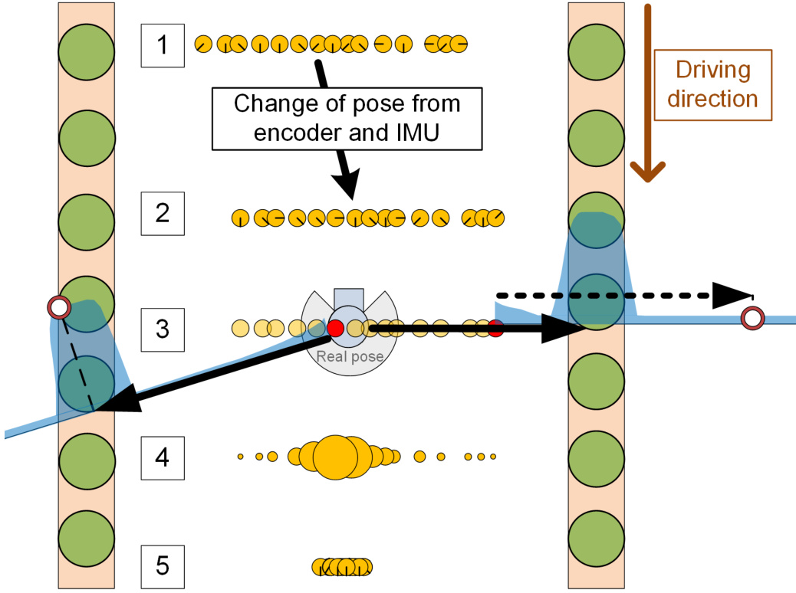  
Figure 2.3: A schematic explanation of the particle filter. (1) The particle filter started with the initialisation of random particles. (2) In the predict step, the previous beliefs for the angular and lateral deviation were updated using the IMU and wheel encoder data. (3 & 4) In the measurement update step, particle weights were assigned using probability density functions. Higher weights were assigned to particles that corresponded to the actual measured laser beam distance by the 2D LIDAR scanner (an example is the redcoloured particle in the centre). Lower weights were assigned to particles that did not correspond to the actual measured laser beam distance (an example is the red-coloured particle on the right). (5) In the resampling step, a new set of particles was obtained. From this new particle set, the average lateral and angular deviation was estimated. After completion, step 2 to 5 were sequentially executed in each processing cycle.  

In the measurement update step (step 3 & 4 in Figure 2.3), a laser beam model was combined with an environment model of the orchard to calculate probabilities for individual laser beams to hit a tree trunk or to pass further. The laser beam model and the environment model were inspired by the work of Hiremath et al. (2014), who used a similar approach for robot localisation in maize fields. We modified Hiremath’s laser beam model and environment model to allow robot localisation in an orchard environment. Specifically, we excluded the regions of overhanging leaves on both sides of the maize stem that were used by Hiremath et al. (2014). As a result, our environment model was based on three regions on each side of the robot (Figure 2.4). $R _ { 1 }$ was the region in which laser beams passed before they reached the area that contained tree trunks. $R _ { 2 }$ was the region that contained the tree trunks. $R _ { 3 }$ was the region beyond $R _ { 2 }$ .  

  
Figure 2.4: Orchard environment model consisting of regions $R _ { 1 }$ , $R _ { 2 }$ and $R _ { 3 }$ on each side of the robot. $b _ { 1 } , b _ { 2 }$ and $b _ { m a x }$ depict the distance a laser beam had to travel to reach these regions. Between the points A and B, a laser beam from scan angle $\phi$ was expected to hit a tree trunk in region $R _ { 2 }$ . $m _ { 1 }$ is the first point of a hit return and $m _ { 2 }$ the last. $t$ represents the tree trunk radius and $q$ the intra-row distance.  

The distance a laser beam had to travel to reach a region depended on the four state variables obtained from the particle $( \hat { d } _ { p } , \hat { \alpha } _ { p } , \hat { r } _ { p } , \hat { w } _ { p } )$ , and the angle at which a laser beam was emitted by the 2D LIDAR scanner $( \phi )$ (Figure 2.4). The distance covered by a laser beam was calculated. $b _ { 1 }$ represented the travelled distance of a laser beam to the end of region $R _ { 1 }$ (Equation 2.1). $b _ { 2 }$ represented the laser beam distance to the end of region $R _ { 2 }$ (Equation 2.2). $b _ { m a x }$ was the maximum distance a laser beam could travel. However, as laser beams could pass on and hit a tree trunk in an adjacent row, the maximum distance was limited to the inter-row distance (Equation 2.3).  

$$
b _ { 1 } ( \phi ) = \frac { ( \frac { \hat { r } _ { p } - \hat { w } _ { p } } { 2 } ) - \hat { d } _ { p } } { \sin ( \phi + \hat { \alpha } _ { p } ) }
$$  

$$
b _ { 2 } ( \phi ) = \frac { ( \frac { \hat { r } _ { p } + \hat { w } _ { p } } { 2 } ) - \hat { d } _ { p } } { \sin ( \phi + \hat { \alpha } _ { p } ) }
$$  

$$
b _ { m a x } ( \phi ) = \frac { \hat { r } _ { p } } { \sin ( \phi + \hat { \alpha } _ { p } ) }
$$  

Using the distance calculations (Equations 2.1 to 2.3), we evaluated the correspondence of every particle with the distances measured by the LIDAR scanner. Per particle, 135 laser beams were analysed using a $2 ^ { \circ }$ laser beam interval for the sake of computation speed. For each of the 135 laser beams, a probability density function was obtained that represented the hit and miss probabilities of the laser beam as a function of its travelled distance $x$ . We used four equations from Hiremath et al. (2014) to obtain the probability density functions (Equations 2.4 to 2.7). In region $R _ { 1 }$ (Figure 2.4), assuming that there are no obstacles, the only cause for a beam returning is measurement noise (Equation 2.4). We assumed a $1 \%$ probability $\lambda = 0 . 0 1 { \mathrm { . } }$ ) of measurement noise per travelled meter of the laser beam.  

$$
P _ { 1 } ( x ) = \lambda \cdot e ^ { - \lambda x } \qquad { \mathrm { w i t h ~ } } x \in [ 0 , b _ { 1 } ]
$$  

In region $R _ { 2 }$ , the probability for a laser beam return was influenced by three aspects (Equation 2.5). First, there is the probability that a laser beam passes through region $R _ { 1 }$ without hitting an object before reaching region $R _ { 2 }$ . This was modelled by $\psi _ { 1 } = ( 1 -$ $P _ { 1 } ( b _ { 1 } ) )$ . Second, there is a probability that a laser beam hits a tree trunk inside region $R _ { 2 }$ . This probability, expressed as $p _ { h i t }$ , depended on the intra-row distance $( q )$ and the tree trunk radius $\mathbf { \rho } ( t )$ (Equation 2.6). Third, there is a probability of measurement noise that was estimated by a $1 \%$ probability per travelled meter of the laser beam $\stackrel { \triangledown } { \boldsymbol { \lambda } } = 0 . 0 1 )$ ).  

$$
P _ { 2 } ( x ) = \psi _ { 1 } \cdot { \Biggl ( } { \frac { p _ { h i t } } { b _ { 2 } - b _ { 1 } } } + ( 1 - p _ { h i t } ) \cdot e ^ { - \lambda ( x - b _ { 1 } ) } { \Biggl ) } \qquad { \mathrm { w i t h ~ } } x \in [ b _ { 1 } , b _ { 2 } ]
$$  

$$
p _ { h i t } = \frac { 2 \cdot t } { q \cdot \sin ( \phi + \hat { \alpha } _ { p } ) }
$$  

In region $R _ { 3 }$ , the probability for a laser beam return was influenced by two aspects (Equation 2.7). First, there is the probability that a laser beam passes through regions $R _ { 1 }$ and $R _ { 2 }$ without hitting an object before reaching region $R _ { 3 }$ . This was expressed by $\psi _ { 1 }$ and $\psi _ { 2 } = ( 1 { - } P _ { 2 } ( b _ { 2 } ) )$ . Second, there is a probability of measurement noise that was estimated by a $1 \%$ probability per travelled meter of the laser beam $\dot { \lambda } = 0 . 0 1 \mathrm { ) }$ ).  

$$
P _ { 3 } ( x ) = \psi _ { 1 } \cdot \psi _ { 2 } \cdot \lambda \cdot e ^ { - \lambda ( x - b _ { 2 } ) } \qquad \mathrm { w i t h } \ x \in [ b _ { 2 } , b _ { m a x } ]
$$  

For each of the 135 laser beams, we calculated the probabilities $P _ { 1 } , P _ { 2 }$ and $P _ { 3 }$ , which were then combined into one probability density function. Then, the observed distance from the LIDAR scanner was inserted in the probability density function to obtain a likelihood for this laser beam to be returned (step 3 in Figure 2.3). By multiplying the likelihood of the 135 analysed beams, a total weight per particle was obtained (step 4 in Figure 2.3). Particles with a high weight had a high probability to represent the actual pose of the robot. The filtering of highly probable particles was done by low variance resampling proportionally to the particle’s weight, similar to the method described by Thrun et al. (2005). The resampling was executed in each measurement update step to obtain a new set of 125 particles. From the new particle set, the average lateral and angular deviation was calculated as an input for the robot navigation (step 5 in Figure 2.3). After resampling, random noise was added to the newly obtained set of particles to avoid too fast particle convergence and to increase particle diversity for robust robot localisation.  

# 2.2.3 Kalman filter with line detection  

The Kalman filter estimated the same two pose variables as the particle filter: the robot’s lateral deviation $( d )$ and the angular deviation $( \alpha )$ from the centreline between two tree rows. The Kalman filter modelled both state beliefs by unimodal Gaussian distributions. Similar to the particle filter, two events influenced the state beliefs sequentially and repeatedly: the predict step and the measurement update step. The predict step was the same as the particle filter to allow equal comparison. The measurement update step differed and was built with a line detection method, using $\mathbf { k }$ -means clustering and least squares line fitting. First, the $\mathbf { k }$ -means (MacQueen, 1967) clustered the observed laser points into two groups that represented the two tree rows; one tree row on the left and one on the right side of the robot. These two cluster groups were produced by iteratively minimising the total intra-cluster variance $\left( J \right)$ using an Euclidean distance function (Equation 2.8).  

$$
J = \sum _ { j = 1 } ^ { k } \sum _ { i = 1 } ^ { n } \| x _ { i } ^ { j } - c _ { j } \| ^ { 2 }
$$  

with $k$ the number of clusters, $n$ the number of laser scan points, $x _ { i } ^ { j }$ the position of a laser scan point $i$ in cluster $j$ and $c _ { j }$ the position of the centroid of cluster $j$ .  

After the clustering, an ordinary least squares procedure was used to fit lines through the laser scan points. Equation 2.9 was used to determine the level of fit of the proposed line. The line with the highest $R ^ { 2 }$ was selected and fitted through the cluster of scan points as an estimation of the tree row. This was done on each side of the robot, resulting in two lines. A centreline was calculated by averaging the start and end points of both lines. From this approximated centreline, the angular and lateral deviation were calculated using the principle of Figure 2.2. To model the state beliefs by Gaussians, a standard deviation was chosen as 1- $R ^ { 2 }$ .  

$$
R ^ { 2 } = 1 - \frac { \displaystyle \sum _ { i = 1 } ^ { n } ( x _ { i } - \hat { x _ { i } } ) ^ { 2 } } { \displaystyle \sum _ { i = 1 } ^ { n } ( x _ { i } - \bar { x } ) ^ { 2 } }
$$  

with $n$ the number of laser scan points, $x _ { i }$ the horizontal position of a laser scan point in the dataset, $\hat { x _ { i } }$ the horizontal position obtained from the fitted linear equation and $\bar { x }$ the average horizontal position in the cluster group.  

The Kalman filter estimated the posterior belief by combining the Gaussian from the prior belief with the Gaussian from the measurement update step using the Bayes rule product (Equation 2.10 and Equation 2.11). The lateral and angular deviation was obtained from the mean of the resulting Gaussian $( \mu ^ { \prime } )$ and used as an input for robot navigation.  

$$
\mu ^ { \prime } = \frac { \tau ^ { 2 } \mu + \sigma ^ { 2 } \nu } { \tau ^ { 2 } + \sigma ^ { 2 } }
$$  

$$
\sigma ^ { 2 ^ { \prime } } = \frac { 1 } { \frac { 1 } { \tau ^ { 2 } } + \frac { 1 } { \sigma ^ { 2 } } }
$$  

with $\mu$ and $\sigma ^ { 2 }$ the mean and variance of the Gaussian of the prior belief after the predict step, $\nu$ and $\scriptstyle { \tau ^ { 2 } }$ the mean and variance of the Gaussian after the measurement update step and $\mu ^ { \prime }$ and $\sigma ^ { 2 ^ { \prime } }$ the mean and variance of the Gaussian of the posterior state belief.  

# 2.2.4 Robot control  

Both localisation algorithms were processed at fixed cycles of $0 . 5 \mathrm { ~ s ~ }$ to allow a synchronised robot control with the RTK-GNSS ground truth measurements. The last available laser scan data was used by both algorithms to localise the robot. From the obtained lateral and angular deviation, we calculated the desired steering angle of the robot $\left( \theta \right)$ using Equation 2.12, which was derived from Hague and Tillett (1996). In Equation 2.12, the robot’s velocity was taken into account to critically damp the steering control at all velocities. We introduced an additional scaling factor $f _ { \alpha }$ that was set to 0.5 to force the robot to respond stronger to an observed lateral deviation than an angular deviation. In addition, the scaling factor $f _ { d }$ was set to 0.25 to generate a steering angle that was considered safe for this robot when the lateral or angular deviation approached their maximum values. The desired steering angle was inserted into a proportional integral derivative (PID) control function to calculate the commanded angle that was sent to the robot. The PID-control gains were obtained by an iterative trial-and-error search with different combinations of control gains. We found that the combination of $K _ { p } = 0 . 7 5 , K _ { i }$ $= 0 . 0 5$ and $K _ { d } = 0 . 4 0$ yielded the desired steering response for this robot. The steering controls and gains were the same during the field experiments.  

$$
\theta = - f _ { d } \cdot \hat { d } - f _ { \alpha } \cdot \sqrt { 4 \cdot f _ { d } \cdot \nu } \cdot \hat { \alpha }
$$  

with $f _ { d }$ the scaling factor of the lateral deviation, $f _ { \alpha }$ the scaling factor of the angular deviation and $\nu$ the velocity of the robot.  

# 2.2.5 Field experiments  

Two experiments were set up in a commercial apple orchard in February 2017 to evaluate the navigation performance of the robot when using either the particle filter or the Kalman filter. The orchard, which was located in Randwijk (The Netherlands), had a flat surface and consisted of straight tree rows with an intra-row distance of $1 . 0 \mathrm { m }$ and an inter-row distance of $3 . 0 \mathrm { m }$ .  

In the first experiment, the navigation accuracy of both algorithms was assessed when driving the robot autonomously in the orchard. The accuracy was determined by the lateral and angular deviation of the robot when navigating at two velocities, $0 . 2 5 \mathrm { m } / \mathrm { s }$ and $0 . 5 0 \mathrm { m } / \mathrm { s }$ . We used two orchard paths of $1 0 0 \mathrm { m }$ that were driven by the robot in the same direction to allow equal comparison. The first $1 0 \mathrm { m }$ travelled by the robot was not taken into account to make sure that the starting pose of the robot did not influence the outcome of the accuracy experiment. At the end of the orchard path, the robot was stopped by the human operator.  

In the second experiment, the navigation robustness of both algorithms was assessed. The robustness was determined by the lateral and angular deviation of the robot when it drove autonomously between six tree row patterns with missing trees. Trees in an orchard can be absent for multiple reasons, for instance when there is a maintenance path perpendicular to the tree rows or when diseased trees are removed. As trees could not be physically removed in the commercial orchard, the following procedure was used to virtually remove trees from the laser scan data. Highly reflective tape was attached to the tree trunks (Figure 2.5a), which caused the intensity of the laser beams returned from these trees to be much higher than the beams returned from trees that were not covered by the tape. Typical intensities of laser beam returns from the high reflective tape were in the range 800 to 1000, while the beam intensities from trees and branches were in the range 200 to 600. Our software removed the laser scan points with an intensity higher than 700 from the measurement data, making these tree trunks invisible for the robot. Six different patterns of missing trees were tested (Figure 2.5b), when driving the robot $1 5 \mathrm { m }$ with a velocity of $0 . 2 5 \mathrm { m } / \mathrm { s } .$ . Each pattern was repeated two times.  

In both experiments, we used the RTK-GNSS receiver to track the robot’s trajectory, which was stored on the robot’s computer for offline processing. The driven trajectories were processed in such a way that only the paths were assessed where a RTK-fix signal was guaranteed. As such, all ground truth locations measured by the RTK-GNSS receiver were assumed to have an accuracy of $0 . 0 2 \mathrm { ~ m ~ }$ or less from the real-world location. The lateral deviation of the robot $( d )$ was calculated by taking the shortest perpendicular distance from the robot’s position to the centreline (Equation 2.13). The angular deviation $( \alpha )$ was obtained by subtracting the robot’s heading from the fixed heading of the ground truth centreline. The ground truth centrelines were constructed by connecting the start and end points of the paths, which were obtained by manually placing the RTK-GNSS receiver midway between the two tree rows of the driven paths.  

  
Figure 2.5: (a) A tree that was covered by high reflective tape, so that the tree trunk could be removed from the laser scan data. (b) The six tree row patterns that were used to test the algorithms’ robustness to cope with missing trees in the row.  

$$
d ( t ) = \frac { ( y _ { 2 } - y _ { 1 } ) x _ { t } - ( x _ { 2 } - x _ { 1 } ) y _ { t } + x _ { 2 } y _ { 1 } - y _ { 2 } x _ { 1 } } { \sqrt { ( y _ { 2 } - y _ { 1 } ) ^ { 2 } + ( x _ { 2 } - x _ { 1 } ) ^ { 2 } } }
$$  

with $( x _ { t } , y _ { t } )$ the coordinates of the robot’s position at time $t$ , $( x _ { 1 } , y _ { 1 } )$ the coordinates of the start point of the ground truth centreline and $( x _ { 2 } , y _ { 2 } )$ the coordinates of the end point of the ground truth centreline.  

We used the root mean square error (RMSE) as a metric to evaluate the navigation performance in both experiments. The root mean square error was a measure of the average magnitude of the angular and lateral deviation and assigned high values to large deviations without considering their direction (Equation 2.14).  

$$
R M S E = \sqrt { \frac { 1 } { n } \sum _ { i = 1 } ^ { n } ( p _ { t } - a _ { t } ) ^ { 2 } }
$$  

with $p _ { t }$ the predicted value at time $t$ , $\boldsymbol { a } _ { t }$ the actual value at time $t$ and $n$ the number of observations.  

# 2.3 Results  

In both experiments, we observed a non-bumpy robot navigation without collisions or malfunctions. In total, the robot navigated $1 2 0 0 \mathrm { m }$ autonomously in eight different trials. In the first experiment, the navigation accuracy was assessed when the robot navigated with both algorithms at $0 . 2 5 \mathrm { m } / \mathrm { s }$ and $0 . 5 0 \mathrm { m } / \mathrm { s } .$ A root mean square error (RMSE) of 0.05 m was observed for the lateral deviation when the robot navigated with the particle filter at $0 . 2 5 ~ \mathrm { m } / \mathrm { s }$ (Table 2.2). A RMSE of $0 . 0 9 \mathrm { ~ m ~ }$ was observed with the Kalman filter at the same velocity. At $0 . 5 0 \mathrm { m } / \mathrm { s }$ , the RMSE was $0 . 0 6 \mathrm { m }$ with the particle filter and $0 . 0 9 \mathrm { m }$ with the Kalman filter (Table 2.2). The first two box-and-whisker plots on the left of Figure 2.6 indicate that $5 0 \%$ of the particle filter’s lateral deviation was within $0 . 0 5 \mathrm { m }$ from the centreline at both velocities.  

When the robot navigated with the Kalman filter, less than $2 5 \%$ of the lateral deviation was within $0 . 0 5 \mathrm { ~ m ~ }$ from the centreline (Figure 2.7). Furthermore, more than $7 5 \%$ of the lateral deviation was biased left to the optimal line (Figure 2.7). When we analysed this suboptimal localisation performance, we observed that the least squares line fitting was susceptible to remote clusters of laser scan points that were returned from tree branches. Because the least squares line fitting only generated one best line fit for a cluster group of laser scan points, these remote scan points caused the lines to shift from the real tree trunks. This effect was particularly evident with clusters close to the robot, causing the creation of non-parallel lines (Figure 2.8a). As a consequence, the centreline was sometimes wrongly estimated causing an unjustified robot steering and a lateral deviation that was biased to one side of the centreline, causing the RMSE on the lateral deviation to increase. Because the robot travelled mostly on one side of the centreline with the Kalman filter, we also observed a $0 . 6 2 ^ { \circ }$ and $0 . 2 9 ^ { \circ }$ lower RMSE on the angular deviation at 0.25 and $0 . 5 0 \mathrm { m } / \mathrm { s }$ velocity (Table 2.2).  

Table 2.2: The root mean square error (RMSE) on the lateral and angular deviation with respect to the centreline when navigating the robot with the particle filter (PF) and Kalman filter (KF).   

<html><body><table><tr><td colspan="3"></td><td colspan="2">RMSE on the lateral deviation [m]</td><td colspan="2">RMSE on the angular deviation []</td></tr><tr><td>Trial</td><td>Experiment</td><td>Navigation test</td><td>PF</td><td>KF</td><td>PF</td><td>KF</td></tr><tr><td>1</td><td>1 (Accuracy)</td><td>V= 0.25 m/s</td><td>0.05</td><td>0.09</td><td>3.24</td><td>2.62</td></tr><tr><td>2</td><td>1 (Accuracy)</td><td>V= 0.50 m/s</td><td>0.06</td><td>0.09</td><td>2.16</td><td>1.87</td></tr><tr><td>3</td><td>2 (Robustness)</td><td>Tree row pattern 1</td><td>0.04</td><td>0.04</td><td>2.67</td><td>2.47</td></tr><tr><td>4</td><td>2 (Robustness)</td><td>Tree row pattern 2</td><td>0.03</td><td>0.09</td><td>2.59</td><td>2.40</td></tr><tr><td>5</td><td>2 (Robustness)</td><td>Tree row pattern 3</td><td>0.04</td><td>0.08</td><td>2.47</td><td>2.43</td></tr><tr><td>6</td><td>2 (Robustness)</td><td>Tree row pattern 4</td><td>0.03</td><td>0.04</td><td>2.55</td><td>2.12</td></tr><tr><td>7</td><td>2 (Robustness)</td><td>Tree row pattern 5</td><td>0.04</td><td>0.06</td><td>2.78</td><td>3.05</td></tr><tr><td>8</td><td>2 (Robustness)</td><td>Tree row pattern 6</td><td>0.04</td><td>0.07</td><td>2.52</td><td>2.85</td></tr></table></body></html>  

In the second experiment, the particle filter had a lower RMSE on the lateral deviation than the Kalman filter in five of the six tree row patterns with missing trees (Table 2.2). The box-and-whisker plots of Figure 2.6 highlight that $5 0 \%$ the particle filter’s lateral deviation was within $0 . 0 5 \mathrm { ~ m ~ }$ from the centreline for all tree row patterns. The Kalman filter achieved the same in only three patterns (pattern 1, 4, and 5, see Figure 2.7). In patterns 2, 3, and 6, the robot navigated primarily left of the centreline when using the Kalman filter. This bias resulted in a higher RMSE on the lateral deviation (Table 2.2). When investigating the Kalman filter’s suboptimal localisation, we found some erroneous line shifts caused by laser scan data of tree branches that were distant from the tree trunks (Figure 2.8b). These line shifts were particularly severe in patterns 3 and 6 that contained consecutive missing trees on both sides of the robot. The RMSE’s on the angular deviation were comparable between the particle filter and the Kalman filter (Table 2.2 and Figures 2.9 and 2.10).  

  
Figure 2.6: Box-and-whisker plots of the lateral deviation when the robot was navigated with the particle filter. The horizontal dashed line represents the tree row centreline. A negative deviation was observed when the robot was left of the centreline and a positive deviation when the robot was right of the centreline. The red-coloured line within the box indicates the median of the distribution. $5 0 \%$ of the data is present within the ends of the blue-coloured box, which represent the $2 5 ^ { \mathrm { t h } }$ percentile (first quartile) and the ${ 7 5 ^ { \mathrm { t h } } }$ percentile (third quartile). The whiskers indicate the variability outside the first and third quartiles, whereas the crosses indicate the outliers. The value $n$ corresponds to the number of uniquely stored RTK-GNSS locations.  

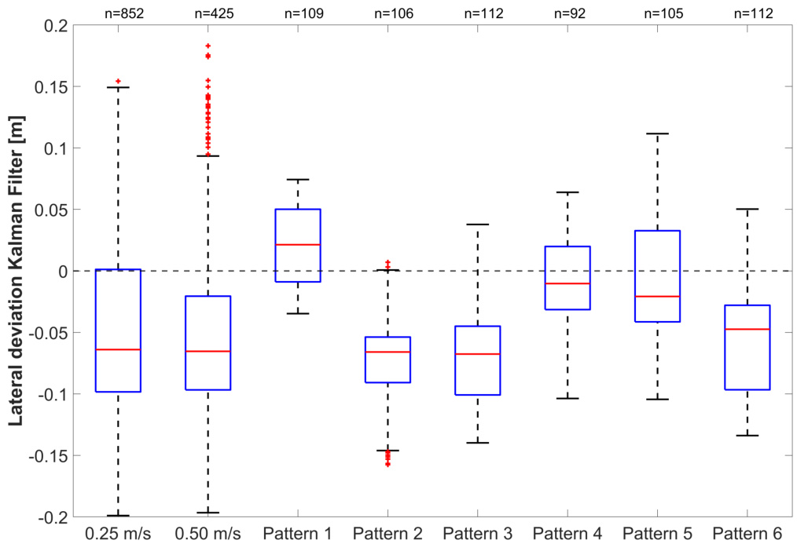  
Figure 2.7: Box-and-whisker plots of the lateral deviation when the robot was navigated with the Kalman filter. The horizontal dashed line represents the tree row centreline. The value $n$ corresponds to the number of uniquely stored RTK-GNSS locations.  

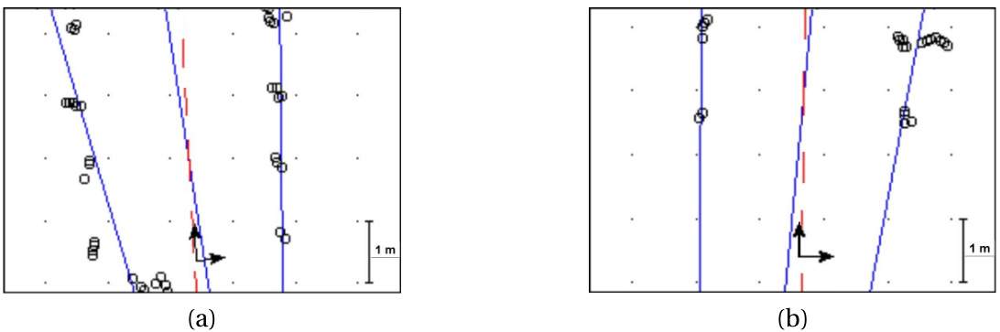  
Figure 2.8: Two examples of an incorrect line shift by the least squares line fitting algorithm in the Kalman filter. The pose estimate of the Kalman filter is represented by the centred blue-coloured line. (a) In the first experiment, the left line got shifted due to laser scan returns (circles) from a tree branch located in the bottom of the image. (b) In the second experiment, the right line got shifted due to laser scan returns from a tree branch located in the top right of the image. In both images, the black-coloured arrows represent the ground truth pose of the robot. The red-coloured dashed lines represent the pose estimates of the particle filter.  

  
Figure 2.9: Box-and-whisker plots of the angular deviation when the robot was navigated with the particle filter. The horizontal dashed line represents the tree row centreline. The value $n$ corresponds to the number of uniquely stored RTK-GNSS locations.  

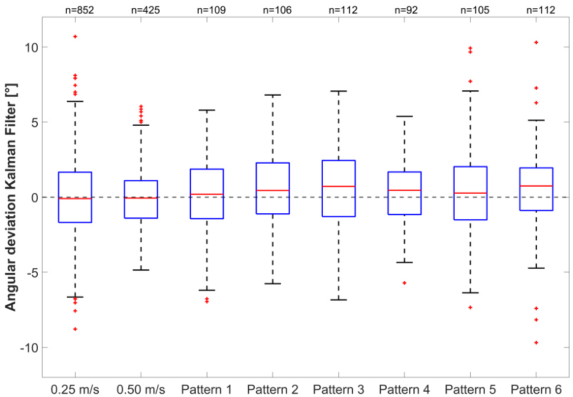  
Figure 2.10: Box-and-whisker plots of the angular deviation when the robot was navigated with the Kalman filter. The horizontal dashed line represents the tree row centreline. The value $n$ corresponds to the number of uniquely stored RTK-GNSS locations.  

# 2.4 Discussion  

We have evaluated the two localisation algorithms with the same robot platform using identical steer control parameters and fixed data processing cycles of 0.5 seconds. The last allowed the synchronisation with the RTK-GNSS ground truth measurements, however it also caused a latency when controlling the robot. This control latency was especially high with the faster line-based Kalman filter. We acknowledge that a real-time control, in which the robot is directly controlled after finishing the algorithm’s calculation, could have resulted different navigation performances or conclusions in this research. Yet, we expect these effects to be marginal, because the robot navigated at low velocities $( \leq 0 . 5 \ : \mathrm { m } / \mathrm { s } )$ in both experiments.  

By comparing the two algorithms in similar conditions, we were also able to compare two different world models of the orchard environment. Both world models were based on the assumption of straight tree rows, however the particle filter’s world model used more a priori information about the orchard environment. This higher degree of a priori information in combination with the assessment of individual laser beams, allowed the particle filter to navigate the robot with a lower RMSE on the lateral deviation in seven of the eight trials. To allow robot navigation in orchards with straight tree rows but different spacing’s or configurations, it is required to enter this a priori information in advance in the particle filter. The simplicity of the Kalman filter’s world model, which is based on one straight tree row on each side of the robot, does not require user input when the robot is used in an orchard with different intra- or inter-row distances.  

The navigation results were obtained in winter time, which means a stagnated growth of grass and weeds and the absence of leaves, blossoms, and fruits on the trees. In other seasons, we expect more laser beam returns from tall grass, weeds, leaves, and tree branches that bend by the weight of fruits and leaves. These environmental changes might require an alternation of both world models to guarantee accurate robot localisation and navigation in orchards. The particle filter’s world model could be extended with two tree branch regions, one in front of the tree trunk region and one beyond, comparable to the method of Hiremath et al. (2014). The applicability of this method was proven by Hiremath et al. (2014), who showed a RMSE on the lateral deviation of $0 . 0 4 \mathrm { ~ m ~ }$ when navigating a robot between maize plants. The Kalman filter’s world model could be extended with a more sophisticated line detection algorithm that assigns a higher probability when the two lines are parallel to each other.  

We also believe that the RANSAC algorithm might be a better alternative for line detection, as this algorithm can exclude outliers from its linear fit. Marden and Whitty (2014) observed a RMSE on the lateral deviation of $0 . 0 4 \mathrm { ~ m ~ }$ when combining RANSACbased SLAM with an Extended Kalman filter (EKF). Another promising line detection algorithm that is based on refinements of the PEARL algorithm (RUBY), outperformed the traditional RANSAC algorithm when tested on simulated LIDAR data with outliers (Malavazi et al., 2018). In addition, the influence of outliers in the location estimate can be reduced by increasing the detection range of the LIDAR scanner or by applying data fusion of different sensors. Shalal et al. (2015) investigated an EKF fusion of LIDAR data and camera images that yielded a RMSE of $0 . 0 9 \mathrm { m }$ on the lateral deviation when navigating a robot midway between two tree rows. A similar RMSE value was observed, when the robot of Shalal et al. (2015) navigated close to one tree row for close-range crop monitoring. Although these RMSE’s are slightly higher than the ones obtained in our research, we believe that the fusion of LIDAR data with camera images is promising to exclude tree branches or non-tree objects from the location estimate.  

# 2.5 Conclusions  

The particle filter with laser beam model had better navigation accuracy than the linebased Kalman filter. Furthermore, the particle filter was more robust to deal with missing trees. When the orchard robot navigated with the Kalman filter, the lateral deviations were biased to the left of the centreline in five of the eight trials. The angular deviations of the particle filter and the Kalman filter were comparable. From the results, we conclude that a particle filter with laser beam model is preferred over a line-based Kalman filter for the in-row navigation of an autonomous orchard robot.  

# CRediT authorship contribution statement  

Pieter M. Blok: conceptualisation, data curation, resources, writing - original draft. Koen van Boheemen: methodology, software, investigation, writing - review & editing. Frits K. van Evert: supervision, conceptualisation, writing - review & editing. Joris IJsselmuiden: supervision, conceptualisation, writing - review & editing. Gook-Hwan Kim: project administration, supervision, funding acquisition.  

# Acknowledgements  

This work was supported by the Cooperative Research Program for Agricultural Science & Technology Development (grant number PJ012289) of the Rural Development Administration (Republic of Korea).  

# Supplementary material  

Click on the image below to watch a 4 minute video of the Husky A200 robot navigating in the commercial orchard in The Netherlands (for the PDF version only).  

  

# Broccoli harvesting robot Sexbierum (NL) - 2014  

  

# 3  

# The effect of data augmentation and network simplification on the image-based detection of broccoli heads with Mask R-CNN  

Pieter M. Blok1,2, Frits K. van Evert1, Antonius P.M. Tielen3, Eldert J. van Henten2, Gert Kootstra2  

1Agrosystems Research, Wageningen University & Research, Wageningen, The Netherlands   
2Farm Technology Group, Wageningen University & Research, Wageningen, The Netherlands   
3Greenhouse Horticulture, Wageningen University & Research, Wageningen, The Netherlands  

# Abstract  

N current practice, broccoli heads are selectively harvested by hand. The goal of our I work is to develop a robot that can selectively harvest broccoli heads, thereby reducing the labour costs. An essential element of such a robot is an image-processing algorithm that can detect broccoli heads. In this research, we developed a deep learning algorithm for this purpose, using the Mask Region-based Convolutional Neural Network (Mask RCNN). To be applied on a robot, the algorithm must detect broccoli heads from any cultivar, meaning that it can generalise on the broccoli images. We hypothesised that our algorithm can be generalised through network simplification and data augmentation. We found that network simplification decreased the generalisation performance, whereas data augmentation increased the generalisation performance. In data augmentation, the geometric transformations (rotation, cropping, scaling) led to a better image generalisation than the photometric transformations (light, colour, texture). Furthermore, the algorithm was generalised on a broccoli cultivar when $5 \%$ of the training images were images of that cultivar. Our algorithm detected 229 of the 232 harvestable broccoli heads from three cultivars. We also tested our algorithm on an online broccoli dataset, which our algorithm was not previously trained on. On this dataset, our algorithm detected 175 of the 176 harvestable broccoli heads, proving that the algorithm was successfully generalised. Finally, we performed a cost-benefit analysis for a robot equipped with our algorithm. We concluded that the robot was more profitable than human harvest and that our algorithm provided sufficient basis for robot commercialisation.  

Keywords: agriculture, computer vision, learning, perception, sensors  

# 3.1 Introduction  

In agriculture, numerous tasks depend on human labour. This labour is getting more expensive and more scarce, which causes problems for tasks that are done by hand, such as the selective harvest of crops. Selective hand-harvest involves the visual assessment of the crop, followed by the harvest of only those specimens that have reached the desired size, quality or maturity. A crop that is selectively harvested by hand, is broccoli (Brassica oleracea var. italica). In the Netherlands, broccoli is usually hand-harvested three times in one growing season (KWIN, 2018). Cost studies show that the hand-harvest of broccoli can take up to 107 man-hours per hectare and $23 \%$ of the total production costs (KWIN, 2018). Motivated by the scarcity and the costs of human labour, broccoli growers search for alternative ways of selective harvesting. A promising alternative is an agricultural robot that can selectively harvest broccoli. A critical factor that hampers the development of a broccoli harvesting robot, is the lack of an automatic detection system that can replace human visual perception.  

Several studies on the automatic detection of broccoli can be found in literature. Ramirez (2006) was the first who detected broccoli heads, using Red-Green-Blue (RGB) colour images and texture-based analysis. Unfortunately, the dataset of Ramirez (2006) was limited to 13 RGB images, which is too small to draw a conclusion on the applicability of the algorithm in the open field conditions. Blok et al. (2016) used a Laws’ texture filter on RGB images to detect broccoli heads from two different cultivars. They included an additional colour analysis for the maturity evaluation. Despite a promising precision of $9 9 . 5 \%$ , the researchers observed a recall of $91 . 2 \%$ , which corresponded to 20 false negatives on 228 broccoli heads. The false negatives were caused by the fixed thresholds on the texture and the colour features that could not generalise sufficiently on broccoli heads whose texture or colour differed from the chosen thresholds. Generalisation is a common challenge in image analysis, and includes the ability of an algorithm to perform on new images (Goodfellow et al., 2016).  

Machine learning can provide better image generalisation than threshold-based algorithms (Kamilaris & Prenafeta-Boldú, 2018). Kusumam et al. (2017) detected broccoli heads in RGB-Depth (RGB-D) images with three-dimensional (3D) vision using a viewpoint feature histogram (VFH), a support vector machine (SVM) classifier and a temporal filter. The average precision (AP) was $9 5 . 2 \%$ on 600 images of the broccoli cultivar Ironman and the AP was $8 4 . 5 \%$ on 1,169 images of the broccoli cultivar Titanium, indicating that their algorithm did not generalise sufficiently on images of different broccoli cultivars. A limitation of Kusumam et al. (2017) is that their machine-learning algorithm was based on a predefined set of image features whose generalisation capability was found to be limited on images of different broccoli cultivars.  

Image generalisation can be further improved with deep learning. A deep learning network that is commonly used for image analysis, is a convolutional neural network (CNN). CNNs internally optimise the feature extraction during training (LeCun et al., 2015). Kamilaris and Prenafeta-Boldú (2018) showed that CNNs outperformed predefined feature-engineered machine learning in all 22 agricultural case studies. Bender et al. (2020) researched broccoli and cauliflower detection with Faster Region-based CNN (Faster R-CNN) (Ren et al., 2017) and reported a promising $9 5 \%$ mean average precision (mAP). Unfortunately, this research focused on individual plant detection and did not investigate the broccoli head detection, which is essential for the selective harvest. Jiang et al. (2018) showed that the detection performance on cabbage and cauliflower was almost doubled when using a Mask Region-based CNN (Mask R-CNN) instead of a threshold-based algorithm. Mask R-CNN (He et al., 2017) is an upgrade of Faster RCNN and performs instance segmentation (a combination of object detection and pixel segmentation). Mask R-CNN allows the instance-aware segmentation of distinct objects even if they are overlapping or occluded by other objects (Romera-Paredes & Torr, 2016). Instance-aware segmentation is a desirable feature for the precise size measurement of broccoli, because broccoli heads can be partially occluded by leaves. Therefore, we focused our research on Mask R-CNN.  

To generalise Mask R-CNN on the broccoli images, the network must not overfit during training. Network overfitting occurs when an overly complex model is fitted on the training dataset and the model fails to generalise on new data (Rosebrock, 2018). Network overfitting can be resolved with regularisation. Regularisation involves any modification to a learning algorithm that reduces the generalisation error, possibly at the expense of increased training error (Goodfellow et al., 2016). There are two types of regularisation: explicit and implicit. Explicit regularisation involves alterations to the network architecture that constrain the capacity of the neural network. Common explicit regularisation methods are dropout (random disconnection of neurons), weight decay (penalising large weights) and network simplification (removal of network layers). Implicit regularisation is applied during the training process without constraining the capacity of the neural network. Two examples of implicit regularisation are early stopping and data augmentation. Early stopping is the termination of the training process whenever the generalisation error increases. Data augmentation involves a wide range of image synthesis techniques that generate new training samples from the original ones by applying image transformations. With data augmentation, the network is trained on constantly changing versions of the input images, allowing the network to learn more robust features.  

Most regularisation research solely focused on data augmentation (Perez & Wang, 2017; Shijie et al., 2017; Zhu et al., 2018). Hernández-García and König (2020) studied the combined effect of dropout, weight decay and data augmentation and found that data augmentation led to the highest increase in accuracy. However, their research investigated All-CNN (Springenberg et al., 2015) and wide residual network (WRN) (Zagoruyko & Komodakis, 2017) that have architectures that are less complex than Mask R-CNN. The higher complexity of the Mask R-CNN network might imply the need for other regularisation strategies, for example network simplification. In our research, we studied the effects of network simplification and data augmentation on the image generalisation of Mask R-CNN.  

We hypothesised that through network simplification and data augmentation, Mask R-CNN can be generalised on images of multiple broccoli cultivars. The first objective of our study was to test this hypothesis using images of three broccoli cultivars taken with a prototype broccoli harvesting robot. The first contribution of our research is a quantitative analysis of the effect of network simplification and data augmentation on the image generalisation of Mask R-CNN.  

Eventually, a robot leads to new benefits and new costs. The benefits derive primarily from the savings on labour costs. The costs derive primarily from the robot investment. If the benefits are higher than the costs, then there is a basis for robot commercialisation. The second objective of our study was to perform a cost-benefit analysis for a selective broccoli harvesting robot equipped with our Mask R-CNN algorithm. The second contribution of our research is a cost-benefit analysis for a selective broccoli harvesting robot that has to work in the field.  

# 3.2 Materials and methods  

# 3.2.1 Image dataset  

This section highlights the image acquisition systems that were used (paragraph 3.2.1.1), the broccoli images that were acquired in the field (paragraph 3.2.1.2), how these images were annotated (paragraph 3.2.1.3), the feature variability between images of different broccoli cultivars (paragraph 3.2.1.4) and how the annotated images were aggregated for Mask R-CNN training and testing (paragraph 3.2.1.5).  

# 3.2.1.1 Image acquisition systems  

We used a prototype robot that consisted of an image acquisition system that acquired top view images of one row of the broccoli crop. Two different image acquisition systems were used, because the robot was first tested in The Netherlands (Figure 3.1a) and then in the United States of America (USA) (Figure 3.2a). Although both systems were constructed as an enclosed box for uniform illumination, they had a different RGB colour camera and light emitting diode (LED) illumination (Table 3.1). In both systems, the white balance of the colour cameras was set and fixed with a colour calibration plate (X-Rite ColourChecker Classic). A stereo-vision camera (IDS Ensenso N35) was installed to acquire depth images to estimate the size of the broccoli heads (Figure 3.1b and Figure 3.2b). In both systems, the colour and the stereo-vision camera were hardware triggered by an electronic encoder wheel that was attached to the front wheel of the robot. This encoder generated a hardware trigger to the cameras for each $0 . 1 5 \mathrm { m }$ ( $\pm 0 . 0 1 \mathrm { m }$ error) of relative displacement of the robot.  

# 3.2.1.2 Broccoli images  

With the Dutch image acquisition system (Figure 3.1), nearly 14,000 broccoli images of the Ironman cultivar and 13,000 broccoli images of the Steel cultivar were captured on nine different broccoli fields in the province of Friesland in four consecutive years (2014- 2017). On all fields, the broccoli plants were grown in single rows that were $0 . 7 5 \mathrm { m }$ apart. The intra-row spacing was $0 . 3 3 \mathrm { m }$ . With the American image acquisition system (Figure 3.2), 14,000 broccoli images of the Emerald-Crown cultivar were acquired in 2018 on one broccoli field in Washington State. On this field, the broccoli plants were grown in single rows that were $0 . 6 1 \mathrm { m }$ apart. The intra-row spacing was $0 . 2 3 \mathrm { m }$ .  

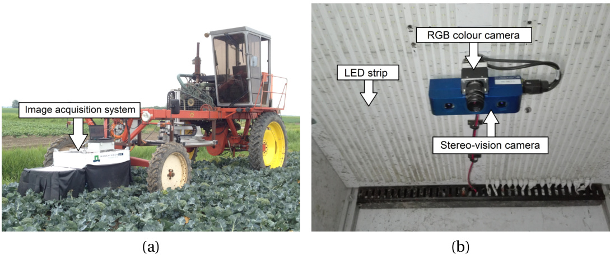  
Figure 3.1: (a) Overview of the image acquisition system that was attached to the prototype robot to acquire broccoli images in the Netherlands (b) The Dutch image acquisition system consisted of one RGB colour camera, one stereo-vision camera and 40 LED strips for artificial illumination.  

  
Figure 3.2: (a) Overview of the image acquisition system that was attached to the prototype robot to acquire broccoli images in the United States of America (USA) (b) The American image acquisition system consisted of one RGB colour camera, one stereovision camera and 21 LED strips for artificial illumination.  

Table 3.1: Overview of the cameras and LEDs that were used to acquire images in the Netherlands and the United States of America.   

<html><body><table><tr><td colspan="2">The Netherlands</td><td>UnitedStatesofAmerica</td></tr><tr><td colspan="2">Camera specifications</td><td></td></tr><tr><td>Camera</td><td>AVTProsilica GC2450</td><td>IDS UI-5280FA-C-HQ</td></tr><tr><td>Image resolution (pixels)</td><td>2448x2050</td><td>2456x2054</td></tr><tr><td>Lens</td><td>KowaLM12JCM</td><td>FujifilmHF8XA-5M</td></tr><tr><td>Focal length (mm)</td><td>12</td><td>8</td></tr><tr><td>Field of view (m) at 0.5 m</td><td>0.53 x 0.44</td><td>0.62 x0.52</td></tr><tr><td>Image scene overlap (%)</td><td>66</td><td>71</td></tr><tr><td colspan="3">LED specifications</td></tr><tr><td>LED</td><td>Paulmann 70209 YourLED</td><td>OSRAMVFP2400S-G3-865-03</td></tr><tr><td>Number of LED strips</td><td>40</td><td>21</td></tr><tr><td>Colour temperature (K)</td><td>6000</td><td>6500</td></tr><tr><td>Luminous flux (lm)</td><td>13,500</td><td>144,900</td></tr></table></body></html>  

# 3.2.1.3 Ground-truth annotation  

From the image dataset, 3,000 images with broccoli heads were randomly selected, 1,000 images for each cultivar. Two instructed research assistants annotated all 4,706 broccoli heads that were found in the 3,000 images. All broccoli heads were annotated, regardless of their size, to make the annotations suitable for other computer vision tasks. Overripe broccoli heads, which were visually distinguishable by yellow-coloured flower buds, were not annotated because these broccoli heads do not have to be harvested. The annotation process involved three steps (Figure 3.3). First, a bounding box was drawn for each broccoli head using LabelImg (Lin, 2019). Second, the bounding box was zoomed to full screen to allow the precise pixel annotation of the contour of the broccoli head. Third, the pixel annotations were placed back into the original bigger image to generate the binary masks for each image. When finished, another research assistant independently validated and if necessary corrected the bounding boxes and the masks.  

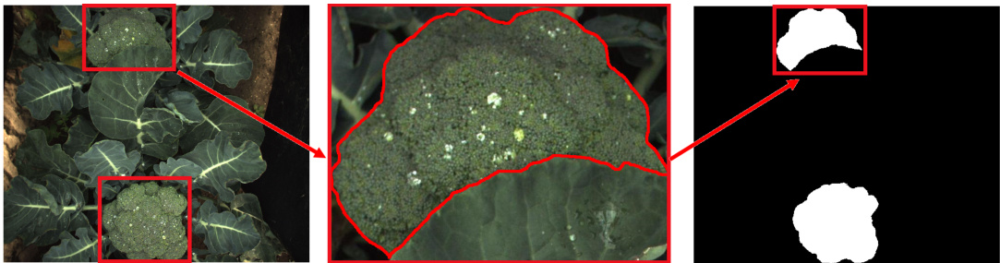  
Figure 3.3: Ground-truth pixel annotation of the RGB broccoli images. First, a bounding box (red rectangle) was drawn to encapsulate the region of each broccoli head. Then, the bounding box was zoomed to full screen to allow precise contour delineation (red line) of the broccoli head. After contour-closing, the inner area was automatically filled with pixels and placed back into the original image to generate the binary masks. The white pixels depict the broccoli head and the black pixels the background.  

# 3.2.1.4 Image feature similarity  

To calculate the image feature similarity, we first resized the 3,000 images with zeropadding to a resolution of $1 0 2 4 \mathrm { x } 1 0 2 4$ pixels. This resolution equals to the processing resolution of Mask R-CNN (Abdulla, 2017). Then, we quantified the image feature similarity between the broccoli heads using three colour and four texture features. The colour features were hue, saturation and lightness (HSL), and the texture features were energy, correlation, homogeneity and contrast that were all extracted from the Grey-Level Cooccurrence Matrix (GLCM) (Haralick et al., 1973). The three colour features and four texture features corresponded to the features that were used in related research (Blok et al., 2016; Ramirez, 2006). We calculated the average feature value for each annotated broccoli head. A normalised histogram with 101 bins was generated for every feature. As such, seven feature histograms were generated per broccoli cultivar. Then, we quantified the level of similarity between the feature histograms of the three cultivars using the chi-squared $( \chi ^ { 2 } )$ distance (Equation 3.1). A low chi-squared distance indicates a high feature-similarity between the broccoli heads of two cultivars, and a high chi-squared distance indicates a low feature-similarity.  

$$
\chi ^ { 2 } = \frac { 1 } { 2 } \cdot \sum _ { i = 1 } ^ { n } \frac { ( p ( i ) - q ( i ) ) ^ { 2 } } { p ( i ) + q ( i ) }
$$  

where $p$ is the feature histogram of one cultivar, $q$ the feature histogram of another cultivar and $n$ is the number of histogram bins  

Table 3.2 shows that the broccoli heads of the Ironman cultivar and the Steel cultivar were similar in texture, but different in colour (hue) (see Figure 3.4 for some examples). The broccoli heads of Ironman and Emerald-Crown were similar in colour (hue), but different in texture. Broccoli heads of Steel and Emerald-Crown were the least similar and differed in both texture and colour (hue).  

Table 3.2: The chi-squared distance of the three colour features and the four texture features between the broccoli heads of two cultivars. The bold values represent chi-squared distances lower than 0.1, which correspond to a high feature similarity. GLCM, H, S, L, E, Cor., Hom., and Con. are abbreviations of respectively grey-level co-occurrence matrix, hue, saturation, lightness, energy, correlation, homogeneity and contrast.  

<html><body><table><tr><td></td><td colspan="3">Chi-squared distance of the colour features</td><td colspan="4">Chi-squared distance of the GLCM-texture features</td></tr><tr><td>Cultivar comparison</td><td>H</td><td>S</td><td>L</td><td>E</td><td>Cor.</td><td>Hom.</td><td>Con.</td></tr><tr><td>Ironman- Steel</td><td>0.91</td><td>0.16</td><td>0.50</td><td>0.01</td><td>0.04</td><td>0.06</td><td>0.03</td></tr><tr><td>Ironman-Emerald Crown</td><td>0.09</td><td>0.68</td><td>0.84</td><td>0.45</td><td>0.48</td><td>0.61</td><td>0.59</td></tr><tr><td>Steel-Emerald Crown</td><td>0.92</td><td>0.74</td><td>0.91</td><td>0.47</td><td>0.39</td><td>0.60</td><td>0.60</td></tr></table></body></html>  

  
Figure 3.4: Mosaic of four random broccoli heads for each cultivar (top row: Ironman, middle row: Steel, bottom row: Emerald-Crown). The broccoli head images were cropped from a bigger image (see an example in Figure 3.3). The broccoli heads had different sizes and some were occluded by leaves. The pixel quality of some of the smallsized broccoli heads was less than the pixel quality of the harvestable broccoli heads, because the small-sized heads were deeper into the crop and more remote from the camera (an example is the right image on the bottom row).  

# 3.2.1.5 Train, validation, test sets  

After the image feature inspection, we randomly divided each cultivar subset of 1,000 images into one training set of 600 images, one validation set of 100 images and three test sets of 100 images each. The training set was used to adjust the network weights of Mask R-CNN during training. The validation set was used during training to control the network’s learning rate to minimise the chance of overfitting (see paragraph 3.2.2.2). The three test sets were completely independent of the training process and were used in four different experiments to evaluate the performance of the network. We used three different test sets, because the outcome of an experiment influenced the choice of the algorithm in the next experiment (see paragraph 3.2.5).  

Besides the three test sets, we extracted an independent test set of 300 broccoli images from the online dataset of Bender et al. (2019). The images of Bender et al. (2019) were acquired on a weekly basis on one broccoli field in Australia (New South Wales), where the broccoli plants were grown in single lines (see Figure 3.5 for two examples). Bender et al. (2019) did not report the cultivar of the broccoli crop, so we did not train our algorithm on these images, but only used them to test the generalisation of our trained algorithm. All 404 broccoli heads in the 300 images were annotated, regardless of their size, using the procedure of paragraph 3.2.1.3.  

  
Figure 3.5: (a) An image from a wet broccoli crop taken from the dataset of Bender et al. (2019) (b) An image from a dry broccoli crop taken from the dataset of Bender et al. (2019).  

# 3.2.2 Mask R-CNN  

This section highlights the network architecture of Mask R-CNN (paragraph 3.2.2.1), the Mask R-CNN software that was used (paragraph 3.2.2.2) and the Mask R-CNN training methodology (paragraph 3.2.2.3).  

# 3.2.2.1 Network architecture  

Mask R-CNN (He et al., 2017) is a network that consists of multiple branches (Figure 3.6). First, there is a backbone, which is a neural network that extracts feature maps at various resolution scales from an image with a Feature Pyramid Network (FPN). Usually, the backbone is a variant of the Resnet residual network (He et al., 2016). After the backbone, there is a Region Proposal Network (RPN) that proposes regions of interest (ROI) of distinct objects from the feature maps. To avoid duplicate ROIs for the same object, non-maximum suppression (NMS) is used that discards the ROIs that overlap with a more confident ROI. The ROIs that remain after the NMS are realigned with the ROI Align layer. Then, the ROIs are transformed into fix-sized feature maps, which are further processed in two parallel branches in the so-called network head. The first branch has two fully connected (FC) layers, of which one performs object classification and the other bounding box refinement by regression. The second branch has two fully convolutional layers that segment the object pixels inside the bounding box, yielding the mask (Figure 3.6).  

  
Figure 3.6: Schematic representation of the neural network architecture of Mask R-CNN (image adapted from Shi et al. (2019)). The numbers 1-3 indicate the training stages that were used to train the network (see paragraph 3.2.2.3).  

# 3.2.2.2 Software  

For our research, we used the code of the online Mask R-CNN repository of Matterport (version 2.1) (Abdulla, 2017). The Mask R-CNN code was installed on a computer with an Intel Core i9-7940X processor (64GB DDR4 RAM) and two 12GB graphical processing units (GPU) (NVIDIA GeForce RTX 2080 Ti). The operating system of the computer was Ubuntu Linux (version 16.04). Tensorflow (GPU version 1.7.0), CUDA (version 9.0) and CUDNN (version 7.0.5) were used as computational backend. The Mask R-CNN code was deployed in Python (version 3.6) using the Keras library (version 2.1.6) for the deep learning. We added two additional Keras functions to the code to minimise the risk of network overfitting. Network overfitting occurs when the network weights are too specifically parameterised on the images of the train set, making it harder to generalise on the images of the independent validation set, leading to an increase in the validation loss (the loss summarises the classification, localisation and segmentation error). The two  

Keras functions automatically detected this increase in validation loss and then tried to resolve the overfitting. The first function ("ReduceLROnPlateau") automatically lowered the learning rate by a factor of two whenever the validation loss increased during five consecutive epochs (the learning rate was not allowed to become smaller than $1 0 ^ { - 4 }$ ). The second function ("EarlyStopping") was used to automatically stop the training process when the validation loss increased during ten consecutive epochs. An epoch is one complete network training pass through the entire training dataset. Finally, the code was altered so that Mask R-CNN performed a binary classification on our required classes (broccoli head and background).  

# 3.2.2.3 Network training  

Mask R-CNN was trained with the stochastic gradient descent optimiser using an image batch size of one. We also used transfer-learning to initialise the network weights of Mask R-CNN with the weights of another Mask R-CNN that was trained on a different dataset. This transfer-learning allowed us to use the learned feature maps from the other Mask R-CNN algorithm, so that our Mask R-CNN could be effectively trained on our broccoli dataset. The transfer-learning was done with a Mask R-CNN that was trained on the Microsoft Common Objects in Context (COCO) dataset (Lin et al., 2014) that also contained a broccoli class. However, we could not use this broccoli class directly, because the COCO images contained broccoli heads in dishes instead of broccoli heads in the field.  

We trained Mask R-CNN in three stages (Figure 3.6), similar to Abdulla (2017). In the first training stage, only the upper layers of Mask R-CNN (RPN and network head) were trained for a maximum of 40 epochs (depending on the "EarlyStopping" function). In the second training stage, the upper layers (RPN and network head) were trained together with the upper half of the Resnet backbone, which included the fourth and fifth convolutional Resnet stage (Figure 3.6). The second stage was trained for a maximum of 80 epochs (depending on the "EarlyStopping" function). In the third training stage, the complete Mask R-CNN network was trained for a maximum of 40 epochs (depending on the "EarlyStopping" function). With this three-staged training methodology, we gradually optimised the feature layers of the COCO transfer-learned Mask R-CNN to our own dataset. In each training stage, the initial learning rate was $1 0 ^ { - 3 }$ . This initial learning rate could be automatically lowered until $1 0 ^ { - 4 }$ depending on the "ReduceLROnPlateau" function. The weight decay (L2-regularisation) was set to $1 0 ^ { - 4 }$ .  

# 3.2.3 Network simplification and data augmentation  

We focused our research on network simplification (paragraph 3.2.3.1) and data augmentation (paragraph 3.2.3.2).  

# 3.2.3.1 Network simplification  

We investigated network simplification by simplifying a deep residual backbone with 101 hidden layers (Resnet101) to a shallower version of the same residual backbone with 50 hidden layers (Resnet50). For both residual backbones, the transfer learning was employed with a Resnet50 or a Resnet101 that was trained on the Microsoft COCO dataset.  

# 3.2.3.2 Data augmentation  

We investigated three different types of data augmentation and compared it to no data augmentation at all. The first data augmentation consisted of three geometric transformations: image rotation, image cropping/partitioning and image scaling (Figure 3.7). These geometric transformations, hereinafter referred to as G, were reported as the most common data augmentation for deep learning in agriculture (Kamilaris & PrenafetaBoldú, 2018). The second data augmentation consisted of four photometric transformations: light transformations, colour transformations, texture enhancement and texture blur (Figure 3.7). These transformations, hereinafter referred to as P, tried to resolve the dissimilarity of the colour and the texture features between the three broccoli cultivars (Table 3.2). The third data augmentation combined the three geometric transformations and the four photometric transformations and will be referred as GP.  

With data augmentation, each training image was transformed with a randomly chosen transformation from the augmentation set of G, P, or GP, using the Imgaug software library (version 0.2.8) (Jung, 2019). The Imgaug operators were parameterised so that the transformed images represented visually realistic images (Figure 3.7). For each type of data augmentation, 600 transformed images were randomly created during each training’s epoch and these images were used for training (the original images were not trained). In case of no data augmentation, then the 600 original images were used during each training’s epoch.  

  
Figure 3.7: Examples of the three geometric (left) and the four photometric (right) image transformations and how these transformations were parameterised with the Imgaug operators in the data augmentation of Mask R-CNN.  

# 3.2.4 Experimental setup  

We have set up four experiments. In the first three experiments, we studied the effects of network simplification and data augmentation on the image generalisation of Mask R-CNN. In the fourth experiment, we calculated the costs and the benefits of a selective broccoli harvesting robot equipped with Mask R-CNN.  

# 3.2.4.1 Experiment 1  

The objective of experiment 1 was to determine the effect of network simplification and data augmentation on the cultivar-specific segmentation. Cultivar-specific means that Mask R-CNN was trained and tested on images of the same cultivar. In experiment 1, Mask R-CNN was trained with eight combinations of the two Resnet backbones (Resnet50 and Resnet101) and the four data augmentations (No, G, P, GP) (Figure 3.8).  

# 3.2.4.2 Experiment 2  

The objective of experiment 2 was to determine if network simplification and data augmentation could help to generalise Mask R-CNN on images of broccoli cultivars that were not used for training. We used the trained networks of experiment 1 and tested them on the images of the other two broccoli cultivars that were not incorporated in the training (Figure 3.8). We called this cultivar-generic segmentation. We determined that image generalisation was reached when the segmentation performance did not deviate more than $5 \%$ from the cultivar-specific segmentation of experiment 1. We chose the $5 \%$ threshold, because this value allowed us to improve the generalisation error by more than $5 0 \%$ compared to the current broccoli head detection algorithms of Blok et al. (2016) and Kusumam et al. (2017) (who both experienced a performance loss of $1 0 \%$ when testing their algorithms on two different broccoli cultivars).  

# 3.2.4.3 Experiment 3  

The objective of experiment 3 was to investigate how many cultivar-specific training images were needed to generalise Mask R-CNN on images of that cultivar. This is useful when Mask R-CNN has to be applied on a new cultivar. In experiment 3, the training was done on ten mixed datasets of the three cultivars (Table 3.3). These ten datasets represented seven different percentages of cultivar-specific images (for each cultivar): $5 \%$ , $1 0 \%$ , $2 5 \%$ , $3 3 . 3 \%$ , $5 0 \%$ , $80 \%$ , $90 \%$ . For the validation sets, we used the same percentages. The remaining parts of the datasets contained the images of the other two cultivars (Table 3.3). Because experiment 1 and 2 delivered data when training on $0 \%$ cultivar-specific images (experiment 2) and $1 0 0 \%$ cultivar-specific images (experiment 1), we were able to investigate nine different percentages of cultivar-specific images $( 0 \%$ , $5 \%$ , $1 0 \%$ , $2 5 \%$ , $3 3 . 3 \%$ , $5 0 \%$ , $8 0 \%$ , $9 0 \%$ and $1 0 0 \%$ ). Like experiment 2, we determined that image generalisation was reached when the segmentation performance did not deviate more than $5 \%$ from the cultivar-specific performance of experiment 1. In experiment 3, Mask R-CNN was solely trained with the method that had the highest performance in the first two experiments.  

  
Figure 3.8: In experiment 1, Mask R-CNN was trained and tested on images of the same cultivar (cultivar-specific). In experiment 2, the trained networks of experiment 1 were tested on the images of the two cultivars that were not used for training (cultivargeneric). In total, Mask R-CNN was trained with eight different combinations of the two Resnet backbones (Resnet50 and Resnet101) and the four data augmentations (No, G, P, GP).  

Table 3.3: In experiment 3, Mask R-CNN was trained on 10 mixed datasets of the three broccoli cultivars (Emerald-Crown, Ironman, Steel).   

<html><body><table><tr><td colspan="4">Number and percentage of</td></tr><tr><td>Mixed dataset</td><td>cultivar-specific training images Emerald-Crown</td><td>Steel</td><td>Total images</td></tr><tr><td>1</td><td>30 (5%)</td><td>Ironman 30 (5%)</td><td>540 (90%)</td></tr><tr><td>2</td><td>60 (10%)</td><td>60 (10%) 480 (80%)</td><td>600 600</td></tr><tr><td>3</td><td>150 (25%)</td><td>300 (50%)</td><td>600</td></tr><tr><td>4</td><td>200 (33.3%)</td><td>150 (25%) 200 (33.3%) 200 (33.3%)</td><td>600</td></tr><tr><td>5</td><td>300 (50%)</td><td>150 (25%) 150 (25%)</td><td>600</td></tr><tr><td>6</td><td>480 (80%)</td><td>60 (10%) 60 (10%)</td><td>600</td></tr><tr><td>7</td><td>540 (90%)</td><td>30 (5%) 30 (5%)</td><td>600</td></tr><tr><td>8</td><td>30 (5%)</td><td>540 (90%) 30 (5%)</td><td>600</td></tr><tr><td>9</td><td>60 (10%)</td><td>480 (80%) 60 (10%)</td><td>600</td></tr><tr><td>10</td><td>150 (25%)</td><td>300 (50%)</td><td>150 (25%) 600</td></tr></table></body></html>  

# 3.2.4.4 Experiment 4  

The objective of experiment 4 was to calculate the costs and the benefits of a robot equipped with Mask R-CNN. This experiment was done with harvestable broccoli heads only, because these heads need to be picked by the robot. The selection criteria for harvestable broccoli heads was obtained from Seminis (2017) that determined that a broccoli head is saleable and thus harvestable when its diameter is between 10 and $1 5 \mathrm { c m }$ . In this experiment, the Mask R-CNN model was used that had the highest performance in experiment 3.  

# 3.2.5 Evaluation  

In the first three experiments, the segmentation performance of Mask R-CNN was evaluated on all broccoli heads, regardless of their size (paragraph 3.2.5.1). In the fourth experiment, the Mask R-CNN detection performance was evaluated on the harvestable broccoli heads only (paragraph 3.2.5.2). The detection metrics of experiment 4 were used in the cost-benefit analysis (paragraph 3.2.5.3).  

In all experiments, we used a non-maximum suppression (NMS) threshold of $1 0 ^ { - 3 }$ . This threshold removed all ROIs that overlapped with a more confident ROI. We chose this threshold, because broccoli heads do not normally overlap as they grow solitary.  

# 3.2.5.1 Evaluation metrics for the broccoli head segmentation  

In the first three experiments, the segmentation performance was obtained via two metrics: the algorithm’s confidence level and the intersection over union (IoU). A threshold on the confidence level determined whether there was a segmentation (confidence $\geq$ threshold) or not (confidence $<$ threshold). A threshold on the IoU determined whether a segmentation was a broccoli $[ \mathrm { I o U } \geq$ threshold) or background $\mathrm { { I o U } } <$ threshold). The IoU is a measure for the pixel overlap between the ground truth mask, $M _ { \mathrm { { g t } } }$ , and the predicted mask, $M _ { \mathtt { P } }$ , and varies between zero (no overlap) and one (full overlap), see Equation 3.2.  

$$
\mathrm { I o U = } \frac { | M _ { \mathrm { g t } } \cap M _ { \mathrm { p } } | } { | M _ { \mathrm { g t } } \cup M _ { \mathrm { p } } | } \qquad \mathrm { w h e r e ~ | \cdot | ~ g i v e s \ t h e \ t o t a l \ n u m b e r \ o f \ m a s k \ p i x e l s }
$$  

With both thresholds on the confidence level and the IoU, we determined the number of true positives (confidence $\geq$ threshold and $\mathrm { I o U } \geq$ threshold), false positives (confidence $\geq$ threshold and $\mathrm { I o U } <$ threshold) and false negatives (confidence $<$ threshold or $\mathrm { I o U } <$ threshold). A true positive (TP) was a broccoli that was segmented as broccoli. A false positive (FP) was background that was segmented as broccoli. A false negative (FN) was a broccoli that was not segmented.  

The ratio of true positives, false positives and false negatives determined the precision (Equation 3.3) and the recall (Equation 3.4). The precision was the percentage of correct segmentations. The recall measured how well Mask R-CNN was able to detect and segment all object pixels. Both the precision and the recall originated from one threshold on the confidence level and the IoU. With this single set of thresholds, the precision and recall did not express whether the segmentation was precisely located or not. Therefore, we used the mean average precision (mAP), which was calculated by averaging the precision over 101 recall values (0.0-1.0, in 0.01 steps) and 10 IoU values (0.5-0.95, in 0.05 steps). The mAP resulted a value close to zero when the segmentation was not precisely located, and a value close to one when the segmentation was precisely located.  

$$
P = { \frac { \mathrm { T P } } { \mathrm { T P } + \mathrm { F P } } }
$$  

$$
R = { \frac { \mathrm { T P } } { \mathrm { T P } + \mathrm { F N } } }
$$  

In experiment 1, the mAP was calculated for each test image of the cultivar that was previously trained. Each cultivar had 100 test images in the first test set, thus 300 cultivarspecific mAPs were calculated (Figure 3.8). A pairwise Wilcoxon test (Wilcoxon, 1945) with a significance level of $5 \%$ was employed for these $3 0 0 \mathrm { \ m A P s }$ to test whether there were statistical differences between the eight training methods. We used the Wilcoxon test, because it can deal with non-normally distributed data, like the mAP.  

In experiment 2, the mAP was calculated for each test image of the two cultivars that were not trained upon. Again, the test images of the first test set were used, resulting in 600 cultivar-generic mAPs (Figure 3.8). A pairwise Wilcoxon test with a significance level of $5 \%$ was employed for these 600 mAPs to check for significant differences.  

In experiment 3, we used the images of the second test set that were independent of the images of the first test set. This was done, because the results on the first test set determined the choice for the training method in experiment 3. We calculated the mAPs for each percentage of cultivar-specific images. The cultivar-specific images between $5 \%$ and $2 5 \%$ resulted in twice as many mAPs, because these percentages had two differently trained Mask R-CNNs. For example, the $5 \%$ mix of cultivar $X$ had one Mask R-CNN trained with the $5 \% - 9 0 \% - 5 \%$ mix and one with the $5 \% - 5 \% - 9 0 \%$ mix (Table 3.3). These two trained Mask R-CNN models resulted in 200 mAPs when tested on the test images of cultivar $X .$ For the percentages higher than $2 5 \%$ , only one Mask R-CNN model was trained (Table 3.3), resulting in $1 0 0 \mathrm { m A P s }$ per cultivar. Because each cultivar was tested, there were $6 0 0 \mathrm { m A P s }$ for the cultivar-specific images between $0 \%$ and $2 5 \%$ , and $3 0 0 \mathrm { m A P s }$ for the cultivar-specific images between $3 3 . 3 \%$ and $1 0 0 \%$ . Due to the difference in calculated mAPs, we employed a summary statistics analysis instead of a Wilcoxon test.  

# 3.2.5.2 Evaluation metrics for the detection of harvestable broccoli heads  

In experiment 4, two different datasets were used to test the Mask R-CNN detection performance on the harvestable broccoli heads. The first dataset consisted of 300 images from the third test set. These images were independent of the images of the second test set, because the results on the second test set determined the choice for the Mask R-CNN model in experiment 4. The second dataset consisted of the 300 images that were taken from the online dataset of Bender et al. (2019).  

From both datasets, we selected the harvestable broccoli heads based on their estimated size. The size was estimated from the world coordinates of the depth images that were obtained from the stereo-vision images (both our dataset and Bender’s dataset contained image pairs from stereo-vision cameras). Because $54 \%$ of the broccoli heads (482 from the 892) were partially occluded by leaves, we used the biggest side of the annotated bounding-box (in world coordinates) as a measure for the diameter. Broccoli heads with a diameter between 10 and $1 5 \mathrm { c m }$ were classified as harvestable.  

Mask R-CNN was evaluated on its ability to detect the 408 harvestable broccoli heads that were found in both datasets. The number of true positives, false positives and false negatives were obtained by using a confidence threshold of 0.99 and an IoU threshold of 0.5. The IoU threshold value was considered as the minimum pixel overlap to allow the robotic arm to successfully cut a harvestable broccoli head. With the number of true positives, false positives and false negatives, we calculated the precision (Equation 3.3) and the recall (Equation 3.4).  

# 3.2.5.3 Cost-benefit analysis  

With the detection metrics on the 408 harvestable broccoli heads (experiment 4), we estimated the tentative costs and benefits of the robot, using Equations 3.A.1 till 3.A.6 (Appendix 3.A). We performed the cost-benefit analysis with the assumption that the robot could harvest four single-line rows of broccoli in one pass (under Dutch growing conditions). The cost parameters are summarised in Table 3.A.1 (Appendix 3.A). We extracted the cost parameters from three cost studies (Agriconnect, 2019; Edwards, 2019; KWIN, 2018) and an analogous research on a lettuce harvesting robot (Birrell et al., 2020). The cost parameters that could not be found in literature were extracted from an informal panel interview with five broccoli growers from the Netherlands and the USA.  

# 3.3 Results  

# 3.3.1 The effect of network simplification and data augmentation on the cultivar-specific segmentation (experiment 1)  

Figure 3.9 summarises the effects of network simplification and data augmentation on the cultivar-specific mAP. Network simplification from Resnet101 to Resnet50 resulted in a decrease in mAP for all data augmentations (vertical comparison Figure 3.9a). For both Resnet backbones, the three types of data augmentation resulted in an increase in mAP compared to no data augmentation (horizontal comparison Figure 3.9a). For both Resnet50 and Resnet101, the highest increase in mAP was reached with the geometric data augmentation (G). The overall highest mAP of 0.77 was reached with Resnet101 and geometric data augmentation (R101/G). Figure 3.9b summarises the p-values of the pairwise Wilcoxon test in a mirrored matrix. The completely green-coloured horizontal cells of R101/G indicate that the mAP of R101/G was significantly higher than the mAP of the other seven training methods.  

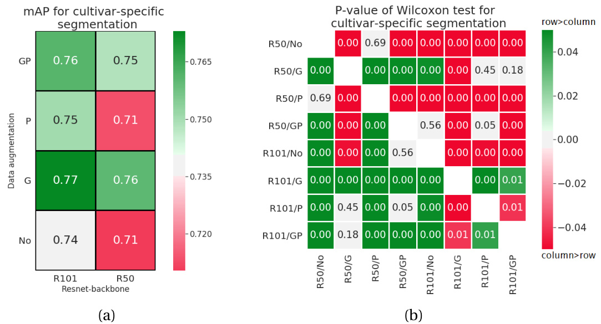  
Figure 3.9: (a) The mAP for the cultivar-specific segmentation is summarised for the three broccoli cultivars. The green coloured cells indicate an increase in mAP compared to R101/No, which was the training method without any network simplification and data augmentation. The red coloured cells indicate a decrease in mAP compared to R101/No. (b) The mirrored matrix summarises the p-values of the pairwise Wilcoxon test. The green-coloured cells indicate that the mAP of the training method in the row is significantly higher than the mAP of the training method in the column $( \mathrm { p } { \leq } 0 . 0 5 )$ ). When the cell is red, then the mAP of the training method in the column is significantly higher than the one in the row $\mathrm { ( p { s } } 0 . 0 5 \mathrm { ) }$ .  

# 3.3.2 The effect of network simplification and data augmentation on the cultivar-generic segmentation (experiment 2)  

Figure 3.10 shows the results of experiment 2. The cultivar-generic mAP decreased when the network was simplified from Resnet101 to Resnet50 (vertical comparison Figure 3.10a) All data augmentations resulted in an increase in mAP compared to no data augmentation (horizontal comparison Figure 3.10a). The highest mAP of 0.71 was reached with R101/G and R101/GP. The percentages in Figure 3.10a show that the cultivar-generic mAPs of all training methods deviated more than $5 \%$ from the cultivar-specific mAP of experiment 1. This indicates that none of the cultivar-generic training methods reached image generalisation on the untrained cultivars. In Figure 3.10b, the six green-coloured horizontal cells of R101/G and R101/GP indicate that these training methods had a mAP that was significantly higher than the six other training methods.  

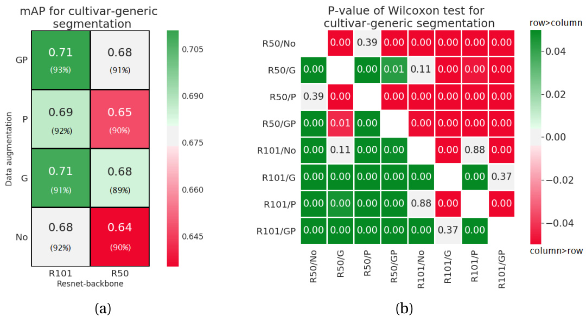  
Figure 3.10: (a) The mAP for the cultivar-generic segmentation is summarised for the three broccoli cultivars. The percentages indicate the generalisation performance compared to the cultivar-specific segmentation of experiment 1. Like Figure 3.9a, the green coloured cells indicate an increase in mAP compared to R101/No and the red coloured cells indicate a decrease in mAP compared to R101/No (b) Like Figure 3.9b, the mirrored matrix summarises the p-values of the pairwise Wilcoxon test $( \mathrm { p } { \le } 0 . 0 5 )$ .  

# 3.3.3 Number of cultivar-specific training images to generalise Mask R-CNN on a broccoli cultivar (experiment 3)  

In experiment 3, the training was solely done with R101/G, because this training method had the highest mAP in both experiment 1 and 2. Figure 3.11 summarises the mAP as a function of the number of cultivar-specific images added to the training set of $6 0 0 { \mathrm { ~ i m } } \cdot$ ages. With zero cultivar-specific training images, the mAP was 0.71 (this was the mAP of R101/G in experiment 2). This mAP was $9 \%$ lower than the mAP of 600 cultivar-specific training images (the mAP of R101/G in experiment 1). With 30 cultivar-specific training images $( 5 \% )$ the mAP was 0.77, which was $1 \%$ lower than the mAP of 600 cultivar-specific training images (Figure 3.11). Thus, training on $5 \%$ cultivar-specific images resulted in image generalisation. With 200 $( 3 3 . 3 \% )$ , 300 $( 5 0 \% )$ , 480 $( 8 0 \% )$ and 540 $( 9 0 \% )$ cultivarspecific training images, the mAP was $2 \%$ higher than the mAP of 600 cultivar-specific training images $( 1 0 0 \% )$ .  

  
Figure 3.11: The green solid line depicts the mAP as a function of the cultivar-specific images in the mixed training set of 600 images. The green area represents the $9 5 \%$ confidence interval around the mean. The percentages indicate the generalisation performance compared to the mAP of R101/G in experiment 1 (which is the mAP of 600 cultivar-specific training images at the far right of the graph). The black dashed line indicates the minimum mAP for image generalisation. The mAP of zero cultivar-specific training images is equal to the mAP of R101/G in experiment 2.  

# 3.3.4 Detection of harvestable broccoli heads (experiment 4)  

In experiment 3, the highest mAP was reached when Mask R-CNN was trained on 200, 300, 480 and 540 cultivar-specific training images. In experiment 4, we tested the Mask R-CNN that was trained on 200 cultivar-specific images, meaning that we used the Mask R-CNN that was optimised on the lowest number of cultivar-specific training images in this algorithm subset.  

On our dataset (the third test set), Mask R-CNN detected 229 of the 232 harvestable broccoli heads (see Figure 3.12 for some successful detections). The recall was $9 8 . 7 \%$ (Table 3.4). Three false negatives were observed. One false negative was observed on a broccoli head that was in the shadow of a big leaf (Figure 3.13a). Two false negatives were found on broccoli heads that were (heavily) occluded by a leaf (Figures 3.13b and 3.13c). The leaf occlusion caused that the broccoli head was split into two distant parts, of which one part was detected as an individual (smaller) broccoli head, causing the IoU to be lower than the threshold (Figures 3.13b and 3.13c). As a consequence, the two detections on the smaller broccoli parts were also false positives (because the IoU was lower than the threshold). There were two false positives in total (Figures 3.13b and 3.13c), resulting in a precision of $9 9 . 1 \%$ (Table 3.4).  

On the images of the dataset of Bender et al. (2019), Mask R-CNN detected 175 of the 176 harvestable broccoli heads (see Figure 3.14 for some successful detections). There was one false negative on a broccoli head that was only partially in the image (Figure 3.15a). There was one false positive on a yellow leaf (Figure 3.15b). Both the recall and the precision were $9 9 . 4 \%$ (Table 3.4).  

Mask R-CNN was also tested on the remaining broccoli heads that were either too small $( < 1 0 \mathrm { c m } )$ or too big $\left( > 1 5 \mathrm { c m } \right)$ (Table 3.4). When detecting small-sized broccoli heads in both datasets, there were 50 false negatives and 8 false positives (Table 3.4). There were no errors on the big-sized broccoli heads. When evaluating the object detection on both datasets on broccoli heads of all sizes, 838 of the 892 broccoli heads were successfully detected, resulting in a recall of $9 3 . 9 \%$ . On both datasets, there were 11 false positives on the 849 broccoli detections, resulting in a precision of $9 8 . 7 \%$ . For all broccoli segmentations, the average IoU with the ground-truth mask was 0.87. The median was 0.90 (Figure 3.16).  

Table 3.4: Mask R-CNN detection performance on the broccoli heads of our own dataset and the dataset of Bender et al. (2019). TP is the number of true positives, FN is the number of false negatives and FP is the number of false positives.   

<html><body><table><tr><td>Dataset</td><td>Harvest specification</td><td>TP</td><td>FN</td><td>FP</td><td>Recall</td><td>Precision</td></tr><tr><td rowspan="4">Own (third test set)</td><td>Harvestable (10-15 cm)</td><td>229</td><td>3</td><td>2</td><td>98.7%</td><td>99.1%</td></tr><tr><td>Too small (<10 cm)</td><td>183</td><td>46</td><td>6</td><td>79.9%</td><td>96.8%</td></tr><tr><td>Too big (>15 cm)</td><td>27</td><td>0</td><td>0</td><td>100.0%</td><td>100.0%</td></tr><tr><td>All sizes</td><td>439</td><td>49</td><td>8</td><td>90.0%</td><td>98.2%</td></tr><tr><td rowspan="4">Bender et al. (2019)</td><td>Harvestable (l0-15 cm)</td><td>175</td><td>1</td><td>1</td><td>99.4%</td><td>99.4%</td></tr><tr><td>Too small (<10 cm)</td><td>108</td><td>4</td><td>2</td><td>96.4%</td><td>98.2%</td></tr><tr><td>Too big (>15 cm)</td><td>116</td><td>0</td><td>0</td><td>100.0%</td><td>100.0%</td></tr><tr><td>All sizes</td><td>399</td><td>5</td><td>3</td><td>98.8%</td><td>99.3%</td></tr><tr><td rowspan="4">Both datasets</td><td>Harvestable (10-15 cm)</td><td>404</td><td>4</td><td>3</td><td>99.0%</td><td>99.3%</td></tr><tr><td>Too small (<10 cm)</td><td>291</td><td>50</td><td>8</td><td>85.3%</td><td>97.3%</td></tr><tr><td>Too big (>15 cm)</td><td>143</td><td>0</td><td>0</td><td>100.0%</td><td>100.0%</td></tr><tr><td>All sizes</td><td>838</td><td>54</td><td>11</td><td>93.9%</td><td>98.7%</td></tr></table></body></html>  

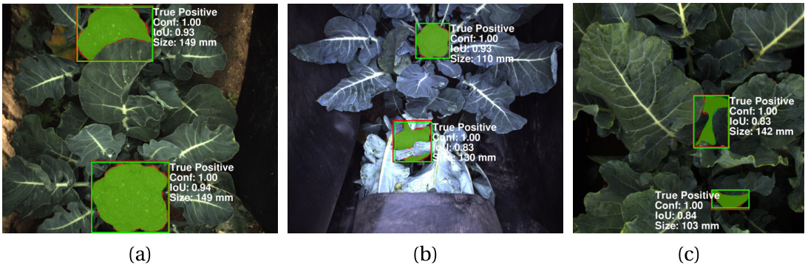  
Figure 3.12: (a) True positive detections on harvestable broccoli heads of the Ironman cultivar. (b) True positive detections on harvestable broccoli heads of the Steel cultivar. (c) True positive detections on harvestable broccoli heads of the Emerald-Crown cultivar. The red rectangle is the bounding box from the ground truth and the red pixels visualise the ground truth mask. The green rectangle is the bounding box prediction of Mask RCNN and the green pixels visualise the predicted mask of Mask R-CNN. All detections in the images a-c were true positives, because the values for the confidence level and the IoU exceeded the thresholds $\mathrm { C o n f } { \geq } 0 . 9 9$ and IoU ${ \geq } 0 . 5$ ). Size indicates the estimated size.  

  
Figure 3.13: (a) On our own dataset (the third test set), Mask R-CNN had one false negative on a broccoli head (Emerald-Crown cultivar) that was in the shadow of a big leaf. (b) One false positive (green bounding box) and one false negative (red bounding box) were observed on a leaf-occluded broccoli head (Ironman cultivar). (c) One false positive (green bounding box on the left) and one false negative (red bounding box on the left) were observed on a leaf-occluded broccoli head (Emerald-Crown cultivar). In image b and c, the leaf separated the broccoli head into two distant parts of which one part was detected as one (smaller) individual broccoli head instead of the complete broccoli head, causing the IoU to be lower than the threshold.  

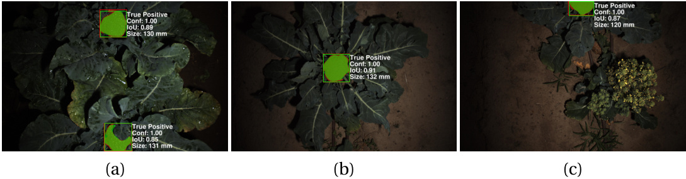  
Figure 3.14: (a) True positive detections on two harvestable broccoli heads on a test image taken from Bender et al. (2019). (b) A true positive detection on a harvestable broccoli head on another test image taken from Bender et al. (2019). (c) A true positive detection on a harvestable broccoli head and the absence of a detection on an overripe broccoli head (this head should not be harvested).  

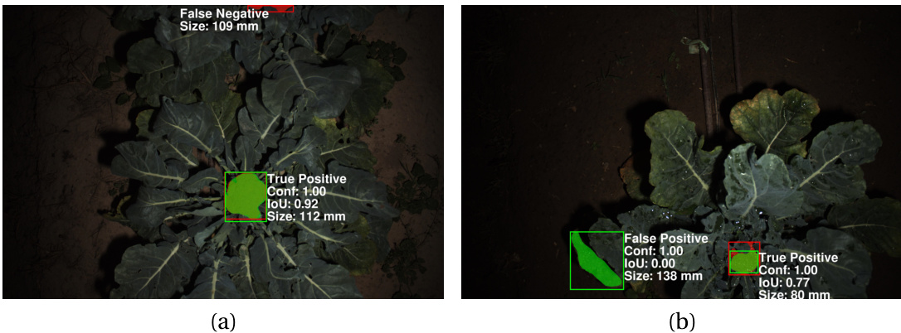  
Figure 3.15: (a) On the test set taken from Bender et al. (2019), Mask R-CNN had one false negative (red bounding box) on a broccoli head that was partially in the image. (b) Mask R-CNN had one false positive (green bounding box on the left) on a yellow leaf.  

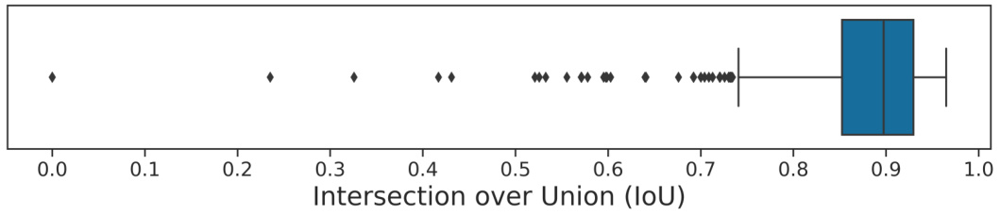  
Figure 3.16: The box-and-whisker plot visualises the intersection over union between the ground-truth mask and the predicted mask for all 849 broccoli detections (of all sizes) on both datasets. The black-coloured line within the blue-coloured box indicates the median of the distribution. $5 0 \%$ of the data is present within the ends of the bluecoloured box. The ends represent the $2 5 ^ { \mathrm { t h } }$ percentile (first quartile) and the ${ 7 5 } ^ { \mathrm { t h } }$ percentile (third quartile). The whiskers indicate the variability outside the first and third quartiles, whereas the black dots indicate the outliers.  

# 3.3.5 Cost-benefit analysis  

On both datasets, the detection recall on the harvestable broccoli heads was $9 9 . 0 \%$ (Table 3.4). This recall was used to predict the harvest performance of a selective harvesting robot. With the prognosed harvest performance, we estimated the tentative benefits of the robot at € 16,059 per hectare (using Equation 3.A.2 and Table 3.A.1 in Appendix 3.A).  

The fixed costs of the robot were € 385 per hectare (Equation 3.A.3 and Table 3.A.1 in Appendix 3.A). To calculate the variable costs of the robot, we first had to calculate the operating speed of the robot. We found that the robot’s operating speed was not limited by the image analysis time (the maximum time was 0.27 s (Figure 3.17)) but by the time that was needed to cut a broccoli (2.0 s, Table 3.A.1 in Appendix 3.A). The cycle time of 2.0 s resulted in an operating speed of $0 . 1 7 \mathrm { m } / \mathrm { s }$ (Equation 3.A.6 in Appendix 3.A), which was, according to the informal panel interview, comparable to the speed of a human harvest crew. With the machine speed of $0 . 1 7 ~ \mathrm { m } / \mathrm { s }$ , a robot operator would need 19.2 hours to harvest one hectare of broccoli (Equation 3.A.5 in Appendix 3.A). The variable costs of the robot were € 4,310 per hectare (Equation 3.A.4 in Appendix 3.A). With the robot, the income per hectare was € 11,365 (Equation 3.A.1 in Appendix 3.A).  

  
Figure 3.17: The box-and-whisker plot visualises the image analysis time of Mask R-CNN on all 600 images from both datasets. The maximum image analysis time was 0.27 seconds. An explanation of the box-and-whisker plot can be found in Figure 3.16.  

For the hand-harvest, we calculated a benefit of € 16,387 per hectare (Equation 3.A.2 and Table 3.A.1 in Appendix 3.A). This benefit was € 328 higher than the benefit of the robot. The fixed costs of the hand-harvest were € 77 per hectare (Equation 3.A.3 and Table 3.A.1 in Appendix 3.A), which was € 308 lower than the fixed costs of the robot. The variable costs of the hand-harvest were € 5,654 per hectare (Equation 3.A.4 and Table 3.A.1 in Appendix 3.A). These variable costs were € 1,344 higher than the variable costs of the robot. The higher variable costs of the hand-harvest were caused by the additional 87.8 manhours that were needed to hand-harvest one hectare of broccoli. With the handharvest, the income per hectare was € 10,657, which was € 708 lower than the income of the robot.  

# 3.4 Discussion  

In experiment 1 and 2, we observed a decrease in mAP when the network was simplified from Resnet101 to Resnet50. This result is consistent with Yu et al. (2019), who found that Mask R-CNN had better performance with Resnet101 compared to Resnet50 when detecting strawberry fruits. Resnet is a neural network that is designed to limit the loss of information during backpropagation (it solves the vanishing gradient problem). With this feature, a deeper residual network can learn more and potentially better image features without losing information, which can eventually increase the performance (He et al., 2016). Our results support the idea of training a deeper residual network to boost the performance.  

In experiment 1 and 2, training with any type of data augmentation resulted in a higher mAP than training without data augmentation. Data augmentation with geometric transformations led to the largest increase in mAP. This finding is consistent with Taylor and Nitschke (2017), although they used different transformations (flipping instead of scaling and principal component analysis instead of light transformations). With the geometric transformations, the network was trained on images that had a transformed orientation, position and scale compared to the original images. These geometrically transformed images are likely to resemble broccoli heads from our test set, because the test images also contained broccoli heads of different sizes, scales and positions. As a result, the geometrically transformed images allowed the neural network to learn robust features to detect the broccoli heads in the test images, resulting in a higher mAP. With the photometric transformations, we expect that the transformed images were less similar to the broccoli heads of the test set. For example, the light transformations could have transformed the broccoli pixels into unrealistically dark or bright pixels, especially when the input images were already dark or bright. Also, the texture transformations had the risk of changing the textural pattern of the broccoli head so that the network has learned textural patterns that did not resemble to the textural pattern of the broccoli heads in the test set, resulting in a lower mAP.  

In experiment 3, we found that Mask R-CNN reached image generalisation on a broccoli cultivar when $5 \%$ of the training dataset consisted of images of that cultivar. This means that a Mask R-CNN algorithm can be applied on a new crop cultivar, when it is retrained on only a few images of that cultivar.  

In experiment 4, we observed that Mask R-CNN had a higher detection performance on the Bender et al. (2019) dataset, which our algorithm was not previously trained on. In total, Mask R-CNN detected 404 of the 408 harvestable broccoli heads. These broccoli heads were from three cultivars, five growing seasons and 11 broccoli fields that were located in three different countries. Our results imply that Mask R-CNN was successfully generalised on the images of multiple broccoli cultivars that differed in colour and texture. This is an improvement compared to the algorithms of Blok et al. (2016) and Kusumam et al. (2017) that could not generalise sufficiently on images of two broccoli cultivars.  

The higher number of false negatives and false positives on the small-sized broccoli heads, indicates that Mask R-CNN can still be improved, especially for the purpose of measuring the size of the broccoli head. For the selective harvest, these false negatives and false positives do not affect the performance, because the false negatives correspond to small-sized broccoli heads that do not need to be harvested and the false positives will be filtered out by size. Moreover, the selective harvesting robot offers several opportunities to detect the previously false negatives, because these small-sized broccoli heads will outgrow to a harvestable size when the robot returns in another field pass.  

The maximum image analysis time of Mask R-CNN was only one seventh of the cycle time of the robotic arm. This has two positive consequences. First, a maximum of seven image frames can be processed for each broccoli head that must be cut. This multiple image analysis increases the chance of detecting the broccoli head. Second, there can be downgrade of the computing hardware without affecting the robot’s operating speed. This hardware downgrade decreases the fixed costs of the robot.  

A robot equipped with Mask R-CNN had higher benefits than costs. The robot was also more profitable than the hand-harvest. The cost-benefit analysis was performed with two costs assumptions. The first assumption was a complete financial loss of a broccoli head when there was a false negative. This financial loss is perhaps too pessimistic as the selective harvesting robot offers several opportunities to detect and harvest the previously false negatives in another field pass. The second assumption was that humans could detect and cut broccoli with a success rate of 0.99 (both metrics were obtained from the informal panel interview). For an equal comparison with the robot, we also need to obtain the detection recall and the cut success of humans. In future research, we want to evaluate the robot in the field.  

# 3.5 Conclusions  

Network simplification did not improve the image generalisation of Mask R-CNN on multiple broccoli cultivars. Data augmentation did improve the image generalisation of Mask R-CNN. In data augmentation, the geometric transformations led to a better image generalisation than the photometric transformations. Furthermore, Mask R-CNN was generalised on a broccoli cultivar when only $5 \%$ of the training dataset consisted of images of that cultivar. Our algorithm successfully detected 229 of the 232 harvestable broccoli heads from three cultivars that differed in texture and colour. Additionally, our algorithm detected 175 of the 176 harvestable broccoli heads from an online dataset, which our algorithm was not previously trained on. We conclude that our Mask R-CNN algorithm achieved better image generalisation on multiple broccoli cultivars than existing broccoli detection algorithms from literature. A robot equipped with Mask R-CNN had higher benefits than costs. Also, the robot was more profitable than human harvest. We conclude that Mask R-CNN provides sufficient basis for the commercialisation of a selective broccoli harvesting robot.  

# CRediT authorship contribution statement  

Pieter M. Blok: conceptualisation, methodology, software, data curation, writing - original draft. Frits K. van Evert: supervision, conceptualisation, writing - review & editing. Antonius P.M. Tielen: software, investigation, resources. Eldert J. van Henten: supervision, writing - review & editing. Gert Kootstra: supervision, conceptualisation, writing - review & editing.  

# Acknowledgements  

We thank Tony Wisdom from Skagit Valley Farm and Wiebe Goodijk from Firma Goodijk for their expert knowledge and financial support. We would like to thank all people who helped us in this research: Jan Zijlstra, Ian Mintz, Paul Goedhart, Wim van den Berg, Janne Kool, Koen van Boheemen, Ard Nieuwenhuizen, Paul Penders, Renee Spierings, Lodewijk Voorhoeve, Bernardo Mendonca, Joris IJsselmuiden and Hyejeong Kim.  

# 3.A Appendix A - Cost-benefit analysis  

The following section summarises the equations and the cost parameters that were used in the cost-benefit analysis. Refer to Table 3.A.1 for the values and the description of the cost parameters that were used in Equations 3.A.1 till 3.A.6.  

With Equation 3.A.1, we calculated the income per hectare of broccoli when using a robot equipped with Mask R-CNN $( i _ { r } )$ . The income per hectare was the difference between the benefits $( b _ { r } )$ and the costs, which was the sum of the fixed costs $( c _ { f r } )$ and the variable costs $( c _ { \nu r } )$ .  

$$
i _ { r } = b _ { r } - c _ { f r } - c _ { \nu r }
$$  

The benefits of the robot $( b _ { r } )$ depended on the revenue of the broccoli heads that were successfully harvested per hectare (Equation 3.A.2). The revenue was derived from the number of broccoli heads per hectare $( b h _ { h a } )$ , the sale value per broccoli head $( s _ { \nu } )$ and the harvest success of the robot. The harvest success depended on the recall of the detection system $( r )$ (using Table 3.4), and the broccoli cut success of the robotic arm (s).  

$$
b _ { r } = b h _ { h a } \cdot s _ { \nu } \cdot ( r \cdot s )
$$  

The fixed costs of the robot per hectare $( c _ { f r } )$ were calculated from the robot’s price $( p _ { r } )$ , its salvage value $( \nu _ { r } )$ , its economic life $( t _ { r } )$ and the hectares that are harvested per year $( h a _ { y } )$ (Equation 3.A.3).  

$$
c _ { f r } = { \frac { p _ { r } - \nu _ { r } } { t _ { r } \cdot h a _ { y } } }
$$  

The variable costs of the robot $( c _ { \nu r } )$ were the sum of the costs for crop production $( c _ { c } )$ and the costs for labour (Equation 3.A.4). The costs for labour were derived from the hourly wage $( c _ { l } )$ and the total labour requirement per hectare. The total labour requirement was the sum of the labour for crop care $( l _ { c } )$ , harvest $( l _ { h } )$ and post-harvest $( l _ { p h } )$ . The labour for harvest $( l _ { h } )$ (Equation 3.A.5) depended on the number of people needed to operate the robot $( p )$ , the number of broccoli cuts per year $( c u _ { y } )$ and the harvest capacity of the robot. The harvest capacity depended on the robot’s operating width $( w _ { r } )$ and its operating speed $( \nu )$ . The operating speed was influenced by the intra-row spacing between the broccoli heads $( d _ { b h } )$ and the maximum time that was needed to either analyse an image $( t _ { i } )$ or cut a broccoli $( t _ { a } )$ (Equation 3.A.6). We also calculated the labour that was needed for the headland manoeuvre (assuming a reversed turn). This labour depended on the field width $( \boldsymbol { w } _ { f } )$ , the robot’s turning radius $( \boldsymbol { r } _ { t } )$ and the distance between the camera and the robotic arm $( d _ { c a } )$ . This distance is the distance that the robot had to travel to complete the harvest operation before it could start the turning procedure. In Equation 3.A.5 we accounted for the conversion between $\mathrm { m } ^ { 2 }$ and hectare $\mathrm { \Omega } ^ { } 1 0 , 0 0 0 \mathrm { m } ^ { 2 } = 1 \mathrm { \Omega }$ ha) and the conversion between seconds and hour $( 3 , 6 0 0 s = 1 \mathrm { h }$ ).  

$$
c _ { \nu r } = { c _ { c } } + { c _ { l } } \cdot ( { l _ { c } } + { l _ { h } } + { l _ { p h } } )
$$  

$$
\begin{array}{c} l _ { h } = \frac { p \cdot c u _ { y } \cdot \left( \frac { 1 0 , 0 0 0 } { w _ { r } \cdot v } + \left( \frac { w _ { f } } { w _ { r } } - 1 \right) \cdot \frac { 2 \cdot d _ { c a } + ( \pi + 1 ) \cdot r _ { t } } { v } \right) } { 3 , 6 0 0 }  \\ { \nu = \frac { d _ { b h } } { \operatorname* { m a x } ( t _ { i } , t _ { a } ) } } \end{array}
$$  

To determine the profitability of the robot compared to the hand-harvest, we also calculated the costs and the benefits for the hand-harvest, using Equations 3.A.1 till 3.A.4. All cost parameters can be found in Table 3.A.1.  

Table 3.A.1: The cost parameters that were used in the cost-benefit analysis for the robotic harvest ("Robot") and the hand-harvest ("Hand"). Source refers to the reference that was used to extract the cost parameter. The cost parameters from $p$ to $t _ { a }$ (used to calculate the labour for harvest) were only obtained for the robotic harvest and not for the hand-harvest, because the labour for the hand-harvest was already estimated at 107 hours by KWIN (2018).   

<html><body><table><tr><td colspan="2">Para- meter Description</td><td colspan="3">Unit Robot</td><td colspan="2">Hand Source</td></tr><tr><td>bhha</td><td>Broccoli heads perhectare</td><td></td><td>30,400</td><td>Source KWIN (2018)</td><td>30,400</td><td>KWIN (2018)</td></tr><tr><td>Su</td><td>Sale value of one broccoli</td><td>€</td><td>0.55</td><td>KWIN (2018)</td><td>0.55</td><td>KWIN (2018)</td></tr><tr><td>r</td><td>Detection recall on the harvest- able broccoli</td><td></td><td>0.99</td><td>Paragraph 3.3.4</td><td>0.99</td><td>Panel interview</td></tr><tr><td>S</td><td>heads Broccoli cut</td><td></td><td>0.97</td><td>Birrell et al. (2020)+</td><td>0.99</td><td>Panel interview</td></tr><tr><td>pr</td><td>success Machine purchase price</td><td>€</td><td>500,000</td><td>Panel interview</td><td>150,000</td><td>Panel interview</td></tr><tr><td>Vr</td><td>Salvage value of the machine</td><td>€</td><td>115,000</td><td>23% of the purchase price according to</td><td>34,500</td><td>23% of the purchase price according to</td></tr></table></body></html>  

† There was no data on the broccoli cut success of the robot, so we extracted the $9 7 \%$ detachment success of Birrell et al. (2020) who researched a comparable use-case (robotic harvest of iceberg lettuce).  

Table 3.A.1 (continued):   

<html><body><table><tr><td colspan="7"></td></tr><tr><td>Para- meter</td><td>Description</td><td>Unit</td><td>Robot</td><td>Source</td><td>Hand</td><td>Source</td></tr><tr><td>tr</td><td>Economic life of the machine</td><td>y</td><td>10</td><td>Panel interview</td><td>15</td><td>Panel interview</td></tr><tr><td>hay</td><td>Hectares har- vested per year</td><td>ha</td><td>100</td><td>Panel interview</td><td>100</td><td>Panel interview</td></tr><tr><td>Cc</td><td>Crop costs per hectare</td><td>€</td><td>2,607</td><td>KWIN (2018)</td><td>2,607</td><td>KWIN (2018)</td></tr><tr><td>c</td><td>Hourly labour wage in the Netherlands</td><td>€</td><td>15.31</td><td>Agriconnect (2019) KWIN (2018)</td><td>15.31</td><td>Agriconnect (2019) KWIN (2018)</td></tr><tr><td>lc</td><td>Labour for crop care</td><td>h</td><td>49</td><td>KWIN (2018)</td><td>49</td><td>KWIN (2018)</td></tr><tr><td>lh</td><td>Labour for harvest</td><td>h</td><td>19.2</td><td>Paragraph 3.3.5</td><td>107</td><td>KWIN (2018)</td></tr><tr><td>lph</td><td>Labour for post-harvest</td><td>h</td><td>43</td><td>KWIN (2018)</td><td>43</td><td>KWIN (2018)</td></tr><tr><td>p</td><td>People needed to operate the robot</td><td></td><td>1</td><td>Panel interview</td><td></td><td></td></tr><tr><td>cuy</td><td>Broccoli cuts per year</td><td></td><td>3</td><td>KWIN (2018)</td><td></td><td></td></tr><tr><td>Wr</td><td>Operating width of the robot</td><td>m</td><td>3</td><td>Panel interview</td><td></td><td></td></tr><tr><td>U</td><td>Operating</td><td>m/s</td><td>0.17</td><td>Paragraph 3.3.5</td><td></td><td></td></tr><tr><td>wf</td><td>Field width Distance</td><td>m</td><td>60</td><td>Panel interview</td><td></td><td></td></tr><tr><td>dca</td><td>between the camera and the robotic arm</td><td>m</td><td>2</td><td>Panel interview</td><td></td><td></td></tr><tr><td>rt</td><td>Turning radius of the robot</td><td>m</td><td>5</td><td>Panel interview</td><td></td><td></td></tr><tr><td>dbh</td><td>Intra-row distance</td><td>m</td><td>0.33</td><td>Paragraph 3.2.1.2</td><td></td><td></td></tr><tr><td>ti</td><td> Maxiysum image</td><td>S</td><td>0.27</td><td>Paragraph 3.3.5</td><td></td><td></td></tr><tr><td>ta</td><td>Cycle time of the robotic arm</td><td>S</td><td>2.0</td><td></td><td></td><td></td></tr></table></body></html>  

‡ The cycle time of the robotic arm is the sum of the time of the forward and backward movement of the arm (1.2 s) and the time for defoliating and cutting the broccoli (0.8 s) (based on the specifications of the robotic arm).  

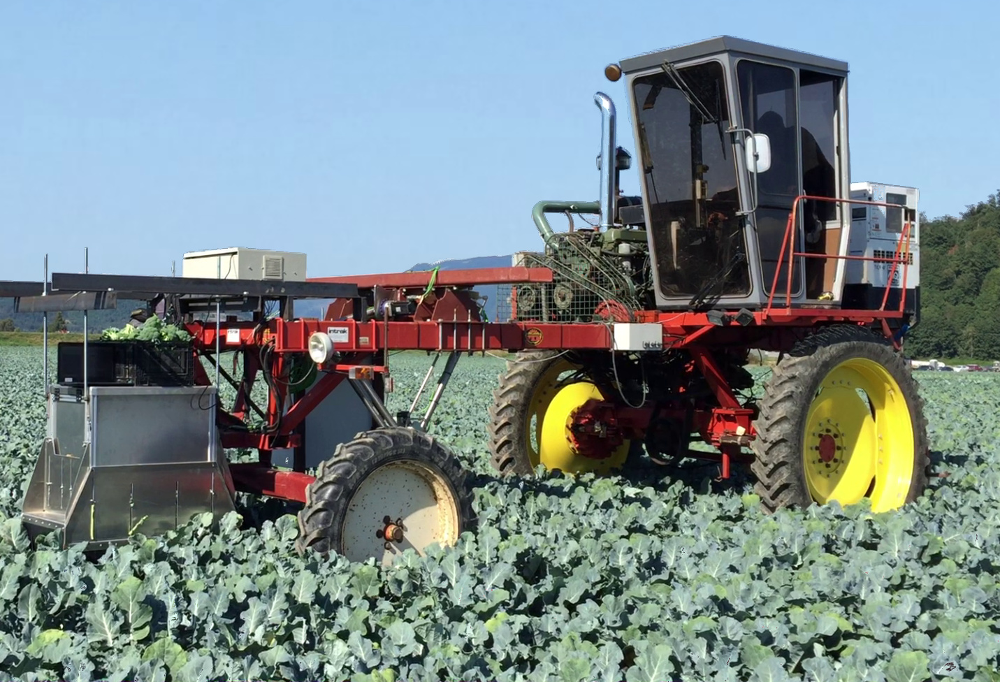  

# 4  

# Image-based size estimation of broccoli heads under varying degrees of occlusion  

Pieter M. Blok1,2, Eldert J. van Henten2, Frits K. van Evert1, Gert Kootstra  

1Agrosystems Research, Wageningen University & Research, Wageningen, The Netherlands   
2Farm Technology Group, Wageningen University & Research, Wageningen, The Netherlands  

# Abstract  

HE growth and the harvestability of a broccoli crop is monitored by the size of the broccoli head. This size estimation is currently done by humans, and this is inconsistent and expensive. The goal of our work was to develop a software algorithm that can estimate the size of field-grown broccoli heads based on RGB-Depth (RGB-D) images. For the algorithm to be successful, the problem of occlusion must be solved, which is the partial visibility of the broccoli head due to overlapping leaves. This partial visibility causes sizing errors. In this research, we studied the use of deep learning algorithms to deal with occlusions. We specifically applied the Occlusion Region-based Convolutional Neural Network (ORCNN) that segmented both the visible and the amodal region of the broccoli head (which is the visible and the occluded region combined). We hypothesised that ORCNN, with its amodal segmentation, can improve the size estimation of occluded broccoli heads. The ORCNN sizing method was compared with a Mask R-CNN sizing method that only used the visible broccoli region to estimate the size. The sizing performance of both methods was evaluated on a test set of 487 broccoli images with systematic levels of leaf occlusion. With a mean sizing error of $6 . 4 \mathrm { m m }$ , ORCNN outperformed Mask R-CNN, which had a mean sizing error of $1 0 . 7 \mathrm { m m }$ . Furthermore, ORCNN had a significantly lower absolute sizing error on 161 heavily occluded broccoli heads with an occlusion rate between $5 0 \%$ and $90 \%$ . Our software and dataset are available on https://git.wur.nl/blok012/sizecnn.  

Keywords: size estimation, occlusion, deep learning, agriculture, dataset, computer vision  

# 4.1 Introduction  

The in-field estimation of the crop size is an important task in plant phenotyping, growth monitoring and harvesting. Currently, this crop size estimation is mainly done by humans, and this can be inconsistent and expensive. A promising alternative is a sensor system with a software algorithm that can autonomously estimate the size of a crop while it is still on the tree or plant. This system can potentially increase the accuracy and the frequency of the size estimates, while reducing labour costs.  

Recent studies focused on the in-field size measurement of apple (Gongal et al., 2018), broccoli (Kusumam et al., 2017), citrus (Lin et al., 2019) and mango (Wang et al., 2017). These studies have two similarities. The first similarity is that all researchers used a camera-based system that generated RGB-Depth (RGB-D) images. An RGB-D image consists of a red, green and blue colour image (RGB) and a registered depth image, where each pixel contains the distance measurement between the image plane and the object. In three of the four studies, the colour image was used to detect the crop, while the depth image was used to estimate the crop’s size. In Kusumam et al. (2017), the detection and the size estimation were done on a three dimensional (3D) image that was created from the depth image. The second similarity is that all researchers used feature-engineered software algorithms to process the RGB-D images. In Kusumam et al. (2017) and Lin et al. (2019), a machine learning algorithm was used, but none of the researchers used deep learning algorithms. Deep learning algorithms currently provide state-of-the-art performance in the in-field fruit and crop detection (Blok et al., 2021c; Ge et al., 2019; Kang & Chen, 2020; Nejati et al., 2020; Yu et al., 2019). In Kamilaris and Prenafeta-Boldú (2018) it was shown that deep learning algorithms outperformed feature-engineered algorithms in all 22 agricultural case studies. In line with these findings, our research will focus on the crop size estimation with an RGB-D camera and a deep learning algorithm.  

A limitation of the crop sizing studies of Gongal et al. (2018), Kusumam et al. (2017), Lin et al. (2019) and Wang et al. (2017), was that the algorithms were tested on crops that had no or minimal occlusion, meaning that the results only partially reflected the in-field sizing performance. Usually, an agricultural image scene is dense and cluttered, with many forms of crop occlusion. When there is crop occlusion, a (big) part of the crop is covered by other crop organs, surrounding plants or materials, making it harder for an algorithm to detect and size the crop. This challenge was also acknowledged by Zhang et al. (2020), who did a literature review on deep learning algorithms that were tested in dense and cluttered agricultural image scenes. In Zhang et al. (2020), it was stated that occlusion is one of the biggest challenges for a deep learning algorithm when analysing these complex image scenes. The goal of our work was to develop a deep learning algorithm that can accurately estimate the size of crops even when they are occluded. In our research, we chose broccoli (Brassica oleracea var. italica) as our model crop, since broccoli heads can be heavily occluded by leaves and weeds.  

With 3D software algorithms it is possible to detect and size the occluded broccoli heads. For example, a Frustum Pointnet algorithm (Qi et al., 2018) can be used to detect partially occluded 3D objects. A 3D shape-completion algorithm can be used to estimate the shape of occluded crops, similar to how Ge et al. (2020) estimated the shape of occluded strawberry fruits. However, 3D algorithms can also have limitations, such as a longer analysis time and a less optimised transfer-learning, due to the limited availability of 3D agricultural datasets. Another way to deal with occlusions, is to obtain multi-view images of the same object from multiple cameras or camera positions. This multi-view imaging has proven its effectiveness in other occluded crop environments, such as sweet pepper (Barth et al., 2016; Lehnert et al., 2019) and cucumber (Boogaard et al., 2020), but a multi-view imaging also has its disadvantages, such as higher hardware costs and a longer image analysis time compared to an analysis on a single image. Therefore, we will investigate deep learning methods that can estimate the size of occluded broccoli heads from a single RGB-D image of the scene.  

Comparable to the algorithms of Gongal et al. (2018), Kusumam et al. (2017), Lin et al. (2019) and Wang et al. (2017), the sizing algorithm is expected to execute two different sub-tasks. The first sub-task is the image-based detection of the broccoli head. The second sub-task is the size estimation of the broccoli head in the registered depth image, using the detection output from the first sub-task. The image-based broccoli detection can be accomplished with a special group of deep learning algorithms: convolutional neural networks (CNNs). Appropriate CNNs for this task are object detection algorithms and instance segmentation algorithms. Object detection algorithms, like Faster R-CNN (Ren et al., 2017) or YOLOv4 (Bochkovskiy et al., 2020), can detect the broccoli head in an RGB image with a rectangular bounding box, similar to how Bender et al. (2020) detected broccoli plants. Other object detection algorithms were specifically designed to detect circles (YOLO-Tomato (Liu et al., 2020)) or ellipses (BubCNN (Haas et al., 2020)), which might better match the shape of the broccoli head. However, with the bounding box, circle and ellipse detections it is impossible to specify whether the pixels that are inside the detected shape belong to the broccoli head or to objects that occlude the broccoli. Due to this lack of pixel differentiation, an object detection algorithm requires an additional filtering algorithm to remove the pixels that do not belong to the broccoli head, because these pixels cannot be used for the size estimation in the registered depth image. An alternative approach is to use an instance segmentation algorithm, like Mask R-CNN (He et al., 2017) or $\mathrm { Y O L A C T + + }$ (Bolya et al., 2020). An instance segmentation algorithm can segment the broccoli head pixels inside the bounding box. With this additional pixel segmentation, the sizing algorithm will be less dependent on an additional filtering algorithm, making an instance segmentation algorithm a more appropriate algorithm for an autonomous broccoli sizing system.  

When an instance segmentation algorithm is used to segment an occluded broccoli head, then the pixel segmentation would represent only the visible region of the broccoli head. When this partially completed segmentation is used for the size estimation, there is a chance that the actual size is underestimated. One way to alleviate this problem, is to extend the instance segmentation algorithm with an additional shape-completion algorithm, like Ge et al. (2020) did, to approximate the bigger shape from the visible region of the broccoli head. An alternative approach is to estimate the bigger shape of the occluded broccoli head with an instance segmentation algorithm that segments the combined visible and occluded part of the broccoli head. This segmentation is called amodal segmentation (Zhu et al., 2017), and this might better reveal the actual shape of the occluded broccoli head. However, with an amodal segmentation some of the segmented pixels would belong to objects that occlude the broccoli head. Obviously, these pixels need to be removed with an additional filtering algorithm to assure an accurate size estimation. In summary, with an instance segmentation algorithm that either segments the visible broccoli region or the amodal broccoli region, there is a need of an additional shape-completion or filtering algorithm to estimate the size of the broccoli head. The problem is that these algorithms might cause additional sizing errors.  

A possible solution is to use an instance segmentation algorithm that can generate two segmentations: one on the amodal region of the broccoli head and one on the visible region of the broccoli head. The amodal segmentation can be used to estimate the bigger shape of the occluded broccoli head, whereas the visible segmentation can be used to extract the depth values of the broccoli head that are needed to estimate its real-world size. This dual segmentation makes the sizing algorithm less dependent on an additional shape-completion or filtering algorithm, which might improve the size estimate.  

Occlusion Region-based Convolutional Neural Network (ORCNN) (Follmann et al., 2018) is an instance segmentation algorithm that can generate this dual segmentation. ORCNN is an extended Mask R-CNN network with multiple mask head branches, of which one can be trained to segment the visible broccoli pixels and the another one can be trained to segment the amodal broccoli pixels. Because ORCNN generates a pixel segmentation for both the visible and the amodal region, it can be used to predict all kinds of crop shapes.  

In this paper, we hypothesised that the size estimation of occluded broccoli heads can be improved when using an algorithm that can segment both the visible and the amodal region of the broccoli head. The objective of our study was to test this hypothesis by comparing the sizing performance of ORCNN with a Mask R-CNN sizing method that was only based on a single segmentation of the visible broccoli pixels. Our research was conducted on a dataset of 2560 broccoli images with systematic levels of occlusion. The first contribution of our research is a novel size estimation method that uses a dual image segmentation to better deal with crop occlusions. The second contribution is the release of the crop sizing software and a dataset of broccoli images with systematic levels of occlusion.  

# 4.2 Materials and methods  

# 4.2.1 Image dataset  

This paragraph highlights how the RGB-D images were acquired in the broccoli fields (section 4.2.1.1) and how the acquired images were pre-processed and annotated (section 4.2.1.2). Then, it is explained how the broccoli occlusion rate was calculated in the RGB image (section 4.2.1.3) and in the registered depth image (section 4.2.1.4). Finally, it is described how the annotated images were aggregated for CNN training and testing (section 4.2.1.5).  

# 4.2.1.1 Image acquisition  

To the best of our knowledge, there are currently two online-available datasets with RGBD images of field-grown broccoli (Bender et al., 2019; Kusumam et al., 2016). Unfortunately, the broccoli images of both datasets had no or minor occlusions. Also, Kusumam et al. (2016) did not publish the ground-truth size measurements. Therefore we decided not to use these images, and to acquire two datasets of broccoli images with systematic levels of occlusion. The two datasets were acquired with two different cameras on two broccoli fields that were located in the United States of America (USA) and in the Netherlands. On these fields, two different broccoli cultivars were grown in two different growing seasons. The variations in crop conditions and imaging hardware resulted in a diverse dataset for the training and the testing of the algorithms.  

The first dataset was acquired in 2018 on a broccoli field in Santa Maria (USA). On this field, the broccoli plants of the cultivar Avenger were grown on beds with two crop rows that were $0 . 3 1 \mathrm { m }$ apart. The intra-row spacing was $0 . 2 0 \mathrm { m }$ . Before the image acquisition, we selected two rows in the broccoli field that were grown on two different beds. In these two rows, we randomly selected 122 occluded broccoli heads with a diameter between 85 and $2 2 8 ~ \mathrm { m m }$ (the average diameter was $1 5 6 ~ \mathrm { m m }$ ). The selected broccoli heads were tagged with a Quick Response (QR) code for visual recognition. Then, the RGB-D images were acquired with a prototype harvesting robot. This robot was equipped with an image acquisition system that acquired top-view RGB-D images of the broccoli crop (Figure 4.1a). The image acquisition system was constructed as an enclosed box for uniform illumination. The acquisition system was equipped with one RGB colour camera (IDS UI5280FA-C-HQ) with a $8 \mathrm { m m }$ lens (Fujifilm HF8XA-5M), one monochrome stereo-vision camera (IDS Ensenso N35) and 21 light emitting diode (LED) strips (OSRAM VFP2400SG3-865-03) for artificial illumination (Figure 4.1b). The colour camera was positioned at the centre of the stereo-vision camera, but with a $5 2 \mathrm { m m }$ vertical offset (Figure 4.1c). The distance between the two cameras and the broccoli heads was approximately $0 . 6 \mathrm { m }$ . At this distance, the camera’s field-of-view was $0 . 6 2 \mathrm { ~ m ~ }$ (width) by $0 . 5 2 \mathrm { ~ m ~ }$ (height). The two cameras were levelled before the image acquisition with a bubble level instrument, to ensure the horizontal and vertical alignment between the cameras and the broccoli heads.  

The images of the colour and the stereo-vision camera were simultaneously acquired with a hardware trigger from an electronic encoder wheel that was attached to the front wheel of the robot. This encoder generated a hardware trigger to the cameras for each $0 . 1 5 \mathrm { m } \left( + / - 0 . 0 1 \mathrm { m } \right.$ error) of relative displacement of the robot. The RGB image (produced by the colour camera) and the depth image (produced by the stereo-vision camera) were registered, creating one RGB-D image of $1 2 8 0 \mathrm { x } 1 0 2 4$ pixels for each hardware trigger. The robot was driven with a constant speed of approximately $0 . 1 4 \mathrm { m } / \mathrm { s }$ over the two rows to acquire the images of the 122 selected broccoli heads with its natural occlusion (leaves). In total, 947 RGB-D images were captured (four to ten frames per broccoli head). Because the robot moved over the crop, a various range of natural occlusions occurred in the different frames due to changes in camera perspective, see three examples in Figure 4.2. After the image acquisition, the leaves that occluded the broccoli heads were removed and the robot was driven again over the same rows to acquire four to ten frames from each broccoli head without any occlusion. Finally, the diameters of the broccoli heads were measured with a circular ruler (Figure 4.3b).  

  
Figure 4.1: (a) Overview of the image acquisition system that was attached to a prototype harvesting robot to acquire top-view RGB-D images of broccoli heads in an American field. (b) The image acquisition system consisted of one RGB colour camera, one monochrome stereo-vision camera and 21 LED strips for artificial illumination. (c) There was a vertical offset of $5 2 ~ \mathrm { m m }$ between the RGB-camera (upper black camera) and the stereo-vision camera (lower blue camera).  

  
Figure 4.2: (a) The prototype harvesting robot drove over the broccoli crop to acquire multiple frames from the same broccoli head (which were tagged with a QR code). In this example, the first frame was captured when the broccoli head was in the top of the image. In this frame, the broccoli head was subject to heavy leaf occlusion. (b) Another frame was taken when the broccoli head was in the centre of the image. In this frame, the broccoli head was subject to moderate occlusion. (c) In the last frame, the tagged broccoli head was at the bottom of the image and had a low level of occlusion, because of the changed position of the camera.  

The second dataset was acquired in 2020 on a broccoli field in Sexbierum (The Netherlands). On this field, the broccoli plants of the cultivar Ironman were grown in single rows that were $0 . 7 5 \mathrm { m }$ apart. The intra-row spacing was $0 . 3 3 \mathrm { m }$ . The broccoli images were acquired with an Intel RealSense D435 camera that was mounted on a metal frame to acquire top-view RGB-D images of the broccoli crop (Figure 4.3a). The distance between the RealSense camera and the broccoli heads was approximately $0 . 6 \mathrm { m }$ . At this distance, the camera’s field-of-view was $0 . 7 9 \mathrm { m }$ (width) by $0 . 5 8 \mathrm { m }$ (height). The RealSense camera was levelled with a bubble level instrument before each image acquisition of a broccoli head, to ensure the horizontal and vertical alignment between the camera and the broccoli heads. The RGB-D images were acquired in daylight without artificial illumination. Diffuse light conditions were created with an umbrella. The RGB image and the depth image from the RealSense camera were registered, creating one RGB-D image of 1280x720 pixels for each software trigger.  

On the field, 250 occluded broccoli heads were randomly selected from multiple crop rows. The selected broccoli heads had a diameter between 68 and $2 3 9 \mathrm { m m }$ (the average diameter was $1 3 7 \mathrm { m m }$ ). First, one frame of the broccoli head was acquired with its natural occlusion (leaves and weeds), see Figure 4.4a. Then, additional frames were acquired of the same broccoli head with different occlusions. The different occlusions were created by cutting a leaf from a neighbouring plant and then placing this leaf over the broccoli head to create a human-made, yet natural-looking occlusion (Figure 4.4b). This was repeated for five to ten frames per broccoli head. Afterwards, all leaves were removed from the broccoli plant and a last image frame was acquired without any occlusion (Figure 4.4c). In total, 1613 RGB-D images were captured on this broccoli field. After the image acquisition, the diameters of the broccoli heads were measured with the same circular ruler that was used to measure the broccoli heads in the USA (Figure 4.3b).  

  
Figure 4.3: (a) The Intel RealSense D435 camera was mounted on a metal frame to acquire top-view RGB-D images of broccoli heads in a field in Sexbierum (The Netherlands). (b) After the image acquisition, the diameter of the broccoli head was measured with a circular ruler.  

  
Figure 4.4: For each broccoli head in the second dataset, five to ten frames were acquired with different occlusions. (a) The first frame was acquired from the broccoli head with its natural occlusion. (b) Then, a randomly clipped leaf from a neighbouring broccoli plant was positioned above the broccoli head to create a human-made, yet natural-looking occlusion. This process was repeated for five to ten different leaf positions to create different occlusions. In this example, the clipped leaf occluded the lower part of the broccoli head. (c) The last frame was acquired when all occluding leaves had been removed.  

# 4.2.1.2 Image pre-processing and annotation  

All 2560 RGB-D images from the two datasets were re-scaled and zero-padded to a resolution of 1280x1280 pixels, see examples in Figure 4.2 and Figure 4.4. This zero-padding allowed us to extrapolate the annotations into the black-coloured regions in case the broccoli head was only partially in the field-of-view of the camera, see an example in Figure 4.5. The image annotation was done with the LabelMe software (version 4.5.6) (Wada, 2016). First, the image frames with no occlusion were annotated. In these frames, each broccoli head was annotated by two masks: a polygonal mask for the visible broccoli region and a circular mask for the amodal broccoli region. The circular mask was drawn along the circumference of the broccoli head (Figure 4.5a). We chose for a circular mask, because this corresponded to the shape of the circular ruler, which was used to obtain the ground-truth (Figure 4.3b). Then, the circular amodal mask was copied to the frames of the same broccoli plant with occlusion (Figure 4.5b). This procedure allowed us to precisely annotate the occluded broccoli head with the amodal mask that was drawn in the non-occluded frame. The position of the amodal mask was then checked and corrected by another image annotator when necessary. Finally, the polygonal masks of the visible broccoli regions were annotated for all images. Examples of these visible broccoli annotations are the blue polygons in Figure 4.5. The other broccoli heads that were present in the image but not tagged and measured in the field, were also annotated by means of the best guess of the image annotator. Examples of these annotations are visualised at the bottom of Figure 4.5a and Figure $4 . 5 \mathrm { b }$ . These annotations were used to train the CNNs and to calculate the detection metrics. The software procedures of the annotation process can be found on our git repository.  

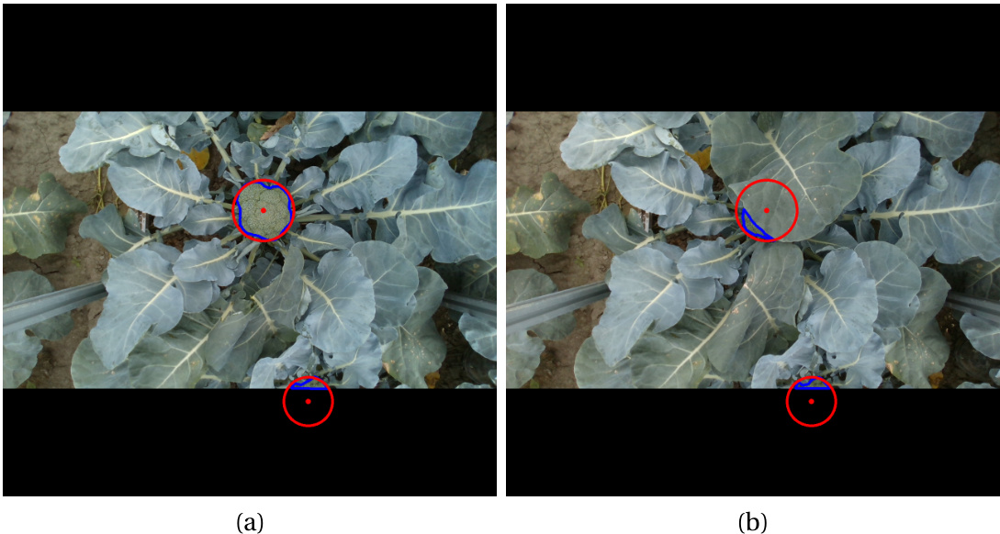  
Figure 4.5: The image annotation procedure involved the following steps: (a) First, the non-occluded frame was annotated. For each broccoli head, a circular mask was drawn for the amodal region (red circle) and a polygonal mask was drawn for the visible region (blue polygon). The amodal mask of the partially captured broccoli head at the bottom of the image, was drawn into the zero-padded region of the image (black-coloured region). This amodal annotation was done by means of the best guess of the image annotator. (b) Then, all amodal masks were copied to the frames of the same broccoli head with occlusion. The visible masks were independently drawn, because they could not be copied.  

# 4.2.1.3 Calculation of the occlusion rate in the RGB image  

In the RGB image, the pixel area of the visible region of the occluded broccoli head, $A _ { \nu }$ , was divided with the pixel area of the visible region of the same broccoli head in the non-occluded frame, $A _ { t }$ . This division resulted the occlusion rate (OCR) in the RGB image (Equation 4.1). A visual example of the OCR calculation is the division of the area of the blue polygons in Figure 4.5b with the area of the blue polygons in Figure 4.5a.  

$$
{ \mathsf { O C R } } = 1 - { \frac { A _ { \nu } } { A _ { t } } }
$$  

The occlusion rates were quantified for the broccoli images that had a natural leaf occlusion and for the broccoli images that had a human-made leaf occlusion. In total, 1197 of the 2560 broccoli images had a natural occlusion. These were the images from the first dataset and the frames of the second dataset that had a natural occlusion, see an example in Figure $4 . 4 \mathrm { a }$ . The broccoli heads were on average $2 5 . 9 \%$ occluded by leaves and weeds in its natural situation (the standard deviation was $2 3 . 6 \%$ ). The remaining 1363 broccoli images had a human-made leaf occlusion, see two examples in Figure 4.4b and Figure 4.4c. In this human-made situation, the broccoli heads were on average $4 4 . 9 \%$ occluded with a standard deviation of $3 0 . 3 \%$ . Figure 4.6 shows the distribution of the occlusion rate for the two situations.  

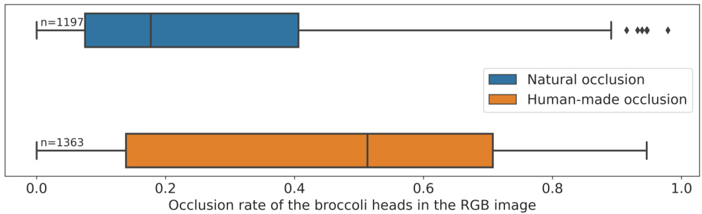  
Figure 4.6: A box-and-whisker plot showing the distribution of the broccoli occlusion rates that were calculated in the $2 5 6 0 \mathrm { R G B }$ images. $n$ is the number of RGB images that were used to respectively calculate the natural occlusion rate and the human-made occlusion rate. The line within the box indicates the median of the distribution. $5 0 \%$ of the data is present within the ends of the box, which represent the $2 5 ^ { \mathrm { t h } }$ percentile (first quartile) and the ${ 7 5 ^ { \mathrm { t h } } }$ percentile (third quartile). The whiskers indicate the variability outside the first and third quartiles, whereas the dots indicate the outliers.  

# 4.2.1.4 Calculation of the pixel loss in the depth image  

Both of the used depth cameras were stereo-vision cameras. These cameras use a left and a right monochrome camera to produce a depth image. Due to the different perspective of the two cameras, some parts of the scene can only be viewed by one camera due to occlusion. For these image parts, the depth cannot be calculated. In our datasets, the depth pixel loss rate, DPL, was quantified by comparing the area of the broccoli pixels in the RGB image, $A _ { \nu }$ , with the area of the depth pixels that were present in the same broccoli region in the registered depth image, $A _ { d }$ . The depth pixel loss rate was calculated with Equation 4.2. A visual example of the depth pixel loss rate is the difference between the blue region in Figure 4.7a and the green region in Figure $4 . 7 \mathrm { b }$ .  

$$
\mathrm { D P L } = 1 - { \frac { A _ { d } } { A _ { \nu } } }
$$  

In all 2560 depth images, the average depth pixel loss rate was $2 0 . 2 \%$ (the standard deviation was $1 9 . 9 \%$ ). In the 947 depth images of the Ensenso N35, the average depth pixel loss rate was $1 7 . 5 \%$ (the standard deviation was $1 7 . 7 \%$ ). In the 1613 depth images of the Intel RealSense D435, the average depth pixel loss was $2 1 . 7 \%$ (the standard deviation was $2 0 . 9 \%$ ). Figure 4.8 shows the distribution of the depth pixel loss for the two depth cameras.  

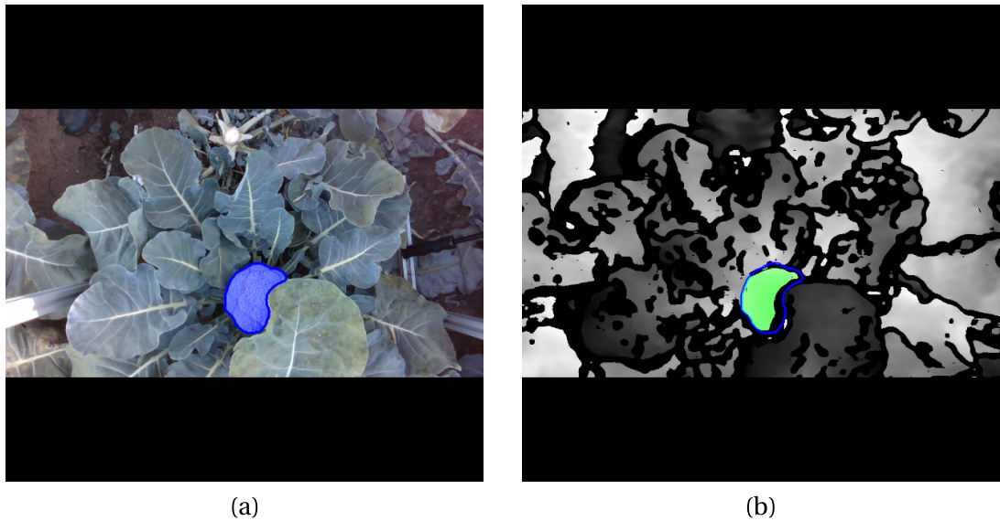  
Figure 4.7: (a) The blue polygon visualises the visible mask annotation in the RGB image. (b) The green polygon visualises the pixels with a depth value after copying the visible mask annotation (blue contour) into the registered depth image. The black pixels inside the blue contour are the pixels of the broccoli head that had no depth value. The greyscale of the depth image was based on the depth values: the pixels with a lighter colour are further from the camera.  

  
Figure 4.8: The box-and-whisker plots show the distribution of the depth pixel loss rate for the two depth cameras that were used in our experiments. An explanation of the box-and-whisker plot can be found in Figure 4.6. $n$ is the number of depth images per camera.  

# 4.2.1.5 Training, validation, and test set  

The 2560 annotated images from 372 unique broccoli plants were divided into a training set, a validation set and a test set. First, all images of a unique broccoli plant were placed into separate groups. These groups of images were then placed into either the training set, the validation set or the test set, based on a stratified sampling criterion using the measured diameter of the broccoli head. This stratified sampling ensured that all images of the same broccoli plant were placed in either the training set, validation or test set, and that a various range of broccoli diameters would appear in each of the three sets. The 372 unique broccoli plants were split into a training set of 222 plants $( 6 0 \% )$ , a validation set of 75 plants $( 2 0 \% )$ and a test set of 75 plants $( 2 0 \% )$ ). The images that belonged to the unique plants were then put into the three sets, resulting a training set of 1569 images $( 6 1 . 3 \% )$ , a validation set of 504 images $( 1 9 . 7 \% )$ and a test set of 487 images $( 1 9 . 0 \% )$ ).  

# 4.2.2 Size estimation of the broccoli heads  

The broccoli size estimation involved two sub-tasks: the segmentation of the broccoli head in the RGB image (which will be described in paragraph 4.2.2.1), and the diameter estimation of the broccoli head in the registered depth image (which will be described in paragraph 4.2.2.2).  

# 4.2.2.1 Broccoli head segmentation with Mask R-CNN and ORCNN  

ORCNN was compared with a conventional Mask R-CNN algorithm to evaluate the effect of the additional amodal segmentation on the sizing performance. In this paragraph, the technical details of the two CNNs are described by means of the network architecture (section 4.2.2.1.1), the used software and hardware (section 4.2.2.1.2), the training procedure (section 4.2.2.1.3) and the image inference procedure (section 4.2.2.1.4).  

# 4.2.2.1.1 Network architectures  

Mask R-CNN (He et al., 2017) is a neural network that consists of multiple branches. First, there is a backbone, which is a neural network that extracts feature maps at various resolution scales from an image with a feature pyramid network. In our research, the ResNeXt-101 (32x8d) (Xie et al., 2017) residual network was used as backbone. After the backbone, there is a region proposal network that proposes regions of interest (ROI) of possible distinct objects from the feature maps. To avoid duplicate ROIs for the same object, non-maximum suppression (NMS) is used that discards the ROIs that overlap with a more confident ROI. Then, the remaining ROIs are realigned with the ROI Align layer and transformed into fix-sized feature maps. These feature maps are further processed in two parallel branches in the so-called network head. The first head branch has two fully connected layers, of which one performs object classification and the other one bounding box detection. The second branch, which is the mask head branch, has four $3 { \times } 3$ convolutional layers that segment the object pixels inside the bounding box, yielding the mask.  

Except for the mask head branch, ORCNN (Follmann et al., 2018) has the same architecture as Mask R-CNN (He et al., 2017). With ORCNN, the object classification and the bounding box detection are trained on the ground-truth class and box of the amodal instance, because this is by definition the largest region. Then, all segmentations are done inside the same amodal bounding box. ORCNN’s original network architecture has three mask head branches: one for the visible mask, one for the amodal mask and one for the occlusion mask (which is the difference between the amodal and the visible mask). In our research, the occlusion mask branch was removed, because this mask head was not needed for our sizing application. The visible and the amodal mask head branch that remained, were both based on the mask head branch of Mask R-CNN, indicating that they both had four $3 { \times } 3$ convolutional layers, refer to the schematic representation of the network architecture in Figure 4.9.  

  
Figure 4.9: Schematic representation of the architecture of the ORCNN network that was used in this research. The part within the dashed red box represents the conventional Mask R-CNN architecture. ORCNN had two mask head branches: one for the visible mask segmentation and one for the amodal mask segmentation. The image was adapted from Follmann et al. (2018) and Shi et al. (2019).  

# 4.2.2.1.2 Software and hardware  

The software code of the online ORCNN repository of Lam (2020) was used. This code was based on the Mask R-CNN code of Detectron2 (Wu et al., 2019). From the code, we removed all code references of the occlusion mask. The ORCNN network that remained only outputted the visible and the amodal mask. The code of this network can be found at our git repository.  

The Mask R-CNN code was implemented from the ORCNN code. First, the ORCNN code was duplicated. In this duplicated code, we disabled all software references of the amodal mask head branch. The software that remained had only one mask head branch for the visible mask segmentation, and the rest of the code was exactly the same as the ORCNN code. This allowed a fair comparison between the conventional Mask R-CNN and ORCNN.  

Both networks were installed on a computer with an Intel Core i7 8700K processor (32 GB DDR4 RAM). The computer was equipped with two graphical processing units (GPU) (one NVIDIA GeForce GTX 1080 Ti and one NVIDIA GeForce GTX 1070 Ti) to accelerate the CNN training and testing. The operating system of the computer was Ubuntu Linux (version 18.04). CUDA (version 10.1) was used as the computational back-end. Both codes were deployed in Python (version 3.8) with Pytorch (version 1.4) and Torchvision (version 0.5) as the deep learning libraries.  

# 4.2.2.1.3 Training procedure  

Transfer-learning was used to initialise the weights of both networks with the weights of Mask R-CNN that was trained on the Microsoft Common Objects in Context (COCO) dataset (Lin et al., 2014). Then, the CNNs were fine-tuned on our own training data. The training procedures of Mask R-CNN and ORCNN were exactly the same. Both networks were trained with the stochastic gradient descent optimiser with a momentum of 0.9 and a weight decay of $1 . 0 { \cdot } 1 0 ^ { - 4 }$ . The image batch size was two. The training procedures used the same data augmentations: a random horizontal flip of the image (with a probability of 0.5) and an image resizing along the shortest edge of the image (while maintaining the aspect ratio of the image). Both augmentations were the default data augmentations of the Mask R-CNN code of Detectron2 (Wu et al., 2019).  

Both networks were trained for 15,000 iterations. The first 1000 iterations served as warm-up, where a lower learning rate of $4 . 0 { \cdot } 1 0 ^ { - 5 }$ was used that slowly build up to the initial learning rate of $2 . 0 { \cdot } 1 0 ^ { - 2 }$ . This learning rate build-up was applied to stabilise the learning process in the initial phase of the training. Between the $1 0 0 0 ^ { \mathrm { t h } }$ and the $7 0 0 0 ^ { \mathrm { t h } }$ iteration, the initial learning rate of $2 . 0 { \cdot } 1 0 ^ { - 2 }$ was used. Then, a 0.1 step-based learning rate decay became effective, causing the learning rate to be $2 . 0 { \cdot } 1 0 ^ { - 3 }$ between the $7 0 0 0 ^ { \mathrm { t h } }$ and the ${ 1 1 , 0 0 0 } ^ { \mathrm { t h } }$ iteration. The decay was again applied at the ${ 1 1 , 0 0 0 } ^ { \mathrm { t h } }$ iteration, causing the learning rate to be $2 . 0 { \cdot } 1 0 ^ { - 4 }$ between the ${ 1 1 , 0 0 0 } ^ { \mathrm { t h } }$ and the last iteration.  

At every $2 0 ^ { \mathrm { t h } }$ iteration, the training and the validation loss were calculated (the loss summarises the classification, localisation and segmentation error). The training loss was calculated on the 1569 training images and the validation loss was calculated on the 504 validation images. These validation images were not used to train the neural network weights, but to inspect whether the network was overfitting. Network overfitting occurs when the network weights are too specifically optimised on the training images, making it harder to generalise on the validation images, leading to an increase in the validation loss. After the training, the network weights with the lowest validation loss were selected.  

# 4.2.2.1.4 Image inference procedure  

The selected network weights were used to either segment the visible mask (when using Mask R-CNN) or to segment the visible and the amodal masks (when using ORCNN). The mask segmentation with Mask R-CNN and ORCNN was done with a fixed threshold on the confidence level $\left( \tau _ { \mathrm { C N N } } = 0 . 5 \right)$ ) and a fixed threshold on the non-maximum suppression (NMS) $\left( { \tau _ { \tt N M S } } = 0 . 0 1 \right)$ ). With this NMS threshold, all instances were removed that overlapped with a more confident instance, resulting just one instance segmentation per broccoli head. This approach was considered valid since the broccoli heads grew solitary and did not overlap each other.  

# 4.2.2.2 Diameter estimation  

The second sub-task in the broccoli size estimation, was the calculation of the real-world diameter in the registered depth image, using the segmentation output of Mask R-CNN or ORCNN. In this paragraph, the software method that was used for this calculation is described. The diameter estimation method consisted of three algorithms: a circle fit (section 4.2.2.2.1), a histogram filtering (section 4.2.2.2.2), and a pixel-to-millimetre conversion (section 4.2.2.2.3).  

# 4.2.2.2.1 Circle fit on the segmented mask  

The first algorithm involved a circle fit procedure to estimate the diameter of the broccoli head in pixels. With Mask R-CNN, the circle fit procedure was applied on the visible mask (Figure 4.10). With ORCNN, the circle fit procedure was applied on the amodal mask (Figure 4.11).  

The circle fit procedure involved several sub methods. First, the pixel contour of the mask was extracted. From that contour, the convex hull shape was obtained. The convex hull excluded the concave points of the original mask contour, which were considered irrelevant for the circle fit. From the contour points of the convex hull, a circle was fitted with the least squares method of Kanatani and Rangarajan (2011) using the software of Klear (2019). From the fitted circle, the centre point coordinates and the radius were extracted.  

One thing we noticed when testing the circle fit algorithm on our training and validation images, was that the least squares method sometimes discarded the contour points of broccoli florets that grew outside the contour of the broccoli head. This discarding of contour points resulted in an underestimation of the broccoli diameter. To prevent this, an additional software method was implemented, which selected the biggest radius from either the least squares circle fit or the minimum enclosing circle fit. This minimum enclosing circle was drawn on all contour points of the mask using the OpenCV software library (version 4.2). With this minimum enclosing circle fit procedure, the extended broccoli florets were included in the circle. After the selection of the biggest radius between the least squares circle and the minimum enclosing circle, the pixel diameter was calculated by multiplying the radius by 2.  

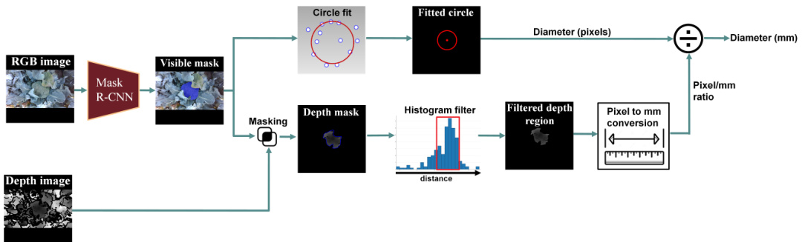  
Figure 4.10: Schematic representation of the diameter estimation method using the segmentation output of Mask R-CNN.  

  
Figure 4.11: Schematic representation of the diameter estimation method using the segmentation output of ORCNN.  

# 4.2.2.2.2 Histogram filtering in the depth image  

Before the pixel diameter could be converted to a real-world diameter, a histogram filtering was applied on the depth image. This filtering algorithm removed all incorrectly segmented pixels from the visible mask that did not belong to the broccoli head. An incorrect segmentation, even if it represented only a few pixels, could potentially cause an offset of centimetres or even decimetres when these pixels are transferred to the registered depth image (because an incorrectly segmented pixel can belong to a leaf that can be decimetres higher than the broccoli head). A depth offset can cause an inaccurate pixel-to-millimetre conversion and an inaccurate diameter estimation.  

First, the pixel segmentation of the visible broccoli region, Figure 4.12a, was masked onto the depth image, resulting a depth mask as visualised in Figure 4.12b. All pixels with a depth value inside the depth mask were put into a histogram with ten bins (Figure 4.12c). The histogram bin with the highest number of depth pixels was selected, assuming that this would represent the majority of the depth pixels of the broccoli head. From the selected bin, the lowest and the highest depth value were extracted. These depth values were averaged, resulting the depth value of the centre of the bin. From this depth value, 5 cm was subtracted and $5 \mathrm { c m }$ was added to obtain the depth range of the broccoli head, under the assumption that it could never exceed $1 0 \ \mathrm { c m }$ . The other depth pixels that fell outside the selected depth range were removed, refer to the red-coloured bin in Figure 4.12c. The depth pixels that belonged to that bin(s) were considered as depth outliers.  

Because the broccoli depth range could vary between a small-sized and a big-sized broccoli head, an additional filtering method was implemented. This filtering method started with the creation of another histogram from the selected depth pixels of the broccoli head (Figure 4.12d). The histogram was normalised and also consisted of ten bins. From the ten bins, only the bins with a value of 0.04 or higher were selected. The other bins were removed, since less than $4 \%$ of the broccoli depth pixels were within that bin. These depth pixels were considered as depth outliers, refer to the red-coloured bins in Figure 4.12d. From the selected bins (the blue-coloured bins in Figure 4.12d), the depth value with the furthest distance to the camera was selected. This depth value was used as the basis for calculating the pixel-to-millimetre conversion factor (this is explained in the next paragraph).  

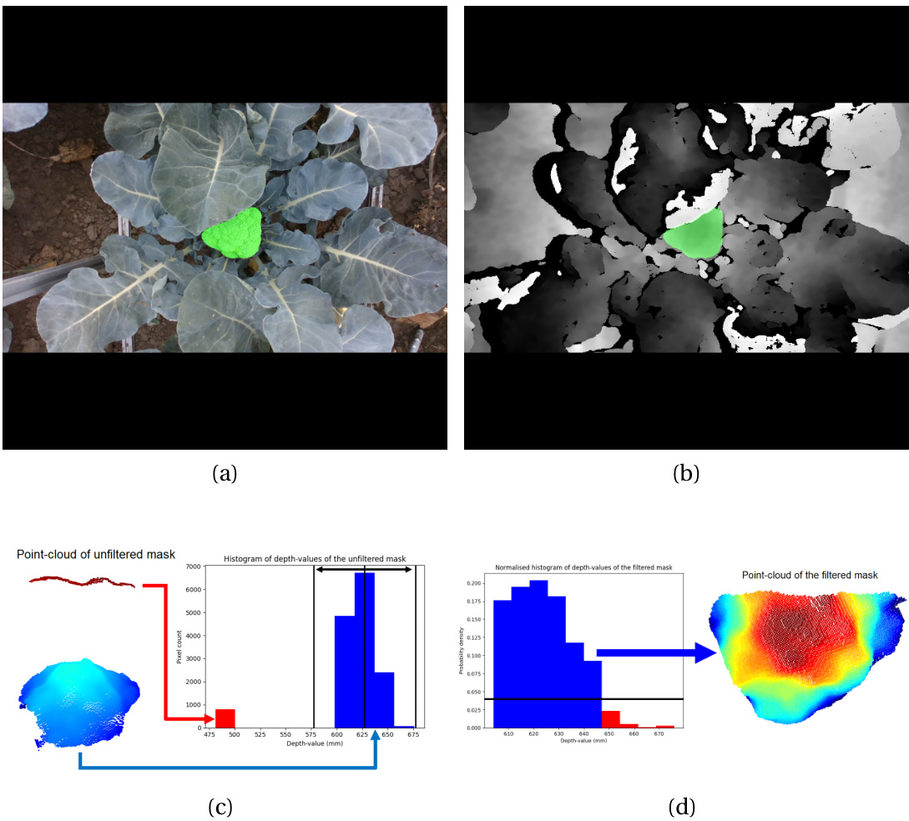  

Figure 4.12: The histogram filtering procedure explained: (a) The segmentation of the visible mask (green pixels) in the RGB image. (b) A depth mask was created, by masking the visible mask onto the registered depth image. (c) The depth values of the pixels inside the depth mask were put into a histogram. The bin with the highest number of depth pixels was selected from the histogram. Then, the depth value of the centre of the selected bin was determined (see middle black vertical line in the histogram). From this depth value, $5 \mathrm { c m }$ was subtracted and $5 \mathrm { c m }$ was added to obtain the depth range of the broccoli head. The bins within this depth range (visualised by the left and right black vertical line in the histogram) were selected. The other bin, visualised in red, was removed because it fell outside the depth range. In this example, the removed bin represented the depth values of a higher positioned leaf (refer to the red coloured part of the unfiltered point cloud). (d) The depth values of the selected bins were put into another normalised histogram. The bins with a value of 0.04 (horizontal black line) or higher were selected (these bins are coloured blue). The other bins were removed (red-coloured bins). The depth pixels that remained after the filtering were presumed to belong to the broccoli head (the rainbow-coloured point cloud is a representation of the broccoli head after the histogram filtering).  

# 4.2.2.2.3 Pixel-to-millimetre conversion  

With the third algorithm, the real-world diameter of the broccoli head was estimated in millimetres (mm). This estimation was done with a pixel-to-millimetre conversion factor. The factor was calculated from the depth values of the broccoli head furthest from the camera. These depth values were expected to represent the depth of the contour of the broccoli head, where also the ground-truth measurement was done, refer to Figure 4.3b. All pixels inside the depth mask with the same depth value were selected. From this sub-selection of depth pixels, two pixels were randomly selected and the Euclidean distance between them was calculated (in pixels), see Figure 4.13.  

With the use of the camera-intrinsics of the stereo-vision cameras, the 3D real-world coordinates of the two selected pixels were calculated (in x, y, z coordinates). Because the camera was horizontally levelled and the pixels were sampled at the same depth, these pixels approximated the same horizontal depth plane of the broccoli head. The Euclidean distance between the two selected pixels was calculated in millimetres (Figure 4.13). The pixel-to-millimetre conversion factor was calculated by dividing the earlier obtained pixel distance with the real-world millimetre distance. Finally, the diameter of the broccoli head was estimated in millimetres by dividing the pixel diameter of the fitted circle with the pixel-to-millimetre conversion factor (Figure 4.10 and Figure 4.11).  

  
Figure 4.13: The rainbow-coloured point cloud is a representation of the broccoli head after the histogram filtering. The colour scale of the point cloud is based on the depth values: the red and orange-coloured points are closer to the camera compared to the cyan and blue-coloured points. On this point cloud, the pixel-to-millimetre conversion factor was calculated between two points (visualised by the two grey-coloured circles). The two points were sampled at the same depth (same z coordinate) and were expected to represent the depth of the contour of the broccoli head, where the ground-truth measurement was done. The pixel-to-millimetre conversion factor was obtained from the division of the Euclidean pixel distance and the Euclidean millimetre distance between these two points.  

# 4.2.3 Evaluation  

The performance of Mask R-CNN and ORCNN was evaluated with three metrics. The first metric was the detection performance, which specified the ability of each CNN to detect the broccoli heads that were present in the RGB image (section 4.2.3.1). The second metric was the segmentation performance, which specified the ability of each CNN to segment the pixels of the broccoli head (section 4.2.3.2). The third metric was the sizing performance, which specified the ability of each sizing method to estimate the real-world diameter of the broccoli head (section 4.2.3.3).  

# 4.2.3.1 Detection performance  

The detection performance was evaluated on the 487 RGB images of the test set. In total, 637 broccoli heads were annotated in these images, which were the 487 broccoli heads that were tagged and measured in the field, and 150 broccoli heads that were annotated in the image but not measured in the field. These 150 broccoli heads were only partially captured in the image, due to the camera’s field-of-view, see an example of such a broccoli at the bottom of Figure 4.5a and Figure 4.5b. These 150 broccoli heads were not part of the size experiment, because they were only partially captured in the image. The detection results were calculated for the total number of broccoli heads (637) and for the two subsets (that respectively consisted of 487 and 150 broccoli heads).  

A threshold $( \tau _ { \tt C N N } )$ of 0.5 on the CNN’s confidence level $( c )$ was used to determine whether there was a detection $\ b ( c \geq \tau _ { \mathbb { C } \mathbb { N } \mathbb { N } } )$ or not $( c < \tau _ { \mathbb { C } \mathbb { N } \mathbb { N } } )$ ). A threshold $( \tau _ { \tt I o U } )$ of 0.5 on the Intersection over Union (IoU) was used to determine whether the visible mask segmentation was a broccoli head $( \mathtt { I o U } \ge \tau _ { \mathtt { I o U } } )$ or background $( \mathrm { I o U } < \tau _ { \mathrm { I o U } } )$ . The IoU is a measure for the pixel overlap between the ground-truth mask, $M _ { \mathrm { { g t } } }$ , and the predicted mask, $M _ { \mathfrak { p } }$ , (Equation 4.3) and varies between zero (no pixel overlap) and one (complete pixel overlap). The IoU was calculated on the visible mask, because this was the only common output between Mask R-CNN and ORCNN.  

$$
\mathrm { I o U = } \frac { | M _ { \mathrm { g t } } \cap M _ { \mathrm { p } } | } { | M _ { \mathrm { g t } } \cup M _ { \mathrm { p } } | } \qquad \mathrm { w h e r e ~ | \cdot | ~ g i v e s ~ t h e ~ t o t a l ~ n u m b e r ~ o f ~ m a s k ~ p i x e l s }
$$  

With the thresholds on the confidence level and the IoU, the number of true positives ( $\dot { \boldsymbol { { x } } } \geq \tau _ { \mathbb { C N N } }$ and $\mathtt { I o U } \ge \tau _ { \mathtt { I o U } } )$ , false positives $\dot { \boldsymbol { { c } } } \geq \boldsymbol { { \tau } } _ { \mathtt { C N N } }$ and $\mathrm { I o U } < \tau _ { \mathrm { I o U } } )$ and false negatives ( $( c < \tau _ { \mathbb { C } \mathbb { N } \mathbb { N } }$ or $\boldsymbol { \mathrm { I o U } } < \tau _ { \mathrm { I o U } } ,$ ) were determined. A true positive was a broccoli head that was segmented as a broccoli head, a false positive was background that was segmented as a broccoli head, and a false negative was a broccoli head that was not segmented. With the total number of true positives (TP), false positives (FP), and false negatives (FN), the precision P (Equation 4.4) and the recall R (Equation 4.5) were calculated for both Mask R-CNN and ORCNN. The precision indicated the percentage of correct detections and the recall indicated the percentage of broccoli heads that were successfully detected by the CNNs.  

$$
P = { \frac { \mathrm { T P } } { \mathrm { T P + F P } } }
$$  

$$
R = { \frac { \mathrm { T P } } { \mathrm { T P } + \mathrm { F N } } }
$$  

# 4.2.3.2 Segmentation performance  

The segmentation performance was evaluated on the 487 broccoli heads that were tagged and measured in the field, because only these heads had an accurate ground-truth annotation of the amodal region of the broccoli head.  

The 487 broccoli heads were assigned into ten groups based on their occlusion rate, in the range of 0.0 to 1.0 with steps of 0.1. The segmentation performance of Mask RCNN and ORCNN was calculated for the broccoli heads that belonged to an occlusion group (and this was repeated for each occlusion group). The segmentation performance was also calculated for all broccoli heads, irrespective of their occlusion rate.  

The segmentation performance was evaluated with the IoU (Equation 4.3), which was calculated for both the visible and the amodal mask. Because Mask R-CNN did not output an amodal mask, its amodal IoU was calculated between the circle that was fitted on the visible mask and the amodal annotation that was used to train ORCNN. To allow a fair comparison, the amodal IoU of ORCNN was also calculated between the circle that was fitted on the amodal mask and the amodal annotation.  

A pairwise Wilcoxon test (Wilcoxon, 1945) with a significance level of $5 \%$ $scriptstyle ( \mathbf { p } = \mathbf { 0 } . 0 5 )$ ) was employed for the visible and the amodal IoU values to test whether there were statistical differences between the Mask R-CNN segmentation and the ORCNN segmentation. We used the Wilcoxon test, because it can deal with non-normally distributed data, like the IoU.  

# 4.2.3.3 Size estimation performance  

The size estimation performance was also expressed for the ten occlusion rate groups (in the range of 0.0 to 1.0 with steps of 0.1). The performance metric was the diameter error $( \varepsilon )$ , which was the difference between the diameter estimate of the CNN sizing methods $( \hat { d } )$ and the diameter measurement that was done in the field, $( d )$ (Equation 4.6).  

$$
\boldsymbol { \varepsilon } = \hat { d } - d
$$  

The diameter error was evaluated by means of the median error $( \tilde { \varepsilon } )$ , the median absolute error (MAD, Equation 4.7), the mean absolute error (MAE, Equation 4.8) and the root mean squared error (RMSE, Equation 4.9).  

$$
\mathtt { M A D } = \mathtt { m e d i a n } ( \vert \varepsilon _ { i } - \tilde { \varepsilon } \vert )
$$  

$$
\mathtt { M A E } = \frac { 1 } { n } \sum _ { i = 1 } ^ { n } | \varepsilon |
$$  

$$
{ \mathrm { R M S E } } = { \sqrt { { \frac { 1 } { n } } \sum _ { i = 1 } ^ { n } \varepsilon ^ { 2 } } }
$$  

A pairwise Wilcoxon test with a significance level of $5 \%$ $\scriptstyle ( \mathtt { p } = 0 . 0 5 )$ ) was applied on the absolute diameter errors, $| \varepsilon |$ , to test whether there were statistical differences between the Mask R-CNN sizing method and the ORCNN sizing method. Finally, the Pearson correlation coefficient, $r$ , was calculated to investigate the relation between the amodal segmentation performance and the absolute diameter error.  

# 4.3 Results  

# 4.3.1 Detection results  

The detection results of Mask R-CNN and ORCNN are summarised in Table 4.1 and Table 4.2. The detection results are summarised for the two subsets of broccoli heads and for the total number of broccoli heads in the test images. The first subset represented the 487 broccoli heads that were measured in the field and that were used for the size experiment. Both Mask R-CNN and ORCNN detected all broccoli heads without false positive detections, indicating that both CNNs reached a recall and a precision of $1 0 0 . 0 \%$ on these broccoli heads (Table 4.1 and Table 4.2).  

The second subset contained the 150 broccoli heads that were only partially captured in the image, due to the camera’s field-of-view. Of these 150 partially-captured broccoli heads (which were not used in the size experiment), 133 heads were detected by Mask RCNN (Table 4.1) and 136 heads were detected by ORCNN (Table 4.2). Mask R-CNN had 10 false positive detections and ORCNN had 15 false positive detections. Mask R-CNN had a precision of $9 3 . 0 \%$ and a recall of $8 8 . 7 \%$ on these 150 broccoli heads. ORCNN had a precision of $9 0 . 1 \%$ and a recall of $9 0 . 7 \%$ .  

The final calculation was done on the total number of broccoli heads in the test images. Mask R-CNN detected 620 of the 637 broccoli heads (Table 4.1) and ORCNN detected 623 of the 637 broccoli heads (Table 4.2). Mask R-CNN had in total 10 false positive detections and ORCNN had 15 false positive detections. With Mask R-CNN, the precision was $9 8 . 4 \%$ and the recall was $9 7 . 3 \%$ (Table 4.1). ORCNN had a precision of $9 7 . 6 \%$ and a recall of $9 7 . 8 \%$ (Table 4.2).  

Table 4.1: Mask R-CNN detection results on the test images. The abbreviations indicate the number of ground-truth annotations (GT), the number of detections by the CNN (Det), the number of true positives (TP), the number of false positives (FP), the number of false negatives (FN), the precision (P) and the recall (R).   

<html><body><table><tr><td>Subset</td><td>GT</td><td>Det</td><td>TP</td><td>FP</td><td>FN</td><td>P</td><td>R</td></tr><tr><td>1.Broccoli heads in size experiment</td><td>487</td><td>487</td><td>487</td><td>0</td><td>0</td><td>100.0%</td><td>100.0%</td></tr><tr><td>2.Broccoli heads not in size experiment</td><td>150</td><td>143</td><td>133</td><td>10</td><td>17</td><td>93.0%</td><td>88.7%</td></tr><tr><td>All broccoli heads in the test images</td><td>637</td><td>630</td><td>620</td><td>10</td><td>17</td><td>98.4%</td><td>97.3%</td></tr></table></body></html>  

Table 4.2: ORCNN detection results on the test images. The meaning of the abbreviations can be found in the caption of Table 4.1.   

<html><body><table><tr><td>Subset</td><td>GT</td><td>Det</td><td>TP</td><td>FP</td><td>FN</td><td>P</td><td>R</td></tr><tr><td>1.Broccoli heads in size experiment</td><td>487</td><td>487</td><td>487</td><td>0</td><td>0</td><td>100.0%</td><td>100.0%</td></tr><tr><td>2.Broccoli heads not in size experiment</td><td>150</td><td>151</td><td>136</td><td>15</td><td>14</td><td>90.1%</td><td>90.7%</td></tr><tr><td>All broccoli heads in the test images</td><td>637</td><td>638</td><td>623</td><td>15</td><td>14</td><td>97.6%</td><td>97.8%</td></tr></table></body></html>  

# 4.3.2 Segmentation results  

The broccoli segmentation performance was calculated on the 487 broccoli heads that were measured in the field and used in the size experiment. Table 4.3 summarises the Intersection over Union (IoU) values for the visible mask segmentations of Mask R-CNN and ORCNN for the ten occlusion rate groups. Table 4.3 also summarises the statistical results of the pairwise Wilcoxon test. For eight occlusion rates, ORCNN had a significantly lower IoU on the visible region of the broccoli head compared to Mask R-CNN. However, the effect size was small, with IoU differences between 0.01 and 0.09. For the four most heavily occluded broccoli heads, which had an occlusion rate between $90 \%$ and $1 0 0 \%$ , the Wilcoxon test could not be applied, because there were too few test samples.  

Table 4.4 summarises the IoU values for the amodal mask segmentations of Mask RCNN and ORCNN for the ten occlusion rate groups. For eight occlusion rates, ORCNN had a significantly higher IoU on the amodal region of the broccoli head compared to Mask R-CNN. For the broccoli heads with an occlusion rate between $0 \%$ and $6 0 \%$ , the effect size was small, with IoU differences of maximally 0.07. For the broccoli heads with an occlusion rate between $6 0 \%$ and $90 \%$ , the IoU differences were between 0.11 and 0.33. Again, we could not apply the Wilcoxon test for the broccoli heads with an occlusion rate between $90 \%$ and $1 0 0 \%$ , because there were only four samples.  

Table 4.3: Statistics on the Intersection over Union (IoU) values for the visible mask segmentations of Mask R-CNN and ORCNN. The statistics are expressed for the ten occlusion rate groups. The last row summarises the IoU statistics for all broccoli heads that were used in the size experiment. $n$ is the number of broccoli heads, and stdev is the abbreviation of standard deviation.  

<html><body><table><tr><td rowspan="2">Occlusion rate</td><td colspan="2">Mean IoUon the visible mask (stdev)</td><td rowspan="2">p-value</td></tr><tr><td>Mask R-CNN</td><td>ORCNN</td></tr><tr><td>0.0-0.1 (n=147)</td><td>0.97 (0.01)</td><td>0.96 (0.01)</td><td>0.00 (****)</td></tr><tr><td>0.1-0.2 (n=60)</td><td>0.96 (0.01)</td><td>0.95 (0.01)</td><td>0.00 (****)</td></tr><tr><td>0.2-0.3 (n=33)</td><td>0.95 (0.01)</td><td>0.95 (0.01)</td><td>0.09 (ns)</td></tr><tr><td>0.3-0.4 (n=35)</td><td>0.94 (0.02)</td><td>0.93 (0.02)</td><td>0.00 (****)</td></tr><tr><td>0.4-0.5 (n=47)</td><td>0.93 (0.03)</td><td>0.93 (0.03)</td><td>0.00 (****)</td></tr><tr><td>0.5-0.6 (n=35)</td><td>0.92 (0.03)</td><td>0.91 (0.04)</td><td>0.00 (****)</td></tr><tr><td>0.6-0.7 (n=65)</td><td>0.90 (0.05)</td><td>0.88 (0.05)</td><td>0.00 (****)</td></tr><tr><td>0.7-0.8 (n=41)</td><td>0.87 (0.06)</td><td>0.85 (0.07)</td><td>0.00 (****)</td></tr><tr><td>0.8-0.9 (n=20)</td><td>0.83 (0.08)</td><td>0.79 (0.09)</td><td>0.00 (***)</td></tr><tr><td>0.9-1.0 (n=4)</td><td>0.84 (0.10)</td><td>0.75 (0.11)</td><td>-</td></tr><tr><td>All (n=487)</td><td>0.93 (0.05)</td><td>0.92 (0.06)</td><td>0.00 (****)</td></tr></table></body></html>

- (too few samples), ns=not significant $\scriptstyle \overline { { p { > } 0 . 0 5 ) } }$ , \* (0.01<p≤0.05), \* $( 0 . 0 0 1 < p \leq 0 . 0 1 )$ ), \*\*\* ( $0 . 0 0 0 1 { < } p { \le } 0 . 0 0 1 \$ ), \*\*\*\* ( $p { \leq } 0 . 0 0 0 1 )$  

Table 4.4: Statistics on the Intersection over Union (IoU) values for the amodal mask segmentations of Mask R-CNN and ORCNN, expressed for the ten occlusion rate groups. The last row summarises the IoU statistics for all broccoli heads that were used in the size experiment. $n$ is the number of broccoli heads, and stdev is the abbreviation of standard deviation.   

<html><body><table><tr><td rowspan="2">Occlusion rate</td><td colspan="2">Mean IoUon the amodal mask (stdev)</td><td rowspan="2">p-value</td></tr><tr><td>Mask R-CNN</td><td>ORCNN</td></tr><tr><td>0.0-0.1 (n=147)</td><td>0.95 (0.03)</td><td>0.95 (0.03)</td><td>0.00 (**)</td></tr><tr><td>0.1-0.2 (n=60)</td><td>0.93 (0.04)</td><td>0.94 (0.04)</td><td>0.00 (**)</td></tr><tr><td>0.2-0.3 (n=33)</td><td>0.89 (0.06)</td><td>0.90 (0.07)</td><td>0.17 (ns)</td></tr><tr><td>0.3-0.4 (n=35)</td><td>0.86 (0.09)</td><td>0.92 (0.04)</td><td>0.00 (**)</td></tr><tr><td>0.4-0.5 (n=47)</td><td>0.82 (0.11)</td><td>0.89 (0.06)</td><td>0.00 (****)</td></tr><tr><td>0.5-0.6 (n=35)</td><td>0.80 (0.13)</td><td>0.87 (0.09)</td><td>0.00 (**)</td></tr><tr><td>0.6-0.7 (n=65)</td><td>0.75 (0.18)</td><td>0.86 (0.11)</td><td>0.00 (****)</td></tr><tr><td>0.7-0.8 (n=41)</td><td>0.63 (0.22)</td><td>0.82 (0.12)</td><td>0.00 (****)</td></tr><tr><td>0.8-0.9 (n=20)</td><td>0.47 (0.22)</td><td>0.80 (0.11)</td><td>0.00 (****)</td></tr><tr><td>0.9-1.0 (n=4)</td><td>0.28 (0.25)</td><td>0.72 (0.14)</td><td></td></tr><tr><td>All (n=487)</td><td>0.83 (0.18)</td><td>0.90 (0.09)</td><td>0.00 (****)</td></tr></table></body></html>

- (too few samples), ns=not significant $\overline { { p { > } 0 . 0 5 ) } }$ , \* (0.01<p≤0.05), \*\* $\mathrm { ~ : ~ } ( 0 . 0 0 1 < p { \leq } 0 . 0 1 )$ ), \*\*\* $( 0 . 0 0 0 1 < p { \le } 0 . 0 0 1 )$ ), \*\*\*\* ( $p { \leq } 0 . 0 0 0 1 )$  

# 4.3.3 Size estimation results  

In Figure 4.14, the diameter errors of the Mask R-CNN sizing method and the ORCNN sizing method are plotted in histograms. With Mask R-CNN, 326 of the 487 diameter estimates were underestimated $( 6 6 . 9 \% )$ and 161 of the 487 estimates were overestimated $( 3 3 . 1 \% )$ . The median diameter error of Mask R-CNN, $\widetilde { \varepsilon } _ { \mathrm { m r c c n n } }$ , was $- 2 . 4 \ \mathrm { m m }$ , indicating that the majority of the estimates were underestimated. With ORCNN, the diameter estimates were more balanced, as there were 209 underestimations $( 4 2 . 9 \% )$ and 278 overestimations $( 5 7 . 1 \% )$ ). The median diameter error of ORCNN, $\tilde { \varepsilon } _ { \mathrm { o r c r u n } }$ , was $1 . 1 \mathrm { m m }$ , indicating that the majority of the estimates were overestimated and that the median error was smaller than the one from Mask R-CNN.  

Figure 4.15 shows the cumulative percentages of the absolute diameter errors. Three error margins $\mathrm { 1 0 ~ m m }$ , $2 0 ~ \mathrm { m m }$ and $3 0 ~ \mathrm { m m }$ ) are marked by the dashed vertical lines. With the Mask R-CNN sizing method, 342 of the 487 diameter estimates $( 7 0 . 2 \% )$ were within $1 0 \mathrm { m m }$ from the ground-truth diameter. With the ORCNN sizing method, 406 of the 487 diameter estimates $( 8 3 . 4 \% )$ were within $1 0 \mathrm { m m }$ from the ground-truth diameter. The number of diameter estimates that were within $2 0 \mathrm { m m }$ and within $3 0 \mathrm { m m }$ from the ground-truth, were respectively 420 $( 8 6 . 2 \% )$ and 443 $( 9 1 . 0 \% )$ with Mask R-CNN, and 466 $( 9 5 . 7 \% )$ and 477 $( 9 7 . 9 \% )$ with ORCNN. With Mask R-CNN, 44 of the 487 diameter estimates $( 9 . 0 \% )$ deviated more than $3 0 \mathrm { m m }$ from the ground-truth. With ORCNN, this number was 10 $( 2 . 1 \% )$ .  

  
Figure 4.14: (a) Histogram of the diameter error of the Mask R-CNN sizing method on the 487 broccoli heads. (b) Histogram of the diameter error of the ORCNN sizing method. $n$ is the number of diameter estimates.  

  
Figure 4.15: Cumulative percentages of the absolute diameter errors of the two sizing methods. The three dashed vertical lines indicate the error margins of $1 0 ~ \mathrm { m m }$ , $2 0 ~ \mathrm { m m }$ and $3 0 ~ \mathrm { m m }$ . The coloured numbers summarise the cumulative percentages of the absolute diameter estimates that were within $1 0 \ \mathrm { m m }$ , $2 0 ~ \mathrm { m m }$ and $3 0 ~ \mathrm { m m }$ from the ground-truth diameter.  

Table 4.5 summarises the median absolute diameter error (MAD) and the root mean square diameter error (RMSE) for the two sizing methods and the ten occlusion rate groups. The Mask R-CNN sizing method had a MAD of $7 . 9 \mathrm { m m }$ and a RMSE of $1 8 . 7 \mathrm { m m }$ on all broccoli heads. With the ORCNN sizing method, the MAD was $6 . 7 \mathrm { m m }$ and the RMSE was $9 . 7 \mathrm { m m }$ .  

Table 4.6 summarises the mean absolute diameter error (MAE) and the statistics of the pairwise Wilcoxon test. The Mask R-CNN sizing method had a MAE of $1 0 . 7 \mathrm { m m }$ on all broccoli heads. With the ORCNN sizing method, the MAE was $6 . 4 \mathrm { m m }$ . The Wilcoxon test revealed that the ORCNN sizing method had a significantly lower absolute diameter error than Mask R-CNN on 161 broccoli heads with an occlusion rate between $5 0 \%$ and $9 0 \%$ (Table 4.6). For these occlusion rates, the diameter error differences were between 3.5 and $2 8 . 4 \mathrm { m m }$ . For the four most heavily occluded broccoli heads, which had an occlusion rate between $90 \%$ and $1 0 0 \%$ , the Wilcoxon test could not be applied, because there were too few test samples.  

In Figure 4.16, the relation between the amodal segmentation performance and the absolute diameter error is plotted. The Pearson’s correlation coefficient was -0.86, indicating that there was a negative correlation between the amodal segmentation performance and the absolute diameter error (the lower the amodal IoU the higher the absolute diameter error, and vice versa). The effect of the amodal segmentation on the sizing performance is also visualised in Figure 4.17 and Figure 4.18. On these two heavily occluded broccoli heads, the ORCNN sizing method had a higher amodal IoU and a lower absolute diameter error compared to the Mask R-CNN sizing method.  

Table 4.5: The median absolute diameter error and the root mean square diameter error (RMSE) for the two sizing methods. Both errors were calculated for the ten occlusion rate groups and for the total number of broccoli heads (last row). $n$ is the number of broccoli heads.   

<html><body><table><tr><td rowspan="2"></td><td colspan="2">Median absolute diameter error (mm)</td><td colspan="2">RMSE of the diameter (mm)</td></tr><tr><td>MaskR-CNN</td><td>ORCNN</td><td>MaskR-CNN</td><td>ORCNN</td></tr><tr><td>Occlusion rate 0.0-0.1 (n=147)</td><td>4.3</td><td>4.9</td><td>4.7</td><td>4.9</td></tr><tr><td>0.1-0.2 (n=60)</td><td>3.6</td><td>3.6</td><td>4.1</td><td>4.5</td></tr><tr><td>0.2-0.3 (n=33)</td><td>6.2</td><td>5.6</td><td>6.8</td><td>6.7</td></tr><tr><td>0.3-0.4 (n=35)</td><td>8.9</td><td>8.0</td><td>8.4</td><td>7.5</td></tr><tr><td>0.4-0.5 (n=47)</td><td>7.4</td><td>5.6</td><td>11.2</td><td>7.9</td></tr><tr><td>0.5-0.6 (n=35)</td><td>9.6</td><td>7.3</td><td>12.8</td><td>8.9</td></tr><tr><td>0.6-0.7 (n=65)</td><td>9.6</td><td>7.6</td><td>21.3</td><td>11.1</td></tr><tr><td>0.7-0.8 (n=41)</td><td>23.6</td><td>14.1</td><td>31.5</td><td>15.9</td></tr><tr><td>0.8-0.9 (n=20)</td><td>34.2</td><td>13.4</td><td>49.1</td><td>19.9</td></tr><tr><td>0.9-1.0 (n=4)</td><td>41.5</td><td>6.3</td><td>88.5</td><td>38.5</td></tr><tr><td>All (n=487)</td><td>7.9</td><td>6.7</td><td>18.7</td><td>9.7</td></tr></table></body></html>  

Table 4.6: Statistics on the mean absolute diameter error for the two sizing methods, expressed for the ten occlusion rate groups. $n$ is the number of broccoli heads, and stdev is the abbreviation of standard deviation.  

<html><body><table><tr><td rowspan="2">Occlusion rate</td><td colspan="2">Mean absolute diameter error (mm) (stdev)</td><td rowspan="2">p-value</td></tr><tr><td>Mask R-CNN</td><td>ORCNN</td></tr><tr><td>0.0-0.1 (n=147)</td><td>3.6 (3.1)</td><td>3.9 (2.9)</td><td>0.11 (ns)</td></tr><tr><td>0.1-0.2 (n=60)</td><td>3.2 (2.5)</td><td>3.8 (2.4)</td><td>0.05 (ns)</td></tr><tr><td>0.2-0.3 (n=33)</td><td>5.4 (4.1)</td><td>5.4 (4.0)</td><td>0.64 (ns)</td></tr><tr><td>0.3-0.4 (n=35)</td><td>7.0 (4.8)</td><td>6.1 (4.5)</td><td>0.39 (ns)</td></tr><tr><td>0.4-0.5 (n=47)</td><td>8.8 (7.0)</td><td>6.3 (4.8)</td><td>0.06 (ns)</td></tr><tr><td>0.5-0.6 (n=35)</td><td>10.1 (7.9)</td><td>6.6 (6.0)</td><td>0.03 (*)</td></tr><tr><td>0.6-0.7 (n=65)</td><td>16.5 (13.5)</td><td>7.8 (7.8)</td><td>0.00 (****)</td></tr><tr><td>0.7-0.8 (n=41)</td><td>25.4 (18.6)</td><td>12.2 (10.2)</td><td>0.00 (***)</td></tr><tr><td>0.8-0.9 (n=20)</td><td>42.9 (24.0)</td><td>14.5 (13.6)</td><td>0.00 (***)</td></tr><tr><td>0.9-1.0 (n=4)</td><td>77.3 (43.2)</td><td>27.0 (27.5)</td><td></td></tr><tr><td>All (n=487)</td><td>10.7 (15.3)</td><td>6.4 (7.3)</td><td>0.00 (****)</td></tr></table></body></html>

- (too few samples), ns=not significant $( p { > } 0 . 0 5 )$ , $^ { * } \left( 0 . 0 1 { < } p { \le } 0 . 0 5 \right)$ , \*\* $( 0 . 0 0 1 < p { \le } 0 . 0 1 )$ , $^ { * * * }$ ( $0 . 0 0 0 1 { < } p { \le } 0 . 0 0 1 )$ , $\ast \ast \ast \ast$ ( $p { \leq } 0 . 0 0 0 1 )$  

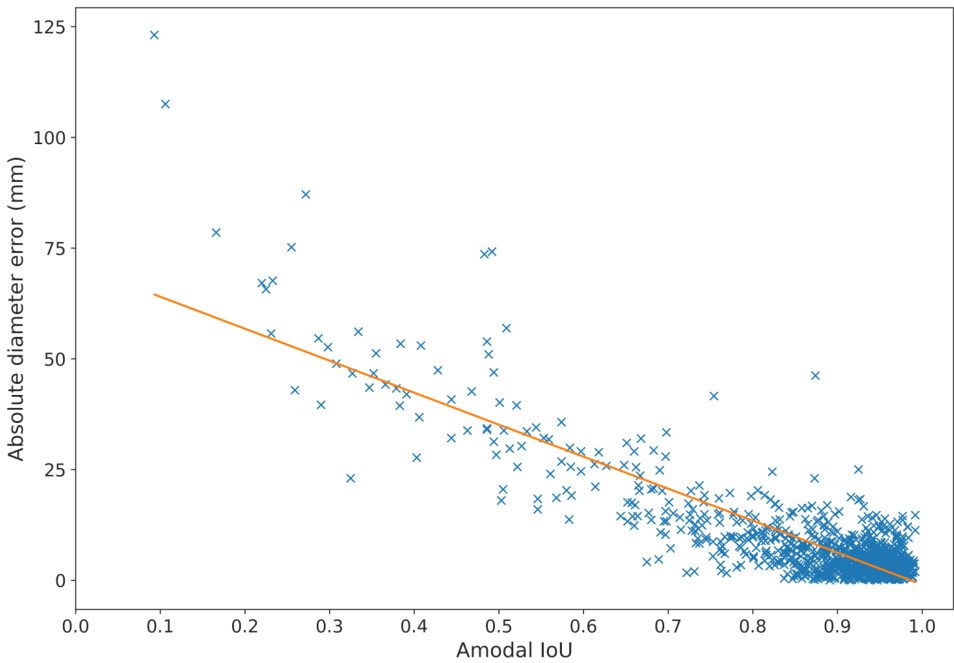  
Figure 4.16: A scatter plot showing the relation between the amodal IoU and the absolute diameter error for all 974 estimates of the two CNN sizing methods. The orange line visualises the regression line between the two outputs. The Pearson’s correlation coefficient $( r )$ was -0.86, indicating that there was a negative correlation between the amodal IoU and the absolute diameter error.  

  
Figure 4.17: (a) The diameter estimation (Est) of the Mask R-CNN sizing method was $1 0 8 . 1 \mathrm { m m }$ on a broccoli head with a measured diameter (Diam) of $1 3 6 ~ \mathrm { m m }$ . The diameter error (Diff ) was $- 2 7 . 9 \ \mathrm { m m }$ . The amodal IoU (AIoU) between the circle fit and the amodal annotation was 0.70. The visible IoU (VIoU) was 0.87. The broccoli head had an occlusion rate (OCR) of $74 \%$ . (b) On the same image, ORCNN had an amodal IoU of 0.86 and a diameter error of $- 1 3 . 8 ~ \mathrm { m m }$ . In image a & b, the blue pixels visualise the visible mask segmentation. The green pixels are the pixels that had a depth value and that remained after the histogram filtering. The red circle visualises the circle that was fitted on either the visible or the amodal mask. (c) The same broccoli head after removal of all leaves (no occlusion). The amodal mask annotation is visualised by the red circle and the visible mask annotation is visualised by the blue polygon.  

  
Figure 4.18: (a) The diameter estimation (Est) of the Mask R-CNN sizing method was $6 0 . 1 \mathrm { m m }$ on a broccoli head with a measured diameter (Diam) of $1 0 9 \mathrm { m m }$ . The diameter error (Diff ) was $- 4 8 . 9 \mathrm { m m }$ . The amodal IoU (AIoU) between the circle fit and the amodal annotation was 0.31. The visible IoU (VIoU) was 0.84. The broccoli head had an occlusion rate (OCR) of $89 \%$ . (b) On the same image, ORCNN had an amodal IoU of 0.85 and a diameter error of $- 6 . 6 \ \mathrm { m m }$ . (c) The same broccoli head after removal of all leaves (no occlusion). The amodal mask annotation is visualised by the red circle and the visible mask annotation is visualised by the blue polygon.  

With the Mask R-CNN sizing method, the biggest diameter error was - $. 1 2 3 . 1 \mathrm { m m }$ (Figure 4.19). The biggest diameter error of the ORCNN sizing method was - $\cdot 7 4 . 2 \mathrm { m m }$ (Figure 4.20), and this error was found on the same image frame as Figure 4.19. The main cause of both errors was the underestimation of the amodal region of the broccoli head. Additionally, there was an inaccurate pixel-to-millimetre conversion, because there were no valid depth pixels of the broccoli head. All depth pixels in Figure 4.19b and Figure 4.20b belonged to an occluded leaf, causing that the pixel-to-millimetre conversion factor was calculated on the higher-positioned leaf instead of the broccoli head. With the Mask R-CNN sizing method, the inaccurate size conversion contributed $1 1 . 3 \%$ to the total diameter error. With the ORCNN sizing method, the contribution was higher: $4 4 . 1 \%$ . An analysis on the five biggest diameter errors of ORCNN revealed that two more errors were primarily caused by such an inaccurate pixel-to-millimetre conversion. When analysing these two errors of respectively $- 4 6 . 2 \mathrm { m m }$ and $- 4 1 . 6 \mathrm { m m }$ , the inaccurate pixelto-millimetre conversion contributed $8 2 . 6 \%$ and $8 8 . 7 \%$ to the total diameter error.  

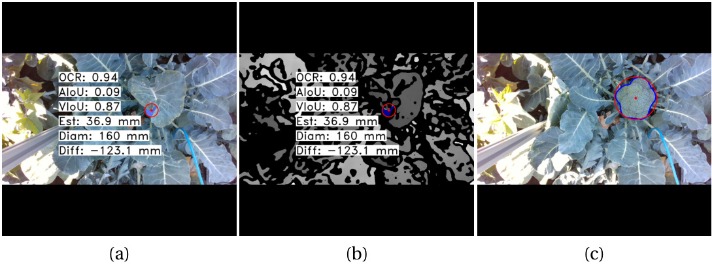  
Figure 4.19: (a) The biggest diameter error (Diff) of the Mask R-CNN sizing method was - $\cdot 1 2 3 . 1 \ \mathrm { m m }$ . The main cause of this error was the underestimation of the amodal region (the amodal IoU was 0.09) of the heavily occluded broccoli head (the occlusion rate (OCR) was $9 4 \%$ ). (b) In the registered depth image, all depth pixels belonged to a higher-positioned leaf. This ultimately caused an inaccurate pixel-to-millimetre conversion, which contributed for $1 1 . 3 \%$ to the total diameter error. (c) The RGB image of the same broccoli head after removal of all leaves (no occlusion). The amodal mask annotation is visualised by the red circle and the visible mask annotation is visualised by the blue polygon.  

  
Figure 4.20: (a) The biggest diameter error (Diff) of the ORCNN sizing method was -74.2 $\mathrm { m m }$ . This error was found on the same image as Figure 4.19. The main cause of this error was the underestimation of the amodal region (the amodal IoU was 0.49) of the heavily occluded broccoli head (the occlusion rate (OCR) was $9 4 \%$ ). (b) In the registered depth image, all depth pixels belonged to a higher-positioned leaf. This ultimately caused an inaccurate pixel-to-millimetre conversion, which contributed for $4 4 . 1 \%$ to the total diameter error. (c) The RGB image of the same broccoli head after removal of all leaves (no occlusion). The amodal mask annotation is visualised by the red circle and the visible mask annotation is visualised by the blue polygon.  

# 4.4 Discussion  

Our images were acquired with two different cameras on two fields where different broccoli cultivars were grown in different growing seasons. Although there was variation in our datasets, it is not guaranteed that our algorithms will generalise sufficiently on broccoli images from other fields with different cultivars. It is also acknowledged that the image variation was not as extensive as for example the research of Blok et al. (2021c). In the research of Blok et al. (2021c), the generalisation performance of Mask R-CNN was evaluated on 600 broccoli images that originated from three cultivars, five growing seasons and 11 broccoli fields that were located in three different countries. Despite the lack of such a comprehensive evaluation, it is expected that our algorithms can be efficiently retrained on new datasets to achieve image generalisation. This expectation is based on the research of Blok et al. (2021c), in which image generalisation was reached on a new broccoli cultivar by adding 30 images of that cultivar into the training set. To further enhance the retraining process on other datasets, we have made our software, dataset and trained algorithms publicly available.  

In our datasets, 1363 of the 2560 broccoli images $( 5 3 . 2 \% )$ had a human-made leaf occlusion. These leaf occlusions were created by the same person, indicating that they may have been subject to some degree of subjectivity. Nevertheless, these human-made occlusions provided natural-looking examples of different levels of leaf occlusion, allowing the systematic evaluation of the algorithms on different occlusion rates. An additional advantage of the leaf modification was that it allowed an accurate annotation of the amodal region of the occluded broccoli head. A similar annotation method can also be used on other occluded crops, which could solve the problem of incorrect annotation of occluded image scenes (a problem that was identified by Zhang et al. (2020)).  

On both of our datasets, Mask R-CNN and ORCNN detected all broccoli heads that were tagged and measured in the field. For the other broccoli heads that were annotated (but not measured in the field) the detection results were at most $1 1 . 3 \%$ lower. This is acceptable, as most of these broccoli heads were only partially captured in the fieldof-view of the camera. These broccoli heads are likely to be detected in a subsequent frame when the image acquisition device moves further. When comparing our detection results to other broccoli detection studies (Blok et al., 2021c; Kusumam et al., 2017), it can be concluded that both of our CNNs reached a state-of-the-art detection performance, especially since the majority of our broccoli heads were (heavily) occluded.  

ORCNN had a significantly lower segmentation performance on the visible region of the broccoli head for eight occlusion rates, although the absolute IoU differences were small. The lower IoU might have been caused by the expansion of the loss function of ORCNN with the additional loss component for the amodal mask. The addition of this extra loss component may have resulted in a reduced minimisation of the other loss components, such as the visual mask. Still, the less optimised visible mask of ORCNN did not seem to negatively affect the overall sizing performance in our experiments.  

ORCNN had a significantly higher segmentation performance on the amodal region of the broccoli head for eight occlusion rates. Especially for the broccoli heads with an occlusion rate higher than $6 0 \%$ , there were large differences between the amodal IoU of ORCNN and Mask R-CNN. For similar amodal predictions with a circle, it could have been sufficient to alter the Mask R-CNN network so that it could detect a circle instead of a bounding box (and then do the pixel segmentation inside the estimated circle). Yet, the flexibility of ORCNN to predict all kinds of crop shapes makes it a more versatile algorithm for use on a variety of crops.  

ORCNN significantly improved the diameter estimate of 161 broccoli heads with an occlusion rate between $5 0 \%$ and $9 0 \%$ . Therefore, the ORCNN sizing method should be preferred over the Mask R-CNN sizing method, especially when the size estimation has to be done in broccoli fields where there is more vegetative growth or where the broccoli plants are more densely planted (causing more occlusion).  

With the ORCNN sizing method, there was an increase of $1 3 . 2 \%$ on the number of broccoli heads that were estimated within $1 0 \mathrm { m m }$ from the ground-truth diameter. Additionally, there was an increase of $9 . 5 \%$ of estimates that were within $2 0 ~ \mathrm { m m }$ from the ground-truth. The more accurate size estimate of ORCNN could potentially result in less food waste and a higher financial return when the algorithm is used for robotic harvesting. In future research, we want to evaluate the performance of a broccoli harvesting robot that is equipped with the ORCNN sizing method.  

The ORCNN sizing method had a median absolute diameter error of $6 . 7 \mathrm { m m }$ . This error was respectively $2 . 7 \mathrm { m m }$ and $6 . 1 \mathrm { m m }$ lower than the median absolute diameter error of the convex hull and the bounding box estimator of Kusumam et al. (2017), who also investigated the in-field size estimation of broccoli heads. A difference is that both estimation methods of Kusumam et al. (2017) only used the visible part of the 3D point cloud, which ultimately resulted in an underestimated diameter estimate. In our research, ORCNN did not underestimate the broccoli size, as we found a positive median diameter error of $1 . 1 \mathrm { m m }$ on all broccoli heads. In a similar crop sizing study by Lin et al. (2019), the diameters of 80 citrus fruits were estimated with the same 3D sizing method as Kusumam et al. (2017) (unfortunately Lin et al. (2019) did not specify whether they used the convex hull or the bounding box estimator). On the relatively smaller citrus fruits, the median diameter error and the median absolute diameter error were respectively - $\cdot 1 . 0 \mathrm { m m }$ and $4 . 0 \mathrm { m m }$ , indicating that the estimates of Lin et al. (2019) were slightly better than our ORCNN estimates. An important difference is that Lin et al. (2019) did their evaluation on a lower number of citrus fruits with minimal occlusions, whereas our results were obtained on a test set with heavier occlusions and more broccoli heads.  

Despite the promising results of the ORCNN sizing method, there is still room for improvement. An analysis on the five biggest diameter errors of ORCNN revealed that three of the errors were primarily caused by an inaccurate pixel-to-millimetre conversion. This problem was caused by the lack of valid depth pixels of the broccoli head, which in turn was caused by the loss of depth pixels due to the leaf occlusion and the stereo-vision principle of the RGB-D cameras. In all 2560 depth images, on average one fifth of the broccoli depth pixels were lost compared to the broccoli region in the registered RGB image. A way to alleviate this depth pixel loss is to use a camera with a different depth perceiving technique, such as Laser Imaging Detection And Ranging (LIDAR) or Time-of-Flight (ToF). While the depth pixel loss of our stereo-vision cameras sometimes negatively influenced the sizing performance, the main cause of the diameter errors remained the inaccurate estimation of the amodal region of the broccoli head (this observation was also supported by the negative correlation between the amodal segmentation performance and the absolute diameter error).  

# 4.5 Conclusions  

With ORCNN, the segmentation of the amodal region of the broccoli head significantly improved. ORCNN provided a better estimate of the shape of an occluded broccoli head compared to Mask R-CNN, which estimated the amodal region with a circle fit on the visible broccoli region. With the significantly better amodal segmentation, the ORCNN sizing method achieved a $4 . 3 \ \mathrm { m m }$ lower mean absolute diameter error on 487 broccoli heads. Furthermore, with ORCNN there was a $1 3 . 2 \%$ increase on the number of broccoli heads that were estimated within $1 0 \mathrm { m m }$ from the ground-truth diameter. The ORCNN sizing method had also a significantly lower absolute diameter error on 161 broccoli heads with an occlusion rate between $5 0 \%$ and $9 0 \%$ . We conclude that ORCNN improved the size estimation of the heavily occluded broccoli heads in our datasets. We encourage other researchers to use our software and dataset to further develop methodologies that can deal with crop occlusion.  

# CRediT authorship contribution statement  

Pieter M. Blok: conceptualisation, methodology, software, data curation, writing - original draft. Eldert J. van Henten: supervision, conceptualisation, writing - review & editing. Frits K. van Evert: supervision, conceptualisation, writing - review & editing. Gert Kootstra: supervision, conceptualisation, writing - review & editing.  

# Acknowledgements  

We would like to thank Tony Wisdom and Wiebe Goodijk for providing the broccoli fields on which we acquired the RGB-D images. We thank Toon Tielen, Thierry Stokkermans and Hyejeong Kim for their help with the image acquisition. Thanks to Felipe Schadeck Fiorentin and Kevin Yao for the image annotation.  

Broccoli harvesting robot Mount Vernon (USA) - 2019  

  

# 5  

# Active learning with MaskAL reduces annotation effort for training Mask R-CNN on a broccoli dataset with visually similar classes  

Pieter M. Blok1,2, Gert Kootstra2, Hakim Elchaoui Elghor3, Boubacar Diallo3, Frits K. van Evert1, Eldert J. van Henten2  

1Agrosystems Research, Wageningen University & Research, Wageningen, The Netherlands   
2Farm Technology Group, Wageningen University & Research, Wageningen, The Netherlands   
3Exxact Robotics, Épernay, France  

# Abstract  

HE generalisation performance of a convolutional neural network (CNN) is influenced by the quantity, quality, and variety of the training images. Training images must be annotated, and this is time consuming and expensive. The goal of our work was to reduce the number of annotated images needed to train a CNN while maintaining its performance. We hypothesised that the performance of a CNN can be improved faster by ensuring that the set of training images contains a large fraction of hard-toclassify images. The objective of our study was to test this hypothesis with an active learning method that can automatically select the hard-to-classify images. We developed an active learning method for Mask Region-based CNN (Mask R-CNN) and named this method MaskAL. MaskAL involved the iterative training of Mask R-CNN, after which the trained model was used to select a set of unlabelled images about which the model was most uncertain. The selected images were then annotated and used to retrain Mask RCNN, and this was repeated for a number of sampling iterations. In our study, MaskAL was compared to a random sampling method on a broccoli dataset with five visually similar classes. MaskAL performed significantly better than the random sampling. In addition, MaskAL had the same performance after sampling 900 images as the random sampling had after 2300 images. Compared to a Mask R-CNN model that was trained on the entire training set (14,000 images), MaskAL achieved $9 3 . 9 \%$ of that model’s performance with $1 7 . 9 \%$ of its training data. The random sampling achieved $8 1 . 9 \%$ of that model’s performance with $1 6 . 4 \%$ of its training data. We conclude that by using MaskAL, the annotation effort can be reduced for training Mask R-CNN on a broccoli dataset with visually similar classes. Our software is available on https://github.com/pieterblok/maskal.  

Keywords: active learning, deep learning, instance segmentation, Mask R-CNN, agriculture  

# 5.1 Introduction  

In current practice, broccoli heads are harvested by hand, and this is physically demanding, time consuming, and expensive. These labour problems can be mitigated by a robot that can harvest the broccoli heads automatically. For the robot to be autonomous, it is essential to have a perception system that can determine which broccoli heads are both healthy and large enough to be harvested. This perception system can be realised with a camera and an image processing algorithm.  

Much research has been done on the image-based detection and size estimation of broccoli heads (Bender et al., 2020; Blok et al., 2021b; Blok et al., 2021c; García-Manso et al., 2021; Kusumam et al., 2017; Le Louedec et al., 2020; Montes et al., 2020; Psiroukis et al., 2022; Ramirez, 2006). Unfortunately, the methods presented in previous studies were not able to detect individual diseases and defects in the broccoli crop (García-Manso et al. (2021) did investigate broccoli disease detection, but clustered all diseases and defects as one class "wasted"). Individual detection of diseases and defects is desirable, as this would allow the broccoli harvesting robot to perform specific treatments for each broccoli disease and defect. This disease treatment functionality can increase the economic viability of the robot.  

With the current state-of-the-art convolutional neural networks (CNNs), it is possible to learn the broccoli diseases and defects as separate classes. One of the remaining challenges for optimising the CNN, is the selection and annotation of a sufficient number of representative images. Image selection can be challenging when diseases and defects occur only sporadically in the field and thus in the images. Image annotation can be challenging for multiple reasons. First, it can be difficult to correctly label the diseases and defects as they can be visually similar. Second, the annotation process might require additional input from crop experts with specific knowledge about the disease, and this can make the annotation process more time consuming and expensive. Third, it is also desirable to annotate the pixels of each broccoli head, as this enables another algorithm to estimate the size of the broccoli head. This additional pixel annotation is time consuming and expensive. To reduce annotation time and costs, it is important to have a method that can maximise the performance of the CNN with as few image annotations as possible.  

Active learning is a method that can achieve this goal (Ren et al., 2020). In active learning, the most informative images are automatically selected from a large pool of unlabelled images. The most informative images are then annotated manually or semiautomatically, and used for training the CNN. The hypothesis is that the generalisation performance of the CNN significantly improves when the training is done on the most informative images, because these are expected to have a higher information content for CNN optimisation (Ren et al., 2020). Because only the most informative images need to be annotated with active learning, the annotation effort can be reduced while maintaining or improving the performance of the CNN.  

In CNN-based active learning, pool-based sampling is the most commonly used method to select the informative images (Ren et al., 2020). With pool-based sampling, each unlabelled image is first analysed, and then a set of images of a fixed size is selected to train the CNN. The image selection is carried out with a sampling method. Commonly used sampling methods are diversity sampling, uncertainty sampling, and hybrid sampling (which combines diversity and uncertainty sampling) (Ren et al., 2020). With diversity sampling, images are selected that represent the diversity that exists in the set of unlabelled images. With uncertainty sampling, images are selected about which the CNN is most uncertain.  

To date, most active learning methods have been developed for image classification, semantic segmentation, and object detection (Ren et al., 2020). There have also been two studies on active learning for agricultural purposes. Zahidi and Cielniak (2021) researched active learning for image classification of crops and weeds, and it was shown that with active learning only $6 0 \%$ of the images were needed to achieve a performance comparable to that of a CNN trained on the complete dataset. Chandra et al. (2020) researched active learning for object detection in cereal crops, and it was found that $5 0 \%$ of the annotation time could be saved by active learning. Unfortunately, for the broccoli harvesting robot, the use of image classification or object detection is insufficient, as for the size estimation there also needs to be a segmentation of the pixels belonging to each broccoli head. This task requires a different CNN: an instance segmentation algorithm.  

For instance segmentation algorithms, only three active learning methods have been presented (López Gómez, 2019; Van Dijk, 2019; Wang et al., 2020). These three active learning methods were all developed for the Mask Region-based CNN (Mask R-CNN) (He et al., 2017), and all methods used uncertainty sampling. The first active learning method for Mask R-CNN was developed by Van Dijk (2019), and used the probabilistic active learning (PAL) method of Krempl et al. (2014). With PAL, the expected performance gain was calculated for the unlabelled images, and the images with the highest gain were selected for retraining. The second active learning method for Mask R-CNN was developed by Wang et al. (2020), and used a learning loss method. With this method, three additional loss prediction modules were added to the Mask R-CNN network to predict the loss of the class, box and mask of the unlabelled images. Images with a high loss were selected and labelled in a semi-supervised way using the model’s output. The third active learning method for Mask R-CNN was developed by López Gómez (2019). In this work, the image sampling was done with Monte-Carlo dropout. Monte-Carlo dropout was introduced by Gal and Ghahramani (2016) and it is a frequently used sampling technique in active learning, because of its straightforward implementation. In this method, the image analysis is performed with dropout. Dropout leads to a random disconnection of some of the neurons of the CNN, forcing it to make the decision with another set of network weights. When the same image is analysed multiple times with dropout, the model output may differ between the different analyses. If the model output deviates, there seems to be uncertainty about the image, indicating that it can be a candidate for selection and annotation.  

In the work of López Gómez (2019), two uncertainty values were calculated: the semantic uncertainty and the spatial uncertainty. The semantic uncertainty expressed the (in)consistency of Mask R-CNN to predict the class labels on an instance. The spatial uncertainty expressed the (in)consistency of Mask R-CNN to segment the object pixels of an instance. In the research of Morrison et al. (2019), an even more comprehensive uncertainty calculation was proposed for Mask R-CNN. In this work, three uncertainty values were calculated: the semantic uncertainty, the spatial uncertainty and the occurrence uncertainty. The occurrence uncertainty expressed the (in)consistency of Mask R-CNN to predict instances on the same object during the repeated image analysis. Morrison et al. (2019) showed an improved predictive uncertainty of Mask R-CNN when combining the three uncertainty values into one hybrid value, compared to using the three uncertainty values separately. Unfortunately, the uncertainty calculation of Morrison et al. (2019) has not yet been applied in active learning.  

The goal of our research was to develop a new active learning framework that could be used to optimise Mask R-CNN for the detection of broccoli diseases and defects with fewer image annotations. The active learning framework was based on the uncertainty calculation of Morrison et al. (2019), but changes were made to the semantic certainty calculation to make the active learning more suitable for use on datasets with visually similar classes (like our broccoli dataset).  

We hypothesised that by using uncertainty-based active learning, the performance of Mask R-CNN can be improved faster and thereby the annotation effort can be reduced compared to a random sampling method. This hypothesis was tested on a dataset containing 16,000 images of field-grown broccoli (Brassica oleracea var. italica). The broccoli dataset contained images of healthy, diseased and defective broccoli heads. The first contribution of our research is a new active learning framework that can reduce annotation effort for training Mask R-CNN. The framework, which is named MaskAL, is the first active learning method that integrates three metrics to calculate the uncertainty of the instance segmentations. The MaskAL software is publicly available on https: //github.com/pieterblok/maskal. The second contribution of our work is a quantitative analysis of the effects of four active learning parameters on the Mask R-CNN performance.  

# 5.2 Materials and methods  

This section is divided into three paragraphs. Paragraph 5.2.1 describes the image dataset that was used for training and evaluation. Paragraph 5.2.2 describes the implementation of MaskAL. Paragraph 5.2.3 describes the experiments that were conducted to compare the performance between the active learning and the random sampling.  

# 5.2.1 Image dataset  

# 5.2.1.1 Broccoli images  

Our dataset consisted of 16,000 red, green, blue (RGB) colour images of field-grown broccoli. 4622 of the 16,000 images were downloaded from three online available broccoli image datasets (Bender et al., 2019; Blok et al., 2021a; Kusumam et al., 2016). The images in these datasets were acquired with a Ladybird robot (Figure 5.1a), a stationary camera frame (Figure 5.1b) and a tractor-mounted acquisition box (Figure 5.1c). The other 11,378 images were acquired with an image acquisition system that was attached to a broccoli harvesting robot (Figure 5.1d) (Blok et al., 2021c). The detailed information about the broccoli fields, crop conditions, and camera systems can be found in Table 5.1.  

The 16,000 images contained a total of 31,042 broccoli heads. The majority of the broccoli heads (25,704) were healthy, see one example in Figure 5.2a. The remaining 5338 broccoli heads were either diseased or defective. 1358 broccoli heads were damaged, see one example in Figure 5.2b. Broccoli heads can be damaged when they are hit by farm machinery or human harvesters. A damaged broccoli head cannot be sold for the fresh market, but it can be cut into florets for freezing, preserving some of its economic value. 1318 broccoli heads began to flower, making them unsalable. This maturation can happen when the broccoli head stays too long in the field, see one example in Figure 5.2c. 1303 broccoli heads had cat-eye, which is characterised by the yellowing of some broccoli florets due to fluctuating temperatures, see one example in Figure 5.2d. Cat-eye makes the broccoli head unsaleable. 1359 broccoli heads had head rot, which is a disease that can cause necrosis or rotting of broccoli florets, making the head unsaleable, see one example in Figure 5.2e. It is important to detect head rot as soon as possible to prevent a further spread of the disease. For the application of selective harvesting and disease treatment, it was important that Mask R-CNN could distinguish between the healthy broccoli heads and those with a specific disease or defect.  

# 5.2.1.2 Training pool, validation set and test set  

Because the images were taken primarily on moving machines, it could happen that a unique broccoli head was photographed several times. To avoid the training, validation, or test set containing images of the same broccoli head, we first grouped the image frames of unique broccoli heads. This grouping was done after converting the global navigation satellite system (GNSS) coordinates of the tractor to a world location of each broccoli head in the image so that they could be identified and separated. The image frames belonging to a unique broccoli head were placed into either the training pool, validation set, or test set.  

The training pool consisted of 14,000 images, and these images could be used to train Mask R-CNN and to sample new images. In the training pool, there were 27,009 broccoli heads of which most were healthy (the class distribution was 27:1 (healthy : disease/defect)). The validation set consisted of 500 images and 1020 broccoli heads. The validation images were used during the training process to check whether Mask R-CNN was overfitting. The validation images were selected with an algorithm that prioritised the selection of images with diseased or defective broccoli heads over images with only healthy broccoli heads. As a result, the class distribution in the validation set was 5:1 (healthy : disease/defect). With this class distribution, we were better able to evaluate the Mask R-CNN performance on the five broccoli classes.  

Instead of one test set, we used three test sets of 500 images each. The three test sets contained respectively 961, 1009, and 1043 broccoli heads. The three test sets were completely independent of the training process, and each test set served as an independent image set for each of our three experiments (refer to paragraph 5.2.3). Because the outcome of an experiment influenced the parameter choice in the next experiment, new test sets were needed that were independent of the previously used test set. The image selection of the three test sets was performed with the same algorithm that prioritised the selection of images with diseased or defective broccoli heads. The resulting class distribution in the three test sets was 5:1 (healthy $\because$ disease/defect).  

  
Figure 5.1: Overview of the image acquisition systems that were used to acquire the broccoli dataset. (a) With the Ladybird robot, broccoli images were acquired in Cobbitty (Australia) in 2017. The displayed image is from Bender et al. (2020). (b) With a stationary camera setup, broccoli images were acquired in Sexbierum (the Netherlands) in 2020. The displayed image is from Blok et al. (2021b). (c) With a tractor-mounted acquisition box, broccoli images were acquired in Surfleet (the United Kingdom) in 2015. The displayed image is from Kusumam et al. (2017). (d) With a selective broccoli harvesting robot, broccoli images were acquired in the Netherlands and the United States of America in the period 2014-2021. The displayed image is from Blok et al. (2021b).  

Table 5.1: The 16,000 broccoli images were acquired on 26 fields in four countries: Australia (AUS), The Netherlands (NL), United Kingdom (UK) and United States of America (USA). The letters a, b, and c in the column "Images" refer to the references of the publicly available image datasets (listed below the table). The column "Days" lists the number of image acquisition days performed on that particular field. The numbers in the column "Camera" refer to the used cameras, which are listed below the table. The column "PM" refers to the planting method, which was row-based (when the plants were planted in single rows) or bed-based (when multiple rows of plants were planted on a raised bed).  

<html><body><table><tr><td>Field</td><td>Year</td><td>Place (country)</td><td>Images</td><td>Days</td><td>Broccoli cultivar</td><td>Camera</td><td>PM</td></tr><tr><td>1</td><td>2014</td><td>Oosterbierum (NL)</td><td>1105</td><td>2</td><td>Steel</td><td>1</td><td>Row</td></tr><tr><td>2</td><td>2015</td><td>Oosterbierum (NL)</td><td>286</td><td>3</td><td>Ironman</td><td>1</td><td>Row</td></tr><tr><td>3</td><td>2015</td><td>Sexbierum (NL)</td><td>480</td><td>3</td><td>Steel</td><td>1</td><td>Row</td></tr><tr><td>4</td><td>2015</td><td>Surfleet (UK)</td><td>2122 (a)</td><td>1</td><td>Ironman</td><td>2</td><td>Bed</td></tr><tr><td>5</td><td>2016</td><td>Sexbierum (NL)</td><td>270</td><td>2</td><td>Ironman</td><td>1</td><td>Row</td></tr><tr><td>6</td><td>2016</td><td>Oosterbierum (NL)</td><td>206</td><td>1</td><td>Steel</td><td>1</td><td>Row</td></tr><tr><td>7</td><td>2016</td><td>Sexbierum (NL)</td><td>415</td><td>3</td><td>Steel</td><td>1</td><td>Row</td></tr><tr><td>8</td><td>2016</td><td>Sexbierum (NL)</td><td>646</td><td>2</td><td>Steel</td><td>1</td><td>Row</td></tr><tr><td>9</td><td>2016</td><td>Sexbierum (NL)</td><td>168</td><td>1</td><td>Steel</td><td>1</td><td>Row</td></tr><tr><td>10</td><td>2017</td><td>Cobbitty (AUS)</td><td>915 (b)</td><td>2</td><td>Unknown</td><td>3</td><td>Row</td></tr><tr><td>11</td><td>2017</td><td>Sexbierum (NL)</td><td>256</td><td>4</td><td>Ironman</td><td>1</td><td>Row</td></tr><tr><td>12</td><td>2017</td><td>Oosterbierum (NL)</td><td>481</td><td>2</td><td>Ironman</td><td>1</td><td>Row</td></tr><tr><td>13</td><td>2017</td><td>Oude Bildtzijl (NL)</td><td>149</td><td>1</td><td>Unknown</td><td>1</td><td>Row</td></tr><tr><td>14</td><td>2018</td><td>SantaMaria (USA)</td><td>2180</td><td>11</td><td>Avenger</td><td>4</td><td>Bed</td></tr><tr><td>15</td><td>2018</td><td>Burlington (USA)</td><td>1977</td><td>8</td><td>Emerald Crown</td><td>4</td><td>Row</td></tr><tr><td>16</td><td>2018</td><td>Burlington (USA)</td><td>385</td><td>3</td><td>Emerald Crown</td><td>4</td><td>Row</td></tr><tr><td>17</td><td>2019</td><td>Santa Maria (USA)</td><td>85</td><td>3</td><td>Eiffel</td><td>5</td><td>Bed</td></tr><tr><td>18</td><td>2019</td><td>Guadalupe (USA)</td><td>233</td><td>5</td><td>Avenger</td><td>4&5</td><td>Bed</td></tr><tr><td>19</td><td>2019</td><td>Mount Vernon (USA)</td><td>660</td><td>2</td><td>Green Magic</td><td>4</td><td>Row</td></tr><tr><td>20</td><td>2019</td><td>Mount Vernon (USA)</td><td>619</td><td>1</td><td>Green Magic</td><td>4</td><td>Row</td></tr><tr><td>21</td><td>2020</td><td>Burlington (USA)</td><td>120</td><td>1</td><td>Emerald Crown</td><td>4</td><td>Row</td></tr><tr><td>22</td><td>2020</td><td>Sexbierum (NL)</td><td>565 (c)</td><td>1</td><td>Ironman</td><td>5</td><td>Row</td></tr><tr><td>23</td><td>2020</td><td>Sexbierum (NL)</td><td>1020 (c)</td><td>1</td><td>Ironman</td><td>5</td><td>Row</td></tr><tr><td>24</td><td>2021</td><td>Blythe (USA)</td><td>344</td><td>1</td><td>Unknown</td><td>6</td><td>Bed</td></tr><tr><td>25</td><td>2021</td><td>Santa Maria (USA)</td><td>119</td><td>1</td><td>Eiffel</td><td>6</td><td>Bed</td></tr><tr><td>26</td><td>2021</td><td>Basin City (USA)</td><td>194</td><td>1</td><td>GreenMagic</td><td>6</td><td>Row</td></tr></table></body></html>

References (a): Kusumam et al. (2016) (b): Bender et al. (2019) (c): Blok et al. (2021a)  

Cameras   
1: AVT Prosilica GC2450   
2: Microsoft Kinect 2   
3: Point Gray GS3-U3-120S6C-C   
4: IDS UI-5280FA-C-HQ   
5: Intel RealSense D435   
6: Framos D435e  

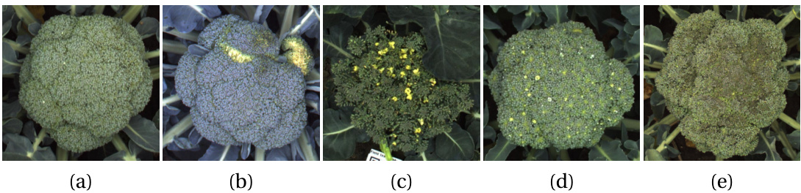  
Figure 5.2: Examples of the five broccoli classes that were present in our dataset: (a) a healthy broccoli head. (b) a damaged broccoli head. (c) a matured broccoli head. (d) a broccoli head with cat-eye. (e) a broccoli head with head rot. The displayed images were all cropped from a bigger field image.  

# 5.2.2 MaskAL  

The MaskAL procedure consisted of four sequential steps. First, a subset of images was randomly selected from the training pool, and annotated. Second, Mask R-CNN was trained on these images. Third, the trained Mask R-CNN model was evaluated on the independent test set to determine its performance. Fourth, a new subset of images was selected from the training pool with either random sampling or uncertainty sampling (the active learning). After the fourth step, the selected images were annotated and added to the previous training set. Mask R-CNN was retrained on this combined set of images, after which it was evaluated and used to sample new images. This entire procedure was repeated for a number of sampling iterations. The MaskAL procedure is explained in more detail in the pseudo-code of Algorithm 1 (the blue-coloured functions highlight the four consecutive steps).  

MaskAL was built as a software shell on top of the Mask R-CNN code of Detectron2 (version 0.4) (Wu et al., 2019). In our research, Mask R-CNN was equipped with the ResNeXt-101 (32x8d) backbone (Xie et al., 2017). Before the training and sampling could be performed, dropout had to be applied to several network layers of Mask R-CNN. In the box head of Mask R-CNN, dropout was applied to each fully connected layer, see Figure 5.3. This dropout placement was in line with Gal and Ghahramani (2016) and would allow us to capture the variation in the predicted classes and the bounding box locations. Dropout was also applied to the last two convolutional layers in the mask head of Mask R-CNN to be able to capture the variation in the pixel segmentation, see Figure 5.3. The severity of the dropout was made configurable in MaskAL by means of the dropout probability. The dropout probability determined the chance of neurons getting disconnected in the network layers and the value could be configured between 0.0 (no dropout) and 1.0 (complete dropout).  

# Algorithm 1: MaskAL The blue-coloured words are the core functions.  

Inputs : sampling-method $\because$ ’uncertainty’ or ’random’ sampling-iterations : integer sample-size $\because$ integer initial-dataset-size : integer dropout-probability: float forward-passes : integer certainty-method : ’average’ or ’ minimum’ training-poo $\therefore$ dataset with all available images for training and sampling val-set : validation dataset test-set : test dataset   
Outputs: mAPs : an array with mean average precision values of size sampling-iterations+1  

1 Function MaskAL(sampling-method, sampling-iterations, sample-size, initial-dataset-size, dropout-probability,   
forward-passes, certainty-method, training-pool, val-set, test-set):   
2 $\mathsf { m A P s  [ l }$   
3 initial-dataset $$ SampleInitialDatasetRandomly(training-pool, initial-dataset-size)   
4 annotated-train-set, annotated-val-set, annotated-test-set Annotate(initial-dataset, val-set, test-set)   
5 model $$ TrainMaskRCNN(annotated-train-set, annotated-val-set, coco-weights, dropout-probability)   
6 mAP $$ EvaluateMaskRCNN(model, annotated-test-set)   
7 mAPs.insert(mAP)   
8 available-images ← training-pool − initial-dataset   
9 for $i \gets 1$ to sampling-iterations do   
10 if sampling-method $\mathbf { \Sigma } = \mathbf { \Sigma }$ ’uncertainty’ then   
11 pool ← UncertaintySampling(model, available-images, sample-size, dropout-probability,   
forward-passes, certainty-method)   
12 else if sampling-method $\mathbf { \Sigma } = \mathbf { \Sigma }$ ’random’ then   
13 pool RandomSampling(available-images, sample-size)   
14 annotated-pool ← Annotate(pool)   
15 annotated-train-set $$ annotated-train-set $^ +$ annotated-pool   
16 prev-weights $$ model   
17 model $$ TrainMaskRCNN(annotated-train-set, annotated-val-set, prev-weights, dropout-probability)   
18 mAP ← EvaluateMaskRCNN(model, annotated-test-set)   
19 mAPs.insert(mAP)   
20 available-images ← available-images − annotated-pool   
21 end   
22 return mAPs  

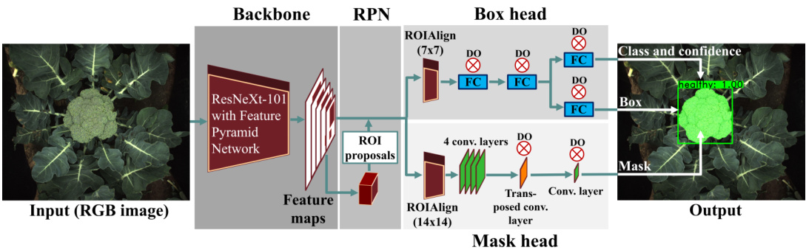  
Figure 5.3: Schematic representation of the Mask R-CNN network architecture in MaskAL. The white circles with the red crosses indicate the network layers with dropout. Conv., DO, RPN, ROI and FC, are abbreviations of respectively convolutional, dropout, region proposal network, region of interest, and fully connected layers. The numbers between brackets give the output dimensions of the ROIAlign layer. The image was adapted from Shi et al. (2019).  

# 5.2.2.1 Step 1 - Annotate  

The first step in MaskAL involved the annotation of the selected images. At algorithm initialisation, this annotation was done on a subset of images that was randomly sampled from the training pool. The images were annotated by two crop experts, who used the LabelMe software (version 4.5.6) (Wada, 2016). In our research, all images were annotated beforehand, as this allowed us to conduct three experiments without being interrupted for doing the image annotations. In addition, by annotating all images, we were able to train Mask R-CNN on the entire training pool (see paragraph 5.2.3.3).  

# 5.2.2.2 Step 2 - Train Mask R-CNN  

After the image annotation, Mask R-CNN was trained on the selected images. The training procedure was identical for the uncertainty sampling and the random sampling.  

The training was performed with a learning rate of $1 . 0 { \cdot } 1 0 ^ { - 2 }$ , and an image batch size of two. The stochastic gradient descent optimiser was used with a momentum of 0.9 and a weight decay of $1 . 0 { \cdot } 1 0 ^ { - 4 }$ . During training, two data augmentations were employed. The first augmentation was a random horizontal flip of the image with a probability of 0.5. The second augmentation was an image resizing along the shortest edge of the image while maintaining the aspect ratio of the image. The total number of training iterations was proportional to the number of training images: for each multiple of 500 training images, 2,500 training iterations were added to the base number of 2,500 iterations. The training was performed with dropout as a regularisation technique to enhance the generalisation performance. This procedure was in line with the training procedure of Gal and Ghahramani (2016).  

At MaskAL initialisation, the network weights of Mask R-CNN were initialised with the weights of a Mask R-CNN model that was pretrained on the Microsoft Common Objects in Context (COCO) dataset (Lin et al., 2014). After the first training procedure, the transfer learning was done with the weights of the previously trained Mask R-CNN model to minimise the effects of catastrophic forgetting.  

In our training pool, there was a severe class imbalance (healthy $\because$ disease/defect $\mathbf { \Sigma } = \mathbf { \Sigma }$ 27:1). Due to this class imbalance, the random sampling was more likely to sample images with healthy broccoli heads than images with damaged, matured, cat-eye or head rot broccoli heads. This could eventually lead to a much worse performance than the uncertainty sampling. To prevent that our comparison would be too much influenced by the class imbalance, it was decided to train Mask R-CNN with a data oversampling strategy (Gupta et al., 2019). With this strategy, a specific image was repeatedly trained by Mask R-CNN if that image contained a minority class (the minority classes were damaged, matured, cat-eye and head rot). By repeating the images with minority classes during the training, this oversampling strategy was expected to reduce the negative effect of the class imbalance on the Mask R-CNN performance.  

# 5.2.2.3 Step 3 - Evaluate Mask R-CNN  

After the training, the Mask R-CNN model was evaluated on the independent test set to determine its performance. The performance metric was the mean average precision (mAP), which expressed the classification and instance segmentation performance of Mask R-CNN. A mAP value close to zero indicated an incorrect classification and/or inaccurate instance segmentation, while a value close to 100 indicated a correct classification and accurate instance segmentation.  

The evaluation of Mask R-CNN was done without dropout, and with a fixed threshold of 0.01 on the non-maximum suppression (NMS). This NMS threshold removed all instances that overlapped at least $1 \%$ with a more confident instance, essentially meaning that only one instance segmentation was done on an object. This approach was considered valid since the broccoli heads grew solitary and did not overlap each other in the images.  

# 5.2.2.4 Step 4 - Uncertainty sampling  

After the training and evaluation, new images were sampled from the training pool. With the random sampling method, this was done randomly. With the uncertainty sampling, images were sampled about which the trained Mask R-CNN model was most uncertain. The uncertainty sampling involved four steps: the image analysis with Monte-Carlo dropout (paragraph 5.2.2.4.1), the grouping of the instance segmentations into instance sets (paragraph 5.2.2.4.2), the calculation of the certainty values (paragraph 5.2.2.4.3), and the image sampling (paragraph 5.2.2.4.4).  

# 5.2.2.4.1 Step 4.1 - Monte-Carlo dropout  

Each available image from the training pool was analysed with the Monte-Carlo dropout method. A user-specified number of forward passes determined how many times the same image was analysed with the trained Mask R-CNN model. During the repeated image analysis, the dropout caused the random disconnection of some of the neurons in the head branches of Mask R-CNN. This random neuron disconnection could lead to different model outputs, see Figure 5.4a, 5.4b and 5.4c. The repeated image analysis was done with a fixed threshold of 0.01 on the non-maximum suppression and a fixed threshold of 0.5 on the confidence level.  

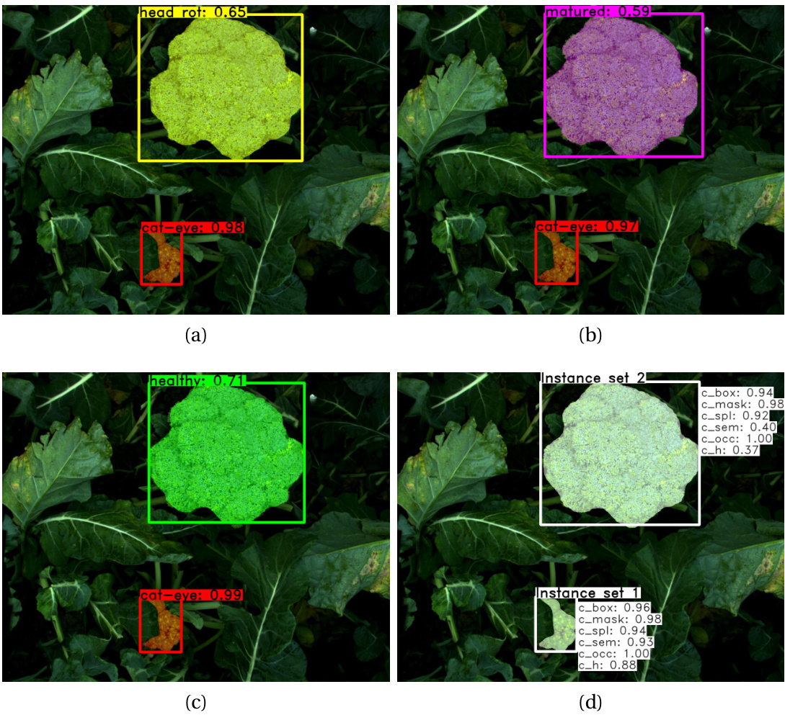  
Figure 5.4: A visual example of the Monte-Carlo dropout method and the calculation of the certainty values. (a) After the first forward pass with dropout, Mask R-CNN produced two instances: one instance of class cat-eye with a high confidence score (0.98) and one instance of class head rot with a lower confidence score (0.65). (b) The same image was analysed again during a second forward pass, resulting a confident cat-eye instance (0.97) and a less confident matured instance (0.59). (c) After the third forward pass, Mask R-CNN produced a confident cat-eye instance (0.99) and a moderately confident healthy instance (0.71). (d) After the three forward passes, the instance segmentations were grouped into two instance sets, based on spatial similarity. An instance set is a group of different instance segmentations that appear on the same broccoli head. The white bounding box and mask of the instance sets represent the average box and mask of the instance segmentations. On each instance set, three certainty values were calculated: the semantic certainty $( c _ { \mathsf { s e m } } )$ , the occurrence certainty $( c _ { \mathsf { o c c } } )$ and the spatial certainty $( c _ { \tt s p 1 } )$ , which was the product of the spatial certainty of the bounding box $( c _ { \mathsf { b o x } } )$ and the mask $( c _ { \mathrm { m a s k } } )$ . The certainty of the instance set $( c _ { \mathrm { h } } )$ was calculated by multiplying the $c _ { \mathsf { s e m } }$ , $\scriptstyle c _ { \circ \mathsf { c } \mathsf { c } }$ and $c _ { \tt s p l }$ .  

# 5.2.2.4.2 Step 4.2 - Instance sets  

After the repeated image analysis, the outputs of Mask R-CNN were grouped into instance sets. An instance set is a group of instance segmentations from multiple forward passes that appear on the same object in the image, see two examples in Figure 5.4d. On these instance sets, the certainty values were calculated.  

The grouping of the instance segmentations into instance sets was based on the spatial similarity method of Morrison et al. (2019). The method added an instance segmentation to an instance set when the intersection over union (IoU) between this segmentation and at least one other segmentation from the instance set exceeded a certain threshold, $\tau _ { \mathrm { I { o U } } }$ . The IoU is a metric for the spatial overlap between two mask segmentations, $M _ { 1 }$ and $M _ { 2 }$ , and the value varies between zero (no overlap) and one (complete overlap), see Equation 5.1.  

$$
\operatorname { I o U } ( M _ { 1 } , M _ { 2 } ) = { \frac { | M _ { 1 } \cap M _ { 2 } | } { | M _ { 1 } \cup M _ { 2 } | } } \qquad { \mathrm { w h e r e ~ | \cdot | ~ g i v e s ~ t h e ~ t o t a l ~ n u m b e r ~ o f ~ m a s k ~ p i x e l s ~ ( ~ M _ { 1 } ' ~ M _ { 2 } ) / h ~ } }
$$  

A new instance set was created when the segmentation did not exceed the $\tau _ { \mathrm { I { o U } } }$ threshold. It was assumed that this segmentation then represented a different object. In our research, the $\tau _ { \mathrm { I { 0 } U } }$ was set to 0.5 and this value was adopted from Morrison et al. (2019).  

# 5.2.2.4.3 Step 4.3 - Certainty calculation  

Three certainty values were calculated for each instance set: the semantic certainty, the spatial certainty, and the occurrence certainty. The certainty calculations were adopted from Morrison et al. (2019), but changes were made to the semantic certainty calculation to make it more suitable for use on datasets with visually similar classes (like our broccoli dataset).  

The semantic certainty, $c _ { \mathsf { s e m } }$ , was a measure of the consistency of Mask R-CNN to predict the class labels within an instance set. The $c _ { \mathsf { s e m } }$ value was close to zero when there was a low semantic certainty, and close to one when there was a high semantic certainty. Morrison et al. (2019) calculated the $c _ { \mathsf { s e m } }$ value by taking the difference between the average confidence score of the first and the second most probable class of the instance set. This method is known as margin sampling, but a disadvantage is that it does not take into account the confidence scores of the less probable classes. This is undesirable when the dataset has a high degree of inter-class similarity, because then Mask R-CNN has a tendency to hesitate between more than two classes. This multi-class hesitation was also expected in our broccoli dataset. To overcome the disadvantage of the margin sampling, the $c _ { \mathsf { s e m } }$ calculation was upgraded with an entropy-based equation, which took the confidence scores, $P$ , of all classes, $K = \{ k _ { 1 } , \ldots , k _ { n } \}$ , into account, see Equation 5.2. However, with the entropy calculation, the $c _ { \mathsf { s e m } }$ value would be low when there was class certainty, and this was opposite of Morrison’s $c _ { \mathsf { s e m } }$ value. Also, the entropy calculation could result in values higher than one, which deviated from Morrison’s $c _ { \mathsf { s e m } }$ value that was bound between zero and one. With two additional calculations these issues were solved. First, the entropy value, $H$ , was divided by the maximum entropy value, $H _ { \mathrm { m a x } }$ , so that the resulting value was bound between zero and one (see Equation 5.3). The $H _ { \mathrm { m a x } }$ value was calculated with Equation 5.4, and this value represented a situation where the confidence scores of all classes were equal, which was the case when Mask R-CNN had the lowest certainty in predicting the class labels. Then, the resulting value from the division was inverted, such that a high $H _ { \mathsf { s e m } }$ value would result when there was a high semantic certainty. With Equation 5.5, the $H _ { \mathsf { s e m } }$ values of all instances belonging to an instance set, $S = \{ s _ { 1 } , \ldots , s _ { r } \}$ , were averaged. This resulted in one semantic certainty value, $c _ { \mathsf { s e m } }$ , per instance set. Figure 5.4d visualises two estimations of $c _ { \mathsf { s e m } }$ .  

$$
\mathrm { H } ( K ) = - \sum _ { i = 1 } ^ { n } P ( k _ { i } ) \cdot \log P ( k _ { i } ) \qquad \mathrm { w i t h } \ K = \{ k _ { 1 } , \ldots , k _ { n } \}
$$  

$$
\mathrm { H } _ { \mathsf { S e m } } ( s ) = 1 - \left( { \frac { \mathrm { H } ( K ) } { \mathrm { H } _ { \mathsf { m a x } } ( K ) } } \right) \qquad { \mathrm { w h e r e ~ } } s { \mathrm { ~ i s ~ a n ~ i n s t a n c e ~ o f ~ i n s t a n c e ~ s e t ~ } } S
$$  

$$
\begin{array} { r } { \mathrm { H } _ { \mathrm { m a x } } ( K ) = - n \cdot \left( { \frac { 1 } { n } } \cdot \log { \frac { 1 } { n } } \right) \qquad \mathrm { w h e r e } \ n \mathrm { i s } \mathrm { t h e } \ n u { \mathrm { m b e r \ o f \ c l a s s e s } } } \end{array}
$$  

$$
\mathsf { c } _ { \mathsf { s e m } } ( S ) = \frac { 1 } { r } \cdot \sum _ { i = 1 } ^ { r } \mathrm { H } _ { \mathsf { s e m } } ( s _ { i } ) \qquad \mathrm { w i t h } \ S = \{ s _ { 1 } , \ldots , s _ { r } \}
$$  

The spatial certainty, $c _ { \tt s p 1 }$ , was a measure of the consistency of Mask R-CNN to determine the bounding box locations and to segment the object pixels within an instance set. The $c _ { \tt s p l }$ value was close to zero when there was little spatial consistency between the boxes and the masks in the instance set, and the value was close to one when there was much spatial consistency. The $c _ { \tt s p l }$ value was calculated by multiplying the spatial certainty value of the bounding box $( c _ { \mathsf { b o x } } )$ by the spatial certainty value of the mask $( \boldsymbol { c } _ { \mathrm { m a s k } } )$ , see Equation 5.6. The $c _ { \mathsf { b o x } }$ and the $c _ { \mathrm { m a s k } }$ values were the mean IoU values between the average box and mask of the instance set (respectively denoted as $\bar { B }$ and $\bar { M } .$ ) and each individual box and mask prediction within that instance set (respectively denoted as $B$ and $M )$ , refer to Equation 5.7 and 5.8. The average box, $\bar { B }$ , was formed from the centroids of the corner points of the individual boxes in the instance set (see the white boxes in Figure 5.4d). The average mask, $\bar { M } _ { ; }$ , represented the segmented pixels that appeared in at least $2 5 \%$ of the individual masks in the instance set (see the white masks in Figure 5.4d). The value of $2 5 \%$ was found to produce the most consistent average masks for our broccoli dataset.  

$$
\mathsf { c } _ { \mathtt { s p } 1 } ( S ) = \mathsf { c } _ { \mathtt { b o x } } ( S ) \cdot \mathsf { c } _ { \mathtt { m a s k } } ( S ) \qquad \mathrm { w i t h } \ S = \{ s _ { 1 } , \ldots , s _ { r } \}
$$  

$$
\mathsf { c } _ { \mathsf { b o x } } ( S ) = \frac { 1 } { r } \cdot \sum _ { i = 1 } ^ { r } \operatorname { I o U } ( \bar { B } ( S ) , B ( s _ { i } ) ) \qquad \mathrm { w i t h } \ S = \{ s _ { 1 } , \ldots , s _ { r } \}
$$  

$$
\mathsf { c } _ { \mathtt { m a s k } } ( S ) = \frac { 1 } { r } \cdot \sum _ { i = 1 } ^ { r } \mathtt { I o U } ( \bar { M } ( S ) , M ( s _ { i } ) ) \qquad \mathrm { w i t h } \ S = \{ s _ { 1 } , \ldots , s _ { r } \}
$$  

The occurrence certainty, $\scriptstyle c _ { \circ \mathsf { c } \mathsf { c } }$ , was a measure of the consistency of Mask R-CNN to predict instances on the same object during the repeated image analysis. The $c _ { \mathsf { o c c } }$ value was close to zero, when there was little consensus in predicting an instance on the same object in each forward pass. The $c _ { \mathsf { o c c } }$ value was one when Mask R-CNN predicted an instance on the same object in each forward pass. The $c _ { \mathsf { o c c } }$ value was calculated by dividing the number of instances belonging to an instance set, $r$ , by the number of forward passes, $f p$ , see Equation 5.9.  

$$
\mathsf { c } _ { \mathsf { o c c } } ( S ) = \frac { r } { f p } \qquad \mathrm { w i t h } \ S = \{ s _ { 1 } , \ldots , s _ { r } \}
$$  

The semantic, spatial, and occurrence certainty values were multiplied into one certainty value for each instance set, see Equation 5.10. With this multiplication, the three certainty values were considered equally important in determining the overall certainty, ${ \mathsf { c } } _ { \mathrm { h } }$ , of an instance set.  

$$
\mathsf { c } _ { \mathtt { h } } ( S ) = \mathsf { c } _ { \mathtt { s e m } } ( S ) \cdot \mathsf { c } _ { \mathtt { s p l } } ( S ) \cdot \mathsf { c } _ { \mathtt { o c c } } ( S ) \qquad \mathrm { w i t h } \ S = \{ s _ { 1 } , \ldots , s _ { r } \}
$$  

Because the Mask R-CNN training and testing was done on images and not on individual instances, it was needed to combine the certainties of the instance sets into one certainty value for the entire image. The image certainty value was calculated with either the average method or the minimum method. With the average method, the image certainty value was the average certainty value of all instance sets in the image, $I =$ $\{ S _ { 1 } , \ldots , S _ { t } \}$ , see Equation 5.11. In Figure 5.4d, the average certainty value was 0.62 ( $_ { ( 0 . 8 8 + }$ 0.37)/2). With the minimum method, the image certainty value was the lowest certainty value of all instance sets, see Equation 5.12. In Figure 5.4d, the minimum certainty value was 0.37. The certainty calculation method was made configurable in MaskAL, so that we could do an experiment to assess its effect on the active learning performance (this is explained in paragraph 5.2.3.1).  

$$
\mathsf { c } _ { \mathsf { a v g } } ( I ) = { \frac { 1 } { t } } \cdot \sum _ { i = 1 } ^ { t } \mathsf { c } _ { \mathsf { h } } ( S _ { i } ) \qquad \mathrm { w i t h } \ I = \{ S _ { 1 } , \ldots , S _ { t } \}
$$  

$$
\mathsf { c } _ { \mathtt { m i n } } ( I ) = \operatorname* { m i n } ( \mathsf { c } _ { \mathtt { h } } ( I ) ) \qquad \mathrm { w i t h } \ I = \{ S _ { 1 } , \ldots , S _ { t } \}
$$  

# 5.2.2.4.4 Step 4.4 - Sampling  

After calculating the certainty value of each image from the training pool, a subset of images was selected about which Mask R-CNN was most uncertain. The size of the image set, hereinafter referred to as the sample size, was made configurable in MaskAL. This allowed us to do an experiment to assess the effect of the sample size on the active learning performance (this is explained in paragraph 5.2.3.2).  

# 5.2.3 Experiments  

Three experiments were set up, with the final objective of comparing the performance of the active learning with the performance of the random sampling. Before this comparison could be done, experiments 1 and 2 were performed to investigate how to optimise the active learning.  

# 5.2.3.1 Experiment 1  

The objective of experiment 1 was to test the effect of the dropout probability, certainty calculation method, and number of forward passes on the active learning performance. This test would reveal the optimal settings for these parameters, which were assumed to have the most influence on the active learning performance, because they all influenced the calculation of the certainty value of the image.  

The experiment was done with three dropout probabilities: 0.25, 0.50, and 0.75. Dropout probability 0.50 was a frequently used probability in analogous active learning research, for example Aghdam et al. (2019), Gal and Ghahramani (2016) and López Gómez (2019). With this dropout probability, there was a moderate chance of dropout during the image analysis. The dropout probabilities 0.25 and 0.75 were chosen to have a lower and a higher chance of dropout compared to dropout probability 0.50.  

Two certainty calculation methods were tested: the average method and the minimum method, which are both described in paragraph 5.2.2.4.3. By comparing these two calculation methods, it was possible to evaluate whether the active learning benefited from sampling the most uncertain instances (when using the minimum method), or from sampling the most uncertain images (when using the average method).  

Before we could evaluate the effect of the number of forward passes on the active learning performance, a preliminary experiment was performed to examine which numbers were plausible in terms of consistency of the certainty estimate. This consistency was considered important, because when the estimate is consistently uncertain, there is more chance that the image actually contributes to the active learning performance. The setup and results of the preliminary experiment are described in Appendix 5.A. Based on the results in Appendix 5.A, two numbers of forward passes were chosen: 20 and 40.  

The three dropout probabilities, two certainty calculation methods, and two numbers of forward passes were combined into 12 unique combinations of certainty calculation parameters. We assessed the effect of each of these 12 combinations on the active learning performance. All combinations were tested with the same initial dataset of 100 images, which were randomly sampled from the training pool. After training Mask RCNN on the initial dataset, the trained model was used to select 200 images from the remaining training pool about which Mask R-CNN was most uncertain. The selected images were used together with the initial training images to retrain Mask R-CNN. This procedure was repeated 12 times, such that in total 13 image sets were trained (containing respectively, 100, 300, 500, ..., 2500 sampled images). After training Mask R-CNN on each image set, the performance of the trained model was determined on the images of the first test set. The 13 resulting mAP values were stored. The experiment was repeated five times to account for the randomised initial dataset and the randomness in the Monte-Carlo dropout method.  

A three-way analysis of variance (ANOVA) with a significance level of $5 \%$ was employed for the mAP values to test whether there were significant performance differences between the three dropout probabilities, the two certainty calculation methods, and the two numbers of forward passes. The ANOVA was performed per mAP value, because the mAP was not independent between the different image sets (for instance, the set of 2500 images contained the 2300 images from the previous sampling iteration).  

# 5.2.3.2 Experiment 2  

The optimal setting for the dropout probability, certainty calculation method, and number of forward passes was obtained from experiment 1 and used in experiments 2 and 3. The objective of experiment 2 was to test the effect of the sample size on the active learning performance. This experiment would reveal the optimal sample size for annotating the images and retraining Mask R-CNN. A smaller sample size would possibly be better for the active learning performance, because Mask R-CNN would then have more chances to retrain on the images it was uncertain about. A larger sample size will reduce the total sampling time.  

Four sample sizes were tested: 50, 100, 200, and 400 images. These four sample sizes were considered the most practical in terms of annotation and training time. For all sample sizes, the initial dataset size was 100 images and the maximum number of training images was 2500 images. The number of sampling iterations for the four sample sizes was respectively, 48, 24, 12, and 6. The performances of the trained Mask R-CNN models were determined on the images of the second test set. The experiment was repeated five times to account for the randomised initial dataset and the randomness in the MonteCarlo dropout method.  

A one-way ANOVA with a significance level of $5 \%$ was employed for the mAP values to test whether there were significant performance differences between the four sample sizes. The ANOVA was performed on the mAP values that shared a common number of training images (the common numbers were 500, 900, 1300, 1700, 2100, and 2500 images). The ANOVA was not performed on the mAP value of the initial dataset, as this value was the same between the four sample sizes (since the training was performed with the same dropout probability).  

# 5.2.3.3 Experiment 3  

The objective of experiment 3 was to compare the performance of the active learning with the performance of the random sampling. The initial dataset size was 100 images, and both sampling methods used the same sample size that was chosen from experiment 2. The performances of the trained Mask R-CNN models were determined on the images of the third test set. The experiment was repeated five times to account for the randomised initial dataset and the randomness in the Monte-Carlo dropout method. A one-way ANOVA with a significance level of $5 \%$ was employed to test whether there were significant performance differences between the active learning and the random sampling. The ANOVA was not performed on the mAP value of the initial dataset, as this value was the same between the two sampling methods (since the training was performed with the same dropout probability).  

For comparison, another Mask R-CNN model was trained on the entire training pool (14,000 images). The performance of this model was also evaluated on the images of the third test set. The resulting mAP value was considered as the maximum mAP that could have been reached on our dataset.  

# 5.3 Results  

The results are summarised per experiment: experiment 1 (paragraph 5.3.1), experiment 2 (paragraph 5.3.2), and experiment 3 (paragraph 5.3.3).  

# 5.3.1 The effect of the dropout probability, the number of forward passes, and the certainty calculation method on the active learning performance (experiment 1)  

Table 5.2 summarises the effects of the dropout probability, the number of forward passes and the certainty calculation method on the active learning performance (mAP). The results of the ANOVA are summarised by the different letters. The letters are sorted in descending order, meaning that letter "a" significantly outperforms letters "b" and "c" at a significance level of $5 \%$ $scriptstyle ( \mathbf { p } = \mathbf { 0 } . 0 5 )$ ). The performance means that do not have a letter in common are significantly different.  

The dropout probability had the largest effect on the active learning performance (Table 5.2). For all thirteen sampling iterations, dropout probability 0.25 had a significantly higher mAP than dropout probability 0.75. In five sampling iterations (1, 2, 3, 11, and 12), the dropout probability 0.25 had a significantly higher mAP than the dropout probability 0.50. These results were in line with Figure 5.A.1 (Appendix 5.A), which showed that the dropout probability 0.25 had the most consistent certainty estimate. Dropout probability 0.25 was chosen as the preferred probability in the next experiments.  

The number of forward passes had a small effect on the active learning performance. In only three of the thirteen sampling iterations, there was a significant difference between 20 and 40 forward passes (Table 5.2). In sampling iterations 8, 11, and 12, the mAP was significantly higher at 20 forward passes. This result was unexpected, as Figure 5.A.1 (Appendix 5.A) showed that there was a less consistent certainty estimate at 20 forward passes than at 40 forward passes. It should be noted that the mAP differences between 20 and 40 forward passes were relatively small (maximally 1.7 mAP). We decided to choose 20 forward passes in the next experiments.  

The certainty calculation method had the smallest effect on the active learning performance. In only one of the thirteen sampling iterations, there was a significant difference between the average method and the minimum method (Table 5.2). In sampling iteration 10, the average method had a significantly higher mAP than the minimum method, but the difference was small (1.3 mAP). The small mAP differences were probably due to the limited number of broccoli instances per image. There were on average two broccoli instances per image, suggesting that the choice of the average or the minimum method probably did not have much influence on the active learning performance. Despite the small mAP differences, we decided to choose the average method in the next experiments.  

The decision to continue with the parameters for the dropout probability (0.25), number of forward passes (20) and certainty calculation method (average), meant that five significant interactions between the dropout probability and the certainty calculation method and one significant interaction between the number of forward passes and the certainty calculation method were ignored. These significant interactions were all due to the dropout probability 0.75 (whose performance was found to be insufficient). There were no significant interactions between the dropout probability, the number of forward passes and the certainty calculation method.  

Table 5.2: Performance means expressed for the three dropout probabilities, the two numbers of forward passes, the two certainty calculation methods, and the thirteen sampling iterations. The results of the ANOVA are summarised by the different letters. The letters are sorted in descending order, meaning that letter "a" significantly outperforms letters "b" and "c" at a significance level of $5 \%$ $\scriptstyle \mathbf { \overbar { p } } = 0 . 0 5 )$ ).   

<html><body><table><tr><td rowspan="2">Sampling</td><td rowspan="2">Number of training</td><td colspan="8">Performance (mAP)</td></tr><tr><td></td><td>Dropout probability</td><td></td><td></td><td>Forward passes</td><td></td><td>Certaintymethod</td><td></td></tr><tr><td>iteration</td><td>images</td><td>0.25</td><td>0.50</td><td>0.75</td><td>20</td><td></td><td>40</td><td>average</td><td>minimum</td></tr><tr><td>1</td><td>100</td><td>21.5 a</td><td>18.4 b</td><td>12.4 c</td><td>17.4a</td><td>17.5 a</td><td></td><td>17.2 a</td><td>17.7 a</td></tr><tr><td>2</td><td>300</td><td>35.8 a</td><td>31.3 b</td><td>17.5 c</td><td>28.6a</td><td>27.8 a</td><td></td><td>27.7 a</td><td>28.8 a</td></tr><tr><td>3</td><td>500</td><td>42.1a</td><td>37.5b</td><td>22.0 c</td><td>34.1a</td><td>33.6a</td><td></td><td>33.5 a</td><td>34.3 a</td></tr><tr><td>4 5</td><td>700</td><td>47.9 a</td><td>46.1a</td><td>31.5 b</td><td>41.7 a</td><td></td><td>41.9 a</td><td>41.4 a</td><td>42.2 a</td></tr><tr><td>6</td><td>900 1100</td><td>49.8 a</td><td>49.6 a</td><td>36.3b</td><td>45.3a</td><td></td><td>45.1a</td><td>45.0a</td><td>45.5 a</td></tr><tr><td>7</td><td></td><td>53.1a</td><td>52.7 a</td><td>41.0 b</td><td>49.3a</td><td></td><td>48.6a</td><td>48.9 a</td><td>49.0 a</td></tr><tr><td>8</td><td>1300 1500</td><td>54.5 a</td><td>53.2a</td><td>46.0 b</td><td>51.7a</td><td></td><td>50.8 a</td><td>51.5 a</td><td>51.0 a</td></tr><tr><td>9</td><td>1700</td><td>56.5 a</td><td>55.3 a</td><td>49.7 b</td><td>54.7a</td><td>53.0b</td><td></td><td>53.8a</td><td>53.9 a</td></tr><tr><td></td><td></td><td>57.2 a</td><td>57.5 a</td><td>54.0 b</td><td>56.8 a</td><td></td><td>55.7 a</td><td>56.8 a</td><td>55.6 a</td></tr><tr><td>10</td><td>1900</td><td>59.0 a</td><td>58.2a</td><td>55.5 b</td><td>58.0 a</td><td>57.2 a</td><td></td><td>58.2 a</td><td>56.9 b</td></tr><tr><td>11</td><td>2100</td><td>60.1a</td><td>58.4b</td><td>56.9 c</td><td>59.1a</td><td></td><td>57.8 b</td><td>58.6 a</td><td>58.3 a</td></tr><tr><td>12</td><td>2300</td><td>60.6a</td><td>58.7b</td><td>57.8 b</td><td>59.7 a</td><td>58.4 b</td><td></td><td>59.2 a</td><td>58.9 a</td></tr><tr><td>13</td><td>2500</td><td>61.1a</td><td>60.2a</td><td>58.6 b</td><td>60.4a</td><td></td><td>59.5 a</td><td>60.2 a</td><td>59.7 a</td></tr></table></body></html>  

# 5.3.2 The effect of the sample size on the active learning performance (experiment 2)  

Table 5.3 summarises the effect of the sample size on the active learning performance (mAP). The results of the ANOVA are summarised by the different letters. The performance means that do not have a letter in common are significantly different at a significance level of $5 \%$ $scriptstyle ( \mathbf { p } = \mathbf { 0 } . 0 5 )$ (letter "a" significantly outperforms letters "b" and "c"). The ANOVA was not performed on the mAP value of the initial dataset (100 images).  

For all sampling iterations, sample size 200 had the significantly highest mAP. In five of the six sampling iterations (3 to 7), sample size 200 had a significantly higher mAP than sample size 50. In three of the six sampling iterations (4, 5, and 6), sample size 200 had a significantly higher mAP than sample size 100. There was one significant difference between sample size 200 and 400 (at iteration 2), indicating that sample size 400 had the significantly highest mAP in five of the six iterations.  

An in-depth analysis showed that the performance gains of sample sizes 200 and 400 were mainly due to a higher performance on the minority classes cat-eye and head rot. Figures 5.5c and 5.5d show that sample sizes 200 and 400 sampled a higher percentage of these classes compared to sample sizes 50 and 100 (Figures 5.5a and 5.5b). Apparently, for the active learning performance, it was better to sample with larger image batches that primarily consisted of one or two previously underperforming minority classes, than to sample with smaller image batches that had a more balanced ratio of the minority classes.  

One research demarcation may have influenced the results. In experiment 1, only sample size 200 was tested, and this may have resulted that the chosen parameters from experiment 1 were only optimised for sample size 200 and not for sample sizes 50, 100 and 400. Despite this research demarcation, we decided to choose sample size 200 in the next experiment.  

Table 5.3: Performance means for the four sample sizes and the seven sampling iterations that shared a common number of training images. The results of the ANOVA are summarised by the different letters. The letters are sorted in descending order, meaning that letter "a" significantly outperforms letters "b" and "c" at a significance level of $5 \%$ $\scriptstyle ( \mathbf { p } = 0 . 0 5 )$ . The performance means that do not have a letter in common are significantly different. The ANOVA was not performed on the mAP value of the initial dataset (100 images).  

<html><body><table><tr><td rowspan="2">Sampling</td><td rowspan="2">Number of</td><td colspan="4">Performance (mAP)</td></tr><tr><td></td><td>Sample size</td><td></td><td></td></tr><tr><td>iteration</td><td>training images</td><td>50 22.4 -</td><td>100 22.4-</td><td>200</td><td>400</td></tr><tr><td>1</td><td>100</td><td></td><td></td><td>22.4 -</td><td>22.4 -</td></tr><tr><td>2 3</td><td>500</td><td>40.9 a</td><td>41.6a</td><td>42.2 a</td><td>36.7b</td></tr><tr><td>4</td><td>900 1300</td><td>47.5 b 51.0 b</td><td>48.8ab 50.3 b</td><td>50.5a</td><td>48.4 ab</td></tr><tr><td>5</td><td>1700</td><td>53.1b</td><td>51.7 b</td><td>55.2 a 57.9 a</td><td>55.6a</td></tr><tr><td>6</td><td>2100</td><td>54.3 b</td><td>56.1 b</td><td>58.9 a</td><td>57.5 a 60.2 a</td></tr><tr><td>7</td><td>2500</td><td>56.7 c</td><td>57.3 bc</td><td>59.5 ab</td><td>60.5a</td></tr></table></body></html>  

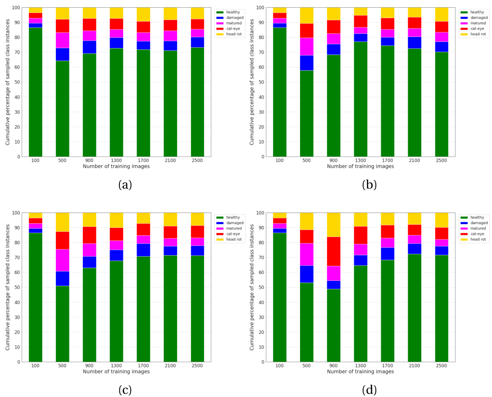  
Figure 5.5: Cumulative percentages of the sampled classes in experiment 2 (y-axis). The percentages are expressed for the seven numbers of training images (x-axis) that were shared between the four sample sizes: (a) sample size 50 (b) sample size 100 (c) sample size 200 (d) sample size 400.  

# 5.3.3 Performance comparison between active learning and random sampling (experiment 3)  

Figure 5.6 visualises the performance of the active learning and the random sampling for the thirteen sampling iterations (100, 300, ..., 2500 sampled images). The coloured areas around the lines represent the $9 5 \%$ confidence intervals around the means. For all sampling iterations, the active learning had a significantly higher mAP than the random sampling (the ANOVA was not performed on the mAP value of the initial dataset $\operatorname { l } 0 0 \mathrm { i m } \cdot$ - ages)). The performance differences were between 4.2 and $8 . 3 \mathrm { m A P } .$ Figure 5.7 visualises the possible cause of the performance differences. With the random sampling, there was a lower percentage of sampled instances of the four minority classes. As a result, the classification performance on these minority classes was lower. The active learning sampled a higher percentage of images with minority classes, leading to a significantly better performance. Figures 5.8 and 5.9 visualise the Mask R-CNN performance on two broccoli images.  

With the random sampling, the maximum performance was $5 1 . 2 \mathrm { m A P }$ and this value was achieved after sampling 2300 images. With the active learning, a similar performance was achieved after sampling 900 images $( 5 1 . 0 \mathrm { m A P } )$ ), indicating that potentially 1400 annotations could have been saved (see the black dashed line in Figure 5.6).  

The maximum performance of the active learning was $5 8 . 7 \mathrm { m A P }$ and this value was achieved after sampling 2500 images. This maximum performance was $3 . 8 \mathrm { \ m A P }$ lower than the performance of the Mask R-CNN model that was trained on the entire training pool of 14,000 images $( 6 2 . 5 \mathrm { m A P } )$ . This means that the active learning achieved $9 3 . 9 \%$ of that model’s performance with $1 7 . 9 \%$ of its training data. The maximum performance of the random sampling was $1 1 . 3 \mathrm { m A P }$ lower than the performance of the Mask R-CNN model trained on the entire training pool. The random sampling achieved $8 1 . 9 \%$ of that model’s performance with $1 6 . 4 \%$ of its training data.  

Both sampling methods achieved their largest performance gains during the first 1200 sampled images, see Figure 5.6. The gains were respectively, $3 2 . 2 \mathrm { m A P }$ with the active learning and $2 6 . 5 \ \mathrm { m A P }$ with the random sampling. During the last 1200 sampled images, there was a marginal performance increase of $6 . 0 \ \mathrm { m A P }$ with the active learning and $4 . 2 \mathrm { m A P }$ with the random sampling. Moreover, with the random sampling, there was only an increase of $0 . 7 \mathrm { m A P }$ during the last 800 sampled images. This suggests that the annotation of these 800 images probably would have cost more than it would have benefitted.  

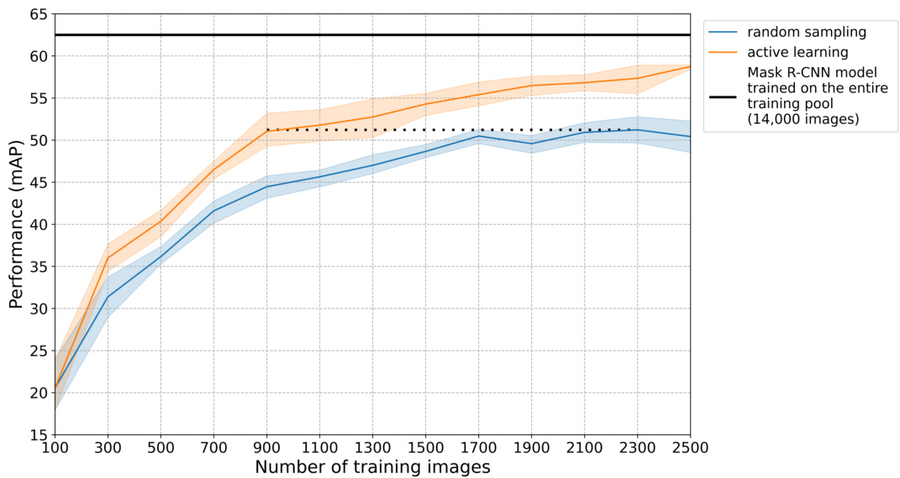  
Figure 5.6: Performance means (y-axis) of the active learning (orange line) and the random sampling (blue line). The coloured areas around the lines represent the $9 5 \%$ confidence intervals around the means. For all sampling iterations, the active learning had a significantly higher mAP than the random sampling (the ANOVA was not performed on the mAP value of the initial dataset (100 images)). The black solid line represents the performance of the Mask R-CNN model that was trained on the entire training pool (14,000 images). The black dashed line is an extrapolation of the maximum performance of the random sampling to the performance curve of the active learning. The dashed line can be interpreted as the number of annotated images that could have been saved by the active learning while maintaining the maximum performance of the random sampling.  

  
Figure 5.7: Cumulative percentages of the sampled classes in experiment 3 (y-axis). The percentages are expressed for the 13 numbers of training images (x-axis) and the two sampling methods: (a) random sampling (b) active learning.  

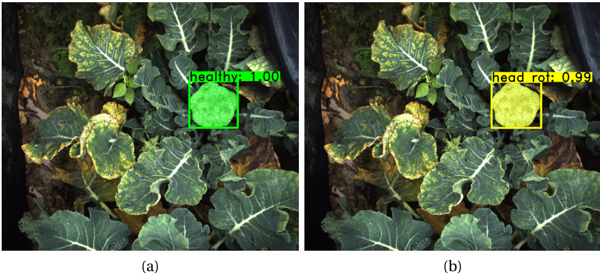  
Figure 5.8: Instance segmentation outputs of Mask R-CNN on the same image with a head rot infected broccoli head. (a) The Mask R-CNN model that was trained with the random sampling method misclassified the broccoli head as being healthy. (b) The Mask R-CNN model that was trained with MaskAL correctly classified the broccoli head.  

  
Figure 5.9: Instance segmentation outputs of Mask R-CNN on the same image with two healthy broccoli heads (the ones in the top and centre of the image) and one damaged broccoli head (in the bottom of the image). (a) The Mask R-CNN model that was trained with the random sampling method misclassified the damaged broccoli head as being cat-eye. (b) The Mask R-CNN model that was trained with MaskAL correctly classified the three broccoli heads.  

# 5.4 Discussion  

By using active learning, the performance of Mask R-CNN improved faster, and thereby the annotation effort could be reduced compared to a random sampling method. Although this outcome was only demonstrated on one dataset, our results suggest that better performance can be achieved when retraining Mask R-CNN on images about which the model was most uncertain.  

On our class imbalanced dataset, the better performance of the active learning was due to the sampling of a higher fraction of images containing the four minority classes. It was expected that the sampled images had a low semantic certainty due to the difficulty in correctly classifying the class labels. On the other hand, it was probably easier for Mask R-CNN to learn the masks of the five broccoli classes, since they had a similar shape. As such, the spatial certainty might have been higher. There was probably also a higher occurrence certainty, as the broccoli heads were generally well visible in the image. Thus, in our dataset, the overall image certainty was probably more influenced by the semantic certainty than by spatial or occurrence certainty. This outcome was opposite to López Gómez (2019), who found that the spatial certainty contributed most to the active learning performance. The difference is that López Gómez (2019) tested the active learning on a dataset with bicycles and motorcycles, and the shapes of these classes were probably more difficult for Mask R-CNN to learn. Thus, depending on the specific variation and challenges in a dataset, the active learning can emphasise the optimisation of a specific certainty metric. Since MaskAL is the first active learning framework with three certainty calculations, we expect that it can also be used on datasets with instances with a difficult-to-learn shape or datasets with small and unclear instances.  

There are several ways in which MaskAL could be further improved. First, weighting factors could be integrated into the certainty equation to tune the relative importance of either semantic, spatial, or occurrence certainty. We believe that this could have improved the MaskAL performance on our broccoli dataset, as prioritisation of semantic certainty could have led to faster optimisation of the classification performance. Second, the dropout can be further optimised. As demonstrated in experiment 1, the choice of the dropout probability had a large influence on the active learning performance. To choose the optimal dropout probability on a different dataset, it may be necessary to redo experiment 1, possibly with more than three tested probabilities. However, it is time consuming to conduct such an experiment for every new dataset. Therefore, we recommend investigating whether the concrete dropout method of Gal et al. (2017) can be used as an alternative method to automatically optimise the dropout probability during training. After using the concrete dropout method, the optimised dropout probability can be used for sampling, and this might reduce the experimental time and improve the active learning performance.  

Although our active learning method and dataset were different, it is possible to qualitatively compare our results with those of López Gómez (2019), Van Dijk (2019), and Wang et al. (2020). In the study of López Gómez (2019), the active learning with MonteCarlo dropout performed better than the random sampling in five of the eight sampling iterations. In the other three sampling iterations, the active learning performed worse than the random sampling. One possible reason for this poorer performance was that López Gómez (2019) sampled both images about which Mask R-CNN was uncertain as images about which Mask R-CNN was certain (this was done to increase the diversity in the image set). We believe that López Gómez (2019) could have achieved better results if Mask R-CNN had been retrained only on the images about which the model was most uncertain. In the study of Van Dijk (2019), the probabilistic active learning (PAL) did not perform better than the random sampling, possibly because PAL was designed to provide certainty scores only for classification and not for mask segmentation. Another reason for this outcome was that Van Dijk (2019) performed the image sampling on such small datasets that the added value of the active learning may have been limited (the datasets contained respectively 61 images and 45 images). In the study of Wang et al. (2020), the active learning with a learning loss method was compared to random sampling on two medical datasets. On one dataset, the active learning performed better than the random sampling in the first three sampling iterations, while in the last two iterations the performance was equal. On the other dataset, the active learning performed better than the random sampling in all five sampling iterations. Thus, learning loss can be another promising method for active learning, especially because, unlike MaskAL, it can predict the image uncertainty in one forward pass. In future research, MaskAL should be compared quantitatively to other active learning methods for Mask R-CNN. We also recommend comparing MaskAL’s uncertainty sampling with sampling methods other than random sampling, such as diversity sampling or hybrid sampling. Such a comparison could give a better impression of how MaskAL would compare to other more advanced sampling methods. We recommend performing such a comparison on a benchmark dataset, such as Microsoft COCO, because this dataset contains more images and more variation than our broccoli dataset.  

The potential use of MaskAL is greater than sampling images from a fixed dataset in an offline setting. MaskAL can also be applied to an operational robot to immediately select the images about which Mask R-CNN is most uncertain. This image selection can be done with a fixed threshold on the image certainty value. The down side of using MaskAL during robot deployment is that the image analysis will take more time. Should the image analysis take more time than desired, then it is recommended to temporarily store the images on the computer, so that they can be analysed by MaskAL after the robot has completed its task.  

MaskAL’s certainty calculation can also be used for purposes other than active learning. For instance, the certainty values can be used as an input for the robot to make more targeted decisions, like transporting the harvested broccoli heads with low semantic certainty to another bin for further inspection. The certainty values of MaskAL could also be fused with other predictions or sensor measurements in a probabilistic framework, allowing the robot to better reason under uncertainty. Future research should focus on applying MaskAL for such purposes.  

# 5.5 Conclusions  

On our broccoli dataset with five visually similar classes, the active learning with MaskAL performed significantly better than the random sampling. Furthermore, MaskAL had the same performance after sampling 900 images as the random sampling had after sampling 2300 images. This means that by using MaskAL, 1400 annotations could have been saved. Compared to a Mask R-CNN model that was trained on the entire training set (14,000 images), MaskAL achieved $9 3 . 9 \%$ of that model’s performance with $1 7 . 9 \%$ of its training data. In comparison, the random sampling achieved $8 1 . 9 \%$ of that model’s performance with $1 6 . 4 \%$ of its training data. We conclude that by using MaskAL, the annotation effort can be reduced for training Mask R-CNN on a broccoli dataset with visually similar classes.  

In this paper, MaskAL was used for active learning with the purpose of reducing annotation effort. The research was performed on a dataset in which all classes were known. We think that MaskAL can also be valuable for selecting unknown classes in open-set learning. Furthermore, MaskAL can also be used as an uncertainty estimator in probabilistic robotic frameworks. Our software is available for such purposes.  

# CRediT authorship contribution statement  

Pieter M. Blok: conceptualisation, methodology, software, data curation, writing - original draft. Gert Kootstra: supervision, conceptualisation, writing - review & editing. Hakim Elchaoui Elghor: validation, funding acquisition, writing - review & editing. Boubacar Diallo: conceptualisation, validation, funding acquisition. Frits K. van Evert: supervision, conceptualisation, writing - review & editing. Eldert J. van Henten: supervision, conceptualisation, writing - review & editing.  

# Funding  

This research was funded by: Topsector TKI AgroFood under grant agreement LWV19178 for “PPP Handsfree production in agri-food”, Agrifac Machinery B.V. and Exxact Robotics.  

# Acknowledgements  

We would like to thank Jean-Marie Michielsen and Hyejeong Kim for the image annotation and Paul Goedhart for the statistical analysis. Furthermore, we appreciate the brainstorm sessions we had with our colleagues Manya Afonso, Ard Nieuwenhuizen, Janne Kool, Keiji Jindo, and Andries van der Meer. Finally, we would like to thank Rik van Bruggen from Agrifac Machinery B.V. and Colin Chaballier from Exxact Robotics for their support.  

# 5.A Appendix A - Preliminary experiment on the effect of the number of forward passes on the consistency of the certainty estimate  

This section summarises the setup and the results of the preliminary experiment that was done to test the effect of the number of forward passes on the consistency of the certainty estimate. This preliminary experiment was conducted with a Mask R-CNN model that was trained on the entire training pool (14,000 images).  

Eighteen numbers of forward passes $( f { \boldsymbol { \mu } } )$ were tested: from 2 to 10 in steps of 1 and from 10 to 100 in steps of 10. For each number of forward pass, the certainty value was calculated on each instance set that was predicted on the images of the first test set. Then, the absolute difference was calculated between that certainty value, ${ \mathsf { c } } _ { \mathbf { h } _ { f p } }$ , and the certainty value at 100 forward passes, $\mathsf { c } _ { \mathrm { h } _ { 1 0 0 } }$ , see Equation 5.A.1. 100 forward passes was the maximum number that could be performed with our graphical processing unit. The ${ \mathsf { c } } _ { \mathrm { h 1 0 0 } }$ value was assumed to approximate the certainty value after an infinite number of forward passes. By calculating the absolute difference with the $\mathsf { c } _ { \mathrm { h } _ { 1 0 0 } }$ value, it was possible to get an indication of the consistency of the certainty estimate at a specific forward pass, ∆chf p .  

$$
\Delta c _ { \mathrm { h } } ( S ) _ { f p } = | c _ { \mathrm { h } } ( S ) _ { f p } - c _ { \mathrm { h } } ( S ) _ { 1 0 0 } | \qquad \mathrm { w i t h } \ f p = \{ 2 , 3 , \ldots , 1 0 , 2 0 , \ldots , 9 0 \}
$$  

Figure 5.A.1 visualises the absolute difference in the certainty estimate between a specific forward pass and 100 forward passes. The absolute differences are visualised for the dropout probabilities 0.25, 0.50, and 0.75. For all dropout probabilities, the largest absolute difference was observed for the forward passes lower than 10. Between 10 and 40 forward passes, there was a gradual decrease in the absolute difference. Between 40 and 90 forward passes, the absolute difference was rather constant. Based on Figure 5.A.1, we chose 20 and 40 forward passes to be tested in experiment 1. These values produced a relatively consistent certainty estimate (especially for the dropout probabilities 0.25 and 0.50). In addition, the value 20 was closest to the 16 forward passes that were used by Morrison et al. (2019).  

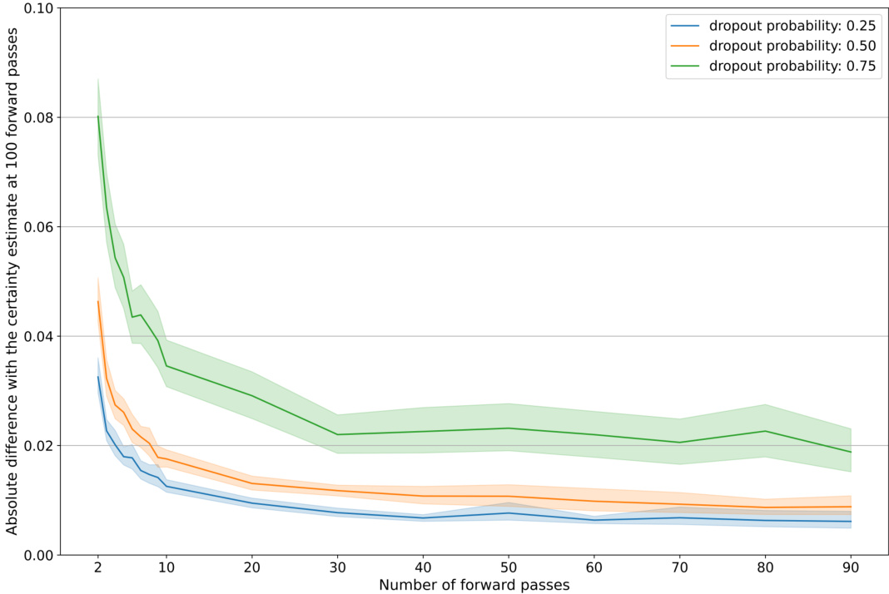  
Figure 5.A.1: The absolute difference in the certainty estimate between a specific forward pass and 100 forward passes, expressed for the three dropout probabilities. The thick coloured lines are the mean absolute differences and the coloured areas around the lines represent the $9 5 \%$ confidence intervals around the means.  

Broccoli harvesting robot Fredonia (USA)- 2022  

  

# 6  

# Conclusions, practical reflections, and general discussion  

# Conclusions and practical reflections  

This PhD thesis aimed at improving the generalisation performance of perception models for four key tasks that must be performed by any selective harvesting robot: autonomous navigation, crop detection, crop size estimation, and determination of which crops to harvest. It was hypothesised that through the use of new modelling and machine learning methods, a perception model would be better able to deal with the variations that exist in the orchard and in the field. Before addressing the hypothesis and research objective, the main conclusions of the four research chapters are summarised.  

Chapter 2 focused on a new probabilistic model for robot localisation and navigation in orchards using a LIDAR scanner. The research contribution was a new sensorenvironment model that explicitly modelled the interactions and uncertainties between the LIDAR scanner’s laser beams and the orchard environment. The sensor-environment model was embedded in a particle filter and compared to a line-based Kalman filter, when autonomously navigating a robot in a commercial fruit orchard with occluded and missing landmarks. With the particle filter, $5 0 \%$ of the robot’s lateral deviation was within $0 . 0 5 \mathrm { m }$ of the optimal navigation line, while with the Kalman filter, less than $2 5 \%$ of the robot’s lateral deviation was within $0 . 0 5 \mathrm { m }$ of the optimal line. Additionally, the particle filter had lower lateral deviations in five of the six experiments in which the robot had to navigate between rows with missing trees. From this chapter, it is concluded that with the sensor-environment model, a particle filter is better able to deal with the variations in the orchard than a line-based Kalman filter.  

Chapter 3 focused on two regularisation methods to improve the generalisation performance of Mask R-CNN on images of three broccoli cultivars. The two examined regularisation methods were data augmentation and network simplification. From the results, it was concluded that network simplification did not improve the image generalisation, while data augmentation did improve the image generalisation. Within data augmentation, geometric transformations (rotation, cropping, and scaling of the image) were found to be more effective than photometric transformations (changes in light, colour, and texture). By applying the geometric data augmentations during training, Mask R-CNN was able to detect 229 of the 232 harvestable broccoli heads of the three cultivars with different texture and colour. In addition, Mask R-CNN detected 175 of the 176 harvestable broccoli heads in a publicly available dataset on which the model had not been trained before. From this chapter, it is concluded that data augmentation, and in particular geometric transformations, improved the generalisation performance of Mask R-CNN on images of three broccoli cultivars with different texture and colour.  

Chapter 4 focused on a new machine learning method, namely ORCNN, to improve the size estimation of broccoli heads that are occluded by leaves. By using ORCNN and its amodal shape estimation, it was shown that the pixel dimension of the occluded broccoli heads could be better estimated compared to a Mask R-CNN method that used a circlefitting procedure on the visible region. The better amodal pixel estimation of ORCNN led to better estimates of the actual size of the broccoli heads. On 487 broccoli heads with various degrees of occlusion, the mean diameter error of ORCNN was $4 . 3 \mathrm { m m }$ lower than that of Mask R-CNN. Furthermore, ORCNN had a significantly lower diameter error on 161 heavily occluded broccoli heads with an occlusion rate between $5 0 \%$ and $90 \%$ . From this chapter, it is concluded that the size of occluded broccoli heads can be better estimated when the CNN can learn both the visible and the amodal region of the broccoli head.  

Chapter 5 focused on a new integration of probabilistic methods and Mask R-CNN. The integration involved a new active learning method, which automatically selected images about which Mask R-CNN was most uncertain. The results of chapter 5 showed that by using uncertainty-based active learning, Mask R-CNN could be optimised faster for the detection of visually similar broccoli diseases and defects. Due to the faster optimisation, the active learning could save 1400 image annotations compared to a random sampling method. Compared to a Mask R-CNN model that was trained on the entire training set (14,000 images), the active learning achieved $9 3 . 9 \%$ of that model’s performance with only $1 7 . 9 \%$ of its training data. The random sampling method achieved $8 1 . 9 \%$ of that model’s performance with $1 6 . 4 \%$ of its training data. From this chapter, it is concluded that with uncertainty-based active learning, the performance of Mask R-CNN can be improved faster, and thereby the annotation effort can be reduced compared to a random sampling method.  

The results of the four chapters showed that the methods for sensor-environment modelling, geometric data augmentation, amodal perception and active learning, led to improved perception performance in the tested orchard and broccoli images. Since in the orchard and broccoli images there were different variations in the cultivation environment, variations in the crop, occlusions and sensor limitations, it can be concluded that the general hypothesis is valid. The research objective has also been achieved, especially for the use-case of selective harvesting of broccoli. The best evidence for achieving the research objective, is the deployment of a Mask R-CNN model on five commercially available broccoli harvesting robots (Figure 6.1). The deployed Mask R-CNN model, which has been trained with the geometric data augmentation methods of chapter 3 on the images of chapter 5 and which uses the crop size estimation method of chapter 4, has been running continuously for more than a year on these five robots without the need for retraining. This indicates that the model can generalise across different farms, fields and growing conditions. Altogether, it can be concluded that the research in this thesis has made a positive contribution to the commercialisation of five selective harvesting robots for broccoli.  

Despite the promising results and practical experience, there is currently no evidence that the investigated models and machine learning methods would reach a similar generalisation performance when tested in different orchards or on different fruits or vegetables. In the next section, the general discussion, it will therefore be evaluated whether the results and conclusions would hold in conditions other than those tested in this thesis. This evaluation is conducted by means of a literature review of comparable research. The general discussion will also provide an overview of the research limitations, the future integrations and the possible societal consequences after the introduction of selective harvesting robots.  

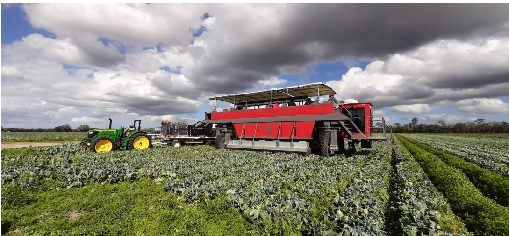  
Figure 6.1: One of the five selective harvesting robots for broccoli that have been commercialised. This robot and the other four robots are equipped with a perception model that has been optimised based on the findings of this thesis. Photo taken in Florida (USA) in 2022.  

# General discussion  

The general discussion starts with a summary of the research limitations that were part of this thesis (paragraph 6.1). Then, it is discussed how the research contributions of the individual chapters can be integrated, so that future research on selective harvesting robots can benefit from it (paragraph 6.2). This is followed by an overview of the possible societal consequences after the introduction of selective harvesting robots (paragraph 6.3). The general discussion concludes with a summary of the main conclusions from this thesis (paragraph 6.4).  

# 6.1 Research limitations and recommendations  

This section summarises the general research limitations and recommendations for future research. They are summarised by the four types of variation that were defined in the general introduction: variations in the cultivation environment (paragraph 6.1.1), variations in the crop (paragraph 6.1.2), occlusions (paragraph 6.1.3), and sensor limitations (paragraph 6.1.4). Then, it is assessed whether the general conclusion would hold in circumstances other than those tested in this thesis (paragraph 6.1.5).  

# 6.1.1 Variations in the cultivation environment  

In this thesis, the perception models were exposed to different variations in the cultivation environment. For example, in the orchard there were different natural and artificial forms of occluded and missing landmarks. In the broccoli images, there were plants with different positions and degrees of visibility due to the difference in row- and bed-based cultivation. Nevertheless, the degree of environmental variation to which the perception models in this thesis were exposed was limited and this was due to the specific experimental and hardware setup.  

In chapter 2, the variations in the cultivation environment were limited, as the experiments were only carried out in one orchard during two winter days. Because in winter there are no tall grasses and weeds and fewer tree branches due to pruning, there was a lower number of laser beam returns from these objects. Consequently, it is unknown whether the two tested perception models can perform adequately when there are more laser beam returns from these types of objects. This is a serious limitation, as there will be more of these laser beam returns during the harvest season, because at that time the grasses are taller, there are more weeds and the tree branches start to bend due to the weight of the fruits.  

For the particle filter to better deal with more laser beam returns from other objects, its environment model can be equipped with other regions. For example, additional tree branch regions can be added in front of the tree trunk region and behind the tree trunk region to better prepare the model for laser beam returns from tree branches. Such a model extension would make the environment model more similar to the one tested in Hiremath et al. (2014). In this study, the model-based particle filter had a mean lateral deviation of $0 . 0 4 \mathrm { { m } }$ when navigating a robot in different maize fields with different plant sizes and different stem occlusions. The results of Hiremath et al. (2014) imply that after changing the environment model of chapter 2, there may also be adequate localisation and navigation performance when navigating an orchard robot during the harvest season. What the study by Hiremath et al. (2014) also demonstrated is that a robot equipped with a model-based particle filter can also navigate between curved rows. Whether this is also true for the particle filter of chapter 2 remains to be validated in future research.  

Also in chapters 3 to 5, the variations in the cultivation environment were limited, as the image acquisition was performed in shielded cabinets with artificial light. Only in chapter 4, a subset of images was acquired in natural light conditions, but also in these images the light was diffuse due to the use of an umbrella. Both the umbrella and the shielded cabinets minimised the variations in light intensity and light colour in the images, and they also minimised the effect of wind and dust on the image quality. This may have affected the results and one of the conclusions of chapter 3. In this chapter, the effect of the photometric transformations on the image generalisation was found to be marginal, but this result may have been caused by the minimal variations in light colour, light intensity and blur in the images. The conclusion that photometric transformations are less effective for image generalisation may therefore only apply to images acquired under conditioned lighting conditions. In fact, Kusrini et al. (2020) and Afzaal et al. (2021) found that a combination of photometric and geometric transformations contributed most to the generalisation performance of a CNN when processing agricultural images acquired in natural light conditions without a cover. Probably, with the active learning method of chapter 5, it would also be possible to automatically select images with different environmental variations than those previously trained. As such, active learning could help to further optimise the CNN’s ability to deal with unexplored environmental variations.  

# 6.1.2 Variations in the crop  

The perception models in chapters 3 to 5 were exposed to larger crop variations than the models tested in three comparable broccoli studies (Table 6.1). This suggests that testing perception models on our datasets probably gave a good impression of the generalisation performance of the models when applied to a robot. In fact, a Mask R-CNN model trained on the images of chapter 5 has been operational for more than a year on five commercial broccoli harvesting robots in America. This is evidence that the crop variations studied in chapter 5 were representative for a wide range of crop conditions in America.  

There is, however, a practical limitation, and that is that the evaluation of the model’s performance in chapter 5 was carried out in a so-called closed-set scenario. A closed-set scenario means that the classes encountered during model testing are the same as those used during model training (Sünderhauf et al., 2018). A risk when testing a model in a closed-set scenario, is that it is not known whether the model can perform on new and untrained classes that may occur in the field. In the situation that a model cannot properly deal with this so-called out-of-distribution data, undesired robotic actions may occur, such as harvesting broccoli heads with a disease or defect unknown to the model. In future research, the uncertainty metrics of chapter 5 should be tested for their ability to identify unknown classes in a so-called open-set learning scenario. In this scenario, the uncertainty sampling could potentially benefit from new selection methods for out-ofdistribution data, for example the Weibull distribution sampling as presented in Mandivarapu et al. (2022) and Mundt et al. (2022).  

Table 6.1: Crop variations summarised for this thesis and for three comparable broccoli studies.   

<html><body><table><tr><td rowspan="2"></td><td colspan="3">This thesis</td><td colspan="3">Comparable broccoli studies</td></tr><tr><td>Chapter 3</td><td>Chapter 4</td><td>Chapter 5</td><td>Kusumam et al.</td><td>Bender et al.</td><td>Garcia- Manso et al. (2021)</td></tr><tr><td>Images+</td><td>3300+</td><td>2560</td><td>16,000$</td><td>(2017) 1769</td><td>(2020) 1248</td><td>6165</td></tr><tr><td>Cultivars</td><td>3</td><td>2</td><td>6</td><td>2</td><td>1</td><td>3</td></tr><tr><td>Fields</td><td>11</td><td>2</td><td>26</td><td>4</td><td>1</td><td>4</td></tr><tr><td>Seasons</td><td>5</td><td>2</td><td>8</td><td>2</td><td>1</td><td>1</td></tr><tr><td>Countries</td><td>3</td><td>2</td><td>4</td><td>2</td><td>1</td><td>1</td></tr></table></body></html>

† The sum of training, validation and test images to train and evaluate the perception model. ‡ The images of chapter 3 included 300 images from Bender et al. (2019). § The images of chapter 5 included 915 images from Bender et al. (2019) and 2122 images from Kusumam et al. (2016) (they used a smaller subset for their own research).  

Although the research in this thesis only focused on broccoli, it is still expected that the tested machine learning methods can be effective for image generalisation on crops with different variations. This assumption is based on the research of Bargoti and Underwood (2017) and Gené-Mola et al. (2020). In these two studies, the object detection of almond, apple and mango was studied using Faster R-CNN and Mask R-CNN. The images and annotations of Bargoti and Underwood (2017) and Gené-Mola et al. (2020) were made public, so it was possible to evaluate the difference between the image features of the three crops and the image features of the broccoli heads from chapter 5. From Figures 6.2a, 6.2b, and $6 . 2 \mathrm { c }$ , it is concluded that the investigated almonds (yellow line), apples (red line) and mangoes (blue line) had different colours, sizes and textures than the broccoli heads (green line). Given that the F1 scores of the CNNs from the two studies were 0.78 and higher, and given that their CNNs were trained with similar geometric data augmentations as in chapter 3, suggests that the augmentation methods investigated in chapter 3 may also be effective for crops with other colours, sizes and textures than broccoli.  

# 6.1.3 Occlusions  

From chapter 4, it was concluded that the size estimation of occluded broccoli heads can be improved when the CNN can learn both the visible and the amodal region of the broccoli head. There is, however, a moderate limitation and that is that in chapter 4 only one specific form of occlusion has been investigated. This specific form of occlusion was that all the occlusions were caused by leaves and that, due to the position of the leaves, always a part of the edge of the broccoli head was visible. The partial visibility of the edge of the broccoli head probably made it easier for ORCNN to estimate the amodal shape, as it involved completing and sometimes enlarging the circular shape of the broccoli head using the visible part of the edge. In the situation that only the central part of the broccoli head is visible (and thus its edges are occluded), then it may also be more difficult for ORCNN to estimate the amodal shape. This type of occlusion does not usually occur in field-grown broccoli, but it is more common in other cabbages, for example cauliflower. Future research should evaluate ORCNN’s amodal perception performance on crops with this type of occlusion.  

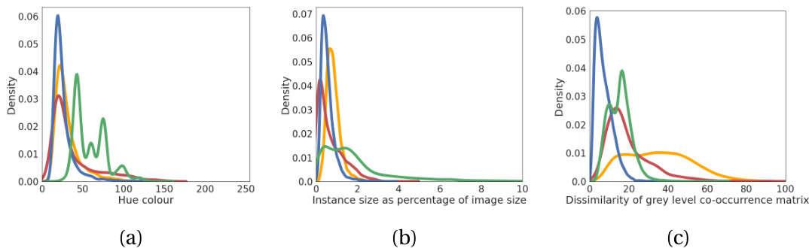  
Figure 6.2: Kernel density estimate plots showing the distributions of three image features: (a) colour, (b) size, (c) texture. The coloured lines in each plot represent the distribution of the image features for all annotated instances. The yellow line represents almond from Bargoti and Underwood (2017) (4777 instances). The red line represents apple from Gené-Mola et al. (2020) (2970 instances). The blue line represents mango from Bargoti and Underwood (2017) (7065 instances). The green line represents broccoli from this thesis (31,042 instances in the 16,000 images of chapter 5).  

In fruit and vegetable production, there can even be other forms of occlusion. In orchards, for example, it is more likely that crops occlude each other (since most fruits grow in clusters). When crops occlude each other, this can lead to an unexplored situation where ORCNN has to segment the crop’s amodal mask on top of another crop’s visible mask. While the research of Follmann et al. (2018) shows that ORCNN can make this kind of amodal prediction, it remains to be seen how well this would work on smallsized crops. Perhaps for crops that grow in clusters, it would be worthwhile to investigate whether the ORCNN performance can be improved after incorporating the Visibility Guided Non-Maximum Suppression (VG-NMS) (Gählert et al., 2020). VG-NMS has been specifically designed to deal with overlapping amodal shapes of visually similar objects, and it has proven its usefulness in object detection in crowded traffic scenes (Gählert et al., 2020).  

A final recommendation for future research involves changing the network of ORCNN, so that more information about the occluding object can be extracted. This information could include, for example, the classification of the occluding object to determine whether the robotic arm should circumvent the object or not. Such information would allow further optimisation of the approach of the robotic arm to the crop. For ORCNN to provide class information about the occluding object, its network architecture should be extended with the original occlusion mask. Alternatively, the ORCNN network can be extended with a semantic segmentation network, so that panoptic segmentation can be realised. Panoptic segmentation combines instance segmentation and semantic segmentation into one network (Kirillov et al., 2019), and it has the advantage that the background objects relevant to robotic harvesting can be segmented on an image level.  

# 6.1.4 Sensor limitations  

What also affected the performance of the perception models were the limitations of the sensors themselves. Although the effects of the sensor limitations on the perception performance were not that big, still certain limitations affected the performance of some models more than others.  

In chapter 2, the limited sensor range of the LIDAR scanner $( 4 ~ \mathrm { m } )$ probably had a larger negative effect on the performance of the line-based Kalman filter than the modelbased particle filter. This is because with fewer laser beam returns, there is a higher chance that the fitted line will shift when there are laser beam returns from tree branches. What might have supported the decision to limit the range of the LIDAR scanner is the smaller chance of random measurement errors in the sensor data. Because the random measurement errors of the LIDAR scanner propagate non-linearly over the distance, there is a smaller chance of errors close to the LIDAR scanner (Siegwart et al., 2011). The limited sensor range can also be justified by the fact that objects closer to the LIDAR scanner are more relevant to autonomous driving than objects further away.  

The loss of depth pixels of the tested RGB-D cameras could have a larger negative effect on the size estimation of ORCNN than Mask R-CNN. This has to do with the poorer segmentation of ORCNN on the visible mask compared to Mask R-CNN. In the situation where fruits or vegetables are smaller and many depth pixels are lost within the visible mask, the poorer segmentation of ORCNN could lead to the pixel-to-millimetre conversion factor being calculated on another object, such as a leaf, rather than on the crop itself. As shown in chapter 4, this can lead to large errors in the size estimate. To reduce the impact of these errors, it is recommended to incorporate Bayesian methods into the size estimation algorithm. With these methods, predictions and corrections can be made using the pixel-to-millimetre conversion factor of the same crop in a previous image frame.  

# 6.1.5 Reflection on the general conclusion  

Based on the research limitations, it can be argued that further research and development is needed to be able to generalise the investigated perception models in other cultivation environments and on other crops than those tested in this thesis. Especially in fruit production, adjustments to the models may be necessary, because in orchards usually other forms of occlusion occur and image acquisition in orchards is usually done without a cover. Fortunately, from the literature review, it has also become clear that adjustments to the models are relatively easy to implement and that, after implementing the adjustments, satisfactory perception performance can be achieved in the other cultivation environments and crops. As such, it can be concluded that the research in this thesis can provide a good basis for improved perception performance for future selective harvesting robots in fruit and vegetable production.  

What should not be forgotten when researching and developing selective harvesting robots is that their operation depends on the successful integration of various sensors, data streams and software models. In that regard, the methodologies from the four research chapters could also be integrated in such a way that future research on selective harvesting robots can benefit from it. In the next section, three of these possible research integrations are discussed.  

# 6.2 Future research integrations  

This section provides information on how the methodologies of the individual chapters can be integrated to further improve the perception performance of future selective harvesting robots. These integrations also include integration with methodologies from literature. Among these integrations are research integrations for robot localisation (paragraph 6.2.1), research integrations for crop detection (paragraph 6.2.2), and probabilistic deep learning (paragraph 6.2.3).  

# 6.2.1 Research integrations for robot localisation  

In this thesis, the robot localisation was performed with two Bayesian filters. These filters estimated the location of the robot through a process of prediction and correction. What these filters did not do was classifying to which objects the individual laser points belonged. This so-called semantic segmentation of laser points would be valuable when the selective broccoli harvesting robot has to be equipped with a LIDAR-based driving system. With semantic segmentation, it would be possible to estimate the laser points belonging to the broccoli heads. These specific laser points could then be used as input for robot localisation and navigation. This would eliminate the need to model the interactions between the LIDAR scanner and the rather complex broccoli cultivation environment. Semantic segmentation could also be a future perception method for robot localisation in orchards.  

To date, semantic segmentation of laser points is primarily performed with deep learning models, especially in autonomous car navigation (Guo et al., 2021). One aspect to consider when using deep learning models is whether they can process large and unfiltered point clouds. Most of the currently deployed deep learning models still use down- and sub-sampling techniques that reduce the number of laser points to be processed in order to speed up the point cloud analysis (Bello et al., 2020). Future research should therefore focus on developing more models that can process the entire point cloud in shorter time spans. This can improve both the performance and operational speed of deep learning-based point cloud analysis on selective harvesting robots.  

Besides using deep learning for point cloud analysis, deep learning can also be used for image analysis as a basis for robot localisation. In recent literature, CNNs have been used to segment the crop rows (De Silva et al., 2022) or the driving path (Kim et al., 2020) or to directly estimate the robot’s heading and its relative placement between crop rows using image-based regression (Sivakumar et al., 2021). The regression model of Sivakumar et al. (2021) proved to perform better than a line-based LIDAR method when autonomously navigating a robot over $2 5 \ \mathrm { k m }$ in maize and soybean fields. This indicates that robot localisation based on RGB images and CNNs can be an alternative to robot localisation based on LIDAR point clouds. Using RGB-based robot localisation could also help to reduce the cost of the robot because RGB cameras are cheaper than LIDAR scanners. This may further increase the commercial success rate of agricultural robots.  

# 6.2.2 Research integrations for crop detection  

In this thesis, the image acquisition of the RGB-D images was performed with a specific acquisition method. This method involved the use of an RGB-D camera that was mounted in front of the robotic arm. With the RGB-D camera, images were acquired with a top-view camera perspective and the camera was electronically triggered by an encoder that was mounted on the front wheel of the robot. This specific hardware setup had two implications. The first implication was that due to the top-view camera perspective and the fact that most broccoli heads grow straight, there was not much variation in the 3D pose of the broccoli heads, meaning that it was also relatively easy to estimate the pose. For other crops, the 3D pose estimation might be more challenging, especially when the crops grow in clusters. The second implication was that the encoder-based image acquisition and robot control might have been prone to malfunctions, especially when the robot has to drive in moist and unstructured soils. In these soils, wheel slip can cause the robot wheels and thus the encoder to keep turning while the robot is actually standing still or moving much slower, and this can interfere with the image acquisition and robotic harvesting.  

The image acquisition, robotic harvesting and 3D pose estimation may be improved when the camera is mounted on the robotic arm. By placing the camera on the arm, the acquired images will always correspond to the perspective of the robotic arm, and this will eliminate the need for an encoder. Also, with a camera on the robotic arm, it would be possible to actively control the arm based on the camera images. With this socalled visual servoing, it is possible to obtain better views of the fruit or vegetable and this could improve the crop detection and 3D pose estimation, especially in crops with many occlusions and variations in the 3D pose. With a camera on the robotic arm, it would also be possible to analyse the camera images during robot operation so that the gripping and cutting performance of the arm could be monitored.  

A side effect of placing a camera on the robotic arm, is that a more frequent image analysis is required to achieve smooth and safe robot operation when using visual servoing. Therefore, it is essential that the image analysis can be performed as quickly as possible when placing a camera on the arm. An instance segmentation model that allows for faster processing is $\mathrm { Y O L A C T + + }$ (Bolya et al., 2020). YOLACT $^ { + + }$ is approximately three times faster than Mask R-CNN (Bolya et al., 2020).  

A final consideration is the use of other types of cameras for crop detection, such as thermal, multispectral, hyperspectral, or x-ray cameras. This topic has received little attention in the research on selective harvesting robots, mainly due to the relatively high costs of the cameras and the less straightforward application compared to RGB and RGB-D cameras (Oliveira et al., 2021). Nevertheless, these other types of cameras may offer a better alternative in the detection and maturity evaluation of crops with more occlusion, such as cauliflower. Future research should therefore focus on testing whether these other types of cameras could be used as alternatives to RGB and RGB-D cameras in crops that are difficult to detect.  

# 6.2.3 Probabilistic deep learning  

The results of chapter 5 gave a first impression of the potential of integrating probabilistic methods and deep learning. The potential of such integration is much greater than optimising Mask R-CNN with fewer image annotations. Another useful application is the integration of Monte-Carlo dropout into ORCNN, which makes it possible to obtain better uncertainty estimates from the model when estimating the size of occluded crops. These uncertainty estimates can serve as inputs for specific robotic actions, for example cancelling the harvest action when there is too much uncertainty about the crop size, or placing the harvested crop on another conveyor belt for further inspection or postprocessing.  

Besides the above mentioned research integration, many other integrations between probabilistic methods and deep learning are possible. One of these integrations concerns alleviating the problem that current CNNs produce overconfident scores for untrained situations and classes (Sünderhauf et al., 2018). By integrating Monte-Carlo dropout, deep ensembles or Bayesian neural networks, this problem can be alleviated, because with the outcomes of these models better expressions of the epistemic uncertainty can be obtained. Epistemic uncertainty refers to the uncertainty of the model caused by lack of data (Jospin et al., 2020). Having a sense of epistemic uncertainty would enable the CNN to produce uncertain outputs in situations to which it has not been exposed before. This can, in turn, improve the robot’s ability to reason under uncertainty and potentially improve the robot’s safety. This is why probabilistic deep learning is an important theme for future research in applied robotics.  

# 6.3 Societal consequences  

This thesis focused on improving the generalisation performance of perception models for selective harvesting robots in fruit and vegetable production. By improving the generalisation performance, it was tried to improve the commercial success rate of selective harvesting robots, so that the robots can provide alternatives to human labour. This is crucial in times when labour is becoming increasingly scarce and expensive. Despite the fact that the broccoli harvesting robots are currently an alternative to human labour, it must also be recognised that the introduction of such robots may have societal consequences. This section highlights three possible societal consequences after the introduction of selective harvesting robots: job-related changes (paragraph 6.3.1), social inequality (paragraph 6.3.2) and changes in sustainability (paragraph 6.3.3).  

# 6.3.1 Job-related changes  

The main incentive for the research and development of selective harvesting robots lies in the unavailability of labour and the high cost of labour. Although it is likely that the first selective harvesting robots will be developed and deployed for crops with urgent labour problems, it cannot be ignored that a large-scale introduction of selective harvesting robots could eventually lead to a loss of (seasonal) jobs currently performed by humans. The study of Van der Burg et al. (2022) on the ethics of agricultural robots offers possible solutions to avoid this negative prospect. Van der Burg et al. (2022) advise to focus on possible collaborations between robots and people, so that people do not need to be laid off but can be reassigned to tasks where the unique qualities of people are best brought into action, for example transporting harvested crops.  

It must also be acknowledged that the introduction of selective harvesting robots could also create new types of jobs, such as robot operator or maintenance technician. Such jobs are probably less physically demanding and more mentally satisfying than harvesting by hand, and this may lead to more young people becoming interested in working in the food production sector (Zhang et al., 2019).  

For the jobs that remain, the implementation may change after the introduction of selective harvesting robots. Van der Burg et al. (2022) predict that the farmer’s tasks will shift to managing various robots and data streams instead of doing physical work with plants. This could make working in agriculture more attractive to people with a technological background.  

# 6.3.2 Social inequality  

The introduction of selective harvesting robots could lead to unbalanced power relations between a handful of technology providers and a large group of technology-dependent farmers. Ultimately, this could make the purchase and maintenance of selective harvesting robots comparatively more expensive. Also, for small-scale farmers, it may be a challenge to purchase selective harvesting robots, as these farmers usually do not have the capital to purchase such robots. Van der Burg et al. (2022) even warn of a "digital divide" and a social inequality that might arise between the haves and the have-nots of robots and the benefits they bring.  

A possible solution to prevent a digital divide lies in the democratisation of knowledge (Hackfort, 2021). Hackfort (2021) concludes that small-scale and agroecological farmers are open to adopting digital solutions if they are open-access and affordable, especially when these solutions are created through FarmHack networks and grassroots initiatives. An advantage of working with such development platforms is that it allows co-creation with farmers, allowing digital solutions to be better tailored to the needs of small-scale farmers (Hackfort, 2021). Hopefully, this thesis has already taken a first step in bridging the digital divide by making one dataset and two source codes publicly available.  

# 6.3.3 Changes in sustainability  

When selective harvesting robots are designed with the sole purpose of providing an alternative to human labour, then they pose the risk of not addressing larger sustainability issues in agriculture. One of these issues is soil compaction. Soil compaction is caused by heavy machinery that compresses the soil, leading to a reduction in soil life and water retention capacity, which is unfavourable for crop production. Soil compaction is an issue that is currently not being addressed by the five commercial broccoli harvesting robots, as the machines are large and heavy (Figure 6.3).  

Selective harvesting robots should therefore be designed as smaller and lighter machines so that they do not have a negative impact on soil quality. Another benefit of having smaller robots is that they can increase societal acceptance (Van der Burg et al., 2022). For smaller harvesting robots to reach the same capacity as a larger robot, they should operate as a group of several collaborative robots in the field (Shamshiri et al., 2018). This concept of swarm robotics should be the focus of future applications of selective harvesting robots.  

Small and light harvesting robots, especially if they are multi-functional, may even lead to greater sustainability benefits. One sustainability benefit can arise from using the robot’s images together with weather predictions to estimate when most of the unharvested crops will reach their optimal maturity. This information can be used to determine the best time for the next harvesting moment, which can help to minimise harvest losses and food waste. Another sustainability benefit can be achieved by equipping a selective harvesting robot with a mechanical weeding tool, so that in addition to autonomous harvesting, autonomous weeding can be performed. In this way, the use of herbicides can be reduced. A possible greater sustainability benefit is that smallscale multi-functional robots could disrupt the current way of farming in monocultures. Monocultures do promote the efficiency of human labour, but they are also considered unfavourable for biodiversity (Ditzler & Driessen, 2022). When fleets of small and multifunctional robots can take over more and more human tasks, the rationale for having monocultures would also diminish (Daum, 2021). This could give rise to other and more biodiversity-friendly forms of crop production, such as strip cropping, pixel farming or agro-silvio-pastoral farming (combining crop production and livestock in wooded environments).  

A final note on sustainability concerns crop modifications through breeding that would promote robotic harvesting of crops. These crop modifications are proposed by Bac (2015) and Barth (2018), and they can indeed improve harvestability, for instance if the genes responsible for fruit clusters are modified so that fewer clusters are formed. Similar breeding techniques have already been applied to broccoli and have led to the introduction of high-rise broccoli cultivars, such as Eiffel and Hancock. These cultivars have a longer stalk causing the head of the broccoli to rise above the leaves, making it easier to detect and harvest. A problem of having such an optimised crop is that it becomes more difficult for a farmer to grow anything else (Van der Burg et al., 2022), and this can again reduce biodiversity and increase dependency on a number of plant breeders. To avoid this, we as researchers must come with alternatives, for example by adapting the cultivation systems so that the crops can be detected more easily or by further improving the perception performance of selective harvesting robots.  

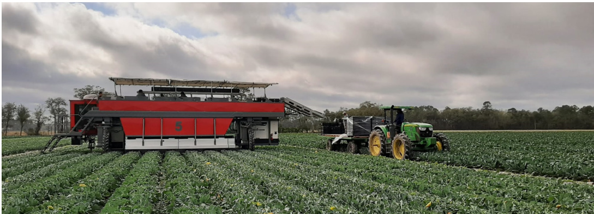  
Figure 6.3: The current broccoli harvesting robot is a large and heavy machine that can cause soil compaction in the long run. Photo taken in Florida (USA) in 2022.  

# 6.4 Summary of the main conclusions  

From this thesis, the following four main conclusions can be drawn:  

1. Localisation based on a particle filter with a sensor-environment model led to better navigation of an orchard robot compared to localisation based on a line-based Kalman filter.   
2. With geometric data augmentation, the generalisation performance of Mask RCNN can be improved for detecting broccoli heads of three cultivars with different texture and colour.   
3. The size estimation of occluded broccoli heads can be improved with a CNN that can learn both the visible and amodal region of the broccoli head.   
4. Active learning can reduce the effort of selecting and annotating images for training Mask R-CNN on a dataset with visually similar broccoli diseases and defects.  

From these four conclusions, it can be concluded that the methods for sensor-environment modelling, geometric data augmentation, amodal perception and active learning, have led to improved generalisation performance of the investigated perception models. The practical evidence of the improved generalisation performance became apparent after applying the methods to a perception model that is now deployed on five broccoli harvesting robots. The deployed model has been operational on these robots for more than a year, without the need for retraining. The solid performance of the perception model has ensured that the harvesting performance of the robot has been consistent across different farms, fields and growing conditions. It is no wonder that this consistent robot performance has boosted the broccoli farmers’ confidence in using robots as an alternative to selective harvesting by hand. It fills me with pride that I was able to make a positive contribution to this.  

  

# References  

Abdulla, W. (2017). Mask r-cnn for object detection and instance segmentation on keras and tensorflow. https://github.com/matterport/Mask_RCNN   
Afzaal, U., Bhattarai, B., Pandeya, Y. R., & Lee, J. (2021). An instance segmentation model for strawberry diseases based on mask r-cnn. Sensors, 21(19). https://doi.org/ 10.3390/s21196565   
Aghdam, H. H., Gonzalez-Garcia, A., van de Weijer, J., & López, A. M. (2019). Active learning for deep detection neural networks. https://arxiv.org/abs/1911.09168   
Agriconnect. (2019). Vormen van arbeid en loonkosten. https://agriconnect.nl/thema/ vormen-van-arbeid-en-loonkosten   
Andersen, J. C., Ravn, O., & Andersen, N. A. (2010). Autonomous rule-based robot navigation in orchards [7th IFAC Symposium on Intelligent Autonomous Vehicles]. IFAC Proceedings Volumes, 43(16), 43–48. https://doi.org/10.3182/20100906-3- IT-2019.00010   
ASI-Robots. (2018). Orchard and vineyard automation. https : / / www. asirobots. com / farming/orchard-vineyard/   
Bac, C. W. (2015). Improving obstacle awareness for robotic harvesting of sweet-pepper (Doctoral dissertation) [WU thesis 5954]. Wageningen University. The Netherlands. https://edepot.wur.nl/327202   
Bac, C. W., van Henten, E. J., Hemming, J., & Edan, Y. (2014). Harvesting robots for highvalue crops: State-of-the-art review and challenges ahead. Journal of Field Robotics, 31(6), 888–911. https://doi.org/10.1002/rob.21525   
Barawid, O. C., Mizushima, A., Ishii, K., & Noguchi, N. (2007). Development of an autonomous navigation system using a two-dimensional laser scanner in an orchard application. Biosystems Engineering, 96(2), 139–149. https://doi.org/10. 1016/j.biosystemseng.2006.10.012   
Bargoti, S., & Underwood, J. (2017). Deep fruit detection in orchards. 2017 IEEE International Conference on Robotics and Automation (ICRA), 3626–3633. https://doi. org/10.1109/ICRA.2017.7989417   
Barth, R. (2018). Vision principles for harvest robotics: Sowing artificial intelligence in agriculture (Doctoral dissertation) [WU thesis 7066]. Wageningen University. The Netherlands. https://doi.org/10.18174/456019   
Barth, R., Hemming, J., & van Henten, E. J. (2016). Design of an eye-in-hand sensing and servo control framework for harvesting robotics in dense vegetation [Special Issue: Advances in Robotic Agriculture for Crops.]. Biosystems Engineering, 146, 71–84. https://doi.org/10.1016/j.biosystemseng.2015.12.001   
Bello, S. A., Yu, S., Wang, C., Adam, J. M., & Li, J. (2020). Review: Deep learning on 3d point clouds. Remote Sensing, 12(11). https://doi.org/10.3390/rs12111729   
Bender, A., Whelan, B., & Sukkarieh, S. (2019). Ladybird cobbitty 2017 brassica dataset. https://doi.org/10.25910/5c941d0c8bccb Bender, A., Whelan, B., & Sukkarieh, S. (2020). A high-resolution, multimodal data set for agricultural robotics: A ladybird’s-eye view of brassica. Journal of Field Robotics,   
37(1), 73–96. https://doi.org/10.1002/rob.21877 Bergerman, M., Maeta, S. M., Zhang, J., Freitas, G. M., Hamner, B., Singh, S., & Kantor, G. (2015). Robot farmers: Autonomous orchard vehicles help tree fruit production. IEEE Robotics Automation Magazine, 22(1), 54–63. https://doi.org/10.1109/ MRA.2014.2369292 Bergerman, M., Singh, S., & Hamner, B. (2012). Results with autonomous vehicles operating in specialty crops. 2012 IEEE International Conference on Robotics and Automation, 1829–1835. https://doi.org/10.1109/ICRA.2012.6225150 Birrell, S., Hughes, J., Cai, J. Y., & Iida, F. (2020). A field-tested robotic harvesting system for iceberg lettuce. Journal of Field Robotics, 37(2), 225–245. https://doi.org/10.   
1002/rob.21888 Blok, P. M., Barth, R., & van den Berg, W. (2016). Machine vision for a selective broccoli harvesting robot [5th IFAC Conference on Sensing, Control and Automation Technologies for Agriculture AGRICONTROL 2016]. IFAC-PapersOnLine, 49(16),   
66–71. https://doi.org/10.1016/j.ifacol.2016.10.013 Blok, P. M., Suh, H.-K., van Boheemen, K., Kim, H.-J., & Kim, G.-H. (2018). Autonomous in-row navigation of an orchard robot with a 2d lidar scanner and particle filter with a laser-beam model [in Korean with English abstract]. Journal of Institute of Control, Robotics and Systems, 24(8), 726–735. https://doi.org/10.5302/J. ICROS.2018.0078 Blok, P. M., van Boheemen, K., van Evert, F. K., IJsselmuiden, J., & Kim, G.-H. (2019). Robot navigation in orchards with localization based on particle filter and kalman filter. Computers and Electronics in Agriculture, 157, 261–269. https://doi.org/10.   
1016/j.compag.2018.12.046 Blok, P. M., van Henten, E. J., van Evert, F. K., & Kootstra, G. (2021a). Data underlying the publication: Image-based size estimation of broccoli heads under varying degrees of occlusion. https://doi.org/10.4121/13603787 Blok, P. M., van Henten, E. J., van Evert, F. K., & Kootstra, G. (2021b). Image-based size estimation of broccoli heads under varying degrees of occlusion. Biosystems Engineering, 208, 213–233. https://doi.org/10.1016/j.biosystemseng.2021.06.001 Blok, P. M., van Evert, F. K., Tielen, A. P. M., van Henten, E. J., & Kootstra, G. (2021c). The effect of data augmentation and network simplification on the image-based detection of broccoli heads with mask r-cnn. Journal of Field Robotics, 38(1), 85–   
104. https://doi.org/10.1002/rob.21975 Bochkovskiy, A., Wang, C.-Y., & Liao, H.-Y. M. (2020). Yolov4: Optimal speed and accuracy of object detection. https://arxiv.org/abs/2004.10934 Bolya, D., Zhou, C., Xiao, F., & Lee, Y. J. (2020). Yolact $^ { + + }$ : Better real-time instance segmentation. IEEE Transactions on Pattern Analysis and Machine Intelligence, 1108–   
1121. https://doi.org/10.1109/tpami.2020.3014297 Boogaard, F. P., Rongen, K. S., & Kootstra, G. W. (2020). Robust node detection and tracking in fruit-vegetable crops using deep learning and multi-view imaging. Biosystems Engineering, 192, 117–132. https://doi.org/10.1016/j.biosystemseng.2020.   
01.023  

Castellano-Quero, M., Fernández-Madrigal, J.-A., & García-Cerezo, A.-J. (2020). Statistical study of the performance of recursive bayesian filters with abnormal observations from range sensors. Sensors, 20(15). https://doi.org/10.3390/s20154159  

Chandra, A. L., Desai, S. V., Balasubramanian, V. N., Ninomiya, S., & Guo, W. (2020). Active learning with point supervision for cost-effective panicle detection in cereal crops. Plant Methods, 16(1), 1–16. https://doi.org/10.1186/s13007-020-00575-8   
Chen, X., Wang, S., Zhang, B., & Luo, L. (2018). Multi-feature fusion tree trunk detection and orchard mobile robot localization using camera/ultrasonic sensors. Computers and Electronics in Agriculture, 147, 91–108. https://doi.org/10.1016/j. compag.2018.02.009   
Christiansen, M. P., Jensen, K., Ellekilde, L.-P., & Jørgensen, R. N. (2011). Localization in orchards using extended kalman filter for sensor-fusion-a frobomind component. NJF seminar 441, Automation and System Technology in Plant Production CIGR section V and NJF section VII conference.   
ChRobotics. (2018). Um6 ultra-miniature orientation sensor datasheet. http : / / www. chrobotics.com/docs/UM6_datasheet.pdf   
Clearpath-Robotics. (2016). Husky unmanned ground vehicle - user manual. https:// www.clearpathrobotics.com/husky-user-manual/   
Daum, T. (2021). Farm robots: Ecological utopia or dystopia? Trends in Ecology & Evolution, 36(9), 774–777. https://doi.org/10.1016/j.tree.2021.06.002   
De Silva, R., Cielniak, G., & Gao, J. (2022). Towards infield navigation: Leveraging simulated data for crop row detection. https://doi.org/10.48550/ARXIV.2204.01811   
Ditzler, L., & Driessen, C. (2022). Automating agroecology: How to design a farming robot without a monocultural mindset? Journal of Agricultural and Environmental Ethics, 35(1), 1–31. https://doi.org/10.1007/s10806-021-09876-x   
Edwards, W. (2019). Estimating farm machinery costs. https://www.extension.iastate. edu/agdm/crops/html/a3-29.html   
FAOSTAT. (2020). Crops and livestock products. https://www.fao.org/faostat/en/#data/ QCL   
FarmingUK. (2022). Firm makes significant progress with raspberry harvesting robots. https://www.farminguk.com/news/firm- makes- significant- progress- withraspberry-harvesting-robots_60241.html   
Fayyad, J., Jaradat, M. A., Gruyer, D., & Najjaran, H. (2020). Deep learning sensor fusion for autonomous vehicle perception and localization: A review. Sensors, 20(15). https://doi.org/10.3390/s20154220   
Follmann, P., König, R., Härtinger, P., & Klostermann, M. (2018). Learning to see the invisible: End-to-end trainable amodal instance segmentation. https://arxiv.org/ abs/1804.08864   
Fountas, S., Malounas, I., Athanasakos, L., Avgoustakis, I., & Espejo-Garcia, B. (2022). Aiassisted vision for agricultural robots. AgriEngineering, 4(3), 674–694. https:// doi.org/10.3390/agriengineering4030043   
Freitas, G. M., Hamner, B., Bergerman, M., Kantor, G. A., & Zhang, J. (2012). A low-cost, practical localization system for agricultural vehicles. Proceedings of 5th International Conference on Intelligent Robotics and Applications (ICIRA ’12), 365– 375. https://doi.org/10.1007/978-3-642-33503-7_36   
Fu, L., Gao, F., Wu, J., Li, R., Karkee, M., & Zhang, Q. (2020). Application of consumer rgb-d cameras for fruit detection and localization in field: A critical review. Computers and Electronics in Agriculture, 177, 105687. https://doi.org/10.1016/j.compag. 2020.105687   
Gählert, N., Hanselmann, N., Franke, U., & Denzler, J. (2020). Visibility guided nms: Efficient boosting of amodal object detection in crowded traffic scenes. https:// arxiv.org/abs/2006.08547   
Gal, Y., & Ghahramani, Z. (2016). Dropout as a bayesian approximation: Representing model uncertainty in deep learning. Proceedings of The 33rd International Conference on Machine Learning, 48, 1050–1059. https://proceedings.mlr.press/ v48/gal16.html   
Gal, Y., Hron, J., & Kendall, A. (2017). Concrete dropout. Advances in Neural Information Processing Systems, 30. https://proceedings.neurips.cc/paper/2017/file/ 84ddfb34126fc3a48ee38d7044e87276-Paper.pdf   
García-Manso, A., Gallardo-Caballero, R., García-Orellana, C. J., González-Velasco, H. M., & Macías-Macías, M. (2021). Towards selective and automatic harvesting of broccoli for agri-food industry. Computers and Electronics in Agriculture, 188, 106263. https://doi.org/10.1016/j.compag.2021.106263   
Ge, Y., Xiong, Y., & From, P. J. (2019). Instance segmentation and localization of strawberries in farm conditions for automatic fruit harvesting [6th IFAC Conference on Sensing, Control and Automation Technologies for Agriculture AGRICONTROL 2019.]. IFAC-PapersOnLine, 52(30), 294–299. https://doi.org/10.1016/j.ifacol. 2019.12.537   
Ge, Y., Xiong, Y., & From, P. J. (2020). Symmetry-based 3d shape completion for fruit localisation for harvesting robots. Biosystems Engineering, 197, 188–202. https : //doi.org/10.1016/j.biosystemseng.2020.07.003   
Gené-Mola, J., Sanz-Cortiella, R., Rosell-Polo, J. R., Morros, J.-R., Ruiz-Hidalgo, J., Vilaplana, V., & Gregorio, E. (2020). Fruit detection and 3d location using instance segmentation neural networks and structure-from-motion photogrammetry. Computers and Electronics in Agriculture, 169, 105165. https://doi.org/10.1016/j. compag.2019.105165   
Gongal, A., Karkee, M., & Amatya, S. (2018). Apple fruit size estimation using a 3d machine vision system. Information Processing in Agriculture, 5(4), 498–503. https: //doi.org/10.1016/j.inpa.2018.06.002   
Goodfellow, I., Bengio, Y., & Courville, A. (2016). Deep learning. MIT Press. http://www. deeplearningbook.org   
Greenbot. (2018). Greenbot. https://www.greenbot.nl/   
Guo, Y., Wang, H., Hu, Q., Liu, H., Liu, L., & Bennamoun, M. (2021). Deep learning for 3d point clouds: A survey. IEEE Transactions on Pattern Analysis and Machine Intelligence, 43(12), 4338–4364. https://doi.org/10.1109/TPAMI.2020.3005434   
Gupta, A., Dollár, P., & Girshick, R. (2019). Lvis: A dataset for large vocabulary instance segmentation. https://arxiv.org/abs/1908.03195   
Haas, T., Schubert, C., Eickhoff, M., & Pfeifer, H. (2020). Bubcnn: Bubble detection using faster rcnn and shape regression network. Chemical Engineering Science, 216, 115467. https://doi.org/10.1016/j.ces.2019.115467   
Hackfort, S. (2021). Patterns of inequalities in digital agriculture: A systematic literature review. Sustainability, 13(22). https://doi.org/10.3390/su132212345   
Hague, T., & Tillett, N. (1996). Navigation and control of an autonomous horticultural robot. Mechatronics, 6(2), 165–180. https://doi.org/10.1016/0957- 4158(95) 00070-4   
Hansen, S., Bayramoglu, E., Andersen, J. C., Ravn, O., Andersen, N., & Poulsen, N. K. (2011). Orchard navigation using derivative free kalman filtering. Proceedings of the 2011 American Control Conference, 4679–4684. https://doi.org/10.1109/ ACC.2011.5991403   
Hansen, S., Blanke, M., & Andersen, J. (2009). Autonomous tractor navigation in orchard - diagnosis and supervision for enhanced availability. Proceedings of 7. IFAC Symposium on Fault Detection, Supervision and Safety of Technical Processes, 360– 365. https://doi.org/10.3182/20090630-4-ES-2003.00060   
Haralick, R. M., Shanmugam, K., & Dinstein, I. (1973). Textural features for image classification. IEEE Transactions on Systems, Man, and Cybernetics, SMC-3(6), 610– 621. https://doi.org/10.1109/TSMC.1973.4309314   
He, K., Gkioxari, G., Dollár, P., & Girshick, R. (2017). Mask r-cnn. 2017 IEEE International Conference on Computer Vision (ICCV), 2980–2988. https://doi.org/10.1109/ ICCV.2017.322   
He, K., Zhang, X., Ren, S., & Sun, J. (2016). Deep residual learning for image recognition. 2016 IEEE Conference on Computer Vision and Pattern Recognition (CVPR), 770– 778. https://doi.org/10.1109/CVPR.2016.90   
Hernández-García, A., & König, P. (2020). Data augmentation instead of explicit regularization. https://arxiv.org/abs/1806.03852   
Hiremath, S. A. (2013). Probabilistic methods for robotics in agriculture (Doctoral dissertation) [WU thesis 5555]. Wageningen University. The Netherlands. http:// edepot.wur.nl/272702   
Hiremath, S. A., van der Heijden, G. W., van Evert, F. K., Stein, A., & ter Braak, C. J. (2014). Laser range finder model for autonomous navigation of a robot in a maize field using a particle filter. Computers and Electronics in Agriculture, 100, 41–50. https: //doi.org/10.1016/j.compag.2013.10.005   
Jæger-Hansen, C., Griepentrog, H., & Andersen, J. (2012). Navigation and tree mapping in orchards [International Conference of Agricultural Engineering, CIGR-AgEng2012].   
Jiang, Y., Shuang, L., Li, C., Paterson, A. H., & Robertson, J. (2018). Deep learning for thermal image segmentation to measure canopy temperature of brassica oleracea in the field. 2018 ASABE Annual International Meeting, 1. https://doi.org/10. 13031/aim.201800305   
Jospin, L. V., Buntine, W., Boussaid, F., Laga, H., & Bennamoun, M. (2020). Hands-on bayesian neural networks – a tutorial for deep learning users. https://doi.org/ 10.48550/ARXIV.2007.06823   
Jung, A. (2019). Imgaug. https://github.com/aleju/imgaug   
Kalman, R. E. (1960). A New Approach to Linear Filtering and Prediction Problems. Journal of Basic Engineering, 82(1), 35–45. https://doi.org/10.1115/1.3662552   
Kamilaris, A., & Prenafeta-Boldú, F. X. (2018). Deep learning in agriculture: A survey. Computers and electronics in agriculture, 147, 70–90. https://doi.org/10.1016/j. compag.2018.02.016   
Kanatani, K., & Rangarajan, P. (2011). Hyper least squares fitting of circles and ellipses. Computational Statistics & Data Analysis, 55(6), 2197–2208. https://doi.org/10. 1016/j.csda.2010.12.012   
Kang, H., & Chen, C. (2020). Fruit detection, segmentation and 3d visualisation of environments in apple orchards. Computers and Electronics in Agriculture, 171, 105302. https://doi.org/10.1016/j.compag.2020.105302   
Kim, W.-S., Lee, D.-H., Kim, Y.-J., Kim, T., Hwang, R.-Y., & Lee, H.-J. (2020). Path detection for autonomous traveling in orchards using patch-based cnn. Computers and Electronics in Agriculture, 175, 105620. https://doi.org/10.1016/j.compag.2020. 105620   
Kirillov, A., He, K., Girshick, R., Rother, C., & Dollár, P. (2019). Panoptic segmentation. Proceedings of the IEEE/CVF Conference on Computer Vision and Pattern Recognition, 9404–9413. https://arxiv.org/abs/1801.00868   
Klear, M. (2019). Simple Circle Fitting Library for Python. https://github.com/AlliedToasters/ circle-fit   
Kootstra, G., Wang, X., Blok, P. M., Hemming, J., & van Henten, E. J. (2021). Selective harvesting robotics: Current research, trends, and future directions. Current Robotics Reports, 2, 95–104. https://doi.org/10.1007/s43154-020-00034-1   
Krempl, G., Kottke, D., & Spiliopoulou, M. (2014). Probabilistic active learning: Towards combining versatility, optimality and efficiency. Discovery Science, 168–179. https: //doi.org/10.1007/978-3-319-11812-3_15   
Krizhevsky, A., Sutskever, I., & Hinton, G. E. (2012). Imagenet classification with deep convolutional neural networks. Advances in neural information processing systems, 25. https://doi.org/10.1145/3065386   
Kurashiki, K., Fukao, T., Ishiyama, K., Kamiya, T., & Murakami, N. (2010). Orchard traveling ugv using particle filter based localization and inverse optimal control. 2010 IEEE/SICE International Symposium on System Integration, 31–36. https: //doi.org/10.1109/SII.2010.5708297   
Kusrini, K., Suputa, S., Setyanto, A., Agastya, I. M. A., Priantoro, H., Chandramouli, K., & Izquierdo, E. (2020). Data augmentation for automated pest classification in mango farms. Computers and Electronics in Agriculture, 179, 105842. https:// doi.org/10.1016/j.compag.2020.105842   
Kusumam, K., Krajník, T., Pearson, S., Duckett, T., & Cielniak, G. (2016). 3d datasets of broccoli in the field. https://lcas.lincoln.ac.uk/nextcloud/shared/agritechdatasets/broccoli/broccoli_datasets.html   
Kusumam, K., Krajník, T., Pearson, S., Duckett, T., & Cielniak, G. (2017). 3d-vision based detection, localization, and sizing of broccoli heads in the field. Journal of Field Robotics, 34(8), 1505–1518. https://doi.org/10.1002/rob.21726   
KWIN. (2018). Kwantitatieve informatie akkerbouw en vollegrondsgroenteteelt 2018. Wageningen University & Research.   
Lam, W. (2020). ORCNN in Detectron2. https://github.com/waiyulam/ORCNN   
Le Louedec, J., Montes, H. A., Duckett, T., & Cielniak, G. (2020). Segmentation and detection from organised 3d point clouds: A case study in broccoli head detection. 2020 IEEE/CVF Conference on Computer Vision and Pattern Recognition Workshops (CVPRW), 285–293. https://doi.org/10.1109/CVPRW50498.2020.00040   
LeCun, Y., Bottou, L., Bengio, Y., & Haffner, P. (1998). Gradient-based learning applied to document recognition. Proceedings of the IEEE, 86(11), 2278–2324. https://doi. org/10.1109/5.726791   
LeCun, Y., Bengio, Y., & Hinton, G. (2015). Deep learning. Nature, 521(7553), 436–444. https://doi.org/10.1038/nature14539   
Lehnert, C., Tsai, D., Eriksson, A., & McCool, C. (2019). 3d move to see: Multi-perspective visual servoing towards the next best view within unstructured and occluded environments. 2019 IEEE/RSJ International Conference on Intelligent Robots and Systems (IROS), 3890–3897. https://doi.org/10.1109/IROS40897.2019.8967918   
Lepej, P., & Rakun, J. (2016). Simultaneous localisation and mapping in a complex field environment. Biosystems Engineering, 150, 160–169. https://doi.org/10.1016/j. biosystemseng.2016.08.004   
Li, M., Imou, K., Wakabayashi, K., & Yokoyama, S. (2009). Review of research on agricultural vehicle autonomous guidance. International Journal of Agricultural and Biological Engineering, 2(3), 1–16. https://doi.org/10.3965/j.issn.1934- 6344. 2009.03.001-016   
Libby, J., & Kantor, G. (2010). Accurate gps-free positioning of utility vehicles for specialty agriculture. 2010 ASABE Annual International Meeting, 1–14. https://doi.org/ 10.13031/2013.29645   
Lin, G., Tang, Y., Zou, X., Li, J., & Xiong, J. (2019). In-field citrus detection and localisation based on rgb-d image analysis. Biosystems Engineering, 186, 34–44. https://doi. org/10.1016/j.biosystemseng.2019.06.019   
Lin, T.-Y., Maire, M., Belongie, S., Hays, J., Perona, P., Ramanan, D., Dollár, P., & Zitnick, C. L. (2014). Microsoft coco: Common objects in context. European conference on computer vision, 740–755. https://doi.org/10.1007/978-3-319-10602-1_48   
Lin, T. (2019). Labelimg. https://github.com/tzutalin/labelImg   
Liu, G., Nouaze, J. C., Mbouembe, P. L. T., & Kim, J. H. (2020). Yolo-tomato: A robust algorithm for tomato detection based on yolov3. Sensors, 20. https://doi.org/10. 3390/s20072145   
López Gómez, C. (2019). Deep active learning for instance segmentation (Master’s thesis). Eindhoven University of Technology. The Netherlands. http://oa.upm.es/ 57088/   
Lowenberg-DeBoer, J., Huang, I. Y., Grigoriadis, V., & Blackmore, S. (2020). Economics of robots and automation in field crop production. Precision Agriculture, 21(2), 278–299. https://doi.org/10.1007/s11119-019-09667-5   
MacQueen, J. (1967). Some methods for classification and analysis of multivariate observations. Proceedings of the fifth Berkeley symposium on mathematical statistics and probability, 1(14), 281–297.   
Malavazi, F. B., Guyonneau, R., Fasquel, J.-B., Lagrange, S., & Mercier, F. (2018). Lidar-only based navigation algorithm for an autonomous agricultural robot. Computers and Electronics in Agriculture, 154, 71–79. https://doi.org/10.1016/j.compag. 2018.08.034   
Mandivarapu, J. K., Camp, B., & Estrada, R. (2022). Deep active learning via open-set recognition. Frontiers in Artificial Intelligence, 5. https://doi.org/10.3389/frai. 2022.737363   
Marden, S., & Whitty, M. (2014). Gps-free localisation and navigation of an unmanned ground vehicle for yield forecasting in a vineyard. Recent Advances in Agricultural Robotics, International workshop collocated with the 13th International Conference on Intelligent Autonomous Systems (IAS-13).   
Mason-D’Croz, D., Bogard, J. R., Sulser, T. B., Cenacchi, N., Dunston, S., Herrero, M., & Wiebe, K. (2019). Gaps between fruit and vegetable production, demand, and recommended consumption at global and national levels: An integrated modelling study. The Lancet Planetary Health, 3(7), 318–329. https://doi.org/10. 1016/S2542-5196(19)30095-6   
Montes, H. A., Le Louedec, J., Cielniak, G., & Duckett, T. (2020). Real-time detection of broccoli crops in 3d point clouds for autonomous robotic harvesting. 2020 IEEE/RSJ International Conference on Intelligent Robots and Systems (IROS), 10483– 10488. https://doi.org/10.1109/IROS45743.2020.9341381   
Morrison, D., Milan, A., & Antonakos, N. (2019). Uncertainty-aware instance segmentation using dropout sampling. CVPR Robotic Vision Probabilistic Object Detection Challenge 2019. https://nikosuenderhauf.github.io/roboticvisionchallenges/ assets/papers/CVPR19/rvc_4.pdf   
Mundt, M., Pliushch, I., Majumder, S., Hong, Y., & Ramesh, V. (2022). Unified probabilistic deep continual learning through generative replay and open set recognition. Journal of Imaging, 8(4). https://doi.org/10.3390/jimaging8040093   
NAIO-Technologies. (2018). Ted robot. https://www.naio-technologies.com/en/category/ ted-robot/   
Nejati, M., Penhall, N., Williams, H., Bell, J., Lim, J., Ahn, H. S., & MacDonald, B. (2020). Kiwifruit detection in challenging conditions. https://arxiv.org/abs/2006.11729   
Oliveira, L. F. P., Moreira, A. P., & Silva, M. F. (2021). Advances in agriculture robotics: A state-of-the-art review and challenges ahead. Robotics, 10(2). https://doi.org/ 10.3390/robotics10020052   
Parsons, C. (2021). What is a machine learning model? https://blogs.nvidia.com/blog/ 2021/08/16/what-is-a-machine-learning-model/   
Perez, L., & Wang, J. (2017). The effectiveness of data augmentation in image classification using deep learning. https://arxiv.org/abs/1712.04621   
Precision-Makers. (2018). X-pert. https://www.precisionmakers.com/en/x-pert/   
Psiroukis, V., Espejo-Garcia, B., Chitos, A., Dedousis, A., Karantzalos, K., & Fountas, S. (2022). Assessment of different object detectors for the maturity level classification of broccoli crops using uav imagery. Remote Sensing, 14(3). https://doi. org/10.3390/rs14030731   
Qi, C. R., Liu, W., Wu, C., Su, H., & Guibas, L. J. (2018). Frustum pointnets for 3d object detection from rgb-d data. https://arxiv.org/abs/1711.08488   
Ramirez, R. A. (2006). Computer vision based analysis of broccoli for application in a selective autonomous harvester (Master’s thesis). Virginia Polytechnic Institute and State University. United States of America. http://hdl.handle.net/10919/34311   
Redmon, J., Divvala, S., Girshick, R., & Farhadi, A. (2016). You only look once: Unified, real-time object detection. 2016 IEEE Conference on Computer Vision and Pattern Recognition (CVPR), 779–788. https://doi.org/10.1109/CVPR.2016.91   
Ren, P., Xiao, Y., Chang, X., Huang, P.-Y., Li, Z., Chen, X., & Wang, X. (2020). A survey of deep active learning. https://arxiv.org/abs/2009.00236   
Ren, S., He, K., Girshick, R., & Sun, J. (2017). Faster r-cnn: Towards real-time object detection with region proposal networks. IEEE Transactions on Pattern Analysis and Machine Intelligence, 39(6), 1137–1149. https://doi.org/10.1109/TPAMI.2016. 2577031   
Ridley, W., & Devadoss, S. (2020). The effects of covid-19 on fruit and vegetable production. Applied Economic Perspectives and Policy, 43(1), 329–340. https://doi.org/ 10.1002/aepp.13107   
Rogers, K. (2012). Scientific modeling. https://www.britannica.com/science/scientificmodeling   
Romera-Paredes, B., & Torr, P. H. S. (2016). Recurrent instance segmentation. Computer Vision – ECCV 2016, 312–329. https://doi.org/10.1007/978-3-319-46466-4_19   
Rosebrock, A. (2018). Deep learning for computer vision with python: Starter bundle. PyImageSearch. https://www.pyimagesearch.com/deep- learning- computervision-python-book/   
Seminis. (2017). Best management practices for broccoli. https://seminisus.s3.amazonaws. com / app / uploads / 2017 / 10 / Best - Management - Practices - for - Broccoli - Seminis.pdf   
Shalal, N., Low, T., McCarthy, C., & Hancock, N. (2013). A review of autonomous navigation systems in agricultural environments. 2013 Society for Engineering in Agriculture Conference: Innovative Agricultural Technologies for a Sustainable Future. https://eprints.usq.edu.au/24779/7/Shalal_Low_McCarthy_Hancock_ 2013_AV.pdf   
Shalal, N., Low, T., McCarthy, C., & Hancock, N. (2015). Orchard mapping and mobile robot localisation using on-board camera and laser scanner data fusion – part b: Mapping and localisation. Computers and Electronics in Agriculture, 119, 267– 278. https://doi.org/10.1016/j.compag.2015.09.026   
Shamshiri, R., Weltzien, C., Hameed, I., Yule, I., Grift, T., Balasundram, S., Pitonakova, L., Ahmad, D., & Chowdhary, G. (2018). Research and development in agricultural robotics: A perspective of digital farming. International Journal of Agricultural and Biological Engineering, 11(4), 1–14. https://doi.org/10.25165/ijabe.v11i4. 4278   
Shi, W., van de Zedde, R., Jiang, H., & Kootstra, G. (2019). Plant-part segmentation using deep learning and multi-view vision. Biosystems Engineering, 187, 81–95. https: //doi.org/10.1016/j.biosystemseng.2019.08.014   
Shijie, J., Ping, W., Peiyi, J., & Siping, H. (2017). Research on data augmentation for image classification based on convolution neural networks. 2017 Chinese Automation Congress (CAC), 4165–4170. https://doi.org/10.1109/CAC.2017.8243510   
Sick-Sensor-Intelligence. (2016). Sick lms111-10100 datasheet. https://www.sick.com/ media/pdf/2/42/842/dataSheet_LMS111-10100_1041114_nl.pdf   
Siegwart, R., Nourbakhsh, I. R., & Scaramuzza, D. (2011). Introduction to autonomous mobile robots. MIT press.   
Sivakumar, A. N., Modi, S., Gasparino, M. V., Ellis, C., Velasquez, A. E. B., Chowdhary, G., & Gupta, S. (2021). Learned visual navigation for under-canopy agricultural robots. https://arxiv.org/abs/2107.02792   
Springenberg, J. T., Dosovitskiy, A., Brox, T., & Riedmiller, M. (2015). Striving for simplicity: The all convolutional net. https://arxiv.org/abs/1412.6806   
Statista. (2018). Fruit production - statistics & facts. https://www.statista.com/topics/ 1621/fruit-production/   
Sünderhauf, N., Brock, O., Scheirer, W., Hadsell, R., Fox, D., Leitner, J., Upcroft, B., Abbeel, P., Burgard, W., Milford, M., & Corke, P. (2018). The limits and potentials of deep learning for robotics. The International Journal of Robotics Research, 37(4-5), 405–420. https://doi.org/10.1177/0278364918770733   
Taylor, L., & Nitschke, G. (2017). Improving deep learning using generic data augmentation. https://arxiv.org/abs/1708.06020   
Thrun, S. (2002). Particle filters in robotics. Proceedings of the Eighteenth Conference on Uncertainty in Artificial Intelligence, 511–518.   
Thrun, S., Burgard, W., & Fox, D. (2005). Probabilistic robotics (intelligent robotics and autonomous agents). The MIT Press.   
UN. (2017). World population prospects: The 2017 revision. https://population.un.org/ wpp/Publications/Files/WPP2017_KeyFindings.pdf   
UN. (2020). Fruits and vegetables crucial for healthy lives, sustainable world: Guterres. https://news.un.org/en/story/2020/12/1080492   
Van der Burg, S., Giesbers, E., Bogaardt, M.-J., Ouweltjes, W., & Lokhorst, K. (2022). Ethical aspects of ai robots for agri-food; a relational approach based on four case studies. AI & SOCIETY, 1–15. https://doi.org/10.1007/s00146-022-01429-8   
Van Dijk, J. (2019). An active and transfer learning method for instance segmentation using mask-rcnn (Master’s thesis). Utrecht University. The Netherlands. http : / / dspace.library.uu.nl/handle/1874/393392   
Wada, K. (2016). labelme: Image Polygonal Annotation with Python. https://github.com/ wkentaro/labelme   
Wang, C.-Y., Bochkovskiy, A., & Liao, H.-Y. M. (2022). Yolov7: Trainable bag-of-freebies sets new state-of-the-art for real-time object detectors. https : / / doi . org / 10 . 48550/ARXIV.2207.02696   
Wang, J., Wen, S., Chen, K., Yu, J., Zhou, X., Gao, P., Li, C., & Xie, G. (2020). Semi-supervised active learning for instance segmentation via scoring predictions. https://arxiv. org/abs/2012.04829   
Wang, Z., Walsh, K. B., & Verma, B. (2017). On-tree mango fruit size estimation using rgb-d images. Sensors, 17(12), 2738. https://doi.org/10.3390/s17122738   
Weiss, U., & Biber, P. (2011). Plant detection and mapping for agricultural robots using a 3d lidar sensor [Special Issue ECMR 2009]. Robotics and Autonomous Systems, 59(5), 265–273. https://doi.org/10.1016/j.robot.2011.02.011   
WHO. (2020). Healthy diet. https : / / www. who. int / news - room / fact - sheets / detail / healthy-diet   
Wilcoxon, F. (1945). Individual comparisons by ranking methods. Biometrics Bulletin, 1(6), 80–83. https://doi.org/10.2307/3001968   
Wu, Y., Kirillov, A., Massa, F., Lo, W.-Y., & Girshick, R. (2019). Detectron2. https://github. com/facebookresearch/detectron2   
Xie, S., Girshick, R., Dollár, P., Tu, Z., & He, K. (2017). Aggregated residual transformations for deep neural networks. 2017 IEEE Conference on Computer Vision and Pattern Recognition (CVPR), 5987–5995. https://doi.org/10.1109/CVPR.2017.634   
Yu, Y., Zhang, K., Yang, L., & Zhang, D. (2019). Fruit detection for strawberry harvesting robot in non-structural environment based on mask-rcnn. Computers and Electronics in Agriculture, 163, 104846. https://doi.org/10.1016/j.compag.2019.06. 001   
Zagoruyko, S., & Komodakis, N. (2017). Wide residual networks. https://arxiv.org/abs/ 1605.07146   
Zahidi, U. A., & Cielniak, G. (2021). Active learning for crop-weed discrimination by image classification from convolutional neural network’s feature pyramid levels. International Conference on Computer Vision Systems (ICVS 2021), 245–257. https: //doi.org/10.1007/978-3-030-87156-7_20   
Zhang, J., Maeta, S., Bergerman, M., & Singh, S. (2014). Mapping orchards for autonomous navigation. 2014 ASABE and CSBE/SCGAB Annual International Meeting, 1–9. https://doi.org/10.13031/aim.20141838567   
Zhang, Q., Liu, Y., Gong, C., Chen, Y., & Yu, H. (2020). Applications of deep learning for dense scenes analysis in agriculture: A review. Sensors, 20(5), 1520. https://doi. org/10.3390/s20051520   
Zhang, Q., Karkee, M., & Tabb, A. (2019). The use of agricultural robots in orchard management. Robotics and automation for improving agriculture (pp. 187–214). Burleigh Dodds Science Publishing. https://doi.org/10.19103/as.2019.0056.14   
Zhou, H., Wang, X., Au, W., Kang, H., & Chen, C. (2022). Intelligent robots for fruit harvesting: Recent developments and future challenges. Precision Agriculture, 1– 52. https://doi.org/10.1007/s11119-022-09913-3   
Zhu, Y., Tian, Y., Metaxas, D., & Dollár, P. (2017). Semantic amodal segmentation. 2017 IEEE Conference on Computer Vision and Pattern Recognition (CVPR), 3001– 3009. https://doi.org/10.1109/CVPR.2017.320   
Zhu, Y., Aoun, M., Krijn, M., & Vanschoren, J. (2018). Data augmentation using conditional generative adversarial networks for leaf counting in arabidopsis plants. British Machine Vision Conference 2018. http://bmvc2018.org/contents/workshops/ cvppp2018/0014.pdf   
Zou, Z., Shi, Z., Guo, Y., & Ye, J. (2019). Object detection in 20 years: A survey. https : //arxiv.org/abs/1905.05055  

# Acknowledgements  

Now that my PhD thesis has been completed, I can look back on a period in which I experienced some inevitable highs and lows. Without the following people, I would not have been able to complete this PhD thesis and I would therefore like to thank them for their scientific input and mental support. First of all, I would like to thank my supervisors who have supported me in my scientific development during the past 5 years: Eldert van Henten, Gert Kootstra and Frits van Evert.  

Eldert, I still remember when you asked me to initiate this PhD. It was 2016 and we had just acquired a new project with a research group from South Korea. What we did not know at the time was that this project would have a major impact on my scientific career, and my life, something on which I will come back later. The new Korean project required a scientific publication as a deliverable, so you asked me "shall we initiate a PhD research, because after that publication you only need to do three more publications to get a PhD". In all my ignorance, I agreed. One of the reasons for agreeing was that you would be my supervisor and I was comfortable with that, as I still had good memories of your supervision during my BSc and MSc thesis. Fortunately, this turned out well, because I also really appreciated your supervision during my PhD thesis. Like no other, you know how to motivate people, but you are also not afraid to tell them the hard truth if the mentality is not quite in line with what is expected. On the other hand, you have always been the first person to give compliments when a milestone was achieved. I always enjoyed this and it always gave me new energy when talking to you. Finally, what I have always appreciated about your supervision is your realism and pragmatism. More than once you were able to convince me that the work that was done at some point, in my eyes sometimes underdeveloped, was for sure publishable. You could exactly explain which gaps there were in current research and where I could position my work. Looking back on the papers of this PhD, I can only agree that you were always right. Thank you for these insights and thank you for the pleasant way in which you supervised me.  

Gert, before you became my co-promotor, I knew you as my colleague at Food and Biobased Research. In that position, I already noticed that you had a profound background in robotics and computer vision. So when you started supervising me in 2018, I was pleased that we could finally work together. I learned a lot from you on convolutional neural networks. You were always able to stimulate me to identify and implement improvements in the often claimed "black boxes". You were the initiator of the research into the active learning, in my opinion the best paper of this thesis. I am glad that we have already set up some new initiatives to further develop this active learning. Your creativity is unlimited and that is so extremely important when doing research because you are always looking for that one novelty that can advance the current state-of-the-art. I am delighted that I was able to learn from your expertise and creativity, and thank you for your kind guidance.  

Frits, I also knew you as my colleague before we started this PhD research. Because  

I did this PhD research alongside my work as a researcher at Agrosystems Research, the desire was to also have someone from that group as my daily supervisor. You came on board in that role and I am grateful for everything I learnt from you and all the work you have put into it. Like no other, you were able to address the most pressing issues in a paper during our one-on-one sessions behind the computer. The structural approach you used is so effective that I still use it every time I write a report or publication. Because of you, I realised that science is not just doing research, but also writing down the methodology, results and discussion in a clear and structured way. Your excellent proficiency in the English language helped me to elevate the papers to an acceptable level. You were also the one who has helped me in formulating and setting up experiments and analysing the results. You are someone who does not beat around the bush and although I sometimes struggled with that, it has always helped me to move forward. Thank you for your help.  

I could never have done a PhD research alongside my work without the following two people: Jan Huijsmans and Raymond Jongschaap. Jan, you were there in 2016 when we acquired the Korean project. As team leader, you were immediately willing to support the PhD research when Eldert suggested it. Your experience of doing a PhD research alongside a full time job, gave me a lot of insights. You always showed interest in the progress and I have always felt supported by you. You expressed your appreciation for the speed in which I was able to conduct my PhD research, but without you I would not have been able to complete it so quickly! Raymond, as business unit manager, you also helped to make this PhD research possible. Like Jan, you know what it is like to do a PhD research alongside your work, and you were able to share this experience with me. Thank you for the fun evenings and weekends where we enjoyed snacks, drinks and South American music.  

Then over to the two people who assisted me as paranymphs on this day: Koen van Boheemen and Deji Deolu-Ajayi. Koen, our collaboration goes back to your MSc thesis, a research work that formed the basis of my first publication. What I love about our collaboration is that we are always extremely keen on trying to achieve as much as possible in the shortest possible time. This is very enlightening in a sometimes sluggish university environment. The best example of our collaboration is that we have integrated an obstacle detection algorithm on the Husky robot in just one day (which also worked in the orchard!). You have been my technical support in assembling deep learning computers and installing them. As such, your fingerprint can be found in each of my publications. Thank you for that! Deji, you are the one who has supported me mentally in the best way. Because of your experience, you were always able to provide me with the best advice. This has saved me a lot of stress. You were the person who pointed out that you have to celebrate your successes first before moving to the next set of tasks. We have laughed a lot during our joint dinners and drinks. I am grateful for our friendship.  

Besides Koen and Deji, I would like to thank several other colleagues at Agrosystems Research for their help and patience: Ard Nieuwenhuizen, Jean-Marie Michielsen, Dirk de Hoog, Trim Bresilla, Jente Klein Holkenborg, Thierry Stokkermans, Fedde Sijbrandij, Fred Kool, Adrie van der Werf, Natalie Hotrum, Mira Teofanovic and Elise Jacobs. Mira, thank you for being able to deal with my highs and lows. Jean-Marie, I have an enormous admiration for your strength and positivity. We have often joked about me not being an expert, but I hope after today that I am also an expert in your eyes!  

I would also like to thank my colleagues at AgroFoodRobotics. I am proud to be part of such a professional and fun team of enthusiastic and skilled people! In particular, I would like to thank the people I have worked with the most: Toon Tielen, Jos Ruizendaal, Jochen Hemming, Gerrit Polder, Bart van Marrewijk, Dan Rustia, Arjan Vroegop, Tim van Daalen, Menno Sytsma, Angelo Mencarelli, Joseph Peller(ja), Manya Afonso, Erik Pekkeriet, Chantal Pont and Meshy Ujvari. Toon, it is so nice to work with you, because of your calmness. It was great working with you and Jan Zijlstra on the broccoli harvesting robot, our most satisfying project so far. The dedication of you and Jan has been decisive in successfully commercialising this robot! Thank you for all the adventures we have had together.  

To all the people of the Farm Technology Group: I am sorry that I attended our joint meetings so rarely. In the few moments I did attend, I was particularly inspired by the conversations I had with: David Rapado Rincon, Robert van de Ven and Rick van Essen. The two people I talked to the most were Frans Boogaard and Thijs Ruigrok. Frans and Thijs, we have spent a lot of time together, sharing our highs and lows. Our week in Amsterdam was surely the highlight of our TSP. Good luck with completing the PhD and I look forward to having another beer in Wageningen (or Amsterdam).  

A special thanks to my business contacts in the US and South Korea: Tony Wisdom, Ian Mintz, Karl Thomas, Gook-Hwan Kim, Hak-Jin Kim, Hojin Kang and Hyun Suh. Tony, your entrepreneurial spirit has been decisive in the commercialisation of the broccoli robot. Thank you for all your support. Hyun, you have often marginalised your role, but I would like to thank you for everything you did in the Korean project! It is always nice to meet you in Seoul.  

One of the things I have experienced while doing a PhD is that it is always a subject of thought. I experienced this as stressful. Fortunately, there has always been one moment in the week when I didn’t think about my PhD, and that was on Saturdays between 4 pm and $7 \mathrm { p m }$ . That was the moment when I played football with my colleagues Bernardo Maestrini, Misghina Teklu and Mostafa Snoussi. Our football group has grown to more than 20 people now. I particularly enjoy playing with people like Christiaan, Gijsbert, Mattijn, Ismail, Zerihun, "Sultan" and Folly. Thanks guys for letting me forget my PhD worries when playing football with you!  

Most people know that football is a big hobby of mine. My enjoyment of football was most evident at the so-called "Avondje NAC". For those not familiar with it, an "Avondje NAC" is a home match of football club NAC Breda. A stadium visit at NAC is characterised by an intense football experience with a fanatic crowd, a lot of disappointment (NAC Breda is not a good football club after all) and a lot of beer. Together with my friends Frank, Maikel, Ivo, Tom, Wessel, Arien and Jac, we have experienced many adventures in Breda and elsewhere. During my PhD, I could sometimes stay committed to the process by identifying myself with the first abbreviation in the name NAC. NAC is an abbreviation for NOAD ADVENDO Combination, with NOAD being an abbreviation of “Nooit Opgeven Altijd Doorzetten” (something that can be translated as “never surrender always persevere”).  

Naast mijn NAC vrienden wil ik mijn vriendengroep uit Nieuwdorp en Lewedorp bedanken: Wesley, Leon, Ruud, Tim, Teun, Bart, Daan en Tim, bedankt dat ik altijd bij jullie terecht kon om over belangrijke randzaken in het leven te praten, zoals de voetbal, de vroegere feestjes en de carnavalsviering. Helaas zien we elkaar niet meer zoveel, maar op de momenten dat ik jullie zie en spreek voelt het altijd als thuiskomen! Michel, onze vriendschap gaat terug naar het moment waarop jij je PhD deed. Onze carrièreplannen komen in veel opzichten overeen en ik kan me enorm identificeren met jouw ambitie en ongeremd enthousiasme. Ik ben dankbaar voor onze vriendschap.  

Pa, ma, Martine, Niels en Daan, bedankt dat jullie mij altijd hebben bijgestaan. Jullie hebben mij gevormd door jullie eindeloze toewijding en werkmentaliteit. Jullie vermogen om altijd het beste te willen na te streven is iets wat bewonderenswaardig is. Dankzij jullie inzet en werkmentaliteit zijn jullie voor de vierde keer op rij uitgeroepen tot de “beste melker van de regio Zuid-West Nederland”. Ik ben enorm trots dat jullie dit hebben kunnen bereiken in een onzekere tijd waarin alle steun en waardering vanuit de samenleving en de overheid ontbreekt. Martine, jij bent ondanks jouw long-COVID ziekte de afgelopen jaren in staat geweest om naast het onderhouden van jouw gezin ook nog part-time te werken en mee te draaien op het ouderlijk bedrijf. Ik heb hier enorm veel bewondering voor en laten we hopen dat deze zware periode snel afgesloten kan worden.  

한국에있는나의가족, 아버지, 어머니, 처제에게– 우리가한국에함께있을때저는늘항상집에와있는것같았어요. 저를사랑이넘치는이가족의일원으로받아들여주셔서정말너무감사합니다. 아버지, 제가박사공부하는과정에대해늘관심을가지고지켜봐주셔서감사합니다. 아버지의끊임없는관심은제가박사과정을끝내는데있어혜정이가준 서포트만큼 큰 힘이 되었어요. 아버지께서 혜정이와 처제를 위해 해주신 모든 것들에감사하고 존경을 표합니다. 저도 저의 아이들에게 아버지처럼 멋진 아빠가 되고싶어요.오래오래 우리 곁에서 아버지 인생을 즐겨주세요. 어머니, 어머니께서 늘 가족의 행복을최우선으로여기시는것잘알고있어요. 감사합니다. 요즘저는어머니께서지난겨울에제가 방에서 나오지 않고 일하고 있으니 걱정이 되셔서 혜정이보고 가서 챙겨보라고 하셨던것을생각해요. 오래오래건강히우리가족의행복을지켜주세요. 처제, 처제의꿈을이루기 위해 아무리 힘들어도 포기하지 않는 끈기는 정말 대단해요. 결국에는 처제가 꼭해낼거라굳게믿고있어요. 조금만더힘을내요, 파이팅! 조만간서울에서맛있는거많이사줄게요. 감사합니다!  

Nicole, the definition of love took on a whole new dimension the moment I met you. You have been my support and companion for the past 5 years in this challenging PhD. Your unwavering support and patience at times when I was feeling down enabled me to put things into perspective. You were able to stimulate me with your realism, dedication and humour. You have been the greatest supporter during my PhD and you have expressed your appreciation on several occasions, which always gave me new energy. I am immensely happy that we are each other’s best friend as well as each other’s partner. I hope to enjoy the beautiful things in life with you for a long period of time. Thank you for all the love and support you have given me and I am convinced that we have a bright future ahead of us!  

# Curriculum Vitae  

# Pieter Marinus Blok  

11-12-1986 Born in Nieuwdorp, The Netherlands.  

  

# Education  

1999–2005  

Pre-university education Buys Ballot College, Goes, The Netherlands  

2005–2009  

Bachelor of Science (BSc.) in Agrotechnology Wageningen University, Wageningen, The Netherlands  

2009–2011 Master of Science (MSc.) in Agricultural and Bioresource Engineering Minor in Geo-Information Science Wageningen University, Wageningen, The Netherlands  

2018–2022  

Doctor of Philosophy (PhD.) Wageningen University, Wageningen, The Netherlands  

# Work experience  

2011–2012  

Researcher Precision Agriculture Wageningen University and Research, Lelystad, The Netherlands  

2012–2014  

Researcher Urban Farming PlantResearch BV, Made, The Netherlands  

# 2014–current  

Researcher Computer Vision and Machine Learning Wageningen University and Research, Wageningen, The Netherlands  

# Publications, dataset, and source codes  

# Accepted journal publications (peer-reviewed)  

1. Blok, P. M., Suh, H.-K., van Boheemen, K., Kim, H.-J., & Kim, G.-H. (2018). Autonomous in-row navigation of an orchard robot with a 2d lidar scanner and particle filter with a laser-beam model [in Korean with English abstract]. Journal of Institute of Control, Robotics and Systems, 24(8), 726–735. https://doi.org/10.5302/ J.ICROS.2018.0078  

2. Blok, P. M., van Boheemen, K., van Evert, F. K., IJsselmuiden, J., & Kim, G.-H. (2019). Robot navigation in orchards with localization based on particle filter and kalman filter. Computers and Electronics in Agriculture, 157, 261–269. https://doi.org/10. 1016/j.compag.2018.12.046  

3. Polder, G., Blok, P. M., de Villiers, H. A. C., van der Wolf, J. M., & Kamp, J. (2019). Potato virus y detection in seed potatoes using deep learning on hyperspectral images. Frontiers in Plant Science, 10, 209–222. https://doi.org/10.3389/fpls.2019. 00209  

4. Blok, P. M., van Evert, F. K., Tielen, A. P. M., van Henten, E. J., & Kootstra, G. (2021c). The effect of data augmentation and network simplification on the image-based detection of broccoli heads with mask r-cnn. Journal of Field Robotics, 38(1), 85– 104. https://doi.org/10.1002/rob.21975  

5. Kootstra, G., Wang, X., Blok, P. M., Hemming, J., & van Henten, E. J. (2021). Selective harvesting robotics: Current research, trends, and future directions. Current Robotics Reports, 2, 95–104. https://doi.org/10.1007/s43154-020-00034-1  

6. Blok, P. M., van Henten, E. J., van Evert, F. K., & Kootstra, G. (2021b). Image-based size estimation of broccoli heads under varying degrees of occlusion. Biosystems Engineering, 208, 213–233. https://doi.org/10.1016/j.biosystemseng.2021.06.001  

7. Blok, P. M., Kootstra, G., Elchaoui Elghor, H., Diallo, B., van Evert, F. K., & van Henten, E. J. (2022b). Active learning with maskal reduces annotation effort for training mask r-cnn on a broccoli dataset with visually similar classes. Computers and Electronics in Agriculture, 197. https://doi.org/10.1016/j.compag.2022.106917  

# Conference proceedings  

1. Blok, P. M., Barth, R., & van den Berg, W. (2016). Machine vision for a selective broccoli harvesting robot [5th IFAC Conference on Sensing, Control and Automation Technologies for Agriculture AGRICONTROL 2016]. IFAC-PapersOnLine, 49(16), 66– 71. https://doi.org/10.1016/j.ifacol.2016.10.013  

2. Afonso, M., Blok, P. M., Polder, G., van der Wolf, J. M., & Kamp, J. (2019). Blackleg detection in potato plants using convolutional neural networks [6th IFAC Conference on Sensing, Control and Automation Technologies for Agriculture AGRICONTROL 2019]. IFAC-PapersOnLine, 52(30), 6–11. https://doi.org/10.1016/j.ifacol. 2019.12.481  

# Preprint (not peer-reviewed)  

1. Blok, P. M., Kootstra, G., Elchaoui Elghor, H., Diallo, B., van Evert, F. K., & van Henten, E. J. (2022a). Active learning with maskal reduces annotation effort for training mask r-cnn. https://arxiv.org/abs/2112.06586  

# Dataset  

1. Blok, P. M., van Henten, E. J., van Evert, F. K., & Kootstra, G. (2021a). Data underlying the publication: Image-based size estimation of broccoli heads under varying degrees of occlusion. https://doi.org/10.4121/13603787  

# Source codes  

1. Blok, P. M. (2020). Sizecnn - a deep learning method to estimate the size of occluded crops. https://git.wur.nl/blok012/sizecnn  

2. Blok, P. M. (2021). Maskal - active learning for mask r-cnn in detectron2. https : //github.com/pieterblok/maskal  

# PE&RC Training and Education Statement  

With the training and education activities listed below the PhD candidate has complied with the requirements set by the C.T. de Wit Graduate School for Production Ecology and Resource Conservation (PE&RC) which comprises of a minimum total of 32 ECTS $( = 2 2$ weeks of activities).  

# Literature review / project proposal (6 ECTS)  

• Literature review: perception models for selective harvesting robots in fruit and vegetable production   
• Project proposal: agrorobotics in the open field food production; state-of-the-art and challenges ahead  

# Post-graduate courses (4.5 ECTS)  

• Object oriented programming using C#; 4dotnet; Nieuwegein (2016) • Computer vision by learning; ASCI; TU Delft (2019) • Masterclass fundamentals deep learning; VBTI; Eindhoven (2020, 2021)  

# Laboratory training and working visits (4.5 ECTS)  

• Learn more about orchards and robotics; Rural Development Administration (RDA), Jeonju, South-Korea (2017)  

# Invited review of journal manuscripts (4 ECTS)  

• Journal of Field Robotics: a field-tested robotic harvesting system for iceberg lettuce (2018)   
• Computers and Electronics in Agriculture: path detection for autonomous traveling in orchards using patch-based CNN (2020)  

• Precision Agriculture: segmentation and motion parameter estimation for robotic Medjoul-date thinning (2021) • International Journal of Computer Science (IAENG): rapid image detection of tree trunks using a convolutional neural network and transfer learning (2021)  

# Competence strengthening / skills courses (3.8 ECTS)  

• Project acquisition; Kenneth Smith (2015) • Scientific writing; Wageningen in’to Languages (2018) • Argumentation and critical thinking; WGS (2022) • Last stretch of your PhD journey; WGS (2022) • Writing propositions; WGS (2022)  

# Scientific integrity / ethics in science activity (0.6 ECTS)  

• Philosophy and ethics of food science and technology; WGS-PEFST (2017)  

# PE&RC Annual meetings, seminars or weekends (1.2 ECTS)  

• PE&RC First years weekend (2018) • PE&RC Last years weekend (2022)  

# Discussion groups / local seminars or scientific meetings (9.9 ECTS)  

• AgriFoodTech platform, datadeling in de agrifoodketen; Rijssen (2016)   
• FarmHack Internet of things; Sterksel (2016)   
• R&D strategy and cooperation in smart farming; Jeonju (2017)   
• IEEE webinars on Agricultural Robotics and Automation (AGRA); online (2018, 2019)   
• Deep learning paper’s reading group; Wageningen (2019)   
• Agro-food robotics expertise and exchange meetings; Wageningen (2020, 2021, 2022)  

# International symposia, workshops and conferences (8.6 ECTS)  

• Agricontrol; Seattle (2016)   
• K.E.Y. Platform; Seoul (2017)   
• Agricultural Engineering (AgEng); Wageningen (2018)   
• Jeju Forum; Jeju (2019)   
• Scientific conference at the International Forum of Agricultural Robotics (FIRA); online (2020)  

# Societally relevant exposure (0.5 ECTS)  

• TV interview RTL Z De toekomstmakers (2015) • Agro-food robotics parcours (2019) • Guest lecture Busan University (2021)  

# BSc/MSc thesis supervision (6 ECTS)  

• Development of a robust and accurate algorithm for autonomous orchard navigation   
• Improving machine vision for a broccoli harvesting robot  

# Total credits: 49.6 ECTS  

# Colophon  

Funding: The research described in this thesis was financially supported by the Cooperative Research Program for Agricultural Science & Technology Development (grant number PJ012289) of the Rural Development Administration (Republic of Korea), Topsector TKI AgroFood under grant agreement LWV19178 for “PPP Handsfree production in agrifood”, Agrifac Machinery B.V., Exxact Robotics, Skagit Valley Farm, and Automated Harvesting Solutions LLC.  

Cover design: Pieter Blok  

Cover description: The cover photo shows the "Dinosaur" broccoli harvesting robot during a field test in Santa Maria (California, USA) on 2 November 2019. The people on the robot are the co-developers of the robot: Toon Tielen (Wageningen University & Research) and Jan Zijlstra (TEC B.V.). Photo taken with iPhone 6 and edited with GIMP software.  

Typeset: LATEX  

Printing: Proefschriftmaken.nl  

  