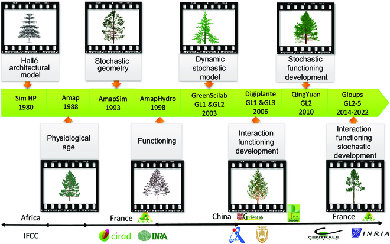

# Functional–Structural Plant Model “GreenLab”: A State-of-the-Art Review

综述文章

 

# 功能-结构植物模型"GreenLab"：最新研究综述

[王秀娟](#con1) [https://orcid.org/0000-0001-8327-1735](https://orcid.org/0000-0001-8327-1735), [华静](#con2), \[...\] , [康梦珍](#con3) [https://orcid.org/0000-0002-5016-1772](https://orcid.org/0000-0002-5016-1772), [王浩宇](#con4), 和 [Philippe de Reffye](#con5)+2 位作者更少[作者信息与单位](#tab-contributors)

### 作者

#### 单位信息

##### Xiujuan Wang [https://orcid.org/0000-0001-8327-1735](https://orcid.org/0000-0001-8327-1735)

中国科学院自动化研究所，多模态人工智能系统国家重点实验室，北京 100190，中国

[查看该作者的所有文章](/authored-by/Wang/Xiujuan)

##### Jing Hua

中国科学院自动化研究所，多模态人工智能系统国家重点实验室，北京 100190，中国

[查看该作者的所有文章](/authored-by/Hua/Jing)

##### Mengzhen Kang[\*](#corr1) [https://orcid.org/0000-0002-5016-1772](https://orcid.org/0000-0002-5016-1772) [mengzhen.kang@ia.ac.cn](mailto:mengzhen.kang@ia.ac.cn)

中国科学院自动化研究所，多模态人工智能系统国家重点实验室，北京 100190，中国

中国科学院大学人工智能学院，北京 100049，中国

[查看该作者的所有文章](/authored-by/Kang/Mengzhen)

##### Haoyu Wang

中国科学院自动化研究所，多模态人工智能系统国家重点实验室，北京 100190，中国

[查看该作者的所有文章](/authored-by/Wang/Haoyu)

##### Philippe de Reffye

AMAP，蒙彼利埃大学，CIRAD，CNRS，INRAE，IRD，蒙彼利埃 F-34398，法国

[查看该作者的所有文章](/authored-by/de+Reffye/Philippe)

#### 资助信息

中国科技创新2030重大项目：2021ZD0113701

中国科学院国际伙伴计划：159231KYSB20200010

国家自然科学基金：62076239

#### 备注

\*

通讯地址：[mengzhen.kang@ia.ac.cn](mailto:mengzhen.kang@ia.ac.cn)

植物表型组学

2024年2月7日

第6卷

文章ID: 0118

[DOI: 10.34133/plantphenomics.0118](https://doi.org/10.34133/plantphenomics.0118)

[

2,41011](# "指标")

### 指标

#### 总下载量2,410

*   过去6个月709
*   过去12个月1,523

#### 总引用量11

*   过去6个月4
*   过去12个月11

[查看所有指标](?doi=10.34133/plantphenomics.0118#core-collateral-metrics "前往指标页面")

*   [摘要](#abstract)
*   [引言](#sec-1)
*   [GreenLab模型的发展历程](#sec-2)
*   [GreenLab模型](#sec-3)
*   [GreenLab模型的应用](#sec-4)
*   [模型行为分析](#sec-5)
*   [软件](#sec-6)
*   [展望](#sec-7)
*   [结论](#sec-8)
*   [致谢](#acknowledgments)
*   [数据可用性](#data-availability)
*   [参考文献](#bibliography)

## 摘要

评估气候变化对作物生产力和可持续性的影响对于制定有效的适应措施至关重要。作物模型是量化气候变化对作物产量影响的重要工具。为了更好地表达作物的内在生长发育模式及其在不同环境条件下的可塑性，功能-结构植物模型（FSPM）"GreenLab"应运而生。GreenLab是一个器官级别的模型，它能够基于数学表达式描述植物的内在生长发育模式，而不考虑环境因素的影响，然后模拟植物在不同环境条件下表达植物可塑性的生长发育过程。此外，GreenLab的显著特点在于它能够基于实测植物数据计算影响生物量生产和分配的源-汇参数。在过去的二十年里，GreenLab模型不断发展，融入了新的建模方法和技术，包括双尺度自动机、子结构方法、源-汇参数反演、冠层分析、有机序列、潜在结构和参数优化技术等。本文回顾了GreenLab模型的发展历程、基本概念、主要理论、特点和应用。同时，我们介绍了实现GreenLab模型的软件工具。最后，我们讨论了GreenLab模型未来发展的前景和方向。

## 引言

由于气候变化和人口的快速增长，全球粮食安全面临越来越大的挑战[[1](#core-collateral-B1)]。根据联合国发布的《2022年世界人口展望》报告[[2](#core-collateral-B2)]，到2050年全球人口预计将达到97亿，这使得评估气候变化对作物产量的影响并探索未来农业可持续性的有效策略变得至关重要[[3](#core-collateral-B3)]。

为了应对气候变化的挑战，通常采取两种主要策略。第一种涉及遗传改良，旨在开发更能适应不断变化的气候条件并更有效利用资源的新作物品种。第二种策略涉及调整作物管理措施。然而，量化和评估遗传改良和管理调整对作物生产的影响至关重要[[3](#core-collateral-B3)]。此外，为了制定有效的适应措施，必须估计气候变化将如何影响作物生产力和可持续性[[4](#core-collateral-B4)]。

作物的生长受到遗传因素（G）、环境（E）和管理措施（M）的综合影响[[5](#core-collateral-B5)]。作物模型专门设计用于模拟G × E × M的相互作用，可以评估气候变化对作物生产的影响，并确定适当的调整措施以抵消气候变化对产量的负面影响[[6](#core-collateral-B6)]。因此，作物模型被认为是量化气候变化对作物产量影响的重要工具[[5](#core-collateral-B5)]。

作物模型可分为两种类型：（a）统计模型（SMs），也称为基于数据的模型；（b）过程模型（PBMs），也称为基于知识的模型。前者直接建立环境输入与产量输出之间的关系，而不关心作物的内在生长过程[[7](#core-collateral-B7),[8](#core-collateral-B8)]。后者则侧重于描述影响产量形成的基本生理和物理过程[[9](#core-collateral-B9)–[11](#core-collateral-B11)]。

SMs主要包括经验回归方法、机器学习（ML）算法和深度学习（DL）算法[[12](#core-collateral-B12)]。与PBMs相比，当有足够的训练数据时，SMs表现出相对较高的预测能力。然而，这也意味着它们严重依赖数据[[13](#core-collateral-B13)]。由于作物产量与输入变量之间存在高度复杂的非线性关系，过拟合、训练时间长和隐藏层相对较少等问题限制了它们解决非线性问题和预测大面积作物产量的能力[[14](#core-collateral-B14),[15](#core-collateral-B15)]。PBMs模拟作物中的各种过程，如光合作用和同化物分配。它们主要使用叶面积指数（LAI）来预测单位土地面积的生物量产量，并考虑光辐射、温度和管理措施（灌溉、施肥等）等环境因素的影响。常见的PBMs包括DSSAT（农业技术转移决策支持系统）[[16](#core-collateral-B16)]、TomSim[[17](#core-collateral-B17)]、STICS（标准作物多学科模拟器）[[18](#core-collateral-B18)]和APSIM（农业生产系统模拟器）[[19](#core-collateral-B19)]。

PBMs通常考虑不同类型的器官，关注总果实重量、叶片重量等，这使得难以描述作物结构变化对产量的影响。在生长过程中，植物通过调节其大小、数量和生长体积等特征，在内在生理和外部形态方面经历各种适应性反应，以尽量减少环境的不利影响。因此，为了准确预测作物产量，作物模型需要考虑环境对植物结构的影响。为了更好地表达作物的内在生长发育模式及其在不同环境条件下的可塑性，功能-结构植物模型（FSPMs）应运而生。这导致了器官级FSPMs的发展，这些模型模拟作物形态结构、生物量生产和分配以及它们之间的内在关系[[20](#core-collateral-B20),[21](#core-collateral-B21)]。这些模型在更精细的尺度上运行，提供了更详细的作物生长模拟。这一类别中的代表性模型包括ALMIS[[22](#core-collateral-B22)]、LIGNUM[[23](#core-collateral-B23)]、L-Peach[[24](#core-collateral-B24)]和GreenLab[[25](#core-collateral-B25)]。FSPMs通过结合生理功能来模拟植物生长和发育的两个基本过程，以表示三维（3D）植物结构[[20](#core-collateral-B20)]，并将内部生长和外部环境的联合效应与植物结构联系起来[[26](#core-collateral-B26)]。

GreenLab模型是FSPMs之一，它考虑了相似器官顺序生产的特性，并采用了公共池和源-汇关系的概念。它在叶元素（器官）尺度上模拟植物生长，同时保持与PBMs（在群体水平上）的兼容性。为了构建GreenLab模型，将建筑模型与具有单个器官源-汇功能的生长模型相结合[[27](#core-collateral-B27)]。该框架形式化了植物的器官发生、光合作用和形态发生过程。与PBMs在整个植物水平上模拟汇和源过程不同，GreenLab在单个器官的水平上模拟这些过程，每个器官根据其在植物结构中的位置有其年龄[[28](#core-collateral-B28)]。这使得能够更详细和准确地模拟植物的生长和发育。

基于植物自动机，在GreenLab模型中，使用递归算法计算每个时间步长产生的器官数量，并将保存在公共池中的生物量根据其年龄、相对汇强度和器官数量分配到不同类别的器官。这一过程通过数学公式描述，无需单独模拟每个器官的生物量分配，使其更快且需要更少的时间，这是GreenLab模型的优势之一。GreenLab的显著特点在于它能够基于实测植物数据（如每个植物器官的重量）计算影响生物量生产和分配的模型源-汇参数。此外，可以通过模拟确定模型的有效性，这减少了对大量数据收集的需求[[29](#core-collateral-B29)]。基于通用的植物学和生态生理学知识，该模型已应用于研究十多种作物，如玉米、小麦、油菜、黄瓜和番茄[[30](#core-collateral-B30)]。然而，GreenLab模型将环境因素的影响简化为单一的环境因子“_E_”，这无法有效模拟气候、土壤和管理措施对作物产量的影响。

本文回顾了GreenLab模型的发展历程、基本概念、主要理论和特点、应用以及软件工具。“GreenLab模型的发展历程”部分介绍了GreenLab模型的发展历史。“GreenLab模型”部分介绍了GreenLab模型中使用的概念和假设。“GreenLab模型的应用”部分介绍了在作物和树木中的应用。“软件”部分介绍了基于GreenLab模型实现的软件工具。“展望”部分给出了GreenLab模型的前景和未来方向。“结论”部分给出了结论。

## GreenLab模型的发展历程

GreenLab模型起源于AMAP（植物结构与植被建模）建模方法，继承了AMAPsim中的植物学概念，如生理年龄（PA）和重复生长[[31](#core-collateral-B31),[32](#core-collateral-B32)]，以及AMAPHydro中的源-汇概念[[33](#core-collateral-B33)]。AMAP植物库基于Hallé等人提出的结构模型[[34](#core-collateral-B34)]，这确保了植物发育的模拟符合植物学原理[[35](#core-collateral-B35)]。这一特性为该模型在农学中的应用奠定了基础。

为了满足生长过程模型的需求，AMAP模型中引入了生物量生产和分配的模拟，并提出了以水为生长驱动力的AMAPHydro模型[[33](#core-collateral-B33)]。自1998年以来，基于中法联合实验室（LIAMA），中国科学院自动化研究所（CASIA）与法国农业研究国际合作中心（CIRAD）建立了合作关系，从而开发了器官尺度的FSPM"GreenLab"（中文名青园），该模型继承了AMAP模型系列的关键概念。在过去的20年里，多个研究机构和大学为其发展做出了贡献，包括中国农业大学（CAU）、中国林业科学研究院（CAF），以及法国国家数字科学与技术研究院（INRIA）、巴黎中央理工学院（ECP）等，如图[1](#)所示。

OPEN IN VIEWER

图1. GreenLab模型的发展历程。GreenLab模型起源于AMAP建模方法，继承了AMAPsim和AMAPHydro中的植物学概念，该模型是在1998年中法联合实验室（LIAMA）的合作努力下开发的。GreenLab模型经历了多个版本的迭代，包括GL1（确定性模型）、GL2（随机模型）、GL3（具有反馈机制的确定性模型），最终发展到GL4和GL5（具有反馈机制的随机模型）。值得注意的是，GL5代表了一个精细时间尺度的树木模型，可以模拟树木在一年内的生长和发育。

GreenLab中的结构模型基于AMAPSim的概念[[31](#core-collateral-B31)]，可以模拟23种植物结构模型[[34](#core-collateral-B34),[36](#core-collateral-B36)]。它旨在通过根据PA组织模型并使用有限数量的参数来模拟包括树木在内的复杂植物结构。这使得用户即使构建非常复杂的植物结构也变得容易。功能模型与PBMs共享假设和概念，如公共池、汇强度和汇变化。因此，植物生长的循环与其他PBMs兼容。

GreenLab是一个植物生长和发育模型，已经经过多个复杂程度的开发和改进。最初的模型GL1是确定性的，依赖于植物发育的预定义规则[[27](#core-collateral-B27)]。植物的结构是固定的，无法适应内部或外部因素[[27](#core-collateral-B27),[37](#core-collateral-B37)]，这限制了其对单茎物种（如玉米和向日葵）的适用性。GL2模型结合了随机发育和概率芽爆发来模拟植物结构的变化[[26](#core-collateral-B26),[28](#core-collateral-B28),[38](#core-collateral-B38)]，使其在评估和比较不同品种或旨在开发具有稳定和可重复行为的植物（个体间变异小）的育种计划中非常有用。这种建模策略允许考虑个体内和个体间的变异，并描述群体的统计输出，如平均值和标准差，而不是单个植物的结果。GL3模型是确定性的，但其发育由称为供需比的状态变量控制[[39](#core-collateral-B39)]，这在发育和功能之间创建了一个反馈循环，使模型动态具有自我调节能力。GL4模型将供需比的反馈机制作为随机植物发育过程的决定因素，从而降低了均方根误差[[40](#core-collateral-B40)]。Letort等人描述了GL4更系统的参数化方法[[29](#core-collateral-B29)]。GL5模型是一个随机模型，在更精细的时间尺度上实现了树木发育和生长之间的相互作用，可以模拟树木在单个生长季节内的多次生长爆发[[25](#core-collateral-B25)]，使其在模拟经历多个生长周期的多年生植物的生长和发育中非常有用。总体而言，GreenLab模型是模拟植物生长和发育的宝贵工具，其不同版本为研究人员提供了多种选择，可以根据具体需求和研究问题进行选择。

## GreenLab模型

### 概念与假设

GreenLab模型是一个动态模型，它使用离散模拟来模拟单个植物器官水平的生物量生产和分配。它结合了生理过程的功能和结构描述，包括叶元水平的结构，使得可以在器官和群体水平上研究该模型。

GreenLab模型使用了一些重要概念\[[25](#core-collateral-B25),[26](#core-collateral-B26)\]： (a) 时间尺度。使用三个不同的年龄来表征分生组织：时序年龄（CA），表示器官/植物自创建以来的功能持续时间；生理年龄（PA），表示其在衰老过程中的分化水平；以及个体发育年龄（OA），对应于其在植物结构中的创建时间。时序年龄和个体发育年龄以发育周期（DC）为单位测量，DC是控制植物发育的基本时间单位。在每个DC期间，分生组织可以产生一个叶元或暂停。该周期以热时间而非日历时间测量，因为它调节整个发育过程。(b) 空间尺度。定义了三种概念来描述植物结构：有机序列，即沿发育轴顺序产生的器官的尺寸或重量；群体，是由分生组织并行功能同时创建的同一性质的一组器官；以及植物冠层（主要承重轴和次级分枝轴的组合）。

该模型结合了作物模型中的生态生理学概念，如热时间、光利用效率（LUE）、水分利用效率（WUE）和公共池等，如de Reffye等人所述\[[25](#core-collateral-B25)\]。为了结合植物器官发生和植物光合作用，GreenLab模型使用了Hallé定义的植物结构模型\[[34](#core-collateral-B34)\]、双尺度自动机理论\[[41](#core-collateral-B41)\]和基于子结构的算法\[[42](#core-collateral-B42)\]。GreenLab使用双尺度自动机方法生成植物的随机结构，该方法整合了植物学知识，如叶元和生长单位（GUs），通过基于图的界面构建植物的拓扑和形态结构\[[43](#core-collateral-B43),[44](#core-collateral-B44)\]。对于涉及树木或种植园的更复杂应用，GreenLab模型采用了子结构策略\[[45](#core-collateral-B45)\]，以高效构建植物并基于器官生产计算产量。使用相同的时间尺度进行发育和生长，该模型递归地模拟植物生长行为，可应用于从草本植物到树木的各种植物类型。虽然模型的基本结构是通用的，但可以为不同的植物物种引入相应的子模块。

GreenLab模型采用紧凑的数学方程和集成参数进行植物生长模拟，使得参数化变得容易。具有相同特征的器官共享相同的功能，无需复杂的植物结构描述，这可能会很繁琐。在模型中，植物从种子开始，种子提供初始源，根据源-汇关系将生物量分配给现有器官，根据功能叶面积进行光合作用，并确定不同阶段器官的数量和大小。该模型循环迭代地模拟植物生长，直到停止（图[2](#)），提供了对生物量生产和分配的全面理解。在模拟结束时，可以以2D或3D格式显示植物的结构\[[29](#core-collateral-B29),[46](#core-collateral-B46)\]。

OPEN IN VIEWER

图2. 描述GreenLab模型模拟过程的示意图。绿色矩形表示发育，蓝色圆圈表示生长。给出了模型输出和计算的模型参数。生物量生产可以通过光合作用计算（橙色）。

### 植物发育和生长建模

植物形态发生源于两个主要现象：发育和生长。发育由分生组织的功能促进，分生组织产生由一系列叶元组成的分枝轴构成的植物结构。另一方面，生长是通过光合作用在植物系统中积累生物量的过程。这种生长由源-汇关系调节，器官在其中发挥其功能作用。它确保了发育过程中形成的器官生物量的增加。

在本综述中，我们不会详细描述植物发育和生长的建模，这些可以在\[[25](#core-collateral-B25),[30](#core-collateral-B30)\]中找到。相反，我们将简要概述GreenLab模型中使用的重要概念，并强调它们的作用。

#### 模拟发育的植物学自动机

叶元是植物结构中的基本单位，由一个节间组成，节间终止于一个节点，节点上附着有叶子、果实和腋生分生组织等器官。根据开花发生在轴还是顶端，它可以是轴向的或顶端的。为了模拟植物结构的生长和发育，只需描述控制新产生的叶元的PA的规则即可。为了实现这一点，开发了一种使用基于图表示法的双尺度自动机方法\[[36](#core-collateral-B36)\]。结构可以是简单的或复合的，这取决于分生组织是连续还是节律性地发挥作用。在后一种情况下，主要在树木中，自动机是双尺度的，考虑了两个时间尺度，分生组织建立了GUs。微时间周期对应于叶元的创建，而宏周期表示GU的构建。结构分解在设计、理解或模拟植物结构模型方面非常高效\[[45](#core-collateral-B46)\]。近年来，在扩展形式主义以涵盖随机情况方面取得了重大进展。这是通过引入概率来表示转换发生的可能性来实现的。此外，这种扩展的形式主义已经在许多植物物种中得到了验证\[[25](#core-collateral-B25),[26](#core-collateral-B26),[29](#core-collateral-B29)\]。

#### 生物量生产和分配建模

GreenLab模型与其他作物模型类似，使用公共池的概念来存储合成的生物量并将其分配到器官隔间\[[25](#core-collateral-B25)\]。该模型使用离散化的beta定律函数来定义汇函数\[[47](#core-collateral-B47)\]，并且给定年龄的植物需求计算为活跃汇器官的总和。植物学自动机产生的叶元数量决定了每个周期中产生的叶子、节间和果实的数量。

为了计算生物量生产和分配，首先需要生物量供应。与其他作物模型一样，它使用Beer-Lambert定律来计算每单位栽培面积和每单位时间的生物量生产。然后，在每个DC中计算植物需求，器官的生物量增长取决于其汇值以及前一个周期供应的生物量与当前需求的比率。

### 模型参数估计

由于GreenLab模型由器官发生（发育）和器官生长两个模块组成，其关键参数也可分为两部分。第一组植物发育参数，包括分枝率、生长率和死亡率，是通过测量从茎顶部到底部的叶元数量来计算的，这种方法称为植物冠层分析[[48](#core-collateral-B48)]。另一方面，第二组器官生长参数，包括源参数（如种子生物量_Q_0、投影表面积_Sp_和与光利用效率或水分利用效率相关的阻力系数_r_）以及汇参数（如汇强度_Po_，_o_代表叶、节间、果实等）和汇强度变化_Bo_，是通过拟合测量的有机序列并控制功能模型来确定的。如前所述，每个有机序列的描述包含了发育和生长所需的所有信息。通过在有机序列中进行适应性采样，可以使用实验数据定义源-汇参数校准的有效目标。有机序列是通过在植物结构中采样构建的，测量可以在多个生长阶段进行。此外，还需要一些经验参数，如器官的扩展时间和功能时间，以及叶片厚度，这些参数可以根据植物生长过程中的观测数据获得。

GreenLab模型中的参数识别过程包括三个步骤：（1）测量植物的结构，包括叶、节间、果实的数量以及茎和分枝中的叶元数量，从而了解整个植物的拓扑结构（了解发育参数）以及每种器官的扩展和功能时间；（2）通过测量每个器官（叶、节间、果实等）的干重或鲜重来构建目标数据（有机序列和/或隔室数据）；（3）拟合目标数据并估计功能源-汇隐藏参数。发育参数，如生长和分枝率，使用上述冠层分析方法确定。模型校准可以通过单次拟合完成，其中仅使用一个阶段的数据来拟合器官，或者通过多次拟合完成，这涉及使用多个生长阶段的数据来拟合有机序列[[47](#core-collateral-B47)]。

因此，GreenLab模型可以模拟植物生长和发育的动态过程，同时依赖于静态的植物结构（图[3](#)）。通过分析植物结构数据，GreenLab可以计算不同阶段器官的大小和重量，然后使用加权最小二乘法（WLSM）根据测量数据估计源和汇参数。模型在实际植物上的校准是其应用的关键步骤，但这是一个耗时且繁琐的过程。因此，GreenLab定义了一个统一的数据采样方案以简化测量[[25](#core-collateral-B25),[26](#core-collateral-B26)]。

OPEN IN VIEWER

图3. GreenLab模型的参数估计框架。GreenLab模型可以基于静态植物结构进行动态植物生长和发育。通过分析植物结构数据，GreenLab可以计算不同阶段器官的大小和重量。随后，它使用WLSM从测量数据中估计源和汇参数。这一过程使GreenLab能够描述植物体内生物量生产和分配的过程。最后，模型可以以2D或3D格式显示植物。

## GreenLab模型的应用

根据分生组织功能模式（连续/节律/多周期、确定/不确定）、分枝模式（单轴/合轴）和开花类型（顶端/侧生）的不同，植物结构可以分为各种结构模型。Hallé等人提出的这些结构模型[[34](#core-collateral-B34)]构成了一套全面的模型，涵盖了所有类型的植物。通过使用特定的采样策略和适当的参数估计方法（WLSM），可以识别植物系统参数。这种方法能够有效地建模许多草本和木本植物，因为它们可以适应这些结构模型。

GreenLab模型已成功应用于温带和热带物种，涵盖了连续生长和节律生长，并考虑了叶元发育、分枝和存活率的随机效应。通过冠层和有机序列分析[[25](#core-collateral-B25)]，模型的发育和生长参数已得到令人满意的估计，适用于20多种植物物种；主要物种的发育和生长特征描述见表[1](#)。图[4](#)显示了各种物种的植物3D可视化。

OPEN IN VIEWER

| 植物种类 | 植物描述 | 发育和生长模式 | 参考文献 |
| --- | --- | --- | --- |
| 大田作物 |     |     |     |
| 玉米 | 单茎植物，确定性和连续发育。经过初始莲座期后，茎伸长，在形成雄花后，发育在大约20个叶元后停止（取决于品种）。 | 基本叶元：一个节间、由叶片和叶鞘组成的叶子。掩码文件：记录植株中穗的位置。简单有机序列：茎上的叶片、叶鞘、节间和穗。 | \[[47](#core-collateral-B47),[49](#core-collateral-B49),[50](#core-collateral-B50)\] |
| 向日葵 | 单茎植物，确定性和连续发育。经过初始莲座期后，茎伸长，在形成头状花序后发育停止。 | 基本叶元：一个节间、叶片和叶柄。掩码文件：记录头状花序的位置。简单有机序列：茎上的叶片、叶柄、节间和头状花序。 | \[[27](#core-collateral-B27),[79](#core-collateral-B79),[98](#core-collateral-B98)\] |
| 甜菜 | 单茎植物，确定性和连续发育。 | 基本叶元：一片叶子。简单有机序列：茎上的莲座叶和主根。 | \[[91](#core-collateral-B91)\] |
| 小麦 | 分枝植物，随机性和连续发育，具有初始莲座状阶段，随后茎伸长并形成穗。在莲座期，与主茎同时产生数量不等的分蘖。需要考虑叶片的再分配。 | 基本叶元：一个节间、叶片和叶鞘。冠层分析：计算生长、分枝和死亡的概率。简单有机序列：主茎上的叶片、叶鞘、节间和穗；复合有机序列：分蘖各类型器官的隔室。 | \[[99](#core-collateral-B99)\] |
| 水稻 | 分枝植物，随机性和连续发育，具有初始莲座状阶段，随后茎伸长并形成穗。在莲座期，与主茎同时产生分蘖。需要考虑叶片的再分配。 | 基本叶元：一个节间、叶片和叶鞘。掩码文件：记录分蘖和果实的位置。简单有机序列：茎和分蘖上的叶片、叶鞘、节间和穗。 | \[[100](#core-collateral-B100),[101](#core-collateral-B101)\] |
| 棉花 | 分枝植物，茎和营养枝具有确定性和连续发育。具有单轴分枝，并产生合轴结构的果枝。 | 基本叶元：一个节间、叶片和叶柄。三个生理年龄：主茎、营养枝和果枝。掩码文件：记录分蘖和果实的位置。简单有机序列：主茎和分枝上的叶片、叶柄和节间。 | \[[102](#core-collateral-B102)–[104](#core-collateral-B104)\] |
| 园艺作物 |     |     |     |
| 番茄 | 具有合轴模块结构的分枝植物，但其中一个分枝被修剪，留下一个在初始阶段连续发育的茎，随后是节律性发育。果实膨大存在延迟。 | 基本叶元：一个节间、叶片、叶柄和果实。一个生理年龄：主茎，作为单茎植物分析。掩码文件：记录果实的位置。简单有机序列：主茎上的叶片、叶柄、节间和果实。 | \[[51](#core-collateral-B51),[52](#core-collateral-B52),[105](#core-collateral-B105),[106](#core-collateral-B106)\] |
| 黄瓜 | 单茎植物，茎呈藤蔓状，具有连续发育和生长。果实膨大存在延迟。 | 基本叶元：一个节间、叶片、叶柄和果实。一个生理年龄：主茎，作为单茎植物分析。掩码文件：记录果实的位置。简单有机序列：主茎上的叶片、叶柄、节间和果实。 | \[[53](#core-collateral-B53),[85](#core-collateral-B85),[107](#core-collateral-B107)\] |
| 甜椒 | 具有随机性和连续发育的分枝植物。发芽后，未分枝的茎由于顶端开花产生第一个果实而早期停止发育。在茎的最后两个叶元下方立即产生两个活力相同的合轴分枝。 | 基本叶元：一个节间、叶片、叶柄和果实。三个生理年龄：主茎、分枝和侧枝。掩码文件：记录分枝和果实的位置。简单有机序列：主茎、分枝和侧枝上的叶片、叶柄、节间和果实（12个有机序列）。简化植物拓扑结构以方便测量和目标准备。 | \[[55](#core-collateral-B54),[108](#core-collateral-B108),[109](#core-collateral-B109)\] |
| 具有花序的草本植物 |     |     |     |
| 拟南芥 | 在营养阶段为单茎植物，具有确定性和连续发育。拟南芥的生长初期呈莲座状。在生殖阶段出现分枝花序。 | 基本叶元：一片叶子。一个生理年龄：主茎。简单有机序列：叶片。 | \[[58](#core-collateral-B57),[59](#core-collateral-B58),[93](#core-collateral-B93)\] |
| 油菜 | 具有随机性和连续发育的分枝植物。生长初期呈莲座状。叶片出现后，主茎节间开始伸长。生长末期，茎顶端分生组织转化为花序。花序在主花序上开始出现，并向侧生花序基向发展，而花序内的花则向顶开放。需要考虑再分配。 | 基本叶元：一个节间、叶片和潜在的分枝。两个生理年龄：主茎和分枝。冠层分析：计算发育参数节律比、分枝率和生长率。简单有机序列：主茎上的叶片、节间和果实；复合有机序列：分枝上同类型器官（叶片、节间、果实）分别称重。延迟函数：模拟总状花序的基向发育模式。 | \[[60](#core-collateral-B59)–[63](#core-collateral-B62)\] |
| 菊花 | 短日照植物，具有随机性和连续发育，花序呈基向开放。 | 基本叶元：一个节间、叶片和潜在的花序分枝。三个生理年龄：主茎和分枝。简单有机序列：主茎和分枝上的叶片、节间和果实。延迟函数：模拟总状花序的基向发育模式。 | \[[56](#core-collateral-B55),[57](#core-collateral-B56),[64](#core-collateral-B63)\] |
| 金纽扣 | 具有随机性和连续发育的分枝植物。茎短，枝条展开。所有轴都以顶生花结束。经过最小莲座期后，茎伸长并产生少量叶元，然后顶端开花停止发育，预成的侧枝开始向顶扩展。如果条件允许，预成的三级分枝开始基向扩展。 | 基本叶元：一个节间、两片叶子和潜在的两个侧枝。三个生理年龄：主茎、分枝和侧枝。冠层分析：计算发育参数节律比、分枝率和生长率。简单有机序列：主茎上的叶片、节间和果实；复合有机序列：分枝上同类型器官（叶片、节间、果实）分别称重。延迟函数：模拟总状花序的基向发育模式。 | \[[40](#core-collateral-B40)\] |
| 树木 |     |     |     |
| 咖啡 | 咖啡是一种木本灌木植物，具有随机性和连续发育。茎直立，每个叶元有两片叶子和两个潜在的斜生分枝。在幼龄期没有死亡或开花。 | 基本叶元：一个节间和两片叶子。三个生理年龄：主茎、分枝和侧枝。冠层分析：计算发育参数节律比、分枝率和生长率。简单有机序列：主茎上的叶片和节间。复合有机序列：分枝上的叶片、节间和果实。 | \[[29](#core-collateral-B29),[110](#core-collateral-B110),[111](#core-collateral-B111)\] |
| 松树 | 松树是一种针叶树种，具有随机性和节律性发育。每年，顶端分生组织产生一个新的生长单位。随机性仅存在于每轮分枝数量的分布中。 | 基本叶元：一个节间、针叶和年轮。针叶被视为单叶器官。两个生理年龄：主茎和分枝。生长周期为一年。冠层分析：计算分枝率。简单有机序列：主茎和分枝上的针叶和节间。 | \[[38](#core-collateral-B38),[65](#core-collateral-B64),[66](#core-collateral-B65),[112](#core-collateral-B112),[113](#core-collateral-B113)\] |
| 柚木 | 柚木是一种热带树种，具有随机性和多周期发育。它具有多周期生长和分枝。其轴由一系列生长单位组成。其开花为顶生，通常发生在生长的第5年。同时，轴的发育最初为单轴，随后变为合轴。 | 基本叶元：一个节间、一片叶子和年轮。生长单位：根据其生理年龄、冠层年龄及其在年枝中的等级进行分组。四个生理年龄：主茎和三个等级的分枝。冠层分析：计算分枝率。复合有机序列：仅测量每个生长单位的叶片和节间隔室的重量。 | \[[46](#core-collateral-B46)\] |

展开查看更多

表1. 使用GreenLab模型研究的植物种类及相应模型描述

OPEN IN VIEWER

图4. 使用GreenLab模型研究的植物种类。GreenLab模型通过成功研究多种植物物种展示了其多功能性，包括具有连续生长和节律生长的温带和热带物种。该模型的发育和生长参数已有效估计了20多种植物物种，包括大田作物、园艺作物、草本植物和树木。

为了校准每个物种的模型，该过程涉及几个步骤。首先，根据生长过程中的观察收集PA、CA、叶片厚度、器官扩展时间和功能时间。其次，分析并设置植物的发育模式。如果植物的发育遵循随机模式，则通过两种方法确定发育参数：使用"掩码"文件指定分枝和果实的位置，本质上将其视为具有确定性发育；或者，如果发育被认为是随机的，则使用冠层分析方法计算生长、分枝和死亡的概率。最后，根据不同发育阶段测量的器官重量，使用单阶段或多阶段拟合技术估计源-汇参数。

### 大田作物建模

对于单茎大田作物，如玉米、向日葵和甜菜，它们的发育模式被视为确定性和连续的。GreenLab模型可以直接使用测量的器官重量计算模型参数。然而，对于具有分枝的植物，如棉花、水稻和小麦，它们的发育是随机和连续的。为了解决这个问题，使用"掩码"文件记录分枝和果实的位置，将棉花和水稻的随机生长转化为确定性形式。对于被认为是随机植物的小麦，初始发育参数如分枝率、生长率和死亡率从观察数据中确定。随后，通过将模型参数与测量的器官重量匹配来微调模型参数。在玉米的情况下，已经证实汇参数在不同种植密度和生长季节保持一致\[[49](#core-collateral-B49),[50](#core-collateral-B50)\]。这种汇参数的稳定性对育种工作具有重要意义，因为它允许识别尽管环境波动但仍保持不变的性状。

### 园艺作物建模

对于园艺作物，如番茄\[[51](#core-collateral-B51),[52](#core-collateral-B52)\]和黄瓜\[[53](#core-collateral-B53)\]，它们的发育遵循确定性和连续的模式。GreenLab模型已用于校准单茎植物的模型参数。对于像辣椒这样的分枝植物\[[54](#core-collateral-B70)\]，使用掩码文件记录果实位置，有效地将其随机生长转化为更确定性的轨迹。这些物种的产量形成主要受果实数量和大小的影响，强调了在这些作物模型中准确模拟果实集的重要性。GreenLab模型通过参数反演建立了内部源-库比与果实集之间的关系\[[51](#core-collateral-B51),[55](#core-collateral-B54)\]。然而，需要注意的是，需要额外的实验来验证这些预测。此外，研究还使用优化算法深入了解了不同黄瓜品种\[[53](#core-collateral-B53)\]和番茄品系\[[52](#core-collateral-B52)\]之间产量形成的变化。尽管如此，这些预测的准确性需要通过大量实验进行验证。

### 具有花序的草本植物建模

GreenLab模型对具有花序的草本植物的生长和发育有特定的适应性\[[56](#core-collateral-B55)\]。在这些植物中，由于分生组织活动产生叶元，器官扩展发生在生物量积累之后。具有花序的草本植物表现出很大的结构变异性，并经历两个主要发育阶段：营养阶段和生殖阶段。在最初的营养阶段，叶元根据植物学自动机的规则建立，但它们的扩展不会在创建后立即发生。相反，分枝保持预成状态，直到开花开始，延迟受创建时间、分枝类型和发育计划生成的拓扑结构中的位置影响。为了模拟分枝发育的这种延迟，引入了延迟函数\[[56](#core-collateral-B55),[57](#core-collateral-B56)\]。GreenLab模型已成功应用于模拟拟南芥\[[58](#core-collateral-B57),[59](#core-collateral-B58)\]、油菜\[[60](#core-collateral-B59)–[63](#core-collateral-B62)\]、菊花\[[56](#core-collateral-B55),[57](#core-collateral-B56),[64](#core-collateral-B63)\]和金纽扣\[[40](#core-collateral-B40)\]等草本植物。

### 树木建模

GreenLab模型可以模拟年轮并通过反演估计其参数。这一特性是该模型独有的，将其与其他已广泛校准的树木功能结构模型区分开来。年轮首先被视为与其他器官竞争的器官，然后根据两种不同的规则（如Pressler定律）将分配给它们的生物量分配到不同的节间。

除了GreenLab之外，很少有树木的FSPM被校准，这意味着模型参数是根据树木测量数据确定的，以确保计算的器官数量和生物量与测量数据一致。代表性的模型应用包括油松的确定性模型\[[65](#core-collateral-B64)\]、欧洲赤松的随机模型\[[38](#core-collateral-B38),[66](#core-collateral-B65)\]（可以反映个体结构的差异及其对生物量的影响）和欧洲山毛榉的反馈模型\[[67](#core-collateral-B66)\]（建立了分枝数量与源-汇比之间的关系）。

GreenLab对树木的时间尺度通常是年度的，但最近开发了一个精细时间尺度的模型，用于树木的多次修剪\[[68](#core-collateral-B67)\]，该模型适应于更复杂的情况，即在长时间内树木结构发育和生物量生产同时发生，其中出现多周期性、预期生长或新形成。扩展和休息期可以在生长单位之间连续发生，也可以在生长单位内发生\[[68](#core-collateral-B67)\]。事实上，GreenLab已应用于几种树木物种，如咖啡和松树等简单结构，以及枫树、柚木\[[46](#core-collateral-B46)\]和非洲楝等复杂结构。虽然我们在这里没有深入探讨具体细节，但值得一提的是，关于枫树和非洲楝的结果细节有待发表。

## 模型行为分析

除了针对不同物种进行校准外，GreenLab模型还被应用于玉米产量优化\[[69](#core-collateral-B68)\]、树木木材生产优化\[[70](#core-collateral-B69)\]、灌溉管理\[[54](#core-collateral-B70)\]、不同光照条件下树木的可塑性研究\[[71](#core-collateral-B71)\]以及风效应研究\[[72](#core-collateral-B72)\]。此外，还使用GreenLab模型进行了模型参数的敏感性分析\[[73](#core-collateral-B73)–[75](#core-collateral-B75)\]。

GreenLab模型可以与其他模型或方法集成，例如Letort等人\[[76](#core-collateral-B76)\]将遗传学纳入GreenLab模型的模拟研究。这种方法为检测数量性状位点（QTLs）提供了更基础的性状，为优化产量提供了潜在工具。

GreenLab模型可以与机器学习方法集成来预测作物产量，如Fan等人\[[77](#core-collateral-B77)\]的研究。他们提出了一种知识数据驱动方法（KDDM），通过结合GreenLab和神经网络来预测不同温室环境条件下的番茄产量。该KDDM还被用于预测受控生态生命支持系统（CELSS）下的作物产量，通过计算碳、植物和气体之间的相互作用\[[78](#core-collateral-B78)\]。

## 软件

自2003年以来，不同研究团队开发了GreenLab模型的软件实现，这些实现可在不同环境中使用，并具有不同的规格。这些实现可以支持确定性或随机性模拟，和/或基于测量数据的拟合，以及生长与发育之间的反馈。

GreenLab形式化方法被部署在各种编程语言和环境中，包括独立的模拟和校准工具，如Visualplant、Cornerfit、GreenScilab、Qingyuan、Gloups、StemGL和XPlantGL。表[2](#)总结了这些实现及其规格。

最初的软件开发侧重于使用植物学自动机（Visualplant软件）进行植物结构发育的通用模拟。第二个软件Cornerfit专注于单茎植物的生长模拟，如玉米、向日葵、番茄、小麦和甜菜，使用WLSM\[[79](#core-collateral-B79)\]。随后的软件，包括GreenScilab、Digiplante、QingYuan、Gloups和StemGL，综合了前两个软件的特点。

GreenScilab是第一个完整的开源GreenLab软件，提供了用户手册、参数输入界面、有机序列的源-汇求解器以及3D输出模拟。GreenScilab实现了结构随机发育、连续和节律性生长以及源-汇生产模拟。它利用子结构分解进行生产和模拟，对结构简单的植物特别有效。该工具提供了基于田间测量的农艺植物校准数据集\[[80](#core-collateral-B80),[81](#core-collateral-B81)\]。

OPEN IN VIEWER

| 软件 | 编程语言 | 主要开发者 | 植物种类 | 特性 |
| --- | --- | --- | --- | --- |
| Visualplant | C++ | LIAMA, CASIA | 作物和树木 | 确定性，纯发育；模拟； |
| Cornerfit | C++ | LIAMA, CASIA | 单茎作物 | 确定性，单茎；模拟和拟合； |
| GreenScilab | Scilab | CASIA | 作物 | 确定性，无生长与发育反馈；模拟和拟合； |
| DigiPlante | C++ | ECP | 作物和树木 | 确定性，有反馈；模拟和拟合； |
| dgpSDK库 | C++ | ECP | 作物和树木 | 确定性，有反馈；模拟和拟合； |
| QingYuan | C++ | CASIA | 作物和树木 | 确定性，有反馈；模拟； |
| StemGL | Matlab或Octave | AMAP & Bioagressor, CIRAD | 单茎作物 | 确定性，无反馈；模拟和拟合； |
| Gloups | Matlab | AMAP, CIRAD | 作物和树木 | 随机性和反馈；模拟和拟合； |
| XPlantGL | Matlab | CASIA | 作物 | 随机性，无反馈；模拟和拟合； |

Expand for more

表2. 基于GreenLab模型开发的软件工具及其规格

StemGL是另一个专注于单茎植物的开源工具，可在Matlab和Octave环境中运行\[[82](#core-collateral-B82)\]。Gloups是最先进的实现，支持确定性和随机性模型的应用，但使用该工具需要参与特定的共享研究项目\[[83](#core-collateral-B83)\]。为了方便应用，XPlantGL专门为作物开发，可以进行模拟和拟合，包括分枝和随机植物。这些实现包含了一套用于参数化、模拟、校准和优化的工具。

然而，Matlab或Scilab等科学编程环境的特殊性可能会限制内存空间和执行速度的可扩展性，从而无法模拟成年树木可能具有的大量植物单元。为了解决这个问题，已经开发了使用C、C++和Java等通用语言编写的版本，如Digiplante和QingYuan\[[84](#core-collateral-B84)\]。由巴黎中央理工学院的Digiplante团队主导开发的Digiplante工具，催生了dgpSDK开发环境，能够实现GreenLab模型的3D场景模拟和可视化。由中科院自动化研究所（CASIA）主导的QingYuan模拟器\[[84](#core-collateral-B84),[85](#core-collateral-B85)\]正在开发基于云的界面，以促进基于模型的培训和竞赛。

## 展望

### 结合植物表型分析进行作物育种

植物育种涉及在引入改良品种之前对多个世代进行评估的重复循环。全球人口增长和气候变化带来的挑战需要可持续的粮食生产解决方案。开发具有理想性状的独特和先进作物品种的过程耗时且可能持续多年\[[86](#core-collateral-B86)\]。传统育种方法通常需要10到15年，包括3到7年的初始品系开发，随后4到5年的田间测试，以及1到3年的新品种正式发布。通过缩短世代周期，可以显著减少这一漫长的时间线\[[87](#core-collateral-B87)\]。

快速育种\[[88](#core-collateral-B88)\]是一项旨在缩短育种周期的新兴技术，通过快速世代推进技术加速作物研究计划。然而，需要注意的是，快速育种确实是较为昂贵的技术之一。它需要专门的基础设施来维持受控环境，以及用于精确性状选择的特定设备，这些都带来了巨大的费用\[[87](#core-collateral-B87)\]。克服这一挑战的一种方法是集中精力于与育种目标特别相关的植物品种，并将快速育种与现有育种技术相结合。另一种途径是使用作物模型来支持育种工作。

作物模型能够预测产量，并提供环境因素与植物生理过程之间相互作用的见解，从而影响作物的生长和发育\[[3](#core-collateral-B3)\]。整合多样化的作物模型可以增强我们对作物行为的理解，并充分释放这些模型的潜力。GreenLab模型考虑了植物结构的影响，使其能够利用作物高度、叶面积、籽粒数量以及生理和光合作用属性等表型数据来校准模型参数。随着获取作物表型信息的设备和技术的快速发展，现在可以在从单个器官到整个植物的不同尺度上全面收集各种性状\[[89](#core-collateral-B89)\]。这种加速的数据收集简化了获取植物生长信息的过程，相比传统方法更为便捷。然而，挑战在于如何有效分析获取的大量表型数据\[[90](#core-collateral-B90)\]。通过将环境数据与表型信息相结合，GreenLab模型可以模拟不同环境和管理实践下的植物可塑性。

GreenLab模型与PBMs高度兼容。例如，Lemaire等人\[[91](#core-collateral-B91)\]使用GreenLab模型基于不同植物器官的重量计算投影面积，结果与实验发现一致。Feng\[[92](#core-collateral-B92)\]将GreenLab模型与差异统计方法相结合，探索了从单个玉米植株到群体的产量转变。值得注意的是，计算结果与群体水平的测量结果一致。这些研究表明，GreenLab模型可以利用器官尺度的数据模拟各种植物器官的生长和发育。该模型有效地弥合了农艺作物模型与植物构型模型之间的差距，有助于更全面地理解植物动态。

此外，基于环境和表型数据，GreenLab模型可以为不同作物品种和品系构建模拟模型。其通用性和在不同环境中的稳定性使其能够模拟不同环境条件下各种品种的生长和发育。因此，该模型成为育种者的宝贵工具，有助于选择合适的品种，同时减少广泛的田间实验和相关成本。

### 结合多尺度模型评估作物适应性和产量预测

基于作物模型评估作物对极端气候条件的适应性，需要直观地表达施肥、灌溉和其他栽培措施对作物个体生长的影响。从群体尺度到个体尺度的研究，可以基于模型快速模拟不同管理措施下作物形态的变化，而无需单独调整每个器官的大小。个体尺度的植物模型通常包含器官尺度的子模型，这些子模型可以进一步与微观尺度的遗传模型相结合。如Letort等人\[[76](#core-collateral-B76)\]的研究，使用GreenLab模型将生长模型参数与QTL联系起来。他们定义了虚拟基因和虚拟染色体，构建了一个简单的遗传模型，驱动模型物种特定参数的设置。并实现了一种遗传算法，基于模型参数和相关等位基因组合定义产量最大化的理想型。将GreenLab模型与微观尺度（遗传和细胞尺度）模型相结合，可以模拟不同遗传组合下的作物生长发育过程并预测产量。Chew\[[93](#core-collateral-B93)\]通过整合四个现有模型，开发了拟南芥莲座叶生长的多尺度模型。这种整合使得遗传调控和生化动力学与器官和整株水平的进程得以连接。这种方法对于理解内部遗传因素和外部环境影响如何相互作用以影响拟南芥的生长具有重要价值。此外，GreenLab模型还可以与群体尺度的PBMs（如DSSAT或APSIM）相结合\[[94](#core-collateral-B94)\]。个体尺度模型可以作为桥梁，连接不同尺度的研究工作。这种跨尺度整合显著促进了更广泛的模型驱动研究。

不同空间尺度模型的整合，可以全面模拟作物遗传特性、管理实践和环境条件之间复杂的相互作用，以及个体内不同植物器官生长发育的动态过程，这得益于对植物过程的深入理解。此外，这种整合允许详细描述产量构成，并实现作物的3D可视化，从而与表型信息进行比较。这种不同尺度模型的融合不仅为植物育种和表型表征提供了宝贵的见解，还为优化作物系统提供了资源。

### 结合AI方法生成模拟数据

随着传感器和通信技术在农业中的日益普及，机器学习（ML）已成为预测产量和表型分析的重要工具。GreenLab模型可以从与人工智能（AI）算法的整合中受益，如前文提到的KDDM\[[77](#core-collateral-B77),[78](#core-collateral-B78)\]。通过利用传感器数据，KDDM简化了模型参数化并提高了产量预测的准确性。

ML算法需要大量高质量数据来提高其性能。然而，必须认识到数据的质量和相关性与数量本身同样重要。使用的数据必须准确反映需要解决的问题。仔细考虑数据收集、预处理和增强技术可以最大限度地利用可用数据，即使在难以收集大量数据的情况下也是如此。基于机械原理的模拟模型可以在生成额外数据以优化训练模型方面发挥重要作用，特别是在难以获得大量真实世界数据的情况下。

此外，将AI算法与GreenLab模型或其他作物模型整合，有望将这些模型扩展到更广泛的范围，从农场层面到区域甚至全球层面。Jeong等人\[[95](#core-collateral-B95)\]的工作展示了这种潜力，他们通过将作物模型与长短期记忆（LSTM）和一维卷积神经网络（1D-CNNs）等深度学习模型相结合，提出了一种在像素级别预测水稻产量的方法。Feng等人\[[96](#core-collateral-B96)\]将APSIM与随机森林或多变量线性回归等回归模型整合，动态预测澳大利亚东南部的小麦产量。Chen和Tao\[[97](#core-collateral-B97)\]结合遥感获取的叶面积指数（LAI）、天气预报和生理作物模型，预测了华北平原多年冬小麦产量。AI算法与作物模型的这种融合具有巨大的潜力，可以扩展作物建模的边界，实现在不同尺度和领域的模拟。

## 结论

在过去的二十年里，GreenLab模型不断发展，融入了新的建模方法和技术，包括双尺度自动机\[[41](#core-collateral-B41)\]、子结构方法\[[42](#core-collateral-B42)\]、源-汇参数反演\[[79](#core-collateral-B79)\]、冠层分析\[[48](#core-collateral-B48)\]、有机序列和潜在结构\[[26](#core-collateral-B26),[29](#core-collateral-B29)\]，以及参数优化技术\[[52](#core-collateral-B52),[69](#core-collateral-B68),[72](#core-collateral-B72)\]。此外，研究还探索了模型参数与遗传因素之间的定量关系\[[76](#core-collateral-B76)\]、与ML方法的整合\[[77](#core-collateral-B77)\]，以及与APSIM的链接\[[94](#core-collateral-B94)\]。

在器官尺度上，GreenLab模型在模拟单个植物器官的生长发育方面表现出色。它具有考虑结构对作物生长反馈效应的优势，同时允许使用测量数据进行参数校准。这种灵活性使其与微观尺度的遗传模型\[[76](#core-collateral-B76)\]和光合作用模型\[[71](#core-collateral-B71)\]兼容，从而更深入地理解遗传和生理过程如何相互作用以影响植物生长发育\[[93](#core-collateral-B93)\]。

此外，GreenLab模型可以与群体尺度的过程模型相结合，从而更全面地分析不同环境条件下的植物群体\[[94](#core-collateral-B94)\]。通过弥合不同尺度建模之间的差距，GreenLab模型使研究人员能够调查环境因素和管理实践对不同层面植物群体生产力和可持续性的影响。在表型组学时代，可以获取大量作物生长数据，这使得GreenLab模型在不同物种和环境中的校准变得更加可行。这种适应性使GreenLab模型成为连接遗传和生理方面的关键桥梁，从而提供了更广泛的研究可能性。

## 致谢

**资助：** 本研究得到中国重大科技项目（创新2030）（2021ZD0113701）、中国科学院国际伙伴计划（资助号：159231KYSB20200010）和国家自然科学基金（62076239）的支持。

**作者贡献：** W.X.、K.M.和D.R.P.撰写并修订了手稿。H.J.和W.H.进行了文献研究并修订了手稿。

**利益冲突：** 作者声明不存在利益冲突。

## 数据可用性

本手稿未使用任何数据。

## 参考文献

1

Huang M, Wang J, Wang B, Liu DL, Yu Q, He D, Wang N, Pan X. 优化播种窗口和品种选择可在1.5°C和2°C全球变暖下提高中国玉米产量. _Environ Res Lett_. 2020;**15**(2): Article 024015.

[GO TO REFERENCE](#core-B1-1)

[Google Scholar](https://scholar.google.com/scholar_lookup?title=Optimizing+sowing+window+and+cultivar+choice+can+boost+China%E2%80%99s+maize+yield+under+1.5+%C2%B0C+and+2+%C2%B0C+global+warming&author=M+Huang&author=J+Wang&author=B+Wang&author=DL+Liu&author=Q+Yu&author=D+He&author=N+Wang&author=X+Pan&publication_year=2020&journal=Environ+Res+Lett)

2

United Nations Department of Economic and Social Affairs PD, 2022年世界人口展望：结果摘要, 2022, vol. UN DESA/POP/2022/TR/NO. 3.

[GO TO REFERENCE](#core-B2-1)

[Google Scholar](https://scholar.google.com/scholar?q=United+Nations+Department+of+Economic+and+Social+Affairs+PD%2C+World+Population+Prospects+2022%3A+Summary+of+Results%2C+2022%2C+vol.+UN+DESA%2FPOP%2F2022%2FTR%2FNO.+3.)

3

Peng B, Guan K, Tang J, Ainsworth EA, Asseng S, Bernacchi CJ, Cooper M, Delucia EH, Elliott JW, Ewert F, et al. 面向气候变化适应评估的多尺度作物建模框架. _Nat Plants_. 2020;**6**(4):338–348.

[Crossref](https://doi.org/10.1038/s41477-020-0625-3)

[Google Scholar](https://scholar.google.com/scholar_lookup?title=Towards+a+multiscale+crop+modelling+framework+for+climate+change+adaptation+assessment&author=B+Peng&author=K+Guan&author=J+Tang&author=EA+Ainsworth&author=S+Asseng&author=CJ+Bernacchi&author=M+Cooper&author=EH+Delucia&author=JW+Elliott&author=F+Ewert&publication_year=2020&journal=Nat+Plants&pages=338-348&doi=10.1038%2Fs41477-020-0625-3)

*   [a \[...\] for future agricultural sustainability](#core-B3-1)
*   [b \[...\] management adjustments on crop production](#core-B3-2)
*   [c \[...\] influencing crop growth and development](#core-B3-3)

4

Porter JR, Xie L, Challinor AJ, Cochrane K, Howden SM, Iqbal MM, Lobell DB, Travasso MI. 第7章：粮食安全和粮食生产系统, in _Food security and food production systems. In: Climate Change 2014: Impacts, Adaptation, and Vulnerability. Part A: Global and Sectoral Aspects. Contribution of Working Group II to the Fifth Assessment Report of the Intergovernmental Panel on Climate Change_. Cambridge (UK): Cambridge University Press; 2014. p. 485–533.

[GO TO REFERENCE](#core-B4-1)

[Google Scholar](https://scholar.google.com/scholar?q=Porter+JR%2C+Xie+L%2C+Challinor+AJ%2C+Cochrane+K%2C+Howden+SM%2C+Iqbal+MM%2C+Lobell+DB%2C+Travasso+MI.+Chapter%C2%A07%3A+Food+security+and+food+production+systems%2C+in+Food+security+and+food+production+systems.+In%3A+Climate+Change+2014%3A+Impacts%2C+Adaptation%2C+and+Vulnerability.+Part+A%3A+Global+and+Sectoral+Aspects.+Contribution+of+Working+Group+II+to+the+Fifth+Assessment+Report+of+the+Intergovernmental+Panel+on+Climate+Change.+Cambridge+%28UK%29%3A+Cambridge+University+Press%3B+2014.+p.+485%E2%80%93533.)

5

Chenu K, Porter JR, Martre P, Basso B, Chapman SC, Ewert F, Bindi M, Asseng S. 作物模型对小麦适应的贡献. _Trends Plant Sci_. 2017;**22**(6):472–490.

[Crossref](https://doi.org/10.1016/j.tplants.2017.02.003)

[Google Scholar](https://scholar.google.com/scholar_lookup?title=Contribution+of+crop+models+to+adaptation+in+wheat&author=K+Chenu&author=JR+Porter&author=P+Martre&author=B+Basso&author=SC+Chapman&author=F+Ewert&author=M+Bindi&author=S+Asseng&publication_year=2017&journal=Trends+Plant+Sci&pages=472-490&doi=10.1016%2Fj.tplants.2017.02.003)

*   [a \[...\] (E), and management measures (M)](#core-B5-1)
*   [b \[...\] the impact of climate change on crop yields](#core-B5-2)

6

Martín MM-S, Olesen JE, Porter JR. 丹麦冬小麦适应气候变化的基因型、环境和管理（GxExM）分析. _Agric For Meteorol_. 2014;**187**:1–13.

[GO TO REFERENCE](#core-B6-1)

[Crossref](https://doi.org/10.1016/j.agrformet.2013.11.009)

[Google Scholar](https://scholar.google.com/scholar_lookup?title=A+genotype%2C+environment+and+management+%28GxExM%29+analysis+of+adaptation+in+winter+wheat+to+climate+change+in+Denmark&author=MM-S+Mart%C3%ADn&author=JE+Olesen&author=JR+Porter&publication_year=2014&journal=Agric+For+Meteorol&pages=1-13&doi=10.1016%2Fj.agrformet.2013.11.009)

7

Gornott C, Wechsung F. 评估气候对作物产量影响的统计回归模型：德国冬小麦和青贮玉米的验证研究. _Agric For Meteorol_. 2016;**217**:89–100.

[GO TO REFERENCE](#core-B7-1)

[Crossref](https://doi.org/10.1016/j.agrformet.2015.10.005)

[Google Scholar](https://scholar.google.com/scholar_lookup?title=Statistical+regression+models+for+assessing+climate+impacts+on+crop+yields%3A+A+validation+study+for+winter+wheat+and+silage+maize+in+Germany&author=C+Gornott&author=F+Wechsung&publication_year=2016&journal=Agric+For+Meteorol&pages=89-100&doi=10.1016%2Fj.agrformet.2015.10.005)

8

Kern A, Barcza Z, Marjanović H, Árendás T, Fodor N, Bónis P, Bognār P, Lichtenberger J. 使用气候数据和遥感植被指数对中欧作物产量进行统计建模. _Agric For Meteorol_. 2018;**260-261**:300–320.

[GO TO REFERENCE](#core-B8-1)

[Crossref](https://doi.org/10.1016/j.agrformet.2018.06.009)

[Web of Science](https://gateway.webofknowledge.com/gateway/Gateway.cgi?GWVersion=2&DestApp=WOS_CPL&UsrCustomerID=5e3815c904498985e796fc91436abd9a&SrcAuth=atyponcel&SrcApp=literatum&DestLinkType=FullRecord&KeyUT=WOS%3A000445306700028)

[Google Scholar](https://scholar.google.com/scholar_lookup?title=Statistical+modelling+of+crop+yield+in+Central+Europe+using+climate+data+and+remote+sensing+vegetation+indices&author=A+Kern&author=Z+Barcza&author=H+Marjanovi%C4%87&author=T+%C3%81rend%C3%A1s&author=N+Fodor&author=P+B%C3%B3nis&author=P+Bogn%C3%A1r&author=J+Lichtenberger&publication_year=2018&journal=Agric+For+Meteorol&pages=300-320&doi=10.1016%2Fj.agrformet.2018.06.009)

9

Rosenzweig C, Elliott J, Deryng D, Ruane AC, Müller C, Arneth A, Boote KJ, Folberth C, Glotter M, Khabarov N, et al. 21世纪全球网格作物模型比较中的农业气候变化风险评估. _Proc Natl Acad Sci_. 2014;**111**(9):3268–3273.

[GO TO REFERENCE](#core-B9-1)

[Google Scholar](https://scholar.google.com/scholar_lookup?title=Assessing+agricultural+risks+of+climate+change+in+the+21st+century+in+a+global+gridded+crop+model+intercomparison&author=C+Rosenzweig&author=J+Elliott&author=D+Deryng&author=AC+Ruane&author=C+M%C3%BCller&author=A+Arneth&author=KJ+Boote&author=C+Folberth&author=M+Glotter&author=N+Khabarov&publication_year=2014&journal=Proc+Natl+Acad+Sci&pages=3268-3273)

10

Peng B, Guan K, Chen M, Lawrence DM, Pokhrel Y, Suyker A, Arkebauer T, Lu Y. 社区土地模型中玉米生长过程的改进：实施与评估. _Agric For Meteorol_. 2018;**250-251**:64–89.

[Crossref](https://doi.org/10.1016/j.agrformet.2017.11.012)

[Google Scholar](https://scholar.google.com/scholar_lookup?title=Improving+maize+growth+processes+in+the+community+land+model%3A+Implementation+and+evaluation&author=B+Peng&author=K+Guan&author=M+Chen&author=DM+Lawrence&author=Y+Pokhrel&author=A+Suyker&author=T+Arkebauer&author=Y+Lu&publication_year=2018&journal=Agric+For+Meteorol&pages=64-89&doi=10.1016%2Fj.agrformet.2017.11.012)

11

Antle JM, Basso B, Conant RT, Godfray HCJ, Jones JW, Herrero M, Howitt RE, Keating BA, Munoz-Carpena R, Rosenzweig C, et al. 迈向新一代农业系统数据、模型和知识产品：设计与改进. _Agric Syst_. 2017;**155**:255–268.

[GO TO REFERENCE](#core-B11-1)

[Crossref](https://doi.org/10.1016/j.agsy.2016.10.002)

[Google Scholar](https://scholar.google.com/scholar_lookup?title=Towards+a+new+generation+of+agricultural+system+data%2C+models+and+knowledge+products%3A+Design+and+improvement&author=JM+Antle&author=B+Basso&author=RT+Conant&author=HCJ+Godfray&author=JW+Jones&author=M+Herrero&author=RE+Howitt&author=BA+Keating&author=R+Munoz-Carpena&author=C+Rosenzweig&publication_year=2017&journal=Agric+Syst&pages=255-268&doi=10.1016%2Fj.agsy.2016.10.002)

12

Kim N, Na SI, Park CW, Huh M, Oh J, Ha KJ, Cho J, Lee YW. 基于人工智能利用卫星和气象数据预测极端天气条件下的玉米产量. _Appl Sci_. 2020;**10**(11):3785.

[GO TO REFERENCE](#core-B12-1)

[Crossref](https://doi.org/10.3390/app10113785)

[Google Scholar](https://scholar.google.com/scholar_lookup?title=An+artificial+intelligence+approach+to+prediction+of+corn+yields+under+extreme+weather+conditions+using+satellite+and+meteorological+data&author=N+Kim&author=SI+Na&author=CW+Park&author=M+Huh&author=J+Oh&author=KJ+Ha&author=J+Cho&author=YW+Lee&publication_year=2020&journal=Appl+Sci&pages=3785&doi=10.3390%2Fapp10113785)

13

Shi W, Tao F, Zhang Z. 识别气候对作物产量贡献的统计模型综述. _J Geogr Sci_. 2013;**23**(3):567–576.

[GO TO REFERENCE](#core-B13-1)

[Crossref](https://doi.org/10.1007/s11442-013-1029-3)

[Google Scholar](https://scholar.google.com/scholar_lookup?title=A+review+on+statistical+models+for+identifying+climate+contributions+to+crop+yields&author=W+Shi&author=F+Tao&author=Z+Zhang&publication_year=2013&journal=J+Geogr+Sci&pages=567-576&doi=10.1007%2Fs11442-013-1029-3)

14

Khaki S, Wang L. 使用深度神经网络预测作物产量. _Front Plant Sci_. 2019;**10**:621.

[GO TO REFERENCE](#core-B14-1)

[Google Scholar](https://scholar.google.com/scholar_lookup?title=Crop+yield+prediction+using+deep+neural+networks&author=S+Khaki&author=L+Wang&publication_year=2019&journal=Front+Plant+Sci&pages=621)

15

Sun J, Di L, Sun Z, Shen Y, Lai Z. 使用深度CNN-LSTM模型预测县级大豆产量. _Sensors_. 2019;**19**(20):4363.

[GO TO REFERENCE](#core-B15-1)

[Google Scholar](https://scholar.google.com/scholar_lookup?title=County-level+soybean+yield+prediction+using+deep+CNN-LSTM+model&author=J+Sun&author=L+Di&author=Z+Sun&author=Y+Shen&author=Z+Lai&publication_year=2019&journal=Sensors&pages=4363)

16

Si Z, Zain M, Li S, Liu J, Liang Y, Gao Y, Duan A. 使用DSSAT-CERES-wheat模型优化滴灌冬小麦的氮肥施用. _Agric Water Manag_. 2021;**244**:106592.

[GO TO REFERENCE](#core-B16-1)

[Google Scholar](https://scholar.google.com/scholar_lookup?title=Optimizing+nitrogen+application+for+drip-irrigated+winter+wheat+using+the+DSSAT-CERES-wheat+model&author=Z+Si&author=M+Zain&author=S+Li&author=J+Liu&author=Y+Liang&author=Y+Gao&author=A+Duan&publication_year=2021&journal=Agric+Water+Manag&pages=106592)

17

Kuijpers WJP, van de Molengraft MJG, van Mourik S, van’t Ooster A, Hemming S, van Henten EJ. 具有共同结构的模型选择：番茄作物生长模型. _Biosyst Eng_. 2019;**187**:247–257.

[GO TO REFERENCE](#core-B17-1)

[Google Scholar](https://scholar.google.com/scholar_lookup?title=Model+selection+with+a+common+structure%3A+Tomato+crop+growth+models&author=WJP+Kuijpers&author=MJG+van+de+Molengraft&author=S+van+Mourik&author=A+van%E2%80%99t+Ooster&author=S+Hemming&author=EJ+van+Henten&publication_year=2019&journal=Biosyst+Eng&pages=247-257)

18

Kherif O, Seghouani M, Justes E, Plaza-Bonilla D, Bouhenache A, Zemmouri B, Dokukin P, Latati M. 在地中海条件下首次校准和评估基于鹰嘴豆间作系统的STICS土壤-作物模型. _Eur J Agron_. 2022;**133**:126449.

[GO TO REFERENCE](#core-B18-1)

[Google Scholar](https://scholar.google.com/scholar_lookup?title=The+first+calibration+and+evaluation+of+the+STICS+soil-crop+model+on+chickpea-based+intercropping+system+under+Mediterranean+conditions&author=O+Kherif&author=M+Seghouani&author=E+Justes&author=D+Plaza-Bonilla&author=A+Bouhenache&author=B+Zemmouri&author=P+Dokukin&author=M+Latati&publication_year=2022&journal=Eur+J+Agron&pages=126449)

19

Holzworth D, Huth NI, Fainges J, Brown H, Zurcher E, Cichota R, Verrall S, Herrmann NI, Zheng B, Snow V. APSIM下一代：克服农业系统模型现代化中的挑战. _Environ Model Softw_. 2018;**103**:43–51.

[GO TO REFERENCE](#core-B19-1)

[Google Scholar](https://scholar.google.com/scholar_lookup?title=APSIM+next+generation%3A+Overcoming+challenges+in+modernising+a+farming+systems+model&author=D+Holzworth&author=NI+Huth&author=J+Fainges&author=H+Brown&author=E+Zurcher&author=R+Cichota&author=S+Verrall&author=NI+Herrmann&author=B+Zheng&author=V+Snow&publication_year=2018&journal=Environ+Model+Softw&pages=43-51)

20

Vos J, Evers JB, Buck-Sorlin GH, Andrieu B, Chelle M, de Visser PHB. 功能-结构植物建模：作物科学中的新多功能工具. _J Exp Bot_. 2009;**61**(8):2101–2115.

[Google Scholar](https://scholar.google.com/scholar_lookup?title=Functional%E2%80%93structural+plant+modelling%3A+A+new+versatile+tool+in+crop+science&author=J+Vos&author=JB+Evers&author=GH+Buck-Sorlin&author=B+Andrieu&author=M+Chelle&author=PHB+de+Visser&publication_year=2009&journal=J+Exp+Bot&pages=2101-2115)

*   [a \[...\] and the inherent relationships between them](#core-B20-1)
*   [b \[...\] three-dimensional (3D) plant structure](#core-B20-2)

21

Soualiou S, Wang Z, Sun W, de Reffye P, Collins B, Louarn G, Song Y. 功能-结构植物模型在推进作物科学中的使命：机遇与前景. _Front Plant Sci_. 2021;**12**:747142.

[GO TO REFERENCE](#core-B21-1)

[Google Scholar](https://scholar.google.com/scholar_lookup?title=Functional%E2%80%93structural+plant+models+mission+in+advancing+crop+science%3A+Opportunities+and+prospects&author=S+Soualiou&author=Z+Wang&author=W+Sun&author=P+de+Reffye&author=B+Collins&author=G+Louarn&author=Y+Song&publication_year=2021&journal=Front+Plant+Sci&pages=747142)

22

Eschenbach C. 使用功能结构树木生长模型ALMIS模拟涌现特性：资源获取和利用的计算机实验. _Ecol Model_. 2005;**186**(4):470–488.

[GO TO REFERENCE](#core-B22-1)

[Google Scholar](https://scholar.google.com/scholar_lookup?title=Emergent+properties+modelled+with+the+functional+structural+tree+growth+model+ALMIS%3A+Computer+experiments+on+resource+gain+and+use&author=C+Eschenbach&publication_year=2005&journal=Ecol+Model&pages=470-488)

23

Perttunen J, Sievänen R. 在功能结构树木模型中引入Lindenmayer系统进行架构开发. _Ecol Model_. 2005;**181**(4):479–491.

[GO TO REFERENCE](#core-B23-1)

[Google Scholar](https://scholar.google.com/scholar_lookup?title=Incorporating+Lindenmayer+systems+for+architectural+development+in+a+functional-structural+tree+model&author=J+Perttunen&author=R+Siev%C3%A4nen&publication_year=2005&journal=Ecol+Model&pages=479-491)

24

Allen MT, Prusinkiewicz P, Dejong TM. 使用L系统模拟生长树木的源-库相互作用、结构和生理：L-PEACH模型. _New Phytol_. 2005;**166**(3):869–880.

[GO TO REFERENCE](#core-B24-1)

[Google Scholar](https://scholar.google.com/scholar_lookup?title=Using+L-systems+for+modeling+source-sink+interactions%2C+architecture+and+physiology+of+growing+trees%3A+The+L-PEACH+model&author=MT+Allen&author=P+Prusinkiewicz&author=TM+Dejong&publication_year=2005&journal=New+Phytol&pages=869-880)

25

de Reffye P, Hu B-G, Kang M, Letort V, Jaeger M. GreenLab模型在农学领域二十年研究回顾. _Ann Bot_. 2021;**127**(3):281–295.

[Google Scholar](https://scholar.google.com/scholar_lookup?title=Two+decades+of+research+with+the+GreenLab+model+in+agronomy&author=P+Reffye&author=B-G+Hu&author=M+Kang&author=V+Letort&author=M+Jaeger&publication_year=2021&journal=Ann+Bot&pages=281-295)

*   [a \[...\] \], and GreenLab](#core-B25-1)
*   [b \[...\] of trees within a single growing season](#core-B25-2)
*   [c \[...\] GreenLab model uses some important notions](#core-B25-3)
*   [d \[...\] others, as described by de Reffye et al.](#core-B25-4)
*   [e \[...\] and growth, which can be found in](#core-B25-5)
*   [f \[...\] validation across numerous plant species](#core-B25-6)
*   [g \[...\] and distributes it to organ compartments](#core-B25-7)
*   [h \[...\] scheme to simplify the measurements](#core-B25-8)
*   [i \[...\] using crown and organic series analysis](#core-B25-9)

26

Kang M, Hua J, Wang X, de Reffye P, Jaeger M, Akaffou S. 使用有机序列-连续和节律发育估计随机功能结构植物模型的库参数. _Front Plant Sci_. 2018;**9**:1688.

[Google Scholar](https://scholar.google.com/scholar_lookup?title=Estimating+sink+parameters+of+stochastic+functional-structural+plant+models+using+organic+series-continuous+and+rhythmic+development&author=M+Kang&author=J+Hua&author=X+Wang&author=P+de+Reffye&author=M+Jaeger&author=S+Akaffou&publication_year=2018&journal=Front+Plant+Sci&pages=1688)

*   [a \[...\] environment with plant architecture](#core-B26-1)
*   [b \[...\] simulate the variation in plant structures](#core-B26-2)
*   [c \[...\] GreenLab model uses some important notions](#core-B26-3)
*   [d \[...\] validation across numerous plant species](#core-B26-4)
*   [e \[...\] scheme to simplify the measurements](#core-B26-5)
*   [f \[...\] \], organic series and potential structure](#core-B26-6)

27

Yan H, Kang M, de Reffye P, Dingkuhn M. 模拟资源依赖生长的动态植物结构模型. _Ann Bot_. 2004;**93**(5):591–602.

[Google Scholar](https://scholar.google.com/scholar_lookup?title=A+dynamic%2C+architectural+plant+model+simulating+resource-dependent+growth&author=H+Yan&author=M+Kang&author=P+de+Reffye&author=M+Dingkuhn&publication_year=2004&journal=Ann+Bot&pages=591-602)

*   [a \[...\] source–sink functions of individual organs](#core-B27-1)
*   [b \[...\] on predefined rules for plant development](#core-B27-2)
*   [c \[...\] to adapt to internal or external factors](#core-B27-3)
*   [d \[...\] petioles, internodes, and caps on the stem.](#core-B27-4)

28

Kang M, Cournède P-H, de Reffye P, Auclair D, Hu B-G. 随机植物生长模型的解析研究：在GreenLab模型中的应用. _Math Comput Simul_. 2008;**78**(1):57–75.

[Crossref](https://doi.org/10.1016/j.matcom.2007.06.003)

[Google Scholar](https://scholar.google.com/scholar_lookup?title=Analytical+study+of+a+stochastic+plant+growth+model%3A+Application+to+the+GreenLab+model&author=M+Kang&author=P-H+Courn%C3%A8de&author=P+de+Reffye&author=D+Auclair&author=B-G+Hu&publication_year=2008&journal=Math+Comput+Simul&pages=57-75&doi=10.1016%2Fj.matcom.2007.06.003)

*   [a \[...\] to its position within the plant structure](#core-B28-1)
*   [b \[...\] simulate the variation in plant structures](#core-B28-2)

29

Letort V, Sabatier S, Okoma MP, Jaeger M, de Reffye P. 内部营养压力是植物发育的调节因子吗？来自应用于咖啡树的随机功能结构植物生长模型的见解. _Ann Bot_. 2020;**126**(4):687–699.

[Google Scholar](https://scholar.google.com/scholar_lookup?title=Internal+trophic+pressure%2C+a+regulator+of+plant+development%3F+Insights+from+a+stochastic+functional%E2%80%93structural+plant+growth+model+applied+to+Coffea+trees&author=V+Letort&author=S+Sabatier&author=MP+Okoma&author=M+Jaeger&author=P+de+Reffye&publication_year=2020&journal=Ann+Bot&pages=687-699)

*   [a \[...\] the need for extensive data collection](#core-B29-1)
*   [b \[...\] of GL4 has been described by Letort et al.](#core-B29-2)
*   [c \[...\] can be displayed in 2D or 3D format](#core-B29-3)
*   [d \[...\] validation across numerous plant species](#core-B29-4)
*   [e \[...\] internodes, and fruits on the branches.](#core-B29-5)
*   [f \[...\] \], organic series and potential structure](#core-B29-6)

30

Kang M, Wang X, Hua J, Hu B-G, Wang F-Y, de Reffye P. Greenlab模型二十年研究回顾. _J Agric Big Data_. 2021;**3**(3):3–12.

[Google Scholar](https://scholar.google.com/scholar_lookup?title=Over+two+decades+of+research+with+Greenlab+model&author=M+Kang&author=X+Wang&author=J+Hua&author=B-G+Hu&author=F-Y+Wang&author=P+de+Reffye&publication_year=2021&journal=J+Agric+Big+Data&pages=3-12)

*   [a \[...\] corn, wheat, rapeseed, cucumber, and tomato](#core-B30-1)
*   [b \[...\] and growth, which can be found in](#core-B30-2)

31

Barczi J-F, Rey H, Caraglio Y, de Reffye P, Barthélémy D, Dong QX, Fourcaud T. AmapSim：基于植物学知识并设计用于承载外部功能模型的结构化全植物模拟器. _Ann Bot_. 2008;**101**(8):1125–1138.

[Google Scholar](https://scholar.google.com/scholar_lookup?title=AmapSim%3A+A+structural+whole-plant+simulator+based+on+botanical+knowledge+and+designed+to+host+external+functional+models&author=J-F+Barczi&author=H+Rey&author=Y+Caraglio&author=P+de+Reffye&author=D+Barth%C3%A9l%C3%A9my&author=QX+Dong&author=T+Fourcaud&publication_year=2008&journal=Ann+Bot&pages=1125-1138)

*   [a \[...\] inheriting botanical concepts from AMAPsim](#core-B31-1)
*   [b \[...\] is based on the concepts of AMAPSim](#core-B31-2)

32

Barczi J-F, de Reffye P, Caraglio Y. Essai sur l’identification et la mise en œuvre des paramètres nécessaires a la simulation d’une architecture végétale: Le logiciel AmapSim. In: Bouchon J, de Reffye, Barthélémy D, editors. _Modélisation et simulation de l’architecture des végétaux_. Paris: INRA Editions; 1997. p. 205–254.

[GO TO REFERENCE](#core-B32-1)

[Google Scholar](https://scholar.google.com/scholar?q=Barczi+J-F%2C+de+Reffye+P%2C+Caraglio+Y.+Essai+sur+l%E2%80%99identification+et+la+mise+en+%C5%93uvre+des+param%C3%A8tres+n%C3%A9cessaires+a+la+simulation+d%E2%80%99une+architecture+v%C3%A9g%C3%A9tale%3A+Le+logiciel+AmapSim.+In%3A+Bouchon+J%2C+de+Reffye%2C+Barth%C3%A9l%C3%A9my+D%2C+editors.+Mod%C3%A9lisation+et+simulation+de+l%E2%80%99architecture+des+v%C3%A9g%C3%A9taux.+Paris%3A+INRA+Editions%3B+1997.+p.+205%E2%80%93254.)

33

de Reffye P, Barthélémy D, Blaise F, Fourcaud T, Houllier F. 树木生长和结构的功能模型. _Silva Fenica_. 1997;**31**(3):297–311.

[Google Scholar](https://scholar.google.com/scholar_lookup?title=A+functional+model+of+tree+growth+and+tree+architecture&author=P+Reffye&author=D+Barth%C3%A9l%C3%A9my&author=F+Blaise&author=T+Fourcaud&author=F+Houllier&publication_year=1997&journal=Silva+Fenica&pages=297-311)

*   [a \[...\] as the source–sink concept from AMAPHydro](#core-B33-1)
*   [b \[...\] which uses water as the growth driver](#core-B33-2)

34

Hallé F, Oldeman RAA, Tomlinson PB. _热带树木与森林：建筑学分析_. Berlin, Heidelberg: Springer Berlin Heidelberg, 1978; p. XVIII, 444.

[Google Scholar](https://scholar.google.com/scholar?q=Hall%C3%A9+F%2C+Oldeman+RAA%2C+Tomlinson+PB.+Tropical+trees+and+forests%3A+An+architectural+analysis.+Berlin%2C+Heidelberg%3A+Springer+Berlin+Heidelberg%2C+1978%3B+p.+XVIII%2C+444.)

*   [a \[...\] models proposed by Hallé et al.](#core-B34-1)
*   [b \[...\] the 23 botanical architectural models](#core-B34-2)
*   [c \[...\] plant architectural models defined by Hallé](#core-B34-3)
*   [d \[...\] models proposed by Hallé et al.](#core-B34-4)

35

de Reffye P, Edelin C, Françon J, Jaeger M, Puech C. 忠实于植物结构和发育的植物模型. In: _Proceedings of the 15th Annual Conference on Computer Graphics and Interactive Techniques_. Atlanta: ACM Press; 1988.

[GO TO REFERENCE](#core-B35-1)

[Google Scholar](https://scholar.google.com/scholar?q=de+Reffye+P%2C+Edelin+C%2C+Fran%C3%A7on+J%2C+Jaeger+M%2C+Puech+C.+Plant+models+faithful+to+botanical+structure+and+development.+In%3A+Proceedings+of+the+15th+Annual+Conference+on+Computer+Graphics+and+Interactive+Techniques.+Atlanta%3A+ACM+Press%3B+1988.)

36

Zhao X, de Reffye P, Barthelemy D, Hu B-G. 基于双尺度自动机模型的植物结构交互式模拟. In: _Proceedings of the Plant Growth Modeling and Applications_. Beijing: Tsinghua University Press, Springer; 2003.

[Google Scholar](https://scholar.google.com/scholar?q=Zhao+X%2C+de+Reffye+P%2C+Barthelemy+D%2C+Hu+B-G.+Interactive+simulation+of+plant+architecture+based+on+a+dual-scale+automaton+model.+In%3A+Proceedings+of+the+Plant+Growth+Modeling+and+Applications.+Beijing%3A+Tsinghua+University+Press%2C+Springer%3B+2003.)

*   [a \[...\] the 23 botanical architectural models](#core-B36-1)
*   [b \[...\] approach using graph-based notations](#core-B36-2)

37

Ma Y, Chen Y, Zhu J, Meng L, Guo Y, Li B, Hoogenboom G. 将单个籽粒灌浆过程与源库相互作用耦合到GREENLAB-Maize中. _Ann Bot_. 2018;**121**(5):961–973.

[GO TO REFERENCE](#core-B37-1)

[Google Scholar](https://scholar.google.com/scholar_lookup?title=Coupling+individual+kernel-filling+processes+with+source-sink+interactions+into+GREENLAB-Maize&author=Y+Ma&author=Y+Chen&author=J+Zhu&author=L+Meng&author=Y+Guo&author=B+Li&author=G+Hoogenboom&publication_year=2018&journal=Ann+Bot&pages=961-973)

38

Wang F, Kang M, Lu Q, Letort V, Han H, Guo Y, de Reffye P, Li B. 树木结构和生物量分配的随机模型：在蒙古松中的应用. _Ann Bot_. 2011;**107**(5):781–792.

[Google Scholar](https://scholar.google.com/scholar_lookup?title=A+stochastic+model+of+tree+architecture+and+biomass+partitioning%3A+Application+to+Mongolian+Scots+pines&author=F+Wang&author=M+Kang&author=Q+Lu&author=V+Letort&author=H+Han&author=Y+Guo&author=P+de+Reffye&author=B+Li&publication_year=2011&journal=Ann+Bot&pages=781-792)

*   [a \[...\] simulate the variation in plant structures](#core-B38-1)
*   [b \[...\] and internodes of the stem and branches.](#core-B38-2)
*   [c \[...\] Pinus sylvestris](#core-B38-3)

39

Mathieu A, Cournède P-H, Letort V, Barthélémy D, de Reffye P. 研究植物结构可塑性相关的营养竞争的动态植物生长模型. _Ann Bot_. 2009;**103**(8):1173–1186.

[GO TO REFERENCE](#core-B39-1)

[Google Scholar](https://scholar.google.com/scholar_lookup?title=A+dynamic+model+of+plant+growth+with+interactions+between+development+and+functional+mechanisms+to+study+plant+structural+plasticity+related+to+trophic+competition&author=A+Mathieu&author=P-H+Courn%C3%A8de&author=V+Letort&author=D+Barth%C3%A9l%C3%A9my&author=P+de+Reffye&publication_year=2009&journal=Ann+Bot&pages=1173-1186)

40

Vavitsara ME, Sabatier S, Kang M, Ranarijaona HLT, de Reffye P. 基于随机植物结构的产量分析：以旱季和雨季的Spilanthes acmella为例. _Comput Electron Agric_. 2017;**138**:105–116.

[Google Scholar](https://scholar.google.com/scholar_lookup?title=Yield+analysis+as+a+function+of+stochastic+plant+architecture%3A+Case+of+Spilanthes+acmella+in+the+wet+and+dry+season&author=ME+Vavitsara&author=S+Sabatier&author=M+Kang&author=HLT+Ranarijaona&author=P+de+Reffye&publication_year=2017&journal=Comput+Electron+Agric&pages=105-116)

*   [a \[...\] a decrease in the root mean squared error](#core-B40-1)
*   [b \[...\] basipetal pattern of raceme development.](#core-B40-2)
*   [c \[...\] \], and spilanthes](#core-B40-3)

41

Zhao X, de Reffye P, Xiong F-L, Hu B-G, Zhan Z-G. 虚拟植物发育的双尺度自动机模型. _Chin J Comput_. 2001;**24**(6):608–608.

[Google Scholar](https://scholar.google.com/scholar_lookup?title=Dual-scale+automaton+model+for+virtual+plant+development&author=X+Zhao&author=P+de+Reffye&author=F-L+Xiong&author=B-G+Hu&author=Z-G+Zhan&publication_year=2001&journal=Chin+J+Comput&pages=608-608)

*   [a \[...\] \], duel-scale automaton theory](#core-B41-1)
*   [b \[...\] including the dual-scale automaton](#core-B41-2)

42

Yan H, de Reffye P, Pan CH, Hu B-G. 基于子结构分解的植物结构模型快速构建. _J Comput Sci Technol_. 2003;**18**(6):780–787.

[Google Scholar](https://scholar.google.com/scholar_lookup?title=Fast+construction+of+plant+architectural+models+based+on+substructure+ decomposition&author=H+Yan&author=P+Reffye&author=CH+Pan&author=B-G+Hu&publication_year=2003&journal=J+Comput+Sci+Technol&pages=780-787)

*   [a \[...\] \], and substructure-based algorithm](#core-B42-1)
*   [b \[...\] \], substructure methods](#core-B42-2)

43

de Reffye P, Hu B-G. Invited talk. 构建高效动态植物生长模型的相关定性和定量选择：GreenLab案例. In: _Proceedings of Plant Growth Modeling and Applications_. Beijing, China: Tsinghua University Press, Springer; 2003. p. 87–107.

[GO TO REFERENCE](#core-B43-1)

[Google Scholar](https://scholar.google.com/scholar?q=de+Reffye+P%2C+Hu+B-G.+Invited+talk.+Relevant+qualitative+and+quantitative+choices+for+building+an+efficient+dynamic+plant+growth+model%3A+GreenLab+case.+In%3A+Proceedings+of+Plant+Growth+Modeling+and+Applications.+Beijing%2C+China%3A+Tsinghua+University+Press%2C+Springer%3B+2003.+p.+87%E2%80%93107.)

44

Hu B-G, de Reffye P, Zhao X, Yan H, Kang M. _GreenLab：一种面向植物功能-结构模型的新方法——结构方面._ In: _Proceedings of Plant Growth Modeling and Applications_. Beijing, China: Tsinghua University Press, Springer; 2003. p. 21–35.

[GO TO REFERENCE](#core-B44-1)

[Google Scholar](https://scholar.google.com/scholar?q=Hu+B-G%2C+de+Reffye+P%2C+Zhao+X%2C+Yan+H%2C+Kang+M.+GreenLab%3A+A+new+methodology+towards+plant+functional-structural+model%E2%80%94Structural+aspect.+In%3A+Proceedings+of+Plant+Growth+Modeling+and+Applications.+Beijing%2C+China%3A+Tsinghua+University+Press%2C+Springer%3B+2003.+p.+21%E2%80%9335.)

45

Yan H, Barczi JF, de Reffye P, Hu B-G. 基于子结构实例的植物计算快速算法. Paper presented at: International Conferences in Central Europe on Computer Graphics, Visualization and Computer Vision (Wscg‘2002); 2003 February 3 to 7; Plzen - Bory, Czech Republic.

[GO TO REFERENCE](#core-B45-1)

[Google Scholar](https://scholar.google.com/scholar?q=Yan+H%2C+Barczi+JF%2C+de+Reffye+P%2C+Hu+B-G.+Fast+algorithms+of+plant+computation+based+on+substructure+instances.+Paper+presented+at%3A+International+Conferences+in+Central+Europe+on+Computer+Graphics%2C+Visualization+and+Computer+Vision+%28Wscg%E2%80%982002%29%3B+2003+February+3+to+7%3B+Plzen+-+Bory%2C+Czech+Republic.)

46

Tondjo K, Brancheriau L, Sabatier S, Kokutse AD, Kokou K, Jaeger M, de Reffye P, Fourcaud T. 树木结构和生物量分配的随机建模：应用于具有多周期生长和叶片新生的柚木（Tectona grandis L. f.）. _Ann Bot_. 2018;**121**(7):1397–1410.

[Google Scholar](https://scholar.google.com/scholar_lookup?title=Stochastic+modelling+of+tree+architecture+and+biomass+allocation%3A+Application+to+teak+%28Tectona+grandis+L.+f.%29%2C+a+tree+species+with+polycyclic+growth+and+leaf+neoformation&author=K+Tondjo&author=L+Brancheriau&author=S+Sabatier&author=AD+Kokutse&author=K+Kokou&author=M+Jaeger&author=P+de+Reffye&author=T+Fourcaud&publication_year=2018&journal=Ann+Bot&pages=1397-1410)

*   [a \[...\] can be displayed in 2D or 3D format](#core-B46-1)
*   [b \[...\] or simulating plant architecture models](#core-B46-2)
*   [c \[...\] compartments per GU were measured.](#core-B46-3)
*   [d \[...\] and the complex structures like maple, teck](#core-B46-4)

47

Guo Y, Ma Y, Zhan Z, Li B, Dingkuhn M, Luquet D, de Reffye P. 功能-结构模型GREENLAB在玉米中的参数优化和田间验证. _Ann Bot_. 2006;**97**(2):217–230.

[Google Scholar](https://scholar.google.com/scholar_lookup?title=Parameter+optimization+and+field+validation+of+the+functional-structural+model+GREENLAB+for+maize&author=Y+Guo&author=Y+Ma&author=Z+Zhan&author=B+Li&author=M+Dingkuhn&author=D+Luquet&author=P+de+Reffye&publication_year=2006&journal=Ann+Bot&pages=217-230)

*   [a \[...\] law function to define the sink function](#core-B47-1)
*   [b \[...\] growth stages to fit the organic series](#core-B47-2)
*   [c \[...\] sheaths, internodes, and ears on the stem.](#core-B47-3)

48

Diao J, de Reffye P, Lei X, Guo H, Letort V. 使用随机模型和采样测量策略模拟幼龄桉树的拓扑发育. _Comput Electron Agric_. 2012;**80**:105–114.

[Google Scholar](https://scholar.google.com/scholar_lookup?title=Simulation+of+the+topological+development+of+young+eucalyptus+using+a+stochastic+model+and+sampling+measurement+strategy&author=J+Diao&author=P+de+Reffye&author=X+Lei&author=H+Guo&author=V+Letort&publication_year=2012&journal=Comput+Electron+Agric&pages=105-114)

*   [a \[...\] a method known as plant crown analysis](#core-B48-1)
*   [b \[...\] \], crown analysis](#core-B48-2)

49

Ma Y, Li B, Zhan Z, Guo Y, Luquet D, de Reffye P, Dingkuhn M. 功能-结构植物模型GREENLAB的参数稳定性受种群内、季节间和生长阶段间变化的影响. _Ann Bot_. 2007;**99**(1):61–73.

[Google Scholar](https://scholar.google.com/scholar_lookup?title=Parameter+stability+of+the+functional-structural+plant+model+GREENLAB+as+affected+by+variation+within+populations%2C+among+seasons+and+among+growth+stages&author=Y+Ma&author=B+Li&author=Z+Zhan&author=Y+Guo&author=D+Luquet&author=P+de+Reffye&author=M+Dingkuhn&publication_year=2007&journal=Ann+Bot&pages=61-73)

*   [a \[...\] sheaths, internodes, and ears on the stem.](#core-B49-1)
*   [b \[...\] planting densities and growing seasons](#core-B49-2)

50

Ma Y, Wen M, Guo Y, Li B, Cournède PH, de Reffye P. 功能-结构模型GREENLAB在不同种植密度下玉米的参数优化和田间验证. _Ann Bot_. 2008;**101**(8):1185–1194.

[Google Scholar](https://scholar.google.com/scholar_lookup?title=Parameter+optimization+and+field+validation+of+the+functional-structural+model+GREENLAB+for+maize+at+different+population+densities&author=Y+Ma&author=M+Wen&author=Y+Guo&author=B+Li&author=PH+Courn%C3%A8de&author=P+de+Reffye&publication_year=2008&journal=Ann+Bot&pages=1185-1194)

*   [a \[...\] sheaths, internodes, and ears on the stem.](#core-B50-1)
*   [b \[...\] planting densities and growing seasons](#core-B50-2)

51

Kang M, Yang L, Zhang B, de Reffye P. 番茄动态坐果与源库比的相关性：不同种植密度和季节的共同关系？ _Ann Bot_. 2011;**107**(5):805–815.

[Google Scholar](https://scholar.google.com/scholar_lookup?title=Correlation+between+dynamic+tomato+fruit-set+and+source-sink+ratio%3A+A+common+relationship+for+different+plant+densities+and+seasons%3F&author=M+Kang&author=L+Yang&author=B+Zhang&author=P+Reffye&publication_year=2011&journal=Ann+Bot&pages=805-815)

*   [a \[...\] internodes, and fruits on the main stem.](#core-B51-1)
*   [b \[...\] For horticultural crops, such as tomato](#core-B51-2)
*   [c \[...\] and fruit set through parameter inversion](#core-B51-3)

52

Kang M, Wang X, Qi R, Jia ZQ, de Reffye P, Huang SW. 利用植物模型分析和优化番茄渐渗系的产量形成. _Euphytica_. 2021;**217**(6):100.

[Google Scholar](https://scholar.google.com/scholar_lookup?title=Analyzing+and+optimizing+yield+formation+of+tomato+introgression+lines+using+plant+model&author=M+Kang&author=X+Wang&author=R+Qi&author=ZQ+Jia&author=P+de+Reffye&author=SW+Huang&publication_year=2021&journal=Euphytica&pages=100)

*   [a \[...\] internodes, and fruits on the main stem.](#core-B52-1)
*   [b \[...\] For horticultural crops, such as tomato](#core-B52-2)
*   [c \[...\] \] and integration lines for tomatoes](#core-B52-3)
*   [d \[...\] \], and parameter optimization techniques](#core-B52-4)

53

Wang X, Kang M, Fan X-R, Yang L, Zhang B, Huang SW, de Reffye P, Wang F-Y. 两个黄瓜（Cucumis sativus L.）品种及其F1杂交种在产量形成上有何差异？ _J. Integr. Agric._ 2020;**19**(7):1789–1801.

[Google Scholar](https://scholar.google.com/scholar_lookup?title=What+are+the+differences+in+yield+formation+among+two+cucumber+%28Cucumis+sativus+L.%29+cultivars+and+their+F1+hybrid%3F&author=X+Wang&author=M+Kang&author=X-R+Fan&author=L+Yang&author=B+Zhang&author=SW+Huang&author=P+de+Reffye&author=F-Y+Wang&publication_year=2020&journal=J.+Integr.+Agric.&pages=1789-1801)

*   [a \[...\] internodes, and fruits on the main stem.](#core-B53-1)
*   [b \[...\] \] and cucumber](#core-B53-2)
*   [c \[...\] between different cucumber cultivars](#core-B53-3)

54

Wu L, le Dimet FX, de Reffye P, Hu B-G, Cournède P-H, Kang M. 植物生长的最优控制方法——以向日葵供水问题为例. _Math Comput Simul_. 2012;**82**(5):909–923.

[Google Scholar](https://scholar.google.com/scholar_lookup?title=An+optimal+control+methodology+for+plant+growth-case+study+of+a+water+supply+problem+of+sunflower&author=L+Wu&author=FX+le+Dimet&author=P+de+Reffye&author=B-G+Hu&author=P-H+Courn%C3%A8de&author=M+Kang&publication_year=2012&journal=Math+Comput+Simul&pages=909-923)

*   [a \[...\] In the case of branched plants like pepper](#core-B70-1)
*   [b \[...\] \], irrigation](#core-B70-2)

55

Ma Y, Wubs AM, Mathieu A, Heuvelink E, Zhu JY, Hu B-G, Cournède P-H, de Reffye P. 利用功能-结构植物模型模拟六个辣椒品种的坐果和营养竞争并优化产量优势. _Ann Bot_. 2011;**107**(5):793–803.

[Google Scholar](https://scholar.google.com/scholar_lookup?title=Simulation+of+fruit-set+and+trophic+competition+and+optimization+of+yield+advantages+in+six+capsicum+cultivars+using+functional-structural+plant+modelling&author=Y+Ma&author=AM+Wubs&author=A+Mathieu&author=E+Heuvelink&author=JY+Zhu&author=B-G+Hu&author=P-H+Courn%C3%A8de&author=P+de+Reffye&publication_year=2011&journal=Ann+Bot&pages=793-803)

*   [a \[...\] measurements and target preparation.](#core-B54-1)
*   [b \[...\] and fruit set through parameter inversion](#core-B54-2)

56

Kang M, de Reffye P, Heuvelink E. 花序生长的建模. In: _Proceedings of_ _2009 Third International Symposium on Plant Growth Modeling, Simulation, Visualization and Applications_. Beijing, China: IEEE; 2009 Nov. 9–13. p. 303–310.

[Google Scholar](https://scholar.google.com/scholar?q=Kang+M%2C+de+Reffye+P%2C+Heuvelink+E.+Modeling+the+growth+of+inflorescence.+In%3A+Proceedings+of+2009+Third+International+Symposium+on+Plant+Growth+Modeling%2C+Simulation%2C+Visualization+and+Applications.+Beijing%2C+China%3A+IEEE%3B+2009+Nov.+9%E2%80%9313.+p.+303%E2%80%93310.)

*   [a \[...\] basipetal pattern of raceme development.](#core-B55-1)
*   [b \[...\] of herbaceous plants with inflorescences](#core-B55-2)
*   [c \[...\] a delay function has been introduced](#core-B55-3)
*   [d \[...\] \], chrysanthemum](#core-B55-4)

57

Kang M, Heuvelink E, Carvalho SMP, de Reffye P. 能够像真实植物一样响应环境的虚拟植物：以菊花为例. _New Phytol_. 2012;**195**(2):384–395.

[Google Scholar](https://scholar.google.com/scholar_lookup?title=A+virtual+plant+that+responds+to+the+environment+like+a+real+one%3A+The+case+for+chrysanthemum&author=M+Kang&author=E+Heuvelink&author=SMP+Carvalho&author=P+Reffye&publication_year=2012&journal=New+Phytol&pages=384-395)

*   [a \[...\] basipetal pattern of raceme development.](#core-B56-1)
*   [b \[...\] a delay function has been introduced](#core-B56-2)
*   [c \[...\] \], chrysanthemum](#core-B56-3)

58

Christophe A, Letort V, Hummel I, Cournède P-H, de Reffye P, Lecœur J. 基于模型的拟南芥全株水平碳平衡动态分析. _Funct Plant Biol_. 2008;**35**(11):1147–1162.

[Google Scholar](https://scholar.google.com/scholar_lookup?title=A+model-based+analysis+of+the+dynamics+of+carbon+balance+at+the+whole-plant+level+in+Arabidopsis+thaliana&author=A+Christophe&author=V+Letort&author=I+Hummel&author=P-H+Courn%C3%A8de&author=P+de+Reffye&author=J+Lec%C5%93ur&publication_year=2008&journal=Funct+Plant+Biol&pages=1147-1162)

*   [a \[...\] PA: the stem Simple organic series: leaves.](#core-B57-1)
*   [b \[...\] model herbaceous plants such as Arabidopsis](#core-B57-2)

59

Letort V, Cournède P-H, Lecoeur J, Hummel I, de Reffye P, Chiustophe A. 拟南芥花序中拓扑和物候变化对生物量分配的影响：一项基于模型的初步研究. In: Fourcaud T, Zhang XP, editors. _Proceedings of the PMA 2006: Second International Symposium on Plant Growth Modeling, Simulation, Visualization and Applications_. Beijing, China: IEEE; 2006, p. 65–69.

[Google Scholar](https://scholar.google.com/scholar?q=Letort+V%2C+Courn%C3%A8de+P-H%2C+Lecoeur+J%2C+Hummel+I%2C+de+Reffye+P%2C+Chiustophe+A.+Effect+of+topological+and+phenological+changes+on+biomass+partitioning+in+Arabidopsis+thaliana+inflorescence%3A+A+preliminary+model-based+study.+In%3A+Fourcaud+T%2C+Zhang+XP%2C+editors.+Proceedings+of+the+PMA+2006%3A+Second+International+Symposium+on+Plant+Growth+Modeling%2C+Simulation%2C+Visualization+and+Applications.+Beijing%2C+China%3A+IEEE%3B+2006%2C+p.+65%E2%80%9369.)

*   [a \[...\] PA: the stem Simple organic series: leaves.](#core-B58-1)
*   [b \[...\] model herbaceous plants such as Arabidopsis](#core-B58-2)

60

Jullien A, Mathieu A, Allirand JM, Pinet A, de Reffye P, Cournède P-H, Ney B. 利用GreenLab模型表征冬油菜（Brassica napus）结构与源-库关系的相互作用. _Ann Bot_. 2011;**107**(5):765–779.

[Google Scholar](https://scholar.google.com/scholar_lookup?title=Characterization+of+the+interactions+between+architecture+and+source-sink+relationships+in+winter+oilseed+rape+%28Brassica+napus%29+using+the+GreenLab+model&author=A+Jullien&author=A+Mathieu&author=JM+Allirand&author=A+Pinet&author=P+de+Reffye&author=P-H+Courn%C3%A8de&author=B+Ney&publication_year=2011&journal=Ann+Bot&pages=765-779)

*   [a \[...\] basipetal pattern of raceme development.](#core-B59-1)
*   [b \[...\] \], canola](#core-B59-2)

61

Jullien A, Mathieu A, Allirand JM, Pinet A, de Reffye P, Ney B, Cournède P-H. 在GreenLab模型中模拟分枝和花朵扩展以解释冬油菜（Brassica napus L.）的整个作物周期. In: _Plant Growth Modeling, Simulation, Visualization, & Applications_. Beijing, China: IEEE; 2009. p. 167–174.

[Google Scholar](https://scholar.google.com/scholar?q=Jullien+A%2C+Mathieu+A%2C+Allirand+JM%2C+Pinet+A%2C+de+Reffye+P%2C+Ney+B%2C+Courn%C3%A8de+P-H.+Modelling+of+branch+and+flower+expansion+in+GreenLab+model+to+account+for+the+whole+crop+cycle+of+winter+oilseed+rape+%28Brassica+napus+L.%29.+In%3A+Plant+Growth+Modeling%2C+Simulation%2C+Visualization%2C+%26+Applications.+Beijing%2C+China%3A+IEEE%3B+2009.+p.+167%E2%80%93174.)

62

Jullien A, Mathieu A, Ney B, Qi R, Allirand J-M, Richard-Molard C. 利用结构-功能植物模型评估形态可塑性. In: Kang M, Dumont Y, Guo Y, editors. _2012 IEEE Fourth International Symposium on Plant Growth Modeling, Simulation, Visualization and Applications_. Shanghai; 2012. p. 180–187.

[Google Scholar](https://scholar.google.com/scholar?q=Jullien+A%2C+Mathieu+A%2C+Ney+B%2C+Qi+R%2C+Allirand+J-M%2C+Richard-Molard+C.+Use+of+a+structure-function+plant+model+to+assess+the+morphogenetic+plasticity.+In%3A+Kang+M%2C+Dumont+Y%2C+Guo+Y%2C+editors.+2012+IEEE+Fourth+International+Symposium+on+Plant+Growth+Modeling%2C+Simulation%2C+Visualization+and+Applications.+Shanghai%3B+2012.+p.+180%E2%80%93187.)

63

Wang X, Li D, Lin B, Hua J, Kang M, Zhang D, de Reffye P, Wang F-Y. Stochastic simulation of branch morphological structure in oilseed rape (in Chinese). _Sci Sinica Vitae_. 2019;**49**(1):67–76.

[Google Scholar](https://scholar.google.com/scholar_lookup?title=Stochastic+simulation+of+branch+morphological+structure+in+oilseed+rape+%28in+Chinese%29&author=X+Wang&author=D+Li&author=B+Lin&author=J+Hua&author=M+Kang&author=D+Zhang&author=P+de+Reffye&author=F-Y+Wang&publication_year=2019&journal=Sci+Sinica+Vitae&pages=67-76)

*   [a \[...\] basipetal pattern of raceme development.](#core-B62-1)
*   [b \[...\] \], canola](#core-B62-2)

64

Kang M, Heuvelink E, de Reffye P. 基于源-库关系构建虚拟菊花：初步结果. In: Marcelis LFM, VanStraten G, Stanghellini C, Heuvelink E, editors. _Proceedings of the Iiird International Symposium on Models for Plant Growth, Environmental Control and Farm Management in Protected Cultivation, (Acta Horticulturae, no. 718)_. Wageningen: ISHS; 2006. p. 129.

[Google Scholar](https://scholar.google.com/scholar?q=Kang+M%2C+Heuvelink+E%2C+de+Reffye+P.+Building+virtual+chrysanthemum+based+on+sink-source+relationships%3A+Preliminary+results.+In%3A+Marcelis+LFM%2C+VanStraten+G%2C+Stanghellini+C%2C+Heuvelink+E%2C+editors.+Proceedings+of+the+Iiird+International+Symposium+on+Models+for+Plant+Growth%2C+Environmental+Control+and+Farm+Management+in+Protected+Cultivation%2C+%28Acta+Horticulturae%2C+no.+718%29.+Wageningen%3A+ISHS%3B+2006.+p.+129.)

*   [a \[...\] basipetal pattern of raceme development.](#core-B63-1)
*   [b \[...\] \], chrysanthemum](#core-B63-2)

65

Guo H, Letort V, Hong L, Fourcaud T, Cournède P-H, Lu Y, de Reffye P. GreenLab模型在油松幼苗源-库关系分析中的适应性研究. In: Fourcaud T, Zhang XP, editors. _Proceedings of the PMA 2006: Second International Symposium on Plant Growth Modeling, Simulation, Visualization and Applications._ Beijing, China: IEEE; 2006. p. 236.

[Google Scholar](https://scholar.google.com/scholar?q=Guo+H%2C+Letort+V%2C+Hong+L%2C+Fourcaud+T%2C+Courn%C3%A8de+P-H%2C+Lu+Y%2C+de+Reffye+P.+Adaptation+of+the+GreenLab+model+for+analyzing+sink-source+relationships+in+Chinese+Pine+saplings.+In%3A+Fourcaud+T%2C+Zhang+XP%2C+editors.+Proceedings+of+the+PMA+2006%3A+Second+International+Symposium+on+Plant+Growth+Modeling%2C+Simulation%2C+Visualization+and+Applications.+Beijing%2C+China%3A+IEEE%3B+2006.+p.+236.)

*   [a \[...\] and internodes of the stem and branches.](#core-B64-1)
*   [b \[...\] Pinus tabulaeformis](#core-B64-2)

66

Wang F, Letort V, Lu Q, Bai X, Guo Y, de Reffye P, and Li B. 整合结构、生物量和降水效应的樟子松功能-结构模型. _PLOS ONE_. 2012;**7**(8):e43531.

[Google Scholar](https://scholar.google.com/scholar_lookup?title=A+functional+and+structural+Mongolian+Scots+pine+%28Pinus+sylvestris+var.+mongolica%29+model+integrating+architecture%2C+biomass+and+effects+of+precipitation&author=F+Wang&author=V+Letort&author=Q+Lu&author=X+Bai&author=Y+Guo&author=P+de+Reffye&author=B+Li&publication_year=2012&journal=PLOS+ONE&pages=e43531)

*   [a \[...\] and internodes of the stem and branches.](#core-B65-1)
*   [b \[...\] Pinus sylvestris](#core-B65-2)

67

Letort V, Cournède P-H, Mathieu A, de Reffye P, Constant T. 功能-结构树木生长模型的参数识别及其在山毛榉中的应用. _Funct Plant Biol_. 2008;**35**(9-10):951–963.

[GO TO REFERENCE](#core-B66-1)

[Google Scholar](https://scholar.google.com/scholar_lookup?title=Parametric+identification+of+a+functional-structural+tree+growth+model+and+application+to+beech+trees+%28Fagus+sylvatica%29&author=V+Letort&author=P-H+Courn%C3%A8de&author=A+Mathieu&author=P+de+Reffye&author=T+Constant&publication_year=2008&journal=Funct+Plant+Biol&pages=951-963)

68

de Reffye P, Kang M, Hua J, Auclair D. 树木年枝动态的随机建模. _Ann For Sci_. 2012;**69**(2):153–165.

[Google Scholar](https://scholar.google.com/scholar_lookup?title=Stochastic+modelling+of+tree+annual+shoot+dynamics&author=P+Reffye&author=M+Kang&author=J+Hua&author=D+Auclair&publication_year=2012&journal=Ann+For+Sci&pages=153-165)

*   [a \[...\] developed for multiple pruning of trees](#core-B67-1)
*   [b \[...\] between GUs but also within GUs](#core-B67-2)

69

Qi R, Ma Y, Hu B, de Reffye P, Cournède P-H. 植物生长中源-库动态优化用于理想型育种：以玉米为例. _Comput Electron Agric_. 2010;**71**(1):96–105.

[Google Scholar](https://scholar.google.com/scholar_lookup?title=Optimization+of+source-sink+dynamics+in+plant+growth+for+ideotype+breeding%3A+A+case+study+on+maize&author=R+Qi&author=Y+Ma&author=B+Hu&author=P+de+Reffye&author=P-H+Courn%C3%A8de&publication_year=2010&journal=Comput+Electron+Agric&pages=96-105)

*   [a \[...\] applied to the optimization of maize yield](#core-B68-1)
*   [b \[...\] \], and parameter optimization techniques](#core-B68-2)

70

Qi R, Letort V, Kang M, Cournède P-H, de Reffye P, Fourcaud T. GreenLab模型在木材生产和树木稳定性模拟与优化中的应用：一项理论研究. _Silva Fennica_. 2009;**43**(3):465–487.

[GO TO REFERENCE](#core-B69-1)

[Google Scholar](https://scholar.google.com/scholar_lookup?title=Application+of+the+GreenLab+model+to+simulate+and+optimize+wood+production+and+tree+stability%3A+A+theoretical+study&author=R+Qi&author=V+Letort&author=M+Kang&author=P-H+Courn%C3%A8de&author=P+de+Reffye&author=T+Fourcaud&publication_year=2009&journal=Silva+Fennica&pages=465-487)

71

Wang H, Kang M, Hua J. 光环境下植物可塑性模拟：一种源-库方法. In: _2012 IEEE Fourth International Symposium on Plant Growth Modeling, Simulation, Visualization and Applications_. Shanghai, China: IEEE; 2012, p. 431–438.

[Google Scholar](https://scholar.google.com/scholar?q=Wang+H%2C+Kang+M%2C+Hua+J.+Simulating+plant+plasticity+under+light+environment%3A+A+source-sink+approach.+In%3A+2012+IEEE+Fourth+International+Symposium+on+Plant+Growth+Modeling%2C+Simulation%2C+Visualization+and+Applications.+Shanghai%2C+China%3A+IEEE%3B+2012%2C+p.+431%E2%80%93438.)

*   [a \[...\] of trees under different light conditions](#core-B71-1)
*   [b \[...\] \] and photosynthesis models](#core-B71-2)

72

Wang H, Hua J, Kang M, Wang X, Fan X-R, Fourcaud T, de Reffye P. 风越大，树越小：通过建模方法测试树木生长可塑性. _Front Plant Sci_. 2022;**13**:971690.

[Google Scholar](https://scholar.google.com/scholar_lookup?title=Stronger+wind%2C+smaller+tree%3A+Testing+tree+growth+plasticity+through+a+modeling+approach&author=H+Wang&author=J+Hua&author=M+Kang&author=X+Wang&author=X-R+Fan&author=T+Fourcaud&author=P+de+Reffye&publication_year=2022&journal=Front+Plant+Sci&pages=971690)

*   [a \[...\] \] and wind effect](#core-B72-1)
*   [b \[...\] \], and parameter optimization techniques](#core-B72-2)

73

Wu Q-L, Cournède P-H, Mathieu A. 一种高效的全局敏感性分析方法及其在树木生长建模中的应用. _Reliabil Eng Syst Safety_. 2012;**107**:35–43.

[GO TO REFERENCE](#core-B73-1)

[Google Scholar](https://scholar.google.com/scholar_lookup?title=An+efficient+computational+method+for+global+sensitivity+analysis+and+its+application+to+tree+growth+modelling&author=Q-L+Wu&author=P-H+Courn%C3%A8de&author=A+Mathieu&publication_year=2012&journal=Reliabil+Eng+Syst+Safety&pages=35-43)

74

Lin Y, Kang M, Hua J. 基于全局敏感性分析的功能结构植物模型拟合. Paper presented at: 2012 IEEE International Conference on Automation Science and Engineering (CASE); Seoul, South Korea; 2012 Aug. 20–24. p. 790–795.

[Google Scholar](https://scholar.google.com/scholar?q=Lin+Y%2C+Kang+M%2C+Hua+J.+Fitting+a+functional+structural+plant+model+based+on+global+sensitivity+analysis.+Paper+presented+at%3A+2012+IEEE+International+Conference+on+Automation+Science+and+Engineering+%28CASE%29%3B+Seoul%2C+South+Korea%3B+2012+Aug.+20%E2%80%9324.+p.+790%E2%80%93795.)

75

Mathieu A, Vidal T, Jullien A, Wu Q-L, Chambon C, Bayol B, Cournède P-H. 基于敏感性分析的新方法简化功能结构植物模型在新条件下的重新校准. _Ann Bot_. 2018;**122**(3):397–408.

[GO TO REFERENCE](#core-B75-1)

[Google Scholar](https://scholar.google.com/scholar_lookup?title=A+new+methodology+based+on+sensitivity+analysis+to+simplify+the+recalibration+of+functional-structural+plant+models+in+new+conditions&author=A+Mathieu&author=T+Vidal&author=A+Jullien&author=Q-L+Wu&author=C+Chambon&author=B+Bayol&author=P-H+Courn%C3%A8de&publication_year=2018&journal=Ann+Bot&pages=397-408)

76

Letort V, Mahe P, Cournède P-H, de Reffye P, Courtois B. 数量遗传学与功能结构植物生长模型：模型参数数量性状位点检测的模拟及潜在产量优化的应用. _Ann Bot_. 2008;**101**(8):1243–1254.

[Google Scholar](https://scholar.google.com/scholar_lookup?title=Quantitative+genetics+and+functional-structural+plant+growth+models%3A+Simulation+of+quantitative+trait+loci+detection+for+model+parameters+and+application+to+potential+yield+optimization&author=V+Letort&author=P+Mahe&author=P-H+Courn%C3%A8de&author=P+de+Reffye&author=B+Courtois&publication_year=2008&journal=Ann+Bot&pages=1243-1254)

*   [a \[...\] as the simulation study by Letort et al.](#core-B76-1)
*   [b \[...\] micro-scale. As studied by Letort et al.](#core-B76-2)
*   [c \[...\] model parameters and genetic factors](#core-B76-3)
*   [d \[...\] compatible with micro-scale genetic models](#core-B76-4)

77

Fan X-R, Kang M, Heuvelink E, de Reffye P, Hu B-G. 一种知识与数据驱动的植物生长模拟方法：以番茄生长为例. _Ecol Model_. 2015;**312**:363–373.

[Google Scholar](https://scholar.google.com/scholar_lookup?title=A+knowledge-and-data-driven+modeling+approach+for+simulating+plant+growth%3A+A+case+study+on+tomato+growth&author=X-R+Fan&author=M+Kang&author=E+Heuvelink&author=P+de+Reffye&author=B-G+Hu&publication_year=2015&journal=Ecol+Model&pages=363-373)

*   [a \[...\] crop yield, like the study of Fan et al.](#core-B77-1)
*   [b \[...\] such as the previously mentioned KDDM](#core-B77-2)
*   [c \[...\] \], the integration with the ML method](#core-B77-3)

78

Fan X-R, Wang X, Kang M, Hua J, Guo S, de Reffye P, Hu B-G. 一种知识与数据驱动的建模方法：通过整合机理和经验模型模拟植物生长及植物-人类封闭系统中CO2/O2浓度动态. _Comput Electron Agric_. 2018;**148**:280–290.

[Google Scholar](https://scholar.google.com/scholar_lookup?title=A+knowledge-and-data-driven+modeling+approach+for+simulating+plant+growth+and+the+dynamics+of+CO2%2FO-2+concentrations+in+a+closed+system+of+plants+and+humans+by+integrating+mechanistic+and+empirical+models&author=X-R+Fan&author=X+Wang&author=M+Kang&author=J+Hua&author=S+Guo&author=P+de+Reffye&author=B-G+Hu&publication_year=2018&journal=Comput+Electron+Agric&pages=280-290)

*   [a \[...\] between carbon, plants, and gases](#core-B78-1)
*   [b \[...\] such as the previously mentioned KDDM](#core-B78-2)

79

Zhan Z, de Reffye P, Houllier F, Hu B-G. 利用植物结构数据拟合功能结构生长模型. In: Hu B-G, Jaeger M, editors. _Proceedings of the Plant Growth Modeling and Applications_. Beijing, China: Tsinghua University Press, Springer; 2003. p. 236–249.

[Google Scholar](https://scholar.google.com/scholar?q=Zhan+Z%2C+de+Reffye+P%2C+Houllier+F%2C+Hu+B-G.+Fitting+a+functional-structural+growth+model+with+plant+architectural+data.+In%3A+Hu+B-G%2C+Jaeger+M%2C+editors.+Proceedings+of+the+Plant+Growth+Modeling+and+Applications.+Beijing%2C+China%3A+Tsinghua+University+Press%2C+Springer%3B+2003.+p.+236%E2%80%93249.)

*   [a \[...\] petioles, internodes, and caps on the stem.](#core-B79-1)
*   [b \[...\] tomato, wheat, and beetroot using the WLSM](#core-B79-2)
*   [c \[...\] \], the inverse of source–sink parameters](#core-B79-3)

80

Kang M, Qi R, de Reffye P, Hu B-G. GreenScilab：Scilab环境下的植物生长模拟工具箱. Paper presented at: Mesm ‘2006: 8th Middle East Simulation Multiconference. 2006; Alexandria, Egypt. p. 174.

[GO TO REFERENCE](#core-B80-1)

[Google Scholar](https://scholar.google.com/scholar?q=Kang+M%2C+Qi+R%2C+de+Reffye+P%2C+Hu+B-G.+GreenScilab%3A+A+toolbox+simulating+plant+growth+in+the+Scilab+environment.+Paper+presented+at%3A+Mesm+%E2%80%982006%3A+8th+Middle+East+Simulation+Multiconference.+2006%3B+Alexandria%2C+Egypt.+p.+174.)

81

Kang M, Wang X, Qi R, de Reffye P. GreenScilab-Crop：植物模拟与参数估计的开源软件. In: Hu B-G, Xie XY, Saguez C, Gomez C, editors. _Proceedings of the 2009 IEEE International Workshop on Open-Source Software for Scientific Computation_. Guiyang, China: IEEE; 2009. p. 91.

[GO TO REFERENCE](#core-B81-1)

[Google Scholar](https://scholar.google.com/scholar?q=Kang+M%2C+Wang+X%2C+Qi+R%2C+de+Reffye+P.+GreenScilab-Crop%2C+An+open+source+software+for+plant+simulation+and+parameter+estimation.+In%3A+Hu+B-G%2C+Xie+XY%2C+Saguez+C%2C+Gomez+C%2C+editors.+Proceedings+of+the+2009+IEEE+International+Workshop+on+Open-Source+Software+for+Scientific+Computation.+Guiyang%2C+China%3A+IEEE%3B+2009.+p.+91.)

82

Ribeyre F, Jaeger M, Ribeyre A, de Reffye P. StemGL：单茎情况下作物模型校准的FSPM工具. Paper presented at: 2018 6th International Symposium on Plant Growth Modeling, Simulation, Visualization and Applications (PMA); 2018 Nov. 4 to 8; Hefei, China.

[GO TO REFERENCE](#core-B82-1)

[Google Scholar](https://scholar.google.com/scholar?q=Ribeyre+F%2C+Jaeger+M%2C+Ribeyre+A%2C+de+Reffye+P.+StemGL%2C+a+FSPM+tool+dedicated+to+crop+plants+model+calibration+in+the+single+stem+case.+Paper+presented+at%3A+2018+6th+International+Symposium+on+Plant+Growth+Modeling%2C+Simulation%2C+Visualization+and+Applications+%28PMA%29%3B+2018+Nov.+4+to+8%3B+Hefei%2C+China.)

83

de Reffye P, Jaeger M, Sabatier S, Letort V. 随机植物生长模型中功能与器官发生相互作用的建模：参数估计方法与示例. Paper presented at: 2018 6th International Symposium on Plant Growth Modeling, Simulation, Visualization and Applications (PMA); 2018 Nov. 4 to 8; Hefei, China.

[GO TO REFERENCE](#core-B83-1)

[Google Scholar](https://scholar.google.com/scholar?q=de+Reffye+P%2C+Jaeger+M%2C+Sabatier+S%2C+Letort+V.+Modelling+the+interaction+between+functioning+and+organogenesis+in+a+stochastic+plant+growth+model%3A+Methodology+for+parameter+estimation+and+illustration.+Paper+presented+at%3A+2018+6th+International+Symposium+on+Plant+Growth+Modeling%2C+Simulation%2C+Visualization+and+Applications+%28PMA%29%3B+2018+Nov.+4+to+8%3B+Hefei%2C+China.)

84

Hua J, Kang M. 对环境响应的功能树模型. In: _International Conference on Computer Graphics & Interactive Techniques_. Vancouver, British Columbia, Canada: ACM; 2011.

[Google Scholar](https://scholar.google.com/scholar?q=Hua+J%2C+Kang+M.+Functional+tree+models+reacting+to+the+environment.+In%3A+International+Conference+on+Computer+Graphics+%26+Interactive+Techniques.+Vancouver%2C+British+Columbia%2C+Canada%3A+ACM%3B+2011.)

*   [a \[...\] developed, such as Digiplante and QingYuan](#core-B84-1)
*   [b \[...\] The QingYuan simulator, piloted by CASIA](#core-B84-2)

85

Hua J, Kang M. 计算实验辅助的作物修剪管理. Paper presented at: Advances in Biomedical Engineering; 2011; Hongkong.

[Google Scholar](https://scholar.google.com/scholar?q=Hua+J%2C+Kang+M.+Management+of+crop+pruning+assisted+by+computational+experiment.+Paper+presented+at%3A+Advances+in+Biomedical+Engineering%3B+2011%3B+Hongkong.)

*   [a \[...\] internodes, and fruits on the main stem.](#core-B85-1)
*   [b \[...\] The QingYuan simulator, piloted by CASIA](#core-B85-2)

86

Watson A, Ghosh S, Williams MJ, Cuddy WS, Simmonds J, Rey MD, Asyraf Md Hatta M, Hinchliffe A, Steed A, Reynolds D, et al. 快速育种是加速作物研究和育种的有力工具. _Nat Plants_. 2018;**4**(1):23–29.

[GO TO REFERENCE](#core-B86-1)

[Google Scholar](https://scholar.google.com/scholar_lookup?title=Speed+breeding+is+a+powerful+tool+to+accelerate+crop+research+and+breeding&author=A+Watson&author=S+Ghosh&author=MJ+Williams&author=WS+Cuddy&author=J+Simmonds&author=MD+Rey&author=M+Asyraf+Md+Hatta&author=A+Hinchliffe&author=A+Steed&author=D+Reynolds&publication_year=2018&journal=Nat+Plants&pages=23-29)

87

Swami P, Deswal K, Rana V, Yadav D, Munjal R. 第3章：快速育种——在更短时间内培育更多作物以加速作物研究的强大工具. In: Khan MK, Pandey A, Hamurcu M, Gupta OP, Gezgin S, editors. _Abiotic stresses in wheat_. Academic Press; 2023. p. 33–49.

[Google Scholar](https://scholar.google.com/scholar?q=Swami+P%2C+Deswal+K%2C+Rana+V%2C+Yadav+D%2C+Munjal+R.+Chapter%C2%A03%3A+Speed+breeding%E2%80%94A+powerful+tool+to+breed+more+crops+in+less+time+accelerating+crop+research.+In%3A+Khan+MK%2C+Pandey+A%2C+Hamurcu+M%2C+Gupta+OP%2C+Gezgin+S%2C+editors.+Abiotic+stresses+in+wheat.+Academic+Press%3B+2023.+p.+33%E2%80%9349.)

*   [a \[...\] significantly reduce this lengthy timeline](#core-B87-1)
*   [b \[...\] of which come with substantial expenses](#core-B87-2)

88

Ghosh S, Watson A, Gonzalez-Navarro OE, Ramirez-Gonzalez RH, Yanes L, Mendoza-Suárez M, Simmonds J, Wells R, Rayner T, Green P, et al. 生长室和温室中的快速育种用于作物育种和模式植物研究. _Nat Protoc_. 2018;**13**(12):2944–2963.

[GO TO REFERENCE](#core-B88-1)

[Google Scholar](https://scholar.google.com/scholar_lookup?title=Speed+breeding+in+growth+chambers+and+glasshouses+for+crop+breeding+and+model+plant+research&author=S+Ghosh&author=A+Watson&author=OE+Gonzalez-Navarro&author=RH+Ramirez-Gonzalez&author=L+Yanes&author=M+Mendoza-Su%C3%A1rez&author=J+Simmonds&author=R+Wells&author=T+Rayner&author=P+Green&publication_year=2018&journal=Nat+Protoc&pages=2944-2963)

89

Hu Y, Schmidhalter U. 植物耐盐性表型分析的机遇与挑战. _Trends Plant Sci_. 2023;**28**(5):552–566.

[GO TO REFERENCE](#core-B89-1)

[Crossref](https://doi.org/10.1016/j.tplants.2022.12.010)

[Google Scholar](https://scholar.google.com/scholar_lookup?title=Opportunity+and+challenges+of+phenotyping+plant+salt+tolerance&author=Y+Hu&author=U+Schmidhalter&publication_year=2023&journal=Trends+Plant+Sci&pages=552-566&doi=10.1016%2Fj.tplants.2022.12.010)

90

Yang W, Feng H, Zhang X, Zhang J, Doonan JH, Batchelor WD, Xiong L, Yan J. 作物表型组学与高通量表型分析：过去几十年、当前挑战与未来展望. _Mol Plant_. 2020;**13**(2):187–214.

[GO TO REFERENCE](#core-B90-1)

[Crossref](https://doi.org/10.1016/j.molp.2020.01.008)

[Google Scholar](https://scholar.google.com/scholar_lookup?title=Crop+Phenomics+and+high-throughput+phenotyping%3A+Past+decades%2C+current+challenges%2C+and+future+perspectives&author=W+Yang&author=H+Feng&author=X+Zhang&author=J+Zhang&author=JH+Doonan&author=WD+Batchelor&author=L+Xiong&author=J+Yan&publication_year=2020&journal=Mol+Plant&pages=187-214&doi=10.1016%2Fj.molp.2020.01.008)

91

Lemaire S, Maupas F, Cournède P-H, de Reffye P. 甜菜（Beta vulgaris L.）的形态发生作物模型. In: Cao W, White JW, Wang E, editors. _Crop modeling and decision support_. Berlin, Heidelberg: Springer Berlin Heidelberg; 2009. p. 116–129.

[Google Scholar](https://scholar.google.com/scholar?q=Lemaire+S%2C+Maupas+F%2C+Courn%C3%A8de+P-H%2C+de+Reffye+P.+A+morphogenetic+crop+model+for+sugar-beet+%28Beta+vulgaris+L.%29.+In%3A+Cao+W%2C+White+JW%2C+Wang+E%2C+editors.+Crop+modeling+and+decision+support.+Berlin%2C+Heidelberg%3A+Springer+Berlin+Heidelberg%3B+2009.+p.+116%E2%80%93129.)

*   [a \[...\] of leaves and the tape root on the stem.](#core-B91-1)
*   [b \[...\] with PBMs. For instance, Lemaire et al.](#core-B91-2)

92

Feng L, Mailhol JC, Rey H, Griffon S, Auclair D, de Reffye P. 比较经验作物模型与功能结构植物模型以解释个体变异性. _Eur J Agron_. 2014;**53**:16–27.

[GO TO REFERENCE](#core-B92-1)

[Google Scholar](https://scholar.google.com/scholar_lookup?title=Comparing+an+empirical+crop+model+with+a+functional+structural+plant+model+to+account+for+individual+variability&author=L+Feng&author=JC+Mailhol&author=H+Rey&author=S+Griffon&author=D+Auclair&author=P+de+Reffye&publication_year=2014&journal=Eur+J+Agron&pages=16-27)

93

Chew YH, Wenden B, Flis A, Mengin V, Taylor J, Davey CL, Tindal C, Thomas H, Ougham HJ, de Reffye P. 多尺度数字拟南芥预测单个器官和整个生物体的生长. _Proc Natl Acad Sci USA_. 2014;**111**(39):E4127.

[Google Scholar](https://scholar.google.com/scholar_lookup?title=Multiscale+digital+Arabidopsis+predicts+individual+organ+and+whole-organism+growth&author=YH+Chew&author=B+Wenden&author=A+Flis&author=V+Mengin&author=J+Taylor&author=CL+Davey&author=C+Tindal&author=H+Thomas&author=HJ+Ougham&author=P+de+Reffye&publication_year=2014&journal=Proc+Natl+Acad+Sci+USA&pages=E4127)

*   [a \[...\] PA: the stem Simple organic series: leaves.](#core-B93-1)
*   [b \[...\] combinations and predict yields. Chew](#core-B93-2)
*   [c \[...\] to influence plant growth and development](#core-B93-3)

94

Wang X, Kang M, Hua J, de Reffye P. 从群体到器官水平——通过数据连接DSSAT和GreenLab作物模型的尝试. _Smart Agric_. 2021;**3**(2):77–87.

[Google Scholar](https://scholar.google.com/scholar_lookup?title=From+stand+to+organ+level%E2%80%94A+trial+of+connecting+DSSAT+and+GreenLab+crop+model+through+data&author=X+Wang&author=M+Kang&author=J+Hua&author=P+Reffye&publication_year=2021&journal=Smart+Agric&pages=77-87)

*   [a \[...\] a population scale, such as DSSAT or APSIM](#core-B94-1)
*   [b \[...\] \], and the link with APSIM](#core-B94-2)
*   [c \[...\] within different environmental conditions](#core-B94-3)

95

Jeong S, Ko J, Yeom J-M. 通过综合使用作物模型和深度学习模型与卫星数据预测南北韩像素尺度的水稻产量. _Sci Total Environ_. 2022;**802**:149726.

[GO TO REFERENCE](#core-B95-1)

[Crossref](https://doi.org/10.1016/j.scitotenv.2021.149726)

[Google Scholar](https://scholar.google.com/scholar_lookup?title=Predicting+rice+yield+at+pixel+scale+through+synthetic+use+of+crop+and+deep+learning+models+with+satellite+data+in+South+and+North+Korea&author=S+Jeong&author=J+Ko&author=J-M&publication_year=2022&journal=Sci+Total+Environ&pages=149726&doi=10.1016%2Fj.scitotenv.2021.149726)

96

Feng P, Wang B, Liu DL, Waters C, Xiao D, Shi L, Yu Q. 通过结合生物物理模型和机器学习技术改进动态小麦产量预测. _Agric For Meteorol_. 2020;**285-286**:107922.

[GO TO REFERENCE](#core-B96-1)

[Google Scholar](https://scholar.google.com/scholar_lookup?title=Dynamic+wheat+yield+forecasts+are+improved+by+a+hybrid+approach+using+a+biophysical+model+and+machine+learning+technique&author=P+Feng&author=B+Wang&author=DL+Liu&author=C+Waters&author=D+Xiao&author=L+Shi&author=Q+Yu&publication_year=2020&journal=Agric+For+Meteorol&pages=107922)

97

Chen Y, Tao F. 遥感数据-作物模型同化和季节性天气预报在大面积作物早期产量预测中的潜力. _Field Crop Res_. 2022;**276**:108398.

[GO TO REFERENCE](#core-B97-1)

[Google Scholar](https://scholar.google.com/scholar_lookup?title=Potential+of+remote+sensing+data-crop+model+assimilation+and+seasonal+weather+forecasts+for+early-season+crop+yield+forecasting+over+a+large+area&author=Y+Chen&author=F+Tao&publication_year=2022&journal=Field+Crop+Res&pages=108398)

98

Kang F, Cournéde P-H, Lecoeur J, Letort V. SUNLAB: 用于向日葵作物基因型和表型特征描述的功能结构模型. _Ecol Model_. 2014;**290**:21–33.

[GO TO REFERENCE](#core-B98-1)

[Crossref](https://doi.org/10.1016/j.ecolmodel.2014.02.006)

[Google Scholar](https://scholar.google.com/scholar_lookup?title=SUNLAB%3A+A+functional-structural+model+for+genotypic+and+phenotypic+characterization+of+the+sunflower+crop&author=F+Kang&author=P-H+Courn%C3%A9de&author=J+Lecoeur&author=V+Letort&publication_year=2014&journal=Ecol+Model&pages=21-33&doi=10.1016%2Fj.ecolmodel.2014.02.006)

99

Kang M, Evers JB, Vos J, de Reffye P. 使用GREENLAB模型推导小麦器官的库函数. _Ann Bot_. 2008;**101**(8):1099–1108.

[GO TO REFERENCE](#core-B99-1)

[Google Scholar](https://scholar.google.com/scholar_lookup?title=The+derivation+of+sink+functions+of+wheat+organs+using+the+GREENLAB+model&author=M+Kang&author=JB+Evers&author=J+Vos&author=P+de+Reffye&publication_year=2008&journal=Ann+Bot&pages=1099-1108)

100

Song Y, Luquet D, Mathieu A, de Reffye P, Dingkuhn M. 使用GreenLab模型辅助分析水稻形态发生：以Phyllo突变体及其野生型'日本晴'为例. In: _Proceedings of the PMA 2006: Second International Symposium on Plant Growth Modeling, Simulation, Visualization and Applications._ Beijing, China: IEEE; 2006. p. 169.

[GO TO REFERENCE](#core-B100-1)

[Google Scholar](https://scholar.google.com/scholar?q=Song+Y%2C+Luquet+D%2C+Mathieu+A%2C+de+Reffye+P%2C+Dingkuhn+M.+Using+greenlab+model+to+assist+to+analyse+rice+morphogenesis%3A+Case+of+Phyllo+mutant+and+its+wild+type+%E2%80%98Nippon+Bare%E2%80%99.+In%3A+Proceedings+of+the+PMA+2006%3A+Second+International+Symposium+on+Plant+Growth+Modeling%2C+Simulation%2C+Visualization+and+Applications.+Beijing%2C+China%3A+IEEE%3B+2006.+p.+169.)

101

Zheng B, Ma Y, Li B, Guo Y, Deng Q. 使用高性能计算和3D模型评估叶片角度组合对水稻潜在光合能力的影响. Paper presented at: 2009 Third International Symposium on Plant Growth Modeling, Simulation, Visualization and Applications; 2009 Nov. 9 to 13; Beijing, China.

[GO TO REFERENCE](#core-B101-1)

[Google Scholar](https://scholar.google.com/scholar?q=Zheng+B%2C+Ma+Y%2C+Li+B%2C+Guo+Y%2C+Deng+Q.+Assessment+of+the+effects+of+leaf+angle+combinations+on+potential+photosynthesis+capacity+of+rice+with+3-D+models+using+high+performance+computing.+Paper+presented+at%3A+2009+Third+International+Symposium+on+Plant+Growth+Modeling%2C+Simulation%2C+Visualization+and+Applications%3B+2009+Nov.+9+to+13%3B+Beijing%2C+China.)

102

de Reffye P, Blaise F, Chemouny S, Jaffuel S, Fourcaud T, Houllier F. 基于水力结构的棉花生长模型校准. _Agronomie_, 1999;**19**(3-4):265-280.

[GO TO REFERENCE](#core-B102-1)

[Google Scholar](https://scholar.google.com/scholar_lookup?title=Calibration+of+a+hydraulic+architecture-based+growth+model+of+cotton+plants&author=P+Reffye&author=F+Blaise&author=S+Chemouny&author=S+Jaffuel&author=T+Fourcaud&author=F+Houllier&publication_year=1999&journal=Agronomie&pages=265-280)

103

Zhan Z, Rey H, Li D, Guo Y, Cournède P-H, de Reffye P. 使用功能结构模型GREENLAB研究去叶对棉花生长的影响. In: Fourcaud T, Zhang XP, editors. _Proceedings of the PMA 2006: Second International Symposium on Plant Growth Modeling, Simulation, Visualization and Applications._ Beijing, China: IEEE; 2006. p. 194.

[Google Scholar](https://scholar.google.com/scholar?q=Zhan+Z%2C+Rey+H%2C+Li+D%2C+Guo+Y%2C+Courn%C3%A8de+P-H%2C+de+Reffye+P.+Study+on+the+effects+of+defoliation+on+the+growth+of+cotton+plant+using+the+functional+structural+model+GREENLAB.+In%3A+Fourcaud+T%2C+Zhang+XP%2C+editors.+Proceedings+of+the+PMA+2006%3A+Second+International+Symposium+on+Plant+Growth+Modeling%2C+Simulation%2C+Visualization+and+Applications.+Beijing%2C+China%3A+IEEE%3B+2006.+p.+194.)

104

Li D, Letort V, Guo Y, de Reffye P, Zhan Z. 模拟分枝对棉花源库关系的影响. Paper presented at: International Symposium on Plant Growth Modeling, Simulation, Visualization and Applications; 2009; Beijing, China.

[GO TO REFERENCE](#core-B104-1)

[Google Scholar](https://scholar.google.com/scholar?q=Li+D%2C+Letort+V%2C+Guo+Y%2C+de+Reffye+P%2C+Zhan+Z.+Modeling+branching+effects+on+source-sink+relationships+of+the+cotton+plant.+Paper+presented+at%3A+International+Symposium+on+Plant+Growth+Modeling%2C+Simulation%2C+Visualization+and+Applications%3B+2009%3B+Beijing%2C+China.)

105

Dong Q, Louarn G, Wang Y, Barczi JF, de Reffye P. 结构功能模型GREENLAB能否处理由植株间距引起的作物表型可塑性？以番茄为例. _Ann Bot_. 2008;**101**(8):1195–1206.

[GO TO REFERENCE](#core-B105-1)

[Google Scholar](https://scholar.google.com/scholar_lookup?title=Does+the+structure-function+model+GREENLAB+deal+with+crop+phenotypic+plasticity+induced+by+plant+spacing%3F+A+case+study+on+tomato&author=Q+Dong&author=G+Louarn&author=Y+Wang&author=JF+Barczi&author=P+de+Reffye&publication_year=2008&journal=Ann+Bot&pages=1195-1206)

106

Zhang B, Kang M, Letort V, Wang X, de Reffye P. 器官经验库与功能库的比较——以番茄为例. Paper presented at: 2009 Third International Symposium on Plant Growth Modeling, Simulation, Visualization and Applications; Beijing; 2009 Nov. 9–13. p. 191–197.

[GO TO REFERENCE](#core-B106-1)

[Google Scholar](https://scholar.google.com/scholar?q=Zhang+B%2C+Kang+M%2C+Letort+V%2C+Wang+X%2C+de+Reffye+P.+Comparison+between+empirical+or+functional+sinks+of+organs%E2%80%94Application+on+tomato+plant.+Paper+presented+at%3A+2009+Third+International+Symposium+on+Plant+Growth+Modeling%2C+Simulation%2C+Visualization+and+Applications%3B+Beijing%3B+2009+Nov.+9%E2%80%9313.+p.+191%E2%80%93197.)

107

Mathieu A, Letort V, Cournède P-H, Zhang BG, Heuret P, de Reffye P. 功能结构植物生长模型中的振荡现象. _Math Model Natur Phenom_. 2012;**7**(6):47–66.

[GO TO REFERENCE](#core-B107-1)

[Google Scholar](https://scholar.google.com/scholar_lookup?title=Oscillations+in+functional+structural+plant+growth+models&author=A+Mathieu&author=V+Letort&author=P-H+Courn%C3%A8de&author=BG+Zhang&author=P+Heuret&author=P+de+Reffye&publication_year=2012&journal=Math+Model+Natur+Phenom&pages=47-66)

108

Ma Y, Zhu J, Hu B-G, Heuvelink E, de Reffye P. 基于"源-库"理论的辣椒坐果模式时空变化模拟. _Acta Ecologica Sinica_. 2010;**30**(24):7072–7078.

[GO TO REFERENCE](#core-B108-1)

[Google Scholar](https://scholar.google.com/scholar_lookup?title=Simulation+of+spatial+and+temporal+variation+of+fruit+set+patterns+on+pepper+plant+based+on+%E2%80%98source-sink%E2%80%99+theory&author=Y+Ma&author=J+Zhu&author=B-G+Hu&author=E+Heuvelink&author=P+de+Reffye&publication_year=2010&journal=Acta+Ecologica+Sinica&pages=7072-7078)

109

Ma Y, Mathieu A, Wubs AM, Heuvelink E, Zhu J, Hu B-G, Cournède PH, de Reffye P. 使用功能结构模型GreenLab对六个辣椒品种进行参数估计和生长变异分析. Paper presented at: 2009 Third International Symposium on Plant Growth Modeling, Simulation, Visualization and Applications; 2009 Nov. 9 to 13; Beijing, China.

[GO TO REFERENCE](#core-B109-1)

[Google Scholar](https://scholar.google.com/scholar?q=Ma+Y%2C+Mathieu+A%2C+Wubs+AM%2C+Heuvelink+E%2C+Zhu+J%2C+Hu+B-G%2C+Courn%C3%A8de+PH%2C+de+Reffye+P.+Parameter+estimation+and+growth+variation+analysis+in+six+capsicum+cultivars+with+the+functional-structural+model+GreenLab.+Paper+presented+at%3A+2009+Third+International+Symposium+on+Plant+Growth+Modeling%2C+Simulation%2C+Visualization+and+Applications%3B+2009+Nov.+9+to+13%3B+Beijing%2C+China.)

110

Letort V, Sabatier S, Akaffou S, Hamon S, Hamon P, de Reffye P. 年轻咖啡树生物量生产的种间变异性：枝条修剪无影响. 实验证据与理论分析. Paper presented at: 2012 IEEE Fourth International Symposium on Plant Growth Modeling, Simulation, Visualization and Applications; 2012; Shanghai, China.

[GO TO REFERENCE](#core-B110-1)

[Google Scholar](https://scholar.google.com/scholar?q=Letort+V%2C+Sabatier+S%2C+Akaffou+S%2C+Hamon+S%2C+Hamon+P%2C+de+Reffye+P.+Interspecific+variability+of+biomass+production+of+young+coffea%3A+No+influence+of+branch+pruning.+Experimental+evidence+and+theoretical+analysis.+Paper+presented+at%3A+2012+IEEE+Fourth+International+Symposium+on+Plant+Growth+Modeling%2C+Simulation%2C+Visualization+and+Applications%3B+2012%3B+Shanghai%2C+China.)

111

Okoma P, Akaffou S, de Reffye P, Hamon P, Hamon S, Konan O, Kouassi KH, Legnate H, Letort V, Sabatier S. 使用无损方法估算非洲咖啡树种茎叶干生物量. _Agrofor Syst_. 2016;**92**(3):667–675.

[GO TO REFERENCE](#core-B111-1)

[Google Scholar](https://scholar.google.com/scholar_lookup?title=Estimation+of+stem+and+leaf+dry+biomass+using+a+non-destructive+method+applied+to+African+Coffea+species&author=P+Okoma&author=S+Akaffou&author=P+de+Reffye&author=P+Hamon&author=S+Hamon&author=O+Konan&author=KH+Kouassi&author=H+Legnate&author=V+Letort&author=S+Sabatier&publication_year=2016&journal=Agrofor+Syst&pages=667-675)

112

Guo H, Lei X-D, Letort V, Lu Y-C, de Reffye P. 油松的功能结构模型GreenLab. _Acta Phytoecologica Sinica_. 2009;**33**(5):950–957.

[GO TO REFERENCE](#core-B112-1)

[Google Scholar](https://scholar.google.com/scholar_lookup?title=A+Functional-Structural+Model+GreenLab+for+Pinus+Tabulaeformis&author=H+Guo&author=X-D+Lei&author=V+Letort&author=Y-C+Lu&author=P+Reffye&publication_year=2009&journal=Acta+Phytoecologica+Sinica&pages=950-957)

113

Guo H, Lu Y, Diao J, Letort V, de Reffye P. _油松源库关系随年龄变化：基于GreenLab模型的分析_. Paper presented at: 2012 IEEE Fourth International Symposium on Plant Growth Modeling, Simulation, Visualization and Applications; 2012; Shanghai, China.

[GO TO REFERENCE](#core-B113-1)

[Google Scholar](https://scholar.google.com/scholar?q=Guo+H%2C+Lu+Y%2C+Diao+J%2C+Letort+V%2C+de+Reffye+P.+Source-sink+relationships+vary+with+age+in+Chinese+pine+%28Pinus+tabulaeformis+Carr.%29%3A+Analysis+using+the+GreenLab+model.+Paper+presented+at%3A+2012+IEEE+Fourth+International+Symposium+on+Plant+Growth+Modeling%2C+Simulation%2C+Visualization+and+Applications%3B+2012%3B+Shanghai%2C+China.)

## References

1

Huang M, Wang J, Wang B, Liu DL, Yu Q, He D, Wang N, Pan X. Optimizing sowing window and cultivar choice can boost China’s maize yield under 1.5 °C and 2 °C global warming. _Environ Res Lett_. 2020;**15**(2): Article 024015.

[GO TO REFERENCE](#core-B1-1)

[Google Scholar](https://scholar.google.com/scholar_lookup?title=Optimizing+sowing+window+and+cultivar+choice+can+boost+China%E2%80%99s+maize+yield+under+1.5+%C2%B0C+and+2+%C2%B0C+global+warming&author=M+Huang&author=J+Wang&author=B+Wang&author=DL+Liu&author=Q+Yu&author=D+He&author=N+Wang&author=X+Pan&publication_year=2020&journal=Environ+Res+Lett)

2

United Nations Department of Economic and Social Affairs PD, World Population Prospects 2022: Summary of Results, 2022, vol. UN DESA/POP/2022/TR/NO. 3.

[GO TO REFERENCE](#core-B2-1)

[Google Scholar](https://scholar.google.com/scholar?q=United+Nations+Department+of+Economic+and+Social+Affairs+PD%2C+World+Population+Prospects+2022%3A+Summary+of+Results%2C+2022%2C+vol.+UN+DESA%2FPOP%2F2022%2FTR%2FNO.+3.)

3

Peng B, Guan K, Tang J, Ainsworth EA, Asseng S, Bernacchi CJ, Cooper M, Delucia EH, Elliott JW, Ewert F, et al. Towards a multiscale crop modelling framework for climate change adaptation assessment. _Nat Plants_. 2020;**6**(4):338–348.

[Crossref](https://doi.org/10.1038/s41477-020-0625-3)

[Google Scholar](https://scholar.google.com/scholar_lookup?title=Towards+a+multiscale+crop+modelling+framework+for+climate+change+adaptation+assessment&author=B+Peng&author=K+Guan&author=J+Tang&author=EA+Ainsworth&author=S+Asseng&author=CJ+Bernacchi&author=M+Cooper&author=EH+Delucia&author=JW+Elliott&author=F+Ewert&publication_year=2020&journal=Nat+Plants&pages=338-348&doi=10.1038%2Fs41477-020-0625-3)

*   [a \[...\] for future agricultural sustainability](#core-B3-1)
*   [b \[...\] management adjustments on crop production](#core-B3-2)
*   [c \[...\] influencing crop growth and development](#core-B3-3)

4

Porter JR, Xie L, Challinor AJ, Cochrane K, Howden SM, Iqbal MM, Lobell DB, Travasso MI. Chapter 7: Food security and food production systems, in _Food security and food production systems. In: Climate Change 2014: Impacts, Adaptation, and Vulnerability. Part A: Global and Sectoral Aspects. Contribution of Working Group II to the Fifth Assessment Report of the Intergovernmental Panel on Climate Change_. Cambridge (UK): Cambridge University Press; 2014. p. 485–533.

[GO TO REFERENCE](#core-B4-1)

[Google Scholar](https://scholar.google.com/scholar?q=Porter+JR%2C+Xie+L%2C+Challinor+AJ%2C+Cochrane+K%2C+Howden+SM%2C+Iqbal+MM%2C+Lobell+DB%2C+Travasso+MI.+Chapter%C2%A07%3A+Food+security+and+food+production+systems%2C+in+Food+security+and+food+production+systems.+In%3A+Climate+Change+2014%3A+Impacts%2C+Adaptation%2C+and+Vulnerability.+Part+A%3A+Global+and+Sectoral+Aspects.+Contribution+of+Working+Group+II+to+the+Fifth+Assessment+Report+of+the+Intergovernmental+Panel+on+Climate+Change.+Cambridge+%28UK%29%3A+Cambridge+University+Press%3B+2014.+p.+485%E2%80%93533.)

5

Chenu K, Porter JR, Martre P, Basso B, Chapman SC, Ewert F, Bindi M, Asseng S. Contribution of crop models to adaptation in wheat. _Trends Plant Sci_. 2017;**22**(6):472–490.

[Crossref](https://doi.org/10.1016/j.tplants.2017.02.003)

[Google Scholar](https://scholar.google.com/scholar_lookup?title=Contribution+of+crop+models+to+adaptation+in+wheat&author=K+Chenu&author=JR+Porter&author=P+Martre&author=B+Basso&author=SC+Chapman&author=F+Ewert&author=M+Bindi&author=S+Asseng&publication_year=2017&journal=Trends+Plant+Sci&pages=472-490&doi=10.1016%2Fj.tplants.2017.02.003)

*   [a \[...\] (E), and management measures (M)](#core-B5-1)
*   [b \[...\] the impact of climate change on crop yields](#core-B5-2)

6

Martín MM-S, Olesen JE, Porter JR. A genotype, environment and management (GxExM) analysis of adaptation in winter wheat to climate change in Denmark. _Agric For Meteorol_. 2014;**187**:1–13.

[GO TO REFERENCE](#core-B6-1)

[Crossref](https://doi.org/10.1016/j.agrformet.2013.11.009)

[Google Scholar](https://scholar.google.com/scholar_lookup?title=A+genotype%2C+environment+and+management+%28GxExM%29+analysis+of+adaptation+in+winter+wheat+to+climate+change+in+Denmark&author=MM-S+Mart%C3%ADn&author=JE+Olesen&author=JR+Porter&publication_year=2014&journal=Agric+For+Meteorol&pages=1-13&doi=10.1016%2Fj.agrformet.2013.11.009)

7

Gornott C, Wechsung F. Statistical regression models for assessing climate impacts on crop yields: A validation study for winter wheat and silage maize in Germany. _Agric For Meteorol_. 2016;**217**:89–100.

[GO TO REFERENCE](#core-B7-1)

[Crossref](https://doi.org/10.1016/j.agrformet.2015.10.005)

[Google Scholar](https://scholar.google.com/scholar_lookup?title=Statistical+regression+models+for+assessing+climate+impacts+on+crop+yields%3A+A+validation+study+for+winter+wheat+and+silage+maize+in+Germany&author=C+Gornott&author=F+Wechsung&publication_year=2016&journal=Agric+For+Meteorol&pages=89-100&doi=10.1016%2Fj.agrformet.2015.10.005)

8

Kern A, Barcza Z, Marjanović H, Árendás T, Fodor N, Bónis P, Bognár P, Lichtenberger J. Statistical modelling of crop yield in Central Europe using climate data and remote sensing vegetation indices. _Agric For Meteorol_. 2018;**260-261**:300–320.

[GO TO REFERENCE](#core-B8-1)

[Crossref](https://doi.org/10.1016/j.agrformet.2018.06.009)

[Web of Science](https://gateway.webofknowledge.com/gateway/Gateway.cgi?GWVersion=2&DestApp=WOS_CPL&UsrCustomerID=5e3815c904498985e796fc91436abd9a&SrcAuth=atyponcel&SrcApp=literatum&DestLinkType=FullRecord&KeyUT=WOS%3A000445306700028)

[Google Scholar](https://scholar.google.com/scholar_lookup?title=Statistical+modelling+of+crop+yield+in+Central+Europe+using+climate+data+and+remote+sensing+vegetation+indices&author=A+Kern&author=Z+Barcza&author=H+Marjanovi%C4%87&author=T+%C3%81rend%C3%A1s&author=N+Fodor&author=P+B%C3%B3nis&author=P+Bogn%C3%A1r&author=J+Lichtenberger&publication_year=2018&journal=Agric+For+Meteorol&pages=300-320&doi=10.1016%2Fj.agrformet.2018.06.009)

9

Rosenzweig C, Elliott J, Deryng D, Ruane AC, Müller C, Arneth A, Boote KJ, Folberth C, Glotter M, Khabarov N, et al. Assessing agricultural risks of climate change in the 21st century in a global gridded crop model intercomparison. _Proc Natl Acad Sci_. 2014;**111**(9):3268–3273.

[GO TO REFERENCE](#core-B9-1)

[Google Scholar](https://scholar.google.com/scholar_lookup?title=Assessing+agricultural+risks+of+climate+change+in+the+21st+century+in+a+global+gridded+crop+model+intercomparison&author=C+Rosenzweig&author=J+Elliott&author=D+Deryng&author=AC+Ruane&author=C+M%C3%BCller&author=A+Arneth&author=KJ+Boote&author=C+Folberth&author=M+Glotter&author=N+Khabarov&publication_year=2014&journal=Proc+Natl+Acad+Sci&pages=3268-3273)

10

Peng B, Guan K, Chen M, Lawrence DM, Pokhrel Y, Suyker A, Arkebauer T, Lu Y. Improving maize growth processes in the community land model: Implementation and evaluation. _Agric For Meteorol_. 2018;**250-251**:64–89.

[Crossref](https://doi.org/10.1016/j.agrformet.2017.11.012)

[Google Scholar](https://scholar.google.com/scholar_lookup?title=Improving+maize+growth+processes+in+the+community+land+model%3A+Implementation+and+evaluation&author=B+Peng&author=K+Guan&author=M+Chen&author=DM+Lawrence&author=Y+Pokhrel&author=A+Suyker&author=T+Arkebauer&author=Y+Lu&publication_year=2018&journal=Agric+For+Meteorol&pages=64-89&doi=10.1016%2Fj.agrformet.2017.11.012)

11

Antle JM, Basso B, Conant RT, Godfray HCJ, Jones JW, Herrero M, Howitt RE, Keating BA, Munoz-Carpena R, Rosenzweig C, et al. Towards a new generation of agricultural system data, models and knowledge products: Design and improvement. _Agric Syst_. 2017;**155**:255–268.

[GO TO REFERENCE](#core-B11-1)

[Crossref](https://doi.org/10.1016/j.agsy.2016.10.002)

[Google Scholar](https://scholar.google.com/scholar_lookup?title=Towards+a+new+generation+of+agricultural+system+data%2C+models+and+knowledge+products%3A+Design+and+improvement&author=JM+Antle&author=B+Basso&author=RT+Conant&author=HCJ+Godfray&author=JW+Jones&author=M+Herrero&author=RE+Howitt&author=BA+Keating&author=R+Munoz-Carpena&author=C+Rosenzweig&publication_year=2017&journal=Agric+Syst&pages=255-268&doi=10.1016%2Fj.agsy.2016.10.002)

12

Kim N, Na SI, Park CW, Huh M, Oh J, Ha KJ, Cho J, Lee YW. An artificial intelligence approach to prediction of corn yields under extreme weather conditions using satellite and meteorological data. _Appl Sci_. 2020;**10**(11):3785.

[GO TO REFERENCE](#core-B12-1)

[Crossref](https://doi.org/10.3390/app10113785)

[Google Scholar](https://scholar.google.com/scholar_lookup?title=An+artificial+intelligence+approach+to+prediction+of+corn+yields+under+extreme+weather+conditions+using+satellite+and+meteorological+data&author=N+Kim&author=SI+Na&author=CW+Park&author=M+Huh&author=J+Oh&author=KJ+Ha&author=J+Cho&author=YW+Lee&publication_year=2020&journal=Appl+Sci&pages=3785&doi=10.3390%2Fapp10113785)

13

Shi W, Tao F, Zhang Z. A review on statistical models for identifying climate contributions to crop yields. _J Geogr Sci_. 2013;**23**(3):567–576.

[GO TO REFERENCE](#core-B13-1)

[Crossref](https://doi.org/10.1007/s11442-013-1029-3)

[Google Scholar](https://scholar.google.com/scholar_lookup?title=A+review+on+statistical+models+for+identifying+climate+contributions+to+crop+yields&author=W+Shi&author=F+Tao&author=Z+Zhang&publication_year=2013&journal=J+Geogr+Sci&pages=567-576&doi=10.1007%2Fs11442-013-1029-3)

14

Khaki S, Wang L. Crop yield prediction using deep neural networks. _Front Plant Sci_. 2019;**10**:621.

[GO TO REFERENCE](#core-B14-1)

[Google Scholar](https://scholar.google.com/scholar_lookup?title=Crop+yield+prediction+using+deep+neural+networks&author=S+Khaki&author=L+Wang&publication_year=2019&journal=Front+Plant+Sci&pages=621)

15

Sun J, Di L, Sun Z, Shen Y, Lai Z. County-level soybean yield prediction using deep CNN-LSTM model. _Sensors_. 2019;**19**(20):4363.

[GO TO REFERENCE](#core-B15-1)

[Google Scholar](https://scholar.google.com/scholar_lookup?title=County-level+soybean+yield+prediction+using+deep+CNN-LSTM+model&author=J+Sun&author=L+Di&author=Z+Sun&author=Y+Shen&author=Z+Lai&publication_year=2019&journal=Sensors&pages=4363)

16

Si Z, Zain M, Li S, Liu J, Liang Y, Gao Y, Duan A. Optimizing nitrogen application for drip-irrigated winter wheat using the DSSAT-CERES-wheat model. _Agric Water Manag_. 2021;**244**:106592.

[GO TO REFERENCE](#core-B16-1)

[Google Scholar](https://scholar.google.com/scholar_lookup?title=Optimizing+nitrogen+application+for+drip-irrigated+winter+wheat+using+the+DSSAT-CERES-wheat+model&author=Z+Si&author=M+Zain&author=S+Li&author=J+Liu&author=Y+Liang&author=Y+Gao&author=A+Duan&publication_year=2021&journal=Agric+Water+Manag&pages=106592)

17

Kuijpers WJP, van de Molengraft MJG, van Mourik S, van’t Ooster A, Hemming S, van Henten EJ. Model selection with a common structure: Tomato crop growth models. _Biosyst Eng_. 2019;**187**:247–257.

[GO TO REFERENCE](#core-B17-1)

[Google Scholar](https://scholar.google.com/scholar_lookup?title=Model+selection+with+a+common+structure%3A+Tomato+crop+growth+models&author=WJP+Kuijpers&author=MJG+van+de+Molengraft&author=S+van+Mourik&author=A+van%E2%80%99t+Ooster&author=S+Hemming&author=EJ+van+Henten&publication_year=2019&journal=Biosyst+Eng&pages=247-257)

18

Kherif O, Seghouani M, Justes E, Plaza-Bonilla D, Bouhenache A, Zemmouri B, Dokukin P, Latati M. The first calibration and evaluation of the STICS soil-crop model on chickpea-based intercropping system under Mediterranean conditions. _Eur J Agron_. 2022;**133**:126449.

[GO TO REFERENCE](#core-B18-1)

[Google Scholar](https://scholar.google.com/scholar_lookup?title=The+first+calibration+and+evaluation+of+the+STICS+soil-crop+model+on+chickpea-based+intercropping+system+under+Mediterranean+conditions&author=O+Kherif&author=M+Seghouani&author=E+Justes&author=D+Plaza-Bonilla&author=A+Bouhenache&author=B+Zemmouri&author=P+Dokukin&author=M+Latati&publication_year=2022&journal=Eur+J+Agron&pages=126449)

19

Holzworth D, Huth NI, Fainges J, Brown H, Zurcher E, Cichota R, Verrall S, Herrmann NI, Zheng B, Snow V. APSIM next generation: Overcoming challenges in modernising a farming systems model. _Environ Model Softw_. 2018;**103**:43–51.

[GO TO REFERENCE](#core-B19-1)

[Google Scholar](https://scholar.google.com/scholar_lookup?title=APSIM+next+generation%3A+Overcoming+challenges+in+modernising+a+farming+systems+model&author=D+Holzworth&author=NI+Huth&author=J+Fainges&author=H+Brown&author=E+Zurcher&author=R+Cichota&author=S+Verrall&author=NI+Herrmann&author=B+Zheng&author=V+Snow&publication_year=2018&journal=Environ+Model+Softw&pages=43-51)

20

Vos J, Evers JB, Buck-Sorlin GH, Andrieu B, Chelle M, de Visser PHB. Functional–structural plant modelling: A new versatile tool in crop science. _J Exp Bot_. 2009;**61**(8):2101–2115.

[Google Scholar](https://scholar.google.com/scholar_lookup?title=Functional%E2%80%93structural+plant+modelling%3A+A+new+versatile+tool+in+crop+science&author=J+Vos&author=JB+Evers&author=GH+Buck-Sorlin&author=B+Andrieu&author=M+Chelle&author=PHB+de+Visser&publication_year=2009&journal=J+Exp+Bot&pages=2101-2115)

*   [a \[...\] and the inherent relationships between them](#core-B20-1)
*   [b \[...\] three-dimensional (3D) plant structure](#core-B20-2)

21

Soualiou S, Wang Z, Sun W, de Reffye P, Collins B, Louarn G, Song Y. Functional–structural plant models mission in advancing crop science: Opportunities and prospects. _Front Plant Sci_. 2021;**12**:747142.

[GO TO REFERENCE](#core-B21-1)

[Google Scholar](https://scholar.google.com/scholar_lookup?title=Functional%E2%80%93structural+plant+models+mission+in+advancing+crop+science%3A+Opportunities+and+prospects&author=S+Soualiou&author=Z+Wang&author=W+Sun&author=P+de+Reffye&author=B+Collins&author=G+Louarn&author=Y+Song&publication_year=2021&journal=Front+Plant+Sci&pages=747142)

22

Eschenbach C. Emergent properties modelled with the functional structural tree growth model ALMIS: Computer experiments on resource gain and use. _Ecol Model_. 2005;**186**(4):470–488.

[GO TO REFERENCE](#core-B22-1)

[Google Scholar](https://scholar.google.com/scholar_lookup?title=Emergent+properties+modelled+with+the+functional+structural+tree+growth+model+ALMIS%3A+Computer+experiments+on+resource+gain+and+use&author=C+Eschenbach&publication_year=2005&journal=Ecol+Model&pages=470-488)

23

Perttunen J, Sievänen R. Incorporating Lindenmayer systems for architectural development in a functional-structural tree model. _Ecol Model_. 2005;**181**(4):479–491.

[GO TO REFERENCE](#core-B23-1)

[Google Scholar](https://scholar.google.com/scholar_lookup?title=Incorporating+Lindenmayer+systems+for+architectural+development+in+a+functional-structural+tree+model&author=J+Perttunen&author=R+Siev%C3%A4nen&publication_year=2005&journal=Ecol+Model&pages=479-491)

24

Allen MT, Prusinkiewicz P, Dejong TM. Using L-systems for modeling source-sink interactions, architecture and physiology of growing trees: The L-PEACH model. _New Phytol_. 2005;**166**(3):869–880.

[GO TO REFERENCE](#core-B24-1)

[Google Scholar](https://scholar.google.com/scholar_lookup?title=Using+L-systems+for+modeling+source-sink+interactions%2C+architecture+and+physiology+of+growing+trees%3A+The+L-PEACH+model&author=MT+Allen&author=P+Prusinkiewicz&author=TM+Dejong&publication_year=2005&journal=New+Phytol&pages=869-880)

25

de Reffye P, Hu B-G, Kang M, Letort V, Jaeger M. Two decades of research with the GreenLab model in agronomy. _Ann Bot_. 2021;**127**(3):281–295.

[Google Scholar](https://scholar.google.com/scholar_lookup?title=Two+decades+of+research+with+the+GreenLab+model+in+agronomy&author=P+Reffye&author=B-G+Hu&author=M+Kang&author=V+Letort&author=M+Jaeger&publication_year=2021&journal=Ann+Bot&pages=281-295)

*   [a \[...\] \], and GreenLab](#core-B25-1)
*   [b \[...\] of trees within a single growing season](#core-B25-2)
*   [c \[...\] GreenLab model uses some important notions](#core-B25-3)
*   [d \[...\] others, as described by de Reffye et al.](#core-B25-4)
*   [e \[...\] and growth, which can be found in](#core-B25-5)
*   [f \[...\] validation across numerous plant species](#core-B25-6)
*   [g \[...\] and distributes it to organ compartments](#core-B25-7)
*   [h \[...\] scheme to simplify the measurements](#core-B25-8)
*   [i \[...\] using crown and organic series analysis](#core-B25-9)

26

Kang M, Hua J, Wang X, de Reffye P, Jaeger M, Akaffou S. Estimating sink parameters of stochastic functional-structural plant models using organic series-continuous and rhythmic development. _Front Plant Sci_. 2018;**9**:1688.

[Google Scholar](https://scholar.google.com/scholar_lookup?title=Estimating+sink+parameters+of+stochastic+functional-structural+plant+models+using+organic+series-continuous+and+rhythmic+development&author=M+Kang&author=J+Hua&author=X+Wang&author=P+de+Reffye&author=M+Jaeger&author=S+Akaffou&publication_year=2018&journal=Front+Plant+Sci&pages=1688)

*   [a \[...\] environment with plant architecture](#core-B26-1)
*   [b \[...\] simulate the variation in plant structures](#core-B26-2)
*   [c \[...\] GreenLab model uses some important notions](#core-B26-3)
*   [d \[...\] validation across numerous plant species](#core-B26-4)
*   [e \[...\] scheme to simplify the measurements](#core-B26-5)
*   [f \[...\] \], organic series and potential structure](#core-B26-6)

27

Yan H, Kang M, de Reffye P, Dingkuhn M. A dynamic, architectural plant model simulating resource-dependent growth. _Ann Bot_. 2004;**93**(5):591–602.

[Google Scholar](https://scholar.google.com/scholar_lookup?title=A+dynamic%2C+architectural+plant+model+simulating+resource-dependent+growth&author=H+Yan&author=M+Kang&author=P+de+Reffye&author=M+Dingkuhn&publication_year=2004&journal=Ann+Bot&pages=591-602)

*   [a \[...\] source–sink functions of individual organs](#core-B27-1)
*   [b \[...\] on predefined rules for plant development](#core-B27-2)
*   [c \[...\] to adapt to internal or external factors](#core-B27-3)
*   [d \[...\] petioles, internodes, and caps on the stem.](#core-B27-4)

28

Kang M, Cournède P-H, de Reffye P, Auclair D, Hu B-G. Analytical study of a stochastic plant growth model: Application to the GreenLab model. _Math Comput Simul_. 2008;**78**(1):57–75.

[Crossref](https://doi.org/10.1016/j.matcom.2007.06.003)

[Google Scholar](https://scholar.google.com/scholar_lookup?title=Analytical+study+of+a+stochastic+plant+growth+model%3A+Application+to+the+GreenLab+model&author=M+Kang&author=P-H+Courn%C3%A8de&author=P+de+Reffye&author=D+Auclair&author=B-G+Hu&publication_year=2008&journal=Math+Comput+Simul&pages=57-75&doi=10.1016%2Fj.matcom.2007.06.003)

*   [a \[...\] to its position within the plant structure](#core-B28-1)
*   [b \[...\] simulate the variation in plant structures](#core-B28-2)

29

Letort V, Sabatier S, Okoma MP, Jaeger M, de Reffye P. Internal trophic pressure, a regulator of plant development? Insights from a stochastic functional–structural plant growth model applied to Coffea trees. _Ann Bot_. 2020;**126**(4):687–699.

[Google Scholar](https://scholar.google.com/scholar_lookup?title=Internal+trophic+pressure%2C+a+regulator+of+plant+development%3F+Insights+from+a+stochastic+functional%E2%80%93structural+plant+growth+model+applied+to+Coffea+trees&author=V+Letort&author=S+Sabatier&author=MP+Okoma&author=M+Jaeger&author=P+de+Reffye&publication_year=2020&journal=Ann+Bot&pages=687-699)

*   [a \[...\] the need for extensive data collection](#core-B29-1)
*   [b \[...\] of GL4 has been described by Letort et al.](#core-B29-2)
*   [c \[...\] can be displayed in 2D or 3D format](#core-B29-3)
*   [d \[...\] validation across numerous plant species](#core-B29-4)
*   [e \[...\] internodes, and fruits on the branches.](#core-B29-5)
*   [f \[...\] \], organic series and potential structure](#core-B29-6)

30

Kang M, Wang X, Hua J, Hu B-G, Wang F-Y, de Reffye P. Over two decades of research with Greenlab model. _J Agric Big Data_. 2021;**3**(3):3–12.

[Google Scholar](https://scholar.google.com/scholar_lookup?title=Over+two+decades+of+research+with+Greenlab+model&author=M+Kang&author=X+Wang&author=J+Hua&author=B-G+Hu&author=F-Y+Wang&author=P+de+Reffye&publication_year=2021&journal=J+Agric+Big+Data&pages=3-12)

*   [a \[...\] corn, wheat, rapeseed, cucumber, and tomato](#core-B30-1)
*   [b \[...\] and growth, which can be found in](#core-B30-2)

31

Barczi J-F, Rey H, Caraglio Y, de Reffye P, Barthélémy D, Dong QX, Fourcaud T. AmapSim: A structural whole-plant simulator based on botanical knowledge and designed to host external functional models. _Ann Bot_. 2008;**101**(8):1125–1138.

[Google Scholar](https://scholar.google.com/scholar_lookup?title=AmapSim%3A+A+structural+whole-plant+simulator+based+on+botanical+knowledge+and+designed+to+host+external+functional+models&author=J-F+Barczi&author=H+Rey&author=Y+Caraglio&author=P+de+Reffye&author=D+Barth%C3%A9l%C3%A9my&author=QX+Dong&author=T+Fourcaud&publication_year=2008&journal=Ann+Bot&pages=1125-1138)

*   [a \[...\] inheriting botanical concepts from AMAPsim](#core-B31-1)
*   [b \[...\] is based on the concepts of AMAPSim](#core-B31-2)

32

Barczi J-F, de Reffye P, Caraglio Y. Essai sur l’identification et la mise en œuvre des paramètres nécessaires a la simulation d’une architecture végétale: Le logiciel AmapSim. In: Bouchon J, de Reffye, Barthélémy D, editors. _Modélisation et simulation de l’architecture des végétaux_. Paris: INRA Editions; 1997. p. 205–254.

[GO TO REFERENCE](#core-B32-1)

[Google Scholar](https://scholar.google.com/scholar?q=Barczi+J-F%2C+de+Reffye+P%2C+Caraglio+Y.+Essai+sur+l%E2%80%99identification+et+la+mise+en+%C5%93uvre+des+param%C3%A8tres+n%C3%A9cessaires+a+la+simulation+d%E2%80%99une+architecture+v%C3%A9g%C3%A9tale%3A+Le+logiciel+AmapSim.+In%3A+Bouchon+J%2C+de+Reffye%2C+Barth%C3%A9l%C3%A9my+D%2C+editors.+Mod%C3%A9lisation+et+simulation+de+l%E2%80%99architecture+des+v%C3%A9g%C3%A9taux.+Paris%3A+INRA+Editions%3B+1997.+p.+205%E2%80%93254.)

33

de Reffye P, Barthélémy D, Blaise F, Fourcaud T, Houllier F. A functional model of tree growth and tree architecture. _Silva Fenica_. 1997;**31**(3):297–311.

[Google Scholar](https://scholar.google.com/scholar_lookup?title=A+functional+model+of+tree+growth+and+tree+architecture&author=P+Reffye&author=D+Barth%C3%A9l%C3%A9my&author=F+Blaise&author=T+Fourcaud&author=F+Houllier&publication_year=1997&journal=Silva+Fenica&pages=297-311)

*   [a \[...\] as the source–sink concept from AMAPHydro](#core-B33-1)
*   [b \[...\] which uses water as the growth driver](#core-B33-2)

34

Hallé F, Oldeman RAA, Tomlinson PB. _Tropical trees and forests: An architectural analysis_. Berlin, Heidelberg: Springer Berlin Heidelberg, 1978; p. XVIII, 444.

[Google Scholar](https://scholar.google.com/scholar?q=Hall%C3%A9+F%2C+Oldeman+RAA%2C+Tomlinson+PB.+Tropical+trees+and+forests%3A+An+architectural+analysis.+Berlin%2C+Heidelberg%3A+Springer+Berlin+Heidelberg%2C+1978%3B+p.+XVIII%2C+444.)

*   [a \[...\] models proposed by Hallé et al.](#core-B34-1)
*   [b \[...\] the 23 botanical architectural models](#core-B34-2)
*   [c \[...\] plant architectural models defined by Hallé](#core-B34-3)
*   [d \[...\] models proposed by Hallé et al.](#core-B34-4)

35

de Reffye P, Edelin C, Françon J, Jaeger M, Puech C. Plant models faithful to botanical structure and development. In: _Proceedings of the 15th Annual Conference on Computer Graphics and Interactive Techniques_. Atlanta: ACM Press; 1988.

[GO TO REFERENCE](#core-B35-1)

[Google Scholar](https://scholar.google.com/scholar?q=de+Reffye+P%2C+Edelin+C%2C+Fran%C3%A7on+J%2C+Jaeger+M%2C+Puech+C.+Plant+models+faithful+to+botanical+structure+and+development.+In%3A+Proceedings+of+the+15th+Annual+Conference+on+Computer+Graphics+and+Interactive+Techniques.+Atlanta%3A+ACM+Press%3B+1988.)

36

Zhao X, de Reffye P, Barthelemy D, Hu B-G. Interactive simulation of plant architecture based on a dual-scale automaton model. In: _Proceedings of the Plant Growth Modeling and Applications_. Beijing: Tsinghua University Press, Springer; 2003.

[Google Scholar](https://scholar.google.com/scholar?q=Zhao+X%2C+de+Reffye+P%2C+Barthelemy+D%2C+Hu+B-G.+Interactive+simulation+of+plant+architecture+based+on+a+dual-scale+automaton+model.+In%3A+Proceedings+of+the+Plant+Growth+Modeling+and+Applications.+Beijing%3A+Tsinghua+University+Press%2C+Springer%3B+2003.)

*   [a \[...\] the 23 botanical architectural models](#core-B36-1)
*   [b \[...\] approach using graph-based notations](#core-B36-2)

37

Ma Y, Chen Y, Zhu J, Meng L, Guo Y, Li B, Hoogenboom G. Coupling individual kernel-filling processes with source-sink interactions into GREENLAB-Maize. _Ann Bot_. 2018;**121**(5):961–973.

[GO TO REFERENCE](#core-B37-1)

[Google Scholar](https://scholar.google.com/scholar_lookup?title=Coupling+individual+kernel-filling+processes+with+source-sink+interactions+into+GREENLAB-Maize&author=Y+Ma&author=Y+Chen&author=J+Zhu&author=L+Meng&author=Y+Guo&author=B+Li&author=G+Hoogenboom&publication_year=2018&journal=Ann+Bot&pages=961-973)

38

Wang F, Kang M, Lu Q, Letort V, Han H, Guo Y, de Reffye P, Li B. A stochastic model of tree architecture and biomass partitioning: Application to Mongolian Scots pines. _Ann Bot_. 2011;**107**(5):781–792.

[Google Scholar](https://scholar.google.com/scholar_lookup?title=A+stochastic+model+of+tree+architecture+and+biomass+partitioning%3A+Application+to+Mongolian+Scots+pines&author=F+Wang&author=M+Kang&author=Q+Lu&author=V+Letort&author=H+Han&author=Y+Guo&author=P+de+Reffye&author=B+Li&publication_year=2011&journal=Ann+Bot&pages=781-792)

*   [a \[...\] simulate the variation in plant structures](#core-B38-1)
*   [b \[...\] and internodes of the stem and branches.](#core-B38-2)
*   [c \[...\] Pinus sylvestris](#core-B38-3)

39

Mathieu A, Cournède P-H, Letort V, Barthélémy D, de Reffye P. A dynamic model of plant growth with interactions between development and functional mechanisms to study plant structural plasticity related to trophic competition. _Ann Bot_. 2009;**103**(8):1173–1186.

[GO TO REFERENCE](#core-B39-1)

[Google Scholar](https://scholar.google.com/scholar_lookup?title=A+dynamic+model+of+plant+growth+with+interactions+between+development+and+functional+mechanisms+to+study+plant+structural+plasticity+related+to+trophic+competition&author=A+Mathieu&author=P-H+Courn%C3%A8de&author=V+Letort&author=D+Barth%C3%A9l%C3%A9my&author=P+de+Reffye&publication_year=2009&journal=Ann+Bot&pages=1173-1186)

40

Vavitsara ME, Sabatier S, Kang M, Ranarijaona HLT, de Reffye P. Yield analysis as a function of stochastic plant architecture: Case of Spilanthes acmella in the wet and dry season. _Comput Electron Agric_. 2017;**138**:105–116.

[Google Scholar](https://scholar.google.com/scholar_lookup?title=Yield+analysis+as+a+function+of+stochastic+plant+architecture%3A+Case+of+Spilanthes+acmella+in+the+wet+and+dry+season&author=ME+Vavitsara&author=S+Sabatier&author=M+Kang&author=HLT+Ranarijaona&author=P+de+Reffye&publication_year=2017&journal=Comput+Electron+Agric&pages=105-116)

*   [a \[...\] a decrease in the root mean squared error](#core-B40-1)
*   [b \[...\] basipetal pattern of raceme development.](#core-B40-2)
*   [c \[...\] \], and spilanthes](#core-B40-3)

41

Zhao X, de Reffye P, Xiong F-L, Hu B-G, Zhan Z-G. Dual-scale automaton model for virtual plant development. _Chin J Comput_. 2001;**24**(6):608–608.

[Google Scholar](https://scholar.google.com/scholar_lookup?title=Dual-scale+automaton+model+for+virtual+plant+development&author=X+Zhao&author=P+de+Reffye&author=F-L+Xiong&author=B-G+Hu&author=Z-G+Zhan&publication_year=2001&journal=Chin+J+Comput&pages=608-608)

*   [a \[...\] \], duel-scale automaton theory](#core-B41-1)
*   [b \[...\] including the dual-scale automaton](#core-B41-2)

42

Yan H, de Reffye P, Pan CH, Hu B-G. Fast construction of plant architectural models based on substructure decomposition. _J Comput Sci Technol_. 2003;**18**(6):780–787.

[Google Scholar](https://scholar.google.com/scholar_lookup?title=Fast+construction+of+plant+architectural+models+based+on+substructure+decomposition&author=H+Yan&author=P+Reffye&author=CH+Pan&author=B-G+Hu&publication_year=2003&journal=J+Comput+Sci+Technol&pages=780-787)

*   [a \[...\] \], and substructure-based algorithm](#core-B42-1)
*   [b \[...\] \], substructure methods](#core-B42-2)

43

de Reffye P, Hu B-G. Invited talk. Relevant qualitative and quantitative choices for building an efficient dynamic plant growth model: GreenLab case. In: _Proceedings of Plant Growth Modeling and Applications_. Beijing, China: Tsinghua University Press, Springer; 2003. p. 87–107.

[GO TO REFERENCE](#core-B43-1)

[Google Scholar](https://scholar.google.com/scholar?q=de+Reffye+P%2C+Hu+B-G.+Invited+talk.+Relevant+qualitative+and+quantitative+choices+for+building+an+efficient+dynamic+plant+growth+model%3A+GreenLab+case.+In%3A+Proceedings+of+Plant+Growth+Modeling+and+Applications.+Beijing%2C+China%3A+Tsinghua+University+Press%2C+Springer%3B+2003.+p.+87%E2%80%93107.)

44

Hu B-G, de Reffye P, Zhao X, Yan H, Kang M. _GreenLab: A new methodology towards plant functional-structural model—Structural aspect._ In: _Proceedings of Plant Growth Modeling and Applications_. Beijing, China: Tsinghua University Press, Springer; 2003. p. 21–35.

[GO TO REFERENCE](#core-B44-1)

[Google Scholar](https://scholar.google.com/scholar?q=Hu+B-G%2C+de+Reffye+P%2C+Zhao+X%2C+Yan+H%2C+Kang+M.+GreenLab%3A+A+new+methodology+towards+plant+functional-structural+model%E2%80%94Structural+aspect.+In%3A+Proceedings+of+Plant+Growth+Modeling+and+Applications.+Beijing%2C+China%3A+Tsinghua+University+Press%2C+Springer%3B+2003.+p.+21%E2%80%9335.)

45

Yan H, Barczi JF, de Reffye P, Hu B-G. Fast algorithms of plant computation based on substructure instances. Paper presented at: International Conferences in Central Europe on Computer Graphics, Visualization and Computer Vision (Wscg‘2002); 2003 February 3 to 7; Plzen - Bory, Czech Republic.

[GO TO REFERENCE](#core-B45-1)

[Google Scholar](https://scholar.google.com/scholar?q=Yan+H%2C+Barczi+JF%2C+de+Reffye+P%2C+Hu+B-G.+Fast+algorithms+of+plant+computation+based+on+substructure+instances.+Paper+presented+at%3A+International+Conferences+in+Central+Europe+on+Computer+Graphics%2C+Visualization+and+Computer+Vision+%28Wscg%E2%80%982002%29%3B+2003+February+3+to+7%3B+Plzen+-+Bory%2C+Czech+Republic.)

46

Tondjo K, Brancheriau L, Sabatier S, Kokutse AD, Kokou K, Jaeger M, de Reffye P, Fourcaud T. Stochastic modelling of tree architecture and biomass allocation: Application to teak (Tectona grandis L. f.), a tree species with polycyclic growth and leaf neoformation. _Ann Bot_. 2018;**121**(7):1397–1410.

[Google Scholar](https://scholar.google.com/scholar_lookup?title=Stochastic+modelling+of+tree+architecture+and+biomass+allocation%3A+Application+to+teak+%28Tectona+grandis+L.+f.%29%2C+a+tree+species+with+polycyclic+growth+and+leaf+neoformation&author=K+Tondjo&author=L+Brancheriau&author=S+Sabatier&author=AD+Kokutse&author=K+Kokou&author=M+Jaeger&author=P+de+Reffye&author=T+Fourcaud&publication_year=2018&journal=Ann+Bot&pages=1397-1410)

*   [a \[...\] can be displayed in 2D or 3D format](#core-B46-1)
*   [b \[...\] or simulating plant architecture models](#core-B46-2)
*   [c \[...\] compartments per GU were measured.](#core-B46-3)
*   [d \[...\] and the complex structures like maple, teck](#core-B46-4)

47

Guo Y, Ma Y, Zhan Z, Li B, Dingkuhn M, Luquet D, de Reffye P. Parameter optimization and field validation of the functional-structural model GREENLAB for maize. _Ann Bot_. 2006;**97**(2):217–230.

[Google Scholar](https://scholar.google.com/scholar_lookup?title=Parameter+optimization+and+field+validation+of+the+functional-structural+model+GREENLAB+for+maize&author=Y+Guo&author=Y+Ma&author=Z+Zhan&author=B+Li&author=M+Dingkuhn&author=D+Luquet&author=P+de+Reffye&publication_year=2006&journal=Ann+Bot&pages=217-230)

*   [a \[...\] law function to define the sink function](#core-B47-1)
*   [b \[...\] growth stages to fit the organic series](#core-B47-2)
*   [c \[...\] sheaths, internodes, and ears on the stem.](#core-B47-3)

48

Diao J, de Reffye P, Lei X, Guo H, Letort V. Simulation of the topological development of young eucalyptus using a stochastic model and sampling measurement strategy. _Comput Electron Agric_. 2012;**80**:105–114.

[Google Scholar](https://scholar.google.com/scholar_lookup?title=Simulation+of+the+topological+development+of+young+eucalyptus+using+a+stochastic+model+and+sampling+measurement+strategy&author=J+Diao&author=P+de+Reffye&author=X+Lei&author=H+Guo&author=V+Letort&publication_year=2012&journal=Comput+Electron+Agric&pages=105-114)

*   [a \[...\] a method known as plant crown analysis](#core-B48-1)
*   [b \[...\] \], crown analysis](#core-B48-2)

49

Ma Y, Li B, Zhan Z, Guo Y, Luquet D, de Reffye P, Dingkuhn M. Parameter stability of the functional-structural plant model GREENLAB as affected by variation within populations, among seasons and among growth stages. _Ann Bot_. 2007;**99**(1):61–73.

[Google Scholar](https://scholar.google.com/scholar_lookup?title=Parameter+stability+of+the+functional-structural+plant+model+GREENLAB+as+affected+by+variation+within+populations%2C+among+seasons+and+among+growth+stages&author=Y+Ma&author=B+Li&author=Z+Zhan&author=Y+Guo&author=D+Luquet&author=P+de+Reffye&author=M+Dingkuhn&publication_year=2007&journal=Ann+Bot&pages=61-73)

*   [a \[...\] sheaths, internodes, and ears on the stem.](#core-B49-1)
*   [b \[...\] planting densities and growing seasons](#core-B49-2)

50

Ma Y, Wen M, Guo Y, Li B, Cournède PH, de Reffye P. Parameter optimization and field validation of the functional-structural model GREENLAB for maize at different population densities. _Ann Bot_. 2008;**101**(8):1185–1194.

[Google Scholar](https://scholar.google.com/scholar_lookup?title=Parameter+optimization+and+field+validation+of+the+functional-structural+model+GREENLAB+for+maize+at+different+population+densities&author=Y+Ma&author=M+Wen&author=Y+Guo&author=B+Li&author=PH+Courn%C3%A8de&author=P+de+Reffye&publication_year=2008&journal=Ann+Bot&pages=1185-1194)

*   [a \[...\] sheaths, internodes, and ears on the stem.](#core-B50-1)
*   [b \[...\] planting densities and growing seasons](#core-B50-2)

51

Kang M, Yang L, Zhang B, de Reffye P. Correlation between dynamic tomato fruit-set and source-sink ratio: A common relationship for different plant densities and seasons? _Ann Bot_. 2011;**107**(5):805–815.

[Google Scholar](https://scholar.google.com/scholar_lookup?title=Correlation+between+dynamic+tomato+fruit-set+and+source-sink+ratio%3A+A+common+relationship+for+different+plant+densities+and+seasons%3F&author=M+Kang&author=L+Yang&author=B+Zhang&author=P+Reffye&publication_year=2011&journal=Ann+Bot&pages=805-815)

*   [a \[...\] internodes, and fruits on the main stem.](#core-B51-1)
*   [b \[...\] For horticultural crops, such as tomato](#core-B51-2)
*   [c \[...\] and fruit set through parameter inversion](#core-B51-3)

52

Kang M, Wang X, Qi R, Jia ZQ, de Reffye P, Huang SW. Analyzing and optimizing yield formation of tomato introgression lines using plant model. _Euphytica_. 2021;**217**(6):100.

[Google Scholar](https://scholar.google.com/scholar_lookup?title=Analyzing+and+optimizing+yield+formation+of+tomato+introgression+lines+using+plant+model&author=M+Kang&author=X+Wang&author=R+Qi&author=ZQ+Jia&author=P+de+Reffye&author=SW+Huang&publication_year=2021&journal=Euphytica&pages=100)

*   [a \[...\] internodes, and fruits on the main stem.](#core-B52-1)
*   [b \[...\] For horticultural crops, such as tomato](#core-B52-2)
*   [c \[...\] \] and integration lines for tomatoes](#core-B52-3)
*   [d \[...\] \], and parameter optimization techniques](#core-B52-4)

53

Wang X, Kang M, Fan X-R, Yang L, Zhang B, Huang SW, de Reffye P, Wang F-Y. What are the differences in yield formation among two cucumber (Cucumis sativus L.) cultivars and their F1 hybrid? _J. Integr. Agric._ 2020;**19**(7):1789–1801.

[Google Scholar](https://scholar.google.com/scholar_lookup?title=What+are+the+differences+in+yield+formation+among+two+cucumber+%28Cucumis+sativus+L.%29+cultivars+and+their+F1+hybrid%3F&author=X+Wang&author=M+Kang&author=X-R+Fan&author=L+Yang&author=B+Zhang&author=SW+Huang&author=P+de+Reffye&author=F-Y+Wang&publication_year=2020&journal=J.+Integr.+Agric.&pages=1789-1801)

*   [a \[...\] internodes, and fruits on the main stem.](#core-B53-1)
*   [b \[...\] \] and cucumber](#core-B53-2)
*   [c \[...\] between different cucumber cultivars](#core-B53-3)

54

Wu L, le Dimet FX, de Reffye P, Hu B-G, Cournède P-H, Kang M. An optimal control methodology for plant growth-case study of a water supply problem of sunflower. _Math Comput Simul_. 2012;**82**(5):909–923.

[Google Scholar](https://scholar.google.com/scholar_lookup?title=An+optimal+control+methodology+for+plant+growth-case+study+of+a+water+supply+problem+of+sunflower&author=L+Wu&author=FX+le+Dimet&author=P+de+Reffye&author=B-G+Hu&author=P-H+Courn%C3%A8de&author=M+Kang&publication_year=2012&journal=Math+Comput+Simul&pages=909-923)

*   [a \[...\] In the case of branched plants like pepper](#core-B70-1)
*   [b \[...\] \], irrigation](#core-B70-2)

55

Ma Y, Wubs AM, Mathieu A, Heuvelink E, Zhu JY, Hu B-G, Cournède P-H, de Reffye P. Simulation of fruit-set and trophic competition and optimization of yield advantages in six capsicum cultivars using functional-structural plant modelling. _Ann Bot_. 2011;**107**(5):793–803.

[Google Scholar](https://scholar.google.com/scholar_lookup?title=Simulation+of+fruit-set+and+trophic+competition+and+optimization+of+yield+advantages+in+six+capsicum+cultivars+using+functional-structural+plant+modelling&author=Y+Ma&author=AM+Wubs&author=A+Mathieu&author=E+Heuvelink&author=JY+Zhu&author=B-G+Hu&author=P-H+Courn%C3%A8de&author=P+de+Reffye&publication_year=2011&journal=Ann+Bot&pages=793-803)

*   [a \[...\] measurements and target preparation.](#core-B54-1)
*   [b \[...\] and fruit set through parameter inversion](#core-B54-2)

56

Kang M, de Reffye P, Heuvelink E. Modeling the growth of inflorescence. In: _Proceedings of_ _2009 Third International Symposium on Plant Growth Modeling, Simulation, Visualization and Applications_. Beijing, China: IEEE; 2009 Nov. 9–13. p. 303–310.

[Google Scholar](https://scholar.google.com/scholar?q=Kang+M%2C+de+Reffye+P%2C+Heuvelink+E.+Modeling+the+growth+of+inflorescence.+In%3A+Proceedings+of+2009+Third+International+Symposium+on+Plant+Growth+Modeling%2C+Simulation%2C+Visualization+and+Applications.+Beijing%2C+China%3A+IEEE%3B+2009+Nov.+9%E2%80%9313.+p.+303%E2%80%93310.)

*   [a \[...\] basipetal pattern of raceme development.](#core-B55-1)
*   [b \[...\] of herbaceous plants with inflorescences](#core-B55-2)
*   [c \[...\] a delay function has been introduced](#core-B55-3)
*   [d \[...\] \], chrysanthemum](#core-B55-4)

57

Kang M, Heuvelink E, Carvalho SMP, de Reffye P. A virtual plant that responds to the environment like a real one: The case for chrysanthemum. _New Phytol_. 2012;**195**(2):384–395.

[Google Scholar](https://scholar.google.com/scholar_lookup?title=A+virtual+plant+that+responds+to+the+environment+like+a+real+one%3A+The+case+for+chrysanthemum&author=M+Kang&author=E+Heuvelink&author=SMP+Carvalho&author=P+Reffye&publication_year=2012&journal=New+Phytol&pages=384-395)

*   [a \[...\] basipetal pattern of raceme development.](#core-B56-1)
*   [b \[...\] a delay function has been introduced](#core-B56-2)
*   [c \[...\] \], chrysanthemum](#core-B56-3)

58

Christophe A, Letort V, Hummel I, Cournède P-H, de Reffye P, Lecœur J. A model-based analysis of the dynamics of carbon balance at the whole-plant level in Arabidopsis thaliana. _Funct Plant Biol_. 2008;**35**(11):1147–1162.

[Google Scholar](https://scholar.google.com/scholar_lookup?title=A+model-based+analysis+of+the+dynamics+of+carbon+balance+at+the+whole-plant+level+in+Arabidopsis+thaliana&author=A+Christophe&author=V+Letort&author=I+Hummel&author=P-H+Courn%C3%A8de&author=P+de+Reffye&author=J+Lec%C5%93ur&publication_year=2008&journal=Funct+Plant+Biol&pages=1147-1162)

*   [a \[...\] PA: the stem Simple organic series: leaves.](#core-B57-1)
*   [b \[...\] model herbaceous plants such as Arabidopsis](#core-B57-2)

59

Letort V, Cournède P-H, Lecoeur J, Hummel I, de Reffye P, Chiustophe A. Effect of topological and phenological changes on biomass partitioning in Arabidopsis thaliana inflorescence: A preliminary model-based study. In: Fourcaud T, Zhang XP, editors. _Proceedings of the PMA 2006: Second International Symposium on Plant Growth Modeling, Simulation, Visualization and Applications_. Beijing, China: IEEE; 2006, p. 65–69.

[Google Scholar](https://scholar.google.com/scholar?q=Letort+V%2C+Courn%C3%A8de+P-H%2C+Lecoeur+J%2C+Hummel+I%2C+de+Reffye+P%2C+Chiustophe+A.+Effect+of+topological+and+phenological+changes+on+biomass+partitioning+in+Arabidopsis+thaliana+inflorescence%3A+A+preliminary+model-based+study.+In%3A+Fourcaud+T%2C+Zhang+XP%2C+editors.+Proceedings+of+the+PMA+2006%3A+Second+International+Symposium+on+Plant+Growth+Modeling%2C+Simulation%2C+Visualization+and+Applications.+Beijing%2C+China%3A+IEEE%3B+2006%2C+p.+65%E2%80%9369.)

*   [a \[...\] PA: the stem Simple organic series: leaves.](#core-B58-1)
*   [b \[...\] model herbaceous plants such as Arabidopsis](#core-B58-2)

60

Jullien A, Mathieu A, Allirand JM, Pinet A, de Reffye P, Cournède P-H, Ney B. Characterization of the interactions between architecture and source-sink relationships in winter oilseed rape (Brassica napus) using the GreenLab model. _Ann Bot_. 2011;**107**(5):765–779.

[Google Scholar](https://scholar.google.com/scholar_lookup?title=Characterization+of+the+interactions+between+architecture+and+source-sink+relationships+in+winter+oilseed+rape+%28Brassica+napus%29+using+the+GreenLab+model&author=A+Jullien&author=A+Mathieu&author=JM+Allirand&author=A+Pinet&author=P+de+Reffye&author=P-H+Courn%C3%A8de&author=B+Ney&publication_year=2011&journal=Ann+Bot&pages=765-779)

*   [a \[...\] basipetal pattern of raceme development.](#core-B59-1)
*   [b \[...\] \], canola](#core-B59-2)

61

Jullien A, Mathieu A, Allirand JM, Pinet A, de Reffye P, Ney B, Cournède P-H. Modelling of branch and flower expansion in GreenLab model to account for the whole crop cycle of winter oilseed rape (Brassica napus L.). In: _Plant Growth Modeling, Simulation, Visualization, & Applications_. Beijing, China: IEEE; 2009. p. 167–174.

[Google Scholar](https://scholar.google.com/scholar?q=Jullien+A%2C+Mathieu+A%2C+Allirand+JM%2C+Pinet+A%2C+de+Reffye+P%2C+Ney+B%2C+Courn%C3%A8de+P-H.+Modelling+of+branch+and+flower+expansion+in+GreenLab+model+to+account+for+the+whole+crop+cycle+of+winter+oilseed+rape+%28Brassica+napus+L.%29.+In%3A+Plant+Growth+Modeling%2C+Simulation%2C+Visualization%2C+%26+Applications.+Beijing%2C+China%3A+IEEE%3B+2009.+p.+167%E2%80%93174.)

62

Jullien A, Mathieu A, Ney B, Qi R, Allirand J-M, Richard-Molard C. Use of a structure-function plant model to assess the morphogenetic plasticity. In: Kang M, Dumont Y, Guo Y, editors. _2012 IEEE Fourth International Symposium on Plant Growth Modeling, Simulation, Visualization and Applications_. Shanghai; 2012. p. 180–187.

[Google Scholar](https://scholar.google.com/scholar?q=Jullien+A%2C+Mathieu+A%2C+Ney+B%2C+Qi+R%2C+Allirand+J-M%2C+Richard-Molard+C.+Use+of+a+structure-function+plant+model+to+assess+the+morphogenetic+plasticity.+In%3A+Kang+M%2C+Dumont+Y%2C+Guo+Y%2C+editors.+2012+IEEE+Fourth+International+Symposium+on+Plant+Growth+Modeling%2C+Simulation%2C+Visualization+and+Applications.+Shanghai%3B+2012.+p.+180%E2%80%93187.)

63

Wang X, Li D, Lin B, Hua J, Kang M, Zhang D, de Reffye P, Wang F-Y. Stochastic simulation of branch morphological structure in oilseed rape (in Chinese). _Sci Sinica Vitae_. 2019;**49**(1):67–76.

[Google Scholar](https://scholar.google.com/scholar_lookup?title=Stochastic+simulation+of+branch+morphological+structure+in+oilseed+rape+%28in+Chinese%29&author=X+Wang&author=D+Li&author=B+Lin&author=J+Hua&author=M+Kang&author=D+Zhang&author=P+de+Reffye&author=F-Y+Wang&publication_year=2019&journal=Sci+Sinica+Vitae&pages=67-76)

*   [a \[...\] basipetal pattern of raceme development.](#core-B62-1)
*   [b \[...\] \], canola](#core-B62-2)

64

Kang M, Heuvelink E, de Reffye P. Building virtual chrysanthemum based on sink-source relationships: Preliminary results. In: Marcelis LFM, VanStraten G, Stanghellini C, Heuvelink E, editors. _Proceedings of the Iiird International Symposium on Models for Plant Growth, Environmental Control and Farm Management in Protected Cultivation, (Acta Horticulturae, no. 718)_. Wageningen: ISHS; 2006. p. 129.

[Google Scholar](https://scholar.google.com/scholar?q=Kang+M%2C+Heuvelink+E%2C+de+Reffye+P.+Building+virtual+chrysanthemum+based+on+sink-source+relationships%3A+Preliminary+results.+In%3A+Marcelis+LFM%2C+VanStraten+G%2C+Stanghellini+C%2C+Heuvelink+E%2C+editors.+Proceedings+of+the+Iiird+International+Symposium+on+Models+for+Plant+Growth%2C+Environmental+Control+and+Farm+Management+in+Protected+Cultivation%2C+%28Acta+Horticulturae%2C+no.+718%29.+Wageningen%3A+ISHS%3B+2006.+p.+129.)

*   [a \[...\] basipetal pattern of raceme development.](#core-B63-1)
*   [b \[...\] \], chrysanthemum](#core-B63-2)

65

Guo H, Letort V, Hong L, Fourcaud T, Cournède P-H, Lu Y, de Reffye P. Adaptation of the GreenLab model for analyzing sink-source relationships in Chinese Pine saplings. In: Fourcaud T, Zhang XP, editors. _Proceedings of the PMA 2006: Second International Symposium on Plant Growth Modeling, Simulation, Visualization and Applications._ Beijing, China: IEEE; 2006. p. 236.

[Google Scholar](https://scholar.google.com/scholar?q=Guo+H%2C+Letort+V%2C+Hong+L%2C+Fourcaud+T%2C+Courn%C3%A8de+P-H%2C+Lu+Y%2C+de+Reffye+P.+Adaptation+of+the+GreenLab+model+for+analyzing+sink-source+relationships+in+Chinese+Pine+saplings.+In%3A+Fourcaud+T%2C+Zhang+XP%2C+editors.+Proceedings+of+the+PMA+2006%3A+Second+International+Symposium+on+Plant+Growth+Modeling%2C+Simulation%2C+Visualization+and+Applications.+Beijing%2C+China%3A+IEEE%3B+2006.+p.+236.)

*   [a \[...\] and internodes of the stem and branches.](#core-B64-1)
*   [b \[...\] Pinus tabulaeformis](#core-B64-2)

66

Wang F, Letort V, Lu Q, Bai X, Guo Y, de Reffye P, and Li B. A functional and structural Mongolian Scots pine (Pinus sylvestris var. mongolica) model integrating architecture, biomass and effects of precipitation. _PLOS ONE_. 2012;**7**(8):e43531.

[Google Scholar](https://scholar.google.com/scholar_lookup?title=A+functional+and+structural+Mongolian+Scots+pine+%28Pinus+sylvestris+var.+mongolica%29+model+integrating+architecture%2C+biomass+and+effects+of+precipitation&author=F+Wang&author=V+Letort&author=Q+Lu&author=X+Bai&author=Y+Guo&author=P+de+Reffye&author=B+Li&publication_year=2012&journal=PLOS+ONE&pages=e43531)

*   [a \[...\] and internodes of the stem and branches.](#core-B65-1)
*   [b \[...\] Pinus sylvestris](#core-B65-2)

67

Letort V, Cournède P-H, Mathieu A, de Reffye P, Constant T. Parametric identification of a functional-structural tree growth model and application to beech trees (Fagus sylvatica). _Funct Plant Biol_. 2008;**35**(9-10):951–963.

[GO TO REFERENCE](#core-B66-1)

[Google Scholar](https://scholar.google.com/scholar_lookup?title=Parametric+identification+of+a+functional-structural+tree+growth+model+and+application+to+beech+trees+%28Fagus+sylvatica%29&author=V+Letort&author=P-H+Courn%C3%A8de&author=A+Mathieu&author=P+de+Reffye&author=T+Constant&publication_year=2008&journal=Funct+Plant+Biol&pages=951-963)

68

de Reffye P, Kang M, Hua J, Auclair D. Stochastic modelling of tree annual shoot dynamics. _Ann For Sci_. 2012;**69**(2):153–165.

[Google Scholar](https://scholar.google.com/scholar_lookup?title=Stochastic+modelling+of+tree+annual+shoot+dynamics&author=P+Reffye&author=M+Kang&author=J+Hua&author=D+Auclair&publication_year=2012&journal=Ann+For+Sci&pages=153-165)

*   [a \[...\] developed for multiple pruning of trees](#core-B67-1)
*   [b \[...\] between GUs but also within GUs](#core-B67-2)

69

Qi R, Ma Y, Hu B, de Reffye P, Cournède P-H. Optimization of source-sink dynamics in plant growth for ideotype breeding: A case study on maize. _Comput Electron Agric_. 2010;**71**(1):96–105.

[Google Scholar](https://scholar.google.com/scholar_lookup?title=Optimization+of+source-sink+dynamics+in+plant+growth+for+ideotype+breeding%3A+A+case+study+on+maize&author=R+Qi&author=Y+Ma&author=B+Hu&author=P+de+Reffye&author=P-H+Courn%C3%A8de&publication_year=2010&journal=Comput+Electron+Agric&pages=96-105)

*   [a \[...\] applied to the optimization of maize yield](#core-B68-1)
*   [b \[...\] \], and parameter optimization techniques](#core-B68-2)

70

Qi R, Letort V, Kang M, Cournède P-H, de Reffye P, Fourcaud T. Application of the GreenLab model to simulate and optimize wood production and tree stability: A theoretical study. _Silva Fennica_. 2009;**43**(3):465–487.

[GO TO REFERENCE](#core-B69-1)

[Google Scholar](https://scholar.google.com/scholar_lookup?title=Application+of+the+GreenLab+model+to+simulate+and+optimize+wood+production+and+tree+stability%3A+A+theoretical+study&author=R+Qi&author=V+Letort&author=M+Kang&author=P-H+Courn%C3%A8de&author=P+de+Reffye&author=T+Fourcaud&publication_year=2009&journal=Silva+Fennica&pages=465-487)

71

Wang H, Kang M, Hua J. Simulating plant plasticity under light environment: A source-sink approach. In: _2012 IEEE Fourth International Symposium on Plant Growth Modeling, Simulation, Visualization and Applications_. Shanghai, China: IEEE; 2012, p. 431–438.

[Google Scholar](https://scholar.google.com/scholar?q=Wang+H%2C+Kang+M%2C+Hua+J.+Simulating+plant+plasticity+under+light+environment%3A+A+source-sink+approach.+In%3A+2012+IEEE+Fourth+International+Symposium+on+Plant+Growth+Modeling%2C+Simulation%2C+Visualization+and+Applications.+Shanghai%2C+China%3A+IEEE%3B+2012%2C+p.+431%E2%80%93438.)

*   [a \[...\] of trees under different light conditions](#core-B71-1)
*   [b \[...\] \] and photosynthesis models](#core-B71-2)

72

Wang H, Hua J, Kang M, Wang X, Fan X-R, Fourcaud T, de Reffye P. Stronger wind, smaller tree: Testing tree growth plasticity through a modeling approach. _Front Plant Sci_. 2022;**13**:971690.

[Google Scholar](https://scholar.google.com/scholar_lookup?title=Stronger+wind%2C+smaller+tree%3A+Testing+tree+growth+plasticity+through+a+modeling+approach&author=H+Wang&author=J+Hua&author=M+Kang&author=X+Wang&author=X-R+Fan&author=T+Fourcaud&author=P+de+Reffye&publication_year=2022&journal=Front+Plant+Sci&pages=971690)

*   [a \[...\] \] and wind effect](#core-B72-1)
*   [b \[...\] \], and parameter optimization techniques](#core-B72-2)

73

Wu Q-L, Cournède P-H, Mathieu A. An efficient computational method for global sensitivity analysis and its application to tree growth modelling. _Reliabil Eng Syst Safety_. 2012;**107**:35–43.

[GO TO REFERENCE](#core-B73-1)

[Google Scholar](https://scholar.google.com/scholar_lookup?title=An+efficient+computational+method+for+global+sensitivity+analysis+and+its+application+to+tree+growth+modelling&author=Q-L+Wu&author=P-H+Courn%C3%A8de&author=A+Mathieu&publication_year=2012&journal=Reliabil+Eng+Syst+Safety&pages=35-43)

74

Lin Y, Kang M, Hua J. Fitting a functional structural plant model based on global sensitivity analysis. Paper presented at: 2012 IEEE International Conference on Automation Science and Engineering (CASE); Seoul, South Korea; 2012 Aug. 20–24. p. 790–795.

[Google Scholar](https://scholar.google.com/scholar?q=Lin+Y%2C+Kang+M%2C+Hua+J.+Fitting+a+functional+structural+plant+model+based+on+global+sensitivity+analysis.+Paper+presented+at%3A+2012+IEEE+International+Conference+on+Automation+Science+and+Engineering+%28CASE%29%3B+Seoul%2C+South+Korea%3B+2012+Aug.+20%E2%80%9324.+p.+790%E2%80%93795.)

75

Mathieu A, Vidal T, Jullien A, Wu Q-L, Chambon C, Bayol B, Cournède P-H. A new methodology based on sensitivity analysis to simplify the recalibration of functional-structural plant models in new conditions. _Ann Bot_. 2018;**122**(3):397–408.

[GO TO REFERENCE](#core-B75-1)

[Google Scholar](https://scholar.google.com/scholar_lookup?title=A+new+methodology+based+on+sensitivity+analysis+to+simplify+the+recalibration+of+functional-structural+plant+models+in+new+conditions&author=A+Mathieu&author=T+Vidal&author=A+Jullien&author=Q-L+Wu&author=C+Chambon&author=B+Bayol&author=P-H+Courn%C3%A8de&publication_year=2018&journal=Ann+Bot&pages=397-408)

76

Letort V, Mahe P, Cournède P-H, de Reffye P, Courtois B. Quantitative genetics and functional-structural plant growth models: Simulation of quantitative trait loci detection for model parameters and application to potential yield optimization. _Ann Bot_. 2008;**101**(8):1243–1254.

[Google Scholar](https://scholar.google.com/scholar_lookup?title=Quantitative+genetics+and+functional-structural+plant+growth+models%3A+Simulation+of+quantitative+trait+loci+detection+for+model+parameters+and+application+to+potential+yield+optimization&author=V+Letort&author=P+Mahe&author=P-H+Courn%C3%A8de&author=P+de+Reffye&author=B+Courtois&publication_year=2008&journal=Ann+Bot&pages=1243-1254)

*   [a \[...\] as the simulation study by Letort et al.](#core-B76-1)
*   [b \[...\] micro-scale. As studied by Letort et al.](#core-B76-2)
*   [c \[...\] model parameters and genetic factors](#core-B76-3)
*   [d \[...\] compatible with micro-scale genetic models](#core-B76-4)

77

Fan X-R, Kang M, Heuvelink E, de Reffye P, Hu B-G. A knowledge-and-data-driven modeling approach for simulating plant growth: A case study on tomato growth. _Ecol Model_. 2015;**312**:363–373.

[Google Scholar](https://scholar.google.com/scholar_lookup?title=A+knowledge-and-data-driven+modeling+approach+for+simulating+plant+growth%3A+A+case+study+on+tomato+growth&author=X-R+Fan&author=M+Kang&author=E+Heuvelink&author=P+de+Reffye&author=B-G+Hu&publication_year=2015&journal=Ecol+Model&pages=363-373)

*   [a \[...\] crop yield, like the study of Fan et al.](#core-B77-1)
*   [b \[...\] such as the previously mentioned KDDM](#core-B77-2)
*   [c \[...\] \], the integration with the ML method](#core-B77-3)

78

Fan X-R, Wang X, Kang M, Hua J, Guo S, de Reffye P, Hu B-G. A knowledge-and-data-driven modeling approach for simulating plant growth and the dynamics of CO2/O-2 concentrations in a closed system of plants and humans by integrating mechanistic and empirical models. _Comput Electron Agric_. 2018;**148**:280–290.

[Google Scholar](https://scholar.google.com/scholar_lookup?title=A+knowledge-and-data-driven+modeling+approach+for+simulating+plant+growth+and+the+dynamics+of+CO2%2FO-2+concentrations+in+a+closed+system+of+plants+and+humans+by+integrating+mechanistic+and+empirical+models&author=X-R+Fan&author=X+Wang&author=M+Kang&author=J+Hua&author=S+Guo&author=P+de+Reffye&author=B-G+Hu&publication_year=2018&journal=Comput+Electron+Agric&pages=280-290)

*   [a \[...\] between carbon, plants, and gases](#core-B78-1)
*   [b \[...\] such as the previously mentioned KDDM](#core-B78-2)

79

Zhan Z, de Reffye P, Houllier F, Hu B-G. Fitting a functional-structural growth model with plant architectural data. In: Hu B-G, Jaeger M, editors. _Proceedings of the Plant Growth Modeling and Applications_. Beijing, China: Tsinghua University Press, Springer; 2003. p. 236–249.

[Google Scholar](https://scholar.google.com/scholar?q=Zhan+Z%2C+de+Reffye+P%2C+Houllier+F%2C+Hu+B-G.+Fitting+a+functional-structural+growth+model+with+plant+architectural+data.+In%3A+Hu+B-G%2C+Jaeger+M%2C+editors.+Proceedings+of+the+Plant+Growth+Modeling+and+Applications.+Beijing%2C+China%3A+Tsinghua+University+Press%2C+Springer%3B+2003.+p.+236%E2%80%93249.)

*   [a \[...\] petioles, internodes, and caps on the stem.](#core-B79-1)
*   [b \[...\] tomato, wheat, and beetroot using the WLSM](#core-B79-2)
*   [c \[...\] \], the inverse of source–sink parameters](#core-B79-3)

80

Kang M, Qi R, de Reffye P, Hu B-G. GreenScilab: A toolbox simulating plant growth in the Scilab environment. Paper presented at: Mesm ‘2006: 8th Middle East Simulation Multiconference. 2006; Alexandria, Egypt. p. 174.

[GO TO REFERENCE](#core-B80-1)

[Google Scholar](https://scholar.google.com/scholar?q=Kang+M%2C+Qi+R%2C+de+Reffye+P%2C+Hu+B-G.+GreenScilab%3A+A+toolbox+simulating+plant+growth+in+the+Scilab+environment.+Paper+presented+at%3A+Mesm+%E2%80%982006%3A+8th+Middle+East+Simulation+Multiconference.+2006%3B+Alexandria%2C+Egypt.+p.+174.)

81

Kang M, Wang X, Qi R, de Reffye P. GreenScilab-Crop, An open source software for plant simulation and parameter estimation. In: Hu B-G, Xie XY, Saguez C, Gomez C, editors. _Proceedings of the 2009 IEEE International Workshop on Open-Source Software for Scientific Computation_. Guiyang, China: IEEE; 2009. p. 91.

[GO TO REFERENCE](#core-B81-1)

[Google Scholar](https://scholar.google.com/scholar?q=Kang+M%2C+Wang+X%2C+Qi+R%2C+de+Reffye+P.+GreenScilab-Crop%2C+An+open+source+software+for+plant+simulation+and+parameter+estimation.+In%3A+Hu+B-G%2C+Xie+XY%2C+Saguez+C%2C+Gomez+C%2C+editors.+Proceedings+of+the+2009+IEEE+International+Workshop+on+Open-Source+Software+for+Scientific+Computation.+Guiyang%2C+China%3A+IEEE%3B+2009.+p.+91.)

82

Ribeyre F, Jaeger M, Ribeyre A, de Reffye P. StemGL, a FSPM tool dedicated to crop plants model calibration in the single stem case. Paper presented at: 2018 6th International Symposium on Plant Growth Modeling, Simulation, Visualization and Applications (PMA); 2018 Nov. 4 to 8; Hefei, China.

[GO TO REFERENCE](#core-B82-1)

[Google Scholar](https://scholar.google.com/scholar?q=Ribeyre+F%2C+Jaeger+M%2C+Ribeyre+A%2C+de+Reffye+P.+StemGL%2C+a+FSPM+tool+dedicated+to+crop+plants+model+calibration+in+the+single+stem+case.+Paper+presented+at%3A+2018+6th+International+Symposium+on+Plant+Growth+Modeling%2C+Simulation%2C+Visualization+and+Applications+%28PMA%29%3B+2018+Nov.+4+to+8%3B+Hefei%2C+China.)

83

de Reffye P, Jaeger M, Sabatier S, Letort V. Modelling the interaction between functioning and organogenesis in a stochastic plant growth model: Methodology for parameter estimation and illustration. Paper presented at: 2018 6th International Symposium on Plant Growth Modeling, Simulation, Visualization and Applications (PMA); 2018 Nov. 4 to 8; Hefei, China.

[GO TO REFERENCE](#core-B83-1)

[Google Scholar](https://scholar.google.com/scholar?q=de+Reffye+P%2C+Jaeger+M%2C+Sabatier+S%2C+Letort+V.+Modelling+the+interaction+between+functioning+and+organogenesis+in+a+stochastic+plant+growth+model%3A+Methodology+for+parameter+estimation+and+illustration.+Paper+presented+at%3A+2018+6th+International+Symposium+on+Plant+Growth+Modeling%2C+Simulation%2C+Visualization+and+Applications+%28PMA%29%3B+2018+Nov.+4+to+8%3B+Hefei%2C+China.)

84

Hua J, Kang M. Functional tree models reacting to the environment. In: _International Conference on Computer Graphics & Interactive Techniques_. Vancouver, British Columbia, Canada: ACM; 2011.

[Google Scholar](https://scholar.google.com/scholar?q=Hua+J%2C+Kang+M.+Functional+tree+models+reacting+to+the+environment.+In%3A+International+Conference+on+Computer+Graphics+%26+Interactive+Techniques.+Vancouver%2C+British+Columbia%2C+Canada%3A+ACM%3B+2011.)

*   [a \[...\] developed, such as Digiplante and QingYuan](#core-B84-1)
*   [b \[...\] The QingYuan simulator, piloted by CASIA](#core-B84-2)

85

Hua J, Kang M. Management of crop pruning assisted by computational experiment. Paper presented at: Advances in Biomedical Engineering; 2011; Hongkong.

[Google Scholar](https://scholar.google.com/scholar?q=Hua+J%2C+Kang+M.+Management+of+crop+pruning+assisted+by+computational+experiment.+Paper+presented+at%3A+Advances+in+Biomedical+Engineering%3B+2011%3B+Hongkong.)

*   [a \[...\] internodes, and fruits on the main stem.](#core-B85-1)
*   [b \[...\] The QingYuan simulator, piloted by CASIA](#core-B85-2)

86

Watson A, Ghosh S, Williams MJ, Cuddy WS, Simmonds J, Rey MD, Asyraf Md Hatta M, Hinchliffe A, Steed A, Reynolds D, et al. Speed breeding is a powerful tool to accelerate crop research and breeding. _Nat Plants_. 2018;**4**(1):23–29.

[GO TO REFERENCE](#core-B86-1)

[Google Scholar](https://scholar.google.com/scholar_lookup?title=Speed+breeding+is+a+powerful+tool+to+accelerate+crop+research+and+breeding&author=A+Watson&author=S+Ghosh&author=MJ+Williams&author=WS+Cuddy&author=J+Simmonds&author=MD+Rey&author=M+Asyraf+Md+Hatta&author=A+Hinchliffe&author=A+Steed&author=D+Reynolds&publication_year=2018&journal=Nat+Plants&pages=23-29)

87

Swami P, Deswal K, Rana V, Yadav D, Munjal R. Chapter 3: Speed breeding—A powerful tool to breed more crops in less time accelerating crop research. In: Khan MK, Pandey A, Hamurcu M, Gupta OP, Gezgin S, editors. _Abiotic stresses in wheat_. Academic Press; 2023. p. 33–49.

[Google Scholar](https://scholar.google.com/scholar?q=Swami+P%2C+Deswal+K%2C+Rana+V%2C+Yadav+D%2C+Munjal+R.+Chapter%C2%A03%3A+Speed+breeding%E2%80%94A+powerful+tool+to+breed+more+crops+in+less+time+accelerating+crop+research.+In%3A+Khan+MK%2C+Pandey+A%2C+Hamurcu+M%2C+Gupta+OP%2C+Gezgin+S%2C+editors.+Abiotic+stresses+in+wheat.+Academic+Press%3B+2023.+p.+33%E2%80%9349.)

*   [a \[...\] significantly reduce this lengthy timeline](#core-B87-1)
*   [b \[...\] of which come with substantial expenses](#core-B87-2)

88

Ghosh S, Watson A, Gonzalez-Navarro OE, Ramirez-Gonzalez RH, Yanes L, Mendoza-Suárez M, Simmonds J, Wells R, Rayner T, Green P, et al. Speed breeding in growth chambers and glasshouses for crop breeding and model plant research. _Nat Protoc_. 2018;**13**(12):2944–2963.

[GO TO REFERENCE](#core-B88-1)

[Google Scholar](https://scholar.google.com/scholar_lookup?title=Speed+breeding+in+growth+chambers+and+glasshouses+for+crop+breeding+and+model+plant+research&author=S+Ghosh&author=A+Watson&author=OE+Gonzalez-Navarro&author=RH+Ramirez-Gonzalez&author=L+Yanes&author=M+Mendoza-Su%C3%A1rez&author=J+Simmonds&author=R+Wells&author=T+Rayner&author=P+Green&publication_year=2018&journal=Nat+Protoc&pages=2944-2963)

89

Hu Y, Schmidhalter U. Opportunity and challenges of phenotyping plant salt tolerance. _Trends Plant Sci_. 2023;**28**(5):552–566.

[GO TO REFERENCE](#core-B89-1)

[Crossref](https://doi.org/10.1016/j.tplants.2022.12.010)

[Google Scholar](https://scholar.google.com/scholar_lookup?title=Opportunity+and+challenges+of+phenotyping+plant+salt+tolerance&author=Y+Hu&author=U+Schmidhalter&publication_year=2023&journal=Trends+Plant+Sci&pages=552-566&doi=10.1016%2Fj.tplants.2022.12.010)

90

Yang W, Feng H, Zhang X, Zhang J, Doonan JH, Batchelor WD, Xiong L, Yan J. Crop Phenomics and high-throughput phenotyping: Past decades, current challenges, and future perspectives. _Mol Plant_. 2020;**13**(2):187–214.

[GO TO REFERENCE](#core-B90-1)

[Crossref](https://doi.org/10.1016/j.molp.2020.01.008)

[Google Scholar](https://scholar.google.com/scholar_lookup?title=Crop+Phenomics+and+high-throughput+phenotyping%3A+Past+decades%2C+current+challenges%2C+and+future+perspectives&author=W+Yang&author=H+Feng&author=X+Zhang&author=J+Zhang&author=JH+Doonan&author=WD+Batchelor&author=L+Xiong&author=J+Yan&publication_year=2020&journal=Mol+Plant&pages=187-214&doi=10.1016%2Fj.molp.2020.01.008)

91

Lemaire S, Maupas F, Cournède P-H, de Reffye P. A morphogenetic crop model for sugar-beet (Beta vulgaris L.). In: Cao W, White JW, Wang E, editors. _Crop modeling and decision support_. Berlin, Heidelberg: Springer Berlin Heidelberg; 2009. p. 116–129.

[Google Scholar](https://scholar.google.com/scholar?q=Lemaire+S%2C+Maupas+F%2C+Courn%C3%A8de+P-H%2C+de+Reffye+P.+A+morphogenetic+crop+model+for+sugar-beet+%28Beta+vulgaris+L.%29.+In%3A+Cao+W%2C+White+JW%2C+Wang+E%2C+editors.+Crop+modeling+and+decision+support.+Berlin%2C+Heidelberg%3A+Springer+Berlin+Heidelberg%3B+2009.+p.+116%E2%80%93129.)

*   [a \[...\] of leaves and the tape root on the stem.](#core-B91-1)
*   [b \[...\] with PBMs. For instance, Lemaire et al.](#core-B91-2)

92

Feng L, Mailhol JC, Rey H, Griffon S, Auclair D, de Reffye P. Comparing an empirical crop model with a functional structural plant model to account for individual variability. _Eur J Agron_. 2014;**53**:16–27.

[GO TO REFERENCE](#core-B92-1)

[Google Scholar](https://scholar.google.com/scholar_lookup?title=Comparing+an+empirical+crop+model+with+a+functional+structural+plant+model+to+account+for+individual+variability&author=L+Feng&author=JC+Mailhol&author=H+Rey&author=S+Griffon&author=D+Auclair&author=P+de+Reffye&publication_year=2014&journal=Eur+J+Agron&pages=16-27)

93

Chew YH, Wenden B, Flis A, Mengin V, Taylor J, Davey CL, Tindal C, Thomas H, Ougham HJ, de Reffye P. Multiscale digital Arabidopsis predicts individual organ and whole-organism growth. _Proc Natl Acad Sci USA_. 2014;**111**(39):E4127.

[Google Scholar](https://scholar.google.com/scholar_lookup?title=Multiscale+digital+Arabidopsis+predicts+individual+organ+and+whole-organism+growth&author=YH+Chew&author=B+Wenden&author=A+Flis&author=V+Mengin&author=J+Taylor&author=CL+Davey&author=C+Tindal&author=H+Thomas&author=HJ+Ougham&author=P+de+Reffye&publication_year=2014&journal=Proc+Natl+Acad+Sci+USA&pages=E4127)

*   [a \[...\] PA: the stem Simple organic series: leaves.](#core-B93-1)
*   [b \[...\] combinations and predict yields. Chew](#core-B93-2)
*   [c \[...\] to influence plant growth and development](#core-B93-3)

94

Wang X, Kang M, Hua J, de Reffye P. From stand to organ level—A trial of connecting DSSAT and GreenLab crop model through data. _Smart Agric_. 2021;**3**(2):77–87.

[Google Scholar](https://scholar.google.com/scholar_lookup?title=From+stand+to+organ+level%E2%80%94A+trial+of+connecting+DSSAT+and+GreenLab+crop+model+through+data&author=X+Wang&author=M+Kang&author=J+Hua&author=P+Reffye&publication_year=2021&journal=Smart+Agric&pages=77-87)

*   [a \[...\] a population scale, such as DSSAT or APSIM](#core-B94-1)
*   [b \[...\] \], and the link with APSIM](#core-B94-2)
*   [c \[...\] within different environmental conditions](#core-B94-3)

95

Jeong S, Ko J, Yeom J-M. Predicting rice yield at pixel scale through synthetic use of crop and deep learning models with satellite data in South and North Korea. _Sci Total Environ_. 2022;**802**:149726.

[GO TO REFERENCE](#core-B95-1)

[Crossref](https://doi.org/10.1016/j.scitotenv.2021.149726)

[Google Scholar](https://scholar.google.com/scholar_lookup?title=Predicting+rice+yield+at+pixel+scale+through+synthetic+use+of+crop+and+deep+learning+models+with+satellite+data+in+South+and+North+Korea&author=S+Jeong&author=J+Ko&author=J-M&publication_year=2022&journal=Sci+Total+Environ&pages=149726&doi=10.1016%2Fj.scitotenv.2021.149726)

96

Feng P, Wang B, Liu DL, Waters C, Xiao D, Shi L, Yu Q. Dynamic wheat yield forecasts are improved by a hybrid approach using a biophysical model and machine learning technique. _Agric For Meteorol_. 2020;**285-286**:107922.

[GO TO REFERENCE](#core-B96-1)

[Google Scholar](https://scholar.google.com/scholar_lookup?title=Dynamic+wheat+yield+forecasts+are+improved+by+a+hybrid+approach+using+a+biophysical+model+and+machine+learning+technique&author=P+Feng&author=B+Wang&author=DL+Liu&author=C+Waters&author=D+Xiao&author=L+Shi&author=Q+Yu&publication_year=2020&journal=Agric+For+Meteorol&pages=107922)

97

Chen Y, Tao F. Potential of remote sensing data-crop model assimilation and seasonal weather forecasts for early-season crop yield forecasting over a large area. _Field Crop Res_. 2022;**276**:108398.

[GO TO REFERENCE](#core-B97-1)

[Google Scholar](https://scholar.google.com/scholar_lookup?title=Potential+of+remote+sensing+data-crop+model+assimilation+and+seasonal+weather+forecasts+for+early-season+crop+yield+forecasting+over+a+large+area&author=Y+Chen&author=F+Tao&publication_year=2022&journal=Field+Crop+Res&pages=108398)

98

Kang F, Cournéde P-H, Lecoeur J, Letort V. SUNLAB: A functional-structural model for genotypic and phenotypic characterization of the sunflower crop. _Ecol Model_. 2014;**290**:21–33.

[GO TO REFERENCE](#core-B98-1)

[Crossref](https://doi.org/10.1016/j.ecolmodel.2014.02.006)

[Google Scholar](https://scholar.google.com/scholar_lookup?title=SUNLAB%3A+A+functional-structural+model+for+genotypic+and+phenotypic+characterization+of+the+sunflower+crop&author=F+Kang&author=P-H+Courn%C3%A9de&author=J+Lecoeur&author=V+Letort&publication_year=2014&journal=Ecol+Model&pages=21-33&doi=10.1016%2Fj.ecolmodel.2014.02.006)

99

Kang M, Evers JB, Vos J, de Reffye P. The derivation of sink functions of wheat organs using the GREENLAB model. _Ann Bot_. 2008;**101**(8):1099–1108.

[GO TO REFERENCE](#core-B99-1)

[Google Scholar](https://scholar.google.com/scholar_lookup?title=The+derivation+of+sink+functions+of+wheat+organs+using+the+GREENLAB+model&author=M+Kang&author=JB+Evers&author=J+Vos&author=P+de+Reffye&publication_year=2008&journal=Ann+Bot&pages=1099-1108)

100

Song Y, Luquet D, Mathieu A, de Reffye P, Dingkuhn M. Using greenlab model to assist to analyse rice morphogenesis: Case of Phyllo mutant and its wild type ‘Nippon Bare’. In: _Proceedings of the PMA 2006: Second International Symposium on Plant Growth Modeling, Simulation, Visualization and Applications._ Beijing, China: IEEE; 2006. p. 169.

[GO TO REFERENCE](#core-B100-1)

[Google Scholar](https://scholar.google.com/scholar?q=Song+Y%2C+Luquet+D%2C+Mathieu+A%2C+de+Reffye+P%2C+Dingkuhn+M.+Using+greenlab+model+to+assist+to+analyse+rice+morphogenesis%3A+Case+of+Phyllo+mutant+and+its+wild+type+%E2%80%98Nippon+Bare%E2%80%99.+In%3A+Proceedings+of+the+PMA+2006%3A+Second+International+Symposium+on+Plant+Growth+Modeling%2C+Simulation%2C+Visualization+and+Applications.+Beijing%2C+China%3A+IEEE%3B+2006.+p.+169.)

101

Zheng B, Ma Y, Li B, Guo Y, Deng Q. Assessment of the effects of leaf angle combinations on potential photosynthesis capacity of rice with 3-D models using high performance computing. Paper presented at: 2009 Third International Symposium on Plant Growth Modeling, Simulation, Visualization and Applications; 2009 Nov. 9 to 13; Beijing, China.

[GO TO REFERENCE](#core-B101-1)

[Google Scholar](https://scholar.google.com/scholar?q=Zheng+B%2C+Ma+Y%2C+Li+B%2C+Guo+Y%2C+Deng+Q.+Assessment+of+the+effects+of+leaf+angle+combinations+on+potential+photosynthesis+capacity+of+rice+with+3-D+models+using+high+performance+computing.+Paper+presented+at%3A+2009+Third+International+Symposium+on+Plant+Growth+Modeling%2C+Simulation%2C+Visualization+and+Applications%3B+2009+Nov.+9+to+13%3B+Beijing%2C+China.)

102

de Reffye P, Blaise F, Chemouny S, Jaffuel S, Fourcaud T, Houllier F. Calibration of a hydraulic architecture-based growth model of cotton plants. _Agronomie_, 1999;**19**(3-4):265-280.

[GO TO REFERENCE](#core-B102-1)

[Google Scholar](https://scholar.google.com/scholar_lookup?title=Calibration+of+a+hydraulic+architecture-based+growth+model+of+cotton+plants&author=P+Reffye&author=F+Blaise&author=S+Chemouny&author=S+Jaffuel&author=T+Fourcaud&author=F+Houllier&publication_year=1999&journal=Agronomie&pages=265-280)

103

Zhan Z, Rey H, Li D, Guo Y, Cournède P-H, de Reffye P. Study on the effects of defoliation on the growth of cotton plant using the functional structural model GREENLAB. In: Fourcaud T, Zhang XP, editors. _Proceedings of the PMA 2006: Second International Symposium on Plant Growth Modeling, Simulation, Visualization and Applications._ Beijing, China: IEEE; 2006. p. 194.

[Google Scholar](https://scholar.google.com/scholar?q=Zhan+Z%2C+Rey+H%2C+Li+D%2C+Guo+Y%2C+Courn%C3%A8de+P-H%2C+de+Reffye+P.+Study+on+the+effects+of+defoliation+on+the+growth+of+cotton+plant+using+the+functional+structural+model+GREENLAB.+In%3A+Fourcaud+T%2C+Zhang+XP%2C+editors.+Proceedings+of+the+PMA+2006%3A+Second+International+Symposium+on+Plant+Growth+Modeling%2C+Simulation%2C+Visualization+and+Applications.+Beijing%2C+China%3A+IEEE%3B+2006.+p.+194.)

104

Li D, Letort V, Guo Y, de Reffye P, Zhan Z. Modeling branching effects on source-sink relationships of the cotton plant. Paper presented at: International Symposium on Plant Growth Modeling, Simulation, Visualization and Applications; 2009; Beijing, China.

[GO TO REFERENCE](#core-B104-1)

[Google Scholar](https://scholar.google.com/scholar?q=Li+D%2C+Letort+V%2C+Guo+Y%2C+de+Reffye+P%2C+Zhan+Z.+Modeling+branching+effects+on+source-sink+relationships+of+the+cotton+plant.+Paper+presented+at%3A+International+Symposium+on+Plant+Growth+Modeling%2C+Simulation%2C+Visualization+and+Applications%3B+2009%3B+Beijing%2C+China.)

105

Dong Q, Louarn G, Wang Y, Barczi JF, de Reffye P. Does the structure-function model GREENLAB deal with crop phenotypic plasticity induced by plant spacing? A case study on tomato. _Ann Bot_. 2008;**101**(8):1195–1206.

[GO TO REFERENCE](#core-B105-1)

[Google Scholar](https://scholar.google.com/scholar_lookup?title=Does+the+structure-function+model+GREENLAB+deal+with+crop+phenotypic+plasticity+induced+by+plant+spacing%3F+A+case+study+on+tomato&author=Q+Dong&author=G+Louarn&author=Y+Wang&author=JF+Barczi&author=P+de+Reffye&publication_year=2008&journal=Ann+Bot&pages=1195-1206)

106

Zhang B, Kang M, Letort V, Wang X, de Reffye P. Comparison between empirical or functional sinks of organs—Application on tomato plant. Paper presented at: 2009 Third International Symposium on Plant Growth Modeling, Simulation, Visualization and Applications; Beijing; 2009 Nov. 9–13. p. 191–197.

[GO TO REFERENCE](#core-B106-1)

[Google Scholar](https://scholar.google.com/scholar?q=Zhang+B%2C+Kang+M%2C+Letort+V%2C+Wang+X%2C+de+Reffye+P.+Comparison+between+empirical+or+functional+sinks+of+organs%E2%80%94Application+on+tomato+plant.+Paper+presented+at%3A+2009+Third+International+Symposium+on+Plant+Growth+Modeling%2C+Simulation%2C+Visualization+and+Applications%3B+Beijing%3B+2009+Nov.+9%E2%80%9313.+p.+191%E2%80%93197.)

107

Mathieu A, Letort V, Cournède P-H, Zhang BG, Heuret P, de Reffye P. Oscillations in functional structural plant growth models. _Math Model Natur Phenom_. 2012;**7**(6):47–66.

[GO TO REFERENCE](#core-B107-1)

[Google Scholar](https://scholar.google.com/scholar_lookup?title=Oscillations+in+functional+structural+plant+growth+models&author=A+Mathieu&author=V+Letort&author=P-H+Courn%C3%A8de&author=BG+Zhang&author=P+Heuret&author=P+de+Reffye&publication_year=2012&journal=Math+Model+Natur+Phenom&pages=47-66)

108

Ma Y, Zhu J, Hu B-G, Heuvelink E, de Reffye P. Simulation of spatial and temporal variation of fruit set patterns on pepper plant based on ‘source-sink’ theory. _Acta Ecologica Sinica_. 2010;**30**(24):7072–7078.

[GO TO REFERENCE](#core-B108-1)

[Google Scholar](https://scholar.google.com/scholar_lookup?title=Simulation+of+spatial+and+temporal+variation+of+fruit+set+patterns+on+pepper+plant+based+on+%E2%80%98source-sink%E2%80%99+theory&author=Y+Ma&author=J+Zhu&author=B-G+Hu&author=E+Heuvelink&author=P+de+Reffye&publication_year=2010&journal=Acta+Ecologica+Sinica&pages=7072-7078)

109

Ma Y, Mathieu A, Wubs AM, Heuvelink E, Zhu J, Hu B-G, Cournède PH, de Reffye P. Parameter estimation and growth variation analysis in six capsicum cultivars with the functional-structural model GreenLab. Paper presented at: 2009 Third International Symposium on Plant Growth Modeling, Simulation, Visualization and Applications; 2009 Nov. 9 to 13; Beijing, China.

[GO TO REFERENCE](#core-B109-1)

[Google Scholar](https://scholar.google.com/scholar?q=Ma+Y%2C+Mathieu+A%2C+Wubs+AM%2C+Heuvelink+E%2C+Zhu+J%2C+Hu+B-G%2C+Courn%C3%A8de+PH%2C+de+Reffye+P.+Parameter+estimation+and+growth+variation+analysis+in+six+capsicum+cultivars+with+the+functional-structural+model+GreenLab.+Paper+presented+at%3A+2009+Third+International+Symposium+on+Plant+Growth+Modeling%2C+Simulation%2C+Visualization+and+Applications%3B+2009+Nov.+9+to+13%3B+Beijing%2C+China.)

110

Letort V, Sabatier S, Akaffou S, Hamon S, Hamon P, de Reffye P. Interspecific variability of biomass production of young coffea: No influence of branch pruning. Experimental evidence and theoretical analysis. Paper presented at: 2012 IEEE Fourth International Symposium on Plant Growth Modeling, Simulation, Visualization and Applications; 2012; Shanghai, China.

[GO TO REFERENCE](#core-B110-1)

[Google Scholar](https://scholar.google.com/scholar?q=Letort+V%2C+Sabatier+S%2C+Akaffou+S%2C+Hamon+S%2C+Hamon+P%2C+de+Reffye+P.+Interspecific+variability+of+biomass+production+of+young+coffea%3A+No+influence+of+branch+pruning.+Experimental+evidence+and+theoretical+analysis.+Paper+presented+at%3A+2012+IEEE+Fourth+International+Symposium+on+Plant+Growth+Modeling%2C+Simulation%2C+Visualization+and+Applications%3B+2012%3B+Shanghai%2C+China.)

111

Okoma P, Akaffou S, de Reffye P, Hamon P, Hamon S, Konan O, Kouassi KH, Legnate H, Letort V, Sabatier S. Estimation of stem and leaf dry biomass using a non-destructive method applied to African Coffea species. _Agrofor Syst_. 2016;**92**(3):667–675.

[GO TO REFERENCE](#core-B111-1)

[Google Scholar](https://scholar.google.com/scholar_lookup?title=Estimation+of+stem+and+leaf+dry+biomass+using+a+non-destructive+method+applied+to+African+Coffea+species&author=P+Okoma&author=S+Akaffou&author=P+de+Reffye&author=P+Hamon&author=S+Hamon&author=O+Konan&author=KH+Kouassi&author=H+Legnate&author=V+Letort&author=S+Sabatier&publication_year=2016&journal=Agrofor+Syst&pages=667-675)

112

Guo H, Lei X-D, Letort V, Lu Y-C, de Reffye P. A Functional-Structural Model GreenLab for Pinus Tabulaeformis. _Acta Phytoecologica Sinica_. 2009;**33**(5):950–957.

[GO TO REFERENCE](#core-B112-1)

[Google Scholar](https://scholar.google.com/scholar_lookup?title=A+Functional-Structural+Model+GreenLab+for+Pinus+Tabulaeformis&author=H+Guo&author=X-D+Lei&author=V+Letort&author=Y-C+Lu&author=P+Reffye&publication_year=2009&journal=Acta+Phytoecologica+Sinica&pages=950-957)

113

Guo H, Lu Y, Diao J, Letort V, de Reffye P. _Source-sink relationships vary with age in Chinese pine (Pinus tabulaeformis Carr.): Analysis using the GreenLab model_. Paper presented at: 2012 IEEE Fourth International Symposium on Plant Growth Modeling, Simulation, Visualization and Applications; 2012; Shanghai, China.

[GO TO REFERENCE](#core-B113-1)

[Google Scholar](https://scholar.google.com/scholar?q=Guo+H%2C+Lu+Y%2C+Diao+J%2C+Letort+V%2C+de+Reffye+P.+Source-sink+relationships+vary+with+age+in+Chinese+pine+%28Pinus+tabulaeformis+Carr.%29%3A+Analysis+using+the+GreenLab+model.+Paper+presented+at%3A+2012+IEEE+Fourth+International+Symposium+on+Plant+Growth+Modeling%2C+Simulation%2C+Visualization+and+Applications%3B+2012%3B+Shanghai%2C+China.)
