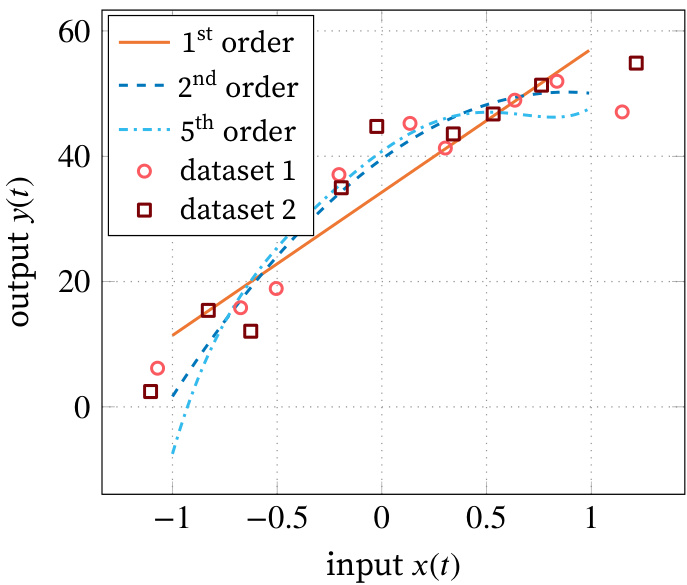

# Reservoir Computing with Plants

# 基于植物的储备计算

Olivier Pieters

为获得计算机科学工程博士学位提交的博士论文

导师

Prof. Francis wyffels, PhD\* - Tom De Swaef, PhD\*\* - Michiel Stock, PhD\*\*\*   
\* 根特大学工程与建筑学院电子与信息系统系   
\*\* 农业、渔业和食品研究所   
\*\*\*根特大学生物科学工程学院数据分析与数学建模系

2022年2月

ISBN 978-94-6355-567-8   
NUR 958, 959   
法定存放: D/2022/10.500/8

# 答辩委员会成员

# 主席

Prof. Filip De Turck, PhD, 根特大学

# 其他有投票权的成员

Prof. Peter Bienstman, PhD, 根特大学   
Prof. Joni Dambre, PhD, 根特大学   
Prof. Sarah Garré, PhD, 农业、渔业和食品研究所 &   
列日大学   
Xu Zhang, PhD, 荷兰imec

# 导师

Prof. Francis wyffels, PhD, 根特大学   
Tom De Swaef, PhD, 农业、渔业和食品研究所   
Michiel Stock, PhD, 根特大学

# 致谢

这本书，或者有些人称之为博士候选人的代表作，是大约四年半工作的成果。它包含了我博士期间主要成就的概述。然而，它未能深入捕捉这些成果背后的故事。在这些致谢中，我将为我们进行的研究提供一些背景，以及我最初是如何开始攻读博士学位的。

这一切始于大约五年前，当时Johan Bauwelinck教授问我是否有兴趣在他的团队攻读博士学位。虽然我没有接受这个提议，但它激发了我寻找一个结合电子和计算机科学方面的非常规博士课题。在Bart Coppens教授的建议下，我最终联系了我的主要导师Francis wyffels教授。Francis提出了广泛的主题，但在我们第一次见面时谈论最少的一个主题最吸引我：植物计算。尽管我之前对生物相关学科不感兴趣，但它立即引起了我的兴趣。现在，我们即将结束这段并不轻松的旅程。处理相互冲突的优先事项、压力和失败并非易事。但最终，它帮助我成为了一个更加理性的人。总的来说，我不后悔攻读博士学位，尽管这期间无疑有起有落。

这些起落往往与自我施加的压力有关，源于我的期望与现实之间的不匹配。这种压力在我第二年达到顶峰，当时使用高光谱相机的实验未能正常工作，一次又一次出现新的技术困难。虽然这是一个压力很大的时期，但它帮助我更好地应对此类事件。但也有很多令人兴奋的时刻：当某些东西被提交、被接受，或者只是当数据分析顺利进行时。

如果没有我的导师们的支持，这段旅程是不可能完成的：Francis wyffels教授、Tom De Swaef博士和Michiel Stock博士。他们的指导和支持对完成这个博士学位至关重要。不仅是他们在想法和建议方面的投入，还有情感上的支持。因此，我现在能够更好地应对与压力相关的事件，如截止日期或实验设置问题。

当然，还有更多人参与了我的博士研究，如Peter、Isabel、Maxime和Ruben。我要特别感谢Peter Lootens博士和Isabel Roldán-Ruiz教授，感谢他们在高光谱相机实验和项目提案方面的投入。

我还要感谢我在IDLab-AIRO的现任和前任同事们：Alexander、Andreas、Asma、Axel、Benedikt、Bjarne、Dries、Francis、Frederic、Gabriel、Hassan、Ira、Jeanne、Jeroen、Joni、Len、Lionel、Luthffi、Mathieu、Matthias、Matthijs、Maxim、Natacha、Peter、Pieter、Qiaoqiao、Rembert、Remko、Ruben、Saya、Stefan、Tanguy、Thomas、Tom、Tony、Victor-Louis和Zimcke。我要感谢你们让我感到自己是团队的一部分，并向我介绍了我本不会探索的领域。特别要提到Matthias和Zimcke，他们经常出现在写作小组中。这帮助我更有效率和有效地撰写这本书和我的论文。尽管过去两年中小组活动的数量有限（你可以猜到原因），但我很享受我们下班后偶尔的聚会。我特别记得周五的饮料、团队建设、散步、晚餐以及在Francis和Michiel家吃冰淇淋。

我还要感谢ILVO的所有同事，特别是已经成为朋友的Irene、Michiel、Willem和Evelien。我特别记得我们去西班牙和克罗地亚的旅行，以及许多晚餐和桌游之夜。感谢你们！也衷心感谢帮助保持温室植物存活的技术人员。

还要向我的高中和大学朋友们喊话：Rosanne、Fien、Anneleen、Marjoleine、Elise和Michiel，以及Sander、Robin、Daan、Gert-Jan、Jorg、Dieter、Milan、Ine和Nicolas。虽然我们不像以前那样经常见面，但每次见面都很愉快，可以暂时摆脱工作流程。Sander，感谢你所有的下班后聊天、山地自行车骑行和晚餐。

撰写跨学科博士论文是一回事，答辩则是另一回事。感谢Pieter Bienstman教授、Joni Dambre教授、Sarah Garré教授和Xu Zhang博士，感谢他们努力理解本工作中涵盖的所有概念，并提供了出色的反馈和进一步改进本文的机会。

最后但同样重要的是（重要的人总是最后出现），我还要感谢我的母亲、父亲和兄弟。我知道我并不总是很善于沟通，有时甚至很冷淡，但最终，我可以在事情顺利和不顺利时依靠你们无条件的支持。感谢你们的一切，因为没有你们，我不可能走到今天。这包括经济支持，但尤其包括所有的食物、往返根特的接送、深夜电话等等。谢谢你们！

Olivier Pieters, 2022年2月9日

# 摘要

植物在地球上无处不在。它们通常被视为经历环境变化的生物。相反，我们提倡一种更综合的观点：将植物视为计算实体。植物是由许多相互连接的节点和模块组成的复杂生物。这些使植物能够应对由于天气波动、捕食和疾病而高度变化的环境条件。尽管缺乏类似大脑的器官且无法移动，植物仍能有效应对环境中的信号。植物不断收集和更新关于其环境的多样化信息，并将其与当前内部状态整合。基于这些整合信息，植物做出决策以协调其福祉与环境。我们建议在物理储备计算（PRC）的背景下将植物视为计算单元。

PRC是一种利用物理基质进行计算的非传统计算范式。该范式涉及使用高维、非线性动态（物理）系统作为计算资源来完成任务。例子包括使用柔性机器人身体控制机械系统或处理光学和电信号。在生物领域，猫的初级视觉皮层和细菌培养物也被证明可以作为分类任务的储备。

最初，物理储备计算可能看起来很奇怪。然而，它与传统计算有很多相似之处。计算是转换信息以实现特定目标的过程。传统系统通过使用算法来实现这一目标。人类设计的算法处理输入以实现目标或获得输出。在PRC中，该算法被执行计算的物理基质所取代。该基质或储备通过传感器进行观察，其读数被组合以获得输出。总体思路是，由于储备的高维度和记忆，可以使用状态观察的简单线性组合来观察输出。因此，储备计算系统可以使用易于理解的线性回归进行训练，并且训练速度快。

基质通常需要满足PRC的两个主要要求：非线性特性和衰减记忆。植物确实是非线性生物。增加光强度不会导致光合作用速率的相同增加（非线性行为）。也有证据表明植物具有记忆，因为它们能够从经验中学习，用于优化未来的光适应。然而，这与衰减记忆不同。衰减记忆意味着过去事件的重要性随着时间的推移而降低。目前还没有正式证明植物具有这种能力。

经典的PRC依赖于静态储备；其动态、非线性和记忆在时间上是固定的。一般来说，植物并非如此。植物即使在成年后也会继续发育。为了缓解这个问题，我们在相对较短的时间内研究植物：八天。在此期间，我们将植物视为静态的。在这项工作中，我们希望将储备计算与一个——据我们所知——尚未探索的领域：植物生态生理学联系起来。尽管存在上述限制，但它可以形成表型分析范式转变的基础。与其专注于特定性状及其对生理的影响，更全面的方法可以产生关于植物行为的有趣新见解。

在第一项研究中，我们使用高光谱相机研究了PRC框架在植物中的适用性。高光谱相机是传统RGB相机的广义版本。它不仅可以捕捉三个光谱波段（红、绿和蓝），还可以捕捉更多波段的光，具有更高的精度（更窄的波段）和更广的范围（可见光谱之外的波长）。尽管进行了广泛的分析，但这项研究并不成功。背景材料在预测所考虑的回归任务方面与植物数据一样好。我们怀疑根本原因是相机的精度不足和光谱变化小。改进的传感器技术可能会解决一些问题，但仍不确定所需的精度是多少。根据设计，植物在这项研究中没有受到严重胁迫。因此，光谱变化有限。因此，替代的传感设备似乎更有前景，因为高光谱相机存在几个问题。首先，与传统相机相比，这些相机是昂贵的传感器。其次，它们产生大量数据。这些数据的存储和处理可能是一个挑战。第三，高光谱数据很复杂。有许多波段可用，光谱分辨率可能不均匀。此外，从数据中提取相关特征是一个正在进行的研究课题。

尽管高光谱实验的结果尚无定论，但它们对表型分析社区非常相关。利用我们的发现，我们说明了当前高光谱技术的一些局限性。此外，我们还阐明了尽管某些任务表现良好，但植物并不是系统性能的根本原因。这一观察强调了研究环境和传感系统对当前任务的影响始终是至关重要的。

因此，在第二项实验研究中，我们将重点转向接触传感器。更具体地说，我们使用了叶片厚度传感器。然而，为了表征植物的状态以进行PRC，我们需要足够快地测量这种状态。现有的传感系统在精度、灵活性和成本方面未能满足所需的规格。因此，我们设计了一个定制系统：Gloxinia。

Gloxinia传感器平台旨在推进基础和应用植物研究中的监测。通过开放的硬件和软件设计，解决了四个关键需求：传感器可扩展性、精度、成本和多功能性。该平台由相互通信的独立传感器节点组成。每个节点都有一个控制板，传感器节点连接到该控制板。这些传感器板配备了与大多数用于接触测量的模拟传感器接口所需的电子设备。数字传感器也可以连接到控制板。为了验证系统的精度，我们在生长室中设置了一个实验试验。环境条件、叶片厚度和叶片伸长率在一株番茄和两株草莓植物上以高分辨率成功测量。

使用Gloxinia平台，我们展示了植物PRC。虽然我们没有分别量化植物的不同记忆方面和非线性特性以及这些特性的来源过程，但这是迈向植物PRC启发的计算的关键一步。我们展示了如何使用草莓植物的叶片厚度测量来评估生态生理、环境和基准回归目标。我们的结果表明，植物不适合通用计算，但与植物相关的任务高度相关。光合速率和蒸腾速率是研究的两项主要生态生理任务。

目前，植物PRC处于探索阶段。我们展示了使用叶片厚度传感器进行植物PRC在生态生理任务中的潜力。传感器技术的进步，如更精确的传感器和替代传感技术，可以进一步改善结果。此外，植物是非静态的。因此，PRC框架应扩展以应对这种行为。然而，PRC最深远的影响可能是对植物及其行为的新视角。将植物视为计算实体可以帮助概括植物行为，并为生理研究提供必要的背景。植物表现出的每个特征都可以被视为环境信号与植物行为之间复杂相互作用的结果。本质上，植物可以被视为一个计算单元，它分析传入的环境信号并相应地优化其生理。这种更全面的方法可以帮助育种、表型分析和精准农业超越当前的方法。

# 摘要

植物在地球上无处不在。它们通常被视为经历环境变化的生物。然而，通过我们的研究，我们提倡一种更综合的观点：将植物视为计算单元。植物是由许多相互连接的节点和模块组成的复杂生物。这些节点和模块使植物能够应对由于天气模式、捕食和疾病而高度变化的环境条件。尽管缺乏中枢神经系统且无法移动，植物仍能有效应对环境变化。植物不断根据内部信号和从环境中收集的信息优化其内部状态。我们建议在物理储备计算（PRC）的背景下将植物视为计算单元。

PRC是一种利用物理基质进行计算的非传统计算模型。该范式涉及使用非线性动态（物理）系统作为计算媒介来完成任务。使用柔性机器人身体控制机械系统以及处理电信号和光信号就是其中的一些例子。还有一些研究展示了使用生物储备进行计算，如猫的初级视觉皮层或细菌培养物来解决分类任务。

乍一看，PRC能够工作似乎很奇怪。然而，它与传统计算（例如计算机）有很多相似之处。计算是将信息转换以实现特定目标的过程。传统系统通过算法来实现这一点。输入通过专门设计的算法进行处理，直到获得所需的输出。在PRC中，该算法被执行计算的物理基质所取代。该基质通过传感器进行观察，其读数用于获得所需的输出。其基本思想是，由于储备的高维度和记忆，可以使用简单的线性组合来形成所需的输出。因此，PRC系统可以通过线性回归（一种常用的统计方法）进行训练。

非线性特性和衰减记忆是PRC的两个基本要求。植物确实是非线性生物：增加光强度不会导致光合作用活性的同等增加。也有证据表明植物具有记忆；它们可以利用过去的事件来适应未来的光照条件。然而，这与衰减记忆不同。衰减记忆意味着遥远过去的事件不如最近发生的事件重要。对于植物，目前还没有正式证据表明它们具有这种记忆。

经典的PRC假设储备是静态的。因此，其动态特性、非线性和记忆不会随时间变化。然而，一般来说，这对植物并不适用。因为即使在成熟阶段，植物的发育也不会停止。为了避免这个问题，我们在相对较短的时间尺度（八天）内研究成年植物。在此期间，我们将植物视为静态的。在这项工作中，我们试图以此方式在PRC和植物生态生理学之间架起一座桥梁。据我们所知，这迄今为止尚未被研究过。尽管存在上述限制，这项研究可能会导致表型分析的重大变化。与其专注于植物生理学的个别方面，PRC的更全面的方法可以产生关于植物行为的新见解。

在第一个实验中，我们使用高光谱相机研究了PRC框架在植物中的适用性。高光谱相机是传统RGB相机的广义版本。这种相机在三个波段（红、绿和蓝）观察光。广义版本可以在更多波段进行观察，通常具有更高的精度（更窄的波段）和更大的范围（即检测可见光谱之外的波长）。尽管进行了广泛的分析，但这个实验并不成功。观察背景材料与观察植物在解决回归任务方面同样有效。我们怀疑主要原因是所用传感器的精度不足以及波长范围有限。改进的传感器技术可能会解决这个问题，但仍然不确定需要什么样的精度。植物被故意没有置于严重的胁迫条件下，因此光谱差异有限。因此，替代的传感器技术在研究植物的PRC时更有前景，因为高光谱相机有几个缺点。首先，与传统相机相比，这些相机非常昂贵。其次，如果要研究植物的动态特性，它们会产生大量数据。因此，处理和存储是挑战。第三，数据分析也非常复杂，因为有许多波段可用，而且光谱分辨率通常不均匀。最后，从数据中提取有趣的模式也是一个非常活跃的研究领域。

尽管高光谱相机的结果并不令人信服，但它们对表型分析社区非常相关。它们说明了当前用于此类相机的技术的局限性。此外，它们还说明始终重要的是要确保测量的是植物的响应，而不是环境和测量系统的组合。

因此，在第二组实验中，我们将重点转向接触传感器。更具体地说，我们使用了叶片厚度传感器。这些传感器需要足够快地读取，以捕捉足够的植物动态。现有的测量系统无法满足精度、可用性和成本的规格要求。因此，我们开发了自己的系统：Gloxinia。

Gloxinia传感器平台旨在促进基础和应用植物科学中的植物测量。通过开放的硬件和软件设计，解决了四个关键需求：扩展到大量传感器的可扩展性、成本、精度和可用性。该平台由相互通信的独立传感器点组成。每个点由一个与传感器板连接的控制板组成。这些传感器板包含与大多数用于表型分析的模拟传感器连接所需的电子设备。数字传感器也可以连接到控制板。为了评估该平台，在生长室中设置了一个实验。成功测量了一株番茄和两株草莓植物的环境变量、叶片厚度和叶片伸长率。

使用Gloxinia平台，我们展示了植物的PRC。尽管我们没有量化植物的记忆方面和非线性特性，也没有确定这些特性的潜在植物过程，但这仍然是迈向植物PRC启发计算的关键一步。我们展示了如何使用草莓植物的叶片厚度测量来评估生态生理、环境和基准回归任务。我们的结果表明，植物不适合通用计算目的，但与植物相关的任务高度相关。光合作用和蒸腾作用是我们研究的两项主要生态生理任务。

目前，植物的PRC处于启动和探索阶段。我们展示了使用叶片厚度传感器进行植物PRC在生态生理任务中的潜力。改进的和替代的传感器技术可以进一步改善这些结果。此外，植物是非静态的。因此，PRC框架需要扩展以应对这种行为。然而，最深远的影响可能是对植物生态生理过程的新视角。将植物视为计算单元可以概括植物行为，并为生理实验提供必要的背景。因此，每个植物特征都可以被视为环境与植物之间复杂相互作用的结果。总之，我们可以将植物视为一个计算单元，它处理来自环境的输入信号并相应地调整其生理。这种更全面的方法可以帮助育种、表型分析和精准农业超越当前的方法。

# 目录

致谢 i

Dankwoord v

摘要 ix

Samenvatting xiii

图目录 xxv

表目录 xxix

缩略语 xxxi

符号 xxxv

# 1 植物作为智能和信息处理生物

1.1 植物是否具有智能？ 3   
1.2 植物是否有意识？ 7   
1.3 植物作为计算资源 8   
1.4 研究概述 12   
1.5 出版物 13   
1.5.1 期刊文章 15   
1.5.2 审稿中的期刊文章 15   
1.5.3 会议论文 15   
1.5.4 数据集 16

xix

# 2 机器学习和储备计算简介

2.1 机器学习 19   
2.2 线性回归模型 23   
2.3 泛化、偏差和方差 26   
2.4 多层感知器模型 33   
2.5 储备计算 39   
2.6 物理储备计算 43   
2.7 形态计算 45   
2.8 总结 45

# 3 植物生态生理学、表型分析和表型组学简介

47

3.1 植物生态生理学 49   
3.2 从表型分析到表型组学 54   
3.3 时间-空间-性状轴 58   
3.4 性状测量技术 61   
3.5 采用的传感器技术 62   
3.6 总结 64

# 4 植物储备计算

67

4.1 将物理储备框架映射到植物 69 4.2 实验设计 77

4.2.1 实验设置细节 77   
4.2.2 植物物种选择 78   
4.2.3 储备计算性能评估指标 79   
4.2.4 误差指标 81   
4.2.5 机器学习模型概述和数据流 81

4.3 总结 82

# 5 使用快照高光谱相机进行储备计算

5.1 高光谱成像在表型研究中的兴起 88 5.2 实验设置 89

5.2.1 测量设置 89   
5.2.2 数据准备和处理 93   
5.2.3 设置的其他细节 98

5.3 结果 99

5.3.1 环境条件分析 99   
5.3.2 平均数据集分析 99   
5.3.3 子采样数据集分析 104   
5.4 讨论 105   
5.5 结论 108

# 6 用于测量动态植物特性的传感器平台开发

111

6.1 传感器平台开发的背景和动机 114 6.2 系统架构 117 6.3 测量系统设计 121

6.3.1 模拟前端设计 122   
6.3.2 数字信号处理 124   
6.3.3 与传感器板的数字接口 126   
6.4 结果 127   
6.5 讨论 132

6.5.1 实验评估和未来改进 132   
6.5.2 设计验证与现有平台的比较 135

6.5.3 未来改进和可能性 139

6.6 结论 140

# 7 植物作为物理储备计算资源的实验演示

141

7.1 引言 143   
7.2 材料和方法 144   
7.2.1 实验设置 146   
7.2.2 数据预处理 148   
7.2.3 训练、验证和测试数据划分及模型训练 149   
7.2.4 回归任务 150   
7.2.5 叶片厚度传感器校准 153   
7.2.6 植物材料 154

# 7.3 结果 154

7.3.1 生物学相关任务的储备性能评估 154 7.3.2 储备特性评估 157

# 7.4 讨论 162

7.4.1 与文献的性能比较 163   
7.4.2 局限性和未来改进 167

7.5 结论 168

# 8 讨论与未来展望 171

8.1 主要结果概述 173   
8.2 实验设置的逐步改进 175   
8.3 未来工作与应用 177   
8.4 结语 182

A 使用快照高光谱相机进行储备计算的补充材料 183   
B Gloxinia的模拟前端规格 191   
C 植物作为物理储备计算资源的实验演示补充材料 195

参考文献 199

# 图目录

1.1 两个因果交互图及其以比特表示的因果有效信息 $\boldsymbol { \phi }$ . 7   
1.2 描述通用计算资源的示意图. 9   
1.3 储备计算中RNN的通用架构. 10   
1.4 出版物与研究主题之间依赖关系的可视化. 13   
2.1 植物的Gompertz生长模型. 20   
2.2 ILVO黑麦草试验的干物质产量数据. 21   
2.3 拟合未知基础模型数据集的线性多项式回归模型. 24   
2.4 图2.3中的模型与新样本数据（数据集2）的比较. 26   
2.5 超参数对模型性能和系数分布的影响. 29   
2.6 蓝色权重向量在不同正则化约束下的等高线图. 31   
2.7 一阶、二阶和五阶多项式回归模型在岭正则化下的优化结果. 32   
2.8 使用不同数据集（但相同的基础世界和噪声模型）训练的岭正则化下一阶、二阶和五阶多项式回归模型的优化结果. 33   
2.9 具有三个全连接隐藏层的简单前馈ANN. 35   
2.10 单个感知器. 35

2.11 ANN激活函数.

2.12 梯度下降优化技术在第五阶多项式回归模型损失曲线上的图示（第2.3节）. 37   
2.13 两个脉冲序列和脉冲神经元的图示. 40   
2.14 储备计算中RNN的通用架构. 41   
3.1 标注了主要器官、水分和二氧化碳吸收的植物示意图. 51   
3.2 Barkeria干燥叶片表面图像，显示开放和关闭的气孔. 52   
3.3 大豆干旱试验中两个田地的热成像图. 53   
3.4 表型测量轴的概述. 59   
4.1 不同储备计算实现的图示. 71   
4.2 植物氧气产量与入射光强度的非线性关系. 73   
4.3 实验装置示意图. 77   
4.4 植物物理储备计算（PRC）数据处理流程示意图. 83   
5.1 快照高光谱相机示意图. 88   
5.2 植物和背景材料上方灯光和相机布置的示意图. 90   
5.3 生长室内的实验装置. 92   
5.4 第二次实验中H1从开始到结束每10张图像的平均图像. 94   
5.5 两次实验中训练、验证和测试数据划分的可视化. 97   
5.6 从装置收集数据到模型预测结果的数据流概述. 98   
5.7 第一次实验中最重要环境条件的归一化密度图. 100   
5.8 线性模型在不同生态生理和环境参数下的性能. 101   
5.9 plant2数据$y$的蒸气压亏缺$( D _ { \mathrm { l e a f } } )$与模型预测$\hat { y }$的可视化. 102   
5.10 plant2第三批测试数据中$T _ { \mathrm { l e a f } }$、$D _ { \mathrm { l e a f } }$、$E _ { \cdot }$和$P _ { n }$的时间图. 103   
5.11 所有变量在子样本量为77 $( 3 0 + 4 7 )$时的性能概述，模型输入特征为1502个. 104   
5.12 子样本量对空气温度$( T _ { \mathrm { a i r } } )$和蒸腾速率$( E )$任务的影响. 105   
6.1 使用相同传感器组监测多株植物的典型实验系统架构. 118   
6.2 Sylvatica和Planalta板模拟前端的框图. 123   
6.3 Planalta板微控制器上数据处理流程的示意图. 125   
6.4 Sylvatica板微控制器上数据处理流程的示意图. 126   
6.5 草莓植物生长室实验中捕获数据的可视化. 129   
6.6 实验装置. 130   
6.7 草莓植物生长室实验中捕获数据的可视化（放大）. 131   
6.8 草莓植物生长室实验中捕获数据的可视化（双倍放大）. 134   
6.9 不同数据记录方法的雷达图比较. 135   
7.1 框架顶部和侧面的灯网格. 147   
7.2 生长室内的完整装置. 148   
7.3 数据划分为训练/验证和测试数据的可视化. 150   
7.4 草莓1所有叶片厚度读数的互相关. 152   
7.5 使用箱线图展示两种不同草莓植物和对照的预测性能概述. 155   
7.6 对照和草莓1实验中目标变量$( I _ { \mathrm { P A R } } , T _ { \mathrm { a i r } } , h , P _ { n }$和$E )$与（叶片）厚度读数$( x _ { i } )$的相关矩阵. 156   
7.7 整个数据集中$I _ { \mathrm { P A R } }$、$P _ { n }$和$E$的时间图可视化. 158   
7.8 图7.7中灰色阴影区域的放大，以展示更详细的信息. 159   
7.9 读数数量对环境和生物任务性能的影响. 160   
7.10 延迟对PAR的影响. 161   
7.11 $I _ { \mathrm { P A R } }$的非线性（多项式）变换. 162   
7.12 使用光强度数据$I _ { \mathrm { P A R } }$对NARMA基准任务的比较，$n = \{ 2 , 5 , 1 0 , 2 0 , 5 0 , 1 0 0 \}$. 163   
8.1 实验开始（a）和结束（b）时的番茄植物. 176   
8.2 使用外部控制器（即传统设置）和PRC控制器的闭环控制. 181   
A.1 实验中使用的卤素灯和LED灯的光谱. 186   
A.2 第一次实验中三种材料在相似PAR条件下的反射光谱. 189   
C.1 草莓1实验结束时的装置图像. 197   
C.2 草莓2实验结束时的装置图像. 198   
C.3 对照实验结束时的装置图像. 198

# 表目录

2.1 多项式模型在训练数据（数据集1）和验证数据（数据集2）上的比较，验证数据包含用于模型优化的未见数据. 27   
2.2 图2.7中模型在三个数据集上的性能比较. 32   
3.1 高通量表型成像技术. 57   
3.2 实验中使用的传感器及其特性概述. 64   
4.1 植物表型非成像传感方法概述. 76   
4.2 考虑的环境和生态生理变量概述. 80   
5.1 两个表现良好的生理任务（叶片温度$( T _ { \mathrm { l e a f } } )$和蒸气压亏缺$( D _ { \mathrm { l e a f } } )$）与空气温度$( T _ { \mathrm { a i r } } )$的Pearson相关系数$( \rho )$. 106   
6.1 Planalta和Sylvatica传感器板采用的不同采样和信号频率概述. 124   
6.2 实验验证中每株植物连接的传感器概述. 127

xxix

6.3 系统实验验证中使用的不同传感器概述. 128   
6.4 假设生产十块特定类型电路板的成本计算. 138   
6.5 不同传感器平台评估的详细比较和总结. 139   
7.1 考虑的目标类型概述：（i）环境，（ii）生态生理和（iii）计算基准目标. 151   
A.1 H1的峰值波段物理2D网格表示的高光谱像素. 185   
A.2 H2的峰值波段物理2D网格表示的高光谱像素. 186   
A.3 线性模型在不同生态生理和环境参数下的性能. 187   
A.4 所有变量在子样本量为77 $( 3 0 + 4 7 )$时的性能概览，模型输入特征为1502个。. 188

# 缩略词

ADC 模数转换器   
ANN 人工神经网络   
BPDC 反向传播去相关   
CAN 控制器局域网   
$\mathsf { c o } _ { 2 }$ 二氧化碳   
DALI 数字可寻址照明接口   
DMY 干物质产量   
ESN 回声状态网络   
GPR 探地雷达   
GPU 图形处理单元   
$\mathsf { I } ^ { 2 } \mathsf { C }$ 内部集成电路   
IIT 整合信息理论   
IRGA 红外气体分析仪   
LASSO 最小绝对收缩和选择算子   
LE 叶片伸长   
LED 发光二极管   
LIA 锁相放大器   
LiDAR 激光成像、检测和测距   
LIFT 光诱导荧光瞬态   
LSM 液态机   
LT 叶片厚度   
LVDT 线性可变差动变压器   
MAE 平均绝对误差   
MSE 均方误差   
NARMA 非线性自回归移动平均   
NIR 近红外   
NMSE 归一化均方误差   
NTP 网络时间协议   
PAR 光合有效辐射   
PGA 可编程增益放大器   
PLS 偏最小二乘法   
PRC 物理储备计算   
PVC 聚氯乙烯   
PWM 脉宽调制   
ReLU 整流线性单元   
RGB 红绿蓝   
RNMSE 根归一化均方误差   
RNN 循环神经网络   
SAR 合成孔径雷达   
SIF 太阳诱导荧光   
SPI 串行外设接口   
SVM 支持向量机   
SWC 土壤含水量   
THD 总谐波失真

# UART 通用同步收发器

USB 通用串行总线

VI 植被指数

VIS 可见光范围

VOC 挥发性有机化合物

# 符号

t 时间   
air 空气温度   
leaf 叶片温度   
$T$ 温度   
$g _ { s }$ 气孔导度   
$P _ { n }$ 光合速率   
$E$ 蒸腾速率   
leaf 基于叶片温度的叶片蒸气压亏缺   
PAR 以PAR表示的光强   
$h$ 相对湿度   
$\rho$ 相关系数   
H1 高光谱相机头1   
H2 高光谱相机头2   
$W ( t )$ 植物生长的Gompertz模型   
𝐺 Gompertz模型中的生长速率系数   
$T _ { i }$ Gompertz模型中的拐点时间   
A Gompertz模型中的饱和值   
$w _ { i }$ 模型权重参数   
$y ( t )$ 时间t的目标输出   
${ \hat { y } } ( t )$ 时间t的模型预测输出   
$\bar { y }$ 平均预测值   
$x ( t )$ 时间t的模型输入   
$\mathcal { L }$ 损失函数   
$\mathbf { x } _ { i }$ 第i组输入特征向量   
$\mathbf { w }$ 权重向量   
$\mathbf { y }$ 目标向量   
$\mathbf { X }$ 输入特征矩阵   
$\phi ( \cdot )$ 以非线性方式转换数据的通用函数   
$M$ 数据集中的样本数量   
$N$ 每个样本的特征数量   
$\lambda$ 模型的超参数   
$\psi$ 人工神经网络的激活函数   
$\nu$ 植被指数

1

# 1

# 植物作为智能和信息处理生物

植物无处不在，存在于我们的办公室、花园、餐盘甚至地砖缝隙中。然而，它们与人类截然不同。与动物相比，植物不会移动，具有更模块化的形态，并通过吸收水、阳光和营养物质来合成食物（自养）。此外，植物几乎存在于地球上的每个生态系统中，并常常在这些系统中茁壮成长。没有植物，当前形式的动物就不可能存在，因为植物是每个食物链的基础。然而，由于植物与动物如此不同，它们通常不被认为是智能的。大多数人认为植物"只是生长"并被动地适应环境变化。但越来越多的研究证明事实并非如此，表明植物表现出涌现智能（Trewavas 2016; van Loon 2016）。

# 1.1 植物是否具有智能？

植物是地球上几乎所有生态系统的基础（Walter 1985）。人类以及更广泛地说，所有动物生命都直接或间接地依赖植物。尽管植物无法移动（称为固着性），但它们几乎在地球上所有栖息地中都能茁壮成长。这种固着性迫使植物发展出多种策略来应对环境变化。红树林尽管生长在盐水中并每天因潮汐被淹没两次，仍能茁壮成长（Kathiresan et al. 2001）。仙人掌必须在长时间脱水期间储存水分，并在有水时迅速补充储备（Taiz et al. 2010; Huang et al. 1992）。作物在白天要承受强烈的阳光和高温，在夜晚则要面对低温，即使在夏季也是如此。

为了在光照强度、温度波动和水分供应等高度变化的环境中生存，植物需要通过遍布全身的各种传感器持续感知环境。根据这些感觉信号，植物相应地调整其生理机能（Taiz et al. 2010）。因此，它们可以测量比人类更多的变量，包括电场、化学梯度和温度（Karban 2015）。

与具有类似大脑结构的中心感觉处理的动物不同，植物是分布式生物。植物缺乏动物中可识别的专门器官，如大脑、肺和消化系统。相反，它们具有更模块化的结构，避免了高度特化。从进化的角度来看，这种结构至关重要，因为植物是固着的，容易成为捕食的受害者。失去重要器官意味着植物的死亡；通过限制特化，植物可以继续生长（Mancuso et al. 2018）。确实，修剪草坪并不会阻止草的生长。大多数植物的扦插也会因为快速生根而长成新植株。这些特征使植物与动物截然不同。

由于这种与动物截然不同的行为，植物通常不被认为是智能生物（van Loon 2016）。这一属性通常只保留给鹦鹉、章鱼（Schnell et al. 2020）和人类等类动物生物。然而，一些研究者正在挑战这一观点（Trewavas et al. 2020; Calvo et al. 2020）。因此，问题出现了："什么是智能？"目前没有一个统一的定义。然而，基于Downing（2015）和Legg et al.（2007）的研究，在许多定义中，智能行为有三个共同特征：（i）智能是个体在与环境互动时表现出的属性；（ii）智能与个体实现目标或获得利益的能力有关；（iii）智能取决于个体如何适应不同的目标和环境。Legg et al.（2007）将其总结为：

# 通用智能

智能衡量个体在广泛环境中实现目标的能力（Legg et al. 2007）。

在本论文中，我们将使用一个更具体的定义，它包含在上述定义中：

# 通用智能，替代定义

智能是一种非常普遍的心智能力，其中包括推理、计划、解决问题、抽象思考、理解复杂概念、快速学习和从经验中学习的能力（Gottfredson 1997）。

这个定义提到了智能所需的一些关键方面，如问题解决能力、记忆、计划等。最近的研究也在植物中发现了这种行为。

Szechyńska-Hebda et al.（2010）表明，植物具有对先前光照事件的记忆，这些记忆被用于优化未来的光适应和优化反应。结合其他研究，Karpiński et al.（2010）得出结论，植物可以存储和使用光总量、强度和日长信息数天或更长时间，以预测环境中可能出现的近未来变化。这些例子说明植物具有典型的学习（习惯化、启动）和复杂的记忆存储/回忆系统（Thellier et al. 2013）。含羞草（Mimosa pudica）也被用来展示植物的学习能力。这些植物可以折叠叶子，这是一种防御机制。然而，这应该只在存在迫在眉睫的危险时发生，因为光合作用会减少，而且叶子折叠也需要能量。Gagliano et al.（2014）表明，最初掉落植物会触发叶子折叠，但在几次事件后就会被忽略。在后续工作中，Gagliano et al.（2016）甚至证明了植物中的联想学习。研究人员引入了一个中性环境线索，同时保持入射光的方向相同。他们表明，植物利用这个线索来预测未来光源的位置，从而影响生长方向。这些案例研究表明，尽管缺乏类似大脑的中心结构，植物仍能存储和回忆过去的事件。Baluška et al.（2018）汇编了关于植物记忆和学习的最新研究综述。

此外，植物之间也能相互交流。自从发现附近树木受损时杨树中酚类化合物的积累（Baldwin et al. 1983）以来，越来越多的证据表明植物会交流。主要的交流方式似乎是空气中的挥发性有机化合物（VOCs），但其他研究也表明，在干旱时根与根之间的相互作用也会发生（Ueda et al. 2012; Wang et al. 2021）；以及植物间的竞争（Taiz et al. 2010）；甚至声学信号（Gagliano 2013; Khait et al. 2019）。交流不仅限于激素或电信号；水力甚至电场交流也有报道（Collings et al. 1992; Baluška et al. 2010）。

这些例子说明了植物在具有挑战性的生长环境中表现出的复杂性和高度优化的行为。这些行为可以被解释为涌现智能。虽然尚未观察到上述智能定义的所有方面，但有大量证据表明植物不仅仅是被动生物。需要更多的研究和改进的实验设计来进一步研究这种涌现智能。

关于植物智能及其相关特性的持续研究使一些研究者更进一步，将涌现意识归因于植物（Trewavas et al. 2020; Calvo et al. 2020; Trewavas 2021）。这引发了一个激烈争论的话题，部分社区试图反驳意识假说（Mallatt et al. 2021; Draguhn et al. 2021; Taiz et al. 2019），而另一些则大力支持（Trewavas et al. 2020; Calvo et al. 2020; Trewavas 2021）。

# 1.2 植物是否具有意识？

关于植物意识的争论通常围绕一种基本形式的意识展开，简单来说就是"第一人称视角"(Nagel 1974)。虽然支持和反对的双方都有令人信服的论据，但我们认为需要从非常拟人化的意识观转向更普遍的版本。Trewavas (2021)通过用"觉知"一词代替"意识"，朝着这个方向迈出了第一步。然而，支持或反驳植物意识假说的实验证据主要缺乏。Nick (2021)指出，大多数研究都集中在分析文献上，而不是进行严格的实验分析。

  
图1.1 两个因果交互图及其以比特表示的因果有效信息$\pmb { \phi }$。图(a)具有异质结构，导致$\Phi$值远高于具有均匀结构的图(b)。图灵感来自(Tononi 2004)。

需要的是一组可衡量的标准，使研究人员能够检验他们的假设。Trewavas (2021)提出了用于意识的整合信息理论(IIT)。IIT最初由Tononi (2004)在神经科学和心理学领域提出。顾名思义，它使用通过元素或节点网络定义的整合信息，如图1.1所示。连接改变了每个节点的行为，从而代表了无法直接测量的内在信息(Tononi et al. 2016)。尽管这个理论乍一看很有趣，但在过渡到物理介质时可以发现一些问题。植物由表明模块化的互连网络组成。然而，我们也应该考虑其他无生命结构，如质量阻尼系统。它们也由互连网络组成，在某种意义上与植物一样适合该框架。我们可以计算这些系统的IIT，但将意识归因于质量阻尼系统是牵强的。同样，在模拟环境中，可以计算神经网络的IIT。然而，将意识归因于当前最先进的神经网络也很困难(Nick 2021)。

相反，Nick (2021)提出可能需要对植物进行图灵测试。经典图灵测试的本质是观察者调查一个系统的思考能力。为此，观察者会像系统是智能的一样提出问题。系统(也称为黑箱)的表现与真正的思考者(即人类)进行比较。如果观察者无法识别哪个是黑箱，哪个是人类，则系统通过测试(Turing 1950)。因此，与其维持现状并主要进行文献综述，不如设计一个非语言的图灵测试会更有趣。尽管这可能并不简单，正如Searle (1980)使用中文房间论证所展示的那样。中文房间论证的设置类似于图灵测试，但针对的是被认为理解中文的系统。系统根据计算机程序处理输入和输出的中文字符。如果程序足够先进，它可以通过图灵测试，使人类操作员相信程序理解中文。然而，由于系统遵循预定的程序，因此不能将其视为真正的智能行为(Searle 1980)。

# 1.3 植物作为计算资源

图1.2描述了一个通用的计算资源。输入被呈现给处理单元，处理单元产生所需的输出。计算机是典型的例子：它们从例如键盘接收输入，处理这些信号以生成相应的显示命令，并在屏幕上显示按下的字母。人类也是信息处理实体。我们不断接收由大脑处理的感官输入，并相应地采取行动。

输入 处理实体 输出

虽然计算机和人脑都是计算资源，但它们的特性大不相同。一方面，人类可以轻松驾驶汽车，即使在以前没有经历过的条件下，这对计算机来说是一个更具挑战性的问题。另一方面，人类不擅长原始数字运算。例如，计算随机数的平方根对我们来说并不容易，但计算机在这方面非常高效。因此，它们各自擅长不同的任务。对于不太传统的计算资源也是如此。

例如，人工神经网络(ANNs)松散地受到大脑的启发，由基本处理元素组成的网络，类似于IIT的工作方式。ANNs是通用逼近器(Hornik et al. 1989)，因此它们也可以用作计算资源。ANN研究是计算机科学中非常活跃的部分。

这里非常相关的一种特定计算范式是储备计算(Schrauwen et al. 2007)。它使用随机初始化的ANN来执行计算。图1.3可视化了一个简单的储备池。输入被馈送到储备池中，储备池通过网络中存在的递归连接将此信息转换为依赖于当前输入和过去输入的新信息。最容易考虑离散时间中的系统，尽管可以轻松扩展到连续时间。然后输入由一系列传感器值组成。在每个时间点，将单个值放入网络中。从输入节点到储备池中节点的弧(箭头)决定了输入如何修改储备池状态。储备池的状态值(表示为节点)不仅取决于输入，还取决于先前的储备池状态。新节点状态(或值)由影响特定节点的先前状态的加权和决定。弧越暗，该节点对其他节点的影响越强。最后，基于对储备池的(部分)观察，确定输出。因此，该输出也是节点值的加权和。尽管观察到这个简单的读出系统在特定任务中表现良好，但不建议将储备计算用于通用机器学习(Vlachas et al. 2020)。然而，PRC仍然与解决与用于计算的身体相关的任务相关(Nakajima 2020)。一个典型的例子是能够使用由柔性身体生成的信号来引导运动(Urbain et al. 2021)。

  
图1.3 储备计算中RNN的一般架构。

这种计算和读出的分离激发了广泛的物理实现。物理储备计算将网络外包给基板。储备池可以是机器人身体(Caluwaerts et al. 2013)、植物、光子电路(Shastri et al. 2021; Vandoorne et al. 2014)或水桶(Fernando et al. 2003)。(物理)储备计算背后的思想将在第2.5节深入解释。

本论文的主要目标是通过实验验证植物的计算用途。通过计算，我们指的是以植物为中心的计算类型，而不是使用传统计算机实现的通用计算。尽管Adamatzky et al. (2018)提出用植物构建一个功能齐全的计算机，但它们不会取代日常生活中的计算机，但它们可以取代一些与植物固有任务相关的传统系统，例如产量优化。Adamatzky et al. (2018)描述了几种输入输出关系，但没有一种似乎可以使用当前可用的技术实际扩展。将范围限制在与植物相关的任务可能在实践中是相关的。这个假设基于机器人学中的类似工作。在柔性机器人学中，人们对将运动控制环的一部分外包给身体非常感兴趣。已经观察到，来自这个机器人身体的感官信息非常适合运动任务和地形分类(Urbain et al. 2021; Degrave et al. 2013)。

从基础角度来看，研究植物的计算特性不仅有趣，而且可能导致表型分析的范式转变。表型分析，简单来说，就是对植物特征的描述。储备计算可以为植物生理学研究提供一个新的框架。大多数研究都集中在一两个环境变量对植物的相互作用上，而植物的反应是更多变量的综合总和(Poorter et al. 2016)。毕竟，植物生长的环境在不断变化(Murchie et al. 2020; Jones 2013)。这些变化不仅是可变天气条件的结果，也是生物性质的结果。动物不断与植物互动，导致例如授粉、捕食甚至受精。此外，由于根与线虫、真菌和细菌之间的寄生和共生关系，土壤也处于不断变化和相互作用中。因此，与其专注于一两个控制变量与植物反应之间的关系，储备计算可以提供一个更通用的框架：植物是一种以某种方式处理这些输入信号并相应行为的计算资源。

此外，从长远来看，园艺和农业中的工业应用也是可能的。例如，在温室中持续监测植物的状况以获得最佳产量至关重要。目前，种植者依靠手动观察和由于农民对特定作物的长期经验而得知的最佳生长设定点。这种高度专业化导致了产量的不断提高，但在切换品种时也带来了困难。种植者需要能够快速响应市场变化以最大化利润。然而，在这种经典方法中切换品种并不容易。可能需要几个生长季节才能优化生产，部分原因是缺乏关于植物状态的详细信息。利用植物的计算特性可以解决这个问题，因为植物成为优化环境条件的积极参与者。

如上所述，获取植物状态的信息并将其用于控制环，可以产生高度自主的植物系统。在这样的系统中，植物可以接管农民的许多责任，包括灌溉、施肥和气候控制。

# 1.4 研究大纲

如前所述，本研究的主要目标是通过PRC启发的实验设置来验证植物计算。研究任务可大致分为以下目标：(i) 研究适合评估植物状态的传感技术；(ii) 使用传感器数据评估植物PRC；(iii) 研究潜在的有趣生物学任务。

在深入探讨植物储备计算之前，需要先了解机器学习、生态生理学和表型分析的基础知识。这些主题分别在第2章和第3章中介绍。我们从这两个领域引入了基本概念，使来自任一学科的专家都能理解本书的其余内容。随后，在第4章中，我们讨论了如何利用物理储备计算来研究植物的计算特性。第5章首次尝试使用高光谱相机以高时间分辨率研究植物在不同条件下的行为。虽然这一研究方向没有得出明确结论，但获得了关于高光谱相机在此类实验中局限性的宝贵信息。因此，我们转而使用另一种传感技术，并为此开发了一个多功能数据记录系统Gloxinia（第6章）。该传感器平台被用于第7章的实验中，通过多个任务来评估植物的计算特性。第8章讨论了结论和未来研究方向。

# 1.5 出版物

以下是所有已发表工作的列表。这些出版物大多已（部分）整合到本书中。在这里，我们从储备计算的角度来探讨每项研究。然而，在我们的一些出版物中并非采用这种视角。图1.4可视化了不同出版物和研究主题之间的相互关联。

  
图1.4 出版物与研究主题之间的依赖关系可视化

在我们最初尝试研究植物PRC时，我们使用高光谱相机作为植物观测传感器。然而，结果并不明确。根据从该传感器收集的数据，背景和植物观测之间没有显著差异。尽管如此，我们还是在Pieters et al. (2020b)中发表了这些结果，其中我们分析了动态植物特性有用信息的可提取性。因此，我们将重点转向了不同的传感技术。为此，我们开发了Gloxinia，这是一个为未来实验优化的定制传感平台。我们实验设计的核心是快速、持续地观察植物特性，如叶片长度和厚度。这样的测量系统并不常见，可能的实现成本也很高。因此，我们根据实验设计开发了一个定制传感平台。我们开发了一个名为Gloxinia的开放研究平台，它具有(i)成本效益、(ii)准确性、(iii)模块化和(iv)多功能性。我们关于植物PRC的实验验证研究目前正在审稿中。

所有主要出版物都集中在物理基质的PRC实验上。然而，我们也可以使用植物模拟模型（也称为数字孪生）来研究植物PRC。我们在Pieters et al. (2020c)中发表了这方面的初步工作。这里的重点是使用储备计算作为比较植物模型的手段。

一些分支项目也以会议论文或期刊文章的形式发表。Penders et al. (2018)基于一个学生项目。学生们开发了一个智能室内植物监测系统，后由工业系统和产品设计系的研究人员进一步开发。Pieters et al. (2021)也是硕士生初步工作的成果。这项工作讨论了一个微气候系统MIRRA的开发。

在分析数据时，我们尝试了线性回归的几种扩展，如group least absolute shrinkage and selection operator (LASSO)。这导致了对开源软件库Pyglmnet的贡献，发表在Jas et al. (2020)中。

# 1.5.1 期刊文章

De Swaef, T., O. Pieters, S. Appeltans, I. Borra-Serrano, W. Coudron, V. Couvreur, S. Garré, P. Lootens, B. Nicolaï, L. Pols, C. Saint Cast, J. Šalagovič, M. Van Haeverbeke, M. Stock, and F. wyffels (2022年1月18日). "水势在植物生理过程建模中的关键作用". 发表于: in silico Plants, diab038. ISSN: 2517-5025. DOI: 10 . 1093 / insilicoplants / diab038.   
Jas, M. 等. (2020). "Pyglmnet：弹性网络正则化广义线性模型的Python实现". 发表于: JOURNAL OF OPEN SOURCE SOFTWARE 5.47 (47). ISSN: 2475-9066. DOI: 10.21105/joss.01959.   
Pieters, O., T. De Swaef, P. Lootens, M. Stock, I. Roldán-Ruiz, and F. wyffels (2020a). "Gloxinia——一个用于监测植物动态响应的开源传感平台". 发表于: Sensors 20.11 (11), p. 3055. DOI: 10.3390/s20113055.   
Pieters, O., T. De Swaef, P. Lootens, M. Stock, I. Roldán-Ruiz, and F. wyffels (2020年12月1日). "快照高光谱相机在无压力条件下监测植物响应动态的局限性". 发表于: Computers and Electronics in Agriculture 179, p. 105825. ISSN: 0168-1699. DOI: 10.1016/j.compag.2020. 105825.   
Pieters, O., E. Deprost, J. Van Der Donckt, L. Brosens, P. Sanczuk, P. Vangansbeke, T. De Swaef, P. De Frenne, and F. wyffels (2021年1月). "MIRRA：一个模块化且经济高效的微气候监测系统，用于实时远程应用". 发表于: Sensors 21.13 (13), p. 4615. DOI: 10.3390/s21134615.

# 1.5.2 审稿中的期刊文章

Pieters, O., T. De Swaef, M. Stock, and F. wyffels (2022年1月5日). "植物作为物理储备计算的基质". 发表于: Proceedings of the National Academy of Sciences.

# 1.5.3 会议贡献

Penders, A., J. R. Octavia, M. Caron, F. de Haan, T. Devoogdt, S. Nop, A. McAtear, O. Pieters, F. wyffels, S. Verstockt, and

J. Saldien (2018年10月). "Solis：一个智能互动式室内植物养护系统". 发表于: 2018国际橙色技术会议(ICOT). 2018国际橙色技术会议(ICOT). 印度尼西亚巴厘岛努沙杜瓦: IEEE, pp. 1–7. ISBN: 978-1-5386-7319-5. DOI: 10 . 1109 / ICOT . 2018 . 8705915. Pieters, O., T. De Swaef, and F. wyffels (2020). "植物模型定量比较工具的开发". 发表于: FSPM2020：迈向可计算植物. 第九届功能-结构植物模型国际会议, pp. 88–89.

# 1.5.4 数据集

Pieters, O., T. De Swaef, P. Lootens, M. Stock, I. Roldàn-Ruiz, and F. wyffels (2020a). "生长室中草莓和番茄叶片长度和厚度的高分辨率时间序列". 发表于: DOI: 10.5281/ZENODO.3897242. Pieters, O., T. D. Swaef, P. Lootens, M. Stock, I. Roldán-Ruiz, and F. wyffels (2020年6月16日). 草莓的高时间分辨率近距离高光谱相机数据集及单叶生态生理数据. Zenodo. DOI: 10.5281/zenodo. 3897289.

# 1.5.1 Journal Articles

De Swaef, T., O. Pieters, S. Appeltans, I. Borra-Serrano, W. Coudron, V. Couvreur, S. Garré, P. Lootens, B. Nicolaï, L. Pols, C. Saint Cast, J. Šalagovič, M. Van Haeverbeke, M. Stock, and F. wyffels (Jan. 18, 2022). “On the Pivotal Role of Water Potential to Model Plant Physiological Processes”. In: in silico Plants, diab038. ISSN: 2517-5025. DOI: 10 . 1093 / insilicoplants / diab038.   
Jas, M. et al. (2020). “Pyglmnet : Python Implementation of Elastic-Net Regularized Generalized Linear Models”. In: JOURNAL OF OPEN SOURCE SOFTWARE 5.47 (47). ISSN: 2475-9066. DOI: 10.21105/joss.01959.   
Pieters, O., T. De Swaef, P. Lootens, M. Stock, I. Roldán-Ruiz, and F. wyffels (2020a). “Gloxinia—An Open-Source Sensing Platform to Monitor the Dynamic Responses of Plants”. In: Sensors 20.11 (11), p. 3055. DOI: 10.3390/s20113055.   
Pieters, O., T. De Swaef, P. Lootens, M. Stock, I. Roldán-Ruiz, and F. wyffels (Dec. 1, 2020b). “Limitations of Snapshot Hyperspectral Cameras to Monitor Plant Response Dynamics in StressFree Conditions”. In: Computers and Electronics in Agriculture 179, p. 105825. ISSN: 0168-1699. DOI: 10.1016/j.compag.2020. 105825.   
Pieters, O., E. Deprost, J. Van Der Donckt, L. Brosens, P. Sanczuk, P. Vangansbeke, T. De Swaef, P. De Frenne, and F. wyffels (Jan. 2021). “MIRRA: A Modular and Cost-Effective Microclimate Monitoring System for Real-Time Remote Applications”. In: Sensors 21.13 (13), p. 4615. DOI: 10.3390/s21134615.

# 1.5.2 Journal Articles Under Review

Pieters, O., T. De Swaef, M. Stock, and F. wyffels (Jan. 5, 2022). “Plants as a Substrate for Physical Reservoir Computing”. In: Proceedings of the National Academy of Sciences.

# 1.5.3 Conference Contributions

Penders, A., J. R. Octavia, M. Caron, F. de Haan, T. Devoogdt, S. Nop, A. McAtear, O. Pieters, F. wyffels, S. Verstockt, and

J. Saldien (Oct. 2018). “Solis: A Smart Interactive System for Houseplants Caring”. In: 2018 International Conference on Orange Technologies (ICOT). 2018 International Conference on Orange Technologies (ICOT). Nusa Dua, BALI, Indonesia: IEEE, pp. 1–7. ISBN: 978-1-5386-7319-5. DOI: 10 . 1109 / ICOT . 2018 . 8705915. Pieters, O., T. De Swaef, and F. wyffels (2020). “Development of a Quantitative Comparison Tool for Plant Models”. In: FSPM2020: Towards Computable Plants. 9th International Conference on Functional-Structural Plant Models, pp. 88–89.

# 1.5.4 Datasets

Pieters, O., T. De Swaef, P. Lootens, M. Stock, I. Roldàn-Ruiz, and F. wyffels (2020a). “High-resolution time series of leaf length and leaf thickness of strawberry and tomato measured in a growth chamber”. In: DOI: 10.5281/ZENODO.3897242. Pieters, O., T. D. Swaef, P. Lootens, M. Stock, I. Roldán-Ruiz, and F. wyffels (June 16, 2020b). Close Range Hyperspectral Camera Dataset with High Temporal Resolution of Strawberry with EcoPhysiological Data of One Leaf. Zenodo. DOI: 10.5281/zenodo. 3897289.

2

# 2

# 机器学习与储备计算简介

储备计算是一种源自循环神经网络模型的计算框架。它可以用于机器学习，而机器学习在过去十年中取得了巨大的发展，这主要归功于计算资源的增加和图形处理单元（GPU）的利用（AI and Compute 2018）。本章提供了机器学习技术的高层次概述，重点介绍（物理）储备计算。我们从第2.1节的描述性介绍开始，逐步添加细节，直到涵盖理解本论文剩余部分所需的所有内容。

# 2.1 机器学习

机器学习技术旨在从数据中学习一个合适的模型（在特定约束条件下），从而跳过显式建模底层过程的需要。它们是灵活的算法，其参数使用训练数据进行调整，但应该能够很好地泛化到未见过的数据和条件。本质上，机器学习算法作为黑箱运行，处理输入并提供输出。模型的内在机制——通常——与底层过程无关。通过查看模型参数无法解释模型。这与白盒模型形成鲜明对比，在白盒模型中，模型参数对应于可解释的概念和底层过程。

以植物生长的Gompertz模型为例（Tjørve et al. 2017）：

$$
W ( t ) = A \exp \left[ - \exp \left( - k _ { G } ( t - T _ { i } ) \right) \right] .
$$

$W ( t )$ 是作为时间函数的期望值（质量或长度）（例如，自发芽以来的天数或生长度日），$A$ 代表上渐近线（饱和值），$k _ { G }$ 是生长速率系数（影响斜率），$T _ { i }$ 代表拐点时间，即生长最大的时间。

  
图2.1 植物Gompertz生长模型

Gompertz方程起源于医学，用于描述人类死亡率（Gompertz 1815）。后来从实验数据中发现，它也适用于其他生长过程，包括植物生长（Tjørve et al. 2017）。模型中的每个参数都源于观察，并且很容易解释。然而，像方程（2.1）这样的模型并不总是显而易见的，在许多情况下，找到这样的通用模型是不可能的。

例如，考虑以下问题：我们想根据田地的当前生长状态预测黑麦草在生长季节结束时的干物质产量。这对于育种者加快新品种的选择过程是高度相关的信息。图2.2展示了几种栽培品种的说明性数据。直观地，我们可以看到这个问题不可能找到精确的解决方案。有许多影响因素，包括天气、遗传因素、不同的管理实践和土壤异质性。因此，找到底层模型是不可行的。然而，基于以前的数据，机器学习系统可以学习部分影响产量的底层因素以及这些因素如何影响结果。因此，它可以提供产量的估计。

cut 1 cut 4 cut 5   
6.000   
4,000   
2.000 L 公 小 1P‘ >x 冏> variety

上述问题是监督学习的一个例子。在监督学习中，算法会呈现一系列输入-输出对。目标是学习到的模型应该能够从输入数据中近似输出。此外，它应该做到使以前未见过的输入也能生成正确的输出。然而，并非所有问题都有明确的输入和输出。在这种情况下，使用无监督学习这个术语，因为没有直接的方法来评估模型的性能。在这里，机器学习算法应该尝试在数据中找到模式。另一类机器学习问题是强化学习。在最后一种情况下，算法与动态环境交互以实现某个目标。例如，我们可以训练计算机玩像Pong这样的游戏，这是计算机上乒乓球的简单版本。代理可以采取三种动作：原地不动、向上移动或向下移动。单个向上或向下移动不会得到奖励，但将球弹回另一边会得到奖励。需要一系列动作来实现目标。此外，没有预定义的最佳动作集。另一个著名的例子是AlphaGo Zero（Silver et al. 2017）。围棋的规则很简单，但可能的动作数量巨大。此外，定义中间步骤来帮助代理学习游戏具有挑战性。尽管如此，Google Deepmind的研究人员成功创建了一个可以击败最佳人类玩家的系统（Silver et al. 2017; Borowiec 2016）。

本介绍重点关注监督学习，因为储备计算传统上应用于监督环境中。监督学习通常大致分为回归和分类问题。在回归问题中，目标是从输入数据中预测某个量（实数）。其他例子包括股票价格预测、从图像数据估计植物生物量、图像中的物体计数和天气预测。然而，并非所有问题都属于这一类。还有分类问题，其目标是将数据分类到某个类别集中。例如，Google Photos中的自动主题检测、信封上的手写字符识别、自然语言问题以及产品推荐系统（Netflix，杂货）都是分类问题的例子。储备计算可以用于这两类问题，但在本论文中，重点将仅限于回归问题。

现在我们将注意力从目标和输出转移到机器学习模型本身。在接下来的章节中，我们将讨论本论文后面使用的几种线性和非线性模型。第一组模型是线性模型，将在第2.2节中讨论。这些是最简单的模型。它们的行为很好理解，优化也很直接。非线性模型更强大，但代价是复杂性增加和优化难度更大。

# 2.2 线性回归模型

最简单的模型类型之一是线性模型。它们的优势在于模型行为通常易于理解、优化和使用。因此，它们几乎在所有研究领域都非常流行，从微气候研究到社会学（Wild et al. 2019; Schwemmer et al. 2020）。

为了说明线性模型的优势和局限性，我们将考虑以下问题：我们想要预测一种黑麦草的生长曲线。这些数据对于稍后在计算机中构建模拟版本非常有用。作为第一次尝试，我们将对一系列观测值进行多项式拟合。这些观测值$(x_{i})$是模型的输入。这有时也被称为输入特征，即模型的一种特定类型的输入。数据如图2.3所示。在我们能够将模型拟合到数据之前，我们首先需要决定要使用的多项式阶数。例如，可以选择线性、二阶或五阶多项式。根据阶数的不同，模型的行为会有很大差异，如图2.3所示。模型的阶数是一个所谓的超参数。

超参数可以调整模型的能力，并具有多种形式。例如，它们可以确定模型大小（如此处）、学习能力或学习速度。它们共有的属性是在初始化后保持不变。然而，这些参数的选择非常重要。我们将在第2.3节中更详细地讨论这一点。

假设我们想要对这些数据进行二阶多项式拟合，那么我们有四个不同的未知模型参数：$w_{0}, w_{1}$和$w_{2}$。模型输出$\hat{y}(t)$具有以下形式：

$$
\hat{y}(t) = w_{0} + w_{1}x(t) + w_{2}x^{2}(t).
$$

  
图2.3 线性多项式回归模型拟合到具有未知底层模型的数据集

通常，我们希望优化系数以最小化所有样本（总共$M$个）的预测输出$\hat{y}_{i}$和观测输出$y_{i}$之间的均方误差（MSE）：

$$
\mathcal{L} = \frac{1}{M} \sum_{i=0}^{M-1} \left(y_{i} - \hat{y}_{i}\right)^{2}.
$$

从这个公式中找到所有$w_{i}$的最优值并不容易。为了获得一个更可行的形式，我们必须将其重写为矩阵乘法：

$$
\begin{array}{rl}
& \mathbf{w} = \left[w_{0} \quad w_{1} \quad w_{2}\right]^{\intercal} \\
& \mathbf{x}_{i} = \left[1 \quad x_{i} \quad x_{i}^{2}\right]^{\intercal} \\
& \hat{y}_{i} = \mathbf{x}_{i}^{\intercal} \mathbf{w}.
\end{array}
$$

如果我们将所有样本连接成一个矩阵，我们得到：

$$
\begin{array}{r}
\hat{\mathbf{y}} = \left[\begin{array}{l}
\hat{y}_{0} \\
\hat{y}_{1} \\
\vdots \\
\hat{y}_{M-1}
\end{array}\right] = \left[\begin{array}{l}
\mathbf{x}_{0}^{\intercal} \mathbf{w} \\
\mathbf{x}_{1}^{\intercal} \mathbf{w} \\
\vdots \\
\mathbf{x}_{M-1}^{\intercal} \mathbf{w}
\end{array}\right] = \mathbf{X} \mathbf{w}.
\end{array}
$$

现在，我们可以将方程（2.3）中的损失函数重写为：

$$
\begin{array}{l}
\displaystyle \mathcal{L} = \frac{1}{M} \big\| \mathbf{y} - \hat{\mathbf{y}} \big\|_{2}^{2} \\
\displaystyle \quad = \frac{1}{M} \big\| \mathbf{y} - \mathbf{X}^{\intercal} \mathbf{w} \big\|_{2}^{2} \\
\displaystyle \quad = \frac{1}{M} \big(\mathbf{y} - \mathbf{X} \mathbf{w}\big)^{\intercal} \big(\mathbf{y} - \mathbf{X} \mathbf{w}\big).
\end{array}
$$

我们希望最小化误差，因此我们必须对方程（2.10）进行微分：

$$
\nabla_{\mathbf{w}} \mathcal{L} = -2 \mathbf{X}^{\intercal} (\mathbf{y} - \mathbf{X} \mathbf{w}).
$$

当我们假设$\mathbf{X}$具有满秩（因此，$\mathbf{X}^{\mathsf{T}} \mathbf{X}$是正定的），那么方程（2.11）有唯一解，我们可以反转这个表达式并得到解：

$$
\begin{array}{rl}
& \mathbf{0} = -2 \mathbf{X}^{\intercal} \left(\mathbf{y} - \mathbf{X} \mathbf{w}\right) \\
& \quad = \mathbf{X}^{\intercal} \mathbf{y} - \mathbf{X}^{\intercal} \mathbf{X} \mathbf{w} \\
& \quad \Rightarrow \mathbf{w} = \left(\mathbf{X}^{\intercal} \mathbf{X}\right)^{-1} \mathbf{X}^{\intercal} \mathbf{y}.
\end{array}
$$

现在，我们有了关于$\mathcal{L}$的最优值。然而，选择二阶多项式有点随意。我们也可以选择一阶或五阶多项式，并同样获得唯一解。正如我们在图2.3中看到的，选择的模型越复杂，模型对数据的拟合就越好。然而，这并不意味着所获得的模型适合当前的问题。我们需要修改我们的方法，使最终模型在未见数据上表现良好。更多内容将在第2.3节中讨论。首先，我们继续探索线性模型及其特性。

方程（2.2）指定了一个二阶多项式，但这并不是线性模型的唯一形式（Bishop 2006）。通常，线性模型采用以下形式：

$$
\hat{y}(t) = w_{0} + \sum_{i=1}^{N} w_{i} \phi_{i}(\mathbf{x}(t)).
$$

我们再次观察到偏置项$w_{0}$，以及一个主要的添加项：$\phi(\cdot)$。这是一个固定的非线性变换。在前面的例子中，这是：$\phi_{1}(x) = x_{,}$，$\phi_{2}(x) = x^{2}$和$\phi_{3}(x) = x^{3}$。我们还观察到输入被泛化以支持使用多个输入变量或特征。

# 2.3 泛化、偏差与方差

虽然在2.2节中获得的模型已经过优化，但它通常无法在新数据上使用。参数数量与样本数量相比相对较少。由于高度自由度，模型几乎可以完全拟合数据。假设我们进行一组新的测量（如图2.4所示）并以MSE衡量模型性能。在这种情况下，最高阶多项式确实显得不那么有吸引力。结果总结在表2.1中。

  
图2.4 图2.3中的模型与新样本数据（数据集2）的对比。

五阶模型的这种糟糕表现是由于模型过拟合。模型过度优化了用于优化的数据。这些数据通常被称为训练数据，因为它们用于调整模型的权重。因此，使用这些数据来评估模型在未见数据上的表现是不可能的。当然，模型在这些数据上表现良好；我们调整它使其在这些数据上表现良好。同样明显的是，由于权重数量的增加，五阶模型将比一阶模型表现更好。这使得模型能够捕捉数据中存在的更多变化。这些变化源于生成数据的基础过程和数据中的噪声。通常，这些基础过程是未知的。通常无法区分两者，但显然，模型不应该针对数据中的噪声进行优化。

表2.1 训练数据（数据集1）和验证数据（数据集2）之间的多项式模型比较，验证数据包含现在用于模型优化的未见数据。较低的MSE误差指标值表示更好的性能。   

|       | 一阶模型 | 二阶模型 | 五阶模型 |
|-------|--------|--------|--------|
| 数据集1 | 34.57  | 11.66  | 4.35   |
| 数据集2 | 37.34  | 18.3   | 34.88  |

提高模型性能的一种常用技术是使用正则化。正则化通过参数$\lambda$将模型的权重值（除了$w _ { 0 }$）纳入误差函数：

$$
\mathcal { L } = \frac { 1 } { M } \sum _ { i = 0 } ^ { M - 1 } \left( y _ { i } - \hat { y } _ { i } \right) ^ { 2 } + \lambda \sum _ { i = 1 } ^ { N - 1 } w _ { i } ^ { 2 } .
$$

$\lambda$的选择决定了权重系数的范围。实际上，我们现在在模型中引入了一个新参数。由于$\lambda$调节模型的学习能力，这是另一个超参数的例子，类似于所使用的多项式的阶数。超参数是一个强大的工具，但也引入了额外的训练步骤：确定所有超参数的最优值。本节稍后将详细讨论这一点。

然而，为什么这有助于提高模型性能？这源于一个观察：当数据中的噪声也被建模时，系数往往会取较高的值。在我们的图2.3示例中，一阶、二阶和五阶模型的平均绝对系数值分别为0.45、0.12和1.81。表现更好的模型具有较小的绝对权重值。

但是应该如何确定$\lambda$呢？这通常使用单独的数据集来完成。首先，必须确定$\lambda$的适当区间；由于这是事先不知道的，通常执行对数评估。$\lambda$的确切值从属于其量级。其次，在训练数据上对每个选择进行模型优化。因此，对于每组新的超参数，都会确定一组新的权重系数，因为此优化步骤是重新执行的。第三，使用验证数据评估模型在此特定选择下的性能。根据性能指标的最优值，我们选择$\lambda$的最终值。因此，选择在验证和训练数据上表现最好的模型。

当将这些步骤应用于我们的示例问题时，我们得到图2.5。模型在训练和测试数据上的表现非常不同。一般来说，降低$\lambda$的值会提高训练数据的性能（图2.5a）。这对应于减少对大权重的惩罚，从而消除对模型权重的限制。然而，同样的观察结果并不适用于验证数据集（图2.5b）。对于所有模型，MSE值都有一个明显的最小值，对于非常大和非常小的$\lambda$值，性能会下降，特别是对于五阶模型。对于小的$\lambda$值，模型捕捉了部分噪声特征，这在非常大的MSE值中很明显。增加$\lambda$会减少误差，直到达到最小值。更高的$\lambda$值限制了权重系数学习有用模型的能力。因此，MSE值增加。图2.5c可视化了不同$\lambda$值下权重系数的量级。我们可以清楚地观察到对于大$\lambda$值，权重系数的衰减。

还要注意，$\mathcal { L }$和MSE是两个不同的优化目标。$\mathcal { L }$是损失函数。它是一个依赖于模型的函数，用于优化模型系数。方程（2.16）就是这样一个函数的例子。然而，它不用于评估模型在未见数据上的性能。例如，在方程（2.16）的损失函数的情况下，模型权重也会对损失有贡献。这对于比较来说是不理想的，因为它添加了一个依赖于模型的常数偏差项，而不是依赖于数据的偏差项。因此，使用不同的性能指标，如MSE。该指标用于基于验证数据确定超参数，并比较不同模型在测试数据上的性能。

  
图2.5 超参数$\lambda$对模型性能和系数分布的影响。一阶、二阶和五阶多项式模型在训练（a）和验证数据集（b）上对于可变正则化参数的MSE损失函数性能。（c）描绘了不同$\lambda$下系数分布的演变。

天真地，可以使用上述过程获得的最小值作为最终模型性能。然而，由于我们使用验证数据来最终确定模型的超参数选择，这不是一个无偏估计。我们需要第三个数据集，通常称为测试数据，它不用于训练或验证，即没有以任何方式用于优化模型。在此数据集上的性能是模型的最终性能。理想情况下，这应该非常接近验证性能。如果不是这样，那么模型仍然过度拟合数据，需要采取额外措施来提高性能。

正则化的选择取决于模型必须执行的任务，并且所得模型可能具有不同的属性。方程（2.16）中使用的正则化称为Tikhonov正则化（Tikhonov 1963），回归模型（即线性模型与Tikhonov正则化的组合）通常称为岭回归。更一般的形式是：

$$
\mathcal { L } = \frac { 1 } { M } \sum _ { i = 0 } ^ { M - 1 } \left( y _ { i } - \hat { y _ { i } } \right) ^ { 2 } + \lambda \sum _ { i = 1 } ^ { N - 1 } \lvert w _ { i } \rvert ^ { q } .
$$

图2.6是三个$\boldsymbol { q }$值及其对二维解$\mathbf { w } ^ { * }$结构影响的视觉描述。要理解图2.6，我们可以将方程（2.17）解释为方程（2.3），但受以下约束：

$$
\sum _ { i = 1 } ^ { N - 1 } \lvert w _ { i } \rvert ^ { q } \leq \gamma .
$$

简单地说，我们将方程（2.17）分成两部分，这两部分必须同时满足以最小化$\mathcal { L }$。和的第一部分与方程（2.3）相同，在二维输入的情况下定义圆。第二部分可以重写为方程（2.18），它定义了一个中心形状，如图2.6所示。因为两个条件都必须满足，所以交点定义了最优值。

对于$q \leq 1$，解通常是稀疏的，因为导数在轴上的点（即尖点）没有定义。因此，结果出现在其中一个轴上的机会要高得多。当有许多输入（因此也有许多权重）并且想要找到最重要的输入时，稀疏解可能很有趣。LASSO $( q \ : = \ : 1 )$是一种流行的回归模型，它产生稀疏解（Tibshirani 1996）。

  
图2.6 权重向量的等高线图（蓝色），受不同正则化约束（方程（2.18），$q = 0 . 5 , 1 , 2 ,$）。最优权重向量$\mathbf { w } ^ { * }$用点表示。

图2.7可视化了对应于图2.5中最小MSE的优化模型。所有三个模型都更加接近。在三个数据集上的性能总结在表2.2中，其中测试数据是未用于训练和/或验证的新数据。通常，所有三个数据集都是通过将初始数据分成三个子集获得的。有时使用更复杂的系统，如K折交叉验证，但它们超出了本介绍的范围。

数据分割不能随意进行。假设我们想将叶子图像分类为患病或健康。为此，我们有一个包含200张图像的数据集：100张患病叶子图像和100张健康叶子图像。如果我们使用包含75张健康图像和5张患病图像的训练数据集，包含20张健康图像且没有患病图像的验证数据集，以及剩余的图像用于测试，那么模型将表现不佳。显然，这不是一个好的数据分割。验证数据集中没有患病图像，而测试数据中的患病图像比训练数据中的多得多。因此，由于训练期间缺乏示例以及验证数据中对健康叶子的偏见，模型可能在患病叶子图像上表现不佳。因此，将数据分割成多个子集时，重要的是确保它们是独立同分布的。这意味着不同子集之间不应有重叠或相关性，所有子集应以类似的方式呈现数据（即在这种情况下，健康与患病叶子的百分比相同）。

  
图2.7 一阶、二阶和五阶多项式回归模型在岭正则化下的优化结果。

实际上，情况通常更加复杂，因为健康子类的图像可能比患病子类的图像多得多。在这种情况下，需要采取额外的措施，这些措施超出了本介绍的范围。

表2.2 图2.7中优化多项式回归模型在三个数据集上的性能比较（MSE）：训练数据、验证数据和测试数据。   

| MSE | 1阶 | 2阶 | 5阶 |
| --- | --- | --- | --- |
| 训练数据 | 42.003 | 14.071 | 10.944 |
| 验证数据 | 47.498 | 17.922 | 15.168 |
| 测试数据 | 43.032 | 10.322 | 62.95 |

现在让我们重新审视我们的模型选择。在2.2节中，我们假设了一个二阶模型。然而，这个选择是相当随意的。没有什么限制我们不能选择五阶模型。如图2.3所示，该模型对样本数据的拟合度比二阶模型要好得多。然而，当数据中的噪声略有不同时，该模型在某些位置的行为会非常不同，如图2.8所示，而一阶和二阶模型则更加相似。

  
图2.8 使用不同数据集（但相同的基础世界和噪声模型）训练的一阶、二阶和五阶多项式回归模型，均采用岭正则化。

根据图2.8的结果，可以得出结论：在这种情况下，更简单的模型是最好的。然而，决定哪个模型最好并不总是容易的。这个例子说明了偏差-方差困境。

关于线性和非线性模型的更深入和完整的概述，建议参考Bishop (2006)和Hastie et al. (2009)的著作。

# 2.4 多层感知器模型

如2.2和2.3节中的线性模型对于广泛的问题都很强大，但对于某些问题，当输入和输出之间没有直接关系时，优化模型会很困难。例如，当我们想要对图像进行分类时，线性分类器通常会失败；或者当我们想要预测短期电力需求或从氨基酸序列预测蛋白质的3D结构时，从输入到输出没有简单的映射关系。为了解决这些问题，研究人员经常使用人工神经网络（ANNs）（Jumper et al. 2021; Wen et al. 2020; Mohanty et al. 2016）。这些是（非常松散地）受生物启发的系统。

人脑由多达860亿个神经元组成，每个神经元大约有7000个突触连接（Herculano-Houzel 2009）。神经元处理脉冲；它们接收来自其他神经元和感觉器官的脉冲，并根据其频率和强度生成自己的脉冲。我们可以将大脑视为由大量非常简单的处理单元组成，当这些单元组合在一起时，可以解决非常复杂的任务。所有这些处理单元都是并行工作的。

虽然我们对人脑的确切功能不感兴趣，但我们可以用它作为灵感来设计能够轻松解决我们大脑所解决问题的系统。这样的网络被称为ANN，因为它们是人工制造的（Rosenblatt 1961）。图2.9展示了一个简单的前馈人工神经网络的图形表示。人工神经元或感知器显示为节点，而方向弧（箭头）表示从一个感知器到下一个感知器的互连性。这个网络具有分层结构。其背后的主要思想是，每一层都在更高的抽象层次上处理输入，直到我们到达最终的输出层和期望的输出。此外，如果只有单层，ANN将简化为线性模型（方程（2.15））。

为了更具体地说明这一点，考虑以下例子：手写数字识别。每一层都被设计为整合越来越多的信息。第一层可以找到笔画，在下一层中将这些笔画组合起来找到角或圆，最后将所有数据组合起来将图像分类为某个数字。

不仅互连性很重要，神经元如何处理输入也同样重要。神经元$i$的输出$y _ { i }$由输入的加权和组成，并通过激活函数进行非线性变换：

  
图2.9 具有三个全连接隐藏层的简单前馈ANN。

  
图2.10 单个感知器。

$$
y _ { i } = \psi \left( \sum _ { j = 1 } ^ { C } x _ { j } w _ { j } \right) .
$$

这个多层感知器模型在图2.10中可视化。

图2.11展示了历史上流行的激活函数，如双曲正切（tanh）、逻辑函数以及更现代的整流线性单元（ReLU）。基于ReLU的ANN（及其许多变体）通常比其历史对应物更容易计算和训练，因为它避免了梯度消失问题。

  
图2.11 ANN激活函数。

前馈神经网络是最简单的，因为一层的输出形成下一层的输入，直到到达最终层。具有一个隐藏层的系统已经是一个通用逼近器，但现代系统有更多的层，因为这往往更有利于训练。理想情况下，我们希望系统具有尽可能少的感知器，因为当互连数量增加时，训练时间会急剧增加。这在实际中转化为使用许多层和更专门的架构，其中每个感知器仅连接到下一层中的一部分感知器，从而导致了深度学习的出现（LeCun et al. 2015）。已经开发并训练了具有超过10亿个参数的模型（Brown et al. 2020）。

2.2节中的算法无法扩展到非常大的数据集和模型。矩阵求逆是一个非常复杂且耗时的操作，因此必须采用替代的训练方法。

由于缺乏优化问题的闭式解，找到全局最优解不再可能。因此，我们不得不转而寻找局部最优解。局部最优解可以通过在当前状态附近评估具有略微不同参数的模型来获得。当模型尚未达到局部最优时，会有一组接近当前参数的参数，使得模型具有更好的性能。我们现在只需要在当前系数附近评估模型。这种方法被称为梯度下降，因为我们沿着梯度向损失较低的区域移动。

  
图2.12 梯度下降优化技术，以2.3节中五阶模型的多项式回归的损失曲线为例进行说明。

该技术也可以应用于线性问题。为了说明这一原理，我们考虑图2.5b中五阶模型的成本曲线，如图2.12所示。假设我们对$\lambda$的初始猜测是1.0（蓝色方块）。在该区域评估$\lambda$将导致算法降低$\lambda$的值，如箭头方向所示，因为误差在这个方向上减小。它将在红点处达到局部最优（）。这个例子突出了这种方法的优势：我们需要更少的评估来找到最优解，但也暴露了其弱点。仅在当前点附近的局部空间中进行评估通常不会得到全局最优解（）。在这种情况下，初始化点非常重要。请注意，虽然我们可以将梯度下降应用于超参数，但这并不常见。在这里，这个例子仅用于说明梯度下降的工作原理。请记住，在前一节中，$\lambda$的确切值从属于其量级。实际上，例如，人们会在$1 0 ^ { - 5 }$、$1 0 ^ { - 4 }$、...、$1 0 ^ { 5 }$处执行$\lambda$的对数扫描。

虽然前馈ANN很强大，但它们通常无法处理时间序列数据。时间序列数据通常需要系统维护有关先前输入的信息。例如，一个英语单词由不同的声音组成。短的声音样本本身没有真正的意义，但组合起来就有意义。此外，还存在更长的依赖关系。诸如it和there之类的词可以指代对话中传递的先前信息。捕捉这种依赖关系的一种方法是使用输入窗口。不是向模型呈现单个输入样本，而是同时呈现过去的多个样本。窗口大小是一个需要优化的超参数。然而，这种方法也有其局限性。例如，相隔较远的关系可能会超出窗口范围。因此，模型无法进行正确的推理。

因此，研究人员向网络添加了反馈连接。这样，网络可以保留其先前状态的信息。这些反馈连接对网络的行为产生了重大影响。循环神经网络（RNN）不再是像前馈ANN那样的数学函数，而是一个动态系统。由于反馈的存在，网络可以在没有主动输入的情况下自我维持时间激活动态。此外，网络的内部状态成为先前输入的函数，从而形成动态记忆。因此，训练网络变得更加复杂，因为成本景观可能会在模型参数的非常小的扰动（分叉）下发生剧烈变化（Doya 1992）。因此，基于梯度下降的算法不太适合RNN。在世纪之交，由于缺乏替代的训练方法，研究人员探索了截然不同的方法，从而催生了储备池计算（Kolen et al. 2001）。

然而，二十年后，RNN领域取得了显著进展，催生储备池计算的历史背景已不再有效。长短期记忆（LSTM）单元最初由Hochreiter et al. (1997)引入，目前用于最先进的RNN架构（Yu et al. 2019）。这些结果已经超越了储备池计算所能达到的水平，LSTM现在已成为RNN架构的事实标准。基于LSTM的RNN已被用于解决强化学习（Stanford 2019）、语音识别（Graves et al. 2013）和手语翻译（Camgoz et al. 2018）中的问题。Sherstinsky (2020)提供了LSTM基础知识的介绍。

# 2.5 储备池计算

储备池计算是一种使用RNN（也称为储备池）的计算框架，其中网络的输入层和隐藏层被随机初始化并保持不变。仅使用简单的线性回归（通常是岭回归）来训练输出映射。这一概念由Jaeger (2001)、Maass et al. (2002)和Steil (2004)独立提出，极大地简化了RNN的训练。虽然90年代就已经提出了非常相似的想法，但未能引起广泛科学界的关注（Schomaker 1992）。

Jaeger (2001)通过一种通用架构解决了系统化训练RNN的问题。他提出只训练输出层，保持随机初始化的连接矩阵不变。这实际上将整个训练过程简化为一次性线性回归。网络必须满足回声状态特性（也称为衰减记忆），这意味着当前状态主要依赖于先前的输入，且随着时间差变大，其重要性逐渐降低。因此，遥远的过去的输入不会影响网络的当前状态。满足这一特性的网络称为回声状态网络（ESN）。

Maass et al. (2002)则研究了使用脉冲神经元实现生物上合理的大脑模型。他们的液态状态机（LSM）与ESN结构相似，但可以在连续和离散时间上处理脉冲序列（而ESN只能处理离散时间信号）。Maass et al. (2002)确定了网络作为通用逼近器应满足的两个必要特性：分离特性和逼近特性。（点对点）分离特性指出不同的输入序列会产生不同的内部轨迹，而逼近特性要求读出函数应能在闭且有界域上以任意精度逼近任何函数。图2.13展示了一个脉冲序列和脉冲神经元的示意图。

  
图2.13 两个脉冲序列和一个脉冲神经元的示意图。输入脉冲序列由神经元处理，产生输出。由这种神经元组成的网络称为LSM。

Steil (2004)提出的第三种也是最后一种方法是RNN的学习规则：反向传播-去相关（BPDC）。虽然ESN和LSM使用一次性学习，但这是一个在线学习方法。与其他情况类似，只训练输出。

虽然这三种方法有不同的背景，但它们共享相同的概念：保持储备池不变，只训练输出映射。如图2.14所示。一个或多个输入被映射到储备池中，其状态用于执行一个或多个输出任务。只训练红色的输出连接（弧线）。输出可以选择性地反馈到储备池中，但由于与本文工作无关，因此不考虑这种情况。由于这些高度相似性，研究人员创造了储备池计算这一术语，作为这三种方法的统称（Verstraeten et al. 2007; Schrauwen et al. 2007; Lukoševičius et al. 2009; Lukoševičius et al. 2012）。

  
图2.14 储备池计算中RNN的通用架构。只训练红色的权重。所有其他权重保持不变。

在文献中还可以找到更早的类似概念的出版物，其中包括顺序联想记忆模型（Gallant et al. 1988）、神经振荡器网络模型（Schomaker 1992）、上下文回响网络（Kirby 1991; Kirby et al. 1990）、用于上下文依赖序列学习的皮质-纹状体模型（Dominey et al. 1995）以及用于时间模式识别的生物神经网络模型（Buonomano et al. 1995; Tanaka et al. 2019）。

为什么随机初始化的东西能产生性能良好的网络？答案来自统计学，即核支持向量机（SVM）。核SVM使用非线性函数将输入数据转换到一个新的空间，通常是一个高维空间（特征空间），该空间对研究的问题具有吸引力。然后在该特征空间内应用线性方法来解决手头的问题。执行这种转换可能非常耗费计算资源。然而，使用核技巧，SVM避免了在特征空间内的显式计算。核直接在未转换的数据上计算特征空间中的点积。存在许多不同的核，每个核都针对特定的数据类型和问题设计。唯一的要求是核必须是正定的（Mercer条件）。这非常有用，因为我们通常对实际转换后的数据不感兴趣，只对点积感兴趣。

储备池的运作方式类似。它们也将输入映射到一个新的高维空间，在该空间中使用线性映射可以轻松提取目标数据。区别在于特征空间是显式计算的，而不是使用核技巧。此外，RNN还包含了时间信息，这是经典SVM无法实现的（Hermans et al. 2011）。

储备池不仅易于训练，而且非常适合并行计算。当使用反向传播训练标准RNN时，系统首先被训练来解决单个任务，然后必须学习第二个任务。这种顺序训练限制了泛化能力，因为系统可能会部分遗忘第一个任务。储备池计算不存在这个问题，因为储备池保持不变。只需创建一个从储备池到输出的额外映射，如图2.14所示。添加或删除输出任务不会影响其他任务的性能。

虽然前面提到的三种方法都可以用于通用计算，但由于ESN的离散时间特性和连续变量，它们最容易推理。因此，我们主要关注ESN类型的网络，因为它们更类似于基于硬件的实现。

输入驱动的ESN的数学描述为：

$$
\begin{array} { c } { \mathbf { x } ( n + 1 ) = ( 1 - \alpha ) \mathbf { x } ( n ) + \alpha \mathbf { f } \left( \mathbf { W } ^ { \mathrm { i n } } \mathbf { u } ( n ) + \mathbf { W } \mathbf { x } ( n ) \right) } \\ { \mathbf { y } ( n ) = \mathbf { W } ^ { \mathrm { o u t } } \mathbf { x } ( n ) . } \end{array}
$$

我们假设输入和输出目标已适当居中（通常为零居中），因此偏置向量可以忽略。$\mathbf { W } ^ { \mathrm { i n } }$和$\mathbf { W } ^ { \mathrm { o u t } }$是系统的权重向量。只训练$\mathbf { W } ^ { \mathrm { o u t } }$，例如使用第2.2节中讨论的技术之一。虽然其他两个矩阵保持不变，但这并不意味着它们是完全随机的。重要的优化参数（超参数）是谱半径和稀疏性，使用$\mathbf { W } ^ { \mathrm { i n } }$的输入缩放以及泄漏衰减率$\alpha$。通常选择双曲正切（tanh）作为非线性并逐元素应用。有关训练ESN的更实用和完整的介绍，请参见Lukoševičius (2012)。

到目前为止讨论的储备池都是输入驱动的储备池。这意味着输入信号被馈送到储备池中。然而，情况并非总是如此。例如，在机器人技术中，中央模式生成器可用于运动（Urbain et al. 2018）。它们对于创建节律信号至关重要，这些信号又可以用于驱动四足机器人的电机（Marder et al. 2001; Ijspeert 2008）。此外，到目前为止，储备池的核心被假定为基于ESN，但这不是必须的。Appeltant et al. (2011)表明，具有单个非线性节点的延迟线具有与RNN相似的特性。

# 2.6 物理储备池计算

储备池计算本质上依赖于底层动力系统的特性。它们可以使用带有反馈的感知器网络来实现，但这并非必须。任何满足上述特性的动力系统都可以用作储备池。储备池保持原样，只调整读出部分。因此，各种物理动力系统也可以用于计算。当使用物理介质时，就是在进行物理储备池计算（PRC）。

使用PRC框架，可以利用动力系统进行计算（Nakajima 2020）。因此，控制任务不再在软件中执行，而是利用系统的材料或结构特性在硬件中执行。在柔性机器人领域，形态计算是PRC常用的替代名称。然而，这两者并不相同（见下一节）。

然而，虽然任何系统都可以使用，但成功的计算本质上依赖于可重复性。相似的输入应该产生相似的输出。如果情况并非如此，系统在相同输入下会表现出不可预测的行为，导致混沌行为。简而言之，影响储备池动态的先前输入的时间窗口应该是有限的。这对应于ESN的回声状态特性。使用ESN进行储备池计算的概念化与我们感兴趣的基于硬件的描述非常匹配，因此我们将使用Jaeger (2001)和Jaeger et al. (2004)提供的约定和定义。

在Tanaka et al. (2019)的综述中，他们确定了物理储备池应具备的四个关键特性：（i）高维性，（ii）非线性，（iii）衰减记忆和（iv）分离特性。虽然这些特性对于选择储备池很有用，但它们并没有提供设计高性能储备池的方法。此外，研究人员仍然依赖特定任务的基准来比较各个PRC系统可以达到的计算能力（Dambre et al. 2012; Nakajima et al. 2015）。这些任务的例子包括非线性自回归移动平均（NARMA）任务（Atiya et al. 2000）和Santa-Fe任务（Gershenfeld et al. 1993）。这突显了PRC领域仍有许多有待发现的地方。一个统一的理论框架将有助于识别客观的性能特征。

尽管如此，无法指示储备池的次优性并没有阻止各种物理介质被用于计算。例子包括集成模拟电路（Schürmann et al. 2005）、忆阻器件（Du et al. 2017）、集成光子器件（Vandoorne et al. 2014）、光电子器件（Paquot et al. 2012）、水桶（Fernando et al. 2003）、软硅胶臂（Nakajima et al. 2015）、柔性机器人（Iida et al. 2005; Liimatainen et al. 2013）、张拉整体机器人（Caluwaerts et al. 2013; Caluwaerts et al. 2014; Degrave et al. 2013）和生物体（Hafizovic et al. 2007; Jones et al. 2007）。

最近，Nakajima et al. (2021a)出版了一本关于储备池计算和PRC的新书。虽然理解本文的工作并不需要了解这本书，但它提供了额外的见解、理论和背景，这些超出了本文的范围。

# 2.7 形态计算

形态计算是指任何物理体参与计算和问题解决的潜力（Hauser et al. 2011）。在控制问题中，不应回避物理体的动态，而应利用它来简化控制。形态计算的概念也与具身化的理念相吻合。控制（或大脑）和身体不能分开研究，因为它们都是与物理世界互动所必需的（Pfeifer et al. 2009）。显然，这种概念化与PRC密切相关。

植物是执行形态计算的生物体的典型例子。例如，它们通过生长来发现新的食物来源和缓解压力。其他生物体中的例子也很广泛，包括黏菌（Mayne et al. 2015）和动物（Müller et al. 2017）。

虽然形态计算是一个有趣的概念化，但它并没有提供一个通用的计算框架，尽管存在特定领域的正式化（例如，Hauser et al. (2011)）。然而，我们可以依赖密切相关的PRC框架作为理论基础。

# 2.8 总结

在本章中，我们介绍了理解储备池计算和PRC所必需的机器学习基本概念。虽然储备池计算受到大脑的启发，并且通常使用RNN作为储备池，但主要的学习规则基于线性回归。通过清晰的例子介绍了正则化、数据分割和超参数等基本概念。基于这些基础，读者应该能够理解后续章节中提出的分析。

在后续章节中，我们将基于这些基础来探索植物中的PRC。最后，我们要强调，虽然储备池计算是一种可以应用于时间序列数据的通用机器学习技术，但PRC并非如此。PRC是关于使用物理介质进行计算。因此，PRC更多地是关于范式的转变：计算可以在哪里发生，以及可以使用哪种类型的介质进行计算。

3

# 3

# 植物生态生理学、表型组学和表型组学简介

植物生态生理学研究植物生理如何响应环境条件。这包括植物感知环境的机制以及对这些感知做出反应的机制，还包括环境条件如何影响植物的整体生长和发育。

在本章中，我们将简要概述植物的生态生理学。此外，我们还将讨论表型组学和测量方法的基础知识。重点将放在叶片上，因为叶片是与（地上）环境的主要界面，也是最容易监测的。此外，我们将局限于光合作用和水分相关过程，因为在后续章节中监测的重点在于此。

# 3.1 植物生态生理学

植物是固着生物。这种限制迫使它们进化出各种独特的特征，使它们能够在全球各种具有挑战性的环境中生存和繁衍。环境影响分为生物和非生物因素。生物因素涉及其他生物，包括例如与土壤中细菌和真菌的共生关系、病虫害以及昆虫授粉。非生物因素包括所有其他因素，如（太阳）辐射、土壤和空气温度、降水、风向和风速、水和养分可用性以及相对湿度。

由于这种固着性，植物无法收集食物。相反，它们从大气中的二氧化碳$( \mathrm { C O } _ { 2 } )$和（土壤）水中合成食物。能够从环境中合成食物的生物也称为自养生物。依赖其他生物作为食物来源的生物称为异养生物。

简而言之，植物收集太阳能并将其转化为化学能。这个过程总结为$6 \mathrm { C O } _ { 2 } + 6 \mathrm { H } _ { 2 } \mathrm { O } \to \mathrm { C } _ { 6 } \mathrm { H } _ { 1 2 } \mathrm { O } _ { 6 }$ $ { + } ~ 6 0 _ { 2 }$。因此，它们从自然界中两种丰富的资源中提供自己的食物。虽然需要光，但并非所有波长对光合作用都同样有效。$4 0 0 - 7 0 0 \mathrm { n m }$范围内的光可用于光合作用。这是光合有效辐射（PAR），以$\mu \mathrm { m o l } \mathrm { m } ^ { - 2 } \mathsf { s } ^ { - 1 }$表示（即每单位面积和时间入射的光子数）。

虽然光合作用中糖类合成的化学式看似简单，但光合作用涉及的过程却远非简单。光合作用过程由两个主要反应组成：光依赖反应和暗反应。在光依赖反应中，光能转化为化学能。这种化学能不能长期储存。因此，能量通过暗反应转化为葡萄糖（Taiz et al. 2010）。

图3.1描绘了一株典型的植物。水分主要在根部吸收，但也可以通过叶片和其他器官进入（Rundel 1982; Berry et al. 2019）。从那里，它通过专门的器官运输到主要位于叶片上的蒸腾部位。植物有专门的组织来促进水分运输，如木质部。虽然水分用于光合作用过程，但大部分水分通过气孔蒸发而流失。

气孔（图3.2）是叶片、茎和其他植物器官表皮中的孔隙，调节植物的气体交换。这种调节非常重要，因为植物必须不断在从空气中吸收$\mathrm { C O } _ { 2 }$和避免失水之间取得平衡（Meeus et al. 2020）。气孔的状态（开放或关闭）以气孔导度定量表示，单位为$\mathrm { m o l } ( \mathrm { H } _ { 2 } \mathrm { O } ) \mathrm { m } ^ { - 2 } \mathrm { s } ^ { - 1 }$（Gimenez et al. 2005; Li-Cor Inc. 2012）。这个量也与蒸腾速率相关，表示为$\mathrm { m } \mathrm { \bar { m } o l ( H _ { 2 } \bar { O } ) m ^ { - 2 } } \mathrm { s ^ { - 1 } }$。

  
图3.1 植物主要器官，标注了水分和二氧化碳的吸收。还包括气孔和根际的详细图像。

每单位叶面积从大气中净吸收的二氧化碳是光合速率$\mathsf { \Pi } \mu \mathrm { m o l } ( \mathsf { C O } _ { 2 } ) \mathsf { m } ^ { - 2 } \mathsf { s } ^ { - 1 }$，它受水分和光可用性以及其他环境输入如温度和相对湿度以及植物器官的年龄和水分可用性的影响。白天，大多数植物进行光合作用，因此有$\mathrm { C O } _ { 2 }$的净吸收。

  
图3.2 Barkeria干燥叶片表面的图像，描绘了开放和关闭的气孔。仅标注了完全包含在图像中的气孔。图像来自Meeus et al. (2020)的数据集。

然而，在夜间，植物燃烧部分能量以维持基本的植物过程。因此，夜间会释放$\mathrm { C O } _ { 2 }$。

温度和相对湿度共同导致蒸气压差。这是空气中实际水浓度与饱和浓度之间的差异，以kPa表示（Pa相当于每单位体积的自由能$\mathrm { J } \mathrm { m } ^ { - 3 }$）。这个差异越大，蒸腾速率就越大，因为水分更容易“逃逸”到环境中。

植物主动调节叶片温度的手段之一是通过蒸腾作用。然而，蒸腾量是有限制的。这些限制源于土壤中有限的水分可用性和水分运输路径上的水力阻力的综合影响。因此，叶片温度可能与周围空气温度显著不同（Jones 2013）。图3.3展示了大豆试验中的这种效应。图3.3a描绘了接受正常降雨的田地，而图3.3b则遭受了干旱。防雨棚防止雨水进入该田地的土壤。因此，（b）中的土壤水分可用性低于（a）。较低的水分可用性导致植物关闭气孔以防止过度失水，导致冠层温度上升。如果这种高温和低土壤水分可用性条件持续存在，植物最终会死亡。

在图3.3a中，所有大豆品种表现同样良好。这是可以预期的，因为植物没有受到胁迫（土壤中有足够的水分）。然而，在图3.3b中情况并非如此。上半部分的植物比下半部分的植物受到更大的胁迫，如较高的温度所示。较低的冠层温度被用作抗旱性改善的代理。

  
图3.3 大豆干旱试验中两块田地的热成像图像。(a)是对照处理，而(b)遭受了干旱。该试验是EUCLEG项目的一部分（http://www.eucleg.eu/）。

上述所有量和关系表明，植物具有复杂的调控机制相互作用。因此，植物的状态和发育是内部和外部因素共同作用的结果。确定和/或量化这些参数称为表型组学。

表型组学一词由Wilhelm Johannsen引入（Johannsen 1903; Johannsen 1911）；它是对生物体可观察特征或性状的定量或定性描述。例如，可以测量玉米的总株高。这是一个表型性状，是基因型、环境因素及其相互作用的结果（Walter et al. 2015）。

不同的环境因素可能导致多种表型，有时难以将基因型因素与特定性状联系起来$\mathrm { \left( X u 2 0 1 6 \right) }$。但即使环境因素相同，植物的基因表达也可能非常不同（Cortijo et al. 2019）。

在文献中，表型组学和表型组学经常互换使用，尽管两者之间有明显的区别。表型组学是研究植物生长、性能和组成（Furbank et al. 2011）。它提供了比表型组学更全面的视角，并且是类比于基因分型和基因组学而创造的。基因分型研究有限数量基因的特性，而基因组学则关注整个基因组。然而，也存在明显的差异。虽然确定基因组是一个明确的问题，但表型组不能唯一地描述，因为它可以在时间和空间上变化，甚至在细胞基础上变化。因此，总是关注表型组的特定方面（Houle et al. 2010）。总之，表型组学研究植物的详细特性，而表型组学更全面。

最近，Xu (2016)引入了环境分型这一术语。它也与表型组学和基因分型相关，因为它强调了准确监测环境变化的必要性。对于田地的天气数据，单一测量位置通常是不够的，因为许多参数在短距离内差异显著。例如，已知土壤非常异质，或者由于例如树荫导致的局部温度波动可能导致无法仅通过监测或考虑宏观气候来解释的表型差异（De Frenne et al. 2019; Bennie et al. 2008）。

# 3.2 从表型组学到表型组学

表型组学是对植物性状的量化，这些性状是植物遗传与其所处环境条件相互作用的结果。因此，表型组学被应用于许多植物科学领域。在基础植物科学中，表型观察被用来发现植物（生态）生理学的新机制。这通常被称为深度表型组学，因为它旨在深入了解机制，研究通常只在少数植物上进行。但在精准农业或育种研究等应用研究中，植物表型组学也发挥着核心作用。在这里，它通常被称为高通量表型组学，因为要观察许多基因型。

由于气候变化的影响，气象条件预计将变得更加极端（Rockström et al. 2009; Steffen et al. 2015）。为了维持生产力并养活不断增长的人口，育种者必须创造能够在这些新条件下保持甚至提高生产力的新品种。此外，农业必须在不影响生产力的情况下变得更加可持续（Foley et al. 2011; Xu 2016）。

遗传增益，即通过人工选择实现的单位时间内性能提升，在包括小麦、玉米和水稻在内的几种主要作物中正在减少（Fischer et al. 2014; Sadras et al. 2011; Acreche et al. 2008）。然而，开发新品种既费时又费力。虽然基因分型在过去20年中取得了显著进展，实现了高通量和低成本的测序，但表型组学并未取得类似的进展。基因分型和表型组学通量之间的这种不匹配通常被称为表型组学瓶颈（Costa et al. 2019）。因此，大量科学界正在致力于缓解这一问题。

Araus等人（2018）确定了通过高通量表型组学提高遗传增益的五种方法：（i）扩大育种计划的规模，（ii）加快育种周期，（iii）更准确的选择，（iv）足够的遗传变异和（v）决策支持工具。育种管道的所有这些方面都需要可靠的高通量表型组学技术，以经济高效地扩大育种工作。因此，育种工作从经典表型组学转向高通量表型组学。然而，仅靠这种转变可能还不够。越来越多的研究也表明，需要对表型组学采取更综合的视角，从而转向表型组学。因此，预计未来将看到向高通量表型组学的转变（Yang et al. 2020）。因此，大量植物群体将被作为一个整体来研究，而不是作为一组有限的性状（Furbank et al. 2011; Tardieu et al. 2017）。目标不是表征所有性状，而是提供更多关于这些性状为何被观察到的背景。因此，我们暗示应该减少对将特定性状与处理联系起来的关注，而是将处理对观察到的性状的影响作为一个整体来考虑。

然而，确定或量化性状并不容易，也不总是客观的。育种者通常依靠人工视觉评分来确定植物的表型。例如，他们经常为每株植物在干旱实验中的表现打分。这既耗时又费力，还可能引入观察偏差（Ali et al. 2016）。此外，破坏性采样也经常进行，例如获取干物质重量。虽然这能产生非常有信息量的结果，但它对研究规模施加了额外的限制，并由于这种干预影响了植物的反应。为了减轻这种偏差并提高整体通量，高通量表型组学的重点在于使用成像传感器进行遥感（Araus et al. 2018）。

使用各种图像传感器和图像分析技术来确定性状。包括主动和被动传感器，如激光成像、检测和测距（LiDAR）、合成孔径雷达（SAR）、探地雷达（GPR），以及可见光/红绿蓝（RGB）、高光谱、多光谱和热成像相机（Araus et al. 2018; Fahlgren et al. 2015; Li et al. 2014）。这些基于图像的技术非常适合以半自动方式分析大面积田地的植物。生成的数据集提供了高空间分辨率的信息。哪种传感器最合适取决于要测量的性状；有关可能性的（非详尽）概述，请参见表3.1。

总之，目前表型组学研究中有两个相关趋势：通过表型组学转向更全面的植物视角，以及通过高通量技术转向更大的实验规模。高通量技术在过去十年中已成为主流。此外，以表型组学为特征的更全面的视角也在社区中获得了关注。然而，可以识别出第三个轴，目前尚未像其他两个轴那样被广泛接受：测量记录的时间尺度。

| 传感器 | 目标性状 | 时间尺度 | 参考文献 |
|--------|----------|----------|----------|
| 热成像相机 | 叶片温度 Tleaf | 秒→分钟 | Costa et al. (2013) |
| 热成像相机 | 气孔导度 (←Tleaf) | 秒→分钟 | Jones (1999) |
| 热成像相机 | 疾病和病原体 (←Tleaf) | 小时→天 | Costa et al. (2013) |
| 热成像相机 | 热胁迫 (←Tleaf) | 分钟→小时 | Janka et al. (2013) |
| 深度相机/LiDAR | 3D植物结构 | 小时→天 | Busemeyer et al. (2013), Friedli et al. (2016) |
| RGB相机 | 叶面积增长 | 小时→天 | Walter et al. (2007) |
| RGB相机 | 株高 | 小时→天 | Borra-Serrano et al. (2019) |
| RGB相机 | 植物生物量 | 小时→天 | Golzarian et al. (2011) |
| RGB相机 | 植物大小和结构 | 小时→天 | Lootens et al. (2016) |
| RGB相机 | 干旱胁迫 (反射率和生物量) | 天 | Mazis et al. (2020) |
| RGB相机 | 疾病和病原体 (反射率) | 小时→天 | Chaerle et al. (2007) |
| 叶绿素荧光成像仪 | 叶片光合作用 | 分钟→小时 | Baker (2008) |
| 叶绿素荧光成像仪 | 气孔导度 | 秒→分钟 | Nejad et al. (2005) |
| 叶绿素荧光成像仪 | 冷胁迫 | 分钟→小时 | Devacht et al. (2011) |
| 叶绿素荧光成像仪 | 干旱胁迫 | 天 | Meyer et al. (1999) |
| 叶绿素荧光成像仪 | 疾病和病原体 | 分钟→小时 | Berger et al. (2007) |
| 叶绿素荧光成像仪 | 热胁迫 | 小时→天 | Briantais et al. (1996) |
| 叶绿素荧光成像仪 | 盐胁迫 | 天 | Moradi et al. (2007) |
| 叶绿素荧光成像仪 | 营养缺乏 | 天 | Ciompi et al. (1996) |
| 高光谱相机 | 叶片色素 | 天 | Blackburn (2007) |
| 高光谱相机 | 冠层密度 | 天 | Carlson et al. (1997) |
| 高光谱相机 | 光合作用 (PRI) | 分钟→小时 | Inoue et al. (2008) |
| 高光谱相机 | 水分含量 | 小时→天 | Whetton et al. (2018) |
| 高光谱相机 | 干旱胁迫 | 天 | Berger et al. (2010) |
| 高光谱相机 | 疾病和病原体 |  | Bock et al. (2010) 和 Van De Vijver et al. (2020) |
| 高光谱相机 | 营养缺乏 | 天 | Zhao et al. (2005) |

表3.1 高通量表型组学成像技术。根据传感器类型，可以研究不同的目标性状。此外，还标明了生理过程的时间尺度。在此时间尺度上进行测量时，我们可以观察到该特定性状的显著变化。时间尺度范围从天(d)、小时(h)到分钟(min)和秒(s)。

# 3.3 时间-空间-性状轴

到目前为止，重点一直放在空间分辨率上：监测的植物数量（高通量）和监测的性状数量（表型组学）。在当代表型组学研究中也是如此：通常缺乏高时间分辨率。对于大田来说，在秒到分钟甚至小时到天的时间尺度上获得信息并不常见。

在高通量表型组学和表型组学中，图像传感器安装在无人机或机械系统上，一次扫描地块的一部分。之后，图像被组合成一张正射影像图。使用无人机飞行收集数据也带来了一个新的限制：合适的天气条件。在有降水和/或高风速的条件下，无法收集数据。为了提高时间分辨率，要么必须增加传感器的数量，要么必须减少监测的植物数量。通常，由于第一种方法的高成本，第二种选择更受青睐。为了应对合适天气条件的要求，我们可以采用非无人机监测平台，如固定平台或表型移动车（Araus et al. 2018）。

此外，在更基础的研究中，时间方面经常被忽视。许多测量是在稳态下记录的，然而实际上，由于环境的高度波动，植物很少处于稳态条件（Schurr et al. 2006; Arsova et al. 2020）。因此，植物会不断调整其生理机能以应对这些环境波动。这决定了它们在自然生态系统和作物系统中的表现（Schurr et al. 2006; Arsova et al. 2020）。它们的动态行为甚至可能比稳态条件更重要（Kaiser et al. 2018; Kromdijk et al. 2016; VialetChabrand et al. 2017; Matthews et al. 2018; Townsend et al. 2018）。

因此，为了捕捉植物基因型变异的影响，需要在图3.4中确定的三个不同轴上进行测量。"完美平衡"点是唯一一个每个轴都同等重要，实验不会牺牲任何一个方面的点。图中标出了三个区域：高通量表型组学、表型组学和深度表型组学。在每个区域中，都有一个测量轴明显占主导地位。

  
图3.4 表型组学测量轴概述。

例如，由于光合作用生物化学对波动光条件的响应比气孔导度的动力学更快，这些波动也会影响植物水分和碳关系之间的相互作用（Lawson et al. 2012; Lawson et al. 2014）。因此，$\mathrm { C O } _ { 2 }$同化和水分流失之间会出现不匹配（McAusland et al. 2016）。因此，减少这种不匹配并提高作物光合作用对波动光环境的响应能力是培育更高产作物品种的一个有前景的途径（Salter et al. 2019; Murchie et al. 2020）。

鉴于植物生理响应对环境波动的重要性，新的田间表型组学技术必须特别关注捕捉这种快速变化的动态（Murchie et al. 2018）。然而，在田间捕捉植物光合作用和水分状态对波动条件的响应仍然很困难。基于红外气体分析仪（IRGAs）的气体交换设备可以连续测量蒸腾作用和$\mathsf { C O } _ { 2 }$同化，并捕捉详细的动态（Kromdijk et al. 2016）。然而，这种方法不允许高通量测量，并且需要昂贵的设备。此外，这些系统监测单个叶片，不能提供植物尺度的并发数据，而最近的证据表明，植物在波动光条件下表现出系统性响应（Shimadzu et al. 2019）。

叶绿素荧光成像是监测植物光合能力的有力方法（Baker 2008; Murchie et al. 2013）。然而，这些测量通常需要一小时的暗适应期，这限制了其研究短期动态的适用性。叶绿素荧光成像方法的新发展，如光诱导荧光瞬变（LIFT）或太阳诱导荧光（SIF），克服了这种暗适应期，可以用作代理。这些方法可以在不同尺度上应用，并显示出巨大的潜力，尽管它们无法获取绝对的光合作用生物化学数据，并且仍然需要广泛的校准（Murchie et al. 2020; Bandopadhyay et al. 2020）。

此外，叶绿素荧光成像无法监测气孔导度。由于气孔导度与叶片温度密切相关，因此可以通过应用基本能量平衡方程使用热传感器来监测它（Jones 2004; Maes et al. 2012）。这些方程需要评估叶片的微环境条件和水汽的边界层阻力（Jones et al. 2002）。尽管大多数使用热传感器的研究使用单时间点观察，但连续监测动态气孔导度对波动环境的响应是可能的，并且可以与叶绿素荧光成像结合，以关联植物水分关系和光合作用（McAusland et al. 2016）。

一般来说，许多表型组学方法使用图像来提取性状。例子包括但不限于检测生物和非生物胁迫以及估计氮含量和产量。

Mir等人（2019）提供了当前方法的概述。在这方面，宽带RGB相机经常用于表型组学实验，因为它们价格低廉，可用于在几天和几周的时间尺度上监测植物生长，或开发与绿度或冠层覆盖相关的光谱指数（Borra-Serrano et al. 2020）。然而，这些传感器无法提供关于光合作用在秒或分钟时间尺度上的动态响应的信息。因此，需要增加探索性工作，以非侵入性且具有成本效益的方式捕捉植物动态。只有这样，才能捕捉到单株植物和跨植物的全部表型变异。

# 3.4 性状测量技术

根据传感器技术，可以将三种属性归因于传感器：（i）接触式或非接触式，（ii）主动式或被动式，以及（iii）直接或间接测量。

接触式传感器直接安装在植物上，而非接触式传感器通过空气或水在一定距离内进行测量。叶片厚度传感器是接触式传感器，而RGB相机是非接触式传感器。非接触式传感器的优点是它对响应的影响很小或没有影响。缺点是由于测量的间接性，环境噪声更容易被拾取。接触式测量不会受到这些问题的影响，但它们的相互作用可能会导致不必要的副作用。

主动式传感器发射与组织相互作用的信号，并测量反射或透射信号的响应或变化。被动式传感器不发射信号，直接测量植物对环境条件的响应。距离传感器或荧光计是主动式传感器的例子，而所有相机都是被动式设备。

直接测量可以直接测量性状。例如，连接到叶片的叶片温度传感器无需中间过程即可测量温度。相比之下，许多其他性状是间接测量的，例如通过IRGA测量气孔导度。基于叶片温度、水蒸气和$\mathrm { C O } _ { 2 }$浓度，计算气孔导度。每种传感器类型都有其优点和缺点。因此，必须意识到传感的权衡。

由于对高通量表型组学的日益关注，图像传感器变得越来越重要，但这也带来了额外的挑战，特别是在植物响应不极端的实验中。事实上，表3.1中列出的大多数图像传感器都是被动式传感器，这意味着它们从观察对象中获取间接信号。这些信号来自所研究的作物，但也可能来自周围环境。对于需要捕捉的越来越细微的响应，这可能会带来新的挑战，因为必须确保作物和其周围环境的响应被分开。

一些深度相机和LiDAR等主动成像系统不会受到这个问题的影响，而是发射与作物相互作用的信号。因此，周围环境的影响通常可以忽略不计。然而，这也带来了一个新问题：发射的信号可能会影响植物特性。例如，如果需要调制光来获得测量结果，这可能会影响生理响应，例如在叶绿素荧光中。

# 3.5 使用的传感器技术

在后续讨论的实验中，我们重点关注植物的动态特性。因此，需要以足够高的时间分辨率测量传感器读数，并同时跟踪多个性状。我们主要关注第一类和第三类传感器（分别是（非）接触式和（直接/间接）测量）。更具体地说，我们使用了一种快照式高光谱相机。高光谱成像传感器可以捕捉许多波长的反射率，在表型组学研究中应用越来越广泛。这种成像技术已经应用于各种场景，利用更高的光谱分辨率来检测生物和非生物因素对植物的影响（Khan et al. 2018）。关于生物因素的研究例子包括由Alternaria solani引起的马铃薯晚疫病（Van De Vijver et al. 2020）、由Phytophthora infestans引起的马铃薯晚疫病（Franceschini et al. 2019），或跟踪大麦中三种叶部病害的发展（Wahabzada et al. 2016）。Mahlein（2015）和Lowe等人（2017）提供了使用成像传感器特别是高光谱传感器进行植物病害检测的全面综述。使用高光谱成像研究植物与非生物因素相互作用的研究包括，例如检测树上的绿色柑橘果实（Okamoto et al. 2009）、高粱中的氮缺乏（Zhao et al. 2005）、橄榄园的季节性结构变化和异质结构（Zarco-Tejada et al. 2013）、小麦中氮和水分分布的量化（Bruning et al. 2019），以及大麦和梭梭的干旱胁迫（Behmann et al. 2014; Jin et al. 2016）。因此，这是一种有趣的传感技术，可以捕捉广泛的植物状态。此外，在我们开始植物PRC研究时，ILVO已经配备了这种传感器。因此，实验可以尽早开始。关于传感器性能和实验结果的更多细节记录在第5章中。

在直接和间接传感器的第三类中，我们主要使用叶片厚度、叶片长度和气体交换传感器。叶片厚度是一个非常有趣的测量变量，因为它与植物的水分状态密切相关（De Swaef et al. 2015b; McBurney 1992; Afzal et al. 2017）。由于内部和外部变化（阳光、温度和水分可用性的变化），植物的水分状态可以迅速改变。测量叶片厚度也很实用，因为它是直接测量，而且与其他方法相比，夹子价格低廉。

与厚度传感器类似，叶片长度传感器提供了植物水分状态动态的信息，但还捕捉了叶片的不可逆生长。叶片长度测量也容易设置，尽管不如叶片厚度测量那么简单。本论文中使用的叶片长度测量是E100传感器（Chauvin Arnoux，法国），它基于线性可变差动变压器（LVDT）构建。因此，测量过程更加复杂，因为必须在输入端施加正弦波，振幅和相移表征传感器的位移。测量总是相对于初始距离，这必须使用替代方法确定。

这里使用的最后一种接触式传感器是气体交换传感器（IRGA）。这里使用的具体设备是LI6400XT（LI-COR Biosciences，Lincoln，NE，USA）。该设备基于$\mathrm { C O } _ { 2 }$和水蒸气的测量来测量与光合作用相关的各种植物性状。

表3.2概述了所有使用的传感器及其特性。还包括了典型的传感器尺寸。

| 传感器 | 接触式 | 主动式 | 直接测量 | 图像 |
|--------|--------|--------|----------|------|
| 叶片厚度传感器 (小型,1-2cm) | 是 | 否 | 是 |  |
| 叶片长度传感器 (大型,30-50cm) | 是 | 否 | 是 |  |
| 高光谱相机 (中型,15cm) | 否 | 否 | 是 |  |
| LI6400XT (大型,2×30cm) | 是 | 是 | 是 |  |

# 3.6 总结

在本章中，我们介绍了植物生态生理学的基本概念，以及如何监测光合作用和蒸腾作用的重要方面。此外，我们还强调了从表型组学到表型组学的研究目标需求。随着气候变化的影响，表型组学将不得不变得更加全面，从而发展为表型组学。本章还介绍了重要的传感器技术及其优点。最后，介绍了后续研究中最重要的一些传感器设备。

4

# 植物储层计算

在第1章中简要讨论了植物智能的概念。虽然这不是本论文的主题，如第1.4节所述，但它的讨论为信息处理提供了一个有趣的一般性介绍。为了研究植物的计算特性，我们建议使用PRC（物理储层计算）。

为了研究PRC框架在植物中的适用性，我们在第2章建立了机器学习基础，在第3章建立了植物生态生理学和表型组学基础。这些章节是实现基于两个领域现有研究的适当实验设计的重要构建模块。

在本章中，这两个领域相遇，我们基于文献讨论了如何将PRC框架映射到植物。此外，我们还讨论了实验的一般设置及其目标。

# 4.1 将物理储层框架映射到植物

我们已经在第2.7节中提到，植物是执行形态计算的生物体的很好例子。例如，由于植物的固着性，它们需要依靠根据环境线索生长身体的能力来探索新的区域以寻找食物。其他生物体如黏菌也采用了处理这些限制的智能策略（Mayne et al. 2015）。然而，目前还没有一个通用的框架来理解或量化形态计算。因此，我们需要从相关领域寻找灵感。细胞自动机是很好的候选者（Adamatzky 1995），但我们更倾向于使用储层计算，因为它可以用于更通用的解决问题。如第2章所述，储层计算是一个非常通用的框架，其中储层的动态被用于计算。最初使用基于RNN的储层，但在第2.6节中我们讨论了向物理系统的转移。然而，从RNN到物理基质的映射没有详细讨论。

因此，我们将在图4.1中使用三个例子来讨论这种映射。基线RNN形式如(a)所示。这样的储层是完全可观察的。通常，这对于物理实现是不可行的，对于PRC来说，只要满足第2.6节中列出的四个主要要求，在实践中也是不必要的。然而，这些要求限制了PRC在形态计算中的泛化能力。事实上，在植物和霉菌的情况下，物理体会随着时间的推移而变化，导致违反PRC要求。然而，由于缺乏更好的理论基础，可以限制时间范围和/或施加其他约束，使得这些要求近似满足。

我们在图4.1中考虑的物理基质例子是(b)硅胶臂，(c)张拉整体机器人和(d)植物。我们将逐一讨论这些案例，并讨论如何满足这些标准，特别强调非线性和衰减记忆特性。这些系统中的每一个都可以处于无限数量的瞬态，因此高维要求显然得到满足。此外，分离特性也得到了满足，因为这些系统通常都不处于混沌边界。因此，略有不同的输入将在储层内产生相似的信号。

图4.1b描绘了一个PRC实现，包括一个连接到电机并浸入水箱中的硅胶臂，如Nakajima等人（2015）发表的那样。储层由硅胶-水相互作用形成。为了读取储层状态，他们使用了十个弯曲传感器来表征手臂的变形。加权函数被训练用于几个NARMA基准任务。衰减记忆要求显然得到满足，因为由于摩擦力和重力，手臂在零输入时总是返回到相同的静止位置。此外，液体的粘度和手臂长度等几个物理属性决定了系统的记忆。储层由硅胶制成，这是一种高度非线性的材料（Nakajima et al. 2013）。例如，我们可以施加一个力，使部分材料收缩。加倍这个力不会导致收缩加倍。由于非线性特性，收缩会减少，并随着施加更高的力而减弱。

  
图4.1 不同储层计算实现的示意图，包括理论和物理版本。每个子图描绘了不同类型的实现：(a) 基于RNN的版本；(b) 由硅胶制成的软体（Nakajima et al. 2015）；(c) 由张拉整体结构制成的柔性机器人（Caluwaerts et al. 2013）；以及(d) 植物作为储层。

另一个例子如图4.1c所示，基于Caluwaerts等人（2013）的工作。这里，储层由梁和主动及被动弹簧组成。梁是粗黑线，主动弹簧是虚线，被动弹簧是细线。梁具有固定长度且不能变形，而弹簧可以主动或被动地收缩和/或延伸。在被动弹簧的（子）集中的力传感器测量储层的状态。该系统中的非线性源于梁的固定长度和弹簧特性（如果它们具有非零平衡长度）。后一个要求在物理实现中总是得到满足。由于结构的互连性质，记忆也被嵌入其中，并且由于摩擦，这些记忆也被阻尼，导致衰减记忆。

在图4.1d中，我们到达了本工作中最相关的物理储层：植物。已经在第1.1节中提到，涌现智能可以归因于植物。智能的要求之一是以非平凡的方式处理感官数据的能力。本质上，这种能力与计算能力相同。正如前面的例子所表明的，PRC映射到各种非常规基质。因此，我们假设PRC是研究植物计算特性的一个很好的候选框架。

植物是高度非线性的。将空气温度从$27^\circ\mathrm{C}$提高$3^\circ\mathrm{C}$到$30^\circ\mathrm{C}$已经可以导致番茄落花，而将温度从$27^\circ\mathrm{C}$降低$3^\circ\mathrm{C}$到$24^\circ\mathrm{C}$则没有不利影响（Ozores-Hampton et al. 2012）。这是非线性行为的一个明显例子。非线性行为的另一个例子是图4.2中植物的氧气产量。最初，在低光强度下（绿色区域），产量线性增加。然而，在更高强度下，情况不再如此（白色区域）。总之，植物对环境变化的反应是非线性的。对于几乎所有影响植物的环境因素，都有明确的植物特定范围，在这些范围内它们生长良好。然而，超过某个点，它们会受到压力，最终可能死亡。显然，如果植物死亡，衰减记忆要求就无法满足。然而，在物理实现中，真正的衰减记忆通常不会在严格意义上得到满足。事实上，正如上面的例子也说明的那样，如果先前的条件超出了允许的区间，它们可能会产生持久的影响。在植物中也可以发现类似的行为。尽管如此，部分衰减记忆可以归因于植物。例如，最近开发了一种用于马铃薯晚疫病的疫苗（Najdabbasi et al. 2021）。这种疫苗提供了良好的初始保护，但随着时间的推移会减弱。

  
图4.2 植物的氧气产量与入射光强度呈非线性关系。

在第1.1节中，我们已经报告了识别植物记忆和学习行为的研究结果。然而，到目前为止，文献中还没有关于衰减记忆特性的证据。然而，植物是非线性动态系统这一点已经得到充分证实。在模拟植物行为时，建模者通常依赖微分方程来描述植物内部的关系，例如植物维管系统中的水和养分运输（De Swaef et al. 2022）。

植物是非平稳系统：由于它们的持续发展，它们在记忆和非线性方面的特性会随着时间的推移而变化（Hilty et al. 2021）。例如，当叶子太老或受损时，它可能会脱落，新的植物器官会发育。然而，我们怀疑，如果实验集中在足够短的时间尺度上，它们可能被假定为平稳的（储层）。虽然确切的环境条件（例如，$11^\circ\mathrm{C}$而不是$12^\circ\mathrm{C}$）的影响会随着时间的推移而减弱，但范围可能会产生持久的影响。例如，如果大豆没有经历强烈的夜间温度下降，那么植物高度的增加速度会比有强烈温度下降时快得多（Sionit et al. 1987）。

在ESN的经典描述中缺少的是时间的概念。在软件中，储层是平稳的。但对于物理系统来说，这很少是情况。在Fernando等人（2003）的第一个PRC例子中，储层由一桶水组成。如果无人看管，这桶水会蒸发，使得计算变得不可能。甚至在此之前，由于水位下降，动态已经发生了变化。显然，必须考虑执行计算的时间尺度和储层的变化性。在这种情况下，储层的变化可以相对于执行任务的时间尺度被忽略。另一个违反衰减记忆要求的PRC例子可以在柔性机器人中找到。四足机器人步态的一系列错误驱动可能导致机器人翻转。大多数四足机器人无法恢复，因此会被卡住。需要人工干预来重启系统。甚至光子系统也会由于偏置电压和温度波动而受到非平稳效应的影响（Reddy Chittamuru et al. 2017）。这些波动导致物理特性如波长和输出功率随时间变化。通常，这是一个不希望的效果。

总之，PRC在植物上的适用性以及植物的（非）平稳性需要进一步研究。在文献中，已经有关于使用生物介质进行PRC的报道，例如（体内）脑细胞（Dominey 2013; Enel et al. 2016; Obien et al. 2015）和大肠杆菌培养物（Jones et al. 2007）。这些系统也是非平稳的，先前的事件也可能产生持久影响。这些研究表明，这些问题至少在某种程度上是可以克服的。

不仅储层动态变化的时间框架很重要，采样时间（测量之间的时间间隔）也很重要。植物是一种持续感知环境并优化其生理机能的生物体。然而，观察这种变化的生理机能只能在离散时间内进行。测量以一定的速率进行，测量时间点之间发生的任何变化都无法捕捉到。因此，以足够快的速度进行采样非常重要。表3.1包含了一些关于成像传感器相关时间尺度的信息。表4.1类似，但针对其他非成像传感器。因此，植物的连续性与基于RNN的ESN储层中使用的离散时间步长有根本性的不同。

这些表格给出了相关时间尺度的指示，但只有在数据获取后才能观察到，而且采样频率没有针对植物动态进行优化。值得一提的是，所使用的传感器精度和采集系统的精度也很关键。由于基础生理过程造成的时间滞后，与较高频率相关的变化本质上较小。

考虑到植物并非为计算而设计，植物不太可能成为高效的计算设备。然而，植物储层计算可能会对植物科学界产生重大影响。它可以为植物建模提供整体方法，改善植物传感，并为植物生理学带来新的见解。这个计算框架提供了一个通用基础，可用于研究植物行为，其中植物的状态是其处理所有传入环境和内部信号的结果。这种观点可以应用于植物功能和发展的整体研究，而不是专注于作为特定处理结果的某些植物过程。

| 缩写 | 描述 | 单位 | 传感器 |
|------|------|------|--------|
| Pn | 光合作用速率 | μmol(CO2) m-² s-1 | LI6400XT |
| gs | 气孔导度 | mol(HO) m-² s-1 | LI6400XT |
| E | 蒸腾速率 | mmol(H2O) m-² s-1 | LI6400XT |
| Dleaf | 基于叶片温度的蒸汽压差 | kPa | LI6400XT |
| Tleaf | 叶片温度 | ℃ | LI6400XT |
| Tair | 空气温度（生长室） | ℃ | Vaisala 50Y |
| h | 相对湿度（生长室） | % | Vaisala 50Y |
| IPAR | 以PAR表示的光照强度（生长室） | μmolm-² s-1 | LI6400XT |

表4.1 植物表型分析的非成像传感方法概述。根据传感器类型，可以研究不同的目标性状。此外，还标明了可以记录到明显变化的时间尺度，范围从天(d)、小时(h)到分钟(min)和秒(s)。

# 4.2 实验设计

评估PRC在植物上的适用性需要一个适当的实验设计来量化植物的非线性处理和记忆特性。实验设计的核心如图4.3所示。将单株植物置于生长室中，并使其处于可变的光照、温度和相对湿度条件下。这些是非生物因素，在本探索性工作中首选这些因素是因为它们比生物因素更容易重复实验。此外，我们选择这三个因素是因为它们在生长室中易于控制，并且是短期生理反应的主要驱动力。

  
图4.3 实验装置示意图。

为了消除观察者和环境的干扰，我们必须自动化实验。这对于实现高时间分辨率也是必要的。

# 4.2.1 实验装置细节

所有实验均在ILVO（比利时梅勒）的生长室中进行。该生长室可用体积为$1.45 \times 0.77 \times 1.45 \mathrm{m}$（高×深×宽）（BIOCLIM 1600 US，Weiss Technik，德国赖斯基兴）。光照强度、温度和相对湿度由放置在生长室外部的微控制器板控制。生长室的温度和相对湿度使用模拟信号控制，分别在$11^\circ\mathrm{C}$到$33^\circ\mathrm{C}$和$31\%$到$75\%$之间随机变化。

由于生长室的内置灯无法产生空间变化，因此在室内插入了一个定制框架，尺寸为$1.00 \times 0.70 \times 1.10 \mathrm{m}$（高×深×宽）。灯安装在此框架上，可以通过编程方式开关。

实验设计中的一个关键方面是能够区分由环境动态引起的计算和由植物引起的计算。如果由于传感器选择无法消除环境动态，则应在相同输入条件下进行无植物的对照实验。然后可以比较两个实验的表现，以评估来自环境的计算能力。

用于监测植物状态的传感器技术的选择也很重要。传感器对植物反应的影响应该有限甚至没有。然而，如第3.4节所述，不同技术各有优缺点。具体使用的技术在第3.5节中突出显示。

我们实验的基础采样周期根据文献设置为1秒。气体交换设备的技术限制将其采样周期限制为3秒，随后进行插值以匹配其他传感器的采样率。这个基础周期应该足够快，以检测可观察性状的相关变化（另见表3.1和表4.1）。

# 4.2.2 植物物种选择

在进行实验时，草莓（Fragaria $\mathbf{\nabla} \times$ ananassa）是主要模型物种。另一个感兴趣的物种是番茄（Solanum lycopersicum）。

在第1.3节中，我们讨论了PRC与植物的几个长期应用。其中大多数位于温室中，因为温室提供了更多干预和优化的机会，而无需额外的基础设施。选择草莓是因为它是比利时温室中具有商业价值的作物（Lieten 2013）。此外，草莓不是季节性作物。在果实和种子生产后，它不会枯萎和死亡。因此，一组植物可以在温室中持续处于成熟生长阶段。

番茄也经常在温室中种植（Hemming et al. 2020）。这种植物是季节性作物，其特征是S形生长曲线（de Koning 1994）（参见例如方程(2.1)），并提供了一个比草莓在实验中更活跃生长的有趣替代物种。

实验在生长室中进行，植物在ILVO的温室中生长。因此，选择典型的温室作物更具相关性，因为结果对未来应用更具代表性。此外，与将植物从田间移到生长室相比，温室和生长室之间生长条件的差异造成的冲击较小（Poorter et al. 2016）。这是一个重要的实际细节，因为植物在从初始生长环境转移到生长室后不应经历强烈的压力。否则，反应可能会改变，影响计算特性。此外，如果条件差异太大，植物甚至可能死亡。

# 4.2.3 储层计算性能评估指标

为了评估PRC的性能，我们考虑了一组基准任务。这些任务分为三类：输入重建、生态生理任务和基准测试。这些类别及相关变量列于表4.2中。估计储层的调制环境输入$(I_{\mathrm{PAR}},$，$T_{\mathrm{air}}$和$h$)可以了解输出端直接可用的信息。我们估计的是使用传感器测量的实际环境条件，而不是用于设置生长室的目标。由于PRC主要在生物学背景下有趣，生态生理任务对未来应用和研究高度相关。最后，从更基础的PRC角度来看，诸如NARMA、延迟线和多项式回归等基准任务使我们能够根据文献估计非线性性和记忆方面的计算性能。

表4.2 考虑的环境和生态生理变量概述。

| 缩写 | 描述 | 单位 | 传感器 |
|------|------|------|--------|
| Pn | 光合作用速率 | μmol(CO2) m-² s-1 | LI6400XT |
| gs | 气孔导度 | mol(HO) m-² s-1 | LI6400XT |
| E | 蒸腾速率 | mmol(H2O) m-² s-1 | LI6400XT |
| Dleaf | 基于叶片温度的蒸汽压差 | kPa | LI6400XT |
| Tleaf | 叶片温度 | ℃ | LI6400XT |
| Tair | 空气温度（生长室） | ℃ | Vaisala 50Y |
| h | 相对湿度（生长室） | % | Vaisala 50Y |
| IPAR | 以PAR表示的光照强度（生长室） | μmolm-² s-1 | LI6400XT |

所有生态生理测量均使用气体交换测量设备（LI6400XT）进行捕获。捕获了不同的环境和生态生理参数，提供了多样化的目标变量集。

# 4.2.4 误差指标

文献中使用了多种误差指标，如均方误差（MSE）、平均绝对误差（MAE）、归一化均方误差（NMSE）和根归一化均方误差（RNMSE）。MSE和MAE是绝对度量，因此无法比较不同目标的值。NMSE和RNMSE是相对度量，它们以某种方式归一化，使得任务间比较成为可能。RNMSE是NMSE的平方根。在这里，我们专门关注NMSE，因为它在PRC中被广泛使用。公式(4.1)定义了NMSE的方程：

$$
\mathrm { N M S E } = \frac { \displaystyle \frac { 1 } { N } \sum _ { t = 0 } ^ { N - 1 } ( y ( t ) - \hat { y } ( t ) ) ^ { 2 } } { \mathrm { v a r } ( y ) } ,
$$

其中${ \hat { y } } ( t )$是模型的预测值，$y ( t )$是实际值，var计算方差，$N$是考虑的总样本数。与传统的均方误差比较相比，该指标有几个优点。它考虑了目标信号的可变性，这消除了对缓慢变化信号的可能偏差。此外，可解释性非常直观。NMSE为1.0对应于所有样本的均值预测，因为分子简化为方差，而NMSE为0.0对应于完美预测。这一特性使得NMSE值的比较和解释变得非常容易。

# 4.2.5 机器学习模型概述和数据流

图4.3和4.2.1节中实验装置中使用的不同传感器都会生成数据。这些数据通过机器学习模型组合起来，以针对特定任务。这些任务可以分为三类：环境任务、生态生理任务和基准任务。

在这项工作中，我们仅限于回归任务，这些任务自然适合使用表4.2中的传感器观察到的生物任务，所有任务都使用NMSE误差指标进行评估。

生态生理和基准任务通过传感器观察，是PRC系统的自然输出。然而，环境任务不是。这些是PRC系统的输入。然而，我们也以这些变量为目标，因为它们可以深入了解这些输入在储层中的表示方式。

图4.4可视化了植物PRC系统中数据的流动方式。植物状态观察，如叶片厚度和高光谱数据，是植物储层的输出（图4.3）。这些形成了线性模型的输入，该模型针对前面讨论的三种回归目标。当我们回到图2.14中的模拟储层时，我们注意到红色边缘由图4.4中的模型实现。

总之，储层的输入（环境条件）与机器学习模型的输入不是相同的变量。机器学习模型的输入是储层的观察结果。因此，我们可以使用储层的输入作为模型的目标，以更好地理解储层保留的数据。这证明了PRC不是另一种机器学习工具，而是一种范式的转变。我们的目标不是将PRC作为分析表型数据的工具，如SVM或线性回归。相反，目标是以一种全新的方式解释这些数据。

# 4.3 总结

我们利用生理学和PRC文献中的证据将植物映射到PRC，并回顾了后续章节的一般实验设计。在这些章节中，使用了两种传感技术来评估植物的计算特性。在第5章中使用了高光谱相机，而在第7章中使用了叶片厚度夹。

  
图4.4 植物PRC数据处理示意图。

5

# 5

# 使用快照高光谱相机进行储层计算

先进的高光谱成像工具越来越多地用于表型分析，并已应用于检测植物对特定处理或物候状态的变化（Dale et al. 2013; Mishra et al. 2017; Adão et al. 2017; Khan et al. 2018）。因此，这是一种有趣的技术，可以揭示植物的计算特性。在生长室中进行了两个连续的实验，其中草莓植物和四种不同的背景材料作为对照，在可变的光照、温度和相对湿度条件下由快照高光谱相机监测。结果表明，当前的高光谱技术尚不适合储层计算过程。我们怀疑由于处理引起的有限变化以及低光谱分辨率和范围是模型无法提取有意义信息的主要原因。此外，仅基于背景数据训练的模型也显示出良好的预测性能。

部分数据、分析和结果已发表在Pieters et al. (2020b)中。该出版物讨论了与本文不同的数据视图和结果。重点是捕捉植物中快速变化的动态，通过高光谱数据。

# 5.1 高光谱成像在表型研究中的兴起

高光谱成像传感器在许多波长下捕获反射率，并越来越多地应用于表型研究。图5.1阐明了高光谱相机的特性。它们是RGB相机的广义版本，RGB相机在三个波段捕获光。高光谱相机可以在可见光和近红外光谱中捕获数百个波段（Adão et al. 2017）。

  
图5.1 快照高光谱相机示意图。

这种成像技术已经应用于各种场景，这些场景受益于更高的光谱分辨率，以检测生物和非生物对植物的影响（Khan et al. 2018）。关于生物因素的研究示例包括由Alternaria solani引起的马铃薯晚疫病（Van De Vijver et al. 2020），由Phytophthora infestans引起的马铃薯晚疫病（Franceschini et al. 2019），或跟踪大麦中三种叶部疾病的发展（Wahabzada et al. 2016）。Mahlein (2015)和Lowe et al. (2017)提供了使用成像传感器特别是高光谱传感器进行植物病害检测的全面概述。使用高光谱成像研究植物与非生物因素相互作用反应的研究包括，例如，检测树上的绿色柑橘果实（Okamoto et al. 2009），高粱中的氮缺乏（Zhao et al. 2005），橄榄园中的季节性结构变化和异质结构（Zarco-Tejada et al. 2013），小麦中的氮和水分布量化（Bruning et al. 2019），以及大麦和梭梭的干旱胁迫（Behmann et al. 2014; Jin et al. 2016）。

文献中报道的成功，加上非侵入性和高信息可用性，使得该传感器成为研究PRC在植物中适用性的优秀候选者。此外，所得数据集可能非常有趣，因为据我们所知，目前还没有关于高光谱数据在正常条件下以高空间和时间分辨率（秒到分钟范围）与光合活性相关的研究。

# 5.2 实验设置

实验设置遵循第4.2节中描述的一般设置。具体的实验条件详细信息如下。

# 5.2.1 测量设置

实验装置由一个放置在生长室中的草莓植株$(F r a g a r i a \times a n a n a s s a)$组成。光照强度、温度和相对湿度由放置在生长室外部的微控制器板（Dwenguino，Dwengo vzw，比利时布鲁塞尔）控制。生长室的温度和相对湿度使用模拟信号控制，分别在$1 1 ^ { \circ } \mathrm { C }$到$3 3 ^ { \circ } \mathrm { C }$和$3 1 \%$到$7 5 \%$之间随机变化。

在定制框架上安装了一个灯网，由32个发光二极管（LED）灯（MAS LED spot VLE D 4.9-50W GU10 927 60D，荷兰阿姆斯特丹皇家飞利浦公司）和12个卤素灯（DECOSTAR 51 PRO 50 W 12 V $3 6 ^ { \circ } \mathsf { G U } 5 . 3$，德国慕尼黑欧司朗有限公司）组成。卤素灯用作宽带光源，提供可见光和红外范围的照明，而LED灯在限制热辐射的同时增加了总PAR。发射光谱的图示见附录A，图A.1。卤素灯的强度使用数字可寻址照明接口（DALI）控制器和总线控制，而LED灯分为四组，可以单独开关。灯网的详细概览见图5.2。

  
图5.2 植物和背景材料上方灯光和相机布置示意图。

将一片草莓叶插入LI-6400XT光合作用系统（LI-COR，美国内布拉斯加州林肯市）的透明叶室中，以获取气体交换测量数据（蒸腾作用和光合作用）。控制板还使用连接到测量节点手动采样按钮的定制电路控制LI-6400XT的采样时间步长。为了增加生长室中的二氧化碳浓度，我们使用了稳定的空气持续流入。该流入的二氧化碳浓度为$5 0 0 \mathrm { p p m }$，流速为$\mathrm { { 1 m ^ { 3 } h ^ { - 1 } } }$。为了在冠层高度进行环境传感，我们测量了温度、光照强度和相对湿度。使用外部探头（Vaisala 50Y，芬兰赫尔辛基维萨拉公司）测量温度和湿度。气体交换设备有一个PAR探头来测量光照强度。该设备被编程为重现使用探头在室内测量的温度，从而防止由于红外辐射导致的室内升温。

在灯网的中心，放置了一个由两个相机头（EP-12，3D-One，奥地利苏尔茨）组成的高光谱相机来监测植物。一个相机头对近红外（NIR）光敏感，另一个对可见光范围（VIS）敏感。我们分别称它们为H1和H2。两个相机头都捕获12位颜色信息。传感器由IMEC（比利时鲁汶）制造。H1在25个光谱波段捕获光，空间分辨率为$4 0 3 \times 2 1 6$。H2在16个光谱波段捕获光，空间分辨率为$5 0 4 \times 2 7 0$。这里在光谱精度和采样率之间进行了权衡。我们将采样周期设置为3秒，这对于使用高分辨率线扫描传感器来说太快了。这里使用的快照相机可以捕获高达${ \boldsymbol { 1 2 0 } } \mathrm { { H z } }$的图像。每个传感器使用一个光谱滤波器来限制VIS或NIR光谱的敏感范围。NIR滤波器是一个长通滤波器，从$6 7 5 \mathrm { n m }$开始，截止于$1 6 5 0 \mathrm { n m }$（TECHSPEC $6 7 5 \mathrm { n m } 2 5 \mathrm { m m }$直径，高性能长通滤波器，美国新泽西州巴林顿市埃德蒙光学公司），而VIS滤波器（SCHOTT BG38，美国新泽西州巴林顿市埃德蒙光学公司）从$3 5 0 \mathrm { n m }$开始，截止于$6 4 5 \mathrm { n m }$。该相机不支持外部触发源，因此内部触发源配置为每3秒采样一次。考虑到相机的响应，该设置观察到的波长范围为H1的$4 0 0 - 6 4 5 \mathrm { n m }$和H2的$6 7 5 - 1 0 0 0 \mathrm { n m }$。整个设置的图示见图5.3。

H1和H2的光谱峰值波长见附录A：表A.1和A.2。H1的光谱分辨率在$6 \mathrm { n m }$到$2 5 \mathrm { n m }$之间变化，而H2的光谱分辨率在$2 \mathrm { n m }$到$1 4 \mathrm { n m }$之间变化。

  
图5.3 生长室内的实验设置。植物（草莓）被抬高以增加图像中叶片的面积。传感器（光电二极管、相对湿度和温度传感器）安装在冠层高度。高光谱相机直接安装在植物上方。灯光安装在相机相同的高度。使用灰色PVC板提供均匀的背景。

相机总是进行间接观察，因此可能会对测量产生不必要的干扰。为了研究这一点，我们还在分析中加入了不同的背景材料。研究了四种材料：胶合板（硬木，Van Den Nest，比利时阿尔斯特）、无反光黑色棉布（Veritas，比利时康蒂赫）、灰色聚氯乙烯（PVC）（Scafoam，Scala，比利时韦特伦）和Ytong（Xella，德国杜伊斯堡）。不可能同时在所有四种材料上实现相似的照明条件。因此，实验进行了两次。第一次实验使用PVC和胶合板，第二次使用Ytong和布料。第二次实验在第一次实验四天后进行，使用不同的植物。两株植物在同一个温室中近距离生长，因此在实验前经历了相似的条件。每次实验持续$1 0 0 \mathrm { h }$。温度、相对湿度和光辐射随机变化，但两次实验使用相同的时间序列。为了生成这些随机序列，我们从均匀分布中抽取样本。

# 5.2.2 数据准备和处理

该设置由两个独立的数据源组成：气体交换系统和高光谱相机。由于缺乏共同的触发源，它们没有同步。因此，测量的开始时间没有对齐。通过在实验开始时打开所有LED灯手动纠正了这一差异。此外，相机并不总是保持一致采样。因此，图像的时间点并不总是与气体交换系统的时间点对齐。气体交换和高光谱相机系统都提供了采样时间戳。使用两个源的时间戳和线性插值在单个时间轴上构建采样点，实现了两个源的同步。

由于采样率为3秒，实验持续时间仅为$\boldsymbol { 1 0 0 } \mathrm { h }$，两者之间的时间漂移可以忽略不计。相机有互联网上行链路，并与网络时间协议（NTP）服务器同步。与NTP服务器的典型同步偏移低于$1 0 \mathrm { m s }$（Marouani等，2008）。LI6400XT有一个精确的内部时钟，在92天后最多漂移0.5秒（Li-Cor Inc. 2012）。因此，可以安全地忽略两个系统之间的漂移。

光合作用在很大程度上是由光驱动的。为了最大化植物光合作用活动的变化，我们改变了光照强度。由于相机需要光才能工作，因此灯从未完全关闭。应用的最低PAR值为$7 0 \mu \mathrm { m o l } \mathrm { m } ^ { - 2 } \mathrm { s } ^ { - 1 }$，最高为$4 0 9 \mu \mathrm { m o l } \mathrm { m } ^ { - 2 } \mathrm { s } ^ { - 1 }$。相机设置为自动曝光，以优化每张图像的动态范围，减少过曝和欠曝区域。在低光照条件下，存在大量噪声。因此，在对齐和重采样数据后，使用$5 \times 5$均匀模糊滤波器进一步处理数据以减少图像中的噪声。此外，数据被重新缩放并转换为浮点数，以补偿可变的曝光时间。

草莓植物的叶片由于重新定向而表现出有限的运动，如图5.4所示。因此，没有对图像序列应用运动补偿以减少计算复杂性。这也简化了必须应用于将植物与背景分离的掩码。掩码从数据集中手动确定。由于两株植物和四种材料的位置不同，两次实验使用了不同的掩码集。

  
图5.4 第二次实验中H1从开始到结束每10张图像的平均图像。

图像数据具有高度相关性，尤其是相邻像素之间。因此，我们构建了两种类型的数据集。第一种数据集对每个掩码的所有空间位置进行平均，以获得新的数据条目。该技术将每个采样点的特征数量从超过$1 0 0 0 0 ^ { 1 }$大幅减少到41个$( 2 5 \substack { + 1 6 } )$。为了纳入空间效应，我们使用子采样构建了第二个数据集。图像以随机方式进行空间采样，不重复。当考虑某个位置时，所有光谱波段都包含在数据集中。两个实验的子采样大小$( \mathrm { H } 1 { + } \mathrm { H } 2 )$在3 $( 1 + 2 )$到200 $( 7 8 + 1 2 2 )$之间变化。这种划分旨在从H1和H2中获得（近似）相等数量的光谱特征。由于每个基底都有独特的掩码，因此为每株植物和每种材料选择了不同的空间采样点集。

子采样和平均还有助于处理试验期间捕获的大量数据。H1或H2的每张图像大小为$4 . 3 \mathrm { M B }$，每次试验大约有130 000个有效数据点，导致两次试验的总数据集大小略高于2 TB。

在遥感和表型分析中，植被指数（VIs）通常用于从图像数据中提取有意义的信息。植被指数是两个或多个光谱波段的（分数）组合，用于分离植物和背景数据。由于光照强度和成像对象的差异，使用绝对值作为阈值提取植物相关数据通常很困难，而相对差异则更加稳定。因此，该技术通常用于分析RGB和NIR相机（或组合版本）的数据。VIs也被开发用于高光谱成像系统（Vogelmann et al. 1993; Rouse et al. 1974; Gitelson et al. 1994; Sims et al. 2002; Gamon et al. 1992; Behmann et al. 2014; Jin et al. 2016; Gao et al. 2018; Alonso et al. 2017）。这些指数用于线性回归或其他机器学习管道中以计算输出变量。基于这些观察结果和在表型分析社区的广泛应用，我们也生成了VIs。然而，这里只有有限且非均匀分布的光谱波段可用，限制了使用文献中VIs的可能性。因此，我们生成了一组自定义的VIs。基于文献并考虑到变量数量的实际限制，我们将创建的VIs限制为波段对的分数组合，总结为公式（5.1）和（5.2）。生成了所有可能的两波段组合。公式（5.1）是分数$( F )$，公式（5.2）是波段对的归一化分数$( N F )$。由于正则化，模型自动选择了相关指数（见下文）。H1的光谱波段编号为0到24，H2的为25到40。只有当所有Pearson相关系数$( \rho )$与已包含指数的最大值的绝对值小于0.95时，才会包含一个指数。这个边界确保没有任何特征是（几乎）线性相关的。请注意，由于相关度量可能不同，不同数据类型包含的VIs不必相同。该技术最多可生成2459个新特征：

$$
\begin{array} { l l } { { \nu _ { i j } ^ { F } = \displaystyle \frac { C _ { i } } { C _ { j } } , } } & { { i \in \{ 0 , 1 , \ldots , 4 0 \} , } } \\ { { } } & { { j \in \{ 0 , 1 , \ldots , i - 1 , i + 1 , \ldots , 4 0 \} } } \\ { { \nu _ { i j } ^ { N F } = \displaystyle \frac { C _ { i } - C _ { j } } { C _ { i } + C _ { j } } , } } & { { i \in \{ 0 , 1 , \ldots , 3 9 \} , } } \\ { { } } & { { j \in \{ i + 1 , i + 2 , \ldots , 4 0 \} . } } \end{array}
$$

通常，VIs仅从植物的图像数据生成，但我们也为背景材料生成了VIs。将VIs的应用仅限于植物数据会大大减少某些模型可用的特征数量。此外，这种比较将不公平，因为基于植物数据的模型可能比背景模型具有更具表现力的特征。不同数据类型的数据不混合，因此背景VIs仅基于背景数据。植物数据也是如此。由于相关系数上限的约束，为每个实验和数据类型选择了不同的VIs集。

为了评估由于第二个数据集中的子采样导致的性能变异性，我们为每个子采样大小构建了九个独立的子集。因此，数据集之间可能存在部分重叠。

使用结合Tikhonov（或L2）正则化（Tikhonov 1963）的线性模型（通常称为岭回归）将相机数据拟合到环境和生态生理数据。这种模型非常适合展示不同数据集之间的相关性，并且与仅使用指数相比，应该提供改进的预测性能（Yendrek et al. 2017）。它保证为给定$\lambda$的正则化损失提供全局最优解，并且拟合速度非常快。这很重要，因为高光谱相机生成大量数据。整个管道在Python中实现，借助Pandas（McKinney 2010; McKinney 2011）和Scikit-Learn（Pedregosa et al. 2011），并在GitHub2上公开可用。

岭回归有一个必须优化的超参数。该参数决定了模型系数总大小的影响。因此，每个时间序列必须分为三个子集：训练、验证和测试数据（如第2.3节所述），如图5.5所示。为了消除可能的昼夜节律，我们将数据分为3000个样本$( 2 . 5 \mathrm { h } )$的批次，同时丢弃1500个样本$( 1 . 2 5 \mathrm { h } )$以消除相邻批次之间的相关性。这种去相关性在分析后通过目标和输入数据之间的偏移进行了验证（未显示）。选择最佳超参数后，在训练和验证数据上训练最终模型。这确保了数据的最佳使用。

  
图5.5 两个实验中训练、验证和测试数据划分的可视化。

总之，基于六种不同的数据类型生成了三种不同类型的线性模型。这三种模型类型指的是呈现给模型的输入特征类型。在第一种情况下，模型在平均光谱波段上训练。在第二种情况下，将VIs添加到输入特征集中。这种输入数据扩展使模型能够利用数据中的非线性依赖关系。在第三种也是最后一种情况下，输入特征完全由光谱波段组成，但没有对整个掩码进行平均。不同的材料会产生不同的数据类型；本研究考虑了植物1、植物2、木材、PVC、Ytong和棉花。机器学习管道中的数据流如图5.6所示。

  
图5.6 从设置收集的数据到模型预测结果的数据流概览。\* 可选特征：生成植被指数（VIs）。

# 5.2.3 设置的其他细节

除空气温度$( T _ { \mathrm { a i r } } )$和相对湿度$( h )$外，所有变量都在相机观察区域外测量。这是必要的，因为叶室的高反射性会导致相机不必要的曝光补偿。

# 5.3 结果

数据分为三部分进行分析：首先，研究环境条件以更好地理解第二和第三部分中的生态生理反应。第二部分分析扩展了VIs的平均数据集，第三部分也是最后一部分研究子采样数据集。

# 5.3.1 环境条件分析

图5.7展示了环境条件的归一化密度图。这些图表明$I _ { \mathrm { P A R } }$与$h$ $( \rho = - 0 . 0 5 )$以及$I _ { \mathrm { P A R } }$与$T _ { \mathrm { a i r } } ( \rho = - 0 . 0 4 )$没有显示出对任一参数的特定值的偏向。然而，$h$与$T _ { \mathrm { a i r } } \left( \rho = - 0 . 2 7 \right)$的情况并非如此，这是由于生长室在设定新目标点之前无法稳定在目标点上。低$T _ { \mathrm { a i r } }$和低$h$的组合未能实现（见图5.7c，左下角）。高$h$值也不如低值显著。

第二次实验也观察到了类似的情况（未展示），因为为了简化两个提取数据集之间的比较，两次实验使用了相同的随机目标序列。正如预期的那样，生长室的主要环境条件覆盖了广泛的范围，但避免了可能导致强烈胁迫条件的极端值。

# 5.3.2 平均数据集分析

首先，我们分析较小的数据集。这是在整mask上平均后构建的数据集，每个光谱波段和每个mask类型产生一个值。还从光谱波段生成了VIs。然后将这些特征拟合到目标生态生理和环境变量。图5.8展示了每种数据类型的模型性能概览。带有VIs的模型用彩色条表示，而不带VIs的模型用只有黑色边框的条表示（ ）。数值也包含在表A.3中。

  
图5.7 第一次实验中最重要的环境条件的归一化密度图：生长室中的光强度以PAR表示$( I _ { \mathrm { P A R } } )$、空气温度$( T _ { \mathrm { a i r } } )$和相对湿度$( h )$。第二次实验具有相似的密度。

光合速率$( P _ { n } )$、气孔导度$( g _ { s } )$和蒸腾速率$( E )$的性能较差，无论是否使用VIs。$T _ { \mathrm { l e a f } }$的性能较好，$D _ { \mathrm { l e a f } }$的性能稍差。图5.9展示了plant2的$D _ { \mathrm { l e a f } }$的整个时间序列以供视觉检查。有几个区域的数据拟合得很好，但在其他部分，尤其是极端情况下，与测量变量存在显著偏移。尽管模型通常遵循正确的趋势。图5.10展示了plant2时间序列不同任务的可视化。从图中可以明显看出，NMSE值高的模型提取效率非常低。我们认为，如果两个植物模型的NMSE值等于或低于0.25，则拟合足够。

  
图5.8 线性模型对不同生态生理和环境参数的性能。NMSE越低，性能越好。彩色条表示使用原始图像数据和VIs训练的模型，而黑色边框的条$( \bar { \mathsf { U } } \bar { \mathsf { U } } )$表示不使用VIs的模型。

虽然NMSE提供了客观的比较，但正确跟踪的趋势（如图5.10中的$P _ { n }$）并未反映在低NMSE分数中。这是由于正确预测的趋势与测量变量之间存在持续偏移。$P _ { n }$的预测具有更好的NMSE分数，因为预测值接近测量变量的平均版本。

具有高NMSE值的生态生理任务在测试数据批次之间也显示出建模性能的主要差异（未可视化）。这进一步表明模型无法从光谱特征和VIs中提取有意义的信息。要么信息被干扰物掩盖，要么相机无法捕捉与这些变量相关的变化。

对于大多数任务，添加VIs带来的改进有限，甚至降低了性能。性能改进最明显的是$D _ { \mathrm { l e a f } } , \ T _ { \mathrm { l e a f } } ,$和$T _ { \mathrm { a i r } }$。测试数据性能的降低可归因于模型的过拟合。训练集的性能有所提高，但模型的泛化能力下降，导致性能降低。这在Ytong数据的$h$情况下尤为明显。NMSE值从0.63上升到1.13，高于基线。

  
图5.9 plant2数据的蒸气压亏缺$( D _ { \mathrm { l e a f } } )$的可视化$y$和模型预测$\hat { y }$。该模型使用植被指数从第一个数据集训练。还指示了不同的数据分割类型。

对于所有生理变量，预计plant1和plant2的性能优于背景材料。然而，plant2并非如此。虽然plant2与Yong和棉花（第二次实验的植物和材料）之间的差异很小，但plant1和plant2在$P _ { n } , g _ { s }$和$E$的平均建模性能上存在很大差异。

  
图5.10 plant2第三批测试数据的叶温$( T _ { \mathrm { l e a f } } )$、基于叶温的蒸气压亏缺$( D _ { \mathrm { l e a f } } )$、蒸腾速率$( E )$和光合速率$\left( P _ { n } \right)$的时间图。使用全局归一化因子计算NMSE，以防止批次选择可能带来的偏差。我们可以清楚地观察到随着NMSE增加，建模性能下降。$y$是测量数据，$\hat { y }$是模型预测，$\bar { y }$是平均值。

在环境变量中，$T _ { \mathrm { a i r } }$和$I _ { \mathrm { P A R } }$的提取精度最高。$h$的所有数据类型的NMSE分数相似，除了Ytong。

# 5.3.3 子采样数据集分析

平均数据集失去了由于叶片年龄等因素引起的响应差异。包含这些动态可能会提高性能。这个子采样数据集通过包含随机采样的像素来研究这一点。由于正则化，岭模型能够自动区分更相关和不太相关的像素。分析本身与上一节类似。

图5.11展示了与图5.8相同任务集的性能。误差条用黑色表示。它们是根据子采样引起的NMSE值差异计算的。任务的性能与之前不使用VIs的数据集相似。这里不包括VIs，因为这会大大增加特征数量，这是不可取的。附录A中的表A.4以数字形式提供了与图5.11相同的信息。

  
图5.11 子采样大小为77 $( 3 0 + 4 7 )$时所有变量性能的概览，模型输入特征为1502个。误差条表示标准偏差。

样本数量是该数据集的重要指标。图5.12可视化了特征数量对$T _ { \mathrm { a i r } }$和$E$建模精度的影响。标准偏差用相同颜色的曲线周围的阴影区域表示。正如预期的那样，NMSE随着特征数量的增加而降低。最大的子采样大小通常提供最佳性能，但对于$E$等表现不佳的任务，不同批次之间的方差往往随着样本数量的增加而增加，尤其是植物数据。这进一步说明了该特定任务的数据集中缺乏有用信息。

$T _ { \mathrm { a i r } }$ E 1.2 plant1 plant2 1.2 plant1 plant2 1 wood PVC 1 wood PVC Ytong cotton Ytong cotton GOR 0.6 GER 0.6 0.4 0.4 0.2 哈怕 0.2 0 0 5001,500 2,500 3,500 5001,500 2,500 3,500 size [#features] size [#features]

# 5.4 讨论

在本章中，我们设置了两组实验来展示使用高光谱传感器进行植物PRC。然而，图5.8和5.11的结果表明，使用植物数据和背景材料数据在任务性能上没有明显差异。在大多数情况下，无论是否使用VIs，NMSE值都非常相似。这表明植物的状态动态没有被捕捉到，无法用于PRC。我们还将这些结果与其他研究高光谱相机如何用于估计生态生理参数的研究进行了比较。

  
表5.1 两个表现良好的生理任务（叶温$( T _ { \mathrm { l e a f } } )$和蒸气压亏缺$( D _ { \mathrm { l e a f } } )$）与气温$( T _ { \mathrm { a i r } } )$的Pearson相关系数$( \rho )$。

对于两个植物时间序列，唯一表现良好的生态生理变量是$D _ { \mathrm { l e a f } }$和$T _ { \mathrm { l e a f } }$。然而，背景材料也能很好地预测这些变量。这可以通过$T _ { \mathrm { a i r } }$与$D _ { \mathrm { l e a f } }$和$T _ { \mathrm { l e a f } }$之间的高相关性来解释，如表5.1所示。$D _ { \mathrm { l e a f } }$由相对湿度和叶温驱动，而叶温又受气温、光强和水分状况的影响(Amitrano et al. 2019)。当气温变化时，植物在近红外区域的反射光谱会发生变化(Carter et al. 2000)。这些变化可能被模型检测到，导致与温度相关的变量表现良好。这里考虑的背景材料可能具有类似的反射特性。虽然它们的结构不能像植物那样变化，但它们可以辐射或多或少的红外光，使模型能够提取温度(Beltrán et al. 1997)。附录A中的图A.2展示了两种不同温度下的光谱。两种材料和植物的光谱在近红外区域都发生了明显变化。

$g _ { s }$的结果与ZarcoTejada等人(2013)之前的研究一致，他们使用了类似的波长范围$4 0 0 - 9 0 0 \mathrm { n m }$，也无法提取该参数。然而，其他人已经报告了成功提取$g _ { s }$的案例。Rapaport等人(2015)能够使用WABI-3 VI评估葡萄藤的$g _ { s }$。该指数使用了$1 4 8 5 \mathrm { n m }$的光谱带，这表明需要更宽的光谱范围来评估$g _ { s }$。

Yendrek等人(2017)报告了从玉米的高光谱数据中估计$P _ { n }$的可能性。他们能够通过高光谱成像和偏最小二乘(PLS)回归模型预测$\mathrm { C O } _ { 2 }$饱和光合速率$( V _ { \mathrm { m a x } } )$。他们指出了$5 5 4 \mathrm { n m }$和$7 1 9 \mathrm { n m }$的重要峰值波长。尽管VIS和NIR相机在$5 5 2 \mathrm { n m }$和$7 2 4 \mathrm { n m }$附近有波段，但与Yendrek等人(2017)的研究相比，可用的波段较少，后者以$1 \mathrm { n m }$的分辨率获取了玉米的光谱反射。

如引言所述，SIF是光合作用活性的一个有前景的指标。它源于光系统II和I的初始反应，分别在$6 9 0 \mathrm { n m }$和$7 6 0 \mathrm { n m }$附近有窄峰。解析这些峰需要高光谱分辨率$( \leq 5 \mathrm { { n m } ) }$，这是本研究所用技术无法实现的(Bandopadhyay et al. 2020)。具有改进分辨率的快照相机应该能够计算SIF，从而能够更好地评估光合作用活性。

与本研究不同，Marshall等人(2016)能够使用高光谱图像测量棉花、水稻和玉米的$E$。他们使用了$4 2 8 - 2 2 9 5 \mathrm { n m }$的光谱范围，分辨率在1 nm到$1 0 \mathrm { n m }$之间，具体取决于波长。他们最重要的VI是HNDVI (Gao 1996)，它使用了$8 4 5 \mathrm { n m }$和$1 2 5 6 \mathrm { n m }$的波段。

从这些研究中，我们确定了三个可能解释$g _ { s } , P _ { n } ,$和$E$结果不佳的原因。首先，光谱范围不足。更具体地说，根据文献，需要至少$1 5 0 0 \mathrm { n m }$的更高波长来评估这些特性。其次，光谱分辨率需要提高到最好$1 \mathrm { n m }$，并且波段间距应该更均匀。第三，其他研究生态生理特性的研究应用了明确的处理(Zhao et al. 2005; Zarco-Tejada et al. 2013; Behmann et al. 2014; Silva-Perez et al. 2018)。这些处理会导致更明显的光谱和生态生理变化。因此，估计更直接，不易受到掩盖生态生理变化的干扰。

$I _ { \mathrm { P A R } }$和$T _ { \mathrm { a i r } }$在植物和所有背景材料中都得到了很好的评估。$I _ { \mathrm { P A R } }$的良好表现是预期的，因为相机直接观察光，并且可以重建用于测量$I _ { \mathrm { P A R } }$的光谱。如前所述，由于温度引起的光谱变化可以解释$T _ { \mathrm { a i r } }$的良好建模性能。已经验证，除了在高温下白噪声增加外，相机的响应与温度没有显著相关性（数据未展示）。

$h$的NMSE值较差，与其他环境变量形成鲜明对比。这些变量具有高NMSE值的一个可能原因是相机没有捕捉到$2 \mu \mathrm { m }$附近的红外辐射，灯光也没有发射这种辐射。因此，没有捕捉到水的强吸收峰。

# 5.5 结论

我们研究了高光谱相机在植物PRC中的应用。根据获得的结果，我们可以得出结论：高光谱相机不适合捕捉植物的响应动态。然而，这些结果对植物科学界仍然具有重要价值。本研究的创新之处在于，在没有强生物或非生物胁迫因素的情况下，以高时间分辨率（3秒）持续一周的时间研究了生态生理参数。越来越多的研究人员正在研究植物的动态行为，因为这些行为对于确定在农业领域等不断波动的环境中的植物生产力至关重要。分析表明，高光谱数据中关于$P _ { n } , g _ { s } $ 和$E$的信息含量较低。一个可能的解释是由于处理效果较低和光谱传感能力分辨率有限导致的变异性不足。缺乏明确的胁迫诱导处理导致观察到的生态生理变量变化较小。诱导的变化可能不足以在图像数据中存在的其他干扰和噪声信号中被检测到。此外，光谱分辨率和范围也有限。$D _ { \mathrm { l e a f } }$和$T _ { \mathrm { l e a f } }$是表现良好的生态生理任务（即具有较低的NMSE分数）。环境变量也显示出不同的结果。正如预期的那样，$I _ { \mathrm { P A R } }$和$T _ { \mathrm { a i r } }$得到了很好的评估。由于缺乏2微米以上的波长，$h$无法被提取。我们怀疑反射光谱会随着温度的变化而变化，这使得模型能够准确预测$T _ { \mathrm { a i r } }$。$T _ { \mathrm { l e a f } }$和$D _ { \mathrm { l e a f } }$与$T _ { \mathrm { a i r } }$的强相关性可能解释了为什么这些生态生理参数可以被评估。总之，当前的高光谱快照技术还不适合监测植物的动态响应。可能需要在灵敏度和光谱分辨率方面进行重大改进，才能检测到无胁迫条件下生态生理参数的细微变化。

6

# 用于测量动态植物特性的传感器平台开发

第5章中基于相机的实验结果并不成功。因此，我们将重点转向了替代的传感器技术。正如第3章所讨论的，不同的传感器技术各有其优缺点。相机间接观察植物过程，因此相机设置或环境更有可能扭曲测量结果。此外，根据第5章的结果，尚不清楚植物的反射光谱是否在短时间内变化得足够快以进行PRC。为了避免这些问题，在第5章获得结果后，我们将重点转向了接触式传感器而非相机。接触式传感器无法像相机那样扩展到大型设置，但我们的首要重点是展示植物的PRC。

虽然有许多商用传感器平台可用，但没有一个能满足我们对可扩展、多功能、准确和低成本数据记录解决方案的需求。因此，我们设计了一个定制解决方案：Gloxinia。本章将讨论该系统的设计及其功能。

Gloxinia主要是为我们的实验设计中的接触式传感器而设计的。然而，我们也研究了更广泛受众的需求和要求。研究植物对短期环境变化的动态响应在基础植物科学、表型分析、育种、作物管理和建模中变得越来越重要。这些短期变化对于植物适应新环境以及最终的植物适应性和生产力至关重要。

# 6.1 传感器平台开发的背景和动机

在第3.3节中已经提到，需要以更高的时间分辨率监测植物。在这里，我们将更详细地讨论，并强调在使用常用方法进行高时间分辨率测量时面临的挑战。首先，我们讨论了测量植物动态响应的需求。其次，还需要更好地了解植物的微气候，因为这些气候条件是驱动植物响应的因素。第三，我们强调了为什么图像分析技术可能不足。第四，我们讨论了动态监测植物的传感器系统的需求以及现有的商业解决方案。最后，我们总结了传感器系统的结论和设计目标。

生长在自然或农业环境中的植物会暴露在环境条件的显著短期变化中。例如，云层或树叶的摆动可以在几秒钟内改变光照环境；由于降水，相对湿度和温度可以在几分钟内发生变化。由于植物的生产力通常在于其快速响应这些高度变化条件的能力，研究这些动态响应至关重要。然而，关于气孔响应和光合作用输出的研究通常集中在稳态行为上，而这些条件在自然界中很少发生（Lawson et al. 2014）。因此，测量设备并未优化以测量这种瞬态行为，而在植物科学的不同研究领域中，监测植物行为响应时间的需求正在增加。首先，在基础植物科学中，理解对环境变化的短期响应是核心（Barillot et al. 2010; Windt et al. 2006; Behrens et al. 1982; Hubeau et al. 2015）。此外，在更应用的表型分析或育种研究中，某些基因型的更动态行为可能是其成功的关键（Lawson et al. 2014; Rascher et al. 2011; Caldeira et al. 2014）。此外，在作物管理中，例如，可以使用茎直径的连续测量来进行灌溉调度（De Swaef et al. 2015b; De Swaef et al. 2009; Fernández et al. 2010）。最后，随着作物和植物模型变得更加动态和机制化，诸如光合作用和液压传导系数等参数的数量增加。这反过来又增加了对动态数据的需求，以校准和验证这些参数丰富的模型（De Swaef et al. 2019）。

与动态植物数据的需求同时，监测植物的微环境对于解释至关重要，因为这是驱动植物响应的因素。田间试验的环境数据通常是在单一测量位置捕获的。然而，假设整个田地或温室的环境条件相同并不一定是对现实的准确表示（Xu 2016; Tardieu et al. 2017）。一些极端的例子包括斜坡田地顶部和底部之间的微气候差异（Bennie et al. 2008），田地旁边树木造成的阴影（Artru et al. 2017），以及温室内甚至生长室内的温度差异（Cabrera-Bosquet et al. 2016; Granier et al. 2006）。

在高通量表型分析中，植物性状通过图像分析提取，有时还辅以育种者的评分。这些技术允许在受控环境（如生长室和温室）和田间监测大量植物（Walter et al. 2015; Li et al. 2014）。根据设置，相机系统可以安装在无人机（Araus et al. 2014）、拖拉机（Busemeyer et al. 2013）、地面机器人系统（Shafiekhani et al. 2017; Andrade-Sanchez et al. 2014）或传送带系统（Granier et al. 2006; Hartmann et al. 2011）上。这些系统允许提取详细的数据和特定的植物性状，但它们的时间分辨率通常较低，范围从每天几次（例如，传送带系统）到每周一次（例如，无人机飞行）。因此，它们不适合研究秒或分钟时间尺度上的植物响应。

其他传感器类型，如气孔计，不能永久安装在植物上，因此需要人工干预。气体交换测量设备（例如，Li6800，LI-COR Biosciences，美国）可以附着在单个植物上，自动记录气孔导度、光合作用和蒸腾等重要特征的短期变化，但由于这些设备的成本，无法在大量植物上部署。其他接触式传感器，如液流传感器或LVDT，是短期连续监测的有趣解决方案（De Swaef et al. 2015b; Clearwater et al. 1999; Steppe et al. 2015），尽管它们需要相当长的时间来安装，并且安装后可能需要一些维护。

在秒或分钟的时间尺度上进行监测，以捕捉植物性状（如叶温、气孔导度、光合作用和蒸腾）及其环境驱动因素的动态，并非易事（Inoue et al. 2008; Wallach et al. 2010; Baker 2008; Maes et al. 2012; Jones 1999; Costa et al. 2013）。首先，当组合不同的传感器时，接口和同步传感器读数很困难（Neveu et al. 2019）。因此，有必要依赖自主数据采集系统来读取传感器并存储数据，并研究不需要人工干预的替代传感器。其次，商用数据记录器（如CR1000，Campbell Scientific，美国；DL2e，Delta T Devices，英国；ZL6，METER Group，美国；或EM50，ICT International，澳大利亚）价格昂贵，难以在大型试验中部署数百个传感器。第三，替代数据记录器（如单板计算机或微控制器板）价格便宜，但由于模数转换器（ADC）精度低（通常在10-12位范围内），模拟读取能力有限，并且并不总是具备直接与各种模拟传感器接口所需的所有硬件。BeagleBone Black（BeagleBoard.org Foundation，美国）是一款具有模拟功能的单板计算机，Arduino UNO（Arduino，意大利）是一款非常流行的微控制器板。

综上所述，我们总结出需要监测植物性状的动态行为。为此，需要部署更多传感器并以更高频率读取数据。这需要以经济高效的方式实现，以满足基础植物科学、育种、农学和环境监测等多种需求。此外，不因成本或易用性而牺牲精度的自主数据记录系统是满足这一需求的关键。我们提出了一种数据记录系统的实现方案，旨在解决四个关键需求：传感器可扩展性、精度、成本以及与实验规模和传感器接口的通用性。首先，系统应能轻松扩展到数百个传感器，而无需大量硬件板卡。其次，系统应提供精确的传感器读数，并尽量减少噪声源的影响。第三，系统应具有低成本特性。第四，系统应具有足够的通用性；它应能很好地适用于从监测少量植物到数百种植物的试验。此外，应提供最常见的传感器接口，以连接各种传感器，如光照、相对湿度、温度和土壤湿度传感器。最后，系统还应由开源硬件和软件组成，使其他人能够在此基础上构建并定制适合其特定应用的平台。

# 6.2 系统架构

为了满足前面介绍的关键需求，我们选择了分布式传感架构。在这种架构中，传感分散在不同的设备上，消除了对单一测量设备读取所有部署传感器的需求。附近的模拟或数字传感器连接到同一个测量设备（称为节点），而其他传感器则连接到其他节点。因此，节点只需读取附近的传感器，从而减少了对昂贵低噪声电缆的需求。节点在总线上线性互连，以便于数据读取。该总线用于发送测量和配置数据。因此，总线上只需一个节点连接到存储设备（如计算机或Raspberry Pi）。整体架构如图6.1所示。

在田间等具有挑战性的条件下，必须选择一种稳健且高速的总线用于节点之间的通信。控制器局域网（CAN）总线满足这些要求。它的最大速率为1 Mbps，同时非常稳健。它通常用于车辆中微控制器之间的通信，由于采用了固定的仲裁方案，因此无需主控制器（Robert Bosch GmbH 1991）。节点可以轻松添加；唯一的要求是第一个和最后一个节点使用120Ω电阻来终止总线。总线速度也可以降低，以适应更长的总线长度，在10 kbps时可达5000米（Corrigan 2008）。

  
图6.1 使用相同传感器组监测多株植物的典型实验系统架构。模拟传感器根据传感器类型连接到Planalta和Sylvatica。例如，线性可变位移传感器需要可变输入信号，因此这种类型的传感器必须连接到Planalta，因为该板卡可以生成模拟信号。仅需要模拟读出的传感器连接到Sylvatica。环境条件也通过节点1和节点𝑁的数字传感器进行测量。数据被传输并存储在单板计算机（Raspberry Pi）上以进行进一步分析。此图最好以彩色查看。Raspberry Pi插图由Lucas Bosch基于Jonathan Rutheiser的作品[CC BY-SA]制作。

使用通用同步接收器-发送器（UART）连接在数据存储设备和与其连接的节点之间进行接口。该计算机还提供了一个配置节点的接口。

每个传感器节点由一个控制板（名为Dicio）和一个或多个传感器板组成。这些传感器板根据应用而有所不同。控制板和传感器板之间的通信使用I2C（Inter-Integrated Circuit）协议。控制节点控制该总线，并在预定义的时间步长读取每个传感器板（NXP Semiconductors 2014）。可选地，可以使用锁相信号来实现单个控制节点上传感器板之间的周期同步。默认情况下，I2C协议以400 kHz运行，但也可以降低到100 kHz，以支持不支持快速I2C操作的传感器。

提供两个I2C总线，一个用于通过专用接口连接器读取定制传感器板，另一个用于其他传感器。使用螺钉端子连接数字相对湿度和温度传感器等传感器。

双总线系统满足了不同的需求。首先，CAN总线互连不同的传感器节点，从而简化了读取系统和数据存储互连。只需一个节点连接到计算机。此外，CAN总线在噪声环境中非常稳健，非常适合长距离通信（可在软件中修改）。最大距离与信号速率相关，可以以降低吞吐量为代价增加距离。系统使用单根电缆传输信号、电源和同步信号。同步信号可用于同步不同节点之间的采样。其次，选择I2C协议是因为它广泛用于数字传感器，并允许直接从Arduino或Raspberry Pi读取传感器，从而促进更快的原型设计和传感器板的独立使用。此外，大多数微控制器都提供硬件I2C接口，这降低了成本和复杂性。由于传感器板和控制板之间的互连距离较小，因此噪声和干扰较少。因此，该总线的要求更加宽松。

设计了两个覆盖广泛模拟传感器的板卡：Planalta和Sylvatica；第6.3节提供了有关可用功能的更多详细信息。这些传感器板涵盖了植物监测中最常见的模拟接口。数字传感器应直接与Dicio板接口。Dicio支持常见的数字接口，包括I2C、串行外设接口（SPI）和RS-232。

可以将多个Planalta或Sylvatica板连接到同一个Dicio控制节点，以增加可读取的传感器数量，同时将冗余硬件保持在最低限度。两个传感器板Planalta和Sylvatica各有不同的用途。名为Planalta的板卡设计用于需要可变输入电压的传感器，如土壤电容、LVDT和阻抗传感器。该板卡的测量原理依赖于数字锁相放大器（LIA）（另见第6.3.2节）。另一个名为Sylvatica的传感器设计用于不需要输入信号的传感器，例如大多数模拟温度和相对湿度传感器。

两个传感器板都具有通用模拟接口，可以轻松地与需要低输入电压和电流的各种传感器一起使用。传感器的操作电压在Sylvatica的情况下应为0-12V，在Planalta的情况下应为0-3.3V。高功率传感器，如某些类型的液流传感器，需要外部电源。如果读取值可能高于3.3V，则两个板卡都需要衰减器。仅支持单端信号以保持硬件低成本。Planalta板卡具有使用中轨参考信号的选项。

# 6.3 测量系统设计

一些已确定的设计标准是相互冲突的，例如低单位成本与精度和多功能性。因此，我们做出了权衡。该系统的主要成本由必要组件构成。因此，测量系统的设计旨在最大限度地减少模拟组件的数量，从而以更多的数字处理为代价降低总体成本。由于软件开发成本是一次性投资，大多数信号处理和滤波都是通过数字方式完成的，以降低每单位的硬件成本。此外，由于其简单通用的设计，软件易于修改。这对于特定应用的优化来说是理想的。我们选择了dsPIC33EP512MC806（Microchip Technology Inc., 美国）作为微控制器。这是一款高性能的16位设备，具有特殊的信号处理指令、直接内存访问和CAN接口。

如果使用微控制器的内部ADC，组件成本最低。然而，这是不可取的，因为有效位数仅为11.3位。我们的目标是设计一个高精度系统。因此，需要一个带有通用滤波级的外部ADC以实现最大灵活性。ADC的选择决定了模拟前端，因为必须满足某些规格才能实现最佳性能。此外，将所有传感功能集成在单块板上被认为过于复杂，会增加每块板的成本，而部分硬件将保持未使用状态。因此，我们设计了两块传感器板：Planalta和Sylvatica。

Planalta板针对测量调制信号的传感器进行了优化。锁相放大器非常适合此目的。数字锁相放大器基于特定频率的参考时钟调制电压（或电流）。然后，该信号被传感器响应变形，产生一个与原始信号具有不同相位和幅度的新信号。然后，采样点与同一参考时钟同步的ADC将模拟信号数字化。然后可以根据参考信号高精度地确定幅度和相位。与模拟锁相放大器相比，数字锁相放大器具有显著优势，包括更好的噪声性能、相位稳定性和正交性，因为没有温度和频率相关的漂移（Dixon et al. 1989）。可以利用此测量原理的传感器包括LVDT、阻抗和基于激光的传感器。

Sylvatica是一块专为单端测量设计的板卡。Sylvatica不包含模拟正弦波发生器，也没有从传感器输入电压到ADC的连接。相反，它支持的传感器数量是Planalta的两倍（八个传感器 vs. 四个传感器），因为有更多ADC通道可用于传感器输出。

接下来，首先讨论模拟前端，然后是采样信号的数字信号处理。

# 6.3.1 模拟前端设计

前端设计侧重于简单性和灵活性，采用通用设计，根据应用需求进行数字优化。驱动器使用精心选择的组件来限制电路在数字化之前的非线性和噪声。

图6.2描绘了模拟前端的总体概述。虚线组件是Planalta板特有的。Planalta专用电路的左侧部分从脉宽调制（PWM）信号生成正弦波。通过在高频下改变占空比，经过低通滤波后形成正弦波。然后，该信号在通过传感器之前被缓冲。缓冲确保不会因负载阻抗的变化而产生电压降。缓冲器可以向传感器提供高达±5mA的电流。对于高功率传感器，必须使用外部放大器。在Planalta板上，输出电压信号在低通滤波后也作为ADC通道的输入提供。

信号生成 信号采集 A D PWM X 传感器 彩 D 仅Planalta板硬件 Planalta和Sylvatica板硬件

将传感器输出连接到ADC的电路在Planalta和Sylvatica上具有相同的拓扑结构。传感器输出使用PGA113（Texas Instruments, 美国）可编程增益放大器（PGA）进行放大，提供1-200的增益。该PGA可以相对于偏移量进行放大；在Sylvatica上，该偏移量连接到地电位，而在Planalta上，该偏移量可以焊接到地电位或1.65V。然后，信号在数字化之前使用电阻-电容滤波器进行低通滤波。信号尽可能早地被数字化，以限制进入系统的噪声量，并增加灵活性，因为数字滤波易于修改。

本设计中使用的ADC是ADS8332（Texas Instruments, 美国），在速度、精度和成本之间提供了良好的平衡。该ADC具有逐次逼近寄存器（SAR）架构，产生16位输出数据，并具有集成多路复用器，可以快速在通道之间切换，能够在0-3.3V之间采样多达8个模拟信号。16位字非常适合16位微控制器的进一步处理。在低于1kHz的频率下，ADC的有效分辨率为14.9位。有关模拟前端的更多详细信息见附录B。

# 6.3.2 数字信号处理

数字化后，微控制器进一步处理样本以去除不需要的噪声和干扰信号，例如来自50或60Hz电网的信号。来自ADC的数据速率取决于板和软件配置。当前设计中可能的数据速率列于表6.1中。

表6.1 Planalta和Sylvatica传感器板采用的不同采样和信号频率概述。$N_{c}$是最大活动通道数，其中"R"表示信号驱动器的输出也被采样（图6.2中的顶部ADC块）。$f_{c}$是ADC前抗混叠低通滤波器的模拟截止频率。$f_{s}$是特定ADC通道的采样频率。该频率取决于活动通道的数量。$f_{\mathrm{signal}}$是（调制）信号频率。滤波器级联将输入信号减少到1Hz信号，如$\boldsymbol{f_{\mathrm{out}}}$所示。

| 板卡 | Nc [-] | fc [kHz] | fs [kHz] | fsignal [Hz] | fout [Hz] |
|------|--------|----------|----------|--------------|-----------|
| Dicio | - | - | - | - | - |
| Planalta | 1 | 97.0 | 200 | 50·10³ | 1 |
| Planalta | 1+R | 39.3 | 80 | 20·10³ | 1 |
| Planalta | 2 +2R | 19.5 | 40 | 10·10³ | 1 |
| Planalta | 4 + 4R | 10.3 | 20 | 5 | 1 |
| Planalta | 8 | 4.8 | 10 | ≤0.2 | 1 |

ADC的最大采样频率为$500 \mathrm{ksps}$。然而，由于微控制器SPI模块的限制，实际上采样速度不能超过250 ksps。在Planalta板上，活动通道的数量决定了LIA的最大信号频率。总采样率（所有通道采样率之和）不应超过250 ksps。

采样频率始终是信号频率的四倍。这大大简化了混频操作，因为正弦和余弦的同相（I）和正交（Q）分量在$\begin{array} { c } { { 0 , { \frac { \pi } { 2 } } . } } \end{array}$、$\pi$和$\frac { 3 \pi } { 2 }$弧度时分别为0、1、0和$^ { - 1 }$，以及1、0、$^ { - 1 }$和0。这些操作涉及单周期复制和取反指令。图6.3展示了整个数字处理级联的概述。整个滤波器结构被复制了八次，用于四个传感器和四个参考信号。最后一级的抽取因子和滤波器系数取决于配置。要获得$1 \mathrm{Hz}$的输出频率，最后一级的抽取因子必须在2到20之间变化。

  
图6.3 Planalta板微控制器上数据处理流程的示意图。来自模数转换器ADC的数据包含所有通道的数据。这些样本通过"解复用器"（demux）复制到新的向量中，以加快滤波速度。传入的数据首先进行带通滤波，然后进行混频以去除混频器可能映射到相同频率的干扰信号。之后，数据经过四个滤波和抽取阶段，最后进行最终的滤波和抽取步骤。抽取因子$N$取决于输入数据速率，以实现$1 \mathrm{Hz}$的输出频率。

对于Sylvatica板，感兴趣的信号频率通常要小得多。生物和环境传感器的响应在几赫兹及以下范围内变化（Inoue等，2008；Wallach等，2010；Baker，2008；Maes等，2012；Jones，1999；Costa等，2013；Xu，2016）。因此，除了限制噪声量之外，没有必要最大化采样频率。一些植物过程，如叶绿素分子对光子的吸收和光子入射后的叶绿素荧光，发生得更快，分别在1 fs和1 ns内（Taiz等，2010）。然而，这些事件无法通过温室或田间的简单传感器观察到，因此这里不予考虑。

为了避免使用有源滤波器，我们将每个通道的采样频率提高到$10 \mathrm{kHz}$。然而，这会将复杂性从模拟域转移到数字域。这是可取的，因为更容易针对特定应用修改和优化软件。图6.4展示了数字处理的概述。

  
图6.4 Sylvatica板微控制器上数据处理流程的示意图。来自模数转换器ADC的数据包含所有通道的数据。这些样本通过"解复用器"（demux）复制到新的向量中，以加快滤波速度。滤波包括一系列低通滤波器，然后进行因子为10的抽取步骤以降低采样率。

# 6.3.3 与传感器板的数字接口

如前所述，使用$\mathrm{I}^{2}\mathrm{C}$读取传感器数据。在该总线上，一个设备具有控制权，可以读取和写入其他设备。在此设置中，Dicio是控制设备，从Planalta和Sylvatica传感器板读取传感器数据。除控制器外，每个设备都有一个7位地址，该地址在总线上必须是唯一的。

为了确保只读取有效数据，在输出端使用了乒乓缓冲系统。一个缓冲区，缓冲区A，由软件写入新数据，而另一个缓冲区B，可以由用户读取。当缓冲区A满时，角色互换。缓冲区B被写入，缓冲区A被读取。每个缓冲区存储一个样本（这可以在软件中增加），因此必须每秒读取一次。请注意，对于Sylvatica，一个样本由单个16位值组成，但对于Planalta，单个样本由最多两个或四个16位值组成：两个值表示传感器信号的I和Q分量，以及可选的驱动器I和Q分量。

# 6.4 结果

为了验证系统，我们构建了一个小型原型，包括一个Dicio板、两个Sylvatica板和一个Planalta板。在比利时Melle的ILVO生长室中进行了为期十天的实验。这里重用了第5章中的设置。实验对两株草莓植物（Fragaria $\times$ ananassa，标记为S1和S2）和一株李子番茄植物（Solanum lycopersicum L.，标记为T）应用了模拟的昼夜循环。草莓植物是前一年在ILVO温室中生长的成熟植物。它们之间的主要区别是大小；S1的叶子明显比S2多。S2的叶子也比S1的叶子更不绿。它们的盆大小相同。番茄植物是五周大的幼苗。

表6.2 连接到每株植物的传感器概述。实验开始时，番茄植物连接了一个叶片厚度传感器，但连接存在问题。因此，这些数据无效，未包括在分析中。   

| 植物 | 传感器类型 |  |  |
| --- | --- | --- | --- |
|  | 叶片厚度 | 叶片长度 | 土壤湿度 |
| 草莓1 (S1) | 2 | 1 | 1 |
| 草莓2 (S2) | 2 | 0 | 0 |
| 番茄1 (T) | 0 | 1 | 0 |

Sylvatica和Planalta两块传感器板以$1 \mathrm{Hz}$的速率读取连接在植物上的多个接触式传感器。我们使用了四个叶片厚度传感器、两个叶片长度传感器、一个土壤湿度传感器、一个温湿度传感器和一个光照强度传感器。环境传感器安装在一块单独的电路板上，该电路板粘合在一个3D打印的辐射屏蔽罩上。表6.2展示了传感器板与监测植物的不同连接概览。表6.3提供了不同传感器的详细信息。

实验开始时，先给植物浇水，然后在生长室中静置一天使其稳定，之后开始监测。在监测实验期间，分别在12月24日和12月30日中午前观察到S1萎蔫后进行两次浇水。这些时间点在图6.5中用绿色虚线标出。图6.6展示了第二次浇水时间点（2019年12月30日10:45）后不久的实验设置照片。S1出现萎蔫，而其他植物没有表现出任何可见的萎蔫迹象。

表6.3 系统实验验证中使用的不同传感器概览。

| 传感器描述 | 型号及制造商 | 接口 |
| --- | --- | --- |
| 叶片厚度 | AH-303 (Agri-House, 美国) | 模拟读取 |
| 叶片长度 (LVDT) | E100 (Chauvin Arnoux, 法国) | LIA读取 |
| 相对湿度和温度 | SHT35 (Sensirion AG, 瑞士) | 数字I²C传感器 |
| 光照强度 | APDS-9301-020 (Broadcom, 美国) | 数字I²C传感器 |

叶片厚度和叶片长度传感器都具有很强的温度依赖性，通过简单的校准程序可以消除这种影响。在校准过程中，温度从$10^{\circ}\mathrm{C}$逐渐升高到$32^{\circ}\mathrm{C}$。对于叶片长度传感器，使用了AgriHouse校准卡（AH-300C）进行校准。叶片长度传感器使用四个参考距离进行校准。

以下是计算土壤含水量的电容读数校准程序：首先，将土壤用水饱和五天；其次，让土壤滴流1小时以去除多余水分；第三，将土壤在环境温度条件下干燥14天，期间记录花盆重量和传感器读数；最后，将这些数据与花盆的干重和体积结合，计算每单位体积土壤中的水量。

  
图6.5 草莓植物生长室实验中捕获数据的可视化。绿色虚线表示浇水时间点。灰色阴影区域（12月26日16:30至12月27日3:30）的详细图示见图6.7。图中数据包括空气温度$(T_{\mathrm{air}})$、相对湿度$(h)$、以PAR表示的光照强度$(I_{\mathrm{PAR}})$、土壤含水量（SWC）、叶片伸长（LE）和叶片厚度（LT）。

叶片长度传感器

  
图6.6 (a) 实验设置。环境传感器未在图中显示，但显示了它们的电缆。(b) 容纳环境传感器的辐射屏蔽罩特写。

用于叶片伸长测量的LVDT传感器不提供叶片长度的绝对值。因此，将第一次测量作为参考距离，并将两个传感器的初始值设为零。

图6.5中灰色阴影区域所示的12小时周期的更详细放大图见图6.7。捕获的数据比图6.5中预期的噪声要少。此外，传感器的振荡行为是由于生长室的功能造成的。它使环境条件围绕预设值振荡，这反过来又是植物响应的主要驱动因素。

  
图6.7 该图是图6.5中灰色阴影区域的详细放大图，用于可视化系统的准确性。该图中灰色阴影区域（12月26日18:30至19:00）的进一步放大图见图6.8。图中数据包括空气温度$(T_{\mathrm{air}})$、相对湿度$(h)$、以PAR表示的光照强度$(I_{\mathrm{PAR}})$、土壤含水量（SWC）、叶片伸长（LE）和叶片厚度（LT）。

# 6.5 讨论

# 6.5.1 实验评估与未来改进

图6.5展示了整个实验中最有趣的传感器数据。叶片厚度传感器的读数支持了萎蔫的视觉观察。S1出现了萎蔫（见图6.6）。图6.5c（蓝色）中显示的叶片厚度从12月24日的上一次浇水事件逐渐减少，直到12月30日10:45的视觉观察时间点。在第一次干燥期，随着土壤含水量降至$200\mathrm{gL}^{-1}$，叶片厚度从约$115\mu\mathrm{m}$降至$75\mu\mathrm{m}$。在第二次干燥期，土壤含水量降至$125\mathrm{gL}^{-1}$，导致叶片厚度最小降至$53\mu\mathrm{m}$。重新浇水后，叶片厚度迅速恢复。S2没有出现萎蔫，这由图6.5c（绿色）中更恒定的叶片厚度模式所支持。一旦萎蔫开始，S1的叶片厚度也明显下降，第一次降至约$75\mu\mathrm{m}$，第二次降至$53\mu\mathrm{m}$。浇水后叶片厚度迅速恢复，这清楚地表明需要具有高时间分辨率的监测系统。没有它们，就无法测量S1叶片厚度的恢复时间。此外，S2在浇水时间点前后没有明显差异，表明该植物在此期间没有感受到干旱胁迫。S2可能没有萎蔫是因为与S1相比，其叶面积较小，而花盆大小相同。因此，我们推测S2花盆中的含水量仍然充足，因为实验开始时两个花盆中的含水量相同。

对于S1，叶片伸长在干燥条件下没有表现出剧烈变化，除了实验期间的小幅逐渐增长。番茄植物T的叶片伸长在水分有限的情况下没有表现出下降。然而，两次重新浇水事件恰逢叶片伸长的显著增加，表明叶片伸长在重新浇水前有所减缓。

除了干燥和重新浇水的影响外，叶片厚度和叶片伸长传感器还表现出白天收缩、夜间增加的模式。确实，当蒸腾作用造成的水分流失不能完全被水分吸收补偿时，叶片长度和厚度会减少，而当蒸腾作用减少、组织重新充满水分时，叶片长度和厚度会增加。这种膨胀和收缩的模式在番茄叶片T的叶片伸长中最为明显。此外，S1和S2植物的叶片厚度在整个实验过程中没有增加，因为这些叶片已经达到了最终的叶片厚度。S1和T植物上的伸长传感器显示叶片长度逐渐增加，表明这些叶片仍在扩展。年轻番茄叶片的伸长速度比草莓植物S1的叶片快得多（De Swaef等，2015b；Fabbri等，1986）。

从图6.8可以得出结论，叶片厚度受相对湿度的影响很大，相对湿度的下降与18:35左右叶片厚度的类似下降相对应。时间偏移可能是由于生长室中空气的异质性造成的。在18:55至18:58之间也观察到了类似的效果。当相对湿度降低时，水分蒸发得更快，导致叶片厚度减少。由于温度变化小于$1^{\circ}\mathrm{C}$，温度的影响有限。这些生理反应只有在使用高时间分辨率时才能检测到，这说明了Gloxinia等系统的必要性。叶片长度的变化仍然有限。与叶片厚度相比，草莓植物的叶片长度在短时间内变化较小。

正如预期的那样，土壤含水量在浇水后持续下降。然而，一天开始时的轻微增加是由于传感器的温度依赖性。一个可能的解释是，只测量了空气温度，而没有测量土壤温度。因此，当温度急剧变化时，由于土壤温度上升较慢，会出现一些过度补偿。

22.9 (a) 71   
T 22.6 22.8 M>>A 70 68 三   
22.5 67 h 22.4 66 22.3 65 22.2 64 22.1 63 (b) 246 245.5 AMwwrhnm 383.25 382.75 SWC of S1 [g/L] 245 382.5 244.5 382.25   
1 244 382 243.5 381.75 96 (c) 0.415 LT of S1 [µm] 94 Lrmwsow 0.4015 LE of S1 [mm] 9012 0.4 0.395 0.39 0.385 89 0.38 88 0.375 0.37 18:30 18:35 18:40 18:45 18:50 18:55 19:00 时间

# 6.5.2 设计验证与现有平台比较

在引言中确定了四个关键设计标准。图6.9以1到5的等级展示了我们的设计、商用数据记录仪、具有模拟功能的单板计算机（BeagleBone Black）和微控制器平台（Arduino）之间的比较。等级越高，该标准的性能越好。

  
图6.9 比较不同数据记录方法的蜘蛛图。数字越大，该特定指标的性能越好。例如，成本等级为5意味着具有最佳的成本性能，即成本最低。

我们评估了两个实验的需求：一个较小的实验，使用15个模拟传感器密切监测一株植物；一个较大的实验，在温室中监测十株植物，每株植物连接15个模拟传感器。此外，在两个实验中，将在每株植物处测量温度、相对湿度和光照强度。除了模拟传感器外，还使用了一个使用$\mathrm{I}^{2}\mathrm{C}$测量温度、相对湿度和光照强度的数字传感器。为了简化比较，我们将其限制为不需要输入波形的传感器。所有传感器每10秒采样一次。

为了评估每个标准的平台，我们定义了四个指标，每个设计标准一个。首先，为了评估传感器的可扩展性，我们比较了每个试验中每个传感器的平均板数。其次，为了评估准确性，我们比较了输出样本的位数。虽然这不是实际准确性，但这个估计提供了初步的指示。第三，成本定义为每个平台整个读出系统每个传感器的平均成本。第四，通过比较上述两个实验设置中前三个设计标准的差异，定性评估多功能性。

官方Arduino Uno板可以在单个板上连接多达六个传感器，分辨率为10位。单板成本为$18.81\notin$（Mouser，美国，2020年1月30日）。由于没有额外的硬件支持稳健的协议，不同的板使用$\mathrm{I}^{2}\mathrm{C}$连接。因此，第一个实验需要三块板，第二个实验需要25块板（Arduino - Board 2020）。

BeagleBone Black Rev. C 开发板每块板也可以连接最多六个模拟传感器。每个传感器的分辨率为12位，每块板的价格为62.75美元（Mouser，美国，2020年1月30日）。不同节点通过CAN总线连接。因此，第一个实验需要三块板，第二个实验需要25块板（Kridner等，2020）。

商用数据记录仪在植物和环境监测试验中非常流行并被广泛使用。此类商用系统的成本约为1000至1500欧元。单个数据记录仪通常可以顺序测量16个传感器，分辨率为12位到13位。因此，第一个实验需要一个数据记录仪，第二个实验需要十个。然而，在实际设置中，研究人员通常会使用多路复用器来读取所有传感器，从而使整个设置的成本更易于管理。

本文讨论的Gloxinia系统需要Dicio控制板和Sylvatica传感器板来连接这些传感器；一块Sylvatica板最多可以测量八个模拟传感器，分辨率为16位。不同的Dicio板通过CAN总线连接。表6.4中展示了成本概览，并进行了分类。第一个实验需要一块Dicio板，而第二个实验需要十块。在这两种情况下，每块Dicio板都需要两块Sylvatica传感器板。

显然，在可扩展性方面，Arduino表现最差，因为它缺乏用于较长距离的可靠通信接口。商用系统通常需要扩展单元，尽管扩展单元之间的电缆长度通常有限。这通常通过使用低衰减的昂贵测量电缆来补偿。BeagleBone Black和Gloxinia都支持CAN总线。不过，BeagleBone Black需要一些额外的硬件来与其他支持CAN的设备连接。

平台的通用性取决于应用的需求。因此，我们比较了可用的传感器接口以及两个实验之间所需板数量的变化。Arduino的接口数量最少，其次是BeagleBone Black。例如，两者都缺乏与基于LIA的传感器连接的能力。Arduino和BeagleBone Black的板数量扩展方式相似。商用系统是最通用的，因为它具有最广泛的传感器接口，并且可以添加扩展单元。由于其更广泛的接口，Gloxinia的性能介于BeagleBone Black和商用数据记录仪之间。

这些观察结果的总结见表6.5和图6.9。Gloxinia平台并非在所有标准上都是最有效的，但它提供了在所有标准上取得良好成绩的最佳折衷方案。

| 53.34 | 46 |  | 48'4 | 1494 |  | 89'9 | 96 | 105 | £4.9 |  |
|  | 46 | 13.3 | 18'4 | 15.14 |  | 89'9 | 3533 | 11.3 |  |  |
|  |  | 6[ | 494 |  | 60.9 | 89'9 |  |  |  |  |

| AAC |  |

表6.4 假设生产十块特定类型电路板的成本计算。成本计算基于2019年12月17日的Mouser库存和组件价格。外壳可选，由Hammond Manufacturing提供，价格为20.21欧元。所有价格均不含增值税。

表6.5 不同传感器平台评估的详细比较和总结。成本值基于第一个小型实验中每个传感器的成本。对于特定指标，评分从低到高依次为：$- , + / - , + , + +$ , 和 $+ + +$ 。   

| 标准 | Arduino | Gloxinia | BeagleBone Black | 商用平台 |
|------|---------|----------|------------------|----------|
| 可扩展性 | 一 | ++ | +/1 | +++ |
| 精度 [bit] | 10 (+/-) | 12 (+) | 12/13 (++) | 16 (+++) |
| 成本 [每个传感器, €] | 3.76 (+++) | 12.55 (+) | 66.67-100 (-) | 8.78 (++) |
| 多功能性 | +/1 | + | ++ | +++ |

# 6.5.3 未来改进与可能性

虽然在实验设置中未进行测试，但由于CAN总线的存在，该系统应该能够轻松扩展到需要在大范围内监测传感器的大型试验。理论上，基于MCP2542FD CAN发射器的差分输入电阻和驱动能力，单个CAN总线最多可连接约400个Dicio板。然而，我们建议在同一总线上连接的Dicio节点不要超过100个，以确保无错误运行。每个Dicio节点最多支持四个Planalta和五个Sylvatica传感器节点。如果需要测量更多传感器，则必须使用第二条CAN总线。

为了促进该数据记录工具的使用，我们在GitHub仓库中开源了硬件和软件。所有相关文件都可以从GitHub1下载。

# 6.6 结论

Gloxinia传感器平台旨在推进从建模到灌溉和作物管理的基础和应用植物研究中的监测。我们确定了四个关键需求：传感器可扩展性、准确性、成本和多功能性。整个平台采用开源设计来满足这些需求。该平台由相互通信的独立传感器节点组成。每个节点都有一个控制板Dicio，传感器节点与之连接。Sylvatica和Planalta是两个传感器板，提供与植物研究中使用的大多数模拟传感器相匹配的接口。数字传感器也可以连接到控制板。大多数特定应用的优化都在软件中完成，使用户更容易针对特定应用进行优化。为了验证系统的准确性，我们在生长室中进行了实验。在一株番茄和两株草莓植物上成功高分辨率测量了环境条件、叶片长度和叶片伸长，验证了系统的功能。由于Sylvatica上最多8个通道和Planalta上4个通道的多路采样、精确的16位数据采集、低单位成本和分布式架构，整个系统具有良好的扩展性。因此，该系统在这些不同需求之间取得了良好的平衡，使其非常适合研究、育种和精准作物表型分析。

7

# 植物作为物理储备计算计算资源的实验演示

植物是受多种环境因素影响的复杂生物体，这些因素反过来又影响植物的生理和表型。我们建议将这个复杂的输入驱动系统解释为PRC中的储备，PRC是一种源自计算机科学的计算范式，它使用物理基板作为计算元素。在本章中，我们首次将PRC应用于使用草莓（Fragaria × ananassa）的植物。我们展示了植物在仅使用八个叶片厚度传感器的情况下，在环境和生态生理任务中优于对照实验。我们还研究了诸如NARMA任务和延迟线等基准任务。结果表明，植物不适合通用计算，但非常适合生态生理任务。这是首次在植物中演示PRC，是朝着更全面的表型观和更好地理解植物信息处理的重要里程碑。

# 7.1 引言

我们已经在第4章讨论了如何将PRC框架映射到植物。这种映射受到现有实现的启发，如软硅胶臂和张拉整体机器人（图4.1）。在这里，我们回顾最重要的方面。

植物是高维非线性动力系统。尽管没有类似大脑的器官且无法移动，植物能够像动物和人类一样有效地对其动态环境做出反应（van Loon 2016）。植物持续感知其环境并相应地优化其生理反应（Taiz等，2010；Arsova等，2020）。此外，它们表现出学习能力，并具有使用过去事件进行未来规划（记忆）的集成存储/回忆系统（Thellier等，2013）（另见第4.1节）。

我们可以将植物视为一个计算单元，能够处理多个信号以提供最大化适应环境条件的综合响应，如Scheres等（2017）所讨论的。在植物储备计算中，图4.1d，环境线索是（植物）储备的输入。植物传感器用于表征植物的状态。这些状态观察结果结合起来用于解决诸如预测生态生理参数或检测干旱胁迫等任务。

在本章中，我们演示了植物储备计算。虽然之前的研究已经理论化了植物计算（Adamatzky等，2018；Adamatzky，2019），但据我们所知，这是首次在植物中提供PRC的实验证据。我们展示了通过使用接触式传感器观察植物的动态状态，我们可以使用简单的线性读出函数从叶片厚度传感器映射时间输入模式，以估计（i）环境条件，（ii）生态生理任务，和（iii）计算基准任务。

# 7.2 材料与方法

为了评估植物的计算特性，我们在草莓（Fragaria × ananassa）上进行了一系列实验，监测关键环境变量和植物的气体交换活动。虽然植物在其整个生命周期中违反了渐逝记忆特性，但我们在进行实验时只考虑其成熟生长阶段的短时期。

每个实验在生长室中持续八天。在生长室内，光强度、空气温度和相对湿度被调制，植物的反应通过八个随机放置的叶片厚度传感器捕获。所有三种调制都遵循典型的昼夜模式，基于实际天气数据，其中通过交替打开哪组灯在光强度和方向上插入了额外的随机性，而不会过度影响总光强度。尽管这是影响植物生态生理学的三个主要非生物驱动因素（Jones，2013），但我们认为光强度是主要输入。其他两个非生物驱动因素主要用于保持现实的昼夜模式，植物在白天经历较高的温度和较低的湿度，在夜间则相反。

植物持续感知其环境并相应地优化其生理反应（Taiz等，2010；Arsova等，2020）。因此，这些是作为植物储备输入的优秀因素。叶片厚度是一个有趣的性状，因为它可以快速变化，并且也受到调制环境驱动因素的影响（Afzal等，2017；De Swaef等，2015b）。然而，这些夹子对温度波动也很敏感。因此，为了验证植物是计算的主要来源，我们还设置了一个对照实验，其中厚度夹子不安装在植物上。然而，将植物放入生长室中以捕获真实的气体交换数据。这种阴性对照是必要的，因为环境和传感器系统之间可能存在复杂的相互作用，也可能具有类似储备的特性。

总共在生长室中进行了三个实验。每个实验使用相同的输入调制轨迹（光强度、空气温度和空气湿度），但由于生长室的随机变化和稳定行为，观察到的轨迹可能略有不同。此外，使用三种不同的植物来收集生理数据。因此，所考虑的每个任务的目标信号是实验特定的，尽管有些非常相似。

# 7.2.1 实验设置

总体实验设计遵循第4.2节，实验在与第5章和第6章相同的生长室中进行。不过，光照配置在实验之间有所不同。没有使用卤素灯，以限制生长室内因灯光产生的热量。灯具的布置也有所不同。灯具安装在框架的顶部和三个侧面进行照明。我们使用了57个LED灯（PARATHOM DIM PAR16 50 36D，OSRAM GmbH，德国慕尼黑）。LED灯被分成可以单独开关的组。图7.1详细展示了网格布局，而整个设置如图7.2所示。这与图5.3非常相似。

环境条件（光照强度、温度和相对湿度）的调节使用Gloxinia传感器平台完成（见第6章）。该平台还负责传感器读数。每个实验都配备了一个数字光传感器（APDS9306，Broadcom Inc.，美国加州圣何塞）、温湿度传感器（SHT35，Sensirion AG，瑞士）和叶片厚度夹（AH-303，AgriHouse，美国科罗拉多州Berthoud）。此外，将一片成熟叶片插入LI-6400XT光合作用系统（LI-COR，美国内布拉斯加州林肯市）的透明叶室中，以获取气体交换测量数据（蒸腾作用和光合作用）。Gloxinia系统还使用连接到红外气体分析仪（IRGA）手动采样按钮的定制电路控制LI-6400XT的采样时间步长。每个叶片厚度传感器每秒采样一次，而气体交换测量的采样周期为3秒。由于设备限制，无法进行更快的采样。

为了确保叶室内的条件尽可能与植物其他部分相似，我们使用了一个外部温度探头（Vaisala 50Y，Vaisala，芬兰赫尔辛基）来重现叶室外的温度。这也防止了叶室因入射辐射而升温。此外，气体入口也靠近植物放置，以最大限度地保持一致性。图7.2展示了一个草莓实验的设置。数据集中为每个实验提供了实验设置图像。各个传感器的位置也在附录C中用数字表示（图C.1至C.3）。

  
图7.2 生长室内的完整设置。图中标出了不同的测量仪器以及生长室内的气流。

为了模拟变化的光照环境，我们半随机地改变光照模式。假设每组灯对PAR的贡献相同。根据测量轨迹中观察到的最大PAR，打开特定的一组灯。

# 7.2.2 数据预处理

首先手动检查和清理数据，以确保分析中不包含瞬态行为。有时由于高功率和低功率电路的干扰，数据记录不得不重新启动。重新启动事件会导致大约一分钟的数据丢失。使用线性插值重建这段时间内的数据。实验开始和结束时的前三个小时和最后一小时的数据也被丢弃，以消除瞬态效应。重建数据以简化几个基准任务的计算。

还使用线性插值来匹配气体交换系统、叶片厚度和环境测量的采样率。除非另有说明，否则数据不会进一步处理和/或过滤。

# 7.2.3 训练、验证和测试数据划分及模型训练

这里三个实验生成的时间序列数据高度相关。为了减少这种相关性，我们使用了交错划分的训练和测试数据（图7.3）。每天被分配到训练或测试数据中。在每天之间丢弃八小时的数据。这确保了夜间条件不会在数据集中过度表示，并且训练和测试数据集之间的相关性降低。然而，由于生长室中遵循昼夜环境模式，相关性的降低在时间上是有限的。图7.4展示了草莓1所有叶片厚度夹的相关性。确实，我们首先看到相关性在实验的前五到七小时内下降，然后相关性再次增加。这是由于输入变量的昼夜模式。

根据第2.6节讨论的PRC一般思想，选择了一个简单的学习规则。我们使用了带有Tikhonov或L2正则化的线性回归（Tikhonov 1963）（方程（2.16））。这是一个快速收敛的简单模型。使用Scikit-learn框架训练系统（Pedregosa等，2011）。主要方程和损失标准已在第2.3节中讨论。

我们以对数间隔从$\boldsymbol { 1 { \cdot } 1 0 ^ { - 1 0 } }$到$\mathrm { 1 { \cdot } 1 0 ^ { 1 0 } }$扫描超参数$\lambda$。对于每个超参数值，模型

09-17 09-18 09-19 09-20 09-21 09-22 09-23 日期 08-21 08-23 08-24 08-25 08-26 08-27 08-28 日期 10-01 10-02 10-03 10-04 10-05 10-06 10-07 日期 训练数据 测试数据 丢弃数据

被优化，并使用留一法选择最佳模型：我们使用一天的数据进行验证，其他所有天的数据进行训练。这种分配也被置换，以便所有天都用于验证。最终选择的$\lambda$再次使用所有训练数据进行优化。最终性能在测试数据上计算。

# 7.2.4 回归任务

由于所有进行的生态生理测量都是连续变量，本章仅考虑回归问题。考虑三种类型的回归预测目标：（i）环境目标，它们也是储备的输入；（ii）基于气体交换数据的光合速率$P _ { n }$和蒸腾速率$E$作为生态生理任务；（iii）计算基准。所有任务列于表7.1中。

重建储备的环境输入是一个有趣的任务，可以评估输入信息在储备中的保留情况。从叶片厚度估计气体交换活动（$\cdot ^ { \phantom { \dagger } } P _ { n }$和$\boldsymbol { E } )$是一个具有生物学意义的任务，展示了植物PRC的实际应用。

| 类型 | 符号 | 描述 | 单位 | 传感器 |
|------|------|------|------|--------|
| i | Tair | 空气温度（生长室） | ℃ | Vaisala 50Y |
| i | h | 相对湿度（生长室） | % | Vaisala 50Y |
| i | IPAR | 光合有效辐射（生长室） | μmol(光子) m-² s-1 | LI6400XT |
| ii | Pn | 光合速率 | μmol(CO2) m-² s-1 | LI6400XT |
| ii | E | 蒸腾速率 | mmol(H2O) m-² s-1 | LI6400XT |
| ii | BDL | IPAR的延迟线 | 无量纲 | 无 |
| iii | BpL | IPAR的多项式变换 | 无量纲 | 无 |
| iii | BNARMA-n | 基于IPAR的NARMA-n | 无量纲 | 无 |

考虑的目标类型概述：(i) 环境目标，(ii) 生态生理目标，以及 (iii) 计算基准目标 G

  
图7.4 草莓1所有叶片厚度读数的互相关性。

我们选择光合速率$P _ { n } ;$和蒸腾速率$E$作为生态生理参数，因为这些气体交换测量无法直接通过叶片厚度传感器获得。气体交换传感器确实可以测量其他参数，如气孔导度和叶片温度，但这些参数未被纳入，因为它们高度依赖于温度，叶片厚度夹也是如此。

计算基准用于从更理论的角度评估植物的非线性和记忆特性。这通过两个任务完成：NARMA和延迟线。NARMA任务通常用于评估PRC介质（Nakajima等，2015；Atiya等，2000）。该任务有一个参数$n$，它影响非线性和记忆的程度，$n$值越高，任务越困难。我们使用了一个略微修改的版本，使记忆依赖在分钟尺度上运行。因此，我们增加了任务的记忆依赖性。这样做是因为否则时间依赖性太广泛，导致过度平滑，甚至在大$n$值时出现稳定性问题：

$$
y ( t + 1 ) = \alpha y ( t ) + \beta y ( t ) \left( \sum _ { i = 0 } ^ { n - 1 } y ( t - 6 0 i ) \right) + \gamma x ( t - 6 0 n + 1 ) x ( t ) + \delta .
$$

参数$\alpha , \beta , \gamma$和$\delta$分别设为0.3、0.05、1.5和0.1（Nakajima等，2015）。我们没有考虑通用任务，如MNIST数字识别或2位XOR任务，尽管其他PRC研究中展示了这些任务（Vandoorne等，2014；Du等，2017）。在植物储层计算的背景下，我们认为这些任务不相关，因为植物不太可能在这些任务上优于传统计算设备。相反，我们专注于与未来植物生态生理和表型应用更相关的植物特定任务。

由于模型在实验之间不可转移，我们通过选择八个传感器中的七个来估计传感器放置带来的变异性。由于单个植物可能具有显著不同的动态特性，我们对两株草莓植物重复了实验。

表7.1中的所有回归任务都使用测量数据作为$\hat { y }$的目标值，包括基准任务。不过，NARMA任务使用了修改后的光强信号$I _ { \mathrm { P A R } } . \ I _ { \mathrm { P A R } }$被重新缩放为零均值和0.2的振幅。这样做是为了匹配其他研究中使用的输入信号（Nakajima等，2015），并确保输出不会发散，因为方程（7.1）的一般形式对于任意输入并不稳定。

总体而言，数据流如图4.4所示，与图5.6非常相似。PRC系统的输入是环境因素，而线性机器学习管道的输入是储层观测值：叶片厚度数据。这些数据被拟合到三种目标类型：环境目标、生态生理目标和基准目标，列于表7.1中。

# 7.2.5 叶片厚度传感器校准

这里使用的叶片厚度传感器对温度波动敏感，尽管它们没有配备温度传感器。在第6章中，夹子使用空气温度值进行校准，但在这里，每个夹子都改装了一个热敏电阻（NXFT15WF104FA2B100，Murata Manufacturing Co., Ltd., Kioto, Japan）用于校准。基于校准实验进行了线性校准。在此实验中，温度从$1 0 ^ { \circ } \mathrm { C }$增加到$3 0 ^ { \circ } \mathrm { C }$。虽然PRC不需要将叶片厚度传感器校准到绝对厚度值，但我们进行了校准以获得完全校准的传感器值。夹子使用AgriHouse的校准卡（AH-300C）进行校准。

# 7.2.6 植物材料

第5章和本章使用的植物在同一地点种植。所有三个实验都使用了草莓（Fragaria $\times$ ananassa）植物。这些植物在ILVO（Caritasstraat 39, 9090 Melle, Belgium）的温室中近距离种植，从而确保它们经历了非常相似的生长历史。根据植物的需求，定期浇水以避免土壤水分不足，并在温室内种植超过一年。所有植物都来自同一母株的插条，并保持无病虫害。

# 7.3 结果

# 7.3.1 生物相关任务的储层性能评估

最初，我们专注于生物相关任务。这些是来自(i)环境和(ii)生态生理类别（表7.1）的任务。图7.5使用箱线图展示了性能。植物在$I _ { \mathrm { P A R } }$、$P _ { n }$和$E$方面优于对照实验，而对照在计算$T _ { \mathrm { a i r } }$和$h$方面表现更好。这一结果并不意外，因为厚度夹对温度波动敏感，这是由于模拟电子器件的加热和夹子中塑料的膨胀。虽然进行了校准，但由于非线性效应，模型在对照实验中仍能更好地重建$T _ { \mathrm { a i r } }$和$h$。

我们还观察到，有时植物之间可能存在相当大的差异：例如，草莓2在估计$P _ { n }$方面略优于草莓1，而$E$的情况则相反，但$I _ { \mathrm { P A R } }$的性能相似。这些差异可能是由于用于捕获$P _ { n }$和$E$的测量技术，这些技术针对一片特定叶片进行监测。因此，所选叶片与其他叶片之间可能存在相当大的差异，而$I _ { \mathrm { P A R } }$是一个综合测量，在两个实验中在同一位置进行，且与植物无关。

# 7-clip 储层大小

  
图7.5 使用箱线图展示了两株不同草莓植物和对照实验的预测性能概览。箱线图展示了不同采样的效果：在每次采样中，使用8个夹子中的7个作为储层读数。这使我们能够估计随机传感器放置的变异性。对照实验中的厚度夹子没有安装在植物或其他材料上。

图7.6展示了环境、生态生理和叶片厚度测量之间的Pearson相关系数的绝对值。相关矩阵显示，对照实验中的大多数叶片厚度值$x _ { i }$与环境条件的相关性远低于第一株草莓实验，除了$x _ { 7 }$。我们还观察到环境因素之间也存在相当大的相关性，特别是两个实验中的$T _ { \mathrm { a i r } }$和$h$之间（0.84和0.83）。虽然这是不理想的，但这是应用真实昼夜模式的结果。事实上，在白天，光强度和温度在早晨缓慢上升，随着夜幕降临而下降，而相对湿度通常会发生相反的变化。

PAR air ℎ 𝑛 𝐸 1 2 3 4 5 6 7 8   
PAR S 0.73 0.7 0.93 0.89 0.86 0.88 0.77 0.84 0.86 0.82 0.17 0.84   
air 0.73 ℃ H 0.83 0.74 0.84 0.76 0.86 0.68 0.8 0.71 0.82 0.34 0.86 o h 0.7 0.84 0.7 0.86 0.83 0.77 0.74 0.84 0.73 0.87 0.35 0.85 0.8 𝑛 0.84 0.75 0.71 S ， 0.87 0.84 0.89 0.77 0.83 0.85 0.83 0.17 0.85 E 0.84 0.72 0.72 0.82 0.92 0.9 0.82 0.9 0.88 0.89 0.25 0.91 0.6 1 0.12 0 0.08 0.09 0.05 0.93 0.91 0.9 0.96 0.86 0.14 0.92 Stx 2 0.17 0.45 0.63 0.25 0.24 0.61 Ontrol b T 0.9 0.84 0.93 0.85 0.09 0.91 3 0.38 0.34 0.38 0.14 0.35 0.66 0.1 0.68 0.96 0.68 0.22 0.75 0.4 4 0.11 0.07 0.14 0.13 0.03 0.97 0.65 0.66 traw 0.8 0.95 0.53 0.97 6 5 0.67 0.64 0.76 0.57 0.58 0.13 0.28 0.32 0.09 0.76 0.07 0.83 6 0.17 0.05 0.09 0.14 0.14 0.26 0.07 0.15 0.23 0.44 0.52 0.96 0.2 7 0.38 0.51 0.6 0.47 0.36 0.24 0.43 0.16 0.33 0.66 0.3 2 Wb 0.45 1 ro! 8 0.4 0.4 0.61 0.4 0.41 0.18 0.42 0.04 0.2 0.78 0.63 0.73 0

为了更深入地了解图7.5中展示的NMSE分数，我们还在图7.7中可视化了最有趣任务的时间序列。所有读数都用于生成图表，因此没有变异性数据。图7.8放大了图7.7中的灰色阴影区域。该区域未用于训练。

在对照实验中，用于获取气体交换数据的草莓植物比其他草莓植物活性更低。测试数据的NMSE值也显示在每个子图的左上角。从图7.7中，我们观察到草莓储层更有效（即NMSE值更低），能更好地解析高低变化。在图7.8中，我们观察到基于草莓的储层能更好地捕捉每个特定生态生理任务的动态行为。例如，在$I _ { \mathrm { P A R } }$的情况下，我们看到对照实验没有捕捉到详细的变化，但草莓实验捕捉到了。对于$P _ { n }$和$E$也可以做出类似的观察。我们指出NMSE也有其局限性；草莓2的一些分数接近基线1.0，与对照实验相似。然而，我们看到目标信号的变化被植物更好地捕捉到了。

图7.8中观察到的$E$的窄峰是测量设备的伪影，这是由于测量通道和参考通道之间因相对湿度变化而产生的微小差异。更多细节见第7.2节。

# 7.3.2 储层特性评估

研究储层的特性对于促进更好的植物基储层的发展和提高数据提取效率至关重要。为此，我们评估了三个基准任务的性能：延迟线、多项式拟合和NARMA任务。此外，储层大小也是一个需要研究的关键参数。

图7.9展示了储层读数数量（即厚度夹子的数量）对环境和生态生理任务的影响。正如预期的那样，如果增加观测数量，性能会提高。此外，变异性会降低，因为更大的传感器集能够捕捉储层中存在的动态。然而，随着读数大小的增加，性能增益也会降低。这是预期的，因为更大的读数大小提供了更完整的储层动态表示。

𝑛 PAR   
0 E 乙 C CS 0 G 0   
A A G   
G M G   
M D □

  
放大图7.7中的灰色阴影区域以阐明更多详细信息。

  
图7.9 读数数量对环境和生物任务性能的影响。误差线表示标准偏差。

我们分别在图7.10和图7.11中研究了非线性和记忆性能。随着图7.10中$I _ { \mathrm { P A R } }$信号延迟的增加，我们最初观察到NMSE值在所有三个实验中保持不变。这是由于附近时间点之间叶片厚度的高度相关性。我们还注意到，在500秒和200秒的延迟下，草莓1和2的性能略有提高。随着$I _ { \mathrm { P A R } }$延迟的进一步增加，性能下降。植物的表现优于对照，但植物之间也存在差异。奇怪的是，对照在10 000秒时下降到0.4。这是伪影，是夹子温度依赖性的结果。

图7.11展示了$I _ { \mathrm { P A R } }$的非线性变换性能。随着非线性程度的增加，性能迅速下降。草莓2的表现略低于草莓1。当多项式次数为6时，两者都达到了基线，此时结果与对照实验相似。

  
图7.10 延迟对$I _ { \mathrm { P A R } }$的影响。

NARMA是一个复杂的非线性任务，可能对过去有长期依赖（方程（7.1））。因此，它是评估储层的绝佳组合任务。图7.12展示了$n = 2$到$n = 5 0$的NARMA任务。NARMA任务基于光强度$I _ { \mathrm { P A R } }$。植物在解决这个任务上比对照实验表现更好。然而，两者在这个任务上都不是很出色，因为NMSE值总是接近或高于0.5。这也不足为奇，因为植物不适合通用计算。然而，有趣的是，小的$n$值表现相似，这是由于叶片厚度的相对缓慢变化（另见图7.10）。

  
图7.11 $I _ { \mathrm { P A R } }$的非线性（多项式）变换。

# 7.4 讨论

在本章中，我们展示了使用草莓植物进行PRC的实验。我们通过实验证明，在光强$I _ { \mathrm { P A R } }$、蒸腾速率$E$和光合速率$P _ { n }$等非平凡任务上，植物的表现优于对照组。此外，我们还研究了NARMA-10和延迟线等常见基准任务的性能。在本节讨论中，我们首先将我们的结果与文献和第5章进行对比。我们还强调了当前植物PRC的局限性和未来改进方向。

  
图7.12 使用光强数据$I _ { \mathrm { P A R } }$对$n = \{ 2 , 5 , 1 0 , 2 0 , 5 0 , 1 0 0 \}$的NARMA基准任务进行比较。误差线表示标准偏差。

# 7.4.1 与文献的性能对比

文献报道叶片厚度与蒸腾速率$E$之间存在显著的负相关关系(Giuliani et al. 2013)，这解释了为什么预测后者是两种草莓植物表现最好的任务。尽管对多个物种的研究调查了光合速率$P _ { n }$与叶片厚度之间的相关性，但都没有报告显著的结果(Giuliani et al. 2013; Nikolopoulos et al. 2002)。

我们只在第5章进行了环境和生态生理实验，因此我们将比较限制在这些方面。此外，本章研究的生态生理参数数量也较为有限，因为我们想排除过度依赖温度的参数。我们将图7.5的总体结果与图5.8进行比较。如图5.11所示，使用子采样的优势很小，并不能获得更多的洞察。当将叶片厚度结果与第5章进行比较时，我们观察到在$I _ { \mathrm { P A R } }$的情况下，高光谱相机的NMSE值优于叶片夹。然而，这并不令人惊讶，因为相机直接观察光。此外，厚度夹的总体结果更好，因为在高光谱实验中，植物和背景材料的NMSE值分别在0.02-0.04和0.02-0.03之间。厚度夹实验的植物NMSE值为0.25和0.28，对照组为0.75。虽然这些值比高光谱数据高得多，但它们明显优于对照组，而高光谱实验并非如此。$P _ { n }$的NMSE值在叶片厚度实验和高光谱实验中相似：分别为0.27-0.31和0.21-0.30。然而，plant2的表现明显较差，NMSE为0.56。此外，背景材料在$P _ { n }$上的表现相似，值在0.34-0.62之间。这与图7.5不同。两种植物表现相似，对照组非常接近基线预测(0.93)。对于$E$，图7.5的表现明显优于图5.8。这并不奇怪，因为叶片厚度已被证明是植物水分状况的良好代理(Meidner 1990)。我们再次观察到，图5.8中植物和背景材料之间的差异很小：分别为0.41-0.60和0.31-0.66。然而，在叶片厚度实验中，植物的得分为0.12和0.26，而对照组的得分要高得多，为0.84。总之，对于PRC来说，观察叶片厚度比使用高光谱相机观察反射率变化更有意义。

对于基准任务，与其他PRC基板进行比较是必要的。然而，将图7.5中的NMSE值与其他基板进行比较并不简单。一方面，有许多专门为储层计算设计的基板，如硅光子学和忆阻器芯片。这些基板在基准任务上表现更好。例如，对于NARMA-10任务，光子储层的NMSE值为0.035(Appeltant et al. 2011)，对于Santa-Fe时间序列预测任务，文献报道光子储层的NMSE值为0.06(Nakajima et al. 2021b)。然而，植物是为适应度优化的，而不是作为计算介质(Anderson 2016; Prakash et al. 2020)。此外，许多研究主要集中在模拟上，因为创建物理储层通常耗时且昂贵，特别是在需要设计集成电路的情况下。另一方面，其他研究使用生物介质，但它们只关注分类任务(Dockendorf et al. 2009; Ju et al. 2015; Jones et al. 2007; Dranias et al. 2013)，这是一个与回归不同的问题。我们选择研究回归任务，因为从植物生态生理学的角度来看，这些任务更相关。此外，生物信号本质上也是嘈杂的(Bezrukov et al. 1995)。鉴于这里研究的储层最多只有八个状态观测值，这种噪声很难过滤。尽管有这些限制，这些结果仍然是迈向植物储层计算的关键第一步。

文献中经常研究储层大小的影响(Vandoorne et al. 2014; Du et al. 2017)，但这对于植物来说更加困难。将植物的一部分隔离并维持其生长，就好像它仍然是更大实体的一部分，这是不可能的。因此，需要一个综合的视角。因此，我们研究了储层的观测点（或读出）数量。如图7.9所示，读出数量也极大地影响性能（即观测数量越多，NMSE值越低）。这表明，增加观测数量可以提高蒸腾速率$E$和光合速率$P _ { n }$的预测精度，超越使用单个传感器所能达到的水平。文献中也报道了这种效应，以及随着读出数量增加而出现的饱和效应(Pinna et al. 2020; Vlachas et al. 2020)。增加读出数量会影响观测到的动态比例。对于基于植物的储层来说，完全可观测性是不可能的，即使每个叶片的厚度变化都被表征。虽然短期叶片厚度变化是植物水分状况动态的良好代理，但还有许多未知因素，如激素、代谢、养分吸收和碳动态。这些也是储层的一部分，但不能直接通过叶片厚度测量来量化，尽管与叶片厚度存在相关性，因为几乎所有植物过程都受到植物水分状况的影响(Barillot et al. 2020; McBurney 1992)。

图7.10中对照组实验曲线中NMSE的意外下降是光强$I _ { \mathrm { P A R } }$与气温$T _ { \mathrm { a i r } }$之间相关性的结果。这种相关性源于两个效应。首先，如图7.6所示，气温$T _ { \mathrm { a i r } }$与对照组实验的大多数厚度夹之间的相关性有限（除了$x _ { 3 }$）。然而，一组夹子仍然可以很好地预测气温（见图7.9）。其次，气温$T _ { \mathrm { a i r } }$与光强$I _ { \mathrm { P A R } }$之间的相关性在4600秒的延迟时达到最大。因此，训练误差在5000秒的延迟时最低，测试误差在10000秒的延迟时最低。训练和验证误差之间的不匹配可能是由于模型在5000秒延迟时对数据过拟合。在10000秒延迟时，随着不匹配的增加，模型可能会更好地泛化。因此，测试误差最小。当然，这种情况也发生在植物观测中，但我们没有观察到这种效应，因为这些观测由于安装在植物上而受到更多因素的影响。

虽然植物PRC还远未准备好用于实际应用，但我们已经在这些结果中观察到了一些潜力。在图7.10中，我们观察到在$2 0 0 - 5 0 0 { \mathrm { s } }$附近有一个轻微的下降。光强的变化与由此产生的叶片厚度差异之间可能存在滞后(Meidner 1990)。这种下降可能意味着叶片厚度适应与光强变化之间存在$2 0 0 - 5 0 0 s$的时间滞后。这种滞后可能表明叶片对快速变化的光强反应不理想。量化、研究和改进这种关系对于田间植物尤其重要，因为它们会受到快速变化的光强的影响。尽管优化植物的这种动态行为经常被忽视，但它可能比静态性能更重要(Kaiser et al. 2018; Kromdijk et al. 2016)。PRC可以提供表征这种不匹配的手段。

# 7.4.2 局限性和未来改进

图7.5和图7.9至7.12中呈现的结果令人鼓舞。更好的传感器技术和校准可能会减少由于传感器与环境相互作用而产生的不良影响，并改善信号提取。生物电位(Escalante-Pérez et al. 2011)、液流(Vandegehuchte et al. 2012)或叶片长度(Barillot et al. 2020)等替代传感器系统可能比叶片厚度更适合某些任务。

虽然这里展示的实验主要是理论性的，但它们可能会在未来的工作中产生实际应用。将植物视为计算实体有助于概括植物行为，并为生理学研究提供必要的背景。植物表现出的每个特征都可以看作是环境信号与植物行为之间复杂相互作用的结果。本质上，植物可以被视为一个计算单元，它分析传入的环境信号并相应地优化其生理机能。

我们确定了植物PRC的三个主要问题：(i) 未控制和未表征输入的影响，(ii) 植物的非平稳性，以及(iii) 植物不是以离散时间感知环境。首先，植物对许多信号都很敏感，包括这里调制的三个环境变量，还有化学物质（空气中的和土壤中的）、机械刺激、电和声音(Karban 2015)。这些因素都不容易控制和/或保持恒定。因此，这些额外的输入源可能会扭曲应用的输入信号(Soriano et al. 2013)。有人可能会认为储层应该能够应对这些额外的变化，但使用厚度夹可观察的过程也存在限制。其次，植物是非平稳的实体。它们不断发展(Hilty et al. 2021)，随着时间的推移，它们会违反渐逝记忆的要求。因此，需要在线无监督学习算法来创建能够应对储层变化的读出机制。解决这个问题的一种方法是使用奖励调节的Hebbian学习(Gerstner et al. 2002; Burms et al. 2015)。第三，植物持续感知环境变化并做出相应反应。因此，它们不是以离散时间做出反应。在本章中，我们没有研究这对储层性能和观察到的动态的影响。

毕竟，植物是包含许多耦合过程的复杂集成系统，这些过程发生在不同的时间尺度上。例如，光子被叶绿素分子吸收的时间在1飞秒内，而叶绿素荧光在光子入射后1纳秒内发射(Taiz et al. 2010)。更综合的过程，如气孔的开合，在光照变化后约20秒内做出反应。水力功能（例如，水分运输）在几秒到几分钟的范围内变化，而器官生长速率在几分钟到几小时的范围内变化(Jones 2013; Hilty et al. 2021)。因此，基于植物的储层也在这些时间尺度上运行，尽管并非所有这些都可以使用叶片厚度传感器观察到。

我们的实验是迈向植物PRC的第一步。需要更多的实验和分析来确保植物确实可以用于PRC。虽然植物是一个高度非线性的动态系统（另见第4.1节），但我们没有对传感器观察植物储层的时间尺度进行分析。此外，环境和生态生理任务没有评估记忆能力。更详细的分析，例如基于图7.10的分析，可以帮助更好地理解植物的（渐逝）记忆特性。此外，还应研究潜在的植物过程，以探索植物计算特性的起源。这项工作突出了植物PRC所需的下一步。

# 7.5 结论

在这项工作中，我们提出了——据我们所知——第一个受PRC启发的植物计算应用，更具体地说是草莓（Fragaria × ananassa）。我们研究了几种类型的任务，包括环境、生态生理和基准任务。结果表明，植物不适合通用计算，但对于植物特定任务和表型应用可能非常有趣。植物最擅长解决生态生理和环境任务，更具体地说是蒸腾速率$E$、光合速率$P_{n}$和光强$I_{\mathrm{PAR}}$。

8

# 8

# 讨论与未来展望

在本章中，我们回顾了如何实现植物PRC，总结了导致这一结果的主要成就，并在本章末尾提供了可能的前瞻性研究的未来展望。

# 8.1 主要结果概述

自本世纪初储层计算的概念化及其向物理系统的转移以来，PRC作为传统计算的替代方案，其范围和受欢迎程度不断增长(Nakajima et al. 2021a)。其中一些新技术有望大幅降低功耗或提高机器学习任务的性能(Du et al. 2017; Freiberger 2020)。储层计算的另一个子领域更关注具体化并将控制外包给身体。该技术有望降低微控制器的复杂性并提高柔性机器人的鲁棒性(Degrave et al. 2013; Nakajima 2020; Caluwaerts et al. 2014)。

在这项工作中，我们旨在将储层计算引入一个未探索的领域：植物生态生理学。虽然植物在严格意义上并不满足储层计算的所有标准（第4.1节），但它可以成为植物生态生理学范式转变的基础。与其专注于特定性状及其对生理的影响，更全面的方法可以产生关于植物行为的有趣新见解。

在第一项研究（第5章）中，我们调查了植物是否可以被视为活体储层，我们使用高光谱相机来监测植物的状态。这项研究并不成功；背景材料和植物的数据在预测生理任务方面同样出色。我们怀疑根本原因是相机的精度不足和光谱变化有限。改进的传感器技术可能会解决一些问题，但特定的传感设备似乎更有趣，原因有几个。首先，与传统的RGB相机相比，高光谱相机是昂贵的传感器。其次，如果人们想研究动态植物行为，它们会产生大量数据。这些数据的存储和处理可能是一个挑战。第三，高光谱数据很复杂。有许多波段可用，光谱分辨率可能不均匀。此外，从数据中提取相关特征是一个正在进行的研究课题。总之，我们建议避免使用高光谱相机来研究植物的动态或细微变化。然而，基于文献中的许多例子，它们在捕捉由于干旱和疾病引起的强烈动态方面非常有效(Mahlein 2015; Lowe et al. 2017)。

将传感系统更改为基于接触的系统是一个合适的解决方案，因为接触传感器提供更直接的测量并生成更少的数据，这反过来简化了分析。然而，大多数商业上可用的表型读出系统在精度、灵活性和成本方面不符合我们的要求。因此，我们设计了一个定制解决方案：Gloxinia。该传感器平台的设计在第6章中讨论。我们在该章和第7章中成功展示了其操作。

使用这个定制的传感系统，我们在第7章中展示了受PRC启发的植物计算。我们展示了如何使用草莓植物的叶片厚度测量来评估生态生理、环境和基准回归目标。我们的结果表明，植物不适合通用计算，但与植物相关的任务高度相关。光合速率和蒸腾速率是研究的两项主要生物任务。

第5章和第6章说明了导致第7章结果的步骤，展示了植物PRC。虽然第5章的结果没有定论，但它们与表型社区高度相关。利用我们的发现，我们说明了当前高光谱技术的一些局限性。此外，我们还说明，尽管某些任务表现良好，但植物并不是这些表现的根本原因。这强调了研究环境和传感系统的影响始终很重要。因此，第7章的PRC研究还包括一个对照实验，以确保计算是由于植物动态而不是环境动态产生的。植物PRC目前处于启动和探索阶段。我们怀疑植物科学界兴趣的增加和向更多植物物种的推广可以将植物PRC转变为一个广泛的研究领域。

# 8.2 实验装置的逐步改进

第5章和第7章中介绍的两项主要研究没有描述我们遇到的所有障碍和问题。在本节中，我们为未来从事植物PRC研究的研究人员提供一些建议。

植物是活的有机体，对环境条件有明确的偏好(Ozores-Hampton et al. 2012; Boote et al. 2012; de Koning 1994; Sionit et al. 1987)（另见第4.1节）。它们从发芽开始经历的变异性也（部分）决定了它们在更成熟阶段应对变异性的能力(Jones 2013)。我们在将植物从温室转移到生长室时遇到了重大问题。温室内的条件更加均匀，特别是在温度和相对湿度方面。由于这两个因素在生长室中都被调节用于两项研究（第5章和第7章），这给防止植物遭受压力带来了重大挑战。这种压力不是由于极端环境条件，而是由于缓慢的适应过程。这对番茄植物尤其明显。因此，我们将植物从温室转移到另一个（大型）生长室中种植。在这个生长室中，植物经历了与实验期间相似的差异。

对于草莓和豆类植物，这解决了从PRC实验开始到结束压力积累的问题。然而，番茄植物在每次实验结束时仍然经历了显著的压力。这表现为叶片变形和变小，如图8.1所示。

  
图8.1 实验开始(a)和结束(b)时的番茄植株。

最初，我们在使用高光谱相机时进行短期实验。这个想法是首先模拟在软硅胶臂上进行PRC研究（图4.1b）(Nakajima et al. 2015)。在这里，输入由各种正弦信号组成。这会产生一个半随机信号来激发储层。然而，当尝试对环境驱动因素（气温、相对湿度和光强）进行类似操作时，植物在实验结束时经常受到压力，和/或反应出现分歧。由于内部信号，它们的内部昼夜节律持续存在(Taiz et al. 2010)。因此，重要的是在实验前有一个预热阶段，让植物适应这些条件，或者改变实验设置以保持昼夜节律。我们选择了第二个选项，因为从生物学角度和未来应用来看，这更有意义。

# 8.3 未来工作与应用

从第5章到第7章展示的结果中，我们可以确定五个未来的研究方向：（a）更详细地研究植物的光谱变化；（b）进一步开发Gloxinia平台，支持更多类型的传感器技术并实现更稳健的操作；（c）完善植物PRC的结果；（d）研究闭环设置；（e）朝着应用方向发展。

动态植物光谱 第5章中介绍的研究展示了高光谱相机的一些局限性。尽管如此，它们在植物表型分析中仍然是流行的传感设备。如果这项研究希望转向捕捉植物更细微的变化，就需要更多的研究来了解在这种设置下可以预期的时间尺度和变化。为此，我们设想进行一项小规模研究，使用高分辨率点或线传感器对各种植物进行广泛监测。这些实验的结果可以用来深入了解使用最先进的传感器技术可以观察到的可能变化。基于这些结果，可以优化大规模实验，以更深入地了解植物在农业系统中的表型和表现。

Gloxinia的扩展 对于研究目的来说，Gloxinia平台已经足够强大。然而，应该提高其稳健性，使其能够长时间无人值守运行。目前这是不可能的，因为当传感器读数暂时失败时，内置的恢复机制不足。此外，使用该系统需要广泛的知识；如果我们希望它被植物科学界的更广泛受众使用，它应该更加用户友好。为此，需要对互连性进行大规模的新迭代，例如可以依靠USB-C型连接器将传感器连接到测量设备。此外，还需要一个外壳。如果设计得当，最终用户应该只需要插入传感器并使用软件工具注册它们。这些改进应该使没有经验的用户能够在不学习系统细节的情况下使用Gloxinia。

完善植物PRC 第7章中展示的结果很有希望，但还可以进一步扩展。更好的传感器技术和校准可能会减少由于传感器与环境相互作用而产生的不良影响，并改善信号提取。挥发性有机化合物(Moru et al. 2020)、生物电位(Escalante-Pérez et al. 2011)、液流(Vandegehuchte et al. 2012)或叶片长度(Barillot et al. 2020)等替代传感器系统可能比叶片厚度更适合某些任务。这些改进可以用来更好地理解任务类型和传感器之间的匹配。此外，我们需要评估该框架在植物物种中的普遍性。因此，应该将PRC框架应用于多个植物物种，进行特定的回归或分类任务，以将第7章的结果扩展到更多物种。此外，这些结果还应该扩展到压力检测。例如，可以研究植物在水分减少情况下的干旱和热应激的量化。为了评估这种压力，需要定义一个可量化的压力特征。例如，可以基于数字孪生评估生物量积累，并将其与实验数据进行比较。

第7章中展示的实验在量化植物的非线性和记忆特性方面范围有限，因为缺乏额外的理论分析和基准实验。由于选择了叶片厚度观察和基于天气数据的输入模式生成，我们假设了匹配的时间尺度。然而，当我们增加或减少输入的时间尺度时，需要额外的测试来验证这种匹配。例如，可以增加光强变化的频率，随着变化频率的增加，叶片厚度观察捕获的信息应该会减少。此外，植物相关任务的时间依赖性有限。应该评估具有更广泛时间依赖性的任务。此外，还应该研究产生植物储层记忆和非线性特性的潜在过程。

到目前为止，我们只关注了植物在地面上的部分。然而，储层还包括植物根系。这些根系是植物的重要组成部分。尽管对根系发育和功能的研究兴趣日益增加，但由于根系难以接近，许多方面仍然未知。安装接触传感器需要挖出部分根系。因此，可能会无意中改变它们并干扰它们的环境。最近的技术，如电阻抗光谱、频谱诱导极化和电阻率断层扫描，可以在不干扰根系的情况下进行频率依赖性表征。这些技术可以量化土壤中水分的重新分布，这可以作为根系活动的代理(Ehosioke et al. 2020; Maurel et al. 2020)。

在研究设置中，叶片厚度夹已经足够好，但在植物上安装叶片厚度夹是劳动密集型的，而且它们不能在植物上保留数月，因为它们会改变叶片生理。因此，对于实际应用，需要从基于接触的技术过渡到非接触技术。为此，图像传感器最具吸引力。然而，必须注意选择适当的特征并优化实验设计。我们在第5章中的工作表明，细微的光谱变化具有挑战性。一个容易识别的替代方案可能是植物运动。豆类、生菜和拟南芥植物的叶片具有广泛的运动(Greenham et al. 2015; Nagano et al. 2019; Inoue et al. 2005)。监测叶片运动可以完全自动化，适用于大型植物群体，从而使PRC能够扩展到植物研究之外。

闭环控制 PRC框架包括输出反馈回路的集成。在该框架内，人们不仅限于检测，还可以实现对输入的控制。例如，Eder et al. (2018)已经证明，通过利用软机器人身体表现出的动态，控制可以简化为简单的线性回归。然而，在植物的背景下，我们缺乏监督训练信号。这意味着我们不能依赖经典的监督学习系统：不可能确定正确的生长路径，存在多条路径，探索所有路径是不可能的。因此，我们需要依赖一个全局奖励信号，如生物量增量、光合速率和气孔导度。这样的奖励信号可以用来优化系统，而无需知道每个监测变量的最佳值。在神经生物学中，奖励调节的Hebbian学习可以根据全局奖励信号、突触前活动和突触后电位与其最近平均值的差异之间的相关性来改变突触权重(Loewenstein et al. 2006)。Legenstein et al. (2010)和Burms et al. (2015)表明，物理储层系统可以使用在线奖励调节的Hebbian学习规则学习运动控制任务。尽管缺乏监督学习步骤，系统仍然可以学习具有即时奖励信号的运动控制任务。这样的系统也可以用于基于植物的控制回路。因此，可以利用植物动态来控制温室和室内植物工厂中的环境因素，甚至控制田间的灌溉。图8.2展示了(a)中的传统控制回路和(b)中的基于PRC的控制器。PRC将传统的用于压力检测或生长控制的信息处理从外部计算机转移到植物上。

应用 在生态生理实验中，通常只测量一个或两个植物变量来确定植物的生理状态(Tardieu et al. 2017)。当参数超出预定义范围时，会调节有限数量的环境驱动因素（例如浇水和温度）来影响这种状态。由于无法将植物变量的微小变化与环境变化联系起来，这个过程完全忽略了植物与环境之间复杂的动态相互作用。事实上，植物的反应是当前和先前环境条件的结果。由于没有一一对应关系，因此不清楚微小变化的原因是什么。然而，通过PRC框架，我们可以解释多个环境因素持续变化的实验，因为使用多个传感器以高时间分辨率表征了植物的状态。与传感器无关的框架促进了对控制问题的通用方法。没有单一的测量会与单一的生态生理变量相关联。相反，PRC使用各种测量的聚合来获得植物生理状态的更完整图景。因此，植物PRC提供了一种全新的方式，以更综合的尺度来看待植物反应。

  
图8.2 使用外部控制器（即传统设置）和PRC控制器的闭环控制。与依赖需要解释信号并选择最佳执行的外部控制器不同，传感器直接使用物理介质作为控制器来驱动执行。这种设置的优点是控制更简单，对植物压力引起的偏差响应更及时。

这种综合视角为量化和分析植物反应提供了一个全新的视角。植物以及更广泛的生态系统都是（非平稳的）非线性动态系统。这些系统接收内部和环境输入，并相应地优化其反应。这与PRC在平稳系统中的工作方式高度相似。PRC提供了一种量化植物信息处理的方法。如果定义了正确的任务，这可以使表型分析界能够以通用的方式定量研究植物表现。因此，我们怀疑这种更全面的观点可能会导致发现以前未知的关系和特征。

# 8.4 结语

在本论文中，我们在PRC和植物生态生理学之间架起了一座桥梁。我们研究了使用高光谱相机和（叶片）厚度传感器来监测植物状态。通过不同的回归任务，我们观察到植物不适合通用计算，而是植物相关计算（如生态生理参数表征）的主要候选者。此外，我们展望了在植物生态生理学、育种和精准农业领域的未来应用。我们的目标是激励植物科学界的更多研究人员研究植物的计算特性，并利用PRC框架为该领域带来的优势。

A

# 使用快照高光谱相机的储层计算 补充材料

表A.1 高光谱像素，表示为近红外传感器（H1）的峰值波段（单位：nm）和半峰全宽（括号内，单位：nm）的物理二维网格。

| 856 (6.9) | 867 (8.4) | 846 (7.9) | 834 (10.6) | 953 (21.5) |
| 937 (19.7) | 945 (16.9) | 929 (16.1) | 920 (15.0) | 960 (15.5) |
| 750 (6.3) | 765 (6.6) | 738 (4.7) | 724 (5.2) | 699 (4.1) |
| 803 (7.5) | 815 (7.5) | 790 (9.4) | 777 (6.8) | 684 (4.4) |
| 897 (13.2) | 907 (13.3) | 887 (13.0) | 876 (12.0) | 678 (3.1) |

作为参考，这里包含了用表格形式展示的精确数值，而不是柱状图。表A.3对应图5.8，而表A.4则对应图5.11

| 538 (12.9) | 552 (13.0) | 524 (9.2) | 512 (6.5) |
| 620 (5.1) | 480 (6.6) | 611 (12.2) | 602 (12.1) |
| 580 (10.7) | 591 (11.4) | 567 (11.0) | 554 (11.7) |
| 489 (10.6) | 500 (8.2) | 477 (7.9) | 470 (2.9) |

  
表A.2 高光谱像素，表示为可见光传感器（H2）的峰值波段（单位：nm）和半峰全宽（括号内，单位：nm）的物理二维网格。   
图A.1 实验中使用的卤素灯和LED灯的光谱。光谱使用Jaz光谱仪（Ocean Optics，Dunedin，FL，USA）在光源正下方20厘米处测量。

| 任务 | 植物1 |  | 植物2 |  | 木材 |  | PVC |  | Ytong |  | 棉花 |  |
| --- | --- | --- | --- | --- | --- | --- | --- | --- | --- | --- | --- | --- |
|  | X | VI | X | VI | X | VI | X | VI | X | VI | X | VI |
| Pn | 0.301 | 0.206 | 0.556 | 0.56 | 0.523 | 0.34 | 0.395 | 0.34 | 0.585 | 0.625 | 0.589 | 0.587 |
| gs | 0.676 | 0.653 | 0.958 | 0.957 | 0.913 | 0.634 | 0.693 | 0.649 | 0.977 | 1.006 | 0.99 | 1.002 |
| E | 0.426 | 0.408 | 0.597 | 0.602 | 0.5 | 0.309 | 0.4 | 0.353 | 0.647 | 0.656 | 0.656 | 0.646 |
| Dleaf | 0.18 | 0.107 | 0.277 | 0.233 | 0.214 | 0.135 | 0.201 | 0.156 | 0.285 | 0.252 | 0.31 | 0.277 |
| Tleaf | 0.052 | 0.027 | 0.07 | 0.035 | 0.052 | 0.034 | 0.064 | 0.031 | 0.092 | 0.048 | 0.088 | 0.041 |
| Tair | 0.081 | 0.02 | 0.068 | 0.044 | 0.134 | 0.124 | 0.164 | 0.1 | 0.121 | 0.075 | 0.109 | 0.062 |
| h | 0.432 | 0.297 | 0.382 | 0.439 | 0.478 | 0.371 | 0.466 | 0.436 | 0.631 | 1.132 | 0.356 | 0.325 |
| IPAR | 0.025 | 0.018 | 0.03 | 0.039 | 0.024 | 0.016 | 0.021 | 0.015 | 0.029 | 0.03 | 0.028 | 0.027 |
| 0 | L70'0 | 0 | 900.0 | 0 | 000.2 | 0 | 70'0 | 100'0 | 800.0 | 100'0 | 900.0 | 
|  |  | 50.0 | 919'0 |  |  | 800.3 | 0041 |  | 489.4 | 990'0 |  | 
| 000'0 | 745.4 | £0.0 | 6515 | L00'0 | 1010 |  | £010 | 8400 |  | 800.0 | I0 | 
| 000.0 | 6010 | 610'0 |  | 100'0 | 990'0 | £00.0 |  | 000.1 | 8053 | 10'0 |  | eL
| 000.4 | 7004 | 900'0 |  | 700.0 |  | 600'0 |  | 610'0 |  | 000.3 |  | geaa
| 000'1 | 1/9'0 | 10'0 | 109.0 | 000.4 | 6044 | 800'0 | 0041 | 700.5 |  | 40.0 | 014.1 | 
| 000.X | 0061 | 800'0 |  |  | 10L'0 | 000.3 | 899'0 | 940'0 | 003.5 | 940.0 |  | s8
| 000.4 | 054 | 110'0] |  | 670.0 |  | 700.5 |  | 600.0 |  | 600.0 |  | d
| 0 | 4 | 0 | 4 | 0 | 4 | 0 |  | 0 |  | 0 | 
|  |  |  |  |  | po0M |  |  |  |  | 

表A.4 所有变量在子样本量为77（30+47）时的性能概览，模型输入特征为1502个。均值（ ̄𝑦）和标准差（𝜎）列以表格形式提供了与图5.11相同的信息。

  
图A.2 在相似PAR条件（$2 0 0 \mu \mathrm { m o l } \mathrm { m } ^ { - 2 } \mathrm { s } ^ { - 1 }）$下，三种材料在两种不同温度（$T _ { \mathrm { a i r } } ~ = ~ 1 4 ^ { \circ } \mathrm { C }$和$T _ { \mathrm { a i r } } = ~ 3 2 ^ { \circ } \mathrm { C }$）下的反射光谱，展示了可变的光谱响应。某些峰的峰值是传感器响应的强二次峰和光源发射光谱的结果，如图A.1所示。

B

# Gloxinia的模拟前端规格

PGA在所选ADC的前三个增益设置（1、2和5）下满足第一个设计标准的噪声规格。然而，PGA在单位增益配置下刚好不满足失真要求。PGA的总谐波失真（THD）为−104 dB，ADC在1 kHz时为−100 dB。不过，这不应成为限制因素，因为Sylvatica感兴趣的信号频率通常要低得多。Planalta上的数字滤波器带宽非常窄，因此这也应该足够了。由于没有该PGA的仿真模型，因此未进行仿真。

对于使用恒定电源电压的传感器，有三种可能的电源电压：3.3 V、5 V和$1 2 \mathrm { V }$。所有这些电源都位于Dicio上，因此连接到同一Dicio控制板的所有板卡都具有相同的电源电压。每个传感器板都有一个额外的4 V电源，用于为缓冲器、PGA和ADC供电。这是唯一一个无法从连接端口提供给用户的电源。此外，该电源电压在每个传感器板上独立生成。$3 . 3 \mathrm { V }$电源可提供高达1 A的电流。

$1 2 \mathrm { V }$开关电源使Sylvatica能够与常见环境传感器（如Campbell Scientific, USA的HMP50-L和CS616）接口。板载电源可提供高达$3 5 \mathrm { m A }$的电流。

稳定的$5 \mathrm { V }$参考电压并不总是可用，例如当Dicio主电源来自通用串行总线（USB）或电源位于距离节点较远的位置时。对于这些情况，可以在Dicio上焊接一个电源（RP604Z501B, Ricoh, Japan）以稳定5 V电源轨并提供高达$3 0 0 \mathrm { m A }$的电流。

C

# C

# 植物作为物理储层计算资源的实验演示 补充材料

  
图C.1 草莓1实验结束时的实验装置图像。

  
图C.2 草莓2实验结束时的实验装置图像。

  
图C.3 对照实验结束时的实验装置图像。

# 参考文献

Acreche, M. M., G. Briceño-Félix, J. A. M. Sánchez, and G. A. Slafer (2008年4月1日). "西班牙地中海面包小麦产量遗传增益的生理基础". 见: European Journal of Agronomy 28.3, 第162-170页. ISSN: 1161-0301. DOI: 10.1016/j.eja.2007.07.001.

Adamatzky, A. (2019年8月1日). "植物叶片计算". 见: Biosystems 182, 第59-64页. ISSN: 0303-2647. DOI: 10.1016/j.biosystems.2019.02.004.

Adamatzky, A., S. Harding, V. Erokhin, R. Mayne, N. Gizzie, F. Baluška, S. Mancuso, and G. C. Sirakoulis (2018). "我们从未制造的植物计算机：推测". 见: Inspired by Nature: Essays Presented to Julian F. Miller on the Occasion of His 60th Birthday. 由S. Stepney和A. Adamatzky编辑. Emergence, Complexity and Computation. 瑞士: Springer International Publishing, 第357-387页. ISBN: 978-3-319-67997-6. DOI: 10.1007/978-3-319-67997-6_17.

Adamatzky, A. I. (1995). 细胞自动机的识别. 伦敦: CRC Press. 348页. ISBN: 978-1-315-27435-5. DOI: 10.1201/9781315274355.

Adão, T., J. Hruška, L. Pádua, J. Bessa, E. Peres, R. Morais, and J. J. Sousa (2017年11月). "高光谱成像：基于无人机的传感器、数据处理及在农业和林业中的应用综述". 见: Remote Sensing 9.11 (11), 第1110页. DOI: 10.3390/rs9111110.

Afzal, A., S. W. Duiker, and J. E. Watson (2017年4月1日). "叶片厚度预测植物水分状况". 见: Biosystems Engineering 156, 第148-156页. ISSN: 1537-5110. DOI: 10.1016/j.biosystemseng.2017.01.011.

AI and Compute (2018年5月16日). OpenAI. 网址: https://openai.com/blog/ai-and-compute/ (访问于2021年3月16日).

Ali, I., F. Cawkwell, E. Dwyer, B. Barrett, and S. Green (2016年12月1日). "草地卫星遥感：从观测到管理". 见: Journal of Plant Ecology 9.6, 第649-671页. ISSN: 1752-9921. DOI: 10.1093/jpe/rtw005.

Alonso, L., S. Van Wittenberghe, J. Amorós-López, J. Vila-Francés, L. Gómez-Chova, and J. Moreno (2017年8月). "受控胁迫实验中植被被动荧光、PRI和NPQ的日循环关系". 见: Remote Sensing 9.8 (8), 第770页. DOI: 10.3390/rs9080770.

Amitrano, C., C. Arena, Y. Rouphael, S. De Pascale, and V. De Micco (2019). "蒸气压差：受控环境中植物形态功能特征背后的隐藏驱动因素". 见: Annals of Applied Biology 175.3, 第313-325页. ISSN: 1744-7348. DOI: 10.1111/aab.12544.

Anderson, J. T. (2016). "快速变化世界中的植物适应性". 见: New Phytologist 210.1, 第81-87页. ISSN: 1469-8137. DOI: 10.1111/nph.13693.

Andrade-Sanchez, P., M. A. Gore, J. T. Heun, K. R. Thorp, A. E. Carmo-Silva, A. N. French, M. E. Salvucci, and J. W. White (2014年1月28日). "田间高通量表型平台的开发与评估". 见: Functional Plant Biology 41.1, 第68-79页. ISSN: 1445-4416. DOI: 10.1071/FP13126.

Appeltant, L., M. C. Soriano, G. Van der Sande, J. Danckaert, S. Massar, J. Dambre, B. Schrauwen, C. R. Mirasso, and I. Fischer (2011年9月13日). "使用单个动态节点作为复杂系统的信息处理". 见: Nature Communications 2, 第468页. ISSN: 2041-1723. DOI: 10.1038/ncomms1476.

Araus, J. L. and J. E. Cairns (2014年1月1日). "田间高通量表型：作物育种的新前沿". 见: Trends in Plant Science 19.1, 第52-61页. ISSN: 1360-1385. DOI: 10.1016/j.tplants.2013.09.008.

Araus, J. L., S. C. Kefauver, M. Zaman-Allah, M. S. Olsen, and J. E. Cairns (2018年5月1日). "将高通量表型转化为遗传增益". 见: Trends in Plant Science 23.5, 第451-466页. ISSN: 1360-1385. DOI: 10.1016/j.tplants.2018.02.001.

Arduino - Board (2020). 网址: https://www.arduino.cc/en/reference/board (访问于2020年1月30日).

Arsova, B., K. J. Foster, M. C. Shelden, H. Bramley, and M. Watt (2020). "植物根茎动态最小化胁迫，节约能量并维持水分和养分吸收". 见: New Phytologist 225.3, 第1111-1119页. ISSN: 1469-8137. DOI: 10.1111/nph.15955.

Artru, S., S. Garré, C. Dupraz, M.-P. Hiel, C. Blitz-Frayret, and L. Lassois (2017年1月1日). "时空遮荫动态对小麦生长和产量的影响，温带农林复合系统的前景". 见: European Journal of Agronomy 82, 第60-70页. ISSN: 1161-0301. DOI: 10.1016/j.eja.2016.10.004.

Atiya, A. and A. Parlos (2000年5月). "递归网络训练的新结果：统一算法并加速收敛". 见: IEEE Transactions on Neural Networks 11.3, 第697-709页. ISSN: 1941-0093. DOI: 10.1109/72.846741.

Baker, N. R. (2008). "叶绿素荧光：体内光合作用的探针". 见: Annual Review of Plant Biology 59.1, 第89-113页. DOI: 10.1146/annurev.arplant.59.032607.092759. pmid: 18444897.

Baldwin, I. T. and J. C. Schultz (1983年7月15日). "损伤引起的树叶化学快速变化：植物间交流的证据". 见: Science 221.4607, 第277-279页. ISSN: 0036-8075, 1095-9203. DOI: 10.1126/science.221.4607.277. pmid: 17815197.

Baluška, F., M. Gagliano, and G. Witzany, 编辑 (2018). 植物的记忆与学习. 植物中的信号与通信. Springer International Publishing. ISBN: 978-3-319-75595-3. DOI: 10.1007/978-3-319-75596-0.

Baluška, F., S. Lev-Yadun, and S. Mancuso (2010年12月). "植物根部的群体智能". 见: Trends in Ecology & Evolution 25.12, 第682-683页. ISSN: 01695347. DOI: 10.1016/j.tree.2010.09.003.
Bandopadhyay, S., A. Rastogi, and R. Juszczak (2020年1月). "冠层顶部太阳诱导荧光(SIF)研究综述：从地面、无人机、机载到星载观测". 见: Sensors 20.4 (4), 第1144页. DOI: 10.3390/s20041144.   
Barillot, R., T. De Swaef, D. Combes, J.-L. Durand, A. J. EscobarGutiérrez, P. Martre, C. Perrot, E. Roy, and E. Frak (2020年12月16日). "蓝光诱导的叶片伸长反应由气孔引起的植物蒸腾变化介导：以Festuca Arundinacea为例". 见: Journal of Experimental Botany (eraa585). ISSN: 0022-0957. DOI: 10.1093/jxb/eraa585.   
Barillot, R., E. Frak, D. Combes, J.-L. Durand, and A. J. EscobarGutiérrez (2010年6月1日). "在无蓝光PAR条件下，什么决定了Festuca Arundinacea气孔导度的复杂动力学？对叶片蒸腾的后续影响". 见: Journal of Experimental Botany 61.10, 第2795-2806页. ISSN: 0022-0957. DOI: 10.1093/jxb/erq115.   
Behmann, J., J. Steinrücken, and L. Plümer (2014年7月1日). "高光谱图像中早期植物胁迫响应的检测". 见: ISPRS Journal of Photogrammetry and Remote Sensing 93, 第98-111页. ISSN: 0924-2716. DOI: 10.1016/j.isprsjprs.2014.03.016.   
Behrens, H. M., M. H. Weisenseel, and A. Sievers (1982年10月1日). "Lepidium Sativum L.根尖周围电流模式在重力刺激后的快速变化". 见: Plant Physiology 70.4, 第1079-1083页. ISSN: 0032-0889. DOI: 10.1104/pp.70.4.1079. pmid: 16662617.   
Beltrán, M., J. C. García, and A. Marcilla (1997年4月1日). "PVC和增塑PVC在凝胶化和融合过程中的红外光谱变化". 见: European Polymer Journal 33.4, 第453-462页. ISSN: 0014-3057. DOI: 10.1016/S0014-3057(96)00213-3.   
Bennie, J., B. Huntley, A. Wiltshire, M. O. Hill, and R. Baxter (2008年8月10日). "坡度、坡向和气候：白垩草地地形小气候的显式和隐式空间模型". 见: Ecological Modelling 216.1, 第47-59页. ISSN: 0304-3800. DOI: 10.1016/j.ecolmodel.2008.04.010.   
Berger, B., B. Parent, and M. Tester (2010年8月1日). "高通量茎叶成像研究干旱响应". 见: Journal of Experimental Botany 61.13, 第3519-3528页. ISSN: 0022-0957. DOI: 10.1093/jxb/erq201.   
Berger, S., A. K. Sinha, and T. Roitsch (2007年12月1日). "植物生理学与植物病理学的交汇：植物初级代谢与植物-病原体相互作用". 见: Journal of Experimental Botany 58.15-16, 第4019-4026页. ISSN: 0022-0957. DOI: 10.1093/jxb/erm298.   
Berry, Z. C., N. C. Emery, S. G. Gotsch, and G. R. Goldsmith (2019). "叶片吸水：过程、途径及其在植物水分平衡中的整合". 见: Plant, Cell & Environment 42.2, 第410-423页. ISSN: 1365-3040. DOI: 10.1111/pce.13439.   
Bezrukov, S. M. and I. Vodyanoy (1995年11月). "噪声诱导的跨电压依赖性离子通道信号转导增强". 见: Nature 378.6555 (6555), 第362-364页. ISSN: 1476-4687. DOI: 10.1038/378362a0.   
Bishop, C. (2006). 模式识别与机器学习. 信息科学与统计. 纽约: Springer-Verlag. ISBN: 978-0-387-31073-2.   
Blackburn, G. A. (2007年3月1日). "植物色素的高光谱遥感". 见: Journal of Experimental Botany 58.4, 第855-867页. ISSN: 0022-0957. DOI: 10.1093/jxb/erl123.   
Bock, C. H., G. H. Poole, P. E. Parker, and T. R. Gottwald (2010年3月10日). "植物病害严重程度的视觉评估、数字摄影与图像分析以及高光谱成像". 见: Critical Reviews in Plant Sciences 29.2, 第59-107页. ISSN: 0735-2689. DOI: 10.1080/07352681003617285.   
Boote, K. J., M. R. Rybak, J. M. S. Scholberg, and J. W. Jones (2012年8月1日). "改进CROPGRO-Tomato模型以预测生长和产量对温度的响应". 见: HortScience 47.8, 第1038-1049页. ISSN: 0018-5345. DOI: 10.21273/HORTSCI.47.8.1038.   
Borowiec, S. (2016年3月15日). "AlphaGo以4-1战胜围棋大师李世石". 见: The Guardian. Technology. ISSN: 0261-3077.   
Borra-Serrano, I., T. De Swaef, P. Quataert, J. Aper, A. Saleem, W. Saeys, B. Somers, I. Roldán-Ruiz, and P. Lootens (2020年1月). "缩小表型差距：高分辨率无人机时间序列为大豆生长分析提供客观的田间试验数据". 见: Remote Sensing 12.10 (10), 第1644页. DOI: 10.3390/rs12101644.   
Borra-Serrano, I., T. De Swaef, H. Muylle, D. Nuyttens, J. Vangeyte, K. Mertens, W. Saeys, B. Somers, I. Roldán-Ruiz, and P. Lootens (2019). "利用无人机图像进行Lolium Perenne草地的冠层高度测量和非破坏性生物量估算". 见: Grass and Forage Science 74.3, 第356-369页. ISSN: 1365-2494. DOI: 10.1111/gfs.12439.   
Briantais, J.-M., J. Dacosta, Y. Goulas, J.-M. Ducruet, and I. Moya (1996年5月1日). "热胁迫诱导叶片叶绿素荧光最低水平Fo的增加：时间分辨分析". 见: Photosynthesis Research 48.1, 第189-196页. ISSN: 1573-5079. DOI: 10.1007/BF00041008.   
Brown, T. B. 等 (2020年7月22日). 语言模型是少样本学习者. arXiv: 2005.14165 [cs]. 网址: http://arxiv.org/abs/2005.14165 (访问于2021年9月17日).   
Bruning, B., H. Liu, C. Brien, B. Berger, M. Lewis, and T. Garnett (2019). "开发高光谱分布图以预测小麦(Triticum Aestivum)中氮和水的含量及分布". 见: Frontiers in Plant Science 10. ISSN: 1664-462X. DOI: 10.3389/fpls.2019.01380.   
Buonomano, D. V. and M. M. Merzenich (1995年2月17日). "具有现实特性的神经网络将时间信息转换为空间编码". 见: Science (New York, N.Y.) 267.5200, 第1028-1030页. ISSN: 0036-8075. DOI: 10.1126/science.7863330. pmid: 7863330.   
Burms, J., K. Caluwaerts, and J. Dambre (2015). "奖励调制的Hebbian可塑性作为柔性机器人部分具身控制的杠杆". 见: Frontiers in Neurorobotics 9. ISSN: 1662-5218. DOI: 10 . 3389 / fnbot . 2015 . 00009.   
Busemeyer, L., D. Mentrup, K. Möller, E. Wunder, K. Alheit, V. Hahn, H. P. Maurer, J. C. Reif, T. Würschum, J. Müller, F. Rahe, and A. Ruckelshausen (2013年3月). "BreedVision - 用于植物育种中非破坏性田间表型分析的多传感器平台". 见: Sensors 13.3, 第2830-2847页. DOI: 10 . 3390/s130302830.   
Cabrera-Bosquet, L., C. Fournier, N. Brichet, C. Welcker, B. Suard, and F. Tardieu (2016年10月). "高通量估算数千株植物的入射光、光截获和辐射利用效率". 见: The New Phytologist 212.1, 第269-281页. ISSN: 1469-8137. DOI: 10.1111/ nph.14027. pmid: 27258481.   
Caldeira, C. F., M. Bosio, B. Parent, L. Jeanguenin, F. Chaumont, and F. Tardieu (2014年4月). "水力模型与蒸发需求和土壤水分状况波动下叶片伸长快速变化相兼容". 见: Plant Physiology 164.4, 第1718-1730页. ISSN: 0032-0889, 1532-2548. DOI: 10.1104/ pp.113.228379.   
Caluwaerts, K., M. D'Haene, D. Verstraeten, and B. Schrauwen (2013). "无脑运动：张拉整体结构中的物理储备计算". 见: Artificial Life 19.1, 第35-66页. ISSN: 1064-5462. DOI: 10 . 1162 / ARTL _ a _ 00080. pmid: 23186351.   
Caluwaerts, K., J. Despraz, A. Işçen, A. P. Sabelhaus, J. Bruce, B. Schrauwen, and V. SunSpiral (2014年9月6日). "通过仿真和硬件验证设计和控制柔性张拉整体机器人". 见: Journal of The Royal Society Interface 11.98, p. 20140520. ISSN: 1742-5689, 1742-5662. DOI: 10.1098/ rsif.2014.0520. pmid: 24990292.   
Calvo, P., M. Gagliano, G. M. Souza, and A. Trewavas (2020年1月8日). "植物是智能的，以下是原因". 见: Annals of Botany 125.1, 第11-28页. ISSN: 0305-7364. DOI: 10.1093/aob/mcz155.   
Camgoz, N. C., S. Hadfield, O. Koller, H. Ney, and R. Bowden (2018). "神经手语翻译". 见: Proceedings of the IEEE Conference on Computer Vision and Pattern Recognition, 第7784-7793页.   
Carlson, T. N. and D. A. Ripley (1997年12月1日). "关于NDVI、植被覆盖率和叶面积指数的关系". 见: Remote Sensing of Environment 62.3, 第241-252页. ISSN: 0034-4257. DOI: 10.1016/S0034-4257(97)00104-1.   
Carter, G. A., R. Bahadur, and R. J. Norby (2000年6月1日). "大气CO2浓度和温度升高对糖枫叶片光学特性的影响". 见: Environmental and Experimental Botany 43.3, 第267-273页. ISSN: 0098-8472. DOI: 10.1016/ S0098-8472(00)00048-4.   
Chaerle, L., I. Leinonen, H. G. Jones, and D. Van Der Straeten (2007年3月1日). "结合热成像和叶绿素荧光成像监测和筛选植物种群". 见: Journal of Experimental Botany 58.4, 第773-784页. ISSN: 0022-0957. DOI: 10.1093/jxb/erl257.   
Ciompi, S., E. Gentili, L. Guidi, and G. F. Soldatini (1996年8月16日). "氮缺乏对向日葵叶片气体交换和叶绿素荧光参数的影响". 见: Plant Science 118.2, 第177-184页. ISSN: 0168-9452. DOI: 10.1016/0168- 9452(96)04442-1.   
Clearwater, M. J., F. C. Meinzer, J. L. Andrade, G. Goldstein, and N. M. Holbrook (1999年8月1日). "使用热耗散探针测量非均匀液流时的潜在误差". 见: Tree Physiology 19.10, 第681-687页. ISSN: 0829-318X. DOI: 10. 1093/treephys/19.10.681.   
Collings, D. A., R. G. White, and R. L. Overall (1992年11月1日). "玉米根部重力诱导弯曲反应相关的离子电流变化". 见: Plant Physiology 100.3, 第1417-1426页. ISSN: 0032-0889. DOI: 10.1104/pp.100.3.1417.   
Li-Cor Inc. (2012). 使用LI6400便携式光合作用系统.   
Corrigan, S. (2008年1月). 控制器局域网物理层要求.   
Cortijo, S., Z. Aydin, S. Ahnert, and J. C. Locke (2019年1月1日). "拟南芥中广泛存在的个体间基因表达变异". 见: Molecular Systems Biology 15.1, e8591. ISSN: 1744-4292. DOI: 10.15252/msb.20188591.   
Costa, C., U. Schurr, F. Loreto, P. Menesatti, and S. Carpentier (2019). "植物表型研究趋势：科学图谱方法". 见: Frontiers in Plant Science 9. ISSN: 1664-462X. DOI: 10.3389/fpls.2018.01933.   
Costa, J. M., O. M. Grant, and M. M. Chaves (2013年10月1日). "热成像技术探索植物与环境相互作用". 见: Journal of Experimental Botany 64.13, 第3937-3949页. ISSN: 0022-0957. DOI: 10.1093/jxb/ert029.   
Dale, L. M., A. Thewis, C. Boudry, I. Rotar, P. Dardenne, V. Baeten, and J. A. F. Pierna (2013年3月1日). "高光谱成像在农业和农产品质量安全控制中的应用：综述". 见: Applied Spectroscopy Reviews 48.2, 第142-159页. ISSN: 0570-4928. DOI: 10.1080/05704928.2012. 705800.   
Dambre, J., D. Verstraeten, B. Schrauwen, and S. Massar (2012年7月19日). "动态系统的信息处理能力". 见: Scientific Reports 2.1, 第1-7页. ISSN: 2045-2322. DOI: 10.1038/srep00514.   
De Baerdemaeker, N. J. F., M. Stock, J. Van den Bulcke, B. De Baets, L. Van Hoorebeke, and K. Steppe (2019年12月17日). "X射线显微断层扫描和线性判别分析实现栓塞相关声发射检测". 见: Plant Methods 15.1, p. 153. ISSN: 1746-4811. DOI: 10 . 1186 / s13007-019-0543-4.   
De Frenne, P., F. Zellweger, F. Rodríguez-Sánchez, B. R. Scheffers, K. Hylander, M. Luoto, M. Vellend, K. Verheyen, and J. Lenoir (2019年5月). "森林冠层下的全球温度缓冲效应". 见: Nature Ecology & Evolution 3.5 (5), 第744-749页. ISSN: 2397-334X. DOI: 10.1038/s41559-019-0842-1.   
De Swaef, T., G. Bellocchi, J. Aper, P. Lootens, and I. RoldánRuiz (2019年4月29日). "在牧草生产和质量建模的表型实验设计中使用可识别性分析". 见: Journal of Experimental Botany 70.9, 第2587-2604页. ISSN: 0022-0957. DOI: 10.1093/jxb/erz049.   
De Swaef, T., V. De Schepper, M. W. Vandegehuchte, and K. Steppe (2015年10月1日). "茎直径变化作为生态生理学研究的多功能工具". 见: Tree Physiology 35.10, 第1047-1061页. ISSN: 0829-318X. DOI: 10.1093/treephys/tpv080.   
De Swaef, T., W. H. Maes, J. Aper, J. Baert, M. Cougnon, D. Reheul, K. Steppe, I. Roldán-Ruiz, and P. Lootens (2021年1月). "应用无人机RGB和热成像植被指数进行牧草耐旱性的高通量表型分析". 见: Remote Sensing 13.1, 第147页. DOI: 10.3390/rs13010147.   
De Swaef, T., O. Pieters, S. Appeltans, I. Borra-Serrano, W. Coudron, V. Couvreur, S. Garré, P. Lootens, B. Nicolaï, L. Pols, C. Saint Cast, J. Šalagovič, M. Van Haeverbeke, M. Stock, and F. wyffels (2022年1月18日). "水势在植物生理过程建模中的关键作用". 见: in silico Plants, diab038. ISSN: 2517-5025. DOI: 10.1093/insilicoplants/diab038.   
De Swaef, T., K. Steppe, and R. Lemeur (2009年4月1日). "基于植物对水分亏缺反应的幼龄苹果树茎水势和最大日树干收缩参考值的确定". 见: Agricultural Water Management 96.4, 第541-550页. ISSN: 0378-3774. DOI: 10.1016/j.agwat.2008.09.013.   
De Swaef, T., K. Vermeulen, N. Vergote, J. Van Lommel, M.-C. Van Labeke, P. Bleyaert, and K. Steppe (2015b). "植物传感器帮助理解生菜叶尖枯病". 见: Acta Horticulturae. 第二届欧洲园艺国际研讨会(SHE). 第1099卷. 国际园艺科学学会(ISHS), 第63-70页. ISBN: 978-94-6261-096-5. DOI: http://dx.doi.org/10.17660/ActaHortic.2015.1099.3.   
Degrave, J., R. V. Cauwenbergh, F. wyffels, T. Waegeman, and B. Schrauwen (2013年12月). "四足机器人的地形分类". 见: 2013年第12届国际机器学习与应用会议. 2013年第12届国际机器学习与应用会议. 第1卷, 第185-190页. DOI: 10.1109/ICMLA.2013.39.   
De Koning, A. N. (1994). 温室番茄的发育和干物质分布：定量方法. 瓦赫宁根: 瓦赫宁根大学与研究.   
Devacht, S., P. Lootens, J. Baert, J. van Waes, E. van Bockstaele, and I. Roldan-Ruiz (2011年6月1日). "通过叶绿素a荧光成像评估年轻工业菊苣(Cichorium Intybus L.)植物的冷胁迫. I. 光诱导曲线". 见: Photosynthetica 49.2, 第161-171页. ISSN: 03003604, 15739058. DOI: 10.1007/s11099-011-0015-1.   
Dixon, P. K. and L. Wu (1989年10月1日). "宽带数字锁相放大器技术". 见: Review of Scientific Instruments 60.10, 第3329-3336页. ISSN: 0034-6748. DOI: 10.1063/1.1140523.   
Dockendorf, K. P., I. Park, P. He, J. C. Príncipe, and T. B. DeMarse (2009年2月1日). "液态状态机和培养皮层网络：分离特性". 见: Biosystems 95.2, 第90-97页. ISSN: 0303-2647. DOI: 10.1016/j.biosystems.2008.08.001.   
Dominey, P., M. Arbib, and J.-P. Joseph (1995年7月1日). "学习眼动关联和序列的皮质纹状体可塑性模型". 见: Journal of Cognitive Neuroscience 7.3, 第311-336页. ISSN: 0898-929X. DOI: 10.1162/jocn.1995.7.3.311.   
Dominey, P. F. (2013). "时间递归网络与语言习得——从皮质纹状体神经生理学到储备池计算". 见: Frontiers in Psychology 4. ISSN: 1664-1078. DOI: 10.3389/fpsyg.2013.00500.   
Downing, K. L. (2015年5月29日). 智能涌现：进化神经系统的适应性与搜索. 剑桥, 马萨诸塞州, 美国: MIT出版社. 504页. ISBN: 978-0-262-02913-1.   
Doya, K. (1992年5月). "递归神经网络学习中的分岔". 见: [会议录] 1992年IEEE国际电路与系统研讨会. [会议录] 1992年IEEE国际电路与系统研讨会. 第6卷, 第2777-2780页. DOI: 10.1109/ISCAS.1992.230622.   
Draguhn, A., J. M. Mallatt, and D. G. Robinson (2021年3月1日). "麻醉剂与植物：无痛，无脑，因此无意识". 见: Protoplasma 258.2, 第239-248页. ISSN: 1615-6102. DOI: 10.1007/s00709-020-01550-9.   
Dranias, M. R., H. Ju, E. Rajaram, and A. M. J. VanDongen (2013年1月30日). "分离皮层神经元网络中的短期记忆". 见: Journal of Neuroscience 33.5, 第1940-1953页. ISSN: 0270-6474, 1529-2401. DOI: 10.1523/JNEUROSCI.2718-12.2013. pmid: 23365233.   
Du, C., F. Cai, M. A. Zidan, W. Ma, S. H. Lee, and W. D. Lu (2017年12月19日). "使用动态忆阻器进行时间信息处理的储备池计算". 见: Nature Communications 8.1 (1), 第2204页. ISSN: 2041-1723. DOI: 10.1038/s41467-017-02337-y.   
Eder, M., F. Hisch, and H. Hauser (2018年4月3日). "基于形态计算的模块化气动驱动软体机械臂控制". 见: Advanced Robotics 32.7, 第375-385页. ISSN: 0169-1864. DOI: 10.1080/01691864.2017.1402703.   
Ehosioke, S., F. Nguyen, S. Rao, T. Kremer, E. Placencia-Gomez, J. A. Huisman, A. Kemna, M. Javaux, and S. Garré (2020). "根系电特性传感：综述". 见: Vadose Zone Journal 19.1, e20082. ISSN: 1539-1663. DOI: 10.1002/vzj2.20082. 

Enel, P., E. Procyk, R. Quilodran, and P. F. Dominey (2016年6月10日). "前额叶皮层神经动力学的储备计算特性". 见: PLOS Computational Biology 12.6, e1004967. ISSN: 1553-7358. DOI: 10.1371/journal.pcbi.1004967.

Escalante-Pérez, M., E. Krol, A. Stange, D. Geiger, K. A. S. AlRasheid, B. Hause, E. Neher, and R. Hedrich (2011年9月13日). "一对特殊的植物激素控制捕蝇草的兴奋性、缓慢闭合和外部胃的形成". 见: Proceedings of the National Academy of Sciences 108.37, 第15492-15497页. ISSN: 0027-8424, 1091-6490. DOI: 10.1073/pnas.1112535108. pmid: 21896747.

Fabbri, A., E. Sutter, and S. K. Dunston (1986年5月1日). "组织培养草莓植株离体后持久叶的解剖学变化". 见: Scientia Horticulturae 28.4, 第331-337页. ISSN: 0304-4238. DOI: 10.1016/0304-4238(86)90107-X.

Fahlgren, N., M. A. Gehan, and I. Baxter (2015年4月1日). "灯光、相机、开拍：高通量植物表型分析已准备好特写镜头". 见: Current Opinion in Plant Biology 24, 第93-99页. ISSN: 1369-5266. DOI: 10.1016/j.pbi.2015.02.006.

Fernández, J. E. and M. V. Cuevas (2010年2月15日). "基于茎直径变化的灌溉调度：综述". 见: Agricultural and Forest Meteorology 150.2, 第135-151页. ISSN: 0168-1923. DOI: 10.1016/j.agrformet.2009.11.006.

Fernando, C. and S. Sojakka (2003年9月14日). "桶中的模式识别". 见: Advances in Artificial Life. European Conference on Artificial Life. Lecture Notes in Computer Science. Springer, Berlin, Heidelberg, 第588-597页. ISBN: 978-3-540-20057-4. DOI: 10.1007/978-3-540-39432-7_63.

Fischer, T., D. Byerlee, and G. Edmeades (2014). 作物产量与全球粮食安全：产量增长会继续养活世界吗? Canberra: ACIAR. ISBN: 978-1-925133-05-9.

Foley, J. A. 等 (2011年10月). "耕地的解决方案". 见: Nature 478.7369, 第337-342页. ISSN: 1476-4687. DOI: 10.1038/nature10452.

Franceschini, M. H. D., H. Bartholomeus, D. F. van Apeldoorn, J. Suomalainen, and L. Kooistra (2019年1月). "无人机光学影像用于马铃薯晚疫病早期检测和严重程度评估的可行性". 见: Remote Sensing 11.3 (3), 第224页. DOI: 10.3390/rs11030224.

Freiberger, M. (2020). "扩展集成光子储备计算以实现低功耗高带宽计算". 博士论文. 根特大学. ISBN: 9789463553865.

Friedli, M., N. Kirchgessner, C. Grieder, F. Liebisch, M. Mannale, and A. Walter (2016年1月29日). "地面3D激光扫描跟踪田间条件下单子叶和双子叶作物冠层高度的增加". 见: Plant Methods 12.1, 第9页. ISSN: 1746-4811. DOI: 10.1186/s13007-016-0109-7.

Furbank, R. T. and M. Tester (2011年12月1日). "表型组学——缓解表型分析瓶颈的技术". 见: Trends in Plant Science 16.12, 第635-644页. ISSN: 1360-1385. DOI: 10.1016/j.plants.2011.09.005.

Gagliano, M. (2013年7月1日). "绿色交响曲：呼吁研究植物中的声学通信". 见: Behavioral Ecology 24.4, 第789-796页. ISSN: 1045-2249. DOI: 10.1093/beheco/ars206.

Gagliano, M., M. Renton, M. Depczynski, and S. Mancuso (2014年5月1日). "经验教会植物在重要的环境中学习更快、遗忘更慢". 见: Oecologia 175.1, 第63-72页. ISSN: 1432-1939. DOI: 10.1007/s00442-013-2873-7.

Gagliano, M., V. V. Vyazovskiy, A. A. Borbély, M. Grimonprez, and M. Depczynski (2016年12月2日). "植物中的联想学习". 见: Scientific Reports 6, 第38427页. ISSN: 2045-2322. DOI: 10.1038/srep38427.

Gallant, S. and D. King (1988年8月17日). 顺序联想记忆实验. DOI: 10.13140/2.1.4429.3924.

Gamon, J. A., J. Peñuelas, and C. B. Field (1992年7月1日). "跟踪光合效率日变化的窄波段光谱指数". 见: Remote Sensing of Environment 41.1, 第35-44页. ISSN: 0034-4257. DOI: 10.1016/0034-4257(92)90059-S.

Gao, B.-c. (1996年12月1日). "NDWI——用于从太空遥感植被液态水的归一化差异水指数". 见: Remote Sensing of Environment 58.3, 第257-266页. ISSN: 0034-4257. DOI: 10.1016/S0034-4257(96)00067-3.

Gao, J., D. Nuyttens, P. Lootens, Y. He, and J. G. Pieters (2018年6月1日). "使用随机森林机器学习算法和近红外快照马赛克高光谱图像识别玉米作物中的杂草". 见: Biosystems Engineering 170, 第39-50页. ISSN: 1537-5110. DOI: 10.1016/j.biosystemseng.2018.03.006.

Gershenfeld, N. A. and A. S. Weigend (1993). 时间序列的未来. 施乐公司, 帕洛阿尔托研究中心.

Gerstner, W. and W. M. Kistler (2002年12月1日). "Hebbian学习的数学公式". 见: Biological Cybernetics 87.5, 第404-415页. ISSN: 1432-0770. DOI: 10.1007/s00422-002-0353-y.

Gimenez, C., M. Gallardo, and R. B. Thompson (2005年1月1日). "植物-水分关系". 见: 环境土壤百科全书. 编辑: D. Hillel. 牛津: Elsevier, 第231-238页. ISBN: 978-0-12-348530-4. DOI: 10.1016/B0-12-348530-4/00459-8.
Gitelson, A. and M. N. Merzlyak (1994年3月1日). "与七叶树和挪威枫叶片秋季衰老相关的光谱反射率变化。光谱特征及其与叶绿素估算的关系". 见: Journal of Plant Physiology 143.3, 第286-292页. ISSN: 0176-1617. DOI: 10.1016/S0176-1617(11)81633-0.   
Giuliani, R., N. Koteyeva, E. Voznesenskaya, M. A. Evans, A. B. Cousins, and G. E. Edwards (2013年7月1日). "水稻及其野生近缘种(稻属)叶片光合作用、蒸腾作用和结构特征的协调". 见: Plant Physiology 162.3, 第1632-1651页. ISSN: 0032-0889. DOI: 10.1104/pp.113.217497.   
Golzarian, M. R., R. A. Frick, K. Rajendran, B. Berger, S. Roy, M. Tester, and D. S. Lun (2011年2月1日). "从谷类植物高通量图像中准确推断地上部生物量". 见: Plant Methods 7.1, 第2页. ISSN: 1746-4811. DOI: 10.1186/1746-4811-7-2.   
Gompertz, B. (1815年1月1日). "关于表达人类死亡率规律的函数的性质，以及确定生命意外事件价值的新方法". 见: DOI: 10.1098/rspl.1815.0271.   
Gottfredson, L. S. (1997年1月1日). "关于智力的主流科学：一篇有52位签署者的社论，历史与参考文献". 见: Intelligence. Special Issue Intelligence and Social Policy 24.1, 第13-23页. ISSN: 0160-2896. DOI: 10.1016/S0160-2896(97)90011-8.   
Granier, C., L. Aguirrezabal, K. Chenu, S. J. Cookson, M. Dauzat, P. Hamard, J.-J. Thioux, G. Rolland, S. Bouchier-Combaud, A. Lebaudy, B. Muller, T. Simonneau, and F. Tardieu (2006). "PHENOPSIS：一个用于拟南芥对土壤水分亏缺反应的可重复表型分析的自动化平台，允许鉴定对土壤水分亏缺敏感性低的种质". 见: New Phytologist 169.3, 第623-635页. ISSN: 1469-8137. DOI: 10.1111/j.1469-8137.2005.01609.x.   
Graves, A., N. Jaitly, and A.-r. Mohamed (2013年12月). "使用深度双向LSTM的混合语音识别". 见: 2013 IEEE Workshop on Automatic Speech Recognition and Understanding. 2013 IEEE Workshop on Automatic Speech Recognition and Understanding, 第273-278页. DOI: 10.1109/ASRU.2013.6707742.   
Greenham, K., P. Lou, S. E. Remsen, H. Farid, and C. R. McClung (2015年5月3日). "TRiP：追踪植物节律，一个用于昼夜节律周期估计的自动叶片运动分析程序". 见: Plant Methods 11.1, 第33页. ISSN: 1746-4811. DOI: 10.1186/s13007-015-0075-5.   
Hafizovic, S., F. Heer, T. Ugniwenko, U. Frey, A. Blau, C. Ziegler, and A. Hierlemann (2007年8月15日). "一种用于与神经元培养物相互作用的CMOS微电极阵列". 见: Journal of Neuroscience Methods 164.1, 第93-106页. ISSN: 0165-0270. DOI: 10.1016/j.jneumeth.2007.04.006.   
Hanssens, J., T. De Swaef, and K. Steppe (2015). "高光降低木质部对番茄果实生长的贡献". 见: Plant, Cell & Environment 38.3, 第487-498页. ISSN: 1365-3040. DOI: 10.1111/pce.12411.   
Hartmann, A., T. Czauderna, R. Hoffmann, N. Stein, and F. Schreiber (2011年5月12日). "HTPheno：一个用于高通量植物表型分析的图像分析流程". 见: BMC Bioinformatics 12.1, 第148页. ISSN: 1471-2105. DOI: 10.1186/1471-2105-12-148.   
Hastie, T., R. Tibshirani, and J. Friedman (2009). 统计学习基础：数据挖掘、推理和预测. 编辑: T. Hastie and R. Tibshirani. Springer Series in Statistics. 纽约, NY. ISBN: 978-0-387-84858-7.   
Hauser, H., A. J. Ijspeert, R. M. Füchslin, R. Pfeifer, and W. Maass (2011年12月1日). "面向形态计算的理论基础：使用柔性体". 见: Biological Cybernetics 105.5, 第355-370页. ISSN: 1432-0770. DOI: 10.1007/s00422-012-0471-0.   
Hemming, S., F. de Zwart, A. Elings, A. Petropoulou, and I. Righini (2020年1月). "智能温室中的樱桃番茄生产——用于气候、灌溉、作物产量和质量控制的传感器和人工智能". 见: Sensors 20.22 (22), 第6430页. DOI: 10.3390/s20226430.   
Herculano-Houzel, S. (2009). "人类大脑的数字：线性放大的灵长类大脑". 见: Frontiers in Human Neuroscience 3. ISSN: 1662-5161. DOI: 10.3389/neuro.09.031.2009.   
Hermans, M. and B. Schrauwen (2011年12月29日). "递归核机器：使用无限回声状态网络进行计算". 见: Neural Computation 24.1, 第104-133页. ISSN: 0899-7667. DOI: 10.1162/NECO_a_00200.   
Hilty, J., B. Muller, F. Pantin, and S. Leuzinger (2021). "植物生长：是什么，如何生长，为什么生长". 见: New Phytologist 232.1, 第25-41页. ISSN: 1469-8137. DOI: 10.1111/nph.17610.   
Hochreiter, S. and J. Schmidhuber (1997年11月15日). "长短期记忆". 见: Neural Computation 9.8, 第1735-1780页. ISSN: 0899-7667. DOI: 10.1162/neco.1997.9.8.1735.   
Hornik, K., M. Stinchcombe, and H. White (1989年1月1日). "多层前馈网络是通用逼近器". 见: Neural Networks 2.5, 第359-366页. ISSN: 0893-6080. DOI: 10.1016/0893-6080(89)90020-8.   
Houle, D., D. R. Govindaraju, and S. Omholt (2010年12月). "表型组学：下一个挑战". 见: Nature Reviews Genetics 11.12 (12), 第855-866页. ISSN: 1471-0064. DOI: 10.1038/nrg2897.   
Huang, B. and P. S. Nobel (1992年11月1日). "龙舌兰侧根在根系生长和干旱诱导脱落过程中的水力导度和解剖结构". 见: Journal of Experimental Botany 43.11, 第1441-1449页. ISSN: 0022-0957. DOI: 10.1093/jxb/43.11.1441.   
Hubeau, M. and K. Steppe (2015年10月1日). "植物PET扫描：木质部和韧皮部功能的体内映射". 见: Trends in Plant Science 20.10, 第676-685页. ISSN: 1360-1385. DOI: 10.1016/j.tplants.2015.07.008.   
Iida, F., G. Gomez, and R. Pfeifer (2005年7月). "利用身体动力学控制四足机器人奔跑". 见: ICAR '05. Proceedings., 12th International Conference on Advanced Robotics, 2005. ICAR '05. Proceedings., 12th International Conference on Advanced Robotics, 2005. 第229-235页. DOI: 10.1109/ICAR.2005.1507417.   
Ijspeert, A. J. (2008年5月1日). "动物和机器人运动控制的中枢模式发生器：综述". 见: Neural Networks. Robotics and Neuroscience 21.4, 第642-653页. ISSN: 0893-6080. DOI: 10.1016/j.neunet.2008.03.014.   
Inoue, S.-i., T. Kinoshita, and K.-i. Shimazaki (2005年8月1日). "向光素可能参与菜豆叶片对蓝光的运动响应". 见: Plant Physiology 138.4, 第1994-2004页. ISSN: 0032-0889. DOI: 10.1104/pp.105.062026.   
Inoue, Y., J. Peñuelas, A. Miyata, and M. Mano (2008年1月15日). "基于高光谱和CO2通量测量的水稻冠层光合效率和能力估算的归一化差异光谱指数". 见: Remote Sensing of Environment 112.1, 第156-172页. ISSN: 0034-4257. DOI: 10.1016/j.rse.2007.04.011.   
Jaeger, H. (2001年1月1日). "回声状态方法：分析和训练递归神经网络——附勘误说明". 见: Bonn, Germany: German National Research Center for Information Technology GMD Technical Report 148.   
Jaeger, H. and H. Haas (2004年4月2日). "利用非线性：预测混沌系统和节省无线通信能量". 见: Science 304.5667, 第78-80页. ISSN: 0036-8075, 1095-9203. DOI: 10.1126/science.1091277. pmid: 15064413.   
Janka, E., O. Körner, E. Rosenqvist, and C.-O. Ottosen (2013年6月1日). "利用叶绿素a荧光和红外热成像技术监测和检测菊花(Dendranthema Grandiflora)的高温胁迫". 见: Plant Physiology and Biochemistry 67, 第87-94页. ISSN: 0981-9428. DOI: 10.1016/j.plaphy.2013.02.025.   
Jas, M. 等 (2020). "Pyglmnet：弹性网络正则化广义线性模型的Python实现". 见: JOURNAL OF OPEN SOURCE SOFTWARE 5.47 (47). ISSN: 2475-9066. DOI: 10.21105/joss.01959.   
Jin, J. and Q. Wang (2016年9月1日). "基于一阶导数光谱的高光谱指数密切追踪沙漠植物冠层蒸腾作用". 见: Ecological Informatics 35, 第1-8页. ISSN: 1574-9541. DOI: 10.1016/j.ecoinf.2016.06.004.   
Johannsen, W. (1911年3月1日). "遗传的基因型概念". 见: The American Naturalist 45.531, 第129-159页. ISSN: 0003-0147. DOI: 10.1086/279202.   
Johannsen, W. (1903). "Über Erblichkeit in Populationen Und in Reinen Linien". 见.   
Jones, B., D. Stekel, J. Rowe, and C. Fernando (2007年4月). "大肠杆菌中存在液态状态机吗？". 见: 2007 IEEE Symposium on Artificial Life. 2007 IEEE Symposium on Artificial Life, 第187-191页. DOI: 10.1109/ALIFE.2007.367795.   
Jones, H. G. (1999). "利用热成像技术定量研究叶片表面气孔导度的时空变化". 见: Plant, Cell & Environment 22.9, 第1043-1055页. ISSN: 1365-3040. DOI: 10.1046/j.1365-3040.1999.00468.x.   
Jones, H. G. (2004年11月1日). "灌溉调度：基于植物方法的优势和陷阱". 见: Journal of Experimental Botany 55.407, 第2427-2436页. ISSN: 0022-0957. DOI: 10.1093/jxb/erh213.   
Jones, H. G. (2013年12月). Plants and Microclimate: A Quantitative Approach to Environmental Plant Physiology. 第3版. Cambridge University Press. ISBN: 978-0-521-27959-8. DOI: 10.1017/CBO9780511845727.   
Jones, H. G., M. Stoll, T. Santos, C. de Sousa, M. M. Chaves, and O. M. Grant (2002年11月1日). "利用红外热成像技术监测田间气孔关闭：在葡萄树上的应用". 见: Journal of Experimental Botany 53.378, 第2249-2260页. ISSN: 0022-0957. DOI: 10.1093/jxb/erf083.   
Ju, H., M. R. Dranias, G. Banumurthy, and A. M. J. VanDongen (2015年3月4日). "时空记忆是离体皮层神经元网络的固有特性". 见: Journal of Neuroscience 35.9, 第4040-4051页. ISSN: 0270-6474, 1529-2401. DOI: 10.1523/JNEUROSCI.3793-14.2015. pmid: 25740531.   
Jumper, J. 等 (2021年8月). "使用AlphaFold进行高精度蛋白质结构预测". 见: Nature 596.7873 (7873), 第583-589页. ISSN: 1476-4687. DOI: 10.1038/s41586-021-03819-2.   
Kaiser, E., A. Morales, and J. Harbinson (2018年2月1日). "波动光使作物光合作用像过山车一样起伏". 见: Plant Physiology 176.2, 第977-989页. ISSN: 0032-0889, 1532-2548. DOI: 10.1104/pp.17.01250. pmid: 29046421.   
Karban, R. (2015年6月18日). Plant Sensing and Communication. University of Chicago Press. ISBN: 978-0-226-26484-4.   
Karpiński, S. and M. Szechyńska-Hebda (2010年11月). "植物的秘密生活：从记忆到智能". 见: Plant Signaling & Behavior 5.11, 第1391-1394页. ISSN: 1559-2324. pmid: 21051941.   
Kathiresan, K. 和 B. L. Bingham (2001年1月1日). "红树林生物学与红树林生态系统". 见: Advances in Marine Biology. 第40卷. Academic Press, 第81-251页. DOI: 10.1016/S0065-2881(01)40003-4.   
Khait, I., O. Lewin-Epstein, R. Sharon, K. Saban, R. Perelman, A. Boonman, Y. Yovel, 和 L. Hadany (2019年12月2日). "植物在压力下会发出信息性空气传播声音". 见: bioRxiv, 第507590页. DOI: 10.1101/507590.   
Khan, M. J., H. S. Khan, A. Yousaf, K. Khurshid, 和 A. Abbas (2018). "高光谱图像分析的现代趋势：综述". 见: IEEE Access 6, 第14118-14129页. ISSN: 2169-3536. DOI: 10.1109/ACCESS.2018.2812999.   
Kirby, K. G. 和 N. Day (1990). "上下文回响学习的神经动力学". 见: [1990] Proceedings of the Twelfth Annual International Conference of the IEEE Engineering in Medicine and Biology Society. IEEE, 第1781-1782页. ISBN: 0-87942-559-8.   
Kirby, K. G. (1991). "神经计算归纳推理中的二元性：模拟主义视角". 见: Proceedings of the IEEE International Conference on Systems Engineering, 第351-354页.   
Kolen, J. F. 和 S. C. Kremer (2001). "循环网络中的梯度流：学习长期依赖性的困难". 见: A Field Guide to Dynamical Recurrent Networks. IEEE, 第237-243页. ISBN: 978-0-470-54403-7. DOI: 10.1109/9780470544037.ch14.   
Kridner, J. 和 G. Coley (2020). BeagleBone Black: 系统参考手册. C.   
Kromdijk, J., K. Głowacka, L. Leonelli, S. T. Gabilly, M. Iwai, K. K. Niyogi, 和 S. P. Long (2016年11月18日). "通过加速光保护恢复来提高光合作用和作物生产力". 见: Science 354.6314, 第857-861页. ISSN: 0036-8075, 1095-9203. DOI: 10.1126/science.aai8878. pmid: 27856901.   
Lawson, T. 和 M. R. Blatt (2014年4月1日). "气孔大小、速度和响应性对光合作用和水利用效率的影响". 见: Plant Physiology 164.4, 第1556-1570页. ISSN: 0032-0889, 1532-2548. DOI: 10.1104/pp.114.237107. pmid: 24578506.   
Lawson, T., D. M. Kramer, 和 C. A. Raines (2012年4月1日). "通过利用光合作用自然变异的机制来提高产量". 见: Current Opinion in Biotechnology. Food Biotechnology - Plant Biotechnology 23.2, 第215-220页. ISSN: 0958-1669. DOI: 10.1016/j.copbio.2011.12.012.   
LeCun, Y., Y. Bengio, 和 G. Hinton (2015年5月). "深度学习". 见: Nature 521.7553 (7553), 第436-444页. ISSN: 1476-4687. DOI: 10.1038/nature14539.   
Legenstein, R., S. M. Chase, A. B. Schwartz, 和 W. Maass (2010年6月23日). "奖励调制的Hebbian学习规则可以解释大脑控制任务中观察到的网络重组". 见: Journal of Neuroscience 30.25, 第8400-8410页. ISSN: 0270-6474, 1529-2401. DOI: 10.1523/JNEUROSCI.4284-09.2010. pmid: 20573887.   
Legg, S.和 M. Hutter (2007年6月25日). "智能定义的集合". 见: Frontiers in Artificial Intelligence and Applications 157, 第17-24页. arXiv: 0706.3639.   
Li, L., Q. Zhang, 和 D. Huang (2014年11月). "植物表型成像技术综述". 见: Sensors 14.11, 第20078-20111页. DOI: 10.3390/s141120078.   
Lieten, P. (2013年1月1日). "过去二十年荷兰和比利时草莓基质栽培的进展". 见: International Journal of Fruit Science 13.1-2, 第84-90页. ISSN: 1553-8362. DOI: 10.1080/15538362.2012.697024.   
Liimatainen, V., M. Kharboutly, D. Rostoucher, M. Gauthier, 和 Q. Zhou (2013年5月). "毛细管自对准辅助的混合机器人处理用于超薄芯片堆叠". 见: 2013 IEEE International Conference on Robotics and Automation. 2013 IEEE International Conference on Robotics and Automation, 第1403-1408页. DOI: 10.1109/ICRA.2013.6630754.   
Loewenstein, Y. 和 H. S. Seung (2006年10月10日). "操作匹配是基于奖励和神经活动协方差的突触可塑性的通用结果". 见: Proceedings of the National Academy of Sciences 103.41, 第15224-15229页. ISSN: 0027-8424, 1091-6490. DOI: 10.1073/pnas.0505220103. pmid: 17008410.   
Lootens, P., T. Ruttink, A. Rohde, D. Combes, P. Barre, 和 I. Roldán-Ruiz (2016年6月10日). "使用田间图像分析对间隔种植的多年生黑麦草侧向扩展和再生进行高通量表型分析". 见: Plant Methods 12.1, 第32页. ISSN: 1746-4811. DOI: 10.1186/s13007-016-0132-8.   
Lowe, A., N. Harrison, 和 A. P. French (2017年10月10日). "用于植物疾病和胁迫早期检测和分类的高光谱图像分析技术". 见: Plant Methods 13.1, 第80页. ISSN: 1746-4811. DOI: 10.1186/s13007-017-0233-z.   
Lukoševičius, M. (2012). "应用回声状态网络的实用指南". 见: Neural Networks: Tricks of the Trade: Second Edition. 编辑: G. Montavon, G. B. Orr, 和 K.-R. Müller. Lecture Notes in Computer Science. 柏林, 海德堡: Springer, 第659-686页. ISBN: 978-3-642-35289-8. DOI: 10.1007/978-3-642-35289-8_36.   
Lukoševičius, M. 和 H. Jaeger (2009年8月1日). "储层计算方法在循环神经网络训练中的应用". 见: Computer Science Review 3.3, 第127-149页. ISSN: 1574-0137. DOI: 10.1016/j.cosrev.2009.03.005.   
Lukoševičius, M., H. Jaeger, 和 B. Schrauwen (2012年11月1日). "储层计算趋势". 见: KI - Künstliche Intelligenz 26.4, 第365-371页. ISSN: 1610-1987. DOI: 10.1007/s13218-012-0204-5.   
Maass, W., T. Natschläger, and H. Markram (2002年11月). "无稳定状态的实时计算：基于扰动的神经计算新框架". 见: Neural Computation 14.11, 第2531-2560页. ISSN: 0899-7667, 1530-888X. DOI: 10.1162/089976602760407955.   
Maes, W. H. and K. Steppe (2012年8月1日). "利用地面热遥感技术估算农业蒸散发和干旱胁迫：综述". 见: Journal of Experimental Botany 63.13, 第4671-4712页. ISSN: 0022-0957. DOI: 10.1093/jxb/ers165.   
Mahlein, A.-K. (2015年9月1日). "利用成像传感器进行植物病害检测——精准农业和植物表型分析中的共性与特殊需求". 见: Plant Disease 100.2, 第241-251页. ISSN: 0191-2917. DOI: 10.1094/PDIS-03-15-0340-FE.   
Mallatt, J., M. R. Blatt, A. Draguhn, D. G. Robinson, and L. Taiz (2021年5月1日). "破除神话：植物意识". 见: Protoplasma 258.3, 第459-476页. ISSN: 1615-6102. DOI: 10.1007/s00709-020-01579-w.   
Mancuso, S. and V. Di Stefano (2018). 植物的革命性天才：对植物智能和行为的新理解. 第一版. 纽约: Atria Books, Simon & Schuster旗下出版社. 225页. ISBN: 978-1-5011-8785-8.   
Marder, E. and D. Bucher (2001年11月27日). "中枢模式发生器与节律运动的控制". 见: Current Biology 11.23, R986-R996. ISSN: 0960-9822. DOI: 10.1016/S0960-9822(01)00581-4.   
Marouani, H. and M. R. Dagenais (2008). "计算机集群中的内部时钟漂移估计". 见: Journal of Computer Systems, Networks, and Communications 2008, e583162. ISSN: 2090-7141. DOI: 10.1155/2008/583162.   
Marshall, M., P. Thenkabail, T. Biggs, and K. Post (2016年3月15日). "用于遥感作物蒸散发及其组分（蒸腾和土壤蒸发）的高光谱窄带和多光谱宽带指数". 见: Agricultural and Forest Meteorology 218-219, 第122-134页. ISSN: 0168-1923. DOI: 10.1016/j.agrformet.2015.12.025.   
Matthews, J. S. A., S. Vialet-Chabrand, and T. Lawson (2018年3月1日). "对波动光的适应影响气孔导度的响应速度和昼夜节律". 见: Plant Physiology 176.3, 第1939-1951页. ISSN: 0032-0889, 1532-2548. DOI: 10.1104/pp.17.01809. pmid: 29371250.   
Maurel, C. and P. Nacry (2020年7月). "根系结构和水力学的趋同以适应水分可用性的变化". 见: Nature Plants 6.7 (7), 第744-749页. ISSN: 2055-0278. DOI: 10.1038/s41477-020-0684-5.   
Mayne, R., A. Adamatzky, and J. Jones (2015年7月4日). "关于黏菌Physarum Polycephalum中质体细胞骨架在促进智能行为中的作用". 见: Communicative & Integrative Biology 8.4, e1059007. ISSN: null. DOI: 10.1080/19420889.2015.1059007. pmid: 26478782.   
Mazis, A., S. D. Choudhury, P. B. Morgan, V. Stoerger, J. Hiller, Y. Ge, and T. Awada (2020年6月1日). "高通量植物表型分析在受控环境下评估两种橡树生物物理特性和干旱响应的应用". 见: Forest Ecology and Management 465, 第118101页. ISSN: 0378-1127. DOI: 10.1016/j.foreco.2020.118101.   
McAusland, L., S. Vialet-Chabrand, P. Davey, N. R. Baker, O. Brendel, and T. Lawson (2016). "光诱导气孔响应动力学对光合作用和水利用效率的影响". 见: New Phytologist 211.4, 第1209-1220页. ISSN: 1469-8137. DOI: 10.1111/nph.14000.   
McBurney, T. (1992年3月1日). "叶片厚度与植物水势的关系". 见: Journal of Experimental Botany 43.3, 第327-335页. ISSN: 0022-0957. DOI: 10.1093/jxb/43.3.327.   
McKinney, W. (2010). "Python中统计计算的数据结构". 见: Python in Science Conference. 奥斯汀, 德克萨斯州, 第56-61页. DOI: 10.25080/Majora-92bf1922-00a.   
McKinney, W. (2011). "Pandas：用于数据分析和统计的基础Python库". 见: Python for High Performance and Scientific Computing 14, 第9页.   
Meeus, S., J. Van den Bulcke, and F. wyffels (2020). "从叶片到标签：一个稳健的气孔检测自动化工作流程". 见: Ecology and Evolution 10.17, 第9178-9191页. ISSN: 2045-7758. DOI: 10.1002/ece3.6571.   
Meidner, H. (1990年9月1日). "吸收滞后、表皮膨压和气孔". 见: Journal of Experimental Botany 41.9, 第1115-1118页. ISSN: 0022-0957. DOI: 10.1093/jxb/41.9.1115.   
Meyer, S. and B. Genty (1999年11月1日). "水分胁迫和脱落酸处理期间玫瑰叶片表面光合作用的异质性抑制：由CO2扩散限制诱导的代谢组分". 见: Planta 210.1, 第126-131页. ISSN: 1432-2048. DOI: 10.1007/s004250050661.   
Mir, R. R., M. Reynolds, F. Pinto, M. A. Khan, and M. A. Bhat (2019年5月1日). "基因组时代的高通量表型分析在作物改良中的应用". 见: Plant Science. 第四届国际植物表型研讨会 282, 第60-72页. ISSN: 0168-9452. DOI: 10.1016/j.plantsci.2019.01.007.   
Mishra, P., M. S. M. Asaari, A. Herrero-Langreo, S. Lohumi, B. Diezma, and P. Scheunders (2017年12月1日). "植物的近距离高光谱成像：综述". 见: Biosystems Engineering 164, 第49-67页. ISSN: 1537-5110. DOI: 10.1016/j.biosystemseng.2017.09.009.   
Mohanty, S. P., D. P. Hughes, 和 M. Salathé (2016). "使用深度学习进行基于图像的植物病害检测". 见: Frontiers in Plant Science 7, 第1419页. ISSN: 1664-462X. DOI: 10.3389/fpls.2016.01419.   
Moradi, F. 和 A. M. Ismail (2007年6月1日). "光合作用、叶绿素荧光和ROS清除系统对水稻幼苗和生殖阶段盐胁迫的响应". 见: Annals of Botany 99.6, 第1161-1173页. ISSN: 0305-7364. DOI: 10.1093/aob/mcm052.   
Moru, S., H. Ibrahim, 和 L. Dong (2020年9月). "用于植物挥发性有机化合物排放的叶片监测的可穿戴传感器". 见: 2020 IEEE 第15届国际纳米/微米工程与分子系统会议 (NEMS). 2020 IEEE 第15届国际纳米/微米工程与分子系统会议 (NEMS), 第565-570页. DOI: 10.1109/NEMS50311.2020.9265575.   
Müller, V. C. 和 M. Hoffmann (2017). "什么是形态计算？论身体如何促进认知和控制". 见: Artificial Life 23.1, 第1-24页. ISSN: 1064-5462. DOI: 10.1162/ARTL_a_00219. pmid: 28140632.   
Murchie, E. H. 和 T. Lawson (2013年10月1日). "叶绿素荧光分析：良好实践指南和一些新应用的理解". 见: Journal of Experimental Botany 64.13, 第3983-3998页. ISSN: 0022-0957. DOI: 10.1093/jxb/ert208.   
Murchie, E. H., S. Kefauver, J. L. Araus, O. Muller, U. Rascher, P. J. Flood, 和 T. Lawson (2018年8月1日). "测量动态光合组". 见: Annals of Botany 122.2, 第207-220页. ISSN: 0305-7364. DOI: 10.1093/aob/mcy087.   
Murchie, E. H. 和 A. V. Ruban (2020). "植物中的动态非光化学淬灭：从分子机制到生产力". 见: The Plant Journal 101.4, 第885-896页. ISSN: 1365-313X. DOI: 10.1111/tpj.14601.   
Nagano, S., S. Moriyuki, K. Wakamori, H. Mineno, 和 H. Fukuda (2019). "基于叶片运动的光流分析和机器学习在植物工厂中的生长预测模型". 见: Frontiers in Plant Science 10. ISSN: 1664-462X. DOI: 10.3389/fpls.2019.00227.   
Nagel, T. (1974). "成为一只蝙蝠是什么感觉？" 见: Readings in philosophy of psychology 1, 第159-168页.   
Najdabbasi, N., S. M. Mirmajlessi, K. Dewitte, M. Ameye, M. Mänd, K. Audenaert, S. Landschoot, 和 G. Haesaert (2021年4月). "绿叶挥发物赋予晚疫病管理：马铃薯的绿色疫苗接种". 见: Journal of Fungi 7.4 (4), 第312页. DOI: 10.3390/jof7040312.   
Nakajima, K. (2020年5月). "物理储层计算——介绍性视角". 见: Japanese Journal of Applied Physics 59.6, 第060501页. ISSN: 1347-4065. DOI: 10.35848/1347-4065/ab8d4f.   
Nakajima, K. 和 I. Fischer, 编 (2021a). 储层计算：理论、物理实现和应用. 自然计算系列. 新加坡: Springer Singapore. ISBN: 9789811316869. DOI: 10.1007/978-981-13-1687-6.   
Nakajima, K., H. Hauser, R. Kang, E. Guglielmino, D. G. Caldwell, 和 R. Pfeifer (2013). "作为储层的软体：章鱼启发的软体机器人手臂动态模型中的案例研究". 见: Frontiers in Computational Neuroscience 7. ISSN: 1662-5188. DOI: 10.3389/fncom.2013.00091.   
Nakajima, K., H. Hauser, T. Li, 和 R. Pfeifer (2015年5月27日). "通过物理软体进行信息处理". 见: Scientific Reports 5.1, 第10487页. ISSN: 2045-2322. DOI: 10.1038/srep10487.   
Nakajima, M., K. Tanaka, 和 T. Hashimoto (2021b年2月10日). "相干线性光子处理器上的可扩展储层计算". 见: Communications Physics 4.1 (1), 第1-12页. ISSN: 2399-3650. DOI: 10.1038/s42005-021-00519-1.   
Nejad, A. R. 和 U. V. Meeteren (2005). "在高相对空气湿度下生长的Tradescantia Virginiana的气孔响应特性". 见: Physiologia Plantarum 125.3, 第324-332页. ISSN: 1399-3054. DOI: 10.1111/j.1399-3054.2005.00567.x.   
Neveu, P., A. Tireau, N. Hilgert, V. Nègre, J. Mineau-Cesari, N. Brichet, R. Chapuis, I. Sanchez, C. Pommier, B. Charnomordic, F. Tardieu, 和 L. Cabrera-Bosquet (2019年1月). "处理植物表型中的多源和多尺度信息：本体驱动的表型混合信息系统". 见: The New Phytologist 221.1, 第588-601页. ISSN: 1469-8137. DOI: 10.1111/nph.15385. pmid: 30152011.   
Nick, P. (2021年5月). "没有神经元的智能：植物的图灵测试？" 见: Protoplasma 258.3, 第455-458页. ISSN: 0033-183X, 1615-6102. DOI: 10.1007/s00709-021-01642-0.   
Nikolopoulos, D., G. Liakopoulos, I. Drossopoulos, 和 G. Karabourniotis (2002年5月1日). "异质叶片的解剖结构与光合性能之间的关系". 见: Plant Physiology 129.1, 第235-243页. ISSN: 0032-0889. DOI: 10.1104/pp.010943.   
NXP Semiconductors (2014). UM10204 I2C总线规范与用户手册.   
Obien, M. E. J., K. Deligkaris, T. Bullmann, D. J. Bakkum, 和 U. Frey (2015). "通过微电极阵列记录揭示神经元功能". 见: Frontiers in Neuroscience 8, 第423页. ISSN: 1662-453X. DOI: 10.3389/fnins.2014.00423.   
Okamoto, H. 和 W. S. Lee (2009年5月1日). "使用高光谱成像检测绿色柑橘". 见: Computers and Electronics in Agriculture 66.2, 第201-208页. ISSN: 0168-1699. DOI: 10.1016/j.compag.2009.02.004.   
Ozores-Hampton, M., F. Kiran, 和 G. Mcavoy (2012年7月1日). "番茄的落花、坐果减少和授粉后障碍". 见: 佛罗里达大学，食品与农业科学研究所，电子数据信息源.   
Paquot, Y., F. Duport, A. Smerieri, J. Dambre, B. Schrauwen, M. Haelterman, 和 S. Massar (2012年2月27日). "光电储层计算". 见: Scientific Reports 2.1 (1), 第287页. ISSN: 2045-2322. DOI: 10.1038/srep00287.   
Pedregosa, F. 等 (2011年10月). "Scikit-Learn：Python中的机器学习". 见: Journal of Machine Learning Research 12, 2825−2830. ISSN: 1533-7928.   
Penders, A., J. R. Octavia, M. Caron, F. de Haan, T. Devoogdt, S. Nop, A. McAtear, O. Pieters, F. wyffels, S. Verstockt, 和 J. Saldien (2018年10月). "Solis：一个用于室内植物护理的智能交互系统". 见: 2018年国际橙色技术会议 (ICOT). 2018年国际橙色技术会议 (ICOT). 印度尼西亚巴厘岛努沙杜瓦: IEEE, 第1-7页. ISBN: 978-1-5386-7319-5. DOI: 10.1109/ICOT.2018.8705915.   
Pfeifer, R. 和 G. Gómez (2009). "形态计算——连接大脑、身体和环境". 见: 创建类脑智能：从基本原理到复杂智能系统. 编辑: B. Sendhoff, E. Körner, O. Sporns, H. Ritter, 和 K. Doya. 计算机科学讲义. 柏林, 海德堡: Springer, 第66-83页. ISBN: 978-3-642-00616-6. DOI: 10.1007/978-3-642-00616-6_5.   
Pieters, O., T. De Swaef, P. Lootens, M. Stock, I. Roldán-Ruiz, 和 F. wyffels (2020a). "Gloxinia——一个用于监测植物动态响应的开源传感平台". 见: Sensors 20.11 (11), 第3055页. DOI: 10.3390/s20113055.   
Pieters, O., T. De Swaef, P. Lootens, M. Stock, I. Roldán-Ruiz, 和 F. wyffels (2020年12月1日). "快照高光谱相机在无压力条件下监测植物响应动态的局限性". 见: Computers and Electronics in Agriculture 179, 第105825页. ISSN: 0168-1699. DOI: 10.1016/j.compag.2020.105825.   
Pieters, O., T. De Swaef, 和 F. wyffels (2020c). "植物模型定量比较工具的开发". 见: FSPM2020：迈向可计算植物. 第九届功能结构植物模型国际会议, 第88-89页.   
Pieters, O., E. Deprost, J. Van Der Donckt, L. Brosens, P. Sanczuk, P. Vangansbeke, T. De Swaef, P. De Frenne, 和 F. wyffels (2021年1月). "MIRRA：一个用于实时远程应用的模块化且经济高效的微气候监测系统". 见: Sensors 21.13 (13), 第4615页. DOI: 10.3390/s21134615.   
Pinna, D., G. Bourianoff, 和 K. Everschor-Sitte (2020年11月10日). "使用随机斯格明子纹理的储层计算". 见: Physical Review Applied 14.5, 第054020页. DOI: 10.1103/PhysRevApplied.14.054020.   
Poorter, H., F. Fiorani, R. Pieruschka, T. Wojciechowski, W. H. van der Putten, M. Kleyer, U. Schurr, 和 J. Postma (2016). "室内娇生惯养，室外饱受困扰？在受控条件和田间生长的植物之间的差异和相似之处". 见: New Phytologist 212.4, 第838-855页. ISSN: 1469-8137. DOI: 10.1111/nph.14243.   
Prakash, C., K. D. Stephens, D. D. Hoffman, M. Singh, 和 C. Fields (2020年11月24日). "在感知进化中，适应性胜过真实性". 见: Acta Biotheoretica. ISSN: 1572-8358. DOI: 10.1007/s10441-020-09400-0.   
Pranga, J., I. Borra-Serrano, J. Aper, T. De Swaef, A. Ghesquiere, P. Quataert, I. Roldán-Ruiz, I. A. Janssens, G. Ruysschaert, 和 P. Lootens (2021年1月). "利用基于无人机的结构和光谱数据融合以及机器学习提高多年生黑麦草牧草产量预测的准确性". 见: Remote Sensing 13.17 (17), 第3459页. DOI: 10.3390/rs13173459.   
Rapaport, T., U. Hochberg, M. Shoshany, A. Karnieli, 和 S. Rachmilevitch (2015年11月1日). "结合叶片生理学、高光谱成像和偏最小二乘回归 (PLS-R) 进行葡萄藤水分状态评估". 见: ISPRS Journal of Photogrammetry and Remote Sensing 109, 第88-97页. ISSN: 0924-2716. DOI: 10.1016/j.isprsjprs.2015.09.003.   
Rascher, U. 等 (2011年12月22日). "用于豆类增强性能性状表型的非侵入性方法". 见: Functional Plant Biology 38.12, 第968-983页. ISSN: 1445-4416. DOI: 10.1071/FP11164.   
Reddy Chittamuru, S. V., I. G. Thakkar, 和 S. Pasricha (2017年6月27日). "分析多核计算中光子互连的电压偏置和温度诱导老化效应". 见: 2017年ACM/IEEE系统级互连预测国际研讨会 (SLIP). 2017年ACM/IEEE系统级互连预测国际研讨会 (SLIP). 美国德克萨斯州奥斯汀: IEEE, 第1-8页. ISBN: 978-1-5386-1536-2. DOI: 10.1109/SLIP.2017.7974906.   
Robert Bosch GmbH (1991). CAN规范.   
Rockström, J. 等 (2009). "行星边界：探索人类的安全操作空间". 见: Ecology and Society 14.2. ISSN: 1708-3087. DOI: 10.5751/ES-03180-140232. JSTOR: 26268316.   
Rodriguez-Dominguez, C. M., V. Hernandez-Santana, T. N. Buckley, J. E. Fernández, 和 A. Diaz-Espejo (2019年7月15日). "橄榄叶膨压对空气蒸汽压亏缺的敏感性与日最大气孔导度相关". 见: Agricultural and Forest Meteorology 272–273, 第156-165页. ISSN: 0168-1923. DOI: 10.1016/j.agrformet.2019.04.006.   
Rosenblatt, F. (1961年3月15日). 神经动力学原理. 感知器和大脑机制理论. 纽约布法罗康奈尔航空实验室.   
Rouse, J. W., Haas, R. H., Schell, J. A., 和 Deering, D. W. (1974年1月1日). "使用ERTS监测大平原植被系统". 见: 使用ERTS监测大平原植被系统, 第309-317页.   
Rundel, P. W. (1982). "非根系器官的水分吸收". 见: 《植物生理生态学II：水分关系与碳同化》. 编辑: O. L. Lange, P. S. Nobel, C. B. Osmond, 和 H. Ziegler. 《植物生理学百科全书》. 柏林, 海德堡: Springer, 第111-134页. ISBN: 978-3-642-68150-9. DOI: 10.1007/978-3-642-68150-9_5.   
Sadras, V. O., C. Lawson, V. O. Sadras, 和 C. Lawson (2011年7月28日). "1958年至2007年间南澳大利亚小麦品种的产量遗传增益及相关表型、性状可塑性和竞争能力的变化". 见: 《作物与牧草科学》 62.7, 第533-549页. ISSN: 1836-5795, 1836-5795. DOI: 10.1071/CP11060.   
Salter, W. T., A. M. Merchant, R. A. Richards, R. Trethowan, 和 T. N. Buckley (2019年5月9日). "不同小麦基因型在波动光下的光合诱导速率差异显著". 见: 《实验植物学杂志》 70.10, 第2787-2796页. ISSN: 0022-0957. DOI: 10.1093/jxb/erz100.   
Scheres, B. 和 W. H. van der Putten (2017年3月). "植物感知器：连接环境与发育". 见: 《自然》 543.7645, 第337-345页. ISSN: 1476-4687. DOI: 10.1038/nature22010.   
Schnell, A. K., P. Amodio, M. Boeckle, 和 N. S. Clayton (2020年9月6日). "头足类动物有多聪明？比较认知的启示". 见: 《生物学评论》 n/a.n/a. ISSN: 1469-185X. DOI: 10.1111/brv.12651.   
Schomaker, L. R. B. (1992年2月1日). "时间模式生成的神经振荡器网络模型". 见: 《人类运动科学》 11.1, 第181-192页. ISSN: 0167-9457. DOI: 10.1016/0167-9457(92)90059-K.   
Schrauwen, B., D. Verstraeten, 和 J. Van Campenhout (2007). "储层计算概述：理论、应用与实现". 见: 《第15届欧洲人工神经网络研讨会论文集》. 第471-482页.   
Schürmann, F., K. Meier, 和 J. Schemmel (2005). "混合模式VLSI中的混沌边缘计算 - 硬液体". 见: 《神经信息处理系统进展》 17. 编辑: L. K. Saul, Y. Weiss, 和 L. Bottou. MIT出版社, 第1201-1208页.   
Schurr, U., A. Walter, 和 U. Rascher (2006). "植物生长和光合作用的功能动态 - 从稳态到动态 - 从同质性到异质性". 见: 《植物、细胞与环境》 29.3, 第340-352页. ISSN: 1365-3040. DOI: 10.1111/j.1365-3040.2005.01490.x.   
Schwemmer, C. 和 O. Wieczorek (2020年2月1日). "社会学的方法论分歧：来自二十年期刊发表的证据". 见: 《社会学》 54.1, 第3-21页. ISSN: 0038-0385. DOI: 10.1177/0038038519853146.   
Searle, J. R. (1980年9月). "心灵、大脑和程序". 见: 《行为与脑科学》 3.3, 第417-424页. ISSN: 1469-1825, 0140-525X. DOI: 10.1017/S0140525X00005756.   
Shafiekhani, A., S. Kadam, F. B. Fritschi, 和 G. N. DeSouza (2017年1月). "Vinobot和Vinoculer：两个用于高通量田间表型分析的机器人平台". 见: 《传感器》 17.1, 第214页. DOI: 10.3390/s17010214.   
Shastri, B. J., A. N. Tait, T. Ferreira de Lima, W. H. P. Pernice, H. Bhaskaran, C. D. Wright, 和 P. R. Prucnal (2021年2月). "用于人工智能和神经形态计算的光子学". 见: 《自然光子学》 15.2 (2), 第102-114页. ISSN: 1749-4893. DOI: 10.1038/s41566-020-00754-y.   
Sherstinsky, A. (2020年3月1日). "循环神经网络(RNN)和长短期记忆(LSTM)网络的基础". 见: 《物理D：非线性现象》 404, 第132306页. ISSN: 0167-2789. DOI: 10.1016/j.physd.2019.132306.   
Shimadzu, S., M. Seo, I. Terashima, 和 W. Yamori (2019). "整片照射的植物叶片比单独照射的叶片表现出更快的光合诱导，这得益于气孔开放的改善". 见: 《植物科学前沿》 10. ISSN: 1664-462X. DOI: 10.3389/fpls.2019.01512.   
Silva-Perez, V., G. Molero, S. P. Serbin, A. G. Condon, M. P. Reynolds, R. T. Furbank, 和 J. R. Evans (2018年1月23日). "高光谱反射作为测量小麦生化生理性状的工具". 见: 《实验植物学杂志》 69.3, 第483-496页. ISSN: 0022-0957. DOI: 10.1093/jxb/erx421.   
Silver, D. 等 (2017年10月). "无需人类知识掌握围棋游戏". 见: 《自然》 550.7676 (7676), 第354-359页. ISSN: 1476-4687. DOI: 10.1038/nature24270.   
Sims, D. A. 和 J. A. Gamon (2002年8月1日). "跨物种、叶片结构和发育阶段的叶片色素含量与光谱反射率的关系". 见: 《环境遥感》 81.2, 第337-354页. ISSN: 0034-4257. DOI: 10.1016/S0034-4257(02)00010-X.   
Sionit, N., B. R. Strain, 和 E. P. Flint (1987年1月1日). "温度和CO2浓度对大豆生长和干物质分配的交互作用". 见: 《加拿大植物科学杂志》 67.1, 第59-67页. ISSN: 0008-4220. DOI: 10.4141/cjps87-007.   
Soriano, M. C., S. Ortín, D. Brunner, L. Larger, C. R. Mirasso, I. Fischer, 和 L. Pesquera (2013年1月14日). "光电储层计算：应对噪声引起的性能下降". 见: 《光学快报》 21.1, 第12-20页. ISSN: 1094-4087. DOI: 10.1364/OE.21.000012.   
Stanford, S. (2019年1月25日). DeepMind的AI，AlphaStar展示了迈向AGI的重大进展. Medium. URL: https://medium.com/@towardai/deepminds-ai-alphastar-showcases-significant-progress-towards-agi-93810c94fbe9 (访问于2022年1月13日).   
Steffen, W. 等 (2015年2月13日). "行星边界：在变化的地球上指导人类发展". 见: Science 347.6223. ISSN: 0036-8075, 1095-9203. DOI: 10.1126/science.1259855. pmid: 25592418.   
Steil, J. J. (2004年7月). "反相关反向传播：具有O(N)复杂度的在线循环学习". 见: 2004 IEEE International Joint Conference on Neural Networks (IEEE Cat. No.04CH37541). 2004 IEEE International Joint Conference on Neural Networks (IEEE Cat. No.04CH37541). Vol. 2, 843–848 vol.2. DOI: 10.1109/IJCNN.2004.1380039.   
Steppe, K., M. W. Vandegehuchte, R. Tognetti, 和 M. Mencuccini (2015年4月1日). "液流作为理解植物水力功能的关键性状". 见: Tree Physiology 35.4, 第341–345页. ISSN: 0829-318X. DOI: 10.1093/treephys/tpv033.   
Szechyńska-Hebda, M., J. Kruk, M. Górecka, B. Karpińska, 和 S. Karpiński (2010年7月1日). "拟南芥中光波长特异性光电生理信号和过量光事件记忆的证据". 见: The Plant Cell 22.7, 第2201–2218页. ISSN: 1040-4651, 1532-298X. DOI: 10.1105/tpc.109.069302. pmid: 20639446.   
Taiz, L., D. Alkon, A. Draguhn, A. Murphy, M. Blatt, C. Hawes, G. Thiel, 和 D. G. Robinson (2019年8月1日). "植物既不拥有也不需要意识". 见: Trends in Plant Science 24.8, 第677–687页. ISSN: 1360-1385. DOI: 10.1016/j.tplants.2019.05.008. pmid: 31279732.   
Taiz, L. 和 E. Zeiger (2010年5月31日). Plant Physiology, Fifth Edition. 第五版. Sunderland, MA: Sinauer Associates, Inc. 782页. ISBN: 978-0-87893-866-7.   
Tanaka, G., T. Yamane, J. B. Héroux, R. Nakane, N. Kanazawa, S. Takeda, H. Numata, D. Nakano, 和 A. Hirose (2019年7月1日). "物理储层计算的最新进展：综述". 见: Neural Networks 115, 第100–123页. ISSN: 0893-6080. DOI: 10.1016/j.neunet.2019.03.005.   
Tardieu, F., L. Cabrera-Bosquet, T. Pridmore, 和 M. Bennett (2017年8月7日). "植物表型组学：从传感器到知识". 见: Current Biology 27.15, R770–R783. ISSN: 0960-9822. DOI: 10.1016/j.cub.2017.05.055.   
Thellier, M. 和 U. Lüttge (2013年1月). "植物记忆：一个初步模型". 见: Plant Biology (Stuttgart, Germany) 15.1, 第1–12页. ISSN: 1438-8677. DOI: 10.1111/j.1438-8677.2012.00674.x. pmid: 23121044.   
Tibshirani, R. (1996). "通过Lasso进行回归收缩和选择". 见: Journal of the Royal Statistical Society. Series B (Methodological) 58.1, 第267–288页. ISSN: 0035-9246. JSTOR: 2346178.   
Tikhonov, A. N. (1963). "关于不适定问题的解和正则化方法". 见: Doklady Akademii Nauk SSSR 151, 第501–504页.   
Tjørve, K. M. C. 和 E. Tjørve (2017年6月5日). "Gompertz模型在生长分析中的应用，以及新的Gompertz模型方法：对统一Richards家族的补充". 见: PLOS ONE 12.6, e0178691. ISSN: 1932-6203. DOI: 10.1371/journal.pone.0178691.   
Tononi, G. (2004年11月2日). "意识的信息整合理论". 见: BMC Neuroscience 5.1, 第42页. ISSN: 1471-2202. DOI: 10.1186/1471-2202-5-42.   
Tononi, G., M. Boly, M. Massimini, 和 C. Koch (2016年7月). "整合信息理论：从意识到其物理基础". 见: Nature Reviews Neuroscience 17.7 (7), 第450–461页. ISSN: 1471-0048. DOI: 10.1038/nrn.2016.44.   
Townsend, A. J., R. Retkute, K. Chinnathambi, J. W. P. Randall, J. Foulkes, E. Carmo-Silva, 和 E. H. Murchie (2018年2月1日). "小麦冠层光合作用对光的次优适应". 见: Plant Physiology 176.2, 第1233–1246页. ISSN: 0032-0889, 1532-2548. DOI: 10.1104/pp.17.01213. pmid: 29217593.   
Trewavas, A. (2021年5月1日). "意识理论和整合信息理论将植物分生组织识别为意识活动的场所". 见: Protoplasma 258.3, 第673–679页. ISSN: 1615-6102. DOI: 10.1007/s00709-021-01633-1.   
Trewavas, A., F. Baluška, S. Mancuso, 和 P. Calvo (2020年3月1日). "意识促进植物行为". 见: Trends in Plant Science 25.3, 第216–217页. ISSN: 1360-1385. DOI: 10.1016/j.tplants.2019.12.015.   
Trewavas, T. (2016年4月27日). "植物智能：概述". 见: BioScience 66, biw048. DOI: 10.1093/biosci/biw048.   
Turing, A. M. (1950年10月1日). "计算机器与智能". 见: Mind LIX.236, 第433–460页. ISSN: 0026-4423. DOI: 10.1093/mind/LIX.236.433.   
Ueda, H., Y. Kikuta, 和 K. Matsuda (2012年2月1日). "植物通讯". 见: Plant Signaling & Behavior 7.2, 第222–226页. ISSN: null. DOI: 10.4161/psb.18765. pmid: 22353877.   
Urbain, G., V. Barasuol, C. Semini, J. Dambre, 和 F. wyffels (2021年3月1日). "顺应性对HyQ动态运动形态控制的影响". 见: Autonomous Robots 45.3, 第421–434页. ISSN: 1573-7527. DOI: 10.1007/s10514-021-09974-9.   
Urbain, G., A. Vandesompele, F. wyffels, 和 J. Dambre (2018). "改进从模拟到四足机器人转移的校准方法". 见: FROM ANIMALS TO ANIMATS 15. 第15届自适应行为模拟国际会议 (SAB). Vol. 10994. Springer, 第102–113页. ISBN: 978-3-319-97627-3. DOI: 10.1007/978-3-319-97628-0_9.   
Van De Vijver, R., K. Mertens, K. Heungens, B. Somers, D. Nuyttens, I. Borra-Serrano, P. Lootens, I. Roldán-Ruiz, J. Vangeyte, 和 W. Saeys (2020年1月1日). "使用高光谱成像技术田间检测马铃薯作物中的Alternaria Solani". 见: Computers and Electronics in Agriculture 168, 第105106页. ISSN: 0168-1699. DOI: 10.1016/j.compag.2019.105106.   
Van leperen, W. 和 H. Madery (1994年1月1日). "一种同时测量植物水分吸收和蒸腾作用的新方法". 见: Journal of Experimental Botany 45.1, 第51-60页. ISSN: 0022-0957. DOI: 10.1093/jxb/45.1.51.   
Vandegehuchte, M. W., A. Guyot, M. Hubeau, T. De Swaef, D. A. Lockington, 和 K. Steppe (2014年9月1日). "模型揭示了储存组织水势的内源性渗透适应是决定红树物种Avicennia Marina和Rhizophora Stylosa不同茎直径变化模式的重要驱动因素". 见: Annals of Botany 114.4, 第667-676页. ISSN: 0305-7364. DOI: 10.1093/aob/mct311.   
Vandegehuchte, M. W. 和 K. Steppe (2012). "Sapflow+: 一种四针热脉冲液流传感器，可实现非经验性液流密度和含水量测量". 见: New Phytologist 196.1, 第306-317页. ISSN: 1469-8137. DOI: 10.1111/j.1469-8137.2012.04237.x.   
Vandoorne, K., P. Mechet, T. V. Vaerenbergh, M. Fiers, G. Morthier, D. Verstraeten, B. Schrauwen, J. Dambre, 和 P. Bienstman (2014年3月24日). "硅光子芯片上储层计算的实验演示". 见: Nature Communications 5, 第3541页. ISSN: 2041-1723. DOI: 10.1038/ncomms4541.   
Van Loon, L. C. (2016年4月). "植物的智能行为". 见: Trends in Plant Science 21.4, 第286-294页. ISSN: 1878-4372. DOI: 10.1016/j.tplants.2015.11.009. pmid: 26690331.   
Verstraeten, D., B. Schrauwen, M. D'Haene, 和 D. Stroobandt (2007年4月1日). "储层计算方法的实验统一". 见: Neural Networks. Echo State Networks and Liquid State Machines 20.3, 第391-403页. ISSN: 0893-6080. DOI: 10.1016/j.neunet.2007.04.003.   
Vialet-Chabrand, S., J. S. A. Matthews, A. J. Simkin, C. A. Raines, 和 T. Lawson (2017年4月1日). "光波动对植物光合作用适应的重要性". 见: Plant Physiology 173.4, 第2163-2179页. ISSN: 0032-0889, 1532-2548. DOI: 10.1104/pp.16.01767. pmid: 28184008.   
Vlachas, P. R., J. Pathak, B. R. Hunt, T. P. Sapsis, M. Girvan, E. Ott, 和 P. Koumoutsakos (2020年6月1日). "复杂时空动力学预测中的反向传播算法和储层计算". 见: Neural Networks 126, 第191-217页. ISSN: 0893-6080. DOI: 10.1016/j.neunet.2020.02.016.   
Vogelmann, J. E., B. N. Rock, 和 D. M. Moss (1993年5月1日). "糖枫叶的红边光谱测量". 见: International Journal of Remote Sensing 14.8, 第1563-1575页. ISSN: 0143-1161. DOI: 10.1080/01431169308953986.   
Wahabzada, M., A.-K. Mahlein, C. Bauckhage, U. Steiner, E.-C. Oerke, 和 K. Kersting (2016年3月9日). "使用概率主题模型进行植物表型分析：揭示植物的高光谱语言". 见: Scientific Reports 6.1 (1), 第1-11页. ISSN: 2045-2322. DOI: 10.1038/srep22482.   
Wallach, R., N. Da-Costa, M. Raviv, 和 M. Moshelion (2010年7月1日). "水分胁迫下整个番茄植株蒸腾速率的同步、自主和自我调节振荡的发展". 见: Journal of Experimental Botany 61.12, 第3439-3449页. ISSN: 0022-0957. DOI: 10.1093/jxb/erq168.   
Walter, A., F. Liebisch, 和 A. Hund (2015年3月4日). "植物表型分析：从豆类称重到图像分析". 见: Plant Methods 11.1, 第14页. ISSN: 1746-4811. DOI: 10.1186/s13007-015-0056-8.   
Walter, A., H. Scharr, F. Gilmer, R. Zierer, K. A. Nagel, M. Ernst, A. Wiese, O. Virnich, M. M. Christ, B. Uhlig, S. Jünger, 和 U. Schurr (2007). "幼苗生长对光照条件改变的适应动态可以通过GROWSCREEN进行量化：一种为不同植物物种快速光学表型分析设计的装置和程序". 见: New Phytologist 174.2, 第447-455页. ISSN: 1469-8137. DOI: 10.1111/j.1469-8137.2007.02002.x.   
Walter, H. (1985). 地球植被与地理生物圈生态系统. 第三版. Heidelberg Science Library. 柏林海德堡: Springer-Verlag. ISBN: 978-3-540-13748-1. DOI: 10.1007/978-3-642-96859-4.   
Wang, N.-Q., C.-H. Kong, P. Wang, 和 S. J. Meiners (2021). "植物-植物相互作用中的根系分泌物信号". 见: Plant, Cell & Environment 44.4, 第1044-1058页. ISSN: 1365-3040. DOI: 10.1111/pce.13892.   
Wen, L., K. Zhou, 和 S. Yang (2020年2月1日). "使用深度学习模型预测住宅建筑的负荷需求". 见: Electric Power Systems Research 179, 第106073页. ISSN: 0378-7796. DOI: 10.1016/j.epsr.2019.106073.   
Whetton, R. L., K. L. Hassall, T. W. Waine, 和 A. M. Mouazen (2018年2月1日). "谷类作物中黄锈病和赤霉病的高光谱测量：第1部分：实验室研究". 见: Biosystems Engineering 166, 第101-115页. ISSN: 1537-5110. DOI: 10.1016/j.biosystemseng.2017.11.008.   
Wild, J., M. Kopecký, M. Macek, M. Šanda, J. Jankovec, 和 T. Haase (2019年4月15日). "生态相关尺度的气候：用于长期微气候测量的新型温度和土壤湿度记录仪". 见: Agricultural and Forest Meteorology 268, 第40-47页. ISSN: 0168-1923. DOI: 10.1016/j.agrformet.2018.12.018.   
Windt, C. W., F. J. Vergeldt, P. A. D. Jager, 和 H. V. As (2006). "长距离水分运输的MRI研究：杨树、蓖麻、番茄和烟草的韧皮部与木质部流动特性及动态比较". 见: 《植物、细胞与环境》 29.9, 第1715-1729页. ISSN: 1365-3040. DOI: 10.1111/j.1365-3040.2006.01544.x.   
Xu, Y. (2016年4月1日). "环境分型解析环境对作物的影响". 见: 《理论与应用遗传学》 129.4, 第653-673页. ISSN: 1432-2242. DOI: 10.1007/s00122-016-2691-5.   
Yang, W., H. Feng, X. Zhang, J. Zhang, J. H. Doonan, W. D. Batchelor, L. Xiong, 和 J. Yan (2020年2月3日). "作物表型组学与高通量表型分析：过去几十年、当前挑战与未来展望". 见: 《分子植物》 13.2, 第187-214页. ISSN: 1674-2052. DOI: 10.1016/j.molp.2020.01.008.   
Yendrek, C. R., T. Tomaz, C. M. Montes, Y. Cao, A. M. Morse, P. J. Brown, L. M. McIntyre, A. D. B. Leakey, 和 E. A. Ainsworth (2017年1月1日). "利用高光谱反射技术对玉米叶片生理生化性状进行高通量表型分析". 见: 《植物生理学》 173.1, 第614-626页. ISSN: 0032-0889, 1532-2548. DOI: 10.1104/pp.16.01447. pmid: 28049858.   
Yu, Y., X. Si, C. Hu, 和 J. Zhang (2019年7月1日). "循环神经网络综述：LSTM单元与网络架构". 见: 《神经计算》 31.7, 第1235-1270页. ISSN: 0899-7667. DOI: 10.1162/neco_a_01199.   
Zarco-Tejada, P. J., A. Morales, L. Testi, 和 F. J. Villalobos (2013年6月15日). "从高光谱影像获取的叶绿素荧光时空模式及生理结构指数与涡度协方差测量的碳通量比较". 见: 《环境遥感》 133, 第102-115页. ISSN: 0034-4257. DOI: 10.1016/j.rse.2013.02.003.   
Zhao, D., K. R. Reddy, V. G. Kakani, 和 V. R. Reddy (2005年5月1日). "氮缺乏对高粱生长、叶片光合作用及高光谱反射特性的影响". 见: 《欧洲农学杂志》 22.4, 第391-403页. ISSN: 1161-0301. DOI: 10.1016/j.eja.2004.06.005.

# Bibliography

Acreche, M. M., G. Briceño-Félix, J. A. M. Sánchez, and G. A. Slafer (Apr. 1, 2008). “Physiological Bases of Genetic Gains in Mediterranean Bread Wheat Yield in Spain”. In: European Journal of Agronomy 28.3, pp. 162–170. ISSN: 1161-0301. DOI: 10 . 1016/j.eja.2007.07.001.   
Adamatzky, A. (Aug. 1, 2019). “Plant Leaf Computing”. In: Biosystems 182, pp. 59–64. ISSN: 0303-2647. DOI: 10 . 1016 / j . biosystems.2019.02.004.   
Adamatzky, A., S. Harding, V. Erokhin, R. Mayne, N. Gizzie, F. Baluška, S. Mancuso, and G. C. Sirakoulis (2018). “Computers from Plants We Never Made: Speculations”. In: Inspired by Nature: Essays Presented to Julian F. Miller on the Occasion of His 60th Birthday. Ed. by S. Stepney and A. Adamatzky. Emergence, Complexity and Computation. Cham: Springer International Publishing, pp. 357–387. ISBN: 978-3-319-67997-6. DOI: 10.1007/978-3-319-67997-6_17.   
Adamatzky, A. I. (1995). Identification Of Cellular Automata. London: CRC Press. 348 pp. ISBN: 978-1-315-27435-5. DOI: 10.1201/ 9781315274355.   
Adão, T., J. Hruška, L. Pádua, J. Bessa, E. Peres, R. Morais, and J. J. Sousa (Nov. 2017). “Hyperspectral Imaging: A Review on UAV-Based Sensors, Data Processing and Applications for Agriculture and Forestry”. In: Remote Sensing 9.11 (11), p. 1110. DOI: 10.3390/rs9111110.   
Afzal, A., S. W. Duiker, and J. E. Watson (Apr. 1, 2017). “Leaf Thickness to Predict Plant Water Status”. In: Biosystems Engineering 156, pp. 148–156. ISSN: 1537-5110. DOI: 10 . 1016 / j . biosystemseng.2017.01.011.   
AI and Compute (May 16, 2018). OpenAI. URL: https://openai. com/blog/ai-and-compute/ (visited on 03/16/2021).   
Ali, I., F. Cawkwell, E. Dwyer, B. Barrett, and S. Green (Dec. 1, 2016). “Satellite Remote Sensing of Grasslands: From Observation to Management”. In: Journal of Plant Ecology 9.6, pp. 649– 671. ISSN: 1752-9921. DOI: 10.1093/jpe/rtw005.   
Alonso, L., S. Van Wittenberghe, J. Amorós-López, J. Vila-Francés, L. Gómez-Chova, and J. Moreno (Aug. 2017). “Diurnal Cycle Relationships between Passive Fluorescence, PRI and NPQ of Vegetation in a Controlled Stress Experiment”. In: Remote Sensing 9.8 (8), p. 770. DOI: 10.3390/rs9080770.   
Amitrano, C., C. Arena, Y. Rouphael, S. De Pascale, and V. De Micco (2019). “Vapour Pressure Deficit: The Hidden Driver behind Plant Morphofunctional Traits in Controlled Environments”. In: Annals of Applied Biology 175.3, pp. 313–325. ISSN: 1744-7348. DOI: 10.1111/aab.12544.   
Anderson, J. T. (2016). “Plant Fitness in a Rapidly Changing World”. In: New Phytologist 210.1, pp. 81–87. ISSN: 1469-8137. DOI: 10.1111/nph.13693.   
Andrade-Sanchez, P., M. A. Gore, J. T. Heun, K. R. Thorp, A. E. Carmo-Silva, A. N. French, M. E. Salvucci, and J. W. White (Jan. 28, 2014). “Development and Evaluation of a Field-Based High-Throughput Phenotyping Platform”. In: Functional Plant Biology 41.1, pp. 68–79. ISSN: 1445-4416. DOI: 10.1071/FP13126.   
Appeltant, L., M. C. Soriano, G. Van der Sande, J. Danckaert, S. Massar, J. Dambre, B. Schrauwen, C. R. Mirasso, and I. Fischer (Sept. 13, 2011). “Information Processing Using a Single Dynamical Node as Complex System”. In: Nature Communications 2, p. 468. ISSN: 2041-1723. DOI: 10.1038/ncomms1476.   
Araus, J. L. and J. E. Cairns (Jan. 1, 2014). “Field High-Throughput Phenotyping: The New Crop Breeding Frontier”. In: Trends in Plant Science 19.1, pp. 52–61. ISSN: 1360-1385. DOI: 10.1016/j. tplants.2013.09.008.   
Araus, J. L., S. C. Kefauver, M. Zaman-Allah, M. S. Olsen, and J. E. Cairns (May 1, 2018). “Translating High-Throughput Phenotyping into Genetic Gain”. In: Trends in Plant Science 23.5, pp. 451–466. ISSN: 1360-1385. DOI: 10.1016/j.tplants.2018. 02.001.   
Arduino - Board (2020). URL: https : / / www . arduino . cc / en / reference/board (visited on 01/30/2020).   
Arsova, B., K. J. Foster, M. C. Shelden, H. Bramley, and M. Watt (2020). “Dynamics in Plant Roots and Shoots Minimize Stress, Save Energy and Maintain Water and Nutrient Uptake”. In: New Phytologist 225.3, pp. 1111–1119. ISSN: 1469-8137. DOI: 10.1111/ nph.15955.   
Artru, S., S. Garré, C. Dupraz, M.-P. Hiel, C. Blitz-Frayret, and L. Lassois (Jan. 1, 2017). “Impact of Spatio-Temporal Shade Dynamics on Wheat Growth and Yield, Perspectives for Temperate Agroforestry”. In: European Journal of Agronomy 82, pp. 60– 70. ISSN: 1161-0301. DOI: 10.1016/j.eja.2016.10.004.   
Atiya, A. and A. Parlos (May 2000). “New Results on Recurrent Network Training: Unifying the Algorithms and Accelerating Convergence”. In: IEEE Transactions on Neural Networks 11.3, pp. 697–709. ISSN: 1941-0093. DOI: 10.1109/72.846741.   
Baker, N. R. (2008). “Chlorophyll Fluorescence: A Probe of Photosynthesis In Vivo”. In: Annual Review of Plant Biology 59.1, pp. 89–113. DOI: 10.1146/annurev.arplant.59.032607.092759. pmid: 18444897.   
Baldwin, I. T. and J. C. Schultz (July 15, 1983). “Rapid Changes in Tree Leaf Chemistry Induced by Damage: Evidence for Communication Between Plants”. In: Science 221.4607, pp. 277–279. ISSN: 0036-8075, 1095-9203. DOI: 10.1126/science.221.4607. 277. pmid: 17815197.   
Baluška, F., M. Gagliano, and G. Witzany, eds. (2018). Memory and Learning in Plants. Signaling and Communication in Plants. Springer International Publishing. ISBN: 978-3-319-75595-3. DOI: 10.1007/978-3-319-75596-0.   
Baluška, F., S. Lev-Yadun, and S. Mancuso (Dec. 2010). “Swarm Intelligence in Plant Roots”. In: Trends in Ecology & Evolution 25.12, pp. 682–683. ISSN: 01695347. DOI: 10.1016/j.tree.2010. 09.003.   
Bandopadhyay, S., A. Rastogi, and R. Juszczak (Jan. 2020). “Review of Top-of-Canopy Sun-Induced Fluorescence (SIF) Studies from Ground, UAV, Airborne to Spaceborne Observations”. In: Sensors 20.4 (4), p. 1144. DOI: 10.3390/s20041144.   
Barillot, R., T. De Swaef, D. Combes, J.-L. Durand, A. J. EscobarGutiérrez, P. Martre, C. Perrot, E. Roy, and E. Frak (Dec. 16, 2020). “Leaf Elongation Response to Blue Light Is Mediated by Stomatal-Induced Variations in Plant Transpiration in Festuca Arundinacea”. In: Journal of Experimental Botany (eraa585). ISSN: 0022-0957. DOI: 10.1093/jxb/eraa585.   
Barillot, R., E. Frak, D. Combes, J.-L. Durand, and A. J. EscobarGutiérrez (June 1, 2010). “What Determines the Complex Kinetics of Stomatal Conductance under Blueless PAR in Festuca Arundinacea? Subsequent Effects on Leaf Transpiration”. In: Journal of Experimental Botany 61.10, pp. 2795–2806. ISSN: 0022- 0957. DOI: 10.1093/jxb/erq115.   
Behmann, J., J. Steinrücken, and L. Plümer (July 1, 2014). “Detection of Early Plant Stress Responses in Hyperspectral Images”. In: ISPRS Journal of Photogrammetry and Remote Sensing 93, pp. 98–111. ISSN: 0924-2716. DOI: 10.1016/j.isprsjprs. 2014.03.016.   
Behrens, H. M., M. H. Weisenseel, and A. Sievers (Oct. 1, 1982). “Rapid Changes in the Pattern of Electric Current around the Root Tip of Lepidium Sativum L. Following Gravistimulation”. In: Plant Physiology 70.4, pp. 1079–1083. ISSN: 0032-0889, 1532- 2548. DOI: 10.1104/pp.70.4.1079. pmid: 16662617.   
Beltrán, M., J. C. García, and A. Marcilla (Apr. 1, 1997). “Infrared Spectral Changes in PVC and Plasticized PVC during Gelation and Fusion”. In: European Polymer Journal 33.4, pp. 453–462. ISSN: 0014-3057. DOI: 10.1016/S0014-3057(96)00213-3.   
Bennie, J., B. Huntley, A. Wiltshire, M. O. Hill, and R. Baxter (Aug. 10, 2008). “Slope, Aspect and Climate: Spatially Explicit and Implicit Models of Topographic Microclimate in Chalk Grassland”. In: Ecological Modelling 216.1, pp. 47–59. ISSN: 0304-3800. DOI: 10.1016/j.ecolmodel.2008.04.010.   
Berger, B., B. Parent, and M. Tester (Aug. 1, 2010). “HighThroughput Shoot Imaging to Study Drought Responses”. In: Journal of Experimental Botany 61.13, pp. 3519–3528. ISSN: 0022-0957. DOI: 10.1093/jxb/erq201.   
Berger, S., A. K. Sinha, and T. Roitsch (Dec. 1, 2007). “Plant Physiology Meets Phytopathology: Plant Primary Metabolism and Plant–Pathogen Interactions”. In: Journal of Experimental Botany 58.15-16, pp. 4019–4026. ISSN: 0022-0957. DOI: 10.1093/ jxb/erm298.   
Berry, Z. C., N. C. Emery, S. G. Gotsch, and G. R. Goldsmith (2019). “Foliar Water Uptake: Processes, Pathways, and Integration into Plant Water Budgets”. In: Plant, Cell & Environment 42.2, pp. 410–423. ISSN: 1365-3040. DOI: 10.1111/pce.13439.   
Bezrukov, S. M. and I. Vodyanoy (Nov. 1995). “Noise-Induced Enhancement of Signal Transduction across Voltage-Dependent Ion Channels”. In: Nature 378.6555 (6555), pp. 362–364. ISSN: 1476-4687. DOI: 10.1038/378362a0.   
Bishop, C. (2006). Pattern Recognition and Machine Learning. Information Science and Statistics. New York: Springer-Verlag. ISBN: 978-0-387-31073-2.   
Blackburn, G. A. (Mar. 1, 2007). “Hyperspectral Remote Sensing of Plant Pigments”. In: Journal of Experimental Botany 58.4, pp. 855–867. ISSN: 0022-0957. DOI: 10.1093/jxb/erl123.   
Bock, C. H., G. H. Poole, P. E. Parker, and T. R. Gottwald (Mar. 10, 2010). “Plant Disease Severity Estimated Visually, by Digital Photography and Image Analysis, and by Hyperspectral Imaging”. In: Critical Reviews in Plant Sciences 29.2, pp. 59–107. ISSN: 0735-2689. DOI: 10.1080/07352681003617285.   
Boote, K. J., M. R. Rybak, J. M. S. Scholberg, and J. W. Jones (Aug. 1, 2012). “Improving the CROPGRO-Tomato Model for Predicting Growth and Yield Response to Temperature”. In: HortScience 47.8, pp. 1038–1049. ISSN: 0018-5345, 2327-9834. DOI: 10.21273/HORTSCI.47.8.1038.   
Borowiec, S. (Mar. 15, 2016). “AlphaGo Seals 4-1 Victory over Go Grandmaster Lee Sedol”. In: The Guardian. Technology. ISSN: 0261-3077.   
Borra-Serrano, I., T. De Swaef, P. Quataert, J. Aper, A. Saleem, W. Saeys, B. Somers, I. Roldán-Ruiz, and P. Lootens (Jan. 2020). “Closing the Phenotyping Gap: High Resolution UAV Time Series for Soybean Growth Analysis Provides Objective Data from Field Trials”. In: Remote Sensing 12.10 (10), p. 1644. DOI: 10 . 3390/rs12101644.   
Borra-Serrano, I., T. De Swaef, H. Muylle, D. Nuyttens, J. Vangeyte, K. Mertens, W. Saeys, B. Somers, I. Roldán-Ruiz, and P. Lootens (2019). “Canopy Height Measurements and Non-Destructive Biomass Estimation of Lolium Perenne Swards Using UAV Imagery”. In: Grass and Forage Science 74.3, pp. 356–369. ISSN: 1365-2494. DOI: 10.1111/gfs.12439.   
Briantais, J.-M., J. Dacosta, Y. Goulas, J.-M. Ducruet, and I. Moya (May 1, 1996). “Heat Stress Induces in Leaves an Increase of the Minimum Level of Chlorophyll Fluorescence, Fo: A TimeResolved Analysis”. In: Photosynthesis Research 48.1, pp. 189– 196. ISSN: 1573-5079. DOI: 10.1007/BF00041008.   
Brown, T. B. et al. (July 22, 2020). Language Models Are Few-Shot Learners. arXiv: 2005.14165 [cs]. URL: http://arxiv.org/abs/ 2005.14165 (visited on 09/17/2021).   
Bruning, B., H. Liu, C. Brien, B. Berger, M. Lewis, and T. Garnett (2019). “The Development of Hyperspectral Distribution Maps to Predict the Content and Distribution of Nitrogen and Water in Wheat (Triticum Aestivum)”. In: Frontiers in Plant Science 10. ISSN: 1664-462X. DOI: 10.3389/fpls.2019.01380.   
Buonomano, D. V. and M. M. Merzenich (Feb. 17, 1995). “Temporal Information Transformed into a Spatial Code by a Neural Network with Realistic Properties”. In: Science (New York, N.Y.) 267.5200, pp. 1028–1030. ISSN: 0036-8075. DOI: 10.1126/ science.7863330. pmid: 7863330.   
Burms, J., K. Caluwaerts, and J. Dambre (2015). “RewardModulated Hebbian Plasticity as Leverage for Partially Embodied Control in Compliant Robotics”. In: Frontiers in Neurorobotics 9. ISSN: 1662-5218. DOI: 10 . 3389 / fnbot . 2015 . 00009.   
Busemeyer, L., D. Mentrup, K. Möller, E. Wunder, K. Alheit, V. Hahn, H. P. Maurer, J. C. Reif, T. Würschum, J. Müller, F. Rahe, and A. Ruckelshausen (Mar. 2013). “BreedVision — A MultiSensor Platform for Non-Destructive Field-Based Phenotyping in Plant Breeding”. In: Sensors 13.3, pp. 2830–2847. DOI: 10 . 3390/s130302830.   
Cabrera-Bosquet, L., C. Fournier, N. Brichet, C. Welcker, B. Suard, and F. Tardieu (Oct. 2016). “High-Throughput Estimation of Incident Light, Light Interception and Radiation-Use Efficiency of Thousands of Plants in a Phenotyping Platform”. In: The New Phytologist 212.1, pp. 269–281. ISSN: 1469-8137. DOI: 10.1111/ nph.14027. pmid: 27258481.   
Caldeira, C. F., M. Bosio, B. Parent, L. Jeanguenin, F. Chaumont, and F. Tardieu (Apr. 2014). “A Hydraulic Model Is Compatible with Rapid Changes in Leaf Elongation under Fluctuating Evaporative Demand and Soil Water Status”. In: Plant Physiology 164.4, pp. 1718–1730. ISSN: 0032-0889, 1532-2548. DOI: 10.1104/ pp.113.228379.   
Caluwaerts, K., M. D’Haene, D. Verstraeten, and B. Schrauwen (2013). “Locomotion without a Brain: Physical Reservoir Computing in Tensegrity Structures”. In: Artificial Life 19.1, pp. 35– 66. ISSN: 1064-5462. DOI: 10 . 1162 / ARTL _ a _ 00080. pmid: 23186351.   
Caluwaerts, K., J. Despraz, A. Işçen, A. P. Sabelhaus, J. Bruce, B. Schrauwen, and V. SunSpiral (Sept. 6, 2014). “Design and Control of Compliant Tensegrity Robots through Simulation and Hardware Validation”. In: Journal of The Royal Society Interface 11.98, p. 20140520. ISSN: 1742-5689, 1742-5662. DOI: 10.1098/ rsif.2014.0520. pmid: 24990292.   
Calvo, P., M. Gagliano, G. M. Souza, and A. Trewavas (Jan. 8, 2020). “Plants Are Intelligent, Here’s How”. In: Annals of Botany 125.1, pp. 11–28. ISSN: 0305-7364. DOI: 10.1093/aob/mcz155.   
Camgoz, N. C., S. Hadfield, O. Koller, H. Ney, and R. Bowden (2018). “Neural Sign Language Translation”. In: Proceedings of the IEEE Conference on Computer Vision and Pattern Recognition, pp. 7784–7793.   
Carlson, T. N. and D. A. Ripley (Dec. 1, 1997). “On the Relation between NDVI, Fractional Vegetation Cover, and Leaf Area Index”. In: Remote Sensing of Environment 62.3, pp. 241–252. ISSN: 0034-4257. DOI: 10.1016/S0034-4257(97)00104-1.   
Carter, G. A., R. Bahadur, and R. J. Norby (June 1, 2000). “Effects of Elevated Atmospheric CO2 and Temperature on Leaf Optical Properties in Acer Saccharum”. In: Environmental and Experimental Botany 43.3, pp. 267–273. ISSN: 0098-8472. DOI: 10.1016/ S0098-8472(00)00048-4.   
Chaerle, L., I. Leinonen, H. G. Jones, and D. Van Der Straeten (Mar. 1, 2007). “Monitoring and Screening Plant Populations with Combined Thermal and Chlorophyll Fluorescence Imaging”. In: Journal of Experimental Botany 58.4, pp. 773–784. ISSN: 0022-0957. DOI: 10.1093/jxb/erl257.   
Ciompi, S., E. Gentili, L. Guidi, and G. F. Soldatini (Aug. 16, 1996). “The Effect of Nitrogen Deficiency on Leaf Gas Exchange and Chlorophyll Fluorescence Parameters in Sunflower”. In: Plant Science 118.2, pp. 177–184. ISSN: 0168-9452. DOI: 10.1016/0168- 9452(96)04442-1.   
Clearwater, M. J., F. C. Meinzer, J. L. Andrade, G. Goldstein, and N. M. Holbrook (Aug. 1, 1999). “Potential Errors in Measurement of Nonuniform Sap Flow Using Heat Dissipation Probes”. In: Tree Physiology 19.10, pp. 681–687. ISSN: 0829-318X. DOI: 10. 1093/treephys/19.10.681.   
Collings, D. A., R. G. White, and R. L. Overall (Nov. 1, 1992). “Ionic Current Changes Associated with the Gravity-Induced Bending Response in Roots of Zea Mays L. 1”. In: Plant Physiology 100.3, pp. 1417–1426. ISSN: 0032-0889. DOI: 10.1104/pp.100.3.1417.   
Li-Cor Inc. (2012). Using the LI