# Reservoir Computing with Plants

# Olivier Pieters

# Doctoral dissertation submitted to obtain the academic degree of Doctor of Computer Science Engineering

# Supervisors

Prof. Francis wyffels, PhD\* - Tom De Swaef, PhD\*\* - Michiel Stock, PhD\*\*\*   
\* Department of Electronics and Information Systems Faculty of Engineering and Architecture, Ghent University   
\*\* Instituut voor Landbouw-, Visserij- en Voedingsonderzoek   
\*\*\*Department of Data Analysis and Mathematical Modelling Faculty of Bioscience Engineering, Ghent University

February 2022

ISBN 978-94-6355-567-8   
NUR 958, 959   
Wettelijk depot: D/2022/10.500/8

# Members of the Examination Board

# Chair

Prof. Filip De Turck, PhD, Ghent University

# Other members entitled to vote

Prof. Peter Bienstman, PhD, Ghent University   
Prof. Joni Dambre, PhD, Ghent University   
Prof. Sarah Garré, PhD, Instituut voor Landbouw-, Visserij- en Voedingsonderzoek &   
Université de Liège   
Xu Zhang, PhD, imec, the Netherlands

# Supervisors

Prof. Francis wyffels, PhD, Ghent University   
Tom De Swaef, PhD, Instituut voor Landbouw-, Visserij- en Voedingsonderzoek   
Michiel Stock, PhD, Ghent University

# Acknowledgements

This book, or as some might call it, a doctoral candidate’s magnum opus, results from approximately four and a half years of work. It contains an overview of the key achievements from my PhD. Yet, it fails to capture in-depth the story behind these results. In these acknowledgements, I will provide some context to the research we conducted and how I ended up doing a PhD in the first place.

It all started approximately five years ago when prof. Johan Bauwelinck asked me if I were interested in pursuing doctoral studies in his group. While I did not agree to that offer, it sparked my search to find a more unconventional PhD topic that combined electronics and computer science aspects. Thanks to the suggestion of prof. Bart Coppens, I ended up contacting prof. Francis wyffels, my primary supervisor. Francis presented a wide range of topics, but the one that interested me the most was the one that we talked about the least in our first meeting: computing plants. Despite my previous loathing of biologyrelated subjects, it immediately sparked my interest. Now, we are at the end of a journey that was far from easy. Dealing with conflicting priorities, stress, and failure was not trivial. Though in the end, it helped me become a more rational person. Overall, I do not regret doing a PhD, though there were undoubtedly ups and downs.

These ups and downs were often related to self-inflicted stress, originating from the mismatch between my expectations and reality. This stress peaked in my second year when the experiments with the hyperspectral camera failed to work correctly, and time after time, new technical difficulties arose. While this was a stressful period, it helped me better cope with such events. But there were also many euphoric moments: when something is submitted, accepted or just when the data analysis is running smoothly.

This journey would not have been possible without the support of my supervisors: prof. Francis wyffels, dr. Tom De Swaef and dr. Michiel Stock. Their guidance and support were instrumental in completing this PhD. Not only their input in terms of ideas and suggestions but also in terms of emotional support. As a result, I am now able to get a better grip on stress-related events such as a deadline or issues with an experimental set-up.

Of course, many more people contributed to my PhD such as Peter, Isabel, Maxime and Ruben. I want to thank dr. Peter Lootens, and prof. Isabel Rold√°n-Ruiz for their input, especially for the experiments with the hyperspectral camera and project proposals.

I would also like to express my gratitude to my current and former colleagues at IDLab-AIRO: Alexander, Andreas, Asma, Axel, Benedikt, Bjarne, Dries, Francis, Frederic, Gabriel, Hassan, Ira, Jeanne, Jeroen, Joni, Len, Lionel, Luthffi, Mathieu, Matthias, Matthijs, Maxim, Natacha, Peter, Pieter, Qiaoqiao, Rembert, Remko, Ruben, Saya, Stefan, Tanguy, Thomas, Tom, Tony, Victor-Louis and Zimcke. I want to thank you all for making me feel part of the group and introducing me to domains I would not have explored otherwise. Notable mentions are appropriate for Matthias and Zimcke, who were often present in the writing group. It helped me write this book and my papers more effectively and efficiently. Though the number of group activities was limited (you can guess why) over the last two years, I enjoyed the occasional meet-ups we had after work. I especially remember the drinks on Friday, team-building, walks, dinners and ice cream at Francis and Michiel’s.

I would also like to thank all the colleagues at ILVO, especially Irene, Michiel, Willem and Evelien, who have become friends in the meantime. I fondly remember the trips to Spain and Croatia and the many dinners and board game evenings. Thank you for that! Also, a sincere thank you to the technicians who helped keep the plants alive in the greenhouse.

Also a shout out to my friends from high school and university: Rosanne, Fien, Anneleen, Marjoleine, Elise and Michiel, and Sander, Robin, Daan, Gert-Jan, Jorg, Dieter, Milan, Ine and Nicolas. While we did not see each other as much as we used to, it was always lovely to meet up and get out of the workflow. Sander, thank you for all the after-work chats, mountain bike rides and dinners.

Writing a multidisciplinary PhD is one part; defending it is quite another. Thank you prof. Pieter Bienstman, prof. Joni Dambre, prof. Sarah Garré and dr. Xu Zhang for their effort spent on grasping all the concepts covered in this work and for your excellent feedback and opportunity to further improve this text.

Last but not least (the important people always come last), I would also like to thank my mother, father and brother. I know that I was not always very communicative and sometimes even dismissive, but in the end, I could rely on your unconditional support in times when it went good and less good. Thank you for everything, because without you, it would not have been possible to be where I am now. That includes financial support, but also (and especially) all the food, rides from/to Ghent, late-night calls, and more. Thank you!

Olivier Pieters, February 9, 2022

# Dankwoord

Dit boek, of zoals sommigen het zouden noemen, een doctoraatskandidaats magnum opus, is het resultaat van bijna vier en een half jaar werk. Het bevat een overzicht van de belangrijkste verwezenlijkingen gedurende mijn doctoraat, maar slaagt er niet het in de juiste context te plaatsen die hiertoe leidden.

Mijn doctoraatsverhaal startte ongeveer vijf jaar geleden, toen prof. Johan Bauwelinck me vroeg of ik interesse had in een doctoraat. Voordien had ik het altijd voor onwaarschijnlijk gehouden dat ik aan een doctoraat zou starten. Hoewel ik niet inging op zijn aanbod, was dat wel de vonk die nodig was om mijn zoektocht naar een onconventioneel doctoraat te starten dat aspecten uit computerwetenschappen en elektronica combineerde. Dankzij de suggestie van prof. Bart Coppens ben ik uiteindelijk terecht gekomen bij prof. Francis wyffels. Francis vertelde me over een breed scala aan onderzoeksonderwerpen, maar het onderwerp dat me het meest aansprak was datgene waarover hij het vlugst over gegaan was: rekenen met planten. Om (voor mezelf eveneens) onduidelijke reden, was ik erg aangetrokken tot dit onderwerp ondanks mijn voorgeschiedenis. Tot dusver had ik immers elke aanraking met biologie zo veel mogelijk gemeden. Nu zijn we aan het einde van een avontuur dat niet enkel mijn vaardigheden als onderzoeker aanscherpte, maar me ook tot een andere mens gemaakt heeft. Omgaan met contrasterende belangen, stress en mislukking was niet altijd even makkelijk, maar hebben er wel tot bijgedragen dat ik daar nu beter mee om kan gaan. Hoewel het niet altijd even eenvoudig ging, ben ik toch blij dat ik uiteindelijk gekozen heb een doctoraat te starten.

Dit hobbelig parcours was vaak het gevolg van zelf veroorzaakte stress, die ontstond doordat mijn verwachtingen en de realiteit niet altijd overeenstemden. Dit was vooral zo in mijn tweede doctoraatsjaar, toen de experimenten met de hyperspectrale camera niet naar verwachting werkten en er keer op keer technische problemen opdoken. Daarmee omgaan was in het begin lastig, maar heeft er wel toe bijgedragen dat ik nu tevreden kan zijn met het eindresultaat. Natuurlijk waren er ook veel euforische momenten zoals artikels die ingediend en geaccepteerd werden, maar ook gewoon het vlot lopen van een data-analyse bijvoorbeeld.

Deze tocht zou niet mogelijk geweest zijn zonder de steun van mijn drie promotoren: prof. Francis wyffels, dr. Tom De Swaef en dr. Michiel Stock. Zonder hun begeleiding en steun was het me nooit gelukt dit doctoraat af te ronden. Ik kon niet enkel rekenen op hun professionele inbreng, maar ook op hun steun wanneer het eens wat minder ging. Zo heb ik beter leren omgaan met stress voor alweer een nieuwe deadline of een experiment dat niet liep zoals verwacht.

Natuurlijk hebben veel andere mensen bijgedragen tot dit doctoraat zoals Peter, Isabel, Maxime en Ruben. Ik zou graag dr. Peter Lootens, en prof. Isabel Rold√°n-Ruiz extra bedanken voor hun suggesties en opmerkingen bij de projectvoorstellen en de experimenten rond de hyperspectrale camera.

Eveneens wens ik al mijn voormalige en huidige collega’s van IDLab-AIRO bedanken: Alexander, Andreas, Asma, Axel, Benedikt, Bjarne, Dries, Francis, Frederic, Gabriel, Hassan, Ira, Jeanne, Jeroen, Joni, Len, Lionel, Luthffi, Mathieu, Matthias, Matthijs, Maxim, Natacha, Peter, Pieter, Qiaoqiao, Rembert, Remko, Ruben, Saya, Stefan, Tanguy, Thomas, Tom, Tony, Victor-Louis en Zimcke. Speciale vermelding is op zijn plaats voor Matthias en Zimcke. Dankzij de schrijfgroep waar jullie ook vaak aan deelnamen, heb ik dit boek en meerdere papers sneller en effectiever kunnen schrijven. Het aantal groepsactiviteiten was eerder beperkt de afgelopen twee jaar (je kan al raden waarom), maar toch heb ik erg genoten van de momenten dat we na het werk iets gingen drinken. Ook kan ik me de team-building nog levendig herinneren, evenals de wandelingen, etentjes en ijs eten bij Francis en Michiel.

Ik wens ook al mijn collega’s op ILVO te bedanken, met speciale vermelding voor Irene, Michiel, Willem en Evelien die ondertussen eveneens vrienden geworden zijn. In het bijzonder herinner ik onze reis naar Spanje en Kroatië en de vele etentjes en bordspelavonden. Bedankt daarvoor! Ook wens ik alle technici te bedanken op ILVO die onder meer de planten in leven hielden in de serre.

Mijn vrienden uit het middelbaar en van de universiteit verdienen eveneens een vermelding hier: Rosanne, Fien, Anneleen, Marjoleine, Elise en Michiel, en Sander, Robin, Daan, Gert-Jan, Jorg, Dieter, Milan, Ine en Nicolas. Hoewel wel elkaar niet zo frequent meer zagen, was het altijd fijn om af te spreken en uit de rush van het werk te komen. Sander, bedankt voor de vele gesprekken na het werk, MTB ritten en gratis avondeten.

Een interdisciplinair doctoraat schrijven is een ding, de boodschap overbrengen is helemaal anders. Daarom wil ik ook mijn juryleden bedanken: prof. Pieter Bienstman, prof. Joni Dambre, prof. Sarah Garré en dr. Xu Zhang. Jullie opbouwende kritiek heeft deze tekst nog leesbaarder gemaakt voor zowel experten als niet-experten.

Tot slot kunnen ook mijn ouders en broer niet ontbreken; zoals altijd komen de belangrijkste mensen laatst. Ik besef dat ik niet altijd even goed communiceerde over mijn doctoraat, de daarbij gepaard gaande stress, en soms mijn korte antwoorden. Desalniettemin kon ik altijd op jullie onvoorwaardelijke steun rekenen, in goede en minder goede tijden, waarvoor mijn oprechte dank. Zonder jullie steun zou dit niet mogelijk geweest zijn en zou ik niet staan waar ik nu ben. Dat gaat zowel over de financiële steun als het vele eten dat ik meekreeg, alsook de ritten van en naar Gent, laat-avond gesprekken en meer. Bedankt!

# Summary

Plants are ubiquitous on Earth. They are often regarded as organisms that undergo the environmental changes they experience. Instead, we advocate for a more integrated view: a plant as a computing entity. Plants are complex organisms composed of many interconnected nodes and modules. These enable a plant to deal with highly variable environmental conditions due to weather fluctuations, predation and diseases. Despite the absence of a brain-like organ and their inability to move, plants can react effectively to cues from their environment. A plant continually gathers and updates diverse information about its environment and integrates this with its present internal state. From this integrated information, it makes decisions that reconcile its wellbeing with its environment. We propose to consider the plants as a computing unit in the context of physical reservoir computing (PRC).

PRC is an unconventional computing paradigm that utilises physical substrates for computation. This paradigm entails using a high-dimensional, nonlinear dynamical (physical) system as a computational resource to solve a task. Examples encompass the control of mechanical systems by using a compliant robot body or the processing of optical and electrical signals. From the biological realm, a cat’s primary visual cortex and bacterial cultures have also been demonstrated as a reservoir for classification tasks.

Initially, it might appear odd that (physical) reservoir computing can work. However, it shares a lot of similarities with conventional computing. Computation is the process of transforming information to achieve a specific goal. Conventional systems perform this goal by using algorithms. The human-designed algorithm processes inputs to accomplish a goal or obtain an output. In PRC, this algorithm is replaced by a physical substrate that performs the computation. This substrate or reservoir is observed using sensors whose readout values are combined to obtain the output. The general idea is that due to the high dimensionality and memory of the reservoir, the output can be observed using a simple linear combination of the state observations. As such, reservoir computing systems can be trained using well-understood linear regression and are fast to train.

Substrates generally have to fulfil two main requirements for PRC: nonlinear characteristics and fading memory. Plants are indeed nonlinear organisms. Increasing the light intensity does not result in the same increase in the photosynthesis rate (nonlinear behaviour). There is also evidence that plants contain memory because they have the ability to learn from experience, which is used to optimise future light acclimation. However, this is not the same as fading memory. Fading memory implies that past events have decreased importance as time advances. There is not yet formal proof of this ability in plants.

Classic PRC relies on a stationary reservoir; its dynamics, nonlinearity and memory are fixed in time. In general, this is not the case for plants. Plants have continued development, even in adulthood. To alleviate this problem, we study plants over a relatively short period: eight days. During this timeframe, we consider the plant stationary. In this work, we hope to bridge reservoir computing to an – as far as we know – unexplored field: plant ecophysiology. Despite the aforementioned limitation, it can form the basis of a paradigm shift in phenotyping. Instead of focussing on specific traits and their effect on physiology, a more holistic approach can yield interesting new insights into plant behaviour.

In a first study, we investigate the applicability of the PRC framework to plants using a hyperspectral camera. A hyperspectral camera is a generalised version of a conventional RGB camera. Instead of capturing only three spectral bands (red, green and blue), it captures many more bands of light with higher accuracy (narrower bands) and a broader range (wavelengths outside the visible spectrum). Despite extensive analysis, this study was unsuccessful. Background materials were equally good at predicting the considered regression tasks as the plant data. We suspect that the root causes are insufficient accuracy of the camera and small spectral changes. Improved sensor technology might solve some of the issues, yet it remains unsure what the required accuracy is. By design, plants were not severely stressed in this study. As a result, the spectral changes were limited. Alternative sensory equipment thus appears more promising because of several issues with hyperspectral cameras. Firstly, these cameras are expensive sensors compared to conventional ones. Secondly, they produce vast amounts of data. Storage and processing of this data can be a challenge. Thirdly, hyperspectral data is complex. There are many bands available, and the spectral resolution might not be uniform. Moreover, extracting the relevant features from the data is an ongoing research topic.

Although the results from the hyperspectral experiments were inconclusive, they are highly relevant for the phenotyping community. Using our findings, we illustrated some of the limitations of current hyperspectral technologies. Moreover, we also elucidated that the plant was not the root cause of the system’s performance despite some tasks being performant. This observation highlights that it is always essential to study the environment and sensory system’s effect on the task at hand.

So, for a second experimental study, we shifted the focus towards contact sensors. More specifically, we employed leaf thickness sensors. However, to characterise the state of the plant for PRC, we needed to measure this state sufficiently fast. Established sensory systems did not meet the required specifications in terms of accuracy, flexibility and cost. Therefore, we designed a custom system: Gloxinia.

The Gloxinia sensor platform aims to advance monitoring in fundamental and applied plant research. Four key needs were addressed: sensor scalability, accuracy, cost and versatility using an open hard- and software design. The platform is comprised of individual sensor nodes that communicate with each other. Each node has a control board to which sensor nodes are connected. These sensor boards are equipped with the necessary electronics for interfacing with most analogue sensors used for contact measurements. Digital sensors can also be connected to the control boards. To validate the accuracy of the system, we set up an experimental trial in a growth chamber. Environmental conditions, leaf thickness, and leaf elongation were successfully measured on one tomato and two strawberry plants at high resolution.

Using the Gloxinia platform, we demonstrated PRC with plants. While we did not quantify the different memory aspects and nonlinear properties of the plant separately and the processes where these originate, it is a pivotal step towards PRC-inspired computing with plants. We showed how leaf thickness measurements of strawberry plants were used to assess ecophysiological, environmental and benchmark regression targets. Our results indicate that plants are unsuited for general-purpose computation yet are highly relevant for plant-related tasks. Photosynthetic rate and transpiration rate are the two main ecophysiological tasks investigated.

Currently, PRC with plants is in the exploratory phase. We demonstrated the potential of PRC with plants for ecophysiological tasks using leaf thickness sensors. Advancements in sensor technology such as more accurate sensors and alternative sensing technologies can further improve the results. Moreover, plants are non-stationary. The PRC framework should thus be extended to deal with this behaviour. However, the most drastic implication of PRC might be a new perspective on plants and their behaviour. Treating a plant as a computing entity can help generalise plant behaviour and provide essential context to physiological studies. Each trait exhibited by a plant can be viewed as the result of the complex interaction between environmental cues and plant behaviour. Essentially, a plant can be considered a computational unit that analyses the incoming environmental signals and optimises its physiology accordingly. This more holistic approach can help breeding, phenotyping and precision agriculture advance beyond current methods.

# Samenvatting

Planten zijn alomtegenwoordig op aarde. Ze worden vaak beschouwd als organismen die veranderingen in hun omgeving ondergaan. Met het onderzoek dat we gevoerd hebben, willen we echter oproepen tot een meer geïntegreerde kijk: een plant als rekeneenheid. Planten zijn complexe organismen, bestaande uit vele verbonden knopen en modules. Deze knopen en modules stellen een plant in staat om te gaan met de sterk veranderende omgevingsvariabelen ten gevolge van weerpatronen, predatie en ziekten. Ondanks de afwezigheid van een centraal zenuwstelsel en onvermogen om te bewegen, kunnen planten effectief reageren op veranderingen in hun omgeving. Een plant optimaliseert zijn interne toestand continu gebaseerd op interne signalen en informatie die hij van de omgeving verzamelt. We stellen voor om de plant als rekeneenheid te beschouwen in de context van fysisch reservoir rekenen (Engels: physical reservoir computing (PRC)).

PRC is een onconventioneel rekenmodel dat fysische substraten gebruikt om mee te rekenen. Dit paradigma omvat het gebruik van een niet-lineair dynamisch (fysisch) systeem als rekenmedium om een taak op te lossen. Het besturen van mechanische systemen met behulp van een flexibel robotlichaam en het verwerken van elektrische en optische signalen zijn slechts enkele voorbeelden. Er bestaan ook studies die het rekenen illustreren met biologische reservoirs zoals de primaire visuele cortex van een kat of bacterieculturen om classificatietaken op te lossen.

xiii

Op het eerste zicht lijkt het vreemd dat PRC kan werken. Er is echter sterke gelijkenissen met conventioneel rekenen in bijvoorbeeld een computer. Rekenen houdt in dat informatie omgevormd wordt om een bepaald doel te bereiken. Conventionele systemen doen dit aan de hand van een algoritme. De invoer wordt verwerkt door een daarvoor ontworpen algoritme tot de gewenste uitkomst of uitgang bekomen is. Bij PRC wordt dit algoritme vervangen door een fysisch substraat dat het rekenwerk verricht. Dit substraat wordt geobserveerd aan de hand van sensoren, wiens uitleeswaarde gebruikt wordt om de gewenste uitgang te bekomen. Het onderliggende idee omvat dat men in staat is de gewenste uitgang te vormen aan de hand van de hoge dimensionaliteit en geheugen van het reservoir. Bijgevolg kunnen PRC systemen getraind worden door middel van lineaire regressie, een courant-gebruikte methode uit de statistiek.

Niet-lineaire eigenschappen en vervagend geheugen zijn twee basisvereisten voor PRC. Planten zijn inderdaad niet-lineaire organismen: de lichtintensiteit verhogen zorgt niet automatisch voor een evenredige toename van de fotosynthese activiteit. Er is ook bewijs dat planten geheugen hebben; ze kunnen gebeurtenissen in het verleden gebruiken om te acclimatiseren aan toekomstige lichtomstandigheden. Echter, dit is niet hetzelfde als vervagend geheugen. Vervagend geheugen impliceert dat gebeurtenissen in het verre in het verleden minder belangrijk zijn dan gebeurtenissen in het recente verleden. Voor planten bestaat er nog geen formeel bewijs dat ze dergelijk geheugen hebben.

Klassieke PRC veronderstelt dat het reservoir stationair is. De dynamische eigenschappen, niet-lineariteit en geheugen veranderen dus niet met de tijd. Over het algemeen is dit echter niet geldig voor planten. De ontwikkeling van planten stopt immers niet, ook al zijn planten in hun mature stadium. Om dit probleem te vermijden, bestuderen we volwassen planten op een relatief korte tijdsschaal van acht dagen. Gedurende deze periode beschouwen we planten als stationair. In dit werk pogen we op die manier een brug te kunnen slaan tussen PRC en plant ecofysiologie. Voor zover we weten, is dit tot op heden is dit nog niet onderzocht. Ondanks de eerder vermelde beperking, kan dit onderzoek tot een grote verandering leiden in fenotypering. In plaats van te focussen op individuele aspecten van de plant fysiologie, kan er met de meer holistische benadering van PRC gewerkt worden, dewelke kan resulteren in nieuwe inzichten over het gedrag van planten.

In een eerste experiment, onderzoeken we de toepasbaarheid van het PRC raamwerk op planten aan de hand van een hyperspectrale camera. Een hyperspectrale camera is een veralgemeende versie van een conventionele RGB-camera. Een dergelijke camera observeert het licht in drie banden: rood, groen en blauw. De veralgemeende versie kan dit in veel meer banden doen, en vaak met hogere nauwkeurigheid (smallere banden) en groter bereik (i.e. detectie buiten het visuele spectrum). Ondanks een uitgebreide analyse, was dit experiment onsuccesvol. Het observeren van achtergrondmaterialen was even effectief in het oplossen van de regressie-taak als de plant. We vermoeden dat de hoofdreden hiervoor onvoldoende nauwkeurigheid is van de gebruikte sensor in combinatie met een beperkt golflengtebereik. Verbeterde sensortechnologie zou dit kunnen oplossen, maar het blijft echter de vraag welke nauwkeurigheid vereist is. Planten werden bewust niet onderworpen aan grote stress condities, en bijgevolg zijn de spectrale verschillen beperkt. Alternatieve sensortechnologie is dus interessanter in het bestuderen van PRC met planten vanwege verschillende nadelen van hyperspectale camera’s. Ten eerste zijn dergelijke camera’s erg duur in vergelijking met conventionele camera’s. Ten tweede produceren ze erg veel data indien men de dynamische eigenschappen van planten wenst te onderzoeken. Verwerking en opslag zijn bijgevolg uitdagingen. Ten derde, analyse van de data is ook erg complex aangezien er vele banden beschikbaar zijn, en de spectrale resolutie ook vaak niet uniform is. Finaal, de extractie van interessante patronen in de data is bovendien een erg actief onderzoeksdomein.

Hoewel de resultaten met de hyperspectrale camera niet overtuigend waren, zijn deze erg relevant voor de fenotyperingsgemeenschap. Ze illustreren immers de beperkingen van de huidige technologie gebruikt in dergelijke camera’s. Bovendien illustreren ze ook dat het steeds belangrijk is te controleren dat de plant zijn respons gemeten wordt en niet een combinatie van de omgeving

en het meetsysteem.

Daardoor verlegden we de focus in onze tweede reeks experimenten naar contactsensoren. Meer specifiek werd er gebruik gemaakt van (blad)dikte sensoren. Deze sensoren dienen voldoende snel uitgelezen te worden om voldoende plant dynamieken te capteren. Bestaande meetsystemen voldeden niet aan de vereiste specificaties van nauwkeurigheid, inzetbaarheid en kost. Dus werd een eigen systeem ontwikkeld: Gloxinia.

Het Gloxinia sensor platform heeft als doel plantmetingen te vergemakkelijken in fundamentele en toegepaste plant wetenschappen. Vier centrale noden werden aangekaart: schaalbaarheid naar grote sensor aantallen, kost, nauwkeurigheid en inzetbaarheid met behulp van een open hard- en software ontwerp. Het platform bestaat uit individuele sensor punten die met elkaar communiceren. Elk punt bestaat uit een controle bord dat met de sensor borden verbonden is. Deze sensor borden bevatten de nodige elektronica om met de meeste analoge sensoren gebruikt in fenotypering te verbinden. Digitale sensoren kunnen eveneens verbonden worden met het controle bord. Om het platform te evalueren, werd een experiment opgezet in de groeikamer. Omgevingsvariabelen, bladdikte en bladverlenging werden succesvol opgemeten van een tomaat en twee aardbei planten.

Gebruikmakende van het Gloxinia platform, demonstreren we PRC met planten. Hoewel we de geheugenaspecten en nietlineaire eigenschappen van planten niet gekwantificeerd hebben en de onderliggende plantprocessen niet geïdentificeerd hebben, blijft dit toch een curicale stap naar PRC-geïnspireerd rekenen met planten. We tonen aan hoe bladdikte metingen van aardbei gebruikt werden om ecofysiologische, omgeving en benchmark regressietaken te evalueren. Onze resultaten geven aan dat planten ongeschikt zijn voor generieke rekendoeleinden, maar hoogst relevant zijn voor plant gerelateerde taken. Fotosynthese en transpiratie zijn de twee belangrijkste ecofysiologische taken die we onderzochten.

Momenteel is PRC met planten in een opstart- en exploratiefase. We toonden het potentieel aan van PRC met planten voor ecofysiologische taken aan de hand van bladdikte sensoren. Verbeterde en alternatieve sensortechnologieën kunnen deze resultaten nog verder verbeteren. Daarenboven zijn planten niet-stationair. Het PRC raamwerk dient dus verbreed te worden om hiermee om te gaan. Echter, de meest verregaande implicatie hiervan is een nieuw perspectief op de eco-fysiologische processen van planten. De plant beschouwen als een rekeneenheid kan het gedrag van planten generaliseren en essentiële context bieden in fysiologische experimenten. Elk plantenkenmerk kan bijgevolg gezien worden als het resultaat van een complexe interactie tussen de omgeving en de plant. Samengevat, kunnen we de plant dus beschouwen als een rekeneenheid die ingangssignalen van de omgeving verwerkt en daarop zijn fysiologie aanpast. Deze toegenomen holistische benadering kan veredeling, fenotypering en precisie landbouw helpen beter de doen dan huidige methoden.

# Contents

Acknowledgements i

Dankwoord v

Summary ix

Samenvatting xiii

List of Figures xxv

List of Tables xxix

Acronyms xxxi

#

Symbols xxxv

# 1 Plants as Intelligent and Information Processing Organisms

1.1 Are Plants Intelligent? 3   
1.2 Are Plants Conscious? . 7   
1.3 Plants as Computational Resource 8   
1.4 Research Outline 12   
1.5 Publications . 13   
1.5.1 Journal Articles 15   
1.5.2 Journal Articles Under Review 15   
1.5.3 Conference Contributions 15   
1.5.4 Datasets 16

xix

# 2 Introduction to Machine Learning and Reservoir Computing

2.1 Machine Learning . . 19   
2.2 Linear Regression Models 23   
2.3 Generalisation, Bias and Variance 26   
2.4 Multi-layer Perceptron Models 33   
2.5 Reservoir Computing . 39   
2.6 Physical Reservoir Computing 43   
2.7 Morphological Computation 45   
2.8 Summary 45

# 3 Introduction to Plant Ecophysiology, Phenotyping and Phenomics

47

3.1 Plant Ecophysiology . 49   
3.2 From Phenotyping to Phenomics 54   
3.3 The Temporal-Spatial-Trait Axis 58   
3.4 Trait Measurement Technologies 61   
3.5 Employed Sensor Technologies 62   
3.6 Summary 64

# 4 Reservoir Computing with Plants 67

4.1 Mapping the Physical Reservoir Framework to Plants 69 4.2 Experimental Design 77

4.2.1 Details on the Experimental Set-up 77   
4.2.2 Plant Species Selection . 78   
4.2.3 Reservoir Computing Performance Evaluation Metrics 79   
4.2.4 Error Metric . 81   
4.2.5 Machine Learning Model Overview and Data Flow 81

4.3 Summary 82

# 5 Reservoir Computing with a Snapshot Hyperspectral Camera

5.1 The Rise of Hyperspectral Imaging in Phenotyping Research 88 5.2 Experimental Setup . . 89

5.2.1 Measurement Setup . 89   
5.2.2 Data Preparation and Processing . . 93   
5.2.3 Additional Details on the Setup . . . . 98

5.3 Results 99

5.3.1 Analysis of the Environmental Conditions 99   
5.3.2 Analysis of the Averaged Dataset . . 99   
5.3.3 Analysis of the Subsampling Dataset . . . 104   
5.4 Discussion . 105   
5.5 Conclusion 108

# 6 Development of a Sensor-Platform for Measuring Dynamic Plant Properties

111

6.1 Context and Motivation for the Development of the Sensor Platform . 114 6.2 System Architecture 117 6.3 Measurement System Design 121

6.3.1 Analogue Front-end Design 122   
6.3.2 Digital Signal Processing . 124   
6.3.3 Digital Interfacing with Sensor Boards 126   
6.4 Results . 127   
6.5 Discussion . 132

6.5.1 Evaluation of the Experiment and Future Improvements . 132   
6.5.2 Design Validation and Comparison to Existing Platforms . 135

6.5.3 Future Improvements and Possibilities 139

6.6 Conclusions 140

# 7 Experimental Demonstration of a Plant as Computing Resource for Physical Reservoir Computing

141

7.1 Introduction . 143   
7.2 Materials and Methods 144   
7.2.1 Experimental Setup . 146   
7.2.2 Data Preprocessing 148   
7.2.3 Train, Validation and Test Data Split and   
Model Training 149   
7.2.4 Regression Tasks 150   
7.2.5 Leaf Thickness Sensor Calibration . 153   
7.2.6 Plant Material . 154

# 7.3 Results 154

7.3.1 Evaluation of the Reservoir Performance for Biologically Relevant Tasks . . 154 7.3.2 Evaluation of the Reservoir Properties . . 157

# 7.4 Discussion . 162

7.4.1 Performance Comparison with Literature 163   
7.4.2 Limitations and Future Improvements 167

7.5 Conclusions 168

# 8 Discussion and Future Perspectives 171

8.1 Overview of the Main Results . 173   
8.2 Gradual Improvements To the Experimental   
Setup . . 175   
8.3 Future Work and Applications 177   
8.4 Epilogue . 182

A Reservoir Computing with a Snapshot Hyperspectral Camera Supplementary Materials 183   
B Analogue Front-end Specifications of Gloxinia 191   
C Experimental Demonstration of a Plant as Computing Resource for Physical Reservoir Computing Supplementary Materials 195

Bibliography 199

# List of Figures

1.1 Two causal interaction diagrams and their causally effective information $\boldsymbol { \phi }$ expressed in bit. . 7   
1.2 Diagram depicting a general computational resource. 9   
1.3 General architecture of a RNN in reservoir computing. . 10   
1.4 Visualisation of the dependencies between publications and the research subjects . 13   
2.1 Gompertz growth model for plants. . 20   
2.2 Dry matter yield data from a ryegrass trial at ILVO. . 21   
2.3 Linear polynomial regression models fit to dataset with unknown underlying model. . 24   
2.4 Models from figure 2.3 compared with new sample data (dataset 2). . 26   
2.5 Effect of hyperparameter on model performance and coefficient distribution. . 29   
2.6 Contour plots of the weight vector in blue, subject to different regularisation constraints. 31   
2.7 Optimised polynomial regression models of first, second and fifth-order subject to ridge regularisation. 32   
2.8 Optimised polynomial regression models of first, second and fifth-order subject to ridge regularisation, trained with a different dataset (but the same underlying world and noise model). 33   
2.9 Simple feed-forward ANN with three fully interconnected hidden layers. . 35   
2.10 A single perceptron. 35

2.11 ANN activation functions.

2.12 Gradient descent optimisation technique illustrated on the loss-curve from the polynomial regression of the fifth-order model in section 2.3. 37   
2.13 Illustration of two spike trains and a spiking neuron. 40   
2.14 General architecture of a RNN in reservoir computing. 41   
3.1 Plant with the main organs, and water and carbon dioxide uptake annotated. 51   
3.2 Image of dried leaf surface of Barkeria, depicting open and closed stomata. 52   
3.3 Thermal image of two fields of soy in a drought trial. 53   
3.4 Overview of measurement axes in phenotyping. . 59   
4.1 Illustration of different reservoir computing implementations. . 71   
4.2 Oxygen production is nonlinearly dependent on incident light intensity on plants. 73   
4.3 Schematic overview of the experimental setup. . 77   
4.4 Schematic overview of the data processing for physical reservoir computing (PRC) with plants. . 83   
5.1 Illustration of a snapshot hyperspectral camera. . 88   
5.2 Schematic representation of the light and camera arrangement above the plant and background materials. 90   
5.3 Experimental setup inside the growth chamber. 92   
5.4 Averaged image from every 10th image from the start to the end of the experiment of H1 in the second experiment. 94   
5.5 Visualisation of the data split in training, validation, and test data for both experiments. 97   
5.6 Overview of the dataflow from data collected by the setup to the prediction outcome of the model. 98   
5.7 Normalised density plots of the most important environmental conditions for the first experiment. . 100   
5.8 Performance of the linear model for different ecophysiological and environmental parameters. . 101   
5.9 Visualisation of the vapour pressure deficit $( D _ { \mathrm { l e a f } } )$ of plant2 data $y$ and the model prediction $\hat { y }$ . 102   
5.10 Time plots of the third batch of test data for plant2 for $T _ { \mathrm { l e a f } }$ , $D _ { \mathrm { l e a f } } , E _ { \cdot }$ , and $P _ { n }$ . 103   
5.11 Overview of the performance for all variables for a subsample size of 77 $( 3 0 + 4 7 )$ , resulting in 1502 input features for the model. . 104   
5.12 Subsample size effect for the air temperature $( T _ { \mathrm { a i r } } )$ and transpiration rate $( E )$ tasks. 105   
6.1 System architecture of a typical experiment where multiple plants are monitored using the same set of sensors. 118   
6.2 Block diagram of the analogue front-end for Sylvatica and Planalta boards. 123   
6.3 Schematic representation of the data processing flow on the microcontroller of the Planalta board. . 125   
6.4 Schematic representation of the data processing flow on the microcontroller of the Sylvatica board. . 126   
6.5 Visualisation of the captured data in a growth chamber experiment with a strawberry plant. 129   
6.6 Experimental setup. 130   
6.7 Visualisation (zoom) of the captured data in a growth chamber experiment with a strawberry plant. 131   
6.8 Visualisation (double zoom) of the captured data in a growth chamber experiment with a strawberry plant. 134   
6.9 Spider chart comparing different data logging approaches. 135   
7.1 Lamp grid on the top and sides of the frame. 147   
7.2 Entire setup inside the growth chamber. 148   
7.3 Visualisation of the data split into train/validation and test data. 150   
7.4 Cross correlation between all leaf thickness readouts of strawberry 1. 152   
7.5 Overview of prediction performance for two different strawberry plants and control using boxplots. . 155   
7.6 Correlation matrix of the targets $( I _ { \mathrm { P A R } } , T _ { \mathrm { a i r } } , h , P _ { n }$ and $E$ ) and (leaf) thickness readouts $( x _ { i } )$ for control and strawberry 1 experiments. 156   
7.7 Visualisation of time plot of $I _ { \mathrm { P A R } }$ , $P _ { n }$ and $E$ for the entire dataset. . 158   
7.8 Zoomed in on the grey shaded region of figure 7.7 to elucidate more detailed information. 159   
7.9 Effect of the number of readouts on the task performance for environmental and biological tasks. 160   
7.10 Effect of delay on PAR. 161   
7.11 Nonlinear (polynomial) transformation of $I _ { \mathrm { P A R } }$ . 162   
7.12 Comparison of the NARMA benchmark task using light intensity data $I _ { \mathrm { P A R } }$ for $n = \{ 2 , 5 , 1 0 , 2 0 , 5 0 , 1 0 0 \}$ . 163   
8.1 A tomato plant at the start (a) and end of the experiment (b). . 176   
8.2 Closed loop control using an external controller (i.e. a conventional setup) and a PRC controller. . 181   
A.1 Spectrum of the halogen lights and LED lights used in the experiments. . 186   
A.2 Reflection spectra of the three materials in the first experiments at similar PAR conditions. 189   
C.1 Image depicting the setup at the end of the strawberry 1 experiment. . 197   
C.2 Image depicting the setup at the end of the strawberry 2 experiment. 198   
C.3 Image depicting the setup at the end of the control experiment. . 198

# List of Tables

2.1 Polynomial model comparison between training data (dataset 1) and validation data (dataset 2), containing unseen data that was now used for model optimisation. 27   
2.2 Performance comparison of models from figure 2.7 on three datasets. . 32   
3.1 Imaging techniques for high-throughput phenotyping. 57   
3.2 Overview of sensors used in the experiments and their characteristics. 64   
4.1 Overview non-imaging sensing methods for plant phenotyping. . 76   
4.2 Overview of considered environmental and ecophysiological variables. . 80   
5.1 Pearson correlation coefficients $( \rho )$ of the two well-performing physiological tasks, leaf temperature $( T _ { \mathrm { l e a f } } )$ and vapour-pressure deficit $( D _ { \mathrm { l e a f } } )$ , and air temperature $( T _ { \mathrm { a i r } } )$ . 106   
6.1 Overview of the different sampling and signal frequencies employed in the sensor boards Planalta and Sylvatica. . 124   
6.2 Overview of the sensors connected to each plant in the experimental validation. . 127

xxix

6.3 Overview of the different sensors used in the experimental validation of the system. 128   
6.4 Cost calculation assuming ten boards are produced of a particular type. . 138   
6.5 Detailed comparison and summary of the evaluation of different sensor platforms. 139   
7.1 Overview of considered types of targets: (i) environmental, ecophysiological (ii) and computing benchmark (iii) targets. . 151   
A.1 Hyperspectral pixel, represented as physical 2D-grid of peak bands for H1. 185   
A.2 Hyperspectral pixel, represented as physical 2D-grid of peak bands for H2. 186   
A.3 Performance of the linear model for different ecophysiological and environmental parameters. 187   
A.4 Overview of performance for all variables for a subsample size of 77 $( 3 0 + 4 7 )$ , resulting in 1502 input features for the model. . 188

# Acronyms

ADC Analogue-to-Digital Converter   
ANN Artificial Neural Network   
BPDC BackPropagation-DeCorrelation   
CAN Controller Area Network   
$\mathsf { c o } _ { 2 }$ Carbon Dioxide   
DALI Digital Addressable Lighting Interface   
DMY Dry Matter Yield   
ESN Echo State Network   
GPR Ground Penetrating Radar   
GPU Graphics Processing Unit   
$\mathsf { I } ^ { 2 } \mathsf { C }$ Inter-Integrated Circuit   
IIT Integrated Information Theory   
IRGA InfraRed Gas Analyser   
LASSO Least Absolute Shrinkage and Selection Operator   
LE Leaf Elongation   
LED Light Emitting Diode   
LIA Lock-In Amplifier   
LiDAR Laser imaging, Detection, and Ranging   
LIFT Light-induced Fluorescence Transient   
LSM Liquid State Machine   
LT Leaf Thickness   
LVDT Linear Variable Displacement Transducer   
MAE Mean Absolute Error   
MSE Mean Squared Error   
NARMA Nonlinear Auto-Regressive Moving Average   
NIR Near-InfraRed   
NMSE Normalised Mean Squared Error   
NTP Network Time Protocol   
PAR Photosynthetically Active Radiation   
PGA Programmable Gain Amplifier   
PLS Partial Least Squared   
PRC Physical Reservoir Computing   
PVC PolyVinyl Chloride   
PWM Pulse-Width Modulation   
ReLU Rectified Linear Unit   
RGB Red Green Blue   
RNMSE Root Normalised Mean Squared Error   
RNN Recurrent Neural Network   
SAR Synthetic Aperture Radar   
SIF Sun-Induced Fluorescence   
SPI Serial Peripheral Interface   
SVM Support Vector Machine   
SWC Soil Water Content   
THD Total Harmonic Distortion

# UART Universal Synchronous Receiver-Transmitter

USB Universal Serial Bus

VI Vegetation Index

VIS Visible Range

VOC Volatile Organic Compound

# Symbols

t time   
air air temperature   
leaf leaf temperature   
$T$ temperature   
$g _ { s }$ stomatal conductance   
$P _ { n }$ photosynthesis rate   
$E$ transpiration rate   
leaf vapour pressure deficit based on leaf temperature   
PAR light intensity expressed in PAR   
$h$ relative humidity   
$\rho$ correlation coefficient   
H1 hyperspectral camera head 1   
H2 hyperspectral camera head 2   
$W ( t )$ Gompertz model for plant growth   
ùê∫ growth rate coefficient in the Gompertz model   
$T _ { i }$ time at inflexion in the Gompertz model   
A saturation value in the Gompertz model   
$w _ { i }$ model weight parameter   
$y ( t )$ target output at time   
${ \hat { y } } ( t )$ predicted model output at time   
$\bar { y }$ mean prediction   
$x ( t )$ model input at time   
$\mathcal { L }$ loss function   
$\mathbf { x } _ { i }$ vector of th set of input features   
$\mathbf { w }$ weight vector   
$\mathbf { y }$ target vector   
$\mathbf { X }$ matrix of input features   
$\phi ( \cdot )$ general function that transforms data in a nonlinear fashion   
$M$ number of samples in a dataset   
$N$ number of features per sample   
$\lambda$ hyperparmeter of a model   
$\psi$ activation function of ANN   
$\nu$ vegitation index

1

# 1

# Plants as Intelligent and Information Processing Organisms

Plants are everywhere in our daily lives, in our offices and gardens, on our plates or between the joints of the pavement tiles. Yet, they are very different from us. In contrast to animals, they do not move, have a more modular morphology and synthesise their food from water, sunlight and nutrients they absorb (autotrophy). Moreover, plants are found in nearly every ecosystem on the planet and often thrive in those ecosystems. Without plants, animals in their current form would not exist on Earth since they are at the basis of each food chain. However, because plants are so different from animals, plants are often not considered as intelligent. Mostly, people think that plants “just grow” and undergo changes in their environment. An increasing body of research is proving otherwise, indicating that plants exhibit emergent intelligence (Trewavas 2016; van Loon 2016).

# 1.1 Are Plants Intelligent?

Plants are at the basis of nearly all ecological systems on Earth (Walter 1985). Humans and, more generally speaking, all animal life depends upon plants either directly or indirectly. Despite their inability to move, which is also called sessile, plants thrive in almost all habitats found on Earth. This sessile nature has forced plants to develop a wide range of strategies to cope with environmental changes. Mangrove forests thrive despite growing in saltwater and being flooded twice a day due to the tide (Kathiresan et al. 2001). Cacti have to store water over more extended periods of dehydration and rapidly refill reserves when water is available (Taiz et al. 2010; Huang et al. 1992). Crops are subject to intense sunlight and heat during the day and low temperatures at night, even in summer.

To survive in highly variable conditions such as sunlight intensity, temperature fluctuations and water availability, plants need to continuously sense their environment through a wide range of sensors. These sensors are spread all over the plant. Based on these sensory signals, plants adapt their physiology accordingly (Taiz et al. 2010). As a result, they can measure many more variables than humans, including electrical fields, chemical gradients and temperature (Karban 2015).

Unlike animal-like organisms that have central sensory processing in a brain-like structure, plants are distributed organisms. Plants lack specialised organs identifiable in animals, such as the brain, lungs and digestive system. Instead, they have a more modular structure that avoids high-specialisation. From an evolutionary perspective, this structure is vital since plants are sessile and can easily fall victim to predation. Loss of a vital organ would mean the death of the plant; by limiting specialisation, plants can continue to grow (Mancuso et al. 2018). Indeed, mowing the lawn does not stop the grass from growing. Planting a cutting of most plants also results in a new plant due to the rapid development of roots in the cutting. These characteristics make plants very distinct from animals.

Due to this very different behaviour from animals, plants are not often considered intelligent organisms (van Loon 2016). This is an attribute reserved only for animal-like organisms such as parrots, octopuses (Schnell et al. 2020), and humans. However, some researchers are challenging this view (Trewavas et al. 2020; Calvo et al. 2020). As a result, the question arises: “what is intelligence?”. There is no single definition available. Yet, based on Downing (2015) and Legg et al. (2007), there are three properties that are common aspects of intelligent behaviour in many definitions: (i) intelligence is a property that an individual agent has as it interacts with its environment(s); (ii) intelligence is related to an agent’s ability to succeed or profit with respect to some goal or objective; (iii) intelligence depends on how the agent is adaptive to different objectives and environments. Legg et al. (2007) summarise this as:

# General Intelligence

Intelligence measures an agent’s ability to achieve goals in a wide range of environments (Legg et al. 2007).

In this dissertation, we will use a more specific definition that is encompassed in the one above:

# General Intelligence, Alternative Definition

Intelligence is a very general mental capability that, among other things, involves the ability to reason, plan, solve problems, think abstractly, comprehend complex ideas, learn quickly and learn from experience (Gottfredson 1997).

This definition mentions some key aspects necessary for intelligence, such as problem-solving capabilities, memory, planning and more. Recent research is also identifying such behaviour in plants.

Szechyńska-Hebda et al. (2010) showed that plants possess memory of previous light incidents, which is used for the optimisation of future light acclimation and optimisation responses. Combined with other research, this has led Karpiński et al. (2010) to conclude that plants can store and use information of light sum, intensity and day length for several days or more to anticipate changes that might appear in the near future in the environment. These examples illustrate that plants have typical learning (habituation, priming) and complexly integrated store/recall systems of memory (Thellier et al. 2013). Mimosa pudica (also called sensitive plant) plants have also been used to demonstrate the learning capabilities of plants. These plants can fold their leaves, a defensive mechanism. Yet, this should only occur when there is imminent danger because photosynthesis is reduced, and leaf folding also requires energy. Gagliano et al. (2014) showed that dropping a plant initially triggers the plant to fold the leaves, yet is ignored after a few incidents. In later work, Gagliano et al. (2016) even demonstrate associative learning in plants. The researchers introduced a neutral environmental cue along with the same direction of the incident light. They showed that this cue was used by plants to predict the future light source’s location, affecting the growth direction. These case studies underpin that plants can store and recall past events despite lacking a central brain-like structure. Baluška et al. (2018) assembled an overview of recent work on memory and learning in plants.

Moreover, plants can also communicate with each other. Since the discovery of phenolic compound accumulation in poplar when nearby trees are damaged (Baldwin et al. 1983), there has been ever-increasing evidence that plants communicate. Main methods for communication appear to be airborne volatile organic compounds (VOCs) but others have demonstrated that root-root interaction when experiencing drought also occurs (Ueda et al. 2012; Wang et al. 2021); as well as plant-to-plant competition (Taiz et al. 2010); or even acoustic signals (Gagliano 2013; Khait et al. 2019). Communication is not limited to hormonal or electrical cues; hydraulic or even electrical field communication is also reported (Collings et al. 1992; Baluška et al. 2010).

These examples illustrate the complexity and highly optimised behaviour of plants for the challenging conditions in which they develop. These behaviours can be interpreted as emergent intelligence. While not all aspects of the above definitions of intelligence are already observed, there is abundant evidence that plants are more than passive organisms. More research and improved experimental designs will be necessary to investigate this emergent intelligence further.

The ongoing research on plant intelligence and related properties has led some researchers to go even further and attribute emergent consciousness to plants (Trewavas et al. 2020; Calvo et al. 2020; Trewavas 2021). This has led to a hotly debated topic with part of the community trying to debunk the consciousness hypothesis (Mallatt et al. 2021; Draguhn et al. 2021; Taiz et al. 2019), while other support it vigorously (Trewavas et al. 2020; Calvo et al. 2020; Trewavas 2021).

# 1.2 Are Plants Conscious?

Often, the debate about plant consciousness revolves around a primary form of consciousness, simply put: “a first-person point of view” (Nagel 1974). While both pro and contra groups have compelling arguments in favour and against this hypothesis, we believe a paradigm shift is needed from a very anthropomorphic view on consciousness to a more generalised version. Trewavas (2021) provided the first steps in this direction, by adopting the word awareness in place of consciousness. However, the experimental evidence to support or reject the consciousness hypothesis in plants is mainly lacking. Nick (2021) identified that most research focuses on analysing literature rather than hard experimental analysis.

  
Figure 1.1 Two causal interaction diagrams and their causally effective information $\pmb { \phi }$ expressed in bit. Diagram (a) has a heterogeneous structure, resulting in a much higher value for $\Phi$ than (b), which has a uniform structure. Figure inspired by (Tononi 2004).

What is needed is a set of measurable criteria that enable researchers to test their hypotheses. Trewavas (2021) proposes the integrated information theory (IIT) for consciousness. IIT was initially proposed in the field of neuroscience and psychology by Tononi (2004). As the name suggests, it uses integrated information that is defined through a network of elements or nodes, illustrated in figure 1.1. Linkages modify the behaviour of each node, thus representing the intrinsic information, which cannot be measured directly (Tononi et al. 2016). Though this theory seems interesting at first glance, several issues can be identified when transitioning to physical media. Plants are composed of interconnected networks that indicate modularity. However, we should also consider other inanimate structures such as massdamper systems. They are also composed of interconnected networks and fit the framework in a similar sense as plants. We can compute the IIT for these, yet attributing consciousness to mass-damper systems is far fetched. Similarly, in a simulated environment, the IIT can be computed for neural networks. Yet, it is also difficult to attribute consciousness to current state-ofthe-art neural networks (Nick 2021).

Instead, Nick (2021) proposes that a Turing test for plants might be needed. The essence of a classic Turing test is that the observer investigates a system on its ability to think. To this end, the observer asks questions as if the system were intelligent. The performance of the system (also called black box) is compared to a true thinker (i.e. a human). If the observer is unable to identify which is the black box and which is the human, the system passes the test (Turing 1950). Thus instead of maintaining the status quo and mainly performing literature reviews, it would be more interesting to devise a non-verbal Turing test. Though this might not be trivial, as Searle (1980) demonstrated using the Chinese room argument. The setup in the Chinese room argument is similar to that of the Turing test, but for a system that is perceived to understand Chinese. The system processes Chinese characters at the input and output according to a computer programme. If the programme is sufficiently advanced, it could pass the Turing test, convincing the human operator that the programme understands Chinese. However, since the system is following a predetermined programme, it cannot be considered as true intelligent behaviour (Searle 1980).

# 1.3 Plants as Computational Resource

A general computational resource is depicted in figure 1.2. Inputs are presented to a processing unit, which produces the desired output. Computers are prime examples: they receive inputs from, for instance, the keyboard, process these signals to generate the corresponding display command and depict the pressed letter on the screen. Humans are also information processing entities. We continuously receive sensory inputs that are processed by our brain and act accordingly.

input processing entity output

While both a computer and the human brain are computational resources, they have widely different properties. On the one hand, humans have no trouble driving a car, even in conditions not experienced before, while this is a much more challenging problem for computers. While on the other hand, humans are not good at raw number crushing. For instance, computing the square root of a random number is non-trivial for us, yet computers are very efficient at this. Consequently, they each excel at different tasks. The same holds for less conventional computational resources.

Artificial neural networks (ANNs), for instance, are loosely inspired by the brain, consisting of a network of elementary processing elements, similar to how IIT works. ANNs are universal approximators (Hornik et al. 1989), so they can also be used as a computational resource. Research on ANNs is a very active part of computer science.

One specific type of computing paradigm that is very relevant here is reservoir computing (Schrauwen et al. 2007). It uses a randomly initialised ANN to perform computations. Figure 1.3 visualises a simple reservoir. Input is fed into the reservoir that transforms this information into new information that depends on the current input and past inputs through the recurrent connections present in the network. It is easiest to consider the system in discrete time, though the extension to continuous time is easily made. The input then consists of a series of sensor values. At each time point, a single value is put into the network. The arcs (arrows) from the input nodes to the nodes in the reservoir determine how the input modifies the reservoir state. The state values, represented as nodes, of the reservoir not only depend upon the input but also upon the previous reservoir state. The new node state (or value) is determined by the weighted sum of the previous states that influence a particular node. The darker an arc, the stronger this node influences the other. Finally, based on a (partial) observation of the reservoir, the output is determined. This output is thus also a weighted sum of node values. Though this simple readout system is observed to perform well for specific tasks, it is not advised to use reservoir computing for generalpurpose machine learning (Vlachas et al. 2020). However, PRC is still relevant for solving tasks related to the physical body that is used for computation (Nakajima 2020). A typical example is the ability to use signals generated by a compliant body to steer locomotion (Urbain et al. 2021).

  
Figure 1.3 General architecture of a RNN in reservoir computing.

This separation of computing and readout has inspired a wide range of physical implementations. Physical reservoir computing outsources the network to a substrate. The reservoir can be a robot body (Caluwaerts et al. 2013), a plant, a photonic circuit (Shastri et al. 2021; Vandoorne et al. 2014) or a water bucket (Fernando et al. 2003). The idea behind (physical) reservoir computing is explained in depth in section 2.5.

The main goal of this dissertation is to validate the use of plants for computation experimentally. By computation, we imply plant-centric types of computation instead of general-purpose computation, achievable using a conventional computer. Though Adamatzky et al. (2018) have proposed to build a fully functional computer from plants, they will not replace computers in everyday life, but they can replace some conventional systems in tasks inherently related to plants, such as yield optimisation. Adamatzky et al. (2018) describe several inputoutput relationships, but none seems to be practically scalable using currently available technology. Limiting the scope to tasks that are related to plants is probably relevant in practice. This hypothesis is based on similar work in robotics. In compliant robotics, there is considerable interest in outsourcing part of the control loop for locomotion to the body. It has been observed that sensory information from this robot body is highly suitable for locomotion tasks and terrain classification (Urbain et al. 2021; Degrave et al. 2013).

Examining the computational properties of plants is not only interesting from a fundamental point of view but can also cause a shift of paradigm in phenotyping. Phenotyping is, loosely speaking, the characterisation of a plant’s traits. Reservoir computing can provide a new framework for plant physiological studies. Most studies focus on the interplay of one or two environmental variables on a plant, while a plant’s responses are the integrated sum of many more variables (Poorter et al. 2016). After all, the environments in which plants grow are subject to constant change (Murchie et al. 2020; Jones 2013). These changes are not only the result of variable weather conditions but also of biological nature. Animals continuously interact with plants, resulting in, for instance, pollination, predation and even fertilisation. Moreover, the soil is also subject to constant changes and interactions due to parasitic and symbiotic relationships between the roots and nematodes, fungi and bacteria. So, instead of focussing on the relationship between one or two controlled variables and the plant’s responses, reservoir computing can provide a more general framework: the plant is a computational resource that processes these input signals in a certain manner and behaves accordingly.

Additionally, in the long-term, industrial applications in horticulture and agriculture are also possible. For instance, it is crucial to continuously monitor the plants’ conditions in greenhouses for optimal yields. Currently, growers rely on manual observation and known set-points of optimal growth due to the long-term experience of a farmer with a particular crop. This high degree of specialisation has led to ever-increasing yield yet also poses difficulties when switching cultivars. Growers need to be able to respond to shifts in the market rapidly to maximise profits. However, switching cultivars in this classical approach is not easy. It can take several growing seasons before production is optimised, partially due to the lack of detailed information on a plants’ state. Using the computation properties of plants can solve this issue because plants become active participants in optimising environmental conditions.

Obtaining information on plants’ state and using this in a control loop, as described above, can yield to highly autonomous plant systems. In such systems, plants can take over many responsibilities of the farmer, including irrigation, fertiliser application and climate control.

# 1.4 Research Outline

As mentioned in the previous section, the main goal is to validate computing with plants by means of a PRC-inspired setup. The tasks can be roughly divided into the following objectives: (i) investigate suitable sensing technologies to assess the plant’s state; (ii) use sensor data to evaluate PRC with plants; and (iii) investigate potentially interesting biological tasks.

Before we can dive into the details of reservoir computing with plants, one needs to get acquainted with the basics of machine learning, and ecophysiology and phenotyping. These subjects are covered in chapters 2 and 3 respectively. Essential concepts are introduced from both fields, making the rest of this book accessible to experts from either discipline. Afterwards, in chapter 4, we discuss how we can make use of physical reservoir computing to study the computational properties of plants. In chapter 5, a first attempt is made to study the plant behaviour under varying conditions with high temporal resolution using a hyperspectral camera. While this line of research was inconclusive, valuable information on the limitations of hyperspectral cameras was obtained for such experiments. Consequently, an alternative sensing technology was used for which a versatile data logging system was developed, Gloxinia (chapter 6). This sensor platform was used in the experiments of chapter 7 where several tasks are used to evaluate the computational properties of plants. Concluding remarks and future research are discussed in chapter 8.

# 1.5 Publications

A list of all published work is included below. Most of these publications have been (partially) integrated into this book. Here, we approach each of these studies from a reservoir computing point of view. However, this is not the point of view in some of our publications. Figure 1.4 visualises the interconnections between different publications and research subjects.

  
Figure 1.4 Visualisation of the dependencies between publications and the research subjects

In our initial attempt to investigate PRC with plants, we worked with a hyperspectral camera as the plant observing sensor. However, the results were inconclusive. Based on the data collected from this sensor, there was no significant difference between the background and plant observations. Nonetheless, we published these results in Pieters et al. (2020b), where we analysed the extractability of useful information on dynamic plant properties. Consequently, we shifted our focus to different sensing technologies. To that end, we developed Gloxinia, a custom sensing platform optimised for our future experiments. At the core of our experimental design is the rapid and continuous observation of plant properties such as leaf length and thickness. Such measurement systems are not very common, and possible implementations are costly. As a result, we designed a custom sensing platform with the experimental design in mind. We developed an open research platform named Gloxinia that is (i) cost-effective, (ii) accurate, (iii) modular and (iv) versatile. Our experimental validation study of PRC with plants is currently under review.

All of the main publications focussed on PRC experiments with physical substrates. Yet, we can also approach plant PRC using simulation models (also called digital twins) of plants. We published preliminary work on this in Pieters et al. (2020c). The focus here is on using reservoir computing as a means to compare plant models.

Several side-track projects were also published as a conference paper or a journal article. Penders et al. (2018) is based on a student project. Students developed a smart house plant monitoring system further developed by researchers in the Department of Industrial Systems and Product Design. Pieters et al. (2021) is also the result of preliminary work by master students. This work discusses the development of a microclimate system, MIRRA.

We experimented with several extensions to linear regression such as group least absolute shrinkage and selection operator (LASSO) when analysing the data. This led to a contribution to an open-source software library Pyglmnet, published in Jas et al. (2020).

# 1.5.1 Journal Articles

De Swaef, T., O. Pieters, S. Appeltans, I. Borra-Serrano, W. Coudron, V. Couvreur, S. Garré, P. Lootens, B. Nicolaï, L. Pols, C. Saint Cast, J. Šalagovič, M. Van Haeverbeke, M. Stock, and F. wyffels (Jan. 18, 2022). “On the Pivotal Role of Water Potential to Model Plant Physiological Processes”. In: in silico Plants, diab038. ISSN: 2517-5025. DOI: 10 . 1093 / insilicoplants / diab038.   
Jas, M. et al. (2020). “Pyglmnet : Python Implementation of Elastic-Net Regularized Generalized Linear Models”. In: JOURNAL OF OPEN SOURCE SOFTWARE 5.47 (47). ISSN: 2475-9066. DOI: 10.21105/joss.01959.   
Pieters, O., T. De Swaef, P. Lootens, M. Stock, I. Roldán-Ruiz, and F. wyffels (2020a). “Gloxinia—An Open-Source Sensing Platform to Monitor the Dynamic Responses of Plants”. In: Sensors 20.11 (11), p. 3055. DOI: 10.3390/s20113055.   
Pieters, O., T. De Swaef, P. Lootens, M. Stock, I. Roldán-Ruiz, and F. wyffels (Dec. 1, 2020b). “Limitations of Snapshot Hyperspectral Cameras to Monitor Plant Response Dynamics in StressFree Conditions”. In: Computers and Electronics in Agriculture 179, p. 105825. ISSN: 0168-1699. DOI: 10.1016/j.compag.2020. 105825.   
Pieters, O., E. Deprost, J. Van Der Donckt, L. Brosens, P. Sanczuk, P. Vangansbeke, T. De Swaef, P. De Frenne, and F. wyffels (Jan. 2021). “MIRRA: A Modular and Cost-Effective Microclimate Monitoring System for Real-Time Remote Applications”. In: Sensors 21.13 (13), p. 4615. DOI: 10.3390/s21134615.

# 1.5.2 Journal Articles Under Review

Pieters, O., T. De Swaef, M. Stock, and F. wyffels (Jan. 5, 2022). “Plants as a Substrate for Physical Reservoir Computing”. In: Proceedings of the National Academy of Sciences.

# 1.5.3 Conference Contributions

Penders, A., J. R. Octavia, M. Caron, F. de Haan, T. Devoogdt, S. Nop, A. McAtear, O. Pieters, F. wyffels, S. Verstockt, and

J. Saldien (Oct. 2018). “Solis: A Smart Interactive System for Houseplants Caring”. In: 2018 International Conference on Orange Technologies (ICOT). 2018 International Conference on Orange Technologies (ICOT). Nusa Dua, BALI, Indonesia: IEEE, pp. 1–7. ISBN: 978-1-5386-7319-5. DOI: 10 . 1109 / ICOT . 2018 . 8705915. Pieters, O., T. De Swaef, and F. wyffels (2020). “Development of a Quantitative Comparison Tool for Plant Models”. In: FSPM2020: Towards Computable Plants. 9th International Conference on Functional-Structural Plant Models, pp. 88–89.

# 1.5.4 Datasets

Pieters, O., T. De Swaef, P. Lootens, M. Stock, I. Roldàn-Ruiz, and F. wyffels (2020a). “High-resolution time series of leaf length and leaf thickness of strawberry and tomato measured in a growth chamber”. In: DOI: 10.5281/ZENODO.3897242. Pieters, O., T. D. Swaef, P. Lootens, M. Stock, I. Roldán-Ruiz, and F. wyffels (June 16, 2020b). Close Range Hyperspectral Camera Dataset with High Temporal Resolution of Strawberry with EcoPhysiological Data of One Leaf. Zenodo. DOI: 10.5281/zenodo. 3897289.

2

# 2

# Introduction to Machine Learning and Reservoir Computing

Reservoir computing is a computational framework derived from recurrent neural network models. It can be used for machine learning which has seen a tremendous rise over the past decade mainly due to increased computational resources and utilisation of graphics processing unit (GPU) (AI and Compute 2018). This chapter provides a high-level overview of machine learning techniques, focusing on (physical) reservoir computing. We start from a very descriptive introduction in section 2.1 and gradually add details until we have covered all necessary parts to understand the remainder of this dissertation.

# 2.1 Machine Learning

Machine learning techniques aim to learn a suitable model from the data (within a specific set of constraints), thus skipping the need to model the underlying processes explicitly. They are flexible algorithms whose parameters are tuned using training data but should generalise well to unseen data and conditions. Essentially, machine learning algorithms operate as black boxes that process inputs and provide outputs. The inner workings of the model are – in general – not related to the underlying processes. The model cannot be interpreted by looking at the model parameters. This is in stark contrast to white box models, where parameters of the model correspond to interpretable concepts and underlying processes.

Take for instance Gompertz model for plant growth (Tj√∏rve et al. 2017):

$$
W ( t ) = A \exp \left[ - \exp \left( - k _ { G } ( t - T _ { i } ) \right) \right] .
$$

$W ( t )$ is the expected value (mass or length) as a function of time (for example, days since germination or growing degree days), $A$ represents the upper asymptote (saturation value), $k _ { G }$ is a growthrate coefficient (which affects the slope), and $T _ { i }$ represents the time at inflexion, i.e. the time at which growth is maximal.

  
Figure 2.1 Gompertz growth model for plants.

The Gompertz equation originates from medicine, where it was used to describe human mortality (Gompertz 1815). Later it was identified from experimental data that it is also applicable to other growth processes, including plant growth (Tj√∏rve et al. 2017). Each of the parameters in the model originates from observations and are readily interpretable. However, formulating a model like equation (2.1) is not always obvious, and in many situations, it is impossible to find such a general model.

Consider, for example, the following problem: we want to predict the dry matter yield of ryegrass at the end of the growing season based on the current growing state of a field. This is highly relevant information for breeders to speed up the selection process of new cultivars. Illustrative data is depicted in figure 2.2 for several cultivars. Intuitively, we can see that it is impossible to find an exact solution to this problem. There are many influential factors, including the weather, genetic factors, different management practices and soil heterogeneity. So finding the underlying model is infeasible. However, based on previous data, a machine learning system can learn part of the underlying factors contributing to the yield and how these factors contribute to the result. As such, it can provide an estimate of the yield.

cut 1 cut 4 cut 5   
6.000   
4,000   
2.000 L 公 小 1P‘ >x 冏> variety

The aforementioned problem is an example of supervised learning. In supervised learning, the algorithm is presented a series of input-output pairs. The goal is that the learned model should approximate the output from the input data. Moreover, it should be done such that previously unseen inputs also generate the correct outputs. However, not all problems have well-defined in- and outputs. When this is the case, the term unsupervised learning is used because there is no direct way to evaluate the performance of the model. Here, the machine learning algorithm should try to find patterns in the data. Another class of machine learning problems is reinforcement learning. In this last case, the algorithm interacts with a dynamic environment to achieve a certain goal. For instance, we can train a computer to play a game like pong, a simple version of ping-pong on the computer. The agent can take three actions: stay in place, move up or move down. A single move up or down is not rewarded, but bouncing the ball back to the other side is. A series of actions are required to achieve the goal. Moreover, there is no predefined set of actions that is the best. Another famous example is AlphaGo Zero (Silver et al. 2017). The rules of the Go game are straightforward, yet the number of possible actions is enormous. Moreover, it is challenging to define intermediate steps to help the agent learn the game. Nonetheless, researchers at Google Deepmind managed to create a system that can beat the best human players (Silver et al. 2017; Borowiec 2016).

This introduction focuses on supervised learning since reservoir computing is traditionally applied in a supervised context. Supervised learning is typically categorised roughly into regression and classification problems. In regression problems, the goal is to predict a certain quantity (real number) from the input data. Other examples include stock price prediction, plant biomass estimation from image data, object counting in images and weather prediction. Yet, not all problems fall within this category. There are also classification problems, where the goal is to categorise the data in a certain set of classes. For instance, the automated subject detection in Google Photos, written character recognition in envelopes, natural language problems, and product recommendation systems (Netflix, groceries) are all examples of classification problems. Reservoir computing can be used for both problem classes, but in this dissertation, the focus will be restricted further to regression problems only.

Now we shift our focus from the goal and output to the machine learning model itself. In the next sections, we discuss several linear and nonlinear models that are used later in this dissertation. A first set of models are the linear models, discussed in section 2.2. These are the simplest models. Their behaviour is well understood, and optimisation is straightforward. Nonlinear models are more powerful, at the cost of increased complexity and more difficult optimisation.

# 2.2 Linear Regression Models

One of the simplest types of models is a linear model. They have the advantage that model behaviour is usually well understood, easy to optimise and use. Consequently, they are very popular in nearly all fields of research, from micro-climate research to sociology (Wild et al. 2019; Schwemmer et al. 2020).

To illustrate the power and limitations of linear models, we will consider the following problem: we want to predict the growth curve of a variety of ryegrass. These are useful to construct a simulated version in the computer later on. As a first attempt, we will fit a polynomial to a series of observations. These observations $( x _ { i } )$ are the input of the model. This is sometimes also labelled as input feature, a specific type of input to the model. The data are depicted in figure 2.3. Before we can fit a model to the data, we first have to decide on the order of the polynomial that we want to use. One can choose a linear, second or fifth-order polynomial, for example. Depending on the order, the model has very different behaviour, illustrated by figure 2.3. The order of a model is a so-called hyperparameter.

Hyperparameters tune the model’s abilities and come in various forms. They can determine the model size (like here), learning ability or learning speed, for instance. They share the common attribute that they remain constant after initialisation. However, the choice for these parameters is very important. We will go into more detail on this in section 2.3.

Suppose that we want to fit a second-order polynomial to this data, then we have four different unknown model parameters: $w _ { 0 } , w _ { 1 }$ and $w _ { 2 }$ . The model output ${ \hat { y } } ( t )$ has the following form:

$$
\hat { y } ( t ) = w _ { 0 } + w _ { 1 } x ( t ) + w _ { 2 } x ^ { 2 } ( t ) .
$$

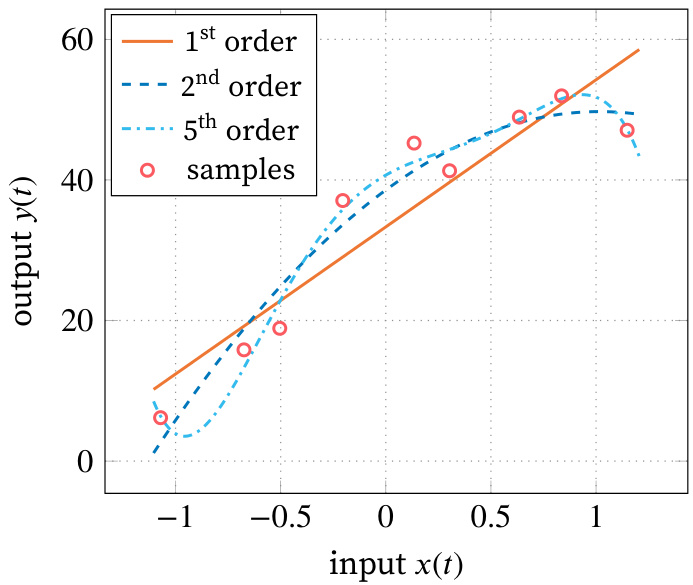  
Figure 2.3 Linear polynomial regression models fit to dataset with unknown underlying model.

Usually, one wants to optimise the coefficients to minimise the mean squared error (MSE) between the predicted output $\hat { y } _ { i }$ and observed output $y _ { i }$ for all samples ( $M$ in total):

$$
\mathcal { L } = \frac { 1 } { M } \sum _ { i = 0 } ^ { M - 1 } \left( y _ { i } - \hat { y } _ { i } \right) ^ { 2 } .
$$

Finding the optimal values for all $w _ { i }$ ’s is not trivial from this formulation. To obtain a more workable form, we have to rewrite this as a matrix multiplication:

$$
\begin{array} { r l } & { \mathbf { w } = \left[ w _ { 0 } \quad w _ { 1 } \quad w _ { 2 } \right] ^ { \intercal } } \\ & { \mathbf { x } _ { i } = \left[ 1 \quad x _ { i } \quad x _ { i } ^ { 2 } \right] ^ { \intercal } } \\ & { \hat { y } _ { i } = \mathbf { x } _ { i } ^ { \intercal } \mathbf { w } . } \end{array}
$$

If we concatenate all samples into a single matrix, we obtain:

$$
\begin{array} { r } { \hat { \mathbf { y } } = \left[ \begin{array} { l } { \hat { y } _ { 0 } } \\ { \hat { y } _ { 1 } } \\ { \vdots } \\ { \hat { y } _ { M - 1 } } \end{array} \right] = \left[ \begin{array} { l } { \mathbf { x } _ { 0 } ^ { \intercal } \mathbf { w } } \\ { \mathbf { x } _ { 1 } ^ { \intercal } \mathbf { w } } \\ { \vdots } \\ { \mathbf { x } _ { M - 1 } ^ { \intercal } \mathbf { w } } \end{array} \right] = \mathbf { X } \mathbf { w } . } \end{array}
$$

Now, we can rewrite the loss function from equation (2.3) to:

$$
\begin{array} { l } { \displaystyle \mathcal { L } = \frac { 1 } { M } \big \| \mathbf { y } - \hat { \mathbf { y } } \big \| _ { 2 } ^ { 2 } } \\ { \displaystyle \quad = \frac { 1 } { M } \big \| \mathbf { y } - \mathbf { X } ^ { \intercal } \mathbf { w } \big \| _ { 2 } ^ { 2 } } \\ { \displaystyle \quad = \frac { 1 } { M } \big ( \mathbf { y } - \mathbf { X } \mathbf { w } \big ) ^ { \intercal } \big ( \mathbf { y } - \mathbf { X } \mathbf { w } \big ) . } \end{array}
$$

We want to minimise the error with respect to , so we have to differentiate equation (2.10) with respect to :

$$
\nabla _ { \mathbf { w } } { \mathcal { L } } = - 2 \mathbf { X } ^ { \intercal } ( \mathbf { y } - \mathbf { X } \mathbf { w } ) .
$$

When we assume that $\mathbf { X }$ has a full rank (and thus, $\mathbf { X } ^ { \mathsf { T } } \mathbf { X }$ is positive definite), then equation (2.11) has a unique solution and we can invert this previous expression and obtain the solution for :

$$
{ \begin{array} { r l } & { \mathbf { 0 } = - 2 \mathbf { X } ^ { \intercal } \left( \mathbf { y } - \mathbf { X } \mathbf { w } \right) } \\ & { \quad = \mathbf { X } ^ { \intercal } \mathbf { y } - \mathbf { X } ^ { \intercal } \mathbf { X } \mathbf { w } } \\ & { \quad \Rightarrow \mathbf { w } = \left( \mathbf { X } ^ { \intercal } \mathbf { X } \right) ^ { - 1 } \mathbf { X } ^ { \intercal } \mathbf { y } . } \end{array} }
$$

Now, we have the optimal values for with respect to $\mathcal { L }$ . However, the choice for a second-order polynomial was a bit arbitrary. We could have chosen a first or fifth-order as well and also have obtained unique solutions for . As one can see in figure 2.3, the more complex the chosen model, the better the model fits our data. However, this does not imply that the obtained model is a good fit for the problem at hand. We need to modify our approach to make the final model behave well on unseen data. More on this in section 2.3. First, we continue our explorations of linear models and their properties.

Equation (2.2) specified a second-order polynomial, but this is not the only form of linear model (Bishop 2006). Generally, a linear model takes the following form:

$$
\hat { y } ( t ) = w _ { 0 } + \sum _ { i = 1 } ^ { N } w _ { i } \phi _ { i } ( \mathbf { x } ( t ) ) .
$$

Again, we observe the bias term $w _ { 0 }$ , and one major addition: $\phi ( \cdot )$ . This is a fixed nonlinear transformation. In the previous example, this was: $\phi _ { 1 } ( x ) = x _ { , }$ , $\phi _ { 2 } ( x ) = x ^ { 2 }$ and $\phi _ { 3 } ( x ) = x ^ { 3 }$ . We also observe that the input is generalised to enable the use of multiple input variables or features.

# 2.3 Generalisation, Bias and Variance

While the model obtained in section 2.2 is optimised, it is generally not usable on new data. The number of parameters vs. the number of samples is quite low. The model thus has the ability to fit the data almost exactly due to the high degree of freedom. Suppose we perform a new set of measurements (depicted in figure 2.4) and measure the model performance in terms of MSE. In this case, the highest order polynomials appear a lot less interesting indeed. The results are summarised in table 2.1.

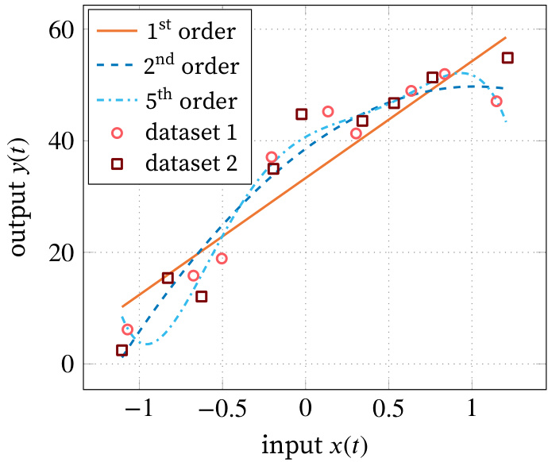  
Figure 2.4 Models from figure 2.3 compared with new sample data (dataset 2).

This poor model performance of the fifth-order model is due to model overfitting. The model is overly optimised to the data that is used during optimisation. These data are often labelled training data because it is used to tune the weights of the model. As a result, using these data to assess the model’s performance on unseen data is not possible. Of course, the model behaves well on these data; we tuned it to work well on it. It is also clear that the fifth-order model will have better performance than the firstorder model because of the increased number of weights. This enables the model to capture more variation present in the data. These variations stem from the underlying processes that generated the data and noise in the data. Generally, these underlying processes are unknown. Usually, there is no way to distinguish between both, but obviously, the model should not be optimised to the noise present in the data.

Table 2.1 Polynomial model comparison between training data (dataset 1) and validation data (dataset 2), containing unseen data that was now used for model optimisation. Lower values indicate better performance for the MSE error metric.   

<html><body><table><tr><td colspan="4">MSE</td></tr><tr><td></td><td>1st order</td><td>2nd order</td><td> 5th order</td></tr><tr><td>dataset 1</td><td>34.57</td><td>11.66</td><td>4.35</td></tr><tr><td>dataset 2</td><td>37.34</td><td>18.3</td><td>34.88</td></tr></table></body></html>

One common technique to improve model performance is to use regularisation. Regularisation includes the model’s weight values (except for $w _ { 0 }$ ) into the error function using a parameter $\lambda$ :

$$
\mathcal { L } = \frac { 1 } { M } \sum _ { i = 0 } ^ { M - 1 } \left( y _ { i } - \hat { y } _ { i } \right) ^ { 2 } + \lambda \sum _ { i = 1 } ^ { N - 1 } w _ { i } ^ { 2 } .
$$

The choice of $\lambda$ determines the range of the weight coefficients in . Effectively, we have now introduced a new parameter in our model. Since $\lambda$ tunes the models’ ability to learn, this is another example of a hyperparameter, similar to the order of the employed polynomial. A hyperparameter is a powerful tool, but also introduces an additional training step: determining the optimal value of all hyperparameters. More on this later on in this section.

Yet, why does this help in improving model performance? This stems from the observation that coefficients tend to take on high values when the noise in the data is also modelled. In our example from figure 2.3, the mean absolute coefficient value is 0.45, 0.12 and 1.81 for the first, second and fifth-order model respectively. The better performing models have smaller absolute weight values.

But how should be determined? This is usually done using a separate dataset. First, one has to determine an appropriate interval for $\lambda$ ; since this is not known beforehand, a logarithmic evaluation is often performed. The exact value of $\lambda$ is subordinate to the magnitude. Second, the model is optimised for each of these choices on the training data. So for each new set of hyperparameters, a new set of weighting coefficients is determined since this optimisation step is performed anew. Third, the validation data is used to assess the model’s performance for this specific choice of . Based on the optimal value for the performance metric, we select the final value of . The model with the best performance on both validation and train data is thus selected.

When applying these steps to our toy problem, we obtain figure 2.5. The model performance is very different for the training and test data. Generally speaking, lowering the value for $\lambda$ improves performance on the training data (figure 2.5a). This corresponds to reducing the penalty of large weights, thus removing restrictions on the model weights. However, this same observation does not hold for the validation dataset (figure 2.5b). The MSE value has a clear minimum value for all models, with decreased performance for very large and very small values of $\lambda$ , especially for the fifth-order model. For small values of $\lambda$ , the model captures part of the noise characteristics, as is evident in the very large MSE values. Increasing $\lambda$ , decreases the error until a minimum value is reached. Higher $\lambda$ values restrict the weight coefficients in learning a useful model. As a result, the MSE value increases. Figure 2.5c visualises the magnitude of the weight coefficients for variable . We can clearly observe the decay of the weight coefficients for large values of $\lambda$ .

Note also that $\mathcal { L }$ and MSE are two different optimisation targets. $\mathcal { L }$ is the loss function. It is a model-dependent function that is used to optimise the model coefficients. Equation (2.16) is an example of such a function. However, it is not used to evaluate the model performance on unseen data. For instance, in the case of the loss function in equation (2.16), model weights also contribute to the loss. This is undesirable for comparisons since it adds a constant bias term that is model-dependent in place of data-dependent. As a result, a different performance metric is used, such as MSE. This metric is used to determine the hyperparameters based on validation data and compare the performance of different models on test data.

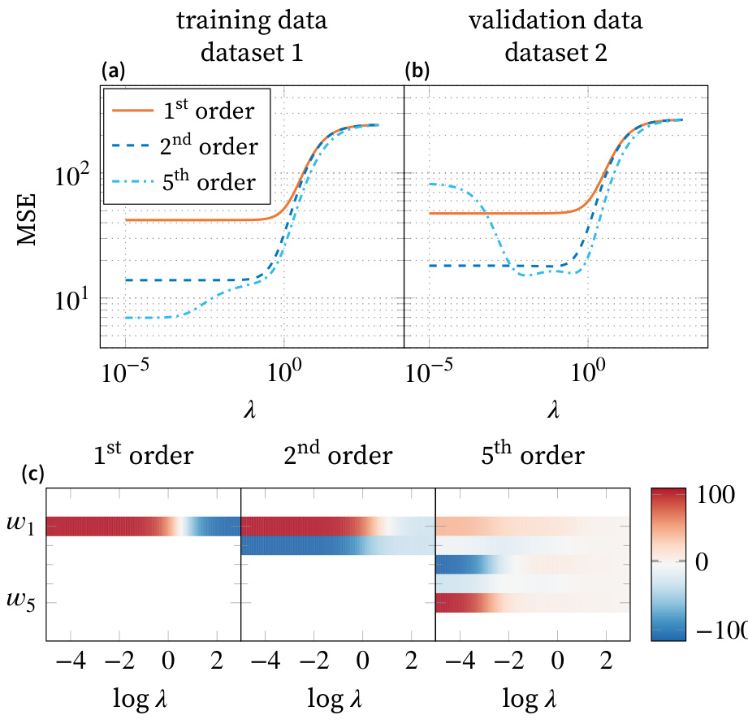  
Figure 2.5 Effect of hyperparameter $\lambda$ on model performance and coefficient distribution. Polynomial model of first, second and fifthorder’s performance for MSE loss function for the training (a) and validation datasets (b) for variable regularisation parameter . (c) depicts the evolution of the coefficient distribution for different $\lambda$ .

Naively, one could use the minimum value obtained using the above procedure as the final model performance. However, since we used the validation data to finalise the hyperparameter choice of the model, this is not an unbiased estimate. We need a third dataset, often called the test data that is not used for training or validation, i.e. that has not been used to optimise the model in any way. The performance on this dataset is the final performance of the model. Ideally, this should be very close to the validation performance. If this is not the case, then the model is still overfitting on the data, and additional measures are needed to improve performance.

The choice of regularisation is dependent upon the task the model has to perform, and the resulting model can have different properties. The regularisation used in equation (2.16) is called Tikhonov regularisation (Tikhonov 1963) and the regression model (i.e. the combination of a linear model with Tikhonov regularisation) is often called ridge regression. A more general form is:

$$
\mathcal { L } = \frac { 1 } { M } \sum _ { i = 0 } ^ { M - 1 } \left( y _ { i } - \hat { y _ { i } } \right) ^ { 2 } + \lambda \sum _ { i = 1 } ^ { N - 1 } \lvert w _ { i } \rvert ^ { q } .
$$

Figure 2.6 is a visual depiction of of three $\boldsymbol { q }$ values and the effect thereof on the structure of the solution $\mathbf { w } ^ { * }$ in two dimensions. To understand figure 2.6, we can interpret equation (2.17) as equation (2.3), subject to the following constraint:

$$
\sum _ { i = 1 } ^ { N - 1 } \lvert w _ { i } \rvert ^ { q } \leq \gamma .
$$

Simply put, we split equation (2.17) in two parts that have to be met simultaneously to minimise $\mathcal { L }$ . The first part of the sum is the same as equation (2.3), which defines circles in the case of two-dimensional input. The second part can be rewritten as equation (2.18), which defines a centred shape as illustrated in figure 2.6. Because both conditions have to be met, the intersection point defines the optimal value for : .

For $q \leq 1$ , the solution will generally be sparse since the derivative is not defined for points on the axes (i.e. the sharp tip). Consequently, the chance of a result on one of the axis will be are much higher. Sparse solutions can be interesting when there are many inputs (and thus also weights), and one wants to find the most important ones. LASSO $( q \ : = \ : 1 )$ is a popular regression model that produces a sparse solution (Tibshirani 1996).

  
Figure 2.6 Contour plots of the weight vector in blue, subject to different regularisation constraints (equation (2.18), $q = 0 . 5 , 1 , 2 ,$ ). The optimal weight vector $\mathbf { w } ^ { * }$ is depicted by a dot.

Figure 2.7 visualises the optimised models corresponding to minimal MSE in figure 2.5. All three models are a lot closer to each other. Performance on three data sets is summarised in table 2.2, where the test data is new data that was not used for training and/or validation. Generally, all three datasets are obtained by splitting the initial data into three subsets. Sometimes more complex systems are used, such as K-fold cross-validation, but they are out of the current scope of this introduction.

Splitting the data cannot be done arbitrarily. Suppose we want to classify leaf images as diseased or healthy. To that end, we have a dataset of 200 images: 100 disease infected leaf images and 100 healthy leaf images. If we were to use a train dataset of 75 healthy and 5 infected images, a validation dataset of 20 healthy images and no infected images, and the remaining images for testing, then the model would perform poorly. Clearly, this is not a good data split. There are no infected images in the validation dataset and many more in the test data than in the training data. As a result, the model is likely to perform poorly on infected leaf images due to the lack of examples during training and a bias towards healthy leaves in the validation data. Thus, when splitting data into multiple subsets, it is important to make sure they are independent and identically distributed. This means that there should be no overlap or correlation between the different subsets, and all subsets should present the data in a similar way (i.e. have the same percentage of healthy vs. infected leaves in this case).

  
Figure 2.7 Optimised polynomial regression models of first, second and fifth-order subject to ridge regularisation.

In reality, it is often even more complicated as it is more likely that there will be more images of the healthy subclass than the diseased subclass. In that case, additional measured are needed that are out of scope of this introduction.

Table 2.2 Performance comparison (MSE) of optimised polynomial regression models from figure 2.7 on three datasets: the training, validation and test data.   

<html><body><table><tr><td colspan="3">MSE</td><td rowspan="2"> 5th order</td></tr><tr><td></td><td>1st order</td><td>2nd order</td></tr><tr><td>train data</td><td>42.003</td><td>14.071</td><td>10.944</td></tr><tr><td>validation data</td><td>47.498</td><td>17.922</td><td>15.168</td></tr><tr><td>test data</td><td>43.032</td><td>10.322</td><td>62.95</td></tr></table></body></html>

Let us now revise our model choice. In section 2.2, we assumed a second-order model. However, this choice is quite arbitrary. Nothing is limiting us from taking a fifth-order model. As can be seen in figure 2.3, this model has a much better fit to the sample data than the second-order model. However, when the noise in our data is slightly different, the model has very different behaviour in some locations, as is observed in figure 2.8, while the first and second-order models are much more alike.

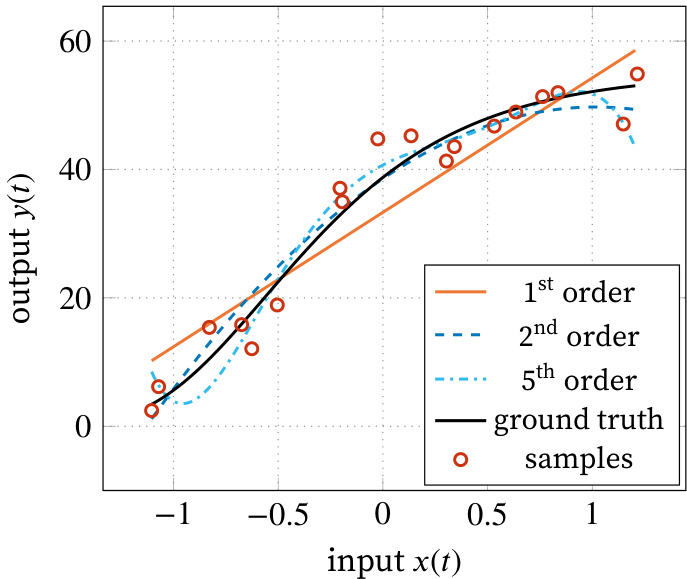  
Figure 2.8 Optimised polynomial regression models of first, second and fifth-order subject to ridge regularisation, trained with a different dataset (but the same underlying world and noise model).

Based on the results in figure 2.8, one can conclude that a simpler model is the best in this case. Deciding which model is best is, however, not always trivial. This illustration is an example of the bias-variance dilemma.

Suggested works with more in-depth and complete overviews of linear and nonlinear models are Bishop (2006) and Hastie et al. (2009).

# 2.4 Multi-layer Perceptron Models

Linear models like in sections 2.2 and 2.3 are powerful for a wide range of problems, but for some problems it is difficult to optimise a model when there is no direct relationship between the input and output. For instance, when we want to classify images, a linear classifier will typically fail; or in case we want to predict the short term electricity demand or predict how the 3D structure of proteins from an amino acid sequence, there is no simple map possible from the input to the output. To solve such problems, researchers often use artificial neural networks (ANNs) (Jumper et al. 2021; Wen et al. 2020; Mohanty et al. 2016). These are (very loosely) biologically-inspired systems.

The human brain is composed of up to 86 billion neurons, and each neuron has approximately 7000 synaptic interconnections (Herculano-Houzel 2009). Neurons process spikes; they receive spikes from other neurons and sensory organs and, depending on their frequency, and intensity can generate spikes themselves. One can view the brain as composed of a very large set of very simple processing units that, when combined, can solve very complex tasks. All these processing units operate in parallel.

Although we are not interested in the exact functioning of the human brain, we can use it as inspiration to design systems that solve tasks our brain solves easily. Such networks are called ANN since they are man-made (Rosenblatt 1961). A simple example of a feed-forward artificial neural network is depicted in figure 2.9 as a graph. Artificial neurons or perceptrons are displayed as nodes, while the directional arcs (arrows) represent the interconnectivity from one perceptron to the next. This network has a layered structure. The main idea behind this is that each layer processes the input at a higher abstraction until we reach the final output layer and desired output. Additionally, if there were only a single layer, the ANN would reduce to a linear model (equation (2.15)).

To make this more concrete, consider the following example: handwritten digit recognition. Each layer is designed to integrate an increasing amount of information. The first layer can find strokes, combine these strokes in the next layer to find corners or circles and finally combine all this data to classify the image as a certain digit.

Not only the interconnectivity is important, but equally important is how a neuron processes the inputs. The output of neuron $i$ , $y _ { i } ,$ is composed of a weighted sum of the inputs that is nonlinearly transformed using an activation function :

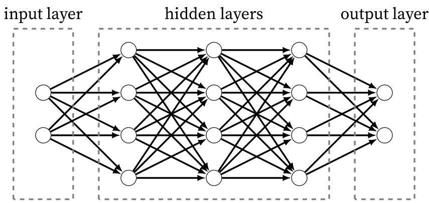  
Figure 2.9 Simple feed-forward ANN with three fully interconnected hidden layers.

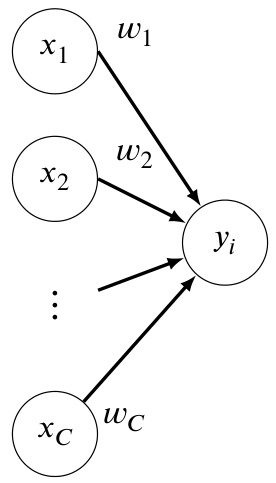  
Figure 2.10 A single perceptron.

$$
y _ { i } = \psi \left( \sum _ { j = 1 } ^ { C } x _ { j } w _ { j } \right) .
$$

This Multi-layer Perceptron Models is visualised in figure 2.10.

Figure 2.11 depicts historically popular activation functions such as the tangent hyperbolic (tanh), logistic function and also the more modern rectified linear unit (ReLU). ReLU-based ANNs (and its many variants) are generally easier to compute and train than their historical counterparts because it avoids a vanishing gradient.

  
Figure 2.11 ANN activation functions.

Feed-forward neural networks are the simplest since the outputs of a layer form the inputs of the next layer until the final layer is reached. A system with one hidden layer is already a general approximator, but modern systems have much more layers since this tends to be more efficient for training. Ideally, we want a system with as few perceptrons as possible since training time increases dramatically when the amount of interconnections increases. This translates in practice to the use of many layers and more specialised architectures where each perceptron is only connected to a part of the perceptrons in the next layer, leading to deep learning (LeCun et al. 2015). Models with over a billion parameters have been developed and trained (Brown et al. 2020).

The previous algorithm from section 2.2 does not scale to very large datasets and models. Matrix inversion is a very complex and time-consuming operation, so one has to resort to alternative training methods.

Finding a global optimum is no longer possible due to the lack of a closed-form solution to the optimisation problem. Thus, instead of trying to find a global optimum, we have to resort to finding local optima. Local optima can be obtained by evaluating the model with slightly different parameters in the neighbourhood of its current state. When the model is not yet locally optimal, there will be a set of parameters, close the current parameters, where the model has better performance. We now only have to evaluate the model in the neighbourhood of its current coefficients. This approach is called gradient descent since we follow the gradient towards regions with lower loss.

  
Figure 2.12 Gradient descent optimisation technique illustrated on the loss-curve from the polynomial regression of the fifth-order model in section 2.3.

This technique can also be applied to linear problems. To illustrate the principle, we consider the cost curve for the from figure 2.5b for the fifth-order model in figure 2.12. Suppose that our initial guess for $\lambda$ is 1.0 (the blue square ). Evaluating $\lambda$ in that region will cause the algorithm to decrease the value of $\lambda$ , indicated by the direction of the arrow, since the error decreases in this direction. It will reach a local optimum at the red dot ( ). This example highlights the power of this approach: we need fewer evaluations to find the optimum, but also its weakness. Only evaluating in the local space around the current point does not yield the global optimum (here ) in general. The initialisation point is very important in this case. Note that while we can apply gradient descent to hyperparameters, this is unconventional. Here, this example served solely to illustrate the working principle of gradient descent. Remember from the previous section that the exact value for $\lambda$ is subordinate to the magnitude. In reality, one would, for instance, perform a logarithmic sweep of $\lambda$ at $1 0 ^ { - 5 }$ , $1 0 ^ { - 4 } , . . . , 1 0 ^ { 5 }$ .

While feed-forward ANNs are powerful, they are generally not capable of processing time-series data. Time series data generally require the system to maintain information about previous inputs. For example, an English word is composed of different sounds. The short sound samples have no real meaning on their own, yet combined, they do. Furthermore, longer dependencies exist also. Words such as it and there can refer to previous information passed in a conversation. One way to capture such dependencies is to use a window of inputs. Instead of presenting a single input sample to the model, multiple samples in the past are also presented. The window size is a hyperparameter that has to be optimised. However, this approach also has its limitations. For instance, relations that are far apart can fall out of the window. The model can thus not perform the correct inference.

As a result, researchers have added feedback connections to the network. This way, the network can retain information about its previous state. These feedback connections have large consequences on the behaviour of the network. A recurrent neural network (RNN) is no longer a mathematical function as is the case for feed-forward ANNs, but a dynamical system. Due to the existence of feedback, the network can self-sustain temporal activation dynamics without active input to the network. Additionally, the network’s internal state becomes a function of previous inputs, resulting in dynamic memory. Consequently, training the network has become a lot more complex because the cost landscape can change drastically over very small perbutations of the model parameters (bifurcations) (Doya 1992). Gradient descent based algorithms are thus not well-suited for RNNs. At the turn of the millennium, a lack of alternative training methods led researchers to explore radically different approaches, giving rise to reservoir computing (Kolen et al. 2001).

However, two decades later, the field of RNN has progressed significantly and the historical context that gave rise to reservoir computing is not longer valid today. Long short-term memory (LSTM) cells, first introduced by Hochreiter et al. (1997), are currently used in state of the art RNN architectures (Yu et al. 2019). These results have moved beyond what is possible with reservoir computing and LSTM is now the de facto standard for RNN architectures. LSTM-based RNNs have been used to tackle problems in reinforcement learning (Stanford 2019), speech recognition (Graves et al. 2013) and sign language translation (Camgoz et al. 2018). Sherstinsky (2020) give an introduction to LSTM fundamentals.

# 2.5 Reservoir Computing

Reservoir computing was introduced as a computational framework that uses an RNN (also called a reservoir) whereby the input and hidden layers of the network are randomly initialised and left as is. Only the output mapping is trained using simple linear regression, often ridge regression. This idea was independently introduced by Jaeger (2001), Maass et al. (2002), and Steil (2004) and radically simplifies training RNNs. While very similar ideas were already introduced in the nineties, they failed to attract significant interest from a wide scientific audience (Schomaker 1992).

Jaeger (2001) approached the issue of systematic training RNNs with a general architecture. He proposed to only train the output layer, leaving the randomly initialised connectivity matrix as is. This effectively reduces the whole training procedure to a oneshot linear regression. The network must satisfy the echo-state property (also called fading memory), meaning that the current state is mostly dependent on previous inputs with decreasing importance as the time difference becomes larger. As a result, inputs in the distant past do not affect the current state of the network. A network that satisfies this property is called an echo state network (ESN).

Maass et al. (2002) were instead investigating a biologically plausible implementation of the brain using spiking neurons. Their liquid state machine (LSM) has a similar structure as an ESN but works in both continuous and discrete-time on spike trains (vs. discrete-time signals only for ESN). Maass et al. (2002) identified two necessary properties that the network should meet in order to function as a universal approximator: the separation and approximation property. The (point-wise) separation property states that different input sequences generate different internal trajectories, while the approximation property requires that the readout function should be able to approximate any function on a closed and bounded domain with arbitrary precision. An illustration of a spike train and spiking neuron is depicted in figure 2.13.

  
Figure 2.13 Illustration of two spike trains and a spiking neuron. The input spike train is processed by the neuron, yielding the output. A network is such neurons is called an LSM.

The third and final approach by Steil (2004) is a learning rule for RNNs: backpropagation-decorrelation (BPDC). While ESNs and LSM use one-shot learning, this is an online learning method. Similar to the other cases, only the output is trained.

While all three methods have a different background, they share the same conceptualisation: leave the reservoir as-is and train only the output mapping. This is illustrated in figure 2.14. One or more inputs is mapped into the reservoir, whose state is used to perform one or more output tasks. Only the red output interconnects (arcs) are trained. The output can optionally be fed back into the reservoir, but this case is not considered since it is not relevant for the work presented here. Because of these large similarities, researchers coined the term reservoir computing, collective noun for these three methods (Verstraeten et al. 2007; Schrauwen et al. 2007; Lukoševičius et al. 2009; Lukoševičius et al. 2012).

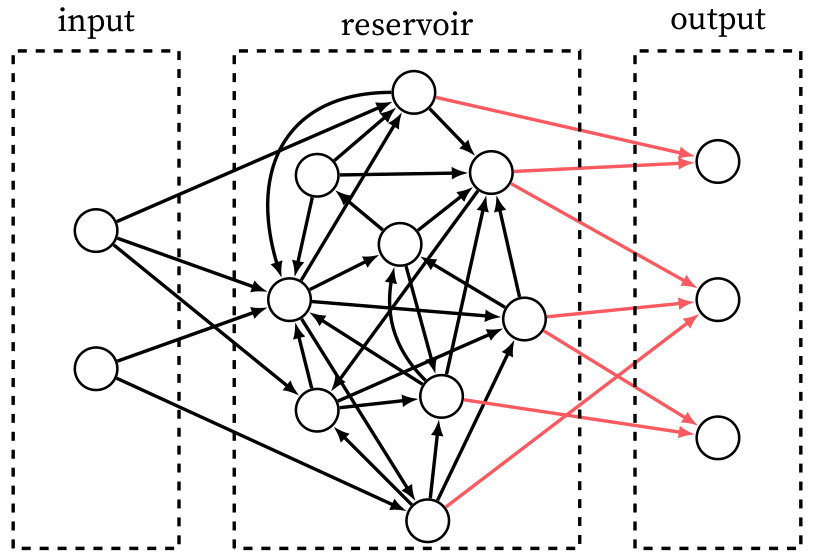  
Figure 2.14 General architecture of a RNN in reservoir computing. Only the weights in red are trained. All other weights remain fixed.

Even earlier publications with similar concepts can be found in literature , among others the sequential associative memory models (Gallant et al. 1988), neural oscillator network models (Schomaker 1992), context reverberation networks (Kirby 1991; Kirby et al. 1990), cortico-striatal models for context-dependent sequence learning (Dominey et al. 1995), and biological neural network models for temporal pattern discrimination (Buonomano et al. 1995; Tanaka et al. 2019).

How can something that is randomly initialised result in good performing networks? The answer comes from statistics, in the form of kernel support vector machines (SVMs). A kernel SVM uses a nonlinear function to transform the input data into a new space, typically a high-dimensional space (feature space) that has attractive properties for the problem under investigation. Linear methods are then applied inside this feature space to solve the problem at hand. Performing this transformation can be very computationally intensive. However, using the kernel trick, SVMs avoid explicit computations inside the feature space. The kernel computes a dot product in the feature space directly on the untransformed data. Many different kernels exist, each specifically designed for a certain data type and problem. The only requirement is that the kernel has to be positive definite (Mercer’s condition). This is very useful since we are often not interested in the actual transformed data, only in the dot product.

Reservoirs operate similarly. They also map the input into a new high-dimensional space where extraction of the target data is straightforward using a linear mapping. The difference lies in the fact that the feature space is computed explicitly instead of using the kernel trick. Additionally, RNNs also incorporate time information, something that is not possible with classic SVMs (Hermans et al. 2011).

Not only are reservoirs easily trained, but they are also well suited for parallel computations. When training a standard RNN using backpropagation, the system is first trained to solve a single task and has to subsequently learn a second task. This sequential training limits generalisation since the system might unlearn the first task partially. Reservoir computing does not suffer from this problem since the reservoir is left as is. One just has to create an additional mapping from the reservoir towards the output, as in figure 2.14. Adding or removing an output task does not alter the performance of the others.

While all three approaches mentioned previously can be used for general computation, ESNs are the easiest to reason on because of their discrete-time nature and continuous variables. As a result, we focus mostly on networks of the ESN type since they resemble hardware-based implementations more closely.

A mathematical description of an input-driven ESN is:

$$
\begin{array} { c } { \mathbf { x } ( n + 1 ) = ( 1 - \alpha ) \mathbf { x } ( n ) + \alpha \mathbf { f } \left( \mathbf { W } ^ { \mathrm { i n } } \mathbf { u } ( n ) + \mathbf { W } \mathbf { x } ( n ) \right) } \\ { \mathbf { y } ( n ) = \mathbf { W } ^ { \mathrm { o u t } } \mathbf { x } ( n ) . } \end{array}
$$

We assumed the input and output target to be appropriately centred (typically zero-centred), such that bias vectors are negligible. $\mathbf { W } ^ { \mathrm { i n } }$ , and $\mathbf { W } ^ { \mathrm { o u t } }$ are the weight vectors of the system. Only $\mathbf { W } ^ { \mathrm { o u t } }$ is trained, for example with one of the techniques discussed in section 2.2. While the other two matrices are left unaltered, that does not mean that they are fully random. Important optimisation parameters (hyperparameters) are the spectral radius and sparsity of , input scaling using $\mathbf { W } ^ { \mathrm { i n } }$ and leaking decay rate $\alpha$ . Often the tangent hyperbolic (tanh) is selected as nonlinearity and applied element-wise. For a more practical and complete introduction to training ESNs, see Lukoševičius (2012).

The reservoirs discussed so far have always been input-driven reservoirs. This means that an input signal is fed into the reservoir. Yet, this need not be always the case. For instance, in robotics, central pattern generators can be used for locomotion (Urbain et al. 2018). They are essential to creating rhythmic signals, which can, in turn, be used to actuate motors in quadruped robots (Marder et al. 2001; Ijspeert 2008). Additionally, the core of a reservoir was so-far assumed to be based on an ESN, but this is not a requirement. Appeltant et al. (2011) showed that a delay-line with a single nonlinear node has similar properties as RNNs.

# 2.6 Physical Reservoir Computing

Reservoir computing inherently relies on the properties of the underlying dynamical system. They can be implemented using a perceptron network with feedback, but this need not be the case. Any dynamical system that satisfies the properties detailed above can be used as a reservoir. Reservoirs are left as-is, and only the readout part is tuned. Consequently, a wide range of physical dynamical systems can also be used for computation. When using a physical medium, one is performing physical reservoir computing (PRC).

Using the PRC framework, it is possible to use a dynamical system for computation (Nakajima 2020). Thus, instead of performing control tasks in software, they are now performed in hardware, using either material or structural properties of the system. Morphological computation is a commonly used alternative name for PRC in compliant robotics. Yet, this is not the same (see the next section).

However, while any system can be used, successful computation inherently relies on repeatability. Similar inputs should lead to similar outputs. Indeed, if this were not the case, the system would behave in unexpected ways with the same input, leading to chaotic behaviour. Simply put, the time window of previous inputs that affect the reservoir dynamics should be limited. This corresponds to the echo state property of ESN. The conceptualisation of reservoir computing using ESNs closely matches the hardware-based descriptions we are interested in, so we will use the conventions and definitions provided by Jaeger (2001) and Jaeger et al. (2004).

In their review, Tanaka et al. (2019) identify four key characteristics that a physical reservoir should have: (i) high dimensionality, (ii) nonlinearity, (iii) fading memory and (iv) separation property. While these are useful for the selection of reservoirs, they offer no means of designing better reservoirs that achieve high computational performance. Moreover, researchers still rely on task-specific benchmarks to compare how much computational power can be attained by individual PRC systems (Dambre et al. 2012; Nakajima et al. 2015). Examples of such tasks include the nonlinear auto-regressive moving average (NARMA) task (Atiya et al. 2000) and Santa-Fe tasks (Gershenfeld et al. 1993). This highlights that there is still plenty to be discovered in the field of PRC. A unifying theoretical framework would help to identify objective performance characteristics.

Nonetheless, the inability to indicate sub-optimality in the reservoir has not withheld a wide range op physical media to be exploited for computation. Examples can be found in integrated analogue circuits (Schürmann et al. 2005), memristive devices (Du et al. 2017), integrated photonic devices (Vandoorne et al. 2014), opto-electronics (Paquot et al. 2012), a water bucket (Fernando et al. 2003), a soft silicone arm (Nakajima et al. 2015), compliant robots (Iida et al. 2005; Liimatainen et al. 2013), tensegrity robots (Caluwaerts et al. 2013; Caluwaerts et al. 2014; Degrave et al. 2013) and living organisms (Hafizovic et al. 2007; Jones et al. 2007).

Recently, a new book on reservoir computing and PRC was published by Nakajima et al. (2021a). While knowledge of this book is not necessary to understand the work presented here, it offers additional insights, theory and context that are out of scope here.

# 2.7 Morphological Computation

Morphological computation is the potential of any physical body to take part in computation and problem solving (Hauser et al. 2011). Instead of working around the dynamics of a physical body in control problems, it should be embraced and leveraged to simplify control. The idea of morphological computation also aligns well with the idea of embodiment. The control (or brain) and body cannot be studied separately since they are both needed to interact with the physical world (Pfeifer et al. 2009). Clearly, this conceptualisation is closely related to PRC.

Plants are prime examples of organisms that perform morphological computations. For instance, they grow to discover new food sources and alleviate stress. Other examples in living organisms are widespread, including slime mould (Mayne et al. 2015) and animals (Müller et al. 2017).

While morphological computation is an interesting conceptualisation, it does not provide a general framework for computation, though field-specific formalisations exist (e.g., Hauser et al. (2011)). However, we can rely on the closely related framework of PRC for a theoretical foundation.

# 2.8 Summary

In this chapter, we introduced essential concepts from machine learning, necessary to understand reservoir computing and PRC. While reservoir computing is inspired by the brain and often uses an RNN as a reservoir, the main learning rule is based on linear regression. Elementary concepts such as regularisation, data splitting and hyperparameters are introduced with clear examples. Based on this foundation, one should be able to comprehend the analysis presented in later chapters.

In later chapters, we will build on these foundations to explore PRC with plants. To conclude, we want to stress that while reservoir computing is a general machine learning techniques that can be applied to time-series data, PRC is not. PRC is about using a physical medium for computation. Consequently, PRC is more about a shift in paradigm: where computation can occur and which type of medium can be used for computation.

3

# 3

# Introduction to Plant Ecophysiology, Phenotyping and Phenomics

Plant ecophysiology studies how physiology responds to environmental conditions. This includes plant mechanisms that sense the environment and that act in response to this sensing, but also how environmental conditions affect the overall growth and development of plants.

In this chapter, we will give a brief overview of a plant’s ecophysiology. Additionally, we also discuss the basics of phenotyping and measurement methods. The focus will be on the leaves since these are the primary interfaces with the (above ground) environment and are the easiest to monitor. Moreover, we will restrict ourselves to photosynthesis and water-related processes since monitoring focuses thereon in later chapters.

# 3.1 Plant Ecophysiology

Plants are sessile organisms. This restriction has forced them to evolve a wide range of unique characteristics that enable them to survive and thrive in challenging environments all over the globe. Environmental influences are categorised as biotic or abiotic. Biotic factors involve other living organisms, including, for example, symbiotic relationships with bacteria and fungi in the soil, pests and diseases, and pollination by insects. Abiotic factors are all the other factors, such as (solar) radiation, soil and air temperature, precipitation, wind direction and speed, water and nutrient availability, and relative humidity.

Due to this sessile nature, plants cannot collect food. Instead, they synthesise their food from atmospheric carbon dioxide $( \mathrm { C O } _ { 2 } )$ and (soil) water. An organism that can synthesise food from the environment is also called an autotroph. Organisms that depend upon other organisms as a food source are called heterotroph.

Put simply, plants collect solar energy and convert it to chemical energy. This process is summarised as $6 \mathrm { C O } _ { 2 } + 6 \mathrm { H } _ { 2 } \mathrm { O } \to \mathrm { C } _ { 6 } \mathrm { H } _ { 1 2 } \mathrm { O } _ { 6 }$ $ { + } ~ 6 0 _ { 2 }$ . Consequently, they provide their own food from two abundant resources in nature. While light is required, not all wavelengths are equally effective for photosynthesis. Light in the range of $4 0 0 - 7 0 0 \mathrm { n m }$ can be used for photosynthesis. This is the photosynthetically active radiation (PAR), expressed in $\mu \mathrm { m o l } \mathrm { m } ^ { - 2 } \mathsf { s } ^ { - 1 }$ (i.e. the number of photons incident per unit of area and time).

While the chemical formula for the synthesis of sugars during photosynthesis seems simple, the processes involved in photosynthesis are far from simple. The process of photosynthesis consists of two main reactions: light-dependent reactions and dark reactions. During the light-dependent reactions, light energy is converted into chemical energy. This chemical energy cannot be stored for a long time. The energy is thus converted into glucose by the dark reactions (Taiz et al. 2010).

Figure 3.1 depicts a typical plant. Water is mostly absorbed in the roots but can also enter via the leaves and other organs (Rundel 1982; Berry et al. 2019). From there, it is transported through specialised organs to sites of transpiration, located predominately on the leaves. Plants have dedicated tissues to facilitate water transport, such as xylem. Though water is used in the process of photosynthesis, most of the water is lost through evaporation in the stomata.

Stomata (figure 3.2) are pores in the epidermis of leaves, stems and other plant organs that regulate the gas exchange of the plant. This regulation is very important, since plants continuously have to strike a balance between $\mathrm { C O } _ { 2 }$ uptake from the air and water loss to avoid desiccation (Meeus et al. 2020). The state of the stomata (open or closed) is quantitatively expressed as stomatal conductance in $\mathrm { m o l } ( \mathrm { H } _ { 2 } \mathrm { O } ) \mathrm { m } ^ { - 2 } \mathrm { s } ^ { - 1 }$ (Gimenez et al. 2005; Li-Cor Inc. 2012). This quantity is also related to the transpiration rate, expressed in $\mathrm { m } \mathrm { \bar { m } o l ( H _ { 2 } \bar { O } ) m ^ { - 2 } } \mathrm { s ^ { - 1 } }$ .

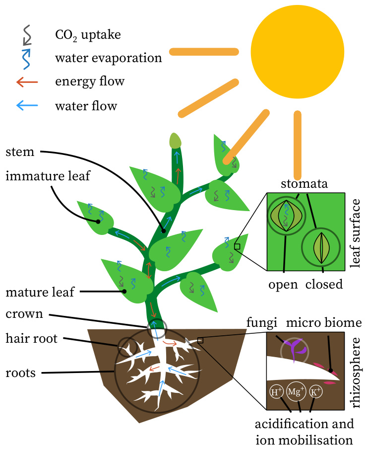  
Figure 3.1 Plant with the main organs, and water and carbon dioxide uptake annotated. Detailed images of stomata and rhizosphere are also included.

The net uptake of carbon dioxide from the atmosphere per leaf area is the photosynthetic rate $\mathsf { \Pi } \mu \mathrm { m o l } ( \mathsf { C O } _ { 2 } ) \mathsf { m } ^ { - 2 } \mathsf { s } ^ { - 1 }$ , which is influenced by water and light availability as well as other environmental inputs like temperature and relative humidity and the plant organ’s age and water availability. During the day, most plants perform photosynthesis and thus, there is a net uptake of $\mathrm { C O } _ { 2 }$ .

  
Figure 3.2 Image of dried leaf surface of Barkeria, depicting open and closed stomata. Only stomata that are fully included in the image are annotated. Image from the dataset by Meeus et al. (2020).

However, during the night, plants burn part of this energy to maintain essential plant processes. As a result, there is a release of $\mathrm { C O } _ { 2 }$ during the night.

Temperature and relative humidity jointly cause the vapour pressure deficit. This is the difference in actual water concentration in the air and the saturated concentration, expressed in kPa (Pa is equivalent to the free energy per unit volume $\mathrm { J } \mathrm { m } ^ { - 3 }$ ). The larger this difference, the larger the transpiration rate becomes since water “escapes” more easily to the environment.

One of the means a plant has to actively regulate the leaf temperature is through transpiration. Yet, there are limits to the amount of transpiration. These arise due to the combined effect of limited water availability in the soil and hydraulic resistance along the water transport pathway. The leaf temperature can thus be significantly different from the surrounding air temperature (Jones 2013). This effect is illustrated in figure 3.3 for a soy trial. Figure 3.3a depicts a field that received normal rainfall, while figure 3.3b was subject to drought. A rainout shelter prevented rain from entering the soil on this field. As a result, soil water availability in (b) was lower than in (a). Lower water availability caused plants to close their stomata to prevent excessive water losses, causing the temperature in the canopy to rise. If this increased high temperature and low soil water availability conditions persist, plants will eventually die.

In figure 3.3a, all soy varieties performed equally well. This is to be expected since plants were not stressed (there is enough water available in the soil). However, in figure 3.3b this was not the case. Plants in the upper halve were more stressed than those in the lower half, as is indicated by the higher temperatures. Lower canopy temperatures are used as a proxy for improved resilience to drought stress.

  
Figure 3.3 Thermal image of two fields of soy in a drought trial. (a) is the control treatment, while (b) is subject to drought. This trial is part of the EUCLEG project (http://www.eucleg.eu/).

All of the above quantities and relationships illustrate that plants have a complex interplay of regulatory mechanisms. As a result, a plant’s state and development are the result of both internal and external factors. Determining and/or quantifying these parameters is called phenotyping.

The term phenotyping was introduced by Wilhelm Johannsen (Johannsen 1903; Johannsen 1911); it is the quantitative or qualitative description of an organisms’ observable characteristics or traits. For instance, one can measure the total plant length of maize. This is a phenotypic trait and the result of the genotype, environmental factors and their interaction (Walter et al. 2015).

Different environmental factors can result in a diverse set of phenotypes, making it sometimes difficult to relate genotypic factors to specific traits $\mathrm { \left( X u 2 0 1 6 \right) }$ . But even if the environmental factors are identical, plants can have very different gene expression (Cortijo et al. 2019).

In literature, phenotyping and phenomics are often used interchangeably, though there is a clear distinction between the two. Phenomics is the study of plant growth, performance and composition (Furbank et al. 2011). It provides a more holistic view than phenotyping and was coined in analogy to genotyping and genomics. Genotyping studies the properties of a limited set of genes, while genomics is interested in the genome as a whole. However, there are also clear differences. While determining the genome is a well-defined problem, the phenome cannot be uniquely characterised since it can change in time and space, even on a cellular basis. Consequently, there is always a focus on a particular aspect of the phenome (Houle et al. 2010). In summary, phenotyping studies detailed properties of the plant, while phenomics is more holistic.

Recently, the term envirotyping was introduced by Xu (2016). It is also related to phenotyping and genotyping in that it highlights the need to accurately monitor environmental changes. A single measurement location for weather data for a field is often inadequate since many parameters differ significantly over small distances. For instance, the soil is known to be very heterogeneous, or local temperature fluctuations due to, e.g., tree shading can cause differences in phenotype that cannot be explained by just monitoring or considering the macroclimate (De Frenne et al. 2019; Bennie et al. 2008).

# 3.2 From Phenotyping to Phenomics

Phenotyping is the quantification of certain plant traits that are the result of the interaction between plant genetics and environmental conditions to which plants are exposed. Consequently, phenotyping is applied in many plant science disciplines. In fundamental plant science, phenotypic observations are used to discover novel mechanistic insights into a plant’s (eco)physiology. This is often referred to as deep phenotyping because it aims to get a deeper insight on mechanisms, and studies are generally performed on a few plants. But also, in more applied research like precision agriculture or breeding research, plant phenotyping plays a central role. Here, it is also often called high-throughput phenotyping because many genotypes are observed.

Due to the effects of climate change, meteorological conditions are expected to become more extreme (Rockström et al. 2009; Steffen et al. 2015). To maintain productivity and feed a growing human population, breeders have to create new crop varieties that maintain or even improve productivity under these new conditions. Moreover, farming has to become more sustainable without affecting productivity (Foley et al. 2011; Xu 2016).

Genetic gain, the increase in performance achieved per unit time through artificial selection, is diminishing for several key crops, including wheat, maise and rice (Fischer et al. 2014; Sadras et al. 2011; Acreche et al. 2008). However, developing new crop varieties is labour and time-intensive. While genotyping has evolved significantly over the past 20 years, leading to high-throughput and inexpensive sequencing, phenotyping has not experienced similar gains. This mismatch between genotyping and phenotyping throughput is often referred to as the phenotyping bottleneck (Costa et al. 2019). Consequently, a large scientific community is focussing on alleviating this issue.

Araus et al. (2018) identified five ways to increase genetic gain through high-throughput phenotyping: (i) increasing the size of the breeding programme, (ii) faster breeding cycles, (iii) more accurate selection, (iv) adequate genetic variation and (v) decision support tools. All of these aspects of the breeding pipeline require reliable high-throughput phenotyping techniques to scale breeding efforts cost-effectively. Breeding efforts thus transition from classic phenotyping to high-throughput phenotyping. Yet, this transition alone is probably insufficient. An increasing body of research is also indicating that a more integrated look upon phenotyping is needed, leading to phenomics. In the future, it is thus expected to see a transition towards high-throughput phenomics (Yang et al. 2020). A large population of plants is thus studied as a whole instead of as a limited set of traits (Furbank et al. 2011; Tardieu et al. 2017). The goal is not to characterise all traits, but instead offer more context on why these traits are observed. We thus imply that there should be less focus on linking specific traits to treatments, but instead approach the effect of a treatment on the observed traits as a whole.

However, determining or quantifying traits is not easy nor always objective. Breeders often rely on manual visual scoring of plants to determine the phenotype. For instance, they often assign a score to each plant’s performance in a drought experiment. This is both time-consuming labour intensive and can introduce bias into observations (Ali et al. 2016). Additionally, destructive sampling is also often performed to obtain dry matter weight, for instance. While this yields very informative results, it poses additional restrictions on the size of studies and influences plant responses because of this intervention. To alleviate this bias and increase the overall throughput, the focus in high-throughput phenotyping is on remote sensing using imaging sensors (Araus et al. 2018).

A wide range of image sensors and image analysis techniques are used to determine traits. Both active and passive sensors are used, including laser imaging, detection, and ranging (LiDAR), synthetic aperture radar (SAR), ground penetrating radar (GPR), and visual/red green blue (RGB), hyperspectral, multispectral and thermal cameras (Araus et al. 2018; Fahlgren et al. 2015; Li et al. 2014). These image-based techniques are wellsuited to analyse large fields with plants in a semi-automated fashion. The resulting datasets offer information at high spatial resolution. Which sensor is most suitable depends on the trait to be measured; for a (non-exhaustive) overview of possibilities, see table 3.1.

In summary, there are currently two trends in phenotyping research relevant here: a shift towards a more holistic view of the plant through phenomics and a shift to larger experimental sizes by means of high-throughput techniques. High-throughput techniques have become mainstream over the last decade. Additionally, the more holistic view characterised by phenomics is also gaining traction in the community. However, a third axis can be identified, which is currently not yet as accepted as the other two: the time scale at which measurements are recorded.

<html><body><table><tr><td>sensor</td><td>target trait</td><td>timescale</td><td>reference</td></tr><tr><td rowspan="7">thermal camera</td><td> leaf temperature Tleaf</td><td>s‚Üímin</td><td>Costa et al. (2013)</td></tr><tr><td>stomatal conductance (<-Tleaf)</td><td>s‚Üímin</td><td>Jones (1999)</td></tr><tr><td></td><td></td><td></td></tr><tr><td></td><td>d->min</td><td>De s etal (20 (2021)</td></tr><tr><td>diseases and pathogens (‚ÜêTleaf)</td><td>h‚Üíd</td><td>Costa et al. (2013)</td></tr><tr><td>heat stress (‚ÜêTleaf)</td><td>min‚Üíh</td><td>Janka et al. (2013)</td></tr><tr><td></td><td></td><td></td></tr><tr><td>depth camera/LiDAR</td><td>3D plant architecture</td><td>h‚Üíd</td><td>Busemeyer et al. (20l3),Friedli etal.(2016)</td></tr><tr><td rowspan="6">RGB camera</td><td>leaf area growth</td><td>h‚Üíd</td><td>Walter et al. (2007)</td></tr><tr><td>plant height</td><td>h‚Üíd</td><td>Borra-Serrano et al. (2019)</td></tr><tr><td>plant biomass</td><td>h‚Üíd</td><td>Golzarian et al. (2011)</td></tr><tr><td>plant size and architecture</td><td>h‚Üíd</td><td>Lootens et al. (2016)</td></tr><tr><td>drought stress (reflectance and biomass) diseases and pathogens (reflectance)</td><td>d h‚Üíd</td><td>Mazis et al. (2020) Chaerle et al. (2007)</td></tr><tr><td></td><td></td><td></td></tr><tr><td rowspan="8">chlorophyll fluorescence imager</td><td>leaf photosynthesis stomatal conductance</td><td>min‚Üíh s‚Üímin</td><td>Baker (2008) Nejad et al. (2005)</td></tr><tr><td>chilling stress</td><td>min‚Üíh</td><td>Devacht et al. (2011)</td></tr><tr><td></td><td></td><td></td></tr><tr><td>drought stress</td><td>d</td><td>Meyer et al.(1999)</td></tr><tr><td>diseases and pathogens</td><td>min‚Üíh</td><td>Berger et al.(2007)</td></tr><tr><td>heat stress</td><td>h h‚Üíd</td><td>Briantais et al. (1996)</td></tr><tr><td>salt stress nutrient deficiency</td><td>d</td><td>Moradi et al. (2007) Ciompi et al. (1996)</td></tr><tr><td></td><td></td><td></td></tr><tr><td rowspan="7">hyperspectral camera</td><td>leaf pigments</td><td>d</td><td>Blackburn (2007)</td></tr><tr><td>canopy density</td><td>d</td><td>Carlson et al.(1997)</td></tr><tr><td>photosynthesis (PRI)</td><td>min‚Üíh</td><td>Inoue et al. (2008)</td></tr><tr><td>water content</td><td>h‚Üíd</td><td>Whetton et al. (2018)</td></tr><tr><td>drought stress</td><td>d h‚Üíd</td><td>Berger et al. (2010)</td></tr><tr><td>diseases and pathogens</td><td></td><td>Bock et al.(20l0)and Van De Vijver et al.(2020)</td></tr><tr><td>nutrient deficiency</td><td>d</td><td>Zhao et al. (2005)</td></tr></table></body></html>

Table 3.1Imaging techniques for high-throughput phenotyping. Depending on sensor type, different target traits can beinvestigated. Moreover, the timescale of the physiological process is also indicated. When measuring on this timescale, wecan observe noticeable variation in that particular trait. It ranges days (d), hours (h) to minutes (min) and seconds (s).

# 3.3 The Temporal-Spatial-Trait Axis

So far, the focus has been on the spatial resolution: the number of plants monitored (high-throughput) and the number of traits monitored (phenomics). The same is true in contemporary research in phenotyping: high temporal resolution is often lacking. It is uncommon to have information at the second to minute or even hour to daily time scale for large fields.

In high-throughput phenotyping and phenomics, image sensors are mounted on drones or mechanical systems that scan the plot one part at a time. Afterwards, images are combined into a single orthophoto. Using drone flights to collect data also introduces a new constraint: suitable weather. In conditions with precipitation and/or high wind speed, it is not possible to collect data. To increase the time-resolution, either the number of sensors has to be increased, or the number of monitored plants has to decrease. Often, the second option is preferred due to the high costs associated with the first method. To tackle the requirement for suitable weather, we can employ non-drone based monitoring platforms such as stationary platforms or phenomobiles (Araus et al. 2018).

Also, in more fundamental research, time aspects are often ignored. Many measurements are recorded at steady-state, yet in reality, the plant is rarely in steady-state conditions due to a highly fluctuating environment (Schurr et al. 2006; Arsova et al. 2020). As a result, plants continuously adapt their physiology in response to these environmental fluctuations. This determines their performance, both in natural ecosystems, as well as in crop systems (Schurr et al. 2006; Arsova et al. 2020). Their dynamic behaviour might even be more important than steady state-conditions (Kaiser et al. 2018; Kromdijk et al. 2016; VialetChabrand et al. 2017; Matthews et al. 2018; Townsend et al. 2018).

Consequently, to capture the effect of genotypic variation in plants, there is a need to measure on three different axes, identified in figure 3.4. The point “perfect balance” is the only point where each axis is equally important, and the experiment does not sacrifice one of the aspects over the other. Three regions are indicated: high-throughput phenotyping, phenomics and deep phenotyping. In each of these regions, there is a clear dominance of one of the measurement axis.

  
Figure 3.4 Overview of measurement axes in phenotyping.

For example, because the response of the photosynthesis biochemistry to fluctuating light conditions is faster than the kinetics of stomatal conductance, these fluctuations also impact the interplay between plant water and carbon relations (Lawson et al. 2012; Lawson et al. 2014). Consequently, a mismatch arises between $\mathrm { C O } _ { 2 }$ assimilation and water loss (McAusland et al. 2016). Reducing this mismatch and improving the capacity of crop photosynthesis to respond to fluctuating light environments is, therefore, a promising avenue for breeding more productive crop varieties (Salter et al. 2019; Murchie et al. 2020).

Given the importance of plant physiological responses to environmental fluctuations, it is essential that new field phenotyping technologies specifically focus on capturing such fast-changing dynamics (Murchie et al. 2018). Yet, it remains difficult to capture plant photosynthetic and water status responses to fluctuating conditions in the field. Gas exchange devices based on infrared gas analysers (IRGAs) allow continuous measurements of transpiration and $\mathsf { C O } _ { 2 }$ assimilation and capture detailed dynamics (Kromdijk et al. 2016). However, this approach does not allow for high-throughput measurements and requires expensive devices. Furthermore, these systems monitor individual leaves and do not provide concurrent data at the plant scale, while recent evidence points out that plants display systemic responses under fluctuating light conditions (Shimadzu et al. 2019).

Chlorophyll fluorescence imaging is a powerful method to monitor the photosynthetic capacity of plants (Baker 2008; Murchie et al. 2013). However, these measurements typically require a dark adaptation period of one hour, which limits the applicability to study short-term dynamics. New developments in chlorophyll fluorescence imaging methods like light-induced fluorescence transient (LIFT) or sun-induced fluorescence (SIF) overcome this dark adaptation period and can be used as proxies. These methods can be applied at different scales and show great promise, though they do not enable the acquisition of absolute photosynthesis biochemistry data and still require extensive calibration (Murchie et al. 2020; Bandopadhyay et al. 2020).

Moreover, chlorophyll fluorescence imaging is unable to monitor stomatal conductance. Because stomatal conductance is closely related to leaf temperature, thermal sensors can be used to monitor it by applying basic energy balance equations (Jones 2004; Maes et al. 2012). These equations require the assessment of the micro-environmental conditions of the leaf and the boundary layer resistance to water vapour (Jones et al. 2002). Although most studies with thermal sensors use single time point observations, continuous monitoring of dynamic stomatal conductance in response to a fluctuating environment is possible and can be combined with chlorophyll fluorescence imaging to link plant water relations and photosynthesis (McAusland et al. 2016).

Generally, many phenotyping methods use imagery to extract traits. Examples include, but are not limited to, detection of biotic and abiotic stress and estimation of nitrogen content and yield.

Mir et al. (2019) provides an overview of current methods. In this respect, broadband RGB cameras are often used in phenotyping experiments because they are inexpensive and can be used to monitor plant growth at the scale of days and weeks or to develop spectral indices referring to the greenness or canopy cover (Borra-Serrano et al. 2020). However, these sensors are not useful for providing information on dynamic responses of photosynthesis over time scales of seconds or minutes. Therefore, increased exploitative work will be needed to capture plant dynamics in a non-invasive cost-effective way. Only in this way can the full extent of phenotypic variation be captured both within a single plant and across plants.

# 3.4 Trait Measurement Technologies

Based on the sensor technology, three kinds of attributes can be attributed to a sensor: (i) contact or non-contact based, (ii) active or passive and (iii) direct or indirect measurement.

Contact sensors are directly mounted on the plant, while noncontact sensors measure through the air or water at some distance. A leaf thickness sensor is a contact sensor, while an RGB camera is a non-contact sensor. The advantage of a non-contact sensor is that is has little to no influence on responses. The disadvantage is that due to the indirect nature of the measurement, environmental noise is more easily picked up. Contact measurements do not suffer from these issues, yet their interaction can cause unwanted side effects.

Active sensors transmit a signal that interacts with the tissue and measure the response or alteration of the reflected or transmitted signal. Passive sensors do not transmit a signal and directly measure the response of the plant to environmental conditions. A distance sensor or fluorescence meter are examples of active sensors, while all cameras are passive devices.

Direct measurements can measure the trait directly. For instance, a leaf temperature sensor connected to the leaf measures the temperature without intermediate. In comparison, many other traits are measured indirectly, such as stomatal conductance by an IRGA. Based on the leaf temperature, water vapour and $\mathrm { C O } _ { 2 }$ concentrations, the stomatal conductance is computed. Each sensor type has its own merits and pitfalls. Thus there is a sensing trade-off that one has to be aware of.

Image sensors are gaining importance due to the increasing focus on high-throughput phenotyping, but this also poses additional challenges, especially in experiments where plant responses are not extreme. Indeed, most image sensors listed in table 3.1 are passive sensors, meaning that they acquire indirect signals from what they observe. These signals arise from the crop under investigation but can also arise from the surroundings. For increasingly subtle responses that have to be captured, this can pose new challenges as one has to ensure that the responses of the crop and its surroundings are separated.

Active imaging systems such as some depth cameras and LiDAR do not suffer from this issue but instead transmit a signal that interacts with the crop. Thus, the effects of the surroundings are often negligible. However, this also creates a new issue: the transmitted signal can affect plant properties. For instance, if modulated light is needed to obtain a measurement, this can affect the physiological response, like e.g., in chlorophyll fluorescence.

# 3.5 Employed Sensor Technologies

In the experiments discussed later, there is a strong focus on dynamic aspects of plants. As a result, there is a need to measure the sensor readout with a sufficiently high temporal resolution and follow multiple traits in parallel. We are mainly focussing on the first and third classes ((non-)contact and (in)direct measurements, respectively). More specifically, we are employing a snapshot hyperspectral camera. Hyperspectral imaging sensors capture reflectance in many wavelengths and are increasingly applied in phenotyping research. This imaging technique has already been applied to various settings that benefit from higher spectral resolutions to detect biotic and abiotic influences on plants (Khan et al. 2018). Examples of studies on biotic factors include blight caused by Alternaria solani in potato (Van De Vijver et al. 2020), late blight caused by Phytophthora infestans in potato (Franceschini et al. 2019), or tracking the development of three foliar diseases in barley (Wahabzada et al. 2016). Mahlein (2015) and Lowe et al. (2017) provide comprehensive overviews of plant disease detection using imaging sensors and hyperspectral sensors specifically. Studies in which hyperspectral imaging was used to investigate plant responses in interaction with abiotic factors include, for example, detection of green citrus fruits on trees (Okamoto et al. 2009), nitrogen deficiency in sorghum (Zhao et al. 2005), seasonal structural changes and a heterogeneous architecture in an olive orchard (Zarco-Tejada et al. 2013), nitrogen and water distribution quantification in wheat (Bruning et al. 2019), and drought stress in barley and saxaul (Behmann et al. 2014; Jin et al. 2016). As a result, it is an interesting sensing technology that can capture a wide range of plant states. Moreover, a sensor was available at ILVO at the start of our work on PRC with plants. Thus, experimentation could start early on. More details on sensor performance and experimental results are documented in chapter 5.

In the third class of direct and indirect sensors, we mainly employ leaf thickness, leaf length and gas exchanges sensors. Leaf thickness is a very interesting variable to measure since it is strongly correlated to the water status of a plant (De Swaef et al. 2015b; McBurney 1992; Afzal et al. 2017). The water status of plants can change rapidly due to internal and external changes (variability of sunlight, temperature and water availability). Measuring leaf thickness is also practical since it is a direct measurement, and clips are inexpensive compared to other methods.

Like thickness sensors, leaf length sensors provide information on dynamics in plant water status but additionally capture the irreversible growth of leaves. Leaf length measurements are also easy to set up, though less so than leaf thickness measurements. Leaf length measurements used in this dissertation are the E100 sensors (Chauvin Arnoux, France) and are constructed around a linear variable displacement transducer (LVDT). As a result, the measurement is more involved since a sine wave has to be applied at the input terminals, and the amplitude and phase shift characterise the displacement of the sensor. Measurements are always relative to the initial distance, which has to be determined using an alternative method.

A final type of contact sensor employed here is a gas exchange sensor (IRGA). The specific device used here is the LI6400XT (LI-COR Biosciences, Lincoln, NE, USA). This device measures various plant-traits related to photosynthesis based on measurements of $\mathrm { C O } _ { 2 }$ and water vapour.

An overview of all sensors used and their characteristics are provided in table 3.2.

Table 3.2 Overview of sensors used in the experiments and their characteristics. The typical sensor size is also included.   

<html><body><table><tr><td>sensor</td><td>contact</td><td>active</td><td>direct</td><td>image</td></tr><tr><td>leaf thickness small,1-2cm</td><td>yes</td><td>no</td><td>yes</td><td></td></tr><tr><td>leaf length large, 30-50 cm</td><td>yes</td><td>no</td><td>yes</td><td></td></tr><tr><td>hyperspectral camera medium,15cm</td><td>no</td><td>no</td><td>yes</td><td></td></tr><tr><td>LI6400XT large, 2 √ó 30 cm</td><td>yes</td><td>yes</td><td>yes</td><td></td></tr></table></body></html>

# 3.6 Summary

In this chapter, we introduced the basic concepts of plant ecophysiology and how important aspects of photosynthesis and transpiration can be monitored. Moreover, we also highlighted a need in research targets from phenotyping to phonemics. With the impacts of climate change, phenotyping will have to become more holistic, leading to phenomics. Important sensor technologies and their merits were also featured in this chapter. Finally, the most important sensor devices of the subsequent studies were introduced.

4

# Reservoir Computing with Plants

The notion of plant intelligence was briefly discussed in chapter 1. While this is not the subject of this dissertation, as outlined in section 1.4, its discussion serves as an interesting general introduction to information processing. To research the computational properties of plants, we propose to use PRC.

In order to study the applicability of the PRC framework to plants, a machine learning foundation was established in chapter 2, and a plant ecophysiology and phenotyping foundation was established in chapter 3. These chapters are essential building blocks to achieve a proper experimental design founded in existing research in both domains.

In this chapter, both domains meet, and we discuss how the PRC framework can be mapped to plants based on literature. Moreover, we also discuss the general setup of experiments and their goal.

# 4.1 Mapping the Physical Reservoir Framework to Plants

We already mentioned that plants are good examples of organisms that perform morphological computations in section 2.7. For instance, due to the sessile nature of plants, they need to rely on their ability to grow their body based on environmental queues to explore new regions in search of food. Other organisms such as slime mold have also adopted intelligent strategies of dealing with these limitations (Mayne et al. 2015). However, there is no general framework to understand or quantify morphological computation. Consequently, we need to look into related fields for inspiration. Cellular automata are good candidates (Adamatzky 1995), but we preferred to work with reservoir computing because it can be leveraged for more generalpurpose problem-solving. As mentioned in chapter 2, reservoir computing is a very general framework in which the dynamics of the reservoir are exploited for computation. Initially, RNNbased reservoirs were used, but in section 2.6 we discussed the transfer to physical systems. Yet, the mapping from the RNN to the physical substrate was not discussed in detail.

Therefore, we will discuss this mapping using three examples in figure 4.1. The baseline RNN-form is depicted in (a). Such reservoirs are fully observable. Generally, this is unfeasible for physical implementations and not necessary in practice for PRC as long as the four main requirements listed in section 2.6 are met. Nonetheless, these requirements restrict the generalising ability of PRC for morphological computing. Indeed, in case of plants and mold, physical bodies change over time, resulting in violations of the PRC requirements. Yet, due to the lack of a better theoretical foundation, one can limit the time frame and/or impose other constraints such that the requirements are approximately met.

The example physical substrates we consider in figure 4.1 are (b) a silicone arm, (c) a tensegrity robot and (d) a plant. We go over each of the cases and discuss how these criteria are met, with special emphasis on the nonlinear and fading memory properties. Each of these systems can be in an infinite number of transient states, so the high-dimensionality requirement is clearly met. Moreover, the separation property is also fulfilled since none of these systems is generally at the boundary of chaos. As such, slightly different inputs will generate similar signals inside the reservoir.

Figure 4.1b depicts a PRC implementation consisting of a silicone arm that is connected to a motor and submerged in a tank of water, as published by Nakajima et al. (2015). The reservoir is formed by the silicone-water interaction. To read out the reservoir state, they used ten bend sensors that characterised the deformation of the arm. Weighting functions were trained to several NARMA benchmark tasks. The fading memory requirement is clearly met because the arm always returns to the same resting position for a zero-input due to friction and gravitational forces. Moreover, several physical attributes such as the viscosity of the liquid and arm length determine the memory of the system. The reservoir is built of silicone, which is a highly nonlinear material (Nakajima et al. 2013). For instance, we can apply a force that causes part of the material to contract. Doubling this force will not result in doubling this contraction. Due to the nonlinear properties, the contraction will be less and diminish as higher forces are applied.

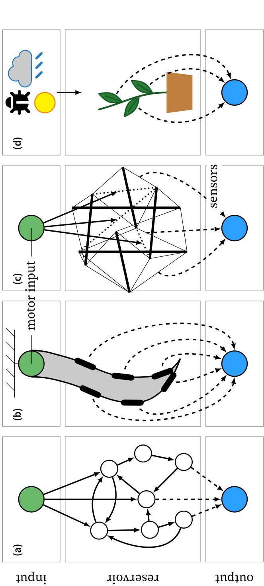  
Figure 4.1Illustration of different reservoir computing implementations, both theoretical and physical versions. Each ofthe subfigures depicts a different type of implementation: (a) RNN-based version; (b) soft body built of silicone (Nakajimaet al. 2015); (c) compliant robot made of a tensegrity structure (Caluwaerts et al. 2013); and (d) plant as reservoir.

Another example is depicted in figure 4.1c, based on the work of Caluwaerts et al. (2013). Here, the reservoir is composed of beams and active and passive springs. Beams are the thick black lines, active springs the dotted lines and passive springs the thin lines. The beams have a fixed length and cannot deform, while the springs can contract and/or extend, either actively or passively. Force sensors in a (sub)set of passive springs measure the state of the reservoir. The nonlinearity in this system arises from the fixed lengths of the beams and spring properties if they have non-zero equilibrium lengths. This last requirement is always met in physical implementations. Memory is also embedded in the structure due to the interconnected nature, and these are also damped due to friction, resulting in fading memory.

In figure 4.1d, we arrive at the most relevant physical reservoir in this work: a plant. It was already mentioned in section 1.1 that emergent intelligence could be attributed to plants. One of the requirements of intelligence is the ability to process sensory data in non-trivial ways. In essence, such ability is the same as the ability to compute. As is evident from the previous examples, PRC maps to a wide range of unconventional substrates. As a result, we hypothesise that PRC is a good candidate framework to study the computational properties of plants.

Plants are highly nonlinear. Increasing the air temperature by $3 ^ { \circ } \mathrm { C }$ from $2 7 ^ { \circ } \mathrm { C }$ to $3 0 ^ { \circ } \mathrm { C }$ can already result in flower drop in tomato, while a temperature decrees of $3 ^ { \circ } \mathrm { C }$ from $2 7 ^ { \circ } \mathrm { C }$ to $2 4 ^ { \circ } \mathrm { C }$ has no adverse effects (Ozores-Hampton et al. 2012). This is a clear example of nonlinear behaviour. Another example of nonlinear behaviour is the oxygen yield of plants in figure 4.2. Initially, the yield increases linearly for low light intensities (green area). However, at higher intensities, it is no longer the case (white area). In conclusion, plants respond nonlinearly to environmental changes. For nearly all environmental factors affecting plants, there are clear plant-specific ranges in which they grow well. However, beyond a certain point, they are subject to stress and can eventually die. Clearly, the fading memory requirement is not met if the plant dies. However, true fading memory is usually not met in a strict sense in physical implementations. Indeed, as the examples above also illustrate, prior conditions can have a lasting effect if they are outside of the allowed interval. Similar behaviour can be found in plants. Nonetheless, partial fading memory can be attributed to plants. For instance, recently, a vaccine was developed for the late blight disease in potato (Najdabbasi et al. 2021). This vaccine offers good initial protection but fades over time.

  
Figure 4.2 Oxygen production is nonlinearly dependent on incident light intensity on plants.

In section 1.1 we already reported on findings that identify memory and learning behaviour in plants. Yet, there is so far no evidence of properties related to fading memory reported in literature. However, it is well established that plants are nonlinear dynamic systems. In modelling plant behaviour, modellers often rely on differential equations to describe relationships within the plant, such as water and nutrient transport in a plant’s vascular system (De Swaef et al. 2022).

Plants are non-stationary systems: their properties in terms of memory and nonlinearity change over time due to their continued development (Hilty et al. 2021). For instance, a leaf can be shed when it is too old or damaged and new plant organs develop. Yet, we suspect that if experiments focus on a sufficiently short timescale, they may be assumed as stationary (reservoirs). While the exact environmental conditions (e.g., $1 1 ^ { \circ } \mathrm { C }$ in place of $1 2 ^ { \circ } \mathrm { C }$ ) have diminishing influence the longer ago they occurred, the range can have a lasting influence. For instance, if soy is not subject to a strong nighttime temperature drop, then the plant height increases much faster than when there is a strong temperature drop (Sionit et al. 1987).

What is missing in the classic description of ESN is a notion of time. In software, the reservoir is stationary. But for physical systems, this is rarely the case. In the first example of PRC by Fernando et al. (2003), the reservoir consisted of a bucket of water. If left untouched, this water will evaporate, making computation impossible. Even before this point, the dynamics would have changed due to a decreasing water level. Clearly, the timescale at which computations are performed and the variability of the reservoir has to be considered. In this case, the changes in the reservoir can be neglected with respect to the timescale at which tasks are performed. Another example of PRC that violates the fading memory requirement can be found in compliant robotics. A series of incorrect actuations of a gait in a quadruped robot can cause the robot to flip. Most quadrupeds cannot recover and are thus stuck. Manual intervention is thus needed to restart the system. Even photonic systems suffer from non-stationary effects due to bias voltage and temperature fluctuations (Reddy Chittamuru et al. 2017). These fluctuations cause physical properties such as wavelength and output power to change in time. Generally, this is an undesired effect.

In summary, the applicability of PRC on plants needs to be investigated, as well as the (non-)stationary nature of plants. In literature, there are already reports of biological media such as (in vivo) brain cells (Dominey 2013; Enel et al. 2016; Obien et al. 2015) and bacteria cultures of Escherichia Coli (Jones et al. 2007) that can be used for PRC. These are also non-stationary, and previous events can also have lasting effects. They illustrate that these issues can be overcome, at least to a certain extent.

Not only the time frame in which the dynamics of the reservoir change is important but also the sampling time (time between measurements). A plant is a living organism that continuously senses the environment and optimises its physiology. Observing this variable physiology is, however, only possible in discrete time. Measurements are performed at a certain rate, and any variation that occurs between measurement time points is not captured. As a result, it is important to sample sufficiently fast. Table 3.1 contains some information on relevant timescales for imaging sensors. Table 4.1 is similar, but for other non-imaging sensors. The continuous nature of plants is thus fundamentally different from the discrete-time steps employed in RNN-based ESN reservoirs.

These tables give an indication of the relevant timescale but are only observed after the data was acquired and the sample frequencies were not optimised with respect to the plant’s dynamics. It is also worth mentioning that the employed sensor accuracy and the accuracy of the acquisition system are also key. Changes associated with higher frequencies are inherently smaller due to the time lag caused by underlying physiological processes.

Considering that plants are not designed for computation, it is unlikely that plants can serve as efficient computational devices. Still, plant reservoir computing may have a substantial impact on the plant science community. It can provide a holistic approach to plant modelling, improve plant sensing and bring new insights into plant physiology. This computational framework offers a general basis that can be used to study plant behaviour, where a plant’s state is the result of its information processing of all incoming environmental and internal signals. Such a view can be applied to plant functioning and development in general instead of focusing on certain plant processes as the result of a specific treatment.

<html><body><table><tr><td rowspan="2"></td><td rowspan="2">UIu uIu</td><td rowspan="2"></td><td rowspan="2">Moj des</td></tr><tr><td></td></tr><tr><td></td><td>uI‚Üês</td><td></td><td></td></tr><tr><td></td><td>uIu‚Üês</td><td></td><td></td></tr><tr><td></td><td>uIu‚Üês</td><td></td><td></td></tr><tr><td>(6107)</td><td></td><td></td><td></td></tr><tr><td>[e</td><td>uIu‚Üês</td><td></td><td></td></tr><tr><td></td><td>uIu‚Üês</td><td></td><td></td></tr><tr><td></td><td>uiu‚Üês</td><td></td><td></td></tr><tr><td></td><td>uIu‚Üês</td><td></td><td></td></tr><tr><td></td><td>uIu‚Üês</td><td></td><td></td></tr><tr><td></td><td>p</td><td></td><td></td></tr><tr><td></td><td>p</td><td></td><td></td></tr><tr><td></td><td>uIu‚Üês</td><td></td><td></td></tr><tr><td></td><td></td><td></td><td>Josuss</td></tr></table></body></html>

Table 4.1Overview non-imaging sensing methods for plant phenotyping. Depending on sensor type, different target traitscan be investigated. Moreover, the timescale is also indicated in which measurements with noticeable variation can berecorded, ranging from days (d), hours (h) to minutes (min) and seconds (s).

# 4.2 Experimental Design

Evaluating the applicability of PRC to plants requires an adequate experimental design to quantify the nonlinear processing and memory properties of plants. The core of the experimental design is depicted in figure 4.3. A single plant is placed in a growth chamber and subject to variable light, temperature and relative humidity conditions. These are abiotic factors, which are preferred in this exploratory work because of the ability to replicate the experiment more easily than biotic factors. Moreover, we selected these three factors because they are easy to control in growth chambers and are the main driving forces for short-term physiological responses.

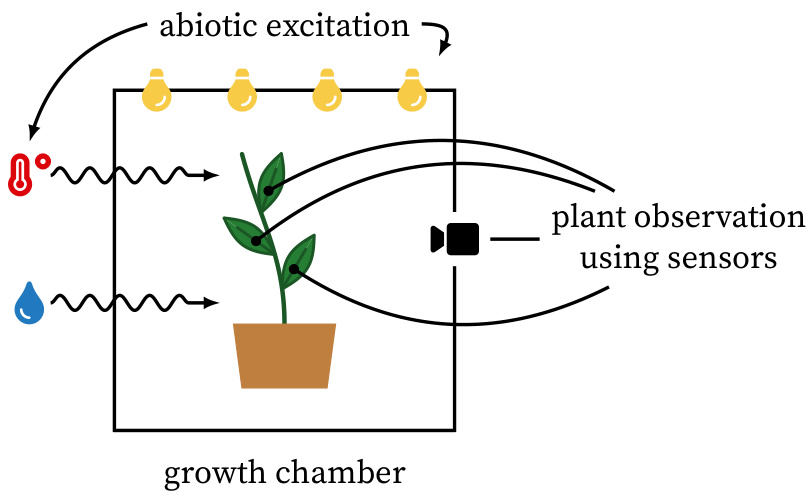  
Figure 4.3 Schematic overview of the experimental setup.

To eliminate disturbances from the observer and environment, we have to automate experiments. This is also necessary to achieve a high temporal resolution.

# 4.2.1 Details on the Experimental Set-up

All experiments are conducted in a growth chamber at ILVO (Melle, Belgium). The chamber has a usable volume of $1 . 4 5 \times 0 . 7 7 \times 1 . 4 5 \mathrm { m }$ (height $\times$ depth $\times$ width) (BIOCLIM 1600 US, Weiss Technik, Reiskirchen, Germany). Light intensity, temperature and relative humidity were controlled by a microcontroller board placed outside the growth chamber. The temperature and relative humidity of the growth chamber were controlled using analogue signals and varied randomly between $1 1 ^ { \circ } \mathrm { C }$ and $3 3 ^ { \circ } \mathrm { C }$ , and $3 1 \%$ and $7 5 \%$ respectively.

Because the built-in lights of the growth chamber cannot create spatial variation, a custom-built frame of $1 . 0 0 \times 0 . 7 0 \times 1 . 1 0 \mathrm { m }$ $( \mathrm { h e i g h t } \times \mathrm { d e p t h } \times \mathrm { w i d t h } )$ ) was inserted into the chamber. Lamps are mounted on this frame and can be turned on and off programmatically.

One key aspect in the experimental design is the ability to distinguish between computation arising due to the dynamics of the environment and those stemming from the plant. If environmental dynamics cannot be eliminated due to the sensor choice, a control experiment should be performed with the same input conditions but without a plant. The performance of both experiments can then be compared to assess the amount of computing power originating from the environment.

The choice of sensor technology employed to monitor the plant’s state is also important. Sensors should have limited to no influence on plant responses. However, as mentioned in section 3.4, different technologies have their own advantages and disadvantages. The exact technologies used are highlighted in section 3.5.

The base sampling period of our experiments is set to 1 s, based on literature. Technical limitations of the gas exchange device limit its sample period to 3 s which is later interpolated to match the sample rate of the other sensors. This base period should be sufficiently fast to detect relevant changes in the observable traits (see also tables 3.1 and 4.1).

# 4.2.2 Plant Species Selection

When performing experiments, strawberry (Fragaria $\mathbf { \nabla } \times$ ananassa) is the main model species. An additional species of interest is tomato (Solanum lycopersicum).

In section 1.3, we discussed several long-term applications of PRC with plants. Most of these are situated in greenhouses since greenhouses offer more opportunities for intervention and optimisation without needing additional infrastructure. Strawberry is selected because it is a commercially interesting crop in Belgian greenhouses (Lieten 2013). Moreover, strawberry is not a seasonal crop. After the fruit and seed production, it does not wilt and die. As a result, a set of plants can be continuously available in the mature growth stage in the greenhouse.

Tomato is also often grown in greenhouses (Hemming et al. 2020). This plant is a seasonal crop, characterised by a sigmoid growth curve (de Koning 1994) (see e.g., equation (2.1)) and offers an interesting alternative species that is more actively growing than strawberry in the experiments.

Experiments were conducted in a growth chamber and plants were grown in the greenhouse at ILVO. Thus, selecting typical greenhouse crops is more relevant since the results will be more representative for future applications. Moreover, shock due to the difference in growing conditions between the greenhouse and growth chamber was limited compared to moving plants from the field to the growth chamber (Poorter et al. 2016). This is an important practical detail since plants should not experience strong stress after the transfer from the initial growing environment to the growth chamber. Otherwise, responses might be altered, affecting the computational properties. Furthermore, plants can even die if the conditions are too different.

# 4.2.3 Reservoir Computing Performance Evaluation Metrics

To evaluate the performance for PRC, we consider a set of benchmark tasks. These tasks fall into three categories: input reconstruction, ecophysiological tasks and benchmarks. These categories and the associated variables are listed in table 4.2. Estimating the modulated environmental inputs of the reservoir $( I _ { \mathrm { P A R } } ,$ , $T _ { \mathrm { a i r } }$ and $h$ ) gives an idea of the information directly available at the output. We estimate the actual environmental conditions that were measured using sensors, not the targets used to set the growth chamber. Since PRC is mainly interesting in a biological context and ecophysiological tasks are highly relevant for future applications and research. Finally, from a more fundamental PRC perspective, benchmark tasks such as NARMA, a delay line and polynomial regression enable us to estimate the computational performance in terms of nonlinearity and memory with literature.

Table 4.2 Overview of considered environmental and ecophysiological variables.   

<html><body><table><tr><td>abbr.</td><td>description</td><td>unit</td><td>sensor</td></tr><tr><td>Pn</td><td>photosynthesis rate</td><td> μmol(CO2) m-² s-1</td><td>LI6400XT</td></tr><tr><td>gs</td><td>stomatal conduc- tance</td><td>mol(HO) m-² s-1</td><td>LI6400XT</td></tr><tr><td>E</td><td>transpiration rate</td><td>mmol(H2O) m-² s-1</td><td>LI6400XT</td></tr><tr><td>Dleaf</td><td>vapour pressure deficit based on leaf temperature</td><td>kPa</td><td>LI6400XT</td></tr><tr><td>Tleaf</td><td>leaf temperature</td><td>℃</td><td>LI6400XT</td></tr><tr><td>Tair</td><td>air temperature (growth chamber)</td><td>℃</td><td>Vaisala 50Y</td></tr><tr><td>h</td><td>relative humidity (growth chamber)</td><td>%</td><td>Vaisala 50Y</td></tr><tr><td>IPAR</td><td>light intensity expressed in PAR (growth chamber)</td><td>μmolm-² s-1</td><td>LI6400XT</td></tr></table></body></html>

All ecophysiological measurements are captured using the gas exchange measurement device (LI6400XT). Different environmental and ecophysiological parameters were captured, providing a diverse set of target variables.

# 4.2.4 Error Metric

There are many error metrics used in literature, such as MSE, mean absolute error (MAE), normalised mean squared error (NMSE) and root normalised mean squared error (RNMSE). MSE and MAE are absolute measures, so different values from targets cannot be compared. NMSE and RNMSE are relative measures. They are normalised in some way such that inter-task comparisons are possible. RNMSE is the root of NMSE Here, we focus exclusively on the NMSE because it is used extensively in PRC. Equation (4.1) defines the equation for NMSE:

$$
\mathrm { N M S E } = \frac { \displaystyle \frac { 1 } { N } \sum _ { t = 0 } ^ { N - 1 } ( y ( t ) - \hat { y } ( t ) ) ^ { 2 } } { \mathrm { v a r } ( y ) } ,
$$

${ \hat { y } } ( t )$ is the predicted value from the model, $y ( t )$ is the actual value, var computes the variance and $N$ is the total number of samples considered. This metric has several advantages over a traditional mean squared error comparison. It takes the variability of the target signal into account. This eliminates a possible bias towards slow varying signals. Additionally, interpretability is very straightforward. An NMSE of 1.0 corresponds to the mean prediction for all samples, since the numerator reduces to the variance, while an NMSE of 0.0 corresponds to a perfect prediction. This property makes it very easy to compare and interpret NMSE values.

# 4.2.5 Machine Learning Model Overview and Data Flow

The different sensors employed in the experimental setup in figure 4.3 and section 4.2.1 all generate data. This data is combined using a machine learning model to target a specific task. These tasks can be divided into three categories: environmental tasks, ecophysiological tasks and benchmark tasks.

In this work, we restrict ourselves to regression tasks, which naturally fit well with biological tasks that can be observed using the sensors from table 4.2 and all tasks are evaluated using the NMSE error metric.

Ecophysiological and benchmark tasks are observed using sensors and are a natural output of the PRC system. However, environmental tasks are not. These are the input to the PRC system. Yet, we also target these variables because they can give an insight into how these inputs are represented in the reservoir.

Figure 4.4 visualises how the data flows through the system for PRC with plants. Plant state observations such as leaf thickness and hyperspectral data are the outputs of the plant reservoir (figure 4.3). These form the inputs of the linear model, which targets three types of regression targets previously discussed. When we return to the simulated reservoir from figure 2.14, we note that the red edges are implemented by the model from figure 4.4.

In summary, the inputs of the reservoir (environmental conditions) are not the same variables as the inputs of the machine learning model. The inputs of the machine learning model are the observations of the reservoir. Thus, we can use the inputs of the reservoir as targets of the model, to gain a better understanding of the data retained by the reservoir. This exemplifies that PRC is not another machine learning tool, but rather a shift in paradigm. Our goal is not to present PRC as a tool to analyse phenotyping data such as an SVM or linear regression. Instead, the goal is the interpret these data in an entirely new way.

# 4.3 Summary

We mapped plants to PRC using evidence from physiological and PRC literature and reviewed the general experimental design of the subsequent chapters. In these chapters, two sensing technologies are used to assess to evaluate the computational properties of plants. In chapter 5, a hyperspectral camera is used, while in chapter 7 leaf thickness clips are used.

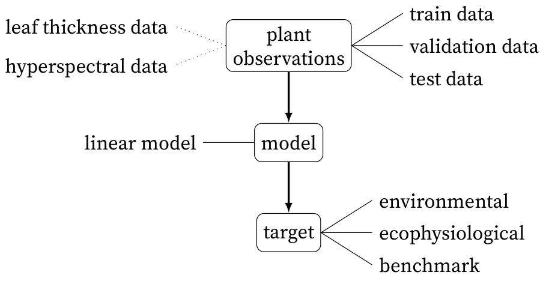  
Figure 4.4 Schematic overview of the data processing for PRC with plants.

5

# 5

# Reservoir Computing with a Snapshot Hyperspectral Camera

Advanced hyperspectral imaging tools are increasingly used in phenotyping and have been applied to detect changes in plants in response to a specific treatment or phenological state (Dale et al. 2013; Mishra et al. 2017; Ad√£o et al. 2017; Khan et al. 2018). As a result, this is an interesting sensing technology to uncover the computational properties of plants. Two consecutive experiments in growth chambers were set up, in which strawberry plants and four different background materials, serving as controls, were monitored by a snapshot hyperspectral camera in variable conditions of light, temperature and relative humidity. Results indicate that current hyperspectral technologies are not yet suitable for reservoir computing processes. We suspect that limited variation due to the treatment and low spectral resolution and range are the main causes of the inability of the models to extract meaningful information. Furthermore, the models that were only trained on background data also showed good predictive performance.

Part of the data, analysis and results are published in Pieters et al. (2020b). This publication discusses a different view of the data and results than what is presented here. The focus is on capturing fast-changing dynamics in plants by means of hyperspectral data.

# 5.1 The Rise of Hyperspectral Imaging in Phenotyping Research

Hyperspectral imaging sensors capture reflectance in many wavelengths and are increasingly applied in phenotyping research. Figure 5.1 elucidates on the properties of hyperspectral cameras. They are generalised versions of RGB cameras, which capture light in three bands. Hyperspectral cameras can capture hundreds of bands in the visual and near-infrared spectrum (Ad√£o et al. 2017).

  
Figure 5.1 Illustration of a snapshot hyperspectral camera.

This imaging technique has already been applied to various settings that benefit from higher spectral resolutions to detect biotic and abiotic influences on plants (Khan et al. 2018). Examples of studies on biotic factors include blight caused by Alternaria solani in potato (Van De Vijver et al. 2020), late blight caused by Phytophthora infestans in potato (Franceschini et al. 2019), or tracking the development of three foliar diseases in barley (Wahabzada et al. 2016). Mahlein (2015) and Lowe et al. (2017) provide comprehensive overviews of plant disease detection using imaging sensors and hyperspectral sensors specifically. Studies in which hyperspectral imaging was used to investigate plant responses in interaction with abiotic factors include, for example, detection of green citrus fruits on trees (Okamoto et al. 2009), nitrogen deficiency in sorghum (Zhao et al. 2005), seasonal structural changes and a heterogeneous architecture in an olive orchard (Zarco-Tejada et al. 2013), nitrogen and water distribution quantification in wheat (Bruning et al. 2019), and drought stress in barley and saxaul (Behmann et al. 2014; Jin et al. 2016).

The successes reported in literature, in addition to the noninvasive and high degree of information availability, makes this sensor an excellent first candidate to investigate the applicability of PRC on plants. Moreover, the resulting dataset can be very interesting since – to the best of our knowledge – there is no research yet on hyperspectral data with respect to photosynthetic activity at high spatial and temporal resolution in the seconds to minutes range in normal conditions.

# 5.2 Experimental Setup

The experimental setup follows the general setup described in section 4.2. Additional information on the exact experimental conditions is detailed below.

# 5.2.1 Measurement Setup

The experimental setup consisted of a single strawberry plant $( F r a g a r i a \times a n a n a s s a )$ placed inside a growth chamber. Light intensity, temperature and relative humidity were controlled by a microcontroller board (Dwenguino, Dwengo vzw, Brussels, Belgium), placed outside the growth chamber. The temperature and relative humidity of the growth chamber were controlled using analogue signals and varied randomly between $1 1 ^ { \circ } \mathrm { C }$ and $3 3 ^ { \circ } \mathrm { C }$ , and $3 1 \%$ and $7 5 \%$ respectively.

A grid of lamps was mounted on the custom frame, consisting of 32 light emitting diode (LED) lamps (MAS LED spot VLE D 4.9-50W GU10 927 60D, Koninklijke Philips N.V., Amsterdam, The Netherlands) and twelve halogen lights (DECOSTAR 51 PRO 50 W 12 V $3 6 ^ { \circ } \mathsf { G U } 5 . 3$ , OSRAM GmbH, Munich, Germany). The halogen lights were used as a broadband light source, providing illumination in the visible and infrared range, while the LED lights increased the total PAR while keeping thermal radiation within limits. Graphical depictions of the emission spectra are provided in appendix A, figure A.1. The light intensity of the halogen lamps was controlled using a digital addressable lighting interface (DALI) controller and bus, while the LED lights were arranged in four sets that could be individually turned on and off. A detailed overview of the grid is depicted in figure 5.2.

  
Figure 5.2 Schematic representation of the light and camera arrangement above the plant and background materials.

A single strawberry leaf was inserted into a transparent leaf chamber of the LI-6400XT photosynthesis system (LI-COR, Lincoln, NE, USA) to acquire gas exchange measurements (transpiration and photosynthesis). The control board also controlled the sampling time steps of the LI-6400XT, using a custom circuit that was connected to the manual sample button on the measurement node. To increase the carbon dioxide concentration in the growth chamber, we used a constant influx of stabilised air. This influx had a carbon dioxide concentration of $5 0 0 \mathrm { p p m }$ at a rate of $\mathrm { { 1 m ^ { 3 } h ^ { - 1 } } }$ . For environment sensing at canopy height, we measured the temperature, light intensity and relative humidity. An external probe (Vaisala 50Y, Vaisala, Helsinki, Finland) was used to measure temperature and humidity. The gas exchange device has a PAR probe to measure light intensity. This device was programmed to recreate the temperature measured using the probe inside the chamber, thus preventing the chamber from heat-up due to the infrared radiation.

In the centre of the lamp grid, a hyperspectral camera consisting of two camera heads (EP-12, 3D-One, Sulz, Austria) was placed to monitor the plant. One head is sensitive to light in the nearinfrared (NIR), while the other is sensitive to the visible range (VIS). We refer to these as H1 and H2, respectively. Both heads capture 12 bit colour information. The sensors were constructed by IMEC (Leuven, Belgium). H1 captures light in 25 spectral bands and has a spatial resolution of $4 0 3 \times 2 1 6$ . H2 captures light in 16 spectral bands and has a spatial resolution of $5 0 4 \times 2 7 0$ . A trade-off was made here between spectral accuracy and sampling rate. We set the sampling period to 3 s, which was too fast for using a high-resolution line-scanning sensor. The snapshot camera used here can capture images up to ${ \boldsymbol { 1 2 0 } } \mathrm { { H z } }$ . One spectral filter was used for each sensor to limit the sensitivity range of the VIS or NIR spectra. The NIR filter was a long pass filter, starting at $6 7 5 \mathrm { n m }$ and cuts-off at $1 6 5 0 \mathrm { n m }$ (TECHSPEC $6 7 5 \mathrm { n m } 2 5 \mathrm { m m }$ Dia, High Performance Longpass Filter, Edmund Optics, Barrington, NJ, USA), while the VIS filter (SCHOTT BG38, Edmund Optics, Barrington, NJ, USA) starts at $3 5 0 \mathrm { n m }$ and cuts-off at $6 4 5 \mathrm { n m }$ . This camera does not support an external trigger source, thus the internal trigger source was configured to sample every 3 s. When the response of the cameras were taken into account, this setup observed wavelengths in the ranges $4 0 0 - 6 4 5 \mathrm { n m }$ , and $6 7 5 - 1 0 0 0 \mathrm { n m }$ for H1 and H2 respectively. An illustration of the entire setup is shown in figure 5.3.

The spectral peak wavelengths for H1 and H2 are depicted in appendix A: tables A.1 and A.2. The spectral resolution of H1 varies between $6 \mathrm { n m }$ and $2 5 \mathrm { n m }$ , while the spectral resolution of H2 varies between $2 \mathrm { n m }$ and $1 4 \mathrm { n m }$ .

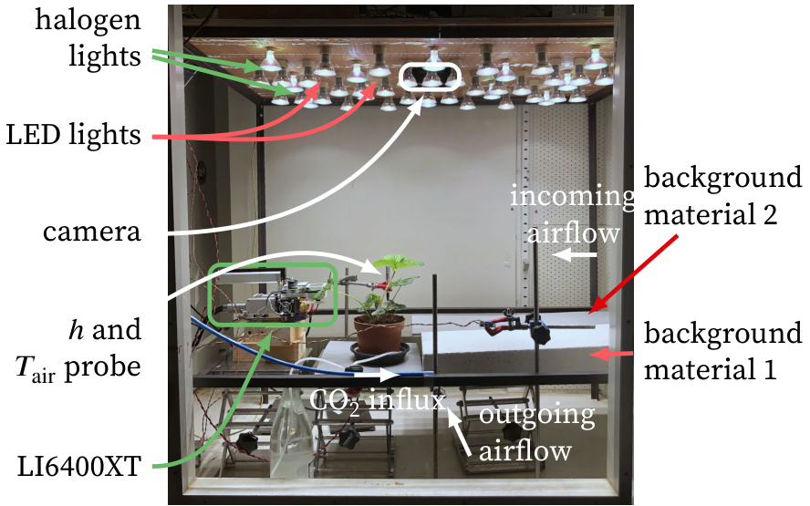  
Figure 5.3 Experimental setup inside the growth chamber. The plant (strawberry) was raised to increase the area of the leaf in the images. The sensors (photodiodes, relative humidity and temperature sensor) were mounted at canopy height. The hyperspectral camera was mounted directly above the plant. Lights were mounted at the same height as the camera. A grey PVC plate was used to provide a uniform background.

A camera always makes an indirect observation, so there might be unwanted interference with the measurements. To investigate this, we also included different background materials in the analysis. Four materials were investigated: plywood (hardwood, Van Den Nest, Aalst, Belgium), non-reflective black cotton cloth (Veritas, Kontich, Belgium), grey polyvinyl chloride (PVC) (Scafoam, Scala, Wetteren, Belgium), and Ytong (Xella, Duisburg, Germany). It was not possible to have similar lighting conditions on all four materials simultaneously. Consequently, the experiment was conducted twice. The first experiment used PVC and plywood, while the second used Ytong and cloth. The second experiment was conducted four days after the first one on a different plant. Both plants were grown in the same greenhouse in close proximity and thus experienced similar conditions before the experiment. Each experiment lasted for $1 0 0 \mathrm { h }$ . Temperature, relative humidity and light radiation were randomly varied, but the same time series was used in both experiments. To generate these random sequences, we drew samples from a uniform distribution.

# 5.2.2 Data Preparation and Processing

The setup consisted of two independent data sources: the gas exchange system and the hyperspectral camera. They were not synchronised due to the lack of a common trigger source. Hence, the start of measurement was not aligned. This difference was manually corrected by turning on all LED lights at the start of the experiment. Furthermore, the camera did not always sample consistently. As a result, the time points of the images did not always align with those of the gas exchange system. Both the gas exchange and hyperspectral camera systems provide a sample timestamp. Synchronisation of both sources was achieved using the time points of both sources and linear interpolation to construct sample points on a single time axis.

Time drift between both was negligible for the time span of the experiment because the sample rate was 3 s and the duration of the experiment was only $\boldsymbol { 1 0 0 } \mathrm { h }$ . The camera had an internet uplink and was synchronised to a network time protocol (NTP) server. Typical synchronisation offset with NTP-servers are lower than $1 0 \mathrm { m s }$ (Marouani et al. 2008). The LI6400XT has an accurate internal clock that has at most 0.5 s drift after 92 days (Li-Cor Inc. 2012). Consequently, it is safe to ignore the drift between the two systems.

Photosynthesis is driven to a large extent by light. To maximise the variation in photosynthetic activity of the plant, we varied the illumination intensity. Because a camera requires light to operate, the light was never fully turned off. The lowest PAR value that was applied was $7 0 \mu \mathrm { m o l } \mathrm { m } ^ { - 2 } \mathrm { s } ^ { - 1 }$ , while the highest was $4 0 9 \mu \mathrm { m o l } \mathrm { m } ^ { - 2 } \mathrm { s } ^ { - 1 }$ . The camera was set to automatic exposure to optimise the dynamic range of each image and reduce over- and underexposed areas. In low illumination conditions, there was a considerable amount of noise. Consequently, after aligning and resampling the data, the data was further processed using a $5 \times 5$ uniform blur filter to reduce noise in the image. Additionally, the data was rescaled and converted to floating-point to compensate for the variable exposure duration.

The leaves of the strawberry plant displayed limited motion from reorientation, as is evident from figure 5.4. Hence, no motion compensation was applied to the image sequence to reduce computational complexity. This also simplified the masking that had to be applied to separate the plant from the background. The mask was manually determined from the dataset. A different set of masks was used for both experiments because the locations of the two plants and four materials differ.

  
Figure 5.4 Averaged image from every 10th image from the start to the end of the experiment of H1 in the second experiment.

Image data are highly correlated, especially for adjacent pixels. Therefore, we constructed two types of datasets. The first dataset averaged over all spatial locations of each mask to obtain a new data entry. This technique drastically reduced the number of features at each sample point from over $1 0 0 0 0 ^ { 1 }$ to 41 $( 2 5 \substack { + 1 6 } )$ . To incorporate spatial effects, we constructed a second dataset using subsampling. The images were spatially sampled in a random fashion without duplicates. When a certain location was considered, all spectral bands were included in the dataset. Subsampling sizes $( \mathrm { H } 1 { + } \mathrm { H } 2 )$ varied between 3 $( 1 + 2 )$ and 200 $( 7 8 + 1 2 2 )$ for both experiments. The split was designed to have an (approximately) equal number of spectral features from H1 and H2. A different set of spatial sample points was selected for each of the plants and each of the materials due the unique mask associated with each substrate.

Subsampling and averaging also helped to deal with the large amount of data that was captured during the trial. Each image from either H1 or H2 had a size of $4 . 3 \mathrm { M B }$ , and there were approximately 130 000 valid data points per trial, resulting in a total dataset size for both trials of slightly more than 2 TB.

In remote sensing and phenotyping, vegetation indices (VIs) are often used to extract meaningful information from image data. A vegetation index is a (fractional) combination of two or more spectral bands that separates plant and background data. Due to differences in light intensity and imaged subject, it is often difficult to use absolute values as thresholds to extract plant-relevant data while relative differences are much more stable. Hence, this technique is often used to analyse data from RGB and NIR cameras (or combined versions). VIs are also developed for hyperspectral imaging systems (Vogelmann et al. 1993; Rouse et al. 1974; Gitelson et al. 1994; Sims et al. 2002; Gamon et al. 1992; Behmann et al. 2014; Jin et al. 2016; Gao et al. 2018; Alonso et al. 2017). These indices are used in linear regression or other machine learning pipelines to calculate an output variable. Due to these observations and wide-spread use in the phenotyping community, we also generated VIs. However, only a limited and non-uniformly spaced number of bands are available here, limiting the possibilities to use VIs from literature. Therefore, we generated a custom set of VIs. Based on literature and taking practical limitations of the number of variables into account, we limited the created VIs to combinations of fractions of band pairs, summarised by equations (5.1) and (5.2). All possible combinations of two spectral bands were generated. Equation (5.1) is the fraction $( F )$ , and equation (5.2) is the normalised fraction $( N F )$ of a pair of bands. The model automatically selected the relevant indices thanks to regularisation (see below). The spectral bands from H1 were numbered 0 through 24, and those of H2 25 to 40. An index was only included if the absolute value of the maximum value of all Pearson correlation coefficients $( \rho )$ with already included indices was lower than 0.95. This boundary ensures that none of the features was (nearly) linearly dependent. Note that the included VIs need not be the same for the different data types since the correlation metric might differ. This technique generates up to 2459 new features:

$$
\begin{array} { l l } { { \nu _ { i j } ^ { F } = \displaystyle \frac { C _ { i } } { C _ { j } } , } } & { { i \in \{ 0 , 1 , \ldots , 4 0 \} , } } \\ { { } } & { { j \in \{ 0 , 1 , \ldots , i - 1 , i + 1 , \ldots , 4 0 \} } } \\ { { \nu _ { i j } ^ { N F } = \displaystyle \frac { C _ { i } - C _ { j } } { C _ { i } + C _ { j } } , } } & { { i \in \{ 0 , 1 , \ldots , 3 9 \} , } } \\ { { } } & { { j \in \{ i + 1 , i + 2 , \ldots , 4 0 \} . } } \end{array}
$$

Normally, VIs are only generated on image data from plants, but we also generated them for the background materials. Limiting the application of VIs to plant data alone would drastically reduce the number of features available for some models. Moreover, the comparison would not be fair since the model based on plant data would have potentially more expressive features than the background model. The data from the different data types is not mixed, so background VIs are based solely on background data. The same holds for plant data. A different set of VIs were selected for each experiment and data type because of the constraint of the upper value of the correlation coefficient.

To assess the variability in performance due to the subsampling in the second dataset, we constructed nine independent subsets of each subsample size. Consequently, partial overlap between datasets was possible.

A linear model combined with Tikhonov (or L2) regularisation (Tikhonov 1963), commonly called ridge regression, was used to fit the camera data to the environmental and ecophysiological data. Such a model is well-suited to demonstrate the correlation between different datasets and should provide improved prediction performance compared to only using indices (Yendrek et al. 2017). It is guaranteed to provide the global optimum for regularised loss with given $\lambda$ and is very fast to fit. This is important since hyperspectral cameras generate vast amounts of data. The whole pipeline was implemented in Python, with the help of the Pandas (McKinney 2010; McKinney 2011) and Scikit-Learn (Pedregosa et al. 2011) and publicly available on GitHub2.

Ridge regression has one hyperparameter that must be optimised. This parameter determines the impact of the total magnitude of the model coefficients. As a result, each time series had to be split into three subsets: training, validation and test data (as described in section 2.3), depicted in figure 5.5. To eliminate possible day-night rhythms, we split the data into batches of 3000 samples $( 2 . 5 \mathrm { h } )$ , while 1500 samples $( 1 . 2 5 \mathrm { h } )$ between batches were discarded to eliminate the correlation between adjacent batches. This decorrelation was verified after the analysis by means of an offset between the target and input data (not shown). After selecting the optimal hyperparameter, a final model was trained on both the train and validation data. This ensures optimal data use.

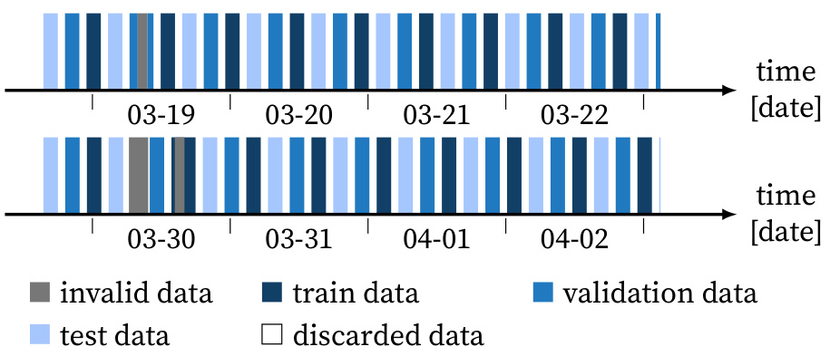  
Figure 5.5 Visualisation of the data split in training, validation, and test data for both experiments.

In summary, three different types of linear models were generated based on six different data types. The three model types refer to the kind of input features presented to the model. In the first case, the model was trained on the averaged spectral bands. In the second case, VIs were added to the input feature set. This input data expansion enabled the model to leverage nonlinear dependencies in the data. In the third and final case, the input features consisted entirely of spectral bands but without averaging over the entire mask. Different materials give rise to distinct data types; plant 1, plant 2, wood, PVC, Ytong, and cotton were the materials considered in this study. The dataflow through the machine learning pipeline is depicted in figure 5.6.

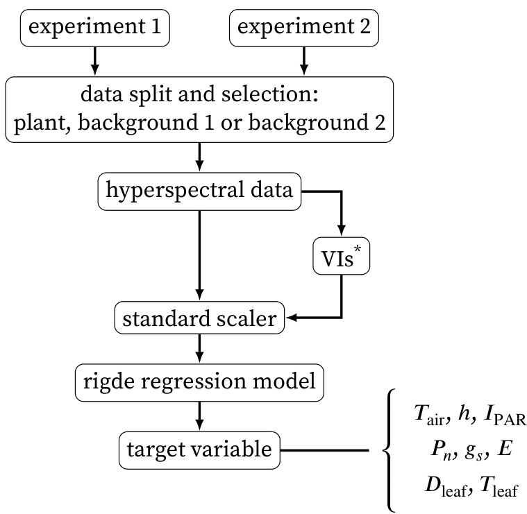  
Figure 5.6 Overview of the dataflow from data collected by the setup to the prediction outcome of the model. \* optional feature: generation of vegetation indices (VIs).

# 5.2.3 Additional Details on the Setup

All variables except for air temperature $( T _ { \mathrm { a i r } } )$ and relative humidity $( h )$ were measured outside the area observed with the camera. This was a requirement due to the high reflectivity of the leaf chamber that resulted in undesired exposure compensation of the camera.

# 5.3 Results

The data were analysed in three parts: first, the environmental conditions were investigated to better understand the ecophysiological responses in the second and third parts. The averaged dataset was extended with VIs and analysed in the second part, and the subsampled dataset was studied in the third and final parts.

# 5.3.1 Analysis of the Environmental Conditions

Normalised density plots of the environmental conditions are depicted in figure 5.7. These indicate that $I _ { \mathrm { P A R } }$ vs. $h$ $( \rho = - 0 . 0 5 )$ ) and $I _ { \mathrm { P A R } } \mathrm { v s . } T _ { \mathrm { a i r } } ( \rho = - 0 . 0 4 )$ did not show bias towards particular values of either parameter. This is, however, not the case for $h$ vs. $T _ { \mathrm { a i r } } \left( \rho = - 0 . 2 7 \right)$ , due to the inability of the growth chamber to settle at the target point before a new one was set. A combination of low $T _ { \mathrm { a i r } }$ and low $h$ was not achieved (see figure 5.7c, lower left corner). High $h$ values are also less prominent than low ones.

Similar observations were made for the second experiment (not depicted) since the random target sequence was the same for both experiments to simplify the comparison between both extracted datasets. As expected, the main environmental conditions in the growth chamber covered a wide range, but extreme values that cause strong stress conditions were avoided.

# 5.3.2 Analysis of the Averaged Dataset

First, we analyse the smaller dataset. This is the dataset that is constructed after averaging over the entire mask, resulting in a single value per spectral band and per mask type. VIs were also generated from the spectral bands. These features were then fitted to target ecophysiological and environmental variables. An overview of the model performance for each data type is depicted in figure 5.8. Models with VIs are shown by means of coloured bars, while models without VIs are depicted using a bar with only a black border ( ). Numeric values are also included in the table A.3.

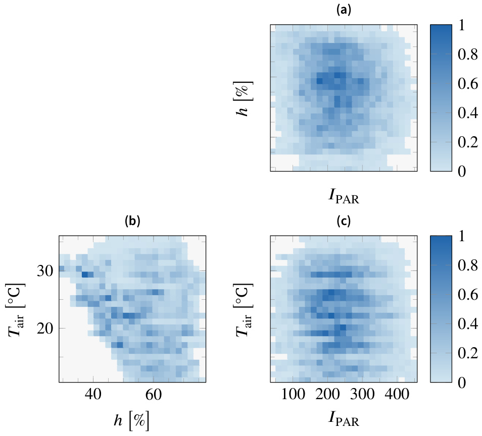  
Figure 5.7 Normalised density plots of the most important environmental conditions: light intensity expressed in PAR $( I _ { \mathrm { P A R } } )$ , air temperature $( T _ { \mathrm { a i r } } )$ and relative humidity $( h )$ in the growth chamber for the first experiment. The second experiment had similar densities.

The performance for photosynthetic rate $( P _ { n } )$ , stomatal conductance $( g _ { s } )$ and transpiration rate $( E )$ is poor, both with and without VIs. Better performance is observed for $T _ { \mathrm { l e a f } }$ and to a lesser extent $D _ { \mathrm { l e a f } }$ . The entire time series of $D _ { \mathrm { l e a f } }$ for plant2 is depicted in figure 5.9 for visual inspection. There are several regions where the data fitted very well, but in other parts, there was a significant offset from the measured variable, especially at the extremes. Though the model usually follows the correct trend. Visualisations of different tasks for the plant2 time series are depicted in figure 5.10. From this figure, it is clear that models with a high NMSE value have very low extraction efficiency. We consider a fit sufficient if the NMSE value is equal to or below 0.25 for both plant models.

  
Figure 5.8 Performance of the linear model for different ecophysiological and environmental parameters. The lower the NMSE, the better. The coloured bars represent models that were trained with raw image data and VIs, while the black bordered bars $( \bar { \mathsf { U } } \bar { \mathsf { U } } )$ are those without VIs.

While NMSE provides an objective comparison, correctly followed trends such as in the case of $P _ { n }$ in figure 5.10 are not reflected in a low NMSE score. This is due to a continued offset between the correctly predicted trends and the measured variable. The prediction of $P _ { n }$ has a better NMSE score because the predicted values approximate an averaged version of the measured variable.

Ecophysiological tasks with high NMSE values also display major differences in modelling performance between batches of test data (not visualised). This further indicates that the model was unable to extract meaningful information from the spectral features and VIs. Either the information was masked by interferers, or the camera was unable to capture changes related to these variables.

For most tasks, there was a limited improvement or even reduced performance by adding VIs. Improved performance is strongest for $D _ { \mathrm { l e a f } } , \ T _ { \mathrm { l e a f } } ,$ and $T _ { \mathrm { a i r } }$ . Reduced performance on the test data can be attributed to overfitting of the model. The performance on the training set has improved, but the models’ ability to generalise has decreased, leading to reduced performance. This is especially visible in the case of $h$ when using Ytong-data. The NMSE value rises from 0.63 to 1.13, above the baseline.

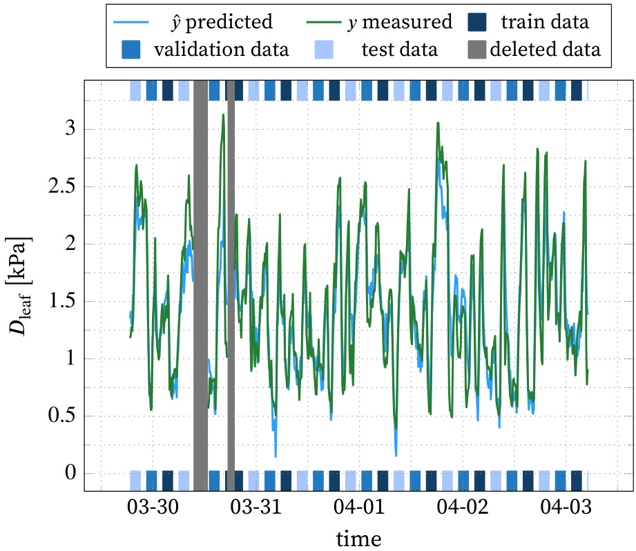  
Figure 5.9 Visualisation of the vapour pressure deficit $( D _ { \mathrm { l e a f } } )$ of plant2 data $y$ and the model prediction $\hat { y }$ . The model was trained from the first dataset with vegetation indexes. The different data split types are also indicated.

For all physiological variables, plant1 and plant2 are expected to have better performance than the background materials. However, this is not the case for plant2. While the differences between plant2 and Yong and cotton (plant and materials from the second experiment) are low, there is a large difference between plant1 and plant2 for both the average modelling performance of $P _ { n } , g _ { s }$ and $E$ .

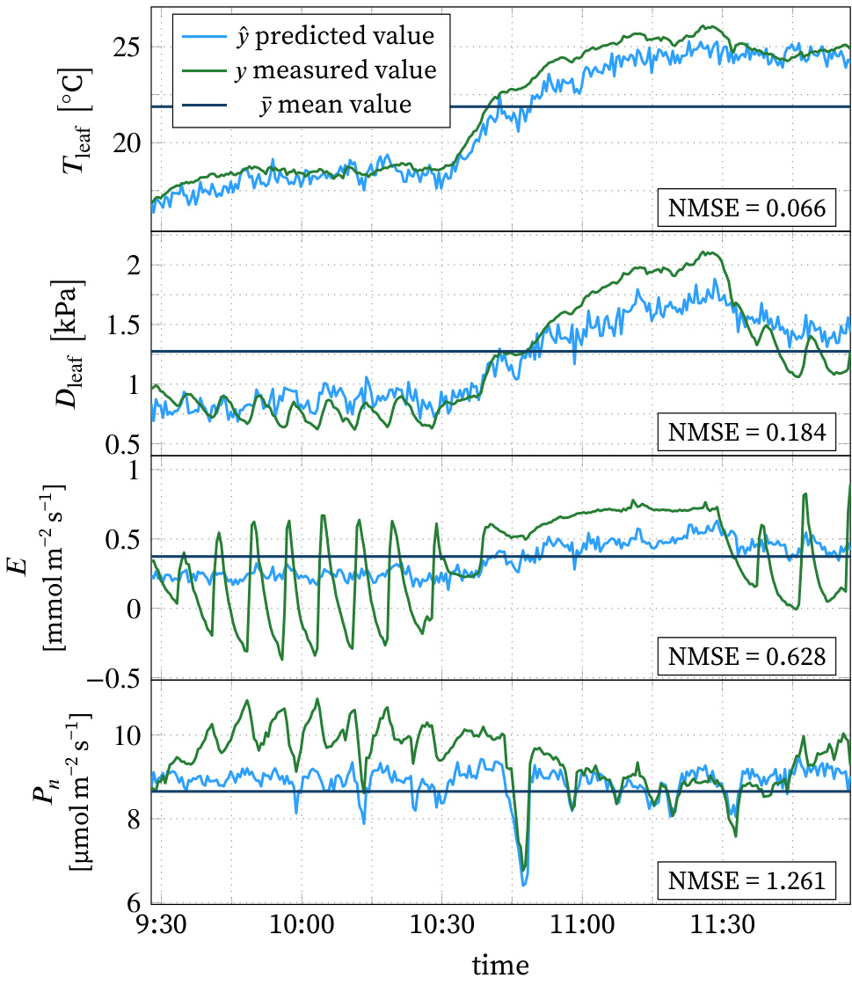  
Figure 5.10 Time plots of the third batch of test data for plant2 for leaf temperature $( T _ { \mathrm { l e a f } } )$ , vapour pressure deficit based on leaf temperature $( D _ { \mathrm { l e a f } } )$ , transpiration rate $( E )$ , and photosynthesis rate $\left( P _ { n } \right)$ . The depicted NMSE was computed using the global normalisation factor to prevent possible bias due to batch choice. We can clearly observe a decay in modelling performance as the NMSE increases. $y$ is the measured data, $\hat { y }$ is the model prediction, and $\bar { y }$ is the mean value.

From the environmental variables, $T _ { \mathrm { a i r } }$ and $I _ { \mathrm { P A R } }$ have the highest extraction precision. $h$ has a similar NMSE score for all data types except for Ytong.

# 5.3.3 Analysis of the Subsampling Dataset

The averaged dataset loses the differences in response due to for instance the age of a leaf. Including such dynamics can possibly yield improved performance. This subsampled dataset investigates this by means of including randomly sampled pixels. The ridge model is able to automatically differentiate between more and less relevant pixels because of the regularisation. The analysis itself was similar to that of the previous section.

Figure 5.11 displays the performance for the same set of tasks as figure 5.8. Error bars are depicted in black. They were computed from the difference in NMSE value arising from the subsampling. The performance of the tasks is similar to that of the previous dataset without VIs. These are not included here because it would drastically increase the number of features, which is undesirable. Table A.4 in appendix A provides the same information as figure 5.11 in numeric form.

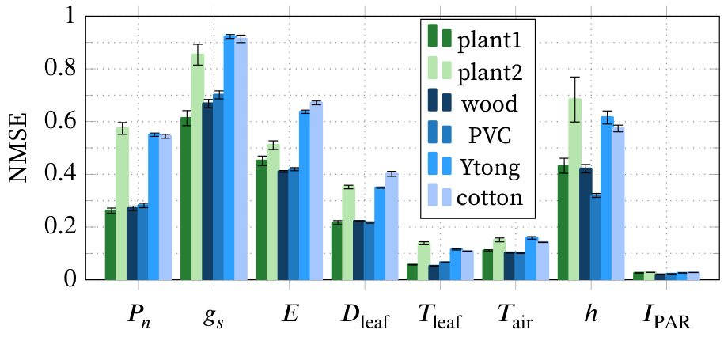  
Figure 5.11 Overview of the performance for all variables for a subsample size of 77 $( 3 0 + 4 7 )$ , resulting in 1502 input features for the model. Error bars represent the standard deviation.

The number of samples is an important metric for this dataset. Figure 5.12 visualises the effect of the number of features on the modelling accuracy for $T _ { \mathrm { a i r } }$ and $E$ . The standard deviation is depicted as a shaded area around the curve in the same colour. As expected, the NMSE decreases with an increasing number of features. The largest subsample size generally offers the best performance, but for underperforming tasks such as $E$ , the variance between different batches tends to increase with an increasing number of samples, especially for plant data. This further illustrates the lack of useful information in the dataset for this particular task.

$T _ { \mathrm { a i r } }$ E 1.2 plant1 plant2 1.2 plant1 plant2 1 wood PVC 1 wood PVC Ytong cotton Ytong cotton GOR 0.6 GER 0.6 0.4 0.4 0.2 哈怕 0.2 0 0 5001,500 2,500 3,500 5001,500 2,500 3,500 size [#features] size [#features]

# 5.4 Discussion

In this chapter, we set up two experiments to demonstrate PRC with plants using a hyperspectral sensor. However, results from figures 5.8 and 5.11 indicate that there is no clear difference in task performance between data used from plants and background materials. In most cases, the NMSE values are very similar, both with and without VIs. This indicates that the plant’s state dynamics are not captured and could not be used for PRC. We also compared these results with other studies that investigated how hyperspectral cameras can be used to estimate ecophysiological parameters.

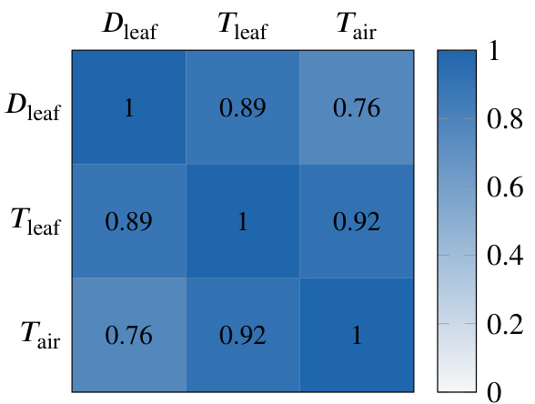  
Table 5.1 Pearson correlation coefficients $( \rho )$ of the two wellperforming physiological tasks, leaf temperature $( T _ { \mathrm { l e a f } } )$ and vapourpressure deficit $( D _ { \mathrm { l e a f } } )$ , and air temperature $( T _ { \mathrm { a i r } } )$ .

The only ecophysiological variables with good performance for both plant time series are $D _ { \mathrm { l e a f } }$ and $T _ { \mathrm { l e a f } }$ . However, the background is also good at predicting these. This can be explained by the high correlation between $T _ { \mathrm { a i r } }$ and the variables $D _ { \mathrm { l e a f } }$ and $T _ { \mathrm { l e a f } } ,$ depicted in table 5.1. $D _ { \mathrm { l e a f } }$ is driven by relative humidity and leaf temperature, which are in turn affected by air temperature, light intensity and water status (Amitrano et al. 2019). The reflection spectrum of plants in the near-infrared region varies when the air temperature changes (Carter et al. 2000). These changes are probably detected by the model, leading to the good performance of temperature-related variables. The backgrounds considered here might have similar reflective properties. Though their structure cannot change as in the case of plants, they can radiate more or less infrared light, enabling the model to extract the temperature (Beltr√°n et al. 1997). The spectrum at two different temperatures is depicted in figure A.2 of appendix A. The spectra of both materials and the plant have clearly changed in the NIR region.

The results for $g _ { s }$ are in line with previous research by ZarcoTejada et al. (2013), who used a similar wavelength range from

$4 0 0 - 9 0 0 \mathrm { n m }$ and were also unable to extract this parameter. However, others have reported successful extraction of $g _ { s }$ . Rapaport et al. (2015) were able to assess $g _ { s }$ in grapevine, using the WABI-3 VI. This index uses a spectral band at $1 4 8 5 \mathrm { n m }$ , which indicates that a wider spectral range is necessary to assess 𝑠.

The possibility to estimate $P _ { n }$ from hyperspectral data in maize has been reported by Yendrek et al. (2017). They were able to predict the $\mathrm { C O } _ { 2 }$ -saturated rate of photosynthesis $( V _ { \mathrm { m a x } } )$ from hyperspectral imaging and a partial least squares (PLS) regression model. They indicated important peak wavelengths at $5 5 4 \mathrm { n m }$ and $7 1 9 \mathrm { n m }$ . Though the VIS and NIR camera have nearby bands at $5 5 2 \mathrm { n m }$ and $7 2 4 \mathrm { n m }$ , there are fewer bands available compared to the study by Yendrek et al. (2017), which acquired the spectral reflection of maize at a resolution of $1 \mathrm { n m }$ .

As mentioned in the introduction, SIF is a promising indicator for photosynthetic activity. It originates from initial reactions in Photosystem II and I, which have narrow peaks around $6 9 0 \mathrm { n m }$ and $7 6 0 \mathrm { n m }$ respectively. Resolving these peaks requires high spectral resolution $( \leq 5 \mathrm { { n m } ) }$ , which is not possible with the technology used in this study (Bandopadhyay et al. 2020). A snapshot camera with improved resolution should be able to compute SIF and thus be able to better assess photosynthetic activity.

Unlike the current study, Marshall et al. (2016) were able to measure $E$ with hyperspectral imagery in cotton, rice and maize. They used a spectral range from $4 2 8 - 2 2 9 5 \mathrm { n m }$ with a resolution between 1 nm and $1 0 \mathrm { n m }$ , which was wavelength dependent. Their most important VI was HNDVI (Gao 1996), which uses a band at $8 4 5 \mathrm { n m }$ and $1 2 5 6 \mathrm { n m }$ .

From these studies, we identified three causes that might explain the poor results for $g _ { s } , P _ { n } ,$ and $E$ . First, the spectral range was insufficient. More specifically, higher wavelengths up to at least $1 5 0 0 \mathrm { n m }$ are needed to assess these properties based on literature. Second, the spectral resolution needs to increase to preferably $1 \mathrm { n m }$ , and the band spacing should be more uniform. Third, other studies which investigated ecophysiological properties applied clear treatments (Zhao et al. 2005; Zarco-Tejada et al. 2013; Behmann et al. 2014; Silva-Perez et al. 2018). These cause more pronounced spectral and ecophysiological changes. Therefore, estimation is more direct and less prone to disturbances that mask ecophysiological changes.

Both $I _ { \mathrm { P A R } }$ and $T _ { \mathrm { a i r } }$ are well assessed for plants and all backgrounds. The good performance of $I _ { \mathrm { P A R } }$ is expected since the camera directly observes light and can reconstruct the spectrum used in the measurement of $I _ { \mathrm { P A R } }$ . As mentioned before, spectral changes due to temperature can explain the good modelling performance of $T _ { \mathrm { a i r } }$ . It was verified that the camera’s responses are not significantly temperature-dependent other than increased white noise at elevated temperatures (data not presented).

The poor NMSE value of $h$ from the data is in stark contrast to the other environmental variables. A possible reason why these have a high NMSE value is that there is no infrared radiation around $2 \mu \mathrm { m }$ captured by the camera nor emitted by the lights. Consequently, none of the strong absorption peaks of water was captured.

# 5.5 Conclusion

We investigated the use of hyperspectral cameras for PRC with plants. Based on the results obtained, we can conclude that hyperspectral cameras are not suited to capture the response dynamics of plants. However, these results are still valuable for the plant science community. The novelty of this study is that ecophysiological parameters were investigated without the presence of strong biotic or abiotic stress factors with high temporal resolution $( 3 \mathsf { s } )$ over the duration of one week. Increasingly, researchers are investigating the dynamic behaviour of plants as these are crucial in determining plant productivity in continuously fluctuating environments such as those in agricultural fields. The analysis indicated that the information content of the hyperspectral data is low for $P _ { n } , g _ { s } $ , and $E$ . A possible explanation is limited variability due to the much lower treatment effect and low-resolution spectral sensing capabilities. The lack of a clear stress-inducing treatment causes less variation of the ecophysiological variables observed. Induced variations were possibly not significant enough to be detectable among other interfering and noise signals that are present in the image data. Additionally, the spectral resolution and range were limited. $D _ { \mathrm { l e a f } }$ and $T _ { \mathrm { l e a f } }$ are good performing ecophysiological task (i.e. have low NMSE scores). Environmental variables also show varying results. As expected, $I _ { \mathrm { P A R } }$ is well assessed, as is $T _ { \mathrm { a i r } }$ . $h$ cannot be extracted due to the lack of wavelengths above $2 \mu \mathrm { m }$ . We suspect that the reflection spectrum changes depending on temperature, which enables the model to accurately predict $T _ { \mathrm { a i r } }$ . $T _ { \mathrm { l e a f } }$ and $D _ { \mathrm { l e a f } }$ are strongly correlated to $T _ { \mathrm { a i r } }$ might explain why these ecophysiological parameters could be assessed. In summary, current snapshot hyperspectral technologies are not yet well suited to monitor the dynamic responses of plants. Major improvements upon sensitivity and spectral resolution are probably required to enable the detection of subtle changes of ecophysiological parameters in stress-free conditions.

6

# Development of a Sensor-Platform for Measuring Dynamic Plant Properties

The camera-based results from chapter 5 were unsuccessful. Consequently, we shifted our focus to alternative sensor technologies. As discussed in chapter 3, different sensor technologies each have their advantages and disadvantages. Cameras observe plant processes indirectly, so there is a greater chance that the camera setup or environment distort the measurement. Moreover, based on results from chapter 5, it is not clear that the reflection spectra of plants vary sufficiently fast for PRC on a short timescale. To avoid these problems, we focused on contact sensors instead of cameras after obtaining the results from chapter 5. Contact sensors do not scale towards large setups as cameras can, but the focus was foremost on demonstrating PRC with plants.

While many commercial sensor platforms are available, none met our needs of a scalable, versatile, accurate, and low-cost datalogging solution. Consequently, we designed a custom solution: Gloxinia. This chapter discusses the system design and its capabilities.

Gloxinia was designed primarily for contact sensors in our experimental design. Yet, we also investigated the needs and requirements for a wider audience. The study of the dynamic responses of plants to short-term environmental changes is becoming increasingly important in basic plant science, phenotyping, breeding, crop management, and modelling. These short-term variations are crucial in plant adaptation to new environments and, consequently, in plant fitness and productivity.

# 6.1 Context and Motivation for the Development of the Sensor Platform

It was already mentioned in section 3.3 that there is a need to monitor plants at a higher time resolution. Here, we go into greater detail and highlight challenges when one wishes to measure at high temporal resolution with commonly used methods. First, we discuss the need to measure dynamic plant responses. Second, there is also a need to better understand a plant’s microclimate since these climatic conditions drive the plant’s responses. Third, we highlight why image-analysis techniques are unlikely to suffice. Fourth, we discuss the need for a sensor system for the dynamic monitoring of plants and existing commercial solutions. Finally, we summarise the conclusions and design goals of the sensor system.

Plants that grow in natural or agricultural environments are exposed to substantial short-term variations in environmental conditions. For instance, the occurrence of clouds or waving leaves can modify the light environment within seconds; relative humidity and temperature can change within minutes due to precipitation. Because the productivity of plants often lies in their ability to swiftly respond to these highly variable conditions, studying these dynamic responses is crucial. However, research on stomatal responses and photosynthetic output often focuses on steady-state behaviour, while these conditions rarely occur in nature (Lawson et al. 2014). As a result, measurement devices are not optimised to measure this transient behaviour, while the need for monitoring the response time of plant behaviour increases in different research fields of plant science. First of all, in basic plant science the understanding of the short-term responses to environmental variation is central (Barillot et al. 2010; Windt et al. 2006; Behrens et al. 1982; Hubeau et al. 2015). Additionally, it is relevant in more applied phenotyping or breeding research, where the more dynamic behaviour of certain genotypes might be key to their success (Lawson et al. 2014; Rascher et al. 2011; Caldeira et al. 2014). Furthermore, in crop management, where for instance, irrigation scheduling can be done using continuous measurements of stem diameter (De Swaef et al. 2015b; De Swaef et al. 2009; Fern√°ndez et al. 2010). Finally, as crop and plant models become more dynamic and mechanistic, the number of parameters such as coefficients for photosynthesis and hydraulic conductance increases. In turn, this amplifies the need for dynamic data to calibrate and validate these parameter-rich models (De Swaef et al. 2019).

Concurrent with the requirement for dynamic plant data, monitoring of a plant’s micro-environment is crucial for interpretation, considering that this is the driver for the plant’s response. Environmental data of a field trial is typically captured at a single measurement location. However, assuming the same environmental conditions for the whole field or greenhouse is not necessarily an accurate representation of reality $\mathrm { ( X u ~ 2 0 1 6 }$ ; Tardieu et al. 2017). Some extreme examples are the differences in microclimate between the top and bottom of a sloped field (Bennie et al. 2008), shading caused by trees next to the field (Artru et al. 2017), but also differences in temperature within greenhouses, or even growth chambers (Cabrera-Bosquet et al. 2016; Granier et al. 2006).

In high-throughput phenotyping, plant traits are extracted through image analysis and sometimes complemented with scoring from breeders. These techniques allow monitoring of a large number of plants both in controlled settings such as growth chambers and greenhouses and in the field (Walter et al. 2015; Li et al. 2014). Depending on the setup, the camera system can be mounted on drones (Araus et al. 2014), tractors (Busemeyer et al. 2013), ground-based robotic systems (Shafiekhani et al. 2017; Andrade-Sanchez et al. 2014) or conveyor belt-based systems (Granier et al. 2006; Hartmann et al. 2011). These allow the extraction of detailed data and specific plant traits, but their temporal resolution is generally low, ranging between several times per day (e.g., a conveyor belt system) and once per week (e.g., drone flights). Consequently, they are not well suited for studying plant responses at a time scale of seconds or minutes.

Other sensor types, such as porometers, cannot be permanently mounted on the plant and thus need manual intervention. Measurement devices for gas exchange (e.g., Li6800, LI-COR Biosciences, USA) can be attached to individual plants to record short-term changes of important features like stomatal conductance, photosynthesis, and transpiration automatically, but cannot be deployed on a larger number of plants due to the cost of these devices. Other contact sensors, such as sap flow sensors or LVDTs, are interesting solutions for short-term continuous monitoring (De Swaef et al. 2015b; Clearwater et al. 1999; Steppe et al. 2015), although they require considerable time to install and might need some maintenance once installed.

Monitoring on the timescale of seconds or minutes, necessary to capture the dynamics of plant traits such as leaf temperature, stomatal conductance, photosynthesis, and transpiration, along with their environmental drivers, is not a trivial task (Inoue et al. 2008; Wallach et al. 2010; Baker 2008; Maes et al. 2012; Jones 1999; Costa et al. 2013). First, interfacing and synchronising sensory readout is difficult when different sensors are combined (Neveu et al. 2019). As a result, it is necessary to rely on autonomous data acquisition systems to read out the sensors and store the data and investigate alternative sensors that do not require manual intervention. Second, commercial data loggers such as CR1000 (Campbell Scientific, USA), DL2e (Delta T Devices, UK), ZL6 (METER Group, USA) or EM50 (ICT International, Australia) are expensive, making it difficult to employ them for hundreds of sensors in large trials. Third, alternative data loggers such as single-board computers or microcontroller boards are cheap but have limited analogue readout capabilities due to low accuracy analogue-to-digital converters (ADCs) (typically in the 10 – 12 bit range) and do not always feature all the necessary hardware to directly interface with various analogue sensors. BeagleBone Black (BeagleBoard.org Foundation, USA) is a singleboard computer with analogue capabilities, and Arduino UNO (Arduino, Italy) is a very popular microcontroller board.

From the foregoing, we summarise that there is a need to monitor the dynamic behaviour of plant traits. To this end, a larger number of sensors needs to be employed that is read out at a higher rate. This has to occur cost-effectively for various purposes, including basic plant science, breeding, agronomy, and environmental monitoring. Moreover, autonomous data logging systems that do not sacrifice accuracy for cost or ease of use are key to tackling this need. We present an implementation of a data logging system that is designed to address four key needs: sensor scalability, accuracy, cost, and versatility with regard to experimental size and sensor interfaces. First, the system should easily scale to hundreds of sensors without needing a large number of hardware boards. Second, the system should provide accurate sensor readings with limited influence on noise sources. Third, the system should be low-cost. Fourth, the system should be sufficiently versatile; it should work well in trials that monitor a handful of plants to hundreds of plants. Additionally, the most common sensor interfaces should be available to connect various sensors such as light, relative humidity, temperature, and soil moisture sensors. Finally, the system should also consist of opensource hard- and software, enabling others to build upon this platform and tailor it to their specific application.

# 6.2 System Architecture

To meet the key requirements introduced earlier, we selected a distributed sensing architecture. In this type of architecture, sensing is scattered across different devices, removing the need for a single measurement device that reads all deployed sensors. Nearby analogue or digital sensors are connected to the same measurement device, called a node, while others are connected to other nodes. As a result, nodes only have to read out sensors in close proximity, alleviating the need for expensive low-noise cables. Nodes are interconnected on a linear bus to facilitate the readout of data. This bus is used to send measurement and configuration data. Consequently, only a single node on the bus needs to be connected to a storage device such as a computer or Raspberry Pi. The overall architecture is depicted in figure 6.1.

In challenging conditions such as those present in the field, a robust and high-speed bus has to be selected for the communication between nodes. controller area network (CAN) bus meets these requirements. It operates at a maximum rate of 1 Mbps while being very robust. It is commonly used in vehicles for communication between microcontrollers without the need for a master controller, thanks to a fixed arbitration scheme (Robert Bosch GmbH 1991). Nodes can easily be added; the only requirement is that the first and last nodes use a $1 2 0 \Omega$ resistor to terminate the bus. The bus speed can also be lowered to accommodate longer bus lengths up to $5 0 0 0 \mathrm { m }$ at 10 kbps (Corrigan 2008).

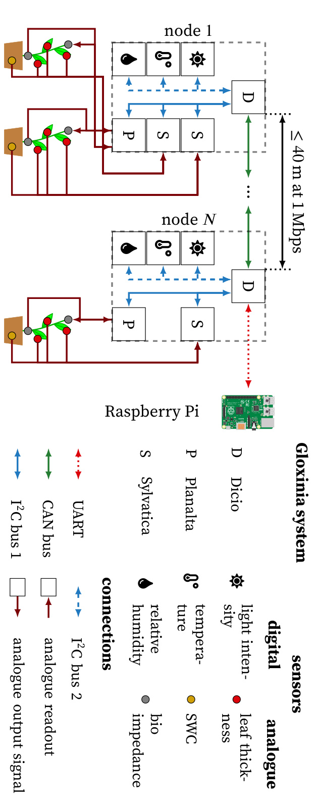  
Figure 6.1System architecture of a typical experiment where multiple plants are monitored using the same set of sensors.Analogue sensors are connected to Planalta and Sylvatica, depending on the type of sensor. For instance, a Linear VariableDisplacement Transducer needs a variable input signal, so this type of sensor has to be connected to Planalta becausethis board can generate analogue signals. Sensors that only require an analogue readout are connected to Sylvatica.Environmental conditions are also measured with digital sensors at node 1 and node 𝑁. The data is transmitted and storedon a single board computer (Raspberry Pi) for further analysis. This figure is best viewed in colour. Raspberry Pi illustrationby Lucas Bosch, based on work by Jonathan Rutheiser [CC BY-SA].

A universal synchronous receiver-transmitter (UART)- connection is used to interface between the data storage device and the node connected to it. This computer also provides an interface to configure the nodes.

Each sensor node is comprised of a control board (named Dicio) and one or more sensor boards. These sensor boards vary depending upon the application. Communication between the control and sensor boards is done using the Inter-Integrated Circuit (inter-integrated circuit $( \mathrm { I } ^ { 2 } \mathrm { C } ) )$ protocol. The control node controls this bus and reads each of the sensor boards at predefined time steps (NXP Semiconductors 2014). Optionally, a phaselocked signal can be used to achieve cycle synchronisation between sensor boards on a single control node. By default, The $\mathrm { I } ^ { 2 } \mathrm { C }$ protocol operates at $4 0 0 \mathrm { k H z }$ , but can also be lowered to $1 0 0 \mathrm { k H z }$ for sensors that do not support fast $\mathrm { I } ^ { 2 } \mathrm { C }$ operation.

Two $\mathrm { I } ^ { 2 } \mathrm { C }$ buses are available, one for the readout of the custom sensor boards through a dedicated interface connector and one for other sensors. Sensors such as digital relative humidity and temperature sensors are connected using screw terminals.

The dual bus system accommodates varying needs. First, the CAN bus interconnects different sensor nodes, thus simplifying the readout system and data storage interconnect. Only a single node needs to be connected to the computer. Furthermore, the CAN bus is robust in noisy environments and well-suited for communication over longer distances (modifiable in the software). The maximum distance is linked to the signalling rate and can be increased at the expense of lower throughput. The system uses a single cable to deliver both signal, power, and synchronisation signals. A synchronisation signal can be used to synchronise sampling between different nodes. Second, the $\mathrm { I } ^ { 2 } \mathrm { C }$ protocol was selected since it is widely used for digital sensors and allows the sensors to be read directly from an Arduino or Raspberry Pi, thus facilitating faster prototyping and stand-alone usage of the sensor boards. Furthermore, most microcontrollers provide a hardware $\mathrm { I } ^ { 2 } \mathrm { C }$ -interface, which reduces cost and complexity. Since the interconnect distance between the sensor boards and the control board is small, there will be less noise and interference. Consequently, the requirements of this bus are a lot more tolerant.

Two boards that cover a wide range of analogue sensors have been designed: Planalta and Sylvatica; section 6.3 provides more details on the available functionality. These sensor boards cover the most common analogue interfaces found in plant monitoring. Digital sensors should interface directly with the Dicio board. Dicio supports common digital interfaces, including $\mathrm { I } ^ { 2 } \mathrm { C }$ , serial peripheral interface (SPI) and RS-232.

Several Planalta or Sylvatica boards can be connected to the same Dicio control node to increase the number of sensors that can be read while keeping the amount of redundant hardware to a minimum. The two sensor boards, Planalta and Sylvatica, each serve a different purpose. The board named Planalta is designed for sensors that require a variable input voltage such as soil capacitance, LVDT, and impedance sensors. The measurement principle of this board relies on a digital lock-in amplifier (LIA) (see also section 6.3.2). The other sensor, named Sylvatica, is designed for sensors that do not require an input signal, like most analogue temperature and relative humidity sensors, for example.

Both sensor boards have generic analogue interfaces and can easily be used with a wide range of sensors that require low input voltages and currents. Sensors should have an operating voltage between $_ { 0 - 1 2 \mathrm { V } }$ in the case of Sylvatica and $0 - 3 . 3 \mathrm { V }$ for Planalta. High-power sensors, such as some types of sap-flow sensors, require an external power supply. An attenuator is required for both boards if the readout value can be higher than $3 . 3 \mathrm { V }$ . Only single-ended signals are supported to keep the hardware lowcost. The Planalta board features an option to use a mid-rail

referenced signal.

# 6.3 Measurement System Design

Some of the identified design criteria are conflicting, such as low unit cost and accuracy and versatility. Consequently, a tradeoff was made. The main cost in this system is comprised of the necessary components. As a result, the measurement system has been designed to minimise the number of analogue components, thus lowering the overall cost at the expense of more digital processing. Since the software development cost is a onetime investment, most of the signal processing and filtering is done digitally to reduce the hardware cost per unit. Furthermore, the software is easily modifiable due to its simple and generic design. This is ideal for application-specific optimisations. We selected the dsPIC33EP512MC806 (Microchip Technology Inc., USA) as the microcontroller. This is a high-performant 16 bit device that features special signal processing instructions, direct memory access, and a CAN-interface.

The component cost is lowest if the internal ADC of the microcontroller is used. However, this is undesirable since the effective number of bits is only 11.3 bit. The objective is to design a highaccuracy system. Consequently, an external ADC is required with a generic filtering stage in front for maximum flexibility. The ADC-choice determines the analogue front-end since certain specifications have to be met to achieve maximum performance. Moreover, integrating all sensing functionality on a single board was deemed too complex and would increase the cost per board, while some of the hardware would remain unused. Therefore, two sensor boards are designed; Planalta and Sylvatica.

The Planalta board is optimised for sensors that measure modulated signals. A lock-in amplifier is well-suited for this purpose. A digital lock-in amplifier modulates a voltage (or current) based on a reference clock at a specific frequency. This signal is then deformed by the sensor-response, resulting in a new signal that has a different phase and amplitude than the original signal. An ADC whose sample points are synchronised to the same reference clock then digitises the analogue signal. The amplitude and phase can then be determined with high precision based on the reference signal. Digital LIAs have significant advantages over their analogue counterparts, including better noise performance, phase stability and orthogonality due to the lack of temperature and frequency-dependent drift (Dixon et al. 1989). Sensors that can take advantage of this measurement principle include LVDT, impedance, and laser-based sensors.

Sylvatica is a board designed for single-end measurements. Sylvatica does not feature an analogue sine wave generator, nor a connection from the input voltage of the sensor to the ADC. Instead, it supports double the number of sensors compared to Planalta (eight sensors vs. four sensors) because more ADC channels are available for sensor outputs.

In what follows, the analogue front-end is discussed first, followed by the digital signal processing of the sampled signals.

# 6.3.1 Analogue Front-end Design

The front-end design focuses on simplicity and flexibility by using a generic design that is optimised digitally for the application’s needs. The driver uses well-chosen components to limit both the nonlinearity and noise of the circuit before digitisation.

A general overview of the analogue front-end is depicted in figure 6.2. Dashed components are specific to the Planalta board. The left part of the Planalta-only circuit generates a sine wave from a pulse-width modulation (PWM) signal. By varying the duty cycle at a high frequency, a sine wave is formed after low-pass filtering. This signal is then buffered before it passes through the sensor. Buffering ensures that there is no voltage drop due to variations of the load impedance. The buffer can provide up to $\pm 5 \mathrm { m A }$ of current to the sensor. For high-power sensors, an external amplifier has to be used. On the Planalta board, the output voltage signal is also provided as an input to an ADC channel after low-pass filtering.

signal generation signal acquisition A D PWM X sensor ÂΩ© D hardware only on Planalta board hardware on Planalta and Sylvatica boards

The circuit that connects the sensor output to the ADC has the same topology on both Planalta and Sylvatica. The output of the sensor is amplified using the PGA113 (Texas Instruments, USA) programmable gain amplifier (PGA), providing a gain between 1 – 200. This PGA can amplify with respect to an offset; on Sylvatica, this offset is connected to ground potential, while on Planalta, this offset can be soldered to either ground potential or $1 . 6 5 \mathrm { V }$ . The signal is then low-pass filtered using a resistorcapacitor filter before digitisation. The signal is digitised as early as possible to limit the amount of noise that can enter the system and increase flexibility since the digital filtering is easy to modify.

The ADC used in this design is ADS8332 (Texas Instruments, USA), and provides a good trade-off between speed, accuracy, and cost. This ADC has a successive approximation register (SAR) architecture, produces 16 bit output data, and has an integrated multiplexer that can rapidly switch between channels, enabling up to 8 analogue signals to be sampled between $0 - 3 . 3 \mathrm { V }$ . The 16 bit words are well-suited for further processing by the 16 bit microcontroller. The effective ADC resolution at frequencies below $1 \mathrm { k H z }$ is 14.9 bit. Additional details on the analogue front-end

are provided in appendix B.

# 6.3.2 Digital Signal Processing

After digitisation, the microcontroller further processes the samples to remove unwanted noise and interfering signals such as those originating from the 50 or $6 0 \mathrm { { H z } }$ power grid. The data rate coming from the ADC depends on the board and software configuration. The data rates that are possible in the current design are listed in table 6.1.

Table 6.1 Overview of the different sampling and signal frequencies employed in the sensor boards Planalta and Sylvatica. $N _ { c }$ is the maximum number of active channels, where “R” denotes that the output of the signal driver is also sampled (top ADC block in figure 6.2). $f _ { c }$ is the analogue cut-off frequency of the anti-aliasing low-pass filter in front of the ADC. $f _ { s }$ is the sampling frequency of a specific ADC channel. The frequency depends upon the number of active channels. $f _ { \mathrm { s i g n a l } }$ is the (modulated) signal frequency. The filter cascade reduces the input signal to a 1 Hz signal, as indicated by $\boldsymbol { f _ { \mathrm { o u t } } }$ .   

<html><body><table><tr><td>board Nc [-]</td><td>fc [kHz]</td><td></td><td>fs[kHz]</td><td>fsignal [Hz]</td><td>fout [Hz]</td></tr><tr><td>Dicio</td><td></td><td></td><td>-</td><td>-</td><td>-</td></tr><tr><td rowspan="5">Planalta</td><td>1</td><td>97.0</td><td>200</td><td>50·103</td><td>1</td></tr><tr><td>1+R</td><td>39.3</td><td>80</td><td>20·103</td><td>1</td></tr><tr><td>2 +2R</td><td>19.5</td><td>40</td><td>10·103</td><td>1</td></tr><tr><td>4 + 4R</td><td>10.3</td><td>20</td><td>5</td><td>1</td></tr><tr><td>8</td><td>4.8</td><td>10</td><td>≤0.2</td><td>1</td></tr></table></body></html>

The maximum sampling frequency of the ADC is $5 0 0 \mathrm { k s p s }$ . Though, in practice, the upper sampling speed cannot exceed 250 ksps due to limitations of the SPI module of the microcontroller. On the Planalta board, the number of active channels determines the maximum signal frequency for the LIA. The total sample rate (sum of sample rates of every channel) should never exceed 250 ksps.

The sampling frequency is always four times the signal frequency. This simplifies the mixing operation significantly, since the in-phase (I) and quadrature (Q) components of the sine and cosine are simply 0, 1, 0 and $^ { - 1 }$ , and 1, 0, $^ { - 1 }$ and 0 respectively for $\begin{array} { c } { { 0 , { \frac { \pi } { 2 } } . } } \end{array}$ , $\pi$ and $\frac { 3 \pi } { 2 }$ rad. These operations involve single-cycle copy and invert instructions. An overview of the whole digital processing cascade is depicted in figure 6.3. The whole filter structure is replicated eight times for the four sensors and four reference signals. The decimation factor and filter coefficients of the last stage depends upon the configuration. To obtain an output frequency of $1 \mathrm { H z }$ , the decimation factor of the last stage has to vary between 2 and 20.

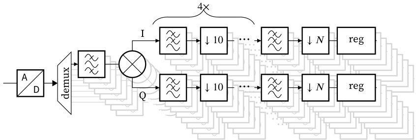  
Figure 6.3 Schematic representation of the data processing flow on the microcontroller of the Planalta board. The data coming from the analogue-to-digital converter ADC contains data from all channels. These samples are copied to new vectors by a “demultiplexer” (demux) to make the filtering faster. The incoming data is then band-pass filtered before being mixed to remove unwanted signals that the mixer can map to the same frequencies. Afterwards, the data passes through four filter and decimation stages before its final filtering and decimation step. The decimation factor $N$ depends upon the incoming data rate to achieve an output frequency of $1 \mathrm { H z }$ .

For the Sylvatica board, the signal frequencies of interest are typically much smaller. Biological and environmental sensor responses vary in the range of a few Hertz and below (Inoue et al. 2008; Wallach et al. 2010; Baker 2008; Maes et al. 2012; Jones 1999; Costa et al. 2013; Xu 2016). Consequently, there is no need to maximise the sampling frequency other than to limit the amount of noise. Some plant processes such as the absorption of photons by chlorophyll molecules and chlorophyll fluorescence after photon incidence occur much faster, within 1 fs and 1 ns respectively (Taiz et al. 2010). However, these events cannot be observed by simple sensors in a greenhouse or on the field, so

they are not considered here.

To avoid active filters, we increased the sampling frequency to $1 0 \mathrm { k H z }$ per channel. However, this shifts complexity from the analogue to the digital domain. This is desirable since it is easier to modify and optimise the software for a particular application. An overview of the digital processing is shown in figure 6.4.

  
Figure 6.4 Schematic representation of the data processing flow on the microcontroller of the Sylvatica board. The data coming from the analogue-to-digital converter ADC contains data from all channels. These samples are copied to new vectors by a “demultiplexer” (demux) to make the filtering faster. The filtering consists of a cascade of lowpass filters, followed by a decimation step of factor 10 to reduce the sample rate.

# 6.3.3 Digital Interfacing with Sensor Boards

As mentioned, $\mathrm { I } ^ { 2 } \mathrm { C }$ is used to read out the sensor data. On this bus, one device has control and can read and write to other devices. In this setup, Dicio is the control device that reads the sensor data from the sensor boards Planalta and Sylvatica. Each device, except for the controller, has a 7 bit address that must be unique on the bus.

To ensure that only valid data are read, a ping-pong buffer system is used at the output. One buffer, buffer A, is written by the software with new data, while the other, buffer B, can be read by the user. When buffer A is full, the roles are reversed. Buffer B is written, and buffer A is read. Each buffer stores one sample (this can be increased in the software) and thus has to be read every second. Note that for Sylvatica, a sample consists of a single 16 bit value, but for Planalta, a single sample consists of up to two or four 16 bit values: two values representing the I- and Qcomponents of the sensor signal and optionally the driver I- and Q-components.

# 6.4 Results

To validate the system, we constructed a small prototype consisting of one Dicio board, two Sylvatica boards, and one Planalta board. An experiment was conducted during ten days in a growth chamber at ILVO, Melle, Belgium. The setup from chapter 5 was reused here. The experiment applied a simulated day-night cycle on two strawberry plants (Fragaria $\times$ ananassa, labelled S1 and S2) and one plum tomato plant (Solanum lycopersicum L., labelled T). The strawberry plants were mature plants grown in a greenhouse at ILVO during the previous year. The main difference between them was their size; S1 had significantly more leaves than S2. The leaves of S2 were also less green than those of S1. Their pot sizes were the same. The tomato plant was a five-week-old seedling.

Table 6.2 Overview of the sensors connected to each plant. A leaf thickness sensor was connected at the start of the experiment to the tomato plant, but there was an issue with the connection. As a result, this data was not valid and not included in the analysis.   

<html><body><table><tr><td rowspan="2">plant</td><td colspan="3">sensor type</td></tr><tr><td>leaf thickness</td><td>leaf length</td><td>soil moisture</td></tr><tr><td>strawberry 1 (S1)</td><td>2</td><td>1</td><td>1</td></tr><tr><td>strawberry 2 (S2)</td><td>2</td><td>0</td><td>0</td></tr><tr><td>tomato 1 (T)</td><td>0</td><td>1</td><td>0</td></tr></table></body></html>

The two sensor boards, Sylvatica and Planalta, were used to perform the readout of several contact sensors that were connected to the plants at a rate of $1 \mathrm { H z }$ . We employed four leaf thickness sensors, two leaf length sensors, one soil moisture sensor, one relative humidity and temperature sensor, and one light intensity sensor. The environmental sensors were mounted on a separate board, which was glued to a 3D-printed radiation shield. An overview of the different connections to the sensor boards and the monitored plants is depicted in table 6.2. More detailed information about the different sensors is provided in table 6.3.

At the start of the experiment, the plants were watered and left to stabilise for one day in the growth chamber before monitoring started. During the monitoring experiment, the plants were watered twice after visual observation of wilting of S1 just before noon on 24 December and 30 December. These time points are indicated by a dashed green line on figure 6.5. A picture of the experimental setting just after the second watering time point (30/12/2019 at 10:45) is depicted in figure 6.6. S1 wilted, while the other plants did not show any visual sign of wilting.

Table 6.3 Overview of the different sensors used in the experimental validation of the system.   

<html><body><table><tr><td>sensor description</td><td>part number and manufacturer</td><td>interface</td></tr><tr><td>leaf thickness</td><td>AH-303 (Agri- House, USA)</td><td>analogue readout</td></tr><tr><td>leaf length (LVDT)</td><td>E100 (Chauvin Arnoux, France)</td><td>LIA readout</td></tr><tr><td>relative humidity and temperature</td><td>SHT35 (Sensirion AG, Switzerland)</td><td>digital I²C sensor</td></tr><tr><td>light intensity</td><td>APDS-9301-020 (Broadcom, USA)</td><td>digital I²C sensor</td></tr></table></body></html>

Both the leaf thickness and leaf length sensors have a strong temperature dependence, which is eliminated using a simple calibration procedure. During this calibration, the temperature was gradually increased from $1 0 ^ { \circ } \mathrm { C }$ to $3 2 ^ { \circ } \mathrm { C }$ . For the leaf length sensors, the AgriHouse Calibration Card (AH-300C) was used to calibrate. The leaf length sensors were calibrated using four reference distances.

The following calibration procedure was followed to calculate the soil water content from the capacitance reading: first, the soil was saturated with water for five days; second, it was left to drip to remove excess moisture for 1 hour; third, the soil was left to dry at ambient temperature conditions for 14 days during which the weight of the pot and sensor readouts were recorded; finally, these were combined with the dry weight and volume of the port to calculate the amount of water in the soil per volumetric unit.

  
Figure 6.5 Visualisation of the captured data in a growth chamber experiment with a strawberry plant. The dashed green line indicates the watering time point. A detailed figure of the grey shaded line (16:30 on 26 December to 3:30 on 27 December) is shown in figure 6.7. The depicted data includes the air temperature $( T _ { \mathrm { a i r } } )$ , relative humidity $( h )$ , light intensity expressed in PAR $( I _ { \mathrm { P A R } } )$ , soil water content (SWC), leaf elongation (LE) and leaf thickness (LT).

leaf length sensor

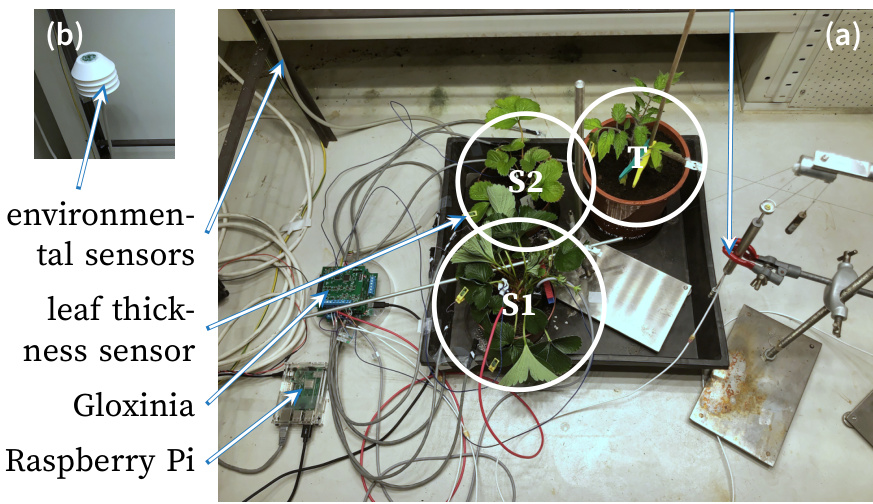  
Figure 6.6 (a) Experimental setup. The environmental sensors are not depicted in this figure, but their cable is. (b) Close-up of the radiation shield that houses the environmental sensors.

The LVDT sensors, used for leaf elongation measurement, do not provide absolute values of leaf length. Therefore, the first measurement was taken to be the reference distance and was set to zero for both sensors.

A more detailed zoom of a $1 2 \mathrm { { h } }$ period indicated by the grey shaded area from figure 6.5 is depicted in figure 6.7. The captured data contains less noise than expected from figure 6.5. Moreover, the oscillatory behaviour of the sensors appeared due to the functioning of the growth chamber. It causes the environmental conditions to oscillate around a predefined setpoint, which in turn are the main drivers for the plant’s response.

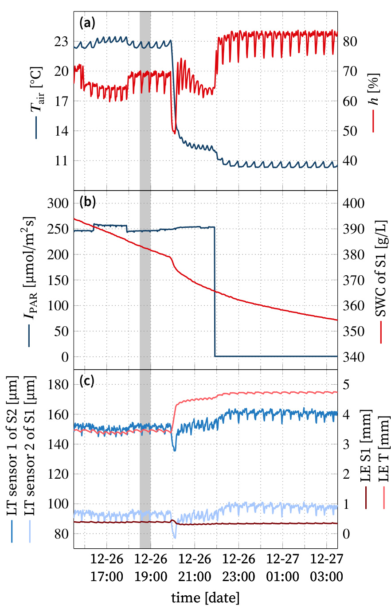  
Figure 6.7 This figure is a detailed zoom of the grey shaded region in figure 6.5 to visualise the accuracy of the system. A further zoom of the grey shaded area in this figure (18:30 to 19:00 on 26 December) is shown in figure 6.8. The depicted data includes the air temperature $( T _ { \mathrm { a i r } } )$ , relative humidity $( h )$ , light intensity expressed in PAR $( I _ { \mathrm { P A R } } )$ , soil water content (SWC), leaf elongation (LE) and leaf thickness (LT).

# 6.5 Discussion

# 6.5.1 Evaluation of the Experiment and Future Improvements

Figure 6.5 depicts the most interesting sensor data throughout the entire experiment. The visual observations of wilting are supported by the readings from the leaf thickness sensors. S1 was wilting (see figure 6.6). The leaf thickness, presented in figure 6.5c (blue), gradually decreased from the previous watering event on 24 December towards this time point of visual observation on 30 December at 10:45. Leaf thickness decreased from around $1 1 5 \mu \mathrm { m }$ to $7 5 \mu \mathrm { m }$ in the first drying period with decreasing soil water content down to $2 0 0 \mathrm { g L } ^ { - 1 }$ . In the second drying period, soil water content decreased down to $1 2 5 \mathrm { g L } ^ { - 1 }$ , resulting in a minimum leaf thickness of $5 3 \mu \mathrm { m }$ . After re-watering, the leaf thickness quickly recovered. S2 was not wilting, which is supported by a more constant pattern of the leaf thickness towards this time point of observation (figure 6.5c, in green). Once wilting started, there was also a clear decrease in leaf thickness for S1 to approximately $7 5 \mu \mathrm { m }$ the first time and $5 3 \mu \mathrm { m }$ the second time. The leaf thickness quickly recovered after watering, clearly highlighting the need for monitoring systems with high temporal resolution. Without them, it would not be possible to measure the recovery time of the leaf thickness of S1. Furthermore, there was no clear difference before and after the watering time point for S2, indicating that this plant did not perceive drought stress in this period. S2 was probably not wilting due to its lower leaf area compared to S1, while the pot sizes were the same. As a result, we presume that the water content in the pot of S2 was still sufficient since the water content in both pots was the same when the experiment started.

For S1, the leaf elongation did not show drastic variations in response to the drying conditions, other than a small gradual growth during the experiment. The leaf elongation of the tomato plant T did not show a decrease in response to limited water availability. However, a marked increase in leaf elongation coincided with the two re-watering events, indicating that leaf elongation slowed down before re-watering.

Besides the effects of drying and re-watering, the leaf thickness and leaf elongation sensors also demonstrated a pattern of shrinkage during the day and increased during the night. Indeed, leaf length and thickness decrease when water loss due to transpiration is not fully compensated by the water uptake and increase when transpiration decreases and tissues are replenished with water. The pattern of swelling and shrinking was most explicit in the leaf elongation of the tomato leaf T. Additionally, the leaf thickness in plants S1 and S2 did not increase throughout the experiment, as these leaves had already reached their final leaf thickness. The elongation sensors on plants S1 and T showed a gradual increase in leaf length, indicating that these leaves were still expanding. The elongation of the young tomato leaf was much faster than that of the leaf of the strawberry plant S1 De Swaef et al. 2015b; Fabbri et al. 1986.

From figure 6.8, we can conclude that the leaf thickness is strongly influenced by the relative humidity, where the drop in relative humidity corresponds to a similar decrease of the leaf thickness around 18:35. The time offset is probably due to the heterogeneity of the air in the growth chamber. A similar effect is observed between 18:55 and 18:58. When the relative humidity decreases, water will evaporate more quickly, resulting in reduced leaf thickness. Since there is a variation of less than $1 ^ { \circ } \mathrm { C }$ , there is a limited effect of the temperature. These physiological responses are only detectable when a high temporal resolution is used, illustrating the need for systems such as Gloxinia. The leaf length variation remains limited. Compared to leaf thickness, leaf length features less variation on a short timescale for strawberry plants in this experiment.

As expected, soil water content consistently decreased after watering. However, slight increases at the start of the day are due to the temperature dependence of the sensor. A possible explanation is that the soil temperature was not measured, only air temperature. As a result, there is some over-compensation when the

22.9 (a) 71   
T 22.6 22.8 M>>A 70 68 三   
22.5 67 h 22.4 66 22.3 65 22.2 64 22.1 63 (b) 246 245.5 AMwwrhnm 383.25 382.75 SWC of S1 [g/L] 245 382.5 244.5 382.25   
1 244 382 243.5 381.75 96 (c) 0.415 LT of S1 [µm] 94 Lrmwsow 0.4015 LE of S1 [mm] 9012 0.4 0.395 0.39 0.385 89 0.38 88 0.375 0.37 18:30 18:35 18:40 18:45 18:50 18:55 19:00 time

temperature changes drastically due to the slower temperature increase of the soil.

# 6.5.2 Design Validation and Comparison to Existing Platforms

In the introduction, four key design criteria were identified. A comparison between our design, a commercial data logger, a single board computer with analogue capabilities (BeagleBone Black), and a microcontroller platform (Arduino) is depicted in Figure 6.9 on a 1 to 5 scale. The higher the scale, the better the performance for this criterion.

  
Figure 6.9 Spider chart comparing different data logging approaches. The higher the number, the better the performance for this specific metric. For instance, a score of 5 on the cost scale means this has the best cost performance, i.e. lowest cost.

We evaluate the requirements for two experiments: a smaller experiment where one plant is monitored closely with 15 analogue sensors and a larger experiment where ten plants are monitored in a greenhouse with 15 analogue sensors connected to each plant. Additionally, the environment will be characterised at each plant in both experiments for temperature, relative humidity, and light intensity. In addition to analogue sensors, a digital sensor is employed that uses $\mathrm { I } ^ { 2 } \mathrm { C }$ to measure the temperature, relative humidity, and light intensity. To simplify the comparison, we restricted it to sensors that do not require an input waveform. All sensors are sampled every 10 seconds.

To evaluate the platforms for each of the criteria, we define the four measures, one for each of the design criteria. First, to assess the sensor scalability, we compare the average number of boards per sensor for each of the trials. Second, to assess the accuracy, we compare the number of bits of the output sample. While this is not the actual accuracy, this estimate provides a first indication thereof. Third, the cost is defined as the average cost per sensor of the entire readout system per platform. Fourth, versatility is assessed by qualitative comparison of the difference between the first three design criteria for the two experimental setups aforementioned.

The official Arduino Uno board can interface with up to six sensors on a single board, with a resolution of 10 bit. A single board costs $1 8 . 8 1 \notin$ (Mouser, USA, 30 January 2020). Different boards are connected using $\mathrm { I } ^ { 2 } \mathrm { C }$ since a robust protocol is not supported without additional hardware. As a result, three boards are needed for the first experiment and 25 for the second (Arduino - Board 2020).

The BeagleBone Black Rev. C board can also interface with up to six analogue sensors per board. The resolution is 12 bit per sensors and costs $6 2 . 7 5 \notin \$ per board (Mouser, USA, 30 January 2020). Different nodes are connected using the CAN bus. As a result, three boards are needed for the first experiment and 25 for the second (Kridner et al. 2020).

Commercial data loggers are very popular and widely used by researchers in plant and environmental monitoring trials. The cost of such commercial systems is approximately 1000 to 1500 €. A single data logger can typically measure 16 sensors sequentially. And have a resolution of 12 bit to 13 bit. Thus, one data logger is needed in the first experiment and ten in the second. However, in a real setup, researchers will typically use a multiplexer to read out all sensors and keep the overall cost of the setup more manageable.

The Gloxinia system discussed here requires the Dicio control board and the Sylvatica sensor board to interface with these sensors; one Sylvatica board can measure up to eight analogue sensors and has a resolution of 16 bit. Different Dicio boards are connected using the CAN bus. A cost overview is depicted in table 6.4, where a categorical separation is made. For the first experiment, one Dicio board is needed, while for the second, ten boards are required. Per Dicio board, two Sylvatica sensor boards are necessary in both cases.

It is clear that in terms of scalability, the Arduino performs worst due to the lack of a robust communication interface for larger distances. Commercial systems usually require expansion units, though the cable length between expansion units is usually limited. Often, this is compensated by the use of expensive measurement cables with low attenuation. The BeagleBone Black and Gloxinia both support the CAN bus. Some additional hardware is required for the BeagleBone Black to interface with other CANenabled devices, though.

The versatility of the platform depends upon the needs of the application. Therefore we compared the available sensor interfaces and the change in the number of boards needed between both experiments. The Arduino has the lowest number of interfaces, followed by the BeagleBone Black. Both lack the ability to interface with LIA-based sensors, for instance. The number of boards scales similarly for Arduino and BeagleBone Black. The commercial system is the most versatile since it has the widest range of sensor interfaces, and expansion units can be added. Gloxinia’s performance is intermediate between the BeagleBone Black and commercial data logger thanks to its wider range of interfaces.

A summary of these observations is depicted in table 6.5 and figure 6.9. The Gloxinia platform is not the most effective on all criteria but provides the best trade-off to achieve a good score on all criteria.

<html><body><table><tr><td>53.34</td><td>46</td><td></td><td>48'4</td><td>1494</td><td></td><td>89'9</td><td>96</td><td>105</td><td>£4.9</td><td></td></tr><tr><td></td><td>46</td><td>13.3</td><td>18'4</td><td>15.14</td><td></td><td>89'9</td><td>3533</td><td>11.3</td><td></td><td></td></tr><tr><td></td><td></td><td>6[</td><td>494</td><td></td><td>60.9</td><td>89'9</td><td></td><td></td><td></td><td></td></tr></table></body></html>

<html><body><table><tr><td>AAC</td><td></td></tr><tr><td></td></tr></table></body></html>

Table 6.4Cost calculation assuming ten boards are produced of a particular type. The cost calculation is based onthe Mouser inventory and component prices of 17 December 2019. Enclosure is optionally available from HammondManufacturing for 20.21 €. All prices are excluding VAT.

Table 6.5 Detailed comparison and summary of the evaluation of different sensor platforms. The cost values are based on the cost per sensor for the small first experiment. The following scores are given from lowest to highest for a particular metric: $- , + / - , + , + +$ , and $+ + +$ .   

<html><body><table><tr><td>criterion Arduino</td><td colspan="3">platform Gloxinia</td></tr><tr><td></td><td></td><td>Beagle- Bone Black</td><td>commer- cial</td></tr><tr><td>scalability 一</td><td></td><td>++</td><td>+/1 +++</td></tr><tr><td>accuracy 10 [bit] (+/-)</td><td>12 (+)</td><td>12/13 (++)</td><td>16 (+++)</td></tr><tr><td>cost [per</td><td>3.76 12.55</td><td>66.67- 100</td><td>8.78</td></tr><tr><td>sensor, €]</td><td>(+++) (+)</td><td>(-)</td><td>(++)</td></tr><tr><td>versatility</td><td>+/1</td><td>+</td><td>+++ ++</td></tr></table></body></html>

# 6.5.3 Future Improvements and Possibilities

While not tested in the experimental setup, the system should easily scale to large trials that need to monitor sensors over large distances thanks to the CAN bus. Theoretically, there is an upper limit of approximately 400 Dicio boards that are connected to a single CAN bus, based on the differential input resistance and drive capability of the MCP2542FD CAN transmitter. However, we advise that no more than 100 Dicio nodes are connected to the same bus for error-free operation. Each Dicio node supports up to four Planalta and five Sylvatica sensor nodes. A second CAN bus has to be used in case more sensors have to be measured.

To stimulate usage of this data logging tool, we open-sourced both hardware and software in a GitHub repository. All relevant files can be downloaded from GitHub1.

# 6.6 Conclusions

The Gloxinia sensor platform aims to advance monitoring in fundamental and applied plant research from modelling to irrigation and crop management. Four key needs were identified: sensor scalability, accuracy, cost and versatility. The whole platform has been designed to address these needs with an open-source design. The platform comprises individual sensor nodes that communicate with each other. Each node has a control board Dicio to which sensor nodes are connected. Sylvatica and Planalta are two sensor boards that provide an interface that matches most analogue sensors used in plant research. Digital sensors can also be connected to the control boards. Most of the application-specific optimisations are done in software, making it easier for the user to optimise for a specific application. To validate the accuracy of the system, we set up an experimental trial in a growth chamber. Environmental conditions, leaf length, and leaf elongation were successfully measured at high resolution on one tomato and two strawberry plants to validate the functionality of the system. The overall system scales well due to the multiplexed sampling of up to eight channels on Sylvatica and four on Planalta, accurate 16 bit data acquisition, low unit cost, and distributed architecture. Consequently, the system strikes a good trade-off between these various requirements, making it well-suited for research, breeding, and precision crop phenotyping.

7

# Experimental Demonstration of a Plant as Computing Resource for Physical Reservoir Computing

Plants are complex organisms subject to a wide variety of environmental factors, which in turn influence a plant’s physiology and phenotype. We propose to interpret this complex inputdriven system as a reservoir in PRC, a computing paradigm originating from computer science that employs a physical substrate as a computing element. In this chapter, we present the first application of PRC to plants using Fragaria $\times$ ananassa (strawberry). We show that plants outperform a control experiment in environmental and ecophysiological tasks using only eight leaf thickness sensors. We also investigate benchmark tasks such as the NARMA task and a delay line. Results indicate that plants are not suitable for general-purpose computation but are well-suited for ecophysiological tasks. This first demonstration of PRC with plants is an important milestone towards a more holistic view of phenotyping and a better understanding of information processing by plants.

# 7.1 Introduction

We already discussed in chapter 4 how we can map the PRC framework to plants. This mapping is inspired by existing implementations such as a soft silicone arm and tensegrity robot (figure 4.1). Here, we review the most important aspects.

Plants are high-dimensional nonlinear dynamical systems. Despite the absence of a brain-like organ and their inability to move, plants are capable of reacting effectively to their dynamic environment, just like animals and humans (van Loon 2016). Plants continuously sense their environment and optimise their physiological responses accordingly (Taiz et al. 2010; Arsova et al. 2020). Moreover, they exhibit the ability to learn and have the ability to use past events for future planning (memory) integrated store/recall systems of memory (Thellier et al. 2013) (see also section 4.1).

We can consider the plant as a computing unit, able to process multiple signals to provide an integrated response that maximises fitness to the prevailing environmental conditions, as discussed by Scheres et al. (2017). In plant reservoir computing, figure 4.1d, the environmental cues are the input of the (plant) reservoir. Plant sensors are used to characterise the plant’s state. These state observations are combined to solve tasks such as prediction of ecophysiological parameters or detection of drought stress.

In this chapter, we demonstrate plant reservoir computing. While former studies have theorised on computing with plants (Adamatzky et al. 2018; Adamatzky 2019), to the best of our knowledge, this is the first experimental evidence of PRC with plants. We show that by observing the plant’s dynamical state with contact-based sensors, we can map temporal input patterns from leaf thickness sensors with a simple linear readout function to estimate (i) the environmental conditions, (ii) ecophysiological tasks, and (iii) computational benchmark tasks.

# 7.2 Materials and Methods

To evaluate the computing properties of plants, we set up a series of experiments on Fragaria $. \times$ ananassa (strawberry) where we monitor key environmental variables and gas exchange activity of the plants. While plants violate the fading memory property over their entire lifetime, we only consider a short period of their mature growing stage when performing the experiments.

Each experiment lasts for eight days in a growth chamber. Inside the growth chamber, light intensity, air temperature and relative humidity are modulated, and the plant’s responses are captured using eight randomly placed leaf-thickness sensors. All three modulations follow a typical day-night pattern, based on actual weather data where additional randomness was inserted into the light intensity and direction by alternating which set of lamps was turned on without overly affecting the total light intensity. Although these are three main abiotic drivers that influence a plant’s ecophysiology (Jones 2013), we consider the light intensity as the main input. The other two abiotic drivers mainly serve to preserve a realistic day-night pattern where plants experience higher temperatures and lower humidity during the day and the inverse at night.

Plants continuously sense their environment and optimise their physiological responses accordingly (Taiz et al. 2010; Arsova et al. 2020). Consequently, these are excellent factors that serve as input to the plant reservoir. Leaf thickness is an interesting trait to monitor since it can vary rapidly and is also influenced by the modulated environmental drivers (Afzal et al. 2017; De Swaef et al. 2015b). However, these clips are also sensitive to temperature fluctuations. Therefore, to validate that the plant is the main source of computation, we also set up a control experiment where the thickness clips are not mounted on a plant. Yet, a plant is placed into the growth chamber to capture real gas exchange data. This negative control is necessary because there might be a complex interaction of the environment and the sensor system that can also have properties resembling a reservoir.

In total, three experiments were conducted in the growth chamber. Each experiment used the same input modulation traces (light intensity, air temperature and air humidity), but the observed traces might differ slightly due to random changes and settling behaviour of the growth chamber. Moreover, three different plants were used to collect physiological data. As a result, the target signals for each of the tasks considered are experimentspecific, although some are very similar.

# 7.2.1 Experimental Setup

The general experimental design follows section 4.2 and the experiments were conducted in the same growth chamber as in chapters 5 and 6. The light configuration differs between the experiments, though. No halogen lights were used to limit heating inside the growth chamber due to the lights. The arrangement is also different. Lamps were mounted on the top and three sides of the frame for illumination. We used 57 LED lamps (PARATHOM DIM PAR16 50 36D OSRAM GmbH, Munich, Germany). The LED lights were arranged in groups that could be individually turned on and off. A detailed overview of the grid is depicted in figure 7.1, while the entire setup is depicted in figure 7.2. This is very similar to figure 5.3.

The modulation of the environmental conditions (light intensity, temperature and relative humidity) was performed using the Gloxinia sensor platform (see chapter 6). This platform also performed sensor readout. Each experiment featured a digital light sensor (APDS9306, Broadcom Inc., San Jose, California, USA), relative humidity and temperature sensor (SHT35, Sensirion AG, Switzerland) and leaf thickness clips (AH-303, AgriHouse, Berthoud, CO, USA). Furthermore, a single mature leaf was inserted into a transparent leaf chamber of the LI-6400XT photosynthesis system (LI-COR, Lincoln, NE, USA) to acquire gas exchange measurements (transpiration and photosynthesis). The Gloxinia system also controlled the sampling time steps of the LI-6400XT, using a custom circuit that was connected to the manual sample button on the infrared gas analyser (IRGA). Each leaf thickness sensor was sampled every second, while the gas exchange measurement had a sample period of 3 s. Faster sampling was not possible due to the limitations of the device.

To ensure that the conditions in the leaf chamber were as similar as possible to those of the rest of the plant, we used an external temperature probe (Vaisala 50Y, Vaisala, Helsinki, Finland) to recreate the temperature outside the leaf chamber. This also prevented the chamber from heating up due to the incoming radiation. Moreover, the gas inlet was also positioned close to the plant for maximum consistency. Figure 7.2 depicts the setup for a strawberry experiment. An image of each experimental setup is provided for each experiment in the dataset. Individual sensor locations are also indicated by a digit in appendix C (figures C.1 to C.3).

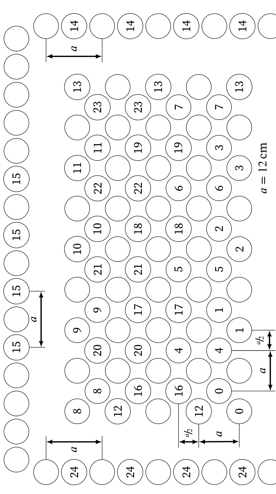

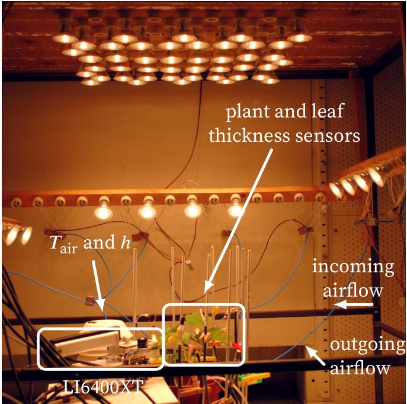  
Figure 7.2 Entire setup inside the growth chamber. Different measurement instruments are indicated as well as the airflow inside the growth chamber.

To simulate a variable light environment, we varied the light pattern semi-randomly. It was assumed that each group of lights contributes equally to the PAR. Based on the maximally observed PAR in the measurement trace, a certain set of lights is turned on.

# 7.2.2 Data Preprocessing

The data was first manually inspected and cleaned to ensure no transient behaviour was included in the analysis. Sometimes the data logging also had to restart due to an error condition occurring because of interference of the high-power and low-power circuits. A restart event resulted in data loss for approximately one minute. Data within this time interval was reconstructed using linear interpolation. The first three hours and last hour of data were also discarded to remove transient effects due to the start or end of the experiment. Data was reconstructed to simplify the computation of several benchmark tasks.

Linear interpolation was also used to match the sampling rate of the gas exchange system, leaf thickness and environmental measurements. Unless specified otherwise, data was not processed and/or filtered further.

# 7.2.3 Train, Validation and Test Data Split and Model Training

The time-series data generated in the three experiments here are highly correlated. To reduce this correlation, we used a data split into train and test data with interleaving (figure 7.3). Each day was assigned to either the train or test data. Eight hours were discarded between days. This ensures that night-time conditions are not overly represented in the dataset and that there is a decreased correlation between both the train and test datasets. However, because a day-night environmental pattern was followed in the growth chamber, the decreased correlation is limited in time. The correlation for all leaf thickness clips of strawberry 1 is presented in figure 7.4. Indeed, we first see a decreasing correlation until five to seven hours in the experiment, when the correlation increases again. This is due to the day-night pattern of the input variables.

In accordance with the general ideas of PRC discussed in section 2.6, a simple learning rule was selected. We used linear regression with Tikhonov or L2-regularisation (Tikhonov 1963) (equation (2.16)). This is a simple model that converges rapidly. The Scikit-learn framework was used to train the system (Pedregosa et al. 2011). The main equation and loss criterion were already discussed in section 2.3.

We sweeped the hyperparameter $\lambda$ from $\boldsymbol { 1 { \cdot } 1 0 ^ { - 1 0 } }$ to $\mathrm { 1 { \cdot } 1 0 ^ { 1 0 } }$ using logarithmic spacing. For each hyperparameter value, the model

09-17 09-18 09-19 09-20 09-21 09-22 09-23 date 08-21 08-23 08-24 08-25 08-26 08-27 08-28 date 10-01 10-02 10-03 10-04 10-05 10-06 10-07 date train data test data discarted data

was optimised, and the best model was selected using a leaveone-out strategy: we used the data of a single day for validation and all the other days for training. This assignment was also permuted such that all days are used for validation. The final choice for $\lambda$ was again optimised using all the training data. The final performance was computed on the test data.

# 7.2.4 Regression Tasks

We consider regression problems solely in this chapter since all the ecophysiological measurements performed are continuous variables. Three types of regression prediction targets are considered: (i) environmental targets, which also form the input of the reservoir; (ii) photosynthetic rate $P _ { n }$ and transpiration rate $E$ as ecophysiological tasks based on the gas exchange data; and (iii) computational benchmarks. All tasks are listed in table 7.1.

Reconstructing the environmental input of the reservoir is an interesting task to evaluate how the information at the input is retained by the reservoir. Estimating gas exchange activity ( $\cdot ^ { \phantom { \dagger } } P _ { n }$ and $\boldsymbol { E } )$ from leaf thickness is an interesting biologically relevant task that demonstrates practical applications of PRC with plants.

<html><body><table><tr><td>type</td><td>symbol</td><td>description</td><td>unit</td><td>sensor</td></tr><tr><td>i</td><td>Tair</td><td>air temperature (growth chamber)</td><td>℃</td><td>Vaisala 50Y</td></tr><tr><td>i</td><td>h</td><td>relative humidity (growth chamber)</td><td>%</td><td>Vaisala 50Y</td></tr><tr><td>i</td><td>IPAR</td><td>photosynthetically active radiation (growth chamber)</td><td>μmol(photons) m-² s-1</td><td>LI6400XT</td></tr><tr><td>ii</td><td>Pn</td><td>photosynthetic rate</td><td>μmol(CO2) m-² s-1</td><td>LI6400XT</td></tr><tr><td>ii</td><td>E</td><td>transpiration rate</td><td>mmol(H2O) m-² s-1</td><td>LI6400XT</td></tr><tr><td>ii</td><td>BDL</td><td>delay line of IPAR</td><td>dimensionless</td><td>n.a.</td></tr><tr><td>iii</td><td>BpL</td><td>polynomial transformation of IpAR</td><td>dimensionless</td><td>n.a.</td></tr><tr><td>iii</td><td>BNARMA-n</td><td>NARMA-n based on IPAR</td><td>dimensionless</td><td>n.a.</td></tr></table></body></html>

Overview of considered types of targets: (i) environmental, ecophysiological (ii) and computing benchmark (iii) G

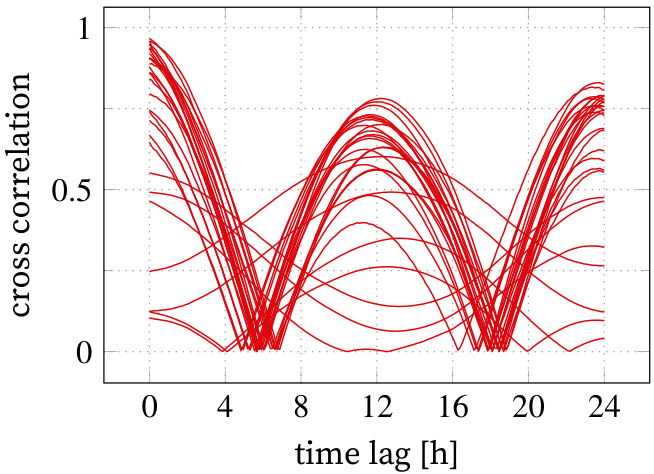  
Figure 7.4 Cross correlation between all leaf thickness readouts of strawberry 1.

We selected photosynthetic rate $P _ { n } ;$ , and transpiration rate $E$ as ecophysiological parameters since these gas exchange measurements are not directly measurable using leaf thickness sensors. The gas exchange sensor device does measure other parameters such as stomatal conductance and leaf temperature, but these are not included since they are highly dependent on temperature, and so are the (leaf) thickness clips.

Computational benchmarks are computed to evaluate the nonlinear and memory properties of plants on a more theoretical basis. This is done using two tasks: NARMA and a delay line. The NARMA task is a benchmark task often used to evaluate PRC media (Nakajima et al. 2015; Atiya et al. 2000). This task has a parameter $n$ that influences the amount of nonlinearity and memory, higher values of $n$ result in more difficult tasks. We use a slightly modified version such that the memory dependencies operate at the minute scale. Consequently, we increased the memory dependency of the task. This was done because otherwise the time-dependencies were too extensive, resulting in too much smoothing and even stability issues for large values of $n$ :

$$
y ( t + 1 ) = \alpha y ( t ) + \beta y ( t ) \left( \sum _ { i = 0 } ^ { n - 1 } y ( t - 6 0 i ) \right) + \gamma x ( t - 6 0 n + 1 ) x ( t ) + \delta .
$$

The parameters $\alpha , \beta , \gamma$ and $\delta$ are chosen as 0.3, 0.05, 1.5 and 0.1 respectively (Nakajima et al. 2015). We do not consider generalpurpose tasks such as MNIST digit recognition or a 2-bit XOR task, as is demonstrated in other PRC research (Vandoorne et al. 2014; Du et al. 2017). In the context of reservoir computing with plants, we do not consider these tasks as relevant since plants are unlikely to outperform conventional computing devices for such tasks. Instead, we focus on plant-specific tasks that are more relevant with respect to future applications in plant ecophysiology and phenotyping.

Since models are not transferable between experiments, we estimate the variability due to sensor placement by selecting seven out of eight sensors. Since individual plants might also have considerably different dynamics, we repeated the experiments for two strawberry plants.

All regression tasks from table 7.1 use the measurement data as the target value for $\hat { y }$ , including the benchmark tasks. Though, the NARMA tasks use a modified version of the light intensity signal $I _ { \mathrm { P A R } } . \ I _ { \mathrm { P A R } }$ is re-scaled to have a zero mean and amplitude of 0.2. This is done to match the input signal used in other research (Nakajima et al. 2015) and ensure that the output does not diverge since the general form of equation (7.1) is not stable for arbitrary input.

Overall, the dataflow is as depicted in figure 4.4 and very similar to that of figure 5.6. The input of the PRC system are the environmental factors, while the input of the linear machine learning pipeline are the reservoir observations: leaf thickness data. This data is fit to the three targets types: environmental, ecophysiological and benchmark targets, listed in table 7.1.

# 7.2.5 Leaf Thickness Sensor Calibration

The leaf thickness sensors used here are sensitive to temperature fluctuations, though they are not equipped with a temperature sensor. In chapter 6, clips were calibrated using the air temperature value, but here each clip was retrofitted with a thermistor (NXFT15WF104FA2B100, Murata Manufacturing Co., Ltd., Kioto, Japan) that was used for calibration. A linear calibration was performed based on a calibration experiment. During this experiment, the temperature was increased from $1 0 ^ { \circ } \mathrm { C }$ to $3 0 ^ { \circ } \mathrm { C }$ . While it is not necessary for PRC to calibrate the leaf thickness sensors to absolute thickness values, we performed a calibration to obtain fully calibrated sensor values. The clips were calibrated using the calibration card from AgriHouse (AH-300C).

# 7.2.6 Plant Material

Plants used in chapter 5 and this chapter were grown in the same location. All three experiments used a Fragaria $\times$ ananassa (strawberry) plant. The plants were grown in close proximity in a greenhouse at ILVO (Caritasstraat 39, 9090 Melle, Belgium), thus ensuring that they experienced a very similar growing history. The plants received regular watering to avoid soil water deficit, based on their needs and were grown inside the greenhouse for over one year. All plants are cuttings from the same base plant and were kept free from pests and diseases.

# 7.3 Results

# 7.3.1 Evaluation of the Reservoir Performance for Biologically Relevant Tasks

Initially, we focus on the biologically relevant tasks. These are the tasks from categories (i) environmental and (ii) ecophysiological (table 7.1). Figure 7.5 visualises the performance using boxplots. Plants outperform the control experiment for $I _ { \mathrm { P A R } }$ , $P _ { n }$ and $E$ , while the control is better at computing $T _ { \mathrm { a i r } }$ and $h$ . This result is not unexpected since thickness clips are sensitive to temperature fluctuations due to heating of the analogue electronics and expansion of the plastic used in the clips. A calibration was performed, but due to nonlinear effects, the model is still able to reconstruct $T _ { \mathrm { a i r } }$ and $h$ better in the control experiment.

We also observe that sometimes there can be considerable variation between plants: for instance, strawberry 2 is slightly better at estimating $P _ { n }$ than strawberry 1, while the inverse is true for $E$ , yet performance for $I _ { \mathrm { P A R } }$ is similar. These differences are probably due to the measurement technique applied for capturing $P _ { n }$ and $E$ , which are monitored for one specific leaf. Consequently, there can be a considerable difference between the selected leaf and other leaves, while $I _ { \mathrm { P A R } }$ is an integrated measurement, performed on the same location in both experiments and independent of the plant.

# 7-clip reservoir size

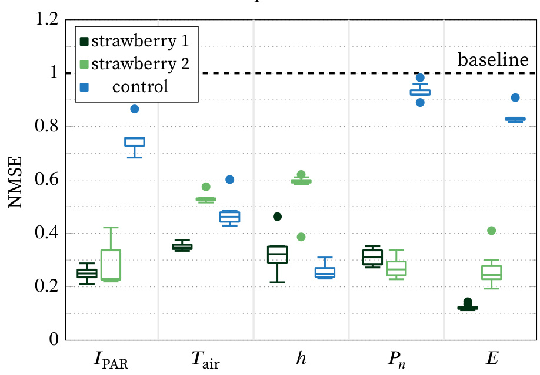  
Figure 7.5 Overview of prediction performance for two different strawberry plants and control using boxplots. The boxplots visualise the effect of different samplings: in each of the samplings, seven out of eight clips are used as reservoir readouts. This allows us to estimate the variability of the random sensor placement. The thickness clips in the control experiment are not mounted on a plant or other material.

The absolute value of the Pearson correlation coefficients between environmental, ecophysiological and leaf thickness measurements are depicted in figure 7.6. The correlation matrix shows that most leaf thickness values $x _ { i }$ of the control experiment are much less correlated to the environmental conditions than the first strawberry experiment, except for $x _ { 7 }$ . We also observe that there is considerable correlation between the environmental factors too, especially between $T _ { \mathrm { a i r } }$ and $h$ for both experiments (0.84 and 0.83). While this is undesirable, this is the result of applying a realistic day-night pattern. Indeed, during the day, light intensity and temperature slowly increase in the morning and decrease as nightfall approaches, while the inverse typically happens for relative humidity.

PAR air ‚Ñé ùëõ ùê∏ 1 2 3 4 5 6 7 8   
PAR S 0.73 0.7 0.93 0.89 0.86 0.88 0.77 0.84 0.86 0.82 0.17 0.84   
air 0.73 ℃ H 0.83 0.74 0.84 0.76 0.86 0.68 0.8 0.71 0.82 0.34 0.86 o h 0.7 0.84 0.7 0.86 0.83 0.77 0.74 0.84 0.73 0.87 0.35 0.85 0.8 𝑛 0.84 0.75 0.71 S ， 0.87 0.84 0.89 0.77 0.83 0.85 0.83 0.17 0.85 E 0.84 0.72 0.72 0.82 0.92 0.9 0.82 0.9 0.88 0.89 0.25 0.91 0.6 1 0.12 0 0.08 0.09 0.05 0.93 0.91 0.9 0.96 0.86 0.14 0.92 Stx 2 0.17 0.45 0.63 0.25 0.24 0.61 Ontrol b T 0.9 0.84 0.93 0.85 0.09 0.91 3 0.38 0.34 0.38 0.14 0.35 0.66 0.1 0.68 0.96 0.68 0.22 0.75 0.4 4 0.11 0.07 0.14 0.13 0.03 0.97 0.65 0.66 traw 0.8 0.95 0.53 0.97 6 5 0.67 0.64 0.76 0.57 0.58 0.13 0.28 0.32 0.09 0.76 0.07 0.83 6 0.17 0.05 0.09 0.14 0.14 0.26 0.07 0.15 0.23 0.44 0.52 0.96 0.2 7 0.38 0.51 0.6 0.47 0.36 0.24 0.43 0.16 0.33 0.66 0.3 2 Wb 0.45 1 ro! 8 0.4 0.4 0.61 0.4 0.41 0.18 0.42 0.04 0.2 0.78 0.63 0.73 0

To provide more insight into the NMSE scores depicted in figure 7.5, we also visualise time-series of the most interesting tasks in figure 7.7. All readouts are used to generate the plots, so no variability data is available. Figure 7.8 zooms in on the grey shaded region of figure 7.7. This region was not used for training.

In the control experiment, the strawberry plant used to obtain the gas exchange data were less active than the other strawberry plants. NMSE values of the test data are also depicted in the upper left corner of each subfigure. From figure 7.7, we observe that the strawberry reservoirs are more effective (i.e., lower NMSE values), resolving the highs and lows better. In figure 7.8 we observe that strawberry-based reservoirs are better at capturing the dynamic behaviour of each specific ecophysiological task. For example, in the case of $I _ { \mathrm { P A R } }$ , we see that detailed variation is not captured by the control experiment but is captured by the strawberry experiments. Similar observations can be made for $P _ { n }$ and $E$ . We point out that NMSE also has its limitations; some of the scores for strawberry 2 are close to the baseline of 1.0, similar to the control experiment. Yet, we see that the variation in the target signal is better captured by the plant.

The narrow peaks observed for $E$ in figure 7.8 are an artefact of the measurement device due to slight variations between the measurement channel and reference channel as a result of variable relative humidity. More details are provided in section 7.2.

# 7.3.2 Evaluation of the Reservoir Properties

It is vital to study the characteristics of the reservoir to stimulate the development of better plant-based reservoirs and to improve data extraction efficiency. To this end, we evaluate the performance on three benchmark tasks: a delay line, polynomial fit and the NARMA task. Moreover, the reservoir size is also a key parameter to investigate.

The effect of the number of readouts of the reservoir (i.e. the number of thickness clips) on the environmental and ecophysiological tasks is depicted in figure 7.9. As expected, performance increases if we increase the number of observations. Furthermore, the variability decreases because a larger set of sensors is able to capture the dynamics present in the reservoir. However, the performance gain due to increasing readout size also decreases as it increases. This is expected since the larger readout size provides a fuller representation of the reservoir dynamics.

ùëõ PAR   
0 E ‰πô C CS 0 G 0   
A A G   
G M G   
M D ‚ñ°

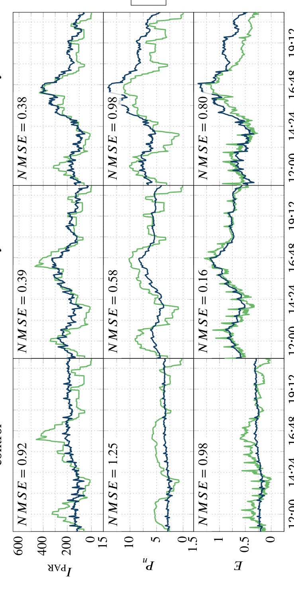  
Zoomed in on the grey shaded region of figure 7.7 to elucidate more detailed information.

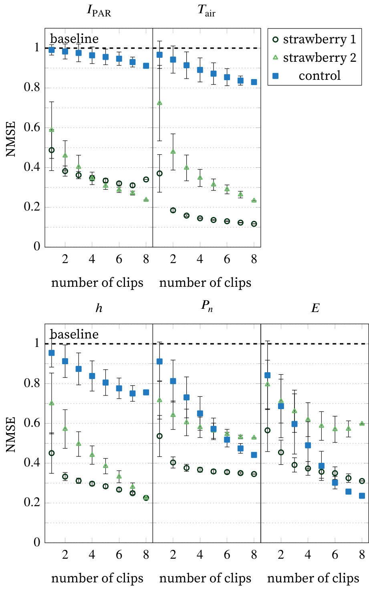  
Figure 7.9 Effect of the number of readouts on the task performance for environmental and biological tasks. Error bars indicate the standard deviation.

We investigate nonlinear and memory performance separately in figures 7.10 and 7.11. As the delay increases on the $I _ { \mathrm { P A R } }$ signal in figure 7.10, we initially observe that the NMSE value remains constant for all three experiments. This is due to the high correlation in leaf thickness among nearby time points. We also note that performance is slightly improved at delays of 500 s and 200 s for strawberry 1 and 2, respectively. As the delay on $I _ { \mathrm { P A R } }$ increases further, performance decreases. Plants perform better than the control, but there is also variation between plants. Peculiar is a drop of the control to 0.4 at 10 000. This is an artefact and the result of the temperature dependence of the clips.

The performance for nonlinear transformations of $I _ { \mathrm { P A R } }$ is depicted in figure 7.11. The performance quickly degrades as the amount of nonlinearity increases. Strawberry 2 is slightly less performant than strawberry 1. Both reach the baseline for a polynomial degree of 6, when results are similar to those from the control experiment.

  
Figure 7.10 Effect of delay on $I _ { \mathrm { P A R } }$ .

NARMA is a complex nonlinear task that can have long-lasting dependencies on the past (equation (7.1)). As a result, it is an excellently combined task to evaluate the reservoirs. NARMA tasks with $n = 2$ to $n = 5 0$ are depicted in figure 7.12. The NARMA task is based on the light intensity $I _ { \mathrm { P A R } }$ . Plants are better at solving this task than the control experiment. However, both are not very performant on the task, since NMSE values are always near or above 0.5. This is also not surprising since plants are not well suited for general-purpose computation. Yet, it is interesting that small values of $n$ perform similarly, which is due to the relatively slow variation of leaf thickness (see also figure 7.10).

  
Figure 7.11 Nonlinear (polynomial) transformation of $I _ { \mathrm { P A R } }$ .

# 7.4 Discussion

In this chapter, we demonstrate PRC with strawberry plants. We show experimentally that plants outperform a control setup for non-trivial tasks such as light intensity $I _ { \mathrm { P A R } }$ , transpiration rate $E$ and photosynthesis rate $P _ { n }$ . Moreover, we also investigate performance on common benchmark tasks such as NARMA-10 and a delay line. In this discussion, we first match our results with literature and chapter 5. We also highlight current limitations and future improvements to plant PRC.

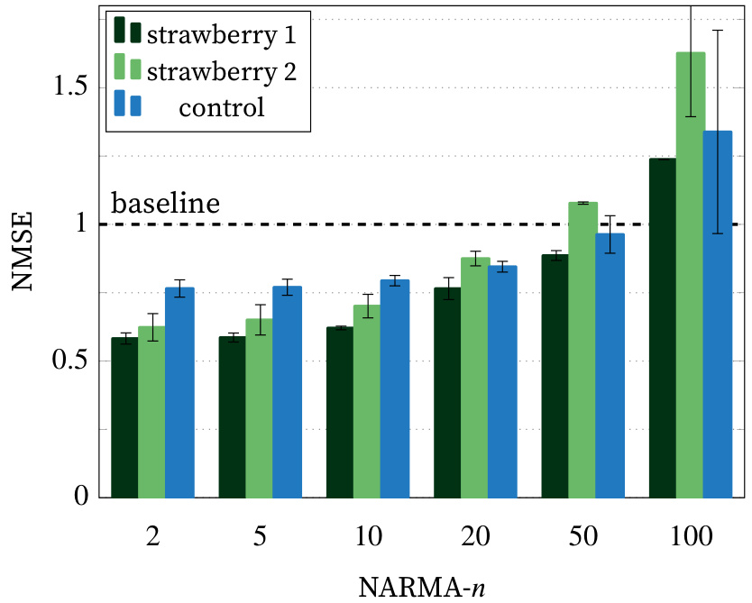  
Figure 7.12 Comparison of the NARMA benchmark task using light intensity data $I _ { \mathrm { P A R } }$ for $n = \{ 2 , 5 , 1 0 , 2 0 , 5 0 , 1 0 0 \}$ . Errorbars indicate the standard deviation.

# 7.4.1 Performance Comparison with Literature

Literature reports that a significant negative correlation exists between leaf thickness and transpiration rate $E$ (Giuliani et al. 2013), explaining why predicting the latter is the best performing task for both strawberry plants. Though studies on multiple species investigated the correlation between photosynthetic rate $P _ { n }$ and leaf thickness, none have reported significant results (Giuliani et al. 2013; Nikolopoulos et al. 2002).

We only performed environmental and ecophysiological experiments in chapter 5, so we limit our comparison to those. Moreover, the number of ecophysiological parameters studied in this chapter is also more limited since we wanted to exclude parameters that were overly dependent on temperature. We compare the overall results from figure 7.5 to figure 5.8. The advantage of using subsampling, as demonstrated in figure 5.11 is small and does not gain more insight into the results. When comparing the leaf thickness results to chapter 5, we observe that NMSE values for $I _ { \mathrm { P A R } }$ are better in the case of the hyperspectral camera than the leaf clips. However, this is no surprise since a camera directly observes light. Moreover, the overall results are better in case of the thickness clips since for in the hyperspectral experiment NMSE values ranged between 0.02 – 0.04 for plants and 0.02 – 0.03 for background materials. The thickness clips experiments has NMSE values of 0.25 and 0.28 for plants and 0.75 for the control experiment. While these values are a lot higher than for the hyperspectral data, they are significantly better than the control experiment, which is not the case in the hyperspectral experiments. $P _ { n }$ NMSE values from the leaf thickness experiment are similar to those from the hyperspectral experiment: 0.27 – 0.31 compared to 0.21 – 0.30 for plant1 in the leaf thickness and hyperspectral experiments respectively. Yet, plant2 has significantly worse performance with an NMSE of 0.56. Moreover, background materials have similar performance for $P _ { n }$ with values ranging between 0.34 – 0.62. This is not the case in figure 7.5. Both plants have similar performance, and the control is very close to the baseline prediction (0.93). For $E$ , performance in figure 7.5 is clearly better than in figure 5.8. This is not surprising since leaf thickness has been shown to be a good proxy for water status in the plant (Meidner 1990). Again, we observe that the difference between plants and background materials in figure 5.8 is low: 0.41 – 0.60, and 0.31 – 0.66 for plants and background materials respectively. Yet, for the leaf thickness experiment, plant scores are 0.12 and 0.26, while the control score is much higher at 0.84. In summary, leaf thickness is a much more interesting plant trait to observe than reflectance variation using a hyperspectral camera for PRC.

For the benchmark tasks, it is essential to compare with other PRC substrates. However, comparing NMSE values from figure 7.5 with other substrates is not straightforward. On the one hand, there are many substrates specifically designed for reservoir computing, such as silicon photonics and memristor chips. These substrates perform better on benchmark tasks. For instance, for the NARMA-10 task, photonic reservoirs have NMSE values of 0.035 (Appeltant et al. 2011) and for the Santa-Fe time-series prediction task, NMSE values of 0.06 are reported in literature for photonic reservoirs (Nakajima et al. 2021b). However, a plant is optimised for fitness, not as a medium for computing (Anderson 2016; Prakash et al. 2020). Moreover, many studies mainly focus on simulations since creating a physical reservoir is often time-consuming and expensive, especially if integrated circuits need to be designed. On the other hand, other studies work with biological media, but they exclusively focus on classification tasks (Dockendorf et al. 2009; Ju et al. 2015; Jones et al. 2007; Dranias et al. 2013), a problem distinct from regression. We opted to study regression tasks since these are more relevant from a plant ecophysiological point of view. Additionally, biological signals are also inherently noisy (Bezrukov et al. 1995). This noise is difficult to filter given that the reservoir studied here has only up to eight state observations. Despite these limitations, these results are a pivotal first step towards reservoir computing with plants.

Often, the effect of the reservoir size is studied in literature (Vandoorne et al. 2014; Du et al. 2017), but this is more difficult for plants. Isolating a part of a plant and maintaining its growth as though it was still part of a larger entity is not possible. An integrated perspective is thus necessary. As a result, we study the number of observation points (or readouts) of the reservoir. The number of readouts also greatly affects performance (i.e. lower NMSE values for larger numbers of observations), as indicated in figure 7.9. This illustrates that an increased number of observations can improve the prediction accuracy of transpiration rate $E$ and photosynthetic rate $P _ { n }$ beyond what is possible using a single sensor. In literature, this effect has also been reported, as well as the saturation effect for as the number of readouts increases (Pinna et al. 2020; Vlachas et al. 2020). Increasing the number of readouts has an effect on the fraction of observed dynamics. Full observability is not possible for plant-based reservoirs, even if the leaf thickness variation of each leaf is characterised. While shortterm leaf thickness variations are a good proxy for plant water status dynamics, there are many more unknown factors such as hormones, metabolism, nutrient take-up and carbon dynamics. These are also part of the reservoir but not directly quantifiable using leaf thickness measurements, although correlations will exist with leaf thickness because nearly all plant processes are impacted by the plant’s water status (Barillot et al. 2020; McBurney 1992).

The unexpected drop of NMSE in the curve for the control experiment in figure 7.10 is the result of the correlation between the light intensity $I _ { \mathrm { P A R } }$ and air temperature $T _ { \mathrm { a i r } }$ . This correlation arises due to two effects. First, as depicted in figure 7.6, there is a limited correlation between air temperature $T _ { \mathrm { a i r } }$ and most thickness clips of the control experiment (except for $x _ { 3 }$ ). Though combined, a set of clips is still good at predicting the air temperature (see figure 7.9) for the control experiment. Second, the correlation between air temperature $T _ { \mathrm { a i r } }$ and light intensity $I _ { \mathrm { P A R } }$ is maximal at a delay of 4600 s. Consequently, the train error is lowest for a delay of 5000 s and the test error is lowest for 10 000 s for the control experiment. The mismatch between train and validation error is probably due to the model overfitting on the data at a delay of 5000 s. At an increased mismatch at a delay of 10 000 s, the model might generalise better. Therefore, the test error is minimal. Naturally, this also occurs for the plant observation, yet we do not observe this effect because these observations have many more influencing factors due to being mounted on a plant.

While PRC with plants is far from being ready for use in the field, we can observe some of the potential already in these results. In figure 7.10, we observed a slight dip around $2 0 0 - 5 0 0 { \mathrm { s } }$ . There might be a lag between a change in light intensity and the resulting difference in leaf thickness (Meidner 1990). This dip may imply a time lag of $2 0 0 - 5 0 0 s$ between acclimation of the leaf thickness and the changing light intensity. This lag can signify a suboptimal response of the leaf to the fast-changing light intensity. Quantifying, studying and improving this relationship is especially relevant for plants in the field since they are subject to fast-changing light intensities. Though optimising this dynamic behaviour of plants is often ignored and could even be more important than static performance (Kaiser et al. 2018; Kromdijk et al. 2016). PRC can provide the means to characterise this mismatch.

# 7.4.2 Limitations and Future Improvements

The results presented in figures 7.5 and 7.9 to 7.12 are encouraging. Better sensor technology and calibration can likely reduce unwanted effects due to the sensor-environment interaction and improve signal extraction. Alternative sensor systems such as biopotential (Escalante-Pérez et al. 2011), sap flow (Vandegehuchte et al. 2012) or leaf length (Barillot et al. 2020) might be better suited for certain tasks than leaf thickness.

While the experiments presented here are mainly theoretical, they may result in practical applications in future work. Treating a plant as a computing entity can help to generalise plant behaviour and provide essential context to physiological studies. Each trait exhibited by a plant can be viewed as the result of the complex interaction between environmental queues and plant behaviour. Essentially, a plant can be viewed as a computational unit that analyses the incoming environmental signals and optimises its physiology accordingly.

We identify three main issues with PRC for plants: (i) the effect of uncontrolled and uncharacterised inputs, (ii) non-stationarity of plants and (iii) plants do not experience their environment in discrete time. First, plants are sensitive to many signals, including the three environmental variables modulated here, but also chemicals (both airborne and in the soil), mechanical stimulation, electricity, and sound (Karban 2015). None of these factors is easily controlled and/or kept constant. As a result, these additional input sources possibly distort the applied input signals (Soriano et al. 2013). One could argue that the reservoir should be able to cope with these additional variations, but there are also limits to the observable processes using thickness clips. Second, plants are non-stationary entities. They keep on developing (Hilty et al. 2021) and over time, they violate the fadingmemory requirement. As a result, online unsupervised learning algorithms are required to create a readout mechanism that is able to cope with changes in the reservoir. One way this can be tackled is using reward-modulated Hebbian learning (Gerstner et al. 2002; Burms et al. 2015). Third, plants continuously sense environmental changes and act accordingly. Hence, they do not respond in discrete time. In this chapter we did not investigate the implications this has on the reservoir performance and the observed dynamics.

After all, plants are complex integrated systems containing many coupled processes that occur at different timescales. For instance, photons are absorbed by chlorophyll molecules within 1 fs, whereas chlorophyll fluorescence is emitted in 1 ns after photon incidence (Taiz et al. 2010). More integrated processes such as stomatal opening and closure respond in the order of $2 0 \mathsf { s }$ after a change in illuminance. Hydraulic functioning (e.g., water transport) changes in the range of seconds to minutes, whereas organ growth rates vary in the order of minutes to hours (Jones 2013; Hilty et al. 2021). Consequently, a plant-based reservoir also operates at these timescales though not all of them are observable using leaf thickness sensors.

Our experiments are a first step towards plant-based PRC. Additional experiments and analysis are needed to reassure that the plant can indeed be used for PRC. While a plant is a highly nonlinear dynamic system (see also section 4.1), we did not perform an analysis of the timescales at which the sensors observe the plantreservoir. Moreover, the environmental and ecophysiological tasks do not evaluate the memory capacity. A more detailed analysis that builds, for instance, on figure 7.10 could help to better understand the (fading) memory properties of plants. Moreover, the underlying plant processes should also be investigated to explore the origins of the plant computing properties. This body of work highlights the next steps necessary for plant-based PRC.

# 7.5 Conclusions

In this work, we presented – to the best of our knowledge – the first application of PRC-inspired computing with plants, more specifically strawberry (Fragaria $\times$ ananassa). We investigated several types of tasks, including environmental, ecophysiological and benchmark tasks. The results indicate that plants are not well suited for general-purpose computation but are potentially highly interesting for plant-specific tasks and applications in phenotyping. Plants are best at solving ecophysiological and environmental tasks, more specifically transpiration rate $E$ , photosynthesis rate $P _ { n }$ and light intensity $I _ { \mathrm { P A R } }$ .

8

# 8

# Discussion and Future Perspectives

In this chapter, we review how we achieved PRC with plants, summarise the main achievements that led to this result and provide future perspectives on possible advancement studies at the end of this chapter.

# 8.1 Overview of the Main Results

Since the conceptualisation of reservoir computing around the turn of the century and its transfer to physical systems, PRC has grown in scope and popularity as an alternative to conventional computing (Nakajima et al. 2021a). Some of these new technologies promise to drastically reduce power consumption or improve performance for machine learning tasks (Du et al. 2017; Freiberger 2020). Another subdomain of reservoir computing is focussing more on embodiment and outsourcing control to the body. This technique promises to reduce the complexity of the microcontroller and improve robustness in compliant robotics (Degrave et al. 2013; Nakajima 2020; Caluwaerts et al. 2014).

In this work, we aim to introduce reservoir computing to an unexplored field: plant ecophysiology. While plants do not meet all the criteria for reservoir computing in a strict sense (section 4.1), it can form the basis of a paradigm shift in plant ecophysiology. Instead of focussing on specific traits and their effect on physiology, a more holistic approach can yield interesting new insights into plant behaviour.

In a first study (chapter 5) where we investigated if plants can be considered living reservoirs, we used a hyperspectral camera to monitor the plant’s state. This study was unsuccessful; data from background materials and plants were equally good at predicting the physiological tasks. We suspect that the root causes were insufficient accuracy of the camera and limited spectral changes. Improved sensor technology might solve some of the issues, but specific sensory equipment appears more interesting for several reasons. Firstly, hyperspectral cameras are expensive sensors compared to conventional RGB cameras. Secondly, they produce vast amounts of data if one wants to study dynamic plant behaviour. Storage and processing of this data can be a challenge. Thirdly, hyperspectral data is complex. There are many bands available, and the spectral resolution might not be uniform. Moreover, extracting the relevant features from the data is an ongoing research topic. In summary, we advise avoiding hyperspectral cameras to study the dynamics or subtle variations of plants. However, based on many examples from literature, they can be very effective at capturing strong dynamics due to drought and diseases (Mahlein 2015; Lowe et al. 2017).

Changing the sensory system to a contact-based system was an appropriate solution because contact sensors offer a more direct measurement and generate much less data, which in turn simplifies the analysis. However, most commercially available readout systems for phenotyping did not meet our requirements in terms of accuracy, flexibility and cost. Consequently, we designed a custom solution: Gloxinia. The design of this sensor platform is discussed in chapter 6. We successfully demonstrated its operation in that chapter and in chapter 7.

Using this custom sensory system, we demonstrate PRC-inspired computing with plants in chapter 7. We show how leaf thickness measurements of strawberry plants were used to assess ecophysiological, environmental and benchmark regression targets. Our results indicate that plants are unsuited for general-purpose computing, yet instead are highly relevant for plant-related tasks. Photosynthetic rate and transpiration rate are the two main biological tasks investigated.

Chapters 5 and 6 illustrate the steps taken leading up to the results in chapter 7, demonstrating PRC with plants. Although the results in chapter 5 were inconclusive, they are highly relevant for the phenotyping community. Using our findings, we illustrate some of the limitations of current hyperspectral technologies. Moreover, we also illustrate that despite some tasks being performant, the plant was not the root cause of said performance. This highlights that it is always important to study the effect of the environment and sensory system. As a result, the PRC study from chapter 7 also included a control experiment to ensure computation arose due to plant dynamics and not the dynamics of the environment. PRC with plants is currently in the start-up and exploration phase. We suspect increased interest from the plant science community and generalisation to more plant species can transform PRC with plants to a wide field of research.

# 8.2 Gradual Improvements To the Experimental Setup

The two main studies presented in chapters 5 and 7 are portrayed without any of the obstacles and problems we experienced. In this section, we provide advice for future researchers working on PRC with plants.

Plants are living organisms and have clear preferences in terms of environmental conditions (Ozores-Hampton et al. 2012; Boote et al. 2012; de Koning 1994; Sionit et al. 1987) (see also section 4.1). The variability they experience from germination also determines (partially) their ability to cope with variability in a more developed stage (Jones 2013). We experienced major problems when transferring plants from the greenhouse to the growth chamber. Conditions inside the greenhouse are much more uniform, especially in terms of temperature and relative humidity. Since these two factors are modulated in the growth chamber for both studies (chapters 5 and 7), this presented a major challenge to prevent the plants from experiencing stress. This stress was not due to extreme environmental conditions but due to slow acclimation. This was especially true for tomato plants. As a result, we switched growing plants from the greenhouse to another (large) growth chamber. In this growth chamber, plants were subject to similar differences as those during the experiments.

For strawberry and bean, this solved the problem of a stress build-up from the start to the end of the PRC experiments. However, tomato plants still experienced significant stress towards the end of each experiment. This is characterised by deformed and smaller leaves, as illustrated in figure 8.1.

  
Figure 8.1 A tomato plant at the start (a) and end of the experiment (b).

Initially, we worked with short experiments when working with the hyperspectral camera. The idea was to first emulate PRC research on computing with a soft silicone arm (figure 4.1b) (Nakajima et al. 2015). Here, the input consists of various sinusoidal signals. This generates a semi-random signal that excites the reservoir. However, when attempting to do something similar with the environmental drivers (air temperature, relative humidity and light intensity), plants were often stressed at the end of the experiments and/or responses were divergent. Their internal circadian rhythm persisted because of internal signals (Taiz et al. 2010). It is thus important to either have a warm-up phase prior to the experiment where plants are acclimatised to such conditions or to change the experimental setup such that the circadian rhythm is preserved. We opted for the second option because it is more relevant from a biological perspective and for future applications.

# 8.3 Future Work and Applications

From the results presented in chapters 5 to 7, we can identify five future research lines: (a) studying the spectral changes of plants in greater detail; (b) further development of the Gloxinia platform towards more types of sensor technologies supported and more robust operation; (c) refining results of PRC with plants; (d) investigating a closed-loop setup; and (e) working towards applications.

Dynamic Plant Spectrum The research presented in chapter 5 features some of the limitations of hyperspectral cameras. Nevertheless, they are popular sensing devices in plant phenotyping. If this research wishes to transition towards capturing more subtle variation in plants, more research is needed to understand the timescales and variation one can expect in such setups. To that end, we envision a small-scale study where various plants are extensively monitored using high-resolution point or line sensors. Results from such experiments can be used to gain insight into the possible variation observable with state-of-the-art sensor technologies. Based on these results, large-scale experiments can be optimised to gain more insight into a plant’s phenotype and performance in agricultural systems.

Expansion of Gloxinia For research purposes, the Gloxinia platform is sufficiently capable. However, its robustness should be improved such that it can run unsupervised for extended periods of time. Currently, this is not possible because there are insufficient recovery mechanisms built-in when a sensor readout temporarily fails. Moreover, using the system requires extensive knowledge; if we want it to be employed by a wider audience in the plant science community, it should be more user-friendly. To this end, a large new iteration of the interconnectivity is required, for instance one could rely on USB-C type connectors to connect sensors to the measurement device. Moreover, an enclosure is also needed. If designed well, end-users should just have to plugin the sensors and register them using a software tool. These improvements should make it possible for non-experienced users to use Gloxinia without learning the details of the system.

Refinement of PRC with Plants The results presented in chapter 7 are promising but can still be expanded further. Better sensor technology and calibration can likely reduce unwanted effects due to the sensor-environment interaction and improve signal extraction. Alternative sensor systems such as volatile organic compounds (Moru et al. 2020), biopotential (Escalante-Pérez et al. 2011), sap flow (Vandegehuchte et al. 2012) or leaf length (Barillot et al. 2020) might be better suited for certain tasks than leaf thickness. These refinements can be used to gain a better understanding of the types of tasks and sensors that match. Furthermore, we need to evaluate the generality of the framework among plant species. Therefore, the PRC framework should be applied to multiple plant species for specific regression or classification tasks to extend the results of chapter 7 to more species. Moreover, those results should also be expanded to detect stress. For instance, one could investigate the quantification of plant drought and heat stress in response to reduced water availability. To assess this stress, a quantifiable stress trait needs to be defined. For example, one could assess the biomass accumulation based on a digital twin and compare this with experimental data.

The experiments presented in chapter 7 are limited in scope for the quantification of the nonlinear and memory properties of plants due to the lack of additional theoretical analysis and benchmark experiments. We assumed matching timescales due to the choice of leaf thickness observation and weather-data based input pattern generation. However, additional test are needed that validate this match when we increase or decrease the timescale of the input. For instance, the light intensity variations can be increased and as the frequency of change increases there should be less information captured by the leaf thickness observation. Moreover, the plant-relevant tasks have limited time-dependence. Tasks with more extensive time dependencies should be evaluated. Moreover, the underlying processes that generate the memory and nonlinear properties of the plant reservoir should be be investigated too.

So far, we have focussed exclusively on the part of the plant that is above the soil. Yet, the reservoir also consists of plant roots. These roots are a large and vital part of the plant. While there is increased interest in studying the development and functioning of root systems, many aspects remain unknown due to the inaccessibility of roots. Mounting contact sensors requires digging up part of the roots. Consequently, one might unintentionally alter them and disturb their surroundings. Recent techniques such as electrical impedance spectroscopy, spectral induced polarisation and electrical resistivity tomography enable frequencydependent characterisation of roots without the need to disturb them. Such techniques quantify the redistribution of water in the soil, which can be used as a proxy for root activity (Ehosioke et al. 2020; Maurel et al. 2020).

In research setups, leaf thickness clips are good enough, but mounting leaf thickness clips in plants is labour intensive, and they cannot remain on the plant for months because they alter the leaf physiology. Consequently, for real applications, there is a need to transition away from contact-based technology towards contact-less technologies. To this end, image sensors are most attractive. However, care must be taken in selecting appropriate features and optimising the experimental design. Our work in chapter 5 showed that subtle spectral variations are challenging. An easily identifiable alternative could be plant movement. The leaves of beans, lettuce and Arabidopsis plants feature extensive movement (Greenham et al. 2015; Nagano et al. 2019; Inoue et al. 2005). Monitoring leaf movement can be fully automated for large plant populations, thus enabling PRC to scale beyond plant research.

Closing the Loop The PRC framework includes the integration of output feedback loops. Within the framework, one is thus not limited to detection but can also realise control on the input. For example, Eder et al. (2018) have shown that by exploiting the dynamics exhibited by a soft robot body, control can be reduced to simple linear regression. However, within the context of plants, we lack a supervisory training signal. This entails that we cannot rely on a classical supervised learning system: it is not possible to identify a correct growth path, multiple paths exist and exploring them all is not possible. Consequently, we need to rely on a global reward signal such as biomass increment, photosynthesis rate and stomatal conductance. Such a reword signal can be used to optimise the system without knowing the optimal values for each monitored variable. In neurobiology, reward-modulated Hebbian learning can alter the synapse weights driven by the correlation between a global reward signal, presynaptic activity, and the difference of the postsynaptic potential from its recent mean (Loewenstein et al. 2006). Legenstein et al. (2010) and Burms et al. (2015) showed that a physical reservoir system can learn motor control tasks using an online reward-modulated Hebbian learning rule. Despite the lack of a supervised learning step, the system can learn motor control tasks with an instantaneous reward signal. Such a system can also be leveraged for plant-based control loops. As such, the plant dynamics can be exploited for controlling the environmental factors in greenhouses and indoor plant factories or even irrigation in the field. Figure 8.2 visualises a conventional control loop in (a) and a PRC-based controller in (b). PRC shifts the conventional information processing for stress detection or growth control from an external computer to the plant.

Applications In ecophysiological experiments, one typically measures only one or two plant variables to determine the plant’s physiological state (Tardieu et al. 2017). Whenever the parameters move outside predefined bounds, a limited number of environmental drivers (e.g., watering and temperature) are modulated to influence this state. This process completely ignores the complex dynamic interplay between the plant and the environment due to the inability to relate small changes in plant variables to environmental changes. Indeed, a plant’s responses are the result of current and previous environmental conditions. Since there is no one-to-one relationship, it is unclear what the cause of small changes is. However, with the PRC framework, we can interpret experiments in which multiple environmental factors continuously vary due to the characterisation of the plant’s state using multiple sensors at high time resolution. The sensor-agnostic framework facilitates a general approach to control problems. No single measurement will be linked to a single ecophysiological variable. Instead, PRC uses the aggregate of the various measurements to obtain a fuller picture of the plant’s physiological state. Consequently, PRC with plants provides an entirely new way of looking at plant responses at a much more integrated scale.

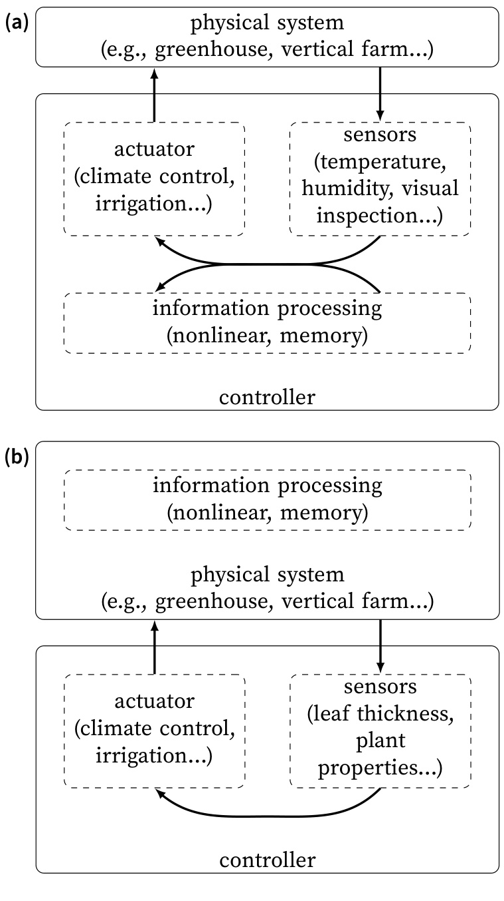  
Figure 8.2 Closed loop control using an external controller (i.e. a conventional setup) and a PRC controller. Instead of relying on an external controller that has to interpret the signal and select the optimal actuation, the sensors directly drive the actuation using the physical medium as a controller. The advantages of this setup are easier control and more timely response to deviation due to stress in the plants.

This integrated view offers the possibility to quantify and analyse plant responses from a completely new point of view. Plants and by extension ecological systems are all (non-stationary) nonlinear dynamic systems. These systems receive internal and environmental inputs and optimise their responses accordingly. This is highly analogous to how PRC works for stationary systems. PRC provides a means to quantify information processing by plants. If the right tasks are defined, this can yield the phenotyping community the ability to quantitatively study plant performance in a general way. As a result, we suspect that it might lead to the discovery of previously unknown relationships and traits due to this more holistic point of view.

# 8.4 Epilogue

In this dissertation, we created a bridge between PRC and plant ecophysiology. We investigated the usage of hyperspectral cameras and (leaf) thickness sensors to monitor the plant’s state. By means of different regression tasks, we observed that plants are not fit for general-purpose computation but instead are prime candidates for plant-related computation such as characterisation of ecophysiological parameters. Moreover, we envision future applications in the field of plant ecophysiology, breeding and precision agriculture. Our aim is to inspire more researchers in the plant science community to investigate the computational properties of plants and leverage the advantages that the PRC framework brings to the field.

A

# Reservoir Computing with a Snapshot Hyperspectral Camera Supplementary Materials

Table A.1 Hyperspectral pixel, represented as physical 2D-grid of peak bands in nm and width half-peak-full-width specified between brackets in nm of the near-infrared sensor (H1).   

<html><body><table><tr><td>856 (6.9)</td><td>867 (8.4)</td><td>846 (7.9)</td><td>834 (10.6)</td><td>953 (21.5)</td></tr><tr><td>937 (19.7)</td><td>945 (16.9)</td><td>929 (16.1)</td><td>920 (15.0)</td><td>960 (15.5)</td></tr><tr><td>750 (6.3)</td><td>765 (6.6)</td><td>738 (4.7)</td><td>724 (5.2)</td><td>699 (4.1)</td></tr><tr><td>803 (7.5)</td><td>815 (7.5)</td><td>790 (9.4)</td><td>777 (6.8)</td><td>684 (4.4)</td></tr><tr><td>897 (13.2)</td><td>907 (13.3)</td><td>887 (13.0)</td><td>876 (12.0)</td><td>678 (3.1)</td></tr></table></body></html>

For reference, tables are included that depict exact numbers instead of bar charts. Table A.3 corresponds to figure 5.8, while table A.4 matches figure 5.11

<html><body><table><tr><td>538 (12.9)</td><td>552 (13.0)</td><td>524 (9.2)</td><td>512 (6.5)</td></tr><tr><td>620 (5.1)</td><td>480 (6.6)</td><td>611 (12.2)</td><td>602 (12.1)</td></tr><tr><td>580 (10.7)</td><td>591 (11.4)</td><td>567 (11.0)</td><td>554 (11.7)</td></tr><tr><td>489 (10.6)</td><td>500 (8.2)</td><td>477 (7.9)</td><td>470 (2.9)</td></tr></table></body></html>

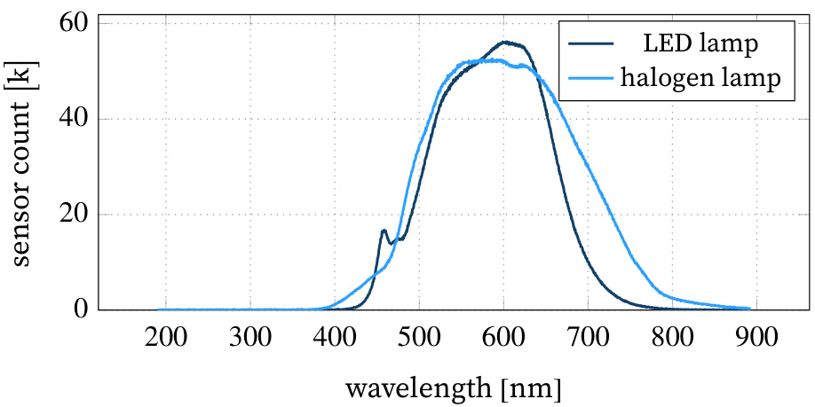  
Table A.2 Hyperspectral pixel, represented as physical 2D-grid of peak bands in nm and width half-peak-full-width specified between brackets in nm of the visual sensor (H2).   
Figure A.1 Spectrum of the halogen lights and LED lights used in the experiments. The spectral were measured using Jaz Spectrometer (Ocean Optics, Dunedin, FL, USA) from a distance of $2 0 \mathrm { c m }$ directly below the light source.

<html><body><table><tr><td rowspan="2">task</td><td colspan="2"> plant1</td><td colspan="2"> plant2</td><td colspan="2">wood</td><td colspan="2">PVC</td><td colspan="2">Ytong</td><td colspan="2">cotton</td></tr><tr><td>X</td><td>VI</td><td>X</td><td>VI</td><td>X</td><td>VI</td><td>X</td><td>VI</td><td>X</td><td>VI</td><td></td><td>VI</td></tr><tr><td>Pn</td><td>0.301</td><td>0.206</td><td>0.556</td><td>0.56</td><td>0.523</td><td>0.34</td><td>0.395</td><td>0.34</td><td>0.585</td><td>0.625</td><td>0.589</td><td>0.587</td></tr><tr><td>gs</td><td>0.676</td><td>0.653</td><td>0.958</td><td>0.957</td><td>0.913</td><td>0.634</td><td>0.693</td><td>0.649</td><td>0.977</td><td>1.006</td><td>0.99</td><td>1.002</td></tr><tr><td>E</td><td>0.426</td><td>0.408</td><td>0.597</td><td>0.602</td><td>0.5</td><td>0.309</td><td>0.4</td><td>0.353</td><td>0.647</td><td>0.656</td><td>0.656</td><td>0.646</td></tr><tr><td>Dleaf</td><td>0.18</td><td>0.107</td><td>0.277</td><td>0.233</td><td>0.214</td><td>0.135</td><td>0.201</td><td>0.156</td><td>0.285</td><td>0.252</td><td>0.31</td><td>0.277</td></tr><tr><td>Tleaf</td><td>0.052</td><td>0.027</td><td>0.07</td><td>0.035</td><td>0.052</td><td>0.034</td><td>0.064</td><td>0.031</td><td>0.092</td><td>0.048</td><td>0.088</td><td>0.041</td></tr><tr><td>Tair</td><td>0.081</td><td>0.02</td><td>0.068</td><td>0.044</td><td>0.134</td><td>0.124</td><td>0.164</td><td>0.1</td><td>0.121</td><td>0.075</td><td>0.109</td><td>0.062</td></tr><tr><td>h</td><td>0.432</td><td>0.297</td><td>0.382</td><td>0.439</td><td>0.478</td><td>0.371</td><td>0.466</td><td>0.436</td><td>0.631</td><td>1.132</td><td>0.356</td><td>0.325</td></tr><tr><td>IPAR</td><td>0.025</td><td>0.018</td><td>0.03</td><td>0.039</td><td>0.024</td><td>0.016</td><td>0.021</td><td>0.015</td><td>0.029</td><td>0.03</td><td>0.028</td><td>0.027</td></tr></table></body></html>

<html><body><table><tr><td>0</td><td>L70'0</td><td>0</td><td>900.0</td><td>0</td><td>000.2</td><td>0</td><td>70'0</td><td>100'0</td><td>800.0</td><td>100'0</td><td>900.0</td><td></td></tr><tr><td></td><td></td><td>50.0</td><td>919'0</td><td></td><td></td><td>800.3</td><td>0041</td><td></td><td>489.4</td><td>990'0</td><td></td><td></td></tr><tr><td>000'0</td><td>745.4</td><td>£0.0</td><td>6515</td><td>L00'0</td><td>1010</td><td></td><td>£010</td><td>8400</td><td></td><td>800.0</td><td>I0</td><td></td></tr><tr><td>000.0</td><td>6010</td><td>610'0</td><td></td><td>100'0</td><td>990'0</td><td>£00.0</td><td></td><td>000.1</td><td>8053</td><td>10'0</td><td></td><td>eL</td></tr><tr><td>000.4</td><td>7004</td><td>900'0</td><td></td><td>700.0</td><td></td><td>600'0</td><td></td><td>610'0</td><td></td><td>000.3</td><td></td><td>geaa</td></tr><tr><td>000'1</td><td>1/9'0</td><td>10'0</td><td>109.0</td><td>000.4</td><td>6044</td><td>800'0</td><td>0041</td><td>700.5</td><td></td><td>40.0</td><td>014.1</td><td></td></tr><tr><td>000.X</td><td>0061</td><td>800'0</td><td></td><td></td><td>10L'0</td><td>000.3</td><td>899'0</td><td>940'0</td><td>003.5</td><td>940.0</td><td></td><td>s8</td></tr><tr><td>000.4</td><td>054</td><td>110'0]</td><td></td><td>670.0</td><td></td><td>700.5</td><td></td><td>600.0</td><td></td><td>600.0</td><td></td><td>d</td></tr><tr><td>0</td><td>4</td><td>0</td><td>4</td><td>0</td><td>4</td><td>0</td><td></td><td>0</td><td></td><td>0</td><td></td><td></td></tr><tr><td colspan="2"></td><td colspan="2"></td><td colspan="2"></td><td colspan="2">po0M</td><td colspan="2"></td><td colspan="2"></td><td></td></tr></table></body></html>

Table A.4Overview of performance for all variables for a subsample size of 77 (30 + 47), resulting in 1502 input features forthe model. Mean ( ̄𝑦) and standard deviation (𝜎) columns provide the same information as figure 5.11 in table form.

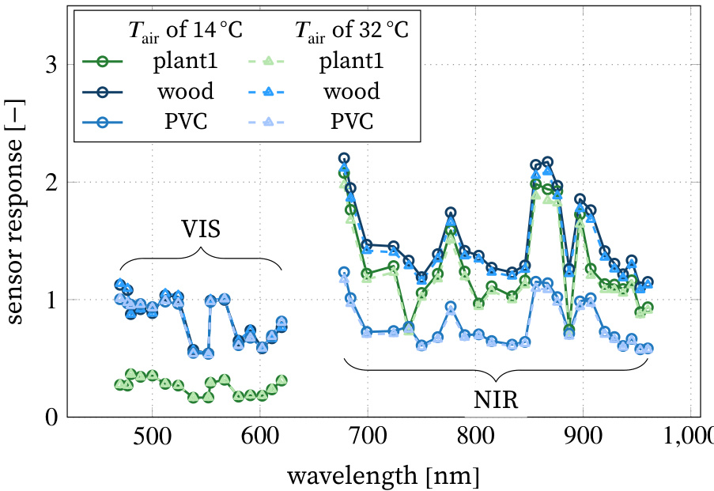  
Figure A.2 Reflection spectra of the three materials in the first experiments at similar PAR conditions ( $2 0 0 \mu \mathrm { m o l } \mathrm { m } ^ { - 2 } \mathrm { s } ^ { - 1 } )$ at two different temperatures, $T _ { \mathrm { a i r } } ~ = ~ 1 4 ^ { \circ } \mathrm { C }$ and $T _ { \mathrm { a i r } } = ~ 3 2 ^ { \circ } \mathrm { C }$ , illustrating the variable spectral response. The peaking of some peaks is the result of strong secondary peaks of the sensor’s response and the emission spectra of the lights, depicted in figure A.1.

B

# Analogue Front-end Specifications of Gloxinia

The PGA meets the noise specification for the first design criteria of the selected ADC for the first three gain settings (1, 2 and 5). However, the PGA does just not meet the distortion requirement for a unity gain configuration. The PGA has a total harmonic distortion (THD) of ‚àí104 dB, and the ADC ‚àí100 dB at 1 kHz. Though, this should not be a limiting factor, since the signal frequencies of interest are typically much lower for Sylvatica. The digital filter on Planalta has a very narrow bandwidth, so this should also be sufficient. A simulation was not performed since there is no simulation model available for this PGA.

For sensors that use a constant supply voltage, there are three possible supply voltages: 3.3 V, 5 V and $1 2 \mathrm { V }$ . All these supplies are located on Dicio, so all boards that are connected to the same Dicio control board have the same supply voltages available. Each sensor board features one additional power supply of 4 V to power the buffer, PGA and ADC. This is the only supply that is not available to the user from one of the connection ports. Furthermore, this supply voltage is generated independently on each sensor board. The $3 . 3 \mathrm { V }$ supply can deliver up to 1 A.

The $1 2 \mathrm { V }$ switching power supply enables Sylvatica to interface with common environmental sensors such as HMP50-L and CS616 from Campbell Scientific, USA. The on-board supply can deliver up to $3 5 \mathrm { m A }$ .

A stable $5 \mathrm { V }$ reference is not always available, for example when the Dicio main power supply is derived from universal serial bus (USB) or when the supply is located at a large distance from the node. For these situations, a power supply (RP604Z501B, Ricoh, Japan) can be soldered on Dicio to stabilise the 5 V supply rail and deliver up to $3 0 0 \mathrm { m A }$ .

C

# C

# Experimental Demonstration of a Plant as Computing Resource for Physical Reservoir Computing Supplementary Materials

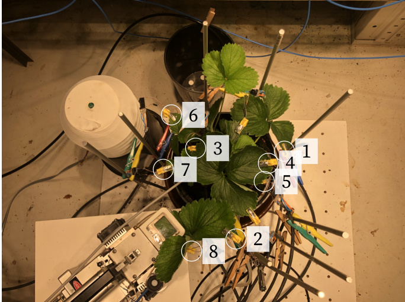  
Figure C.1 Image depicting the setup at the end of the strawberry 1 experiment.

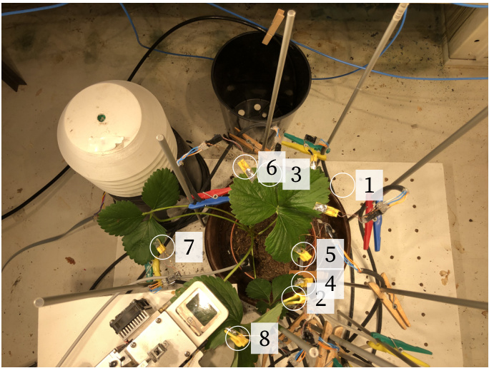  
Figure C.2 Image depicting the setup at the end of the strawberry 2 experiment.

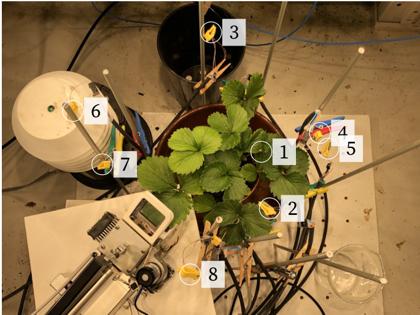  
Figure C.3 Image depicting the setup at the end of the control experiment.

# Bibliography

Acreche, M. M., G. Briceño-Félix, J. A. M. Sánchez, and G. A. Slafer (Apr. 1, 2008). “Physiological Bases of Genetic Gains in Mediterranean Bread Wheat Yield in Spain”. In: European Journal of Agronomy 28.3, pp. 162–170. ISSN: 1161-0301. DOI: 10 . 1016/j.eja.2007.07.001.   
Adamatzky, A. (Aug. 1, 2019). “Plant Leaf Computing”. In: Biosystems 182, pp. 59–64. ISSN: 0303-2647. DOI: 10 . 1016 / j . biosystems.2019.02.004.   
Adamatzky, A., S. Harding, V. Erokhin, R. Mayne, N. Gizzie, F. Baluška, S. Mancuso, and G. C. Sirakoulis (2018). “Computers from Plants We Never Made: Speculations”. In: Inspired by Nature: Essays Presented to Julian F. Miller on the Occasion of His 60th Birthday. Ed. by S. Stepney and A. Adamatzky. Emergence, Complexity and Computation. Cham: Springer International Publishing, pp. 357–387. ISBN: 978-3-319-67997-6. DOI: 10.1007/978-3-319-67997-6_17.   
Adamatzky, A. I. (1995). Identification Of Cellular Automata. London: CRC Press. 348 pp. ISBN: 978-1-315-27435-5. DOI: 10.1201/ 9781315274355.   
Adão, T., J. Hruška, L. Pádua, J. Bessa, E. Peres, R. Morais, and J. J. Sousa (Nov. 2017). “Hyperspectral Imaging: A Review on UAV-Based Sensors, Data Processing and Applications for Agriculture and Forestry”. In: Remote Sensing 9.11 (11), p. 1110. DOI: 10.3390/rs9111110.   
Afzal, A., S. W. Duiker, and J. E. Watson (Apr. 1, 2017). “Leaf Thickness to Predict Plant Water Status”. In: Biosystems Engineering 156, pp. 148–156. ISSN: 1537-5110. DOI: 10 . 1016 / j . biosystemseng.2017.01.011.   
AI and Compute (May 16, 2018). OpenAI. URL: https://openai. com/blog/ai-and-compute/ (visited on 03/16/2021).   
Ali, I., F. Cawkwell, E. Dwyer, B. Barrett, and S. Green (Dec. 1, 2016). “Satellite Remote Sensing of Grasslands: From Observation to Management”. In: Journal of Plant Ecology 9.6, pp. 649– 671. ISSN: 1752-9921. DOI: 10.1093/jpe/rtw005.   
Alonso, L., S. Van Wittenberghe, J. Amorós-López, J. Vila-Francés, L. Gómez-Chova, and J. Moreno (Aug. 2017). “Diurnal Cycle Relationships between Passive Fluorescence, PRI and NPQ of Vegetation in a Controlled Stress Experiment”. In: Remote Sensing 9.8 (8), p. 770. DOI: 10.3390/rs9080770.   
Amitrano, C., C. Arena, Y. Rouphael, S. De Pascale, and V. De Micco (2019). “Vapour Pressure Deficit: The Hidden Driver behind Plant Morphofunctional Traits in Controlled Environments”. In: Annals of Applied Biology 175.3, pp. 313–325. ISSN: 1744-7348. DOI: 10.1111/aab.12544.   
Anderson, J. T. (2016). “Plant Fitness in a Rapidly Changing World”. In: New Phytologist 210.1, pp. 81–87. ISSN: 1469-8137. DOI: 10.1111/nph.13693.   
Andrade-Sanchez, P., M. A. Gore, J. T. Heun, K. R. Thorp, A. E. Carmo-Silva, A. N. French, M. E. Salvucci, and J. W. White (Jan. 28, 2014). “Development and Evaluation of a Field-Based High-Throughput Phenotyping Platform”. In: Functional Plant Biology 41.1, pp. 68–79. ISSN: 1445-4416. DOI: 10.1071/FP13126.   
Appeltant, L., M. C. Soriano, G. Van der Sande, J. Danckaert, S. Massar, J. Dambre, B. Schrauwen, C. R. Mirasso, and I. Fischer (Sept. 13, 2011). “Information Processing Using a Single Dynamical Node as Complex System”. In: Nature Communications 2, p. 468. ISSN: 2041-1723. DOI: 10.1038/ncomms1476.   
Araus, J. L. and J. E. Cairns (Jan. 1, 2014). “Field High-Throughput Phenotyping: The New Crop Breeding Frontier”. In: Trends in Plant Science 19.1, pp. 52–61. ISSN: 1360-1385. DOI: 10.1016/j. tplants.2013.09.008.   
Araus, J. L., S. C. Kefauver, M. Zaman-Allah, M. S. Olsen, and J. E. Cairns (May 1, 2018). “Translating High-Throughput Phenotyping into Genetic Gain”. In: Trends in Plant Science 23.5, pp. 451–466. ISSN: 1360-1385. DOI: 10.1016/j.tplants.2018. 02.001.   
Arduino - Board (2020). URL: https : / / www . arduino . cc / en / reference/board (visited on 01/30/2020).   
Arsova, B., K. J. Foster, M. C. Shelden, H. Bramley, and M. Watt (2020). “Dynamics in Plant Roots and Shoots Minimize Stress, Save Energy and Maintain Water and Nutrient Uptake”. In: New Phytologist 225.3, pp. 1111–1119. ISSN: 1469-8137. DOI: 10.1111/ nph.15955.   
Artru, S., S. Garré, C. Dupraz, M.-P. Hiel, C. Blitz-Frayret, and L. Lassois (Jan. 1, 2017). “Impact of Spatio-Temporal Shade Dynamics on Wheat Growth and Yield, Perspectives for Temperate Agroforestry”. In: European Journal of Agronomy 82, pp. 60– 70. ISSN: 1161-0301. DOI: 10.1016/j.eja.2016.10.004.   
Atiya, A. and A. Parlos (May 2000). “New Results on Recurrent Network Training: Unifying the Algorithms and Accelerating Convergence”. In: IEEE Transactions on Neural Networks 11.3, pp. 697–709. ISSN: 1941-0093. DOI: 10.1109/72.846741.   
Baker, N. R. (2008). “Chlorophyll Fluorescence: A Probe of Photosynthesis In Vivo”. In: Annual Review of Plant Biology 59.1, pp. 89–113. DOI: 10.1146/annurev.arplant.59.032607.092759. pmid: 18444897.   
Baldwin, I. T. and J. C. Schultz (July 15, 1983). “Rapid Changes in Tree Leaf Chemistry Induced by Damage: Evidence for Communication Between Plants”. In: Science 221.4607, pp. 277–279. ISSN: 0036-8075, 1095-9203. DOI: 10.1126/science.221.4607. 277. pmid: 17815197.   
Baluška, F., M. Gagliano, and G. Witzany, eds. (2018). Memory and Learning in Plants. Signaling and Communication in Plants. Springer International Publishing. ISBN: 978-3-319-75595-3. DOI: 10.1007/978-3-319-75596-0.   
Baluška, F., S. Lev-Yadun, and S. Mancuso (Dec. 2010). “Swarm Intelligence in Plant Roots”. In: Trends in Ecology & Evolution 25.12, pp. 682–683. ISSN: 01695347. DOI: 10.1016/j.tree.2010. 09.003.   
Bandopadhyay, S., A. Rastogi, and R. Juszczak (Jan. 2020). “Review of Top-of-Canopy Sun-Induced Fluorescence (SIF) Studies from Ground, UAV, Airborne to Spaceborne Observations”. In: Sensors 20.4 (4), p. 1144. DOI: 10.3390/s20041144.   
Barillot, R., T. De Swaef, D. Combes, J.-L. Durand, A. J. EscobarGutiérrez, P. Martre, C. Perrot, E. Roy, and E. Frak (Dec. 16, 2020). “Leaf Elongation Response to Blue Light Is Mediated by Stomatal-Induced Variations in Plant Transpiration in Festuca Arundinacea”. In: Journal of Experimental Botany (eraa585). ISSN: 0022-0957. DOI: 10.1093/jxb/eraa585.   
Barillot, R., E. Frak, D. Combes, J.-L. Durand, and A. J. EscobarGutiérrez (June 1, 2010). “What Determines the Complex Kinetics of Stomatal Conductance under Blueless PAR in Festuca Arundinacea? Subsequent Effects on Leaf Transpiration”. In: Journal of Experimental Botany 61.10, pp. 2795–2806. ISSN: 0022- 0957. DOI: 10.1093/jxb/erq115.   
Behmann, J., J. Steinrücken, and L. Plümer (July 1, 2014). “Detection of Early Plant Stress Responses in Hyperspectral Images”. In: ISPRS Journal of Photogrammetry and Remote Sensing 93, pp. 98–111. ISSN: 0924-2716. DOI: 10.1016/j.isprsjprs. 2014.03.016.   
Behrens, H. M., M. H. Weisenseel, and A. Sievers (Oct. 1, 1982). “Rapid Changes in the Pattern of Electric Current around the Root Tip of Lepidium Sativum L. Following Gravistimulation”. In: Plant Physiology 70.4, pp. 1079–1083. ISSN: 0032-0889, 1532- 2548. DOI: 10.1104/pp.70.4.1079. pmid: 16662617.   
Beltrán, M., J. C. García, and A. Marcilla (Apr. 1, 1997). “Infrared Spectral Changes in PVC and Plasticized PVC during Gelation and Fusion”. In: European Polymer Journal 33.4, pp. 453–462. ISSN: 0014-3057. DOI: 10.1016/S0014-3057(96)00213-3.   
Bennie, J., B. Huntley, A. Wiltshire, M. O. Hill, and R. Baxter (Aug. 10, 2008). “Slope, Aspect and Climate: Spatially Explicit and Implicit Models of Topographic Microclimate in Chalk Grassland”. In: Ecological Modelling 216.1, pp. 47–59. ISSN: 0304-3800. DOI: 10.1016/j.ecolmodel.2008.04.010.   
Berger, B., B. Parent, and M. Tester (Aug. 1, 2010). “HighThroughput Shoot Imaging to Study Drought Responses”. In: Journal of Experimental Botany 61.13, pp. 3519–3528. ISSN: 0022-0957. DOI: 10.1093/jxb/erq201.   
Berger, S., A. K. Sinha, and T. Roitsch (Dec. 1, 2007). “Plant Physiology Meets Phytopathology: Plant Primary Metabolism and Plant–Pathogen Interactions”. In: Journal of Experimental Botany 58.15-16, pp. 4019–4026. ISSN: 0022-0957. DOI: 10.1093/ jxb/erm298.   
Berry, Z. C., N. C. Emery, S. G. Gotsch, and G. R. Goldsmith (2019). “Foliar Water Uptake: Processes, Pathways, and Integration into Plant Water Budgets”. In: Plant, Cell & Environment 42.2, pp. 410–423. ISSN: 1365-3040. DOI: 10.1111/pce.13439.   
Bezrukov, S. M. and I. Vodyanoy (Nov. 1995). “Noise-Induced Enhancement of Signal Transduction across Voltage-Dependent Ion Channels”. In: Nature 378.6555 (6555), pp. 362–364. ISSN: 1476-4687. DOI: 10.1038/378362a0.   
Bishop, C. (2006). Pattern Recognition and Machine Learning. Information Science and Statistics. New York: Springer-Verlag. ISBN: 978-0-387-31073-2.   
Blackburn, G. A. (Mar. 1, 2007). “Hyperspectral Remote Sensing of Plant Pigments”. In: Journal of Experimental Botany 58.4, pp. 855–867. ISSN: 0022-0957. DOI: 10.1093/jxb/erl123.   
Bock, C. H., G. H. Poole, P. E. Parker, and T. R. Gottwald (Mar. 10, 2010). “Plant Disease Severity Estimated Visually, by Digital Photography and Image Analysis, and by Hyperspectral Imaging”. In: Critical Reviews in Plant Sciences 29.2, pp. 59–107. ISSN: 0735-2689. DOI: 10.1080/07352681003617285.   
Boote, K. J., M. R. Rybak, J. M. S. Scholberg, and J. W. Jones (Aug. 1, 2012). “Improving the CROPGRO-Tomato Model for Predicting Growth and Yield Response to Temperature”. In: HortScience 47.8, pp. 1038–1049. ISSN: 0018-5345, 2327-9834. DOI: 10.21273/HORTSCI.47.8.1038.   
Borowiec, S. (Mar. 15, 2016). “AlphaGo Seals 4-1 Victory over Go Grandmaster Lee Sedol”. In: The Guardian. Technology. ISSN: 0261-3077.   
Borra-Serrano, I., T. De Swaef, P. Quataert, J. Aper, A. Saleem, W. Saeys, B. Somers, I. Roldán-Ruiz, and P. Lootens (Jan. 2020). “Closing the Phenotyping Gap: High Resolution UAV Time Series for Soybean Growth Analysis Provides Objective Data from Field Trials”. In: Remote Sensing 12.10 (10), p. 1644. DOI: 10 . 3390/rs12101644.   
Borra-Serrano, I., T. De Swaef, H. Muylle, D. Nuyttens, J. Vangeyte, K. Mertens, W. Saeys, B. Somers, I. Roldán-Ruiz, and P. Lootens (2019). “Canopy Height Measurements and Non-Destructive Biomass Estimation of Lolium Perenne Swards Using UAV Imagery”. In: Grass and Forage Science 74.3, pp. 356–369. ISSN: 1365-2494. DOI: 10.1111/gfs.12439.   
Briantais, J.-M., J. Dacosta, Y. Goulas, J.-M. Ducruet, and I. Moya (May 1, 1996). “Heat Stress Induces in Leaves an Increase of the Minimum Level of Chlorophyll Fluorescence, Fo: A TimeResolved Analysis”. In: Photosynthesis Research 48.1, pp. 189– 196. ISSN: 1573-5079. DOI: 10.1007/BF00041008.   
Brown, T. B. et al. (July 22, 2020). Language Models Are Few-Shot Learners. arXiv: 2005.14165 [cs]. URL: http://arxiv.org/abs/ 2005.14165 (visited on 09/17/2021).   
Bruning, B., H. Liu, C. Brien, B. Berger, M. Lewis, and T. Garnett (2019). “The Development of Hyperspectral Distribution Maps to Predict the Content and Distribution of Nitrogen and Water in Wheat (Triticum Aestivum)”. In: Frontiers in Plant Science 10. ISSN: 1664-462X. DOI: 10.3389/fpls.2019.01380.   
Buonomano, D. V. and M. M. Merzenich (Feb. 17, 1995). “Temporal Information Transformed into a Spatial Code by a Neural Network with Realistic Properties”. In: Science (New York, N.Y.) 267.5200, pp. 1028–1030. ISSN: 0036-8075. DOI: 10.1126/ science.7863330. pmid: 7863330.   
Burms, J., K. Caluwaerts, and J. Dambre (2015). “RewardModulated Hebbian Plasticity as Leverage for Partially Embodied Control in Compliant Robotics”. In: Frontiers in Neurorobotics 9. ISSN: 1662-5218. DOI: 10 . 3389 / fnbot . 2015 . 00009.   
Busemeyer, L., D. Mentrup, K. Möller, E. Wunder, K. Alheit, V. Hahn, H. P. Maurer, J. C. Reif, T. Würschum, J. Müller, F. Rahe, and A. Ruckelshausen (Mar. 2013). “BreedVision — A MultiSensor Platform for Non-Destructive Field-Based Phenotyping in Plant Breeding”. In: Sensors 13.3, pp. 2830–2847. DOI: 10 . 3390/s130302830.   
Cabrera-Bosquet, L., C. Fournier, N. Brichet, C. Welcker, B. Suard, and F. Tardieu (Oct. 2016). “High-Throughput Estimation of Incident Light, Light Interception and Radiation-Use Efficiency of Thousands of Plants in a Phenotyping Platform”. In: The New Phytologist 212.1, pp. 269–281. ISSN: 1469-8137. DOI: 10.1111/ nph.14027. pmid: 27258481.   
Caldeira, C. F., M. Bosio, B. Parent, L. Jeanguenin, F. Chaumont, and F. Tardieu (Apr. 2014). “A Hydraulic Model Is Compatible with Rapid Changes in Leaf Elongation under Fluctuating Evaporative Demand and Soil Water Status”. In: Plant Physiology 164.4, pp. 1718–1730. ISSN: 0032-0889, 1532-2548. DOI: 10.1104/ pp.113.228379.   
Caluwaerts, K., M. D’Haene, D. Verstraeten, and B. Schrauwen (2013). “Locomotion without a Brain: Physical Reservoir Computing in Tensegrity Structures”. In: Artificial Life 19.1, pp. 35– 66. ISSN: 1064-5462. DOI: 10 . 1162 / ARTL _ a _ 00080. pmid: 23186351.   
Caluwaerts, K., J. Despraz, A. Işçen, A. P. Sabelhaus, J. Bruce, B. Schrauwen, and V. SunSpiral (Sept. 6, 2014). “Design and Control of Compliant Tensegrity Robots through Simulation and Hardware Validation”. In: Journal of The Royal Society Interface 11.98, p. 20140520. ISSN: 1742-5689, 1742-5662. DOI: 10.1098/ rsif.2014.0520. pmid: 24990292.   
Calvo, P., M. Gagliano, G. M. Souza, and A. Trewavas (Jan. 8, 2020). “Plants Are Intelligent, Here’s How”. In: Annals of Botany 125.1, pp. 11–28. ISSN: 0305-7364. DOI: 10.1093/aob/mcz155.   
Camgoz, N. C., S. Hadfield, O. Koller, H. Ney, and R. Bowden (2018). “Neural Sign Language Translation”. In: Proceedings of the IEEE Conference on Computer Vision and Pattern Recognition, pp. 7784–7793.   
Carlson, T. N. and D. A. Ripley (Dec. 1, 1997). “On the Relation between NDVI, Fractional Vegetation Cover, and Leaf Area Index”. In: Remote Sensing of Environment 62.3, pp. 241–252. ISSN: 0034-4257. DOI: 10.1016/S0034-4257(97)00104-1.   
Carter, G. A., R. Bahadur, and R. J. Norby (June 1, 2000). “Effects of Elevated Atmospheric CO2 and Temperature on Leaf Optical Properties in Acer Saccharum”. In: Environmental and Experimental Botany 43.3, pp. 267–273. ISSN: 0098-8472. DOI: 10.1016/ S0098-8472(00)00048-4.   
Chaerle, L., I. Leinonen, H. G. Jones, and D. Van Der Straeten (Mar. 1, 2007). “Monitoring and Screening Plant Populations with Combined Thermal and Chlorophyll Fluorescence Imaging”. In: Journal of Experimental Botany 58.4, pp. 773–784. ISSN: 0022-0957. DOI: 10.1093/jxb/erl257.   
Ciompi, S., E. Gentili, L. Guidi, and G. F. Soldatini (Aug. 16, 1996). “The Effect of Nitrogen Deficiency on Leaf Gas Exchange and Chlorophyll Fluorescence Parameters in Sunflower”. In: Plant Science 118.2, pp. 177–184. ISSN: 0168-9452. DOI: 10.1016/0168- 9452(96)04442-1.   
Clearwater, M. J., F. C. Meinzer, J. L. Andrade, G. Goldstein, and N. M. Holbrook (Aug. 1, 1999). “Potential Errors in Measurement of Nonuniform Sap Flow Using Heat Dissipation Probes”. In: Tree Physiology 19.10, pp. 681–687. ISSN: 0829-318X. DOI: 10. 1093/treephys/19.10.681.   
Collings, D. A., R. G. White, and R. L. Overall (Nov. 1, 1992). “Ionic Current Changes Associated with the Gravity-Induced Bending Response in Roots of Zea Mays L. 1”. In: Plant Physiology 100.3, pp. 1417–1426. ISSN: 0032-0889. DOI: 10.1104/pp.100.3.1417.   
Li-Cor Inc. (2012). Using the LI6400 Portable Photosynthesis System.   
Corrigan, S. (Jan. 2008). Controller Area Network Physical Layer Requirements.   
Cortijo, S., Z. Aydin, S. Ahnert, and J. C. Locke (Jan. 1, 2019). “Widespread Inter-Individual Gene Expression Variability in Arabidopsis Thaliana”. In: Molecular Systems Biology 15.1, e8591. ISSN: 1744-4292. DOI: 10.15252/msb.20188591.   
Costa, C., U. Schurr, F. Loreto, P. Menesatti, and S. Carpentier (2019). “Plant Phenotyping Research Trends, a Science Mapping Approach”. In: Frontiers in Plant Science 9. ISSN: 1664-462X. DOI: 10.3389/fpls.2018.01933.   
Costa, J. M., O. M. Grant, and M. M. Chaves (Oct. 1, 2013). “Thermography to Explore Plant–Environment Interactions”. In: Journal of Experimental Botany 64.13, pp. 3937–3949. ISSN: 0022-0957. DOI: 10.1093/jxb/ert029.   
Dale, L. M., A. Thewis, C. Boudry, I. Rotar, P. Dardenne, V. Baeten, and J. A. F. Pierna (Mar. 1, 2013). “Hyperspectral Imaging Applications in Agriculture and Agro-Food Product Quality and Safety Control: A Review”. In: Applied Spectroscopy Reviews 48.2, pp. 142–159. ISSN: 0570-4928. DOI: 10.1080/05704928.2012. 705800.   
Dambre, J., D. Verstraeten, B. Schrauwen, and S. Massar (July 19, 2012). “Information Processing Capacity of Dynamical Systems”. In: Scientific Reports 2.1, pp. 1–7. ISSN: 2045-2322. DOI: 10.1038/srep00514.   
De Baerdemaeker, N. J. F., M. Stock, J. Van den Bulcke, B. De Baets, L. Van Hoorebeke, and K. Steppe (Dec. 17, 2019). “XRay Microtomography and Linear Discriminant Analysis Enable Detection of Embolism-Related Acoustic Emissions”. In: Plant Methods 15.1, p. 153. ISSN: 1746-4811. DOI: 10 . 1186 / s13007-019-0543-4.   
De Frenne, P., F. Zellweger, F. Rodríguez-Sánchez, B. R. Scheffers, K. Hylander, M. Luoto, M. Vellend, K. Verheyen, and J. Lenoir (May 2019). “Global Buffering of Temperatures under Forest Canopies”. In: Nature Ecology & Evolution 3.5 (5), pp. 744–749. ISSN: 2397-334X. DOI: 10.1038/s41559-019-0842-1.   
De Swaef, T., G. Bellocchi, J. Aper, P. Lootens, and I. RoldánRuiz (Apr. 29, 2019). “Use of Identifiability Analysis in Designing Phenotyping Experiments for Modelling Forage Production and Quality”. In: Journal of Experimental Botany 70.9, pp. 2587– 2604. ISSN: 0022-0957. DOI: 10.1093/jxb/erz049.   
De Swaef, T., V. De Schepper, M. W. Vandegehuchte, and K. Steppe (Oct. 1, 2015a). “Stem Diameter Variations as a Versatile Research Tool in Ecophysiology”. In: Tree Physiology 35.10, pp. 1047–1061. ISSN: 0829-318X. DOI: 10 . 1093 / treephys / tpv080.   
De Swaef, T., W. H. Maes, J. Aper, J. Baert, M. Cougnon, D. Reheul, K. Steppe, I. Roldán-Ruiz, and P. Lootens (Jan. 2021). “Applying RGB- and Thermal-Based Vegetation Indices from UAVs for High-Throughput Field Phenotyping of Drought Tolerance in Forage Grasses”. In: Remote Sensing 13.1, p. 147. DOI: 10.3390/ rs13010147.   
De Swaef, T., O. Pieters, S. Appeltans, I. Borra-Serrano, W. Coudron, V. Couvreur, S. Garré, P. Lootens, B. Nicolaï, L. Pols, C. Saint Cast, J. Šalagovič, M. Van Haeverbeke, M. Stock, and F. wyffels (Jan. 18, 2022). “On the Pivotal Role of Water Potential to Model Plant Physiological Processes”. In: in silico Plants, diab038. ISSN: 2517-5025. DOI: 10 . 1093 / insilicoplants / diab038.   
De Swaef, T., K. Steppe, and R. Lemeur (Apr. 1, 2009). “Determining Reference Values for Stem Water Potential and Maximum Daily Trunk Shrinkage in Young Apple Trees Based on Plant Responses to Water Deficit”. In: Agricultural Water Management 96.4, pp. 541–550. ISSN: 0378-3774. DOI: 10 . 1016 / j . agwat . 2008.09.013.   
De Swaef, T., K. Vermeulen, N. Vergote, J. Van Lommel, M.-C. Van Labeke, P. Bleyaert, and K. Steppe (2015b). “Plant Sensors Help to Understand Tipburn in Lettuce”. In: Acta Horticulturae. 2nd International Symposium on Horticulture in Europe (SHE). Vol. 1099. International Society for Horticultural Science (ISHS), pp. 63–70. ISBN: 978-94-6261-096-5. DOI: http: //dx.doi.org/10.17660/ActaHortic.2015.1099.3.   
Degrave, J., R. V. Cauwenbergh, F. wyffels, T. Waegeman, and B. Schrauwen (Dec. 2013). “Terrain Classification for a Quadruped Robot”. In: 2013 12th International Conference on Machine Learning and Applications. 2013 12th International Conference on Machine Learning and Applications. Vol. 1, pp. 185–190. DOI: 10.1109/ICMLA.2013.39.   
De Koning, A. N. (1994). Development and Dry Matter Distribution in Glasshouse Tomato: A Quantitative Approach. Wageningen: Wageningen University and Research.   
Devacht, S., P. Lootens, J. Baert, J. van Waes, E. van Bockstaele, and I. Roldan-Ruiz (June 1, 2011). “Evaluation of Cold Stress of Young Industrial Chicory (Cichorium Intybus L.) Plants by Chlorophyll a Fluorescence Imaging. I. Light Induction Curve”. In: Photosynthetica 49.2, pp. 161–171. ISSN: 03003604, 15739058. DOI: 10.1007/s11099-011-0015-1.   
Dixon, P. K. and L. Wu (Oct. 1, 1989). “Broadband Digital Lock-in Amplifier Techniques”. In: Review of Scientific Instruments 60.10, pp. 3329–3336. ISSN: 0034-6748. DOI: 10.1063/1.1140523.   
Dockendorf, K. P., I. Park, P. He, J. C. Príncipe, and T. B. DeMarse (Feb. 1, 2009). “Liquid State Machines and Cultured Cortical Networks: The Separation Property”. In: Biosystems 95.2, pp. 90–97. ISSN: 0303-2647. DOI: 10.1016/j.biosystems.2008. 08.001.   
Dominey, P., M. Arbib, and J.-P. Joseph (July 1, 1995). “A Model of Corticostriatal Plasticity for Learning Oculomotor Associations and Sequences”. In: Journal of Cognitive Neuroscience 7.3, pp. 311–336. ISSN: 0898-929X. DOI: 10.1162/jocn.1995.7.3. 311. Dominey, P. F. (2013). “Recurrent Temporal Networks and Language Acquisition—from Corticostriatal Neurophysiology to Reservoir Computing”. In: Frontiers in Psychology 4. ISSN:   
1664-1078. DOI: 10.3389/fpsyg.2013.00500. Downing, K. L. (May 29, 2015). Intelligence Emerging: Adaptivity and Search in Evolving Neural Systems. Cambridge, MA, USA: MIT Press. 504 pp. ISBN: 978-0-262-02913-1. Doya, K. (May 1992). “Bifurcations in the Learning of Recurrent Neural Networks”. In: [Proceedings] 1992 IEEE International Symposium on Circuits and Systems. [Proceedings] 1992 IEEE International Symposium on Circuits and Systems. Vol. 6,   
2777–2780 vol.6. DOI: 10.1109/ISCAS.1992.230622. Draguhn, A., J. M. Mallatt, and D. G. Robinson (Mar. 1, 2021). “Anesthetics and Plants: No Pain, No Brain, and Therefore No Consciousness”. In: Protoplasma 258.2, pp. 239–248. ISSN: 1615-   
6102. DOI: 10.1007/s00709-020-01550-9. Dranias, M. R., H. Ju, E. Rajaram, and A. M. J. VanDongen (Jan. 30,   
2013). “Short-Term Memory in Networks of Dissociated Cortical Neurons”. In: Journal of Neuroscience 33.5, pp. 1940–1953. ISSN: 0270-6474, 1529-2401. DOI: 10 . 1523 / JNEUROSCI . 2718 -   
12.2013. pmid: 23365233. Du, C., F. Cai, M. A. Zidan, W. Ma, S. H. Lee, and W. D. Lu (Dec. 19,   
2017). “Reservoir Computing Using Dynamic Memristors for Temporal Information Processing”. In: Nature Communications   
8.1 (1), p. 2204. ISSN: 2041-1723. DOI: 10 . 1038 / s41467 - 017 -   
02337-y. Eder, M., F. Hisch, and H. Hauser (Apr. 3, 2018). “Morphological Computation-Based Control of a Modular, Pneumatically Driven, Soft Robotic Arm”. In: Advanced Robotics 32.7, pp. 375–   
385. ISSN: 0169-1864. DOI: 10.1080/01691864.2017.1402703. Ehosioke, S., F. Nguyen, S. Rao, T. Kremer, E. Placencia-Gomez, J. A. Huisman, A. Kemna, M. Javaux, and S. Garré (2020). “Sensing the Electrical Properties of Roots: A Review”. In: Vadose Zone Journal 19.1, e20082. ISSN: 1539-1663. DOI: 10.1002/vzj2.   
20082. Enel, P., E. Procyk, R. Quilodran, and P. F. Dominey (June 10,   
2016). “Reservoir Computing Properties of Neural Dynamics in Prefrontal Cortex”. In: PLOS Computational Biology 12.6, e1004967. ISSN: 1553-7358. DOI: 10 . 1371 / journal . pcbi . 1004967.   
Escalante-Pérez, M., E. Krol, A. Stange, D. Geiger, K. A. S. AlRasheid, B. Hause, E. Neher, and R. Hedrich (Sept. 13, 2011). “A Special Pair of Phytohormones Controls Excitability, Slow Closure, and External Stomach Formation in the Venus Flytrap”. In: Proceedings of the National Academy of Sciences 108.37, pp. 15492–15497. ISSN: 0027-8424, 1091-6490. DOI: 10 . 1073 / pnas.1112535108. pmid: 21896747.   
Fabbri, A., E. Sutter, and S. K. Dunston (May 1, 1986). “Anatomical Changes in Persistent Leaves of Tissuecultured Strawberry Plants after Removal from Culture”. In: Scientia Horticulturae 28.4, pp. 331–337. ISSN: 0304-4238. DOI: 10 . 1016 / 0304 - 4238(86)90107-X.   
Fahlgren, N., M. A. Gehan, and I. Baxter (Apr. 1, 2015). “Lights, Camera, Action: High-Throughput Plant Phenotyping Is Ready for a Close-Up”. In: Current Opinion in Plant Biology 24, pp. 93– 99. ISSN: 1369-5266. DOI: 10.1016/j.pbi.2015.02.006.   
Fernández, J. E. and M. V. Cuevas (Feb. 15, 2010). “Irrigation Scheduling from Stem Diameter Variations: A Review”. In: Agricultural and Forest Meteorology 150.2, pp. 135–151. ISSN: 0168-1923. DOI: 10.1016/j.agrformet.2009.11.006.   
Fernando, C. and S. Sojakka (Sept. 14, 2003). “Pattern Recognition in a Bucket”. In: Advances in Artificial Life. European Conference on Artificial Life. Lecture Notes in Computer Science. Springer, Berlin, Heidelberg, pp. 588–597. ISBN: 978-3-540-20057-4. DOI: 10.1007/978-3-540-39432-7_63.   
Fischer, T., D. Byerlee, and G. Edmeades (2014). Crop Yields and Global Food Security: Will Yield Increase Continue to Feed the World? Canberra: ACIAR. ISBN: 978-1-925133-05-9.   
Foley, J. A. et al. (Oct. 2011). “Solutions for a Cultivated Planet”. In: Nature 478.7369, pp. 337–342. ISSN: 1476-4687. DOI: 10.1038/ nature10452.   
Franceschini, M. H. D., H. Bartholomeus, D. F. van Apeldoorn, J. Suomalainen, and L. Kooistra (Jan. 2019). “Feasibility of Unmanned Aerial Vehicle Optical Imagery for Early Detection and Severity Assessment of Late Blight in Potato”. In: Remote Sensing 11.3 (3), p. 224. DOI: 10.3390/rs11030224.   
Freiberger, M. (2020). “Scaling up Integrated Photonic Reservoirs towards Low-Power High-Bandwidth Computing”. PhD thesis. Ghent University. ISBN: 9789463553865.   
Friedli, M., N. Kirchgessner, C. Grieder, F. Liebisch, M. Mannale, and A. Walter (Jan. 29, 2016). “Terrestrial 3D Laser Scanning to Track the Increase in Canopy Height of Both Monocot and Dicot Crop Species under Field Conditions”. In: Plant Methods 12.1, p. 9. ISSN: 1746-4811. DOI: 10.1186/s13007-016-0109-7.   
Furbank, R. T. and M. Tester (Dec. 1, 2011). “Phenomics – Technologies to Relieve the Phenotyping Bottleneck”. In: Trends in Plant Science 16.12, pp. 635–644. ISSN: 1360-1385. DOI: 10.1016/ j.tplants.2011.09.005.   
Gagliano, M. (July 1, 2013). “Green Symphonies: A Call for Studies on Acoustic Communication in Plants”. In: Behavioral Ecology 24.4, pp. 789–796. ISSN: 1045-2249. DOI: 10 . 1093 / beheco / ars206.   
Gagliano, M., M. Renton, M. Depczynski, and S. Mancuso (May 1, 2014). “Experience Teaches Plants to Learn Faster and Forget Slower in Environments Where It Matters”. In: Oecologia 175.1, pp. 63–72. ISSN: 1432-1939. DOI: 10.1007/s00442-013-2873-7.   
Gagliano, M., V. V. Vyazovskiy, A. A. Borbély, M. Grimonprez, and M. Depczynski (Dec. 2, 2016). “Learning by Association in Plants”. In: Scientific Reports 6, p. 38427. ISSN: 2045-2322. DOI: 10.1038/srep38427.   
Gallant, S. and D. King (Aug. 17, 1988). Experiments with Sequential Associative Memories. DOI: 10.13140/2.1.4429.3924.   
Gamon, J. A., J. Peñuelas, and C. B. Field (July 1, 1992). “A NarrowWaveband Spectral Index That Tracks Diurnal Changes in Photosynthetic Efficiency”. In: Remote Sensing of Environment 41.1, pp. 35–44. ISSN: 0034-4257. DOI: 10.1016/0034-4257(92)90059- S.   
Gao, B.-c. (Dec. 1, 1996). “NDWI—A Normalized Difference Water Index for Remote Sensing of Vegetation Liquid Water from Space”. In: Remote Sensing of Environment 58.3, pp. 257–266. ISSN: 0034-4257. DOI: 10.1016/S0034-4257(96)00067-3.   
Gao, J., D. Nuyttens, P. Lootens, Y. He, and J. G. Pieters (June 1, 2018). “Recognising Weeds in a Maize Crop Using a Random Forest Machine-Learning Algorithm and nearInfrared Snapshot Mosaic Hyperspectral Imagery”. In: Biosystems Engineering 170, pp. 39–50. ISSN: 1537-5110. DOI: 10.1016/j.biosystemseng.2018.03.006.   
Gershenfeld, N. A. and A. S. Weigend (1993). The Future of Time Series. Xerox Corporation, Palo Alto Research Center.   
Gerstner, W. and W. M. Kistler (Dec. 1, 2002). “Mathematical Formulations of Hebbian Learning”. In: Biological Cybernetics 87.5, pp. 404–415. ISSN: 1432-0770. DOI: 10.1007/s00422-002-0353- y.   
Gimenez, C., M. Gallardo, and R. B. Thompson (Jan. 1, 2005). “PLANT–WATER RELATIONS”. In: Encyclopedia of Soils in the Environment. Ed. by D. Hillel. Oxford: Elsevier, pp. 231–238. ISBN: 978-0-12-348530-4. DOI: 10.1016/B0-12-348530-4/00459- 8.   
Gitelson, A. and M. N. Merzlyak (Mar. 1, 1994). “Spectral Reflectance Changes Associated with Autumn Senescence of Aesculus Hippocastanum L. and Acer Platanoides L. Leaves. Spectral Features and Relation to Chlorophyll Estimation”. In: Journal of Plant Physiology 143.3, pp. 286–292. ISSN: 0176-1617. DOI: 10.1016/S0176-1617(11)81633-0.   
Giuliani, R., N. Koteyeva, E. Voznesenskaya, M. A. Evans, A. B. Cousins, and G. E. Edwards (July 1, 2013). “Coordination of Leaf Photosynthesis, Transpiration, and Structural Traits in Rice and Wild Relatives ( (Genus Oryza)”. In: Plant Physiology 162.3, pp. 1632–1651. ISSN: 0032-0889. DOI: 10.1104/pp.113.217497.   
Golzarian, M. R., R. A. Frick, K. Rajendran, B. Berger, S. Roy, M. Tester, and D. S. Lun (Feb. 1, 2011). “Accurate Inference of Shoot Biomass from High-Throughput Images of Cereal Plants”. In: Plant Methods 7.1, p. 2. ISSN: 1746-4811. DOI: 10.1186/1746-4811-7-2.   
Gompertz, B. (Jan. 1, 1815). “On the Nature of the Function Expressive of the Law of Human Mortality, and on a New Mode of Determining the Value of Life Contingencies.” In: DOI: 10. 1098/rspl.1815.0271.   
Gottfredson, L. S. (Jan. 1, 1997). “Mainstream Science on Intelligence: An Editorial with 52 Signatories, History, and Bibliography”. In: Intelligence. Special Issue Intelligence and Social Policy 24.1, pp. 13–23. ISSN: 0160-2896. DOI: 10.1016/S0160- 2896(97)90011-8.   
Granier, C., L. Aguirrezabal, K. Chenu, S. J. Cookson, M. Dauzat, P. Hamard, J.-J. Thioux, G. Rolland, S. Bouchier-Combaud, A. Lebaudy, B. Muller, T. Simonneau, and F. Tardieu (2006). “PHENOPSIS, an Automated Platform for Reproducible Phenotyping of Plant Responses to Soil Water Deficit in Arabidopsis Thaliana Permitted the Identification of an Accession with Low Sensitivity to Soil Water Deficit”. In: New Phytologist 169.3, pp. 623–635. ISSN: 1469-8137. DOI: 10.1111/j.1469-8137.2005.01609.x.   
Graves, A., N. Jaitly, and A.-r. Mohamed (Dec. 2013). “Hybrid Speech Recognition with Deep Bidirectional LSTM”. In: 2013 IEEE Workshop on Automatic Speech Recognition and Understanding. 2013 IEEE Workshop on Automatic Speech Recognition and Understanding, pp. 273–278. DOI: 10 . 1109 / ASRU.2013.6707742.   
Greenham, K., P. Lou, S. E. Remsen, H. Farid, and C. R. McClung (May 3, 2015). “TRiP: Tracking Rhythms in Plants, an Automated Leaf Movement Analysis Program for Circadian Period Estimation”. In: Plant Methods 11.1, p. 33. ISSN: 1746-4811. DOI: 10.1186/s13007-015-0075-5.   
Hafizovic, S., F. Heer, T. Ugniwenko, U. Frey, A. Blau, C. Ziegler, and A. Hierlemann (Aug. 15, 2007). “A CMOS-based Microelectrode Array for Interaction with Neuronal Cultures”. In: Journal of Neuroscience Methods 164.1, pp. 93–106. ISSN: 0165-0270. DOI: 10.1016/j.jneumeth.2007.04.006.   
Hanssens, J., T. De Swaef, and K. Steppe (2015). “High Light Decreases Xylem Contribution to Fruit Growth in Tomato”. In: Plant, Cell & Environment 38.3, pp. 487–498. ISSN: 1365-3040. DOI: 10.1111/pce.12411.   
Hartmann, A., T. Czauderna, R. Hoffmann, N. Stein, and F. Schreiber (May 12, 2011). “HTPheno: An Image Analysis Pipeline for High-Throughput Plant Phenotyping”. In: BMC Bioinformatics 12.1, p. 148. ISSN: 1471-2105. DOI: 10.1186/1471- 2105-12-148.   
Hastie, T., R. Tibshirani, and J. Friedman (2009). The Elements of Statistical Learning: Data Mining, Inference, and Prediction. Ed. by T. Hastie and R. Tibshirani. Springer Series in Statistics. New York, NY. ISBN: 978-0-387-84858-7.   
Hauser, H., A. J. Ijspeert, R. M. Füchslin, R. Pfeifer, and W. Maass (Dec. 1, 2011). “Towards a Theoretical Foundation for Morphological Computation with Compliant Bodies”. In: Biological Cybernetics 105.5, pp. 355–370. ISSN: 1432-0770. DOI: 10 . 1007 / s00422-012-0471-0.   
Hemming, S., F. de Zwart, A. Elings, A. Petropoulou, and I. Righini (Jan. 2020). “Cherry Tomato Production in Intelligent Greenhouses—Sensors and AI for Control of Climate, Irrigation, Crop Yield, and Quality”. In: Sensors 20.22 (22), p. 6430. DOI: 10.3390/ s20226430.   
Herculano-Houzel, S. (2009). “The Human Brain in Numbers: A Linearly Scaled-up Primate Brain”. In: Frontiers in Human Neuroscience 3. ISSN: 1662-5161. DOI: 10.3389/neuro.09.031.2009.   
Hermans, M. and B. Schrauwen (Dec. 29, 2011). “Recurrent Kernel Machines: Computing with Infinite Echo State Networks”. In: Neural Computation 24.1, pp. 104–133. ISSN: 0899-7667. DOI: 10.1162/NECO_a_00200.   
Hilty, J., B. Muller, F. Pantin, and S. Leuzinger (2021). “Plant Growth: The What, the How, and the Why”. In: New Phytologist 232.1, pp. 25–41. ISSN: 1469-8137. DOI: 10.1111/nph.17610.   
Hochreiter, S. and J. Schmidhuber (Nov. 15, 1997). “Long ShortTerm Memory”. In: Neural Computation 9.8, pp. 1735–1780. ISSN: 0899-7667. DOI: 10.1162/neco.1997.9.8.1735.   
Hornik, K., M. Stinchcombe, and H. White (Jan. 1, 1989). “Multilayer Feedforward Networks Are Universal Approximators”. In: Neural Networks 2.5, pp. 359–366. ISSN: 0893-6080. DOI: 10. 1016/0893-6080(89)90020-8.   
Houle, D., D. R. Govindaraju, and S. Omholt (Dec. 2010). “Phenomics: The next Challenge”. In: Nature Reviews Genetics 11.12 (12), pp. 855–866. ISSN: 1471-0064. DOI: 10.1038/nrg2897.   
Huang, B. and P. S. Nobel (Nov. 1, 1992). “Hydraulic Conductivity and Anatomy for Lateral Roots of Agave Deserti During Root Growth and Drought-induced Abscission”. In: Journal of Experimental Botany 43.11, pp. 1441–1449. ISSN: 0022-0957. DOI: 10. 1093/jxb/43.11.1441.   
Hubeau, M. and K. Steppe (Oct. 1, 2015). “Plant-PET Scans: In Vivo Mapping of Xylem and Phloem Functioning”. In: Trends in Plant Science 20.10, pp. 676–685. ISSN: 1360-1385. DOI: 10.1016/j. tplants.2015.07.008.   
Iida, F., G. Gomez, and R. Pfeifer (July 2005). “Exploiting Body Dynamics for Controlling a Running Quadruped Robot”. In: ICAR ’05. Proceedings., 12th International Conference on Advanced Robotics, 2005. ICAR ’05. Proceedings., 12th International Conference on Advanced Robotics, 2005. Pp. 229–235. DOI: 10 . 1109/ICAR.2005.1507417.   
Ijspeert, A. J. (May 1, 2008). “Central Pattern Generators for Locomotion Control in Animals and Robots: A Review”. In: Neural Networks. Robotics and Neuroscience 21.4, pp. 642–653. ISSN: 0893-6080. DOI: 10.1016/j.neunet.2008.03.014.   
Inoue, S.-i., T. Kinoshita, and K.-i. Shimazaki (Aug. 1, 2005). “Possible Involvement of Phototropins in Leaf Movement of Kidney Bean in Response to Blue Light”. In: Plant Physiology 138.4, pp. 1994–2004. ISSN: 0032-0889. DOI: 10.1104/pp.105.062026.   
Inoue, Y., J. Peñuelas, A. Miyata, and M. Mano (Jan. 15, 2008). “Normalized Difference Spectral Indices for Estimating Photosynthetic Efficiency and Capacity at a Canopy Scale Derived from Hyperspectral and CO2 Flux Measurements in Rice”. In: Remote Sensing of Environment 112.1, pp. 156–172. ISSN: 0034- 4257. DOI: 10.1016/j.rse.2007.04.011.   
Jaeger, H. (Jan. 1, 2001). “The” Echo State” Approach to Analysing and Training Recurrent Neural Networks-with an Erratum Note’”. In: Bonn, Germany: German National Research Center for Information Technology GMD Technical Report 148.   
Jaeger, H. and H. Haas (Apr. 2, 2004). “Harnessing Nonlinearity: Predicting Chaotic Systems and Saving Energy in Wireless Communication”. In: Science 304.5667, pp. 78–80. ISSN: 0036- 8075, 1095-9203. DOI: 10 . 1126 / science . 1091277. pmid: 15064413.   
Janka, E., O. Körner, E. Rosenqvist, and C.-O. Ottosen (June 1, 2013). “High Temperature Stress Monitoring and Detection Using Chlorophyll a Fluorescence and Infrared Thermography in Chrysanthemum (Dendranthema Grandiflora)”. In: Plant Physiology and Biochemistry 67, pp. 87–94. ISSN: 0981-9428. DOI: 10. 1016/j.plaphy.2013.02.025.   
Jas, M. et al. (2020). “Pyglmnet : Python Implementation of Elastic-Net Regularized Generalized Linear Models”. In: JOURNAL OF OPEN SOURCE SOFTWARE 5.47 (47). ISSN: 2475-9066. DOI: 10.21105/joss.01959.   
Jin, J. and Q. Wang (Sept. 1, 2016). “Hyperspectral Indices Based on First Derivative Spectra Closely Trace Canopy Transpiration in a Desert Plant”. In: Ecological Informatics 35, pp. 1–8. ISSN: 1574-9541. DOI: 10.1016/j.ecoinf.2016.06.004.   
Johannsen, W. (Mar. 1, 1911). “The Genotype Conception of Heredity”. In: The American Naturalist 45.531, pp. 129–159. ISSN: 0003-0147. DOI: 10.1086/279202.   
Johannsen, W. (1903). “Über Erblichkeit in Populationen Und in Reinen Linien”. In.   
Jones, B., D. Stekel, J. Rowe, and C. Fernando (Apr. 2007). “Is There a Liquid State Machine in the Bacterium Escherichia Coli?” In: 2007 IEEE Symposium on Artificial Life. 2007 IEEE Symposium on Artificial Life, pp. 187–191. DOI: 10 . 1109 / ALIFE . 2007 . 367795.   
Jones, H. G. (1999). “Use of Thermography for Quantitative Studies of Spatial and Temporal Variation of Stomatal Conductance over Leaf Surfaces”. In: Plant, Cell & Environment 22.9, pp. 1043– 1055. ISSN: 1365-3040. DOI: 10.1046/j.1365-3040.1999.00468. x.   
Jones, H. G. (Nov. 1, 2004). “Irrigation Scheduling: Advantages and Pitfalls of Plant-Based Methods”. In: Journal of Experimental Botany 55.407, pp. 2427–2436. ISSN: 0022-0957. DOI: 10 . 1093/jxb/erh213.   
Jones, H. G. (Dec. 2013). Plants and Microclimate: A Quantitative Approach to Environmental Plant Physiology. 3rd ed. Cambridge University Press. ISBN: 978-0-521-27959-8. DOI: 10 . 1017 / CBO9780511845727.   
Jones, H. G., M. Stoll, T. Santos, C. de Sousa, M. M. Chaves, and O. M. Grant (Nov. 1, 2002). “Use of Infrared Thermography for Monitoring Stomatal Closure in the Field: Application to Grapevine”. In: Journal of Experimental Botany 53.378, pp. 2249– 2260. ISSN: 0022-0957. DOI: 10.1093/jxb/erf083.   
Ju, H., M. R. Dranias, G. Banumurthy, and A. M. J. VanDongen (Mar. 4, 2015). “Spatiotemporal Memory Is an Intrinsic Property of Networks of Dissociated Cortical Neurons”. In: Journal of Neuroscience 35.9, pp. 4040–4051. ISSN: 0270-6474, 1529-2401. DOI: 10.1523/JNEUROSCI.3793-14.2015. pmid: 25740531.   
Jumper, J. et al. (Aug. 2021). “Highly Accurate Protein Structure Prediction with AlphaFold”. In: Nature 596.7873 (7873), pp. 583– 589. ISSN: 1476-4687. DOI: 10.1038/s41586-021-03819-2.   
Kaiser, E., A. Morales, and J. Harbinson (Feb. 1, 2018). “Fluctuating Light Takes Crop Photosynthesis on a Rollercoaster Ride”. In: Plant Physiology 176.2, pp. 977–989. ISSN: 0032-0889, 1532- 2548. DOI: 10.1104/pp.17.01250. pmid: 29046421.   
Karban, R. (June 18, 2015). Plant Sensing and Communication. University of Chicago Press. ISBN: 978-0-226-26484-4.   
Karpiński, S. and M. Szechyńska-Hebda (Nov. 2010). “Secret Life of Plants: From Memory to Intelligence”. In: Plant Signaling & Behavior 5.11, pp. 1391–1394. ISSN: 1559-2324. pmid: 21051941.   
Kathiresan, K. and B. L. Bingham (Jan. 1, 2001). “Biology of Mangroves and Mangrove Ecosystems”. In: Advances in Marine Biology. Vol. 40. Academic Press, pp. 81–251. DOI: 10.1016/S0065- 2881(01)40003-4.   
Khait, I., O. Lewin-Epstein, R. Sharon, K. Saban, R. Perelman, A. Boonman, Y. Yovel, and L. Hadany (Dec. 2, 2019). “Plants Emit Informative Airborne Sounds under Stress”. In: bioRxiv, p. 507590. DOI: 10.1101/507590.   
Khan, M. J., H. S. Khan, A. Yousaf, K. Khurshid, and A. Abbas (2018). “Modern Trends in Hyperspectral Image Analysis: A Review”. In: IEEE Access 6, pp. 14118–14129. ISSN: 2169-3536. DOI: 10.1109/ACCESS.2018.2812999.   
Kirby, K. G. and N. Day (1990). “The Neurodynamics of Context Reverberation Learning”. In: [1990] Proceedings of the Twelfth Annual International Conference of the IEEE Engineering in Medicine and Biology Society. IEEE, pp. 1781–1782. ISBN: 0-87942-559-8.   
Kirby, K. G. (1991). “Duality in Neurocomputational Inductive Inference: A Simulationist Perspective”. In: Proceedings of the IEEE International Conference on Systems Engineering, pp. 351–354.   
Kolen, J. F. and S. C. Kremer (2001). “Gradient Flow in Recurrent Nets: The Difficulty of Learning LongTerm Dependencies”. In: A Field Guide to Dynamical Recurrent Networks. IEEE, pp. 237– 243. ISBN: 978-0-470-54403-7. DOI: 10 . 1109 / 9780470544037 . ch14.   
Kridner, J. and G. Coley (2020). BeagleBone Black: System Reference Manual. C.   
Kromdijk, J., K. Głowacka, L. Leonelli, S. T. Gabilly, M. Iwai, K. K. Niyogi, and S. P. Long (Nov. 18, 2016). “Improving Photosynthesis and Crop Productivity by Accelerating Recovery from Photoprotection”. In: Science 354.6314, pp. 857–861. ISSN: 0036-8075, 1095-9203. DOI: 10 . 1126 / science.aai8878. pmid: 27856901.   
Lawson, T. and M. R. Blatt (Apr. 1, 2014). “Stomatal Size, Speed, and Responsiveness Impact on Photosynthesis and Water Use Efficiency”. In: Plant Physiology 164.4, pp. 1556–1570. ISSN: 0032-0889, 1532-2548. DOI: 10 . 1104 / pp . 114 . 237107. pmid: 24578506.   
Lawson, T., D. M. Kramer, and C. A. Raines (Apr. 1, 2012). “Improving Yield by Exploiting Mechanisms Underlying Natural Variation of Photosynthesis”. In: Current Opinion in Biotechnology. Food Biotechnology - Plant Biotechnology 23.2, pp. 215– 220. ISSN: 0958-1669. DOI: 10.1016/j.copbio.2011.12.012.   
LeCun, Y., Y. Bengio, and G. Hinton (May 2015). “Deep Learning”. In: Nature 521.7553 (7553), pp. 436–444. ISSN: 1476-4687. DOI: 10.1038/nature14539.   
Legenstein, R., S. M. Chase, A. B. Schwartz, and W. Maass (June 23, 2010). “A Reward-Modulated Hebbian Learning Rule Can Explain Experimentally Observed Network Reorganization in a Brain Control Task”. In: Journal of Neuroscience 30.25, pp. 8400–8410. ISSN: 0270-6474, 1529-2401. DOI: 10.1523/JNEUROSCI.4284-09.2010. pmid: 20573887.   
Legg, S. and M. Hutter (June 25, 2007). “A Collection of Definitions of Intelligence”. In: Frontiers in Artificial Intelligence and Applications 157, pp. 17–24. arXiv: 0706.3639.   
Li, L., Q. Zhang, and D. Huang (Nov. 2014). “A Review of Imaging Techniques for Plant Phenotyping”. In: Sensors 14.11, pp. 20078–20111. DOI: 10.3390/s141120078.   
Lieten, P. (Jan. 1, 2013). “Advances in Strawberry Substrate Culture during the Last Twenty Years in the Netherlands and Belgium”. In: International Journal of Fruit Science 13.1-2, pp. 84–90. ISSN: 1553-8362. DOI: 10.1080/15538362.2012.697024.   
Liimatainen, V., M. Kharboutly, D. Rostoucher, M. Gauthier, and Q. Zhou (May 2013). “Capillary Self-Alignment Assisted Hybrid Robotic Handling for Ultra-Thin Die Stacking”. In: 2013 IEEE International Conference on Robotics and Automation. 2013 IEEE International Conference on Robotics and Automation, pp. 1403– 1408. DOI: 10.1109/ICRA.2013.6630754.   
Loewenstein, Y. and H. S. Seung (Oct. 10, 2006). “Operant Matching Is a Generic Outcome of Synaptic Plasticity Based on the Covariance between Reward and Neural Activity”. In: Proceedings of the National Academy of Sciences 103.41, pp. 15224–15229. ISSN: 0027-8424, 1091-6490. DOI: 10 . 1073 / pnas . 0505220103. pmid: 17008410.   
Lootens, P., T. Ruttink, A. Rohde, D. Combes, P. Barre, and I. Roldán-Ruiz (June 10, 2016). “High-Throughput Phenotyping of Lateral Expansion and Regrowth of Spaced Lolium Perenne Plants Using on-Field Image Analysis”. In: Plant Methods 12.1, p. 32. ISSN: 1746-4811. DOI: 10.1186/s13007-016-0132-8.   
Lowe, A., N. Harrison, and A. P. French (Oct. 10, 2017). “Hyperspectral Image Analysis Techniques for the Detection and Classification of the Early Onset of Plant Disease and Stress”. In: Plant Methods 13.1, p. 80. ISSN: 1746-4811. DOI: 10 . 1186 / s13007-017-0233-z.   
Lukoševičius, M. (2012). “A Practical Guide to Applying Echo State Networks”. In: Neural Networks: Tricks of the Trade: Second Edition. Ed. by G. Montavon, G. B. Orr, and K.-R. Müller. Lecture Notes in Computer Science. Berlin, Heidelberg: Springer, pp. 659–686. ISBN: 978-3-642-35289-8. DOI: 10.1007/978-3-642- 35289-8_36.   
Lukoševičius, M. and H. Jaeger (Aug. 1, 2009). “Reservoir Computing Approaches to Recurrent Neural Network Training”. In: Computer Science Review 3.3, pp. 127–149. ISSN: 1574-0137. DOI: 10.1016/j.cosrev.2009.03.005.   
Lukoševičius, M., H. Jaeger, and B. Schrauwen (Nov. 1, 2012). “Reservoir Computing Trends”. In: KI - Künstliche Intelligenz 26.4, pp. 365–371. ISSN: 1610-1987. DOI: 10.1007/s13218-012- 0204-5.   
Maass, W., T. Natschläger, and H. Markram (Nov. 2002). “RealTime Computing Without Stable States: A New Framework for Neural Computation Based on Perturbations”. In: Neural Computation 14.11, pp. 2531–2560. ISSN: 0899-7667, 1530-888X. DOI: 10.1162/089976602760407955.   
Maes, W. H. and K. Steppe (Aug. 1, 2012). “Estimating Evapotranspiration and Drought Stress with Ground-Based Thermal Remote Sensing in Agriculture: A Review”. In: Journal of Experimental Botany 63.13, pp. 4671–4712. ISSN: 0022-0957. DOI: 10.1093/jxb/ers165.   
Mahlein, A.-K. (Sept. 1, 2015). “Plant Disease Detection by Imaging Sensors – Parallels and Specific Demands for Precision Agriculture and Plant Phenotyping”. In: Plant Disease 100.2, pp. 241–251. ISSN: 0191-2917. DOI: 10.1094/PDIS-03-15- 0340-FE.   
Mallatt, J., M. R. Blatt, A. Draguhn, D. G. Robinson, and L. Taiz (May 1, 2021). “Debunking a Myth: Plant Consciousness”. In: Protoplasma 258.3, pp. 459–476. ISSN: 1615-6102. DOI: 10.1007/ s00709-020-01579-w.   
Mancuso, S. and V. Di Stefano (2018). The Revolutionary Genius of Plants: A New Understanding of Plant Intelligence and Behavior. First Atria books hardcover edition. New York, NY: Atria Books, an imprint of Simon & Schuster, Inc. 225 pp. ISBN: 978-1-5011- 8785-8.   
Marder, E. and D. Bucher (Nov. 27, 2001). “Central Pattern Generators and the Control of Rhythmic Movements”. In: Current Biology 11.23, R986–R996. ISSN: 0960-9822. DOI: 10.1016/S0960- 9822(01)00581-4.   
Marouani, H. and M. R. Dagenais (2008). “Internal Clock Drift Estimation in Computer Clusters”. In: Journal of Computer Systems, Networks, and Communications 2008, e583162. ISSN: 2090-7141. DOI: 10.1155/2008/583162.   
Marshall, M., P. Thenkabail, T. Biggs, and K. Post (Mar. 15, 2016). “Hyperspectral Narrowband and Multispectral Broadband Indices for Remote Sensing of Crop Evapotranspiration and Its Components (Transpiration and Soil Evaporation)”. In: Agricultural and Forest Meteorology 218–219, pp. 122–134. ISSN: 0168- 1923. DOI: 10.1016/j.agrformet.2015.12.025.   
Matthews, J. S. A., S. Vialet-Chabrand, and T. Lawson (Mar. 1, 2018). “Acclimation to Fluctuating Light Impacts the Rapidity of Response and Diurnal Rhythm of Stomatal Conductance”. In: Plant Physiology 176.3, pp. 1939–1951. ISSN: 0032-0889, 1532- 2548. DOI: 10.1104/pp.17.01809. pmid: 29371250.   
Maurel, C. and P. Nacry (July 2020). “Root Architecture and Hydraulics Converge for Acclimation to Changing Water Availability”. In: Nature Plants 6.7 (7), pp. 744–749. ISSN: 2055-0278. DOI: 10.1038/s41477-020-0684-5.   
Mayne, R., A. Adamatzky, and J. Jones (July 4, 2015). “On the Role of the Plasmodial Cytoskeleton in Facilitating Intelligent Behavior in Slime Mold Physarum Polycephalum”. In: Communicative & Integrative Biology 8.4, e1059007. ISSN: null. DOI: 10. 1080/19420889.2015.1059007. pmid: 26478782.   
Mazis, A., S. D. Choudhury, P. B. Morgan, V. Stoerger, J. Hiller, Y. Ge, and T. Awada (June 1, 2020). “Application of HighThroughput Plant Phenotyping for Assessing Biophysical Traits and Drought Response in Two Oak Species under Controlled Environment”. In: Forest Ecology and Management 465, p. 118101. ISSN: 0378-1127. DOI: 10.1016/j.foreco.2020. 118101.   
McAusland, L., S. Vialet-Chabrand, P. Davey, N. R. Baker, O. Brendel, and T. Lawson (2016). “Effects of Kinetics of LightInduced Stomatal Responses on Photosynthesis and Water-Use Efficiency”. In: New Phytologist 211.4, pp. 1209–1220. ISSN: 1469-8137. DOI: 10.1111/nph.14000.   
McBurney, T. (Mar. 1, 1992). “The Relationship Between Leaf Thickness and Plant Water Potential”. In: Journal of Experimental Botany 43.3, pp. 327–335. ISSN: 0022-0957. DOI: 10.1093/jxb/43.3.327.   
McKinney, W. (2010). “Data Structures for Statistical Computing in Python”. In: Python in Science Conference. Austin, Texas, pp. 56–61. DOI: 10.25080/Majora-92bf1922-00a.   
McKinney, W. (2011). “Pandas: A Foundational Python Library for Data Analysis and Statistics”. In: Python for High Performance and Scientific Computing 14, p. 9.   
Meeus, S., J. Van den Bulcke, and F. wyffels (2020). “From Leaf to Label: A Robust Automated Workflow for Stomata Detection”. In: Ecology and Evolution 10.17, pp. 9178–9191. ISSN: 2045-7758. DOI: 10.1002/ece3.6571.   
Meidner, H. (Sept. 1, 1990). “The Absorption Lag, Epidermal Turgor and Stomata”. In: Journal of Experimental Botany 41.9, pp. 1115–1118. ISSN: 0022-0957. DOI: 10.1093/jxb/41.9.1115.   
Meyer, S. and B. Genty (Nov. 1, 1999). “Heterogeneous Inhibition of Photosynthesis over the Leaf Surface of Rosa Rubiginosa L. during Water Stress and Abscisic Acid Treatment: Induction of a Metabolic Component by Limitation of CO2 Diffusion”. In: Planta 210.1, pp. 126–131. ISSN: 1432-2048. DOI: 10.1007/ s004250050661.   
Mir, R. R., M. Reynolds, F. Pinto, M. A. Khan, and M. A. Bhat (May 1, 2019). “High-Throughput Phenotyping for Crop Improvement in the Genomics Era”. In: Plant Science. The 4th International Plant Phenotyping Symposium 282, pp. 60–72. ISSN: 0168-9452. DOI: 10.1016/j.plantsci.2019.01.007.   
Mishra, P., M. S. M. Asaari, A. Herrero-Langreo, S. Lohumi, B. Diezma, and P. Scheunders (Dec. 1, 2017). “Close Range Hyperspectral Imaging of Plants: A Review”. In: Biosystems Engineering 164, pp. 49–67. ISSN: 1537-5110. DOI: 10 . 1016 / j . biosystemseng.2017.09.009.   
Mohanty, S. P., D. P. Hughes, and M. Salathé (2016). “Using Deep Learning for Image-Based Plant Disease Detection”. In: Frontiers in Plant Science 7, p. 1419. ISSN: 1664-462X. DOI: 10.3389/ fpls.2016.01419.   
Moradi, F. and A. M. Ismail (June 1, 2007). “Responses of Photosynthesis, Chlorophyll Fluorescence and ROS-Scavenging Systems to Salt Stress During Seedling and Reproductive Stages in Rice”. In: Annals of Botany 99.6, pp. 1161–1173. ISSN: 0305-7364. DOI: 10.1093/aob/mcm052.   
Moru, S., H. Ibrahim, and L. Dong (Sept. 2020). “Wearable Sensors for On-Leaf Monitoring of Volatile Organic Compounds Emissions from Plants”. In: 2020 IEEE 15th International Conference on Nano/Micro Engineered and Molecular System (NEMS). 2020 IEEE 15th International Conference on Nano/Micro Engineered and Molecular System (NEMS), pp. 565–570. DOI: 10 . 1109/NEMS50311.2020.9265575.   
Müller, V. C. and M. Hoffmann (2017). “What Is Morphological Computation? On How the Body Contributes to Cognition and Control”. In: Artificial Life 23.1, pp. 1–24. ISSN: 1064-5462. DOI: 10.1162/ARTL_a_00219. pmid: 28140632.   
Murchie, E. H. and T. Lawson (Oct. 1, 2013). “Chlorophyll Fluorescence Analysis: A Guide to Good Practice and Understanding Some New Applications”. In: Journal of Experimental Botany 64.13, pp. 3983–3998. ISSN: 0022-0957. DOI: 10 . 1093 / jxb / ert208.   
Murchie, E. H., S. Kefauver, J. L. Araus, O. Muller, U. Rascher, P. J. Flood, and T. Lawson (Aug. 1, 2018). “Measuring the Dynamic Photosynthome”. In: Annals of Botany 122.2, pp. 207–220. ISSN: 0305-7364. DOI: 10.1093/aob/mcy087.   
Murchie, E. H. and A. V. Ruban (2020). “Dynamic NonPhotochemical Quenching in Plants: From Molecular Mechanism to Productivity”. In: The Plant Journal 101.4, pp. 885–896. ISSN: 1365-313X. DOI: 10.1111/tpj.14601.   
Nagano, S., S. Moriyuki, K. Wakamori, H. Mineno, and H. Fukuda (2019). “Leaf-Movement-Based Growth Prediction Model Using Optical Flow Analysis and Machine Learning in Plant Factory”. In: Frontiers in Plant Science 10. ISSN: 1664-462X. DOI: 10.3389/ fpls.2019.00227.   
Nagel, T. (1974). “What Is It like to Be a Bat?” In: Readings in philosophy of psychology 1, pp. 159–168.   
Najdabbasi, N., S. M. Mirmajlessi, K. Dewitte, M. Ameye, M. Mänd, K. Audenaert, S. Landschoot, and G. Haesaert (Apr. 2021). “Green Leaf Volatile Confers Management of Late Blight Disease: A Green Vaccination in Potato”. In: Journal of Fungi 7.4 (4), p. 312. DOI: 10.3390/jof7040312.   
Nakajima, K. (May 2020). “Physical Reservoir Computing—an Introductory Perspective”. In: Japanese Journal of Applied Physics 59.6, p. 060501. ISSN: 1347-4065. DOI: 10 . 35848 / 1347 - 4065 / ab8d4f.   
Nakajima, K. and I. Fischer, eds. (2021a). Reservoir Computing: Theory, Physical Implementations, and Applications. Natural Computing Series. Singapore: Springer Singapore. ISBN: 9789811316869. DOI: 10.1007/978-981-13-1687-6.   
Nakajima, K., H. Hauser, R. Kang, E. Guglielmino, D. G. Caldwell, and R. Pfeifer (2013). “A Soft Body as a Reservoir: Case Studies in a Dynamic Model of Octopus-Inspired Soft Robotic Arm”. In: Frontiers in Computational Neuroscience 7. ISSN: 1662-5188. DOI: 10.3389/fncom.2013.00091.   
Nakajima, K., H. Hauser, T. Li, and R. Pfeifer (May 27, 2015). “Information Processing via Physical Soft Body”. In: Scientific Reports 5.1, p. 10487. ISSN: 2045-2322. DOI: 10.1038/srep10487.   
Nakajima, M., K. Tanaka, and T. Hashimoto (Feb. 10, 2021b). “Scalable Reservoir Co uting on Coherent Linear Photonic Processor”. In: Communications Physics 4.1 (1), pp. 1–12. ISSN: 2399-3650. DOI: 10.1038/s42005-021-00519-1.   
Nejad, A. R. and U. V. Meeteren (2005). “Stomatal Response Characteristics of Tradescantia Virginiana Grown at High Relative Air Humidity”. In: Physiologia Plantarum 125.3, pp. 324–332. ISSN: 1399-3054. DOI: 10.1111/j.1399-3054.2005.00567.x.   
Neveu, P., A. Tireau, N. Hilgert, V. Nègre, J. Mineau-Cesari, N. Brichet, R. Chapuis, I. Sanchez, C. Pommier, B. Charnomordic, F. Tardieu, and L. Cabrera-Bosquet (Jan. 2019). “Dealing with Multi-Source and Multi-Scale Information in Plant Phenomics: The Ontology-Driven Phenotyping Hybrid Information System”. In: The New Phytologist 221.1, pp. 588–601. ISSN: 1469-8137. DOI: 10.1111/nph.15385. pmid: 30152011.   
Nick, P. (May 2021). “Intelligence without Neurons: A Turing Test for Plants?” In: Protoplasma 258.3, pp. 455–458. ISSN: 0033-183X, 1615-6102. DOI: 10.1007/s00709-021-01642-0.   
Nikolopoulos, D., G. Liakopoulos, I. Drossopoulos, and G. Karabourniotis (May 1, 2002). “The Relationship between Anatomy and Photosynthetic Performance of Heterobaric Leaves”. In: Plant Physiology 129.1, pp. 235–243. ISSN: 0032- 0889. DOI: 10.1104/pp.010943.   
NXP Semiconductors (2014). UM10204 I2C-bus Specification and User Manual.   
Obien, M. E. J., K. Deligkaris, T. Bullmann, D. J. Bakkum, and U. Frey (2015). “Revealing Neuronal Function through Microelectrode Array Recordings”. In: Frontiers in Neuroscience 8, p. 423. ISSN: 1662-453X. DOI: 10.3389/fnins.2014.00423.   
Okamoto, H. and W. S. Lee (May 1, 2009). “Green Citrus Detection Using Hyperspectral Imaging”. In: Computers and Electronics in Agriculture 66.2, pp. 201–208. ISSN: 0168-1699. DOI: 10.1016/j. compag.2009.02.004.   
Ozores-Hampton, M., F. Kiran, and G. Mcavoy (July 1, 2012). “Blossom Drop, Reduced Fruit Set, and Post-Pollination Disorders in Tomato”. In: University of Florida, Institute of Food and Agricultural Sciences, Electronic Data Information Source.   
Paquot, Y., F. Duport, A. Smerieri, J. Dambre, B. Schrauwen, M. Haelterman, and S. Massar (Feb. 27, 2012). “Optoelectronic Reservoir Computing”. In: Scientific Reports 2.1 (1), p. 287. ISSN: 2045-2322. DOI: 10.1038/srep00287.   
Pedregosa, F. et al. (Oct. 2011). “Scikit-Learn: Machine Learning in Python”. In: Journal of Machine Learning Research 12, 2825−2830. ISSN: 1533-7928.   
Penders, A., J. R. Octavia, M. Caron, F. de Haan, T. Devoogdt, S. Nop, A. McAtear, O. Pieters, F. wyffels, S. Verstockt, and J. Saldien (Oct. 2018). “Solis: A Smart Interactive System for Houseplants Caring”. In: 2018 International Conference on Orange Technologies (ICOT). 2018 International Conference on Orange Technologies (ICOT). Nusa Dua, BALI, Indonesia: IEEE, pp. 1–7. ISBN: 978-1-5386-7319-5. DOI: 10 . 1109 / ICOT . 2018 . 8705915.   
Pfeifer, R. and G. Gómez (2009). “Morphological Computation – Connecting Brain, Body, and Environment”. In: Creating BrainLike Intelligence: From Basic Principles to Complex Intelligent Systems. Ed. by B. Sendhoff, E. Körner, O. Sporns, H. Ritter, and K. Doya. Lecture Notes in Computer Science. Berlin, Heidelberg: Springer, pp. 66–83. ISBN: 978-3-642-00616-6. DOI: 10 . 1007 / 978-3-642-00616-6_5.   
Pieters, O., T. De Swaef, P. Lootens, M. Stock, I. Roldán-Ruiz, and F. wyffels (2020a). “Gloxinia—An Open-Source Sensing Platform to Monitor the Dynamic Responses of Plants”. In: Sensors 20.11 (11), p. 3055. DOI: 10.3390/s20113055.   
Pieters, O., T. De Swaef, P. Lootens, M. Stock, I. Roldán-Ruiz, and F. wyffels (Dec. 1, 2020b). “Limitations of Snapshot Hyperspectral Cameras to Monitor Plant Response Dynamics in StressFree Conditions”. In: Computers and Electronics in Agriculture 179, p. 105825. ISSN: 0168-1699. DOI: 10.1016/j.compag.2020. 105825.   
Pieters, O., T. De Swaef, and F. wyffels (2020c). “Development of a Quantitative Comparison Tool for Plant Models”. In: FSPM2020: Towards Computable Plants. 9th International Conference on Functional-Structural Plant Models, pp. 88–89.   
Pieters, O., E. Deprost, J. Van Der Donckt, L. Brosens, P. Sanczuk, P. Vangansbeke, T. De Swaef, P. De Frenne, and F. wyffels (Jan. 2021). “MIRRA: A Modular and Cost-Effective Microclimate Monitoring System for Real-Time Remote Applications”. In: Sensors 21.13 (13), p. 4615. DOI: 10.3390/s21134615.   
Pinna, D., G. Bourianoff, and K. Everschor-Sitte (Nov. 10, 2020). “Reservoir Computing with Random Skyrmion Textures”. In: Physical Review Applied 14.5, p. 054020. DOI: 10.1103/PhysRevApplied.14.054020.   
Poorter, H., F. Fiorani, R. Pieruschka, T. Wojciechowski, W. H. van der Putten, M. Kleyer, U. Schurr, and J. Postma (2016). “Pampered inside, Pestered Outside? Differences and Similarities between Plants Growing in Controlled Conditions and in the Field”. In: New Phytologist 212.4, pp. 838–855. ISSN: 1469- 8137. DOI: 10.1111/nph.14243.   
Prakash, C., K. D. Stephens, D. D. Hoffman, M. Singh, and C. Fields (Nov. 24, 2020). “Fitness Beats Truth in the Evolution of Perception”. In: Acta Biotheoretica. ISSN: 1572-8358. DOI: 10 . 1007/s10441-020-09400-0.   
Pranga, J., I. Borra-Serrano, J. Aper, T. De Swaef, A. Ghesquiere, P. Quataert, I. Roldán-Ruiz, I. A. Janssens, G. Ruysschaert, and P. Lootens (Jan. 2021). “Improving Accuracy of Herbage Yield Predictions in Perennial Ryegrass with UAV-Based Structural and Spectral Data Fusion and Machine Learning”. In: Remote Sensing 13.17 (17), p. 3459. DOI: 10.3390/rs13173459.   
Rapaport, T., U. Hochberg, M. Shoshany, A. Karnieli, and S. Rachmilevitch (Nov. 1, 2015). “Combining Leaf Physiology, Hyperspectral Imaging and Partial Least Squares-Regression (PLS-R) for Grapevine Water Status Assessment”. In: ISPRS Journal of Photogrammetry and Remote Sensing 109, pp. 88–97. ISSN: 0924- 2716. DOI: 10.1016/j.isprsjprs.2015.09.003.   
Rascher, U. et al. (Dec. 22, 2011). “Non-Invasive Approaches for Phenotyping of Enhanced Performance Traits in Bean”. In: Functional Plant Biology 38.12, pp. 968–983. ISSN: 1445-4416. DOI: 10.1071/FP11164.   
Reddy Chittamuru, S. V., I. G. Thakkar, and S. Pasricha (June 27, 2017). “Analyzing Voltage Bias and Temperature Induced Aging Effects in Photonic Interconnects for Manycore Computing”. In: 2017 ACM/IEEE International Workshop on System Level Interconnect Prediction (SLIP). 2017 ACM/IEEE International Workshop on System Level Interconnect Prediction (SLIP). Austin, TX, USA: IEEE, pp. 1–8. ISBN: 978-1-5386-1536-2. DOI: 10.1109/ SLIP.2017.7974906.   
Robert Bosch GmbH (1991). CAN Specification.   
Rockström, J. et al. (2009). “Planetary Boundaries: Exploring the Safe Operating Space for Humanity”. In: Ecology and Society 14.2. ISSN: 1708-3087. DOI: 10.5751/ES-03180-140232. JSTOR: 26268316.   
Rodriguez-Dominguez, C. M., V. Hernandez-Santana, T. N. Buckley, J. E. Fernández, and A. Diaz-Espejo (July 15, 2019). “Sensitivity of Olive Leaf Turgor to Air Vapour Pressure Deficit Correlates with Diurnal Maximum Stomatal Conductance”. In: Agricultural and Forest Meteorology 272–273, pp. 156–165. ISSN: 0168- 1923. DOI: 10.1016/j.agrformet.2019.04.006.   
Rosenblatt, F. (Mar. 15, 1961). Principles of Neurodynamics. Perceptrons and the Theory of Brain Mechanisms. CORNELL AERONAUTICAL LAB INC BUFFALO NY.   
Rouse, J. W., Haas, R. H., Schell, J. A., and Deering, D. W. (Jan. 1, 1974). “Monitoring Vegetation Systems in the Great Plains with ERTS”. In: Monitoring Vegetation Systems in the Great Plains with ERTS, pp. 309–317.   
Rundel, P. W. (1982). “Water Uptake by Organs Other Than Roots”. In: Physiological Plant Ecology II: Water Relations and Carbon Assimilation. Ed. by O. L. Lange, P. S. Nobel, C. B. Osmond, and H. Ziegler. Encyclopedia of Plant Physiology. Berlin, Heidelberg: Springer, pp. 111–134. ISBN: 978-3-642-68150-9. DOI: 10.1007/ 978-3-642-68150-9_5.   
Sadras, V. O., C. Lawson, V. O. Sadras, and C. Lawson (July 28, 2011). “Genetic Gain in Yield and Associated Changes in Phenotype, Trait Plasticity and Competitive Ability of South Australian Wheat Varieties Released between 1958 and 2007”. In: Crop and Pasture Science 62.7, pp. 533–549. ISSN: 1836-5795, 1836-5795. DOI: 10.1071/CP11060.   
Salter, W. T., A. M. Merchant, R. A. Richards, R. Trethowan, and T. N. Buckley (May 9, 2019). “Rate of Photosynthetic Induction in Fluctuating Light VariesWidely among Genotypes of Wheat”. In: Journal of Experimental Botany 70.10, pp. 2787–2796. ISSN: 0022-0957. DOI: 10.1093/jxb/erz100.   
Scheres, B. and W. H. van der Putten (Mar. 2017). “The Plant Perceptron Connects Environment to Development”. In: Nature 543.7645, pp. 337–345. ISSN: 1476-4687. DOI: 10 . 1038 / nature22010.   
Schnell, A. K., P. Amodio, M. Boeckle, and N. S. Clayton (Sept. 6, 2020). “How Intelligent Is a Cephalopod? Lessons from Comparative Cognition”. In: Biological Reviews n/a.n/a. ISSN: 1469- 185X. DOI: 10.1111/brv.12651.   
Schomaker, L. R. B. (Feb. 1, 1992). “A Neural Oscillator-Network Model of Temporal Pattern Generation”. In: Human Movement Science 11.1, pp. 181–192. ISSN: 0167-9457. DOI: 10.1016/0167- 9457(92)90059-K.   
Schrauwen, B., D. Verstraeten, and J. Van Campenhout (2007). “An Overview of Reservoir Computing: Theory, Applications and Implementations”. In: Proceedings of the 15th European Symposium on Artificial Neural Networks. p. 471-482 2007, pp. 471– 482.   
Schürmann, F., K. Meier, and J. Schemmel (2005). “Edge of Chaos Computation in Mixed-Mode VLSI - A Hard Liquid”. In: Advances in Neural Information Processing Systems 17. Ed. by L. K. Saul, Y. Weiss, and L. Bottou. MIT Press, pp. 1201–1208.   
Schurr, U., A. Walter, and U. Rascher (2006). “Functional Dynamics of Plant Growth and Photosynthesis – from Steady-State to Dynamics – from Homogeneity to Heterogeneity”. In: Plant, Cell & Environment 29.3, pp. 340–352. ISSN: 1365-3040. DOI: 10. 1111/j.1365-3040.2005.01490.x.   
Schwemmer, C. and O. Wieczorek (Feb. 1, 2020). “The Methodological Divide of Sociology: Evidence from Two Decades of Journal Publications”. In: Sociology 54.1, pp. 3–21. ISSN: 0038- 0385. DOI: 10.1177/0038038519853146.   
Searle, J. R. (Sept. 1980). “Minds, Brains, and Programs”. In: Behavioral and Brain Sciences 3.3, pp. 417–424. ISSN: 1469-1825, 0140-525X. DOI: 10.1017/S0140525X00005756.   
Shafiekhani, A., S. Kadam, F. B. Fritschi, and G. N. DeSouza (Jan. 2017). “Vinobot and Vinoculer: Two Robotic Platforms for HighThroughput Field Phenotyping”. In: Sensors 17.1, p. 214. DOI: 10.3390/s17010214.   
Shastri, B. J., A. N. Tait, T. Ferreira de Lima, W. H. P. Pernice, H. Bhaskaran, C. D. Wright, and P. R. Prucnal (Feb. 2021). “Photonics for Artificial Intelligence and Neuromorphic Computing”. In: Nature Photonics 15.2 (2), pp. 102–114. ISSN: 1749-4893. DOI: 10.1038/s41566-020-00754-y.   
Sherstinsky, A. (Mar. 1, 2020). “Fundamentals of Recurrent Neural Network (RNN) and Long Short-Term Memory (LSTM) Network”. In: Physica D: Nonlinear Phenomena 404, p. 132306. ISSN: 0167-2789. DOI: 10.1016/j.physd.2019.132306.   
Shimadzu, S., M. Seo, I. Terashima, and W. Yamori (2019). “Whole Irradiated Plant Leaves Showed Faster Photosynthetic Induction Than Individually Irradiated Leaves via Improved Stomatal Opening”. In: Frontiers in Plant Science 10. ISSN: 1664-462X. DOI: 10.3389/fpls.2019.01512.   
Silva-Perez, V., G. Molero, S. P. Serbin, A. G. Condon, M. P. Reynolds, R. T. Furbank, and J. R. Evans (Jan. 23, 2018). “Hyperspectral Reflectance as a Tool to Measure Biochemical and Physiological Traits in Wheat”. In: Journal of Experimental Botany 69.3, pp. 483–496. ISSN: 0022-0957. DOI: 10.1093/jxb/ erx421.   
Silver, D. et al. (Oct. 2017). “Mastering the Game of Go without Human Knowledge”. In: Nature 550.7676 (7676), pp. 354–359. ISSN: 1476-4687. DOI: 10.1038/nature24270.   
Sims, D. A. and J. A. Gamon (Aug. 1, 2002). “Relationships between Leaf Pigment Content and Spectral Reflectance across a Wide Range of Species, Leaf Structures and Developmental Stages”. In: Remote Sensing of Environment 81.2, pp. 337–354. ISSN: 0034- 4257. DOI: 10.1016/S0034-4257(02)00010-X.   
Sionit, N., B. R. Strain, and E. P. Flint (Jan. 1, 1987). “Interaction of Temperature and Co2 Enrichment on Soybean: Growth and Dry Matter Partitioning”. In: Canadian Journal of Plant Science 67.1, pp. 59–67. ISSN: 0008-4220. DOI: 10.4141/cjps87-007.   
Soriano, M. C., S. Ortín, D. Brunner, L. Larger, C. R. Mirasso, I. Fischer, and L. Pesquera (Jan. 14, 2013). “Optoelectronic Reservoir Computing: Tackling Noise-Induced Performance Degradation”. In: Optics Express 21.1, pp. 12–20. ISSN: 1094-4087. DOI: 10.1364/OE.21.000012.   
Stanford, S. (Jan. 25, 2019). DeepMind’s AI, AlphaStar Showcases Significant Progress Towards AGI. Medium. URL: https : / / medium . com / @towardai / deepminds - ai - alphastar - showcases-significant-progress-towards-agi-93810c94fbe9 (visited on 01/13/2022).   
Steffen, W. et al. (Feb. 13, 2015). “Planetary Boundaries: Guiding Human Development on a Changing Planet”. In: Science 347.6223. ISSN: 0036-8075, 1095-9203. DOI: 10.1126/science. 1259855. pmid: 25592418.   
Steil, J. J. (July 2004). “Backpropagation-Decorrelation: Online Recurrent Learning with O(N) Complexity”. In: 2004 IEEE International Joint Conference on Neural Networks (IEEE Cat. No.04CH37541). 2004 IEEE International Joint Conference on Neural Networks (IEEE Cat. No.04CH37541). Vol. 2, 843–848 vol.2. DOI: 10.1109/IJCNN.2004.1380039.   
Steppe, K., M. W. Vandegehuchte, R. Tognetti, and M. Mencuccini (Apr. 1, 2015). “Sap Flow as a Key Trait in the Understanding of Plant Hydraulic Functioning”. In: Tree Physiology 35.4, pp. 341– 345. ISSN: 0829-318X. DOI: 10.1093/treephys/tpv033.   
Szechyńska-Hebda, M., J. Kruk, M. Górecka, B. Karpińska, and S. Karpiński (July 1, 2010). “Evidence for Light WavelengthSpecific Photoelectrophysiological Signaling and Memory of Excess Light Episodes in Arabidopsis”. In: The Plant Cell 22.7, pp. 2201–2218. ISSN: 1040-4651, 1532-298X. DOI: 10.1105/tpc. 109.069302. pmid: 20639446.   
Taiz, L., D. Alkon, A. Draguhn, A. Murphy, M. Blatt, C. Hawes, G. Thiel, and D. G. Robinson (Aug. 1, 2019). “Plants Neither Possess nor Require Consciousness”. In: Trends in Plant Science 24.8, pp. 677–687. ISSN: 1360-1385. DOI: 10.1016/j.tplants. 2019.05.008. pmid: 31279732.   
Taiz, L. and E. Zeiger (May 31, 2010). Plant Physiology, Fifth Edition. Fifth edition. Sunderland, MA: Sinauer Associates, Inc. 782 pp. ISBN: 978-0-87893-866-7.   
Tanaka, G., T. Yamane, J. B. Héroux, R. Nakane, N. Kanazawa, S. Takeda, H. Numata, D. Nakano, and A. Hirose (July 1, 2019). “Recent Advances in Physical Reservoir Computing: A Review”. In: Neural Networks 115, pp. 100–123. ISSN: 0893-6080. DOI: 10. 1016/j.neunet.2019.03.005.   
Tardieu, F., L. Cabrera-Bosquet, T. Pridmore, and M. Bennett (Aug. 7, 2017). “Plant Phenomics, From Sensors to Knowledge”. In: Current Biology 27.15, R770–R783. ISSN: 0960-9822. DOI: 10. 1016/j.cub.2017.05.055.   
Thellier, M. and U. Lüttge (Jan. 2013). “Plant Memory: A Tentative Model”. In: Plant Biology (Stuttgart, Germany) 15.1, pp. 1–12. ISSN: 1438-8677. DOI: 10.1111/j.1438-8677.2012.00674.x. pmid: 23121044.   
Tibshirani, R. (1996). “Regression Shrinkage and Selection via the Lasso”. In: Journal of the Royal Statistical Society. Series B (Methodological) 58.1, pp. 267–288. ISSN: 0035-9246. JSTOR: 2346178.   
Tikhonov, A. N. (1963). “On the solution of ill-posed problems and the method of regularization”. In: Doklady Akademii Nauk SSSR 151, pp. 501–504.   
Tjørve, K. M. C. and E. Tjørve (June 5, 2017). “The Use of Gompertz Models in Growth Analyses, and New Gompertzmodel Approach: An Addition to the Unified-Richards Family”. In: PLOS ONE 12.6, e0178691. ISSN: 1932-6203. DOI: 10.1371/journal.pone.0178691.   
Tononi, G. (Nov. 2, 2004). “An Information Integration Theory of Consciousness”. In: BMC Neuroscience 5.1, p. 42. ISSN: 1471- 2202. DOI: 10.1186/1471-2202-5-42.   
Tononi, G., M. Boly, M. Massimini, and C. Koch (July 2016). “Integrated Information Theory: From Consciousness to Its Physical Substrate”. In: Nature Reviews Neuroscience 17.7 (7), pp. 450–461. ISSN: 1471-0048. DOI: 10.1038/nrn.2016.44.   
Townsend, A. J., R. Retkute, K. Chinnathambi, J. W. P. Randall, J. Foulkes, E. Carmo-Silva, and E. H. Murchie (Feb. 1, 2018). “Suboptimal Acclimation of Photosynthesis to Light in Wheat Canopies”. In: Plant Physiology 176.2, pp. 1233–1246. ISSN: 0032- 0889, 1532-2548. DOI: 10.1104/pp.17.01213. pmid: 29217593.   
Trewavas, A. (May 1, 2021). “Awareness and Integrated Information Theory Identify Plant Meristems as Sites of Conscious Activity”. In: Protoplasma 258.3, pp. 673–679. ISSN: 1615-6102. DOI: 10.1007/s00709-021-01633-1.   
Trewavas, A., F. Baluška, S. Mancuso, and P. Calvo (Mar. 1, 2020). “Consciousness Facilitates Plant Behavior”. In: Trends in Plant Science 25.3, pp. 216–217. ISSN: 1360-1385. DOI: 10 . 1016 / j . tplants.2019.12.015.   
Trewavas, T. (Apr. 27, 2016). “Plant Intelligence: An Overview”. In: BioScience 66, biw048. DOI: 10.1093/biosci/biw048.   
Turing, A. M. (Oct. 1, 1950). “Computing Machinery and Intelligence”. In: Mind LIX.236, pp. 433–460. ISSN: 0026-4423. DOI: 10.1093/mind/LIX.236.433.   
Ueda, H., Y. Kikuta, and K. Matsuda (Feb. 1, 2012). “Plant Communication”. In: Plant Signaling & Behavior 7.2, pp. 222–226. ISSN: null. DOI: 10.4161/psb.18765. pmid: 22353877.   
Urbain, G., V. Barasuol, C. Semini, J. Dambre, and F. wyffels (Mar. 1, 2021). “Effect of Compliance on Morphological Control of Dynamic Locomotion with HyQ”. In: Autonomous Robots 45.3, pp. 421–434. ISSN: 1573-7527. DOI: 10.1007/s10514-021- 09974-9.   
Urbain, G., A. Vandesompele, F. wyffels, and J. Dambre (2018). “Calibration Method to Improve Transfer from Simulation to Quadruped Robots”. In: FROM ANIMALS TO ANIMATS 15. 15th International Conference on the Simulation of Adaptive Behavior (SAB). Vol. 10994. Springer, pp. 102–113. ISBN: 978-3-319- 97627-3. DOI: 10.1007/978-3-319-97628-0_9.   
Van De Vijver, R., K. Mertens, K. Heungens, B. Somers, D. Nuyttens, I. Borra-Serrano, P. Lootens, I. Roldán-Ruiz, J. Vangeyte, and W. Saeys (Jan. 1, 2020). “In-Field Detection of Alternaria Solani in Potato Crops Using Hyperspectral Imaging”. In: Computers and Electronics in Agriculture 168, p. 105106. ISSN: 0168- 1699. DOI: 10.1016/j.compag.2019.105106.   
Van leperen, W. and H. Madery (Jan. 1, 1994). “A New Method to Measure Plant Water Uptake and Transpiration Simultaneously”. In: Journal of Experimental Botany 45.1, pp. 51–60. ISSN: 0022-0957. DOI: 10.1093/jxb/45.1.51.   
Vandegehuchte, M. W., A. Guyot, M. Hubeau, T. De Swaef, D. A. Lockington, and K. Steppe (Sept. 1, 2014). “Modelling Reveals Endogenous Osmotic Adaptation of Storage Tissue Water Potential as an Important Driver Determining Different Stem Diameter Variation Patterns in the Mangrove Species Avicennia Marina and Rhizophora Stylosa”. In: Annals of Botany 114.4, pp. 667–676. ISSN: 0305-7364. DOI: 10.1093/aob/mct311.   
Vandegehuchte, M. W. and K. Steppe (2012). “Sapflow+: A FourNeedle Heat-Pulse Sap Flow Sensor Enabling Nonempirical Sap Flux Density and Water Content Measurements”. In: New Phytologist 196.1, pp. 306–317. ISSN: 1469-8137. DOI: 10.1111/j.1469-8137.2012.04237.x.   
Vandoorne, K., P. Mechet, T. V. Vaerenbergh, M. Fiers, G. Morthier, D. Verstraeten, B. Schrauwen, J. Dambre, and P. Bienstman (Mar. 24, 2014). “Experimental Demonstration of Reservoir Computing on a Silicon Photonics Chip”. In: Nature Communications 5, p. 3541. ISSN: 2041-1723. DOI: 10.1038/ncomms4541.   
Van Loon, L. C. (Apr. 2016). “The Intelligent Behavior of Plants”. In: Trends in Plant Science 21.4, pp. 286–294. ISSN: 1878-4372. DOI: 10.1016/j.tplants.2015.11.009. pmid: 26690331.   
Verstraeten, D., B. Schrauwen, M. D’Haene, and D. Stroobandt (Apr. 1, 2007). “An Experimental Unification of Reservoir Computing Methods”. In: Neural Networks. Echo State Networks and Liquid State Machines 20.3, pp. 391–403. ISSN: 0893-6080. DOI: 10.1016/j.neunet.2007.04.003.   
Vialet-Chabrand, S., J. S. A. Matthews, A. J. Simkin, C. A. Raines, and T. Lawson (Apr. 1, 2017). “Importance of Fluctuations in Light on Plant Photosynthetic Acclimation”. In: Plant Physiology 173.4, pp. 2163–2179. ISSN: 0032-0889, 1532-2548. DOI: 10.1104/ pp.16.01767. pmid: 28184008.   
Vlachas, P. R., J. Pathak, B. R. Hunt, T. P. Sapsis, M. Girvan, E. Ott, and P. Koumoutsakos (June 1, 2020). “Backpropagation Algorithms and Reservoir Computing in Recurrent Neural Networks for the Forecasting of Complex Spatiotemporal Dynamics”. In: Neural Networks 126, pp. 191–217. ISSN: 0893-6080. DOI: 10.1016/j.neunet.2020.02.016.   
Vogelmann, J. E., B. N. Rock, and D. M. Moss (May 1, 1993). “Red Edge Spectral Measurements from Sugar Maple Leaves”. In: International Journal of Remote Sensing 14.8, pp. 1563–1575. ISSN: 0143-1161. DOI: 10.1080/01431169308953986.   
Wahabzada, M., A.-K. Mahlein, C. Bauckhage, U. Steiner, E.-C. Oerke, and K. Kersting (Mar. 9, 2016). “Plant Phenotyping Using Probabilistic Topic Models: Uncovering the Hyperspectral Language of Plants”. In: Scientific Reports 6.1 (1), pp. 1–11. ISSN: 2045-2322. DOI: 10.1038/srep22482.   
Wallach, R., N. Da-Costa, M. Raviv, and M. Moshelion (July 1, 2010). “Development of Synchronized, Autonomous, and SelfRegulated Oscillations in Transpiration Rate of a Whole Tomato Plant under Water Stress”. In: Journal of Experimental Botany 61.12, pp. 3439–3449. ISSN: 0022-0957. DOI: 10 . 1093 / jxb / erq168.   
Walter, A., F. Liebisch, and A. Hund (Mar. 4, 2015). “Plant Phenotyping: From Bean Weighing to Image Analysis”. In: Plant Methods 11.1, p. 14. ISSN: 1746-4811. DOI: 10.1186/s13007-015- 0056-8.   
Walter, A., H. Scharr, F. Gilmer, R. Zierer, K. A. Nagel, M. Ernst, A. Wiese, O. Virnich, M. M. Christ, B. Uhlig, S. Jünger, and U. Schurr (2007). “Dynamics of Seedling Growth Acclimation towards Altered Light Conditions Can Be Quantified via GROWSCREEN: A Setup and Procedure Designed for Rapid Optical Phenotyping of Different Plant Species”. In: New Phytologist 174.2, pp. 447–455. ISSN: 1469-8137. DOI: 10.1111/j.1469-8137.2007.02002.x.   
Walter, H. (1985). Vegetation of the Earth and Ecological Systems of the Geo-biosphere. 3rd ed. Heidelberg Science Library. Berlin Heidelberg: Springer-Verlag. ISBN: 978-3-540-13748-1. DOI: 10. 1007/978-3-642-96859-4.   
Wang, N.-Q., C.-H. Kong, P. Wang, and S. J. Meiners (2021). “Root Exudate Signals in Plant–Plant Interactions”. In: Plant, Cell & Environment 44.4, pp. 1044–1058. ISSN: 1365-3040. DOI: 10.1111/pce.13892.   
Wen, L., K. Zhou, and S. Yang (Feb. 1, 2020). “Load Demand Forecasting of Residential Buildings Using a Deep Learning Model”. In: Electric Power Systems Research 179, p. 106073. ISSN: 0378- 7796. DOI: 10.1016/j.epsr.2019.106073.   
Whetton, R. L., K. L. Hassall, T. W. Waine, and A. M. Mouazen (Feb. 1, 2018). “Hyperspectral Measurements of Yellow Rust and Fusarium Head Blight in Cereal Crops: Part 1: Laboratory Study”. In: Biosystems Engineering 166, pp. 101–115. ISSN: 1537- 5110. DOI: 10.1016/j.biosystemseng.2017.11.008.   
Wild, J., M. Kopecký, M. Macek, M. Šanda, J. Jankovec, and T. Haase (Apr. 15, 2019). “Climate at Ecologically Relevant Scales: A New Temperature and Soil Moisture Logger for Long-Term Microclimate Measurement”. In: Agricultural and Forest Meteorology 268, pp. 40–47. ISSN: 0168-1923. DOI: 10.1016/j.agrformet.2018.12.018.   
Windt, C. W., F. J. Vergeldt, P. A. D. Jager, and H. V. As (2006). “MRI of Long-Distance Water Transport: A Comparison of the Phloem and Xylem Flow Characteristics and Dynamics in Poplar, Castor Bean, Tomato and Tobacco”. In: Plant, Cell & Environment 29.9, pp. 1715–1729. ISSN: 1365-3040. DOI: 10.1111/j.1365-3040.2006.01544.x.   
Xu, Y. (Apr. 1, 2016). “Envirotyping for Deciphering Environmental Impacts on Crop Plants”. In: Theoretical and Applied Genetics 129.4, pp. 653–673. ISSN: 1432-2242. DOI: 10.1007/s00122-016- 2691-5.   
Yang, W., H. Feng, X. Zhang, J. Zhang, J. H. Doonan, W. D. Batchelor, L. Xiong, and J. Yan (Feb. 3, 2020). “Crop Phenomics and High-Throughput Phenotyping: Past Decades, Current Challenges, and Future Perspectives”. In: Molecular Plant 13.2, pp. 187–214. ISSN: 1674-2052. DOI: 10.1016/j.molp.2020.01. 008.   
Yendrek, C. R., T. Tomaz, C. M. Montes, Y. Cao, A. M. Morse, P. J. Brown, L. M. McIntyre, A. D. B. Leakey, and E. A. Ainsworth (Jan. 1, 2017). “High-Throughput Phenotyping of Maize Leaf Physiological and Biochemical Traits Using Hyperspectral Reflectance”. In: Plant Physiology 173.1, pp. 614–626. ISSN: 0032- 0889, 1532-2548. DOI: 10.1104/pp.16.01447. pmid: 28049858.   
Yu, Y., X. Si, C. Hu, and J. Zhang (July 1, 2019). “A Review of Recurrent Neural Networks: LSTM Cells and Network Architectures”. In: Neural Computation 31.7, pp. 1235–1270. ISSN: 0899-7667. DOI: 10.1162/neco_a_01199.   
Zarco-Tejada, P. J., A. Morales, L. Testi, and F. J. Villalobos (June 15, 2013). “Spatio-Temporal Patterns of Chlorophyll Fluorescence and Physiological and Structural Indices Acquired from Hyperspectral Imagery as Compared with Carbon Fluxes Measured with Eddy Covariance”. In: Remote Sensing of Environment 133, pp. 102–115. ISSN: 0034-4257. DOI: 10.1016/j.rse.2013.02.003.   
Zhao, D., K. R. Reddy, V. G. Kakani, and V. R. Reddy (May 1, 2005). “Nitrogen Deficiency Effects on Plant Growth, Leaf Photosynthesis, and Hyperspectral Reflectance Properties of Sorghum”. In: European Journal of Agronomy 22.4, pp. 391–403. ISSN: 1161- 0301. DOI: 10.1016/j.eja.2004.06.005.