# Functional Control of Photosynthetic Nitrogen in Heterogeneous Plant Canopies

# 异质植物冠层中光合氮的功能控制

由汉诺威莱布尼茨大学自然科学学院

授予

园艺科学博士学位 (Dr. rer. hort.)

的论文

作者

Yi-Chen Pao, 硕士 (台湾)

2021年

导师: Prof. Dr. sc. agr. Hartmut Stützel 副导师: Prof. Dr. Ir. Paul C. Struik 答辩日期: 2021年9月23日

# 摘要

叶片光合特性对波动环境的适应是最大化植物适应性的关键机制。对于具有持续叶片形成特性的物种，如温室黄瓜(Cucumis sativus L.)，持续追踪光环境至关重要。为了捕捉适应动态，我们提出光截获和叶片个体发育通过氮在光捕获和利用功能中的投资来塑造适应过程，这决定了光合作用机制中的限速步骤。基于这一概念，我们实现了一个蛋白质周转(合成和降解)的动态模型，结合使用多层模型(MLM)的一维光模型和使用功能结构模型(FSM)的三维光模型，模拟了依赖于光、氮供应和叶龄的三个光合功能池中的氮投资。蛋白质合成的光依赖性能够解释光合作用对波动光的适应反应，并且使用MLM或FSM都能以相当的准确性预测冠层光合作用。使用MLM，通过操纵蛋白质合成速率，量化了光合氮利用对最大化每日冠层光合作用的最优程度。在温室品种Aramon中，叶片间的光合氮分布是最优的，除了在氮限制条件下通过增强向顶端的再分配可以提高冠层光合作用。在单茎结构下，Aramon品种叶片内的光合氮分配是最优的，但田间品种SC-50则不然，这可能是由于育种过程中功能与结构的协调所致。与Aramon相比，SC-50的总光合氮较少，但对光更敏感的分配策略。所提出的建模框架为波动光下的适应机制提供了解释，并使得在异质冠层中进行光合作用适应的计算机模拟操作和测试成为可能。还讨论了该框架可能的扩展。

关键词: 冠层光截获，光波动，建模，氮分布，氮分配，光合作用适应

# 简要总结

叶片光合特性对波动环境的适应是最大化植物适应性的关键机制。对于具有持续叶片形成特性的物种，如温室黄瓜(Cucumis sativus L.)，感知光环境至关重要。为了捕捉适应动态，假设光截获和叶片个体发育塑造了适应过程。通过氮在光捕获和利用功能中的投资，决定了光合作用机制中的限速步骤。基于这一概念，实现了一个蛋白质周转(合成和降解)的动态模型。使用多层模型(MLM)的一维光模型和使用功能结构模型(FSM)的三维光模型，模拟了依赖于光、氮供应和叶龄的三个光合功能池中的氮投资。蛋白质合成的光依赖性能够解释光合作用对波动光的适应反应，并且使用MLM或FSM都能以相当的准确性预测冠层光合作用。使用MLM，通过操纵蛋白质合成速率，量化了光合氮利用对最大化每日冠层光合作用的最优程度。在温室品种"Aramon"中，叶片间的光合氮分布是最优的，除了在氮限制条件下通过增强向顶端的再分配可以提高冠层光合作用。在单茎结构下，Aramon品种叶片内的光合氮分配是最优的，但田间品种"SC-50"则不然，这可能是由于育种过程中功能与结构的协调所致。与"Aramon"相比，"SC50"的总光合氮较少，但对光更敏感的分配策略。所提出的建模框架为波动光下的适应机制提供了解释，并使得在异质植物冠层中进行光合作用适应的计算机模拟操作和测试成为可能。还讨论了该建模框架可能的扩展。

关键词: 冠层光截获，光波动，建模，氮分布，氮分配，光合作用适应

# 表格列表

表2-1. 便携式光合作用系统输出文件中的变量标签 ·· · 11   
表2-2. 气体交换数据文件中使用的列名、描述和单位 ·· · · 12   
表2-3. 收获数据文件中使用的列名、描述和单位 ··· · · · 13   
表2-4. 温室环境数据文件中使用的列名、描述和单位 ······16   
表2-5. 温室植物结构数据文件中使用的列名、描述和单位 ·····18   
表3-1. 蛋白质周转模型中使用的系数列表 ·· · · · 35   
表3-2. 模型输入和输出变量列表 · · · 35   
表3-3. 模型系数列表 · · · · 37   
表3-4. 在不同日光合光子积分下，通过优化光合氮分布或分配实现的日冠层碳同化增加量 ········ 53   
表5-1. 五个温室实验中的气候条件和生长期概述 ·74   
表5-2. 五个温室实验中冠层配置、植物密度以及行距和株距 ·· · 75   
表5-3. 使用简单Beer-Lambert方程和每小时步长的光线追踪的光模型预测质量 · · · · 91   
表6-1. 决定黄瓜品种Aramon和SC-50结构特征的品种特异性系数 · 105   
表6-2. 决定黄瓜品种Aramon和SC-50功能适应的品种特异性系数 ··· · 112   
图列表   
图2-1. 幼苗培育和生长室实验设置 · 10   
图2-2. 气体交换数据文件格式 · · · 12   
图2-3. 收获数据文件格式 · · · · 13   
图2-4. 温室环境数据文件格式 ·· · · 16   
图2-5. 温室植物结构数据文件格式 · · · · · 18   
图2-6. 从数字化数据中提取叶面积和仰角的配置 ··· · · · · · 18   
图2-7. 用于数据处理的R脚本1概述 · · 20   
图2-8. R脚本1输出的处理数据文件格式 ·· · · · 23   
图2-9. 用于模型参数化的R脚本2概述 · · · 23   
图2-10. R脚本2输出的参数化结果文件格式 · · 25   
图2-11. 用于模拟和计算机测试的R脚本3概述 · · · · · · · 26   
图2-12. 在不同光合氮分布因子$f _ { \mathrm { d } }$值下，日间冠层碳同化百分比变化的示例结果 · · · · · · · · · 28   
图2-13. 在不同光合氮分配因子$f _ { \mathfrak { p } , X }$值下，日间冠层碳同化百分比变化的示例结果 ··· ··· 2 9   
图3-1. 日光截获和营养液中氮供应水平对最大蛋白质合成速率的模拟影响 · · · 45   
图3-2. 模拟和观测的叶片光合参数比较 ·· · · · · 47   
图3-3. 高、低氮供应和高、低光条件下叶片光合氮及其分配分数的比较 · · 48   
图3-4. 以叶面积指数为特征的冠层深度上叶片光合氮分布 · 50   
图3-5. 在不同日光合光子积分下，不同$f _ { \mathrm { d } }$值的光合氮分布对日冠层碳同化的影响 · · 51   
图3-6. 在不同日光合光子积分下，通过优化光合氮分配对不同生长条件下日冠层碳同化的增加量 · · 52   
图3-7. 在适应期间200%平均日光子积分下，最优与控制分配分数之比，以及最优分配对日冠层碳同化增加的日叶片碳同化贡献 · 54   
图3-8. 在适应期间50%平均日光子积分下，最优与控制分配分数之比，以及最优分配对日冠层碳同化增加的日叶片碳同化贡献 · 55   
图4-1. 光合蛋白质合成速率对光合有效辐射的响应曲线 · · · · 61   
图4-2. 自然昼夜波动对光合蛋白质丰度的影响 ·········· 63   
图5-1. 使用光模型、Beer-Lambert方程或光线追踪的温室黄瓜动态植物模型数据流图 · · · 72   
图5-2. 使用光线追踪建立光衰减系数与叶面积指数关系的过程，并使用Beer-Lambert方程评估该关系 ·· · · 73   
图5-3. 使用光线追踪的动态植物模型中的虚拟冠层和光模型 ···· · · · · · 80   
图5-4. 在不同植物密度和行距情景下，冠层光衰减系数与叶面积指数的模拟关系 · · · · · · · · 84   
图5-5. 不同冠层配置下模拟的最小光衰减系数 ····86   
图5-6. 使用不同光模型和时间分辨率在叶片水平上模拟光条件的比较。比较的模型是每日步长或每小时步长的Beer-Lambert方程和光线追踪 · · · 87   
图5-7. 使用不同光模型和时间分辨率在叶片水平上模拟光条件的比较。比较的模型是每日步长或每小时步长的Beer-Lambert方程和光线追踪 ·· · · · 89   
图5-8. 通过比较模拟的地上部干物质与实测数据来评估模型 ··········· 90   
图5-9. 光衰减系数对Beer-Lambert方程预测叶片光合适应和植物干物质准确性的影响 · · · · · 93   
图6-1. 实际和虚拟黄瓜植株的外观以及GroIMP软件中的重建场景 · · · 102   
图6-2. 黄瓜品种Aramon和SC-50的叶面积指数和仰角随叶龄的变化 ·· ·· 110   
图6-3. 使用静态3D虚拟冠层估计的黄瓜品种Aramon和SC-50的光衰减系数与冠层叶面积指数的关系 ·· 111   
图6-4. 在不同日入射光和氮供应下，黄瓜品种Aramon和SC-50不同叶龄叶片中光合氮及其分配分数的测量值 · 113   
图6-5. 黄瓜品种Aramon和SC-50光合氮的模拟光适应 · · 115   
图6-6. 在不同入射日光子积分下，黄瓜品种Aramon和SC-50功能适应策略的模拟最优性和灵活性 ·· · · 116   
图6-7. 黄瓜品种Aramon和SC-50结构特征与功能适应策略协调对日间碳同化的模拟影响 · · ·· 118   
图6-8. 最优相对光合氮合成速率与叶角和截获日光子积分的模拟协调 · 120   
图7-1. 考虑环境变化影响的拟议模型结构及进一步研究的扩展 · · · · 129

# 目录

摘要   
Kurzzusammenfassung .   
表格列表 .. iii   
图表列表 iv   
目录 . vi   
第1章 引言 . 氮分配与光合作用 动态冠层结构与光截获 . 2 叶片生命周期中光合氮的动态 ... 3 研究目标 .... . 4   
第2章 建模方法.. 5 背景 .. . 6 材料与试剂 . 6 设备 ... 软件 ... 8 步骤 ... 8 数据分析 .. 20   
第3章 模型参数化与评估 .. 30 引言 . 31 材料与方法 . 33 结果 . 44 讨论 .. .. 55   
第4章 光波动对光合适应的影响.. .. 60   
第5章 多层模型与功能结构模型的比较 ... .. 67 引言 . .. 68 材料与方法 . ... 70 结果 ..... ..... 83 讨论 ... 94

第6章 功能与结构的动态协调 . 98   
引言 . . 99   
材料与方法 . 101   
结果 . 109   
讨论 . 121   
第7章 讨论 . 126   
未来研究需求 . 127   
补充材料 ... 132   
参考文献 .. 153   
致谢 ... 166   
个人简历 . 167   
出版物 ... 168

# 第1章 引言

氮通常是高等植物的限制因素，因为叶绿体中光合作用机器的构建需要大量氮(Evans and Clarke, 2019)。为了协调光合能力与冠层中的光可用性，基于叶面积的氮浓度与局部辐照度呈正相关(Field, 1983; Farquhar, 1989; Hikosaka et al., 1994; Le Roux et al., 2001; Johnson et al., 2010; Trouwborst et al., 2010; Wyka et al., 2012; Hikosaka, 2014; Osada et al., 2014)。在以下假设下，预测通过实现最佳的冠层内氮分布可以提高整株植物的碳增益：(1)叶片光合能力与单位叶面积氮浓度呈线性关系(Farquhar, 1989)，(2)冠层内光分布遵循Beer-Lambert方程(Hikosaka, 2014)。然而，在高光下光合能力与局部光可用性不成线性比例(Buckley et al., 2013)以及预测下层冠层的光合能力高于最佳值(Townsend et al., 2018)的事实表明，需要将更多氮重新分配到冠层顶部以克服次优协调。尽管经过三十年的实验和理论尝试，这种次优性的解释仍未令人满意(Hikosaka, 2016)。我们提出，这种观察与预测之间的差异应该通过包含更多现实性的建模方法来解决，主要体现在三个方面。首先，光合能力直接取决于光捕获和利用功能之间的氮分配，这决定了光合作用机器的限速步骤。其次，由于光的时间波动和冠层结构的变化，叶片水平的动态光截获在适应历史中留下了痕迹。第三，适应是一个连续的动态过程，其中个体发育状态也在适应能力中发挥作用。

# 氮分配与光合作用

在已建立的C3光合作用生化模型(FvCB模型，Farquhar et al., 1980)中，关键参数即最大羧化速率$( V _ { \mathrm { c m a x } } , \mu { \mathrm { m o l } } \mathrm { C O } _ { 2 } \mathrm { m } ^ { - 2 }$ $\mathrm { { s } ^ { - 1 } } .$ )和最大电子传递速率$( J _ { \mathrm { m a x } } , \ \mathrm { \mu \mathrm { m o l } \ \mathrm { e } ^ { - } \ \mathrm { m } ^ { - 2 } \ \mathrm { s } ^ { - 1 } ) }$以及吸收率$( a )$，分别与光合作用装置中氮对Rubisco羧化、电子传递和光捕获功能的投入相关(Yamori et al., 2010; Yamori et al., 2011a)。由于光合速率受限于Rubisco限制速率(在饱和光条件下)或RuBP限制速率(在非饱和光条件下)中较低的一个(Farquhar et al., 1980)，因此光合氮在功能之间的投入可以在给定叶片氮浓度下导致光合作用的巨大变化。因此，将光合氮分配到羧化$( p _ { \mathrm { V } } )$、电子传递$( p _ { \mathrm { { J } } } )$和光捕获$( p _ { \mathrm { { C } } } )$的比例，定义为这些功能之间的氮投入占总光合氮的比例(例如，Buckley et al., 2013)，对于响应光可用性的光捕获和利用之间的协调的光合适应至关重要(Terashima and Evans, 1988; Evans, 1989a; Evans and Poorter, 2001; Hikosaka, 2004; Trouwborst et al., 2011; Yamori et al., 2011a)。实验观察表明，增加光强度或氮可用性都会导致Rubisco$( p \mathrm { v } )$相对于类囊体组分$( p _ { \mathrm { { J } } } + p _ { \mathrm { { C } } } )$的氮分配增加(Seemann et al., 1987; Evans, 1989b; Makino and Osmond, 1991; Makino et al., 1992; Haldimann and Feller, 2005; Yamori et al., 2010)。理论上，最佳$p _ { \mathrm { V } }$和$p _ { \mathrm { J } }$随着辐照度的增加而增加，而$p _ { \mathrm { C } }$则减少(Buckley et al., 2013)，并且针对光条件的最限制功能的分配比叶片之间的氮分配对整株植物碳增益更为关键(Pons and Anten, 2004)。

# 动态冠层结构与光截获

过去几十年中，冠层内光合氮分布对光的适应和优化得到了深入研究(例如，Werger and Hirose, 1991; Evans, 1993b; Anten et al., 1995; Anten et al., 1998; Dreccer et al., 2000; Hikosaka, 2003; Wang et al., 2012)。这些研究基于以下假设：光强度随着冠层深度遵循Beer定律(Monsi and Saeki, 2005)而降低，并且给定冠层深度的局部光是均匀的。作为光合生物化学的能量来源，光合有效辐射在植物冠层的垂直剖面中变化很大(Le Roux et al., 2001; Monsi and Saeki, 2005; Trouwborst et al., 2010; Wiechers et al., 2011b; Niinemets et al., 2015)，特别是对于连续叶片形成和垂直栽培的物种，例如温室栽培的黄瓜植物(Wiechers et al., 2011b)。在冠层中，单个叶片经历波动的光环境，这是由于(1)与连续发育叶片相关的植物结构空间变化引起的自遮荫(Kaiser et al., 2018a)，(2)与种植密度和方向相关的植物间遮荫，以及(3)辐射和太阳角度的时间变化。最近，光波动对光合适应的影响已通过实验证明，显示与恒定光环境相比，在波动光下$J _ { \mathrm { m a x } }$和$ { \alpha }$显著降低(Vialet-Chabrand et al., 2017b)。因此，为了研究冠层水平光环境与光相关生理过程之间的相互作用，应考虑冠层配置和植物结构的动态。在这方面，功能结构模型(FSM; 综述见Vos et al., 2010)可以成为研究植物环境相互作用的强大启发式工具(Louarn and Song, 2020)。

# 叶片生命周期中光合氮的动态

叶片中光合氮分配的稳态是外源信号与内源过程复杂相互作用的结果。冠层中叶片的当前生理特性应被视为环境历史(Anten et al., 1998; Niinemets et al., 2006; Wang et al., 2012; Kaiser et al., 2018a)和发育过程中叶片性状随年龄演变(Irving and Robinson, 2006)的结果。在整个叶片生命周期中，适应机制在结构修饰、基因表达和蛋白质代谢方面存在差异(Murchie et al., 2005)。在通过从叶片水平扩展到冠层水平来模拟整株植物碳同化时，这些与年龄相关的修饰经常被忽略(Niinemets, 2007)，这可能会通过假设所有叶片都处于成熟阶段而导致冠层同化的高估。在禾本科作物冠层中，Rubisco含量随叶龄的变化已被经验性地描述为对数正态函数(Irving and Robinson, 2006)，这与衰老过程中光合蛋白和能力的实验观察结果一致(Hidema et al., 1991, 1992; Schultz, 2003; Lombardozzi et al., 2012)。这个经验模型不仅优雅地描述了叶片生命周期中光合变量的动态变化，还描述了氮组分的周转。蛋白质周转，即蛋白质同时降解和合成的结果(Li et al., 2017)，在适应过程中根据环境信号调整蛋白质水平至关重要。基于这一概念，Thornley (1998)提出了一个描述叶片水平光合适应动态的机制模型。通过修改这个模型，我们能够描述叶片生命周期中不同光合组分（即Rubisco、电子传递和叶绿素）的环境依赖性蛋白质周转率。

# 研究目标

本论文旨在理解叶片内与光合过程相关的氮分配（称为"光合氮分配"）和植物叶片间光合氮的分布（称为"光合氮分布"）作为环境适应的结果。由于黄瓜植株冠层内光分布的高度异质性，本研究选择其作为模式作物。结合光合适应机制模型，开发了动态冠层结构的多层模型和功能结构模型（FSM），以实现以下目标：

1) 建立多层建模方法，从叶片水平的光合适应扩展到冠层水平的碳同化，以量化光合氮分布和分配的最优程度（第2章）；   
2) 使用温室黄瓜品种对多层模型进行参数化和评估，并量化光环境和氮供应对光合氮分布和分配最优程度的影响（第3章）；   
3) 使用第2章参数化的多层模型系统地量化光波动对光合适应的影响（第4章）；   
4) 比较应用多层模型和冠层结构FSM在光合适应和生产力方面的预测能力（第5章）；   
5) 通过比较两个具有不同结构特征的黄瓜品种，分析光合适应策略与结构的协调性，基于第2章参数化的多层模型（第6章）；

每一章都聚焦于量化光合适应与冠层内光环境相互作用的一个步骤。所有章节也可以单独阅读。

# Chapter 2 Modelling approach

Experiments for in silico evaluation of optimality of photosynthetic nitrogen distribution and partitioning in the canopy: an example using greenhouse cucumber plants

# 第2章 建模方法

用于评估冠层光合氮分布和分配最优性的计算机模拟实验：以温室黄瓜植物为例

# 摘要

叶片性状对波动环境的适应是最大化适应性的关键机制。适应变化光环境的最重要策略之一是通过根据局部光可用性持续调整冠层深度上的叶片间分布和光合功能间的叶片内分配，来维持光合装置中氮的有效利用。过去三十年中，叶片间氮分布得到了深入研究，其中氮浓度与光梯度之间的比例协调被认为在最大化冠层光合作用方面是最优的，但没有考虑其他冠层结构和生理因素。我们提出了一个光合功能中蛋白质周转动态的机制模型，该模型可以使用在不同恒定光水平下生长的叶片进行参数化。通过将这个动态模型整合到使用温室实验数据构建的多层冠层模型中，我们能够在计算机模拟中测试给定光环境下光合氮利用在最大化冠层碳同化方面的最优程度。

# 背景

响应光的冠层内氮分布已被深入研究（Hirose and Werger, 1987; Werger and Hirose, 1991; Anten et al., 1995; Dreccer et al., 2000; Moreau et al., 2012; Hikosaka, 2016），许多研究表明，尽管实际氮分布导致冠层光合作用高于均匀氮分布，但它仍然是次优的（Field, 1983; Evans, 1993b; Hollinger, 1996; Hirose et al., 1997; Meir et al., 2002; Wright et al., 2006; Hikosaka, 2016）。这种最优与现实之间的差异一方面可以用生理限制来解释（Niinemets, 2012; Hikosaka, 2016）。另一方面，它可能源于过度简化模型的错误预测，这些模型忽略了结构特征变化对光截获的影响、叶片生物化学的年龄依赖性修饰以及功能氮分配中的光适应。为了将这些因素纳入适应过程，提出了一个基于蛋白质周转（合成和降解）概念的机制模型，以模拟叶片发育和衰老过程中羧化、电子传递和光捕获功能中光合氮的动态。测量了冠层中的叶片仰角和叶面积分布，以构建一个多层冠层模型，用于模拟更现实的冠层内光分布，该模型用作蛋白质周转模型的输入。通过控制氮分布和分配的参数，可以在计算机模拟中量化光合氮利用在最大化冠层碳同化方面的最优程度。

# 材料与试剂

1. 25升塑料盒，作为水培系统的容器  
2. 聚苯乙烯泡沫板，用于将植物固定在塑料盒上  
3. 岩棉块（10 cm × 10 cm × 6.5 cm），作为水培系统中的生长介质（Grodan Delta; Grodan, Roermond, The Netherlands）  
4. 岩棉块（3.6 cm × 3.6 cm × 4 cm），作为种子播种介质（Grodan A-OK Starter Plugs; Grodan, Roermond, The Netherlands）  
5. 塑料植物支撑夹  
6. N-P-K肥料（Ferty 2 MEGA; Planta, Regenstauf, Germany）  
7. P-K肥料（Ferty Basisdünger 1; Planta, Regenstauf, Germany）  
8. N肥料（YaraLiva Calcinit; Yara, Oslo, Norway）  
9. 纸袋（大小应足以容纳单个黄瓜叶片，约15 cm × 20 cm或更大）  
10. 岩棉板（100 cm × 20 cm × 7.5 cm），作为温室中的生长介质（Grodan GT Expert; Grodan, Roermond, The Netherlands）  
11. 种子（Cucumis sativus L. 'Aramon', Rijk Zwaan, De Lier, The Netherlands）  
12. 1% H2SO4（96% H2SO4, Carl Roth, 货号：4623；制备：6 ml 96% H2SO4与1 L H2O混合）

# 设备

1. 带通风系统和可控空气温度、湿度的步入式生长箱（Vötsch Industrietechnik, Balingen, Germany）和使用金属卤化物灯（HQI-BT 400 W/D PRO; Osram, Munich, Germany）的光源  
2. 量子传感器LI-190R与光表LI-250A（LI-COR, Lincoln, NE, USA）  
3. 光传感器记录仪（LI-COR, 型号：LI-1000, LI-1400或LI-1500）  
4. 温度数据记录仪（Tinytag; Gemini Data Loggers, Chichester, UK）  
5. 便携式光合作用系统LI-6400XT（与6400-40叶室荧光计耦合）或LI-6800（LI-COR, Lincoln, NE, USA）  
6. 叶绿素计（Konica Minolta Sensing, 型号：SPAD-502）  
7. 叶面积仪（LI-COR, 型号：LI-3100C）  
8. 分辨率为0.01 g的实验室天平（Sartorius, 型号：ED4202S）或分辨率为0.1 mg的用于质量低于1 g的天平（Sartorius, 型号：ED224S）  
9. 真空冷冻干燥机（Alpha 1-4 LSC; Martin Christ Gefriertrocknungsanlagen, Osterode am Harz, Germany）  
10. 3D数字化仪（Fastrak; Polhemus, Colchester, USA）

# 软件

1. R（版本3.3.0或更高；R统计计算基金会，https://www.r-project.org/）；提供R脚本和模拟示例数据集以促进数据分析（https://github.com/yichenpao/bio-protocol/）

a. R脚本1 [数据处理]（见数据分析A、B部分）  
b. R脚本2 [模型参数化]（见数据分析C、D部分）；所需包为'DEoptim'、'deSolve'、'ggplot2'、'reshape2'、'xlsx'  
c. R脚本3 [模拟和计算机测试]（见数据分析E-H部分）；所需包为'DEoptim'、'deSolve'、'dplyr'、'ggplot2'、'magrittr'、'xlsx'

2. Digitool（3D数字化仪的定制软件，需申请获取）

# 实验步骤

A. 培育实验用幼苗  
1. 在每个岩棉块（3.6 cm × 3.6 cm × 4 cm，图2-1A，B）中播种一粒黄瓜种子（Cucumis sativus L. 'Aramon', Rijk Zwaan, De Lier, The Netherlands），并充分浇水直至岩棉块完全湿润。  
2. 播种量比实验设计所需植株数多20%-40%（发芽率和质量越低，额外播种量越多），以便在7-10天内选择出均匀的幼苗。  
3. 设置环境条件为：幼苗水平光合有效辐射（PAR）10-15 mol m⁻² d⁻¹，光照周期12小时，白天空气温度24℃，夜间20℃，相对湿度70%。  
4. 播种8天后，将每个岩棉块转移至更大的岩棉块（10 cm × 10 cm × 6.5 cm，图2-1C）中，并每天用N-P-K肥料（0.5 g L⁻¹ Ferty 2 MEGA; Planta, Regenstauf, Germany；工作溶液中含5.7 mM N，2.77 mM K，0.35 mM P，0.45 mM Mg）的营养液灌溉。

B. 生长室实验以参数化蛋白质周转模型  
1. 移植和开始实验  
a. 准备至少三种恒定光强度的生长室（一种<5，一种10-15，一种>25 mol光子 m⁻² d⁻¹ PAR，针对黄瓜），这些光强度应涵盖作物生产过程中光环境的大部分变化。  
b. 如果关注氮的影响，使用N肥料（YaraLiva Calcinit; Yara, Oslo, Norway）和P-K肥料（Ferty Basisdünger 1; Planta, Regenstauf, Germany；工作溶液中含5.2 mM K，1.3 mM P，0.82 mM Mg）准备至少三种氮水平的营养液（一种<2.8，一种3.5-5，一种>8.5 mM NO₃⁻，针对黄瓜Aramon）。  
c. 当幼苗的第二片真叶长到3 cm时（约在较大岩棉块中生长8天），将其移植到水培系统中（图2-1D），该系统由25 L塑料盒和固定含植物岩棉块的聚苯乙烯泡沫板组成。  
d. 用营养液填充25 L盒子，并通过曝气系统向溶液中供气（图2-1E）。  
e. 准备用于支撑水培系统中植物的聚苯乙烯泡沫板。  
i. 切割聚苯乙烯泡沫板使其适合25 L盒子。  
ii. 在板中间切割一个方形开口（9.5 cm × 9.5 cm）。  
iii. 将植物固定在聚苯乙烯泡沫板的开口中，并将其放入25 L盒子中。  
f. 选择每株植物中第四至第八片叶位（向顶计数）的健康、无遮荫叶片作为采样叶，并记录其出现日期。  
g. 使用量子传感器LI-190R和光表LI-250A（LI-COR, Lincoln, NE, USA）记录采样叶水平的光照条件。

2. 植物护理和环境条件监测  
a. 准备定制的叶片支架。  
i. 使用塑料涂层金属丝制作叶片支架，形成由支撑叶片的圆形部分和可固定在茎和叶柄上的杆状部分组成的环状结构（图2-1F）。  
ii. 每个支架的杆状部分配有两个塑料植物支撑夹。  
iii. 准备不同尺寸和长度的叶片支架，以支撑不同发育阶段的叶片。  
b. 通过去除第七节以下的花朵，让植物建立营养生长。  
c. 通过剪除所有侧枝并将采样叶以上的茎向下引导，保持单茎生长，避免相互遮荫（图2-1G）。  
d. 每周完全更换一次营养液并记录营养液中的氮水平，在两次更换之间补充一次营养液，每周两次用1% H₂SO₄调节pH值至6.0-6.5。  
e. 在采样叶周围放置Tinytag数据记录仪（Gemini Data Loggers, Chichester, UK），记录日平均空气温度（T_mean, ℃）。  
f. 每周测量并记录采样叶中心的PAR（Wiechers et al., 2011中的图1a），并使用叶片支架（图2-1F）调整叶片角度，确保叶片水平且完全暴露在光线下，不被其他叶片遮荫（图2-1G），以达到目标PAR水平。

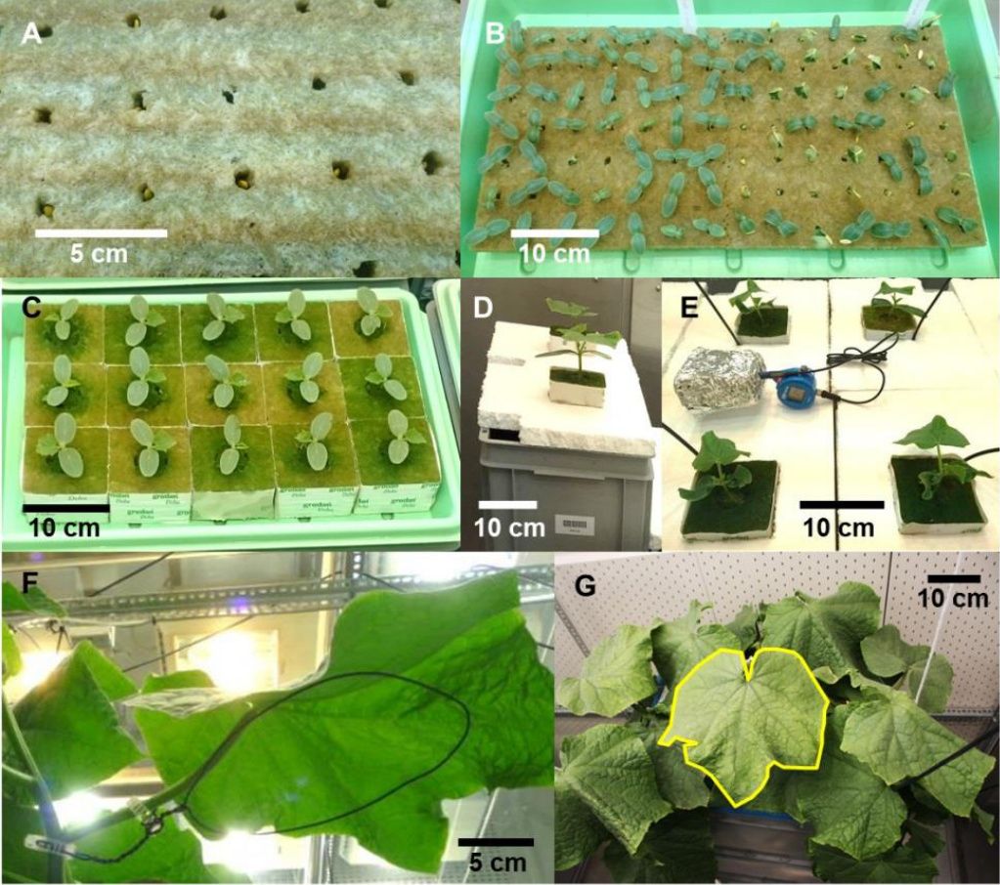  
图2-1. 培育幼苗和设置生长室实验。D-E. 将幼苗移植到水培系统中。F. 用支撑夹固定在植物茎和叶柄上的定制叶片支架。G. 通过将茎向下引导避免采样叶（标记为黄色）被遮荫。

3. 采集采样叶数据  
a. 气体交换  
i. 对每种环境条件以3-4天的间隔进行测量，从最年轻的叶片（约叶片出现后3天）开始，然后是较老的叶片，以获得具有广泛年龄范围（约40-550℃·d）的叶片数据。  
ii. 使用日平均温度和基础温度（T_base, 10℃ for cucumber）估算从叶片出现到测量日的个体叶片年龄（t, ℃·d）：  
$\begin{array} { r } { t = \sum _ { \mathrm { 叶片出现日 } } ^ { \mathrm { 测量日 } } \left( T _ { \mathrm { m e a n } } - T _ { \mathrm { b a s e } } \right) } \end{array}$ (公式2-G1)  
iii. 使用便携式光合作用系统LI-6400XT或LI-6800（Li-Cor Inc., Lincoln, NE, USA）测量净光合速率（A_n, μmol CO₂ m⁻² s⁻¹，表2-1）、胞间CO₂浓度（C_i, μmol mol⁻¹）、光合光子通量密度（PPFD, μmol m⁻² s⁻¹）和光系统II电子传递量子效率（φ_PSII）。  
iv. 将数据收集到.csv文件中（图2-2和表2-2），这些文件将用于数据分析部分A和B的数据处理（本例中为'example_chamber_gas_exchange_data.csv'）。  
v. 测量后立即切割叶片用于进一步分析。

表2-1. 便携式光合作用系统LI-6400XT和LI-6800（LI-COR, Lincoln, NE, USA）输出文件中的变量标签。数据处理所需的必要变量包括净光合速率（A_n, μmol CO₂ m⁻² s⁻¹）、胞间CO₂浓度（C_i, μmol mol⁻¹）、光合光子通量密度（PPFD, μmol m⁻² s⁻¹）和光系统II电子传递量子效率（φ_PSII）。

| 系统 | An | Ci | PPFD | PPSII |
|------|----|----|------|-------|
| LI-6400XT | Photo | Ci | PARi | PhiPS2 |
| LI-6800 | Pn | Ci | Qin | PhiPS2 |

|   | A | B | C | D | E | F | G |
|---|---|---|---|---|---|---|---|
| 1 |   | ExpID 测量日期 叶片ID |   | An | Ci | PPFD | PhiPS2 |
| 2 | GC1 |   | 2016.11.29N2-12-V1-L4 | 14.538326.51299.89 |   |   | 0.2156 |
| 3 | GC1 | 2016.11.29N2-12-V1-L4 |   | 12.883 | 287.9 | 999.18 | 0.2841 |
| 4 | GC1 | 2016.11.29N2-12-V1-L4 |   | 11.596 | 298.4 | 499.81 | 0.4675 |
| 5 | GC1 |   | 2016.11.29N2-12-V1-L4 | 6.346344.4 |   | 200.08 | 0.6463 |
| 6 | GC1 |   | 2016.11.29N2-12-V1-L4 | 4.561 | 352.3 | 124.04 | 0.6881 |
| 7 | GC1 |   | 2016.11.29N2-12-V1-L4 | 3.098361.9 |   | 98.37 | 0.7066 |
| 8 | GC1 |   | 2016.11.29N2-12-V1-L4 | 2.110368.9 |   | 80.36 | 0.7189 |
| 9 | GC1 |   | 2016.11.29N2-12-V1-L4 | 1.041 | 379.7 | 58.58 | 0.7294 |
| 10 | GC1 | 2016.11.29N2-12-V1-L4 |   | 0.598 | 384.8 | 40.59 | 0.7360 |
| 11 | GC1 |   | 2016.11.29N2-12-V1-L4 | -0.145 | 393.1 | 27.99 | 0.7410 |
| 12 | GC1 |   | 2016.11.29N2-12-V1-L4 | -1.437410.2 |   | 0.54 | 0.7740 |

图2-2. 气体交换数据文件格式。参见表2-2了解列名、描述和单位的说明。

表2-2. 气体交换数据文件中使用的列名、描述和单位

| 列名 | 描述 | 单位 |
|------|------|------|
| ExpID | 实验ID | 无 |
| MeasureDate | 测量日期 | 无 |
| LeafID | 测量叶片的ID | 无 |
| An | 净光合速率 | μmol CO2 m² s-1 |
| Ci | 胞间CO2浓度 | μmol CO2 mol-1 |
| PPFD | 光合光子通量密度 | μmol光子 m² s-1 |
| PhiPS2 | 光系统II电子传递量子效率 | 无 |

b. 收获数据

i. 使用叶绿素计SPAD-502（Minolta Camera，日本）测量收获叶片的相对叶绿素含量（SPAD值），并使用叶面积仪LI-3100C（LI-COR，Lincoln，NE，美国）测量叶面积。  
ii. 将每片叶片单独放入纸袋中，在$- 2 0 ^ { \circ } \mathrm { C }$下冷冻保存。  
iii. 将真空冷冻干燥机（Alpha $1 { - } 4 ~ \mathrm { L S C }$；Martin Christ Gefriertrocknungsanlagen GmbH，Osterode am Harz，德国）的样品架预冷至$1 0 ^ { \circ } \mathrm { C }$，冰凝器预冷至$- 5 0 ^ { \circ } \mathrm { C }$。在1.030 mbar的压力下冷冻干燥叶片样品$4 8 \mathrm { ~ h ~ }$，然后测量冻干叶片的重量。请注意，大多数样品可以干燥至$1 \% 5 \%$的残余水分；因此，测量的干重应进行校正，以排除残余水分的重量。

iv. 将叶片研磨成细粉，分析总氮（如Nelson和Sommers，1980）和叶绿素（如Lichtenthaler，1987）含量。 v. 将数据收集到.csv文件中（图2-3和表2-3；本例中为‘example_chamber_harvest_data.csv’），这些文件将用于数据分析部分A和B的数据处理。 c. 量化SPAD值与单位面积叶绿素浓度之间的经验关系，以便在温室实验中进行无损估计，使用线性$( C h l = \mathrm { a } + \mathrm { b } \times \mathrm { S P A D } )$或幂函数$C h l = \mathrm { a } \times \mathrm { S P A D } ^ { \mathrm { b } } )$。

1ExpID LeafID irgn N3-11-V1-L6 3 1 30.10.2016 25.11.2016 1029.8 02.11.2016 15.11.2016 21.4 42.4 493.8 54.43 16.94 N2-11-V1-L5 28.10.2016 25.11.2016 21.4 53.9 788.4 47.39 N1-12-V1-L8 31.10.2016 22.11.2016 1050.2 23.85 N1-12-V1-L4 25.10.2016 18.11.2016 14.3 22.3 50.3 870.6 22.43 31.10.2016 22.11.2016 30.10.2016 25.11.2016 49.5 956.9 26.85 N3-11-V1-L6 31.10.2016 11.11.2016 16.26 N2-13-V1-L6 27.10.2016 29.11.2016 N3-13-V1-L7 29.10.2016 11.11.2016 26.6 22.460.4 1064.6 6.48 46.73 2.94 N1-L3-V1-L8 30.10.2016 29.11.2016 28.6 911.8 23.20

图2-3. 收获数据文件格式。参见表2-3了解列名、描述和单位的说明。

表2-3. 收获数据文件中使用的列名、描述和单位

| 列名 | 描述 | 单位 |
|------|------|------|
| ExpID | 实验ID | 无 |
| LeafID | 收获叶片的ID | 无 |
| VarietyID | 品种ID | 无 |
| LightID | 光照处理ID | 无 |
| NitrogenID | 氮处理ID | 无 |
| AppearanceDate | 收获叶片的出现日期 | 无 |
| HarvestDate | 收获日期 | 无 |
| LightLevel_mol_m2_d | 光照处理水平 | mol光子 m² d-1 |
| NitrogenLevel_Mm | 氮处理水平 | mM N |
| MeanTemp_oC | 收获叶片生长期间的平均气温 | ℃ |
| SPAD | 相对叶绿素含量（SPAD值） | 无 |
| LeafArea_cm2 | 收获叶片的叶面积 | cm² |
| DryMass_g | 收获叶片的干重 | g |
| TotalN_mg_g | 收获叶片的总氮含量 | mg N g-1干重 |
| Chl_a_mg_g | 收获叶片的叶绿素a含量 | mg Chl a g-1干重 |
| Chl_b_mg_g | 收获叶片的叶绿素b含量 | mg Chl b g-1干重 |

C. 使用便携式光合作用系统LI-6400XT或LI-6800（LI-COR，Lincoln，NE，USA）进行气体交换测量

1. 让叶片在以下测量条件下适应10-20分钟：

a. 光合光子通量密度（PPFD）$1 3 0 0 \mu \mathrm { m o l } \mathrm { m } ^ { - 2 } \mathrm { s } ^ { - 1 } .$ ,   
b. 样品$\mathrm { C O } _ { 2 } 4 0 0 \mu \mathrm { m o l } \mathrm { m o l } ^ { - 1 }$ ,   
c. 叶片温度$2 5 ^ { \circ } \mathrm { C }$ ,   
d. 相对湿度$5 5 \%$ ,

直到Rubisco完全激活，光合作用速率、气孔导度和荧光$( \boldsymbol { F } ^ { \prime } )$达到稳定状态，然后读取光饱和净光合作用速率$( A _ { \mathrm { s a t } } , \mu \mathrm { m o l } \mathrm { C O } _ { 2 } \mathrm { m } ^ { - 2 } \mathrm { s } ^ { - 1 } )$。

2. 使用多相闪光（MPF）方法测量最大叶绿素荧光$( \boldsymbol { F _ { \mathrm { m } } } ^ { \prime } )$（Loriaux et al., 2013; Moualeu‐Ngangue et al., 2017）：

a. 第1阶段，恒定最大辐照度持续$3 2 0 \mathrm { m s }$，b. 第2阶段，辐照度衰减（$30 \%$斜坡深度）持续$3 5 0 \mathrm { m s }$，c. 第3阶段，与第1阶段相同的恒定最大辐照度持续$2 0 0 \mathrm { m s }$。

3. 在PPFD 900, 500, 250, 150, 100, 85, 70, 60, 50, 40, $0 \mu \mathrm { m o l } \mathrm { m } ^ { - 2 } \mathrm { s } ^ { - 1 }$下测量净光合作用速率$( A _ { \mathrm { n } } , \mu \mathrm { m o l } \mathrm { C O } _ { 2 } \mathrm { m } ^ { - 2 } \mathrm { s } ^ { - 1 } )$的光响应曲线。

4. 每次测量的总时长为$3 0 { \cdot } 4 0 \ \mathrm { m i n }$每片叶子；注意，对于老叶或在弱光下生长的叶子，适应时间通常比年轻和在强光下生长的叶子更长。

5. 使用荧光数据计算光系统$\mathrm { I I }$电子传递的量子效率$( \phi _ { \mathrm { P S I I } } )$（Murchie and Lawson, 2013）：

$$
\phi _ { \mathrm { P S I I } } = ( F _ { \mathrm { m } } ^ { \prime } - F ^ { \prime } ) / F _ { \mathrm { m } } ^ { \prime } 
$$

D. 温室实验以获取冠层结构信息并评估蛋白质周转模型的数据

1. 移栽和开始实验

a. 使用数据记录仪Tinytag记录幼苗附近的日平均气温$( T _ { \mathrm { { m e a n } } } , \mathbf { \Lambda } ^ { \circ } { \bf C } )$，并在第三片真叶达到$3 \mathrm { c m }$长度时移栽幼苗（大约在较大的岩棉块中生长两周）。   
b. 将两株植物转移到一个岩棉板$( 1 0 0 ~ \mathrm { c m } \times 2 0 ~ \mathrm { c m } \times 7 . 5 ~ \mathrm { c m } )$上，植株间距为$5 0 \ \mathrm { c m }$，行距为$1 5 0 ~ \mathrm { c m }$（在$9 6 \mathrm { m } ^ { 2 }$的栽培面积的温室中，密度为1.33株$\mathrm { m } ^ { - 2 }$）。   
c. 通过滴灌系统向植物提供含有目标氮水平的营养液。

2. 植物护理和环境条件监测

a. 将植物垂直引导到电线上，并去除第七节以下的所有侧枝和花朵。   
b. 使用数据记录仪Tinytag记录温室内的日平均气温，并使用量子传感器LI-190R和光表LI-250A记录冠层上方的每日PAR积分。   
c. 每周分析营养液中的硝酸盐（Navone, 1964）和铵（遵循德国水、废水和污泥检测标准方法，DIN 38406-5）以及岩棉板中剩余的氮浓度。d. 将数据收集到.csv文件中（图2-4和表2-4；本例中为‘example_greenhouse_environment_data.csv’），这些数据将用于E-H部分的数据分析，进行模拟和计算机实验。

图2-4. 温室环境数据文件格式。参见表2-4了解列名、描述和单位的说明。

|   | A | B | C | D | E | F | G | H | 1 |
|---|---|---|---|---|---|---|---|---|---|
| 1 | ExpID | Date | DPI_L_L | DPI_L_H | Supply_N_L | Substrate_N_L | Supply_N_H | Substrate_N_H | Tmean_L_L | Tmean_L_H |
| 2 | GH1 | 04.04.2017 | 10.1 | 23.6 | 2.9 | 2.9 | 9.7 | 7.9 | 22.9 | 23.6 |
| 3 | GH1 | 05.04.2017 | 5.5 | 12.7 | 2.9 | 2.9 | 9.7 | 7.9 | 23.9 | 22.6 |
| 4 | GH1 | 06.04.2017 | 9.9 | 23.1 | 2.9 | 2.9 | 9.7 | 7.9 | 22.2 | 22.1 |
| 5 | GH1 | 07.04.2017 | 5.3 | 12.4 | 2.9 | 2.9 | 9.7 | 7.9 | 22.4 | 22.5 |
| 6 | GH1 | 08.04.2017 | 6.7 | 15.6 | 2.9 | 2.0 | 11.9 | 9.7 | 22.7 | 23.2 |
| 7 | GH1 | 09.04.2017 | 6.5 | 15.0 | 2.9 | 2.0 | 11.9 | 9.7 | 23.8 | 24.6 |
| 8 | GH1 | 10.04.2017 | 6.5 | 15.0 | 2.9 | 2.0 | 11.9 | 9.7 | 22.7 | 23.1 |
| 9 | GH1 | 11.04.2017 | 5.8 | 13.5 | 2.9 | 2.0 | 11.9 | 9.7 | 22.2 | 22.3 |
| 10 | GH1 | 12.04.2017 | 4.3 | 10.0 | 2.9 | 2.0 | 11.9 | 9.7 | 21.8 | 21.5 |
| 11 | GH1 | 13.04.2017 | 7.1 | 16.5 | 2.9 | 2.0 | 11.9 | 9.7 | 22.3 | 22.3 |
| 12 | GH1 | 14.04.2017 | 8.5 | 19.9 | 3.5 | 0.1 | 10.9 | 7.0 | 23.0 | 22.9 |

表 2-4. 温室环境数据文件的列名、描述和单位

| 列名 | 描述 | 单位 |
|------|------|------|
| ExpID | 实验ID | 无 |
| Date | 日期 | 无 |
| DPI_L_L | 光照处理ID L*下的每日光量子积分 | mol photon m-² d-1 |
| DPI_L_H | 光照处理ID H*下的每日光量子积分 | mol photon m-2 d-1 |
| Supply_N_L | 氮处理ID L*下营养液中的氮水平 | mM N |
| Substrate_N_L | 氮处理ID L*下基质中的氮水平 | mM N |
| Supply_N_H | 氮处理ID H*下营养液中的氮水平 | mM N |
| Substrate_N_H | 氮处理ID H*下基质中的氮水平 | mM N |
| Tmean_L_L | 光照处理ID L*下的日平均气温 | ℃ |
| Tmean_L_H | 光照处理ID H*下的日平均气温 | ℃ |

\*光照和氮处理ID由用户命名，应与温室结构数据中的处理ID保持一致。

3. 植物数据收集

a. 使用3D数字化仪(Chen et al., 2014a)每周无损测量叶片数量、叶片仰角、叶面积和叶面积指数（在上述温室条件下，两次测量之间大约相差$1 0 0 ^ { \circ } \mathrm { C d }$），以获得不同发育阶段的静态冠层结构。   
b. 估算冠层中单个叶片的年龄$( t , ^ { \circ } \mathrm { C d } )$。 i. 使用公式2-G1计算从移栽到温室当天（当第$x$片叶子出现时；本例中$x = 3$）到测量当天的总生长度日数$( G D D _ { \mathrm { c a n o p y } } )$。 ii. 将$G D D _ { \mathrm { c a n o p y } }$除以移栽后出现的叶片数量（不包括前$x { - } I$片叶子）来估算叶间隔期（每片叶子的$^ \mathrm { \circ } \mathrm { C d }$，即连续叶片出现之间的间隔），假设实验期间叶间隔期恒定：$\mathrm { p h y l l o c h r o n } = G D D _ { \mathrm { c a n o p y } } / [ \mathrm { t o t a l \ l e a f \ n u m b e r } - ( x - 1 ) ]$（公式2-G2） iii. 使用与第$x$片叶子相关的叶间隔期估算第$n$片叶子的年龄：$t _ { \mathrm { l e a f } n } = G D D _ { \mathrm { c a n o p y } } - ( n - x ) \times \mathrm { p h y l l o c h r o n }$（公式2-G3）   
c. 测量气体交换和相对叶绿素含量（SPAD值，用于无损估算$C h l$），以评估叶片中光合蛋白周转功能模型的性能。   
d. 在2-3天内对同一植株进行数字化和气体交换测量。

将数据收集到.csv文件中（图2-5和表2-5，本例中为‘example_greenhouse_structure_data.csv’），这些数据将用于E-H部分的数据分析，进行模拟和计算机实验。

|   | A | B | C | D | E | F | G | H | 1 |
|---|---|---|---|---|---|---|---|---|---|
| 1 |   | ExpIDMeasureDate PlantID VarietyID LightID NitrogenID LeafNo LA_cm2 EA_degree |   |   |   |   |   |   |   |
| 2 | GH1 | 03.05.2017 | 219 | 1H |   | H | 1 | 381.3 | 128.9 |
| 3 | GH1 | 03.05.2017 | 219 | 1H |   | H | 2 | 618.9 | 77.2 |
| 4 | GH1 | 03.05.2017 | 219 | 1H |   | H | 3 | 873.4 | 59.5 |
| 5 | GH1 | 03.05.2017 | 219 | 1H |   | H | 4 | 948.8 | 24.7 |
| 6 | GH1 | 03.05.2017 | 219 | 1H |   | H | 5 | 1100.9 | 10.5 |
| 7 | GH1 | 03.05.2017 | 223 | 1H |   | H | 1 | 269.2 | 25.9 |
| 8 | GH1 | 03.05.2017 | 223 | 1H |   | H | 2 | 633.3 | 70.6 |
| 9 | GH1 | 03.05.2017 | 223 | 1H |   | H | 3 | 1344.1 | 108.5 |
| 10 | GH1 | 03.05.2017 | 223 | 1H |   | H | 4 | 862.2 | 13.8 |
| 11 | GH1 | 03.05.2017 | 223 | 1H |   | H | 5 | 1018.8 | 7.6 |
| 12 | GH1 | 03.05.2017 | 223 | 1H |   | H | 6 | 1307.1 | 28.3 |

表 2-5. 温室植物结构数据文件的列名、描述和单位

| 列名 | 描述 | 单位 |
|------|------|------|
| ExpID | 实验ID | 无 |
| MeasureDate | 测量日期 | 无 |
| PlantID | 数字化植物的ID | 无 |
| VarietyID | 数字化品种的ID | 无 |
| LightID | 光照处理ID | 无 |
| NitrogenID | 氮处理ID | 无 |
| LeafNo | 数字化叶片的序号 | 无 |
| EA_degree | 数字化叶片的仰角 | 度 |
| LA_cm2 | 数字化叶片的面积 | cm² |

  
图 2-5. 温室植物结构数据文件的格式。列名、描述和单位说明见表 2-5。  
图 2-6. 从数字化数据中提取叶面积和仰角的配置。A. 黄瓜茎上预定义的数字化点位置，包括节点、叶腋、叶片以及叶片上定义的三角形结构。B. 叶片仰角(EA)。

E. 植物结构数字化及坐标转换为结构数据

1. 使用3D数字化仪(Fastrak; Polhemus, Colchester, USA)对每个处理中至少两株代表性植物进行结构数字化。  
2. 按照从植株底部到顶部的标准化顺序获取各植物器官的笛卡尔坐标结构信息(修改自Kahlen和Stützel, 2007; Wiechers等, 2011b): a. 在茎基部与岩棉块连接处数字化"节点$\mathbf { \boldsymbol { 0 } } ^ { \flat }$"。 b. 在第一片真叶叶柄基部对面数字化"节点$1 ^ { \circ }$"(图2-6A中的"Node")。 c. 在第一片真叶与茎的连接处数字化"叶腋1"("Axil" in Figure 2-6A)。 d. 按照预定义的顺序和空间排列在叶片表面数字化13个点("leaf 1")(图2-6)。 e. 按照"节点$n$ - 叶腋$n$ - 叶片$n ^ { \prime }$"的顺序继续数字化，直到所有叶片都被数字化。 f. 忽略花和果实。

3. 将笛卡尔坐标转换为结构数据。

4. 量化叶面积指数(LAI)、EA和叶龄$( t , ^ { \circ } \mathrm { C d } )$之间的经验关系，以模拟计算机实验中冠层结构的动态变化，例如:

$$
\begin{array} { r l } & { \mathrm { L A I } = l a i _ { \mathrm { m a x } } / \{ 1 + \exp [ ( l a i _ { \mathrm { t 0 } } - t ) / l a i _ { \mathrm { s c a l } } ] \} } \\ & { \mathrm { E A } = 9 0 - e s _ { \mathrm { m i n } } \times \exp \{ - 0 . 5 \times [ \ln ( t / e s _ { \mathrm { t 0 } } ) / e a _ { \mathrm { s c a l } } ] ^ { 2 } \} } \end{array}
$$

# 数据分析

# R脚本1 [数据处理]

116#1.4.0.输出处理后的数据到文件

图 2-7. 用于数据处理的R脚本1概览。该脚本的输入数据文件为生长室实验中的‘example_chamber_harvest_data.csv’和‘example_chamber_gas_exchange_data.csv’。

A. 使用气体交换数据估算光合参数(图2-7, # 1.3.0)

1. 使用Evans (1993b)给出的叶绿素浓度(Chl, mmol $\mathrm { m } ^ { - 2 }$ )估算叶片吸收率( $\overset { \cdot } { \alpha }$ , 无量纲):

$$
\alpha = C h l / ( C h l + 0 . 0 7 6 )
$$

2. 在不同光合光子通量密度(PPFD, $\mathrm { \sf u m o l } \mathrm { \bf m } ^ { - 2 } \mathrm { \bf s } ^ { - 1 } .$ )下估算电子传递速率$( J , \mathrm {  ~ \mu m o l ~ } \mathrm {  ~ e ~ } ^ { - } \mathrm {  ~ m } ^ { - 2 } \mathrm {  ~ s } ^ { - 1 } )$:

$$
J = a b s \times \beta \times \mathrm { P P F D } \times \phi _ { \mathrm { P S I I } }
$$

其中$\beta$(0.5, 无量纲)是光子在光系统II和I之间的分配比例。

3. 通过最小二乘法拟合非直角双曲线估算最大电子传递$( J _ { \mathrm { m a x } } )$:

$$
J = \{ J _ { \mathrm { m a x } } + \phi \times \mathrm { P P F D } - [ ( J _ { \mathrm { m a x } } + \phi \times \mathrm { P P F D } ) ^ { 2 } - 4 \theta \times J _ { \mathrm { m a x } } \times \phi \times \mathrm { P P F D } ] ^ { 0 . 5 } \} / ( \mathrm { ( \frac { J _ { \mathrm { m a x } } } { \rho } ) ^ { 2 } } \mathrm { ( \frac { J _ { \mathrm { m a x } } } { \rho } ) ^ { 2 } } \mathrm { ( \frac { J _ { \mathrm { m a x } } } { \rho } ) ^ { 2 } } .
$$

其中$\phi ~ ( 0 . 4 2 5 ~ \mathrm { \mu m o l ~ \mathrm { \ e ^ { - } ~ \mu m o l ^ { - 1 } } }$ photon; Chen等, 2014a)是光子转化为$J _ { \cdot }$的效率，$\theta$(0.7, 无量纲; Chen等, 2014a)是描述$J$对PPFD响应的常数凸度因子。

4. 使用光响应曲线的线性部分(40 $\leq \mathrm { P P F D } \leq 1 0 0 ~ \mu \mathrm { m o l } ~ \mathrm { m } ^ { - 2 } ~ \mathrm { s } ^ { - 1 } )$估算白天呼吸速率$( R _ { \mathrm { d } } , \mu \mathrm { m o l } \mathrm { C O } _ { 2 } \mathrm { m } ^ { - 2 } \mathrm { s } ^ { - 1 } )$(Kok, 1948)，因为黄瓜叶片的光补偿点大约在$4 0 \mu \mathrm { m o l }$ photon $\mathrm { m } ^ { - 2 } \mathrm { s } ^ { - 1 }$。

5. 使用可变$J$方法(Harley等, 1992a)估算$\mathrm { C O } _ { 2 }$的叶肉导度$\mathrm { \langle } g _ { \mathrm { m } } , \mathrm { m o l } \mathrm { m } ^ { - 2 } \mathrm { \ s } ^ { - 1 } .$ ):

$$
g _ { m } = A _ { n } / \{ C _ { i } - [ \Gamma ^ { * } \times ( J + 8 A _ { n } + 8 R _ { d } ) / ( J - 4 A _ { n } - 4 R _ { d } ) ] \}
$$

其中$\varGamma ^ { * }$是在没有线粒体呼吸情况下的$\mathrm { C O } _ { 2 }$补偿点(黄瓜为$( 4 3 . 0 2 ~ \mu \mathrm { m o l } ~ \mathrm { m o l } ^ { - 1 }$; Singsaas等, 2003)，$C _ { \mathrm { i } }$是胞间$\mathrm { C O } _ { 2 }$浓度$\mathrm { ( \mu \mathrm { m o l } \ m o l ^ { - 1 } } .$ )。

6. 估算叶绿体$\mathrm { C O } _ { 2 }$浓度$( C _ { \mathrm { c } } , \mu { \mathrm { m o l } } \mathrm { m o l } ^ { - 1 } )$:

$$
C _ { \mathrm { c } } = C _ { \mathrm { i } } - A _ { \mathrm { n } } / g _ { \mathrm { m } }
$$

7. 使用单点法(De Kauwe等, 2016)估算最大羧化速率$( V _ { \mathrm { c m a x } } , \mu { \mathrm { m o l } } \mathrm { C O } _ { 2 } \mathrm { ~ m } ^ { - 2 } \mathrm { ~ s } ^ { - 1 } )$:

$$
V _ { \mathrm { c m a x } } = \left( A _ { \mathrm { s a t } } + R _ { \mathrm { d } } \right) \times ( C _ { \mathrm { c } } + K _ { \mathrm { m } } ) / ( C _ { \mathrm { c } } - \Gamma ^ { \ast } )
$$

其中$K _ { \mathrm { m } }$ $\mathrm { ( m m o l ~ m o l ^ { - 1 } ) }$由$K _ { \mathrm { c } }$ $( 4 0 4 ~ \mathrm { \mu m o l ~ m o l ^ { - 1 } } )$和$\mathrm { K } _ { \mathrm { o } }$ $( 2 7 8 \ \mathrm { m m o l \ m o l ^ { - 1 } } )$给出，分别是Rubisco对$\mathbf { C O } _ { 2 }$和$\mathbf { O } _ { 2 }$的米氏常数，$O _ { \mathrm { c } }$ $2 1 0 \mathrm { m m o l } \mathrm { m o l } ^ { - 1 } \mathrm { \Omega }$是羧化位点的$\mathbf { O } _ { 2 }$摩尔分数:

$$
K _ { m } = K _ { c } \times ( 1 + { \cal O } _ { c } / K _ { o } )
$$

8. 使用以下公式参数化$R _ { \mathrm { d } }$、$g _ { \mathrm { m } }$与叶龄$( t , \mathrm { \Omega } ^ { \circ } \mathrm { C d }$，使用公式2-G1估算)、过去四天叶片生长的平均日光子积分$\mathrm { ( D P I _ { 4 d } , m o l \ m ^ { - 2 } \ d ^ { - 1 } ) }$和叶片光合氮$\mathrm { \Delta } N _ { \mathrm { p h } } , \mathrm { m m o l \ m ^ { - 2 } } \mathrm { \Omega }$之间的经验关系:

$$
\begin{array} { r l } & { R _ { \mathrm { d } } = r _ { \mathrm { m a x } } \times \mathrm { D P I } _ { \mathrm { 4 d } } \times \exp \bigl ( - r _ { \mathrm { g } } \times \mathrm { D P I } _ { \mathrm { 4 d } } \times t \bigr ) + r _ { \mathrm { m } } \times \mathrm { D P I } _ { \mathrm { 4 d } } \times t } \\ & { g _ { \mathrm { m } } = \bigl ( g _ { \mathrm { m m } } \times N _ { \mathrm { p h } } + g _ { \mathrm { m m 0 } } \bigr ) \times \exp \{ - 0 . 5 \times \ln [ ( t / g _ { \mathrm { m t 0 } } ) / g _ { \mathrm { m s c a l } } ] ^ { 2 } \} } \end{array}
$$

B. 使用光合参数估算光合氮库(图2-7, # 1.3.1)

1. 根据Buckley等(2013)的方法估算参与羧化$\operatorname { N } _ { \mathrm { V } }$、电子传递$( N _ { \mathrm { J } }$和光捕获$( N _ { \mathrm { C } }$的氮，单位均为mmol $\mathrm { N } \mathrm { m } ^ { - 2 }$):

a. $N _ { \mathrm { V } }$包括Rubisco，代表羧化能力的氮投资:

$$
N _ { \mathrm { V } } = V _ { \mathrm { c m a x } } / \chi _ { V }
$$

b. $N _ { \mathrm { J } }$包括电子传递链、光系统II核心和除Rubisco外的Calvin循环酶:

$$
N _ { \mathrm { J } } = J _ { \mathrm { m a x } } / \chi _ { \mathrm { J } }
$$

c. $N _ { \mathrm { C } }$包括光系统I核心和光捕获复合物I和II:

$$
N _ { \mathrm { { C } } } = { \left( C h l - N _ { \mathrm { { J } } } \times \chi _ { \mathrm { { C J } } } \right) } / { \chi _ { \mathrm { { C } } } }
$$

(公式2-M1c)

其中$\chi _ { \mathrm { V } } ~ ( \mu \mathrm { m o l } ~ \mathrm { C O } _ { 2 } \mathrm { ~ m m o l } ^ { - 1 } \mathrm { ~ N ~ s } ^ { - 1 } )$是单位Rubisco氮的羧化能力，$\chi _ { \mathrm { J } }$ $( \mu \mathrm { m o l } \textrm { e } ^ { - } \mathrm { m m o l } ^ { - 1 } \textrm { N s } ^ { - 1 } )$是单位电子传递氮的电子传递能力。$\chi _ { \mathrm { C J } }$ (mmol Chl mmol-1 N)和$\chi _ { \mathrm { C } }$ $\mathrm { { ( m m o l ~ C h l ~ m m o l ^ { - 1 } ~ N ) } }$分别是单位电子传递氮和单位光捕获组分氮的叶绿素转换系数。

2. 光合氮$( N _ { \mathrm { p h } } , \mathrm { m m o l } \mathrm { N } \mathrm { m } ^ { - 2 } )$定义为参与光合作用蛋白质中的生物活性氮，包括参与羧化、电子传递和光捕获的氮：

$$
N _ { \mathrm { p h } } = N _ { \mathrm { V } } + N _ { \mathrm { J } } + N _ { \mathrm { C } }
$$

3. 光合氮库$X$的分配比例$( p _ { X } )$由库$X$中的氮$( N _ { X } , \mathrm { m m o l } \mathrm { N } \mathrm { m } ^ { - 2 } )$与$N _ { \mathrm { p h } }$的比值决定：

$$
p _ { X } = N _ { X } / N _ { \mathrm { p h } }
$$

4. 将处理后的数据输出到.csv文件（图2-8；本例中为‘chamber_processed_data.csv’）（图2-7，# 1.4.0），这些数据将用于数据分析部分$\mathbf { C }$和$\mathrm { \Delta D }$中的模型参数化。

|   | A | B | C | D | E | F | G | X | Y | Z | AA | AB | AC | AD |
|---|---|---|---|---|---|---|---|---|---|---|---|---|---|---|
| 1 | ExpID.xVarietyIDLightIDNitrogenIDAppearanceDate HarvestDateLMA_g_m2Chl_a_b_mmol_m2abs |
|   | LeafID N1-I3-V1-L5 GC1 | 1 | 3 | 1 | 27.10.2016 | 08.11.2016 | 66.5 | 0.6390.894201.2223.9 | J | JmaxJmax_seJmax_pv 8.621.64E-10 |
| 2 3 | N1-I3-V1-L7 GC1 | 1 | 3 | 1 | 29.10.2016 | 01.11.2016 | 54.2 | 0.4480.855162.0167.2 | 9.911.12E-08 |
| 4 | N1-13-V1-L5 GC1 | 1 | 3 | 1 | 27.10.2016 | 18.11.2016 | 76.5 | 0.6160.890158.7174.7 | 6.641.45E-10 |
| 5 | N1-13-V1-L7GC1 | 1 | 3 | 1 | 29.10.2016 | 11.11.2016 | 63.6 | 0.4860.865191.8218.3 | 7.29 | 4.01E-11 |
| 6 | N1-I3-V1-L8 GC1 | 1 | 3 | 1 | 30.10.2016 | 29.11.2016 | 142.6 | 0.6710.898152.1164.5 | 5.574.63E-11 |
| 7 | N1-11-V1-15 | GC1 | 1 | 1 | 1 | 29.10.2016 | 01.11.2016 | 26.0 | 0.3960.83976.1 76.3 | 3.993.32E-09 |
| 8 | N1-12-V1-L5 GC1 | 1 | 2 | 1 | 27.10.2016 | 04.11.2016 | 41.8 | 0.5430.877214.1247.3 | 9.732.05E-10 |
| 9 | N1-12-V1-L6 GC1 | 1 | 2 | 1 | 29.10.2016 | 01.11.2016 | 37.2 | 0.4330.851142.4153.2 | 7.241.23E-09 |
| 10 | N3-12-V1-L8 GC1 | 1 | 2 | 3 | 31.10.2016 | 25.11.2016 | 61.0 | 0.9220.924162.6184.2 | 5.711.94E-11 |
| 11 | N2-12-V1-L6 GC1 | 1 | 2 | 2 | 28.10.2016 | 01.11.2016 | 34.4 | 0.3780.833151.9158.6 | 8.494.16E-09 |
| 12 | N3-I3-V1-L8 GC1 | 1 | 3 | 3 | 31.10.2016 | 09.12.2016 | 111.0 | 0.5740.883191.7208.6 | 9.135.79E-10 |

AE AF AG AH AI AJ AK AM AN AO AP AQ  
Rd gm_mol_m2_sCc_umol_molVc VcmaxNV_mmol_m2NJ_mmol_m2NC_mmol_m2Nph_mmol_m2pV pJ pC LeafAge_oCd  
1.47 0.343 181.2167.6 167.6 37.3 23.6 18.6 79.50.4700.2970.233 148.8  
6.18 0.075 155.7144.9 144.9 32.3 17.6 13.0 62.90.5130.2800.207 37.2  
0.71 0.162 181.2132.2 132.2 29.4 18.4 17.9 65.80.4470.2800.273 272.8  
2.38 0.473 218.6146.0 (146.0 32.5 23.0 14.1 69.60.4670.3310.202 161.2  
1.60 0.087 117.5154.4 154.4 34.4 17.4 19.6 71.30.482 0.2430.275 372.0  
2.59 0.069 198.9 60.6 60.6 13.5 8.0 11.6 33.20.4070.2430.350 34.2  
2.59 0.316 238.9156.1 156.1 34.8 26.1 15.7 76.60.4540.3410.205 98.4  
2.96 0.094 167.5123.1 123.1 27.4 16.2 12.6 56.10.4880.2880.224 36.9  
0.98 0.148 180.8135.5 135.5 30.2 19.4 27.0 76.60.3940.2540.352 307.5  
4.36 0.112 190.9123.4 123.4 27.5 16.7 10.9 55.20.4980.3030.198 49.2  
2.21 0.128 141.2179.4 179.4 39.9 22.0 16.7 78.60.5080.2800.212 483.6

图2-8. R脚本1输出的处理数据文件格式。该文件将用于模型参数化。

# R脚本2 [模型参数化]

34.#2.4.0.拟合函数   
150-####-   
152-####-   
  
250.#2.5.0.输出参数化结果到文件

C. 蛋白质周转模型描述 (图2-9, # 2.3.0)

功能氮库$N _ { X }$的变化率由给定叶龄$( t , ^ { \circ } \mathrm { C d } )$时相应酶和蛋白质复合物的瞬时蛋白质合成速率$( S _ { X } ( t ) , \mathrm { { m m o l } \mathrm { { N } \ m ^ { - 2 } \ ^ { \circ } C d ^ { - 1 } ) } }$和降解速率$( D _ { X } ( t )$ , mmol $\mathrm { N } \mathrm { m } ^ { - 2 } { ^ \circ \mathrm { C d } } ^ { - }$ 1)决定：

$$
\mathrm { d } N _ { X } / \mathrm { d } t = S _ { X } ( t ) - D _ { X } ( t )
$$

蛋白质合成作为与年龄相关且零级的过程(Li et al., 2017)，由逻辑函数描述，与当前$N _ { X }$状态无关：

$$
S _ { X } ( t ) = 2 S _ { \mathrm { m a x } , X } / \big [ 1 + \exp \big ( t \times t _ { \mathrm { d } , X } \big ) \big ]
$$

其中$S _ { \mathrm { m a x } , X }$ (mmol $\mathrm { ~ V ~ m ~ } ^ { - 2 } ^ { \mathrm { ~ \circ ~ } } \mathrm { C d } ^ { - 1 } )$是$\Nu _ { X }$的最大蛋白质合成速率，发生在叶片发育早期。常数$t _ { \mathrm { d } , X } ~ ( ^ { \circ } \mathrm { C d } ^ { - 1 } )$描述了蛋白质合成随时间的相对下降速率。在$1 / t _ { \mathrm { d } , X }$年龄时，$S _ { X }$降低到Smax,X的$5 3 . 8 \%$。

降解速率$D _ { \mathrm { x } }$由一级动力学控制(Li et al., 2017)，降解常数为$D _ { \mathrm { r } , X } ( ^ { \circ } \mathbf { C } \mathbf { d } ^ { - 1 } )$：

$$
D _ { X } ( t ) = D _ { \mathrm { r } , X } \times N _ { X } ( t )
$$

变量$S _ { \mathrm { m a x } , X }$是每日叶片PAR截获量($\mathrm { \cdot D P I _ { i } }$ nterceptLeaf, mol photon $\mathrm { m } ^ { - 2 }$ ${ \bf d } ^ { - 1 } )$的函数：

$$
S _ { \operatorname* { m a x } , X } = S _ { \operatorname* { m m } , X } \times k _ { \mathrm { I } , X } \times D P I _ { \mathrm { i n t e r c e p t L e a f } } / \Bigl ( S _ { \operatorname* { m m } , X } + k _ { \mathrm { I } , X } \times \mathrm { D P I } _ { \mathrm { i n t e r c e p t L e a f } } \Bigr ) \times r _ { \mathrm { N } , X }
$$

其中$S _ { \mathrm { m m } , X } ( \mathrm { m m o l } \mathrm { N } \mathrm { m } ^ { - 2 } \mathrm { \ o C d } ^ { - 1 } )$是潜在最大蛋白质合成速率，$k _ { \mathrm { I } , X }$是描述$S _ { \mathrm { m a x } , X }$随光增加的速率常数。因子$r _ { \mathrm { N , X } }$随营养液中氮水平$( N _ { \mathrm { S } } , \mathrm { m M } )$增加，由Michaelis-Menten常数$k _ { \mathrm { N } , \mathrm { X } } \left( \mathrm { m M } \right)$决定：

$$
r _ { \mathrm { N } , X } = N _ { \mathrm { S } } / \big ( k _ { \mathrm { N } , X } + N _ { \mathrm { S } } \big )
$$

D. 使用生长室实验数据参数化蛋白质周转模型 (图2-9)

求解微分方程2-M4-方程2-M6，在$R$中使用'deSolve'包中的lsoda()函数和'DEoptim'包中的DEoptim()函数编程的算法，最小化观测值和模拟值之间的残差平方和(图2-9, # 2.4.0)。量化方程2-M5-方程2-M8中的参数有三个步骤：

1. 使用所有环境条件的数据量化每个光合氮库的$\boldsymbol { t } _ { \mathrm { d } , \mathrm { X } }$ (方程2-M5)和$D _ { \mathrm { r } , \mathrm { X } }$ (方程2-M6)，假设$D _ { \mathrm { r } , \mathrm { X } }$和$t _ { \mathrm { d , X } }$是物种和功能特异性的，不受光氮可用性的影响(图2- 9, # 2.4.1)。   
2. 使用确定的$t _ { \mathrm { d } , \mathrm { X } }$和$D _ { \mathrm { r } , \mathrm { X } }$值，为每个环境条件量化$S _ { \mathrm { m a x , X } }$ (方程2-M5)(图2-9, # 2.4.2)。   
3. 使用'stats'包中的nls()函数，通过非线性最小二乘拟合从$S _ { \mathrm { m a x , X } }$确定$S _ { \mathrm { m m } , X } , k _ { \mathrm { I } , X }$ (方程2-M7)和$k _ { \mathrm { N } , X }$ (方程2-M8)，并计算估计值的标准误差(se)和$p$值(pv)(图2-9, # 2.4.3)。

4. 输出结果(图2-9, # 2.5.0)到.csv文件(图2-10;本例中为'parameterize_result_output.csv')，该文件将用于数据分析部分E-H的模拟和in silico测试。

A B D E G H M N   
1 ExpID.x VarietyID NXtd Dr Smm kl kN Smm_se kl_se kN_se Smm_pv kl_pvkN_pv   
2 GC1 1NV 0.001530.02565 0.8776 0.1847 0.5791 0.06283 0.02895 0.27114 0 0 0.0335   
3 GC1 1NJ 0.00197 0.01376 0.8776 0.1847 0.5791 0.06283 0.02895 0.27114 0 0 0.0335   
4 GC1 1NC 0.00158 0.02029 0.8776 0.1847 0.5791 0.06283 0.02895 0.27114 0 0 0.0335

图2-10. R脚本2输出的参数化结果文件格式。该文件将用于模拟和in silico测试。

# R脚本3 [模拟和计算机实验]

E. 叶片光合作用模拟(图2-11, # 3.6.0)

为了评估每日冠层碳同化量，需要模拟冠层中单个叶片的净光合速率$( A _ { \mathrm { n } } , \mu { \mathrm { m o l } } \mathrm { C O } _ { 2 }$ $\mathrm { m } ^ { - 2 } \mathrm { s } ^ { - 1 } )$。$A _ { \mathrm { n } }$定义为RuBP羧化限制$\mathrm { \langle } A _ { \mathrm { c } }$ (mmol $\mathrm { C O } _ { 2 } \ \mathrm { m } ^ { - 2 } \ \mathrm { s } ^ { - 1 } ,$)和$\mathbf { R u B P }$再生限制$( A _ { \mathrm { j } }$ , mmol $\mathrm { C O } _ { 2 } \mathrm { m } ^ { - 2 } \mathrm { s } ^ { - 1 } )$ )净光合速率的最小值(Farquhar等, 1980)。稳态$A _ { \mathrm { c } }$可以通过公式3-9b、3-14和3-15解析求解，$A _ { \mathrm { j } }$可以通过第3章中的公式$3 { \cdot } 9 \mathrm { c }$、3-14和3-15求解，给定叶-空气水汽压差$( D , \mathrm { { k P a } ) }$、大气$\mathrm { C O } _ { 2 }$浓度$( C _ { \mathrm { a } } , \mu { \mathrm { m o l ~ m o l } } ^ { - 1 } )$、叶片水平的光合光子通量密度(PPFD, $\mu \mathrm { m o l } \ \mathrm { m } ^ { - 2 } \ \mathrm { s } ^ { - 1 } ,$ )和光合参数。

1. 叶片水平PPFD的模拟(图2-11, # 3.4.1)遵循Beer-Lambert定律(Monsi和Saeki, 2005)，使用冠层光衰减系数$( k )$和叶面积指数(LAI)，并根据叶片仰角(EA, °)的余弦值进行调整，这些参数通过公式2-G4和2-G5(图2-11, # 3.3.0)根据叶龄估算：

$$
\mathrm { P P F D } = \mathrm { P P F D } _ { \mathrm { a b o v e C a n o p y } } \times \exp ( - k \times \mathrm { L A I } ) \times \cos ( \mathrm { E A } )
$$

其中，冠层上方日变化PPFD(PPFDaboveCanopy, $\mu \mathrm { m o l } \mathrm { m } ^ { - 2 } \mathrm { \ s } ^ { - 1 } )$ )在一天中给定时间$( { t _ { \mathrm { h o u r } } } , \ \mathrm { h } )$通过简单的余弦钟形函数(Kimball和Bellamy, 1986)计算，使用冠层上方每日PAR积分(DPIaboveCanopy, mol $\mathbf { m } ^ { - 2 } \mathbf { d } ^ { - 1 } .$ )和日长$( D L , \mathbf { h } )$：

$$
\begin{array} { r } { \mathrm { P P F D } _ { \mathrm { a b o v e C a n o p y } } = \mathrm { D P I } _ { \mathrm { a b o v e C a n o p y } } \times \frac { \pi } { 2 D L } \times \frac { 1 0 ^ { 6 } } { 3 6 0 0 } \times \cos \left[ \frac { \pi \times ( t _ { \mathrm { h o u r } } - 1 2 ) } { D L } \right] } \end{array}
$$

2. 光合参数$J _ { \mathrm { m a x } } , V _ { \mathrm { c m a x } } , \alpha , R _ { \mathrm { d } }$和$g _ { \mathrm { m } }$

a. 给定PPFD下的电子传递速率$J _ { \mathrm { m a x } }$使用公式2-P4计算。   
b. 羧化速率$( V _ { \mathrm { c } } , \mu \mathrm { m o l } \mathrm { C O } _ { 2 } \mathrm { m } ^ { - 2 } \mathrm { s } ^ { - 1 } )$基于给定PPFD下激活的Rubisco量计算(Qian等, 2012)：𝑉c = 𝑉cmax × {0.31 + 1+exp[−0.009.6×9(𝑃𝑃𝐹𝐷−500)]} (公式2-P13)   
c. abs使用公式2-P2计算。   
d. $R _ { \mathrm { d } }$和$g _ { \mathrm { m } }$使用经验关系公式2-P9和2-P10模拟(图2-11, # 3.3.1)。

F. 每日冠层碳同化模拟(图2-11, # 3.6.0)

第$d$天白天的每日冠层碳同化量(DCA, mol $\mathbf { d } ^ { - 1 }$ )使用以下输入数据模拟：

1. 环境信息(从叶片出现到第$d$天)：$T _ { \mathrm { m e a n } }$ (公式2-G1)、DPIaboveCanopy (公式2-P10)以及营养液和岩棉板中的氮浓度；   
2. 温室冠层特征(第$d$天)：叶面积(数字化数据，图2-6A)和叶龄(公式2-G1- 2-G3；图2-11, # 3.5.1)。

首先使用公式2-M4- 2-M8(图2-11, # 3.7.0和# 3.8.0)和光合参数公式2-M1a- 2-M1c模拟冠层中每个叶片到第$d$天的光合氮库。生长期间的DPIinterceptLeaf使用公式2-P11模拟(图2-11, # 3.5.1)。植物生长期间(从移栽到测量日)的DPIaboveCanopy平均值用作第$d$天的DPIaboveCanopy来模拟DCA。营养液中的氮水平$( N _ { \mathrm { S } } )$假设为营养液和岩棉板中氮浓度的平均值(图2-11, # 3.4.1)。为了测试第$d$天入射光条件对$N _ { \mathrm { p h } }$分布和分配最优性的影响，DPIaboveCanopy乘以用户指定的因子"DPI multiplier"(图2-11, # 3.7.2和# 3.8.3)。

叶片净光合作用以$0 . 1 \mathrm { ~ h ~ }$为时间步长在第$d$天进行模拟，并将白天每$0 . 1 \mathrm { ~ h ~ }$的值相加得到每日叶片碳同化量(DLA, mol $\mathbf { d } ^ { - 1 }$ )。DCA计算为冠层中所有叶片的DLA之和。

G. 计算机实验测试冠层氮分布的最优性(图2-11)

为了评估$N _ { \mathrm { p h } }$在叶片间分布对DCA的影响，在公式2-M5中引入分布因子$f _ { \mathrm { d } }$以创建蛋白质合成速率的变化(图2-11, # 3.7.0)：

$$
S _ { X } ( t ) = 2 S _ { \operatorname* { m a x } , X } / \bigl [ 1 + \exp \bigl ( t \times t _ { \mathrm { d } , X } \times f _ { \mathrm { d } } \bigr ) \bigr ]
$$

控制条件定义为$f _ { \mathrm { d } } = 1$。增加$f _ { \mathrm { d } }$会加速蛋白质合成速率的下降并增强向顶端的$N _ { \mathrm { p h } }$重新分配，但也会减少冠层中的总$N _ { \mathrm { p h } }$ $( N _ { \mathrm { c a n o p y } } )$。为了获得具有可比$N _ { \mathrm { c a n o p y } }$的叶片光合氮含量$N _ { \mathrm { l e a f } , i }$，mmol $\mathbf { N }$在叶片$i$中），将$f _ { \mathrm { d } } ~ = ~ n$时模拟的$N _ { \mathrm { l e a f } , i }$（记为$N _ { \mathrm { { \ l e a f } } , i } ^ { \prime } )$按$f _ { \mathrm { d } } = 1$和$f _ { \mathrm { d } } =$ $n$时获得的$N _ { \mathrm { c a n o p y } }$之比进行比例调整：

$$
N _ { \mathrm { l e a f } , i } ( f _ { \mathrm { d } } = n ) = N _ { \mathrm { \mathrm { \mathrm { ~ l e a f } } } , i } ^ { \prime } ( f _ { \mathrm { d } } = n ) \times \left[ N _ { \mathrm { \mathrm { c a n o p y } } } ( f _ { \mathrm { d } } = 1 ) / N _ { \mathrm { \mathrm { c a n o p y } } } ( f _ { \mathrm { d } } = n ) \right]
$$

叶片i中库$X$的光合氮分配分数$( p _ { \mathrm { X } , i } )$设置为控制值：

$$
p _ { X , i } = N _ { X , i } ( f _ { \mathrm { d } } = 1 ) / N _ { \mathrm { p h } , i } ( f _ { \mathrm { d } } = 1 )
$$

这些调整确保了在改变分配模式的同时保持相同的$N _ { \mathrm { c a n o p y } }$量。因子$f _ { \mathrm { d } }$从0.5变化到5.0（图2-11，# 3.7.1），这给出了与黄瓜叶片中观察到的$N _ { \mathrm { p h } }$值相当的值$( < 1 5 0 \mathrm { \ m m o l \ N \ m } ^ { - 2 } )$。然后将不同$f _ { \mathrm { d } }$产生的DCA值（图2-11，# 3.7.2）与给定环境条件下的控制DCA $( f _ { \mathrm { d } } = 1 )$进行比较，并输出（图2-11，# 3.7.3）到.xlsx文件（在本例中为'Test_fd_result.xlsx'）并绘制（图2-11，# 3.7.4和图2-12）。可以在叶片水平上输出$N _ { \mathrm { p h } }$和$p _ { X }$的详细结果（图2-11，# 3.7.5）到.xlsx文件（在本例中为'Test_fd_result_detailed.xlsx'）。

GH1A2017-05-10DPlmultiplier=0.25 GH1A2017-05-10DPlmultiplier=1 GH1A2017-05-10DPlmultiplier=2 A T B T C LightID . NitrogenID .H ▲ A A -20 -20 1 234 5 1 2 3 4 5 1 2 3 4 5 fd fd fd

A. $\mathrm { { D P I } = }$植物生长期间的平均DPI乘以0.25。B. $\mathrm { { D P I } = }$植物生长期间的平均DPI。C. $\mathrm { { D P I } = }$植物生长期间的平均DPI乘以2。由$f _ { \mathrm { d } }$变化引起的DCA正变化表明控制$N _ { \mathrm { p h } }$分配$( f _ { \mathrm { d } } = 1 ) \$ )是次优的。

H. 计算机实验测试叶片内氮分配的最优性（图2-11）

为了评估叶片内$N _ { \mathrm { p h } }$分配对DCA的影响，在公式2-M7中引入分配因子$f _ { \mathrm { p , X } }$以修改最大蛋白质合成$S _ { \mathrm { m a x } , X }$，从而在三个光合氮库之间创建分配模式的变化（图2-11，# 3.8.0）：

$$
S _ { \mathrm { m a x } , X } = \bigl [ S _ { \mathrm { m m } , X } \times f _ { \mathrm { p } , X } \times k _ { \mathrm { I } , X } \times I _ { \mathrm { L d } } / \bigl ( S _ { \mathrm { m m } , X } \times f _ { \mathrm { p } , \mathrm { X } } + k _ { \mathrm { I } , X } \times I _ { \mathrm { L d } } \bigr ) \bigr ] \times r _ { \mathrm { N } , X }
$$

控制条件定义为$f _ { \mathrm { p } , X } = 1$。增加$f _ { \mathfrak { p } , X }$会导致$N _ { X }$的合成速率更高，并增加向库$X$的分配。库$X$的潜在最大蛋白质合成速率$\dot { \left( S _ { \mathrm { m m } , X } \right) }$由因子$f _ { \mathfrak { p } , X } .$修改，范围从0.2到2.0，以找到在功能之间最大化DCA的叶片内$N _ { \mathrm { p h } }$分配的最优值（图2-11，# 3.8.3）。在给定环境条件下最大化DCA的分配模式被识别为"最优"，然后与控制DCA $( f _ { \mathrm { p } , X } = 1 )$进行比较，并将结果输出（图2-11，# 3.8.4）到.xlsx文件（在本例中为'Test_fp_result.xlsx'）并绘制（图2-11，# 3.8.5和图2-13）。可以在叶片水平上输出最优$N _ { \mathrm { p h } }$分配的详细结果（图2-11，# 3.8.6）到.xlsx文件（在本例中为'Test_fp_result_detailed.xlsx'）。

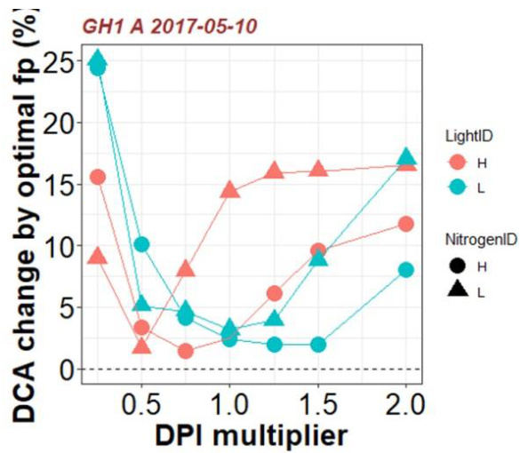  
图2-13. 在植物生长期间冠层上方平均入射光合有效辐射积分（DPI，mol $\mathbf { m } ^ { - 2 } { \mathbf { \delta } } \mathbf { d } ^ { - 1 } )$乘以0.25到2.0之间的DPI乘数下，不同光合氮$( N _ { \mathrm { p h } } )$分配因子$f _ { \mathfrak { p } , X }$值对白天每日冠层碳同化量（DCA，mol $\mathbf { d } ^ { - 1 }$）百分比变化的示例结果。由最优$f _ { \mathfrak { p } , X }$引起的DCA正变化表明控制$N _ { \mathrm { p h } }$分配$( f _ { \mathrm { p } , X } = 1 )$是次优的。在本例中，在光处理$\mathrm { ~ H ~ }$和氮处理$\mathrm { ~ L ~ }$下生长的冠层的$N _ { \mathrm { p h } }$分配在其生长光环境下是次优的，如果优化$N _ { \mathrm { p h } }$分配，DCA可以提高近$1 5 \%$。

# Chapter 3 Model parameterization and evaluation

Environmental triggers for photosynthetic protein turnover determine the optimal nitrogen distribution and partitioning in the canopy

# 第3章 模型参数化与评估

光合作用蛋白质周转的环境触发因素决定了冠层中氮素分布和分配的最优性

# 摘要

植物不断调整叶片中的光合功能以适应波动的光照，从而优化冠层水平的光合氮素$(N_{\mathrm{ph}})$利用。为了研究适应过程中外部信号之间的复杂相互作用，我们基于蛋白质周转（合成和降解）的概念提出了一个机制模型，并使用在生长室中九种氮素和光照组合下生长的黄瓜对其进行了参数化。将这个动态模型整合到多层冠层模型中，可以准确预测在高氮（HN）和低氮（LN）供应下，结合两种不同水平的日间光照波动，温室黄瓜冠层的光合适应。这使我们能够量化冠层氮素利用对最大化冠层碳同化的最优程度，这受到$N_{\mathrm{ph}}$沿冠层深度分布或$N_{\mathrm{ph}}$在功能库之间分配的影响。我们的分析表明，$N_{\mathrm{ph}}$分布接近最优，在低氮条件下$N_{\mathrm{ph}}$重新分配更为重要。$N_{\mathrm{ph}}$分配仅在光照水平与适应期间的平均光强相似时才是最优的，这意味着日间光照波动不可避免地导致次优的$N_{\mathrm{ph}}$分配。我们的研究为光适应提供了见解，并可用于作物模型的改进。

# 引言

叶片性状对波动环境的适应是最大化适应性的关键机制（Walters, 2005; Athanasiou等, 2010）。为了最大化冠层碳增益，动态调整光合特性以跟踪冠层内异质光分布至关重要（Retkute等, 2015），特别是对于具有连续叶片形成特性的草本植物（Niinemets等, 2015）。光适应中最重要的策略之一是通过持续调整（1）沿冠层深度的叶片间分布和（2）根据局部光可用性在光合功能之间的叶片内分配，来维持光合装置中有限资源（如氮素）的有效利用（Evans, 1989a）。

对光响应的垂直氮素分布已被广泛研究（Werger和Hirose, 1991; Anten等, 1995; Dreccer等, 2000; Moreau等, 2012; Hikosaka, 2016）。据报道，在小麦群体中，氮素分布密切跟随光梯度，从而接近其最优（Dreccer等, 2000）。然而，其他研究并未发现这种关系（Moreau等, 2012; Hikosaka等, 2016）。事实上，许多研究表明，由于下层冠层氮素重新分配的延迟和上层投资不足，氮素分布未能最佳地跟踪冠层内光梯度（Field, 1983; Evans, 1993b; Hollinger, 1996; Hirose等, 1997; Meir等, 2002; Wright等, 2006; Hikosaka, 2016）。这种最优与现实之间的差异可以用生理限制和氮素重新分配的成本来解释（Hikosaka, 2016; Kitao等, 2018），或者可能是由于错误的预测。在某些情况下（例如Hikosaka, 2016; Kitao等, 2018），根据Beer-Lambert定律估计的冠层内光梯度预测的最优氮素分布在上层冠层中极高，可能无法在生物学上实现。这可能是由于模型在三个方面的过度简化：（1）忽略了结构特征变化（如叶片仰角，Falster和Westoby, 2003）对叶片光截获的影响；（2）忽略了叶片发育和衰老过程中与年龄相关的修改和限制（Niinemets等, 2015; Niinemets, 2016）；（3）假设光合能力与单位叶面积光合氮素之间存在线性关系，而不是考虑功能氮素分配中的光适应。

优化叶片内的功能分配尤为重要，因为它通过提高光合氮素利用效率（PNUE, Zhu等, 2010）来增加碳增益。光合速率由光合机构中RuBP羧化和RuBP再生的有限速率决定（Farquhar等, 1980）。除了驱动光合作用外，光还触发了（1）RuBP羧化（Rubisco）、（2）RuBP再生（电子传递）和（3）光捕获功能之间氮素投资的精细调整（Yamori等, 2010; Trouwborst等, 2011; Vialet-Chabrand等, 2017b）。功能氮素分配中的光适应能力和意义已在喜光和耐阴物种中得到了实证研究（Evans, 1993b; Hikosaka和Terashima, 1996; Pons和Anten, 2004; Hikosaka, 2005; Trouwborst等, 2011）。最近，通过建模方法预测，减少对光捕获功能的投资可以增加冠层PNUE（Song等, 2017）。然而，环境触发对光适应过程的遗传和生理控制仍未从机制上得到描述。

在给定环境下的适应程度受到先前环境条件（Walters, 2005; Niinemets等, 2006）以及生理性状中与年龄相关的持续修改的限制（Niinemets, 2016）。这强调，不考虑植物生长和环境波动动态的静态模型可能不足以精确预测适应行为。Prieto等（2012）提出了一个经验模型，描述了叶片年龄和光对葡萄冠层叶片氮素经济学的综合影响，并证明前十天平均日光照积分解释了单位叶面积氮素变化的$73\%$。由于环境适应和发育（叶片衰老的遗传控制）适应是分别调节的（Athanasiou等, 2010），可以将内部（年龄）和外部（环境）触发因素整合到一个机制模型中，以更好地理解发育和环境对光合适应的影响。

叶片功能中的适应过程是通过蛋白质含量的不断更新来调节的，这是由降解和合成的共同作用驱动的蛋白质周转的结果（Li等, 2017）。在生长叶片中，光合蛋白质占蛋白质周转成本的最大部分（Li等, 2017）。以能量成本为代价，蛋白质周转对于根据外部触发因素调整蛋白质水平是必要的。实验表明，叶片Rubisco含量随光照（Yamori等, 2010）和氮素供应水平（Yamori等, 2011a）增加，并表现出随叶片年龄的演变，这可以通过Rubisco周转来解释（Suzuki等, 2001; Ishimaru等, 2001; Irving和Robinson, 2006）。基于蛋白质周转的概念，Thornley（1998）提出了一个机制模型，预测了叶片水平光合适应的合理动态。我们改进了这个模型，以描述不同光合氮素库的动态，并量化光和氮素可用性对叶片适应的发育和环境效应。通过将该模型整合到考虑黄瓜冠层结构特征的多层模型中，评估了冠层尺度上氮素分布和分配的最优性。这旨在（1）测试蛋白质周转是否可以成为动态环境条件下光合适应的机制解释；（2）理解环境触发因素在冠层水平上对PNUE和冠层碳同化最大化最优程度的调节机制，这可以被视为植物一般适应性的指标。

# 材料与方法

# 光合作用蛋白质周转动力学建模

光合氮$(N_{\mathrm{ph}}, \mathrm{mmol~N~m^{-2}})$定义为参与光合功能（即羧化、电子传递和光捕获）的蛋白质中的生物活性氮。叶片$N_{\mathrm{ph}}$计算为羧化库$(N_{\mathrm{V}})$、电子传递库$(N_{\mathrm{J}})$和光捕获库$(N_{\mathrm{C}})$中氮的总和（Trouwborst等，2011）：

$$
N_{\mathrm{ph}} = N_{\mathrm{V}} + N_{\mathrm{J}} + N_{\mathrm{C}}
$$

(公式3-1)

其中$N_{\mathrm{V}}$仅包括Rubisco，代表羧化能力的氮投资。$N_{\mathrm{J}}$包括电子传递链、光系统II核心和除Rubisco外的Calvin循环酶。$N_{\mathrm{C}}$包括光系统I核心和光捕获复合物I和II。功能库$N_{\mathrm{V}}$、$N_{\mathrm{J}}$和$N_{\mathrm{C}}$分别从最大羧化速率$\boldsymbol{V_{\mathrm{cmax}}}$（$\mathrm{\mu mol~CO_2~m^{-2}~s^{-1}}$）、最大电子传递速率$(J_{\mathrm{max}}, \mu\mathrm{mol~e^-~m^{-2}~s^{-1}})$和叶片叶绿素含量$(Chl, \mathrm{mmol~Chl~m^{-2}})$估计得出（Buckley等，2013）：

$$
\begin{array}{rl}
& N_{\mathrm{V}} = V_{\mathrm{cmax}} / \chi_V \\
& N_{\mathrm{J}} = J_{\mathrm{max}} / \chi_{\mathrm{J}} \\
& N_{\mathrm{C}} = \left(Chl - N_{\mathrm{J}} \times \chi_{\mathrm{CJ}}\right) / \chi_{\mathrm{C}}
\end{array}
$$

其中$\chi_V~(\mu\mathrm{mol~CO_2~mmol^{-1}~N~s^{-1}})$是单位Rubisco氮的羧化能力，$\chi_{\mathrm{J}}~(\mu\mathrm{mol~e^-~mmol^{-1}~N~s^{-1}})$是单位电子传递氮的电子传递能力。$\chi_{\mathrm{CJ}}$（mmol $\mathrm{Chl~mmol^{-1}~N}$）和$\chi_{\mathrm{C}}$（mmol $\mathrm{Chl~mmol^{-1}~N}$）分别是单位电子传递氮和单位光捕获组分氮的叶绿素转换系数。库$X$的光合氮分配分数$(p_{\mathrm{X}})$定义为库$X$中的氮$(N_X, \mathrm{mmol~N~m^{-2}})$与$N_{\mathrm{ph}}$的比值：

$$
p_X = N_X / N_{\mathrm{ph}}
$$

$N_X$的变化速率由给定叶龄$(t, ^\circ\mathrm{Cd})$时相应酶和蛋白质复合物的瞬时蛋白质合成速率$[S_X(t), \mathrm{mmol~N~m^{-2}~^\circ C d^{-1}}]$和降解速率$[D_X(t), \mathrm{mmol~N~m^{-2}~^\circ C d^{-1}}]$决定：

$$
\mathrm{d}N_X / \mathrm{d}t = S_X(t) - D_X(t)
$$

(公式3-4)

蛋白质合成作为一个与年龄相关且零级的过程（Li等，2017），由逻辑函数描述，且与当前$N_X$状态无关：

$$
S_X(t) = 2 \times S_{\mathrm{max},X} / \big[1 + \exp\big(t \times t_{\mathrm{d},X}\big)\big]
$$

其中$S_{\mathrm{max},X} (\mathrm{mmol~N~m^{-2}~^\circ C d^{-1}})$是$N_X$的最大蛋白质合成速率，发生在叶片发育的早期阶段（图S3-1）。常数$t_{\mathrm{d},X}~(^\circ\mathrm{C d^{-1}})$描述了蛋白质合成速率随时间下降的相对速率（蛋白质周转模型使用的系数见表3-1）。在$1/t_{\mathrm{d},X}$年龄时，$S_X$降至$S_{\mathrm{max},X}$的$53.8\%$。

降解速率$D_X$由一级动力学控制（Verkroost和Wassen，2005；Li等，2017），降解常数为$D_{\mathrm{r},X}~(^\circ\mathrm{C d^{-1}})$：

$$
D_X(t) = D_{\mathrm{r},X} \times N_X(t)
$$

公式3-5中的变量$S_{\mathrm{max},X}$是每日光截获量$(\cdot I_{\mathrm{Ld}}., \mathrm{mol~光子~m^{-2}~d^{-1}})$的函数：

$$
S_{\mathrm{max},X} = \bigl[S_{\mathrm{mm},X} \times k_{\mathrm{I},X} \times I_{\mathrm{Ld}} / \bigl(S_{\mathrm{mm},X} + k_{\mathrm{I},X} \times I_{\mathrm{Ld}}\bigr)\bigr] \times r_{\mathrm{N},X}
$$

其中$S_{\mathrm{mm},X}~(\mathrm{mmol~N~m^{-2}~^\circ C d^{-1}})$是潜在最大蛋白质合成速率，$k_{\mathrm{I},X}$是描述$S_{\mathrm{max},X}$随$I_{\mathrm{Ld}}$增加的速率常数。因子$r_{\mathrm{N},X}$随营养液中氮水平$(N_{\mathrm{S}}, \mathrm{mM})$增加，由米氏常数$k_{\mathrm{N},X}~(\mathrm{mM})$决定：

$$
r_{\mathrm{N},X} = N_{\mathrm{S}} / \bigl(k_{\mathrm{N},X} + N_{\mathrm{S}}\bigr)
$$

表3-1. 光合作用氮库蛋白质周转模型系数列表，包括羧化库$N _ { \mathrm { V } }$、电子传递库$N _ { \mathrm { J } }$和光捕获库$N _ { \mathrm { C } }$。这些系数通过生长室实验估计得出。模型变量和其他系数见表3-2和表3-3。

| 描述 | 系数 | 单位 | 库Nv | 库NJ | 库Nc |
|------|------|------|------|------|------|
| 降解常数(方程3-6) | Dr | Cd⁻¹ | 0.0195 | 0.0195 | 0.0091 |
| Smax随ILd增加的速率常数(方程3-7) |  | mmol N m²地面 d m²叶面积 Cd⁻¹ mol⁻¹光子 | 0.173 | 0.130 | 0.234 |
| 关联Ns与Smax的米氏常数(方程3-8) | kN | mM | 0.536 | 0.420 | 0.316 |
| 潜在最大合成速率(方程3-7) | Smm | mmol N m² Cd⁻¹ | 1.122 | 0.852 | 0.248 |
| 合成速率下降常数(方程3-5) | td | Cd⁻¹ | 0.001 | 0.002 | 0.001 |

表3-2. 模型输入输出变量列表

| 描述 | 变量 | 单位 | 方程 | 类型 |
|------|------|------|------|------|
| 净光合速率 | A | μmol CO₂ m⁻² s⁻¹ | 3-9a | 输出 |
| RuBP羧化限制的A | Ac | μmol CO₂ m⁻² s⁻¹ | 3-9b | 输出 |
| RuBP再生限制的A | Aj | μmol CO₂ m⁻² s⁻¹ | 3-9c | 输出 |
| 叶片吸收率 | α |  | 3-13 | 输出 |
| 大气CO₂浓度 | Ca | μmol CO₂ mol⁻¹ | 1 | 输入 |
| 叶绿体CO₂浓度 | Cc | μmol CO₂ mol⁻¹ | 3-14 | 输出 |
| 单位面积叶绿素含量 | Chl | mmol m⁻² | 3-2c | 输出 |
| 叶片-空气水汽压差 | D | kPa | 1 | 输入 |
| 氮库X的蛋白质降解速率 | Dx | Cd⁻¹ | 3-6 | 输出 |
| 创建氮变化的因子 | f |  | 3-18 | 输入 |
| 创建氮变化的因子 | f |  | 3-19 | 输入 |
| 叶肉CO₂导度 | gm | mol CO₂ m⁻² s⁻¹ | 3-16 | 输出 |
| 最大叶肉CO₂导度 | gmmax | mol CO₂ m⁻² s⁻¹ | 3-17 | 输出 |
| 气孔CO₂导度 | gsc | mol CO₂ m⁻² s⁻¹ | 3-15 | 输出 |
| 叶片光合光子通量密度 | ILc | μmol photons m⁻² s⁻¹ |  | 输入 |
| 日光合光子积分 | ILd | mol photons m⁻² d⁻¹ |  | 输入 |
| 过去四天平均ILd | ILd4d | mol photons m⁻² d⁻¹ |  | 输入 |
| 电子传递速率 | J | μmol e⁻ m⁻² s⁻¹ | 3-12 | 输出 |
| 最大电子传递速率 | Jmax | μmol e⁻ m⁻² s⁻¹ | 3-2b | 输出 |
| 叶面积 | LA | m² |  | 输入 |
| 冠层总氮 | Ncanopy | mmol N | 1 | 输出 |
| 叶片光合氮含量 | Nleaf | mmol N | 1 | 输出 |
| 单位面积叶片光合氮 | Nph | mmol N m⁻² | 3-1 | 输出 |
| 营养液氮浓度 | Ns | mM | 1 | 输入 |
| 氮库X的浓度 | Nx | mmol N m⁻² | 3-4 | 输出 |
| 光捕获氮库浓度 | Nc | mmol N m⁻² | 3-4 | 输出 |
| 电子传递氮库浓度 | NJ | mmol N m⁻² | 3-4 | 输出 |
| 羧化氮库浓度 | Nv | mmol N m⁻² | 3-4 | 输出 |
| 氮库X的分配比例 | px |  | 3-3 | 输出 |
| 无光呼吸时的日间呼吸速率 | Rd | μmol CO₂ m⁻² s⁻¹ | 3-10 | 输出 |
| 氮可用性对蛋白质合成的调节因子 | rN |  | 3-8 | 输出 |
| 最大蛋白质合成速率 | Smax | mmol N m⁻² Cd⁻¹ | 3-7 | 输出 |
| 氮库X的蛋白质合成速率 | Sx | mmol N m⁻² Cd⁻¹ | 3-5 | 输出 |
| 叶龄 | t | Cd | 1 | 输入 |
| 羧化速率 | Vc | μmol CO₂ m⁻² s⁻¹ | 3-11 | 输出 |
| 最大羧化速率 | Vcmax | μmol CO₂ m⁻² s⁻¹ | 3-2a | 输出 |

表3-3. 模型系数列表。括号内为标准误差(SE)。

| 描述 | 系数 | 单位 | 值(SE) | 参考文献 |
|------|------|------|--------|----------|
| 每单位光捕获氮的叶绿素转换系数 | Xc | mmol Chl mmol⁻¹ N | 0.03384 | Bu.c2013et |
| 每单位电子传递氮的叶绿素转换系数 | XCJ | mmol Chl mmol⁻¹ N | 4.64×10⁻⁴ | Bu.c2013 et |
| 每单位电子传递氮的电子传递转换系数 | XJ | μmol e⁻ mmol⁻¹ N s⁻¹ | 9.48 | Bu.,2013 et |
| 每单位Rubisco氮的羧化能力转换系数 | xv | μmol CO₂ mmol⁻¹ N s⁻¹ | 4.49 | Buckley et al., 2013 |
| 最小气孔导度 | g0 | mol CO₂ m⁻² s⁻¹ | 0.009 | Chen et al., 2014a |
| 物种特异性气孔导度系数 | g1 |  | 3.51 | Chen et al., 2014a |
| 无光呼吸时的CO₂补偿点 | Γ | μmol CO₂ mol⁻¹ | 43.02 | Singsaas et al.,2003 |
| Rubisco对CO₂的米氏常数 | K | μmol CO₂ mol⁻¹ | 404 | Chen et al., |
| Rubisco对O₂的米氏常数 | K | mmol O₂ mol⁻¹ | 278 | Chen et al., 2014a |
| 羧化位点的O₂浓度 | O | mmol O₂ mol⁻¹ | 210 | Chen et al., 2014a |
| 光合氮含量与最大叶肉导度的关系系数 | rgm | mol CO₂ mmol⁻¹ N s⁻¹ | 1.64×10⁻³ (5.27×10⁻⁴) |  |
| 最小叶肉导度 | rgm0 | mol CO₂ m⁻² s⁻¹ | 0.140 (0.0345) |  |
| 与生长呼吸导致Rd降低相关的系数 | Rg | m² d Cd⁻¹ mol⁻¹ photon | 4.16×10⁻⁴ (4.52×10⁻⁵) |  |
| 与维持呼吸导致Rd增加相关的系数 | Rm | μmol CO₂ d Cd⁻¹ mol⁻¹ photons s⁻¹ | 1.88×10⁻⁴ (1.61×10⁻⁵) |  |
| 与最大Rd相关的ILd系数 | Rmax | μmol CO₂ μmol⁻¹ photons s⁻¹ | 0.308 (0.028) |  |
| 光子到电子传递的转换效率 | φ | μmol e⁻ μmol⁻¹ photons | 0.340 (2.5×10⁻³) |  |
| 凸度系数 | θ |  | 0.7 | Chen et al., 2014a |
| 最大叶肉导度出现时的叶龄 | tgm | Cd | 121 (8.1) |  |
| gm-t曲线依赖关系的标准差 | Vgm |  | 0.860 (0.063) |  |

# 叶片光合作用建模

光合参数 $V _ { \mathrm { c m a x } }$、$J _ { \mathrm { m a x } }$ 和 $C h l$ 通过功能氮库 $N _ { \mathrm { V } }$、$N _ { \mathrm { J } }$ 和 $N _ { \mathrm { C } }$ 使用公式 3-2a 至 3-2c 估算。净光合速率 $( A _ { \mathrm { n } } , \mu { \mathrm { m o l } } \mathrm { C O } _ { 2 }$ $\mathbf { m } ^ { - 2 } \mathbf { s } ^ { - 1 } )$ 定义为 RuBP 羧化限制的 $\mathrm { \nabla { \cdot } } A _ { \mathrm { c } }$ (mmol $\mathrm { C O } _ { 2 } \mathrm { m } ^ { - 2 } \mathrm { s } ^ { - 1 } ,$ ) 和 RuBP 再生限制的 $( A _ { \mathrm { j } }$ , mmol $\mathrm { C O } _ { 2 } \ \mathrm { m } ^ { - 2 } \ \mathrm { s } ^ { - 1 } ,$ ) 净光合速率的最小值 (Farquhar et al., 1980):

$$
\begin{array} { r l } & { A _ { \mathrm { n } } = \operatorname* { m i n } \big ( A _ { \mathrm { c } } , A _ { \mathrm { j } } \big ) } \\ & { A _ { \mathrm { c } } = V _ { \mathrm { c } } \times ( C _ { \mathrm { c } } - \Gamma ^ { * } ) / [ C _ { \mathrm { c } } + K _ { \mathrm { c } } ( 1 + O / K _ { \mathrm { o } } ) ] - R _ { \mathrm { d } } } \\ & { A _ { \mathrm { j } } = J \times ( C _ { \mathrm { c } } - \Gamma ^ { * } ) / ( 4 C _ { \mathrm { c } } + 8 \Gamma ^ { * } ) - R _ { \mathrm { d } } } \end{array}
$$

其中 $C _ { \mathrm { c } } ( \mathrm { \mu m o l { C O } _ { 2 } \ : m o l { ' } } ^ { 1 } )$ 是叶绿体 $\mathrm { C O } _ { 2 }$ 浓度，$l ^ { * } ( \mathrm { \mu m o l { \mathrm { ~ C O } } _ { 2 } \mathrm { \ m o l { \mathrm { ~ \mu } } } ) }$ 是无暗呼吸时的 $\mathbf { C O } _ { 2 }$ 补偿点。$K _ { \mathrm { c } }$ $( \mu \mathrm { m o l } \mathrm { } \mathrm { } \mathrm { } \mathrm { C } { \mathrm { O } } _ { 2 } \mathrm { ~ m o l } ^ { - 1 } )$ 和 $K _ { \mathrm { o } }$ (mmol $\mathrm { ~ O _ 2 ~ } \mathrm { ~ m o l } ^ { - 1 } .$ ) 分别是 Rubisco 对 $\mathrm { C O } _ { 2 }$ 和 $\mathbf { O } _ { 2 }$ 的米氏常数。$O { \mathrm { ~ ( m m o l ~ O _ { 2 } ~ m o l } ^ { - 1 } ) }$ 是羧化位点的 $\mathbf { O } _ { 2 }$ 浓度。变量 $\mathrm { / _ { c } ~ ( \mu m o l ~ C O _ { 2 } ~ \ m ^ { - 2 } ~ \mathrm { s } ^ { - 1 } ) }$ 是羧化速率，$J ~ ( \mu \mathrm { m o l } \mathrm { ~ e ~ m } ^ { - 2 } \mathrm { ~ s } ^ { - 1 } )$ 是电子传递速率。日间呼吸速率 $R _ { \mathrm { d } } ( \mathrm { \mu m o l { \mathrm { ~ C O } } _ { 2 } \mathrm { \ m } ^ { - 2 } \mathrm { s } ^ { - 1 } } )$ 假设随 $t$ 和前四天平均 $I _ { \mathrm { L d } }$ $( I _ { \mathrm { L d 4 d } } )$ 变化：

$$
R _ { \mathrm { d } } ( t ) = R _ { \mathrm { m a x } } \times I _ { \mathrm { L d 4 d } } \times \exp \bigl ( - R _ { \mathrm { g } } \times I _ { \mathrm { L d 4 d } } \times t \bigr ) + R _ { \mathrm { m } } \times I _ { \mathrm { L d 4 d } } \times t
$$

其中 $R _ { \mathrm { m a x } } \ ( \mu \mathrm { m o l } \ \mathrm { C O _ { 2 } } \ \mathrm { d } \ \mathrm { m o l } ^ { - 1 }$ photons $\mathrm { { s } } ^ { - 1 }$ ) 将 $I _ { \mathrm { L d 4 d } }$ 与最大 $R _ { \mathrm { d } }$ 相关联，$R _ { \mathrm { g } }$ $\mathrm { ( m } ^ { 2 } \mathrm { ~ d ~ } ^ { \circ } \mathrm { C d } ^ { - 1 }$ $\mathrm { m o l } ^ { - 1 }$ photon) 影响生长呼吸的下降，$R _ { \mathrm { m } }$ $\mathbf { \Sigma } _ { \mathrm { ~ m ~ } } ( \mu \mathrm { m o l } \mathbf { C } \mathbf { O } _ { 2 } \mathrm { ~ d ~ } ^ { \circ } \mathbf { C } \mathbf { d } ^ { - 1 }$ $\mathrm { m o l } ^ { - 1 }$ photon $\mathrm { { s } ^ { - 1 } }$ ) 影响维持呼吸随 $t$ 的增加。

$V _ { \mathrm { c } }$ 和 $J$ 分别根据叶片上的光合光子通量密度 $( I _ { \mathrm { L c } } , \mu \mathrm { m o l }$ photons $\mathrm { m } ^ { - 2 } \mathrm { ~ s ^ { - 1 } } .$ ) 从 $V _ { \mathrm { c m a x } }$ 和 $J _ { \mathrm { m a x } }$ 计算，分别参考 Qian et al. (2012) 和 Ögren and Evans (1993):

$$
\begin{array} { r l } & { \mathrm { ~ \zeta _ { : } = } V _ { \mathrm { c m a x } } \times \left\{ 0 . 3 1 + \frac { 0 . 6 9 } { 1 + \exp [ - 0 . 0 0 9 \times ( I _ { \mathrm { L c } } - 5 0 0 ) ] } \right\} } \\ & { \mathrm { ~ \zeta _ { : } = } \{ \phi \times \alpha \times I _ { \mathrm { L c } } + J _ { \mathrm { m a x } } - [ ( \phi \times \alpha \times I _ { \mathrm { L c } } + J _ { \mathrm { m a x } } ) ^ { 2 } - 4 \theta \times J _ { \mathrm { m a x } } \times \phi \times \alpha \times I _ { \mathrm { L c } } ] ^ { 0 . 5 } \} / ( \mathrm { k g } \times \mathrm { k g } ^ { - 1 } ) ^ { 2 } } \end{array}
$$

其中 $\phi \ ( \mu \mathrm { m o l } \ \mathrm { e } ^ { - } \ \mu \mathrm { m o l }$ photons-1) 是光子到 $J$ 的转换效率，$\theta$ (无量纲) 是描述 $J$ 对 $I _ { \mathrm { L c } }$ 响应的凸度常数。叶片吸收率 （ $a$ , 无量纲) 与 Chl 相关 (Evans, 1993b):

$$
\alpha = C h l / ( C h l + 0 . 0 7 6 )
$$

叶绿体 $\mathbf { C O } _ { 2 }$ 浓度取决于气孔导度 $( g _ { \mathrm { s c } } ,$ mol $\mathrm { C O } _ { 2 } \mathrm { m } ^ { - 2 } \mathrm { s } ^ { - 1 } ,$ 和叶肉导度 $( g _ { \mathrm { m } } , \mathrm { m o l } \mathrm { C O } _ { 2 } \mathrm { m } ^ { - 2 } \mathrm { s } ^ { - 1 } )$ 的稳态：

$$
C _ { \mathrm { c } } = C _ { \mathrm { a } } - A _ { \mathrm { n } } \times [ ( g _ { \mathrm { s c } } + g _ { \mathrm { m } } ) / ( g _ { \mathrm { s c } } \times g _ { \mathrm { m } } ) ]
$$

其中 $C _ { \mathrm { a } } \ ( \mathrm { \mu m o l \ C O _ { 2 } \ m o l ^ { - 1 } } )$ 是大气 $\mathbf { C O } _ { 2 }$ 浓度，$g _ { \mathrm { s c } }$ 使用气孔导度的物种特异性常数 $g _ { 0 }$ 和 $g _ { 1 }$ (Chen et al., 2014a) 以及叶-空气水汽压差 $( D , \mathrm { k P a } ,$ , Medlyn et al., 2011) 计算：

$$
g _ { \mathrm { s c } } = g _ { 0 } + \left( 1 + g _ { 1 } / \sqrt { D } \right) \times A _ { \mathrm { n } } / C _ { \mathrm { a } }
$$

叶肉导度表示为 $t$ 的对数正态函数 (Chen et al., 2014a)，其中 $g _ { \mathrm { m } }$ 在叶片发育期间先增加，在衰老期间减少 (Flexas et al., 2008)：

$$
 { g _ { \mathrm { m } } } = g _ { \mathrm { m m a x } } \times \exp \left\{ - 0 . 5 \times \left[ \ln \bigl ( t / t _ { \mathrm { g m } } \bigr ) / v _ { \mathrm { g m } } \right] ^ { 2 } \right\}
$$

其中 $t _ { \mathrm { g m } }$ 是最大 $g _ { \mathrm { m } } \ ( g _ { \mathrm { m m a x } } .$ , mol $\mathrm { C O } _ { 2 } \ \mathrm { m } ^ { - 2 } \ \mathrm { s } ^ { - 1 } )$ 出现时的 $t$，$\nu _ { \mathrm { g m } }$ 是曲线的标准差；$g _ { \mathrm { m m a x } }$ 与 $N _ { \mathrm { p h } }$ 呈线性关系，因为 $\mathbf { C } _ { 3 }$ 植物中已报道了类似关系 (例如，Yamori et al., 2011a)：

$$
g _ { \mathrm { m m a x } } = r _ { \mathrm { g m } } \times N _ { \mathrm { p h } } + r _ { \mathrm { g m 0 } }
$$

其中 $r _ { \mathrm { g m } }$ $\left( \mathrm { m o l } \mathrm { C O _ { 2 } m m o l ^ { - 1 } N \ s ^ { - 1 } } \right)$ 描述了 $g _ { \mathrm { m m a x } }$ 随 $N _ { \mathrm { p h } }$ 的增加速率，$r _ { \mathrm { g m 0 } }$ $\mathrm { , ( m o l } \mathrm { C O _ { 2 } } \mathrm { m } ^ { - 2 } \mathrm { s } ^ { - 1 } \mathrm { ) }$ 是最小 $g _ { \mathrm { m m a x } }$ 。

稳态 $A _ { \mathrm { c } }$ 使用公式 3-9b、3-14 和 3-15 解析求解，$A _ { \mathrm { j } }$ 使用公式 3-9c、3-14 和 3-15 求解，遵循 Moualeu-Ngangue et al. (2016)。模型变量和系数列于表 3-1、3-2 和 3-3。

研究光合蛋白周转动态的生长室实验 黄瓜 (Cucumis sativus L. 'Aramon', Rijk Zwaan, De Lier, The Netherlands) 植物在德国汉诺威莱布尼茨大学园艺生产系统研究所 (北纬 $5 2 . 4 ^ { \circ } \mathrm { N }$) 进行了两次实验。

一项生长室实验于 2016 年 10 月 21 日至 12 月 9 日进行，采用三种光照和三种氮供应水平的因子组合来参数化光合蛋白周转模型 (见下文)。黄瓜种子于 10 月 5 日播种在岩棉块 $( 3 6 \times 3 6 \times 4 0 ~ \mathrm { m m }$ ) 中。八天后，将幼苗移植到更大的岩棉块 ( $\mathrm { 1 0 \times 1 0 \times 6 . 2 ~ c m } ,$ ) 中再培养八天，直到第二片真叶出现 (叶长 $\geq 3 \ \mathrm { c m }$ )。植物于 10 月 21 日转移到 $2 5 { \cdot } \mathrm { L }$ 塑料容器中 (每容器一株)，在 12 小时光照周期和 $2 4 ^ { \circ } \mathrm { C }$ 白天/$2 0 ^ { \circ } \mathrm { C }$ 夜晚空气温度下进行水培。使用 $\mathrm { C a } ( \mathsf { N O } _ { 3 } ) _ { 2 }$ 和 Ferty Basisdünger 1 (Planta GmbH, Regenstauf, Germany, $5 . 2 \mathrm { ~ m M ~ K ~ }$ , $1 . 3 \mathrm { \ m M \ P , 0 . 8 2 \ m M \ M g }$ 工作溶液) 提供三种氮水平：9.6、4.6 和 $2 . 3 ~ \mathrm { m M }$。营养液每周更换一次，每周两次调整至 $\mathrm { p H } ~ 6 . 0 – 6 . 5$。使用金属卤化物灯提供三种恒定光照条件，每日光合光子积分 (DPI) 分别为 28.9、14.2 和 $4 . 4 \mathrm { \ m o l }$ photons $\mathrm { m } ^ { - 2 } \ \mathrm { d } ^ { - 1 }$。每种处理组合下培养四株植物。每株植物保留三片叶子 (叶位 4 至 8，向顶计数)，使用定制的叶片支架保持水平并充分暴露于入射光，而其余枝条向下训练以避免相互遮荫。在不同叶片热龄 (从 $4 5 ^ { \circ } \mathrm { C d }$ 到 $5 5 8 ^ { \circ } \mathrm { C d }$ ，通过从叶片周围平均日气温中减去 $1 0 ^ { \circ } \mathrm { C }$ 的基准温度计算 (Savvides et al., 2016)) 下测量气体交换 (见下文) 和相对叶绿素含量 (SPAD-502; Minolta Camera, Japan)。使用数据记录仪 (Tinytag; Gemini Data Loggers, Chichester, UK) 连续记录空气温度。气体交换测量后，收获叶片进行叶面积和氮分析。

# 温室实验评估氮素分布和分配的最优性

2017年4月4日至5月12日进行了一项温室实验，采用两种光照条件和两种氮素供应水平，以评估模型性能并收集最优性分析的输入数据。种子于3月14日播种，并于3月22日移栽到更大的岩棉块中。在第三片真叶出现后，植物于4月4日转移到岩棉板上，种植密度为1.33株/平方米，并通过滴灌供应两种氮浓度：10（HN）和2.5（LN）mM，使用的肥料与生长室实验相同。实验期间，根据营养液和岩棉板中的氮浓度计算平均氮供应量，HN和LN分别为8.2和2.0 mM。植物在两种光照条件下生长：高光（HL）和低光（LL）。温室南半部分未遮荫作为HL处理。通过在温室北半部分使用遮阳网从顶部和侧面减少入射光，创建了低光处理，PPFD平均减少到HL的约40%（晴天38±1.3%，阴天42±0.2%）。实验期间，HL和LL处理冠层上方的平均DPI分别为21.4和8.5 mol光子/平方米/天。实验期间的DPI由位于温室上方的气象站记录。通过温室结构的平均光透射率为49.8%（晴天39.2%，阴天60.4%）。使用数据记录仪连续记录冠层中部的空气温度，HL处理显著高于LL处理（每天高0.5°C）。在4月21日、4月28日、5月5日和5月12日四个时间点，在两个不同冠层进行了气体交换测量和收获，每个处理两个重复。测量时叶龄范围为77°C d至414°C d。使用3D数字化仪（Fastrak；Polhemus，Colchester，美国）根据Chen等人（2014a）的方法获取叶片仰角。气体交换测量后收获叶片以确定叶面积指数（LAI，平方米/平方米）。

# 气体交换测量和光合参数估算

使用便携式光合作用系统（LI-6400XT；Li-Cor Inc.，Lincoln，NE，美国）测量了在1300 μmol光子/平方米/秒PPFD下的光饱和净光合速率（A1300，μmol CO2/平方米/秒）和光响应曲线。所有测量均在样品CO2 400 μmol/mol、叶片温度25°C和相对湿度55%的条件下进行。根据光响应曲线的线性部分估算暗呼吸速率Rd（Kok，1948）。使用单点法估算Vcmax（Wilson等，2000；De Kauwe等，2016），通过最小二乘法拟合非直角双曲线估算Jmax和φ（Ögren和Evans，1993）。使用可变J法估算叶肉导度（Harley等，1992a）。使用多相闪光法测量叶绿素荧光（Loriaux等，2013），方法遵循Moualeu-Ngangue等（2017）。

# 氮素分析和光合氮分配估算

将生长室实验中获得的叶片样品冷冻干燥并研磨成细粉用于氮分析。使用凯氏定氮法测定叶片总氮（Nelson和Sommers，1980）。用96%乙醇提取叶片叶绿素并进行比色分析（Lichtenthaler，1987）。确定了相对叶绿素含量（SPAD）与Chl之间的关系（图S3-2），用于估算温室实验中的Chl。

# 模型参数化

使用R（版本3.3.0；R统计计算基金会，https://www.r-project.org/）求解微分方程Eqn 3-4至Eqn 3-6，并使用"deSolve"和"DEoptim"包量化系数，这些包最小化观测值与模拟值之间的残差平方和。使用生长室实验获得的数据进行参数化。首先使用所有处理的数据量化每个库的Dr,X和td,X。在确定Dr,X和td,X的值后，再量化每个处理的Smax,X。使用Sigmaplot（版本11.0，Systat software GmbH，Erkrath，德国）通过最小二乘法拟合从Smax,X（Eqn 3-7和Eqn 3-8）确定Smm,X、kI,X、kN,X，以及t和ILd对Rd（Eqn 3-10）和gm（Eqn 3-16和Eqn 3-17）的影响。

# 动态叶片光合氮模拟和模型评估

使用实验期间的每日环境信息（图S3-3）和四次收获获得的冠层信息（包括每片叶片的年龄和面积）作为输入，模拟单位叶面积的光合氮（Nph，mmol N/平方米）、单叶光合氮（Nleaf，mmol N）和冠层总叶片光合氮含量（Ncanopy，mmol N）。首先，根据t（图S3-4）经验性地模拟每片叶片的仰角和LAI。其次，对于每个时间步长，计算叶片每日光截获ILd，并在Eqn 3-7中用于模拟蛋白质周转。使用Beer-Lambert定律（Monsi和Saeki，1953；Monsi和Saeki，2005）计算光截获，光衰减系数为0.695，并根据叶片仰角的余弦进行调整。对于模型评估，根据Kahlen和Stützel（2011）的方法，确定了光合参数、Nph和pX预测的均方根偏差（RMSD）和准确度（%）。

# 模拟每日冠层碳同化

使用最后一次收获获得的温室冠层特征作为输入（表S3-1；图S3-5），模拟白天的每日冠层碳同化（DCA，mol CO2/天）。在所有模拟中使用叶-空气水汽压差（D）1.2 kPa和Ca 400 μmol CO2/mol，与气体交换测量期间的环境条件相似。定义了不同DPI水平的场景来模拟DCA。相对于适应期间的平均DPI（aDPI），最多采用六个DPI水平来模拟日间DPI波动对DCA的影响。为了模拟DCA，使用简单的余弦钟函数（Kimball和Bellamy，1986）以0.1小时为时间步长模拟给定DPI水平下冠层上方的日间PPFD，日长为14.4小时。

# 修改光合氮分布和分配

为了评估叶片间分布和叶片内分配Nph对DCA的影响，在Eqn 3-5中引入分布因子fd以创建蛋白质合成速率的变化，并在Eqn 3-7中引入分配因子fp,X以创建不同功能库最大蛋白质合成速率的变化：

$$
\begin{array} { r l } & { S _ { X } ( t ) = 2 \times S _ { \operatorname* { m a x } , X } / \big [ 1 + \exp \big ( t \times t _ { \mathrm { d } , X } \times f _ { \mathrm { d } } \big ) \big ] } \\ & { S _ { \operatorname* { m a x } , X } = \big [ S _ { \operatorname* { m m } , X } \times f _ { \mathrm { p } , X } \times k _ { \mathrm { I } , X } \times I _ { \mathrm { L d } } / \big ( S _ { \operatorname* { m m } , X } \times f _ { \mathrm { p } , X } + k _ { \mathrm { I } , X } \times I _ { \mathrm { L d } } \big ) \big ] \times r _ { \mathrm { N } , X } } \end{array}
$$

定义控制条件为fd = 1和fp,X = 1，此时合成过程中的所有系数（表1）保持不变。增加fd会加速蛋白质合成速率的下降，并增强向顶端的Nph再分配。增加fp,X会导致NX的合成速率更高，并增加向库X的分配。确定了在几个DPI水平下最大化DCA的修改分配模式为最优，并使用R中的"DEoptim"包确定了fp,X的最优值。将修改分布或最优分配Nph引起的DCA变化与控制条件进行比较。计算了每个库X的最优与控制分配分数之间的比率，以及沿冠层深度的每日叶片碳同化（DLA）对DCA增加的贡献。

# 结果

机制模型旨在量化光和氮可用性以及发育对光合蛋白周转的环境影响

在模型中，我们假设光合蛋白周转受遗传和环境控制。遗传控制由潜在最大蛋白质合成速率$S _ { \mathrm { m m } }$、系数$t _ { \mathrm { d } }$和蛋白质降解常数$D _ { \mathrm { r } }$表征。系数$t _ { \mathrm { d } }$影响合成速率的下降，$D _ { \mathrm { r } }$影响降解速率，两者共同影响发育对蛋白周转动态的影响。$t _ { \mathrm { d } }$的低值$( 0 . 0 0 1 { - } 0 . 0 0 2 ^ { \circ } \mathbf { C } \mathbf { d } ^ { - 1 }$，表3-1)表明，在恒定光环境下，衰老的影响在叶片寿命后期才显现。羧化库$( N _ { \mathrm { V } } )$和电子传递库$( N _ { \mathrm { J } } )$的$D _ { \mathrm { r } }$相同，而光捕获库$( N _ { \mathrm { C } } )$的$D _ { \mathrm { r } }$较低(表3-1)。基因型对光和氮可用性的敏感性分别由$k _ { \mathrm { I } }$和$k _ { \mathrm { N } }$表征。$S _ { \mathrm { m m } } , k _ { \mathrm { I } }$和$k _ { \mathrm { N } }$共同决定了公式3-7中的最大蛋白质合成速率$S _ { \mathrm { m a x } }$。当光强增加2.5倍(从LL到HL)时，$N _ { \mathrm { V } }$和$N _ { \mathrm { J } }$的$S _ { \mathrm { m a x } }$增加了$50 \%$，$N _ { \mathrm { C } }$增加了$10 \%$，而氮水平对$S _ { \mathrm { m a x } }$的影响较小$( < 1 0 \% )$，仅在低氮浓度下发生(图3-1)，表明光对$S _ { \mathrm { m a x } }$有主要控制作用。$N _ { \mathrm { C } }$的$k _ { \mathrm { I } }$最高(表3-1)；因此，$S _ { \mathrm { m a x , C } }$在较低光强下接近饱和，而$S _ { \mathrm { m a x , V } }$和$S _ { \mathrm { m a x , J } }$则不然(图3-1)。$S _ { \mathrm { m a x , V } }$和$S _ { \mathrm { m a x , J } }$对光和氮水平的响应协调良好(图3-1A, B)，但$N _ { \mathrm { V } }$的$k _ { \mathrm { I } }$和$k _ { \mathrm { N } }$较高(表3-1)，表明$N _ { \mathrm { V } }$合成对光和氮可用性变化的敏感性高于$N _ { \mathrm { J } }$。

  
图3-1. 使用表3-1中的系数模拟每日光截获( $\mathrm { \Delta } I _ { \mathrm { L d } }$ , mol photons $\mathbf { m } ^ { - 2 } \mathbf { d } ^ { - 1 } .$ )和营养液中氮供应水平$( N _ { \mathrm { S } } , \mathrm { m M } )$对公式3-7中最大蛋白质合成速率$( S _ { \mathrm { m a x , X } } )$的影响，包括(A)羧化、(B)电子传递和(C)光捕获库。颜色表示归一化最大蛋白质合成速率，即$S _ { \mathrm { m a x , X } }$除以公式3-7中的潜在最大蛋白质合成速率$( S _ { \mathrm { m m , X } } )$。使用生长室实验获得的数据进行参数化。图上和旁边的箭头表示温室实验中的平均环境条件(高光，HL，$2 1 . 4 ~ \mathrm { m o l }$ photons $\mathbf { m } ^ { - 2 } \mathbf { d } ^ { - 1 }$；低光，LL，$8 . 5 ~ \mathrm { m o l }$ photons $\mathbf { m } ^ { - 2 } \mathbf { d } ^ { - 1 }$；高氮，HN，$8 . 2 \mathrm { m M }$；低氮，LN，$2 . 0 \mathrm { m M } ,$ )。

光和氮可用性对最大蛋白质合成速率的影响解释了光合驯化的动态

我们使用温室实验评估了模型，其中在两种光环境(HL和LL)和两种氮水平(HN和LN)组合下生长的叶片在连续四周内每周在两个冠层进行测量。模型预测叶片光合特性具有较高的准确性$( 7 0 \% . 9 1 \%$，图3-2)和与实验观察相似的光合驯化趋势(图S3-6)(图3-3)，除了光合氮( $\mathrm { \Delta } N _ { \mathrm { p h } }$，图3-2C)、羧化库(图3-2D, G)和叶绿素(图3-2F)的轻微高估。

研究了温室冠层中光合驯化受光、氮水平和叶龄相互作用的影响(图3-3)。光对$N _ { \mathrm { p h } }$(图3-3A)、$N _ { \mathrm { V } }$的分配分数$( p _ { \mathrm { V } } .$，图3-3C)和$N _ { \mathrm { J } }$的分配分数$( p _ { \mathrm { J } } ,$图3-3E)有正向影响，但对$N _ { \mathrm { C } }$的分配分数$( p _ { \mathrm { C } } ,$，图3-3G)有负向影响。光对$p _ { \mathrm { C } }$的负向影响可以通过$N _ { \mathrm { C } }$的高$k _ { \mathrm { I } }$(表3-1)来解释，这导致$S _ { \mathrm { m a x , C } }$在较低光强下饱和(图3-1)。$N _ { \mathrm { p h } } , p _ { \mathrm { V } } , p _ { \mathrm { J } }$和$p _ { \mathrm { C } }$随叶龄的变化与光的变化相似(图3-3)，这是由于年龄和光梯度的关联。

与HN相比，LN下的$N _ { \mathrm { p h } }$在幼叶中显著较低，但在老叶中相似(图3-3A)。在温室中，幼叶在高光强下发育，这增加了$S _ { \mathrm { m a x } }$对氮水平的敏感性(图3-1)。在叶龄增加和相互遮荫的同时，氮供应对$S _ { \mathrm { m a x } }$的影响变得不那么显著(图3-1)。与光相比(图3-3D, F和H)，氮水平对功能分配的影响较小(图3-3C, E和G)。

B C 30 1:1 线 回归 4 y = 0.17+0.88x R² = 0.64 TOI 80 y = 15+0.91x R²= 0.78 20 y=3.1+0.79x ooio U 3 TOI 60 oO1O1\ 8 2 0 9 百 a 9 OLO 香 40 10 0 T RMuD = =0.82 1 0 HO 8 RMuD = 0=47.65 20 。 RMSD = = 0.69 0 10 20 30 0 1 2 3 4 20 40 60 80 观测值 A130o (μmol m-² s-1) 观测值 Rd (μmol m-2 s-1) 观测值 Nph (mmol m-2)   
D E F   
200 y = 35+0.88x 1 y = 31+0.94x 0. y = 0.23+0.67x R² = 0.69 R² = 0.75 0.7 R² = 0.49   
U 150 0 。 0 0.6 工 4 aia   
Y O H 0.5 100 1 I8 IESHO 50 RMSD = 33 RMSD = 34 RMSD =0.10 准确度 = 0.48 0 准确度 = 0.70 准确度 = 0.76 0 50 100 150 200 050 100 150 200 250 300 0.2 0.30.4 0.50.6 0.7 0.8 观测值 Vcmax (μmol m-2 s-1) 观测值 J Jmax (μmol m-2 s-1) 观测值 Chl (mmol m-2)   
G H 0.5」y= 0.19+0.62x 0.40 y = -0.006+0.96x 0.6 y = 0.04+0.80x R² = 0.74 0.35 R² = 0.69 R² = 0.77   
p Q 8 p 0.4 o-b 0.30 0.4 T H8 0.3 8 0.3 产 loae 0.20 Ia 0.2 680 0.2 RMSD = =0.83 0.15 RMSD = =-091 0.1 RMSD = =.0525 0.2 0.3 0.4 0.5 0.15 0.20 0.25 0.30 0.35 0.40 0.1 0.2 0.3 0.4 0.5 0.6 观测值 py 观测值 pj 观测值 pc   
A B 80 ： H P=0.02 m 80 HN 60 1:1线 U 60 ■ LN 1 : 1线 P = 0.02 40 40 山 百 20 20 点 P<0.01   
M 0 a= 0.45±0.196 M 0 P= 0.12 0 20 40 60 80 0 20 40 60 80   
C HN 下的 Nph (mmol m-2) D HL 下的 Nph (mmol m-2) 0.45 0.45 0.40 0.35 H 0.30   
p 0.25 P<0.01 p 0.25 0.20 0.20 P=0.01 0.20 0.25 0.30 0.35 0.40 0.45 0.20 0.25 0.30 0.35 0.40 0.45   
E HN 下的 Pv F HL 下的 Pv 0.35 0.35 P= 0.15   
W H 山   
2 025   
p P<0.01 p 0.20 0.20 P<0.01 0.20 0.25 0.30 0.35 0.20 0.25 0.300.35   
G HN 下的 p, H HL 下的 p_ 0.6 0.6 P = 0.01 P<0.01 0.5 u 0.5 0.4 GU 0.4 P= 0.03   
0.3 0.3 0.2 0.2 0.2 0.3 0.4 0.5 0.6 0.2 0.3 0.4 0.5 0.6 HN 下的 Pc HL 下的 Pc

图 3-3. 叶片光合氮 $( N _ { \mathrm { p h } } .$ , mmol N $\mathrm { m } ^ { - 2 }$ , A 和 B)、羧化库分配分数 $\zeta _ { \mathrm { v } }$ , C 和 D)、电子传递库 $( p _ { \mathrm { { J } } } , \mathrm { ~ E ~ }$ 和 F) 以及光捕获库 $( p _ { \mathrm { { C } } }$ , G 和 H) 在高氮和低氮供应（分别为 HN 和 LN，A、C、E 和 G）以及高光和低光条件（分别为 HL 和 LL，B、D、F 和 H）之间的比较。每个点代表从可比冠层获得的温室实验测量值。橙色空心圆表示在 HL 下生长的叶片，黑色实心圆表示 LL，蓝色空心方块表示 HN，黑色实心方块表示 LN。圆圈大小随叶龄增加，范围从 $7 7 ^ { \circ } \mathrm { C d }$ 到 $4 1 4 ^ { \circ } \mathrm { C d }$ 。实线显示线性回归 $\mathrm {  ~ y ~ } =$ $a \mathrm { x } + b$ 。斜率 $a$ 的 $P$ 值已显示。当 $a$ 值与 1 显著不同时，用 $9 5 \%$ 置信区间指定。灰色虚线表示 1:1 线。

光合氮分布接近最优，且在氮可用性有限时氮再分配的影响更为显著

通过引入分布因子$f _ { \mathrm { d } }$来创建蛋白质合成速率的变化，评估了沿冠层深度的$N _ { \mathrm { p h } }$分布模式对日冠层碳同化（DCA，mol $\mathbf { C O } _ { 2 } \ \mathbf { d } ^ { - 1 } .$）的影响。在我们的模型中，蛋白质合成和降解速率同时决定了（1）冠层总叶片光合氮含量（Ncanopy，mmol N），（2）冠层中$N _ { \mathrm { p h } }$的分布，以及（3）叶片中库$X$的$N _ { \mathrm { p h } }$分配分数$( p _ { X } )$。因此，在保持其他两个因素不变的情况下，无法单独修改某个元素。增加$f _ { \mathrm { d } }$会导致叶片衰老过程中$N _ { \mathrm { p h } }$的更快减少和更多的向顶$N _ { \mathrm { p h } }$再分配。然而，这也减少了$N _ { \mathrm { c a n o p y } }$并倾向于增加$p _ { \mathrm { C } }$（数据未显示）。因此，为了获得具有可比$N _ { \mathrm { c a n o p y } }$的叶片光合氮含量$ { \langle N _ { \mathrm { l e a f } , i } . }$，mmol $\mathbf { N }$在叶片$i$中），将$f _ { \mathrm { d } } = n$时模拟的$N _ { \mathrm { l e a f } , i }$（记为$N _ { \mathrm { l e a f } , i } ^ { \prime } )$按$f _ { \mathrm { d } } = 1$和$f _ { \mathrm { d } } = n$时计算的$N _ { \mathrm { c a n o p y } }$之间的比例进行调整：

$N _ { \mathrm { l e a f } , i } ( f _ { \mathrm { d } } = n ) = N _ { \mathrm { \ l e a f } , i } ^ { \prime } ( f _ { \mathrm { d } } = n ) \times \left[ N _ { \mathrm { c a n o p y } } ( f _ { \mathrm { d } } = 1 ) / N _ { \mathrm { c a n o p y } } ( f _ { \mathrm { d } } = n ) \right]$ $p _ { X , i }$设置为与对照值相等：

$$
p _ { X , i } = N _ { X , i } ( f _ { \mathrm { d } } = 1 ) / N _ { \mathrm { p h } , i } ( f _ { \mathrm { d } } = 1 )
$$

这些调整确保了不同分布模式下的$N _ { \mathrm { c a n o p y } }$量相同。在模拟中，$f _ { \mathrm { d } }$在0.5到5.0之间以0.5为间隔变化，这给出了与黄瓜叶片中测量的$N _ { \mathrm { p h } }$值相当的值$( 2 2 { - } 1 3 5 \ \mathrm { m m o l \ N \ m } ^ { - 2 }$，图3-4）。通过增加$f _ { \mathrm { d } }$创建了具有增强向顶再分配的冠层$N _ { \mathrm { p h } }$分布（图3-4；图S3-7）。通常，$N _ { \mathrm { p h } }$分布与垂直光分布相对应，除了在冠层上部的扩展叶片中，并且在LL下$N _ { \mathrm { p h } }$分布与光的分布更陡（图S3-7）。

为了模拟日间光的自然波动，在DCA模拟中使用了代表适应期平均DPI（aDPI）的$200 \%$ $\left( \mathrm { a D P I } _ { 2 0 0 } \right)$、$100 \%$ $\mathrm { ( a D P I _ { 1 0 0 } ) }$和$50 \%$ $\mathrm {  { ( a D P I _ { 5 0 } ) } }$的三个光水平。在$\mathrm { \ a D P I _ { 1 0 0 } }$和$\mathrm { \ a D P I { 5 0 } }$下，增强向顶$N _ { \mathrm { p h } }$再分配并未显著增加DCA $( < 5 \% )$，表明在恒定和减少的DPI下$N _ { \mathrm { p h } }$分布是最优的（图3-5B，C）。更多的向顶再分配并未改善$N _ { \mathrm { p h } }$分布在最大化DCA方面的最优性，因为大部分叶面积位于冠层中下部至下部（图S3-5）。然而，在$\mathrm { \ a D P I _ { 2 0 0 } }$下，增强$N _ { \mathrm { p h } }$再分配在LN下使DCA增加了$7 \%$（图3-5A），表明向顶$N _ { \mathrm { p h } }$再分配在LN下比在HN下更为重要。

观察到$N _ { \mathrm { p h } }$在较老的叶片中比在较年轻的叶片中被高估得更多（图3-2C），这表明我们的模型在从叶片水平扩展到冠层水平时倾向于低估向顶$N _ { \mathrm { p h } }$再分配。为了在生长室实验中为测量的叶片保持恒定的光环境，比采样叶片更年轻的叶片被训练向下，它们的光截获和氮需求不可避免地减少；因此，模型系数是从具有有限氮再分配的叶片中获得的。然而，低估向顶$N _ { \mathrm { p h } }$再分配不会影响我们关于$N _ { \mathrm { p h } }$分布接近最优的结果。

  
图3-4. 沿冠层深度的叶片光合氮$( N _ { \mathrm { p h } } ,$，mmol $\textrm { N } \ : \mathrm { m } ^ { - 2 } )$分布，以叶面积指数（LAI，$\mathrm { m } ^ { 2 } \mathrm { ~ m } ^ { - 2 } ,$）为特征。使用分布因子$f _ { \mathrm { d } }$在0.5到5.0之间以0.5为间隔在公式3-18下创建了不同生长条件下的氮分布变化。（A）高氮高光$( \mathrm { H N + H L } )$；（B）高氮低光$\mathrm { ( H N + L L ) }$；（C）低氮高光$\left( \mathrm { L N + H L } \right)$；（D）低氮低光$\mathrm { \ L N + L L }$）。模拟的对照Nph分布$\begin{array} { r l r } { ( f _ { \mathrm { d } } } & { { } = } & { 1 ) } \end{array}$用绿线表示。

  
次优氮分配是由于日间光波动

图 3-5. 不同$f _ { \mathrm { d } }$值(图3-4)的光合氮$( N _ { \mathrm { p h } } )$分布对不同日光合光子积分(DPI, mol photons $\mathbf { m } ^ { - 2 } { \mathrm { ~ d } ^ { - 1 } } ,$ )相对于驯化期间平均DPI(aDPI)的日冠层碳同化(DCA)的影响。(A) aDPI的两倍$\left( \mathrm { a D P I } _ { 2 0 0 } \right)$ ; (B) aDPI $\left( \mathrm { a D P I } _ { 1 0 0 } \right)$ ; (C) aDPI的一半$\mathrm { ( a D P I _ { 2 0 0 } ) }$ 。向顶$N _ { \mathrm { p h } }$再分配随$f _ { \mathrm { d } }$增加而增加。比较了在高氮高光$( \mathrm { H N + H L }$ , 橙色空心圆)、高氮低光$( \mathrm { H N + L L }$ , 黑色实心圆)、低氮高光$( \mathrm { L N + H L }$ , 橙色空心三角形)、低氮低光$C _ { \mathrm { { L N + L L } } }$ , 黑色实心三角形)条件下生长的植物在给定DPI下的表现。DCA的相对变化是通过将给定$N _ { \mathrm { p h } }$分布获得的DCA除以相同DPI下对照$N _ { \mathrm { p h } }$分布$( f _ { \mathrm { d } } = 1 )$获得的DCA计算得出的。$\pm 5 \%$以内的变化(灰色阴影)被认为不显著。

为了找到叶片内$N _ { \mathrm { p h } }$功能间分配的最优方案，通过因子$f _ { \mathfrak { p } , X }$修改了库$X$的潜在最大蛋白质合成速率，范围从0.2到2.0。增加$f _ { \mathfrak { p } , X }$导致更高的蛋白质合成速率，但也增加了$N _ { \mathrm { c a n o p y } }$和分配到冠层上部的氮比例。在用修改后的$f _ { \mathrm { p } , X }$模拟氮分配后，将每片叶子的$N _ { \mathrm { l e a f } }$重新分配为使用$f _ { \mathrm { p } , X } = 1$获得的对照值。在六个DPI水平$( 2 5 \% - 4 0 0 \%$ aDPI)下具有最大DCA的分配模式被确定为最优，并将最大DCA与对照DCA进行比较(图3-6)。当DPI接近aDPI时，最优分配导致的DCA增加不显著$( < 5 \% )$(图3-6中箭头所示)。这表明植物能够通过优化$N _ { \mathrm { p h } }$分配来最大化DCA以适应aDPI。当DPI偏离aDPI时，$N _ { \mathrm { p h } }$分配进一步偏离最优(图3-6)。因此，强烈的日间光波动导致$N _ { \mathrm { p h } }$分配的次优，并导致较低的PNUE。

通过优化$N _ { \mathrm { p h } }$分配，可以通过将氮重新投资于有限的功能库来增加DCA。在$\mathrm { \ a D P I _ { 2 0 0 } }$下，HL条件下的$N _ { \mathrm { p h } }$分配是次优的(图3-6)，且HN条件下的次优性小于LN条件(表3-4)。通过将约一半的$N _ { \mathrm { C } }$重新投资到$N _ { \mathrm { V } }$和$N _ { \mathrm { J } }$(图3-7A, C)，HN条件下DCA增加了$6 \%$，LN条件下增加了$13 \%$(表3-4)，这是由于中下层冠层碳同化增加的结果(图3-7A, C)。在$\mathrm { \ a D P I _ { 5 0 } }$下，HN并没有减少$N _ { \mathrm { p h } }$分配的次优性(表3-4)，这是由于对光捕获功能的投资不足。将中上层冠层的$N _ { \mathrm { V } }$重新投资到$N _ { \mathrm { C } }$(HL, 图3-8A; LL, 图3-8B, D)使DCA增加了$7 \% - 2 5 \%$(表3-4)。

  
图 3-6. 通过优化光合氮$( N _ { \mathrm { p h } } )$分配在不同生长条件下对不同日光合光子积分(DPI, mol photons $\mathbf { m } ^ { - 2 } \mathbf { d } ^ { - 1 } .$ )的日冠层碳同化(DCA)的增加。DCA的增加是在给定DPI下最优分配与对照分配$( f _ { \mathfrak { p } , x } = 1$ 在公式3-19中)相比的DCA。小于$5 \%$的增加(灰色阴影)被认为不显著。驯化期间的平均DPI(aDPI)由橙色箭头表示HL( $2 1 . 4 ~ \mathrm { m o l }$ photons $\mathbf { m } ^ { - 2 } \mathbf { d } ^ { - 1 } .$ )，黑色箭头表示LL(8.5 mol photons $\mathbf { m } ^ { - 2 } { \mathbf { \tau } } \mathbf { d } ^ { - 1 } .$ )。星号表示在图3-7、图3-8和表3-4中比较的$50 \%$、$100 \%$和$200 \%$ aDPI场景。此处使用的符号和颜色与图3-5中的相同。

表3-4. 在不同日光合光子通量(DPI, mol光子 m⁻² d⁻¹)下，通过优化光合氮分布或分配对日冠层碳同化(DCA)的提升。测试了适应期平均DPI(100% aDPI)、200%和50% aDPI。计算了在高氮(HN)、高光(HL)、低氮(LN)和低光(LL)组合下生长的植物，通过比较优化与对照分布或分配之间的DCA，得出DCA的提升。

| 生长条件 | 光照水平 | DPI (mol CO₂ d⁻¹) | 对照DCA | 优化分布提升DCA (%) | 优化分配提升DCA (%) |
|----------|----------|-------------------|---------|---------------------|---------------------|
| HN+HL    | 200%     | 42.7              | 0.5467  | <5%                 | 6.3%                |
|          | 100%     | 21.4              | 0.3217  | <5%                 | <5%                 |
|          | 50%      | 10.7              | 0.1368  | <5%                 | 7.1%                |
| HN+LL    | 200%     | 17.1              | 0.2554  | <5%                 | <5%                 |
|          | 100%     | 8.5               | 0.1195  | <5%                 | <5%                 |
|          | 50%      | 4.3               | 0.0259  | <5%                 | 23.6%               |
| LN+HL    | 200%     | 42.7              | 0.4011  | 7.0%                | 12.7%               |
|          | 100%     | 21.4              | 0.2653  | <5%                 | <5%                 |
|          | 50%      | 10.7              | 0.1221  | <5%                 | <5%                 |
| LN+LL    | 200%     | 17.1              | 0.2261  | 6.9%                | <5%                 |
|          | 100%     | 8.5               | 0.1108  | <5%                 | <5%                 |
|          | 50%      | 4.3               | 0.0215  | <5%                 | 25.0%               |

  
图3-7. 在200%驯化期平均光合光子通量(aDPI200)下，沿冠层深度(叶面积指数LAI, m² m⁻²)的羧化库(pV, 橙色圆圈)、电子传递库(pJ, 红色三角形)、光捕获库(pC, 绿色方块)的最优与对照分配分数比(最优pX/对照pX)，以及通过最优分配增加的每日叶片碳同化(DLA)对每日冠层碳同化(DCA)增加的贡献(灰色柱状图，右y轴)。(A)高氮高光(HN+HL)；(B)高氮低光(HN+LL)；(C)低氮高光(LN+HL)；(D)低氮低光(LN+LL)条件下生长的植物。在aDPI200下，HN+LL和LN+LL的光合氮分配接近最优，分别对应于HL和LL的DPI为42.7和17.1 mol光子 m⁻² d⁻¹。最优分配对DCA的增加见表3-4。

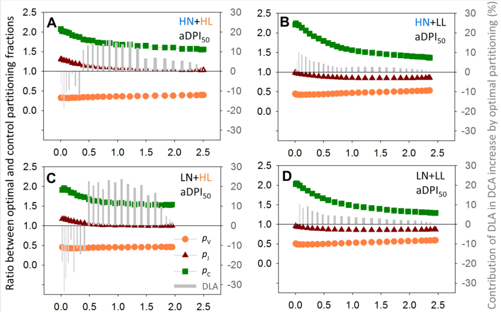  
图3-8. 在50%驯化期平均光合光子通量(aDPI50)下，沿冠层深度(叶面积指数LAI, m² m⁻²)的最优与对照分配分数比(最优pX/对照pX)，以及通过最优分配增加的每日叶片碳同化(DLA)对每日冠层碳同化(DCA)增加的贡献(灰色柱状图，右y轴)。(A)高氮高光(HN+HL)；(B)高氮低光(HN+LL)；(C)低氮高光(LN+HL)；(D)低氮低光(LN+LL)条件下生长的植物。在aDPI50下，LN+HL的光合氮分配接近最优，分别对应于HL和LL的DPI为10.7和4.3 mol光子 m⁻² d⁻¹。此处使用的符号和颜色与图3-7相同。最优分配对DCA的增加见表3-4。

# 讨论

该模型是首个在叶片水平应用动态蛋白质周转机制来评估冠层水平氮利用最优性和限制的方法。在这里，最大化的冠层碳同化被认为是最大化适应度的一般指标。蛋白质周转机制的适应给出了最优Nph的合理预测和叶片光合特性的准确预测。

在广泛的光照和氮可用性条件下叶片氮经济学的机制解释

已有充分证据表明光照是叶片经济学的主要控制因素。例如，比叶面积作为与叶片氮含量共变的叶片结构综合指标，对光照的响应比营养可用性更具可塑性(Poorter et al., 2009; Poorter et al., 2010)。机制模型可用于解释测量的生物数据(Chen et al., 2015; Chen et al., 2018)，如本模型所示，通过最大蛋白质合成速率(Smax, 图3-1)的影响，定量解释了叶片氮经济学(如单位叶面积光合氮含量Nph和光合能力)对光照和氮的不同可塑性响应。光照增加五倍(4-20 mol光子 m⁻² d⁻¹)使羧化库(NV)和电子传递库(NJ)的Smax翻倍(图3-1A, B)，这与已发表的值相似(Niinemets et al., 2015)。相比之下，氮供应从2增加到10 mM仅使NV和NJ的Smax分别增加20%和16%。光照对光合氮的影响可以是定量的(对Nph)或定性的(对氮分配pX)(Niinemets et al., 2006; Buckley et al., 2013)，而氮仅通过限制Smax影响Nph(图3-1和图3-3)。在菠菜中观察到光照和氮可用性对电子传递和光捕获功能之间分配的类似影响(Terashima and Evans, 1988)。我们的蛋白质周转模型解释了光合作用对光照和氮供应的适应，并提供了叶片氮经济学的机制见解。

在生长的冠层中，叶片年龄与光照可用性降低相关(Niinemets et al., 2006; Chen et al., 2014a)。因此，叶片光合作用对光照的适应与叶片衰老同时发生，这在本模型中由蛋白质降解常数Dr和描述蛋白质合成速率降低的常数td表征。NV和NJ的Dr值落在Peterson et al. (1973)和Li et al. (2017)报告的体内定量范围内。td的低值(表3-1)解释了在恒定光照条件下观察到的叶片衰老对光合能力影响不大的现象(Pettersen et al., 2010b)。

除了光照和氮可用性外，温度对光合氮含量和分配也有影响(Yamori et al., 2005; Kattge and Knorr, 2007; Yamori et al., 2009)。发育过程和生化反应的温度依赖性通常用指数或Arrhenius型函数描述(Parent et al., 2010; Parent and Tardieu, 2012; Kahlen and Chen, 2015)。在我们的模型中，温度效应部分通过温度总和来考虑，它假设蛋白质合成与叶片温度之间存在线性关系。由于蛋白质合成和降解的确切温度依赖性未知，且我们的数据来自温度波动最小化的受控环境，我们采用线性简约方法以避免推测和过度参数化(Parent et al., 2016)。

# 过量投资Rubisco可能是适应短期光波动的机制

在氮素充足的情况下，Rubisco可以作为一种储存蛋白，这意味着Rubisco的量可能超过支持光合作用所需(Carmo-Silva et al., 2015)。Rubisco库具有最高的$k _ { \mathrm { N } }$值(表3-1)，表明Rubisco合成对氮素可用性的反应比其他两个库更快。这解释了$V _ { \mathrm { c m a x } }$与$J _ { \mathrm { m a x } }$之比随氮素可用性增加而增加的原因(Hikosaka, 2004; Yamori et al., 2011a)，尤其是在LL条件下(图3-3C, E)。在HN条件下，Rubisco储存是有利的，因为光诱导的Rubisco激活(时间常数为3-5分钟)(Portis et al., 1986; Kaiser et al., 2018b)比Rubisco合成快得多。因此，Rubisco储存可能是快速适应光照突然增加的机制。这解释了为什么在HN条件下生长的植物比LN条件下具有更宽的DPI范围，在这些范围内氮分配是最优的(图3-6和表3-4)。此外，在DCA模拟中排除Rubisco激活$ { V _ { \mathrm { c } } } =  { V _ { \mathrm { c m a x } } }$在公式3-9b中)导致即使在aDPI下，$N _ { \mathrm { V } }$的投资也达到了最优水平的四倍(数据未显示)。由于与其他化学相关酶相比，Rubisco并不是特别低效的催化剂(Bathellier et al., 2018)，冠层中过量投资Rubisco可能更多是适应短期光波动的机制，而不是克服其酶效率低下的机制。

# 对作物模型改进和温室管理的启示

使用植物模型来理解作物表现需要了解生理机制(Boote et al., 2013; Poorter et al., 2013)。通过将已知的叶片水平蛋白质周转生物学机制整合到冠层光合作用的多层模型中，我们展示了机制模型对测量生物数据的解释力。我们的模拟表明，通过操纵与光合作用相关的功能库，可以增加冠层光合作用。例如，在光照增加的情况下，应增加对Rubisco和电子传递的投资(Ishimaru et al., 2001; Yamori et al., 2011b)(图3-7)，而在光照可用性降低的情况下，需要更大的光捕获天线尺寸(Masuda et al., 2003)(图3-8)。很明显，最佳氮分配模式在很大程度上取决于光照条件，而生物合成调节不太可能跟上每日光波动(高达四倍的差异，图S3-3)。

在温室栽培中，使用补充照明可以实现更稳定的光照环境。这可能是改善垂直光分布(Lu and Mitchell, 2016)和最小化光波动引起的氮利用次优性的合理解决方案。由于碳同化是黄瓜产量生产的限速步骤，因为其营养和生殖器官的不确定生产(Wiechers et al., 2011a)，冠层碳增益可以被视为产量的近似值。我们的模拟表明，由DPI减少$50 \%$引起的次优氮分配可以通过在高光季节使用行间照明(约$7 \%$的DCA增加)和在低光季节使用顶部照明(可能与行间照明结合，约$2 5 \%$的DCA增加，表3-4和图3-8)来补偿，类似于冬季行间照明报道的黄瓜果实产量增加$( 2 2 \% - 3 1 \% )$(Kumar et al., 2016)。在夏季，由DPI突然加倍引起的次优氮分配可以通过增加氮供应和行间照明的预处理来克服(约$6 \%$的DCA增加，表3-4)，这保持了生化能力并减少了遮荫叶片的生化限制(Pettersen et al., 2010a; Trouwborst et al., 2010; Chen et al., 2014a)。这些结果为补充照明实验的观察提供了冠层水平的生理学解释(Hovi et al., 2004; Hovi-Pekkanen and Tahvonen, 2008; Pettersen et al., 2010a; Trouwborst et al., 2010)。此外，在我们的模型中，蛋白质合成速率与截获光强之间的关系是非线性的(公式3-7)，这可能解释了为什么在自然日内光波动下生长的叶子的光适应反应与恒定光下的不同，如最近的实验研究所示(Vialet-Chabrand et al., 2017b)。

光波动尤其发生在冠层下层，在那里光斑导致强烈而频繁的光变化，从而增加了老叶中$N _ { \mathrm { p h } }$和$p _ { X }$的变化(图3-3)。有趣的是，在HL条件下，随着叶龄的增加，叶片似乎优先将氮投资于$N _ { \mathrm { J } }$而不是$N _ { \mathrm { C } }$(图3-3E)，这可能是由于$\mathrm { L N + H L }$条件下LAI发育减少，因此老叶的光截获更高(图S3-4C和图S3-5)。由于模型中没有描述叶内和日内光异质性(例如光斑)，因此无法在模拟中重现温室实验中观察到的这些变化(图S3-6)。这可以通过将模型与3D结构植物模型耦合并在模拟中使用更短的时间步长来改进，以捕捉更真实的光适应响应。总之，我们提出了一个机制模型来量化叶龄、氮和光可用性对光合适应的影响。该模型预测了温室中不同氮供应和光可用性组合下观察到的光合适应。模型模拟表明，光合氮分布接近最优，在恒定光照条件下光合氮分配可以是最优的。然而，自然条件下日间光的大幅波动不可避免地导致次优的氮分配。我们的研究提供了对光合适应的见解，该模型可用于作物模型改进，并为温室管理提供指导。

# Chapter 4 Impact of fluctuating light on photosynthetic acclimation

A mechanistic view of the reduction in photosynthetic protein abundance under diurnal light fluctuation

# 第四章 光波动对光合适应的影响

从机制角度解析昼夜光波动下光合蛋白丰度的降低

# 摘要

与在恒定光照下生长但接收相同日光子积分（DPI）的叶片相比，适应昼夜光波动（FL）的叶片往往具有较低的光合参数。这种降低可能是由于光合蛋白合成速率（PPSR）与入射光合有效辐射（PAR）之间的非线性关系所致。结合PPSR-PAR关系的模型定量预测了文献中报道的FL效应。进一步的模拟表明，这种降低的程度随FL模式、DPI水平以及描述PPSR-PAR关系的参数而变化。

近年来，理解植物对光波动（FL）的生理反应越来越受到关注，因为FL反映了植物在自然条件下生长的更真实情况（Kaiser等，2018b；Burgess等，2018；Matsubara，2018）。通过假设光合能力$(A_{\mathrm{max}})$的确定是由最大化碳同化的机制驱动的，可以预期在FL下会有更高的$A_{\mathrm{max}}$（Retkute等，2015）。然而，这一假设导致在频繁光波动下对$A_{\mathrm{max}}$的高估超过50%，表明背后存在更复杂的机制。最近，Vialet-Chabrand等（2017b）通过实验证明，与在方波光（SQ）下生长但接收相同日光子积分（DPI，mol m⁻² d⁻¹）的植物相比，在FL下生长的植物的日碳同化较低。他们强调了昼夜光波动对光合适应和光合能力的影响。他们的发现之一是，在FL下生长的植物具有较低的光合参数，特别是最大电子传递速率$(J_{\mathrm{max}})$和叶片对入射光合有效辐射（PAR）的吸收率。从生物化学角度来看，这种降低是由于光合蛋白丰度减少了3-15%。然而，导致FL和SQ之间蛋白丰度差异的生理机制仍未得到解释。在这里，我们通过应用基于小时的光合适应动态模型来寻求FL下光合蛋白减少的解释。

  
图4-1. (A) 光合蛋白合成速率（PPSR）对光合有效辐射（PAR）的响应曲线在Rubisco、电子传递（ET）蛋白和光捕获（LH）蛋白之间存在差异，这取决于每个功能蛋白组的最大合成速率$(S_{\mathrm{mm}})$和曲率$(k_{\mathrm{I}})$。模拟了不同日PAR积分（DPI）和12小时光周期下光波动（FL）对不同光合参数的影响。(B) 图表显示了自然昼夜波动（FL_N，改编自Vialet-Chabrand等，2017）、大波动（FL_L）、小波动（FL_S）和方波（SQ）光模式下每小时日PAR分布（%）。 (C) 最大羧化速率$(V_{\mathrm{cmax}})$、(D) 最大电子传递速率$(J_{\mathrm{max}})$和(E) 叶片PAR吸收率在FL和SQ下不同DPI水平的比值。 (A) 中的绿色实线和虚线箭头分别表示在DPI为5和20 mol m⁻² d⁻¹时FL_N模式下的PAR范围。

蛋白丰度受多种机制的协调调控，是蛋白周转的结果：即蛋白合成和降解的连续动态（Kristensen等，2013；Nelson和Millar，2015）。基于蛋白周转的概念，我们最近提出了一个描述光合适应的机制模型（第3章），其中实验数据表明光合蛋白合成速率（PPSR）与PAR之间存在非线性关系（图S4-1）。在低光条件下（对于Rubisco和电子传递蛋白，PAR高达200 μmol m⁻² s⁻¹），PPSR几乎随PAR线性增加，然后PPSR-PAR曲线的斜率减小，蛋白合成速率在高PAR（约900 μmol PAR m⁻² s⁻¹）时接近饱和水平。这种非线性关系的形式并不令人惊讶，因为它在许多其他生物现象的因果关系中也被观察到。值得注意的是，它暗示了在FL条件下（在Vialet-Chabrand等，2017b中，PAR在0-1500 μmol m⁻² s⁻¹之间波动）的蛋白合成速率在一天中偶尔会达到饱和，因此每天每单位DPI的蛋白合成量低于SQ下的非饱和条件（对于12小时，恒定在460 μmol PAR m⁻² s⁻¹）。通过应用这种PPSR-PAR关系（图4-1A），可以评估在FL和SQ下生长的植物之间光合蛋白丰度的差异。为了模拟昼夜光波动的影响，我们首先将第3章模型中的参数转换为小时基础，假设12小时光周期和黑暗中的蛋白合成为零。然后，使用三种FL模式（图4-1B）和DPI在1-60 mol m⁻² d⁻¹之间的SQ作为光输入，模拟Rubisco、电子传递（ET）和光捕获（LH）蛋白的丰度，然后分别转换为最大Rubisco羧化速率$(V_{\mathrm{cmax}})$、$J_{\mathrm{max}}$和叶片PAR吸收率。根据Buckley等（2013）使用将每个功能蛋白池中的氮量转换为相应能力的常数。在自然昼夜光波动（图4-1B中的FL_N）和光强度（DPI = 10和20 mol PAR m⁻² d⁻¹）与Vialet-Chabrand等（2017b）的FL实验相似的情况下，模型预测了FL对光合参数的影响：$V_{\mathrm{cmax}}$和$J_{\mathrm{max}}$降低了21%（图4-1C，D），叶片PAR吸收率降低了2%（图4-1E）。这一预测在叶片PAR吸收率（3-5%）的报道范围内，但与拟南芥中$V_{\mathrm{cmax}}$（8-10%）和$J_{\mathrm{max}}$（11-15%）的发现不同（Vialet-Chabrand等，2017b）。这些差异可能是由于模拟中假设了黑暗中没有蛋白合成（见后文），或者由于模型是使用温室黄瓜（Cucumis sativus）参数化的，其PPSR-PAR响应可能与拟南芥不同。然而，实验和模型研究都表明，$V_{\mathrm{cmax}}$和$J_{\mathrm{max}}$比叶片PAR吸收率更受FL的影响。这可以解释为光捕获蛋白的合成速率在比Rubisco和电子传递蛋白更低的PAR水平下达到饱和（图4-1A）。因此，在高DPI下，FL对光捕获蛋白的影响几乎可以忽略。

  
图4-2. 自然昼夜波动（FL_N，图4-1B）对光合蛋白丰度的影响取决于最大合成速率（$S_{\mathrm{mm}}$，等于0.1、0.5或2.5）和PPSR-PAR响应曲线的曲率（$k_{\mathrm{I}}$，等于0.5或5）的值。缩写见图4-1。

FL对$V_{\mathrm{cmax}}$、$J_{\mathrm{max}}$和叶片吸收率的不同影响（图4-1C，D，E）表明，PPSR-PAR曲线的特征决定了光波动对光合蛋白丰度的影响。因此，我们进一步研究了PPSR-PAR曲线参数，即最大蛋白合成速率（$S_{\mathrm{mm}}$，等于0.1、0.5或2.5）和曲率（$k_{\mathrm{I}}$，等于0.5或5），在自然昼夜光波动（图4-1B中的FL_N）下对光合适应的影响，DPI水平在1-60 mol m⁻² d⁻¹之间，结合氮供应水平（2 < N < 10 mM）和叶龄（5 < 年龄 < 45天）。年龄和氮水平对FL_N的影响（<1%）没有影响（数据未显示）。由于光波动导致的蛋白丰度降低高达22%，具体取决于DPI、$S_{\mathrm{mm}}$和$k_{\mathrm{I}}$的组合（图4-2）。可以识别出三种类型的响应曲线：（1）高$k_{\mathrm{I}}$和低$S_{\mathrm{mm}}$的组合在低光下导致最强的降低，并且这种降低随DPI而减小，类似于光捕获蛋白（图4-1A）；（2）高$k_{\mathrm{I}}$和$S_{\mathrm{mm}}$或低$k_{\mathrm{I}}$和$S_{\mathrm{mm}}$的组合在低-中DPI下显示出最强的降低，类似于Rubisco和电子传递蛋白（图4-1A）；（3）低$k_{\mathrm{I}}$和高$S_{\mathrm{mm}}$的组合，蛋白丰度的降低随DPI而增加。第三种类型的响应曲线表明，PPSR在高光条件下也不会饱和，这可能是自然选择下不利的策略。总之，这些结果表明，PPSR-PAR曲线参数的变化可以解释不同植物功能类型对光波动的不同适应反应，如Watling等（1997）所报道的。

从数学角度来看，PPSR-PAR响应的双曲线特征（图4-1A）表明，当入射PAR在PPSR-PAR曲线的顶点附近大幅波动时，光波动的影响最大；而当波动主要发生在PPSR-PAR曲线的近似线性范围内时，光波动的影响较小。这种非线性特征有两个生物学意义。首先，在低PAR或饱和PAR水平下，FL的影响预计较小。在我们的模拟中，$V _ { \mathrm { c m a x } }$和$J _ { \mathrm { m a x } }$的降低随着低光水平下的DPI增加而增加（$\mathrm { \Delta D P I \sim }$ $\mathrm { 1 0 ~ m o l ~ m ^ { - 2 } ~ d ^ { - 1 } }$，图4-1C，D）。这一结果与拟南芥中的观察结果相似，即在DPI为5.1时，$\mathrm { F L }$对电子传递速率的影响比$3 . 6 ~ \mathrm { m o l ~ m } ^ { - 2 }$ $\mathbf { d } ^ { - 1 }$时更强（Alter等，2012）。此外，在Alocasia macrorrhiza中，在非常低的DPI水平下（$\cdot 1 . 4 \mathrm { m o l } \mathrm { m } ^ { - 2 } \mathrm { d } ^ { - 1 }$；Sims和Pearcy，1993）未观察到$A _ { \mathrm { m a x } }$的降低，而当DPI为$\mathrm { 7 ~ m o l ~ m ^ { - 2 } ~ d ^ { - 1 } }$时，$A _ { \mathrm { m a x } }$往往比SQ低$1 5 \%$（Watling等，1997）。其次，光合蛋白丰度受大波动（$\mathrm { F L } _ { \mathrm { L } }$，图4-1B）的影响比小波动（$\mathrm { F L } _ { \mathrm { S } }$，图4-1B，C，D，E）更强。这与拟南芥中的观察结果一致，与SQ（$8 5 \ \mathrm { \mu m o l }$ PAR $\mathrm { m } ^ { - 2 } \mathrm { ~ s ^ { - 1 } }$）相比，$\mathrm { F L } _ { \mathrm { L } }$（范围在$5 0 - 1 2 5 0 ~ \mathrm { \textmu m o l }$ PAR $\mathrm { m } ^ { - 2 } \mathrm { ~ s ^ { - 1 } }$）使电子传递速率降低了$28 \%$，而$\mathrm { F L } _ { \mathrm { S } }$（范围在$5 0 { - } 6 5 0 \ \mu \mathrm { m o l } \ \mathrm { P A R } \ \mathrm { m } ^ { - 2 } \ \mathrm { s } ^ { - 1 } )$仅使电子传递速率降低了$8 \%$（Alter等，2012）。在$\mathrm { F L _ { S } }$模式（范围在$3 0 { - } 5 2 5 ~ { \mu \mathrm { m o l } }$ PAR $\mathrm { m } ^ { - 2 } \mathrm { ~ s ^ { - 1 } }$）下生长的Shorea leprosula叶片的$A _ { \mathrm { m a x } }$和单位叶面积氮含量（$N _ { \mathrm { a r e a } }$，光合蛋白丰度的替代指标）与在SQ（$1 7 0 ~ \mathrm { \mu m o l ~ P A R ~ m ^ { - 2 } ~ s ^ { - 1 } }$；Leakey等，2002）下生长的叶片没有差异，但在他们的后续研究中，Leakey等（2003）表明，在$\mathrm { F L } _ { \mathrm { L } }$（范围在0- $1 7 0 0 ~ \mathrm { \textmu m o l }$ PAR $\mathrm { m } ^ { - 2 } \mathrm { ~ s ^ { - 1 } }$）下生长的同一物种的$A _ { \mathrm { m a x } }$和$N _ { \mathrm { a r e a } }$比在FLS（范围在$0 { - } 7 5 0 \mu \mathrm { m o l } \mathrm { P A R } \mathrm { m } ^ { - 2 } \mathrm { s } ^ { - 1 } )$下生长的叶片低$20 \text{‰}$。

与任何其他模型一样，该模型是对真实系统的简化。例如，它假设在黑暗条件下蛋白质合成速率为零，这对于Rubisco来说不太可能（Ishihara等，2015）。如果假设在FL和SQ下的黑暗期间Rubisco合成速率较低（如Ishihara等，2015所建议），则FL的相对影响将低于我们的预测，因此更接近Vialet-Chabrand等（2017b）测量的降低值。当前模型还假设不同PAR水平下的降解速率常数相同，尽管这在植物体内并不成立，尤其是在高光下（Li等，2018）。目前可用的信息还不足以参数化这种效应（Nelson等，2014；Li等，2017）。理论上，如果降解在过量光下增强而合成速率保持稳定，则可以预期FL下蛋白质丰度的降低会更加严重。然而，如果合成速率与降解速率协调，如光系统II亚基D1蛋白所报道的那样（Aro等，1993），由于净变化率的平衡恢复，可以预期与我们的模拟相似的结果。此外，模型中未考虑FL适应中涉及的未知机制。光波动的频率和单个光事件长度对光适应的影响，如先前研究所示（Yin和Johnson，2000；Alter等，2012），表明蛋白质合成不会对光信号立即做出反应（例如，Retkute等，2015），我们的模型无法重现这些影响（数据未显示）。除了光合蛋白外，许多其他生理过程也参与了FL适应机制，尤其是在应对过量光能时。FL下过量光事件引起的光氧化损伤可能会增加对光保护、光呼吸和循环电子流的需求，这些都会改变氮和碳的代谢和分配（Matsubara，2018；Annunziata等，2018；Schneider等，2019）。此外，我们的模型没有考虑任何光周期调节，这也已知会影响长期适应（Seaton等，2018）。总之，双曲线PPSR-PAR响应为昼夜光波动引起的光合蛋白丰度降低提供了机制解释。

我们的结果表明，FL和SQ条件下蛋白质丰度的差异由三个因素决定：FL的模式、DPI水平和物种特定的PPSR-PAR曲线参数。尽管模型无法考虑所有环境情景下适应反应的所有细节，但我们的模型提供了这一现象的系统视图，因此可以作为设计未来实验FL情景的有用工具（参见补充材料S1中的模型R脚本，https://doi.org/10.1093/jxb/erz164）。我们的分析指出了进一步研究PPSR-PAR关系的种间和基因型变异、对光信号的响应时间、光周期调节以及不同环境因素对光合蛋白周转的综合影响的方向。

# Chapter 5 Comparison between multilayer and functional-structural models

Does structure matter? Comparison of canopy photosynthesis using one- and three-dimensional light models

# 第五章 多层模型与功能结构模型的比较

结构重要吗？使用一维和三维光模型比较冠层光合作用

# 摘要

使用Beer-Lambert方程（BL）和光衰减系数$\mathbf { k }$的一维光模型是估算均匀冠层光截获的简单而稳健的工具。功能结构模型能够捕捉异质冠层中的光-植物相互作用，但由于其明确描述三维植物结构和使用光线追踪（RT）算法的光模型，也更为复杂。在选择合适的方法时，当涉及具有空间异质性的冠层时，需要在简单性和准确性之间进行权衡。我们使用温室黄瓜动态模型框架比较了这两种光建模方法。应用小时步长（HS）和日步长（DS）分辨率来模拟光截获、叶片水平的光合适应和植物水平的干物质生产，时间跨度为2到5周。结果表明，BL-HS在预测地上部干物质和光合参数方面与RT-HS相当，但仅需要RT-HS约$2 \%$的计算执行时间。BL方法中使用的k是通过RT辅助建立的$\mathbf { k }$与叶面积指数之间的经验关系模拟的，结果显示在相同植物密度下，k值随冠层几何形状的变化可达0.2。如果使用恒定的$\mathbf { k }$值，k值相差0.2会导致地上部干物质预测准确性损失高达$27 \%$。这些结果表明，在RT辅助下进行$\mathbf { k }$估计时，简单的BL-HS方法为长期过程提供了有效的估计。

# 引言

由于温室结构导致光照减少$20 \% - 7 0 \%$，光通常是温室作物的限制因素（Warren Wilson等，1992；von Elsner等，2000；Cabrera‐ Bosquet等，2016）。作为主要温室作物之一，黄瓜植物大多采用高架系统进行行式栽培（van Henten等，2002）。行栽系统便于植物护理和果实收获等操作，但会导致垂直和水平方向上的光分布不均匀（Sarlikioti等，2011b）。这种限制性和异质性的光环境条件引发了关于光-植物相互作用建模和生产力预测合适方法的疑问（Roupsard等，2008；Sarlikioti等，2011b）。如果冠层在水平方向上是均匀的（例如，de Pury和Farquhar，1997），冠层水平的光截获复杂过程可以通过考虑有限结构信息（如叶面积指数，LAI）的一维（1D）光模型来近似。在这种情况下，垂直光通量$I$遵循Beer-Lambert方程（Monsi-Saeki模型）进行模拟，使用光衰减系数$k$（Monsi和Saeki，2005）描述入射光通量$I _ { 0 }$通过冠层深度（由LAI描述）的指数衰减：

$$
I = I _ { 0 } \times \exp ( - k \times \mathrm { L A I } )
$$

(公式5-1a)

尽管这种1D方法对均匀冠层的光截获有很好的近似，但无法明确捕捉空间异质性和叶片水平局部光可用性的时间波动效应（Vos等，2010）。鉴于冠层光截获强烈依赖于植物结构和冠层间距的特征（Maddonni等，2001a；Maddonni等，2001b；Sarlikioti等，2011a；Duursma等，2012），描述光与冠层结构之间特定相互作用的所有信息都固有地包含在$k$中。根据不同植物功能类型的叶角和聚集指数（Monsi和Saeki，2005；Zhang等，2014）以及冠层发育（De Costa和Dennett，1992；Chen等，2014b）和冠层配置（Flénet等，1996；Drouet和Kiniry，2008；Evers等，2009；Sarlikioti等，2011b），观察到的$k$值在0.3到2之间。允许$k$作为冠层特征的函数变化，据报道可以更好地估计冠层光截获（Forrester，2014）、光传输（Aubin等，2000）和蒸腾作用（Tahiri等，2006）。为了通过实验确定$k$的变化，需要连续测量冠层光传输和LAI，最好在阴天进行以避免直射阳光下的光斑干扰（Monsi和Saeki，2005），这可能相当费力。因此，基于物理的虚拟分析可能有助于更好地理解$k$的系统变化。

功能结构植物模型（FSPMs）结合了植物结构的三维（3D）信息和光模型以及植物功能，使得通过光线追踪算法捕捉冠层结构与光环境之间的反馈成为可能。这种模型对于考虑环境因素空间异质性的研究尤为重要（Louarn和Song，2020）。FSPMs在量化冠层结构对光截获和生物量生产影响方面的启发潜力已经得到证明（Sarlikioti等，2011a；Kang等，2012；Chen等，2014b），以及它们在推断和应用知识以辅助作物管理和育种决策方面的能力（Vos等，2010；Buck-Sorlin等，2011；Sarlikioti等，2011a；Perez等，2018；Chen等，2019；N Zhang等，2020）。尽管处理多种复杂程度的能力是FSPMs的优势，但它可能导致计算需求增加和分析难度加大，从而限制了可以有效纳入模型参数化和分析的方法范围（Louarn和Song，2020；Zhang和DeAngelis，2020）。虽然目前还不是主要问题，但FSPM的复杂性仍可能根据模型开发者和用户可用的硬件和软件造成不同程度的限制。与更简单的模型相比，更明确和复杂的模型可能更好地代表真实系统，直到其大量参数的不确定性导致错误加剧（Vos等，2010）。

因此，选择预测空间异质性和作物生产力的方法的简单/复杂程度应基于模型准确性和不确定性之间的平衡（Renton，2011）。在本研究中，我们旨在检验模拟光-植物相互作用及其对长期叶片水平光合适应和植物水平干物质积累影响的简单性和准确性之间的权衡。我们在温室黄瓜动态模型中比较了两种方法：使用光线追踪（RT）的3D光模型和使用Beer-Lambert方程（BL）的1D光模型。通过使用小时步长（HS）和日步长（DS）时间分辨率，评估和比较了模型在光合适应和生物量生产方面的预测准确性，以检验模拟时间步长对预测的可能影响。

# 材料与方法

# 模型比较概述

在GroIMP（Kniemeyer, 2008）中实现了一个温室黄瓜的动态植物模型，用于比较植物-光相互作用方法（递归光线追踪（RT）算法和简单的Beer-Lambert方程（BL））对光合适应和生物量生产预测效率的影响。该动态植物模型描述了叶片水平的光合适应、光合作用和植物水平的干物质积累功能，这些功能取决于作为适应信号和驱动力的单个叶片截获的光（图5-1，S5-1）。叶片光截获要么使用BL作为一维光模型进行模拟（图5-1中的红色框），要么在使用三维植物结构和光模型的功能结构植物模型（FSPM）中使用RT进行模拟（图5-1，S5-1中的蓝色框）。在比较RT和BL的模型预测之前，首先评估了使用RT预测的植物结构特征（叶片面积、仰角、叶柄长度和节间长度）和光截获效率（公式S5-1）。然后，使用RT模拟冠层配置的人工场景，以建立用于BL方法的光衰减系数$k$的估计函数（图5-2）。该模型的计算机代码可根据通讯作者的要求提供。

模型输入为温室上方每小时的光合有效辐射$\mathrm{(PAR_{out}}$，mol $\mathbf{m}^{-2}\mathbf{h}^{-1}$)、温度总和（$^\circ\mathrm{Cd}$，使用黄瓜的基准温度$10^\circ\mathrm{C}$）、氮供应（mM）和温室内的相对湿度$(\%)$。根据Moualeu-Ngangue等（2016）的公式12，使用温度和相对湿度计算每小时的蒸汽压差（VPD，kPa）。模拟以每小时步长（HS）和每日步长（DS）分辨率进行。当应用每日步长时，从每小时值计算白天的平均VPD（当$\mathrm{PAR_{out}>0.1\ mol\ m^{-2}\ h^{-1}}$时）和每日温度总和。

根据Forsythe等（1995）的公式1-3，考虑日长（h），从$\mathrm{PAR}_{\mathrm{out}}$计算温室外每日平均光合光子通量密度$(\mathrm{PPFD_{out}}$，$\mu\mathrm{mol}\ \mathrm{m}^{-2}$$\mathrm{s}^{-1}$)。日出和日落定义为太阳顶部与地平线平齐的时刻。

为了评估模型性能，使用测量值$(x_{\mathrm{i}})$和模拟值$\mathrm{(y_{i})}$（由Kahlen和Stützel修改，2011）确定均方根偏差（RMSD）、准确度$(\%)$和相对偏差：

$$
\begin{array} { r } { \mathrm{RMSD} = \sqrt{ \frac{1}{n} \sum_{i=1}^{n} (y_{i} - x_{i})^{2} } } \end{array}
$$

$$
{ \mathrm{Relative~bias} } = { \frac{ { \frac{1}{n} } \sum_{i=1}^{n} (y_{i})^{2} - { \frac{1}{n} } \sum_{i=1}^{n} (x_{i})^{2} } { { \frac{1}{n} } \sum_{i=1}^{n} (x_{i})^{2} } }
$$

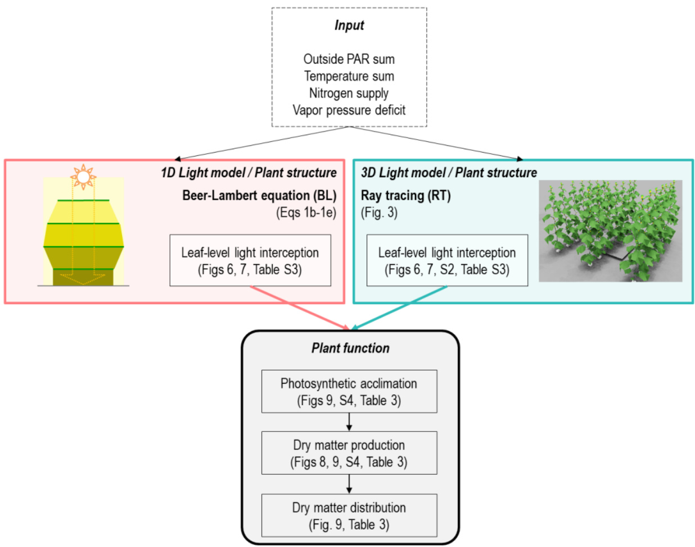  
图5-1. 使用光模型（Beer-Lambert方程（BL，红色框）或光线追踪（RT，蓝色框））的温室黄瓜动态植物模型的数据流程图。输入模型的环境数据（虚线框）为外部光合有效辐射（PAR）（mol $\mathrm{m}^{-2}$每单位时间）、温度总和（$^\circ\mathrm{Cd}$每单位时间）、氮供应（mM）和蒸汽压差$\left(\mathrm{{kPa}}\right)$。光模型/植物结构的详细信息见图S5-1。

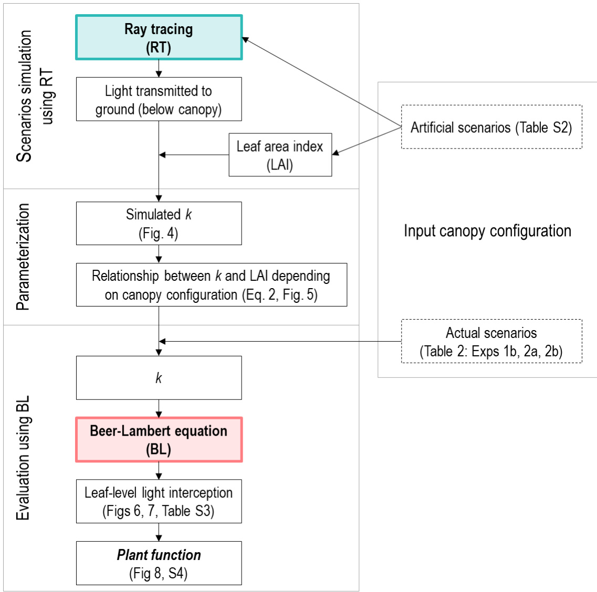  
图5-2. 使用光线追踪（RT）建立光衰减系数$k$与叶面积指数（LAI）关系的过程，以及使用Beer-Lambert方程（BL）评估该关系的过程。输入用虚线框表示。$k$与LAI的关系由公式5-2a描述，其中最小$k$ $(k_{\mathrm{min}})$被发现取决于冠层配置以及植株间和行间距离（公式5-2b和图5-5）。模拟的冠层配置场景列于表S5-2，模拟的$k$见图5-4。温室实验1b、2a和2b的冠层配置（表5-2）用于评估。

# 用于模型评估的温室实验

为了获得冠层内光分布、结构特征、叶片光合参数和植物干物质的测量数据，在德国汉诺威莱布尼茨大学园艺生产系统研究所的Venlo型温室中进行了五次实验（表5-1）（纬度$52.4^\circ\mathrm{N}$）。实验1a、1b和1c分别于2006年8月、2007年5月和2007年8月进行。实验2a和2b分别于2017年4月和7月进行。在所有实验中，黄瓜（Cucumis sativus L.）'Aramon'（Rijk Zwaan，荷兰De Lier）植株在高线（高达$4~\mathrm{m}$）单茎系统下栽培，温室从北向南定向。播种后三周，将五叶期的幼苗从岩棉块$(10\ \mathrm{cm}\times10\ \mathrm{cm}\times6.5\ \mathrm{cm})$转移到温室中的岩棉板上，并用营养液滴灌。

表 5-1. 五个温室实验的气候条件和生长周期概述

| 实验时间 | 1a 2006年8月 | 1b 2007年5月 | 1c 2007年8月 | 2a 2017年4月 | 2b 2017年7月 |
| --- | --- | --- | --- | --- | --- |
| 平均温度(℃) | 24.8 ± 2.9 | 23.2 ± 1.1 | 23.7 ± 1.6 | 23.1 ± 0.9 | 23.9 ± 1.4 |
| 日PAR总量(mol m² d-1) | 24.9 ± 6.7 | 20.9 ± 7.9 | 20.5 ± 7.6 | 22.4 ± 9.6 | 26.8 ± 10.4 |
| 温室生长周期(天) | 22 | 30 | 23 | 38 | 38 |
| 儒略日 | 206-227 | 127-156 | 211-233 | 94-131 | 192-229 |

在实验1a、1b和1c中，在移栽后第3周通过每株植物14片叶子上的PAR传感器测量了叶片上的入射光通量（参见Wiechers等，2011b中的图1a）。在实验1b、2a和2b中，在移栽后第2至第5周期间，通过破坏性取样测定了每株植物的叶片、叶柄、节间和果实的干物质，每个处理重复3次。在实验2a中，在移栽后第2、3、4和5周，对每株植物的两片叶子进行了光合参数测量，每个处理重复2次（如第3章所述）。根据Wiechers等（2011b）的方法，在四个实验（1a、1b、1c和2a）中对植物结构进行了数字化，以非破坏性地获取器官大小（包括叶片大小和角度、节间长度和叶柄长度）。

在实验2a和2b中，植物以1.33株/m²的密度种植成行（表5-2）。植物接受了高光（HL，无遮荫）或低光（LL，遮荫至HL条件的50%）与高氮（HN，10 mM）或低氮（LN，2.5 mM）供应相结合的处理（详见第2章）。

在实验1a、1b和1c中，采用了四种冠层配置（表5-2）：行式（R）或等距（I）模式，结合1株/m²（R1和I1）或2株/m²（R2和I2）的种植密度（详见Wiechers等，2011b），生长条件与实验2a和2b中的HLHN处理相似。实验1a和1c中的植物在第23片叶子上方进行了去顶处理。在实验1a-1c期间，温室地面覆盖了白色塑料薄膜。

表 5-2. 五个温室实验中冠层配置、植株密度以及行距和株距

| 实验 la/1b/1c |  |  |  |  | 实验 2a/2b 行 |
| --- | --- | --- | --- | --- | --- |
| 冠层配置 | 行式 (R1) | 行式 (R2) | 等距 (I1) | 等距 (I2) |  |
| 植株密度 (株/m²) | 1 | 2 | 1 | 2 | 1.33 |
| 行距 (m) | 1.86 | 1.86 | 0.93 | 0.93 | 1.5 |
| 株距 (m) | 0.53 | 0.27 | 1.08 | 0.53 | 0.5 |

# 模型描述 - 植物发育

虚拟植物随着新植物单元的出现而发育。当分生组织达到叶热龄期(°Cd/叶)时，使用RT时，分生组织会产生一个新的植物单元，包括分生组织、节间、叶柄和叶片。使用BL时，叶面积指数随着新叶的出现而增加。器官的热龄期从出现时刻开始从0°Cd计算。从第7个植物单元开始，还会发育出花朵，其子房在热龄期达到150°Cd时(约在相应植物单元出现后10天)长度达到5cm(假设为果实生长的起点)。植物单元出现所需的热龄期由叶序的logistic函数描述(Eqn S5-2)，初始热龄期为125.4°Cd(第一片真叶出现需要8-10天)，然后随着叶序增加而减少，直到稳定在phyllmin水平(表S5-1)。phyllmin值是根据实验2a的测量数据得出的，假设实验1a-1c与HLHN处理具有相同的常数。

# 模型描述 - 植物功能

叶片对光的光合适应通过光合蛋白周转的光响应来描述(见Eqn 3-4 - Eqn 3-7)，这是蛋白质合成和降解同时进行的结果。蛋白质合成速率根据光合光子通量密度(PPFD, μmol m-2 s-1)每小时进行调整，假设每日蛋白质合成仅在光照期间发生。参与光合功能的每平方米叶面积氮含量(Np)分别模拟羧化作用(NV)、电子传递(NJ)和光捕获(NC)，初始值均为0.33 mmol m-2。NV仅包括Rubisco，NJ包括电子传递链、光系统II核心和除Rubisco外的Calvin循环酶，NC包括光系统I核心和光捕获复合物I和II(Buckley等，2013)。

叶片光合参数根据NV、NJ和NC估算，即最大羧化速率(Vcmax, μmol CO2 m-2 s-1)、最大电子传递(Jmax, μmol e- m-2 s-1)和叶绿素(Chl, mmol m-2)(见Buckley等，2013的附录"从ΔN池计算光合参数")。电子传递(J, μmol e- m-2 s-1)和羧化速率(Vc, μmol CO2 m-2 s-1)根据入射光分别按照Qian等(2012)的Eqn 4和Eqn 5计算。叶片吸收率(α，无量纲)根据Chl使用Evans(1993)的Eqn 1计算。新出现的叶片由于NC和NJ的初始值，最小α为0.13。光合有效辐射(PAR)和红光的叶片反射率和透射率计算为(1-α)/2。叶片呼吸速率Rd(μmol CO2 m-2 s-1)根据叶片年龄和入射光按照Eqn 3-10模拟。叶肉导度(gm, mol CO2 m-2 s-1)根据叶片热龄期和Np模拟(Eqn S5-3)。

叶片净光合速率An(μmol CO2 m-2 s-1)确定为RuBP羧化限制(Ac, μmol CO2 m-2 s-1)和RuBP再生限制(Aj, μmol CO2 m-2 s-1)净光合速率的最小值，遵循Farquhar等(1980)的生化光合作用模型。有关本研究中使用的详细信息和常数，请参见Eqns 3-9、3-14和3-15。为了计算干物质生产，CO2吸收通过0.68的因子转换为植物干物质(Warren Wilson等，1992)。

器官间的干物质分配按照Wiechers等(2011a)实施。简而言之，假设存在一个共同的光合产物池，该池每天通过干物质生产加上前一天的剩余储备来增加。干物质按照满足不同器官需求的优先级方案进行分配。满足维持成本(2%减少；Marcelis，1994)是第一优先级，其次是根、生殖生长，然后是营养生长。

分配到单个果实的干物质遵循果实潜在生长速率与果实总需求的比例，总需求是植物中所有生长果实的潜在生长速率之和(Wiechers等，2011a)。如果果实总供给与总需求的比例rAD低于某些阈值，可能会发生果实败育和优势。当rAD < 0.3时，热龄期在150°Cd到220°Cd之间的果实会败育(在果实长度达到5cm后5-6天内)。当rAD < 0.8时，分配到单个果实的干物质表现出优势，有利于较早开始的果实。果实i的潜在生长速率(RPF,i, g DM d-1)估计与其潜在干物质相当，取决于前一天果实的长度(LF,i, cm)(Eqn S5-4)。实际果实长度LF,i根据其实际干物质使用Eqn S4反向计算。果实的生长期从长度达到5cm时开始累积，直到收获(果实长度≥30cm)。

# 模型描述 - 植物结构

叶片扩展和仰角在RT和BL方法中都使用(图S5-1)。单个叶片的扩展根据其热龄期(°Cd)使用logistic函数描述(见Kahlen，2006的Eqn 5)，最小为5cm2，特定生长速率为0.0524°Cd-1。叶片的最大面积取决于其叶序，遵循log正态曲线(见Irving和Robinson，2006的Eqn 1)，最大叶面积ALmax(cm2)出现在叶序rALmax处，常数kAL决定曲线形状(表S5-1)。叶片仰角(范围从-90°到90°)定义为连接叶片基部到尖端的线与水平面之间的角度。新出现的叶片垂直向上，因此最大仰角为90°，然后随着叶片大小(cm2)的扩展而减小，按照Eqn S5-5，速率常数为0.0116 cm-2，直到达到-68.4°的渐近线。叶片扩展和仰角中使用的常数是根据实验2a的测量数据得出的，假设实验1a-1c与HLHN处理具有相同的常数。

以下描述的植物结构特征仅在RT时实现，即叶片形状、叶柄伸长、叶柄天顶角、叶片向光性和果实半径(图S5-1)。

使用实验2a中黄瓜叶片(图2-6A)不同发育阶段(大小范围0.01-0.11 m2)的数字化数据重建了四个叶片形状模板，以捕捉叶片扩展过程中形状的变化。根据叶片当前大小选择模板，任意阈值设置为0.01 m2、0.05 m2和0.07 m2。我们根据叶片大小选择形状模板，因为生长叶片的拓扑结构依赖于其位置和大小，而不是简单的等比例缩放(Schmidt和Kahlen，2019)。然后通过一个因子将所选模板缩放到叶片大小，该因子计算为叶片大小与模板叶片大小比值的平方根，以调整构建模板的线长度。

叶柄伸长与叶片扩展类似，最小为1cm，特定生长速率为0.0312°Cd-1。最大长度取决于其叶序，遵循log正态曲线，最大长度LPmax(cm)出现在叶序rLPmax处，常数kLP决定曲线形状(表S5-1)。叶柄天顶角仅与热龄期相关，从0°(垂直向上)开始，然后以每°Cd 0.3°的速率向下转动，直到达到100°的最大值。叶柄半径设置为0.45cm。

叶片的向光性模拟为叶柄基部的差异生长引起的水平运动(Kahlen等，2008)，初始叶序设置为137.5°。虚拟叶片沿中脉构造为两半，因此可以分别模拟左半叶(PARl)和右半叶(PARr)吸收的PAR。当PARl/PARr > 1时，叶片向左移动，直到PARl/PARr = 1，反之亦然。假设最大向光性为每天30°，速度为每°Cd 2°，当叶柄热龄期超过153°Cd时停止(Kahlen等，2008)。

节间伸长受日均温和光信号的影响，即冠层上方的入射光合光子通量密度(PPFD, μmol m-2 s-1)和节间感知的红/远红比例，按照Kahlen和Chen(2015)的Eqns 1、3和4。假设红/远红信号在最大生长速率时(约节间长度为3cm时)被感知。感知的温度和入射PPFD信号是它们四天的平均值，从节间达到3cm前六天到前三天计算。在达到3cm之前，节间长度根据其热龄期(°Cd)使用logistic函数描述(见Kahlen，2006的Eqn 5)，最小为1cm，特定生长速率为0.104°Cd-1，最大为6cm。两个相邻节间之间的角度随机设置为15°-25°。节间半径设置为0.48cm。

果实半径(rF,i, cm)根据当前果实长度LF,i计算(Eqn S5-6, Kahlen和Stützel，2007; Kuwar，2007)。果实长度与其叶柄长度的比例设置为3，最小叶柄长度为2cm。果实叶柄的半径设置为0.25cm。

# 光-植物相互作用的模拟

为了测试遵循Beer-Lambert方程(BL)的最简单一维光模型的性能，在每小时和每天的模拟中都没有考虑太阳角度，这意味着假设入射光垂直于地面投射。为了用简单的BL模拟光-植物相互作用，垂直传输到叶层$i$的光被计算为通过叶层$i$以上所有叶面积指数$( \mathrm { L A I } _ { i + 1 } )$传输的光(Eqn 1a)。然而，由于并非所有叶片都是水平方向的，因此必须针对单个叶片调整Eqn 1a。比较了三种调整方法来计算叶位$i$上的入射光$I _ { i }$，分别通过每个叶片$i$的叶片仰角$\beta _ { i } \left( ^ { \circ } \right)$的余弦、$k _ { \mathrm { c } }$(冠层内恒定，Charles-Edwards等，1986)或每个叶片$i$的叶位特定$k _ { i + 1 }$:

$$
I _ { i } = I _ { 0 } \times \mathrm { e x p } ( - k _ { \mathrm { c } } \times \mathrm { L A I } _ { i + 1 } ) \times \mathrm { c o s } \beta _ { i }
$$

$$
\begin{array} { r l } & { I _ { i } = I _ { 0 } \times \exp ( - k _ { \mathrm { c } } \times \mathrm { L A I } _ { i + 1 } ) \times k _ { \mathrm { c } } } \\ & { I _ { i } = I _ { 0 } \times \exp ( - k _ { \mathrm { c } } \times \mathrm { L A I } _ { i + 1 } ) \times k _ { i + 1 } } \end{array}
$$

在Eqns 5-1b和5-1c中，$k _ { \mathrm { c } }$的值在给定冠层内对所有叶位都是恒定的，而Eqn 5-1d中的$k _ { i + 1 }$取决于$\mathrm { L A I } _ { i + 1 }$。Eqn 5-1b中的余弦校正对叶片上的PPFD有显著影响，对于仰角为$9 0 ^ { \circ }$(新出现的叶片)或$- 6 4 . 8 ^ { \circ }$(成熟老叶)的叶片，可能导致垂直传输到叶片的光减少到$0 \%$或$4 2 . 6 \%$。另一方面，Eqns 5-1c和5-1d中的$k$校正可以将叶片上的PPFD限制在最多$90 \%$的减少(如果$k = 0 . 1$)，具体取决于$k$的值。

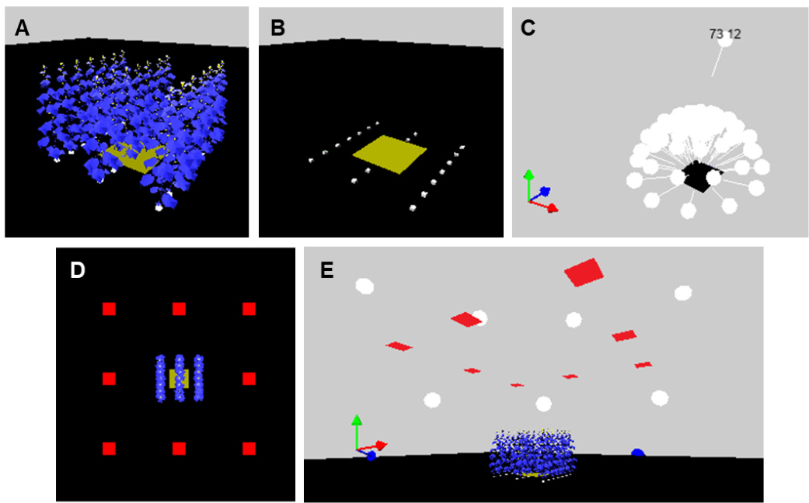  
图 5-3. 使用光线追踪的动态植物模型中的虚拟冠层和光模型。(A) 植物密度为1.33株$\mathrm { m } ^ { - 2 }$的虚拟黄瓜冠层外观。(B) 岩棉块的位置(白色方块，高度$6 . 5 \mathrm { c m } \dot { }$)，从中生长出单个虚拟植物形成虚拟冠层。一个覆盖三株植物地面面积的光传感器(黄色方块)被放置在冠层下方$3 . 5 \ \mathrm { c m }$处，位于岩棉块上方(因此覆盖了中间的三个岩棉块)。(C) 由一个直接光源和72个漫射光源组成的光模型。蓝色y轴表示3D场景中的南方。(D) 用于调整入射光的八个光传感器的位置(每个大小为$1 ~ \mathrm { m } ^ { 2 }$，红色方块)，从顶部看和(E)从侧面看。这八个传感器具有$0 \%$的反射率和$9 9 . 9 \%$的透光率，因此与虚拟场景的相互作用可以忽略不计。

为了使用更复杂的3D光模型方法(光线追踪，RT)模拟光-植物相互作用，需要构建3D虚拟冠层和光源。虚拟冠层被创建在方形地面$( 6 0 \mathrm { ~ m } \times 6 0 \mathrm { ~ m } )$的中间，在每小时模拟中阻挡了从水平面以下投射的光。根据定义的行数、每行植物数以及行距和株距(表5-2)，虚拟冠层被构建为实际冠层的模型。在本研究中，测试了由21株植物(图5-3A)组成的冠层，排列成三行南北向，每行七株植物。在每次模拟中，每株植物在水平面上随机旋转$- 3 0 ^ { \circ }$到$3 0 ^ { \circ }$，以考虑手动移栽产生的变化。对冠层中央行中间的三株植物进行叶片和植物参数的采样。一个光传感器(图5-3B中的蓝色方块)被放置在离地面$0 . 1 \mathrm { ~ m ~ }$处，位于中间行三株植物的虚拟岩棉块上方$3 . 5 ~ \mathrm { c m }$处(图5-3B中的白色方块)，覆盖了一行行距和一行中三株植物株距的区域。该传感器在1200h采样传输到地面的光，以计算光衰减系数$k$(Eqn 5-1a)与冠层的叶面积指数(LAI)。需要注意的是，这里使用的LAI定义不是投影叶面积(例如，Lizaso等，2005)，而是冠层的实际叶面积。在各种冠层配置下的$k$情景模拟中(图5-2)，冠层下方的光传感器(图5-3B)具有$0 \%$的光反射率和透射率，因此它吸收了$100 \%$的入射光，不会干扰3D场景。

3D入射光使用光模型(图5-3C)根据BuckSorlin等(2011)进行模拟，其中72个漫射光源(天空物体)排列在半球中，一个定向光源(太阳物体)。光物体将光线投射到3D场景中，集成了一个光线追踪器来计算光分布，使用一千万条光线和十次反射的递归深度。虚拟光线由三个用户定义的通道组成，这些通道与虚拟物体独立交互。由于模型中关注的光信号，我们将三个通道定义为PAR、红光和远红光。物体的光学特性根据其对每个光通道的吸收率、透射率和反射率进行描述。叶片对PAR和红光的光学特性取决于植物功能部分中描述的Chl。为简单起见，假设叶片反射$38 \%$并透射$45 \%$的远红光(Kahlen等，2008)，而节间、叶柄和果实反射$6 \%$的PAR和红光，以及$38 \%$的远红光，透光率为$0 \%$。果实收获后，其反射率设置为$0 \%$，透射率设置为$100 \%$。虚拟冠层下方的地面既不反射也不透射光，因此没有反射光会影响地面上方八个光传感器的光调节(图5-3D，E)。在评估运行的模拟中，冠层下方的光传感器(图5-3B)不透射任何光，但反射PAR和红光，与温室实验1和2中的地面相似，分别为$80 \%$和$10 \%$。

根据温室结构的光学特性，冠层上方的光合光子通量密度$( { \mathrm { P P F D } } _ { \mathrm { i n } }$ , $\mu \mathrm { m o l } \ \mathrm { m } ^ { - 2 } \ \mathrm { s } ^ { - 1 } ,$ )被计算为温室外PPFD的$7 5 \%$( $\mathrm { P P F D _ { o u t } }$ , $\mu \mathrm { m o l } \ \mathrm { m } ^ { - 2 } \ \mathrm { s } ^ { - 1 } .$ )。然后，$\mathrm { P P F D } _ { \mathrm { i n } }$被分离为从天空物体$( P _ { \mathrm { s k y } } )$或太阳物体$( P _ { \mathrm { s u n } } )$发射的光功率，通过漫射光的比例$( p _ { \mathrm { d i f f } } .$ , 范围0-1):

$$
\begin{array} { r l } & { P _ { \mathrm { s k y } } = p _ { \mathrm { d i f f } } \times \mathrm { P P F D } _ { \mathrm { i n } } \times 3 \times f _ { \mathrm { P } } } \\ & { P _ { \mathrm { s u n } } = ( 1 - p _ { \mathrm { d i f f } } ) \times \mathrm { P P F D } _ { \mathrm { i n } } \times 3 \times f _ { \mathrm { P } } } \end{array}
$$

其中乘数3考虑了三个光通道。漫射光比例pdiff按照Reindl等(1990)的公式3计算，使用Hofmann和Seckmeyer(2017)的公式1和2估计晴朗指数。总辐射$R _ { \mathrm { g } }$ $\mathrm { ~ W ~ m ~ } ^ { - 2 } ;$ )通过将外部$\mathrm { P P F D _ { o u t } }$除以2.07来估计$( \mathrm { P P F D } = R _ { \mathrm { g } } \times 0 . 4 5 \times 4 . 6 \$ ，假设总辐射中PAR占45%，转换因子为$1 \ \mathrm { W \ m ^ { - 2 } \ P A R = 4 . 6 \ \mu m o l \ m ^ { - 2 } \ s ^ { - 1 } }$ ; Ludlow, 1983)。由于到达3D场景地面的实际光线受许多因素影响，如太阳物体的角度、漫射光比例和地面属性，因此在每次模拟前应用缩放因子$f _ { \mathrm { P } }$根据到达3D场景的光量$( \mathrm { P P F D } _ { \mathrm { s i m } } )$自动调整入射总光功率。$\mathrm { P P F D } _ { \sin }$由位于地面$7 \mathrm { m }$上方的八个一$\cdot \mathrm { m } ^ { 2 }$传感器物体(围绕冠层，图5-3D)测量(图5-3E)。这些传感器物体设置为具有$0 \%$反射率和$9 9 . 9 \%$透光率。使用八个位置中$\mathrm { \sf P P F D _ { \mathrm { s i m } } }$的最大值计算$f _ { \mathrm { P } } = \mathrm { P P F D } _ { \mathrm { i n } } / \mathrm { m a x } ( \mathrm { P P F D } _ { \mathrm { s i m } } )$。使用$f _ { \mathrm { P } }$校正后，3D场景中实际PPFD(地面以上$5 \mathrm { m }$高度内)与$\mathrm { P P F D } _ { \mathrm { i n } }$的偏差在$5 \%$以内。

虚拟物体根据其光学特性吸收来自所有方向的光线。物体吸收的光功率对红光乘以0.33(假设PAR的三分之一)，对远红光乘以0.275，形成阳光中1.15的红/远红比例。通过将给定光的吸收功率除以其吸收率来确定物体上的入射光通量。

# 结果

使用光线追踪的动态植物模型预测的植物结构和光截获评估

首先将光线追踪模型每小时步长模拟的植物结构特征与实验1a-1c中第5-20节间的数字化数据进行比较(来自三个实验、四种冠层配置和每株植物约16片叶子的191个测量数据点)。叶片面积、仰角、叶柄长度和节间长度的准确度分别为$74 \%$、$73 \%$、$87 \%$和$7 7 \%$(数据未显示)。模拟的冠层光截获效率(范围0-1，公式S5-1)显示出$73 \%$的准确度，RMSD为$7 . 5 \%$(图S5-2)，这可以被认为是3D植物结构和光截获的合理近似。

# 在人工场景下使用光线追踪模拟光衰减系数

为了比较光线追踪(RT)和经典Beer-Lambert方程(BL)对光合适应和干物质生产的预测，首先需要为BL确定光衰减系数$k$(公式5-1b-公式5-1d)。由于冠层配置对$k$有明显影响(图S5-3)，我们首先使用RT在行排列的不同冠层配置场景下(图5-2)模拟$k$，在整个冠层发育期间(35天生长期)每天中午(1200h)以每日步长进行(图5-4)。创建了不同植物密度(1.0、1.5、2.0、2.5和3.0株$\mathrm { m } ^ { - 2 }$ )与三种不同行距(1.1、1.5和$1 . 9 ~ \mathrm { m }$ )组合的冠层配置，因此行内植物距离始终小于行距(表S5-2)。选择这些人工场景以覆盖生产和实验中使用的常见范围。由于在给定冠层配置下实验1a、1b和1c之间模拟的$k$没有明显差异(图S5-3)，因此本模拟仅使用实验1a的条件。

  
图5-4. 在不同植物密度(1.0、1.5、2.0、2.5和3.0，用颜色表示，表S5-2)和行距(1.1、1.5和$1 . 9 \mathrm { m }$ ，用符号表示)场景下模拟的光衰减系数$k$与冠层叶面积指数的关系。每个点代表使用功能结构植物模型和光线追踪在每小时步长模拟中，在特定日1200h采样的冠层$k$估计值。由于实验1a、1b和1c之间模拟的$k$没有明显差异(图S5-3)，本模拟仅使用实验1a的条件，生长期为35天。

发现模拟的$k$随着冠层叶面积指数(LAI)的增加而减小，这也可以解释为冠层深度(图5-4)。这是可以预期的，因为随着冠层发育，接近$- 6 8 . 4 ^ { \circ }$仰角(公式S5-5)的展开叶片比例增加，允许更多光穿透冠层，同时也降低了冠层基部光截获效率。观察到更密集的冠层和更宽的行距导致更低的$k$(图5-4)；在相同植物密度下，对于$\mathrm { L A I } \geq 1 . 0$的冠层，行距可导致$k$变化高达0.2。

光衰减系数与叶面积指数的关系取决于冠层几何形状

从不同冠层配置场景下模拟的$k$结果(图5-4)中，推导出$k$与LAI之间的经验关系，遵循对数正态函数，其中最大$k$为1，出现在LAI等于$l _ { \mathrm { m } }$ $( 0 . 0 4 7 9 \pm 0 . 0 0 2 2 )$ ，系数$\nu _ { \mathrm { k } }$ $( 1 . 9 0 \pm 0 . 0 5 6 )$决定曲线形状。随着冠层发育，$k$接近一个稳定的最小$k$ $( k _ { \operatorname* { m i n } } )$ ，这与冠层的植物距离$D _ { \mathrm { p l a n t } }$和行距$D _ { \mathrm { r o w } }$相关：

$$
\begin{array} { r l } & { k = ( 1 - k _ { \mathrm { m i n } } ) \times \exp \left\{ - \left[ \ln \left( \frac { \mathrm { L A I } } { l _ { \mathrm { m } } } \right) / v _ { \mathrm { k } } \right] ^ { 2 } \right\} + k _ { \mathrm { m i n } } } \\ & { k _ { \mathrm { m i n } } = a _ { 1 } - a _ { 2 } \times D _ { \mathrm { p l a n t } } - a _ { 3 } \times D _ { \mathrm { r o w } } + a _ { 4 } \times D _ { \mathrm { p l a n t } } \times D _ { \mathrm { r o w } } } \end{array}
$$

其中系数估计为$a _ { 1 } = 0 . 6 5 9 \ ( \pm 0 . 0 1 3 3 8 )$ ，$a _ { 2 } = 0 . 3 4 8 ~ ( \pm 0 . 0 7 4 4 ) , ~ a _ { 3 } =$ $0 . 3 0 2 \ ( \pm 0 . 0 2 1 9 )$ 和$a _ { 4 } = 0 . 5 0 2 \ ( \pm 0 . 0 5 3 7 )$ 。使用图5-4中所有模拟的$k$数据，通过最小二乘拟合量化了公式5-2中的六个参数。

公式5-2b在$D _ { \mathrm { p l a n t } }$范围为$0 . 1 \mathrm { - } 0 . 9 \mathrm { ~ m ~ }$和$D _ { \mathrm { r o w } }$范围为$1 . 0 { - } 2 . 0 \mathrm { ~ m ~ }$下，得到的$k _ { \mathrm { m i n } }$在0.1-0.7之间（图5-5A）。使用$D _ { \mathrm { r o w } }$和$D _ { \mathrm { p l a n t } }$计算了冠层几何指数——种植矩形度（Maddonni等，2001b），作为较长距离与较短距离的比值。除了植物密度外，种植矩形度提供了种植模式几何形状的信息。种植矩形度等于1表示正方形空间排列，而较大的值表示矩形几何形状。在较低植物密度下，分布更均匀的冠层（种植矩形度$\prec 4 ^ { \cdot }$）似乎具有较高的$k _ { \mathrm { m i n } }$（图5-5B）。然而，超过一定水平的种植矩形度后，较高的植物密度往往具有较高的$k _ { \mathrm { m i n } }$（图5-5B）。根据温室实验2a和2b中的冠层配置信息，当$D _ { \mathrm { p l a n t } } = 0 . 5 ~ \mathrm { m }$和$D _ { \mathrm { r o w } } = 1 . 5 ~ \mathrm { m }$时，$k _ { \mathrm { m i n } }$确定为0.409。对于实验1b中使用的冠层配置，$k _ { \mathrm { m i n } }$在R1、R2、I1和I2冠层排列下分别确定为0.408、0.255、0.507和0.441。

  
图5-5. 使用公式5-2b在不同冠层配置下模拟的最小光衰减系数$k _ { \mathrm { m i n } }$。颜色表示$k _ { \mathrm { m i n } }$的值（A）在给定行距$( 1 . 0 { - } 2 . 0 ~ \mathrm { m } )$和行内植物间距$( 0 . 1 \mathrm { - } 1 . 0 \ \mathrm { m } )$下，（B）在给定种植矩形度（1.0-20.0，无量纲）和植物密度（0.5-10.0株$\mathrm { m } ^ { - 2 \cdot }$）下。$k _ { \mathrm { m i n } }$的值范围为0.12到0.71。种植矩形度使用行距和植物间距作为较长距离与较短距离的比值计算。种植矩形度等于1表示正方形冠层几何形状，而较大的值表示矩形几何形状。

# 使用光线追踪和Beer-Lambert方程模拟叶片水平光可用性的比较

公式5-2被应用于模拟$k _ { \mathrm { c } }$和$k _ { i + 1 }$，用于在实验2a条件下进一步模拟光截获、光合适应和干物质生产。在公式5-1b、5-1c和5-1d中，$k _ { \mathrm { c } }$使用公式5-2a根据给定时间点的冠层LAI确定。在公式5-1d中，$k _ { i + 1 }$使用公式5-2a为冠层中每个叶片$i$上方的LAI$( \mathrm { L A I } _ { i + 1 } )$计算。

  
图5-6. 使用不同光模型和时间分辨率模拟叶片水平光条件的比较。比较的模型是Beer-Lambert方程（BL）和光线追踪（RT，黑色符号），以每日步长（DS，圆圈）或每小时步长（HS，三角形）进行。使用公式5-1b、5-1c和5-1d的不同BL方法分别用绿色、黄色和蓝色符号表示。（A）在五周生长期最后一天$1 2 0 0 \mathrm { h }$时模拟的相对光传输$( I _ { i } / I _ { 0 } )$的快照，计算为每个叶片的入射PPFD除以冠层上方的PPFD水平。（B）在实验2a和HLHN处理条件下（其他处理见表S5-3），五周生长期内单个叶片的总光截获（mol/叶）。

使用实验2a结束时1200h的模拟，叶片水平的冠层内相对光传输$( I _ { i } / I _ { 0 } )$的快照，计算为每个叶片的入射PPFD除以冠层上方的PPFD水平$\mathrm { P P F D } _ { \mathrm { i n } }$，在使用每小时步长（HS）和每日步长（DS）时间分辨率下，RT和BL的范围相当（图5-6A）。不同的BL方程在较高叶位$( \geq 2 0$，幼叶）的$I _ { i } / I _ { 0 }$上产生了较大变化，但没有系统性地偏离RT预测的$I _ { i } / I _ { 0 }$。在较低叶位，BL方程之间的$I _ { i } / I _ { 0 }$变化变得微妙。使用公式5-1b和5-1d的BL光模型似乎更好地捕捉了RT在较高叶位的$I _ { i } / I _ { 0 }$变异性，这在应用公式5-1c时未观察到。然而，公式5-1c反而预测了较高叶位$I _ { i } / I _ { 0 }$变异性的中低范围。

在实验2a条件下，还模拟了五周生长期内单个叶片的总光截获（mol/叶，图5-6B）。无论使用哪种方法，冠层的中下层对总光截获的贡献很大（图5-6B）。使用BL 5-1b模拟的总光截获是使用RT的$7 7 \% . 9 2 \%$，而使用BL 5-1c和公式5-1d分别是使用RT的$8 8 \% - 1 0 2 \%$和$1 1 6 \% - 1 3 4 \%$（表S5-3）。时间分辨率DS导致的总光截获高于HS，使用RT时约高$14 \%$，使用BL时约高$4 \%$（表S5-3）。

由于公式5-1c和5-1d不需要叶片仰角的额外信息，并且这两个方程分别捕捉了RT模拟的$I _ { i }$的中低范围和较高范围，我们结合这两个方程，通过随机因子$\omega$（在给定时间下单个叶片在0到1之间）创建$I _ { i }$的变异性：

$$
\begin{array} { r l } & { I _ { i } = \operatorname* { m i n } [ I _ { i } ( 1 \mathbf { c } ) , \ I _ { i } ( 1 \mathbf { d } ) ] + \omega \times \{ \operatorname* { m a x } [ I _ { i } ( 1 \mathbf { c } ) , \ I _ { i } ( 1 \mathbf { d } ) ] - \operatorname* { m i n } [ I _ { i } ( 1 \mathbf { c } ) , \ I _ { i } ( 1 \mathbf { d } ) ] \} - 0 . } \\ & { ( 1 - \omega ) \times \operatorname* { m i n } [ I _ { i } ( 1 \mathbf { c } ) , \ I _ { i } ( 1 \mathbf { d } ) ] } \end{array}
$$

(公式5-1e)

其中$I _ { i }$ (1c)和$I _ { i }$ (1d)分别是使用公式5-1c和公式5-1d模拟的$I _ { i }$。使用该公式，在$I _ { i }$ (1c)和$I _ { i }$ (1d)的最小值周围生成了$I _ { i }$的变异，其最大值为$I _ { i }$ (1c)和$I _ { i }$ (1d)的最大值，最小值为$I _ { i }$ (1c)和$I _ { i }$ (1d)最小值的$70 \%$。选择较低$I _ { i }$范围的$30 \%$变异与RT模拟的变异一致(1Q $18 \%$，中位数$31 \%$，平均值$3 5 \%$，3Q $45 \%$)。公式5-1e在叶片水平$I _ { i } / I _ { 0 }$(图5-7A)和光截获(图5-7B，表S5-3)方面得出了与RT相当的估计，并用于进一步的BL模拟。

  
图5-7. 使用不同光模型和时间分辨率模拟叶片水平光条件的比较。比较的模型是Beer-Lambert方程5-1e(BL，黄色符号)和光线追踪(RT，黑色符号)，以每日步长(DS，圆圈)或每小时步长(HS，三角形)进行。(A)在五周生长期最后一天$1 2 0 0 \mathrm { h }$时模拟的相对光传输$( I _ { i } / I _ { 0 } )$的快照，计算为每个叶片的入射PPFD除以冠层上方的PPFD水平。(B)在实验2a和HLHN处理条件下(其他处理见表S5-3)，五周生长期内单个叶片的总光截获(mol/叶)。

使用光线追踪和Beer-Lambert方程预测干物质生产和光合适应准确性的比较

干物质生产是光适应和光驱动光合作用的结果，反映了从叶片到植株水平的光-植物相互作用。在实验1b、2a和2b条件下，使用四种模型方法和时间步长分辨率组合(BL-DS、BL-HS、RT-DS和RT-HS)模拟了地上部(总地上部分)干物质，并与测量数据进行了比较(图5-8)。由于高估，RT-DS的准确度最低$( 3 8 . 8 \%$，图5-8C)，而BL-HS的准确度最高$( 8 3 . 0 \%$，图5-8B)，与RT-HS的$7 9 . 9 \%$(图5-8D)相当。BL-HS和RT-HS都能够高精度地预测不同季节不同处理下的地上部干物质，但RT-HS的计算时间($6 4 . 4 \pm 2 4 . 0 \mathrm { ~ s ~ }$每个模拟日)比BL-HS($1 . 3 4 \pm 0 . 1 6$ s每个模拟日)长一个数量级。

  
图5-8. 通过比较模拟的地上部干物质(g/株)与实验1b、2a和2b中获得的测量数据来评估模型。地上部干物质包括营养和生殖部分的所有地上部干物质，分别由(A)Beer-Lambert方程5-1e(BL)以每日步长(DS)模拟，(B)BL以每小时步长(HS)模拟，(C)光线追踪(RT)和DS模拟，(D)RT和HS模拟。测量数据来自实验1b(黄色符号)、2a(蓝色符号)和2b(绿色符号)，在移入温室后第二至第五周之间收获，共三个重复(总计36个测量数据点)。实验中应用的四种光照和氮供应处理(高光，HL，低光，LL，高氮，HN，和低氮，LN)用不同符号表示。虚线为1:1线。

表5-3. 使用简单Beer-Lambert方程5-1e（BL）和每小时步长（HS）的光线追踪（RT）的光模型预测质量。模拟的植物干物质变量包括每株植物的营养和生殖干物质及其总和（地上部干物质）。模拟的光合适应变量包括在PPFD 1300 μmol m⁻² s⁻¹下测量的净光合速率（An1300）、最大电子传递速率（Jmax）、最大羧化速率（Vcmax）、叶绿素（Chl）、光合氮（Np）和呼吸速率（Rd）。植物干物质的测量数据来自实验1b、2a和2b，在种植后第二周和第五周进行，每个实验有三个重复（共36个测量数据点）。叶片光合参数在实验2a中测量，每周测量两片叶子，持续四周，每个实验有两个重复（共32个测量数据点）。

| 变量 | 光模型 | 准确度（%） | 相对偏差 | RMSD（单位同变量） |
|------|--------|------------|----------|--------------------|
|      |        | BL-HS | RT-HS | BL-HS | RT-HS | BL-HS | RT-HS |
| 地上部干物质（g/株） | 83.0 | 79.9 | 0.037 | 0.164 | 14 | 16 |
| 营养干物质（g/株） | 62.8 | 56.5 | 0.540 | 0.742 | 20 | 24 |
| 生殖干物质（g/株） | 43.9 | 46.3 | -0.531 | -0.474 | 15 | 14 |
| An1300（μmol CO₂ m⁻² s⁻¹） | 73.3 | 71.5 | -0.342 | -0.359 | 4.1 | 4.4 |
| Jmax（μmol e⁻ m⁻² s⁻¹） | 81.2 | 75.7 | -0.127 | -0.141 | 17 | 20 |
| Vcmax（μmol CO₂ m⁻² s⁻¹） | 72.2 | 67.6 | 0.250 | 0.227 | 22 | 28 |
| Chl（mmol m⁻²） | 80.3 | 79.7 | 0.305 | 0.263 | 0.085 | 0.087 |
| Np（mmol m⁻²） | 82.2 | 78.4 | 0.151 | 0.121 | 6.9 | 8.3 |
| Rd（μmol CO₂ m⁻² s⁻¹） | 68.8 | 61.5 | -0.384 | -0.365 | 0.41 | 0.51 |

对于BL和RT两种方法，使用DS时间分辨率模拟的地上部干物质比HS高约40%（在20%-55%之间）（图S5-4A），尽管使用RT和BL时，DS仅分别导致每株植物的总光截获比HS高14%和4%（表S5-3）。DS的高估似乎并非来自对光合参数的一致高估，即在PPFD 1300 μmol m⁻² s⁻¹下测量的净光合速率（An1300，图S5-4B）、最大电子传递速率（Jmax，图S5-4C）和最大羧化速率（Vcmax，图S5-4D）。在后续的模型性能比较中，仅进一步检查了使用HS的模拟。

使用HS时间分辨率模拟了植物干物质分布，并在RT和BL方程5-1e之间进行了比较（表5-3）。由于干物质分布仅取决于植物中干物质的可用性，而不取决于光照，因此它直接受到模拟地上部干物质的影响，遵循给定的优先级方案。相对偏差的正值表示对地上部和营养部分的系统性高估，而负相对偏差表示对生殖部分干物质分布的低估（表5-3）。按照相同的比较，还使用实验2a中获得的测量数据检查了模拟的叶片光合参数。对于所有检查的参数，BL和RT的准确度都在71%-82%之间，除了最大羧化速率（Vcmax）和呼吸速率（Rd，表5-3），它们分别被明显高估和低估。此外，两种模型都倾向于高估叶绿素（Chl）和光合氮（Np），并低估在PPFD 1300 μmol m⁻² s⁻¹下测量的净光合速率（An1300）和最大电子传递速率（Jmax）。总之，BL 5-1e在预测植物水平干物质积累和叶片水平光合适应方面的性能与RT相当，甚至略好，尽管在模型的功能部分，特别是干物质分布、Vcmax和Rd方面仍有改进空间。

# 干物质生产和光合适应预测准确度对所用光衰减系数的敏感性

为了测试模型预测对所用k值的敏感性，将0.3-0.7范围内的恒定k值（步长为0.1）和使用公式5-2计算的变量k值输入公式5-1c，以模拟实验1b、2a和2b中的植物干物质（图5-9A，C）和实验2a中的光合参数（图5-9B，D）。

在使用的恒定k值中，k值为0.5时地上部干物质的准确度最高（86.5%，图5-9A），k值偏离0.5 0.2时准确度下降最多达27%。当使用公式5-2估计的k值（图5-9A中的垂直灰色线表示）时，地上部干物质的准确度为82.5%，略低于BL 5-1e的83.0%（表5-3）。使用的k值越高，模拟的植物干物质越高，因此对地上部干物质的高估也越高（图5-9C）。营养干物质的准确度在k值为0.4时达到峰值（图5-9A），而生殖干物质的准确度随着k值的增加而增加，表明分配方案偏向营养部分。An1300和Rd的准确度随着k值的增加而增加，Chl和Vcmax的准确度随着k值的降低而增加（图5-9B），但k值对这些参数的影响不如对干物质的影响大（图5-9A）。较高的k值也导致较高的模拟光合参数（图5-9D），其中k值为0.5时Jmax的准确度最高（82.9%，图5-9B）。

总之，使用恒定k值为0.5的BL 5-1c能够很好地预测植物干物质生产和叶片光合适应（图5-9），证明了如果在进行模型模拟之前能够首先确定适当的k值，使用恒定k值的BL的适用性。尽管在这种情况下使用变量k值（公式5-2）似乎有些多余，但它提供了一个适当的k值代理，而无需事先了解k值。

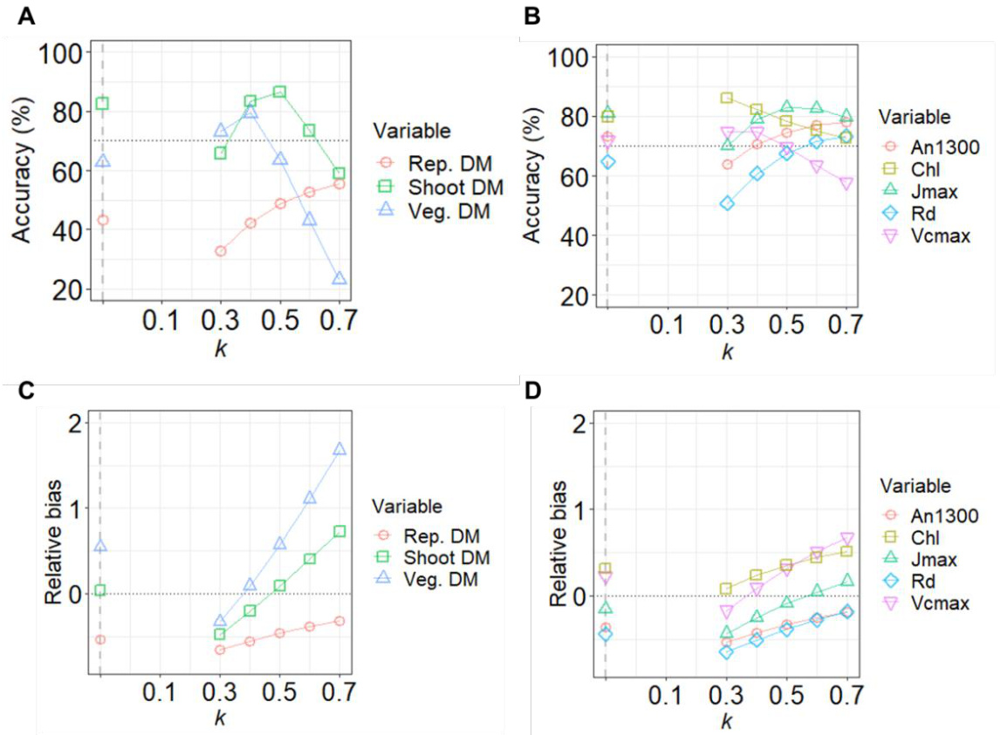  
图5-9. 光衰减系数kc对Beer-Lambert方程5-1c预测叶片光合适应和植物干物质准确度的影响。（A）植物干物质和（B）叶片光合参数的准确度。（C）植物干物质和（D）叶片光合参数的相对偏差。测试了0.3到0.7之间的恒定kc值。灰色垂直虚线表示使用公式5-2根据冠层配置估计的变量kc值的准确度。

# 讨论

结合温室黄瓜的动态模型，我们比较了1D（Beer-Lambert方程，BL）和3D（光线追踪，RT）建模方法在预测2到5周生长期内叶片水平光合适应和植物水平干物质积累方面的性能。当使用通过RT辅助建立的经验关系（公式5-2）估计的光衰减系数k时，发现BL公式5-1c（图5-9）或公式5-1e（表5-3）与每小时步长（HS）时间分辨率相结合的预测准确度与RT与HS的准确度相当（表5-3）。

# 应用3D光模型系统性地研究光衰减系数$k$的变化

使用所提出的关系式将$k$作为LAI的函数进行估计的优势在于，它提供了一个$k$的代理值，同时考虑了冠层几何形状对$k$的影响。出于类似的动机，Flénet等人(1996)通过实验研究了行距对玉米、高粱、大豆和向日葵冠层$k$的影响，Drouet和Kiniry(2008)也通过建模方法研究了虚拟禾本科冠层中的这一现象。两者都发现在相同植物密度下，随着行距增加，$k$会降低，这与我们使用RT进行的$k$的计算机模拟测量结果一致(图5-4)。

通过获取冠层配置信息，即行距$( D _ { \mathrm { r o w } } )$和行内株距$( D _ { \mathrm { p l a n t } } )$，可以使用经验关系式Eqn 2b估计发育完全的黄瓜冠层的最小$k$值$( k _ { \mathrm { m i n } } )$(图5-5A)。在$D _ { \mathrm { r o w } }$为1-2 m和$D _ { \mathrm { p l a n t } }$为0.1-1.0 m的给定范围内，发现$k _ { \mathrm { m i n } }$在更接近方形的冠层(种植矩形度PR接近1)中更高(图5-5B)。在$\mathrm { P R } \ < \ 4$时，$k _ { \mathrm { m i n } }$在较低植物密度下往往更高，而在$\mathrm { P R } > 4$时，$k _ { \mathrm { m i n } }$在较高植物密度下往往更高(图5-5B)。这与从玉米冠层获得的实验数据部分一致(Maddonni等，2001b)。在密度为3株/m²时，分布更接近方形的玉米冠层具有更高的$k$(PR 1.5 vs 2.7，绿色面积指数GAI约为2.5)，而当冠层几何形状的影响变得不显著时，在密度为9株/m²(PR 1.1 vs 4.4，GAI约为6)和12株/m²(PR 1.5 vs 5.8，GAI约为7)的冠层中，$k$比密度为3株/m²的冠层更高。

尽管当前模型中的节间伸长和向光性对光信号有反应，但新植物体的出现、叶片扩展和叶柄伸长对这些信号没有反馈响应。当在高植物密度模拟中忽略对光限制和遮荫的反应(如减少叶片发育和增加叶柄伸长，Sessa等，2005；He等，2020)时，可能会导致$k$的低估，因为使用公式$k = - \mathrm { l n } ( I _ { i } / I _ { 0 } ) / \mathrm { L A I }$会得到不切实际的高LAI和光透射率$( I _ { i } / I _ { 0 } )$。这增加了将Eqn 5-2b应用于高植物密度冠层时的不确定性。

文献中报道的温室黄瓜$k$值在0.42到0.87之间(表S5-4)。除了冠层几何形状的影响外，季节性的太阳位置和使用的漫射光可能也导致了这种变化。使用小麦FSPM发现，较小的太阳天顶角会导致较低的$k$，在最极端的情况下，60°的太阳天顶角差异会导致$k$差异高达0.48(Evers等，2009)。漫射光通常会导致较低的$k$，尽管这种效应与太阳角度相互作用(Li等，2014)。这些效应部分解释了春季和夏季(3月至9月，$k$在0.4-0.6之间)相比秋季和冬季(10月至2月，$k > 0 . 8$，表S5-4)发现的较低$k$值。由于在Eqn 5-2b中没有明确描述这些入射光的影响(但参见Lizaso等，2005中的Eqns 5-8)，并且它是使用实验1a期间(8月)条件下的计算机模拟测量进行参数化的，因此建议将Eqn 5-2用于预测春季和夏季的干物质生产(如图5-8B评估)。

不同时间分辨率的模拟揭示了光波动对干物质积累的影响

与小时步长(HS，图5-8B，D)相比，每日步长(DS，图5-8A，C)的模拟预测了更高的植物干物质积累，导致干物质高估20%-55%，且RT模拟的第五周高估趋势比第二周更高(图S5-4A)。由于DS没有导致光合参数明显高估(图S5-4B-D)，这种植物干物质的高估无法用光合适应效应来解释。尽管DS和HS的每日总光积分输入相同，但在五周结束时，RT和BL的DS模拟中总植物光截获分别高出约14%和4%(表S5-3)，这仍然不能完全解释DS高估的程度。可以认为，DS模拟近似于虚拟植物在恒定光强下进行光合作用，具有平均每日光强而没有日间波动，而HS模拟近似于每小时自然波动的生长光条件。这种现象在$\mathbf { C } _ { 3 }$和$\mathrm { C } _ { 4 }$物种中都有实验观察。与在波动光强下生长的植物相比，在相同每日光积分下，恒定光强下积累的干物质高出19%-140%，具体取决于植物种类和应用的波动模式(Watling等，1997；Leakey等，2002；Kubásek等，2013；Vialet-Chabrand等，2017b；Sakoda等，2020)。然而，这种效应在生长2-3周的番茄植物中被报告为不显著(Kaiser等，2018a；Y Zhang等，2020)，或者在雨林下层物种Micromelum minutum中被报告为相反(Watling等，1997)。显然，不同物种对光强的反应不同(Watling等，1997；Blom和Zheng，2009)，导致观察结果存在很大差异。这指出了进一步研究物种特异性适应动态光环境的形态和生理机制的途径(Vialet-Chabrand等，2017a；Pao等，2019b；Y Zhang等，2020；Morales和Kaiser，2020)。

# 应用1D光模型促进了全叶和全株水平平均响应的预测

选择使用更简单或更复杂的光模型取决于感兴趣性状的尺度。构建模型的通用方法是从简单开始，然后根据所解决问题所需的细节进行扩展，确保模型适合目的(Renton，2011；Auzmendi和Hanan，2020)。FSPM捕捉环境条件3D分布及其与植物结构相互作用的能力，对于真实系统的现实表示和直观理解是必要的(Vos等，2010)。FSPM的这一优势使得能够对涉及结构适应的个体过程进行机制分析，有助于识别叶和冠层水平性状以改进栽培实践(例如，Buck-Sorlin等，2011；N Zhang等，2020)和选择性育种(例如，Chen等，2014a；Perez等，2018)。我们利用3D光模型量化了冠层几何形状在不同冠层发育阶段对光截获的影响(图5-4，S5-3)，从而建立了$k$的估计(Eqn 5-2)。

由于当前使用光线追踪的动态模型没有考虑叶片内的光梯度，也没有区分冠层内微气候的空间分布(例如温度、相对湿度和$\mathbf { C O } _ { 2 }$，但参见Boulard等，2017；Ma等，2019)，因此无法在比全叶水平更精细的尺度上相关地适应响应，例如气孔空间分布和模式在平衡气体交换和水分损失中的作用(Harrison等，2020)。然而，我们表明，对于模拟在时间上整合数天到数周、在空间上从全叶到全株水平的性状，应用最简单的1D光模型(遵循Beer-Lambert方程，Eqns 5-1c和5-1e)将计算需求降低了一个数量级，而不会影响冠层响应的预测准确性。简单的Beer-Lambert方程可以扩展和修改，以部分包括行作物冠层之间水平光分布的变异性(Thornley和Johnson，1990)，并通过考虑冠层中的漫射/直射光分布和叶片内的遮荫/阳光部分(de Pury和Farquhar，1997；Lizaso等，2005；Roupsard等，2008；Hikosaka，2014)，具体取决于建模目标。总之，我们的结果表明，在3D光模型的辅助下，使用Beer-Lambert方程的1D光模型为整合数周的长期过程提供了高效快速的估计。

# Chapter 6 Dynamic coordination between function and structure

Coordination between canopy architectural dynamics and functiona acclimation strategy improves canopy productivity

# 第6章 功能与结构的动态协调

冠层结构动态与功能适应策略的协调提高了冠层生产力

# 摘要

为了最大化生产力，具有不同结构特征（AC）的植物应发展不同的功能适应策略（FAS），以协调光合氮与AC依赖的冠层内光分布。两个黄瓜（Cucumis sativus L.）品种（Aramon和SC-50）的光合蛋白合成对光的品种特异性依赖性代表了它们的FAS，其叶角分布和光衰减系数的差异通过3D冠层结构和光模型进行了量化。使用多层模型在不同光竞争水平下进行了计算机模拟实验。发现SC-50的FAS（FASSC-50）在光竞争下最有效，而Aramon的FAS（FASAramon）在充足光照条件下最有效。在一个品种内发现了依赖于光竞争水平的次优AC-FAS协调，而动态FAS（幼叶中的FASAramon和成熟叶中的$\mathrm { F A S } _ { \mathrm { S C } - 5 0 }$）无论光照条件和冠层配置如何，都能将生产力提高至多$5 . 6 \%$。优化的FAS表明，在光合氮分配中，电子传递与限制功能之间存在光依赖的权衡，在电子传递与羧化之间存在叶角依赖的权衡。我们的研究提出了FAS、AC和光情景在冠层生产力中动态协调的新方面。

# 引言

冠层结构在光合装置的空间排列以及光截获中起着核心作用（Duursma等，2012）。叶面积分布、叶角和分枝角等结构特征（AC）决定了植物内的光衰减（Chen等，2014b；Zhang等，2014；Tang等，2019）和自遮荫（Falster和Westoby，2003）。此外，AC决定的植物间光竞争程度可能间接驱动育种过程中对产量的选择（Chen等，2019；Perez等，2019）。通过均匀冠层的光衰减可以用Beer-Lambert定律描述，其中包含叶面积指数和光衰减系数（$k ,$ Monsi和Saeki，1953；de Pury和Farquhar，1997），这是冠层AC的函数（Monsi和Saeki，2005；Zhang等，2014）。例如，更垂直的叶角分布导致更低的$k$（Hikosaka和Hirose，1997；Zhang等，2014）和更均匀的垂直光分布，通过改善光传输（Truong等，2015）和避免中午过度光截获（Falster和Westoby，2003）。相比之下，具有更多水平叶的冠层每单位叶面积截获更多的光，这由更高的$k$（Zhu等，2010；Chen等，2014b）和更高程度的自遮荫来描述。这解释了物种间光捕获的大部分变化（Falster和Westoby，2003；Duursma等，2012）。AC的自然变异严格受遗传控制（例如，Truong等，2015；Mantilla-Perez和Salas Fernandez，2017；Alqudah等，2018），并在基因型和基因型内光竞争下的适应性中起重要作用（Hikosaka和Hirose，1997；Song等，2013）。光竞争的选择压力可能解释了为什么自然界中观察到的一些AC（分枝角度分布，Honda和Fisher，1978；叶序，Strauss等，2020）以及主要作物中的AC（Flood等，2011）似乎对最大化光截获是最优的。

理论上，追求最大生物量生产的策略应结合最大光能捕获用于光合作用和最大光合效率以将能量转化为光同化物。因此，最大化光截获的结构理想型（Song等，2013；Chen等，2014b；Chen等，2015；Perez等，2018；Tang等，2019；Chang等，2019）和栽培实践（种植模式和密度；Maddonni等，2001b；Drouet和Kiniry，2008）对育种计划和作物管理非常感兴趣（Perez等，2019）。然而，冠层内的光传输不仅在空间上是异质的，而且在时间上是动态的，因为AC和$k$随冠层发育不断变化（Campbell和Norman，1989），使得资源利用与局部光可用性的协调对于光同化物的有效转化至关重要（Niinemets等，2015；Poorter等，2019；Chang等，2019）。

作为植物生长最限制的资源之一，氮主要投资于有助于光合能力的蛋白质（>50%的叶氮；Evans，1989a；Hikosaka和Terashima，1996；Aerts和Chapin，1999；Hikosaka，2010；Evans和Clarke，2019）。在有效利用氮的需求驱动下，光适应机制已经进化（Werger和Hirose，1991；Anten等，1995；Trouwborst等，2010；Osada等，2014；Hikosaka，2016）。在冠层水平，光合氮（$N _ { \mathrm { p } }$）的叶间分布被报道与跨物种的冠层内光分布相关（Hikosaka等，2016），暗示了一种通用的光依赖策略来分配$N _ { \mathfrak { p } }$。在叶水平，$N _ { \mathfrak { p } }$的有效利用可以通过根据光可用性将$N _ { \mathrm { p } }$分配转向限制光合功能来实现（Terashima和Evans，1988；Evans，$1 9 8 9 \mathrm { a }$；Hikosaka和Terashima，1996；Evans和Poorter，2001；Trouwborst等，2011；Song等，2017；Pao等，2019a）。光合作用是通过光捕获、通过电子传递链将光能转化为化学能以及由Rubisco酶催化的耗能羧化作用将$\mathrm { C O } _ { 2 }$转化为生物质的光驱动过程（Farquhar等，1980）。这些功能的能力，即光吸收、最大电子传递速率和最大羧化速率，取决于投资的$N _ { \mathfrak { p } }$量（Hikosaka和Terashima，1996）。光捕获（叶的光截获和光捕获结构的光吸收）与光同化物转化（电子传递和羧化之间的协调）之间的平衡至关重要，因为它调节$N _ { \mathfrak { p } }$利用效率（Evans，1989a；Ishimaru等，2001；Hikosaka，2010；Zhu等，2010；Song等，2017）。这得到了建模研究的支持（Evans，1993b；Pons和Anten，2004；Pao等，2019a），表明植物碳同化对光合功能之间的$N _ { \mathfrak { p } }$分配比叶间氮分布更敏感。我们的方法在第3章中进行了参数化和评估，应用了蛋白质周转和分配的概念来探索环境对$N _ { \mathfrak { p } }$分配动态的机制影响（见第4章）（Muller和Martre，2019）。$N _ { \mathfrak { p } }$利用中的光适应可以解释为植物功能适应策略（FAS）的结果，该策略由不同功能的蛋白质合成速率的光响应差异组成。使用该模型，预测了FAS适应光环境的适应灵活性，并结合品种特异性AC以最大化植物碳同化（第3章）。

由于基因型间AC的变异导致其冠层内光分布不同，我们假设植物通过协调$N _ { \mathfrak { p } }$利用与其冠层内光环境来发展FAS，以最大化每日植物光合作用。换句话说，具有不同AC的基因型预计会有不同的FAS。为了验证这一假设，我们研究了两个表现出AC变异的黄瓜（Cucumis sativus L.）品种。我们对其3D植物结构进行了数字化，以量化叶面积和角度分布，并模拟其冠层内的光衰减。这些信息用于构建代表冠层结构的多层模型。然后，根据第2章提出的机制蛋白质周转模型量化了FAS的品种变异。通过结合结构和功能特征，进行了三个计算机模拟实验，以量化品种FAS与其AC在光竞争水平下的最优性，并确定FAS与AC之间协调的通用模式。

# 材料与方法

# 植物材料与栽培

黄瓜(Cucumis sativus L.)品种Aramon(Rijk Zwaan, De Lier, 荷兰)和SC-50(PI 234517, 美国国家植物种质资源系统; Barnes和Epps, 1956)在德国汉诺威莱布尼茨大学园艺生产系统研究所进行了一系列生长室实验和一个温室实验，采用单茎系统栽培(北纬52°39'，东经9°70')。这两个品种在植株结构上表现出明显差异(图6-1a，注S6-1)。

  
图6-1. 实际和虚拟黄瓜植株的外观及在GroIMP软件中重建的场景。(a)两个黄瓜(Cucumis sativus L.)品种SC-50(左)和Aramon(右)的植株形态。(b)重建的SC50(左)和Aramon(右)植株的3D结构。(c)由72个漫射光源和一个方向性光束组成的光照模型，模拟天空半球下的光照条件。(d)由75株植物组成的虚拟冠层，这些植物随机从两个数字化Aramon植株结构中重建。对中央行中间五株植物下方的地面区域进行采样，以测量到达地面的光传输。

# 叶片光合蛋白周转模型

光合氮$N _ { \mathfrak { p } }$ $\mathrm { ( m m o l ~ N ~ m ^ { - 2 } }$ )定义为参与光合作用的蛋白质中的氮(Evans和Clarke, 2019)，是投资于不同光合功能的氮的总和(公式2-M1)，即羧化作用$N _ { \mathrm { V } }$、电子传递$N _ { \mathrm { J } }$和光捕获$N _ { \mathrm { C } }$(Buckley等, 2013)。对于某个库$X$，其$N _ { \mathrm { p } }$分配分数$p _ { X }$是该库$X$中的氮$N _ { X } { \mathrm { ~ ( m m o l ~ N ~ m ^ { - 2 } ~ ) } }$与$N _ { \mathfrak { p } }$的比值。根据第3章提出的周转模型，在给定叶龄$t ( { } ^ { \circ } \mathrm { C d } )$时，$N _ { X }$的变化率由瞬时蛋白质合成$S _ { X }$ $\mathrm { \bf \ddot { \chi } } _ { X } ( \mathrm { m m o l } \mathrm { N } \mathrm { m } ^ { - 2 } \mathrm { \bf \circ } _ { \mathrm { C d } ^ { - 1 } } )$和降解$D _ { X }$ (mmol $\mathrm { ~ N ~ m ~ } ^ { - 2 } \ ^ { \circ } \mathrm { C d } ^ { - 1 } .$ )速率决定。

$$
\mathrm { d } N _ { X } / \mathrm { d } t = S _ { X } - D _ { X }
$$

蛋白质降解速率$D _ { X }$遵循一级动力学(Verkroost和Wassen, 2005; Li等, 2017; 公式2-M6)，而蛋白质合成则用与年龄相关的逻辑函数描述(公式2-M5)，其潜在速率为$S _ { \mathrm { p o t } , X }$ (mmol $\mathbf { N } \ \mathrm { m } ^ { - 2 } \ \mathbf { \Lambda } ^ { \circ } \mathbf { C } \mathrm { d } ^ { - 1 } .$ )，其中光适应开始发挥作用。

$$
S _ { \mathrm { p o t } , X } = S _ { \mathrm { m m } , X } \times k _ { \mathrm { I } , X } \times I _ { \mathrm { d } } / \bigl ( S _ { \mathrm { m m } , X } + k _ { \mathrm { I } , X } \times I _ { \mathrm { d } } \bigr ) \times r _ { \mathrm { N } , X }
$$

对于某个库$X$，$S _ { \mathrm { m m } , X }$ $\mathrm { ( m m o l ~ N ~ m ^ { - 2 } ~ ^ { \circ } C d ^ { - 1 } ) }$描述其最大蛋白质合成速率，速率常数$k _ { \mathrm { I } , X }$控制$S _ { \mathrm { p o t } , X }$如何随每日入射光子积分$I _ { \mathrm { d } }$ (mol photon $\mathrm { m } ^ { - 2 } \ \mathrm { d } ^ { - 1 } )$增加。因子$r _ { \mathrm { N } , X }$表示氮限制对蛋白质合成的归一化影响(公式2-M8)。功能适应策略(FAS)由$S _ { \mathrm { p o t } , X }$对光的特定功能响应表示，这导致$N _ { \mathfrak { p } }$的适应及其在功能之间的分配。对某个功能$X$的$N _ { \mathfrak { p } }$分配偏好由其相对潜在合成速率$\left( \mathrm { r e l } S _ { \mathrm { p o t } , X } \right)$描述，即$S _ { \mathrm { p o t } , X }$与所有三个功能的$S _ { \mathrm { p o t } }$之和的比值。模型变量和系数列于表S6-1和表S6-2。

# 叶片光合作用模型

完整的模型描述可以在方法S1中找到。简而言之，净光合速率$A _ { \mathrm { n } }$ $\mathrm { \ l _ { \mathrm { n } } \ ( \mu m o l \ C O _ { 2 } \ m ^ { - 2 } \ s ^ { - 1 } ) }$被定义为核酮糖-1,5-二磷酸(RuBP)羧化限制和RuBP再生限制光合速率$A _ { \mathrm { c } }$和$A _ { \mathrm { j } }$ (mmol $\mathrm { C O } _ { 2 } \mathrm { m } ^ { - 2 } \mathrm { s } ^ { - 1 } )$中的较小值(Farquhar等，1980；公式3-9)，减去白天呼吸速率$R _ { \mathrm { d } }$ $\mathrm { ( \mu m o l ~ C O _ { 2 } ~ m ^ { - 2 } ~ s ^ { - 1 } }$；公式3-10，图S6-1)。最大羧化速率$V _ { \mathrm { c m a x } } \mathrm { ( } \mu { \mathrm { m o l } } \mathrm { C O } _ { 2 } \mathrm { m } ^ { - 2 }$ $\mathbf { s } ^ { - 1 } .$ )、最大电子传递速率$J _ { \mathrm { m a x } } ~ ( \mu \mathrm { m o l } \textrm { e } ^ { - } \textrm { m } ^ { - 2 } \textrm { s } ^ { - 1 } )$和叶绿素浓度$C h l$ $\mathrm { ( m m o l ~ m ^ { - 2 } ) }$通过$N _ { \mathrm { V } } , N _ { \mathrm { J } }$和$N _ { \mathrm { C } }$计算(公式2-M1)。根据叶片上入射的光合有效光子通量密度(PPFD) $I _ { \mathrm { P P F D } }$ ( $\mathrm { \Delta \Psi _ { \mathrm { { u m o l } } } }$ photon $\mathrm { m } ^ { - 2 } \mathrm { ~ s } ^ { - 1 } )$，羧化速率$V _ { \mathrm { c } }$ $\mathrm { \Lambda _ { c } ^ { \prime } ~ ( \mu m o l ~ C O _ { 2 } ~ \mathrm { m } ^ { - 2 } ~ \mathrm { s } ^ { - 1 } }$；公式2-P13)和电子传递速率$J$ $\mathrm { ( \mu m o l \mathrm { ~ \ e ~ \ ' ~ } m ^ { - 2 } \mathrm { ~ \ s ~ } ^ { - 1 } }$；公式2-P4)分别从$V _ { \mathrm { c m a x } }$和$J _ { \mathrm { m a x } }$计算(Qian等，2012)，而叶片吸收率$a$ (无量纲)通过Chl计算(公式2-P2)。叶绿体$\mathbf { C O } _ { 2 }$浓度$C _ { \mathrm { c } }$ $\mathbf { \chi } ( \mathbf { \mu m o l } \mathbf { C O } _ { 2 } \mathbf { m o l } ^ { - 1 }$；公式2-P6)取决于气孔导度$g _ { \mathrm { s c } }$ (mol $\mathrm { C O } _ { 2 } \mathrm { m } ^ { - 2 } \mathrm { s } ^ { - 1 }$；公式3-15)和叶肉导度$g _ { \mathrm { m } }$ (mol $\mathrm { C O } _ { 2 } \mathrm { m } ^ { - 2 } \mathrm { s } ^ { - 1 }$；公式S6-1，S6-2，图S6-2)的稳态。

# 建筑学特征动态建模

为了量化建筑学特征AC的发育，分析了给定叶片上方的叶面积指数$( L _ { \mathrm { l } } )$及其仰角$\beta ( ^ { \circ } )$随其年龄$t \ ( { } ^ { \circ } { \bf C } { \mathrm { d } } )$的变化。给定叶片上方的叶面积指数随其$t$从零到渐近线$L _ { \mathrm { a s y m } }$呈逻辑增长(表6-1)，拐点出现在$t _ { \mathrm { L } } ( ^ { \circ } \mathrm { C d } )$，曲线形状由$\nu _ { \mathrm { L } }$决定。

$$
L _ { \mathrm { l } } = L _ { \mathrm { a s y m } } / \{ 1 + \exp [ ( t _ { \mathrm { L } } - t ) / v _ { \mathrm { L } } ] \}
$$

(公式6-3)

仰角$\beta$定义为连接叶片基部到尖端的线与水平面之间的夹角。$9 0 ^ { \circ }$和$- 9 0 ^ { \circ }$的仰角分别表示垂直向上和向下的叶片，而$0 ^ { \circ }$表示水平方向。新出现的叶片具有最大$9 0 ^ { \circ }$的$\beta$，随后从年龄$t _ { \mathrm { \beta } } ( ^ { \circ } \mathrm { C d } )$开始以常数$d _ { \mathrm { \scriptsize { \beta } } } ( ^ { \circ } \mathrm { C d } ^ { - 1 } )$减小到渐近线$\beta _ { \mathrm { a s y m } }$ ( $^ { \circ }$，表6-1)。

$$
\beta = \left( 9 0 - \beta _ { \mathrm { a s y m } } \right) \times \exp \left[ - \left( t - t _ { \beta } \right) \times d _ { \beta } \right] + \beta _ { \mathrm { a s y m } }
$$

(公式6-4)

在数学上，当$t$小于$t _ { \beta }$时，$\beta$大于$9 0 ^ { \circ }$。在这种情况下，$\beta$被设置为其最大值$9 0 ^ { \circ }$。$\beta$对光分布的影响通过余弦校正考虑(公式6-S3)。

# 生长室实验量化功能适应

该实验采用三个光照和三个氮供应水平的因子组合进行，以参数化光合蛋白周转的动态。播种、幼苗培育和处理在第2章中描述。简而言之，将具有两片真叶的黄瓜植株转移到水培系统中，氮水平分别为9.6、4.6和$2 . 3 \mathrm { \ m M \ N O _ { 3 } } ^ { - }$，结合三个恒定光照条件(采样叶片上的平均PPFD分别为669、329和$1 0 2 ~ \mu \mathrm { m o l }$ photon $\mathbf { m } ^ { - 2 } \mathbf { \tau } \mathbf { d } ^ { - 1 }$，光照周期为12小时)。采样叶片保持水平以充分暴露于入射光。使用数据记录仪(Tinytag；Gemini Data Loggers, Chichester, UK)连续记录叶片周围的空气温度。每三天在12个热年龄(从$4 5 ^ { \circ } \mathrm { C d }$到$5 5 8 ^ { \circ } \mathrm { C d }$，基础温度$1 0 ^ { \circ } \mathrm { C }$；Savvides等，2016)测量气体交换。

表6-1. 决定黄瓜(Cucumis sativus L.)品种Aramon和SC-50建筑学特征的品种特异性系数。括号内为标准误差(SE)。在95%置信区间下品种间的显著差异用小写字母表示，ns表示不显著。

| 描述 | 公式 | 符号 | 单位 | Aramon值(SE) | SC-50值(SE) |
|------|------|------|------|--------------|-------------|
| 叶片上方叶面积指数 | 6-3 | L |  |  |  |
| 渐近线 |  | Lasym |  | 2.04 a (0.0845) | 1.23 b (0.0513) |
| 拐点时间 |  | tL | Cd | 257.6 ns (7.25) | 272.1 ns (7.17) |
| 曲线形状系数 |  | VL | = | 63.9 ns (3.69) | 63.6 ns (3.52) |
| 叶片仰角 | 6-4 |  | 0 |  |  |
| 渐近线 |  | βasym | 0 | -69.2 ns (3.27) | -61.1 ns (3.92) |
| 下降常数 |  | dp | Cd-1 | 0.0245 a (0.00291) | 0.0162 b (0.00194) |
| 开始下降时间 |  | t | Cd | 12.03 | 23.37 |
| 光衰减系数 | 6-5 | k |  |  |  |
| 最大值 |  | kmax |  | 0.616 b (0.00277) | 0.853 a (0.0128) |
| 最小值 |  | kmin |  | 0.359 ns (0.00516) | 0.337 ns (0.0270) |
| 最大k时的叶面积指数 |  | Lk |  | 0.286a (0.00734) | 0.0846b (0.0143) |
| 曲线形状系数 |  | Vk |  | 1.089 b (0.0388) | 1.708 a (0.186) |

# 气体交换测量和光合参数估算

使用便携式光合作用系统(LI-6400XT; LI-COR, Lincoln, NE, USA)，在PPFD为$1 3 0 0 ~ \mu \mathrm { m o l }$光子$\mathrm { m } ^ { - 2 } \mathrm { ~ s ^ { - 1 } ~ }$下测量光饱和净光合速率($\cdot A _ { 1 3 0 0 }$ , $\mu { \bmod { C } } \mathrm { O } _ { 2 }$ $\mathrm { m } ^ { - 2 } \mathrm { ~ s } ^ { - 1 } )$并确定光响应曲线。所有测量均在样品$\mathbf { C O } _ { 2 }$浓度为$4 0 0 \mathrm { \mu m o l \mathrm { m o l } ^ { - 1 } }$和叶片温度$2 5 ^ { \circ } \mathrm { C }$下进行。根据第2章估算$R _ { \mathrm { d } }$、$V _ { \mathrm { c m a x } }$、$J _ { \mathrm { m a x } }$和$g _ { \mathrm { m } }$。气体交换测量后立即收获叶片测定叶面积，然后冷冻干燥并研磨成细粉，用于总氮$N _ { \mathrm { t o t a l } } .$ (mmol $\mathrm { m } ^ { - 2 }$ ; Nelson & Sommers, 1980)、硝态氮($\cdot N _ { \mathrm { n } }$ , mmol $\mathrm { m } ^ { - 2 }$ ; Cataldo et al., 1975)和叶绿素(Chl, mmol $\mathrm { m } ^ { - 2 }$ ; Lichtenthaler, 1987)分析。

# 温室实验量化结构特征

实验于2017年4月4日至5月3日进行，以评估植物AC。播种、育苗和植物护理如第2章所述。简而言之，将具有三片真叶的植物转移到温室中的岩棉板上，种植密度为1.33株$\mathrm { m } ^ { - 2 }$ (行距$1 . 5 \mathrm { m }$，株距$0 . 5 { \mathrm { ~ m ~ } }$)，并通过滴灌供应含有$1 0 \ \mathrm { m M } \ \mathrm { N O } _ { 3 } ^ { - }$的营养液。实验期间冠层上方的平均DPI为$2 1 . 3 3 \mathrm { \ m o l }$光子$\mathbf { m } ^ { - 2 } { \mathrm { ~ d } ^ { - 1 } }$，平均日照时长为$1 4 . 4 \mathrm { ~ h ~ }$。使用数据记录仪连续记录冠层中部的空气温度(最低$2 1 . 5 ^ { \circ } \mathrm { C }$，最高$2 5 . 5 ^ { \circ } \mathrm { C }$，平均$2 3 . 4 ^ { \circ } \mathrm { C }$)。根据Chen et al. (2014a)的方法，使用3D数字化仪(Fastrak; Polhemus, Colchester, USA)在移植后第${ 8 } ^ { \mathrm { t h } }$、$1 5 ^ { \mathrm { t h } }$、$2 2 ^ { \mathrm { { n d } } }$和$2 9 ^ { \mathrm { t h } }$天对每个品种的两株代表性植物进行AC测量。

# 使用虚拟3D冠层确定光衰减系数

使用数字化数据(Chen et al., 2014a; Chen et al., 2018)在GroIMP软件(Kniemeyer, 2008)中重建虚拟冠层。重建与光模型耦合，模拟冠层内光分布以确定$k$(方法S6-1，图S6-3)。叶片角度分布随植物发育从平面型变为直立型(图S6-4)，导致$k$随冠层发育的时间变化(Tahiri et al., 2006; Chen et al., 2014b)。因此，我们将$k$描述为冠层叶面积指数$L _ { \mathrm { c } }$的函数，当$L _ { \mathrm { c } }$达到$L _ { \mathrm { k } }$时$k$增加到最大值$k _ { \mathrm { m a x } }$，然后下降到最小值$k _ { \mathrm { m i n } } .$，其中$\nu _ { \mathrm { k } }$决定曲线形状：

$$
k = ( k _ { \mathrm { m a x } } - k _ { \mathrm { m i n } } ) \times \exp \left\{ - 0 . 5 \times \left[ \frac { \ln \left( \frac { L _ { \mathrm { c } } } { L _ { \mathrm { k } } } \right) } { v _ { \mathrm { k } } } \right] ^ { 2 } \right\} + k _ { \mathrm { m i n } }
$$

# 模型参数化

使用生长室实验中获得的数据对光合蛋白周转、$R _ { \mathrm { d } }$(图S6-1)和$g _ { \mathrm { m } }$(图S6-2)的动态进行参数化。在R(版本3.3.0, R Core Team, 2019; 详见第2章)中求解微分方程(公式6-1, 2-M5和2-M6)以获得$S _ { \mathrm { p o t } , X }$、$t _ { \mathrm { d } , X }$和$D _ { \mathrm { r } , X }$。通过非线性最小二乘拟合，根据每个因子组合确定的$S _ { \mathrm { p o t } , X }$(公式2-M5)值，估算系数$S _ { \mathrm { m m } , X }$、$k _ { \mathrm { I } , X }$(公式6-2)和$k _ { \mathrm { N } , X }$(公式2-M8)。同样通过非线性最小二乘拟合，估算$R _ { \mathrm { d } }$与光(公式3-10)、$g _ { \mathrm { m } }$与$N _ { \mathfrak { p } }$(公式S6-1, 6-S2)、$k$与$L _ { \mathrm { c } }$(公式6-5)、叶序与叶位(公式S5-2)、$L _ { \mathrm { l } }$与$t$(公式6-3)以及$\beta$与$t$(公式6-4)之间的关系。

# 模拟动态光合氮和日间碳同化

从移植当天到AC测量的四个时间点，以$0 . 1 ^ { \circ } \mathrm { C d }$为时间步长，输入每日入射光合光子积分DPI、氮供应水平和平均气温，模拟每株植物中每片叶片的单位叶面积光合氮$N _ { \mathfrak { p } }$(mmol $\mathrm { ~ N ~ m ~ } ^ { - 2 }$)。计算模拟最后一天的叶片光合氮含量$N _ { \mathrm { l e a f } }$(mmol N/叶)和单株总$N _ { \mathrm { l e a f } }$，即$N _ { \mathrm { p l a n t } }$(mmol N/株)。在叶片-空气水汽压差$( D )$为$1 . 2 \mathrm { \ k P a }$和环境$\mathbf { C O } _ { 2 }$浓度为$4 0 0 ~ { \mu \mathrm { m o l } } ~ \mathrm { C O } _ { 2 } ~ \mathrm { m o l } ^ { - 1 }$的条件下计算叶片光合作用。在适应期间平均DPI$( 2 1 . 3 3 \mathrm { \ m o l \ m } ^ { - 2 } \mathrm { \ d } ^ { - 1 } ,$ )及其0.25倍和2倍情景下，使用0.1小时时间步长和14.4小时日长，通过余弦钟函数(Kimball and Bellamy, 1986)计算冠层上方的日间PPFD，模拟日间碳同化DCA$\mathrm { ( m o l } \mathrm { C O } _ { 2 } \mathrm { d } ^ { - 1 }$每株)。使用修正的简单Beer-Lambert定律(公式S6-3, S6-4; Monsi and Saeki, 1953)模拟冠层内的光分布。

# 计算机模拟实验1 - 优化光合氮分配

为了评估品种适应策略与其结构特征协调的最优性，通过在公式6-2中引入因子$f _ { \mathfrak { p } , X }$来修改FAS，以操纵功能氮库$X$的潜在蛋白质合成速率$S _ { \mathrm { m m } , X }$

$$
S _ { \mathrm { p o t } , \mathrm { o p } , X } = S _ { \mathrm { m m } , X } \times f _ { \mathrm { p } , X } \times k _ { \mathrm { I } , X } \times I _ { \mathrm { d } } / \big ( S _ { \mathrm { m m } , X } \times f _ { \mathrm { p } , X } + k _ { \mathrm { I } , X } \times I _ { \mathrm { d } } \big ) \times r _ { \mathrm { N } , X }
$$

并通过最优潜在蛋白质合成速率$( S _ { \mathrm { p o t } , \mathrm { o p } , X } )$识别最大化日间碳同化DCA的FAS，同时保持给定结构下的$N _ { \mathrm { p l a n t } }$和$N _ { \mathrm { l e a f } }$不变（如第3章所述）。高$f _ { \mathfrak { p } , X }$导致高合成速率和向库X的分配。在1.33株$\mathrm { m } ^ { - 2 }$的种植密度下，使用第四周数字化的结构进行模拟。优化过程使用R中的'DEoptim'包进行（R Core Team, 2019）。与$f _ { \mathfrak { p } , X }$等于1的对照条件相比，计算了最优FAS导致的DCA相对变化。如果理论上最优FAS带来的DCA潜在改进不显著$( < 5 \% )$，则确定测试的FAS为最优。

# 计算机模拟实验2 - 交换功能适应策略

根据我们的假设，改变FAS应该会导致给定结构下的DCA降低。为了验证这一点，我们在保持$N _ { \mathrm { p l a n t } }$和$N _ { \mathrm { l e a f } }$不变的情况下，交换了两个品种的FAS，然后计算了日间碳同化DCA（mol $\boldsymbol { \mathrm { C O } } _ { 2 } \boldsymbol { \mathrm { d } } ^ { - 1 }$每株）。与未交换FAS的对照条件相比，计算了交换FAS导致的DCA相对变化。

# 计算机模拟实验3 - 协调功能适应策略与冠层结构特征

为了探索光合作用适应策略与冠层结构（以叶片角度表示）之间的协调，为了简化，使用了一个虚拟黄瓜品种，其冠层中所有叶片都具有给定角度$\beta _ { \mathrm { a b s } }$（°，$\beta$的绝对值）。这个虚拟品种被创建为Aramon和SC-50品种在FAS系数和叶面积方面的中间类型。随着$\beta _ { \mathrm { a b s } }$的变化，$k$也根据公式6-7（源自Monsi & Saeki, 2005中的图7）发生变化，其中$\beta _ { \mathrm { a b s } }$的增加导致$k$的降低，范围在0.4-0.9之间：

$$
\begin{array} { r } { k = \frac { 0 . 9 5 - 0 . 3 2 } { 1 + \exp \left( \frac { 5 4 . 4 - \beta _ { \mathrm { a b s } } } { - 1 7 . 9 } \right) } + 0 . 3 2 } \end{array}
$$

(公式6-7)

对于每个测试的$\beta _ { \mathrm { a b s } }$，使用公式6-6按照上述相同程序优化FAS。然后计算最优相对潜在合成速率$( \mathrm { r e l } S _ { \mathrm { p o t } , \mathrm { o p } , X } )$，即优化后的潜在合成速率$( S _ { \mathrm { p o t , o p } , X } )$除以所有三个功能的$S _ { \mathrm { p o t , o p } }$之和，以指示在给定$\beta _ { \mathrm { a b s } }$和日间入射光子积分（DPI, $\mathrm { m o l ~ m } ^ { - 2 } { \sf d } ^ { - 1 } .$ ）下$N _ { \mathfrak { p } }$投资的相对偏好。

# 结果

结构特征的品种差异

在温室植物中观察到了结构特征（AC）的品种差异（图6-1a）。从植物数字化数据来看，Aramon的平均单叶面积比SC-50大$65 \%$ $P < 0 . 0 0 1 { \cdot }$，叶片仰角$\beta$更垂直$; ( 1 7 ^ { \circ } , P = 0 . 0 0 5 )$。

植物内部的AC变化，用给定叶片上方的叶面积指数$L _ { \mathrm { l } }$及其仰角$\beta$表示，由于两个品种具有可比的热间隔期（每片叶出现所需的热时间，$^ \mathrm { \circ } \mathrm { C d }$；公式S6-5, S6-6，图S6-5），可以在品种间进行比较。在两个品种中，叶片的$L _ { \mathrm { l } }$随其年龄$t$呈逻辑函数变化（图6-2a，公式6-3），并在温室实验结束时接近渐近线$L _ { \mathrm { a s y m } }$。Aramon的$L _ { \mathrm { a s y m } }$比SC-50高$6 6 \%$（表6-1），表明其单株叶面积显著更大（图6-2a）。另一方面，$\beta$从$t _ { \beta }$ $( ^ { \circ } \mathbf { C } \mathbf { d } )$开始以恒定速率$d _ { \mathrm { \scriptsize { \beta } } } ( ^ { \circ } \mathbf { C } \mathbf { d } ^ { - 1 } )$减小，直至达到最小渐近线$( \beta _ { \mathrm { a s y m } }$ , °, 图6-2b, 公式6-4, 表6-1)。SC-50的$t _ { \beta }$比Aramon多$1 2 . 3 ^ { \circ } \mathrm { C d }$（表6-1），表明其叶片开始下垂的时间比Aramon晚约一天。此外，SC-50的$d _ { \beta }$低$34 \%$且$\beta _ { \mathrm { a s y m } }$负值较小的趋势（表6-1）表明其叶片下垂速度较慢，导致SC-50冠层中叶片角度分布更趋于水平，这也得到了我们观察结果的支持（图S6-4）。

  
图6-2. 黄瓜（Cucumis sativus L.）品种Aramon和SC-50给定叶片上方的叶面积指数$( L _ { \mathrm { l } } )$及其仰角$\beta$随叶片年龄$( ^ { \circ } \mathrm { C d } )$的变化。(a) 叶面积指数从顶部到给定叶片的累积，种植密度为1.33株$\mathrm { m } ^ { - 2 }$，拟合（线）到公式6-3。(b) 使用数字化技术在连续四周（用不同符号表示）测量的叶片仰角${ \bf \Xi } ^ { ( \circ } )$，拟合（线）到公式6-4。$9 0 ^ { \circ }$和$- 9 0 ^ { \circ }$的仰角分别表示叶片垂直向上和向下，$0 ^ { \circ }$表示水平面（虚线）。

# 结构变化导致冠层内光分布不同

为了量化冠层内的光分布，使用数字化数据重建了虚拟植株（图6-1b）和冠层（图6-1d）。通过将光模型（图6-1c）与虚拟冠层耦合，模拟了光在冠层中的传输，从而确定了不同冠层发育阶段和配置下的光衰减系数$k$（方法S6-1）。

光衰减系数$k$随冠层发育的明显变化（图6-3），可能是由于叶片角度分布的变化（图S6-4），用冠层叶面积指数（$\mathit { L _ { c } }$，公式6-5）的对数正态函数表示，其中指定了与冠层叶面积指数$L _ { \mathrm { k } }$对应的最大光衰减系数$k _ { \mathrm { m a x } }$和最小光衰减系数$k _ { \mathrm { m i n } }$。SC-50的$k$较高（图6-3）主要是由于其$k _ { \mathrm { m a x } }$比Aramon高$3 8 . 5 \%$（表6-1）。这与普遍认知一致，即在给定叶面积指数下，具有水平角度分布的冠层（图S6-4）通常与高$k$相关。

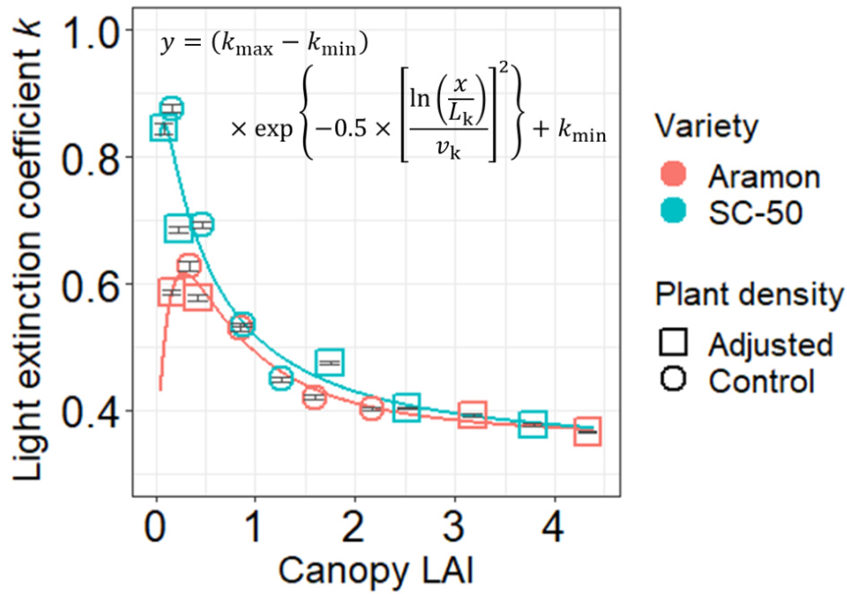  
图6-3. 光衰减系数$( k )$与冠层叶面积指数（LAI）的关系。$k$拟合（线）到冠层LAI（$L _ { \mathrm { c } }$，公式6-5）的函数，以包括发育和密度效应。黄瓜（Cucumis sativus L.）品种Aramon和SC-50分别用红色和蓝色符号表示。带有标准误差的数据是使用GroIMP中静态3D虚拟冠层进行光传输到地面的十次独立模拟结果，采样自冠层中央行五株中间植株下方的地面区域（图6-1d）。模拟中的种植密度设置为温室实验中的1.33株$\mathbf { m } ^ { - 2 }$（圆圈，对照）或温室实验的0.5倍、2倍或3倍（方形，调整），通过按比例调整行距和行内株距。

# 功能适应策略的品种差异导致光合氮分配对光的响应不同

根据我们的假设，植物应发展功能适应策略（FAS）以协调$N _ { \mathfrak { p } }$利用与光强。因此，我们研究了叶片光合氮（图6-4a）和三个功能氮库（羧化，$N _ { \mathrm { V } }$，图6-4b；电子传递，$N _ { \mathrm { J } }$，图6-4c；光捕获，$N _ { \mathrm { C } }$，图6-4d）在恒定光强下的趋势，从而量化了决定FAS的品种特异性系数（表6-2）。

表6-2. 黄瓜(Cucumis sativus L.)品种Aramon和SC-50功能适应的品种特异性系数。这些系数使用生长室实验获得的数据进行参数化，并用于蛋白质周转模型，以计算参与羧化$(N_{\mathrm{V}})$、电子传递$(N_{\mathrm{J}})$和光捕获$(N_{\mathrm{C}})$的氮库。

| 描述 | 方程符号 | 单位 | 品种 | Nv | NJ | Nc |
|------|----------|------|------|----|----|----|
| 降解常数 | 2-M6 | Cd-1 | Aramon | 0.0195 | 0.0195 | 0.0091 |
|      |         |      | SC-50 | 0.0195 | 0.0195 | 0.0091 |
|      |         |      |       | 0.173 |       |       |
| 光合成速率 | 6-2 | momo INoCdd | src-50 |       | 0.1309 | 0.235 |
| 氮供应与合成速率关系的米氏常数 | 2-M8 | mM | Aramon | 0.536 | 0.420 | 0.316 |
|      |         |      | SC-50 | 0.376 | 0.451 | 0.342 |
| 最大合成速率 | 6-2 | mmoIN m2 | sc-50 | 1.122 | 0.852 | 0.248 |
| 合成速率随年龄的下降常数 | 2-M5 | Cd-1 | Aramon | 0.001 | 0.002 | 0.001 |
|      |         |      | SC-50 | 0.002 | 0.003 | 0.002 |

由于$N _ { \mathfrak { p } }$及其分配可能是光、氮和叶龄可用性之间复杂相互作用的结果，因此进行了多变量分析（表S6-3）。分析显示，Aramon通常比SC50多约$1 5 . 0 \mathrm { m m o l } \mathrm { m } ^ { - 2 }$的$N _ { \mathfrak { p } }$，其中$N _ { \mathrm { V } }$增加$6 . 6 7 \mathrm { \ m m o l \ m } ^ { - 2 }$，$N _ { \mathrm { J } }$增加$4 . 0 6 \mathrm { m m o l } \mathrm { m } ^ { - 2 }$，$N _ { \mathrm { C } }$增加4.28 mmol $\mathrm { m } ^ { - 2 }$。还观察到对光的一般响应，$N _ { \mathrm { p } }$和所有三个库都随着每日入射光的增加而增加（图6-4a-d），每增加1 mol光子$\mathbf { m } ^ { - 2 } \mathbf { d } ^ { - 1 }$，$N _ { \mathfrak { p } }$增加1.16 mmol，$N _ { \mathrm { V } }$增加0.607 mmol，$N _ { \mathrm { J } }$增加0.456 mmol，$N _ { \mathrm { C } }$增加$0 . 0 9 7 0 \mathrm { m m o l }$（表S6-3）。这种库间蛋白质合成速率的不同光响应，即FAS，导致了$N _ { \mathfrak { p } }$分配的光依赖性模式。分配给$N _ { \mathrm { V } } \ ( p _ { \mathrm { V } } )$和$N _ { \mathrm { J } } \ \left( p _ { \mathrm { J } } \right)$的$N _ { \mathfrak { p } }$比例随着每日入射光的增加而增加（图6-4f, g），而分配给$N _ { \mathrm { C } } \ ( p _ { \mathrm { C } } )$的比例则减少（图6-4h）。与Aramon相比，SC-50在低光条件下显示出$2 . 6 5 \%$更低的$p _ { \mathrm { V } }$和$3 . 7 2 \%$更高的$p _ { \mathrm { C } }$（图6-4f, h，表S6-3），表明SC-50在光限制条件下倾向于将$N _ { \mathfrak { p } }$投资于光捕获，而不是羧化。有趣的是，SC-50在$p _ { \mathrm { V } }$和$p _ { \mathrm { C } }$上也显示出更高的光敏感性（图6-4f, h，表S6-3）。这些共同证明了品种特异性的FAS。

有趣的是，只有Aramon在总叶氮$N _ { \mathrm { t o t a l } }$的分配方面发展了光适应策略（图6-4e, S6-6），这在SC50中未观察到（注S6-2）。

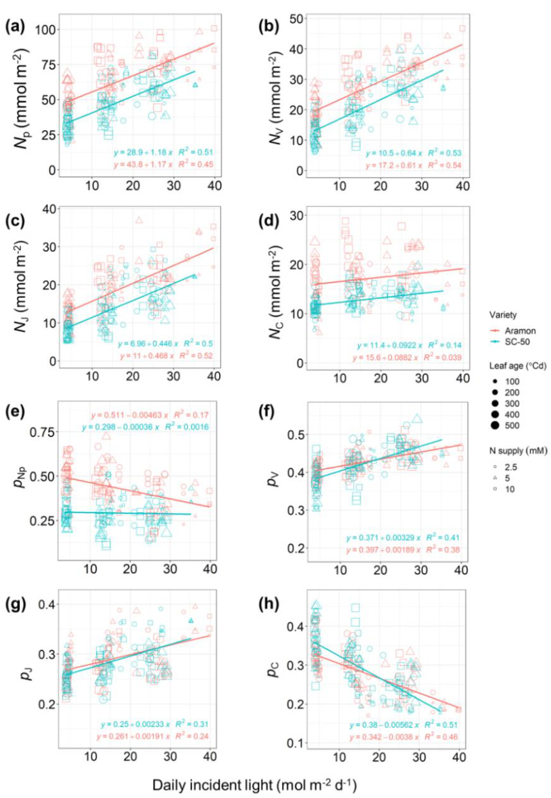  
图6-4. 在不同每日入射光和氮供应下，不同叶龄叶片中光合氮及其分配比例的测量结果。(a) 光合氮$( N _ { \mathrm { p } } )$，(b) 羧化$( N _ { \mathrm { V } } )$，(c) 电子传递$( N _ { \mathrm { J } } )$，(d) 光捕获$( N _ { \mathrm { C } } )$氮库。(e) 光合氮在总叶氮中的分配比例$( p _ { \mathrm { N p } } )$，(f) 羧化$( p _ { \mathrm { V } } )$，(g) 电子传递$( p _ { \mathrm { { J } } } )$，(h) 光捕获$( p _ { \mathrm { { C } } } )$。数据来自生长室实验。线性回归（线）及其$R$平方值分别标出。黄瓜（Cucumis sativus L.）品种Aramon和SC-50分别用红色和蓝色表示。叶龄由符号大小表示，氮供应水平由不同符号表示。

此外，通过光合蛋白质周转的机制模型（公式6-1, 6-2）分析了FAS的遗传和环境控制。遗传控制由最大蛋白质合成速率$( S _ { \mathrm { m m } } )$、合成速率随年龄的下降常数$( t _ { \mathrm { d } } )$和蛋白质降解常数（$D _ { \mathrm { r } } ,$ 表6-2）表征。系数$t _ { \mathrm { d } }$和$D _ { \mathrm { r } }$共同影响蛋白质周转动态的发育效应。假设Aramon和SC-50的$D _ { \mathrm { r } }$相同，其值在我们之前的研究中估计（第3章表3-1）。Aramon的$S _ { \mathrm { m m } }$较高（表6-2）表明其光合蛋白质合成可以达到更高的速率（$N _ { \mathrm { V } } , N _ { \mathrm { J } }$和$N _ { \mathrm { C } }$的最大差异分别为0.1, 0.06和$0 . 0 2 \mathrm { m m o l } ^ { \circ } \mathrm { C d } ^ { - 1 } \mathrm { m } ^ { - 2 }$，表6-2），而其较低的$t _ { \mathrm { d } }$表明衰老对其叶片寿命的影响比SC-50的叶片晚。这些共同导致了Aramon叶片中$N _ { \mathfrak { p } }$的较高含量（图6-4a-d）。对光和氮可用性的基因型敏感性分别由$k _ { \mathrm { I } }$和$k _ { \mathrm { N } } .$表示。这些系数决定了潜在最大蛋白质合成速率（$S _ { \mathrm { p o t } } ,$ 公式6-2）对增加的光和氮可用性的敏感性，直到达到其最大值（$\cdot S _ { \mathrm { { m m } } }$，图6-5a）。相对潜在合成速率$( \mathrm { r e l } S _ { \mathrm { p o t } } )$通过将库$X$的潜在合成速率$( S _ { \mathrm { p o t } , X } )$除以所有三个库的$S _ { \mathrm { p o t } }$之和计算（图6-5b），结果表明$N _ { \mathfrak { p } }$分配给羧化和电子传递库的比例随光增加而非线性增加，而分配给光捕获的比例则减少。在$\mathrm { D P I } \leq 2 0 \ \mathrm { m o l \ m } ^ { - 2 } \ \mathrm { d } ^ { - 1 }$以下，黄瓜品种间的rel $S _ { \mathrm { p o t } }$差异明显，与SC-50相比，Aramon将更高比例的$N _ { \mathfrak { p } }$投资于羧化和电子传递库，而不是光捕获库（图6-5c），这与我们的观察结果一致（图6-4f, h）。

  
图6-5. 模拟黄瓜(Cucumis sativus L.)品种Aramon（红色线条和符号）和SC-50（蓝色线条和符号）的光合氮光适应。(a) 羧化（实线）、电子传递（虚线）和光捕获（点线）的潜在蛋白质合成速率$S _ { \mathrm { p o t } } .$ , mmol $\mathrm { ~ N ~ m ~ } ^ { - 2 } \ ^ { \circ } \mathrm { C d } ^ { - 1 } )$，以及(b) 响应日入射光的相对潜在合成速率$( \mathrm { r e l } S _ { \mathrm { p o t } } )$。插入图显示了$\mathrm { 1 ~ m o l ~ m ^ { - 2 } ~ d ^ { - 1 } }$入射光下的速率。这些模拟是在$1 0 \ \mathrm { m M } \ \mathrm { N O } _ { 3 } ^ { - }$的氮供应水平下进行的。(c) 单株植物叶片中羧化（方形）、电子传递（圆形）和光捕获（三角形）的光合氮分配分数$( p _ { \mathrm { { X } } } )$。符号大小表示叶龄。该模拟是在$2 1 . 3 3 \mathrm { \ m o l } \mathrm { \ m } ^ { - 2 } \mathrm { \ d } ^ { - 1 }$的入射光和温室实验第四周数字化的植物结构下进行的。

光合氮分配特征与植物结构共同决定了光适应的最优性和灵活性

功能和结构特征的量化允许通过建模方法评估FAS和AC之间的协调程度。在硅实验1在不同日光合光子积分（DPI）水平下进行，以确定理论上最优的FAS，从而产生最大化日间碳同化（DCA, mol $\boldsymbol { \mathrm { C O } } _ { 2 } \boldsymbol { \mathrm { \ d } } ^ { - 1 }$每株）的基因型$N _ { \mathfrak { p } }$分配模式。Aramon在$\mathrm { 8 } { - } 2 7 \mathrm { m o l } \mathrm { m } ^ { - 2 } \mathrm { d } ^ { - 1 }$之间，SC-50在$6 { \cdot } 1 4 \mathrm { m o l } \mathrm { m } ^ { - 2 } \mathrm { d } ^ { - 1 }$之间发现了接近最优的FAS（图6-6）。Aramon对高光条件更高的适应灵活性可以解释为其更高的$N _ { \mathfrak { p } }$量（图6-4a）和更高的羧化及电子传递功能分配（图6-5b）相比SC-50。FASAramon在温室实验期间的平均DPI水平（$2 1 . 3 3 \mathrm { m o l } \mathrm { m } ^ { - 2 } \mathrm { d } ^ { - 1 } .$）下是最优的，表明其通过使冠层中的$N _ { \mathrm { p } }$分配适应其生长光环境来最大化DCA的能力（图S6-7）。然而，对于$N _ { \mathfrak { p } }$量较低的SC-50（图6-4a），情况并非如此，这可能导致SC-50的FAS $( \mathrm { F A S _ { S C - 5 0 } } )$通过调整$N _ { \mathfrak { p } }$分配的机制对高光条件的灵活性较低。

  
图6-6. 模拟不同日入射光子积分（DPI, mol photon $\mathbf { m } ^ { - 2 } { \mathbf { \tau } } \mathbf { d } ^ { - 1 } .$）下功能适应策略（FAS）的最优性和灵活性。FAS由蛋白质合成速率对光的特定功能响应表示。使用温室实验第四周数字化的各自特定结构，计算了黄瓜(Cucumis sativus L.)品种Aramon（红色圆形）和SC-50（蓝色三角形）的理论最优FAS导致的日间碳同化（DCA, mol $\mathbf { d } ^ { - 1 }$每株）的相对变化，其中整个生长期的平均DPI为$2 1 . 3 3 \mathrm { m o l } \mathrm { m } ^ { - 2 } \mathrm { d } ^ { - 1 }$。虚线表示$5 \%$的DCA变化。在给定DPI下，DCA变化低于$5 \%$表明FAS的高度最优性。

与冠层发育协调的动态功能适应提高了整株植物的碳同化

根据我们的假设，如果一个品种已经发展出与其AC理想协调的FAS，修改FAS应该会导致给定结构下的DCA降低。为了验证这一点，在硅实验2中，通过将一个品种的FAS与另一个品种的AC结合，在不同种植密度和光制度下模拟了DCA。与我们的预期相反，交换的FAS并没有导致给定结构下DCA的持续降低，而是根据冠层发育产生了动态效应。在中等种植密度（1.33 plants $\mathrm { m } ^ { - 2 \cdot }$）和DPI（$2 1 . 3 3 \mathrm { \ m o l \ m } ^ { - 2 }$ $\mathbf { d } ^ { - 1 }$）下，这种效应较小$( < 2 \% )$，其中$\mathrm { F A S } _ { \mathrm { S C } - 5 0 }$与Aramon结构结合导致DCA略有增加（图6-7b），而FASAramon与SC-50结构结合对DCA产生了正负两种效应（图6-7e）。交换FAS对DCA的影响明显取决于DPI水平和种植密度。高种植密度（2.66 plants $\mathrm { m } ^ { - 2 }$）和低DPI $( 5 . 3 3 \mathrm { \ m o l \ m ^ { - 2 } \ d ^ { - 1 } } )$导致了强烈的植株间光竞争，其中$\mathrm { F A S } _ { \mathrm { S C } - 5 0 }$的有利效应变得更加明显（高达$5 \%$，图6-7a-c）。相比之下，FASAramon导致的SC-50结构DCA降低在低DPI下加剧（图6-7d），在密集冠层中也略有加剧（图6-7d-f）。这表明$\mathrm { F A S } _ { \mathrm { S C } - 5 0 }$改善了强光竞争的影响，而FASAramon在充足光线下有利于光利用。这一结果导致了一个新的假设，即不是保持恒定的FAS，而是结合两种FAS优势的动态FAS可以提高DCA。为了验证这一假设，当叶片达到$1 0 0 ^ { \circ } \mathrm { C d }$年龄时，将FAS从FASAramon切换到$\mathrm { F A S } _ { \mathrm { S C - 5 0 } }$，即在完全展开阶段之前，由于年轻叶片的遮荫增加和叶片仰角逐渐垂直（接近$\beta _ { \mathrm { a s y m } }$，图6-2b）导致光截获减少。这一假设通过模拟得到证实，引入动态FAS后DCA增加（高达$5 . 6 \%$）（在几乎所有情景下，图$6 { - } 7 \mathrm { g - } 1$，除了低DPI下的开放SC-50冠层，图6-7j）。

  
图6-7. 模拟架构特征(AC)与功能适应策略(FAS)之间的协调对黄瓜(Cucumis sativus L.)品种日间碳同化(DCA, mol $\mathbf { d } ^ { - 1 }$ 每株)的影响。(a)-(f) 将一个品种的FAS与另一个品种的AC结合的效果。(g)-(l) 动态FAS的效果，当叶片达到$1 0 0 ^ { \circ } \mathrm { C d }$ 叶龄时，从Aramon品种的FAS切换到SC-50品种的FAS。FAS由光合氮分配对光的响应表示。与给定架构相比，DCA的相对变化，无论是Aramon[(a)-(c)和(g)-(i)]还是SC-50[(d)-(f)和(j)-(l)]。模拟中使用了0.665(红色符号)、1.33(绿色符号)和2.66(蓝色符号)株$\mathbf { m } ^ { - 2 }$ 的种植密度，结合5.33[(a), (d), (g), (l)]、21.33[(b), (e), (h), (k)]和$4 2 . 6 6 \ \mathrm { m o l \ m } ^ { - 2 } \ \mathrm { d } ^ { - 1 }$[(c), (f), (i), (l)]的入射日光子积分(DPI)水平，架构在连续四周内数字化，如不同符号所示。

# 最佳功能适应策略取决于架构特征与光合功能之间的权衡

为了获得FAS与AC之间的广义协调，在硅实验3中测试了叶片角度$\beta _ { \mathrm { a b s } }$ 的各种值( $1 5 ^ { \circ } - 7 5 ^ { \circ }$ ，间隔$5 ^ { \circ }$ )。$k$ 值随$\beta _ { \mathrm { a b s } }$ 变化(公式6-7)，即$k$ 随$\beta _ { \mathrm { a b s } }$ 增加(更垂直的叶片角度)而减小(更少的自遮荫和光截获)，反之亦然。在优化给定$\beta _ { \mathrm { a b s } }$ 情景的FAS后，特定光合库$X$ 的蛋白质合成偏好由其最佳相对潜在合成速率$( \mathrm { r e l } S _ { \mathrm { p o t } , \mathrm { o p } , X } )$ 表示，计算为其优化潜在合成速率$S _ { \mathrm { p o t , o p } , X }$ ，公式6-6)除以所有三个库的$S _ { \mathrm { p o t , o p } }$ 之和。正如预期的那样，光捕获库的relSpot,op随DPI减少和$\beta _ { \mathrm { a b s } }$ 增加而增加(图6-8c)，这是由于低光可用性和低光截获。然而，羧化$( \mathrm { r e l } S _ { \mathrm { p o t , o p , V } } )$ 和电子传递$( \mathrm { r e l } S _ { \mathrm { p o t , o p , J } } )$ 的$\mathrm { r e l } S _ { \mathrm { p o t , o p } }$ 都随DPI增加而增加，但在$\beta _ { \mathrm { a b s } }$ 为$4 5 ^ { \circ } - 6 5 ^ { \circ }$ 时表现出权衡(图6-8a, b)。这表明在这个$\beta _ { \mathrm { a b s } }$ 范围内达到了光截获和自遮荫之间的平衡，使得功能之间的分配对DPI高度敏感，在较高DPI下观察到电子传递和羧化之间的权衡，在较低DPI下观察到电子传递和光捕获之间的权衡(图6-8b)。

  
图6-8. 模拟黄瓜(Cucumis sativus L.)最佳相对光合氮合成速率与叶片角度( $^ { \circ }$ ，仰角绝对值)和截获日光子积分(DPI, mol $\mathbf { m } ^ { - 2 } \mathbf { d } ^ { - 1 } .$ )的协调。颜色表示(a)羧化、(b)电子传递和(c)光捕获蛋白库的相对潜在合成速率$( \mathrm { r e l } S _ { \mathrm { p o t , o p } } )$ ，这是在给定叶片角度下理论最优功能适应策略的结果。$k$ 值随叶片角度变化，遵循公式6-7。变量$\mathrm { r e l } S _ { \mathrm { p o t } , \mathrm { o p } , X }$ 计算为优化潜在合成速率$S _ { \mathrm { p o t , o p } , X }$ ，公式6-6)除以所有三个库的$S _ { \mathrm { p o t , o p } , X }$ 之和，以展示三个库之间合成的相对偏好。该模拟使用了一个虚拟黄瓜品种，其叶面积和功能适应系数介于Aramon和SC-50之间，并且假设该植物中的所有叶片具有相同的叶片角度。

# 讨论

植物可以根据其架构特征(AC)发展光合作用的功能适应策略(FAS)，无论是通过自然进化还是人工选择，以协调氮利用与当地光可用性。据我们所知，我们首次报告了FAS(图6-4, 6-5)与AC(图6-1, 6-2, 6-3)的品种变异，使用建模方法解释了这些变异在协调FAS与AC以优化冠层生产力的背景下的意义(图6-6)，并推导出了FAS与AC之间的广义协调。

# 功能适应与架构依赖的光竞争程度之间的共同进化

FAS的变异可能是其与冠层AC在特定栽培条件下育种过程中共同进化的结果(注S6-1)。Aramon是一种雌性单性结实品种，在优化条件下的温室中栽培，并垂直训练以最大化光利用。相比之下，SC-50是一种开放授粉的雌雄同体田间品种，雌花在上部节位和侧枝上更频繁地发育，通常在田间允许发育侧枝以确保果实形成，从而导致高叶面积指数和叶片更新。根据博弈论(Schieving和Poorter, 1999)，高叶面积指数、高叶片更新(Hikosaka和Anten, 2012)、水平叶片取向和高$k$(Hikosaka和Hirose, 1997)等AC在光竞争中具有优势。可以合理假设，FAS与确保低光可用性下光捕获的AC共同进化(图6-4h, 6-5b)对于SC-50克服自遮荫和植株间光竞争至关重要，类似于另一个露地黄瓜品种'Revel'报告的FAS(Evans, 1989a)。尽管这种光捕获的FAS"特化"(DeWitt和Langerhans, 2004; Sadras和Richards, 2014)可能会在中等光条件下( $1 5 < \mathrm { D P I } < 2 0$ ，图6-6)降低$N _ { \mathfrak { p } }$ 利用效率，与Aramon相比，由于与光利用效率的权衡(图6-5c)，但它加强了单株植物的资源捕获，以牺牲其邻居为代价。

尽管在AC和FAS方面存在差异，但所研究的两个品种在营养生长方面具有相当的活力（图S6-5），并在其特定的栽培条件下具有高产的水果产量（Papadopoulos和Hao，2000；Shetty和Wehner，2002）。人们可能会期望这些品种根据光可用性和其特定的AC来优化FAS（Evans，1993b；Hikosaka和Terashima，1996）。我们的模拟表明，Aramon在垂直温室栽培系统的生长光条件下具有最佳的FAS（图6-1a）。令人惊讶的是，SC-50并非如此（图6-6），它并非为单茎栽培系统而选育。SC-50的FAS模拟次优性也可能源于叶片氮利用的优先级（图6-6）。两个品种的总叶片氮含量相当（图S6-6a），但SC-50在光合作用中投入的叶片氮较少（图S6-6b），无论光环境如何（表S6-3，注S6-2）。这意味着SC-50优先将氮投资于光合作用以外的其他化合物（图S6-6c），可能是用于防御生物和非生物胁迫（Strauss-Debenedetti和Bazzaz，1991；Onoda等，2004；Poorter等，2009）。然而，SC-50叶片中较少的$N _ { \mathfrak { p } }$可能部分被其对光条件下$N _ { \mathfrak { p } }$分配的高敏感性所补偿（图6-4f，h，表S6-3），以提高有限的$N _ { \mathrm { p } }$的利用效率。只要防御机制的成本不超过减少损害带来的收益，植物就会以减少光合作用和生长投资为代价，获得更高的生存机会（Tian等，2003；Dalin等，2008；Todesco等，2010）。与SC-50相比，温室品种Aramon根据"泛化"策略的概念投资其叶片氮，该策略在广泛的环境范围内提供适度的适应性（DeWitt和Langerhans，2004；Sadras和Richards，2014），因为随着光可用性的增加，光合作用的投资比例减少，反之亦然（图6-4e），确保在更广泛的光强度范围内保持稳定的性能（图6-6）。

# 功能与结构的动态协调提高生产力

当冠层内光可用性偏离品种特定的FAS最佳光水平范围（图6-6）时，由于入射光条件、种植密度和冠层发育，FAS与其AC的协调可能处于次优状态（图6-7a-f）。在密集、封闭的冠层和低辐照度下，明显的次优协调（图6-7a，d）强调了光竞争下氮利用策略对植物碳同化的重要性（Drouet和Bonhomme，2004；Pons和Anten，2004）。然而，通过假设动态FAS，利用FASAramon（有利于光利用）在幼叶中的优势和$\mathrm { F A S } _ { \mathrm { S C } - 5 0 }$（有利于光捕获）在成熟叶中的优势，无论光条件和冠层配置如何，植物生产力提高了高达$5 . 6 \%$（图$6 { - } 7 \mathrm { g - } 1 \mathrm { \dot { 2 } } \mathrm { \Omega }$）。这突出了通过内源和/或外源因素触发的FAS修饰机制提高作物生产力的可能性。这种对环境刺激的表型可塑性可能通过表观遗传控制实现，作为分子记忆帮助维持这种反应（Turck和Coupland，2014；Baulcombe和Dean，2014；Balao等，2018），通过化学修饰遗传物质而不改变DNA序列来调节基因表达（Offermann和Peterhansel，2014；Duarte-Aké等，2019）。

除了FAS和AC之间的品种协调外，我们还发现了FAS与叶片角度之间的协调模式，这导致了最大的植物碳同化。叶片角度的修改同时增加或减少自遮荫和光截获。因此，在具有更水平叶片角度的冠层中（高光截获），应投资更高比例的$N _ { \mathfrak { p } }$于Rubisco和电子传递，而在具有更垂直叶片角度的冠层中，投资于光捕获可能更有助于通过将氮分配给限制功能来保持$N _ { \mathfrak { p } }$利用效率恒定（Evans，1993a；Hikosaka，2004；Buckley等，2013；Pao等，2019a）。由于电子传递在将捕获的光能传递以驱动羧化中的核心作用，最佳的$N _ { \mathfrak { p } }$分配给电子传递$( N _ { \mathrm { J } } )$与限制功能（光捕获$( N _ { \mathrm { C } } )$或羧化$( N _ { \mathrm { V } } )$）之间存在权衡，取决于当前的光可用性（图6-8b，叶片角度在$4 5 ^ { \circ }  – 6 5 ^ { \circ }$之间）。为了优化有限的可用叶片氮预算以用于适应性和生存，功能之间的氮分配权衡是可预测的（Buckley等，2013；Pao等，2019a），并且在植物中并不罕见（Evans，1988，1989a；Onoda等，2004；Trouwborst等，2011；Evans和Clarke，2019）。然而，这种权衡的程度因环境而异，未来可能倾向于电子传递，因为环境$\mathrm { C O } _ { 2 }$浓度的上升可能导致在饱和光下RuBP再生更频繁地限制光合作用（Long等，2004；Taylor等，2020）。

# 模型假设和局限性

本文提出的模型整合了从叶片到冠层水平的建筑和功能过程，并实现了无法通过实验实现的计算机模拟实验和优化。尽管在我们的研究问题背景下，更高的复杂性不一定能带来更好的理解，但至少有三个值得注意的方面。

首先，我们的模型直接模拟了基于面积的$N _ { \mathrm { p } }$（公式6-1），以促进对其与光截获相关的功能适应的理解。需要注意的是，叶片单位面积质量（LMA）与基于质量的$N _ { \mathfrak { p } }$之间的内在关系（Wright等，2004）被隐含地包括在内。此外，LMA显示出与$N _ { \mathfrak { p } }$相似的非线性光适应模式（Poorter等，2009），这意味着光适应后PUNE的变化可能是氮经济学和单位面积干物质投资修改的混合结果（Hikosaka，2004）。

其次，假设两个品种的蛋白质降解率相同，因为几乎没有证据表明物种或基因型之间存在差异（Li等，2017）。此外，其在一个功能类别内的高变异性以及对叶片发育、蛋白质丰度（Li等，2017）和环境条件（Peterson等，1973；Makino等，1984；Ishihara等，2015）的依赖性使得使用有限数据量化这些影响变得复杂且不可行。这一假设有利地避免了模型过度参数化（公式6-1，2-M5，2-M6），并更好地区分了品种在蛋白质合成中的反应。例如，SC-50的$t _ { \mathrm { d } }$较高（表6-2），表明在老化过程中$N _ { \mathfrak { p } }$周转更快，可能具有更高的氮再吸收和重新分配以支持高叶片周转率（Hikosaka，2005），这在具有光竞争的田间条件下是有利的（Hikosaka和Anten，2012）。

最后，我们通过使用光衰减系数简化了AC，该系数由考虑冠层动力学的3D冠层建筑模型估计（公式6-5，S6-3，S6-4）作为代理。可以认为，为了更好地理解冠层氮利用，还应考虑光分布异质性的更高真实性（de Pury和Farquhar，1997；Hikosaka，2014）。然而，使用3D模型增加代表AC的参数数量使得无法推导出FAS和AC之间的广义协调（图6-8），阻碍了迭代优化算法并减少了获得全局最优解的机会。尽管通过叶片光反射和吸收（例如，Song等，2017）、向光性和避荫行为（Maddonni等，2001a；Kahlen等，2008；Kahlen和Stützel，2011）在冠层内光分布的精细适应无法在本文提出的模型中明确检查，但预测光合参数的准确性是合理的（见第3章），与使用动态功能结构植物模型相似（见第5章）。

# 第7章 讨论

基于光合蛋白周转和稳态$\mathbf{C}_3$光合作用的光响应，我们的模型为波动光条件下(每小时或每天时间尺度)的光合适应提供了机制解释，并能够预测温室黄瓜异质冠层中的光合适应。通过在多层模型或功能结构模型中实施该模型，可以获得类似的结果，用于预测数周时间尺度的冠层光合作用。

使用该模型框架，我们发现温室栽培品种Aramon的叶片间光合氮分布接近最优，可以最大化每日植物碳同化(DCA)和光合氮利用效率(PNUE，单位光合氮的$\mathbf{CO}_2$吸收)，除了在氮限制条件下，优化光合氮分布可导致DCA增加$7.0\%$。在温室单茎高架系统中，预测温室栽培品种Aramon的叶片水平功能库间光合氮分配是最优的，而田间栽培品种SC-50则不是。这种差异可能是由于品种育种历史中形成的冠层结构与功能的协调。与Aramon相比，SC-50的总光合氮较低，但具有根据光照水平更敏感地在功能间分配氮的适应策略。光合氮分配的最优程度强烈依赖于冠层光环境，因此也依赖于入射光水平、冠层发育和配置。所提出的模型框架为波动光下的适应机制提供了解释，并使得在计算机中操纵和测试冠层中的光合适应成为可能。

# 未来研究需求

正如Herrmann等人(2019)所说，"模型的好坏取决于其基础假设"，毫无疑问，在适应过程中还涉及其他机制，这些机制对光合平衡施加限制，从而导致与光合氮功能控制的权衡。众所周知，动态光环境会导致植物生长和生理的差异，但从现有的模型和实验数据中仍无法得出关于波动光对光合适应影响的明确结论(Morales和Kaiser，2020)。光合诱导动力学(短期，一小时以内时间尺度)中的潜在参与者，例如Rubisco活化酶活性和气孔导度的生理响应，值得进一步研究(Kaiser等人，2016；Slattery等人，2018；Matthews等人，2018；Wang等人，2020；Sakoda等人，2021)，以建立更精细时间尺度响应的模型。

在黑暗期间，Rubisco可以通过结合糖磷酸盐(如羧基-D-阿拉伯糖醇1-磷酸和核酮糖1,5-二磷酸)转化为抑制形式(Servaites，1990；Slattery等人，2018)，以防止蛋白水解(Khan等人，1999)。Rubisco活化酶对于释放Rubisco催化位点的抑制剂，从而激活Rubisco催化活性至关重要(Parry等人，2008；Ng等人，2020)。Rubisco抑制现象在物种间存在质和量的差异，其中黄瓜与豇豆、辣椒、大豆、烟草和茄属植物在Servaites等人(1986)研究的37个物种(包括$\mathbf{C}_3$、$\mathrm{C}_4$和CAM(景天酸代谢)物种)中表现出较高的黎明前抑制程度。这与我们的发现一致，即Rubisco激活状态对光可用性的依赖在黄瓜植物的适应中起着重要作用，因为我们的模型预测，如果忽略Rubisco抑制，会导致Rubisco氮的过度投资。因此，在我们的模型中假设Rubisco的激活与光成正比，遵循Qian等人(2012)提出的稳态激活$(\%)$与入射PAR之间的逻辑关系(公式3-11)。然而，使用这种固定的经验关系而不考虑激活的时间滞后(但参见Wang等人，2020)，使得无法捕捉Rubisco活化酶数量和活性适应的影响。例如，在遮荫条件下对Rubisco活化酶的更大投资(von Caemmerer和Quick，2000)可以改变氮分配的平衡，提高利用光斑的效率。

气孔导度控制着叶片与其周围大气之间的气体交换，调节光合作用中的$\mathrm{CO}_2$吸收和蒸腾作用中的水分流失。气孔导度对光的响应速率已经在几分钟时间尺度的光合限制背景下进行了研究。通过研究拟南芥和烟草，Sakoda等人(2021)发现，在RuBP羧化限制条件下，气孔导度在黑暗期(超过一小时)后最初$15{-}25~\mathrm{min}$的光照期间施加了最大的限制，表明更快的气孔开放提高了波动光下的光利用效率(LUE，单位截获光的$\mathbf{CO}_2$吸收)。通过考虑光能对水分流失的影响，更快的气孔响应导致瞬时水分利用效率(WUE，单位蒸腾水的$\mathbf{CO}_2$吸收)增加，但不会增加每日WUE，如一项模型研究所显示(Moualeu-Ngangue等人，2016)。同一研究得出结论，在光照增加期间快速气孔开放会降低WUE，而在光照减少期间快速气孔关闭会增加WUE。由于气孔动力学不仅强烈影响$\mathbf{CO}_2$吸收，还影响水分流失，因此在所关注的作物系统中，特别是当水分可用性有限且波动时，应考虑LUE与WUE的权衡。

到目前为止，我们的模型适用于非胁迫环境，以研究光截获和PNUE之间的相互作用(图7-1中的灰色填充部分)，因为它是使用在约$25^\circ\mathrm{C}$中等温度和充足供水条件下生长和测量的植物进行参数化的。在模型中，应用了叶面积的经验描述，气孔导度是从稳态光合速率和叶肉导度推导出来的(作为输出)，这意味着在光截获面积和气孔限制的控制中没有明确的环境响应。为了进一步研究考虑在环境变化背景下的适应策略，例如变化的大气条件，可以将一些相关方面纳入模型(图7-1中的虚线框)：(1)由水力学和代谢学控制的叶片生长，(2)PNUE和WUE的气孔调节，以及(3)光合生物化学对气温升高和$\mathbf{CO}_2$浓度增加的响应。

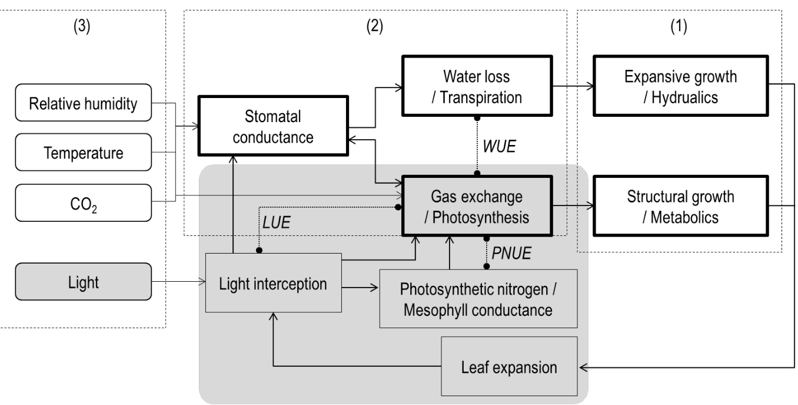  
图7-1. 所提出模型的结构以及考虑环境变化影响的进一步研究扩展。

叶片生长决定了有效的光截获面积，因此表现出与受捕获能量影响的生长过程的反馈。一项荟萃分析(Poorter等人，2019)揭示了单个叶片面积对入射日PAR积分的广义响应，即叶面积在约$2{\mathrm{~mol~m}}^{-2}{\mathrm{~d}}^{-1}$时接近最大值，在$2{\cdot}15\ \mathrm{mol\ m}^{-2}\ \mathrm{d}^{-1}$之间略有下降(在12小时日长下$46{-}347\ \mu\mathrm{mol\ m}^{-2}\ \mathrm{s}^{-1}$的平均值)，而光从这一水平进一步减少或增加会导致叶面积明显减少。类似的响应也在节间长度和株高方面被报道。这种光响应可以通过叶片个体发育期间的生长驱动力来理解(Pantin等人，2012)。在叶片发育的早期阶段，细胞分裂受到碳水化合物供应(代谢学)的限制，而后期细胞扩张受到细胞膨压(水力学)的限制，在拟南芥中观察到在叶片出现后第四天发生转变(Pantin等人，2011)。低光可用性$(<2\mathrm{mol}\mathrm{m}^{-2}\mathrm{d}^{-1},$ )和细胞分裂阶段的低碳供应由于总细胞数量减少而限制了结构生长。在细胞扩张阶段，高光可用性$\mathrm{(>15~mol~m^{-2}~d^{-1}},$ )下，由于加速的水分流失，维持扩张生长变得具有挑战性，而在低光下，叶片能够以单位面积干物质为代价维持扩张生长(Tardieu等人，1999)。整合这些过程将光合作用与蒸腾作用联系起来，并揭示了它们作为平衡植物水分和碳预算的结果对冠层结构和光截获的影响。

气孔导度的调节确保了足够的$\mathbf{CO}_2$流入以进行碳同化，以及促进水分吸收、养分转运和蒸发冷却的水分流出，同时防止过度水分流失。气孔导度对内部和外部线索都有响应(Buckely，2017；Lawson和Matthews，2020)，例如在低$\mathrm{CO}_2$需求(低光和高细胞间$\mathrm{CO}_2$浓度)、低冷却需求(低温)和加剧水分关系不平衡的条件下(低湿度、低水分可用性和高蒸汽压差，VPD)普遍减少。由此产生的水力学关系可能反过来通过叶片膨压影响气孔控制(Buckely，2017)。Damour等人(2010)列出并回顾了过去三十年提出的气孔导度的经验和过程基础模型。通过气孔调节考虑长期和短期成本(Buckley，2017)来平衡PNUE和WUE，对于提高作物在非生物胁迫下的表现和适应性至关重要(Matthews等人，2020；Yang等人，2021)。因此，当气孔限制超过生化限制时，限制气孔导度的环境因素如高VPD可以重塑植物内的氮分布以增加PNUE(Bachofen等人，2020)。胁迫条件可能通过脱落酸(ABA)-和活性氧(ROS)-介导的途径导致气孔导度和光合作用之间的共同调节(Damour等人，2010)。

短期温度波动超出最佳范围会导致卡尔文循环酶活性降低，从而降低光合作用速率。FvCB模型中使用的光合参数对叶片温度的依赖性可以通过修正的Arrhenius函数来描述，该函数包含各过程的激活和失活能量(Harley et al., 1992b; Hikosaka et al., 2006; Kattge and Knorr, 2007; Qian et al., 2012; Yin et al., 2019)。温度驯化能够使光合生物化学的最佳操作温度向生长温度方向移动(Berry and Bjorkman, 1980; Yamori et al., 2014)。完全驯化通常需要至少一周时间，其中光合生物化学的适应变化范围比气孔导度更广(Berry and Bjorkman, 1980)。在适应升高的生长温度过程中，$V _ { \mathrm { c m a x } }$ 激活能量的增加被报道为在环境$\mathbf { C O } _ { 2 }$浓度下最关键的因素(Hikosaka et al., 2006)。此外，温度与其他因素之间存在相互作用，最佳温度随着细胞间$\mathbf { C O } _ { 2 }$浓度和环境光强度的增加而升高，随着叶片氮含量的增加而降低(Berry and Bjorkman, 1980; Hikosaka et al., 2006; Yamori et al., 2010;Yin et al., 2019)。

升高的环境$\mathrm { C O } _ { 2 }$浓度会诱导气孔关闭，降低地上部氮浓度，同时增加净光合能力(Medlyn et al., 1999; Li et al., 2019)。有趣的是，在氮可用性受限的情况下生长的植物中并未观察到净光合能力的增加，这很可能是由于生化限制所致(Li et al., 2019)。地上部氮浓度的降低可能是由于硝酸盐同化受到抑制、碳同化增加导致的稀释效应以及蒸腾驱动质量流吸收减少所致(Medlyn et al., 1999; Taub and Wang, 2008; Bloom et al., 2010; Bloom et al., 2014)。除了地上部氮浓度下降外，理论研究表明，通过酶活性和/或氮分配的调整，$J _ { \mathrm { m a x } }$与$V _ { \mathrm { c m a x } }$的比率会显著降低(Medlyn, 1996; Yin et al., 2019)，但测量数据并不总是支持这一结论(Medlyn et al., 1999; Akita et al., 2012)。这种差异表明，要么对升高$\mathrm { C O } _ { 2 }$的氮驯化仍有改进空间，要么在升高$\mathrm { C O } _ { 2 }$条件下，最大化光合作用并不是适应性的唯一标准。

通过整合上述过程，可以扩展所提出的模型(图7-1)，以更完整的生态生理学图景(包括LUE、PNUE和WUE)进一步探索植物在功能氮控制中的驯化。

# 补充材料

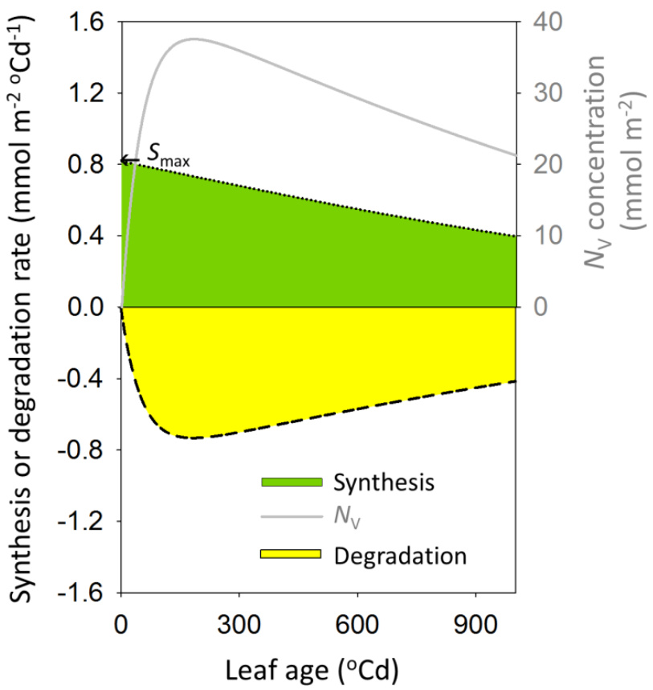  
图 S3-1. 光合氮随叶龄变化的动态示意图。以羧化氮库$\mathrm { \Delta } N _ { \mathrm { V } }$ (mmol $ { \mathrm { ~ N ~ m ~ } } ^ { - 2 }$，灰色实线，公式3-4)为例，它同时由合成速率(mmol $\mathrm { ~ N ~ m ~ } ^ { - 2 } ^ { \mathrm { ~ \circ ~ } } \mathrm { C d } ^ { - 1 }$，绿色阴影填充的虚线，公式3-5、3-7和3-8)和降解速率(mmol $\mathrm { ~ N ~ m ~ } ^ { - 2 } \ ^ { \circ } \mathrm { C d } ^ { - 1 }$，黄色阴影填充的虚线，公式3-6)决定。系数取自表3-1。本模拟使用了21.4 mol $\mathrm { d } ^ { - 1 } \mathrm { m } ^ { - 2 }$的恒定光强和$1 0 ~ \mathrm { m M }$的氮供应水平。在生长室实验中，光合氮库在恒定光强下随叶龄表现出相似的演化模式，首先增加到最大值(在$1 5 0 { - } 2 5 0 ^ { \circ } \mathrm { C d }$时)，然后随着叶片老化而下降。

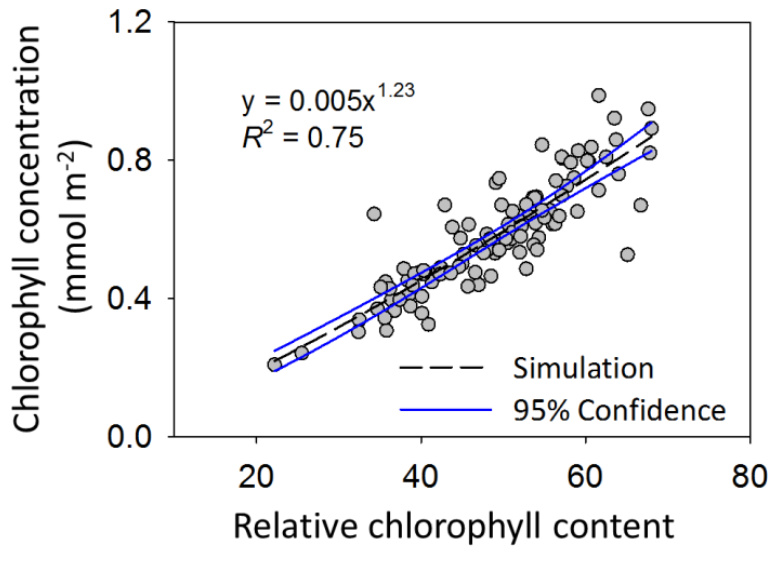  
图 S3-2. 相对叶绿素含量(SPAD)与叶片叶绿素浓度($C h l$，mmol Chl $\mathbf { m } ^ { - 2 \cdot }$)之间的关系，用于温室实验中$C h l$的无损估计。虚线表示相对叶绿素含量与$C h l$之间的模拟关系，蓝色实线表示95%置信区间。

  
图 S3-3. 模型评估和模拟的环境数据输入。由温室外的气象站记录的温室实验期间的每日光子积分(DPI, mol photons $\mathbf { m } ^ { - 2 } \mathbf { d } ^ { - 1 }$)。应用49.8%的温室透光率来估计温室内冠层上方的DPI，用于高生长光强($\mathrm { \Delta \Psi { ( H L } }$，橙色实线)。通过遮荫将DPI进一步降低到$\mathrm { H L }$的40%，用于低生长光强(LL，黑色实线)。每周分析营养液中的氮供应水平(mM，右y轴)，分别表示高氮(HN，空心圆)和低氮(LN，空心三角形)。四个测量日期用箭头标出。

  
图 S3-4. 叶龄$( t , \ ^ { \circ } { \bf C d } )$与应用于动态蛋白质周转模型中的叶片特征之间的关系，用于模拟叶片处的局部光强。(A)$t$与叶片角度$\beta \ ( ^ { \circ } )$之间的关系；虚线表示模拟值，蓝色实线表示95%置信区间。(B)叶片角度$\beta$定义为从叶片基部到尖端的连线与垂直平面之间的夹角。叶片仰角(ε，表3-S1)转换为$\mathtt { \varepsilon } = ( 9 0 \mathrm { ~ - ~ }$ β)。(C)$t$与叶面积指数(LAI, $\mathbf { m } ^ { 2 } \mathbf { m } ^ { - 2 }$)之间的逻辑关系；虚线表示模拟值，各处理使用的系数已列出。不同处理的测量值显示为：高氮高光($\mathrm { H N + H L }$，橙色空心圆)，高氮低光($\mathrm { \ R N + L L }$，黑色实心圆)，低氮高光($\mathrm { L N + H L }$，橙色空心三角形)，低氮低光($\mathrm { L N + L L }$，黑色实心三角形)。

表 S3-1. 用于每日冠层碳同化(DCA)模拟的冠层特征，植物生长在高氮(HN)、高光($\mathrm { H L }$)、低氮(LN)和低光(LL)的组合条件下。列出了每个叶位的测量叶面积(LA, $\mathbf { m } ^ { 2 }$)、估计的热年龄$( t , \ ^ { \circ } { \bf C d } )$和模拟仰角$( \varepsilon , ^ { \circ } )$。冠层的累积叶面积指数(cLAI, ${ \mathrm { m } } ^ { 2 }$ $\mathrm { m } ^ { - 2 \cdot }$)和冠层总叶片光合氮含量$N _ { \mathrm { c a n o p y } }$ (mmol N)被用作DCA模拟的输入。由于各生长条件之间存在显著差异$( P < 0 . 0 0 1 )$，$t$使用每个生长条件下的恒定叶间隔期$( ^ { \circ } { \bf C } \mathrm { d } )$估计。ε使用与$t$的经验关系模拟(图S3-4A和图S3-4B)。

| 生长条件 | HN+HL | HN+HL | HN+HL | HN+LL | HN+LL | HN+LL | LN+HL | LN+HL | LN+HL | LN+LL | LN+LL | LN+LL |
|----------|-------|-------|-------|-------|-------|-------|-------|-------|-------|-------|-------|-------|
|          | LA    | Cd    | εo    | LA    |       | εo    | LA    | Td    | εo    | LA    | Cd    | εo    |
| 叶序     |       |       |       |       |       |       |       |       |       |       |       |       |
| 1        | 0.0298| 566   | -32   | 0.0157| 548   | -35   | 0.0288| 566   | -32   | 0.0176| 548   | -35   |
| 2        | 0.0610| 540   | -36   | 0.0365| 522   | -38   | 0.0482| 540   | -36   | 0.0512| 522   | -38   |
| 3        | 0.0863| 514   | -39   | 0.0525| 496   | -42   | 0.0651| 514   | -39   | 0.0519| 496   | -42   |
| 4        | 0.1046| 496   | -42   | 0.0597| 480   | -44   | 0.0807| 494   | -42   | 0.0634| 478   | -44   |
| 5        | 0.1181| 479   | -44   | 0.0673| 464   | -46   | 0.0914| 473   | -45   | 0.0850| 460   | -46   |
| 6        | 0.1093| 461   | -46   | 0.0752| 448   | -48   | 0.0905| 453   | -47   | 0.0914| 442   | -49   |
| 7        | 0.1278| 443   | -49   | 0.0777| 432   | -50   | 0.0894| 433   | -50   | 0.0935| 424   | -51   |
| 8        | 0.1247| 425   | -51   | 0.0870| 416   | -52   | 0.0878| 412   | -53   | 0.0925| 406   | -54   |
| 9        | 0.1077| 408   | -53   | 0.0983| 400   | -54   | 0.0844| 392   | -55   | 0.0940| 388   | -56   |
| 10       | 0.0998| 390   | -56   | 0.0917| 384   | -56   | 0.0840| 372   | -58   | 0.0986| 370   | -58   |
| 11       | 0.0992| 372   | -58   | 0.0974| 368   | -58   | 0.0840| 352   | -60   | 0.1036| 352   | -60   |
| 12       | 0.0831| 355   | -60   | 0.0935| 352   | -60   | 0.0760| 331   | -62   | 0.1042| 334   | -62   |
| 13       | 0.0858| 337   | -61   | 0.0874| 335   | -62   | 0.0630| 311   | -64   | 0.0996| 316   | -63   |
| 14       | 0.0839| 319   | -63   | 0.0838| 319   | -63   | 0.0645| 291   | -65   | 0.0970| 298   | -64   |
| 15       | 0.0715| 302   | -64   | 0.0766| 303   | -64   | 0.0593| 270   | -66   | 0.0962| 280   | -65   |
| 16       | 0.0672| 284   | -65   | 0.0663| 287   | -65   | 0.0578| 250   | -66   | 0.0896| 262   | -66   |
| 17       | 0.0635| 266   | -66   | 0.0563| 271   | -66   | 0.0524| 230   | -65   | 0.0843| 244   | -66   |
| 18       | 0.0596| 248   | -66   | 0.0571| 255   | -66   | 0.0439| 209   | -64   | 0.0736| 226   | -65   |
| 19       | 0.0520| 231   | -65   | 0.0592| 239   | -66   | 0.0426| 189   | -61   | 0.0690| 208   | -64   |
| 20       | 0.0532| 213   | -64   | 0.0605| 223   | -65   | 0.0401| 169   | -56   | 0.0682| 190   | -61   |
| 21       | 0.0424| 195   | -62   | 0.0639| 207   | -64   | 0.0361| 149   | -50   | 0.0607| 172   | -57   |
| 22       | 0.0407| 178   | -59   | 0.0633| 191   | -61   | 0.0302| 128   | -41   | 0.0616| 154   | -52   |
| 23       | 0.0363| 160   | -54   | 0.0561| 174   | -58   | 0.0235| 108   | -28   | 0.0441| 136   | -45   |
| 24       | 0.0304| 142   | -47   | 0.0504| 158   | -53   | 0.0252| 88    | -12   | 0.0311| 118   | -35   |
| 25       | 0.0281| 125   | -39   | 0.0521| 142   | -47   | 0.0158| 67    | 10    | 0.0127| 100   | -23   |
| 26       | 0.0131| 107   | -27   | 0.0402| 126   | -40   | -     |       |       | 0.0073| 82    | -7    |
| 27       | 0.0050| 89    | -13   | 0.0244| 110   | -30   | -     |       |       | 0.0044| 64    | 13    |
| 28       |       | -     | 1     | 0.0133| 94    | -17   | 1     |       |       | -     | 1     |       |
| 29       | -     |       |       | 0.0089| 78    | -2    |       | -     |       | -     |       |       |
| 30       | 1     | 1     | 1     | 0.0036| 62    | 17    | 1     | 1     | 1     | =     | 1     |       |

0.16 HN+HL   
0.12 ： N+HL LN+LL 图S3-4中植物生长和颜色 0.04 S3-4. · 0.00 0 5 10 15 20 25 30 叶序 A B 线8 ： 线40 " 40 品 ： 自 20 □ 0 0 0 20 40 60 80 0 20 40 60 80 C 高氮下Nph (mmol m-2) D 高光下Nph(mmol m-2)   
1 0.45 cg & ： 0.25 0.25 P<0.01 α= 1.56 ±0.260 0.20 0.20 0.20 0.25 0.30 0.35 0.40 0.45 0.20 0.25 0.30 0.35 0.40 0.45 E 高氮下Pv F 高光下Pv 0.35 0.35   
u 0.30 90 p 双 . Y 0.20 0.20 P<0.01 a = 1.24±0.162 0.20 0.250.300.35 0.20 0.25 0.30 0.35 G 高氮下pj H 高光下p 0.6 0.6 P<0.01 W 0.5 山 0.5 α = 1.38±0.208 . 1 Y 0.4 0.4 9 B 0.3 0.3 0.2 0.2 0.2 0.3 0.4 0.5 0.6 0.2 0.3 0.4 0.5 0.6 高氮下Pc 高光下Pc

图 S3-6. 模拟叶片光合氮$\mathrm { \Delta } N _ { \mathrm { p h } }$ (mmol $\mathrm { ~ N ~ m ~ } ^ { - 2 }$，A和B)、羧化库分配分数$( p _ { \mathrm { { V } } } , \mathbf { C }$和D)、电子传递库分配分数$( p _ { \mathrm { { J } } } , \mathrm { { E } }$和F)以及光捕获库分配分数($\mathrm { \Delta } p _ { \mathrm { { C } } }$，G和H)在高氮(HN)和低氮(LN)供应下(A、C、E和G)以及在高光(HL)和低光(LL)条件下(B、D、F和H)的比较。每个点代表从与图3-2中可比较的冠层获得的模拟结果。橙色空心圆表示在HL下生长的叶片，黑色实心圆表示LL，蓝色空心方块表示HN，黑色实心方块表示LN。圆圈大小随叶龄增加(从$7 7 ^ { \circ } \mathrm { C d }$到$4 1 4 ^ { \circ } ( \mathrm { C d } )$)。实线显示线性回归$\mathbf { y } = a \mathbf { x } + b$。当a值与1显著不同时，指定其95%置信区间。灰色虚线表示1:1线。

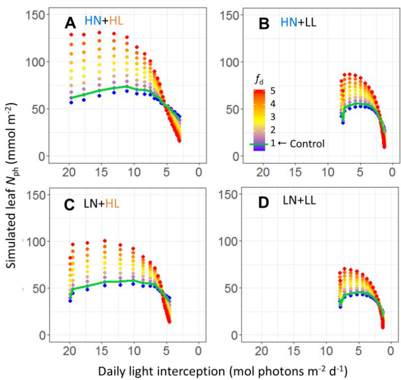

图 S3-7. 叶片光合氮$( N _ { \mathrm { p h } } ,$ , mmol $\textrm { \textbf { N } }  { \mathbf { m } } ^ { - 2 } )$分布与垂直光分布的关系，以每日光截获量(mol光子 $\mathbf { m } ^ { - 2 }$ $\mathbf { d } ^ { - 1 } \mathbf { \widetilde { \Gamma } } ,$ )为特征。通过使用分布因子$f _ { \mathrm { d } }$(范围0.5到5.0，间隔0.5)在不同生长条件下根据公式3-19创建了氮分布的变异。(A)高氮高光$\left( \mathrm { H N + H L } \right)$ ; (B)高氮低光$\mathrm { ( H N + L L ) }$ ; (C)低氮高光$( \mathrm { L N + H L } )$ ); (D)低氮低光$\mathrm { ( L N + L L ) }$ 。模拟的对照$N _ { \mathrm { p h } }$分布$\begin{array} { r l r } { ( f _ { \mathrm { d } } } & { { } = } & { 1 ) } \end{array}$用绿色线表示。

  
图 S4-1. 光合蛋白合成速率与光强之间的非线性关系。数据来自第3章描述的生长室实验，其中黄瓜植株在三种光照水平与三种氮供应水平(mM)组合下生长，并检测了叶片中包括Rubisco羧化、电子传递(ET)和光捕获(LH)库在内的光合功能库，如第3章所述。生长环境的光强显示为平均光合有效辐射(PAR, $\mu \mathrm { m o l }$ $\mathbf { m } ^ { - 2 } \mathbf { \Phi } \mathbf { s } ^ { - 1 } ) \pm \mathbf { S } \mathbf { E }$ 。

注 S5-1. 模型描述的补充信息

冠层光截获效率$\cdot E _ { \mathrm { I } , i }$ , 范围0-1)计算为从冠层顶部(最大叶序)到叶序$i$的累积光截获比例，使用冠层上方的光合光子通量密度$( \mathrm { P P F D } _ { \operatorname* { i n } } .$ , $\mu \mathrm { m o l } \mathrm { ~ m } ^ { - 2 } \mathrm { ~ s } ^ { - 1 } )$，叶序$i$上的入射PPFD$( \mathrm { P P F D } _ { i } .$ , $\mathrm { \sf ~ \mu ~ m o l ~ m ^ { - 2 } ~ s ^ { - 1 } ~ } ,$ )，叶面积$( A _ { \mathrm { L } , i } , \mathrm { m } ^ { 2 } )$，种植密度(PD, 株 $\mathbf { m } ^ { - 2 }$ )和7%光透射假设：

$$
\begin{array} { r l } & { E _ { \mathrm { I } , i } = \sum _ { \mathrm { r a n k = m a x ( r a n k ) } } ^ { \mathrm { r a n k = \it i } } \left[ \mathrm { P P F D } _ { i } \times A _ { \mathrm { L } , i } \times \mathrm { P D } \times ( 1 - 0 . 0 7 ) / \mathrm { P P F D } _ { \mathrm { i n } } \right] } \end{array}
$$

观察到植物体出现所需的叶间隔期随着植物发育而减少，然后达到稳定值，类似于拟南芥中报道的行为(Pantin等, 2011中的图S2A)。叶间隔期被描述为叶序$R$的逻辑函数：

$$
\mathrm { P h y l l } = ( p h y l l _ { 0 } - p h y l l _ { \mathrm { m i n } } ) / [ 1 + \exp ( R - 3 ) ] + p h y l l _ { \mathrm { m i n } }
$$

其中$p h y l l _ { 0 }$为初始叶间隔期(假设为$1 3 0 ^ { \circ } \mathrm { C d }$，相当于从播种到第一片真叶出现需要9-10天，根据实验观察)，然后随着$R$的增加而减少到$p h y l l _ { \mathrm { m i n } }$。假设曲线的拐点出现在叶序3，生物学意义是叶间隔期在该叶序以上迅速减少，这是由于前3片叶子的同化支持。

叶肉导度( $g _ { \mathrm { m } } .$ mol $\mathrm { C O } _ { 2 } \ \mathrm { m } ^ { - 2 } \ \mathrm { s } ^ { - 1 } .$ )根据叶片热年龄和$N _ { \mathfrak { p } }$通过公式3-16修改进行模拟：

$$
g _ { \mathrm { m } } = \left( r _ { \mathrm { g m } } \times N _ { \mathrm { p } } \right) \times \exp \left\{ - 0 . 5 \times \left[ \ln \bigl ( t / t _ { \mathrm { g m } } \bigr ) / v _ { \mathrm { g m } } \right] ^ { 2 } \right\} + g _ { \mathrm { m m i n } }
$$

其中$g _ { \mathrm { m m i n } } ~ ( 0 . 0 8 4 6 ~ \mathrm { m o l } ~ \mathrm { C O } _ { 2 } ~ \mathrm { m } ^ { - 2 } ~ \mathrm { s } ^ { - 1 } )$为最小$g _ { \mathrm { m } } . \ t _ { \mathrm { g m } } \ : ( 1 0 0 ^ { \circ } \mathrm { C d } )$为$g _ { \mathrm { m } }$最大时的热年龄，$\nu _ { \mathrm { g m } } ( 0 . 3 9 8 )$为曲线的标准差。$r _ { \mathrm { g m } } ( 0 . 0 0 4 3 1 \mathrm { m o l } \mathrm { C O } _ { 2 }$ $\mathrm { m m o l } ^ { - 1 } \mathrm { N } \mathrm { s } ^ { - 1 } ,$ )描述了$g _ { \mathrm { m } }$随$N _ { \mathfrak { p } }$增加的速率。

果实$i$的潜在生长速率$( R _ { \mathrm { P F } , i } , \mathrm { g } ~ \mathrm { D M } ~ \mathrm { d } ^ { - 1 }$ ; Kuwar, 2007; Wiechers等, 2011a)由其前一天的果实长度$( L _ { \mathrm { F } , i } , \mathrm { c m } )$推导：

$$
R _ { \mathrm { P F } , i } ( d ) = 0 . 0 0 2 5 \times L _ { \mathrm { F } , i } ( d - 1 ) ^ { 2 . 4 2 8 4 }
$$

对于热年龄$\ b { \mathrm { \Omega } } ^ { \mathrm { ~ \tiny ~ 3 ~ } } \leq 1 5 0 ^ { \circ } \mathrm { C d }$的果实，$\boldsymbol { L } _ { \mathrm { F } , i }$通过逻辑函数模拟(见Kahlen, 2006中的公式5)，果实热年龄$( ^ { \circ } { \bf C } \mathrm { d } )$减去$1 5 0 ^ { \circ } \mathrm { C d }$，最小值为$5 \mathrm { c m }$，比生长速率为$0 . 0 3 6 2 ^ { \circ } \mathrm { C d } ^ { - 1 }$，最大值为$3 5 \mathrm { c m }$。

叶片仰角$\beta ( ^ { \circ } )$根据其叶面积$( A _ { \mathrm { L } } , \mathrm { c m } ^ { 2 } )$通过速率常数$0 . 0 1 1 6 \mathrm { c m } ^ { - 2 }$向渐近线$- 6 8 . 4 ^ { \circ }$描述：

$$
\beta = ( 9 0 + 6 8 . 4 ) \times \exp ( - 0 . 0 1 1 6 \times A _ { \mathrm { L } } ) - 6 8 . 4
$$

果实半径 $r _ { \mathrm { F } , i }$ (cm) 根据当前果实长度 $L _ { \mathrm { F } , i }$ 计算 (由 Kahlen 和 Stützel, 2007; Kuwar, 2007 修改):

$$
\begin{array} { r } { r _ { \mathrm { F } , i } = \left( \frac { 0 . 0 9 1 6 8 \times L _ { \mathrm { F } , i } ^ { 1 . 4 2 8 4 } } { \pi } \right) ^ { 0 . 5 } } \end{array}
$$

表 S5-1. 用于模拟叶序、叶片扩展和叶柄伸长的常数，数据来源于实验 2a。植物分别接受强光（HL）或弱光（LL，通过遮荫减少至 HL 条件的 50%）与高氮（HN，10 mM）或低氮（LN，2.5 mM）供应的组合处理。实验 1a-1b（第 5 章）的条件与 HLHN 处理相似。

| 实验处理 | 1a/1b/1c (HLHN) | 2a/2b HLHN | 2a/2b HLLN | 2a/2b LLHN | 2a/2b LLLN |
| --- | --- | --- | --- | --- | --- |
| phyllmin (C) | 16.6 ± 0.69 | 16.6 ± 0.69 | 21.9 ± 3.95 | 15.6 ± 0.37 | 17.3 ± 0.33 |
| ALmax (cm²) | 1121 ± 34 | 1121 ± 34 | 964 ± 24 | 947 ± 22 | 929 ± 16 |
| rALmax | 6.9 ± 0.27 | 6.9 ± 0.27 | 6.2 ± 0.19 | 7.8 ± 0.21 | 8.3 ± 0.21 |
| KAL | 0.877 ± 0.041 | 0.877 ± 0.041 | 0.871 ± 0.031 | 0.850 ± 0.036 | 1.04 ± 0.037 |
| Lpmax (cm) | 26.5 ± 0.64 | 26.5 ± 0.64 | 25.9 ± 0.70 | 22.9 ± 0.51 | 23.5 ± 0.51 |
| rLPmax | 7.8 ± 0.31 | 7.8 ± 0.31 | 5.4 ± 0.24 | 6.3 ± 0.34 | 6.9 ± 0.34 |
| kLp | 1.09 ± 0.053 | 1.09 ± 0.053 | 1.14 ± 0.051 | 1.57 ± 0.095 | 1.84 ± 0.15 |

表 S5-2. 图 5-4 中模拟的种植密度及对应的行距和株距场景

| 行距 (m) | 株距 (m) |
| --- | --- |
| 1.1 | 0.909 | 0.606 | 0.455 | 0.364 | 0.303 |
| 1.5 | 0.667 | 0.444 | 0.333 | 0.267 | 0.222 |
| 1.9 | 0.526 | 0.351 | 0.263 | 0.211 | 0.175 |

表 S5-3. 在实验 2a（第 5 章）中，在强光（HL）或弱光（LL，通过遮荫减少至 HL 条件的 50%）与高氮（HN，10 mM）或低氮（LN，2.5 mM）供应组合处理下，模拟的五周生长期内每株植物累积的总光截获量（mol）。应用了 Beer-Lambert 方程 5-1b、5-1c、5-1d 和 5-1e。显示了每日步长（DS）和每小时步长（HS）的模拟结果。

| 光模型 | 光线追踪 (RT) | Beer-Lambert 方程 (BL) |
| --- | --- | --- | --- | --- | --- | --- | --- | --- | --- | --- |
|  | DS | HS | Eqn 1b | Eqn 1c | Eqn 1d | Eqn 1e |
| HLHN | 221.0 | 194.3 | 185.4 | 178.4 | 207.3 | 198.9 | 270.3 | 260.7 | 207.3 | 199.8 |
| HLLN | 186.7 | 164.1 | 143.8 | 138.3 | 166.7 | 159.8 | 221.4 | 213.5 | 169.1 | 163.0 |
| LLHN | 106.3 | 93.2 | 85.1 | 81.9 | 95.0 | 91.1 | 124.7 | 120.2 | 95.9 | 92.0 |
| LLLN | 107.6 | 92.9 | 83.6 | 80.3 | 94.7 | 90.8 | 124.3 | 119.7 | 95.4 | 91.7 |

表 S5-4. 文献中报道的温室黄瓜作物光衰减系数 $k$

| k | 种植密度 (m²) | 生长和测量时间 | 附加信息 | 参考文献 |
| --- | --- | --- | --- | --- |
| 0.42 | 约 1.2 | 5月-8月 | 1 | Warren Wilson 等, 1992 |
| 0.53 | 2 | 4月-6月 | 反射屏引起的漫射光 | Peil 等, 2002 |
| 0.59 | 2 | 8月-10月 |  |  |
| 0.63 | 1.33 | 3月-6月 | __ | Medrano 等, 2005 |
| 0.86 0.87 | 2 3.4 | 10月-1月 11月-2月 | 仅顶部照明 | Trouwborst 等, 2010 |

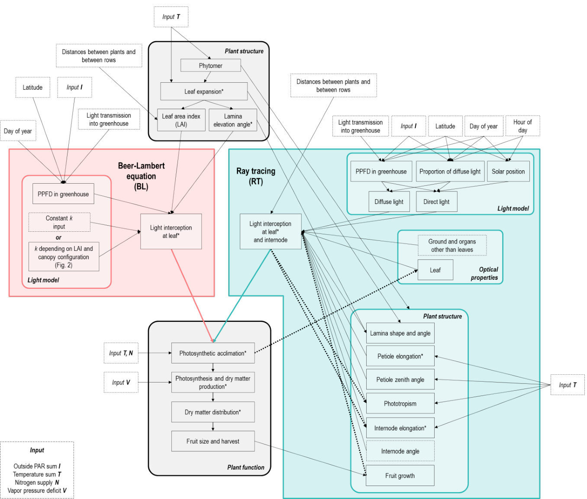  
图 S5-1. 温室黄瓜动态植物模型的数据流图。带有灰色背景的圆角框"植物结构"和"植物功能"由两种光模型共享：Beer-Lambert 方程（BL，红色框）和光线追踪（RT，蓝色框）。实线表示数据流，虚线表示反馈。星号表示通过测量数据评估的过程。植物功能框中的图号表示对给定过程的评估结果。BL 方法中使用的变量 $k$ 的确定过程在图 5-2 中描述。模型输入用虚线框表示。输入模型的环境数据列在左下角的虚线框中：外部光合有效辐射（PAR）$I$ $\mathrm { ( m o l ~ m } ^ { - 2 }$ 每单位时间)，温度总和 $T$ ( $^ \mathrm { \circ } \mathrm { C d }$ 每单位时间)，氮供应 $N$ (mM) 和蒸汽压差 $V \left( \mathrm { k P a } \right)$。输入数据 $I$ 和 $T$ 的时间单位为每小时（用于小时步长模拟）或每天（用于日步长模拟）。

  
图 S5-2. 使用小时步长光线追踪法测量的和模拟的冠层不同叶片光截获效率的比较。测量数据（第 5 章）来自实验 1a（圆圈）、1b（三角形）和 1c（正方形），分别在等距（I）或行（R）排列下，植物密度为每平方米 1 株（I1 和 R1）或 2 株（I2 和 R2）。光截获效率（冠层上方入射 PPFD 的比例）从冠层顶部到第五片叶累积。测量值的高变异性是由于采样位置的自遮荫，因为叶片上的入射光是用该叶片上的单点传感器测量的。  
图 S5-3. 在等距（I）或行（R）排列下，植物密度为每平方米 1 株（I1 和 R1）或 2 株（I2 和 R2）时，光衰减系数 $k$ 与冠层叶面积指数的模拟关系。每个点代表使用功能结构植物模型和光线追踪在特定日 1200 时采样的冠层 $k$ 估计值。模拟使用了实验 1a（圆圈）、1b（三角形）和 1c（正方形）的条件（第 5 章）。

1.00 排列 I1 21 四n R2 2 LkA 实验 1a △ 1b 0.25 □ 1c 0 1 2 叶面积指数

A 实验 50 1b 2 40 周 30 2 4 5 20 BL1e RT 模型 B C D Tre HLent BL1e RT BL1e RT BL 1e RT 模型 模型 模型

方法 S6-1. 模型描述的补充信息

模型中应用的最优气孔行为概念（Medlyn 等，2011）未考虑次优植物水分状态的影响。我们的模拟使用温室黄瓜作为模式植物，因为其水分胁迫的存在最小，而生物化学和光限制在光合作用的诱导（Acevedo-Siaca 等，2020）和稳态（Chen 等，2014a；Chen 等，2018）中起最重要的作用。然而，响应水分状态的气孔动力学是可用的且可嵌入的（Tuzet 等，2003；Moualeu-Ngangue 等，2016）。

叶肉导度表示为 $t$ 的对数正态函数，由公式 3-16 修改：

$$
\begin{array} { r l } & { g _ { \mathrm { m } } = g _ { \mathrm { m N p } } \times \exp \left\{ - 0 . 5 \times \left[ \ln \bigl ( t / t _ { \mathrm { g m } } \bigr ) / v _ { \mathrm { g m } } \right] ^ { 2 } \right\} + g _ { \mathrm { m m i n } } } \\ & { g _ { \mathrm { m N p } } = s _ { \mathrm { g m N p } } \times N _ { \mathrm { p } } } \end{array}
$$

其中 $g _ { \mathrm { m m i n } } ( \mathrm { m o l } \mathrm { C O } _ { 2 } \mathrm { m } ^ { - 2 } \mathrm { s } ^ { - 1 } )$ 是最小 $g _ { \mathrm { m } }$，$g _ { \mathrm { m N p } }$ (mol $\mathrm { C O } _ { 2 } \ \mathrm { m } ^ { - 2 } \ \mathrm { s } ^ { - 1 } ;$ 表示 $N _ { \mathfrak { p } }$ 对 $g _ { \mathrm { m } }$ 的贡献，$t _ { \mathrm { g m } }$ 是 $g _ { \mathrm { m } }$ 最大时 $( g _ { \mathrm { m N p } } + g _ { \mathrm { m m i n } }$ , mol $\mathrm { C O } _ { 2 } \ \mathrm { m } ^ { - 2 } \ \mathrm { s } ^ { - 1 } )$ 的 $t$，$\nu _ { \mathrm { g m } }$ 是曲线的标准差。$\mathrm { \bf \Pi } _ { \mathrm { g m N p } } ^ { \mathrm { ' } \mathrm { m o l } \mathrm { C O } _ { 2 } \mathrm { m m o l } ^ { - 1 } \mathrm { N } \mathrm { s } ^ { - 1 } ) }$ 是 $N _ { \mathfrak { p } }$ 到 $g _ { \mathrm { m N p } }$ 的转换效率。

# 冠层光截获建模

为了考虑仰角 $\beta ( ^ { \circ } )$ 分布对光截获的影响，使用 $\beta$ 对给定水平层 $\boldsymbol { Q }$ 的入射光强度进行余弦校正，得到截获光 $I$。

$$
I = Q \times \cos ( \beta )
$$

使用 Beer-Lambert 定律模拟 $\boldsymbol { Q }$，其中 $k$ 为光衰减系数，$L$ 为给定值，$Q _ { 0 }$ 为冠层顶部的入射光强度：

$$
Q = Q _ { 0 } \times \exp ( - k \times L )
$$

# 使用虚拟 3D 冠层的模拟光截获确定光衰减系数

天空的入射光由 72 个半球排列的漫射光源和一个位于冠层上方的定向光源模拟（图 6-1c）。集成了光线追踪器来计算光分布，使用一千万条光线和十次反射的递归深度（Buck-Sorlin 等，2011）。为每个品种创建了虚拟冠层，包含五行（行距 $1 . 5 \mathrm { ~ m ~ }$），每行 15 株（株距 $0 . 5 \mathrm { ~ m ~ }$），由两个数字化代表植物的随机排列组成（图 6-1d）。对虚拟冠层中央行中间五株植物下方的地面区域进行了十次模拟，以采样光传输到地面的情况。每次模拟中，每株植物在水平面上随机旋转 $- 3 0 ^ { \circ }$ 到 $3 0 ^ { \circ }$。还通过按比例修改行距和株距来调整植物密度，以获得更广泛的冠层叶面积指数范围。使用从 GroIMP 提取的模拟光传输数据（图 S6-3），通过公式 S6-4 确定光衰减系数 $k$。

# 叶龄周期建模

观察到叶龄周期（Phyll，$^ \circ \mathrm { C d }$ 每叶）随着植物发育而减少，然后达到稳定值，与拟南芥中报道的相似（Pantin 等，2011 中的图 S2A）。在我们的模型中，Phyll 被描述为叶片序数 $R$ 的逻辑函数：

$$
\mathrm { P h y l l } = \left( p h y l l _ { 0 } - p h y l l _ { \mathrm { a s y m } } \right) / \left[ 1 + \exp \left( R - R _ { \mathrm { p h y l l } } \right) \right] + p h y l l _ { \mathrm { a s y m } }
$$

其中 $p h y l l _ { 0 } \ : ( ^ { \circ } \mathbf { C } \mathbf { d } )$ 是植物生长初期的 Phyll，然后随着 $R$ 的增加而减少到渐近值 $p h y l l _ { \mathrm { a s y m } }$。$R _ { \mathrm { p h y l l } }$ 是拐点处的叶片序数。这种经验关系在黄瓜品种 Aramon 和 SC-50 之间相似，$p h y l l _ { \mathrm { a s y m } }$ 为 $1 7 . 0 ^ { \circ } \mathrm { C d }$，$p h y l l _ { 0 }$ 为 $1 2 5 . 4 ^ { \circ } \mathrm { C d }$（图 S6-5），与从播种到第一片真叶出现所需的时间相似（8-9 天，数据未显示）。对于年龄为 $t _ { \mathrm { p } } \left( { } ^ { \circ } \mathrm { C d } \right)$ 的植物，冠层中序数为 $R$ 的叶片的年龄 $( t , \mathbf { \nabla } ^ { \circ } \mathbf { C d } )$ 计算如下：

$$
\begin{array} { r } { t = t _ { \mathrm { p } } - \sum _ { R _ { 0 } + 1 } ^ { R } \mathrm { P h y l l } } \end{array}
$$

（公式 S6-6）

其中 $R _ { 0 }$ 是实验开始时最年轻叶片的序数。

注 S6-1. 黄瓜（Cucumis sativus L.）品种描述

Aramon 是一个 F1 杂交品种，由于其稳定的单性结实和雌性，特别适合温室生产。SC-50 是一个雌雄同株和开放授粉的品种，通过将印度地方品种（PI 197087，美国国家植物种质系统）与轮回亲本 'Ashley'（AMES 4833）回交培育而成，'Ashley' 是一个特别适应美国南卡罗来纳州炎热潮湿条件的传统品种。

注 S6-2. 黄瓜（Cucumis sativus L.）叶片总氮分配中的品种差异

观察到总叶片氮 $( N _ { \mathrm { t o t a l } } )$ 分配中的品种差异（图 6-4e，图 S6-7）。与 SC-50 相比，Aramon 在光合作用 $\dot { p } _ { \mathrm { N p } }$ 中投入了 $2 0 . 8 \%$ 更多的叶片氮（图 6-4e，表 S6-3），但 Aramon 的 $p _ { \mathrm { N p } }$ 随着每日光截获的增加而减少了 $0 . 4 7 9 \%$ 每摩尔光子 $\mathbf { m } ^ { - 2 } \mathbf { d } ^ { - 1 }$（表 S6-3）。品种和光在 $p _ { \mathrm { N p } }$ 中的明显交互作用 $\langle P = 0 . 0 0 2 \rangle$ 和 SC-50 的光响应 $- 0 . 0 7 1 0 \%$ 每摩尔光子 $\mathbf { m } ^ { - 2 } { \mathbf { \tau } } { \mathbf { d } ^ { - 1 } }$（表 S6-3）表明 SC-50 的 $p _ { \mathrm { N p } }$ 对光的响应不显著（图 6-4e）。因此，SC-50 的 $N _ { \mathfrak { p } }$ 随光增加（图 6-4a）仅归因于 $N _ { \mathrm { t o t a l } }$ 随光增加（图 S6-6a）。此外，SC-50 中投资于光合作用以外功能 $\dot { p } _ { \mathrm { N f } } ,$ 图 S6-6c）和硝酸盐 $\overset { \cdot } { p } _ { \mathrm { N n } }$ , 图 S6-6d）的 $N _ { \mathrm { t o t a l } }$ 部分对光没有响应，而 Aramon 的 $p _ { \mathrm { N f } }$ 每摩尔光子 $\mathbf { m } ^ { - 2 } { \mathrm { ~ d } ^ { - 1 } }$ 增加了 $0 . 7 6 8 \%$，$p _ { \mathrm { N n } }$ 减少了 $0 . 2 3 0 \%$（表 S6-3）（图 S6-6c，d），表明 Aramon 不仅在 $N _ { \mathfrak { p } }$ 使用上，而且在 $N _ { \mathrm { t o t a l } }$ 上也发展了光适应策略。

表 S6-1. 模型输入输出变量列表

| 描述 | 符号 | 单位 | 类型 |
|------|------|------|------|
| 净光合速率 | An | μmol CO2 m² s-1 | 输出 |
| RuBP 羧化限制的 An | Ac | μmol CO2 m² s-1 | 输出 |
| RuBP 再生限制的 An | Aj | μmol CO2 m² s-1 | 输出 |
| 叶片吸收率 | α |  | 输出 |
| 大气 CO2 浓度 | C | μmol CO2 mol-1 | 输入 |
| 叶绿体 CO2 浓度 | Cc | μmol CO2 mol-1 | 输出 |
| 单位面积叶绿素含量 | Chl | mmol m-2 | 输出 |
| 叶片-空气水汽压差 | D | kPa | 输入 |
| N 库 X 的蛋白质降解速率 | Dx | Cd-1 | 输出 |
| 叶片仰角 | β | 0 |  |
| 叶片角度(β的绝对值) | βabs | 。 |  |
| 叶肉 CO2 导度 | gm | mol CO2 m² s-1 | 输出 |
| Np 对 gm 的贡献 | gmNp | mol CO2 m² s-1 |  |
| 气孔 CO2 导度 | gsc | mol CO2 m² s-1 | 输出 |
| 截获的光合有效光子 |  |  |  |
| 日截获光合光子通量 | Id | mol photon m² d-1 |  |
| 生长最后四天的平均 Id | I4d | mol photon m2 d-1 |  |
| 截获的光合光子通量密度 | IPPFD | μmol photon m² s-1 |  |
| 电子传递速率 | J | μmol e m² s-1 | 输出 |
| 最大电子传递速率 | Jmax | μmol e m² s-1 | 输出 |
| 光衰减系数 | k |  |  |
| 给定叶片上方的叶面积指数 | L |  |  |
| 冠层叶面积指数 | Lc |  | 1 |
| 冠层总叶片光合氮 | Nplant | mmol N 每株 |  |
| 叶片光合氮 | Nleaf | mmol N 每叶 |  |
| 单位面积叶片光合氮 | Np | mmol N m-2 | 输出 |
| 营养液氮浓度 | Ns | mM | 输入 |
| N 库 X 的浓度 | Nx | mmol N m² | 输出 |
| 光捕获 N 库的浓度 | Nc | mmol N m-² | 输出 |
| 电子传递 N 库的浓度 | N | mmol N m-2 | 输出 |
| 羧化 N 库的浓度 | Nv | mmol N m² | 输出 |
| 叶龄周期 | Phyll | °Cd 每叶 |  |
| N 库 X 的分配比例 | Px |  | 输出 |
| 冠层入射光 | Q |  |  |
| 冠层顶部入射光 | Q0 |  | 输入 |
| 叶片序数(向顶) | R |  | 输入 |
| 实验开始时最年轻叶片的序数(向顶) | R |  | 输入 |
| 无光呼吸时的日间呼吸速率 | Rd | μmol CO2 m² s-1 | 输出 |
| 氮可用性对蛋白质合成的降低因子 | rN |  |  |
| N 库 X 的潜在蛋白质合成速率 | Spotx | mmol N m² Cd-1 | 输出 |
| 优化的 Spot x | Spot.opx |  | 输出 |
| N 库 X 的蛋白质合成速率 | Sx | mmol N m-2 Cd-1 | 输出 |

| 描述 | 符号 | 单位 | 类型 |
|------|------|------|------|
| 叶龄 | t | Cd |  |
| 植株年龄 | tp | Cd | 输入 |
| 羧化速率 | V | μmol CO2 m² s-1 | 输出 |
| 最大羧化速率 | Vemax | μmol CO2 m² s-1 | 输出 |

表 S6-2. 模型系数列表。括号内为标准误差(SE)。

| 描述 | 符号 | 单位 | 值 (标准误差) | 参考文献 |
|------|------|------|---------------|----------|
| 光合作用氮 | | mmol 叶绿素 | | |
| 光捕获氮的叶绿素转换系数 | Xc | mmol-1 N | 0.03384 | 1 |
| 电子传递氮的叶绿素转换系数 | XcJ | mmol 叶绿素 mmol-1 N | 4.64×10-4 | 1 |
| 电子传递氮的电子传递能力转换系数 | XJ | μmol e mmol1 N s' | 9.48 | 1 |
| 羧化氮的羧化能力转换系数 | xv | Nmol CO2 mmol1 | 4.49 | 1 |
| 光合作用 | | | | |
| 最小气孔导度 | g0 | mol CO2 m² s-1 | 0.009 | 2 |
| 物种特异性气孔导度系数 | 81 | | 3.51 | 2 |
| 无暗呼吸时的CO2补偿点 | 广 | μmol COz mol-1 | 43.02 | 3 |
| Rubisco对CO2的米氏常数 | K | μmol COz mol-1 | 404 | 2 |
| Rubisco对O2的米氏常数 | K | mmol O2 mol-1 | 278 | 2 |
| 羧化位点的O2浓度 | 0 | mmol O2 mol-1 | 210 | 2 |
| 光子到电子的转换效率 | | photon μmol e μmol-1 | 0.425 | 4 |
| 凸度系数 | 0 | | 0.7 | 2 |
| 呼吸作用 | | | | |
| 呼吸系数 | rRdg | m²dCd1 mol1 | 5.22×10-4 (4.35×10-) | |
| 呼吸系数 | | μmol CO2 d °Cd-1 | 1.97×10-4 (1.08×105) | |
| 呼吸系数 | rRdm | mol-1 photon s-1 μmol CO2 d mol-1 | | |
| 最大呼吸速率对I4d的敏感性 | SRdI | photon s- | 0.328 (0.0256) | |
| 叶肉导度 | | | | |
| 最小叶肉导度 | gmmin | mol CO2 m² s-1 mol CO2 mmol1 N | 0.0846 (0.00789) | |
| gmNp对Np的敏感性 | SgmNp | | 0.00431 (3.19×10-4) | |
| gmNp为0时的叶龄 | tgm | Cd | 100 (3.87) | |
| 依赖关系的标准差 | Vgm | | 0.398 (0.0338) | |

| 描述 | 符号 | 单位 | 值 (标准误差) | 参考文献 |
|------|------|------|---------------|----------|
| 曲线 | | | | |
| 叶龄周期 | | | | |
| 最大值 | phyllo | °Cd/叶 | 125.4 (56.4) | 1 |
| 渐近线 | phylasym | °Cd/叶 | 17.0 (0.297) | - |
| 拐点处的叶序数 | Rphyll | | 3.32 (0.660) | - |

\*参考文献: 1, Buckley et al. (2013); 2, Chen et al. (2014a); 3, Singsaas et al. (2003); 4, Wiechers et al. (2011a)

表 S6-3. 黄瓜(Cucumis sativus L.)品种(V)、日间光截获量$( { \mathrm { I _ { d } } } , { \mathrm { m o l } } { \mathrm { m } } ^ { - 2 } { \mathrm { d } } ^ { - 1 } ,$ )、氮供应水平$( \mathsf { N } , \mathsf { m M } )$、叶龄$( \mathrm { t } , \mathsf { \Omega } ^ { \circ } \mathrm { C d } )$以及品种与光的交互作用$( \mathrm { V } : \mathrm { I _ { d } } )$对氮变量、总叶氮$( N _ { \mathrm { t o t a l } } )$、光合氮$( N _ { \mathrm { p } } )$、羧化作用$( N _ { \mathrm { V } } )$、电子传递$( N _ { \mathrm { J } } )$和光捕获$( N _ { \mathrm { C } } )$功能中氮的分配，以及$N _ { \mathfrak { p } }$在$N _ { \mathrm { t o t a l } }$中的比例$( p _ { \mathrm { N p } } )$、$N _ { \mathrm { V } }$在$N _ { \mathrm { p } }$中的比例$( p _ { \mathrm { V } } )$、$N _ { \mathrm { J } }$在$N _ { \mathrm { p } }$中的比例$( p _ { \mathrm { J } } )$和$N _ { \mathrm { C } }$在$N _ { \mathrm { p } }$中的比例$( p _ { \mathrm { C } } )$，以及非光合作用功能中有机氮在$N _ { \mathrm { t o t a l } }$中的比例$( p _ { \mathrm { N f } } )$和无机硝态氮在$N _ { \mathrm { t o t a l } }$中的比例$( p _ { \mathrm { N n } } )$的多变量分析。数值以$\pm \ \mathrm { S E }$表示，显著效应以粗体标出。品种Aramon $\mathrm { ( V _ { A r a m o n } ) }$的效应是模型的y截距：变量 $\sim$ $\mathrm { V + I _ { d } + V : I _ { d } + N + t }$

| 变量 | VAramon | Vsc50 | Id | VsC50 : Id | N | t |
|------|---------|-------|----|------------|---|----|
| Np (mmol m-2) | 39.48603* ±3.09825 | -15.02009 ±3.06528 | 1.15948* ±0.11344 | 0.02180"s ±0.16911 | 0.77998** ±0.26745 | -0.00053ns ±0.00619 |
| Nv (mmol m2) | ±1.46565 15.23583*** | ±1.45006 -6.67481*** | 0.60666* ±0.05366 *** | 0.03452ns ±0.08000 | 0.35708* ±0.12652 | -0.00038ns ±0.00293 |
| NJ (mmol m−2) | 12.36761*** ±1.09039 | -4.06080*** ±1.07878 | ±0.03992 0.45584*** | -0.01891ns | 0.24390* | -0.00977*** |
| Nc (mmol m-2) | 11.88259** ±0.84625 | -4.28448** | 0.09698* | ±0.05952 0.00619ns | ±0.09412 0.17901* | ±0.00218 0.00962* |
| PNp | 0.59017** | ±0.83724 -0.20800** | ±0.03099 -0.00479** | ±0.04619 0.00408** | ±0.07305 -0.00483* | ±0.00169 -0.00018* |
| pv | ±0.02416 0.39506* | ±0.02397 -0.02650** | ±0.00088 0.00188* | ±0.00132 0.00141** | ±0.00207 0.00043ns | ±0.00005 0.00000"s |
| PJ | ±0.00821 0.30760*** ±0.00661 | ±0.00813 -0.01072ns | ±0.00030 0.00173* | ±0.00045 0.00042"s | ±0.00071 0.00004"s | ±0.00002 -0.00017*** |
| Pc | 0.29734*** ±0.01081 | ±0.00654 ±0.01069 0.03722*** | ±0.00024 -0.00362*** | ±0.00036 -0.00183** | ±0.00057 -0.00047ns | ±0.00001 0.00017*** |
| Ntotal (mmol m-2) | 17.56139* ±8.54426 | 16.86801* ±8.47601 | ±0.00040 4.84942* ±0.30952 | ±0.00059 -0.15671ns | ±0.00093 4.45271** | ±0.00002 0.12570* |
| PNf | 0.33500** ±0.02573 | 0.29584** ±0.02512 | 0.00768** | ±0.46503 -0.00721*** | ±0.73158 -0.00199ns | ±0.01725 0.00018* |
| PNn | 0.04772** ±0.00828 | -0.06567 ±0.00809 | ±0.00090 -0.00230* ±0.00029 | ±0.00136 0.00231* ±0.00044 | ±0.00214 0.00709* | ±0.00005 0.00004* |

\*, P < 0.05; \*\*, P < 0.01; \*\*\*, $\overline { { P < 0 . 0 0 1 } }$ ; ns, 不显著。

  
图 S6-1. 黄瓜(Cucumis sativus L.)品种Aramon(红色圆圈)和SC-50(蓝色三角形)在不同叶龄下的日间呼吸速率$( R _ { \mathrm { d } } )$测量值。符号大小表示叶片平均截获的日光子积分(DPI_avg, mol光子$\mathbf { m } ^ { - 2 } { \mathrm { ~ d ~ } }$ 1)。数据来自生长室实验。   
图 S6-2. 黄瓜(Cucumis sativus L.)品种Aramon(红色圆圈)和SC-50(蓝色三角形)在不同叶龄下的叶肉导度$( g _ { \mathrm { m } } )$测量值。符号大小表示叶片平均截获的日光子积分(DPI_avg, mol光子$\mathbf { m } ^ { - 2 } \mathbf { d } ^ { - 1 } )$。数据来自生长室实验。   
图 S6-3. 黄瓜(Cucumis sativus L.)品种Aramon(圆圈)和SC-50(三角形)的冠层光截获效率(LIE)模拟结果，与冠层叶面积指数和冠层平均叶角${ \bf \Xi } ^ { ( \circ } )$相关。符号颜色表示冠层LIE。

  
图 S6-4. 使用数字化方法连续四周测量的黄瓜(Cucumis sativus L.)品种Aramon(红色条形和线条)和SC-50(蓝色条形和线条)的叶角分布。测量叶角在(a)第一周，(b)第二周，(c)第三周和(d)第四周。显示了叶片仰角的绝对值。大叶角高密度的分布被表征为垂直叶角分布(直立型)，否则为水平叶角分布(平展型)。   
图 S6-5. 以叶片序号表示的黄瓜(Cucumis sativus L.)品种Aramon(红色圆圈)和SC-50(蓝色三角形)的叶序动态观测结果。观测从具有三片叶的植株开始。虚线表示模拟结果。

(a) (b)0.75   
1 0.50 品种 Aramon 0.25 SC-50 0 叶龄(Cd) 10 20 30 40 10 20 30 40 . 100 . 300   
(c)1.00 (d) . 400 500 0.75 氮供应(mM) 2.5   
0.50 p 50 0.25 0.0 10 20 30 40 10 20 30 40 日间光截获量（mol $\mathsf { m } ^ { - 2 } \mathsf { d } ^ { - 1 }$ ) 日间光截获量 $( m o l m ^ { - 2 } { \mathsf { d } } ^ { - 1 } )$ ,

图 S6-6. 在不同日间光截获量$\mathrm { ( m o l ~ m ^ { - 2 } ~ c ~ }$ 1)和氮供应(mM)条件下，黄瓜(Cucumis sativus L.)品种Aramon(红色线条和符号)和SC-50(蓝色线条和符号)在不同叶龄$( ^ { \circ } { \bf C } \mathrm { d } )$下的叶片总氮及其分配比例的测量结果。(a)叶片总氮$( N _ { \mathrm { t o t a l } } .$ , mmol $\mathrm { m } ^ { - 2 \cdot }$ )和(b)光合作用氮$( p _ { \mathrm { N p } } ,$ , 同图6-5a)，(c)非光合作用功能中的有机氮$( p _ { \mathrm { N f } } )$和(d)无机硝态氮$( p _ { \mathrm { N n } } )$在$N _ { \mathrm { t o t a l } }$中的比例。数据来自生长室实验。线性回归(线条)及其$R$平方值分别标出。

(a) (b) 品种 Aramon SC-50 氮库 □ 羧化作用 电子传递 △光捕获 0.00.5 1.0 1.52.0 0.0 0.5 1.0 L L

# 参考文献   
Acevedo-Siaca LG, Coe R, Wang Y, Kromdijk J, Quick WP, Long SP. 2020. 水稻种质间光合诱导的变异及其提高生产力的潜力. New Phytologist 227, 1097–1108.   
Aerts R, Chapin FSII. 1999. 野生植物矿质营养的再审视：过程与模式的重新评估. In: 生态学研究进展: Elsevier, 1–67.   
Akita R, Kamiyama C, Hikosaka K. 2012. 库页蓼在生长$\mathrm{CO}_2$增加条件下改变1,5-二磷酸核酮糖再生和羧化能力之间的平衡，但不改变光合机构内的氮分配. Physiologia Plantarum 146, 404–412.   
Alqudah AM, Youssef HM, Graner A, Schnurbusch T. 2018. 春大麦叶片面积的天然变异与遗传构成. Theoretical and Applied Genetics 131, 873–886.   
Alter P, Dreissen A, Luo F-L, Matsubara S. 2012. 拟南芥对波动光环境的驯化响应：不同光斑模式和种质的比较. Photosynthesis Research 113, 221–237.   
Annunziata MG, Apelt F, Carillo P 等. 2018. 拟南芥初级代谢和生物钟对自然光环境下夜间低温的响应. Journal of Experimental Botany 69, 4881–4895.   
Anten NPR, Miyazawa K, Hikosaka K, Nagashima H, Hirose T. 1998. 双子叶草本植物密集群落中优势与从属植物叶片氮分布与叶龄和光子通量密度的关系. Oecologia 113, 314–324.   
Anten NPR, Schieving F, Werger MJA. 1995. 光与氮分布模式与$\mathbf{C}_3$和$\mathrm{C}_4$单子叶和双子叶植物整体冠层碳增益的关系. Oecologia 101, 504–513.   
Aro E-M, McCaffery S, Anderson JM. 1993. 适应不同生长光强的豌豆中的光抑制和D1蛋白降解. Plant Physiology 103, 835–843.   
Athanasiou K, Dyson BC, Webster RE, Johnson GN. 2010. 光合作用的动态驯化提高了植物在变化环境中的适应性. Plant Physiology 152, 366–373.   
Aubin I, Beaudet M, Messier C. 2000. 加拿大魁北克南部北方森林林下植被的特定光衰减系数. Canadian Journal of Forest Research 30, 168–177.   
Auzmendi I, Hanan JS. 2020. 通过功能-结构模型研究树木和果实生长：不同尺度下碳自主性的影响. Annals of Botany 126, 775–788.   
Bachofen C, D’Odorico P, Buchmann N. 2020. 光和VPD梯度驱动欧洲山毛榉和银枞冠层叶片氮分配和光合作用. Oecologia 192, 323–339.   
Balao F, Paun O, Alonso C. 2018. 揭示表观遗传对地中海生态系统植物表型变异的贡献. Plant Biology 20, 38–49.   
Barnes WC, Epps WM. 1956. 南卡罗来纳州黄瓜的白粉病抗性. Plant Disease Reporter 40, 1093.   
Bathellier C, Tcherkez G, Lorimer GH, Farquhar GD. 2018. Rubisco并没有那么糟糕. Plant, Cell & Environment 41, 705–716.   
Baulcombe DC, Dean C. 2014. 植物对环境响应的表观遗传调控. Cold Spring Harbor Perspectives in Biology 6, a019471.   
Berry J, Bjorkman O. 1980. 高等植物的光合响应和温度适应. Annual Review of Plant Physiology 31, 491–543.   
Blom TJ, Zheng Y. 2009. 温室中植物生长和叶片气体交换对灯移动速度的响应. Scientia Horticulturae 119, 188–192.   
Bloom AJ, Burger M, Asensio JSR, Cousins AB. 2010. 二氧化碳富集抑制小麦和拟南芥的硝酸盐同化. Science 328, 899–903.   
Bloom AJ, Burger M, Kimball BA, Pinter Jr PJ. 2014. 大田生长小麦的硝酸盐同化受到高$\mathrm{CO}_2$的抑制. Nature Climate Change 4, 477–480.   
Boote KJ, Jones JW, White JW, Asseng S, Lizaso JI. 2013. 将机制纳入作物生产模型. Plant, Cell & Environment 36, 1658–1672.   
Boulard T, Roy J-C, Pouillard J-B, Fatnassi H, Grisey A. 2017. 使用计算流体动力学模拟封闭温室中的微气象、冠层蒸腾和光合作用. Biosystems Engineering 158, 110–133.   
Buckley TN. 2017. 气孔导度建模. Plant Physiology 174, 572–582.   
Buckley TN, Cescatti A, Farquhar GD. 2013. 当模型包含更多现实因素时，优化理论对光合能力冠层剖面的实际预测是什么？ Plant, Cell & Environment 36, 1547–1563.   
Buck-Sorlin G, de Visser PHB, Henke M 等. 2011. 切花玫瑰功能-结构植物模型的构建：光环境、光吸收、光合作用及与植物结构相互作用的模拟. Annals of Botany 108, 1121–1134.   
Burgess AJ, Gibbs JA, Murchie EH. 2018. 冠层难题：风致运动能否通过缓解光合作用限制来提高作物生产力？ Journal of Experimental Botany 70, 2371–2380.   
Cabrera‐Bosquet L, Fournier C, Brichet N, Welcker C, Suard B, Tardieu F. 2016. 高通量估算表型平台中数千种植物的入射光、光截获和辐射利用效率. New Phytologist 212, 269–281.   
Campbell GS, Norman JM. 1989. 植物冠层结构的描述与测量. In: Russell G, Marshall B, Jarvis PG, eds. 植物冠层：生长、形态与功能: 剑桥大学出版社, 1–19.   
Carmo-Silva E, Scales JC, Madgwick PJ, Parry MAJ. 2015. 优化Rubisco及其调控以提高资源利用效率. Plant, Cell & Environment 38, 1817–1832.   
Cataldo DA, Maroon M, Le Schrader, Youngs VL. 1975. 通过水杨酸硝化快速比色测定植物组织中的硝酸盐. Communications in soil science and plant analysis 6, 71–80.   
Chang T-G, Zhao H, Wang N 等. 2019. 水稻三维冠层光合作用模型：完整描述冠层结构、叶片生理和机械特性. Journal of Experimental Botany 70, 2479–2490.   
Charles-Edwards DA, Doley D, Rimmington GM. 1986. 植物生长与发育的建模. 悉尼: 学术出版社.   
Chen T-W, Cabrera-Bosquet L, Alvarez Prado S 等. 2019. 多基因型玉米冠层生物量积累的遗传与环境解析. Journal of Experimental Botany 70, 2523–2534.   
Chen T-W, Henke M, de Visser PHB 等. 2014a. 温室黄瓜冠层不同层次光合作用的主要限制因素是什么？ Annals of Botany 114, 677–688.   
Chen T-W, Nguyen T, Kahlen K, Stützel H. 2015. 高温和蒸汽压差加剧了盐度对番茄干物质生产的结构效应，但缓解了非结构效应. Frontiers in Plant Science 6, 887.   
Chen T-W, Nguyen TMN, Kahlen K, Stützel H. 2014b. 使用动态功能-结构植物模型量化不同温度条件下番茄冠层结构特征对干物质生产和光截获的影响. Journal of Experimental Botany 65, 6399–6410.   
Chen T-W, Stützel H, Kahlen K. 2018. 高光强加剧了盐胁迫下黄瓜冠层光合作用的功能限制. Annals of Botany 121, 797–807.   
Dalin P, Ågren J, Björkman C, Huttunen P, Kärkkäinen K. 2008. 叶片毛状体形成与植物抗虫性. In: Schaller A, ed. 诱导植物抗虫性: Springer, 89–105.   
Damour G, Simonneau T, Cochard H, Urban L. 2010. 叶片水平气孔导度模型综述. Plant, Cell & Environment 33, 1419–1438.   
De Costa WAJM, Dennett MD. 1992. 冠层光衰减系数是物种特异性常数吗？ Tropical Agricultural Research 4, 123–137.   
De Kauwe MG, Lin Y‐S, Wright IJ 等. 2016. 使用"单点法"从田间测量的光饱和光合作用估算最大羧化能力的测试. New Phytologist 210, 1130– 1144.   
de Pury DGG, Farquhar GD. 1997. 从叶片到冠层的光合作用简单缩放，避免大叶模型的误差. Plant, Cell & Environment 20, 537–557.   
DeWitt TJ, Langerhans RB. 2004. 环境异质性的综合解决方案：多时刻反应规范的理論. In: DeWitt TJ, Scheiner SM, eds. 表型可塑性：功能与概念方法. 纽约: 牛津大学出版社, 98–111.   
Dreccer MF, van Oijen M, Schapendonk A, Pot CS, Rabbinge R. 2000. 营养期小麦冠层垂直叶片氮分布的动态及其对冠层光合作用的影响. Annals of Botany 86, 821–831.   
Drouet J-L, Bonhomme R. 2004. 三维氮分布、单位面积干重和局部辐照度对异质玉米冠层叶片光合作用的影响. Annals of Botany 93, 699–710.   
Drouet J-L, Kiniry JR. 2008. 三维植物的空间排列是否影响玉米冠层内的光传输和消光系数？ Field Crops Research 107, 62–69.   
Duarte-Aké F, Us-Camas R, Cancino-García VJ, De-la-Peña C. 2019. 表观遗传变化和光合作用可塑性对环境响应的研究. Environmental and Experimental Botany 159, 108– 120.   
Duursma RA, Falster DS, Valladares F 等. 2012. 光截获效率由两个简单变量解释：使用多种中小型木本植物的测试. New Phytologist 193, 397–408.   
Evans JR. 1988. 类囊体膜对生长光强的适应及氮在可溶性和类囊体蛋白之间的分配. Australian Journal of Plant Physiology 15, 93–106.   
Evans JR. 1989a. 不同光强下生长的叶片之间和内部的氮分配. Functional Plant Biology 16, 533–548.   
Evans JR. 1989b. $\mathbf { C } _ { 3 }$植物叶片中光合作用与氮的关系. Oecologia 78, 9–19.   
Evans JR. 1993a. 苜蓿冠层内的光合适应和氮分配. I. 冠层特征. Functional Plant Biology 20, 55–67.   
Evans JR. 1993b. 苜蓿冠层内的光合适应和氮分配. II. 时间稳定性及与理论最优值的比较. Functional Plant Biology 20, 69–82.   
Evans JR, Clarke VC. 2019. 光合作用的氮成本. Journal of Experimental Botany 70, 7–15.   
Evans JR, Poorter H. 2001. 植物对生长光强的光合适应：比叶面积和氮分配在最大化碳增益中的相对重要性. Plant, Cell & Environment 24, 755–767.   
Evers JB, Huth NI, Renton M. 2009. 春小麦冠层光衰减与作物配置和太阳角度的关系. In: 2009 Third International Symposium on Plant Growth Modeling, Simulation, Visualization and Applications (PMA). Beijing: IEEE, 107–110.   
Falster DS, Westoby M. 2003. 叶片大小和角度在物种间差异很大：对光截获有什么影响？ New Phytologist 158, 509–525.   
Farquhar GD. 1989. 细胞和叶片整合光合作用模型. Philosophical Transactions of the Royal Society B 323, 357–367.   
Farquhar GD, von Caemmerer S, Berry JA. 1980. $\mathbf { C } _ { 3 }$植物叶片中光合$\mathrm { C O } _ { 2 }$同化的生化模型. Planta 149, 78–90.   
Field C. 1983. 为最大化碳增益而分配叶片氮：叶龄作为分配程序的控制因素. Oecologia 56, 341–347.   
Flénet F, Kiniry JR, Board JE, Westgate ME, Reicosky DC. 1996. 行距对玉米、高粱、大豆和向日葵光衰减系数的影响. Agronomy Journal 88, 185–190.   
Flexas J, Ribas‐Carbo M, DIAZ‐ESPEJO A, GalmES J, Medrano H. 2008. 叶肉对$\mathrm { C O } _ { 2 }$的导度：当前知识和未来展望. Plant, Cell & Environment 31, 602–621.   
Flood PJ, Harbinson J, Aarts MGM. 2011. 植物光合作用的自然遗传变异. Trends in Plant Science 16, 327–335.   
Forrester DI. 2014. 水平和垂直异质性冠层的林分水平光截获模型. Ecological Modelling 276, 14–22.   
Forsythe WC, Rykiel Jr EJ, Stahl RS, Wu H-i, Schoolfield RM. 1995. 作为纬度和年日函数的日长模型比较. Ecological Modelling 80, 87–95.   
Haldimann P, Feller U. 2005. 中等温度下的生长改变了豌豆（Pisum sativum L.）叶片光合器官对热胁迫的生理响应. Plant, Cell & Environment 28, 302–317.   
Harley PC, Loreto F, Di Marco G, Sharkey TD. 1992a. 通过分析光合作用对$\mathrm { C O } _ { 2 }$的响应来估计叶肉对$\mathrm { C O } _ { 2 }$通量导度的理论考虑. Plant Physiology 98, 1429–1436.   
Harley PC, Thomas RB, Reynolds JF, Strain BR. 1992b. 高$\mathrm { C O } _ { 2 }$下棉花光合作用建模. Plant, Cell & Environment 15, 271–282.   
Harrison EL, Cubas LA, Gray JE, Hepworth C. 2020. 气孔形态和分布对光合气体交换的影响. The Plant Journal 101, 768–779.   
He L, Sun W, Chen X 等. 2020. 玉米冠层形态对增加种植密度的响应建模. Frontiers in Plant Science 11, 2050.   
Herrmann HA, Schwartz J-M, Johnson GN. 2019. 代谢适应——在变化环境中增强光合作用的关键？ Journal of Experimental Botany 70, 3043–3056.   
Hidema J, Makino A, Mae T, Ojima K. 1991. 从完全展开到衰老期间在不同光强下老化的水稻叶片的光合特性. Plant Physiology 97, 1287–1293.   
Hidema J, Makino A, Kurita Y, Mae T, Ojima K. 1992. 从完全展开到衰老期间在不同光强下老化的水稻叶片中叶绿素和PS II捕光叶绿素a/b蛋白水平的变化. Plant & Cell Physiology 33, 1209–1214.   
Hikosaka K. 2004. 光合作用-氮关系的种间差异：模式、生理原因和生态重要性. Journal of Plant Research 117, 481–494.   
Hikosaka K. 2005. 叶冠层作为一个动态系统：叶片更替的生态生理学和最优性. Annals of Botany 95, 521–533.   
Hikosaka K. 2010. 野生植物种间光合能力变异的机制. Plant Biotechnology 27, 223–229.   
Hikosaka K. 2014. 直接和漫射光下叶冠层内氮的最优分布. Plant, Cell & Environment 37, 2077–2085.   
Hikosaka K. 2016. 植物冠层叶片间氮分布的最优性. Journal of Plant Research 129, 299–311.   
Hikosaka K, Anten NPR. 2012. 叶片动态的进化博弈及其对冠层结构的影响. Functional Ecology 26, 1024–1032.   
Hikosaka K, Anten NPR, Borjigidai A 等. 2016. 植物冠层内叶片氮分布的meta分析. Annals of Botany 118, 239–247.   
Hikosaka K, Hirose T. 1997. 叶片角度作为光竞争策略：冠层内最优且进化稳定的光衰减系数. Ecoscience 4, 501–507.   
Hikosaka K, Ishikawa K, Borjigidai A, Muller O, Onoda Y. 2006. 光合作用对温度的适应：光合速率温度依赖性变化的机制. Journal of Experimental Botany 57, 291–302.   
Hikosaka K, Terashima I. 1996. 光合组分间的氮分配及其在阳生和阴生植物中的结果. Functional Ecology 10, 335–343.   
Hikosaka K, Terashima I, Katoh S. 1994. 叶龄、氮营养和光量子通量密度对水平生长以避免叶片相互遮荫的藤本植物（Ipomoea tricolor Cav.）叶片间氮分布的影响. Oecologia 97, 451–457.   
Hirose T, Ackerly DD, Traw MB, Ramseier D, Bazzaz FA. 1997. $\mathrm { C O } _ { 2 }$升高、冠层光合作用和最优叶面积指数. Ecology 78, 2339–2350.   
Hirose T, Werger MJA. 1987. 关于冠层叶片氮分配模式的每日冠层光合作用最大化. Oecologia 72, 520–526.   
Hofmann M, Seckmeyer G. 2017. 用于光伏系统模拟的太阳辐射漫射分量估算新模型. Energies 10, 248.   
Hollinger DY. 1996. 树冠中氮分配的最优性. Tree Physiology 16, 627–634.   
Honda H, Fisher JB. 1978. 树枝角度：最大化有效叶面积. Science 199, 888–890.   
Hovi T, Näkkilä J, Tahvonen R. 2004. 层间照明提高全年黄瓜产量. Scientia Horticulturae 102, 283–294.   
Hovi-Pekkanen T, Tahvonen R. 2008. 层间照明对全年栽培黄瓜产量和外观品质的影响. Scientia Horticulturae 116, 152–161.   
Irving LJ, Robinson D. 2006. 谷物叶片中Rubisco周转的动态模型. New Phytologist 169, 493–504.   
Ishihara H, Obata T, Sulpice R, Fernie AR, Stitt M. 2015. 通过动态$^ { 1 3 } { \bf C } { \dot { \bf O } } _ { 2 }$标记和单个氨基酸在其游离池和蛋白质中富集的分析来量化拟南芥中的蛋白质合成和降解. Plant Physiology 168, 74–93.   
Ishimaru K, Kobayashi N, Ono K, Yano M, Ohsugi R. 2001. 水稻旗叶中Rubisco、可溶性蛋白和氮含量是否受相同遗传控制？ Journal of Experimental Botany 52, 1827– 1833.   
Johnson IR, Thornley JHM, Frantz JM, Bugbee B. 2010. 结合冠层内蛋白质分布及其对光、温度和$\mathrm { C O } _ { 2 }$适应的冠层光合作用模型. Annals of Botany 106, 735–749.   
Kahlen K. 2006. 使用L系统进行温室黄瓜（Cucumis sativus L.）的3D结构建模. Acta Horticulturae 718, 51–58.   
Kahlen K, Chen T-W. 2015. 预测植物在同时变化的环境条件下的表现——温度、光和节间生长的相互作用. Frontiers in Plant Science 6, 1130.   
Kahlen K, Stützel H. 2007. 使用三维数字化和异速生长关系估算单个黄瓜器官的几何属性和质量. Journal of the American Society for Horticultural Science 132, 439–446.   
Kahlen K, Stützel H. 2011. 模拟生长温室黄瓜冠层中光调节的节间伸长. New Phytologist 190, 697–708.   
Kahlen K, Wiechers D, Stützel H. 2008. 模拟黄瓜冠层中的叶片向光性. Functional Plant Biology 35, 876–884.   
Kaiser E, Matsubara S, Harbinson J, Heuvelink E, Marcelis LFM. 2018a. 番茄叶片光合作用对光斑的适应：与生长冠层中渐进遮荫的相互作用. Physiologia Plantarum 162, 506–517.   
Kaiser E, Morales A, Harbinson J. 2018b. 波动光使作物光合作用像过山车一样起伏. Plant Physiology 176, 977–989.   
Kaiser E, Morales A, Harbinson J, Heuvelink E, Prinzenberg AE, Marcelis LFM. 2016. 拟南芥在波动光强下光合作用的代谢和扩散限制. Scientific Reports 6, 1–13.   
Kang MZ, Heuvelink E, Carvalho SMP, de Reffye P. 2012. 像真实植物一样对环境做出反应的虚拟植物：以菊花为例. New Phytologist 195, 384–395.   
Kattge J, Knorr W. 2007. 光合作用生化模型中的温度适应：对36个物种数据的重新分析. Plant, Cell & Environment 30, 1176–1190.   
Khan S, Andralojc PJ, Lea PJ, Parry MAJ. 1999. 2’‐羧基‐D‐阿拉伯糖醇1‐磷酸保护核酮糖1,5‐二磷酸羧化酶/加氧酶免受蛋白水解降解. European Journal of Biochemistry 266, 840–847.   
Kimball BA, Bellamy LA. 1986. 昼夜太阳辐射、温度和湿度模式的生成. Energy in Agriculture 5, 185–197.   
Kitao M, Kitaoka S, Harayama H, Tobita H, Agathokleous E, Utsugi H. 2018. 冠层氮分布经过优化，可在光斑期间防止整个冠层的光抑制. Scientific Reports 8, 503.   
Kniemeyer O. 2008. 基于图语法的功能结构植物建模语言的设计与实现. 博士论文, 勃兰登堡工业大学, 科特布斯-森夫滕贝格, 德国.   
Kok B. 1948. 对小球藻光合作用量子产率的批判性思考. Enzymologia 13, 1–56.   
Kristensen AR, Gsponer J, Foster LJ. 2013. 蛋白质合成速率是分化过程中蛋白质表达的主要调节因子. Molecular Systems Biology 9, 689.   
Kubásek J, Urban O, Šantrůček J. 2013. $\mathrm { C } _ { 4 }$植物利用波动光的效率低于$\mathbf { C } _ { 3 }$植物：一项关于生长、光合作用和碳同位素辨别的研究. Physiologia Plantarum 149, 528–539.   
Kumar KGS, Hao X, Khosla S, Guo X, Bennett N. 2016. 高压钠灯照明与顶部高压钠灯和冠层内LED混合照明在高架迷你黄瓜生产中的比较. Acta Horticulturae 1134, 111–117.   
Kuwar G. 2007. 温室黄瓜干物质分配的建模：温室干物质分配的建模. 硕士论文, 汉诺威大学, 德国.   
Lawson T, Matthews J. 2020. 保卫细胞代谢与气孔功能. Annual Review of Plant Biology 71, 273–302.   
Le Roux X, Walcroft AS, Daudet FA 等. 2001. 桃树叶子的光合光适应：质量面积比、氮浓度和叶片氮分配变化的重要性. Tree Physiology 21, 377–386.   
Leakey ADB, Press MC, Scholes JD. 2003. 动态辐照度模式影响龙脑香树幼苗的光合能力和生长. Oecologia 135, 184–193.   
Leakey ADB, Press MC, Scholes JD, Watling JR. 2002. 在热带雨林树苗中，$\mathrm { C O } _ { 2 }$升高对光合作用和生长的相对增强在光斑条件下比均匀辐照度下更大. Plant, Cell & Environment 25, 1701–1714.   
Li L, Aro E-M, Millar AH. 2018. 光抑制中的光损伤和蛋白质周转机制. Trends in Plant Science 23, 667-676.   
Li L, Nelson CJ, Trösch J, Castleden I, Huang S, Millar AH. 2017. 拟南芥叶片生长和发育中的蛋白质降解速率. The Plant Cell 29, 207-228.   
Li P, Hao X, Aryal M, Thompson M, Seneweera S. 2019. 二氧化碳升高和氮供应对两个小麦品种光合作用和氮分配的影响. Journal of Plant Nutrition 42, 1290–1300.   
Li T, Heuvelink E, Dueck TA, Janse J, Gort G, Marcelis LFM. 2014. 漫射光增强作物光合作用：量化贡献因素. Annals of Botany 114, 145–156.   
Lichtenthaler H. 1987. 叶绿素和类胡萝卜素：光合生物膜的色素. Methods in Enzymology 148, 350–382.   
Lizaso JI, Batchelor WD, Boote KJ, Westgate ME. 2005. 为CERES-Maize开发叶片级冠层同化模型. Agronomy Journal 97, 722–733.   
Lombardozzi D, Sparks JP, Bonan G, Levis S. 2012. 臭氧暴露导致导度和光合作用解耦：对Ball-Berry气孔导度模型的影响. Oecologia 169, 651–659.   
Long SP, Ainsworth EA, Rogers A, Ort DR. 2004. 大气二氧化碳上升：植物FACE未来. Annual Review of Plant Biology 55, 591–628.   
Loriaux SD, Avenson TJ, Welles JM 等. 2013. 使用单次亚饱和强度多相闪光接近叶绿素荧光最大产量. Plant, Cell & Environment 36, 1755–1770.   
Louarn G, Song Y. 2020. 功能结构植物建模二十年：现在解决系统生物学和预测生态学中的基本问题. Annals of Botany 126, 501–509.   
Lu N, Mitchell CA. 2016. 温室果菜类蔬菜的补充照明. 见: Kozai T, Fujiwara K, Runkle ES, 编. LED照明用于城市农业: Springer, 219–232.   
Ludlow MM. 1983. 影响光合作用和呼吸作用的外部因素. 见: Dale JE, Milthorpe FL, 编. 叶片的生长和功能. 剑桥: 剑桥大学出版社, 347–380.   
Ma D, Carpenter N, Maki H, Rehman TU, Tuinstra MR, Jin J. 2019. 温室环境建模与微气候控制模拟. Computers and Electronics in Agriculture 162, 134–142.   
Maddonni GA, Chelle M, Drouet J-L, Andrieu B. 2001a. 方形和矩形植物空间分布下不同方位冠层的光截获：模拟和作物测量. Field Crops Research 70, 1–13.   
Maddonni GA, Otegui ME, Cirilo AG. 2001b. 植物密度、行距和杂交种对玉米冠层结构和光衰减的影响. Field Crops Research 71, 183–193.   
Makino A, Mae T, Ohira K. 1984. 水稻叶片从出苗到衰老过程中氮与核酮糖-1,5-二磷酸羧化酶的关系. Plant and Cell Physiology 25, 429–437.   
Makino A, Osmond B. 1991. 氮营养对豌豆和小麦叶绿体与线粒体之间氮分配的影响. Plant Physiology 96, 355–362.   
Makino A, Sakashita H, Hidema J, Mae T, Ojima K, Osmond B. 1992. 小麦叶片中核酮糖-1,5-二磷酸羧化酶和碳酸酐酶对氮营养的独特响应及其与$\mathrm { C O } _ { 2 }$传递阻力的可能关系. Plant Physiology 100, 1737–1743.   
Mantilla-Perez MB, Salas Fernandez MG. 2017. 冠层内叶片角度的差异调控：现状与展望. Journal of Experimental Botany 68, 5699–5717.   
Marcelis LF. 1994. 黄瓜干物质分配的模拟模型. Annals of Botany 74, 43–52.   
Masuda T, Tanaka A, Melis A. 2003. 杜氏盐藻中叶绿素天线大小对辐照度的调整涉及叶绿素a加氧酶(CAO)和Lhcb基因表达的协同调控. Plant Molecular Biology 51, 757–771.   
Matsubara S. 2018. 在波动环境中种植植物：为何要费心？ Journal of Experimental Botany 69, 4651–4654.   
Matthews JSA, Vialet-Chabrand S, Lawson T. 2018. 对波动光的适应影响气孔导度的响应速度和昼夜节律. Plant Physiology 176, 1939–1951.   
Matthews JSA, Vialet-Chabrand S, Lawson T. 2020. 蓝光和红光在气孔动态行为中的作用. Journal of Experimental Botany 71, 2253–2269.   
Medlyn BE. 1996. $\mathrm { C O } _ { 2 }$升高条件下$\mathbf { C } _ { 3 }$光合系统中氮的最优分配. Functional Plant Biology 23, 593–603.   
Medlyn BE, Badeck FW, De Pury DGG 等. 1999. $[ \mathrm { C O } _ { 2 } ]$升高对欧洲森林物种光合作用的影响：模型参数的meta分析. Plant, Cell & Environment 22, 1475–1495.   
Medlyn BE, Duursma RA, Eamus D 等. 2011. 调和气孔导度建模的最优方法和经验方法. Global Change Biology 17, 2134–2144.   
Medrano E, Lorenzo P, Sánchez-Guerrero MC, Montero JI. 2005. 高辐射和低辐射条件下温室黄瓜作物蒸腾作用的评估与建模. Scientia Horticulturae 105, 163–175.   
Meir P, Kruijt B, Broadmeadow M 等. 2002. 树冠中光合能力对辐照度的适应与叶片氮浓度和单位面积叶片质量的关系. Plant, Cell & Environment 25, 343–357.   
Monsi M, Saeki T. 1953. 植物群落中的光因子及其对干物质生产的意义. Japanese Journal of Botany 14, 22–52.   
Monsi M, Saeki T. 2005. 论植物群落中的光因子及其对物质生产的重要性. Annals of Botany 95, 549–567.   
Morales A, Kaiser E. 2020. 植物对波动光强的光合适应. Frontiers in Plant Science 11, 268.   
Moreau D, Allard V, Gaju O, Le Gouis J, Foulkes MJ, Martre P. 2012. 小麦开花期叶片氮对垂直光梯度的适应是一个与冠层大小相关的全株过程. Plant Physiology 160, 1479–1490.   
Moualeu-Ngangue DP, Chen T-W, Stützel H. 2016. 一种量化气孔行为和叶肉导度对叶片水分利用效率影响的建模方法. Frontiers in Plant Science 7, 875.   
Moualeu‐Ngangue DP, Chen T‐W, Stützel H. 2017. 通过净同化速率-胞间$\mathrm { C O } _ { 2 }$浓度(A–Ci)曲线和叶绿素荧光测量估算光合参数的新方法. New Phytologist 213, 1543–1554.   
Muller B, Martre P. 2019. 植物和作物模拟模型：连接生理学、遗传学和表型组学的强大工具. Journal of Experimental Botany 70, 2339–2344.   
Murchie EH, Hubbart S, Peng S, Horton P. 2005. 水稻光合作用对高辐照度的适应：基因表达与叶片发育的相互作用. Journal of Experimental Botany 56, 449–460.   
Murchie EH, Lawson T. 2013. 叶绿素荧光分析：良好实践指南和一些新应用的理解. Journal of Experimental Botany 64, 3983–3998.   
Navone R. 1964. 饮用水中硝酸盐的测定方法. Journal‐American Water Works Association 56, 781–783.   
Nelson CJ, Alexova R, Jacoby RP, Millar AH. 2014. 通过蛋白质组分析结合植物体内同位素标记估算大麦叶片中高周转率蛋白质. Plant Physiology 166, 91–108.   
Nelson CJ, Millar AH. 2015. 植物生物学中的蛋白质周转. Nature Plants 1, 15017.   
Nelson DW, Sommers LE. 1980. 土壤和植物组织中总氮的分析. Journal of Association of Official Analytical Chemists 63, 770–778.   
Ng J, Guo Z, Mueller-Cajar O. 2020. Rubisco激活酶需要大亚基N末端的残基来重塑被抑制的植物Rubisco. Journal of Biological Chemistry 295, 16427–16435.   
Niinemets Ü. 2007. 植物冠层中的光合作用和资源分布. Plant, Cell & Environment 30, 1052–1071.   
Niinemets Ü. 2012. 树冠叶片光合能力的优化：识别缺失的约束条件. Tree Physiology 32, 505–509.   
Niinemets Ü. 2016. 叶片年龄依赖的冠层内叶片功能性状变化：一项meta分析. Journal of Plant Research 129, 313–338.   
Niinemets Ü, Cescatti A, Rodeghiero M, Tosens T. 2006. 地中海常绿树种Quercus ilex光合潜力和内部扩散导度对当前和先前光可利用性及叶片年龄的复杂调整. Plant, Cell & Environment 29, 1159–1178.   
Niinemets Ü, Keenan TF, Hallik L. 2015. 全球范围内不同植物功能类型冠层内叶片结构、化学和生理性状变化的分析. New Phytologist 205, 973–993.   
Offermann S, Peterhansel C. 2014. 我们能从杂种优势和表观遗传学中学习以改善光合作用吗？ Current Opinion in Plant Biology 19, 105–110.   
Ögren E, Evans JR. 1993. 光合作用光响应曲线. Planta 189, 182–190.   
Onoda Y, Hikosaka K, Hirose T. 2004. 氮向细胞壁的分配降低了光合氮利用效率. Functional Ecology 18, 419–425.   
Osada N, Yasumura Y, Ishida A. 2014. 高大冠层树种Fagus crenata叶片氮分布与冠层结构的关系. Oecologia 175, 1093–1106.   
Pantin F, Simonneau T, Muller B. 2012. 叶片年龄的到来：叶片发育过程中水力和代谢对生长的控制. New Phytologist 196, 349–366.   
Pantin F, Simonneau T, Rolland G, Dauzat M, Muller B. 2011. 叶片扩展的控制：从代谢到水力的发育转换. Plant Physiology 156, 803–815.   
Pao Y-C, Chen T-W, Moualeu-Ngangue DP, Stützel H. 2019a. 光合蛋白周转的环境触发因素决定了冠层中氮的最佳分布和分配. Journal of Experimental Botany 70, 2419–2434.   
Pao Y-C, Stützel H, Chen T-W. 2019b. 昼夜光波动下光合蛋白丰度减少的机制视角. Journal of Experimental Botany 70, 3705–3708.   
Papadopoulos AP, Hao X. 2000. 昼夜气温对长型英国黄瓜生长、生产力和能源利用的影响. Canadian Journal of Plant Science 80, 143–150.   
Parent B, Tardieu F. 2012. 17种作物在不同生态区域育种过程中发育过程的温度响应未受影响. New Phytologist 194, 760–774.   
Parent B, Turc O, Gibon Y, Stitt M, Tardieu F. 2010. 基于发育过程对温度响应的协调，模拟温度补偿的生理速率. Journal of Experimental Botany 61, 2057–2069.   
Parent B, Vile D, Violle C, Tardieu F. 2016. 构建连接生态学和农艺学的简约生态生理模型. New Phytologist 210, 380–382.   
Parry MAJ, Keys AJ, Madgwick PJ, Carmo-Silva AE, Andralojc PJ. 2008. Rubisco调控：抑制剂的作用. Journal of Experimental Botany 59, 1569–1580.   
Peil RM, González-Real MM, López-Gálvez J. 2002. 温室黄瓜作物的光截获：测量和建模结果. Acta Horticulturae 588, 81–87.   
Perez RPA, Dauzat J, Pallas B et al. 2018. 通过叶片性状的敏感性分析设计油棕理想株型以实现最佳光截获和碳同化. Annals of Botany 121, 909– 926.   
Perez RPA, Fournier C, Cabrera‐Bosquet L et al. 2019. 叶片面积垂直分布的变化提高了玉米经过多代选择后的光截获效率. Plant, Cell & Environment 42, 2105–2119.   
Peterson LW, Kleinkopf GE, Huffaker RC. 1973. 大麦叶片中核酮糖1,5-二磷酸羧化酶缺乏周转的证据. Plant Physiology 51, 1042–1045.   
Pettersen RI, Torre S, Gislerød HR. 2010a. 冠层内照明对黄瓜光合特性的影响. Scientia Horticulturae 125, 77–81.   
Pettersen RI, Torre S, Gislerød HR. 2010b. 叶片老化和光照时间对黄瓜冠层光合特性的影响. Scientia Horticulturae 125, 82–87.   
Pons TL, Anten NPR. 2004. 叶片间和叶片内光合资源分配的塑性对冠层整体碳增益重要吗？ Functional Ecology 18, 802–811.   
Poorter H, Anten NPR, Marcelis LFM. 2013. 植物生长模型中的生理机制：我们需要超细胞系统生物学方法吗？ Plant, Cell & Environment 36, 1673–1690.   
Poorter H, Niinemets Ü, Ntagkas N 等. 2019. 植物对光强响应的meta分析：从分子到整株水平的70个性状. New Phytologist 223, 1073–1105.   
Poorter H, Niinemets Ü, Poorter L, Wright IJ, Villar R. 2009. 比叶面积(LMA)变异的原因和后果：一项meta分析. New Phytologist 182, 565–588.   
Poorter H, Niinemets Ü, Walter A, Fiorani F, Schurr U. 2010. 通过表型数据的meta分析构建环境因子和植物性状的剂量-响应曲线的方法. Journal of Experimental Botany 61, 2043–2055.   
Portis AR, Salvucci ME, Ogren WL. 1986. Rubisco激活酶在生理$\mathrm { C O } _ { 2 }$和核酮糖二磷酸浓度下激活核酮糖二磷酸羧化酶/加氧酶. Plant Physiology 82, 967– 971.   
Prieto JA, Louarn G, Perez Pena J, Ojeda H, Simonneau T, Lebon E. 2012. 考虑叶片氮含量和局部光适应性的葡萄(Vitis vinifera L.)冠层内叶片气体交换模型. Plant, Cell & Environment 35, 1313–1328.   
Qian T, Elings A, Dieleman JA, Gort G, Marcelis LFM. 2012. 使用同步估计方法和非线性混合效应模型估计改进的Farquhar–von Caemmerer–Berry模型的光合参数. Environmental and Experimental Botany 82, 66–73.   
R Core Team. 2019. R：一种用于统计计算的语言和环境. Vienna, Austria.   
Reindl DT, Beckman WA, Duffie JA. 1990. 漫射分数相关性. Solar Energy 45, 1–7.   
Renton M. 2011. 植物生长子模型需要多少细节和准确性才能解决农业系统最优管理策略的问题？ AoB Plants 2011, plr006.   
Retkute R, Smith-Unna SE, Smith RW 等. 2015. 利用异质环境：光合适应是否优化了波动光下的碳获取？ Journal of Experimental Botany 66, 2437–2447.   
Roupsard O, Dauzat J, Nouvellon Y 等. 2008. 验证树冠光吸收的阳阴模型和3D模型. Agricultural and Forest Meteorology 148, 549–564.   
Sadras VO, Richards RA. 2014. 干旱环境下作物产量的提高：基准、组织水平和氮的作用. Journal of Experimental Botany 65, 1981–1995.   
Sakoda K, Yamori W, Groszmann M, Evans JR. 2021. 光合诱导过程中的气孔、叶肉导度和生化限制. Plant Physiology 185, 146–160.   
Sakoda K, Yamori W, Shimada T, Sugano SS, Hara-Nishimura I, Tanaka Y. 2020. 更高的气孔密度改善了拟南芥在波动光下的光合诱导和生物量生产. Frontiers in Plant Science 11, 1609.   
Sarlikioti V, de Visser PHB, Buck-Sorlin GH, Marcelis LFM. 2011a. 植物结构如何影响番茄的光吸收和光合作用：使用功能结构植物模型构建理想植物结构. Annals of Botany 108, 1065–1073.   
Sarlikioti V, de Visser PHB, Marcelis LFM. 2011b. 使用功能结构植物模型探索冠层光截获和光合作用的空间分布. Annals of Botany 107, 875– 883.   
Savvides A, Dieleman JA, van Ieperen W, Marcelis LFM. 2016. 一种独特的方法证明顶端芽温度特异性地决定了双子叶植物黄瓜的叶片起始速率. Planta 243, 1071–1079.   
Schapendonk AH, van Oijen M, Dijkstra P, Pot CS, Jordi WJ, Stoopen GM. 2000. $\mathrm { C O } _ { 2 }$浓度升高对两种马铃薯品种光合适应性和生产力的影响. Functional Plant Biology 27, 1119–1130.   
Schieving F, Poorter H. 1999. 多物种冠层中的碳获取：比叶面积和光合氮利用效率在"公地悲剧"中的作用. New Phytologist 143, 201–211.   
Schmidt D, Kahlen K. 2019. 位置变异而非盐胁迫主导了黄瓜冠层中三维叶片形状模式的变化. in silico Plants 1, diz011.   
Schneider T, Bolger A, Zeier J 等. 2019. 波动光与一天中的时间和叶片发育阶段相互作用以重编程基因表达. Plant Physiology 179, 1632–1657.   
Schultz HR. 2003. 扩展Farquhar模型以解释葡萄(Vitis vinifera L. cvv. White Riesling和Zinfandel)叶片光合作用受光环境、物候和叶龄限制的情况. Functional Plant Biology 30, 673–687.   
Seaton DD, Graf A, Baerenfaller K, Stitt M, Millar AJ, Gruissem W. 2018. 光周期对拟南芥蛋白质组的控制揭示了翻译偶联机制. Molecular Systems Biology 14, e7962.   
Seemann JR, Sharkey TD, Wang J, Osmond CB. 1987. 环境对阳生和阴生植物叶片光合作用、氮利用效率和代谢物库的影响. Plant Physiology 84, 796–802.   
Servaites JC. 1990. 2-羧基阿拉伯糖醇-1-磷酸对核酮糖1,5-二磷酸羧化酶/加氧酶的抑制作用. Plant Physiology 92, 867–870.   
Servaites JC, Parry MAJ, Gutteridge S, Keys AJ. 1986. 不同物种黎明前核酮糖-1,5-二磷酸羧化酶/加氧酶抑制的变异. Plant Physiology 82, 1161–1163.   
Sessa G, Carabelli M, Sassi M 等. 2005. 基因激活和抑制之间的动态平衡调控拟南芥的避荫反应. Genes & Development 19, 2811–2815.   
Shetty NV, Wehner TC. 2002. 黄瓜种质资源库中果实产量和品质的筛选. Crop Science 42, 2174–2183.   
Sims DA, Pearcy RW. 1993. 光斑频率和持续时间对林下植物Alocasia macrorrhiza生长速率的影响. Functional Ecology 7, 683–689.   
Singsaas EL, Ort, Delucia EH. 2003. 高$\mathrm { C O } _ { 2 }$对叶肉导度的影响及其在解释光合生理学中的意义. Plant, Cell & Environment 27, 41–50.   
Slattery RA, Walker BJ, Weber APM, Ort DR. 2018. 波动光对作物性能的影响. Plant Physiology 176, 990–1003.   
Song Q, Wang Y, Qu M, Ort DR, Zhu X-G. 2017. 改变光系统天线大小对冠层光合效率的影响. Plant, Cell & Environment 40, 2946–2957.   
Song Q, Zhang G, Zhu X-G. 2013. 在高$\mathbf { C O } _ { 2 }$条件下最大化冠层光合$\mathrm { C O } _ { 2 }$吸收的最佳作物冠层结构：使用冠层光合作用机制模型的理论研究. Functional Plant Biology 40, 108–124.   
Strauss S, Lempe J, Prusinkiewicz P, Tsiantis M, Smith RS. 2020. 叶序：黄金角度对光捕获是否最优？ New Phytologist 225, 499–510.   
Strauss-Debenedetti S, Bazzaz FA. 1991. 不同演替地位热带桑科植物对光的可塑性和适应. Oecologia 87, 377–387.   
Suzuki Y, Makino A, Mae T. 2001. 从出叶到衰老过程中水稻叶片Rubisco周转率和rbcL、rbcS mRNA水平的变化. Plant, Cell & Environment 24, 1353–1360.   
Tahiri AZ, Anyoji H, Yasuda H. 2006. 用于估算灌溉玉米下植物蒸腾和土壤蒸发的固定和可变光消光系数. Agricultural Water Management 84, 186–192.   
Tang L, Yin D, Chen C. 2019. 基于光截获的植物冠层优化设计：以枇杷为例. Frontiers in Plant Science 10, 364.   
Tardieu F, Granier C, Muller B. 1999. 波动环境中叶片扩展的建模：比叶面积的变化是否是扩展速率变化的结果？ New Phytologist 143, 33–43.   
Taub DR, Wang X. 2008. 为什么在高$\mathrm { C O } _ { 2 }$下植物组织中的氮浓度较低？对假说的批判性检验. Journal of Integrative Plant Biology 50, 1365–1374.   
Taylor SH, Orr DJ, Carmo-Silva E, Long SP. 2020. 在光合诱导过程中，芸苔属作物的生化和气孔限制存在差异. Plant, Cell & Environment 43, 2623–2636.   
Terashima I, Evans JR. 1988. 光和氮营养对菠菜光合装置组织的影响. Plant and Cell Physiology 29, 143–155.   
Thornley JHM. 1998. 具有光和氮适应的叶片光合作用动态模型. Annals of Botany 81, 421–430.   
Thornley JHM, Johnson IR. 1990. 植物和作物建模. Oxford: Clarendon Press.   
Tian D, Traw MB, Chen JQ, Kreitman M, Bergelson J. 2003. 拟南芥中R基因介导的抗性适应性成本. Nature 423, 74–77.   
Todesco M, Balasubramanian S, Hu TT 等. 2010. 拟南芥中主要适应性权衡的自然等位基因变异. Nature 465, 632–636.   
Townsend AJ, Retkute R, Chinnathambi K, Randall JWP, Carmo-Silva E, Murchie EH. 2018. 小麦冠层中光合作用对光适应的次优性. Plant Physiology 176, 1233-1246.   
Trouwborst G, Hogewoning SW, Harbinson J, van Ieperen W. 2011. 黄瓜叶片光合适应与氮分配对辐照度变化的响应. Physiologia Plantarum 142, 157–169.   
Trouwborst G, Oosterkamp J, Hogewoning SW, Harbinson J, van Ieperen W. 2010. 黄瓜冠层内LED照明对光截获、光合作用和果实产量的响应. Physiologia Plantarum 138, 289–300.   
Truong SK, McCormick RF, Rooney WL, Mullet JE. 2015. 利用叶片角度的遗传变异提高高粱的生产力. Genetics 201, 1229–1238.   
Turck F, Coupland G. 2014. 表观遗传基因调控的自然变异及其对植物发育性状的影响. Evolution 68, 620–631.   
Tuzet A, Perrier A, Leuning R. 2003. 气孔导度、光合作用和蒸腾作用的耦合模型. Plant, Cell & Environment 26, 1097–1116.   
van Henten EJ, Hemming J, van Tuijl BAJ 等. 2002. 温室黄瓜采摘的自主机器人. Autonomous Robots 13, 241–258.   
Verkroost AWM, Wassen MJ. 2005. 氮限制植物生长和氮分配的简单模型. Annals of Botany 96, 871–876.   
Vialet-Chabrand SRM, Matthews JSA, McAusland L, Blatt MR, Griffiths H, Lawson T. 2017a. 气孔行为的时间动态：建模及其对光合作用和水分利用的影响. Plant Physiology 174, 603–613.   
Vialet-Chabrand SRM, Matthews JSA, Simkin A, Raines CA, Lawson T. 2017b. 光波动对植物光合适应的重要性. Plant Physiology 173, 2163–2179.   
von Caemmerer S, Quick WP. 2000. Rubisco：体内生理学. In: Leegood RC, Sharkey TD, von Caemmerer S, eds. 光合作用：生理与代谢: Springer, 85–113.   
von Elsner B, Briassoulis D, Waaijenberg D et al. 2000. 欧盟国家温室结构和功能特征综述：第一部分，设计要求. Journal of Agricultural Engineering Research 75, 1–16.   
Vos J, Evers JB, Buck-Sorlin GH, Andrieu B, Chelle M, de Visser PHB. 2010. 功能结构植物建模：作物科学中的新多功能工具. Journal of Experimental Botany 61, 2101–2115.   
Walters RG. 2005. 理解光合适应. Journal of Experimental Botany 56, 435–447.   
Wang D, Maughan MW, Sun J et al. 2012. 氮分配对芒草(Miscanthus $\times$ giganteus)生长和光合作用的影响. Global Change Biology Bioenergy 4, 688–697.   
Wang Y, Burgess SJ, de Becker EM, Long SP. 2020. 转瞬即逝的阴影中的光合作用：提高作物生产力的被忽视的机会？ The Plant Journal 101, 874–884.   
Warren Wilson J, Hand DW, Hannah MA. 1992. 一些温室作物的光截获和光合效率. Journal of Experimental Botany 43, 363–373.   
Watling JR, Ball MC, Woodrow IE. 1997. 四种澳大利亚雨林物种利用光斑进行生长. Functional Ecology 11, 231–239.   
Werger MJA, Hirose T. 1991. 草本植物群落中叶片氮分布和整个冠层光合碳增益. Vegetatio 97, 11–20.   
Wiechers D, Kahlen K, Stützel H. 2011a. 温室黄瓜冠层中单个果实生长的干物质分配模型. Annals of Botany 108, 1075–1084.   
Wiechers D, Kahlen K, Stützel H. 2011b. 基于辐射度的温室黄瓜冠层光模型评估. Agricultural and Forest Meteorology 151, 906–915.   
Wilson KB, Baldocchi DD, Hanson PJ. 2000. 落叶林中光合参数的空间和季节变化及其与叶片氮的关系. Tree Physiology 20, 565–578.   
Wright IJ, Leishman MR, Read C, Westoby M. 2006. 28种澳大利亚灌木和树木中光可用性和叶片性状随叶龄和冠层位置的梯度变化. Functional Plant Biology 33, 407–419.   
Wright IJ, Reich PB, Westoby M et al. 2004. 全球叶片经济学谱. Nature 428, 821–827.   
Wyka TP, Oleksyn J, Żytkowiak R, Karolewski P, Am Jagodziński, Reich PB. 2012. 叶片结构和光合特性对冠层内光梯度的响应：四种阔叶落叶被子植物和七种常绿针叶树种的同园试验. Oecologia 170, 11–24.   
Yamori W, Evans JR, von Caemmerer S. 2010. 生长和测量光强对烟草叶片$\mathrm { C O } _ { 2 }$同化速率温度依赖性的影响. Plant, Cell & Environment 33, 332–343.   
Yamori W, Hikosaka K, Way DA. 2014. $\mathbf { C } _ { 3 }$、$\mathrm { C } _ { 4 }$和CAM植物光合作用的温度响应：温度适应和温度驯化. Photosynthesis Research 119, 101–117.   
Yamori W, Nagai T, Makino A. 2011a. 不同温度下$\mathrm { C O } _ { 2 }$同化的限速步骤受几种$\mathbf { C } _ { 3 }$作物物种叶片氮含量的影响. Plant, Cell & Environment 34, 764–777.   
Yamori W, Noguchi K, Hikosaka K, Terashima I. 2009. 耐寒作物物种比冷敏感物种具有更大的叶片呼吸和光合作用温度稳态. Plant and Cell Physiology 50, 203–215.   
Yamori W, Noguchi KO, Terashima I. 2005. 菠菜叶片光合作用的温度驯化：光合组分分析和光合部分反应的温度依赖性. Plant, Cell & Environment 28, 536–547.   
Yamori W, Takahashi S, Makino A, Price GD, Badger MR, von Caemmerer S. 2011b. ATP合酶和细胞色素b6/f复合物在限制叶绿体电子传递和决定光合能力中的作用. Plant Physiology 155, 956–962.   
Yang Y‐J, Bi M‐H, Nie Z‐F et al. 2021. 蕨类植物和种子植物为优化水分利用效率而演化出的气孔关闭机制. New Phytologist.   
Yin X, Schapendonk AHCM, Struik PC. 2019. 探索最佳氮分配以预测$\mathbf { C } _ { 3 }$叶片光合作用对不同生长条件的适应. Journal of Experimental Botany 70, 2435–2447.   
Yin Z-H, Johnson GN. 2000. 高等植物对波动光环境生长的光合适应. Photosynthesis Research 63, 97–107.   
Zhang B, DeAngelis DL. 2020. 基于代理的模型在植物生物学和生态学中的概述. Annals of Botany 126, 539–557.   
Zhang L, Hu Z, Fan J, Zhou D, Tang F. 2014. 陆地生态系统中冠层光消光系数的元分析. Frontiers of Earth Science 8, 599–609.   
Zhang N, van Westreenen A, Evers JB, Anten NPR, Marcelis LFM. 2020. 使用功能结构植物模型量化弯曲枝条对玫瑰(Rosa hybrida)光合作用和花枝生物量生产的贡献. Annals of Botany 126, 587–599.   
Zhang Y, Kaiser E, Marcelis LFM, Yang Q, Li T. 2020. 盐胁迫和波动光对光合适应有单独影响，但会交互影响生物量. Plant, Cell & Environment 43, 2192–2206.   
Zhu X-G, Long SP, Ort DR. 2010. 提高光合效率以获得更大产量. Annual Review of Plant Biology 61, 235–261.

# References   
Acevedo-Siaca LG, Coe R, Wang Y, Kromdijk J, Quick WP, Long SP. 2020. Variation in photosynthetic induction between rice accessions and its potential for improving productivity. New Phytologist 227, 1097– 1108.   
Aerts R, Chapin FSII. 1999. The mineral nutrition of wild plants revisited: a re-evaluation of processes and patterns. In: Advances in ecological research: Elsevier, 1–67.   
Akita R, Kamiyama C, Hikosaka K. 2012. Polygonum sachalinense alters the balance between capacities of regeneration and carboxylation of ribulose‐1, 5‐bisphosphate in response to growth $\mathrm { C O } _ { 2 }$ increment but not the nitrogen allocation within the photosynthetic apparatus. Physiologia Plantarum 146, 404–412.   
Alqudah AM, Youssef HM, Graner A, Schnurbusch T. 2018. Natural variation and genetic make-up of leaf blade area in spring barley. Theoretical and Applied Genetics 131, 873–886.   
Alter P, Dreissen A, Luo F-L, Matsubara S. 2012. Acclimatory responses of Arabidopsis to fluctuating light environment: comparison of different sunfleck regimes and accessions. Photosynthesis Research 113, 221– 237.   
Annunziata MG, Apelt F, Carillo P et al. 2018. Response of Arabidopsis primary metabolism and circadian clock to low night temperature in a natural light environment. Journal of Experimental Botany 69, 4881– 4895.   
Anten NPR, Miyazawa K, Hikosaka K, Nagashima H, Hirose T. 1998. Leaf nitrogen distribution in relation to leaf age and photon flux density in dominant and subordinate plants in dense stands of a dicotyledonous herb. Oecologia 113, 314–324.   
Anten NPR, Schieving F, Werger MJA. 1995. Patterns of light and nitrogen distribution in relation to whole canopy carbon gain in $\mathbf { C } _ { 3 }$ and $\mathrm { C } _ { 4 }$ mono-and dicotyledonous species. Oecologia 101, 504–513.   
Aro E-M, McCaffery S, Anderson JM. 1993. Photoinhibition and D1 protein degradation in peas acclimated to different growth irradiances. Plant Physiology 103, 835–843.   
Athanasiou K, Dyson BC, Webster RE, Johnson GN. 2010. Dynamic acclimation of photosynthesis increases plant fitness in changing environments. Plant Physiology 152, 366–373.   
Aubin I, Beaudet M, Messier C. 2000. Light extinction coefficients specific to the understory vegetation of the southern boreal forest, Quebec. Canadian Journal of Forest Research 30, 168–177.   
Auzmendi I, Hanan JS. 2020. Investigating tree and fruit growth through functional–structural modelling: implications of carbon autonomy at different scales. Annals of Botany 126, 775–788.   
Bachofen C, D’Odorico P, Buchmann N. 2020. Light and VPD gradients drive foliar nitrogen partitioning and photosynthesis in the canopy of European beech and silver fir. Oecologia 192, 323–339.   
Balao F, Paun O, Alonso C. 2018. Uncovering the contribution of epigenetics to plant phenotypic variation in Mediterranean ecosystems. Plant Biology 20, 38–49.   
Barnes WC, Epps WM. 1956. Powdery mildew resistance in South Carolina cucumbers. Plant Disease Reporter 40, 1093.   
Bathellier C, Tcherkez G, Lorimer GH, Farquhar GD. 2018. Rubisco is not really so bad. Plant, Cell & Environment 41, 705 –716.   
Baulcombe DC, Dean C. 2014. Epigenetic regulation in plant responses to the environment. Cold Spring Harbor Perspectives in Biology 6, a019471.   
Berry J, Bjorkman O. 1980. Photosynthetic response and adaptation to temperature in higher plants. Annual Review of Plant Physiology 31, 491–543.   
Blom TJ, Zheng Y. 2009. The response of plant growth and leaf gas exchange to the speed of lamp movement in a greenhouse. Scientia Horticulturae 119, 188–192.   
Bloom AJ, Burger M, Asensio JSR, Cousins AB. 2010. Carbon dioxide enrichment inhibits nitrate assimilation in wheat and Arabidopsis. Science 328, 899–903.   
Bloom AJ, Burger M, Kimball BA, Pinter Jr PJ. 2014. Nitrate assimilation is inhibited by elevated CO 2 in field-grown wheat. Nature Climate Change 4, 477–480.   
Boote KJ, Jones JW, White JW, Asseng S, Lizaso JI. 2013. Putting mechanisms into crop production models. Plant, Cell & Environment 36, 1658–1672.   
Boulard T, Roy J-C, Pouillard J-B, Fatnassi H, Grisey A. 2017. Modelling of micrometeorology, canopy transpiration and photosynthesis in a closed greenhouse using computational fluid dynamics. Biosystems Engineering 158, 110–133.   
Buckley TN. 2017. Modeling stomatal conductance. Plant Physiology 174, 572–582.   
Buckley TN, Cescatti A, Farquhar GD. 2013. What does optimization theory actually predict about crown profiles of photosynthetic capacity when models incorporate greater realism? Plant, Cell & Environment 36, 1547–1563.   
Buck-Sorlin G, de Visser PHB, Henke M et al. 2011. Towards a functional-structural plant model of cut-rose: simulation of light environment, light absorption, photosynthesis and interference with the plant structure. Annals of Botany 108, 1121–1134.   
Burgess AJ, Gibbs JA, Murchie EH. 2018. A canopy conundrum: can wind-induced movement help to increase crop productivity by relieving photosynthetic limitations? Journal of Experimental Botany 70, 2371–2380.   
Cabrera‐Bosquet L, Fournier C, Brichet N, Welcker C, Suard B, Tardieu F. 2016. High‐throughput estimation of incident light, light interception and radiation‐use efficiency of thousands of plants in a phenotyping platform. New Phytologist 212, 269–281.   
Campbell GS, Norman JM. 1989. The description and measurement of plant canopy structure. In: Russell G, Marshall B, Jarvis PG, eds. Plant canopies: their growth, form and function: Cambridge University Press Cambridge, 1–19.   
Carmo-Silva E, Scales JC, Madgwick PJ, Parry MAJ. 2015. Optimizing Rubisco and its regulation for greater resource use efficiency. Plant, Cell & Environment 38, 1817–1832.   
Cataldo DA, Maroon M, Le Schrader, Youngs VL. 1975. Rapid colorimetric determination of nitrate in plant tissue by nitration of salicylic acid. Communications in soil science and plant analysis 6, 71–80.   
Chang T-G, Zhao H, Wang N et al. 2019. A three-dimensional canopy photosynthesis model in rice with a complete description of the canopy architecture, leaf physiology, and mechanical properties. Journal of Experimental Botany 70, 2479–2490.   
Charles-Edwards DA, Doley D, Rimmington GM. 1986. Modelling plant growth and development. Sydney: Academic Press.   
Chen T-W, Cabrera-Bosquet L, Alvarez Prado S et al. 2019. Genetic and environmental dissection of biomass accumulation in multi-genotype maize canopies. Journal of Experimental Botany 70, 2523–2534.   
Chen T-W, Henke M, de Visser PHB et al. 2014a. What is the most prominent factor limiting photosynthesis in different layers of a greenhouse cucumber canopy? Annals of Botany 114, 677–688.   
Chen T-W, Nguyen T, Kahlen K, Stützel H. 2015. High temperature and vapor pressure deficit aggravate architectural effects but ameliorate non-architectural effects of salinity on dry mass production of tomato. Frontiers in Plant Science 6, 887.   
Chen T-W, Nguyen TMN, Kahlen K, Stützel H. 2014b. Quantification of the effects of architectural traits on dry mass production and light interception of tomato canopy under different temperature regimes using a dynamic functional–structural plant model. Journal of Experimental Botany 65, 6399–6410.   
Chen T-W, Stützel H, Kahlen K. 2018. High light aggravates functional limitations of cucumber canopy photosynthesis under salinity. Annals of Botany 121, 797–807.   
Dalin P, Ågren J, Björkman C, Huttunen P, Kärkkäinen K. 2008. Leaf trichome formation and plant resistance to herbivory. In: Schaller A, ed. Induced plant resistance to herbivory: Springer, 89–105.   
Damour G, Simonneau T, Cochard H, Urban L. 2010. An overview of models of stomatal conductance at the leaf level. Plant, Cell & Environment 33, 1419–1438.   
De Costa WAJM, Dennett MD. 1992. Is canopy light extinction coefficient a species - specific constant? Tropical Agricultural Research 4, 123–137.   
De Kauwe MG, Lin Y‐S, Wright IJ et al. 2016. A test of the ‘one‐point method’ for estimating maximum carboxylation capacity from field‐measured, light‐saturated photosynthesis. New Phytologist 210, 1130– 1144.   
de Pury DGG, Farquhar GD. 1997. Simple scaling of photosynthesis from leaves to canopies without the errors of big‐leaf models. Plant, Cell & Environment 20, 537–557.   
DeWitt TJ, Langerhans RB. 2004. Integrated solutions to environmental heterogeneity: theory of multimoment reaction norms. In: DeWitt TJ, Scheiner SM, eds. Phenotypic plasticity: functional and conceptual approaches. New York: Oxford University Press, 98–111.   
Dreccer MF, van Oijen M, Schapendonk A, Pot CS, Rabbinge R. 2000. Dynamics of vertical leaf nitrogen distribution in a vegetative wheat canopy. Impact on canopy photosynthesis. Annals of Botany 86, 821–831.   
Drouet J-L, Bonhomme R. 2004. Effect of 3D nitrogen, dry mass per area and local irradiance on canopy photosynthesis within leaves of contrasted heterogeneous maize crops. Annals of Botany 93, 699–710.   
Drouet J-L, Kiniry JR. 2008. Does spatial arrangement of 3D plants affect light transmission and extinction coefficient within maize crops? Field Crops Research 107, 62–69.   
Duarte-Aké F, Us-Camas R, Cancino-García VJ, De-la-Peña C. 2019. Epigenetic changes and photosynthetic plasticity in response to environment. Environmental and Experimental Botany 159, 108– 120.   
Duursma RA, Falster DS, Valladares F et al. 2012. Light interception efficiency explained by two simple variables: a test using a diversity of small‐to medium‐sized woody plants. New Phytologist 193, 397–408.   
Evans JR. 1988. Acclimation by the thylakoid membranes to growth irradiance and the partitioning of nitrogen between soluble and thylakoid proteins. Australian Journal of Plant Physiology 15, 93–106.   
Evans JR. 1989a. Partitioning of nitrogen between and within leaves grown under different irradiances. Functional Plant Biology 16, 533–548.   
Evans JR. 1989b. Photosynthesis and nitrogen relationships in leaves of $\mathbf { C } _ { 3 }$ plants. Oecologia 78, 9–19.   
Evans JR. 1993a. Photosynthetic acclimation and nitrogen partitioning within a lucerne canopy. I. Canopy characteristics. Functional Plant Biology 20, 55–67.   
Evans JR. 1993b. Photosynthetic acclimation and nitrogen partitioning within a lucerne canopy. II. Stability through time and comparison with a theoretical optimum. Functional Plant Biology 20, 69–82.   
Evans JR, Clarke VC. 2019. The nitrogen cost of photosynthesis. Journal of Experimental Botany 70, 7–15.   
Evans JR, Poorter H. 2001. Photosynthetic acclimation of plants to growth irradiance: the relative importance of specific leaf area and nitrogen partitioning in maximizing carbon gain. Plant, Cell & Environment 24, 755–767.   
Evers JB, Huth NI, Renton M. 2009. Light extinction in spring wheat canopies in relation to crop configuration and solar angle. In: 2009 Third International Symposium on Plant Growth Modeling, Simulation, Visualization and Applications (PMA). Beijing: IEEE, 107–110.   
Falster DS, Westoby M. 2003. Leaf size and angle vary widely across species: what consequences for light interception? New Phytologist 158, 509–525.   
Farquhar GD. 1989. Models of integrated photosynthesis of cells and leaves. Philosophical Transactions of the Royal Society B 323, 357–367.   
Farquhar GD, von Caemmerer S, Berry JA. 1980. A biochemical model of photosynthetic $\mathrm { C O } _ { 2 }$ assimilation in leaves of $\mathbf { C } _ { 3 }$ species. Planta 149, 78–90.   
Field C. 1983. Allocating leaf nitrogen for the maximization of carbon gain: leaf age as a control on the allocation program. Oecologia 56, 341–347.   
Flénet F, Kiniry JR, Board JE, Westgate ME, Reicosky DC. 1996. Row spacing effects on light extinction coefficients of corn, sorghum, soybean, and sunflower. Agronomy Journal 88, 185–190.   
Flexas J, Ribas‐Carbo M, DIAZ‐ESPEJO A, GalmES J, Medrano H. 2008. Mesophyll conductance to $\mathrm { C O } _ { 2 }$ : current knowledge and future prospects. Plant, Cell & Environment 31, 602–621.   
Flood PJ, Harbinson J, Aarts MGM. 2011. Natural genetic variation in plant photosynthesis. Trends in Plant Science 16, 327–335.   
Forrester DI. 2014. A stand-level light interception model for horizontally and vertically heterogeneous canopies. Ecological Modelling 276, 14–22.   
Forsythe WC, Rykiel Jr EJ, Stahl RS, Wu H-i, Schoolfield RM. 1995. A model comparison for daylength as a function of latitude and day of year. Ecological Modelling 80, 87–95.   
Haldimann P, Feller U. 2005. Growth at moderately elevated temperature alters the physiological response of the photosynthetic apparatus to heat stress in pea (Pisum sativum L.) leaves. Plant, Cell & Environment 28, 302–317.   
Harley PC, Loreto F, Di Marco G, Sharkey TD. 1992a. Theoretical considerations when estimating the mesophyll conductance to $\mathrm { C O } _ { 2 }$ flux by analysis of the response of photosynthesis to $\mathrm { C O } _ { 2 }$ . Plant Physiology 98, 1429–1436.   
Harley PC, Thomas RB, Reynolds JF, Strain BR. 1992b. Modelling photosynthesis of cotton grown in elevated $\mathrm { C O } _ { 2 }$ . Plant, Cell & Environment 15, 271–282.   
Harrison EL, Cubas LA, Gray JE, Hepworth C. 2020. The influence of stomatal morphology and distribution on photosynthetic gas exchange. The Plant Journal 101, 768–779.   
He L, Sun W, Chen X et al. 2020. Modelling maize canopy morphology in response to increased plant density. Frontiers in Plant Science 11, 2050.   
Herrmann HA, Schwartz J-M, Johnson GN. 2019. Metabolic acclimation—a key to enhancing photosynthesis in changing environments? Journal of Experimental Botany 70, 3043–3056.   
Hidema J, Makino A, Mae T, Ojima K. 1991. Photosynthetic characteristics of rice leaves aged under different irradiances from full expansion through senescence. Plant Physiology 97, 1287–1293.   
Hidema J, Makino A, Kurita Y, Mae T, Ojima K. 1992. Changes in the levels of chlorophyll and lightharvesting chlorophyll a/b protein of PS II in rice leaves aged under different irradiances from full expansion through senescence. Plant & Cell Physiology 33, 1209–1214.   
Hikosaka K. 2004. Interspecific difference in the photosynthesis–nitrogen relationship: patterns, physiological causes, and ecological importance. Journal of Plant Research 117, 481–494.   
Hikosaka K. 2005. Leaf canopy as a dynamic system: ecophysiology and optimality in leaf turnover. Annals of Botany 95, 521–533.   
Hikosaka K. 2010. Mechanisms underlying interspecific variation in photosynthetic capacity across wild plant species. Plant Biotechnology 27, 223–229.   
Hikosaka K. 2014. Optimal nitrogen distribution within a leaf canopy under direct and diffuse light. Plant, Cell & Environment 37, 2077–2085.   
Hikosaka K. 2016. Optimality of nitrogen distribution among leaves in plant canopies. Journal of Plant Research 129, 299–311.   
Hikosaka K, Anten NPR. 2012. An evolutionary game of leaf dynamics and its consequences for canopy structure. Functional Ecology 26, 1024–1032.   
Hikosaka K, Anten NPR, Borjigidai A et al. 2016. A meta-analysis of leaf nitrogen distribution within plant canopies. Annals of Botany 118, 239–247.   
Hikosaka K, Hirose T. 1997. Leaf angle as a strategy for light competition: optimal and evolutionarily stable light-extinction coefficient within a leaf canopy. Ecoscience 4, 501–507.   
Hikosaka K, Ishikawa K, Borjigidai A, Muller O, Onoda Y. 2006. Temperature acclimation of photosynthesis: mechanisms involved in the changes in temperature dependence of photosynthetic rate. Journal of Experimental Botany 57, 291–302.   
Hikosaka K, Terashima I. 1996. Nitrogen partitioning among photosynthetic components and its consequence in sun and shade plants. Functional Ecology 10, 335–343.   
Hikosaka K, Terashima I, Katoh S. 1994. Effects of leaf age, nitrogen nutrition and photon flux density on the distribution of nitrogen among leaves of a vine (Ipomoea tricolor Cav.) grown horizontally to avoid mutual shading of leaves. Oecologia 97, 451–457.   
Hirose T, Ackerly DD, Traw MB, Ramseier D, Bazzaz FA. 1997. $\mathrm { C O } _ { 2 }$ elevation, canopy photosynthesis, andoptimal leaf area index. Ecology 78, 2339–2350.   
Hirose T, Werger MJA. 1987. Maximizing daily canopy photosynthesis with respect to the leaf nitrogen allocation pattern in the canopy. Oecologia 72, 520–526.   
Hofmann M, Seckmeyer G. 2017. A new model for estimating the diffuse fraction of solar irradiance for photovoltaic system simulations. Energies 10, 248.   
Hollinger DY. 1996. Optimality and nitrogen allocation in a tree canopy. Tree Physiology 16, 627–634.   
Honda H, Fisher JB. 1978. Tree branch angle: maximizing effective leaf area. Science 199, 888–890.   
Hovi T, Näkkilä J, Tahvonen R. 2004. Interlighting improves production of year-round cucumber. Scientia Horticulturae 102, 283–294.   
Hovi-Pekkanen T, Tahvonen R. 2008. Effects of interlighting on yield and external fruit quality in year-round cultivated cucumber. Scientia Horticulturae 116, 152–161.   
Irving LJ, Robinson D. 2006. A dynamic model of Rubisco turnover in cereal leaves. New Phytologist 169, 493–504.   
Ishihara H, Obata T, Sulpice R, Fernie AR, Stitt M. 2015. Quantifying protein synthesis and degradation in Arabidopsis by dynamic $^ { 1 3 } { \bf C } { \dot { \bf O } } _ { 2 }$ labeling and analysis of enrichment in individual amino acids in their free pools and in protein. Plant Physiology 168, 74–93.   
Ishimaru K, Kobayashi N, Ono K, Yano M, Ohsugi R. 2001. Are contents of Rubisco, soluble protein and nitrogen in flag leaves of rice controlled by the same genetics? Journal of Experimental Botany 52, 1827– 1833.   
Johnson IR, Thornley JHM, Frantz JM, Bugbee B. 2010. A model of canopy photosynthesis incorporating protein distribution through the canopy and its acclimation to light, temperature and $\mathrm { C O } _ { 2 }$ . Annals of Botany 106, 735–749.   
Kahlen K. 2006. 3D architectural modelling of greenhouse cucumber (Cucumis sativus L.) using L-systems. Acta Horticulturae 718, 51–58.   
Kahlen K, Chen T-W. 2015. Predicting plant performance under simultaneously changing environmental conditions—The interplay between temperature, light, and internode growth. Frontiers in Plant Science 6, 1130.   
Kahlen K, Stützel H. 2007. Estimation of geometric attributes and masses of individual cucumber organs using three-dimensional digitizing and allometric relationships. Journal of the American Society for Horticultural Science 132, 439–446.   
Kahlen K, Stützel H. 2011. Modelling photo‐modulated internode elongation in growing glasshouse cucumber canopies. New Phytologist 190, 697–708.   
Kahlen K, Wiechers D, Stützel H. 2008. Modelling leaf phototropism in a cucumber canopy. Functional Plant Biology 35, 876–884.   
Kaiser E, Matsubara S, Harbinson J, Heuvelink E, Marcelis LFM. 2018a. Acclimation of photosynthesis to lightflecks in tomato leaves: interaction with progressive shading in a growing canopy. Physiologia Plantarum 162, 506–517.   
Kaiser E, Morales A, Harbinson J. 2018b. Fluctuating light takes crop photosynthesis on a rollercoaster ride. Plant Physiology 176, 977–989.   
Kaiser E, Morales A, Harbinson J, Heuvelink E, Prinzenberg AE, Marcelis LFM. 2016. Metabolic and diffusional limitations of photosynthesis in fluctuating irradiance in Arabidopsis thaliana. Scientific Reports 6, 1–13.   
Kang MZ, Heuvelink E, Carvalho SMP, de Reffye P. 2012. A virtual plant that responds to the environment like a real one: the case for chrysanthemum. New Phytologist 195, 384–395.   
Kattge J, Knorr W. 2007. Temperature acclimation in a biochemical model of photosynthesis: a reanalysis of data from 36 species. Plant, Cell & Environment 30, 1176–1190.   
Khan S, Andralojc PJ, Lea PJ, Parry MAJ. 1999. 2’‐Carboxy‐D‐arabitinol 1‐phosphate protects ribulose 1, 5‐bisphosphate carboxylase/oxygenase against proteolytic breakdown. European Journal of Biochemistry 266, 840–847.   
Kimball BA, Bellamy LA. 1986. Generation of diurnal solar radiation, temperature, and humidity patterns. Energy in Agriculture 5, 185–197.   
Kitao M, Kitaoka S, Harayama H, Tobita H, Agathokleous E, Utsugi H. 2018. Canopy nitrogen distribution is optimized to prevent photoinhibition throughout the canopy during sun flecks. Scientific Reports 8, 503.   
Kniemeyer O. 2008. Design and implementation of a graph grammar based language for functional-structural plant modelling. Doctoral dissertation, Brandenburg University of Technology, Cottbus-Senftenberg, Germany.   
Kok B. 1948. A Critical consideration of the quantum yield of Chlorella-photosynthesis. Enzymologia 13, 1–56.   
Kristensen AR, Gsponer J, Foster LJ. 2013. Protein synthesis rate is the predominant regulator of protein expression during differentiation. Molecular Systems Biology 9, 689.   
Kubásek J, Urban O, Šantrůček J. 2013. $\mathrm { C } _ { 4 }$ plants use fluctuating light less efficiently than do $\mathbf { C } _ { 3 }$ plants: a study of growth, photosynthesis and carbon isotope discrimination. Physiologia Plantarum 149, 528–539.   
Kumar KGS, Hao X, Khosla S, Guo X, Bennett N. 2016. Comparison of HPS lighting and hybrid lighting with top HPS and intra-canopy LED lighting for high-wire mini-cucumber production. Acta Horticulturae 1134, 111–117.   
Kuwar G. 2007. Modelling dry matter partitioning in greenhouse cucumber: modelling dry matter partitioning in greenhouse. MSc, Leibniz Universität Hannover, Germany.   
Lawson T, Matthews J. 2020. Guard Cell Metabolism and Stomatal Function. Annual Review of Plant Biology 71, 273–302.   
Le Roux X, Walcroft AS, Daudet FA et al. 2001. Photosynthetic light acclimation in peach leaves: importance of changes in mass: area ratio, nitrogen concentration, and leaf nitrogen partitioning. Tree Physiology 21, 377–386.   
Leakey ADB, Press MC, Scholes JD. 2003. Patterns of dynamic irradiance affect the photosynthetic capacity and growth of dipterocarp tree seedlings. Oecologia 135, 184–193.   
Leakey ADB, Press MC, Scholes JD, Watling JR. 2002. Relative enhancement of photosynthesis and growth at elevated $\mathrm { C O } _ { 2 }$ is greater under sunflecks than uniform irradiance in a tropical rain forest tree seedling. Plant, Cell & Environment 25, 1701–1714.   
Li L, Aro E-M, Millar AH. 2018. Mechanisms of photodamage and protein turnover in photoinhibition. Trends in Plant Science 23, 667-676.   
Li L, Nelson CJ, Trösch J, Castleden I, Huang S, Millar AH. 2017. Protein degradation rate in Arabidopsis thaliana leaf growth and development. The Plant Cell 29, 207-228.   
Li P, Hao X, Aryal M, Thompson M, Seneweera S. 2019. Elevated carbon dioxide and nitrogen supply affect photosynthesis and nitrogen partitioning of two wheat varieties. Journal of Plant Nutrition 42, 1290–1300.   
Li T, Heuvelink E, Dueck TA, Janse J, Gort G, Marcelis LFM. 2014. Enhancement of crop photosynthesis by diffuse light: quantifying the contributing factors. Annals of Botany 114, 145–156.   
Lichtenthaler H. 1987. Chlorophylls and carotenoids: pigments of photosynthetic biomembranes. Methods in Enzymology 148, 350–382.   
Lizaso JI, Batchelor WD, Boote KJ, Westgate ME. 2005. Development of a leaf‐level canopy assimilation model for CERES‐Maize. Agronomy Journal 97, 722–733.   
Lombardozzi D, Sparks JP, Bonan G, Levis S. 2012. Ozone exposure causes a decoupling of conductance and photosynthesis: implications for the Ball-Berry stomatal conductance model. Oecologia 169, 651–659.   
Long SP, Ainsworth EA, Rogers A, Ort DR. 2004. Rising atmospheric carbon dioxide: plants FACE the future. Annual Review of Plant Biology 55, 591–628.   
Loriaux SD, Avenson TJ, Welles JM et al. 2013. Closing in on maximum yield of chlorophyll fluorescence using a single multiphase flash of sub‐saturating intensity. Plant, Cell & Environment 36, 1755–1770.   
Louarn G, Song Y. 2020. Two decades of functional–structural plant modelling: now addressing fundamental questions in systems biology and predictive ecology. Annals of Botany 126, 501–509.   
Lu N, Mitchell CA. 2016. Supplemental Lighting for Greenhouse-Grown Fruiting Vegetables. In: Kozai T, Fujiwara K, Runkle ES, eds. LED Lighting for Urban Agriculture: Springer, 219–232.   
Ludlow MM. 1983. External factors influencing photosynthesis and respiration. In: Dale JE, Milthorpe FL, eds. The growth and functioning of leaves. Cambridge: Cambridge University Press, 347–380.   
Ma D, Carpenter N, Maki H, Rehman TU, Tuinstra MR, Jin J. 2019. Greenhouse environment modeling and simulation for microclimate control. Computers and Electronics in Agriculture 162, 134–142.   
Maddonni GA, Chelle M, Drouet J-L, Andrieu B. 2001a. Light interception of contrasting azimuth canopies under square and rectangular plant spatial distributions: simulations and crop measurements. Field Crops Research 70, 1–13.   
Maddonni GA, Otegui ME, Cirilo AG. 2001b. Plant population density, row spacing and hybrid effects on maize canopy architecture and light attenuation. Field Crops Research 71, 183–193.   
Makino A, Mae T, Ohira K. 1984. Relation between Nitrogen and Ribulose-1,5-bisphosphate Carboxylase in Rice Leaves from Emergence through Senescence. Plant and Cell Physiology 25, 429–437.   
Makino A, Osmond B. 1991. Effects of nitrogen nutrition on nitrogen partitioning between chloroplasts and mitochondria in pea and wheat. Plant Physiology 96, 355–362.   
Makino A, Sakashita H, Hidema J, Mae T, Ojima K, Osmond B. 1992. Distinctive responses of ribulose-1, 5-bisphosphate carboxylase and carbonic anhydrase in wheat leaves to nitrogen nutrition and their possible relationships to $\mathrm { C O } _ { 2 }$ -transfer resistance. Plant Physiology 100, 1737–1743.   
Mantilla-Perez MB, Salas Fernandez MG. 2017. Differential manipulation of leaf angle throughout the canopy: current status and prospects. Journal of Experimental Botany 68, 5699–5717.   
Marcelis LF. 1994. A simulation model for dry matter partitioning in cucumber. Annals of Botany 74, 43–52.   
Masuda T, Tanaka A, Melis A. 2003. Chlorophyll antenna size adjustments by irradiance in Dunaliella salina involve coordinate regulation of chlorophyll a oxygenase (CAO) and Lhcb gene expression. Plant Molecular Biology 51, 757–771.   
Matsubara S. 2018. Growing plants in fluctuating environments: why bother? Journal of Experimental Botany 69, 4651–4654.   
Matthews JSA, Vialet-Chabrand S, Lawson T. 2018. Acclimation to fluctuating light impacts the rapidity of response and diurnal rhythm of stomatal conductance. Plant Physiology 176, 1939–1951.   
Matthews JSA, Vialet-Chabrand S, Lawson T. 2020. Role of blue and red light in stomatal dynamic behaviour. Journal of Experimental Botany 71, 2253–2269.   
Medlyn BE. 1996. The optimal allocation of nitrogen within the $\mathbf { C } _ { 3 }$ photosynthetic system at elevated $\mathrm { C O } _ { 2 }$ . Functional Plant Biology 23, 593–603.   
Medlyn BE, Badeck FW, De Pury DGG et al. 1999. Effects of elevated $[ \mathrm { C O } _ { 2 } ]$ on photosynthesis in European forest species: a meta‐analysis of model parameters. Plant, Cell & Environment 22, 1475–1495.   
Medlyn BE, Duursma RA, Eamus D et al. 2011. Reconciling the optimal and empirical approaches to modelling stomatal conductance. Global Change Biology 17, 2134–2144.   
Medrano E, Lorenzo P, Sánchez-Guerrero MC, Montero JI. 2005. Evaluation and modelling of greenhouse cucumber-crop transpiration under high and low radiation conditions. Scientia Horticulturae 105, 163–175.   
Meir P, Kruijt B, Broadmeadow M et al. 2002. Acclimation of photosynthetic capacity to irradiance in tree canopies in relation to leaf nitrogen concentration and leaf mass per unit area. Plant, Cell & Environment 25, 343–357.   
Monsi M, Saeki T. 1953. The light factor in plant communities and its significance for dry matter production. Japanese Journal of Botany 14, 22–52.   
Monsi M, Saeki T. 2005. On the factor light in plant communities and its importance for matter production. Annals of Botany 95, 549–567.   
Morales A, Kaiser E. 2020. Photosynthetic acclimation to fluctuating irradiance in plants. Frontiers in Plant Science 11, 268.   
Moreau D, Allard V, Gaju O, Le Gouis J, Foulkes MJ, Martre P. 2012. Acclimation of leaf nitrogen to vertical light gradient at anthesis in wheat is a whole-plant process that scales with the size of the canopy. Plant Physiology 160, 1479–1490.   
Moualeu-Ngangue DP, Chen T-W, Stützel H. 2016. A modeling approach to quantify the effects of stomatal behavior and mesophyll conductance on leaf water use efficiency. Frontiers in Plant Science 7, 875.   
Moualeu‐Ngangue DP, Chen T‐W, Stützel H. 2017. A new method to estimate photosynthetic parameters through net assimilation rate–intercellular space $\mathrm { C O } _ { 2 }$ concentration (A–Ci) curve and chlorophyll fluorescence measurements. New Phytologist 213, 1543–1554.   
Muller B, Martre P. 2019. Plant and crop simulation models: powerful tools to link physiology, genetics, and phenomics. Journal of Experimental Botany 70, 2339–2344.   
Murchie EH, Hubbart S, Peng S, Horton P. 2005. Acclimation of photosynthesis to high irradiance in rice: gene expression and interactions with leaf development. Journal of Experimental Botany 56, 449–460.   
Murchie EH, Lawson T. 2013. Chlorophyll fluorescence analysis: a guide to good practice and understanding some new applications. Journal of Experimental Botany 64, 3983–3998.   
Navone R. 1964. Proposed method for nitrate in potable waters. Journal‐American Water Works Association 56, 781–783.   
Nelson CJ, Alexova R, Jacoby RP, Millar AH. 2014. Proteins with high turnover rate in barley leaves estimated by proteome analysis combined with in planta isotope labeling. Plant Physiology 166, 91–108.   
Nelson CJ, Millar AH. 2015. Protein turnover in plant biology. Nature Plants 1, 15017.   
Nelson DW, Sommers LE. 1980. Total nitrogen analysis of soil and plant tissues. Journal of Association of Official Analytical Chemists 63, 770–778.   
Ng J, Guo Z, Mueller-Cajar O. 2020. Rubisco activase requires residues in the large subunit N terminus to remodel inhibited plant Rubisco. Journal of Biological Chemistry 295, 16427–16435.   
Niinemets Ü. 2007. Photosynthesis and resource distribution through plant canopies. Plant, Cell & Environment 30, 1052–1071.   
Niinemets Ü. 2012. Optimization of foliage photosynthetic capacity in tree canopies: towards identifying missing constraints. Tree Physiology 32, 505–509.   
Niinemets Ü. 2016. Leaf age dependent changes in within-canopy variation in leaf functional traits: a metaanalysis. Journal of Plant Research 129, 313–338.   
Niinemets Ü, Cescatti A, Rodeghiero M, Tosens T. 2006. Complex adjustments of photosynthetic potentials and internal diffusion conductance to current and previous light availabilities and leaf age in Mediterranean evergreen species Quercus ilex. Plant, Cell & Environment 29, 1159–1178.   
Niinemets Ü, Keenan TF, Hallik L. 2015. A worldwide analysis of within‐canopy variations in leaf structural, chemical and physiological traits across plant functional types. New Phytologist 205, 973–993.   
Offermann S, Peterhansel C. 2014. Can we learn from heterosis and epigenetics to improve photosynthesis? Current Opinion in Plant Biology 19, 105–110.   
Ögren E, Evans JR. 1993. Photosynthetic light-response curves. Planta 189, 182–190.   
Onoda Y, Hikosaka K, Hirose T. 2004. Allocation of nitrogen to cell walls decreases photosynthetic nitrogenuse efficiency. Functional Ecology 18, 419–425.   
Osada N, Yasumura Y, Ishida A. 2014. Leaf nitrogen distribution in relation to crown architecture in the tall canopy species, Fagus crenata. Oecologia 175, 1093–1106.   
Pantin F, Simonneau T, Muller B. 2012. Coming of leaf age: control of growth by hydraulics and metabolics during leaf ontogeny. New Phytologist 196, 349–366.   
Pantin F, Simonneau T, Rolland G, Dauzat M, Muller B. 2011. Control of leaf expansion: a developmental switch from metabolics to hydraulics. Plant Physiology 156, 803–815.   
Pao Y-C, Chen T-W, Moualeu-Ngangue DP, Stützel H. 2019a. Environmental triggers for photosynthetic protein turnover determine the optimal nitrogen distribution and partitioning in the canopy. Journal of Experimental Botany 70, 2419–2434.   
Pao Y-C, Stützel H, Chen T-W. 2019b. A mechanistic view of the reduction in photosynthetic protein abundance under diurnal light fluctuation. Journal of Experimental Botany 70, 3705–3708.   
Papadopoulos AP, Hao X. 2000. Effects of day and night air temperature on growth, productivity and energy use of long English cucumber. Canadian Journal of Plant Science 80, 143–150.   
Parent B, Tardieu F. 2012. Temperature responses of developmental processes have not been affected by breeding in different ecological areas for 17 crop species. New Phytologist 194, 760–774.   
Parent B, Turc O, Gibon Y, Stitt M, Tardieu F. 2010. Modelling temperature-compensated physiological rates, based on the co-ordination of responses to temperature of developmental processes. Journal of Experimental Botany 61, 2057–2069.   
Parent B, Vile D, Violle C, Tardieu F. 2016. Towards parsimonious ecophysiological models that bridge ecology and agronomy. New Phytologist 210, 380–382.   
Parry MAJ, Keys AJ, Madgwick PJ, Carmo-Silva AE, Andralojc PJ. 2008. Rubisco regulation: a role for inhibitors. Journal of Experimental Botany 59, 1569–1580.   
Peil RM, González-Real MM, López-Gálvez J. 2002. Light interception of a greenhouse cucumber crop: measurements and modelling results. Acta Horticulturae 588, 81–87.   
Perez RPA, Dauzat J, Pallas B et al. 2018. Designing oil palm architectural ideotypes for optimal light interception and carbon assimilation through a sensitivity analysis of leaf traits. Annals of Botany 121, 909– 926.   
Perez RPA, Fournier C, Cabrera‐Bosquet L et al. 2019. Changes in the vertical distribution of leaf area enhanced light interception efficiency in maize over generations of selection. Plant, Cell & Environment 42, 2105–2119.   
Peterson LW, Kleinkopf GE, Huffaker RC. 1973. Evidence for lack of turnover of ribulose 1, 5-diphosphate carboxylase in barley leaves. Plant Physiology 51, 1042–1045.   
Pettersen RI, Torre S, Gislerød HR. 2010a. Effects of intracanopy lighting on photosynthetic characteristics in cucumber. Scientia Horticulturae 125, 77–81.   
Pettersen RI, Torre S, Gislerød HR. 2010b. Effects of leaf aging and light duration on photosynthetic characteristics in a cucumber canopy. Scientia Horticulturae 125, 82–87.   
Pons TL, Anten NPR. 2004. Is plasticity in partitioning of photosynthetic resources between and within leaves important for whole‐plant carbon gain in canopies? Functional Ecology 18, 802–811.   
Poorter H, Anten NPR, Marcelis LFM. 2013. Physiological mechanisms in plant growth models: do we need a supra‐cellular systems biology approach? Plant, Cell & Environment 36, 1673–1690.   
Poorter H, Niinemets Ü, Ntagkas N et al. 2019. A meta‐analysis of plant responses to light intensity for 70 traits ranging from molecules to whole plant performance. New Phytologist 223, 1073–1105.   
Poorter H, Niinemets Ü, Poorter L, Wright IJ, Villar R. 2009. Causes and consequences of variation in leaf mass per area (LMA): a meta‐analysis. New Phytologist 182, 565–588.   
Poorter H, Niinemets Ü, Walter A, Fiorani F, Schurr U. 2010. A method to construct dose–response curves for a wide range of environmental factors and plant traits by means of a meta-analysis of phenotypic data. Journal of Experimental Botany 61, 2043–2055.   
Portis AR, Salvucci ME, Ogren WL. 1986. Activation of ribulosebisphosphate carboxylase/oxygenase at physiological $\mathrm { C O } _ { 2 }$ and ribulosebisphosphate concentrations by Rubisco activase. Plant Physiology 82, 967– 971.   
Prieto JA, Louarn G, Perez Pena J, Ojeda H, Simonneau T, Lebon E. 2012. A leaf gas exchange model that accounts for intra‐canopy variability by considering leaf nitrogen content and local acclimation to radiation in grapevine (Vitis vinifera L.). Plant, Cell & Environment 35, 1313–1328.   
Qian T, Elings A, Dieleman JA, Gort G, Marcelis LFM. 2012. Estimation of photosynthesis parameters for a modified Farquhar–von Caemmerer–Berry model using simultaneous estimation method and nonlinear mixed effects model. Environmental and Experimental Botany 82, 66–73.   
R Core Team. 2019. R: a language and environment for statistical computing. Vienna, Austria.   
Reindl DT, Beckman WA, Duffie JA. 1990. Diffuse fraction correlations. Solar Energy 45, 1–7.   
Renton M. 2011. How much detail and accuracy is required in plant growth sub-models to address questions about optimal management strategies in agricultural systems? AoB Plants 2011, plr006.   
Retkute R, Smith-Unna SE, Smith RW et al. 2015. Exploiting heterogeneous environments: does photosynthetic acclimation optimize carbon gain in fluctuating light? Journal of Experimental Botany 66, 2437–2447.   
Roupsard O, Dauzat J, Nouvellon Y et al. 2008. Cross-validating sun-shade and 3D models of light absorption by a tree-crop canopy. Agricultural and Forest Meteorology 148, 549–564.   
Sadras VO, Richards RA. 2014. Improvement of crop yield in dry environments: benchmarks, levels of organisation and the role of nitrogen. Journal of Experimental Botany 65, 1981–1995.   
Sakoda K, Yamori W, Groszmann M, Evans JR. 2021. Stomatal, mesophyll conductance, and biochemical limitations to photosynthesis during induction. Plant Physiology 185, 146–160.   
Sakoda K, Yamori W, Shimada T, Sugano SS, Hara-Nishimura I, Tanaka Y. 2020. Higher stomatal density improves photosynthetic induction and biomass production in Arabidopsis under fluctuating light. Frontiers in Plant Science 11, 1609.   
Sarlikioti V, de Visser PHB, Buck-Sorlin GH, Marcelis LFM. 2011a. How plant architecture affects light absorption and photosynthesis in tomato: towards an ideotype for plant architecture using a functionalstructural plant model. Annals of Botany 108, 1065–1073.   
Sarlikioti V, de Visser PHB, Marcelis LFM. 2011b. Exploring the spatial distribution of light interception and photosynthesis of canopies by means of a functional–structural plant model. Annals of Botany 107, 875– 883.   
Savvides A, Dieleman JA, van Ieperen W, Marcelis LFM. 2016. A unique approach to demonstrating that apical bud temperature specifically determines leaf initiation rate in the dicot Cucumis sativus. Planta 243, 1071–1079.   
Schapendonk AH, van Oijen M, Dijkstra P, Pot CS, Jordi WJ, Stoopen GM. 2000. Effects of elevated $\mathrm { C O } _ { 2 }$ concentration on photosynthetic acclimation and productivity of two potato cultivars grown in open-top chambers. Functional Plant Biology 27, 1119–1130.   
Schieving F, Poorter H. 1999. Carbon gain in a multispecies canopy: the role of specific leaf area and photosynthetic nitrogen-use efficiency in the tragedy of the commons. New Phytologist 143, 201–211.   
Schmidt D, Kahlen K. 2019. Positional variation rather than salt stress dominates changes in three-dimensional leaf shape patterns in cucumber canopies. in silico Plants 1, diz011.   
Schneider T, Bolger A, Zeier J et al. 2019. Fluctuating light interacts with time of day and leaf development stage to reprogram gene expression. Plant Physiology 179, 1632–1657.   
Schultz HR. 2003. Extension of a Farquhar model for limitations of leaf photosynthesis induced by light environment, phenology and leaf age in grapevines (Vitis vinifera L. cvv. White Riesling and Zinfandel). Functional Plant Biology 30, 673–687.   
Seaton DD, Graf A, Baerenfaller K, Stitt M, Millar AJ, Gruissem W. 2018. Photoperiodic control of the Arabidopsis proteome reveals a translational coincidence mechanism. Molecular Systems Biology 14, e7962.   
Seemann JR, Sharkey TD, Wang J, Osmond CB. 1987. Environmental effects on photosynthesis, nitrogenuse efficiency, and metabolite pools in leaves of sun and shade plants. Plant Physiology 84, 796–802.   
Servaites JC. 1990. Inhibition of ribulose 1, 5-bisphosphate carboxylase/oxygenase by 2-carboxyarabinitol-1- phosphate. Plant Physiology 92, 867–870.   
Servaites JC, Parry MAJ, Gutteridge S, Keys AJ. 1986. Species variation in the predawn inhibition of ribulose-1, 5-bisphosphate carboxylase/oxygenase. Plant Physiology 82, 1161–1163.   
Sessa G, Carabelli M, Sassi M et al. 2005. A dynamic balance between gene activation and repression regulates the shade avoidance response in Arabidopsis. Genes & Development 19, 2811–2815.   
Shetty NV, Wehner TC. 2002. Screening the cucumber germplasm collection for fruit yield and quality. Crop Science 42, 2174–2183.   
Sims DA, Pearcy RW. 1993. Sunfleck frequency and duration affects growth rate of the understorey plant, Alocasia macrorrhiza. Functional Ecology 7, 683–689.   
Singsaas EL, Ort, Delucia EH. 2003. Elevated $\mathrm { C O } _ { 2 }$ effects on mesophyll conductance and its consequences for interpreting photosynthetic physiology. Plant, Cell & Environment 27, 41–50.   
Slattery RA, Walker BJ, Weber APM, Ort DR. 2018. The impacts of fluctuating light on crop performance. Plant Physiology 176, 990–1003.   
Song Q, Wang Y, Qu M, Ort DR, Zhu X-G. 2017. The impact of modifying photosystem antenna size on canopy photosynthetic efficiency. Plant, Cell & Environment 40, 2946–2957.   
Song Q, Zhang G, Zhu X-G. 2013. Optimal crop canopy architecture to maximise canopy photosynthetic $\mathrm { C O } _ { 2 }$ uptake under elevated $\mathbf { C O } _ { 2 } \mathbf { - a }$ theoretical study using a mechanistic model of canopy photosynthesis. Functional Plant Biology 40, 108–124.   
Strauss S, Lempe J, Prusinkiewicz P, Tsiantis M, Smith RS. 2020. Phyllotaxis: is the golden angle optimal for light capture? New Phytologist 225, 499–510.   
Strauss-Debenedetti S, Bazzaz FA. 1991. Plasticity and acclimation to light in tropical Moraceae of different sucessional positions. Oecologia 87, 377–387.   
Suzuki Y, Makino A, Mae T. 2001. Changes in the turnover of Rubisco and levels of mRNAs of rbcL and rbcS in rice leaves from emergence to senescence. Plant, Cell & Environment 24, 1353–1360.   
Tahiri AZ, Anyoji H, Yasuda H. 2006. Fixed and variable light extinction coefficients for estimating plant transpiration and soil evaporation under irrigated maize. Agricultural Water Management 84, 186–192.   
Tang L, Yin D, Chen C. 2019. Optimal design of plant canopy based on light interception: a case study with loquat. Frontiers in Plant Science 10, 364.   
Tardieu F, Granier C, Muller B. 1999. Modelling leaf expansion in a fluctuating environment: are changes in specific leaf area a consequence of changes in expansion rate? New Phytologist 143, 33–43.   
Taub DR, Wang X. 2008. Why are nitrogen concentrations in plant tissues lower under elevated $\mathrm { C O } _ { 2 }$ ? A critical examination of the hypotheses. Journal of Integrative Plant Biology 50, 1365–1374.   
Taylor SH, Orr DJ, Carmo-Silva E, Long SP. 2020. During photosynthetic induction, biochemical and stomatal limitations differ between Brassica crops. Plant, Cell & Environment 43, 2623–2636.   
Terashima I, Evans JR. 1988. Effects of light and nitrogen nutrition on the organization of the photosynthetic apparatus in spinach. Plant and Cell Physiology 29, 143–155.   
Thornley JHM. 1998. Dynamic model of leaf photosynthesis with acclimation to light and nitrogen. Annals of Botany 81, 421–430.   
Thornley JHM, Johnson IR. 1990. Plant and crop modelling. Oxford: Clarendon Press.   
Tian D, Traw MB, Chen JQ, Kreitman M, Bergelson J. 2003. Fitness costs of R-gene-mediated resistance in Arabidopsis thaliana. Nature 423, 74–77.   
Todesco M, Balasubramanian S, Hu TT et al. 2010. Natural allelic variation underlying a major fitness tradeoff in Arabidopsis thaliana. Nature 465, 632–636.   
Townsend AJ, Retkute R, Chinnathambi K, Randall JWP, Carmo-Silva E, Murchie EH. 2018. Suboptimal acclimation of photosynthesis to light in wheat canopies. Plant Physiology 176, 1233-1246.   
Trouwborst G, Hogewoning SW, Harbinson J, van Ieperen W. 2011. Photosynthetic acclimation in relation to nitrogen allocation in cucumber leaves in response to changes in irradiance. Physiologia Plantarum 142, 157–169.   
Trouwborst G, Oosterkamp J, Hogewoning SW, Harbinson J, van Ieperen W. 2010. The responses of light interception, photosynthesis and fruit yield of cucumber to LED‐lighting within the canopy. Physiologia Plantarum 138, 289–300.   
Truong SK, McCormick RF, Rooney WL, Mullet JE. 2015. Harnessing genetic variation in leaf angle to increase productivity of Sorghum bicolor. Genetics 201, 1229–1238.   
Turck F, Coupland G. 2014. Natural variation in epigenetic gene regulation and its effects on plant developmental traits. Evolution 68, 620–631.   
Tuzet A, Perrier A, Leuning R. 2003. A coupled model of stomatal conductance, photosynthesis and transpiration. Plant, Cell & Environment 26, 1097–1116.   
van Henten EJ, Hemming J, van Tuijl BAJ et al. 2002. An autonomous robot for harvesting cucumbers in greenhouses. Autonomous Robots 13, 241–258.   
Verkroost AWM, Wassen MJ. 2005. A simple model for nitrogen-limited plant growth and nitrogen allocation. Annals of Botany 96, 871–876.   
Vialet-Chabrand SRM, Matthews JSA, McAusland L, Blatt MR, Griffiths H, Lawson T. 2017a. Temporal dynamics of stomatal behavior: modeling and implications for photosynthesis and water use. Plant Physiology 174, 603–613.   
Vialet-Chabrand SRM, Matthews JSA, Simkin A, Raines CA, Lawson T. 2017b. Importance of fluctuations in light on pant photosynthetic acclimation. Plant Physiology 173, 2163–2179.   
von Caemmerer S, Quick WP. 2000. Rubisco: physiology in vivo. In: Leegood RC, Sharkey TD, von Caemmerer S, eds. Photosynthesis: physiology and metabolism: Springer, 85–113.   
von Elsner B, Briassoulis D, Waaijenberg D et al. 2000. Review of structural and functional characteristics of greenhouses in European Union countries: Part I, Design requirements. Journal of Agricultural Engineering Research 75, 1–16.   
Vos J, Evers JB, Buck-Sorlin GH, Andrieu B, Chelle M, de Visser PHB. 2010. Functional-structural plant modelling: a new versatile tool in crop science. Journal of Experimental Botany 61, 2101–2115.   
Walters RG. 2005. Towards an understanding of photosynthetic acclimation. Journal of Experimental Botany 56, 435–447.   
Wang D, Maughan MW, Sun J et al. 2012. Impact of nitrogen allocation on growth and photosynthesis of Miscanthus (Miscanthus $\times$ giganteus). Global Change Biology Bioenergy 4, 688–697.   
Wang Y, Burgess SJ, de Becker EM, Long SP. 2020. Photosynthesis in the fleeting shadows: an overlooked opportunity for increasing crop productivity? The Plant Journal 101, 874–884.   
Warren Wilson J, Hand DW, Hannah MA. 1992. Light interception and photosynthetic efficiency in some glasshouse crops. Journal of Experimental Botany 43, 363–373.   
Watling JR, Ball MC, Woodrow IE. 1997. The utilization of lightflecks for growth in four Australian rain‐ forest species. Functional Ecology 11, 231–239.   
Werger MJA, Hirose T. 1991. Leaf nitrogen distribution and whole canopy photosynthetic carbon gain in herbaceous stands. Vegetatio 97, 11–20.   
Wiechers D, Kahlen K, Stützel H. 2011a. Dry matter partitioning models for the simulation of individual fruit growth in greenhouse cucumber canopies. Annals of Botany 108, 1075–1084.   
Wiechers D, Kahlen K, Stützel H. 2011b. Evaluation of a radiosity based light model for greenhouse cucumber canopies. Agricultural and Forest Meteorology 151, 906–915.   
Wilson KB, Baldocchi DD, Hanson PJ. 2000. Spatial and seasonal variability of photosynthetic parameters and their relationship to leaf nitrogen in a deciduous forest. Tree Physiology 20, 565–578.   
Wright IJ, Leishman MR, Read C, Westoby M. 2006. Gradients of light availability and leaf traits with leaf age and canopy position in 28 Australian shrubs and trees. Functional Plant Biology 33, 407–419.   
Wright IJ, Reich PB, Westoby M et al. 2004. The worldwide leaf economics spectrum. Nature 428, 821–827.   
Wyka TP, Oleksyn J, Żytkowiak R, Karolewski P, Am Jagodziński, Reich PB. 2012. Responses of leaf structure and photosynthetic properties to intra-canopy light gradients: a common garden test with four broadleaf deciduous angiosperm and seven evergreen conifer tree species. Oecologia 170, 11–24.   
Yamori W, Evans JR, von Caemmerer S. 2010. Effects of growth and measurement light intensities on temperature dependence of $\mathrm { C O } _ { 2 }$ assimilation rate in tobacco leaves. Plant, Cell & Environment 33, 332–343.   
Yamori W, Hikosaka K, Way DA. 2014. Temperature response of photosynthesis in $\mathbf { C } _ { 3 }$ , $\mathrm { C } _ { 4 }$ , and CAM plants: temperature acclimation and temperature adaptation. Photosynthesis Research 119, 101–117.   
Yamori W, Nagai T, Makino A. 2011a. The rate‐limiting step for $\mathrm { C O } _ { 2 }$ assimilation at different temperatures is influenced by the leaf nitrogen content in several $\mathbf { C } _ { 3 }$ crop species. Plant, Cell & Environment 34, 764–777.   
Yamori W, Noguchi K, Hikosaka K, Terashima I. 2009. Cold-tolerant crop species have greater temperature homeostasis of leaf respiration and photosynthesis than cold-sensitive species. Plant and Cell Physiology 50, 203–215.   
Yamori W, Noguchi KO, Terashima I. 2005. Temperature acclimation of photosynthesis in spinach leaves: analyses of photosynthetic components and temperature dependencies of photosynthetic partial reactions. Plant, Cell & Environment 28, 536–547.   
Yamori W, Takahashi S, Makino A, Price GD, Badger MR, von Caemmerer S. 2011b. The roles of ATP synthase and the cytochrome b6/f complexes in limiting chloroplast electron transport and determining photosynthetic capacity. Plant Physiology 155, 956–962.   
Yang Y‐J, Bi M‐H, Nie Z‐F et al. 2021. Evolution of stomatal closure to optimize water‐use efficiency in response to dehydration in ferns and seed plants. New Phytologist.   
Yin X, Schapendonk AHCM, Struik PC. 2019. Exploring the optimum nitrogen partitioning to predict the acclimation of $\mathbf { C } _ { 3 }$ leaf photosynthesis to varying growth conditions. Journal of Experimental Botany 70, 2435–2447.   
Yin Z-H, Johnson GN. 2000. Photosynthetic acclimation of higher plants to growth in fluctuating light environments. Photosynthesis Research 63, 97–107.   
Zhang B, DeAngelis DL. 2020. An overview of agent-based models in plant biology and ecology. Annals of Botany 126, 539–557.   
Zhang L, Hu Z, Fan J, Zhou D, Tang F. 2014. A meta-analysis of the canopy light extinction coefficient in terrestrial ecosystems. Frontiers of Earth Science 8, 599–609.   
Zhang N, van Westreenen A, Evers JB, Anten NPR, Marcelis LFM. 2020. Quantifying the contribution of bent shoots to plant photosynthesis and biomass production of flower shoots in rose (Rosa hybrida) using a functional–structural plant model. Annals of Botany 126, 587–599.   
Zhang Y, Kaiser E, Marcelis LFM, Yang Q, Li T. 2020. Salt stress and fluctuating light have separate effects on photosynthetic acclimation, but interactively affect biomass. Plant, Cell & Environment 43, 2192–2206.   
Zhu X-G, Long SP, Ort DR. 2010. Improving photosynthetic efficiency for greater yield. Annual Review of Plant Biology 61, 235–261.

# 致谢

我衷心感谢台湾教育部在2016-2018年提供的资助（留学奖学金编号1051012008）以及德国研究基金会在2018-2021年的支持（项目编号403510751）。

从研究构想到论文撰写，我得到了诸多帮助。首先，我要感谢Prof. Dr. Hartmut Stützel和Prof. Dr. Tsu-Wei Chen给予我开展研究项目的机会。从Stützel教授那里，我学会了从不同角度批判性思考的艺术，以及走出舒适区的重要性，这是非常宝贵的经验。陈教授引导我以诚实的乐观态度面对自己的疑虑，这对我的科研工作和日常生活都大有裨益。

我还要感谢植物科学领域的一些同事，没有他们的支持，我不可能取得今天的成就。特别感谢PD Dr. Katrin Kahlen在第5章中给予的鼓励、启发和合作。衷心感谢Prof. Dr. Ching-Lung Lee和Prof. Dr. Wendy Wen-Ju Yang，他们鼓励我在德国攻读博士学位，与我分享他们的远见，并指导我实现目标。

衷心感谢我在汉诺威的同事们：感谢Ilona Napp作为园丁和好友给予的不可替代的支持；感谢Dr. Dany Pascal Moualeu-Ngangue在科研工作中给予的意志和技能上的帮助，以及在第2、3章中的合作；感谢Marie-Luise Lehmann在化学分析方面的专业性。感谢Heike Bank的行政工作，Magnus Adler、Ulrich Hering和Anni Romey的技术支持，以及Dr. Andreas Fricke、Dr. Dagmar Kunze、Elke Neitzel-Rode、Uwe Spillebeen、Benjamin Vahrmeyer和Rüdiger Wagner共同营造了愉快而支持性的工作环境。

感谢Yun-Hao Chen、Dimitri Kukuschkin、Chieh-Ming Liao、Emmanuel Otunga Omondi和Chia-Ying Wu的支持和友谊。最后，感谢我最亲爱的家人Fabian Ernst、Ruu-Ling Liou和Chao-An Pao的鼓励，他们始终尊重并支持我的决定。

# 个人简历

# 个人信息

姓名: Yi-Chen Pao 出生日期: 1988年12月13日 出生地: 台中 国籍: 台湾（中华民国）

# 教育背景

2004年9月 - 2007年6月

2007年9月 - 2011年6月

2011年9月 - 2014年1月

国立科学工业园区实验高级中学（新竹，台湾）
国立台湾大学（台北，台湾）
农学学士
国立台湾大学（台北，台湾）
理学硕士
硕士论文题目：茄子砧木和干旱处理对嫁接樱桃番茄
(Solanum lycopersicum $L .$ )生长的影响
自2015年4月起
汉诺威莱布尼茨大学园艺生产系统研究所
博士研究生

# 获奖情况

2015年

2016-2018年

德国植物栽培科学学会第58届会议最佳海报奖
台湾教育部公费留学奖学金

# 发表论文

# 同行评审论文

Desouky A, Ahmed AHH, Stützel H, Jacobsen HJ, Pao Y-C, Hanafy MS. 2021. 表达马铃薯PR10a基因的蚕豆植株对非生物胁迫耐受性的增强. Plants 10, 173.   
Pao Y-C, Chen T-W, Moualeu-Ngangue DP, Stützel H. 2020. 通过计算机模拟评估冠层光合氮分配和分布最优性的实验：以温室黄瓜为例. Bio-Protocol 10, e3556.   
Pao Y-C, Chen T-W, Moualeu-Ngangue DP, Stützel H. 2019. 光合蛋白周转的环境触发因素决定了冠层中氮的最优分布和分配. Journal of Experimental Botany 70, 2419–2434.   
Pao Y-C, Stützel H, Chen T-W. 2019. 昼夜光波动下光合蛋白丰度降低的机制解析. Journal of Experimental Botany 70, 3705– 3708.

# 会议论文

Pao Y-C, Chen T-W, Stützel H. 2020. 冠层结构动态与光合适应策略的协调优化了冠层生产力. Abstract Book, iCROPM 2020 国际作物模型研讨会, 蒙彼利埃, 法国, 58–59.

Pao Y-C, Chen T-W, Moualeu-Ngangue DP, Stützel H. 2019. 两种具有不同冠层结构的高产黄瓜品种对光和氮可利用性的光合功能适应策略. Mitteilung der Gesellschaft für Pflanzenbauwissenschaften 31, 柏林, 德国, 123–124.

Pao Y-C, Chen T-W, Moualeu-Ngangue DP, Stützel H. 2018. 基于氮周转的动态光合适应模型在不同光周期下的应用. Mitteilung der Gesellschaft für Pflanzenbauwissenschaften 30, 基尔, 德国, 35–36.

Pao Y-C, Moualeu-Ngangue DP, Chen T-W, Stützel H. 2017. 基于叶片年龄、光照和氮供应的氮周转动态叶片光合作用模型. Mitteilung der Gesellschaft für Pflanzenbauwissenschaften 29, 卡塞尔, 德国, 38–39.

Pao Y-C, Chen T-W, Stützel H. 2016. 黄瓜叶片中光合氮的最优分配以最大化冠层光合作用. Abstract Book, iCROPM 2016 国际作物模型研讨会, 柏林, 德国. 119–120.

Pao Y-C, Chen T-W, Stützel H. 2016. 模型辅助的温室管理——以黄瓜生产中的补光为例. Mitteilung der Gesellschaft für Pflanzenbauwissenschaften 28, 吉森, 德国, 196–197.

Pao Y-C, Chen T-W, Stützel H. 2015. 黄瓜冠层中氮的最优分配. Mitteilung der Gesellschaft für Pflanzenbauwissenschaften 27, 布伦瑞克, 德国, 205–206.

# Publications

# Reviewed articles

Desouky A, Ahmed AHH, Stützel H, Jacobsen HJ, Pao Y-C, Hanafy MS. 2021. Enhanced abiotic stress tolerance of Vicia faba L. plants heterologously expressing the PR10a gene from potato. Plants 10, 173.   
Pao Y-C, Chen T-W, Moualeu-Ngangue DP, Stützel H. 2020. Experiments for in silico evaluation of optimality of photosynthetic nitrogen distribution and partitioning in the canopy: an example using greenhouse cucumber plants. Bio-Protocol 10, e3556.   
Pao Y-C, Chen T-W, Moualeu-Ngangue DP, Stützel H. 2019. Environmental triggers for photosynthetic protein turnover determine the optimal nitrogen distribution and partitioning in the canopy. Journal of Experimental Botany 70, 2419–2434.   
Pao Y-C, Stützel H, Chen T-W. 2019. A mechanistic view of the reduction in photosynthetic protein abundance under diurnal light fluctuation. Journal of Experimental Botany 70, 3705– 3708.

# Conference papers

Pao Y-C, Chen T-W, Stützel H. 2020. Coordination between dynamics in canopy structure and photosynthetic acclimation strategy optimizes canopy productivity. Abstract Book, iCROPM 2020 International Crop Modelling Symposium, Montpellier, France, 58–59.

Pao Y-C, Chen T-W, Moualeu-Ngangue DP, Stützel H. 2019. Functional adaptation strategies in photosynthesis to light and nitrogen availabilities of two highly productive cucumber cultivars with contrasting canopy structures. Mitteilung der Gesellschaft für Pflanzenbauwissenschaften 31, Berlin, Germany, 123–124.

Pao Y-C, Chen T-W, Moualeu-Ngangue DP, Stützel H. 2018. Modelling dynamic photosyntheticacclimation based on nitrogen turnover under different photoperiods. Mitteilung der Gesellschaft für Pflanzenbauwissenschaften 30, Kiel, Germany, 35–36.

Pao Y-C, Moualeu-Ngangue DP, Chen T-W, Stützel H. 2017. Modelling dynamic leaf photosynthesis based on nitrogen turnover depending on leaf age, light and nitrogen supply. Mitteilung der Gesellschaft für Pflanzenbauwissenschaften 29, Kassel, Germany, 38–39.

Pao Y-C, Chen T-W, Stützel H. 2016. Optimal photosynthetic nitrogen partitioning in cucumber leaves for maximizing canopy photosynthesis. Abstract Book, iCROPM 2016 International Crop Modelling Symposium, Berlin, Germany. 119–120.

Pao Y-C, Chen T-W, Stützel H. 2016. Model-assisted greenhouse management – an example for supplemental lighting in cucumber production. Mitteilung der Gesellschaft für Pflanzenbauwissenschaften 28, Gießen, Germany, 196–197.

Pao Y-C, Chen T-W, Stützel H. 2015. Optimal nitrogen partitioning in the cucumber canopy. Mitteilung der Gesellschaft für Pflanzenbauwissenschaften 27, Braunschweig, Germany, 205–206.