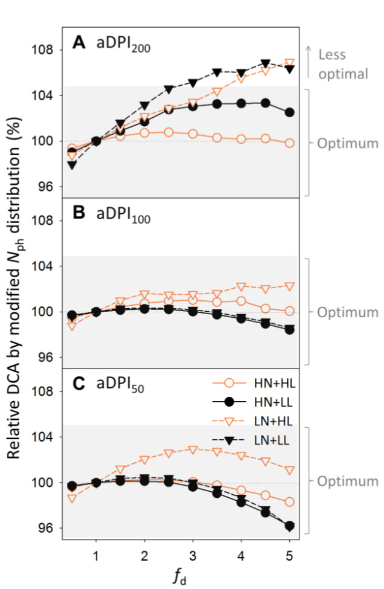

# Functional Control of Photosynthetic Nitrogen in Heterogeneous Plant Canopies

Von der Naturwissenschaftlichen Fakultät der

Gottfried Wilhelm Leibniz Universität Hannover

zur Erlangung des Grades

Doktorin der Gartenbauwissenschaften (Dr. rer. hort.)

genehmigte Dissertation

von

Yi-Chen Pao, M.Sc. (Taiwan)

2021

Referent: Prof. Dr. sc. agr. Hartmut Stützel Korreferent: Prof. Dr. Ir. Paul C. Struik Tag der Promotion: 23.09.2021

# Abstract

Acclimation of leaf photosynthetic traits to fluctuating environments is a key mechanism to maximize fitness. Constant tracking of light environments is crucial for species with continuously leaf-forming nature, such as greenhouse cucumber (Cucumis sativus L.). To capture the acclimation dynamics, we propose that light interception and leaf ontogeny shape the acclimation processes through nitrogen investment in light capture and utilization functions, which determines the rate-limiting step in the photosynthetic machinery. Based on this concept, a dynamic model of protein turnover (synthesis and degradation) was implemented to simulate nitrogen investment in three photosynthetically functional pools depending on light, nitrogen supply and leaf age, in conjunction with a 1D light model using multilayer model (MLM) and a 3D light model using a functional-structural model (FSM). The light dependency of protein synthesis was able to explain the photosynthetic acclimatory response to fluctuating light, and to predict canopy photosynthesis with comparable accurracy using either the MLM or the FSM. Using the MLM, the degree of optimality of photosynthetic nitrogen use for maximizing daily canopy photosynthesis was quantified by manipulating the protein synthesis rates. Photosynthetic nitrogen distribution between leaves was found optimal in the greenhouse cultivar Aramon, except that canopy photosynthesis could be improved by enhanced acropetal reallocation under nitrogen-limiting conditions. Photosynthetic nitrogen partitioning within induvidual leaves was optimal for the cultivar Aramon but not for the field cultivar SC-50 when grown in a single-stem structure, probably due to the coordination of function with structure developed during breeding. In contrast to Aramon, SC-50 has less total photosynthetic nitrogen but a partitioning strategy more sensitive to light. The proposed modelling framework provides an interpretation for acclimatory mechanisms under fluctuating light, and enables in silico manipulations and tests of photosynthetic acclimation in heterogeneous canopies. Possible extensions to the framework are also discussed.

Keywords: Canopy light interception, light fluctuation, modelling, nitrogen distribution, nitrogen partitioning, photosynthetic acclimation

# Kurzzusammenfassung

Die Akklimatisierung der photosynthetischen Eigenschaften der Blätter an schwankende Umgebungen ist ein Schlüsselmechanismus zur Maximierung der Fitness der Pflanze. Die Wahrnehmung der Lichtumgebung ist entscheidend für Arten mit kontinuierlicher Blattbildung, wie z. B. die Gewächshausgurke (Cucumis sativus L.). Um die Akklimatisierungsdynamik zu erfassen, wird angenommen, dass die Lichtinterzeption und die Ontogenese des Blattes die Akklimatisierungsprozesse prägen. Durch die Stickstoffinvestition in die Lichtaufnahme- und Lichtnutzungsfunktionen wird der ratenlimitierende Schritt in der photosynthetischen Maschinerie bestimmt. Basierend auf diesem Konzept wurde ein dynamisches Modell des Proteinumsatzes (Synthese und Abbau) implementiert. Die Stickstoffinvestition in drei photosynthetisch funktionelle Pools wurde in Abhängigkeit von Licht, Stickstoffversorgung und Blattalter simuliert mittels eines 1D-Lichtmodells (Multilayer-Modell, MLM) und eines 3D-Lichtmodells (funktionell-strukturelles Modell, FSM). Mit der Lichtabhängigkeit der Proteinsynthese war die photosynthetische Akklimatisationsreaktion auf schwankendes Licht zu erklären und die Bestandesphotosynthese mit vergleichbarer Genauigkeit sowohl mit dem MLM als auch dem FSM vorherzusagen. Unter Verwendung des MLM wurde die Optimalität der photosynthetischen Stickstoffnutzung zur Maximierung der täglichen Bestandesphotosynthese durch Manipulation der Proteinsyntheseraten quantifiziert. Die photosynthetische Stickstoffverteilung zwischen den Blättern erwies sich bei der Gewächshaussorte „Aramon“ als optimal, mit der Ausnahme, dass die Bestandesphotosynthese durch eine verstärkte akropetale Reallokation unter stickstofflimitierenden Bedingungen verbessert werden konnte. Die photosynthetische Stickstoffpartitionierung innerhalb des einzelnen Blattes war für die Sorte „Aramon“ optimal, aber nicht für die Freilandsorte „SC-50“, wenn sie in einer Einzelstammstruktur angebaut wurde, was wahrscheinlich auf die während der Züchtung entwickelte Koordination von Funktion und Struktur zurückzuführen ist. Im Gegensatz zu „Aramon“ hat „SC50“ weniger photosynthetischen Gesamtstickstoff, doch dafür eine lichtempfindlichere Partitionierungsstrategie. Der vorgeschlagene Modellierungsrahmen liefert eine Interpretation für Akklimatisierungsmechanismen unter schwankendem Licht und ermöglicht In-silico-Manipulationen und -Tests der photosynthetischen Akklimatisierung in heterogenen Pflanzenbeständen. Mögliche Erweiterungen des Modellierungsrahmens werden diskutiert.

Schlagwörter: Bestandeslichtaufnahme, Lichtschwankung, Modellierung, Stickstoffverteilung, Stickstoffpartitionierung, photosynthetische Akklimatisierung

# List of tables

Table 2-1. Labeling of variables in the output file from portable photosynthesis systems  ·· · 11   
Table 2-2. Column name, description and unit used in the gas exchange data file ·· · · 12   
Table 2-3. Column name, description and unit used in the harvest data file  ··· · · · 13   
Table 2-4. Column name, description and unit used in the greenhouse environmental data file  ······16   
Table 2-5. Column name, description and unit used in the greenhouse plant structural data file  ·····18   
Table 3-1. List of coefficients used in the protein turnover model ·· · · · 35   
Table 3-2. List of model input and output variables  · · · 35   
Table 3-3. List of model coefficients  · · · · 37   
Table 3-4. Increase in the daily canopy carbon assimilation by optimized photosynthetic nitrogen distribution or partitioning under various daily photosynthetic photon integrals  ········ 53   
Table 5-1. Overview of climate conditions and growth period in the five greenhouse experiments  ·74   
Table 5-2. Canopy configurations of arrangement, plant density and distances between rows and between plants in the five greenhouse experiments  ·· · 75   
Table 5-3. Predictive quality of light models using simple Beer-Lambert equation and using ray tracing in hourly steps  · · · · 91   
Table 6-1. Variety-specific coefficients determining architectural characteristics of cucumber cultivars Aramon and SC-50 · 105   
Table 6-2. Variety-specific coefficients determining functional acclimation of cucumber cultivars Aramon and SC-50 ··· · 112   
List of figures   
Figure 2-1. Raising seedlings and setup of growth chamber experiment · 10   
Figure 2-2. Format of gas exchange data file  · · · 12   
Figure 2-3. Format of harvest data file  · · · · 13   
Figure 2-4. Format of greenhouse environmental data file ·· · · 16   
Figure 2-5. Format of greenhouse plant structural data file  · · · · · 18   
Figure 2-6. Configurations for extracting leaf area and elevation angle from digitized data ··· · · · · · 18   
Figure 2-7. Overview of R script 1 for data processing · · 20   
Figure 2-8. Format of processed data file output from R script 1  ·· · · · 23   
Figure 2-9. Overview of R script 2 for model parameterization · · · 23   
Figure 2-10. Format of parameterization result file output from R script 2 · · 25   
Figure 2-11. Overview of R script 3 for simulation and in silico test · · · · · · · 26   
Figure 2-12. Example results of percentage change in daily canopy carbon assimilation during daytime with various values of photosynthetic nitrogen distribution factor $f _ { \mathrm { d } }$ · · · · · · · · · 28   
Figure 2-13. Example results of percentage change in daily canopy carbon assimilation during daytime with various values of photosynthetic nitrogen partitioning factor $f _ { \mathfrak { p } , X } \cdots \cdots \cdots 2 9$   
Figure 3-1. Simulated effects of daily light interception and nitrogen supply level in the nutrient solutionon maximum protein synthesis rate  · · · 45   
Figure 3-2. Comparisons between simulated and observed leaf photosynthetic parameters  ·· · · · · 47   
Figure 3-3. Comparisons of leaf photosynthetic nitrogen, partitioning fractions between high and low nitrogen supply and between high and low light conditions · · 48   
Figure 3-4. Leaf photosynthetic nitrogen distributions along the canopy depth characterized by leaf area index · 50   
Figure 3-5. Effects of photosynthetic nitrogen distributions with different values of $f _ { \mathrm { d } }$ on daily canopy carbon assimilation under different daily photosynthetic photon integrals · · 51   
Figure 3-6. Increase in daily canopy carbon assimilation by optimizing photosynthetic nitrogen partitioning for different growth conditions under various daily photosynthetic photon integrals · · 52   
Figure 3-7. Ratio between optimal and control partitioning fractions, and contributions of daily leaf carbon assimilation to the daily canopy carbon assimilation increase by optimal partitioning under $200 \%$ average daily photon integral during acclimation · 54   
Figure 3-8. Ratio between optimal and control partitioning fractions, and contributions of daily leaf carbon assimilation to the daily canopy carbon assimilation increase by optimal partitioning under $50 \%$ average daily photon integral during acclimation · 55   
Figure 4-1. The response curves of photosynthetic protein synthesis rate to photosynthetically active radiation · · · · 61   
Figure 4-2. The effects of natural diurnal fluctuation on photosynthetic protein abundance  ·········· 63   
Figure 5-1. Diagram of model data flow of the dynamic plant model of greenhouse cucumber using light models, the Beer-Lambert equation or ray tracing · · · 72   
Figure 5-2. Processes of establishing the relationship between light extinction coefficient and leaf area index using ray tracing, and evaluating this relationship using the Beer-Lambert equation ·· · · 73   
Figure 5-3. Virtual canopy and light model in the dynamic plant model using ray tracing  ···· · · · · · 80   
Figure 5-4. Simulated relationship between light extinction coefficient and leaf area index of the canopies under scenarios of different plant densities and row distances  · · · · · · · · 84   
Figure 5-5. Simulated minimal light extinction coefficient under various canopy configurations ····86   
Figure 5-6. Comparison of simulated light conditions at leaf level using different light models and time resolutions. The models compared were the Beer-Lambert equation and ray tracing in daily steps or hourly steps · · · 87   
Figure 5-7. Comparison of simulated light conditions at leaf level using different light models and time resolutions. The models compared were the Beer-Lambert equation and ray tracing in daily steps or hourly steps  ·· · · · 89   
Figure 5-8. Model evaluation by comparing simulated shoot dry matter to measured data  ··········· 90   
Figure 5-9. Effect of light extinction coefficient on accuracy of predicting leaf photosynthetic acclimation and plant dry matter by the Beer-Lambert equation · · · · · 93   
Figure 6-1. Appearance of actual and virtual cucumber plants and reconstructed scene in software GroIMP · · · 102   
Figure 6-2. Leaf area index above a given leaf and its elevation angle as dependent on leaf age of cucumber cultivars Aramon and SC-50  ·· ·· 110   
Figure 6-3. Relationship between light extinction coefficient and canopy leaf area index of cucumber cultivars Aramon and SC-50 estimated using static 3D virtual canopies ·· 111   
Figure 6-4. Measured photosynthetic nitrogen and its partitioning fractions in leaves at different ages of cucumber cultivars Aramon and SC-50 under different daily incident light and nitrogen supply · 113   
Figure 6-5. Simulated light acclimation of photosynthetic nitrogen in cucumber cultivars Aramon and SC-50  · · 115   
Figure 6-6. Simulated optimality and flexibility of functional acclimation strategy of cucumber cultivars Aramon and SC-50 under various incident daily photon integrals  ·· · · 116   
Figure 6-7. Simulated effect of coordination between architecture characteristics and functional acclimation strategy of cucumber cultivars Aramon and SC-50 on daytime carbon assimilation  · · ·· 118   
Figure 6-8. Simulated coordination of optimal relative photosynthetic nitrogen synthesis rate with leaf angle and intercepted daily photon integral · 120   
Figure 7-1. Structure of the proposed models and extensions for further study considering impact of changing environemnts  · · · · 129

# Contents

Abstract   
Kurzzusammenfassung .   
List of tables .. iii   
List of figures iv   
Contents . vi   
Chapter 1 Introduction . Nitrogen partitioning and photosynthesis Dynamic canopy architecture and light interception . 2 Dynamics of photosynthetic nitrogen during leaf lifespan ... 3 Objectives .... . 4   
Chapter 2 Modelling approach.. 5 Background .. . 6 Materials and Reagents . 6 Equipment ... Software ... 8 Procedure ... 8 Data analysis .. 20   
Chapter 3 Model parameterization and evaluation .. 30 Introduction . 31 Materials and methods . 33 Results . 44 Discussion .. .. 55   
Chapter 4 Impact of fluctuating light on photosynthetic acclimation.. .. 60   
Chapter 5 Comparison between multilayer and functional-structural models ... .. 67 Introduction . .. 68 Materials and Methods . ... 70 Results ..... ..... 83 Discussion ... 94

Chapter 6 Dynamic coordination between function and structure . 98   
Introduction . . 99   
Materials and Methods . 101   
Results . 109   
Discussion . 121   
Chapter 7 Discussion . 126   
Future research needs . 127   
Supplementary Materials ... 132   
References .. 153   
Acknowledgement ... 166   
Curriculum vitae . 167   
Publications ... 168

# Chapter 1 Introduction

Nitrogen is often a limitation to higher plants due to high demand for the construction of the photosynthetic machinery in the chloroplasts (Evans and Clarke, 2019). In order to coordinate photosynthetic capacity with light availability in the canopy, nitrogen concentration on leaf area basis correlates positively with local irradiance (Field, 1983; Farquhar, 1989; Hikosaka et al., 1994; Le Roux et al., 2001; Johnson et al., 2010; Trouwborst et al., 2010; Wyka et al., 2012; Hikosaka, 2014; Osada et al., 2014). It was predicted that whole plant carbon gain could be improved by achieving optimal intra-canopy nitrogen distribution, under the assumptions that (1) leaf photosynthetic capacity scaled linearly with nitrogen concentration per unit leaf area (Farquhar, 1989) and that (2) the intracanopy light distribution follows the Beer-Lambert equation (Hikosaka, 2014). However, the facts that photosynthetic capacity is not linearly proportional to local light availability under high light (Buckley et al., 2013) and that photosynthetic capacity at the lower canopy is predicted higher than optimum (Townsend et al., 2018) imply that higher nitrogen reallocation to the top of the canopy is required to overcome sub-optimal coordination. Explanation for this sub-optimality has not yet been delivered satisfactorily, even after three decades of experimental and theoretical attempts (Hikosaka, 2016). We proposed that this discrepancy between observation and prediction should be exampled by modelling approach incorporating more realism in three aspects. First, photosynthetic capacity depends directly on the partitioning of nitrogen between light capture and utilization functions that determines the rate-limiting step in the photosynthetic machinery. Second, due to temporal fluctuation in light and alteration in canopy architecture, dynamic light interception at leaf level leaves a trace on acclimation history. Third, acclimation is a continuous dynamic process where ontogenetic status also plays a role in the capacity of acclimation.

# Nitrogen partitioning and photosynthesis

The central parameters in the well-established biochemical model for $\mathbf { C } _ { 3 }$ photosynthesis (FvCB model, Farquhar et al., 1980), i.e., maximal carboxylation rate $( V _ { \mathrm { c m a x } } , \mu { \mathrm { m o l } } \mathrm { C O } _ { 2 } \mathrm { m } ^ { - 2 }$ $\mathrm { { s } ^ { - 1 } } .$ ) and maximal electron transport rate $( J _ { \mathrm { m a x } } , \ \mathrm { \mu \mathrm { m o l } \ \mathrm { e } ^ { - } \ \mathrm { m } ^ { - 2 } \ \mathrm { s } ^ { - 1 } ) }$ as well as absorptance $( a )$ , correlate with the investment of nitrogen into Ribulose-1,5-bisphosphate carboxylase/oxygenase (Rubisco) carboxylation, electron transport, and light capture functions in the photosynthetic apparatus, respectively (Yamori et al., 2010; Yamori et al., 2011a). Since photosynthesis rate is limited by the lower of either Rubisco-limited rate (under saturating light condition) or RuBP-limited rate (under non-saturating light conditions) of photosynthesis (Farquhar et al., 1980), photosynthetic nitrogen investment between functions can result in great variation in photosynthesis for a given leaf nitrogen concentration. Thus, photosynthetic nitrogen partitioning into fractions of carboxylation $( p _ { \mathrm { V } } )$ , electron transport $( p _ { \mathrm { { J } } } )$ and light capture $( p _ { \mathrm { { C } } } )$ , defined as the proportional nitrogen investment between these functions to total photosynthetic nitrogen (e.g., Buckley et al., 2013), is crucial in photosynthetic acclimation for coordination between light capture and utilization in response to light availability (Terashima and Evans, 1988; Evans, 1989a; Evans and Poorter, 2001; Hikosaka, 2004; Trouwborst et al., 2011; Yamori et al., 2011a). Experimental observation showed increasing nitrogen partitioning to Rubisco $( p \mathrm { v } )$ relative to thylakoid components $( p _ { \mathrm { { J } } } + p _ { \mathrm { { C } } } )$ was induced by either increasing light intensity or nitrogen availability (Seemann et al., 1987; Evans, 1989b; Makino and Osmond, 1991; Makino et al., 1992; Haldimann and Feller, 2005; Yamori et al., 2010). Theoretically, optimal $p _ { \mathrm { V } }$ and $p _ { \mathrm { J } }$ increase with increasing irradiance whereas $p _ { \mathrm { C } }$ decreases (Buckley et al., 2013), and partitioning to the most limiting function regarding light condition is more crucial for whole plant carbon gain than nitrogen distribution between leaves (Pons and Anten, 2004).

# Dynamic canopy architecture and light interception

Acclimation and optimization of intra-canopy photosynthetic nitrogen distribution to light has been intensively studied in the past decades (e.g., Werger and Hirose, 1991; Evans, 1993b; Anten et al., 1995; Anten et al., 1998; Dreccer et al., 2000; Hikosaka, 2003; Wang et al., 2012). These studies were based on the assumptions that light intensity decreases with canopy depth following Beer´s law (Monsi and Saeki, 2005), and that local light at a given canopy depth is homogeneous. Photosynthetically active radiation, as the energy source for photosynthetic biochemistry, varies considerably in the vertical profile of a plant canopy (Le Roux et al., 2001; Monsi and Saeki, 2005; Trouwborst et al., 2010; Wiechers et al., 2011b; Niinemets et al., 2015), especially for continuously leaf-forming and vertically trained species, e.g., cucumber plants in greenhouse cultivation (Wiechers et al., 2011b). In the canopy, individual leaves experience fluctuating light environments due to (1) self-shading related to spatial variation in plant architecture by successively developing leaves (Kaiser et al., 2018a), (2) inter-plant shading related to planting density and orientation and (3) temporal variation in radiation and solar angle. Recently, the impact of light fluctuation on photosynthetic acclimation has been experimentally demonstrated, showing a significant decrease in $J _ { \mathrm { m a x } }$ and $ { \alpha }$ under fluctuating light in comparison to constant light environment (Vialet-Chabrand et al., 2017b). Thus, to study interactions between light environment and light-related physiological processes at canopy level, canopy configuration and dynamics of plant architecture should be considered. In this regard, functional-structural models (FSM; review see Vos et al., 2010) can be a powerful and heuristic tool for examining plantenvironment interaction (Louarn and Song, 2020).

# Dynamics of photosynthetic nitrogen during leaf lifespan

Steady-state of photosynthetic nitrogen partitioning in the leaf is the result of the complex interplay between exogenous signals and endogenous processes. The current physiological properties of a leaf in the canopy should be considered as the consequence of the environmental history (Anten et al., 1998; Niinemets et al., 2006; Wang et al., 2012; Kaiser et al., 2018a) and the evolution of leaf traits with age during development (Irving and Robinson, 2006). The acclimation mechanisms are different throughout leaf lifespan with respect to structural modification, gene expression and protein metabolism (Murchie et al., 2005). These age-dependent modifications are often ignored when modelling whole plant carbon assimilation by scaling up from leaf to canopy level (Niinemets, 2007), which may result in an overestimation of canopy assimilation by assuming all leaves are at mature stage. In cereal canopies, the evolution of Rubisco content with leaf age has been empirically described by a log-normal function (Irving and Robinson, 2006), which agrees with experimental observations of photosynthetic proteins and capacities during ageing (Hidema et al., 1991, 1992; Schultz, 2003; Lombardozzi et al., 2012). This empirical model elegantly depicts not only the dynamic change of the photosynthetic variables during leaf lifespan but also the turnover of nitrogen components. Protein turnover, the outcome of simultaneous degradation and synthesis of proteins (Li et al., 2017), is essential during acclimation to adjust protein level according to environmental signals. Based on this concept, Thornley (1998) proposed a mechanistic model describing the dynamics of photosynthetic acclimation at leaf level. By revising this model, we are able to describe environment-dependent rates of protein turnover for different photosynthetic components, i.e., Rubisco, electron transport and chlorophyll during leaf lifespan.

# Objectives

This thesis aims at understanding the partitioning of nitrogen associated with photosynthetic processes within individual leaves (referred to as “photosynthetic nitrogen partitioning”) and the distribution of photosynthetic nitrogen between leaves in a plant (referred to as “photosynthetic nitrogen distribution”) as an outcome of acclimation to environments. Cucumber plants were selected as model crop in this work due to their high degree of heterogeneity in intra-canopy light distribution. Both multilayer model and FSM of dynamic canopy architecture combining a mechanistic model for photosynthetic acclimation were developed to achieve the following objectives:

1) establishing a multilayer modelling approach to upscale from photosynthetic acclimation at leaf level to carbon assimilation at canopy level for quantifying degree of optimality of photosynthetic nitrogen distribution and partitioning (chapter 2);   
2) parameterizing and evaluating the multilayer model using a greenhouse cucumber variety and quantifying the effects of light regime and nitrogen supply on the degree of optimality of photosynthetic nitrogen distribution and partitioning (chapter 3);   
3) quantifying the impact of fluctuating light on photosynthetic acclimation systematically using the multilayer model parameterized in chapter 2 (chapter 4);   
4) comparing the predictive power in photosynthetic acclimation and productivity of applying multilayer model and FSM of canopy architecture (chapter 5).   
5) analyzing the coordination of photosynthetic acclimation strategy with architectures by comparing two cucumber varieties exhibiting contrasting architectural characteristics following the multilayer model parameterized in chapter 2 (chapter 6);

Each chapter focuses on a step towards the quantification of the interaction between photosynthetic acclimation and intra-canopy light environment. All of them can also be read individually.

# Chapter 2 Modelling approach

Experiments for in silico evaluation of optimality of photosynthetic nitrogen distribution and partitioning in the canopy: an example using greenhouse cucumber plants

# Abstract

Acclimation of leaf traits to fluctuating environments is a key mechanism to maximize fitness. One of the most important strategies in acclimation to changing light is to maintain efficient utilization of nitrogen in the photosynthetic apparatus by continuous modifications of between-leaf distribution along the canopy depth and within-leaf partitioning between photosynthetic functions according to local light availability. Between-leaf nitrogen distribution has been intensively studied over the last three decades, where proportional coordination between nitrogen concentration and light gradient was considered optimal in terms of maximizing canopy photosynthesis, without taking other canopy structural and physiological factors into account. We proposed a mechanistic model of protein turnover dynamics in different photosynthetic functions, which can be parameterized using leaves grown under different levels of constant light. By integrating this dynamic model into a multilayer canopy model, constructed using data collected from a greenhouse experiment, it allowed us to test in silico the degree of optimality of photosynthetic nitrogen use for maximizing canopy carbon assimilation under given light environments.

# Background

Intra-canopy nitrogen distribution in response to light has been intensively studied (Hirose and Werger, 1987; Werger and Hirose, 1991; Anten et al., 1995; Dreccer et al., 2000; Moreau et al., 2012; Hikosaka, 2016) and many studies demonstrated that, although the actual nitrogen distribution resulted in higher canopy photosynthesis than uniform nitrogen distribution, it was still suboptimal (Field, 1983; Evans, 1993b; Hollinger, 1996; Hirose et al., 1997; Meir et al., 2002; Wright et al., 2006; Hikosaka, 2016). This discrepancy between optimum and reality could, on one hand, be explained by physiological limitations (Niinemets, 2012; Hikosaka, 2016). On the other hand, it might result from incorrect predictions by over-simplified models, where the effects of variations in the structural characteristics on light interception, age-dependent modifications of leaf biochemistry and photoacclimation in functional nitrogen partitioning were neglected. To incorporate these factors into the acclimation processes, a mechanistic model based on the concept of protein turnover (synthesis and degradation) was proposed to simulate the dynamics of photosynthetic nitrogen in carboxylation, electron transport and light harvesting functions along the development and ageing of the leaf. Leaf elevation angle and leaf area distribution in the canopy was measured to construct a multilayer canopy model for simulating more realistic intra-canopy light distribution, which is used as input for the protein turnover model. By manipulating the parameters controlling nitrogen distribution and partitioning, it is possible to quantify the degree of optimality of photosynthetic nitrogen use for maximizing canopy carbon assimilation in silico.

# Materials and Reagents

1. 25-L plastic boxes, as container for hydroponic system   
2. Polystyrene foam boards for fixing plants onto plastic boxes   
3. Rockwool cubes $( 1 0 \mathrm { c m } \times 1 0 \mathrm { c m } \times 6 . 5 \mathrm { c m } )$ , as growth medium in the hydroponic system (Grodan Delta; Grodan, Roermond, The Netherlands)   
4. Rockwool cubes $3 . 6 \ \mathrm { c m } \times 3 . 6 \ \mathrm { c m } \times 4 \ \mathrm { c m } )$ , as seed sowing medium (Grodan A-OK Starter Plugs; Grodan, Roermond, The Netherlands)   
5. Plastic plant support clips   
6. N-P-K fertilizer (Ferty 2 MEGA; Planta, Regenstauf, Germany)   
7. P-K fertilizer (Ferty Basisdünger 1; Planta, Regenstauf, Germany)   
8. N fertilizer (YaraLiva Calcinit; Yara, Oslo, Norway)   
9. Paper bags (size should be enough to contain a single cucumber lamina, which is about $1 5 \mathrm { c m } \times 2 0 \mathrm { c i }$ m or larger)   
10. Rockwool slabs $( 1 0 0 ~ \mathrm { c m } \times 2 0 ~ \mathrm { c m } \times 7 . 5 ~ \mathrm { c m } )$ , as growth medium in the greenhouse (Grodan GT Expert; Grodan, Roermond, The Netherlands)   
11. Seed (Cucumis sativus L. ‘Aramon’, Rijk Zwaan, De Lier, The Netherlands)   
12. $1 \%$ $\mathrm { \bf { H } } _ { 2 } \mathrm { \bf { S } } \mathrm { \bf { O } } _ { 4 }$ $( 9 6 \% \mathrm { H } _ { 2 } \mathrm { S O } _ { 4 }$ , Carl Roth, catalog number: 4623; preparation: $6 \mathrm { m l } 9 6 \% \mathrm { H } _ { 2 } \mathrm { S O } _ { 4 }$ mix with 1 L $\mathrm { H } _ { 2 } \mathrm { O }$ )

# Equipment

1. Walk-in growth chambers with aeration system and controlled air temperature and humidity (Vötsch Industrietechnik, Balingen, Germany) and light source using metal halide lamps (HQI-BT 400 W/D PRO; Osram, Munich, Germany)   
2. Quantum sensor LI-190R coupled with light meter LI-250A (LI-COR, Lincoln, NE, USA)   
3. Light sensor logger (LI-COR, model: LI-1000, LI-1400 or LI-1500)   
4. Temperature data logger (Tinytag; Gemini Data Loggers, Chichester, UK)   
5. Portable photosynthesis system LI-6400XT (coupled with 6400-40 leaf chamber fluorometer) or LI-6800 (LI-COR, Lincoln, NE, USA)   
6. Chlorophyll meter (Konica Minolta Sensing, model: SPAD-502)   
7. Leaf area meter (LI-COR, model: LI-3100C)   
8. Laboratory balance with resolution of $0 . 0 1 \mathrm { ~ g ~ }$ (Sartorius, model: ED4202S) or with resolution of $0 . 1 \mathrm { m g }$ for mass below $_ { \textrm { 1 g } }$ (Sartorius, model: ED224S)   
9. Vacuum freeze dryer (Alpha 1-4 LSC; Martin Christ Gefriertrocknungsanlagen, Osterode am Harz, Germany)   
10. 3D digitizer (Fastrak; Polhemus, Colchester, USA)

# Software

1. R (ver. 3.3.0 or later; R Foundation for Statistical Computing, https://www.r-project.org/); R scripts and simulated example data sets are provided to facilitate data analysis (https://github.com/yichenpao/bio-protocol/)

a. R script 1 [data processing] (see section Data analysis A, B)   
b. R script 2 [model parameterization] (see section Data analysis C, D); required packages are ‘DEoptim’, ‘deSolve’, ‘ggplot2’, ‘reshape2’, ‘xlsx’   
c. R script 3 [simulation and in silico test] (see section Data analysis E-H); required packages are ‘DEoptim’, ‘deSolve’, ‘dplyr’, ‘ggplot2’, ‘magrittr’, ‘xlsx’

2. Digitool (customized software for 3D-digitizer, availability upon request)

# Procedure

A. Raising seedlings for experiments   
1. Sow one cucumber seed (Cucumis sativus L. ‘Aramon’, Rijk Zwaan, De Lier, The Netherlands) in each rock-wool cube ${ 3 . 6 ~ \mathrm { c m } \times 3 . 6 ~ \mathrm { c m } \times 4 ~ \mathrm { c m } }$ , Figure 2-1A, B) and water sufficiently until the cubes are completely wet.   
2. Sow $20 \% - 4 0 \%$ more seeds (lower the germination rate and quality, more the additional amount) than the number of plants required for the experimental design in order to select for uniform seedlings in 7-10 days.   
3. Set environmental conditions to $\mathrm { 1 0 { - } 1 5 \ m o l \ m ^ { - 2 } \ d ^ { - 1 } }$ photosynthetically active radiation (PAR) at the seedling level with a 12-h light period, $2 4 ^ { \circ } \mathrm { C }$ day/ $2 0 ^ { \circ } \mathrm { C }$ night air temperature and $70 \%$ relative humidity.   
4. Eight days after sowing, transfer each rockwool cube into a larger rockwool cube (10 $\mathrm { c m } \times 1 0 ~ \mathrm { c m } \times 6 . 5 ~ \mathrm { c m }$ , Figure 2-1C) and irrigate with nutrient solution of N-P-K fertilizer $( 0 . 5 \mathrm { ~ g ~ L ~ } ^ { - 1 }$ Ferty 2 MEGA; Planta, Regenstauf, Germany; $5 . 7 \mathrm { \ m M } \mathrm { \ N } , 2 . 7$ 7 $\mathrm { m M } \mathrm { K } , 0 . 3 5 \mathrm { m M } \mathrm { P } , 0 . 4 5 \mathrm { m M } \mathrm { M g }$ in working solution) once every day. B. Growth chamber experiment to parameterize the protein turnover model   
1. Transplanting and starting experiment a. Prepare chambers with at least three constant light intensities (one $< 5$ , one between 10-15 and one $> 2 5 ~ \mathrm { m o l }$ photon $\mathbf { m } ^ { - 2 } \mathbf { d } ^ { - 1 }$ PAR for cucumber) at the plant level, which should cover most variation found in the light environment during crop production.   
b. Prepare nutrient solution with at least three levels of nitrogen (one $< 2 . 8$ , one 3.5-5 and one $> 8 . 5 \mathrm { m M } \mathrm { N O } _ { 3 } \bar { }$ for cucumber Aramon) using $\mathbf { N }$ fertilizer (YaraLiva Calcinit; Yara, Oslo, Norway) and P-K fertilizer (Ferty Basisdünger 1; Planta, Regenstauf, Germany; $5 . 2 \ \mathrm { m M } \ \mathrm { K }$ , $1 . 3 \mathrm { \ m M P }$ , $0 . 8 2 \ \mathrm { m M \ M g }$ in working solution) if the effect of nitrogen is of interest.   
c. Transplant the seedlings when their second true leaves reach a length of $3 \mathrm { c m }$ (ca. eight days grown in the larger rockwool cubes) into hydroponic system (Figure 2-1D), consisting of a $2 5 { \cdot } \mathrm { L }$ plastic box and a piece of polystyrene foam board that fixes a rockwool cube containing a plant.   
d. Fill 25-L boxes with nutrient solution and supply the solution with air from aeration system (Figure 2-1E).   
e. Prepare polystyrene foam boards for supporting the plants in the hydroponic system. i. Cut polystyrene foam boards to make them fit onto 25-L boxes. ii. Cut a squared opening $( 9 . 5 \mathrm { c m } \times 9 . 5 \mathrm { c m } )$ ) in the middle of the boards. iii. Fix the plants into the openings in polystyrene foam boards and position them into the 25-L boxes.   
f. Select the healthy and unshaded leaves within leaf ranks four to eight (counted acropetally) as sampled leaves in each plant and record their dates of appearance.   
g. Record light condition at the level of the sampled leaves using quantum sensor LI-190R and light meter LI-250A (LI-COR, Lincoln, NE, USA).

2. Plant care and monitoring environmental conditions a. Prepare custom-made leaf holders.

i. Make leaf holders using plastic coated metal wires to form a loop structure, consisting of a circular part which supports the leaf and a stick part which can be fixed to the stem and petiole (Figure 2-1F). ii. Combine each holder with two plastic plant support clips at the stick part. iii. Prepare leaf holders in different sizes and lengths in order to support leaves at various developmental stages. b. Allow plants to establish vegetative growth by removing flowers below the seventh node.

c. Keep plants to single stem by cutting all side shoots and train the rest of the shoot above the sampled leaves downward to avoid mutual shading (Figure 2-1 G).   
d. Renew the nutrient solution completely and record the nitrogen level in the nutrient solution once a week, fill the solution once between two times of solution renewal, and adjust pH value to 6.0-6.5 by $1 \%$ $\% \mathrm { H } _ { 2 } \mathrm { S O } _ { 4 }$ twice a week.   
e. Place data loggers Tinytag (Gemini Data Loggers, Chichester, UK) around the sampled leaves and record daily mean air temperature $( T _ { \mathrm { m e a n } } , ^ { \circ } \mathrm { C } )$ .   
f. Measure and record the PAR at the center of the sampled leaves (Figure 1a in Wiechers et al., 2011) weekly and adjust the angle of the leaves using leaf holders (Figure 2-1F) to make sure they are horizontally and fully exposed to the light, not shaded by other leaves (Figure 2-1G), in order to achieve target PAR level at the leaves.

  
Figure 2-1. Raising seedlings and setup of growth chamber experiment. D-E.

Transplanting seedlings into hydroponic system. F. Custom-made leaf holders fixed to a plant on its stem and petiole with support clips. G. Avoiding shading of the sampled leaf (marked yellow) by training rest of the shoot downward.

3. Collecting data of the sampled leaves a. Gas exchange i. Conduct measurements for each environmental condition at an interval of three to four days, starting with the youngest leaves (ca. three days after leaf appearance) and then the older ones to obtain data from leaves with a wide range of ages (ca. $4 0 { \ - } 5 5 0 ^ { \circ } \mathrm { C d } \$ ). ii. Estimate age $( t , \mathbf { \Omega } ^ { \circ } \mathbf { C d } )$ of individual leaves days from the day of its appearance to the day of measurement using daily mean temperature and a base temperature $( T _ { \mathrm { b a s e } } , 1 0 ^ { \circ } \mathrm C$ for cucumber): $\begin{array} { r } { t = \sum _ { \mathrm { d a y o f } \mathrm { d p p e a r a n c e } } ^ { \mathrm { d a y o f m e a s u r e m e n t } } \left( T _ { \mathrm { m e a n } } - T _ { \mathrm { b a s e } } \right) } \end{array}$ (Eqn 2-G1) iii. Measure net photosynthesis rate $( A _ { \mathrm { n } } , \mathrm {  ~ \mu ~ } _ { \mathrm { H } } \mathrm { m o l } \mathrm { C O } _ { 2 } \mathrm {  ~ \ m ~ } ^ { - 2 } \mathrm {  ~ \ s } ^ { - 1 } $ , Table 2-1), intercellular $\mathrm { C O } _ { 2 }$ concentration $( C _ { \mathrm { i } } , \mu \mathrm { m o l } \ \mathrm { m o l } ^ { - 1 } )$ , photosynthetic photon flux density (PPFD, $\mu \mathrm { m o l } \mathrm { ~ m } ^ { - 2 } \mathrm { ~ s } ^ { - 1 } )$ and quantum efficiency of photosystem II electron transport $\left( \phi _ { \mathrm { P S I I } } \right)$ using a portable photosynthesis system LI-6400XT or LI-6800 (Li-Cor Inc., Lincoln, NE, USA) iv. Collect data to a .csv file (Figure 2-2 and Table 2-2), which will be used in the data analysis sections A and $\mathbf { B }$ for data processing (in this example ‘example_chamber_gas_exchange_data.csv’). v. Cut the lamina directly after the measurement for further analyses.

Table 2-1. Labeling of variables in the output file from portable photosynthesis systems LI-6400XT and LI-6800 (LI-COR, Lincoln, NE, USA). Necessary variables for data processing are net photosynthesis rate $( A _ { \mathrm { n } } , \mathrm {  ~ \mu ~ } _ { \mathrm { m o l } } \mathrm { C O } _ { 2 } \mathrm {  ~ \ m ~ } ^ { - 2 } \mathrm {  ~ \ s ^ { - 1 } ) }$ , intercellular $\mathrm { C O } _ { 2 }$ concentration $( C _ { \mathrm { i } } , \ \mu \mathrm { m o l } \ \mathrm { m o l } ^ { - 1 } )$ , photosynthetic photon flux density (PPFD, $\mu \mathrm { m o l } \ \mathrm { m } ^ { - 2 } \ \mathrm { s } ^ { - 1 } )$ and quantum efficiency of photosystem II electron transport $( \phi _ { \mathrm { P S I I } } )$ .   

<html><body><table><tr><td>System</td><td>An</td><td>Ci</td><td>PPFD</td><td>PPSII</td></tr><tr><td>LI- 6400XT</td><td>Photo</td><td>Ci</td><td>PARi</td><td>PhiPS2</td></tr><tr><td>LI-6800</td><td>Pn</td><td>Ci</td><td>Qin</td><td>PhiPS2</td></tr></table></body></html>

<html><body><table><tr><td></td><td>A</td><td>B</td><td>C</td><td>D</td><td>E</td><td>F</td><td>G</td></tr><tr><td>1</td><td></td><td>ExpID MeasureDate LeafID</td><td></td><td>An</td><td>Ci</td><td>PPFD</td><td>PhiPS2</td></tr><tr><td>2</td><td>GC1</td><td></td><td>29.11.2016N2-12-V1-L4</td><td>14.538326.51299.89</td><td></td><td></td><td>0.2156</td></tr><tr><td>3</td><td>GC1</td><td>29.11.2016N2-12-V1-L4</td><td></td><td>12.883</td><td>287.9</td><td>999.18</td><td>0.2841</td></tr><tr><td>4</td><td>GC1</td><td>29.11.2016N2-12-V1-L4</td><td></td><td>11.596</td><td>298.4</td><td>499.81</td><td>0.4675</td></tr><tr><td>5</td><td>GC1</td><td></td><td>29.11.2016N2-12-V1-L4</td><td>6.346344.4</td><td></td><td>200.08</td><td>0.6463</td></tr><tr><td>6</td><td>GC1</td><td></td><td>29.11.2016N2-12-V1-L4</td><td>4.561</td><td>352.3</td><td>124.04</td><td>0.6881</td></tr><tr><td>7</td><td>GC1</td><td></td><td>29.11.2016N2-12-V1-L4</td><td>3.098361.9</td><td></td><td>98.37</td><td>0.7066</td></tr><tr><td>8</td><td>GC1</td><td></td><td>29.11.2016N2-12-V1-L4</td><td>2.110368.9</td><td></td><td>80.36</td><td>0.7189</td></tr><tr><td>9</td><td>GC1</td><td></td><td>29.11.2016N2-12-V1-L4</td><td>1.041</td><td>379.7</td><td>58.58</td><td>0.7294</td></tr><tr><td>10</td><td>GC1</td><td>29.11.2016N2-12-V1-L4</td><td></td><td>0.598</td><td>384.8</td><td>40.59</td><td>0.7360</td></tr><tr><td>11</td><td>GC1</td><td></td><td>29.11.2016N2-12-V1-L4</td><td>-0.145</td><td>393.1</td><td>27.99</td><td>0.7410</td></tr><tr><td>12</td><td>GC1</td><td></td><td>29.11.2016N2-12-V1-L4</td><td>-1.437410.2</td><td></td><td>0.54</td><td>0.7740</td></tr></table></body></html>

Figure 2-2. Format of gas exchange data file. See Table 2-2 for explanation for column name, description and unit used.

Table 2-2. Column name, description and unit used in the gas exchange data file.   

<html><body><table><tr><td>Column name</td><td>Description</td><td>Unit</td></tr><tr><td>ExpID</td><td>ID of the experiment</td><td>unitless</td></tr><tr><td>MeasureDate</td><td>Date of measurement</td><td>unitless</td></tr><tr><td>LeafID</td><td>ID of the measured leaf</td><td>unitless</td></tr><tr><td>An</td><td>Net photosynthesis rate</td><td>μmol CO2 m² s-1</td></tr><tr><td>Ci</td><td>intercellular COz concentration</td><td>μmol CO2 mol-1</td></tr><tr><td>PPFD</td><td>photosynthetic photon flux density</td><td> μmol photon m² s-1</td></tr><tr><td></td><td>quantum efficiency of photosystem II</td><td></td></tr><tr><td>PhiPS2</td><td>electron transport</td><td>unitless</td></tr></table></body></html>

b. Harvest data

i. Measure relative chlorophyll content (SPAD value) using chlorophyll meter SPAD-502 (Minolta Camera, Japan) and leaf area by area meter LI-3100C (LI-COR, Lincoln, NE, USA) of the harvested lamina.   
ii. Keep each lamina in individual paper bag and freeze them under $- 2 0 ^ { \circ } \mathrm { C }$ for storage.   
iii. Precool sample shelves in the vacuum freeze dryer (Alpha $1 { - } 4 ~ \mathrm { L S C }$ ; Martin Christ Gefriertrocknungsanlagen GmbH, Osterode am Harz, Germany) to $1 0 ^ { \circ } \mathrm { C }$ and the ice condenser to $- 5 0 ^ { \circ } \mathrm { C }$ . Freeze dry lamina samples for $4 8 \mathrm { ~ h ~ }$ under pressure of 1.030 mbar and then measure the mass of freeze-dried

lamina. Please note that most samples can be dried to $1 \% 5 \%$ residual moisture; therefore, the measured dry mass should be corrected to exclude the weight of residual moisture.

iv. Grind the lamina into fine powder and analyze total nitrogen (e.g., Nelson and Sommers, 1980) and chlorophyll (e.g., Lichtenthaler, 1987) contents. v. Collect data to a .csv file (Figure 2-3 and Table 2-3; in this example ‘example_chamber_harvest_data.csv’), which will be used in data analysis sections A and B for data processing. c. Quantify the empirical relationship between SPAD value and leaf chlorophyll concentration per area to facilitate non-destructive estimation in the greenhouse experiment, using a linear $( C h l = \mathrm { a } + \mathrm { b } \times \mathrm { S P A D } )$ or power $C h l = \mathrm { a } \times \mathrm { S P A D } ^ { \mathrm { b } } )$ function.

1ExpID LeafID irgn N3-11-V1-L6 3 1 30.10.2016 25.11.2016 1029.8 02.11.2016 15.11.2016 21.4 42.4 493.8 54.43 16.94 N2-11-V1-L5 28.10.2016 25.11.2016 21.4 53.9 788.4 47.39 N1-12-V1-L8 31.10.2016 22.11.2016 1050.2 23.85 N1-12-V1-L4 25.10.2016 18.11.2016 14.3 22.3 50.3 870.6 22.43 31.10.2016 22.11.2016 30.10.2016 25.11.2016 49.5 956.9 26.85 N3-11-V1-L6 31.10.2016 11.11.2016 16.26 N2-13-V1-L6 27.10.2016 29.11.2016 N3-13-V1-L7 29.10.2016 11.11.2016 26.6 22.460.4 1064.6 6.48 46.73 2.94 N1-L3-V1-L8 30.10.2016 29.11.2016 28.6 911.8 23.20

Figure 2-3. Format of harvest data file. See Table 2-3 for explanation for column name, description and unit used.   
Table 2-3. Column name, description and unit used in the harvest data file.   

<html><body><table><tr><td>Column name</td><td>Description</td><td>Unit</td></tr><tr><td>ExpID</td><td>ID of the experiment</td><td>unitless</td></tr><tr><td>LeafID</td><td>ID of the harvested leaf</td><td>unitless</td></tr><tr><td>VarietyID</td><td>ID of the variety</td><td>unitless</td></tr><tr><td>LightID</td><td>ID of the light treatment</td><td>unitless</td></tr><tr><td>NitrogenID</td><td>ID of the nitrogen treatment</td><td>unitless</td></tr><tr><td>AppearanceDate</td><td>Date of appearance of the harvested leaf</td><td>unitless</td></tr><tr><td>HarvestDate</td><td>Date of harvest</td><td>unitless</td></tr><tr><td>LightLevel_mol_m2_d</td><td>Level of the light treatment</td><td>mol photon m² d-1</td></tr><tr><td>NitrogenLevel_Mm</td><td>Level of the nitrogen treatment</td><td>mM N</td></tr></table></body></html>

<html><body><table><tr><td>Column name</td><td>Description</td><td>Unit</td></tr><tr><td></td><td>Mean air temperature during growth of the</td><td></td></tr><tr><td>MeanTemp_oC</td><td>harvested leaf</td><td>℃</td></tr><tr><td>SPAD</td><td>Relative chlorophyll content (SPAD value)</td><td>unitless</td></tr><tr><td>LeafArea_cm2</td><td>Leaf area of the harvested leaf</td><td>cm²</td></tr><tr><td>DryMass_g</td><td>Leaf dry mass of the harvested leaf</td><td>g</td></tr><tr><td>TotalN_mg_g</td><td>Total nitrogen content of the harvested leaf</td><td>mg N g1 dry mass</td></tr><tr><td>Chl_a_mg_g</td><td>Chlorophyll a content of the harvested leaf</td><td>mg Chl a g'1 dry mass</td></tr><tr><td>Chl_b_mg_g</td><td>Chlorophyll b content of the harvested leaf</td><td>mg Chl b g1 dry mass</td></tr></table></body></html>

C. Gas exchange measurement using portable photosynthesis system LI-6400XT or LI-6800 (LI-COR, Lincoln, NE, USA)

1. Allow leaves to adapt for 10-20 min under measurement conditions of:

a. Photosynthetic photon flux density (PPFD) $1 3 0 0 \mu \mathrm { m o l } \mathrm { m } ^ { - 2 } \mathrm { s } ^ { - 1 } .$ ,   
b. Sample $\mathrm { C O } _ { 2 } 4 0 0 \mu \mathrm { m o l } \mathrm { m o l } ^ { - 1 }$ ,   
c. Leaf temperature $2 5 ^ { \circ } \mathrm { C }$ ,   
d. Relative humidity $5 5 \%$ ,

until Rubisco is fully activated and photosynthesis rate, stomatal conductance and fluorescence $( \boldsymbol { F } ^ { \prime } )$ equilibrate to steady states, then read light-saturated net photosynthesis rate $( A _ { \mathrm { s a t } } , \mu \mathrm { m o l } \mathrm { C O } _ { 2 } \mathrm { m } ^ { - 2 } \mathrm { s } ^ { - 1 } )$ .

2. Measure maximum chlorophyll fluorescence $( \boldsymbol { F _ { \mathrm { m } } } ^ { \prime } )$ using the multiphase flash (MPF) approach (Loriaux et al., 2013; Moualeu‐Ngangue et al., 2017):

a. Phase 1 with constant maximum irradiance for $3 2 0 \mathrm { m s }$ , b. Phase 2 with irradiance attenuation ( $30 \%$ ramp depth) over $3 5 0 \mathrm { m s }$ , c. Phase 3 with constant maximum irradiance as in phase 1 for $2 0 0 \mathrm { m s }$ .

3. Measure light response curves of net photosynthesis rate $( A _ { \mathrm { n } } , \mu \mathrm { m o l } \mathrm { C O } _ { 2 } \mathrm { m } ^ { - 2 } \mathrm { s } ^ { - 1 } )$ under PPFD 900, 500, 250, 150, 100, 85, 70, 60, 50, 40, $0 \mu \mathrm { m o l } \mathrm { m } ^ { - 2 } \mathrm { s } ^ { - 1 }$ .

4. Total duration of this measurement is $3 0 { \cdot } 4 0 \ \mathrm { m i n }$ per leaf; notice that for old leaves or leaves grown under low light, the time of adaptation is generally longer than for young and high light-grown leaves.

5. Quantum efficiency of photosystem $\mathrm { I I }$ electron transport $( \phi _ { \mathrm { P S I I } } )$ is computed using fluorescence data (Murchie and Lawson, 2013):

$$
\phi _ { \mathrm { P S I I } } = ( F _ { \mathrm { m } } ^ { \prime } - F ^ { \prime } ) / F _ { \mathrm { m } } ^ { \prime } 
$$

D. Greenhouse experiment to obtain canopy structural information and data to evaluate the protein turnover model

1. Transplanting and starting experiment

a. Record daily mean air temperature $( T _ { \mathrm { { m e a n } } } , \mathbf { \Lambda } ^ { \circ } { \bf C } )$ near the seedlings using data logger Tinytag and transplant the seedlings when their third true leaves reach a length of $3 \mathrm { c m }$ (ca. two weeks grown in the larger rockwool cubes).   
b. Transfer two plants onto one rockwool slab $( 1 0 0 ~ \mathrm { c m } \times 2 0 ~ \mathrm { c m } \times 7 . 5 ~ \mathrm { c m } )$ ) with a distance of $5 0 \ \mathrm { c m }$ between them and $1 5 0 ~ \mathrm { c m }$ between rows (density of 1.33 plants $\mathrm { m } ^ { - 2 }$ in a greenhouse with $9 6 \mathrm { m } ^ { 2 }$ of cultivation area).   
c. Supply plants with nutrient solution by drip irrigation system with nitrogen levels of interest.

2. Plant care and monitoring environmental conditions

a. Train the plants vertically onto wires and remove all side shoots as well as flowers below the seventh node.   
b. Record daily mean air temperature using data logger Tinytag in the greenhouse and daily integral of PAR above the canopies using quantum sensor LI-190R and light meter LI-250A.   
c. Analyze nitrate (Navone, 1964) and ammonium (following German standard methods for the examination of water, waste water and sludge, DIN 38406-5) in the nutrient supply and nitrogen concentration remained in the rockwool slabs weekly. d. Collect data to a .csv file (Figure 2-4 and Table 2-4; in this example ‘example_greenhouse_environment_data.csv’), which will be used in data analysis sections E-H for simulation and in silico test.

Figure 2-4. Format of greenhouse environmental data file. See Table 2-4 for explanation for column name, description and unit used.   

<html><body><table><tr><td></td><td>A</td><td>B</td><td>C</td><td>D</td><td>E</td><td>F</td><td>G</td><td>H</td><td>1</td><td></td></tr><tr><td>1</td><td>ExpID</td><td>Date</td><td></td><td></td><td></td><td>DPI_L_LDPI_L_HSupply_N_LSubstrate_N_LSupply_N_HSubstrate_N_HTmean_L_LTmean_L_H</td><td></td><td></td><td></td><td></td></tr><tr><td>2</td><td>GH1</td><td>04.04.2017</td><td>10.1</td><td>23.6</td><td>2.9</td><td>2.9</td><td>9.7</td><td>7.9</td><td>22.9</td><td>23.6</td></tr><tr><td>3</td><td>GH1</td><td>05.04.2017</td><td>5.5</td><td>12.7</td><td>2.9</td><td>2.9</td><td>9.7</td><td>7.9</td><td>23.9</td><td>22.6</td></tr><tr><td>4</td><td>GH1</td><td>06.04.2017</td><td>9.9</td><td>23.1</td><td>2.9</td><td>2.9</td><td>9.7</td><td>7.9</td><td>22.2</td><td>22.1</td></tr><tr><td>5</td><td>GH1</td><td>07.04.2017</td><td>5.3</td><td>12.4</td><td>2.9</td><td>2.9</td><td>9.7</td><td>7.9</td><td>22.4</td><td>22.5</td></tr><tr><td>6</td><td>GH1</td><td>08.04.2017</td><td>6.7</td><td>15.6</td><td>2.9</td><td>2.0</td><td>11.9</td><td>9.7</td><td>22.7</td><td>23.2</td></tr><tr><td>7</td><td>GH1</td><td>09.04.2017</td><td>6.5</td><td>15.0</td><td>2.9</td><td>2.0</td><td>11.9</td><td>9.7</td><td>23.8</td><td>24.6</td></tr><tr><td>8</td><td>GH1</td><td>10.04.2017</td><td>6.5</td><td>15.0</td><td>2.9</td><td>2.0</td><td>11.9</td><td>9.7</td><td>22.7</td><td>23.1</td></tr><tr><td>9</td><td>GH1</td><td>11.04.2017</td><td>5.8</td><td>13.5</td><td>2.9</td><td>2.0</td><td>11.9</td><td>9.7</td><td>22.2</td><td>22.3</td></tr><tr><td>10</td><td>GH1</td><td>12.04.2017</td><td>4.3</td><td>10.0</td><td>2.9</td><td>2.0</td><td>11.9</td><td>9.7</td><td>21.8</td><td>21.5</td></tr><tr><td>11</td><td>GH1</td><td>13.04.2017</td><td>7.1</td><td>16.5</td><td>2.9</td><td>2.0</td><td>11.9</td><td>9.7</td><td>22.3</td><td>22.3</td></tr><tr><td>12</td><td>GH1</td><td>14.04.2017</td><td>8.5</td><td>19.9</td><td>3.5</td><td>0.1</td><td>10.9</td><td>7.0</td><td>23.0</td><td>22.9</td></tr></table></body></html>

Table 2-4. Column name, description and unit used in the greenhouse environmental data file.   

<html><body><table><tr><td>Column name</td><td>Description</td><td>Unit</td></tr><tr><td>ExpID</td><td>ID of the experiment</td><td>unitless</td></tr><tr><td>Date</td><td>Date</td><td>unitless</td></tr><tr><td>DPI_L_L</td><td>Daily photon integral under light teatment ID L*</td><td>mol photon m-² d-1</td></tr><tr><td>DPI_L_H</td><td>Daily photon integral under light teatment ID H*</td><td>mol photon m-2 d-1</td></tr><tr><td>Supply_N_L</td><td>Nitrogen level in the nutrient supply under nitrogen treatment ID L*</td><td>mM N</td></tr><tr><td>Substrate_N_L</td><td>Nitrogen level in the substrate under nitrogen treatment ID L*</td><td>mM N</td></tr><tr><td></td><td>Nitrogen level in the nutrient supply under nitrogen</td><td></td></tr><tr><td>Supply_N_H</td><td>treatment ID H*</td><td>mM N</td></tr><tr><td>Substrate_N_H</td><td>Nitrogen level in the substrate under nitrogen treatment ID H*</td><td></td></tr><tr><td></td><td></td><td>mM N</td></tr><tr><td>Tmean_L_L</td><td>Daily mean air temperature under light treatment ID L*</td><td>℃</td></tr><tr><td>Tmean_L_H</td><td>Daily mean air temperature under light treatment ID H*</td><td>℃</td></tr></table></body></html>

\*IDs of light and nitrogen treatments are named by users and should be identical as the treatment IDs in greenhouse structural data.

3. Collecting plant data

a. Measure leaf number, leaf elevation angle, leaf area and leaf area index nondestructively using a 3D digitizer (Chen et al., 2014a) at a weekly interval (equates to roughly $1 0 0 ^ { \circ } \mathrm { C d }$ difference between two measurements under the greenhouse condition described above) to obtain static canopy structures at various developmental stages.   
b. Estimate age $( t , ^ { \circ } \mathrm { C d } )$ of individual leaves in the canopy. i. Calculate total growing degree days $( G D D _ { \mathrm { c a n o p y } } )$ from the day of transplanting into greenhouse (when leaf $x$ appeared; in this example $x = 3$ ) to the day of measurement using Eqn 2-G1. ii. Divide $G D D _ { \mathrm { c a n o p y } }$ by the number of leaves appeared after transplanting (excluding the first $x { - } I$ leaves) to estimate phyllochron ( $^ \mathrm { \circ } \mathrm { C d }$ per leaf, interval between appearance of successive leaves), assuming constant phyllochron during the experimental period: $\mathrm { p h y l l o c h r o n } = G D D _ { \mathrm { c a n o p y } } / [ \mathrm { t o t a l \ l e a f \ n u m b e r } - ( x - 1 ) ]$ (Eqn 2-G2) iii. Estimate the age of leaf $n$ using phyllochron in relation to leaf $x$ : $t _ { \mathrm { l e a f } n } = G D D _ { \mathrm { c a n o p y } } - ( n - x ) \times \mathrm { p h y l l o c h r o n }$ (Eqn 2-G3)   
c. Measure gas exchange and relative chlorophyll content (SPAD value, used to estimate $C h l$ non-destructively) to evaluate the performance of the functional model of photosynthetic protein turnover in the leaf.   
d. Conduct digitization and gas exchange measurement for the same plants within two to three days.

Collect data to a .csv file (Figure 2-5 and Table 2-5 e. Table 2-5; in this example ‘example_greenhouse_structure_data.csv’), which will be used in data analysis sections E-H for simulation and in silico test.

<html><body><table><tr><td></td><td>A</td><td>B</td><td>C</td><td>D</td><td>E</td><td>F</td><td>G</td><td>H</td><td>1</td></tr><tr><td>1</td><td></td><td>ExpIDMeasureDate PlantID VarietyID LightID NitrogenID LeafNo LA_cm2 EA_degree</td><td></td><td></td><td></td><td></td><td></td><td></td><td></td></tr><tr><td>2</td><td>GH1</td><td>03.05.2017</td><td>219</td><td>1H</td><td></td><td>H</td><td>1</td><td>381.3</td><td>128.9</td></tr><tr><td>3</td><td>GH1</td><td>03.05.2017</td><td>219</td><td>1H</td><td></td><td>H</td><td>2</td><td>618.9</td><td>77.2</td></tr><tr><td>4</td><td>GH1</td><td>03.05.2017</td><td>219</td><td>1H</td><td></td><td>H</td><td>3</td><td>873.4</td><td>59.5</td></tr><tr><td>5</td><td>GH1</td><td>03.05.2017</td><td>219</td><td>1H</td><td></td><td>H</td><td>4</td><td>948.8</td><td>24.7</td></tr><tr><td>6</td><td>GH1</td><td>03.05.2017</td><td>219</td><td>1H</td><td></td><td>H</td><td>5</td><td>1100.9</td><td>10.5</td></tr><tr><td>7</td><td>GH1</td><td>03.05.2017</td><td>223</td><td>1H</td><td></td><td>H</td><td>1</td><td>269.2</td><td>25.9</td></tr><tr><td>8</td><td>GH1</td><td>03.05.2017</td><td>223</td><td>1H</td><td></td><td>H</td><td>2</td><td>633.3</td><td>70.6</td></tr><tr><td>9</td><td>GH1</td><td>03.05.2017</td><td>223</td><td>1H</td><td></td><td>H</td><td>3</td><td>1344.1</td><td>108.5</td></tr><tr><td>10</td><td>GH1</td><td>03.05.2017</td><td>223</td><td>1H</td><td></td><td>H</td><td>4</td><td>862.2</td><td>13.8</td></tr><tr><td>11</td><td>GH1</td><td>03.05.2017</td><td>223</td><td>1H</td><td></td><td>H</td><td>5</td><td>1018.8</td><td>7.6</td></tr><tr><td>12</td><td>GH1</td><td>03.05.2017</td><td>223</td><td>1H</td><td></td><td>H</td><td>6</td><td>1307.1</td><td>28.3</td></tr></table></body></html>

Table 2-5. Column name, description and unit used in the greenhouse plant structural data file.   

<html><body><table><tr><td>Column name</td><td>Description</td><td>Unit</td></tr><tr><td>ExpID</td><td>ID of the experiment</td><td>unitless</td></tr><tr><td>MeasureDate</td><td>Date of measurement</td><td>unitless</td></tr><tr><td>PlantID</td><td>ID of the plant digitized</td><td>unitless</td></tr><tr><td>VarietyID</td><td>ID of the variety digitized</td><td>unitless</td></tr><tr><td>LightID</td><td>ID of the light treatment</td><td>unitless</td></tr><tr><td>NitrogenID</td><td>ID of the nitrogen treatment</td><td>unitless</td></tr><tr><td>LeafNo</td><td>Rank number of the leaf digitized</td><td>unitless</td></tr><tr><td>EA_degree</td><td>Elevation angle of the leaf digitized</td><td></td></tr><tr><td>LA_cm2</td><td>Area of the leaf digitized</td><td>cm²</td></tr></table></body></html>

  
Figure 2-5. Format of greenhouse plant structural data file. See Table 2-5 for explanation for column name, description and unit used.   
Figure 2-6. Configurations for extracting leaf area and elevation angle from digitized data. A. Predefined positions of digitized points on the cucumber stem for a node, leaf axil, lamina and structure of triangles defined on the lamina. B. Leaf elevation angle (EA).

E. Digitizing plant structure and converting coordinates into structural data

1. Digitize the structures of at least two representative plants for each treatment using a 3D digitizer (Fastrak; Polhemus, Colchester, USA).   
2. Obtain the structural information as Cartesian coordinates in a standardized sequence of points on the individual plant organs from bottom to top of a plant (modified from Kahlen and Stützel, 2007; Wiechers et al., 2011b): a. Digitize ‘node $\mathbf { \boldsymbol { 0 } } ^ { \flat }$ at the base of the stem at its insertion point to the rockwool cube. b. Digitize ‘node $1 ^ { \circ }$ opposite to the base of petiole of the first true leaf (‘Node’ in Figure 2-6A). c. Digitize ‘axil 1’ at the insertion point of the first true leaf to the stem (‘Axil’ in Figure 2-6A). d. Digitize ‘leaf 1’ with a predefined sequence and spatial arrangement of 13 points on the lamina surface (Figure 2-6). e. Continue digitizing in the sequence of ‘node $n$ - axil $n$ - leaf $n ^ { \prime }$ until all leaves are digitized. f. Neglect flowers and fruits.

3. Convert Cartesian coordinates into structural data.

4. Quantify the empirical relationships between leaf area index (LAI), EA and leaf age $( t , ^ { \circ } \mathrm { C d } )$ to simulate the dynamics of canopy structure in the in silico experiment, for example:

$$
\begin{array} { r l } & { \mathrm { L A I } = l a i _ { \mathrm { m a x } } / \{ 1 + \exp [ ( l a i _ { \mathrm { t 0 } } - t ) / l a i _ { \mathrm { s c a l } } ] \} } \\ & { \mathrm { E A } = 9 0 - e s _ { \mathrm { m i n } } \times \exp \{ - 0 . 5 \times [ \ln ( t / e s _ { \mathrm { t 0 } } ) / e a _ { \mathrm { s c a l } } ] ^ { 2 } \} } \end{array}
$$

# Data analysis

# R script 1 [data processing]

116#1.4.0.output processed data to file

Figure 2-7. Overview of R script 1 for data processing. Input data files for this script are ‘example_chamber_harvest_data.csv’ and ‘example_chamber_gas_exchange_data.csv’ from growth chamber experiment.

A. Estimate photosynthetic parameters using gas exchange data (Figure 2-7, # 1.3.0)

1. Estimate leaf absorptance ( $\overset { \cdot } { \alpha }$ , unitless) using leaf chlorophyll concentration (Chl, mmol $\mathrm { m } ^ { - 2 }$ ) given by Evans (1993b):

$$
\alpha = C h l / ( C h l + 0 . 0 7 6 )
$$

2. Estimate electron transport rate $( J , \mathrm {  ~ \mu m o l ~ } \mathrm {  ~ e ~ } ^ { - } \mathrm {  ~ m } ^ { - 2 } \mathrm {  ~ s } ^ { - 1 } )$ under various photosynthetic photon flux density (PPFD, $\mathrm { \sf u m o l } \mathrm { \bf m } ^ { - 2 } \mathrm { \bf s } ^ { - 1 } .$ ):

$$
J = a b s \times \beta \times \mathrm { P P F D } \times \phi _ { \mathrm { P S I I } }
$$

where $\beta$ (0.5, unitless) is the partitioning fraction of photons between photosystem II and I.

3. Estimate maximum electron transport $( J _ { \mathrm { m a x } } )$ by least squares fitting to a nonrectangular hyperbola:

$$
J = \{ J _ { \mathrm { m a x } } + \phi \times \mathrm { P P F D } - [ ( J _ { \mathrm { m a x } } + \phi \times \mathrm { P P F D } ) ^ { 2 } - 4 \theta \times J _ { \mathrm { m a x } } \times \phi \times \mathrm { P P F D } ] ^ { 0 . 5 } \} / ( \mathrm { ( \frac { J _ { \mathrm { m a x } } } { \rho } ) ^ { 2 } } \mathrm { ( \frac { J _ { \mathrm { m a x } } } { \rho } ) ^ { 2 } } \mathrm { ( \frac { J _ { \mathrm { m a x } } } { \rho } ) ^ { 2 } } .
$$

where $\phi ~ ( 0 . 4 2 5 ~ \mathrm { \mu m o l ~ \mathrm { \ e ^ { - } ~ \mu m o l ^ { - 1 } } }$ photon; Chen et al., 2014a) is the conversion efficiency of photons to $J _ { \cdot }$ , and $\theta$ (0.7, unitless; Chen et al., 2014a) is a constant convexity factor describing the response of $J$ to PPFD.

4. Estimate daytime respiration rate $( R _ { \mathrm { d } } , \mu \mathrm { m o l } \mathrm { C O } _ { 2 } \mathrm { m } ^ { - 2 } \mathrm { s } ^ { - 1 } )$ using the linear portion (40 $\leq \mathrm { P P F D } \leq 1 0 0 ~ \mu \mathrm { m o l } ~ \mathrm { m } ^ { - 2 } ~ \mathrm { s } ^ { - 1 } )$ of the light response curve (Kok, 1948) since the light compensation point in cucumber leaf is observed at ca. $4 0 \mu \mathrm { m o l }$ photon $\mathrm { m } ^ { - 2 } \mathrm { s } ^ { - 1 }$ .

5. Estimate mesophyll conductance to $\mathrm { C O } _ { 2 }$ $\mathrm { \langle } g _ { \mathrm { m } } , \mathrm { m o l } \mathrm { m } ^ { - 2 } \mathrm { \ s } ^ { - 1 } .$ ) using the variable $J$ method (Harley et al., 1992a):

$$
g _ { m } = A _ { n } / \{ C _ { i } - [ \Gamma ^ { * } \times ( J + 8 A _ { n } + 8 R _ { d } ) / ( J - 4 A _ { n } - 4 R _ { d } ) ] \}
$$

where $\varGamma ^ { * }$ is $\mathrm { C O } _ { 2 }$ compensation point in the absence of mitochondrial respiration $( 4 3 . 0 2 ~ \mu \mathrm { m o l } ~ \mathrm { m o l } ^ { - 1 }$ for cucumber; Singsaas et al., 2003) and $C _ { \mathrm { i } }$ is intercellular $\mathrm { C O } _ { 2 }$ concentration $\mathrm { ( \mu \mathrm { m o l } \ m o l ^ { - 1 } } .$ ).

6. Estimate chloroplastic $\mathrm { C O } _ { 2 }$ concentration $( C _ { \mathrm { c } } , \mu { \mathrm { m o l } } \mathrm { m o l } ^ { - 1 } )$ :

$$
C _ { \mathrm { c } } = C _ { \mathrm { i } } - A _ { \mathrm { n } } / g _ { \mathrm { m } }
$$

7. Estimate maximum carboxylation rate $( V _ { \mathrm { c m a x } } , \mu { \mathrm { m o l } } \mathrm { C O } _ { 2 } \mathrm { ~ m } ^ { - 2 } \mathrm { ~ s } ^ { - 1 } )$ using the one-point method (De Kauwe et al., 2016):

$$
V _ { \mathrm { c m a x } } = \left( A _ { \mathrm { s a t } } + R _ { \mathrm { d } } \right) \times ( C _ { \mathrm { c } } + K _ { \mathrm { m } } ) / ( C _ { \mathrm { c } } - \Gamma ^ { \ast } )
$$

where $K _ { \mathrm { m } }$ $\mathrm { ( m m o l ~ m o l ^ { - 1 } ) }$ is given by $K _ { \mathrm { c } }$ $( 4 0 4 ~ \mathrm { \mu m o l ~ m o l ^ { - 1 } } )$ ) and $\mathrm { K } _ { \mathrm { o } }$ $( 2 7 8 \ \mathrm { m m o l \ m o l ^ { - 1 } } )$ , Michaelis-Menten constants of Rubisco for $\mathbf { C O } _ { 2 }$ and $\mathbf { O } _ { 2 }$ , and $O _ { \mathrm { c } }$ $2 1 0 \mathrm { m m o l } \mathrm { m o l } ^ { - 1 } \mathrm { \Omega } ,$ is the mole fraction of $\mathbf { O } _ { 2 }$ at the site of carboxylation:

$$
K _ { m } = K _ { c } \times ( 1 + { \cal O } _ { c } / K _ { o } )
$$

8. Parameterize empirical relationships between $R _ { \mathrm { d } } , g _ { \mathrm { m } }$ and leaf age $( t , \mathrm { \Omega } ^ { \circ } \mathrm { C d }$ , estimated using Eqn 2-G1), mean daily photon integral over the last four days of leaf growth $\mathrm { ( D P I _ { 4 d } , m o l \ m ^ { - 2 } \ d ^ { - 1 } ) }$ and leaf photosynthetic nitrogen $\mathrm { \Delta } N _ { \mathrm { p h } } , \mathrm { m m o l \ m ^ { - 2 } } \mathrm { \Omega }$ using:

$$
\begin{array} { r l } & { R _ { \mathrm { d } } = r _ { \mathrm { m a x } } \times \mathrm { D P I } _ { \mathrm { 4 d } } \times \exp \bigl ( - r _ { \mathrm { g } } \times \mathrm { D P I } _ { \mathrm { 4 d } } \times t \bigr ) + r _ { \mathrm { m } } \times \mathrm { D P I } _ { \mathrm { 4 d } } \times t } \\ & { g _ { \mathrm { m } } = \bigl ( g _ { \mathrm { m m } } \times N _ { \mathrm { p h } } + g _ { \mathrm { m m 0 } } \bigr ) \times \exp \{ - 0 . 5 \times \ln [ ( t / g _ { \mathrm { m t 0 } } ) / g _ { \mathrm { m s c a l } } ] ^ { 2 } \} } \end{array}
$$

B. Estimate photosynthetic nitrogen pools using photosynthetic parameters (Figure 2-7, # 1.3.1)

1. Estimate nitrogen involved in carboxylation $\operatorname { N } _ { \mathrm { V } }$ , mmol $\mathrm { ~ N ~ m ~ } ^ { - 2 }$ ), electron transport $( N _ { \mathrm { J } }$ , mmol $\mathrm { N } \mathrm { m } ^ { - 2 }$ ) and light harvesting $( N _ { \mathrm { C } } , \mathrm { m m o l } \mathrm { N } \mathrm { m } ^ { - 2 } )$ following Buckley et al. (2013):

a. $N _ { \mathrm { V } }$ includes Rubisco and represents the nitrogen investment in carboxylation capacity:

$$
N _ { \mathrm { V } } = V _ { \mathrm { c m a x } } / \chi _ { V }
$$

b. $N _ { \mathrm { J } }$ includes electron transport chain, photosystem II core and Calvin cycle enzymes other than Rubisco:

$$
N _ { \mathrm { J } } = J _ { \mathrm { m a x } } / \chi _ { \mathrm { J } }
$$

c. $N _ { \mathrm { C } }$ includes photosystem I core and light harvesting complexes I and II:

$$
N _ { \mathrm { { C } } } = { \left( C h l - N _ { \mathrm { { J } } } \times \chi _ { \mathrm { { C J } } } \right) } / { \chi _ { \mathrm { { C } } } }
$$

(Eqn 2-M1c)

where $\chi _ { \mathrm { V } } ~ ( \mu \mathrm { m o l } ~ \mathrm { C O } _ { 2 } \mathrm { ~ m m o l } ^ { - 1 } \mathrm { ~ N ~ s } ^ { - 1 } )$ is the carboxylation capacity per unit Rubisco nitrogen, and $\chi _ { \mathrm { J } }$ $( \mu \mathrm { m o l } \textrm { e } ^ { - } \mathrm { m m o l } ^ { - 1 } \textrm { N s } ^ { - 1 } )$ is the electron transport capacity per unit electron transport nitrogen. $\chi _ { \mathrm { C J } }$ (mmol Chl mmol-1 N) and $\chi _ { \mathrm { C } }$ $\mathrm { { ( m m o l ~ C h l ~ m m o l ^ { - 1 } ~ N ) } }$ are the conversion coefficients for chlorophyll per electron transport nitrogen and per light harvesting component nitrogen, respectively.

2. Photosynthetic nitrogen $( N _ { \mathrm { p h } } , \mathrm { m m o l } \mathrm { N } \mathrm { m } ^ { - 2 } )$ is defined as biologically active nitrogen in the proteins involved in photosynthetic functions, including nitrogen involved in carboxylation, electron transport and light harvesting:

$$
N _ { \mathrm { p h } } = N _ { \mathrm { V } } + N _ { \mathrm { J } } + N _ { \mathrm { C } }
$$

3. Photosynthetic nitrogen partitioning fraction of a pool $X \ ( p _ { X } )$ is determined as the ratio of nitrogen in the pool $X ( N _ { X } , \mathrm { m m o l } \mathrm { N } \mathrm { m } ^ { - 2 } )$ to $N _ { \mathrm { p h } }$ :

$$
p _ { X } = N _ { X } / N _ { \mathrm { p h } }
$$

4. Output processed data to a .csv file (Figure 2-8; in this example ‘chamber_processed_data.csv’) (Figure 2-7, # 1.4.0), which will be used in data analysis sections $\mathbf { C }$ and $\mathrm { \Delta D }$ for model parameterization.

<html><body><table><tr><td></td><td>A</td><td>B</td><td>C</td><td>D</td><td>E</td><td>F</td><td>G</td><td>X</td><td>Y</td><td>Z</td><td>AA</td><td>AB</td><td>AC</td><td>AD</td></tr><tr><td>1</td><td colspan="11">ExpID.xVarietyIDLightIDNitrogenIDAppearanceDate HarvestDateLMA_g_m2Chl_a_b_mmol_m2abs</td></tr><tr><td></td><td>LeafID N1-I3-V1-L5 GC1</td><td></td><td>1</td><td>3</td><td>1</td><td>27.10.2016</td><td>08.11.2016</td><td>66.5</td><td></td><td>0.6390.894201.2223.9</td><td>J</td><td></td><td>JmaxJmax_seJmax_pv 8.621.64E-10</td></tr><tr><td>2 3</td><td>N1-I3-V1-L7 GC1</td><td></td><td>1</td><td>3</td><td>1</td><td>29.10.2016</td><td>01.11.2016</td><td>54.2</td><td></td><td>0.4480.855162.0167.2</td><td></td><td></td><td>9.911.12E-08</td></tr><tr><td>4</td><td>N1-13-V1-L5 GC1</td><td></td><td>1</td><td>3</td><td>1</td><td>27.10.2016</td><td>18.11.2016</td><td>76.5</td><td></td><td>0.6160.890</td><td>158.7174.7</td><td></td><td>6.641.45E-10</td></tr><tr><td>5</td><td>N1-13-V1-L7GC1</td><td></td><td>1</td><td>3</td><td>1</td><td>29.10.2016</td><td>11.11.2016</td><td>63.6</td><td></td><td>0.4860.865191.8218.3</td><td></td><td>7.29</td><td>4.01E-11</td></tr><tr><td>6</td><td>N1-I3-V1-L8 GC1</td><td></td><td>1</td><td>3</td><td>1</td><td>30.10.2016</td><td>29.11.2016</td><td>142.6</td><td></td><td>0.6710.898</td><td>152.1164.5</td><td></td><td>5.574.63E-11</td></tr><tr><td>7</td><td>N1-11-V1-15</td><td>GC1</td><td>1</td><td>1</td><td>1</td><td>29.10.2016</td><td>01.11.2016</td><td>26.0</td><td></td><td>0.3960.839</td><td>76.1 76.3</td><td></td><td>3.993.32E-09</td></tr><tr><td>8</td><td>N1-12-V1-L5 GC1</td><td></td><td>1</td><td>2</td><td>1</td><td>27.10.2016</td><td>04.11.2016</td><td>41.8</td><td></td><td>0.5430.877214.1247.3</td><td></td><td></td><td>9.732.05E-10</td></tr><tr><td>9</td><td>N1-12-V1-L6 GC1</td><td></td><td>1</td><td>2</td><td>1</td><td>29.10.2016</td><td>01.11.2016</td><td>37.2</td><td></td><td>0.4330.851142.4153.2</td><td></td><td></td><td>7.241.23E-09</td></tr><tr><td></td><td>10N3-12-V1-L8 GC1</td><td></td><td>1</td><td>2</td><td>3</td><td>31.10.2016</td><td>25.11.2016</td><td>61.0</td><td></td><td>0.9220.924162.6184.2</td><td></td><td></td><td>5.711.94E-11</td></tr><tr><td>11</td><td>N2-12-V1-L6 GC1</td><td></td><td>1</td><td>2</td><td>2</td><td>28.10.2016</td><td>01.11.2016</td><td>34.4</td><td></td><td>0.3780.833151.9158.6</td><td></td><td></td><td>8.494.16E-09</td></tr><tr><td></td><td>12N3-I3-V1-L8 GC1</td><td></td><td>1</td><td>3</td><td>3</td><td>31.10.2016</td><td>09.12.2016</td><td>111.0</td><td></td><td>0.5740.883191.7208.6</td><td></td><td></td><td>9.135.79E-10</td></tr></table></body></html>

AE AF AG AH AI AJ AK AM AN AO AP AQ  
Rd gm_mol_m2_sCc_umol_molVc VcmaxNV_mmol_m2NJ_mmol_m2NC_mmol_m2Nph_mmol_m2pV pJ pC LeafAge_oCd  
1.47 0.343 181.2167.6 167.6 37.3 23.6 18.6 79.50.4700.2970.233 148.8  
6.18 0.075 155.7144.9 144.9 32.3 17.6 13.0 62.90.5130.2800.207 37.2  
0.71 0.162 181.2132.2 132.2 29.4 18.4 17.9 65.80.4470.2800.273 272.8  
2.38 0.473 218.6146.0 (146.0 32.5 23.0 14.1 69.60.4670.3310.202 161.2  
1.60 0.087 117.5154.4 154.4 34.4 17.4 19.6 71.30.482 0.2430.275 372.0  
2.59 0.069 198.9 60.6 60.6 13.5 8.0 11.6 33.20.4070.2430.350 34.2  
2.59 0.316 238.9156.1 156.1 34.8 26.1 15.7 76.60.4540.3410.205 98.4  
2.96 0.094 167.5123.1 123.1 27.4 16.2 12.6 56.10.4880.2880.224 36.9  
0.98 0.148 180.8135.5 135.5 30.2 19.4 27.0 76.60.3940.2540.352 307.5  
4.36 0.112 190.9123.4 123.4 27.5 16.7 10.9 55.20.4980.3030.198 49.2  
2.21 0.128 141.2179.4 179.4 39.9 22.0 16.7 78.60.5080.2800.212 483.6

Figure 2-8. Format of processed data file output from R script 1. This file will be used for model parameterization.

# R script 2 [model parameterization]

34.#2.4.0.Function for fitting   
150-####-   
152-####-   
  
250.#2.5.0.Outputparameterizationresultto file

C. Description of protein turnover model (Figure 2-9, # 2.3.0)

The rate of change of a functional nitrogen pool $N _ { X }$ is determined by the instantaneous protein synthesis rate $( S _ { X } ( t ) , \mathrm { { m m o l } \mathrm { { N } \ m ^ { - 2 } \ ^ { \circ } C d ^ { - 1 } ) } }$ and degradation rate $( D _ { X } ( t )$ , mmol $\mathrm { N } \mathrm { m } ^ { - 2 } { ^ \circ \mathrm { C d } } ^ { - }$ 1) of the corresponding enzymes and protein complexes at a given leaf age $( t , ^ { \circ } \mathrm { C d } )$ :

$$
\mathrm { d } N _ { X } / \mathrm { d } t = S _ { X } ( t ) - D _ { X } ( t )
$$

Protein synthesis as an age-dependent and zero-order process (Li et al., 2017), is described by a logistic function and independent of the current $N _ { X }$ state:

$$
S _ { X } ( t ) = 2 S _ { \mathrm { m a x } , X } / \big [ 1 + \exp \big ( t \times t _ { \mathrm { d } , X } \big ) \big ]
$$

where $S _ { \mathrm { m a x } , X }$ (mmol $\mathrm { ~ V ~ m ~ } ^ { - 2 } ^ { \mathrm { ~ \circ ~ } } \mathrm { C d } ^ { - 1 } )$ is the maximum protein synthesis rate of $\Nu _ { X }$ which occurs at the early stage of leaf development. The constant $t _ { \mathrm { d } , X } ~ ( ^ { \circ } \mathrm { C d } ^ { - 1 } )$ describes the relative decreasing rate of the protein synthesis over time. At age of $1 / t _ { \mathrm { d } , X } , S _ { X }$ reduces to $5 3 . 8 \%$ of Smax,X.

The degradation rate $D _ { \mathrm { x } }$ is governed by first-order kinetics (Li et al., 2017) with a degradation constant $D _ { \mathrm { r } , X } ( ^ { \circ } \mathbf { C } \mathbf { d } ^ { - 1 } )$ :

$$
D _ { X } ( t ) = D _ { \mathrm { r } , X } \times N _ { X } ( t )
$$

The variable $S _ { \mathrm { m a x } , X }$ is a function of daily leaf PAR interception ( $\mathrm { \cdot D P I _ { i } }$ nterceptLeaf, mol photon $\mathrm { m } ^ { - 2 }$ ${ \bf d } ^ { - 1 } )$ :

$$
S _ { \operatorname* { m a x } , X } = S _ { \operatorname* { m m } , X } \times k _ { \mathrm { I } , X } \times D P I _ { \mathrm { i n t e r c e p t L e a f } } / \Bigl ( S _ { \operatorname* { m m } , X } + k _ { \mathrm { I } , X } \times \mathrm { D P I } _ { \mathrm { i n t e r c e p t L e a f } } \Bigr ) \times r _ { \mathrm { N } , X }
$$

where $S _ { \mathrm { m m } , X } ( \mathrm { m m o l } \mathrm { N } \mathrm { m } ^ { - 2 } \mathrm { \ o C d } ^ { - 1 } )$ is potential maximum protein synthesis rate and $k _ { \mathrm { I } , X }$ is rate constant describing the increase of $S _ { \mathrm { m a x } , X }$ with light. The factor $r _ { \mathrm { N , X } }$ increases with nitrogen level in the nutrient solution $( N _ { \mathrm { S } } , \mathrm { m M } )$ by a Michaelis-Menten constant, $k _ { \mathrm { N } , \mathrm { X } } \left( \mathrm { m M } \right)$ :

$$
r _ { \mathrm { N } , X } = N _ { \mathrm { S } } / \big ( k _ { \mathrm { N } , X } + N _ { \mathrm { S } } \big )
$$

D. Parameterizing protein turnover model using data from growth chamber experiment (Figure 2-9)

Solve differential Eqn 2-M4- Eqn 2-M6 to obtain $S _ { \mathrm { m a x } , X }$ , $\boldsymbol { t } _ { \mathrm { d } , X }$ and $D _ { \mathrm { r } , X }$ in $R$ using an algorithm programed with lsoda() function from ‘deSolve’ package and DEoptim() function from ‘DEoptim’ package, which minimizes the sums of squares of the residuals between observations and simulations (Figure 2-9, # 2.4.0). There are three steps to quantify the parameters in Eqn 2-M5- Eqn 2-M8:

1. Quantify $\boldsymbol { t } _ { \mathrm { d } , \mathrm { X } }$ (Eqn 2-M5) and $D _ { \mathrm { r } , \mathrm { X } }$ (Eqn 2-M6) for each photosynthetic nitrogen pool using data of all environmental conditions, assuming $D _ { \mathrm { r } , \mathrm { X } }$ and $t _ { \mathrm { d , X } }$ being species- and function-specific and not influenced by the light and nitrogen availabilities (Figure 2- 9, # 2.4.1).   
2. Quantify $S _ { \mathrm { m a x , X } }$ (Eqn 2-M5) with the determined values of $t _ { \mathrm { d } , \mathrm { X } }$ , and $D _ { \mathrm { r } , \mathrm { X } }$ for each environmental condition (Figure 2-9, # 2.4.2).   
3. Determine $S _ { \mathrm { m m } , X } , k _ { \mathrm { I } , X }$ (Eqn 2-M7) and $k _ { \mathrm { N } , X }$ (Eqn 2-M8) from $S _ { \mathrm { m a x , X } }$ by nonlinear least squares fitting using nls() function from ‘stats’ package, and the standard errors (se) and $p$ values (pv) for the estimates are calculated as well (Figure 2-9, # 2.4.3).

4. Output results (Figure 2-9, # 2.5.0) to a .csv file (Figure 2-10; in this example ‘parameterize_result_output.csv’), which will be used in data analysis sections E-H for simulation and in silico test.

A B D E G H M N   
1 ExpID.x VarietyID NXtd Dr Smm kl kN Smm_se kl_se kN_se Smm_pv kl_pvkN_pv   
2 GC1 1NV 0.001530.02565 0.8776 0.1847 0.5791 0.06283 0.02895 0.27114 0 0 0.0335   
3 GC1 1NJ 0.00197 0.01376 0.8776 0.1847 0.5791 0.06283 0.02895 0.27114 0 0 0.0335   
4 GC1 1NC 0.00158 0.02029 0.8776 0.1847 0.5791 0.06283 0.02895 0.27114 0 0 0.0335

Figure 2-10. Format of parameterization result file output from R script 2. This file will be used for simulation and in silico test.

# R script 3 [simulation and in silico test]

E. Simulating leaf photosynthesis (Figure 2-11, # 3.6.0)

In order to evaluate daily canopy carbon assimilation, net photosynthesis rate $( A _ { \mathrm { n } } , \mu { \mathrm { m o l } } \mathrm { C O } _ { 2 }$ $\mathrm { m } ^ { - 2 } \mathrm { s } ^ { - 1 } )$ of individual leaves in the canopy should be simulated. $A _ { \mathrm { n } }$ is defined as the minimum of RuBP carboxylation-limited $\mathrm { \langle } A _ { \mathrm { c } }$ , mmol $\mathrm { C O } _ { 2 } \ \mathrm { m } ^ { - 2 } \ \mathrm { s } ^ { - 1 } ,$ and $\mathbf { R u B P }$ regeneration-limited $( A _ { \mathrm { j } }$ , mmol $\mathrm { C O } _ { 2 } \mathrm { m } ^ { - 2 } \mathrm { s } ^ { - 1 } )$ ) net photosynthesis rate (Farquhar et al., 1980). The steady-state $A _ { \mathrm { c } }$ can be solved analytically with Eqns 3-9b, 3-14 and 3-15, and $A _ { \mathrm { j } }$ with Eqns $3 { \cdot } 9 \mathrm { c }$ , 3-14 and 3-15 in chapter 3 with given values of leaf-to-air vapor pressure deficit $( D , \mathrm { { k P a } ) }$ , atmospheric $\mathrm { C O } _ { 2 }$ concentration $( C _ { \mathrm { a } } , \mu { \mathrm { m o l ~ m o l } } ^ { - 1 } )$ , photosynthetic photon flux density (PPFD, $\mu \mathrm { m o l } \ \mathrm { m } ^ { - 2 } \ \mathrm { s } ^ { - 1 } ,$ ) at leaf level and photosynthetic parameters.

1. Leaf level PPFD is simulated (Figure 2-11, # 3.4.1) following Beer-Lambert’s law (Monsi and Saeki, 2005) with canopy light extinction coefficient $( k )$ and leaf area index (LAI) and adjusted by the cosine of leaf elevation angle (EA, °), which are estimated with leaf age using Eqn 2-G4 and Eqn 2-G5 (Figure 2-11, # 3.3.0):

$$
\mathrm { P P F D } = \mathrm { P P F D } _ { \mathrm { a b o v e C a n o p y } } \times \exp ( - k \times \mathrm { L A I } ) \times \cos ( \mathrm { E A } )
$$

where diurnal PPFD above the canopy (PPFDaboveCanopy, $\mu \mathrm { m o l } \mathrm { m } ^ { - 2 } \mathrm { \ s } ^ { - 1 } )$ ) at a given time $( { t _ { \mathrm { h o u r } } } , \ \mathrm { h } )$ during the day is calculated by a simple cosine bell function (Kimball and Bellamy, 1986) with daily PAR integral above the canopy (DPIaboveCanopy, mol $\mathbf { m } ^ { - 2 } \mathbf { d } ^ { - 1 } .$ ) and day length $( D L , \mathbf { h } )$ :

$$
\begin{array} { r } { \mathrm { P P F D } _ { \mathrm { a b o v e C a n o p y } } = \mathrm { D P I } _ { \mathrm { a b o v e C a n o p y } } \times \frac { \pi } { 2 D L } \times \frac { 1 0 ^ { 6 } } { 3 6 0 0 } \times \cos \left[ \frac { \pi \times ( t _ { \mathrm { h o u r } } - 1 2 ) } { D L } \right] } \end{array}
$$

2. Photosynthetic parameters $J _ { \mathrm { m a x } } , V _ { \mathrm { c m a x } } , \alpha , R _ { \mathrm { d } }$ and $g _ { \mathrm { m } }$

a. Electron transport rate $J _ { \mathrm { m a x } }$ under a given PPFD is calculated using Eqn 2-P4.   
b. Carboxylation rate $( V _ { \mathrm { c } } , \mu \mathrm { m o l } \mathrm { C O } _ { 2 } \mathrm { m } ^ { - 2 } \mathrm { s } ^ { - 1 } )$ is calculated based on the amount of activated Rubisco under a given PPFD (Qian et al., 2012): 𝑉c = 𝑉cmax × {0.31 + 1+exp[−0.009.6×9(𝑃𝑃𝐹𝐷−500)]} (Eqn 2-P13)   
c. abs is calculated using Eqn 2-P2.   
d. $R _ { \mathrm { d } }$ and $g _ { \mathrm { m } }$ are simulated using empirical relationships Eqn 2-P9 and Eqn 2-P10 (Figure 2-11, # 3.3.1).

Library 19 营 29 1 66 94 # Load data 180 共 面 194 共 211 共 357 to 359-#### TEST 540 共 Nph 544 共 fd 共 DCA # 共 615 共 625 # # DCA with givenfp 810 # 846-####- 894.# 920.#

F. Simulating daily canopy carbon assimilation (Figure 2-11, # 3.6.0)

Daily canopy carbon assimilation during daytime (DCA, mol $\mathbf { d } ^ { - 1 }$ ) on day $d$ is simulated with input data of:

1. environmental information (from the appearance the leaf three until day $d$ ): $T _ { \mathrm { m e a n } }$ (Eqn 2-G1), DPIaboveCanopy (Eqn 2-P10), and nitrogen concentration in the supply solution and rockwool slabs;   
2. greenhouse canopy characteristics (on day d): leaf area (digitized data, Figure 2-6A) and leaf age (Eqn 2-G1- 2-G3; Figure 2-11, # 3.5.1).

Each leaf in a canopy is first simulated for its photosynthetic nitrogen pools until day $d$ using Eqn 2-M4- Eqn 2-M8 (Figure 2-11, # 3.7.0 and # 3.8.0) and photosynthetic parameters using Eqn 2-M1a- Eqn 2-M1c. DPIinterceptLeaf during the growth is simulated using Eqn 2-P11 (Figure 2-11, # 3.5.1). The mean value of DPIaboveCanopy during the plant growth (from transplanting to measurement day) is used as DPIaboveCanopy on day $d$ to simulate DCA. Nitrogen level in the nutrient solution $( N _ { \mathrm { S } } )$ is assumed to be the mean value of nitrogen concentration in the supply solution and rockwool slabs (Figure 2-11, # 3.4.1). In order to test the effect of incoming light condition on day $d$ on the optimality of $N _ { \mathrm { p h } }$ distribution and partitioning, DPIaboveCanopy is multiplied by a factor ‘DPI multiplier’ assigned by users (Figure 2-11, # 3.7.2 and # 3.8.3).

Leaf net photosynthesis is simulated for a time step of $0 . 1 \mathrm { ~ h ~ }$ on day $d .$ , and summed up for every $0 . 1 \mathrm { ~ h ~ }$ over the daytime to obtain daily leaf carbon assimilation (DLA, mol $\mathbf { d } ^ { - 1 }$ ). DCA is calculated as the sum of DLA of all leaves in the canopy.

G. In silico experiment to test the optimality of nitrogen distribution in the canopy (Figure 2- 11)

To evaluate the effects of between-leaf distribution of $N _ { \mathrm { p h } }$ on DCA, a distribution factor $f _ { \mathrm { d } }$ is introduced into Eqn 2-M5 to create variations in the rate of protein synthesis (Figure 2-11, # 3.7.0):

$$
S _ { X } ( t ) = 2 S _ { \operatorname* { m a x } , X } / \bigl [ 1 + \exp \bigl ( t \times t _ { \mathrm { d } , X } \times f _ { \mathrm { d } } \bigr ) \bigr ]
$$

A control condition is defined with $f _ { \mathrm { d } } = 1$ . Increasing $f _ { \mathrm { d } }$ accelerates the decrease in the rate of protein synthesis and enhances acropetal $N _ { \mathrm { p h } }$ reallocation, but it also reduces total $N _ { \mathrm { p h } }$ in a canopy $( N _ { \mathrm { c a n o p y } } )$ . To obtain the leaf photosynthetic nitrogen content $N _ { \mathrm { l e a f } , i }$ , mmol $\mathbf { N }$ in leaf $i$ ) with comparable $N _ { \mathrm { c a n o p y } }$ , simulated $N _ { \mathrm { l e a f } , i }$ with $f _ { \mathrm { d } } ~ = ~ n$ (denoted as $N _ { \mathrm { { \ l e a f } } , i } ^ { \prime } )$ is adjusted proportionally to the ratio between $N _ { \mathrm { c a n o p y } }$ obtained with $f _ { \mathrm { d } } = 1$ and $N _ { \mathrm { c a n o p y } }$ obtained with $f _ { \mathrm { d } } =$ $n$ :

$$
N _ { \mathrm { l e a f } , i } ( f _ { \mathrm { d } } = n ) = N _ { \mathrm { \mathrm { \mathrm { ~ l e a f } } } , i } ^ { \prime } ( f _ { \mathrm { d } } = n ) \times \left[ N _ { \mathrm { \mathrm { c a n o p y } } } ( f _ { \mathrm { d } } = 1 ) / N _ { \mathrm { \mathrm { c a n o p y } } } ( f _ { \mathrm { d } } = n ) \right]
$$

Photosynthetic nitrogen partitioning fraction of a pool $X$ in leaf i $( p _ { \mathrm { X } , i } )$ is set equal to the control value:

$$
p _ { X , i } = N _ { X , i } ( f _ { \mathrm { d } } = 1 ) / N _ { \mathrm { p h } , i } ( f _ { \mathrm { d } } = 1 )
$$

These adjustments assure the same amount of $N _ { \mathrm { c a n o p y } }$ while changing the distribution pattern. The factor $f _ { \mathrm { d } }$ is varied from 0.5 to 5.0 (Figure 2-11, # 3.7.1), which gives values of $N _ { \mathrm { p h } }$ comparable to those observed in cucumber leaves $( < 1 5 0 \mathrm { \ m m o l \ N \ m } ^ { - 2 } )$ . Values of DCA produced by various $f _ { \mathrm { d } }$ (Figure 2-11, # 3.7.2) are then compared with the control DCA $( f _ { \mathrm { d } } = 1 )$ under a given environmental condition and output (Figure 2-11, # 3.7.3) to a .xlsx file (in this example ‘Test_fd_result.xlsx’) and plotted (Figure 2-11, # 3.7.4 and Figure 2-12). Detailed results with $N _ { \mathrm { p h } }$ and $p _ { X }$ at leaf level can be output (Figure 2-11, # 3.7.5) to a .xlsx file (in this example ‘Test_fd_result_detailed.xlsx’).

GH1A2017-05-10DPlmultiplier=0.25 GH1A2017-05-10DPlmultiplier=1 GH1A2017-05-10DPlmultiplier=2 A T B T C LightID . NitrogenID .H ▲ A A -20 -20 1 234 5 1 2 3 4 5 1 2 3 4 5 fd fd fd

A. $\mathrm { { D P I } = }$ mean DPI during plant growth multiplied by 0.25. B. $\mathrm { { D P I } = }$ mean DPI during plant growth. C. $\mathrm { { D P I } = }$ mean DPI during plant growth multiplied by 2. Positive change in DCA resulted from varying $f _ { \mathrm { d } }$ indicates that the control $N _ { \mathrm { p h } }$ distribution $( f _ { \mathrm { d } } = 1 ) \$ ) is sub-optimal.

H. In silico experiment to test the optimality of nitrogen partitioning in the leaf (Figure 2-11)

To evaluate the effects of within-leaf partitioning of $N _ { \mathrm { p h } }$ on DCA, a partitioning factor $f _ { \mathrm { p , X } }$ is introduced into Eqn 2-M7 to modify maximum protein synthesis $S _ { \mathrm { m a x } , X }$ , in order to create variations in partitioning pattern between the three photosynthetic nitrogen pools (Figure 2- 11, # 3.8.0):

$$
S _ { \mathrm { m a x } , X } = \bigl [ S _ { \mathrm { m m } , X } \times f _ { \mathrm { p } , X } \times k _ { \mathrm { I } , X } \times I _ { \mathrm { L d } } / \bigl ( S _ { \mathrm { m m } , X } \times f _ { \mathrm { p } , \mathrm { X } } + k _ { \mathrm { I } , X } \times I _ { \mathrm { L d } } \bigr ) \bigr ] \times r _ { \mathrm { N } , X }
$$

A control condition is defined by $f _ { \mathrm { p } , X } = 1$ . An increase in $f _ { \mathfrak { p } , X }$ results in a higher rate of synthesis of $N _ { X }$ and increases the partitioning to pool $X$ . The potential maximal protein synthesis rate for pool $X$ $\dot { \left( S _ { \mathrm { m m } , X } \right) }$ is modified by a factor $f _ { \mathfrak { p } , X } .$ , ranging from 0.2 to 2.0, to find the optimal within-leaf $N _ { \mathrm { p h } }$ partitioning between functions which maximizes DCA (Figure 2- 11, # 3.8.3). Partitioning pattern which maximizes DCA under a given environmental condition is identified as ‘optimal’ and then compared with the control DCA $( f _ { \mathrm { p } , X } = 1 )$ , and the results are output (Figure 2-11, # 3.8.4) a .xlsx file (in this example ‘Test_fp_result.xlsx’) and plotted (Figure 2-11, # 3.8.5 and Figure 2-13). Detailed results with optimal $N _ { \mathrm { p h } }$ partitioning at leaf level can be output (Figure 2-11, # 3.8.6) to a . $. x l s x$ file (in this example ‘Test_fp_result_detailed.xlsx’).

  
Figure 2-13. Example results of percentage change in daily canopy carbon assimilation during daytime (DCA, mol $\mathbf { d } ^ { - 1 }$ ) with various values of photosynthetic nitrogen $( N _ { \mathrm { p h } } )$ partitioning factor $f _ { \mathfrak { p } , X }$ under mean incoming daily photosynthetically active radiation integral above the canopy (DPI, mol $\mathbf { m } ^ { - 2 } { \mathbf { \delta } } \mathbf { d } ^ { - 1 } )$ during plant growth multiplied by DPI multiplier between 0.25 and 2.0. Positive change in DCA resulted from optimal $f _ { \mathfrak { p } , X }$ indicates that the control $N _ { \mathrm { p h } }$ partitioning $( f _ { \mathrm { p } , X } = 1 )$ is sub-optimal. In this example, $N _ { \mathrm { p h } }$ partitioning of the canopy grown under light treatment $\mathrm { ~ H ~ }$ and nitrogen treatment $\mathrm { ~ L ~ }$ is sub-optimal under its growing light environment, and DCA can be improved almost $1 5 \%$ if $N _ { \mathrm { p h } }$ partitioning is optimized.

# Chapter 3 Model parameterization and evaluation

Environmental triggers for photosynthetic protein turnover determine the optimal nitrogen distribution and partitioning in the canopy

# Abstract

Plants acclimatize their photosynthetic functions in leaves constantly to the fluctuating light, thereby optimizing the use of photosynthetic nitrogen $( N _ { \mathrm { p h } } )$ at the canopy level. To investigate the complex interplay between external signals during the acclimation processes, a mechanistic model based on the concept of protein turnover (synthesis and degradation) was proposed and parameterized using cucumber grown under nine combinations of nitrogen and light in growth chambers. Integrating this dynamic model into a multilayer canopy model provided accurate predictions of photosynthetic acclimation of greenhouse cucumber canopies grown under high (HN) and low (LN) nitrogen supply in combination with day-today fluctuations in light at two different levels. This allowed us to quantify the degree of optimality of canopy nitrogen use for maximizing canopy carbon assimilation, which was influenced by $N _ { \mathrm { p h } }$ distribution along canopy depth or $N _ { \mathrm { p h } }$ partitioning between functional pools. Our analyses suggest that $N _ { \mathrm { p h } }$ distribution is close to optimum and $N _ { \mathrm { p h } }$ reallocation is more important under LN. $N _ { \mathrm { p h } }$ partitioning is only optimal under the light level similar to the average light intensity during acclimation, meaning that day-to-day light fluctuations inevitably result in sub-optimal $N _ { \mathrm { p h } }$ partitioning. Our study provides insights into photoacclimation and can be applied for crop model improvement.

# Introduction

Acclimation of leaf traits to fluctuating environments is a key mechanism to maximize fitness (Walters, 2005; Athanasiou et al., 2010). To maximize canopy carbon gain, dynamic modifications of photosynthetic traits to track heterogeneous light distribution within the canopy are crucial (Retkute et al., 2015), especially for herbaceous species with continuously leaf-forming nature (Niinemets et al., 2015). One of the most important strategies in photoacclimation is to maintain efficient utilization of limited resources in the photosynthetic apparatus, e.g., nitrogen, by continuous modifications of (1) between-leaf distribution along the canopy depth and (2) within-leaf partitioning between photosynthetic functions according to local light availability (Evans, 1989a).

Vertical nitrogen distribution in response to light has been intensively studied (Werger and Hirose, 1991; Anten et al., 1995; Dreccer et al., 2000; Moreau et al., 2012; Hikosaka, 2016). Nitrogen distribution was reported to closely follow the light gradient and thus approach its optimum in wheat stands (Dreccer et al., 2000). However, this relationship has not been found in other studies (Moreau et al., 2012; Hikosaka et al., 2016). In fact, many studies demonstrated that nitrogen distribution failed to track the within-canopy light gradient optimally due to a delay in nitrogen reallocation in the lower canopy layer and an underinvestment in the upper layer (Field, 1983; Evans, 1993b; Hollinger, 1996; Hirose et al., 1997; Meir et al., 2002; Wright et al., 2006; Hikosaka, 2016). This discrepancy between optimum and reality could be explained by physiological limitations and the cost of nitrogen reallocation (Hikosaka, 2016; Kitao et al., 2018) or might result from incorrect predictions. In some cases (e.g., Hikosaka, 2016; Kitao et al., 2018), the optimal nitrogen distribution which followed the within-canopy light gradient estimated by Beer-Lambert’s law was predicted extremely high in the upper canopy which might not be biologically reachable. This could result from the over-simplification of models in three aspects: (1) neglecting the effects of variations in the structural characteristics, e.g., leaf elevation angle (Falster and Westoby, 2003), on light interception of the leaves; (2) neglecting age-dependent modifications and limitations during leaf development and ageing (Niinemets et al., 2015; Niinemets, 2016); (3) assuming a linear relationship between photosynthetic capacity and photosynthetic nitrogen per unit leaf area instead of considering photoacclimation in functional nitrogen partitioning.

Optimizing functional partitioning within the leaf is particularly of great importance because it improves carbon gain by enhancing photosynthetic nitrogen use efficiency (PNUE, Zhu et al., 2010). Photosynthesis rate is determined by the limited rate of RuBP carboxylation and RuBP regeneration in the photosynthetic machinery (Farquhar et al., 1980). Besides driving photosynthesis, light also triggers fine adjustments in nitrogen investment between the (1) RuBP carboxylation (Rubisco), (2) RuBP regeneration (electron transport) and (3) light harvesting functions (Yamori et al., 2010; Trouwborst et al., 2011; Vialet-Chabrand et al., 2017b). The ability and significance of photoacclimation in functional nitrogen partitioning were empirically addressed in both light-demanding and shade-tolerant species (Evans, 1993b; Hikosaka and Terashima, 1996; Pons and Anten, 2004; Hikosaka, 2005; Trouwborst et al., 2011). Recently, with a modelling approach, it was predicted that a decreasing investment in the light harvesting function can increase canopy PNUE (Song et al., 2017). However, genetic and physiological controls of photoacclimatory processes by environmental triggers are still not described mechanistically.

The degree of acclimation under a given environment is limited by the previous environmental conditions (Walters, 2005; Niinemets et al., 2006) along with continuous agedependent modifications in physiological traits (Niinemets, 2016). This emphasizes that static models which do not consider the dynamics of plant growth and environmental fluctuations, may not be sufficiently precise in predicting acclimation behavior. Prieto et al. (2012) proposed an empirical model describing the combined effects of leaf age and light on leaf nitrogen economics for a grapevine canopy and demonstrated that the mean daily light integral over the previous ten days explained $73 \%$ of the variation in nitrogen per unit leaf area. Since environmental acclimation and developmental (genetic control of leaf ageing) acclimation are regulated distinctively (Athanasiou et al., 2010), it is possible to integrate internal (age) and external (environment) triggers into a mechanistic model for better understanding of the developmental and environmental effects on photosynthetic acclimation.

Acclimation processes in leaf functioning are regulated by constant updates of protein content as a result of protein turnover, driven by the concurrent actions of degradation and synthesis (Li et al., 2017). In growing leaves, photosynthetic proteins account for the highest cost in protein turnover (Li et al., 2017). At the expense of energy costs, protein turnover is necessary for adjusting protein levels in line with external triggers. It was experimentally shown that leaf Rubisco content increased with light (Yamori et al., 2010) and nitrogen supply level (Yamori et al., 2011a) and exhibited an evolution with leaf age which could be interpreted by Rubisco turnover (Suzuki et al., 2001; Ishimaru et al., 2001; Irving and Robinson, 2006). Based on the concept of protein turnover, Thornley (1998) proposed a mechanistic model predicting reasonable dynamics of photosynthetic acclimation at the leaf level. We refined this model to describe the dynamics of different photosynthetic nitrogen pools and to quantify the developmental and environmental effects of light and nitrogen availabilities on leaf acclimation. The optimality of nitrogen distribution and partitioning at canopy scale was evaluated by integrating this model into a multilayer model considering the structural characteristics of a cucumber canopy. This aims (1) to test whether the protein turnover can be a mechanistic explanation of the photosynthetic acclimation under dynamic environmental conditions; (2) to understand the regulatory mechanism of environmental triggers on the degree of optimality at the canopy level in terms of maximizing PNUE and canopy carbon assimilation which can be considered as an indicator of general fitness of the plants.

# Materials and methods

# Modelling the dynamics of photosynthetic protein turnover

Photosynthetic nitrogen $( N _ { \mathrm { p h } } , \mathrm { m m o l ~ N ~ m ^ { - 2 } } )$ ) is defined as biologically active nitrogen in the proteins involved in photosynthetic functions, i.e., carboxylation, electron transport and light harvesting. Leaf $N _ { \mathrm { p h } }$ is calculated as the sum of nitrogen in the carboxylation pool $( N _ { \mathrm { V } } )$ , electron transport pool $( N _ { \mathrm { J } } )$ and light harvesting pool ( $\mathrm { . } N _ { \mathrm { C } }$ , Trouwborst et al., 2011):

$$
N _ { \mathrm { p h } } = N _ { \mathrm { V } } + N _ { \mathrm { J } } + N _ { \mathrm { C } }
$$

(Eqn 3-1)

where $N _ { \mathrm { V } }$ includes only Rubisco and represents the nitrogen investment in carboxylation capacity. $N _ { \mathrm { J } }$ includes electron transport chain, photosystem II core and Calvin cycle enzymes other than Rubisco. $N _ { \mathrm { C } }$ includes photosystem I core and light harvesting complexes I and II. Functional pools $N _ { \mathrm { V } } , N _ { \mathrm { J } }$ and $N _ { \mathrm { C } }$ are estimated from the maximum carboxylation rate $\boldsymbol { V _ { \mathrm { c m a x } } }$ , $\mathrm { \mu } \mathrm { m o l } \mathrm { \ C O } _ { 2 } \mathrm { \ m } ^ { - 2 } \mathrm { \ s } ^ { - 1 } )$ , maximum electron transport $( J _ { \mathrm { m a x } } , \mu \mathrm { m o l } \textrm { e } ^ { - } \textrm { m } ^ { - 2 } \textrm { s } ^ { - 1 } )$ and leaf chlorophyll $( C h l , \mathrm { m m o l } \mathrm { C h l } \mathrm { m } ^ { - 2 } ,$ , respectively (Buckley et al., 2013):

$$
\begin{array} { r l } & { N _ { \mathrm { V } } = V _ { \mathrm { c m a x } } / \chi _ { V } } \\ & { N _ { \mathrm { J } } = J _ { \mathrm { m a x } } / \chi _ { \mathrm { J } } } \\ & { N _ { \mathrm { C } } = \left( C h l - N _ { \mathrm { J } } \times \chi _ { \mathrm { C J } } \right) / \chi _ { \mathrm { C } } } \end{array}
$$

where $\chi _ { \mathrm { V } } ~ ( \mu \mathrm { m o l } ~ \mathrm { C O } _ { 2 } \mathrm { ~ m m o l } ^ { - 1 } \mathrm { ~ N ~ s } ^ { - 1 } )$ is the carboxylation capacity per unit Rubisco nitrogen, and $\chi _ { \mathrm { J } } ~ ( \mathrm { { \mu m o l } ~ e ^ { - } ~ m m o l ^ { - 1 } ~ N ~ s ^ { - 1 } ) }$ is the electron transport capacity per unit electron transport nitrogen. χCJ (mmol $\mathrm { { C h l ~ m m o l } ^ { - 1 } \ N }$ ) and $\chi _ { \mathrm { C } }$ (mmol $\mathrm { { C h l m m o l } ^ { - 1 } \ N ) }$ are the conversion coefficients for chlorophyll per electron transport nitrogen and per light harvesting component nitrogen, respectively. Photosynthetic nitrogen partitioning fraction of a pool $X$ $( p _ { \mathrm { { X } } } )$ is determined as the ratio of nitrogen in the pool $X ( N _ { X } , \mathrm { m m o l } \mathrm { N } \mathrm { m } ^ { - 2 } ,$ to $N _ { \mathrm { p h } }$ :

$$
p _ { X } = N _ { X } / N _ { \mathrm { p h } }
$$

The rate of change of $N _ { X }$ is determined by the instantaneous protein synthesis rate $[ S _ { X } ( t )$ , mmol $\mathrm { ~ N ~ m ~ } ^ { - 2 } \ ^ { \circ } \mathrm { C d } ^ { - 1 } ]$ and degradation rate $[ D _ { X } ( t )$ , mmol $\mathbf { N \ m } ^ { - 2 } \ \mathbf { \hat { C } d } ^ { - 1 } ]$ of the corresponding enzymes and protein complexes at a given leaf age $( t , ^ { \circ } \mathrm { C d } )$ :

$$
\mathrm { d } N _ { X } / \mathrm { d } t = S _ { X } ( t ) - D _ { X } ( t )
$$

(Eqn 3-4)

Protein synthesis as an age-dependent and zero-order process (Li et al., 2017), is described by a logistic function and independent of the current $N _ { X }$ state:

$$
S _ { X } ( t ) = 2 \times S _ { \operatorname* { m a x } , X } / \big [ 1 + \exp \big ( t \times t _ { \mathrm { d } , X } \big ) \big ]
$$

where $S _ { \mathrm { m a x } , X } ( \mathrm { m m o l } \mathrm { N } \mathrm { m } ^ { - 2 } \mathrm { \circ } \mathbf { C } \mathrm { d } ^ { - 1 } )$ is the maximum protein synthesis rate of $N _ { X }$ which occurs at the early stage of leaf development (Figure S3-1). The constant $t _ { \mathrm { d } , X } ~ ( ^ { \circ } \mathrm { C d } ^ { - 1 } )$ describes the relative decreasing rate of the protein synthesis over time (see Table 3-1 for the coefficients used in the protein turnover model). At age of $1 / t _ { \mathrm { d } , X } , S _ { X }$ reduces to $5 3 . 8 \%$ of $S _ { \mathrm { m a x } , X }$ .

The degradation rate $D _ { X }$ is governed by first-order kinetics (Verkroost and Wassen, 2005; Li et al., 2017) with a degradation constant $D _ { \mathrm { r } , X } ( ^ { \circ } \mathrm { C d } ^ { - 1 } )$ :

$$
D _ { X } ( t ) = D _ { \mathrm { r } , X } \times N _ { X } ( t )
$$

The variable $S _ { \mathrm { m a x } , X }$ in Eqn 3-5 is a function of daily light interception ( $\mathrm { \cdot } I _ { \mathrm { L d } } .$ , mol photons $\mathrm { m } ^ { - 2 } \mathrm { d } ^ { - }$ 1):

$$
S _ { \mathrm { m a x } , X } = \bigl [ S _ { \mathrm { m m } , X } \times k _ { \mathrm { I } , X } \times I _ { \mathrm { L d } } / \bigl ( S _ { \mathrm { m m } , X } + k _ { \mathrm { I } , X } \times I _ { \mathrm { L d } } \bigr ) \bigr ] \times r _ { \mathrm { N } , X }
$$

where $S _ { \mathrm { m m } , X }$ $\mathrm { ( m m o l ~ N ~ m ^ { - 2 } ~ ^ { \circ } C d ^ { - 1 } ) }$ is the potential maximum protein synthesis rate and $k _ { \mathrm { I } , X }$ is the rate constant describing the increase of $S _ { \mathrm { m a x } , X }$ with $I _ { \mathrm { L d } }$ . The factor $r _ { \mathrm { N } , X }$ increases with nitrogen level in the nutrient solution $( N _ { \mathrm { S } } , \mathrm { m M } )$ by a Michaelis-Menten constant, $k _ { \mathrm { N } , X } ( \mathrm { m M } )$ :

$$
r _ {  { \mathrm { N } } , X } = N _ { \mathrm { S } } / \bigl ( k _ {  { \mathrm { N } } , X } + N _ { \mathrm { S } } \bigr )
$$

Table 3-1. List of coefficients used in the protein turnover model for photosynthetic nitrogen pools, carboxylation pool $N _ { \mathrm { V } }$ , electron transport pool $N _ { \mathrm { J } }$ and light harvesting pool $N _ { \mathrm { C } }$ . These coefficients were estimated from the growth chamber experiment. Model variables and other coefficients are listed in Table 3-2 and Table 3-3.   

<html><body><table><tr><td>Description</td><td>Coefficient</td><td>Unit</td><td>Pool Nv</td><td>Pool NJ</td><td>Pool Nc</td></tr><tr><td>Degradation constant (Eqn 3-6)</td><td>Dr</td><td>Cd-1</td><td>0.0195</td><td>0.0195</td><td>0.0091</td></tr><tr><td>Increase rate constant of Smax Withki ILd (Eqn 3-7)</td><td></td><td>mmol N m² ground d m² LA Cd-1 mol-1 photon</td><td>0.173</td><td>0.130</td><td>0.234</td></tr><tr><td>Michaelis-Menten constant relating Ns to Smax (Eqn 3-8)</td><td>kN</td><td>mM</td><td>0.536</td><td>0.420</td><td>0.316</td></tr><tr><td>Potential maximum synthesis rate (Eqn 3-7)</td><td>Smm</td><td>mmol N m² Cd-1</td><td>1.122</td><td>0.852</td><td>0.248</td></tr><tr><td>Decreasing constant of synthesis rate (Eqn 3-5)</td><td>td</td><td>Cd-1</td><td>0.001</td><td>0.002</td><td>0.001</td></tr></table></body></html>

Table 3-2. List of model input and output variables.   

<html><body><table><tr><td>Description</td><td>Variable</td><td>Unit</td><td>Equation</td><td>Type</td></tr><tr><td>Net photosynthesis rate</td><td>A</td><td>μmol CO2 m² s-1</td><td>3-9a</td><td>output</td></tr><tr><td>RuBP carboxylation-limited A</td><td>Ac</td><td>μmol CO2 m² s-1</td><td>3-9b</td><td>output</td></tr><tr><td>RuBP regeneration-limited A</td><td>Aj</td><td>μmol CO2 m² s-1</td><td>3-9c</td><td>output</td></tr><tr><td>Leaf absorptance</td><td>α</td><td></td><td>3-13</td><td>output</td></tr><tr><td>Atmospheric COz concentration</td><td>Ca</td><td>μmol CO2 mol-1</td><td>1</td><td>input</td></tr><tr><td>Chloroplastic COz concentration</td><td>Cc</td><td>μmol COz mol-1</td><td>3-14</td><td>output</td></tr><tr><td>Leaf chlorophyll per unit area</td><td>Chl</td><td>mmol m2</td><td>3-2c</td><td>output</td></tr><tr><td>Leaf-to-air vapor pressure deficit</td><td>D</td><td>kPa</td><td>1</td><td>input</td></tr><tr><td>Protein degradation rate of N pool X</td><td>Dx</td><td>Cd-1</td><td>3-6</td><td>output</td></tr></table></body></html>

<html><body><table><tr><td>Description</td><td>Variable</td><td>Unit</td><td>Equation</td><td>Type</td></tr><tr><td>Factorforcreating varationinN</td><td>f</td><td></td><td>3-18</td><td>Input</td></tr><tr><td>Fatrforcreating ariatin in N</td><td>f</td><td></td><td>3-19</td><td>input</td></tr><tr><td>Mesophyll conductance to CO2</td><td>gm</td><td>mol CO2 m² s-1</td><td>3-16</td><td>output</td></tr><tr><td>Maximum gm</td><td>gmmax</td><td> mol CO2 m² s-1</td><td>3-17</td><td>output</td></tr><tr><td>Stomatal conductance to CO2</td><td>gsc</td><td>mol COz m² s-1</td><td>3-15</td><td>output</td></tr><tr><td>PPFD at leaf</td><td>ILc</td><td>μmol photons m-2 s-1</td><td></td><td>input</td></tr><tr><td>Daily photosynthetic photon integral at</td><td>ILd</td><td>mol photons m-2 d1</td><td></td><td>input</td></tr><tr><td>Mean ILd during the last four days</td><td>ILd4d</td><td>mol photons m-2 d-1</td><td></td><td>input</td></tr><tr><td>Electron transport rate</td><td>J</td><td> μmol e m² s-1</td><td>3-12</td><td>output</td></tr><tr><td>Maximum electron transport rate</td><td>Jmax</td><td>μmol e' m² s-1</td><td>3-2b</td><td>output</td></tr><tr><td>Leaf area</td><td>LA</td><td>m²</td><td></td><td>input</td></tr><tr><td>Totafposti</td><td>Ncanopy</td><td>mmol N</td><td>1</td><td>output</td></tr><tr><td>Leaf photosynthetic N content</td><td>Nleaf</td><td>mmol N</td><td>1</td><td>output</td></tr><tr><td>Leaf photosynthetic N per unit area</td><td>Nph</td><td>mmol N m2</td><td>3-1</td><td>output</td></tr><tr><td>N concentration of nutrient solution</td><td>Ns</td><td>mM</td><td>1</td><td>input</td></tr><tr><td>Concentration of N pool X</td><td>Nx</td><td>mmol N m2</td><td>3-4</td><td>output</td></tr><tr><td>Conentrtionof poofliht Concentration of N pool of electron</td><td>Nc</td><td> mmol N m-2</td><td>3-4</td><td>output</td></tr><tr><td>transport Concentration of N pool of</td><td>NJ</td><td>mmol N m-2</td><td>3-4</td><td>output</td></tr><tr><td>carboxylation</td><td>Nv</td><td> mmol N m-2</td><td>3-4</td><td>output</td></tr><tr><td>Partitioning fraction of N pool X Daytime respiration rate in the absence</td><td>px</td><td></td><td>3-3</td><td>output</td></tr><tr><td>of photorespiration Reduction factor of protein synthesis</td><td>Rd</td><td> μmol CO2 m² s-1</td><td>3-10</td><td>output</td></tr><tr><td>depending on N availability</td><td>rN</td><td></td><td>3-8</td><td>output</td></tr><tr><td>Maximum protein synthesis rate</td><td>Smax</td><td> mmol N m2 Cd-1</td><td>3-7</td><td>output</td></tr><tr><td>Protein synthesis rate of N pool X</td><td>Sx</td><td>mmol N m² Cd-1</td><td>3-5</td><td>output</td></tr><tr><td>Leaf age</td><td>t</td><td>Cd</td><td>1</td><td>input</td></tr><tr><td>Carboxylation rate</td><td>Vc</td><td> μmol CO2 m²2 s-1</td><td>3-11</td><td>output</td></tr><tr><td>Maximum carboxylation rate</td><td>Vcmax</td><td> μmol CO2 m² s-1</td><td>3-2a</td><td>output</td></tr></table></body></html>

Table 3-3. List of model coefficients. Standard errors (SE) are indicated in the parentheses.   

<html><body><table><tr><td>Description</td><td>Coefficient</td><td>Unit</td><td>Value (SE)</td><td>Reference</td></tr><tr><td>Conversion coefficient of chlorophyll per light harvesting N</td><td>Xc</td><td>mmol Chl mmol-1 N</td><td>0.03384</td><td>Bu.c2013et</td></tr><tr><td>Conversion coefficient of chlorophyll per electron transport N</td><td>XCJ</td><td> mmol Chl mmol-1 N</td><td>4.64.10-4</td><td>Bu.c2013 et</td></tr><tr><td>Conversion coefficient of eletyontreletot transport N</td><td>XJ</td><td>μmol e" mmol−1 N s-1</td><td>9.48</td><td>Bu.,2013 et</td></tr><tr><td>Conversion coefficient of carboxylation capacity per Rubisco N</td><td>xv</td><td>μmol COz mmol-1 N s-1</td><td>4.49</td><td>Buckley et al., 2013</td></tr><tr><td>Minimum gsc</td><td>g0</td><td>mol CO2 m² s-1</td><td>0.009</td><td>Chen et al., 2014a</td></tr><tr><td>Species-specific coefficient of gsc</td><td>g1</td><td></td><td>3.51</td><td>Chen et al., 2014a</td></tr><tr><td>COhcabsencetionapint respiration</td><td>T</td><td>μmol CO2 mol-1</td><td>43.02</td><td>Singsaas et al.,2003</td></tr><tr><td>Michaelis-Menten constant of Rubisco for CO2</td><td>K</td><td>μmol CO2 mol-1</td><td>404</td><td>Chen et al.,</td></tr><tr><td>Michantis Mubisco for 02</td><td>K</td><td>mmol O2 mol-1</td><td>278</td><td>Chen et al., 2014a</td></tr><tr><td>O2 concentration at the site of carboxylation</td><td>0</td><td>mmol Oz mol-1</td><td>210</td><td>Chen et al., 2014a</td></tr><tr><td>Coefficient relating Nph to gmmax</td><td>rgm</td><td>mol CO2 mmol-1 N s"</td><td>1.64·10-3 (5.27-10-4)</td><td></td></tr><tr><td>Minimum gmmax</td><td>rgm0</td><td>mol CO2 m² s-1</td><td>0.140 (0.0345)</td><td></td></tr><tr><td>Coefficient related to the decrease in Rd by growth respiration</td><td>Rg</td><td>m² d Cd¹ mol1 photon</td><td>(4.52·10-5) 4.16:10-4</td><td></td></tr><tr><td>Coefficient related to the increase in Rd by maintenance respiration</td><td>Rm</td><td>μmol CO2 d Cd-1 mol1 photons s-1</td><td>1.88-10-4 (1.61·10-5)</td><td></td></tr><tr><td>Coefficient relating ILd to maximum Rd</td><td>Rmax</td><td>μmol CO2_ μmol-1 photons s-1</td><td>0.308 (0.028)</td><td></td></tr></table></body></html>

<html><body><table><tr><td>Description</td><td>Coefficient</td><td>Unit</td><td>Value (SE)</td><td>Reference</td></tr><tr><td>Conversion efficiency of photons to J</td><td></td><td>μmol eμmol-' photons</td><td>0.340 (2.5·10-3)</td><td></td></tr><tr><td>Convexity coefficient</td><td>0</td><td></td><td>0.7</td><td>Chen et al., 2014a</td></tr><tr><td>occurs Leaf age when gmmax</td><td>tgm</td><td>Cd</td><td>121 (8.1)</td><td></td></tr><tr><td>Standard deviation of the dependence of gm-t curve</td><td>Vgm</td><td></td><td>0.860 (0.063)</td><td></td></tr></table></body></html>

# Modelling leaf photosynthesis

Photosynthetic parameters, $V _ { \mathrm { c m a x } }$ , $J _ { \mathrm { m a x } }$ and $C h l$ , were estimated from functional nitrogen pools, $N _ { \mathrm { V } } , N _ { \mathrm { J } }$ and $N _ { \mathrm { C } }$ , using Eqn 3-2a- Eqn 3-2c. The net photosynthesis rate $( A _ { \mathrm { n } } , \mu { \mathrm { m o l } } \mathrm { C O } _ { 2 }$ $\mathbf { m } ^ { - 2 } \mathbf { s } ^ { - 1 } )$ is defined as the minimum of RuBP carboxylation-limited $\mathrm { \nabla { \cdot } } A _ { \mathrm { c } }$ , mmol $\mathrm { C O } _ { 2 } \mathrm { m } ^ { - 2 } \mathrm { s } ^ { - 1 } ,$ ) and RuBP regeneration-limited $( A _ { \mathrm { j } }$ , mmol $\mathrm { C O } _ { 2 } \ \mathrm { m } ^ { - 2 } \ \mathrm { s } ^ { - 1 } ,$ ) net photosynthesis rate (Farquhar et al., 1980):

$$
\begin{array} { r l } & { A _ { \mathrm { n } } = \operatorname* { m i n } \big ( A _ { \mathrm { c } } , A _ { \mathrm { j } } \big ) } \\ & { A _ { \mathrm { c } } = V _ { \mathrm { c } } \times ( C _ { \mathrm { c } } - \Gamma ^ { * } ) / [ C _ { \mathrm { c } } + K _ { \mathrm { c } } ( 1 + O / K _ { \mathrm { o } } ) ] - R _ { \mathrm { d } } } \\ & { A _ { \mathrm { j } } = J \times ( C _ { \mathrm { c } } - \Gamma ^ { * } ) / ( 4 C _ { \mathrm { c } } + 8 \Gamma ^ { * } ) - R _ { \mathrm { d } } } \end{array}
$$

where $C _ { \mathrm { c } } ( \mathrm { \mu m o l { C O } _ { 2 } \ : m o l { ' } } ^ { 1 } )$ is the chloroplastic $\mathrm { C O } _ { 2 }$ concentration and $l ^ { * } ( \mathrm { \mu m o l { \mathrm { ~ C O } } _ { 2 } \mathrm { \ m o l { \mathrm { ~ \mu } } } ) }$ is the $\mathbf { C O } _ { 2 }$ compensation point in the absence of dark respiration. $K _ { \mathrm { c } }$ $( \mu \mathrm { m o l } \mathrm { } \mathrm { } \mathrm { } \mathrm { C } { \mathrm { O } } _ { 2 } \mathrm { ~ m o l } ^ { - 1 } )$ and $K _ { \mathrm { o } }$ (mmol $\mathrm { ~ O _ 2 ~ } \mathrm { ~ m o l } ^ { - 1 } .$ ) are Michaelis-Menten constants of Rubisco for $\mathrm { C O } _ { 2 }$ and $\mathbf { O } _ { 2 }$ , respectively. $O { \mathrm { ~ ( m m o l ~ O _ { 2 } ~ m o l } ^ { - 1 } ) }$ is the $\mathbf { O } _ { 2 }$ concentration at the site of carboxylation. The variable $\mathrm { / _ { c } ~ ( \mu m o l ~ C O _ { 2 } ~ \ m ^ { - 2 } ~ \mathrm { s } ^ { - 1 } ) }$ is carboxylation rate and $J ~ ( \mu \mathrm { m o l } \mathrm { ~ e ~ m } ^ { - 2 } \mathrm { ~ s } ^ { - 1 } )$ is electron transport rate. Daytime respiration rate $R _ { \mathrm { d } } ( \mathrm { \mu m o l { \mathrm { ~ C O } } _ { 2 } \mathrm { \ m } ^ { - 2 } \mathrm { s } ^ { - 1 } } )$ is assumed to vary with $t$ and the mean $I _ { \mathrm { L d } }$ during the previous four days $( I _ { \mathrm { L d 4 d } } )$ :

$$
R _ { \mathrm { d } } ( t ) = R _ { \mathrm { m a x } } \times I _ { \mathrm { L d 4 d } } \times \exp \bigl ( - R _ { \mathrm { g } } \times I _ { \mathrm { L d 4 d } } \times t \bigr ) + R _ { \mathrm { m } } \times I _ { \mathrm { L d 4 d } } \times t
$$

where $R _ { \mathrm { m a x } } \ ( \mu \mathrm { m o l } \ \mathrm { C O _ { 2 } } \ \mathrm { d } \ \mathrm { m o l } ^ { - 1 }$ photons $\mathrm { { s } } ^ { - 1 }$ ) relates $I _ { \mathrm { L d 4 d } }$ to the maximum $R _ { \mathrm { d } }$ , $R _ { \mathrm { g } }$ $\mathrm { ( m } ^ { 2 } \mathrm { ~ d ~ } ^ { \circ } \mathrm { C d } ^ { - 1 }$ $\mathrm { m o l } ^ { - 1 }$ photon) influences the decrease in the growth respiration, and $R _ { \mathrm { m } }$ $\mathbf { \Sigma } _ { \mathrm { ~ m ~ } } ( \mu \mathrm { m o l } \mathbf { C } \mathbf { O } _ { 2 } \mathrm { ~ d ~ } ^ { \circ } \mathbf { C } \mathbf { d } ^ { - 1 }$ $\mathrm { m o l } ^ { - 1 }$ photon $\mathrm { { s } ^ { - 1 } }$ ) affects the increase in the maintenance respiration with $t$ .

$V _ { \mathrm { c } }$ and $J$ are calculated from $V _ { \mathrm { c m a x } }$ and $J _ { \mathrm { m a x } }$ , respectively, depending on the PPFD incident on the leaf $( I _ { \mathrm { L c } } , \mu \mathrm { m o l }$ photons $\mathrm { m } ^ { - 2 } \mathrm { ~ s ^ { - 1 } } .$ ) according to Qian et al. (2012) and Ögren and Evans (1993), respectively:

$$
\begin{array} { r l } & { \mathrm { ~ \zeta _ { : } = } V _ { \mathrm { c m a x } } \times \left\{ 0 . 3 1 + \frac { 0 . 6 9 } { 1 + \exp [ - 0 . 0 0 9 \times ( I _ { \mathrm { L c } } - 5 0 0 ) ] } \right\} } \\ & { \mathrm { ~ \zeta _ { : } = } \{ \phi \times \alpha \times I _ { \mathrm { L c } } + J _ { \mathrm { m a x } } - [ ( \phi \times \alpha \times I _ { \mathrm { L c } } + J _ { \mathrm { m a x } } ) ^ { 2 } - 4 \theta \times J _ { \mathrm { m a x } } \times \phi \times \alpha \times I _ { \mathrm { L c } } ] ^ { 0 . 5 } \} / ( \mathrm { k g } \times \mathrm { k g } ^ { - 1 } ) ^ { 2 } } \end{array}
$$

where $\phi \ ( \mu \mathrm { m o l } \ \mathrm { e } ^ { - } \ \mu \mathrm { m o l }$ photons-1) is the conversion efficiency of photons to $J$ , and $\theta$ (unitless) is a constant convexity factor describing the response of $J$ to $I _ { \mathrm { L c } }$ . Leaf absorptance （ $a$ , unitless) is related to Chl (Evans, 1993b):

$$
\alpha = C h l / ( C h l + 0 . 0 7 6 )
$$

Chloroplastic $\mathbf { C O } _ { 2 }$ concentration depends on the steady-state of stomatal conductance $( g _ { \mathrm { s c } } ,$ mol $\mathrm { C O } _ { 2 } \mathrm { m } ^ { - 2 } \mathrm { s } ^ { - 1 } ,$ and mesophyll conductance $( g _ { \mathrm { m } } , \mathrm { m o l } \mathrm { C O } _ { 2 } \mathrm { m } ^ { - 2 } \mathrm { s } ^ { - 1 } )$ to $\mathrm { C O } _ { 2 }$ :

$$
C _ { \mathrm { c } } = C _ { \mathrm { a } } - A _ { \mathrm { n } } \times [ ( g _ { \mathrm { s c } } + g _ { \mathrm { m } } ) / ( g _ { \mathrm { s c } } \times g _ { \mathrm { m } } ) ]
$$

where $C _ { \mathrm { a } } \ ( \mathrm { \mu m o l \ C O _ { 2 } \ m o l ^ { - 1 } } )$ is atmospheric $\mathbf { C O } _ { 2 }$ concentration, and $g _ { \mathrm { s c } }$ is calculated with species-specific constants of stomatal conductance, $g _ { 0 }$ and $g _ { 1 }$ (Chen et al., 2014a), and leafto-air vapor pressure deficit $( D , \mathrm { k P a } ,$ , Medlyn et al., 2011):

$$
g _ { \mathrm { s c } } = g _ { 0 } + \left( 1 + g _ { 1 } / \sqrt { D } \right) \times A _ { \mathrm { n } } / C _ { \mathrm { a } }
$$

Mesophyll conductance is expressed as a log-normal function of $t$ (Chen et al., 2014a), where $g _ { \mathrm { m } }$ first increases during leaf development and decreases during ageing (Flexas et al., 2008):

$$
 { g _ { \mathrm { m } } } = g _ { \mathrm { m m a x } } \times \exp \left\{ - 0 . 5 \times \left[ \ln \bigl ( t / t _ { \mathrm { g m } } \bigr ) / v _ { \mathrm { g m } } \right] ^ { 2 } \right\}
$$

where $t _ { \mathrm { g m } }$ is the $t$ when the maximum $g _ { \mathrm { m } } \ ( g _ { \mathrm { m m a x } } .$ , mol $\mathrm { C O } _ { 2 } \ \mathrm { m } ^ { - 2 } \ \mathrm { s } ^ { - 1 } )$ occurs and $\nu _ { \mathrm { g m } }$ is the standard deviation of the curve; $g _ { \mathrm { m m a x } }$ is linearly related to $N _ { \mathrm { p h } }$ , since a similar relationship has been reported for $\mathbf { C } _ { 3 }$ plants (e.g., Yamori et al., 2011a):

$$
g _ { \mathrm { m m a x } } = r _ { \mathrm { g m } } \times N _ { \mathrm { p h } } + r _ { \mathrm { g m 0 } }
$$

where $r _ { \mathrm { g m } }$ $\left( \mathrm { m o l } \mathrm { C O _ { 2 } m m o l ^ { - 1 } N \ s ^ { - 1 } } \right)$ describes the rate of increase of $g _ { \mathrm { m m a x } }$ in relation to $N _ { \mathrm { p h } } .$ , and $r _ { \mathrm { g m 0 } }$ $\mathrm { , ( m o l } \mathrm { C O _ { 2 } } \mathrm { m } ^ { - 2 } \mathrm { s } ^ { - 1 } \mathrm { ) }$ is the minimum $g _ { \mathrm { m m a x } }$ .

The steady-state $A _ { \mathrm { c } }$ was solved analytically with Eqn 3-9b, Eqn 3-14 and Eqn 3-15, and $A _ { \mathrm { j } }$ with Eqn 3-9c, Eqn 3-14 and Eqn 3-15, following Moualeu-Ngangue et al. (2016). Model variables and coefficients are listed in Tables 3-1, 3-2 and 3-3.

Growth chamber experiment to investigate the dynamics of photosynthetic protein turnover Cucumber (Cucumis sativus L. ‘Aramon’, Rijk Zwaan, De Lier, The Netherlands) plants were grown in two experiments at the Institute of Horticultural Production Systems, Leibniz Universität Hannover, Germany (latitude $5 2 . 4 ^ { \circ } \mathrm { N }$ ).

One growth chamber experiment was conducted from 21 October to 9 December 2016 with factorial combinations of three light and three nitrogen supply levels to parameterize the photosynthetic protein turnover model (see below). Cucumber seeds were sown in rock-wool cubes $( 3 6 \times 3 6 \times 4 0 ~ \mathrm { m m }$ ) on 5 October. Eight days later, seedlings were transplanted to larger rock-wool cubes ( $\mathrm { 1 0 \times 1 0 \times 6 . 2 ~ c m } ,$ ) for another eight days until the second true leaves appeared (leaf length $\geq 3 \ \mathrm { c m }$ ). Plants were transferred into $2 5 { \cdot } \mathrm { L }$ plastic containers (one plant per container) on 21 October and cultivated hydroponically with a 12-h light period and $2 4 ^ { \circ } \mathrm { C }$ day/ $2 0 ^ { \circ } \mathrm { C }$ night air temperature. Three nitrogen levels, 9.6, 4.6 and $2 . 3 ~ \mathrm { m M }$ , were supplied using $\mathrm { C a } ( \mathsf { N O } _ { 3 } ) _ { 2 }$ and Ferty Basisdünger 1 (Planta GmbH, Regenstauf, Germany, $5 . 2 \mathrm { ~ m M ~ K ~ }$ , $1 . 3 \mathrm { \ m M \ P , 0 . 8 2 \ m M \ M g }$ in working solution). Nutrient solution was replaced weekly and adjusted to $\mathrm { p H } ~ 6 . 0 – 6 . 5$ two times a week. Three constant light conditions with daily photosynthetic photon integrals (DPI) of 28.9, 14.2 and $4 . 4 \mathrm { \ m o l }$ photons $\mathrm { m } ^ { - 2 } \ \mathrm { d } ^ { - 1 }$ were provided using metal halide lamps. Four plants were grown under each treatment combination. Three leaves per plant (between leaf ranks four to eight, counted acropetally) were kept horizontally and well exposed to incoming light using custom-made leaf holders, while the rest of the shoot was trained downward to avoid mutual shading. Gas exchange (see below) and relative chlorophyll content (SPAD-502; Minolta Camera, Japan) were measured at different thermal ages of the leaves, ranging from $4 5 ^ { \circ } \mathrm { C d }$ to $5 5 8 ^ { \circ } \mathrm { C d }$ , calculated by subtracting a base temperature of $1 0 ^ { \circ } \mathrm { C }$ (Savvides et al., 2016) from mean daily air temperature around the leaf. Air temperature was recorded continuously using data loggers (Tinytag; Gemini Data Loggers, Chichester, UK). After gas exchange measurements, leaves were harvested for leaf area and nitrogen analyses.

# Greenhouse experiment to evaluate optimality of nitrogen distribution and partitioning

One greenhouse experiment was carried out from 4 April to 12 May 2017 under two light regimes and two nitrogen supply levels to evaluate the model performance and to collect input data for optimality analyses. Seeds were sown on $1 4 \mathrm { M }$ arch and transplanted to larger rock-wool cubes on 22 March. After the third true leaves had appeared, plants were transferred onto rock-wool slabs on 4 April with plant density of 1.33 plants $\mathrm { m } ^ { - 2 }$ and supplied with two nitrogen concentrations, 10 (HN) and 2.5 (LN) mM, by drip irrigation using the same fertilizers as described in the growth chamber experiment. During the experimental period, average nitrogen supply was calculated from the nitrogen concentration in the nutrient supply and rock-wool slabs, which was 8.2 and $2 . 0 \ \mathrm { { M m } }$ for HN and LN, respectively. Plants were grown under either high (HL) or low light (LL) regimes. The southern half of the greenhouse was unshaded as the HL regime. The lower light regime was created in the northern half of the greenhouse by shading nets to reduce incoming light from top and sides, where PPFD was reduced on average to ca. $40 \%$ of that under HL $( 3 8 \pm 1 . 3 \%$ under sunny and $4 2 \pm 0 . 2 \%$ under cloudy condition). Average DPI above the canopy was 21.4 and $8 . 5 \mathrm { \ m o l }$ photons $\mathbf { m } ^ { - 2 } { \mathrm { ~ d } ^ { - 1 } }$ for $\mathrm { H L }$ and LL, respectively, during the experimental period. DPI during the experimental period was recorded by the weather station located above the greenhouse. An average light transmittance of $4 9 . 8 \%$ through the greenhouse structure was applied ( $3 9 . 2 \%$ on a sunny day and $6 0 . 4 \%$ on a cloudy day). Air temperature in the middle canopy was recorded continuously using data loggers and was significantly higher under HL $\mathrm { 0 . 5 ^ { \circ } C d }$ per day). Gas exchange measurements and harvests were conducted at four time points on 21 April, 28 April, 5 May and 12 May at two different canopy layers with two replications. Leaf age at measurement ranged from $7 7 ^ { \circ } \mathrm { C d }$ to $4 1 4 ^ { \circ } \mathrm { C d }$ . Leaf elevation angle was obtained by a 3D digitizer (Fastrak; Polhemus, Colchester, USA) according to Chen et al. (2014a). Leaves were harvested after gas exchange measurements to determine leaf area index (LAI, $\mathrm { m } ^ { 2 } \mathrm { m } ^ { - 2 } .$ ).

# Gas exchange measurements and estimation of photosynthetic parameters

Light-saturated net photosynthesis rate under PPFD of $1 3 0 0 ~ \mu \mathrm { m o l }$ photons $\mathrm { m } ^ { - 2 } \mathrm { ~ s } ^ { - 1 }$ (A1300, $\mathrm { \sf \sf ~ \mu ~ } \mathrm { \bmod ~ } \mathrm { C O } _ { 2 } \mathrm { \ m } ^ { - 2 } \mathrm { \ s } ^ { - 1 } ,$ and light response curves were measured using a portable photosynthesis system (LI-6400XT; Li-Cor Inc., Lincoln, NE, USA). All measurements were carried out under sample $\mathrm { C O } _ { 2 } 4 0 0 \ \mu \mathrm { m o l } \ \mathrm { m o l } ^ { - 1 }$ , leaf temperature $2 5 ^ { \circ } \mathrm { C }$ and relative humidity $5 5 \text{‰}$ . $R _ { \mathrm { d } }$ was estimated from the linear portion of the light response curve (Kok, 1948). $V _ { \mathrm { c m a x } }$ was estimated using the one-point method (Wilson et al., 2000; De Kauwe et al., 2016), and $J _ { \mathrm { m a x } }$ and $\phi$ by least squares fitting to a nonrectangular hyperbola (Ögren and Evans, 1993). Mesophyll conductance was estimated using the variable $J$ method (Harley et al., 1992a). Chlorophyll fluorescence was measured using the multiphase flash approach (Loriaux et al., 2013) following Moualeu-Ngangue et al. (2017).

# Nitrogen analyses and photosynthetic nitrogen partitioning estimation

Leaf samples obtained in the growth chamber experiment were freeze-dried and ground into fine powder for nitrogen analyses. Total leaf nitrogen was analyzed using Kjeldahl method (Nelson and Sommers, 1980). Leaf chlorophyll was extracted with $96 \%$ ethanol and analyzed colorimetrically (Lichtenthaler, 1987). Relationships between relative chlorophyll content (SPAD) and Chl were determined (Figure S3-2) for estimating $C h l$ in the greenhouse experiment.

# Model parameterization

The differential equations Eqn 3-4- Eqn 3-6 were solved and the coefficients were quantified using R (version 3.3.0; R Foundation for Statistical Computing, https://www.r-project.org/) by using packages ‘deSolve’ and ‘DEoptim’, which minimizes the sums of squares of the residuals between observations and simulations. The data obtained in the growth chamber experiment were used for the parameterization. $D _ { \mathrm { r } , X }$ and $\boldsymbol { t } _ { \mathrm { d } , X }$ were first quantified for each pool using data of all treatments. With the determined values of $D _ { \mathrm { r } , X }$ and $\textstyle t _ { \mathrm { d } , X }$ , $S _ { \mathrm { m a x } , X }$ was then quantified for each treatment. $S _ { \mathrm { m m } , X } , k _ { \mathrm { I } , X } ,$ $k _ { \mathrm { N } , X }$ were determined from $S _ { \mathrm { m a x } , X }$ (Eqn 3-7 and Eqn 3-8) by least squares fitting in Sigmaplot (version 11.0, Systat software GmbH, Erkrath, Germany) as well as the influences of $t$ and $I _ { \mathrm { L d } }$ on $R _ { \mathrm { d } }$ (Eqn 3-10) and $g _ { \mathrm { m } }$ (Eqn 3-16 and Eqn 3-17).

# Dynamic leaf photosynthetic nitrogen simulation and model evaluation

Daily environmental information during the experimental period (Figure S3-3) and the canopy information obtained at the four harvests, including age and area of each leaf, were used as input to simulate photosynthetic nitrogen per unit leaf area ( $N _ { \mathrm { p h } } , \ \mathrm { m m o l } \ \mathrm { N } \ \mathrm { m } ^ { - 2 } )$ , photosynthetic nitrogen per leaf ( $N _ { \mathrm { l e a f } } .$ , mmol N) and total leaf photosynthetic nitrogen content of the canopy (Ncanopy, mmol N). First, leaf elevation angle of each leaf and LAI were simulated empirically depending on $t$ (Figure S3-4). Second, for each time step, the daily light interception $I _ { \mathrm { L d } }$ at the leaf was calculated and used in Eqn 3-7 to simulate protein turnover. Light interception was calculated by Beer-Lambert’s law (Monsi and Saeki, 1953; Monsi and Saeki, 2005) with a light extinction coefficient of 0.695 and adjusted by the cosine of leaf elevation angle. For model evaluation, root mean squared deviation (RMSD) and accuracy $( \% )$ were determined for photosynthetic parameters, $N _ { \mathrm { p h } }$ and $p _ { \mathrm { { X } } }$ predictions following Kahlen and Stützel (2011).

# Simulating daily canopy carbon assimilation

Daily canopy carbon assimilation during daytime (DCA, mol $\mathbf { C O } _ { 2 } \mathbf { \Lambda } \mathbf { d } ^ { - 1 } .$ ) was simulated using greenhouse canopy characteristics obtained at the last harvest as input (Table S3-1; Figure S3-5). Leaf-to-air vapor pressure deficit $( D )$ $1 . 2 \mathrm { k P a }$ and $C _ { \mathrm { a } } 4 0 0 \mu { \mathrm { m o l } } \mathrm { C O } _ { 2 } \mathrm { m o l } ^ { - 1 }$ were used in all simulations, similar to the environmental conditions during the gas exchange measurements. Scenarios with different DPI levels were defined for simulating DCA. Up to six DPI levels were taken as relative to the average DPI during acclimation (aDPI) to simulate the influence of day-to-day DPI fluctuation on DCA. To simulate DCA, diurnal PPFD above the canopy was simulated for a given DPI level with a time step of $0 . 1 \mathrm { ~ h ~ }$ by a simple cosine bell function (Kimball and Bellamy, 1986) with a 14.4-h day length.

# Modifying photosynthetic nitrogen distribution and partitioning

To evaluate the effects of between-leaf distribution and within-leaf partitioning of $N _ { \mathrm { p h } }$ on DCA, a distribution factor $f _ { \mathrm { d } }$ was introduced into Eqn 3-5 to create variations in the rate of protein synthesis, and a partitioning factor $f _ { \mathfrak { p } , X }$ was introduced into Eqn 3-7 to create variations in the maximum protein synthesis rate of different functional pools:

$$
\begin{array} { r l } & { S _ { X } ( t ) = 2 \times S _ { \operatorname* { m a x } , X } / \big [ 1 + \exp \big ( t \times t _ { \mathrm { d } , X } \times f _ { \mathrm { d } } \big ) \big ] } \\ & { S _ { \operatorname* { m a x } , X } = \big [ S _ { \operatorname* { m m } , X } \times f _ { \mathrm { p } , X } \times k _ { \mathrm { I } , X } \times I _ { \mathrm { L d } } / \big ( S _ { \operatorname* { m m } , X } \times f _ { \mathrm { p } , X } + k _ { \mathrm { I } , X } \times I _ { \mathrm { L d } } \big ) \big ] \times r _ { \mathrm { N } , X } } \end{array}
$$

A control condition was defined with $f _ { \mathrm { d } } = 1$ and $f _ { \mathrm { p } , X } = 1$ , when all coefficients in the synthesis process (Table 1) remained unmodified. Increasing $f _ { \mathrm { d } }$ accelerates the decrease in the rate of protein synthesis and enhances acropetal $N _ { \mathrm { p h } }$ reallocation. An increase in $f _ { \mathfrak { p } , X }$ results in a higher rate of synthesis of $N _ { X }$ and increases the partitioning to pool $X$ . A modified partitioning pattern which maximized DCA was identified as optimal for several DPI levels, and the optimal values of $f _ { \mathfrak { p } , X }$ were determined using the package ‘DEoptim’ in R. The change in DCA caused by modified distribution or optimal partitioning of $N _ { \mathrm { p h } }$ was compared with the control conditions. The ratios between optimal and control partitioning fractions of each pool $X$ , as well as the contributions of daily leaf carbon assimilation (DLA) to the DCA increase were calculated along the canopy depth.

# Results

Mechanistic model aims to quantify the environmental effects of light and nitrogen availabilities and developmental effects on photosynthetic protein turnover

In the model, we assume that photosynthetic protein turnover is under genetic and environmental control. The genetic control is characterized by the potential maximum protein synthesis rate $S _ { \mathrm { m m } }$ , coefficient $t _ { \mathrm { d } }$ , and the protein degradation constant, $D _ { \mathrm { r } }$ . The coefficient $t _ { \mathrm { d } }$ affects the decrease in the rate of synthesis, and $D _ { \mathrm { r } }$ contributes to the degradation rate, which together influence the developmental effect on protein turnover dynamics. The low value of $t _ { \mathrm { d } } ~ ( 0 . 0 0 1 { - } 0 . 0 0 2 ^ { \circ } \mathbf { C } \mathbf { d } ^ { - 1 }$ , Table 3-1) suggests that the influence of ageing appears rather late in the leaf lifespan under constant light environment. The coefficient $D _ { \mathrm { r } }$ was found to be the same for the carboxylation pool $( N _ { \mathrm { V } } )$ and the electron transport pool $( N _ { \mathrm { J } } )$ , while the light harvesting pool $( N _ { \mathrm { C } } )$ had a lower $D _ { \mathrm { r } }$ (Table 3-1). The genotypic sensitivities to light and nitrogen availabilities are characterized by $k _ { \mathrm { I } }$ and $k _ { \mathrm { N } }$ , respectively. Collectively, $S _ { \mathrm { m m } } , k _ { \mathrm { I } }$ and $k _ { \mathrm { N } }$ determine the maximum protein synthesis rate $S _ { \mathrm { m a x } }$ in Eqn 3-7. When light was increased 2.5-fold (from LL to HL), $S _ { \mathrm { m a x } }$ increased by $50 \%$ in $N _ { \mathrm { V } }$ and $N _ { \mathrm { J } }$ , and by $10 \%$ in $N _ { \mathrm { C } }$ , while nitrogen level had less influence on $S _ { \mathrm { m a x } }$ $( < 1 0 \% )$ , which only occurred under low nitrogen concentration $\mathrm { ~ \ : ~ } \cdot \mathrm { ~ \ : ~ } \cdot \mathrm { ~ \ : ~ } \cdot \mathrm { ~ \ : ~ } \cdot \mathrm { ~ \ : ~ } \cdot \mathrm { ~ \ : ~ } \cdot \mathrm { ~ \ : ~ } \cdot \mathrm { ~ \ : ~ } \cdot \mathrm { ~ \ : ~ } \cdot \mathrm { ~ \ : ~ } \cdot \mathrm { ~ \ : ~ } \cdot \mathrm { ~ \ : ~ } \cdot \mathrm { ~ \ : ~ } \cdot \mathrm { ~ \ : ~ } \cdot \mathrm { ~ \ : ~ } \cdot \mathrm { ~ \ : ~ } \cdot \mathrm { ~ \ : ~ } \cdot \mathrm { ~ \ : ~ } \cdot \mathrm { ~ \ : ~ } \cdot \mathrm { ~ \ : ~ } \mathrm { ~ \ : ~ } \cdot \mathrm { ~ \ : ~ } \mathrm { ~ \ : ~ } \mathrm { ~ \ : ~ } \mathrm { ~ \ : ~ }$ ) and the higher light intensity (Figure 3-1), showing that light had a major control of $S _ { \mathrm { m a x } } . \ N _ { \mathrm { C } }$ had the highest $k _ { \mathrm { I } }$ (Table 3-1); consequently, $S _ { \mathrm { m a x , C } }$ approached saturation at lower light intensity than $S _ { \mathrm { m a x , V } }$ and $S _ { \mathrm { m a x , J } }$ (Figure 3-1). $S _ { \mathrm { m a x , V } }$ and $S _ { \mathrm { m a x , J } }$ were well coordinated in response to light and nitrogen level (Figure 3-1A, B), but the higher $k _ { \mathrm { I } }$ and $k _ { \mathrm { N } }$ of $N _ { \mathrm { V } }$ (Table 3-1) suggested that $N _ { \mathrm { V } }$ synthesis is more sensitive to the variation in light and nitrogen availabilities than $N _ { \mathrm { J } }$ .

  
Figure 3-1. Simulated effects of daily light interception ( $\mathrm { \Delta } I _ { \mathrm { L d } }$ , mol photons $\mathbf { m } ^ { - 2 } \mathbf { d } ^ { - 1 } .$ ) and nitrogen supply level in the nutrient solution $( N _ { \mathrm { S } } , \mathrm { m M } )$ on maximum protein synthesis rate $( S _ { \mathrm { m a x , X } } )$ in Eqn 3-7 using coefficients from Table 3-1, of (A) the carboxylation, (B) the electron transport and (C) the light harvesting pools. The colors denote the normalized maximum protein synthesis rate, which is $S _ { \mathrm { m a x , X } }$ normalized by the potential maximum protein synthesis rate $( S _ { \mathrm { m m , X } } )$ in Eqn 3-7. The data obtained in the growth chamber experiment were used for the parameterization. The arrows above and beside the figures indicate the corresponding average environmental conditions in the greenhouse experiment (high light, HL, $2 1 . 4 ~ \mathrm { m o l }$ photons $\mathbf { m } ^ { - 2 } \mathbf { d } ^ { - 1 }$ ; low light, LL, $8 . 5 ~ \mathrm { m o l }$ photons $\mathbf { m } ^ { - 2 } \mathbf { d } ^ { - 1 }$ ; high nitrogen, HN, $8 . 2 \mathrm { m M }$ ; low nitrogen, LN, $2 . 0 \mathrm { m M } ,$ ).

Effects of light and nitrogen availabilities on maximal protein synthesis rate explain the dynamics of photosynthetic acclimation

We evaluated the model using a greenhouse experiment, where leaves grown under combinations of two light regimes (HL and LL) and two nitrogen levels (HN and LN) were measured in two canopy layers weekly for four consecutive weeks. The model predicted leaf photosynthetic characteristics with high accuracy $( 7 0 \% . 9 1 \%$ , Figure 3-2) and a trend of photosynthetic acclimation (Figure S3-6) similar to the experimental observations (Figure 3- 3), except for slight overestimations in photosynthetic nitrogen ( $\mathrm { \Delta } N _ { \mathrm { p h } }$ , Figure 3-2C), carboxylation pool (Figure 3-2D, G) and chlorophyll (Figure 3-2F).

Photosynthetic acclimation in the greenhouse canopies as influenced by the interplay between light, nitrogen level and leaf age was examined (Figure 3-3). Light had positive effects on $N _ { \mathrm { p h } }$ (Figure 3-3A), the partitioning fractions of $N _ { \mathrm { V } } \ ( p _ { \mathrm { V } } .$ , Figure 3-3C) and $N _ { \mathrm { J } } \ ( p _ { \mathrm { J } } ,$ Figure 3-3E) but negative effects on the partitioning fraction of $N _ { \mathrm { C } } \ ( p _ { \mathrm { C } } ,$ , Figure 3-3G). This negative effect of light on $p _ { \mathrm { C } }$ can be explained by the high $k _ { \mathrm { I } }$ of $N _ { \mathrm { C } }$ (Table 3-1), which leads to an saturation of $S _ { \mathrm { m a x , C } }$ under lower light (Figure 3-1). The changes in $N _ { \mathrm { p h } } , p _ { \mathrm { V } } , p _ { \mathrm { J } }$ and $p _ { \mathrm { C } }$ with leaf age were similar to those with light (Figure 3-3) due to the association in the gradients of age and light.

In comparison with HN, $N _ { \mathrm { p h } }$ under LN was significantly lower in the young leaves but similar in the old leaves (Figure 3-3A). In the greenhouse, young leaves developed under high light intensity, which increased the sensitivity of $S _ { \mathrm { m a x } }$ to nitrogen level (Figure 3-1). During the simultaneous increase in leaf age and mutual shading, the effects of nitrogen supply on $S _ { \mathrm { m a x } }$ became less prevalent (Figure 3-1). Nitrogen level had less influence on functional partitioning (Figure 3-3C, E and G) than light (Figure 3-3D, F and H).

B C 30 1:1 line Regression 4 y = 0.17+0.88x R² = 0.64 TOI 80 y = 15+0.91x R²= 0.78 20 y=3.1+0.79x ooio U 3 TOI 60 oO1O1\ 8 2 0 9 百 a 9 OLO 香 40 10 0 T RMuD = =0.82 1 0 HO 8 RMuD = 0=47.65 20 。 RMSD = = 0.69 0 10 20 30 0 1 2 3 4 20 40 60 80 Observed A130o (μmol m-² s-1) Observed Rd (μmol m-2 s-1) Observed Nph (mmol m-2)   
D E F   
200 y = 35+0.88x 1 y = 31+0.94x 0. y = 0.23+0.67x R² = 0.69 R² = 0.75 0.7 R² = 0.49   
U 150 0 。 0 0.6 工 4 aia   
Y O H 0.5 100 1 I8 IESHO 50 RMSD = 33 RMSD = 34 RMSD =0.10 Accuracy = 0.48 0 Accuracy = 0.70 Accuracy = 0.76 0 50 100 150 200 050 100 150 200 250 300 0.2 0.30.4 0.50.6 0.7 0.8 Observed Vcmax (μmol m-2 s-1) Observed J Jmax (μmol m-2 s-1) Observed Chl (mmol m-2)   
G H 0.5」y= 0.19+0.62x 0.40 y = -0.006+0.96x 0.6 y = 0.04+0.80x R² = 0.74 0.35 R² = 0.69 R² = 0.77   
p Q 8 p 0.4 o-b 0.30 0.4 T H8 0.3 8 0.3 产 loae 0.20 Ia 0.2 680 0.2 RMSD = =0.83 0.15 RMSD = =-091 0.1 RMSD = =.0525 0.2 0.3 0.4 0.5 0.15 0.20 0.25 0.30 0.35 0.40 0.1 0.2 0.3 0.4 0.5 0.6 Observed py Observed pj Observed pc   
A B 80 ： H P=0.02 m 80 HN 60 1:1line U 60 ■ LN 1 : 1line P = 0.02 40 40 山 百 20 20 点 P<0.01   
M 0 a= 0.45±0.196 M 0 P= 0.12 0 20 40 60 80 0 20 40 60 80   
C Nph under HN (mmol m-2) D Nph under HL (mmol m-2) 0.45 0.45 0.40 0.35 H 0.30   
p 0.25 P<0.01 p 0.25 0.20 0.20 P=0.01 0.20 0.25 0.30 0.35 0.40 0.45 0.20 0.25 0.30 0.35 0.40 0.45   
E Pv under HN F Pv under HL 0.35 0.35 P= 0.15   
W H 山   
2 025   
p P<0.01 p 0.20 0.20 P<0.01 0.20 0.25 0.30 0.35 0.20 0.25 0.300.35   
G p,under HN H p_under HL 0.6 0.6 P = 0.01 P<0.01 0.5 u 0.5 0.4 GU 0.4 P= 0.03   
0.3 0.3 0.2 0.2 0.2 0.3 0.4 0.5 0.6 0.2 0.3 0.4 0.5 0.6 Pc under HN Pc under HL

Figure 3-3. Comparisons of leaf photosynthetic nitrogen $( N _ { \mathrm { p h } } .$ , mmol N $\mathrm { m } ^ { - 2 }$ , A and B), partitioning fractions of the carboxylation pool $\zeta _ { \mathrm { v } }$ , C and D), the electron transport pool $( p _ { \mathrm { { J } } } , \mathrm { ~ E ~ }$ and F) and the light harvesting pool $( p _ { \mathrm { { C } } }$ , G and H) between high and low nitrogen supply (HN and LN, respectively, A, C, E and G) and between high and low light conditions (HL and LL, respectively, B, D, F and H). Each point represents the measurements in the greenhouse experiment obtained from a comparable canopy layer. The orange open circles indicate leaves grown under HL, the black closed circles indicate LL, the blue open squares indicate HN and the black closed squares indicate LN. The size of the circles increases with leaf age, ranging $7 7 ^ { \circ } \mathrm { C d }$ to $4 1 4 ^ { \circ } \mathrm { C d }$ . The solid lines show the linear regression $\mathrm {  ~ y ~ } =$ $a \mathrm { x } + b$ . The $P$ values of the slope $a$ are shown. The values of $a$ are specified with $9 5 \%$ confidence intervals when they are significantly different from one. The dotted grey lines denote one-to-one lines.

Photosynthetic nitrogen distribution is close to optimum and the effect of nitrogen reallocation is more prominent under limited nitrogen availability

The influence of $N _ { \mathrm { p h } }$ distribution pattern along the canopy depth on daily canopy carbon assimilation (DCA, mol $\mathbf { C O } _ { 2 } \ \mathbf { d } ^ { - 1 } .$ ) was evaluated by introducing a distribution factor $f _ { \mathrm { d } }$ to create variations in the rate of protein synthesis. In our model, protein synthesis and degradation rates determined simultaneously (1) total leaf photosynthetic nitrogen content of the canopy (Ncanopy, mmol N), (2) $N _ { \mathrm { p h } }$ distribution in the canopy and (3) $N _ { \mathrm { p h } }$ partitioning fractions of pools $X ( p _ { X } )$ in the leaf. Thus, it was impossible to modify single elements while maintaining the other two constant. Increasing $f _ { \mathrm { d } }$ led to a faster reduction of $N _ { \mathrm { p h } }$ during leaf ageing and more acropetal $N _ { \mathrm { p h } }$ reallocation. However, it also reduced $N _ { \mathrm { c a n o p y } }$ and tended to increase $p _ { \mathrm { C } }$ (data not shown). Therefore, to obtain the leaf photosynthetic nitrogen content $ { \langle N _ { \mathrm { l e a f } , i } . }$ , mmol $\mathbf { N }$ in leaf $i$ ) with comparable $N _ { \mathrm { c a n o p y } }$ , simulated $N _ { \mathrm { l e a f } , i }$ with $f _ { \mathrm { d } } = n$ (denoted as $N _ { \mathrm { l e a f } , i } ^ { \prime } )$ was adjusted proportionally to the ratio between $N _ { \mathrm { c a n o p y } }$ calculated with $f _ { \mathrm { d } } = 1$ and with $f _ { \mathrm { d } } = n$ :

$N _ { \mathrm { l e a f } , i } ( f _ { \mathrm { d } } = n ) = N _ { \mathrm { \ l e a f } , i } ^ { \prime } ( f _ { \mathrm { d } } = n ) \times \left[ N _ { \mathrm { c a n o p y } } ( f _ { \mathrm { d } } = 1 ) / N _ { \mathrm { c a n o p y } } ( f _ { \mathrm { d } } = n ) \right]$ $p _ { X , i }$ was set equal to the control value:

$$
p _ { X , i } = N _ { X , i } ( f _ { \mathrm { d } } = 1 ) / N _ { \mathrm { p h } , i } ( f _ { \mathrm { d } } = 1 )
$$

These adjustments assured the same amount of $N _ { \mathrm { c a n o p y } }$ among the distribution patterns. The factor $f _ { \mathrm { d } }$ was varied between 0.5 to 5.0 at intervals of 0.5 in the simulation, which gave values of $N _ { \mathrm { p h } }$ comparable to those measured in cucumber leaves $( 2 2 { - } 1 3 5 \ \mathrm { m m o l \ N \ m } ^ { - 2 }$ , Figure 3-4). Canopy $N _ { \mathrm { p h } }$ distributions with enhanced acropetal reallocation were created by increasing $f _ { \mathrm { d } }$ (Figure 3-4; Figure S3-7). In general, $N _ { \mathrm { p h } }$ distributed correspondingly to the vertical light distribution except in the expanding leaves in the upper canopy, and the $N _ { \mathrm { p h } }$ distribution with light was steeper under LL (Figure S3-7).

To simulate the natural fluctuations in light between days, three light levels representing $200 \%$ $\left( \mathrm { a D P I } _ { 2 0 0 } \right)$ , $100 \%$ $\mathrm { ( a D P I _ { 1 0 0 } ) }$ and $50 \%$ $\mathrm {  { ( a D P I _ { 5 0 } ) } }$ ) of average DPI during acclimation (aDPI) were used in the DCA simulation. Under $\mathrm { \ a D P I _ { 1 0 0 } }$ and $\mathrm { \ a D P I { 5 0 } }$ , enhancing acropetal $N _ { \mathrm { p h } }$ reallocation did not significantly increase DCA $( < 5 \% )$ , suggesting that $N _ { \mathrm { p h } }$ distribution was optimal under constant and decreasing DPI (Figure 3-5B, C). More acropetal reallocation did not improve the optimality of $N _ { \mathrm { p h } }$ distribution in terms of maximizing DCA since a large proportion of leaf area was located in the middle-lower to lower canopy (Figure S3-5). However, enhancing $N _ { \mathrm { p h } }$ reallocation resulted in an increase in DCA by $7 \%$ under LN at $\mathrm { \ a D P I _ { 2 0 0 } }$ (Figure 3-5A), indicating that acropetal $N _ { \mathrm { p h } }$ reallocation was more important under LN than HN.

It was observed that $N _ { \mathrm { p h } }$ was more overestimated in the older leaves than in the younger ones (Figure 3-2C), which indicated that our model tended to underestimate the acropetal $N _ { \mathrm { p h } }$ reallocation when scaling up from leaf to canopy level. In order to maintain a constant light environment for the measured leaves in the growth chamber experiment, leaves younger than the sampled leaves were trained downward and their light interception, together with their nitrogen demand, was inevitably reduced; therefore, the model coefficients were obtained from the leaves with limited nitrogen reallocation. However, underestimating acropetal $N _ { \mathrm { p h } }$ reallocation would not affect our result that $N _ { \mathrm { p h } }$ distribution was close to optimum.

  
Figure 3-4. Leaf photosynthetic nitrogen $( N _ { \mathrm { p h } } ,$ , mmol $\textrm { N } \ : \mathrm { m } ^ { - 2 } )$ distributions along the canopy depth, characterized by leaf area index (LAI, $\mathrm { m } ^ { 2 } \mathrm { ~ m } ^ { - 2 } ,$ ). Variations in nitrogen distribution were created using by a distribution factor $f _ { \mathrm { d } }$ ranging from 0.5 to 5.0 at intervals of 0.5 in Eqn 3-18 under different growth conditions. (A) High nitrogen and high light $( \mathrm { H N + H L } )$ ; (B) high nitrogen and low light $\mathrm { ( H N + L L ) }$ ; (C) low nitrogen and high light $\left( \mathrm { L N + H L } \right)$ ; (D) low nitrogen and low light $\mathrm { \ L N + L L }$ ). Simulated control Nph distributions $\begin{array} { r l r } { ( f _ { \mathrm { d } } } & { { } = } & { 1 ) } \end{array}$ are indicated by the green lines.

  
Sub-optimal nitrogen partitioning is due to daily light fluctuation

Figure 3-5. Effects of photosynthetic nitrogen $( N _ { \mathrm { p h } } )$ distributions with different values of $f _ { \mathrm { d } }$ (Figure 3-4) on daily canopy carbon assimilation (DCA) under different daily photosynthetic photon integrals (DPI, mol photons $\mathbf { m } ^ { - 2 } { \mathrm { ~ d } ^ { - 1 } } ,$ ) relative to average DPI during acclimation (aDPI). (A) Two-fold of aDPI $\left( \mathrm { a D P I } _ { 2 0 0 } \right)$ ; (B) aDPI $\left( \mathrm { a D P I } _ { 1 0 0 } \right)$ ; (C) half of aDPI $\mathrm { ( a D P I _ { 2 0 0 } ) }$ . Acropetal $N _ { \mathrm { p h } }$ reallocation increases with $f _ { \mathrm { d } }$ . Plants grown under high nitrogen and high light $( \mathrm { H N + H L }$ , orange open circles), under high nitrogen and low light $( \mathrm { H N + L L }$ , black closed circles), under low nitrogen and high light $( \mathrm { L N + H L }$ , orange open triangles), under low nitrogen and low light $C _ { \mathrm { { L N + L L } } }$ , black closed triangles) are compared under given DPI. The relative change in DCA was calculated by dividing the DCA obtained with a given $N _ { \mathrm { p h } }$ distribution by the DCA obtained with the control $N _ { \mathrm { p h } }$ distribution $( f _ { \mathrm { d } } = 1 )$ under same DPI. A change within $\pm 5 \%$ (grey shade) is considered insignificant.

To find the optimal within-leaf $N _ { \mathrm { p h } }$ partitioning between functions, the potential maximal protein synthesis rate for pool $X$ was modified by a factor $f _ { \mathfrak { p } , X }$ , ranging from 0.2 to 2.0. Increasing $f _ { \mathfrak { p } , X }$ resulted in higher protein synthesis rates, but it also increased $N _ { \mathrm { c a n o p y } }$ and the proportion of nitrogen distributed in the upper canopy. After simulating nitrogen partitioning with a modified $f _ { \mathrm { p } , X } , \ : N _ { \mathrm { l e a f } }$ of each leaf was re-assigned to their control values which were obtained with $f _ { \mathrm { p } , X } = 1$ . Partitioning patterns with maximal DCA at six DPI levels $( 2 5 \% - 4 0 0 \%$ aDPI) were identified as optimal and the maximal DCA was compared with control DCA (Figure 3-6). The increase in DCA by optimal partitioning was insignificant $( < 5 \% )$ when DPI was close to aDPI (indicated by the arrows in Figure 3-6). This suggested the ability of plants to maximize DCA by optimizing $N _ { \mathrm { p h } }$ partitioning to aDPI. $N _ { \mathrm { p h } }$ partitioning deviated further from optimum when DPI diverged from aDPI (Figure 3-6). Therefore, strong day-today light fluctuation induced sub-optimality of $N _ { \mathrm { p h } }$ partitioning and led to lower PNUE.

By optimizing $N _ { \mathrm { p h } }$ partitioning, DCA could be increased by nitrogen reinvestment in the limited functional pools. Under $\mathrm { \ a D P I _ { 2 0 0 } }$ , $N _ { \mathrm { p h } }$ partitioning was sub-optimal under HL (Figure 3-6), and this sub-optimality was less under HN than under LN (Table 3-4). By reinvesting about half of $N _ { \mathrm { C } }$ into $N _ { \mathrm { V } }$ and $N _ { \mathrm { J } }$ (Figure 3-7A, C), DCA increased by $6 \%$ under HN and by $13 \%$ under LN (Table 3-4), as a result of increased carbon assimilation in the middle-lower canopy (Figure 3-7A, C). Under $\mathrm { \ a D P I _ { 5 0 } }$ , HN did not reduce the sub-optimality of $N _ { \mathrm { p h } }$ partitioning (Table 3-4) due to an underinvestment in the light harvesting function. Reinvesting $N _ { \mathrm { V } }$ into $N _ { \mathrm { C } }$ in the middle or upper canopy (HL, Figure 3-8A; LL, Figure 3-8B, D) increased DCA by $7 \% - 2 5 \%$ (Table 3-4).

  
Figure 3-6. Increase in daily canopy carbon assimilation (DCA) by optimizing photosynthetic nitrogen $( N _ { \mathrm { p h } } )$ partitioning for different growth conditions under various daily photosynthetic photon integrals (DPI, mol photons $\mathbf { m } ^ { - 2 } \mathbf { d } ^ { - 1 } .$ ). The increase in DCA was the DCA with the optimal partitioning under a given DPI in comparison with the control partitioning $( f _ { \mathfrak { p } , x } = 1$ in Eqn 3-19). An increase less than $5 \%$ (grey shade) is considered insignificant. The average DPI during acclimation (aDPI) is indicated by the orange arrow for HL ( $2 1 . 4 ~ \mathrm { m o l }$ photons $\mathbf { m } ^ { - 2 } \mathbf { d } ^ { - 1 } .$ ) and by the black arrow for LL (8.5 mol photons $\mathbf { m } ^ { - 2 } { \mathbf { \tau } } \mathbf { d } ^ { - 1 } .$ ). The asterisks indicate the scenarios compared in Figure 3-7, Figure 3-8 and Table 3-4 with $50 \%$ , $100 \%$ and $200 \%$ aDPI. The symbols and colors used here are the same as those in Figure 3-5.

Table 3-4. Increase in the daily canopy carbon assimilation (DCA) by optimized photosynthetic nitrogen distribution or partitioning under various daily photosynthetic photon integrals (DPI, mol photons $\mathbf { m } ^ { - 2 } { \mathbf { \Gamma } } \mathbf { d } ^ { - 1 } )$ ) for canopies grown under different conditions. Average DPI during acclimation ( $100 \%$ aDPI), $200 \%$ and $50 \%$ aDPI were tested. The increase in DCA for plants grown under the combinations of high nitrogen (HN), high light (HL), low nitrogen (LN) and low light (LL) was calculated by comparing the DCA between optimal and control distribution or partitioning.

<html><body><table><tr><td rowspan="2">Growth condition</td><td colspan="2">Light level</td><td rowspan="2">Control DCA</td><td colspan="2">Increase in DCA (%) by optimized</td></tr><tr><td>aDPI</td><td>DPI (mol CO2 d1)</td><td>distribution</td><td>partitioning</td></tr><tr><td rowspan="3">HN+HL</td><td>200%</td><td>42.7</td><td>0.5467</td><td><5%</td><td>6.3%</td></tr><tr><td>100%</td><td>21.4</td><td>0.3217</td><td><5%</td><td><5%</td></tr><tr><td>50%</td><td>10.7</td><td>0.1368</td><td><5%</td><td>7.1%</td></tr><tr><td rowspan="3">HN+LL</td><td>200%</td><td>17.1</td><td>0.2554</td><td><5%</td><td><5%</td></tr><tr><td>100%</td><td>8.5</td><td>0.1195</td><td><5%</td><td><5%</td></tr><tr><td>50%</td><td>4.3</td><td>0.0259</td><td><5%</td><td>23.6%</td></tr><tr><td rowspan="3">LN+HL</td><td>200%</td><td>42.7</td><td>0.4011</td><td>7.0%</td><td>12.7%</td></tr><tr><td>100%</td><td>21.4</td><td>0.2653</td><td><5%</td><td><5%</td></tr><tr><td>50%</td><td>10.7</td><td>0.1221</td><td><5%</td><td><5%</td></tr><tr><td rowspan="3">LN+LL</td><td>200%</td><td>17.1</td><td>0.2261</td><td>6.9%</td><td><5%</td></tr><tr><td>100%</td><td>8.5</td><td>0.1108</td><td><5%</td><td><5%</td></tr><tr><td>50%</td><td>4.3</td><td>0.0215</td><td><5%</td><td>25.0%</td></tr></table></body></html>

  
Figure 3-7. Ratio between optimal and control partitioning fractions (optimal $p _ { \mathrm { X } } /$ control $p _ { \mathrm { X } } )$ of the carboxylation pool $\zeta _ { \mathrm { v } }$ , orange circles), the electron transport pool $( p _ { \mathrm { { J } } }$ , red triangles), the light harvesting pool $\scriptstyle { p _ { \mathrm { { C } } } } ,$ , green squares), and contributions of daily leaf carbon assimilation (DLA) to the daily canopy carbon assimilation (DCA) increase by optimal partitioning (grey bars, right y-axis) along the canopy depth (x-axis, leaf area index, LAI, $\mathrm { ~ m ~ } ^ { 2 } \mathrm { ~ m ~ } ^ { 2 } ,$ ) under $200 \%$ average daily photon integral during acclimation $\mathrm { ( a D P I _ { 2 0 0 } ) }$ for plants grown under (A) high nitrogen and high light $( \mathrm { H N + H L } )$ ), (B) high nitrogen and low light $\mathrm { ( H N + L L ) }$ , (C) low nitrogen and high light $( \mathrm { L N + H L } )$ ), (D) low nitrogen and low light $\scriptstyle ( \mathrm { L N + L L } )$ ) condition. Photosynthetic nitrogen partitioning is close to optimum for $_ \mathrm { H N + L L }$ and $\mathrm { L N + L L }$ under $\mathrm { a D P I } _ { 2 0 0 }$ , which corresponds to a DPI of 42.7 and $1 7 . 1 \ \mathrm { m o l }$ photons $\mathbf { m } ^ { - 2 } \mathbf { d } ^ { - 1 }$ for $\mathrm { H L }$ and LL, respectively. See Table 3-4 for the increase in DCA by the optimal partitioning.

  
Figure 3-8. Ratio between optimal and control partitioning fractions (optimal $p _ { \mathrm { { X } } } /$ control $p _ { \mathrm { X } } )$ , and contributions of daily leaf carbon assimilation (DLA) to the daily canopy carbon assimilation (DCA) increase by optimal partitioning (grey bars, right y-axis) along the canopy depth $\mathbf { \dot { X } }$ -axis, leaf area index, LAI, $\mathrm { m } 2 \mathrm { m } { - } 2 \mathrm { \Omega }$ ) under $50 \%$ average daily photon integral during acclimation (aDPI50) for plants grown under (A) high nitrogen and high light $\begin{array} { r } { ( \mathrm { H N + H L } ) } \end{array}$ ), (B) high nitrogen and low light $\mathrm { ( H N + L L ) }$ , (C) low nitrogen and high light $( \mathrm { L N + H L } )$ ), (D) low nitrogen and low light $\mathrm { ( L N + L L ) }$ condition. Photosynthetic nitrogen partitioning is close to optimum for $\mathrm { L N + H L }$ under aDPI50, which corresponds to a DPI of 10.7 and $4 . 3 \mathrm { m o l }$ photons m-2 d-1 for HL and LL, respectively. The symbols and colors used here are the same as those in Figure 3-7. See Table 3-4 for the increase in DCA by the optimal partitioning.

# Discussion

This model is the first approach applying dynamic protein turnover mechanism at the leaf level to assess the optimality and limitation in nitrogen use at the canopy level. Here, maximized canopy carbon assimilation is considered as a general indicator of maximizing fitness. The adaptation of protein turnover mechanism gives reasonable predictions of optimal $N _ { \mathrm { p h } }$ and accurate predictions of leaf photosynthetic traits.

Mechanistic explanation of leaf nitrogen economics under a wide range of light and nitrogen availabilities

It is well documented that light takes the major control of leaf economics. For example, specific leaf area, an integrative indicator of leaf structure which co-varies with leaf nitrogen content (Anten et al., 1998), shows more plastic responses to light than to nutrient availability (Poorter et al., 2009; Poorter et al., 2010). Mechanistic models can be used to interpret measured biological data (Chen et al., 2015; Chen et al., 2018), as in our model here, providing quantitative explanation of the different plastic responses in leaf nitrogen economics (e.g., photosynthetic nitrogen per unit leaf area, $N _ { \mathrm { p h } }$ , and photosynthetic capacities) to light and to nitrogen by their effects on the maximum protein synthesis rate （ $\boldsymbol { S } _ { \mathrm { m a x } }$ , Figure 3-1). A five-fold increase in light ( $4 { \cdot } 2 0 \mathrm { m o l }$ photons $\mathbf { m } ^ { - 2 } \mathbf { d } ^ { - 1 }$ ) doubled $S _ { \mathrm { m a x } }$ of the carboxylation pool $( N _ { \mathrm { V } } )$ and electron transport pool $\mathrm { \Delta } N _ { \mathrm { J } }$ , Figure 3-1A, B), which is similar to the published values (Niinemets et al., 2015). In contrast, increasing nitrogen supply from 2 to $1 0 ~ \mathrm { m M }$ increased $S _ { \mathrm { m a x } }$ of $N _ { \mathrm { V } }$ and $N _ { \mathrm { J } }$ only by $20 \%$ and $16 \%$ , respectively. The effects of light on photosynthetic nitrogen can be quantitative (on $N _ { \mathrm { p h } } \mathrm { \cdot }$ ) or qualitative (on nitrogen partitioning, $p _ { X }$ , (Niinemets et al., 2006; Buckley et al., 2013), while nitrogen only affected $N _ { \mathrm { p h } }$ by restricting $S _ { \mathrm { m a x } }$ (Figure 3-1 and Figure 3-3). Similar effects of light and nitrogen availabilities on the partitioning between electron transport and light harvesting functions were observed in spinach (Terashima and Evans, 1988). Our model of protein turnover explains the photosynthetic acclimation to light and nitrogen supply and provides a mechanistic insight into leaf nitrogen economics.

In a growing canopy, leaf age is associated with decreasing light availability (Niinemets et al., 2006; Chen et al., 2014a). Therefore, leaf photosynthetic acclimation to light occurs together with leaf ageing, which is characterized by the protein degradation constant $D _ { \mathrm { r } } ,$ and the constant $t _ { \mathrm { d } }$ describing the decrease of protein synthesis rate in our model. The $D _ { \mathrm { r } }$ values of $N _ { \mathrm { V } }$ and $N _ { \mathrm { J } }$ fall within the range of in vivo quantifications reported by Peterson et al. (1973) and Li et al. (2017). The low value of $t _ { \mathrm { d } }$ (Table 3-1) explains the modest influence of ageing on leaf photosynthetic capacity observed under constant light conditions (Pettersen et al., 2010b).

Besides light and nitrogen availability, temperature has effects on photosynthetic nitrogen content and partitioning (Yamori et al., 2005; Kattge and Knorr, 2007; Yamori et al., 2009). Temperature dependency of developmental processes and biochemical reactions is often described by exponential or Arhenius type of functions (Parent et al., 2010; Parent and Tardieu, 2012; Kahlen and Chen, 2015). In our model, temperature effects are considered partly by the temperature sum, which assumes a linear relationship between protein synthesis and leaf temperature. Since the exact temperature dependency of protein synthesis and degradation is unknown and our data is obtained from controlled environments with minimized temperature fluctuations, we do apply the linear parsimonious approach to avoid speculation and over-parameterization (Parent et al., 2016).

# Above-optimum Rubisco investment can be a mechanism to adapt canopy photosynthesis to short-term light fluctuations

Under sufficient nitrogen availability, Rubisco can function as a storage protein, which means that the amount of Rubisco can exceed the requirements to support photosynthesis (Carmo-Silva et al., 2015). The Rubisco pool has the highest value of $k _ { \mathrm { N } }$ (Table 3-1), indicating that Rubisco synthesis reacts faster to nitrogen availability than the other two pools. This explains the increase in the ratio between $V _ { \mathrm { c m a x } }$ and $J _ { \mathrm { m a x } }$ with nitrogen availability (Hikosaka, 2004; Yamori et al., 2011a), especially under LL (Figure 3-3C, E). Under HN, Rubisco storage is advantageous since light-induced Rubisco activation, having a time constant of 3-5 minutes (Portis et al., 1986; Kaiser et al., 2018b), is much faster than Rubisco synthesis. Therefore, Rubisco storage can be a mechanism for quick adaptation to sudden increase in light. This explains why the plants grown under HN have wider ranges of DPI, at which nitrogen partitioning is optimal, than LN (Figure 3-6 and Table 3-4). Furthermore, excluding Rubisco activation $ { V _ { \mathrm { c } } } =  { V _ { \mathrm { c m a x } } }$ in Eqn 3-9b) in the DCA simulation resulted in a four-fold above-optimum investment in $N _ { \mathrm { V } }$ even under aDPI (data not shown). Since Rubisco is not an especially inefficient catalyst in comparison to other chemically related enzymes (Bathellier et al., 2018), above-optimum Rubisco investment in the canopy can be rather a mechanism for adapting to short-term light fluctuation than a mechanism to overcome its enzymatic inefficiency.

# Implications for crop model improvement and greenhouse management

Using plant models to understand crop performance requires the knowledge of the physiological mechanisms (Boote et al., 2013; Poorter et al., 2013). By integrating the known biological mechanism of protein turnover at the leaf level into a multilayer model of canopy photosynthesis, we demonstrate the explanatory power of a mechanistic model for the measured biological data. Our simulations suggest that canopy photosynthesis can be increased by manipulating the functional pools related to photosynthesis. For example, investment in Rubisco and electron transport (Ishimaru et al., 2001; Yamori et al., 2011b) should be increased under increasing light (Figure 3-7), and a larger antenna size for light harvesting (Masuda et al., 2003) is required under decreasing light availability (Figure 3-8). It is clear that the pattern of optimal nitrogen partitioning depends strongly on light regime, and biosynthetic regulation is unlikely to keep up with daily light fluctuation (up to four-fold difference, Figure S3-3).

In greenhouse cultivation, it is possible to achieve a more stable light environment using supplemental lighting. This can be a plausible solution to improve the vertical light distribution (Lu and Mitchell, 2016) and to minimize the sub-optimality of nitrogen use induced by light fluctuation. Since carbon assimilation is the rate-limiting step for yield production of cucumber plants due to the indeterminate production of vegetative and generative organs (Wiechers et al., 2011a), canopy carbon gain can be considered as an approximation for yield. Our simulation suggests that, the sub-optimal nitrogen partitioning induced by a $50 \%$ decrease in DPI can be compensated by reducing the light limitation of the shaded leaves using inter-row lighting during the high-light season (ca. $7 \%$ increase in DCA) and using top-lighting, possibly in combination with inter-lighting, during the low-light season (ca. $2 5 \%$ increase in DCA, Table 3-4 and Figure 3-8), similar to the reported increase in cucumber fruit yield $( 2 2 \% - 3 1 \% )$ by inter-lighting in the winter season (Kumar et al., 2016). In the summer season, sub-optimal nitrogen partitioning induced by sudden doubling in DPI can be overcome by pre-treatment of increasing nitrogen supply and inter-lighting (ca. $6 \%$ increase in DCA, Table 3-4), which maintains the biochemical capacity and reduces the biochemical limitation of the shaded leaves (Pettersen et al., 2010a; Trouwborst et al., 2010; Chen et al., 2014a). These results provide a physiological explanation at canopy level for the observations of supplemental lighting experiments (Hovi et al., 2004; Hovi-Pekkanen and

Tahvonen, 2008; Pettersen et al., 2010a; Trouwborst et al., 2010). Furthermore, the relationship between protein synthesis rate and intercepted light intensity is non-linear in our model (Eqn 3-7), which may offer an explanation why the photoacclimatory responses of a leaf grown under natural within-day light fluctuation differ from that under constant light, as shown in a recent experimental study (Vialet-Chabrand et al., 2017b).

Light fluctuations occur particularly in the lower canopy layer, where sunflecks cause strong and frequent variations in light, thereby increasing variations of $N _ { \mathrm { p h } }$ and $p _ { X }$ in the older leaves (Figure 3-3). Interestingly, leaves under HL seemed to prioritize their nitrogen investment in $N _ { \mathrm { J } }$ over $N _ { \mathrm { C } }$ under LN with increasing leaf age (Figure 3-3E), which might be explained by the reduced LAI development under $\mathrm { L N + H L }$ and, hence, the higher light interception of the older leaves (Figure S3-4C and Figure S3-5). Since within-leaf and within-day light heterogeneity (e.g., sunflecks) was not described in the model, these variations observed in the greenhouse experiment could not be reproduced in the simulations (Figure S3-6). This can be improved by coupling the model with a 3D structural plant model and the use of shorter time steps in the simulations to capture more realistic response of photoacclimation. In summary, we propose a mechanistic model to quantify the effects of leaf age, nitrogen and light availabilities on photosynthetic acclimation. The model predicts the observed photosynthetic acclimation under different combinations of nitrogen supply and light availability in the greenhouse. Model simulation indicates that photosynthetic nitrogen distribution is close to optimum and photosynthetic nitrogen partitioning can be optimal under constant light conditions. However, large fluctuation in light between days under natural condition inevitably leads to sub-optimal nitrogen partitioning. Our study provides insights into photosynthetic acclimation and the model can be used for crop model improvement and provides guidelines for greenhouse management.

# Chapter 4 Impact of fluctuating light on photosynthetic acclimation

A mechanistic view of the reduction in photosynthetic protein abundance under diurnal light fluctuation

# Abstract

Leaves adapted to diurnal light fluctuation (FL) tend to have reduced photosynthetic parameters in comparison with those grown under constant light but intercepting the same daily photon integral (DPI). This reduction may result from a non-linear relationship between photosynthetic protein synthesis rate (PPSR) and incident photosynthetically active radiation (PAR). Model incorporated the PPSR-PAR relationship quantitatively predicted the effects of FL reported in the literature. Further simulations suggest that the degree of this reduction varies with the FL pattern, DPI level and parameters describing the PPSR-PAR relationship.

Understanding the physiological responses of the plant to fluctuating light regime (FL) has gained increasing interest in the last few years since FL reflects the more realistic situation of the plants growing under natural conditions (Kaiser et al., 2018b; Burgess et al., 2018; Matsubara, 2018). By hypothesizing that the determination of the photosynthetic capacity $( A _ { \mathrm { m a x } } )$ is driven by a mechanism towards maximal carbon assimilation, a higher $A _ { \mathrm { m a x } }$ would be expected under FL (Retkute et al., 2015). However, this hypothesis leads to an overestimation of $A _ { \mathrm { m a x } }$ by more than $50 \%$ under frequent light fluctuation, suggesting a more complex mechanism behind. Recently, Vialet-Chabrand et al. (2017b) have experimentally demonstrated that the daily carbon assimilation of the plants grown under FL was lower in comparison with the plants grown under square wave light regime (SQ) but intercepting the same daily photon integral $\mathrm { ( D P I , m o l ~ m ^ { - 2 } ~ d ^ { - 1 } } ,$ ). They highlighted the influence of diurnal light fluctuations on photosynthetic acclimation and photosynthetic capacity. One of their findings is that plants grown under FL had reduced photosynthetic parameters, particularly the maximal electron transport rate $( J _ { \mathrm { m a x } } )$ and the leaf absorptance of incident photosynthetically active radiation (PAR). Biochemically, this reduction is due to the decrease in the photosynthetic protein abundance by $3 - 1 5 \%$ . However, the physiological mechanisms resulting in this difference in the protein abundance between FL and SQ remain unexplained. Here, we seek explanations for this reduction in photosynthetic proteins under FL by applying an hourly-based dynamic photosynthetic acclimation model for photosynthetic acclimation.

  
Figure 4-1. (A) The response curves of photosynthetic protein synthesis rate (PPSR) to photosynthetically active radiation (PAR) are different between Rubisco, electron transport (ET) proteins, and light harvesting (LH) proteins, depending on the maximum synthesis rate $( S _ { \mathrm { m m } } )$ and the curvature $( k _ { \mathrm { I } } )$ of each functional protein group. The effect of fluctuating light (FL) on the photosynthetic parameters under different daily PAR integrals (DPI) and a $1 2 \mathrm { - h }$ photoperiod was simulated with different diurnal $\mathrm { F L }$ patterns. (B) Diagrams showing daily PAR distribution $( \% )$ per hour for natural diurnal fluctuation $\mathrm { \cdot F L _ { N } }$ , adapted from Vialet-Chabrand et al., 2017), large fluctuation $\left( \mathrm { F L } _ { \mathrm { L } } \right)$ , small fluctuation $( { \mathrm { F L } } _ { \mathrm { S } } )$ , and square wave (SQ) light regimes. The ratio of (C) maximum carboxylation rate $( V _ { \mathrm { c m a x } } )$ , $\mathbf { \tau } ( \mathbf { D } )$ maximum electron transport rate $( J _ { \mathrm { m a x } } )$ and (E) leaf absorptance of PAR between FL and SQ under different DPI levels. The solid and dotted green lines with arrows above (A) indicate the ranges of PAR under $\mathrm { F L } _ { \mathrm { N } }$ pattern at DPI level at 5 and $2 0 \mathrm { m o l } \mathrm { m } ^ { - 2 }$ $\mathbf { d } ^ { - 1 }$ , respectively.

Protein abundance is regulated by the orchestration of multiple mechanisms and is the outcome of protein turnover: the continuous dynamics of protein synthesis and degradation (Kristensen et al., 2013; Nelson and Millar, 2015). Based on the concept of protein turnover, we have recently presented a mechanistic model describing photosynthetic acclimation (chapter 3), where the experimental data suggested a non-linear relationship between the photosynthetic protein synthesis rate (PPSR) and PAR (Figure S4-1). PPSR increases almost linearly with PAR under low light conditions (up to $2 0 0 \mu \mathrm { m o l }$ PAR $\mathrm { m } ^ { - 2 } \mathrm { ~ s } ^ { - 1 }$ for Rubisco and electron transport proteins), and then the slope of the PPSR-PAR curve decreases and the protein synthesis rate approaches a saturation level at high PAR (around $9 0 0 \mu \mathrm { m o l }$ PAR $\mathrm { m } ^ { - 2 }$ $\mathrm { { s } ^ { - 1 } } .$ ). This form of a non-linear relationship is not surprising since it has been observed in the cause-effect relationships of many other biological phenomena. Noteworthy is its implication that protein synthesis rate under FL conditions (ranging between $0 { - } 1 5 0 0 ~ { \mu \mathrm { m o l } }$ PAR $\mathrm { m } ^ { - 2 } \mathrm { s } ^ { - 1 }$ in Vialet-Chabrand et al., 2017b) is saturated occasionally during the course of the day and the protein synthesis per day per unit DPI is consequently less than that under SQ, the nonsaturating condition (constantly at $4 6 0 ~ { \mu \mathrm { m o l } } ~ \mathrm { P A R ~ \mathrm { m } ^ { - 2 } ~ \mathrm { s } ^ { - 1 } }$ for $1 2 \mathrm { ~ h ~ }$ ). By applying this PPSRPAR relationship (Figure 4-1A), it is possible to assess the differences in photosynthetic protein abundance between plants grown under $\mathrm { F L }$ and SQ. To simulate the effect of the diurnal light fluctuation, we first converted the parameters in the model in chapter 3 to an hourly-basis by assuming a 12-h photoperiod and zero protein synthesis in the dark. Then, three FL patterns (Figure 4-1B) and SQ with DPI between $\mathrm { 1 { - } 6 0 ~ m o l ~ m ^ { - 2 } ~ d ^ { - 1 } }$ were used as light input to simulate the abundance of Rubisco, electron transport (ET) and light harvesting (LH) proteins, which were then converted to maximal Rubisco carboxylation rate $( V _ { \mathrm { c m a x } } )$ , $J _ { \mathrm { m a x } }$ and leaf PAR absorptance, respectively. Constants converting the amount of nitrogen in each functional protein pools into the corresponding capacities are used according to Buckley et al. (2013). Under natural diurnal light fluctuation ( $\mathrm { \cdot F L _ { N } }$ in Figure 4-1B) and light intensity $( \mathrm { D P I } = 1 0 \$ and 20 mol PAR $\mathbf { m } ^ { - 2 } \mathbf { d } ^ { - 1 }$ ) similar to the FL-experiment in Vialet-Chabrand et al. (2017b), the model predicted the effects of $\mathrm { F L }$ on photosynthetic parameters: $V _ { \mathrm { c m a x } }$ and $J _ { \mathrm { m a x } }$ were reduced by $2 1 \%$ (Figure 4-1C, D) and leaf PAR absorptance by $2 \%$ (Figure 4-1E). This prediction is within the range reported for leaf PAR absorptance $( 3 - 5 \% )$ but is different from that for the $V _ { \mathrm { c m a x } }$ $( 8 - 1 0 \% )$ and $J _ { \mathrm { m a x } }$ $( 1 1 - 1 5 \% )$ found in Arabidopsis thaliana (VialetChabrand et al., 2017b). These differences could be due to the lack of protein synthesis in the dark assumed in the simulations (see the later section) or due to the fact that the model was parameterized using greenhouse cucumber (Cucumis sativus), which might have different PPSR-PAR responses than Arabidopsis. However, both experimental and model studies suggest that $V _ { \mathrm { c m a x } }$ and $J _ { \mathrm { m a x } }$ were more affected by FL than leaf PAR absorptance. This can be explained by the fact that the synthesis rate of light harvesting proteins reaches saturation at a lower PAR level than Rubisco and electron transport proteins (Figure 4-1A). Therefore, the effects of $\mathrm { F L }$ on light harvesting proteins under high DPI were almost negligible.

  
Figure 4-2. The effects of natural diurnal fluctuation $\mathrm { \ F L _ { N } }$ , Figure 4-1B) on photosynthetic protein abundance depend on the values of maximum synthesis rate ( $S _ { \mathrm { m m } } .$ equal to 0.1, 0.5 or 2.5) and the curvature $k _ { \mathrm { { I } } } .$ equal to 0.5 or 5) of the PPSR-PAR response curves. The abbreviations are indicated in Figure 4-1.

The different effects of $\mathrm { F L }$ on $V _ { \mathrm { c m a x } }$ , $J _ { \mathrm { m a x } }$ and leaf absorptance (Figure 4-1C, D, E) imply that the characteristics of the PPSR-PAR curve determine the impact of light fluctuation on the abundance of photosynthetic proteins. Hence, we further examined to which extend the PPSR-PAR curve parameters, the maximum protein synthesis rate $\cdot S _ { \mathrm { { m m } } }$ , equal to 0.1, 0.5 or 2.5) and the curvature ( $k _ { \mathrm { I } } .$ , equal to 0.5 or 5), affect the photosynthetic acclimation under natural diurnal light fluctuation ( $\mathrm { \cdot F L _ { N } }$ in Figure 4-1B) with DPI levels between $\mathrm { 1 } { - } 6 0 \mathrm { m o l } \mathrm { m } ^ { - 2 }$ $\mathbf { d } ^ { - 1 }$ in combinations with nitrogen supply levels $2 < \mathrm { N } < 1 0 \ \mathrm { m M } )$ and leaf age $( 5 < \mathrm { a g e } < 4 5 \$ d). Age and nitrogen levels had no influence $( < 1 \% )$ on the impact of $\mathrm { F L } _ { \mathrm { N } }$ (data not shown). The reduction of protein abundance due to fluctuating light was up to $22 \%$ , depending on the combinations of DPI, $S _ { \mathrm { m m } }$ and $k _ { \mathrm { I } }$ (Figure 4-2). Three types of response curves can be identified: (1) the combination of high $k _ { \mathrm { I } }$ and low $S _ { \mathrm { m m } }$ results in the strongest reduction under low light and this reduction decreases with DPI, resembling the light harvesting proteins (Figure 4-1A); (2) combining high $k _ { \mathrm { I } }$ and $S _ { \mathrm { m m } }$ or low $k _ { \mathrm { I } }$ and $S _ { \mathrm { m m } }$ shows the strongest reduction under low-intermediate DPI, resembling Rubisco and electron transport proteins (Figure 4-1A); (3) combining low $k _ { \mathrm { I } }$ and high $S _ { \mathrm { m m } }$ , the reduction in protein abundance increases with DPI. The third type of these response curves indicates that the PPSR will not be saturated even under high light conditions, probably an unfavourable strategy under natural selection. Altogether, these results suggest that variations in the parameters of the PPSR-PAR curve can be an explanation for the different acclimatory responses to fluctuating light between plant functional types, as reported by Watling et al. (1997).

Mathematically, the hyperbolic characteristics of the PPSR-PAR response (Figure 4-1A) suggest that the strongest impact of light fluctuation can be expected if the incident PAR fluctuates largely across the vertex of the PPSR-PAR curve and the impact of fluctuating light becomes smaller when it mostly fluctuates within the nearly linear range of the PPSRPAR curve. This non-linear characteristic has two biological implications. Firstly, the influence of FL can be expected to be small under low or saturating PAR levels. In our simulation, the reductions of $V _ { \mathrm { c m a x } }$ and $J _ { \mathrm { m a x } }$ increase with DPI under low light level $\mathrm { \Delta D P I \sim }$ $\mathrm { 1 0 ~ m o l ~ m ^ { - 2 } ~ d ^ { - 1 } }$ , Figure 4-1C, D). This result is similar to the observation in Arabidopsis that the impact of $\mathrm { F L }$ on the electron transport rate is stronger under DPI of 5.1 than $3 . 6 ~ \mathrm { m o l ~ m } ^ { - 2 }$ $\mathbf { d } ^ { - 1 }$ (Alter et al., 2012). Also, in Alocasia macrorrhiza, no reduction in $A _ { \mathrm { m a x } }$ was observed under FL at a very low DPI level $\cdot 1 . 4 \mathrm { m o l } \mathrm { m } ^ { - 2 } \mathrm { d } ^ { - 1 }$ ; Sims and Pearcy, 1993) while $A _ { \mathrm { m a x } }$ tended to be $1 5 \%$ lower than SQ when DPI was $\mathrm { 7 ~ m o l ~ m ^ { - 2 } ~ d ^ { - 1 } }$ (Watling et al., 1997). Secondly, photosynthetic protein abundance will be more strongly affected by the large fluctuation （ $\mathrm { F L } _ { \mathrm { L } }$ in Figure 4-1B) than by the small fluctuation ( $\mathrm { F L } _ { \mathrm { S } }$ in Figure 4-1B, C, D, E). This agrees with the observations in Arabidopsis that, in comparison with SQ $8 5 \ \mathrm { \mu m o l }$ PAR $\mathrm { m } ^ { - 2 } \mathrm { ~ s ^ { - 1 } } .$ ), $\mathrm { F L } _ { \mathrm { L } }$ (ranging between $5 0 - 1 2 5 0 ~ \mathrm { \textmu m o l }$ PAR $\mathrm { m } ^ { - 2 } \mathrm { ~ s ^ { - 1 } }$ ) reduces electron transport rate by $28 \%$ , while $\mathrm { F L } _ { \mathrm { S } }$ (ranging between $5 0 { - } 6 5 0 \ \mu \mathrm { m o l } \ \mathrm { P A R } \ \mathrm { m } ^ { - 2 } \ \mathrm { s } ^ { - 1 } )$ reduces electron transport rate by only $8 \%$ (Alter et al., 2012). Grown under $\mathrm { F L _ { S } }$ pattern (ranging between $3 0 { - } 5 2 5 ~ { \mu \mathrm { m o l } }$ PAR $\mathrm { m } ^ { - 2 } \mathrm { ~ s ^ { - 1 } } ,$ , $A _ { \mathrm { m a x } }$ and nitrogen per unit leaf area ( $N _ { \mathrm { a r e a } }$ , a proxy of photosynthetic protein abundance) of Shorea leprosula leaves were not different from that of leaves grown under

SQ $( 1 7 0 ~ \mathrm { \mu m o l ~ P A R ~ m ^ { - 2 } ~ s ^ { - 1 } }$ ; Leakey et al., 2002), but in their following study Leakey et al. (2003) showed that $A _ { \mathrm { m a x } }$ and $N _ { \mathrm { a r e a } }$ of the same species grown under $\mathrm { F L } _ { \mathrm { L } }$ (ranging between 0- $1 7 0 0 ~ \mathrm { \textmu m o l }$ PAR $\mathrm { m } ^ { - 2 } \mathrm { ~ s ^ { - 1 } }$ ) were $20 \text{‰}$ lower than of their counterparts grown under FLS (ranging between $0 { - } 7 5 0 \mu \mathrm { m o l } \mathrm { P A R } \mathrm { m } ^ { - 2 } \mathrm { s } ^ { - 1 } )$ .

As any other model, this model is a simplification of the real system. For example, it assumes zero protein synthesis rates under darkness, which is unlikely for Rubisco (Ishihara et al., 2015). If a low rate of Rubisco synthesis during the dark period under FL and SQ is assumed (as suggested by Ishihara et al., 2015), the relative impact of FL will be lower than our prediction and thus closer to the reduction measured by Vialet-Chabrand et al. (2017b). The current model also assumed the same degradation rate constants for different PAR levels although this does not hold true in planta especially under high light (Li et al., 2018). The available information is so far restricted for parameterizing this effect (Nelson et al., 2014; Li et al., 2017). Theoretically, if the degradation is enhanced under excess light while the synthesis rate remains stable, it can be expected that the reduction in protein abundance under FL would be even more severe. However, if the synthesis rate is coordinated with the degradation rate as reported for photosystem II subunit D1 protein (Aro et al., 1993), similar results to our simulation could be expected due to restored balance in the net change rate. In addition, there are still unknown mechanisms involved in the acclimation to FL which are not considered in the model. The effects of the frequency of light fluctuations and the length of individual light events on photo-acclimation, as shown in the previous studies (Yin and Johnson, 2000; Alter et al., 2012) implying that protein synthesis does not react to a light signal instantaneously (e.g., Retkute et al., 2015), cannot be reproduced by our model (data not shown). Besides photosynthetic proteins, many other physiological processes are also involved in the acclimation mechanism to FL, especially when tackling excess light energy. Photo-oxidative damage caused by the excess light events under FL may increase the need for photoprotection, photorespiration, and cyclic electron flow, which altogether alter the metabolism and partitioning of nitrogen and carbon (Matsubara, 2018; Annunziata et al., 2018; Schneider et al., 2019). Also, our model does not account for any photoperiodic regulation, which is also known to affect long-term acclimation (Seaton et al., 2018). In summary, the hyperbolic PPSR-PAR response provides a mechanistic explanation of the reported reduction in photosynthetic protein abundances caused by diurnal light fluctuation.

Our results suggest that the differences in protein abundances between FL and SQ conditions are determined by three components: the pattern of FL, the DPI level and the species-specific PPSR-PAR curve parameters. Although a model cannot account for all details of the acclimation response under all environmental scenarios, our model delivers a systematic view of this phenomenon and thus can be a useful tool for designing FL scenarios for future experiments (see Supplementary Materials S1 for the R script of the model, https://doi.org/10.1093/jxb/erz164). Our analyses point out the avenues for further investigations in the interspecific and genotypic variations of the PPSR-PAR relationship and in the response time to the light signal, as well as photoperiodic regulation and the combined effects of different environmental factors on photosynthetic protein turnover.

# Chapter 5 Comparison between multilayer and functional-structural models

Does structure matter? Comparison of canopy photosynthesis using one- and three-dimensional light models

# Abstract

One-dimensional light models using the Beer-Lambert equation (BL) with the light extinction coefficient $\mathbf { k }$ are simple and robust tools for estimating light interception of homogeneous canopies. Functional-structural models are powerful to capture light-plant interactions in heterogeneous canopies, but they are also more complex due to their explicit descriptions of three-dimensional plant architecture and light models using ray tracing (RT) algorithms. For choosing an appropriate approach, the trade-offs between simplicity and accuracy need to be considered when canopies with spatial heterogeneity are concerned. We compared the two light modelling approaches using a framework of a dynamic model of greenhouse cucumber. Resolutions of hourly-step (HS) and daily-step (DS) were applied to simulate light interception, leaf-level photosynthetic acclimation and plant-level dry matter production over growth periods of two to five weeks. Results showed that BL-HS was comparable to RT-HS in predicting shoot dry matter and photosynthetic parameters, but required only ca. $2 \%$ of the computational execution time of RT-HS. The k used in the BL approach was simulated using an empirical relationship between $\mathbf { k }$ and leaf area index established with the assistance of RT, which showed variation up to 0.2 in k depending on canopy geometry under the same plant density. If a constant $\mathbf { k }$ value was used instead, a difference of 0.2 in the $\mathbf { k }$ value resulted in up to $27 \%$ loss in accuracy for shoot dry matter. These results suggested that, with the assistance of RT in $\mathbf { k }$ estimation, the simple approach BL-HS provided efficient estimation for long-term processes.

# Introduction

Light is often a limiting factor for greenhouse crops due to $20 \% - 7 0 \%$ reduction by the greenhouse construction (Warren Wilson et al., 1992; von Elsner et al., 2000; Cabrera‐ Bosquet et al., 2016). As one of the main greenhouse crops, cucumber plants are mostly trained in high-wire system in a row arrangement (van Henten et al., 2002). A row crop system facilitates operations such as plant care and fruit harvest, but results in heterogeneous light distribution in both vertical and horizontal directions (Sarlikioti et al., 2011b). This condition of limiting and heterogeneous light environment raised the question of suitable methods for modelling light-plant interaction and predicting productivity (Roupsard et al., 2008; Sarlikioti et al., 2011b). If the canopy is horizontally uniform (e.g., de Pury and Farquhar, 1997), the complex processes of light interception at canopy level can be approximated by one-dimensional (1D) light models with consideration of limited architectural information such as leaf area index (LAI). In this case, vertical light flux $I$ is simulated following Beer-Lambert equation (Monsi-Saeki model) with a light extinction coefficient $k$ (Monsi and Saeki, 2005) depicting an exponential decay of incoming light flux $I _ { 0 }$ through canopy depth described by LAI:

$$
I = I _ { 0 } \times \exp ( - k \times \mathrm { L A I } )
$$

(Eqn 5-1a)

Despite the good approximation of light interception of homogeneous canopies by this 1D approach, effects of spatial heterogeneity and temporal fluctuation of local light availability at leaf level cannot be explicitly captured (Vos et al., 2010). Given that canopy light interception depends strongly on characteristics of plant architecture and canopy spacing (Maddonni et al., 2001a; Maddonni et al., 2001b; Sarlikioti et al., 2011a; Duursma et al., 2012), all information describing the specific interaction between light and canopy architecture is inherently included in $k$ . Observed values of $k$ were between 0.3 and 2 for different plant functional types depending on leaf angle and clumping index (Monsi and Saeki, 2005; Zhang et al., 2014) and depending on canopy development (De Costa and Dennett, 1992; Chen et al., 2014b) and canopy configuration (Flénet et al., 1996; Drouet and Kiniry, 2008; Evers et al., 2009; Sarlikioti et al., 2011b). Allowing $k$ to vary as a function of canopy characteristics was reported to result in better estimations of canopy light interception (Forrester, 2014), light transmission (Aubin et al., 2000) and transpiration (Tahiri et al.,

2006). To determine the variation of $k$ experimentally, continuous measurements of canopy light transmission and LAI, ideally conducted under an overcast sky to avoid disturbances caused by sunflecks under direct sunlight (Monsi and Saeki, 2005), can be rather laborious. Therefore, a physically based virtual analysis may help better understanding the systematic variation in $k$ .

Functional-structural plant models (FSPMs) incorporate three-dimensional (3D) information of plant structure and light models in addition to plant functionality, making it possible to capture feedbacks between canopy architecture and light environment by ray tracing algorithms. Such models are especially important for studies considering spatial heterogeneity of environmental factors (Louarn and Song, 2020). The heuristic potentials of FSPMs to quantify the effects of canopy architecture on light interception and biomass production have been demonstrated (Sarlikioti et al., 2011a; Kang et al., 2012; Chen et al., 2014b) as well as their capacity to extrapolate and apply knowledge to assist decisions on crop management and breeding (Vos et al., 2010; Buck-Sorlin et al., 2011; Sarlikioti et al., 2011a; Perez et al., 2018; Chen et al., 2019; N Zhang et al., 2020). Although the capability of handling multiple degrees of complexity is an advantage of FSPMs, it can lead to increased computational requirements and analytical intractability that restrict the range of methods that can be effectively incorporated for model parameterization and analyses (Louarn and Song, 2020; Zhang and DeAngelis, 2020). Yet not a major concern nowadays, the complexity of FSPM can still result in various degrees of limitations depending on the hardand software that are available to the model developers and users. Compared to a simpler model, a more explicit and complex model may better represent the real system up to the point where errors aggravate over the uncertainty of its large amount of parameters (Vos et al., 2010).

Therefore, the selection of the degree of simplicity/complexity of an approach to predict spatial heterogeneity and crop productivity should be based on the balance between model accuracy and uncertainty (Renton, 2011). In this study, we aimed to examine the trade-offs between simplicity and accuracy of methods simulating light-plant interaction and its influence on long-term leaf-level photosynthetic acclimation and plant-level dry matter accumulation. We compared the two methods, 3D light model using ray tracing (RT) and 1D light model using Beer-Lambert equation (BL), in a dynamic plant model of greenhouse cucumber. Model performance was evaluated and compared by the predictive accuracy in photosynthetic acclimation and biomass production using both hourly-step (HS) and dailystep (DS) of time resolutions in order to examine the possible influence of simulation timestep on the predictions.

# Materials and Methods

# Overview of model comparison

A dynamic plant model of greenhouse cucumber was implemented in GroIMP (Kniemeyer, 2008) to compare the effect of plant-light interaction methods, recursive ray tracing (RT) algorithm and simple Beer-Lambert equation (BL), on predictive efficiency in photosynthetic acclimation and biomass production. The dynamic plant model described functions of leaflevel photosynthetic acclimation, photosynthesis and plant-level dry matter accumulation, depending on light intercepted by individual leaves as acclimatory signals and driving force (Figures 5-1, S5-1). Leaf light interception was either simulated using BL as 1D light model (red box in Figure 5-1), or using RT in a functional-structural plant model (FSPM) with 3D descriptions of plant architecture and light model (blue box in Figures 5-1, S5-1). Before comparing model predictions of RT and BL, the plant structural traits (lamina area, elevation angle, petiole length and internode length) and light interception efficiency (Eqn S5-1), predicted using RT, were evaluated. Then, RT was used to simulate artificial scenarios of canopy configurations in order to establish a function to estimate light extinction coefficient $k$ for use in method BL (Figure 5-2). The computer code for the model is available from the corresponding author upon request.

Model inputs were hourly values of photosynthetically active radiation $\mathrm { ( P A R _ { o u t } }$ , mol $\mathbf { m } ^ { - 2 } \mathbf { h } ^ { - 1 } .$ ) above the greenhouse, temperature sum ( $^ \mathrm { \circ } \mathrm { C d }$ , using $1 0 ^ { \circ } \mathrm { C }$ base temperature for cucumber), nitrogen supply (mM) and relative humidity $( \% )$ in the greenhouse. Hourly vapor pressure deficit (VPD, kPa) was calculated using temperature and relative humidity according to Eqn 12 in Moualeu-Ngangue et al. (2016). Simulations were carried out for both hourly-step (HS) and daily-step (DS) resolutions. When applying daily steps, daytime mean VPD (when $\mathrm { P A R _ { o u t } > 0 . 1 \ m o l \ m ^ { - 2 } \ h ^ { - 1 } } ,$ ) and daily temperature sum were calculated from the hourly values.

Daily mean photosynthetic photon flux density outside of the greenhouse $( \mathrm { P P F D _ { o u t } }$ , $\mu \mathrm { m o l } \ \mathrm { m } ^ { - 2 }$ $\mathrm { s } ^ { - 1 } .$ ) was calculated from $\mathrm { P A R } _ { \mathrm { o u t } }$ by taking day length (h) into account following a function of Julian day and latitude ${ \bf \Pi } ^ { ( \circ } )$ according to Eqns 1-3 in Forsythe et al. (1995). Sunrise and sunset was defined as the moment when the top of the sun is apparently even with horizon.

To evaluate model performance, root-mean-square deviation (RMSD), accuracy $( \% )$ and relative bias were determined using measured $( x _ { \mathrm { i } } )$ and simulated $\mathrm { ( y _ { i } ) }$ values (modified by Kahlen and Stützel, 2011):

$$
\begin{array} { r } { \mathrm { R M S D } = \sqrt { \frac { 1 } { n } \sum _ { i = 1 } ^ { n } ( y _ { i } - x _ { i } ) ^ { 2 } } } \end{array}
$$

$$
{ \mathrm { R e l a t i v e ~ b i a s } } = { \frac { { \frac { 1 } { n } } \sum _ { i = 1 } ^ { n } ( y _ { i } ) ^ { 2 } - { \frac { 1 } { n } } \sum _ { i = 1 } ^ { n } ( x _ { i } ) ^ { 2 } } { { \frac { 1 } { n } } \sum _ { i = 1 } ^ { n } ( x _ { i } ) ^ { 2 } } }
$$

  
Figure 5-1. Diagram of model data flow of the dynamic plant model of greenhouse cucumber using light models, the Beer-Lambert equation (BL, red box) or ray tracing (RT, blue box). Environmental input data (dashed box) given into the model are outside photosynthetically active radiation (PAR) (mol $\mathrm { m } ^ { - 2 }$ per unit time), temperature sum ( $^ \mathrm { \circ } \mathrm { C d }$ per unit time), nitrogen supply (mM) and vapor pressure deficit $\left( \mathrm { { k P a } } \right)$ . Details of Light model / Plant structure are shown in Figure S5-1.

  
Figure 5-2. Processes of establishing the relationship between light extinction coefficient $k$ and leaf area index (LAI) using ray tracing (RT), and evaluating this relationship using the Beer-Lambert equation (BL). Inputs are indicated in dashed boxes. The relationship between $k$ and LAI was described by Eqn 5-2a with a minimal $k$ $( k _ { \mathrm { m i n } } )$ , which was found to be dependent on canopy configuration, and distances between plants and between rows $\mathrm { E q n } ~ 5 – 2 \mathrm { b }$ and Figure 5-5). Simulated scenarios of canopy configuration are listed in Table S5-2, and the simulated $k$ is shown in Figure 5-4. The canopy configuration of the greenhouse experiments 1b, 2a and 2b (Table 5-2) was used in the evaluation.

# Greenhouse experiments for model evaluation

To obtain measured data of intra-canopy light distribution, architectural traits, leaf photosynthetic parameters and plant dry matter, five experiments (Table 5-1) were conducted in Venlo-type greenhouses at the Institute of Horticultural Production Systems, Leibniz Universität Hannover, Germany (latitude $5 2 . 4 ^ { \circ } \mathrm { N } ,$ ). Experiments 1a, 1b and 1c were conducted in August 2006, May 2007 and August 2007, respectively. Experiments 2a and 2b were conducted in April and July 2017, respectively. In all experiments, cucumber (Cucumis sativus L.) ‘Aramon’ (Rijk Zwaan, De Lier, the Netherlands) plants were cultivated under a high-wire (up to $4 ~ \mathrm { m }$ ) single-stem system in greenhouses oriented from north to south. Three weeks after sowing, five-leaf-stage seedlings in rockwool cubes $( 1 0 \ \mathrm { c m } \times 1 0 \ \mathrm { c m } \times 6 . 5 \ \mathrm { c m } )$ were transferred onto rockwool slaps in the greenhouses and were drip-irrigated with nutrient solution.

Table 5-1. Overview of climate conditions and growth period in the five greenhouse experiments   

<html><body><table><tr><td>Experiment Time</td><td>1a Aug 2006</td><td>1b May 2007</td><td>1c Aug 2007</td><td>2a Apr 2017</td><td>2b Jul 2017</td></tr><tr><td>Mean Temperature(C)</td><td>24.8 ± 2.9</td><td>23.2 ± 1.1</td><td>23.7 ± 1.6</td><td>23.1 ± 0.9</td><td>23.9 ± 1.4</td></tr><tr><td>Daily PAR integral (mol m² d-1)</td><td>24.9 ± 6.7</td><td>20.9 ± 7.9</td><td>20.5 ± 7.6</td><td>22.4 ± 9.6</td><td>26.8 ± 10.4</td></tr><tr><td>Growth duration in greenhouse (d)</td><td>22</td><td>30</td><td>23</td><td>38</td><td>38</td></tr><tr><td> Julian days</td><td>206-227</td><td>127-156</td><td>211-233</td><td>94-131</td><td>192-229</td></tr></table></body></html>

The light flux incident on leaves was measured via PAR sensors on 14 leaves per plant (see Figure 1a in Wiechers et al. 2011b) at the $3 ^ { \mathrm { r d } }$ week after transplanting in experiments 1a, 1b and 1c. In experiments 1b, 2a and 2b, dry matter of leaves, petioles, internodes and fruits per plant was determined destructively with three replications between the $2 ^ { \mathrm { n d } }$ and the ${ 5 } ^ { \mathrm { t h } }$ weeks after transplanting. Leaf photosynthetic parameters were measured at two leaves per plant with two replications in experiment 2a at the $2 ^ { \mathrm { n d } } , 3 ^ { \mathrm { r d } } ,$ $4 ^ { \mathrm { t h } }$ and ${ 5 } ^ { \mathrm { t h } }$ weeks after transplanting (described as in chapter 3). Plant architecture was digitized according to Wiechers et al.

(2011b) to obtain organ sizes non-destructively in four experiments (1a, 1b, 1c and 2a for lamina size and angle, internode length and petiole length).

In experiments 2a and 2b, plants were grown in rows at a density of 1.33 plants $\mathrm { m } ^ { - 2 }$ (Table 5- 2). Plants were subjected to treatments of either high light (HL, non-shaded) or low light (LL, reduced by shading to $50 \%$ of HL condition) in combination with either high nitrogen (HN, $1 0 \mathrm { m M }$ ) or low nitrogen (LN, $2 . 5 \mathrm { m M }$ ) supply (details see chapter 2).

In experiments 1a, 1b and 1c, four canopy arrangements (Table 5-2) of either row (R) or isometric (I) patterns in combination with a density of either one (R1 and I1) or two (R2 and I2) plants $\mathrm { m } ^ { - 2 }$ were applied (details see Wiechers et al., 2011b), under similar growing conditions as HLHN in experiments 2a and 2b. Plants in experiments 1a and 1c were decapitated above leaf rank 23. The ground in the greenhouses was covered by a white plastic film during experiments 1a-1c.

Table 5-2. Canopy configurations of arrangement, plant density and distances between rows and between plants in the five greenhouse experiments   

<html><body><table><tr><td colspan="5">Experiment la/1b/1c</td><td rowspan="2">2a/2b Row</td></tr><tr><td>Canopy arrangement</td><td>Row (R1)</td><td>Row (R2)</td><td>Isometric (I1)</td><td>Isometric (I2)</td></tr><tr><td>Plant density per m²</td><td>1</td><td>2</td><td>1</td><td>2</td><td>1.33</td></tr><tr><td>Row distance (m)</td><td>1.86</td><td>1.86</td><td>0.93</td><td>0.93</td><td>1.5</td></tr><tr><td>Plant distance (m)</td><td>0.53</td><td>0.27</td><td>1.08</td><td>0.53</td><td>0.5</td></tr></table></body></html>

# Model description - plant development

Virtual plants developed with the appearance of new phytomers. When a meristem reached the thermal age of a phyllochron $^ \mathrm { \circ } \mathrm { C d }$ per leaf), the meristem produced a new phytomer consisting of a meristem, an internode, a petiole and a leaf when using RT. When using BL, leaf area index increased with newly appearing leaves. Thermal age of an organ was counted from $0 ^ { \circ } \mathrm { C d }$ starting from the moment of appearance. From phytomer rank seven on, a flower was also developed and its ovary reached a length of $5 \mathrm { c m }$ (assumed as starting point of fruit growth) at thermal age of $1 5 0 ^ { \circ } \mathrm { C d }$ (ca. ten days after the appearance of the respective phytomer). Phyllochron needed for a phytomer to appear was described by a logistic function of leaf rank (Eqn S5-2) with an initial phyllochron of $1 2 5 . 4 ^ { \circ } \mathrm { C d }$ at the beginning of plant growth (8-10 days for the first true leaf to appear) and then decreased with increasing rank to stable level of $p h y l l _ { \mathrm { m i n } }$ (Table S5-1). Values of $p h y l l _ { \mathrm { m i n } }$ were derived for each treatment using measured data obtained in experiment 2a, and experiments 1a-1c were assumed to have the same constants as under treatment HLHN.

# Model description - plant function

Photosynthetic acclimation of leaves to light was described by the light response of photosynthetic protein turnover (see Eqn 3-4- Eqn 3-7), the outcome of simultaneous processes of protein synthesis and degradation. Protein synthesis rate was adjusted to an hourly response to photosynthetic photon flux density (PPFD, $\mu \mathrm { m o l } \mathrm { m } ^ { - 2 } \mathrm { \ s } ^ { - 1 } ,$ ) by assuming that daily protein synthesis only occurred during the light period. Nitrogen per $\mathbf { m } ^ { 2 }$ leaf area involved in photosynthetic functions $( N _ { \mathrm { p } } )$ of carboxylation $( N _ { \mathrm { V } } )$ , electron transport $( N _ { \mathrm { J } } )$ and light harvesting $( N _ { \mathrm { C } } )$ was simulated separately, with initial values of $0 . 3 3 \mathrm { \ m m o l } \mathrm { m } ^ { - 2 }$ each. $N _ { \mathrm { V } }$ includes only Rubisco, $N _ { \mathrm { J } }$ includes electron transport chain, photosystem $\mathrm { I I }$ core and Calvin cycle enzymes other than Rubisco, and $N _ { \mathrm { C } }$ includes photosystem I core and light harvesting complexes I and II (Buckley et al., 2013).

Leaf photosynthetic parameters were estimated from $N _ { \mathrm { V } } , ~ N _ { \mathrm { J } }$ and $N _ { \mathrm { C } }$ , namely maximum carboxylation rate $( V _ { \mathrm { c m a x } } , \mu { \mathrm { m o l } } \mathrm { C O } _ { 2 } \mathrm { m } ^ { - 2 } \mathrm { s } ^ { - 1 } )$ , maximum electron transport $( J _ { \mathrm { m a x } } , \mu \mathrm { m o l } \textrm { e } ^ { - } \textrm { m } ^ { - 2 }$ $\mathrm { { s } ^ { - 1 } }$ ) and leaf chlorophyll $( C h l , \mathrm { m m o l } \mathrm { m } ^ { - 2 } )$ , respectively (see Appendix ‘Computing photosynthetic parameters from $\mathrm { \Delta N }$ pools’ by Buckley et al., 2013). Electron transport $( J ,$ $\mu \mathrm { m o l } \textrm { e } ^ { - } \mathbf { m } ^ { - 2 } \textrm { s } ^ { - 1 } )$ and carboxylation rate $( V _ { \mathrm { c } } , \mu \mathrm { m o l } \mathrm { C O } _ { 2 } \mathrm { m } ^ { - 2 } \mathrm { s } ^ { - 1 } )$ were calculated depending on incident light according to Eqn 4 and Eqn 5 in Qian et al. (2012), respectively. Leaf absorptance ( $\dot { \alpha }$ , unitless) was calculated in relation to $C h l$ using Eqn 1 in Evans (1993). Newly appeared leaves had a minimum values of $\alpha = 0 . 1 3$ due to the initial values of $N _ { \mathrm { C } }$ and $N _ { \mathrm { J } }$ . Leaf reflectance and transmittance of photosynthetically active radiation (PAR) and red light were calculated as $( 1 - \alpha ) / 2$ . Respiration rates $R _ { \mathrm { d } }$ $\mathrm { ( \mu m o l ~ C O _ { 2 } ~ \mathrm { m } ^ { - 2 } ~ \mathrm { s } ^ { - 1 } ) }$ of leaves were simulated depending on leaf age and incident light following Eqn 3-10. Mesophyll conductance $( g _ { \mathrm { m } } , \mathrm { m o l } \mathrm { C O } _ { 2 } \mathrm { m } ^ { - 2 } \mathrm { s } ^ { - 1 } )$ was simulated depending on leaf thermal age and $N _ { \mathfrak { p } }$ (Eqn S5-3).

Leaf net photosynthesis rate $A _ { \mathrm { n } } ( \mathrm { \mu m o l { \mathrm { C O } } _ { 2 } \mathrm { m } ^ { - 2 } \mathrm { s } ^ { - 1 } ) }$ was determined as the minimum of RuBP carboxylation-limited $( A _ { \mathrm { c } } , \mu \mathrm { m o l } \mathrm { C O } _ { 2 } \mathrm { m } ^ { - 2 } \mathrm { s } ^ { - 1 } )$ and RuBP regeneration-limited $( A _ { \mathrm { j } } , \mu { \mathrm { m o l } } \mathrm { C O } _ { 2 }$ $\mathrm { m } ^ { - 2 } \mathrm { s } ^ { - 1 } )$ ) net photosynthesis rate following the biochemical photosynthesis model of Farquhar et al. (1980). For details and constants used in this study please see Eqns 3-9, 3-14 and 3-15. To calculate dry matter production, $\mathrm { C O } _ { 2 }$ uptake was converted to plant dry matter by a factor of 0.68 (Warren Wilson et al., 1992).

Dry matter distribution between organs was implemented according to Wiechers et al. (2011a). In brief, a common pool of photoassimilates was assumed, which was augmented daily by dry matter production plus excess reserves from the previous day. Dry matter was distributed according to a priority scheme for meeting demands of different organs. Meeting maintenance costs ( $2 \%$ reduction; Marcelis, 1994) was the first priority, followed by root, reproductive growth and then vegetative growth.

Dry matter distributed to individual fruits followed the proportion of a fruit’s potential growth rate to the total demand of fruits, which was the sum of potential growth rate of all growing fruits in a plant (Wiechers et al., 2011a). Fruit abortion and dominance might occur, if the ratio $r _ { \mathrm { A D } }$ between total supply and total demand of fruits was lower than certain thresholds. When $r _ { \mathrm { A D } } < 0 . 3$ , fruits with thermal age between $1 5 0 ^ { \circ } \mathrm { C d } { \cdot } 2 2 0 ^ { \circ } \mathrm { C d }$ were aborted (within 5-6 days after fruit length reached $5 \mathrm { c m }$ ). When $r _ { \mathrm { A D } } < 0 . 8$ , dry matter partitioning to individual fruit exhibited dominance favoring earlier initiated fruits. The potential growth rate of a fruit $i ( R _ { \mathrm { P F } , i } , ~ \mathrm { g } ~ \mathrm { D M } ~ \mathrm { d } ^ { - 1 } )$ was estimated equivalent to its potential dry matter, depending on the length of the fruit $( L _ { \mathrm { F } , i } , \mathrm { c m } )$ at the previous day (Eqn S5-4). Actual fruit length $\boldsymbol { L } _ { \mathrm { F } , i }$ was calculated inversely depending on its actual dry matter using Eqn S4. The growth duration of a fruit was accumulated from the time when its length had reached $5 \mathrm { c m }$ until harvest (fruit length $\geq 3 0 \mathrm { c m }$ ).

# Model description - plant structure

Lamina expansion and elevation angles were used in both RT and BL methods (Figure S5-1). Lamina expansion was described for individual leaves depending on their thermal age $( ^ { \circ } \mathrm { C d } )$ using a logistic function (see Eqn 5 in Kahlen, 2006) with a minimum of $5 \mathrm { c m } ^ { 2 }$ and a specific growth rate of $0 . 0 5 2 4 ^ { \circ } \mathrm { C d } ^ { - 1 }$ . The maximum area of a leaf depended on its rank following a log-normal curve (see Eqn 1 in Irving and Robinson, 2006) with a maximum leaf area $A _ { \mathrm { L m a x } }$ $( \mathrm { c m } ^ { 2 } )$ occurring at rank $r _ { \mathrm { A L m a x } }$ and constant $k _ { \mathrm { A L } }$ determining the shape of the curve (Table S5- 1). Lamina elevation angle (range from $- 9 0 ^ { \circ }$ to $9 0 ^ { \circ }$ ) was defined as the angle between the line connecting the base to the tip of the lamina and the horizontal plane. Newly appearing leaves oriented vertically upwards and thus had a maximal elevation angle of $9 0 ^ { \circ }$ , which then decreased with expansion in its lamina size $( \mathrm { c m } ^ { 2 } )$ followed Eqn S5-5 by a rate constant of $0 . 0 1 1 6 \mathrm { c m } ^ { - 2 }$ to an asymptote of $- 6 8 . 4 ^ { \circ }$ . The constants used in lamina expansion and elevation angle were derived from measured data obtained in experiment 2a for each treatment, and experiments 1a-1c were assumed to have the same constants as under treatment HLHN.

Other plant structural characteristics described below were only implemented when RT was used, namely lamina shape, petiole elongation, petiole zenith angle, leaf tropism and fruit radius (Figure S5-1).

Four templates of lamina shape were reconstructed using digitizing data of cucumber leaves (Figure 2-6A) of various developmental stages (size ranging $0 . 0 1 \mathrm { - } 0 . 1 1 ~ \mathrm { m } ^ { 2 } ,$ ) in experiment 2a to capture the change of shape along leaf expansion. A template was chosen for a given leaf according to its current size, with arbitrary thresholds set at $0 . 0 1 \ \mathrm { m } ^ { 2 }$ , $0 . 0 5 ~ \mathrm { m } ^ { 2 }$ and $0 . 0 7 ~ \mathrm { m } ^ { 2 }$ . We chose a shape template depending on lamina size due to the topological dependency of growing leaves on their position and size rather than simple isometric scaling (Schmidt and Kahlen, 2019). The chosen template was then scaled to the size of the leaf by a factor, calculated as square root of the ratio between leaf size and template leaf size, to adjust the length of the lines constructing the template.

Leaf petiole elongation was described similar to leaf expansion, with a minimum of $1 \mathrm { { c m } }$ and a specific growth rate of $0 . 0 3 1 2 ^ { \circ } \mathrm { C d } ^ { - 1 }$ . The maximum length depended on its rank following a log-normal curve with a maximum length $L _ { \mathrm { P m a x } }$ (cm) occurring at rank $r _ { \mathrm { L P m a x } }$ , and a constant $k _ { \mathrm { L P } }$ determining the shape of the curve (Table S5-1). Petiole zenith angle was only thermal age-dependent, starting with $0 ^ { \circ }$ (vertically upwards), and then turning downwards at a rate of $0 . 3 ^ { \circ }$ per $^ \circ { \mathrm { C d } }$ until a maximum of $1 0 0 ^ { \circ }$ was reached. Leaf petiole radius was set to $0 . 4 5 \mathrm { c m }$ .

Phototropism of leaves was simulated as differential growth of the petiole at its base that caused horizontal movement (Kahlen et al., 2008), with initial phyllotaxis set to $1 3 7 . 5 ^ { \circ }$ . Virtual leaves were constructed with two halves along the midrib, so that PAR absorbed by the left $( P A R _ { \mathrm { l } } )$ and the right $( P A R _ { \mathrm { r } } )$ leaf halves could be simulated separately. A leaf moved towards left when $P A R _ { \mathrm { { l } } } / P A R _ { \mathrm { { r } } } > 1$ until $P A R _ { \mathrm { l } } / P A R _ { \mathrm { r } } = 1$ , and vice versa. The maximum tropism was assumed to be $3 0 ^ { \circ }$ per day, with a speed of $2 ^ { \circ }$ per $^ \circ { \mathrm { C d } }$ , and it stopped when the thermal age of the petiole exceeded $1 5 3 ^ { \circ } \mathrm { C d }$ (Kahlen et al., 2008).

Internode elongation was influenced by daily mean temperature and light signals, i.e., incoming photosynthetic photon flux density (PPFD, $\mu \mathrm { m o l } \ \mathrm { m } ^ { - 2 } \ \mathrm { s } ^ { - 1 } .$ ) above the canopy and red/far-red ratio perceived by the internode according to Eqns 1, 3 and 4 in Kahlen and Chen (2015). The red/far-red signal was assumed to be sensed at the time of maximum growth rate (around internode length of $3 \ \mathrm { c m }$ ). Signals of temperature and incoming PPFD sensed were their four-day mean values, calculated from day six to day three before the internode reached $3 \ \mathrm { c m }$ . Until reaching $3 \ \mathrm { c m }$ , internode length was described depending on its thermal age $( ^ { \circ } \mathrm { C d } )$ using a logistic function (see Eqn 5 in Kahlen, 2006) with a minimum of $1 \ \mathrm { c m }$ , a specific growth rate of $0 . 1 0 4 ^ { \circ } \mathrm { C d } ^ { - 1 }$ and a maximum of $6 ~ \mathrm { c m }$ . Angles between two adjacent internodes were set randomly to $1 5 ^ { \circ } - 2 5 ^ { \circ }$ . Internode radii were set to $0 . 4 8 ~ \mathrm { c m }$ .

Fruit radius $( r _ { \mathrm { F } , i } , \mathrm { c m } )$ was calculated depending on current fruit length $\boldsymbol { L } _ { \mathrm { F } , i }$ (Eqn S5-6, Kahlen and Stützel, 2007; Kuwar, 2007). Ratio between fruit length and its petiole length was set to 3 with a minimum petiole length of $2 \mathrm { c m }$ . The radius of the fruit petiole was set to $0 . 2 5 \mathrm { c m }$ .

# Simulation of light-plant interaction

To test the performance of the simplest form of 1D light model following the Beer-Lambert equation (BL), the solar angle was not taken into account in simulations in both hourly and daily steps, meaning that the incident light was assumed to be cast perpendicularly to the ground. To simulate light-plant interaction with the simple BL, perpendicular light transmission to a leaf layer $i$ was calculated as light transmitted through all leaf area index above leaf $i \ ( \mathrm { L A I } _ { i + 1 } )$ by Eqn 1a. However, since not all the leaves are horizontally oriented, Eqn 1a had to be adjusted for individual leaves. Three adjustment methods were compared for light incident $I _ { i }$ on leaf rank $i$ , either by the cosine of the lamina elevation angle $\beta _ { i } \left( ^ { \circ } \right)$ for each leaf $i$ , by $k _ { \mathrm { c } }$ (constant within a canopy, Charles-Edwards et al., 1986), or by a rankspecific $k _ { i + 1 }$ for each leaf $i$ :

$$
I _ { i } = I _ { 0 } \times \mathrm { e x p } ( - k _ { \mathrm { c } } \times \mathrm { L A I } _ { i + 1 } ) \times \mathrm { c o s } \beta _ { i }
$$

$$
\begin{array} { r l } & { I _ { i } = I _ { 0 } \times \exp ( - k _ { \mathrm { c } } \times \mathrm { L A I } _ { i + 1 } ) \times k _ { \mathrm { c } } } \\ & { I _ { i } = I _ { 0 } \times \exp ( - k _ { \mathrm { c } } \times \mathrm { L A I } _ { i + 1 } ) \times k _ { i + 1 } } \end{array}
$$

The value of $k _ { \mathrm { c } }$ in both Eqns 5-1b and 5-1c was constant within a given canopy for all ranks of leaves, while $k _ { i + 1 }$ in Eqn 5-1d depended on $\mathrm { L A I } _ { i + 1 }$ . The cosine correction in Eqn 5-1b had a significant effect on PPFD incident on the leaf and could lead to a reduction to $0 \%$ or $4 2 . 6 \%$ of the PPFD perpendicularly transmitted to the leaf with an elevation angle of $9 0 ^ { \circ }$ (newly appeared leaves) or $- 6 4 . 8 ^ { \circ }$ (matured old leaves), respectively. The $k$ correction in Eqns 5-1c and 5-1d on the other hand could restrict PPFD incident on the leaf up to $90 \%$ reduction (if $k = 0 . 1$ ) depending on the value of $k$ .

  
Figure 5-3. Virtual canopy and light model in the dynamic plant model using ray tracing. (A) Appearance of virtual cucumber canopy at a plant density of 1.33 plants $\mathrm { m } ^ { - 2 }$ . (B) Location of rockwool cubes (white squares, height $6 . 5 \mathrm { c m } \dot { }$ ), from which single virtual plants were grown to form a virtual canopy. A light sensor (yellow square) covering a ground area of three plants was positioned under the canopy $3 . 5 \ \mathrm { c m }$ above the rockwool cubes (thus the middle three rockwool cubes are covered). (C) Light model consisting of one direct and 72 diffuse light sources. Blue y-axis indicates south in the 3D scene. (D) Positions of eight light sensors (each had a size of $1 ~ \mathrm { m } ^ { 2 }$ , red squares) for adjusting incident light, viewed from the top and (E) viewed from a side perspective. These eight sensors had $0 \%$ reflectance and $9 9 . 9 \%$ transmittance of light and thus negligible interaction with the virtual scene.

To simulate light-plant interactions with the more complex method of the 3D light model, ray tracing (RT), construction of 3D virtual canopies and light sources were required. Virtual canopies were created in the middle on a square ground $( 6 0 \mathrm { ~ m } \times 6 0 \mathrm { ~ m } )$ ), which blocked the light cast from below the horizontal plane during simulations in hourly steps. With defined number of rows, number of plants per row and distances between rows and between plants (Table 5-2), virtual canopies were constructed as mock-up of the actual canopies. In this study, canopies consisting of 21 plants (Figure 5-3A) arranged in three north-south oriented rows and seven plants per row were tested. During each simulation, every plant was rotated randomly between $- 3 0 ^ { \circ }$ to $3 0 ^ { \circ }$ on the horizontal plane to take into account the variation resulting from manual transplanting. The three middle plants in the central row of the canopy were sampled for leaf and plant parameters. A light sensor (blue square in Figure 5-3B) was placed $0 . 1 \mathrm { ~ m ~ }$ above ground $3 . 5 ~ \mathrm { c m }$ above the virtual rockwool cubes of the three plants in the middle row, white squares in Figure 5-3B), covering area of a width of one row distance and length of three plant distances in a row. This sensor sampled light transmission to the ground at 1200h to calculate light extinction coefficients $k$ (Eqn 5-1a) with leaf area index (LAI) of the canopy. It should be noted that, the definition of LAI used here was not the projected leaf area (e.g., Lizaso et al., 2005) but the actual leaf area of a canopy. In the scenario simulations of $k$ under various canopy configurations (Figure 5-2), the light sensor below the canopy (Figure 5-3B) had light reflectance and transmittance of $0 \%$ , so that it absorbed $100 \%$ of the light incident on it and would not interfere with the 3D scene.

The 3D incoming light was simulated using a light model (Figure 5-3C) according to BuckSorlin et al. (2011) with 72 diffuse light sources (sky objects) arranged in a hemisphere and one directional light source (sun object). The light objects cast rays onto the 3D scene, and a ray tracer was integrated to compute light distribution with ten million rays and a recursion depth of ten reflections. The virtual rays consisted of three user-defined channels, which interacted independently with the virtual objects. Due to the light signals concerned in the model, we defined the three channels as PAR, red and far-red light. Optical properties of objects were described according to their absorptance, transmittance and reflectance for each light channel. Optical properties of leaves for PAR and red light depended on Chl as described in the plant function section. For simplicity, leaves were assumed to reflect $38 \%$ and transmit $45 \%$ of far-red light (Kahlen et al., 2008), whereas internodes, petioles and fruits reflect $6 \%$ PAR and red light, and $38 \%$ far-red light with $0 \%$ transmittance of light. After a fruit was harvested, its reflectance was set to $0 \%$ and transmittance to $100 \%$ . The ground under the virtual canopy did not reflect nor transmit light, thus no reflected light that would affect the light adjustment by the eight light sensors above the ground (Figure 5-3D, E). During simulations run for evaluation, the light sensor below the canopy (Figure 5-3B) did not transmit any light but reflected PAR and red light similarly to the ground in the greenhouse experiments 1 and 2, $80 \%$ and $10 \%$ , respectively.

According to the optical properties of the greenhouse construction, photosynthetic photon flux density above the canopy $( { \mathrm { P P F D } } _ { \mathrm { i n } }$ , $\mu \mathrm { m o l } \ \mathrm { m } ^ { - 2 } \ \mathrm { s } ^ { - 1 } ,$ ) was calculated as $7 5 \%$ of the PPFD outside the greenhouse $( \mathrm { P P F D _ { o u t } }$ , $\mu \mathrm { m o l } \ \mathrm { m } ^ { - 2 } \ \mathrm { s } ^ { - 1 } .$ ). $\mathrm { P P F D } _ { \mathrm { i n } }$ was then separated into light power emitted from sky objects $( P _ { \mathrm { s k y } } )$ or from the sun object $( P _ { \mathrm { s u n } } )$ by a proportion of diffuse light $( p _ { \mathrm { d i f f } } .$ , ranging 0-1):

$$
\begin{array} { r l } & { P _ { \mathrm { s k y } } = p _ { \mathrm { d i f f } } \times \mathrm { P P F D } _ { \mathrm { i n } } \times 3 \times f _ { \mathrm { P } } } \\ & { P _ { \mathrm { s u n } } = ( 1 - p _ { \mathrm { d i f f } } ) \times \mathrm { P P F D } _ { \mathrm { i n } } \times 3 \times f _ { \mathrm { P } } } \end{array}
$$

where the multiplier 3 accounted for the three light channels. The proportion of diffuse light pdiff was calculated following Eqn 3 in Reindl et al. (1990), with a clearness index estimated using Eqns 1 and2 in Hofmann and Seckmeyer (2017). Global radiation $R _ { \mathrm { g } }$ $\mathrm { ~ W ~ m ~ } ^ { - 2 } ;$ ) was estimated by dividing outside $\mathrm { P P F D _ { o u t } }$ by 2.07 $( \mathrm { P P F D } = R _ { \mathrm { g } } \times 0 . 4 5 \times 4 . 6 \$ , assuming $45 \%$ PAR in the global radiation and a conversion factor of $1 \ \mathrm { W \ m ^ { - 2 } \ P A R = 4 . 6 \ \mu m o l \ m ^ { - 2 } \ s ^ { - 1 } }$ ; Ludlow, 1983). Since the actual light rays reaching the ground in the 3D scene varied with many factors, such as the angle of the sun object, the proportion of diffuse light and the properties of the ground, a scaling factor $f _ { \mathrm { P } }$ was applied to adjust the incoming total light power automatically at every step before simulation according to the amount of light reaching the 3D scene $( \mathrm { P P F D } _ { \mathrm { s i m } } )$ . $\mathrm { P P F D } _ { \sin }$ was measured by eight one- $\cdot \mathrm { m } ^ { 2 }$ sensor objects (around the canopy, Figure 5-3D) located at $7 \mathrm { m }$ above the ground (Figure 5-3E). These sensor objects were set to have $0 \%$ reflectance and $9 9 . 9 \%$ transmittance of light. The maximal value of $\mathrm { \sf P P F D _ { \mathrm { s i m } } }$ from the eight positions was used to compute $f _ { \mathrm { P } } = \mathrm { P P F D } _ { \mathrm { i n } } / \mathrm { m a x } ( \mathrm { P P F D } _ { \mathrm { s i m } } )$ . After the correction using $f _ { \mathrm { P } }$ , the deviation of actual PPFD in the 3D scene (at heights up to $5 \mathrm { m }$ above ground) from $\mathrm { P P F D } _ { \mathrm { i n } }$ was within $5 \%$ .

Virtual objects absorbed rays that came from all directions into contact according to their optical properties. Light power absorbed by objects was multiplied by 0.33 for red light (assuming one third of PAR) and by 0.275 for far-red light, shaping a red/far-red ratio of 1.15 in sunlight. Light flux incident at an object was determined by dividing the absorbed power of a given light by its absorptance.

# Results

Evaluation of plant structure and light interception predicted by the dynamic plant model using ray tracing

The plant structural traits simulated by the ray tracing model in hourly steps were first compared to digitized data obtained in experiments 1a-1c between ranks 5-20 (total of 191 measured data points from three experiments, four canopy configurations and ca. 16 leaves per plant). The accuracies were $74 \%$ , $73 \%$ , $87 \%$ and $7 7 \%$ for lamina area, elevation angle, petiole length and internode length, respectively (data not shown). Simulated canopy light interception efficiency (ranging 0-1, Eqn S5-1) showed an accuracy of $73 \%$ with a RMSD of $7 . 5 \%$ (Figure S5-2), which can be considered a reasonable approximation of the 3D plant structure and light interception.

# Simulations of light extinction coefficient using ray tracing under artificial scenarios

In order to compare predictions of photosynthetic acclimation and dry matter production between ray tracing (RT) and by the classic Beer-Lambert equation (BL), light extinction coefficient $k$ had to be first determined for BL (Eqn 5-1b- Eqn 5-1d). Due to the clear effect of canopy configuration on $k$ (Figure S5-3), we first simulated $k$ under scenarios of different canopy configurations in row arrangements (Figure 5-2) using RT throughout the canopy development (growth period of 35 days) every day at midday (1200h) in daily steps (Figure 5-4). Canopy configurations with various plant densities (1.0, 1.5, 2.0, 2.5 and 3.0 plants $\mathrm { m } ^ { - 2 }$ ) were created in combination with three different row distances (1.1, 1.5 and $1 . 9 ~ \mathrm { m }$ ), so that plant distance within rows was always smaller than row distance (Table S5-2). These artificial scenarios were selected to cover the common range used in production and experiments. Since there was no apparent difference in simulated $k$ between experiments 1a, 1b and 1c within a given canopy configuration (Figure S5-3), only the conditions of experiment 1a were used in this simulation.

  
Figure 5-4. Simulated relationship between light extinction coefficient $k$ and leaf area index of the canopies under scenarios of different plant densities (1.0, 1.5, 2.0, 2.5 and 3.0, indicated by colors, Table S5-2) and row distances (1.1, 1.5 and $1 . 9 \mathrm { m }$ , indicated by symbols). Each point represents one estimate of $k$ for a canopy on a specific day sampled at 1200h using the functional-structural plant model with ray tracing and simulations in hourly steps. Since there was no apparent difference in simulated $k$ between experiments 1a, 1b and 1c (Figure S5-3), only the conditions of experiment 1a with a growth period of 35 days were used in this simulation.

Simulated $k$ was found to decrease with increasing canopy leaf area index (LAI), which could also be interpreted as canopy depth (Figure 5-4). This was expectable, since that increasing proportion of expanded leaves approaching an elevation angle of $- 6 8 . 4 ^ { \circ }$ (Eqn S5- 5) along canopy development allowed higher light penetration through the canopy and also less efficient light interception towards the base of the canopy. It was observed that denser canopies and wider row distances resulted in lower $k$ (Figure 5-4); row distance could lead to a variation in $k$ of up to 0.2 under the same plant density for canopies with $\mathrm { L A I } \geq 1 . 0$ .

Relationship between light extinction coefficient and leaf area index as depending on canopy geometry

From the results of simulated $k$ under various scenarios of canopy configuration (Figure 5-4), an empirical relationship between $k$ and LAI was derived following a log-normal function, where a maximal $k$ of 1 occurred at LAI equal to $l _ { \mathrm { m } }$ $( 0 . 0 4 7 9 \pm 0 . 0 0 2 2 )$ , with coefficient $\nu _ { \mathrm { k } }$ $( 1 . 9 0 \pm 0 . 0 5 6 )$ determining the shape of the curve. Along canopy development, $k$ approached a stable minimal $k$ $( k _ { \operatorname* { m i n } } )$ , which was related to plant distance $D _ { \mathrm { p l a n t } }$ and row distance $D _ { \mathrm { r o w } }$ of the canopy:

$$
\begin{array} { r l } & { k = ( 1 - k _ { \mathrm { m i n } } ) \times \exp \left\{ - \left[ \ln \left( \frac { \mathrm { L A I } } { l _ { \mathrm { m } } } \right) / v _ { \mathrm { k } } \right] ^ { 2 } \right\} + k _ { \mathrm { m i n } } } \\ & { k _ { \mathrm { m i n } } = a _ { 1 } - a _ { 2 } \times D _ { \mathrm { p l a n t } } - a _ { 3 } \times D _ { \mathrm { r o w } } + a _ { 4 } \times D _ { \mathrm { p l a n t } } \times D _ { \mathrm { r o w } } } \end{array}
$$

where coefficients were estimated to be $a _ { 1 } = 0 . 6 5 9 \ ( \pm 0 . 0 1 3 3 8 )$ , $a _ { 2 } = 0 . 3 4 8 ~ ( \pm 0 . 0 7 4 4 ) , ~ a _ { 3 } =$ $0 . 3 0 2 \ ( \pm 0 . 0 2 1 9 )$ and $a _ { 4 } = 0 . 5 0 2 \ ( \pm 0 . 0 5 3 7 )$ . The six parameters in Eqn 5-2 were quantified with all simulated data of $k$ in Figure 5-4 using least square fitting.

Equation 5-2b resulted in $k _ { \mathrm { m i n } }$ between 0.1-0.7 under $D _ { \mathrm { p l a n t } }$ ranging $0 . 1 \mathrm { - } 0 . 9 \mathrm { ~ m ~ }$ and $D _ { \mathrm { r o w } }$ ranging $1 . 0 { - } 2 . 0 \mathrm { ~ m ~ }$ (Figure 5-5A). An index of canopy geometry, planting rectangularity (Maddonni et al., 2001b), was calculated using $D _ { \mathrm { r o w } }$ and $D _ { \mathrm { p l a n t } }$ as the ratio between the longer and the shorter distances. In addition to plant density, planting rectangularity provided information of the geometry of planting patterns. Planting rectangularity equal to one indicates a square spatial arrangement, whereas larger values indicate a rectangular geometry. Canopies with more even distribution (planting rectangularity $\prec 4 ^ { \cdot }$ ) appeared to have higher $k _ { \mathrm { m i n } }$ under lower plant density (Figure 5-5B). However, over a certain level of planting rectangularity, higher plant density tended to have higher $k _ { \mathrm { m i n } }$ (Figure 5-5B). With information of canopy configuration in greenhouse experiments 2a and 2b, $k _ { \mathrm { m i n } }$ was determined 0.409 with $D _ { \mathrm { p l a n t } } = 0 . 5 ~ \mathrm { m }$ and $D _ { \mathrm { r o w } } = 1 . 5 ~ \mathrm { m }$ . For canopy configurations used in experiment 1b, $k _ { \mathrm { m i n } }$ was determined 0.408, 0.255, 0.507 and 0.441 for canopy arrangements R1, R2, I1 and I2, respectively.

  
Figure 5-5. Simulated minimal light extinction coefficient $k _ { \mathrm { m i n } }$ using Eqn 5-2b under various canopy configurations. Color indicates the value of $k _ { \mathrm { m i n } }$ (A) under given distance between rows $( 1 . 0 { - } 2 . 0 ~ \mathrm { m } )$ and distance between plants in a row $( 0 . 1 \mathrm { - } 1 . 0 \ \mathrm { m } )$ , (B) under given planting rectangularity (1.0-20.0, unitless) and plant density (0.5-10.0 plants $\mathrm { m } ^ { - 2 \cdot }$ ). Values of $k _ { \mathrm { m i n } }$ ranged from 0.12 to 0.71. Planting rectangularity was calculated using row and plant distances as the ratio between the longer and the shorter distances. A planting rectangularity equal to one indicates a quadratic canopy geometry, whereas larger values indicate rectangular geometry.

# Comparison of leaf-level light availability simulated using ray tracing and using the BeerLambert equation

Equation 5-2 was applied to simulated $k _ { \mathrm { c } }$ and $k _ { i + 1 }$ used in the BL Eqn 5-1b- Eqn 5-1d for further simulations of light interception, photosynthetic acclimation and dry matter production under the conditions of experiment 2a. In Eqns 5-1b, 5-1c and 5-1d, $k _ { \mathrm { c } }$ was determined using Eqn 5-2a with LAI of a canopy at a given time point. In Eqn 5-1d, $k _ { i + 1 }$ was calculated using Eqn 5-2a for each leaf $i$ with LAI above it in the canopy $( \mathrm { L A I } _ { i + 1 } )$ ).

  
Figure 5-6. Comparison of simulated light conditions at leaf level using different light models and time resolutions. The models compared were the Beer-Lambert equation (BL) and ray tracing (RT, black symbols) in daily steps (DS, circles) or hourly steps (HS, triangles). Different methods of BL using Eqns 5-1b, 5-1c and 5-1d were indicated by green, yellow and blue symbols, respectively. (A) Snapshot of simulated relative light transmission $( I _ { i } / I _ { 0 } )$ at $1 2 0 0 \mathrm { h }$ on the last day of a five-week of growth period, calculated as incident PPFD at each leaf divided by PPFD level above the canopy. (B) Total light interception (mol per leaf) summed over the five-week growth period under the conditions of experiment 2a and treatment HLHN (for other treatments see Table S5-3).

Using the simulation at the end of experiment 2a at 1200h, a snapshot of intra-canopy relative light transmission at leaf level $( I _ { i } / I _ { 0 } )$ , calculated as incident PPFD at each leaf divided by PPFD level above the canopy $\mathrm { P P F D } _ { \mathrm { i n } }$ , was in a comparable range for RT and BL (Figure 5-6A) using both hourly-step (HS) and daily-step (DS) time resolutions. Different BL equations resulted in large variation in $I _ { i } / I _ { 0 }$ at higher ranks $( \geq 2 0$ , young leaves) without systematic deviation from $I _ { i } / I _ { 0 }$ predicted using RT. At the lower ranks, the variation in $I _ { i } / I _ { 0 }$ between BL equations became subtle. The light model BL using Eqns 5-1b and 5-1d seemed to better capture the variability of $I _ { i } / I _ { 0 }$ by RT at the higher ranks, which was not observed when applying Eqn 5-1c. However, Eqn 5-1c rather predicted the middle-lower range of $I _ { i } / I _ { 0 }$ variability at the higher ranks.

Total light interception by individual leaves (mol per leaf, Figure 5-6B) over five weeks of growth period was also simulated under the conditions of experiment 2a. Regardless of the approach used, the middle-lower layer of the canopy contributed largely to total light interception (Figure 5-6B). Total light interception simulated using BL 5-1b was $7 7 \% . 9 2 \%$ of that using RT, whereas it was $8 8 \% - 1 0 2 \%$ using BL 5-1c and $1 1 6 \% - 1 3 4 \%$ using Eqn 5-1d of that using RT (Table S5-3). Time resolution DS resulted in higher total light interception than HS, ca. $14 \%$ higher using RT and $4 \%$ higher using BL (Table S5-3).

Since additional information of lamina elevation angle was not required in Eqns 5-1c and 5- 1d, and these two equations captured the middle-lower and the higher ranges, respectively of $I _ { i }$ simulated by RT, we combined the two equations to create variability in $I _ { i }$ by a random factor $\omega$ (between 0 and 1 for individual leaves at a given time):

$$
\begin{array} { r l } & { I _ { i } = \operatorname* { m i n } [ I _ { i } ( 1 \mathbf { c } ) , \ I _ { i } ( 1 \mathbf { d } ) ] + \omega \times \{ \operatorname* { m a x } [ I _ { i } ( 1 \mathbf { c } ) , \ I _ { i } ( 1 \mathbf { d } ) ] - \operatorname* { m i n } [ I _ { i } ( 1 \mathbf { c } ) , \ I _ { i } ( 1 \mathbf { d } ) ] \} - 0 . } \\ & { ( 1 - \omega ) \times \operatorname* { m i n } [ I _ { i } ( 1 \mathbf { c } ) , \ I _ { i } ( 1 \mathbf { d } ) ] } \end{array}
$$

(Eqn 5-1e)

where $I _ { i }$ (1c) and $I _ { i }$ (1d) are the $I _ { i }$ simulated using Eqn 5-1c and Eqn 5-1d, respectively. Using this equation, a variation of $I _ { i }$ around the minimum of $I _ { i }$ (1c) and $I _ { i }$ (1d) was generated, with a maximal value of $I _ { i }$ equal to the maximum of $I _ { i }$ (1c) and $I _ { i }$ (1d), and a minimal value of $I _ { i }$ equal to $70 \%$ of the minimum of $I _ { i }$ (1c) and $I _ { i }$ (1d). The $30 \%$ of variability for the lower $I _ { i }$ range chosen was consistent with the variability simulated by RT (1Q $18 \%$ , median $31 \%$ , mean $3 5 \%$ , 3Q $45 \%$ ). Equation 5-1e led to comparable estimation in leaf-level $I _ { i } / I _ { 0 }$ (Figure 5- 7A) and light interception (Figure 5-7B, Table S5-3) to RT, and was used in the further BL simulations.

  
Figure 5-7. Comparison of simulated light conditions at leaf level using different light models and time resolutions. The models compared were the Beer-Lambert equation 5-1e (BL, yellow symbols) and ray tracing (RT, black symbols) in daily steps (DS, circles) or hourly steps (HS, triangles). (A) Snapshot of simulated relative light transmission $( I _ { i } / I _ { 0 } )$ at $1 2 0 0 \mathrm { h }$ on the last day of five-week of growth period, calculated as incident PPFD at each leaf divided by PPFD level above the canopy. (B) Total light interception (mol per leaf) summed over the five-week growth period under the conditions of experiment 2a and treatment HLHN (for other treatments see Table S5-3).

Comparison of predictive accuracies of dry matter production and photosynthetic acclimation using ray tracing and using the Beer-Lambert equation

Dry matter production is the outcome of light acclimation and light-driven photosynthesis, reflecting integrative light-plant interaction from leaf to plant level. Shoot (total aboveground) dry matter was simulated under the conditions of experiments 1b, 2a and 2b using four combinations of model approaches and time-step resolutions, BL-DS, BL-HS, RT-DS and RT-HS, and compared to measured data (Figure 5-8). The lowest accuracy $( 3 8 . 8 \%$ , Figure 5-8C) was achieved by RT-DS due to large overestimation, and the highest accuracy $( 8 3 . 0 \%$ , Figure 5-8B) by BL-HS, comparable to that of RT-HS $7 9 . 9 \%$ , Figure 5-8D). Both BL-HS and RT-HS were able to predict shoot dry matter under different treatments during different seasons with high accuracy, but the computational duration of RT-HS $6 4 . 4 \pm 2 4 . 0 \mathrm { ~ s ~ }$ per simulation day) was by one order of magnitude longer than of BL-HS $1 . 3 4 \pm 0 . 1 6$ s per simulation day).

  
Figure 5-8. Model evaluation by comparing simulated shoot dry matter (g per plant) to measured data obtained in experiments 1b, 2a and 2b. Shoot dry matter including all above-ground dry matter of vegetative and reproductive parts was simulated (A) by Beer-Lambert equation 5-1e (BL) in daily steps (DS), (B) by BL in hourly steps (HS), (C) by ray tracing (RT) and DS, (D) by RT and HS. Measured data were obtained in experiment 1b (yellow symbols), 2a (blue symbols) and 2b (green symbols) with three replications harvested between the second and the fifth weeks after transplanting into greehouse (total 36 measured data points). Four combinations of light and nitrogen supply treatments (high light, HL, low light, LL, high nitrogen, HN, and low nitrogen, LN) applied in the experiments are indicated by different symbols. Dotted lines are one-to-one lines.

Table 5-3. Predictive quality of light models using simple Beer-Lambert equation 5-1e (BL) and using ray tracing (RT) in hourly steps (HS). Plant dry matter variables simulated were vegetative and reproductive dry matter per plant and their sum as shoot dry matter. Photosynthetic acclimation variables simulated were net photosynthesis rate measured at PPFD $1 3 0 0 \ \mu \mathrm { m o l } \ \mathrm { m ^ { - 2 } } \ \mathrm { s ^ { - 1 } } \ ( A _ { \mathrm { n } 1 3 0 0 } ) .$ , maximum electron transport rate $\left( J _ { \mathrm { m a x } } \right)$ , maximum carboxylation rate $( V _ { \mathrm { c m a x } } )$ , chlorophyll $( C h l )$ , photosynthetic nitrogen $( N _ { \mathfrak { p } } )$ and respiration rate $( R _ { \mathrm { d } } )$ . Measured data of plant dry matter were obtained in experiments 1b, 2a and 2b during the second and the fifth weeks after planting with three replications (total 36 measured data points). Leaf photosynthetic parameters were measured at two leaves per plant in experiment 2a for four consecutive weeks with two replications (total 32 measured data points).

<html><body><table><tr><td colspan="2">Light model</td><td colspan="2">Accuracy (%)</td><td colspan="2">Relative bias</td><td colspan="2">RMSD (unit as variable)</td></tr><tr><td>Variable</td><td></td><td>BL-HS</td><td>RT-HS</td><td>BL-HS</td><td>RT-HS</td><td>BL-HS</td><td>RT-HS</td></tr><tr><td colspan="2">Shoot dry matter (g per plant)</td><td>83.0</td><td>79.9</td><td>0.037</td><td>0.164</td><td>14</td><td>16</td></tr><tr><td colspan="2">Vegetative dry matter (g per plant)</td><td>62.8</td><td>56.5</td><td>0.540</td><td>0.742</td><td>20</td><td>24</td></tr><tr><td colspan="2">Reproductive dry matter (g per plant)</td><td>43.9</td><td>46.3</td><td>-0.531</td><td>-0.474</td><td>15</td><td>14</td></tr><tr><td colspan="2"></td><td></td><td></td><td></td><td></td><td></td><td></td></tr><tr><td colspan="2">An1300 (μmol CO2 m−² s-1) Jmax (μmol em² s-1</td><td>73.3 81.2</td><td>71.5 75.7</td><td>-0.342 -0.127</td><td>-0.359</td><td>4.1</td><td>4.4</td></tr><tr><td colspan="2">Vcmax (μmol CO2 m² s-1)</td><td>72.2</td><td>67.6</td><td>0.250</td><td>-0.141 0.227</td><td>22 17</td><td>28</td></tr><tr><td colspan="2">Chl (mmol m-2)</td><td>80.3</td><td>79.7</td><td>0.305</td><td>0.263</td><td>0.085</td><td>20 0.087</td></tr><tr><td colspan="2">Np (mmol m2)</td><td>82.2</td><td>78.4</td><td>0.151</td><td>0.121</td><td>6.9</td><td>8.3</td></tr><tr><td colspan="2">Ra (μmol CO2 m² s-1)</td><td>68.8</td><td>61.5</td><td>-0.384</td><td>-0.365</td><td>0.41</td><td>0.51</td></tr></table></body></html>

For both BL and RT approaches, time resolution of DS led to ca. $40 \%$ (between $2 0 \% - 5 5 \%$ ) higher simulated shoot dry matter than HS (Figure S5-4A), although DS only resulted in $14 \%$ and $4 \%$ higher total light interception per plant than HS using RT and BL, respectively (Table S5-3). The overestimation by DS did not appear to result from a consistent overestimation of photosynthetic parameters, i.e., net photosynthesis rate measured at PPFD $1 3 0 0 \ { \mu } { \bmod { \mathrm { ~ m } } } ^ { - 2 } \ { \mathrm { s } } ^ { - 1 }$ ( $\cdot A _ { \mathrm { n 1 3 0 0 } }$ , Figure S5-4B), maximum electron transport rate ( $\cdot J _ { \mathrm { { m a x } } }$ , Figure S5- 4C) and maximum carboxylation rate $\mathrm { \Delta } V _ { \mathrm { c m a x } }$ , Figure S5-4D). In the following comparisons of model performance, only simulations with HS were further examined.

Plant dry matter distribution was simulated with time resolution of HS and compared between RT and BL equation 5-1e (Table 5-3). Since dry matter distribution only depended on dry matter availability in a plant and not on light, it was directly affected by simulated shoot dry matter following a given priority scheme. Positive value of relative bias indicated sysmetical overestimation of shoot and vegetative, while negative relative bias indicated underestimation of dry matter distribution to reproductive parts (Table 5-3). Following the same comparion, simulated leaf photosynthetic parameters were also examined with measured data obtained in experiment 2a. For all parameters examined, both BL and RT resulted in high accuracies between $71 \% 8 2 \%$ , except for maximum carboxylation rate $( V _ { \mathrm { c m a x } } )$ and respiration rate $\mathrm { \nabla } R _ { \mathrm { d } }$ , Table 5-3), which were clearly over- and underestimated, respectively. In addition, both models tended to overestimate leaf chlorophyll $( C h l )$ and photosynthetic nitrogen $( N _ { \mathrm { p } } )$ , and underestimate net photosynthesis rate measured at PPFD $1 3 0 0 \ \mu \mathrm { m o l } \ \mathrm { m } ^ { - 2 } \ \mathrm { s } ^ { - 1 } \ \left( A _ { \mathrm { n } 1 3 0 0 } \right)$ and maximum electron transport rate $( J _ { \mathrm { m a x } } )$ . In summary, the performace of BL 5-1e is comparable to and even slightly better than RT in predicting plantlevel dry matter accumulation and leaf-level photosynthetic acclimation although there is still room for improvement in the functional part of the model, particularly dry matter distribution, $V _ { \mathrm { c m a x } }$ and $R _ { \mathrm { d } }$ .

# Sensitivity of predictive accuracy of dry matter production and photosynthetic acclimation to light extinction coefficient used

To test the sensitivity of model predictions to the $k$ value used, constant values of $k _ { \mathrm { c } }$ ranging 0.3-0.7 (in steps of 0.1) and a variable $k _ { \mathrm { c } }$ calculated using Eqn 5-2 were input into Eqn 5-1c to simulate plant dry matter in experiments 1b, 2a and 2b (Figure 5-9A, C) and photosynthetic parameters in experiment 2a (Figure 5-9B, D).

Among the constant $k _ { \mathrm { c } }$ used, a $k _ { \mathrm { c } }$ of 0.5 resulted in the highest accuracy $( 8 6 . 5 \% )$ for shoot dry matter (Figure 5-9A), and a deviation in $k _ { \mathrm { c } }$ of 0.2 from $k _ { \mathrm { c } }$ of 0.5 led to a decrease in accuracy by up to $27 \%$ . When using $k _ { \mathrm { c } }$ values estimated by Eqn 5-2 (indicated by the vertical grey line in Figure 5-9A), the accuracy for shoot dry matter was $8 2 . 5 \%$ , which was slightly lower than that by BL 5-1e ( $8 3 . 0 \%$ , Table 5-3). The higher the $k _ { \mathrm { c } }$ used, the higher was the simulated plant dry matter and thus the higher the overestimation of shoot dry matter (Figure 5-9C). The accuracy for vegetative dry matter peaked at a $k _ { \mathrm { c } }$ of 0.4 (Figure 5-9A), while that for reproductive dry matter increased with $k _ { \mathrm { c } }$ , indicating a bias in distribution scheme towards vegetative parts. The accuracies of $A _ { \mathrm { n 1 3 0 0 } }$ and $R _ { \mathrm { d } }$ increased with increasing $k _ { \mathrm { c } }$ , and that of $C h l$ and $V _ { \mathrm { c m a x } }$ increased with decreaing $k$ (Figure 5-9B), but the effects of $k _ { \mathrm { c } }$ on these parameters were not as strong as on dry matter (Figure 5-9A). Higher $k _ { \mathrm { c } }$ values also resulted in higher simulated photosynthetic parameters (Figure 5-9D), where a $k _ { \mathrm { c } }$ of 0.5 resulted in the highest accuracy $( 8 2 . 9 \% )$ for $J _ { \mathrm { m a x } }$ (Figure 5-9B).

In summary, BL 5-1c with a constant $k _ { \mathrm { c } }$ of 0.5 was able to predict plant dry matter production and leaf photosynthetic acclimation well (Figure 5-9), justifying the applicability of a constant $k$ using BL if an appropriate $k$ could be first determined before conducting model simulation. Although in this case the application of variable $k$ values (Eqn 5-2) seemed somewhat unnecessary, it provided a proper $k$ proxy without prior knowledge of $k$ .

  
Figure 5-9. Effect of light extinction coefficient $k _ { \mathrm { c } }$ on accuracy of predicting leaf photosynthetic acclimation and plant dry matter by Beer-Lambert equation 5-1c. Accuracies for (A) plant dry matter and (B) leaf photosynthetic parameters. Relative bias for (C) plant dry matter and (D) leaf photosynthetic parameters. Constant values of $k _ { \mathrm { c } }$ between 0.3 and 0.7 were tested. Grey vertical dashed lines indicate the accuracy using variable $k _ { \mathrm { c } }$ values estimated depending on canopy configuration by Eqn 5-2.

# Discussion

In conjunction with a dynamic model of greenhouse cucumber, we compared the performance of 1D (Beer-Lambert equation, BL) and 3D (ray tracing, RT) modelling approaches in predicting leaf-level photosynthetic acclimation and plant-level dry matter accumulation over growth periods of two to five weeks. Prediction accuracy by BL Eqn 5-1c (Figure 5-9) or Eqn 5-1e (Table 5-3) in combination with hourly-step (HS) time resolution of simulation was found comparable to that by RT with HS (Table 5-3), when using light extinction coefficients $k$ estimated following an empirical relationship (Eqn 5-2) established with the assistance of RT.

# Applying the 3D light model enabled systematic examination of variation in light extinction coefficient $k$

The advantage of using the proposed relationship to estimate $k$ as a function of LAI is that it provided a $k$ proxy, whereby the effects of canopy geometry on $k$ are taken into account. Motivated by similar intention, the effect of row spacing on $k$ was examined experimentally in maize, sorghum, soybean and sun flower canopies by Flénet et al. (1996) as well as by a modelling approach in virtual graminaceous canopies by Drouet and Kiniry (2008). Both found a decrease in $k$ with increasing row spacing under the same plant density, consistent with our in silico measurements of $k$ using RT (Figure 5-4).

With information of canopy configuration, i.e., distance between rows $( D _ { \mathrm { r o w } } )$ and distance between plants in a row $( D _ { \mathrm { p l a n t } } )$ , minimal $k$ $k _ { \mathrm { m i n } } )$ for a developed cucumber canopy was estimated using the empirical relationship Eqn 2b (Figure 5-5A). In the given ranges of $D _ { \mathrm { r o w } }$ between $1 { - } 2 \mathrm { ~ m ~ }$ and $D _ { \mathrm { p l a n t } }$ between $0 . 1 \mathrm { - } 1 . 0 \mathrm { ~ m ~ }$ , $k _ { \mathrm { m i n } }$ was found higher in more quadratic (planting rectangularity, PR, closer to one) canopies (Figure 5-5B). Under $\mathrm { P R } \ < \ 4$ , $k _ { \mathrm { m i n } }$ tended to be higher under lower plant density, while over $\mathrm { P R } > 4$ , $k _ { \mathrm { m i n } }$ tended to be higher under higher plant density (Figure 5-5B). This agreed partially with experimental data obtained from maize canopies (Maddonni et al., 2001b). At a density of 3 plants $\mathrm { m } ^ { - 2 }$ , a more square-distributed maize canopy had higher $k$ with (PR 1.5 versus 2.7, green area index GAI of ca. 2.5), whereas the effect of canopy geometry became insignificant and $k$ was found higher in canopies with a plant density of 9 plants $\mathrm { m } ^ { - 2 }$ (PR 1.1 versus 4.4, GAI of ca. 6) and 12 plants $\mathrm { m } ^ { - 2 }$ (PR 1.5 versus 5.8, GAI of ca. 7) than canopy with a density of 3 plants $\mathrm { m } ^ { - 2 }$ .

Although internode elongation and phototropism reacted to light signals in the current model, appearance of new phytomers, leaf expansion and petiole elongation had no feedback response to these cues. When responses to light limitation and shading, e.g., reduced leaf development and increased petiole elongation (Sessa et al., 2005; He et al., 2020), were ignored in simulations with high plant density, it might lead to an underestimation of $k$ due to unrealistically higher LAI and light transmission $( I _ { i } / I _ { 0 } )$ using equation $k = - \mathrm { l n } ( I _ { i } / I _ { 0 } ) / \mathrm { L A I }$ . This increases the uncertainty when applying Eqn 5-2b to canopies of high pant density.

The values of $k$ reported in literature for greenhouse cucumber vary from 0.42 to 0.87 (Table S5-4). In addition to the effect of canopy geometry, seasonal solar position and diffuse light used may contribute to this variation. Using a wheat FSPM, a smaller solar zenith angle was found to result in lower $k$ , such that in the most extreme case, a difference of $6 0 ^ { \circ }$ solar zenith led to a difference in $k$ up to 0.48 (Evers et al., 2009). Diffuse light generally leads to lower $k$ , although this effect interacts with solar angle (Li et al., 2014). These effects explain partly the lower $k$ found in spring and summer ( $k$ between 0.4-0.6, from March to September) compared to autumn and winter $k > 0 . 8$ , from October to February, Table S5-4). Since in Eqn 5-2b these effects of incident light were not explicitly described (but see Eqns 5-8 in Lizaso et al., 2005) and it was parameterized using in silico measurements under the conditions during experiment 1a (in August), Eqn 5-2 was advisably applicable for predicting dry matter production in spring and summer (as evaluated in Figure 5-8B).

Simulation with different time resolutions revealed the impact of fluctuating light on dry matter accumulation

Higher dry matter accumulation in plants was predicted by simulations in daily steps (DS, Figure 5-8A, C) compared to hourly steps (HS, Figure 5-8B, D), leading to an $2 0 \% - 5 5 \%$ overestimation of dry matter with a trend of higher overestimation simulated by RT at week five than that at week two (Figure S5-4A). Since DS did not lead to apparent overestimation of photosynthetic parameters (Figure S5-4B-D), this overestimation of plant dry matter could not be explained by the effect of photosynthetic acclimation. Although input total light integral per day was identical in both DS and HS, total plant light interception was ca. $14 \%$ and $4 \%$ higher in DS simulations at the end of a period of five weeks by RT and BL, respectively (Table S5-3), which still did not completely explain the extent of overestimation by DS. It can be argued that DS simulations approximate virtual plants photosynthesizing under constant light regime with an average daily light level without fluctuation during the day, whereas HS simulations approximate a growth light condition with natural fluctuation every hour. This phenomenon has been experimentally observed across $\mathbf { C } _ { 3 }$ and $\mathrm { C } _ { 4 }$ species. Compared to the plants grown under fluctuating light regimes, $1 9 \% - 1 4 0 \%$ higher dry matter was accumulated under constant light regimes for the same daily light integral depending on plant species and the fluctuating pattern applied (Watling et al., 1997; Leakey et al., 2002; Kubásek et al., 2013; Vialet-Chabrand et al., 2017b; Sakoda et al., 2020). However, this effect has also been reported insignificant in tomato plants grown for 2-3 weeks (Kaiser et al., 2018a; Y Zhang et al., 2020), or reported to be opposite in a understory rain-forest species Micromelum minutum (Watling et al., 1997). It is clear that species reacted differently to light regimes (Watling et al., 1997; Blom and Zheng, 2009), leading to a large variability in the observations. This pinpoints the avenues for further investigations of species-specific mechanisms of acclimation to dynamic light environments in both morphology and physiology (Vialet-Chabrand et al., 2017a; Pao et al., 2019b; Y Zhang et al., 2020; Morales and Kaiser, 2020).

# Application of 1D light model facilitated predictions of average responses at whole-leaf and whole-plant levels

The choice of using a simpler or a more complex light model depends on the scale of traits of interest. The general approach for constructing models is starting simple and then extending with details necessary for answering the question addressed, ensuring that the model is fit for purpose (Renton, 2011; Auzmendi and Hanan, 2020). The capability of FSPM to capture 3D distribution of environmental conditions and their interaction with plant architecture is necessary for a realistic representation and intuitive comprehension of the real systems (Vos et al., 2010). This advantage of FSPM enables mechanistic analyses of individual processes involved in architectural acclimation, assisting with identifying leaf and canopy-level traits for improving cultural practices (e.g., Buck-Sorlin et al., 2011; N Zhang et al., 2020) and selective breeding (e.g., Chen et al., 2014a; Perez et al., 2018). We took advantage of the 3D light model for quantifying the effect of canopy geometry on light interception under various stages of canopy development (Figures 5-4, S5-3), thereby establishing an estimation for $k$ (Eqn 5-2).

Since the current dynamic model with ray tracing did not take into account the light gradient within a leaf, nor differentiate the spatial distribution of microclimate within a canopy (e.g., temperature, relative humidity and $\mathbf { C O } _ { 2 }$ , but see Boulard et al., 2017; Ma et al., 2019), it was not possible to relevantly adapt responses at a finer scale than whole-leaf level, e.g., the role of spatial distribution and patterning of stomata in balancing gas exchange and water loss (Harrison et al., 2020). However, we showed that for simulating traits integrating temporally over days to weeks and spatially from whole-leaf to whole-plant level, the application of the simplest 1D light model following the Beer-Lambert equation (Eqns 5-1c and 5-1e) reduced the computational demand by one order of magnitude without compromising the predictive accuracy of canopy responses. The simple Beer-Lambert equation can be extended and modified to partly include variability in horizontal light distribution between canopies for row crops (Thornley and Johnson, 1990), and by considering diffuse/direct light distribution in a canopy and shade/sunlit portion within a leaf (de Pury and Farquhar, 1997; Lizaso et al., 2005; Roupsard et al., 2008; Hikosaka, 2014) depending on modelling aims. In summary, our results suggested that, with the assistance of the 3D light model, the 1D light model using the Beer-Lambert equation provided efficient and fast estimation for long-term processes integrating over weeks.

# Chapter 6 Dynamic coordination between function and structure

Coordination between canopy architectural dynamics and functiona acclimation strategy improves canopy productivity

# Abstract

To maximize productivity, plants with contrasting architectural characteristics (AC) should develop different functional acclimation strategies (FAS) to coordinate photosynthetic nitrogen with AC-dependent intra-canopy light distribution. Variety-specific dependency of photosynthetic protein synthesis on light represented FAS of two cucumber (Cucumis sativus L.) cultivars (Aramon and SC-50), whose differences in leaf angle distribution and light extinction coefficient were quantified by 3D canopy architectures coupled with a light model. In silico experiments were conducted using a multilayer model under different levels of light competition. The FAS of SC-50 (FASSC-50) was found most effective under light competition, while that of Aramon (FASAramon) was under ample light conditions. Sub-optimal AC-FAS coordination depending on the level of light competition was found within a variety, while a dynamic FAS (FASAramon in young leaves and $\mathrm { F A S } _ { \mathrm { S C } - 5 0 }$ in mature leaves) increased productivity regardless of light regime and canopy configuration by up to $5 . 6 \%$ . Optimized FAS suggested light-dependent trade-offs in photosynthetic nitrogen partitioning between electron transport and the limiting function and a leaf angle-dependent trade-off between electron transport and carboxylation. Our study presents novel aspects of dynamic coordination between FAS, AC and light scenarios in canopy productivity.

# Introduction

Canopy architecture plays a central role in the spatial arrangement of the photosynthetic apparatus and thus in light interception (Duursma et al., 2012). Architectural characteristics (AC) such as distribution of leaf area, leaf angle and branch angle determine intra-plant light attenuation (Chen et al., 2014b; Zhang et al., 2014; Tang et al., 2019) and self-shading (Falster and Westoby, 2003). Also, the AC-determined degree of inter-plant competitiveness for light is likely to indirectly drive the selection for yield during the breeding process (Chen et al., 2019; Perez et al., 2019). Light attenuation through homogeneous canopies can be described by Beer-Lambert law with leaf area index and light extinction coefficient ( $k ,$ Monsi and Saeki, 1953; de Pury and Farquhar, 1997), which is a function of canopy AC (Monsi and Saeki, 2005; Zhang et al., 2014). For example, a more vertical leaf angle distribution leads to a lower $k$ (Hikosaka and Hirose, 1997; Zhang et al., 2014) and a more homogeneous vertical light distribution in canopies by improving light transmission (Truong et al., 2015) and by avoiding excessive light interception during midday (Falster and Westoby, 2003). In contrast, a canopy with more horizontally oriented leaves intercepts more light per unit leaf area in which is described by a higher $k$ (Zhu et al., 2010; Chen et al., 2014b) and a higher degree of self-shading. This explains most of the variation in light capture across species (Falster and Westoby, 2003; Duursma et al., 2012). Natural variation in AC is tightly subjected to genetic control (e.g., Truong et al., 2015; Mantilla-Perez and Salas Fernandez, 2017; Alqudah et al., 2018) and contributes essentially to fitness under inter- and intra-genotypic light competition (Hikosaka and Hirose, 1997; Song et al., 2013). Selection pressure in terms of light competition may explain why some AC observed in nature (angle distribution of branch, Honda and Fisher, 1978; leaf phyllotaxis, Strauss et al., 2020) as well as in major crops (Flood et al., 2011) appear optimal for maximizing light interception.

Theoretically, a strategy striving for maximal biomass production should combine maximal light energy capture for photosynthesis and maximal efficiency of photosynthesis to convert energy into photo-assimilates. Thus, architectural ideotype (Song et al., 2013; Chen et al., 2014b; Chen et al., 2015; Perez et al., 2018; Tang et al., 2019; Chang et al., 2019) and cultural practices (planting pattern and density; Maddonni et al., 2001b; Drouet and Kiniry, 2008) that maximize light interception are of great interest for breeding programs and crop management (Perez et al., 2019). However, light transmission within canopies is not only spatially heterogeneous but also temporally dynamic due to continuous alteration of AC and thus $k$ with canopy development (Campbell and Norman, 1989), making coordination of resource use with local light availability crucial for efficient conversion of photo-assimilates (Niinemets et al., 2015; Poorter et al., 2019; Chang et al., 2019).

As one of the most limiting resources for plant growth, nitrogen is largely invested in proteins that contribute to photosynthetic capacity $( > 5 0 \%$ leaf nitrogen; Evans, 1989a; Hikosaka and Terashima, 1996; Aerts and Chapin, 1999; Hikosaka, 2010; Evans and Clarke, 2019). Driven by the need to efficiently use nitrogen, mechanisms of light acclimation have evolved (Werger and Hirose, 1991; Anten et al., 1995; Trouwborst et al., 2010; Osada et al., 2014; Hikosaka, 2016). At canopy level, between-leaf distribution of photosynthetic nitrogen $( N _ { \mathrm { p } } )$ was reported to correlate with intra-canopy light distribution across species (Hikosaka et al., 2016), implying a generic light-dependent strategy for distributing $N _ { \mathfrak { p } }$ . At leaf level, efficient use of $N _ { \mathfrak { p } }$ can be achieved by shifting $N _ { \mathrm { p } }$ partitioning towards limiting photosynthetic functions according to light availability (Terashima and Evans, 1988; Evans, $1 9 8 9 \mathrm { a }$ ; Hikosaka and Terashima, 1996; Evans and Poorter, 2001; Trouwborst et al., 2011; Song et al., 2017; Pao et al., 2019a). Photosynthesis is the light driven conversion of $\mathrm { C O } _ { 2 }$ into biomass through a flow of light harvesting, conversion of light energy into chemical energy through an electron transport chain, and energy consuming carboxylation catalyzed by the enzyme Rubisco (Farquhar et al., 1980). The capacities of these functions, i.e., light absorptance, maximal electron transport rate and maximal carboxylation rate, depend on the amount of $N _ { \mathfrak { p } }$ invested (Hikosaka and Terashima, 1996). The balance between light capture (light interception by the leaf together with light absorption by light harvesting structures) and conversion of photo-assimilates (coordination between electron transport and carboxylation) is essential as it regulates $N _ { \mathfrak { p } }$ use efficiency (Evans, 1989a; Ishimaru et al., 2001; Hikosaka, 2010; Zhu et al., 2010; Song et al., 2017). This was supported by modelling studies (Evans, 1993b; Pons and Anten, 2004; Pao et al., 2019a) indicating higher sensitivity of plant carbon assimilation to $N _ { \mathfrak { p } }$ partitioning between photosynthetic functions than to nitrogen distribution between leaves. Our approach, parameterized and evaluated in chapter 3, applied the concept of protein turnover and distribution for the three photosynthetic functions to explore environmental impacts (see chapter 4) on the dynamics of $N _ { \mathfrak { p } }$ partitioning mechanistically (Muller and Martre, 2019). Light acclimation in the use of $N _ { \mathfrak { p } }$ can be interpreted as an outcome of a plant’s functional acclimation strategy (FAS) consisting of differential light response of protein synthesis rates for the different functions. Using this model, acclimatory flexibility of FAS to adapt to light environment was predicted in combination with variety-specific AC for maximizing plant carbon assimilation (chapter 3).

Since variation in AC among genotypes results in different light distribution within their canopies, we hypothesize that plants develop FAS by coordinating $N _ { \mathfrak { p } }$ use with their intracanopy light environment to maximize daily plant photosynthesis. In other words, different FAS are expected in genotypes having contrasting AC. To test this hypothesis, two cucumber (Cucumis sativus L.) cultivars exhibiting variation in AC were examined. We digitized their 3D plant architectures to quantify leaf areas and angle distributions, and to simulate light attenuation within their canopies. This information was used to construct a multilayer model representing canopy architectures. Then, varietal variation in FAS was quantified following the mechanistic protein turnover model proposed in chapter 2. By combining the architectural and functional features, three in silico experiments were conducted to quantify optimality of a variety’s FAS with its AC with respect to light competition level, and to determine a generalized pattern of coordination between FAS and AC.

# Materials and Methods

# Plant materials and cultivation

Cucumber (Cucumis sativus L.) cultivars Aramon (Rijk Zwaan, De Lier, the Netherlands) and SC-50 (PI 234517, U.S. National Plant Germplasm System; Barnes and Epps, 1956) were cultivated under a single-stem system in a series of growth chamber experiments and one greenhouse experiment in the Institute of Horticultural Production Systems, Leibniz Universität Hannover, Germany $\langle 5 2 ^ { \circ } \ 3 9 ^ { \circ } \ \mathrm { ~ N ~ }$ , $9 ^ { \circ }$ 70' E). The cultivars exhibited apparent variation in plant architecture (Figure 6-1a, Note S6-1).

  
Figure 6-1. Appearance of actual and virtual cucumber plants and reconstructed scene in software GroIMP. (a) Plant morphology of two cucumber (Cucumis sativus L.) cultivars, SC-50 (left) and Aramon (right). (b) Reconstructed 3D plant architectures of a SC50 (left) and an Aramon (right) plant. (c) Light model composed of 72 diffuse sources and one directional light beam that mimic the light conditions under the sky hemisphere. (d) Virtual canopy consisting of 75 plants reconstructed randomly from two digitized plant architectures of Aramon. The ground area under the five middle plants in the central row was sampled for light transmission to the ground.

# Modelling photosynthetic protein turnover in leaf

Photosynthetic nitrogen $N _ { \mathfrak { p } }$ $\mathrm { ( m m o l ~ N ~ m ^ { - 2 } }$ ), defined as nitrogen in the proteins involved in photosynthesis (Evans and Clarke, 2019), is the sum of nitrogen invested in different photosynthetic functions (Eqn 2-M1), i.e., carboxylation, $N _ { \mathrm { V } }$ , electron transport, $N _ { \mathrm { J } }$ , and light harvesting, $N _ { \mathrm { C } }$ (Buckley et al., 2013). The $N _ { \mathrm { p } }$ partitioning fraction of a pool $X$ , $p _ { X }$ , is the ratio of nitrogen in a pool $X , N _ { X } { \mathrm { ~ ( m m o l ~ N ~ m ^ { - 2 } ~ ) } }$ to $N _ { \mathfrak { p } }$ . Following the turnover model proposed in chapter 3, the rate of $N _ { X }$ change at a given leaf age $t ( { } ^ { \circ } \mathrm { C d } )$ is determined by the instantaneous protein synthesis $S _ { X }$ $\mathrm { \bf \ddot { \chi } } _ { X } ( \mathrm { m m o l } \mathrm { N } \mathrm { m } ^ { - 2 } \mathrm { \bf \circ } _ { \mathrm { C d } ^ { - 1 } } )$ and degradation $D _ { X }$ (mmol $\mathrm { ~ N ~ m ~ } ^ { - 2 } \ ^ { \circ } \mathrm { C d } ^ { - 1 } .$ ) rates of the corresponding enzymes and protein complexes.

$$
\mathrm { d } N _ { X } / \mathrm { d } t = S _ { X } - D _ { X }
$$

Protein degradation rate $D _ { X }$ is governed by first-order kinetics (Verkroost and Wassen, 2005; Li et al., 2017; Eqn 2-M6), while protein synthesis is described by an age-dependent logistic function (Eqn 2-M5) with a potential rate of $S _ { \mathrm { p o t } , X }$ (mmol $\mathbf { N } \ \mathrm { m } ^ { - 2 } \ \mathbf { \Lambda } ^ { \circ } \mathbf { C } \mathrm { d } ^ { - 1 } .$ ), where light acclimation comes into play.

$$
S _ { \mathrm { p o t } , X } = S _ { \mathrm { m m } , X } \times k _ { \mathrm { I } , X } \times I _ { \mathrm { d } } / \bigl ( S _ { \mathrm { m m } , X } + k _ { \mathrm { I } , X } \times I _ { \mathrm { d } } \bigr ) \times r _ { \mathrm { N } , X }
$$

For a pool $X$ , $S _ { \mathrm { m m } , X }$ $\mathrm { ( m m o l ~ N ~ m ^ { - 2 } ~ ^ { \circ } C d ^ { - 1 } ) }$ describes its maximal protein synthesis rate, and rate constant $k _ { \mathrm { I } , X }$ controls how $S _ { \mathrm { p o t } , X }$ increases with daily incident photon integral $I _ { \mathrm { d } }$ (mol photon $\mathrm { m } ^ { - 2 } \ \mathrm { d } ^ { - 1 } )$ . The factor $r _ { \mathrm { N } , X }$ denotes the normalized effect of nitrogen limitation in protein synthesis (Eqn 2-M8). Functional acclimation strategy (FAS) is represented by the functionspecific response of $S _ { \mathrm { p o t } , X }$ to light, which results in the acclimation of $N _ { \mathfrak { p } }$ and its partitioning between functions. Preference of $N _ { \mathfrak { p } }$ partitioning to a given function $X$ was described by its relative potential synthesis rate $\left( \mathrm { r e l } S _ { \mathrm { p o t } , X } \right)$ , the ratio between $S _ { \mathrm { p o t } , X }$ and the sum of $S _ { \mathrm { p o t } }$ of all three functions. Model variables and coefficients are listed in Table S6-1 and Table S6-2.

# Modelling leaf photosynthesis

The complete model description can be found in Method S1. In short, net photosynthesis rate $A _ { \mathrm { n } }$ $\mathrm { \ l _ { n } \ ( \mu m o l \ C O _ { 2 } \ m ^ { - 2 } \ s ^ { - 1 } ) }$ was defined as the minimum of ribulose‐1, 5‐bisphosphate (RuBP) carboxylation-limited and RuBP regeneration-limited photosynthesis rates, $A _ { \mathrm { c } }$ and $A _ { \mathrm { j } }$ (mmol $\mathrm { C O } _ { 2 } \mathrm { m } ^ { - 2 } \mathrm { s } ^ { - 1 } )$ , respectively (Farquhar et al., 1980; Eqn 3-9), minus daytime respiration rate $R _ { \mathrm { d } }$ $\mathrm { ( \mu m o l ~ C O _ { 2 } ~ m ^ { - 2 } ~ s ^ { - 1 } }$ ; Eqn 3-10, Figure S6-1). Maximal carboxylation rate $V _ { \mathrm { c m a x } } \mathrm { ( } \mu { \mathrm { m o l } } \mathrm { C O } _ { 2 } \mathrm { m } ^ { - 2 }$ $\mathbf { s } ^ { - 1 } .$ ), maximal electron transport rate $J _ { \mathrm { m a x } } ~ ( \mu \mathrm { m o l } \textrm { e } ^ { - } \textrm { m } ^ { - 2 } \textrm { s } ^ { - 1 } )$ and chlorophyll concentration $C h l$ $\mathrm { ( m m o l ~ m ^ { - 2 } ) }$ are calculated with $N _ { \mathrm { V } } , N _ { \mathrm { J } }$ and $N _ { \mathrm { C } }$ (Eqn 2-M1). Depending on the amount of incident photosynthetically active photon flux density (PPFD) on the leaf $I _ { \mathrm { P P F D } }$ ( $\mathrm { \Delta \Psi _ { \mathrm { { u m o l } } } }$ photon $\mathrm { m } ^ { - 2 } \mathrm { ~ s } ^ { - 1 } )$ , rates of carboxylation $V _ { \mathrm { c } }$ $\mathrm { \Lambda _ { c } ^ { \prime } ~ ( \mu m o l ~ C O _ { 2 } ~ \mathrm { m } ^ { - 2 } ~ \mathrm { s } ^ { - 1 } }$ ; Eqn 2-P13) and electron transport $J$ $\mathrm { ( \mu m o l \mathrm { ~ \ e ~ \ ' ~ } m ^ { - 2 } \mathrm { ~ \ s ~ } ^ { - 1 } }$ ; Eqn 2-P4) are calculated from $V _ { \mathrm { c m a x } }$ and $J _ { \mathrm { m a x } }$ (Qian et al., 2012), respectively, while leaf absorptance $a$ (unitless) is calculated with Chl (Eqn 2-P2). Chloroplastic $\mathbf { C O } _ { 2 }$ concentration $C _ { \mathrm { c } }$ $\mathbf { \chi } ( \mathbf { \mu m o l } \mathbf { C O } _ { 2 } \mathbf { m o l } ^ { - 1 }$ ; Eqn 2-P6) depends on the steady-state of stomatal conductance $g _ { \mathrm { s c } }$ (mol $\mathrm { C O } _ { 2 } \mathrm { m } ^ { - 2 } \mathrm { s } ^ { - 1 }$ ; Eqn 3-15) and mesophyll conductance $g _ { \mathrm { m } }$ (mol $\mathrm { C O } _ { 2 } \mathrm { m } ^ { - 2 } \mathrm { s } ^ { - 1 }$ ; Eqns S6-1, S6-2, Figure S6-2).

# Modelling the dynamics of architectural characteristics

To quantify development of architectural characteristics AC, leaf area index above a given leaf $( L _ { \mathrm { l } } )$ and its elevation angle $\beta ( ^ { \circ } )$ were analyzed against its age $t \ ( { } ^ { \circ } { \bf C } { \mathrm { d } } )$ . Leaf area index above a given leaf increases logistically with its $t$ from zero to an asymptote $L _ { \mathrm { a s y m } }$ (Table 6- 1), with an inflection point occurring at $t _ { \mathrm { L } } ( ^ { \circ } \mathrm { C d } )$ and the shape of the curve determined by $\nu _ { \mathrm { L } }$ .

$$
L _ { \mathrm { l } } = L _ { \mathrm { a s y m } } / \{ 1 + \exp [ ( t _ { \mathrm { L } } - t ) / v _ { \mathrm { L } } ] \}
$$

(Eqn 6-3)

The elevation angle $\beta$ is defined as the angle between the line connecting the base to the tip of a lamina and the horizontal plane. Elevation angles of $9 0 ^ { \circ }$ and $- 9 0 ^ { \circ }$ denote vertically upwards and downwards oriented leaves, respectively, while $0 ^ { \circ }$ indicates horizontal orientation. Newly appearing leaves have a $\beta$ of maximum $9 0 ^ { \circ }$ , followed by a decrease starting at age $t _ { \mathrm { \beta } } ( ^ { \circ } \mathrm { C d } )$ by a constant $d _ { \mathrm { \scriptsize { \beta } } } ( ^ { \circ } \mathrm { C d } ^ { - 1 } )$ to an asymptote of $\beta _ { \mathrm { a s y m } }$ ( $^ { \circ }$ , Table 6-1).

$$
\beta = \left( 9 0 - \beta _ { \mathrm { a s y m } } \right) \times \exp \left[ - \left( t - t _ { \beta } \right) \times d _ { \beta } \right] + \beta _ { \mathrm { a s y m } }
$$

(Eqn 6-4)

Mathematically, $\beta$ is larger than $9 0 ^ { \circ }$ when $t$ is smaller than $t _ { \beta }$ . In this case, $\beta$ is set to its maximum $9 0 ^ { \circ }$ . The effect of $\beta$ on light distribution is taken into account by cosine correction (Eqn 6-S3).

# Growth chamber experiment to quantify functional acclimation

The experiment was conducted with factorial combinations of three light and three nitrogen supply levels to parameterize the dynamics of photosynthetic protein turnover. Sowing, seedling nursery and treatment were described in in chapter 2. In brief, cucumber plants with two true leaves were transferred to a hydroponic system with three nitrogen levels, 9.6, 4.6 and $2 . 3 \mathrm { \ m M \ N O _ { 3 } } ^ { - }$ , in combination with three constant light conditions (average PPFD incident on sampled leaves were 669, 329 and $1 0 2 ~ \mu \mathrm { m o l }$ photon $\mathbf { m } ^ { - 2 } \mathbf { \tau } \mathbf { d } ^ { - 1 }$ with a 12-h light period). Sampled leaves were kept horizontally for full exposure to incoming light. Air temperature around the leaves was recorded continuously using data loggers (Tinytag; Gemini Data Loggers, Chichester, UK). Gas exchange was measured every three days at 12 thermal ages, ranging from $4 5 ^ { \circ } \mathrm { C d }$ to $5 5 8 ^ { \circ } \mathrm { C d }$ (base temperature $1 0 ^ { \circ } \mathrm { C }$ ; Savvides et al., 2016).

Table 6-1. Variety-specific coefficients determining architectural characteristics of cucumber (Cucumis sativus L.) cultivars Aramon and SC-50. Standard errors (SE) are indicated in parentheses. Significant difference between varieties at $9 5 \%$ confidence interval are indicated by lower case letters and ns indicates not significant.   

<html><body><table><tr><td rowspan="2">Description</td><td rowspan="2">Eqn</td><td rowspan="2">Symbol</td><td rowspan="2">Unit</td><td colspan="2">Value (SE)</td></tr><tr><td>Aramon</td><td>SC-50</td></tr><tr><td>Leaf area index above a given leaf</td><td>6-3</td><td>L</td><td></td><td></td><td></td></tr><tr><td>Asymptote</td><td></td><td>Lasym</td><td></td><td>2.04 a (0.0845)</td><td>1.23 b (0.0513)</td></tr><tr><td>Time at inflection point</td><td></td><td>tL</td><td>Cd</td><td>257.6 ns (7.25)</td><td>272.1 ns (7.17)</td></tr><tr><td>Curve shape coefficient</td><td></td><td>VL</td><td>=</td><td>63.9 ns (3.69)</td><td>63.6 ns (3.52)</td></tr><tr><td>Leaf elevation angle</td><td>6-4</td><td></td><td>0</td><td></td><td></td></tr><tr><td>Asymptote</td><td></td><td>βasym</td><td>0</td><td>(3.27) -69.2 ns</td><td>(3.92) -61.1 ns</td></tr><tr><td>Decrease constant</td><td></td><td>dp</td><td>Cd-1</td><td>0.0245 a (0.00291)</td><td>0.0162 b (0.00194)</td></tr><tr><td>Time when decrease begins</td><td></td><td>t</td><td>Cd</td><td>12.03)</td><td>23.37</td></tr><tr><td>Light extinction coefficient</td><td>6-5</td><td>k</td><td></td><td></td><td></td></tr><tr><td>Maximum</td><td></td><td>kmax</td><td></td><td>0.616 b (0.00277</td><td>0.853 a (0.0128)</td></tr><tr><td>Minimum</td><td></td><td>kmin</td><td></td><td>(0.00516) 0.359 ns</td><td>0.337 ns (0.0270)</td></tr><tr><td>Leaf area index at maximal k</td><td></td><td>Lk</td><td></td><td>0.286a (0.00734)</td><td>0.0846b (0.0143)</td></tr><tr><td>Curve shape coefficient</td><td></td><td>Vk</td><td></td><td>1.089 b (0.0388)</td><td>1.708 a (0.186)</td></tr></table></body></html>

# Gas exchange measurements and estimation of photosynthetic parameters

Using a portable photosynthesis system (LI-6400XT; LI-COR, Lincoln, NE, USA), lightsaturated net photosynthesis rate under PPFD of $1 3 0 0 ~ \mu \mathrm { m o l }$ photon $\mathrm { m } ^ { - 2 } \mathrm { ~ s ^ { - 1 } ~ }$ ( $\cdot A _ { 1 3 0 0 }$ , $\mu { \bmod { C } } \mathrm { O } _ { 2 }$ $\mathrm { m } ^ { - 2 } \mathrm { ~ s } ^ { - 1 } )$ was measured and light response curves were determined. All measurements were carried out under sample $\mathbf { C O } _ { 2 }$ concentration of $4 0 0 \mathrm { \mu m o l \mathrm { m o l } ^ { - 1 } }$ and leaf temperature $2 5 ^ { \circ } \mathrm { C }$ . $R _ { \mathrm { d } }$ , $V _ { \mathrm { c m a x } }$ , $J _ { \mathrm { m a x } }$ and $g _ { \mathrm { m } }$ were estimated according to chapter 2. Immediately after gas exchange measurements, leaves were harvested to determine leaf area, and then freeze-dried and ground into fine powder for total nitrogen $N _ { \mathrm { t o t a l } } .$ , mmol $\mathrm { m } ^ { - 2 }$ ; Nelson & Sommers, 1980), nitrate-nitrogen ( $\cdot N _ { \mathrm { n } }$ , mmol $\mathrm { m } ^ { - 2 }$ ; Cataldo et al., 1975) and chlorophyll (Chl, mmol $\mathrm { m } ^ { - 2 }$ ; Lichtenthaler, 1987) analyses.

# Greenhouse experiment to quantify structural characteristics

The experiment was carried out from 4 April to 3 May 2017 to assess plant AC. Sowing, seedling nursery and plant care were described in chapter 2. In short, plants with three true leaves were transferred onto rock-wool slabs in a greenhouse with a plant density of 1.33 plants $\mathrm { m } ^ { - 2 }$ ( $1 . 5 \mathrm { m }$ row distance and $0 . 5 { \mathrm { ~ m ~ } }$ plant distance) and supplied with a nutrient solution containing $1 0 \ \mathrm { m M } \ \mathrm { N O } _ { 3 } ^ { - }$ by drip irrigation. Average DPI above the canopy was $2 1 . 3 3 \mathrm { \ m o l }$ photon $\mathbf { m } ^ { - 2 } { \mathrm { ~ d } ^ { - 1 } }$ during the experimental period with an average day length of $1 4 . 4 \mathrm { ~ h ~ }$ . Air temperature (min. $2 1 . 5 ^ { \circ } \mathrm { C }$ , max. $2 5 . 5 ^ { \circ } \mathrm { C }$ , average $2 3 . 4 ^ { \circ } \mathrm { C } \$ was recorded continuously using data loggers positioned in the middle canopy. Plant AC were measured using a 3D digitizer (Fastrak; Polhemus, Colchester, USA) according to to Chen et al. (2014a) on two representative plants of each variety, in four consecutive weeks on the ${ 8 } ^ { \mathrm { t h } }$ , $1 5 ^ { \mathrm { t h } }$ , $2 2 ^ { \mathrm { { n d } } }$ and $2 9 ^ { \mathrm { t h } }$ days after transplanting.

# Determining light extinction coefficient using virtual 3D canopies

Virtual canopies were reconstructed in software GroIMP (Kniemeyer, 2008) using digitized data (Chen et al., 2014a; Chen et al., 2018). Reconstructions were coupled with a light model to simulate intra-canopy light distribution for determining $k$ (Methods S6-1, Figure S6-3). Leaf angle distribution changed with plant development from planophile to erectophile (Figure S6-4), leading to temporal variation of $k$ with canopy development (Tahiri et al., 2006; Chen et al., 2014b). Therefore, we described $k$ by a function of canopy leaf area index $L _ { \mathrm { c } }$ , such that $k$ increased to a maximum $k _ { \mathrm { m a x } }$ when $L _ { \mathrm { c } }$ reaches $L _ { \mathrm { k } }$ and then decreased to a minimum $k _ { \mathrm { m i n } } .$ , where $\nu _ { \mathrm { k } }$ determined the curve shape:

$$
k = ( k _ { \mathrm { m a x } } - k _ { \mathrm { m i n } } ) \times \exp \left\{ - 0 . 5 \times \left[ \frac { \ln \left( \frac { L _ { \mathrm { c } } } { L _ { \mathrm { k } } } \right) } { v _ { \mathrm { k } } } \right] ^ { 2 } \right\} + k _ { \mathrm { m i n } }
$$

# Model parameterization

Data obtained in the growth chamber experiment were used to parameterize the dynamics of photosynthetic protein turnover, $R _ { \mathrm { d } }$ (Figure S6-1) and $g _ { \mathrm { m } }$ (Figure S6-2). Differential equations (Eqns 6-1, 2-M5 and 2-M6) were solved in R (version 3.3.0, R Core Team, 2019; details see chapter 2) to obtain $S _ { \mathrm { p o t } , X } , \ t _ { \mathrm { d } , X }$ and $D _ { \mathrm { r } , X }$ . With values of $S _ { \mathrm { p o t } , X }$ (Eqn 2-M5) determined for each factorial combination, coefficients $S _ { \mathrm { m m } , X } , k _ { \mathrm { I } , X }$ (Eqn 6-2) and $k _ { \mathrm { N } , X }$ (Eqn 2- M8) were estimated by nonlinear least squares fitting. Relationships between $R _ { \mathrm { d } }$ and light (Eqn 3-10), between $g _ { \mathrm { m } }$ and $N _ { \mathfrak { p } }$ (Eqns S6-1, 6-S2), between $k$ and $L _ { \mathrm { c } }$ (Eqn 6-5), between phyllochron and leaf rank (Eqn S5-2), between $L _ { \mathrm { l } }$ and $t$ (Eqn 6-3), and between $\beta$ and $t$ (Eqn 6-4) were also estimated by nonlinear least squares fitting.

# Simulating dynamic photosynthetic nitrogen and daytime carbon assimilation

Photosynthetic nitrogen per unit leaf area $N _ { \mathfrak { p } }$ (mmol $\mathrm { ~ N ~ m ~ } ^ { - 2 }$ ) was simulated for each leaf in a plant from the day of transplanting to the four time points of AC measurements, with a time step of $0 . 1 ^ { \circ } \mathrm { C d }$ and environmental input of daily incident photosynthetic photon integrals DPI, nitrogen supply level and mean air temperature. Leaf photosynthetic nitrogen content $N _ { \mathrm { l e a f } }$ (mmol N per leaf) and total $N _ { \mathrm { l e a f } }$ per plant, $N _ { \mathrm { p l a n t } }$ (mmol N per plant), were calculated for the last day of simulation. Leaf photosynthesis was calculated under conditions of leaf-to-air vapor pressure deficit $( D )$ $1 . 2 \mathrm { \ k P a }$ and ambient $\mathbf { C O } _ { 2 }$ concentration of $4 0 0 ~ { \mu \mathrm { m o l } } ~ \mathrm { C O } _ { 2 } ~ \mathrm { m o l } ^ { - 1 }$ . Daytime carbon assimilation DCA $\mathrm { ( m o l } \mathrm { C O } _ { 2 } \mathrm { d } ^ { - 1 }$ per plant) was simulated under average DPI during acclimation $( 2 1 . 3 3 \mathrm { \ m o l \ m } ^ { - 2 } \mathrm { \ d } ^ { - 1 } ,$ ) and also under scenarios of its 0.25- and 2-fold, with diurnal PPFD above the canopy calculated using 0.1-h time step and 14.4-h day length by a cosine bell function (Kimball and Bellamy, 1986). Modified simple Beer-Lambert law (Eqns S6-3, S6-4; Monsi and Saeki, 1953) was used to simulate light distribution in the canopy.

# In silico experiment 1 - Optimizing photosynthetic nitrogen partitioning

To evaluate the optimality of acclimation strategies of a variety in coordination with its architectural characteristics, FAS was modified by introducing a factor $f _ { \mathfrak { p } , X }$ into Eqn 6-2 to manipulate the potential protein synthesis rate $S _ { \mathrm { m m } , X }$ of the functional nitrogen pool $X$

$$
S _ { \mathrm { p o t } , \mathrm { o p } , X } = S _ { \mathrm { m m } , X } \times f _ { \mathrm { p } , X } \times k _ { \mathrm { I } , X } \times I _ { \mathrm { d } } / \big ( S _ { \mathrm { m m } , X } \times f _ { \mathrm { p } , X } + k _ { \mathrm { I } , X } \times I _ { \mathrm { d } } \big ) \times r _ { \mathrm { N } , X }
$$

and to identify FAS that maximized daily carbon assimilation DCA through optimal potential protein synthesis rate $( S _ { \mathrm { p o t } , \mathrm { o p } , X } )$ , while keeping $N _ { \mathrm { p l a n t } }$ and $N _ { \mathrm { l e a f } }$ unmodified for a given architecture (as in chapter 3). High $f _ { \mathfrak { p } , X }$ leads to high synthesis rates and partitioning to pool X. Architectures digitized in the fourth week were used in the simulation under a planting density of 1.33 plants $\mathrm { m } ^ { - 2 }$ . The optimization process was carried out using package ‘DEoptim’ in R (R Core Team, 2019). The relative change in DCA resulting from optimal FAS was calculated in comparison to the DCA under control condition, where $f _ { \mathfrak { p } , X }$ equals one. A tested FAS is identified as optimal if the potential improvement in DCA brought by the theoretically optimal FAS is insignificant $( < 5 \% )$ .

# In silico experiment 2 - Exchanging functional acclimation strategy

According to our hypothesis, changing FAS should lead to decreased DCA for a given architecture. To test this, we exchanged FAS between the two varieties while keeping $N _ { \mathrm { p l a n t } }$ and $N _ { \mathrm { l e a f } }$ unmodified for a given architecture, and then calculated daily carbon assimilation DCA (mol $\boldsymbol { \mathrm { C O } } _ { 2 } \boldsymbol { \mathrm { d } } ^ { - 1 }$ per plant). The relative change in DCA caused by exchanging FAS was calculated in comparison to the DCA under control conditions, where FAS was not exchanged.

In silico experiment 3 - Coordinating functional acclimation strategy with canopy architectural characteristics

To explore the coordination between photosynthesis adaptation strategy and canopy architecture, represented by leaf angle, a virtual cucumber variety with all leaves having a given angle $\beta _ { \mathrm { a b s } }$ (°, absolute value of $\beta$ ) in the canopy was used for simplicity. This virtual variety was created as the intermediate type between cultivars Aramon and SC-50 in both FAS coefficients and leaf area. As $\beta _ { \mathrm { a b s } }$ varied, $k$ also changed according to Eqn 6-7 (derived from Figure 7 in Monsi & Saeki, 2005), where increasing $\beta _ { \mathrm { a b s } }$ led to decreasing $k .$ , ranging between 0.4-0.9:

$$
\begin{array} { r } { k = \frac { 0 . 9 5 - 0 . 3 2 } { 1 + \exp \left( \frac { 5 4 . 4 - \beta _ { \mathrm { a b s } } } { - 1 7 . 9 } \right) } + 0 . 3 2 } \end{array}
$$

(Eqn 6-7)

For each $\beta _ { \mathrm { a b s } }$ tested, FAS was optimized using Eqn 6-6 following the same procedure as described above. Optimal relative potential synthesis rate $( \mathrm { r e l } S _ { \mathrm { p o t } , \mathrm { o p } , X } )$ was then calculated as

the optimized potential synthesis rate $( S _ { \mathrm { p o t , o p } , X } )$ divided by the sum of $S _ { \mathrm { p o t , o p } }$ of all three functions to indicate the relative preference in $N _ { \mathfrak { p } }$ investment under given $\beta _ { \mathrm { a b s } }$ and daily incident photon integrals (DPI, $\mathrm { m o l ~ m } ^ { - 2 } { \sf d } ^ { - 1 } .$ ).

# Results

Varietal variation in architectural characteristics

Varietal variation in architectural characteristics (AC) was observed visually in greenhouse plants (Figure 6-1a). From digitization data of plants, Aramon showed on average $65 \%$ larger individual leaves $P < 0 . 0 0 1 { \cdot }$ and more vertical leaf elevation angle $\beta$ $; ( 1 7 ^ { \circ } , P = 0 . 0 0 5 )$ than SC-50.

AC variation within the plant, represented by leaf area index above a given leaf $L _ { \mathrm { l } }$ and its elevation angle $\beta$ , can be compared between varieties due to their comparable phyllochron （ $^ \mathrm { \circ } \mathrm { C d }$ per leaf, thermal time needed for a leaf to appear; Eqns S6-5, S6-6, Figure S6-5). In both varieties, $L _ { \mathrm { l } }$ of a leaf followed a logistic function with its age $t$ (Figure 6-2a, Eqn 6-3) and approached an asymptote $L _ { \mathrm { a s y m } }$ at the end of the greenhouse experiment. Aramon showed $6 6 \%$ higher $L _ { \mathrm { a s y m } }$ than SC-50 (Table 6-1), indicating significantly larger leaf area per plant (Figure 6-2a). On the other hand, $\beta$ started decreasing at $t _ { \beta }$ $( ^ { \circ } \mathbf { C } \mathbf { d } )$ by a constant $d _ { \mathrm { \scriptsize { \beta } } } ( ^ { \circ } \mathbf { C } \mathbf { d } ^ { - 1 } )$ to an asymptote of minimum $( \beta _ { \mathrm { a s y m } }$ , °, Figure 6-2b, Eqn 6-4, Table 6-1). SC-50 had $1 2 . 3 ^ { \circ } \mathrm { C d }$ more in $t _ { \beta }$ (Table 6-1), suggesting that its leaves started turning downwards about one day later than in Aramon. Also, $34 \%$ lower $d _ { \beta }$ and a tendency of less negative $\beta _ { \mathrm { a s y m } }$ of SC-50 (Table 6-1) indicated that its leaves turned downwards at a slower rate, leading to more horizontal leaf angle distribution in SC-50 canopies which was also supported by our observation (Figure S6-4).

  
Figure 6-2. Leaf area index above a given leaf $( L _ { \mathrm { l } } )$ and its elevation angle $\beta$ as dependent on the age $( ^ { \circ } \mathrm { C d } )$ of the given leaf of cucumber (Cucumis sativus L.) cultivars Aramon and SC-50. (a) Leaf area index is accumulated from top to a given leaf at a plant density of 1.33 plants $\mathrm { m } ^ { - 2 }$ , fitted (lines) to Eqn 6-3. (b) Leaf elevation angle ${ \bf \Xi } ^ { ( \circ } )$ measured in four consecutive weeks (indicated by different symbols) using digitization, fitted (lines) to Eqn 6-4. Elevation angle of $9 0 ^ { \circ }$ and $- 9 0 ^ { \circ }$ denote vertical leaf pointing up- and downwards, respectively, and $0 ^ { \circ }$ indicates horizontal plane (dotted line).

# Architectural variation leads to different light distribution in the canopy

To quantify intra-canopy light distribution, digitized data were used to reconstruct virtual plants (Figure 6-1b) and canopies (Figure 6-1d). Light transmission through canopies was simulated by coupling a light model (Figure 6-1c) to the virtual canopies, allowing the determination of light extinction coefficients $k$ at different canopy developmental stages and configurations (Methods S6-1).

Clear variation in light extinction coefficient $k$ with canopy development (Figure 6-3), likely due to the change of leaf angle distribution (Figure S6-4), was represented by a log-normal function of canopy leaf area index ( $\mathit { L _ { c } }$ , Eqn 6-5), where a maximal light extinction coefficient $k _ { \mathrm { m a x } }$ corresponding to canopy leaf area index $L _ { \mathrm { k } }$ and a minimal light extinction coefficient $k _ { \mathrm { m i n } }$ were specified. The higher $k$ of SC-50 (Figure 6-3) is mainly due to its $3 8 . 5 \%$ higher $k _ { \mathrm { m a x } }$ compared to Aramon (Table 6-1). This agrees with the general understanding that, for a given leaf area index, canopies with horizontal angle distribution (Figure S6-4) are associated with high $k$ .

  
Figure 6-3. Relationship between light extinction coefficient $( k )$ and canopy leaf area index (LAI). $k$ is fitted (lines) to a function of canopy LAI ( $L _ { \mathrm { c } }$ , Eqn 6-5) to include developmental and density effects. Cucumber (Cucumis sativus L.) cultivars Aramon and SC-50 are indicated by red and blue symbols, respectively. Data with standard error were results of ten independent simulations of light transmission to the ground obtained using static 3D virtual canopies in GroIMP, sampled from the ground area under the five middle plants in the central row of the canopy (Figure 6-1d). Plant density in the simulations was set either to 1.33 plants $\mathbf { m } ^ { - 2 }$ as in the greenhouse experiment (circles, control) or to 0.5-, 2- or 3-fold of that in the greenhouse experiment (squares, adjusted) by proportionally adjusting both distances between rows and between plants in a row.

# Varietal variation in functional acclimation strategies leads to different light response of photosynthetic nitrogen partitioning

According to our hypothesis, plants should develop functional acclimation strategies (FAS) to coordinate $N _ { \mathfrak { p } }$ use with light intensity. Thus, we examined the trends of leaf photosynthetic nitrogen (Figure 6-4a) and the three functional nitrogen pools (carboxylation, $N _ { \mathrm { V } }$ , Figure 6- 4b, electron transport, $N _ { \mathrm { J } }$ , Figure $6 { \cdot } 4 \mathrm { c }$ , and light harvesting, $N _ { \mathrm { C } }$ , Figure 6-4d) under constant light intensities, and thereby quantified variety-specific coefficients determining FAS (Table 6-2).

Table 6-2. Variety-specific coefficients determining functional acclimation of cucumber (Cucumis sativus L.) cultivars Aramon and SC-50. These coefficients were parameterized using data obtained in the growth chamber experiment and used in the protein turnover model for calculating the nitrogen pools involved in carboxylation $( N _ { \mathrm { V } } )$ , electron transport $( N _ { \mathrm { J } } )$ and light harvesting $( N _ { \mathrm { C } } )$ .   

<html><body><table><tr><td>Description</td><td>Eqn Symbol</td><td></td><td>Unit</td><td>Cultivar</td><td>Nv</td><td>NJ</td><td>Nc</td></tr><tr><td rowspan="3">Degradation constant</td><td rowspan="3">2-M6</td><td rowspan="3">D</td><td rowspan="3">Cd-1</td><td>Aramon</td><td>0.0195</td><td>0.0195</td><td>0.0091</td></tr><tr><td>SC-50</td><td>0.0195</td><td>0.0195</td><td>0.0091</td></tr><tr><td></td><td>0.173</td><td></td><td></td></tr><tr><td>Intheses rane with fight</td><td>6-2</td><td>k</td><td>momo INoCdd</td><td>src-50</td><td></td><td>0.1309</td><td>0.235</td></tr><tr><td rowspan="3">Michaelis-Menten constant relating nitrogen supply to synthesis rate</td><td rowspan="3">2-M8</td><td rowspan="3">KN</td><td rowspan="3">mM</td><td>Aramon</td><td>0.536</td><td>0.420</td><td>0.316</td></tr><tr><td>SC-50</td><td>0.376</td><td>0.451</td><td>0.342</td></tr><tr><td></td><td></td><td></td><td></td></tr><tr><td rowspan="2">Maximum synthesis rate Decrease constant of</td><td rowspan="2">6-2</td><td rowspan="2">Smm</td><td rowspan="2">mmoIN m2</td><td>sc-50</td><td>1.122</td><td>0.852</td><td>0.248</td></tr><tr><td>Aramon</td><td>0.001</td><td>0.002</td><td>0.001</td></tr><tr><td>synthesis rate with age</td><td>2-M5</td><td>td</td><td>Cd-1</td><td>SC-50</td><td>0.002</td><td>0.003</td><td>0.002</td></tr></table></body></html>

Since $N _ { \mathfrak { p } }$ and its partitioning is likely to be the outcome of the complex interplay between availabilities of light, nitrogen and leaf age, multivariate analyses were conducted (Table S6- 3). The analysis showed that Aramon had generally about $1 5 . 0 \mathrm { m m o l } \mathrm { m } ^ { - 2 }$ more $N _ { \mathfrak { p } }$ than SC50, composed of an increase in $N _ { \mathrm { V } }$ by $6 . 6 7 \mathrm { \ m m o l \ m } ^ { - 2 } .$ , $N _ { \mathrm { J } }$ by $4 . 0 6 \mathrm { m m o l } \mathrm { m } ^ { - 2 }$ and $N _ { \mathrm { C } }$ by 4.28 mmol $\mathrm { m } ^ { - 2 }$ . A general response to light was also observed with $N _ { \mathrm { p } }$ and all three pools increasing with daily incident light (Figure 6-4a-d), by 1.16 mmol $N _ { \mathfrak { p } }$ , 0.607 mmol $N _ { \mathrm { V } }$ , 0.456 mmol $N _ { \mathrm { J } }$ and $0 . 0 9 7 0 \mathrm { m m o l } N _ { \mathrm { C } }$ per $\mathbf { m } ^ { 2 }$ leaf area for every mol photon $\mathbf { m } ^ { - 2 } \mathbf { d } ^ { - 1 }$ increase (Table S6-3). This differential light response in protein synthesis rate between pools, i.e., FAS, led to distinct light-dependent pattern of $N _ { \mathfrak { p } }$ partitioning. Fractions of $N _ { \mathfrak { p } }$ partitioned to $N _ { \mathrm { V } } \ ( p _ { \mathrm { V } } )$ and $N _ { \mathrm { J } } \ \left( p _ { \mathrm { J } } \right)$ increased with daily incident light (Figure 6-4f, g), while that to $N _ { \mathrm { C } } \ ( p _ { \mathrm { C } } )$ decreased (Figure 6-4h). In comparison to Aramon, SC-50 showed $2 . 6 5 \%$ lower $p _ { \mathrm { V } }$ and $3 . 7 2 \%$ higher $p _ { \mathrm { C } }$ under low light availability (Figure 6-4f, h, Table S6-3), suggesting a preference of SC-50 to invest $N _ { \mathfrak { p } }$ in light harvesting at the expense of carboxylation under light limiting conditions. Interestingly, SC-50 also showed higher sensitivity to light in $p _ { \mathrm { V } }$ and $p _ { \mathrm { C } }$ (Figure 6-4f, h, Table S6-3). These together demonstrate variety-specific FAS.

Interestingly, only Aramon has developed a light acclimation strategy with respect to the partitioning of total leaf nitrogen $N _ { \mathrm { t o t a l } }$ (Figures 6-4e, S6-6), which was not observed in SC50 (Note S6-2).

  
Figure 6-4. Measured photosynthetic nitrogen and its partitioning fractions in leaves at different ages under different daily incident light and nitrogen supply. (a) Photosynthetic nitrogen $( N _ { \mathrm { p } } )$ , (b) carboxylation $( N _ { \mathrm { V } } )$ , (c) electron transport $( N _ { \mathrm { J } } )$ , (d) light harvesting $( N _ { \mathrm { C } } )$ nitrogen pools. Partitioning fractions of (e) photosynthetic nitrogen in total leaf nitrogen $( p _ { \mathrm { N p } } )$ , (f) carboxylation $( p _ { \mathrm { V } } )$ , (g) electron transport $( p _ { \mathrm { { J } } } )$ , (h) light harvesting $( p _ { \mathrm { { C } } } )$ . Data were obtained in the growth chamber experiment. Linear regressions (lines) and their $R$ -squared values were indicated for each variety. Cucumber (Cucumis sativus L.) cultivars Aramon and SC-50 are indicated with red and blue, respectively. Leaf age is indicated by symbol size and nitrogen supply level by different symbols.

Further, genetic and environmental controls of FAS were analyzed by a mechanistic model of photosynthetic protein turnover (Eqns 6-1, 6-2). The genetic controls were characterized by maximum protein synthesis rate $( S _ { \mathrm { m m } } )$ , decrease constant of synthesis rate with age $( t _ { \mathrm { d } } )$ , and protein degradation constant ( $D _ { \mathrm { r } } ,$ Table 6-2). Coefficients $t _ { \mathrm { d } }$ and $D _ { \mathrm { r } }$ together influence the developmental effect on protein turnover dynamics. Coefficient $D _ { \mathrm { r } }$ was assumed the same for both cultivars Aramon and SC-50, with values estimated in our previous study (Table 3-1 in chapter 3). Higher $S _ { \mathrm { m m } }$ of Aramon (Table 6-2) suggests that its photosynthetic protein synthesis can reach a higher rate (maximal differences of 0.1, 0.06 and $0 . 0 2 \mathrm { m m o l } ^ { \circ } \mathrm { C d } ^ { - 1 } \mathrm { m } ^ { - 2 }$ for $N _ { \mathrm { V } } , N _ { \mathrm { J } }$ and $N _ { \mathrm { C } }$ , respectively, Table 6-2), while its lower $t _ { \mathrm { d } }$ indicates that the influence of ageing appears later in its leaves’ lifespan than in leaves of SC-50. These together led to higher amounts of $N _ { \mathfrak { p } }$ observed in the leaves of Aramon (Figure 6-4a-d). Genotypic sensitivities to light and nitrogen availabilities are denoted by $k _ { \mathrm { I } }$ and $k _ { \mathrm { N } } .$ , respectively. These coefficients determine the sensitivity of potential maximum protein synthesis rates ( $S _ { \mathrm { p o t } } ,$ Eqn 6-2) to increasing light and nitrogen availabilities until reaching their maximum ( $\cdot S _ { \mathrm { { m m } } }$ , Figure 6-5a). Relative potential synthesis rate $( \mathrm { r e l } S _ { \mathrm { p o t } } )$ was calculated by dividing potential synthesis rate of a pool $X$ $( S _ { \mathrm { p o t } , X } )$ by the sum of $S _ { \mathrm { p o t } }$ of all three pools (Figure 6-5b), and it suggested that $N _ { \mathfrak { p } }$ partitioning to both carboxylation and electron transport pools increased non-linearly with light, while partitioning to light harvesting decreased. The difference in rel $S _ { \mathrm { p o t } }$ between cucumber varieties was apparent below $\mathrm { D P I } \leq 2 0 \ \mathrm { m o l \ m } ^ { - 2 } \ \mathrm { d } ^ { - 1 }$ , where Aramon invested higher proportion of $N _ { \mathfrak { p } }$ to carboxylation and electron transport pools rather than to the light harvesting pool in comparison to SC-50 (Figure 6-5c), in accordance with our observation (Figure 6-4f, h).

  
Figure 6-5. Simulated light acclimation of photosynthetic nitrogen in cucumber (Cucumis sativus L.) cultivars Aramon (red lines and symbols) and SC-50 (blue lines and symbols). (a) Potential protein synthesis rates $S _ { \mathrm { p o t } } .$ , mmol $\mathrm { ~ N ~ m ~ } ^ { - 2 } \ ^ { \circ } \mathrm { C d } ^ { - 1 } )$ for carboxylation (solid lines), electron transport (dotted lines) and light harvesting (dashed lines) and the resulting (b) relative potential synthesis rates $( \mathrm { r e l } S _ { \mathrm { p o t } } )$ in response to daily incident light. The rates under incident light of $\mathrm { 1 ~ m o l ~ m ^ { - 2 } ~ d ^ { - 1 } }$ is shown in the insertion. These simulations were conducted with a nitrogen supply level of $1 0 \ \mathrm { m M } \ \mathrm { N O } _ { 3 } ^ { - }$ . (c) Photosynthetic nitrogen partitioning fractions $( p _ { \mathrm { { X } } } )$ of carboxylation (squares), electron transport (circles) and light harvesting (triangles) for individual leaves of a plant. Leaf age is indicated by symbol size. This simulation was conducted with incident light of $2 1 . 3 3 \mathrm { \ m o l } \mathrm { \ m } ^ { - 2 } \mathrm { \ d } ^ { - 1 }$ and plant architecture digitized in the fourth week of the greenhouse experiment.

Characteristics in photosynthetic nitrogen partitioning determine optimality and flexibility of light acclimation in combination with plant architecture

Quantification of functional and architectural traits allows evaluating the degree of coordination between FAS and AC with a modelling approach. In silico experiment 1 was conducted under various daily photosynthetic photon integrals (DPI) levels to identify the theoretically optimal FAS that yields the genotypic $N _ { \mathfrak { p } }$ partitioning pattern which maximizes daytime carbon assimilation (DCA, mol $\boldsymbol { \mathrm { C O } } _ { 2 } \boldsymbol { \mathrm { \ d } } ^ { - 1 }$ per plant). Close-to-optimum FAS was found between $\mathrm { 8 } { - } 2 7 \mathrm { m o l } \mathrm { m } ^ { - 2 } \mathrm { d } ^ { - 1 }$ for Aramon, and between $6 { \cdot } 1 4 \mathrm { m o l } \mathrm { m } ^ { - 2 } \mathrm { d } ^ { - 1 }$ for SC-50 (Figure 6-6). Aramon’s higher flexibility to adapt to high light conditions can be explained by its higher amount of $N _ { \mathfrak { p } }$ (Figure 6-4a) and higher partitioning to carboxylation and electron transport functions (Figure 6-5b) compared to SC-50. FASAramon was optimal under the average DPI level during the greenhouse experiment ( $2 1 . 3 3 \mathrm { m o l } \mathrm { m } ^ { - 2 } \mathrm { d } ^ { - 1 } .$ ), indicating its ability to maximize DCA by acclimatizing $N _ { \mathrm { p } }$ partitioning in the canopy to its growing light environment (Figure S6-7). However, this was not the case for SC-50, the variety having a lower amount of $N _ { \mathfrak { p } }$ (Figure 6-4a), which may result in lower flexibility of SC-50’s FAS $( \mathrm { F A S _ { S C - 5 0 } } )$ to high light conditions through mechanisms of adjusting $N _ { \mathfrak { p } }$ partitioning.

  
Figure 6-6. Simulated optimality and flexibility of functional acclimation strategy (FAS) under various incident daily photon integrals (DPI, mol photon $\mathbf { m } ^ { - 2 } { \mathbf { \tau } } \mathbf { d } ^ { - 1 } .$ ). FAS is represented by functionspecific response of protein synthesis rate to light. Relative change in daytime carbon assimilation (DCA, mol $\mathbf { d } ^ { - 1 }$ per plant) resulting from theoretically optimal FAS was calculated for cucumber (Cucumis sativus L.) cultivars Aramon (red circles) and SC-50 (blue triangles), using their own specific architectures digitized in the fourth week of the greenhouse experiment, where the average DPI during the whole growth period was $2 1 . 3 3 \mathrm { m o l } \mathrm { m } ^ { - 2 } \mathrm { d } ^ { - 1 }$ . Dashed line indicates $5 \%$ of DCA change. Under a given DPI, a DCA change lower than $5 \%$ suggests high optimality of FAS.

Dynamic functional acclimation in coordination with canopy development improves whole plant carbon assimilation

According to our hypothesis, if a variety has developed a FAS that ideally coordinates with its AC, modifying FAS should lead to reduced DCA for a given architecture. To test this, DCA was simulated by combining the FAS of one variety with the AC of the other in in silico experiment 2 under various planting densities and light regimes. In contrast to our expectation, exchanged FAS did not result in a constant decrease of DCA in a given architecture but a rather dynamic effect depending on canopy development. This effect was minor $( < 2 \% )$ under intermediate planting density (1.33 plants $\mathrm { m } ^ { - 2 \cdot }$ ) and DPI ( $2 1 . 3 3 \mathrm { \ m o l \ m } ^ { - 2 }$ $\mathbf { d } ^ { - 1 }$ ), where $\mathrm { F A S } _ { \mathrm { S C } - 5 0 }$ combined with Aramon architecture led to a slightly increased DCA (Figure 6-7b), while FASAramon led to both positive and negative effects on DCA in combination with SC-50 architecture (Figure 6-7e). The effect of exchanging FAS on DCA clearly depended on DPI level and planting density. High planting density (2.66 plants $\mathrm { m } ^ { - 2 }$ ) and low DPI $( 5 . 3 3 \mathrm { \ m o l \ m ^ { - 2 } \ d ^ { - 1 } } )$ led to strong inter-plant light competition, where the advantageous effect of $\mathrm { F A S } _ { \mathrm { S C } - 5 0 }$ became more pronounced (up to $5 \%$ , Figure 6-7a-c). In contrast, the reduction in DCA of SC-50 architecture caused by FASAramon aggravated under low DPI (Figure 6-7d) and slightly in dense canopies (Figure 6-7d-f) as well. This suggested that $\mathrm { F A S } _ { \mathrm { S C } - 5 0 }$ ameliorated the impact of strong light competition, while FASAramon favored light utilization under ample light. This result led to a new hypothesis that, instead of having a constant FAS, dynamic FAS combining the advantages of both FAS improves DCA. To test this hypothesis, FAS was switched from FASAramon to $\mathrm { F A S } _ { \mathrm { S C - 5 0 } }$ when leaves reached the age of $1 0 0 ^ { \circ } \mathrm { C d }$ , i.e., shortly before the stage of full expansion with decreasing light interception due to increasing shading by younger leaves and increasingly vertical leaf elevation (approaching $\beta _ { \mathrm { a s y m } }$ , Figure 6-2b). This hypothesis was confirmed by simulations showing an increase in DCA (up to $5 . 6 \%$ ) by introducing dynamic FAS (under almost all scenarios, Figure $6 { - } 7 \mathrm { g - } 1$ , except for open SC-50 canopies under low DPI, Figure 6-7j).

  
Figure 6-7. Simulated effect of coordination between architecture characteristics (AC) and functional acclimation strategy (FAS) on daytime carbon assimilation (DCA, mol $\mathbf { d } ^ { - 1 }$ per plant) of cucumber (Cucumis sativus L.) varieties. (a)-(f) Effects of combining FAS of one variety with AC of the other. (g)-(l) Effect of dynamic FAS which was switched from FAS of cultivar Aramon to FAS of cultivar SC-50 when leaves reached the age of $1 0 0 ^ { \circ } \mathrm { C d }$ . FAS is represented by the response of photosynthetic nitrogen partitioning to light. Relative change in DCA as compared within a given architecture, either Aramon [(a)-(c) and (g)-(i)] or SC-50 [(d)-(f) and (j)-(l)]. Plant densities of 0.665 (red symbols), 1.33 (green symbols) and 2.66 (blue symbols) plants $\mathbf { m } ^ { - 2 }$ ground were used in the simulations in combination with incident daily photon integral (DPI) levels of 5.33 [(a), (d), (g), (l)], 21.33 [(b), (e), (h), (k)] and $4 2 . 6 6 \ \mathrm { m o l \ m } ^ { - 2 } \ \mathrm { d } ^ { - 1 }$ [(c), (f), (i), (l)], for architectures digitized in four consecutive weeks as indicated by different symbols.

# Optimal functional acclimation strategy depends on architectural characteristics with tradeoff between photosynthetic functions

To obtain a generalized coordination between FAS and AC, various values ( $1 5 ^ { \circ } - 7 5 ^ { \circ }$ at intervals of $5 ^ { \circ }$ ) of leaf angle $\beta _ { \mathrm { a b s } }$ were tested in in silico experiment 3. Value of $k$ varied with $\beta _ { \mathrm { a b s } }$ (Eqn 6-7), such that $k$ decreased (less self-shading and light interception) with increasing $\beta _ { \mathrm { a b s } }$ (more vertical leaf angle) and vice versa. After optimizing FAS for a given $\beta _ { \mathrm { a b s } }$ scenario, preference in protein synthesis of a given photosynthetic pool $X$ was indicated by its optimal relative potential synthesis rate $( \mathrm { r e l } S _ { \mathrm { p o t } , \mathrm { o p } , X } )$ , calculated as its optimized potential synthesis rate $S _ { \mathrm { p o t , o p } , X }$ , Eqn 6-6) divided by the sum of $S _ { \mathrm { p o t , o p } }$ of all three pools. As expected, relSpot,op of the light harvesting pool increased with decreasing DPI and increasing $\beta _ { \mathrm { a b s } }$ (Figure 6-8c), due to low light availability and low light interception, respectively. However, $\mathrm { r e l } S _ { \mathrm { p o t , o p } }$ of both carboxylation $( \mathrm { r e l } S _ { \mathrm { p o t , o p , V } } )$ and electron transport $( \mathrm { r e l } S _ { \mathrm { p o t , o p , J } } )$ increased with DPI but showed a trade-off at $\beta _ { \mathrm { a b s } }$ between $4 5 ^ { \circ } - 6 5 ^ { \circ }$ (Figure 6-8a, b). This suggested a balance between light interception and self-shading was reached at this range of $\beta _ { \mathrm { a b s } }$ , making the partitioning between functions strongly sensitive to DPI, where another trade-off was observed between electron transport and carboxylation under higher DPI and between electron transport and light capture under lower DPI (Figure 6-8b).

  
Figure 6-8. Simulated coordination of optimal relative photosynthetic nitrogen synthesis rate with leaf angle ( $^ { \circ }$ , absolute value of elevation angle) and intercepted daily photon integral (DPI, mol $\mathbf { m } ^ { - 2 } \mathbf { d } ^ { - 1 } .$ ) in cucumber (Cucumis sativus L.). Color indicates relative potential synthesis rate $( \mathrm { r e l } S _ { \mathrm { p o t , o p } } )$ of (a) carboxylation, (b) electron transport and (c) light harvesting protein pools, resulting from theoretically optimal functional acclimation strategy under given leaf angles. The value of $k$ varies with leaf angle following Eqn 6-7. Variable $\mathrm { r e l } S _ { \mathrm { p o t } , \mathrm { o p } , X }$ was calculated as optimized potential synthesis rate $S _ { \mathrm { p o t , o p } , X }$ , Eqn 6-6) divided by the sum of $S _ { \mathrm { p o t , o p } , X }$ of all three pools to demonstrate the relative preference of synthesis between the three pools. This simulation was conducted using a virtual cucumber variety with leaf area and functional acclimation coefficients intermediate between Aramon and SC-50, and all leaves in this plant were assumed to have the same leaf angle.

# Discussion

Plants can be expected to develop functional acclimation strategies (FAS) of photosynthesis according to their architectural characteristics (AC), either through natural evolution or artificial selection, to coordinate nitrogen use with local light availability. To our knowledge, we report here for the first time varietal variations in FAS (Figures 6-4, 6-5) together with AC (Figures 6-1, 6-2, 6-3), interpret these variations in the context of coordinating FAS with AC to optimize canopy productivity using modelling approach (Figure 6-6), and derived a generalized coordination between FAS and AC.

# Co-evolution between functional acclimation and architecture-dependent degree of light competition

Variation in FAS could be a result of its co-evolution with canopy AC during breeding for specific cultivation conditions (Note S6-1). Aramon is a gynoecious and parthenocarpic cultivar cultivated in the greenhouse under optimized conditions and trained vertically to maximize light use. In contrast, SC-50 is an open-pollinated monoecious field cultivar with female flowers developing more frequently at the upper nodes and on the side shoots, and is normally allowed to develop side shoots in the field to ensure fruit formation and consequently high leaf area index and leaf turnover. According to game theory (Schieving and Poorter, 1999), AC such as high leaf area index, high leaf turnover (Hikosaka and Anten, 2012), horizontal leaf orientation and high $k$ (Hikosaka and Hirose, 1997) are advantageous under light competition. It can be reasonably assumed that co-evolution of FAS with AC ensuring light capture under low light availability (Figures 6-4h, 6-5b) is crucial for SC-50 to overcome self-shading and inter-plant light competition, similar to FAS reported for another open-field cucumber cultivar ‘Revel’ (Evans, 1989a). Although this ‘specialization’ (DeWitt and Langerhans, 2004; Sadras and Richards, 2014) in FAS for light capture may decrease $N _ { \mathfrak { p } }$ use efficiency under intermediate light conditions ( $1 5 < \mathrm { D P I } < 2 0$ , Figure 6-6) in comparison with Aramon due to trade-off with light utilization efficiency (Figure 6-5c), it strengthens the resource capture of the individual plant at the expense of its neighbors.

Despite of the differences in AC and FAS, the two studied cultivars are comparably vigorous in vegetative growth (Figure S6-5) and highly productive in fruit yield under their specific cultivation conditions (Papadopoulos and Hao, 2000; Shetty and Wehner, 2002). One would expect that these cultivars optimize FAS according to light availability and to their specific AC (Evans, 1993b; Hikosaka and Terashima, 1996). Our simulation suggested that Aramon had optimal FAS under the growing light conditions of a vertical greenhouse training system (Figure 6-1a). Surprisingly, this was not the case for SC-50 (Figure 6-6), which was not selected for cultivation in a single-stem training system. The simulated sub-optimality of FAS of SC-50 could also result from the priority in leaf nitrogen use (Figure 6-6). Both varieties had comparable amounts of total leaf nitrogen (Figure S6-6a), but SC-50 invested less leaf nitrogen in photosynthesis (Figure S6-6b) regardless of light environment (Table S6- 3, Note S6-2). This implies that SC-50 prioritizes nitrogen investment in other chemical compounds than those used in photosynthesis (Figure S6-6c), probably in defense against biotic and abiotic stresses (Strauss-Debenedetti and Bazzaz, 1991; Onoda et al., 2004; Poorter et al., 2009). However, the effect of less $N _ { \mathfrak { p } }$ in SC-50’s leaves might be partly compensated by its higher sensitivity of $N _ { \mathfrak { p } }$ partitioning to light condition (Figure 6-4f, h, Table S6-3) to improve the use efficiency of limited $N _ { \mathrm { p } }$ . As long as the costs of defense mechanisms do not outweigh the benefits of reduced damage, plants benefit from higher chance of survival at the expense of reduced investment in photosynthesis and growth (Tian et al., 2003; Dalin et al., 2008; Todesco et al., 2010). In contrast to SC-50, greenhouse cultivar Aramon invests its leaf nitrogen according to the concept of a ‘generalization’ strategy that provides a generally moderate fitness over a wide range of environments (DeWitt and Langerhans, 2004; Sadras and Richards, 2014) since the proportion invested in photosynthesis decreases with increasing light availability, and vice versa (Figure 6-4e), ensuring stable performance over a wider range of light intensity (Figure 6-6).

# Dynamic coordination of function with structure improves productivity

When intra-canopy light availability deviates from the variety-specific range of optimal light level for FAS (Figure 6-6) due to incoming light condition, planting density and canopy development, FAS is subject to sub-optimal coordination with its AC (Figure 6-7a-f). Evident sub-optimal coordination in dense, closed canopies and under low irradiance (Figure 6-7a, d) emphasized the significance of nitrogen use strategy on plant carbon assimilation under light competition (Drouet and Bonhomme, 2004; Pons and Anten, 2004). However, by assuming a dynamic FAS capitalizing on the advantage of FASAramon (favoring light utilization) in young leaves and of $\mathrm { F A S } _ { \mathrm { S C } - 5 0 }$ (favoring light capture) in mature leaves, plant productivity was improved up to $5 . 6 \%$ regardless of light condition and canopy configuration (Figure $6 { - } 7 \mathrm { g - } 1 \mathrm { \dot { 2 } } \mathrm { \Omega }$ ). This highlights the possibility to improve crop productivity through mechanisms of FAS modification triggered by endogenous and/or exogenous factors. Such phenotypic plasticity in response to environmental stimuli might be achieved by epigenetic control, functioning as molecular memory assisting the maintenance of this response (Turck and Coupland, 2014; Baulcombe and Dean, 2014; Balao et al., 2018) through modulating gene expression by means of chemical modification to genetic material without alteration in DNA sequence (Offermann and Peterhansel, 2014; Duarte-Aké et al., 2019).

Apart from the varietal coordination between FAS and AC, we identified a pattern of coordination between FAS and leaf angle that led to maximal plant carbon assimilation. Modification in leaf angle either increases or decreases self-shading and light interception simultaneously. Therefore, it was not surprising that a higher proportion of $N _ { \mathfrak { p } }$ should be invested in Rubisco and electron transport in a canopy with more horizontal leaf angles (high light interception), while in a canopy with more vertical leaf angles, investment in light harvesting may be more useful for keeping the $N _ { \mathfrak { p } }$ use efficiency constant by allocating nitrogen to limiting function (Evans, 1993a; Hikosaka, 2004; Buckley et al., 2013; Pao et al., 2019a). Due to the central role of electron transport in transferring the captured light energy to drive carboxylation, optimal $N _ { \mathfrak { p } }$ partitioning to electron transport $( N _ { \mathrm { J } } )$ showed a trade-off with the limiting function, either light harvesting $( N _ { \mathrm { C } } )$ or carboxylation $( N _ { \mathrm { V } } )$ , depending on the current light availability (Figure 6-8b, leaf angle between $4 5 ^ { \circ }  – 6 5 ^ { \circ }$ ). In order to optimize the use of a limited budget of available leaf nitrogen for fitness and survival, the trade-off in nitrogen allocation between functions is predictable (Buckley et al., 2013; Pao et al., 2019a) and not a rare occasion in plants (Evans, 1988, 1989a; Onoda et al., 2004; Trouwborst et al., 2011; Evans and Clarke, 2019). Yet the degree of this trade-off varies depending on environments and may tilt towards electron transport in the future since rising ambient $\mathrm { C O } _ { 2 }$ concentration can lead to more frequent limitation of photosynthesis by RuBP regeneration under saturating light (Long et al., 2004; Taylor et al., 2020).

# Model assumptions and limitations

The model presented here integrates both architectural and functional processes from leaf to canopy level and enables in silico experiments and optimizations which could not be realized experimentally. Although more complexity might not necessarily lead to improved comprehension under the context of our research question, there are at least three aspects worth noting.

First, area-based $N _ { \mathrm { p } }$ was directly simulated in our model (Eqn 6-1) to facilitate the understanding in functional acclimation due to its relation to light interception. It should be noted that, the intrinsic relationship between leaf mass per area (LMA) and mass-based $N _ { \mathfrak { p } }$ (Wright et al., 2004) is implicitly included. Additionally, LMA shows similar nonlinear pattern of light acclimation (Poorter et al., 2009) as that proposed for $N _ { \mathfrak { p } }$ , implying that the change in PUNE following light acclimation can be a mixed outcome of modification in nitrogen economics and in dry mass investment per area (Hikosaka, 2004).

Second, protein degradation rate was assumed identical for both varieties since there is little evidence of differences between species or genotypes (Li et al., 2017). Also, its high variability within a functional category and dependency on leaf development, protein abundance (Li et al., 2017) and environmental conditions (Peterson et al., 1973; Makino et al., 1984; Ishihara et al., 2015) makes quantification of these effects intricate and implausible using limited data. This assumption advantageously avoids over-parameterizing the model (Eqns 6-1, 2-M5, 2-M6), and better differentiates varietal response in protein synthesis. For example, higher $t _ { \mathrm { d } }$ was found in SC-50 (Table 6-2), suggesting faster $N _ { \mathfrak { p } }$ turnover during ageing and probably higher nitrogen resorption and reallocation to support high leaf turnover rate (Hikosaka, 2005), which is advantageous under field condition with light competition (Hikosaka and Anten, 2012).

Finally, we simplified AC by using the light extinction coefficient, estimated by 3D canopy architecture model with considerations of canopy dynamics (Eqns 6-5, S6-3, S6-4) as a proxy. It can be argued that higher realism regarding heterogeneity of light distribution should be also considered for better insight into canopy nitrogen use (de Pury and Farquhar, 1997; Hikosaka, 2014). However, increasing the number of parameters representing AC using 3D-model makes it impossible to derive a generalized coordination between FAS and

AC (Figure 6-8), hampering the iterative optimization algorithm and reducing the chance to obtain global optimum. Although fine adaptations in intra-canopy light distribution through leaf light reflectance and absorptance (e.g., Song et al., 2017), tropism and shade avoidance behavior (Maddonni et al., 2001a; Kahlen et al., 2008; Kahlen and Stützel, 2011) cannot be examined explicitly with the model presented in this paper, the accuracy in predicting photosynthetic parameters is reasonable (see chapter 3) and similar to that using a dynamic functional-structural plant model (see chapter 5).

# Chapter 7 Discussion

Based on the light response in photosynthetic proteins turnover and steady-state $\mathbf { C } _ { 3 }$ photosynthesis, our model provides a mechanistic interpretation for photosynthetic acclimation to fluctuating light (at an hourly or daily time scale), and is able to predict photosynthetic acclimation in the heterogeneous canopies of greenhouse cucumber. Similar results can be obtained by implementing this model either in a multilayer model or in a functional-structural model for predicting canopy photosynthesis integrating over weeks.

Using this model framework, photosynthetic nitrogen distribution between leaves was found close to optimum for greenhouse cultivar Aramon for maximizing daily plant carbon assimilation (DCA) and photosynthetic nitrogen use efficiecy (PNUE, $\mathbf { C O } _ { 2 }$ uptake per unit photosynthetic nitrogen) except for under nitrogen-limiting condition, where optimized photosynthetic nitrogen distribution can lead to $7 . 0 \%$ of increase in DCA. Photosynthetic nitrogen partitioning between functional pools at the leaf level was predicted optimal for greenhouse cultivar Aramon but not for field cultivar SC-50 when both cultivars were grown in a greenhouse single-stem high-wire system. This difference is probably due to the coordination between canopy structure and function developed during a cultivar’s breeding history. In contrast to Aramon, SC-50 has lower total photosynthetic nitrogen but an acclimation strategy that partitions nitrogen between functions more sensitively according to light level. The degree of optimality of photosynthetic nitrogen partitioning depends strongly on canopy light environment thus also on incident light level, canopy development and configuration. The proposed modelling framework provides an interpretation for acclimatory mechanisms under fluctuating light, and enables in silico manipulations and tests of photosynthetic acclimation in canopies.

# Future research needs

As stated by Herrmann et al. (2019), “models are only as good as the assumptions that underlie them,” it is no doubt that there are other mechanisms involved during acclimation that impose limitation on photosynthetic balance and thus lead to trade-offs with the functional control of photosynthetic nitrogen. It is well known that dynamic light environments lead to differences in growth and physiology of plants, yet a clear conclusion of the effect of fluctuating light on photosynthetic acclimation still cannot be drawn from the available modelling and experimental data (Morales and Kaiser, 2020). Potential players in photosynthetic induction dynamics (short-term, at a time scale within an hour), for example, Rubisco activase activity and physiological responses of stomatal conductance deserve further investigation (Kaiser et al., 2016; Slattery et al., 2018; Matthews et al., 2018; Wang et al., 2020; Sakoda et al., 2021) for models aiming at responses at a finer time scale.

During dark periods, Rubisco can turn into inhibited forms by binding sugar phosphates, such as carboxy-D-arabinitol 1-phosphate and ribulose 1,5-bisphosphate (Servaites, 1990; Slattery et al., 2018) to prevent proteolysis (Khan et al., 1999). Rubisco activase is essential for the activation of Rubisco catalytic activity by releasing inhibitors from the catalytic site of Rubisco (Parry et al., 2008; Ng et al., 2020). The phenomenon of Rubisco inhibition varies qualitatively and quantitatively depending on species, where cucumber together with cowpea, chili pepper, soybean, tobacco and Solanum species showed higher degree of predawn inhibition among the 37 species, including $\mathbf { C } _ { 3 }$ , $\mathrm { C } _ { 4 }$ and CAM (crassulacean acid metabolism) species, examined by Servaites et al. (1986). This is in line with our finding that the dependency of activation state of Rubisco on light availability plays an important role in the acclimation for cucumber plants since our model predicted an unrealistically substantial overinvestment in Rubisco nitrogen if Rubisco inhibition was ignored. Thus, activation of Rubisco proportional to light was assumed in our model following a logistic relationship (Eqn 3-11) between steady-state activation $( \% )$ and incident PAR proposed by Qian et al. (2012). However, using this fixed empirical relationship without taking into account the time lag for activation (but see Wang et al., 2020) makes it impossible to capture the effect of the adaptation of Rubisco activase in its amount and activity. For example, the greater investment in Rubisco activase under shading (von Caemmerer and Quick, 2000) can alter the equilibrium of nitrogen partitioning and improve the efficiency of utilizing sunflecks.

Stomatal conductance governs the gas exchange between leaves and their surrounding atmosphere, gatekeeping $\mathrm { C O } _ { 2 }$ uptake in photosynthesis and water loss through transpiration. The response rate of stomatal conductance to light has been examined under the context of photosynthetic limitation during induction at a time scale within minutes. By examining Arabidopsis and tobacco, Sakoda et al. (2021) found that under conditions of RuBPcarboxylation limitation, stomatal conductance imposed the greatest limitation during the initial $1 5 { - } 2 5 ~ \mathrm { m i n }$ of light exposure after dark periods (longer than one hour), indicating that faster stomatal opening improved light use efficiency (LUE, $\mathbf { C O } _ { 2 }$ uptake per unit intercepted light) under fluctauting light. By taking the effect of light energy on water loss into account, faster stomatal response led to increase in instantaneous water use efficiency (WUE, $\mathbf { C O } _ { 2 }$ uptake per unit transpired water) but not daily WUE, as shown by a modelling study (Moualeu-Ngangue et al., 2016). It was concluded in the same study that fast stomatal opening during periods of increasing light decreased WUE, while fast stomatal closure during periods of decreasing light increased WUE. Since stomatal dynamics strongly influence on not only $\mathbf { C O } _ { 2 }$ uptake but also water loss, and trade-offs in LUE with WUE should be considered especially when water availability is limiting and fluctuating in the crop system at interest.

Our model is so far applicable under non-stressed environments to study the interplay between light interception and PNUE (grey-filled parts in Figure 7-1) because it was parameterized using plants grown and measured under moderate temperature around $2 5 ^ { \circ } \mathrm { C }$ and sufficient water supply. In the model, empirical descriptions of leaf area were applied and stomatal conductance was derived (as an output) from steady-state photosynthesis rate and mesophyll conductance, meaning no explicit environmental responses in the control of light intercepting area and stomatal limitation. For further study considering acclimation strategies under a background of changing environments, e.g., changing atmospheric conditions, some relevant aspects can be incorporated into model (dotted boxes in Figure 7- 1): (1) leaf growth governed by hydraulics and metabolics, (2) stomatal regulation of PNUE and WUE and (3) responses of photosynthetic biochemistry to increasing air temperature and $\mathbf { C O } _ { 2 }$ concentration.

  
Figure 7-1. Structure of the proposed models and extensions for further study considering impact of changing environments.

Leaf growth determines the effective light intercepting area and thus exhibits feedbacks with growth processes influenced by the captured energy. The generalized response of area of individual leaves to incident daily PAR integral was revealed by a meta-analysis (Poorter et al., 2019), such that leaf area approaches a maximum at around $2 { \mathrm { ~ m o l ~ m } } ^ { - 2 } { \mathrm { ~ d } } ^ { - 1 }$ and decreases slightly between $2 { \cdot } 1 5 \ \mathrm { m o l \ m } ^ { - 2 } \ \mathrm { d } ^ { - 1 }$ (average of $4 6 { - } 3 4 7 \ \mu \mathrm { m o l \ m } ^ { - 2 } \ \mathrm { s } ^ { - 1 }$ under a 12-h day length), while further decrease or increase in light from this level results in apparent reduction of leaf area. Similar responses were also reported for internode length and plant height. This light response may be understood by the driving forces for leaf growth during ontogeny (Pantin et al., 2012). During the early stages of leaf development, cell division is limited by carbohydrate supply (metabolics), while later on cell expansion by cell turgor (hydraulics), with a transition observed on the fourth day after leaf appearance in Arabidopsis (Pantin et al., 2011). Low light availability $( < 2 \mathrm { m o l } \mathrm { m } ^ { - 2 } \mathrm { d } ^ { - 1 } ,$ ) and low carbon supply during cell division phase restrains structural growth due to reduced total cell number. Under high light availability $\mathrm { ( > 1 5 ~ m o l ~ m ^ { - 2 } ~ d ^ { - 1 } } ,$ ) during cell expansion phase, maintaining expansive growth becomes challenging due to accelerated water loss, whereas under low light leaves are able to maintain expansive growth at the expense of dry matter per unit area (Tardieu et al., 1999). Incorporating these processes connects photosynthesis with transpiration and reveals their effects on canopy structure and light interception as a result of balancing plant water and carbon budgets.

Regulation of stomatal conductance ensures sufficient $\mathbf { C O } _ { 2 }$ influx for carbon assimilation and water efflux that promotes water uptake, nutrient translocation and evaporative cooling, while at the same time prevents excessive water loss. Stomatal conductance responds to both internal and external cues (Buckely, 2017; Lawson and Matthews, 2020), such that general decrease occurred under low $\mathrm { C O } _ { 2 }$ demand (low light and high intercellular $\mathrm { C O } _ { 2 }$ concentration), low cooling demand (low temperature) and under conditions aggravating imbalanced water relation (low humidity, low water availability and high vapor pressure deficit, VPD). The resulting hydrualic relationship may in turn affect stomatal control through leaf turgor (Buckely, 2017). Empirical and process-based models proposed for stomatal conductance over three decades were listed and reviewed by Damour et al. (2010). The balance between PNUE and WUE through stomatal adjustment considering both longterm and short-term costs (Buckley, 2017) is crucial for increasing crop performance and fitness under abiotic stresses (Matthews et al., 2020; Yang et al., 2021). Thus, environmental factors limiting stomatal conductance like high VPD can reshape the nitrogen distribution within plants to increase PNUE when stomatal limitation exceeds biochemical limitation (Bachofen et al., 2020). Stress conditions may lead to a co-regulation between stomatal conductance and photosynthesis through abscisic acid (ABA)- and reactive oxygen species (ROS)-mediated pathways (Damour et al., 2010).

Short-term temperature fluctuation outside of the optimal range leads to a reduction in activity of Calvin cycle enzymes and therefore reduces photosynthesis rate. Leaf temperature-dependency of photosynthetic parameters used in the FvCB model can be described by modified Arrhenius functions with activation and deactivation energy of the respective processes (Harley et al., 1992b; Hikosaka et al., 2006; Kattge and Knorr, 2007; Qian et al., 2012; Yin et al., 2019). Temperature acclimation enables shifting optimal operational temperature of photosynthetic biochemistry towards the growth temperature (Berry and Bjorkman, 1980; Yamori et al., 2014). Full acclimation requires generally at least one week, where wider ranges of the adaptive changes take place in the photosynthetic biochemistry than in stomatal conductance (Berry and Bjorkman, 1980). Among the processes occurring during acclimation to increasing growth temperature, the increase in the activation energy of $V _ { \mathrm { c m a x } }$ was reported to be the most crucial at ambient $\mathbf { C O } _ { 2 }$ concentrations (Hikosaka et al., 2006). Also, there are interactions between temperature and other factors, such that optimal temperature increases with intercellular $\mathbf { C O } _ { 2 }$ concentration and ambient light intensity, and declines with increasing leaf nitrogen (Berry and Bjorkman, 1980; Hikosaka et al., 2006; Yamori et al., 2010;Yin et al., 2019).

Elevated ambient $\mathrm { C O } _ { 2 }$ concentration induces stomatal closure, decreases nitrogen concentration in the shoots, while increasing net photosynthetic capacity (Medlyn et al., 1999; Li et al., 2019). Interestingly, the increase in net photosynthetic capacity was not observed in plants grown under restricted nitrogen availability, which most likely resulted in biochemical limitation (Li et al., 2019). The decrease in shoot nitrogen concentration was probably caused by inhibited assimilation of nitrate, by dilution by increased carbon assimilation and prsumably by the decrease in transpiration‐driven mass flow for uptake (Medlyn et al., 1999; Taub and Wang, 2008; Bloom et al., 2010; Bloom et al., 2014). In addition to the decline in shoot nitrogen concentration, a substantial reduction in the ratio between $J _ { \mathrm { m a x } }$ and $V _ { \mathrm { c m a x } }$ through adjustments in emzyme activity and/or nitrogen partitioning has been suggested by both theoretical stuadies (Medlyn, 1996; Yin et al., 2019), but it was not always supported by measured data (Medlyn et al., 1999; Akita et al., 2012). This discrepancy suggests either that the nitrogen acclimation to elevated $\mathrm { C O } _ { 2 }$ can still be improved or that maximizing photosynthesis is not the only criterion for fitness under elevated $\mathrm { C O } _ { 2 }$ .

By incorporating the above-mentioned processes, it is possible to extend the proposed model (Figure 7-1) to further explore plant acclimation in functional nitrogen control with a more complete ecophysiological picture including LUE, PNUE and WUE.

# Supplementary Materials

  
Figure S3-1. Schematic diagram of the dynamics of photosynthetic nitrogen with leaf age. The carboxylation nitrogen pool $\mathrm { \Delta } N _ { \mathrm { V } }$ , mmol $ { \mathrm { ~ N ~ m ~ } } ^ { - 2 }$ , grey solid line, Eqns 3-4) is shown here as an example, which was determined simultaneously by the synthesis rate (mmol $\mathrm { ~ N ~ m ~ } ^ { - 2 } ^ { \mathrm { ~ \circ ~ } } \mathrm { C d } ^ { - 1 }$ , dotted line filled with green shade, Eqns 3-5, 3-7 and 3-8) and the degradation rate (mmol $\mathrm { ~ N ~ m ~ } ^ { - 2 } \ ^ { \circ } \mathrm { C d } ^ { - 1 }$ , dashed line filled with yellow shade, Eqn 3-6). The coefficients were taken from Table 3-1. Constant light level of 21.4 mol $\mathrm { d } ^ { - 1 } \mathrm { m } ^ { - 2 }$ and nitrogen supply level of $1 0 ~ \mathrm { m M }$ were used in this simulation. Photosynthetic nitrogen pools exhibited the similar evolutionary pattern with leaf age under constant light in the growth chamber experiment, first increasing to a maximum (at $1 5 0 { - } 2 5 0 ^ { \circ } \mathrm { C d } ,$ ) and then decreasing as leaf aged.

  
Figure S3-2. Relationship between relative chlorophyll content (SPAD) and leaf chlorophyll concentration ( $C h l$ , mmol Chl $\mathbf { m } ^ { - 2 \cdot }$ ) for non-destructive estimation of $C h l$ in the greenhouse experiment. The dashed line indicates the simulated relationship between the relative chlorophyll content and $C h l$ with $9 5 \%$ confidence interval (blue solid line).

  
Figure S3-3. Environmental data input for model evaluation and simulation. Daily photon integral (DPI, mol photons $\mathbf { m } ^ { - 2 } \mathbf { d } ^ { - 1 } ,$ ) recorded during the greenhouse experiment by the weather station located outside of the greenhouse. Light transmittance through greenhouse of $4 9 . 8 \%$ was applied to estimate the DPI above the canopies in the greenhouse for high growth light $\mathrm { \Delta \Psi { ( H L } }$ , orange solid line). The DPI was further reduced to $40 \%$ of $\mathrm { H L }$ by shading under the low growth light (LL, black solid line). The nitrogen supply level in nutrient solution (mM, right y-axis) was analyzed weekly for high nitrogen (HN, open circles) and low nitrogen (LN, open triangles). Four measurement dates are indicated by the arrows.

  
Figure S3-4. Relationships between leaf age $( t , \ ^ { \circ } { \bf C d } )$ and the leaf characteristics applied in the dynamic protein turnover model for simulating local light intensity at the leaf. (A) Relationship between $t$ and leaf angle $\beta \ ( ^ { \circ } )$ ; the dashed line indicates the simulated values with $9 5 \%$ confidence interval (blue solid line). (B) Leaf angle $\beta$ was defined as the angle between the line from the base to the tip of a leaf and the vertical plane. Leaf elevation angle (ε, Table 3-S1) was converted as $\mathtt { \varepsilon } = ( 9 0 \mathrm { ~ - ~ }$ β). (C) The logistic relationship between $t$ and leaf area index (LAI, $\mathbf { m } ^ { 2 } \mathbf { m } ^ { - 2 } .$ ); the dashed lines indicate the simulated values and the coefficients used for each treatment are listed. Measured values of different treatments are shown as: high nitrogen and high light $( \mathrm { H N + H L }$ , orange open circles), high nitrogen and low light $\mathrm { \ R N + L L }$ , black closed circles), low nitrogen and high light $( \mathrm { L N + H L }$ , orange open triangles), low nitrogen and low light $\mathrm { L N + L L }$ , black closed triangles).

Table S3-1. Canopy characteristics used in the daily canopy carbon assimilation (DCA) simulation for the plants grown under combinations of high nitrogen (HN), high light $( \mathrm { H L } )$ , low nitrogen (LN) and low light (LL). Measured leaf area (LA, $\mathbf { m } ^ { 2 } ,$ ), estimated thermal age $( t , \ ^ { \circ } { \bf C d } )$ and simulated elevation angle $( \varepsilon , ^ { \circ } )$ are listed for each leaf rank. Cumulative leaf area index of the canopy (cLAI, ${ \mathrm { m } } ^ { 2 }$ $\mathrm { m } ^ { - 2 \cdot }$ ) and total leaf photosynthetic nitrogen content in the canopy $N _ { \mathrm { c a n o p y } }$ , mmol N) were used as input in the DCA simulations. t was estimated using a constant phyllochron $( ^ { \circ } { \bf C } \mathrm { d } )$ under each growth condition since significant differences were found between conditions $( P < 0 . 0 0 1 )$ ). ε was simulated using the empirical relationship with $t$ (Figure S3-4A and Figure S3-4B).

<html><body><table><tr><td rowspan="2">Growth condition</td><td colspan="3">HN+HL</td><td colspan="3">HN+LL</td><td colspan="3">LN+HL</td><td colspan="3">LN+LL</td></tr><tr><td>LA</td><td>Cd</td><td>εo</td><td>LA</td><td></td><td>εo</td><td>LA</td><td>Td</td><td>εo</td><td>LA</td><td>Cd</td><td>εo</td></tr><tr><td>Leaf rank</td><td></td><td></td><td></td><td></td><td></td><td></td><td></td><td></td><td></td><td></td><td></td><td></td></tr><tr><td>1</td><td>0.0298</td><td>566</td><td>-32</td><td>0.0157</td><td>548</td><td>-35</td><td>0.0288</td><td>566</td><td>-32</td><td>0.0176</td><td>548</td><td>-35</td></tr><tr><td>2</td><td>0.0610</td><td>540</td><td>-36</td><td>0.0365</td><td>522</td><td>-38</td><td>0.0482</td><td>540</td><td>-36</td><td>0.0512</td><td>522</td><td>-38</td></tr><tr><td>3</td><td>0.0863</td><td>514</td><td>-39</td><td>0.0525</td><td>496</td><td>-42</td><td>0.0651</td><td>514</td><td>-39</td><td>0.0519</td><td>496</td><td>-42</td></tr><tr><td>4</td><td>0.1046</td><td>496</td><td>-42</td><td>0.0597</td><td>480</td><td>-44</td><td>0.0807</td><td>494</td><td>-42</td><td>0.0634</td><td>478</td><td>-44</td></tr><tr><td>5</td><td>0.1181</td><td>479</td><td>-44</td><td>0.0673</td><td>464</td><td>-46</td><td>0.0914</td><td>473</td><td>-45</td><td>0.0850</td><td>460</td><td>-46</td></tr><tr><td>6</td><td>0.1093</td><td>461</td><td>-46</td><td>0.0752</td><td>448</td><td>-48</td><td>0.0905</td><td>453</td><td>-47</td><td>0.0914</td><td>442</td><td>-49</td></tr><tr><td>7</td><td>0.1278</td><td>443</td><td>-49</td><td>0.0777</td><td>432</td><td>-50</td><td>0.0894</td><td>433</td><td>-50</td><td>0.0935</td><td>424</td><td>-51</td></tr><tr><td>8</td><td>0.1247</td><td>425</td><td>-51</td><td>0.0870</td><td>416</td><td>-52</td><td>0.0878</td><td>412</td><td>-53</td><td>0.0925</td><td>406</td><td>-54</td></tr><tr><td>9</td><td>0.1077</td><td>408</td><td>-53</td><td>0.0983</td><td>400</td><td>-54</td><td>0.0844</td><td>392</td><td>-55</td><td>0.0940 388</td><td></td><td>-56</td></tr><tr><td>10</td><td>0.0998390</td><td></td><td>-56</td><td>0.0917</td><td>384</td><td>-56</td><td>0.0840</td><td>372</td><td>-58</td><td>0.0986370</td><td></td><td>-58</td></tr><tr><td>11</td><td>0.0992</td><td>372</td><td>-58</td><td></td><td>0.0974 368</td><td>-58</td><td>0.0840</td><td>352</td><td>-60</td><td>0.1036 352</td><td></td><td>-60</td></tr><tr><td>12</td><td>0.0831</td><td>355</td><td>-60</td><td>0.0935</td><td>352</td><td>-60</td><td>0.0760</td><td>331</td><td>-62</td><td>0.1042</td><td>334</td><td>-62</td></tr><tr><td>13</td><td>0.0858</td><td>337</td><td>-61</td><td>0.0874</td><td>335</td><td>-62</td><td>0.0630</td><td>311</td><td>-64</td><td>0.0996</td><td>316</td><td>-63</td></tr><tr><td>14</td><td>0.0839</td><td>319</td><td>-63</td><td>0.0838</td><td>319</td><td>-63</td><td>0.0645</td><td>291</td><td>-65</td><td>0.0970</td><td>298</td><td>-64</td></tr><tr><td>15</td><td>0.0715</td><td>302</td><td>-64</td><td>0.0766</td><td>303</td><td>-64</td><td>0.0593</td><td>270</td><td>-66</td><td>0.0962</td><td>280</td><td>-65</td></tr><tr><td>16</td><td>0.0672</td><td>284</td><td>-65</td><td>0.0663</td><td>287</td><td>-65</td><td>0.0578</td><td>250</td><td>-66</td><td>0.0896 262</td><td></td><td>-66</td></tr><tr><td>17</td><td>0.0635</td><td>266</td><td>-66</td><td>0.0563</td><td>271</td><td>-66</td><td>0.0524</td><td>230</td><td>-65</td><td>0.0843</td><td>244</td><td>-66</td></tr><tr><td>18</td><td>0.0596</td><td>248</td><td>-66</td><td>0.0571</td><td>255</td><td>-66</td><td>0.0439</td><td>209</td><td>-64</td><td>0.0736</td><td>226</td><td>-65</td></tr><tr><td>19</td><td>0.0520</td><td>231</td><td>-65</td><td>0.0592</td><td>239</td><td>-66</td><td>0.0426</td><td>189</td><td>-61</td><td>0.0690</td><td>208</td><td>-64</td></tr><tr><td>20</td><td>0.0532</td><td>213</td><td>-64</td><td>0.0605</td><td>223</td><td>-65</td><td>0.0401</td><td>169</td><td>-56</td><td>0.0682</td><td>190</td><td>-61</td></tr><tr><td>21</td><td>0.0424</td><td>195</td><td>-62</td><td>0.0639</td><td>207</td><td>-64</td><td>0.0361</td><td>149</td><td>-50</td><td>0.0607</td><td>172</td><td>-57</td></tr><tr><td>22</td><td>0.0407</td><td>178</td><td>-59</td><td>0.0633</td><td>191</td><td>-61</td><td>0.0302</td><td>128</td><td>-41</td><td>0.0616</td><td>154</td><td>-52</td></tr><tr><td>23</td><td>0.0363</td><td>160</td><td>-54</td><td>0.0561</td><td>174</td><td>-58</td><td>0.0235</td><td>108</td><td>-28</td><td>0.0441</td><td>136</td><td>-45</td></tr><tr><td>24</td><td>0.0304</td><td>142</td><td>-47</td><td>0.0504</td><td>158</td><td>-53</td><td>0.0252</td><td>88</td><td>-12</td><td>0.0311</td><td>118</td><td>-35</td></tr><tr><td>25</td><td>0.0281</td><td>125</td><td>-39</td><td>0.0521</td><td>142</td><td>-47</td><td>0.0158</td><td>67</td><td>10</td><td>0.0127</td><td>100</td><td>-23</td></tr><tr><td>26</td><td>0.0131</td><td>107</td><td>-27</td><td>0.0402</td><td>126</td><td>-40</td><td>-</td><td></td><td></td><td>0.0073</td><td>82</td><td>-7</td></tr><tr><td>27</td><td>0.0050</td><td>89</td><td>-13</td><td>0.0244</td><td>110</td><td>-30</td><td>-</td><td></td><td></td><td>0.0044</td><td>64</td><td>13</td></tr><tr><td>28</td><td></td><td>一</td><td>1</td><td>0.0133</td><td>94</td><td>-17</td><td>1</td><td></td><td></td><td></td><td>-</td><td>1</td></tr><tr><td>29</td><td>一</td><td></td><td></td><td>0.0089</td><td>78</td><td>-2</td><td></td><td>一</td><td></td><td>一</td><td></td><td></td></tr><tr><td>30</td><td>1</td><td>1</td><td>1</td><td>0.0036</td><td>62</td><td>17</td><td>1</td><td>1</td><td>1</td><td>=</td><td>1</td><td></td></tr></table></body></html>

0.16 HN+HL   
0.12 ： N+HL LN+LL iFnigthueredaSil3y- plants grow and colors 0.04 S3-4. · 0.00 0 5 10 15 20 25 30 Leaf rank A B 1ine 8 ： 1ine 40 " 40 品 ： 自 20 □ 0 0 0 20 40 60 80 0 20 40 60 80 C Nph under HN (mmol m-2) D Nph under HL(mmol m-2)   
1 0.45 cg & ： 0.25 0.25 P<0.01 α= 1.56 ±0.260 0.20 0.20 0.20 0.25 0.30 0.35 0.40 0.45 0.20 0.25 0.30 0.35 0.40 0.45 E Pv under HN F Pv under HL 0.35 0.35   
u 0.30 90 p 双 . Y 0.20 0.20 P<0.01 a = 1.24±0.162 0.20 0.250.300.35 0.20 0.25 0.30 0.35 G pj under HN H p under HL 0.6 0.6 P<0.01 W 0.5 山 0.5 α = 1.38±0.208 . 1 Y 0.4 0.4 9 B 0.3 0.3 0.2 0.2 0.2 0.3 0.4 0.5 0.6 0.2 0.3 0.4 0.5 0.6 Pc under HN Pc under HL

Figure S3-6. Comparisons of simulated leaf photosynthetic nitrogen $\mathrm { \Delta } N _ { \mathrm { p h } }$ , mmol $\mathrm { ~ N ~ m ~ } ^ { - 2 }$ , A and B), partitioning fractions of the carboxylation pool $( p _ { \mathrm { { V } } } , \mathbf { C }$ and D), the electron transport pool $( p _ { \mathrm { { J } } } , \mathrm { { E } }$ and F) and the light harvesting pool ( $\mathrm { \Delta } p _ { \mathrm { { C } } }$ , G and H) between high and low nitrogen supply (HN and LN, respectively, A, C, E and G) and between high and low light conditions (HL and LL, respectively, B, D, F and H). Each point represents the simulations obtained from a comparable canopy layer as those in Figure 3-2. The orange open circles indicate leaves grown under HL, the black closed circles indicate LL, the blue open squares indicate HN and the black closed squares indicate LN. The size of the circles increases with leaf age (ranging from $7 7 ^ { \circ } \mathrm { C d }$ to $4 1 4 ^ { \circ } ( \mathrm { C d } )$ . The solid lines show the linear regression $\mathbf { y } = a \mathbf { x } + b$ . The values of $a$ are specified with $9 5 \%$ confidence intervals when they are significantly different from one. The dotted grey lines denote one-to-one lines.

Figure S3-7. Leaf photosynthetic nitrogen $( N _ { \mathrm { p h } } ,$ , mmol $\textrm { \textbf { N } }  { \mathbf { m } } ^ { - 2 } )$ distributions with the vertical light distribution, characterized by daily light interception (mol photons $\mathbf { m } ^ { - 2 }$ $\mathbf { d } ^ { - 1 } \mathbf { \widetilde { \Gamma } } ,$ ). The variations in nitrogen distribution were created using a distribution factor $f _ { \mathrm { d } }$ ranging from 0.5 to 5.0 at intervals of 0.5 in Eqn 3-19 under different growth conditions. (A) High nitrogen and high light $\left( \mathrm { H N + H L } \right)$ ; (B) high nitrogen and low light $\mathrm { ( H N + L L ) }$ ; (C) low nitrogen and high light $( \mathrm { L N + H L } )$ ); (D) low nitrogen and low light $\mathrm { ( L N + L L ) }$ . Simulated control $N _ { \mathrm { p h } }$ distributions $\begin{array} { r l r } { ( f _ { \mathrm { d } } } & { { } = } & { 1 ) } \end{array}$ are indicated by the green lines.

  
Figure S4-1. Non-linear relationship between photosynthetic protein synthesis rate and light intensity. The data are from the growth chamber experiment described in chapter 3, where cucumber plants were grown under three light levels in combination with three nitrogen supply levels (mM), and photosynthetically functional pools in the leaves including Rubisco carboxylation, electron transport (ET), and light harvesting (LH) pools were examined as described in chapter 3. Light intensity of the growth environment is shown as mean photosynthetically active radiation (PAR, $\mu \mathrm { m o l }$ $\mathbf { m } ^ { - 2 } \mathbf { \Phi } \mathbf { s } ^ { - 1 } ) \pm \mathbf { S } \mathbf { E }$ .

Note S5-1. Supplementary information of model description

Canopy light interception efficiency $\cdot E _ { \mathrm { I } , i }$ , ranging 0-1) was calculated as the accumulated proportion of light intercepted from the top of the canopy (maximal rank) rank-wise to a leaf rank $i$ , with photosynthetic photon flux density above the canopy $( \mathrm { P P F D } _ { \operatorname* { i n } } .$ , $\mu \mathrm { m o l } \mathrm { ~ m } ^ { - 2 } \mathrm { ~ s } ^ { - 1 } )$ , incident PPFD on a leaf rank $i$ $( \mathrm { P P F D } _ { i } .$ , $\mathrm { \sf ~ \mu ~ m o l ~ m ^ { - 2 } ~ s ^ { - 1 } ~ } ,$ ), leaf area $( A _ { \mathrm { L } , i } , \mathrm { m } ^ { 2 } )$ , plant density (PD, plants $\mathbf { m } ^ { - 2 }$ ) and assumption of $7 \%$ light transmission:

$$
\begin{array} { r l } & { E _ { \mathrm { I } , i } = \sum _ { \mathrm { r a n k = m a x ( r a n k ) } } ^ { \mathrm { r a n k = \it i } } \left[ \mathrm { P P F D } _ { i } \times A _ { \mathrm { L } , i } \times \mathrm { P D } \times ( 1 - 0 . 0 7 ) / \mathrm { P P F D } _ { \mathrm { i n } } \right] } \end{array}
$$

The phyllochron needed for a phytomer to appear was observed to decrease with plant development and then reached a stable value, similar to the behavior reported for Arabidopsis (Figure S2A in Pantin et al., 2011). Phyllochron was described as a logistic function of rank $R$ :

$$
\mathrm { P h y l l } = ( p h y l l _ { 0 } - p h y l l _ { \mathrm { m i n } } ) / [ 1 + \exp ( R - 3 ) ] + p h y l l _ { \mathrm { m i n } }
$$

where $p h y l l _ { 0 }$ was the initial phyllochron (assumed $1 3 0 ^ { \circ } \mathrm { C d }$ , equivalent to 9-10 days for the first true leaf to appear from the time of sowing, according to experimental observation), which then decreased with increasing $R$ to $p h y l l _ { \mathrm { m i n } }$ . The inflection point of the curve was assumed to occur at leaf rank three, biologically meaning that phyllochron reduced rapidly above this rank due to the assimilation support from the first three leaves.

Mesophyll conductance ( $g _ { \mathrm { m } } .$ mol $\mathrm { C O } _ { 2 } \ \mathrm { m } ^ { - 2 } \ \mathrm { s } ^ { - 1 } .$ ) was simulated depending on leaf thermal age and $N _ { \mathfrak { p } }$ modified by Eqn 3-16:

$$
g _ { \mathrm { m } } = \left( r _ { \mathrm { g m } } \times N _ { \mathrm { p } } \right) \times \exp \left\{ - 0 . 5 \times \left[ \ln \bigl ( t / t _ { \mathrm { g m } } \bigr ) / v _ { \mathrm { g m } } \right] ^ { 2 } \right\} + g _ { \mathrm { m m i n } }
$$

where $g _ { \mathrm { m m i n } } ~ ( 0 . 0 8 4 6 ~ \mathrm { m o l } ~ \mathrm { C O } _ { 2 } ~ \mathrm { m } ^ { - 2 } ~ \mathrm { s } ^ { - 1 } )$ was the minimum $g _ { \mathrm { m } } . \ t _ { \mathrm { g m } } \ : ( 1 0 0 ^ { \circ } \mathrm { C d } )$ was the thermal age when the maximum $g _ { \mathrm { m } }$ occurred and $\nu _ { \mathrm { g m } } ( 0 . 3 9 8 )$ was standard deviation of the curve. $r _ { \mathrm { g m } } ( 0 . 0 0 4 3 1 \mathrm { m o l } \mathrm { C O } _ { 2 }$ $\mathrm { m m o l } ^ { - 1 } \mathrm { N } \mathrm { s } ^ { - 1 } ,$ ) described the rate of increase of $g _ { \mathrm { m } }$ in relation to $N _ { \mathfrak { p } }$ .

Potential growth rate of a fruit $i ~ ( R _ { \mathrm { P F } , i } , \mathrm { g } ~ \mathrm { D M } ~ \mathrm { d } ^ { - 1 }$ ; Kuwar, 2007; Wiechers et al., 2011a) was derived from its length $( L _ { \mathrm { F } , i } , \mathrm { c m } )$ at the previous day:

$$
R _ { \mathrm { P F } , i } ( d ) = 0 . 0 0 2 5 \times L _ { \mathrm { F } , i } ( d - 1 ) ^ { 2 . 4 2 8 4 }
$$

For fruit with thermal ag $\ b { \mathrm { \Omega } } ^ { \mathrm { ~ \tiny ~ 3 ~ } } \leq 1 5 0 ^ { \circ } \mathrm { C d }$ , $\boldsymbol { L } _ { \mathrm { F } , i }$ was simulated by logistic function (see Eqn 5 in Kahlen, 2006) with fruit thermal age $( ^ { \circ } { \bf C } \mathrm { d } )$ subtracted by $1 5 0 ^ { \circ } \mathrm { C d }$ , and a minimum of $5 \mathrm { c m }$ , a specific growth rate of $0 . 0 3 6 2 ^ { \circ } \mathrm { C d } ^ { - 1 }$ and a maximum of $3 5 \mathrm { c m }$ .

The elevation angle of a lamina $\beta ( ^ { \circ } )$ was described depending on its leaf area $( A _ { \mathrm { L } } , \mathrm { c m } ^ { 2 } )$ by a rate constant of $0 . 0 1 1 6 \mathrm { c m } ^ { - 2 }$ to an asymptote of $- 6 8 . 4 ^ { \circ }$ following:

$$
\beta = ( 9 0 + 6 8 . 4 ) \times \exp ( - 0 . 0 1 1 6 \times A _ { \mathrm { L } } ) - 6 8 . 4
$$

The fruit radius $r _ { \mathrm { F } , i }$ (cm) was calculated depending on current fruit length $L _ { \mathrm { F } , i }$ (modified by Kahlen and Stützel, 2007; Kuwar, 2007):

$$
\begin{array} { r } { r _ { \mathrm { F } , i } = \left( \frac { 0 . 0 9 1 6 8 \times L _ { \mathrm { F } , i } ^ { 1 . 4 2 8 4 } } { \pi } \right) ^ { 0 . 5 } } \end{array}
$$

Table S5-1. Constants used to simulate phyllochron, leaf expansion and petiole elongation, derived from data measured in experiment 2a. Plants were subjected to either high light (HL) or low light (LL, reduced by shading to $50 \%$ of HL condition) in combination with either high nitrogen (HN, 10 mM) or low nitrogen (LN, $2 . 5 ~ \mathrm { m M }$ ) supply. The conditions in experiments 1a-1b (chapter 5) were similar to treatment HLHN.   

<html><body><table><tr><td rowspan="2">Experiment Treatment</td><td>1a/1b/1c</td><td colspan="4">2a/2b</td></tr><tr><td>(HLHN)</td><td>HLHN</td><td>HLLN</td><td>LLHN</td><td>LLLN</td></tr><tr><td>phyllmin (C)</td><td>16.6 ± 0.69</td><td>16.6 ± 0.69</td><td>21.9 ± 3.95</td><td>15.6 ± 0.37</td><td>17.3 ± 0.33</td></tr><tr><td>ALmax (cm²)</td><td>1121 ± 34</td><td>1121 ± 34</td><td>964 ± 24</td><td>947 ± 22</td><td>929 ± 16</td></tr><tr><td>rALmax</td><td>6.9 ± 0.27</td><td>6.9 ± 0.27</td><td>6.2 ± 0.19</td><td>7.8 ± 0.21</td><td>8.3 ± 0.21</td></tr><tr><td>KAL</td><td>0.877 ± 0.041</td><td>0.877 ± 0.041</td><td>0.871 ± 0.031</td><td>0.850 ± 0.036</td><td>1.04 ± 0.037</td></tr><tr><td>Lpmax (cm)</td><td>26.5 ± 0.64</td><td>26.5 ± 0.64</td><td>25.9 ± 0.70</td><td>22.9 ± 0.51</td><td>23.5 ± 0.51</td></tr><tr><td>rLPmax</td><td>7.8 ± 0.31</td><td>7.8 ± 0.31</td><td>5.4 ± 0.24</td><td>6.3 ± 0.34</td><td>6.9 ± 0.34</td></tr><tr><td>kLp</td><td>1.09 ± 0.053</td><td>1.09 ± 0.053</td><td>1.14 ± 0.051</td><td>1.57 ± 0.095</td><td>1.84 ± 0.15</td></tr></table></body></html>

Table S5-2. Scenarios of plant densities and corresponding distances between rows and between plants simulated in Figure 5-4.   

<html><body><table><tr><td></td><td colspan="5">Plant density (plants m"2)</td></tr><tr><td></td><td>1.0</td><td>1.5</td><td>2.0</td><td>2.5</td><td>3.0</td></tr><tr><td>Row distance (m)</td><td colspan="5">Plant distance (m)</td></tr><tr><td>1.1</td><td>0.909</td><td>0.606</td><td>0.455</td><td>0.364</td><td>0.303</td></tr><tr><td>1.5</td><td>0.667</td><td>0.444</td><td>0.333</td><td>0.267</td><td>0.222</td></tr><tr><td>1.9</td><td>0.526</td><td>0.351</td><td>0.263</td><td>0.211</td><td>0.175</td></tr></table></body></html>

Table S5-3. Simulated total light interception (mol per plant) accumulated over a five-week growth period in experiment 2a (chapter 5) under treatments of either high light (HL) or low light (LL, reduced by shading to $50 \%$ of HL condition) combining with either high nitrogen (HN, $1 0 ~ \mathrm { m M } ,$ ) or low nitrogen (LN, $2 . 5 \ \mathrm { m M } ,$ ) supply. The Beer-Lambert equations 5-1b, 5-1c, 5-1d and 5-1e were applied. Simulations in either daily steps (DS) or hourly steps (HS) were shown.   

<html><body><table><tr><td rowspan="3">Light model</td><td rowspan="2" colspan="2">Ray tracing (RT)</td><td colspan="8">Beer-Lambert equation (BL)</td></tr><tr><td colspan="2">Eqn 1b</td><td colspan="2">Eqn 1c</td><td colspan="2">Eqn 1d</td><td colspan="2">Eqn 1e</td></tr><tr><td>DS</td><td>HS</td><td>DS</td><td>HS</td><td>DS</td><td>HS</td><td>DS</td><td>HS</td><td>DS</td><td>HS</td></tr><tr><td>HLHN</td><td>221.0</td><td>194.3</td><td>185.4</td><td>178.4</td><td>207.3</td><td>198.9</td><td>270.3</td><td>260.7</td><td>207.3</td><td>199.8</td></tr><tr><td>HLLN</td><td>186.7</td><td>164.1</td><td>143.8</td><td>138.3</td><td>166.7</td><td>159.8</td><td>221.4</td><td>213.5</td><td>169.1</td><td>163.0</td></tr><tr><td>LLHN</td><td>106.3</td><td>93.2</td><td>85.1</td><td>81.9</td><td>95.0</td><td>91.1</td><td>124.7</td><td>120.2</td><td>95.9</td><td>92.0</td></tr><tr><td>LLLN</td><td>107.6</td><td>92.9</td><td>83.6</td><td>80.3</td><td>94.7</td><td>90.8</td><td>124.3</td><td>119.7</td><td>95.4</td><td>91.7</td></tr></table></body></html>

Table S5-4. Reported light extinction coefficient $k$ from literature for greenhouse cucumber crops.   

<html><body><table><tr><td>k</td><td>Plant density (m2)</td><td>Time of growth and measurement</td><td>Additional information</td><td>Reference</td></tr><tr><td>0.42</td><td>ca. 1.2</td><td>May-Aug</td><td>1</td><td>Warren Wilson et al., 1992</td></tr><tr><td>0.53</td><td>2</td><td>Apr-Jun</td><td>diffuse light induced by reflective screen</td><td>Peil et al., 2002</td></tr><tr><td>0.59</td><td>2</td><td>Aug-Oct</td><td></td><td></td></tr><tr><td>0.63</td><td>1.33</td><td>Mar-Jun</td><td>__</td><td>Medrano et al., 2005</td></tr><tr><td>0.86 0.87</td><td>2 3.4</td><td>Oct-Jan Nov-Feb</td><td>exclusive top-lighting</td><td>Trouwborst et al., 2010</td></tr></table></body></html>

  
Figure S5-1. Diagram of model data flow of the dynamic plant model of greenhouse cucumber. Rounded boxes of Plant structure and Plant function with grey background were shared by both light models, the Beer-Lambert equation (BL, red box) and ray tracing (RT, blue box). Solid lines indicate data flow and dotted lines indicate feedbacks. Asterisks indicate the processes that were evaluated by measured data. Figure numbers in the Plant function box indicate the results of evaluation on the given processes. The process of determining variable $k$ used in the BL method is described in Figure 5-2. Model inputs are shown in dashed boxes. Environmental input data given into the model are listed in the dashed box in the left lower corner: outside photosynthetically active radiation (PAR) $I$ $\mathrm { ( m o l ~ m } ^ { - 2 }$ per unit time), temperature sum $T$ ( $^ \mathrm { \circ } \mathrm { C d }$ per unit time), nitrogen supply $N$ (mM) and vapor pressure deficit $V \left( \mathrm { k P a } \right)$ . The time unit in input data $I$ and $T$ was per hour for hourly-step or per day for daily-step simulations.

  
Figure S5-2. Comparison of measured and simulated canopy light interception efficiency at different leaves using ray tracing in hourly steps. Measured data (chapter 5) were obtained in experiments 1a (circles), 1b (triangles) and 1c (squares) under either isometric (I) or row (R) arrangements at a plant density of either one (I1 and R1) or two (I2 and R2) plants $\mathbf { m } ^ { - 2 }$ . Light interception efficiency (proportion of incident PPFD above the canopy) was accumulated from the top of the canopy leafwise to leaf rank five. The high variability of measured values was due to self-shading of the sampled positions since the light incident on a leaf was measured using a single point sensor on this leaf.   
Figure S5-3. Simulated relationship between light extinction coefficient $k$ and leaf area index of the canopy under either isometric (I) or row (R) arrangement at a plant density of either one (I1 and R1) or two (I2 and R2) plants $\mathrm { m } ^ { - 2 }$ . Each point represented one estimate of $k$ for a canopy on a specific day sampled at 1200h using the functional-structural plant model with ray tracing. The conditions of experiments 1a (circles), 1b (triangles) and 1c (squares) were used in this simulation (chapter 5).

1.00 Arrangement I1 21 四n R2 2 LkA Exp 1a △ 1b 0.25 □ 1c 0 1 2 Leaf area index

A Exp 50 1b 2 40 Week 30 2 4 5 20 BL1e RT Model B C D Tre HLent BL1e RT BL1e RT BL 1e RT Model Model Model

Methods S6-1. Supplementary information of model description

The applied concept of optimal stomatal behavior (Medlyn et al., 2011) in the model does not consider the effects of suboptimal plant water status. Our simulations used greenhouse cucumbers as model plants, for which the presence of water stress is minimal while biochemical and light limitations play most important roles in both induction (Acevedo-Siaca et al., 2020) and steady state of photosynthesis (Chen et al., 2014a; Chen et al., 2018). Nevertheless, stomatal dynamics responding to water status is available and embeddable (Tuzet et al., 2003; Moualeu-Ngangue et al., 2016).

Mesophyll conductance is expressed as a log-normal function of $t$ modified by Eqn 3-16:

$$
\begin{array} { r l } & { g _ { \mathrm { m } } = g _ { \mathrm { m N p } } \times \exp \left\{ - 0 . 5 \times \left[ \ln \bigl ( t / t _ { \mathrm { g m } } \bigr ) / v _ { \mathrm { g m } } \right] ^ { 2 } \right\} + g _ { \mathrm { m m i n } } } \\ & { g _ { \mathrm { m N p } } = s _ { \mathrm { g m N p } } \times N _ { \mathrm { p } } } \end{array}
$$

where $g _ { \mathrm { m m i n } } ( \mathrm { m o l } \mathrm { C O } _ { 2 } \mathrm { m } ^ { - 2 } \mathrm { s } ^ { - 1 } )$ is minimum $g _ { \mathrm { m } } , g _ { \mathrm { m N p } }$ (mol $\mathrm { C O } _ { 2 } \ \mathrm { m } ^ { - 2 } \ \mathrm { s } ^ { - 1 } ;$ indicates the contribution in $g _ { \mathrm { m } }$ by $N _ { \mathfrak { p } }$ , and $t _ { \mathrm { g m } }$ is the $t$ when maximal $g _ { \mathrm { m } }$ $( g _ { \mathrm { m N p } } + g _ { \mathrm { m m i n } }$ , mol $\mathrm { C O } _ { 2 } \ \mathrm { m } ^ { - 2 } \ \mathrm { s } ^ { - 1 } )$ occurs, $\nu _ { \mathrm { g m } }$ is standard deviation of the curve. $\mathrm { \bf \Pi } _ { \mathrm { g m N p } } ^ { \mathrm { ' } \mathrm { m o l } \mathrm { C O } _ { 2 } \mathrm { m m o l } ^ { - 1 } \mathrm { N } \mathrm { s } ^ { - 1 } ) }$ is the conversion efficiency of $N _ { \mathfrak { p } }$ to $g _ { \mathrm { m N p } }$ .

# Modelling light interception by the canopy

To take the effect of elevation angle $\beta ( ^ { \circ } )$ distribution on light interception into account, $\beta$ is used for cosine correction of incident light intensity at a given horizontal layer, $\boldsymbol { Q }$ , to intercepted light $I$ .

$$
I = Q \times \cos ( \beta )
$$

Beer-Lambert law is used to simulate $\boldsymbol { Q }$ with light extinction coefficient $k$ at a given $L$ , given $Q _ { 0 }$ as incident light intensity at top of canopy:

$$
Q = Q _ { 0 } \times \exp ( - k \times L )
$$

Determining light extinction coefficients using simulated light interception from virtual 3D canopies

Incident light from the sky was modelled by 72 diffuse light sources arranged in a hemisphere and one directional light source implemented above the canopies (Figure 6-1c). A ray tracer was integrated to compute light distribution with ten million rays and a recursion depth of ten reflections (Buck-Sorlin et al., 2011). Virtual canopies were created for each variety with five rows ( $1 . 5 \mathrm { ~ m ~ }$ between rows) with 15 plants per row $0 . 5 \mathrm { ~ m ~ }$ between plants) and were composed of random arrangement of the two digitized representative plants (Figure 6-1d). The ground area under the five middle plants in the central row of a virtual canopy was sampled for light transmission to the ground with ten simulations. During each simulation, every plant was rotated randomly between $- 3 0 ^ { \circ }$ to $3 0 ^ { \circ }$ on the horizontal plane. Adjusted plant density (by modifying both distances between rows and plants in a row proportionally) was also applied to obtain wider range of canopy leaf area index. Using simulated light transmission data extracted from GroIMP (Figure S6-3), light extinction coefficients $k$ were determined by Eqn S6-4.

# Modelling phyllochron

Phyllochron (Phyll, $^ \circ \mathrm { C d }$ per leaf) was observed to decrease with plant development and then reached a stable value, similar to that reported in Arabidopsis (Figure S2A in Pantin et al., 2011). Phyll is described in our model as a logistic function of leaf rank number $R$ :

$$
\mathrm { P h y l l } = \left( p h y l l _ { 0 } - p h y l l _ { \mathrm { a s y m } } \right) / \left[ 1 + \exp \left( R - R _ { \mathrm { p h y l l } } \right) \right] + p h y l l _ { \mathrm { a s y m } }
$$

where $p h y l l _ { 0 } \ : ( ^ { \circ } \mathbf { C } \mathbf { d } )$ is the Phyll at the beginning of plant growth and then decreases with increasing $R$ to asymptote of $p h y l l _ { \mathrm { a s y m } }$ . $R _ { \mathrm { p h y l l } }$ is the leaf rank number at the inflection point. This empirical relationship is found similar between cucumber cultivars Aramon and SC-50 with $p h y l l _ { \mathrm { a s y m } }$ of $1 7 . 0 ^ { \circ } \mathrm { C d }$ , and $p h y l l _ { 0 }$ of $1 2 5 . 4 ^ { \circ } \mathrm { C d }$ (Figure S6-5), similar to the time needed from sowing to appearance of the first true leaf (8-9 days, data not shown). For a plant with age of $t _ { \mathrm { p } } \left( { } ^ { \circ } \mathrm { C d } \right)$ , the age $( t , \mathbf { \nabla } ^ { \circ } \mathbf { C d } )$ of a leaf at rank number $R$ in the canopy was calculated:

$$
\begin{array} { r } { t = t _ { \mathrm { p } } - \sum _ { R _ { 0 } + 1 } ^ { R } \mathrm { P h y l l } } \end{array}
$$

(Eqn S6-6)

where $R _ { 0 }$ is the rank number of the youngest leaf at the beginning of the experiment.

Note S6-1. Description of cucumber (Cucumis sativus L.) varieties

Aramon is an F1 hybrid cultivar especially suitable for greenhouse production due to its stable parthenocarpy and gynoecy. SC-50 is a monoecious and open-pollinated cultivar bred by backcrossing an Indian landrace (PI 197087, U.S. National Plant Germplasm System) with recurrent parent ‘Ashley’ (AMES 4833), an heirloom variety especially adapted to hot and humid condition in South Carolina, USA.

Note S6-2. Varietal difference in the partitioning of total nitrogen in cucumber (Cucumis sativus L.) leaves

Varietal difference in the partitioning of total leaf nitrogen $( N _ { \mathrm { t o t a l } } )$ was observed (Figure 6-4e, Figure S6-7). Compared to SC-50, Aramon invested $2 0 . 8 \%$ more leaf nitrogen in photosynthesis $\dot { p } _ { \mathrm { N p } }$ , Figure 6-4e, Table S6-3) but $p _ { \mathrm { N p } }$ in Aramon decreased with increasing daily light interception by $0 . 4 7 9 \%$ per mol photon $\mathbf { m } ^ { - 2 } \mathbf { d } ^ { - 1 }$ (Table S6-3). Clear interaction between variety and light in $p _ { \mathrm { N p } }$ $\langle P = 0 . 0 0 2 \rangle$ and SC-50’s light response of $- 0 . 0 7 1 0 \%$ per mol photon $\mathbf { m } ^ { - 2 } { \mathbf { \tau } } { \mathbf { d } ^ { - 1 } }$ (Table S6-3) indicated insignificant response of SC-50’s $p _ { \mathrm { N p } }$ to light (Figure 6-4e). Thus, increase in $N _ { \mathfrak { p } }$ of SC-50 with light (Figure 6-4a) was attributed merely to the increase in $N _ { \mathrm { t o t a l } }$ with light (Figure S6-6a). Also, fractions of $N _ { \mathrm { t o t a l } }$ invested in functions other than photosynthesis $\dot { p } _ { \mathrm { N f } } ,$ Figure S6-6c) and in nitrate $\overset { \cdot } { p } _ { \mathrm { N n } }$ , Figure S6-6d) did not respond to light in SC-50, while $p _ { \mathrm { N f } }$ increased $0 . 7 6 8 \%$ and $p _ { \mathrm { N n } }$ decreased $0 . 2 3 0 \%$ (Table S6-3) increased in Aramon with every mol photon $\mathbf { m } ^ { - 2 } { \mathrm { ~ d } ^ { - 1 } }$ (Figure S6-6c, d), indicating that Aramon has developed light acclimation strategy not only in $N _ { \mathfrak { p } }$ use but also in $N _ { \mathrm { t o t a l } }$ .

Table S6-1. List of model input and output variables.   

<html><body><table><tr><td>Description</td><td>Symbol</td><td>Unit</td><td>Type</td></tr><tr><td>Net photosynthesis rate</td><td>An</td><td>μmol CO2 m² s-1</td><td>output</td></tr><tr><td>RuBP carboxylation-limited An</td><td>Ac</td><td> μmol CO2 m² s-1</td><td>output</td></tr><tr><td>RuBP regeneration-limited An</td><td>Aj</td><td> μmol CO2 m² s-1</td><td>output</td></tr><tr><td>Leaf absorptance</td><td>α</td><td></td><td>output</td></tr><tr><td>Atmospheric CO2 concentration</td><td>C</td><td> μmol CO2 mol-1</td><td>input</td></tr><tr><td>Chloroplastic COz concentration</td><td>Cc</td><td> μmol COz mol-1</td><td>output</td></tr><tr><td>Leaf chlorophyll per unit area</td><td>Chl</td><td>mmol m-2</td><td>output</td></tr><tr><td>Leaf-to-air vapor pressure deficit</td><td>D</td><td>kPa</td><td>input</td></tr><tr><td>Protein degradation rate of N pool X</td><td>Dx</td><td>Cd-1</td><td>output</td></tr><tr><td>Leaf elevation angle</td><td>β</td><td>0</td><td></td></tr><tr><td>Leaf angle (absolute value of β)</td><td>βabs</td><td>。</td><td></td></tr><tr><td>Mesophyll conductance to CO2</td><td>gm</td><td>mol CO2 m² s-1</td><td>output</td></tr><tr><td>Contribution in gm by Np</td><td>gmNp</td><td>mol COz m² s-1</td><td></td></tr><tr><td>Stomatal conductance to CO2</td><td>gsc</td><td>mol CO2 m² s-1</td><td>output</td></tr><tr><td>Intercepted photosynthetically active photon</td><td></td><td></td><td></td></tr><tr><td>Intercepted daily photosynthetic photon integral</td><td>Id</td><td>mol photon m² d-1</td><td></td></tr><tr><td>Mean Id during the last four days of growth</td><td>I4d</td><td>mol photon m2 d-1</td><td></td></tr><tr><td>Intercepted PPFD</td><td>IPPFD</td><td>μmol photon m²2 s-1</td><td></td></tr><tr><td>Electron transport rate</td><td>J</td><td>μmol e m² s-1</td><td>output</td></tr><tr><td>Maximal electron transport rate</td><td>Jmax</td><td>μmol e m² s-1</td><td>output</td></tr><tr><td>Light extinction coefficient</td><td>k</td><td></td><td></td></tr><tr><td>Leaf area index above a given leaf</td><td>L</td><td></td><td></td></tr><tr><td>Canopy leaf area index</td><td>Lc</td><td></td><td>1</td></tr><tr><td>Total leaf photosynthetic N in the canopy</td><td>Nplant</td><td> mmol N per plant</td><td></td></tr><tr><td>Leaf photosynthetic N</td><td>Nleaf</td><td> mmol N per leaf</td><td></td></tr><tr><td>Leaf photosynthetic N per unit area</td><td>Np</td><td> mmol N m-2</td><td>output</td></tr><tr><td>N concentration of nutrient solution</td><td>Ns</td><td>mM</td><td>input</td></tr><tr><td>Concentration of N pool X</td><td>Nx</td><td>mmol N m²2</td><td>output</td></tr><tr><td>Concentration of N pool of light harvesting</td><td>Nc</td><td> mmol N m-²</td><td>output</td></tr><tr><td>Concentration of N pool of electron transport</td><td>N</td><td> mmol N m-2</td><td>output</td></tr><tr><td>Concentration of N pool of carboxylation</td><td>Nv</td><td> mmol N m²</td><td>output</td></tr><tr><td>Phyllochron</td><td>Phyll</td><td>°Cd per leaf</td><td></td></tr><tr><td>Partitioning fraction of N pool X</td><td>Px</td><td></td><td>output</td></tr><tr><td>Incident light at a canopy layer</td><td>Q</td><td></td><td></td></tr><tr><td>Incident light at the top of canopy Rank of a leaf (acropetal)</td><td>Q0</td><td></td><td>input</td></tr><tr><td>Leaf rank number of the youngest leaf (acropetal) at</td><td>R</td><td></td><td>input</td></tr><tr><td>the beginning of the experiment</td><td>R</td><td></td><td>input</td></tr><tr><td>Daytime respiration rate in the absence of photorespiration</td><td>Rd</td><td> μmol CO2 m² s-1</td><td>output</td></tr><tr><td>Reduction factor of protein synthesis depending on N availability</td><td>rN</td><td></td><td></td></tr><tr><td>Potential protein synthesis rate of N pool X</td><td>Spotx</td><td>mmol N m² Cd-1 mmol N m² Cd-1</td><td>output</td></tr><tr><td>Optimized Spot x</td><td>Spot.opx</td><td></td><td>output</td></tr><tr><td>ProteinsynthesisrateofNpoolX</td><td>Sx</td><td>mmol N m-2 Cd-1</td><td>output</td></tr></table></body></html>

<html><body><table><tr><td>Description</td><td>Symbol</td><td>Unit</td><td>Type</td></tr><tr><td>Leaf age</td><td>t</td><td>Cd</td><td></td></tr><tr><td>Plant age</td><td>tp</td><td>Cd</td><td>input</td></tr><tr><td>Carboxylation rate</td><td>V</td><td> μmol CO2 m² s-1</td><td>output</td></tr><tr><td>Maximal carboxylation rate</td><td>Vemax</td><td>μmol CO2 m² s1</td><td>output</td></tr></table></body></html>

Table S6-2. List of model coefficients. Standard errors (SE) are indicated in the parentheses.   

<html><body><table><tr><td>Description</td><td>Symbol Unit</td><td></td><td>Value (SE)</td><td>Ref.*</td></tr><tr><td>Photosynthetic nitrogen</td><td></td><td>mmol chlorophyll</td><td></td><td></td></tr><tr><td>Conversion coefficient of chlorophyll per light harvesting N</td><td>Xc</td><td>mmol-1 N</td><td>0.03384</td><td>1</td></tr><tr><td>Conversion coeficient of chlorophyll per electron transport N Conversion coefficient of electron</td><td>XcJ</td><td>mmol chlorophyll mmol-1 N</td><td>4.64-10-4</td><td>1</td></tr><tr><td>transport capacity per electron transport N</td><td>XJ</td><td> μmol e mmol1 N s'</td><td>9.48</td><td>1</td></tr><tr><td>Converyiouicetofbaion</td><td>xv</td><td> Nmol CO2 mmol1</td><td>4.49</td><td>1</td></tr><tr><td>Photosynthesis</td><td></td><td></td><td></td><td></td></tr><tr><td>Minimum g sc</td><td>g0</td><td>mol CO2 m² s-1</td><td>0.009</td><td>2</td></tr><tr><td>Species-specific coefficient of gsc</td><td>81</td><td></td><td>3.51</td><td>2</td></tr><tr><td>CO2 compensation point in the absence of dark respiration</td><td>广</td><td> μmol COz mol-1</td><td>43.02</td><td>3</td></tr><tr><td>Michaelis-Menten constant of Rubisco for CO2</td><td>K</td><td> μmol COz mol-1</td><td>404</td><td>2</td></tr><tr><td>Michaelisentencostatofubsc</td><td>K</td><td>mmol O2 mol-1</td><td>278</td><td>2</td></tr><tr><td>O2 concentration at the site of carboxylation</td><td>0</td><td>mmol O2 mol-1</td><td>210</td><td>2</td></tr><tr><td>Conversion efficiency of photons to J</td><td></td><td>photon μmol e μmol-1</td><td>0.425</td><td>4</td></tr><tr><td>Convexity coefficient</td><td>0</td><td></td><td>0.7</td><td>2</td></tr><tr><td>Respiration</td><td></td><td></td><td></td><td></td></tr><tr><td>Coeficietree </td><td>rRdg</td><td>m²dCd1 mol1</td><td>5.22·10-4 (4.35:10-)</td><td></td></tr><tr><td>CyeftnR</td><td></td><td> μmol CO2 d °Cd-1</td><td>1.97-10-4 (1.08·105)</td><td></td></tr><tr><td></td><td>rRdm</td><td>mol-1 photon s-1 μmol CO2 d mol-1</td><td></td><td></td></tr><tr><td>Sensitivity of maximal Rd to I4d</td><td>SRdI</td><td>photon s-</td><td>0.328 (0.0256)</td><td></td></tr><tr><td>Mesophyll conductance</td><td></td><td></td><td></td><td></td></tr><tr><td>Minimum gm</td><td>gmmin</td><td>mol CO2 m² s-1 mol CO2 mmol1 N</td><td>0.0846 (0.00789)</td><td></td></tr><tr><td>Sensitivity of gmNp to Np</td><td>SgmNp</td><td></td><td>0.00431 (3.19.10-4)</td><td></td></tr><tr><td>Leaf age when gmNp Ooccurs</td><td>tgm</td><td>Cd</td><td>100 (3.87)</td><td></td></tr><tr><td>Standard deviation of the dependence of</td><td>Vgm</td><td></td><td>0.398 (0.0338)</td><td></td></tr></table></body></html>

<html><body><table><tr><td>Description</td><td>Symbol</td><td>Unit</td><td>Value (SE)</td><td>Ref.*</td></tr><tr><td>the curve</td><td></td><td></td><td></td><td></td></tr><tr><td>Phyllochron</td><td></td><td></td><td></td><td></td></tr><tr><td>Maximum</td><td>phyllo</td><td>oCd per leaf</td><td>125.4 (56.4)</td><td>1</td></tr><tr><td>Asymptote</td><td>phylasym</td><td>oCd per leaf</td><td>17.0 (0.297)</td><td>-</td></tr><tr><td>Leaf rank number at inflection point</td><td>Rphyll</td><td></td><td>3.32 (0.660)</td><td>-</td></tr></table></body></html>

\*References: 1, Buckley et al. (2013); 2, Chen et al. (2014a); 3, Singsaas et al. (2003); 4, Wiechers et al. (2011a)

Table S6-3. Multivariate analysis of the effects of cucumber (Cucumis sativus L.) variety (V), daily light interception $( { \mathrm { I _ { d } } } , { \mathrm { m o l } } { \mathrm { m } } ^ { - 2 } { \mathrm { d } } ^ { - 1 } ,$ ), nitrogen supply level $( \mathsf { N } , \mathsf { m M } )$ , leaf age $( \mathrm { t } , \mathsf { \Omega } ^ { \circ } \mathrm { C d } )$ and the interaction between variety and light $( \mathrm { V } : \mathrm { I _ { d } } )$ on nitrogen variables, total leaf nitrogen $( N _ { \mathrm { t o t a l } } )$ , photosynthetic nitrogen $( N _ { \mathrm { p } } )$ , nitrogen invested in carboxylation $( N _ { \mathrm { V } } )$ , electron transport $( N _ { \mathrm { J } } )$ and light harvesting $( N _ { \mathrm { C } } )$ functions, and fractions of $N _ { \mathfrak { p } }$ in $N _ { \mathrm { t o t a l } } ~ ( p _ { \mathrm { N p } } ) ,$ $N _ { \mathrm { V } }$ in $N _ { \mathrm { p } } \ ( p _ { \mathrm { V } } ) , \ N _ { \mathrm { J } }$ in $N _ { \mathrm { p } } \ ( p _ { \mathrm { J } } )$ and $N _ { \mathrm { C } }$ in $N _ { \mathrm { p } } \ ( p _ { \mathrm { C } } )$ , fractions of organic nitrogen in other functioning other than photosynthesis in $N _ { \mathrm { t o t a l } } ~ ( p _ { \mathrm { N f } } )$ and inorganic nitrate-nitrogen in $N _ { \mathrm { t o t a l } } \ ( p _ { \mathrm { N n } } )$ . Values $\pm \ \mathrm { S E }$ are shown, where significant effects are indicated in bold text. Effect of cultivar Aramon $\mathrm { ( V _ { A r a m o n } ) }$ is the y-intercept of the model: Variable $\sim$ $\mathrm { V + I _ { d } + V : I _ { d } + N + t }$

<html><body><table><tr><td>Variable</td><td>VAramon</td><td>Vsc50</td><td>Id</td><td>VsC50 : Id</td><td>N</td><td>t</td></tr><tr><td>Np (mmol m-2)</td><td>39.48603* ±3.09825</td><td>-15.02009 ±3.06528</td><td>1.15948* ±0.11344</td><td>0.02180"s ±0.16911</td><td>0.77998** ±0.26745</td><td>-0.00053ns ±0.00619</td></tr><tr><td>Nv (mmol m2)</td><td>±1.46565 15.23583***</td><td>±1.45006 -6.67481***</td><td>0.60666* ±0.05366 ***</td><td>0.03452ns ±0.08000</td><td>0.35708* ±0.12652</td><td>-0.00038ns ±0.00293</td></tr><tr><td>NJ (mmol m−2)</td><td>12.36761*** ±1.09039</td><td>-4.06080*** ±1.07878</td><td>±0.03992 0.45584***</td><td>-0.01891ns</td><td>0.24390*</td><td>-0.00977***</td></tr><tr><td>Nc (mmol m-2)</td><td>11.88259** ±0.84625</td><td>-4.28448**</td><td>0.09698*</td><td>±0.05952 0.00619ns</td><td>±0.09412 0.17901*</td><td>±0.00218 0.00962*</td></tr><tr><td>PNp</td><td>0.59017**</td><td>±0.83724 -0.20800**</td><td>±0.03099 -0.00479**</td><td>±0.04619 0.00408**</td><td>±0.07305 -0.00483*</td><td>±0.00169 -0.00018*</td></tr><tr><td>pv</td><td>±0.02416 0.39506*</td><td>±0.02397 -0.02650**</td><td>±0.00088 0.00188*</td><td>±0.00132 0.00141**</td><td>±0.00207 0.00043ns</td><td>±0.00005 0.00000"s</td></tr><tr><td>PJ</td><td>±0.00821 0.30760*** ±0.00661</td><td>±0.00813 -0.01072ns</td><td>±0.00030 0.00173*</td><td>±0.00045 0.00042"s</td><td>±0.00071 0.00004"s</td><td>±0.00002 -0.00017***</td></tr><tr><td>Pc</td><td>0.29734*** ±0.01081</td><td>±0.00654 ±0.01069 0.03722***</td><td>±0.00024 -0.00362***</td><td>±0.00036 -0.00183**</td><td>±0.00057 -0.00047ns</td><td>±0.00001 0.00017***</td></tr><tr><td>Ntotal (mmol m-2)</td><td>17.56139* ±8.54426</td><td>16.86801* ±8.47601</td><td>±0.00040 4.84942* ±0.30952</td><td>±0.00059 -0.15671ns</td><td>±0.00093 4.45271**</td><td>±0.00002 0.12570*</td></tr><tr><td>PNf</td><td>0.33500** ±0.02573</td><td>0.29584** ±0.02512</td><td>0.00768**</td><td>±0.46503 -0.00721***</td><td>±0.73158 -0.00199ns</td><td>±0.01725 0.00018*</td></tr><tr><td>PNn</td><td>0.04772** ±0.00828</td><td>-0.06567 ±0.00809</td><td>±0.00090 -0.00230* ±0.00029</td><td>±0.00136 0.00231* ±0.00044</td><td>±0.00214 0.00709*</td><td>±0.00005 0.00004*</td></tr></table></body></html>

\*, P < 0.05; \*\*, P < 0.01; \*\*\*, $\overline { { P < 0 . 0 0 1 } }$ ; ns, not significant.

  
Figure S6-1. Measured day respiration rate $( R _ { \mathrm { d } } )$ of cucumber (Cucumis sativus L.) cultivars Aramon (red circles) and SC-50 (blue triangles) at various leaf ages. Symbol size indicates the average intercepted daily photon integral (DPI_avg, mol photon $\mathbf { m } ^ { - 2 } { \mathrm { ~ d ~ } }$ 1) of the leaf. Data were obtained in the growth chamber experiment.   
Figure S6-2. Measured mesophyll conductance $( g _ { \mathrm { m } } )$ of cucumber (Cucumis sativus L.) cultivars Aramon (red circles) and SC-50 (blue triangles) at various leaf ages. Symbol size indicates the average intercepted daily photon integral (DPI_avg, mol photon $\mathbf { m } ^ { - 2 } \mathbf { d } ^ { - 1 } )$ of the leaf. Data were obtained in the growth chamber experiment.   
Figure S6-3. Simulated canopy light interception efficiency (LIE) for cucumber (Cucumis sativus L.) cultivars Aramon (circles) and SC-50 (triangles) related to canopy leaf area index and canopy mean leaf angle ${ \bf \Xi } ^ { ( \circ } )$ . Symbol color indicates canopy LIE.

  
Figure S6-4. Leaf angle distribution of cucumber (Cucumis sativus L.) cultivars Aramon (red bars and lines) and SC-50 (blue bars and lines) measured in four consecutive weeks using digitization. Measured leaf angle at the (a) First, (b) second, (c) third and (d) fourth week. Absolute values of leaf elevation angles are shown. An angle distribution with high density of large leaf angle is characterized as vertical leaf angle distribution (erectophile), otherwise horizontal leaf angle distribution (planophile).   
Figure S6-5. Observed dynamics of phyllochron with plant development indicated by leaf rank number in a plant of cucumber (Cucumis sativus L.) cultivars Aramon (red circles) and SC-50 (blue triangles). This observation began with plants with three leaves. Dashed line indicates simulation.

(a) (b)0.75   
1 0.50 Variety Aramon 0.25 SC-50 0 Leaf age(Cd) 10 20 30 40 10 20 30 40 . 100 . 300   
(c)1.00 (d) . 400 500 0.75 Nsupply(mM) 2.5   
0.50 p 50 0.25 0.0 10 20 30 40 10 20 30 40 Dailylight interception（mol $\mathsf { m } ^ { - 2 } \mathsf { d } ^ { - 1 }$ ) Dailylight interception $( m o l m ^ { - 2 } { \mathsf { d } } ^ { - 1 } )$ ,

Figure S6-6. Measured total leaf nitrogen and its partitioning fractions to different pools in the leaves of cucumber (Cucumis sativus L.) cultivars Aramon (red line and symbols) and SC-50 (blue line and symbols) under different daily light interception $\mathrm { ( m o l ~ m ^ { - 2 } ~ c ~ }$ 1) and nitrogen supply (mM) for leaves at different leaf age $( ^ { \circ } { \bf C } \mathrm { d } )$ . (a) Total leaf nitrogen $( N _ { \mathrm { t o t a l } } .$ , mmol $\mathrm { m } ^ { - 2 \cdot }$ ) and fractions of (b) photosynthetic nitrogen

$( p _ { \mathrm { N p } } ,$ , same as Figure 6-5a), (c) organic nitrogen in other functioning other than photosynthesis $( p _ { \mathrm { N f } } )$ and (d) inorganic nitrate-nitrogen $( p _ { \mathrm { N n } } )$ in $N _ { \mathrm { t o t a l } }$ . Data were obtained in the growth chamber experiment. Linear regressions (lines) and their $R$ -squared values were indicated for each variety.

(a) (b) Variety Aramon SC-50 N pool □ Carboxylation Electron transport △Lightharvesting 0.00.5 1.0 1.52.0 0.0 0.5 1.0 L L

References   
Acevedo-Siaca LG, Coe R, Wang Y, Kromdijk J, Quick WP, Long SP. 2020. Variation in photosynthetic induction between rice accessions and its potential for improving productivity. New Phytologist 227, 1097– 1108.   
Aerts R, Chapin FSII. 1999. The mineral nutrition of wild plants revisited: a re-evaluation of processes and patterns. In: Advances in ecological research: Elsevier, 1–67.   
Akita R, Kamiyama C, Hikosaka K. 2012. Polygonum sachalinense alters the balance between capacities of regeneration and carboxylation of ribulose‐1, 5‐bisphosphate in response to growth $\mathrm { C O } _ { 2 }$ increment but not the nitrogen allocation within the photosynthetic apparatus. Physiologia Plantarum 146, 404–412.   
Alqudah AM, Youssef HM, Graner A, Schnurbusch T. 2018. Natural variation and genetic make-up of leaf blade area in spring barley. Theoretical and Applied Genetics 131, 873–886.   
Alter P, Dreissen A, Luo F-L, Matsubara S. 2012. Acclimatory responses of Arabidopsis to fluctuating light environment: comparison of different sunfleck regimes and accessions. Photosynthesis Research 113, 221– 237.   
Annunziata MG, Apelt F, Carillo P et al. 2018. Response of Arabidopsis primary metabolism and circadian clock to low night temperature in a natural light environment. Journal of Experimental Botany 69, 4881– 4895.   
Anten NPR, Miyazawa K, Hikosaka K, Nagashima H, Hirose T. 1998. Leaf nitrogen distribution in relation to leaf age and photon flux density in dominant and subordinate plants in dense stands of a dicotyledonous herb. Oecologia 113, 314–324.   
Anten NPR, Schieving F, Werger MJA. 1995. Patterns of light and nitrogen distribution in relation to whole canopy carbon gain in $\mathbf { C } _ { 3 }$ and $\mathrm { C } _ { 4 }$ mono-and dicotyledonous species. Oecologia 101, 504–513.   
Aro E-M, McCaffery S, Anderson JM. 1993. Photoinhibition and D1 protein degradation in peas acclimated to different growth irradiances. Plant Physiology 103, 835–843.   
Athanasiou K, Dyson BC, Webster RE, Johnson GN. 2010. Dynamic acclimation of photosynthesis increases plant fitness in changing environments. Plant Physiology 152, 366–373.   
Aubin I, Beaudet M, Messier C. 2000. Light extinction coefficients specific to the understory vegetation of the southern boreal forest, Quebec. Canadian Journal of Forest Research 30, 168–177.   
Auzmendi I, Hanan JS. 2020. Investigating tree and fruit growth through functional–structural modelling: implications of carbon autonomy at different scales. Annals of Botany 126, 775–788.   
Bachofen C, D’Odorico P, Buchmann N. 2020. Light and VPD gradients drive foliar nitrogen partitioning and photosynthesis in the canopy of European beech and silver fir. Oecologia 192, 323–339.   
Balao F, Paun O, Alonso C. 2018. Uncovering the contribution of epigenetics to plant phenotypic variation in Mediterranean ecosystems. Plant Biology 20, 38–49.   
Barnes WC, Epps WM. 1956. Powdery mildew resistance in South Carolina cucumbers. Plant Disease Reporter 40, 1093.   
Bathellier C, Tcherkez G, Lorimer GH, Farquhar GD. 2018. Rubisco is not really so bad. Plant, Cell & Environment 41, 705 –716.   
Baulcombe DC, Dean C. 2014. Epigenetic regulation in plant responses to the environment. Cold Spring Harbor Perspectives in Biology 6, a019471.   
Berry J, Bjorkman O. 1980. Photosynthetic response and adaptation to temperature in higher plants. Annual Review of Plant Physiology 31, 491–543.   
Blom TJ, Zheng Y. 2009. The response of plant growth and leaf gas exchange to the speed of lamp movement in a greenhouse. Scientia Horticulturae 119, 188–192.   
Bloom AJ, Burger M, Asensio JSR, Cousins AB. 2010. Carbon dioxide enrichment inhibits nitrate assimilation in wheat and Arabidopsis. Science 328, 899–903.   
Bloom AJ, Burger M, Kimball BA, Pinter Jr PJ. 2014. Nitrate assimilation is inhibited by elevated CO 2 in field-grown wheat. Nature Climate Change 4, 477–480.   
Boote KJ, Jones JW, White JW, Asseng S, Lizaso JI. 2013. Putting mechanisms into crop production models. Plant, Cell & Environment 36, 1658–1672.   
Boulard T, Roy J-C, Pouillard J-B, Fatnassi H, Grisey A. 2017. Modelling of micrometeorology, canopy transpiration and photosynthesis in a closed greenhouse using computational fluid dynamics. Biosystems Engineering 158, 110–133.   
Buckley TN. 2017. Modeling stomatal conductance. Plant Physiology 174, 572–582.   
Buckley TN, Cescatti A, Farquhar GD. 2013. What does optimization theory actually predict about crown profiles of photosynthetic capacity when models incorporate greater realism? Plant, Cell & Environment 36, 1547–1563.   
Buck-Sorlin G, de Visser PHB, Henke M et al. 2011. Towards a functional-structural plant model of cut-rose: simulation of light environment, light absorption, photosynthesis and interference with the plant structure. Annals of Botany 108, 1121–1134.   
Burgess AJ, Gibbs JA, Murchie EH. 2018. A canopy conundrum: can wind-induced movement help to increase crop productivity by relieving photosynthetic limitations? Journal of Experimental Botany 70, 2371–2380.   
Cabrera‐Bosquet L, Fournier C, Brichet N, Welcker C, Suard B, Tardieu F. 2016. High‐throughput estimation of incident light, light interception and radiation‐use efficiency of thousands of plants in a phenotyping platform. New Phytologist 212, 269–281.   
Campbell GS, Norman JM. 1989. The description and measurement of plant canopy structure. In: Russell G, Marshall B, Jarvis PG, eds. Plant canopies: their growth, form and function: Cambridge University Press Cambridge, 1–19.   
Carmo-Silva E, Scales JC, Madgwick PJ, Parry MAJ. 2015. Optimizing Rubisco and its regulation for greater resource use efficiency. Plant, Cell & Environment 38, 1817–1832.   
Cataldo DA, Maroon M, Le Schrader, Youngs VL. 1975. Rapid colorimetric determination of nitrate in plant tissue by nitration of salicylic acid. Communications in soil science and plant analysis 6, 71–80.   
Chang T-G, Zhao H, Wang N et al. 2019. A three-dimensional canopy photosynthesis model in rice with a complete description of the canopy architecture, leaf physiology, and mechanical properties. Journal of Experimental Botany 70, 2479–2490.   
Charles-Edwards DA, Doley D, Rimmington GM. 1986. Modelling plant growth and development. Sydney: Academic Press.   
Chen T-W, Cabrera-Bosquet L, Alvarez Prado S et al. 2019. Genetic and environmental dissection of biomass accumulation in multi-genotype maize canopies. Journal of Experimental Botany 70, 2523–2534.   
Chen T-W, Henke M, de Visser PHB et al. 2014a. What is the most prominent factor limiting photosynthesis in different layers of a greenhouse cucumber canopy? Annals of Botany 114, 677–688.   
Chen T-W, Nguyen T, Kahlen K, Stützel H. 2015. High temperature and vapor pressure deficit aggravate architectural effects but ameliorate non-architectural effects of salinity on dry mass production of tomato. Frontiers in Plant Science 6, 887.   
Chen T-W, Nguyen TMN, Kahlen K, Stützel H. 2014b. Quantification of the effects of architectural traits on dry mass production and light interception of tomato canopy under different temperature regimes using a dynamic functional–structural plant model. Journal of Experimental Botany 65, 6399–6410.   
Chen T-W, Stützel H, Kahlen K. 2018. High light aggravates functional limitations of cucumber canopy photosynthesis under salinity. Annals of Botany 121, 797–807.   
Dalin P, Ågren J, Björkman C, Huttunen P, Kärkkäinen K. 2008. Leaf trichome formation and plant resistance to herbivory. In: Schaller A, ed. Induced plant resistance to herbivory: Springer, 89–105.   
Damour G, Simonneau T, Cochard H, Urban L. 2010. An overview of models of stomatal conductance at the leaf level. Plant, Cell & Environment 33, 1419–1438.   
De Costa WAJM, Dennett MD. 1992. Is canopy light extinction coefficient a species - specific constant? Tropical Agricultural Research 4, 123–137.   
De Kauwe MG, Lin Y‐S, Wright IJ et al. 2016. A test of the ‘one‐point method’ for estimating maximum carboxylation capacity from field‐measured, light‐saturated photosynthesis. New Phytologist 210, 1130– 1144.   
de Pury DGG, Farquhar GD. 1997. Simple scaling of photosynthesis from leaves to canopies without the errors of big‐leaf models. Plant, Cell & Environment 20, 537–557.   
DeWitt TJ, Langerhans RB. 2004. Integrated solutions to environmental heterogeneity: theory of multimoment reaction norms. In: DeWitt TJ, Scheiner SM, eds. Phenotypic plasticity: functional and conceptual approaches. New York: Oxford University Press, 98–111.   
Dreccer MF, van Oijen M, Schapendonk A, Pot CS, Rabbinge R. 2000. Dynamics of vertical leaf nitrogen distribution in a vegetative wheat canopy. Impact on canopy photosynthesis. Annals of Botany 86, 821–831.   
Drouet J-L, Bonhomme R. 2004. Effect of 3D nitrogen, dry mass per area and local irradiance on canopy photosynthesis within leaves of contrasted heterogeneous maize crops. Annals of Botany 93, 699–710.   
Drouet J-L, Kiniry JR. 2008. Does spatial arrangement of 3D plants affect light transmission and extinction coefficient within maize crops? Field Crops Research 107, 62–69.   
Duarte-Aké F, Us-Camas R, Cancino-García VJ, De-la-Peña C. 2019. Epigenetic changes and photosynthetic plasticity in response to environment. Environmental and Experimental Botany 159, 108– 120.   
Duursma RA, Falster DS, Valladares F et al. 2012. Light interception efficiency explained by two simple variables: a test using a diversity of small‐to medium‐sized woody plants. New Phytologist 193, 397–408.   
Evans JR. 1988. Acclimation by the thylakoid membranes to growth irradiance and the partitioning of nitrogen between soluble and thylakoid proteins. Australian Journal of Plant Physiology 15, 93–106.   
Evans JR. 1989a. Partitioning of nitrogen between and within leaves grown under different irradiances. Functional Plant Biology 16, 533–548.   
Evans JR. 1989b. Photosynthesis and nitrogen relationships in leaves of $\mathbf { C } _ { 3 }$ plants. Oecologia 78, 9–19.   
Evans JR. 1993a. Photosynthetic acclimation and nitrogen partitioning within a lucerne canopy. I. Canopy characteristics. Functional Plant Biology 20, 55–67.   
Evans JR. 1993b. Photosynthetic acclimation and nitrogen partitioning within a lucerne canopy. II. Stability through time and comparison with a theoretical optimum. Functional Plant Biology 20, 69–82.   
Evans JR, Clarke VC. 2019. The nitrogen cost of photosynthesis. Journal of Experimental Botany 70, 7–15.   
Evans JR, Poorter H. 2001. Photosynthetic acclimation of plants to growth irradiance: the relative importance of specific leaf area and nitrogen partitioning in maximizing carbon gain. Plant, Cell & Environment 24, 755–767.   
Evers JB, Huth NI, Renton M. 2009. Light extinction in spring wheat canopies in relation to crop configuration and solar angle. In: 2009 Third International Symposium on Plant Growth Modeling, Simulation, Visualization and Applications (PMA). Beijing: IEEE, 107–110.   
Falster DS, Westoby M. 2003. Leaf size and angle vary widely across species: what consequences for light interception? New Phytologist 158, 509–525.   
Farquhar GD. 1989. Models of integrated photosynthesis of cells and leaves. Philosophical Transactions of the Royal Society B 323, 357–367.   
Farquhar GD, von Caemmerer S, Berry JA. 1980. A biochemical model of photosynthetic $\mathrm { C O } _ { 2 }$ assimilation in leaves of $\mathbf { C } _ { 3 }$ species. Planta 149, 78–90.   
Field C. 1983. Allocating leaf nitrogen for the maximization of carbon gain: leaf age as a control on the allocation program. Oecologia 56, 341–347.   
Flénet F, Kiniry JR, Board JE, Westgate ME, Reicosky DC. 1996. Row spacing effects on light extinction coefficients of corn, sorghum, soybean, and sunflower. Agronomy Journal 88, 185–190.   
Flexas J, Ribas‐Carbo M, DIAZ‐ESPEJO A, GalmES J, Medrano H. 2008. Mesophyll conductance to $\mathrm { C O } _ { 2 }$ : current knowledge and future prospects. Plant, Cell & Environment 31, 602–621.   
Flood PJ, Harbinson J, Aarts MGM. 2011. Natural genetic variation in plant photosynthesis. Trends in Plant Science 16, 327–335.   
Forrester DI. 2014. A stand-level light interception model for horizontally and vertically heterogeneous canopies. Ecological Modelling 276, 14–22.   
Forsythe WC, Rykiel Jr EJ, Stahl RS, Wu H-i, Schoolfield RM. 1995. A model comparison for daylength as a function of latitude and day of year. Ecological Modelling 80, 87–95.   
Haldimann P, Feller U. 2005. Growth at moderately elevated temperature alters the physiological response of the photosynthetic apparatus to heat stress in pea (Pisum sativum L.) leaves. Plant, Cell & Environment 28, 302–317.   
Harley PC, Loreto F, Di Marco G, Sharkey TD. 1992a. Theoretical considerations when estimating the mesophyll conductance to $\mathrm { C O } _ { 2 }$ flux by analysis of the response of photosynthesis to $\mathrm { C O } _ { 2 }$ . Plant Physiology 98, 1429–1436.   
Harley PC, Thomas RB, Reynolds JF, Strain BR. 1992b. Modelling photosynthesis of cotton grown in elevated $\mathrm { C O } _ { 2 }$ . Plant, Cell & Environment 15, 271–282.   
Harrison EL, Cubas LA, Gray JE, Hepworth C. 2020. The influence of stomatal morphology and distribution on photosynthetic gas exchange. The Plant Journal 101, 768–779.   
He L, Sun W, Chen X et al. 2020. Modelling maize canopy morphology in response to increased plant density. Frontiers in Plant Science 11, 2050.   
Herrmann HA, Schwartz J-M, Johnson GN. 2019. Metabolic acclimation—a key to enhancing photosynthesis in changing environments? Journal of Experimental Botany 70, 3043–3056.   
Hidema J, Makino A, Mae T, Ojima K. 1991. Photosynthetic characteristics of rice leaves aged under different irradiances from full expansion through senescence. Plant Physiology 97, 1287–1293.   
Hidema J, Makino A, Kurita Y, Mae T, Ojima K. 1992. Changes in the levels of chlorophyll and lightharvesting chlorophyll a/b protein of PS II in rice leaves aged under different irradiances from full expansion through senescence. Plant & Cell Physiology 33, 1209–1214.   
Hikosaka K. 2004. Interspecific difference in the photosynthesis–nitrogen relationship: patterns, physiological causes, and ecological importance. Journal of Plant Research 117, 481–494.   
Hikosaka K. 2005. Leaf canopy as a dynamic system: ecophysiology and optimality in leaf turnover. Annals of Botany 95, 521–533.   
Hikosaka K. 2010. Mechanisms underlying interspecific variation in photosynthetic capacity across wild plant species. Plant Biotechnology 27, 223–229.   
Hikosaka K. 2014. Optimal nitrogen distribution within a leaf canopy under direct and diffuse light. Plant, Cell & Environment 37, 2077–2085.   
Hikosaka K. 2016. Optimality of nitrogen distribution among leaves in plant canopies. Journal of Plant Research 129, 299–311.   
Hikosaka K, Anten NPR. 2012. An evolutionary game of leaf dynamics and its consequences for canopy structure. Functional Ecology 26, 1024–1032.   
Hikosaka K, Anten NPR, Borjigidai A et al. 2016. A meta-analysis of leaf nitrogen distribution within plant canopies. Annals of Botany 118, 239–247.   
Hikosaka K, Hirose T. 1997. Leaf angle as a strategy for light competition: optimal and evolutionarily stable light-extinction coefficient within a leaf canopy. Ecoscience 4, 501–507.   
Hikosaka K, Ishikawa K, Borjigidai A, Muller O, Onoda Y. 2006. Temperature acclimation of photosynthesis: mechanisms involved in the changes in temperature dependence of photosynthetic rate. Journal of Experimental Botany 57, 291–302.   
Hikosaka K, Terashima I. 1996. Nitrogen partitioning among photosynthetic components and its consequence in sun and shade plants. Functional Ecology 10, 335–343.   
Hikosaka K, Terashima I, Katoh S. 1994. Effects of leaf age, nitrogen nutrition and photon flux density on the distribution of nitrogen among leaves of a vine (Ipomoea tricolor Cav.) grown horizontally to avoid mutual shading of leaves. Oecologia 97, 451–457.   
Hirose T, Ackerly DD, Traw MB, Ramseier D, Bazzaz FA. 1997. $\mathrm { C O } _ { 2 }$ elevation, canopy photosynthesis, andoptimal leaf area index. Ecology 78, 2339–2350.   
Hirose T, Werger MJA. 1987. Maximizing daily canopy photosynthesis with respect to the leaf nitrogen allocation pattern in the canopy. Oecologia 72, 520–526.   
Hofmann M, Seckmeyer G. 2017. A new model for estimating the diffuse fraction of solar irradiance for photovoltaic system simulations. Energies 10, 248.   
Hollinger DY. 1996. Optimality and nitrogen allocation in a tree canopy. Tree Physiology 16, 627–634.   
Honda H, Fisher JB. 1978. Tree branch angle: maximizing effective leaf area. Science 199, 888–890.   
Hovi T, Näkkilä J, Tahvonen R. 2004. Interlighting improves production of year-round cucumber. Scientia Horticulturae 102, 283–294.   
Hovi-Pekkanen T, Tahvonen R. 2008. Effects of interlighting on yield and external fruit quality in year-round cultivated cucumber. Scientia Horticulturae 116, 152–161.   
Irving LJ, Robinson D. 2006. A dynamic model of Rubisco turnover in cereal leaves. New Phytologist 169, 493–504.   
Ishihara H, Obata T, Sulpice R, Fernie AR, Stitt M. 2015. Quantifying protein synthesis and degradation in Arabidopsis by dynamic $^ { 1 3 } { \bf C } { \dot { \bf O } } _ { 2 }$ labeling and analysis of enrichment in individual amino acids in their free pools and in protein. Plant Physiology 168, 74–93.   
Ishimaru K, Kobayashi N, Ono K, Yano M, Ohsugi R. 2001. Are contents of Rubisco, soluble protein and nitrogen in flag leaves of rice controlled by the same genetics? Journal of Experimental Botany 52, 1827– 1833.   
Johnson IR, Thornley JHM, Frantz JM, Bugbee B. 2010. A model of canopy photosynthesis incorporating protein distribution through the canopy and its acclimation to light, temperature and $\mathrm { C O } _ { 2 }$ . Annals of Botany 106, 735–749.   
Kahlen K. 2006. 3D architectural modelling of greenhouse cucumber (Cucumis sativus L.) using L-systems. Acta Horticulturae 718, 51–58.   
Kahlen K, Chen T-W. 2015. Predicting plant performance under simultaneously changing environmental conditions—The interplay between temperature, light, and internode growth. Frontiers in Plant Science 6, 1130.   
Kahlen K, Stützel H. 2007. Estimation of geometric attributes and masses of individual cucumber organs using three-dimensional digitizing and allometric relationships. Journal of the American Society for Horticultural Science 132, 439–446.   
Kahlen K, Stützel H. 2011. Modelling photo‐modulated internode elongation in growing glasshouse cucumber canopies. New Phytologist 190, 697–708.   
Kahlen K, Wiechers D, Stützel H. 2008. Modelling leaf phototropism in a cucumber canopy. Functional Plant Biology 35, 876–884.   
Kaiser E, Matsubara S, Harbinson J, Heuvelink E, Marcelis LFM. 2018a. Acclimation of photosynthesis to lightflecks in tomato leaves: interaction with progressive shading in a growing canopy. Physiologia Plantarum 162, 506–517.   
Kaiser E, Morales A, Harbinson J. 2018b. Fluctuating light takes crop photosynthesis on a rollercoaster ride. Plant Physiology 176, 977–989.   
Kaiser E, Morales A, Harbinson J, Heuvelink E, Prinzenberg AE, Marcelis LFM. 2016. Metabolic and diffusional limitations of photosynthesis in fluctuating irradiance in Arabidopsis thaliana. Scientific Reports 6, 1–13.   
Kang MZ, Heuvelink E, Carvalho SMP, de Reffye P. 2012. A virtual plant that responds to the environment like a real one: the case for chrysanthemum. New Phytologist 195, 384–395.   
Kattge J, Knorr W. 2007. Temperature acclimation in a biochemical model of photosynthesis: a reanalysis of data from 36 species. Plant, Cell & Environment 30, 1176–1190.   
Khan S, Andralojc PJ, Lea PJ, Parry MAJ. 1999. 2’‐Carboxy‐D‐arabitinol 1‐phosphate protects ribulose 1, 5‐bisphosphate carboxylase/oxygenase against proteolytic breakdown. European Journal of Biochemistry 266, 840–847.   
Kimball BA, Bellamy LA. 1986. Generation of diurnal solar radiation, temperature, and humidity patterns. Energy in Agriculture 5, 185–197.   
Kitao M, Kitaoka S, Harayama H, Tobita H, Agathokleous E, Utsugi H. 2018. Canopy nitrogen distribution is optimized to prevent photoinhibition throughout the canopy during sun flecks. Scientific Reports 8, 503.   
Kniemeyer O. 2008. Design and implementation of a graph grammar based language for functional-structural plant modelling. Doctoral dissertation, Brandenburg University of Technology, Cottbus-Senftenberg, Germany.   
Kok B. 1948. A Critical consideration of the quantum yield of Chlorella-photosynthesis. Enzymologia 13, 1–56.   
Kristensen AR, Gsponer J, Foster LJ. 2013. Protein synthesis rate is the predominant regulator of protein expression during differentiation. Molecular Systems Biology 9, 689.   
Kubásek J, Urban O, Šantrůček J. 2013. $\mathrm { C } _ { 4 }$ plants use fluctuating light less efficiently than do $\mathbf { C } _ { 3 }$ plants: a study of growth, photosynthesis and carbon isotope discrimination. Physiologia Plantarum 149, 528–539.   
Kumar KGS, Hao X, Khosla S, Guo X, Bennett N. 2016. Comparison of HPS lighting and hybrid lighting with top HPS and intra-canopy LED lighting for high-wire mini-cucumber production. Acta Horticulturae 1134, 111–117.   
Kuwar G. 2007. Modelling dry matter partitioning in greenhouse cucumber: modelling dry matter partitioning in greenhouse. MSc, Leibniz Universität Hannover, Germany.   
Lawson T, Matthews J. 2020. Guard Cell Metabolism and Stomatal Function. Annual Review of Plant Biology 71, 273–302.   
Le Roux X, Walcroft AS, Daudet FA et al. 2001. Photosynthetic light acclimation in peach leaves: importance of changes in mass: area ratio, nitrogen concentration, and leaf nitrogen partitioning. Tree Physiology 21, 377–386.   
Leakey ADB, Press MC, Scholes JD. 2003. Patterns of dynamic irradiance affect the photosynthetic capacity and growth of dipterocarp tree seedlings. Oecologia 135, 184–193.   
Leakey ADB, Press MC, Scholes JD, Watling JR. 2002. Relative enhancement of photosynthesis and growth at elevated $\mathrm { C O } _ { 2 }$ is greater under sunflecks than uniform irradiance in a tropical rain forest tree seedling. Plant, Cell & Environment 25, 1701–1714.   
Li L, Aro E-M, Millar AH. 2018. Mechanisms of photodamage and protein turnover in photoinhibition. Trends in Plant Science 23, 667-676.   
Li L, Nelson CJ, Trösch J, Castleden I, Huang S, Millar AH. 2017. Protein degradation rate in Arabidopsis thaliana leaf growth and development. The Plant Cell 29, 207-228.   
Li P, Hao X, Aryal M, Thompson M, Seneweera S. 2019. Elevated carbon dioxide and nitrogen supply affect photosynthesis and nitrogen partitioning of two wheat varieties. Journal of Plant Nutrition 42, 1290–1300.   
Li T, Heuvelink E, Dueck TA, Janse J, Gort G, Marcelis LFM. 2014. Enhancement of crop photosynthesis by diffuse light: quantifying the contributing factors. Annals of Botany 114, 145–156.   
Lichtenthaler H. 1987. Chlorophylls and carotenoids: pigments of photosynthetic biomembranes. Methods in Enzymology 148, 350–382.   
Lizaso JI, Batchelor WD, Boote KJ, Westgate ME. 2005. Development of a leaf‐level canopy assimilation model for CERES‐Maize. Agronomy Journal 97, 722–733.   
Lombardozzi D, Sparks JP, Bonan G, Levis S. 2012. Ozone exposure causes a decoupling of conductance and photosynthesis: implications for the Ball-Berry stomatal conductance model. Oecologia 169, 651–659.   
Long SP, Ainsworth EA, Rogers A, Ort DR. 2004. Rising atmospheric carbon dioxide: plants FACE the future. Annual Review of Plant Biology 55, 591–628.   
Loriaux SD, Avenson TJ, Welles JM et al. 2013. Closing in on maximum yield of chlorophyll fluorescence using a single multiphase flash of sub‐saturating intensity. Plant, Cell & Environment 36, 1755–1770.   
Louarn G, Song Y. 2020. Two decades of functional–structural plant modelling: now addressing fundamental questions in systems biology and predictive ecology. Annals of Botany 126, 501–509.   
Lu N, Mitchell CA. 2016. Supplemental Lighting for Greenhouse-Grown Fruiting Vegetables. In: Kozai T, Fujiwara K, Runkle ES, eds. LED Lighting for Urban Agriculture: Springer, 219–232.   
Ludlow MM. 1983. External factors influencing photosynthesis and respiration. In: Dale JE, Milthorpe FL, eds. The growth and functioning of leaves. Cambridge: Cambridge University Press, 347–380.   
Ma D, Carpenter N, Maki H, Rehman TU, Tuinstra MR, Jin J. 2019. Greenhouse environment modeling and simulation for microclimate control. Computers and Electronics in Agriculture 162, 134–142.   
Maddonni GA, Chelle M, Drouet J-L, Andrieu B. 2001a. Light interception of contrasting azimuth canopies under square and rectangular plant spatial distributions: simulations and crop measurements. Field Crops Research 70, 1–13.   
Maddonni GA, Otegui ME, Cirilo AG. 2001b. Plant population density, row spacing and hybrid effects on maize canopy architecture and light attenuation. Field Crops Research 71, 183–193.   
Makino A, Mae T, Ohira K. 1984. Relation between Nitrogen and Ribulose-1,5-bisphosphate Carboxylase in Rice Leaves from Emergence through Senescence. Plant and Cell Physiology 25, 429–437.   
Makino A, Osmond B. 1991. Effects of nitrogen nutrition on nitrogen partitioning between chloroplasts and mitochondria in pea and wheat. Plant Physiology 96, 355–362.   
Makino A, Sakashita H, Hidema J, Mae T, Ojima K, Osmond B. 1992. Distinctive responses of ribulose-1, 5-bisphosphate carboxylase and carbonic anhydrase in wheat leaves to nitrogen nutrition and their possible relationships to $\mathrm { C O } _ { 2 }$ -transfer resistance. Plant Physiology 100, 1737–1743.   
Mantilla-Perez MB, Salas Fernandez MG. 2017. Differential manipulation of leaf angle throughout the canopy: current status and prospects. Journal of Experimental Botany 68, 5699–5717.   
Marcelis LF. 1994. A simulation model for dry matter partitioning in cucumber. Annals of Botany 74, 43–52.   
Masuda T, Tanaka A, Melis A. 2003. Chlorophyll antenna size adjustments by irradiance in Dunaliella salina involve coordinate regulation of chlorophyll a oxygenase (CAO) and Lhcb gene expression. Plant Molecular Biology 51, 757–771.   
Matsubara S. 2018. Growing plants in fluctuating environments: why bother? Journal of Experimental Botany 69, 4651–4654.   
Matthews JSA, Vialet-Chabrand S, Lawson T. 2018. Acclimation to fluctuating light impacts the rapidity of response and diurnal rhythm of stomatal conductance. Plant Physiology 176, 1939–1951.   
Matthews JSA, Vialet-Chabrand S, Lawson T. 2020. Role of blue and red light in stomatal dynamic behaviour. Journal of Experimental Botany 71, 2253–2269.   
Medlyn BE. 1996. The optimal allocation of nitrogen within the $\mathbf { C } _ { 3 }$ photosynthetic system at elevated $\mathrm { C O } _ { 2 }$ . Functional Plant Biology 23, 593–603.   
Medlyn BE, Badeck FW, De Pury DGG et al. 1999. Effects of elevated $[ \mathrm { C O } _ { 2 } ]$ on photosynthesis in European forest species: a meta‐analysis of model parameters. Plant, Cell & Environment 22, 1475–1495.   
Medlyn BE, Duursma RA, Eamus D et al. 2011. Reconciling the optimal and empirical approaches to modelling stomatal conductance. Global Change Biology 17, 2134–2144.   
Medrano E, Lorenzo P, Sánchez-Guerrero MC, Montero JI. 2005. Evaluation and modelling of greenhouse cucumber-crop transpiration under high and low radiation conditions. Scientia Horticulturae 105, 163–175.   
Meir P, Kruijt B, Broadmeadow M et al. 2002. Acclimation of photosynthetic capacity to irradiance in tree canopies in relation to leaf nitrogen concentration and leaf mass per unit area. Plant, Cell & Environment 25, 343–357.   
Monsi M, Saeki T. 1953. The light factor in plant communities and its significance for dry matter production. Japanese Journal of Botany 14, 22–52.   
Monsi M, Saeki T. 2005. On the factor light in plant communities and its importance for matter production. Annals of Botany 95, 549–567.   
Morales A, Kaiser E. 2020. Photosynthetic acclimation to fluctuating irradiance in plants. Frontiers in Plant Science 11, 268.   
Moreau D, Allard V, Gaju O, Le Gouis J, Foulkes MJ, Martre P. 2012. Acclimation of leaf nitrogen to vertical light gradient at anthesis in wheat is a whole-plant process that scales with the size of the canopy. Plant Physiology 160, 1479–1490.   
Moualeu-Ngangue DP, Chen T-W, Stützel H. 2016. A modeling approach to quantify the effects of stomatal behavior and mesophyll conductance on leaf water use efficiency. Frontiers in Plant Science 7, 875.   
Moualeu‐Ngangue DP, Chen T‐W, Stützel H. 2017. A new method to estimate photosynthetic parameters through net assimilation rate–intercellular space $\mathrm { C O } _ { 2 }$ concentration (A–Ci) curve and chlorophyll fluorescence measurements. New Phytologist 213, 1543–1554.   
Muller B, Martre P. 2019. Plant and crop simulation models: powerful tools to link physiology, genetics, and phenomics. Journal of Experimental Botany 70, 2339–2344.   
Murchie EH, Hubbart S, Peng S, Horton P. 2005. Acclimation of photosynthesis to high irradiance in rice: gene expression and interactions with leaf development. Journal of Experimental Botany 56, 449–460.   
Murchie EH, Lawson T. 2013. Chlorophyll fluorescence analysis: a guide to good practice and understanding some new applications. Journal of Experimental Botany 64, 3983–3998.   
Navone R. 1964. Proposed method for nitrate in potable waters. Journal‐American Water Works Association 56, 781–783.   
Nelson CJ, Alexova R, Jacoby RP, Millar AH. 2014. Proteins with high turnover rate in barley leaves estimated by proteome analysis combined with in planta isotope labeling. Plant Physiology 166, 91–108.   
Nelson CJ, Millar AH. 2015. Protein turnover in plant biology. Nature Plants 1, 15017.   
Nelson DW, Sommers LE. 1980. Total nitrogen analysis of soil and plant tissues. Journal of Association of Official Analytical Chemists 63, 770–778.   
Ng J, Guo Z, Mueller-Cajar O. 2020. Rubisco activase requires residues in the large subunit N terminus to remodel inhibited plant Rubisco. Journal of Biological Chemistry 295, 16427–16435.   
Niinemets Ü. 2007. Photosynthesis and resource distribution through plant canopies. Plant, Cell & Environment 30, 1052–1071.   
Niinemets Ü. 2012. Optimization of foliage photosynthetic capacity in tree canopies: towards identifying missing constraints. Tree Physiology 32, 505–509.   
Niinemets Ü. 2016. Leaf age dependent changes in within-canopy variation in leaf functional traits: a metaanalysis. Journal of Plant Research 129, 313–338.   
Niinemets Ü, Cescatti A, Rodeghiero M, Tosens T. 2006. Complex adjustments of photosynthetic potentials and internal diffusion conductance to current and previous light availabilities and leaf age in Mediterranean evergreen species Quercus ilex. Plant, Cell & Environment 29, 1159–1178.   
Niinemets Ü, Keenan TF, Hallik L. 2015. A worldwide analysis of within‐canopy variations in leaf structural, chemical and physiological traits across plant functional types. New Phytologist 205, 973–993.   
Offermann S, Peterhansel C. 2014. Can we learn from heterosis and epigenetics to improve photosynthesis? Current Opinion in Plant Biology 19, 105–110.   
Ögren E, Evans JR. 1993. Photosynthetic light-response curves. Planta 189, 182–190.   
Onoda Y, Hikosaka K, Hirose T. 2004. Allocation of nitrogen to cell walls decreases photosynthetic nitrogenuse efficiency. Functional Ecology 18, 419–425.   
Osada N, Yasumura Y, Ishida A. 2014. Leaf nitrogen distribution in relation to crown architecture in the tall canopy species, Fagus crenata. Oecologia 175, 1093–1106.   
Pantin F, Simonneau T, Muller B. 2012. Coming of leaf age: control of growth by hydraulics and metabolics during leaf ontogeny. New Phytologist 196, 349–366.   
Pantin F, Simonneau T, Rolland G, Dauzat M, Muller B. 2011. Control of leaf expansion: a developmental switch from metabolics to hydraulics. Plant Physiology 156, 803–815.   
Pao Y-C, Chen T-W, Moualeu-Ngangue DP, Stützel H. 2019a. Environmental triggers for photosynthetic protein turnover determine the optimal nitrogen distribution and partitioning in the canopy. Journal of Experimental Botany 70, 2419–2434.   
Pao Y-C, Stützel H, Chen T-W. 2019b. A mechanistic view of the reduction in photosynthetic protein abundance under diurnal light fluctuation. Journal of Experimental Botany 70, 3705–3708.   
Papadopoulos AP, Hao X. 2000. Effects of day and night air temperature on growth, productivity and energy use of long English cucumber. Canadian Journal of Plant Science 80, 143–150.   
Parent B, Tardieu F. 2012. Temperature responses of developmental processes have not been affected by breeding in different ecological areas for 17 crop species. New Phytologist 194, 760–774.   
Parent B, Turc O, Gibon Y, Stitt M, Tardieu F. 2010. Modelling temperature-compensated physiological rates, based on the co-ordination of responses to temperature of developmental processes. Journal of Experimental Botany 61, 2057–2069.   
Parent B, Vile D, Violle C, Tardieu F. 2016. Towards parsimonious ecophysiological models that bridge ecology and agronomy. New Phytologist 210, 380–382.   
Parry MAJ, Keys AJ, Madgwick PJ, Carmo-Silva AE, Andralojc PJ. 2008. Rubisco regulation: a role for inhibitors. Journal of Experimental Botany 59, 1569–1580.   
Peil RM, González-Real MM, López-Gálvez J. 2002. Light interception of a greenhouse cucumber crop: measurements and modelling results. Acta Horticulturae 588, 81–87.   
Perez RPA, Dauzat J, Pallas B et al. 2018. Designing oil palm architectural ideotypes for optimal light interception and carbon assimilation through a sensitivity analysis of leaf traits. Annals of Botany 121, 909– 926.   
Perez RPA, Fournier C, Cabrera‐Bosquet L et al. 2019. Changes in the vertical distribution of leaf area enhanced light interception efficiency in maize over generations of selection. Plant, Cell & Environment 42, 2105–2119.   
Peterson LW, Kleinkopf GE, Huffaker RC. 1973. Evidence for lack of turnover of ribulose 1, 5-diphosphate carboxylase in barley leaves. Plant Physiology 51, 1042–1045.   
Pettersen RI, Torre S, Gislerød HR. 2010a. Effects of intracanopy lighting on photosynthetic characteristics in cucumber. Scientia Horticulturae 125, 77–81.   
Pettersen RI, Torre S, Gislerød HR. 2010b. Effects of leaf aging and light duration on photosynthetic characteristics in a cucumber canopy. Scientia Horticulturae 125, 82–87.   
Pons TL, Anten NPR. 2004. Is plasticity in partitioning of photosynthetic resources between and within leaves important for whole‐plant carbon gain in canopies? Functional Ecology 18, 802–811.   
Poorter H, Anten NPR, Marcelis LFM. 2013. Physiological mechanisms in plant growth models: do we need a supra‐cellular systems biology approach? Plant, Cell & Environment 36, 1673–1690.   
Poorter H, Niinemets Ü, Ntagkas N et al. 2019. A meta‐analysis of plant responses to light intensity for 70 traits ranging from molecules to whole plant performance. New Phytologist 223, 1073–1105.   
Poorter H, Niinemets Ü, Poorter L, Wright IJ, Villar R. 2009. Causes and consequences of variation in leaf mass per area (LMA): a meta‐analysis. New Phytologist 182, 565–588.   
Poorter H, Niinemets Ü, Walter A, Fiorani F, Schurr U. 2010. A method to construct dose–response curves for a wide range of environmental factors and plant traits by means of a meta-analysis of phenotypic data. Journal of Experimental Botany 61, 2043–2055.   
Portis AR, Salvucci ME, Ogren WL. 1986. Activation of ribulosebisphosphate carboxylase/oxygenase at physiological $\mathrm { C O } _ { 2 }$ and ribulosebisphosphate concentrations by Rubisco activase. Plant Physiology 82, 967– 971.   
Prieto JA, Louarn G, Perez Pena J, Ojeda H, Simonneau T, Lebon E. 2012. A leaf gas exchange model that accounts for intra‐canopy variability by considering leaf nitrogen content and local acclimation to radiation in grapevine (Vitis vinifera L.). Plant, Cell & Environment 35, 1313–1328.   
Qian T, Elings A, Dieleman JA, Gort G, Marcelis LFM. 2012. Estimation of photosynthesis parameters for a modified Farquhar–von Caemmerer–Berry model using simultaneous estimation method and nonlinear mixed effects model. Environmental and Experimental Botany 82, 66–73.   
R Core Team. 2019. R: a language and environment for statistical computing. Vienna, Austria.   
Reindl DT, Beckman WA, Duffie JA. 1990. Diffuse fraction correlations. Solar Energy 45, 1–7.   
Renton M. 2011. How much detail and accuracy is required in plant growth sub-models to address questions about optimal management strategies in agricultural systems? AoB Plants 2011, plr006.   
Retkute R, Smith-Unna SE, Smith RW et al. 2015. Exploiting heterogeneous environments: does photosynthetic acclimation optimize carbon gain in fluctuating light? Journal of Experimental Botany 66, 2437–2447.   
Roupsard O, Dauzat J, Nouvellon Y et al. 2008. Cross-validating sun-shade and 3D models of light absorption by a tree-crop canopy. Agricultural and Forest Meteorology 148, 549–564.   
Sadras VO, Richards RA. 2014. Improvement of crop yield in dry environments: benchmarks, levels of organisation and the role of nitrogen. Journal of Experimental Botany 65, 1981–1995.   
Sakoda K, Yamori W, Groszmann M, Evans JR. 2021. Stomatal, mesophyll conductance, and biochemical limitations to photosynthesis during induction. Plant Physiology 185, 146–160.   
Sakoda K, Yamori W, Shimada T, Sugano SS, Hara-Nishimura I, Tanaka Y. 2020. Higher stomatal density improves photosynthetic induction and biomass production in Arabidopsis under fluctuating light. Frontiers in Plant Science 11, 1609.   
Sarlikioti V, de Visser PHB, Buck-Sorlin GH, Marcelis LFM. 2011a. How plant architecture affects light absorption and photosynthesis in tomato: towards an ideotype for plant architecture using a functionalstructural plant model. Annals of Botany 108, 1065–1073.   
Sarlikioti V, de Visser PHB, Marcelis LFM. 2011b. Exploring the spatial distribution of light interception and photosynthesis of canopies by means of a functional–structural plant model. Annals of Botany 107, 875– 883.   
Savvides A, Dieleman JA, van Ieperen W, Marcelis LFM. 2016. A unique approach to demonstrating that apical bud temperature specifically determines leaf initiation rate in the dicot Cucumis sativus. Planta 243, 1071–1079.   
Schapendonk AH, van Oijen M, Dijkstra P, Pot CS, Jordi WJ, Stoopen GM. 2000. Effects of elevated $\mathrm { C O } _ { 2 }$ concentration on photosynthetic acclimation and productivity of two potato cultivars grown in open-top chambers. Functional Plant Biology 27, 1119–1130.   
Schieving F, Poorter H. 1999. Carbon gain in a multispecies canopy: the role of specific leaf area and photosynthetic nitrogen-use efficiency in the tragedy of the commons. New Phytologist 143, 201–211.   
Schmidt D, Kahlen K. 2019. Positional variation rather than salt stress dominates changes in three-dimensional leaf shape patterns in cucumber canopies. in silico Plants 1, diz011.   
Schneider T, Bolger A, Zeier J et al. 2019. Fluctuating light interacts with time of day and leaf development stage to reprogram gene expression. Plant Physiology 179, 1632–1657.   
Schultz HR. 2003. Extension of a Farquhar model for limitations of leaf photosynthesis induced by light environment, phenology and leaf age in grapevines (Vitis vinifera L. cvv. White Riesling and Zinfandel). Functional Plant Biology 30, 673–687.   
Seaton DD, Graf A, Baerenfaller K, Stitt M, Millar AJ, Gruissem W. 2018. Photoperiodic control of the Arabidopsis proteome reveals a translational coincidence mechanism. Molecular Systems Biology 14, e7962.   
Seemann JR, Sharkey TD, Wang J, Osmond CB. 1987. Environmental effects on photosynthesis, nitrogenuse efficiency, and metabolite pools in leaves of sun and shade plants. Plant Physiology 84, 796–802.   
Servaites JC. 1990. Inhibition of ribulose 1, 5-bisphosphate carboxylase/oxygenase by 2-carboxyarabinitol-1- phosphate. Plant Physiology 92, 867–870.   
Servaites JC, Parry MAJ, Gutteridge S, Keys AJ. 1986. Species variation in the predawn inhibition of ribulose-1, 5-bisphosphate carboxylase/oxygenase. Plant Physiology 82, 1161–1163.   
Sessa G, Carabelli M, Sassi M et al. 2005. A dynamic balance between gene activation and repression regulates the shade avoidance response in Arabidopsis. Genes & Development 19, 2811–2815.   
Shetty NV, Wehner TC. 2002. Screening the cucumber germplasm collection for fruit yield and quality. Crop Science 42, 2174–2183.   
Sims DA, Pearcy RW. 1993. Sunfleck frequency and duration affects growth rate of the understorey plant, Alocasia macrorrhiza. Functional Ecology 7, 683–689.   
Singsaas EL, Ort, Delucia EH. 2003. Elevated $\mathrm { C O } _ { 2 }$ effects on mesophyll conductance and its consequences for interpreting photosynthetic physiology. Plant, Cell & Environment 27, 41–50.   
Slattery RA, Walker BJ, Weber APM, Ort DR. 2018. The impacts of fluctuating light on crop performance. Plant Physiology 176, 990–1003.   
Song Q, Wang Y, Qu M, Ort DR, Zhu X-G. 2017. The impact of modifying photosystem antenna size on canopy photosynthetic efficiency. Plant, Cell & Environment 40, 2946–2957.   
Song Q, Zhang G, Zhu X-G. 2013. Optimal crop canopy architecture to maximise canopy photosynthetic $\mathrm { C O } _ { 2 }$ uptake under elevated $\mathbf { C O } _ { 2 } \mathbf { - a }$ theoretical study using a mechanistic model of canopy photosynthesis. Functional Plant Biology 40, 108–124.   
Strauss S, Lempe J, Prusinkiewicz P, Tsiantis M, Smith RS. 2020. Phyllotaxis: is the golden angle optimal for light capture? New Phytologist 225, 499–510.   
Strauss-Debenedetti S, Bazzaz FA. 1991. Plasticity and acclimation to light in tropical Moraceae of different sucessional positions. Oecologia 87, 377–387.   
Suzuki Y, Makino A, Mae T. 2001. Changes in the turnover of Rubisco and levels of mRNAs of rbcL and rbcS in rice leaves from emergence to senescence. Plant, Cell & Environment 24, 1353–1360.   
Tahiri AZ, Anyoji H, Yasuda H. 2006. Fixed and variable light extinction coefficients for estimating plant transpiration and soil evaporation under irrigated maize. Agricultural Water Management 84, 186–192.   
Tang L, Yin D, Chen C. 2019. Optimal design of plant canopy based on light interception: a case study with loquat. Frontiers in Plant Science 10, 364.   
Tardieu F, Granier C, Muller B. 1999. Modelling leaf expansion in a fluctuating environment: are changes in specific leaf area a consequence of changes in expansion rate? New Phytologist 143, 33–43.   
Taub DR, Wang X. 2008. Why are nitrogen concentrations in plant tissues lower under elevated $\mathrm { C O } _ { 2 }$ ? A critical examination of the hypotheses. Journal of Integrative Plant Biology 50, 1365–1374.   
Taylor SH, Orr DJ, Carmo-Silva E, Long SP. 2020. During photosynthetic induction, biochemical and stomatal limitations differ between Brassica crops. Plant, Cell & Environment 43, 2623–2636.   
Terashima I, Evans JR. 1988. Effects of light and nitrogen nutrition on the organization of the photosynthetic apparatus in spinach. Plant and Cell Physiology 29, 143–155.   
Thornley JHM. 1998. Dynamic model of leaf photosynthesis with acclimation to light and nitrogen. Annals of Botany 81, 421–430.   
Thornley JHM, Johnson IR. 1990. Plant and crop modelling. Oxford: Clarendon Press.   
Tian D, Traw MB, Chen JQ, Kreitman M, Bergelson J. 2003. Fitness costs of R-gene-mediated resistance in Arabidopsis thaliana. Nature 423, 74–77.   
Todesco M, Balasubramanian S, Hu TT et al. 2010. Natural allelic variation underlying a major fitness tradeoff in Arabidopsis thaliana. Nature 465, 632–636.   
Townsend AJ, Retkute R, Chinnathambi K, Randall JWP, Carmo-Silva E, Murchie EH. 2018. Suboptimal acclimation of photosynthesis to light in wheat canopies. Plant Physiology 176, 1233-1246.   
Trouwborst G, Hogewoning SW, Harbinson J, van Ieperen W. 2011. Photosynthetic acclimation in relation to nitrogen allocation in cucumber leaves in response to changes in irradiance. Physiologia Plantarum 142, 157–169.   
Trouwborst G, Oosterkamp J, Hogewoning SW, Harbinson J, van Ieperen W. 2010. The responses of light interception, photosynthesis and fruit yield of cucumber to LED‐lighting within the canopy. Physiologia Plantarum 138, 289–300.   
Truong SK, McCormick RF, Rooney WL, Mullet JE. 2015. Harnessing genetic variation in leaf angle to increase productivity of Sorghum bicolor. Genetics 201, 1229–1238.   
Turck F, Coupland G. 2014. Natural variation in epigenetic gene regulation and its effects on plant developmental traits. Evolution 68, 620–631.   
Tuzet A, Perrier A, Leuning R. 2003. A coupled model of stomatal conductance, photosynthesis and transpiration. Plant, Cell & Environment 26, 1097–1116.   
van Henten EJ, Hemming J, van Tuijl BAJ et al. 2002. An autonomous robot for harvesting cucumbers in greenhouses. Autonomous Robots 13, 241–258.   
Verkroost AWM, Wassen MJ. 2005. A simple model for nitrogen-limited plant growth and nitrogen allocation. Annals of Botany 96, 871–876.   
Vialet-Chabrand SRM, Matthews JSA, McAusland L, Blatt MR, Griffiths H, Lawson T. 2017a. Temporal dynamics of stomatal behavior: modeling and implications for photosynthesis and water use. Plant Physiology 174, 603–613.   
Vialet-Chabrand SRM, Matthews JSA, Simkin A, Raines CA, Lawson T. 2017b. Importance of fluctuations in light on pant photosynthetic acclimation. Plant Physiology 173, 2163–2179.   
von Caemmerer S, Quick WP. 2000. Rubisco: physiology in vivo. In: Leegood RC, Sharkey TD, von Caemmerer S, eds. Photosynthesis: physiology and metabolism: Springer, 85–113.   
von Elsner B, Briassoulis D, Waaijenberg D et al. 2000. Review of structural and functional characteristics of greenhouses in European Union countries: Part I, Design requirements. Journal of Agricultural Engineering Research 75, 1–16.   
Vos J, Evers JB, Buck-Sorlin GH, Andrieu B, Chelle M, de Visser PHB. 2010. Functional-structural plant modelling: a new versatile tool in crop science. Journal of Experimental Botany 61, 2101–2115.   
Walters RG. 2005. Towards an understanding of photosynthetic acclimation. Journal of Experimental Botany 56, 435–447.   
Wang D, Maughan MW, Sun J et al. 2012. Impact of nitrogen allocation on growth and photosynthesis of Miscanthus (Miscanthus $\times$ giganteus). Global Change Biology Bioenergy 4, 688–697.   
Wang Y, Burgess SJ, de Becker EM, Long SP. 2020. Photosynthesis in the fleeting shadows: an overlooked opportunity for increasing crop productivity? The Plant Journal 101, 874–884.   
Warren Wilson J, Hand DW, Hannah MA. 1992. Light interception and photosynthetic efficiency in some glasshouse crops. Journal of Experimental Botany 43, 363–373.   
Watling JR, Ball MC, Woodrow IE. 1997. The utilization of lightflecks for growth in four Australian rain‐ forest species. Functional Ecology 11, 231–239.   
Werger MJA, Hirose T. 1991. Leaf nitrogen distribution and whole canopy photosynthetic carbon gain in herbaceous stands. Vegetatio 97, 11–20.   
Wiechers D, Kahlen K, Stützel H. 2011a. Dry matter partitioning models for the simulation of individual fruit growth in greenhouse cucumber canopies. Annals of Botany 108, 1075–1084.   
Wiechers D, Kahlen K, Stützel H. 2011b. Evaluation of a radiosity based light model for greenhouse cucumber canopies. Agricultural and Forest Meteorology 151, 906–915.   
Wilson KB, Baldocchi DD, Hanson PJ. 2000. Spatial and seasonal variability of photosynthetic parameters and their relationship to leaf nitrogen in a deciduous forest. Tree Physiology 20, 565–578.   
Wright IJ, Leishman MR, Read C, Westoby M. 2006. Gradients of light availability and leaf traits with leaf age and canopy position in 28 Australian shrubs and trees. Functional Plant Biology 33, 407–419.   
Wright IJ, Reich PB, Westoby M et al. 2004. The worldwide leaf economics spectrum. Nature 428, 821–827.   
Wyka TP, Oleksyn J, Żytkowiak R, Karolewski P, Am Jagodziński, Reich PB. 2012. Responses of leaf structure and photosynthetic properties to intra-canopy light gradients: a common garden test with four broadleaf deciduous angiosperm and seven evergreen conifer tree species. Oecologia 170, 11–24.   
Yamori W, Evans JR, von Caemmerer S. 2010. Effects of growth and measurement light intensities on temperature dependence of $\mathrm { C O } _ { 2 }$ assimilation rate in tobacco leaves. Plant, Cell & Environment 33, 332–343.   
Yamori W, Hikosaka K, Way DA. 2014. Temperature response of photosynthesis in $\mathbf { C } _ { 3 }$ , $\mathrm { C } _ { 4 }$ , and CAM plants: temperature acclimation and temperature adaptation. Photosynthesis Research 119, 101–117.   
Yamori W, Nagai T, Makino A. 2011a. The rate‐limiting step for $\mathrm { C O } _ { 2 }$ assimilation at different temperatures is influenced by the leaf nitrogen content in several $\mathbf { C } _ { 3 }$ crop species. Plant, Cell & Environment 34, 764–777.   
Yamori W, Noguchi K, Hikosaka K, Terashima I. 2009. Cold-tolerant crop species have greater temperature homeostasis of leaf respiration and photosynthesis than cold-sensitive species. Plant and Cell Physiology 50, 203–215.   
Yamori W, Noguchi KO, Terashima I. 2005. Temperature acclimation of photosynthesis in spinach leaves: analyses of photosynthetic components and temperature dependencies of photosynthetic partial reactions. Plant, Cell & Environment 28, 536–547.   
Yamori W, Takahashi S, Makino A, Price GD, Badger MR, von Caemmerer S. 2011b. The roles of ATP synthase and the cytochrome b6/f complexes in limiting chloroplast electron transport and determining photosynthetic capacity. Plant Physiology 155, 956–962.   
Yang Y‐J, Bi M‐H, Nie Z‐F et al. 2021. Evolution of stomatal closure to optimize water‐use efficiency in response to dehydration in ferns and seed plants. New Phytologist.   
Yin X, Schapendonk AHCM, Struik PC. 2019. Exploring the optimum nitrogen partitioning to predict the acclimation of $\mathbf { C } _ { 3 }$ leaf photosynthesis to varying growth conditions. Journal of Experimental Botany 70, 2435–2447.   
Yin Z-H, Johnson GN. 2000. Photosynthetic acclimation of higher plants to growth in fluctuating light environments. Photosynthesis Research 63, 97–107.   
Zhang B, DeAngelis DL. 2020. An overview of agent-based models in plant biology and ecology. Annals of Botany 126, 539–557.   
Zhang L, Hu Z, Fan J, Zhou D, Tang F. 2014. A meta-analysis of the canopy light extinction coefficient in terrestrial ecosystems. Frontiers of Earth Science 8, 599–609.   
Zhang N, van Westreenen A, Evers JB, Anten NPR, Marcelis LFM. 2020. Quantifying the contribution of bent shoots to plant photosynthesis and biomass production of flower shoots in rose (Rosa hybrida) using a functional–structural plant model. Annals of Botany 126, 587–599.   
Zhang Y, Kaiser E, Marcelis LFM, Yang Q, Li T. 2020. Salt stress and fluctuating light have separate effects on photosynthetic acclimation, but interactively affect biomass. Plant, Cell & Environment 43, 2192–2206.   
Zhu X-G, Long SP, Ort DR. 2010. Improving photosynthetic efficiency for greater yield. Annual Review of Plant Biology 61, 235–261.

# Acknowledgement

I am grateful for the financial support from Taiwan Ministry of Education in 2016-2018 (Study Abroad Scholarship No. 1051012008) and Deutsche Forschungsgemeinschaft in 2018-2021 (Project No. 403510751).

I have received a great deal of support from developing research ideas to writing of this dissertation. I would like to thank Prof. Dr. Hartmut Stützel and Prof. Dr. Tsu-Wei Chen for giving me the opportunity to initiate my research project. From Prof. Stützel I learned the art of thinking critically from different perspectives and the importance of stepping out of my comfort zone, a very precious lesson. Prof. Chen guided me to confront my own doubts with honest optimism, which helps me a lot in both scientific work and daily life.

I would also like to acknowledge some colleagues in plant science, without whose carrying support I would not have achieved so much today. A huge thanks to PD Dr. Katrin Kahlen for her encouragement, inspiration, and collaboration in chapter 5. Special thanks to Prof. Dr. Ching-Lung Lee and Prof. Dr. Wendy Wen-Ju Yang, who encouraged me to pursue my PhD in Germany, for sharing with me their visions and for guiding me towards achieving them.

Heartily thanks to my colleagues in Hannover: to Ilona Napp for her irreplaceable support as a gardener and a good friend, to Dr. Dany Pascal Moualeu-Ngangue for consolidating my will and skill in performing scientific work, and his collaboration in chapters 2 and 3, to Marie-Luise Lehmann for her professionality in chemical analyses. Many thanks to Heike Bank for administrative work, to Magnus Adler, Ulrich Hering and Anni Romey for technical assistance, and to Dr. Andreas Fricke, Dr. Dagmar Kunze, Elke Neitzel-Rode, Uwe Spillebeen, Benjamin Vahrmeyer and Rüdiger Wagner for bringing together a pleasant and supportive working environment.

I am thankful for Yun-Hao Chen, Dimitri Kukuschkin, Chieh-Ming Liao, Emmanuel Otunga Omondi and Chia-Ying Wu for their support and friendship. This work is only possible with the encouragement from my dearest family, Fabian Ernst, Ruu-Ling Liou and Chao-An Pao, for they always respect and support my decisions.

# Curriculum vitae

# Personal information

Name: Yi-Chen Pao Date of birth: 13.12.1988 Place of birth: Taichung Nationality: Taiwan (Republic of China)

# Education

Sep. 2004 - Jun. 2007

Sep. 2007 - Jun. 2011

Sep. 2011 - Jan. 2014

National Experimental High School At Science Based   
Industrial Park (Hsinchu, Taiwan)   
National Taiwan University (Taipei, Taiwan)   
Bachelor of Science in Agriculture   
National Taiwan University (Taipei, Taiwan)   
Master of Science   
Topic of master thesis: The effect of eggplant rootstock and   
drought treatment on the growth of grafted cherry tomato   
(Solanum lycopersicum $L .$ )   
PhD candidate at the Institute of Horticultural Production   
Systems, Leibniz Universität Hannover

Since Apr. 2015

# Awards

2015

2016-2018

Best Poster Award at the $5 8 ^ { \mathrm { t h } }$ conference of Gesellschaft für   
Pflanzenbauwissenschaften   
Government Scholarship to Study Abroad from Taiwan   
Ministry of Education

# Publications

# Reviewed articles

Desouky A, Ahmed AHH, Stützel H, Jacobsen HJ, Pao Y-C, Hanafy MS. 2021. Enhanced abiotic stress tolerance of Vicia faba L. plants heterologously expressing the PR10a gene from potato. Plants 10, 173.   
Pao Y-C, Chen T-W, Moualeu-Ngangue DP, Stützel H. 2020. Experiments for in silico evaluation of optimality of photosynthetic nitrogen distribution and partitioning in the canopy: an example using greenhouse cucumber plants. Bio-Protocol 10, e3556.   
Pao Y-C, Chen T-W, Moualeu-Ngangue DP, Stützel H. 2019. Environmental triggers for photosynthetic protein turnover determine the optimal nitrogen distribution and partitioning in the canopy. Journal of Experimental Botany 70, 2419–2434.   
Pao Y-C, Stützel H, Chen T-W. 2019. A mechanistic view of the reduction in photosynthetic protein abundance under diurnal light fluctuation. Journal of Experimental Botany 70, 3705– 3708.

# Conference papers

Pao Y-C, Chen T-W, Stützel H. 2020. Coordination between dynamics in canopy structure and photosynthetic acclimation strategy optimizes canopy productivity. Abstract Book, iCROPM 2020 International Crop Modelling Symposium, Montpellier, France, 58–59.

Pao Y-C, Chen T-W, Moualeu-Ngangue DP, Stützel H. 2019. Functional adaptation strategies in photosynthesis to light and nitrogen availabilities of two highly productive cucumber cultivars with contrasting canopy structures. Mitteilung der Gesellschaft für Pflanzenbauwissenschaften 31, Berlin, Germany, 123–124.

Pao Y-C, Chen T-W, Moualeu-Ngangue DP, Stützel H. 2018. Modelling dynamic photosyntheticacclimation based on nitrogen turnover under different photoperiods. Mitteilung der Gesellschaft für Pflanzenbauwissenschaften 30, Kiel, Germany, 35–36.

Pao Y-C, Moualeu-Ngangue DP, Chen T-W, Stützel H. 2017. Modelling dynamic leaf photosynthesis based on nitrogen turnover depending on leaf age, light and nitrogen supply. Mitteilung der Gesellschaft für Pflanzenbauwissenschaften 29, Kassel, Germany, 38–39.

Pao Y-C, Chen T-W, Stützel H. 2016. Optimal photosynthetic nitrogen partitioning in cucumber leaves for maximizing canopy photosynthesis. Abstract Book, iCROPM 2016 International Crop Modelling Symposium, Berlin, Germany. 119–120.

Pao Y-C, Chen T-W, Stützel H. 2016. Model-assisted greenhouse management – an example for supplemental lighting in cucumber production. Mitteilung der Gesellschaft für Pflanzenbauwissenschaften 28, Gießen, Germany, 196–197.

Pao Y-C, Chen T-W, Stützel H. 2015. Optimal nitrogen partitioning in the cucumber canopy. Mitteilung der Gesellschaft für Pflanzenbauwissenschaften 27, Braunschweig, Germany, 205–206.