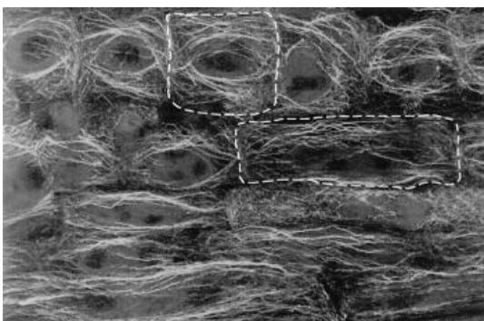
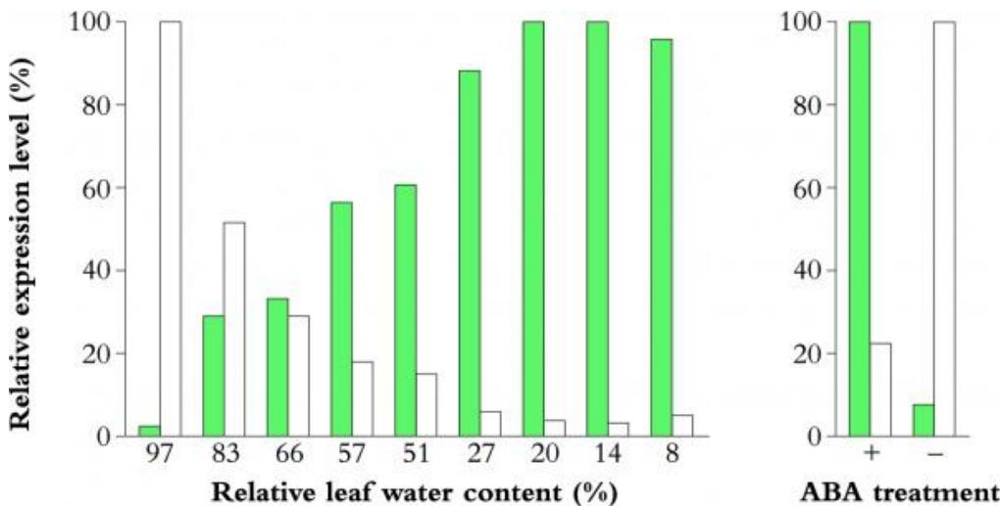

# Chapter 10 - Differentiation and gene expression

From Plants in Action,  $I^{st}$  Edition, Eds BA Atwell, PE Kriedemann, CJN Turnbull

Chapter Authors: RJ Rose and DJ McCurdy (10.1); JR Gorst (10.2), JD Hamill (10.3, 10.4)

Simply, the organism is a unique result of both its genes and the temporal sequence of environments through which it has passed, and there is no way of knowing in advance, from the DNA sequence, what the organism will look like, except in general terms.

(R.C. Lewontin (1997) 'Genes, environment, and organisms', Hidden Histories of Science, ed. R.B. Silvers, 115- 140, Granta Books: London)

Ripening of fruit such as tomato involves a tightly regulated sequence of physiological transitions and changes in expression of several genes, with the plant hormone ethylene playing a coordinating role. The visible colour change from green to red is due to chlorophyll degradation and synthesis of red lycopene pigment. Around this time respiration rate increases, ethylene synthesis accelerates, cell wall softening genes are expressed aroma and flavour compounds are synthesised, and acids and starch are converted to sugars. Overall this packaging is an attractive food to many animals and the benefit to the plant is increased probability of seed dispersal. (Photograph courtesy J.D. Hamill).

- [Chapter 10 - Differentiation and gene expression](Chapter_10.md)
  - [Introduction]()
  - [10.1 Cellular development and coordination]()
  - [10.2 Options for differentiation]()
  - [10.3 Gene expression]()
  - [10.4 Modified genomes: genetic engineering]()
  - [Further reading]()

# Introduction

Having described the major external and internal signals that modify plant growth and development, we now turn to processes and control at the genetic level. To generate even a single plant cell requires expression of many genes; to achieve an efficient multicellular organism that is capable of responding to changing environmental factors requires differentiation into many different cell and tissue types, each with specific patterns and sequences of gene expression. First, we look at how cells are produced, and then at how intracellular and intercellular coordination are achieved (Section 10.1). In Section 10.2, we consider briefly the many possible pathways for plant cell differentiation, and how cells can switch between some of these options. Next, expression of the genome during development and in response to external factors is covered, focusing on tissue- specific and sequential patterns (Section 10.3). Finally, in Section 10.4 we cover genome manipulation, or genetic engineering, discussing how foreign genes can be inserted into plant genomes, and then expressed to give commercially valuable or novel plants, and how such techniques have become a new repertoire of tools for plant physiologists.

# 10.1 Cellular development and coordination

# 10.1.1 Generating cells and organelles: control of division processes

  
Figure 10.1 Cell reproduction then cell growth contribute to the final length of normal dark-grown wheat coleoptiles, but if cell division is disrupted by gamma irradiation of seed, the increase of coleoptile length is entirely due to cell elongation which continues much as before. (a) Coleoptile length; (b) cell number; cell length. Normal plants (○); gamma plants treated with 500 krad of  $\gamma$ -radiation (●). (Based on Rose and Adamon 1969)

Much of the cell division in plants occurs in meristems, which provide a continual supply of new cells for increase in root or stem length (see Section 7.1) or for lateral growth. This is not the case for all plant organs, for example dicotyledonous leaves, cereal coleoptiles and fruits, where there is a phase of cell division throughout most of the young organ followed by cell

enlargement, leading to a final organ size dictated by a com- bination of genotype and environment.

The growth pattern of parenchyma cells of dark- grown wheat coleoptiles (Figure 10.1) illustrates the interrelationship between cell enlargement and cell division. These coleoptiles reach a final height of  $60~\mathrm{mm}$ . Between 24 and  $48~\mathrm{h}$  after germination, cell numbers double and cell length increases slightly. After  $72~\mathrm{h}$ , cell division ceases and cell elongation takes over. Coleoptiles at  $72~\mathrm{h}$  are therefore a favoured system for studying auxin- induced cell enlargement without the complications of simultaneous cell division. Gamma irradiation inhibits cell division by damaging chromosome structure, but growth by cell enlargement can still occur. Final coleoptile height, however, is reduced proportionately less than the reduction in total cell number, because greater than normal final cell dimensions allow some compensation. Similarly, colchicine stops cell division but roots can still initiate short lateral branches called primordiomorphs, which are entirely the result of cell expansion (Foard et al. 1965).

  
Figure 10.2 Four mitotic stages are visible in this squash preparation of a rapidly dividing root apical meristem of Vicia faba: prophase (P), metaphase (M), anaphase (A) and telophase (T). (Magnification x 1200).

Plant cell division, besides providing a source of new cells, requires replication of the genome, and equal distribution of this coded information in the form of paired chromosomes to daughter cells. The anaphase stage of mitosis is where chromosomes are separated as the microtubule spindle contracts (Figure 10.2), guaranteeing identical gene complements for every somatic cell. Plant cells are encapsulated by a cell wall, so during cytokinesis (i.e. cell division, as opposed to mitosis, which is chromosome separation) a 'cell plate' forms to divide the parent cell into two daughters, usually of similar size. The cell plate subsequently matures to become a new primary cell wall. However, replication and division of the nuclear genome is not sufficient to maintain normal cell functioning, because in plants there are two additional genomes, residing in the plastids and mitochondria. These, too, must be multiplied.

# (a) The cell cycle

The cell cycle encompasses the growth of a cell during the cell division cycle, the replication of its genomes and the formation of two daughter cells containing all the necessary information to repeat the cycle. For convenience, we normally deal with the cell cycle as a series of discrete segments, based on alternate phases of nuclear DNA replication (the synthesis or S phase) and mitosis (the M phase) where newly replicated chromosomes segregate into daughter cells (Figure 10.3). There are gaps between these phases: G1 (Gap 1) between cytokinesis at the end of mitosis and the S phase, and G2 (Gap 2) between the S phase and mitosis. During G1, crucial events occur that determine the timing of initiation of

DNA replication, in other words the entry into the S phase. Once the S phase commences, it needs to follow a highly ordered process starting with each chromosome as a single DNA molecule and ending with each as two identical DNA molecules — sister chromatids. In G2, the events that control entry of cells into mitosis occur. Duration of the G1, S and G2 phases varies enormously depending on the cell type, normally being measured by applying a pulse of  $\left[^{3}\mathrm{H}\right]$  thymidine, which is specifically incorporated into DNA, followed by autoradiography. Root apical meristems are a conveniently accessible rapidly dividing tissue for such studies. In maize (Zea mays) root tips, Barlow (1973) found that G1 lasts  $3\mathrm{h}$ , the S phase lasts  $5\mathrm{h}$  and G2,  $6\mathrm{h}$ . Mitosis itself lasts around one hour, in which time the cell goes through the familiar prophase, metaphase, anaphase and telophase (Figure 10.2). Of course, the cell also needs to double in size otherwise cell dimensions would diminish with each division cycle. Cells can temporarily suspend the cycle and enter a rest or quiescent phase, some- times referred to as G0. Permanent exit from the cell cycle and progress into a differentiation pathway is possible at G1 or G2.

  
Figure 10.3 The cell cycle in plants comprises four phases: mitosis (M), Gap 1 (G1), DNA synthesis (S) and Gap 2 (G2). Key transitions in the cycle  $\mathrm{G1}\rightarrow \mathrm{S}$  and  $\mathrm{G2}\rightarrow \mathrm{M}$  are regulated by cyclin-dependant kinases (CDKs) which in turn are influenced by several factors including the plant hormones auxin and cytokinin.

# Control of progression through the cell cycle

How are the complex sequences through the cell cycle regulated? In plants, we have less complete evidence than is available from simpler organisms such as yeasts or the more extensively studied mammalian cells, but the principles appear similar. Using specific inhibitors, we can demonstrate that protein synthesis is required for progress at several points throughout the cell cycle. The key proteins are collectively known as cyclins, whose abundances change in very precise ways as the cell cycle operates. Cyclins activate regulatory enzymes called cyclin- dependent kinases (CDKs), a group of enzymes that add phosphate groups to other proteins. Two key cyclin- controlled points in the cell cycle are the  $\mathrm{G1}\rightarrow \mathrm{S}$  and  $\mathrm{G2}\rightarrow \mathrm{M}$  transitions (Van't Hof 1985). Entry into the S phase requires activation of the replication machinery onto a series of specific sites along the DNA called 'origins of replication'. Importantly, DNA must replicate only once per cycle, and mitosis, of course, should not proceed until the S phase is complete. Control of the S and M phases enables the processes of each to be mutually exclusive, and to have an obligate alternating sequence.

The G1 control point is called 'Start'. At this point, a cell becomes committed to proceeding through the cell cycle. Provided no essential cell cycle component is limiting, the complete cycle will continue from here (Chasan 1995). Induction of a specific cyclin may precipitate a cell's capacity to divide, and also initiates the subsequent sequence of events regulated by its CDKs. In plant cells, as in other organisms, there are links between cyclins, CDKs and cell cycle control (Jacobs 1997). Here we focus on one CDK called  $\mathrm{p34}^{\mathrm{cdc2}}$ , a key player in the plant cell cycle (Gorst et al. 1991). The  $cdc$  (cell division cycle) gene which encodes the  $\mathrm{p34}^{\mathrm{cdc2}}$  protein was originally identified in yeast, then a homologue was found in Arabidopsis, designated  $cdc2a$ . In this species,  $cdc2a$  expression is linked to competence for cell division (Hemerly et al. 1993). Differentiated leaf mesophyll cells, when induced to recommence division, show increased  $cdc2a$  expression. Very large terminally differentiated cells are commonly endo- polyploid, and this condition appears to relate to failure of cyclins to be activated, so leading to DNA replication without mitosis, and hence doubling of the chromosome complement.

Several plant cyclins and CDKs have now been identified, and many more are deduced to exist. They each relate to control through one of the four key phases of the cell cycle. D and E cyclins are associated with initiation and completion of DNA replication, while A and B cyclins function in mitosis. There are also questions of how biosynthetic control of cell growth and plastid and mitochondrial division cycles are all integrated into the cell cycle.

  
Figure 10.4 Chloroplasts contain multiple copies of their circular chromosome (solid circles), associated with thylakoid membrane (straight line). In this experiment on cultured spinach leaf discs, DNA with a  $\left[{}^{3}\mathrm{H}\right]$  thymidine pulse, followed by incubation in unlabelled thymidine ('chase'). Data indicate that label (dashed circles) was present on every new DNA strand and that equal numbers were segregated to each daughter chloroplast during division. In the next round of synthesis, each DNA molecule was replicated again, this time with unlabelled thymidine present. (Based on Rose 1988)

# (b) Plastid and mitochondrial division during the cell cycle

Plastid division cycle

All plastids (proplastids, chloroplasts, amyloplasts, chromoplasts, etioplasts, leucoplasts) develop from pre- existing plastids and are not produced de novo. Most commonly,

differentiated plastids derive from proplastids. All plant cells contain plastids of some type and these are partitioned to daughter cells during cytokinesis. Because plastids carry their own genome and because of the need to maintain plastid number per cell, plastids conduct their own DNA replication and division cycle. Remarkably, this process seems to be tuned to the pace of the cell cycle. Chloroplasts are the most abundant and therefore the most important and best- studied plastid type. Replication of chloroplast DNA (cpDNA) and its partitioning at chloroplast division is monitored in a similar way to the nuclear genome, typically by application of a  $\left[^{3}\mathrm{H}\right]$  thymidine pulse. In spinach leaf discs, cpDNA was segregated in approximately equal amounts to daughter chloroplasts, consistent with semi- conservative DNA replication (Figure 10.4). Two points deserve mention: the 150 kilobase chloroplast chromosome is present in multiple copies per chloroplast, and each chloroplast has many nucleoids (Figure 10.5) containing a variable number of cpDNA copies. These characteristics mean that, unlike the cell cycle, the chloroplast division cycle does not have discrete G1, S and G2 phases. Instead, DNA synthesis occurs throughout the plastid division cycle. cpDNA segregation is possible because the nucleoids are attached to a membrane system which distributes DNA to daughter cells in a manner akin to mechanisms in prokaryotic cells.

  
Figure 10.5 Fluorescence micrograph of isolated tobacco mesophyll protoplast stained with DAPI which causes blue-white fluorescence from DNA, visible both in the multiple nucleoids (small bright specks) present in each chloroplast and in the nucleus on the right. Background signal in chloroplasts is chlorophyll autofluorescence (x 1500). (Based on Thomas and Rose 1983)

Chloroplasts divide by constricting into two (Figure 10.6), but how is this achieved? Under the transmission electron micrograph we can see a doublet ring associated with the constriction, consisting of fibrils on the cytoplasmic side of the outer chloroplast membrane and also on the stroma side of the inner membrane (Figure 10.6b). The fibrils are probably a cytoskeletal- like contractile protein that causes the constriction. Inhibitor and mutant experiments indicate that replication of cpDNA and chloroplast division are both under nuclear gene control and not regulated by cpDNA genes. Pyke et al. (1994) identified chloroplast division mutants with giant chloroplasts which probably have defects in these nuclear genes.

  
Figure 10.6 Images of dividing plastids. (a) Transmission electron micrograph showing constriction prior to division (scale bar = 1  $\mu$ m). (b) Detail and (ii) diagram of constricting doublet ring visible as densely stained areas inside and outside double plastid membrane, arrowed; oe, outer chloroplast membrane; ie, inner chloroplast membrane; c, cytoplasm; s, stroma (x 90 000; scale bar = 0.1  $\mu$ m). (c), (d) Nomarski optic micrographs showing (c) accumulation of 'dumb-bell' shaped pre-division plastids caused by keeping spinach leaf discs under low light intensity for 5 d. (d) Normal division resumes when leaves are transferred to higher light intensity (x 1400). (Based on Hashimoto 1986 and Possingham and Rose 1976)

Meristematic leaf cells contain approximately 10 chloro- plasts, which have developed from proplastids. In early leaf development, plastid number per cell and cpDNA content per plastid both remain constant. When cell division ceases, the cells grow rapidly giving room for dramatic increases in chloroplast numbers. In spinach, the final chloroplast number per cell can exceed 200. During the initial phase of cell enlargement, the rate of cpDNA replication exceeds the rate of chloroplast division, so the cpDNA copy number per chloroplast rises from about 50 to 200. Subsequently, cpDNA synthesis switches off but division continues, leading to a final copy number of about 30 (Figure 10.7). It is probably no coincidence that the maximum copy number coincides with the period of greatest demand for biosynthesis of chloroplast components. We also suspect that early completion of cpDNA production leaves the cell's biosynthetic machinery free for later direction towards biogenesis of the photosynthetic membranes and proteins.

  
Figure 10.7 Numbers of chloroplasts per cell  $(\sqsupset)$  increase during leaf development but numbers of copies of cpDNA, expressed as plastomes per chloroplast  $(\bullet)$  are maximal early in development, presumably coinciding with maximum demand for chloroplast gene expression. (Based on Possingham and Lawrence 1983)

Chloroplast size and numbers per cell also depend on environmental factors such as light, temperature and mineral nutrients. Chloroplasts, unlike other plastids, require high light intensity in order to divide. Low light levels lead to large chloroplasts blocked at a partly constricted stage (Figure 10.6c), but transfer to high light leads to resumption of the normal division process (Figure 10.6d).

# Mitochondrial division

We know much less about mitochondrial division, partly because these organelles are smaller than plastids, and therefore difficult to observe live under the light microscope. Nevertheless, studies on several species by Kuroiwa point strongly to a division cycle similar to the plastid process (Figure 10.8). The inner mitochondrial membrane has nucleoids associated with it, and division is again effected by constriction into two. Larger numbers of mitochondria are present in cells with high energy demand, such as phloem companion cells, anther tapetum and thermogenic spadix tissues of flowers in the Araceae.

  
Figure 10.8 Division of mitochondria, from embryo of Pelargonium zonale, is similar in appearance to the process in plastids, with formation of a central constriction  $(\times 29000)$ . (Photograph courtesy H. Kuroiwa and T. Kuroiwa)

# 10.1.2 Cellular integration

10.1.2 Cellular integrationPlant cells possess diverse organelles and other structures, all of which need to cooperate to ensure efficient functioning. Specific subcellular structures, collectively known as the cytoskeleton, control the positioning and repositioning of cellular components during the cell cycle, and later on during cell differentiation then finally in functioning of mature cells. In addition to control within each single cell, multicellular organisms require coordination between cells. Cytoplasmic bridges known as plasmodesmata allow local traffic of many molecules including some kinds of regulatory signals. Here, we provide some insight into these intracellular and inter- cellular processes.

# (a) The cytoskeleton - intracellular organisation

The cytoskeleton in plant cells is a remarkable multifunctional internal network of two types of fibrous protein polymers:actin filaments (often referred to as microfilaments) and microtubules. Both polymers form dynamic arrays which organise cellular components and provide the structural frameworks necessary to perform many key subcellular events. In animal cells, actin filaments and microtubules are essential for cell migration and changes in cell shape, two central components of cell and tissue morphogenesis. In contrast, a rigid cellulose wall surrounds plant cells and restricts their movements relative to neighbouring cells. Plants achieve the development of form, or morphogenesis, largely through two other cellular processes, both under control of the cytoskeleton: the placement and orientation of new cell walls resulting from cell division, and control of the subsequent directions in which cells expand.

# Cytoskeleton components: molecular fibres and intracellular motors

Cytoskeleton components: molecular fibres and intracellular motorsActin filaments are polymers of the  $43\mathrm{kDa}$  monomeric protein actin (or G- actin, for globular). The polymer, called F- actin (for filamentous), is composed of two helically arranged parallel strands with an average diameter of  $7\mathrm{nm}$ . One turn of the filament helix occurs every  $37~\mathrm{nm}$ , involving about 13 monomers on each strand (Figure 10.9). Microtubules are polymers of tubulin heterodimers composed of one a- and one b- tubulin polypeptide, each with a molecular weight of approximately  $50\mathrm{kDa}$ . The heterodimers align head to tail into protofilaments, 13 of which assemble side by side to form a hollow microtubule of  $24~\mathrm{nm}$  diameter (Figure 10.9). Actin filaments and microtubules both assemble and disassemble via exchange with cytoplasmic pools of free monomer, processes which require energy. G- actin binds to ATP and its incorporation into a growing actin filament is followed by ATP hydrolysis. Tubulin monomers instead bind to GTP (guanosine triphosphate). After incorporation into the growing polymer, hydrolysis of the bound nucleotide can cause the polymer to be destabilised, often resulting in rapid uncontrolled depolymerisation known as dynamic instability. Actin and tubulin monomers are both polarised molecules, and by adding to the growing polymer in specific orientations, they impose a defined directionality to the actin filament or microtubule. Monomer association and disas- sociation rates differ between the two ends of each polymer, manifested as dynamic growth and disassembly. In vitro experiments have achieved polymerisation of both actin filaments and microtubules from their constituent monomers. Within eukaryotic cells, hundreds of proteins have been identified which interact with these cytoskeletal polymers to regulate their assembly and disassembly, and their interaction with other cellular components. Animal cells and protists have provided most of the identifications of these actin- binding

proteins (ABPs) and microtubule- associated proteins (MAPs), but we do know that plants possess some equivalent proteins. One important class of ABPs and MAPs is the so- called motor proteins. These proteins 'walk' along cytoskeletal polymers via cycles of attachment followed by energy- dependent con- formational changes. The conformational changes define the direction of movement of each motor protein along the polymer, and different classes of motor proteins relate to each direction of movement along either actin filaments (myosins) or microtubules (kinesins and dyneins). Motor proteins attach to the surface of different organelles and possibly the plasma membrane, and through their specific interaction with actin filaments or microtubules, provide the molecular driving force to move and position these organelles within the cell.

  
Figure 10.9 Structure of an actin filament (F-actin) and a microtubule. An actin filament is composed of G-actin subunits in parallel strands wound helically to form a filament with a diameter of  $7.5 \mathrm{nm}$ , with one complete turn every  $37 \mathrm{nm}$ . ATP-bound G-actin monomer is rapidly added to or removed from the plus end, but this occurs only slowly from the minus end (not shown). A microtubule is composed of heterodimers of  $\alpha$ - and  $\beta$ -tubulin polypeptides assembled with defined orientation into linear protofilaments, 13 of which align side by side to form the hollow microtubule with a diameter of about  $24 \mathrm{nm}$ . Assembly of GTP-bound heterodimers is most rapid at the plus end, and depolymerisation of GDP-bound heterodimers is most rapid from the minus end (not shown). (Reproduced from Gunning and Steer (1996), Plant and Cell Biology and Function, with permission of Jones and Bartlett Publishers)

# Structure of cytoskeletal arrays — microtubules

Microtubules are multifunctional units which support cell growth and the cell cycle. The dynamic property of micro- tubules enables the transient formation of several distinct arrays as a cell progresses through different stages of the cell cycle and differentiation. Amazingly, the same microtubule molecules are recruited into four functions, which occur sequentially during the mitotic cell cycle. These appear as the interphase cortical array, preprophase band, mitotic spindle and phragmoplast (Figure 10.10). With the exception of the mitotic spindle, each array is unique to plants and each performs discrete functions central to plant cell morphogenesis.

  
Figure 10.10 Confocal laser scanning micrographs of dividing cells from wheat root tips showing microtubules labelled with anti-tubulin antibody (bright regions), and DNA stained with fluorescent dye (darker regions) (see Colour Plate 40). (A) Interphase array of roughly parallel cortical microtubules arranged transversely across three visible faces of this cell, but more randomly oriented on the end wall. (B) Preprophase band a narrow band of tightly packed microtubules replacing the interphase array. (C) Metaphase spindle – bundles of microtubules aligned along the spindle axis attach to the chromosome kinetocores resulting in a configuration known as the metaphase plate. This is seen as a dark-blue region separating the two halves of the spindle (D) Early phragmoplast – after chromosome separation during anaphase, a new population of microtubules appears between the chromosome masses and the mid-zone. (E) Late phragmoplast – a tightly packed double ring of short microtubules viewed side on, separated by the cell plate (seen as a dark line). (F) Cytokinesis and new cell wall formation nearly complete – vestiges of the phragmoplast ring remain at the extreme margins and new microtubules are emanating from the surface of the two new nuclear envelopes. (G) Reinstated cortical arrays in the two interphase daughter cells. (Reproduced from Gunning and Steer (1996), Plant and Cell Biology and Function, with permission of Jones and Bartlett Publishers)

Interphase cortical array During interphase, microtubules lying parallel to each other form an array immediately adjacent to the plasma membrane and usually are oriented perpendicular to the long axis of the cell (Figure 10.10A). Individual micro- tubules are relatively short, but by overlapping in roughly parallel alignment they create a continuous array which passes over four faces of the cell. The end faces of these cells instead contain fewer and more randomly organised microtubules. Some microtubules in these arrays may be physically cross- linked to each other and/or to the plasma membrane via as yet unidentified MAPs. Typically, the most recently deposited (innermost) layers of cellulose microfibrils in the adjacent cell wall are aligned parallel to these microtubules as discussed later.

Preprophase band As the cell enters mitosis, the interphase array of microtubules is replaced swiftly by a narrow band of microtubules that encircles the nucleus (Figure 10.10B). This structure is termed the preprophase band and has a remarkable feature in that, even before the cell enters mitosis, it accurately predicts the site where the new cell wall will be deposited after cytokinesis. The molecular mechanisms determining this prediction are not understood, but the band may somehow chemically mark the future division site, perhaps by phosphorylation. The band itself disappears before metaphase.

Spindle microtubules Disintegration of the preprophase band coincides with formation of the mitotic spindle (Figure 10.10C). These microtubules first emerge from broad, ill- defined polar regions of the nucleus, then progressively consolidate along the pole- to- pole axis of the spindle, finally invading the nucleus after nuclear envelope breakdown and attaching via kinetochores to the condensing chromosomes. All eukaryotic cells depend on the spindle

system to maintain accurate inheritance of the entire genome at each mitosis. The spindle microtubules have responsibility first for organising chromo- somes during prometaphase, then physically segregating the two daughter chromatid arms to each pole of the spindle during anaphase.

Phragmoplast microtubules After chromosome separation, the spindle microtubules disappear and instead numerous short microtubules aggregate in the equatorial zone of the spindle (Figure 10.10D). These microtubules form the phragmoplast, a structure consisting of a double ring of short, antiparallel microtubules which form a narrow overlapping region at the spindle equator (Figure 10.10E). The two sets of microtubule arrays deliver Golgi- derived vesicles containing cell wall precursor materials to the developing cell plate, most likely by a mechanism involving microtubule motor proteins attached to the vesicles. The expanding cell plate eventually fuses with the parent cell wall at the site previously marked by the preprophase band, thus forming two daughter cells (Figure 10.10F). The daughter cells establish new cortical arrays of microtubules which persist through interphase until each cell commits to a new round of mitotic division (Figure 10.10G).

# Structure of cytoskeletal arrays — actin filaments

Actin filaments also form diverse and dynamic arrays in plant cells (Figure 10.11). They are readily detected as large bundles usually aligned longitudinally to the growth axis of the cell. Smaller bundles ramify throughout all parts of the cytoplasm, but often are prominent as transverse arrays (McCurdy et al. 1989). Because actin filaments often appear closely aligned with cortical microtubules under the electron microscope, we deduce there may be functional associations. In some cell types, especially highly vacuolate cells maintained as suspension cultures, the actin cytoskeleton consists of an interconnected and complex network of cortical filaments, larger transvacuolar cables and meshworks surrounding the nucleus (Lloyd and Traas 1988). A major role of the actin cytoskeleton is to generate protoplasmic streaming, which operates through myosin motor proteins with attached organelles moving along the filaments and bundles. This provides efficient mixing of structural and chemical components of cells, a process necessary to maintain metabolism in large plant cells. Protoplasmic streaming is visible in many living cells under the light micro- scope. In growing pollen tubes, spectacular two- way traffic over millimetre distances can be followed as organelles and metabolites are ceaselessly supplied to and from the sole growing point, the pollen tube tip.

  
Figure 10.11 Confocal laser scanning micrograph of actin filament bundles labelled with fluorescent anti-actin antibodies. This is a longitudinal section through the zone of cell elongation of a wheat root tip, and shows bundles of actin running in a net longitudinal orientation throughout the cell, often passing close to the nucleus (darker oval shapes devoid of labelling). The borders of two individual cells are shown with dashed lines. (Reproduced from Gunning and Steer (1996), Plant and Cell Biology and Function, with permission of Jones and Bartlett Publishers)

# The cytoskeleton and morphogenesis

The cytoskeleton and morphogenesisThe development of cell shape, and in turn that of organs and tissues, is the result of both division plane determination and control of the direction of cell expansion. Because microtubules are relatively stable structures, and thus more easily detected by electron microscopy and immunofluorescence localisation techniques, their role in plant morphogenesis has been more readily appreciated than that of actin. However, we now know that actin filaments also participate in these processes, probably by influencing microtubule rearrangements.

Determination of the plane of division Plant cells divide by constructing a new internal wall after mitosis has been completed. The placement of this new wall coincides precisely with the position of the preprophase band of microtubules that forms transiently before mitosis begins. The mechanisms determining where the preprophase band will form are not understood, nor is it clear how this structure acts as a predictor of subsequent cell division (Williamson 1991). Presence of the band is clearly required, since disruption by drugs such as colchicine or physical wounding alters the subsequent positioning of the new wall (Gunning and Wick 1985). The presence of the preprophase band may somehow condition or 'tag' the division site by chemically modifying the adjacent cell wall or cytoplasmic region with marker molecules (Mineyuki and Gunning 1990). Protein kinases are found localised to the preprophase band, suggesting phosphorylation of specific cellular components (Mineyuki et al. 1991). Once a division site has been determined, the production of a new cell wall involves both actin filaments and microtubules. The phragmoplast constructs the new wall by delivering precursor vesicles to the expanding cell plate. These vesicles move along microtubules, most likely using motor proteins such as kinesin (Liu et al. 1996), to the mid- region of the dividing cell where they fuse with the cell plate, thus enabling its centrifugal growth (i.e. centre outwards). In addition, actin filaments and myosin within the phragmoplast may contribute to vesicle migration and organisation. As the flattened disc- shaped cell plate expands, its leading edge is guided to and eventually fuses with the parent cell wall precisely at the site formerly occupied by the preprophase band. In large vacuolate cells where the mitotic spindle and phragmoplast are in a central raft of transvacuolar cytoplasm known as the phragmosome, the expanding cell plate must traverse a substantial distance before reaching the side wall. In such cells, actin filaments are visible connecting cell plate to parent wall along the phragmosome (Figure 10.12; Lloyd and Traas 1988), and presumably act as a guidance mechanism for the growing cell plate, since treatment of dividing cells with anti- actin drugs causes misaligned phragmoplasts and cell plates (Palevitz 1980; Lloyd and Traas 1988).

Direction of cell expansion The final shape of a plant cell is dictated by the direction(s) of turgor- driven cell expansion. This direction is controlled by physical constraints imposed by cellulose microfibrils laid down in the growing cell wall (Green 1980). The innermost layer of microfibrils in the cell wall usually lies perpendicular to the axis of elongation, and these microfibrils act as hoop reinforcement elements to restrict lateral expansion of the cell while allowing elongation. The cytoskeleton is intimately linked to this process because the ordered deposition of cellulose microfibrils is tightly controlled by the orientation of cortical microtubules (Section 4.3.2).

  
Figure 10.12 Fluorescence micrographs of the actin cytokinesis in carrot suspension cells. These cells are highly vacuolated and the phragmoplast forms within a complex meshwork of actin filaments. Actin filaments were visualised by labelling with a fourscnt derivative of phallodin, a fungal compound which binds specifically to F-actin. (A) Intense flourescence of phragmoplast-associated actin in the middle of the cell (the two chromosome masses are indicated by double dots), together with pole-associated actin strands (arrows). (B) Phragmoplast suspended by the actin cytoskeleton in the transvacuolar phragmosome. The darker regions are the vacuole. Scale bar  $= 10\mu \mathrm{m}$ . (Reproduced from Lloyd and Traas (1988), with permission of Company of Biologists Ltd)

Electron microscopy first revealed the co- alignment in growing cells of cortical microtubules and the inner- most layer of cellulose microfibrils in the cell wall (Ledbetter and Porter 1963). Control of microfibril orientation was revealed by the use of microtubule- destabilising drugs such as colchicine, which also disrupted the oriented deposition of the neighbouring cell wall microfibrils, with subsequent changes in cell shape (Brower and Hepler 1976; Hogetsu and Shibaoka 1978). Orderly deposition of microfibrils only returned after the colchicine had been washed away to allowed re- establish- ment of microtubule arrays, thus confirming the dependence of microfibril orientation on that of the cortical microtubules. Cellulose microfibrils are deposited on the outside of the plasma membrane by a membrane- bound enzyme complex called cellulose synthase. In higher plants, this complex appears as a rosette assembly of protein aggregates embedded within and spanning the plasma membrane (Figure 10.13). The complex is believed to move within the plane of the membrane, assembling a cellulose microfibril on the outer surface of the cell by incorporating precursor subunits (UDP- glucose) into the complex from the cytoplasmic side of the membrane. Forces resulting from continued polymerisation and distal crystallisation of the microfibrils drive the complexes through the plane of the plasma membrane. The direction of this movement, and thus the orientation of the cellulose micro- fibrils, is guided by the underlying cortical microtubules (Giddings and Staehelin 1991). The mechanism may involve protein cross- bridges between microtubules and plasma membrane, or perhaps between microtubules and synthase complexes themselves. Restriction of synthase complexes to defined membrane channels results in microfibril orientations reflecting that of the underlying cortical microtubules (Figure 10.13C).

  
Figure 10.13 Electron micrographs of freeze-etched and rotary shadowed cellulose microfibrils and cellulose synthase rosettes in differentiating Zinnia elegans tracheary elements. (A) Cellulose microfibrils in the secondary cell wall overlie the plasma membrane, a small patch of which is exposed on the right. Scale bar = 100 nm. (B) Rosette structure of putative cellulose synthase complexes in the plasma membrane underlying the cellulose-rich secondary wall thickenings in these cells. The rosette structure is composed of six globular units. Scale bar = 30 nm. (C) Diagram suggesting the spatial relationship between cortical microtubules and the most recently deposited layer of cellulose microfibrils. Cellulose microfibrils emerge from rosettes of cellulose synthesising complexes embedded in the plasma membrane (part of the lipid bilayer is peeled back to reveal the different faces of the membrane visualised in freeze-fracture preparation). The microtubules underlying the plasma membrane are shown cross-linked to each other or to the plasma membrane itself. The latter connections may define membrane channels which in turn restrict movement of cellulose synthase rosettes through the plane of the membrane in a direction reflecting the orientation of the underlying microtubules. ((A),(B) Images produced by C.H. Haigler and M.J. Grimson, Texas Tech University, and reproduced from Proceedings of the National Academy of Science, USA, 93, 12082-12085. © 1996, National Academy of Science USA, (C) reproduced with modifications from Gunning and Steer (1996), Plant Cell Biology, Structure and Function, with permission of Jones and Bartlett Publishers)

The relationship between cortical microtubules, cellulose deposition and cell shape is evident in certain differentiating cells such as developing tracheary elements or leaf mesophyll cells. Differentiated mesophyll cells in wheat have a highly lobed outline with regularly spaced constrictions. The devel- op- ment of this lobed morphology results initially from the bunching of interphase microtubules into discrete bands, often as many as five or six per cell (Figure 10.14) (Wernicke and Jung 1990). These localised 'hoops' of wall reinforcement laid down during the early stages of cell expansion act as restrictions to the expanding cell, resulting in the cell wall between these restrictions bulging out and thus producing the lobed morphology (Figure 10.14). Again, disruption of micro- tubules by inhibitors results in loss of the banded secondary wall thickenings. Actin also seems to be involved: disrupting actin filaments with cytochalasin B prevents cortical micro- tubules from rearranging into bands, thus preventing ultimately the localised deposition of secondary wall material (Wernicke and Jung 1992).

  
Figure 10.14 Developing mesophyll cells isolated from wheat leaf and double stained to visualise microtubules (A, C, E) and cellulose microfibrils of the cell wall (B, D, F), (A), (B) Young expanding cells  $2 - 5\mathrm{mm}$  from the leaf base, showing typical transverse arrays of microtubules (A), and cellulose microfibrils with the same orientation (B). (C), (D) Between 5 and  $10\mathrm{mm}$  from the leaf base, cell shape has not changed markedly but cortical microtubules (C) have aggregated into discrete transverse bands, matched again by the pattern of cellulose deposition (D). (E), (F) Between 20 and  $50\mathrm{mm}$  from the leaf base; the first indications of the lobed shape of mesophyll cells are seen. The microtubule bands have dispersed somewhat and fan out (E), but hoops of cellulose wall reinforcement are still evident (F), and clearly mark the isthmus where wall expansion has been restricted to create a highly lobed cell shape. Scale bar  $= 20\mu \mathrm{m}$  (Reproduced in part from Wernicke and Jung (1990), Protoplasma, 153, 141-148, with permission of Springer-Verlag)

# The plant cytoskeleton responds to environmental factors

The cytoskeleton can respond to numerous environmental stimuli in complex and subtle ways. Reorganisation of cytoskeletal elements has been observed in response to light, gravity, hormonal signals, fungal attack and wounding. These changes can occur rapidly — minutes to hours — and often result in the reorganisation or repositioning of organelles. One example involves actin- controlled movement of chloroplasts in Selaginella leaf cells in response to varying light intensities (Cox et al. 1987; Dong et al. 1996). In low light conditions, chloroplasts are dispersed as a monolayer across the face of the cell that is perpendicular to the direction of incident illumination. This array maximises light capture. Under potentially damaging high light intensities, however, chloroplasts aggregate to the side walls which are parallel to the incident light, thus minimising light interception.

  
Figure 10.15 Immunofluorescence images of epidermal cells from epicotyls of dwarf pea seedlings. Sections were labelled with anti-tubulin to visualise arrays of cortical microtubules. (A) Cells from control seedlings showing net longitudinal orientation of the microtubule arrays. (B) Cells from seedlings treated with gibberellic acid for  $12\mathrm{~h}$  showing cortical microtubules orientated in a net transverse direction. This shift in microtubule orientation is mirrored in the orientation of new cellulose microfibrils in the cell wall, and consequently cell expansion becomes predominately longitudinal, thus promoting elongation growth of the epicotyl and restoration of a tall phenotype. Scale bar  $= 10\mu \mathrm{m}$ . (Reproduced from Sakiyama and Shibaoka (1990) with permission of Springer-Verlag)

Microtubules also mediate growth responses to plant hormones via their regulation of oriented cellulose microfibril deposition in the cell wall. Gibberellins and ethylene can affect orientation of cortical microtubules, and by doing so have profound effects on plant morphology. In gibberellin- deficient dwarf pea seedlings, cortical microtubules are abnormal by being oriented mainly longitudinally in epidermal cells of the epicotyl, thus restricting elongation of this organ. Application of gibberellin promotes a net transverse orientation of cortical microtubules (Figure 10.15; Sakiyama and Shibaoka 1990), which in turn leads to predominantly transverse cellulose microfibrils and hence promotes elongation growth resulting in longer, thin shoots. Similarly, ethylene inhibits stem elongation and stimulates stem thickening through reorganisation of cortical microtubules from transverse to net longitudinal orientations (Lang et al. 1982). In summary, changes in microtubule organisation, and subsequent effects on cellulose microfibril orientation, mediate several responses to hormonal signals that modify a plant's growth habit.

# (b) Plasmodesmata: intercellular communication

  
Figure 10.16 Plasmodesmata: intercellular cytoplasmic bridges. (a) Pit fields in the thick lignified walls of sclerenchyma cells, in this case from persimmon (Diospyrus) endosperm, contain plasmodesmata which are visible under the light microscope as numerous file lines connecting cell to cell. Transmission electron micrographs of non-lignified cell walls from corn (Zeamays) leaf show longitudinal (b) and transverse (c) plasmodesmata profiles. The central strand of endoplasmic reticulum, the desmotubule, and surrounding plasma membrane are visible. Scale bar in (a)  $= 20\mu \mathrm{m}$ ; in (b)  $= 0.2\mu \mathrm{m}$ ; in (c)  $= 0.2\mu \mathrm{m}$ . (Based on Raven et al. 1992)

Integration of many cell functions, for example the co- ordinated growth of groups of cells within tissues, requires constant communication between cells. Some regulatory signals, such as plant hormones, are small molecules that can travel through the apoplasmic space in cell walls and may enter target cells by crossing the plasma membrane. Other signals travel only through the cytoplasm and move between cells via plasmodesmata, which are minute cytoplasmic channels traversing the wall between adjacent cells.

Tangl in 1879 first described plasmodesmata when pit fields were seen in the light microscope as fine strands in the walls of endosperm cells (Gunning and Robards 1976). Aggregations of plasmodesmata in pit fields are most apparent in very thick lignified walls (Figure 10.16a). However, their role in intercellular transport was not appreciated until the 1960s when electron microscopy revealed their fine ultra- structural details. Some early ideas included the proposal that plasmodesmata represented pieces of endoplasmic reticulum accidentally trapped in new cell walls during cytokinesis. Wider searches soon indicated, however, that almost all walls between adjacent plant cells contained these structures (Figure 10.16b, c).

In 1983, Gunning and Overall (see Feature essay 10.1) proposed a model for plasmodesmata that resolved earlier alternatives. Revising the model of López- Sáez et al. (1966), they showed that a narrow tube of endoplasmic reticulum — the desmotubule — passes through

the middle of the plasmodesmal channel thereby connecting the endomembrane networks of adjacent cells (Figure 10.17a, d). They also supported the view of Tucker (1982) and others who suggested that the cyto- plasmic sleeve between the endoplasmic reticulum and the plasma membrane lining the plasmodesma could be a pathway for transport of cytoplasmic molecules. Under high- magnification electron microscopy, the cytoplasmic sleeve often appears partly occluded by particulate material (Figure 10.17b). This could be interpreted either as negatively stained particles in an electron- dense matrix or as positively stained spokes (Figure 10.17c) linking desmotubule to plasma membrane. Although cross- sections sometimes support the first view, the latter is supported by Ding et al. (1992) whose model is shown in Figure 10.17e. In neither case do we know the composition of these structures, nor yet of any other plasmodesmata- specific proteins.

Regulated transport through plasmodesmata enables coordination of like activities within a tissue, yet provides sufficient isolation from different adjoining cell types that can carry out specialised functions or enter alternative differ- entiation pathways. We can deduce that the size of the cytoplasmic channel is regulated, but because of the dimensions involved, even electron microscope sections cannot resolve the possible open and closed states. Electron microscope images do, however, sometimes show a ring of particles in the wall around the neck of plasmodesmata. Some have termed this a 'sphincter' apparatus because the structure is well positioned to squeeze the cytoplasmic channel closed or to relax and allow it to open (Olesen 1979). In addition, callose, a b- 1,3 glucan, is found at the neck, especially after tissue wounding. This may be part of normal wound responses that seal off neighbouring cells and reduce leakage of cytoplasm. It is also possible that callose participates in normal regulation of plasmodesmal aperture (Robards and Lucas 1990). Cytochemistry shows that several enzymes, including ATPases, are abundant in the vicinity of plasmodesmata. The cytoskeleton protein actin is also detectable in plasmodesmata, from which we infer that either transport through the channel is actino- myosin based, or a contractile mechanism is responsible for regulating permeability (White et al. 1994).

Two different methods help us monitor transport through plasmodesmata. One involves watching membrane- impermeant dyes moving from cell to cell, and suggests that only molecules below 800- 900 Da, with a size of  $2\mathrm{nm}$  or less, are able to diffuse freely through plasmodesmata (Figure 10.18). This corresponds well with the measured  $2 - 3\mathrm{nm}$  diameter of the small channels between particles in the cytoplasmic sleeve. Later on, we will see that despite this size limit, selective movement of much larger molecules is possible. The second method measures transmission of applied electrical pulses from cell to cell. Much more current passes between cells than is predicted if the current travelled across the high- resistance plasma membranes. We deduce that plasmodesmata act as a low- resistance pathway allowing diffusion of ions and other small molecules. We also know that calcium ions cause the channels to close briefly, but an induced pH shift has no such effect (Reid and Overall 1992). Induced osmotic pressure gradients between cells can also result in temporary closure. However, natural osmotic pressure differences, such as those between companion cell and sieve tube, do not induce closure. Indeed, the pressure flow mechanism in phloem depends on bulk flow between these cells.

There are also longer term changes in plasmodesmal permeability. For example, in the shoot apex of Silene, the molecular exclusion limit reduces from 656 Da to 536 Da following floral induction (Goodwin and Lyndon 1983). This size range is larger than most plant hormones (150- 400 Da) but may partially isolate the floral apex from other mobile signals (e.g. short

peptides or oligosaccharides) from surrounding cells and perhaps facilitates determination of the floral state.

The importance of plasmodesmata in maintaining coordination between adjacent cells is illustrated in leaf epidermis. Here, stomatal guard cells initially have plasmodesmal connections with surrounding subsidiary cells, but as they mature these bridges are severed. Isolation is probably essential for normal guard cell function which depends on rapid turgor, solute and volume changes. Temporary plasmolysis is a tool which breaks plasmodesmal links. In germinating spores of the fern  $Pteris$  this artificial symplasmic isolation causes each cell of the protonemal filament to form a small thallus. The normal pattern is for the apical cells to generate a single thallus, so we deduce that plasmodesmal signals usually restrict some cells from certain morphogenic pathways (Gunning and Robards 1976).

  
Figure 10.17 Models of plasmodesmata structure and operation have been derived from high-magnification electron microscope images in longitudinal (a) and transverse (b, c) from Azolla pinumata root and adjacent phloem parenchyma cells in sugar cane leaf.  $\mathrm{PM} =$  plasma membrane;  $\mathrm{ER} =$  endoplasmic reticulum. In (b), there is a mottled layer of intervening cytoplasmic annulus between the central desmotubule and surrounding plasma membrane. In (c), the desmotubule is connected to the plasma membrane by 'spokes' that extend across the very open cytoplasmic annulus. In the Gunning and Overall (1983) model (d), most of the cytoplasmic channel between desmotubule and plasma membrane sleeve is occupied by globular proteins, whereas in Ding's model (e) spokes connect desmotubule to the plasma membrane, best seen in plasmodesmata with expanded regions in the centre of the wall. Both interpretations rely on the dark-light-dark alternation of staining in the cytoplasmic channel. Scale bars: (a)  $100\mathrm{nm}$ ; (b)  $10\mathrm{nm}$ ; (c)  $100\mathrm{nm}$ . (Based on (a), (b) Overall and Gunning 1982, (c) Robinson-Beers and Evert 1991, (d) Gunning and Overall 1983 and (e) Ding et al. 1992; (c) and (e) reproduced with permission of Springer-Verlag; (d) reproduced with permission of Americal Institute of Biological Sciences)

  
Figure 10.18 Intercellular molecular traffic can be traced by low molecular weight fluorescent dyes, such as uranin (approx  $800\mathrm{Da}$ ) which has a molecular diameter of  $< 2\mathrm{nm}$ , here injected into stamen hair cells of Setcreasea purpurea. Bright-field image before injection (a), 2 min after injecting the arrowed cell (b), 5 min later (c). The dye is visible in the thin layer of cytoplasm around the edges of these highly vaculate cells. Because the dye cannot cross the plasma membrane, cell to cell movement must be by plasmodesmata. Contrast this with Figure 2 in Feature essay 10.1, showing similar experiments tracing movement of much larger macromolecules. (Based on Tucker 1982; reproduced with permission of Springer-Verlag)

Counts of plasmodesmata in walls of cells of different ages demonstrate that in most tissues numbers in each cell wall are fixed at cytokinesis when plasmodesmata bridges of cytoplasm are retained within the advancing cell plate (Gunning 1978). Consequently, electrical coupling declines as cells enlarge because the number of plasmodesmata per unit membrane area decreases. There is some evidence that numbers of plasmodesmata between cell layers in shoot apical meristems reduce soon after transition to flowering, such as in Iris (Bergmans et al. 1997), which may indicate a further degree of isolation that relates to change in developmental pattern. In addition, some species exhibit 'secondary' plasmodesmata which increase numbers of connections during later cell development (Lucas et al. 1993). These have a modified structure with connections to several nearby plasmodesmata through an enlarged central region in the wall. New plasmodesmata also form in graft unions, often between tissues of two different species (Figure 10.19; Kollmann and Glockmann 1985). Grafting experiments indicate that some flowering stimuli have a strictly cytoplasmic route, only moving from induced to non- induced plant through fully established, plasmodesmal grafts.

Since the early 1990s, evidence has been accumulating that plasmodesmata sometimes also allow molecules of a much larger scale to pass through. The pioneering experiments were on viral movement proteins of about  $30\mathrm{kDa}$  which become localised to plasmodesmata (Lucas et al. 1993). These proteins function to aid movement of viral components (protein and RNA) from cell to cell during infection spread. In transgenic plants expressing this movement protein, dye studies show that larger than normal molecules can pass between cells. If cells are injected with the protein itself, fluorescent molecules up to  $9.4\mathrm{kDa}$  rapidly move out of the injected cell (Fujiwara et al. 1993). Some viruses induce much more drastic structural

modification such as loss of the desmotubule, leaving an aperture wide enough for passage of entire virus particles.

  
Figure 10.19 Secondary plasmodesmata form later in cell development, well after the wall between two cells has been laid down. Although common in many cell types, this is neatly demonstrated in graft unions where the adjacent cells clearly had different ancestries. Here Vicia faba scions (V, left) were grafted into genetically unrelated Helianthus annuus rootstocks (H, right). In many instances, half plasmodesmata form in each cell wall but only sometimes do they match up (arrow) to form complete cytoplasmic bridges. Scale bar = 100 nm. (Based on Kollmann and Glockmann 1985; reproduced with permission of Springer-Verlag)

Even in intact untreated tissue, larger molecules (up to 3 kDa) can sometimes move between cells, and there are reports of even 40 kDa molecules moving, albeit very slowly. Taken together with the virus studies, we are probably just starting to see a major revolution in our comprehension of intercellular signalling (Kragler et al. 1998). There is now evidence for selective transmission of regulatory molecules such as mRNA or proteins (e.g. Knotted1 in maize; Lucas et al. 1995) which may orchestrate development and functioning of small clusters of cells. Such macromolecular traffic is perhaps governed by 'gate keeper' recognition/receptor proteins at or in the cytoplasmic sleeve (McLean et al. 1997). This may be an additional layer of cellular control and perhaps as important as hormonal and other small molecule signalling systems.

# FEATURE ESSAY 10.1 Communication between plant cells

Robyn Overall, School of Biological Sciences, University of Sydney

Individual plant cells communicate directly with one another through minute membrane- lined channels — plasmodesmata — which traverse the cell wall. Other less direct forms of communication orchestrate the coordination of growth and development of an individual cell with that of its neighbours. Without such coordination, plant growth would be like the disorganised growth of a callosis in a tissue culture. I have derived much joy from my adventures trying to understand what mechanisms individual cells use to communicate with one another and more indirectly to coordinate their growth.

# Electric fields as coordinators of plant growth?

After graduating with my PhD, I became fascinated by Lionel Jaffé's demonstrations that plants and animals generate steady electric fields around themselves. These fields are maintained by a steady flow of ions due to asymmetric distribution of ionic leaks and pumps in the plasma membrane. During the late 1970s and 1980s, much activity and excitement culminated in the suggestion that electric fields may play a role in establishment of polarity, regeneration after wounding and initiation of new growth axes, whether a limb bud or a branch. I spent two years with Lionel Jaffé at Purdue University, USA, measuring electric currents around Drosophila oocytes during establishment of the polarity that ultimately governs the whole organism's development.

A plant biologist at heart, I wondered if these self- generated electric fields might also orchestrate growth and development of individual plant cells, allowing coordination of organised plant tissues. Certainly electric fields had been measured around higher plants since the 1930s by Lund in Texas and the 1950s by Scott in Tasmania. Crucially, the electric field was always parallel to the direction of organ expansion, and any change in growth direction, such as initiation of a lateral root or regeneration following wounding, was preceded by a local reorientation of the field to become parallel to the new direction of growth. On returning to ANU and then Sydney University, I put together the equipment for measuring minute electric currents. Through many collaborators and research students, we demonstrated fields around somatic embryos in tissue culture, during wounding in pea roots, and during incipient development of buds in Graptopetalum.

If electric fields are a key to growth coordination, then what is the mechanism? One obvious manifestation of development of individual cells is the direction of expansion leading to particular cell shapes. Direction of expansion is determined by the net orientation of the most recently deposited cellulose microfibrils, and orientation of these, in turn, is dictated by the orientation of cortical microtubules within the cell. The direction of expansion is parallel to the direction of the innate electric field so the microtubules should lie perpendicular to the field direction. Indeed, we confirmed this in wounded pea roots, showing microtubule reorientation around the wound site after  $5\mathrm{h}$  perpendicular to the large wound currents. Most remarkably, microtubule orientation appears to transcend cell boundaries, implying a communication between adjacent cells, and responds to a single orienting vector. Likewise, applied electric fields reorient microtubules and can bring about coordinated growth in callus.

  
Figure 2 Large molecules can pass from cell to cell. Here, fluorescently labelled dextran, a membrane-impermeant polysaccharide of about  $10\mathrm{kDa}$  in size, was micro injected into a living stem epidermis cell of Torenia fournieri. Thirty seconds later, movement of label into some adjoining cells, presumably via plasmodesmata, is clearly visible as fluorescing nuclei and cytoplasm. The red-orange fluorescence of guard cells is from their chloroplasts. Scale bar  $= 25\mu \mathrm{m}$ . (Photograph courtesy L.C. Cantril, P.B. Goodwin and R.L. Overall; reproduced with permission of Elsevier Science)

# Unravelling the mysteries of plasmodesmata

Professor Brian Gunning introduced me to plasmodesmata during my PhD at ANU in the 1970s. My passion to unravel their secrets has led me and my group to use a wide variety of techniques. We have developed electrophysiological procedures in which fine- tipped glass needles are inserted into adjacent cells and the electrical resistance of plasmodesmata calculated from the voltages recorded when a pulse of electric current is injected into one of the cells. With this technique we have demonstrated that plasmodesmata can open and close rapidly, within seconds. We have injected fluorescently tagged molecules of different sizes to show that the size of molecules that can pass from cell to cell varies during development (Figure 2). Details of plasmodesmata structure have been difficult to obtain because their diameter  $(50\mathrm{nm})$  is smaller than the thickness of a thin section for electron microscopy and their configuration appears to be altered by the very processes needed to observe them. However, using antibodies which bind to known proteins, we have discovered that the cytoskeletal components actin and myosin are components of plasmodesmata. The next step is to isolate proteins specific to plasmodesmata.

The challenge then is to combine results from these diverse techniques to generate a working model for the mechanism of transport and its regulation through plasmodesmata. Over the last 30 years, a number of models of plasmodesmata have been put forward largely on the

basis of interpretation of images from electron microscopy and inferences about the mode of transport through them. On reflection, what were often put forward as speculative working models by their authors have then been unquestioningly taken on by others as experimentally proven fact. It is still to be established what the exact role of the cytoskeleton is in plasmodesmata, although it is tempting to speculate that it is involved in the regulation of their permeability or the trafficking of large molecules through them. It may even be that the coordination in growth discussed above is mediated by direct cytoskeletal links between adjacent cells.

Plant viruses are known to facilitate their own spread through plasmodesmata through the production of a 'movement protein' which increases the size of molecule that can normally pass through these channels. Nothing is known of how this movement protein interacts with plasmodesmata, although we have identified structures around the necks of plasmodesmata which are likely candidates for modulators of their dimensions. It is an exciting possibility that identification of the details of this interaction could be a fundamental step in the generation of viral- resistant plants. At the outset of my efforts with the basic biology of plasmodesmata, it was far beyond my imagination that the work could eventually play a role in the solving of a practical problem of such vast economic importance!

# 10.2 Options for differentiation

10.2 Options for differentiationMost cells start their lives as small, non- vacuolate entities. Usually, after several rounds of cell division and a phase of cell growth, they mature into one of the many plant cell types. This last phase of development is known as cell differentiation. In intact plants, simultaneous differentiation of several types is the norm, for example the epidermis, stomata, mesophyll and vascular cells that, in combination, become a functional leaf. Generation of organs is obviously an intricate process requiring precise control of positioning of cell types and directions of growth. Complexity, however, makes the regulatory processes very hard to study. Instead, much has been learned about differentiation from cells and tissues grown in isolation, usually in axenic cultures. Many plant tissues and organs are suitable sources of explants (meaning any small excised piece of tissue). An advantage of tissue culture is the ability to define almost every component of the cells' physical and chemical environment. Successful tissue cultures can be grown almost indefinitely or can be manipulated to ensure regeneration of large numbers of genetically identical intact plants or clones. Many of the processes exploited are related to natural wound responses and vegetative propagation. In addition, specialised tissue culture conditions allow living cells to survive in the absence of a cell wall, as naked protoplasts (Dijak et al. 1986), or whole plants to be generated with haploid instead of diploid genomes.

# 10.2.1 The concept of totipotency

Many somatic plant cells, including some fully differentiated types (e.g. leaf mesophyll), provided they contain intact nuclear, plastid and mitochondrial genomes, have the capacity to regenerate into whole plants. This phenomenon is totipotency, an amazing developmental plasticity that sets plant cells apart from most of their animal counterparts, and was first demonstrated by Steward and Reinert in the 1950s. Often totipotency is revealed when cells or tissues are disturbed or removed from their normal environment and, for example, placed onto artificial media in tissue culture. A differentiated plant cell that is selectively expressing its genetic information can instead initiate expression of the program required for generation of an entire new plant. Many plants have been regenerated from single cells, but not all plant cells are totipotent; some are terminally differentiated, often because of partial or complete genome loss. We can generalise by saying that most plants at most stages of the life cycle have some populations of cells that are totipotent. Totipotency is of course also a property of normal undifferentiated cells, for example in meristems.

The first step in expression of regenerative totipotency is for mature cells to re- enter the cell cycle and resume cell division — a process known as dedifferentiation. This may lead directly to organised development, such as occurs in the epidermal cells of immature hypocotyls of Trifolium (Maheswaran and Williams 1985) where somatic embryos develop (direct embryogenesis), or formation of shoots or roots (direct organogenesis). Alternatively, there may be an intervening callus stage from which organised structures can later be induced to develop — referred to as indirect organogenesis.

Expression of totipotency depends on competence, by which we mean the ability of cells to be induced along a particular developmental pathway, and determination, in which cells become irreversibly committed to a particular pathway. Convolvulus explants display an initial competence to follow two possible developmental pathways — root or shoot formation. Later, once induction of, say, shoots has begun, cells become determined and transfer to conditions that normally induce root formation are now ineffective. However, formation of callus does not necessarily guarantee subsequent organogenesis or that the direction of organogenesis can be controlled. Commitment of root primordia in cereal callus cultures often seems to be irreversible and a high proportion of cells become terminally differentiated root cap cells that secrete the mucus normally associated with caps of intact roots. Calluses which do not lead to regeneration are a common occurrence.

One intriguing question is whether expression of totipotency is a phenomenon of a single cell or normally results from the collective interaction of a cluster of cells (Williams and Maheswaran 1986). We might expect somatic embryogenesis to be an ideal experimental system because normal zygotic embryogenesis always starts from a single cell, the fertilised egg. Perhaps surprisingly, groups of hypocotyl cells from very young embryos may contribute collectively to formation of an embryo 'bud'; on the other hand, single epi- dermal cells from more mature tissues can divide to produce an embryo. The ability to undergo direct organogenesis may be linked to developmental age of explant tissue, with cells progressively losing this potential as they mature. Fully mature cells, if they retain any capacity for dedifferentiation, tend to exhibit totipotency via indirect organogenesis. Loss of totipotency is probably due to genetic (physical changes to chromosomes, for example loss of DNA, nucleotide sub-stitution, endopolyploidy) or epigenetic (changes in gene expression as a consequence of development, for example DNA methylation) blocks.

# 10.2.2 Types of differentiation

Differentiation implies development of organised structures, usually from undifferentiated tissue but also from previously specialised cells that would not normally give rise to organised multicellular growth (e.g. epidermal cells, pollen grains). In plant tissue culture, undifferentiated tissue is referred to as callus (Figure 10.20a) although a callus can contain meristematic nodules that may not be obvious to the naked eye but which never develop further unless suitable conditions are supplied. Development of organised structures can follow one of three pathways:

1. shoot regeneration, based on a unipolar structure with a shoot apical meristem (Figure 10.20b)

2. root regeneration, essentially a unipolar structure with a root apical meristem (Figure 10.20c)

3. somatic embryogenesis in which there is a bipolar structure (Figure 10.20d).

  
Figure 10.20 Growth in plant tissue cultures can take many forms ranging from (a) disorganised callus, in this case initiated from carrot hypocotyl on a nutrient medium supplemented with  $0.45\mu \mathrm{M}$  2,4-D. (b) Shoot regeneration from a callus derived from a single protoplast of Hyoscyamus muticus. (c) Root regeneration from a callus derived from a root explant of Arabidopsis thaliana. (d) A single somatic embryo removed from a callus derived from a carrot cotyledon explant. (Photographs courtesy J. Gorst (a,c,d) and W. Wernicke (b))

  
Figure 10.21 Development of haploid plants from immature pollen grains of an anther of Nicotinia tabacam. The normal developmental program leading to mature pollen grains has been diverted post-meiosis into an embryogenesis program. The dark-brown-coloured structure is the remains of the anther which has burst open. (Photograph courtesy W. Wernicke)

Repeated division of immature post- meiotic pollen grains (microspores) leads to production of haploid plants, and is another type of embryogenesis (Figure 10.21). The pheno- m- enon was first discovered in 1966 by Guha and Maheshwari when studying meiosis in vitro in Datura innoxia anthers. Sometimes differentiation takes place in the absence of cell division: in tissue culture systems, such as Zinnia elegans, we commonly find xylem elements appearing among otherwise undifferentiated cells (Fukuda and Komamine 1980a, b). This form of xylogenesis represents the acquisition of a specific metabolic competence that is quite different from that of the parental cell. Clearly, differentiation in vitro can take several forms.

# (a) Indirect organogenesis: plant growth regulators and differentiation

An understanding of the mechanisms underlying regeneration of whole plants, or parts of plants, from cells has come some way since the classic observations of Skoog and Miller that the direction of differentiation could be influenced by the ratio of the exogenously supplied growth regulators auxin and cytokinin. They observed in tobacco stem pith cultures that a high ratio of auxin to cytokinin led to initiation of roots whereas a low ratio led to development of shoots (Figure 10.22). Although there are many species for which this simple manipulation will not work, in general auxins (e.g. IAA (indoleacetic acid), NAA (anaphthaleneacetic acid) and IBA indolebutyric acid)) will stimulate regeneration of roots, and cytokinins (e.g. BAP (6- benzylaminopurine) and kinetin) will promote regeneration of shoots or embryos.

  
Figure 10.22 Tobacco leaf explants cultured on media with varying concentrations of an auxin (α-naphthaleneacetic acid; NAA) and a cytokinin (6-benzylaminopurine; BAP). Concentrations of NAA are from left to right, 0, 0.01 μM, 0.1 μM, 1.0 μM; concentrations of BAP are from top to bottom 0, 0.01 μM, 0.1 μM, 1.0 μM. At low auxin to cytokinin ratios shoot development predominates, whereas at high ratios profuse root initiation occurs. At intermediate ratios, callus is often the result. Not that type of response also depends on the explant source: tobacco stem pith under the same culture conditions usually shows no development whatsoever unless some auxin is supplied. (Photograph courtesy W. Wernicke)

It is now obvious that the two groups of growth regulators play an important role in unlocking totipotent expression. Dedifferentiation and callus formation occur naturally in response to wounding. Indeed, wound responses involve auxin and cytokinins and seem to be the biological trigger for plant regeneration from somatic cells (Potrykus 1989). However, sustained callus growth in vitro requires addition of one or more growth regulators. Prior to the chemical characterisation of IAA in 1934, attempts to obtain long- term callus cultures failed. With very few exceptions, auxin is essential for dedifferentiation and commonly 2,4- dichlorophenoxyacetic acid (2,4- D) is used to promote callus; cytokinin often enhances this process. In tissues with a high endogenous level of auxin, culture of explants on a medium containing cytokinin as the only growth regulator may lead to development of shoots with very little callus. Not all living cells respond to auxin and this is particularly true of mature cells of grasses. Without dedifferentiation, it is not possible to move to the next stage of totipotent expression — plant regeneration. Until the late 1980s, grasses, especially the

economically important cereals, were regarded as recalcitrant in vitro. Since that time, researchers have developed methods of regeneration for most of these species. This includes work on sugar cane, sorghum, wheat and barley in several Australian laboratories.

The first example of a single isolated cell dividing directly to produce an embryo was recorded in 1970 in a suspension culture of *Daucus carota* (Backs Husemann and Reinert 1970). However, even in this carrot system, the phenomenon is rare and normally somatic embryogenesis is indirect via an initial callus phase. Protoplasts (Figure 10.23a) capable of undergoing cell division seldom give rise directly to organised structures but first synthesise a new cell wall, then produce a callus (Figure 10.23b) from which shoots or embryos can later regenerate.

Although auxin stimulates initial cell division in quiescent cells, continued presence of auxin can inhibit organised out- growth. This is a typical example of the sequential functions of a single hormone through a developmental progression. In practical terms, cultures are usually transferred onto low or zero auxin media to permit or speed up shoot organogenesis. Sometimes 'removal' of auxin occurs when auxin in the medium is degraded either by the tissue itself or via chemical reactions such as photo- oxidation. Cytokinins promote outgrowth of shoots but are normally kept at very low concentration when root regeneration is wanted.

  
Figure 10.23 (a) Protoplasts of *Triticum aestivum* just after isolation from leaf mesophyll cell. (b) Cell division in two protoplasts of *Hyoscyamus muticus* has led to formation of two cell clusters or micro-calluses. (Photograph W. Wernicke)

# (b) Direct organogenesis: the role of growth regulators

Direct organogenesis bypasses the need for a callus phase. A good example is the formation of somatic embryos. Most evidence suggests that direct embryogenesis proceeds from cells which were already embryogenically competent while they were part of the original, differentiated tissue. These pre- embryogenic cells appear only to require favourable conditions (such as wounding or application of exogenous growth regulators) to allow release into cell division and expression of embryogenesis. Such cells tend to be much more responsive than those involved in indirect organogenesis and do not seem to require the same auxin 'push' to initiate division; indeed, the cells may never have left the cell cycle and growth regulator application has some more subtle role. In Trifolium repens hypocotyl epidermis, we see that BAP (a cytokinin) promotes reorientation of the plane of cell division, leading to initiation of a promeristemoid. An analogous response occurs in cotyledon explants of Abies amabilis where subepidermal cells develop into shoots. In haploid embryos developed from Brassica napus anther cultures, cytokinin actually suppresses secondary embryoid formation and instead promotes normal leafy shoots (Loh et al. 1983). This suggests a role for cytokinin in switching between shoot development and embryogenesis. Similarly, Tran Thanh Van et al. (1974), working with thin- layer explants only three to six epidermal cells deep from floral branches of Nicotiana tabacum, revealed an absolute effect of growth regulators on the direction of differentiation. Although sucrose concentration and light modify the response, structures produced depend mainly on the auxin to cytokinin ratio. At 0.1:1, vegetative shoot buds form and at 100:1 roots are generated, but a 1:1 ratio promotes floral bud initiation. Incidentally, this remains a classic example of formation of new floral meristems in vitro.

# 10.3 Gene expression

For the rest of this chapter, we consider how expression of a plant's genome:

is controlled during development, changes in response to external environmental signals, and can be altered by human intervention through molecular biotechnology (Section 10.4).

# Genes and genomes

Only a small fraction of the nuclear genome encodes functional genes (Table 10.1). Much of the remainder consists mostly of highly repeated DNA sequences, often referred to as 'redundant' or 'junk' DNA. Some of these sequences have structural roles in the centromere (spindle attachment) and telomere (chromosome end) regions. Other repeated sequences may have yet to be defined regulatory functions. We therefore do not have a complete understanding of genome organisation at the supramolecular level. Repeated sequences may have a role linking DNA to the nuclear membrane and nuclear skeleton. In some plants, unusually high DNA levels are a result of evolutionary pathways involving discrete hybridisation where whole genomes have been brought together, as in wheat. One of the smallest flowering plant genomes is in the model plant Arabidopsis thaliana, mainly due to a very low proportion of non- coding DNA.

Plant cells have plastid and mitochondrial genomes in addition to nuclear DNA. The compact genome of chloro- plasts is largely coding DNA, whereas plant mitochondrial DNA has a substantial non- coding component (Table 10.1). We are unclear about the role of this extra plant mitochondrial DNA, because it is lacking in other classes of organism which have small mitochondrial genomes.

Table 10.1Genome sizes vary substantially between species. If an average gene has 1-2 kilobase pairs of coding information, this accounts for only  $30 - 60\times 10^{6}$  base pairs of the total genome. In most organisms a large proportion of DNA does not code for functional genes. Some of this may have other functions and the rest is probably redundant or 'junk' DNA. Model plants such as Arabidopsis thaliana have small genomes with relatively little jnck DNA, making it easier to find regions of importance. The om. pact genome of chloroplasts is largely coding DNA, whereas plant mitochondrial DNA usually has a sub. stantial non- coding component  

<table><tr><td>Genome type</td><td>Species</td><td>Genome size (base pairs)</td><td>Estimated number of genes</td></tr><tr><td>Nuclear</td><td>Arabidopsis thaliana</td><td>120 × 106</td><td>20 000</td></tr><tr><td>Nuclear</td><td>Oryza sativa</td><td>430 × 106</td><td>30 000</td></tr><tr><td>Nuclear</td><td>Sorghum bicolor</td><td>760 × 106</td><td>30 000</td></tr><tr><td>Nuclear</td><td>Zea mays</td><td>2 000 × 106</td><td>30 000</td></tr><tr><td>Nuclear</td><td>Triticum aestivum</td><td>16 000 × 106</td><td>30 000</td></tr><tr><td>Chloroplast</td><td>Nicotiana tabacum</td><td>156 × 103</td><td>125</td></tr><tr><td>Chloroplast</td><td>Oryza sativa</td><td>135 × 103</td><td>125</td></tr><tr><td>Chloroplast</td><td>Zea mays</td><td>140 × 103</td><td>125</td></tr><tr><td>Mitochondrial</td><td>Brassica campestris</td><td>218 × 103</td><td>40</td></tr><tr><td>Mitochondrial</td><td>Zea mays</td><td>570 × 103</td><td>40</td></tr><tr><td>Mitochondrial</td><td>Cucumis melo</td><td>2 400 × 103</td><td>40</td></tr></table>

# 10.3.1 Gene expression and protein synthesis

10.3.1 Gene expression and protein synthesisThe coded information for enzymic, regulatory and structural protein resides in the genomic DNA. Information flows from  $\mathrm{DNA} \rightarrow \mathrm{RNA} \rightarrow$  protein (Figure 10.24), sometimes called the 'Central Dogma of Biology'. In some viruses, RNA can serve instead as a template for DNA synthesis, so information flow is not always  $\mathrm{DNA} \rightarrow \mathrm{RNA}$ . The enzyme that allows this reverse flow, reverse transcriptase, has become extremely useful as a tool enabling molecular biologists to synthesise DNA artificially using RNA templates.

  
Figure 10.24 Flow of genetic information in relation to plant cell ultrastructure. Information in chromosomal DNA is transcribed into RNA in the nucleus and then processed to form mature messenger RNA (mRNA) which is then translocated into the cytoplasm, where it is translated on free or membrane-bound ribosomes into polypeptides. Several components are visible under a transmission electron microscope: (a) nucleus, nucleolus (densely stained region) and perichymatin granules (inset,  $\times 44000$ ) which are probably pre-RNA molecules, x 7700; (b) free ribosomes; (c) ribosomes on the surface of rough endoplasmic reticulum; (d) polyribosomes or polysomes (arrowed), which represent active translation of mRNA in a 'bead on a string' configuration, indicating simultaneous synthesis of several polypeptides from a single mRNA, all  $\times 30000$ , from Helianthus tuberosus. (Photographs courtesy R.J. Rose)

Table 10.2 The genetic code is made up of nucleotide triplets of the four different bases found in mRNA: adenine (A), cytosine (C), guanine (G) and uracil (U). By base pairing rules, these correspond to T (thymine), G, C and A, respectively, in DNA.Because there are only 20 principal amino acids in proteins but 64 possible combinations of triplet code, a single amino acid may be coded for by several different triplets. For example, all triplets starting with CC code for proline. A few triplets have specialised functions such as transcription start and stop positions  

<table><tr><td>Base 2→</td><td>U</td><td>C</td><td>A</td><td>G</td></tr><tr><td>Base 1↓</td><td></td><td></td><td></td><td></td></tr><tr><td rowspan="4">U</td><td>UUU</td><td>Phe</td><td>UCU</td><td>Ser</td></tr><tr><td>UUC</td><td>Phe</td><td>UCC</td><td>Ser</td></tr><tr><td>UUA</td><td>Leu</td><td>UCA</td><td>Ser</td></tr><tr><td>UUG</td><td>Leu</td><td>UCG</td><td>Ser</td></tr><tr><td rowspan="5">C</td><td>CUU</td><td>Leu</td><td>CCU</td><td>Pro</td></tr><tr><td>CUC</td><td>Leu</td><td>CCC</td><td>Pro</td></tr><tr><td>CUA</td><td>Leu</td><td>CCA</td><td>Pro</td></tr><tr><td>CUG</td><td>Leu</td><td>CCG</td><td>Pro</td></tr><tr><td>AUU</td><td>Ile</td><td>ACU</td><td>Thr</td></tr><tr><td rowspan="4">A</td><td>AUC</td><td>Ile</td><td>ACC</td><td>Thr</td></tr><tr><td>AUA</td><td>Ile</td><td>ACA</td><td>Thr</td></tr><tr><td>AUG</td><td>Met</td><td>ACG</td><td>Thr</td></tr><tr><td>GUU</td><td>Val</td><td>GCU</td><td>Ala</td></tr><tr><td rowspan="3">G</td><td>GUC</td><td>Val</td><td>GCC</td><td>Ala</td></tr><tr><td>GUA</td><td>Val</td><td>GCA</td><td>Ala</td></tr><tr><td>GUG</td><td>Val</td><td>GCG</td><td>Ala</td></tr></table>

# (a) The genetic code

The genetic code operates as triplet combinations of the four nitrogenous bases adenine (A), cytosine (C), guanine (G) and thymine (T) that form the backbone of DNA molecules. Each triplet is a codon (e.g. ATT, GTC, CGA) and these code for the different amino acids that are polymerised to form proteins. Between DNA and protein comes the intermediate RNA stage. RNA is synthesised using base pairing rules, but has uracil in place of thymine, so we find A pairs with U, and G with C. Each of the 20 amino acids found in protein are specified by this code (Table 10.2). With four bases, there are 64 possible combinations of three. In fact, most amino acids are coded for by more than one triplet. Because of this, we describe the genetic code as 'degenerate'. In addition, a few non- coding triplets exist and these serve as stop codons.

# (b) Transcription: 'DNA → RNA' in the nucleus

Three different kinds of RNA are transcribed from DNA: messenger RNA (mRNA), ribosomal RNA (rRNA) and transfer RNA (tRNA). Messenger RNA carries the protein code, rRNA is an integral part of ribosome structure, and tRNA is an adaptor RNA, which in association with the ribosome aligns amino acids with the mRNA code and facilitates synthesis of polypeptide chains.

A gene coding for mRNA typically consists of three regions — promoter, protein coding and terminator (Figure 10.25). Messenger RNA synthesis occurs in transcriptionally active chromatin sites within the nucleus, sometimes called 'euchromatin' regions. The promoter region is 'upstream' of the  $5^{\prime}$  end of the protein coding region. A transcription enzyme called RNA polymerase binds to the gene at this  $5^{\prime}$  end and facilitates transcription of the protein coding regions, often together with other processing sequences that may later be excised. Various regulatory factors determine whether the RNA polymerase can bind to the promoter. Binding of this enzyme is a key component of transcriptional regulation, and is discussed further below.

  
Figure 10.25 Structure and transcription of a typical plant nuclear gene. Genes contain more than just the DNA sequences that code polypeptide chains. Those that are transcribed into mRNA consist of three main components – promoter, protein coding and terminator. Coding sequences (exons) are usually interrupted by non-coding segments called introns. Promoters contain two main regions. The first is the 'TATA box' (marked **), about 30 bases upstream of the start codon. The second region, further upstream, contains one or more sequences (diagonal hatching; often known as cis regulatory elements) to which regulatory proteins (known as transcription or trans acting factors) bind. Transcription factors enhance or repress transcription depending on how they affect RNA polymerase binding. After transcription, pre-mRNA molecules are processed into mature mRNA, which includes splicing out introns, addition of a polyA (chain of adenosyl residues) tail to the 3' end, and capping at the 5' end. There are also untranslated regions at both the 3' and 5' ends of mature mRNA. Intron splicing can be seen in electron micrographs, represented diagrammatically here, of the interaction of mature mRNA with its complementary DNA, which shows introns as loops but exons hybridised to the mRNA. TBP = TATA-binding protein; TAF = TBP-associated factor.

The coding region is usually interrupted by non- coding segments called 'introns' (Figure 10.25). While the mRNA is still within the nucleus, the introns are spliced out to leave a mature mRNA molecule. Mature mRNA has a methyl group added to the first base at the 5' end of the strand. This is known as 'capping'. The other end (3') has a stretch of A residues attached, called a 'polyA' tail. Many of these post- transcriptional changes to mRNA facilitate transport from the nucleus to sites of translation in the cytoplasm.

Ribosomal RNA synthesis and processing occurs in the nucleolus (Figure 10.24), which is the site of the rRNA genes. An rRNA transcript has no cap or a polyA tail. Instead, the molecules are processed in a series of steps to yield mature 28S and 18S rRNA (S is the Svedberg unit which refers to the rate of sedimentation in a high- speed centrifuge, and therefore gives a measure of particle size). These two sizes are associated with the large and small ribosomal subunits, respectively. A third rRNA type is called 5S, and also becomes part of the large subunit. The rest of the ribosome structure consists of a number of proteins linked around the central rRNA molecules. Complete cytoplasmic ribosomes have a sedimentation coefficient of 80S, with the large and small subunits being 60S and 40S, respectively.

Prokaryote- type ribosomes found in plastids and mitochondria are somewhat smaller at 70S, but function in a similar manner.

Transfer RNA synthesis takes place in the nucleus. The molecules have no cap or polyA tail, but do undergo other processing, then finally a very precise molecular folding into a clover leaf structure containing an anticodon triplet. This is complementary to the mRNA codon, and the adaptor- binding properties which allow it to collect the appropriate amino acid and make it available for linkage into a polypeptide chain.

# (c) Translation: 'RNA → protein' in the cytoplasm

Translation of nuclear mRNA occurs on ribosomes located in the cytoplasm. The intricate structure of ribosomes enables them to carry out this task. Initiation of protein synthesis occurs on the small subunit where an initiator tRNA carrying a methionine molecule interacts with an mRNA molecule (Figure 10.26). The  $5^{\prime}$  end of the mRNA then forms an initiation complex with an rRNA molecule on the large ribosomal subunit to generate two sites which are sequentially occupied by 'anticodon' aminoacyl- tRNAs. In this way amino acids associated with the two attached tRNAs are aligned to allow peptide bond formation. The initiator tRNA then exits and the second tRNA site relocates to its position, allowing a third tRNA to enter ready for formation of the second peptide bond. The cycle continues until the last tRNA enters and the final peptide bond forms. The completed polypeptide is released and the ribosome is free to initiate translation of another mRNA. When translation is rapid, many ribosomes are moving along a single mRNA at any one time. This 'beads on a chain' configuration is called a poly- ribosome or poly- some (Figure 10.24) and allows simultaneous synthesis of several copies of the polypeptide. Post- translational modification of polypeptides leads to formation of mature enzymes, structural proteins and regulatory proteins. Many of the last category are themselves active in regulation of transcription and mRNA stability. Perhaps surprisingly, most mRNA molecules have a very short half- life — averaging 30 min. This means that sustained active translation normally requires continuous pro- duction of new mRNA, but also gives cells a mechanism for rapidly changing the types of proteins it produces.

  
Figure 10.26 Translation of mRNA into polypeptides occurs on ribosomes as a three-step cycle which repeats until the stop codon is reached. The polypeptide is synthesised from the N-terminal end based on the mRNA triplet codes matching complimentary anticodon triplets of aminoacyl-tRNA molecules. In step 1, the aminoacyl-tRNA binds to its codon, lining up its amino acid with the previous one added to the polypeptide chain. In step 2, a peptide bond forms between these two amino acids, and in step 3 the ribosome moves three nucleotides along the mRNA which ejects the previous tRNA and resets the system for acquisition of the next aminoacyl-tRNA. (Based on Alberts et al. 1994; reproduced with permission of Garland Publishing Inc.)

We can picture the sequential translation process as either the ribosome running along the mRNA or the mRNA passing through the ribosome. In the case of ribosomes bound to endoplasmic reticulum, the latter is more accurate because the growing polypeptide enters the endoplasmic reticulum lumen. These proteins are typically destined to be part of Golgi apparatus or plasma membrane structure, or may ultimately be secreted outside the cell, for example a- amylase enzyme from cereal seed aleurone cells.

# (d) Regulation of gene expression

(d) Regulation of gene expressionEvery living cell type has a particular set of expressed genes, in effect a blueprint, but this complement will change during development, for example genes relating to different enzymes required for cell division compared with those needed to sustain photosynthesis in mature leaf mesophyll. In addition, expression of many plant genes is highly responsive to a wide range of environmental signals. The physiological effects of these factors were discussed earlier (see Chapter 8) and later in this chapter we describe the molecular mechanisms. How is differential gene expression coordinated and regulated precisely and reliably for each cell type, for each stage of development and as adjustments in response to external factors? Presence or absence of a given protein for any given gene is generally due to regulation at the transcriptional or post-transcriptional levels. The former means that the gene is effectively switched off and no mRNA is produced. The latter relates to processes acting on the mRNA preventing it from proceeding to trans-lation. In addition, many polypeptides are processed further during post-translational modification before they become mature functional proteins. This may include excision of part of the amino acid sequence, complexing with other poly-peptides to form multi-subunit proteins, or covalent linkage to other molecules such as carbohydrates to generate glycoproteins.

# Transcriptional regulation

Transcription is dependent on the rate of initiation of synthesis of RNA molecules by RNA polymerase, which in turn depends on access to the  $5^{\circ}$  end of the gene. As described earlier, this is the promoter region, to which binds a diverse class of proteins called transcription (or trans acting) factors that determine whether RNA polymerase can operate.

Promoters contain two main regions (Figure 10.25). The first is near the transcription start site where RNA polymerase binds and is the 'TATA box', which is about 30 bases upstream of the start codon (many important regions of genes are called 'boxes' probably because scientists annotate such sequences by highlighting them with a box outline). Several transcription factors interact to determine whether and for how long transcription proceeds. One key component is a complex called TFIID which consists of the TATA binding protein (TBP) and other TBP- associated factors (TAFs). The second region is further upstream and consists of a modular series of regulatory DNA sequences, often called cis elements, that each recognise different transcription factors. Within each transcription factor protein is a highly specific DNA binding domain and also sometimes an activation domain that interacts with other proteins to influence the basal transcription machinery.

Molecular biologists 'dissect' promoters (see Section 10.3.3) into their component elements and often construct artificial promoters with known segments deleted or additional ones inserted. Any particular deletion that influences transcription tells us that that sequence is important for regulation of expression, that is, we can identify precisely which are the control sequences within the whole promoter region and ultimately exactly where each transcription factor will bind. Genes often need to be expressed in groups, for example to generate all the enzymes required for a biosynthetic pathway. We often find that these genes have parts of their promoters in common, allowing a single switch to regulate a suite of genes. Enhancer sequences distant from the promoter region bind specific proteins that also interact with promoter sequences and thus influence ease of transcription by means of forming lengthy DNA loops. Finding enhancer sequence modules is not simple because it is hard to predict how far away they are from the relevant gene.

# Post-transcriptional control - mRNA translation and stability

Post- transcriptional control — mRNA translation and stabilityBetween transcription and translation are several further potential control points, including RNA splicing and regulating mRNA exit from the nucleus. There are also untranslated regions at both the 3' and 5' ends of mature mRNA (Figure 10.25). Specific proteins binding to the 5' end can block translation, whereas proteins binding to the 3' end may cover ribonuclease (RNase)- sensitive sites and hence protect the mRNA from enzymatic degradation. This may be one reason why half- lives differ between mRNA types.

# Protein turnover

Protein turnoverAny one protein will normally be synthesised in the 'right' place at the 'right' time, but still may only be required for a brief period, perhaps a transient phase of cell differentiation. Control of protein stability is therefore important, and in the case of multi- subunit complex enzymes, there need to be appropriate amounts of each component. Often proteins that do not assemble properly are degraded more rapidly. Protein degradation is influenced by the type of N- terminal amino acid and by the ubiquitin class of proteins. Ubiquitin targets proteins that are not linked into their normal complexes, or are incorrectly folded, and so have exposed ubiquitin binding sites. Ubiquitin binding acts as a 'tag' for proteolysis (see Section 10.3.4 and Figure 10.35). On the other hand, chaperonins are proteins that facilitate protein assembly and folding. They are synthesised in response to stress when cellular proteins are generally more vulnerable to degradation.

# 10.3.2 Genome interactions

10.3.2 Genome interactionsPlants are unique in having genomes in three cellular compartments: the nucleus, plastids and mitochondria. Most DNA and hence most of the genes, an estimated 30 000 in higher plants, reside in the nucleus. However, several vital genes for photosynthesis and respiration are found in chloroplast and mitochondria, respectively (Table 10.3). DNA in organelles was first noted in the 1960s, and was subsequently shown to self- replicate, but not in the manner of nuclear DNA and not synchronised with the S phase. The nature of organelle DNA has also, among other characteristics of these organelles, lent much support to the notion that plastids and mitochondria had evolutionary origins as endosymbiotic prokaryotes. We now know that there are approximately 120 genes in plastids but only around 20 in mitochondria (Table 10.3).

Table 10.3Functions of some of the major genes found in plastid and mitochondrial genomes.Of the approximately 120 plastid genes, 86 are listed here, another 20 have known functions and about 20 have coding sequences but functions are unknown. cpDNA codes for many proteins essential for photosynthesis.There are fewer genes in the mitochondrial genome, and some tRNAs need to be imported from the nucleus.Under number of genes, the first number is the number of cpDNA- or mtDNA-coded genes and the second is the total number of genes (cpDNA or mtDNA plus nuclear DNA).In both types of organelle, some proteins are multi-subunit hybrids, with origins part nuclear and part organelle  

<table><tr><td colspan="3">Plastid genome</td></tr><tr><td>Gene products</td><td>Gene designation</td><td>Number of genes</td></tr><tr><td>RNA/Protein synthesising machinery</td><td></td><td></td></tr><tr><td>23S rRNA (ribosomal large subunit)</td><td>23S rDNA</td><td>2</td></tr><tr><td>16S rRNA (ribosomal small subunit)</td><td>16S rDNA</td><td>2</td></tr><tr><td>tRNAs</td><td>tru</td><td>30</td></tr><tr><td>Ribosomal proteins</td><td>rpl and rps</td><td>20/58</td></tr><tr><td>RNA polymerase subunits</td><td>rpo</td><td>4</td></tr><tr><td>Photosynthetic apparatus</td><td></td><td></td></tr><tr><td>Photosystem I proteins</td><td>psa</td><td>5/12</td></tr><tr><td>Photosystem II proteins</td><td>psb</td><td>12/17</td></tr><tr><td>Cytochrome b1f proteins</td><td>pet</td><td>4/7</td></tr><tr><td>ATP synthase</td><td>atp</td><td>6/9</td></tr><tr><td>Rubisco</td><td>rhL</td><td>1/2</td></tr><tr><td colspan="3">Mitochondrial genome</td></tr><tr><td>Gene products</td><td>Gene designation</td><td>Number of genes</td></tr><tr><td>Protein synthesising machinery</td><td></td><td></td></tr><tr><td>26S rRNA (ribosomal large subunit)</td><td>m26</td><td>1</td></tr><tr><td>5S rRNA (ribosomal large subunit)</td><td>m18</td><td>1</td></tr><tr><td>18S rRNA (ribosomal small subunit)</td><td>m5</td><td>1</td></tr><tr><td>tRNAs</td><td>trn</td><td>15–20/31</td></tr><tr><td>Ribosomal proteins</td><td>rpl and rps</td><td>6/53–87a</td></tr><tr><td>Respiratory chain components</td><td></td><td></td></tr><tr><td>NADH dehydrogenase</td><td>ndh</td><td>6/30–40a</td></tr><tr><td>Ubiquinol cytochrome c reductase</td><td>cytb</td><td>1/8–11b</td></tr><tr><td>Cytochrome c oxidase</td><td>cyc</td><td>3/9–13b</td></tr><tr><td>ATP synthase</td><td>oxc</td><td>3/12b</td></tr></table>

\*Nuclear gene number is an estimate based on studies from other organisms.

# (a) Nuclear genome

The total amount of DNA per plant nuclear genome is highly variable, and ranges from 0.1 to 127 picograms per complete haploid chromosome set (a picogram is  $10^{- 12}$  g). As mentioned already, Arabidopsis has a very small genome:  $0.1\mathrm{pg}$  represents approximately  $10^{5}$  kilobase pairs (kb) of DNA. Maize has over 10 times more —  $10^{6}$  kb — with most of the extra quantity being non- coding. The proportion of non- coding DNA affects molecular genetic studies such as cloning of genes based on molecular maps. In species with large sections interspersed between coding sequences, the probability of finding genes is much diminished.

# (b) Plastid genome

Plastid (chloroplast) genomes of higher plants range from 120 to 160 kb and complete chloroplast DNA (cpDNA) sequences have been determined for several species. In a leaf cell there is much more total DNA than that represented by a single chloroplast genome. For example,  $20\%$  of the DNA, in the basal half of a  $2\mathrm{cm}$  spinach leaf is cpDNA. At this stage of development, each of the approximately 16 chloroplasts per cell has about 200 cpDNA genome copies, but this number varies with development. Not surprisingly, most of the proteins coded by cpDNA relate to photosynthetic function, but some key enzymes, for example the small subunit of Rubisco (see below), are encoded by the nuclear genome.

# (c) Mitochondrial genome

In flowering plants, mitochondrial DNA (mtDNA) size varies from 200 to  $2400\mathrm{kb}$ , a much greater range between species than for plastid DNA. Number of mtDNA copies per mitochondrion varies widely, and total mtDNA per cell is also dependent on the number of mitochondria. Organisation of mtDNA is unusual, mostly existing as a series of subgenomic circles. The functions of some mitochondrial genes are listed in Table 10.3.

  
Figure 10.27 Two genomes interact to generate a whole range of chloroplast proteinse. Nuclear-encoded genes are translated on 80S cytoplasmic ribosomes, whereas chloroplast genes are expressed using 70S plastid ribosomes. Nuclear-encoded proteins are targeted to specific locations in the chloroplast by special 'transit' peptides at the N-terminal end of the protein. In some instances, such as the major photosynthetic enzyme Rubisco (ribulose-1,5-biphosphate carboxylase/ oxygenase), one polypeptide is encoded by a nuclear gene (the small submit) and the other by a chloroplast gene (the large submit). Final assembly of the functional protein occurs within the chloroplast. (Based on Keegstra 1989, reproduced with permission of Cell Press)

# (d) Genome cooperation

To enable normal cell functioning, all three genomes need to work together. Most of the interactions are nucDNA  $\Leftrightarrow$  cpDNA and nucDNA  $\Leftrightarrow$  mtDNA. As mentioned above, major protein complexes of photosynthetic membranes include some proteins encoded by nucDNA and some by cpDNA. Each genome uses its own gene expression machinery: nuc- leus and cytoplasmic ribosomes for nucDNA genes, but cpDNA expression is entirely contained within the plastid (Figure 10.27). Proteins synthesised in the cytoplasm are targeted to the chloroplast by virtue of specific amino acid sequences at the N terminus called transit peptides. Different transit peptides determine final locations within the chloroplast, that is, stroma or thylakoid, and even orientation within the membrane, that is, outward or inward facing. We can deduce that there is signalling between the two compartments to ensure appropriate quantities of each protein. The regulation of nuclear gene expression includes transcriptional and post- transcriptional mechanisms as described earlier, but we have little information on how chloroplasts signal to the nucleus. The major carboxylating enzyme, Rubisco, has two subunits, one coded by a nuclear gene rbcS for the small subunit, and one by the chloroplast gene rbcL for the large subunit. Large quantities of this enzyme are needed not just because it is the key carboxylating enzyme in most species, but also because it is actually a relatively inefficient catalyst. With Rubisco sometimes representing more than  $50\%$  of the total chloroplast protein, and indeed being the most abundant protein on earth, we can expect that this colossal scale of genome cooperation is quite tightly regulated.

Similar interactions between mitochondrial and nuclear genomes generate many of the respiratory complexes for the mitochondrial membranes. In addition, mitochondria depend on import of some nuclear- encoded tRNAs for mitochondrial protein synthesis. Cytoplasmic male sterility is a developmental phenomenon, best studied in maize, which illustrates the intricacies of nuclear and mitochondrial genome interaction. One particular mitochondrial gene  $cmsT$  causes male sterility due to inhibition or prevention of normal stamen development. This gene codes for a  $13\mathrm{kDa}$  polypeptide which becomes an integral membrane protein within the inner mitochondrial membrane. We do not yet understand the exact mechanism, but failure of stamen development may relate to the high energy demand of this developing tissue.

The nucleus clearly has a dominant role in coordinating overall cellular activity, including the contributions of the plastid and mitochondrial genomes. But is there any inter- action between chloroplasts and mitochondria? There is no direct evidence for this, but there are some intriguing DNA sequence homologies in the two genomes. Chloroplast DNA sequences occur in both nucleus and mitochondria, for example partial sequences of the  $rbcL$  gene. However, the mitochondrial sequences are non- coding and may simply reflect ancient evolutionary history.

(e) Endosymbiont theory: how did chloroplasts and mitochondria originate in eukaryotic cells?

There is very strong evidence that chloroplasts and mito- chondria were both originally prokaryotic endosymbionts within primitive eukaryotic cells. The progenitor of chloroplasts of higher plants was most likely an ancient member of the Cyanobacteria which contained chlorophyll and had photosystem I and II activity. Mitochondria probably came from aerobically respiring bacteria, and bear most resemblance to purple sulphur types in the Eubacteria. Recent comparative DNA sequence analysis of ribosomal and protein coding genes of these prokaryotes and the organelles has confirmed these views. These organelles are semiautonomous with their own genome replication and division cycles, and their protein synthesising machinery uses prokaryote- type 70S ribosomes. Although isolated chloroplasts can exist and continue to photosynthesise in a test tube for a few hours, eventually they require new proteins which are encoded in the nucleus.

  
Figure 10.28 During evolution of bacteria and plants, some common genes such as those for the photosynthetic enzyme Rubisco large (rbcL) and small (rbcS) subunits have been transferred between genomes and between organisms. The thick arrows denote the endosymbiotic origin of chloroplasts (1) and mitochondria (2). Based on DNA sequence similarities, we deduce that gene transfer subsequently occurred from chloroplast to nucleus (4, representing the transfer of the rbcS gene in ancestral green algae). It has also been possible to genetically engineer tobacco with an rbcL gene inserted into its nuclear genome (5). Similar paths of transfer are known for mitochondrial genes, but originating from proteobacterium groups. A second form of rbcL occurs in anaerobic proteobacteria and has been transferred into nuclear genomes of dinoflagellates (3), a group of algae involved in coral reefs and responsible for toxic 'red tides'. Perhaps unexpected is the finding that modern plant mitochondria contain remnant non-functional rbcL genes, suggesting at least five instances of organelle transfer (6-10).

If the endosymbiont theory is correct, why does so little DNA remain in present- day chloroplasts and mitochondria? The answer relates to gene transfer into the nucleus, and this is consistent with the presence of cpDNA and mtDNA sequences in the nuclear genome. This can explain the genetic organisation of multi- submit proteins such as Rubisco. Through evolutionary time, there has probably been lateral gene transfer between bacteria and eukaryotes, and between compartments in eukaryotic cells (Figure 10.28).

# 10.3.3 Gene regulation during development

# (a) Gene promoters: key control modules

Having covered the basic mechanisms of transcription and translation of plant genes, we already know that sequences upstream (5') of the transcription start site are referred to as the promoter region. DNA- binding (so- called 'trans acting' or transcription factor) proteins interact with DNA sequences (so- called 'cis regulatory elements') within the promoter to allow differential expression of specific genes either in different cell types or at different times of development. Promoters often consist of sections or 'modules' each of which can be tested to determine its effect on spatial (cell/tissue type) or temporal (stage of development)

expression. This is often achieved simply by coupling a reporter gene, such as those for glucuronidase (GUS), luciferase or green fluorescent protein (GFP) (see Section 10.4.1(c)), to the promoter, allowing histochemical or fluorescent detection of the location of expression.

  
Figure 10.29 Construction of a nested deletion series for a promoter analysis. Important regulatory DNA sequences within gene promoters are often found using techniques such as nested deletion analysis. A plant promoter sequence is fused to a reporter gene. The promoter DNA is the progressively digested from its  $5^{\prime}$  end, using nuclease enzymes (exonuclease III and SI nuclease) and varying the incubation period. The 'nested' deletion series of plasmids is transformed into plants, which are tested for reporter gene activity. A difference in activity between different promoter fragment lengths indicates the presence of a regulatory element in the section of DNA which was deleted.

# Promoter analysis showing the presence of modules

One early systematic analysis of the nature of promoters which function in plants involved the dissection of the 35S promoter from cauliflower mosaic virus (CaMV35S). In most organs of transgenic plants, the region from  $- 343$  to  $+8$  nucleotides (0 corresponds to the transcription start point) of the CaMV35S promoter acts as a strong regulatory sequence ensuring high levels of transcription of genes which are fused to it. As transcription occurs in most organs and cell types of transgenic plants, the CaMV35S promoter is often described as being 'constitutive'. Dissection of this promoter has revealed two major sections, referred to as 'domains', that result in different expression patterns of reporter genes when the latter are placed under transcriptional control of these domains (Benfey et al. 1989). Domain A (a region from  $- 90$  to  $+8$  of the CaMV35S promoter) gives expression predominantly in roots, whereas Domain B ( $- 343$  to  $- 90$ ) results in strong expression mainly in shoots. Within Domain A, a specific regulatory DNA element exists which ensures expression in roots. This element is called activation sequence 1 (as- 1) and contains a tandem repeat of the sequence TGACG, separated by seven intervening nucleotides. Further deletion of Domain A from  $- 90$  to  $- 72$  nucleotides disrupts the integrity of the as- 1 regulatory element and abolishes expression completely in the roots. A trans acting DNA- binding protein called ASF- 1 ('activation sequence factor') has been shown to bind to as- 1 in vitro (Lam et al. 1989). ASF- 1 is abundant in roots but scarce in shoots, which neatly explains the root- specific expression due to Domain A. Within Domain B, there are five subdomains or modules each of which regulates a slightly different spatial and temporal expression pattern. The various modules within the entire CaMV35S promoter function synergistically to drive high levels of gene expression (Benfey and Chua 1990).

  
Figure 10.30 Mobility shift or gel retardation assays are used to test for interactions between DNA fragments and putative DNA-binding proteins. Speed of migration through the gel is inversely proportional to the molecular weight of the fragment. Track 1 contains only a radiolabelled DNA fragment suspected of having a sequence enabling specific interaction with transcription factor proteins. The DNA migrates freely through the gel matrix close to the gel front. Track 2. contains the same DNA fragment, but which is now mixed with nuclear protein extract prior to loading onto the gel. Some of the DNA molecules have bound to specific protein molecules, giving them an increased molecular mass, and so causing slower movement ('retardation') through the gel. Track 3. contains the same ingredients as in Track 2 but now mixed with an excess of of unlabelled ('cold') DNA of the same sequence. The cold DNA competes with the radiolabelled DNA for binding to the protein, and because the cold DNA is in excess, the radiolabelled DNA is displaced from the protein and so migrates again at the gel front. Track 4. contains the same ingredients as Track 3 except that the cold competing DNA contains a mutation in the region to which the binding protein attaches. This prevents it from interacting effectively with the protein, so the radiolabel is able to bind normally, and show the same retardation as in Track 2. By changing the position of the mutation, the exact binding protein site can be deduced.

Analysis of numerous plant promoters has employed a similar approach as that used for the CaMV35S promoter. Methods include construction of nested deletions of the promoter ('deletion' or 'loss- of- function' analysis), 'gain- of- function' analysis and 'mobility shift/gel retardation' analysis. In deletion analysis, a plasmid containing the promoter of interest is inserted upstream from a reporter gene, and nuclease enzymes are used to digest the promoter from its  $5^{\prime}$  end. Varying the digestion time results in differing lengths of fragments of the promoter, termed 'nested deletions' (Figure 10.29). In Section 10.3.4, a further example of deletion analysis shows how cold- and drought- inducible elements were detected in an Arabidopsis gene called  $RD29A$ .

These artificial DNA 'constructs' are then used to generate transgenic plants (see Section 10.4). To locate regions of specific function within the promoter, the level of expression from the reporter gene fused to each progressive deletion is assayed in separate transgenic plants. If, as a result of deletion of a DNA segment, the expression level is significantly altered in particular tissues, or in response to environmental or chemical cues, the missing region may contain regulatory sequences. This is conceptually similar to the analysis of the CaMV35S promoter noted above where the as- 1 element was located by progressively deleting the DNA sequence. This loss- of- function approach has enabled identification of promoter elements in many plant genes that respond to hormones such as abscisic acid, gibberellins and auxins (see Table 9.3), and environmental stresses such as wounding or drought. Con- firmation that a region suspected of containing a DNA element necessary for gene expression usually requires a gain- of- function analysis. This involves fusion of the section of DNA suspected of harbouring the regulatory element with a minimal promoter fused to a reporter gene. A minimal promoter such as the  $- 72$  to  $+8$  section of the CaMV35S promoter cannot in itself

promote gene expression. However, by fusing DNA- binding elements to a minimal promoter, expression of the reporter gene can then proceed provided the corresponding transcription factor proteins are also present in the transformed cell, leading to gain of function.

Gel retardation (also known as 'mobility shift') assays can then confirm whether putative DNA- binding elements do in fact bind to proteins from nuclear extracts of the plant tissues of interest. This method is best suited to DNA fragments of 300 bp or less, such as regulatory elements from promoters. A DNA fragment suspected of containing such a regulatory element is radioactively labelled and incubated with nuclear protein extracts from the plant tissue of interest, followed by electrophoresis of the mixture. The position of DNA fragments in the gel is determined by exposure to X- ray film. Unbound DNA travels rapidly through the gel matrix and migrates close to the gel front. Specific binding of the DNA fragment to nuclear transcription factor proteins is indicated by a shift or retardation in the mobility of the DNA fragment within the gel matrix. The process is depicted in Figure 10.30. Further coverage is given in Brown (1994) and Alberts et al. (1994).

The DNA analysis methods noted above can identify and confirm whether suspected DNA fragments from plant promoters do indeed bind to specific nuclear proteins present in plant tissues at various stages in development or in response to environmental signals.

# (b) Patterns of gene expression

Many transcription factor proteins bind to promoters to regulate expression of certain genes at specific stages of development. Some of these genes may then have a role in controlling differentiation and development of specific organs. Several classes of regulatory genes encoding transcription factor proteins have been identified (Alberts et al. 1994). We can see the spatial control and sequential nature of gene expression during development by examining mRNA types and abundance in different cell types and tissues during differentiation. Here, we select two elegant examples which use Northern blot analysis (RNA gels probed with radio- actively labelled fragments of DNA or RNA, coding for specific genes of interest) to see whether the tissue was expressing these genes, and also in situ hybridisation which histochemically stains sections of plant tissue for the same mRNA types.

  
Figure 10.31 Location of gene expression in tomato shoot apical meristems reveals six different patterns. This study made use of in situ staining for presence of specific types of mRNA, shown as a fluorescence image in the central panel of each row of pictures. On the left is a normal light microscope image of each tissue section, and on the right a diagram interpreting the pattern of gene expression. From top to bottom, the genes tested and the patterns of expression were: (A, B, C)  $rpl2$ , a ribosomal protein (all meristem cells); (D, E, F)  $Ltp1$ , a lipid transfer protein (tunica cells, i.e. pre-epidermis); (G, H, I) arginine decarboxylase (corpus cells, i.e. non-epidermal); (J, K, L)  $rpl38$ , a different ribosomal protein (mainly meristem flanks); (M, N, O) H2A, a histone protein (discrete cell cluster throughout meristem); (P, Q, R)  $rbcS$ , Rubisco small subunit (leaf primordia but not meristem dome). (Based on Fleming et al. 1993).

The first example is the work of Fleming et al. (1993) on patterns of gene expression within the shoot apical meristem of tomato (Figure 10.31). In Chapter 7 we discussed meristem organisation into layers and into zones of different rates of cell division. Gene expression patterns reveal many very reassuring similarities: some genes are expressed only in the surface layer (L1) and indeed relate to genes which we expect to find expressed in epidermal cells — lipid transfer proteins required for cuticle synthesis, and peroxidases probably associated with defence against wounding and pathogens. Other genes appear to be expressed only in the underlying layers, others again only in the faster dividing meristem flanks. Some genes are expressed throughout the apex, mostly with functions in core metabolism or gene expression. A further class is expressed only outside the main meristem dome, that is, in the leaf primordia, and indeed these genes, for example the Rubisco small subunit, are required only in photosynthetic tissues. The sixth pattern is the most surprising, best described as patchy expression in the apex, and suggests that small groups of cells, which perhaps could be termed 'oligocells', express some genes in a coordinated manner. Work by Lucas et al. (1995) indicates that macromolecules, including some kinds of mRNA or regulatory proteins, can pass between cells via plasmodesmata (see also Section 10.1.2).

Koltunow et al. (1990) took a similar approach to developing tobacco flowers and showed very precise patterns of mRNA in each of the anther tissues and changes in mRNA abundance with time (Figure 10.32). Northern analysis indicates that many of these genes are expressed only in anther cells and not elsewhere in the plant.

  
Figure 10.32 Spatial and temporal regulation of mRNAs during tobacco anther development. Here, analysis of extracted mRNA, and in situ hybridisation to specific mRNAs present in tissue sections were used to deduce when and where five different genes were expressed. The shading of each bar corresponds to the anther region in which each mRNA was found. Three shading levels were used for TA56 mRNA because it appears in several different anther tissues at different developmental stages. Key to anther tissues: C, connective tissue; S, stomium; T, tapetum; V, vascular bundle; W, anther wall. Stage 1 corresponds to the time of completion of meiosis, and Stage 12 is the time of anther dehiscence following opening of the flower. (Based on Koltunow et al. 1990)

# 10.3.4 Gene expression modified by external factors

Molecular genetic approaches are also providing novel insights into how activation of expression of specific genes and plant gene regulation mechanisms allow plants to respond to environmental cues. As examples, let us consider some genes which are switched on in response to both drought and cold — two environmental stresses which limit the productivity and geographical distribution of many agriculturally important species.

  
Figure 10.33 Drought or cold stress induce expression of genes such as  $RD29A$  in Arabidopsis. After perception of the environmental stress by the plant cell, a signal is transduced via activation of a DNA-binding protein called CBF1, which then binds to specific sites known as drought response elements (DREs) on the  $RD29A$  promoter. This leads to enhanced transcription of the gene and ultimately to accumulation of RD29A protein which probably helps to protect the cell against drought or cold stress. The  $RD29A$  promoter also contains elements which respond to the stress hormone abscisic acid (ABREs). The DRE and ABRE elements probably function together to enhance the rate of transcription. (see Yamaguchi-Shinozaki and Shinozaki 1994 et al. 1997 for more detail).

Analysis of mRNA from Arabidopsis plants exposed to severe drought resulted in cloning of a number of cDNAs (complementary DNAs) representing genes upregulated by such stress. Several of these showed both abscisic acid (ABA)- dependent and ABA- independent expression, including a gene designated  $RD29A$ . The promoter of  $RD29A$  was isolated, fused to the GUS reporter gene and transferred into tobacco. Exposing these transgenic plants to drought resulted in a 16- fold increase in GUS activity over basal levels. Deletion analysis revealed a 157 bp region of the  $RD29A$  promoter located between nucleotides  $- 268$  and  $- 111$ , which contained drought- inducible elements. A gain- of- function experiment, involving fusion of this 157 bp DNA fragment to a minimal promoter/GUS construct then transfer into transgenic plants, confirmed the presence of drought- induced positive regulatory sequences in this portion of the promoter. More detailed molecular analysis identified two identical short DNA elements of 9 bp in length, with the sequence  $5'$  TACCGACAT  $3'$ , in this region of the promoter. Subsequent mobility shift analysis indicated that the two 9 bp elements are important for the binding of regulatory proteins to the promoter of the  $RD29A$  gene in response to drought stress and also cold stress, and that they stimulated transcription of the

reporter gene in transgenic plants exposed to these stresses. These elements were designated desiccation response elements (DREs). Interestingly, DREs do not respond to variations in levels of ABA, indicating the presence of an ABA- independent pathway which regulates expression of the  $RD29A$  gene. It is likely that the DREs function in synergy with other parts of the promoter of this gene, such as ABA response elements (ABRE; see Table 9.2), to enable expression of the  $RD29A$  gene in response to drought via both ABA- dependent and ABA- independent pathways (Yamaguchi- Shinozaki and Shinozaki 1994). Recent work has shown that the core sequence of DREs (5'CCGAC 3') is found in single or multiple copies in promoters of several cold/drought- induced genes in plants and researchers have used the element to recover a cDNA from Arabidopsis encoding a DNA- binding protein designated CBF1 (C repeat/DRE Binding Factor 1). This protein binds to the DRE in vitro and probably influences transcription of  $RD29A$  and also other genes in vivo in response to drought and also cold stress (Stockinger et al. 1997). Interestingly and importantly, CBF1 mRNA levels do not increase in response to drought or cold stress, raising instead the possibility of post- transcriptional activation of the protein, perhaps by phosphorylation. Activated CBF1 can then upregulate expression of a whole suite of stress- related genes, including  $RD29A$ , which encode proteins that appear to protect cellular components from desiccation or cold- induced damage. The whole process is depicted in Figure 10.33, above. The link between cold and drought stress relates to cold- induced dehydration, so it is not surprising to find features in common at the cell and molecular level in cold- and drought- tolerant plants.

  
Figure 10.34 Resurrection plants such as the grass Sporobolus stapfianus, are species with remarkable adaptations to enable survival through extended and severe droughts. Although leaves of droughted plants become almost totally desiccated, recover of full leaf function takes a matter of hours following resupply of water. Underlying changes in patterns of gene expression enable this survival strategy, and have some analogies with processes during seed maturation. Here, mRNA abundance is plotted for two genes, one upregulated and one downregulated in response to dehydration. Dehydrins (green bars) are hydrophilic proteins which probably protect cellular components from damage under conditions of low water status. Chlorophyll  $a / b$  binding protein (Cab) is a core component of photosynthetic function. Expression of Cab (white bars) declines rapidly during dehydration, and indicates the shutting down of photosynthesis. Both these genes are also responsive to ABA supplied to fully hydrated plants, so this hormone probably plays a key role in mediating the stress response. However, there are other dehydration-induced genes which are not affected by ABA.

Dehydration is a normal feature of seed maturation and allows plant propagules to survive in suspended animation for extended periods. In a few species such as 'resurrection' plants, remarkably similar desiccation processes can occur in vegetative tissues and confer tolerance to severe and extended droughts (see Feature essay 15.1). When water is supplied again, the leaves rehydrate and resume normal functioning. The underlying changes in gene expression

have strong parallels between seeds and resurrection grasses such as  $Sporobolus$  stapfianus. Control of these genes may ultimately lead to novel techniques for generating greater drought tolerance in crop and pasture plants. Here, we show changes in expression of two of the many genes involved during dehydration (Figure 10.34). One of these codes for a dehydrin gene whose mRNA accumulates as water content declines. Levels of mRNA are also responsive to ABA, the hormone that mediates many drought signals in plants. The other gene, encoding chlorophyll  $a / b$  binding protein, behaves in an opposite manner to the dehydrin and is downregulated both by decreasing water content and by ABA. This mirrors the loss of photosynthetic function during periods of drought. As with  $RD29A$  in  $Arabidopsis$ , some other drought- responsive genes are not regulated by ABA, which again suggests presence of at least two drought- signalling pathways.

  
Figure 10.35 Environmental influences on products of gene expression can also be studied by monitoring protein levels. In this example, selective degradation of phytochrome A protein (phyA) occurs in response to exposure of dark-grown plant tissues to light. PhyA concentration is known to decline rapidly due to light instability, but the mechanism depends on conformational changes when the molecule is converted by light absorption from its stable  $\mathrm{Pr}$  (red absorbing) to its unstable (far-red absorbing) form. This results in exposure of ubiquitin (Ub) binding sites. Ubiquitin is a small protein that 'tags' other proteins that are destined for proteolytic breakdown. A rapid accumulation of phyA-Ub complexes is detected using anti-Ub antibodies  $(\bullet)$  and exponential decline in phyA concentration  $(\circ)$  is monitored with anti-phyA antibodies. (Based on Clough and Vierstra 1997).

Other environmental factors also induce changes in gene expression. For example, perception of light quantity and spectral composition involves phytochromes. One type, phytochrome A (phyA), is present in high concentrations in dark- grown plants but becomes extremely unstable after exposure to light converts it to the far- red (Pfr) form (see Section 8.4). The speed of degradation relates to presence on the phyA molecule of a site to which ubiquitin can bind. Ubiquitins are a class of proteins which 'tag' other proteins which are destined for degradation. The exponential decline in phyA, with a half- life of less than an hour, correlates strongly with abundance of phyA- ubiquitin complexes (Figure 10.35). Using techniques similar to deletion analysis of promoters, it has subsequently been shown that deletion of the ubiquitin attachment site converts the phyA molecule into a light- stable form (Clough and Vierstra 1997). This shows that external factors such as light can regulate the functioning of gene products at the protein (rather than the DNA/mRNA) level, and gives an insight into how cells can selectively degrade certain proteins.

# CASE STUDY 10.1 Plant-pathogen interactions: pathogens as biotic stress factors

Barbara Howlett, University of Melbourne

Gene expression in plants is highly responsive to many factors in the physical environment, but we also need to consider how plants respond to biotic factors. As an extended example, we take a look at an exciting area of plant biology: plant- pathogen interactions. In the late 1950s, scientists first recognised that the outcome of an interaction between plant and pathogen is often determined by the products of genes from both organisms. Pathogen genes were first identified in the mid- 1980s but it took several more years before any of the plant genes involved were cloned and sequenced. By characterising these genes, we are beginning to comprehend the sometimes subtle interactions and signal transduction pathways involved in pathogen perception by the plant. This knowledge should lead to novel strategies for combating plant disease.

# Cellular events arising in 'gene for gene' systems

A model for the interaction between a pathogen and a plant in a 'gene for gene' system is illustrated here (Figure 1). The avirulence gene product (Avr) is secreted by the pathogen and interacts with the resistance gene product (Res), either at the plant cell membrane or within the cytoplasm. We think this stimulates a cascade of events in the plant cell, which includes activation of protein kinases, increased ion fluxes across the cell membrane, and an oxidative burst where reactive oxygen species (superoxide anion  $(\mathrm{O_2}^- )$ , hydrogen peroxide) are produced that cross- link structural proteins in the plant cell wall. These events in turn activate plant defence responses, including the 'hypersensitive response' where rapid necrosis of plant cells adjacent to the pathogen results in the plant sacrificing a few cells to stop invasion. In addition, expression of a series of genes leads to production of 'pathogenesis- related proteins' (for example, glucanase, chitinase, thaumatin- like proteins) and synthesis of phytoalexins (anti- microbial compounds, see Figure 1).

Many of these events still occur in the absence of com- elementary resistance and avirulence genes, but more slowly and to a lesser extent. To complete the resistance- pathogenicity equation, we find expression of pathogen genes essential for invasion, especially toxins and enzymes that degrade plant cell walls and cuticles. Some of the enzymes release small cell wall fragments which in turn elicit transcription of a series of plant genes which activate plant resistance responses as described above. The speed, magnitude and site of these combined responses determines whether a plant is resistant or susceptible.

Resistance and avirulence genes determine whether infection occurs in 'gene for gene' systems

  
Figure 1 Cellular and molecular interactions between pathogen and plant cells during recognition and responses to infection. Host resistance depends on induction of one or more response pathways. Pathogen virulence depends on a lack of host-recognised avirulence gene products. (Based on Baron and Zambryski 1995).

The 'gene for gene' concept refers to plant- pathogen systems where resistance only occurs when a dominant resistance gene in the plant and a corresponding dominant avirulence gene in the pathogen are both present. The notion of an avirulence gene appears at first glance to be counter- intuitive, as we might not expect it to be advantageous for a pathogen to have a gene preventing it from successfully invading a plant. We believe that this may be explained by avirulence genes having an essential, but as yet undefined, role in the pathogen. For a pathogen to overcome resistance and cause disease, the avirulence gene must be inactivated or deleted. In the constant battle between invader and defender, there is strong pressure for co- evolution of both pathogen and plant.

Since 1984, more than 40 avirulence genes, almost all from bacteria, have been cloned. These genes appear to have few features in common. Cloning resistance genes has been far more difficult, mainly because plants have much larger and more complex genomes than microorganisms. Molecular techniques such as tagging genes via transposable elements, positional cloning and mutational analysis have enabled identification of resistance genes. Analysis of nucleotide sequences of the dozen or more resistance genes cloned from monocotyledons and dicotyledons conferring resistance to fungi, bacteria or viruses has resulted in the surprising finding that, in contrast to the diverse avirulence genes, many resistance genes have conserved structural features. Several have repeated series of amino acid sequences rich in leucine, which may be involved in protein- protein interactions. Some resistance proteins also show sequence similarities to protein kinases, suggesting that protein phosphorylation may be a component of the signal transduction pathways.

# Systemic acquired resistance

Infection of plants often leads to a phenomenon called systemic acquired resistance (SAR). This is a whole- plant response with some conceptual analogies to animal immune responses and leads to enhanced resistance to subsequent attacks by the same or even unrelated pathogens. SAR is associated with increased systemic (meaning throughout the whole organism, rather than just at the site of infection) expression of many of the plant defence genes described above.

Salicylic acid plays an important role in systemic acquired resistance.

Externally applied salicylic acid can induce SAR. Levels of this compound increase 50- fold after infection of tobacco plants that are resistant to tobacco mosaic virus, while there is no increase in susceptible tobacco. The increase in salicylic acid correlates with production of pathogenesis- related proteins (Figure 1). Salicylic acid may also bind to and directly inhibit catalases which normally inactivate reactive oxygen species such as hydrogen peroxide. The resulting increased levels of hydrogen peroxide then induce peroxidase- catalysed crosslinking of plant cell walls.

More of the role of salicylic acid in SAR has been revealed by experiments on transgenic tobacco plants expressing a gene for an enzyme that degrades salicylic acid (salicylic acid hydroxylase). These plants do not exhibit SAR and are more susceptible to viral, bacterial and fungal pathogens than non- transgenic plants lacking salicylic acid hydroxylase. However, we are still uncertain whether salicylic acid is the translocated signal responsible for inducing SAR throughout the plant. SAR can also be induced by analogues of salicylic acid. Some of these are potentially attractive as plant protection compounds against a broad spectrum of diseases in many crops.

# 10.4 Modified genomes: genetic engineering

# 10.4.1 Transformation systems

In the 1970s, several research groups attempted to introduce foreign DNA into plant genomes (Kleinhofs and Behki 1977). For example, seeds of a thiamine- requiring mutant of Arabidopsis thaliana were incubated in a solution of bacterial DNA. Plants were recovered which could grow without thiamine and it was thought that the bacterial DNA had somehow entered the plant cell and enabled the mutation to be corrected. At this time, there were no reliable methods for detecting foreign genes within plant genomes so it was difficult to prove whether the bacterial DNA had been stably incorporated. Analysis of the 'corrected' lines indicated the likely presence of bacterial DNA but contamination with wild- type seed could not be ruled out. Direct transformation of intact plants with naked DNA was largely forgotten for several years.

Today, however, the approach of these early workers does not seem so outlandish. We now have a greater understanding of what is required to express foreign genes in plants, coupled with several procedures to deliver foreign DNA into plant cells and methods for proving that foreign DNA has been integrated into the host genome. Gene transfer experiments are a routine tool for answering questions relating to most aspects of plant development. In addition, improvement of most major crop species by addition or deletion of specific genes is the subject of worldwide research.

Central to transferring DNA into plants is the ability to recognise individuals, whether at the cellular or whole- plant level, which have incorporated the foreign DNA (i.e. genetically transformed) against the many individuals which remain untransformed. Usually only a small percentage of cells or plants are successfully transformed in any one experiment. In the early 1980s, a new approach was modified from microbial molecular genetics to enable selection and recovery of transgenic plants. This was the introduction of antibiotic resistance genes which allow transformed cells to grow in the presence of levels of antibiotic which are toxic to wild- type parental cells. The first marker used in this way was a gene encoding neomycin phosphotransferase (NPTII) which, when fused to a promoter allowing expression in plant cells, conferred resistance to kanamycin. Alternatives include other antibiotic resistance genes such as hygromycin phosphotransferase, and genes encoding resistance to herbicides such as glyphosate or phosphinothricin.

Of course, selectable markers are only one aspect of creating stable transgenic plants. We also require systems for efficient DNA delivery and integration into the plant genome. Such methods generally fall into two categories: Agrobacterium- based transformation and physical uptake of foreign DNA.

  
Figure 10.36 Consequences of Agrobacterium infection. Cultured beetroot (Beta vulgaris) infected by A. rhizogenes showing differentiation of transformed roots containing Ri T-DNA after two weeks of tissue culture (right). Non-innoculated control tissues (left) do not produce roots. No hormones are supplied in the medium, but the T-DNA contains genes which alter hormone status in the tissue, and this leads to root organogenesis (see Section9.2). (Photograph courtesy J.D. Hamill)

# (a) Agrobacterium-based transformation

In nature, certain soil bacteria cause disease in plants by inserting discrete pieces of DNA into the nuclear genome of plant cells. Agrobacterium tumefaciens infects a wide range of dicotyledonous plants via wounds and causes growth of un- differentiated callus or gall tissue. Its cousin, A. rhizogenes, causes outgrowths of fine roots (Figure 10.36). These species are the aetiological agents of crown gall disease and hairy root disease respectively, and can cause substantial losses in cultivated plants particularly in horticulture where infested soil remains a possible source of infection for many years.

During infection, DNA is transferred (hence the abbreviation T- DNA) from large plasmids in A. tumefaciens or A. rhizogenes into the plant genome where it is stably incorporated into plant chromosomes. The plasmid in A. tumefaciens is referred to as the Ti plasmid ('tumour inducing') and A. rhizogenes carries the Ri plasmid ('root inducing'). Although the T- DNA genes in Ti plasmid and Ri plasmid differ, in both cases their collective expression in plant cells leads to a perturbation in the balance or perception of plant hormones by transformed plant cells. Galls or hairy roots can be cultured in vitro without the normal requirement for addition of plant hormones. T- DNA genes are eukaryotic in structure, each with its own promoter, allowing expression in plant cells. Three genes, IAAM, IAAH and IPT, cause transformed plant cells to over- produce auxin and cytokinin which leads to growth of an undifferentiated clump of cells — a gall. In A. rhizogenes, additional T- DNA genes collectively known as the Rol genes (root loci) may be involved in other aspects of auxin metabolism or perception, which may augment the characteristic pro- liferation of roots from transgenic cells (Costantino et al. 1995).

T- DNA is delineated by short border sequences of about 25 nucleotides. The right T- DNA border appears essential for transfer of T- DNA into the plant genome. DNA is nicked at this point and copied into a single- stranded form. It is then complexed with protective DNA- binding proteins and trans- ferred from the Agrobacterium cell to the plant nuclear genome (Figure 10.37; Zupan and Zambryski 1995). Integration into chromosomes appears to occur at random, though trans-criptionally active areas are targeted preferentially. Thus T- DNA

insertion can destroy the integrity of active genes, or at least disrupt their expression. Normally this is not a problem for the transformed plant cells as, being diploid or polyploid, the other allele(s) of the mutated gene remains functional. Random integration into active genes can, however, be put to good use to help identify plant genes on the basis of altered phenotype.

Many of the genes required for DNA transfer reside on a section of the Ti or Ri plasmid known as the virulence (Vir) region. Vir genes are prokaryotic in structure and so function in bacterial cells, unlike those in T- DNA which have eukaryotic features, as noted above. Wounded plant cells produce phenolic compounds such as acetosyringone (Figure 10.37) which are detected by the protein product of one of the Vir genes, VirA, which then leads to the expression of other Vir genes. Together, the Vir proteins result in T- DNA transfer into the plant cell nucleus, probably in a manner akin to conjugative plasmid transfer between bacteria (Zupan and Zambryski 1995). Classical experiments in the 1920s by a pioneer in this field, A.J. Riker, showed that tumour formation occurred most effectively if plant tissues were incubated at  $22^{\circ}\mathrm{C}$  but above  $28^{\circ}\mathrm{C}$  there was a complete absence of tumour development. We now know that this probably relates to T- DNA transfer which has a temperature optimum around  $20^{\circ}\mathrm{C}$  (Fullner and Nester 1996).

  
Figure 10.37 Transfer of DNA from Agrobacterium to plant depends on a complex series of interactions between host and pathogen. The process is usually initiated by compounds such as acetosyringone which are produced by wounded plant cells. T-DNA genes are expressed after incorporation into the host genome. These genes code for plant hormone biosynthetic enzymes and other genes for synthesis of unusual amino acids called opines which only the bacteria can make use of. Replacing the pathogenic T-DNA genes with genes for desirable economic traits is the basis for Agrobacterium-mediated transformation. (a) Structure of acetosyringesome (3,5-dimethoxy-4-hydroxyaceophenone). (b) Schematic representation of Agrobacterium interaction and T-DNA transformation of plants (see Zupan and Zambryski 1995 for further details).

# Development of binary vectors for plant transformation

Although wild- type T- DNA and Vir genes are located on the same plasmid, the protein products of the Vir genes act in trans. This means that the T- DNA may be on a different plasmid from the Vir genes in the agrobacterial cell, and still be efficiently transferred into the plant genome, provided the Vir genes are intact and functional. This has led to specialised 'binary' cloning vectors becoming the most commonly used Agrobacterium- based transformation systems.

  
Figure 10.38 Binary expression vectors are the most common strategy for generating plasmids containing foreign genes of interest and expressing them in plant cells. This diagram depicts the essential features incorporated into the T-DNA region and elsewhere on the plasmid. The coding sequence of the gene of interest is inserted using restriction enzyme sites between the promoter and terminator sequences. Note that the Vir genes, which are essential for infection and DNA transfer, are absent from this plasmid and are instead carried on a second plasmid within the same Agrobacterium strain, hence the term 'binary' vector.

In the 1980s, disarmed (i.e. non- pathogenic) A. tumefaciens strains were created which had the T- DNA genes deleted from their Ti plasmid so could no longer induce gall symptoms, but still retained the Vir genes and other regions essential for gene transfer into a plant host. Recombinant vectors are actually constructed in E. coli, and typically contain T- DNA border sequences, selectable marker genes and unique restriction enzyme sites to enable the coding sequence of any foreign gene to be ligated downstream of the chosen eukaryotic promoter (Figure 10.38). This ensures that the foreign gene is expressed in the plant genome. After inoculation with A. tumefaciens, cells are often manipulated in tissue culture using a high cytokinin to auxin ratio to induce shoot organogenesis with a minimum of callus formation. This assists recovery of transgenic plants lacking the genetic abnormalities which can accumulate during extended callus phases.

To date, most dicotyledonous plants of major commercial importance, as well as many species of experimental value, have been transformed using Agrobacterium- based transformation in conjunction with organogenesis in tissue culture. In addition, it has become possible to transform monocotyledonous grain crops such as rice, maize and barley with disarmed A. tumefaciens, even though it is not a pathogen on cereals (Hiei et al. 1994; Ishida et al. 1996; Tingay et al. 1997).

# Agrobacterium transformation without tissue culture

Agrobacterium transformation without tissue cultureRemarkable but simple transformation of Arabidopsis by Agrobacterium has been reported which does not require a tissue culture step. The procedure involves dipping inflorescences of intact plants in a bacterial suspension and forcing the bacteria into plant tissues by brief vacuum infiltration. The plants continue to grow and set seed, and a proportion of the next generation of seedlings are found to contain the inserted DNA (Bechtold et al. 1993).

# (b) Transformation with naked DNA

Direct insertion of naked DNA into plant cells is an alternative transformation strategy for all species but is especially useful for plants which are less susceptible to Agrobacterium such as cereals and sugar cane. DNA can be from any source and again integrates into the nuclear genome largely at random. Early experiments on direct gene transfer made extensive use of plant protoplasts, with DNA uptake facilitated by treatment with polyethylene glycol or by brief exposure to an electric current (electroporation). The latter causes pores to form transiently in the plasma membrane and so allows DNA molecules to enter the cytoplasm. Protoplast culture and regeneration is now feasible for many of the world's crops, but procedures remain relatively slow and technically demanding. Instead, DNA can be introduced into intact cells via punctures in the cell wall often in organogenic or embryogenic tissue cultures. One simple method involves vortexing cells briefly in a solution of DNA containing silicon carbide fibres. These fibres have a hardness approaching that of diamond, are less than  $1\mu \mathrm{m}$  in diameter and puncture cells without destroying them, allowing direct entry of DNA. Stably transformed maize plants have been produced in this way (Frame et al. 1994).

A more popular alternative is microprojectile bombardment, often known as the 'biolistic' or 'gene gun' technique, where DNA- coated gold or tungsten particles,  $1 - 3\mu \mathrm{m}$  in diameter, are literally blasted into intact tissues. The DNA diffuses off the particles and integrates into plant chromosomal DNA. Originally a gunpowder charge was used, but subsequent refinements have led to the acceleration force being provided by compressed helium or electric discharge (Songstadd et al. 1995; Christou 1996). This is less damaging to plant cells — and less dangerous for the operators! Many crop plants, including cereals and sugar cane, have now been transformed by microprojectile bombardment. As with Agrobacterium- based procedures, selection for antibiotic or herbicide resistance enables recovery of the relatively small percentage of cells which are transformed from the majority which are not.

  
Figure 10.39 A brief history of reporter genes commonly used in plant transformation studies. All these systems generate a visible signal.

(a) The GUS system is based on expression of the uidA gene which encodes a  $\beta$ -glucorindase enzyme. Tissues are infiltrated with chromogenic substrate, such as 'X-gluc' (see text), which gives a blue colour in expressing cells. Disadvantages are relatively low sensitivity and the fact that the test tissues are kill by the assay procedure. Here the GUS gene is being driven by a constitutive promoter, CaMV35S, in tobacco roots. Note that expression is not uniform across all cell types, with greatest colour in root tips and at a site of lateral root initiation (arrowed).

(b) Luciferase system. Action of either firefly or bacterial luciferase genes on luciferin substrate generates a light-emitting product, which is detected using a high-sensitivity liquid nitrogen cooled video camera. Major advantages are improved sensitivity and a non-fatal assay procedure. Here the luciferase gene is driven by a meristem- and young leaf-specific promoter in tissue-cultured tobacco plants. The small randomly distributed flecks of light are single cosmic rays (photons), indicating just how sensitive the camera is.

(c) GFP system. Green fluorescent protein from the jellyfish Aequorea victoria spontaneously emits light wherever it is expressed in cells. No substrate is required. Here, a CaMV35S-driven GFP gene in Arabidopsis hypocotyl leads to most expression in the nucleoplasm and cytoplasm, with almost none of the cytoplasmic organelles. The background signal in plastids is autofluorescence of chlorophyll. Subsequent modification of the gene with an endoplasmic reticulum signal gave transgenic plants with altered expression patterns and much improved visibility. Scale bar  $= 1\mu \textrm{m}$ .

Photographs courtesy J.D. Hamill (a); S. Mudge and R.G. Buirch (b); based on Haseloff et al. 1997, reproduced with permission of National Academy of Sciences, USA (c).

# (c) Reporter genes

A small number of genes are used widely to optimise trans- formation procedures and to reveal spatial and temporal patterns of expression of foreign genes in transgenic plants. These genes are effective markers because their protein products are readily detectable in transgenic tissues but are absent from non- transgenic tissues. Initially, antibiotic resistance genes themselves acted as markers via suitable enzyme assays. How- ever, these have largely been superseded by more sophisticated markers whose protein products can be located

histochemically by simple staining techniques. The uidA gene from  $E.$  coli encodes the enzyme b- glucuronidase, usually referred to as the GUS gene or enzyme, which hydrolyses substrates such as methyl umbeliferyl glucuronide (MUG) to produce methyl umbeliferone (MU). When illuminated at  $360\mathrm{nm}$ , MU fluoresces strongly at  $455\mathrm{nm}$ , allowing levels of active GUS protein to be measured (Jefferson et al. 1987). Alternatively, GUS can be visualised by staining with the chromogenic substrate 5- bromo- 4- chloro- 3- indolyl- b- D- glucuronide, also known as 'N- gluc'. Hydrolysis results in an insoluble indigo blue dye which marks cells expressing the gene (more accurately, those containing the GUS protein) (Figure 10.39a). GUS activity is generally regarded as a good indication of the strength or tissue- specificity of expression of the promoter to which the GUS gene is fused, although this is not universally so (Taylor 1997).

Other reporter systems include genes encoding luciferase, from the firefly *Photinus pyralis* or the luminescent bacterium *Vibrio*. The protein product is detected in transgenic plants after addition of luciferin substrate which, in the presence of  $\mathrm{O}_2$  and ATP, results in emission of green- yellow light. A liquid- nitrogen- cooled luminometer with a sensitivity capable of detecting individual photons allows quantification of emitted light and results in spectacular pictures (Figure 10.39b).

Most reporter genes have the disadvantage that a chemical substrate must be infiltrated into the tissues and often this is toxic to plant cells. In addition, non- uniform distribution of substrate may distort the apparent location of reporter gene expression. One alternative is a protein with inherent detection properties, such as green fluorescent protein (GFP) from the jellyfish *Aequorea victoria*. GFP fluorescence is non- toxic and does not require addition of substrates or cofactors (Figure 10.39c). Non- invasive detection allows monitoring of GFP gene expression in the same transgenic plant throughout its life cycle. Modification of the DNA sequence of the native jellyfish gene has resulted in GFP genes which function even more effectively in plants, enabling detection in intact plants containing GFP at only about  $0.1\%$  of total leaf protein (Haseloff et al. 1997; Leffel et al. 1997).

# (d) What factors affect expression of foreign genes?

Following transformation, we need to establish whether foreign genes remain intact in the host genome, and that they are expressed at desired levels in target tissues, and in response only to expected chemical or environmental stimuli. The foreign gene's local environment within the genome can affect its expression. We therefore often find great variation in levels of protein or in phenotypic effects between different individuals even when transformed with the same gene. This is usually referred to as 'position effect'. Transgene inactivation, sometimes due to methylation of DNA, can also complicate assessment of foreign gene expression. In co- suppression, the incoming gene may lead to inactivation or reduction in expression of homologous endogenous genes (Finnegan and McElroy 1994; Matkze and Matkze 1995). Transformants with desired levels of gene expression can be selected from parallel screening of several transformed lines. Those which contain only one copy of the foreign gene generally show reproducible patterns of expression. In these, the transgene will segregate in a simple Mendelian manner (1:2:1 for homozygous transgenic:hemizygous (1 copy):homozygous non- transgenic).

The largely random nature of T- DNA and naked DNA integration into higher plant genomes is usually regarded as being due to illegitimate recombination. Lower plants and fungi, on the other hand, will often integrate foreign DNA by homologous recombination if the incoming

DNA is flanked by specific host DNA sequences. Similar targeted integration into preselected sites in higher plant genomes could reduce position effect variability of transgene expression. Homologous recombination does occur in plants, but at a frequency several orders of magnitude lower than illegitimate recombination. This may be because plants have efficient somatic DNA repair mechanisms which help them survive in natural environments where they are exposed to ultraviolet and other DNA- damaging agents. The challenges now are to improve rates of homologous recombination, and to devise methods to distinguish transformants in which homologous recombination has occurred from the large number with random insertion. Homologous recombination may then be harnessed for targeted delivery of foreign genes into precise locations within plant genomes.

One area where intentional reduction of endogenous gene activity has found many applications, in both fundamental and applied research, is the use of 'antisense' technology and related methods (Bourque 1995). Although the exact mechanism of antisense action remains unclear, transcription of genes in an antisense orientation often reduces expression of complementary (sense) host genes. In general, antisense sequences require high homology with endogenous genes for effective suppression of expression, and are usually driven by a strong promoter (e.g. CaMV35S) to provide sufficient antisense RNA to 'mop up' endogenous sense transcripts. Endogenous mRNA levels are usually reduced when antisense sequences are present. The simplest explanation is that antisense mRNA forms a double- stranded RNA molecule with the endogenous RNA sense strand, so preventing it from functioning in translation, with the double- stranded RNA being rapidly degraded. In summary, gene sequences from any source can now be inserted into plant nuclear genomes. Techniques usually lead to random gene integration into transcriptionally active parts of the genome. Antisense expression can diminish, or almost eliminate, expression of endogenous genes. In future, it may be possible to use targeted instead of random insertion, which should lead to more predictable levels of transgene expression and should also allow deliberate disruption of specific genes to study effects on plant growth and development. In the next section, we examine expression of novel genes in plants and altered expression of resident genes. Only 15–20 years ago such experiments were in the realms of the imagination.

# 10.4.2 Transgenic plants

As tools for physiological studies or as potentially valuable new crop varieties, the creation of transgenic plants is one of the fastest growing pursuits in plant science. Examples of the former include introduction of gene sequences into mutants, with the aim of restoring phenotypes to wild type, so con- firming the identification of genes which have been isolated. Similarly, downregulating or upregulating expression of functional genes often allows us to make links between gene and specific aspects of the phenotype.

  
Figure 10.40 A genetically engineered food: canned tomato puree containing a modified gene for cell wall softening. The labelling of the can is typical of what is required for such products. (Photograph courtesy J.D. Hamill)

New traits in crop plants include herbicide resistance, virus resistance, pest resistance, tolerance to environmental stresses and physiological modification to improve postharvest shelf life. Field trials of genetically engineered plants are increasing in countries around the world. Some crops containing foreign genes have been approved for human consumption and are now marketed in various countries (Figure 10.40). Tomatoes are in commercial production in the USA and Europe which have a normal flavour and colour during ripening but the fruit flesh remains firm after ripening compared with control fruit. This is the consequence of a gene coding for a cell wall degrading enzyme, polygalacturonase, which is normally expressed during ripening but here is downregulated by an antisense transgene (see Section 11.7). Such fruit is capable of ripening fully on the parent plant before mechanical harvest and transport to market. Most normal tomatoes are harvested as hard green fruit, well before natural ripening, and so have not accumulated as much sugar or flavour. In addition, they soften rapidly after harvest, which makes them prone to mechanical damage.

Genetic modification of ornamental plants has also received much attention because of their worldwide popularity. The most common targets are species such as carnation and rose, and the most valuable traits are novel flower colours and increased vase life for cut flowers. Two examples generated by an Australian biotechnology company, Florigene, are illustrated in Figure 10.41. The first is a series of blue- mauve carnations, known commercially by names such as 'Moondust™' and 'Moonshadow™'. These colours were never possible before in this species, and are due to insertion of novel genes for part of the flavonoid biosynthesis

pathway. The second is a slow- senescing 'long life' carnation which contains a gene downregulating ethylene biosynthesis.

  
Figure 10.41 Genetically engineered flowers produced by Florigene, an Australian-based biotechnology company. (a) Novel flower colours are highly prized by horticultural industries, especially in species such as carnation, the third most valuable cut-flower species worldwide. 'Moonshadow™' (left) and 'Moondust™' (right) carnations contain additional genes for part of the flavonoid biosynthesis pathways and lead to production of delphinidin which gives different shades of blue-mauve petals. The white non-transgenic control is in the centre. (b) So-called 'long-life' carnations have an ACC oxidase gene (see Section 9.2.1) inserted in an antisense direction, which suppresses ethylene biosynthesis and leads to greatly extended postharvest petal life (left) compared with non-transgenic control flowers (right). The flowers here were picked 9 d before the photograph was taken. Similar delayed senescence can also be achieved by suppressing ASS synthase expression or by enhancing cytokinin biosynthesis through expression of an ipt transgene. (Photograph courtesy Florigene Limited, Melbourne, © 1995, 1996)

The use of genetically engineered crops for food, fibre, energy sources or other human needs such as ornamental species is an emotive issue raising both environmental and ethical concerns. Balanced against such concerns, we need to consider the pressures on the world's environment from increasing use of fossil fuels, and consumption of forests and other non- renewable resources. There is an ever faster expanding human population which is predicted to reach eight to ten billion by the middle of the twenty- first century. Just to feed this population at current nutritional standards demands continuing improvements in agricultural efficiency and productivity. On environmental and economic grounds, intensive farming practices may not be sustainable in many major but fragile agricultural and forestry ecosystems around the globe. One task of plant scientists is to generate genetically engineered crops with improved yield and quality. Another challenge is to advise on their proper evaluation and implementation in modern cultivation. Here we examine a few examples illustrating the potential of these technologies.

# (a) Engineering resistance to pests and pathogens

Modern intensive agriculture relies heavily on monoculture. This approach has led to production of large quantities of relatively cheap crops due to efficiencies of scale and

increased mechanisation. However, large expanses of land occupied by one crop are vulnerable to attack by pests and pathogens which, once established, can cause rapid devastation. To counter this, plant breeders constantly need to develop new varieties of crops containing genes, often from wild germplasm, which can increase tolerance against particular pests. Insertion of foreign resistance genes (i.e. from unrelated or distantly related species) by genetic engineering is an alternative approach which augments traditional breeding. Diverse research approaches have led to a range of novel measures for protecting crop plants against pests and pathogens.

# Viral resistance

Plant viruses cause huge losses in plant productivity, possibly as much as  $10\%$  on a global scale, especially in developing regions of the world where there is often limited capacity to control virus- transmitting insects. The genome of many viruses has been characterised, allowing precise identification of the amino acid sequences of coat proteins required for virus proliferation. Expression of these gene sequences, driven by a strong promoter such as CaMV35S, in plants has provided resistance to viral infection under field conditions. The presence of viral coat protein in the plant cytoplasm appears to interfere with the uncoating and subsequent replication of nucleic acids from incoming viral particles. Transgenic crops resistant to a range of economically important viruses such as alfalfa, cucumber, soybean, tobacco and tomato mosaic viruses, po- tato leafroll and potato virus X and Y, rice stripe and papaya ringspot have been trulled or released for agricultural use (Dale 1995). In China, of the 20 million hectares of tobacco in cultivation, an estimated  $5\%$  were transgenic for cucumber mosaic virus resistance in 1994, and transgenic plants are predicted to account for more than half of the crop by early in the twenty- first century. These plants require less insecticide treatment (virus is spread by insects — probably aphids) and can produce  $5 - 7\%$  more leaf than non- transgenic controls (Dale 1995). Some crops are susceptible to numerous viruses so DNA sequences encoding multiple coat protein genes can now be designed to confer resistance against more than one type of virus. For example, squash (Curcurbita pepo) is sensitive to several RNA viruses including cucumber mosaic virus, zucchini yellow mosaic virus and watermelon mosaic virus 2. Introduction of genes for the three corresponding coat proteins into the same plant resulted in high levels of resistance to all these viruses even under severe disease pressure (Fuchs et al. 1997).

Other promising virus resistance strategies include interfering with expression of genes normally required for virus replication in plants, use of defective viral RNA which interferes with production of infective viral particles, and engineering plants to produce mammalian antibodies against viruses. We do not yet know the effectiveness and durability of each approach under natural conditions. Because viral genomes can adapt rapidly under strong selection pressure, sustained resistance will probably require a suite of com- elementary approaches.

# Insect resistance

There are approximately 10000 recognised insect pests of agricultural crops worldwide, with many belonging to the Orders Lepidoptera and Coleoptera. Pest infestations, particularly with larvae, cause large crop losses in many parts of the world. Approximately 10 billion US dollars are spent each year spraying crops in a chemical war against insect damage. Development of resistance against insecticides is a widespread and recurring problem. Added to that are environmental concerns and health issues resulting from use of many toxic and

persistent agricultural chemicals. Fortunately, nature has provided some extremely potent toxins which are effective against a wide range of insect types but which are non- toxic to mammals. Many plants synthesise inhibitors throughout the plant following insect attack on leaf tissue. These are known as systemic responses. The toxin blocks the action of proteinases in larval guts, which prevents acquisition of sufficient essential amino acids, and leads to reduced fitness and increased rates of mortality — susceptible larvae starve to death as they feed. However, over evolutionary time, pest species have often become specialised on particular host plants. Their larvae are usually not susceptible to specific proteinase inhibitors from that species, though they may be susceptible to equivalent inhibitors from other plants. This allows defence strategies of one plant species to be used successfully to protect an unrelated species. For example, a gene encoding a trypsin inhibitor protein (CpTI) from a legume (cowpea, Vigna unguiculata) was expressed in leaf tissue of tobacco to about  $1\%$  of total soluble leaf protein. These plants were largely resistant to tobacco budworm (Heliothis virescens), a serious tobacco pest (Hilder et al. 1987). Importantly, there was no penalty in terms of growth and productivity in plants expressing the  $CpTI$  gene. More widespread use of proteinase inhibitor genes may become a major strategy for controlling insect pests on crop plants (Ryan 1990; Duan et al. 1996).

A second very potent natural insecticide which is effective against Lepidoptera and Coleoptera pests is the crystal toxin protein from the bacterium Bacillus thuringiensis (Bt). The protein (in reality a very large family of related proteins, each with slightly different activities) has been extracted from sporulating bacteria grown in fermenters and used as an insecticidal spray for decades. Due to its rapid degradation and lack of toxicity to mammals, it is widely used as a 'safe' insecticide, even having approval from some organic farming organisations. Moreover, the specificity of each protein for particular pests is ecologically attractive as the risks to beneficial insects are low. If a susceptible insect larva consumes leaf tissue containing as little as  $1\mathrm{mg}$  of Bt protein, partial degradation in the alkaline conditions of the larval gut leads ultimately to fatal release of protein fragments of  $65 - 70\mathrm{kDa}$  through inhibition of activity of midgut epithelial cells. Since the first isolation of a  $Bt$  gene in 1985, approximately 100 alternative sequences have been detected which represent other members of this gene family.  $Bt$  transgenic cotton, maize and soybeans are already in, or close to, commercial production.  $Bt$  genes have also been introduced into tobacco, potato, tomato and canola. The intention is to reduce some of the colossal costs of chemical sprays for insect control in these crops where losses in the USA alone exceed  $\) 1\(billion every year. Techniques such as codon usage modification and the use of strong promoter sequences can substantially increase gene expression levels. For example, alteration of the$ Bt $gene DNA sequence from a$ \mathrm{G}+\mathrm{C} $content of$ <40\%$ (bacterial gene) to  $65\%$  (typical plant gene) was possible without significantly altering the amino acid sequence. Cotton plants containing such modified sequences fused to the CaMV35S promoter generated several hundred nanograms of Bt protein per milligram of total protein and were highly resistant to cotton bollworm (Pectinophora gossypellia) (Perlak et al. 1991).  $Bt$  cotton is now licensed directly to growers in the USA and Australia. A similar approach has led to  $Bt$  maize being released to the US market (Estruch et al. 1997).

Incorporation of natural toxins into crop plants still carries risks of inducing resistance in insect populations. Already, heritable resistance against Bt protein has been found, and relates to an alteration in binding affinity of the insect's midgut membrane which is specific for each type of toxin. Multiple strategies, such as multiple  $Bt$  toxin genes or combined  $Bt$  toxin and proteinase inhibitor genes or other insecticidal proteins, may be a more robust solution as probability of survival of double- resistant individuals will be very low indeed. In

addition, refinement of gene expression control via inducible or devel- opmentally regulated promoters will restrict protein presence to times and sites of insect larvae attack. Growth of susceptible varieties alongside the resistant crop can provide refugia for wild- type insects thus preventing the rapid predominance of resistance genes in the insect population gene pool. Without such strategies, resistance to transgene products will undoubtedly occur, very much akin to resistance to present chemical applications.

# Fungal resistance

Fungal and bacterial pathogens cause enormous damage to crops and also to foods in storage. Control by chemical spraying is effective but, as with insect pests, is expensive, not completely effective and is undesirable from an environmental and human health perspective. Plants have evolved their own range of mechanisms in the battle against pathogens. One of these is the hypersensitive response (HR) whereby a group of cells rapidly undergo death and lysis in the vicinity of an invading pathogen following its contact with the plant. The selective destruction of a small number of plant cells usually causes death of the pathogen so protecting the remainder of the plant from invasion. Plant pathologists call this an incompatible interaction. Pathogens, in turn, have developed an ability not to trigger the HR in susceptible plants, and this is known as a compatible interaction. The 'gene for gene' hypothesis concisely describes this ongoing battle between plants and pathogens whereby a plant resistance gene is matched by the development of a new pathogen gene which overcomes the resistance (see Case study 10.1). We are now beginning to understand the molecular basis for the HR and may in future be able to trigger the HR in crop plants in response to particular strains of pathogens (Staskawicz et al. 1995).

Other approaches also show promise. For example, expression of a CaMV35S- driven tomato chitinase gene in Brassica napus (canola) significantly increased field resistance to several fungal pathogens. Probably this was due to breakdown of the chitin- rich cell walls of the invading fungal hyphae (Grison et al. 1996). Isolation of pathogenesis- related (PR) proteins in plants may also lead to the development of resistant crops. For example, PR1 is a protein induced at high levels during development of systemic acquired resistance (SAR) in tobacco. Although we do not yet understand how this protein functions, its constitutive expression in transgenic tobacco confers resistance to two important fungal pathogens, Phytophthora parasitica and Peronospora tabacina (Alexander et al. 1993). In the future, coexpression of several PR proteins may provide resistance or tolerance to a wide spectrum of fungal pathogens.

An alternative approach involves genes encoding production of phytoalexins, low molecular weight antimicrobial compounds, present in plants such as peanut or grapevine. For example, expression of stilbene synthase from grape in transgenic tobacco resulted in production of reservatrol and conferred increased resistance to Botrytis cinerea (Hein et al. 1993). Secondary metabolites, including many natural toxins such as phytoalexins, are a diverse group of compounds derived mostly from essential primary metabolites. Often their synthesis requires concerted action of numerous enzymes. Transfer of complex secondary metabolic pathways between species is an exciting future possibility.

# Herbicide resistance

Herbicides are applied widely to clear land of weeds before or after sowing of crops which otherwise consume essential nutrients and can contaminate crops. This is especially important

for mechanically harvested grains such as wheat or barley where presence of weed seeds is undesirable. Treatment of cereals with the synthetic auxin 2,4- dichlorophenoxyacetic acid (2,4- D) has been a standard practice for many years for selective killing of dicotyledonous weeds in cereal fields. This works effectively because monocotyledons have inherently higher levels of resistance to 2,4- D than do dicotyledons. Selectively protecting dicotyledonous crops such as cotton has been achieved by expressing a bacterial gene for 2,4- D degradation in transgenic plants. This can minimise risks of dicotyledonous crops being damaged accidentally by drift of herbicide spray from neighbouring fields (Lyon et al. 1993).

Alternatively, resistance against wide- spectrum herbicides has been introduced into crops such as canola, soybean and maize (Dale 1995). Typically, the transgenes code for enzymes conferring insensitivity to the herbicide glyphosate (the active compound in the widely used herbicides Roundup® and Zero®) or are capable of detoxifying phosphinothricin (the active ingredient of BASTA®). No significant yield reductions were observed in glyphosate- resistant soybeans over three consecutive years after treatment with the herbicide at various stages of plant maturity (Delannay et al. 1995). Likewise, transgenic glufosinate- resistant rice varieties were scarcely affected by herbicide doses which were fatal to weeds and non- transgenic lines (Oard et al. 1996).

Herbicide resistance tends to provoke reactions from many environmentalists concerned that these transgenic plants will inevitably lead to increased chemical spraying. There may be potential conflicts of interest if the company selling the herbicide also has commercial rights to the herbicide- resistant seed varieties. This is a valid concern, but most modern herbicides such as glyphosate are not persistent in the environment, are not volatile and appear to have minimal toxicity to animal life. Therefore, judicious use to control weeds may benefit agricultural production and the environment by reducing ploughing and tilling of land which results in huge losses of topsoil due to erosion in many parts of the world — especially in some of Australia's fragile agricultural eco- systems. A greater concern is that herbicide resistance (Section 20.1), like resistance to insects and microbial and viral pathogens, may 'escape' into genomes of related or native flora to produce new weeds which then are even more difficult to control.

# (b) Transgenic plants as physiological tools

Introduction of manipulated genes into transgenic plants offers new tools to explore physiological effects of increasing, decreasing or ectopically expressing genes affecting growth and metabolism. Agrobacterium transformation can generate transgenic plants in which genes are deliberately disrupted by tagging with randomly inserted T- DNA. Progeny of self- pollinated tagged plants will be  $25\%$  homozygous for the tagged gene (based on 3:1 segregation) and will show an altered phenotype if the original T- DNA was inserted into an allele of a gene of importance (Feldmann 1991). Using cloned T- DNA sequences as a probe, the T- DNA and the disrupted gene can be 'fished' out of a pool of genomic DNA which is extracted from the tagged mutant. This method may eventually become a cheap and effective means of adding genes to crop plants.

Antisense technology is widely used to assess the con- sequences of reducing expression of specific genes, and has also revealed the biological role of genes isolated by library screening procedures. For example, a cDNA sequence known to be expressed normally during tomato fruit ripening was expressed in an antisense orientation. This delayed ripening because of an inhibitory effect on ethylene production and the gene was subsequently found to encode ACC

oxidase, a key enzyme in ethylene biosynthesis (Gray et al. 1994, and see Section 9.1 and Chapter 11). Antisense expression of an equivalent ACC oxidase gene in cantaloupe melon drastically reduced ethylene production and resulted in a blockage of fruit ripening. Addition of ethylene to fruit after harvesting released this block and allowed ripening to resume (Ayub et al. 1996). Antisense expression of a gene encoding chalcone synthase, an important enzyme in anthocyanin synthesis, had consequences for pigment production and fertility in flowers of Petunia hybrida. Here, a modified CaMV35S promoter was constructed containing a sequence ensuring expression in tapetal cells of the developing anther, which led both to a lack of pigment in the anthers of transgenic flowers and to a lack of functional pollen. This revealed a hitherto unproven role for the anthocyanin pathway in pollen development (van der Meer et al. 1992).

Commercially desirable outcomes might include fruit with a combination of improved ripening and packaging/storage characteristics, or plants with altered floral colours or fertility. The latter is useful in breeding programs and hybrid seed production. The capacity to downregulate other components of development, such as floral primordia identity or even the decision to form floral primordia, seems likely also given breakthroughs in identifying and isolating some genes which play key roles in floral primordia formation (Coupland 1995). Control of flowering may be enormously valuable in plants utilised for their vegetative parts, such as timber from tree species, where flower and seed development represents a perennial investment of a substantial proportion of nutritive resources. Another benefit of genes that block fertility, especially via male sterility or inhibition of flowering, is prevention of gene escape into related species. This is often a key stipulation before transgenic plants can be released and cultivated as crops in open environments.

Antisense experiments have also revealed the capacity of plants to cope with reduced availability of gene products of prime physiological and biochemical importance. For example, expression of antisense sequences from the ribulose- 1,5- bisphosphate carboxylase/oxygenase (Rubisco) small subunit gene in transgenic tobacco resulted in much reduced quantities of this pivotal photosynthetic enzyme. In one study, antisense plants, not surprisingly, had a reduced photosynthetic capacity and slower growth than in non- transformed controls. However, plants with as little as  $20\%$  of wild- type levels of Rubisco eventually attained the same height and formed the same number of leaves as their wild- type counterparts. More- over, total chlorophyll levels and patterns of change during development were also similar in antisense and wild- type plant (Jiang and Rodemel 1995).

Exploring the effects of altering hormonal metabolism in transgenic plants is one area where traditional plant physiol- ogy experiments have been able to predict the outcome of experiments conducted more recently by plant molecular biologists. Expression of bacterial genes from Agrobacterium and Pseudomonas species which alter auxin and cytokinin levels has resulted in changes to growth and development which, to a large extent, are in agreement with previous experiments where these hormones have been applied to plants. Thus, overexpression of auxin biosynthesis genes can lead to leaf epinasty, increased apical dominance (see also Case study 9.1), increased adventitious root formation, reduced xylogenesis and, if levels are very high, increased leaf chlorosis. Increased cytokinin often leads to decreased apical dominance, decreased internodal length, reduced capacity for root growth, increased xylogenesis and retarded senescence (Hamill 1993). Decreasing ethylene production by antisense technology is associated with reduced rates of fruit ripening, as noted above, and also reduced senescence of leaves and flowers. A similar effect has also been seen when a gene encoding a dominant mutant ethylene receptor protein (etr1- 1), isolated from

Arabidopsis, was expressed in tomato and petunia and rendered plants insensitive to ethylene. Unlike the wild type, flowers of the transgenic petunia remained fresh for several days after pollination, even when treated with 1 ppm ethylene. In tomato plants containing the etrl- 1 gene, flower parts failed to abscise after fertilisation, unlike wild- type plants, and their fruit was delayed in ripening and senescence. A similar ethylene receptor mutant of tomato, never ripe (nr), also has a delayed ripening phenotype (Wilkinson et al. 1997).

The outcome of the latter experiments on the ethylene receptor gene from Arabidopsis exemplifies the close link between fundamental knowledge of plant molecular biology and physiology, and applications in biotechnology, agriculture and commerce. The ability of the mutant Arabidopsis gene etrl- 1 to function in distantly related species such as tomato and petunia suggests that hormone recognition in higher plants has been highly conserved through evolution. The ability to control ethylene sensitivity may readily translate into commercial production of flowers and vegetables with extended vase or shelf life. The avoidance of ethylene- blocking chemicals such as  $\mathrm{Ag^{+}}$ , used extensively in the cut- flower industry, but which is a heavy- metal pollutant when released into the environ- ment, is a further benefit. Countries such as Australia and New Zealand which are geographically distant from major export markets stand to gain much from an ability to control ethylene production or response in vivo.

(c) Using plants to synthesise novel products of use in medical, livestock or manufacturing industries

The ability to introduce genes from any source into plants opens up the possibility of using established farming methods to produce totally new products. In some parts of the world, such as Western Europe, intensive farming has led to local excesses of traditional farm produce. Biosynthesis of novel, valuable products, such as pharmaceuticals, in existing crop species may become an attractive alternative use for some agricultural land.

Antibody synthesis is one exciting example of using plants as novel 'production factories'. Tests show that functional antibody molecules are generated in plants following transformation with appropriate gene constructs. Complete antibodies consisting of mature light and heavy chains have been synthesised at about  $1\%$  of total soluble protein of leaf tissue of tobacco. Functional single domain antibodies and antigen- binding antibody fragments have also been synthesised in transgenic plants. Even more impressive are experiments showing the feasibility of producing secretory immunoglobulin A antibodies in plants. This required generation of four separate transformed lines of tobacco, each containing a separate gene for a component of the antibody. When the lines were crossed using conventional plant breeding techniques, the progeny containing all four genes produced secretory antibody directed against the bacterium Streptococcus mutans (Ma et al. 1995). These plants have the potential to produce antibodies cheaply, which could be applied to mucosal surfaces to prevent infection. Active antibodies have been produced in leaves at about  $5\%$  of total soluble protein, and could even be extracted from dried material stored at room temperature (Fiedler et al. 1997). Further research is likely to lead to cheap therapeutic antibodies, produced on a large scale and in developing parts of the world using indigenous crops.

Vaccine production is a related potential immunological use of transgenic plants. Especially in developing regions of the world, lack of refrigeration and infrastructure to deliver medical services results in widespread occurrence of diseases which are preventable by vaccination. If

vaccines could be produced locally and delivered orally by eating transgenic plants, many more people could be treated. A first attempt at this strategy involved expressing a gene encoding a surface antigen protein from the hepatitis B virus in transgenic tobacco. When purified and injected into mice, the protein caused the pro- duction of anti- hepatitis B antibodies, demonstrating that B- cell and T- cell epitopes of the antigen had been produced in the plants. In other experiments, a gene from  $E.$  coli which codes for production of an enterotoxin was expressed in transgenic potatoes. Mice, after feeding on the (raw) potatoes, produced anti- enterotoxin antibodies, including mucosal antibodies which are secreted into the digestive system where they protect against bacterial infections (Haq et al. 1995). The next stage is to attempt to incorporate the gene into an appropriate staple tropical crop such as banana which can be grown locally and consumed raw (Arntzen 1997).

Another approach to production of vaccines in plants was to express an epitope from the capsid protein of mink enter- itis virus (MEV) on the surface of an infectious cowpea mosaic plant virus to produce a chimaeric virus particle (CVP). Infection of cowpea plants led to rapid multiplication of the CVP and facilitated the preparation of large quantities simply by extracting the infected plants. A single subcutaneous injection of only  $1\mathrm{mg}$  of CVP into mink conferred protection against the disease caused by MEV (Dalsgaard et al. 1997). The same epitope occurs also in viruses which cause disease in cats and dogs, so the same CVPs may be able to protect domestic animals. These experiments represent a tentative but exciting beginning toward harnessing plants to take advantage of rapid advances in immunogenetics.

Plants may instead be engineered to produce industrial pro- ducts. For example, the polyester compound poly- hydroxybutyrate (PHB) is synthesised in many bacteria where it serves as a carbon storage compound. It can also be converted into a biodegradable thermoplastic. Genes encoding two enzymes needed to convert acetoacetyl coenzyme A to PHB were isolated from bacteria and, when expressed in Arabidopsis, some plants accumulated PHB. Because the bacterial proteins were not targeted to subcellular organelles, PHB granules accumulated in the nucleus, vacuoles and cytoplasm. These plants were stunted and had reduced fecundity. In subsequent transformation experiments, the bacterial proteins were targeted to chloroplasts where the supply of the precursor acetyl- CoA is more abundant and where the PHB can be stored with much reduced toxicity to the plant cell. These plants exhibited a 100- fold increase in PHB levels with no negative effects on growth or seed production (Nawrath et al. 1994).

New traits in plants to assist livestock industries include seed- targeted expression of a phytase gene from the fungus Aspergillus nitens. Phytate is the main source of phosphorus in seeds but is utilised inefficiently by monogastric animals such as pigs and poultry. This necessitates either inorganic phosphorus supplements or the addition of phytase enzyme to seed fodder to assist phytate breakdown in the animal's gut. A secondary benefit of the latter is reduced excretion of phos- phate in the pig and poultry manure. Phosphate pollution can lead to environmental problems such as eutrophication of surface waters — a problem seen in a number of major rivers in Australia. In mature seeds of transgenic tobacco containing the  $A.$  nitens gene, up to  $1\%$  of soluble protein consisted of phytase enzyme. Poultry diets supplemented with transgenic seeds resulted in improved growth rates, comparable to diets supplemented with fungal phytase or inorganic phosphorus (Pen et al. 1993).

In the wool industry, of major economic importance in Australia and New Zealand, sulphur- rich protein availability affects both quality and quantity of wool, because wool proteins have a high proportion of sulphur- containing amino acids. Fodder such as lucerne is not deficient

in sulphur- rich proteins but a significant proportion of sulphur can be lost through conversion to sulphide by rumen bacteria. Leaf protein, rich in sulphur but resistant to breakdown in the rumen, could instead be digested in the small intestine and absorbed by the animal. One approach is to make use of the gene for a seed storage albumin protein (SSA) cloned from sunflower, which contains  $23\%$  methionine plus cysteine and is thus very sulphur rich. The SSA gene was fused to an endoplasmic reticulum retention signal and the CaMV35S promoter then transferred to subterranean clover, a pasture legume. This ensured high levels of expression in leaves and that the resultant protein was diverted away from the vacuole to the endoplasmic reticulum where its stability is greater. The resultant transgenic plants contained about  $1\%$  total extractable leaf protein as SSA (Rafiqul et al. 1996). This is at the lower end of what would be predicted to improve wool growth in sheep, and ideally a further four- fold increase in SSA production is needed.

# (d) Future perspectives: genetically engineered crops — a case of making haste slowly

Genetic engineering technologies were barely being contemplated as recently as the mid- 1980s and rate of progress is sometimes outstripping debate on how to manage and capture the maximum benefits. For example, mutation and natural selection are remarkably efficient at enabling resistant strains of pests, pathogen and weeds to develop in response to strong selective pressure. Strategies involving controlled and selective expression of more than one resistance trait in the same organism, in conjunction with careful crop rotation and good agronomic practices, will be needed to minimise the chances of engineered resistance breaking down in the field. Of great concern is the potential spread of engineered genes from crop species to wild relatives, or the crops themselves becoming environmental weeds. A crop plant grown in a region with no wild relatives would pose little threat to local native flora and fauna. For example, in Australia and New Zealand there would be little threat of genes escaping from crops such as potato, tomato or wheat as these species originated in other continents. However, genetically engineered varieties of native plants such as eucalypts grown in plantations would potentially be capable of transferring pollen into wild relatives in native forests of Australia. Release of such plants would require safeguards such as male sterility. As noted previously, transgenes for such traits are already available (Xu et al. 1995).

In addition to these issues, eating or using products of genetic engineering has raised widespread concern in the public mind and in the media. A challenge for plant scientists is to provide accurate and impartial information to the public in a comprehensible form. A recurring debate has been on the need for clear labelling of products that contain genetically modified components (Figure 10.40). Another issue is the need for publications of all relevant research findings that relate to any health risks or environmental damage that might result from genetically engineered plants. Several preliminary studies have examined fitness and fecundity of plants containing foreign genes, to estimate to estimate the distance that pollen from such plants could travel and the probability of fertilising wild types of related species. Another step is the evaluation of nutritional quality and potential toxicity of foods containing proteins encoding traits such as herbicide or insect resistance (Hammond et al. 1996; Padgette et al. 1996). Genetic engineering, properly legislated and managed, has the capacity to support environmentally and economically sustainable crop production.

The examples described above demonstrate that fundamental research in plant development, cell biology and molecular genetics can lead to diverse applications of this knowledge for practical purposes. Plants represent not only a most efficient source of renewable organic

resources, but are now also vehicles for synthesising completely new organic products which may become key for survival of human societies in the forthcoming century.

# Further reading

Alberts, B., Bray, D., Lewis, J., Raff, M., Roberts, K. and Watson, J.D. (1994). Molecular Biology of the Cell, 3rd edn, Garland: New York.

Arntzen, C.J. (1997). 'High- tech herbal medicine: plant- based vaccines', Nature Biotechnology, 15, 221- 222.

Christianson, M.L. and Warnick, D.A. (1983). 'Competence and determination in the process of in vitro shoot organogenesis', Developmental Biology, 95, 288- 293.

Foster, G.D. and Twell, D. (eds) (1996), Plant Gene Isolation: Principles and Practice, John Wiley: Chichester, UK.

Gunning, B.E.S. and Steer, M.W. (1996), Plant Cell Biology: Structure and Function, Jones and Bartlett: Boston

Haseloff, J. and Amos, B. (1995). 'GFP in plants', Trends in Genetics, 11, 328- 329.

Lloyd, C.W. (1991), The Cytoskeletal Basis of Plant Growth and Form, Academic Press: London.

Lucas, W.J., Ding, B. and van der Schoot, C. (1993). 'Plasmodesmata and the supracellular nature of plants', New Phytologist, 125, 435- 476.

Lumsden, P.J., Nicholas, J.D. and Davies, W.J. (1994). Physiology, Growth and Development of Plants in Culture, Kluwer Academic Publications: Dordrecht.

Peferoen, M. (1997). 'Progress and prospects for field use of Bt genes in crops', Trends in Biotechnology, 15, 173- 177.

Shah, D.M., Rommens, C.M.T. and Beachy, R.N. (1995), 'Resistance to disease and insects in transgenic plants: progress and applications to agriculture', Trends in Biotechnology, 13, 362- 368.