# Chapter 13 - Carbon dioxide: a universal substrate

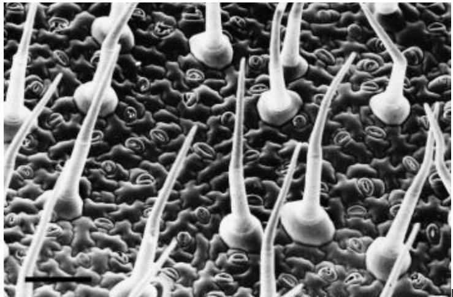

Lower surface of a tomato leaf showing a 'forest' of epidermal hairs and an abundance of tiny stomata through which plants 'draw some part of their nourishment!' Scale bar  $= 100\mu \mathrm{m}$  (Scanning electron micrograph courtesy Stuart Craig and Celia Miller)

... It is through their leaves that plants ... draw some part of their nourishment from the air...

Stephen Hales, Vegetable Staticks 1727

- [Chapter 13 - Carbon dioxide: a universal substrate](Chapter_13.md)
  - [Introduction]()  
  - [13.1 Dynamics of atmospheric CO₂]()  
  - [13.2 Leaf adjustments under CO₂ enrichment]()  
  - [13.3 Factor interaction and CO₂ enrichment]()  
  - [13.4 Horticultural applications of CO₂ enrichment]()  
  - [13.5 Tropical trees and CO₂ enrichment]()  
  - [13.6 Concluding remarks]()  
  - [Further reading]()  

# Introduction

With sunlight as a source of energy and atmospheric  $\mathrm{CO_2}$  as a source of carbon, terrestrial plants have evolved with assimilatory organs that enable acquisition of both sets of resources. Planar foliage facilitates  $\mathrm{CO_2}$  diffusion to fixation sites and maximises interception of sunlight per unit volume of photosynthetic tissue. Whether light interception or gas exchange was the more important driving variable for evolution of leaf form is a moot point, but a leaf morphology that facilitates gas exchange could imply that atmospheric supply of  $\mathrm{CO_2}$  limits carbon gain. Indeed, present examples of photosynthetic and growth response to  $\mathrm{CO_2}$  enrichment confirm that late twentieth century plants commonly operate well

below their potential, provoking a question as to how they came to evolve with an inherent capacity for carbon fixation that generally remains underutilised.

Land plants appeared on terra firma 350- 400 million years ago or thereabouts, when atmospheric  $\mathrm{CO_2}$  concentration would have been about  $2000\mathrm{ppm}$ . Such a high partial pressure of this crucial substrate shaped options for a biological assimilation system up to that time, based on Rubisco. A debate continues as to whether the Rubisco of modern- day plants is really maladapted or simply misunderstood. This huge bifunctional enzyme nevertheless remains pivotal to photosynthetic carbon metabolism at a time when atmospheric partial pressures of  $\mathrm{CO_2}$  are almost an order of magnitude lower.

Broad variation in atmospheric  $\mathrm{CO_2}$  partial pressure has resulted in photosynthetic adaptation, and a progressive fall to a minimum value about 100 million years ago (even below the levels of the 1990s) saw evolution of  $\mathrm{C_4}$  photosynthesis. In those species so adapted, an internal concentrating mechanism for  $\mathrm{CO_2}$  precedes assimilation via Rubisco, which now operates in bundle sheath cells of  $\mathrm{C_4}$  plants under conditions that ensure near saturation of its catalytic capacity. In evolutionary terms, nature found it more expedient to enhance performance of an existing Rubisco than to engineer an alternative catalytic system.

Regardless of whether Rubisco is really maladapted or simply misunderstood, performance in vivo is enhanced by  $\mathrm{CO_2}$  enrichment, providing an opportunity to analyse plant carbon metabolism and identify genetic and environmental limitations on carbon assimilation and growth. Such issues are analysed here within a context of global carbon budget and ecosystem gas exchange (Section 13.1), then at leaf level (Sections 13.2, 13.3), and finally in terms of environmental interactions on photosynthetic and growth responses to elevated  $\mathrm{CO_2}$  (Section 13.3). Practical applications of  $\mathrm{CO_2}$  enrichment in horticulture follow (Section 13.4) with a closing discussion (Section 13.5) on responses of tropical plants and savanna/woodland ecosystems to increased  $\mathrm{CO_2}$ .

# A note on units

Atmospheric  $\mathrm{CO_2}$  concentration is commonly expressed as a volume percentage which is known to have increased from a pre- industrial value of around  $0.0295\%$  to about  $0.0356\%$  by the late twentieth century. For convenience, that concentration is commonly reported as parts per million by volume (ppmv) or more simply 'ppm' with the volume term implicit. Late 1990s levels would thus be around  $356\mathrm{ppm}$ .

Calculation of physiological variables such as stomatal conductance and analysis of leaf gas exchange via  $A:p_{\mathrm{i}}$  curves are facilitated if driving variables for assimilation and transpiration are expressed as mol fractions. According to that

convention,  $356\mathrm{ppm}$  would be represented as  $356\mu \mathrm{m}$ oles of  $\mathrm{CO_2}$  per mole of air, abbreviated in Chapter 13 to  $\mu \mathrm{mol}\mathrm{CO}_2\mathrm{mol}^{- 1}$  or simply  $\mu \mathrm{mol}\mathrm{mol}^{- 1}$ .

As an additional issue, biochemical events such as  $\mathrm{CO_2}$  assimilation are an intrinsic function of the partial pressure of  $\mathrm{CO_2}$  at fixation sites, rather than  $\mathrm{CO_2}$  concentration by volume.  $\mathrm{CO_2}$  partial pressure at fixation sites is approximated by intercellular  $\mathrm{CO_2}$  partial pressure (represented by  $p_{\mathrm{i}}$ ) which will be somewhat higher than the actual  $\mathrm{CO_2}$  partial pressure at fixation sites within chloroplasts, but  $A:p_{\mathrm{i}}$  curves are most commonly referenced to this intercellular value. For practical purposes, and to simplify present comparisons between whole- plant physiology and leaf- level processes, an atmospheric pressure of 1 bar can be assumed, so that  $356\mathrm{ppm}$  is then equivalent to either  $356\mu \mathrm{mol}\mathrm{mol}^{- 1}$  or  $356\mu \mathrm{bar}\mathrm{bar}^{- 1}$ , and in ambient air at 1 bar, simply  $356\mu \mathrm{bar}$  or  $35.6\mathrm{Pa}$ .

# 13.1 Dynamics of atmospheric CO2

# 13.1.1 Global carbon cycle

A mere  $0.1\%$  of all the known carbon reserves on earth is cycling in our atmosphere, oceans and terrestrial biosphere combined. On a geological time scale  $(10^{6} - 10^{9}$  years) these three pools can be regarded as well mixed and in equilibrium with each other, cycling with the  $99.9\%$  of the earth's carbon incorporated in rocks. Such geologic cycling occurs via calcium carbonate and formation of reduced organic carbon in global oceans (including carbon derived from fossil fuels) and by subduction of rocks into the earth's magma via plate tectonics. Carbon (C) re- emerges as gaseous  $\mathrm{CO_2}$  from volcanoes, fumaroles and other leakage points, at about  $0.1\mathrm{GtCyear}^{- 1}$  globally, and for hundreds of millions of years following subduction. Prior to industrialisation, the distribution of carbon within this dynamic fraction ( $0.1\%$  of the global total) was approximately oceans  $95\%$ , vegetation and soils  $4\%$  and atmosphere  $1.5\%$ . Over the past two centuries a tiny fraction of the huge pool of reduced carbon in rocks has been extracted and burnt as fossil fuels. This releases at about  $6\mathrm{GtCyear}^{- 1}$  as  $\mathrm{CO_2}$  directly into our atmosphere and is so fast relative to the natural processes of cycling that atmospheric levels are building up at about  $0.5\%$  year $^{- 1}$ . This perturbation will take many thousands of years to redistribute into the oceans and tens of millions of years to redistribute into rocks, even if fossil fuel burning should cease. Meanwhile we will have to cope with continuing repercussions from this human impact on global cycles.

# 13.1.2 Small-scale variation in CO2

Plants growing in their natural environment experience a range of  $\mathrm{CO_2}$  concentrations above and below the mean ambient tropospheric value. This is

most frequently observed in vegetation with a closed canopy which reduces both rate and extent of exchange between the air in and below the canopy and the air above it. The variation in  $\mathrm{CO_2}$  concentration arises because of respiratory release of  $\mathrm{CO_2}$  from plants and soil, as well as photosynthetic consumption of  $\mathrm{CO_2}$  within the canopy. This effect is most pronounced during low aerodynamic conductances for  $\mathrm{CO_2}$  transfer into and out of the canopy, as occurs when wind speeds are low and/or when the surrounding atmosphere is 'stable'. This happens when there is a negative gradient in temperature within and away from the canopy. Similarly, there can be large vertical variations in  $\mathrm{CO_2}$  (and water vapour) concentrations within canopies themselves.

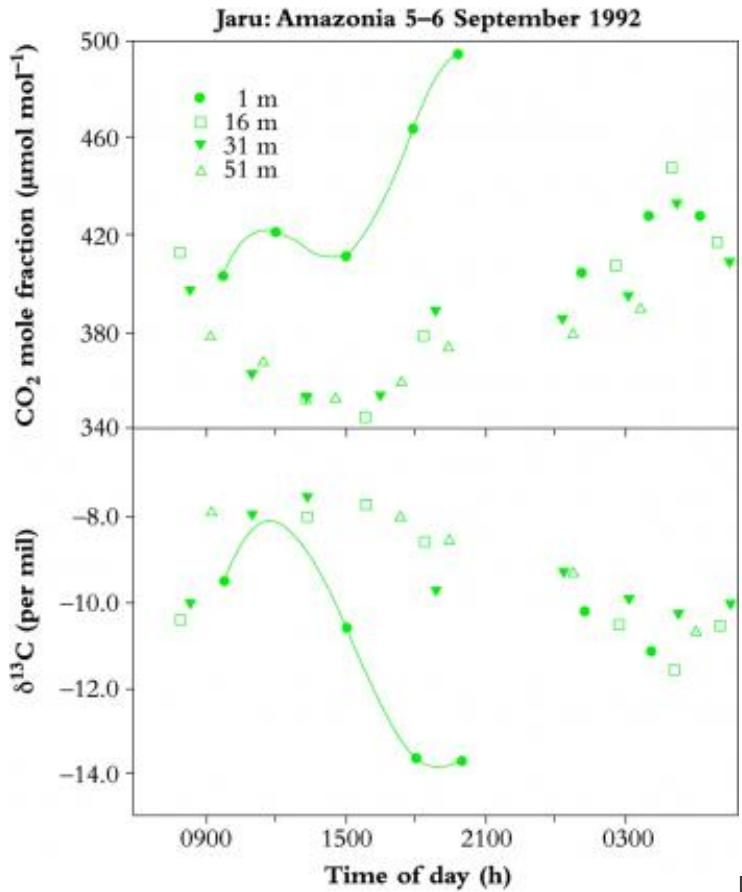  
Figure 13.1 Changes in  $\mathrm{CO_2}$  mole fraction over a typical day in and above an Amazonian forest. Measurements  $1\mathrm{m}$  above the ground (solid circles) show that  $\mathrm{CO_2}$  concentrations are higher near the ground than in or above the canopy  $(51\mathrm{m})$ . This is because of respiratory release of  $\mathrm{CO_2}$  from soil and also because of the low exchange of air between this level and the planetary boundary layer (PBL). During morning and early afternoon,  $\mathrm{CO_2}$  concentrations within the canopy decline substantially due to canopy photosynthesis plus exchange of air between the rainforest canopy and PBL. (Based on Grace et al. 1995 plus unpublished data)

Diurnal changes in ecosystem respiration and photosynthesis and in rates of heat and mass transfer into and out of canopies therefore result in large variations in  $\mathrm{CO_2}$  concentration. A typical example is shown for a rainforest in Brazil (Figure 13.1; Grace et al. 1995). In this case, even above the canopy,  $\mathrm{CO_2}$  concentration rises to  $450 - 500\mu \mathrm{mol}\mathrm{mol}^{- 1}$  pre- dawn and falls to values close to  $350\mu \mathrm{mol}\mathrm{mol}^{- 1}$

1 by afternoon. Close to the canopy floor, concentrations are usually much higher than at higher levels in the canopy, especially during the day. This effective 'decoupling' with  $\mathrm{CO_2}$  concentrations lower in the canopy occurs because of a significant daytime release of  $\mathrm{CO_2}$  from soil respiration (in this case at a rate of about  $6\mu \mathrm{mol}\mathrm{m}^{- 2}\mathrm{s}^{- 1}$ ). Low wind speeds near the forest floor and associated low aerodynamic conductances for  $\mathrm{CO_2}$  transfer are additional factors. This means that young seedlings in dense forests often experience ambient  $\mathrm{CO_2}$  concentrations substantially above those measured in the free troposphere.

When gradients in  $\mathrm{CO_2}$  concentration are measured within canopies, if the extent of mixing of  $\mathrm{CO_2}$  within the canopy is also known (from measurements of turbulence) it is possible to deduce the distribution of photosynthesis and respiration within the canopy.

It is also possible to measure  $\mathrm{CO_2}$  water vapour and heat fluxes into and out of canopies directly using eddy correlation (or eddy covariance). This technique involves simultaneous high- frequency measurement (typically about 20 times per second) of fluctuations in the vertical component of wind speed and associated fluctuations in  $\mathrm{CO_2}$  and  $\mathrm{H_2O}$  concentrations and temperature (Moncrieff et al. 1996). When there is a net flux of  $\mathrm{CO_2}$  into the canopy (i.e. photosynthesis exceeds respiration) the concentration of  $\mathrm{CO_2}$  in parcels (or eddies) of air leaving the canopy is less than that of parcels entering, hence 'eddy covariance'. The technique measures the vertical velocity and  $\mathrm{CO_2}$  concentrations of all air parcels entering and leaving a canopy and, when averaged over a long enough period (typically  $30\mathrm{min}$  to  $1\mathrm{h}$ ), calculates the rate of removal (or production) of  $\mathrm{CO_2}$  and other entities by that canopy.

In order to calculate the rate of physiological exchange of  $\mathrm{CO_2}$  by vegetation and soil it is necessary to take into account the variations in  $\mathrm{CO_2}$  that also occur within the canopy (Figure 13.1). When expressed on a ground area basis these fluctuations can be very large, especially an hour or two after sunrise (as much as  $60\mu \mathrm{mol}\mathrm{m}^{- 2}\mathrm{s}^{- 1}$ ) and in some cases may be greater in magnitude, and of a different sign, to the flux measured above the canopy by eddy covariance (Grace et al. 1995).

A steady decline in  $\mathrm{CO_2}$  concentration, often observed a few hours after sunrise, is attributable to high rates of photosynthesis removing some of the  $\mathrm{CO_2}$  that has built up over- night, plus onset of turbulent conditions and a rapid increase in the height of the atmospheric/platetary boundary layer. The atmospheric boundary layer (ABL, or PBL) is the layer of air directly above the earth's surface in which the effects of the surface (friction, heating and cooling and changes in trace gas concentrations) are perceived directly on time scales of less than a day, and in which significant fluxes of momentum, heat or matter are carried by turbulent motions on a scale of the order of the depth of the boundary layer or less. A

convective boundary layer (CBL) occurs when strong surface heating (due to solar radiation) produces thermal instability or convection in the form of thermals and plumes, and when upside- down convection is generated by cloud- top radiative cooling (Garratt 1992). A simple and informative summary of the general properties of the CBL is given by Raupach et al. (1992). In the absence of complete cloud cover, the CBL over land shows a strong diurnal development, the height of the CBL typically increasing from  $100 - 500\mathrm{m}$  in early morning to 1- 2 km in mid- afternoon. A stable layer, capped by a radiation inversion, usually develops near the ground when solar heating of soil surfaces ceases around dusk.

Diurnal patterns in the height of the CBL thus interact with the rates of ecosystem photosynthesis and respiration in determining the  $\mathrm{CO_2}$  concentrations to which plants are exposed. When the rate of  $\mathrm{CO_2}$  fixation by photosynthesis is high compared to the rates of  $\mathrm{CO_2}$  release from respiration and the rate of transport of  $\mathrm{CO_2}$  into the CBL from the troposphere above, then the  $\mathrm{CO_2}$  concentrations experienced by plants growing on the earth's surface are often below that of the troposphere above the CBL. By measuring the rate of change in  $\mathrm{CO_2}$  concentrations within the CBL and measuring (or modelling) the CBL growth rate (and hence the rate of entrainment of tropospheric  $\mathrm{CO_2}$  into the CBL) it is possible to deduce the rate of ecosystem gas exchange at a 'regional' level. This gives the average value of carbon (or water vapour/temperature) exchange over an area of some hundreds of square kilometres (Raupach et al. 1992).

# 13.2 Leaf adjustments under CO2 enrichment

# 13.2.1 C3 plants versus C4 plants

When water supply does not restrict growth,  $\mathrm{C_3}$  plants can accumulate dry matter more rapidly in elevated  $\mathrm{CO_2}$  concentrations than ambient  $\mathrm{CO_2}$  concentrations. This is primarily because the rate of net photosynthetic carbon reduction by Rubisco is increased by increased substrate availability and partly because the rate of oxygenation by Rubisco (photorespiration) is reduced. The different mechanisms of  $\mathrm{C_3}$ ,  $\mathrm{C_4}$  and CAM photosynthetic pathways (Section 2.1) confer contrasting characteristics to the  $\mathrm{CO_2}$  response of photosynthesis and growth of these plant groups. The  $\mathrm{CO_2}$ - concentrating mechanism in C- plants suppresses photorespiration. This causes a steeper initial slope to the  $\mathrm{CO_2}$  response curve of net photosynthesis than in  $\mathrm{C_3}$  plants and a sharper transition to saturation (Figure 2.4). At an atmospheric  $\mathrm{CO_2}$  concentration of around  $350\mu \mathrm{mol}\mathrm{CO_2}\mathrm{mol}^{- 1}$  the  $\mathrm{CO_2}$  partial pressure inside a leaf  $(p_{\mathrm{i}})$  is, for  $\mathrm{C_4}$  species, close to the zone on the curve where there is a transition to the saturating value. In  $\mathrm{C_3}$  species the normal operating  $p_{\mathrm{i}}$  supports net carbon fixation at about half the saturating rate.

Accordingly, growth experiments in well- watered conditions show little or no response of  $\mathrm{C_4}$ , but substantial responses of  $\mathrm{C_3}$ , species to  $\mathrm{CO_2}$  enrichment. However, in experiments where  $\mathrm{CO_2}$  concentration is reduced below about  $350 \mu \mathrm{mol} \mathrm{CO_2} \mathrm{mol}^{- 1}$ , growth of both  $\mathrm{C_3}$  and  $\mathrm{C_4}$  species respond strongly. CAM plants (Figure 2.7) also show little or no photosynthetic or growth response to  $\mathrm{CO_2}$  enrichment. Their photosynthetic mechanism involves either daytime  $\mathrm{CO_2}$  fixation by Rubisco at high intercellular  $\mathrm{CO_2}$  concentrations, or night- time assimilation via phosphoenolpyruvate (PEP) carboxylase with a high affinity for  $\mathrm{CO_2}$ .

There is a wide range in the growth responses of plants grown in twice ambient  $\mathrm{CO_2}$  concentration (Figure 13.2). The overall mean response of  $\mathrm{C_3}$  species  $(+41\%)$  exceeds those of  $\mathrm{C_4}$ $(+22\%)$  and CAM  $(+15\%)$  plants. Wide variation in growth enhancement by  $\mathrm{C_3}$  plants, and responses of  $\mathrm{C_4}$  and CAM plants that were somewhat larger than predicted from leaf photosynthetic considerations alone, imply plant responses to  $\mathrm{CO_2}$  beyond those of photosynthesis and photorespiration. Such features include interactions between  $\mathrm{CO_2}$  and other growth- limiting environmental variables, duration of intervals between harvests, photosynthetic acclimation to high  $\mathrm{CO_2}$  and changes in carbon partitioning. These topics are dealt with below.

# 13.2.2 Stomatal conductance

Table 13.1 Changes in stomatal density of some tropical tree species exposed to  $CO_2$  enrichment. Leaf development under elevated  $\mathrm{CO_2}$  results in differentiation of fewer epidermal cells into stomata  

<table><tr><td rowspan="2">Species</td><td colspan="2">Stomatal density(cm-2)</td></tr><tr><td>Ambient</td><td>CO2 enriched</td></tr><tr><td>Eucalyptus tetrodonta</td><td>8314</td><td>6654</td></tr><tr><td>Maranthes axymbosa</td><td>8596</td><td>7435</td></tr><tr><td>Mangifera indica</td><td>7240</td><td>5972</td></tr><tr><td colspan="3">(Based on various sources including Eamus et al. 1995)</td></tr></table>

# Tab le 13.1

Increased  $\mathrm{CO_2}$  concentration generally reduces stomatal conductance, and this is commonly due to a decrease in stomatal aperture, but in some species stomatal density also declines (Table 13.1). Decreased conductance can reduce transpiration. When water is abundant this is of little consequence for a growth response to elevated  $\mathrm{CO_2}$  because  $c_{\mathrm{i}}$  (internal concentration of  $\mathrm{CO_2}$ ) is still larger and hence photosynthesis is enhanced. However, when plants experience a water deficit, a reduction in conductance enhances the relative growth response to  $\mathrm{CO_2}$ . Because water use is the immediate price plants pay for carbon acquisition, high  $\mathrm{CO_2}$  can offset a carbon- fixing penalty due to low water supply. In this way water- stressed  $\mathrm{C_4}$  species show a growth response to  $\mathrm{CO_2}$  enrichment. In many glasshouse and growth cabinet experiments in pots, plants can suffer water deficits

in between their regular waterings. Anomalously large  $\mathrm{C_4}$  growth responses to  $\mathrm{CO_2}$  might be attributable to unrecognised water deficits.  $\mathrm{CO_2} \times$  water interactions are described further in Section 13.4.

# 13.2.3 Respiratory adjustments

Dark respiration of plants and plant parts is often decreased by  $\mathrm{CO_2}$  enrichment. Short- term, quickly reversible suppressions and long- term decreases in specific respiration have both been observed. Short- term effects have been attributed to an inhibition of cytochrome oxidase activity by elevated  $\mathrm{CO_2}$  concentration. Long- term effects may relate to a smaller energy requirement for tissues with lower protein contents which are usually found in  $\mathrm{CO_2}$ - enriched environments. Details of such respiratory inhibitions are still to be worked out, but on balance they probably play a small role in growth response to  $\mathrm{CO_2}$  enrichment.

# 13.2.4 Ontogeny and duration of CO2 enrichment

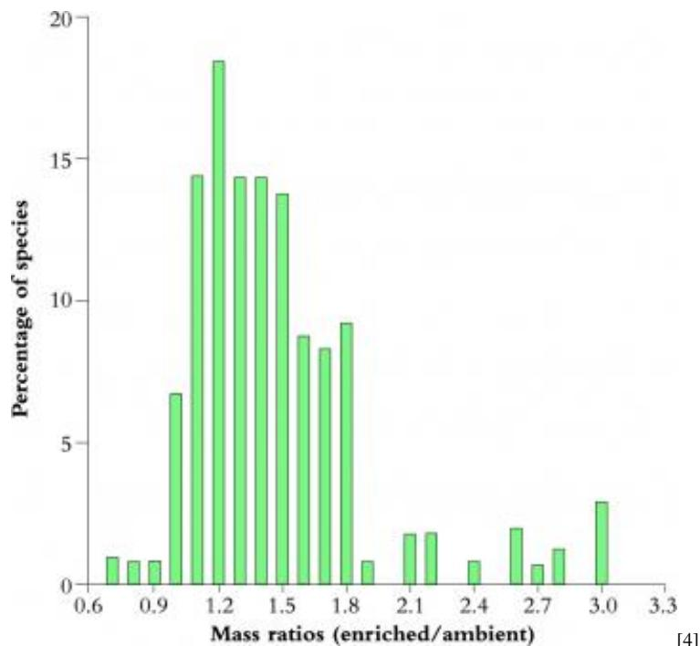  
Figure 13.2 Weight ratios of plants frown under  $\mathbf{CO_2}$  enriched to ambient conditions are generally greater than unity, indicating that  $\mathbf{CO_2}$  enrichment most commonly increases plant growth. Rarely is the ratio less than one, and mostly between 1.1 and 1.8. (Based on Gifford et al. 1984 and data from other sources)

One likely reason for variation in growth responses of isolated plants in Figure 13.2 is variation in growth duration. During early exponential growth any  $\mathrm{CO_2}$  stimulation of growth is partially invested in increased leaf area. This establishes a positive feedback because increased leaf area is available to intercept light and utilise the increased availability of  $\mathrm{CO_2}$ . This causes a massive amplification of the leaf- level response to doubled  $\mathrm{CO_2}$  concentration (from  $10\%$  to  $40\%$ ) up to a peak of  $150–300\%$  response (based on plant size at a given time prior to canopy closure). Following canopy closure, self- shading and competition for other scarce resources pro- gressively reduce or eliminate this positive feedback. That is, negative feedbacks that relate to plant size offset the positive feedback. Since plants grown with  $\mathrm{CO_2}$  enrichment grow faster, the negative feedbacks set in sooner and the relative  $\mathrm{CO_2}$  effect on plant size at a given time progressively declines. In experiments with communities of interacting  $\mathrm{C_3}$  plants, as in crop stands and pasture swards or natural ecosystems, growth response of the canopy as a whole resembles short- term leaf photosynthetic responses and commonly falls between  $10\%$  and  $40\%$ .

# 13.2.5 Photosynthetic acclimation

'Photosynthetic acclimation' is a commonly observed phenomenon where a plant grown with  $\mathrm{CO_2}$  enrichment has a different light- saturated short- term leaf photosynthetic  $\mathrm{CO_2}$  response curve from that of an equivalent leaf grown in ambient air. Sage (1994) identifies six common patterns of response of assimilation resulting from the interaction of three semi- independent processes. These processes are the amount/activity of Rubisco, the rate of thylakoid- dependent RuBP regeneration capacity and the phosphate regeneration capacity. Figure 13.3 gives three examples of photosynthetic responses of soybean grown at ambient and about twice ambient  $\mathrm{CO_2}$  concentrations. Substantial downregulation (Figure 13.3a), substantial upregulation (Figure 13.3c), or no change (Figure 13.3b) were all observed. The upregulated case was for plants (cultivar Bragg) grown to pod- fill stage in naturally illuminated cabinets. The downregulated case was for pod- filling plants (cultivar Frosty) grown under fluorescent light when the leaves measured were 21- 26 d old. The unchanged ones came from the same group of plants as in Figure 13.3(c) but leaves were only 12- 14 d post- emergence. The reasons for the different responses are unknown. There was little or no reduction in Rubisco activity per unit area of leaf as a result of growth with  $\mathrm{CO_2}$  enrichment despite lower initial slopes in Figure 13.3(a) and (c). In many studies, however, downregulation is accompanied by reduced Rubisco activity, as implied by a decline in the slope of the initial part of the  $A:p_i$  response.

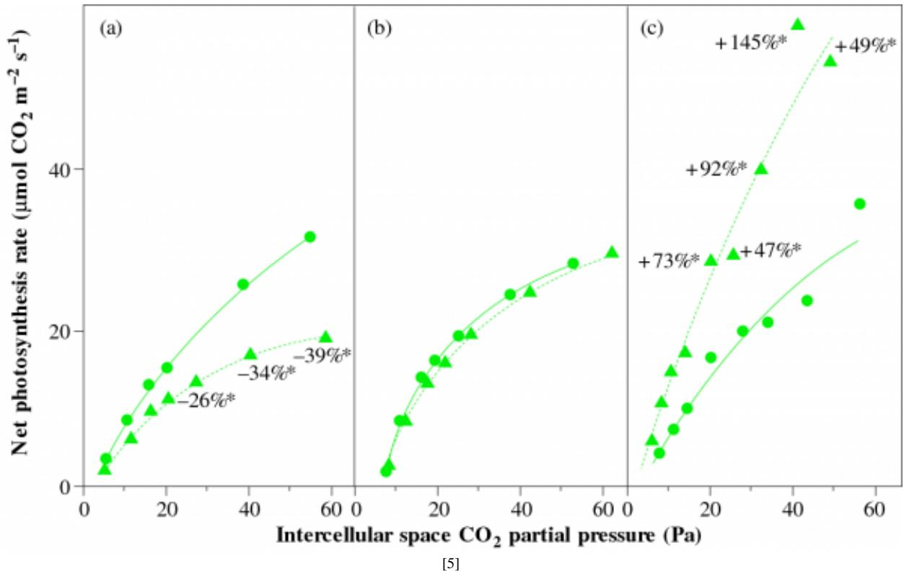  
Figure 13.3 Soybean, grown under ambient (solid line) or  $\mathbf{CO}_2$  - enriched conditions (dashed line) can show (a) downregulation, (b) no change or (c) upregulation of assimilation. Downregulation was observed for old leaves of plants grown under fluorescent lights. No change was observed for younger plants grown as in (a), but upregulation was observed in old leaves grown under natural lighting. The numbers along the lines show the percentage change in assimilation rate between control and  $\mathbf{CO}_2$  -enriched plants. (Based on data from Xu et al. 1994; Campbell et al. 1988)

# Mechanisms underlying acclimation

Diverse hypotheses are being explored to explain acclimation. Reports of downregulation are more common than of upregulation. While downregulation is the main focus of such investigations of acclimation, any complete explanation will have to accommodate instances of upregulation.

Early hypotheses emphasised the role of excessive starch and sugar accumulation in inhibiting photosynthesis. Inhibition resulted from a physical obstruction of chloroplasts by starch grains or by the sequestration of phosphate in sugar phosphates. A suboptimal supply of phosphate to the chloroplast has an immediate negative impact on rates of photosynthesis. Such responses are frequently observed in plants grown in nutrient- limiting conditions or in small pots, where root growth (and hence sink activity) is limited. Subsequent hypotheses stressed that downregulation is the result of the  $\mathrm{CO_2}$  - enriched plant allocating nitrogen away from the photosynthetic carbon- fixing apparatus (especially Rubisco), investing instead in other functions which become relatively more growth limiting when photosynthesis is  $\mathrm{CO_2}$  stimulated, such as light harvesting or root growth (i.e. the

maintenance of sink activity). From this perspective, downregulation is seen as an expression of suboptimal nitrogen nutrition. Indeed in many experiments where downregulation was not observed, the plants were not nutrient deficient. Later these two hypotheses were linked by suggestion of a regulatory effect of sugars on gene expression. Van Oosten et al. (1992, 1994) have shown that hexose accumulation in leaves resulting from artificial supply of hexoses or from growth in a  $\mathrm{CO_2}$ - enriched environment can cause a decline in the number of transcripts for chlorophyll- binding proteins and Rubisco activase. In addition, excision of leaves (which prevents phloem translocation from leaves) increased the sensitivity of nuclear genes (but not chloroplast genes) to  $\mathrm{CO_2}$  enrichment. Some mitochondrial enzymes were also reduced in activity. Clearly,  $\mathrm{CO_2}$  enrichment can influence expression of nuclear, chloroplast and mitochondrial genes differentially, and possibly through sugar accumulation and phosphate supply to chloroplasts.

No clear comprehensive hypothesis has yet emerged to explain both upregulation and downregulation. However, photo- synthetic downregulation probably represents a shift in resource deployment (especially nitrogen) so that plants exposed to  $\mathrm{CO_2}$  enrichment are re- optimised to make better use of resources that are available.

# 13.2.6 Carbon partitioning

A shift in resource deployment can be expressed as a change in carbon and other element partitioning among plant parts. The notion of 'functional equilibrium' suggests that increasing availability of an atmospheric resource, like  $\mathrm{CO_2}$ , should increase relative partitioning of resources into roots so that a balance between assimilation of carbon and nutrients (especially nitrogen) is maintained. Some plant growth models use this concept to drive dry matter partitioning. However, examination of  $\mathrm{CO_2}$ - enrichment effects on partitioning in terms of allometric relationships (Section 6.3.1) does not support this view. Rather, changes in carbon distribution among plant parts is more a function of plant size, whether that be varied by time of harvest (i.e. age of plant) or by  $\mathrm{CO_2}$  concentration for a given time of harvest (i.e. size of plant), rather than  $\mathrm{CO_2}$  concentration per se (Figure 13.4).

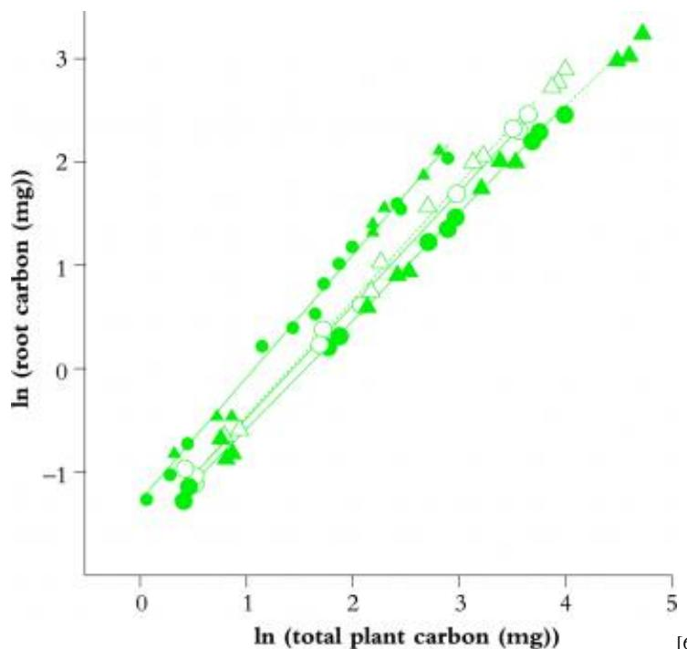  
Figure 13.4 Allometric relationships between root carbon and total carbon of isolated Danthonia richardsonii plants in response to  $\mathbf{CO}_2$  enrichment and nitrogen supply. At any given rate of nitrogen supply,  $\mathbf{CO}_2$  enrichment had no impact on the relationship between root carbon and total plant carbon, despite  $\mathbf{CO}_2$  enrichment increasing plant size at any given time. As nitrogen supply rate declined, the proportion of carbon allocated to roots increased, an example of a homeostatic response of a plant depleted in nitrogen exploring a larger soil volume in order to obtain nitrogen.

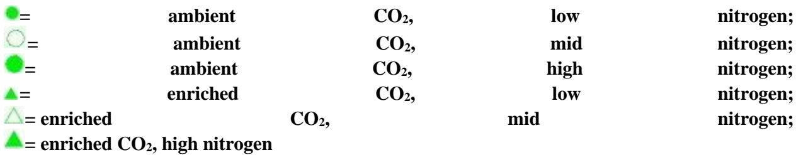

(Based on J.L Lutze and RM Gifford, pers. Comm. 1996)

Figure 13.4 shows an allometric relationship between root carbon and total plant carbon for Danthonia richardsonii seedlings grown in two atmospheric  $\mathbf{CO}_2$  concentrations and three nitrogen treatments. Increasing nitrogen supply reduced carbon allocation to roots. This is apparent from the different intercepts of the lines. Growth at elevated  $\mathbf{CO}_2$  did not change allocation patterns because at each nitrogen level, ambient  $\mathbf{CO}_2$  control plants (circles) and  $\mathbf{CO}_2$ - enriched treatments (triangles) fall on the same line.

In this section the general response of assimilation and growth to  $\mathbf{CO}_2$  enrichment has been shown in isolation. However, in reality atmospheric  $\mathbf{CO}_2$  enrichment is occurring in an environment where water availability may be restricted at some point in a plant's lifetime, or temperatures may be suboptimal or supraoptimal. For

any prediction of plant response to  $\mathrm{CO_2}$  enrichment the interaction of  $\mathrm{CO_2}$  enrichment with other environmental inputs must be appreciated (Section 13.3).

# 13.3 Factor interaction and CO2 enrichment

Controlled environment and field studies clearly demonstrate that biomass production and yield are increased in both  $\mathrm{C}_3$  and  $\mathrm{C}_4$  species in response to  $\mathrm{CO_2}$  enrichment. A survey of experiments carried out on a large number of species (Figure 13.2) established that doubling atmospheric  $\mathrm{CO_2}$  concentration from 350 to  $700\mu \mathrm{mol}\mathrm{CO}_2\mathrm{mol}^{- 1}$  stimulates vegetative growth by an average of  $37\%$ . Although this is a substantial response, it remains lower than is expected, based on short- term  $\mathrm{CO_2}$  response curves of leaf photosynthesis. While photosynthetic downregulation (Section 13.2.5) can account for much of this, additional field factors such as water, nutrient or light availability may also account for some of this difference between expected and observed growth responses. Furthermore, these factors interact with  $\mathrm{CO_2}$  concentration and modify the impact of  $\mathrm{CO_2}$  enrichment. Section 13.3 addresses these issues.

Potential growth rate is set by genetic factors. However, field growth is generally limited by one or more environmental variables such as sunlight, temperature, availability of mineral nutrients (especially nitrogen and phosphorus) and water.

In a linear sequence of events, limitation of an outcome by one component is common. In complex biological systems such as vascular plants, single- factor limitation is unusual. This is partly because plants balance resource acquisition and allocation to optimise several factors which then become collimating for growth. For example, photosynthesis can be colimited by several factors despite large variations in the rate of assimilation that occur throughout a day as photon irradiance and temperature vary. Consequently, a growth response to relief of one limiting factor, such as atmospheric  $\mathrm{CO_2}$ , will depend not only on genetically determined potential but also on the relative availability of other colimiting environmental factors. Moreover, increased atmospheric  $\mathrm{CO_2}$  can also alter plant responses to other environmental variables. Clearly, a study of plant growth responses to high  $\mathrm{CO_2}$  calls for some discussion of genotype  $\times$  environment interactions.

# 13.3.1 Light

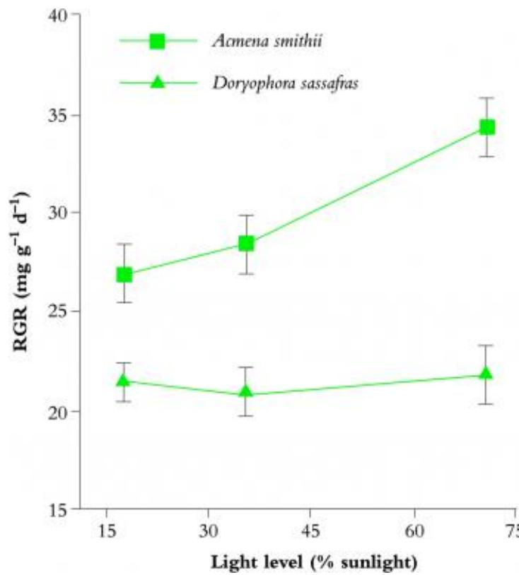  
Figure 13.5 Relative growth rate (RGR) for Acmena smithii and Doryophora sassfras. A. smithii achieves higher RGR than  $D.$  sassfras, especially at higher light levels. Data points are the average of two  $\mathbf{CO}_2$  treatments, 350 and 700 umol  $\mathbf{CO}_2$  mol  ${}^{-1}$ . (2  $\times$  standard errors of means are shown) (D.J. Wiggins, M.C. Ball, R.M. Gifford and G.D. Farquhar, pers. comm. 1996)

The nature of  $\mathrm{CO_2}$  enrichment differs from increasing the availability of light or any other environmental variable in one important respect. Besides increasing the availability of a limiting resource,  $\mathrm{CO_2}$  enrichment reduces inefficiency through a reduction in the photorespiratory loss of carbon. So even under extreme light- limiting conditions,  $\mathrm{CO_2}$  enrichment can be expected to enhance net photoassimilation. This is most frequently expressed as an increased quantum efficiency. In addition, a frequently observed consequence of increasing the supply of photoassimilate in response to  $\mathrm{CO_2}$  enrichment is increased leaf area. This has the feed- forward effect of causing increased radiation interception, which further amplifies the initial response to  $\mathrm{CO_2}$  enrichment. Increased light and elevated  $\mathrm{CO_2}$  can therefore interact positively to affect relative growth rate via an initial effect on rate of leaf expansion (Figure 13.5).

# 13.3.2 Sink strength

Relative growth rate can be limited by utilisation rather than generation of photoassimilates. Such sink limitation can lead to feedback inhibition of photosynthesis (Section 13.2.5). Those species with a high intrinsic relative growth rate (RGR) in any given light environment are likely to be able to respond to  $\mathrm{CO_2}$  enrichment better than species with a lower RGR for the same light

environment. Under shade conditions, plants with a high RGR are more likely to benefit from the direct and compounding benefits of an increased photoassimilate supply. Plants with a low RGR, when subject to abundant illumination, may be so well supplied with photoassimilate that sinks are growing almost as fast as the prevailing temperature allows. In that scenario, further photosynthetic stimulation by  $\mathrm{CO_2}$  enrichment would not lead to increased sink activity and feedback inhibition of photosynthesis may follow.

  
Figure 13.6 Number of branches produced under different combinations of irradiance and atmospheric  $\mathbf{CO}_2$  concentration in Acmena smithii and the more apically dominant Doryophora sassafras. A. smithii has a greater phenotypic plasticity and is better able to increase sink number in response to  $\mathbf{CO}_2$  enrichment. (2  $\times$  standard errors of means are shown) (D.J. Wiggins, M.C. Ball, R.M. Gifford and G.D. Farquhar, pers. comm. 1996)

In addition to strong RGR (strong sinks) some species possess a greater phenotypic plasticity and are able to generate additional sinks according to growing conditions (i.e. indeterminate growth). Such plants show a larger and more sustained response to  $\mathrm{CO_2}$  enrichment than determinate species (Figure 13.6). Doryophora sassafras Endl. and Acmena smithii (Poir.) Merr. and Perry are two species endemic to warm temperate rainforests of New South Wales. D. sassafras typically establishes under low light regimes and A. smithii establishes under a wide range of light environments. Both species are capable of germination under mature rainforest canopies and persist in low light environments.

A. smithii differs from  $D$  . sassafras in its response to both low and high light environments. Not only can 
A. smithii achieve a faster RGR than  $D$  . sassafras at all light levels, but A. smithii also has the phenotypic plasticity to increase sink number, largely through an increase in branching (Figure 13.6). Enhanced branching thus increases the capacity of A. smithii to use photoassimilates in response to higher light. In contrast,  $D$  . sassafras is more apically dominant and is unable to increase sink strength commensurate with the enhanced capacity to produce photoassimilates.

The response of A. smithii to  $\mathrm{CO_2}$  enrichment is similar to its response to increased light. Increased availability of both resources may increase photosynthetic capacity

and both have the ability to induce physiological and morphological changes in many species. Both factors influence leaf elongation and branching and thereby lead to a positive interaction on whole- plant RGR by sustaining faster expansion over a larger number of leaves.

# 13.3.3 Temperature

Temperature effects on plant growth and development raise two sets of issues within a context of interactions between  $\mathrm{CO_2}$  enrichment and environmental factors. First, will the rate of net photosynthesis at any given temperature be altered by  $\mathrm{CO_2}$  enhancement and, second, will a growth response to  $\mathrm{CO_2}$  enrichment be temperature dependent?

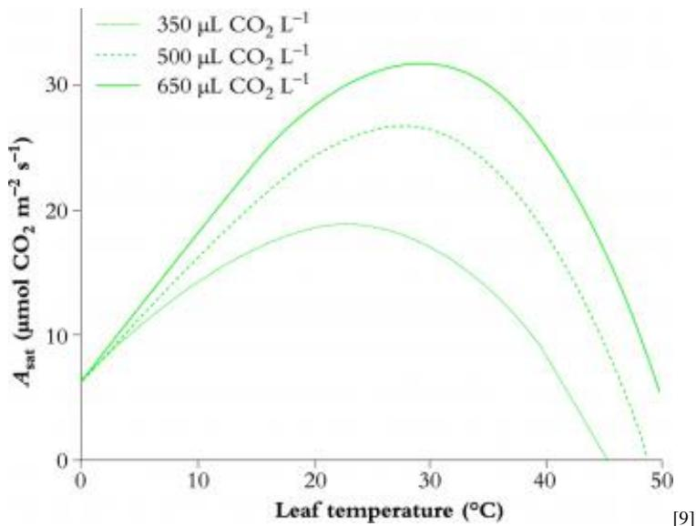  
Figure 13.7 Predicted light-saturated rates of assimilation with leaf temperature for three different  $\mathrm{CO_2}$  concentrations. (Based on Long 1991)

The dual carboxylase/oxygenase function of Rubisco results in a reduction in net photosynthesis as  $\mathrm{O_2}$  competes with  $\mathrm{CO_2}$  for access to the key  $\mathrm{CO_2}$ - acceptor molecule of  $\mathrm{C_3}$  photosynthesis, ribulose- 1,5- bisphosphate (RuHP). As temperature rises, both  $\mathrm{CO_2}$  solubility and specificity of Rubisco for  $\mathrm{CO_2}$  decreases. Moreover,  $\mathrm{CO_2}$  solubility decreases to a greater extent than does  $\mathrm{O_2}$  solubility. Taken together, these changes favour oxygenation of RuHP, so for any given  $\mathrm{CO_2}$  concentration increased temperature will increase RuBP oxygenation relative to carboxylation. Consequently the proportional enhancement of assimilation in response to  $\mathrm{CO_2}$  enrichment increases because of a progressively larger benefit of inhibiting photorespiration as temperature increases (Figure 13.7). (See Long (1991) and Eamus (1996) for further discussion.)

# 13.3.4 Phenology, temperature and CO2

Mean global surface temperatures are expected to increase by approximately  $1.5 - 4^{\circ}\mathrm{C}$  with a doubling of the atmospheric  $\mathrm{CO_2}$  concentration from 350 to  $700\mu \mathrm{mol}$ $\mathrm{CO_2mol^{- 1}}$ . This may appear inconsequential in comparison with the common occurrence of temperature fluctuations of up to  $30^{\circ}\mathrm{C}$  in a single day. However, small temperature rises over an entire season will have a significant effect on crop yield and pasture growth largely because of the acceleration of developmental rates. Temperature increases and  $\mathrm{CO_2}$  enrichment independently accelerate development of annual crop species. In wheat and rice, successive leaves appear faster and time to flowering is shortened by increases in both temperature and  $\mathrm{CO_2}$ . In determinant species such as wheat (Triticum aestivum L.) and rice (Oryza sativa L.), yield is often dependent on whole- plant biomass production. Consequently, hastened development (faster phenology) decreases the time available for radiation interception prior to maturity. This decreases biomass accumulation and yield.

The scale of temperature  $\times \mathrm{CO_2}$  interactions on yield is thus set by phenology, and isolines that differ primarily in the duration of their life cycle provide useful test material. The near- isogenic wheat varieties Hartog and Late Hartog provide a good example of a genetically dependent phenology. Using these two varieties, experiments were carried out (H. Rawson, pers. comm. 1997) to determine whether duration could increase the advantage gained by higher temperatures at elevated  $\mathrm{CO_2}$  concentrations. Temperatures were increased by  $2^{\circ}\mathrm{C}$  above ambient in both winter and summer growing conditions (Figure 13.8).

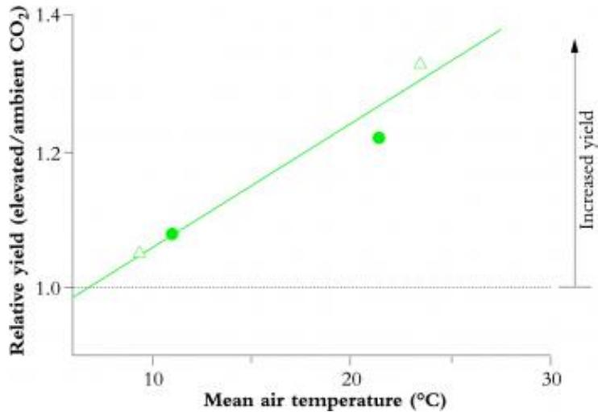  
Figure 13.8 Grain yield response of wheat (Hartog and Late Hartog) to increasing  $\mathrm{CO_2}$  concentration from  $350\mu \mathrm{mol}$ $\mathrm{mol^{-1}}$  to  $700\mu \mathrm{mol}$ $\mathrm{mol^{-1}}$ , expressed as a ratio of yield from enriched to yield under ambient  $\mathrm{CO_2}$  concentrations. Symbols represent two different sites (H. Rawson, unpublished data)

In summer, the mean daily maximum was approximately  $23^{\circ}\mathrm{C}$ . The maximum daily temperature was over  $30^{\circ}\mathrm{C}$ , with temperatures exceeding  $40^{\circ}\mathrm{C}$  on 17 occasions. Crop yield responded dramatically under these conditions. Doubling the

ambient atmospheric  $\mathrm{CO_2}$  concentration led to a biomass and grain yield increase of over  $30\%$  in the shorter duration genotype (Hartog). As a result of its slower developmental rate and subsequent increased radiation interception, biomass production was greater in Late Hartog than Hartog in two consecutive summer studies. In winter, when mean temperature was around  $10^{\circ}\mathrm{C}$ , the increase in yield in response to  $\mathrm{CO_2}$  enrichment ranged from  $8\%$  to  $12\%$ .

Based on responses to a doubling of the current  $\mathrm{CO_2}$  concentration over a range of temperatures, a  $1.8\%$  increase in biomass production and yield with each  $^\circ \mathrm{C}$  rise in temperature can be anticipated (Figure 13.8). These data imply a considerable benefit in terms of grain yield in a future  $\mathrm{CO_2}$ - enriched environment, but extrapolation to areas where summer temperatures are already marginal for production would be misleading. In those cases, cereal yield will be constrained by environmental stresses despite potential benefits from higher  $\mathrm{CO_2}$ .

# 13.3.5 Drought

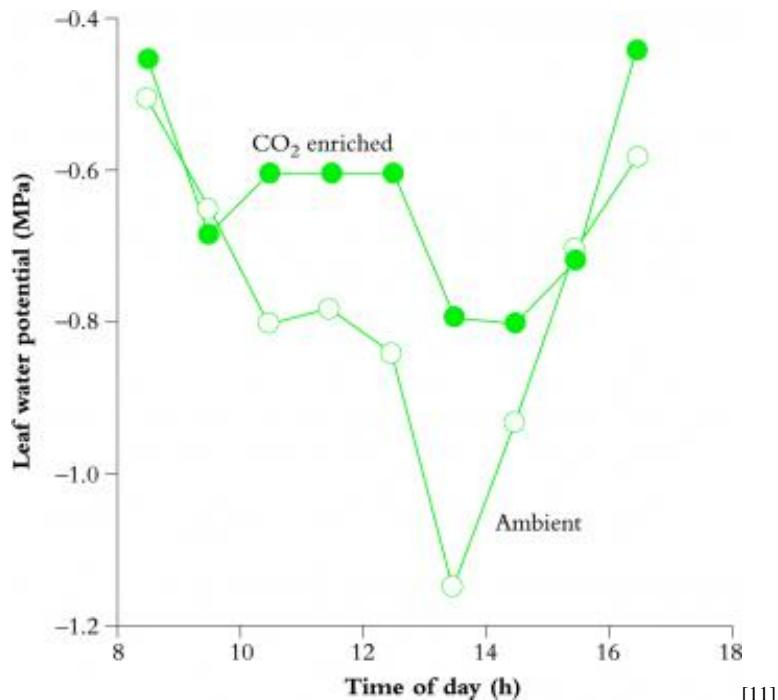  
Figure 13.9  $\mathrm{CO_2}$  enrichment can enhance leaf water potential in some species. Maranthes corynosa, a tropical monsoon rainforest species of north Australia, maintains a significantly higher leaf water potential throughout the day. (Based on Eamus et al. 1995)

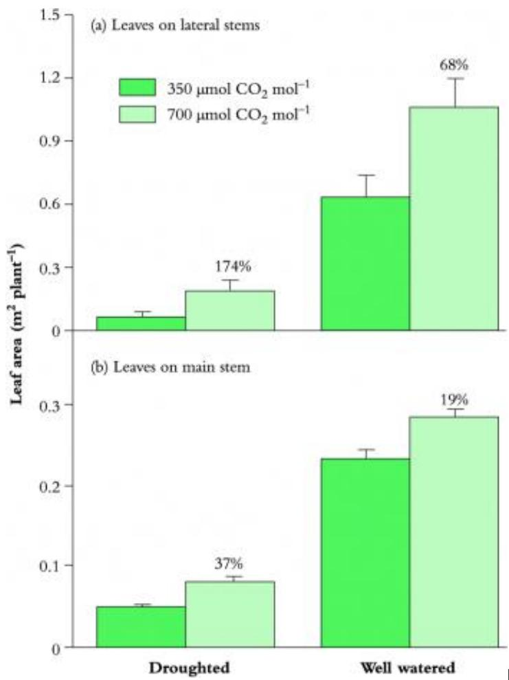  
Figure 13.10 (a) Total area of leaves on lateral stems of 23-week-old *Eucalyptus tereticornis* grown at ambient and elevated  $\mathrm{CO_2}$  concentrations and two levels of water supply (50% field capacity – droughted; field capacity – well watered). (b) Total area of leaves on main stem. Treatments as for (a). Values above columns represent percentage increase in leaf area at high  $\mathrm{CO_2}$ . The percentage stimulation in leaf area per plant is largest in droughted plants. (2 × standard errors of means are shown) (Based on B.J Atwell and J.P. Conroy, pers. comm. 1996)

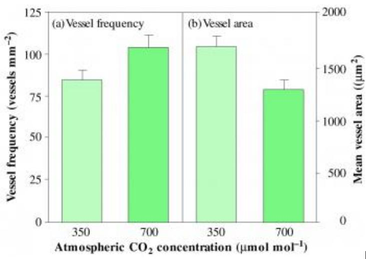

One of the primary responses to soil water deficit is a reduction in stomatal conductance. A primary response of many species to  $\mathrm{CO_2}$  enrichment has also been a reduction in stomatal conductance. A doubling of atmospheric  $\mathrm{CO_2}$  from 350 to  $700\mu \mathrm{mol}\mathrm{CO}_2\mathrm{mol}^{- 1}$  reduces stomatal conductance by about  $40\%$ , regardless of the conductance in normal air. This reduction is due partly to reduced stomatal aperture and partly to reduced stomatal density. Furthermore, changes in stomatal conductance due to  $\mathrm{CO_2}$  enrichment are often more pronounced for water- stressed plants than for well- watered ones. As the amount of water lost through transpiration is largely dependent on stomatal aperture,  $\mathrm{CO_2}$  enrichment can result in maintenance of higher leaf water potentials at any given soil water content (Figure 13.9) as has been observed in Maranthes corymbosa, a tropical tree of northern Australia. However, any improvement in water relations at high  $\mathrm{CO_2}$  due to reductions in soil water depletion is often counter- balanced in  $\mathrm{C}_3$  plants by increased leaf area production under high  $\mathrm{CO_2}$ . In  $\mathrm{C}_4$  plants, lower transpiration at high  $\mathrm{CO_2}$  is not counterbalanced by a greater leaf area, so that growth can benefit from an improved supply of soil moisture.

In addition to potential advantages from reduced stomatal conductance there are at least two reasons why increased growth may occur in water- stressed plants in response to  $\mathrm{CO_2}$  enrichment. First, the internal concentration of  $\mathrm{CO_2}$  ( $c_{\mathrm{i}}$ ) is increased at high atmospheric  $\mathrm{CO_2}$  concentrations ( $c_{\mathrm{a}}$ ) compared to ambient conditions despite reductions in stomatal conductance as water stress develops. Additional photoassimilates may allow plants to osmoregulate more effectively and to respond more quickly to any alleviation of water stress (compensatory increase in leaf size following rewatering was covered in Section 6.2.7). Second, by slowing down leaf appearance and expansion rates, water deficits induce a reduction in the number of active sinks at any one time. As we have seen, a common response to  $\mathrm{CO_2}$  enrichment is increased sink strength. In Eucalyptus tereticornis, doubling atmospheric  $\mathrm{CO_2}$  concentration from 350 to  $700\mu \mathrm{mol}$ $\mathrm{CO_2mol^{- 1}}$  substantially increased total leaf area per plant. The increase in total leaf area is largely a result of decreased apical dominance leading to enhanced lateral branching and a subsequent increase in leaf number per plant. Water- stressed plants show a more dramatic response (Figure 13.10).

$\mathrm{CO_2}$  enrichment also enhances sink generation in woody stems, leading to a  $30\%$  increase in dry mass (under well- watered conditions). In this instance (Figure 13.11) expression of enhanced sink capacity occurs via an increase in the number of vessels per unit cross- sectional area and a decrease in their average diameter (Figure 13.12). Fast- growing species of Eucalyptus such as  $E.$  grandis typically respond in this way to improved growing conditions so that basic wood density does not diminish with site improvement (Bamber et al. 1982). Change in wood

properties (Figure 13.12 B, C) is not only important in determining the capacity of eucalypts to respond to  $\mathrm{CO_2}$  but has implications for carbon cycling in forests: carbon stored in wood remains sequestered until after tree death, and subsequent release will be slowed by higher wood density.

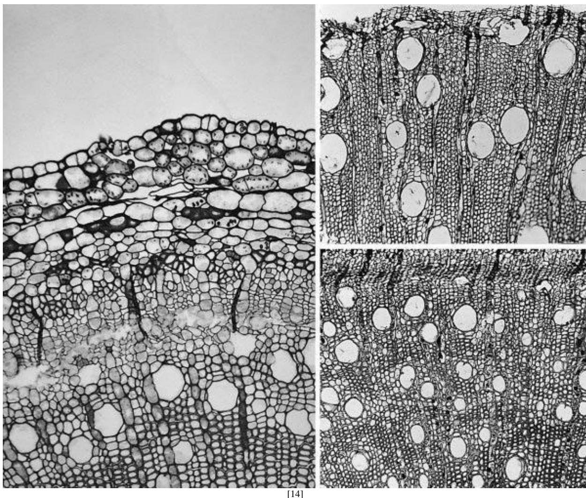  
Figure 13.12 Photomicrographs of transverse sections from Eucalyptus grandis (a) show location of vessels (ve) in secondary xylem in relation to cortex (co) and cambium (ca). Photomicrographs of stem sections from  $E.$  tereticornis (b and c) show a greater abundance of narrower vessels in stems grown under  $\mathrm{CO_2}$ -enriched conditions (c) compared with ambient  $\mathrm{CO_2}$  (b). Remnants of a cambial layer are evident along the top edges of sections in (b) and (c). Scale bar = 100  $\mu$ m. (Photomicrographs courtesy P.E. Kriedemann (a); B.J. Atwell and J.P. Conroy (b and c))

# 13.3.6 Concluding remarks

Interactions between high  $\mathrm{CO_2}$  and other environmental variables on growth and photosynthetic attributes are obviously complex. Given that results presented here come from experiments where only one factor in addition to atmospheric  $\mathrm{CO_2}$  was

altered, extrapolation to field situations is problematic. Nevertheless, genetic variation in growth and yield response to high  $\mathrm{CO_2}$  is considerable. Contrasts between species and even between cultivars in their sensitivity to high  $\mathrm{CO_2}$  suggests that breeding varieties more responsive to high  $\mathrm{CO_2}$  may be possible.

# CASE STUDY 13.1 CO2, cyanide and plant defence

Roslyn Gleadow and Ian Woodrow

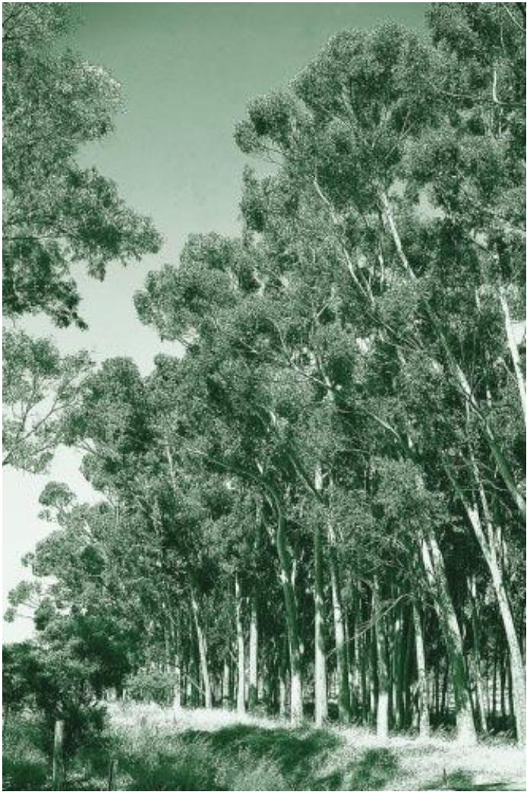  
Figure 1 A healthy stand of Eucalyptus cladocalyx (sugar gums) near Ouyen (north-western Victoria). Sugar gums are indigenous to South Australia but they have been planted widely throughout the world. They are common on farms in western Victoria because this area was settled by farmers from South Australia who brought the seed with them. The tree was popular because it coppices easily, forming long straight branches that could be used for fence posts, but stock avoid eating the young shoots.

# (Photograph courtesy P.E. Kriedemann)

Young tips of eucalypts are particularly attractive to mammalian herbivores such as koalas as well as to insects because they are higher in protein and nitrogen but lower in fibre (softer) than old leaves. Such herbivory impacts on plants because these shoots are future sources of photoassimilate. Lost foliage needs to be replaced, consuming valuable energy and nutrient stores. Vascular plants have evolved with a range of physical and chemical mechanisms that increase their resistance to herbivores and minimise such losses.

Nevertheless, these mechanisms are 'expensive' in terms of energy and of resources that could otherwise be used for photosynthesis. Cyanogenic glycosides are one such group of chemical defence compounds that are both nitrogen rich and take much energy to synthesise.

Cyanogenic glycosides consist of a cyanide group  $(N\equiv C^{- })$  bound to a sugar. When the sugar is cleaved by a  $\beta$  - glycosidase enzyme, free hydrocyanic acid (HCN) is released. HCN interferes with cytochrome oxidase (Section 2.4) and is extremely toxic to herbivores. Such plants are termed cyanogenic. They avoid poisoning themselves by storing cyanogenic glycosides and the  $\beta$  - glucosidase in separate places: glycoside in vacuoles and enzyme in apoplasm. Enzyme and substrate are brought together when a leaf is crushed, as in chewing. About  $4\%$  of all plants are cyanogenic, including a number of species of Eucalyptus. Cyanogenesis discourages grazing by both mammalian and invertebrate herbivores.

Cyanide production represents a resource cost to a plant in terms of nitrogen. Given that nitrogen is in limited supply in most ecosystems, any diversion of nitrogen away from primary metabolism is likely to have a negative impact on plant growth. Any benefit takes the form of reduced herbivory. There is thus a trade- off between the benefit of reduced herbivory and the cost in terms of lower growth rates. Will this balance change in a high-  $\mathbf{CO}_2$  world?

Plants at elevated  $\mathrm{CO_2}$  grow faster and more efficiently (using less water and fewer nutrients per unit  $\mathbf{CO}_2$  fixed) than those at ambient levels. If atmospheric concentration of  $\mathrm{CO_2}$  is doubled from 350 to around  $750\mu \mathrm{mol}\mathrm{mol}^{- 1}$  , biomass and photosynthetic rates increase. Leaves from plants grown at elevated  $\mathrm{CO_2}$  also contain lower concentrations of nitrogen and protein. Since most of a plant's nitrogen is invested in photosynthetic enzymes, nitrogen use efficiency increases under elevated  $\mathrm{CO_2}$  (Table 6.7).

If plants grown at elevated  $\mathrm{CO_2}$  are able to achieve higher rates of photosynthesis with less nitrogen, then nitrogen in excess of those requirements could be used for other purposes such as the synthesis of herbivore defence compounds.

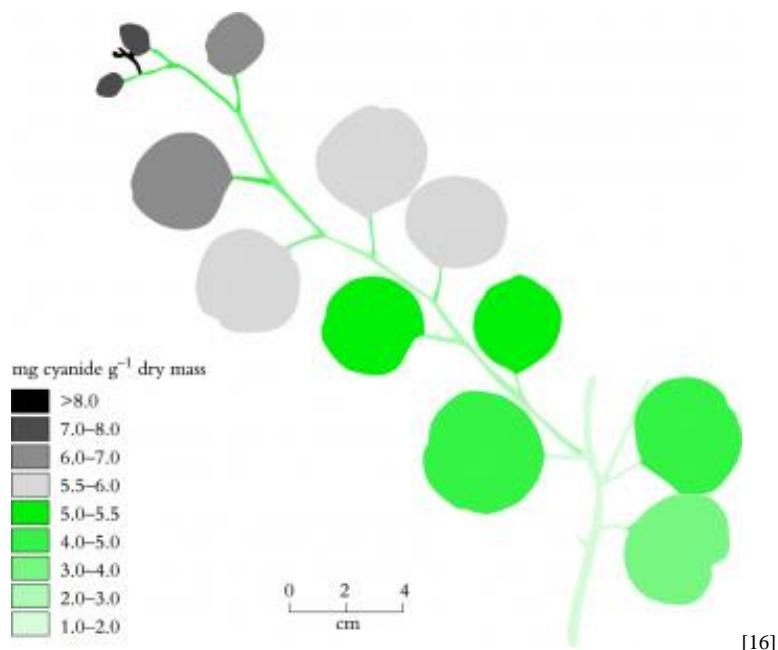  
Figure 2 This tone-coded diagram of a typical branch of a 6-month-old Eucalyptus cladocalyx seedling shows a gradient in concentration of cyanogenic glycosides (measured as cyanide) from younger to older parts. Tips are softer and are highly sought after by herbivores, but higher levels of cyanogenic glycosides may offer protection (Original diagram courtesy R.M. Gleadow)

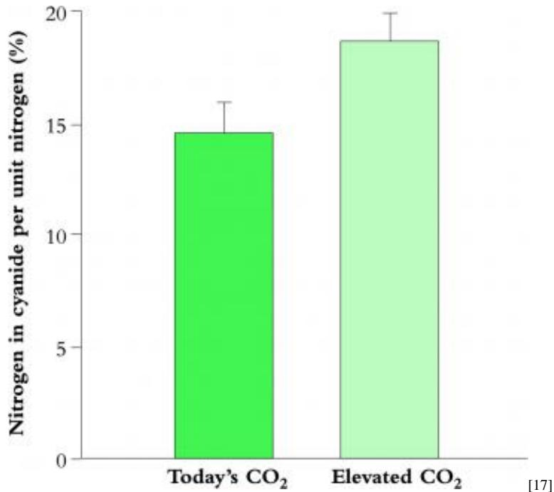  
Figure 3 Leaf nitrogen invested in cyanogenic glycosides as a proportion of total leaf nitrogen was significantly greater in leaves of Eucalyptus cladocalyx seedlings grown at elevated  $\mathbf{CO}_2$  concentration (about  $350\mu \mathrm{mol}\mathrm{mol}^{-1}$ ). As a result, leaves from plants grown at elevated  $\mathbf{CO}_2$  are both less nutritious and more toxic to herbivores. (Based on Gleadow et al. 1998)

Accordingly the hypothesis that increased efficiency of nitrogen use under elevated  $\mathbf{CO}_2$  would lead to an increase in nitrogen allocation to cyanogenic glycosides was

tested. Seedlings of Eucalyptus cladocalyx (sugar gum) were chosen for the study (Gleadow et al. 1998) because they invest up to  $20\%$  of leaf nitrogen in cyanogenic glycosides (Figure 2), and consequently any changes would be readily detected.

Seedlings of  $E$  cladocalyx were grown in a pair of glasshouses that differed only in the amount of  $\mathrm{CO_2}$  in the atmosphere — extra  $\mathrm{CO_2}$  was added to one chamber to raise the atmospheric concentration of  $\mathrm{CO_2}$  from 350 to  $750 \mu \mathrm{mol} \mathrm{mol}^{- 1}$ .

The growth response of seedlings was typical of woody plants grown at elevated  $\mathrm{CO_2}$  — biomass increased, leaves were thicker and the leaf area ratio (LAR, Section 6.1) was reduced. In addition, the concentration of nitrogen and protein in leaves decreased, implying gains in the efficiency of nitrogen use. More importantly, allocation of nitrogen to cyanogenic glycosides increased significantly in plants grown at elevated  $\mathrm{CO_2}$  (Figure 3). As a result, plant protein content decreased and the amount of protein relative to the amount of cyanogenic glycosides decreased even more. Plants would not only be less nutritious to herbivores, but also more toxic.

If these controlled- environment experiments are good predictors of what will happen in more complex, natural ecosystems then the balance between plants and herbivores in the next century could be different. While this is good news for plants, it is bad news for herbivores. In a future high-  $\mathrm{CO_2}$  world plants are likely to be less nutritious and also contain increased concentrations of toxins and defence compounds. Plants will be able to grow faster and be more resistant to herbivores. That outcome will have serious implications for herbivores such as leaf- eating mammals, who are already under threat from habitat destruction.

# References

Gleadow, R.M., Foley, W.J. and Woodrow I.E. (1998). 'Enhanced  $\mathrm{CO_2}$  alters the photosynthesis- defence relationship in cyanogenic Eucalyptus cladocalyx F. Muell.', Plant, Cell and Environment, 21, 12- 22.

# 13.4 Horticultural applications of CO2 enrichment

# 13.4.1 Greenhouse cropping

$\mathrm{CO_2}$  enrichment based on fuel combustion has had a chequered history in commercial greenhouses due to adverse side effects of polluting gases. Prior to the 1980s there were considerable problems associated with burning kerosene as a

source of  $\mathrm{CO_2}$  and heat. Often  $\mathrm{SO_2}$  and ethylene were generated during combustion, both of which can have potent negative effects upon plant growth and development. These gases were produced because of incomplete combustion. However, with the introduction of low- sulphur kerosene,  $\mathrm{SO_2}$  generation has ceased to be a problem. Propane as a fuel can also pose problems if improperly combusted or if leaks occur because of the presence of propylene, an active analogue of ethylene (Section 11.5.6). Ethylene itself is rather more potent, and can cause substantial crop loss in poorly ventilated greenhouses.

During fuel combustion, nitrogen oxides  $(\mathrm{NO}_x)$  also arise from a reaction between  $\mathrm{O_2}$  and  $\mathrm{N}_2$  in air at high tem- peratures. Nitrogen oxide  $(\mathrm{NO})$  is usually the predominant pollutant generated during high- temperature combustion, leading to oxidative damage of photosynthetic membranes and eventually leaf necrosis.

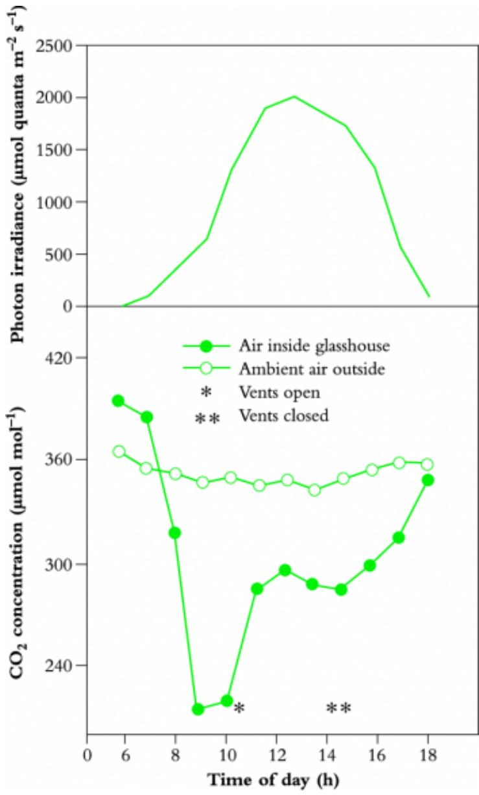

Ironically, excess  $\mathrm{CO_2}$  can also be injurious, with chloroplast disruption and chlorosis often observed above  $1000\mu \mathrm{mol}\mathrm{CO}_2\mathrm{mol}^{- 1}$ . By contrast,  $\mathrm{CO_2}$  depletion within enclosed structures is a particular problem where ventilation is regulated primarily to conserve heat (Figure 13.13).  $\mathrm{CO_2}$  levels can deplete rapidly to  $100 - 150\mu \mathrm{mol}\mathrm{CO}_2\mathrm{mol}^{- 1}$ . These concentrations are below free atmospheric levels on bright days and limit carbon assimilation.

Beneficial effects of  $\mathrm{CO_2}$  enrichment for horticultural production can in many instances be interpreted in terms of a response of photosynthetic gas exchange by leaves and in terms of interactions involving high  $\mathrm{CO_2}$ , sunlight and dark respiration. Effects of increased  $\mathrm{CO_2}$ , including stimulation of carboxylation of Rubisco and reduction of oxygenation which suppresses photorespiratory  $\mathrm{CO_2}$  loss, have been discussed earlier.  $\mathrm{CO_2}$  enrichment increases quantum yield of photosynthesis for  $\mathrm{C_3}$  species and lowers the light compensation point. This effect is particularly advantageous in high- latitude environments for winter/spring glasshouse cropping when light levels are low.  $\mathrm{CO_2}$  enrichment also raises the temperature optimum for photosynthesis and growth and this may permit less frequent venting of enclosures to control temperature. Respiration is often suppressed by  $\mathrm{CO_2}$ , although variable responses are reported.

# 13.4.2 Vegetables and fruit crops

Leafy vegetables, fruit and ornamentals are commonly grown under  $\mathrm{CO_2}$  enrichment. Enrichment of lettuce and celery is very effective since most of the total plant weight contributes to marketable harvest weight. Two- to three- fold enrichment of  $\mathrm{CO_2}$  concentrations can result in midwinter lettuce that either is  $25 - 40\%$  heavier at harvest or takes 10- 15 fewer days to attain a standard market weight (recall the 'Head Start' program mentioned in Section 6.2.3). Celery responds similarly by producing a heavier 'stalk' or requiring reduced time to reach marketable size.

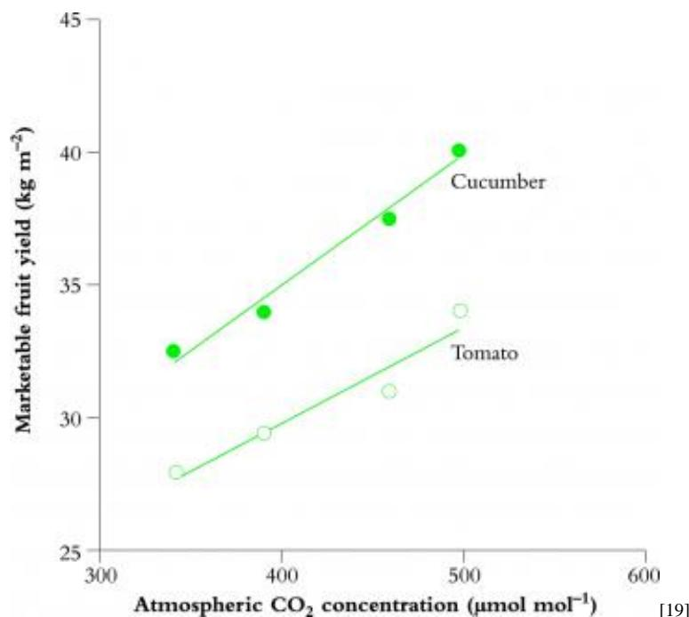  
Figure 13.14 Marketable yield of tomatoes and cucumbers increases during summer in response to  $\mathbf{CO}_2$  concentration. (Based on Hand 1989; reproduced with permission of Professional Horticulture)

Tomato, the major crop grown under glass in Western Europe, is also the most studied horticultural crop for  $\mathrm{CO_2}$  - enrichment effects. Marketable fruit yield can be increased by  $25\mathrm{- }28\mathrm{tha}^{- 1}$  (10- 11 tons per acre) for each  $100\mu \mathrm{mol}\mathrm{CO}_2\mathrm{mol}^-$  1 increase in mean daytime  $\mathrm{CO_2}$  within the range  $300\mathrm{- }500\mu \mathrm{mol}\mathrm{CO}_2\mathrm{mol}^{- 1}$  (Figure 13.14).

$\mathrm{CO_2}$  enrichment stimulates vegetative growth of tomato by increasing both net assimilation rate and expansion of leaf area. This is particularly important in winter when large numbers of plants are propagated commercially and  $\mathrm{CO_2}$  enrichment can substitute for limiting light. The quality of planting stock is also improved. Once tomatoes reach their reproductive phase,  $\mathrm{CO_2}$  enrichment induces earlier flowering, reduces flower abortion and thus increases fruit set. Overall, fruit development on early trusses is enhanced and commercial yields are boosted via an increase in both the number of trusses and the weight of fruit per truss.

Cucumber fruit yield is also stimulated by  $\mathrm{CO_2}$  enrichment (Figure 13.14), increasing by  $54\mathrm{tha}^{- 1}$  (22 tons per acre) for each  $100\mu \mathrm{mol}\mathrm{CO}_2\mathrm{mol}^{- 1}$  increase in daytime  $\mathrm{CO_2}$  concentration during summer. Other benefits include earlier flowering, increased number of flowers, increased branching, a higher proportion of female flowers and earlier commencement of harvest for most varieties.

Table 13.2  $CO_2$  enrichment of Valencia orange trees increased growth and yield (total fruit weight and number of fruit). Colour development was also enhanced  

<table><tr><td rowspan="2">Growth and crop variables</td><td colspan="2">CO2 concentration 
(μmol CO2 mol-1)</td></tr><tr><td>400</td><td>800</td></tr><tr><td>Plant dry mass (g)</td><td>1141</td><td>1439</td></tr><tr><td>Total fruit fresh mass (g)</td><td>2659</td><td>3583</td></tr><tr><td>Number of fruit per tree</td><td>18.3</td><td>31.0</td></tr><tr><td>Soluble solids (%)</td><td>12.3</td><td>12.2</td></tr><tr><td>Skin colour (% orange)</td><td>60</td><td>95</td></tr><tr><td>(Based on: Downton et al. 1987)</td><td></td><td>[20]</td></tr></table>

# Table 13.2

In Japan, trees of mandarin oranges are often grown in containers within plastic greenhouses which results in high yields of earlier, blemish- free fruit. Similarly in Australia, Valencia orange trees grown in containers under  $\mathrm{CO_2}$  enrichment from time of flowering until fruit harvest yielded  $70\%$  more fruit (Table 13.2). These fruit did not differ from unenriched controls in soluble solids content or acidity, indicating that CO2enrichment did not reduce quality. Progression of fruit colouration was more rapid with  $\mathrm{CO_2}$  enrichment. Considerable potential thus exists for protected cultivation of premium quality fruit in high  $\mathrm{CO_2}$

# 13.4.3 Ornaments and nursery stock

Commercial production of flowers with  $\mathrm{CO_2}$  enrichment is frequently advantageous (see section 6.2.3 for related effects). Roses and chrysanthemums produce larger flowers and longer, stronger stems. High  $\mathrm{CO_2}$  also reduces the number of stems which fail to flower, thereby increasing marketable yield. For geraniums and carnations, enhanced growth of lateral shoots at high  $\mathrm{CO_2}$  concentrations increases flower yield, generally increases flower quality and promotes earlier flowering. Treatment of stock plants results in increased numbers of cuttings which are more vigorous, flower earlier and produce more flowers.

$\mathrm{CO_2}$  enrichment often results in more compact pot plants. This is a result of enhanced branching and may obviate 'pinching', a labour- intensive practice to produce bushier plants. Major advantages of  $\mathrm{CO_2}$  enrichment for nurseries are reduced production time and increased throughput per year. Little research has been done on bedding plants, but flowers and foliage may be larger with a reduction in time taken for sale.

Plants with variegated foliage, because of their attractiveness, make up an important component of the nursery trade. Often a considerable proportion of leaf area has a reduced chlorophyll content and capacity for photosynthesis. The

generally reduced vigour of these plants leads to a longer time to reach marketable size compared with completely green cultivars. Variegated cultivars of oleander and the Australian native plant, willow myrtle, both showed a greater growth response to  $\mathrm{CO_2}$  enrichment compared to their fully green counter- parts. Enrichment thus offers nurseries a cultural approach for the production of slower growing, more highly valued variegated cultivars. It is also beneficial for accelerating the development of young trees such as citrus rootstocks and forest tree seedlings, thereby shortening holding time and reducing costs.

# 13.4.4 Vegetative propagation

Table 13.3.  $CO_2$  enrichment improved water status size and rooting ability in two genera of ornamental flowers  

<table><tr><td rowspan="4">Test genus and growth attributes</td><td colspan="4">Time from cutting</td></tr><tr><td colspan="2">20 days</td><td colspan="2">56 days</td></tr><tr><td colspan="2">CO2 concentration (μmol CO2 mol-1)</td><td>350</td><td>800</td></tr><tr><td>350</td><td>800</td><td>350</td><td>800</td></tr><tr><td>Chamelaucaum (wax flower)</td><td></td><td></td><td></td><td></td></tr><tr><td>Shoot water potential (MPa)</td><td>-2.1</td><td>-1.4</td><td>-2.7</td><td>-1.4</td></tr><tr><td>Cutting dry mass (mg)</td><td>161</td><td>201</td><td>197</td><td>282</td></tr><tr><td>Starch per cutting (mg)</td><td>4</td><td>8</td><td>16</td><td>43</td></tr><tr><td>Cuttings with roots (%)</td><td>0</td><td>0</td><td>11</td><td>48</td></tr><tr><td>Cornea (native fuchsia)</td><td></td><td></td><td></td><td></td></tr><tr><td>Shoot water potential (MPa)</td><td>-2.1</td><td>-1.7</td><td>-2.3</td><td>-1.1</td></tr><tr><td>Cutting dry mass (mg)</td><td>593</td><td>679</td><td>604</td><td>682</td></tr><tr><td>Starch per cutting (mg)</td><td>69</td><td>127</td><td>90</td><td>162</td></tr><tr><td>Cuttings with roots (%)</td><td>0</td><td>6</td><td>37</td><td>67</td></tr></table>

(Based on Grant et al.1992)

# Table 13.3

Plant propagation in its various forms often benefits from  $\mathrm{CO_2}$  enrichment. Root development of cuttings may be stimulated (Table 13.3), a possible outcome of improved plant water relations during root initiation. Increased accumulation of starch for both species listed in Table 13.3 implies dual effects of  $\mathrm{CO_2}$  enrichment. Transpirational losses from cuttings would be lower due to partial stomatal closure, while photosynthesis would be stimulated due to higher intercellular  $\mathrm{CO_2}$  concentration. Number, length and dry weight of roots were also improved by  $\mathrm{CO_2}$  enrichment (Table 13.3) and transplanting success will increase accordingly. Promotion of rooting in cuttings of forest tree species is especially beneficial to survival in new plantations.

$\mathrm{CO_2}$  depletion by in vitro plant cultures (such as tissue culture and micropropagation) is commonly due to meagre gas exchange with outside air. This leads to dependence upon the carbohydrates in the medium as a carbon source.  $\mathrm{CO_2}$  enrichment during in vitro rooting of plantlets can enhance growth during

acclimatisation to ambient conditions, while enrichment during acclimatisation can increase survival rates of transplanted plantlets.

Heat therapy has been used for virus elimination in a range of horticultural species. This procedure requires exposure of candidate plants to high temperature (up to  $40^{\circ}\mathrm{C}$ ) for many weeks, and plant survival is low.  $\mathrm{CO_2}$  enrichment during heat therapy has, however, proven beneficial to both plant survival and production of virus- free propagules. As well as presenting Rubisco with a higher partial pressure of  $\mathrm{CO_2}$ , net fixation is further enhanced by suppression of photorespiration which would otherwise be greatly accelerated by high temperature at normal ambient  $\mathrm{CO_2}$  (see Case study 13.2).

# 13.5 Tropical trees and CO2 enrichment

# 13.5.1 Global forests

Forests and woodlands store about  $80\%$  of all biotic above- ground organic carbon and  $40\%$  of all biotic below- ground organic carbon. They therefore represent a major pool of global carbon. In addition they are major determinants of regional climate through their role in energy and mass transfer between atmosphere and biosphere. About  $20\%$  of water flux to the atmosphere occurs through vegetation, mostly forests.

Tropical forests and woodlands also represent one of the few remaining terrestrial ecosystems that are relatively pristine. In addition they are sites of high biodiversity, covering only  $6\%$  of the world's surface but containing up to  $50\%$  of the world's plant and animal species.

Combined areas of tropical forests and woodlands represent  $42\%$  of the world's forested area,  $59\%$  of the global forest biomass and  $57\%$  of total soil carbon. They are found between  $23^{\circ}\mathrm{N}$  and  $23^{\circ}\mathrm{S}$ . Tropical and subtropical forests and woodlands occupy about  $35\%$  of Australia.

Clearly, a knowledge of tropical tree ecophysiology is vital to informed management of these ecosystems, and Section 13.5 will cover some aspects of tropical tree growth and physiology under elevated  $\mathrm{CO_2}$ .

# 13.5.2 Leaf gas exchange

Generalising from extensive data on container- grown tropical species, lightsaturated photosynthesis is increased (on average by  $50\%$  ) and  $g_{s}$  is decreased (on average by  $50\%$  ) in response to a doubling of ambient  $\mathrm{CO_2}$  concentration provided pot size is sufficiently large. An increase in assimilation coupled to a decrease in  $g_{s}$  may appear counter- intuitive. However, in a  $\mathrm{CO_2}$  - enriched environment,  $\mathrm{CO_2}$  concentration within a leaf is still larger (often double) than that in a leaf in ambient air, and thus assimilation rate is still enhanced.

These results are consistent with a range of results observed for temperate and boreal tree responses (Eamus and Jarvis 1989). Increased assimilation responses may be attributed to increased substrate concentration  $(\mathrm{CO_2})$  and decreased photorespiration. Few measurements of the activation state of Rubisco have been made for tropical species, but declines in carboxylation efficiency as inferred from  $A:p_{i}$  curves have been observed for Eucalyptus tetrodonta and other tropical species (Eamus et al. 1995; Ziska et al. 1991). A decline in the amount and activity of Rubisco in response to  $\mathrm{CO_2}$  enrichment has been observed in a range of annual and tree species, and probably represents an optimisation response, whereby nitrogen is relocated from non- limiting steps in photosynthesis (carbon fixation) to those steps limiting the rate of photosynthesis. In a  $\mathrm{CO_2}$ - enriched environment carbon supply to Rubisco is non- limiting but electron transport or Calvin cycle turnover may have become limiting.

Some of the increase in assimilation rate, expressed as per unit leaf area, is attributable to an increase in the thickness of photosynthetic tissue (mesophyll), resulting in a decreased specific leaf area (area of leaf per unit dry mass of leaf). Typically specific leaf area decreases by approximately  $10–40\%$ . Although some of this decrease may result from increased leaf density, reflecting increased starch storage in leaves growing with  $\mathrm{CO_2}$  enrichment, much of the decrease in specific leaf area is the result of thicker leaves, with either more layers of photosynthetic cells or thicker cells. Consequently the mass of photosynthetic tissue per unit leaf area increases, and assimilation rate per unit leaf area increases. Nevertheless, when assimilation rates are expressed as per unit dry mass, they are still significantly increased by  $\mathrm{CO_2}$  enrichment because of an increase in substrate supply and decreased photorespiration.

A loss of photosynthetic potential has been observed in some tropical tree species, including Eucalyptus tetrodonta, but not in others (e.g. Mangifera indica, mango). This loss of potential can be shown by comparing the assimilation rate at a common  $p_{i}$  of trees grown in ambient conditions with trees grown in enriched conditions. By using a common  $p_{i}$ , any variation in assimilation rate due to differences in substrate concentration is removed. The loss of photosynthetic potential is often due to the loss of activity or a decline in the amount of Rubisco. Foliar nitrogen content frequently declines in  $\mathrm{CO_2}$ - enriched trees, reflecting a change in allocation of plant nitrogen.

Instantaneous rates of assimilation for trees grown in ambient but measured in enriched conditions are often larger than those of trees grown in enriched but measured in ambient conditions (Figure 13.3). This results not only from downregulation but also a decline in stomatal density (Table 13.1), which restricts entry of  $\mathrm{CO_2}$ . Stomatal aperture is important in plants grown with  $\mathrm{CO_2}$  enrichment but measured in ambient conditions because of the decrease in  $\mathrm{CO_2}$  concentration upon transfer to ambient conditions. When measured in a  $\mathrm{CO_2}$ - enriched environment, the larger gradient in  $\mathrm{CO_2}$  concentration between ambient air and leaf airspaces compensates for reduced  $g_{\mathrm{s}}$ , but when measured in ambient conditions a lower stomatal density results in a lower  $p_{\mathrm{i}}$  and hence a lower assimilation rate than is measured for ambient- grown trees measured in ambient conditions.

Decreased  $g_{\mathrm{s}}$  is due to reduced stomatal density (Table 13.1) as well as reduced aperture. Given an increase in assimilation but a decline in  $g_{\mathrm{s}}$ , instantaneous water use efficiency (ratio of assimilation to transpiration) also increases. Such increases may delay onset of drought or reduce the severity of a drought, but a more likely scenario in nature is that the increase in leaf area per plant, plus the increase in leaf temperature often associated with a decreased leaf transpiration rate, will offset increased water use efficiency.

# 13.5.3 Temperature x CO2

The tropics are warmer than temperate zones and as shown earlier (Figure 13.7) the impact of  $\mathrm{CO_2}$  enrichment on  $\mathrm{CO_2}$  assimilation is greater under warm conditions than under cool conditions. As temperature increases, gas solubilities decrease, but the ratio of solubilities of  $\mathrm{O_2}$  to  $\mathrm{CO_2}$  increases. Furthermore the specificity of Rubisco for  $\mathrm{CO_2}$  decreases with increased temperature. Consequently photorespiration (relying on the oxygenase function of Rubisco) is favoured over  $\mathrm{CO_2}$  assimilation as conditions become warmer, shown also as an increase in  $\mathrm{G}^*$  (Case study 1.1). As a result, the stimulation of  $\mathrm{CO_2}$  assimilation due to increased atmospheric  $\mathrm{CO_2}$  concentration also increases (Figure 13.7). Moreover, the temperature optimum for assimilation increases as atmospheric  $\mathrm{CO_2}$  concentration increases. Finally, as Rubisco activation declines (a common outcome of  $\mathrm{CO_2}$  enrichment) the temperature threshold for a positive impact of  $\mathrm{CO_2}$  enrichment is increased. Overall, increased atmospheric  $\mathrm{CO_2}$  concentration has a larger impact at high temperatures that at low temperatures. A priori, tropical locations should favour a large growth response due to  $\mathrm{CO_2}$  enrichment.

# 13.5.4 Water x CO2

$\mathrm{CO_2}$  enrichment generally reduces stomatal density, stomatal conductance and transpiration rate per unit leaf area. In addition, total leaf area per plant and root:shoot ratios might increase, while solute content of leaves (carbohydrates and inorganic ions) could also be affected. All of these factors can influence plant water status via effects on water uptake and/or water loss.

In a study of Maranthes corymbosa, a tropical monsoon vine forest tree, leaf water potential was consistently higher under  $\mathrm{CO_2}$ - enriched conditions than in control conditions through- - out the day (Figure 13.9). Similarly in Eucalyptus tetrodonta, a savanna species of tropical Australia, pre- dawn water potential was also higher under  $\mathrm{CO_2}$ - enriched conditions. These results were attributed to decreased transpiration rate per plant. However, during daytime, leaf water potential of  $E$  tetrodonta growing with  $\mathrm{CO_2}$  enrichment was equal to or lower than that of plants growing in ambient  $\mathrm{CO_2}$  conditions. These apparent discrepancies probably resulted from different responses of root:shoot ratios between these two species (Eamus et al. 1995). In  $M.$  corymbosa, the root:shoot ratio was the same in ambient as in  $\mathrm{CO_2}$ - enriched plants. Roots were able to supply enough water for transpiration from leaves with reduced  $g_{\mathrm{s}}$ . In contrast to  $M.$  corymbosa, the root:shoot ratio of  $E$  tetrodonta declined in response to  $\mathrm{CO_2}$ - enrichment and by implication there may not have been enough roots to maintain water potential higher than that of control values.

# Whole-plant water use

The response of whole- plant water use to  $\mathrm{CO_2}$  enrichment is variable. In some studies the rate of transpiration per plant can be almost identical for plants growing in ambient or  $\mathrm{CO_2}$ - enriched conditions. Thus the reduction in transpiration rate per leaf area is balanced by increased leaf area per plant and the rate of depletion of soil water is the same for ambient and  $\mathrm{CO_2}$ - enriched plants (Gifford et al. 1984). In contrast Reekie and Bazzaz (1989) found that in all five tree species studied, soil water content was higher and the water requirement for growth (grams  $\mathrm{H_2O}$  transpired per gram biomass formed) was lower in  $\mathrm{CO_2}$ - enriched trees.

# 13.5.5 Growth, competition and ecosystem structure

In tropical trees both total plant mass and leaf area per plant vary in their sensitivity to elevated  $\mathrm{CO_2}$ . Percentage changes range from  $- 10\%$  to  $+300\%$ .

Despite some exceptions, plant growth is generally enhanced by  $\mathrm{CO_2}$  enrichment. Such increases result from increased availability of fixed carbon due to increased assimilation rate and decreased respiration rates. In some cases,  $\mathrm{CO_2}$  enrichment stimulates leaf initiation and branching (Section 6.2) and faster assimilation per unit leaf area becomes compounded by a larger assimilatory surface,

Species thus differ in both the nature and extent of biomass increase under elevated  $\mathrm{CO_2}$ , with correlated changes in morphology and phenology. Accordingly, their competitive abilities in communities will also be affected by climate change. In one empirical study on tropical species where elevated  $\mathrm{CO_2}$  was taken as a driving variable (Rekkie and Bazzaz 1989) five tropical tree species were grown separately and in competition with each other, under ambient or  $\mathrm{CO_2}$ - enriched conditions.  $\mathrm{CO_2}$  enrichment significantly influenced the relative biomass of each species. In ambient conditions species ranking in terms of whole- plant biomass was Senna multijuga > Cecropia obtusifolia > Trichospermum mexicanum > Piper auritum > Myriocarpa longipes. In contrast, under  $\mathrm{CO_2}$  enrichment, the ranking changed to Trichospermum mexicanum > Cecropia obtusifolia > Senna multijuga > Piper auritum > Myriocarpa longipes. There were clear differences in comparative response to  $\mathrm{CO_2}$  enrichment between species. The importance of  $S.$  multijuga declined significantly whereas the importance of  $T.$  mexicanum and  $C.$  obtusifolia increased substantially.

# C4 species and ecosystem structure

In view of their photosynthetic attributes,  $\mathrm{C_4}$  plants are not expected to respond to  $\mathrm{CO_2}$ - enrichment because their natural  $\mathrm{CO_2}$ - concentrating mechanisms ensure that Rubisco is working closer to a saturating partial pressure of  $\mathrm{CO_2}$  than in  $\mathrm{C_3}$  plants. Paradoxically, a number of studies have shown increased leaf area and plant height. For example, Gifford et al. (1984) found  $14\%$ ,  $29\%$  and  $40\%$  increase in leaf area per plant for amaranth, sorghum and maize respectively. Such increases may result from a decrease in respiration and/or a stimulation of leaf/branching initiation and emphasis that factors beyond leaf photosynthesis need to be recognised as components of plant response to elevated  $\mathrm{CO_2}$ .

That aside, large- scale ecosystem dynamics are nevertheless underpinned by biomass accumulation, and events that either add or subtract from that biomass capital will impact on species composition. In Australian savannas at least  $90\%$  of grasses are  $\mathrm{C_4}$  plants and all trees are  $\mathrm{C_3}$  plants. On average,  $\mathrm{C_3}$  species show a larger response to  $\mathrm{CO_2}$ - enrichment than  $\mathrm{C_4}$  species. If climate change results in a longer wet season and warmer conditions, canopy cover by trees may increase and grass cover may therefore decline. Since grasses represent the major fuel load for bush fires and their persistence is related to burning frequency, global  $\mathrm{CO_2}$  enrichment combined with less frequent fires will impact on vegetation structure with a possible shift in species composition towards  $\mathrm{C_3}$  plants including trees.

# CASE STUDY 13.2 Heat therapy and CO2

Paul Kriedemann

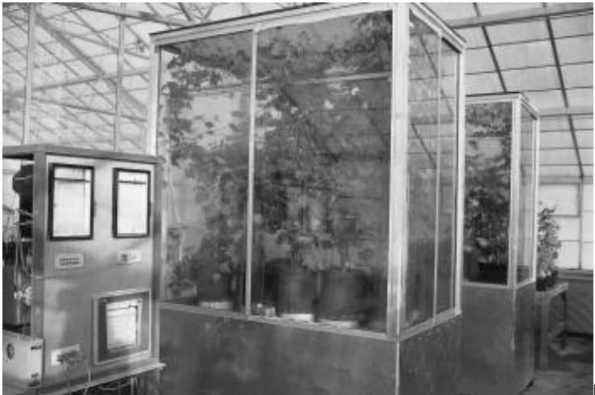  
Figure 1 Potted grapevines in two naturally illuminated heat therapy cabinets (37-40  $^\circ \mathrm{C}$  day and night), one at ambient  $\mathbf{CO}_2$ , the other held around three  $\times$  ambient (CSIRO Horticulture Laboratory, Merbein) (Photograph courtesy E.A. Lawton)

Grapevine viruses are endemic to original habitats of certain Vitis species. They have spread worldwide via vegetative propagation with rootstocks a common source of scion infection (grapevine viruses are graft transmissable). Vine debilitation and reduced yields generally follow infection, though they are not always attributed to a causal agent because other visible symptoms can be diffuse.

Prior to the advent of molecular techniques during the 1980s virus detection was based on host plant symptomology plus visible reactions by indicator plants, and therapy of infected vines was based on prolonged exposure of entire potted vines to high temperature (37- 40  $^\circ \mathrm{C}$  day and night) (Figure 1). Shoot tips generated during therapy were attenuated in virus 'titre', and if candidate plants lived long enough (100 d or more) virus- free tip cuttings could be produced.

According to practitioners of this method (Nyland and Goheen 1969), terminal meristems differentiate growing points ahead of vascular development, and during heat therapy those intensely meristematic growing points remain isolated from phloem- translocated virus. Put another way, sustained high temperature constrained the spread of virus to a greater extent than host plant cell division, and virus- free cells resulted. Harvesting those cells is technically demanding, and in former times well- night impossible, hence an early reliance on tip cuttings.

In principle, production of new meristems during heat therapy afforded good prospects of virus elimination, but host plants frequently died from heat stress, and especially if carbon resources had become depleted prior to treatment. Recognising that photorespiratory loss of carbon would be greatly enhanced at  $40^{\circ}\mathrm{C}$ , and noting that ambient  $\mathrm{CO_2}$  might be depleted in growth cabinets sealed for heat retention (cf. Figure 13.13),  $\mathrm{CO_2}$  enrichment was implemented in the hope of restoring a positive carbon balance. Potted vines were held under high humidity in naturally illuminated cabinets at either ambient  $(c.315\mu \mathrm{mol}\mathrm{CO}_2\mathrm{mol}^{- 1})$  or enriched conditions  $(c.1250\mu \mathrm{mol}\mathrm{CO}_2\mathrm{mol}^{- 1})$  and responses measured over  $14\mathrm{d}$  (further details in Kriedemann et al. 1976).

As anticipated, grapevine survival improved under  $\mathrm{CO_2}$  enrichment. Net assimilation rate (NAR; Section 6.1) increased from 2.36 to  $5.60\mathrm{g}\mathrm{m}^{- 2}\mathrm{d}^{- 1}$ ) and there was some evidence of leaf starch accumulation. Again, as theory predicted, transpiration decreased from around  $1050\mathrm{g}\mathrm{m}^{- 2}\mathrm{d}^{- 1}$  at ambient  $\mathrm{CO_2}$  to about  $450\mathrm{g}\mathrm{m}^{- 2}\mathrm{d}^{- 1}$  under elevated  $\mathrm{CO_2}$  and may have contributed to alleviation of high- temperature stress. There was also recorded an early example of photosynthetic acclimation where rates of  $\mathrm{CO_2}$  assimilation in ambient air were down- regulated in grapevines heat treated under high  $\mathrm{CO_2}$ .

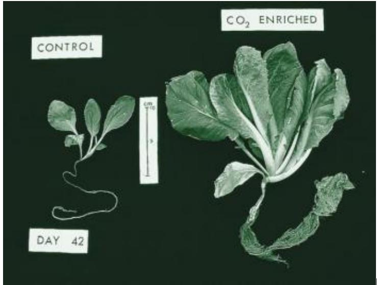  
Figure 2 Seedlings of wong bok (Brassica pekinensis) show a spectacular growth response to elevated  $\mathbf{CO}_2$  (three  $\times$  ambient) when grown for 42 d under continuously warm conditions  $(32^{\circ}\mathrm{C}$  day and night) intended to mimic a tropical environment (left side ambient, right side  $\mathbf{CO}_2$  enriched). The same growth cabinets as shown in Figure 1 were used. Scale bar  $= 10\mathrm{cm}$  (Photograph courtesy P.E. Kriedemann)

At a time when heat therapy remained de rigueur for virus elimination,  $\mathrm{CO_2}$  enrichment of heat therapy cabinets found wide application for vine improvement. That technology has since been replaced by molecular methods for

detection and elimination, but plant growth response to  $\mathrm{CO_2}$  at high temperature still holds relevance for protected cultivation in tropical environments where net carbon gain is compromised by photorespiratory loss. Leafy green vegetables such as wong bok (Brassica pekinensis) proved responsive in our heat therapy cabinets, and especially during early vegetative phases where faster assimilation plus gains in leaf area were quickly compounded during near- exponential growth (Figure 2; Section 6.2). Marketable mass is therefore reached more quickly than at ambient  $\mathrm{CO_2}$ , and this faster cropping cycle is significant commercially. A quest for genetic variation in this capacity for response to elevated  $\mathrm{CO_2}$  at high temperature would be likely to pay practical dividends.

# References

Kriedemann, P.E., Sward, R.J. and Downton, W.J.S. (1976). 'Vine response to carbon dioxide enrichment during heat therapy', Australian Journal of Plant Physiology, 3, 605- 618.

Nyland, G. and Goheen, A.C. (1969). 'Heat therapy of virus diseases of perennial plants', Annual Review of Phytopathology, 7, 331- 354.

# 13.6 Concluding remarks

Atmospheric  $\mathrm{CO_2}$  represents only a tiny fraction of global carbon reserves and yet variation in concentration over past millennia has had a profound impact on life forms and general biological activity of terrestrial ecosystems. Working as an environmental selection pressure, diminishing levels of atmospheric  $\mathrm{CO_2}$  over the past 100 million years have led to one major adaptive response about 50 million years ago, namely  $\mathrm{C_4}$  photosynthesis. In this form of cooperative photosynthesis, bundle sheath Rubisco is working near full capacity in contrast to  $\mathrm{C_3}$  progenitors.

Despite wide variation in atmospheric  $\mathrm{CO_2}$ , and hence carbon fluxes through ecosystems, and notwithstanding a massive cost in terms of plant nitrogen resources, a Rubisco- based system for assimilation of atmospheric  $\mathrm{CO_2}$  into biomass has remained highly conserved throughout the evolutionary history of vascular plants. Nature has simply not found a better way of achieving  $\mathrm{CO_2}$  fixation.

Nevertheless, important variation does exist with respect to photosynthetic acclimation and whole- plant responses, a case where growth and developmental responses to  $\mathrm{CO_2}$  enrichment elicit photosynthetic adjustment, that is, a 'sink pull' rather than a 'source push' for whole- plant carbon metabolism. Mechanisms underlying such controls over photosynthesis are not yet understood, and yet empirical selection for genetic variants with greater capacity to utilise elevated

$\mathrm{CO_2}$  is already underway for energy- intensive greenhouse cropping. While global rise in  $\mathrm{CO_2}$  concentration may eventually negate a need for  $\mathrm{CO_2}$  enrichment in well- ventilated protected cropping situations, there will continue to be a clear need in many situations such as, for example, where winter production requires tightly sealed enclosures to conserve heat and  $\mathrm{CO_2}$  depletion becomes a serious limitation to yield. There is scope for breeding and selecting cultivars specifically adapted for optimal performance under  $\mathrm{CO_2}$  enrichment given large cultivar differences in  $\mathrm{CO_2}$  responsiveness. In terms of plant science,  $\mathrm{CO_2}$  effects on devel- opmental processes which ultimately control form, function and overall plant performance need to be clarified.

Selection pressure of a more subtle but equally pervasive nature is also underway in natural ecosystems. Here, comparative abundance of present- day species will be likely to change in accordance with genotype variation in capacity to accommodate global change. As noted above, a range of environmental factors interact with atmospheric  $\mathrm{CO_2}$  in determining outcomes, but an inexorable rise in  $\mathrm{CO_2}$  concentration over coming decades (?centuries) will be one common denominator.

# Further reading

Ball, M.C. (1992). 'Responses of vegetation to elevated atmospheric concentrations of  $\mathrm{CO_2}$ ', Papers from a symposium of the Ecological Society of Australia and the Australian Society of Plant Physiologists, Canberra, 30 September to 1 October, published in a special issue of the Australian Journal of Botany, Volumes 4 and 5.

Cowan, I.R. (1986). 'Economics of carbon fixation in higher plants', in On the Economy of Plant Form and Function, ed. T.J. Givnish, 133- 170, Cambridge University Press: Cambridge.

Eamus, D. and Jarvis, P.G. (1989). 'The direct effects of increase in the global atmospheric  $\mathrm{CO_2}$  concentration on natural and commercial temperatre trees and forests', Advances in Ecological Research, 19, 1- 55.

Gifford, R.M. (1994). 'The global carbon cycle: a viewpoint on the missing sink', Australian Journal of Plant Physiology, 21, 1- 15.

Lloyd, J. and Farquhar, G.D. (1996). 'The  $\mathrm{CO_2}$  dependence of photosynthesis, plant growth responses to elevated  $\mathrm{CO_2}$  concentrations and their interaction with soil nutrient status. I. General principles and forest ecosystems', Functional Ecology, 10, 4- 32.

Source URL: http://plantsinaction.science.uq.edu.au/edition1/?q=content/chapter- 13- carbon- dioxide- universal- substrate

# Links:

[1] http://plantsinaction.science.uq.edu.au/edition1/?q=figure_view/640  [2] http://plantsinaction.science.uq.edu.au/edition1/?q=figure_view/641  [3] http://plantsinaction.science.uq.edu.au/edition1/?q=figure_view/642  [4] http://plantsinaction.science.uq.edu.au/edition1/?q=figure_view/643  [5] http://plantsinaction.science.uq.edu.au/edition1/?q=figure_view/645  [6] http://plantsinaction.science.uq.edu.au/edition1/?q=figure_view/646  [7] http://plantsinaction.science.uq.edu.au/edition1/?q=figure_view/654  [8] http://plantsinaction.science.uq.edu.au/edition1/?q=figure_view/655  [9] http://plantsinaction.science.uq.edu.au/edition1/?q=figure_view/656  [10] http://plantsinaction.science.uq.edu.au/edition1/?q=figure_view/657  [11] http://plantsinaction.science.uq.edu.au/edition1/?q=figure_view/658  [12] http://plantsinaction.science.uq.edu.au/edition1/?q=figure_view/659  [13] http://plantsinaction.science.uq.edu.au/edition1/?q=figure_view/660  [14] http://plantsinaction.science.uq.edu.au/edition1/?q=figure_view/661  [15] http://plantsinaction.science.uq.edu.au/edition1/?q=figure_view/662  [16] http://plantsinaction.science.uq.edu.au/edition1/?q=figure_view/663  [17] http://plantsinaction.science.uq.edu.au/edition1/?q=figure_view/664  [18] http://plantsinaction.science.uq.edu.au/edition1/?q=figure_view/665  [19] http://plantsinaction.science.uq.edu.au/edition1/?q=figure_view/666  [20] http://plantsinaction.science.uq.edu.au/edition1/?q=figure_view/667  [21] http://plantsinaction.science.uq.edu.au/edition1/?q=figure_view/668  [22] http://plantsinaction.science.uq.edu.au/edition1/?q=figure_view/669  [23] http://plantsinaction.science.uq.edu.au/edition1/?q=figure_view/670