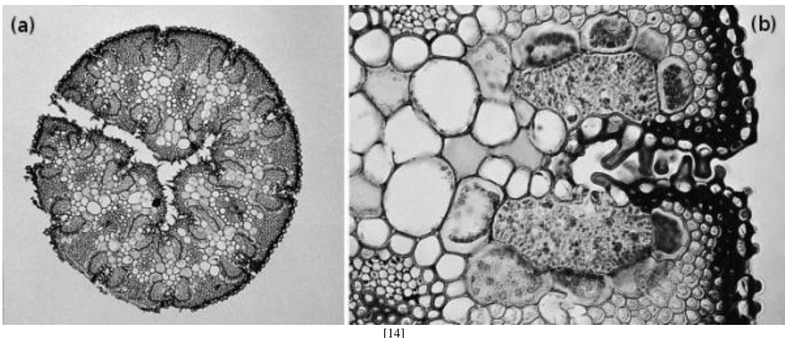
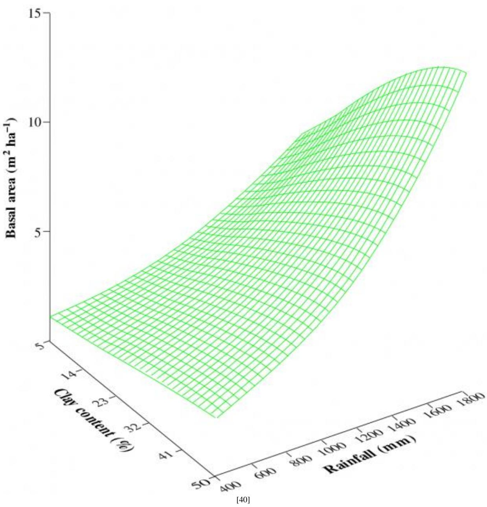

# Chapter 15 - Water: a limiting factor

A superb stand of flooded gums, (Eucalyptus grandis) near Coffs Harbour, northern New South Wales, 'each tall because of each' (Les Murray (1991), Collected Poems) (Photograph by Ken Eldridge, supplied by Peter Burgess, CSIRO Forestry and Forest Products)

With perspective phrasing, Les Murray (1991) summarises structural aspects of a gum forest as:

'Flooded gums on creek ground, each tall because of each'

and on conceptualising water relations, 'Foliage builds like a layering splash: ground water drily upheld in edge- on, wax rolled, gall- puckered leaves upon leaves. The shoal life of parrots up there.'

(Les Murray, Collected Poems, 1991)

- [Chapter 15 - Water: a limiting factor](Chapter_15.md)
  - [Introduction]()
  - [15.1 Soil–plant–atmosphere continuum]()
  - [15.2 Stomatal physiology]()
  - [15.3 Water use by managed plant communities]()
  - [15.4 Water use by natural plant communities]()
  - [15.5 Concluding remarks]()
  - [Further reading]()

# Introduction

Life- giving water molecules, fundamental to our biosphere, are as remarkable as they are abundant. Hydrogen bonds, enhanced by dipole forces, confer extraordinary physical properties on liquid water that would not be expected from atomic structure alone. Water has the strongest surface tension, biggest specific heat, largest latent heat of vaporisation and, with the exception of mercury, the best thermal conductivity of any known natural liquid. A high specific grav- ity is linked to a high specific heat, and very few natural substances require 1 calorie to increase the temperature of 1 gram by  $1^{\circ}\mathrm{C}$ . Similarly, a high heat of vaporisation means that 500 calories are required to convert 1 gram of water from liquid to vapour at  $100^{\circ}\mathrm{C}$ . This huge energy requirement (latent heat of vaporisation, Section 14.5) ties up much heat so that massive bodies of water contribute to climatic stability, while tiny bodies of water are significant for heat budgets of organisms. Latent heat of fusion (Section 14.6) is a further property of water with profound implications for biology. Substantial heat is released as liquid water turns to ice, and this thermostatic effect is used to advantage for frost protection in horticulture.

Although water is abundant on earth, fresh water is scarce, and plant- available soil water represents a major environ- mental limitation and thus a continuing selection pressure for terrestrial ecosystems. Accordingly, plants growing in arid and semiarid environments exhibit a wide range of mechanisms that enable them to grow and reproduce despite water short- age. For example, deserts are transformed into spontaneous gardens by substantial rain as ephemerals including species of everlasting daisy, Helichrysum spp., Helipterum spp. and Schoenia spp., germinate, grow, produce a brilliant carpet of flowers and then set seed before soil moisture is exhausted. Along with many desert ephemerals, they survive drought not as plants but as seeds!

Other species shed their leaves and survive the period of water deprivation as non- transpiring stems or underground plant parts. A well- recognised example in northern Australia is the baobab tree (Adansoia gregoria), which persists through a six- month dry season as a trunk plus leafless branches, rather like a giant inverted root system.

Some species maintain their foliage, but survive periods without rainfall by developing large root systems that seek water at depth or by reducing transpiration and growth during dry seasons via leaf shed. Jarrah (Eucalyptus marginata) is

known to have sinker roots that can penetrate to  $20\mathrm{m}$  to access groundwater (Section 3.1). Jarrah also reduces water use and photosynthesis in late summer by stomatal closure (Section 15.2). Such combined attributes ensure survival during hot dry summers in native environments (winter rainfall zone of Western Australia).

Desert succulents, such as pigface (Carpobrotus edulis), which occur along edges of seasonally dry salt pans and near shorelines in southern Australia, have both morphological and biochemical mechanisms that enable them to survive long periods without water. Many desert succulents have very reduced leaves, but enlarged photosynthetic stems. These stems provide a reservoir of water for use during prolonged drought. They also have a specialised carbon pathway (CAM photosynthesis, Section 2.1) that enables them to take in  $\mathrm{CO_2}$  at night- time and store carbon as organic acids. Those weak acids are converted to sugars, starch and amino acids behind closed stomata during the daytime.

Finally, in one extreme form of drought resistance, some species tolerate complete desiccation to air dryness, but quickly recover physiological activity once water is restored. These remarkable 'resurrection' plants are described in Feature essay 15.1.

Much of the earth's land surface is either too hot or too dry for sustainable agriculture. Nevertheless, species in nature have adapted to many arid situations unsuited to agriculture via survival devices that already find some expression in crop plants. An appreciation of those mechanisms responsible for drought resistance often reveals analogies between domesticated plants and wild progenitors. Further improvement of crop plants will come from enhanced expression of desirable wild traits, as well as from introduction of new properties from unrelated species via molecular methods. In either case, key traits have to be identified, and heritability established. Some of the processes underlying drought resistance, together with features that contribute to genetic differences in water use efficiency, are covered here within a context of soil- plant- atmosphere water relations.

# 15.1 Soil-plant-atmosphere continuum

  
Figure 15.1 A simplified global hydrological cycle. Water condenses in clouds and falls as rain on oceans and land. Surface runoff, plus uptake by roots and percolation down to the water table depletes soil water over time. Soil water and groundwater also supply streams, rivers and eventually the sea through lateral How. Water returns to the atmosphere as transpiration from vegetation and as evaporation from oceans. The soil-plant-atmosphere continuum represents a major return path for water from soil to atmosphere. Variations in water content of soil, plant and atmosphere influence the movement of water within this continuum (Based on Swanage 1996)

In a simplified hydrological cycle (Figure 15.1) a water molecule, present as vapour within a cloud, can, over a day, condense into rain, fall to the ground, percolate a short distance into the soil, be taken up by plant roots and then be lost as transpiration as water vapour again. This return path for water from soil to atmosphere, or soil- plant- atmosphere continuum, was formalised by R.O. Slatyer (1967) and emphasises the connectedness of soil, plant and atmospheric water. Phenomena involving water movement within this continuum include root and whole- plant hydraulic conductance, xylem embolism and hydraulic lift by roots.

# 15.1.1 Water in soils

Table 15.1 Variation in soil water holding apacity acording to texture Field apxity represents water held against gravity after the excess has drained, and wilting point represents the stage where a transpiring plant cannot generate a sufficiently low water potential to extract further moisture (communite regarded as equivalent to a soil water potential of about -1.5 MPa)  

<table><tr><td rowspan="2">Soiltexture</td><td colspan="3">Water held (mm per metre depth of soil)</td></tr><tr><td>Field capacity</td><td>Wilting point</td><td>Plant-available moisture</td></tr><tr><td>Sand</td><td>90</td><td>20</td><td>70</td></tr><tr><td>Sandy loam</td><td>230</td><td>90</td><td>140</td></tr><tr><td>Loam</td><td>340</td><td>120</td><td>220</td></tr><tr><td>Clay loam</td><td>300</td><td>160</td><td>140</td></tr><tr><td>Clay (well structured)</td><td>500</td><td>300</td><td>200</td></tr></table>

(Derived from various sources including Handreck 1979)

# Table 15.1

Figure 15.2 Clay soils are fine textured and have a greater water- holding capacity than do sandy soils that are composed of larger particles. Clay soils hold a greater amount of plant- available water between field capacity ( $\Psi_{\mathrm{soil}}$  about - 0.02 MPa) and wilting point ( $\Psi_{\mathrm{soil}}$  about - 1.5 MPa) than do sandy soils. In both situations, water is held with progressively stronger forces as the soil mass dries out. For a given soil water content, dissolved solutes would depress soil water potential further, and plants would encounter even greater difficulty in satisfying potential transpiration (Based on Slatyer and McIlroy 1961).

Water drains through soil due to gravity, leaving medium- sized pores still filled, and with thin films around soil particles. A soil in that state is at field capacity, and if soil surface evaporation plus plant transpiration (evapotranspiration) is prevented, that moisture will be retained indefinitely. In fine- textured soils (clays) soil particles and channels are small, and much of the water is effectively held by matric forces. Such soils do not drain freely and clay soils are able to store large amounts of water, which can be used by plants provided root length density is sufficiently high. In contrast, sandy soils have larger particles and larger channels. These soils are better aerated and drain freely, but store less water (Table 15.1).

Soil water potential ( $\Psi_{\mathrm{soil}}$ ) declines as soil water content diminishes due to evapotranspiration, but the form of that relationship varies according to a soil's physical properties (Figure 15.2). Clay and loam soils contain a greater amount of plant- available moisture within a given range of soil water potential than do sands, one reason why loam soils are favoured for agriculture. Plant- available moisture, that held between field capacity and wilting point (c. - 0.01 to - 1.5 MPa in Figure 15.2), is clearly greater in a clay soil than in a sandy soil, but root length density (length of roots per unit volume of soil) tends to be higher in lighter textured soils. As a result, plant- extractable moisture in clay soils is somewhat less than the soil's physical properties alone would imply. In addition, hydraulic conductivity of clay soils decreases from about 10 metres per hour per megapascal ( $\mathrm{m} \mathrm{h}^{- 1} \mathrm{MPa}^{- 1}$ ) at field capacity to around  $0.1 \mathrm{m} \mathrm{h}^{- 1} \mathrm{MPa}^{- 1}$  at wilting point. Put another way, water movement towards roots is greatly impaired as clay soils dry, while root growth towards sources of water is severely restrained by increasing soil strength. Despite their substantial moisture reserves, fine- textured (clay) soils are generally less hospitable to plant roots than loamy or sandy soils.

# CASE STUDY 15.1 Water-repellent sands

Margaret Roper

  
Figure 1 A droplet of water on water-repellant sand. Beading of water is characteristic of such sands, greatly reducing infiltration and hence moisture availability to plant roots. Droplet diameter c. 5mm (Macrophotograph courtesy Margaret Roper)

Drought stress can be exacerbated or prolonged if rain that does fall is not absorbed and is therefore not available to roots. Water repellence is mainly associated with areas of siliceous sands, generally occurs within  $100 - 150\mathrm{mm}$  from the soil surface and is easily recognised by beading of water on the soil surface (Figure 1). Water repellency has been observed in about five million hectares of sandy soils in agricultural land in southwestern Australia, from Geraldton to east of Esperance and in southeastern Australia on Eyre Peninsula and in a region south of Adelaide extending to western Victoria. Water- repellent sands are not confined to coastal regions, having been observed in the mallee region of western New South Wales. Because of the reduced and uneven infiltration of water in repellent soils, germination of plants is generally uneven and delayed, stand establishment is poor and there is an increased risk from wind and water erosion (Tate et al. 1989).

Water repellence is caused by the formation of a skin of hydrophobic substances around sand grains. Plant waxes and their biodegradation products appear to be major contributors to hydrophobicity but repellence has also been linked with populations of basidiomycete fungi and actinomycetes. Water repellence occurs in soils under native vegetation and in agricultural soils. McGhie and Posner (1981) tested a range of plant species for their effect on water repellence by mixing the plant material with wettable sand. They found that species of subterranean clover (Trifolium subterraneum) caused strong water repellence while cereals gave wettable mixtures. Litter from native trees such as mallee (Eucalyptus sp.) and sheoke (Casuarina heugeliana) caused severe repellence. A more detailed list of the vegetation associated with water- repellence is given by Wallis and Horne (1992). Within a water- repellent soil, the particulate organic matter fraction contributes significantly to the repellence of the soil as a whole, first, by its strongly hydrophobic nature and, second, by acting as a reservoir of hydrophobic waxes (Franco et al. 1995). These authors showed that hydrophobic materials from the particulate organic matter diffuse onto sand grains during heating, and

particularly during wetting/heating/drying cycles. More extreme heating resulting from burning of the litter layer vaporises hydrophobic substances which move down to cooler layers of soil where they condense, resulting in an increase in the thickness of the water- repellent layer.

Confirmation that hydrophobic material in soils is primarily of plant origin has been provided by analyses of plant waxes. For example, free alcohols, fatty acids and alkanes with carbon chain lengths similar to those found in soils have been found in leaf waxes of grasses and clover. There are also strong similarities between plant and animal fats and indeed water repellence is often exacerbated in areas where animal fats are concentrated, for example sheep camps.

# Amelioration

Strategies for amelioration of water repellence include physical treatments, chemical additives and biological processes.

Considerable success in improving soil wettability has been achieved by adding montmorillonite clays to promote oxidation of the hydrophobic fraction in soils. Kaolinite may be more efficient than montmorillonite at reducing water repellence because this type of clay is able to cover the hydro- phobic surface of repellent sand. The amounts of clay required to eliminate water repellence are high, up to  $100\mathrm{t}\mathrm{ha}^{- 1}$  (Blackwell 1993). Introduction of clays to water- repellent sandy soils is therefore only economic if clays occur below ground where they can be brought to the surface, thereby eliminating transport cost.

Non- ionic wetting agents (surfactants) have been used to increase wettability. Addition of a wetting agent decreases surface tension so that in water- repellent soil infiltration rate of the solution containing the surfactant is increased. How- ever, due to their cost wetting agents are of limited use, and there are also indications that they have negative effects on plants (Wallis and Horne 1992).

Biodegradation of waxes by microorganisms can remove or reduce the cause of water repellence via either of two approaches: by developing treatments which promote the wax- degrading activity of naturally occurring microorganisms, or by introducing microorganisms which have superior wax- degrading capabilities. The first approach has been used successfully to break down hydrocarbons in environments affected by oil pollution. A wide range of wax- degrading bacteria (including actinomycetes) and fungi has been isolated from soils and other sources including a soil bacterium (Micrococcus cerificans) which is capable of using cabbage paraffin ( $n$ - nonacosane) for energy. By introducing efficient wax- degrading microorganisms and applying treatments/manage- ments which promote microbial activity in soils, it may be possible to improve soil wettability or at least achieve a sustainable level of crop/pasture production.

# References

Blackwell, P. (1993). 'Improving sustainable production from water repellent sands', *Western Australian Journal of Agriculture*, **34**, 160- 167.

Franco, C.M.M., Tate, M.E. and Oades, J.M. (1995). 'Studies on non- wetting sands. I. The role of intrinsic particulate organic matter in the development of water- repellency in non- wetting sands', *Australian Journal of Soil Research*, **33**, 253- 263.

McGhie, D.A. and Posner, A.M. (1981). 'The effect of plant top material on the water repellence of fired sands and water repellent soils', *Australian Journal of Agricultural Research*, **32**, 609- 620.

Tate, M.E., Oades, J.M. and Ma shum, M. (1989). 'Non- wetting soils, natural and induced: an overview and future developments', in *The Theory and Practice of Soil Management for Sustainable Agriculture*, A workshop for the Wheat Research Council, 2- 3 February 1989, 70- 77, AGPS: Canberra.

Wallis, M.G. and Horne, D.J. (1992). 'Soil water repellency', *Advances in Soil Science*, **20**, 91- 146.

# 15.1.2 Hydraulic architecture

Figure 15.3 Each morning, transpirational water flux increases and leaf water potential declines. Leaf water potential declines because of the time lag between loss of water from the leaves and increased uptake by roots. The slope of leaf transpiration as a function of leaf water potential is a measure of hydraulic conductivity  $(\mathbf{L}_{\mathrm{p}})$  of the soil- plant system. This relationship is not always a single- phase straight line. Change in slope reflects changes in soil- plant  $\mathbf{L}_{\mathrm{p}}$  over time (based on Eamus et al. 1996a)

Transpiration from canopies lowers leaf water potential  $(\Psi_{\mathrm{leaf}})$ , which is immediately translated to a tension within the soil- plant- atmosphere continuum. Water moves from soil to canopy according to overall differences between  $\Psi_{\mathrm{soil}}$  and  $\Psi_{\mathrm{leaf}}$  and resistances to flow in between. Whole- plant hydraulic conductivity can be estimated by plotting whole- plant transpiration rates against leaf water potential from dawn to midday (Figure 15.3). The slope of the resultant line is a measure of the hydraulic conductivity  $(L_{p})$ . This outcome can be deduced from restating the basic Ohm's Law analogue that flux of water between two points  $(J_{\mathrm{v}})$  is equal to the hydraulic conductivity  $(L_{p}) \times$  the gradient in water potential  $(\Delta \Psi_{\mathrm{w}})$ . Thus:

This model assumes that water potential in the root- soil interface remains constant and is usually defined, in experimental conditions, as being zero or equal to the pre- dawn water potential of plant foliage. The test plant is assumed to have equilibrated to soil water potential overnight and this method further assumes that there is little change in this value during the following day. These qualifications are discussed below.

# 15.1.3 Soil-plant hydraulic conductivity

As soil dries, hydraulic conductivity of the soil- plant system declines due to several factors. The first is root and/or soil shrinkage, causing root and soil to pull away from each other, thereby reducing the hydraulic (i.e. wet) linkage between root and soil. Because of this loss of contact between soil and root, the apparent  $L_{p}$  of the soil- plant system declines (Passioura 1988). This is especially a problem in clay soils that expand and contract.

The second factor is a build up of solutes at the root- soil interface. With transpiration, soil solutes may accumulate at root surfaces. An osmotic gradient which is the reverse to that for water uptake results, and  $L_{p}$  appears to decrease.

  
Figure 15.4 Water flux across a root increases linearly (above a threshold value) as the driving force (pressure applied) increases. The slope of the relationship is the root hydraulic conductivity  $(\mathbf{L}_{\mathrm{p}})$ . Water stress and exogenous abscisic acid (ABA) reduce  $\mathbf{L}_{\mathrm{p}}$ . These data were obtained from a root system immersed in dilute Hoagland solution and therefore the decline in  $\mathbf{L}_{\mathrm{p}}$ , in water-stressed roots is not the result of root/soil shrinkage. Similarly, the decline in  $\mathbf{L}_{\mathrm{p}}$  is not likely to result from solute accumulation at the root surface because the rate of water flux across the root, and hence the potential for solute accumulation at the root surface, is lower in water-stressed or ABA-treated roots (Based on Eamus et al. 1996)

The third factor is a real change in root  $L_{p}$ . Hydraulic conductance does vary, and can be measured using a pressure chamber and excised roots. Water is forced across a root and out of the cut end of a detopped root. A plot of exudation rate  $(J_{\mathrm{v}})$  as a function of  $\Delta P$  (the driving force) yields a series of straight lines (Figure 15.4) where slope  $= L_{p}$  (similar in concept to whole plants; Equation 15.1). This methodology has the benefit that roots in Hoagland solution can be used and therefore any potential for conflicting effects of loss of hydraulic continuity between soil and root due to soil/root shrinkage is removed. Furthermore the impact of temperature and plant hormones and water stress can be assessed experimentally (Eamus et al. 1996). From this and other earlier work by Fiscus, Markhart and co- workers, root  $L_{p}$  is known to be reduced by low temperatures and is affected by drought stress and abscisic acid, the phytohormone mediating some plant responses to drought stress (Figure 15.4).

The fourth factor concerns xylem emboli. If xylem tension becomes large enough due to a large decline in  $\Psi_{\mathrm{leaf}}$  which is not satisfied by root uptake due to extremely low  $\Psi_{\mathrm{soil}}$ , xylem water columns may 'snap' under tension, generating gas- filled cavities and releasing sound energy that can be detected with a sensitive microphone appressed to the stem (Section 5.1). Whole- plant  $L_{p}$  will decline as vessels

or affected tracheids cease to conduct water. Water supply to foliage is reduced, causing  $\Psi_{\mathrm{leaf}}$  and stomatal conductance  $(g_{\mathrm{s}})$  to decrease accordingly.

  
Figure 15.5 Leaf xylem water potential  $(\Psi_{\mathrm{leaf}})$  declines (becomes more negative) as hydraulic conductivity decreases due to an accumulation of emboli in xylem elements. Plants from the humid tropics suffer greater cavitation (more air-filled xylem elements) as  $\Psi_{\mathrm{leaf}}$  decreases compared to those from the semi-arid subtropics. Eucalyptus camaldulensis taken from the humid environment of Petford in North Queensland is more vulnerable to loss of xylem continuity than  $E.$  camaldulensis taken from the semi-arid environment of Tennant Creek,  $1000\mathrm{km}$  north of Alice Springs. Cross-sectional area of xylem conduits is a likely cause because provenances adapted to semi-arid) environments have a preponderance of narrower conduits (Based on Franks et al. 1995)

Some plants sustain transpiration by minimising cavitation (Figure 15.5). Species found in environments where drought is a recurrent feature must have a considerably smaller vulnerability to cavitation than species found in more mesic environments and this can be brought about by having smaller- diameter vessels or tracheids as well as smaller pores in the pit membranes of those conduits (Section 5.1).

Xylem emboli and foliar phenology are related. Evergreen conifers exhibit the smallest loss of  $L_{p}$  in winter due to cavitation, a result consistent with the necessity for meeting transpirational demands very early in spring. In deciduous hardwood trees, as the magnitude of the loss of  $L_{p}$  in winter due to emboli increases, leaf flushing gets progressively later. Similarly, diffuse porous hardwoods are relatively resistant to cavitation during late- season drought and the date of their leaf fall is later than in ring- porous or semi- porous species (Wang et al. 1992).

# 15.1.4 Hydraulic lift

Root are generally organs of water uptake but can sometimes recycle soil water from deep layers to surface layers. Root length density commonly declines exponentially with depth. Most roots are restricted to upper layers where nutrient resources are generally concentrated and soil structure is conducive to root proliferation.

However, in arid zones the upper soil profile is generally dry and soil water potential is low. Water may then prove to be more readily available at depth. In a northern hemisphere sagebrush plant (Artemisia tridentata), a number of roots penetrate to deeper moist soil, absorbing water and recycling it to upper layers at night- time. Soil adjacent to upper roots then acts as a short- term storage for water drawn from lower layers. During daytime, water released by roots the previous night is reabsorbed and transpired (Caldwell and Richards 1989). This process of nocturnal uptake by deep roots and release into the upper soil profile followed by re- uptake by shallow roots is called hydraulic lift and can be shown experimentally by comparing diurnal patterns of soil water potential where plants have been allowed to engage hydraulic lift with plants that have been deprived of that option.

# CASE STUDY 15.2 Pressure-volume curves

# Byron Lamont

Xylem elements supplying water to a transpiring leaf are normally under tension. When such a leaf is excised, xylem sap retreats towards the transpiring leaf blade to an extent that varies according to that tension. If the excised leaf is now sealed into a pressure chamber with the cut petiole protruding (Figure 1a) and pressure applied (Figure 1b), xylem sap can be forced back to the cut surface (Figure 1c). That point, or balancing pressure  $(BP)$ , is taken as numerically equivalent (although opposite in sign) to the original xylem tension.

  
Figure 1 Operation of a pressure camber for measurement of bulk leaf xylem water potential. (a) Insertion of a detached leaf into a chamber with cut petiole protruding through a sealed aperture in the lid. In practice, this leaf would be held within a plastic bag prior to excision and during subsequent measurement to avoid moisture loss. Gas pressure is applied (b) until the cut surface of the protruding petiole moistens (c) (normally viewed with a binocular microscope for safety and as an aid to precision. Excess pressure has been applied here to emphasise sap extrusion. (Photograph courtesy E. A. Lawton)

At equilibrium, water potential of the xylem sap  $\left(\Psi_{\text{xylem}}\right)$  should equal that of the surrounding leaf cells  $\left(\Psi\right)$  so that:

Recall Section 4.3 for a walled cell showing:

where  $P$  = turgor pressure and  $\Pi$  = osmotic pressure. Now consider a drying leaf that reaches the turgor loss point where turgor pressure  $(P)$  becomes zero (denoted  $P_0$ ). At that point,

Some physiologists believe that water content as a percentage of what could be held at saturation (relative water content, RWC) is a better index of water status than  $\Psi$ . Since the vacuole (internal sap) occupies at least  $80\%$  of the volume of the mature cell, the water content of the vacuole largely controls the volume of the protoplast. Hence RWC is an index of the relative volume of the symplasm. The relationship between  $BP$  and RWC is therefore known as a pressure- volume curve. It is produced by starting with a near- saturated leaf or shoot  $(BP \rightarrow 0, \text{RWC} \rightarrow 100)$  and allowing it to dry out on the laboratory bench between readings of  $BP$  in the pressure chamber. The material is weighed between readings.  $BP$  increases rapidly at first but slows down as the wilting point is approached. Eventually, the turgor- loss point  $(0)$  is reached whose  $P_0 = 0$  and  $- BP = \Psi_0 = \Pi_0$ . Further reduction in  $\Psi$  is much slower and is linear in the absence of the turgor component. After several points have been obtained for the linear section, the material is oven dried and RWC calculated for each reading:

$$
\mathrm{RWC} = 100\left(\frac{\mathrm{Wetmass - Drymass}}{\mathrm{Saturatedmass - Drymass}}\right) \tag{4}
$$

Figure 2 Pressure- volume curves for shoots from seedlings of Hakea polyanthama that were establishing after a fire on sandplains north of Perth. The winter curve (solid symbols) shows a higher relative water content at any applied balancing pressure than occurs in summer shoots (open symbols) (Original data courtesy B.B. Lamont)

Instead of plotting RWC against  $BP$ , it is usually plotted against the inverse,  $1 / BP$ , with reduction in water content proceeding from left to right (Figure 2). A straight line is fitted to the lowest (below turgor) part of the curve and extrapolated to the  $y$ - axis to produce the inverse of the osmotic potential at full turgor  $(\Pi_{100})$  (Figure 3a) where the rounded part of the curve that departs from the straight line locates the positions of  $1 / \Pi_0$  and  $\mathrm{RWC_0}$ . The real reason for inverting  $BP$  is that the line can also be extrapolated on the right to the  $x$ - axis — this is the RWC beyond which no amount of tension will remove the water adhering to the cell wall polysaccharides, and is called the apoplastic or bound  $(B)$  water. Its calculation is tentative at best (because the slope is so shallow small errors could have a large effect on the value obtained).

The final parameter calculated is the bulk elastic modulus (e). This is how much strain (reduction in relative cell volume) occurs in response to a certain stress (in this case a lowering of the water potential). It is actually an inverse measure of how elastic the bulk of the tissues are. In its simplest form, it is the slope between the two endpoints: saturation  $(\mathrm{RWC}_{100}, \Psi_{100})$  and turgor- loss point  $(\mathrm{RWC}_0, \Psi_0)$  (Figure 3a). As it is the protoplasts that actually change volume, the formula is usually corrected for apoplastic water  $(B)$ , that is, water outside the protoplast:

$$
\epsilon = \mathrm{Stress / Strain} = (\Psi_{100} - \Psi_0) / \frac{100 - \mathrm{RWC}_0}{100 - B} \tag{5}
$$

Table 1 Water relations parameters of Hakea polyanthema seedlings obtained with the pressure bomb. The results are mean  $\pm$  standard deviation for three replicates compared by t-test. The shoots adjusted osmotically in response to low water avalability (low pre-dawn  $\Psi$  ) over summer This was sufficient to prevent the shoots (at  $-4.37\mathrm{MPa}$  from dropping significantly below turgor-loss point (at  $-4.06\mathrm{MPa})$  . Note that there were no significant changes in  $RWC_{0},$  B ore, possibly through the seedlings effectively avoiding drought  

<table><tr><td>Water relations parameter</td><td>Winter</td><td>Summer</td></tr><tr><td>Actual water potential in MPa (Ψ)</td><td>-0.17 ± 0.04</td><td>-4.37 ± 0.32</td></tr><tr><td>Osmotic potential at full turgor in MPa (Π00)</td><td>-1.75 ± 0.21</td><td>-2.57 ± 0.01</td></tr><tr><td>Osmotic potential at turgor-loss point in MPa (Π0)</td><td>-2.55 ± 0.11</td><td>-4.06 ± 0.22</td></tr><tr><td>Relative water content (%) at turgor-loss point (RWC0)</td><td>80.6 ± 1.2</td><td>75.3 ± 2.6</td></tr><tr><td>Per cent bound water (B)</td><td>35.4 ± 11.8</td><td>33.2 ± 4.0</td></tr><tr><td>Bulk elastic modulus in MPa (ε)</td><td>8.30 ± 1.60</td><td>9.40 ± 1.68</td></tr></table>

(Original data courtesy B.B. Lamont)

Table 1

  
Figure 3 Key parameters of tissue water relations can be derived from pressure-volume curves. By plotting the inverse of balancing pressure (as shown in (a)) the curve can be extrapolated to the  $\mathbf{X}$  -axis to obtain a value for water bound to cell walls  $(B)$  as well as a value for the inverse of osmotic pressure at saturation  $(P_{100})$  , and at turgor-loss point  $(P_0)$  as well as  $\mathbf{R}\mathbf{W}\mathbf{C}_0$  (identified where the curve starts to become linear). In (b), the level of water stress imposed as water potential drops from saturation,  $\Psi_{100}$  to turgor-loss point,  $\Psi_{0}$  , creates a strain in the tissues which is registered as a reduction in cell volume from saturation  $(\Psi_{100})$  to  $\mathbf{R}\mathbf{W}\mathbf{C}_0$  The slope of this relationship represents the bulk elastic modulus (s) (Original drawings courtesy B.B. Lamont)

Preparation of pressure- volume curves enables identification of a number of key water relations properties of plants. They show how different species and ecotypes respond to the same growing conditions, and how the same species changes its water relations properties as water availability changes (for example, see Table 1). These values are derived from pressure- volume curves as shown in Figure 2. The osmotic potential of the vacuolar sap is more negative under the drier summer conditions than in winter. This means more solutes have been secreted into the vacuole, a response called osmotic adjustment  $(\Delta \mathrm{P})$ . In this case,  $\Delta \mathrm{P}$  is  $- 1.75 - (-$

$2.57) = 0.82 \mathrm{MPa}$ . The greater the plant's ability to osmotically adjust, the greater its drought tolerance, for this increases its ability to maintain turgor and prevent desiccation. Drought- tolerant plants usually have a lower  $\mathrm{P_{100}}$ ,  $\mathrm{P_0}$  and  $\mathrm{RWC_0}$  than drought- sensitive or drought- avoiding plants. However, just because a plant wilts (i.e. it drops below  $\mathrm{RWC_0}$ ) it won't necessarily die, for this may depend on the ability of the protoplast to withstand various levels of desiccation (see Feature essay 15.1). Against intuition, drought- tolerant plants tend to have higher  $B$  and e. This is because their cells are smaller and have thicker, denser walls and smaller vacuoles, so that more water is apoplasmic and the cells are less elastic. Perhaps this works by preventing tissue collapse once  $\mathrm{RWC_0}$  is reached.

# Further reading

Radford, S.P. and Lamont, B.B. (1992). An Instruction Manual for 'TEMPLATE': A Rapid, Accurate Program for Calculating and Plotting Water Relations Data Obtained from Pressure- volume Studies, School of Environmental Biology, Curtin University: Perth.

Turner, N.C. (1981). 'Techniques and experimental approaches for the measurement of plant water status', Plant and Soil, 58, 339- 366.

Witkowski, E., Lamont, B., Walton, C. and Radford, S. (1992). 'Leaf demography, sclerophylly and ecophysiology of two banksias with contrasting leaf life spans', Australian Journal of Botany, 40, 849- 862.

# 15.2 Stomatal physiology

$\mathrm{CO_2}$  assimilation necessitates stomatal opening, but transpiration is an inevitable consequence. Effective use of water during leaf gas exchange is thus a strong selection pressure, and terrestrial plants have evolved with stomatal mechanisms that enable gas exchange but forestall leaf desiccation. Evolution of stomata was central to colonisation of terrestrial environments. Life underwater removes any threat of dehydration through evaporation but leaves on terrestrial plants are continually exposed to an evaporative demand. Since evolution has not (yet) resulted in a bio- polymer that is freely permeable to  $\mathrm{CO_2}$  but not to water,  $\mathrm{CO_2}$  access to leaf mesophyll cells must occur through pores (stomata) in an impermeable epidermis which is in turn overlain by a waxy cuticle. Stomata thus face a dilemma. To maximise carbon gain, stomata need to open as wide as possible for  $\mathrm{CO_2}$  entry. However, they must also contain water loss so stomata need to be able to close in response to adverse soil- plant water relations. How plants resolve these conflicting demands is discussed in this section, starting with stomatal structure, function, ionic basis of opening and finally regulation.

# 15.2.1 Stomatal structure and function

  
Figure 15.6 Transmission electron micrographs of paradermal sections through guard cells of (a) pea (Pisum sativum) and (b) maize (Zea mays). Note uneven thickening of inner walls of guard cells which lends considerable strength. That thickening forces guard cells in pea to distort on expansion, resulting in formation of an open pore between a distended pair of banana shaped guard cells. In maize, enlargement of thinner-walled terminal regions produces a lateral force that enlarges a rectangular-shaped pore. Guard cells are especially rich in cytoplasmic inclusions with prominent nuclei, chloroplasts, starch grains, mitochondria and other microbodies. Scale bar in (a)  $= 5\mu \mathrm{m}$ ; scale bar in (b)  $= 10\mu \mathrm{m}$  (Electron micrographs courtesy Stuart Craig and Celia Miller)

Stomata (Figure 15.6) comprise a pair of highly specialised guard cells that are encompassed by a pair of larger and thinner subsidiary cells. In nearly all vascular plants, guard cells differ significantly from other epidermal cells in having chloroplasts. These differ from mesophyll chloroplasts (Section 1.2) in lacking grana. Stomata also lack plasmodesmata, although a full range of other subcellular

organelles is present, including nucleus, mitochondria, endoplasmic reticulum, Golgi apparatus and ribosomes.

Two distinct types of guard cells exist, kidney shaped (Figure 15.6a) and dumbbell shaped (Figure 15.6b). Kidney- shaped guard cells are found in dicotyledons whereas dumb- bell- shaped guard cells are found in grasses. Dumb- bell shaped guard cells are more advanced in evolutionary terms and more efficient physiologically because guard cells of grasses require fewer solutes and less water to achieve a given unit increase in aperture. Directly beneath each pair of guard cells inside the leaf is a substomatal cavity. Air in this cavity in living leaves is virtually saturated with water vapour because of evaporation from adjacent wet cell walls.

Cell walls of guard cells have two distinctive features: an uneven thickening of walls forming the pore in either case (Figures 15.6a, b) and a radial micellation of microfibrils. These two features ensure that an uneven expansion occurs as guard cells inflate. The two ends of the guard cells push against each other to generate an opening. The thickened region lining the edge of the pore cannot stretch lengthways and therefore bends, generating an aperture. Guard cells of grasses are more rigid with thickened regions appressed when pores are closed (Figure 15.6b). Inflating chambers at each end force these sections apart while retaining overall shape.

Stomata of many xerophytic species are sunken below adjacent epidermal cells (Figure 15.7). This adaptive feature produces a microenvironment that protects stomata from wind and atmospheric vapour pressure deficit, and so alleviates transpirational demand on hot dry windy days. Hairs and trichomes on leaf surfaces act similarly (Section 1.1).

  
Figure 15.7 Transmission electron micrographs of a leaf from a species of spinifex (Triodia irritans), a C.grass adapted to hot dry environments of Australia. Sections show in (a) a highly lignified and cylindrical (rolled) leaf with deep grooves on inner and outer surfaces, and in (b) an

enlarged groove (g) with two pockets of tightly packed rnesophyll cells (m) surrounded by a row of large bundle sheath cells (bs) linked to vascular bundles (vb). Interlocking papillae (p) occupy each groove and help protect stomata (single stoma, st, shown here) from direct exposure to hot dry ambient air. Scale bar in  $(\mathbf{a}) = 500 \mu \mathrm{m}$ ; scale bar in  $(\mathbf{b}) = 50 \mu \mathrm{m}$  (Based on McWilliam and Mison 1974; micrographs courtesy J.R. McWilliam)

# 15.2.2 Solute relations of guard cells

Stomata open due to an increase in guard cell volume driven by an influx of water which in turn results from a decrease in guard cell water potential. Solute accumulation, especially of potassium chloride and malate, is principally responsible.

Table 15.2 Changes in ionic concentrations, pH and membrane potential for epidermal cells subsidiary cells and guard cells  $O =$  open stomata;  $C =$  closed stomata  

<table><tr><td rowspan="3"></td><td colspan="8">Ion concentration (meq L-1)</td></tr><tr><td colspan="2">K+</td><td colspan="2">Cl-</td><td colspan="2">pH</td><td colspan="2">Membrane potential (in V)</td></tr><tr><td>O</td><td>C</td><td>O</td><td>C</td><td>O</td><td>C</td><td>O</td><td>C</td></tr><tr><td>Epidermal cell</td><td>73</td><td>450</td><td>85</td><td>120</td><td>5.1</td><td>5.7</td><td>-31</td><td>-34</td></tr><tr><td>Outer subsidiary cell</td><td>98</td><td>200</td><td>50</td><td>55</td><td>5.5</td><td>5.8</td><td>-31</td><td>-32</td></tr><tr><td>Inner subsidiary cell</td><td>300</td><td>160</td><td>60</td><td>40</td><td>5.6</td><td>5.6</td><td>-30</td><td>-30</td></tr><tr><td>Guard cell</td><td>450</td><td>95</td><td>120</td><td>30</td><td>5.6</td><td>5.2</td><td>-45</td><td>-30</td></tr></table>

(Generalised values from various sources, compiled by D. Eamus) [15]

Table 15.2 Changes in ionic concentrations, pH and membrane potential for epidermal cells, subsidiary cells and guard cells.  $\mathbf{O} =$  open stomata;  $\mathbf{C} =$  closed stomata

One key event in stomatal opening is activation of an electrogenic  $\mathrm{H^{+}}$ - ATPase in the plasma membrane of guard cells (see Section 4.1). Upon activation, protons are extruded across the plasma membrane. Consequently the electrical potential across the membrane increases, with the inside becoming more negative, thereby causing entry of potassium ions ( $\mathbf{K}^{+}$  influx; Figure 4.11). Potassium- specific stains and microelectrodes, as well as X- ray microprobe analysis of epidermal peels, have shown that during opening, guard cell potassium content increases, while the potassium content of subsidiary cells declines. Subsidiary cells thus act as sites of storage of potassium (and chloride). Changes in the pH of guard cells and subsidiary cell also occur in accordance with the operation of a  $\mathrm{H^{+}}$ - pumping ATPase (Table 15.2).

$\mathbf{K}^{+}$  influx occurs through ion channels in the plasma membrane. There are several classes of such channels, including a voltage gated influx channel and voltage gated efflux channel (Section 4.1.3). Aluminium ions, which inhibit stomatal opening but not closure, only inhibit the influx channel. In contrast, barium inhibits the activity of both. Upon hyperpolarisation of the plasma membrane due to the proton pump,  $\mathbf{K}^{+}$  influx occurs through the  $\mathbf{K}^{+}$  in channel.

$\mathbf{K}^{+}$  influx, associated with stomatal opening, is balanced by either anion influx and/or anion synthesis in guard cells, to balance the positive charge moving into the guard cell (other- wise the voltage across the membrane would be dissipated as the stoichiometry of  $\mathrm{H^{+} / K^{+}}$  exchange is not 1:1). Guard cells employ two means to accomplish charge balance. First, anion transporters in the plasma membrane allow both chloride and malate influx. This could offset some of the positive charge accumulating inside guard cells. A partial offset is also accomplished by protons that are pumped out of the guard cell by the  $\mathrm{H^{+}}$  pump.

Second, malic acid (malate) is also synthesised within the guard cell, from starch, using phosphoenolpyruvate carboxylase (PEP carboxylase). This malate helps balance the positive charge accumulating due to  $\mathbf{K}^{+}$  influx. Malate, accumulated in the vacuole, is also osmotically active and contributes to a drop in guard cell water potential, thereby drawing water into the guard cells. Turgor pressure rises, volume increases and stomata open. In addition, malic acid may also be a source of protons required by the  $\mathrm{H^{+}}$  - pumping ATPase. Although most species accumulate malate during stomatal opening, some, such as onion (Allium cepa), use chloride as the principal counter- anion to potassium.

Starch levels increase during stomatal closure, and decline during stomatal opening. This is consistent with a role for starch as a source of carbon skeletons for PEP synthesis and hence malate synthesis. During stomatal opening, when malate is accumulated, starch levels decline as the carbon is used in the synthesis of PEP.

# 15.2.3 Light, CO2 and stomatal aperture

Leaves occupy highly variable environments. Daylength, irradiance, temperature, water availability, wind speed, water vapour pressure deficit and atmospheric  $\mathrm{CO_2}$  concentration vary continually. All of these factors can influence assimilation, growth and stomatal conductance. Stomata must be able to sense and respond to these changes.

  
Figure 15.8 Stomatal conductance in well-nourished plants (either  $\mathbf{C}_3$  or  $\mathbf{C}_4$ ) increases rapidly each morning and reaches a peak prior to maximum daily irradiance. In unstressed plants, stomata remain open all day although a small dip is often observed around midday when light and temperature loads are maximum. In CAM plants, stomata may open entirely at night or may open only partially both day and night, according to the degree to which CAM metabolism has been engaged (water and temperature driven) (Generalised values compiled by D. Eamus)

In a typical diurnal pattern of stomatal conductance (Figure 15.8) stomata remain predominantly closed at night and open at or around dawn, as soon as light levels begin to increase. Entrained diurnal rhythms can also lead to stomatal opening and closing occurring despite exposure to continuous light for several days. Crassulacean acid metabolism (CAM) plants represent a special photosynthetic adaptation where stomata open at night for  $\mathrm{CO_2}$  fixation via PEP carboxylase with attendant economies in water use (Section 2.1.6, Table 2.1).

Stomatal aperture usually peaks early each day, before light levels are saturating. In the absence of stresses, stomata remain open throughout the day and close rapidly as light levels fall towards evening. Light is a direct factor for stomatal opening and also drives photosynthesis, but a distinction exists between response to light per se and light responses that are mediated via assimilation of  $\mathrm{CO_2}$ .

As photon irradiance increases, photosynthesis increases. Intercellular  $\mathrm{CO_2}$  partial pressure  $(p_{\mathrm{i}})$  decreases as  $\mathrm{CO_2}$  is fixed. Stomata respond to  $p_{\mathrm{i}}$ , rather than the  $\mathrm{CO_2}$  partial pressure of ambient air  $(p_{\mathrm{a}})$ . It is a property of the guard cells themselves and is not the result of a signal derived from mesophyll cells since the stomata of isolated epidermal strips or guard cell protoplasts respond to variations in  $\mathrm{CO_2}$  concentration. Furthermore stomata of leaves and epidermal strips open in response to reduced  $\mathrm{CO_2}$  concentration in darkness.

# 15.2.4 Leaf to air vapour pressure difference

  
Figure 15.9 Sromata are responsive to atmospheric vapour pressure deficit, so that potentially faster transpiration at low atmospheric humidity is constrained by partial closure of stomata (hence decreased  $\mathbf{g}_{\mathrm{s}}$ ). Patterns of response differ between species; two common forms of  $\mathbf{g}_{\mathrm{s}}$  response to vapour pressure deficit are shown here for leaves with initially high rates of gas exchange.

Within the soil- plant- atmosphere continuum, water flux is driven by gradients in water potential, and the single biggest fall in water potential occurs between leaf air  $\left(\Psi_{\mathrm{la}}\right)$  and ambient air  $\left(\Psi_{\mathrm{aa}}\right)$ . Stomata have to endure huge differences under even mild conditions. At  $20^{\circ}\mathrm{C}$ , and assuming a relative humidity inside leaves of  $99.6\%$ ,  $\Psi_{\mathrm{la}}$  would be  $- 0.54\mathrm{MPa}$ . On a humid day, with ambient air at  $96\%$ ,  $\Psi_{\mathrm{aa}}$  would already be down to  $- 5.51\mathrm{MPa}$ , a leaf to air difference of almost  $5\mathrm{MPa}$ . On a drier day with ambient relative humidity of only  $50\%$ , the leaf to air difference would be  $93\mathrm{MPa}$ ! Leaf to air vapour pressure difference is thus a potent factor in transpiration, so that mechanisms enabling stomata to sense evaporative conditions and reduce conductance would have a strong selective advantage. Stomatal conductance  $\left(g_{\mathrm{s}}\right)$  commonly declines with increased transpiration occasioned by a decrease in atmospheric water content (expressed as an atmospheric water vapour deficit in Figure 15.9). This response may be linear or curvilinear, and sensitivity

of  $g_{\mathrm{s}}$  to vapour pressure deficit is influenced by leaf water status and leaf age. Such regulation of water status can be highly effective because a favourable leaf water status can be maintained despite large increases in evaporative demand.

Do stomata respond directly to transpiration, or do they respond to vapour pressure deficit per se? To answer this question an artificial gas mix called HELOX has been used, in which the nitrogen in the atmosphere has been replaced by helium. Water vapour diffuses through HELOX 2.33 times faster than through air at the same vapour pressure deficit. Rates of transpiration can then be varied independently of changes in vapour pressure deficit. These studies showed that changes in  $g_{\mathrm{s}}$  represent stomatal responses to increased rates of transpiration rather than atmospheric water content (Mott and Parkhurst 1991).

One further possibility for explaining stomatal response to transpirational flux relates to root signals. Plants encountering soil moisture deficit have a heightened sensitivity to vapour pressure deficit. Roots are known sources of shoot- inhibitory substances such as abscisic acid, and levels increase with soil moisture stress. Conceivably, faster transpiration could then sweep greater concentrations of these substances into transpiring leaves and trigger a closing response. Intuitively, such feed- forward control would forestall excess water loss during drought stress and would be selectively useful for any vascular plant.

# 15.3 Water use by managed plant communities

# 15.3.1 Water use efficiency of crops

Water use efficiency is defined here as yield of plant product (tonnes of wheat grain,  $Y$ ) per unit of crop water use (megalitres of water lost by evapotranspiration,  $ET$ ), and is important in all areas of plant production.

Water use efficiency  $(Y / ET)$  is the outcome of an entire suite of plant and environmental processes operating over the life of a crop to determine both  $Y$  and  $ET$ . Consequently, biomass production per unit  $ET$ , has been used extensively as an interim measure of water use efficiency.

$ET$  comprises non- productive evaporation  $(E)$  of water from the soil surface and productive transpiration  $(T)$  of soil- stored water by the plant. Evaporation of free water from leaf surfaces adds to non- productive evaporation (interception

evaporation). The basic equation describing  $ET$  distinguishes productive and non- productive evaporation:

In contrast to ratios of water use efficiency based on  $ET$ , the ratios  $W / T$  and  $Y / T$  (interim and ultimate transpirational water use efficiency, respectively) do not involve  $E$  (Equation 15.2) and so serve to focus attention on physiological aspects of water use efficiency. Note, however, that non- productive evaporation from leaf and soil surfaces in a wheat crop accounted for  $49\%$  of  $ET$  at Wagga Wagga (Leuning et al. 1994). Even higher values ( $60\%$ ) have been reported for a sparse crop of barley growing in Syria.

According to these definitions, maximum water use efficiency is achieved by maximising both  $T$  as a proportion of  $ET$  (because water lost as evaporation from soil is non- productive; Leuning et al. 1994) and transpirational water use (TWUE) (because maximal TWUE requires maximal yield per unit of water transpired; Tanner and Sinclair 1983; Richards 1991).

Interrelations between growth, yield and transpiration were studied extensively by Bierhuizen and Slatyer (1965). They concluded from assimilation and transpiration characteristics of cotton leaves that plant growth is directly proportional to transpirational water use, but inversely dependent on atmospheric vapour pressure deficit. Their work was developed by Tanner (1981) and Tanner and Sinclair (1983), who described daily biomass production ( $W$ ) in terms of daily transpiration ( $T$ ) and mean daytime vapour pressure deficit ( $D$ ) where:

\[ W = kPVT/D \] (15.3)

Figure 15.10 Transpiration efficiency of wheat at Wagga Wagga, New South Wales, declines curvilinearly as evaporative condition intensify. Daily evaporation from a Class A pan increases from winter, through spring to summer (indicated by month of observation). (Based on Richards 1991, plus unpublished data of Warren and Lill, cited by Fischer 1979).

$k$  accounts for several factors, including the biochemical pathway for photosynthesis, which varies between species (e.g.  $\mathrm{C}_3\mathrm{v}.\mathrm{C}_4$ ), and yield of hexose per unit of carbon assimilated. Production value,  $PV$ , accounts for differences in biomass production per unit of hexose, and also depends on the species. A consequence of the inverse relationship between growth rate and  $D$ , incorporated in Equation 15.3, is seen in Figure 15.10 where data of Warren and Lill (cited by Fischer 1979) demonstrate that transpiration efficiency  $(W / T)$  decreases sharply with increasing pan evaporation (where vapour pressure deficit would feature prominently in evaporative conditions).

Wilson and Jamieson (1985) successfully applied Equation 15.3 to wheat grown in three seasons in New Zealand. The resultant linear relationship between biomass  $(W)$  and  $D$ - corrected transpiration  $(T / D)$  is shown in Figure 15.11. HI was ignored as a source of variation in  $Y$ . HI has attracted considerable attention as a means of crop improvement (Section 6.3). In determinate crops, HI increases in ac- cordance with water use  $(T)$  after flowering. Post- flowering water stress will increase use of pre- anthesis assimilate in seed yield (Hall et al. 1989; Sadras and Connor 1991; Section 15.3.3).

A simple rearrangement of Equation 15.3 shows that  $PV$ - adjusted growth,  $W / PV$ , is directly proportional to  $D$ - adjusted transpiration,  $T / D$ . That is:

Sadras and Connor (1991) related  $PV$ - adjusted HI of wheat and sunflower to the  $D$ - adjusted ratio, q, post- flowering  $T$ : (post- flowering  $T$ )/ (pre- + post- flowering  $T$ ). They demonstrated that variability in HI of sunflower is satisfactorily explained on the basis of the large decrease in  $PV$  after flowering (due to the large cost of synthesising high- energy, oil- rich seed), and a simple, linear decline in the use of pre- anthesis assimilate in yield, dependent on q. Sadras and Connor (1991) related  $PV$ - adjusted HI  $(\mathrm{HI}_{PV})$  to q by the relationship

$$
\mathrm{HI}_{PV} = \theta /[1 - (a - b\theta)] \tag{15.5}
$$

  
Figure 15.11 Above-ground biomass produced by wheat in these situations in New Zealand increases linearly as transpiration per unit vapour pressure deficit increases (Based on Wilson and Jamieson 1985)

on the basis that water- limited  $PV$ - adjusted yield comprises all post- flowering biomass production, supplemented by a quantity, D, of remobilised pre- flowering biomass, where  $\mathrm{D} / Y = a - bq$ . Parameter  $a$  quantifies the potential contribution of pre- anthesis assimilates to grain biomass, and  $1 / (1 - a + b)$  the potential HI. Both are genotype dependent, with  $a$  varying between 0.81 and 0.92, and  $b$  varying between 1.19 and 1.86. The resultant term  $1 / (1 - a + b)$  varied between 0.52 and 0.72 for three different cultivars of sunflower. The ultimate balance between  $a$  and  $b$ q therefore indicates the contribution of pre- anthesis assimilate to yield,  $Y$ .

Application of Equation 15.5 (Figure 15.12) demonstrates the ability of the Sadras- Connor approach to define the role of pre- anthesis assimilate in HI, yield and water use efficiency. An apparent drawback to its wider application is the need to estimate coefficients  $a$  and  $b$  by statistical curve- fitting procedures. Definition of pre- and post- flowering periods is an added problem in indeterminate species.

Relationships between  $PV$ - corrected biomass and  $D$ - cor- rected transpiration therefore provide essential information for estimation of yield. In terms of the framework adopted here (Montith 1977), biomass production depends on total  $D$ - adjusted  $T$  (Equations 15.3, 15.4) and Figure 15.12 demonstrates that yield, at least in determinate crops, depends on the proportion of  $D$ - adjusted  $T$  realised in the pre- and post- flowering periods, but modified by contributions of pre- flowering assimilate.

  
Figure 15.12 Relationship between nexose-based harvest index (HI) and the proportion of post-flowering D-adjusted transpiration in (a) wheat and (b) three different cultivars of sunflower. Curves were generated by application of Equation 15.4. (Based on Sadras and Connor 1991)

Physiological and climatological features of water use efficiency outlined by Bierhuizen and Slatyer (1965) remain a cornerstone for present understanding of the TWUE component of water use efficiency. Many developments need sophisticated techniques that allow precise and direct measures of processes and rates in both field and laboratory. Estimates of canopy conductance via aerodynamic methods and direct measures of transpiration via sap flux measurements (heat- pulse techniques) are thus finding widespread application in field analysis of water use efficiency.

# 15.3.2 Crop water use and irrigation

(a) Evaporation and evapotranspiration

  
Figure 15.13 Peanuts under flood irrigation at Narrabri, New South Wales. Water is distributed to each row via a regulated 'hyroflume' to reduce seepage loss from an earthen supply channel. (Photograph courtesy P.E. Kriedemann)

Seasonal evaporation from plant communities almost always exceeds precipitation, so that supplementary water is needed to achieve full expression of a crop's genetic capacity for yield (Figure 15.13). In applying such water to best effect, questions arise as to how crop water loss via evapotranspiration is best estimated, and whether there are soil or plant criteria that can be used in conjunction with meteorological data to schedule irrigation.

A combination of factors drives evaporation from a free water surface, namely solar radiation, wind speed, turbulence and humidity (generally expressed as atmospheric vapour pressure deficit, or VPD). Crop plants are subject to the same combination of driving variables. Their evapotranspiration  $(ET)$  includes soil evaporation + plant transpiration. For present purposes,  $ET$  can be regarded as synonymous with crop water use, and is commonly expressed as  $\mathrm{mm} \mathrm{d}^{- 1}$ .

Actual  $ET$  of a sparse crop in dry ground will fall short of potential  $ET$  due to soil and plant resistances to moisture loss (dry soil surface plus hydraulic and stomatal

resistances of plants plus boundary- layer resistance of the crop community). By contrast, a dense and well- watered crop can lose water somewhat faster than estimated values for potential  $ET$  based on incident radiation plus the drying power of an air mass due to an abundance of evaporating leaf surfaces which exceed projected ground cover (high leaf area index (LAI); Section 6.4). In either event, irrigation is intended to forestall moisture stress during a production season by matching actual  $ET$  with supplementary water. Derivation of  $ET$  then becomes a critical issue, and can be inferred from (1) direct measurement of nearby evaporation, (2) application of a combination equation that provides an estimate of actual  $ET$  based on weather variables and crop attributes, or (3) application of micro- meteorological methods such as the Bowen ratio and eddy covariance (discussed later).

The simplest estimate of actual  $ET$  for a given crop  $(ET_{\mathrm{crop}})$  relies on direct measurement of evaporation from a class A pan  $(E_{\mathrm{pan}})$ , and application of an empirical pan coefficient  $(K_{\mathrm{pc}})$  appropriate to that crop, where:

Table 15.3 A practical demonstration of climate effects on pan factor  $(\mathbb{K}_{\mathrm{par}})$  . Day to day weather conditions and especially vapour pressure. defict (VPD), influence (Class A) pan evaporation  $(\mathbb{E}_{\mathrm{par}})$  as well as plan- . tation evapotranspiration  $(\mathrm{ET}_{\mathrm{cap}})$  . Under warm dry conditions at Wagga Wagga (December- January), partial stomatal closure due to high VPD during summer restrict canopy transpiration but enhances pan evaporation (i.e.  $\mathrm{ET}_{\mathrm{cap}}$  is reduced, but  $\mathrm{E}_{\mathrm{par}}$  is enhanced). Consequently  $\mathbb{K}_{\mathrm{par}}$  (ratio of  $\mathrm{ET}_{\mathrm{cap}}$  divided by  $\mathrm{E}_{\mathrm{par}})$  is greatly diminished from around 1.01- 1.43 in winter to 0.40- 0.63 in summer (for Eucalyptus grandis and Pinus radiata respectively)

<table><tr><td>Month</td><td>Epan
(mm d-1)</td><td>Kpan
Eucalyptus grandis</td><td>Kpan
Pinus radiata</td></tr><tr><td>August</td><td>1.6</td><td>1.01</td><td>1.43</td></tr><tr><td>September</td><td>3.2</td><td>0.64</td><td>0.90</td></tr><tr><td>October</td><td>4.5</td><td>0.64</td><td>0.90</td></tr><tr><td>November</td><td>6.5</td><td>0.52</td><td>0.66</td></tr><tr><td>December</td><td>9.0</td><td>0.43</td><td>0.58</td></tr><tr><td>January</td><td>9.7</td><td>0.40</td><td>0.63</td></tr></table>

(Based on Myers et al.1998)

# Table 15.3

This empirical pan coefficient,  $K_{\mathrm{pc}}$ , is derived by comparing measurements of  $E_{\mathrm{pan}}$  with either direct measurements of water loss from crops in weighing lysimeters, or changes in soil moisture content.  $K_{\mathrm{pc}}$  generally ranges between 0.2 and 1.3, but does vary according to species, canopy development, soil conditions, topography and atmospheric moisture (Table 15.3). Moreover, as soil moisture is extracted to meet eva- potranspiration, stomatal responses to vapour pressure deficit are accentuated, so that  $K_{\mathrm{pc}}$  is strongly influenced by plant- extractable soil moisture. As demonstrated by Eastham and Rose (1988) with pasture in an

agroforestry experiment,  $K_{\mathrm{pc}}$  decreased linearly from about 0.75 to 0.25 as soil moisture content in their lysimeters decreased from 0.4 to 0.1 (change in volumetric water content relative to water content of saturated soil).

Despite these limitations, local calibration and careful measurement of  $E_{\mathrm{pan}}$  produce useful approximations of  $ET_{\mathrm{crop}}$  for irrigation management.

An alternative approach to estimation of  $ET_{\mathrm{crop}}$  is to rely on physical principles underlying evaporative processes, rather than on empirical observations of class A pan evaporation. These physical principles are applied via formulae which combine effects of radiation and atmospheric conditions that drive evaporative demand with canopy attributes that restrict transpirational loss. Direct radiant energy from sunlight plus energy associated with turbulence and atmospheric humid- ity are involved. Penman (1948) published the first version of what became known as combination methods, formulae that provide an estimate of evaporation, using meteorological data that combine radiant energy with turbulent transfer components. A modern version of the Penman equation (Equation 15.7) combines a water vapour and sensible heat transfer equation with a physiologically derived canopy resistance term (Monteith 1965). Using well- established physical principles, the energy exchange associated with evapo- transpiration from a plant community  $(\lambda ET)$  can be derived as follows:

$$
\lambda ET = \frac{sR_{n} + \rho c_{p}\delta_{c} / r_{a}}{s + \gamma(1 + r_{c} / r_{a})} \tag{15.7}
$$

where  $\lambda = (2.442\mathrm{MJkg}^{- 1})$ $ET =$  the quantity of water evaporated  $(\mathrm{mm})$ $s =$  the slope of the saturation water vapour pressure versus temperature curve (kPa  $\mathbf{K}^{- 1}$ $R_{\mathrm{n}} =$  net radiation  $(\mathrm{Wm}^{- 2})$ $c_{\mathrm{p}} =$  specific heat capacity of air at constant pressure  $(\mathrm{JkgK^{- 1}})$ $\delta_{\mathrm{e}} =$  ambient water vapour pressure  $(\mathrm{kPa})$ $r_{\mathrm{c}} =$  canopy resistance  $(\mathrm{s}\mathrm{m}^{- 1})$ $r_{\mathrm{a}} =$  total aerodynamic resistance  $(\mathrm{s}\mathrm{m}^{- 1})$ $\gamma =$  psychrometric constant;  $\rho =$  air density.

Under conditions of neutral atmospheric stability the aerodynamic resistance  $(r_{\mathrm{a}})$  can be estimated by:

$$
r_{a} = \{\{\ln [(z - d) / z_{0}]\}^{2}\} /k^{2}u(z) \tag{15.8}
$$

where  $z =$  height of measurement,  $d =$  displacement height, a measure of the difference between the actual height of the canopy  $(h)$  and a point within the

canopy where wind speed  $(u)$  tends to zero,  $z_{0} =$  is the roughness length of the canopy,  $k =$  von Karman's constant  $(= 0.41)$ .

$z_{0}$  and  $d$  can be estimated empirically for each site, and for forests,  $z_{0}$  is approximately  $0.076h$  and  $d = 0.78h$ . For row crops  $z_{0} = 0.123h$  and  $d = 0.67h$  (Burman and Pochop 1994).

Calculating  $ET$  for a forest and for a crop, the following conditions will apply:

- Constants: air density  $= 1.22\mathrm{kg}\mathrm{m}^{-3}$ , specific heat capacity of air  $= 1.012\mathrm{kJ}\mathrm{kg}^{-1}$ $\mathrm{K}^{-1}$ , psychrometric constant  $(\gamma) = 0.0662\mathrm{kPa}\mathrm{K}^{-1}$  (not strictly a constant since the slope of the relationship between temperature and saturated water vapour pressure increases with temperature, but change in the value of  $\mathrm{g}$  between  $15^{\circ}\mathrm{C}$  and  $30^{\circ}\mathrm{C}$  is small), latent heat of vaporisation  $(\lambda) = 2.442\mathrm{MJ}\mathrm{kg}^{-1}$ .

- Meteorological variables:  $R_{\mathrm{n}}$  (energy available to the canopy)  $= 15\mathrm{MJ}\mathrm{d}^{-1}$ , mean daily  $T_{\mathrm{air}} = 15^{\circ}\mathrm{C}$ , mean daily  $\mathrm{VPD} = 0.98\mathrm{kPa}$ .

# Crops

Using Equation 15.7, with  $h = 0.4\mathrm{m}$ ,  $u = 1.5\mathrm{ms}^{- 1}$ , then  $r_{\mathrm{a}} = 50.2\mathrm{sm}^{- 1}$ , and a typical value for  $r_{\mathrm{c}} = 50\mathrm{sm}^{- 1}$ . Thus, daily  $ET$ :

$$
\begin{array}{l}{\lambda E T = \frac{s R_{n}}{s = \gamma(1 + r_{c} / r_{a})} +\frac{\rho c_{p}\delta_{e} / r_{a}}{s + \gamma(1 + r_{c} / r_{a})}}\\ {\lambda E T = \frac{0.11\cdot 15}{0.11 + 0.0662\cdot(1 + 50 / 50.2)} +}\\ {\frac{1.22.1\cdot 1.01\cdot 1000\cdot(0.98 / 50.2)\cdot 86400}{0.11 + 0.0662\cdot(1 + 50 / 50.2)\cdot 10^{6}}} \end{array} \tag{15.9}
$$

$$
\lambda E T = 14.89\mathrm{MJ}\mathrm{m}^{-2}\mathrm{d}^{-1}
$$

$$
E T = \frac{14.89}{2.442} = 6.09\mathrm{mm}\mathrm{d}^{-1} \tag{15.10}
$$

Units are converted to  $\mathrm{MJ}\mathrm{d}^{- 1}$  (86400s in a day) and converted to a depth equivalence of water evaporated by dividing by the latent heat of vaporisation,  $\lambda$ $(2.442\mathrm{MJ}\mathrm{kg}^{- 1})$ .

# Forests

The same calculation can be performed for a forest community, under similar meteorological conditions. Due to their height and rough canopy, the aerodynamic resistance of forests  $(r_{\mathrm{a}})$  is approximately an order of magnitude lower than that for crops or grassland. A typical value for forest  $r_{\mathrm{a}}$  is around  $5\mathrm{s}\mathrm{m}^{- 1}$ .

In this particular example, assume forest height is  $30\mathrm{m}$ , measurement height  $(z)$  is  $35\mathrm{m}$ , wind speed is  $3\mathrm{m}\mathrm{s}^{- 1}$ ; then from Equation 15.8 and estimates of  $z_{0}$  and  $d$ ,  $r_{\mathrm{a}} = 5.2\mathrm{s}\mathrm{m}^{- 1}$ .

Off- setting the low aerodynamic resistance of forests is the larger stomatal control that forests exert over water loss, with typical values of  $r_{\mathrm{c}}$  for forest communities being approximately  $150\mathrm{s}\mathrm{m}^{- 1}$  (Shuttleworth 1989). From Equation 15.7, for a forest community, with the same meteorological conditions as above, daily forest  $ET$  is approximately  $4\mathrm{mm}\mathrm{d}^{- 1}$ , that is, approximately  $30\%$  less than that of crops.

# (b) Potential, reference and actual evaporation

In publications on estimation of evaporation, the terms potential evaporation (or evapotranspiration) and reference evaporation are used. The term potential evaporation was originally used to convey the concept of evaporation that could occur from plant surfaces without any limitation of water availability or restriction in the vapour transfer pathway. However, because of canopy architecture, leaf characteristics and stomatal behaviour, different species evaporate water at different rates, even if all other factors are the same. To alleviate this ambiguity, the term reference or reference crop evapo- ration was introduced (Jensen et al. 1970). The idea was to specify and calibrate the evaporation equations against a crop with particular characteristics. Two crops, lucerne and grass, are generally used as reference crops. On any given day lucerne will have a higher evaporation loss than grass.

To estimate the actual rate of evaporation  $(E_{\mathrm{a}})$  from a crop or other vegetation type, the daily reference crop evaporation value  $(E_{\mathrm{r}})$  is modified by an empirical crop coefficient  $(K_{\mathrm{c}})$ :

$$
E_{a} = E_{r}\times K_{c} \tag{15.11}
$$

Crop coefficients are derived by measuring  $E_{\mathrm{a}}$ , usually with precision weighing lysimeters, and finding the ratio  $E_{\mathrm{a}} / E_{\mathrm{r}}$  for each growth stage. They vary with crop species, stage of phasic development (mostly enhanced by leaf area) and soil water availability. Different values of  $K_{\mathrm{c}}$  are needed if  $E_{\mathrm{r}}$  uses lucerne or grass as its reference crop. Typically values range from 0.2 (bare soil) to  $>1.0$  (dense canopies).

# Plant influences and the Penman-Monteith equation

  
Figure 15.14 Crop coefficient  $(\mathbf{K}_{\mathrm{c}})$  is strongly dependent on canopy growth up to a leaf area index (LAI) of around 5 or 6, and approaches an asymptote at higher values. In this case,  $\mathbf{K}_{\mathrm{c}}$  is the ratio of daily evaporation by a wheat crop  $(\mathbf{E}_{\mathrm{a}})$  that was measured directly with a precision weighing lysimeter and an estimate of evapotranspiration by a reference crop  $(\mathbf{E}_{0})$  derived from meteorological data (i.e.  $\mathbf{K}_{\mathrm{c}} = \mathbf{E}_{\mathrm{a}} / \mathbf{E}_{\mathrm{r}}$ ) (Based on original data from W.S. Meyer)

Estimating  $E_{\mathrm{r}}$  (most commonly on a daily basis) takes only limited account of the effects of differences between species, state of canopy development (Figure 15.14) or degree of hydration (droughted versus non- droughted). These effects are adjusted through the  $K_{\mathrm{c}}$  term so that actual crop evaporation can be estimated. This is sometimes referred to as the 'two- step' evaporation estimation. To describe more completely evaporation from vegetation in a one- step process Monteith (1965) modified the Penman method. The Penman- Monteith equation includes conductances to vapour transfer terms ascribed to both plants (conceptually, the effect of aggregated stomatal aperture) and the air layers immediately surrounding leaves in the vegetation canopy (commonly called the boundary layer). These two terms, the bulk stomatal or canopy conductance  $(g_{\mathrm{c}})$  and the aero- dynamic conductance  $(g_{\mathrm{a}})$ , explicitly incorporate the vegetation interaction with evaporation. However, neither of these terms can be measured directly;  $g_{\mathrm{c}}$  is estimated as a function of individual leaf stomatal conductance and canopy leaf area index  $(g_{\mathrm{c}} = g_{\mathrm{s}} / \mathrm{LAI})$  while  $g_{\mathrm{a}}$  is estimated using formulae developed from fluid mixing theory.

The complexity involved in measurements of  $g_{\mathrm{c}}$  and  $g_{\mathrm{a}}$  has hindered the widespread use of the Penman- Monteith equation. As an interim measure until better methods for determining these variables are found, an FAO working group (Smith 1991) has proposed an approximate form of the equation which can be used as a replacement for the Penman equation. This equation is:

$$
E = \frac{0.408\Delta(R_n - G) + \gamma\frac{900}{(T_m + 273)}U_2(e_0 - e_d)}{\Delta + \gamma(1 + 0.34U_2)} \tag{15.12}
$$

where  $\Delta =$  slope of the saturation vapour pressure- temperature curve at mean daily temperature  $(\mathrm{kPa}^{\circ}\mathrm{C}^{- 1})$ ;

$\gamma =$  psychrometric constant  $(\mathrm{kPa}^{\circ}\mathrm{C}^{- 1})$ ;

$R_{\mathrm{n}} =$  net radiant energy  $(\mathrm{MJ} \mathrm{m}^{- 2} \mathrm{d}^{- 1})$ ;

$G =$  ground heat flux (positive when direction of flux is into the ground)  $(\mathrm{MJ} \mathrm{m}^{- 2} \mathrm{d}^{- 1})$ ;

$U =$  Wind run (commonly measured with a cup anemometer) expressed as  $\mathrm{km} \mathrm{d}^{- 1}$ ;

$e_{0} =$  mean daily saturation vapour pressure at mean dry bulb temperature  $(\mathrm{kPa})$ ;

$e_{\mathrm{d}} =$  actual mean daily vapour pressure at mean dew point temperature  $(\mathrm{kPa})$ ;

$T_{\mathrm{m}} =$  mean leaf temperature  $(^{\circ}\mathrm{C})$ .

Standardisation and associated constants have been derived largely from measurements in humid regions. In semi- arid regions of southeastern Australia this formulation may produce reference crop evaporation estimates of up to  $30\%$  less than those currently calculated (Meyer 1995).  $K_{\mathrm{c}}$  depends in part on stomatal conductance  $(g_{\mathrm{s}})$  and, as shown earlier (Section 15.2),  $g_{\mathrm{s}}$  decreases in response to low humidity and thus restricts transpiration. Values for  $K_{\mathrm{c}}$  will then vary according to vapour pressure deficit, hence the reduction in estimates of reference crop evaporation in southeastern Australia.

# (c) Direct measurement of water use by plants

# Lysimeters

Weighing lysimeters consist of a large block of soil (from  $1 \mathrm{m}^{3}$  to  $400 \mathrm{m}^{3}$  of soil) encased in a thin metal sleeve and base, sitting on a very large precision balance. The balance is located beneath the block of soil, sometimes several metres below the surrounding ground surface so that the top of the block of soil within the metal sleeve is aligned with the surrounding soil surface. Care is required to maintain an undisturbed soil structure within the sleeve and vegetation growing on the block of soil should be as representative of the surrounding vegetation as possible. This is easy to achieve with crops because seed can be sown in the lysimeter just as easily as in the surrounding soil. Measurements on native communities usually involve re- establishment of vegetation.

High- quality lysimeters can detect losses of approximately  $0.01 \mathrm{mm}$  of water, with time resolution of an hour or less. Because the vegetation in the lysimeter is surrounded by vegetation of the same composition and structure it is exposed to a realistic microclimate. Consequently estimates of water use using lysimeters give a

better measure of rates of water use in the field than those determined using isolated plants.

# Micrometeorological methods

Bowen ratio Evapotranspiration involves exchange of both sensible heat  $(H)$  and latent heat (or latent energy,  $LE$ ) (Section 14.5). Sensible in this context simply means 'felt' by evaporating surfaces and sensed with instruments.  $LE$  exchange amounts to 2.45 MJ per kilogram of water evaporated. The Bowen ratio  $(B)$  can then be summarised as:

Put another way, the Bowen ratio is simply the ratio of sensible heat exchange to latent heat exchange, and assuming the conductivity coefficients for sensible heat and water vapour are the same, then Equation 15.13 can be approximated by:

where  $\Delta T = T_{1} - T_{2}$  and  $\Delta e = e_{1} - e_{2}$ . Temperature  $(T)$  and water vapour pressure  $(e)$  are measured at heights 1 and 2, typically 1- 2 m apart, above a canopy (1 m apart in Figure 15.15). a is a proportioning factor. If the other components of the energy balance are measured it is possible to calculate evaporation as:

$$
LE = -[(R_{n} + G) / (1 + \alpha (\Delta T / \Delta e))] \tag{15.15}
$$

  
Figure 15.15 Evapotranspiration from a lupin crop on Wongan Hills, Western Australia, is being measured in real time with a Bowen ratio apparatus which incorporates a heat plate at ground level (not shown), a pair of net radiometers and a pair of reversing psychrometers spaced at 1m, (lower unit is about  $30~\mathrm{cm}$  above the lupin crop). A wind vane (rectangular tail, upper right side of photograph) ensures detectors are pointing up wind. (Photograph by W. van Aken, and supplied by F.X. Dunin, CSIRO Division of Plant Industry, Rural Research Laboratories, Floreat Park, Western Australia)

Equipment requirements are relatively small (Figure 15.15) and include a net radiometer (to measure  $R_{\mathrm{n}}$ ), a soil heat flux plate (to measure  $G$ ) and a pair of matched precision psychro- meters (to measure wet and dry bulb temperatures at two heights). Under non- advective conditions the Bowen ratio estimates can closely match those obtained from lysimeters.

# Eddy correlation

Air turbulence arises as an air mass moves across a rough surface such as a crop or forest canopy, and the air mixing that results is fundamental to continued evaporation from that surface. If the rate of evaporation from a canopy is  $10\mathrm{mm}$  per day, this represents  $10\mathrm{kg}$  of water leaving every  $1\mathrm{m}^2$  of that surface. In the

absence of any turbulence or wind, the air close to the canopy would rapidly become saturated and evaporation would cease. Continued evaporation depends upon continuous removal of air close to the evaporating surface and replacement with drier air from well above the canopy.

Turbulence produces random fluctuations in wind speed and wind direction at any point above but close to the canopy. Eddy correlation (or eddy covariance) involves high- frequency measurements of atmospheric humidity and vertical wind speed above the transpiring canopy. Frequency is typically 10 times per second (10 Hertz), while location depends upon canopy architecture. Variables are sensed at about  $0.5\mathrm{m}$  for low vegetation such as a mown lawn compared with  $10\mathrm{m}$  above the canopy of a tall, aerodynamically rough surface such as a forest.

Eddies of wind that have a net downward velocity will have a lower water vapour pressure than eddies that have a net upward velocity because wind moving up from the canopy contains water lost as transpiration from the canopy. By integrating over a suitable time period (typically  $20\mathrm{min}$ ), and subtracting the downward flux of water from the upward flux of water, the net loss of water from the canopy can be calculated. This technique has been successfully applied to Amazon forests (Grace et al. 1995) and coniferous forests of Europe (Jarvis and McNaughton 1986).

# (d) Soils and plant-available water

Soil comprises silica and clay particles in a porous matrix. Depending on packing, and therefore the density of the matrix, there will be a variable void space. Soil with a bulk density of 1.3 (mass per unit volume) has about a  $50\%$  void volume. Water can move into this void volume, largely dis- placing any gas it contains. If water fills the void volume, the soil is then saturated.

Soil water held between field capacity and wilting point (Section 15.1) defined as being plant- available on physical grounds ( $\Psi_{\mathrm{soil}}$  is less negative than  $\Psi_{\mathrm{root}}$ ) is not necessarily extractable by roots because of spatial separation between soil storage sites and absorbing surfaces on roots. Moreover, not all of the water in the plant- available range is equally available to plants. With irrigated crops growing in deep, well- fertilised, soft soils leaf extension begins to decline once  $70–80\%$  of nominally available water has been evaporated.

During soil drying, plants exhibit a number of responses. Probably the most important but least well studied is root growth. Drying in upper soil layers is accompanied by increasing growth of roots into deeper, wetter layers. Often this increased growth and the water gained is enough to overcome the first detectable signs of impending water deficit. However, if transpirational demand cannot be satisfied by root extension, shoot growth is soon affected.

Roots generally grow in voids which present the least resistance to extension growth. In structured soils, roots are clumped in the cracks and larger pores around soil peds. By and large, roots do not spread in a homogeneous fashion through soil (Section 3.1). Moreover, water within peds moves only slowly to outer surfaces to make contact with roots. Consequently, much of this water is not available to plants at a rate that will keep them from experiencing water deficit. Due to these physical and biological limitations, crop plants commonly experience drought stress even though sub- soil water content seems adequate for continued growth. In these cases, roots cannot grow either rapidly enough or permeate the soil densely enough to extract the apparently available water.

As evaporation continues and available water decreases, the question of when to irrigate arises. Provided the onset of drying is reasonably gradual and soil root- zone conditions are not overly restrictive,  $70\%$  of plant- available water can be used before extension growth is affected. Further drying ( $>80\%$  of plant- available water consumed) will cause a decline in shoot extension and leaf gas exchange. To ensure full production, a general conservative recommendation is to irrigate once a soil had dried to about  $50\%$  of plant- available water.

# CASE STUDY 15.3 More plant for less water?

Paul Kriedemann and Jay Anderson

  
Figure 1 Ms Vikki Fischer of CSIRO Plant Industry measuring stomatal conductance on different wheat genotypes. (Photograph courtesy 'biologic', February 1998)

Vascular plants (Figure 1) typically transpire between 100 and  $1000\mathrm{g}$  of water per gram dry mass formed (less under humid conditions, more under dry conditions). This large cost in water for such a meagre amount of carbon fixation is a direct consequence of a huge difference in the water vapour partial pressure inside leaves compared with their ambient atmosphere (a difference of  $3500\mu \mathrm{Pa}$  on a hot dry day; see also leaf versus air water potential in Section 15.2.4).

During transpiration, water molecules move from moist substomatal cavities to a much drier neighbouring atmosphere. By contrast,  $\mathrm{CO_2}$  molecules diffusing into leaves have further to go (Figure 1.5) and are responding to a much more modest difference in partial pressure, typically  $35 - 36\mu \mathrm{Pa}$  outside (late 1990s level) compared with  $24.5 - 25.2\mu \mathrm{Pa}$  inside. The inward flux of  $\mathrm{CO_2}$  molecules commonly reaches  $20 - 30\mu \mathrm{mol}\mathrm{m}^{- 2}\mathrm{s}^{- 1}$  in a well- nourished  $\mathrm{C}_3$  leaf, whereas the cor- responding outward flux of water molecules will be about  $2000 - 3000\mu \mathrm{mol}\mathrm{m}^{- 2}\mathrm{s}^{- 1}$

$\mathrm{CO_2}$  molecules entering leaves are thus buffeted by a much stronger efflux of water molecules. Moreover, during this inward diffusion from outside air to fixation sites inside chloroplasts, a subtle fractionation occurs between two of the naturally occurring forms of  $\mathrm{CO_2}$ . Heavier  ${}^{13}\mathrm{CO}_2$  lags behind the slightly lighter  ${}^{12}\mathrm{CO}_2$ , so that the  ${}^{13}\mathrm{C} / {}^{12}\mathrm{C}$  ratio in fixation products is slightly less than that of air.

$\mathrm{CO_2}$  occurs naturally as two stable isotopic forms,  ${}^{12}\mathrm{CO}_2$  and  ${}^{13}\mathrm{CO}_2$ , where the superscripts 12 and 13 refer to the atomic weight of carbon making up a particular molecule. These two molecules have identical chemical properties but slightly different molecular weights.  $\mathrm{CO_2}$  molecules con- taining  ${}^{18}\mathrm{O}$  versus  ${}^{16}\mathrm{O}$  also fractionate, but are not considered here.

In nature,  ${}^{12}\mathrm{CO}_2$  is much more abundant (98.89% of outside air), whereas  ${}^{13}\mathrm{CO}_2$  is rare by comparison, and represents only 1.11%. A minor fractionation (4.4 per thousand, i.e. 4.4%) occurs during diffusion through stomata and intercellular spaces; a more substantial fractionation (29%) occurs during biochemical fixation within chloroplasts.

Photosynthesising leaves in effect discriminate against  ${}^{13}\mathrm{CO}_2$ , so that  ${}^{12}\mathrm{C}$  is fixed more readily than its slightly heavier counterpart  ${}^{13}\mathrm{C}$ . The relative abundance of these two carbon isotopes in dried plant material can be measured by a ratio mass spectrometer with remarkable accuracy. That measurement then provides a 'carbon isotope signature' for a given material, represented here by  $\Delta$ . Pioneering studies in the 1980s (see Farquhar et al. 1982), established that:

$$
\Delta = a((p_{\mathrm{a}} - p_{\mathrm{i}}) / p_{\mathrm{a}}) + b(p_{\mathrm{v}} / p_{\mathrm{a}})
$$

and simplifying,

$$
\Delta = a + (b - a)p_{\mathrm{i}} / p_{\mathrm{a}}(2)
$$

where  $a$  represents fractionation in air  $(c.4.4\%)$ , and  $b$  represents net fractionation caused by carboxylation  $(c.29\%)$  (see Case Study 1.1 for underlying theory on inward diffusion of  $\mathrm{CO_2}$  and subsequent fixation by chloroplasts).

According to this simplified version (Equation 2), the extent of discrimination against  ${}^{13}\mathrm{CO}_2$  during leaf gas exchange varies according to total  $\mathrm{CO_2}$  partial pressure  $({}^{12}\mathrm{CO}_2 + {}^{13}\mathrm{CO}_2)$  inside leaves  $(p_{\mathrm{i}})$  compared with that out- side leaves  $(p_{\mathrm{a}})$ . Higher  $\mathrm{CO_2}$  partial pressure inside leaves permits greater discrimination, hence a numerically larger  $\Delta$ , while lower  $\mathrm{CO_2}$  partial pressure inside leaves restricts discrimination against the heavier isotope, hence a numerically smaller  $\Delta$ .

When the carbon isotope signature of dried plant material is determined by mass spectrometry, a larger value for  $\Delta$  implies that a higher  $p_{\mathrm{i}} / p_{\mathrm{a}}$  ratio prevailed at the time that carbon was being fixed, whereas smaller values imply that a

lower  $p_{\mathrm{i}} / p_{\mathrm{a}}$  ratio must have prevailed. This ratio of  $p_{\mathrm{i}} / p_{\mathrm{a}}$  provides a link between  $\Delta$  and water use efficiency during photosynthesis.

For a given stomatal conductance, inward diffusion of  $\mathrm{CO_2}$  will be enhanced by a low  $p_{\mathrm{i}} / p_{\mathrm{a}}$  ratio, whereas transpiration will remain unaffected. Consequently, water use efficiency (expressed as moles of  $\mathrm{CO_2}$  fixed per mole water vapour transpired) will be greater when  $p_{\mathrm{i}} / p_{\mathrm{a}}$  is lower.

Having validated this principle on barley and peanut (Farquhar et al. 1989), Condon et al. (1990) went on to assemble data from 16 wheat genotypes to show that transpiration efficiency of both well- watered and droughted plants was significantly correlated with  $\Delta$  (Figure 2).

  
Figure 2 A highly significant relationship exists between transpiration efficiency (above-ground dry matter accumulated per unit mass of water transpired) and carbon isotope signature (DELTA) of plant material so formed. These 16 genotypes, including 14 hexaploid wheats and 2 tetraploid wheats, were grown in a green-house under either (a) well-watered conditions or (b) gradually increasing terminal drought stress. (Based on Condon et al. 1990)

Figure 3 A notional representation of stomatal and photosynthetic influences on  $\mathbf{p}_{\mathrm{i}} / \mathbf{p}_{\mathrm{a}}$  and hence carbon isotope signature  $(\Delta)$  of photoassimilate formed. Either low photosynthesis (weak A, where  $\mathbf{A} =$  assimilation) or high stomatal conductance (large  $\mathbf{g}_{\mathrm{s}}$ , where  $\mathbf{g}_{\mathrm{s}} =$  stomatal conductance) would contribute to a high  $\mathbf{p}_{\mathrm{i}} / \mathbf{p}_{\mathrm{a}}$  ratio during gas exchange. A high  $\mathbf{p}_{\mathrm{i}} / \mathbf{p}_{\mathrm{a}}$  ratio would result in a numerically larger value for  $\Delta$  of fixed carbon. By contrast either high photosynthesis (strong A) or low stomatal conductance (small  $\mathbf{g}_{\mathrm{s}}$ ) would predispose to low  $\mathbf{p}_{\mathrm{i}} / \mathbf{p}_{\mathrm{a}}$  and hence a numerically smaller value for  $\Delta$ . (Original unpublished drawing courtesy PE. Kriedemann)

  
Figure 4 Contrasting relationships between carbon isotope discrimination  $(\Delta)$  and grain yield. Different wheat lines (derived from single  $\mathbf{F}_{2}$  plants of one cross) were grown in test plots over two consecutive years. Yields in both years were favourable, and above the long-term average for that region. The drier year (1992) returned a negative relationship, whereas the wetter year (1993) returned a positive relationship (Based on original observations by A.G. Condon and R.A. Richards and cited in Richards 1996; reproduced with permission of Kluwer Academic Publishers).

During leaf gas exchange,  $p_{\mathrm{i}} / p_{\mathrm{a}}$  stabilises at a set point that varies according to environmental inputs, but is also subject to internal controls and especially genetic factors. Indeed, strong genetic variation in  $\Delta$  has been established unequivocally (Condon et al. 1993) and with a broad sense heritability of around 60–90% in wheat, 80% in peanut and 71% in bean (broad sense heritability is derived from statistical analysis of population data where variation due to genetic factors is expressed as a percentage of total variation which includes environmental factors plus gene  $\times$  environment interactions).

Large values for broad sense heritability imply in this case that a relatively small number of constitutive genes are involved, and that significant genetic gain in water use efficiency can be derived by selecting for low  $\Delta$  lines. How- ever, any gene that affects either assimilation or stomatal conductance will influence  $p_{\mathrm{i}} / p_{\mathrm{a}}$  and hence  $\Delta$ . Low  $\Delta$  lines might just as well be an outcome of consistently low stomatal conductance as of fast assimilation. The relationship between  $\Delta$  and  $p_{\mathrm{i}} / p_{\mathrm{a}}$  during leaf gas exchange is robust, and can be taken as a reliable indicator of  $p_{\mathrm{i}} / p_{\mathrm{a}}$  during leaf gas exchange, but in surveying populations for potential yield based on  $\Delta$ , a distinction has to be made between stomatal and photo- synthetic factors as predominant sources of variation in  $\Delta$  (Figure 3).

Contrasts in yield versus  $\Delta$  relationships for dryland cereals (Figure 4) can now be addressed via this concept. In one year (1992), a negative relationship between  $\Delta$  and yield indicated that a potentially higher water use efficiency was indeed associated with higher yield, and consistent with expectation. In another year (1993), a positive relationship emerged, implying that lines of lower water use efficiency achieved higher yields, or at least those lines where  $p_{\mathrm{i}} / p_{\mathrm{a}}$  was generally higher during the growing season returned higher yield.

This apparent anomaly can be resolved in terms of stomatal versus assimilatory influences. In those seasons where soil moisture was abundant, and replenished by rain at strategic points in vegetative growth and reproductive development (1993 in Figure 4), profligate water use os- casioned by constantly high stomatal conductance would favour yield. This would be reflected in a positive correlation between  $\Delta$  and yield. By contrast, in seasons where soil moisture was limiting gas exchange at critical stages (1992 in Figure 4), efficient use of water would carry more important implications for yield, and those lines with an intrinsically high water use efficiency would be superior, hence a negative correlation.

Figure 5 Carbon isotope signature  $(\Lambda)$  of young leaves (rapidly expanding and importing photoassimilate) was taken as indicative of current discrimination against  $^{13}\mathrm{C}$ . Values collected from 11 species of eucalypt growing in a common garden at Wagga Wagga (part of the CSIRO Wagga Effluent Plantation Project) were negatively related to evaporative conditions during peak growing season in their original habitats. Species are numbered right to left (from arid to mesic environments): 1, Eucalyptus camaldulensis (Lake Albacutya provenance); 2, E. dives; 3, E. melliodora; 4, E. maculata; 5, E. pilularis; 6, E. botryoides; 7, E. saligna; 8, E. dunnii; 9, E. paliformis; 10, E. maidelli; 11, E. grandis (Coffs Harbour provenance); and 12, E. grandis (Woondum provenance) (Based on Anderson et al. 1996)

One further practical outcome of our conceptual model for leaf gas exchange (Figure 3) is that surveys of populations for intrinsic differences in water use efficiency need to be conducted in an environment where differences in  $p_{\mathrm{i}} / p_{\mathrm{a}}$ , and hence  $\Delta$ , can be attributed to expression of underlying (genetic) differences in photosynthetic activity rather than seasonal responses in stomatal conductance. Well- nourished plants in a high humidity should behave this way because stomatal conductance would be uniformly high so that variation in  $\Delta$  will be largely photosynthetic in origin. This projected outcome enabled Anderson et al. (1996) to link carbon isotope signature of eucalypt species to native habitat (Figure 5). A species trial at Wagga Wagga (New South Wales) with high inputs of water and nutrients was surveyed for  $\Delta$ . Those species which had evolved under conditions of high evaporative demand during their growing season (represented in Figure 5 by the January potential evaporation of their current native habitats) returned a numerically lower value for  $\Delta$  compared to those from more mesic habitats. By implication, high water use efficiency must have carried a selective advantage for evolution on drier sites.

# References

Anderson, J.E., Williams, J., Kriedemann, P.E., Austin, M.P. and Farquhar, G.D. (1996). 'Correlations between carbon isotope discrimination and climate of native habitats for diverse eucalypt taxa growing in a common garden', Australian Journal of Plant Physiology, 23, 311- 320.

Condon, A.G., Farquhar, G.D. and Richards, R.A. (1990). 'Genotypic variation in carbon isotope discrimination and transpiration efficiency in wheat. Leaf gas exchange and whole plant studies', Australian Journal of Plant Physiology, 17, 9- 22.

Condon, A.G., Richards, R.A. and Farquhar, G.D. (1993). 'Relationships between carbon isotope discrimination, water use efficiency and transpirational efficiency for dryland wheat', Australian Journal of Agricultural Research, 44, 1693- 1711.

Farquhar, G.D., Ehleringer, J.R. and Hubick, K.T. (1989). 'Carbon isotope discrimination and photosynthesis', Annual Review of Plant Physiology and Plant Molecular Biology, 40, 503- 537.

Farquhar, G.D., O'Leary, M.H. and Berry, J.A. (1982). 'On the relationship between carbon isotope discrimination and the intercellular carbon dioxide concentration in leaves', Australian Journal of Plant Physiology, 9, 121- 137.

Richards, R.A. (1996). 'Defining selection criteria to improve yield under drought', Plant Growth Regulation, 20, 157- 166.

# 15.3.3 Phenology, drought and yield

Agricultural produce (cereals, grain legumes, fruit) comes from reproductive development, and because most crops experience water deficit at some stage in their life cycle the impact of water deficit on reproductive development is of particular importance. Furthermore, reproductive performance is the ultimate determinant of evolutionary fitness in both natural and agricultural ecosystems, so responses to water deficits are under intense natural and human selection. Responses to drought observed in both natural and managed communities will often have considerable adaptive significance.

In Australian agriculture (and especially in areas with predominantly winter rain), water deficits most commonly occur towards the end of the life cycle of annual crops and are very predictable. There is little chance of these deficits being relieved and, in any case, the closer a plant is to maturity, the less flexibility it has to compensate after relief of the stress. Consequently most research on the effects of water deficits on annual crop growth and reproduction has concentrated on deficits occurring in the latter half of the crop's life cycle. However, in Mediterranean climate zones such as south- western Western Australia rainfall is erratic at both ends of the growing season. Advances in agricultural technology that have allowed earlier sowing also mean that water deficit very early in a crop's life cycle is becoming increasingly important in those areas. This deficit has a good chance of being relieved, and plants have a much greater capacity to compensate following relief, so responses to early water deficit can be quite different from those that occur later in a given season.

A generalised sequence for vegetative growth and reproductive development in a cereal plant (Figure 15.16) can be used to highlight key physiological phases (i.e. crop phenol- ogy) and their comparative sensitivity to water deficit. Overall, the earlier a water deficit occurs, the less effect it has on final yield. However, cereals are particularly sensitive to water deficit at or just before anthesis (Fischer 1973).

  
Figure 15.16 A schematic representation of phenology for a cereal plant, showing major developmental phases, from germination to grain maturity. Band widths represent relative sensitivity to water deficit. (Notional values compiled by D.G. Abrecht and R.J. French)

Water deficit at anthesis affects yield by reducing the number of grains per ear rather than ear number or grain size. This suggests that water deficit interferes with fertilisation. In wheat, male fertility is more strongly affected than female fertility since droughted plants fertilised with pollen taken from well- watered plants produce normal numbers of grain, but well- watered plants fertilised with pollen from droughted plants produce few grains (Saini and Aspinall 1981). Saini and Aspinall also found that the period when grain set was most sensitive to water deficit coincided with pollen meiosis and microspore release from the tetrads.

By contrast, water deficit impedes embryo development after fertilisation in maize rather than pollen fertility per se (Westgate and Boyer 1986). Drought stress can also delay silking so that pollen is shed before plants have receptive stigmas (Herrero and Johnson 1981).

Water deficit during the vegetative phase of a cereal crop affects grain yield via vegetative growth and tillering. Water deficit reduces leaf expansion rates (Barlow 1986; Section 6.2). In wheat and maize, drought stress can also reduce the rate of leaf appearance (Abrecht and Carberry 1993; Armstrong et al. 1996). Therefore stressed crops have lower leaf area indices and intercept less radiation. This is the major cause of reduced crop growth caused by water deficit during vegetative growth. Robertson and Giunta (1994) have shown that water deficit prior to anthesis did not affect radiation use efficiency in wheat.

Water deficit experienced during vegetative growth also reduces the rate of tiller appearance, but compensatory responses do occur. For example, Aspinall et al. (1964) found that barley stressed during vegetative growth grew more tiller buds after rewatering, so plants stressed early produced more tillers although many of these tillers bore no heads. There is no compensation for water- deficit- induced reductions in tiller number in wheat following rewatering, and wheat sub- jected to water deficit during vegetative growth consequently carries fewer fertile tillers per plant (Armstrong et al. 1996).

Water deficit after anthesis influences grain size, although grain number per ear is also reduced if the deficit occurs in the first two weeks after anthesis (Fischer 1973). Later deficits reduce grain size by shortening the duration of grain filling (Brookes et al. 1982).

# Phenology and partitioning

The balance between vegetative growth and reproductive development is crucial to final yield. Vegetative growth establishes a carbon source in leaves, roots and support structures which is used by reproductive sinks. This balance is largely achieved by developmental partitioning, especially in determinate plants such as wheat. Growth and developmental phases correspond to phenological events, and consequently the timing of photoassimilate partitioning is largely determined by phenology.

Indeterminate plants, including most grain legumes, express a complicated phenology because flowering is followed by a phase of mixed vegetative and reproductive growth. This is usually followed by a period of purely reproductive growth. The previous mixed phase enables grain legumes to set enough reproductive sinks to yield satisfactorily. In species such as field pea, lentil, chickpea and faba bean new pods are set sequentially. Moreover, each pod or pair of pods is formed together with supporting stem and a subtending source leaf (French 1990). Other grain legumes, such as narrow- leafed lupin, carry additional groups of pods on late- formed racemes.

This pattern of prolonged reproductive development in grain legumes becomes compressed in response to water deficit (Figure 15.17), resembling drought stress effects on node formation and pod set in field peas (French and Turner 1991).

Reproductive growth is less sensitive to water deficit than vegetative growth, and increased partitioning to reproductive structures is one consequence. Ong (1984) provided a very clear example of this in groundnut. Once seed is set, growth rates are often maintained under water deficit. Soybean and wheat behave similarly. In general, mild water deficit can even accelerate seed growth (French and Turner 1991) because vegetative growth is severely constrained and photoassimilate is diverted to reproductive structures. If drought stress intensifies, carbon assimilation diminishes and stored reserves are then mobilised for seed growth. Seed growth rate is thus sustained, but duration of filling can be shortened, resulting in smaller seeds.

In groundnut, mild water deficit prior to or just after flowering increases pod set in a selective way. Development of small pods is reduced and fewer of them become mature pods (Chapman et al. 1993). Water deficit in cotton also reduces the proportion of flowers setting bolls (Turner et al. 1986).

Such contrasting effects of water deficit on reproductive structures are commonplace. By and large, small structures suffer in favour of large structures. In the tropical pasture legume Macroptilium atropurpureum water deficit retards small bud development prior to floral initiation. Later develop- mental stages are not affected but survival of floral buds is reduced (Kowithayakorn and Humphreys 1987). Again, in soybean, water deficit at anthesis reduces pod set at high floral positions while improving basal pod set (Westgate and Peterson 1993). In cotton, small fruiting buds and bolls are shed in response to water deficit, while pods formed later are also shed in groundnut in response to water deficit. A decrease in pod numbers in field peas (Figure 15.17) again results from a loss of young pods.

  
Figure 15.17 In field pea, water deficit curtains duration of flowering which results in fewer pods per plant. Reproductive nodes formed on each plant are not as severely reduced, but their effectiveness in forming pods is diminished by drought stress. (Based on unpublished data, D.G. Abrecht and R.J. French)

Such patterns of crisis reaction to drought stress where small structures are shed preferentially ensure that reproductive structures nearing maturity are retained and thus enhance prospects for successful completion of a life cycle, a feature of plant development with obvious selection advantage.

# 15.3.4 Regulated deficits and fruit yield

Contrary to most other agricultural outcomes, carefully managed water stress can increase fruit tree productivity. Irrigation deficits at critical stages in tree phenology can increase yields of peaches (Mitchell and Chalmers 1982) and pears (Mitchell et al. 1989). Irrigation scheduled in this way is called regulated deficit irrigation (RDI).

RDI may appear counter- intuitive because water deficits reduce transpiration and photosynthesis, thereby reducing total plant productivity, but in fruit production

the harvested commodity (edible fruit) is only a modest fraction of biomass increase each season. RDI will reduce total biomass by significantly reducing shoot growth and tree size, but fruit yield will not necessarily decline in proportion.

RDI relies on tree phenology. In most fruit crops, vegetative growth predominates early in the season followed by a period of rapid fruit growth when shoot growth is suppressed or terminated. If water deficits are timed to coin- cide with rapid shoot growth, then vegetative vigour is contained but final fruit size is unaffected.

High- density orchards are designed to produce compact and highly productive trees (Figure 12.26). If soil moisture availability is not limiting then trees will become excessively vegetative and grow far too large. Winter pruning is used to limit overall size of the trees and to define the number of fruit and their position on the tree. RDI reduces canopy growth, thereby limiting overall tree size.

Poor light penetration throughout the canopy of fruit trees results from excessive shoot growth. This leads to poor flower bud initiation in lower and more accessible parts of the trees. Flower buds develop in the tops of trees where the fruit is difficult to reach and this becomes increasingly worse each year. This occurs in both close plantings and in widely spaced traditional orchards. Trees become out of balance, producing too much annual shoot growth and very few fruit.

Summer pruning of orchards is used to improve light conditions in the tree canopy (Figure 12.26). Repeated prunings of closely planted vigorous trees are necessary but become uneconomic over time. RDI is then used to complement summer pruning and increase fruitfulness. RDI also reduces the total irrigation requirement of orchards. Transpiration from peaches was reduced by  $50\%$  during RDI as a result of a reduction in both stomatal conductance and leaf area (Boland et al. 1993). Water use continued to be  $30\%$  less than that of control trees because of reduced leaf area. In other RDI experiments total irrigation for the season was reduced by  $2\mathrm{ML ha^{- 1}}$  (Mitchell et al. 1989).

Regardless of motivation, fruit growers need to be confident that final fruit size will not decrease. In experiments conducted at Tatura on both peaches and pears, final fruit size was either similar to (Mitchell et al. 1989) and in some situations larger than a fully irrigated control (Mitchell et al. 1984). How then can fruit size be increased when water deficits normally reduce plant growth?

# Physiological effects of RDI

Osmotic adjustment (Morgan 1980a) may be responsible for the lack of a decline of fruit growth observed under RDI. If in the deficit tree, photoassimilate continues to translocate during the day and night despite low xylem water potential (y), then fruit osmotic pressure will be increased thereby attracting water and allowing fruit growth to continue.

Investigations by Jerie et al. (1989) support this osmotic adjustment hypothesis. Measuring pear fruit growth con- tinuously with transducers and a datalogger, they recorded similar diurnal fruit growth between RDI and full irrigation treatments. In both treatments fruit shrank during the day and then expanded rapidly in the late afternoon, followed by a slower steady rate of growth during the night. Fruit osmotic pressure was  $2.4\mathrm{MPa}$  in trees on RDI, but only  $1.7\mathrm{MPa}$  in trees on full irrigation. Such an increase in osmotic pressure could maintain sufficient turgor in RDI fruit for growth to be similar to those on full irrigation.

  
Figure 15.18 Diurnal growth of pear fruits over 4 d after changing from regulated deficit irrigation (RDI) to full irrigation (ex-RDI) compared with continuous full irrigation. Diurnal fluctuation on full irrigation after RDI due to accumulation of osmotically active materials in fruit on trees previously subjected to RDI. (Based on Jerie et al. 1989)

Osmotic adjustment to RDI also explains enhanced growth in pear when RDI is discontinued (Figure 15.18). Harvest size in both peach and pear was larger due to accelerated fruit growth when RDI was discontinued during their rapid growth phase.

Linked with faster growth of fruits, shoot growth on pear trees diminishes during RDI in accordance with a decline in dawn leaf water potentials. Lower water potential is responsible for reducing shoot growth, stomatal conductance and photosynthesis (Boland et al. 1993). Since fruit growth is not compromised during RDI, the sink strength of fruit must outweigh that of shoot tips thereby allowing photoassimilate to accumulate in fruit faster than for a fully irrigated tree.

The use of RDI to increase fruit growth and yield is a highly specific and commercially valuable example of only one of the many responses that plants exhibit when exposed to drought. There are many other processes that enable plants to escape, avoid or tolerate drought. These are relevant to agriculture in environments where water availability is limiting productivity and are considered next.

# 15.3.5 Drought stress and adaptive responses

Table 15.4 Mechanisms of adaptation to water deficits and their influence on productive processes in crop plants relative to those that lack such adaptations These features are referred to loosely as drought resistance, but a functional distinction must be drawn between those plants that escape drought via rapid or flexible phenology (category 1), as opposed to those that tolerate drought (category 2). Drought tolerating plants dehydrate slower than otherwise expected, alleviating adverse impacts of drought by improving cell water status (category 2a) or cell volume (category 2b). A third group (certain native plants; category 3) is able to endure protoplastic dehydration, and this remarkable life form is the subject of Feature essay 15.1. Seed viability in crop plants relies on this form of latent life

<table><tr><td>Adaptive feature</td><td>Mechanisms involved</td><td>Implications for production</td></tr><tr><td>(1) Escape drought</td><td>Rapid phenology Developmental plasticity</td><td>Sometimes reduced Not affected</td></tr><tr><td>(2a) Tolerance drought by improved water status</td><td>Rooting depth Rooting density Canopy leaf area Light interception Stomatal conductance Osmotic adjustment</td><td>Enhanced Enhanced Reduced Reduced Reduced Reduced Possibly enhanced</td></tr><tr><td>(2b) Tolerance drought by maintaining cell volume</td><td>More elastic cell walls</td><td>Enhanced</td></tr><tr><td>(3) Tolerance dehydration</td><td>Protoplasmic contents tolerate reduced water status</td><td>Restricted to seeds and essential for dry storage</td></tr></table>

Based on various sources, originally compiled by N.C. Turner)

# Table 15.4

The sheer diversity of plants that grow in arid and semi- arid regions implies that there is no single gene for drought resistance. Rather, vascular plants use an array of mechanisms to withstand drought, depending on environment and species. Mechanisms of drought resistance observed in plants and implications for productivity are categorised in Table 15.4.

Despite the complexity of drought resistance, plant breeders in semi- arid and arid regions of the world have improved the performance of crops and pastures for these regions. While this has usually been achieved by breeding for improved yield or quality under conditions of water shortage, plant physiologists have assisted in

this process by identifying mechanisms underlying resistance mechanisms and assisting in the development of selection techniques (Whan et al. 1993).

Drought resistance is a broad term and applied loosely to both native species and crop plants with adaptive features that enable them to cope with soil moisture shortage. In functional terms, a qualitative distinction exists between those plants that escape drought via opportunistic growth and reproduction cycles such as desert ephemerals, and those that tolerate drought by alleviating adverse impacts of soil moisture shortage on growth and reproductive development (features widely sought in crop plants). A third category of plants resist extreme and prolonged drought by enduring tissue desiccation (proto- plasmic dehydration in Table 15.4; see Feature essay 15.1).

Two features of these drought- resistance characteristics need to be recognised. First, a trait which in nature may enable an individual merely to survive may not be useful for a crop species where yield is important. Consequently many characteristics that occur in desert species are not beneficial in crops. Second, environmental conditions must be specified. For example, drought escape by rapid phenological development will be beneficial where terminal drought prevails but will not be beneficial where rainfall follows a bimodal distribution.

Table 15.5 Rates of yield increase of wheat due to cultivar selection, estimated from either comparisons of old and modem varieties or from statistical sources  

<table><tr><td>Period</td><td>Locality</td><td>Rate 
(kg ha-1year-1)</td></tr><tr><td>1884–1982</td><td>Western Australia</td><td>5.8</td></tr><tr><td>1898–1977</td><td>Western Australia</td><td>3.7</td></tr><tr><td>1917–1967</td><td>Victoria</td><td>2.4</td></tr><tr><td>1900–1950</td><td>South Australia</td><td>4.8–11</td></tr><tr><td>1911–1979</td><td>USA</td><td>10</td></tr><tr><td>1947–1977</td><td>USA</td><td>40</td></tr><tr><td>1935–1980</td><td>UK</td><td>48</td></tr></table>

(Based on Perry and DAntuono 1989)

# Table 15.5

Wheat provides a good example of the benefits of breeding for improved drought resistance. Studies in Western Australia have shown that plant breeding has resulted in steady improvement in yield under water- limited conditions. Yields of 28 wheat cultivars grown under identical conditions at Merredin near the eastern margin for agriculture in Western Australia (mean growing season rainfall of 210 mm) summarised in relation to their year of release show a genetic gain of  $5.8 \mathrm{kg ha^{- 1} year^{- 1}}$  or  $0.6\%$  per year on average since the first wheat cultivars were released in the 1860s. Similar rates of increase have been observed elsewhere in Australia and in water- limited environments in the USA, but contrast with genetic gains observed in Britain where water limitations are minimal (Table 15.5).

  
Figure 15.19 Yield of wheat grown under identical conditions is highly dependent upon the year of release of the cultivar. Yield has increased by approximately  $0.6\%$  per year partly because of an improved match between phenology and seasonal conditions. As each season progresses, rainfall declines, temperatures increase and soil water content decreases. Consequently cultivars selected for rapid development can escape the worst of the developing soil water deficit and yield improves. Selection for increased ear: stem ratio has contributed further to increased yields of wheat over the past 120 years (Based on data compiled from 28 cultivars by N.C.Turner)

One major reason for improvement in yield from modern cultivars has been a better matching of growth and water use to the seasonal pattern of rainfall (Figure 15.19). Such selection for drought escape by rapid phenological development in modern cultivars (Table 15.5; Figure 15.19) ensures that ear emergence and grain filling occur before water deficits and high temperatures induce premature senescence and pinched grain. Despite those gains, improved phenological development and drought escape actually limit yields in years with plentiful rainfall, particularly if phenological plasticity is limited.

Studies conducted on historical as well as modern wheats show that drought escape is not the only reason for improved yields in modern cultivars. Modern cultivars also have a greater number of fertile florets per spikelet, a longer duration of grain growth and a high ear:stem dry mass ratio at anthesis compared to historical cultivars (Loss et al. 1989). These characteristics increase the harvest index (HI) of wheat under water- limited conditions. HI can be selected and improved further in specific breeding programs, as has been done for the ear:stem ratio in wheat (Siddique and Whan 1994).

  
Figure 15.20 Early vigour of crops is an important characteristic for high-yielding plants in Mediterranean-type climate regions such as southwestern Western Australia. Biomass accumulated by the five- to six-leaf stage is positively correlated with grain yield on sandy soils where water-holding capacity is low and rapid early development allows access to soil moisture ahead of losses due to deep drainage or evaporation (Based on unpublished data compiled by N.C.Turner)

Early vigour was similarly identified as an important characteristic that improved wheat yields under Mediterranean climatic conditions (Turner and Nicolas 1987). Biomass pro- duction at the five- to six- leaf stage was positively correlated with grain yield (Figure 15.20) on deep sandy soils with poor water- holding capacity. By developing early biomass, available moisture can be utilised ahead of loss due to deep drainage and soil evaporation.

Osmotic adjustment is an adaptive feature of many plants in water- limited environments that enables a plant to maintain turgor by solute accumulation as water deficits develop (Turner and Jones 1980). Studies in controlled environments showed that wheat genotypes varied in their capacity to osmotically adjust (Morgan 1980) and field studies showed that the lines with a high degree of osmotic adjustment yielded up to  $60\%$  more than genotypes without this characteristic (Morgan 1983; Morgan et al. 1986). Plants that show strong osmotic adjustment generate a substantially higher osmotic pressure in their tissues and are able to extract more water from the soil. This capability appears to be controlled by only one or two genes and is simply inherited (Morgan and Condon 1986).

Finally, theoretical considerations suggest that restricting the diameter of the major xylem vessel in the seminal roots of wheat will reduce water use during vegetative growth, thereby providing more water during grain filling (Richards and Passioura 1981). This decreased hydraulic conductance is a drought resistance characteristic that should be beneficial where wheat grows primarily on stored soil moisture. Screening for decreased vessel diameter identified a land race from Turkey with a vessel diameter of about  $50\mu \mathrm{m}$  compared with vessel diameters of  $60 - 65\mu \mathrm{m}$  in

cultivars in use in Australia. The land race with the narrow vessels was backcrossed to two locally adapted cultivars to give lines of wheat similar to the parent, but with a reduced diameter of the main vessel in the xylem of the seminal roots. The yield of these lines was  $3 - 11\%$  better than the unselected cultivars at dry sites and in dry seasons, but as expected these lines showed no yield reduction at wet sites and in wet seasons (Richards and Passioura 1989).

Other characteristics that have been identified and selected in wheat are high assimilate transfer to the grain (Turner and Nicolas 1987; Whan et al. 1993) and rapid grain growth (Whan et al. 1993). They have been shown to contribute to improved yields under water- limited conditions.

Drought resistance is not synonymous with water use efficiency, which can be defined in various ways according to level of organisation. At a leaf level water use efficiency can be regarded as a ratio of net assimilation to transpiration (moles of carbon fixed per mole of water transpired), also termed instantaneous transpiration efficiency. At a community level water use efficiency can be: (1) the ratio of net assimilation rate to evapotranspiration (where evapotranspiration = crop transpiration plus soil evaporation), (2) the ratio of dry matter production to cumulative water use, or (3) the ratio of grain yield to cumulative water use.

Genetic variation with respect to instantaneous transpiration efficiency has been demonstrated in a wide range of species, using the carbon isotope signature (D) of dried plant material as a surrogate for physical measurement of assimilation and transpiration (Case study 15.3). Selection for low D lines has been confirmed as a valid approach to improved water use efficiency and is likely to underpin much future genetic improvement for dryland cereals.

# FEATURE ESSAY 15.1 Resurrection plants

Don Gaff

  
Figure 1 Dr Don F. Gaff, Reader at Monash University and foundation member of the Australian Society of Plant Physiologist, has had an enduring interest in drought resistance. Professional experiences now qualify him as a 'plant' revivalist'! (Photograph courtesy Bruce Fuhrer, Department of Biological Sciences, Monash University)

  
Figure 2 Boea hygoscopica in dessicated condition (lower right) and in fully hghrated form (leafy specimen). Rehydration and restoration of physiological function occurs within a day. Originally

described by Ferdinand von Mueller in 1863- 64, this specimen was collected at Ravenshoe in North Queensland. Scale bar  $= 25\mathrm{mm}$ . (Photograph courtesy Bruce Fuhrer, Department of Biological Sciences, Monash University).

Imagine a leaf shrivelled to a hard dry mass that can rehydrate in 12 to  $24\mathrm{h}$  to resume the crisp texture and vital green colour of a fully functional leaf. Realise, too, that the term 'dry' means literally as dry as straw, and is not mere hyper- bole. Such a transformation is shown for Boea hygroscopica in Figure 2 where a desiccated specimen (lower right) has been superimposed on a subsequently hydrated one.

This inconspicuous but remarkable little plant (Figure 2) was collected at Ravenshoe in North Queensland from a crevice in a basalt bank adjacent to a waterfall. Subjected to spray, such plants remain hydrated but undergo desiccation during dry seasons. They become resurrected the following wet season. As the term implies, such plants are 'resurrected' from a dry and seemingly lifeless object to a fully competent organism capable of respiration, photosynthesis and reproductive development! We accept as commonplace the latent life of a dry seed, but such resilience in foliage and growing points seems incredible.

My professional life has centred on plant water relations, and I first became aware of desiccation- tolerant higher plants through Gesner's 1956 review of poikilohydrous plants in the Encyclopedia of Plant Physiology. However, a real appreciation of stress endurance did not come until I had measured the water potential of air- dry leaves of Myrothamnus flabellifolia collected in the field in South Africa  $(- 152\mathrm{MPa})$ , and dried them over concentrated sulphuric acid for several weeks!

Considering that crop plants commonly wilt at a leaf water potential of around only  $- 1.5\mathrm{MPa}$ , and generally fail to survive reduction in relative water content to values below  $c.30\%$ ,  $M$ . flabellifolia is a truly remarkable organism.

Recorded discovery of desiccation tolerance in Australia probably dates back to Ferdinand von Mueller's original 1863- 64 description of Boea hygroscopica (Gesneriaceae) (Figure 2) which was collected near Cairns in North Queensland. Although he gave no reason for his choice, the name implies an awareness of its ability to recover from dehydration, a feature demonstrated by the same species shown here.  $B$ . hygroscopicaremains the only dicotyledonous resurrection plant reported from Australia, although a list of 24 monocotyledons and desiccation- tolerant fern species was published in 1978. Four resurrection ferns, for example Ctenopteris heterophylla, occur even in moister New Zealand climates; perhaps more will be found in the drought- susceptible niches occupied by epiphytes and lithophytes. However, I went on from early endeavours with  $M$ . flabellifolia to discover 30 new examples of resurrection species in southern

Africa, thus demonstrating that this phenomenon was not as rare among angiosperm plants as originally thought.

Resurrection plants are wonderful examples of biological adaptation to environmental adversity. Most attain the ultimate theoretical limit of protoplasmic drought tolerance: they lose all of their diffusible water and yet survive. They also reflect a rich diversity within our biosphere. Their leaves range from the hard sharp fibre- packed needles of Borya spp. (true xeromorphs), through the broad soft oval leaves of Boea hygroscopic (a mesomorph of tropical Queensland), to the soft aerenchymatous leaves of Chamaegigas intrepidus, a succulent hygrophyte in the ephemeral pools on granitic hills of Namibia.

Different species of resurrection plants are members of diverse and often unrelated families, suggesting that this feature of desiccation tolerance has evolved on a number of separate occasions throughout evolutionary history. Such con- vergent evolution of physiological properties is also seen in mangroves where different variants of that particular life form occur across a wide range of unrelated families (see Case study 17.1).

Resurrection plants provide us with a window on another aspect of biology. Evolution eventually explores most conceivable adaptations to meet environmental challenges. This occurs either gradually or via sudden changes following hybridisation between species or evolutionary incorporation of endosymbionts into host organisms. In all of these cases genetic adaptations can only step from where they stand initially. Put another way, structures and mechanisms already possessed by an organism (or its symbionts), albeit for unrelated functions, will be modified during evolution, rather than a (complex) system arise de novo. By implication, the relatively rare desiccation tolerance of resurrection plant foliage has probably evolved from mechanisms of desiccation tolerance already present in pollen and seeds of spermatophytes.

Desiccation tolerance in foliage appears highly complex because the presumed shift from reproductive to vegetative plant structures has only occurred in four monocotyledonous and five dicotyledonous families. Complexity is also implied by the large number of novel proteins synthesised in resurrection plant leaves as moderate drought stress induces tolerance. Significantly, desiccation tolerance is not constitutive in vegetative tissues of resurrection plants but needs to be induced during drying. Here they display dramatically in extent and speed the hardening or acclimation to environmental stress seen in many plant species. During this process, moderate stress induces plants to improve their tolerance limits. They can then survive levels of stress well beyond the stress experienced during hardening, an interesting case of a feed- forward response to deleterious conditions. A resurrection plant progresses from protoplasmic drought- tolerance limits typical of a crop plant to complete desiccation tolerance in only two days!

Once through the zone of potentially injurious low water contents, resurrection plants enter an anabiotic state, which is surprisingly stable; air- dry leaves survive months, even years. In their anabiotic state, leaves of resurrection plants can tolerate temperature extremes from  $60^{\circ}\mathrm{C}$  (short periods) down to snap freezing in liquid nitrogen. In these respects, they resemble dry seed.

Sugars, particularly trehalose, are considered to be able to protect cell membranes and proteins during cell dehydration. Analyses of leaf extracts indicated that trehalose was present in small amounts in all seven desiccation- tolerant plant species investigated, both in hydrated and dry leaves. The occurrence of trehalose is noteworthy, since trehalose is an unusual sugar in plants. Sucrose contents increased dramatically during drying to become the main sugar, so would appear to be the main protectant, with trehalose and raffinose acting synergistically with sucrose.

Can we harness the desiccation tolerance of resurrection plants for our use? Studies are in progress around the world to identify which genes regulate the phenomenon. A set of 'implementer' genes, expressed in the late phases of drying, appears to protect metabolic systems against dehydration. Genes expressed in earlier phases of drying may include 'regulator' genes, which encode proteins used by implementer genes. If this interpretation is correct, implementer genes probably represent the basis for tolerance shared with seed, whereas their control by specific regulator genes has evolved more recently, and allows expression of implementer genes in vegetative tissue. Addressing this issue, the Monash University group found that over 20 genes were expressed in greater abundance in the resurrection grass Sporobolus stapfianus when drought stress stimulated induction of desiccation tolerance in its leaves. The phytohormone abscisic acid (ABA) accumulates dramatically in drought- stressed plants, including all the resurrection plants examined to date. Moreover, exogenous ABA induces desiccation tolerance in two resurrection plants, Borya constricta and Craterostigma plantagineum. Many of the genes whose ex- pression is enhanced by drought stress in S. stapfianus are also upregulated by ABA treatment (Section 10.3.4).

Conceivably, ABA is an important mediator between drought stress and gene activation for desiccation- tolerance mechanisms. However, not all genes that are correlated with induction of desiccation tolerance are responsive to ABA treatment, and by implication a non- ABA pathway for the transduction of the drought stimulus must be involved for desiccation tolerance in S. stapfianus. Indeed, four S. stapfianus genes are particularly well correlated with desiccation tolerance. Characterisation of these genes and of their regulatory mechanism may well enable transformation of economically important crop and pasture plants so that they can elicit in their foliage the full desiccation tolerance that they already have in their seeds. This has important implications for plant productivity in drought- prone areas and for soil erosion control in dry regions.

# Further reading

Blomstedt, C.K., Gianello, R.D., Hamill, J.D., Neale, A.D. and Gaff, D.F. (1998). 'Drought- stimulated genes correlated with desiccation tolerance of the resurrection grass Sporobolus stapflanus', Plant Growth Regulation, 24, 153- 161

Gaff, D.F. (1977). 'Desiccation tolerant vascular plants of Southern Africa', Oecologia, 31, 95- 109.

Gaff, D.F. (1981). 'The biology of resurrection plants', in The Biology of Australian Plants, eds J.S. Pate and A.J. McComb, 114- 146, University of Western Australia Press: Perth.

Gaff, D.F. (1999). Desiccation Tolerant Plants, Springer- Verlag: Heidelberg (in preparation).

Gaff, D.F., Bartels, D. and Gaff, J.L. (1992). 'Gene expression at low RWC in two hardy tropical grasses', Transactions of the Malaysian Society of Plant Physiology, 3, 238- 240.

Gaff, D.F. and Churchill, D.M. (1976). 'Borya nitida Labill. — an Australian species in the Liliaceae with desiccation- tolerant leaves', Australian Journal of Botany, 24, 209- 224.

Gaff, D.F. and Latz, P.K. (1978). 'The occurrence of resurrection plants in the Australian flora', Australian Journal of Botany, 26, 485- 492.

Gaff, D.F., Zee, S.Y. and O'Brien, T.P. (1976). 'The fine structure of dehydrated and reviving leaves of Borya nitida Labill. — a desiccation- tolerant plant', Australian Journal of Botany, 24, 225- 236.

Michel, D., Furini, A., Salamini, F. and Bartels, D. (1994). 'Structure and regulation of an ABA- and desiccation- responsive gene from the resurrection plant Craterostigma plantagineum', Plant Molecular Biology, 24, 549- 560.

Scott, H.B. II and Oliver, M.J. (1994). 'Accumulation and polysomal recruitment of transcripts in response to desiccation and rehydration of the moss Tortula ruralis', Journal of Experimental Botany, 45, 577- 583.

# 15.4 Water use by natural plant communities

# 15.4.1 Savanna woodlands

(a) Savanna climate and vegetation

  
Figure 15.21 A typical savanna woodland at the wetter end of its distribution near Darwin, Northern Territory. Annual rainfall is between 1600 and  $1800\mathrm{mm}$ , trees are tall  $(12 - 16\mathrm{m})$  and stand density is high. (Photograph courtesy G. Duff, school of Biological Sciences, Northern Territory University, Darwin)

Savannas cover  $30\%$  of mainland Australia and are characterised by a continuous grassy understorey with a discontinuous canopy of trees and shrubs (Figure 15.21). Grasses are either annual or perennial, but almost invariably  $\mathrm{C_4}$  plants. The woody component is dominated by eucalypts and/or acacias, although in some regions (for example, on clay soils in the Barkly and Victoria River Districts) other genera such as Terminaliadominate. Tree cover can vary from a few scattered trees and shrubs to more than  $50\%$  cover. The basal area of woody species ranges from  $0.25\mathrm{m}^2\mathrm{ha}^{- 1}$  to at least  $10\mathrm{m}^2\mathrm{ha}^{- 1}$ .

Standing biomass and species composition of savanna woodlands between  $11^{\circ}\mathrm{S}$  and  $18^{\circ}\mathrm{S}$  within the Northern Territory vary according to plant- available moisture and soil type (Figure 15.22). Over this latitudinal range, mean annual rainfall declines from approximately  $1600\mathrm{mm}$  to  $400\mathrm{mm}$ . Temperature extremes also increase inland. In parts of the more arid interior (e.g. Tennant Creek, at the southern extent of the savannas), temperatures range from below  $0^{\circ}\mathrm{C}$  to above  $40^{\circ}\mathrm{C}$ .

  
Figure 15.22 Tree basal area increases according to annual rainfall and soil clay content (taken here as a surrogate for soil nutrient resources). (Based on unpublished data compiled by D. Eamus and G. Duff)

Plant- available moisture and nutrients are acknowledged as the primary determinants of savanna structure and function (i.e. physiological and phenological behaviour). Secondary determinants are fire (Chapter 19) and grazing. Fires are frequent, annual in many areas, and cover more than  $50\%$  of the northern end of the savannas in any one year. However, these fires are of much lower intensity than those which occur in southern Australia (typically  $1000 \mathrm{Wm}^{- 2}$  compared with  $100000 \mathrm{Wm}^{- 2}$  in an 'Ash Wednesday' episode). In these low- intensity savanna fires only the grassy understorey is burnt. In the relatively tiny area of savanna which escapes fire for prolonged periods (decades), vegetation structure changes. Grass density is significantly reduced and mid- storey shrub layer density increases.

Scattered within the matrix of the savanna are pockets of fire- sensitive vegetation such as monsoon rainforests. In the Northern Territory alone there are approximately 15000 such patches, typically only a few hectares in extent.

Savannas are tropical ecosystems and occur where climate is strongly seasonal, with pronounced wet and dry seasons. In the Top End of the Northern Territory, for example, more than  $90\%$  of the average annual rainfall occurs between November and April. At least six months of any year will be rainless. Temperatures are uniformly high with daily maxima generally above  $30^{\circ}\mathrm{C}$ . Atmospheric vapour pressure deficit (VPD) shows a seasonal cycle, with minimum VPD occurring from December to March and afternoon maxima of  $5\mathrm{kPa}$  between July and September.

# (b) Response to moisture

  
Figure 15.23 In a typical year on a savanna woodland, rainfall is confined to six months. During the wet season, the vapour pressure deficit (VPD) is low and soil water availability is high. During the dry season, rainfall is essentially absent, VPD is higher and soil water availability declines to a minimum. Throughout the year mean daily temperature varies only by  $2 - 4^{\circ}\mathrm{C}$ . During the wet season, stomatal conductance (gs) is high during day-time, with little variation between morning and afternoon. By contrast, in the dry season, gs peaks to a lower value compared to the wet season and shows a marked decline each afternoon. Virtually all savanna tree species in northern Australia follow this pattern. (Based on various sources compiled by D. Eamus and G, Duff)

  
Figure 15.24 Pre-dawn leaf water potential is a good indicator of soil water availability because leaf water potential continues to increase at night-time until the gradient between soil and leaf water potential is zero. In the wet season when soils are at or above field capacity, pre-dawn leaf water potential remains close to zero, declining gradually during the dry season as soil water availability diminishes. Evergreen trees continue to transpire throughout the dry season and experience lower pre-dawn water potentials than deciduous trees, which because of their loss of canopy can maintain a higher water potential than evergreen species (Based on various sources compiled by D. Eamus and G. Duff)

  
Figure 15.25 Stomata close in response to increased leaf to air vapour pressure difference, and all trees examined so far in the wet-dry tropics show such behaviour. Starting with comparably high stomatal conductance  $\mathbf{g}_{\mathrm{s}}$  under mild conditions, Acacia auriculiformis is hypersensitive to increasing leaf to air vapour difference compared to Eucalyptus tetrodonta, so that carbon gain per day per unit leaf area will diminish earlier in A. auriculiformis as the dry season advances. Differences in canopy volume per tree can, however, vary in the opposite direction to gs sensitivity, so that carbon fixed per unit tree will be comparable, and results in co-dominance on

# given sites (Based on original data in Cole 1994, and redrawn by D. Eamus and G. Duff from Berryman et al. 1994)

The wet season is characterised by high soil water availability and low VPD. The dry season is characterised by low soil water availability and high VPD. These differences are reflected in diurnal patterns of stomatal conductance  $(g_{s})$  (Figure 15.23), which in turn relate to seasonal patterns of pre- dawn leaf water potential  $(\Psi_{\mathrm{leaf}})$  (Figure 15.24). Data were obtained in a study at Solar Village, an unburnt savanna woodland  $20\mathrm{km}$  south of Darwin. Two features can be discerned: the wet season  $g_{s}$  is approximately double the value measured in dry season and stomata remain fully open for much of the day during the wet season. In the dry season, however,  $g_{s}$  peaks mid- morning and declines approximately linearly from midday through to the evening. Both features typify savanna species.

An overall decline in  $g_{s}$  between wet and dry seasons (Figure 15.23) reflects declining soil water availability. Pre- dawn leaf water potential is a useful indicator of plant- available soil moisture, and is correlated with daily maximal  $g_{s}$ . As soil water potential declines, pre- dawn leaf water potential declines and daily maximum  $g_{s}$  declines. In addition, the leaf to air vapour pressure difference (LAVPD) increases in the dry season, but also increases between morning and afternoon in both wet and dry season. During the wet season when soil water availability is high and the increase in LAVPD between morning and afternoon is small,  $g_{s}$  remains high because water uptake by the roots is able to meet the demands of transpiration. In contrast, in the dry season when soil water availability is low and the increase in LAVPD during the day is considerably larger,  $g_{s}$  peaks in the morning, when evapo- transpirational demand is lower and soil water content higher compared to the afternoon.

Sensitivity of  $g_{s}$  to LAVPD is a common feature of savanna species, as shown in Figure 15.25 for Eucalyptus tetrodonta and Acacia auriculiformis. The form of the relationship and the sensitivity of  $g_{s}$  to LAVPD differs between species, as does a threshold LAVPD above which a rapid decline in  $g_{s}$  occurs.

Changes in leaf water potential are not a primary cause of differences in  $g_{s}$  between seasons, since identical leaf water potential can be measured in the wet season and early dry season, but  $g_{s}$  is substantially lower in the early dry season than the wet season. Furthermore, Cole (1994) was able to show on relatively wet sites occupied by A. auriculiformis that pre- dawn and minimum leaf water potential differences between seasons were small, but significant declines in  $g_{s}$  between morning and afternoon or between wet and dry seasons nevertheless occurred. This reduction in  $g_{s}$  was associated with increased VPD.

Seasonal decline in plant- available moisture is also reflected in measurements of pre- dawn leaf water potential (Figure 15.24) and diurnal changes in leaf water potential. Pre- dawn water potential shows little change during the wet season when

soils are saturated and values range between - 0.1 and - 0.4 MPa. However, during the dry season, substantial declines occur as soil water content decreases and extraction of water occurs from deeper soil.

# (c) Phenology

Close inspection of savannas reveals four main phenological groups. These are species which are (1) evergreen, (2) partly deciduous, (3) semi- deciduous and (4) fully deciduous. Ever- green species retain a full canopy throughout the year (e.g. Eucalyptus miniria); partly deciduous species exhibit a decline in canopy cover only briefly and to levels not below  $50\%$  of their full canopy (e.g. Eucalyptus bleeseri); semi- deciduous species lose more than  $50\%$  of their canopy during the dry season (e.g. Erythrophleum chlorostachys); and fully deciduous species are leafless for at least two months during the dry season (e.g. Terminalia ferdinandiana). Species in Top End savannas are more or less evenly distributed between these four cat- egories. The fact that there is no one optimum or dominant strategy indicates that a variety of factors interact to determine deciduous behaviour, and different species respond to these factors to differing degrees.

Being evergreen is costly. Efficiency of water and nutrient use is lower than in deciduous species. So why be evergreen?

The benefit of maintaining a canopy throughout the year is the maintenance of a positive carbon balance for every month of the year. Thus evergreen species fix carbon during the dry season, and they also have a canopy which can take advantage of improved conditions (early rain and decreased VPD) at the end of the dry season without the lag associated with developing new leaves. Furthermore, the ratio of costs to 'payback' is positively correlated with leaf longevity. Thus, if a leaf is costly in terms of construction and maintenance, and the return on investment (assimilation of carbon) is low per unit time (the cost/benefit ratio is large), then leaf lifespan must be longer (evergreen) so that the leaf lives long enough to pay back (in carbon fixation) the investment of carbon and other nutrients made.

Deciduousness also has costs, principally the loss of carbon and other nutrients associated with leaf fall and the loss of ability to fix carbon for six months of every year. The benefits of deciduousness include avoidance of extreme foliar drought and hence a reduced need to develop and maintain more extensive root systems, and avoidance of sustained herbivory.

In evergreen species, leaves either live longer or are turned over continually. Longer lived leaves need greater protection against herbivory and consequently invest more resources in secondary compounds which serve to make foliage less palatable due to fibre and tannins, or even poison- ous due to secondary metabolites

such as cyanogenic glycosides. There would be less pressure for protection in deciduous species.

Evergreen and deciduous species thus differ in phenology but coexist in nature due to comparable outcomes for carbon balance from expensive but long- lived leaves of evergreens and short- lived, less expensive leaves of deciduous species that fix carbon for about six months each year. All four pheno- logical groups recognised in the wet- dry tropics of Australia (Williams et al. 1997) are equally represented, confirming that no single strategy confers a unique advantage.

# 15.4.2 Open forests

Open forests are commonly dominated by eucalypts with a canopy cover of between  $30 - 70\%$ . They occur in both tropical and temperate zones, and most frequently in wetter coastal areas. In tropical open forests the understorey is most frequently dominated by grasses (Section 15.4.1); in temperate zones the understorey can range from dense shrub to grasses. Canopy height and canopy cover increase with increasing plant- available moisture.

Growth of any plant community and thus its structure, productivity and biodiversity depends on the relationship between soil water and evaporative demand. More leaves means greater transpiration and more water required to maintain that community. In any canopy, upper exposed foliage is the most critical determinant of transpiration and experiences the strongest leaf to air vapour pressure difference. Community dynamics are thus governed by evaporative conditions and the amount of foliage in direct contact with the atmosphere (foliage projective cover, FPC  $\%$ , of the community; sensu Winkworth and Goodall 1962).

Potential water loss from a plant community is driven by the gradient of water potential in the soil- plant- atmosphere continuum (from soil to atmosphere,  $\Delta \Psi_{\mathrm{SPAC}}$ ). Actual water loss is modified by canopy resistance (canopy boundary layer,  $r_{\mathrm{bl}}$ ) plus canopy leaf resistance  $(r_{\mathrm{l}} \times FPC)$ . Thus, water flux through the soil- plant- atmosphere continuum (represented here by actual evapotranspiration  $(ET_{\mathrm{a}})$  over time  $t$  becomes:

$$
ET_{a} = \Delta \Psi_{\mathrm{SPAC}} / (r_{bl} + FPC\times r_{1}) \tag{15.16}
$$

where  $\Delta \Psi_{\mathrm{SPAC}} =$  overall decrease in water potential within the soil- plant- atmosphere continuum (mean over time  $t$ );  $r_{\mathrm{bl}} =$  boundary- layer resistance (mean over time  $t$ );

$r_1 =$  leaf resistance (mean over time  $t$ );  $FPC =$  foliage projective cover (scale 0 to 1).

Annual flow of water through the soil- plant- atmosphere continuum is represented by  $ET_{\mathrm{a}}$  (Specht and Specht 1989).  $ET_{\mathrm{a}}$  approaches potential evaporation,  $E_{\mathrm{pan}}$  (evaporation of water from a class A pan), in humid environments during the wettest months of the year ( $E_{\mathrm{pan}}$  is considered the maximum for any area and is taken as an annual constant within a particular location). The ratio between actual evapotranspiration and potential evaporation  $(ET_{\mathrm{a}} / E_{\mathrm{pan}})$  can be expressed as the product of the available water ( $W_{\mathrm{avail}}$ ) and an evaporative coefficient ( $k_{\mathrm{e}}$ ). Moisture index ( $MI$ ) as defined by Specht (1972) and Specht and Specht (1989) then becomes  $ET_{\mathrm{a}} / E_{\mathrm{pan}}$ , thus:

$$
MI = ET_{a} / E_{pan} = k_{e}\times W_{avail} \tag{15.17}
$$

The evaporative coefficient,  $k_{\mathrm{e}}$ , therefore represents the rate at which actual evapotranspiration is able to approach potential evaporation under the conditions of available water. Values for  $k_{\mathrm{e}}$  generally range between 0.0 and 0.1.

Climate type Evaporative coefficient  $(k_{\mathrm{e}})$ Perhumid climate  $>0.075$ Humid climate 0.055- 0.075Subhumid climate 0.045- 0.055Semi- arid climate 0.035- 0.045Arid climate  $< 0.035$

  
Figure 15.26 Foliage projective cover (\%) recorded for the overstorey of 56 Australian plant communities plotted against the evaporative coefficient  $(\mathbf{k}_{\mathrm{e}})$ , an inverse measure of evaporative demand. Mesic condition favour canopy development, and that relationship is apparent here as a highly significant correlation  $(\mathbf{n} = 63, \mathbf{r}^{2} = 0.80)$  between  $\mathbf{k}_{\mathrm{e}}$  and foliage projective cover. (Based on original data compiled by A. Specht)  
Figure 15.27 Specific leaf area (SLA,  $\mathrm{cm}^{-2} \mathrm{~g}^{-1}$  dry mass) of discs punched from the lamina of dominant Eucalyptus spp. is related to the evaporative coefficient  $(\mathbf{k}_{\mathrm{e}})$  of the sampling site. Slopes are consistent across species groups, implying a coming mechanism underlying SLA: $\mathbf{k}_{\mathrm{e}}$  relationships, but intercepts differ according to tropical, subtropical and temperate

climatic zones. As the atmosphere gets drier, average SLA declines because average leaves get thicker.

Tropical SLA = 1183.2  $\times$ $\mathbf{k}_{\mathrm{e}}+$  9.8 (n = 15,  $\mathbf{r}^2 =$  0.96) Subtropical SLA = 1257.8  $\times$ $\mathbf{k}_{\mathrm{e}}-$  15.3 (n = 27,  $\mathbf{r}^2 =$  0.93) Temperate  $\mathbf{SLA} = 1087.1\times \mathbf{k}_{\mathrm{e}} - 19.25$ $\mathbf{n} = 15$ $\mathbf{r}^2 = 0.93$

(Based on original data compiled by A. Specht)

  
Figure 15.28 Annual leaf litter fall  $(\mathrm{kg ha^{-1} year^{-1}}$ , oven dry mass) from the overstorey of mature evergreen plant communities shows a curvilinear relationship with the evaporative coefficient  $(\mathbf{k}_{\mathrm{e}})$ . Leaf litter is an indicator of canopy mass and turnover, and thus productivity. This index declines with atmospheric dryness. Annual leaf litter fall  $= 295.6\times 1012.2\mathbf{k}_{\mathrm{e}}$ $(\mathbf{n} = 35$ $\mathbf{r}^2 = 0.80)$

Values for  $k_{\mathrm{e}}$  are directly correlated with  $\mathrm{FPC\%}$  of the overstorey trees or shrubs (Figure 15.26). This clearly expresses the first effect of water availability and balance on a plant community; without an adequate water supply, leaf development is restricted.

Sclerophylly is also directly related to water flux through the soil- plant- atmosphere continuum. Overstorey species of eucalypt forests become more mesophytic with increased water flux as expressed by the evaporative coefficient  $(k_{\mathrm{e}})$  (Figure 15.27). This effect is temperature dependent, with more mesophytic leaves in the tropics than in the temperate zone.

Interception of sunlight determines annual canopy pro- duction (Section 12.3) so that annual leaf litter fall increases exponentially with an increasing flux of water

through the plant community (Figure 15.28). Production of canopy biomass is clearly related to the foliage projective cover of the overstorey and hence total photosynthetic production. Interestingly, the increase in production with increasing foliage projective cover (linearly related to evaporative coefficient  $(k_{\mathrm{e}})$  in Figure 15.26) is exponential rather than linear (Specht and Specht 1989).

In a forest, photoassimilate is distributed between many individuals. The number of individuals, their stand density and their species richness can all be related to the amount of water flowing through the plant community. Just as annual canopy productivity is exponentially related to the flux of water through the plant community and hence foliage projective cover, so the number of stems per unit area, and potentially biodiversity, is also related. In moist environments, stem density is highest, while in drier environments fewer stems survive (cf. Figure 15.22). This effect intensifies with annual temperature regime as the growing season is prolonged (Specht and Specht 1993, 1994). This is reflected in the species diversity of the community; wetter and warmer conditions (and a long growing season) predispose towards more 'niches' (sensu Grime 1979).

# CASE STUDY 15.4 Plant parasites

Paul Kriedemann

(Based on material provided by Neil Davidson, Department of Plant Science, University of Tasmania, and Beth Byrne, School of Biological Sciences, Flinders University of South Australia)

Vascular plant parasitism is a worldwide phenomenon with a long evolutionary history. This adaptation has evolved independently in unrelated families, and on numerous occasions. About 3000 species in 13 families of terrestrial plants have representative species that exploit other species in that same family, or in closely related families. These parasitic plants draw water, nutrients and sometimes even photo- assimilate from their hosts. Such adaptation is common in Australia, and is mainly represented by three life forms, mistletoes, dodgers and root hemiparasites.

In all cases, parasitic plants rely on their development of an haustorium, that is, an outgrowth of modified root tissue that penetrates host phloem and forms plate- like contact with host xylem. Mistletoes develop a single haustorium on host branches, while root hemiparasites produce many haustoria on roots of other plants. Dodders are leafless aerial parasites with long thread- like stems that produce haustoria at each node. They ramify throughout host- plant canopies and can parasitise a wide range of species, even themselves!

  
Figure 1 Well-established mistletoes on a 'struggling' black box (Eucalyptus largiflorens) growing on the upper edge of the Murray River floodplain near Mildura, Victoria (photograph courtesy P.E. Kriedemann)

Mistletoes (Figure 1) grow on branches of eucalypts, acacias and casuarinas throughout mainland Australia (curiously, not in Tasmania). Mistletoe- host relationships are highly specific with a given mistletoe restricted to only a few host species within a given genus. Mistletoe foliage commonly mimics host foliage. This form of mimicry probably confuses herbivores who would otherwise benefit from feeding on mistletoe foliage by virtue of higher nutrient content, and carries an obvious selective advantage.

  
Figure 2 Changes in (a) transpiration, (b) stomatal conductance and (c) leaf water potential, of the mistletoe Amyema linophyllum and its host Casuarina obsea at Gingin, Western Australia. Curves are marked 'P' for parasite, and 'H' for host. (Based on Davidson et al. 1989)

Following early studies on mistletoes, Wood (1924) suggested their water use was profligate and subject to little control. Subsequent observations have countered this view, showing that stomatal conductance decreases in response to low humidity and falling leaf moisture content. Furthermore, diurnal patterns of stomatal conductance suggest a co- ordination between host and parasite in response to changing environmental conditions (Ullman et al. 1985). During daytime, mistletoes transpire faster than their host (Figure 2a) due to higher stomatal conductance (Figure 2b). This high stomatal conductance, coupled with a substantial hydraulic resistance to water flow through the haustorium, results in a

much lower leaf water potential in parasite compared to that of the host (Figure 2c).

Surprisingly, host- parasite differences in leaf water potential at night- time change little from daytime values despite a 300- fold difference in transpiration rate (Davidson and Pate 1992) and this implies a large increase in haustorial resistance to water flow from day to night. According to Kuo et al. (1989), the haustorial junction of a root hemiparasite (Olax phyllanthi) hydrates at night to a sufficient extent that turgid cells partially close the principal apoplasmic pathway of water movement, forcing water to move through cells rather than between cells (that is, to a symplasmic rather than an apoplasmic pathway). Such a shift in pathway would increase hydraulic resistance and a similar mechanism might apply to mistletoes.

Table 1 Carbon isotope ratios  $(\delta^{13}C)$  of dry matter of the root hemiparasite Olax phyllanthi and two species of mistletoe compared with their respective hosts Values in brackets refer to  $\pm$  standard error for plant or species  

<table><tr><td></td><td>Plant part</td><td>δ13C</td></tr><tr><td>Oaxa phyllanthi</td><td>Shoot</td><td>-27.8 (0.9)</td></tr><tr><td>(10 plants)</td><td>Root</td><td>-26.3 (0.9)</td></tr><tr><td>Hosts of Olax</td><td>Shoot</td><td>-27.8 (1.0)</td></tr><tr><td>(13 species)</td><td>root</td><td>-26.5 (1.1)</td></tr><tr><td>Amyema fitzgeraldii</td><td>Whole plant</td><td>-29.3 (1.0)</td></tr><tr><td>(10 plants)</td><td></td><td></td></tr><tr><td>Casuarina obesa</td><td>Parasitised</td><td>-28.1 (1.0)</td></tr><tr><td>(10 parent trees)</td><td>branches</td><td></td></tr><tr><td>Amyema ficgendtii</td><td>Whole plant</td><td>-30.3 (0.2)</td></tr><tr><td>(10 plants)</td><td></td><td></td></tr><tr><td>Aaxia acuminata</td><td>Parasitised</td><td>-27.9 (0.2)</td></tr><tr><td>(10 parent trees)</td><td>branches</td><td></td></tr></table>

Based on Davidson and Pate 1992; J.S. Pate, unpublished data)

# Table 1

Although mistletoes transpire faster than their hosts, rates of carbon assimilation are about the same. Water use efficiency is therefore lower (Davidson and Pate 1992), and in this respect confirms Wood's early (1924) assertion. Host- parasite differences in water use efficiency are reflected in carbon isotope signature (Table 1) for Amyema fitzgeraldii growing on Acacia acuminata near Geraldton in Western Australia. Numerically larger values imply lower water use efficiency (Case study 15.3).

Even in xeric environments, mistletoes are more succulent than their hosts, and this succulence confers a greater water- holding capacity on the parasite. Foliage on Amyema linophyllum has more than three times the water- holding capacity of Casuarina obesa, and in this parasite- host relation- ship daytime transpiration

draws on parasite water reserves that are recharged during subsequent nights (Whittington and Sinclair 1988). Night- time recharge, combined with lower threshold of leaf water potential for stomatal closure in parasite compared to host, has important implications for diurnal partitioning of water between partners, and especially during water stress.

Water relations of dodders present a different set of issues. Their morphology implies a xerophytic nature and a distinctive hydraulic architecture. Leaves have been reduced to scales, and photosynthetic stems have a thick cuticle with sunken stomata in longitudinal groups of three to seven (McLuckie 1924). These constraints on water loss are complemented by a high concentration of hydrophilic mucilage in vascular conduits that would increase osmotic pressure and contribute towards drought resistance.

Although water can move in either direction along dodder stems, there is a limit on distance travelled. Stems seldom grow longer than about  $50~\mathrm{cm}$  beyond a given haustorium and may reflect a maximum distance for cost- effective transport of water and nutrients within their thread- like stems. Extension growth to new hosts then depends upon an anastomosing network of stems, aided by autoparasitism.

Root hemiparasites such as Olax spp., Exocarpos spp. and Leptomeria spp., in contrast to dodder and mistletoes, are equipped with many haustoria and are able to parasitise a large number of different individuals or host species in their vicinity. Moreover, they express very different water relations from those of mistletoes which have just one haustorium per plant. These more generalist root parasites enjoy the luxury of making ephemeral haustorial contact with hosts, and then severing those links if host water relations are unfavourable to themselves. For example, Olax phyllanthi (Table 1) may have as many as 1000 active haustoria attached to a wide range of host species, but these organs of extraction senesce during periods of low rainfall (Pate et al. 1990). Senescence probably occurs for those haustoria attached to a host whose water potentials are out of range (more negative than the parasite). Root hemiparasites thereby avoid a scenario where water potential gradients are reversed, and water moves from parasite to host.

Unlike mistletoes, both transpiration and  $\mathrm{CO_2}$  assimilation by Olax phyllanthi are lower than corresponding rates by host plants. Host and parasite return similar values for carbon isotope signature (Table 1), but water use efficiency is not necessarily comparable because a large proportion of carbon present in Olax is derived heterotrophically from its host plants and would dilute any  $^{13}\mathrm{C}$  enrichment due to Olax itself. Indeed,  $\mathrm{d}^{13}\mathrm{C}$  and C:N ratio studies indicated as much as  $51 - 63\%$  heterotrophic acquisition of carbon by Olax under field conditions (Tennakoon and Pate 1996).

Striga, an herbaceous root hemiparasite of annual crops, provides an even more extreme case of host exploitation. One species, Striga hermonthica, transpires 10

times faster than the annuals it parasitises. Photosynthetic pigments are present at about  $40\%$  of host levels, and stomata are insensitive to either light or water stress. This extraordinarily low water use efficiency impacts severely on host water relations and reduces yield dramatically. A second species, S. gesnerioides, transpires more slowly but is almost devoid of chlorophyll and is thus heavily dependent on host- plant photoassimilate. In this case, almost  $70\%$  of imported carbon is expended on haustorium respiration which in turn sustains uptake of carbon, nitrogen and mineral nutrients. Diversion of such large quantities of resources from the host plant (Vigna unguiculata, cowpea) reduces host plant growth by  $75\%$  (Graves et al. 1992).

In a reversal of host- parasite relations more equitable for horticulture where parasite rather than host plant is put to human use, quandong (Santalum acuminatum) operates as a root hemiparasite on a wide range of host species. Quandong is native to southern Australia with potential for commercial cropping in arid areas with poor- quality water (Sedgley 1984). Mainly recognised as an indigenous arid- zone plant, quandong can access water from host plants via a fleshy haustorium rich in starch (Figure 3). Reminiscent of the high resistance to hydraulic flow in mistletoe haustoria discussed above, an interrupted zone in quandong- host connections (Figure 3) is characteristic in members of the Santalaceae family and would increase resistance to flow between host and parasite because vascular connections are reduced to a few xylem elements.

  
Figure 3 A hand section and schematic drawing of a qauandong (Santalum acuminatum) haustorium showing (left to right) quandong root, interrupted zone, vascular tissue, parenchyma tissue and host root in cross-section. Scale bar  $= 250~\mu \mathrm{m}$ . (Original illustration courtesy B.R. Byrne)

  
Figure 4 Quandong (Santalum acuminatum) grows much faster in association with a compatible host plant such as Atriplex nummularia. Present data come from container plants in a greenhouse

experiment at Flinders University of South Australia. Similar responses occur under field conditions where quandong can access a wide range of host plants. (Original data courtesy B.R. Byrne)

In greenhouse trials at Flinders University (Byrne et al. 1997) height growth in quandong was greatly enhanced by a parasitic association with Atriplex nummularia (Figure 4). Other host species such as Templetonia retusa, Myoporum parvifolium and Acacia cyclops proved less effective.

In field trials at Aldinga and Middleback (South Australia) gradients in water potential and osmotic potential between host and parasite ensure a flow of xylem contents from host to parasite. Leaf extracts from quandong averaged total solute concentrations of around  $1315~\mathrm{mM}$  compared with host plants at only  $735~\mathrm{mM}$ . While chloride, sodium and potassium ions all contributed to this host- parasite difference, an unusual organic solute was largely responsible, namely mannitol. Leaf extracts from quandong growing at Middle- back contained up to  $366~\mathrm{mM}$  mannitol, and contributed to generation of leaf osmotic pressures of between 3.5 and  $4\mathrm{MPa}$ , compared with host tree osmotic pressures of around  $2\mathrm{MPa}$ . Host tree foliage was devoid of mannitol.

Xylem- xylem connections exist (Figure 3) and would enable movement between host and parasite, but phloem connections have not been observed. A meagre translocation of  ${}^{14}\mathrm{C}$ - labelled assimilates from host plant to parasite reported by Byrne et al. (1997) presumably takes an indirect route. Because quandong is photosynthetically competent, host plant dependence is largely confined to water and inorganic nutrients, although secondary metabolites with insecticidal value have been detected in quandong fruit from plants growing in association with Melia azedarach, a known source of the natural insecticide azadirachtin.

# Concluding remarks

Plant parasites do not exploit their hosts in an uncontrolled fashion. Instead, parasite physiology is beautifully adapted for coordination with nutrient and water relations of the host plant. For example, water potential differences between host and parasite are remarkably constant over a wide range of environmental conditions, and are maintained by a transpiration- driven reduction in parasite water potential coupled with a high fluid phase resistance in the haustorium. This difference is maintained at night- time via adjustments in haustorium resistance. A high moisture capacitance of succulent parasite foliage provides a buffer against desiccation when host plants are water stressed.

Water and nutrients are both critical currencies in host- parasite relations, but carbon acquisition may well prove more pervasive in sustaining parasitic habits as discussed here. In particular, perennial parasites need to retain a healthy host for their own survival as individuals, so that parasites with a low capacity for

autotrophic carbon gain must also adapt with failsafe mechanisms for reproduction and species preservation in the event of their host dying prematurely. Such parasites impose greatest demand on host plants and include dwarf mistletoes that infect pine plantations, dodders in the genus Cuscata that act as vectors for viruses in pasture and grain crops, and herbaceous root hemiparasitic weeds such as Striga spp. that commonly parasitise legume and grain crops. Host responses to virulent parasites include loss of photosynthetic capacity, reduced fecundity and bizzare growth patterns such as 'witches broom' as observed on conifers. Evolution of such highly successful life forms once again emphasises adaptive plasticity in vascular plants and they offer rich ground for research into mechanisms responsible for host- parasite interactions on growth and reproductive development.

# References

Byrne, B.R., Tyerman, S.D. and Loveys, B.R. (1997). 'The transfer of compounds from host plants to the hemiparasite Santalum acuminatum', Proceedings 41st Annual ASBMB and 37th Annual ASPP Conferences, Melbourne, 29 September–2 October 1997, Abstract P1–44.

Davidson, N.J. and Pate, J.S. (1992). 'Water relations of the mistletoe Amyema fitzgeraldii and its host Acacia acuminata', Journal of Experimental Botany, 43, 1549–1555.

Davidson, N.J., True, K.C. and Pate, J.S. (1989). 'Water relations of the parasite:host relationship between the mistletoe Amyema linophyllum (Fenzl) Tieghem and Casuarina obesa Miq.', Oecologia, 80, 321–330.

Graves, J.D., Press, M.C., Smith, S. and Stewart, G.R. (1992). 'The carbon economy of the association between cowpea and the parasitic angiosperm Striga gesnerioides', Plant, Cell and Environment, 15, 283–288.

Kuo, J., Pate, J.S. and Davidson, N.J. (1989). 'Ultrastructure of the haustorial interface and apoplastic continuum between host and the root hemiparasite Olax phyllanthi (Labill.) R. Br. (Olacaceae)', Protoplasma, 150, 27–39.

McLuckie, J. (1924). 'Studies in parasitism. I. A contribution to the physiology of the genus Cassytha', Proceedings of the Linnean Society of New South Wales, 49, 55–78.

Pate, J.S., Davidson, N.J., Kuo, J. and Milburn, J.A.M. (1990). 'Water relations of the root hemiparasite Olax phyllanthi (Libill) R. Br. (Olacaceae) and its multiple hosts', Oecologia, 84, 186–193.

Sedgley, M. (1984). 'Australia's first commercial fruit?', Australian Horticulture, 82, 52- 59.

Tennakoon, K.U. and Pate, J.S. (1996). 'Heterotrophic gain of carbon from hosts by the xylem tapping root hemiparasite Olax phyllanthi (Olacaceae)', Oecologia, 105, 369- 376.

Ullman, I., Lange, O.L., Ziegler, H., Ehleringer, J., Schulze, E.- D. and Cowan, I.R. (1985). 'Diurnal course in leaf conductance and transpiration of mistletoes and their hosts in Central Australia', Oecologia, 67, 577- 587.

Whittington, J. and Sinclair, R. (1988). 'Water relations of the mistletoe Amyema miquelii and its host Eucalyptus fasciculosa', Australian Journal of Botany, 36, 329- 356.

Wood, J.G. (1924). 'The relationship between distribution, structure, and transpiration of arid South Australian plants', Transactions of the Royal Society of South Australia, 48, 226- 235.

# 15.4.3 Epiphytes

Small plants have a problem in dense forests. So little light reaches ground level that photosynthesis may only be possible at a very slow rate, or in short bursts when a sunfleck penetrates through the canopy overhead. One possible solution is to leave the forest floor altogether and grow high in the canopy on the trunks or branches of tall forest trees where light is available. Epiphytes are a specialised group of plants that employ this strategy and have adapted accordingly.

While light is more plentiful in this niche, access to water and nutrients can be limited. Epiphytes have no contact with the soil, and, importantly, do not penetrate the living tissues of their hosts, unlike parasitic mistletoes (see Case study 15.4). Although rainfall may be high, when the rain stops epiphytes may quickly be exposed to a very harsh, dry environment.

Epiphytes are a diverse group including plants from many families. The most common vascular epiphytes are orchids, ferns and in the New World tropics (i.e. central America) bromeliads. Different solutions to the problems of the epiphytic niche have evolved in different taxa. The question of water supply may be considered in three parts: trapping water, storing water and minimising water loss.

# (a) Trapping water by orchids

Epiphytic orchids and some other taxa often have very unusual aerial roots growing along the surface to which they are attached or freely into the air. Can these roots absorb water and, if so, how? Also, can water loss from these roots be controlled, since roots do not have stomata?

A typical aerial root consists of a specialised outer epi- dermis of several cell layers called the velamen. When mature, these cells are dead and filled with air. Beneath this layer lies the cortex, with the outermost layer specialised into an exodermis and the innermost layer an endodermis (as found in most roots). Within the endodermis is a central stele containing vascular tissues. The specialised outer layers are particularly adapted to an epiphytic way of life.

  
Figure 15.29 A schematic transverse section through part of an orchid root, showing specialised outer tissues. V, velamen; E, exodermis; C, cortex; A, a thin-walled aeration cell, empty and filled with air; P, a wedge of air-filled cells; PC, a living thin-walled passage cell surmounted by a fibrous body. A mature velamen is dead and filled with air, but acts like a sponge when wetted. A wedge of water-repellent cells (P) provides a path for gaseous diffusion (Based upon an original sketch by R. Sinclair)

When an orchid root is wetted the velamen takes up water rapidly, like a sponge. However, wedge- shaped masses of cells are water repellent and remain air filled, forming permanent gaseous passageways from the surface down to the exodermis (Figure 15.29). A break in the exodermis at this point allows a pathway for gas exchange between the inner cortex and the air even when the velamen is filled with water. Other living thin- walled cells in the exodermis, called passage cells, provide a pathway for water and nutrients from the water- filled velamen to the inner tissues, while the rest of the exodermis is impervious to water. These cells are capped by an unusual mass of fibrous strands.

The velamen acts as a site for temporary water storage. During rain the velamen wets and holds water in contact with underlying living tissues, greatly extending the time for water absorption through passage cells. This allows an orchid to make the most of intermittent showers. In addition to direct precipitation, the first water to run along a branch or drip through the canopy carries the most nutrients. The velamen is thus important for both water and nutrient uptake.

When the velamen dries out it forms a protective layer which slows water loss from inner living root tissues. Fibrous caps above passage cells may also help to restrict water loss when velamen cells are empty.

# (b) Trapping water by bromeliads

Figure 15.30 A trichome on the leaf surface of a tillandsioid bromeliad (such as Spanish moss). Their succulent leaves are covered with specialised hairs (trichomes) which are specially adapted for absorption of water. (a) View from above the trichome disc; (b) transverse section of disc in a dry state; (c) transverse section of disc in a wet state. Arrows in (c) indicate the pathway of water movement. Flexing of wing cells according to moisture status enables these trichomes to act as one- way valves for trapping and retaining water (Based on Benzing et al.1976)

Among the bromeliads of the Americas, two different anatomical adaptations have evolved. Tank bromeliads have a rosette form and swollen leaf bases which trap up to a line of water. These built- in reservoirs collect not only water but nutrients from litter and other sources, and are home to insect larvae, frogs and a whole community of organisms. These organisms probably contribute nutrients to the bromeliad by way of their faeces, which are trapped in the 'water tank'. The epidermis of leaf bases is also modified to allow water absorption from the tank. Roots may thus function purely as an anchor that holds the epiphyte to the tree branch. Although this strategy works well where rainfall is evenly distributed throughout the year, it would not enable plants to survive long dry spells, and tank bromeliads are restricted to areas of high and sustained annual rainfall (1000- 1500 mm; Benzing 1973).

In drier habitats the Bromeliaceae have another adaptation. The subfamily Tillandsioideae, which includes Spanish moss and the so- called 'air- plants', does not have tanks. Instead it has succulent leaves covered with specialised hairs, or trichomes, adapted to absorb water. Each trichome consists of a non- living shield or disc one cell thick (Figure 15.30a). At the centre, empty thick- walled cells are connected to a column of living cells arising from a pit in the epidermal surface (Figure 15.30b). The outer surfaces of shield and stalk cells are covered with cutin. When a leaf is wetted, empty shield cells fill rapidly through their lower surfaces. These cells flex as they fill, bending the outer edges of the shield downwards onto the leaf surface and creating a small cavity underneath (Figure 15.30c). Water is drawn into this cavity by capillary action and down into the living stalk cells, so reaching internal leaf tissue. When the leaf surface dries the shield cells empty, flexing the edges of the disc upwards. The central disc shrinks and lowers to its former position, sealing down tightly and preventing water loss from the stalk cells or underlying mesophyll. These hairs are efficient one- way valves, and their mechanism is so effective that many of these plants have almost no roots at all and take up all their water and nutrients via their leaves (Benzing 1986).

Epiphytes from several other families have adapted a rosette form to trap litter and form 'aerial compost heaps' of humus which then act as sites for water and nutrient storage. The birds- nest fern (Asplenium spp.) is one example (Madison 1977). A small Asplenium is represented as species No. 8 in Figure 15.33, but some grow to more than 1 m across.

# (c) Water storage

Water storage within plant tissues implies succulence, and many epiphytes, but by no means all, show succulence of some parts, usually leaves or stems. Some orchids and ferns have thick, succulent leaves and many orchids have specially thickened stems called pseudobulbs which may be of many shapes and up to  $10\mathrm{cm}$  or more in diameter. Succulence is associated with crassulacean acid metabolism (CAM), and many epiphytes, including the thick- leaved orchids and a few ferns, are CAM plants (Section 2.1). The pattern of stomatal opening at night and closing by day which characterises CAM is a very important mechanism for reducing water loss in epiphytes, and it is interesting that some epiphytic ferns show CAM, a very unusual attribute for ferns in general.

  
Figure 15.31 Water potential (with data points) and osmotic potential (negative values for osmotic pressure; calculated curves) plotted against relative water content for the trees Eucalyptus cladnoalyx and Populus nigra and an orchid, Dendrobium crumenatum. Eucalypt and poplar trees experience gradual development of drought and can maintain positive turgor to low values of relative water content. In contrast, the orchid experiences periods of either copious water supply or drought. Water uptake is rapid when available but the onset of drought results in a rapid cessation of gas exchange and a quiescent phase (Based on Sinclair 1990)

It might seem to be an advantage for epiphytes to have very concentrated cell contents in order to maintain a steep gradient of water potential between their tissues and their environment to increase water uptake or reduce losses. Surprisingly, this is not so. All studies of epiphyte water relations have shown that epiphyte sap is very dilute, usually more so than their host trees and far more dilute than plants from other arid habitats (Sinclair 1983, 1990). Figure 15.31 shows

water potential and osmotic potential plotted against relative water content for leaves of the epiphytic pigeon orchid Dendrobium crumenatum compared with a deciduous tree, Populus nigra, and a eucalypt, Eucalyptus cladocalyx. The curves represent the range between full turgor where  $R = 1$  at the origin and the turgor loss point for each species where its two curves meet. The eucalypt, with the most concentrated sap, can maintain positive turgor down to  $68\%$  relative water content, the poplar to  $78\%$ , while the orchid, with much more dilute sap, reaches turgor loss at  $89\%$  relative water content. Whereas a plant adapted to a long dry season may maintain its turgor and active growth by generating very negative water potentials, an epiphyte has to withstand periods of short but sudden and severe drought, with only limited storage. The external water potential is likely to be either very high, when it is raining, or extremely low, when the branch dries out perhaps a few hours later. In this situation the epiphyte relies on a means of taking up water rapidly when it is available, but also sensing the onset of water stress efficiently and responding by closing down gas exchange rapidly, to lie quiescent until the next rain.

# (d) Minimising water losss — adaptations of roots

Tillandsioid bromeliads have dispensed with roots, but among orchids some have evolved in the reverse direction and dispensed with leaves! These extraordinary plants consist of a root system arising from a short stem which usually bears only tiny vestigial leaves. The roots are green and photosynthetic. Here the paradox of aerial roots is raised in extreme form. How can these organs absorb water and nutrients, minimise water loss, but allow gas exchange for a net gain of carbon in photosynthesis when they have no stomata?

The answer lies in roots that show CAM photosynthesis! Roots are very slow growing and allow gas exchange against a resistance that is always high. By night,  $\mathrm{CO_2}$  is stored as organic acid, recycling that lost by respiration and allowing more to diffuse inwards. By day,  $\mathrm{CO_2}$  fixed the previous night is released for photosynthesis, but in such a way that the concentration in the airspaces of the root never rises above ambient levels. Hence there is no concentration gradient causing  $\mathrm{CO_2}$  efflux, so none diffuses out. In this case, CAM photosynthesis is less about water and more about con- servation of carbon (Cockburn et al. 1985; Winter et al. 1985).

# (e) Distribution of epiphytes and reproduction

  
Figure 15.32 A 'fog forest' at the base of Mount Superbus (1381 m) where irregular plateaux support a notophyll vine forest as part of forest formations along the crest of the Great Dividing Range and plateaux of the MacPherson Range (Queensland-New South Wales border). Shown here are two superb specimens of yellow carabeen (Sloanea woolsii) which absorbs considerable amounts of water from fog droplets that impact on leaves. By analogy with epiphytic growth, absorption of leaf surface water aids survival of these trees during extended rainless periods (Photograph courtesy LB. Hutley. Interpretation of tree-fog relations based on Yates and Hutley 1995)

  
Figure 15.33 Summary of epiphyte distribution on a  $40\mathrm{m}$  emergent Ficus watkinisiana tree in a subtropical rainforest in Dorrigo National Park, New South Wales. Photosynthetic mode for each species listed is indicated thus:  $^{\ast} + ^{\ast} =$  pronounced CAM photosynthesis,  $\pm \mathbf{\Sigma} =$  weak CAM, and  $\cdot \cdot$ $= \mathbf{C3}$  photosynthesis. Signs in parentheses mean that the suggested mode has been inferred from leaf succulence (Based on Winter et al. 1983)

Epiphyte distribution is strongly influenced by regional climate and microclimate within a single tree. In general, epiphytes are most numerous and diverse in the tropics, becoming scarcer towards cooler regions. In eastern Australia, Queensland has approximately 100 known species of epiphytes, New South Wales 52, Victoria 5, Tasmania only 2 (Rupp 1969). Epiphyte requirements are different from terrestrial plants. For example, a foggy climate with very little precipitation may supply little water to plants with roots in the soil, but may be enough to support an epiphyte flora that receives its water from condensing fog. On the other hand, high monsoonal rainfall followed by a long dry season may support few epiphytes (Sandford 1968). Epiphytes thus reach their greatest diversity in the humid tropics,

particularly in the 'mist zone' between about 1000- 1500 m elevation (Valmayor and Baldovino 1984).

Within a single tree there may be a wide variation in microclimate (Figure 15.32) and a corresponding variation in epiphytic species from the cool humid but low light environment of the lower trunk to the highly exposed outer branches and twigs. Figure 15.33 shows the distribution of epiphytes on a  $40\mathrm{m}$  fig tree in Dorrigo National Park, New South Wales (Winter et al. 1983). Many species in more exposed sites are CAM plants.

Habitats of extreme epiphytes are not only deficient in water and nutrients but also patchy and temporary. Branches may fall, winds may tear away plants. There is a need to minimise vegetative growth and invest heavily in reproduction and propagation. Orchids, for example, produce large numbers of flowers and huge numbers of tiny wind- dispersed seed.

Adaptations shown by epiphytes are quite different from those in resurrection plants (Feature essay 15.1). A resurrection plant subjected to drought dries completely and goes dormant. It can then survive for months or years, but will take up water and resume metabolism within  $12–24\mathrm{h}$  of being rewetted. By contrast, epiphytes typically experience rapid changes from wet to dry conditions and endure short droughts rather than long droughts. They have evolved with adaptations that allow rapid intake of water and nutrients when available, retention against loss during short dry spells, and a big investment in reproduction and seed dispersal rather than vegetative growth.

# 15.5 Concluding remarks

Drought resistance is clearly a multifaceted adaptive feature of vascular plants. Some mechanisms responsible for survival in nature or improved yields under drought have been outlined, but almost certainly still more await discovery. Existing knowledge already highlights that a mix of divergent traits has evolved across a wide range of taxa in response to drought stress, including drought seasonality and intensity.

Survival in nature is testimony to the enduring success of such features, while a steady increase in wheat yields over the past 150 years bears testimony to the efforts of crop scientists. Improvements in drought resistance are possible via breeding and selection for improved genotypes, but selection criteria are most useful when based upon an appreciation of underlying processes rather than pure empiricism.

While most instances of crop improvement cited here have been based on wheat, examples can also be drawn from other crop species. Experience with wheat provides the incentive to improve the general drought adaptation of new crops where genetic variation exists with respect to water use attributes.

# Further reading

Fordyce, I.R., Duff, G.A and Eamus, D. (1995). 'The ecophysiol- ogy of Allosyncarpia in northern Australia: tree physiognomy, leaf characteristics and assimilation at contrasting sites', Australian Journal of Botany, 43, 367- 377.

Grime, J.P. (1979). Plant Strategies and Vegetation Processes, John Wiley: London.

Hite, D.R.C. and Outlaw, W.H. (1994). 'Regulation of ion transport in guard cells', in Plant Responses to the Gaseous Environment, eds R.G. Alscher and A.R. Wellburn, 181- 193, Chapman and Hall: London

Russell, E.W. (1973). Soil Conditions and Plant Growth, 10th edn, Longman: London.

Slatyer, R.O. (1967). Plant- Water Relationships, Academic Press: London.

Tyree, M.T. and Ewers, F.W. (1991). 'The hydraulic architecture of trees and other woody plants', New Phytologist, 119, 345- 360.

Source URL: http://plantsinaction.science.uq.edu.au/edition1/?q=content/chapter- 15- water- limiting- factor

# Links:

[1] http://plantsinaction.science.uq.edu.au/edition1/?q=figure_view/727  [2] http://plantsinaction.science.uq.edu.au/edition1/?q=figure_view/758  [3] http://plantsinaction.science.uq.edu.au/edition1/?q=figure_view/759  [4] http://plantsinaction.science.uq.edu.au/edition1/?q=figure_view/760  [5] http://plantsinaction.science.uq.edu.au/edition1/?q=figure_view/761  [6] http://plantsinaction.science.uq.edu.au/edition1/?q=figure_view/762  [7] http://plantsinaction.science.uq.edu.au/edition1/?q=figure_view/763  [8] http://plantsinaction.science.uq.edu.au/edition1/?q=figure_view/764  [9] http://plantsinaction.science.uq.edu.au/edition1/?q=figure_view/937

[10] http://plantsination.science.uq.edu.au/edition1//?q=figure_view/766[11] http://plantsination.science.uq.edu.au/edition1//?q=figure_view/768[12] http://plantsination.science.uq.edu.au/edition1//?q=figure_view/767[13] http://plantsination.science.uq.edu.au/edition1//?q=figure_view/769[14] http://plantsination.science.uq.edu.au/edition1//?q=figure_view/770[15] http://plantsination.science.uq.edu.au/edition1//?q=figure_view/771[16] http://plantsination.science.uq.edu.au/edition1//?q=figure_view/772[17] http://plantsination.science.uq.edu.au/edition1//?q=figure_view/773[18] http://plantsination.science.uq.edu.au/edition1//?q=figure_view/774[19] http://plantsination.science.uq.edu.au/edition1//?q=figure_view/775[20] http://plantsination.science.uq.edu.au/edition1//?q=figure_view/776[21] http://plantsination.science.uq.edu.au/edition1//?q=figure_view/777[22] http://plantsination.science.uq.edu.au/edition1//?q=figure_view/778[23] http://plantsination.science.uq.edu.au/edition1//?q=figure_view/779[24] http://plantsination.science.uq.edu.au/edition1//?q=figure_view/781[25] http://plantsination.science.uq.edu.au/edition1//?q=figure_view/782[26] http://plantsination.science.uq.edu.au/edition1//?q=figure_view/783[27] http://plantsination.science.uq.edu.au/edition1//?q=figure_view/784[28] http://plantsination.science.uq.edu.au/edition1//?q=figure_view/785[29] http://plantsination.science.uq.edu.au/edition1//?q=figure_view/786[30] http://plantsination.science.uq.edu.au/edition1//?q=figure_view/787[31] http://plantsination.science.uq.edu.au/edition1//?q=figure_view/788[32] http://plantsination.science.uq.edu.au/edition1//?q=figure_view/789[33] http://plantsination.science.uq.edu.au/edition1//?q=figure_view/792[34] http://plantsination.science.uq.edu.au/edition1//?q=figure_view/793[35] http://plantsination.science.uq.edu.au/edition1//?q=figure_view/794[36] http://plantsination.science.uq.edu.au/edition1//?q=figure_view/795[37] http://plantsination.science.uq.edu.au/edition1//?q=figure_view/947[38] http://plantsination.science.uq.edu.au/edition1//?q=figure_view/965[39] http://plantsination.science.uq.edu.au/edition1//?q=figure_view/796[40] http://plantsination.science.uq.edu.au/edition1//?q=figure_view/799[41] http://plantsination.science.uq.edu.au/edition1//?q=figure_view/797[42] http://plantsination.science.uq.edu.au/edition1//?q=figure_view/798[43] http://plantsination.science.uq.edu.au/edition1//?q=figure_view/803[44] http://plantsination.science.uq.edu.au/edition1//?q=figure_view/804[45] http://plantsination.science.uq.edu.au/edition1//?q=figure_view/805[46] http://plantsination.science.uq.edu.au/edition1//?q=figure_view/806[47] http://plantsination.science.uq.edu.au/edition1//?q=figure_view/807[48] http://plantsination.science.uq.edu.au/edition1//?q=figure_view/809[49] http://plantsination.science.uq.edu.au/edition1//?q=figure_view/808[50] http://plantsination.science.uq.edu.au/edition1//?q=figure_view/810[51] http://plantsination.science.uq.edu.au/edition1//?q=figure_view/811[52] http://plantsination.science.uq.edu.au/edition1//?q=figure_view/815[53] http://plantsination.science.uq.edu.au/edition1//?q=figure_view/814[54] http://plantsination.science.uq.edu.au/edition1//?q=figure_view/816[55] http://plantsination.science.uq.edu.au/edition1//?q=figure_view/813[56] http://plantsination.science.uq.edu.au/edition1//?q=figure_view/812