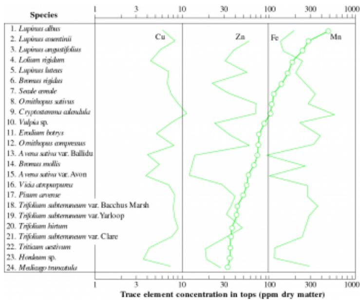

# Chapter 16 - Nutrients: a sparse resource

A demonstration of genetic differences between two varieties of 2- row barley (Hordeum distichon) in their tolerance to a manganese- deficient soil near Warooka, South Australia. Overall crop response to a foliar spray equivalent to  $6\mathrm{kg}$  manganese per hectare is evident in shoot growth (middle background behind arrow). While unsprayed plots in the foreground are less productive, the cultivar Weeah (left- side) tolerates this low- manganese soil better than Clipper (right side) (Photograph courtesy R.J. Hannam, South Australian Department of Agriculture)

There is a need to optimise the productivity of infertile and problem soils in order to meet increasing world- wide demand for agricultural and forestry products and we now recognise the increasingly important role of selection and breeding of plants specifically for such soils. Plant breeding solutions will complement agronomic methods to chieve these objectives in a manner which is both economically sound and ecologically responsible. (Randall 1993; italics added)

- [Chapter 16 - Nutrients: a sparse resource](Chapter_16.md)
  - [Introduction]()  
  - [16.1 Soil formation]()  
  - [FEATURE ESSAY 16.1 A brief history of plant nutrition]()  
  - [16.2 Soil–plant nutrient relations]()  
  - [16.3 Nutrient requirements and functional roles]()  
  - [16.4 Adaptation to low availability of nutrients]()  
  - [16.5 Soil acidity and toxicities]()  
  - [16.6 Concluding remarks]()  
  - [Further reading]()  

# Introduction

Plant nutrients represent only a tiny fraction of plant biomass, but fulfil multiple roles as either catalytic or structural components of all living cells. Over 90 elements are known to exist in nature, but only 14 or 15 appear crucial to plant growth and reproductive development. Moreover, these few essential elements have to be acquired from a huge soil volume relative to plant volume, and against an uptake gradient. Root system proliferation, fine root turnover, ongoing

maintenance and energy- dependent uptake of key nutrient resources all contribute to a substantial biological cost.

Nutrient acquisition is thus expensive in terms of both energy and carbon, and draws upon a sizeable fraction of photoassimilate. On nutrient- rich sites, vascular plants might expend less than a third of their fixed carbon on root- zone operations, but on nutrient- poor sites where the cost:benefit ratio is less favourable, at least two- thirds or even more of their carbon resources are so utilised.

Nutrients often constitute a sparse resource, and in contrast to young soils in a country such as New Zealand, soils in much of Australia are relatively old in world terms due to a lack of geological activity that produces new rock. Such old, highly weathered soils tend to be infertile. They represent a strong selection pressure for evolution of adaptive features in vascular plants that enhance nutrient acquisition and economise on subsequent use via recirculation in vivo. As evidence, slow growth, sclerophylly and internal recycling, coupled with biotic associations below ground, are widely represented in Australian species native to depauperate regions. Some cases are discussed later. Crop plants have contrasting needs, and have to be sustained by high inputs to realise their genetic potential for yield. Meeting those needs on nutritionally poor sites calls for major additions of key elements which in turn carry adverse consequences for soil biology.

Clearly then, native vegetation in much of marginal Australia has a lower order of resource requirements compared with intensive industries such as the agriculture, plantation forestry and grazing enterprises that displaced it. Australia's ancient landscape has a complex geology and biology and is subject to climatic extremes. Distinctive ecosystems evolved as resilient and genetically diverse assemblages. As a consequence, once land has been used for high- input rural industries, it is well- nigh impossible to rebuild a functional ecosystem that resembles a native state. South Africa and parts of India share aspects of Australia's Gondwanan heritage and offer parallels to our complex geology, biology and climate.

Are these new rural industries sustainable? Until 200 years ago, Australia did not have a cultivated agriculture but previous human manipulation of the environment is evident in fire ecology (Section 19.4). Native species survived that impact without modern supplements. Present- day agriculture and forestry have expanded in response to an increase in human population and its need for food and fibre, but at a price. Agriculture inevitably results in an ecological and species simplification of plants and animals, and this expedient is imposed upon vast areas of land. Crop species lack diversity, and are predominantly annuals. By contrast, native vegetation is predominantly perennial, heterogeneous and patchy with asynchronous dynamics. Native plants have also co- evolved with a wide array of biotic associations for nutrient acquisition. As a consequence, agricultural and pastoral developers first encountered stable landscapes with well- buffered ecosystems that had attained a stable equilibrium with soil nutrient resources.

Low availability of soil nitrogen and phosphorus limits productivity of most agricultural plants and has shaped adaptive features of many native species. In addition, perennial native species usually have more efficient mechanisms for nutrient acquisition. Moreover, they are less dependent on annual nitrogen and phosphorus uptake, and have more modest seasonal demands due to slower growth rates. Native plant communities have a great array of species which fix nitrogen biologically and contribute to soil resources. Both nitrogen- fixing and non- fixing species have a wide range of mycorrhizal associations that are missing in cropped land.

In fertile ecosystems, mineralisation of organic nitrogen to ammonia and subsequent oxidation to nitrate are major restrictions on nitrogen supply to plants. However, with infertile ecosystems, measured rates of net microbial production of inorganic nitrogen are often less than half the observed rates of nitrogen acquisition. Plants must therefore acquire nitrogen from two sources, an inorganic source which forms after release by mineralisation and an organic pool of unmineralised nitrogen. Polyphenols predispose plants towards retention of organic nitrogen in root zones which can then be acquired by native plants or their mycorrhizal associates. Research on uptake processes by rainforest tree seedlings implies that plants so adapted can take up and metabolise phenol- bound organic nitrogen thus sourcing a previously unrecognised form of plant- available nitrogen (Case study 16.3).

Native vegetation is highly adapted to cope with sparse nutrients, and in heterogeneous communities different species draw on different resources at critical times. Native plants thus operate according to a broader seasonal tempo compared with crop plants where requirements of a given planting are uniform in time and space.

With European settlement, rural practices displaced the original self- sustaining ecosystems with high- input enterprises. Sustainability in rural areas then becomes an issue. Judicious and costly inputs must be integrated with a farming business to maximise returns on investment but minimise landscape deterioration. An understanding of nutrient physiology and soil- plant nutrient ecology aids that process (Feature essay 16.1). Standard abbreviations for chemical elements have been adopted throughout this chapter and are as follows: nitrogen, N; phosphorus, P; potassium, K; calcium, Ca; magnesium, Mg; sulphur, S; iron, Fe; boron, B; zinc, Zn; manganese, Mn; copper, Cu; cobalt, Co; molybdenum, Mo; chlorine, Cl; sodium, Na; silicon, Si; Nickel, Ni; cadmium, Cd; selenium, Se; chromium, Cr; iodine, I; aluminium, Al; lead, Pb.

# 16.1 Soil formation

Soils form in response to interactions between soil- forming factors such as climate, parent material, biotic inputs, top- og- raphy and time. Outcomes from this 'pedogenesis' fall into four broad groups, entisols, oxisols, vertisols and alfisols (Table 16.1, Figure 16.1). Evolution of natural ecosystems and agri- cultural options vary accordingly, with more productive communities based on sites that are richer in plant- available nutrients.

Table 16.1 Basic properties for four major soil groups in Austnidia and their limitations on plants  

<table><tr><td>Property</td><td>Deep sandy soils</td><td>Sesquioxidic soils</td><td>Cracking clay soils</td><td>Texture contrast soils</td></tr><tr><td>Classification</td><td></td><td></td><td></td><td></td></tr><tr><td rowspan="2">Parent material</td><td>Tenosols (entisols)</td><td>Ferrosols (oxisols)</td><td>Vertosols (vertisols)</td><td>Sodosols (alfisols)</td></tr><tr><td>Siliceous aeolian sediments; humus soils</td><td>Fe, Mn-rich sediments from older lateritic soils</td><td>Alluvial and colluvial clays or consolidated sediments</td><td>Red-brown earths acidic siliceous rocks and sediments</td></tr><tr><td>Soil-forming processes</td><td></td><td></td><td></td><td></td></tr><tr><td>Diagnostic soil properties</td><td>Accumulation of organic matter; leaching of soluble salts</td><td>Extensive mineral weathering and leaching; segregation of Fe, Mn oxides in upper horizons</td><td>Development of structure especially in black earths</td><td>Weathering and clay elluviation</td></tr><tr><td>Degree of soil formation</td><td></td><td></td><td></td><td></td></tr><tr><td>Erosion potential</td><td>High content of Fe, Mn oxides in clay fraction; strong stable structure; porous</td><td>High clay content down profile; cracking on drying; horizons weakly differentiated</td><td>Marked contrast in texture between A and B horizons</td><td></td></tr><tr><td>P sorption capacity</td><td></td><td></td><td></td><td></td></tr><tr><td>Available P (ppm)</td><td></td><td></td><td></td><td></td></tr><tr><td>Total P (% of mass)</td><td></td><td></td><td></td><td></td></tr><tr><td>pH of A horizon</td><td></td><td></td><td></td><td></td></tr><tr><td>Irrigation potential</td><td></td><td></td><td></td><td></td></tr><tr><td>Major limitation to plants</td><td></td><td></td><td></td><td></td></tr><tr><td>Low water-holding capacity</td><td>High P sorption</td><td>Low permeability</td><td>Waterlogging at A-B horizon boundary; sodicity of B horizon</td><td></td></tr></table>

  
Figure 16.1 Soils in Australia comprise four major groups: (a) entisols (deep sands), (b) vertisols (cracking clays), (c) oxisols (massive equioxidic soils) and (d) alfisols (texture contrast soils, and in this case with differential development of the A horizon). (Based on Hubble et al. 1983, a source with a much more comprehensive account of soil types in Australia)

Nutrients for plant growth are derived from minerals in parent material by weathering, and four main processes are involved: oxidation/reduction, hydrolysis, solution and hydration. Minerals such as kaolinite and iron oxides tend to accumulate in soils because of their resistance to weathering but they are low in plant nutrients.

Elements released from parent material migrate during pedogenesis according to their mobility and solubility which in turn are functions of the pH and oxidation/reduction (redox) potential of the soil system. Basic cations such as  $\mathrm{Ca^{2 + }}$  and  $\mathrm{Mg^{2 + }}$  and elements such as P, S and Cl do not form insoluble hydroxides and are readily leached, whereas Al, Fe and Mn form insoluble hydroxides and accumulate.

Compared to New Zealand and much of the northern hemisphere, parent materials of Australian soils are old and weathered. Where the northern hemisphere was swept clean by glaciation during the Pleistocene, parent materials have been weathering for less than 10 000 years. By contrast, soils of inland Australia have formed on parent materials that have experienced many cycles of weathering, erosion and deposition. Some of these weathered materials have been either deposited or exposed (by denudation of the landscape) only recently. Soils formed on parent materials such as these unconsolidated sediments or sedimentary rocks are young in terms of pedogenesis but nevertheless low in nutrients, a feature usually associated with soils that have been developing for tens of thousands of years. In other areas such as central Queensland, red and yellow earths (oxisols) have been developing in excess of one million years. Texture- contrast soils (alfisols and ultisols), so common around the eastern seaboard and used for dryland grain cropping, have taken in excess of 25 000 years to form. By contrast, soils of New Zealand are young inasmuch as they have formed on recently deposited or recently exposed materials, but are nutrient rich compared to Australia. For example, a large area of the North Island is mantled by pumice with resulting soils  $< 4000$  years old. Volcanic loamy clay soils in the same region can be  $>50000$  years old.

Because so many soils have been developing for such a long time, soil characteristics cannot be attributed to recent climate, and as a corollary present- day distribution of soils cannot be explained by climatic variables alone (largely rainfall and temperature). Nevertheless, abrupt boundaries between a number of major soil zones in southeastern Australia are attributable to major changes in chemical and/or physical properties of parent materials.

Soil nutrient status is often closely correlated with parent material. For example, in eastern New South Wales and southern Queensland, chocolate soils (mollisols) and black earths (vertisols) occur only on basic parent rocks such as basalts whereas the red- brown earths (alfisols) occur only on granites and acidic sediments. These contrasting parent materials produce sharp differences in nutrient resources of resulting soils. Average P content (surface horizon) of a black earth is 870 ppm compared with a red- brown earth where P is usually  $< 200$  ppm (Table 16.1).

Parent material exerts a strong influence on pedogenesis in drier climates and especially at the beginning of soil development. In particular, chemical characteristics of parent rock or sediment are largely responsible for chemical

fertility of resulting soils. Soils developed over rocks and sediments high in ferromagnesian minerals such as olivine and augite have high levels of basic cations and trace elements necessary for plant growth. They are also the least resistant to chemical and physical breakdown. Quartz, muscovite, zircon, tourmaline and iron oxides such as goethite and hematite are the most stable and also contain only minor amounts of the elements needed for plant growth.

Physical and chemical characteristics of parent rocks can also have a marked influence on physical fertility of soils. Resistance to erosive agents (wind and water) is largely a function of aggregate stability, a property which is dependent on organic matter, divalent cations and clay type. Formation of water- stable aggregates is also greatly enhanced by pro- liferation of plant roots and their associated filamentous micro- organisms. Regularly cropped soils thus benefit greatly from a pasture (especially grass) phase.

Development of agriculture and horticulture in Australia has been markedly influenced by two soil characteristics related to the nature of the parent material, namely salinity and nutrient status. Large areas of mainland Australia are mantled by saline and/or sodic soils which have developed from sedimentary materials in which salts have accumulated over millions of years. In many areas where surface soils were not initially saline or sodic, secondary salinisation has followed land clearing. Their potential for salinisation and sodification is high because of a saline water table close to the surface (Section 17.1).

By world standards, large areas of Australia are deficient in major nutrients (P, N, K and S) as well as trace elements (Mo, Cu, Zn and Mn). To underline this contrast, the overall P average of Australian soils is around 300 ppm whereas average P in the USA is  $>500$  ppm and in England about 650 ppm. Low nutrient status, especially P and trace elements, is largely a consequence of time and parent material. Weathering of primary minerals and leaching of products in Late Tertiary periods have left many profiles low in basic cations, trace elements and P. These deficiencies have exercised a strong selection pressure in nature, and call for major nutrient additions in agriculture. An appreciation of soil- plant interactions ensures that such additions are used to best effect.

# FEATURE ESSAY 16.1 A brief history of plant nutrition

Jack F. Loneragan

  
Figure 1 Emeritus Professor Jack F. Lonerragan, AM FTS FAIAS, with Dr R.W. Bell and Ms Rojare Netsangtip. (Photograph courtesy Brian Richards, Murdoch University)

Four hundred years ago, the Australian continent and the nature of plant nutrition were unknown in Europe and subjects only of conjecture. That was about to change, with initial steps of both discoveries beginning around the same time and place — the lowlands of Europe at the beginning of the seventeenth century.

# 1600-1700: beginnings

In the early years of the seventeenth century Dutch merchantmen and explorers encountered, often accidently and sometimes disastrously, parts of the Australian coast. 'Terra Australis' then assumed reality for Europeans. At that time, Aristotle's conclusions that all earthly matter was made from four basic elements, earth, fire, air or water, still held sway among scientists. Most considered water to be the principal or sole nutrient for plants.

A Flemish physician, Van Helmont, broke with tradition by testing the nature of plant nutrition with a quantitative experiment. He grew willow shoots in soil in covered containers, supplying only water. At the end of five years, he recovered everything except  $56\mathrm{g}$  of the  $90\mathrm{kg}$  of original soil and measured an increase of over  $70\mathrm{kg}$  in the dry matter of the willow shoots. As the loss of soil was negligible, he concluded that the increase in willow dry matter arose from water alone, thus confirming existing beliefs. It was a well- executed experiment and, in the context of available knowledge, his conclusions published posthumously in 1652 appeared sound. They were accepted by contemporary scientists, including the eminent chemist Boyle who repeated and confirmed the experiment.

But, as so often happens in science, preconceived ideas about a process under investigation, combined with ignorance of other major inputs (photosynthesis), blinded investigators to a small but vital discrepancy in their data — a loss of  $56\mathrm{g}$  in  $90000\mathrm{g}$  of soil. While his conclusions were mostly wrong, Van Helmont's

report stimulated others to follow his experimental approach which eventually resolved the problem. In 1699, Woodward published the results of experiments in which he grew spearmint in water from various sources — rain, River Thames, Hyde Park conduit and Hyde Park conduit plus garden mould. He found that plant growth increased dramatically with the level of impurity in the water and concluded that 'vegetables are not formed of water but of a certain peculiar terrestrial matter'.

Woodward had conducted a brilliant experiment and focused attention on the role of soil in plant nutrition. How- ever, his conclusions again suffered from prevailing orthodoxy and ignorance of photosynthesis. Discovery of that process was itself delayed nearly 100 years until knowledge and techniques in chemistry had progressed sufficiently for its study. Publications by Priestly in 1779, Ingen- Housz in 1779 and Senebier in 1782 finally resolved the role of photo- synthesis for incorporating  $\mathrm{CO_2}$  and water into plant matter.

So, by the time that the First Fleet landed in Botany Bay in 1788, Van Helmont and Woodward had both been proved partly right and the basic elements of plant nutrition were in place: (1) plant matter was formed largely of  $\mathrm{CO_2}$  from air, plus some contribution from water, and (2) plant growth depended also upon some 'peculiar terrestrial matter'.

This information provided farmers of New South Wales with little help for crop production on the nutrient- deficient soils of their young colony, but it did set the stage for investigating the nature of Woodward's 'peculiar terrestrial matter' — investigations which would be of great value to the colonists' descendants 100 years later.

# 1800-1900: macronutrients

Researchers such as de Saussure now sought to identify the effective components of Woodward's terrestrial matter by analysing plant materials. De Saussure found a wide variability in the composition of ash from plants grown on different soils and concluded that some elements which were universally present were essential while others were not. Further progress was defeated by the large number of chemical elements present, variability in the composition of ash and trace amounts of many elements now known to be essential.

Conclusions from plant analysis were complemented by observations on responses of plants to soil additives. An eminent German chemist, Justus von Liebig, presented his view in 1840. He recognised that plants need C, H and O supplied by air and water. He also recognised that plants need P, K and N and suggested, correctly, that soil minerals supplied the P and K. He also proposed that plants grew in direct proportion to their supply of nutrients and that a deficiency of any one prevented growth (codified as his 'Law of the Minimum').

Unfortunately, a phosphatic fertiliser which Liebig invented failed to work. In order to prevent his fertiliser leaching, Liebig rendered the phosphate insoluble. That failure, in addition to errors and controversies over some of his claims, led to delay in acceptance of those of Liebig's claims that were sound. Moreover a number of serious problems remained unsolved. Their resolution took another 50 years and had to await advances in soil chemistry, plant physiology and soil microbiology.

Meantime, agricultural production in New South Wales and other new colonies languished due to P, N and other deficiencies. In Western Australia, severe nutrient deficiencies on the sandy coastal plains south of Perth contributed to the collapse of the notorious Peel settlement in 1829. According to Governor Stirling, 'the nature of the country in respect of its general inferiority of soil' contributed to settlers becoming widely dispersed as they tried to select better soils.

Soil chemistry made a major advance when Way showed in 1850 that soluble salts of ammonium, phosphate and potassium reacted with and were held by soil particles. At that same time, Lawes made a soluble phosphatic fertiliser by treating insoluble rock phosphate with sulphuric acid, thus inventing superphosphate, which unlike Liebig's insoluble product proved highly effective.

Around 1860 German plant physiologists Sachs and Knop independently adopted Woodward's solution culture technique to define active components of his 'peculiar terrestrial matter'. By adding pure salts to water, they established that six chemical elements we now know as macronutrients (N, P, K, Ca, Mg, S) and Fe were all essential for plant growth. They also showed that plants grew quite well with nitrate as their sole source of N, overturning Liebig's claim for ammonium as the sole source of N.

The behaviour of N fertilisers in soils remained puzzling with ammonium salts being converted into nitrates and some experimenters failing to obtain responses. A solution to these problems had to wait until Pasteur had recognised the chemical activities of bacteria and had developed techniques for studying them. Bacteria were then shown to convert fertiliser ammonium into nitrate and in 1886 Helriegel and Wilfarth established the role of nodule bacteria in N fixation by legumes.

Hence, by 1900 all outstanding problems of plant nutrition appeared to have been solved, and this research was impacting on agricultural production in Australia. After experiments at Roseworthy College in South Australia in 1882 had shown remarkable responses of wheat to superphosphate, progressive farmers began importing P fertilisers with good results and production of superphosphate started locally. Two hundred years of plant nutritional research was about to benefit the Australian colonies handsomely as they moved into Federation.

# 1900-present: micronutrients

Early years of the new century saw an increasing use of superphosphate for wheat production. Although Richardson of the Victorian Department of Agriculture had obtained big responses of clover to P in 1907, it was not until the mid- twenties that its value to pasture production, and via increased soil N to subsequent wheat production, was generally recognised. With alleviation of ubiquitous P and N deficiencies, farmers were now able to obtain good yields of wheat on most soils receiving adequate rain.

Nevertheless, on some soils wheat remained unproductive with symptoms similar to those of infectious diseases. Micro- biologists had observed similar symptoms on cereals in other countries and were convinced that disease organisms were responsible, though puzzled and frustrated by their continuing failure to identify a causative organism.

Meanwhile, in apparently unrelated research, laboratory scientists in Europe and the USA were reporting that tiny amounts of various elements increased the growth of fungi and higher plants. In 1869 the French microbiologist Raulin reported that Zn increased the growth of Aspergillus niger. In 1897 Bertrand (another French microbiologist) observed that Mn was associated with oxidising enzyme laccase, and concluded that Mn was essential for plants. His finding was confirmed in 1914 for maize by Maze in France and for wheat by McHargue in the USA. In 1910 Agulhon reported field responses of several crops to B, and in 1914 Maze claimed from solution culture experiments that small amounts of B were essential for maize. Maze also claimed in 1914 that Zn was essential for maize. In 1916 Grossenbacher reported that applying copper sulphate to soil or spraying trees with Bordeaux mixture (a popular fungicide containing Cu) controlled dieback and stimulated growth of citrus in Florida. Warrington at the Rothamsted Experimental Station in England reported in 1923 that broad bean plants died in water cultures unless B was added.

Hence by 1923 there was strong evidence that, in addition to the macronutrients and Fe, four more elements (Cu, Mn, Zn and B) increased plant growth when present in trace amounts. But the conclusion that these trace elements were in fact essential nutrients, while suggested by some and clearly recognisable now, was obscured at the time by the failure of many workers to repeat the results, by reports that many other elements stimulated growth (Maze, for example, claimed as essential not only Mn, Zn and B, but also Al, Cl and Si), and by a common view that the elements, which were known to be poisonous at relatively low concentrations, acted as stimulants when present in trace amounts. Moreover, their concentrations in plants were so small and demonstration of responses so difficult that they were generally regarded as laboratory curiosities of no concern to agriculture.

  
Figure 2 First recognised field response to a trace element at Mt Gambier, South Australia. Right side of the central path shows an untreated plot of dead and unhealthy oats with symptoms of Grey Speck disease. Left side shows a plot treated with  $84~\mathrm{kg}$  manganese sulphate per hectare. (Reproduced from Samuel and Piper 1928, and supplied by J.F. Loneragan)

Samuel and Piper (1928, 1929) at Waite Agricultural Research Institute (University of Adelaide) challenged these views dramatically when they reported that applying manganese sulphate to an oat crop suffering from Grey Speck disease in Penola, South Australia, increased grain yield from nothing to nearly  $3\mathrm{tha}^{- 1}$  (Figure 2) and that the 'symptoms of Mn deficiency in water- cultures corresponded exactly with the symptoms of Grey Speck disease of oats in the field'. If correct, the results would require plant pathologists to adopt new paradigms to account for some plant diseases and physiologists would have to rethink both function and agricultural significance of trace elements.

For some, the change was too much to accept immediately. In a review of the Grey Speck disease that he wrote after seeing Samuel and Piper's work and hearing their hypothesis, Carne, a plant pathologist from the Western Australian Department of Agriculture, wrote 'The solution of the cause of the disease...will probably take longer than to find an effective control. The writer has had some evidence that the lesions are due to bacteria attacking plants in an unhealthy condition as a result of soil defects'.

But Samuel and Piper were vindicated by excited researchers worldwide who, within a few years, had cured a host of 'diseases' with micronutrients, including Heart- rot of various root crops in Europe (B), Pican Rosette of pecan trees in Florida (Zn), Mottle Leaf of citrus in California (Zn), Reclamation Disease of cereals in Holland (Cu), and Corky Pit of apples in New Zealand (B). Australian plant pathologists also joined in the fun, with the first published reports coming from Pittman and Owen in 1936 (Mottle Leaf of citrus in Western Australia (Zn), Exanthema of citrus in Western Australia (Cu)) and Carne and Martin in 1937 (Internal Cork of apples in Tasmania (B)).

At the same time, Australian scientists began testing the trace elements as supplements for grazing animals and as micro- nutrient fertilisers for crop production on unproductive soils in areas of good rainfall. In 1935 Lines and Marston announced that Co corrected Coast Disease of sheep- grazing pastures on calcareous sandy dunes near Robe, South Australia. Independently and almost simultaneously, Underwood and Filmer found that Co cured Wasting Disease of cattle around Denmark, Western Australia. Later, small amounts of Cu were found necessary for the complete correction of Coast Disease at Robe. In 1938 Riceman and Donald published their findings that, on the same Robe soils, a range of cereals and legumes suffered acute Cu deficiency and, to a lesser extent, Zn deficiency. Meanwhile, Bennetts and Chapman had established in 1937 that Swayback disorder of lambs in Western Australia was associated with low Cu levels in pastures. Teakle and co- workers in Western Australia had also found acute Cu deficiency in potatoes and tomatoes near Albany and in grapevines near Gingin. In 1939 they reported failure of wheat from Cu deficiency at Dandaragan on the coastal plain between Perth and Geraldton.

By 1939, as in 1900, it was generally accepted that all essential plant nutrients had been discovered and that research in plant nutrition need only be concerned with the application of existing knowledge. But once again physiologists curious about abnormal symptoms in their experimental plants in solution culture had an unexpected impact on Australian agriculture. Arnon and Stout (1939) developed new methods for removing contaminants from their cultures and reported that Mo was essential for the growth of tomatoes. They failed to find any symptoms of deficiency in Californian crops and concluded 'that the amounts of Mo essential for plant nutrition were so very, very small that nature by itself would not be able to clear any soil environment sufficiently to result in a demonstrable Mo deficiency in the field...'. They were delighted when, in 1942, A.J. Anderson of the CSIRO proved them wrong with a ten- fold increase in clover production after adding Mo to an ironstone gravelly soil in the Adelaide hills.

In 1946 Anderson and colleagues showed that clover required Mo for N fixation and that many acid soils contained unavailable Mo which was released by liming. These findings concluded nearly 300 years of nutritional research from the publication of Van Helmont's seminal experiment and coincided with the end of the Second World War which had halted agricultural development in Australia for six years. Research findings of those 300 years now provided a sound scientific base for a massive expansion of Australian agri- cultural production and land development which followed in the next 25 years.

'Sub and super' (subterranean clover and superphosphate) became a catch cry for correcting P and N deficiencies in pastures and crops. Later, superphosphate was also found sometimes to correct S and Zn deficiencies accidentally. In higher rainfall areas, K fertiliser was also needed. In many areas, too, micronutrient deficiencies and failure of clovers to nodulate depressed production. Jensen,

Vincent and colleagues at Sydney University, Bergerson, Hely and Brockwell at CSIRO, Canberra, Parker at UWA and Norris and Date at CSIRO, Brisbane, resolved many microbiological problems associated with nodulation of legumes and supplied effective Rhizobium cultures to nutritional colleagues. In addition, Vincent and colleagues established a laboratory to help the commercial production of effective Rhizobium inoculants, which were critical for legume establishment in many areas of Australasia.

Micronutrients combined with 'sub and super' increased productivity of existing farm lands and made possible devel- opment of new areas. Cu and Zn were especially important in South and Western Australia. In South Australia, large areas of native scrub in the 90- Mile Desert (subsequently renamed the 90- Mile Plain) and large areas of calcareous sand dunes of southeastern South Australia were developed following research by Riceman and colleagues in the CSIRO and by Tiver and colleagues in the South Australian Department of Agriculture. Correction of Cu and Zn deficiencies also permitted development of extensive areas of the coastal plain between Perth and Geraldton, Esperance Plains and sandy soils interspersed among the heavier soils of farms in the Western Australian wheat belt. A huge research effort by officers of the Western Australian Department of Agriculture, including Dunne, Shier, Smith, Fitzpatrick and Troms, was required to define the nutrient requirements of the various soils of the 20 million hectares developed between 1950 and 1970.

  
Figure 3 Response of subterranean clover to Mo in experimental plots on a podzolised soil over granite at Carlsruhe,  $80\mathrm{km}$  northwest of Melbourne, Victoria. Left of white peg (arrow) superphosphate only; right side: superphosphate  $+140\mathrm{g}$  sodium molybdate per hectare. Mo applied in 1956, photographed in 1957. (Photograph courtesy Rex Newman, 1957 (Department of Agriculture, Victoria) and supplied by J.F. Loneragan)

Molybdenum was especially important in New South Wales, Victoria and Western Australia. On the Southern Tablelands of New South Wales, Anderson and coworkers identified extensive areas where as little as  $100\mathrm{g}$  of Mo combined with  $200\mathrm{kg}$  of superphosphate per hectare allowed establishment of legumes in pastures. Later, they showed that dressings of tonnes of lime being used for establishment of legumes in pastures on acid soils could, in many cases, be replaced by seed coated with Mo and small amounts of lime plus an inoculum of Rhizobium sp. Newman estimated that four million hectares of land in Victoria

would also respond to Mo and demonstrated increases in clover yields from 1 to 5 t  $\mathrm{ha^{- 1}}$  (Figure 3) and the carrying capacity of pastures from one to eight sheep per hectare. Mo deficiency of clover was also widespread in Western Australia as Dunne, Fitzpatrick, Gartrell and Glencross have shown. Gartrell has also delineated a substantial area of soils on which Mo applications increased wheat yields by  $20\%$ .

Mn deficiency, though less widespread than Cu, Zn and Mo deficiencies, was also a serious problem in some areas and especially on the calcareous sand of the Yorke and Eyre peninsulas of South Australia where Reuter, Graham and others have increased grain yield of barley two- to ten- fold with Mn applications. Correction of Mn deficiency is unusually difficult on some alkaline, calcareous and organic soils which immobilise soil applications of Mn so quickly that additional leaf sprays are required to correct Mn deficiency entirely.

Following the Second World War plant physiologists had also returned to their solution cultures with increasingly sophisticated purification techniques. They established that five more elements are essential for some species — Cl for many and probably all plants (1954); Co for legumes fixing  $\mathrm{N}_2$  (1960); Na for  $\mathrm{C}_4$  halophytes (Feature essay 16.2) and possibly all  $\mathrm{C}_4$  plants and beneficial to many  $\mathrm{C}_3$  and  $\mathrm{C}_4$  plants as a substitute for K; Si for diatoms and a few terrestrial species (1969) and beneficial to many others; and most recently Ni for legumes (1984) and cereals (1987).

Of these additional elements, only Co has been shown to depress plant production of commercial crops, and then only in lupins sown with low Co seed on lateritic sands in Western Australia. However, the levels of Co, Se and I, essential for animals, have been sufficiently low in pastures to have depressed animal production over large areas.

The total number of essential nutrients in Woodward's 'peculiar terrestrial matter' now stands at 17 although no one plant would require more than 14 or 15. Nevertheless, it would still be 'courageous' to claim that all essential nutrients have now been discovered; it is wiser to say that plants do not need other elements at a concentration above the lowest level so far measured.

In the light of this complexity, the abysmal nutrient poverty of so much of southern and southwestern Australia and the understanding of plant nutrition at the time, we can now appreciate the impossible task faced by those unfortunate early settlers who tried farming it. We can also appreciate the outstanding contribution which plant nutritional research has made to Australian agricultural production in this century and particularly since 1950. Unfortunately, that same information has also permitted overdevelopment of some areas resulting in problems of erosion, salinity and pollution. Increased soil N due to legume- based pastures has also led to soil acidification resulting from accelerated leaching of cations accompanying

increased amounts of nitrate being leached. In addition, removal of nutrients in agricultural products imposes a continuous drain on the soil's nutrient resources which will require replenishment in order to maintain production.

In looking for solutions to these problems, research in plant nutrition has a major role to play. Increasingly since 1970, research in plant nutrition has focused on efficient use of fertilisers in agricultural production with the twin aims of decreasing costs and eliminating pollution from surface and groundwaters. Sustainable and non- polluting agriculture requires a continuous monitoring of soil nutrient supplied and the nutrient status of crops and pastures. Many plant physiological and soil tests have been and are being developed to these ends. Data from such tests are being used in models of crop production which incorporate environmental variables in order to match fertiliser applications with crop nutrient requirements. In addition, there is great interest in exploiting the huge variability known to exist among plants in their ability to obtain nutrients from soil as shown, for example, by a 30- fold range in Mn concentrations in the tops of 24 annual crops and pasture species growing on the same soil. Mycorrhizal contributions to nutrient absorption by plant roots (Section 16.4) and manipulation of plant genomes for Al tolerance (Section 16.5) are two other areas of active research in this exciting field.

# References and further reading

Anderson, A.J. (1942). 'Molybdenum deficiency on a South Australian ironstone soil', Journal of the Australian Institute of Agricultural Science, 8, 73- 75.

Anderson, A.J. (1956). 'Molybdenum as a fertilizer', Advances in Agronomy, 8, 163- 202.

Arnon, D.I. and Stout, P.R. (1939). 'Molybdenum as an essential element for higher plants', Plant Physiology, 14, 599- 602.

Chapman, H.D. (1966). Diagnostic Criteria for Plants and Soils, Division of Agricultural Sciences, University of California, Riverside.

Donald, C.M. (1975). 'Trace elements in Australian crop and pasture production, 1924- 1974', in Trace Elements in Soil: Plant- Animal Systems, eds D.J.D. Nicholas and A.R. Egan, 7- 37, Academic Press: Sydney.

Marschner, H. (1995). Mineral Nutrition of Higher Plants, 2nd edn, Academic Press: New York.

Russell, E.W. (1988). 'Historical', in Russell's Soil Conditions and Plant Growth, 11th edn, ed.A. Wild, 1- 30, Longman: UK.

Samuel, G. and Piper, C.S. (1928). 'Grey- speck (manganese deficiency) disease of oats', Journal of the Department of Agriculture of South Australia, 31, 696- 705, 789- 799.

Samuel, G. and Piper, C.S. (1929). 'Manganese as an essential element for plant growth', Annals of Applied Biology, 16, 493- 524.

Stephens, C.G. and Donald, C.M. (1958). 'Australian soils and their responses to fertilizers', Advances in Agronomy, 10, 167- 256.

Stiles, W. (1946). Trace Elements in Plant and Animals, Cambridge University Press: Cambridge.

Williams, C.H. and Raupach, M. (1983). 'Plant nutrients in Australian soils', in Soils: An Australian Viewpoint, Division of Soils, CSIRO, 777- 793, CSIRO: Melbourne/Academic Press: London.

# 16.2 Soil-plant nutrient relations

Soil- plant interrelations are dynamic and subject to both inputs (fertilisers, pollutants, soil chemistry) and losses (erosion, leaching, harvesting). Metal ions are released into soil solution via weathering and solubilisation of soil minerals (Section 16.1) as well as via decomposition of organic matter.

Available ions are those that a particular root system can acquire. Strictly speaking, only ions in soil solution would be considered available, but due to a dynamic equilibrium that exists between the soil solution and other ion pools from which ready transfer into the soil solution can occur, ions adsorbed onto exchange sites can also be considered as available, or at least as influencing the available fraction.

Factors affecting ion supply to plant roots include ion activities in the soil solution, usually referred to as intensity, and the degree and rate of replenishment of the soil solution ion pool from other pools (ions adsorbed on solid soil particles or labile organic compounds and ions present in other readily soluble compounds), usually referred to as capacity. The capacity factor therefore determines a buffer power for a particular metal. The relationship between capacity and intensity factors for each particular metal is heavily dependent on pH.

# (a) Cation exchange capacity

Clay particles are negatively charged and therefore surrounded by a swarm of (positively charged) cations. Clay minerals owe a part of their negative charge to isomorphous substitution (cations of higher charge, like  $\mathrm{Al}^{3 + }$ , are replaced by those of lower charge, like  $\mathrm{Mg}^{2 + }$ ) thus leaving a surplus of (non-

neutralised) negative charges which are satisfied with adsorbed, exchangeable cations. In addition, soil colloids (e.g. humus, hydrous oxides) that exhibit protonated complexing functional groups  $\mathrm{(- OH, - COOH)}$  also contribute to the cation exchange capacity of soils:

$$
\begin{array}{rl}\mathbf{M}^{1 + } & +\mathbf{M}_2\mathbf{X}\leftrightarrow \mathbf{M}^{2 - } + \mathbf{M}\mathbf{X}\\ \mathrm{(solution)} & \mathrm{(solid)}\leftrightarrow \mathrm{(solid)}\quad \mathrm{(solution)} \end{array}
$$

Since dissociation of  $- \mathrm{OH}$  and  $- \mathrm{COOH}$  groups (especially those on organic matter) is  $\mathrm{pH}$  dependent, cation exchange capacity increases with an increase in  $\mathrm{pH}$ . With an increased cation exchange capacity, metal cations are attracted to these negative sites on solid particles, soil solution is depleted and therefore metal availability reduced.

# (b) Retention of cations in soils

Cations are held more strongly (less reversibly) when  $\mathrm{pH}$  increases from 5 to 7.  $\mathrm{Cu}$ ,  $\mathrm{Zn}$ ,  $\mathrm{Ni}$ ,  $\mathrm{Cd}$  and other metals become significantly less soluble and less exchangeable when  $\mathrm{pH}$  increases from 5 to 7. Retention of metals in soil can occur through several processes: (1) cation exchange (non- specific adsorption), (2) specific adsorption, (3) organic complexation and (4) co- precipitation. In a given situation most, if not all, of these processes contribute to metal retention in soils.

In order to maintain electroneutrality, negative charges on solid particles (soil colloids) are balanced by an equal amount of cations; an exchange refers to the exchange between counter- ions balancing the surface negative charge on the soil colloids and ions in soil solution. Such an exchange is reversible, stoichiometric and diffusion controlled. Moreover, there is a certain degree of selectivity of the adsorbent. The higher the valency of an ion, the greater its replacing power ( $\mathrm{H}^{+}$ behaves like a polyvalent cation). By contrast, with greater degrees of hydration, a given ion will exhibit a lower replacing power.

Adsorption by cation exchange represents electrostatic binding through the formation of outer- sphere complexes with the surface functional groups. An outer- sphere complex means that at least one molecule of a solvent comes between the functional group and the ion.

Specific adsorption is  $\mathrm{pH}$  dependent and related to the hydrolysis of the heavy- metal ion. In specific adsorption partly covalent bonds are formed with the lattice ions. Partly covalent bonds are inherently stronger than electrostatic binding involved in the non- specific cation exchange (e.g.  $\mathrm{Zn}$  can be adsorbed on  $\mathrm{Fe}$  and  $\mathrm{Al}$  oxides 7 and 26 times more strongly than their corresponding cation exchange capacity at  $\mathrm{pH}7.6$  would imply). Metals most able to form hydroxy complexes are specifically adsorbed to the greatest extent:

$$
\mathrm{Hg > Pb > Cu > > Zn > Co > Ni > Cd}
$$

Specific adsorption may also include diffusion of metals into mineral interlayer spaces and their fixation there. Such diffusion increases with an increase in pH.

Organic matter may either increase or decrease availability of micronutrients, Al and heavy metals. Reduced availability is due to complexation with humic acids, lignin and other organic compounds of high molecular weight (insoluble precipitates are thus formed). Conversely, increased availability may result from solubilisation and thus mobilisation of metals by low molecular weight organic ligands (e.g. short- chain organic acids, amino acids and other organic compounds). Stability constants of chelates with several metals occur with increasing order as:

$$
\mathrm{Cu > Fe = Al > Mn = Co > Zn}
$$

Co- precipitation represents formation of mixed solids by simultaneous precipitation as occurs with Fe and Mn oxides.

# (c) Soil-plant pH

Figure 16.2 A highly diagrammatic picture of soil nutrient availability (and element toxicity) as a function of  $\mathrm{pH}$ . Increasing acidity or alkalinity correspond to logarithmic increase in concentration of  $\mathbf{H}^{+}$  and  $\mathrm{OH}^{- }$  respectively (vertical bars). Horizontal bars represent relative availability (or toxicity) at any particular  $\mathrm{pH}$ . Most agricultural soils will be slightly acid ( $\mathrm{pH}$  around 5.5 to 6.5) and essential nutrients are all readily available within that range. Of particular note, highly acid soils are conducive to both Al and Mn toxicity and to Mo deficiency. Highly alkaline soils are conducive to B toxicity but to Fe, Zn and Mn deficiencies. (Based on various sources including Handreck 1978 and Marshner 1995)

The  $\mathrm{pH}$  value most relevant to soil and plant chemical processes is  $\mathrm{pH}$  of the soil solution. A soil is acidic if the  $\mathrm{pH}$  of its aqueous solution phase is  $< 7$  and alkaline if that  $\mathrm{pH}$  exceeds 7. Nutrient element availability varies accordingly (Figure 16.2), and beyond the range of  $\mathrm{pH}4 - 8$  plant growth becomes a function of  $\mathrm{pH}$  per se, plus  $\mathrm{pH}$  effects on nutrient ion availability.

In chemical terms,  $\mathrm{pH}$  represents a measure of  $\mathrm{H}^{+}$  activity in a soil solution which is in a dynamic equilibrium with a negatively charged solid phase.  $\mathrm{H}^{+}$  ions are strongly attracted to these negative sites and have sufficient power to replace other cations from them. A diffuse layer in the vicinity of a negatively charged surface has higher  $\mathrm{H}^{+}$  activity than the bulk soil solution.

Soil  $\mathrm{pH}$  varies in time and space. Diurnal fluctuations of as much as one  $\mathrm{pH}$  unit may occur, as well as spatial variations (horizontal and vertical down the soil profile). Soil  $\mathrm{pH}$  also varies over seasons. During seasons with low to moderate rainfall when evapotranspiration greatly exceeds precipitation, salts are not being removed by deep percolation and increased salts tend to reduce  $\mathrm{pH}$  by forcing more of the exchangeable  $\mathrm{H}^{+}$  ions into the soil solution. Conversely, during wet seasons, salts are removed from the topsoil and  $\mathrm{pH}$  goes up. This season to season fluctuation in total salt content should not be confused with long- term soil acidification (Section 16.5).

# (d) Relationships between  $\mathrm{pH}$  and ion toxicity

Soil  $\mathrm{pH}$  is a dominant influence on solubility and therefore availability and potential phytotoxicity of metals (Figure 16.2). Low  $\mathrm{pH}$  favours free metal cations and protonated anions, higher  $\mathrm{pH}$  favours carbonate or hydroxyl complexes. Therefore, availability of micronutrient and toxic ions (which are present in soil solution as cations) increases with increasing soil acidity. By contrast, availability of those present as anions  $\mathrm{(MoO_4^{2 - }}$ ,  $\mathrm{CrO_4^{2 - }}$ ,  $\mathrm{SeO_4^- }$ ,  $\mathrm{SeO_3^- }$  and  $\mathrm{B(OH_4)^- }$  increases with increasing alkalinity (see Case study 16.1).

# (e) Rhizosphere

Plant growth is dependent on availability of water and nutrients in the rhizosphere, the soil- root interface consisting of a soil layer varying in thickness between 0.1 mm and up to a few millimetres depending on the length of root hairs (Section 3.3). Availability of nutrients in the rhizosphere is controlled by the combined effects of soil properties and interactions between plant roots and adjacent microorganisms in the surrounding soil.

Chemical conditions in the rhizosphere are usually very much different from those in the bulk soil further away from roots. Root- induced changes in the rhizosphere  $\mathrm{pH}$  are a result of the balance between  $\mathrm{H^{+}}$  and  $\mathrm{HCO_3^- }$  excretion, evolution of  $\mathrm{CO_2}$  by respiration and loss of various organic compounds known collectively as root exudates.

The balance between  $\mathrm{H^{+}}$  and  $\mathrm{HCO_3^- }$  excretion depends upon the cation/anion uptake ratio. Greater excretion of  $\mathrm{H^{+}}$  accompanies a greater absorption of cations than anions and results in rhizosphere acidification. Conversely, when uptake of anions exceeds uptake of cations, excretion of  $\mathrm{HCO_3^- }$  exceeds that of  $\mathrm{H^{+}}$ . The chemical form of soil N (ammonium v. nitrate) is an influential factor for the cation/anion ratio. Ammonium- fed plants take up more cations than anions, and they usually have a more acidic rhizosphere than bulk soil, while nitrate- fed plants take up more anions than cations and show the opposite relationship between rhizo- sphere and bulk soil  $\mathrm{pH}$ . Plant effects on rhizosphere  $\mathrm{pH}$  also vary with genotype, which can in turn influence nutrient ion availability (Section 3.3.1).

Overall, plants and soils must be regarded as interacting components in any ecosystem, and because plants take up more basic than acidic components, any net increase in ecosystem biomass will result in some degree of soil acidification.

# CASE STUDY 16.1 Boron toxicity and Australian agriculture

Jeff Paull

Boron (B) is an essential micronutrient, but is potentially toxic to plants over much of southern Australia where high concentrations of soil B reduce crop yields, especially in sensitive varieties.

Toxic levels of soil B can derive from over- application of B when correcting a deficiency, contamination in industrial and sewerage sludges, high concentrations in groundwater used for irrigation and high levels in parent material, including marine sediments. Seawater normally contains appreciable levels of B and as a consequence deposits that remain after ancient seas recede contain high levels of B

and other soluble salts. As these deposits weather, B is released and slowly redistributed by leaching.

Boric acid,  $\mathrm{B(OH)_3}$ , is the main form of free B in soil, and of much lower solubility than the accompanying sodium chloride in soils derived from these marine sediments. As a consequence, B has not been leached from root zones in low- rainfall environments of southern Australia. In addition, hydroxyl groups of boric acid react with clay particles and remain bound under alkaline conditions, so that leaching is further decreased. Geographic regions with high soil B usually correspond to areas of marine sediments, rich in clay and subject to low rainfall.

Soil B in southern Australia has been determined from analysis of soil cores, plant shoots, harvested grain and from observation of B toxicity. Visible symptoms on leaf tips of barley include distinctive black spots within dead leaf tissue. High- B soils occur on Eyre Peninsula, mallee regions of South Australia and Victoria and low- rainfall regions of inland southeastern Western Australia. B toxicity is very widespread, and levels are generally highest in subsoils rather than root zones. Soil amelioration is thus an impractical solution, so that most research efforts have been directed towards selection of B- tolerant crop varieties.

  
Figure 1 Dry matter yield of shoots of five varieties of wheat grown in a pot experiment with soil at seven levels of B (Based on Paull et al. 1991)

Genetic variation in crop response to B has been identified (Figure 1). Similar variation has also been observed for several other major crops of southern Australia, including barley, oats and peas. While there is some variation in B tolerance among Australian varieties of these crops, more tolerant lines have been identified in collections from the Middle East, India, Japan and parts of South

America. In all cases, these B- tolerant crops have adapted to soils subject to either marine or volcanic influence.

Tolerance to high concentrations of B is under the control of a number of major genes, and segregation ratios observed in  $\mathrm{F}_2$  and  $\mathrm{F}_3$  generations conform to the Mendelian ratio of 1/4 homozygous sensitive to 1/2 heterozygous to 1/4 homozygous tolerant. Two examples of segregation ratios in wheat shown here compare observed ratios (Obs) with expected ratios (Exp); Chi- square analysis  $(\chi^2)$  confirms that observed frequencies agree with Mendelian prediction:

<table><tr><td></td><td></td><td>Sensitive</td><td>Heterozygous</td><td>Tolerant</td><td>x²</td></tr><tr><td rowspan="2">Warigal × (WI*MMC)</td><td>Obs</td><td>27</td><td>63</td><td>32</td><td></td></tr><tr><td>Exp</td><td>30.5</td><td>61</td><td>30.5</td><td>0.34</td></tr><tr><td rowspan="2">Halberd × Warigal</td><td>Obs</td><td>27</td><td>63</td><td>20</td><td></td></tr><tr><td>Exp</td><td>27.5</td><td>55</td><td>27.5</td><td>2.80</td></tr></table>

These genes act in an additive manner and tolerant varieties have dominant alleles at more loci than do sensitive varieties.

Plant response to B is thus subject to control by major genes, so that genes for tolerance can be transferred to sensitive varieties by backcrossing. This involves hybridisation between a sensitive, but otherwise well- adapted, variety and a tolerant variety. Progeny are tested for response to B and tolerant selections are then crossed to the sensitive variety. Progeny of this cross are again tested for response to B and tolerant plants selected. It is possible to reconstitute the agronomic traits of the sensitive variety, but now with tolerance to B, by repeating this cycle a number of times. In one such outcome (Figure 1) three cycles of backcrossing transferred B tolerance from Halberd to the sensitive variety Schomburgk. Halberd was the most widely grown variety in Australia during the 1970s and 1980s, but more recent varieties, such as Schomburgk, have higher yield potential and better flour quality. Both tolerant and sensitive plants occurred among the progeny and a tolerant selection resulted in the new variety BT- Schomburgk.

Mechanisms responsible for root acquisition of B are not known, but B uptake is known to be closely correlated with water use and is higher under conditions conducive to rapid transpiration. Once absorbed, B moves with the transpiration stream and concentrates at xylem endings. Concentration gradients thus develop within leaves, and overall leaf concentration will vary with transpirational history. B concentrations are generally highest at leaf tips or along margins, depending upon venation, and are higher in old leaves compared with young leaves. For example, B concentration in the terminal 4 cm of a barley leaf, when grown under high B conditions, was  $2493 \mathrm{mg} \mathrm{kg}^{- 1}$  (dry

mass), while the corresponding concen- tration for a segment  $14 - 20\mathrm{~cm}$  from the tip was only  $82\mathrm{mg}\mathrm{kg}^{- 1}$ . Average concentration for the whole leaf was  $208\mathrm{mg}\mathrm{kg}^{- 1}$  (J.G. Paull, unpublished data).

  
Figure 2 Concentration of B in shoots of four varieties of wheat when grown in a solution culture experiment with six B treatments. (Based on Nable 1988)

Visible symptoms of B toxicity coincide with regions of highest B concentration and consist initially of chlorosis followed by tissue death. Varieties that tolerate high concentrations of B (Figure 1) are able to exclude B from their roots. They therefore have lower shoot concentrations (Figure 2) and exhibit less severe symptoms of B toxicity compared with more sensitive varieties.

In retrospect, B tolerance was probably a major factor influencing progeny selection from breeding programs for wheat varieties in Australia. Several varieties have dominated Australian wheat production in southern Australia during the twentieth century and the majority of these are tolerant to B. On the other hand, varieties grown in New South Wales and Queensland, where high concentrations of B do not occur, are invariably sensitive to soil B. For example, the variety Halberd, which is one of the most tolerant Australian varieties, was the most widely grown variety in southern Australia during the 1970s and 1980s. Cultivation of Halberd was most concentrated in areas of high soil B. At some silos on Eyre Peninsula, Victorian and South Australian mallee regions as well as inland Western Australia, more than  $70\%$  of the total grain receivals were Halberd. By contrast, in low- B regions, Halberd accounted for less than  $20\%$  of production. By implication, any successful field crops in southern Australia will have some measure of B tolerance.

# References

Nable, R.O. (1988). 'Resistance to boron toxicity amongst several barley and wheat cultivars: a preliminary examination of the resistance mechanism', Plant and Soil, 112, 45- 52.

Paull, J.G., Rathjen, A.J. and Cartwright, B. (1991). 'Major gene control of tolerance of bread wheat (Triticum aestivum L.) to high concentrations of soil boron', Euphytica, 55, 217- 228.

# 16.3 Nutrient requirements and functional roles

# 16.3.1 Essential mineral nutrients

Solution culture experiments have established a number of facts basic to plant growth on soils - that plant roots must have a supply of oxygen, that solid soil particles and micro- organisms, while sometimes beneficial, are not essential, that in addition to C, H and O some 14 or 15 chemical elements are essential for plant growth, and that all of these essential elements may be supplied to plant roots as simple ions of inorganic salts in solution and must be supplied in adequate but non- toxic amounts.

A chemical element is regarded as essential if, in its absence, a plant cannot complete its life cycle. An alternative criterion has also been suggested - that the element is part of an essential plant constituent or molecule. So far, only the first criterion has been used to establish essentiality although the latter has proved useful as a guide to further research, as, for example, in the association of Mn with laccase activity and Ni with urease activity.

'Essential mineral nutrients' or simply 'essential nutrients' include all those chemical elements which are normally absorbed from the soil solution by higher plants. They exclude C, H, and O which comprise more than  $99\%$  of metabolically active leaves and some  $90 - 95\%$  of their dry matter, but, paradoxically, they include N which does not occur in any soil mineral and is supplied to some plants from air. Essential mineral nutrients comprise less than  $1\%$  of fresh mass in active leaves and  $5 - 10\%$  of their dry matter; yet within this small proportion, all 14 or 15 elements must be present in adequate amounts for healthy growth and effective reproduction.

# Functions of nutrients

Table 16.2. A summary of notional values for concentrations of nutrient elements (in a dry mass basis) considered as just adequate for macronum plant gmch, and accompanying data on the relative number of atoms of those elements within a plant (refermed to  $M_o = I$  ).A broad distinction between plant requirements for micronutrients (tree elements) and macronutrients is then evident. Mobility from leaves is meant to reflect overall impressions of nutrient element mobility inferred from tuzer experiments and comprehensive chemical analysis of nutrient budgets for whole plants and organs.  

<table><tr><td>Element</td><td>Concentration mg kg-1</td><td>% (dry mass)</td><td>Relative number of atoms</td><td>Mobility from leaves</td></tr><tr><td>Micronutrients</td><td></td><td></td><td></td><td></td></tr><tr><td>Molybdenum*</td><td>0.1</td><td>—</td><td>1</td><td>Variable</td></tr><tr><td>Nickel</td><td>0.1</td><td>—</td><td>2</td><td>Mobile</td></tr><tr><td>Copper</td><td>3</td><td>—</td><td>50</td><td>Variable</td></tr><tr><td>Zinc</td><td>20</td><td>—</td><td>300</td><td>Variable</td></tr><tr><td>Manganese</td><td>20</td><td>—</td><td>400</td><td>Immobile</td></tr><tr><td>Boron*</td><td>12</td><td>—</td><td>1 000</td><td>Immobile</td></tr><tr><td>Iron</td><td>100</td><td>—</td><td>2 000</td><td>Immobile</td></tr><tr><td>Chlorine</td><td>100</td><td>—</td><td>3 000</td><td>Mobile</td></tr><tr><td>Sodium*</td><td>500</td><td>—</td><td>20 000</td><td>Mobile(?)</td></tr><tr><td>Macronutrients</td><td></td><td></td><td></td><td></td></tr><tr><td>Sulphur</td><td>—</td><td>0.1</td><td>30 000</td><td>Variable</td></tr><tr><td>Calcium*</td><td>—</td><td>0.2</td><td>50 000</td><td>Immobile</td></tr><tr><td>Phosphorus</td><td>—</td><td>0.2</td><td>60 000</td><td>Mobile</td></tr><tr><td>Magnesium</td><td>—</td><td>0.2</td><td>80 000</td><td>Variable</td></tr><tr><td>Potassium</td><td>—</td><td>1.0</td><td>250 000</td><td>Mobile</td></tr><tr><td>Nitrogen</td><td>—</td><td>2.5</td><td>1 300 000</td><td>Mobile</td></tr></table>

Based on Epstein 1965 and Marschner 1995) Data on Mo refer to wheat leaves. Mo requirement of nodules on legumes fixing nitrogen is about  $10\mathrm{mgkg^{-1}}$  (dry mass). Data for B and Ca refer to dicotyledons. Leaves on monocotyledons require about one-half of these values. Sodium is known to be essential for some  $\mathbb{C}_1$  plants (Feature essay 16.1), but can substitute to an extent for K in both  $\mathbb{C}_3$  and  $\mathbb{C}_4$  plants on low K supply.

# Table 16.2

Historically, essential nutrients have been classified in one of two groups based on amounts required by plants, namely macronutrients or micronutrients, and that convention has been adopted for convenience in Table 16.2. This distinction reflects historical sequence and experimental difficulties in discovering essential nutrients. Following advances in nine-teenth century chemistry, essentiality of macronutrients was relatively easy to prove, but essentiality of micronutrients (except Fe) was elusive, requiring great care in eliminating contamination from macronutrient salts, from water and from other environmental sources (see Feature essay 16.1). The classification remains in common use, and was therefore used in Table 16.2 but the distinction between macro and micro is somewhat arbitrary. In terms of chemistry and function, an alternative grouping is outlined below.

Group 1: N, S

N and S are covalently bound in organic compounds in reduced states. They are essential components of proteins providing reactive groups for interaction with metabolites and other nutrients. They are generally absorbed as oxyanions which, except for small amounts of sulphate in a few organic compounds, must be reduced before use.

# Group 2: P, B

P and B are covalently bound in organic compounds in their fully oxidised states. P is present in phospholipids of cell membranes, nucleic acids of chromosomes and a large number of intermediary metabolites including many in which it plays a crucial role in bioenergetics. P is always present as mono- or polyorthophosphate which behaves as a weak acid. B, like P, is thought to function only in its fully oxidised form; B oxyacid is much weaker and is largely undissociated at the pH of cells. B complexes strongly with hydroxyls in adjacent cis- diol configuration in sugars and their derivatives such as those in the hemicellulose of cell walls, but key metabolic or structural functions still remain unknown.

# Group 3: K, Ca, Mg, Na, Cl

K, Ca, Mg, Na and Cl are present primarily in ionic form as either free ions in solution or as entities reversibly adsorbed by electrostatic forces on charged sites. K, Ca and Mg are required in relatively large amounts while Na and Cl, though often present in large amounts, are required only in trace amounts.

Group 3 nutrients function in osmotic adjustment of cell activities and in enzyme activation, probably by modifying the shape and orientation of substrates and enzymes. Ca and to a lesser extent Mg also stabilise cell structures such as membranes and cell walls, probably via their divalent positive charge which forms cross- links with negative charges on cell structures. Some Ca binds strongly and reversibly to the protein calmodulin which in turn activates several enzymes and controls Ca transport. Some Mg is structurally bound in chlorophyll (a strict 1:1 stoichiometry of Mg atoms to chlorophyll molecules is universal)

Group 4: Mn, Fe, Co, Ni, Cu, Zn, Mo

  
Figure 16.3 Induction kinetics for in vivo chlorophyll a fluorescence change dramatically according to leaf Mn status of wheat leaves. Constnat yield fluorescence  $(F_{0})$  increases but variable fluorescence  $(F_{\nu})$  where  $F_{\nu} = P - F_{0})$  decreases with decrease in leaf Mn. A ratio of  $F_{0} / F_{\nu}$  increases abruptly as leaf Mn drops to a critical level, and provides an early indication of impending Mn deficiency. Preplanting soil dressings corresponding to transients on leaf samples were, left to right, 10.6, 1.9 and  $0.0\mathrm{kg}\mathrm{MnSO}_4\mathrm{ha}^{-1}$  (Based on Kriedemann et al.1985)

Fe, Co, Ni, Cu, Zn, Mo and, to some extent, Mn are tightly bound in proteins as metalloproteins or, in the case of Co, which is only required in plants fixing  $\mathrm{N}_2$ , in a coenzyme. All are transition series elements, and with the exception of Zn all show variation in valency state with attendant variation in physiological effect. Group 4 elements govern a wide range of reactions including many oxidation- reductions in which all except Zn can act as electron carriers by undergoing reversible oxidation- reduction. All are micronutrients, and all except Mn form strong complexes with organic and amino acids. Mn is exceptional in that it resembles Group 3 nutrients in being present largely as a free divalent ion which can replace Mg in the activation of a number of enzymes. But some Mn is tightly bound within the water- splitting apparatus of photo- system II and in superoxide dismutase (Section 1.2.3), an enzyme system that helps dissipate harmful effects of singlet oxygen formation. Mn deficiency results in highly characteristic induction kinetics for in vivo chlorophyll  $a$  fluorescence (Figure 16.3) and can be used as a diagnostic tool in combination with chemical assay.

# 16.3.2 Quantitative requirements

For practical use in crop production, plant nutritionists need to know whether a plant's internal supply of a nutrient is optimal for growth and, if not, how best to make it so. Answers to these two questions characterise a plant's nutrient requirements.

Unfortunately, discussions about a plant's quantitative nutrient requirements frequently fail to differentiate between the two quite distinct entities of internal and external requirements. Such confusion can be avoided with appropriate terminology: 'internal requirement' is the minimal concentration of a nutrient required within plant tissues and organs to sustain optimal metabolism and growth; 'external requirement' is the amount of a nutrient which must be supplied to soil or other culture medium for a plant to meet the internal requirement.

Estimates of internal nutrient requirements of actively metabolising leaves of dicotyledonous plants (Table 16.2) are minimal concentrations for maximal growth. Internal require- ments of roots for Mn and  $\mathrm{Mg}$  could be expected to be lower than those for leaves, while those of  $\mathbf{N}_2$  - fixing nodules for Co, which is not required by leaves, is around  $0.1\mathrm{mgkg^{- 1}}$

Internal nutrient requirements of grasses and other monocotyledons appear similar to those of dicotyledons, except for a halving of their Ca and B requirements. With these exceptions and differences in the extent to which plants can use Na to replace K, variation in internal nutrient requirements offers little scope for improving nutrient use efficiency of metabolic processes by selection or genetic manipulation. By contrast, wide variation in shoot tissue concentrations of micronutrient ions acquired by different genotypes does occur (Figure 16.4) and most notably for Mn (Figure 16.4). Such gene- based differences in acquisition of soil nutrients does constitute a ready source of variation in uptake efficiency that can be put to good effect in breeding cultivars better adapted to deficient soils (see also the frontispiece to Chapter 16).

  
Figure 16.4 Trace elements represent only a few parts per million of plant shoot tissue dry mass, but nevertheless vary between species, and according to varieties within species. These concentrations of Cu, Fe, Mn and Zn in tops of 24 annual crop and pasture species grown in filed

plots at Gidegannup, Western Australia, emphasise such variation and highlight an especially wide range of leaf Mn (Based on Loneragan 1976 from data of Gladstones and Loneragan 1970)

External requirements of seedlings may be modified by seed nutrient content, and in some cases seeds may contain sufficient Mo and Co for the life cycle of annual plants.

Soil nutrient resources will vary in their availability to plants due to physicochemical conditions in root zones, as well as fluctuations in root activity. Such intermittency in supply is buffered within plants by redistribution of internal nutrient resources as excess amounts in older tissues are retranslocated to growing regions. Significantly, not all nutrients can be recycled in this way, and in many plants Ca, B and sometimes Fe and Mn must be supplied continuously. Very little Ca or B moves from leaves to growing regions. Indeed, roots cannot grow into environments lacking Ca or B, even when other parts of the same root system have ample supplies of these nutrients. Internal remobilisation of Fe and Mn embedded within plant tissues is similarly restricted.

This failure of Ca, B, Fe and Mn to move from leaves to growing regions has been attributed to their low phloem mobility. While this is probably true for Ca, restricted movement of B, Fe and Mn is better attributed more broadly to their immobility after deposition in leaves. Immobile nutrients such as Ca contrast sharply with highly mobile nutrients such as N, P and K. Several other nutrients including S, Cu and Zn display variable mobility from leaves, being immobile from actively metabolising leaves but moving out of senescing leaves (Table 16.2). B physiology remains an enigma with some species showing B mobility in association with sorbitol translocation. Those species translocating sucrose typically show low B mobility.

# CASE STUDY 16.2 Nutrient response in Eucalyptus grandis

Robin Cromer

  
Figure 1 A stand of Eucalyptus grandis ages 4.5 years at Toolara, near Gympie in Queensland. The trees in (a) received regular applications of N and P fertiliser for three years after planting and when the photograph was taken had a standing stemwood volume of  $160\mathrm{m}^3\mathrm{ha}^{-1}$ . By comparison, the stand which received no fertiliser (b) had a volume of only  $44\mathrm{m}^3\mathrm{ha}^{-1}$  at the same age. (Photograph courtesy R.N. Cromer)

Eucalyptus grandis (flooded gum or rose gum) is native to high- rainfall and nutrient- rich sites in warm- temperate and sub- tropical zones along the east coast of Australia. This species has evolved in situations where fast growth conferred a selective advantage and that adaptative feature of this species has been used in commercial plantation forests around the world.

Data reported here represent part of a broader project to examine the feasibility of growing commercial plantations of  $E.$  grandis in Queensland for production of pulpwood. Experiments were established to determine the maximum production of stemwood that could be achieved where limitations due to nutrients and water were eliminated. Maintenance of a highly favourable environment for tree growth also provides ideal conditions for prolific growth of competing weeds, so early canopy closure to facilitate 'capture' of the site by the tree crop and thus suppress weeds was a major objective.

A range of nutrient treatments was applied at regular intervals during the first three years after planting to determine optimum rates for tree growth. In this case study, however, only results showing the highest rate of fertiliser application, with and without supplemental irrigation, are highlighted. In addition to a basal dressing containing K, S, Cu, Zn and B, a total of  $1540\mathrm{kg}\mathrm{ha}^{- 1}$  of N with  $460\mathrm{kg}\mathrm{ha}^{- 1}$  of P was applied in the heaviest treatment. This treatment was used to ensure nutrients did not limit growth, recognising that such high rates were far beyond economic levels of nutrient application. Irrigation was applied so that total natural precipitation plus irrigation was approximately equal to Class A pan evaporation.

Figure 1(a), (b) shows a stand of  $E$  grandis aged 4.5 years at Toolara, near Gympie in Queensland, which received regular applications of N and P fertiliser  $(+\mathrm{F})$  during the first three years after the trees were planted. When the photograph was taken, the standing volume of stemwood was  $160\mathrm{m}^3\mathrm{ha}^{- 1}$ , compared with only  $44\mathrm{m}^3\mathrm{ha}^{- 1}$  (see Figure 1b) for a nearby stand of the same age which received no fertiliser  $(- \mathrm{F})$ .

Leaf area index (LAI) in  $+\mathrm{F}$  stands increased rapidly to 4.5 during the first year after planting, and then became relatively stable at about 5 (Figure 2a). By comparison, LAI in  $- \mathrm{F}$  stands increased quite slowly for about 18 months and then stabilised around 1.

These marked differences in LAI were nutrient driven and had a major impact on accumulation of stemwood volume during the first three years of tree growth (Figure 2b; Cromer et al. 1993). Trees did not experience water stress during the first 2.5 years after planting so there was no response to irrigation and data for irrigation treatments have not been presented. A dry period after that time resulted in some reduction of LAI in  $+\mathrm{F}$  plots (to about 4, Figure 2a) but there was no significant response to irrigation until three or more years of age.

Figure 2 Development of leaf area index (a) and stemwood volume (b) over time in Eucalyptus Grandis with  $(\bullet)$  or without (O) fertiliser. Enhanced nutrient status enabled planted seedlings to accumulate leaf area rapidly and close canopy within 12 months after planting. The ability to capture a high proportion of available photosynthetically active radiation enabled trees to gain carbon and build stem volume rapidly. (Based on Cromer 1995 and Cromer et al. 1993)

Substantial differences in stemwood volume between  $+\mathrm{F}$  and  $- \mathrm{F}$  stands developed over the first three years after planting. However, large early differences in LAI were a major determinant of subsequent growth, and were clearly established well before the first measurement at 0.66 years (Figure 2a). Studies with seedlings and saplings (Section 6.2) indicate that changes in specific leaf area (SLA) due to nutrition are accompanied by greater photosynthetic capacity. Both features are important determinants of growth rate in seedlings and small trees but their influence declines rapidly as trees approach canopy closure.

Related observations on canopy extent and plantation biomass showed a strong relationship between net primary production (NPP) and mean LAI in each year of this three- year study. The relationship between NPP and LAI was independent of nutrient treatment, and demonstrated that area of foliage available to intercept radiant energy rather than canopy nutrient status was the more important factor driving productivity (see Section 12.4.2 for further discussion on underlying principles). In effect, application of fertiliser increased LAI substantially thus enabling useful interception of a high proportion of incident sunlight. After canopy closure, high radiation levels in this subtropical environment enabled  $+\mathrm{F}$  stands to intercept in excess of  $4\mathrm{GJ}\mathrm{m}^{- 2}\mathrm{year}^{- 1}$  of photosynthetically active radiation, driving NPP at rates of about  $30\mathrm{t}\mathrm{ha}^{- 1}\mathrm{year}^{- 1}$ . Such levels of wood production rank among the highest values ever reported worldwide (Miller 1989) and are particularly impressive for such a young plantation (trees less than three years old).

Positive interactions between genotype and nutrient supply have been observed in plantation forestry where trees from families characterised by inherently faster growth have showed a stronger response to added nutrients. To ensure that full expression of growth responses would be recorded in these present trials, seedlings were sourced from four different seedlots of  $E.$  grandis. A significant interaction between seedlot and fertiliser treatment was observed. Seedlots selected from plantations within the general climatic zone of the experiments (Coffs Harbour and Pomona) generally performed well and responded more strongly to fertiliser, whereas seed collected from native forest stands further south (Bulahdelah) or further north (Atherton) performed relatively poorly and did not respond so well to higher nutrient levels. By implication, superior genetic material could be selected for superior performance under well- nourished plantation conditions. As an extra bonus, the Pomona seedlot also responded to irrigation in combination with fertiliser after three years of age, such that this combination produced outstanding growth with a mean annual increment in stemwood volume of  $50\mathrm{m}^3\mathrm{ha}^{- 1}\mathrm{year}^{- 1}$  once trees were five years old (Cromer 1995).

# References

Cromer, R.N. (1995). 'Fast- growing sub- tropical eucalypt plantations', Onwood, 11 (Summer 1995- 96), 4- 5.

Cromer, R.N., Cameron, D.M., Rance, S.J., Ryan, P. and Brown, M. (1993). 'Response to nutrients in Eucalyptus grandis: I Biomass accumulation', Forest Ecology and Management, 62, 211- 230.

Miller, H.G. (1989). 'Internal and external cycling of nutrients in forest stands', in Biomass Production by Fast- Growing Trees, eds J.S. Pereira and J.J. Landsberg, 73- 80, Kluwer Academic Publications: Dordrecht.

# 16.3.3 Deficiencies and responses

  
Figure 16.5 An idealised relationship between dry matter yield (\% of maximum) and nutrient concentration in plant parts. (Based on Smith and Loneragan 1997)

Table 16.3 Wheat growing on a sandy soil from Lancelin, Westem Australia, responds strongly to N edition, and especially when N is combined with Zn fertiliser Zn alone is without effect, but interacts with N on grain yield. Factorial combinations are shown below  

<table><tr><td rowspan="2"></td><td colspan="2">Grain yield (mg plant-1)</td></tr><tr><td>No Zn</td><td>+ Zn</td></tr><tr><td>No N</td><td>290</td><td>290</td></tr><tr><td>+ N</td><td>1310</td><td>1770</td></tr></table>

(Based on Chaudhry and Loneragan 1970)

  
Figure 16.6 Wheat response to nutrient additions on a sand from Lancelin, Western Australia. Plants responded poorly, if not at all, to nutrient additions if any of the key elements including P, N, Zn or Cu were omitted. 'All' = full nutrients (Based on J.F. Loneragan, unpublished data; but see Loneragan 1996 for more information on diagnosis of nutrient disorders)

# Table 16.4

The early German soil chemist Liebig postulated that plants growing on a nutrient- deficient soil responded in direct proportion to the addition of the deficient nutrient. A later German worker, Mitscherlich, showed that responses more frequently followed the economists' Law of Diminishing Returns with successive additions of a deficient nutrient giving progressively smaller increments of growth approaching a plateau of maximum yield. His 'Mitscherlich Equation' for representing response curves provides a good fit to the ascending asymptote of many experimental data, but does not describe a supraoptimal depression in plant growth which follows the yield plateau with excess nutrient supply (Figure 16.5).

Early German workers (Sprengel and later Liebig) recognised that plants require an adequate supply of all essential nutrients for maximal growth, so that a deficiency of any one nutrient would restrict growth regardless of all others (Figure 16.6). Liebig also proposed that growth was determined by the nutrient in most limiting supply and that when that nutrient was supplied, further growth was controlled by the next most limiting nutrient. This 'Law of the Minimum' often holds when a

deficiency of one nutrient is appreciably more severe than others as in wheat grown on a soil more severely deficient in N than in Zn and Cu (Table 16.3). Notably, wheat plants did not respond to either Zn or Cu fertilisers in the absence of N fertiliser, but responded strongly to both when N was present.

In other situations, plants deficient in two nutrients respond to additions of either nutrient when added alone, but when added together each modifies the other's response according to the Law of Limiting Factors as stated by Blackman in 1905: 'the effect of a factor is least when another factor limits growth and greatest when all other factors are in optimal supply'. Plants growing in soils severely deficient in both N and P frequently respond in this way to addition of N and P fertilisers (Table 16.4). A positive interaction between N and P on shoot dry mass is obvious in this case, and discussed further in Section 16.3.5 with N, P and K interactions on growth of oats.

Soils with multiple nutrient deficiencies are common in Australia, so that it is important to recognise this principle of key limiting factors by supplying all other limiting nutrients when testing for a specific nutrient deficiency (Figure 16.6; Section 16.3.5).

# FEATURE ESSAY 16.2 Sodium in C4 photosynthesis

Peter Brownell

  
Figure 1 Associate Professor Peter F. Brownell, OAM

My interest in the role of sodium in plant metabolism began in 1954 when my PhD supervisor, Professor J.G. Wood, suggested a project to determine if sodium was required by higher plants. In 1955, Allen and Arnon, at the University of California, Berkeley, demonstrated sodium to be specifically required by the Cyanobacterium, Anabaena cylindrica. Two years later, Brownell and Wood (1957) demonstrated the essentiality for sodium as a micronutrient for Atriplex vesicaria (bladder saltbush). Subsequently, Brownell and Crossland (1972, 1974) showed that sodium was essential for  $\mathrm{C_4}$  and possibly crassulacean acid metabolism (CAM) plants. Research into the function of sodium in plants started in the Botany Department, University of Adelaide, and was continued at Waite Agricultural Research Institute prior to my appointment to James Cook University of North Queensland.

Sodium is one of the most abundant elements on earth, so that plant culture under conditions totally free of sodium is extremely difficult. Confirmation that sodium was an essential element for higher plants required rigorous experimental procedures to exclude sodium salts. Water was twice distilled so that it contained less than  $0.0002\mathrm{mgNa mL^{- 1}}$ . Salts were purified by up to six recrystallisations. As

a result, total sodium in full- strength culture solution was less than  $0.0016\mathrm{mgNa}$ $\mathrm{mL}^{- 1}$  . This is about one- hundredth of the amount that would have been present if the solution had been made up from unpurified analytical reagents. Even the atmosphere in which plants were grown was filtered to prevent contamination from dust particles. When these techniques were implemented for Atriplex vesicaria, sodium- deficiency symptoms of chlorosis, necrosis and greatly decreased growth were observed. Dry mass of sodium- deficient plants was only one- twentieth that of plants receiving  $0.5\mathrm{mgNa}\mathrm{mL}^{- 1}$

Drawing on studies with other essential nutrient elements, we presumed that sodium would be required by all higher plants. Surprisingly, of the 30 species examined, which included halophytes, other Chenopods and non- endemic species of Atriplex, the only plants that seemed to require sodium were 10 species of Atriplex endemic to Australia. This outcome was perplexing because differences in sodium requirement could not be correlated with any obvious differences between the species studied. We imagined that most higher plants might require extremely small amounts of sodium but perhaps Australian species of Atriplex were exceptional in requiring larger amounts.

Discovery of the  $\mathrm{C_4}$  photosynthetic pathway by Hal Hatch and Roger Slack in 1966 provided a clue: perhaps only plants having the  $\mathrm{C_4}$  pathway required sodium!  $\mathrm{C_4}$  plants from dif- ferent families were subsequently examined and all responded to small amounts of sodium, as did the Australian species of Atriplex. A CAM plant, Bryophyllum tubiflorum, also responded to sodium when growing in CAM mode but this species did not respond to sodium when growing in  $\mathrm{C_3}$  mode (Section 2.1). By implication, sodium requirement was somehow linked to the  $\mathrm{C_4}$ - fixing system.

  
Figure 2 Elevated  $\mathbf{CO}_2$  alleviates symptoms of sodium deficiency in Atriplex spongiosa. The left pair of plants was held at  $330\mu \mathrm{L}\mathrm{L}^{-1}\mathrm{CO}_2$ , whereas both plants on the right side were held at  $1500\mu \mathrm{L}\mathrm{L}^{-1}\mathrm{CO}_2$ . Within each pair,  $+\mathrm{Na}$  plants are on the right side and  $-\mathrm{Na}$  plants are on the left side. (Photograph courtesy P.F. Brownell)

Our discovery that  $\mathrm{C_4}$  plants required sodium suggested a possible function of this element in  $\mathrm{C_4}$  plants: was sodium needed for operation of the  $\mathrm{C_4}$  appendage in transporting  $\mathrm{CO_2}$  to bundle sheath cells for reduction to carbohydrates? This view was substantiated by our observations that sodium- deficiency symptoms are alleviated in plants grown in atmos- pheres with elevated  $\mathrm{CO_2}$  concentrations (Figure 2). Plants supplied with sodium showed little or no response to high  $\mathrm{CO_2}$ . This result suggested that under conditions of sodium deficiency, transport of  $\mathrm{CO_2}$  to bundle sheath cells decreased, thus limiting overall rates of  $\mathrm{CO_2}$  assimilation. When atmospheric  $\mathrm{CO_2}$  was increased from 330 to  $1500\mu \mathrm{L}\cdot \mathrm{L}^{- 1}$ ,  $\mathrm{CO_2}$  must have then reached bundle sheath cells in sufficient amount by physical diffusion, thus bypassing the  $\mathrm{C_4}$ - fixing system.

  
Figure 3 Possible sites of sodium involvement in C4 photosynthesis: stomatal conductance (A), carbonic anhydrase (B), activity of PEP carboxylase (C) were all unaffected by sodium nutrition. By contrast, leaves of sodium-deficient plants had high levels of alanine and pyruvate and low levels of PEP in the mesophyll chloroplasts (Original unpublished diagram courtesy P.F. Brownell)

Several possible sites were identified where sodium deficiency might limit the rate of supply of  $\mathrm{CO_2}$  to bundle sheath cells in normal air (Figure 3). Processes

examined, including stomatal conductance (A), carbonic anhydrase (which hydrates  $\mathrm{CO_2}$  to form bicarbonate, the substrate of phospho- enolpyruvate (PEP) carboxylase, B), and the activity of PEP carboxylase (C) were all unaffected by sodium nutrition. By contrast, leaves of sodium- deficient plants had high levels of alanine and pyruvate and low levels of PEP, the acceptor of  $\mathrm{CO_2}$  in  $\mathrm{C_4}$  plants, which suggests a block (D) in the conversion of pyruvate to PEP in the mesophyll chloroplasts.

Regeneration of PEP from pyruvate involves (1) transport of pyruvate into the mesophyll chloroplast, (2) enzymatic conversion of pyruvate to PEP within the stroma and (3) provision of energy for the conversion reaction.

Sodium was not found to affect the activity of pyruvate phosphate dikinase (the enzyme catalysing the conversion of pyruvate to PEP), but in 1987 Ohnishi and Kanai discovered a sodium- induced uptake of pyruvate into mesophyll chloroplasts of Panicum miliaceum. This immediately suggested a role for sodium in a majority of  $\mathrm{C_4}$  plants. Ohnishi and Kanai demonstrated sodium- induced pyruvate uptake in the mesophyll chloroplasts of many other  $\mathrm{C_4}$  plants with the exception of some species from Andropogoneae and Arundinelleae. These exceptions have now been shown to have proton instead of sodium ion induced pyruvate transport into the mesophyll chloroplasts.

Mark Johnston and Chris Grof then obtained evidence, in sodium- deficient  $\mathrm{C_4}$  plants, for damage to the light- harvesting photosystem which is the source of energy for pyruvate transport and/or the regeneration of PEP. In sodium- deficient plants, they found lower chlorophyll  $a / b$  and fluorescence ratios and lowered photosystem II activity, with altered ultra- structure in the mesophyll chloroplasts. Notwithstanding these extra dimensions to sodium effects, a difficult question remains as to the primary function of sodium. Is sodium needed to maintain the light- harvesting and energy- transducing systems in the mesophyll chloro- plasts and/or to transport pyruvate into the mesophyll chloroplasts? If transport, then damage observed in mesophyll chloroplasts in sodium- deficient plants could have been caused by excess energy that would normally have been used to convert pyruvate to PEP. If sodium can be demonstrated to be an essential element for members of Andropogoneae and Arundinelleae, we would conclude that activation of pyruvate transport is not the sole function of sodium in  $\mathrm{C_4}$  plants.

Sodium is also involved in transport of metabolites including bicarbonate ions in Cyanobacteria. In 1967, Professor Don Nicholas and I found the activity of nitrate reductase to be many times greater in sodium- deficient compared to normal cells of Anabaena cylindrica. We were unable to obtain a similar effect of sodium deficiency on nitrate reductase in  $\mathrm{C_4}$  plants. The effect of sodium nutrition on nitrate reductase in A. cylindrica may have been a consequence of some earlier effects of the sodium treatment, perhaps related to inorganic carbon.

Despite our incomplete understanding of sodium nutrition, we can be confident that a lack of sodium will never limit plant growth in nature. However, as sodium has an important role in  $\mathrm{C_4}$  photosynthesis, exploring functional roles continues to be an extremely challenging and exciting endeavour.

# References

Allen, M.B. and Arnon, D.I. (1955). 'Studies in the nitrogen- fixing blue- green algae. II. The sodium requirement of Anabaena cylindrica', Physiologia Plantarum, 8, 653- 660.

Brownell, P.F. and Crossland, C.J. (1972). 'The requirement for sodium as a micronutrient by species having the  $\mathrm{C_4}$  dicarboxylic photosynthetic pathway', Plant Physiology, 49, 794- 797.

Brownell, P.F. and Crossland, C.J. (1974). 'Growth responses to sodium by Bryophyllum tubiflorum under conditions inducing crassulacean acid metabolism', Plant Physiology, 54, 416- 417.

Brownell, P.F. and Wood, J.G. (1957). 'Sodium as an essential micronutrient element for Atriplex vesicaria (Heward)', Nature, 179, 635- 636.

Hatch, M.D. and Slack, C.R. (1966). 'Photosynthesis by sugar- cane leaves: a new carboxylation reaction and the pathway of sugar formation', Biochemical Journal, 101, 103- 111.

Ohnishi, J. and Kanai, M. (1987). 'Na $^+$ - induced uptake of pyruvate into mesophyll chloroplasts of a  $\mathrm{C_4}$  plant, Panicum miliaceum L., Federation of European Biochemical Societies Letters, 219, 347- 350.

# Further reading

Brownell, P.F. (1979). 'Sodium as an essential micronutrient element for plants and its possible role in metabolism', Advances in Botanical Research, 7, 117- 224.

Brownell, P.F., Bielig, L.M. and Grof, C.P.L. (1991). 'Increased carbonic anhydrase activity in leaves of sodium- deficient  $\mathrm{C_4}$  plants', Australian Journal of Plant Physiology, 18, 589- 592.

# 16.3.4 Diagnosis of deficiencies

Almost all Australian soils are low in one or more available nutrients, sometimes dominating the distribution of native flora and severely limiting crop and pasture production. Diagnosis of nutrient deficiencies in plants and prognosis of likely

nutrient deficiencies in a forthcoming growing season are fundamental to agricultural production and ecosystem management.

One standard procedure for defining those nutrients likely to be deficient in a soil for crop growth is to apply fertiliser trials to crops on representative soil types in the field or in pots. Soil analyses are also useful for some nutrients. Visible symptoms often act as useful guides to nutrient deficiencies especially when interpreted in relation to nutrient function and mobility within a plant. They are sometimes sufficiently specific for definitive diagnosis, as, for example, with split seed in Mn- deficient lupins. Visible symptoms have been especially useful in development of Australian agriculture but they can be too general for diagnosis and may be confused with symptoms of other stresses. For example, both frost and Cu deficiency at flowering can produce identical empty heads of wheat at maturity. In the absence of leaf symptoms, an underlying Cu deficiency will not have been detected until too late, and yield will have already been severely depressed.

One convenient method for assessing soil- plant nutrient status is to analyse total nutrient concentrations in dried plant material. Figure 16.5 shows an ideal relationship of nutrient concentration to plant growth for such diagnosis. Nutrient concentrations below a minimum or 'critical' concentration indicate that nutrient deficiency is restricting plant growth; concentrations above another 'critical' concentration are toxic; concentrations between the two critical values signify adequate to luxury nutrient status.

  
Figure 16.7 An anomalous relationship between plant growth and Cu concentration in whole tops of barley plants, showing a 'Piper-Steenbjerg' effect brought on by severe Cu deficiency where dry mass in leaf blades increases relative to that in stems plus petioles which also retain higher Cu concentrations than leaves. The net outcome of this partitioning in dry matter and Cu between leaf blades and petioles plus stems is a higher Cu concentration in shoots with sever deficiency than in shoots with only marginal deficiency (Based on Steenbjerg 1951; see also Smith and Loneragan 1997)

Nutrient concentrations in whole- plant shoots have often proved unsatisfactory for several reasons including change in critical values with plant age and low mobility of some nutrients from old leaves to growing regions. In extreme cases, nutrient concentration of severely deficient plants may be higher than that of healthy plants, giving a C- shaped curve commonly known as the 'Piper- Steenbjerg' effect, after the first scientists to record it (Figure 16.7). Concentrations in specific plant parts of similar physiological age such as most recently expanded leaf blades in cereals generally give more instructive relationships.

Physiological activities, metabolite concentrations, physical measurements such as in vivo chlorophyll  $a$  fluorescence for Mn deficiency (Figure 16.3) and leaf absorption or reflectance of light for N deficiency have all been used as the basis of other diagnostic tests. In addition, enzyme activities and con- cen- trations or ratios of all or selected forms of nutrients in living and dead plant parts and expressed sap find application. Given a clear understanding of nutrient function, physiological tools are excellent for diagnosing individual nutrient deficiencies.

From measurements during growth, diagnostic tests have also been used as prognostic tests which predict the likely impact of nutrient deficiencies at harvest. Such predictions need additional information on the ability of soils to supply nutrients and the size of remobilisable reserves within plants. They must also estimate the likely environmental conditions between sampling and harvest, and for this reason are only indicative. Where sufficient data are available, this information has been incorporated into static and dynamic simulation models which predict the likely value of fertiliser applications and hence provide a firm basis for fertiliser recommendations.

# (a) Deficiencies of group 1 nutrients: N, S

As nitrogen and sulphur are essential components of all the structural and metabolic proteins in plants, they influence all processes of growth and metabolism. For both nutrients the first visible symptom of deficiency is the paling of the green colour of leaves due to their low chlorophyll concentration.

Paling develops first in old leaves of N- deficient plants while young and developing leaves remain green. Paling spreads to younger leaves as the deficiency intensifies. This charac- teristic pattern results from an effect of N deficiency in initiating senescence of older leaves and the export from them of metabolites from the breakdown of their proteins and chlorophyll to younger organs.

While the symptoms of sulphur deficiency also result from loss of chlorophyll from leaves, the pattern of the resulting paleness and yellowing vary with N supply. In legumes dependent on symbiotic fixation of their N supply, the symptoms of S deficiency are identical with those of N deficiency in plants without an effective symbiosis. In non- leguminous plants with a low level of N supply, the

symptoms of S- deficiency may also resemble those of N deficiency. But in plants with adequate N, the onset of S- deficiency does not induce senescence in old leaves so that they remain green in S- deficient plants while the young leaves become pale and yellow from failure of chlorophyll synthesis.

Paling and yellowing of old leaves occurs in N- and S- deficient plants, and is often associated with development of reddish colours in petioles and leaves resulting from accumulation of anthocyanin pigments. Old leaves of S- deficient plants remain green, while young leaves are generally bright yellow rather than reddish.

Sulphur deficiency was not a problem for most Australian crops and pastures while single superphosphate, which contains over  $11\%$  S, was the main source of P fertilisers. Following introduction and expanding use of high- P fertilisers with lower S contents, S deficiency has become more important, especially in pastures.

In soils, inorganic S occurs almost entirely as sulphate, which is much less strongly adsorbed than phosphate. Indeed, for many soils in higher rainfall regions, fertiliser S is readily leached so that autumn applications are lost well ahead of the following spring.

Organic S in soils is closely associated with C and N of organic matter at a level of about  $10\%$  of the N content. Mineralisation of soil organic matter in cropping generally supplied sufficient S for crop growth unless fertiliser N is applied. Accumulation of soil organic matter by pastures generally exceeds mineralisation, so that S deficiency is more common with pastures than with crops.

# (b) Deficiencies of group 2 nutrients: P, B

# Phosphorus

Like N deficiency, P deficiency often enhances anthocyanin production, producing red or purple colours in plant stems, petioles and leaves. P differs from N deficiency in that leaves have a darker green colour due to a high chlorophyll concentration which in turn results from P deficiency depressing cell expansion more strongly than chlorophyll production. P deficiency disturbs most metabolic processes and particularly photosynthesis and carbohydrate metabolism.

Ecologists have found P to be the main nutrient limiting growth of several Australian native plant communities and have suggested that soil P influences community boundaries and floristic composition. Native soil P has also been almost universally deficient for agricultural production, and especially P- fixing soils such as red- brown earths (oxisols in Table 16.1). Black earths of southeastern Queensland and northern New South Wales (vertisols in Table 16.1) are a notable exception to this chronic P deficiency. Crops have been grown there for over 90

years without P fertilisers, and in small areas of soils in a few other localities P has been adequate.

Many million tonnes of phosphatic fertilisers have now been put on Australian crops and pastures. In all soils except siliceous sands from which it leaches, fertiliser P reacts strongly with Ca, Fe and Al minerals (P sorption in Table 16.1), making a large proportion unavailable to plants. Organic P compounds which accumulate under pastures in most soils tie up additional fertiliser P, and until such soil reactions reach equilibrium P has to be added in excess of immediate plant requirements to ensure maximum plant yield. With continued application of excess P fertiliser, plant- available P in soils eventually reaches a level where maximum yield can be maintained by dressings equal to the amount removed in agricultural produce. Pastures on many soils need around  $150 - 200\mathrm{kg}\mathrm{P}\mathrm{ha}^{- 1}$  to reach that point. Cereals on similar soils need  $200 - 250\mathrm{kg}\mathrm{P}\mathrm{ha}^{- 1}$  to offset losses due to mixing of fertiliser P through a larger volume of soil compared with surface application to pastures. Such applications represent a substantial cost to farmers, and crops on about half of Australia's agricultural soils remain undernourished with respect to P nutrition.

In terms of soil- plant dynamics, fertiliser P that appears to be rendered unavailable by soil reactions is in fact still accessible to plants, but in a protracted fashion. Native ecosystems that operate at a slow tempo have adapted to this inertial release via specialised roots and associations with microorganisms (Sections 3.6, 16.4), but in agricultural environments, soil P is released too slowly to meet internal P requirement for maximum yield of present- day crop and pasture plants. A major challenge in this area for plant physiologists, breeders and genetic engineers is to develop plant cultivars with greater efficiency in extracting P from soils. Such cultivars would lower requirements for fertiliser P by enhancing access to 'unavailable' soil P reserves.

# Boron

B deficiency symptoms sometimes appear as an interveinal chlorosis of young or recently matured leaves which may be confused with symptoms of other deficiencies. Other symptoms are sufficiently characteristic to provide a strong indication and even a definitive diagnosis of the deficiency. Characteristic symptoms include death and discolouration of apical meristems with consequent thickening of stems and multiple shooting of axillary buds; thickening of roots with multiple lateral apices close to the tip; and death and discolouration of internal tissues as in hollow heart of peanut kernels, heart rot of sugar beet and internal cork of apples.

Analogous to symptoms of B deficiency, symptoms of B toxicity also commonly occur as an interveinal chlorosis, but they develop first on old leaves and the

pattern of chlorotic areas varies widely with plant species, coinciding with the vein endings in the leaf where B accumulates to high concentrations (Case study 16.1).

Reproductive development is especially sensitive to B deficiency and there are many reports of depressed seed production in crops and pastures with no visible symptoms of B deficiency in vegetative tissues. In subterranean clover (New South Wales production) poor seed production in legumes and other dicotyledons results from inhibition of flowering, shedding of flowers and fruits and poor seed development. Seeds with low B concentrations may also fail to germinate or produce malformed seedlings. In cereals and other monocotyledons, B deficiency depresses seed production by lowering pollen viability and growth.

Many of the characteristic symptoms of B deficiency may be related to some requirement for B in cell wall for- mation. Most B in cells on a marginal B supply is tightly bonded to cell walls, and differences in cell wall composition explain a much higher internal B requirement by dicotyledons compared to monocotyledons.

B deficiency has affected crop production in many countries and especially across South Asia, although susceptibility to B deficiency varies widely among cereals and legumes. B deficiency has not been a widespread problem of crops and pastures in Australasia, but B toxicity occurs in cereals in South and Western Australia on soils formed from parent material of marine origin. Genetic variation in cereals with respect to B absorption has allowed breeding and selection for cultivars tolerant to high B soils (Case study 16.1).

(c) Deficiencies of group 3 nutrients: K, Ca, Mg, Na, Cl

# Potassium

Plant K is present in solution and adsorbed into cellular components as a univalent cation. K activates more than 50 enzymes and has major roles in membrane transport in osmotic and pH balance of cell cytoplasm and vacuole. K is transported into and out of guard cells as a counter- ion for malate, in the process controlling the opening and closing of stomata (Section 15.2). K is highly mobile within plants, and following onset of deficiency K moves rapidly from older leaves to young organs. Symptoms of K deficiency generally appear first on recently matured leaves and include a general bronzing discolouration or an interveinal chlorosis followed by necrosis described as 'scorching'. Symptoms of K deficiency on legumes are often sufficiently specific for reliable diagnosis, namely a characteristic pattern of white spots that develops on mature leaves and becomes necrotic, resembling insect damage.

Plants require K in large amounts, second only to N. In some species such as sugar beet and others with halophytic relatives, Na can substitute for K in large part, probably by meeting osmotic functions normally attributed to K. Other species

exist where Na/K substitution never occurs, and between these two extremes species and even cultivars vary widely in their Na/K flexibility.

With the exception of areas of light sands, which are especially widespread in Western Australia, most Australian soils contain adequate K for plant growth (clay soils derived from illite are especially well provided with reserves). In the sandy soils mentioned above, K is adsorbed onto organic matter as an easily exchangeable univalent cation which is readily leached. On such soils, development of a soil horizon to trap leached K within reach of plant roots assumes especial importance. Large amounts of K are also leached from living leaves and contribute to K mobility within ecosystems.

K content of actively metabolising cells is high (2–5% dry mass) but declines rapidly with senescence. As a result, removal of green plant material as hay also removes large amounts of K which in turn can induce K deficiency on soils with low reserves.

# Sodium and chlorine

Deficiencies of these nutrients have only been seen in plants grown in highly purified environments; they have not been observed in natural or agricultural ecosystems. By contrast, toxicities of Na and Cl are widespread and cause serious problems in many countries (Section 17.1)

Na may benefit plants in any of three distinct ways: Na may be essential; Na may substitute for K when K supply is low; and Na may enhance growth even when K supply is high. Brownell and his colleagues at the universities of Adelaide and then at James Cook in Townsville have established the essentiality of trace amounts of Na for C4 plants (Feature essay 16.2).

# Calcium and magnesium

Deficiencies of Mg are rare in Australia but have been reported for fruit and vegetable crops in New South Wales and Western Australia; citrus trees are especially sensitive. In some cases the deficiency has been induced by heavy applications of K or ammonium fertilisers to acid soils. Mobility of Mg from leaves is intermediate between that of the highly mobile K and immobile Ca and is greatly accelerated by senescence. Mg deficiency symptoms generally appear first in older leaves as interveinal chlorosis but may appear first in young leaves depending upon the rate of development of the deficiency and other environmental factors. Chlorosis results from the breakdown of chlorophyll which has Mg covalently bound in its centre. Each molecule of chlorophyll carries one Mg atom, but in terms of the total pool of leaf Mg, the amount bound to chlorophyll varies from around 35% of total leaf Mg in deficient leaves to 5% in leaves with more than adequate Mg. Another 5–10% of leaf Mg is bound in the cell walls. Remaining Mg

is largely ionic and functions as an osmoticum and as a catalyst in a wide range of reactions including phosphorylations and carboxylations.

Ca deficiencies are more common than  $\mathrm{Mg}$  deficiencies, but are usually restricted to small areas of acid soils or occur sporadically as physiological disorders in particular crops. On acid peaty sands in Western Australia symptoms of Ca deficiency have been observed in clover, and were accompanied by symptoms of N deficiency due to low Ca inhibition of  $\mathrm{N}_2$  fixation. Application of calcium carbonate corrected both deficiencies. Calcium carbonate, despite being only sparingly soluble, was more effective than calcium sulphate because it decreases acidity which inhibits Ca absorption. Although Ca deficiency is relatively rare, calcium carbonate has been widely used to correct a variety of other problems associated with soil acidity (Section 16.5).

A number of puzzling physiological disorders have been recognised as being due to Ca deficiency and attributed to the low mobility of Ca in phloem. These include bitter pit in apples, brown heart in compact leafy vegetables such as brussel sprouts and lettuce, empty pods in peanuts and subterranean clover, and blossom- end rot of tomatoes. Because of the low mobility of Ca in phloem, developing organs must obtain their Ca requirements from the xylem sap or directly from external sources. Fruits and leaves receive their Ca supply in the xylem sap and hence are affected by factors limiting their rates of transpiration, especially humidity. Roots and under- ground fruits, such as peanut and subterranean clover pods, receive little or no inflow of xylem sap, so must obtain their Ca from the surrounding soil.

The low phloem mobility of Ca also results in symptoms of Ca deficiency appearing in growing apices and young regions of the shoot and stem. Following exhaustion of Ca supply, symptoms also appear in older organs as a result of later cell expansion or loss of Ca via exchange with other cations in the xylem sap.

(d) Deficiencies of group 4 nutrients: Mn, Fe, Co, Ni, Cu, Zn, Mo

# Manganese

The first symptoms of Mn deficiency in plants frequently resemble those of Fe deficiency (Figure 16.8) with interveinal chlorosis developing in the youngest leaves and often requiring biochemical tests or elemental analysis for definitive diagnosis. Sometimes interveinal chlorosis develops first in mature leaves apparently at variance with low mobility of Mn from these leaves. While interveinal chlorosis is the first visible symptom, photosynthesis may be severely depressed before chlorophyll concentration is affected. Water photolysis (Section 1.1) is catalysed by an Mn metalloenzyme in which Mn undergoes reversible oxidation- reduction. Only one other Mn metalloenzyme is known — MnSOD. But, unlike other nutrients in this group, much of the Mn is present as divalent ions

which act as cofactors to over 30 other enzymes catalysing key metabolic events including oxidation- reduction, de- carboxy- lation and hydrolytic reactions.

Figure 16.8 Visible leaf symptoms on sweet potato, representative of deficiencies in N, P, K, Fe, Mn, Cu and Zn. N deficiency (a) in cultivar Wannum results in small pale leaves with a dull appearance (left side) compared with larger, deeper green and more lustrous full- nutrient control leaves (right side). P deficiency (b) on young leaves of cultivar Markham produces a characteristic red- purple pigmentation on upper surfaces. K deficiency (c) leads to interveinal chlorosis in mature leaves which becomes accentuated around leaf margins and finally necrotic lesions on oldest leaves. Fe deficiency (d) in cultivar Markham results in severe bleaching of young leaves while old leaves with adequate Fe remain deep green. Mn deficiency (e) results in chlorosis, leaf drooping, puckering and downward rolling of leaf margins, and eventually a development of interveinal pitting. Cu deficiency (f) in cultivar Wannum produces a diffuse intervebral chlorosis and drooped appearance in deformed leaves which eventually form necrotic lesions. Holes sometimes form in older leaf blades due to uneven expansion. Zn deficiency (g) in four cultivars where young leaves from low- Zn plants (right side of picture) are compared with full- nutrient leaves of equivalent age on healthy plants. Cultivars top to bottom are Lole, Hawaii, Markham and Wannum. (Based on O'Sullivan et al. 1997)

Mn deficiency also depresses lignin synthesis, especially in roots. Low lignin content of roots is thought to be responsible for the low resistance of Mn- deficient plants to root diseases such as 'take all' (Graham and Rovira 1984).

In peas and lupins with little or no vegetative symptoms, Mn deficiency sometimes affects seed production inducing symptoms such as marsh spot in peas and split seed in lupins which are sufficiently specific to diagnose Mn deficiency unambiguously.

Table 16.5 Mn and Cu content per plant (from total biomass and nutrient element contamination) for wheat (Triticum aestivum) and barley grass (Hordeum glaucum) show strong differences between species in total uptake of Mn and Cu. Under full nutrient supply (100:100), total content of Mn and Cu are similar but under limiting supply of either Mn- or Cu- barley grass shows much greater capacity for acquisition of those elements. Barley grass thus has an ecological advantage over wheat on Mn- or Cu- deficient soils thanks to a larger root mass and more efficient uptake mechanism, and can become a serious weed on such sites  

<table><tr><td rowspan="2">Mn:Cu supply</td><td colspan="2">μg Mn per plant top</td><td colspan="2">μg Cu per plant top</td></tr><tr><td>Wheat</td><td>Barley grass</td><td>Wheat</td><td>Barley grass</td></tr><tr><td>100:100</td><td>104</td><td>80</td><td>55</td><td>62</td></tr><tr><td>50:100</td><td>37</td><td>—</td><td>37</td><td>—</td></tr><tr><td>25:100</td><td>2.3</td><td>—</td><td>7.8</td><td>—</td></tr><tr><td>10:100</td><td>0.5</td><td>28</td><td>2.7</td><td>44</td></tr><tr><td>1:100</td><td>0.2</td><td>8.1</td><td>1.8</td><td>23.4</td></tr><tr><td>0:100</td><td>0.2</td><td>6.2</td><td>1.4</td><td>28.2</td></tr><tr><td>0:0</td><td>0.1</td><td>5.2</td><td>0.9</td><td>7.8</td></tr><tr><td>100:1</td><td>14</td><td>67</td><td>4.0</td><td>13.7</td></tr><tr><td>100:0</td><td>9.1</td><td>49</td><td>4.2</td><td>16.1</td></tr></table>

Based on Kriedemann and Anderson 1988)

# Table 16.5

Mn deficiency is an important problem for crops in many countries, and occurs on acidic soils containing low concentrations of Mn and on calcareous soils. Plant-

available Mn in soils fluctuates widely and rapidly with environmental con- ditions, increasing with acidity, soil water and anaerobiosis, and decreasing with alkalinity, decreasing soil water and aerobiosis. On calcareous soils, such as those of the Cape Yorke Peninsula in South Australia, Mn deficiency is particularly difficult to correct as any Mn fertiliser is rapidly immobilised in the soil. This situation provides a compelling argument for continuing research into genetic factors underlying mechanisms of Mn uptake from soils and especially species differences in acquisition (Table 16.5).

# Iron

The first symptoms of Fe deficiency generally appear as chlorosis in the youngest leaves, reflecting both the retention of Fe in older parts and a function of Fe in chlorophyll synthesis (Figure 16.8). In legumes, older leaves may also become pale due to Fe deficiency inhibiting nodule development.

Fe is also involved in many other plant processes as it is an essential component of many enzymes in which it acts either as a bridging agent to substrates, as in the S- Fe protein aconitase, or as a redox agent, as in heme enzymes such as cytochrome and in S- Fe proteins such as ferredoxin and superoxide dismutase.

Fe deficiency is a serious and widespread problem of crops in many countries but is relatively unimportant in Australia. Fe deficiency is common on calcareous soils where its severity has been correlated in non- gramineous plants with the amounts of poorly crystalline and amorphous Fe oxides and in gramineous plants with  $\mathrm{HCO_3^- }$  concentrations. These different relationships arise from differences between the two plant groups in the response of their roots to Fe deficiency. In gramineous plants, the onset of Fe deficiency promotes excretion of organic compounds with the capacity to chelate Fe (phytosiderophores) in soluble complexes which may then be absorbed and metabolised. By contrast, Fe deficiency in non- gramineous plants promotes the excretion of hydrogen ions, solubilising soil Fe by acidification of the rhizosphere; high concentrations of  $\mathrm{HCO_3^- }$  counteract this mechanism by buffering the rhizosphere against acidification.

# Cobalt

Co is required by legumes for  $\mathrm{N}_2$  fixation but not for growth of plants given adequate fixed N. Within legume nodules, Co is chelated to N atoms in the centre of the porphyrin structure of cobalamin, which is an essential coenzyme for several enzymes involved in the metabolism of bacteroids and free- living Rhizobium and other  $\mathrm{N}_2$ - fixing organisms. In legumes the symptoms of Co deficiency are those of N deficiency from delayed nodulation or impaired fixation once nodulated.

Co deficiency in plants is rare in the field but has been demonstrated in subterranean clover on impoverished siliceous sands in South Australia and Western Australia and in lupins on lateritic sandy soils in Western Australia. The amount of Co required is very small and seeds may contain sufficient for the current crop; indeed, the first appreciable field response of lupins to Co was obtained in a crop sown with seed saved from two previous generations on the same soil!

By contrast, Co deficiency in sheep and cattle has been a serious and widespread problem over appreciable areas of New Zealand, southeastern South Australia, and southern Western Australia. Milder deficiencies occur in many other countries.

# Nickel

During the 1990s and some years after plant urease was shown to be an Ni metalloprotein, Ni was shown to be essential for legumes and cereals. One of its functions probably involves detoxification of urea. So far, no unequivocal demonstration of Ni deficiency has been shown in field crops although Ni toxicity occurs on both natural and polluted soils.

# Copper

Cu deficiency has been a widespread and serious problem in crops, pastures and animals in many countries, including Australia. In plants, Cu is an essential component of many enzymes and non- enzyme proteins involved in electron transfer in many processes including photosynthesis, respiration and lignification. Cu is also required for  $\mathbf{N}_2$  fixation in legumes, but the amounts required are very close to those for growth so that, while symptoms of Cu deficiency may appear as N deficiency, they often develop other characteristics as the deficiency becomes more severe. Except where  $\mathbf{N}_2$  fixation is involved, symptoms appear first in young leaves and meristems owing to the low mobility of Cu from older leaves before they senesce.

Symptoms often appear as a distortion of young leaves and stems, death of apical meristems with multiple bud development, leaves with interveinal chlorosis (Figure 16.8) or which are blue- green in colour, and appearance of wilting with flaccid leaves and pendulous branches. Wilting and twisting and distortion of leaves, as characterises Cu deficiency in many species, may be ascribed to poor lignification related to the low activities of two Cu enzymes involved in the synthesis of lignin — polyphenol oxidase and diamine oxidase. Lignin synthesis is sensitive to mild Cu deficiency so that a simple lignin staining test on cut stems may be used to diagnose Cu deficiency in plants.

As with Mn deficiency, poor lignification of roots may account for the susceptibility of Cu- deficient plants to root diseases such as 'take all'. Poor

lignification of anthers in Cu- deficient plants also leads to their failure to open and release their pollen. In addition, pollen from Cu- deficient plants may be sterile. As a result, seed production is particularly susceptible to Cu deficiency and wheat crops with no leaf deficiency symptoms have been found at harvest to have set few seed.

# Zinc

The most characteristic symptom of Zn deficiency in dicotyledonous plants is the appearance of a rosette of little, misshapen leaves at the stem apex leading to descriptions of the disorder as 'rosetting' and 'little leaf'. Zn deficiency is usually accompanied or preceded by an interveinal chlorosis and necrosis of older leaves and sometimes also by their discolouration from accumulation of anthocyanins. In cereals and other monocotyledons only the symptoms on the older leaves are obvious.

Misshapen leaves and a failure of stem internodes to elongate in rosetting led to the hypothesis over 50 years ago that Zn was required for synthesis of indole acetic acid (IAA). IAA concentrations are depressed in apices of Zn- deficient plants and recover quickly on addition of Zn, but a specific role for Zn in its synthesis has yet to be defined. Meanwhile, Zn has been shown to be a component of many metalloenzymes, to be essential for ribosome structure and integrity of membranes, and as  $\mathrm{Zn^{2 + }}$  to activate enzyme systems. Of the many Zn metalloenzymes, one is involved in gene expression through its binding to DNA, affecting its replication and transcription. This function, together with roles in preserving the structural integrity of ribosomes and in depressing RNase activity, gives Zn a key role in protein metabolism and creates a high requirement for Zn at sites of protein synthesis. As a result, meristematic tissues accumulate high concentrations of Zn; young leaves also have much higher internal Zn requirements than older leaves so that critical Zn concentrations for diagnosis of Zn deficiency vary widely with leaf age.

Zn deficiency has been a widespread problem in many countries, occurring in both acid soils with parent materials containing low Zn and calcareous soils where low pH makes Zn unavailable. Zn has been a particularly important deficiency in southern and western Australia, severely depressing both legume and cereal production. The deficiency would have been even more severe and widespread had Zn not been a contaminant of many macronutrient fertilisers including superphosphate. With replacement of superphosphate by P fertilisers with lower Zn contents, crops in soils considered from previous experience to have adequate Zn now show Zn deficiency.

# Molybdenum

Symptoms of Mo deficiency and plant requirements vary with species and environmental conditions. In legumes and other  $\mathbf{N}_2$ - fixing plants on soils low in N, Mo deficiency is expressed as an N deficiency due to failure of  $\mathbf{N}_2$  fixation by a symbiotic system that requires Mo for nitrogenase. In all plants supplied with adequate N as nitrate, leaves may become pale, malformed and necrotic as N metabolism fails and nitrate accumulates to toxic levels due to low activity of the Mo metalloenzyme nitrate reductase. Plants with adequate nitrate supply need much less Mo than plants fixing  $\mathbf{N}_2$ . Plants supplied with N as ammonium under sterile conditions require only very small amounts to forestall symptoms.

Variation in expression of Mo deficiency in crops and pastures reflects differences in Mo requirements for particular functions such as symbiotic  $\mathbf{N}_2$  fixation. Mo deficiency was thus a widespread problem in pastures where legumes were sown to improve N status of low N soils (Figure 2 in Feature essay 16.1). Mo is particularly important for legume- based pastures on acidic soils in eastern Australia. Responses of non- leguminous crops to Mo are much more restricted.

# 16.3.5 Nutrient interactions

As outlined above, agricultural production on Australia's impoverished soils has been severely limited by widespread deficiencies of various nutrients. Twin deficiencies of N and P were ubiquitous and often accompanied by one or more additional deficiencies, so that nutrient interactions on plant growth and crop productivity have assumed unusual significance. P was the first deficiency to be recognised, and after 1882, P fertilisers were used increasingly on wheat. Years later, N deficiency rather than water deficiency was appreciated as a major restriction on crop response to added P. N fertilisers proved too expensive for wheat production, and interest focused on legume pasture leys to build up soil N reserves.

In pastures,  $\mathbf{N} \times \mathbf{P}$  responses affect botanical composition (Section 12.3.3) as well as dry matter production. H.C. Trumble and co- workers clarified underlying principles in sand culture experiments at the Waite Institute in Adelaide with subterranean clover and rye grass. When established separately, rye grass only grew well when both N and P were added, while clover responded strongly to P irrespective of added N. When grown with clover, rye grass had little effect on clover in the absence of added N, but rye grass suppressed clover when N was added. These findings explained field observations on changes in grass and clover components in response to fertiliser P and fluctuations in soil N.

  
Figure 16.9 Logarithmic plots of shoot dry mass (g plant $^{-1}$ ) as a function of soil nutrient additions to show positive interactions between (a)  $\mathbf{P} \times \mathbf{K}$ , (b)  $\mathbf{N} \times \mathbf{P}$  and (c)  $\mathbf{N} \times \mathbf{K}$  with respect to plant growth. (Based on Anderson and Thomas 1946)

In many areas of Australia, introduction of legumes and their special requirements for Rhizobium sp. plus nutrients for  $\mathbf{N}_2$  fixation brought a host of new interacting factors and problems. In resolving these problems, A.J. Anderson and his colleagues at CSIRO in Adelaide and Canberra developed and applied innovative ways of interpreting fertiliser responses and their interactive effects on plant growth and reproductive development (Anderson 1956). They replotted Mitscherlich's early and extensive data on oat response to N, P and K (Figure 16.9), observing for these response surfaces that any two nutrients occurring in a  $2 \times 2$  factorial arrangement frequently showed a positive interaction. Gross imbalance between N, P or K additions did result in mild toxicity and growth was depressed by excess N, P or K, and especially when applied in combination with minimum levels of accompanying nutrients (see supraoptimal effects in Figure 16.9).

  
Figure 16.10 Contrasting effects, and interactions between N and Mo fertilisers on yield of (a) a legume (subterranean clover) and (b) a non-legume (flax). Small additions of Mo will substitute for large additions of N in legumes because Mo promotes  $\mathbf{N}_2$  fixation. Flax showed little response to Mo if N was not added; moreover, flax needed Mo in order to utilise nitrate N. As a consequence, N x Mo effects are mildly interactive. Treatments are abbreviated as follows:  $0 =$  control (no added N or Mo); Mo = molybdenum added at  $0.152 \mathrm{mg}$  sodium molybdate per pot of clover, and  $1.21 \mathrm{mg}$  sodium molybdate per pot of flax; N = nitrogen + molybdenum addition at rates specified for single elements. (Based on Anderson and Spencer 1956)

Anderson and co- workers contrasted these interactions between two independently essential nutrients with the negative  $\mathbf{Mo} \times \mathbf{N}$  interaction they obtained with clover. In that case, clover showed a strong response to addition of Mo in the absence of N; but clover response to added Mo tended to disappear as more N was added (Figure 16.10a). A negative  $\mathbf{Mo} \times \mathbf{N}$  interaction of this sort would be expected if Mo was concerned solely with symbiotic N fixation. By contrast, a plant such as flax (Figure 16.10b) is totally dependent on existing soil N, and showed only a mild additive response to  $\mathbf{N} + \mathbf{Mo}$  compared to N alone.

Anderson (1942) used the same approach to solve other problems of legume establishment including a negative  $\mathbf{Mo} \times$  lime interaction and a negative lime

$\times$  Rhizobium interaction to show that responses to many tonnes of lime could be replaced by a few grams of Mo plus small applications of lime and Rhizobium with clover seed at sowing. Large areas of southern Australia previously thought too dry and inhospitable for improvement were subsequently sown to legume- based pastures as a direct result of these research outcomes.

# 16.4 Adaptation to low availability of nutrients

Worldwide, plants evolve on depauperate sites with adaptive devices that enhance both acquisition and internal utilisation of soil nutrients. For example, impoverished soils of coastal areas in eastern, southern and southwestern Australia support natural communities of 'heath' vegetation that comprise dense stands of seasonal herbs plus perennial sclerophyllous shrubs and small trees. These communities had attained an equilib- rium with meagre soil nutrient resources during their evo- lutionary history, remaining sustainable for millennia. By contrast, crop plants introduced into those areas require extensive supplements, and especially additional supplies of N, P, K, Ca, Cu, S, Mo and Zn. What nutritional features distinguish these two plant categories?

Grundon (1972) addressed this issue in southeast Queensland by comparing the nutritional physiology of three crop plants with representative 'Wallum' species (an Aboriginal word for Banksia aemula, a small shrubby tree endemic to a coastal region of extremely infertile sandy soils north of Brisbane). Six Wallum species were grown simultaneously in nutrient culture (coarse sand medium) with sorghum, tomato and white clover. Growth responses to N, P, K and Ca were compared.

Wallum plants grew optimally at P and Ca levels that resulted in severe deficiency symptoms on crop plants. Growth response to N and K was masked by P toxicity in Wallum plants, and especially those cultured on low N or K. Crop plants were not so affected by P toxicity, but appeared to use plant P with less efficiency than Wallum plants. Grundon's 'P utilisation quotient' for this experiment (g dry mass formed per mg of plant P) was 0.83 units for tomato on low P compared with 3.18 in Banksia robur, but these values were both decreased and reversed on high P, 0.31 for tomato compared with 0.10 for B. robur.

P toxicity in native plants on nutrient- rich media described by Grundon (1972) was also noted by Groves and Keraitis (1976) for three sclerophyllous species, Banksia serrata, Acacia suaveolens and Eucalyptus pilularis, findings with implications for revegetation of disturbed sites where supplementary nutrients are commonly included in management strategies. These same three species varied in their sensitivity to N and P combinations. B. serrata died on high P plus high N; A.

suaveolens died when supplied with high P irrespective of accompanying N, while  $E$  . pilularis failed to survive either high P or high N. By contrast, failure to exclude luxury P by Wallum species was linked to imbalance in either the N:P or K:P ratio of solution cultures (Grundon 1972). By inference from both sets of experiments, a predisposition to luxury uptake and consequent P toxicity in these native species may well be a corollary to their low- nutrient adaptation.

A distinctive nutritional physiology in plants so adapted is complemented in nature by an enhanced acquisition of sparse nutrients due to a broad range of features. These include root morphologies (cluster roots in Section 3.1), biotic associations with soil microorganisms (mycorrhizas) and even highly specialised lifestyles such as parasitism and carnivory. These adaptations have been reviewed comprehensively by Lamont (1982) with particular reference to South Africa and those parts of southwest Western Australia subject to highly seasonal winter and spring rain (Mediterranean- type climates). In both cases, soils are highly infertile, and plant communities are subject to low winter temperature at times of abundant soil moisture, followed by hot and dry summers. Such edaphic and seasonal restrictions on root physiology are offset by highly developed adaptations that enable plants to tap novel sources of nutrients as outlined below.

# 16.4.1 Symbiotic associations

Plants in nature always grow amidst soil microorganisms, and some become intimately associated with plants to form mutualistic symbioses. Examples of such symbiotic micro- organisms include mycorrhizal fungi of various types and  $\mathrm{N}_2$ - fixing prokaryotes, especially rhizobia. Looser symbiotic associations involve bacteria and soil microfauna within the rhizosphere. Their metabolic activities increase nutrient availability (Sections 3.4, 3.5).

All of these symbioses may affect rates of growth and eventually reproduction of plants compared with growth in the absence of such associations. A symbiotic association is therefore a potential selection pressure that can influence the evolutionary success of vascular plants and hence the composition of plant communities.

# (a) Diversity and ecology of mycorrhizal plants

Mycorrhizas (sometimes called mycorrhizae or mycorrhizal associations) are by far the most common mutualistic symbioses involving vascular plants, and about  $90\%$  of higher plant families (both gymnosperms and angiosperms) contain species that can form mycorrhizal associations. Roots of most ferns also form mycorrhizas and similar structures occur in the absorbing organs of many bryophytes (Harley and Smith 1983; Smith and Read 1997). Fossil mycorrhizas occur in rocks formed in the Devonian era, about 400 million years ago, and present- day mycorrhizas are

the result of a very long period of worldwide co- evolution between plants and soil fungi.

Mycorrhizas fall into distinct classes, depending on the types of fungi and plant, and on the anatomy of the mycorrhizas themselves (Section 3.4). Each main class shows wide specificity where a given species of mycorrhizal fungus can colonise different host species and one plant species can be colonised by different fungal species. This situation contrasts sharply with the extremely narrow specificity of  $\mathrm{N}_2$ - fixing symbioses (Section 3.5).

There are broad differences between the dominant classes of mycorrhizas that are found in different ecosystems, depending on vegetation type, soil characteristics and growth- limiting nutrients. A walk up a mountain can pass through different mycorrhizal 'zones' (Figure 16.11). Ectomycorrhizas (with their distinct external fungal sheath and with fungi penetrating intercellular spaces of the root cortex) occur on forest trees including eucalypts, beech (Fagus and Nothofagus), birch, oak and most conifers such as pine and spruce. Ericoid mycorrhizas (where fungi penetrate root cells) occur in plants of heathlands. They are also common in plants growing on peaty soils (those containing large quantities of organic matter) as on the Siberian tundra.

  
Figure 16.11 Representative vertical distribution of mycorrhizal classes on a mountain, showing major types of vegetation and important growth-limiting nutrients. (Based on Read 1984)

Overall, the most common mycorrhizal associations are vesicular- arbuscular (VA) mycorrhizas, where fungi again penetrate root cells and form finely branched arbuscules within those cells. Fungal storage bodies (vesicles) can form as either intercellular or intracellular structures. VA mycorrhizas predominate in understorey plants of woods and forests of all types, in temperate and tropical grasslands, in plants of scrub and desert and in many tropical forests.

Some classes of mycorrhizal fungi can grow in soil in the absence of a host plant and in pure culture, but VA mycorrhizal fungi cannot. A vast but unsuccessful research effort has gone into attempts to culture these fungi. Instant fame will be accorded whoever discovers the right medium!

The broad ecological zonations for different classes of mycorrhizas should not be overemphasised because the different classes can often be found very close together. For example, many trees of tropical rainforests form VA mycorrhizas but there are exceptions. Dipterocarps, which dominate many tropical rainforests, form ectomycorrhizas, while the other plants in the same forest will nearly all have VA mycorrhizas. Mediterranean- type vegetation — which is quite common worldwide — contains very mixed mycorrhizal associations, including ericoid, ecto- and VA mycorrhizas. Only in very inhospitable soils (e.g. saline, anaerobic and highly disturbed soils and those in very cold environments) are plants mostly non- mycorrhizal.

Since mycorrhizal symbioses are so common, research into the growth and nutrition of plants in the field should always take into account their probable occurrence as a factor that can influence plant growth and competition, especially in soils where levels of essential inorganic nutrients are low. For example, research done in Western Australia has shown that disturbance of soils during surface mining can reduce the levels of mycorrhizal fungi, but survival in stored topsoil is still sufficient to help re- establish native vegetation when the topsoil is replaced after mining operations cease (Jasper 1994).

Mycorrhizas can also improve productivity in cultivated plants even when levels of applied fertilisers are high. An important example in parts of Australia is the 'long fallow disorder' that reduces the growth of a wide range of crops when soils are left fallow for long periods (Table 16.6). This effect with sorghum and sunflower grown in Queensland (Thompson 1987) is due to a massive decline in populations of VA mycorrhizal fungi. Better growth of both plants on soils left fallow for shorter periods was associated with greater colonisation of roots by VA mycorrhizal fungi. There were higher levels of P per plant grown after short fallow and in sunflower P was higher even when expressed on the basis of \% of dry weight; these effects reflected uptake of soil P via mycorrhizal fungi.

Table 16.6 Comparison of healthy crops grown after short fllow periods with poor crops grown after Ionger fllow periods (VAM = vesicular-arbuscular mycorrhiz as)  

<table><tr><td rowspan="2"></td><td colspan="2">Sorghum (8 weeks old)</td><td colspan="2">Sunflower (16 weeks old)</td></tr><tr><td>Short fallow</td><td>Long fallow</td><td>Short fallow</td><td>Long fallow</td></tr><tr><td>Length of fallow (months)</td><td>6</td><td>14</td><td>5</td><td>11</td></tr><tr><td>Dry mass (g plant-1)</td><td>58 ± 9</td><td>12 ± 2</td><td>152 ± 17</td><td>29 ± 8</td></tr><tr><td>% root length with VAM</td><td>32 ± 2</td><td>3 ± 1</td><td>50 ± 6</td><td>8 ± 1</td></tr><tr><td>P per plant (mg)</td><td>109 ± 27</td><td>18 ± 3</td><td>412 ± 53</td><td>65 ± 18</td></tr><tr><td>P (as % of dry mass)</td><td>0.18 ± 0.02a</td><td>0.16 ± 0.02a</td><td>0.27 ± 0.01</td><td>0.22 ± 0.01</td></tr></table>

Data from Thompson 1987) No significant difference.

# Table 16.6

Table 16.6Improved growth of forest trees after inoculation with specific ectomycorrhizal fungi has been demonstrated in a wide range of sites, including eucalyptus forests in Australia and elsewhere (Grove and Malajczuk 1994). These examples confirm an extensive interest in establishing and managing populations of mycorrhizal fungi in soils to increase plant productivity in agricultural and forest ecosystems (Robson et al. 1994).

# (b) Benefits and costs of symbioses

Physiological benefits to a mycorrhizal plant include improved absorption of nutrients such as P and Zn via external fungal hyphae. Plant- water relations might also be improved, which would be important in arid conditions, but this is still a controversial area of research (Smith and Read 1997). Mycorrhizal fungi do not fix atmospheric  $\mathrm{N}_2$  but can facilitate uptake of both inorganic and organic N and can broaden the range of sources of soil N that are available to plants (Case study 16.3). As shown in Queensland, mycorrhizal seedlings of Eucalyptus species can utilise sources of organic N that cannot be assimilated by non- mycorrhizal seedlings (Turnbull et al. 1995). In addition, external hyphae of mycorrhizal fungi can link plants of the same or (within limits) different species and can allow transfer of inorganic and organic compounds between plants.

The idea that mycorrhizal plants can form linked and mutually beneficial communities is an attractive one but it is not yet established if the amounts of solutes transferred from donor to recipient plants are always physiologically important. Transfer of organic C between linked plants is greatest when the recipient is shaded so that its photosynthesis is reduced. Accordingly, transfer of carbohydrate from parent plants might well assist seedlings to grow in deep shade as on a forest floor before they become exposed to bright sunlight (Smith and Read 1997; Smith and Smith 1996).

Mycorrhizas in heterotrophic angiosperms such as some orchids lacking chlorophyll are physiologically distinctive. Even when mature, the plant drains the fungus of organic C derived from other sources (such as soil or donor plants that are autotrophic). This type of mycorrhizal fungus can also supply inorganic nutrients to the plant, but whether the fungi gain any nutritional benefit remains to be established, so that such symbioses may not be truly mutualistic.

Where mycorrhizal fungi colonise autotrophic (photosynthetic) plants the fungus derives its organic C from the plant (Figure 3.17). This is a physiological cost to the plant but one which is usually not excessive, since mycorrhizal plants often grow faster than non- mycorrhizal plants of the same species under the same conditions. These positive growth effects are largest in shoots. Mycorrhizal plants sometimes grow root systems no larger or even smaller than those in non- mycorrhizal plants, diverting organic C to the fungus. However, there are some physiological conditions in which total growth of mycorrhizal plants is the same as or even slower than that of non- mycorrhizal plants of the same type. One of these conditions is low light intensity and here the cause of the effect is obvious: low light means that photoassimilate may be in short supply and the drain to the fungus may be deleterious to the plant.

The second condition resulting in slower growth of mycorrhizal plants is where levels of available soil P are high. The simplest explanation here is that the supply of soil P is adequate even for non- mycorrhizal plants and the C drain to the fungus (where present) then becomes a limitation on plant growth. Under these last conditions some plants reduce or prevent formation of mycorrhizas in a way that is analogous to the absence of  $\mathrm{N}_2$  fixation where legumes grow in soils high in nitrate or ammonium.

Finally, some mycorrhizal fungi even 'cheat' their hosts by obtaining organic C without supplying P or other inorganic nutrients to their host. Why a plant tolerates being cheated in this way is not known (Smith and Smith 1996). Lack of positive growth responses to colonisation is also sometimes found under a variety of field conditions which are less easy to explain and are the subject of much research.

'Mycorrhizal responsiveness' (Table 16.7) summarises the most important factors which influence the extent to which a plant benefits from the symbiosis by improved nutrition and growth. These factors include developmental and anatomical properties of the fungi, including their growth rates in soil, their ability to colonise plants and subsequent growth within roots, and their efficiency in absorbing nutrients from soil and transferring them to the plant. Plants such as some cereals which have long, highly branched roots with long root hairs often show small mycorrhizal responses because the roots themselves are well structured for exploring large volumes of soil. Here, mycorrhizal hyphae confer relatively little extra advantage.

Table 16.7 Factors that can influence mycorhizal responsiveness excluding mycorhizas of heterotrophic (achlorophyllous) plants  

<table><tr><td>Fungus</td><td>Plant</td><td>Symbiosis</td><td>Community</td></tr><tr><td>External hyphae</td><td>Roots</td><td>Interfaces</td><td></td></tr><tr><td>Growth rate</td><td>Growth rate</td><td>Area of contact</td><td>Interplant connections</td></tr><tr><td>Extension into soil</td><td>Length</td><td>Carbon transfer</td><td>Plant density (i.e. competition)</td></tr><tr><td>Colonisation rate</td><td>Branching</td><td>from roots</td><td></td></tr><tr><td>Nutrient uptake</td><td>Thickness</td><td>Nutrient transfer</td><td>Decreased infection by pathogens</td></tr><tr><td>Nutrient translocation</td><td>Root hairs</td><td>to roots</td><td></td></tr><tr><td></td><td>Nutrient uptake</td><td></td><td></td></tr><tr><td>Intraradicle hyphae</td><td>Carbon delivery to</td><td></td><td></td></tr><tr><td>Growth rate</td><td>interface</td><td></td><td></td></tr><tr><td>Nutrient delivery to</td><td></td><td></td><td></td></tr><tr><td>interface</td><td></td><td></td><td></td></tr></table>

(Based on Smith and Gianinazzi-Pearson 1988 and Smith and Smith 1996) [29]

# Table 16.7

The interface between fungus and plant is obviously crucial in determining mycorrhizal responsiveness, a principle that applies equally to both intercellular and intracellular inter- faces. If there is a sufficiently large area of contact between the symbionts, as in a VA mycorrhiza with many arbuscules, then there is the capacity for operation of a large number of transport proteins that catalyse selective transfer of nutrients. However, the rates of transfer are subject to regulation that can determine the relative amounts of C transferred to the fungus per amounts of P (or other essential nutrients) transferred to the plant and hence the nutritional costs and benefits to the partners.

  
Figure 16.12 Effects of plant density on growth of mycorrhizal and non-mycorrhizal Trifolium subterraneum. Plants were grown for eight weeks under controlled conditions in pots containing  $0.5\mathrm{kg}$  of soil. The upper diagram (a) shows that growth stimulation of individual plants by VA mycorrhizas is greatest at low plant density. The lower diagram (b) shows that as the density of plants increases, total biomass per pot becomes more similar in mycorrhizal and non-mycorrhizal treatments due to limitations imposed by soil nutrient supply. (Based on unpublished data;  $E$  Facelli, Department of Soil Science, University of Adelaide)

Table 16.7 also shows effects within plant communities that influence mycorrhizal responsiveness. Positive mycorrhizal growth responses decrease as the density of plants increases and competition for soil nutrients intensifies (Sanders et al. 1995). Put another way, where large numbers of roots and mycorrhizal fungal hyphae are close together, mycorrhizal roots appear to compete with each other and with any non- mycorrhizal roots, so that growth of all the individual plants is reduced compared to growth of plants spaced well apart. This effect is shown in Figure 16.12 and may be one reason why intensive mycorrhizal colonisation fails to benefit field growth.

Hyphal links between plants of the same or different species complicates the issue of competition enormously. If nutrients or organic C are transferred via the hyphae between plants growing under similar conditions, what determines whether a plant is a donor or recipient of resources? This important issue awaits resolution.

Finally, mycorrhizal fungi can suppress infection by some pathogenic organisms — an obvious extra benefit of a symbiotic association. Not surprisingly, responses of field plants are more complicated and difficult to understand than in experiments with potted plants under controlled conditions!

# (c) Selection pressures resulting from mycorrhizal symbioses

(c) Selection pressures resulting from mycorrhizal symbiosesA successful mycorrhizal symbiosis can act as a selection pressure. Such symbioses can affect growth and reproduction compared to non-mycorrhizal plants under equivalent conditions. This selection pressure can act within a population of a single plant species if the mycorrhizal fungus is present irregularly in the soil. Consider, for example, the potentially faster growth of an individual plant that becomes mycorrhizal compared to one that cannot or can do so only more slowly. The selection pressure can also act within a community of mixed species. Compare here the potentially faster growth of individuals of a species that forms mycorrhizas compared to individuals of a species that cannot. The subtle and complex nature of the selection pressures arises from the various features that can determine mycorrhizal responsiveness (Table 16.7), which is why 'potentially' was emphasised. Nutritional benefits in VA mycorrhizal plants can extend from increased vegetative growth to reproductive effects including earlier flower production, increased production of flower buds and increased seed production. In addition to improving plant fecundity, formation of mycorrhizas can improve the quality of plant offspring, for example their weight and nutrient content, and even the nutrient content of their seeds. These persistent effects are good evidence that formation of mycorrhizas can bring about strong effects on plant populations and on the structure of plant communities (Sanders et al. 1995).

# (d) Non-mycorrhizal' species

(d) 'Non-mycorrhizal' speciesSome terrestrial plants never form mycorrhizas even under growth conditions where colonisation would be expected. These plants belong to diverse families that are not closely related but include many chenopods and most brassicas (unfortunately including Arabidopsis). There are also individual 'non-mycorrhizal' genera within families that otherwise form mycorrhizas. One good example is the legume Lupinus (lupin). In such cases, an absence of these symbioses cannot be construed as disadvantage in evolutionary terms, so that mycorrhizal associations are not necessarily a universal advantage to terrestrial plants. A different range of adaptive features allows these plants to grow and reproduce successfully in the absence of mycorrhizas. These include excretion of organic acids that aid solubilisation of P and production of long, relatively fine roots with long root hairs, which exploit soil P and other immobile nutrients in much the same way as do the external hyphae of mycorrhizal fungi, where present. (Such root properties often reduce mycorrhizal responsiveness as mentioned above.)

Notwithstanding alternative adaptations, an important question remains. What prevents colonisation by mycorrhizal fungi in non- mycorrhizal species? The answer is probably not the same for the different families and is still not known for many plants. In some cases, including brassicas, there is production of chemical defences against colonisation by mycorrhizal fungi. This response has similarities

to chemical defence reactions in plant roots against pathogenic organisms (Smith and Read 1997).

# (e) Concluding remarks

When considering effects of mycorrhizas on plant growth and the selective advantages of those associations, all levels of organisation from molecular to ecological are relevant.

A molecular aspect as yet unknown is how plants distinguish between a mycorrhizal fungus that is usually beneficial and a fungus which is harmful (pathogenic). Pathogenic organisms can elicit expression of chemical defences by resistant plants, but what exactly is the sequence of recognition signals for a symbiotic association that results in such chemical defence reactions being turned off? Research into this aspect of mycorrhizal associations lags behind work on  $\mathrm{N}_2$ - fixing symbioses.

At an ecological level, mycorrhizal fungi also have beneficial effects on important soil properties — they improve soil structure by binding together soil particles to form water- stable aggregates, and in so doing contribute further to the sustainability of managed ecosystems in agriculture, forestry and horticulture.

# CASE STUDY 16.3 Rainforest succession and nitrogen nutrition

# M.H. Turnbull

Nitrogen (N) is a key limiting nutrient in natural ecosystems, partly because plants have a high requirement, but mostly because readily available forms are often in short supply (Case study 16.2). Foliage commonly contains high concentrations of N (1–5% of dry mass) and meeting this need is a major energy- requiring process because N uptake by plants and N assimilation within plants are both metabolically expensive (Chapin et al. 1987).

Energy requirement is especially high if nitrate is the sole source of N because biological reduction of nitrate ions and subsequent incorporation into plant N metabolism has a higher requirement for both ATP and reductant than does direct use of ammonium compounds. Much of this energy comes via energy transduction from sunlight, and under light conditions which limit growth (e.g. forest understorey) nitrate assimilation in leaves must compete with other synthetic events for biological forms of energy derived from chloroplasts.

In high light environments, excess ATP and reductant from photosynthetic energy transduction (Section 1.2) can be used in leaves for photoreduction of the nitrate that reaches transpiring leaves via xylem flow. Light- dependent reduction of nitrate in leaves is less costly in energy terms than nitrate reduction in roots (Raven 1985), so that some selective advantage is derived from a leaf- based system for nitrate reduction provided solar radiation is abundant.

  
Figure 1 Nitrate reductase activity in leaves of three Mexican species of Piper varies according to their sun/shade adaptation and cultural conditions. Piper auritum colonises disturbance gaps in rainforest at Los Tuxtlas and shows the highest levels;  $P.$  aequale is a shade-tolerant species adapted to understorey habitats, and shows the lowest levels of nitrate reductase;  $P.$  hispidum is a generalist species and shows an intermediate level of nitrate reductase activity. (Based on Fredeen and Field 1996)

Accordingly, pioneer and gap species that are sunloving (Section 12.1.3) express levels of nitrate reductase activity that are 5- 20 times those of understorey species in both Australian rainforests (Stewart et al. 1988) and Mexican communities (Figure 1; Fredeen and Field 1992).

Nitrate reductase activity of pioneer species is located primarily in leaves, and in line with sun/shade adaptation this prime site appears to be genetically set rather than environmentally driven. Leaf activity is none the less modulated by light because nitrate reductase activity in shoots becomes even more pronounced compared with roots with increased photon irradiance, and especially in conditions where photosynthesis is light saturated. By implication, nitrate reduction is an energy- effective mechanism for N assimilation by sunloving plants in strong light on open areas or in major disturbance gaps of forests.

As a consequence of their high leaf nitrate reductase activities, early- successional (pioneer) species are well placed to take advantage of soil nitrate from disturbed sites such as large gaps or along forest edges. Warm soils in those places could also favour nitrification via temperature- driven microbial activity. An important

implication of the very low nitrate reductase activities in species of later- successional stages of forest development is that these species are likely to be using a source of N other than nitrate such as ammonium and complex organic N compounds.

One further advantage of a nutritional strategy involving leaf nitrate reduction at high photon irradiance in pioneer/gap species comes from dissipation of excess photochemical energy that might otherwise contribute to photoinhibition (Smirnoff and Stewart 1985; Section 12.1.2).

# Mycorrhizas and plant access to organic nitrogen

Nitrate N is widely recognised as a key source for sunloving (early- successional) plants on disturbed sites, but soil nitrate is less abundant during later- successional stages of rainforest dynamics or in long- established and undisturbed communities. However, complex organic forms of N together with unmineralised ammonium compounds do abound, raising a question as to their availability for plant growth. Some plants are long known to show a distinct preference for ammonium over nitrate ions as an N source; less known is the ability of mycorrhizal associations to extend the nutrient base of their host plants even further to include organic forms of N.

  
Figure 2 Seedlings of Eucalyptus grandis (a) and  $E$  maculata (b) benefit greatly from ectomycorrhizal association when dependent on organic N as a sole source of external N. Growth on nitrate N or ammonium N was not enhanced by fungal infection. Open bars refer to non-mycorrhizal seedlings, solid bars refer to seedlings grown in association with Elaphomycessp. Abbreviations beneath histograms refer to N sources where -N denotes a nitrogen-free medium;  $\mathbf{NO}_3 =$  nitrate;  $\mathbf{NH_4} =$  ammonium;  $\mathbf{ARG} =$  arginine;  $\mathbf{ASN} =$  asparagine;  $\mathbf{GLN} =$  glutamine;  $\mathbf{HIS} =$  histidine;  $\mathbf{BSA} =$  bovine serum albumen. (Based on Turnbull et al. 1995)

Mycorrhizal fungi feature prominently in the P nutrition of their host plants, and especially on impoverished sites (Sections 5.3.4 and 16.4.1) but their significance for N nutrition is less clear. In growth experiments with seedlings of Eucalyptus spp. (Botany Department, University of Queensland) non- mycorrhizal plants in sterile culture grew poorly on organic N. By contrast, ectomycorrhizal infection enabled seedlings to use organic sources of N and they grew much faster. Infected plants grew well on a range of amino acids and even on protein N (Figure 2). This capacity to use a broad spectrum of organic sources has important implications for tree seedling nutrition. In field situations, a number of N sources might thus be available despite their low concentrations. This presumed ability to access a diversity of N sources might confer distinct nutritional advantages on mycorrhizal plants in forest ecosystems.

When mycorrhizal seedlings of Eucalyptus grandis were offered a mixed source of N in the growth medium, they derived  $50\%$  of total N from the amino acid asparagine and  $40\%$  from albumen protein (Turnbull et al. 1996). Organic sources of N may thus be significant to mycorrhizal plants even in the presence of readily assimilable inorganic ions, especially where plants must scavenge for sparse resources. However, it would be misleading to suggest that only those plants with a fungal compatibility are able to utilise organic sources of nitrogen directly. We now know that obligately non- mycorrhizal species such as Hakea sp. from coastal heathland in Australia (Turnbull et al. 1996) and Eriophorum vaginatum from arctic tundra (Chapin et al. 1993) can also incorporate labelled amino acid sources. Clearly, some plants are able to short- circuit the mineralisation cycle commonly viewed as the sole source of usable N, either directly or via symbiotic association.

Taken overall, flexibility in N nutrition ensures that a selective advantage during colonisation on a disturbed site where nitrate N predominates is not lost as forests mature and nitrate N is replaced by ammonium N and more complex forms of organic N.

# References

Chapin, F.S., III, Bloom, A.J., Field, C.B. and Waring, R.H. (1987). 'Plant responses to multiple environmental factors', BioScience, 37, 49- 57.

Chapin F.S, III, Moilanen, L. and Kielland, K. (1993). 'Preferential use of organic nitrogen for growth by a non- mycorrhizal arctic sedge', Nature, 361, 150- 153.

Fredeen, A.L. and Field, C.B. (1992). 'Ammonium and nitrate uptake in gap, generalist, and understorey species of the genus Piper', Oecologia, 92, 207- 214.

Fredeen, A.L. and Field, C.B. (1996) 'Ecophysiological constraints on the distribution of Piper species', in Tropical Forest Plant Ecophysiology, eds S.S. Mulkey, R.L. Chazdon and A.P. Smith, 597- 618, Chapman and Hall: New York.

Raven, J.A. (1985). 'Regulation of pH and osmolarity generation in vascular land plants: costs and benefits in relation to efficiency of use of water, energy and nitrogen', New Phytologist, 101, 25- 77.

Smirnoff, N. and Stewart, G.R. (1985). 'Nitrate assimilation and translocation by higher plants: comparative physiology and ecological consequences', Physiologia Plantarum, 64, 133- 140.

Stewart, G.R., Hegarty, E. and Specht, R.L. (1988). 'Inorganic nitrogen assimilation in plants of Australian rainforest communities', Physiologia Plantarum, 74, 26- 33.

Turnbull, M.H., Goodall, R. and Stewart, G.R. (1995). 'The impact of mycorrhizal colonisation upon nitrogen source acquisition and metabolism in seedlings of Eucalyptus grandis Hill ex Maiden and Eucalyptus maculata Hook', Plant, Cell and Environment, 18, 1386- 1394.

Turnbull, M.H., Schmidt, S., Erskine, P.D., Richards, S. and Stewart, G.R. (1996). 'Root adaptation and nitrogen source acquisition in natural ecosystems', Tree Physiology, 16, 941- 948.

# 16.4.2 Parasitic plants and carnivorous plants

Many families of vascular plants have representatives which exhibit either parasitism and carnivory and, given the wide taxonomic separation between such species, various forms of these remarkable adaptive features must have evolved independently, and on numerous occasions over their evolutionary history.

Two examples will be considered. The first concerns mistletoes (Amyema spp.), hemiparasitic flowering plants which acquire water, nutrients and certain organic compounds by tapping the xylem stream of branches of their tree hosts by means of specialised feeding organs (haustoria; Figure 16.13A). The second concerns carnivorous plants (Drosera spp.; Figure 16.13B) which trap insects with mucilage- producing glands on their leaves. The same glandular tissue that secretes mucilage then produces extracellular hydrolytic enzymes (proteases, peptidases and esterases) which digest the protein and other degradable materials of the insect carcasses. The resulting solutes (e.g. amino acids, sugars, phosphorus compounds) are then absorbed. Each case offers distinctive patterns of plant nutrition.

  
Figure 16.13 (A) Mistletoe (Amyema miquelii) attached to a eucalypt host. Note swollen haustorium which forms a graft-like union with the host branch. (B) A carnivorous plant (Drosera barbigera) showing glandular leaves capable of capturing and digesting insects. (C) Flowers and young fruits of the mistletoe Amyema linophyllum. Note staggered reproduction, whereby fruits ripen sequentially over a long period and thus offer an almost continuous supply of food for the principal dispersal agent, the mistletoe bird. (D) Photomicrograph of part of the haustrial interface between a mistletoe (M) and its host (H). A lumen-lumen bridge between a xylem vessel of the host and the xylem elements of the mistletoe is marked with an asterisk. (E) A stem-tuberous carnivorous species Drosera erythrorhiza collected near the end of a good growing season. This plant grew from a parent tuber that is now replaced in situ by a replacement tuber (RT). Extra nutrient capital that is acquired each season is deposited in daughter tubers that form at the ends of rhizomes (R). (F) The hemipteran Cyrtopeltis sp. that walks with impunity across sticky leaves of carnivorous plants to feed on insect carcasses the plants have captured. The host plant is Drosera gigantea. (Photographs courtesy J.S. Pate)

# (a) Mistletoes and host plants

  
Figure 16.14 Representation of uptake, transport and partitioning of the phloem-mobile and xylem-tapping nutrient potassium  $\mathbf{(K^{+})}$  between a tree host and a xylem-tapping mistletoe. K taken up from soil (1) moves to the host shoot (2) and across the lumen-to-lumen xylem continuities (7) and parenchyma (8) of the haustorial interface and thence into the mistletoe (10). K in the host shoot is then pictured as being retained in host biomass (MH), lost through leaching by rain (5), in organ shedding (5) or cycled back to the root via phloem (4). Similar accumulation (MP) and cycling (items 11-14) are depicted for the mistletoe but with no backflow to the host. The mistletoe runs at an 'excess' of K due to a higher rate of transpiration and markedly active absorption of K by parenchyma of the hasutorial interface. Foliage shed by mistletoes is still fully loaded with K. (Based on Pate 1995)

Mistletoes are essentially rootless plants whose mature shoots attach directly to their woody hosts by means of graft- like junctions (Figure 16.13A). Flowering of Australian mistletoes occurs over a long period and their fruits ripen sequentially (Figure 16.13C). Fleshy fruits are eaten and seeds distributed almost entirely by the Australian mistletoe bird (Dicaeum hirundinaceum). Defecating birds wipe the extremely sticky seed masses, only recently ingested, onto adjacent branches of the host tree. Birds obtain only a small nutritional reward from these seeds. They eat large quantities of mistletoe seeds which take less than an hour to pass through. Seeds germinate immediately and, if branch contact is successful, a root- like

haustorial structure digests its way into the host's xylem stream. Once established, a complex ever- enlarging graft union then forms with the host. Secondary growth of the mistletoe haustorium is closely aligned laterally and becomes fully integrated with that of the host branch. Lumen- to- lumen con- tinuities are eventually established at the haustorial interface between tracheary (xylem) conducting elements of the parasite and exposed xylem vessels of the host (Figure 16.13D). It is through these connections that bulk mass flow of xylem vessel fluids takes place from host to parasite. However, most of the haustorial interface consists of parenchyma cells which are apparently involved in selective, metabolically controlled uptake of host nutrients (Figure 16.14).

Growth and survival of xylem- tapping mistletoes depend upon maintenance of a negative gradient in leaf water potential across the haustorial junction between host and parasite. This gradient is maintained day and night in favour of the mistletoe essentially by the mistletoe transpiring faster than its host. This feature, combined with the higher osmotic pressure of mistletoe compared to the host, results in a mistletoe being able to obtain water even when its host is severely water stressed (Case study 15.4).

Rates of photosynthesis of mistletoes are generally less than those of their hosts and this attribute, combined with high transpiration rates, results in the parasite usually exhibiting poorer water use efficiencies than its host (fewer millimoles of  $\mathrm{CO_2}$  fixed per mole  $\mathrm{H}_2\mathrm{O}$  transpired). One consequence of this high intake of xylem fluid is that mistletoes become progressively much more enriched than their hosts with respect to certain nutrients, especially K (Figure 16.14). Studies of mineral balance of a mistletoe throughout a season (Pate et al. 1991a) have shown that mistletoes abstract more than sufficient nutrients to meet requirements for growth and reproduction. Running at such an excess, mistletoes drop their leaves when still fully loaded with nutrients, whereas the host is likely to show the reverse of this and engage in most efficient pre- senescence retrieval of key limiting elements such as N, P and K. Mechanisms underlying these very different mineral economies of mistletoe and host have been defined (Figure 16.14).

As a further corollary to fast transpiration and direct intake of xylem fluid, mistletoes derive significant amounts of C in the form of organic acids, sugars, amino acids and other organic solutes absorbed from the xylem of their hosts. This heterotrophic intake of organic solutes may meet from  $10\%$  to  $62\%$  of a mistletoe's daily requirement for C, and thereby compensate considerably for their relatively poor photosynthetic performance. Such inputs of C may be especially important where mistletoes are sited in poorly illuminated positions well inside their host tree canopies.

Leaves of Australian mistletoes are generally soft and fleshy in contrast to the tough sclerophyllous foliage of most host tree species. Being potentially attractive sources of food for a range of insects and grazing vertebrates, mistletoes have

developed a range of anti- nutritional defence systems rendering them unpalatable or even poisonous to all but a few co- adapted predators. For example, mistletoes of the genera Amyema and Lysiana contain high concentrations of toxic amino compounds such as tyramine and djenkolic acid. In some cases the poisonous compound in question is obtained already synthesised from the host xylem and merely becomes concentrated in tissues of the mistletoe (Pate et al. 1991b). In other cases biosynthesis of the protective compound takes place within the parasite, using raw materials imported from the host.

# (b) Carnivorous plants

Sundews of the genus Drosera are found in every major land mass of the world, but almost three- quarters of the several hundred known species are found in Australia. They typically inhabit nutrient- poor acidic habitats where their ability to capture insects or other arthropod prey confers advantage by supplementing sparse sources of soil nutrients. N supplied by digestion of insect protein is the most important benefit to be derived from a carnivorous habit, especially where a habitat is markedly deficient in N. Insects are, of course, also concentrated sources of other important nutrient elements including P, S and micronutrients. Nevertheless, a carnivorous habit is not obligatory because many insectivorous species grow successfully and reproduce in artificial culture when fed exclusively with inorganic sources of nutrients.

Studies on species of Drosera growing in natural habitats such as the highly impoverished sand plain soils of Western Australia have shown that artificial feeding of leaves with small prey organisms such as spring tails (Collembola sp.) or fruit flies (Drosophila sp.) promotes a measurable improvement in plant growth and reproduction, giving rise to concomitant increases in tissue concentrations of N, P and other key nutrients in plant dry matter (Karlsson and Pate 1992). Growth in nature may therefore be limited by availability of prey.

While proving that benefit does result from this carnivorous habit, a question remains as to how dependent these plants are on insect prey in their natural habitats. A direct way to test this would be to record each item of prey caught by a carnivorous plant over a whole growing season, total up the amount of N in the seasonal catch and then compare this amount of N with the total increment in biomass N made by the plant over the season. A study of this kind, conducted by Dixon et al. (1980), used clonal populations of the southwestern Australian tuberous sundew Drosera erythrorhiza (Figure 16.13E) and included an  ${}^{15}\mathrm{N}$ - labelling pot culture study to determine the efficiency with which insect N was consumed by leaves. Over three- quarters (76%) of N from the  ${}^{15}\mathrm{N}$  applied as labelled fruit flies was absorbed. Using this information, and corresponding data on the total N of the catch and of the total N increment of the clones in natural habitat, about one- sixth (16%) of N gained by the clone must have come from native prey.

Such an investigation is not only time consuming but unfortunately provides only one value for dependence on insect N in a single population of only one species in a specific season and at one restricted locality. A much more powerful approach, also applied to southwestern Australian carnivorous plants, is to utilise differences in natural abundance ratios for the two stable isotopes of N ( $^{14}\mathrm{N}$  and  $^{15}\mathrm{N}$ ; Section 3.5.5). Data for insects caught by a carnivorous species are compared with natural abundance ratios for N in dry matter of that species and in cohabiting non- carnivorous species.

Natural abundance ratios for  $^{15}\mathrm{N}$ :  $^{14}\mathrm{N}$  are usually expressed on a relative delta scale ( $\delta^{15}\mathrm{N}$  as  $\%_{00}$ ) where a  $\delta$  value of zero represents the ratio of isotopes found in atmospheric N. Positive  $\delta$  values for a sample then denote enrichment in  $^{15}\mathrm{N}$  relative to  $^{14}\mathrm{N}$ , negative values the reverse. To explain this application, suppose that N within an insect caught by a carnivorous species showed a  $\delta$  value of  $+5\%$ , while that of the N in dry matter of the carnivorous species was  $+4\%$  and that for non- carnivorous reference species growing purely on soil N in the same habitat was  $+3\%$ . Your conclusion, based on simple arithmetic, would then be that the carnivorous species had gained half of its N from insects and the remaining half from available sources of N in the soil. Soil  $\delta^{15}\mathrm{N}$  value of the latter was assumed to have been monitored effectively using the neighbouring non- carnivorous reference species. Values obtained in such a study (Schulze et al. 1991), encompassing a range of different growth and life forms of southwestern Australian sundews, indicated values for dependence on insect N of approximately  $50\%$  across all species studies, but lower values for rosette than for erect and climbing species.

In a special segment of the above study  $\delta^{15}\mathrm{N}$  values were assessed for (1) normal plants of Drosera erythrorhiza carrying fully glandular leaves and visibly active in catching insects, and (2) certain mutant plants which completely lacked glands and would therefore have been totally dependent on soil N. These mutants provided perfect reference material to compare with normal prey- capturing representatives of the species. The resulting comparison of  $\delta^{15}\mathrm{N}$  values for three matched adjacent clones of glandular and non- glandular plants indicated proportional dependence on insects of  $12.2\%$ ,  $14.3\%$  and  $32.3\%$  (Schulze et al. 1991). These values are in reasonable agreement with the earlier value of  $16\%$  for the same species in the prey- inventory study.

Finally, a particularly interesting bug, the hemipteran Cyrtopeltis sp. (Figure 16.13F), lives on a number of species of carnivorous plants native to southwestern Western Australia. This bug has the unusual ability to traverse glandular leaves of a carnivorous plant without becoming caught in that plant's 'fly paper' surfaces. The bugs forage among fresh carcasses on leaves at night, hiding during the daytime in lower non- glandular parts of the shoot. Does such scavenging comprise the major source of nutrition for Cyrtopeltis sp., or, like many other hemipterans, does it feed principally on plant sap? Again, using natural abundance  $\delta^{15}\mathrm{N}$  values, J.S. Pate and co- workers in Western Australia solved the problem by comparing

$\delta^{15}\mathrm{N}$  values for freshly collected carcasses, the insectivorous plant (Byblis sp.) on which the insects had been caught, and adults of Cyrtopeltis sp. that were inhabiting the Byblis. Cyrtopeltis sp. showed  $\delta^{15}\mathrm{N}$  values in the range  $+4$  to  $+6\%$  (i.e. very close to that of the insect prey range  $3 - 6\%$  ) but several  $\delta$  units more positive than that of the plant ( $+2$  to  $+3\%$ ). These  $\delta^{15}\mathrm{N}$  values imply that Cyrtopeltis sp. is a carcass- scavenging non- vegetarian species, and only indirectly harmful to carnivorous plants by robbing them of nutritional substances from their insect catches, rather than drawing directly on plant sap.

# 16.5 Soil acidity and toxicities

Elements essential for plant growth generally occur at soil concentrations that range between deficient or adequate for plant growth. Instances do occur, however, where there are excess concentrations of either essential or non- essential elements. These toxicities may occur naturally, as saline soils (Section 17.1), in soils developed from parent materials high in heavy metals (Section 16.5.3), or through soil acidification (Section 16.5.1).

Human action can exacerbate natural processes. This has occurred with salinisation of the landscape as a result of clearing native vegetation or through irrigation. Heavy metals have accumulated in the landscape through industrial pollution, through the use of fungicides that contain Cu or the use of superphosphate which may contain Cd.

Accelerated acidification has occurred through certain farming practices and is a particularly serious problem on sandy soils with low buffer capacity. Application of N fertilisers and inclusion of pasture legumes in rotations increase acidification. Also, drainage of some estuarine soils for farming or urban uses, in which S is present in the reduced state (e.g. as iron pyrite) under waterlogged conditions (i.e. acid sulphate soils), results in oxidation of S and reduction in soil pH. Certain mine spoils are also acid, particularly those high in iron pyrite, which on oxidation result in acidification of spoil in situ or of runoff waters. Acid rain is a further problem, and in industrialised nations, especially in Europe and northeastern USA, there is considerable atmospheric pollution which produces acid rain containing dissolved oxides of N and S. This acid rain may fall long distances away from the source of pollution, and has led to international disputes.

# 16.5.1 Soil acidification

As soils acidify, plant growth generally declines and there is a decrease in the range of plant species that may be grown. The activity of soil fauna and flora decreases also. The extent of acid soils and the degree to which plant growth is

reduced by acid soil factors make these soils of considerable ecological and economic importance.

Soil pH (negative logarithm of the molar activity of hydrogen ions) has been used to define acid soils. Since pH is measured on a logarithmic scale, it is important to realise that a soil with pH 4 is 10 times more acid than a soil with pH 5! Acid soils may be classified as those soils with a pH of less than 7 (i.e. neutral pH). However, this has little value in practice, since most plant species will only show reduced growth at substantially lower pH. Thus, soils with a pH of less than 5.5 may be regarded as acid (i.e. those in which growth of many plant species is adversely affected).

Acid soils occupy about  $30\%$  of global land surfaces, and predominate in two major regions of the world: humid temperate forests and humid tropics and subtropics (von Uexküll and Mutert 1995). However, many soils in other areas are acid also. Tropical acid soils alone comprise approximately two billion hectares, or  $14\%$ , of the total ice- free area of the world. Approximately  $40\%$  of the world's arable soils (i.e. those on which crops may be grown) are acid.

Eight regions of Australia have been identified in which agricultural production is reduced by acid soils (Figure 16.15). In southern Australia, these include the wheat and sheep belt of Western Australia, the southern portion of South Australia, cropping and grazing lands of southeastern South Australia along with the western, central and northeastern districts of Victoria. There are also about one million hectares of highly acidic soils in Tasmania. Further north in New South Wales, the cropping and grazing regions of the Riverina and southwestern slopes contain many acid soils, as do the tablelands and wet sub- tropical coastal farming regions of New South Wales and Queensland. Soils of the tropical wet coast of Queensland and adjacent intensively cropped and grazed areas are also acid to a considerable extent.

  
Figure 16.15 Eight areas around mainland Australia numbered to match major biogeographic regions, where soil acidification has serious implications for reduced growth of crops and pastures. All areas commonly receive sufficient rainfall for nitrate leaching, and include poorly buffered soils with a long agricultural history. (Based on Land and Water Resources Research and Development Corporation 1995)

Overall, acid soils are most common where rainfall exceeds  $450\mathrm{mm}$  year $^{- 1}$  and more than 80 million hectares of the most productive agricultural land in Australia are acidic, with more than  $40\%$  of this land being highly acidic (Land and Water Resources Research and Development Corporation 1995). Acid sulphate soils of coastal areas may also acidify when drained for crop production or urban use, with consequent effects on estuarine aquatic life. This most noticeably results in fish kills, often following rains after a dry period during which oxidation of soil S has occurred.

Table 16.8 Soil pH of land in southern Australia that has been used for subterranean dover pasture has shown a decrease in soil pH with time, as well as an increase in exchangeable Al and percentage of soil ratios exchange capacity occupied by Al (i.e Al saturation). (Data apply to the surface 10 on of soil profiles)  

<table><tr><td>Pasture age (years)</td><td>Soil pH</td><td>Exchangeable Al (cmol (+) kg-1soil)</td><td>Al saturation (%)</td></tr><tr><td>0–10</td><td>6.0</td><td>0.05</td><td>2</td></tr><tr><td>15–30</td><td>5.4</td><td>0.28</td><td>10</td></tr><tr><td>35–51</td><td>5.2</td><td>0.59</td><td>25</td></tr><tr><td>(Based on Williams 1980)</td><td></td><td></td><td></td></tr></table>

# Table 16.8

Acid soil infertility in Australia is now recognised as an insidious and invisible form of land degradation. Worldwide, soil nutrient decline and acidification are often the most easily visible forms of land degradation. A landmark Australian study showed that soils under subterranean clover pasture acidify, with a decrease from a soil  $\mathrm{pH}$  of around 6.0 in virgin soils to  $\mathrm{pH}5.2$  where pasture had been grown for more than 30 years (Table 16.8). Subsequent studies have shown that the acid addition rate over extensive areas of New South Wales ranges from near zero to  $3 - 5\mathrm{kmol}\mathrm{H}^{+}\mathrm{ha}^{- 1}$  year $^{- 1}$ , with up to  $20\mathrm{kmol}\mathrm{H}^{+}\mathrm{ha}^{- 1}$  year $^{- 1}$  in some exploitative systems (Helyar et al. 1990). With an acid addition rate of  $4\mathrm{kmol}\mathrm{H}^{+}\mathrm{ha}^{- 1}$  year $^{- 1}$ , there would be a decrease of about  $1\mathrm{pH}$  unit in the surface  $30\mathrm{cm}$  of a sandy loam within 30 years. This would take about 120 years in more strongly buffered clay soils.

# 16.5.2 Aluminium and manganese toxicities

Soil  $\mathrm{pH}$  has a marked effect on nutrient availability (Figure 16.2) by affecting both solubility of soil minerals present and the ability of plant roots to absorb nutrients. Generally, a decrease in soil  $\mathrm{pH}$  increases availability of cations, especially essential micronutrients, Fe, Mn, Cu and Zn. In contrast, availability of Mo decreases, often to such an extent that acid soils are deficient in plant- available Mo. Availability of P also decreases at low  $\mathrm{pH}$  via fixation with hydrous oxides of Fe and Al, although reactions with Ca can also reduce P availability around  $\mathrm{pH}8.5$  (Figure 16.2).

# (a) Aluminium toxicity

Al toxicity has been recognised for over 60 years. Shortly after the turn of the twentieth century, soil scientists found Al present in solution leached from soils. However, later attention was given to hydrogen clays, and following development of glass electrodes research emphasis was placed on soil  $\mathrm{pH}$  for many years — an

example of technology driving science! Despite publication of research results between the late 1920s and late 1960s, deleterious effects of Al on plant growth did not attract interest again until the early 1970s. Some of those findings are outlined here.

Table 16.9 Many forms of A1 are potentially present in soil solution of acid soils (not all are toxic to plants)  

<table><tr><td>Form</td><td>Examples</td></tr><tr><td>Micro-crystals</td><td>Kaolinite, Gibbsite</td></tr><tr><td>Amorphous precipitates</td><td>Al2SiO5, Al(OH)2, AlPO4</td></tr><tr><td>Inorganic polycations</td><td>Al2(OH)24+, Al4(OH)25+</td></tr><tr><td></td><td>AlO4Al12(OH)24(H2O)24+</td></tr><tr><td>Organic complexes</td><td>Al citrate, Al oxalate</td></tr><tr><td></td><td>Al fulvate, Al humate</td></tr><tr><td>Inorganic complexes</td><td>AlF2+, AlF4+, AlSO4+</td></tr><tr><td>Inorganic monomers</td><td>Al3+, AlOH2+, Al(OH)2+</td></tr><tr><td>(Based on Asher et al. 1992)</td><td></td></tr></table>

# Table 16.9

Al is the most common metal in the earth's crust (  $8\%$  of dry mass) and comprises some  $7\%$  of soils, where it has a complex chemistry. Al is an important component of aluminosilicate compounds, including clay particles. As soils acidify, Al dissolves from these solid forms, and enters solution with the potential to then become toxic (Table 16.9). Not all Al in the soil solution is toxic, however, providing challenges to biologists to identify those forms that are. Those shown to be toxic to plants include the inorganic Al monomers  $\mathrm{(Al^{3 + }}$ $\mathrm{AlOH^{2 + }}$ $\mathrm{Al(OH)_2^+}$  and the inorganic polycation  $\mathrm{AlO_4Al_{12}(OH)_24(H_2O)_24^{7 + }}$  (known as  $\mathrm{Al}_{13}$ ).

The concentration of Al in the soil solution is often low  $(< 50~\mu \mathrm{M})$  , and activities of monomeric Al in the soil solution that reduce root growth have been found to range from 4 to  $15\mu \mathrm{M}$  . A further challenge to analytical chemists is to develop techniques able to discriminate between toxic and non- toxic forms of Al, made all the more difficult because of the low concentration of toxic Al. This concentration has been calculated to be about  $0.1\mathrm{gAl}$  in  $1\mathrm{m}^3$  of soil  $(c.12\mu \mathrm{M}$  Al or one- third of one part per million in the soil solution). The same  $1\mathrm{m}^3$  of acid soil would contain a total of  $70\mathrm{kgAl}$

Solubility of Al decreases dramatically with an increase in soil  $\mathrm{pH}$  (Figure 16.16a), and the concentration of inorganic monomeric Al in solution is also affected by organic and inorganic anions. Complexes of Al with organic ligands of low relative molecular mass, especially citric and malic acids, are also considerably less toxic. Tolerant plants benefit from such chelating mechanisms. In addition, organic matter increases the concentration of fulvic and humic acids, resulting in the formation of Al fulvate and Al humate. These complexes are considerably less toxic than the inorganic monomeric species.

  
Figure 16.16 (a) Total concentration of all ionic species of Al in solution as a function of pH. In (b) a solution that initially contains  $1000\mu \mathrm{MCaCl}_2$  and  $100\mu \mathrm{MAlCl}_3$  (used to approximate a soil solution) shows a marked decrease in concentration of  $\mathrm{Al^{3 + }}$  from  $\mathrm{pH}4.0$  to  $\mathrm{pH}6.0$ , and a change in relative activities of different inorganic monomeric Al species. Underlying equilibria responsible for such  $\mathrm{pH}$  effects are summarised below. Values for  $\mathrm{pK}$  coincide with the  $\mathrm{pH}$  of a solution where the reaction mixture would be  $50\%$  dissociated. Increasing  $\mathrm{H}+$  ion concentration due to decreasing  $\mathrm{pH}$  forces such equilibria towards  $\mathrm{Al^{3 + }}$ , thus inducing Al toxicity.

$$
\begin{array}{rlrlrlrl} & {\mathbf{A}\mathbf{l}^{3 + } + } & & {\mathbf{H}_2\mathbf{O}} & \Leftrightarrow & & {\mathbf{A}\mathbf{l}\mathbf{O}\mathbf{H}^{2 + } + \mathbf{H}^{+}} & & {\mathbf{p}\mathbf{K}} & & = & & {5.00}\\ & {\mathbf{A}\mathbf{l}^{3 + } + 2\mathbf{H}_2\mathbf{O}\Leftrightarrow \mathbf{A}\mathbf{l}\mathbf{O}\mathbf{H}^{2 + } + 2\mathbf{H}^{+}} & & {\mathbf{p}\mathbf{K} = \mathbf{10.10}} & & & & & \end{array} \tag{5.00}
$$

# (Based on Kinraide 1990)

Biological effects of ions are often better related to activity in solution rather than to concentration. In addition to soil  $\mathrm{pH}$  effects on Al solubility, speciation of Al in solution changes with  $\mathrm{pH}$  (Figure 16.16b). At  $\mathrm{pH}4.0$ , most of the inorganic monomeric Al is present as  $\mathrm{Al^{3 + }}$ ; this decreases with an increase in  $\mathrm{pH}$  while the activities of the hydroxyl Al species  $(\mathrm{AlOH}^{2 + }, \mathrm{Al(OH)}_2^+)$  increase. At alkaline  $\mathrm{pH}$ , aluminate ions (e.g.  $\mathrm{Al(OH)}_4^-$ ,  $\mathrm{Al(OH)}_5^{2 - }$ ) enter into solution but are not toxic to plant roots (Kinraide 1990).

Soluble Al in solution has a rapid effect on root growth, with the effects often visible within  $2\mathrm{d}$ . Microscopically, decreased root growth may be evident within a few hours of exposure to Al, and changes in Golgi apparatus activity have been documented to occur within  $5\mathrm{h}$  of placing roots in a solution containing Al. To be toxic, the root tip must be exposed to Al (Ryan et al. 1993).

  
Figure 16.17 Soybean root growth decreases markedly as the sum of activities of monomeric Al species in solution increases. (Based on Alva et al. 1986)

While the toxic effect of Al has been known for more than 60 years, the biochemical basis of Al toxicity has not been clarified. However, Al is known to exert its primary toxic effect on roots, initial effects including a reduction in root length (Figure 16.17) (through reduced cell elongation) and damage to cortical cells of the root epidermis near the root tip. Proliferation of root hairs, important for uptake of water, essential nutrients and for infection by N- fixing rhizobia in legumes, is severely reduced by Al at concentrations lower than those that reduce root growth. Proposals for the primary toxic effect have included reactions of Al with components of the cell wall, plasma membranes, cytoplasm and nucleus (Kochian 1995).

Visible effects of soluble Al on plant tops are considered to be a secondary effect through reduced nutrient uptake. Symptoms include those similar to deficiencies of Ca, Mg, Fe, and P, probably as a result of decreased root proliferation and of reduced root activity. Further secondary effects include a reduction in uptake of water, increased sensitivity to drought and decreased  $\mathrm{N}_2$  fixation by nodulated legumes.

Plant species differ markedly in tolerance to soluble Al in the soil solution. As with toxicity, the biochemical basis of genetic tolerance of Al toxicity is not clearly understood. However, malic acid excretion by root apices of Al- tolerant wheat is known to be five- to ten- fold greater than that excreted by Al- sensitive wheat. Malic acid presumably complexes soluble Al, making it less toxic (Delhaize et al. 1993), and that capacity for excretion co- segregates with Al tolerance in progeny from crosses between near- isogenic lines. By implication, a single major gene is probably responsible for an Al tolerance that is functionally linked to Al stimulation of malic acid excretion (Delhaize et al. 1993).

# (b) Manganese toxicity

Mn, an essential element for plants (Section 16.3), is about the tenth most abundant element in the earth's crust. Like Al, Mn chemistry in acid soils is complex, affected by both soil pH and soil redox potential. Mn occurs in rocks mostly in coordination with  $\mathrm{O}^{2 + }$  and as the divalent  $\mathrm{Mn}^{2 + }$  in soil solution and in natural waters. Biotic and abiotic oxidation occurs readily so that Mn does not generally occur to excess except in acid soils or in waterlogged soils (assuming there are sufficient Mn- containing minerals). Mn toxicity may occur following soil sterilisation due to loss of microorganisms that normally oxidise  $\mathrm{Mn}^{2 + }$ .

Al is a root toxin, whereas high Mn is mainly toxic to shoots (at very high Mn concentration, root growth may be affected directly). Thus, unlike Al, which often has an immediate effect on root proliferation, Mn must accumulate in shoots to become toxic. Three types of symptoms result from Mn accumulation: dark- brown, necrotic spots on lower leaves, distortion of expanding leaves (possibly an induced Ca deficiency) and chlorosis of young leaves. Such chlorosis is often interpreted as an Fe deficiency due to reduced Fe uptake by roots due to excess Mn (Figure 16.8).

Considerable genetic differences in tolerance to high concentrations of plant- available Mn exist among plant species, and even among lines within a species. Such variation may occur via differences in root exclusion of excess Mn, complexation of Mn within roots, or shoot tolerance of high Mn. Sunflower, watermelon and cucumber all show shoot tolerance and even excrete Mn in a biologically inactive form around trichomes (hairs) on leaves and stems (Blamey et al. 1986).

Table 16.10 Critical concentrations of external and internal Mn for a number of plant species grown in solution culture (i.e. Mn concentrations corresponding to  $90\%$  maximum dry mass). Higher concentrations would inhibit growth  

<table><tr><td>Plant species</td><td>Critical external [Mn] (μM)</td><td>Critical internal [Mn] (mg kg-1)</td><td>Mn retained in roots (%)a</td></tr><tr><td>Maize</td><td>1.4</td><td>200</td><td>49</td></tr><tr><td>Wheat</td><td>1.4</td><td>280</td><td>59</td></tr><tr><td>Cowpea</td><td>1.9</td><td>720</td><td>5</td></tr><tr><td>Bean</td><td>2.2</td><td>280</td><td>11</td></tr><tr><td>Cotton</td><td>4.1</td><td>750</td><td>5</td></tr><tr><td>Soybean</td><td>9</td><td>600</td><td>33</td></tr><tr><td>Sweet potato</td><td>18</td><td>1380</td><td>7</td></tr><tr><td>Pigeonpea</td><td>46</td><td>300</td><td>32</td></tr><tr><td>Sunflower</td><td>63</td><td>5300</td><td>4</td></tr></table>

Based on Edwards and Asher 1982) "Averaged over 3.6, 10.3 and  $42\mu \mathrm{M}$  Mn in solution.

# Table 16.10

External Mn concentrations at which plant growth is reduced also vary greatly among plant species. In carefully controlled solution culture (Edwards and Asher 1982), the critical external concentration (i.e. the concentration required for  $10\%$  reduction in plant dry mass) in the two most sensitive species, maize and wheat,

was  $1.4\mu \mathrm{M}$  Mn (Table 16.10). In contrast, sunflower growth was only reduced with  $65~\mu \mathrm{M}$  Mn in solution. Likewise, the critical internal Mn concentrations varied also, from  $200\mathrm{mgkg^{- 1}}$  in maize to  $5300\mathrm{mgkg^{- 1}}$  in sunflower. Although cowpea and bean had a similar external critical concentration, cowpea was able to tolerate a much higher tissue Mn. A higher retention of Mn in roots of soybean enabled this species to tolerate a higher external Mn concentration than cotton.

# (c) Countering adverse effects of acid soils

Acid soil problems have been traditionally corrected via application of agricultural lime  $(\mathrm{CaCO_3})$  or dolomite  $(\mathrm{CaCO_3 + MgCO_3})$ . Such amelioration raises soil  $\mathrm{pH}$ , reducing  $\mathrm{Al}$  and Mn concentrations in the soil solution, as well as adding the essential nutrients  $\mathrm{Ca}$  and  $\mathrm{Mg}$ . Lime or dolomite is generally required to raise soil  $\mathrm{pH}$  to a level at which  $\mathrm{Al}$  or Mn toxic- ities no longer affect plant growth (often above  $\mathrm{pH}5.5$ ). Rates required vary considerably depending on soil type, with clay soils requiring higher rates to increase soil  $\mathrm{pH}$  (greater buffering capacity referred to earlier in connection with acidification). Moreover, lime requirements for sustainable agriculture vary with farming systems. For example, lime required  $(\mathrm{kg}$ $\mathrm{CaCO_3ha^{- 1}year^{- 1}})$  to balance net acid accumulation is about: 0.8 for wool, 6.0 for lamb and 7- 20 for cereal enterprises (Slattery et al. 1991). Even though cereal production is not greatly acidifying, Australia's average wheat crop of 15 million t would have removed alkalinity equivalent to  $135000\mathrm{tCaCO_3}$  as well as  $6000\mathrm{tCa}$ ,  $18000\mathrm{tMg}$  and  $66000\mathrm{tK}$  (along with  $330000\mathrm{tN}$ ,  $42000\mathrm{tP}$  and  $26000\mathrm{tS}$ ) from the land. Most of the crop was used for human consumption either in Australian cities or overseas. There would be little return of these nutrients to their original fields.

Application of lime in Australia falls far below that required to balance losses of alkalinity. Annually,  $c.0.5$  million t of lime is used in Australia, but more like 2.25 million t are needed annually as prophylactic dressings (Land and Water Resources Research and Development Corporation 1995). Overliming is a potential problem, especially on sandy soils, due to reduced availability of essential micronutrients, especially  $\mathrm{Zn}$ , while root diseases such as 'Take all' of cereals are exacerbated.

Amelioration of some acid soils is possible via application of gypsum  $(\mathrm{CaSO_4.2H_2O})$  which provides a readily soluble form of  $\mathrm{Ca}$ . Leaching soluble  $\mathrm{Ca}$  applied as gypsum may improve root growth in acid subsoil horizons. Application of  $\mathrm{Mo}$  is also beneficial where this essential micronutrient is in short supply due to low  $\mathrm{pH}$ .

Finally, breeding and selection for crop tolerance to acid soil limitations has immediate application in agriculture, but an understanding of factors involved is crucial because tolerance to one factor limiting growth on acid soils (Al toxicity) does not imply tolerance to another such as Mn excess or Mo deficiency.

# (d) Concluding remarks

Acid soil infertility is a major limitation to plant growth worldwide, especially in the humid tropics, subtropics and temperate zones. Infertility results primarily from toxicities of Al or Mn and from deficiencies of Ca, Mg, K, P and Mo. While there are many soils that are naturally acid, farming practices and industrial processes contribute to increased soil acidification. These include use of N fertilisers, especially where they exacerbate the loss of basic cations through leaching and crop removal, and growth of legumes, which increase soil N status. Acid rain is important in industrialised regions.

Two complementary approaches may be used to overcome the adverse effects of soil acidity. The first is amelioration of acid soils through application of lime or gypsum to arrest degradation occasioned by a loss of basic cations. Unless these basic cations are replaced, land degradation through acidification and nutrient decline is inevitable. The second is a quest for genotypes better adapted to acid soil conditions. Genetic ap- proaches alone simply buy time and will result in further soil acidification, but do offer a beneficial trade- off: tolerant plants would draw water and nutrients from acid subsoils which are difficult, if not impossible, to ameliorate any other way.

# 16.5.3 Serpentine soils and mine tailings

Certain rocks, low in silica but rich in ferromagnesium minerals, give rise to soils of typically high pH known generically as ultramafic or, less accurately, serpentine soils (the mineral is mottled green and resembles a snake's skin). Such soils are rich in Cr, Co, Ni, Fe and  $\mathrm{Mg}$  , but severely deficient in N, P, K, Ca and possess a high Mg:Ca ratio.

These chemical features select for a highly characteristic flora which often shows stunted growth with chlorotic foliage, and morphologies typical of desert perennials. Such species usually result in clearly defined boundaries between serpentine and adjacent vegetation.

Even more remarkable, serpentine species frequently accumulate prodigious quantities of Cr, Co and Ni, and can even serve as indicator plants for underlying lithology. Serpentine deposits plus associated plant species occur in Tasmania and Queensland, but notable in eastern Australia are the Coolac- Kiandra deposits near Tumut in New South Wales that are dominated by Casuarina stricta, Ricinocarpos bowmanii and Xanthorrhoea australis in place of the Eucalyptus melliodora woodland on adjacent granitic soils. Lyons et al. (1974) provide further details on that deposit, and explain that '... X. australis strongly favours soils high in magnesium and low in copper, whereas the distribution of C. stricta appeared to be controlled mainly by the high potassium and nickel values in the soils...'

Table 16.11 Plant species associated with different soil concentrations of Cu,Cr and Ni in basic-neutral or in serpentine soils of Westem Australia  

<table><tr><td>Basic-neutral (ppm soil)</td><td>Serpentine (ppm soil)</td></tr><tr><td>Cu &amp;lt; 100; Cr &amp;lt; 150; Ni &amp;lt; 300</td><td>Cu &amp;gt; 200; Cr &amp;gt; 400; Ni &amp;gt; 900</td></tr><tr><td>Aaxia gassyi (Mimosaceae)</td><td>Aaxia resinomarginea (Mimosaceae)</td></tr><tr><td>Calytrix desolata (Myrtaceae)</td><td>Tymatium lepidifolium (Rhamnaceae)</td></tr><tr><td>Senna (Caesaria) monilatata (Caesalpiniaceae)</td><td>Prestanthena striatiflora (Lamiaceae)</td></tr><tr><td>Ernophila exilifolia (Myoporaceae)</td><td>Hybeanthus floribundus (Violaceae)</td></tr><tr><td>Hakex lauopetra (Proteaceae)</td><td>Dodonaea lobulata (Sapindaceae)</td></tr><tr><td>Dodonaea bifolia (Sapindaceae)</td><td>Ernophila spp. (Myoporaceae)</td></tr><tr><td></td><td>Senna (Caesia) sturtii (Caesalpiniaceae)</td></tr><tr><td>(Based on Severne 1972)</td><td></td></tr></table>

Table 16.11  

<table><tr><td rowspan="2"></td><td colspan="2">Ni</td><td colspan="2">Co</td><td colspan="2">Cr</td></tr><tr><td>Plant</td><td>Soil</td><td>Plant</td><td>Soil</td><td>Plant</td><td>Soil</td></tr><tr><td>H. floribundus subsp. annulifolia</td><td></td><td></td><td></td><td></td><td></td><td></td></tr><tr><td>Form A</td><td>5062</td><td>850</td><td>44</td><td>80</td><td>3.0</td><td>1420</td></tr><tr><td>Form B</td><td>3565</td><td>1317</td><td>41</td><td>167</td><td>2.5</td><td>1490</td></tr><tr><td>H. floribundus subsp. adpressus</td><td></td><td></td><td></td><td></td><td></td><td></td></tr><tr><td>H. floribundus subsp. floribundus</td><td>1270</td><td>134</td><td>51</td><td>35</td><td>2.1</td><td>240</td></tr><tr><td></td><td>641</td><td>50</td><td>360</td><td>17</td><td>1.2</td><td>78</td></tr><tr><td colspan="7">(Based on Severne 1972; nomenclature follows Bennett 1969)</td></tr></table>

# Table 16.12

Within Australia the most extensive deposits are adjacent to the eastern goldfields of Western Australia. Vegetation surveys in Western Australia also show plant associations that reflect lithology. For example, a belt of Eucalyptus aff. cylindrocarpus woodland coincided with an Ni anomaly, while soils high in both Ni and Cr supported Melaleuca laterifolia. Certain plant species thus serve as indicators of soil metal content, and Ni deposits lead to sharp discontinuities in species distribution (see Table 16.11 for more details on soil- - plant correlations).

Ernst (1974), cited in Brooks (1987), defined the Hybanthion florbundii Alliance to cover the serpentine vegetation of Western Australia. In such communities, the Alliance commonly replaces eucalypt woodland more common from Kalgoorlie- - Kambalda to Leonora, and is characterised by the Ni- hyperaccumulator Hybanthus floribundus and its associated species Grevillea acuaria. H. floribundus was only the third such plant to be documented worldwide, and this species is a reliable indicator of nickeliferous soils for two reasons. First, H. floribundus is restricted to

ultramafic outcrops and their drainage areas. Moreover, within these shrub communities, a significant positive correlation exists between stand density and soil Ni content, especially on soils where Ni content exceeds  $880\mathrm{ppm}$ . Second, all subspecies and forms of  $H.$  floribundus hyperaccumulate Ni, and in one case Co, even when soil levels are low (Table 16.12).

Despite such unusual nutritional physiology where Ni can accumulate to over 5000 ppm dry mass, no selective advantage for plant growth and reproduction from Ni accumulation is obvious, although herbivores might be discouraged by high levels of tissue Ni (see Batianoff et al. 1990 for more details). Mechanisms that permit plant tolerance to such hyperaccumulation have yet to be defined.

Serpentine soils occur naturally, but other metal- containing soils have been formed as a consequence of mining and smelting of ores (e.g. Cu, Pb and Ni), or following coal mining where a highly acidic overburden (pH  $< 4.5$ ) predisposes to Al and Mn toxicity (Section 16.5.2). Plant growth will then be limited by both heavy- metal toxicity and effects of Al or Mn, as well as by deficiency of essential nutrients such as N, P, K, Cu and Mg. Such deficiencies can of course be alleviated by fertiliser applications, which also carry a potential side benefit of heavy- metal attenuation via formation of complexes (e.g. Al- PO $_4$ ).

Prospects for successful mine site rehabilitation are thus improved on both counts, but increasingly successful colonisers have been shown to have mycorrhizal associations (Khan 1978; Gardner and Malajczuk 1988). Mycorrhizal fungi are widely recognised as enhancing host plant uptake of sparse nutrients (Section 16.4.1), but they can also detoxify heavy metals, and strong selection for tolerance to Ni, Al, Zn and Cu has been reported from Europe and North America (see Jones and Hutchinson 1988). Similarly, selection of metal- tolerant isolates (ecotypes) in the ectomycorrhizal fungus Pisolithus tinctorius has been noted for Al- containing soils in Western Australia, where Al tolerance of isolates was positively correlated with Al concentration in source soil (Egerton- Warburton et al. 1993).

Root anatomy of Eucalyptus rudis seedlings following inoculation with  $P.$  tinctorius reveals a well- developed mycorrhizal sheath, a larger root diameter and intact cells compared to smaller root dimensions and necrotic tissue in non- mycorrhizal roots.

Table 16.13 Mycorrhizal associations improve plant survival and growth of Eucalyptus rudis. Plant antent of essential elements is increased, while exclusion of potentially toxic Al is enhanced  

<table><tr><td rowspan="2"></td><td colspan="4">Dry mass</td><td colspan="5">Nutrient content</td><td></td></tr><tr><td>Survival (%)</td><td>Root</td><td>Shoot</td><td>N</td><td>P</td><td>μg plant-1)</td><td>K</td><td>Ca</td><td>Mg</td><td>Al</td></tr><tr><td>Inoculated</td><td>60</td><td>957</td><td>483</td><td>7679</td><td>753</td><td>2697</td><td>4094</td><td>3193</td><td>356</td><td></td></tr><tr><td>Non-inoculated</td><td>42</td><td>39</td><td>62</td><td>577</td><td>136</td><td>539</td><td>505</td><td>464</td><td>535</td><td></td></tr></table>

(Based on L. Egerton-Warburton, unpublished data) [43]

Table 16.13

  
Figure 16.18 Mycorrhizal (M) associations with roots of Eucalyptus rudis enable seedlings to exclude Al more effectively. Tissue Al was significantly lower in all components measured with energy dispersive X-ray analysis (EDS). Levels of elements in those tissues are shown here as peak:background (p:b) ratios. 'Sheath' refers to fungal material external to roots. (Based on Egerton-Warburton et al. 1993; reproduced with permission of Kluwer Academic Publishers)

  
Figure 16.19 Magnesium (Mg) levels in tissues of Eucalyptus rudis seedlings were significantly increased due to mycorrhizal associations on roots. Leaf veins were not affected, but leaf mesophyll, stele, endodermis, inner root cortex and outer root cortex were all higher for inoculated compared with non-inoculated plants. 'Sheath' refers to fungal material external to roots. Mg levels were determined with energy dispersive X-ray analysis (EDS) and are shown here as peak:background (p:b) ratios. (Based on Egerton-Warburton et al. 1993; reproduced with permission of Kluwer Academic Publishers)

Benefits of mycorrhizal associations in metal- containing soils include improved survival of seedlings, greater growth and higher nutrient content (Table 16.13). One notable difference between inoculated and non- inoculated eucalypt seedlings concerns internal distribution of Al rather than total content per plant. The mycorrhizal sheath of inoculated plants accumulates Al, resulting in lower concentrations in roots and leaves. By contrast, non- mycorrhizal plants show strong accumulation in all tissues (Figure 16.18).

In addition, the higher P content of mycorrhizal seedlings (Table 16.13) also comes from accumulation and storage as polyphosphate granules by the mycorrhizal sheath (see Ashford et al. (1986) and Orlovich et al. (1989) for more information on these structures).

Polyphosphate granules form an effective sink for Al in  $E$  rudis- P. tinctorius associations, and conceivably formation of  $\mathrm{Al - PO_4}$  complexes in these granules represents a beneficial detoxification site for excess Al in these low pH soils.

K content in mycorrhizal plants was also much higher (Table 16.13), and was associated with a minor reservoir of K in root sheaths, and a major localisation in leaf mesophyll. Xylem- mobile elements such as K would be expected to accumulate at vein endings in this way (Section 5.2).

Mycorrhizal associations have greatest impact on plant Ca and Mg content and distribution (Table 16.13, Mg in Figure 16.19), and such significant increases might affect nutritional physiology in several ways. They could (1) facilitate uptake of Ca and Mg from acidic soils frequently impoverished with respect to Ca and Mg; (2) offset adverse effects of Al on uptake of Ca and Mg by roots; (3) ameliorate Al toxicity through enhanced Ca uptake.

In effect, efficient acquisition and distribution of Ca might be a prerequisite for Al tolerance. Consequently, any selection pressure experienced by mycorrhizal fungi in high- Al soils which has resulted in improved tolerance to heavy metals probably operates via the capacity of mycorrhizal fungi to enhance Ca and Mg uptake into their host plants.

# 16.6 Concluding remarks

Documented concern with plant nutrition in Australasia has a history that roughly coincides with European settlement. Research in this area was initially driven by an urgent need for agricultural self- sufficiency and in subsequent decades by commercial motives. Extensive development of agriculture well beyond naturally rich soils was eventually underpinned by a productive mix of chemistry, soil science and plant physiology, all with a clear mission.

Having identified plant needs for macronutrients and applied those principles to agricultural practice with good effect, spectacular results from new knowledge followed successful correction of micronutrient deficiencies such as Cu, Mn, Mo and Zn. Those practical outcomes are a tribute to painstaking and exacting research in this technically difficult area of nutritional physiology. Such research soon gained prominence in plant science worldwide due to shrewd definition of issues in soil- plant relations, and boosted by a newfound availability of radioactive isotopes for tracer experiments.

Following pioneering research in Australia that ascribed new functional roles to key elements (e.g. Mo for  $\mathrm{N}_2$  fixation), field research established their essentiality in agricultural and pastoral ecosystems, providing an excellent example of early application of new knowledge. Attention then turned to adaptive features of native plants that enabled them to maintain stable ecosystems on impoverished soils. Functional requirements of key elements were found to be qualitatively similar to those of crop plants, but native plants carried highly specialised adaptive devices for enhanced uptake and long- term retention of key nutrients. Some remarkable

biotic associations were found that enhanced acquisition of sparse nutrients on depauperate sites. Symbiotic associations with mycorrhizal fungi are a case in point, and that knowledge now finds direct application in plantation forestry where seedlings are routinely inoculated with appropriate organisms prior to planting. Improved establishment has been confirmed, and knowing that fungal associates also enable plant access to organic forms of N as well as mineralised N, later- age forests may also benefit from these same symbioses.

In contrast to natural ecosystems that have come to equilibrium with meagre soil resources, high- input agricultural and pastoral communities now confront plant science with a new generation of problems that derive from human- induced changes in soil properties. Heavy cropping and pasture improvement on light soils can lead to rapid acidification and thus to Al and Mn toxicities. Impaired root growth on soils so affected results in crop losses, but remedies are in prospect from a wider knowledge of soil processes involved in acidification, plus genetic improvement of crop species. Soil ameliorants offer an enduring solution; tolerant genotypes would provide immediate alleviation of crop losses, and prospects for genetic improvement are encouraging.

In a good example of process- based plant selection surplanting empiricism, excretion of organic chelating agents by plant roots is now known to forestall inhibitory effects of toxic elements, and to be heritable. This adaptive feature might even be amenable to molecular methods so that future crop plants could be endowed with traits found in nature that confer tolerance to acid soils or to heavy- metal toxicity on serpentine soils or mine tailings. Moreover, in a reverse application of processes underlying biotic associations and acquisition of sparse nutrients, heavy- metal tolerance by tree seedlings is also improved via mycorrhizal associations. In principle at least, crop plants might be similarly protected once useful symbioses are developed.

As shown above, heavy metals, non- essential elements and even nutrient ions can prove toxic to plants if root- zone concentration is high enough. Examples cited generally referred to plant growth on soil variants within major groups, to localised sources of particular heavy metals, or to human- induced change in productive regions. Equally restrictive, but of lesser extent, salt- affected soils limit plant growth by osmotic stress and ion toxicity as well as by poor physical structure. Sodium and chloride ions are largely to blame for these compounding stresses and have led to an entire class of salt- tolerating plants in nature (halophytes), as well as many generations of novel solutions for managed communities. Salt is considered next (Chapter 17).

# Further reading

Adams, F. (1984). Soil Acidity and Liming, 2nd edn, Agronomy No. 12, American Society of Agronomy: Madison.

Blevins, D.G. and Lukazewski, K.M. (1998). 'Boron in plant structure and function', Annual Review of Plant Physiology and Plant Molecular Biology, 49, 481- 500.

Division of Soils, CSIRO (1983). Soils: An Australian viewpoint, CSIRO: Melbourne.

Graham, R.D., Hannam, R.J. and Uren, N.C. (1988). Manganese in Soils and Plants, Developments in Plant and Soil Sciences No. 33, Kluwer Academic Publishers: Dordrecht.

Isbell, R.F. (1996). The Australian Soil Classification, CSIRO: Melbourne.

Marschner, H. (1995). Mineral Nutrition of Higher Plants, 2nd edn, Academic Press: London.

Randall, P.J., Delhaize, E., Richards, R.A. and Munns, R. (eds) (1993). Genetic Aspects of Plant Mineral Nutrition, Kluwer Academic Publishers: Dordrecht.

Reuter, D.J. and Robinson, J.B. (eds) (1997). Plant Analysis: An Interpretation Manual, CSIRO: Melbourne.

Taylor, G.J. (1991). 'Current views of the aluminum stress response; the physiological basis of tolerance', Current Topics in Plant Biochemistry and Physiology, 10, 57- 93.

Wild, A. (1988). Russell's Soil Conditions and Plant Growth, 11th edn, Longman: Harlow, UK.

Source URL: http://plantsination.science.uq.edu.au/edition1/?q=content/chapter- 16- nutrients- sparse- resource

# Links:

[1] http://plantsination.science.uq.edu.au/edition1/?q=figure_view/671  [2] http://plantsination.science.uq.edu.au/edition1/?q=figure_view/677  [3] http://plantsination.science.uq.edu.au/edition1/?q=figure_view/678  [4] http://plantsination.science.uq.edu.au/edition1/?q=figure_view/672  [5] http://plantsination.science.uq.edu.au/edition1/?q=figure_view/674  [6] http://plantsination.science.uq.edu.au/edition1/?q=figure_view/675  [7] http://plantsination.science.uq.edu.au/edition1/?q=figure_view/681  [8] http://plantsination.science.uq.edu.au/edition1/?q=figure_view/683

[9] http://plantsinaction.science.uq.edu.au/edition1//?q=figure_view/682

[10] http://plantsinaction.science.uq.edu.au/edition1//?q=figure_view/685

[11] http://plantsinaction.science.uq.edu.au/edition1//?q=figure_view/686

[12] http://plantsinaction.science.uq.edu.au/edition1//?q=figure_view/692

[13] http://plantsinaction.science.uq.edu.au/edition1//?q=figure_view/696

[14] http://plantsinaction.science.uq.edu.au/edition1//?q=figure_view/697

[15] http://plantsinaction.science.uq.edu.au/edition1//?q=figure_view/702

[16] http://plantsinaction.science.uq.edu.au/edition1//?q=figure_view/703

[17] http://plantsinaction.science.uq.edu.au/edition1//?q=figure_view/704

[18] http://plantsinaction.science.uq.edu.au/edition1//?q=figure_view/706

[19] http://plantsinaction.science.uq.edu.au/edition1//?q=figure_view/710

[20] http://plantsinaction.science.uq.edu.au/edition1//?q=figure_view/716

[21] http://plantsinaction.science.uq.edu.au/edition1//?q=figure_view/712

[22] http://plantsinaction.science.uq.edu.au/edition1//?q=figure_view/728

[23] http://plantsinaction.science.uq.edu.au/edition1//?q=figure_view/730

[24] http://plantsinaction.science.uq.edu.au/edition1//?q=figure_view/731

[25] http://plantsinaction.science.uq.edu.au/edition1//?q=figure_view/732

[26] http://plantsinaction.science.uq.edu.au/edition1//?q=figure_view/733

[27] http://plantsinaction.science.uq.edu.au/edition1//?q=figure_view/734

[28] http://plantsinaction.science.uq.edu.au/edition1//?q=figure_view/739

[29] http://plantsinaction.science.uq.edu.au/edition1//?q=figure_view/735

[30] http://plantsinaction.science.uq.edu.au/edition1//?q=figure_view/738

[31] http://plantsinaction.science.uq.edu.au/edition1//?q=figure_view/741

[32] http://plantsinaction.science.uq.edu.au/edition1//?q=figure_view/742

[33] http://plantsinaction.science.uq.edu.au/edition1//?q=figure_view/743

[34] http://plantsinaction.science.uq.edu.au/edition1//?q=figure_view/744

[35] http://plantsinaction.science.uq.edu.au/edition1//?q=figure_view/745

[36] http://plantsinaction.science.uq.edu.au/edition1//?q=figure_view/746

[37] http://plantsinaction.science.uq.edu.au/edition1//?q=figure_view/748

[38] http://plantsinaction.science.uq.edu.au/edition1//?q=figure_view/750

[39] http://plantsinaction.science.uq.edu.au/edition1//?q=figure_view/751

[40] http://plantsinaction.science.uq.edu.au/edition1//?q=figure_view/752

[41] http://plantsinaction.science.uq.edu.au/edition1//?q=figure_view/753

[42] http://plantsinaction.science.uq.edu.au/edition1//?q=figure_view/754

[43] http://plantsinaction.science.uq.edu.au/edition1//?q=figure_view/755

[44] http://plantsinaction.science.uq.edu.au/edition1//?q=figure_view/756

[45] http://plantsinaction.science.uq.edu.au/edition1//?q=figure_view/757