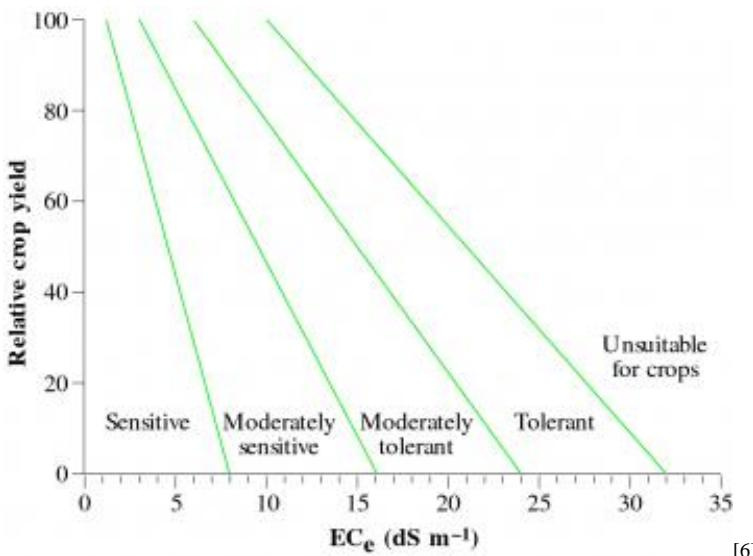
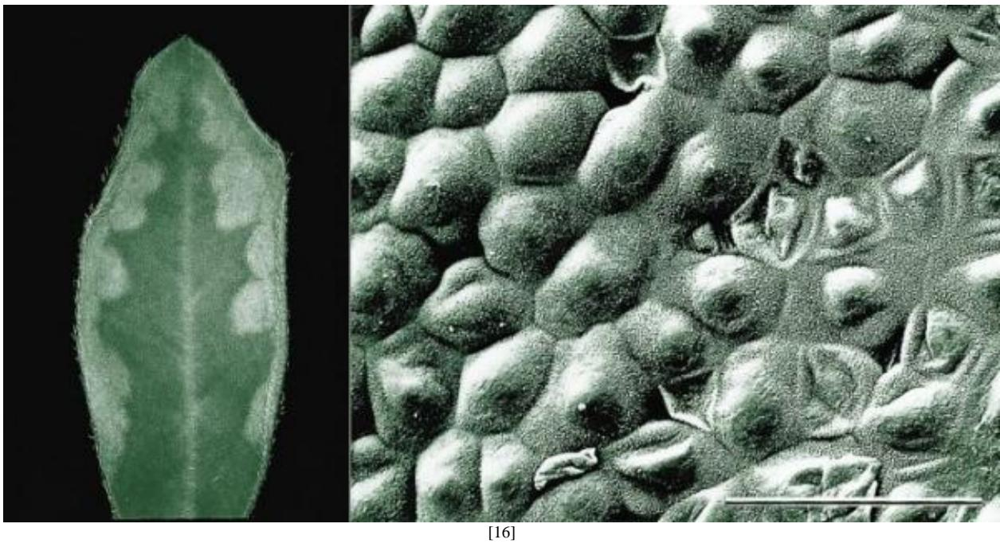
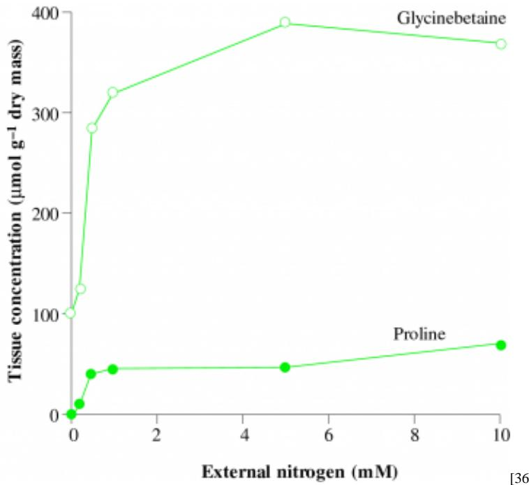

# Chapter 17 - Salt: an environmental stress

Secondary salinisation near Ouyen, Victoria, showing a lower slope discharge zone for saline ground- water. Established eucalypts have died, and salt is encroaching up- slope into grazing land. Local hydrologic balance was disturbed by land clearing which increased groundwater accession and led to a subsequent rise in water tables (Photograph courtesy P.E. Kreidemann)

Salinity, like drought, remains one of the world's oldest and most serious environmental problems. Mistakes made by the Sumerians in the Tigris and Euphrates basin of Mesopotamia over 4000 years ago are being repeated today...

(McWilliam 1986)

- [Chapter 17 - Salt: an environmental stress](Chapter_17.md)
  - [Introduction]()  
  - [17.1 Perspectives on salinity]()  
  - [17.2 Growth and cropping responses]()  
  - [17.3 Halophytes and adaptation to salt]()  
  - [17.4 Salt-affected land: utilisation and reclamation]()  
  - [Further reading]()

# Introduction

Environmental salt is a legacy of global geology and vascular plants have responded during their evolutionary history by producing tolerance mechanisms across a wide range of taxa. Convergent evolution of life forms such as mangroves and dryland halophytes has resulted in devices for salt exclusion by roots, vascular compartmentation of tissue solutes and leaf excretion of excess salt that rely on similar mechanisms across widely separated taxonomic groups. Mechanisms for exclusion and compartmentation are also present in non- halophytic crop plants, although less highly developed, and these cultivated species together with their wild relatives show considerable genetic variation in salt tolerance. Such variation

can be exploited for genetic improvement of commercially significant species or cultivars, and is especially effective when based on known and heritable mechanisms of salt tolerance. Development of salt- excluding rootstocks in horticulture is a good example.

Geologic time scales of marine and terrestrial salinisation permitted a parallel evolution of salt- tolerant variants of both unicellular and more complex vascular plants. Humankind has accelerated salinisation, especially over the past century, so that development of salt- tolerant plants now becomes a matter of urgency for both food production and land reclamation based on revegetation. An understanding of species variation in salt tolerance aids both development and field implementation.

Extensive land clearing followed by cropping or grazing can result in secondary salinisation of drylands, while irrigation agriculture frequently results in soil degradation due to saline irrigation water and/or inadequate drainage. Salt- tolerant cultivars and salt- excluding rootstocks allow cropping in those circumstances, and are of enormous economic significance worldwide. Indeed, stable cropping rotations can be based on such germplasm in regions where salt and hydrologic cycles permit.

Meanwhile, with expansion of cropping areas worldwide, general availability of easily accessible arable land must diminish so that utilisation and even reclamation of salt- affected land becomes an expedient. Thanks to soil science, amelioration is technically feasible but is nevertheless protracted and costly, taking at least tens and more commonly hundreds of years to achieve. Salt- tolerant plants will be prominent in either process, and their adaptive features that were once confined to nature now find expression in managed landscapes. Those features are discussed here.

# 17.1 Perspectives on salinity

# 17.1.1 Geographic extent

About 30 million hectares of mainland Australia are underlain by salt, including both arid and semi- arid rangelands plus arable lands with naturally occurring saline subsoil. As something of an indictment of management practices over the past century, at least four million hectares are suffering from human- induced (secondary) salinisation. This includes large scalded areas where overgrazing has led to erosion of topsoil and exposure of saline subsoil, plus about 1.2 million hectares subject to secondary salinisation where saline groundwater emerges as surface seeps on previously arable land. Irrigation salinity due to saline irrigation water and/or inadequate drainage adds another 500 000 ha to our national total.

  
Figure 17.1 Secondary salinisation is a consequence of comprehensive land clearing, and in southwest Western Australia cleared areas have increased linearly between 1955 and 1975 with a subsequent decline in rate of expansion. By contrast, salt-affected areas have increased curvilinearly and with a faster rate of expansion subsequent to 1975. (Note the different scales: area cleared is in millions of hectares whereas area salt affected is in thousands of hectares) (A smoothed representation or data from George 1990)

Most dryland salinity is evident in wheat- growing and sheep- grazing zones of Western Australia and South Australia which occupy the  $400 - 600\mathrm{mm}$  rainfall region. Here extensive land clearing with subsequent cropping and grazing has increased net accessions of rain to groundwater. Local hydrologic cycles have been disturbed to such an extent that rising water tables (commonly highly saline) have broken out on lower slopes to form saline seeps (hence 'secondary salinisation'). Salt- sensitive plants soon die in these discharge zones, and if recharge areas are left uncorrected saline seeps expand upslope, leading to further land degradation. Secondary salin- isation is an insidious process and continues long after native vegetation is cleared. For example, land cleared for agriculture in southwest Western Australia has increased in area more or less linearly between 1950 and 1990 but at a decreasing rate of expansion (Figure 17.1). By contrast, the corresponding area of salt- affected land has increased curvilinearly, and with an increasing rate of expansion. Australia wide, secondary salinisation is spreading at a compounding rate of about  $5\%$  per year (SCAV 1982). By 2020, somewhere between  $10\%$  and  $25\%$  of previously arable land could be out of production.

Turning to a more geographically confined issue in eastern Australia, salinisation of irrigated land in the Murray- Darling basin derives from salt left behind by intrusions of seawater that commenced at least 65 million years ago. The Murray River now flows across sediments that are underlain by highly saline groundwater, and even prior to European settlement Murray River water was naturally saline at times of low flow. Extensive development of irrigation schemes in the Murray- - Darling basin over the past 100 years or so has led to a dangerous rise in

groundwater over large areas where capillary rise of salt in fine- textured soils can put irrigation cropping at risk. Regional projects for subsurface drainage and groundwater pumping schemes are restoring a new hydrologic balance within some parts of the Murray- Darling basin, so that long- term viability of irrigation cropping and grazing enterprises is now assured in such areas. Stable forms of agriculture will continue to call for salt- tolerant cultivars, while long- term horticulture necessitates salt- excluding rootstocks. Reclamation of degraded land is possible where saline groundwater can be safely disposed of, and salt- affected soils restored to an arable state by leaching out profile salt. Soil ameliorants such as gypsum are commonly applied as part of this leaching process to displace  $\mathrm{Na^{+}}$  ions adsorbed by clays during salinisation.

# 17.1.2 Sodic soils

Aside from salinisation, about  $30\%$  of agricultural land in Australia is already sodic. Such land is difficult to manage and susceptible to degradation (including erosion) due to poor soil structure. Soil physical properties are adversely affected by an accumulation of  $\mathrm{Na^{+}}$  salts. Clay particles, by their very nature, carry a negative charge. When more than  $6\%$  of these charges are balanced by sodium ions, those soils are regarded as sodic. The extent of sodium adsorption in soils depends on the proportion of sodium to multivalent ions in the soil solution (especially  $\mathrm{Ca^{2 + }}$  and  $\mathrm{Mg^{2 + }}$ ) and is expressed as a sodium adsorption ratio (SAR) defined as:

where  $[\mathrm{Na}]$ ,  $[\mathrm{Ca}]$  and  $[\mathrm{Mg}]$  are the concentrations of sodium, calcium and magnesium, respectively, in soil solutions or 1:5 soil:water extracts, and expressed as millimoles  $\mathrm{L^{- 1}}$ .

In dry sodic soils, clay particles are linked by  $\mathrm{Na^{+}}$  ions and remain as aggregates. On wetting by rain or fresh water of low salinity,  $\mathrm{Na^{+}}$  ions become highly hydrated leading to separation of clay particles. Further wetting leads to extensive hydration. Clay particles then disperse as single individuals. Such soil is technically 'dispersed' (i.e. an absence of water- stable aggregates) and lacks structure. Notably, however, if a dry sodic soil is wetted with saline irrigation water, dispersion of clay particles does not occur to the same extent and some structure is retained. This property can be used to good effect during reclamation of sodic soils, but has to be managed carefully. Relying on  $\mathrm{NaCl}$  to maintain clays in a stable state is a hazardous tactic and risks osmotic and ion toxicity effects on plant growth.

In contrast to a  $\mathrm{Na^{+}}$ - affected (sodic) soil where clay particles disperse on wetting,  $\mathrm{Ca^{2 + }}$  linked or  $\mathrm{Mg^{2 + }}$  linked clays swell to a more limited extent. As a consequence, those clay particles do not disperse as soils wet and structure is retained (Rengasamy and Olsson 1991).

Swelling and dispersion of sodic clays destroy soil structure, and by so doing reduce porosity and permeability which predisposes to waterlogging. Poorly structured sodic soils offer a high resistance to root growth that can be inferred from penetrometer data (Table 17.1). Root growth is restricted, because sodic soils are either too wet (immediately after rain or irrigation) or after a few days of fine weather, too dry. In effect, there is only a narrow range of available water over which plant roots can grow and sustain plant function in a sodic soil (see net range of available water in Table 17.1).

Table 17.1 Chemical and physical properties of a sodic red-brown earth, comparing an original soil prior to redamation with similar soil subsequent to redamation (using gypsum). Data for a soil with ideal prop. erties for root proliferation ore included for reference Note especially that sodic soil has a very limited range of plant-available water (a concept discussed further in Section 15.1)  

<table><tr><td rowspan="2">Properties</td><td colspan="3">Sodic soil</td></tr><tr><td>Original soil</td><td>After reclamation</td><td>Ideal soil</td></tr><tr><td>pH1.5 (water)</td><td>8.9</td><td>8.0</td><td>6.0–8.0</td></tr><tr><td>EC1.5 (dS m−1)</td><td>0.2</td><td>0.4</td><td>&amp;lt;0.4</td></tr><tr><td>Organic carbon (%)</td><td>0.3</td><td>1.2</td><td>&amp;gt;1.0</td></tr><tr><td>SAR1.5</td><td>9.0</td><td>0.8</td><td>&amp;lt;3.0</td></tr><tr><td>Spontaneous clay dispersion (%)</td><td>9.8</td><td>0.2</td><td>&amp;lt;0.5</td></tr><tr><td>Infiltration at saturation (mm d−1)</td><td>10.0</td><td>350.0</td><td>&amp;gt;80.0</td></tr><tr><td>Penetrometer resistance (MPa)</td><td></td><td></td><td></td></tr><tr><td>at -100 kPa water potential</td><td>3.2</td><td>0.6</td><td>&amp;lt;2.0</td></tr><tr><td>Plant-available water 
(mm3 of water mm−3 of soil) 
(min content-max content)</td><td>0.38–0.42</td><td>0.18–0.48</td><td>0.1–0.5</td></tr></table>

(Based on R engasamy et al. 1992) Subscript 1:5 refers to a 1:5 soil:water extract.

# Table 17.1

Sodic soils can be reclaimed via gypsum application, or in the case of acid sodic soils, gypsum + lime.  $\mathrm{Ca^{2 + }}$  ions in both gypsum and lime act by displacing  $\mathrm{Na^{+}}$  ions which are sub- sequently leached out of the profile. As clay particles become charged with these divalent cations in place of monovalent ions, such clays cease swelling and dispersing so that soil structure is immediately improved by this change in their physico- chemical properties. Root growth ensues, and soil structure is further improved by accumulation of organic matter.

# 17.1.3 Solutes and osmotic pressure

17.1.3 Solutes and osmotic pressureSubstances in aqueous solution lower the free- energy status of solvent molecules (water), and the resulting osmotic pressure of that solution (where pure water is zero) can be derived from physical chemistry. Osmotic pressure (P) generated by a salt that dissociates into ions in aqueous solution, or by undissociated organic molecules in solution, can be calculated from the historic van't Hoff expression (Equation 17.2). This relates osmotic pressure of an ideal solution (i.e. a dilute solution of an ideal solute) to the concentration of that solute expressed in terms of its osmolality and  $RT$  (where  $R$  is the universal gas constant and  $T$  is absolute temperature in degrees Kelvin). Thus,

<table><tr><td>Π = cRT</td><td>(17.2)</td></tr></table>

where  $\Pi$  is osmotic pressure (expressed in megapascals, MPa),  $c$  is concentration (osmoles per litre of water) and  $RT$  is 2.48 at  $25^{\circ}C$  (litre- MPa per mole).

Table 17.2 Calculation of osmotic pressure from concentration for solute solutes relevant to plant osmotic relations (referenced to  $25^{\circ}C$  .For salts there is a significant departure from an ideal state, so the osmolality term (c in Equation 17.2) is the concentration in moles per litre of added water (max  $L^{-1}$  ) multiplied by an empirically derived osmotic coefficient. A these coefficients are given in reference books on physical chemistry. A useful summary for plant scientists is given by Wyn Jones and Gorham (1983)  

<table><tr><td>Solution of:</td><td>Number of solutes in solution (osmoles per mole)</td><td>Osmotic coefficient at 100 mmol L-1water</td><td>Osmotic pressure (PI) of 100 mmol L-1water (MPa)</td></tr><tr><td>NaCl</td><td>2</td><td>0.93</td><td>0.46</td></tr><tr><td>CaCl2</td><td>3</td><td>0.85</td><td>0.63</td></tr><tr><td>Sucrose</td><td>1</td><td>1.00</td><td>0.25</td></tr><tr><td colspan="4">Note that for standard solutions 200 mM NaCl and 300 mM NaCl have osmotic coefficients of 0.9245 and 0.9215 respectively, giving osmotic pressures of 0.917 and 1.371 MPa respectively.</td></tr></table>

# Table 17.2

Table 17.2The osmotic pressure of a solution can be calculated from solute concentration per litre (or per kilogram) of water (see Table 17.2 for an example based on sucrose). With organic compounds such as sucrose that do not dissociate into ions in water, osmolality (osmoles per litre of water) is the same as molality (moles per litre of water), which is almost the same as the more familiar term molarity (moles per litre of solution). At  $100~\mathrm{mM}$ , the discrepancy between osmolality and osmolarity is only about  $1\%$ .

When calculating the osmotic pressure of a salt solution (e.g. a solution of NaCl) each molecule of NaCl dissociates into two ions. In a solution of  $\mathrm{CaCl}_2$ , each molecule dissociates into three ions. Osmotic impact varies according to that dissociation, and must be taken into account when calculating osmotic pressure (see osmoles per mole in Table 17.2). A molecule of NaCl dissociates into two ions in solution, so that osmolality is almost two times the molality. However, osmotic effects from that dissociation are not complete, and deviations from ideal behaviour are accommodated by empirically determined osmotic coefficients. Calculated values of osmotic pressure for solutions of NaCl and  $\mathrm{CaCl}_2$  are given in Table 17.2.

# 17.2 Growth and cropping responses

Table 17.3 Relative salt tolerance of selected crop plants from a broad survey by the USDA Salinity Laboratory, Riverside, and corresponding to the four categories delineated in Figure 17.2

Table 17.3  

<table><tr><td rowspan="2">Sensitive</td><td colspan="3">Salt-tolerance category</td></tr><tr><td>Moderately sensitive</td><td>Moderately tolerant</td><td>Tolerant</td></tr><tr><td>Almond</td><td>Broadbean</td><td>Beet</td><td>Barley</td></tr><tr><td>Apple</td><td>Cabbage</td><td>Broccoli</td><td>Bermuda grass</td></tr><tr><td>Apricot</td><td>Capsicum</td><td>Bromegrass</td><td>Cotton</td></tr><tr><td>Avocado</td><td>Clover</td><td>Fescue, tall</td><td>Date</td></tr><tr><td>Bean</td><td>Cucumber</td><td>Olive</td><td>Sugar beet</td></tr><tr><td>Carrot</td><td>Grape</td><td>Ryegrass, perennial</td><td></td></tr><tr><td>Citrus</td><td>Lettuce</td><td>Safflower</td><td></td></tr><tr><td>Onion</td><td>Lucerne</td><td>Sorghum</td><td></td></tr><tr><td>Peach</td><td>Maize</td><td>Wheat</td><td></td></tr><tr><td>Plum</td><td>Peanut</td><td></td><td></td></tr><tr><td>Strawberry</td><td>Potato</td><td></td><td></td></tr><tr><td></td><td>Spinach</td><td></td><td></td></tr><tr><td></td><td>Sugar cane</td><td></td><td></td></tr><tr><td></td><td>Tomato</td><td></td><td></td></tr></table>

(Based on Maas and Hoffman 1977)

  
Figure 17.2 Soil salt restricts plant growth so that crop yield is reduced, but species differ in sensitivity. These four broad categories of salt tolerance were delineated by the USDA Soil Salinity Laboratory, Riverside, from a statistical analysis of an extensive survey of published data on yield and soil salinity (measured as electrical conductivity (ECE) of a saturated extract and expressed here as deciSiemens per metre  $(\mathrm{dS~m^{-1}})$ ). Crops representative of each category are listed in Table 17.3. (Based on Maas and Hoffman 1977)

Salts dissolved in soil water inhibit plant growth because (1) salt reduces water uptake, and (2) excessive salt becomes toxic and causes further reductions in growth. To exist in a saline soil, plants must take up water but exclude salt.

Extensive research in California during the 1970s (USDA Salinity Laboratory, Riverside) provided baseline data on comparative salt tolerance for a wide range of crop plants (Table 17.3; Figure 17.2). Statistical analysis of this far- ranging survey of crop plants showed that (1) yield did not generally decrease significantly until a salinity threshold had been exceeded, and (2) that yield generally decreased linearly with further increase in salinity. Some deviations from linearity occurred as relative crop yield dropped below  $20–30\%$ . The yield- salinity relationship (Figure 17.2) becomes steeper, and threshold salinity decreases from 'tolerant' to 'sensitive' cat- egories. Representative crops in each category (Table 17.3) highlight a number of horticultural species as sensitive or moderately sensitive, compared with cereals and coarse grains that are either moderately tolerant or tolerant.

For survey purposes (Table 17.3; Figure 17.2), soil was regarded as saline if electrical conductivity of a saturated extract was more than  $4 - 5\mathrm{dS}\mathrm{m}^{- 1}$ , equivalent to about  $40–50\mathrm{mM}\mathrm{NaCl}$ , and sensitive plants such as lupin are greatly reduced at this level of salinity. By contrast, tolerant plants such as barley withstand  $8\mathrm{dS}\mathrm{m}^{- 1}$  (equivalent to about  $80\mathrm{mM}\mathrm{NaCl}$ ) while specialised halophytes grow under highly saline conditions, with  $\mathrm{NaCl}$  concentrations reaching or even exceeding that of sea water, which is about  $500\mathrm{mM}$  (Sections 17.3, 17.4).

# 17.2.1 Annual plants

  
Figure 17.3 Growth of four contrasting species over a range of saline conditions. Saltbush is *Atriplex amnicola*, a halophyte of Western Australia (data from Aslam *et al.* 1986). Kallar grass (*Diplachne fusca*) is a halophytic grass widespread in many continents including Australia (data from Myers and West 1990). Barley is one of the most salt tolerant crops (data from Greenway 1962; Munns 1995) and lupins are one of the most sensitive (data from Jeschke *et al.* 1986 and B.J. Atwell, unpublished). Further comparisons with halophytes are shown in Figure 17.19

Table 17.4 A notional summary of selected values meant to be indicative of soil salt where plants would show a  $50\%$  reduction in growth. Matching values for maximum concentrations of salt endured by old leaves on plants suffering a severe reduction in growth are also shown. Halophytes and especially dioctyledonous species in that group are adapt ed for growth in saline conditions, tolerating high NaCl concentrations in both soil and leaves Non-halophytes listed as either sensitive or tolerant conesponed to classes outlined in Table 17.3 and Figure 17.2  

<table><tr><td></td><td>Soil salt 
(mM NaCl in soil solution)</td><td>Leaf salt 
(mM NaCl in tissue moisture of old leaves)</td></tr><tr><td>Non-halophytes</td><td></td><td></td></tr><tr><td>Sensitive</td><td>50–75</td><td>150–250</td></tr><tr><td>Tolerant</td><td>150–200</td><td>400–500</td></tr><tr><td>Halophytes</td><td></td><td></td></tr><tr><td>Monocotyledons</td><td>200–300</td><td>400–500</td></tr><tr><td>Dicotyledons</td><td>400–500</td><td>700–1000</td></tr></table>

(Generalised data from numerous sources including Munns et al. 1983)

# Table 17.4

Salinity tolerance is generally assessed by measuring growth over several weeks in a range of NaCl concentrations. Dramatic differences then become evident between halophytes and crop species (Table 17.4; Figure 17.3). Halophytes such as Kallar grass (Diplachne spp.) and saltbush (Atriplex spp.) are used to revegetate salt- affected land, and provide fodder for low- intensity grazing. Atriplex amnicola, like most saltbush species, grows best in soils containing low to moderate amounts of NaCl, and can even grow at salinities higher than seawater. Diplachne, like most halophytic grasses, is not as salt tolerant as saltbush and many other dicotyledonous halophytes, but can grow and set seed at salinities above  $250~\mathrm{mM}$  NaCl, which is already toxic to most cultivated species. Barley is one of the most salt tolerant crop species, and many cultivars endure salinity up to  $125\mathrm{mMNaCl}$ , still growing at  $50\%$  of unsalinised controls. By contrast, lupins are particularly salt sensitive. Even the more tolerant variants suffer a  $50\%$  reduction in growth at  $50\mathrm{mMNaCl}$  and a breakdown in exclusion mechanisms by about  $125\mathrm{mMNaCl}$  (Figure 17.6).

# (a) Salt traffic into plants

Relationships between salt and water movement into plants determine salt tolerance and are explored here in some detail.

# Salinity and water uptake

Water flow  $(J_{\mathrm{water}})$  from soil to root xylem depends upon root anatomy and driving forces for water movement. Resistance to flow varies according to anatomy ( $r$  in Equation 17.3) while the water potential gradient between the soil and xylem

$\mathrm{(Y_{soil} - Y_{xylem}}$  in Equation 17.3) constitutes a driving force. Water will flow from soil to plant as long as  $\mathrm{Y_{xylem}}$  is lower than  $\mathrm{Y_{soil}}$  (see Section 3.2).

Soil salinity impedes water uptake by roots because a lower  $\mathrm{Y_{soil}}$  reduces the gradient for water movement into a plant. Reduced water uptake may lead to internal water deficits, which trigger changes in hormone production. These changes will cause stomata to close (partially) and so restrict photo- synthesis, as well as slowing leaf growth and development. Plants growing on highly saline soils must therefore exclude soil solutes and maintain a positive turgor. Solute exclusion by roots alleviates salt stress; osmotic adjustment in shoots contributes to turgor maintenance.

# Salt exclusion by roots

  
Figure 17.4 Leaf salt accumulates over time, so that od leaves usually carry higher loads of solutes than younger leaves. Moreover, a longer vascular network servicing young (distal) leaves provides additional opportunity for salt compartmentation. Net outcomes are evident in these  $\mathrm{Na^{+}}$  concentrations for roots and individual leaf blades of wheat (Triticum aestivum cv. Chinese Spring) grown at  $200~\mathrm{mM}$  NaCl

Water entering plants carries some soil solutes that are eventually deposited in leaves following transpiration so that salt gradually builds up with time. Consequently, salt concentrations are generally higher in older leaves than in younger leaves (Figure 17.4) leading to necrosis or even premature death.

Depending on prevailing weather, plants transpire from 30 to 70 times more water than they retain. Consequently, any soil solutes not excluded by roots will end up in leaves at a concentration 30 to 70 times that of the soil solution. Ideally, a plant should admit only a small fraction of the original soil salt. For example, if a plant is transpiring 40 times more water than it retains, it should admit only 1/40 or  $2.5\%$  of the soil salt, and exclude the other  $97.5\%$ . If achieved, leaf salt concentration would stay comparable to soil salt concentration, and that plant would survive indefinitely provided salts remain compartmentalised.

Water use efficiency (WUE) bears on this outcome because WUE can range from 2 to  $9\mathrm{g}$  dry mass produced per kilogram water transpired depending upon evaporative conditions. In winter months, WUE is highest and salts will not concentrate in leaves to the same extent as they would during summer when WUE is lowest.

The proportion of water retained in leaves relative to that transpired can be calculated directly from WUE if the ratio of water to dry mass (DM) within shoot tissues is also known (i.e.  $\mathrm{H}_2\mathrm{O} / \mathrm{DM}$  in Equation 17.4):

Water retained in shoot  $(\%) = \mathrm{WUE}\times \mathrm{H}_2\mathrm{O} / \mathrm{DM}$  ratio  $\times 100$  (17.4)

Figure 17.5 Shoot salt concentration is largely determined by root exclusion efficiency. This hypothetical case takes a saline soil equivalent to  $100\mathrm{mMNaCl}$ , and assumes a plant transpires 40 times more water than it retains (i.e. only  $2.5\%$  of a transpirational stream is retained). If salt- exclusion efficiencies were 90, 95 and  $97.5\%$ , shoot salt concentration would reach an equilibrium value of 400, 200 and  $100\mathrm{mM}$  salt on a tissue water basis). If salt- exclusion efficiency was  $0\%$ , shoot salt concentration would reach  $4000\mathrm{mM}$ . (Unpublished calculations courtesy Rana Munns)

Taking a WUE of  $5\mathrm{gDM}$  per  $\mathrm{kgH_2O}$ , and an  $\mathrm{H_2O / DM}$  ratio of 5:1, then  $25\mathrm{g}$  of water stays in the shoot for every  $1\mathrm{kg}$  of water transpired. That is, a plant retains about  $2.5\%$  of water absorbed;  $97.5\%$  is transpired. Put another way, this plant transpires about 40 times more water than it retains. Salt exclusion is thus crucial, and practical consequences of different degrees of exclusion are easily simulated (Figure 17.5). Soil salinity in this case is taken as equivalent to  $100\mathrm{mMNaCl}$ .

If salt was not excluded at all, shoot concentration would soon be 40 times the external concentration, that is,  $4000\mathrm{mM}$ . If  $90\%$  was excluded, that is,  $10\%$  of the salt was admitted, then shoot concentration would reach four times the external solution, that is,  $400\mathrm{mM}$ . This is still too high for most species. (An  $\mathrm{H_2O / DM}$  ratio of 5:1 is taken as typical for cer- eal leaves; an evergreen perennial such as citrus would be about 4:1, while soft leaves on plants such as lupins would be more like 8:1. Salt concentrations in leaves expressed on a tissue moisture basis will vary accordingly.)

Where roots act as highly effective 'filters', as much as  $95\%$  of soil salt can be excluded, and cell sap concentrations in leaves would then be about two times the external solution. This degree of exclusion occurs in most halophytes, and in highly salt tolerant crop species.

Equation 17.4 implies two mechanisms for adaptation to a saline soil: (1) an increased WUE and (2) an increased succulence (water content) of leaves. An increase in these characters would increase the fraction of transpired water that is retained in leaves, and for a given degree of salt exclusion would result in a lower concentration in leaves.

Succulence is a character displayed by many dicotyledonous species in response to salinity, especially halophytes, but it also occurs in salt- sensitive crop species such as lupins and beans, as well as more salt tolerant ones such as cotton. Water content per unit leaf area can increase by  $50\%$  in response to soil  $\mathrm{Na^{+}}$ . Leaves become thicker and more succulent or fleshy.

Increased WUE would also increase the fraction of absorbed water retained in leaves. As there is only subtle variation in WUE between species (Section 15.3), cultivar differences in salt tolerance will not be based on differences in WUE, but salt injury can at least be diminished in winter crops by adjusting time of planting and thus improving WUE. If such a crop can complete most growth during winter

and early spring when the temperature is low and the relative humidity high, then WUE will be high and less salt is likely to accumulate in leaves. In crops such as rice that require high temperatures for optimum growth, high evaporative demand is unavoidable and results in low WUE, often as low as  $2\mathrm{g}$  dry mass per kilogram of water transpired. Significantly, rice is also one of the most salt sensitive crop species known, and the subject of intense selection for salt tolerance (Section 17.2.3).

# Species differences in salt exclusion

  
Figure  $17.6\mathrm{Na}^{+}$  in xylem fluid collected from barley and lupin grown at a range of external NaCl concentrations. Sap was collected from the base of each plant to show the ability of the root system to exclude NaCl. Barley is regarded as tolerant, whereas lupin is sensitive to saline soil (see Table 17.3 and Figure 17.2). (Based on Munns 1988, 1995)

All plants control NaCl uptake to some extent, but certain species excel and maintain a remarkably low concentration of  $\mathrm{Na}^+$  or  $\mathrm{Cl^- }$  in the xylem sap flowing from roots to shoots. For example, a salt- tolerant species such as barley (Figure 17.6) is a strong excluder, and can maintain a relatively low concentration in xylem sap against a very wide range of soil concentrations. When sap was collected from the shoot base of barley plants grown in salinities of 25 to  $200~\mathrm{mM}$  NaCl,  $\mathrm{Na}^+$  ion concentration in xylem sap stayed at about  $5\mathrm{mM}$  over the whole range of salinities. In contrast, lupin (a weak excluder and thus salt sensitive) had a poor ability to regulate xylem salt concentration once the soil solution exceeded about  $125~\mathrm{mM}$ . A similar pattern was found for  $\mathrm{Cl^- }$  ion exclusion.

# Pathways of water and solute movement across roots

  
Figure 17.7 A schematic root in cross-section showing basic tissues with symplasmic and apoplasmic routes for radial ingress of water and ions from soil solution to xylem. Bypass flow results from apoplasmic flow of water and ions. (Original drawing courtesy Rana Munns)

Water and ions move concurrently across roots from epidermis to xylem via two parallel pathways: apoplasmic and symplasmic. The apoplasmic pathway lies outside the plasma membranes of cells constituting a tissue system and comprises a network of cell walls, whereas the symplasm is a collective term for pathways through successive plasma membranes of adjacent cells that are interconnected by plasmodesmata. Apoplasmic flow (or 'bypass flow') bypasses such plasma membranes (Figure 17.7).

A common feature of roots is an endodermis (Figure 17.7) with suberised (Casparian) strips in radial cell walls that block continuity in the apoplasmic pathway between cortex and stele. Solutes then cross the endodermis via passage cells within this layer and so traverse a plasma membrane. Plant membranes have a low permeability to  $\mathrm{Na^{+}}$  and  $\mathrm{Cl^- }$  ions so that an endodermis with Casparian strips probably restricts inward flow of  $\mathrm{Na^{+}}$  and  $\mathrm{Cl^- }$  ions.

Roots of many other plants also have Casparian strips in their hypodermis (e.g. citrus; Section 17.2.2) which form a further apoplasmic barrier to radial flow of water and solutes. These hypodermal Casparian bands usually mature about  $20\mathrm{mm}$  further back from the root tip than those in the endodermis, which are well developed at  $10\mathrm{- }20\mathrm{mm}$  behind the root apex. Apoplasmic barriers in the hypodermis and endodermis work in tandem to restrict  $\mathrm{Na^{+}}$  and  $\mathrm{Cl^- }$  flow to the xylem of roots in saline soils.

Apportionment of transpirational water flow between apoplasmic and symplasmic pathways remains a contentious issue. Similarly the proportion of salt that reaches xylem conduits via an apoplasmic versus symplasmic pathway is also ill defined. As described above, a salt- tolerant plant must exclude at least  $95\%$  of the salt in the soil solution. Accordingly, about  $95\%$  of transpirational water must move via a symplasmic pathway, and less than  $5\%$  via an apoplasmic route. Most water entering roots would certainly meet an apoplasmic barrier in the hypodermis or endodermis, and would then enter the symplasm where solute- exclusion mechanisms operate. However, when a root is mechanically damaged or invaded by pathogens, or when lateral roots are breaking through the normal barriers of the endodermis and hypodermis, apoplasmic flow would increase. Until repair mechanisms are completed, apoplasmic flow will be substantial and foliar solutes will increase. In rice seedlings, root damage caused by transplanting was repaired within  $6\mathrm{h}$ , or at least rendered sufficiently functional to control uptake of  $\mathrm{NaCl}$  within that time frame (Yeo et al. 1987). Apoplasmic uptake of  $\mathrm{Na^{+}}$  was inferred from the rate of accumulation of a fluorescent dye (an apoplasmic tracer) that moved with the transpiration stream but did not adhere to cell walls or membranes. De- position of this dye in transpiring leaves indicated that an apoplasmic pathway (or bypass) accounted for up to  $5\%$  of total trans-pirational flow (Garcia et al. 1997, and discussed further in Section 17.2.3).

# $K^{+} / Na^{+}$  selectivity

$\mathbf{K}^{+}$  is an essential nutrient, and under saline conditions plants must restrict  $\mathrm{Na^{+}}$  and  $\mathrm{Cl^- }$  entry while maintaining  $\mathbf{K}^{+}$  uptake. However, the ratio of  $\mathbf{K}^{+}$  to  $\mathrm{Na^{+}}$  in saline soils is often extremely low, so that  $\mathrm{Na^{+}}$  ions can inhibit uptake of  $\mathbf{K}^{+}$  ions. If  $\mathbf{K}^{+}$  uptake is not maintained, tissue  $\mathrm{Na^{+}}$  concentrations become too high, an unfavourable cytoplasmic  $\mathbf{K}^{+}$  to  $\mathrm{Na^{+}}$  ratio results, and enzyme functions are inhibited due to ion imbalance. Fortunately,  $\mathbf{K}^{+}$  transporter proteins in plasma membranes of plant cells have highly specific mechanisms for uptake of  $\mathbf{K}^{+}$  and so forestall ion imbalance under mild salinity. Accordingly, salt- tolerant species maintain  $\mathbf{K}^{+}$  uptake more effectively than salt- sensitive species (Schachtman et al. 1989; Colmer et al. 1995).

Roots of salt- tolerant species thus maintain  $\mathbf{K}^{+}$  uptake despite competitive inhibition by  $\mathrm{Na^{+}}$  due to selectivity of  $\mathbf{K}^{+}$  uptake over  $\mathrm{Na^{+}}$ . Traditionally, this  $\mathbf{K}^{+}$  to  $\mathrm{Na^{+}}$  selectivity  $(S_{\mathrm{K,Na}})$  has been described as:

Net  $S_{\mathrm{K,Na}}$  from Equation 17.5 embodies net selectivity of several transport processes, all of which contribute to tissue concentration of  $\mathbf{K}^{+}$  and  $\mathrm{Na^{+}}$  ions. Net  $S_{\mathrm{K,Na}}$  for root tissue would be the combined result of processes involved in

uptake of both  $\mathbf{K}^{+}$  and  $\mathrm{Na^{+}}$ , transport of these ions into xylem conduits, and possibly export of  $\mathrm{Na^{+}}$  back to the soil solution.

  
Figure 17.8 Salt-exclusion mechanisms in roots are enhanced by  $\mathbf{Ca}^{2 + }$  ions, with improved selectivity for  $\mathbf{K}^{+}$  over  $\mathrm{Na^{+}}$ . In cotton, this  $\mathbf{Ca}^{2 + }$  effect is demonstrated by an absolute difference as well as a change in spatial distribution of  $\mathbf{S}_{\mathbf{K},\mathrm{Na}}$  (the ratio of  $\mathbf{K}^{+} / \mathbf{Na}^{+}$  in root tissue to  $\mathbf{K}^{+} / \mathbf{Na}^{+}$  in the external solution). Cotton was grown in  $150\mathrm{mM}$ $\mathrm{NaCl}$  at two levels of  $\mathbf{Ca}^{2 + }$ :  $1\mathrm{mM}$  (lower curve) and  $10\mathrm{mM}$  (upper curve) (Based on Zhong and Lauchli 1994)

$\mathrm{Na^{+}}$  ion exclusion is enhanced by elevated  $\mathrm{Ca^{2 + }}$  supply (Figure 17.8) and this helps to maintain  $\mathbf{K}^{+}$  concentration in root tissues, resulting in an improved net  $S_{\mathrm{K,Na}}$ . An especially high  $S_{\mathrm{K,Na}}$  in root tips (Figure 17.8) reflects their much higher  $\mathbf{K}^{+}$  requirement compared with older tissues.  $\mathrm{Ca^{2 + }}$  is required for regulation of  $\mathbf{K}^{+}$  and  $\mathrm{Na^{+}}$  transport processes across plasma membranes of plant root cells and is needed in higher concentrations on sodic ( $\mathrm{Na^{+}}$ - rich) soil (Section 17.1).

Saline soils are commonly high in  $\mathrm{Ca^{2 + }}$  as well as in  $\mathrm{Na^{+}}$  so that vascular plants have evolved with mechanisms for  $\mathrm{Na^{+}}$  ion exclusion that work in a  $\mathrm{Ca^{2 + }}$  environment. When experiments are conducted on salt tolerance, extra  $\mathrm{Ca^{2 + }}$  must be supplied along with  $\mathrm{Na^{+}}$  addition to satisfy the  $\mathrm{Ca^{2 + }}$  requirement of this exclusion mechanism and avoid abnormally high ingress of  $\mathrm{Na^{+}}$  ions. As a useful rule of thumb the  $\mathrm{Ca^{2 + }}$  to  $\mathrm{Na^{+}}$  ratio in bathing solutions of laboratory experiments should be at least 1:15. This is about the maximum ratio needed to suppress abnormal uptake of  $\mathrm{Na^{+}}$ , and mimics the minimum ratio present in most

Australian soils of marine origin, or those subjected to cyclic salinisation from onshore winds. Soils derived from parent material rich in  $\mathrm{Ca^{2 + }}$  and  $\mathrm{Mg^{2 + }}$  salts such as those in the Colorado River valley present a qualitatively different form of salinity, and a ratio of  $\mathrm{Ca^{2 + }}$  to  $\mathrm{Mg^{2 + }}$  to  $\mathrm{Na^{+}}$  of 1:1:2 (as  $\mathrm{Cl^{- }}$  salts) is employed to mimic that situation.

# (b) Salt traffic within plants

# Removing xylem salt

Salt traffic within a plant depends on the exclusion capacity of root cells plus exchange between other tissues. For example, in many species including soybean and maize (Greenway and Munns 1980),  $\mathrm{Na^{+}}$  can be removed from xylem conduits in upper (proximal) parts of roots and moved into adjacent living cells by exchanging with  $\mathrm{K^{+}}$ . By the time xylem sap reaches transpiring leaf blades,  $\mathrm{Na^{+}}$  concentration is much lower than  $\mathrm{Cl^{- }}$ , so that  $\mathrm{Na^{+}}$  entry into leaf cells is reduced. Such  $\mathrm{Na^{+} / K^{+}}$  exchange during xylem extraction is not universal, and leaf  $\mathrm{Na^{+}}$  in most vascular plants is similar to  $\mathrm{Cl^{- }}$  ion concentration, indicating little  $\mathrm{K^{+} / Na^{+}}$  exchange has taken place.

  
Figure 17.9 Concentrations of  $\mathbf{Na}^+$ ,  $\mathbf{Cl}^-$  and  $\mathbf{K}^+$  in xylem sap entering leaves of different ages (collected from the base of the leaf where it joined the stem) of six-week-old barley growing at 100 mM  $\mathbf{NaCl}$ .  $\mathbf{K}^+$  varies little while  $\mathbf{Na}^+$  (like  $\mathbf{Cl}^-$ ) is removed from the xylem as the transpiration stream ascends the stem. By implication, the mechanism for  $\mathbf{Na}^+$  compartmentation does not necessitate comprehensive exchange with  $\mathbf{K}^+$  ions. (Based on Wolf et al. 1991)

  
Figure 17.10 Increases in  $\mathrm{Na^{+}}$  content over a 7 d period in different parts of a barley plant grown in  $100\mathrm{mMNaCl}$ . The numbers are  $\mu \mathrm{mol}\mathrm{Na^{+}}$ . The total amount of  $\mathrm{Na^{+}}$  taken up by the plant over 7 d was  $286\mu \mathrm{mol}$ , the net amount deposited in the roots was  $124\mu \mathrm{mol}$  (45%), and the remaining amount deposited in the stem and leaves as shown. (Based on Wolf et al. 1991)

Stem tissues also represent a substantial buffer for ions in the transpiration stream, and when xylem sap is collected from different stem segments of a barley seedling (Figure 17.9) concentrations of  $\mathrm{Na^{+}}$  and  $\mathrm{Cl^{- }}$  can decrease markedly from base to tip. Consequently, much less  $\mathrm{Na^{+}}$  enters younger leaves compared with older leaves. In this case, the xylem sap concentration of  $\mathrm{K^{+}}$  did not change substantially, implying little  $\mathrm{K^{+} / Na^{+}}$  exchange by stem tissues.

Removal of salt from xylem conduits thus reduces salt flux into young leaves and reproductive organs, and leads to substantial deposition of  $\mathrm{Na^{+}}$  in stem tissues.

Precise measurements of  $\mathrm{Na^{+}}$  deposited in different parts of a barley plant over a two- week period (Figure 17.10) show that  $\mathrm{Na^{+}}$  deposited in each internode was about half that deposited in the leaves issuing from it. Failing such retention by stem tissues, the amount of  $\mathrm{Na^{+}}$  in leaves would have been  $50\%$  higher. Most  $\mathrm{Na^{+}}$  taken was deposited in recently matured leaves and internodes. Less  $\mathrm{Na^{+}}$  was deposited in older leaves; they were senescing and transpiring little during this experiment.  $\mathrm{Na^{+}}$  deposition in younger leaves was constrained by a low  $\mathrm{Na^{+}}$  concentration in the xylem sap supplying them (Figure 17.9). Removal of xylem salt therefore reduced  $\mathrm{Na^{+}}$  movement to uppermost and rapidly growing leaves, and most importantly to reproductive organs.

# Import by apices and leaves

Growing points such as root tips, shoot apices and rapidly expanding leaves, together with reproductive organs and especially fertilised ovaries, all import photoassimilate. Their resources are supplied via phloem connections, with only a minor contribution via xylem elements. Importantly, phloem  $\mathbf{K}^{+}$  concentration is not affected by salinity, so that the  $\mathbf{K}^{+}$  to  $\mathrm{Na^{+}}$  ratio of these developing tissues can be maintained at a desirably high level. In salt- tolerant plants such as barley, exclusion of  $\mathrm{Na^{+}}$  and  $\mathrm{Cl^- }$  from phloem sap is particularly effective.

In addition, xylem water supplied to such growing points is also low in  $\mathrm{Na^{+}}$  and  $\mathrm{Cl^- }$ , but high in  $\mathbf{K}^{+}$ . This was evident in barley plants with an elongating stem, from the lower  $\mathrm{Na^{+}}$  and  $\mathrm{Cl^- }$  concentrations in the xylem sap supplying upper younger leaves compared with xylem sap supplying older lower leaves (Figure 17.9). Apical tissues are thus well protected from salt. Both vegetative and reproductive apices contain little  $\mathrm{Na^{+}}$  or  $\mathrm{Cl^- }$ , around  $20~\mathrm{mM}$ , even when plants are growing in a highly saline soil (e.g. Lazof and Lauchli 1991).

In contrast to rapidly developing tissues, mature leaves present a totally different circumstance where xylem sap furnishes water for transpiration, and xylem solutes accumulate at sites of evaporation. Given only meagre removal of leaf salt via phloem retranslocation, salt accumulation in leaves can be calculated from exclusion efficiency and transpiration rate. Taking a saline soil at  $100\mathrm{mMNaCl}$ , and an exclusion efficiency of  $99\%$ , xylem salt concentration will be about  $1\mathrm{mM}$ . Assuming a transpiration rate of  $2\mathrm{mmol~m}^{- 2}\mathrm{s}^{- 1}$ , salt will build up in transpiring leaves at  $8\mu \mathrm{mol}\mathrm{g}^{- 1}$  water per leaf per day, or  $8\mathrm{mM}\mathrm{d}^{- 1}$ . At this rate, salt- sensitive crop plants will start to show serious dysfunction after  $15\mathrm{d}$  once leaf tissue concentration has reached about  $125\mathrm{mMNaCl}$ . By comparison, barley can tolerate leaf salts up to a concentration of around  $500~\mathrm{mM}$  maximum, and such leaves could live for about  $60\mathrm{d}$ .

At  $90\%$  exclusion, and a salt concentration in xylem sap of  $10~\mathrm{mM}$ , leaf salt would increase at  $80\mathrm{mM}\mathrm{d}^{- 1}$ , and even a barley leaf would live for only  $6\mathrm{d}$ .

In nature, on moderately saline soil, both  $\mathrm{Na^{+}}$  and  $\mathrm{Cl^- }$  ion concentrations in leaf blades of salt- tolerant plants will increase at about  $10 - 20\mathrm{mM}\mathrm{d}^{- 1}$ . These leaves live about  $30\mathrm{d}$ . Given such observations, there must be about a  $98\%$  exclusion of salt from the transpiration stream entering those leaf blades. Such exclusion is attributable to a combination of root restriction on ingress plus retention of salt within stems and leaf bases. Acting in concert, these processes restrict salt distribution to leaves.

# Leaf salt

Despite exclusion by roots, some solutes reach leaves and are compartmented. Solutes are taken up from the apoplasm to avoid desiccation of protoplasm and sequestered in vacuoles to avoid toxic concentrations in cytoplasmic compartments, such as chloroplasts and mitochondria. Salt arriving in leaves is deposited initially in cell walls adjacent to vascular conduits. Here salt would lead to dehydration of adjacent protoplasm if not relocated to vacuoles and balanced by accumulation of physiologically compatible solutes in cytoplasmic compartments. Put simply, this accumulation of osmotically active material represents an osmotic adjustment in response to a decrease in leaf water potential due to salt stress. In functional terms, osmotic adjustment enables cells to continue attracting water (via osmosis) and maintain turgor despite a reduction in bulk tissue water potential. Turgor- dependent processes such as cell expansion are thus sustained (discussed further in Section 17.3).

Cells undergoing division in shoot and root apices or other meristematic tissues such as rapidly expanding leaves have only small vacuoles. As a consequence, exclusion of  $\mathrm{Na^{+}}$  and  $\mathrm{Cl^- }$  from these cells is more crucial than in cells with large vacuoles, but mechanisms of long- distance transport, where ions are excluded from phloem conduits, protect them from salt impact.

In general, cytoplasmic  $\mathrm{NaCl}$  concentrations over  $100~\mathrm{mM}$  interfere with enzyme activity, whereas  $\mathrm{Na^{+}}$  and  $\mathrm{Cl^- }$  ions sequestered in vacuoles are removed from major metabolic processes. However,  $\mathrm{Na^{+}}$  and  $\mathrm{Cl^- }$  accumulation in vacuoles necessitates a counterbalancing osmoticum in cytoplasmic compartments. Nitrogen- based compatible solutes including amino acids such as proline and quaternary ammonium compounds such as glycinebetaine reach substantial levels, especially in halophytes, and help protect cytoplasmic function (Section 17.3).

Consistent with vascular anatomy and salt distribution in transpiring leaves, early symptoms of salt toxicity include 'salt burn' at hydathodes in leaf margins. Further increase in leaf salt is lethal and results in formation of a distinct margin between living and dead tissue (i.e. between turgid and collapsed cells in Figure 17.11).

  
Figure 17.11 Leaf rolling and expanding necrotic ('burnt') patches along leaf edges (macrophotograph in a) are typical visible symptoms of salt injury in white lupin (Lupinus albus). A progressive collapse of cells surrounding these patches due to solute excess precedes expansion of 'burnt' areas on leaves (scanning electron micrograph in b). These plants were held in  $100~\mathrm{mM}$  salt solution for only 2 d under mild conditions (slow transpiration). Scale bar in (a)  $= 1\mathrm{cm}$ ; scale bar in (b)  $= 100~\mu \mathrm{m}$  (Material supplied by Rana Munns; macrophotograph and micrograph courtesy Stuart Craig and Celia Miller)

Threshold concentration for such leaf tissue collapse differs between species, but as a general guide leaf cells in salt- tolerant vascular plants (non- halophytes such as quandong) can endure nearly  $500~\mathrm{mM}$  NaCl in cell vacuoles. Salt- sensitive plants such as lupins might tolerate up to  $250~\mathrm{mM}$  NaCl (Table 17.4). Maximum tolerable thresholds are reached more quickly under strong evaporative conditions such as those that commonly prevail during growing seasons in Australasia and result in leaf burn (Figure 17.16). In contrast, leaves of halophytes are remarkably adapted to tissue salt (Sections 17.3, 17.4) and may tolerate up to  $1000~\mathrm{mM}$  NaCl.

In all cases leaves soon die when salt arriving in the trans- pration stream can no longer be sequestered in vacuoles. This happens when transport systems in vacuolar membranes can no longer pump salts from cytoplasmic compartments into vacuoles against a strengthening concentration gradient. A rapid accumulation of salt in cell walls and cytoplasm follows; rapid because these compartments represent such a small volume. Protoplast dehydration from cell wall salt and toxic impact from cytoplasmic salt soon result in cell death.

Salt stress thus results in an accelerated loss of older leaves. Greater cumulative transpiration by these older leaves understandably results in higher  $\mathrm{Na^{+}}$  and

$\mathrm{Cl^- }$  concentrations within their tissues, and they die prematurely. This rate of loss becomes a crucial issue determining plant survival. If expansion of new leaves exceeds loss of old leaves, and a positive carbon balance is maintained at a whole- plant level, those individuals will at least complete a cycle of growth and reproductive development. However, if leaf death exceeds rate of replacement, carbon balance goes negative. Successful completion of growth and reproduction in such salt- stressed plants then becomes a race against time.

In this race, new leaves are produced at a rate that is not dependent on the health of older leaves. Rather, production of new leaves depends upon the water potential of the soil solution, and is analogous to a drought- stressed plant. A low soil water potential leads to internal water deficits and changes in hormonal balance that reduce initiation and expansion of new leaves. Moreover, during this race against time, salts do not build up in growing points to concentrations that inhibit growth. As explained above, meristematic zones depend upon phloem transport, so that salt is largely excluded. Ironically, salt accumulated by a plant does not inhibit growth of new leaves directly, hence production of new leaves depends more on soil salt than on plant salt.

  
Figure 17.12 Two lines of wheat, one salt-tolerant (solid line) and one salt-sensitive (broken line) showed identical growth rates as non-salinised controls. Genotypic differences in salt tolerance became apparent within two weeks of salinisation (150 mM NaCl). In this 'race against time', growth curves did not begin to diverge until the proportion of dead leaves on the sensitive line exceeded about  $10\%$  of total leaf area (indicated by a vertical arrow). (Based on Munns et al. 1995)

Nevertheless, loss of old leaves is a direct consequence of salt accumulation, so that genotypes with only weak exclusion of soil salt or an inability to sequester salt in cell vacuoles will have a greater rate of senescence, and will be disadvantaged in carbon gain despite generation of new foliage. Compare, for example, two closely related cultivars that differ in salt tolerance but not in growth rate under non-

salinised conditions (Figure 17.12). After two weeks in a saline soil (150 mM NaCl), both cultivars showed a strong reduction in growth (dry matter formation), but a difference between the cultivars was not clearly evident until four weeks. The more sensitive cultivar was, however, carrying many more dead leaves, and once the proportion of dead leaves reached more than about  $10\%$  of total leaf area plant growth slowed and many individuals started to die. An important principle emerged. Initial growth reduction was due to an osmotic impact of root- zone salt, whereas genetic differences in shoot sensitivity were attribu- table to differences in exclusion of root- zone salt from transpiring leaves.

# 17.2.2 Perennial plants

Woody perennials of horticultural significance are commonly grown in Australasia under high- input conditions that frequently lead to soil salinisation. Continued production then depends upon skilful management of irrigation and judicious use of rootstocks that confer salt tolerance on grafted plants. Citrus and grapevines are taken here as case studies, and sub- sequently compared with two natives where environmental selection pressures in their native habitats have led to a remarkable degree of salt tolerance.

# (a) Citriculture

Citrus species include some of the world's most salt sensitive crops (Table 17.3; Maas 1990), but rootstocks can confer considerable tolerance on commercial scions grafted on to them by restricting uptake of  $\mathrm{Na^{+}}$  and  $\mathrm{Cl^- }$  ions from saline environments.

With soil solutions of around  $50\mathrm{mMNaCl}$ , salt- sensitive rootstocks of citrus take up large amounts of  $\mathrm{Cl^- }$ , and to a lesser extent  $\mathrm{Na^{+}}$ . Visible symptoms of toxic levels include marginal and interveinal leaf burn, usually followed by leaf fall. At lower intracellular concentrations, even though there are no visible symptoms of salt damage, metabolism may be perturbed due to accumulation of either  $\mathrm{Na^{+}}$  or  $\mathrm{Cl^- }$  in the cytosol (a specific ion effect) or indirectly by imposition of an osmotic stress (Section 17.3).

Table 17.5  $K^{+}$ $Na^{+}$  and  $Cl^{-}$  concentrations in leaves and roots of citus rootstocks (small seedling trees) treated with 50 mM NaCl.Controlists in comparative exclusion of  $Cl^{-}$  and  $Na^{+}$  by these seedling rootstocks are. indiative of their effectiveness as solute excluders when commercial sions are grafted on to them  

<table><tr><td rowspan="2">Plant part</td><td rowspan="2">Plant part</td><td colspan="3">Tissue-water ion concentration (mM)</td></tr><tr><td>Rootstock</td><td>K+</td><td>Na+</td></tr><tr><td>Experiment 1</td><td></td><td></td><td></td><td></td></tr><tr><td rowspan="2">Leaves</td><td>Rangpur lime</td><td>357 ± 12</td><td>74 ± 8</td><td>25 ± 3</td></tr><tr><td>Etrog citron</td><td>283 ± 9</td><td>108 ± 8</td><td>233 ± 9</td></tr><tr><td rowspan="2">Roots</td><td>Rangpur lime</td><td>149 ± 6</td><td>116 ± 6</td><td>120 ± 8</td></tr><tr><td>Etrog citron</td><td>140 ± 6</td><td>118 ± 4</td><td>130 ± 7</td></tr><tr><td>Experiment 2</td><td></td><td></td><td></td><td></td></tr><tr><td rowspan="2">Leaves</td><td>Rangpur lime</td><td>192 ± 6</td><td>60 ± 5</td><td>50 ± 4</td></tr><tr><td>Trifoliate orange</td><td>320 ± 12</td><td>25 ± 4</td><td>140 ± 8</td></tr><tr><td rowspan="2">Roots</td><td>Rangur lime</td><td>107 ± 4</td><td>96 ± 9</td><td>89 ± 3</td></tr><tr><td>Trifoliate orange</td><td>138 ± 5</td><td>109 ± 7</td><td>106 ± 7</td></tr></table>

Data based on Walker and Douglas 1983;Grieve and Walker 1983)

# Table 17.5

During salt stress, seedlings of citrus rootstocks differ greatly in  $\mathrm{Cl^- }$  transport to their leaves or the leaves of scion species grafted on to them. Seedling leaves of Rangpur lime (Citrus reticulata var. austera hybrid?) accumulate much less  $\mathrm{Cl^- }$  compared to leaves on a salt- sensitive rootstock like Etrog citron (Citrus medica L.)(Table 17.5).  $\mathrm{Cl^- }$  ion concentration can be 10 times lower in leaves of Rangpur lime compared to Etrog citron!

Differentiation of rootstocks into strong and weak excluders is based on  $\mathrm{Cl^- }$  levels in leaves rather than roots because leaves show stronger contrasts as a function of rootstock (Table 17.5). Root  $\mathrm{Cl^- }$  concentrations are generally comparable for strong and weak excluders (expressed as an upward flux of water per unit mass of root). Clearly, rootstocks that are efficient at restricting  $\mathrm{Cl^- }$  from foliage are able to restrict ingress of ions from surrounding soil.

  
Figure  $17.13\mathrm{Na}^{+}$  retention by stem segments from seedlings of trifoliate orange (Poncirus trifoliata) (open symbols) and Rangpur lime (Citrus reticulata var. austera hybrid?) (closed symbols) demonstraes strong exclusion of  $\mathrm{Na^{+}}$  ions by roots of trifoliate orange with subsequent compartmentation in stem tissues. This compartmentation results in low leaf  $\mathrm{Na^{+}}$  in scions grafted to trifoliate rootstocks compared with those grafted to Rangpur lime. (Based on Grieve and Walker 1983)

Overall, citrus rootstocks do not exclude  $\mathrm{Na^{+}}$  as effectively they do  $\mathrm{Cl^- }$ , but even so some genetic variation in  $\mathrm{Na^{+}}$  exclusion is evident. For example, trifoliate orange (Poncirus trifoliata (L.) Raf.) is closely related to Citrus species and restricts foliar accumulation of  $\mathrm{Na^{+}}$  (Table 17.5) and partitioning can also occur in shoots independently of rootstock. Compared to Rangpur lime, which is a strong  $\mathrm{Cl^- }$  excluder, trifoliate orange selectively partitions  $\mathrm{Na^{+}}$  and  $\mathrm{Cl^- }$  so that  $\mathrm{Na^{+}}$  is concentrated in stem base and woody roots. A profile of  $\mathrm{Na^{+}}$  accumulation along a stem of trifoliate orange (Figure 17.13) thus shows a marked decrease in  $\mathrm{Na^{+}}$  concentration from stem base to apex which accords with extremely low levels of  $\mathrm{Na^{+}}$  in the leaves of trifoliate orange. This profile contrasts with Rangpur lime where less  $\mathrm{Na^{+}}$  is retained in stems but much more accumulates in leaves.

Budding different scion varieties to a range of rootstocks differentiates between rootstock and scion effects on  $\mathrm{Na^{+}}$  and  $\mathrm{Cl^- }$  accumulation in citrus foliage. As a general rule,  $\mathrm{Cl^- }$  exclusion tends to be rootstock dependent whereas  $\mathrm{Na^{+}}$  exclusion varies according to both rootstock and scion. By implication, roots represent a major site for regulation of  $\mathrm{Cl^- }$  traffic, whereas basal roots and stems are major sites for regulation of  $\mathrm{Na^{+}}$  traffic via reabsorption of this ion from the transpiration stream.

# Root anatomy

Notionally, fibrous roots of citrus seem to present a large surface area for water and nutrient uptake as well as salt exclusion because root length density is around  $10-$ $50\mathrm{km}\mathrm{m}^{- 3}$  . However, those values are still an order of magnitude lower than other woody perennials such as grapevines  $(c.250\mathrm{km}\mathrm{m}^{- 3})$  , which in turn are lower than grasses  $(c.500\mathrm{km}\mathrm{m}^{- 3}$  ; Table 3.1). Salt exclusion by citrus rootstocks is therefore all the more remarkable, and warrants some understanding of their anatomy.

A transverse section of a fibrous root (Figure 17.14) shows (outside to inside) an epidermis, a hypodermis (or specialised outermost layer of cortical cells; see exodermis Section 3.6), a cortex with 10 or more cell layers and a vascular core (stele). Protoxylem strands (arcs) range from two to five in different roots, and are surrounded by an endodermis. Most fibrous roots undergo little secondary thickening, although the epidermis may slough off.

Citrus roots develop a prominent hypodermis (h' in Figure 17.14b) consisting of a moribund layer of thick- walled cells below the epidermis and interspersed with thin- walled passage cells (p'). Many epidermal cells degenerate, but pockets of functional cells often remain covering the passage cells; these passage cells form a bridge between epidermis and cortex. Hypodermal cell walls running parallel to root surfaces are lignified whereas the inner and radial walls are suberised. Such a hypodermis is thus an important barrier to movement of salt and water into citrus roots (see also Plate 1 in Storey and Walker 1987).

The root cortex consists of large cells with many inter- cellular airspaces at cell junctions. This creates a tortuous apoplasmic pathway for water and ions moving into xylem conduits. Cell walls of cortical cells are not thickened with suberin and are therefore relatively permeable to water and ions. Citrus root cortex is also an important storage tissue for starch which accumulates within amyloplasts held in the cytosol of cortical cells.

# Pathways for  $Na^{+}$  and  $Cl^{-}$  transport across roots

Pathways for  $Na^{+}$  and  $Cl^{- }$  transport across rootsAssuming the hypodermis is a significant barrier to water uptake, ions will enter the symplasm via either passage cells or epidermal cells. Where roots grow in saline medium (e.g.  $50\mathrm{mM}\mathrm{NaCl}$ ) these cells are bathed in the external culture solution, but show very high  $K^{+}$  to  $Na^{+}$  ratios ( $S_{\mathrm{K,Na}}$  selectivities). Passage cells and adjacent epidermal cells are likely entry points into the symplasm and show much higher  $S_{\mathrm{K,Na}}$  selectivities than either outer or inner cortical cells.

Table 17.6  $Na^{+}$  and Cl concentrations in leaves of Etrog citron and Rangpur lime grown for five weeks in 50 mM NaCl at relative humidities of either  $20 - 30\%$  VPD c.2.4 kPaor  $90 - 95\%$  VPD c.0.2 kPa). Means without common indices are significantly different (P 5 0.05) for each ion  $\times$  culture group  

<table><tr><td rowspan="4"></td><td colspan="4">Ion concentration in leaf tissue-water (mM)</td></tr><tr><td colspan="2">Na+</td><td colspan="2">Cl-</td></tr><tr><td colspan="2">Humidity</td><td colspan="2">Humidity</td></tr><tr><td>High</td><td>Low</td><td>High</td><td>Low</td></tr><tr><td>Sand culture</td><td></td><td></td><td></td><td></td></tr><tr><td>Etrog citron</td><td>56a</td><td>93b</td><td>120c</td><td>190d</td></tr><tr><td>Rangpur lime</td><td>59a</td><td>76b</td><td>53c</td><td>56a</td></tr></table>

# Table 17.6

In addition to uptake through the symplasm, roots of some citrus species have a transpirational (and thus solute) bypass through their apoplasm. Accumulation of foliar  $\mathrm{Na^{+}}$  and  $\mathrm{Cl^- }$  varies accordingly, and can be linked to transpiration but. rootstock effects are once again apparent (Table 17.6). Foliar levels of  $\mathrm{Na^{+}}$  and  $\mathrm{Cl^- }$  increase significantly in the salt- sensitive rootstock Etrog. citron under conditions of low humidity (fast transpiration), whereas neither  $\mathrm{Na^{+}}$  nor  $\mathrm{Cl^- }$  flow is coupled to transpirational flux in the salt- resistant rootstock Rangpur lime. By implication, Rangpur lime maintains little if any bypass flow.

Decoupling water flow from  $\mathrm{Cl^- }$  uptake in Rangpur lime is especially noteworthy because transpiration (  $\mathrm{H}_2\mathrm{O}$  flux per unit mass of root) is about twice as high in this rootstock as it is in Etrog citron when both rootstocks are grown in  $50\mathrm{mMNaCl}$

Notwithstanding apoplasmic flow, a significant part of  $\mathrm{Na^{+}}$  and  $\mathrm{Cl^- }$  absorption by citrus roots occurs via the symplasm and is mediated by properties of root cell membranes. Taking a root as a simple filter (a single membrane) for  $\mathrm{Na^{+}}$  and  $\mathrm{Cl^- }$  ions, exclusion efficiency can be measured by the ratio of  $\mathrm{Na^{+}}$  or  $\mathrm{Cl^- }$  in the xylem to the  $\mathrm{Na^{+}}$  or  $\mathrm{Cl^- }$  in the external salt solution.

In grasses or cereals where the  $\mathrm{H}_2\mathrm{O} / \mathrm{DM}$  ratio was taken as 5:1 (discussed above), about  $25\mathrm{g}$  of water stays in the shoots for every kilogram of water transpired. In evergreen perennials where the  $\mathrm{H}_2\mathrm{O} / \mathrm{DM}$  ratio is taken as 4:1, only  $20\mathrm{g}$  of water is retained for every kilogram of water transpired. Accordingly a filtration process is required to reduce the xylem con- centration of  $\mathrm{Na^{+}}$  and  $\mathrm{Cl^- }$  by about 50 times to prevent excess build up of ions in leaf tissues (Section 17.2.1; and Munns 1988). Xylem  $\mathrm{Cl^- }$  concentrations of Rangpur lime are about  $2\mathrm{mM}$  when roots experience  $50\mathrm{mMNaCl}$ , and are only  $3\mathrm{mM}$  or thereabouts in Etrog citron, the weaker  $\mathrm{Cl^- }$  excluder. Filtration of soil water by citrus roots thus lowers  $[\mathrm{Cl^- }]$  in xylem conduits by a factor of 25- 50, a process which is especially efficient in salt- resistant Rangpur lime (Storey 1995).

# (b) Viticulture

  
Figure 17.15 Leaf burn on own-rooted sultana grapevines (syn. Thompson Seedless) at the end of a growing season at NSW Agriculture Dearton and irrigated with salinised (12 mM NaCl) irrigation water. Vines correspond to those described by Prior et al. (1992) (see colour plate 64) (Photograph courtesy P.E. Kriedemann)

Table 17.7 A comparison of C content in petioles kainae and barites of sultana (syn. Thompson Seedless) scions at the end of a growing season demonstrates strong exclusion of soil solutes in grafted compared with ownrooted vines  

<table><tr><td rowspan="2">Rootstock</td><td colspan="3">Chloride content (% dry mass)</td></tr><tr><td>Petioles</td><td>Laminae</td><td>Barries</td></tr><tr><td>Own roots (sultana)</td><td>1.28</td><td>0.112</td><td>0.96</td></tr><tr><td>Ramsey</td><td>0.26</td><td>0.037</td><td>0.32</td></tr><tr><td>Harmony</td><td>0.36</td><td>0.040</td><td>0.26</td></tr><tr><td>Schwarzmann</td><td>0.12</td><td>0.026</td><td>0.12</td></tr></table>

(Based on Downton 1977) [22]

# Table 17.7

Australian vineyards are often subject to salt stress from either airborne particles via on- shore winds (Margaret River area in southwest Western Australia) or more commonly from brackish irrigation water and sodic soils in the lower Murray- - Darling basin. Leaf burn (Figure 17.15) is one obvious manifestation of irrigation salt damage, with an attendant reduction in yield and vine vigour that intensifies over successive seasons.

Salinity impact is often insidious, and symptoms are not necessarily expressed until the second or subsequent seasons of irrigation with low- quality water. Cumulative effects then become apparent, and especially with own- rooted vines. Fortunately rootstocks are available to alleviate this problem.

Commercial cultivars of grape (Vitis vinifera) have long been recognised as differing in salt sensitivity, but credit must go to Sauer (1968) and Bernstein et al.

(1969) for discovering that vine species used as nematode-resistant rootstocks also act as strong excluders of soil salt, and restrict  $\mathrm{Cl^-}$  entry to shoots. Taking sultana (syn. Thompson Seedless) as a representative scion used extensively for irrigated vineyards (Table 17.7), vines grafted to one of three different rootstocks have consistently lower  $\mathrm{Cl^-}$  content in petioles, leaf blades and berries compared with sultana vines on their own roots. In Table 17.7, Ramsay refers to a selection of Vitis champini, Schwarzmann is a hybrid of  $V.$  rupestris  $V.$  riparia, while Harmony has a more complex pedigree including  $V.$  champini,  $V.$  longii and a further interspecific hybrid between European and native American species.

Table 17.8 A comparison of Cl- Na and  $K^{+}$  content in petioles and laminae scions of muscat Gordo Blanco at the end of the 1974-75 growing season demonstrates strong exclusion of soil solutes in grafted compared with own-rooted vines  

<table><tr><td></td><td colspan="3">Ion content (% dry mass)</td><td></td></tr><tr><td>Rootstock</td><td>Cl-</td><td>Na+</td><td>K+</td><td></td></tr><tr><td>Petioles</td><td></td><td></td><td></td><td></td></tr><tr><td>Own roots</td><td>1.64</td><td>0.57</td><td>0.74</td><td></td></tr><tr><td>Ramsey</td><td>0.29</td><td>0.07</td><td>3.08</td><td></td></tr><tr><td>Schwarzmann</td><td>0.15</td><td>0.09</td><td>3.83</td><td></td></tr><tr><td>Laminae</td><td></td><td></td><td></td><td></td></tr><tr><td>Own roots</td><td>0.248</td><td>0.113</td><td>0.69</td><td></td></tr><tr><td>Ramsey</td><td>0.039</td><td>0.038</td><td>0.72</td><td></td></tr><tr><td>Schwarzmann</td><td>0.028</td><td>0.036</td><td>0.76</td><td>[23]</td></tr></table>

# Table 17.8

Commercial cultivars of  $V.$  vinifera are irrigated worldwide, and are thus at risk in potentially saline vineyards when established on their own roots rather than as grafted vines. Accumulation of leaf  $\mathrm{Cl^- }$  during one growing season by muscat grapes grafted to different rootstocks (Table 17.8) illustrates this principle. Further data from Shiraz, Cabernet Sauvignon and sultana scions (Downton 1977) all demon- strated an unambiguous benefit from rootstocks in lowering  $\mathrm{Cl^- }$  ion content of petioles, leaves and berries where own- rooted vines were consistently and appreciably higher.  $\mathrm{Na^{+}}$  exclusion was also enhanced by rootstocks (Table 17.8) although responses were less clear cut compared with  $\mathrm{Cl^- }$  ion exclusion, and some cases were reported where berry  $\mathrm{Na^{+}}$  was somewhat higher in grafted vines. Different exclusion mechanisms apply to  $\mathrm{Na^{+}}$  compared to  $\mathrm{Cl^- }$  ions (Section 4.2) so comparative exclusion of these two ion species will not necessarily correlate. However,  $\mathrm{K^{+}}$  uptake was enhanced by salt- excluding rootstocks (see data for petiole  $\mathrm{K^{+}}$  in Table 17.8) and would have contributed to overall salt tolerance.

# (c) Pistachio and quandong

In citriculture and viticulture, salt- sensitive scions are grafted onto salt- excluding rootstocks, so that salt tolerance relies primarily on exclusion of soil salt. By contrast, horticultural use of pistachio (Pistacia vera) (Walker et al. 1987, 1988)

and quandong (Santalum acuminatum) (Walker 1989) also draws on a capacity to endure leaf salt. Both species have adapted to adverse soil conditions and root exclusion of soil solutes has become complemented by leaf tolerance of remarkably high tissue levels of NaCl.

Pistachio suffers reduction in growth after prolonged salinisation (20 weeks at 150 mM  $\mathrm{Cl}^{- }$ ) but leaf gas exchange remains unaffected and leaf turgor is maintained for shorter periods (five weeks at 100 or even  $175\mathrm{mMCl}^{- }$ ). In that case (Walker et al. 1988) leaf tissue  $\mathrm{Cl}^{- }$ as high as  $255~\mathrm{mM}$  (tissue moisture basis) was without effect on either  $\mathrm{CO_2}$  assimilation or transpiration.

In keeping with reduced shoot extension, and thus a diminished sink for photoassimilate, salt- stressed plants ac- cumu- lated more starch, sucrose and reducing sugars. Increased proline accumulation accompanied these higher concentrations of soluble carbohydrates and would have contributed to an increase in tissue osmotic pressure (an osmotic adjustment) from  $2.14\mathrm{MPa}$  to  $2.74\mathrm{MPa}$ . By implication, both stomatal function and mesophyll activity had been preserved via an accumulation of compatible solutes in cytoplasmic compartments that balanced salt accumulation in vacuoles.

Quandong (native peach) is a small indigenous tree with ornamental value that produces attractive red or yellow fruit with horticultural potential. Seedling trees are known to withstand highly saline irrigation water at Quorn (inland South Australia) (Sedgley 1982) and this prompted Walker (1989) to undertake a closer analysis of their salt tolerance.

Quandong is a partial root parasite (Case study 15.4) with a wide host range. Seedling trees were established with strawberry clover as a host plant by Walker (1989) and salinised over a wide range  $(0.5 - 500\mathrm{mMCl}^{- })$  for up to 14 weeks. Treatment with 50, 100 or  $200\mathrm{mMCl}^{- }$ had little effect on growth at seven weeks, but  $200\mathrm{mMCl}^{- }$ did have an impact by 14 weeks. Remarkably, leaf gas exchange was unaffected by salinity with leaf  $\mathrm{Cl}^{- }$ and  $\mathrm{Na}^{+}$ remaining around 273 and 227 mM (tissue moisture basis) respectively. Longer and stronger salinisation reduced both gas exchange and chlorophyll concentration (but without visible damage) so that photosynthesis on a chlorophyll basis was not reduced despite leaf  $\mathrm{Cl}^{- }$ and  $\mathrm{Na}^{+}$ concentrations of up to 489 and  $404~\mathrm{mM}$  (tissue moisture basis). Contrast this outcome with citrus where leaf tissue  $\mathrm{Cl}^{- }$ above about  $150~\mathrm{mM}$  reduces photosynthesis, and  $\mathrm{Cl}^{- }$ levels above about  $350~\mathrm{mM}$  lead to leaf damage.

Populations of both pistachio and quandong seedlings as studied here showed individual variation with respect to foliar salt tolerance so that future horticulture can expect to target genotypes with even further improvement in this trait.

# 17.2.3 Heritability of salt tolerance

Put simply, salt tolerance in vascular plants considered so far (non- halophytes) is achieved by a combination of root exclusion and shoot compartmentation. Both aspects of salt tolerance vary according to genetic makeup with strong interspecific contrasts in their relative importance. Pistachio and quandong showed remarkable tolerance of leaf salt compared with grapevines and citrus; lupins had a meagre capacity for salt exclusion compared to wheat and especially barley (Section 17.2.1).

Such variation in salt tolerance between species within a commercially important genus is always of interest to applied science, and offers promise of achieving even further gains by judicious breeding and selection for improved traits. Significantly, Sykes (1992) has shown that  $\mathrm{Cl^- }$  ion exclusion is a heritable trait, and in crosses between Vitis champini (a strong excluder) and  $V.$  vinifera (a weak excluder) some offspring transgressed the  $\mathrm{Cl^- }$ - excluding capacity of either parent (Sykes 1985). Field data on petiolar  $\mathrm{Cl^- }$  in these hybrids revealed a 16- fold range in  $\mathrm{Cl^- }$ - excluding capacity, skewed towards exclusion, implying dominance effects. Again, in crosses and backcrosses involving  $V.$  berlandieri and  $V.$  vinifera, hybrids segregated as either strong or weak  $\mathrm{Cl^- }$  excluders, pointing to a dominant gene for  $\mathrm{Cl^- }$  exclusion from  $V.$  berlandieri (Sykes 1987). Hybridisations between highly heterozygous species of grapevine thus offer good prospects for further improvement in  $\mathrm{Cl^- }$ - excluding capacity of root- stocks for future irrigation viticulture.

In citrus, exclusion of both  $\mathrm{Cl^- }$  and  $\mathrm{Na^+}$  ions are quantitative characters (controlled by many genes), but are inherited independently. Consequently, a strong  $\mathrm{Cl^- }$  excluder is not necessarily a strong  $\mathrm{Na^+}$  excluder or vice versa, but some modest positive correlations do apply in progeny from some crosses (Clementine mandarin  $\times$  trifoliate orange, Clementine mandarin  $\times$  Rangpur lime, and Rangpur lime  $\times$  trifoliate orange; Table 1 in Sykes 1992).

Rangpur lime (Citrus reticulata var. austera hybrid?) and trifoliate orange (Poncirus trifoliata) are of special relevance to genetic improvement of rootstocks because Rangpur lime is well established as a strong  $\mathrm{Cl^- }$  excluder while trifoliate orange is recognised as a strong  $\mathrm{Na^+}$  excluder (Table 17.5). Hybrid individuals which inherit both traits would offer promise of significant gains for citriculture, and their detection warrants strenuous efforts. To this end, Sykes's screening trial (Figure 17.16) showed continuous variation in  $\mathrm{Cl^- }$  ion accumulation by leaves that ranged between two extremes:  $0.5\%$  to  $7.0\%$ $\mathrm{Cl^- }$  (\% of dry mass). Encouraged by the extent of this genotypic variation as well as by a general correlation with  $\mathrm{Na^+}$  ion exclusion, Sykes (1992) identified some contrasting genotypes for propagation and further testing (hatched bars in Figure 17.16). New salt- excluding citrus hybrids were sub- sequently selected that performed better than parent cultivars when grafted to a common scion and established in salinised field plots.

  
Figure 17.16 Hybrid progeny (numbers along abscissa) from Rangpur lime  $\times$  trifoliate orange show wide variation in  $\mathrm{Cl}^{-}$ ion exclusion that is broadly correlated with  $\mathrm{Na}^{+}$ ion excluding ability. Variation in  $\mathrm{Cl}^{-}$ ion exclusion shown here spans a range that exceeded differences between the original parents and offered promise of genetic improvement in salt-excluding rootstocks. Dark green bars correspond to progeny that were selected for field trials and confirmed results from this initial screening. (Based on Sykes 1992; reproduced with permission of Kluwer Academic Publishers)

Next to wheat, rice (Oryza sativa) would rank as the world's most important cereal, and the International Rice Research Institute (IRRI) in the Philippines has an ongoing program of genetic improvement for salt tolerance. Significantly, rice is less salt tolerant than wheat, presumably because selection pressure for salt tolerance was not a major part of its evolutionary history, but rice lands in southern and southeast Asia are becoming more saline so that development of tolerant cultivars is a matter of some urgency.

Garcia et al. (1997) report significant progress in this quest, as well as providing a neat explanation for interspecific differences between wheat and rice with respect to transpirational flow and salt tolerance. Progeny/parent regressions of two segregating breeding populations were used to estimate narrow- sense heritability of both  $\mathrm{Na}^{+}$ transport and  $\mathrm{K}^{+}$ transport, while an apoplasmic tracer (a fluorescent dye) was used to estimate bypass flow (apoplasmic leakage).

  
Figure 17.17 When  $\mathrm{Na^{+}}$  content of rice shoots is expressed as a function of apoplasmic flow (inferred from accumulation of a fluorescent dye), variation is clearly correlated with apoplasmic flow, and implies a functional relationship. By contrast, wheat shoot  $\mathrm{Na^{+}}$  is unrelated to apoplasmic flow, and confirms a qualitative difference between these two species in their mode of salt exclusion. (Based on Garcia et al. 1997)

Transpirational flow via a plant's apoplasm bypasses mecha- nisms that exclude solutes so that  $\mathrm{NaCl}$  is swept into transpiring shoots. By plotting shoot  $\mathrm{Na^{+}}$  content as a function of bypass flow (Figure 17.17) a positive correlation in rice explains variation between genotypes in salt tolerance in terms of varying degrees of bypass flow. An absence of correlation in wheat shows that bypass flow does not explain genetic variation in shoot  $\mathrm{Na^{+}}$  content, and points to a major difference from rice. Overall, bypass flow was estimated to be about 10 times greater in rice than in wheat, and this explains this major interspecific contrast in salt tolerance.

In summary, salt tolerance in wheat hinges on  $\mathrm{Na^{+}}$  exclusion by roots and a compensatory accumulation of  $\mathbf{K}^{+}$ , especially in young leaves; a lower order of salt tolerance in rice is a consequence of an inherently lower water use efficiency, plus an extensive transpirational bypass flow that avoids root exclusion mechanisms.

Notwithstanding potentially large gains for salt tolerance in cereals such as rice, genetic variation within a species is generally more muted than variation between species. Such interspecific differences are most notable in present- day crop plants such as sugar beet with halophytic ancestors that carry highly specialised features. Such adaptations are considered in Sections 17.3 and 17.4.

# 17.3 Halophytes and adaptation to salt

Halophytes are adapted to saline soils, and occur naturally in environments ranging from maritime estuaries to remnant salt lakes in arid zones (see Case studies 17.1

and 17.2). Vascular halophytes are widely distributed among many families of flowering plants, including grasses, shrubs and trees. Well- known inland halophytes of Australasia include saltbushes (Atriplex spp.) and samphires (Halosarcia spp.) while mangroves (diverse genera) are characteristic of coastal wetlands.

Halophytes commonly require some salt (soil solution  $c.10–50\mathrm{mMNaCl})$  to reach maximum growth, and a few halo- phytes, for example Atriplex nummularia (old man saltbush), grow best around  $100\mathrm{mMNaCl}$  (Figure 17.18). Many halophytes can grow in full strength or even concentrated seawater (mangroves); and some unicellular organisms (Dunaliella salina) can withstand saturated salt (c. 5.5 M NaCl).

  
Figure 17.18 Growth responses for a range of halophytes, compared to one of the most salt tolerant cultivated plants, barley. Atriplex nummularia (old man saltbush) is one of the most tolerant inland species known (data from Greenway 1968). The samphire species is Halosarcia pergranulata subsp. pergranulata (P.G. Wilson) 'black-seeded samphire', a common samphire in southwestern Western Australia (data from Short and Colmer, unpublished). Compare these halophytes with species of agricultural importance in Figure 17.3.

Halosarcia (coll. samphires) is a genus comprising several species and subspecies, all of which are perennial shrubs or subshrubs with succulent stems (Figure 17.27). The genus is found only in countries bordering the Indian Ocean and is well represented within Australia (Wilson 1980). Halosarcia spp. inhabit a range of saline environments that are also prone to waterlogging, such as coastal saltmarshes, mud flats, estuaries, margins of inland salt lakes, brackish seepages and saline clay pans. Due to their high degree of tolerance to salinity and waterlogging, Halosarcia spp. have been used in the revegetation of salt- affected areas in the Western Australian wheatbelt.

Curiously, only dicotyledonous halophytes respond positively to salinity. Monocotyledonous species show little or no growth stimulation with increasing salinity (e.g. Kallar grass in Figure 17.18). Nevertheless, most halophytes accumulate large amounts of NaCl that contribute substantially to plant dry mass. For example, salts contributed about  $10\%$  of the dry mass of  $A$ . nummularia grown near its optimum salinity of  $200~\mathrm{mM}$  NaCl. The salt concentration in the leaf tissues of halophytes can be greater than  $500~\mathrm{mM}$  (up to  $1\mathrm{M}$ ; see Table 17.4) which is well above maximum concentrations commonly found in non- halophyte species. Enzymes cannot function in such a high NaCl concentration, but adaptive features of halophytes allow metabolism to continue in that environment (discussed later).

  
Figure 17.19 Germination response of saltbush and wheat. Germination responses for three saltbush (Atriplex) species to increasing concentrations of NaCl were identical to those from isoosmotic concentrations of mannitol. Germination response for a typical Australian bread wheat, Egret, confirms substantial NaCl tolerance during germination. Similar responses were obtained for barley cultivars. (Based on Osmond et al. 1980 for Atriplex, and Rana Munns, unpublished, for cereal germination)

Paradoxically, germinating seeds and young seedlings of halophytes are sensitive to salt, despite their extraordinary tolerance as adults. Seed germination is poor at NaCl concentrations of  $300~\mathrm{mM}$ , or about  $1.5\mathrm{MPa}$  of osmotic pressure. Indeed, seeds of halophytes are no more tolerant of salt at germination than are those of many cultivated species. For example, saltbush and wheat show a similar tolerance of germination to NaCl (Figure 17.19) Inhibition of seed ger- mi- nation by high

salinity is osmotic in nature because iso- osmotic concentrations of mannitol exert similar effects on germination of Atriplex spp.

Some halophytes have evolved with reproductive features that forestall salt inhibition of germination, and ensure that seed shed and subsequent germination coincides with periods of low salinity. For example, many Atriplex species carry their seeds in bracts that contain high levels of NaCl. When hydrated, the salt concentration in these bracts is over  $500~\mathrm{mM}$ , which inhibits germination. However, this salt is leached from the bracts by substantial rain that will also generate a favourable seed bed. Accordingly, shed seeds then take up water and germinate.

Wetland halophytes such as mangroves carry additional adaptive features that enable propagation and establishment in waterlogged saline sediments where even heavy rain is insufficient to dilute soil salt. Mangroves do not discharge their seeds to the soil surface, but retain them so that the seed germinates on the parent plant. Such germination, or 'vivipary', refers to continued development of an embryo, with little or no dormant phase. When viviparous seedlings detach from their parent tree, their radicles have already elongated to form a root with cellular structures to exclude salt.

# CASE STUDY 17.1 Mangroves and saltmarsh communities

P. Adam

  
Figure 1 Mangrove represents a characteristic life form for many species of perennial plants adapted to sediments that are both saline and waterlogged. Convergent evolution across a number of taxonomically remote families has resulted in a diversity of anatomical structures for root gas exchange. These include pneumatophores in Avicennia marina (a), still roots in Rhizophora stylosa (b), cone roots in Sonneratia sp. (c), and stem buttresses in Xylocarpus sp. (d) (Photographs courtesy R.J. King)

Mangroves occupy extensive areas of sheltered intertidal soft sediment coast in Australasia. Adaptation to saline and water- logged sediments has resulted in convergent evolution into this particular life form by a number of plant families, and on a number of occasions. 'Mangrove' is thus an ecological rather than taxonomic term, and refers to this characteristic life form manifest by any one of a number of species. Their salt tolerance varies, but all are equipped with some form of root aeration device that helps sustain oxidative metabolism which in turn supports energy- dependent exclusion of salt in an anaerobic root zone. These devices include pneumatophores, as produced by Avicennia marina (Figure 1a), still roots on Rhizophora stylosa (Figure 1b), cone roots of Sonneratia sp. (Figure 1c) and stem buttresses on Xylocarpus sp. (Figure 1d). Morphology varies widely,

but all have evolved with an accompanying aerenchyma to serve a common purpose, namely, root gas exchange.

Australia has a particularly rich mangrove flora (about 40 species) with the greatest diversity in communities of northeast Queensland. Species richness declines with increasing latitude, and mangrove communities at the southern limits of their distribution are represented by only a single species, namely Avicennia marina. This decline in species richness is paralleled by a reduction in stature and stand complexity from forests  $>30\mathrm{m}$  tall in northeast Queensland to low shrublands in Victoria.

Where mangrove and saltmarsh co- occur, there is normally a characteristic zonation with mangrove in the lower intertidal zone and saltmarsh at higher levels. This distribution reflects salinity tolerance. Lower intertidal areas are frequently flooded by seawater so that upper- profile soil water salinities are generally similar to those of seawater, and fluctuations limited. By contrast, upper intertidal soil salinities are influenced by evaporation from sediments and plants as well as by rainfall, so that soil water can experience periods of either hypersalinity or hyposalinity. Landward salinity gradients above high water level are increasingly restrictive on growth, and although some mangroves persist they commonly diminish in size and are soon replaced by saltmarsh communities more tolerant of hypersalinity.

Mangrove communities in tropical regions are extensive and taxonomically diverse, but tropical saltmarshes are species poor. Species richness does increase with latitude, and saltmarsh floras in Tasmania are especially rich together with those on southeast coastlines of mainland Australia and New Zealand (where saltmarsh floras are similar to those of southeastern Australia; Adam 1990). In southern Australia, saltmarsh flora and vegetation of high rainfall areas carry an abundance of grasses, sedges and rushes. By contrast, those on winter rainfall and arid coasts support a great diversity of dwarf shrubs (Adam 1990).

A feature of many Australasian plant communities is their susceptibility to weed invasion. Mangroves are almost unique in their absence of weeds. By contrast, saltmarshes in Australasia are not weed free. Saltmarsh communities commonly provide a habitat for numerous introduced species with Spartina anglica being especially troublesome in lower marshland. S. anglica is a natural hybrid between the American S. alterniflora and the European S. maritima, and was first recorded in Southampton Water (southern England) in the late nineteenth century. This hybrid form proved to be a vigorous colonist of low- level mudflats and was widely planted to aid in stabilisation of sediment. Various attempts were made to introduce it to Australasia, but it is now regarded with concern in New Zealand, Tasmania and Victoria. S. anglica can endure prolonged submergence, and has even extended beyond seaward mangroves in Victoria.

S. anglica is a  $\mathrm{C_4}$  plant, but has not established on tropical coastlines despite obvious physiological advantages over  $\mathrm{C}_3$  counterparts in terms of seed set, leaf development and photo-synthetic rate in warm environments. An explanation to this paradox relates to temperature effects on seed germination. Marks and Truscott (1985) discovered that germination might be more rapid at  $20^{\circ}\mathrm{C}$  compared with  $10^{\circ}\mathrm{C}$ , but that per-centage germination is enhanced by storage at low temperature  $(5^{\circ}\mathrm{C})$  and diminished by storage at higher temperatures. Establishment and colonisation is thus favoured in temperate rather than tropical environments.

Mangroves and coastal saltmarshes occupy a tidal gradient from sites regularly flooded by high tides (seaward side) to sites reached by high tides on only one or two occasions each year (landward side). Vertical extent of this gradient will be determined by tidal range which varies around the coast of Australia from microtidal  $(< 1\mathrm{m})$  to macrotidal  $(>10\mathrm{m}$  in river estuaries of northwest regions). Horizontal expression of these gradients (i.e. the width of mangrove and saltmarsh zones) will vary according to tidal range and geomorphology. The seaward extent of mangroves will be dictated by the carbon cost of sustaining a large submerged root system, plus physical limits on ventilating those roots. Both problems intensify with increasing depth.

Intertidal wetlands are important components of bio- - diversity and conservation in their own right is thus essential. Maintaining these ecosystems is also of direct benefit to humankind. Mangrove and saltmarshes are major nurseries for fish, including many commercially important species. More- over, mangrove and saltmarsh detritus in estuarine waters is an important input to food chains supporting major invertebrate and vertebrate fisheries.

Unlike the situation in Southeast Asia, where mangroves constitute a forestry resource, direct utilisation of mangroves and saltmarshes in Australasia is limited to specialist wood, casual grazing and production of honey.

One potential threat to survival of mangrove and saltmarsh ecosystems is a rise in sea level that could accompany global change. Coastlines are ephemeral in geological terms, and Australia's current coastline was established 'only' 6000 years ago, and subsequent to a postglacial sea- level rise. Intertidal communities have accommodated past changes, but human development of shore lines may preclude future retreats. Mangrove and saltmarsh communities in northern Australia should adjust to a rise in sea level but opportunities are more limited in southeast Australia where many intertidal wetlands have already been lost. Northern Australia is credited with some of the most extensive and pristine wetlands on earth, and protection of this resource is an issue of international significance.

# References

Adam, P. (1990). Saltmarsh Ecology, Cambridge University Press: Cambridge.

Hutchings, P. and Saenger, P. (1987). Ecology of Mangroves, University of Queensland Press: Brisbane.

Marks, T.C. and Truscott, A.J. (1985). 'Variation in seed production and germination of Spartina anglica within a zoned saltmarsh', Journal of Ecology, 73, 695- 705.

# Further reading

Adam, P. (1994). 'Saltmarsh and mangrove', in Australian Vegetation, 2nd edn, ed. R.H. Groves, 395- 435, Cambridge University Press: Cambridge.

Allaway, W.G. (1987). 'Exploitation and destruction of mangroves in Australia', in Mangrove Ecosystems of Asia and the Pacific. Status, Exploitation and Management, eds C.D. Field and A.J. Dartnall, 183- 192, Australian Institute of Marine Science: Townsville.

# 17.3.1 Devices to manage leaf salt

# (a) Ion exclusion

Halophytes depend heavily on salt exclusion by roots to regulate their internal salt load. Non- halophytes are similarly reliant on exclusion mechanisms (Section 17.2) but halo- phytes cope with much greater salt loads. For example, the salt concentration in xylem sap of the coastal mangrove Avicennia marina stays as low as  $9\mathrm{mM}$  despite a sediment concentration of around  $500\mathrm{mM}$  NaCl, that is,  $98\%$  exclusion is achieved. This degree of exclusion even exceeds that of barley, one of the most salt tolerant non- halophytes (Figure 17.3; Table 17.3). Exclusion is particularly important for perennial halo- phytes because their leaves live for a year or more and need to regulate incoming salt over a much longer period compared with annual plants where leaves usually live for a month or so.

  
Figure 17.20 Enzymes from halophytes are not intrinsically salt tolerant. NaCl effects on the activity of malate dehydrogenase from saltbush, Atriplex spongiosa (closed symbols), and bean, Phaseolus vulgaris (open symbols), confirm comparable sensitivity. A number of enzymes extracted from the halophyte Suaeda maritima and pea (Pisum sativum) were also equally inhibited by NaCl in vitro. (Based on Greenway and Osmond 1972; Flowers 1972)

Regulation of leaf salt is crucial because enzymes of vascular halophytes are just as sensitive to NaCl as enzymes of non- halophytes, but nevertheless operate against a background of higher salinity. For example, enzymes extracted from the halophytes Atriplex spongiosa or Suaeda maritima were just as sensitive to NaCl in their assay media as were enzymes extracted from bean or green pea (Figure 17.20). Moreover, protein synthesis of an in vitro translation system of polysomal preparations from halophytes was also sensitive to salt; trans- lation was completely inhibited by  $200~\mathrm{mM}$  NaCl (Flowers and Dalmond 1992). Even enzymes from the pink salt lake algae Dunaliella parva, which can grow at salinities 10- fold higher than those of seawater, were found to be sensitive to NaCl (reviewed by Munns et al. 1983). Isolated as a cell- free preparation, enzymes from halophytic plants are just as salt sensitive as their counterparts in non- halophytic plants.

# (b) Ion excretion — salt glands and bladders

In addition to effective salt exclusion by roots and vascular systems within shoots, many halophytes carry salt glands or salt bladders that shift ions from mesophyll tissues to leaf surfaces. Here solutes crystallise and are eventually blown or washed away. Salt glands are highly specialised organs which consist of several cells designed to excrete salt; salt bladders are modified epidermal hair cells that accumulate salt and often burst, releasing their contents. Excretion is an energy- dependent transport of ions across membranes against large concentration gradients. Both structures excrete mainly  $\mathrm{Na^{+}}$  and  $\mathrm{Cl^{- }}$ , together with lower

concentrations of other ions according to soil composition. For example, in Tamarix aphylla (native to the desert steppes of Asia Minor and northwest India) salt glands on trees growing on alluvial soils in northwestern Victoria excrete a variety of ions including  $\mathrm{Ca^{2 + }}$ ,  $\mathrm{Mg^{2 + }}$  and  $\mathrm{SO_4^{2 - }}$  (Storey and Thomson 1994).

Salt glands occur in a number of halophytic species, including several families of dicotyledons and monocotyledons that are not closely related taxonomically, and thus provide a clear example of convergent evolution on a common adaptive device. Salt bladders, on the other hand, are confined to members of the family Chenopodiaceae.

# Salt glands

  
Figure 17.21 Diagram of a salt gland from the mangrove Avicennia marian, showing a collective cell, C (a modified epidermal cell), a stalk cell, St, and secretory cells. S. A cuticle (shaded layer) extends over the gland and is perforated above the secretory cells to allow excretion of a concentrated salt solution. (Based on original transmission electron micrograph by Jocelyn L. Carpenter, Biological Sciences, University o Sydney; see also Carpenter et al. 1990)

  
Figure 17.22 Excretion rates from mature leaves of two mangroves, Avicennia marina (solid symbols) and Aegicerus corniculatum (open symbols), growing at various salinities correlate closely with xylem flux of  $\mathrm{Cl}^{-}$ ions to those leaves; circles  $= 50 \mathrm{mM} \mathrm{NaCl}$ ; triangles  $= 250 \mathrm{mM} \mathrm{NaCl}$ ; inverted triangles  $= 500 \mathrm{mM} \mathrm{NaCl}$ . The solid line through the origin represents a hypothetical case where all salt is excreted and none accumulated. Salt excretion represents an important component of salt tolerance in halophytes and emphasises the remarkable capacity of salt glands (Based on Ball 1988)

Salt glands are made up of several specialised cells, located in slight depressions of leaf epiderms and covered by the cuticle. Structural details vary according to species. In Avicennia marina (Figure 17.21) there are two to four collecting cells that are adjacent to the mesophyll, a stalk cell and 8- 12 secretory cells that discharge the salt through pores in the cuticle. Excretion requires energy and drops to very low rates during darkness.

When plants are growing in seawater, ions excreted are predominantly  $\mathrm{Na}^{+}$ and  $\mathrm{Cl}^{- }$ , and rate of excretion increases with increasing salinity (Figure 17.22). Salt excretion via glands removes a significant proportion of the total salt transported to mangrove leaves. In Avicennia marina, as much as half the salt reaching the leaves may be excreted, and the salt glands of other mangroves such as Aegiceras corniculatum excrete an even higher proportion of salt reaching their leaves (up to 90% at high salinities; Figure 17.22). Clearly, salt glands are significant devices for management of salt loads of such halophytes.

Salt glands of halophytic monocotyledons are structurally simpler than those of dicotyledons and usually consist of just two cells. Nevertheless, these simplified glands are still capable of high rates of excretion. Salt- tolerant Kallar

grass *Diplachne fusca* (Figure 17.18) excretes salt at rates comparable to mangrove.

# Salt bladders

  
Figure 17.23 Scanning electron micrographs of a transverse section through a young leaf (a) and a surface view of a mature leaf (b) of *Atriplex semilunaris*. Leaves on many *Atriplex* species are covered by trichomes (enlarged into salt bladders) that form a dense and water-repellent silvery layer on both surfaces. More than  $50\%$  of salt entering leaves can be subsequently secreted into these bladders by their intensely cytoplasmic stalk cells. Bladders swell during leaf expansion and eventually rupture to release their contents, revealing extensive elongation of stalk cells in this particular species.  $\mathbf{SB} =$  swollen bladder,  $\mathbf{CB} =$  collapsed bladder,  $\mathbf{E} =$  epidermis,  $\mathbf{M} =$  mesophyll and  $\mathbf{S} =$  stalk. Scale bars  $= 50\mu \mathrm{m}$  (Scanning electron micrographs courtesy Richard Storey)

Development of salt bladders is particularly notable on the more salt tolerant members of the family Chenopodiaceae, which includes saltbushes (*Atriplex* sp.). Salt bladders are modified epidermal hairs, and usually consist of two cells, a stalk cell and a bladder cell (Figure 17.23a, b). Stalk cells transport ions from mesophyll cells to bladder cells, where  $\mathrm{NaCl}$  builds up to extremely high concentrations. Bladder cells are covered by a cuticle which is impermeable to both water and salt.

As salts are accumulated by bladder cells they expand enormously, and may reach a final diameter of up to  $200\mu \mathrm{m}$ . Eventually a bladder cell bursts (Figure 17.23b), discharging salt onto leaf surfaces.

Accumulation of salt in bladders prevents excessive build up in mesophyll cells. Such protection is particularly important for young leaves. In many Atriplex species, bladder cells sequester the bulk of salt reaching young leaves, and concentrations in bladder cells can be up to five times higher than those in mesophyll cells. Taking into account the relative volumes of the bladders versus the rest of the leaf, such bladders hold over  $80\%$  of the total leaf  $\mathrm{Na^{+}}$  of young leaves. However, as leaves age, the amount of  $\mathrm{Na^{+}}$  stored in bladders does not continue to increase, and is eventually matched by levels in mesophyll tissue.

# (c) Succulence

  
Figure 17.24 NaCl has a spectacular effect on leaf succulence in mature leaves of Atriplex hastata. Plants were grown either without NaCl (a) or with  $600~\mathrm{mM}$  NaCl (b). Xylem is shown in dark green, phloem is grey. Light green bands identify corresponding cells across these transverse sections and confirm that salt-induced succulence involves an increase in cell volume (hence thicker leaves) rather than cell number. The scales show leaf thickness (Redrawn from Black 1958)

Thick or fleshy leaves contain large and highly vacuolated cells (Figure 17.24). Leaf succulence is then measured as the maximum water content (expressed as mass) per unit of leaf area. Succulence is a feature of many dicotyledonous halophytes, and is due to an increase in length of palisade cells, an increase in diameter of spongy mesophyll cells, and sometimes the development of an extra layer of cells. How such profound changes in leaf anatomy are instigated remains unknown, but  $\mathrm{Na^{+}}$  ions are specifically implicated.

Succulence, as a response to salinisation, can be spectacular and leaves of Atriplex spp. usually double in thickness when grown at high salinities. For example, leaves of A. hastata increased from  $0.4\mathrm{mm}$  to  $0.9\mathrm{mm}$  when salinity was increased to  $100\mathrm{mM}$  NaCl (Figure 17.24). Larger cells obviously store more salt per unit of transpiring surface area, and leaf thickness continues to increase long after leaves have reached maximum area. As mentioned above, salt bladders are already full by the time leaves reach maximum area, so that succulence offers additional storage of incoming salts, thus alleviating impact on cytoplasmic compartments.

Succulence is not restricted to halophytes. Dicotyledonous plants commonly develop succulence in response to NaCl. Cotton leaves, for example, increase succulence by  $50\%$  (from 23 to  $36\mathrm{mgH_2Ocm^{- 2}}$  leaf area) when grown at  $300~\mathrm{mM}$  NaCl. Despite that response, growth was still severely reduced (Longstreth and Nobel 1979). Curiously, succulence has not been reported for monocotyledons.

# 17.3.2 Turgor maintenance

Turgor is crucial to plant function and must be maintained for plants to grow despite salinisation. Reduced water potential in saline soils reduces availability of water to roots, and if trans- piration continues, xylem tension increases and leads eventually to a loss of hydrostatic pressure (turgor) in shoot tissues. Shoot tissues will lose turgor  $(P)$  unless osmotically active materials accumulate within constituent cells. Accumulation of solutes within vacuoles and other osmotic compartments raises their osmotic pressure  $(\Pi)$  and water enters via osmosis. If solutes accumulate to an extent that at least matches reduction in bulk tissue water potential  $(\Psi)$ , turgor will be maintained. Such tissue has undergone an 'osmotic adjustment'.

# (a) Osmotic adjustment

Osmotic adjustment is an active process and must be distinguished from a passive increase in solute concentrations due to loss of water during drought or salinisation. An increase in total solute concentration of sap expressed from plant tissues does not constitute osmotic adjustment unless tissue moisture content is taken into account, or more commonly the test material has been rehydrated to full turgor prior to sap extraction. In halophytic plants both soil solutes (inorganic ions) and organic compounds (synthesised de novo) can contribute.

  
Figure 17.25 Osmotic adjustment in leaves on the mangrove Avicennia marina grown in a range of salinities. The decrease in the osmotic potential of the leaf sap matched the decrease in total leaf water potential (mid-morning values), indicating that turgor was maintained. The change in osmotic potential was due largely to accumulation of  $\mathrm{Na^{+}}$  and  $\mathrm{Cl^{-}}$  ions in the leaves. Osmotic potential of root-bathing solution (\% seawater) is indicated. (Based on Downton 1982)

Most plants adjust osmotically to a decline in soil water potential, provided they are allowed sufficient time to synthesise organic compounds and accumulate soil solutes. For example, Avicennia marina grown over a large salinity range (Figure 17.25) accumulated leaf solutes according to root- zone salinisation and was able to maintain turgor. In that case (Figure 17.25) osmotic adjustment was largely accomplished by an accumulation of  $\mathrm{Na^{+}}$  and  $\mathrm{Cl^{- }}$ . Halophytes commonly accumulate very high concentrations of these ions, despite their potential toxicity. For example, Atriplex amnicola growing in a highly saline soil (equivalent to a solution of  $400\mathrm{mMNaCl}$ ) tolerated over  $900\mathrm{mMNa^{+}}$  in mesophyll tissue without visible injury (Aslam et al. 1986). Assuming these  $\mathrm{Na^{+}}$  ions were balanced by an accumulation of  $\mathrm{Cl^{- }}$  ions an osmotic adjustment of around  $4\mathrm{MPa}$  must have occurred.

Recognising that enzymes cannot function in salt concentrations much above  $100\mathrm{mM}$ , most of the salt in leaves of salinised halophytes such as Atriplex amnicola is presumably held in vacuoles. Salt concentrations in cytoplasmic compartments

and cytosol must be kept low enough to allow enzyme function. By implication, salinity tolerance at a cellular level involves vacuolar accumulation of salt, and a balancing accumulation of organic solutes in cytoplasmic compartments as outlined below.

# (b) Compatible solutes

Most plants can synthesise and store certain organic molecules without detriment to enzymic activity. Such solutes have been called 'compatible solutes', a term coined by A.D. Brown, University of New South Wales, and promoted by Borowitzka and Brown (1974) to describe solutes that were not toxic to metabolism, and that accumulated in unicellular organisms exposed to high salinity. In contrast to compatible solutes, most other metabolites have deleterious effects on enzymes even if their concentrations rise by only a few mM. Criteria for an ideal compatible solute include: low molecular weight to favour high osmotic activity, high solubility in water, electrical neutrality and an absence of metabolic inhibition despite high concentrations. The most outstanding example of a compatible solute in operation is glycerol accumulation in the salt lake alga Dunaliella parva (see Case study 17.2).

Several types of compatible solutes are present in halo- phytic vascular plants. These include sugars (e.g. glucose and sucrose), polyhydric alcohols (e.g. mannitol and pinitol), amino acids (e.g. proline and asparagine), betaines (e.g. glycinebetaine and b- alanine betaine), methylated sulphonio compounds (e.g dimethylsulphoniopropionate, DMSP), and some methylated relatives of proline and proline analogues (Naidu et al. 1987). Sugars and amino acids are ubiquitous, remaining compounds are not. Compounds such as glycinebetaine accumulate in a diverse range of plant species as well as in bacteria and animals, whereas others such as pinitol are limited to fewer species. The detailed chemistry of methylated nitrogen and sulphur compounds (quaternary ammonium and tertiary sulphonium compounds) falls outside our present scope but has been reviewed by Rhodes and Hanson (1993).

Table 17.9 Volume and water content of various organelles and com. partments in a mesophyll cell. Data were obtained by microscopy for mesophyll cell of wheat, and similar data have been found for a wide range of species including spinach and saltbush. Cytoplasmic compartment includes nucleus and mitochondria. Water content of cell walls and chloroplast is taken as 0.5 (vol/vol)  

<table><tr><td>Compartment</td><td>% volume fraction of cell</td><td>% water fraction of cell</td></tr><tr><td>Cell wall</td><td>5</td><td>3</td></tr><tr><td>Vacuole</td><td>73</td><td>83</td></tr><tr><td>Chloroplast</td><td>19</td><td>11</td></tr><tr><td>Cytoplasm</td><td>3</td><td>3</td></tr></table>

(Based on Harvey and Thorpe 1986)

  
Figure 17.26 Compatible solutes such as glycinebetaine and proline are nitrogen rich, and their synthesis draws heavily on both energy and nitrogen reserves. A greater external nitrogen supply enhances synthesis of compatible solutes in Spartina alterniflora grown at an external salinity of 500 mM NaCl (Based on Colmer et al. 1996)

Some of these organic compounds (osmotica) can be present at very high concentrations in the leaves of halophytes. Proline can represent  $10\%$  of leaf dry mass of some halophytes, for example the sedge Triglochin maritima (Stewart and Lee 1974). At high salinity Melaleuca lanceolata(dryland tea tree) can accumulate methylhydroxyproline to  $3.3\%$  of leaf dry mass. In some saltbush species glycinebetaine accumulates in leaves to  $5\%$  of dry mass. Organic solutes present at these levels would make a significant contribution to osmotic adjustment even if they were not restricted to certain cytoplasmic compartments. For example, if proline accounted for  $10\%$  of dry mass, that would represent a concentration of  $250~\mathrm{mM}$  on a tissue moisture basis (assuming an  $\mathrm{H}_2\mathrm{O} / \mathrm{DM}$  ratio of 4:1), and would contribute a further  $0.6\mathrm{MPa}$  to the osmotic pressure of that tissue. Recognising that organic osmotica are localised in specific compartments such as chloroplasts, and if such an accumulation was restricted to that compartment, osmotic impact would be boosted 10 times (Table 17.9).

Accumulation of these nitrogen- containing compatible solutes is strongly influenced by nitrogen supply. Proline and glycinebetaine in Spartina alterniflora are especially sensitive and increase enormously when total soil nitrogen (nitrate plus ammonium) exceeds  $1\mathrm{mM}$  (Figure 17.26). Salt tolerance will

thus depend indirectly on nutrient resources that contribute to synthesis of these nitrogen- rich compatible solutes, and nutrient imbalance brought on by salinisation may well impair full expression of salt tolerance.

# (c) Osmotic adjustment of cell compartments

If metabolic function is to withstand salinisation,  $\mathrm{Na^{+}}$  and  $\mathrm{Cl^- }$  should be sequestered in cell vacuoles, and organic solutes should accumulate in the cytoplasm and organelles to balance their osmotic effects. However, organelles have a very limited tolerance to changes in volume before metabolic function is perturbed, so osmotic adjustments in cellular compartments must be closely coordinated to preserve cell function.

Volume distribution between various metabolic compartments in a typical grass leaf (Table 17.9) shows that a vacuole commonly occupies  $50 - 90\%$  of total cell volume, depending on cell type. Chloroplasts are the next largest fraction, with walls and cytosol constituting a minor fraction by comparison. By contrast, the amount of water per unit volume (osmotic volume) in these various compartments (organelles) is quite different. The water fraction of chloroplasts is only about 0.5, as most of the volume is taken up by thylakoid membranes, starch and soluble proteins. The water fraction of cell walls is also only about 0.5, as most of that volume is occupied by a cellulose matrix. Accordingly, only small amounts of a compatible solute need to be synthesised to achieve an effective osmotic adjustment for cytoplasm and organelles such as chloroplasts, as they occupy only about  $15\%$  of the total osmotic volume of a mesophyll cell. Such requirements are even less in cell types such as fully expanded root cortex and epidermal cells which have large vacuoles (up to  $90\%$  of internal volume) and are equipped with mitochondria and microbodies but lack chloroplasts.

Direct measurement of ion concentration in cell compartments is difficult, especially in small compartments that are no more than a few micrometres thick, because ions tend to move this distance during tissue preparation. Ions can be detected by X- ray microanalysis of fresh- frozen tissue, confirming that  $\mathrm{Na^{+}}$  and  $\mathrm{Cl^- }$  are preferentially sequestered in the vacuole (see Storey and Walker (1987) for methodology). For example, X- ray microanalysis of tobacco cells growing in 430 mM NaCl indicated that  $\mathrm{Na^{+}}$  and  $\mathrm{Cl^- }$  concentrations in vacuoles were about 800 mM and  $630~\mathrm{mM}$  respectively, while cytoplasmic concentrations of these ions were near  $100~\mathrm{mM}$  (Binzel et al. 1988). Kinetic analyses of  ${}^{22}\mathrm{Na^{+}}$  and  ${}^{36}\mathrm{Cl^- }$  efflux from cells confirmed those values.

Direct measurements of organic solutes in various compartments of plant cells are virtually impossible because they cannot yet be measured in situ. One way of assessing cellular compartmentation is to isolate organelles from tissues and measure the solutes in the organelle preparations. This approach is not ideal since the organelle contents may leak, and the preparations may not be pure.

Nevertheless, data from chloroplast and vacuole isolations generally confirm that organic compounds accumulate in cytoplasmic compartments such as chloroplasts, whereas salts are stored in vacuoles. For example, analyses of vacuole preparations from Atriplex gmelini grown at  $250\mathrm{mM}$  NaCl showed glycinebetaine concentrations of  $16\mathrm{mM}$  in the leaf tissue as a whole compared with only  $0.2\mathrm{mM}$  in the vacuole (Matoh et al. 1987). Glycinebetaine is not likely to have leaked out of these vacuoles during isolation because they were shown to contain  $570\mathrm{mM}$ $\mathrm{Na^{+}}$  and  $260\mathrm{mMCl^{- }}$ , which are both reasonable values. In another study (Robinson and Jones 1986) chloroplasts were isolated from spinach (a salt- tolerant plant) grown at  $200\mathrm{mM}$  NaCl. Glycinebetaine concentration in chloroplasts was  $290\mathrm{mM}$  compared with only  $15\mathrm{mM}$  in the leaf as a whole. Glycinebetaine is known to be synthesised in chloroplasts and this study showed that it was the major solute contributing to osmotic adjustment of the chloroplasts when spinach was grown in a saline soil (Robinson and Jones 1986). Such findings confirm a role for glycinebetaine as a compatible solute that helps preserve cytoplasmic function during salt stress.

# (d) Energetics

Table 17.10 Energy requirement for generation of osmolarity by laser in response to a saline root zone via synthesis of organic molecules or NoCl accumulation based on the efficiency of use of light energy, nitrogen and water.Values given below assume that an average of 0.5 moles of ATP is generated per photon used, and that the nitrogen source for proline and glycinebetaine was nitrate rather than ammonium. Note that NoCl in solution provides twice the osmolarity of organic solutes

<table><tr><td>Compound</td><td>ATP cost (mole of ATP per mole of compound)</td></tr><tr><td>NaCl</td><td>3.5</td></tr><tr><td>Mannitol</td><td>34</td></tr><tr><td>Proline</td><td>41</td></tr><tr><td>Glycinebetaine</td><td>50</td></tr><tr><td>Sucrose</td><td>52?</td></tr><tr><td colspan="2">(Data derived from calculations by Raven 1985)</td></tr></table>

# Table 17.10

Saline soil imposes metabolic (energy) costs on halophytes. Those costs include salt exclusion, compartmentation in vacuoles and excretion via salt glands and bladders. Such costs are, however, still small compared to the cost of generating organic solutes for osmotic adjustment (Yeo 1983). Generating enough organic solutes to achieve full osmotic adjustment in a hypersaline soil can consume a large fraction of a plant's available energy. It is much more efficient to use NaCl for osmotic adjustment for two reasons: (1) twice as many organic molecules need to be generated as NaCl molecules accumulated, because NaCl dissociates to  $\mathrm{Na^{+}}$  and  $\mathrm{Cl^{- }}$  in solution to almost double its osmotic impact per mole (osmotic coefficients in Table 17.2); (2) ATP requirement for synthesis of an organic molecule is much greater than the

number of ATPs required to transport and compartmentalise either an  $\mathrm{Na^{+}}$  or  $\mathrm{Cl^{- }}$  ion in leaves. Approximately four ATP molecules are consumed in using NaCl as an osmoticum in root cells, and seven ATP molecules are needed in leaf cells. By contrast, ATP requirement (mole per mole) for synthesis of organic compounds is an order of magnitude higher (Table 17.10). Halophytes that can compartmentalise high concentrations of salt in vacuoles as an osmoticum are at a strong selective advantage, hence their superior salt tolerance. Additional costs of synthesising organic compounds for much smaller cyto- plasmic compartments then becomes energetically feasible.

As mentioned above, soil nitrogen can limit a plant's ability to produce nitrogen- containing compatible solutes, and their accumulation may also impose a severe drain on nitrogen metabolism generally. Nitrogen contained in compounds such as proline or betaine can represent  $10 - 30\%$  of total shoot nitrogen. For example, in Spartina alterniflora, when the leaves accumulated glycinebetaine to  $4.4\%$  of their dry weight, this locked up  $12.5\%$  of the total leaf nitrogen. More- over, nitrogen and carbon contained in these compounds is unavailable for biosynthetic processes or as a substrate for respiration. Contrary to expectation, plants do not metabolise glycine- betaine. They certainly do metabolise proline, and it is rapidly broken down following stress relief to release nitrogen and reducing power from these nitrogen- rich and energy- rich compounds. No instances are reported of plants breaking down glycinebetaine or any of the methylated amino acids or analogues of proline following stress relief.

Synthesis of nitrogen- rich and energy- intensive organic solutes may well carry a strong selective advantage for vascular plants as a counter to salt stress, but some trade- off against growth is inevitable. By comparison, NaCl is a rather 'cheap' solute in metabolic terms, and NaCl- based osmotic adjustment constitutes an important adaptive feature of halophytes.

# 17.3.3 Organic solutes as metabolic protectants

The common occurrence of these nitrogen- rich, energy- intensive compounds indicates that they must have a strong selective advantage to outweigh the cost of their synthesis. This advantage is the protective role they play with regard to enzyme function during salt stress. However, their functions have been surprisingly difficult to identify. Are they just non- toxic osmolytes or do they have a special metabolic function?

Osmolyte function

When present at high concentrations organic solutes are often termed osmolytes as they generate an osmotic pressure high enough to have an important osmotic function, especially if concentrated in a small cell compartment. This term is synonymous with the original term compatible solutes, because these organic osmolytes are understood to be compatible with enzyme activity. Mannitol at high concentrations does not inhibit enzyme activity nor does proline, glycinebetaine and many other organic solutes (Pollard and Wyn Jones 1979).

# Osmoprotectant function

In addition to this osmotic function, organic solutes may have a protective function for enzymes in cells containing high concentrations of  $\mathrm{Na}^+$  and  $\mathrm{Cl}^-$ . In vitro studies with enzyme extracts showed that high concentrations of glycinebetaine prevented inhibition of enzyme activity by  $\mathrm{NaCl}$  (Pollard and Wyn Jones 1979). Sometimes these organic solutes are present at low concentrations, but still seem to be associated with stress tolerance of plants. Various metabolic roles have been suggested such as scavenging radical oxygen and hydroxyl species, stabilising membrane processes and modifying the redox potential of cells. For example, glycinebetaine may stabilise the  $\mathrm{O}_2$ - evolving complex of photosystem II against the inhibitory effects of  $\mathrm{NaCl}$  (Murata et al. 1992).

Identifying the functional roles of these compounds is difficult but an implied contribution to stress tolerance in maize has been established by Saneoka et al. (1995). These workers compared salt tolerance by pairs of homozygous near- isogenic lines that were either sufficient (Bet1/Bet1) or deficient (bet1/bet1) in accumulation of glycinebetaine. Stressed by a mixture of  $\mathrm{NaCl}$  and  $\mathrm{CaCl}_2$ , growth in Bet1/Bet1 lines was less inhibited than in their bet1/bet1 sister lines, and was correlated with a much greater accumulation of glycinebetaine in leaf sap (10.9  $\mathrm{mmol}^{- 1} \mathrm{~L}^{- 1}$  in Bet1/Bet1 compared with 0.2  $\mathrm{mmol} \mathrm{~L}^{- 1}$  in bet1/bet1). Carbon assimilation, leaf expansion rate, relative water content and turgor were all higher in Bet1/Bet1.

Further evidence for osmoprotection comes from transgenic plants engineered to synthesise selected organic solutes such as proline, mannitol and other polyols. Improved salt tolerance can then be linked to over expression of specific genes for synthesis of selected solutes, and some distinctions drawn between purely osmotic effects and osmoprotection of meta- bolic function. Genetically modified plants show improved tolerance to stress without an alteration in water relations, that is, transgenic and wild type have similar turgor. Such outcomes confirm osmoprotection and offer prospects of engineering crop plants to improve salt tolerance (Bohnert and Jensen 1996).

# CASE STUDY 17.2 Aquatic organisms and compatible solutes

M.A. Borowitzka

Algae and seagrasses are predominantly aquatic species. Overall, they range from freshwater organisms to the most salt tolerant eukaryotic organism on earth, the single- celled alga Dunaliella salina that grows in saturated salt solutions (about 5.5 M NaCl).

Intertidal, marine and estuarine species are commonly exposed to large diurnal and seasonal variation in salinity. To prevent dehydration or excessive hydration they need mechanisms such as osmoregulation to cope with changes in environmental salinity.

  
Figure 1 A generalised response of glycerol content in Dunaliella sp. To a change in external NaCl concentration (1.5 M up to 4.0 M NaCl with an accompanying increase in glycerol content (cf. 4.0 M down to 2.0 M NaCl and an associated decrease in glycerol content). An initial fast phase occurs in response to a sudden shift in osmolarity of the cell's external medium that lasts 5 to 10 s, followed by a second slower phase that can take about 40 min and is shown here in detail. (Based on Kessley, courtesy M.A. Borowitzka)

In walled cells, cell water potential  $(\psi_{\mathrm{cell}})$  can be expressed as the difference between two components, turgor  $(P_{\mathrm{cell}})$  and osmotic pressure  $(\Pi_{\mathrm{cell}})$  where  $\psi_{\mathrm{cell}} = P_{\mathrm{cell}} - \Pi_{\mathrm{cell}}$ . In such walled cells, osmoregulation results largely in regulation of turgor. However, in wall- less cells such as the halophytic unicellular alga  $D$ .

salina,  $P_{\mathrm{cell}}$  is very small and  $\Pi_{\mathrm{cell}}$  is the major component of  $\Psi_{\mathrm{cell}}$ , so that any change in  $\mathbf{Y}_{\mathrm{medium}}$  will initially cause a corresponding change in cell volume to restore osmotic equilibrium. When subjected to a rapid change in salinity, cells shrink or swell in direct proportion to the reciprocal of the external osmolarity, as expected from a perfect osmometer. Following such volume change, cells slowly revert to their original size in 1–3 h depending on the magnitude of the salinity shock. During this adjustment phase, cells alter their internal glycerol content to reach an osmotic equilib- rium with the external medium (Figure 1).

At high salinity (saturated salt solution, approximately  $5.5\mathrm{MNaCl}$ ), cells contain  $50\%$  glycerol or thereabouts on a volume basis, and this is sufficient to balance extracellular osmolarity. Accumulated glycerol comes mainly from degradation of starch and occurs in both light and darkness.

Glycerol is an ideal compatible solute, protecting enzymes against both inactivation and inhibition as well as fulfilling a crucial osmotic role in maintenance of cell volume. Glycerol meets important physico- chemical criteria by being infinitely soluble, uncharged and non- permeating (the plasma membrane of Dunaliella is impermeable to glycerol at usual temperatures). In  $D$  tertiolecta and  $D$  . viridis, glycerol accumulation to  $4\mathbf{M}$  does not inhibit crucial enzymes such as glucose- 6- phosphate dehydrogenase, and even at  $10\mathrm{M}$  glycerol this enzyme retains about  $15\%$  activity.

Prokaryotic algae (blue- green algae or Cyanobacteria) in less extreme environments have a range of other organic solutes which accumulate in response to increased salinity. Different species of Cyanobacteria accumulate glycinebetaine, glutamate betaine, glycosylglycerol, trehalose and sucrose. Across this range of compatible solutes, a direct relationship exists between solute solubility and salinity tolerance. Highly tolerant Cyanobacteria that grow in salt lakes accumulate glycinebetaine or glutamate betaine (both highly soluble); those with intermediate salt tolerance accumulate glucosylglycerol; least tolerant Cyanobacteria, those that grow in seawater, accumulate trehalose and sucrose (least soluble of this series). By analogy with the enzymology of single- celled eukaryotes (e.g. Dunaliella spp. mentioned above), the solubility of osmolytes in Cyanobacteria again correlates with their effect on enzyme activities. Less soluble compounds are more inhibitory to enzyme activity and vice versa.

Adaptations to salinity in seagrasses resemble those in terrestrial halophytes and marine algae. Turgor is maintained by an adjustment in internal osmotic potential based on accumulation of  $\mathrm{Na^{+}}$  and  $\mathrm{Cl^- }$  ions in vacuolar compartments ( $\mathbf{K}^{+}$  remaining constant), while organic solutes such as proline, sucrose and alanine accumulate in cytoplasmic compartments.

In summary, a great natural diversity in plant form and habitat is reflected in accumulation of an equally wide variety of compatible solutes that constitute an

adaptive response to salinity. In all cases, the osmotic impact of inorganic solutes, in either an external environment and/or a vacuolar compartment, is alleviated by an accumulation of low molecular weight organic solutes in adjacent metabolic compartments. Such osmolytes are commonly confined to cytoplasmic com- part- ments in eukaryotic organisms and counter the osmotic effects of inorganic solutes in vacuolar compartments. Prokaryotic organisms accumulate cellular osmolytes in response to external solutes.

In either circumstance, these compatible solutes exert direct osmotic effects for regulation of either turgor or cell volume, plus indirect physico- chemical effects on enzyme proteins that protect their metabolic function during salt stress.

# Further reading

Avron, M. (1992). 'Osmoregulation', in Dunaliella: Physiology, Biochemistry, and Biotechnology, eds. M. Avron and A. Ben- Amotz, 135- 164, CRC Press: Boca Raton, Florida.

Borowitzka, L.J. (1986). 'Osmoregulation in blue- green algae', Progress in Phycological Research, 4, 243- 256.

Tyerman, S.D. (1990). 'Solute and water relations of seagrasses', in Biology of Seagrasses, eds A.W.D. Larkum, A.J. McComb and S.A. Shepherd, 723- 759. Elsevier: Amsterdam.

# 17.4 Salt-affected land: utilisation and reclamation

  
Figure 17.27 Seasonally dry salt pans in southwest Western Australia support extensive collections of halophytes where samphire (Halosarcia spp.; see inset) form a fringing community

just above the salt line. Saltbushes (Atriplex spp.) occur upslope together with grasses and sedges. Trees are least tolerant of these saline and sometimes waterlogged soils, and are furthest removed from the salt pan (Photograph courtesy Time Colmer and Digby Short)

Salinised landscapes are not necessarily unproductive (see Case study 17.1) and even dryland pastoralists across Australia exploit extensive areas of halophytes. Such communities fringing seasonally dry salt pans (Figure 17.27) develop a clear zonation according to soil salt concentration with samphires commonly forming a fringing community immediately above the salt line, followed by saltbushes and grasses, with trees furthest removed.

  
Figure 17.28 Dry tailings from numerous old goldmines in southwest Western Australia are a potential source of dust, while modern mines generate a highly saline slurry from processing based on hypersaline groundwater (50000 mg soluble solids L $^{-1}$ , predominantly NaCl). Revegetation of such degraded areas poses major challenges for establishment and maintenance of stress-tolerant species where drought, heat and salt tolerance have to be combined with exclusion of heavy-metal residues. Halosarcia pergranulata occurs naturally in this area and together with several species of Atriplex has these attributes. Established plants of both genera are shown here along contour banks on a highly saline mining residue (Photograph taken by Greg Barrett and provided by Tim Colmer and Digby Short)

Samphire is a collective name for succulent articulate chenopods (inset, Figure 17.27; see Wilson (1980) for derivation and taxonomy) and refers to native species of Halosarcia that occur widely in pastoral and agricultural regions of Australia. They are especially common on drainage lines and margins of saline lakes. Samphires tolerate waterlogged and saline soil, survive moderate grazing, and are

being trialled for revegetation of saline mine soils (Figure 17.28). Halosarcia pergranulata has been successfully trialled for revegetation of mined areas in Western Australian goldfields where stabilisation of disturbed areas against erosion was an immediate priority.

Establishing pastures on saltland improves site productivity- ity, and in so doing provides ground cover that forestalls erosion and returns organic matter to salinised soils. In addition, a vegetative cover of halophytic shrubs and herbs/grasses must transpire in order to grow, and by drawing moisture from saturated profiles air- filled pores are formed which are in turn conducive to further root growth. Overall, soil structure is progressively improved via positive interactions between physicochemical properties, plant growth response and heightened activity of soil biota. Furthermore, when combined with deep- rooted perennials, revegetation can help restore hydrologic balance on disturbed sites and lead eventually to their reclamation.

A net reduction in water table via revegetation is only achievable if overall transpirational loss exceeds recharge to subsurface water. Moreover, this net loss needs to be sustained at a minicatchment level and commonly requires new plantings in both recharge areas (up slope) and adjacent to saline discharge areas (down slope). Surface discharge of saline groundwater restricts planting options down slope, but selections of salt- tolerant trees and shrubs have been trialled in combination with upslope establishment of fast- growing plantation species to produce a net reduction in water tables on a number of sites in eastern Australia (Marcar et al. 1995).

  
Figure 17.29 Agroforestry plantings of eucalypts (including Eucalyptus occidentalis in more saline areas) lower groundwater by  $75~\mathrm{cm}$  relative to annual pasture. The trial site ( $25~\mathrm{km}$  east of Narrogin in southwest Western Australia) was underlain by a shallow highly saline water table, and was planted with trees spaced at either 25 or  $12.5\mathrm{m}$  with  $5\mathrm{m}$  between rows, producing stocking rates of either 80 or 160 trees per hectare, with alleys of pasture between rows (Based on Scott and Crossley 1996)

By way of illustration, 4.7 ha of marginal land near Narrogin in southwest Western Australia (Figure 17.29) was planted with rows of trees in 1981 and spaced to produce the equivalent of either 80 or 160 trees per hectare. Several species were established including salt- tolerant ones such as Eucalyptus occidentalis on the more saline and waterlogged parts of this trial site. Seventy observation bores were drilled for ground- water measurement and monitored regularly from May 1981 to May 1994. Annual rainfall over this period ranged from about 200 to  $500~\mathrm{mm}$  (long- term annual average  $= 390~\mathrm{mm}$ , with potential evaporation about  $1900~\mathrm{mm}$ ).

Observations over 13 years (Figure 17.29) showed that trees began to impact on minimum groundwater levels (taken at the end of summer) by 1985 (four years after establish- ment), eventually reducing groundwater to below  $200~\mathrm{cm}$  compared with  $140~\mathrm{cm}$  under a pasture control by 1988. Notwithstanding year to year

fluctuations in minimum levels across the entire site due to seasonal variation in rainfall and evapotranspiration, a net reduction in minimum levels of groundwater has been achieved by reforestation. Annual maximum levels (in winter) were also recorded (see Figure 1b in Scott and Crossley 1996). The continuing impact of trees was confirmed for both stocking rates (either 80 or 160 trees per hectare). Groundwater frequently fell to a depth of  $150 - 200\mathrm{~cm}$  compared with  $100 - 125\mathrm{~cm}$  under pasture. Gravimetric measurements of surface soil moisture  $(0 - 10\mathrm{~cm})$  at the start of the 1995 growing season showed a curvilinear increase in percentage moisture with distance from a tree row up to  $50\mathrm{~m}$ , implying that there was a substantial lateral zone of influence around each tree.

Widely spaced trees are known to draw upon more than their 'area share' of soil moisture in meeting transpirational needs (see pasture and tree comparisons by Greenwood et al. 1985). Moreover, isolated trees transpire faster (on a leaf area basis) due to a lower boundary- layer resistance compared to a closed- canopy forest, so that strategic plantings could at least match or might exceed evapotranspiration by former native forests and thus restore hydrologic balance to a new equilibrium. Leuning et al. (1991) explored this issue for a forested catchment  $200\mathrm{~km}$  south of Perth by simulating evapotranspiration from selected species of eucalypts as a function of canopy surface area and profile moisture reserves where stomatal sensitivity to vapour pressure deficit had been documented. Assuming a wet profile at planting ( $800\mathrm{~mm}$  plant- available moisture) and provided established trees survived successive hot dry summers, a net reduction in profile water would be achieved after just one year, and the hydrologic balance for a given site would come to a new equilibrium after two to five years (faster where nutrient addition promoted faster growth of trees).

In practical terms, lowered water tables will alleviate saline seeps and are conducive to profile leaching, but do not constitute site reclamation. Deep- rooted salt- tolerant trees exclude salt (Section 17.2), and if groundwater is brackish further concentration via transpiration could render root zones so saline that trees will die. Moreover, in a reforestation scenario, substantial areas of both recharge areas and discharge zones need to be planted, so that cropping income lost by establishing trees on upslope arable land has to be taken into account. A question then arises as to whether long- term plantation forest is the most appropriate solution to episodes of salinisation in cultivated areas that tend to follow a run of wet years.

An alternative discussed by Passioura (1996) is to rely on other more valuable deep- rooted perennials such as lucerne that 'operate intermittently, but nonetheless effectively' in stabilising hydrology. In this scenario, tactical use of lucerne would scavenge water and nutrients that escape a succession of annual crop plants and which tend to accumulate at  $2 - 3\mathrm{~m}$ . Once profiles were dewatered, a return to cropping would be in order because the perennials would have exhausted their supply of deep water. Prospects for an effective alternation between perennials and

annuals are greatly enhanced where subsoils retain a continuous collection of macropores (Section 3.1) which represent preferred pathways for deep roots. Afforestation could then prove helpful as an initial phase during which tree roots initiate formation of such pores.

Envisaging an alternation between annual and perennial cropping, Passioura (1996) suggests measurement of soil water suction at  $2\mathrm{m}$  as an environmental cue for deployment of a deep- rooted perennial crop. Site characterisation will vary, but, generally, at suctions greater than about  $20\mathrm{kPa}$  hydraulic conductivity of soil is so low that drainage rates are acceptably low. However, moist soil offers higher values for hydraulic conductivity and once suction falls below about  $20\mathrm{kPa}$  it would be a sign that a deep- rooted perennial is called for.

Cropping according to subsurface moisture is not intended as a recipe for site reclamation, but as a means of containing further salinisation while generating a product with higher unit value than timber from arable areas up slope. Whether containment or reclamation is used, downslope migration of saline groundwater must be arrested. Complementary plantings of salt- tolerant plants in discharge areas, and especially up slope of saline seeps, might then survive long enough to be of lasting benefit.

Secondary salinisation is an outcome of interactions between plants, soils, salt and water where disturbance of hydrologic cycles in lands cleared for agriculture has occurred over decades. A return to site conditions prior to removal of native vegetation will be impossible in many instances, or could take centuries in more tractable cases. None the less, cropping will continue so that land management must address this hydrologic issue and take remedial steps if secondary salinisation is to be contained.

# Further reading

Barrett- Lennard, E.G. and Malcolm, C.V. (1995). Saltland Pastures in Australia: A Practical Guide, Bulletin 4312, Department of Agriculture, Western Australia: Perth.

Flowers, T.J., Hagibagheri, M.A. and Clipson, N.J.W. (1986). 'Halophytes', Quarterly Review of Biology, 61, 313- 337.

Greenway, H. and Munns, R. (1980). 'Mechanisms of salt tolerance in nonhalophytes', Annual Review of Plant Physiology, 31, 149- 190.

Munns, R. (1993). 'Physiological processes limiting growth in saline soil: some dogmas and hypotheses', Plant, Cell and Environment, 16, 15- 24.

Munns, R., Greenway, H. and Kirst, G.O. (1983). 'Halotolerant eukaryotes', in Physiological Plant Ecology, III, Responses to the Chemical and Biological Environment, eds O.L. Lange, C.B. Osmond, P.S. Nobel and H. Zeigler, Encyclopedia of Plant Physiology, New Series, Vol. 12C, 59- 135, Springer- Verlag: Berlin.

Rengasamy, P. and Olsson, K.A. (1993). 'Irrigation and sodicity: an overview', in Australian Sodic Soils: Distribution, Properties and Management, eds R. Naidu, M.E. Sumner and P. Rengasamy, 195- 203, CSIRO: Melbourne.

Rhodes, D. and Hanson, A.D. (1993). 'Quaternary ammonium and tertiary sulfonium compounds in higher plants', Annual Review of Plant Physiology and Plant Molecular Biology, 44, 357- 384.

Williams, J., Hook, R.A. and Gascoigne, H.L. (eds) (1998). Farming Action- Catchment Reaction, CSIRO: Melbourne.

Yeo, A.R. (1983). 'Salinity resistance: physiologies and prices', Physiologia Plantarum, 58, 214- 222.

Source URL: http://plantsination.science.uq.edu.au/edition1/?q=content/chapter- 17- salt- environmental- stress

# Links:

[1] http://plantsination.science.uq.edu.au/edition1/?q=figure_view/780 [2] http://plantsination.science.uq.edu.au/edition1/?q=figure_view/791 [3] http://plantsination.science.uq.edu.au/edition1/?q=figure_view/817 [4] http://plantsination.science.uq.edu.au/edition1/?q=figure_view/818 [5] http://plantsination.science.uq.edu.au/edition1/?q=figure_view/821 [6] http://plantsination.science.uq.edu.au/edition1/?q=figure_view/822 [7] http://plantsination.science.uq.edu.au/edition1/?q=figure_view/823 [8] http://plantsination.science.uq.edu.au/edition1/?q=figure_view/824 [9] http://plantsination.science.uq.edu.au/edition1/?q=figure_view/828 [10] http://plantsination.science.uq.edu.au/edition1/?q=figure_view/829 [11] http://plantsination.science.uq.edu.au/edition1/?q=figure_view/830 [12] http://plantsination.science.uq.edu.au/edition1/?q=figure_view/831 [13] http://plantsination.science.uq.edu.au/edition1/?q=figure_view/832 [14] http://plantsination.science.uq.edu.au/edition1/?q=figure_view/833 [15] http://plantsination.science.uq.edu.au/edition1/?q=figure_view/834 [16] http://plantsination.science.uq.edu.au/edition1/?q=figure_view/835 [17] http://plantsination.science.uq.edu.au/edition1/?q=figure_view/836 [18] http://plantsination.science.uq.edu.au/edition1/?q=figure_view/838 [19] http://plantsination.science.uq.edu.au/edition1/?q=figure_view/839 [20] http://plantsination.science.uq.edu.au/edition1/?q=figure_view/841

[21] http://plantsinaction.science.uq.edu.au/edition1//?q=figure_view/842  [22] http://plantsinaction.science.uq.edu.au/edition1//?q=figure_view/843  [23] http://plantsinaction.science.uq.edu.au/edition1//?q=figure_view/844  [24] http://plantsinaction.science.uq.edu.au/edition1//?q=figure_view/845  [25] http://plantsinaction.science.uq.edu.au/edition1//?q=figure_view/846  [26] http://plantsinaction.science.uq.edu.au/edition1//?q=figure_view/847  [27] http://plantsinaction.science.uq.edu.au/edition1//?q=figure_view/848  [28] http://plantsinaction.science.uq.edu.au/edition1//?q=figure_view/860  [29] http://plantsinaction.science.uq.edu.au/edition1//?q=figure_view/849  [30] http://plantsinaction.science.uq.edu.au/edition1//?q=figure_view/850  [31] http://plantsinaction.science.uq.edu.au/edition1//?q=figure_view/851  [32] http://plantsinaction.science.uq.edu.au/edition1//?q=figure_view/852  [33] http://plantsinaction.science.uq.edu.au/edition1//?q=figure_view/853  [34] http://plantsinaction.science.uq.edu.au/edition1//?q=figure_view/855  [35] http://plantsinaction.science.uq.edu.au/edition1//?q=figure_view/856  [36] http://plantsinaction.science.uq.edu.au/edition1//?q=figure_view/857  [37] http://plantsinaction.science.uq.edu.au/edition1//?q=figure_view/858  [38] http://plantsinaction.science.uq.edu.au/edition1//?q=figure_view/861  [39] http://plantsinaction.science.uq.edu.au/edition1//?q=figure_view/863  [40] http://plantsinaction.science.uq.edu.au/edition1//?q=figure_view/864  [41] http://plantsinaction.science.uq.edu.au/edition1//?q=figure_view/865