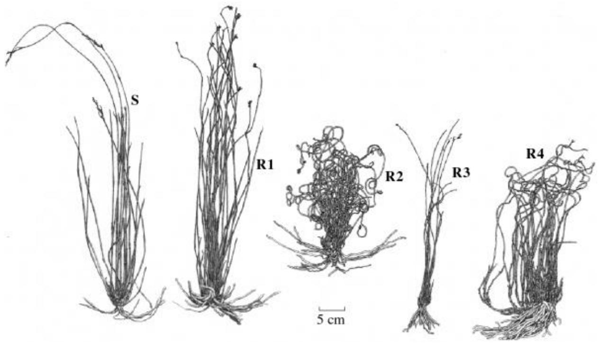
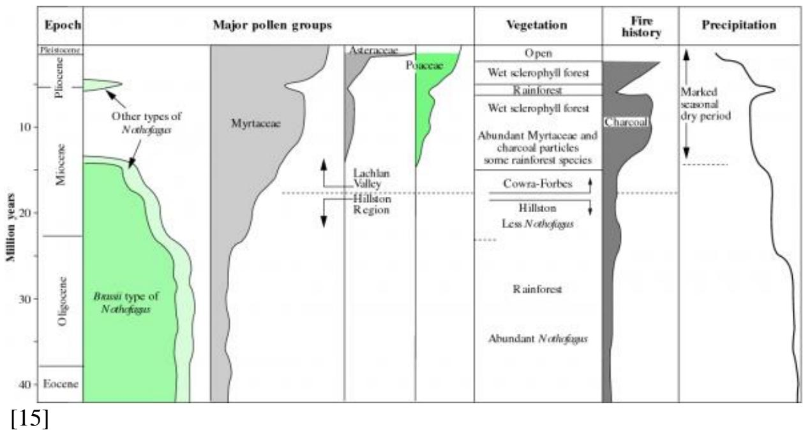

# Chapter 19 - Fire: an ecosystem sculpture

[1]

Fires often consume the large fuel loads produced by cane grass at the end of each dry season in Kakadu National Park, Northern Territory. Here a savanna woodland burns vigorously, leaving the sclerophyllous eucalypts blackened but alive and able to regrow in the following season. (Photograph courtesy Michael Douglas)

...and he looked, and behold, the bush burned with fire and bush was not consumed...

(Moses in the Book of Exodus)

- [Chapter 19 - Fire: an ecosystem sculpture](Chapter_19.md)
  - [Introduction]()  
  - [19.1 Physics and chemistry of an ecosystem on fire]()  
  - [19.2 Plants coexisting with fire]()  
  - [19.3 Strategies for surviving in fire-prone environments: seeders and resprouters]()  
  - [19.4 Impact of climate change and burning practices on vegetation]()  
  - [Further reading]()

# Introduction

Fire is a familiar event in those parts of the world where vegetation experiences extended dry periods, such as most of Australia and parts of New Zealand. Fires lit naturally through lightning strikes have occurred for millions of years but more recent changes to fire frequency have been brought about through human presence. Parts of the Australian landscape, for example, have been deliberately burnt for millennia by Aboriginal Australians and even more intensively burnt since European settlement.

Changes to a landscape after burning are catastrophic where extreme climatic conditions and fuel loads sustain a conflagration that releases  $100000\mathrm{kW}$  along a one metre front, whereas small ground fires might do little more than singe leaf

litter. Section 19.1 gives an analysis of energy release by fires in relation to vegetation types.

Interactions between fire and many environmental factors such as drought, frost and herbivore attack have imposed strong selective pressures on our major plant families. Indeed, the features outlined in Section 19.2 that contribute to survival of much of Australia's vegetation after fire are best thought of as adaptations to 'fire regimes', the interacting factors that are seen in fire- prone environments. Development of sclerophyll has been a central feature in the success of major Australian genera such as the eucalypts in the past 30 000 years. Subtle modifications to plant life cycles that allow them to survive fires also include seeding and resprouting habits described in Section 19.3.

Climate has circumscribed changes to the Australasian flora, as seen from pollen and charcoal deposits and climate data over the past 40 million years. Section 19.4 discusses the shaping of our flora through broad changes in climate and the more recent impact of human activity through use of fire to modify landscapes. Fire and climate interact to generate diverse and dynamic vegetation mosaics, often changing within a few decades of recorded history.

# 19.1 Physics and chemistry of an ecosystem on fire

Fire creates heat and gases ('smoke') as living and dead plant material burns. However, the immediate impact of fires varies, depending on the amount of combustible material, how fast it burns and how fast heat is transferred to the surrounding biota. Fire is analysed here as a physical phenomenon by quantifying the release of heat energy as plant materials burn. However, fires do more than release energy; they have chemical impacts on plants through smoke and 'ash- bed' effects that are dealt with in Section 19.2. In turn the biological responses of plants to fire intensities are highly variable, depending on species and time scales (Sections 19.2 and 19.3). The effect of fire on an ecosystem is a function of: (1) intervals between fires; (2) fire intensities, that depend on fuels, atmospheric conditions and terrain; (3) seasonalities of fires; and (4) whether or not fires burn any peat that may be present. These variables are the components of 'fire regimes' (Gill 1975, 1981a).

Complex impacts of fires can be seen in Figure 19.1, showing differential effects of fire on woodland and open forest growing on a dissected sandstone landscape north of Sydney. The extent of burnt and unburnt plant material left after this fire varies dramatically, giving rise to differential fuel loads that will affect subsequent fire regimes. Erosion patterns also vary locally after such large fires, affecting rates of revegetation and production of new fuel.

Figure 19.1 A dissected sandstone landscape north of Sydney (latitude  $33^{\circ}\mathrm{S}$ ) before (a) and after (c) a severe fire in January 1994. Complex effects of burning are well illustrated in this area of east- west ridges and valleys. Larger inputs of solar energy on north- facing slopes than south- facing slopes affect vegetation type, fire regimes and subsequent erosion patterns that form east—west valleys. (a) Vegetation on ridges and north- facing slopes is eucalypt woodland and shrubland with sparse foliage cover and much bare ground; on south- facing slopes and along creeks vegetation is denser open eucalypt forest with little or no bare ground. (b) Diagram to show: ridge crests (dashed lines), sometimes in the form of roads (thick solid lines); creeks (thinner solid lines); open forest (stippled) and woodland and shrubland (no symbol). (c) Immediately after fire and before scorched leaves are shed from the tree canopy. Woodland and shrubland is extremely exposed while in open forest a dense but scorched leaf canopy remains. Some creeklines still have green vegetation that could burn in a future fire. (Aerial photographs courtesy New South Wales government: (a) Homes Valley New South Wales, Run 13, Frame 86, 27 November 1992 and (c) Hunter Region Bushfires January 1994, New South Wales 4185 (M1979), Run 19, Frame 159, 4 February 1994; (b) illustration courtesy D.A. Adamson and P.M. Selkirk)

# 19.1.1 Heat

Heat production from burning material  $(Q)$  is described thus:

$$
Q = hw \tag{19.1}
$$

where  $h$  is the mean heat of combustion in  $\mathrm{kJkg^{- 1}}$  and  $W$  is fuel loading (biomass burnt) in  $\mathrm{kg}\mathrm{m}^{- 2}$  , giving  $Q$  the units  $\mathrm{kJ}\mathrm{m}^{- 2}$

Rates of heat production determine the impact of surface fires on topsoil, seeds and microbes buried in the topsoil and living plants. Fires burning below ground (ground fires) are not considered here (see Gill 1995). The rate of heat production by surface fires, or 'fire intensity' (Byram 1959), is given by:

$$
I = hwr \tag{19.2}
$$

where  $I$  is fire intensity in  $\mathrm{kWm^{- 1}}$  and  $r$  is the rate of spread of the 'fire edge' in m  $\mathrm{s}^{- 1}$  . Note that the unit of fire intensity is expressed as a rate per unit of fire edge rather than a rate per unit area, thereby avoiding the need to make difficult measurements of the depth of flame at the edge.

Fires pass a plant very quickly - usually within a few minutes: how long flames persist at the base of a plant seems to change little within a fuel type (e.g. grass or litter) but greatly between fuel types such as grassland and sclerophyll forest (McArthur and Cheney 1966). Rates of spread of fires vary widely and, together with the more limited variation in fuel loadings, fire intensities vary from a few kW  $\mathrm{m^{- 1}}$  up to about  $100000\mathrm{kWm^{- 1}}$  (Gill and Moore 1990). Large variations in the rates of spread of fires at their edges can occur within the one fire. Heat of combustion varies much less and is usually regarded as a constant.

So where does the heat from a fire go? It is transferred by conduction (down into soil, for example), radiation (especially from flames) and convection (typified by hot gases in the 'convection column' or 'smoke plume'). In practical terms, the physical effects of these heat transfers on plants and soil are assessed by duration of exposure to high temperatures.

# 19.1.2 How plant tissues succumb to heat

A temperature of about  $60^{\circ}\mathrm{C}$  will cause the instantaneous death of most hydrated cells while the resinous bonds holding the valves of some woody seed follicles closed melt at about  $75^{\circ}\mathrm{C}$  (Gill 1976; Wardrop 1983). Water boils at about  $100^{\circ}\mathrm{C}$  at this point water vaporises causing total thermal arrest. Charring of tissues begins at about  $300^{\circ}\mathrm{C}$  and ash forms above about  $500^{\circ}\mathrm{C}$

Combustion of leaves is possibly the simplest response to consider in a fire because leaves are usually thin (fractions of millimetres) and hydrated. They are therefore poorly insulated. Leaves subject to hot dry conditions prior to the onset of fire quickly reach  $60^{\circ}\mathrm{C}$  and begin to die (Gill 1995).

Unlike leaves, many tissues are insulated. Typically, the cambium of a tree is insulated from external heating by bark, sometimes fully alive and hydrated,

sometimes partly dead and superficially flammable. Other examples are seeds in the woody fruits of plants of genera such as Hakea, Casuarina, Eucalyptus and Callitris and seeds present in the soil. To predict how heat affects temperature of tissues, it is necessary to quantity the relationships between temperature and heat.

The rate of temperature change in plant tissue is determined by thermal diffusivity,  $\kappa (\mathrm{m}^{2}\mathrm{s}^{- 1})$ . Surface tissues of plants heat up relatively slowly because of low  $\kappa$ . Thermal diffusivity is described by the following equation:

$$
\kappa = \frac{k}{c\rho} \tag{19.3}
$$

where  $k$  is thermal conductivity  $(\mathrm{kJ}\mathrm{s}^{- 1}\mathrm{m}^{- 1}\mathrm{C}^{- 1})$ ,  $c$  is specific heat of the tissue (kJ  $\mathrm{kg}^{- 1}\mathrm{C}^{- 1}$ ), and  $\rho$  its density  $(\mathrm{kg}\mathrm{m}^{- 3})$ .

While  $k$  of plant tissues varies widely,  $\kappa$  is often regarded as a constant for large variations in moisture content and density (Gill and Ashton 1968; Vines 1968). Thickness of bark is therefore the main factor determining how well the base of a tree (bole) is protected from fire. Severe thinning of the flammable bark of stringybark trees (Eucalyptus spp.) and some paperbark trees (Melaleuca spp.) by fire can expose underlying tissues to damaging temperatures.

Bark thickness varies widely according to plant species, position on the plant, vigour and history of exposure to previous fires. Bark thickens through differentiation of phloem initiated in the vascular cambium (Section 7.1). Meanwhile, bark becomes thinner due to regular decortication, which is under physiological control (as in most 'gumbarked' species of Eucalyptus), or sloughing of dead tissues, which is under mechanical and environmental controls (as in most 'stringybarked' Eucalyptus). In general, bark thickness increases with girth in woody plants and decreases with height: stems well above ground have thinner bark than trunks of the same girth at ground level (Gill and Ashton 1968). In some eucalypts, allometric relationships have been established between cross- sectional areas of bark and stems (Brack et al. 1985).

Non- dicotyledonous plants such as tree ferns and woody monocotyledons have vascular bundles dispersed throughout their fibrous stems. By contrast, cycads have a ring of vascular tissue embedded deep within a stem cortex. Consequently, modes of tissue regeneration and long- distance transport in these plants are dissimilar to dicotyledonous plants, where an annulus of phloem overlies a cylinder of xylem with each cell type distinctly separated by a vascular cambium. The principles of high temperature damage as heat is conducted to successively deeper layers of tissue are the same for all these plant groups but the physiological consequences differ. Death of the vascular cambium after severe fires have

removed bark can kill an entire tree through preventing restoration of phloem activity.

# 19.1.3 Temperatures

Physical difficulties of measuring temperatures of fires have been partly overcome by the use of thermocouples: temperatures up to about  $900^{\circ}\mathrm{C}$  have been measured in Australian fires (Moore et al. 1995).

How long temperatures at the plant surface remain at  $100^{\circ}\mathrm{C}$  is critical in predicting the extent of tissue death from fires (Gill 1981b). While tissues are dehydrating, the temperature stays at boiling point but once most of the water has been lost, temperatures will rise. Depths of bark affected by the elevated temperatures of fires can be quite shallow. For gumbarked species, this depth can be estimated some time after the fire has passed because bark killed by the fire is shed from the tree while live bark persists (Gill 1981b).

Soils, like bark, are good insulators. A low- intensity fire — say, about  $90\mathrm{kWm}^{- 1}$  — produces substantial temperatures in the flaming zone while temperatures in the surface soil only rise to about  $100^{\circ}\mathrm{C}$  (Shea et al. 1979). However, more intense fires — up to  $2500\mathrm{kWm}^{- 1}$  — heat soil to a depth of  $6\mathrm{cm}$  and increase surface soil temperatures more than  $250^{\circ}\mathrm{C}$  above ambient (Shea et al. 1979). Heating of surface soil can kill microorganisms, seeds and other plant tissue. Changes in soil chemistry may also occur which, together with sterilisation, can temporarily increa

# 19.1.4 Summary

The physical attributes of fires kill some plant tissues and change soil chemistry. Subsequently, availability of light, water, nutrients and biomass for grazing animals can change, generating 'fire effects' that are secondary outcomes of fire. The immediate effects of a fire set the scene for the next fire which can again modify a plant community according to its intensity, type and season of occurrence — hence the importance of fire regimes. Outcomes for a plant community depend on many genetic properties of plant species, not just tolerance to a fire.

# 19.2 Plants coexisting with fire

# 19.2.1 Plant responses to fire and smoke

  
Figure 19.2 (a) Seed capsules of Hakea that have opened after an intense fire that killed the parent plant four weeks earlier in John Forrest National Park, Western Australia. Seeds have been shed onto the surrounding 'ash bed'. (b) Follicles of Banksia serrata open after a long dry period, revealing the brown surface of empty seed capsules. Note that some follicles are still closed; these could open later in response to fire, releasing more seed (Sydney). (c) Fire has severely burnt bushland in the Blue Mountains near Sydney, causing a Banksia serrata tree to respond rapidly. Seed capsules have opened to release seed and the lignotuber has sprouted to generate new leaves. Note also monocotyledons in the background have resprouted from leaf bases immediately after this fire ((a) Photograph courtesy Inez Tommerup; (b) photograph courtesy D.A. Adamson; (c) photograph courtesy P.M. Selkirk)

  
Figure 19.3 Re-establishment of Cootamundra wattle (Acacia baileyana) after fire near Canberra years earlier had ruptured the impermeable, hard seed coats. (Photograph courtesy R.H. Groves)

Figure 19.4 Epicormic growth of mallee eucalypts one year after a fire in western Victoria. (Photograph courtesy P.E. Kriedemann)

  
Figure 19.5 Resprouting of Banksia spp. In the season following a fire in the Royal National Park, New South Wales; dead wood is all that remains of the previous shoot while new shoots are established from tissues that survived the fire. (Photograph courtesy B.J. Atwell)

  
Figure 19.6 Aerial shoots appear from epicormic buds of a eucalypt tree near Wollongong, New South Wales, after severe fire had destroyed the entire leaf canopy in the previous summer. (Photograph courtesy B.J. Atwell)

  
Figure 19.7 Stimulation of flowering in Xanthorrhoea spp. Growing in John Forrest National Park, Western Australia, after a fire nine months earlier. Note also resprouting of burnt trunks of banksia trees in the left of this picture. (Photograph courtesy Inez Tommerup)

Fire regimes that occur naturally across most of the Australian landscape have given rise to distinct adaptive features in the native flora. Climatic zones across Australia ranging from temperate to tropical have generated commensurate contrasts in fire frequency and intensity, in turn selecting for diverse combinations of genetic traits that confer tolerance to fires. Fire- tolerant plant communities such as sclerophyll woodlands generally have admixtures of species in which some or all of these adaptive characters are represented (Specht et al. 1958; Purdie 1976a, b).

The principal fire- tolerant responses in plants can be summarised in the following four broad categories:

# 1. Stimulation of seed release from woody capsules by heat and desiccation

1. Stimulation of seed release from woody capsules by heat and desiccationSeeds of many species of Casuarina, Hakea, Banksia, Leptospermum and Eucalyptus are encased in woody capsules capable of remaining dormant for years and resisting predation. An entire fruiting body ('cone') can contain dozens of seeds (e.g. Stenocarpus) or only a pair as in the case of Hakea (Figure 19.2a). The fruiting bodies of Casuarina and Banksia include numerous hard follicles (Figure 19.2b). As each follicle opens after fire, a few seeds are dispersed onto the surrounding soil. Woody capsules can survive intense summer fires, releasing seed subsequently which then germinates in an ash bed enriched in nutrients (Figure 19.2c). Long periods of desiccation also cause capsules of some species to rupture, thereby ensuring that seeds are released into soil before the onset of a rainy season (Figure 19.2b).

# 2. Stimulation of germination of soil-stored seed by fire

2. Stimulation of germination of soil-stored seed by fireShort periods of intense heat break seed dormancy in some Acacia species, thereby triggering extensive germination and rejuvenation of communities. Highly water impermeable phenolic compounds in the seed coat of these species are disrupted by heat from fires (and long periods of high temperatures), allowing imbibition and germination to proceed. The short-lived Cootamundra wattle (Acacia baileyana) has large seed banks in soil ready to germinate once a fire has passed; Figure 19.3 shows new recruits that have established after a fire.

# 3. Stimulation of bud development after fire

3. Stimulation of bud development after fireMany genera, in particular Eucalyptus, have woody storage organs called lignotubers with cambial tissues capable of resprouting after fire. Young epicormic shoots grow vigorously from charred stumps or stems of a parent plant, fed by nutrient and carbon stores laid down earlier. Resprouting from burnt stem bases of a mallee eucalypt (Figure 19.4) and the burnt stump of a banksia tree (Figure 19.5) are illustrated. New shoots also arise from aerial buds that can withstand fire (Figure 19.6) and from subterranean rhizomes of monoticotyledons.

# 4. Stimulation of flowering

4. Stimulation of floweringSome geophytes (plants with organs such as tubers that can lie dormant) and the grass trees Xanthorrhoea and Kingia undergo profuse flowering in the season following fires. Trunks of grass trees, comprising densely packed leaf bases, survive intense summer fires and give rise to spectacular inflorescences in the following rainy season (Figure 19.7). Some orchid species produce flowers after fire from bulbs lying below the zone of heating. Nutrients concentrated in an ash bed after fires might directly promote initiation of these inflorescences in underground organs.

Section 19.3 deals with the occurrence of reseeding and resprouting under different fire regimes; these strategies can individually confer tolerance to fire but often coexist within the same fire- affected community and are sometimes even found within a single species (e.g. Figure 19.10).

Smoke stimulates germination of many Australian species as well as seeds native to the South African fynbos (de Lange and Boucher 1990) and Californian chaparral (Keeley and Fotheringham 1997). Smoke treatments have been applied to seeds of almost 100 Western Australian plants chosen from 20 angiosperm families and a gymnosperm family on the grounds that their seeds were notoriously difficult to germinate (Dixon et al. 1995). Exposing seeds to smoke or 'smoked water' in a glasshouse either hastened or prolonged germination in half the taxa and in a quarter of the taxa broke previously intractable dormancy. Genera such as Verticordia (Myrtaceae), Hibbertia (Dilleniaceae) and Stirlingia (Proteaceae) responded positively to smoke. Equally, smoke treatments in the field stimulated germination in all 15 taxa studied, in many cases smoke and fire appearing to act independently by stimulating germination additively.

Smoke is a mixture of thousands of combustion products. The hydrocarbon ethylene has been implicated in smoke- induced flowering of Xanthorrhoea but phytohormonal effects of many other gaseous components of smoke are yet to be considered. Nitrogen oxides elicit responses similar to smoke in the American chaparral plant Emmenanthae penduliflora. Ammonia, too, is implicated in breaking of dormancy in some South African species, thereby supporting the view that nitrogenous compounds in smoke are biologically active.

# 19.2.2 Fires and ecosystem composition

Fire can be a major determinant of the composition of plant communities and it sometimes defines the boundaries between dissimilar plant communities (Section 19.4). Species with little tolerance to fire can be pushed rapidly to extinction within a single generation while others profit from resources liberated through the impact of fire. For example, light levels beneath a canopy improve after fire- intolerant species are eliminated, raising light and heat capture by emergent seedlings and epicormic shoots of fire- tolerant species.

Reduced water and nutrient withdrawal by plants killed by fire leaves these resources available for establishment of fire- tolerant plants. Furthermore, ash released from burnt plant material ('ash- bed effect') supplies a flush of particular inorganic nutrients for new plant growth (Renbuss et al. 1972). However, nutrient enrichment might be short lived and depends on the nutrient in question. Calcium, magnesium and potassium can be leached through sandy soils after fires and made unavailable for new seedlings. Analysis of burnt and unburnt sites at Wilsons Promontory, Victoria, revealed major nutrient perturbations in the surface 2 cm of

soil; burning improved phosphate concentrations by at least  $30\%$  while nitrogen was depleted by about  $30\%$  (Adams et al. 1994). Post- fire colonisation by Leptospermum and Kunzeaspp. was rapid in these conditions. Shrublands and forests are often enriched in nitrogen- fixing species after fire because of temporary nitrogen deficits and sometimes specifically through fire- induced germination (Figure 19.2). Moreover, natural inhibitors of germination (allelochemicals) can be destroyed by intense heat. Hence the opportunity created by fire can be quickly seized by species with seeds or vegetative structures able to survive burning.

# 19.2.3 Using fire to manage plants

Land management can be achieved through use of fire because of these differential responses of species to fire regimes. For example, weed infestation can be reduced through judicious use of fire, as demonstrated in some coastal Victorian national parks where boneseed (Chrysanthemoides monilifera) is known to be restricted by two fires lit in short succession.

Effects of smoke on germination are not widely exploited by land managers as yet but they have potential for propagation of species previously considered unamenable for cultivation (e.g. Verticordia spp.). Evidence that smoke is biologically active when perfused through water and progress in isolating the active constituents from smoke open the way for dormancy breaking in these fire- dependent species. Some commercially useful species can be induced to flower by exposure to heat and the gases which fires release; Christmas bells (Blandfordia grandiflora) and kangaroo paws (Anigozanthos spp. from Western Australia) both flower more profusely in response to fire.

Animal habitat is also affected by fire, not only immediately after burning but also through long- term shifts in plant community composition. Exploitation of fire to maintain open sclerophyllous woodlands is thought to have been practised locally by Aboriginal Australians for tens of thousands of years (Section 19.4). Maori in New Zealand burnt the largely coniferous lowland forests, thereby eliminating podocarp stands and opening the landscape to grasses. Confifers of the southern hemisphere such as araucarias, podocarps and even the drought- tolerant Callitris spp. are generally intolerant of fire because they lack seed resistance to heat and a capacity to resprout.

# 19.3 Strategies for surviving in fire-prone environments: seeders and resprouters

# 19.3.1 Introduction

  
Figure 19.8 (A) A typical burnt habitat (right side) in heathlands of the northern sandplains of southwestern Australia. Note that grass trees (Xanthorrhoea spp.) are the only species whose above-ground biomass has survived fire. (B) Example of a fire weed (Gyrostemon ramulosus) in full fruit. (C) A seeder species of Banksia showing mature unburnt individuals with seed reserves carried in woody cones. Seed release occurs mostly after fire and a cohort of seedlings then establishes to replace the adults killed by the fire. (D) Typical resprouter tree species (Allocasuarina fraserina) showing new shoots developing from epicormic buds under the bark of the burnt trunk. Only a few of these shoots will survive to reconstitute the branching profile of the tree. (E) Transverse section through the root of a typical resprouter (Conospermum stoechadis) showing storage of starch (stained black with iodine) in the cortex, rays and interray xylem parenchyma of

the root. (F) Transverse section through the root of a typical seeder (Banksia prionotes) showing virtual absence of starch. (Photographs courtesy J.S. Pate)

Much of the Australian flora recovers rapidly after fire, in spite of many individuals perishing through heat and combustion (Section 19.1). Plant communities that regenerate post- fire capitalise on reduced competition for nutrients, water and light, therefore environmental changes imposed by fire (see fire regimes outlined in Section 19.1) are a potent selective force in many Australian plant communities. However, it is still debatable whether the range of genetically programmed responses that we see in fire- tolerant species represents adaptations to burning or arises incidentally in response to features of fire regimes such as drought and nutrient release through an ash- bed effect (Section 19.2). Evidence below demonstrates that nutrient and carbon economies of many species are modified according to fire regimes. Life cycles of species able to tolerate fire contrast dramatically, depending on investment of resources in the parent storage organs relative to seed stocks. Intervention of fire in the Australian landscape, especially in sclerophyllous heathlands (Figure 19.8A), has therefore selected directly or indirectly for a suite of genetic changes.

# 19.3.2 Fire ephemerals: plants that grow from seed banks

Fire ephemerals, sometimes referred to as fire weeds (e.g. the grass Stipa compressa, native hibiscus Allyogyne spp. and members of the family Gyrostemonaceae (Figure 19.8B), form conspicuous components of the early post- fire floras of many ecosystems. Their seeds germinate only after intense fires from seed banks in the soil that are both extensive and very long lived. Even in the absence of human intervention when intervals between fires can be many years, such seed can survive to exploit a post- fire regime. Some species of fire ephemerals (e.g. Stipa) are monocarpic; that is, they complete a growth cycle and return seed effectively to the soil within six to nine months of a fire. Others (e.g. Gyrostemon spp.) are polycarpic; they commence flowering in the second season after fire and then reproduce over the following two or three seasons before dying. Since it is unlikely that sufficient fuel will accumulate in a habitat to sustain two fires in close succession, most fire ephemerals complete their life cycles by 'avoiding fire in time'. During these brief lives, fire ephemerals play a critical role in resource capture. Important inorganic nutrients released by fires are retrieved and assimilated into the organic biomass of a new generation of parent plants. Absence of fire ephemerals could allow large- scale losses of nutrient capital through leaching.

All fire ephemerals are characterised by extremely high rates of seedling growth in comparison with other classes of species recruiting in the same ash bed. They also exhibit extreme plasticity in adult size, depending on: (1) how densely they germinate, (2) competition between new seedlings and (3) patchiness of nutrient distribution in ash and decomposing plant material within their rooting catchments. Thus, in a small area of habitat where ash has been deposited unevenly, the largest individuals of a fire ephemeral such as the grass Stipa compressa might be 500 to 1000 times heavier than the smallest. Despite such plasticity in size, there is remarkably little variation in the proportion of dry matter committed by individuals to flowers and seeds just prior to their death. This proportionality ensures that the size of a seed bank is geared to resource availability across a habitat.

Table 19.1 Harvest indices for dry matter and mineral nutrients in annual fire ephemeral species of the northern sandplains of Westem Australia. Harvest index  $=$  (amount in nssoute of seeds divided by amount in total plant)  $\times 100$  

<table><tr><td rowspan="2">Species</td><td rowspan="2">P</td><td rowspan="2">N</td><td colspan="4">Harvest index for:</td></tr><tr><td>K</td><td>Dry mass</td><td>Mg</td><td>Ca</td></tr><tr><td>Athrixia asteroides</td><td>75</td><td>63</td><td>24</td><td>23</td><td>32</td><td>23</td></tr><tr><td>Calandrinia corrigioides</td><td>62</td><td>29</td><td>8</td><td>18</td><td>7</td><td>3</td></tr><tr><td>Isotoma hypotonerifomis</td><td>43</td><td>28</td><td>3</td><td>8</td><td>10</td><td>5</td></tr><tr><td>Podothem guphalidioides</td><td>78</td><td>70</td><td>19</td><td>29</td><td>39</td><td>22</td></tr><tr><td>Stipa compressa</td><td>77</td><td>63</td><td>4</td><td>24</td><td>35</td><td>10</td></tr><tr><td>Tradymene cyanopetala</td><td>91</td><td>71</td><td>40</td><td>50</td><td>46</td><td>47</td></tr><tr><td>Waitzia pariculata</td><td>90</td><td>72</td><td>31</td><td>31</td><td>49</td><td>37</td></tr><tr><td>Waitzia suaveolens</td><td>56</td><td>44</td><td>20</td><td>12</td><td>12</td><td>11</td></tr></table>

Based on Pate et al.1985)

[10]

# Table 19.1

Harvest index (the proportion of a specific plant resource (e.g. dry matter, potassium) invested in seed at maturity) has been used to compare relative reproductive effort of a range of fire ephemeral species from southwestern Australian. That is, harvest index quantifies how effectively each species passes its dry matter or specific nutrients on to seeds of the next generation (Pate et al. 1985). Table 19.1 illustrates strong sequestering of phosphorus in each of the listed fire ephemerals, followed broadly by nitrogen, potassium, dry matter, magnesium and calcium. Because parent ecosystems of these species are considered to be limited primarily by availability of phosphorus, channelling of up to  $90\%$  of a plant's phosphorus pools into seeds enhances survival of seedlings after fire. Little is known of the regulatory processes of senescence at a cellular level that release nutrients from vegetative parts for retranslocation to seeds (Chapter 16).

Abundant seed production by many species that are fire ephemerals points to selection for high numbers of relatively small seeds, each well stocked with long- term energy reserves of oil or starch but less well endowed with mineral reserves. These features enhance seed longevity and ensure that dense populations become

established effectively after hot fires. Modest reserves of some nutrients in seeds are likely to be well compensated for by high availability of nutrients in the ash bed in which the seed germinates (Section 19.2). Supporting evidence shows that fire ephemerals flourish particularly well in burnt habitats but grow very poorly if transplanted into unburnt habitats of poorer mineral resource availability.

# 19.3.3 Cryptophytes (geophytes): plants that grow from storage organs

Cryptophytes (literally hidden plants) comprise major components of the understorey of nutrient- poor habitats such as the sandplains of southwestern Australia (Figure 19.8). Most are 'wet- season active', forming leafy shoots and reproductive organs during the assimilatory phase. With the advent of the following dry season they die back to a deeply buried corm, bulb or tuber. As with fire ephemerals (Section 19.3.2), limited nutrient resources are conserved extremely effectively, but in this case are withdrawn at the end of each growing season into newly formed storage organs rather than into seeds. Since fires are likely to occur only in the dry season, cryptophytes complete their life cyles by 'avoiding fire in time and space'. As with fire ephemerals, cryptophytes benefit from the improved availability of light, moisture and nutrients in the seasons immediately following fire; indeed, some orchids and sundews flower predominantly after fire. Other cryptophytes reproduce vegetatively by forming tubers, corms or bulbs. In these species, prolific growth and rapid nutrient acquisition in the period following a fire provides bountiful reserves to be stored in below- ground organs.

In many ecosystems on impoverished soils (Chapter 16), a large proportion of total species are cryptophytes and other herbaceous perennials, with relatively few annual species present. Annuals have to establish from seed each season, often producing flower and setting seed only after a long juvenile phase. Productivity can be curtailed by short seasons and the imperative of absorbing sufficient nutrients from the soil over a short growing season. Cryptophytes, by contrast, carry over virtually complete stocks of nutrients and large amounts of energy- rich reserves from one season to the next through the agency of their underground storage organs, thus enabling leafy shoots, and in some cases flowers, to emerge almost immediately after rain opens a new season. Cryptophytes are also highly resilient to adverse seasons: in drought years, for example, individuals deplete reserves of dry matter and nutrients, and sometimes fail to reproduce effectively. Even in these cases, sufficient resources are carried over to the next season to allow a population to survive. If more favourable conditions then prevail, nutrient and energy stores are replenished to earlier levels.

# 19.3.4 Obligate seeders and resprouters: perennial plants that seed or resprout after fire

19.3.4 Obligate seeders and resprouters: perennial plants that seed or resprout after fireObligate seeders consist of plants which are either killed out- right by fire and recruit thereafter from banks of seed buried in soil or encapsulated in woody fruits in the above- ground canopy (Figures 19.2b and 19.8C). Resprouters employ a sharply contrasting strategy whereby rootstocks (e.g. eucalypts in Figure 19.4 and banksias in Figure 19.5), thick trunks (Figure 19.6) and branches (e.g. casuarinas in Figure 19.8D) survive fire and replace entire shoot canopies by sprouting from heat- resistant buds. These illustrations show that such heat- resistant buds can be below ground or in trunks and branches.

Table 19.2Differences in growth shoot : root dry mass ratio starch levels and reproductive performances of naturally recruiting seeder and resprouter species of the northern sandplains of southwestern Australia. Means are given  $\pm$  standard errors  

<table><tr><td></td><td>Mean for seeder species</td><td>Mean for resprouter species</td></tr><tr><td>Dry mass at 2-3 years (g plant-1)</td><td>10.7 ± 2.2</td><td>3.8 ± 0.9</td></tr><tr><td>Shoot : root dry mass ratio (g g-1)</td><td>5.0 ± 0.6</td><td>1.2 ± 0.1</td></tr><tr><td>Starch storage in shoots (mg g-1 (dry mass))</td><td>5 ± 2.1</td><td>15 ± 3.1</td></tr><tr><td>Starch storage in roots (mg g-1 (dry mass))</td><td>8 ± 0.7</td><td>55 ± 10.3</td></tr><tr><td>Time to first flowering (range in years)</td><td>2-4</td><td>5-11</td></tr><tr><td>Proportion of ovules giving rise to seeds (seed : ovule ratio)</td><td>0.5-0.8</td><td>0.04-0.4</td></tr></table>

(Based on Pate et al. 1990 and J.S.Pate, unpublished data)

  
Figure 19.9 Scheme showing the relative sinks for assimilated carbon in seedlings of (a) resprouter and (b) seeder species from the family Proteaceae over an 18-month period after recruiting from seed germinated following a fire at Yanchep, Western Australia. Percentage allocation (units) of carbon to leaf, stem and root biomass is shown and carbon lost in root respiration indicated for each plant type. Note much larger allocation of carbon to starch storage (square in dark green) in roots of the resprouters than the seeders. (Based on Bowen and Pate 1991)

Seeders and resprouters are likely to be encountered in the same habitat but resprouters are normally predominant in habitats that are frequently burnt whereas seeders flourish where fires are rarer events. Often a seeder and resprouter species of the same genus coexist in more or less equal densities at the same site, such 'congeneric' partners providing useful comparisons of how closely related species

with contrasting fire responses perform when sharing the same climate and fire regime. Moreover, since new recruits to these seeder and resprouter populations are likely to germinate and establish prolifically in the season following a fire, comparisons can be made between cohorts of the same age over a number of subsequent seasons to compare biomass production, time to flowering and attributes such as longevity. For example, recruits of the seeder species in Table 19.2 were three times larger two to three years after germination than their resprouter counter- parts. By this time, shoots of a typical seeder are likely to weigh five times more than the roots, while shoots and roots of a recruiting resprouter of the same age would weigh about the same (Table 19.2).

Disparities in distribution of dry matter between shoot and root indicate radically different patterns of allocation of photoassimilates and nutrient resources in the two fire response types. Resprouters partition approximately three- quarters of new photoassimilates to roots (Figure 19.9a). Two- thirds of this carbon directed below ground is respired  $\mathrm{CO_2}$  with the remainder committed to establishing a starch- rich tap root or lignotuber capable of subsequently resisting fire. With only a small proportion being invested into new leaf area, aerial growth of resprouter species proceeds slowly, as shown in Table 19.2. Seeders, on the other hand, commit less than half of new photoassimilates to roots and proportionately more to developing a leafy canopy (Figure 19.9b).

A major difference between seeders and resprouters relates to storage of starch, sugars and other carbon- based energy stores. While starch levels in shoots are lower than those in roots, significantly more starch is invariably present in tissues of the resprouter species than in those of the seeder (Table 19.2), thereby reflecting the role of starch as a carbohydrate store for new growth. Starch deposits can be seen histo- chemically in stems of resprouters as darkly stained tissues comprising broad rays, abundant xylem parenchyma and thick cortical cell layers in roots (Figure 19.8E). Dense granules of starch within these resprouter roots account for the staining intensity. Seeders have almost none of the dark stain characteristic of starch (Figure 19.8F).

Similar measurements of levels of essential nutrients (e.g. nitrogen, phosphorus and potassium) in root dry matter show that nutrients are not accumulated in particular cell types in the manner observed for starch in resprouter species. Resprouters exploit stored carbon reserves to refoliate and produce new feeding roots immediately after fire. Resumption of photosynthesis, transpiration and nutrient uptake follow, sustaining a new period of nutrient acquisition and storage. In this manner, established individuals of a resprouter species can generate biomass in a post- fire ecosystem well in advance of adjacent obligate seeders.

Recruiting individuals of seeders and resprouters also exhibit contrasting reproductive capacities (Table 19.2). Obligate seeders commence reproduction in the second or third season after germination, and seed production escalates

annually thereafter for several years. By the time of the next fire a large replacement seed bank is likely to have been accumulated. By contrast seedling recruits of resprouters might not start flowering for six to eight years and typically produce fewer flowers and smaller seed:ovule ratios (Table 19.2) than corresponding seeder species. That is, resprouters invest little in reproductive organs relative to the storage functions that help them re- establish quickly after fire.

Congeneric partners, reflecting a balance between seeding and resprouting individuals, can thus be considered as alternative and more or less equally successful end points to evolutionary processes shaping responses of species to fire. In evolutionary terms, intermediate types between seeders and resprouters would clearly embody an uneasy compromise between the two contrasting strategies, and, as might be expected, are not commonly encountered in present- day ecosystems. However, in certain exceptional taxa a continuum of response types can be discerned, as shown, for example, in the morphotypes of Lyginia barbata (Bell and Pate 1993), illustrated in Figure 19.10. Morphotypes range from a prolific seed- producing, short- lived tufted seeder to resprouter forms that are long lived and produce few seeds. The resprouter forms reproduce vegetatively with clones arising from rhizomes of the parent plant. This spectrum of responses within  $L.$  barbata provides an ideal tool for study of evolutionary responses to fire within a single taxon.

Figure 19.10 Fifth- year juveniles of morphotypes of Lyginia barbata R. Br. (Restionaceae) showing five contrasting growth forms of the same species. One is an obligate seeder (S) while the others are all resprouter forms (R1- R4). S is densely tufted and produces prolific seeds that germinate after fire has killed the parent plant. R1 and R2 are tufted resprouters but are short lived like S and able to recruit some new individuals from seed. R3 and R4 are long lived and strongly clonal, resprouting from adult rhizomes after fire to produce new juveniles vegetatively. (Reproduced courtesy Bell and Pate 1993)

# 19.4 Impact of climate change and burning practices on vegetation

# 19.4.1 Introduction

  
Figure 19.11 Mosaic of hummock grassland located about  $300\mathrm{km}$  north-west of Alice Springs in the Tanami Desert of central Australia. Spinifex vegetation consisting of Trioldia pungens, T. bitextura and Acacia spp. is found across the site, with fires having formed distinct vegetation mosaics. The lightest central swathe burnt about a year earlier, leaving little remaining biomass. Darker zones to the right and left of this most recently burnt region were burnt about five and more than seven years earlier, respectively. (Photograph courtesy G. Griffin)

All floras, including those of Australia and New Zealand, are dynamic. Global climate change throughout prehistory has selected broadly for different vegetation admixtures and specifically for adaptive traits within individual species. While some genetic modifications to plants are considered highly specific responses to a particular environmental factor such as drought, poor nutrition or extremes of temperature, others probably reflect simultaneous changes in several environmental factors. For example, during the Last Glacial Maximum about 20 000 years ago, vegetation was exposed to drier, colder, windier atmospheres strongly depleted in  $\mathrm{CO_2}$  (180 to  $190\mathrm{ppm}$ ) compared to the present day (c. 360 ppm; Chapter 13). Charcoal deposited during these glacial periods is evidence that woody plants had to survive fires as well as extremes in atmospheric conditions. These complex regimes bring into question claims that vegetation has become adapted to a single adverse factor.

Interspersed with major shifts in climate have been periods of changed fire frequency. Palynological evidence presented in Section 19.4.2 shows that fire has been an 'ecosystem sculptor' in the Australian landscape for most of the past 15 million years. On the Canterbury Plain of New Zealand's South Island, by contrast, the Maori transformed Nothofagus and gymnosperm forests into fire- prone grasslands in only about 700 years through burning and cutting (Ogden et al. 1998). Such different time scales of exposure to fire have implications for the flora we see today throughout Australasia. Species of a number of major Australian plant families (e.g. Proteaceae, Myrtaceae) have genetically encoded characters that confer tolerance to the fire regimes described in Sections 19.2 and 19.3, as do plants from other fire- affected parts of the world. These species have evolved over millions of years when fire and climate change consorted to select Australia's vegetation types. The gymnosperms that grew across the Canterbury Plain also have sclerophyllous leaves but are readily killed by fire, in contrast to the major Australian families. Several important vegetation types in Australia are also severely affected by fire (Figure 19.11). Alpine flora, rainforest species and chenopods from dry rangelands are suppressed or killed by burning.

# 19.4.2 Pollen evidence indicating changes in vegetation

Pollen is an enduring signature of vegetation type and is therefore a vital tool in analysis of climate change. As pollen and charcoal from fires wash into swamps and lakes, they are deposited in a time sequence that can be analysed by palynologists using cores drilled into the sediments. Fossil leaves recovered largely from surface outcrops are used to supplement these pollen data.

Figure 19.12 illustrates stark shifts in vegetation in central and western New South Wales particularly throughout the second half of the Tertiary. Increasing

abundance of pollen from the families Myrtaceae, Poaceae (grasses) and Asteraceae reflect the increasing aridity and oceanic cooling which began about 15 million years ago during the Mid to Late Miocene. 'Wet' rainforests, dominated by Nothofagus, gave way to myrtaceous woodlands and forests dominated by eucalypts. A relatively brief wet period about five million years ago (Late Miocene to Early Pliocene) saw the Nothofagus forests return temporarily at the expense of sclerophyllous species. These broad alignments of climatic events and vegetation mix support the view that climatic factors have driven evolution of major vegetation types throughout Australia, largely through variations in water supply and temperature.

  
Figure 19.12 Summary of major changes in vegetation, fire history and precipitation over the past 40 million years in central and western New South Wales. Major pollen groups show there was a steep decline of Nothofagus forests around 15 million years ago with species of Myrtaceae (especially Eucalyptus spp.) taking their place as the dominant woody species. The wet sclerophyll forests that developed after the Mid Miocene were associated with an increasing abundance of grasses and herbs (families Poaceae and Asteraceae). Charcoal deposits became more prolific as the myrtaceous species expanded, demonstrating that fire was now a feature in the environment. A drier climate that prevailed after the Mid Miocene is believed to be responsible for a rise of sclerophylly. Note the brief return of Nothofagus forest about five million years ago during a brief wet period (Based on Martin 1986, 1998; reproduced with permission of the Linnean Society of NSW)

  
Figure 19.13 Summarised palynological and charcoal data from Lynch's Crater in North Queensland showing major changes in vegetation types over the last 140 000 years, with a dramatic increase in charcoal deposition (thousands of particles per cubic centimetre) around 38 000 years ago. Vegetation types are: (1) rainforest conifers (e.g. araucarias); (2) other rainforest plants and (3) plants from sclerophyll forests. The arrival of Aboriginal people in the area has been cited as a reason for increased burning and development of sclerophyllous forests. Wetter rainforest returned 7000 years ago in spite of a long history of fires, possibly through climate

change as the Last Glacial Maximum receded. (Based on Kershaw 1976; reproduced with permission of New Phytologist)

Other parts of the continent underwent the same broad trend towards sclerophylly during the Tertiary. However, climatically induced changes to flora within individual regions of Australia varied distinctly depending on the pre- existing vegetation mix and climatic range. For example, at different times until 120 000 years ago, northeast Queensland supported casuarinaceous forest (either Gymnostoma, a rainforest taxon, or species of the sclerophyllous family Casuarinaceae), araucarian rainforest (family Araucariaceae) and sclerophyllous woodland. The characteristically high rainfall of this region enabled 'dry' rainforest, dominated by araucarias, to persist after they vanished in drier regions and indeed sustains tropical rainforest to the present day. On the contrary, northwest Australia has been persistently drier than the northeast throughout the past 40 million years and has pollen records that reflect this history. Early Tertiary rainforests were replaced by casuarinaceous forests by the Late Miocene and more recently by grasslands and Acacia shrublands. The rarity of eucalypts throughout the past 40 million years in this part of the continent endures to the present day, with sclerophyllous shrublands rather than eucalypt woodlands dominating the arid landscape of northwest Australia. In central Australia, too, rainforest succumbed early in the Tertiary period to aridity, leading to sclerophyllous woodlands and finally in the Pleistocene to open shrubland with abundant daisies, grasses and chenopods (saltbush and bluebush).

Data relating to a more recent epoch have been collected from a number of sites in Australia including Lake George in New South Wales, Lashmar's Lagoon in South Australia and Lynch's Crater in Queensland (full details in Singh et al. 1981).

At Lynch's Crater in North Queensland (Figure 19.13), conifers (e.g. araucarias and podocarps) and rainforest angiosperms became much less dominant about 40 000 years ago and were replaced by sclerophyll forests of eucalypts and casuarinas for almost 30 000 years. A return to rainforest species, this time predominantly angiosperms rather than gymnosperms, began about 10 000 years ago after the passing of the Last Glacial Maximum. Indeed, rainforests re- established on wet, fertile sites throughout southeastern Australia during this period of climate change (e.g. Tasmania, Barrington Tops in New South Wales). Pollen data also indicate increasing predominance of eucalypts in drier regions during the Holocene (see Dodson 1991), driven by climate change and associated fire regimes.

Increasing sclerophylly at Lynch's Crater over tens of thousands of years (Figure 19.13) and in western New South Wales over tens of millions of years (Figure 19.12) both correspond with abundant deposition of charcoal. Water and

temperature were certain contributors to vegetation change in both time scales but fire also played a role.

# 19.4.3 Fire: an ecosystem sculptor

Rapid increases in charcoal deposition coinciding with sclerophylly are a conjunction of cause and effect. Many sclerophyllous species resist the devastating effects of fire through features such as epicormic shoots and fire- protected seeds (Sections 19.2 and 19.3). One outcome of fire regimes is therefore strong selection for sclerophylly. However, drought and herbivory in the absence of fire can also select for sclerophylly. Once sclerophylly is an established feature of a vegetation type, characterised in much of Australia by flammable dryland species such as eucalypts, the likelihood of fire (and therefore charcoal deposition) rises (Section 19.1).

Palynological evidence reveals the complexity of fire and climate change as selective joint forces for vegetation mix. For example, grasses at Lake George were abundant 250 000 to 300 000 years ago, when charcoal was uncommon, and returned to prominence 8000 years ago when fire had become common. While grasslands must have been burnt by occasional fires and therefore contributed to charcoal deposition, most charcoal is believed to have come from more intense fires as woodlands established in wetter periods were burnt. Thus, the return of grasses 8000 years ago cannot be easily ascribed to fire regimes — more likely, grasses were a secondary outcome of the shift from tall to low open- eucalypt forests allowing light to penetrate the canopy. Fire, therefore, probably provides a selective pressure for the evolution of characters that conspicuously confer tolerance to burning (e.g. fire- induced flowering, epicormic sprouting) but also alters landscapes through more general shifts in vegetation mosaics (e.g. from rainforest to sclerophyll forest).

While climate change is an overarching selective force in determining vegetation types, fire interacts with climate to affect a local flora profoundly over both short and long time periods (decades to millennia). It is therefore not surprising that fire has been used sporadically by humans to alter the landscape and hence food supply in Australasia over thousands of years. The subtlety of this manipulation is difficult to gauge because charcoal deposits reflect large intense fires but tell little about local 'cool' burns. None the less, data such as those from Lynch's Crater show a rapid rise in charcoal deposition in the past 40 000 years, supporting the assertion that local groups of Aboriginal Australians burnt the vegetation consistently to suppress rainforest species and promote open woodland (Kershaw 1986). Over the

past 7000 years, fire- sensitive rainforests of Araucaria have been restricted to locales that are protected from fire, allowing angiosperms to emerge as the dominant rainforest group. Imposed fire regimes are likely to have had the greatest impact in wetter regions of Australia (northeast Queensland and southwest Tasmania) where large natural fires are less common than in dry areas (Clark 1981).

During at least part of the 40 000 years since Aboriginal Australians arrived, local burning practices have altered vegetation types and prevented rainforest and tall open- woodland from encroaching on adjacent grasslands that sustained wildlife. In this way, mosaics representing several vegetation types were generated, maximising biological productivity. Eucalypt- dominated grasslands have not been an inevitable outcome of fire regimes imposed by humans, with charcoal evidence showing that under favourable climatic conditions woodlands of Casuarina spp. coexist with controlled burning (Clark 1981).

Fires lit naturally also generate mosaics and demonstrate graphically the interaction of distinct plant communities and fire regimes. Hummock grasslands in arid central Australia illustrate distinct mosaic patterns according to the period elapsed since the last fire was lit by lightning or human activity (Figure 19.11). At the other extreme, the large standing biomass of rainforest and eucalypt forest in tropical North Queensland also produces mosaics defined by sharp transitions between plant communities (Uwinin 1989). These transitional zones generally reflect the extent of previous fires, with each subsequent fire re- establishing boundaries according to fire frequency and intensity.

On the Herberton Highland in Queensland, evidence of the dynamic nature of forest boundaries is seen in the distribution of large, old Eucalyptus grandis trees. Tall trees between 100 and 400 years old are found scattered along the margins of open eucalypt forest and occasionally within the adjacent rainforest. Because it is well documented that  $E.$  grandis seedlings can only establish in open grassy woodland after fire and cannot establish under rainforest, the presence of  $E.$  grandis tens to hundreds of metres within the young rainforest is evidence that rainforest has encroached on open woodland within the life of these trees.

Boundaries are still undergoing continual change through the influence of fire. As grasses are burnt up to the transitional zone,  $E.$  grandis and the dominant species of the open woodland, Eucalyptus intermedia, take hold. Where fires have not burnt to the rainforest margins for decades, rainforest species become established, leaving open woodland species surrounded by dense, moist canopies. The advance of rainforest in much of this region is a result of a temporary decline in frequency of fires.

  
Figure 19.14 Range of radiocarbon dates recorded in soil charcoal at eight locations in northeast Queensland in relation to annual rainfall. Vertical bars show the range of time that charcoal was deposited beneath the forest, where it has remained. Charcoal deposited over a long time is found beneath today's rainforests that receive an annual rainfall of less than  $2000~\mathrm{mm}$ , indicating frequent presence of eucalypts for more than 20 000 years. Rainforest on these drier sites probably established during recent recolonisation. Wetter sites have supported rainforest for almost 10 000 years. (Based on Ecos, 1997; reproduced with permission of Ecos)

Carbon dating of charcoal deposits dug from beneath rainforest on the Windsor Tableland in North Queensland has been used to corroborate findings based on species distribution. Eucalypts burnt in the areas that now support lush rainforest left carbon deposits dating back 13 000 to 26 000 years. Apparently all but the wettest regions of rainforest have at some time been colonised by sclerophyllous species capable of supporting fires (Figure 19.14). Some rainforests in northeast Queensland receive less than  $1800~\mathrm{mm}$  annual rainfall and are unlikely to be more than 1400 years old. Similar encroachment of rainforests on eucalypt woodland has been observed in rainforests from northern New South Wales.

Many assemblages of plant species in the Australian landscape are the product of fires burning the vegetation throughout millennia, re- ordering the extent and abundance of species. During this time, climate change (Chapter 13) and human impact (Section 19.4) have altered fire regimes, resulting in long- term shifts in boundaries between plant communities and imposing selection pressure that has given rise to wide- spread, but not universal, fire tolerance in Australian flora.

Fire regimes have altered again since European settlement with the fragmentation of original plant communities as a result of grazing, agriculture and forestry. Fire has been used aggressively in the past 200 years of agriculture as a means of suppressing and eliminating native vegetation, including those species able to

withstand cyclical fires caused by natural events like lightning. In contrast, burning has been restricted in native forests to maximise resource yields, causing shifts in vegetation mix and age through low fire frequencies and occasional high fire intensities.

# Further reading

Ashton, D.H. and Attiwill, P.M. (1994). 'Tall open- forests', in Australian Vegetation, 2nd edn, ed. R.H. Groves, 157- 196, Cambridge University Press: Cambridge.

Bell, D., Hopkins, A.J.M. and Pate, J.S. (1984). 'Fire in the Western Australian kwongan', in Kwongan - Plant Life of the Sandplain, eds J.S. Pate and J.S. Beard, 178- 204, University of Western Australia Press: Nedlands.

Clark, R.L. (1983). 'Pollen and charcoal evidence for the effects of Aboriginal burning on the vegetation of Australia', Archaeology in Oceania, 18, 32- 37.

Gill, A.M., Groves, R.H. and Noble, I.R. (eds)(1981). Fire and the Australian Biota, Australian Academy of Science: Canberra.

Keith, D.A. (1996). 'Fire- driven extinction of plant populations: a synthesis of theory and review of evidence from Australian vegetation', Proceedings of the Linnean Society of New South Wales, 116, 37- 78.

Source URL: http://plantsinaction.science.uq.edu.au/edition1/?q=content/chapter- 19- fire- ecosystem- sculpture

# Links:

[1] http://plantsinaction.science.uq.edu.au/edition1/?q=figure_view/897  [2] http://plantsinaction.science.uq.edu.au/edition1/?q=figure_view/899  [3] http://plantsinaction.science.uq.edu.au/edition1/?q=figure_view/905  [4] http://plantsinaction.science.uq.edu.au/edition1/?q=figure_view/904  [5] http://plantsinaction.science.uq.edu.au/edition1/?q=figure_view/906  [6] http://plantsinaction.science.uq.edu.au/edition1/?q=figure_view/907  [7] http://plantsinaction.science.uq.edu.au/edition1/?q=figure_view/908  [8] http://plantsinaction.science.uq.edu.au/edition1/?q=figure_view/909  [9] http://plantsinaction.science.uq.edu.au/edition1/?q=figure_view/910  [10] http://plantsinaction.science.uq.edu.au/edition1/?q=figure_view/911  [11] http://plantsinaction.science.uq.edu.au/edition1/?q=figure_view/912  [12] http://plantsinaction.science.uq.edu.au/edition1/?q=figure_view/913

[13] http://plantsinaction.science.uq.edu.au/edition1/?q=figure_view/915  [14] http://plantsinaction.science.uq.edu.au/edition1/?q=figure_view/917  [15] http://plantsinaction.science.uq.edu.au/edition1/?q=figure_view/918  [16] http://plantsinaction.science.uq.edu.au/edition1/?q=figure_view/919  [17] http://plantsinaction.science.uq.edu.au/edition1/?q=figure_view/920