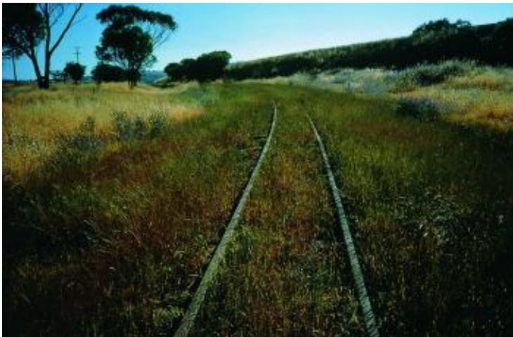
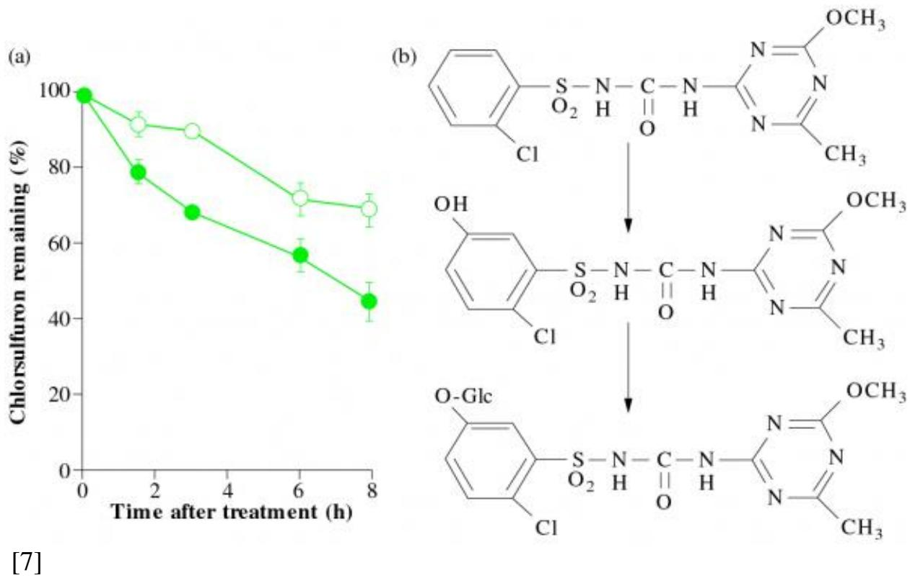

# Chapter 20 - Herbicide resistance: a case of rapid evolution

Herbicide- resistant Lolium rigidum infesting railway lines in Western Australia. Since the late 1980s, atrazine and amitrole have been transported by rail and used to control weeds in crops. A monoculture of  $L$  rigidum resistant to theses herbicides has developed where leakage from trains has provided selection pressure on trackside ryegrass populations.

Amid young flowers and tender grass Thy endless infacy shall pass; And, singing down thy narrow glen, Shalt mock the fading race of men. (William Cullen Bryant, The Rivulet, 1774- 1878)

- [Chapter 20 - Herbicide resistance: a case of rapid evolution](Chapter_20.md)
  - [Introduction]()  
  - [20.1 Acquiring resistance to herbicides]()  
  - [20.2 Biochemistry of herbicide resistance]()  
  - [Further reading]()

# Introduction

Herbicides (chemicals that remove unwanted plant species) are widely used in world agriculture. Since 1945 a steady stream of new herbicides has been commercialised and readily adopted by Australia farmers such that almost all cropping systems rely on herbicides as an effective, cheap and flexible method of weed control. Herbicides have largely replaced the plough for weed control (minimum tillage) and have greatly contributed to soil conservation by limiting loss of topsoil after cultivation. Hence, there are many advocates for use of

herbicides. However, there has been a dark side to excessive reliance on herbicides for weed control, namely herbicide- resistant weeds. Although herbicide- resistant weeds occur worldwide, their abundance in Australia is startling. What started in the early 1980s as a biological curiosity has now become a serious practical problem over more than two million hectares of the Australian cereal region (Figure 20.1). In this section we draw on the Australian experience with herbicide resistance to describe how plant species are able to profit from catastrophic changes in their environment. The grass weed *Lolium rigidum* will be focused on particularly as this species alone contributes more than  $80\%$  of all documented herbicide resistance in Australia.

# 20.1 Acquiring resistance to herbicides

Weedy plant species can be present in very high numbers and exhibit characteristics such as high fecundity, plasticity, resistance to environmental stress and considerable genotypic diversity. Weeds of agriculture are often exposed to catastrophic environmental changes when attempts are made to eradicate them. Total eradication is rarely successful because weeds possess genetic traits that enable them to survive these stresses. In general, genetic variation is essential if a population is to survive catastrophic environmental change. The source of this variability is assumed to be the underlying mutation rate at the gene level. So, herbicide application is a powerful selection pressure applied to huge populations, exposing any individuals with a genetic ability to survive herbicide treatment. While the population as a whole suffers high mortality, the herbicide is effectively selecting for rare individuals that possess any genetically endowed traits (resistance genes) that enable them to survive at the herbicide dosage used. These survivors produce seed and contribute to the gene pool of subsequent generations, enriching the population with resistance genes. Thus, herbicide resistance results from selection pressure working on genetic diversity in a classical Darwinian sense.

# 20.1.1 Lolium rigidum in Australia: a very resistance prone weed!

  
Figure 20.1 The area affected by herbicide-resistant weeds in Australia, showing a dramatic rise during the 1990s

L. rigidum in Australia provides a spectacular demonstration of herbicide resistance, as thousands of populations of  $L.$  rigidum over vast areas have evolved resistance to many herbicides. Why is this species so resistance prone? Key biological features are that  $L.$  rigidum is a highly plastic, fecund and genetically diverse cross-pollinated annual diploid grass. Furthermore,  $L.$  rigidum has been a valuable and widely established pasture grass across southern Australia since the nineteenth century. Since a shift towards arable crops began in the 1960s, this previously well-regarded pasture plant became Australia's most important weed of crops. Because  $L.$  rigidum was once so favoured, it is still found across some 40 million hectares of southern Australia at densities of up to 4000 seedlings  $\mathrm{m}^{-2}$ . These huge, genetically diverse populations have now been exposed to strong selection pressure by sudden introduction of potent new herbicides, causing high mortality. Persistent application of herbicides might be expected to drive  $L.$  rigidum to extinction. Instead, it selects for resistant genotypes by the same mechanism whereby selection with antibiotics gives rise to resistant microbes (Figure 20.1).

# 20.1.2 Rapid development of resistance

  
Figure 20.2 Acetyl-coenzyme A carboxylase (ACCase)- and acetolactate synthase inhibiting herbicides generate herbicide resistance in populations of Lolium rigidum growing in the cropping belt of Western Australia after only three to four applications. (Based on Gill 1995)

Many factors influence the development of resistance, including abundance, genetic diversity and biological characteristics of the weed species, characteristics and application of the herbicide, and genetic basis and expression of resistance genes. Crucial factors are initial frequency of resistance genes in field populations prior to herbicide use and intensity of the selection pressure. Clearly, with a higher initial frequency of resistant individuals there will be more rapid development of resistance and, conversely, if resistance genes are extremely rare then resistance takes many years to develop, or may never develop at all. Australian populations of  $L.$  rigidum can become resistant to a new herbicide applied once yearly after only three years! Thus, within three generations a population can change from being highly susceptible to being highly resistant (Figure 20.2). Large, genetically diverse populations of  $L.$  rigidum harbour high numbers of resistant individuals at frequencies reaching  $0.01\%$ . Selection with highly effective herbicides causes resistance levels to rise alarmingly.

# 20.2 Biochemistry of herbicide resistance

Herbicides inhibit essential biochemical reactions and therefore the resistance genes must encode biochemical traits endowing resistance. The biochemical process that a herbicide directly affects is termed the target site, often a single

enzyme that is vital for plant survival. Therefore when herbicides bind to a target site and inhibit or modify normal function they will impair plant function, often terminally. Resistance to herbicides is thus likely to involve either modification of the target site enzyme or a decrease in herbicide concentration at the target site.

# 20.2.1 Target site resistance

Genetic resistance to a herbicide is achieved if changes in a gene encode a structural change in its gene product (enzyme), such that the herbicide no longer binds in an inhibitory manner. Of course, any such structural change to the enzyme must not also inactivate normal function of the enzyme. Therefore, only a few mutations confer resistance. None the less, 'modified target site' resistance is common in huge weed populations exposed to herbicides. Three major cases of target site resistance are outlined below.

# (a) Photosystem II target site resistance

Widely used triazine herbicides inhibit photosynthesis at photosystem II (PSII). PSII is one of the pigment- protein complexes embedded within the thylakoid membrane system of chloroplasts essential to the capture of light energy (Chapter 1). Triazine herbicides bind to the  $\mathrm{Q_B}$  niche within the D1 protein of PSII, effectively blocking electron transport from PSII and thereby inhibiting photosynthesis. There is extensive resistance in many weed species to triazine herbicides around the world. With a few exceptions, triazine resistance is target- site based, entailing a single amino acid change in the D1 protein of PSII. The substitution of serine at position 264 with glycine dramatically reduces binding of triazine herbicides to the D1 protein and renders these plants resistant (Figure 20.3). This mutation endows triazine resistance without severe inhibition of  $\mathrm{Q_B}$  binding to D1 protein, leaving enough photosynthetic capacity for survival. Only this mutation is observed in triazine- resistant weeds, indicating that other changes to the  $\mathrm{Q_B}$  niche vastly reduce fitness.

  
Figure 20.3 Schematic diagram showing the interaction of atrazine with D1 protein of PSII. (a) Atrazine interacts with serine at position 264, binding tightly to the D1 protein. In the herbicide-resistant enzyme (b), serine 264 has been replaced by glycine, which cannot interact with atrazine. (c) Inhibition of PSII activity by atrazine for thylakoids isolated from susceptible and resistant biotypes of Chenopodium album. (Based on Fuerst et al. 1986 and Fuerst and Norman 1991)

# (b) Acetolactate synthase (ALS) target site resistance

ALS, also known as acetohydroxyacid synthase, catalyses the first step in biosynthesis of the branched- chain amino acids leucine, valine and isoleucine. This enzyme catalyses two reactions: (1) condensation of two molecules of pyruvate to form  $\alpha$ - acetolactate and (2) condensation of pyruvate and  $\alpha$ - ketobutyrate to form  $\alpha$ - acetohydroxybutyrate. Several commercial herbicide groups are widely used as potent inhibitors of ALS. Resistance to an ALS- inhibiting herbicide was first detected in Australia in  $L.$  rigidum in 1984, shortly after the release of chlorsulfuron, the first of these herbicides. Since then, hundreds of  $L.$  rigidum populations have become resistant to ALS- inhibiting herbicides as well as populations of 13 other weed species including Brassica tournefortii, Raphanus raphanistrum and Echium plantagineum. Resistance has also appeared in a range of weed species in North America and elsewhere in the world. Resistance to ALS- inhibiting herbicides is often endowed by a resistant form of the target enzyme, ALS. Resistant ALS enzymes are present in many populations of  $L.$  rigidum and all ALS- resistant dicotyledonous weed populations examined to date. However, the response of these resistant enzymes to different ALS- inhibiting herbicides is not the same. Some biotypes contain an enzyme that is highly resistant to all three classes of ALS- inhibiting herbicides, whereas others contain an enzyme that is susceptible to one or more classes. These differences between resistant enzymes suggest there are different mutations within the ALS- encoding gene that render the enzyme resistant. Molecular studies with the gene confirm this. The ALS- encoding gene contains two highly conserved regions, Domains A and B, where mutations endowing resistance have been found (Figure 20.4). Within Domain A, substitution of a conserved proline residue with a range of other amino acids confers resistance to some but not all ALS- inhibiting herbicides. Within Domain B, substitution of leucine for a conserved tryptophan endows strong resistance to a wider range of ALS- inhibiting herbicides. Hence, several mutations in the ALS- encoding gene confer herbicide resistance without compromising enzyme function.

  
Figure 20.4 (a) Schematic diagram of ALS showing the herbicide-binding domain, consisting of the highly conserved amino-acids in Domains A and B. In Domains A and B of herbicide-susceptible ALS, proline is found at position 197 (Pro 197) and tryptophan at position 574 (Trp 574), respectively. The numbering sequence is that used for Arabidopsis thaliana (Mazur et al. 1987). Substitutions of alanine, arginine, glutamine, histidine, isoleucine, leucine, serine or threonine for Pro 197 endow resistance to ALS-inhibiting herbicides. Likewise, substitution of leucine for Trp 574 also endows resistance. (b) Chlorosulfuron inhibition in vitro of ALS from susceptible (O) and two resistant populations of Sisymbrium orientale containing substitutions of isoleucine for proline 197  $(\bullet)$  or leucine for tryptophan 574  $(\blacksquare)$ . (Based on O. Boutsalis and S.B. Powles, unpublished data)

# (c) Acetyl coenzyme A carboxylase (ACCase) target site resistance

ACCase catalyses the first step in fatty acid biosynthesis, namely carboxylation of acetyl- coenzyme A to produce malonyl- coenzyme A. ACCase is a multifunctional enzyme predominantly located in chloroplasts. There are also extra- chloroplastic isomers of ACCase which participate in synthesis of very long chain fatty acids for cutin and flavonoids. ACCase- inhibiting herbicides reduce fatty acid synthesis, most noticeably in young actively growing tissues where demand for lipids is high. Two structurally different herbicides inhibit ACCase, the aryoxyphenoxypropanoates, such as diclofop- methyl, and the cyclohexanediones, such as sethoxydim.

Table 20.1 Four herbicide-resistant biotypes from different L. rigidum populations demonstrating contrasting pattems of cross-resistance to the herbicides diclofop acid and sethodydim. Isolated ACCase was prepared from extracts of herbicide-resistant and herbicide-susptible biotypes The concentration of herbicide required for  $50\%$  inhibition of in vitro ACCase activity in resistant biotypes is expressed as a proportion of that in susap. tible biotypes  $(I_{50}$  ratio). High ratios signify herbicide resistance. Note that WLR 96 is highly cross-resistant while VLR 69 has no cross-resistance to sethacydim  
Table 20.1  

<table><tr><td>Biotype</td><td>Diclofop acid</td><td>Sethoxydim</td></tr><tr><td>SLR 3</td><td>&amp;gt; 36</td><td>7.8</td></tr><tr><td>SLR 31A</td><td>6</td><td>26</td></tr><tr><td>VLR 69</td><td>29</td><td>1</td></tr><tr><td>WLR 96</td><td>&amp;gt; 217</td><td>76</td></tr></table>

(Compiled from Preston et al. 1996,Tardif et al. 1993, 1996 and Tardif and Powles 1994)

Table 20.1ACCase- inhibiting herbicides are unusual in that they are active only on grass species. Indeed, the chloroplastic ACCase of dicotyledonous species is structurally different from that of grass species and is resistant to these herbicides. ACCase- inhibiting herbicides are used widely in Australia and resistance to these herbicides is now a major practical problem. Indeed, the first documented case of resistance to ACCase- inhibiting herbicides was a population of  $L.$  rigidum in Australia. Since then there have been many hundreds of cases of resistance to ACCase- inhibiting herbicides, principally in  $L.$  rigidum, but also increasingly in wild oat (Avena fatua and  $A.$  sterilis) and in other grass weeds. Resistance to ACCase herbicides is now a widespread problem throughout cropping regions of southern Australia.

Many cases of resistance to ACCase- inhibiting herbicides in  $L.$  rigidum and other resistant species are the result of a resistant target enzyme. Like ALS, resistant ACCase enzymes from different biotypes have different responses to ACCase- inhibiting herbicides (Table 20.1). Different mutations of ACCase appear to confer resistance without compromising enzyme function. It is anticipated that once ACCase- encoding genes are cloned and sequenced, amino acid changes that confer resistance will be identified.

# 20.2.2 Non-target site resistance mechanisms

20.2.2 Non- target site resistance mechanismsIn addition to modifications of the target site, resistance can occur through restricted transport of herbicide to target sites. Plants with a herbicide- sensitive target enzyme can survive because the herbicide only reaches its target at sublethal concentrations. Non- target site resistance can be achieved by rapid metabolism of a

herbicide to non- toxic products and, again, this is particularly prevalent in  $L$  rigidum. Enhanced metabolism is most often catalysed by cytochrome P450- dependent microsomal oxidases acting on herbicides as sub- strates. This large family of enzymes also catalyses numerous reactions in plants in biosynthetic pathways for synthesis of lignins, gibberellins, carotenoids, steroids and cutin. Some examples of enhanced metabolism of herbicides providing resistance in  $L$  rigidum are:

1. Elevated activity of cytochrome P450-dependent microsomal oxidases confers resistance to PSII-inhibiting herbicides (triazines) in some  $L$  rigidum biotypes by accelerating de-alkylation of herbicide molecules at up to four times the rate in susceptible biotypes. The chemically unrelated, substituted-urea herbicide, chlorotoluron, is degraded by two enzymes. One enzyme produces a demethylated product and the other a ring-methyl-hydroxylated product. The demethylated product retains some activity against the chlorotoluron target site but the ring-methyl-hydroxylated product is entirely inactive as an inhibitor of PSII.

2. Resistant biotypes of  $L$  rigidum metabolise certain ALS-inhibiting herbicides at twice the rate observed in susceptible biotypes through the action of cytochrome P450-dependent microsomal oxidase: only very low concentrations of the herbicide reach the active site. For example, chlorsulfuron is metabolised by hydroxylation of the phenyl ring, rendering the herbicide inactive (Figure 20.5).

3. Enhanced metabolism of ACCase-inhibiting herbicides occurs in many resistant populations of  $L$  rigidum. In these populations, the ACCase-inhibiting herbicide diclofop is metabolised at about 1.5 times the rate observed in susceptible populations. In biotypes of Lolium and Avena spp. which are susceptible to diclofop, the herbicide can be directly conjugated to glucose. This reaction is believed to be reversible, hence providing a continuous pool of the active form of diclofop. Diclofop concurrently undergoes a slow aryl hydroxylation catalysed by a microsomal oxidase, followed by sugar conjugation. Resistant biotypes of  $L$  rigidum have an enhanced ability to detoxify diclofop acid by accelerating the rate of aryl hydroxylation.

  
Figure 20.5 (a) Metabolism of chlorosulfuron in susceptible (O) and resistant  $(\bullet)$  biotypes of  $L$  rigidum. (b) Pathway of metabolism of chlorsulfuron in  $L$  rigidum. The phenyl ring of shlorsulfuron is hydroxylated (top), giving a hydroxy-phenyl chlorsulfuron (centre) that is subsequently conjugated to glucose (bottom). This glucose conjugate is the major metabolite observed in both resistant and susceptible biotypes (Based on Christopher et al. 1991)

# 20.2.3 Cross-resistance

Cross- resistance is the phenomenon of a weed population developing simultaneous resistance to more than one chemical class of herbicide. The simplest case of target site cross- resistance has been considered for ALS- inhibiting herbicides in Section 20.2.1(b). This occurs when herbicides of dissimilar chemistry bind to identical or overlapping domains of the same target site. Cross- resistance occurs when mutations within the target enzyme endow resistance to herbicides from various chemical classes that inhibit that target site. For example, plants with different mutations conferring resistance to ALS- inhibiting herbicides have varying patterns of target site cross- resistance to three chemically dissimilar classes of ALS- inhibiting herbicides. Each herbicide has a subtly different binding domain within ALS. Similar target site cross- resistance occurs for ACCase herbicides. Clearly, cross- resistance is likely when contrasting herbicides target a single site. However,

the patterns of cross- resistance resulting from mutations within ALS and ACCase are not predictable as they depend upon the particular mutation that has occurred.

Non- target site cross- resistance occurs when a population becomes simultaneously resistant to the chemistry of more than one herbicide due to a mechanism other than a resistant target site. Populations of  $L.$  rigidum often exhibit non- target site cross- resistance through enhanced herbicide metabolism, mediated by microsomal oxidases. For example, an  $L.$  rigidum population that is resistant following selection with a triazine herbicide is also resistant to the chemically dissimilar substituted- urea herbicides. Equally, resistance to substituted- urea herbicides confers triazine resistance. Both populations metabolise both triazine and substituted- urea herbicides at enhanced rates. Similarly, plants resistant to an ACCase herbicide also have non- target site resistance to ACCase and ALS herbicides. In this case the enhanced metabolism detoxifies three distinct herbicides with two different target sites. Inhibitor experiments suggest that such complex metabolism is achieved by the action of several cytochrome P450- dependent microsomal oxidases rather than a single multifunctional enzyme.

Cross- resistance in  $L.$  rigidum is a serious practical problem in the field because plants can potentially develop resistance to any herbicide molecule that the cytochrome P450- dependent microsomal oxidases can degrade. Plants might even develop resistance to undiscovered herbicides!

# 20.2.4 Multiple resistance

Multiple resistance occurs when several resistance mechanisms accumulate to confer herbicide resistance. This is a practical problem in a number of populations of  $L.$  rigidum because of simultaneous resistance to a wide range of herbicides. Commonly, after resistance to one herbicide chemistry has developed, the population is exposed to and develops resistance to a different herbicide. In extreme cases a number of mechanisms endowing both target site and non- target site cross- resistance are accumulated within the same individual.  $L.$  rigidum populations are superb accumulators of resistance mechanisms because resistance genes are quickly spread by out- crossing, producing a diverse progeny. Different resistance mechanisms can be inherited from each parent. In addition, genetic diversity in  $L.$  rigidum populations allows them to respond successfully to rapid changes in selection pressure.

A dramatic example of multiple herbicide resistance can be seen in a population of  $L.$  rigidum selected over 21 years with herbicides from five different chemistries. This population expresses resistance to nine different herbicide chemistries with five different target sites. The selected population contains two resistant target sites, ACCase and ALS, as well as enhanced metabolism of at least five different herbicide chemistries. Studies using inhibitors

of cytochrome P450- dependent microsomal oxidases have established that at least four different herbicide- degrading enzymes contribute to resistance in this population. Therefore, this population contains at least six distinct resistance mechanisms conferring resistance to a wide range of herbicide chemistries. This biotype is the most dramatic example of multiple herbicide resistance worldwide!

# 20.2.5 Lessons to be learnt from herbicide resistance

The information presented here establishes that major reliance on herbicides to manage weed populations can result in rapid evolution of resistance. Salutary lessons on the power of genetic diversity in ensuring survival of a species are learned from the rapid evolution of herbicide resistance in populations of  $L$  rigidum. Successive waves of potent new herbicides eliminate most individuals while providing strong selective pressure for resistant individuals to arise. Indeed, they arise and spread in  $L$  . rigidum at alarming rates, generating a highly herbicideresistant progeny that can potentially withstand herbicides yet to be discovered. Accelerated evolution of this kind can be identified at the gene and protein levels, illustrating the importance of single base pair and amino acid changes in generating new phenotypes.

# Further reading

Jasieniuk, M., Brulle- Babel, A.L. and Morrison, I.N. (1996). 'The evolution and genetics of herbicide resistance in weeds', Weed Science, 44, 176- 193.

Powles, S.B. and Holtum, J.A.M. (eds) (1994). Herbicide Resistance in Plants: Biology and Biochemistry, Lewis: Boca Raton, Florida.

Powles, S.B., Preston, C., Bryan, I.B. and Jutsum, A.R. (1997). 'Herbicide resistance: impact and management', Advances in Agronomy, 58, 57- 93.

Warwick, S.I. (1991). 'Herbicide resistance in weedy plants: physiology and population biology', Annual Review of Ecology and Systematics, 22, 95- 114.

Source URL: http://plantsinaction.science.uq.edu.au/edition1/?q=content/chapter- 20- herbicide- resistance- case- rapid- evolution

# Links:

[1] http://plantsinaction.science.uq.edu.au/edition1//?q=figure_view/921  [2] http://plantsinaction.science.uq.edu.au/edition1//?q=figure_view/923  [3] http://plantsinaction.science.uq.edu.au/edition1//?q=figure_view/922  [4] http://plantsinaction.science.uq.edu.au/edition1//?q=figure_view/925  [5] http://plantsinaction.science.uq.edu.au/edition1//?q=figure_view/926  [6] http://plantsinaction.science.uq.edu.au/edition1//?q=figure_view/927  [7] http://plantsinaction.science.uq.edu.au/edition1//?q=figure_view/928