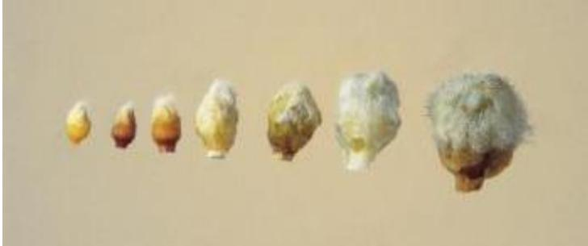
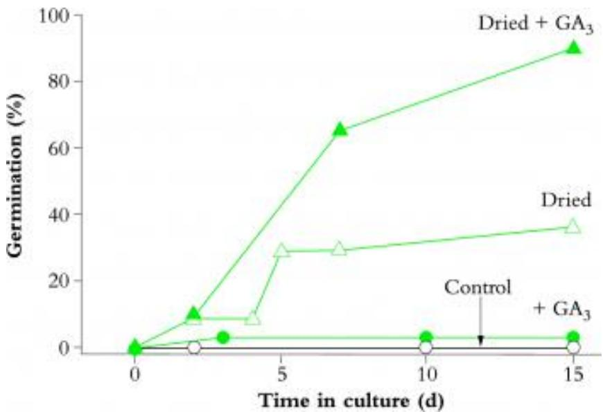
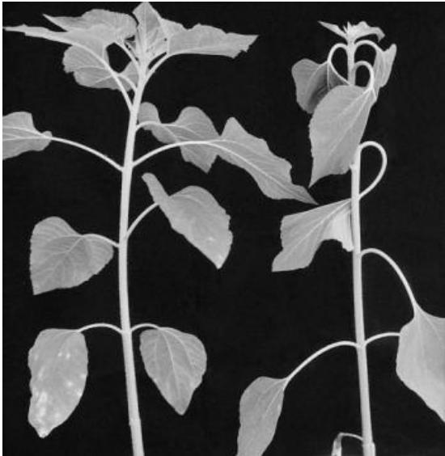
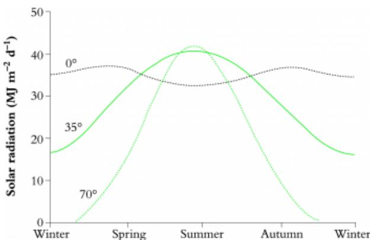
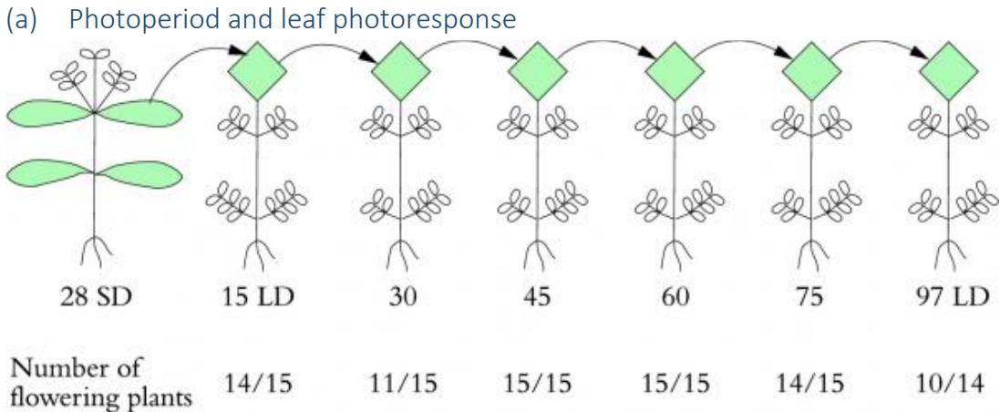

# Chapter 8 - Physical cues for growth and reproduction

From Plants in Action,  $I^{st}$  Edition, Eds BA Atwell, PE Kriedemann, CJN Turnbull

Chapter Authors: JA Plummer (8.1); JH Palmer (8.2); RW King (8.3); CJN Turnbull (8.4)

"Amongst other fundamental properties, the protoplasm of plants is endowed with that of irritability, a certain sensitivity, that is, to the influence of external agents" (Sydney Howard Vines, Lectures on the Psychology of Plants, 1886)

"On the one hand, the farmer is concerned with the living plant; on the other with that complex set of factors we call the environment ... A plant, like an animal, is a sensitive living thing. Plants make responses to their environment [which] ... may be expressed in tons of leaves and stems, in tons of roots, in pounds of seed or grain, in barrels of fruit, or in percent of sugar, or starch, or acid ... First, we must understand something of the structure and functions of the plant. Second we must have a knowledge of the various factors of the environment. And third, we must know the manner in which the plant behaves under a given set of conditions. This is a big order. It is asking much." (Wilfred W. Robbins, Principles of Plant Growth, 1927)

Adaptation of temperate plant, peach, to cropping in the subtropics. This variety, Flordaking, has been bred with reduced dormancy which confers a 'low chill' requirement. This allows the reproductive cycle to proceed at latitudes (29° in this instance) where winters are insufficiently cold to break the deeper dormancy of normal 'high- chill' varieties. Developing flowers were excised from within the protective bud scales over a period from early autumn (March, left) to midwinter (July, right) and show continued slow growth throughout. (Photograph courtesy J.J. Lloyd and C.G.N Turnbull)

# Contents

- [Chapter 8 - Physical cues for growth and reproduction](Chapter_8.md)
  - [Introduction]()
  - [8.1 Latent life: dormancy]()
  - [8.2 Plant and organ orientation]()
  - [8.3 Reproduction]()
  - [8.4 Photoreceptors and light cues]()
  - [Further reading]()

# Introduction

Probably since the beginning of civilisation, humans have observed that plants are seasonal organisms. Whether crop plant or native species, annual or perennial, herbaceous or woody, the most obvious manifestation is in time of flowering. The connection of periodic flowering - and subsequently fruit and seed development - with seasonal climates has also been surmised for centuries, but we now know which environmental factors are largely responsible for regulating time of flowering. In this chapter, we focus on the most critical signals, photoperiod, temperature and water. Other signals enable plants to attune themselves for optimum development at other stages of the life cycle: directional stimuli such as light, gravity and touch, as well as dramatic cues for stopping and starting life, namely fire and drought. Many of these strategies will be highlighted further in Part IV. The chapter concludes with an exploration of how photoreceptors function.

# 8.1 Latent life: dormancy

# 8.1.1 Dormancy: the phenomenon of suspended animation

Most plants enter a state of latent life at least once throughout their life cycle. This is dormancy, concisely defined as the temporary suspension of visible growth of any plant structure containing a meristem' (Lang 1987). It encompasses a wide- spread but remarkable phenomenon and is really a collective term covering a number of processes in different plant organs. This has led to problems with terminology, which Lang resolves into three types of dormancy based on their controlling factors:

1. Endodormancy, often called 'true' dormancy, which is the prevention of growth due to factors within a meristem. Failure of a bud to grow in early winter due to insufficient chilling, even if it is exposed to warm conditions, is an example of endodormancy.  
2. Paradormancy, which is the suspension of growth caused by factors outside the meristem but within the plant. It is typically an influence of one organ over another, and includes an apical bud preventing outgrowth of a lower bud, which relates to apical dominance (see Martin 1987 for review). Dormancy imposed by factors in the seed coat is, strictly speaking, a version of paradormancy, because the embryo germinates readily when excised from the seed.  
3. Ecodormancy, which is the prevention of growth due to environmental conditions such as lack of water or temperature extremes. This is also referred to as quiescence or imposed dormancy (Crabbe 1994).

These definitions are tailored towards woody perennials, but we are also interested in equivalent phenomena in seeds and vegetative storage organs. Indeed there are underlying similarities, for example in endodormancy release induced by chilling. A dormant bud on a perennial contains reduced leaves and floral and/or vegetative meristems, and relies on the rest of the plant for water and nutrients. A storage organ, such as a bulb or tuber, is also a plant propagule containing meristems (Figure 7.17e) and its own reserves of nutrients. Likewise, a seed contains a whole plant — the embryo — and associated storage reserves. Resumption of bud growth leads to shoot emergence through the bud scales, and seed germination results in radicle then shoot emergence through a protective seed coat. These morphological differences may require variations in the physiological control of dormancy.

# Why is dormancy important in agriculture?

Plants are generally adapted to their natural environments but many economically important species are cultivated in other climates. Adaptations are genetically based and may be impossible to switch off, or at least difficult to overcome. Temperate fruit trees, such as peaches, eventually become endodormant even in the tropics. Without chilling or human intervention, they do not resume normal growth and may even die. Generally, though, plants will eventually dispense with dormancy- breaking requirements rather than die, often described as a conversion from an obligate to a facultative state. Although tropical perennials cannot tolerate cold temperate winters, they still exhibit endodormancy phases which alternate with dramatic 'flushing' of new vegetative shoots, often with striking red- coloured leaves, as in Syzygium and mango trees. Dormancy may also prevent or retard seed germination or sprouting of bulbs, thus reducing the number, quality and uniformity of plants in a crop.

# 8.1.2 Seed dormancy

For most plants, seeds are the primary means of reproduction. Dormancy allows seeds to separate from their mother plant and survive dispersal over distance and time before growth recommences. Developing embryos are growing tissues but enter dormancy late in maturation and seeds then dehydrate. This state of suspended animation enhances chances of survival. The torpedo- shaped seed of a mangrove (Rhizophora maritima) is an exception that germinates while still on the mother plant. When they fall, seed penetrate securely into soft mud flats. This adaptation aids speed of establishment in the unstable tidal zone.

Plant breeders often select seed for uniform, rapid germination but these characteristics are rare in nature. If all seed from a species or population germinated synchronously but was subsequently destroyed, say, by frost, the genome would be lost. Instead, we find that germination is usually staggered over a season or over years. Sometimes it is possible to harvest seeds or embryos before dormancy is induced and thereby germinate otherwise difficult species.

  
Figure 8.1 Long-lived seeds of species typical of Australian sclerophyll forests. (a) Eucalyptus erythrocorys radicle emerging from capsule; (b) Acacia coriaceae with fleshy aril still attached. (Photographs courtesy P.T. Austin and J.A. Plummer)

There are two main reasons why a seed does not germinate: it may be dead (not viable) or dormant (Mott and Groves 1981; Langkamp 1987). Vital stains can confirm viability of embryos (Bewley and Black 1982). Embryos may never develop due to post- zygotic incompatibility (Section 7.2.4), may abort during development or may die after seed dispersal. Endodormant or paradormant seed may be viable, but may not germinate even when supplied with water and  $\mathrm{O_2}$  at an appropriate temperature.

Seed longevity often relates to a species' natural environment. In climates favourable for germination, many species have seeds which remain viable for only a few days, for example the Queensland umbrella tree (Schefflera actinophylla), which originates in subtropical rainforests, or a few months, for example water gum (Tristania laurina) and myrtle beech (Nothofagus cunninghamii), which come from cooler rainforests. In contrast, seed from sclerophyllous forests, such as Eucalyptus and Acacia (Figure 8.1), remain viable for many years.

There are two categories of seed, recalcitrant and orthodox, and appropriate storage can vastly extend longevity of both. Many tropical and subtropical species, such as Citrus, mango and rambutan, have recalcitrant seeds; these are not desiccation tolerant and survive best if stored at high water content  $(30\%)$  and warm temperature (usually  $>15^{\circ}C$ ). Orthodox seeds, such as Eucalyptus and Brassica, are usually stored below  $10\%$  water content and below  $10^{\circ}C$ . Between these extremes are many intermediates, and optimum conditions for several important crop species have been determined by empirical experiment. For example, wheat is best stored at  $14.5\%$  seed water content, peas at  $14.0\%$  and clover at  $11.0\%$ .

Cells of some testas have hard, thick walls and a waxy layer which prevents imbibition (uptake of water) and sometimes even gas exchange. Dormancy persists in the absence of water or  $\mathrm{O_2}$  essential for germination. Seed- coat- imposed dormancy is a special case closely related to paradormancy of perennials. Seed coats resist embryo expansion but plant tissues

can exert substantial turgor pressure, so mechanical resistance is not a common form of dormancy. Roses have a very hard seed coat with several sclerified (stony) cell layers and great pressure is required to break them. Hard seeds are found in many families and are particularly common in legumes such as Fabaceae (e.g. clover (Trifolium) and lucerne (Medicago)), Mimosaceae (e.g. Acacia) and Caesalpiniaceae (e.g. Cassia). The seed coat exerts force on the strophiole, a plug- like valve structure near the hilum with elongated malphigian cells that separate to permit water entry. These seed coats need to be weakened physically or chemically to permit imbibition. This may occur naturally as a result of temperature fluctuations, abrasion and microbial or insect damage. Artificial scarification is often achieved by scratching, nicking or by rotating seeds in barrels containing an abrasive. Alternatively, seed can be chemically scarified with concentrated  $\mathrm{H}_2\mathrm{SO}_4$ , which mimics the effect of acid in the stomach of animals. In many parts of Australia spontaneous fire is common and destroys most living tissue but enables germination of many hard- seeded native species (Table 8.1; Bell et al. 1993). In these plants, brief seed boiling is commonly substituted to effect break of dormancy. Heat from fires will damage the testa, but smoke, perhaps via ethylene and/or sulphur compounds (Dixon et al. 1995), is also effective in overcoming other dormancy mechanisms. In serotinous plants, such as Hakea, Banksia and Eucalyptus, seeds are stored on the mother plant until fires open the woody fruits, dispersing the seeds into the nutrient- rich ash bed when competition for light from other plants has also been reduced (Chapter 19).

Table 8.1 Fire stimulat germination via-sclerified mechanisms; (1) damage to the testa - equivalent to scarification in boiling; (2) reduction of germination inhibitors through heat and leaching; (3) small exudates (not all species have evolved with fire); (4) scarification required - but heat from fire kills seed  

<table><tr><td rowspan="2">Species</td><td rowspan="2">Type</td><td rowspan="2">Fire response</td><td rowspan="2">Control</td><td rowspan="2">Scarification</td><td>Boiling 30 s</td><td rowspan="2">Boiling 60 s</td><td rowspan="2">Smoke</td></tr><tr><td>Germination (%)</td></tr><tr><td>Asacia nervosa</td><td>1</td><td>Yes</td><td>16°</td><td>66</td><td>72</td><td>70</td><td>—</td></tr><tr><td>Asacia lusiorapa</td><td>2</td><td>Yes</td><td>20</td><td>30</td><td>82</td><td>82</td><td>—</td></tr><tr><td>Daviesia pretisii</td><td>1</td><td>Yes</td><td>0</td><td>55</td><td>58</td><td>18</td><td>—</td></tr><tr><td>Gompholobium knighthumum</td><td>1</td><td>Yes</td><td>6</td><td>51</td><td>61</td><td>86</td><td>6</td></tr><tr><td>Conostylis setosa</td><td>1,3</td><td>Yes</td><td>1</td><td>0</td><td>53</td><td>48</td><td>—</td></tr><tr><td>Conospermum tripliciflorum</td><td>3</td><td>Yes</td><td>26</td><td></td><td></td><td></td><td>88</td></tr><tr><td>Angiozanthus mangoli</td><td>3</td><td>Yes</td><td>3</td><td>4</td><td>6</td><td>32</td><td>—</td></tr><tr><td>Lechanaulia biloba</td><td>3</td><td>Yes</td><td>1</td><td></td><td></td><td>0</td><td>40</td></tr><tr><td>Thysanotus multiflorus</td><td>3</td><td>Yes</td><td>0</td><td>0</td><td></td><td>0</td><td>31</td></tr><tr><td>Asacia cyclopa</td><td>4</td><td>No</td><td>12</td><td>72</td><td>—</td><td>20</td><td>—</td></tr></table>

Legume;  $b = \frac{1}{2}$  germination (Based on Bell et al. 1993 and Dixon et al. 1995)

Germination inhibitors can be present in the embryo, endosperm, testa or the surrounding fruit tissues. Inhibitors present in seed of Iris, freshly harvested hazelnut (Corylus avellana) and desert ephemerals, and in fleshy fruit such as tomato, Persoonia and Lomandra, must be removed or in- activated before germination can proceed; this often happens inside an animal gut or by rain leaching.

Table 8.2 Seeds of lettuce cultivar Grand Rapids were exposed to brief periods of alternating red  $(R = 660~nm)$  and far-red  $(FR = 720nm)$  light. The response depends on the last exposure and is typical of photoreversible phytochrome responses  

<table><tr><td>Treatment</td><td>Germination (%)</td></tr><tr><td>Darkness</td><td>8.5</td></tr><tr><td>R</td><td>98</td></tr><tr><td>R→FR</td><td>54</td></tr><tr><td>R→FR→R</td><td>100</td></tr><tr><td>R→FR→R→FR</td><td>43</td></tr><tr><td>R→FR→R→FR→R</td><td>99</td></tr></table>

(From Borthwick et al.1954)

Many species germinate in response to light, but usually only become light sensitive after imbibition. Germination of Grand Rapids lettuce (Lactuca sativa), the weed species Bidens pilosa, some Australian daisies and many other small- seeded species is promoted by red light (R; 660nm) but inhibited by subsequent exposure to far- red light (FR; 730nm) — a classic photoreversible phytochrome response (Table 8.2 and see Section 8.4). Sunlight has a high R:FR ratio which signals to a seed that it is located in an unshaded position. However, chlorophyll in leaves filters out red light so that under a canopy there is relatively more far- red light; that is, a low R:FR ratio prevents germination where light quantity is likely to be insufficient for most species. These seeds use light spectral composition as an indicator of likely total photosynthetic radiation. This is an example of secondary dormancy because it is induced only after seed dispersal (seed that is dormant when shed from the mother plant has primary dormancy). Seeds may lie dormant for months or years, germinating only when a tree falls in a forest or after a disturbance such as ploughing a field. In the latter case, phytochrome is being used mainly to sense light quantity. Deep burial in soil prevents germination of small seeds with inadequate resources to grow to the surface. In contrast, germination of Spinifex hirsutus, which grows on sand dunes, is inhibited by light. Dark conditions exist deeper in the dune where there is likely to be more moisture, nutrients and stable sand.

Table 8.3 In species which usually require periods in dry storage, alternative treatments can be used to break dormancy  

<table><tr><td>Species</td><td>Common name</td><td>Dry storage period (months)</td><td>Alternative treatment</td></tr><tr><td>Triticum aestivum</td><td>Wheat</td><td>3–7</td><td>Stratification</td></tr><tr><td>Hordeum vulgare</td><td>Barley</td><td>0.3–0</td><td>Stratification, GA3</td></tr><tr><td>Avena fatua</td><td>Wild oats</td><td>30</td><td>Stratification, GA3, ethylene</td></tr><tr><td>Oenothera odorata</td><td>Evening primrose</td><td>7</td><td>KNO3</td></tr><tr><td>Impatiens balsamina</td><td>Balsam</td><td>4–6</td><td>Stratification</td></tr><tr><td>Rumex crispus</td><td>Curled dock</td><td>60</td><td>Light, stratification, alternating temperatures</td></tr><tr><td>Lactuca sativa</td><td>Lettuce cv.</td><td>3–9</td><td>Light, GA3, cytokinin stratification</td></tr><tr><td></td><td>Grand Rapids</td><td></td><td></td></tr></table>

Based on Bewley and Black 1994)

Many seeds will not germinate unless water content has been reduced by dry storage. This is a common adaptation in desert annuals, which experience a seasonal rhythm of water

availability. In cereals such as barley and wheat, alternative treatments can be substituted (Table 8.3). Some seeds, for example Ranunculus and orchids, contain rudimentary embryos that must develop further before germination can occur. Symbiosis with a fungus supports embryo growth of many orchids, and inoculation is incorporated into in vitro propagation methods.

Stratification, or pre- chilling, the exposure of seeds to cool moist conditions, is in many ways similar to chilling of buds (see below). The optimum temperature is usually about  $5^{\circ}\mathrm{C}$  for temperate species such as peach (Prunus persica) and apple (Malus sylvestris). Embryos removed from freshly harvested fruit can germinate but growth is slow and abnormal. Normal growth is restored by chilling or exposure to long photo- periods, conditions which seeds in nature would eventually experience. In Australia and New Zealand, many alpine species require stratification. Eucalyptus pauciflora seeds collected from high altitudes respond to chilling but those of coastal populations do not, suggesting that natural selection has occurred, creating two ecotypes. For tropical species, chilling may operate at a higher temperature range, usually above  $10^{\circ}\mathrm{C}$ .

Single or multiple dormancy mechanisms can ensure germination at an appropriate time, depending on the species (Table 8.3). Despite all the complex entrainment to environmental cues, many seeds will eventually germinate even without their normal signals, a failsafe mechanism ensuring some attempt at establishment before the seed's longevity expires.

# CASE STUDY 8.1 Dormancy in wheat grains: nature and practical application

D. 
J. Mares

Ancestral wild wheats, the progenitors of modern bread and pasta wheats, were endemic to the eastern Mediterranean and possessed a number of mechanisms, including grain dormancy, which were requisite to their survival in that environment. Grain which ripened before the long, hot summer remained dormant, avoiding germination in response to chance rain, until the return of cooler, more rainy periods later in the year. Wheat is now cultivated worldwide in diverse environments, many of which have a high risk of rain and cooler weather during the harvest period. Unfortunately, during domestication and genetic improvement many of the mechanisms which reduced untimely germination have been inadvertently discarded or found to be incompatible with the requirements of large- scale commercial farming. Indeed, the relationship of grain dormancy to consistent grain quality has not always been taken advantage of by breeders.

In the absence of protective mechanisms, rain falling on ripe wheat crops may induce preharvest germination of grain (Figure 1), rendering it unsuitable for commercial processing. Sprouted grain in Australia has resulted in losses to growers of hundreds of millions of dollars. Breeders are there- fore looking to reintroduce factors such as dormancy into new wheat cultivars to provide insurance' against preharvest rain. After first searching for dormancy characters in older cultivars held in the world wheat collections, the next hurdle is to transfer dormancy to elite cultivars which already possess all the other required agronomic, quality and disease- resistance characters.

  
Figure 1 Lack of dormancy can lead to preharvest sprouting in wheat. Ripe spikes were subjected to a wetting treatment – an overhead spray for 2h – then maintained at high humidity and  $20^{\circ}\mathrm{C}$  for 5 d. The spike on the left is from a susceptible non-dormant cultivar which sprouted readily compared with three other more dormant, sprouting resistant cultivars. (Photograph courtesy D.J Mares)

There is a well- known association between red seed coat and dormancy, but white- grained genotypes with significant levels of dormancy have also been identified (Mares 1987). To date, the dormancy from red wheats has not been successfully transferred, in its entirety, into a white- grained background. Red- grained wheat cultivars dominate world production except

in Australia where only white- grained genotypes are cultivated. Dormancy in both grain types is a transient character which develops during desiccation of the maturing grain, then decays with time after ripeness. Dormancy appears to be deepest if the grain has ripened in a cool environment but can be eroded by rain in the 20 day period leading up to harvest ripeness (Mares 1993). To rank genotypes for potential depth of dormancy, all lines need to be grown in the same environment and tested at the same stage of maturity using standard wetting treatments or germination tests.

Dormancy in wheat grains is dependent on the presence of an intact seed coat. Damage to this structure through invasion by fungal pathogens, disruption during swelling and shrinkage caused by wetting/drying cycles or through physical abrasion during threshing results in a loss of dormancy. Segregation patterns obtained in inheritance studies are consistent with control by two independent, recessive factors and indicate that dormancy is only recovered when both factors are present simultaneously. With simple Mendelian segregation, dormancy would have been expected in the  $\mathrm{F}_2$  generation. However, dormant segregants were not revealed until the  $\mathrm{F}_3$ , one generation later than expected. From this, we can infer that at least one of the factors is probably expressed in the seed coat which lags one generation behind the embryo.

# References

Mares, D.J. (1987). 'Preharvest sprouting tolerance in white grained wheat', in Fourth International Symposium on Preharvest Sprouting in Cereals, ed. D.J. Mares, 66- 74, Westview Press: Boulder, Colorado.

Mares, D.J. (1993). 'Preharvest sprouting in wheat. 1. Influence of cultivar, rainfall and temperature during grain ripening', Australian Journal of Agricultural Research, 44, 1249- 1272.

# 8.1.3 Bud dormancy

  
Figure 8.2 Synchronised anthesis of coffee (Coffea arabica), 10 d after restoring water supply to droughted trees. Endodormancy in coffee flower buds is broken by water stress, then buds remain in an ecodormant state until rain permits resumption of growth. This adaptation allows fruit development to coincide with periods of water availability. In cultivation, a drying-irrigation cycle can synchronise flowering which later leads to a shorter harvesting period. (Photograph courtesy C.G.N. Turnbull)

Much of our knowledge of bud dormancy comes from temperate deciduous trees, especially fruit crops such as apples and stonefruit. Trees detect environmental signals, mainly shortening daylength and cold, which herald winter and trigger reductions in growth rate, onset of endodormancy, development of bud scales and leaf fall. As buds enter endodormancy, warm temperatures  $(>15^{\circ}\mathrm{C})$  no longer promote growth. Several weeks or months of chilling  $(0 - 12^{\circ}\mathrm{C})$  are required to overcome endodormancy. The plant then enters ecodormancy, when it will respond to warm temperatures with bud break. Note that break of endodormancy can therefore often occur weeks prior to growth resumption. In some tropical species such as coffee, water stress is an alter- native cue for breaking flower bud endodormancy (Drinnan and Menzel 1994). Buds then exist in an ecodormant state ready to respond by rapid floral growth as soon as the first rains fall at the end of the dry season (Figure 8.2).

Several models have been proposed to describe dormancy and to attempt to predict responses to different growing con- ditions. One problem is a lack of measurable indicators of endodormancy other than an inability to grow. Researchers typically quantify 'depth' of dormancy by the duration of chilling required to break dormancy, and then the ability of warm temperatures to 'force' bud growth on cut shoots, that is, after removing possible causes of ecodormancy and paradormancy. Entry into and exit from bud dormancy are often gradual transitions rather than abrupt events. Some researchers have represented these phases as sine wave oscillations, with measurable reference points (e.g. peak growth rate in summer and maximum dormancy in midwinter) which enable comparison of data from different sites (Fuchigami and Nee 1987).

# Temperate crops in the tropics

Table 8.4 Chilling requirements, in hours below  $7^{\circ}C$ , required to cause break of bud dormancy in some deciduous fruit crops.

<table><tr><td>Fruit crop</td><td>Chill hours</td></tr><tr><td>Grape</td><td>None</td></tr><tr><td>Fig</td><td>Few</td></tr><tr><td>Almond</td><td>0–800</td></tr><tr><td>Kiwifruit</td><td>450–700</td></tr><tr><td>Peach and nectarine</td><td>50–1250</td></tr><tr><td>Apple and pear</td><td>200–3000</td></tr><tr><td>Glance</td><td>800–1700</td></tr></table>

(Adapted from Saure 1985)

Temperate fruit crops are increasingly being grown at lower latitudes  $(15 - 30^{\circ})$  than where they originate  $(30 - 50^{\circ})$ . If endodormancy is still being overcome by chilling, then how little chilling is enough? A good model can allow estimation of whether a new location is suitable for production of particular fruit varieties prior to expensive orchard planting. For example, peach and nectarine varieties have been bred with low and high chilling requirements, suited to subtropical and temperate climates respectively. Early models resulted in rankings based on number of chill hours (usually below  $7.2^{\circ}C$ ). Chilling required can vary from less than 50 h below  $7.2^{\circ}C$  for some subtropical 'low- chill' peach cultivars, up to  $3000\mathrm{~h}$  for some cultivars of pear (Table 8.4). A modified version, called the Utah model, equates a chill unit to  $1\mathrm{~h}$  at  $6^{\circ}C$ ; higher and lower temperatures between  $0 - 15.9^{\circ}C$  have proportional positive effects, but temperatures above  $16^{\circ}C$  are inhibitory (Richardson et al. 1974). This temperate model is less accurate in warmer areas where the Erez et al. (1988) model, as modified by Batten and Firth (1987), often provides a more reliable estimate of date of budburst (Table 8.5). According to this model, effectiveness of chilling is enhanced by day temperatures of  $15^{\circ}C$  or less but negated by temperatures above  $18^{\circ}C$ . None of these models quantify the growth- permitting periods of warm temperature required for subsequent bud break, so an additional measure quantifies thermal units: the Growing Degree Hour where  $1\mathrm{~h}$  is allocated for each hour and degree above  $4.5^{\circ}C$  (Figure 8.3).

Table 8.5Me d  t  t  t  t  t  t  t  t  t  t  t  t  t  t  t  t  t  t  t  t  t  t  t  t  t  t  t  t  t  t  t  t  t  t  t  t  t  t  t  t  t  t  t  t  t  t  t  t  t  t  .  

<table><tr><td rowspan="2">Location</td><td rowspan="2">Year</td><td colspan="5">Date of dormancy termination</td></tr><tr><td>Predicted 
(Hours &amp;lt; 7.2°C)</td><td>Predicted 
(Utah)</td><td>Predicted 
(Batten &amp;amp; Firth)</td><td>Error (days) 
(Batten &amp;amp; Firth)</td><td></td></tr><tr><td>Bangalow</td><td>1982</td><td>30 Jun</td><td>19 Jun</td><td>20 Jun</td><td>+10</td><td></td></tr><tr><td>Bangalow</td><td>1983</td><td>23 Jul</td><td>14 Jun</td><td>27 Jul</td><td>+4</td><td></td></tr><tr><td>Bangalow</td><td>1984</td><td>4 Jul</td><td>7 Jul</td><td>n/a</td><td>-5</td><td></td></tr><tr><td>Tockombil</td><td>1984</td><td>3 Aug</td><td>n/a</td><td>11 Jul</td><td>+5</td><td></td></tr><tr><td>Tockombil</td><td>1985</td><td>14 Jul</td><td>1 Aug</td><td>28 Jul</td><td>-4</td><td></td></tr><tr><td>Rosebank</td><td>1985</td><td>18 Jul</td><td>16 Jul</td><td>26 Jul</td><td>-5</td><td></td></tr></table>

(Based on Batten and Firth 1987)

  
Figure 8.3 In many species, progress through bud dormancy then resumption of growth depends on temperature. Two factors are involved: first, the satisfaction of chilling requirements depends on suitable periods at low temperature (measured as chill units), but can be negated by temperatures about  $15^{\circ}\mathrm{C}$ ; second, temperatures above  $4.5^{\circ}\mathrm{C}$  have a growth-promoting effect, measured as thermal units. (Based on Seeley 1996)

What are the consequences of insufficient chilling, and are there alternative treatments? Symptoms of inadequate cold periods include delayed and weak leaf growth, delayed and protracted flowering, poor fruit development and irregular ripening. Potassium nitrate  $(\mathrm{KNO}_3)$ , thiourea and especially hydrogen cyanamide are simple chemicals that are effective substitutes for stimulating uniform budburst. The mechanisms by which these compounds work are not known, but growth regulators such as gibberellins, cytokinins and cytokinin analogues, in particular thiadiazuron, can also cause similar responses.

Apples are grown in the tropical and subtropical areas of Indonesia, peaches are grown in Venezuela and table grapes are grown in Thailand, Venezuela and southern India where no chilling occurs (Subhadrabandhu and Chapman 1990). Growth of buds is stimulated by chemical (sodium chlorate, copper sulphate or urea) or manual defoliation or pruning immediately after harvest thus breaking endodormancy before it enters its 'deep' midwinter phase. Cyanamide treatment has enabled out of season production of table grapes in tropical Queensland. Irrigation then promotes uniform budburst and cropping under otherwise dry conditions. At least two harvests are possible each year and cycles can be staggered, giving almost continuous fruit supply.

# 8.1.4 Physiological control of dormancy

# (a) Hormones as regulators?

Currently we know more about the environmental factors that influence dormancy than about the physiological mechanisms of dormancy. Here we attempt to draw together common features of the diverse types of dormancy in buds and seeds, in particular examining whether inability to grow relates to hormonal factors (Dennis 1994).

Links between genome and physiological processes are illustrated by single- gene seed dormancy mutants, which are either abscisic acid (ABA) deficient (weak dormancy) or

gibberellin deficient (extra- deep dormancy) (Karssen and Groot 1987). Induction of seed dormancy is clearly linked to ABA, and gibberellins are required for germination, so in a gross sense these hormones need to be present for normal processes to proceed. Applied hormone experiments lead to similar conclusions: although ABA does not usually prevent break of dormancy, it can inhibit germination and bud growth, often opposing the effects of gibberellins, cytokinins or ethylene. Seeds with various dormancy mechanisms may respond to one or more plant growth regulator (Table 8.3), but there are many reports of germination failure or abnormal seedlings. Light requirement of lettuce and dry storage requirements of barley are overcome by applied gibberellins, but antagonised by applied ABA. Likewise, budburst in peach and apple is promoted by a mix of gibberellin and cytokinin, but inhibited by applied ABA. Cytokinins promote some germination in lettuce but are less effective than gibberellins in most species. Ethylene stimulates germination in celery (Apium graveolens), peanut (Arachis hypogea) and cocklebur (Xanthium strumarium). One conclusion is that a complex balance of inhibitors and promoters regulates entry to and exit from dormancy. Put another way, there are at least two control points and meristem growth may be prevented by either high concentrations of inhibitors or insufficient promoters.

  
Figure 8.4 Responsiveness of sunflower embryos to applied gibberellin (GA) is seen only when dormancy has been partially released. Embryos were cultured on  $5\mu \mathrm{M}$  gibberellic acid (solid symbols) or control medium (open symbols), before (circles) or after (triangles) a 3 d drying treatment which partially broke the endodormancy. (Based on Le Page-Degivry et al. 1996)

  
Figure 8.5 Vivipary in wild-type tomato (Sit/Sit, i.e. ABA-synthesising) and ABA-deficient tomato (sit/sit). No seeds germinated within ripe tomato fruits derived from self-pollinated Sit/Sit plants. Juice of ripe Sit/Sit fruits contains  $0.84\mu \mathrm{M}$  ABA and each seed contains 7 pmol ABA. In contrast, vivipary occurred in most sit/sit tomato fruits which have only  $0.08\mu \mathrm{M}$  ABA and 0.8 pmol ABA per seed. Self-pollinated Sit/sit plants would contain seed of both phenotypes but the mother plants possess the dominant Sit, allowing ANA synthesis. A quarter of the seed (those carrying Sit/Sit and Sit/sit) would not be. (Based on Groot and Karssen 1992)

However, data on endogenous plant hormone concentrations do not always support the notion of control by changes in levels of active substances. Quantities of applied plant growth regulators required to cause a response usually vastly exceed normal endogenous content, for example the amount of applied gibberellin required to stimulate barley germination. Rightly, this has led to re- examination of the control mechanisms. Trewavas (1982) argued that tissue 'sensitivity' to hormones, that is, capacity to respond, changes with development and environmental stimuli, and that this sensitivity is a major controlling factor. Indeed, phases of sensitivity and insensitivity to applied gibberellins and ABA appear to operate during development, dehydration and dry storage of sunflower seed (Figure 8.4). Other supporting evidence comes from gibberellin- and ABA- insensitive mutants which fail to respond to these hormones regardless of endogenous or applied concentration. Alterations in hormone levels due to mutation are generally much more severe than changes that occur in wild- type plants as a consequence of environmental factors. ABA- deficient tomato (Figure 8.5) and Arabidopsis mutants fail to enter normal dormancy because of a lack of increase in embryo ABA. Surrounding seed tissues absorb most applied ABA without translocating it to the embryo, which may also explain failure of seed dormancy induction with applied ABA.

So what is the role of ABA in induction of seed dormancy? In late embryogenesis, ABA concentration increases as water potential decreases. Elsewhere in the plant, responses to altered water potential are also mediated by ABA, typically those associated with water stress (see Section 9.3). ABA alters transcription of a suite of genes, resulting in cessation of synthesis of reserve and other proteins, and modified transcription of some Lea genes (late embryogenesis abundant; see Chapter 10). In cotton, one class of Lea mRNAs increases coincidentally with ABA but another class responds only to drying. Lea genes code for a class of proteins found in many species including cotton, pea and cereals. These proteins are strongly hydrophilic, highly stable and are able to maintain a locally water rich environment at the subcellular level. This may be critical in desiccation tolerance associated with the dormant state.

There is a tenuous association of endogenous inhibitors with release (as distinct from induction) of bud or seed dormancy. Early research suggested a close correlation of progress of dormancy with inhibitors including phenolics such as naringenin in peach and phloridzin in apple, and ABA in several fruit crops. However, endogenous ABA declines in chilled apple buds which burst to produce new shoots, but also in buds never exposed to chilling temperatures which remain dormant. In both chilled and non- chilled apple seeds, ABA levels do not change more than two- fold but only chilled seeds germinate (Figure 8.6). ABA content is similar in dormant and non- dormant wheat but ABA- responsive genes are more abundantly expressed in dormant wheat seeds, implying existence of alternative regulatory factors and perhaps non- transcriptional control of the relevant genes. Embryo endodormancy may therefore be maintained by ABA in only a few species, such as sunflower (Helianthus annuus), where treatment of dormant excised embryos with fluridone, an inhibitor of ABA synthesis, results in growth.

  
Figure 8.6 Endogenous gibberellin and ABA levels during breaking of dormancy in apple seeds exposed to cold  $(4 - 5^{\circ}\mathrm{C})$  or warm  $(20 - 25^{\circ}\mathrm{C})$  temperatures. (a) Germination is dependent on cold treatment. (b) Embryoabscisic acid levels do not decline during cold treatment. (b) Embryo abscisic acid levels do not decline during cold treatment or during germination. (c) Seed gibberellin  $(\mathrm{GA}_{4 + 7})$  levels increase transiently as seed start to germinate. (Based on Subbaiah and Powell 1992 and Halinska and Lewark 1987; reproduced with permission of Kluwer Academic Publishers)

  
Figure 8.7 Bud dormancy in Salix pentandra is broken by long days, and results in a transient increase in active gibberellin (GA1) content of shoot tissue within one day of transfer from short days to long days  $(\bullet)$ . Arrow indicates day of transfer. Plants in continuous long days  $(\pmb {\Delta})$  or short days (O) show only slow changes in gibberellin levels. (Based on Olsen et al. 1997)

Can we instead assign control of dormancy break to promotive compounds? Gibberellins are probably the best candidates, based on widespread responses to applications of this class of hormone. In Salix pentandra, where short days induce dormancy and long days release it, a transient increase in active shoot gibberellin (GA) content is detectable within one day of transferring from short days to long days (Figure 8.7). In hazelnut, endogenous gibberellins are not modified by chilling but  $\mathrm{GA}_1$  content rises 40- fold after transfer to warm conditions suitable for germination, suggesting a role in growth promotion as distinct from dormancy release. Like- wise, in wild oats (Avena fatua), 'after ripening' dry storage releases seed dormancy but has no effect on endogenous gibberellin levels until imbibition, when gibberellin bio- synthesis is substantially enhanced. Light requirements can often be replaced by applied gibberellins, and gibberellin- biosynthesis inhibitors can prevent light- stimulated germination. Endogenous gibberellins increase with chilling and dry storage in Arabidopsis, and with light exposure in lettuce. Gibberellin- deficient Arabidopsis mutants do not germinate unless gibberellin is supplied, and this response is independent of ABA content. However, changes in endogenous gibberellins in wild- type Arabidopsis are less conclusive, suggesting that altered gibberellin sensitivity may contribute to normal germination control. We are just beginning to understand tissue sensitivity and hormone signal transduction pathways (Section 9.3.1). To conclude, there are some species where there is good evidence for ABA- induced dormancy and gibberellin promotion of meristematic activity but these are not necessarily universal mechanisms. Hormone turnover, conjugation, compartmentation, receptors and signal transduction systems all represent potential control points, and all merit greater attention.

# (b) Alternative indicators of dormancy

The hormonal models described above have limitations and some researchers contend that they represent oversimplifications of a complex set of interactive cyclic processes including organogenesis, internode elongation and bud leaf expansion (Crabbe 1994). Biochemical markers such as nucleic acid metabolism and membrane permeability, rather than morphological or physiological characteristics, can also indicate relative depth of dormancy between tissues and organs, and between meristems and submeristems. Adenylic nucleotides are required to maintain basal metabolic activity and even dormant tissues supplied with

adenosine increase their adenylic nucleotide (ATP) content. During dormancy break in buds of Helianthus tuberosus (Jerusalem artichoke) tubers, levels of both adenylic and non- adenylic nucleotides (NATPs = sum of guanylic (GTP), cytidylic (CTP) and uridylic (UTP) nucleotides) rise as tissues convert ATPs to NATPs, which are essential to sustain growth (Gendraud 1977).

In stems, trunks and developing tubers bearing dormant buds, storage parenchyma acts as a strong sink during metabolite accumulation while nutrient movement into bud meristems may be impeded. Breaking dormancy appears to remove this block and is part of the changes that permit resumption of growth. Water status also influences dormancy. Dormant seeds and sometimes buds have lowered water content which limits metabolism and often assists survival (Vertucci 1989; Faust et al. 1995). Metabolic activities for growth require free water (bulk cellular water) but cannot occur in the bound water associated with macromolecular surfaces. Water content therefore determines the possible types of reactions: at low seed water content (0–8%) only catabolic and non- enzymatic activity occurs, but  $>25\%$  water content is required for integrated processes such as mito- chondrial electron transport and protein synthesis. Water content also determines the ability of seeds to perceive and respond to environmental cues. Apple seeds become sensitive to chilling temperatures only if hydrated to  $>8\%$  water content, and many seeds such as the weedy coloniser species Bidens pilosa acquire light sensitivity only after imbibition.

Water content in bud tissue is generally higher and varies less but may still have a regulatory function. The state of water has been visualised in vegetative buds by using nuclear magnetic resonance imaging. Free and bound water content correlate strongly with bud dormancy release and chilling in low- and high- chill cultivars of apple, Anna (400–700 chill units, typical of subtropical regions) and Northern Spy (2600–3600 chill units, typical of the temperate zone). Very little free water (about  $30\%$  ) is detectable in bud meristems at the beginning of endodormancy, but this increases to  $70–80\%$  after 400h at  $4^{\circ}\mathrm{C}$  in Anna and 3000h in Northern Spy. Seed germination also requires free water, with metabolic activity suppressed in seeds having a water content below  $30\%$ . High osmotic potential of tomato fruit tissues may be partly responsible for seed dormancy by keeping seed water content low during late stages of development. With the exception of hard- coated species, most dormant seeds hydrate easily but this does not necessarily lead to immediate germination.

# (c) Conclusion

Dormancy remains an intriguing but complex phenomenon. Clearly, plants are well attuned to making use of environ- mental cues. The ability to enter a period of latent life is remarkable in itself, all the more because plants in effect an- - ti- cipate adverse conditions before their onset, and thus dormancy can be established in advance. However, there is no single hypothesis to account for induction, maintenance and breaking of dormancy which is consistent across all species. Interactions of many metabolic and cellular processes with many genes are probably linked to hormonal signals. We need to appreciate more that hormonal control is intrinsically complex, and directly and indirectly influences genome expression, while mediating some environmental cues. Dormancy is a prime example of genotype  $\times$  environment interaction. Plants use external signals to time entry into a 'shutdown mode' (endodormancy, paradormancy), then transition to a 'standby mode' (ecodormancy), but have internal controls to prevent inappropriate exit, instead foreshadowing future favourable conditions. Continuing studies with single- gene mutants and transgenic plants (Chapter 10) should unlock some of dormancy's secrets.

# 8.2 Plant and organ orientation

Vascular plants orient themselves in space to optimise shoot exposure to radiant energy and  $\mathrm{CO_2}$  in the atmosphere, and to maximise root access to water and nutrients in the soil. To achieve this, there is a range of directional control systems, which change as a plant proceeds through its life cycle. Regardless of how a seed falls to the ground, on germination a seedling root grows downwards and the shoot grows upwards. What controls these opposite directions of growth?

First, seedling shoots are very sensitive to low- intensity light, curving strongly towards any directional light which may indicate a break in the leaf canopy that the shoot can utilise. In mature plants, leaf orientation can follow the sun during the day to maximise light capture, but if midday radiant energy becomes excessive the leaf blade may instead orient at right angles to the sun's rays. Flower buds are usually bent downwards, but on opening the stem straightens and holds the flower upright to maximise exposure to insects and other pollinating agents.

Second, gravity is an all- pervasive and constant orienting signal. However, roots and shoots generally show opposite responses to gravity, reflecting the intrinsic polarity in all higher plants. One half, the root system, is adapted for life in dense dark soil, while the other half, the shoot system, has evolved to exist in the fragile atmosphere, and harvests sunlight for photosynthesis. Conforming with this dichotomy, main roots exhibit a positive directional response to gravity, whereas shoots generally show a negative reaction.

Table 8.6 Characteristics of four types of plant tropism. Positive means growing towards a directional stimulus, and negative means growing away. Plagiotropism is growth at an angle to gravity  

<table><tr><td>Tropism</td><td>Stimulus</td><td>Response</td><td>Examples</td></tr><tr><td rowspan="9">Gravitropism</td><td rowspan="9">Gravity</td><td>Positive</td><td>Primary roots</td></tr><tr><td rowspan="3">Negative</td><td>Shoots</td></tr><tr><td>Leaves</td></tr><tr><td>Coleoptiles</td></tr><tr><td rowspan="5">Plagiotropism</td><td>Axillary branches</td></tr><tr><td>Lateral roots</td></tr><tr><td>Some leaves</td></tr><tr><td>Runners</td></tr><tr><td>Rhizomes</td></tr><tr><td rowspan="6">Phototropism</td><td rowspan="6">Light</td><td rowspan="2">Positive</td><td>Shoots</td></tr><tr><td>Leaves</td></tr><tr><td rowspan="4">Negative</td><td>Coleoptiles</td></tr><tr><td>Some types of shoot</td></tr><tr><td>Some types of root</td></tr><tr><td>Tendrils</td></tr><tr><td>Heliotropism</td><td>Light</td><td>Following the sun</td><td>Leaves</td></tr><tr><td rowspan="2">Thigmotropism</td><td rowspan="2">Touch</td><td rowspan="2">Positive</td><td>Tendrils of climbing plants</td></tr><tr><td>Stems of vines</td></tr></table>

Directional growth responses to directional stimuli are called tropisms. There are three main kinds:

1. Gravitropism — gravity sensing

2. Thigmotropism — touch sensing

# 3. Phototropism - light sensing

3. Phototropism — light sensingThe characteristics of the major tropisms are shown in Table 8.6. All these responses are due to different growth rates on two sides of a responding organ, resulting in curvature either towards or away from the stimulus. The positioning, or orientation in space, of many plant organs can be due to several tropisms and nastic (non-directional) responses acting together.

# 8.2.1 Gravitropism

  
Figure 8.8 Time-lapse photographs showing gravitropism responses in horizontally placed roots and shoots. (a) Negative shoot gravitropism of a dark-grown cucumber seedling photographed at  $15\mathrm{min}$  intervals. The ink marks on the hypocotyl are  $2\mathrm{mm}$  apart. Upward curvature commences by  $30\mathrm{min}$  due to simultaneous initiation of differential growth along the whole hypocotyl. (b) Positive gravitropism in a maize root. The initial slightly upward curvature is not unusual. Downward curvature commences around  $30\mathrm{min}$  and continues as the tip grows forwards. By  $150\mathrm{min}$ , the root tip has been restored almost to vertical. ((a) Based on Cosgrove 1990, reproduced with permission of Blackwell Science; (b) based on Pickard 1987)

As the primary root emerges from a germinating seed, it shows strong positive gravitropism leading to rapid downward curvature (Figure 8.8a). This enables the root tip quickly to penetrate the soil, giving anchorage and access to water, the latter being a vital factor in successful establishment. Root gravitropism has been investigated for over a century, but its mechanism is still not fully understood. However, we do know that gravity is detected in the root cap, and that normally both root cap and root tip need to be present for straight growth and curvature to occur. Because the elongation zone is situated behind the tip, information about the root's position must be transferred from the sensing site in the cap to the elongation zone.

Shoots sense gravity differently. Both the shoot tip and the growing zone behind it can detect and respond to gravity (Figure 8.8b), so that even decapitated shoots retain an ability to curve upwards when displaced from the vertical. The shoot tip, unlike the root tip, is therefore not essential for gravitropism.

# Gravity perception

Gravity perceptionDetecting the direction of gravity is the essential first step in gravitropism. Plant organs achieve this by sensing the movement and position of starch grains contained within amyloplasts of specialised cells called statocytes (Figure 8.9a).

  
Figure 8.9 Sites of gravity perception. (a) Transmission electron micrograph of a statocyte cell in a root showing six statoliths (amyloplasts) each with a boundary membrane and containing two to four starch grains. Characteristically, the statoliths are resting on a network of endoplasmic reticulum (arrowed), which may be able to sense their movement. n, nucleus. (b) Longitudinal section through a root cap showing statocyte cells (arrowed) near the centre. (c) Transverse section of a primary stem showing layer of starch-containing cells (arrowed) which make up the starch sheath. ((a) Based on Sievers and Volkmann 1977, reproduced with permission of The Royal Society; (b), (c) based on Haberlandt 1914)

# Roots

RootsIn roots, statocytes are located in the root cap (Figure 8.9b) which also serves to protect the root meristem from abrasion by soil particles as it grows through the soil. Root cap involvement was first demonstrated in maize, when a needle was used to prise off the root cap. This procedure did not inhibit growth, but ability to sense and respond to gravity were completely lost until a new cap grew over the root tip about one day later. Subsequently, a gravity- insensitive mutant of maize was found that does not secrete the mucilage which normally covers and protects the root cap and tip. Mucilage artificially applied to mutant roots immediately restored the gravity response indicating that the root cap transmits information through the mucilage. This information is probably in the form of a small diffusible molecule, moving either in the mucilage or through the root apoplasm. Researchers have not yet been able to identify this chemical.

  
Figure 8.10 Gravitropism in a grass stem, due to combined responses of stem nodes (N) and basal leaf pulvinus (P). The stem on the right was placed horizontally one week before the photograph was taken and it now shows  $30^{\circ}$  upward curvature in the stem node right and  $60^{\circ}$  upward curvature in the leaf pulvinus, restoring the end of the stem to the vertical position. (Photograph courtesy J.H. Palmer)

# Shoots

In dicotyledonous shoots, statocytes form a cylindrical tube one cell thick, which surrounds the vascular tissue (Figure 8.9c). This cylinder is known as the 'starch sheath', because numerous starch grains show up very clearly in stem sections stained with starch- specific iodine solution. These statocytes are distributed along the length of the shoot and so can sense gravity in the absence of the apex. In grasses and cereals, stem statocytes are restricted to the stem node and leaf sheath pulvinus. Consequently, only the nodes and pulvini respond to gravity (Figure 8.10).

# Statocyte operation

The involvement of statocyte starch grains in gravity perception was proved by keeping barley plants in the dark for 5d, which resulted in disappearance of starch grains as the starch was consumed in respiration. These starchless plants completely lost their gravity response, but feeding with sucrose resulted in starch grains reforming and restoration of gravity sensing. Additional evidence comes from a maize mutant known as amylomaize, which has abnormally small starch grains and very slow gravitropic response.

Proof that the controlling force is gravity, and not, for example, lines of magnetic field, comes from experiments in which a centrifugal force was substituted for gravity. If a germinating bean seed was placed at the axis of a horizontal centrifuge rotating at one revolution per second, to give an acceleration of  $4 \times 10^{- 3} \text{g}$ , this effectively counteracted gravity. The starch grains in the root cap developed in the centre of the cell and were unable to generate a displacement message. Consequently, the root remained straight. At two revolutions per second, equivalent to  $2 \times 10^{- 2} \text{g}$ , the starch grains were forced against the outside wall of the statocytes. As a result, the root commenced to curve, bringing the tip parallel with the centrifugal force, that is, growing radially outwards. Now the centrifugal force acted along the length of the root and the starch grains were displaced onto the normally

lower sides of the statocyte cells in the root cap, leading to straight growth. Experiments on plants under 'micro- gravity' conditions in space orbit have confirmed much of what was previously deduced from experiments on earth (Halstead and Dutcher 1987).

How do amyloplasts enable gravity sensing? Because of their high density and relatively large mass, they normally occupy the lowest part of the statocyte. When a root is dis- placed from the vertical, statocyte orientation is changed and the starch grains roll or slide 'downhill' through the cytoplasm to reach the new low point. Statocytes, possibly through stretch or displacement receptors in the plasma membrane, are able to recognise that starch grains have moved to new positions. An asymmetric message is then transmitted from the root cap to the growing region and a correction curvature is initiated until the cap returns to vertical. Similar events occur in shoots.

# Plagiotropism

Many organs naturally grow at an angle to gravity. This is a type of gravitropism termed plagiotropism and occurs in lateral shoots and roots, and also in some prostrate primary shoots, for example runners of strawberry and subterranean rhizomes of some grasses and sedges (Figure 7.18). The lateral growth angle is variable but is at least partly under genetic control, giving every plant a recognisable architecture. In shoots, the angle is also influenced by the vertical primary stem and by environmental factors. For example, exposure to bright sunlight tends to increase the angle to the vertical, while shade reduces it. Couch grass illustrates the requirement for exposure to direct sunlight. When their runners grow into shade, the plagiotropic tendency disappears and stems grow vertically in search of higher light intensity. The primary shoot apex also influences direction of growth of lateral shoots, which often changes to vertical if the primary shoot tip is removed. This response is probably linked to apical dominance.

# 8.2.2 Thigmotropism

  
Figure 8.11 Initial thigmotropic curvature after touch stimulation can be very rapid. Time-lapse photographs, at  $10~\mathrm{s}$  intervals, or watermelon tendril following  $10~\mathrm{s}$  of touch stimulation. Compare the time scale here with much slower responses in Figure 8.8. (Based on Carrington and Esnard 1989; reproduced with permission of Blackwell Science)

  
Figure 8.12 Thigmotropic twining of a tendril around a supporting stem, after touch contact by one side of the tendril. Later, tension coiling within the tendril has dragged the stem towards the support. (Photograph courtesy J.H. Palmer)

Tendrils are specialised thread- like structures that can grasp objects with which they come into contact. They are modified leaves or stems sensitive to sliding and/or repeated touch, such as occurs when a tendril contacts a neighbouring stem. Tendrils enable climbers and vines which have slender non- self- supporting stems to access sunlight at the top of the vegetation cover with less investment in shoot biomass per unit height gain. In effect, tendrils search for surrounding objects because the end of the tendril makes wide spontaneous sweeping movements as it grows. On contact, the touch stimulus induces the tendril to coil around the object as a result of the cells on the non- stimulated side expanding more rapidly than those on the side making contact (Figure 8.11). Coiling is a tropic response, since direction of curvature relates to the direction of touch. Touch stimulation is con- tinued during coiling so that tendrils ultimately twine several times around the object. The rest of the tendril may then show spontaneous coiling which effectively pulls the stem nearer to the contacted object, giving mechanically superior support (Figure 8.12). This second phase is often in the opposite helical direction and may be initiated by tension.

Tendrils detect contact via sensory epidermal cells called tactile blebs. These cells are rich in microtubules and actin filaments, suggesting an involvement of the cytoskeleton. Touch sensing by the sensory bleb is converted to a signal which results in coiling commencing only a few seconds after contact. Coiling is due partly to changes in cell turgor and partly to differential growth along opposite sides of the tendril.

# 8.2.3 Phototropism

  
Figure 8.13 Diagrams of heliotropic movement of sunflower leaves from 7 am to  $5\mathrm{pm}$ . Lamina inclination changes for leaves on the east (E) and west (W) sides of the plant, so that they maintain a relatively constant angle to the solar beam (S), as the sun moves from east to west during the day. During the night, leaf positions recover to their starting point. Lamina inclination is controlled by curvature of the petiole, which is not shown in these drawings. (Based on Lang and Begg 1979)

Phototropism is a curvature in relation to directional light. In ferns, conifers and flowering plants, positive phototropism, that is, curvature towards the light source, is the dominant response. Phototropism assists cotyledons and emerging leaves to maximise light interception for photosynthesis, before a seedling's food reserves are exhausted. Seedlings of some tropical vines, for example Monstera and Philodendron, are instead negatively phototropic and direct their stems towards the shadow cast by tree trunks, which these vines need for support. Among lower plants, filamentous algae can grow towards or away from a light source and in bryophytes sporophyte stalks show positive phototropism.

Phototropism appears to occur in three stages: light perception, transduction and curvature. Illuminating a seedling from one side establishes a light gradient across the width of the stem, because light is absorbed by various pigments. By measuring the positive phototropic response to exposure to different wavelengths of light, an 'action' spectrum can be established (Figure 8.35). In coleoptiles, this action spectrum has major peaks in the ultraviolet (370 nm) and in the blue region (420- 475 nm). This stimulated a search for chromophores which efficiently absorb blue light and resulted in carotenoids and flavins being proposed as possible phototropic sensors. Rapid progress in the 1990s has led to identification of a flavin, in the form of FAD (flavin adenine dinucleotide), as the chromophore which is coupled to a soluble protein to generate the complete flavoprotein photoreceptor (Cashmore 1997). During the transduction stage in eviolated grass and cereal seedlings, the absorbed blue light may cause auxin (indoleacetic acid, IAA), which normally

moves down the shoot from the tip, to migrate towards the shaded side. This would promote more elongation in the shaded side than in the illuminated side, causing bending towards the light during the subsequent growth response.

Evidence for redistribution of IAA, rather than its destruction on the illuminated side, comes from experiments in which stem segments were placed vertically on agar receiver blocks after the stem tip had been cut off to remove the source of naturally produced IAA. An agar block containing  $^{14}\mathrm{C}$  IAA was then placed on the apical end of the stem segment. When the stem segments were illuminated on one side, it was found that distribution of  $^{14}\mathrm{C}$  label in agar receptor blocks on the illuminated and shaded side was in the ratio of 25:75, and in the tissue was 35:65 for the illuminated and shaded halves. Of course, the label may have been converted to other compounds and endogenous auxin in intact plants may behave differently. Indeed, no IAA gradient is found in many graviresponding tissues (Mertens and Weiler 1981). We must therefore conclude that gross IAA redistribution is not the only cause of phototropic bending. An alternative explanation is that IAA may need only to move between adjacent tissue layers, perhaps from the cortex to the more- auxin- sensitive epidermal cells (Macdonald and Hart 1987). Because unilateral illumination does induce other rapid changes in stem cells, leading to growth inhibition on the illuminated side and curvature towards the light source, there may be no need to invoke a long- distance signal such as auxin.

Heliotropism is a variation of phototropism where the leaf lamina and apical bud respond to changes in direction of the sun's rays, and track the movement of the sun. Generally, inclination to the sun remains constant during the day and this optimises radiation interception. Sunflower leaves and flower heads provide a good example (Figure 8.13). In leaves, lamina inclination in the daytime is controlled by diurnal petiole straightening, curvature and rotation. During the night, leaves return from a westerly inclination at sunset to face east at sunrise. Heliotropic leaf movement is dependent on continued petiole growth and ceases at leaf maturity.

# 8.2.4 Overall models for control of tropisms

The pioneering studies on auxin responses in coleoptiles have undoubtedly influenced present- day models, yet vigorous debate among researchers continues on the wider importance or otherwise of auxin in tropisms, especially where sensing and responding cells are the same (Trewavas et al. 1992). Some researchers have attempted to generate a single model to explain all the types of differential growth that are represented by tropisms. Early researchers, including Charles Darwin, measured responses by angle of curvature either towards or away from the stimulus. However, detailed kinetic analysis has revealed that, perhaps surprisingly, there are at least four versions of growth differential. Some involve growth acceleration and some, deceleration (Table 8.7; Firn and Digby 1980). It is hard to envisage a single growth- regulating chemical, whether auxin or not, being laterally redistributed and causing sometimes net growth promotion, sometimes net growth inhibition and sometimes no change at all in growth rate on one side of the organ (Franssen et al. 1982).

Table 8.7Ty f gih  t  t  t  t  t  t  t  t  t  t  t  t  t  t  t  t  t  t  t  t  t  t  t  t  t  t  t  t  t  t  t  t  t  t  t  t  t  t  t  t  t  t  t  t  t  t  t  t  t  t  u  t  t  t  t  t  t  t  t  t  t  t  t  t  t  t  t  t  t  t  t  t  t  t  t  t  t  t  t  t  t  t  t  t  t  t  t  t  t  t  t  t  t  t  t  t  t  t  t  t  h  t  t  t  t  t  t  t  t  t  t  t  t  t  t  t  t  t  t  t  t  t  t  t  t  t  t  t  t  t  t  t  t  t  t  t  t  t  t  t  t  t  t  t  t  t  t  t  t  t  w  t  t  t  t  t  t  t  t  t  t  t  t  t  t  t  t  t  t  t  t  t  t  t  t  t  t  t  t  t  t  t  t  t  t  t  t  t  t  t  t  t  t  t  t  t  t  t  t  t  s  t  t  t  t  t  t  t  t  t  t  t  t  t  t  t  t  t  t  t  t  t  t  t  t  t  t  t  t  t  t  t  t  t  t  t  t  t  t  t  t  t  t  t  t  t  t  t  t  t  c  t  t  t  t  t  t  t  t  t  t  t  t  t  t  t  t  t  t  t  t  t  t  t  t  t  t  t  t  t  t  t  t  t  t  t  t  t  t  t  t  t  t  t  t  t  t  t  t  t  b  t  t  t  t  t  t  t  t  t  t  t  t  t  t  t  t  t  t  t  t  t  t  t  t  t  t  t  t  t  t  t  t  t  t  t  t  t  t  t  t  t  t  t  t  t  t  t  t  t  o  t  t  t  t  t  t  t  t  t  t  t  t  t  t  t  t  t  t  t  t  t  t  t  t  t  t  t  t  t  t  t  t  t  t  t  t  t  t  t  t  t  t  t  t  t  t  t  t  t  e  t  t  t  t  t  t  t  t  t  t  t  t  t  t  t  t  t  t  t  t  t  t  t  t  t  t  t  t  t  t  t  t  t  t  t  t  t  t  t  t  t  t  t  t  t  t  t  t  t  n  t  t  t  t  t  t  t  t  t  t  t  t  t  t  t  t  t  t  t  t  t  t  t  t  t  t  t  t  t  t  t  t  t  t  t  t  t  t  t  t  t  t  t  t  t  t  t  t  t  a  t  t  t  t  t  t  t  t  t  t  t  t  t  t  t  t  t  t  t  t  t  t  t  t  t  t  t  t  t  t  t  t  t  t  t  t  t  t  t  t  t  t  t  t  t  t  t  t  t  r  t  t  t  t  t  t  t  t  t  t  t  t  t  t  t  t  t  t  t  t  t  t  t  t  t  t  t  t  t  t  t  t  t  t  t  t  t  t  t  t  t  t  t  t  t  t  t  t  t  f  t  t  t  t  t  t  t  t  t  t  t  t  t  t  t  t  t  t  t  t  t  t  t  t  t  t  t  t  t  t  t  t  t  t  t  t  t  t  t  t  t  t  t  t  t  t  t  t  t  d  t  t  t  t  t  t  t  t  t  t  t  t  t  t  t  t  t  t  t  t  t  t  t  t  t  t  t  t  t  t  t  t  t  t  t  t  t  t  t  t  t  t  t  t  t  t  t  t  t  m  t  t  t  t  t  t  t  t  t  t  t  t  t  t  t  t  t  t  t  t  t  t  t  t  t  t  t  t  t  t  t  t  t  t  t  t  t  t  t  t  t  t  t  t  t  t  t  t  t  i  t  t  t  t  t  t  t  t  t  t  t  t  t  t  t  t  t  t  t  t  t  t  t  t  t  t  t  t  t  t  t  t  t  t  t  t  t  t  t  t  t  t  t  t  t  t  t  t  t  y  t  t  t  t  t  t  t  t  t  t  t  t  t  t  t  t  t  t  t  t  t  t  t  t  t  t  t  t  t  t  t  t  t  t  t  t  t  t  t  t  t  t  t  t  t  t  t  t  t  g  t  t  t  t  t  t  t  t  t  t  t  t  t  t  t  t  t  t  t  t  t  t  t  t  t  t  t  t  t  t  t  t  t  t  t  t  t  t  t  t  t  t  t  t  t  t  t  t  t  l  t  t  t  t  t  t  t  t  t  t  t  t  t  t  t  t  t  t  t  t  t  t  t  t  t  t  t  t  t  t  t  t  t  t  t  t  t  t  t  t  t  t  t  t  t  t  t  t  t  p  t  t  t  t  t  t  t  t  t  t  t  t  t  t  t  t  t  t  t  t  t  t  t  t  t  t  t  t  t  t  t  t  t  t  t  t  t  t  t  t  t  t  t  t  t  t  t  t  t  j  t  t  t  t  t  t  t  t  t  t  t  t  t  t  t  t  t  t  t  t  t  t  t  t  t  t  t  t  t  t  t  t  t  t  t  t  t  t  t  t  t  t  t  t  t  t  t  t  t  z  t  t  t  t  t  t  t  t  t  t  t  t  t  t  t  t  t  t  t  t  t  t  t  t  t  t  t  t  t  t  t  t  t  t  t  t  t  t  t  t  t  t  t  t  t  t  t  t  t  v  t  t  t  t  t  t  t  t  t  t  t  t  t  t  t  t  t  t  t  t  t  t  t  t  t  t  t  t  t  t  t  t  t  t  t  t  t  t  t  t  t  t  t  t  t  t  t  t  t  1  t  t  t  t  t  t  t  t  t  t  t  t  t  t  t  t  t  t  t  t  t  t  t  t  t  t  t  t  t  t  t  t  t  t  t  t  t  t  t  t  t  t  t  t  t  t  t  t  t  T  t  t  t  t  t  t  t  t  t  t  t  t  t  t  t  t  t  t  t  t  t  t  t  t  t  t  t  t  t  t  t  t  t  t  t  t  t  t  t  t  t  t  t  t  t  t  t  t  t 1  t  t  t  t  t  t  t  t  t  t  t  t  t  t  t  t  t  t  t  t  t  t  t  t  t  t  t  t  t  t  t  t  t  t  t  t  t  t  t  t  t  t  t  t  t  t  t  t  c  o  t  t  t  t  t  t  t  t  t  t  t  t  t  t  t  t  t  t  t  t  t  t  t  t  t  t  t  t  t  t  t  t  t  t  t  t  t  t  t  t  t  t  t  t  t  t  t  t  c  e  t  t  t  t  t  t  t  t  t  t  t  t  t  t  t  t  t  t  t  t  t  t  t  t  t  t  t  t  t  t  t  t  t  t  t  t  t  t  t  t  t  t  t  t  t  t  t  t  c  c  t  t  t  t  t  t  t  t  t  t  t  t  t  t  t  t  t  t  t  t  t  t  t  t  t  t  t  t  t  t  t  t  t  t  t  t  t  t  t  t  t  t  t  t  t  t  t  t  c  a  t  t  t  t  t  t  t  t  t  t  t  t  t  t  t  t  t  t  t  t  t  t  t  t  t  t  t  t  t  t  t  t  t  t  t  t  t  t  t  t  t  t  t  t  t  t  t  t  c  d  t  t  t  t  t  t  t  t  t  t  t  t  t  t  t  t  t  t  t  t  t  t  t  t  t  t  t  t  t  t  t  t  t  t  t  t  t  t  t  t  t  t  t  t  t  t  t  t  c  f  t  t  t  t  t  t  t  t  t  t  t  t  t  t  t  t  t  t  t  t  t  t  t  t  t  t  t  t  t  t  t  t  t  t  t  t  t  t  t  t  t  t  t  t  t  t  t  t  c  n  t  t  t  t  t  t  t  t  t  t  t  t  t  t  t  t  t  t  t  t  t  t  t  t  t  t  t  t  t  t  t  t  t  t  t  t  t  t  t  t  t  t  t  t  t  t  t  t  c  s  t  t  t  t  t  t  t  t  t  t  t  t  t  t  t  t  t  t  t  t  t  t  t  t  t  t  t  t  t  t  t  t  t  t  t  t  t  t  t  t  t  t  t  t  t  t  t  t  c  u  t  t  t  t  t  t  t  t  t  t  t  t  t  t  t  t  t  t  t  t  t  t  t  t  t  t  t  t  t  t  t  t  t  t  t  t  t  t  t  t  t  t  t  t  t  t  t  t  c  1  t  t  t  t  t  t  t  t  t  t  t  t  t  t  t  t  t  t  t  t  t  t  t  t  t  t  t  t  t  t  t  t  t  t  t  t  t  t  t  t  t  t  t  t  t  t  t  t t  t  t  t  t  t  t  t  t  t  t  t  t  t  t  t  t  t  t  t  t  t  t  t  t  t  t  t  t  t  t  t  t  t  t  t  t  t  t  t  t  t  t  t  t  t  t  t  t  t t  t t  t  t  t  t  t  t  t  t  t  t  t  t  t  t  t  t  t  t  t  t  t  t  t  t  t  t  t  t  t  t  t  t  t  t  t  t  t  t  t  t  t  t  t  t  t  t  t  c  e t  t  t  t  t  t  t  t  t  t  t  t  t  t  t  t  t  t  t  t  t  t  t  t  t  t  t  t  t  t  t  t  t  t  t  t  t  t  t  t  t  t  t  t  t  t  t  t  t  t   t  t  t  t  t  t  t  t  t  t  t  t  t  t  t  t  t  t  t  t  t  t  t  t  t  t  t  t  t  t  t  t  t  t  t  t  t  t  t  t  t  t  t  t  t  t  t  t  t  t  

<table><tr><td rowspan="2">Tropism type</td><td rowspan="2">Species</td><td rowspan="2">Organ</td><td colspan="3">Nature of growth differential</td></tr><tr><td>Faster side</td><td>Slower side</td><td>Source</td></tr><tr><td rowspan="13">Phototropism</td><td>Oat</td><td>Coleoptile</td><td>0</td><td>-</td><td>Fransen et al. (1982)</td></tr><tr><td>Cress</td><td>Hypocotyl</td><td>0</td><td>-</td><td>Fransen et al. (1982)</td></tr><tr><td>Cucumber</td><td>Hypocotyl</td><td>0</td><td>-</td><td>Fransen et al. (1982)</td></tr><tr><td>Mustard</td><td>Hypocotyl</td><td>+</td><td>-</td><td>Reis et al. (1987)</td></tr><tr><td>Sunflower</td><td>Hypocotyl</td><td>+/0</td><td>-</td><td>Cornington and Firn (1985)</td></tr><tr><td>Cucumber</td><td>Hypocotyl</td><td>+</td><td>-</td><td>Berg et al. (1986)</td></tr><tr><td>Wheat</td><td>Node</td><td>+</td><td>0</td><td>Cosgrove (1990)</td></tr><tr><td>Pea</td><td>Root</td><td>+</td><td>-</td><td>Bridges and Wilkins (1973)</td></tr><tr><td>Cress</td><td>Root</td><td>+</td><td>-</td><td>Konings (1995)</td></tr><tr><td>Maize</td><td>Root</td><td>+</td><td>0</td><td>Seiler and Seivers (1987)</td></tr><tr><td></td><td></td><td>-</td><td>-</td><td>Barlow and Rathfelder (1985)</td></tr><tr><td></td><td></td><td>-</td><td>-</td><td>Evans et al. (1986)</td></tr><tr><td>Wheat</td><td>Root</td><td>-</td><td>-</td><td>Rufelt (1971)</td></tr></table>

(Information derived from Firm and High (1980 and Hart 1990)  $+ =$  stimulation of growth compared with previous rate;  $0 =$  no change compared with previous growth rate;  $- =$  reduction of growth compared with previous rate;  $- =$  reduction greater than that observed on other side of organ.

Coleoptile tips are very sensitive to light and may initiate a basipetal wave of growthregulating chemical, but it is difficult to reconcile this notion with the observations that (a) all growing regions of oat coleoptiles initiate a response at the same time (Figure 8.14a) and (b) virtually the same response can occur even when the coleoptile is covered with a black cap (Figure 8.14b). Overall, greater progress has been made on the signal perception systems for light and gravity than on how the signals are translated into altered growth patterns.

  
Figure 8.14 Differential growth during phototropic response of oat (Avena sativa) coleoptiles. Curvature is due to growth in all zones of the coleoptile stopping simultaneously on the illuminated side, but continuing unchanged on the shaded side. Zone 1 is nearest the apex. (a) Intact coleoptiles; (b) the response remains the same in intact coleoptiles with tip covered by a black cap, rotating on a horizontal clinostat at  $1.2\mathrm{rpm}$ . (Based on Franssen et al. 1982; reproduced with permission of Springer-Verlag)

# 8.2.5 Nastic movements

  
Figure 8.15 Turgor-based nastic movements of leaflets of pinnate legume leaves. Left, horizontal leaflets of Luecaena early in the day. Right, leaflets folded to vertical at midday, edge-on to the sun. (Photograph courtesy C.G.N. Turnbull)

Nastic responses differ from tropisms because the direction of movement is not related to the stimulus direction but is instead dictated by the plant. Many legumes with divided leaves such as Leucaena (Figure 8.15), Phaseolus beans and the pasture species Siratro (Macroptilium atropurpureum), widely grown for forage in Queensland, are good examples. Early in the morning on hot days, leaflets are oriented horizontally, but as temperature and solar radiation levels rise the leaflets move to a vertical position perpendicular to the sunlight. This is helionasty, which cuts down radiation absorption and consequently reduces water use and overheating. When solar radiation declines towards dusk, leaflets return to their former horizontal position. In legumes, movement is controlled by reversible turgor changes in a small fleshy elbow, the pulvinus, located at each leaflet or pinnule base, which can flex back and forth as water flows in or out of the pulvinus cell vacuoles.

(a) Seismonasty

  
Figure 8.16 Seismonastic movement of pinnae and pinnules in leaves of the sensitive plant (Mimosa sensitive) (a) before and after touch stimulation. (Photographs courtesy J.H. Palmer)

Seismonastic or thigmonastic movements are rapid responses to vibration, touch or flexure. Examples are the high- speed bending of leaf pulvini in the sensitive plant *Mimosa sensitiva* (Figure 8.16), and the curvature of hairs of insectivorous plants. In the case of the Venus fly trap, sensory hairs coupled to an electrical signalling system require stimulation at least twice within a  $30~\mathrm{s}$  period (Simons 1992). This appears to allow the plant to discriminate single pieces of debris from an insect crawling within the trap. Most seismonastic movements result from the explosive loss of water from turgid 'motor' cells, causing the cells temporarily to collapse and inducing very quick curvature in the organ where they are located.

# (b) Nocturnal 'sleep' movements

  
Figure 8.17 Leaf movements in the 'Prayer plant' (*Maranta bicolor*), an ornamental house plant. (a) Leaf inclined down into night-time position. The leaf movement is caused by turgor changes in the fleshy pulvinus at the base of the leaf blade. (Photograph courtesy J.H. Palmer)

Leaves and leaflets that become vertical at night are called nyctinastic. This is commonly termed a 'sleep' movement, although these plants do not actually slow down their metabolism at night. The 'Prayer Plant' (*Maranta*) is a good example (Figure 8.17). Sleep movements are either growth based, and therefore cease at leaf maturity, or are caused by reversible turgor changes in the pulvinus.

# Turgor-based pulvinus flexure

Turgor- based sleep movements are exhibited by many legumes. Examples are clover (*Trifolium*), bean (*Phaseolus*), *Bauhinia*, coral tree (*Erythrina*) and many tropical legume trees, such as *Pithecelobium saman* and *Leucaena*. Turgor- based sleep movements occur mainly in compound leaves with a mechanism similar to helionasty. The daily rhythm of water movement results from a flux of potassium ions from one side of the pulvinus to the other, either increasing or decreasing the water potential of cell vacuoles in each half.

# Growth-based petiole epinasty

  
Figure 8.18 Growth-based epinastic curvature in sunflower petioles. The plant on the right side was exposed to  $20\mu \mathrm{g}$  of ethylene in the surrounding air for  $10\mathrm{h}$ . The epinastic curvature of the petioles is due to growth of cells in the upper half of the petiole being strongly promoted by ethylene causing the upper half to increase in length and induce the observed downward curvature of the petioles. Older leaves at eh base of the plant have ceased growth and hence their petioles do not respond to ethylene. (Photograph courtesy J.H. Palmer)

Other species follow a daily rhythm of leaf movement due to differential growth of upper and lower halves of the petiole. The day- night rhythmic curvature of the petiole is not related to a directional stimulus and is termed 'epinastic'. Like turgor- based sleep movements, magnitude varies with the amount of solar radiation intercepted. Epinastic growth movements may be caused by diurnal changes in production of the plant hormone ethylene, which promotes growth of cells on the upper side of the petiole, inducing downward curvature (Figure 8.18). Leaves constantly produce small amounts of ethylene and, according to one hypothesis, production increases towards the end of the day, moving the lamina from horizontal to vertical. The opposite would occur towards the end of the night, allowing the lamina to return to the horizontal daytime position. Supporting evidence comes from petiole cells where ability to respond to ethylene is blocked by silver thiosulphate, and the epinastic leaf movement subsequently disappears.

Nocturnal leaf folding may help plants to conserve water by promoting dew formation, since the air and soil beneath the canopy cool more rapidly after the canopy has folded up or become vertical. The lower temperature then promotes dew development, which falls to the ground around the base of the plant, supplementing rainfall.

Growth- based epinasty is also seen in many dicotyledonous seedlings during germination, when the end of the shoot is bent over in a plumular hook. The hook is a temporary structure which protects the apical bud as the shoot pushes through the soil. It is created by cells on one side of the plumule expanding more rapidly than cells on the opposite side, possibly in response to ethylene, which is produced by the plumule in darkness. On reaching the soil surface, the plumule is exposed to daylight which appears initially to reverse and then to cancel the differential response to ethylene, and consequently the stem straightens.

# 8.3 Reproduction

# 8.3.1 A time to flower

8.3.1 A time to flowerSurvival of many plant species depends on setting seed well in advance of seasonal environmental extremes including frost, heat or drought and particularly during pollen formation and pollination. Synchrony of flowering is also beneficial especially for outbreeding species which must time their reproduction to coincide with flowering of other individuals or genotypes and often with the presence of insect and bird pollinators. The natural light and temperature environment provide much of the seasonal information essential for control of flowering time, but plant age or maturity can also be important.

# (a) Plant maturity and flowering time

Many plants grow vegetatively for periods ranging from weeks to years and then flower autonomously, apparently without identifiable environmental control. Flowering of 25- 30 year- old bamboo is one such example: no environmental cue is known for this species. Perhaps it has its own built- in developmental clock which determines flowering time as in some annuals which flower autonomously. In contrast, other species may flower late due instead to inappropriate cultural or environmental treatments. In this instance, flowering may not occur irrespective of whether the juvenile phase has ended.

In some species, flowering occurs after the apex has produced a particular number of leaves. This apparent leaf counting may reflect an interplay between older leaves and the roots. In tobacco, for instance, proximity of the roots to the main shoot apex is critical. Plants remain vegetative until the shoot apex is more than five to seven leaves above the roots or above a zone of experimentally induced root formation on the stem (McDaniel 1980).

Extremely fast flowering without any apparent juvenility is seen in some desert annual plants. They may germinate and reproduce rapidly after rainfall, forming as few as two or three leaves and then flowering. The terminal shoot apex and all axillary apices may become floral. More often, however, such rapid flowering is restricted to either lateral or terminal meristem(s), leaving a second population of meristems avail- able for further growth and reproduction if favourable conditions persist (Hayashi et al. 1994).

With some agricultural crops bred for earliness of flowering, such as soybean and rice, early maturity may have resulted from a shortening of the juvenile phase (Evans 1993) rather than from changes in sensitivity to environmental cues. Thus, for some crop plants, duration of juvenility can in- fluence chronological and developmental time from seed germination to flowering, regardless of other physiological controls of flowering.

As an adaptation for survival, juvenility is an advantage and a single gene controlling its duration is known in Pisum (Murfet 1985). Embryonic flowering (Emf) may peform a similar role in Arabidopsis. As discussed later, several other floral- specific genes also influence aspects of this floral transition. In contrast to the abbreviated juvenile phase of annuals,

perennials such as apple or mango have a juvenile phase often lasting five to eight years. Various cultural and environmental manipulations including drought, nitrogen fertilisation, stem girdling, grafting and  $\mathrm{CO_2}$  enrichment can reduce this period in conifers (see Pharis and King 1985). The juvenile period of some Eucalyptus species can also be shortened from two to three years to 9- 12 months if grafted cuttings are exposed to cool inductive conditions and treated with an inhibitor of gibberellin biosynthesis. Endogenous gibberellin  $\mathrm{A_1}$  (GA1) levels were lowered by this treatment (Moncur and Hasan 1994) so high gibberellin levels may be one component of prolonged juvenility in Eucalyptus. We will see later that in other species gibberellins may promote flowering, so we need to make clear distinctions between species, process (breaking juvenility or inducing flowering) and even the type of gibberellin (see Pharis and King 1985).

(b) Flowering time and environment: photothermal input

  
Figure 8.19 As the seasons change, solar radiation incident on the earth can fluctuate dramatically at extreme latitudes or very little at the equator. (Based on Gates 1962)

Environmental factors that limit plant growth may also pro- foundly influence flowering time. Suboptimal growth conditions may delay flowering and give an apparent ex- tended juvenile phase, and often light intensity, light duration and temperature are major limitations. Thus, a summation of both inputs (the photothermal sum) over all or part of the calendar year helps to characterise the growing season. Photo- thermal sums indicate whether there is adequate time from sowing to seed maturation for an annual crop or wild plant species. The yearly cycle of solar radiation highlights how this varies with latitude (Figure 8.19). There are losses due to cloud and to atmospheric interception. Of the remaining sun- light, the visible/photosynthetic component is about  $45\%$  and the rest is 'heat'. The calculation of photothermal units integrates these heat and visible light inputs. For example, although daily photosynthetic flux at extreme latitudes may be high in summer, the growing season is extremely short.

Thermal sums (based on a heat sum above a  $10^{\circ}\mathrm{C}$  base) have been used in the USA to predict the likely penalty in flowering time, and hence in yield, from growing long- season (late flowering) corn varieties at a higher latitude (Figure 8.20). To maintain yield, breeders have had to obtain lines with shorter growing seasons, in this case selecting varieties with more rapid early seedling growth and therefore re- quiring smaller thermal sums. Similar approaches with other crops such as soybean have used data from analysis of field environments and controlled- environment studies (see Evans 1993).

  
Figure 8.20 Heat sums for corn growth have been computed from 30 years of temperature records for the corn belt of the USA. The numbers represent the cumulative amount of heat about a  $10^{\circ}\mathrm{C}$  base (the nominal lower limit for growth) over a whole growing season. Varieties for the colder zones need to be fast growing and require a smaller heat sum if they are to yield well. (Based on Newman 1971)

  
Figure 8.21 Effect of seasonally changing total radiation on inflorescence initiation in Lolium temulentum growing in a fixed-temperature regime. Plants either flowered ager a single long-day (1 LD) exposure given at different times of year of remained vegetative in short days (SD).  $L.$  temulentum is a long-day plant with apex length  $\geq 1 \mathrm{mm}$  indicating transition to a floral state, measured  $21 \mathrm{d}$  following floral induction. (Based on King and Evans 1991)

Photothermal responses for perennial crops are more complex, partly because flowering may relate to current and previous years' environmental conditions. Controlled- environment experiments help us unravel some of the interactions. In vines such as grape and kiwifruit, the extent of bud dormancy can be determined on cuttings taken from 'winter' canes and transferred to controlled- environment cabinets. This enables prediction of timing of field budburst for each cultivar (see Section 8.1.3).

Another approach with perennial plants involves collection of field flowering and temperature data over a number of years at different latitudes. For two ericaceous shrubs a heat sum model predicted flowering times at eight field sites in Canada (Reader 1983) and similar heat sum relationships have been shown for another 15 species at 200 latitudinal sites in Alberta. The earliest spring flowering species had the smallest heat sum for flower opening.

Information on climate and plant responses to the environment provides one way to estimate global re- productive potential. In equatorial zones, temperature and irradiance change less over the year (Figure 8.19) and time of flowering may instead reflect seasonal rainfall patterns. In warmer temperate zones, early spring flowering and adaptation to intermediate heat sums can ensure reproduction prior to high summer temperatures and drought stress, but a second favourable climatic window is autumn. At high latitudes or at altitude, growth and flowering occur during midsummer.

Although these ideas can explain seasonality of flowering, photothermal relationships match best to the period of development up to flower opening (Reader 1983). They apply less well to floral induction, which is often a response to specific episodes of high or low temperature and/or to seasonal change in daylength. Assessment of such responses is best studied in controlled- environment chambers where each component can be varied independently. In this way we can reveal effects on flowering of seasonal changes in amount and duration of daylight, the 'photo' component of photothermal responses. As shown in Figure 8.21, flowering response of the grass Lolium temulentum varies with irradiance at the time of exposure to a single inductive long day. Increase in photo- synthetic input is beneficial but is not the major limiting factor for flowering. Rather, daylength (photoperiod duration) is the major determinant of flowering in this and many other species.

# (c) Daylength and flowering time

As long ago as 1914, scientists recognised that daylength regulated flowering time of hops (Humulus japonicus) and by 1920 two Americans, Garner and Allard, had demonstrated daylength control of flowering of many species. They termed the species either short- or long- day plants (SDPs or LDPs). SDPs flower in response to a decrease in daylength, that is, an increasing length of the daily dark period and a shortening photoperiod; LDPs flower in response to increasing photo- period. As well as causing flowering, daylength can also influence winter dormancy of buds, tuberisation, leaf growth, germination, anthocyanin pigmentation and sex expression.

  
Figure 8.22 Seasonal daylength at various latitudes. Values at other latitudes fit between those shown. (Based on Salisbury and Ross 1983; reproduced with permission of Wadsworth Publishing Co.)

Change in daylength is identical from year to year (Figure 8.22) and so provides precise information on season. Thus a photoperiodic plant can time reproduction to avoid mid- summer drought, autumn cold or late spring frosts. Summer flowering at higher latitudes typically will involve a response to long days. In the tropics, daylength changes little, so

selection pressure could be for daylength insensitivity or short- day response, provided plants could measure such small changes in daylength. Withrow (1959) calculated that to measure seasonal time to within one week required a  $1 - 3\%$  precision in measurement of daylength. Only a  $4 - 12\%$  precision was required for accuracy to within a month. In the tropics, a  $1 - 3\%$  accuracy would mean distinguishing photo- periods differing by  $7 - 21\mathrm{min}$  around a 12h daylength. Remarkably, several species including some tropical plants do show such accuracy. In studies with rice, a tropical SDP, flowering occurred 30 to  $50\mathrm{d}$  later when the photoperiod was increased by only  $10\mathrm{min}$ , from 11h  $50\mathrm{min}$  to 12h (Dore 1959).

Detection of daylength involves a photoreceptor called phytochrome. This pigment detects very low energies of visible light, especially red and far- red wavelengths. The con- sequence is that major daily and seasonal fluctuations in photosynthetic light intensity do not influence measurement of daylength. So sensitive is phytochrome that at latitudes up to  $40^{\circ}$  plants respond to twilight radiation for about  $20\mathrm{min}$  after sunset and before sunrise (Salisbury and Ross 1983). At high latitudes, the midsummer sun may never set as far as phytochrome sensing is concerned. We return to discussions of phytochrome in Section 8.4.

  
Figure 8.23 Control of flowering by daylength in (a) several strains of a long-day grass, (b) two short-day grasses, (c) three intermediate-day grasses, (d) a daylength-indifferent and an ambiphotoperiodic grass. (Based on Evans 1964)

The duration of daily light/darkness which is effective for flowering may be very precise or very broad. Such contrasting patterns are illustrated in Figure 8.23 along with typical long- day, short- day, intermediate, ambiphotoperiodic or day- neutral (indifferent) responses. Daylength- indifferent types represent less than  $15\%$  of the 150 or so grass species reviewed by Evans (1964), although this proportion may be an underestimate as 'observed' day- neutral responses might not always be reported.

Within a species there can be large differences in photo- period response, as in the LDP Phleum pratense (Figure 8.23). The full range of daylength response types may even be

found within a single species. For example, in a controlled environ- ment study of 30 ecological races of the Australian grass Themeda australis, Evans and Knox (1969) found that low- latitude strains, from  $6^{\circ}$  to  $15^{\circ}\mathrm{S}$ , behaved as SDPs (Figure 8.24). Races from more southerly origins to  $43^{\circ}$  were LDPs with some responsive to vernalisation (see later). This ecotypic variability exemplifies heritability and adaptability of environ- mentally responsive flowering and appears to have aided reproductive success of Themeda. If the species migrated to Australia via Asia and New Guinea, it would probably have adapted from a short- day response to day neutrality or sensitivity to long day and to vernalisation.

  
Figure 8.24 Effect of site of origin of clones of Themeda australis on their flowering in response to daylength (S = short day, L = long day, N = neutral, I = indifferent) or to vernalisation (V). (Based on Evans and Knox 1969)

Some plants will flower after just one cycle of the appropriate daylength. Cocklebur (Xanthium strumarium) and Japanese morning glory (Pharbitis nil) are classic examples of SDPs responding to one short day, or more correctly, one long night. Similar single- cycle responses are found for LDPs such as Lolium temulentum (Figure 8.21). Other species require several days (e.g. soybean, strawberry) or weeks of exposure to the appropriate daylength (e.g. Geraldton wax, chrysanthemum). In some plants a sequence of short days must precede long days (SLDP) as for some clovers (e.g. Trifolium repens) and grasses (e.g. Poa pratensis). Conversely, some species respond as long- short- day plants (LSDP) in- cluding Aloe, Bryophyllum and some mosses and liverworts (see summaries in Lang 1965; Vince- Prue 1975). Some dual photoperiodic responses may be satisfied simultaneously so that flowering is best at intermediate daylengths (e.g. some sugar cane genotypes). The converse is also known, ambi- photoperiodic response, with best flowering at either short or long days but not at intermediate daylengths (Figure 8.23). Separation in time occurs in some grasses which respond to short days for primary induction leading to a microscopically visible inflorescence but later to long days for subsequent development to anthesis (Heide 1994).

# (d) Low temperature and flowering time

Vernalisation responses

Although growth is limited by low temperature, scientists in the mid- nineteenth century recognised that floral initiation of many species requires exposure to cold. For a temperate cereal such as wheat, low- temperature exposure of imbibed grain caused winter lines to

flower like their spring wheat counter- parts. We term this response vernalisation, meaning 'to become spring- like'.

Vernalisation- responsive species include winter annuals, biennials and perennials. Many are also LDPs including some grasses and species with a rosette growth habit. Effective temperatures for vernalisation range between  $- 6^{\circ}\mathrm{C}$  and  $14^{\circ}\mathrm{C}$ , with most temperate species responding best between  $0^{\circ}\mathrm{C}$  and  $7^{\circ}\mathrm{C}$ . In all cases, these temperatures are below those optimal for growth. Floral primordia are sometimes initiated during the cold period, as in brussels sprout, turnip, stock and bulbous iris. Alternatively, cold treatment is a preparatory phase enabling later initiation of flowers.

Generally, prolonged exposures of one to three months are required for vernalisation but this varies with temperature and species. However, as with photoperiodic species, some respond to a single cold day, for example chervil. In Geum, the vernalisation period depends on meristem location, ranging from two to three months in axillary meristems to one year for the terminal apex. Heterogeneity of floral response of meristems has clear adaptive benefits, whether for perennation as with Geum or for opportunistic responses to rainfall as for desert ephemerals (see above).

As with photoperiodism, dependence of flowering on vernalisation changes with latitude. For example, a vernalis- ation response appears only in high- latitude ecotypes of Themeda australis (Figure 8.24) and is likewise more important for species and ecotypes from higher altitudes. European thistle (Cirsium vulgare) collected from the Mediterranean to Scandinavia exhibit vernalisation requirements predominantly in lines from colder, more northerly sites (Weselingh et al. 1994). In addition to latitude effects in the grass Phalaris aquatica, there is a superimposed altitudinal cline.

Table 8.8 Vernalisation (low-temperature) responses can occur in pea Pisum sativum) where the shoot apex was not cold treated.Scion-stock graft pairs were scored for node position of first flower. Either or both or neither of each pair were cold treated prior to grafting, and were compared with intact cold-treated and warm control plants.The earlier flowering in the majority of the plants in the warm/cold combination indicates a grafttransmissible signal due to cold perception in the cotyledons or the root  

<table><tr><td>Treatment</td><td>First flowering node</td></tr><tr><td>Intact plants</td><td></td></tr><tr><td>Warm</td><td>34–50</td></tr><tr><td>Cold</td><td>9–24</td></tr><tr><td>Grafted plants (scion/stock)</td><td></td></tr><tr><td>Warm/warm</td><td>32–46</td></tr><tr><td>Cold/cold</td><td>12–24</td></tr><tr><td>Warm/cold</td><td>12–16 (62%) or 30–48 (38%)</td></tr><tr><td>Cold/warm</td><td>18–22</td></tr></table>

(Based on Reid and Murfet 1975) \*Nodes are numbered from base of plant; where two zones flow ered, the percentage of plants in each category is shown in brackets.

Leaves sense photoperiod, but perception of low temperatures resulting in vernalisation responses can be by the shoot apex instead. Chilling of leaves is usually ineffective (Bernier et al. 1981). However, cold- treated leaf cuttings of species such as Lunaria and Thlaspi arvense, and even chicory root explants, regenerate plants which flower without further vernalisation (Metzger 1988). One hypothesis is that vernalisation responses may be initiated

only at sites with potential for cell division, that is, meristems or regenerating tissues. On the other hand, in pea and sweet pea, there is clear evidence of transmission of vernalisation signals across graft unions (Table 8.8). In these experiments, perception of cold must have occurred in cells other than those in the responding shoot apex. These species also exhibit normal shoot apex vernalisation responses, so there can be two different mechanisms of low- temperature sensing.

The presence of water and metabolic activity are essential requirements for vernalisation. We deduce this from vernalis- able species which can respond during seed germination. Radish seed, for example, cannot be vernalised when dry or in a nitrogen atmosphere.

The vernalised state is quite stable in seeds of some species: they can be dried after cold treatment, even stored for long periods, and then sown without loss of response. However, particularly with marginal vernalisation, temperatures immediately following often need to remain below  $25^{\circ}\mathrm{C}$  to prevent devernalisation. High temperature up to  $40^{\circ}\mathrm{C}$  for a few days sometimes annuls a preceding cold exposure (Bernier et al. 1981). Indeed, devernalisation every summer may reset the flowering of perennial plants so that they require renewed vernalisation each winter.

Photoperiod requirements post- vernalisation are diverse. Many winter annuals or biennials require long days following vernalisation. For example, vernalised Hyoscyamus will not flower under short days but under long days promptly forms flowers, even with 300 short days between vernalisation and induction. In contrast, sensitivity of spinach to inductive long days is altered following cold treatments with a shortening of the critical day length from 14h to 8h. A few cold- responsive plants, such as chrysanthemum, require short days after vernalisation.

The genetics of vernalisation range from simple to very complex depending on the species. For example, a single locus distinguishes the biennial, cold- requiring strain of Hyoscyamus from its annual counterpart. By comparison, vernalisation of hexaploid wheat involves at least three loci (Vrn 1, 3 and 4), probably reflecting its genetic complexity.

Pea and Arabidopsis normally respond both to photoperiod and to vernalisation. Of the many late- flowering mutants known, some are vernalisation responsive, including gigas  $(gi)$  in pea and luminidependens  $(ld)$  in Arabidopsis. There are also vernalisation- unresponsive and early- flowering mutants. One simple explanation is that the wild- type products of some of these genes are inhibitors of floral induction or initiation or, conversely, stabilise vegetative growth.

Vernalisation may involve decreased DNA methylation allowing activation of suites of genes including some involved in synthesis of gibberellins. For example, extending the earlier work of Hirono and Redei (1966), Burn et al. (1993) found that vernalisation- responsive late- flowering mutants of Arabidopsis treated with the demethylating agent 5- azacytidine flower earlier than unvernalised controls. From this result, they concluded that demethylation occurs during vernalisation and leads to selective derepression of genes required for flowering.

# Cool temperature response

In addition to classic vernalisation responses, there are many reports of species, especially from warm climates where near- freezing temperatures are infrequent, which flower if

exposed to temperatures from  $10^{\circ}\mathrm{C}$  to  $20^{\circ}\mathrm{C}$ . For some tropical fruit crops (e.g. mango, avocado, lychee, longan), especially those grown in the subtropics (latitude  $23^{\circ} - 30^{\circ}$ ) where substantial seasonal temperature changes occur, floral induction results from exposure to night temperatures of  $10 - 15^{\circ}\mathrm{C}$ . Because tropical species are relatively under- researched compared with their temperate counterparts, physiologists have yet to decide whether these cool responses have similar mechanisms to temperate vernalisation but are adapted to a different temperature range. Another possibility is that flower initiation and development are blocked/reversed by higher temperatures, so low temperature could merely be a passive condition permitting expression of an innate capacity to flower. This may be the case for Acacia and rice flower (see King et al. 1992) but for Pimelea ferruginea, which flowers if exposed to temperatures below a daily average of  $16 - 18^{\circ}\mathrm{C}$  for five to seven weeks, the response is inductive and higher temperature does not cause loss of developing flowers (King et al. 1992).

# (e) Water stress and nutrition

In some species including Lolium, Pharbitis and Xanthium, floral induction and development are blocked by water stress (see Bernier et al. 1981). For Lolium, an 8h stress inhibited flowering only if given at the time of the long day, not one day before or after. Shoot apex abscisic acid (ABA; see Chapter 9) content increased transiently up to 10- fold in association with the brief water stress (King and Evans 1977). Furthermore, ABA inhibited flowering if applied at the time of the long day. Later in flower development, water stress or ABA application can result in sterility in wheat. The problem is morphologically aberrant pollen, but seeds are still set if plants are hand pollinated (Morgan 1980b).

By contrast, positive responses of flowering to water stress are also known. For the geophyte Geophila renaris, growth under water- limited conditions for two months causes flowering (see Bernier et al. 1981). Similarly, water stress coupled with enhanced photosynthetic conditions, high temperature and gibberellin application can cause precocious flowering in some conifers (Pharis and King 1985). In mango trees grown in the tropics with little temperature variation, seasonal flowering appears to be promoted by water stress during the dry season. This may relate to trees having an extended period of suspended growth during which ability to flower gradually develops, for example as a result of accumulation of stored carbohydrate.

Nutritional status of plants has little direct influence on floral initiation, although in many species there are effects on flower number and on fruit and seed development. For example, pollen fertility in wheat is reduced by excesses and deficiencies of trace elements including copper and boron (reviewed by Graham and Nambiar 1981). In strawberry, plant size and fruit and flower number increase as nitrogen supply is increased (Guttridge 1969), but the supply of nitrogen during early stages of flower initiation may enhance vegetative growth not flowering. Such complex responses make it difficult to argue that transition to flowering requires low- nitrogen status coupled with enhanced carbon supply. Numerous studies have failed to demonstrate an inverse relationship between nitrogen supply and flowering and, as noted above, there are often positive effects on floral development (see Bernier et al. 1981). Perhaps a unique response to nitrogen is the dramatic increase in flowering of apple supplied with nitrogen but only if supplied as ammonia (Grasmanis and Leeper 1967). Overall, mineral nutrients, while essential for growth, may not specifically regulate flowering.

# (f) Environmental and seasonal synchronisation of floweringSpecies in their natural environments

Control of seasonal flowering time may be as simple as the acquisition of a long- day or short- day photoperiodic response, or of both as in LSDP where exposure first to long summer days is essential to guarantee flowering in the short days of autumn. Alternatively, floral development may occur in spring when both temperature and irradiance increase rapidly to permissive levels (Figure 8.19). A vernalisation requirement allows for spring flowering, or for summer flowering when combined with a long- day response.

  
Figure 8.25 Climate phototherms for Tromso  $(69^{\circ}39^{\prime}\mathrm{N})$  and Oslo, Norway  $(59^{\circ}55^{\prime}\mathrm{N})$ . Mean monthly temperature versus photoperiod together with optimum areas for primary induction of flowering of *Bromus inermis* and a high-latitude species *Poa pratensis*. (Based on Heide 1994)

Often, a combination of short day then long day, as well as temperature, is important in synchronisation of flowering of perennial grasses (Heide 1994). Comparison of environmental tolerances of *Bromus inermis*, a species adapted to lower latitudes, and *Poa pratensis*, an arctic- alpine species, highlights how these inputs determine survival. For flowering, both species require short- day or low- temperature exposure followed by long days. The short- day response is strict in *Bromus* and, because of intolerance to low temperatures, it will never flower at the high latitude of Tromsö  $(69^{\circ}39^{\prime}\epsilon \mathrm{N})$ , as shown by its climate phototherm (Figure 8.25). The response of *Poa*, by contrast, overlaps an arctic phototherm (Tromsö) but this species is intolerant of the higher summer temperatures at lower latitudes. Dual induction responses also enable high- latitude- adapted species to initiate inflorescence primordia in autumn short days. The outcome is to maximise the number of summer days available for seed development because anthesis proceeds rapidly in the following summer long days, even in the short, cool arctic growing season.

Field to nursery transplantations have often demonstrated environmental influences on flowering, as noted above for vernalisation of *Cirsium arvense*. Alternatively, controlled environment studies of the type used by Evans and Knox have revealed ecotypic adaptation of flowering in *Themeda* (Figure 8.24). Rarely have the two approaches been combined. Either photothermal models have been used to assess field flowering data or laboratory environmental response profiles have been incorporated into empirical models predicting field response. However, with *Pimelea ferruginea* grown simultaneously in controlled environments and in the field over winter (King et al. 1996), there was a close match between effective temperatures for flowering in the field and laboratory. In addition, evidence for adaptation to small  $(4^{\circ}\mathrm{C})$  temperature differences came from a high- latitude ecotype from  $31^{\circ}\mathrm{S}$  which was unable to flower when transplanted to the warmer extreme of the species distribution  $(28^{\circ}\mathrm{S})$ .

# Predicting flowering time of field crops

Phototherms only broadly define the tolerance of a species to its environment. A more definitive approach uses rates of response of flowering to photoperiod and temperature based on constants derived from controlled environments. Threshold limits are also imposed to constrain models to response envelopes of the sort illustrated in Figure 8.25. In a broader study (Lawn et al. 1995), six crop species (soybean, cowpea, mungbean, chickpea, barley and lentil) sown at different latitudes and times flowered in the field at times which correlate well with those predicted from a simple linear additive model (Lawn et al. 1995). However, such models make no allowance for effects of light intensity and extreme conditions outside the threshold limits which can be important for flowering, for example vernalisation or warm temperatures.

# Commercial nursery floriculture

Prior information on environmental response has been crucial to nursery production of potted flowering plants including the SDPs chrysanthemum and poinsettia. However, there may be inevitable compromises in some of the complex protocols required for commercial production of an Australian SDP, Geraldton wax. Its critical photoperiod is about 13h, so the maximum tolerable daylength would be about 12h from sunrise to sunset plus 20min each pre- dawn and twilight (Dawson and King 1993). Thus, in summer, glasshouse black- out curtains are used to maintain the inductive short day, but this is obviously not an option for field- grown plants. Glass- house summer temperatures exceeding  $35 - 40^{\circ}\mathrm{C}$ , well above the optimum for the species, are another problem. As a comparison, optimal mean daily temperature for chrysanthemum is about  $21^{\circ}\mathrm{C}$  (Pearson et al. 1993). Con- sequently, greenhouses are often shaded to avoid costly cooling, but then lower photosynthetic input may result in poorer flowering.

# Flowering of woody horticultural species

Prolonged juvenility of woody species is a problem for growers and breeders of tree and vine crops. However, there are so many uncontrolled variables in the field that it can be difficult to identify the inductive factors. Yields can be severely depressed by inappropriate timing of practices such as pruning, irrigation and fertilisation. Furthermore, inductive conditions may be required for several months. One solution for mango, lychee, olive and citrus has involved the use of controlled environments and 'mini' plants grown from cuttings. These showed that

cool temperatures were required for induction, a response similar to *Pimelea* and many other ornamental and woody species.

For some species, microscopic examination of shoot meristems has augmented our ability to make decisions on practical management of flowering. For example, in kiwifruit (*Actinidia*) and stone fruits (*Prunus* spp.) floral induction occurs in the previous growing season, whereas in many subtropical species no initiation takes place until winter. In the case of kiwifruit, it was discovered that late summer pruning was removing many of the floral apices (Snowball 1995).

Clearly, knowledge of environmental effects on flowering has been essential for development of nursery, orchard and agricultural crops. Particularly for field crops, breeders have selected for day- neutral responses. For glasshouse crops, genotype and environment have often been altered. The future offers many opportunities for applying our knowledge of daylength and photothermal responses.

# (g) Summary

Plants depend on natural daylength changes (e.g. short day, long day, short day  $\rightarrow$  long day, long day  $\rightarrow$  short day and/or low temperatures to regulate timing of reproduction. Progressively shorter days in autumn, for example, are likely to cause flowering in LSDPs. A requirement for low temperature (vernalisation) can ensure bienniality in spring- germinating species. Many warm- adapted species appear to depend on cool rather than cold temperature for spring flowering.

# 8.3.2 The processes of floral induction and initiation

Following the discovery of photoperiod- regulated flowering, there soon followed evidence of leaves as photoperiod sensors, of a timekeeper involving endogenous circadian rhythms, of transmissible florigenic signals and of a resulting cascade of developmental changes at the apex.

Although sometimes used loosely, it has long been clear that the term 'flowering' embraces an amazing series of signalling systems and developmental transitions. Photoperiodic induction refers to photoreceptor- driven, leaf- specific processes. Flower initiation at the apex is now divided into floral evocation and floral differentiation; evocation describes the early processes occurring at the apex before irreversible commitment and differentiation of flower primordia. Although the term 'florigen' was coined initially, there may be multiple transmitted florigenic stimuli so 'floral stimuli' or 'florigens' are more appropriate.

  
Figure 8.26 A permanently inductive state can be demonstrated for leaves of some photoperiodic species. After 28 d of short days (SD) a leaf of Perilla returned to long days (LD) will continue to produce graft-transmissible flowering stimulus for at least 97 d, involving its successive grafts of the same leaf to vegetative, long-day-grown receptor plants. (Based on Zeevaart 1958)

Sensing of photoperiod requires photoreceptor pigments and a responsive organ. Elegant experiments involving selective light exposure of different parts of the plant confirmed that the leaf blade is the photoresponsive site. Defoliated plants show little or no photoperiodic response and direct illumination of the shoot tip is mostly ineffective. A leaf, once photoperiodically treated, may be permanently changed. Leaves of the SDP Perilla, for example, exhibit a remarkable permanently induced state to the extent that a single leaf is capable of causing flowering when grafted in sequence to six vegetative receptor plants over a period of 14 weeks (Figure 8.26).

There are at least three plant pigments that could regulate photoperiodic flowering responses: chlorophyll via photosynthesis, phytochrome and the blue light receptor (see Section 8.4). Photosynthetic input will enhance flowering as shown earlier for the LDP Lolium (Figure 8.21). Measurements of shoot apex sugars show that increased photosynthetic sucrose supply to the shoot apex may be important, but on its own it is insufficient. The primary requirement is instead for activation of phytochrome (see Section 8.4). For example, Lolium can flower in response to a single long day extended with non- photosynthetic light. Far- red- rich wavelengths from tungsten lamps are more effective than red- rich wavelengths from fluorescent lamps (Table 8.9), and this is typical for LDPs. For another LDP, Arabidopsis, involvement of phytochrome in flowering is revealed by a brief (10 min) end- of- day exposure to pure far- red (FR) light which promotes flowering with classic R/FR photoreversibility (Figure 8.27). What in perhaps surprising, considering the range of phytochrome mutants in Arabidopsis, is that none of the mutants presently known for phytochrome A or B (see Section 8.4) delays flowering (Figure 8.27).

Table 8.9 For Lohum temulent, a single daylength extension of 16 h with inandescent (m) or lower high fluorescent (flmer) illumination deter. unies the extent of inflorescence initiation (apex length). Initiation can occur with or without a change in sucrose content  

<table><tr><td colspan="6">Flowering response</td></tr><tr><td>Inductive treatment</td><td>Photoperiod extension</td><td>Extension PFD (μmol m-2s-1)</td><td>Apex length (mm)</td><td>Floral stage</td><td>Apex sucrose content (% DWT)</td></tr><tr><td>SD</td><td>None</td><td>0</td><td>0.87 ± 0.2</td><td>Vegetative</td><td>2.65 ± 0.34</td></tr><tr><td>1 LD</td><td>Inc</td><td>11–14</td><td>2.20 ± 0.1</td><td>Florets</td><td>2.86 ± 0.39</td></tr><tr><td>1 LD</td><td>Fluor</td><td>11–14</td><td>1.17 ± 0.4</td><td>Double ridges</td><td>3.41 ± 0.14</td></tr><tr><td>1 LD</td><td>Fluor</td><td>200–250</td><td>1.91 ± 0.1</td><td>Florets</td><td>6.98 ± 0.70</td></tr></table>

( Based on King and Evans 1991)

  
Figure 8.27 Photoreversible, R/FR regulation of flowering in the LDP Arabidopsis by either light-stable phytochrome B or light-labile phytochrome A. (Based on Bagnall et al. 1995)

  
Figure 8.28 Effect of photoperiod and night-break interruption on flowering of SDPs and LDPs. The night interruption may be less than 5 min of very dim light, as in some SDPs, or may require prolonged (1-2 h) exposures, as in some LDPs.

Phytochrome's role in flowering in SDPs relates to increases in the duration of the dark period (Figure 8.28). Light in the middle of the long inductive dark period (a 'night break') inhibits flowering of SDPs — they experience a 'pseudo' long day. Conversely, night breaks may promote flowering of LDPs. For SDPs, the night- break duration may be amazingly brief (1- 300s) and the response often shows R/FR photoreversibility (Vince- Prue 1975; see also Section 8.4). Other evidence from action spectra emphasises the importance of red wavelengths of light for SDPs in contrast to the response to far- red for LDPs.

# (b) Photoperiodic timekeeping

Accurate measurement of daylength for control of flowering requires a 'photo' response via a photoreceptor, and a measure of 'period' generally involving a circadian, rhythmic, timer. Circadian, meaning 'about a day', refers to the natural period of these rhythms often being not exactly 24h. In the absence of external stimuli, most rhythms manifest as free- running circadian cycles. However, the timing of dawn and/or dusk entrain the rhythm to synchronise with exact 24h cycles and hence provide an accurate daily clock used by both SDPs and

LDPs. The currently favoured explanation of photoperiodic timekeeping involves rhythmic biochemical processes.

In addition, phytochrome is clearly involved (Figure 8.27), but may not act as an instantaneous on/off switch with respect to the light/dark cycle. Phytochrome is rapidly activated in light but on return to darkness there can be a slow ( $\sim 0.5$  to 4h) delay in disappearance of active phytochrome (the Pfr form) as it is degraded or decays back to the inactive Pr form. The consequence may be an offset between when it is actually dark and when the plant perceives it is dark. In the 1950s, Borthwick and Hendricks proposed that this natural offset, acting like an hourglass, accounted for photoperiodic time measurement in flowering (Hendricks 1960). Nowadays, the hourglass theory is often dismissed, especially as it would be limited to measuring dark periods only up to 4h. However, it does provide a rational explanation of flowering of SDPs exposed to an extended long dark period and may well be a necessary component of photoperiodic timekeeping but perhaps not the limiting factor. There may also be an essential stabilisation period after Pfr decay during which other forms of timing may occur.

  
Figure 8.29 Daily light/dark cycles (empty/light grey areas) phase and entrain a free-running circadian from (circa-diem, meaning 'about a day') oscillation to an exact  $24~\mathrm{h}$  cycle. It is proposed that one-half of the cycle tolerates light with the other half (dark grey portion) being intolerent. Thus, for the SDP, flowering is only permitted with long dark periods. However, the duration of light and darkness are both crucial components of time measurement. (Based on Bunning 1960)

Although daily light/dark cycles set the phase and entrain 24h rhythms, this does not explain photoperiodic control of flowering. For example, there are distinct phase settings of leaf movement rhythms for the SDP Pharbitis nil when in long or short days, but flowering is stimulated only by short days. In 1936, Bunning deduced that there is a second, additional, light response allowing or preventing expression of the rhythm (see Bunning 1960; Lumsden 1991). The phase of the rhythm imposes or determines sensitivity of flowering to this second light input. The consequence is that, depending on daylength, light may or may not be synchronised with the dark- requiring part of the rhythm (Figure 8.29) and so flowering is either prevented or allowed.

Other rhythms have been revealed at the genetic and molecular levels. For example, Arabidopsis plants transformed with a luciferase gene (see Chapter 10) for bioluminescence coupled to the promoter sequence for a clock- regulated plant gene gave a simple, visually

assayed, indicator rhythm which was then used to screen for period length mutants (Millar et al. 1995c). None of the mutants influenced flowering response, so it appears that there may be several independent clocks operating.

# (c) Floral stimuli and inhibitors

Table 8.10 Effect of plant extracts on flowering response of seedlings of the SDP Chenopodium rubrum held in long days. Extracts were of tobacco leaves from plants in inductive short days or in non- inductive long days

<table><tr><td rowspan="2"></td><td rowspan="2">Vegetative</td><td colspan="2">Flowering (%)</td></tr><tr><td>Pre-floral</td><td>Floral</td></tr><tr><td>Short-day leaf extract 
(inductive treatment)</td><td>0</td><td>55</td><td>45</td></tr><tr><td>Long-day leaf extract 
(non-inductive treatment)</td><td>100</td><td>0</td><td>0</td></tr><tr><td>No-extract control</td><td>100</td><td>0</td><td>0</td></tr></table>

(From Chailakhyan et al. 1989)

The diverse environmental influences on flowering make it unlikely that plants possess a simple, unique regulatory signalling system. At least for photoperiod responses, grafting experiments indicate the presence both of transmissible promoters and inhibitors. However, isolation of florigenic chemicals from induced plants (Table 8.10) remains at a preliminary stage. We are still uncertain whether the floral stimulus (or inhibitor) is a single compound, a complex of compounds, whether it is photoperiod class specific, species specific or more universal.

Grafting experiments have confirmed that leaves produce photoperiodic stimuli that are transmitted to the shoot apex, as discussed earlier for Perilla (Figure 8.26). For several long- day and short- day species, pre- induced, grafted leaves or leafy shoots cause flowering of vegetative recipient plants held in non- inductive conditions (see Lang 1965 and Bernier et al. 1981). Intriguingly, grafted leaves from day- neutral species may even be effective donors to LDPs or SDPs held in non- inductive photoperiods. In a few cases, such as Sedum spectabile (LDP) and Kalanchoe blossfeldiana (SDP), interspecies grafts have also been successful. This tells us that, despite photo- periodic differences, there may be common stimuli or common perception by the apex of different stimuli.

Many unsuccessful, frustrating attempts to extract and identify flowering stimuli have led florigens sometimes to be called hypothetical, non- existent or the holy grail of plant physiology. In addition to the tobacco extract example in Table 8.10, some positive results have also been reported for the SDP Pharbitis nil (Ishioka et al. 1991). In both studies, there was activity only in extracts from induced plants. Importantly, there was no activity for extracts of non- induced long- day leaves or their phloem exudates. We predict from experiments measuring speed of transmission that the signal moves in the phloem but no florigen has been chemically identified. The identity of inhibitory compounds is a further mystery. The main evidence for floral inhibitors comes again from grafting studies, for example in day- neutral tobacco. When grafted with an LDP tobacco, Nicotiana sylvestris (Figure 8.30), the day- neutral line flowers late if the graft partner is in non- inductive conditions; we deduce that it is producing an inhibitor that can pass across the graft union. The converse experiment with the long- day partner in inductive days led to early flowering of

the day- neutral plant, so there is also a transmitted promoter (Figure 8.30). However, Maryland Mammoth, a short- day tobacco, lacks the graft- transmissible inhibitor, indicating how difficult it is to unravel the complexities of signalling.

  
Figure 8.30 Evidence for presence of graft-transmissible inhibitors of floral induction. Flowering of the tobacco line Trapezond is indifferent to daylength (day-neutral plant, DNP) but Trapezond receptor shoots  $(\blacksquare)$  show delayed flowering if grafted with short-day (Maryland Mammoth,  $\bullet$ ) or long-day (Nicotiana sylvestris,  $\triangle$ ) tobaccos held in unfavourable photoperiods. Conversely, favourable photoperiods lead to a transmission of a floral promoter. (Based on Lang et al. 1977)

# (d) Hormonal involvement

One reason for considering a role for plant hormones in the regulation of flowering is the frequent reports that their application dramatically alters flowering. However, cor- elations with altered endogenous hormone levels are not always evident, for example in the case of ABA content during floral induction in Lolium. By contrast, gibberellin application can cause flowering particularly of rosette plants. It may replace a need for vernalisation or long days in control of bolting and flowering (Lang 1965) and, as we will see later, endogenous gibberellin content may also increase following environmental changes that lead to flowering.

Some commercial uses of hormones have followed. For example, ethylene synchronises flowering and fruiting of bromeliads and is used worldwide for pineapple production. Conversely, inhibition of flowering of sugar cane by ethylene is practised in Hawaii where yield is greater if flowers do not develop (Moore and Osgood 1986).

With some ornamental species such as Spathiphyllum, most commercial growers use gibberellin because one application halves the time to flowering from six to three months. This early flowering is probably not related to juvenility, which is sometimes extended by applied gibberellin as in ivy (Hedera sp.) and shortened in Eucalyptus nitens when gibberellin levels are lowered. After treatment with paclobutrazol, which blocks gibberellin biosynthesis, grafted seedlings flower massively and three to five years earlier than normal (see earlier comment on juvenility and Moncur and Hasan 1994). Yet we find there are no generalisations. For conifers, high gibberellin level may overcome juvenility and applied gibberellins, in combination with harsh cultural conditions, allow flowering at one to two years rather than after 10 to 20 years (see Pharis and King 1985). For some non- rosette species, long days and/or vernalisation can lead to rapid increases in gibberellin content (Metzger 1995) and inhibition of gibberellin biosynthesis may also block or delay flowering,

which further suggests a link between gibberellins and normal reproductive responses. In species with no juvenile phase, gibberellins may replace the need for long days or vernalisation. For example, in the LDP Arabidopsis, a dwarf mutant (gal- 3) which is blocked in gib- berellin biosynthesis, flowers later than its wild type. In short days, some of these mutant plants may never flower unless treated with gibberellin (Table 8.11). On the other hand, vernalisation fails to stimulate flowering. Evidence against a role for gibberellins comes from the normal flowering of dwarf genotypes of many species (e.g. pea, corn, wheat, rice) which are blocked in gibberellin biosynthesis or in capacity to respond to gibberellin (Reid and Howell 1995).

Table 8.11 Days to flower for Arabidopsis thaliana wild type and gibberellin-deficient or gibberellin-insensitive mutants held in short days (SD) (8 h photoperiod). Gibberellin  $(GA_{3})$  treated plants were sprayed weekly beginning 17 d after planting  

<table><tr><td rowspan="2"></td><td colspan="2">Days to flower</td></tr><tr><td>SD control</td><td>SD + GA3</td></tr><tr><td>Wild type</td><td>47</td><td>32</td></tr><tr><td>gal-3 mutant (deficient)</td><td>&amp;gt;117</td><td>44</td></tr><tr><td>gai mutant (insensitive)</td><td>75</td><td>75</td></tr></table>

Gibberellins can instead be inhibitory, especially for some perennials, including Fuchsia, Bougainvillea, mango and citrus, and also for species such as strawberry. Other gibberellins are known which can stimulate flowering without affecting growth. A more extreme response is seen from some novel synthetic gibberellins which can even act as growth retardants while still retaining ability to promote flowering (Evans et al. 1994a, b).

Complex relationships also exist between cytokinins and flowering. In the LDP Sinapis, endogenous cytokinin levels increase up to three- fold in long days. Applied cytokinin, however, induces only a partial flowering response (Bernier et al. 1993). There can also be indirect effects as found in Pharbitis nil where cytokinins can alter assimilate distribution to give either inhibition or promotion of flowering (Ogawa and King 1979).

We know much less about genetic and molecular events around the time of floral induction. Beginning with a late flowering mutant in Arabidopsis, a gene, Constantis, has been identified whose expression is upregulated by long days (Putterill et al. 1995) and which may be one step in the sequence to florigens. Manipulation of phytochrome genes influencing flowering has also provided information on photoperiodic processes in leaves. In the future, we can expect to find links to timekeeping genes which influence endo- genous rhythms. Analogous genes have been isolated from other organisms including Neurospora and Drosophila.

# 8.4 Photoreceptors and light cues

8.4 Photoreceptors and light cuesLight is the energy source that drives plant life so it is no surprise that plants generally maximise the interception of solar radiation. These strategies range from the complexities of chloroplast ultrastructure to tree architecture. Energy for photosynthesis is harvested by chlorophyll and accessory pigments (Section 2.3), but plants also possess other light- absorbing molecules that have evolved to sense light intensity, light duration, light direction and spectral composition. These photoreceptors are coupled to many developmental processes. For example, the developmental strategy of a seed on the soil surface with immediate access to sunlight is quite different from one buried under several centimetres of soil. The initial growth phase of the latter needs to be rapid and upwards and to consume as little of the seed's resources as possible. That is why seeds germinated in the dark have spindly stems, aren't green (because there is no possible photosynthesis) and don't expand their leaves (because this is unnecessary and they would cause friction as the shoot grows through the soil). When the shoot tip does reach light, there is a complete reassignment of priorities resulting in assembly of functional chloroplasts, expansion of leaves and reduction in stem elongation. These processes are coordinated by two main classes of photo- receptor: phytochromes and blue- light receptors (also known as cryptochromes). Here, we consider briefly the operation of these light sensors at the molecular and physiological levels.

# 8.4.1 Phytochromes - multi-functional light sensors

  
Figure 8.31 Phytochromes consist of a chromophore linked through the sulphur atom of a cysteine amino acid residue to a protein (peptide' on diagram). Absorption of light causes a reversible conformational change in the chromophore (a cis-trans isomerisation centred on carbon 15) which alters the absorption spectrum. The two forms are referred to as  $\mathrm{Pr}$  (left) and Pfr (right). Most phytochrome responses are activated when molecules are in the Pfr form. (Based on Salisbury and Ross 1992; reproduced with permission of Wadsworth Publishing Co.)

Table 8.12 Typical light conditions found in nature. Plants use a range of different photoreceptors to sense the light quantity, here measured as photosynthetically active radiation (PAR). Spectral composition in the red/far-red region is detected by phytochromes  

<table><tr><td>Situation</td><td>PAR (μmol m-2s-1)</td><td>Incident R:FR light ratio (660/730 nm)</td></tr><tr><td>Midday sunlight</td><td>2000</td><td>1.19</td></tr><tr><td>Forest canopy</td><td>20</td><td>0.13</td></tr><tr><td>Twilight</td><td>1</td><td>0.96</td></tr><tr><td>Under 10 mm soil</td><td>0.01</td><td>0.88</td></tr><tr><td>Moonlight</td><td>0.0001</td><td>0.94</td></tr></table>

(From Smith and Whitelam 1990 and Smith 1982)

Early studies of plant developmental responses to light were some of the most fascinating and elegant, and led to the conclusion that not only was light quantity important but different wavelengths caused different reactions (Borthwick et al. 1954). In particular, several processes (e.g. seed germination, floral induction) responded to red (R; around  $660\mathrm{nm}$ ) and far- red (FR; around  $730\mathrm{nm}$ ) wavelengths in quite opposite ways. This turned out to be a manifestation of the operation of one set of morphogenetic pigments, the phytochromes. We now know, from isolation of phytochrome in a test tube, and later discovery of several phytochrome genes, that phytochromes are complex molecules consisting of a protein linked to a chromophore (Figure 8.31). Photon absorption by the latter causes a conformational change which alters the absorption spectrum (Figure 8.32a). In most types of phytochrome, these changes can occur repeatedly, a phenomenon known as photoreversibility. The two states are termed the Pr form and Pfr form, because of their optimum absorbances in the R and FR regions, respectively. Note that Pfr absorbs to some extent in the red region, which means that irradiation with pure red ( $660\mathrm{nm}$ ) will lead to absorption by both forms and so interconversion will continue indefinitely. Eventually, however, a stable state is reached, called the photostationary equilibrium, in this case with about  $15\%$  of molecules as Pr and  $85\%$  as Pfr. Because Pr absorbs very little far- red, pure far- red leads to about  $97\%$  Pr and  $3\%$  Pfr. Normally, of course, plants are exposed to sunlight which contains red and far- red wavelengths (Table 8.12). The link to the physiological responses — from experiments done under lots of different wavelengths leading to graphs known as action spectra (Figure 8.32b) — is now a lot easier to understand. Conversion of Pr to Pfr by red light is the basis of red- promoted processes. Although the classic photoreversible phytochrome responses show that Pfr is the active form, there is also evidence that Pr is important, for example in maintaining shoot gravitropism in the dark (Liscum and Hangarter 1993). Surprisingly, phytochrome is also present in roots, with Pr having a role in regulating elongation growth.

  
Figure 8.32 Phytochrome can be characterised chemically by its light absorption spectrum, and biologically by its action spectrum. (a) Absorption spectra of Pr and Pfr. Although Pr and Pfr both absorb in the blue and ultraviolet regions, their biological importance relaters mainly to the difference in the red and far-red regions. Conventionally, Pr and Pfr maximum absorbances are taken as  $660~\mathrm{nm}$  and  $730~\mathrm{nm}$ , respectively. (b) Action spectrum of inhibition of hypooctyl elongation in dark-grown lettuce seedlings. The maximum effect is at  $720~\mathrm{nm}$ , in the far-red zone. The effectiveness of wavelengths  $< 500~\mathrm{nm}$  is due to blue-light receptors, discussed later in the text. (Based on Vierstra and Quail 1983 and Hartmann 1967)

# 8.4.2 PHY genes and classes of phytochrome operation

  
Figure 8.33 The phytochrome gene family has several members with differing degrees of sequence homology (i.e. molecular similarity), indicated by the branch lengths on these diagrams. Of the Type II phytochromes (PHTB to PHYE), which are a grouping based on physiological response, PHYC appears to be genetically distinct and is more closely related to PHYA. The data are assembled from gene database information for 172 species of flowering plants. Numbers in parentheses represent the number of nucleotide sequences found in each PHY class. (Based on Mathews and Sharrock 1997; reproduced with permission of Blackwell Science)

We now know that there are at least two main phytochrome response classes (Type I and Type II), and probably more than one gene coding for each. For example, there are five genes (PHYA to PHYE) in the model plant Arabidopsis, and seven in tomato (Smith 1995). In the past, sometimes confusing terminology has reflected our incomplete understanding of the differences between the various forms and genes. What is clear is that Type I responses relate to phytochrome A (phyA) which is the most abundant in dark- grown seedlings, up to  $99\%$  of the total phytochrome. Type I is photoreversible, but in the Pfr form phyA is also very unstable with a half- life of about  $1\mathrm{~h}$ , so that after exposure of a plant to a few hours of light, most of the phyA has been degraded (Clough and Vierstra 1997). Sometimes this is called 'light- labile' phytochrome, but degradation of Type I Pfr continues unabated in the dark. Type II (various versions coded by genes PHYB to PHYE) is present at only a few per cent of the original Type I concentration. Pfr Type II has a much longer half- life, in dark and in light. Type II phytochromes are responsible for classic photoreversible (R- promoted, FR- inhibited) processes and for sensing spectral R:FR ratios. By surveying DNA sequence homology of phytochrome genes across many species, a generic model has been developed of how closely related the various forms are, from which can be deduced their probable evolutionary history (Figure 8.33).

# 8.4.3 Phytochrome operation and light quantity

The quantity of light required to initiate phytochrome responses varies enormously. At one end of the range, very low fluence responses (VLFR) are amazingly sensitive, requiring around  $10^{- 8}$  moles of quanta  $\mathrm{m}^{- 2}$ , equivalent to 2min of moonlight or a mere  $5\mu \mathrm{s}$  of full sunlight (Smith and Whitelam 1990). The VLFR class is mediated by phyA and is not reversible by far- red light because, at the light intensities involved, far- red- induced reversion of Pfr to  $\mathrm{Pr}$  is insignificant compared with other mechanisms of Pfr degradation. The high concentration of phyA in dark- grown tissues is probably an adaptation for maximised sensitivity to minuscule amounts of light. The VLFR mode operates exclusively in tissues in darkness, especially deep- buried seeds that may germinate in response to light penetrating through the soil, or a seedling shoot detecting its first few photons, allowing early warning of arrival at the soil surface and initiating conversion to de- etiolated development.

Low fluence responses (LFR) also operate with very little light and saturate after the equivalent of 1s of full sunlight. Unlike VLFR, this class operates via Type II phytochromes and is typified by the classic R- FR photoreversible response, and by perception of spectral quality (R:FR ratio) involved in growth adjustments under leaf canopies. It is interesting to note that the latter is manifested as an increase in shoot extension rate, whereas at VLFR intensities, the same wavelengths can cause decreased elongation.

High- irradiance response (HIR) is a slightly misleading term because, although requiring more sustained light than LFR, these responses still operate at only a few per cent of full sunlight. HIR covers several different types of response, but sometimes is rather unhelpfully used to include blue- light responses (see below) that do not involve phytochrome at all. Both red and far- red can initiate HIR through Type II and Type I phytochromes respectively. The latter is probably part of the daylength perception system in LDPs. Many other far- red- induced HIR disappear soon after plants are exposed to light, presumably because most of the phyA has been degraded.

# 8.4.4 phy mutants

Sorting out which phytochrome type is associated with each physiological response has been aided greatly by phytochrome mutants, mostly in Arabidopsis, but also in pea, tomato and sorghum. Some of the mutants have a defective chromophore, others have lesions in the protein part of the molecule. For example, phyB mutants exhibit changes in germination, elongation growth, flowering time and chlorophyll accumulation. This suggests that each phytochrome has multiple functions. Some of these processes are also altered in phyA mutants, but often in subtly different ways. We can tentatively conclude that phytochromes interact to orchestrate many aspects of plant development. Smith (1995) has attempted to put all these functions into an ecological context, and has assigned each to a particular class of response (Figure 8.34).

  
Figure 8.34 Multiple phytochrome sensing systems enable plants to adjust development under a wide range of ecologically important light environments. VLFR = very low fluence response, LFR = low fluence response,  $\mathrm{HIR} =$  high irradiance response. (Based on Smith 1995)

# 8.4.5 Blue-light receptors and responses

  
Figure 8.35 A blue-light receptor is responsible for phototropism. Action spectra for monocotyledons (Avena, oat) and dicotyledons (alfalfa) are very similar, and suggest that a flavin is part of the chromophore. (Based on Baskin and Iino 1987)

  
Figure 8.36 Responses to blue light can be very rapid, often much faster than those mediated by phytochrome. Here, growth rate (a) decreases after 30s and plasma membrane electric potential (b) changes even sooner, within 15s, when blue light  $(10\mu \mathrm{mol}\mathrm{m}^{-2}\mathrm{s}^{-1})$  is applied to hypocotyls of dark-grown cucumber seedlings. (Based on Spalding and Cosgrove 1988; reproduced with permission of Springer-Verlag)

Although Julius von Sachs in the 1860s discovered that blue light caused phototropism, photomorphogenesis under blue- light control has long been the poor cousin of studies on phytochrome. However, since the 1980s, enormous progress has been made, leading to characterisation of a blue- light receptor, sometimes called cryptochrome, that is quite unrelated to phytochrome. Responses to blue light require relatively high light intensities, but can occur extremely fast — electrical potentials across the plasma membrane can alter within 15s, and cucumber seedling growth can be reduced within 30s of transferring from dark to blue light (Figure 8.35). Speeds of this order tell us that some blue- light responses are initiated without any need for a change in gene expression. Although blue light is also the prime causative agent in phototropism (Figure 8.36 and see Section 8.2.5), this differential growth response has a much longer lag time, usually around  $30\mathrm{min}$ , than in the straight growth inhibition mentioned above. As with phytochrome, we now know that there are multiple forms and genes for the blue- light receptor (Cashmore 1997), each comprising a protein and two chromophores, one of which is flavin adenine dinucleotide (FAD) and the other possibly a pterin. However, it is not clear which of these functions as the receptor for phototropism. Briggs and Liscum (1997) concluded from studies with the  $hy4$  (hypocotyl length) and  $nph$  (non- phototropic hypocotyl) mutants of Arabodopsis that elongation growth and phototropism are under genetically independent control.

# 8.4.6 Conclusion

8.4.6 ConclusionMultiple phytochrome genes and response classes, together with blue- light receptors, confer on plants a remarkable repertoire of light- sensing systems that operate through all stages of the life cycle and are effective across every light condition present in nature (Table 8.12). Starting with triggering or inhibiting germination, and the conversion from etiolated seedling growth to development of photosynthetic apparatus, photoreceptors assist plants to optimise their development, and phytochrome later becomes involved in photoperiod perception for flowering (see Section 8.3.2). Coping with growth under forest canopies, attempts to avoid shade and to perceive neighbouring plants — these all relate to sensing of direct sunlight and of light transmitted or reflected by other vegetation.

# Further reading

Bernier, G., Kinet, J.M. and Sachs, R.M. (1981). The Physiology of Flowering, Vol. 1, CRC Press: Boca Raton, Florida.

Bewley, J.D. and Black, M. (1982). Physiology and Biochemistry of Seeds, Springer- Verlag: Berlin.

Bewley, J.D. and Black, M. (1994). Seeds. Physiology of Development and Germination, Plenum Press: New York.

Cashmore, A.R. (1997). 'The cryptochrome family of photoreceptors', Plant, Cell and Environment, 20, 764- 767.

Dennis, F.G. (1994). 'Dormancy — what we know (and don't know)', HortScience, 29, 1249- 1255.

Evans, L.T. (1993). Crop Evolution, Adaptation and Yield, Cambridge University Press: Cambridge.

Firn, R.D. and Digby, J. (1980). 'The establishment of tropic curvatures in plants', Annual Review of Plant Physiology, 31, 131- 148.

Halstead, T.W. and Dutcher, F.R. (1987). 'Plants in space', Annual Review of Plant Physiology, 38, 317- 345.

Hart, J.W. (1988). Light and Plant Growth. Topics in Plant Physiology, eds M. Black and J. Chapman, Unwin Hyman: London.

Hart, J.W. (1988). Plant Tropisms and Other Growth Movements, Unwin Hyman: London.

Lang, G.A. (ed.) (1996). Plant Dormancy: Physiology, Biochemistry and Molecular Biology, CAB: Oxford.

Langkamp, P. (1987). Germination of Australian Native Plant Seed, Inkata: Melbourne.

Mott, J.J. and Groves, R.H. (1981). 'Germination strategies', in The Biology of Australian Plants, eds J.S. Pate and A.J. McComb, 307- 341, University of Western Australia Press: Nedlands, WA.

Reid, J.B. and Howell, S.H. (1995). 'The functioning of hormones in plant growth and development', in Plant Hormones, ed. P.J. Davies, 448- 485, Kluwer Academic Publishers: Dordrecht.

Reid, J.B. and Murfet, I.C. (1975). 'Flowering in Pisum: the sites and possible mechanisms of the vernalisation response', Journal of Experimental Botany, 26, 860- 867.

Salisbury, F.B. and Ross, C.W. (1992). Plant Physiology, 4th edn, Wadsworth Publishing: Belmont, California.

Saure, M.C. (1985). 'Dormancy release in deciduous fruit trees', Horticultural Reviews, 7, 239- 300.

Simons, P. (1992). The Action Plant. Movement and Nervous Behaviour in Plants, Blackwell: Oxford.

Smith, H. (1982). 'Light quality, photoperception, and plant strategy', Annual Review of Plant Physiology, 33, 481- 518.

Smith, H. (1995). 'Physiological and ecological function within the phytochrome family', Annual Review of Plant Physiology and Plant Molecular Biology, 46, 289- 315.

Trewavas, A.J. (1982). 'Growth substance sensitivity: the limiting factor in plant development', Physiologia Plantarum, 55, 60- 72.

Trewavas, A.J. and others (1992). 'Discussion forum: What remains of the Cholodny- Went hypothesis', Plant, Cell and Environment, 15, 757- 794.

Vince- Prue, D. (1975). Photoperiodism in Plants, McGraw- Hill: London.