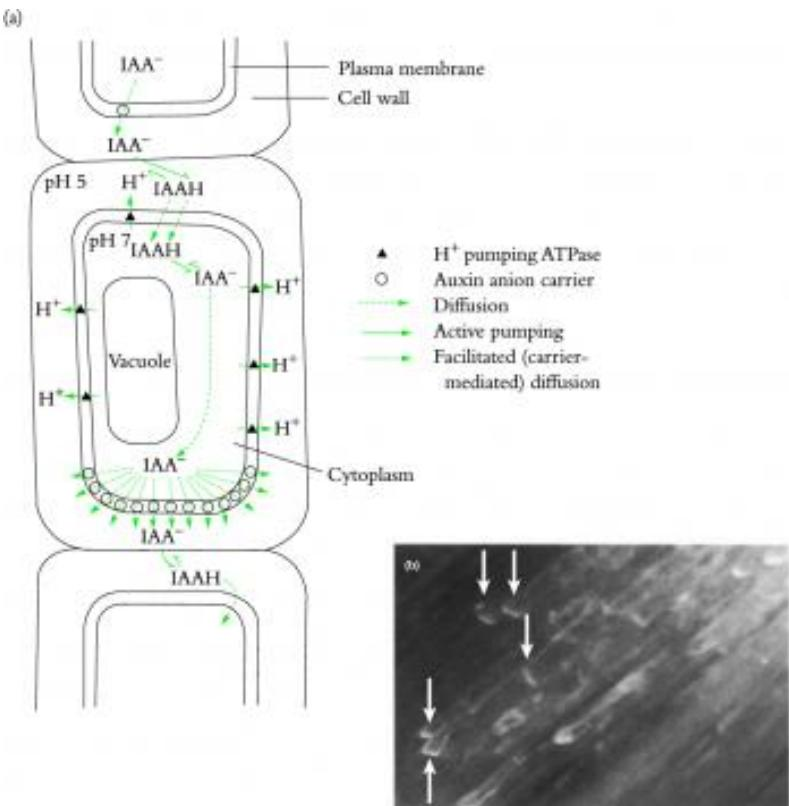
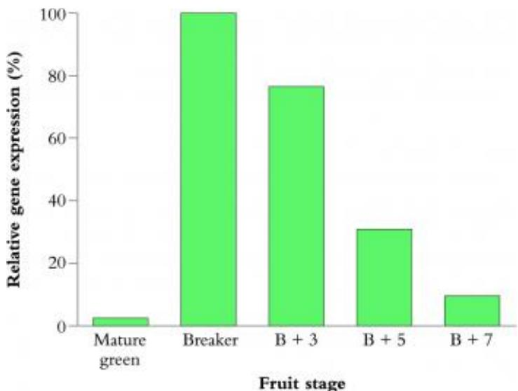

# Chapter 9 - Plant hormones : chemical signalling in plant development

From Plants in Action,  $I^{st}$  Edition, Eds BA Atwell, PE Kriedemann, CJN Turnbull

Chapter Author: CJ N Turnbull; BR Loveys (9.2.2)

Consider...a plant not as a packaged collective of independent processes but as a highly interactive network of perception, control and feedback. Every plant has a genetic blueprint that specifies its whole range of morphology and physiology, but the individual is shaped, sometimes literally, by the environment it experiences. Integration of development and adjustment to the external environment are achieved through multiple coordinating signals throughout the plant.

Perception of gibberellin in germinating cereals. Protoplasts (P) isolated from aleurone cells of wild oat (Avena farua) were incubated with Sepharose beads (S) to which gibberellin molecules had been covalently attached. The gibberellin therefore could not enter the cells, but was still able to induce production of  $\alpha$ - amylase enzyme. This means that perception of gibberelin probably occurs via an outward- facing receptor in the plasma membrane. Scale bar  $= 60\mu \mathrm{m}$ . (Based on Hooley et al. 1991; reproduced with permission of Springer- Verlag)

- [Chapter 9 - Plant hormones : chemical signalling in plant development](Chapter_9.md)
  - [Introduction]()
  - [9.1 The basis of chemical control of plant development]()
  - [9.2 Physiology of hormone action]()
  - [9.3 Harnessing hormones: making use of chemical signals]()
  - [9.4 Concluding remarks]()
  - [Further reading]()

# Introduction

In the previous chapter we introduced some of the complexity and subtlety of the functioning of plants in diverse, variable and unpredictable environments. Their sessile nature makes it a necessity for plants, if they are to succeed as individuals and populations through many

generations, to have the resourcefulness to cope with and adjust to environmental change, especially at the extremes. Remember that plant physiologists are probably the only people on earth who routinely grow plants under constant environments in growth chambers! In this chapter we examine some of the internal mechanisms that plants use to coordinate development. Let us start by considering the concept of a plant not as a packaged collective of independent processes but as a highly interactive network of perception, control and feedback. A plant has a genetic blueprint that specifies its normal morphology and physiology throughout the whole life cycle, but every individual is also shaped, sometimes literally, by the environment it experiences. Think of the bent- over shape of trees growing on coasts with a prevailing on- shore wind, or the ability of pasture plants to recover repeatedly from grazing of their shoot tips.

We might first ask whether plants really need internal communication. The answer lies with multicellularity. With multicellularity comes almost invariably differentiation. Differentiation is in effect specialisation, which can also be thought of as division of labour. The particular physiological and developmental facets of an organ, tissue or cell type (say, a leaf, a phloem bundle and a guard cell, respectively) make it more efficient at carrying out its set of functions. But with specialisation comes a dependency on the rest of the organism, and a need for coordination among its component tissues. Some of the control is attributable to resource limitations: water, light,  $\mathrm{CO_2}$  and inorganic nutrients in the environment; water, carbon, nitrogen and mineral fluxes inside the plant. Many of these factors are discussed in Part IV of this book. Depending on quantities and types of resources available, and their mobility in the plant, there are undeniable limits placed on the scope of development. A shoot system can develop only as rapidly as the root mass can supply water and minerals for the shoot structure; a root can grow only if fed with fixed carbon, normally from the shoot. These ubiquitous molecules function as integral parts of cell structures and core metabolism. What we find in addition is another layer of control: information- rich mobile molecules that serve as an integrating communication system throughout the plant.

Table 9.1 A comparison of major features of plant and animals and their regulatory systems  

<table><tr><td>Plants</td><td>Animals</td></tr><tr><td>Sessile</td><td>Motile</td></tr><tr><td>Autotrophic</td><td>Heterotrophic</td></tr><tr><td>No nervous system</td><td>Nervous system</td></tr><tr><td>Plastic development throughout lifespan</td><td>Adult development determinate</td></tr><tr><td>Mostly passive mass-flow systems</td><td>Adults circulatory systems</td></tr><tr><td>Hormones produced in many locations</td><td>Hormone production in restricted cell types</td></tr><tr><td>Hormones multifunctional</td><td>Hormones more specific in function</td></tr><tr><td>Development highly sensitive to environmental influences</td><td>Development relatively unaffected by environment</td></tr></table>

Animals have a central nervous system and a suite of specific hormones each with highly defined functions. Plants lack the former, but do possess a quite different set of chemical signals called plant hormones (Table 9.1). Plant hormones are sometimes called 'plant growth substances' or 'plant growth regulators' partly to distance them from mammalian concepts of hormone action. However, these alternative terms undervalue the repertoire of functions of plant hormones: they affect so many processes other than just growth, so we continue to refer to endogenous regulatory substances as 'plant hormones'. We also talk later

(see Section 9.3) about plant growth regulators as a broader group of active substances applied to plants which includes more than just plant hormones.

Before describing specific plant hormone functions, we need to consider how hormone signals might operate effectively. In any signalling system there is a source and a target, and in between a mode of transmission — in radio parlance, the transmitter and receiver with signals travelling as electro- magnetic airwaves. In animals, the conventional system is a source gland, mass- flow transport (e.g. blood circulation) and a target tissue. Plants are harder to diagnose, but we can make the following generalisations:

- Each hormone can be synthesised in more than one location in a plant. Indeed, all living cells may produce all hormones, but some generate larger quantities and others almost undetectable amounts.

- Each hormone has many functions, at least by deductions from experiments with applied hormones and from phenotypes of hormone-deficient and hormone-insensitive mutants.

- Plant hormones are small molecules and are mobile, both over short (diffusive) and long (mass-flow) distances.

- Many cell types respond to each hormone class.

- Some hormone functions occur in the same cells or tissue in which they are synthesised.

From this, we conclude that a plant's hormones are indeed quite different from those in animals (Table 9.1). There are relatively few classes but each is multifunctional, they are not synthesised in glands, they move in several channels and affect several tissues in a multitude of ways. A recipe for crossed wires and confusing ambiguity of signals? Perhaps, but as we introduce the major hormones, an overall picture of plant communications will emerge. We now examine signal sources and signal mobility, and then consider how signals are perceived and translated into altered physiology and development.

# 9.1 The basis of chemical control of plan development

# 9.1.1 Signal sources: which tissues make hormones? How are hormones synthesised?

Traditionally, five major hormone classes are described: auxins, cytokinins, gibberellins, abscisic acid and ethylene. Other active compounds have been known for years, and there are new- comers with increasingly strong claims for inclusion. These include brassinosteroids and jasmonic acid in particular, but also polyamines, salicylic acid and oligosaccharides; for details of these, some informative review articles are listed at the end of the chapter.

Most hormones have certain biochemical trends in common: small molecules synthesised from ubiquitous precursors (amino acids, mevalonic acid, nucleotides) sometimes via multistep pathways, then deactivated by oxidation or conjugation (linking to other small molecules such as glucose and amino acids). Some knowledge of hormone biochemistry will be invaluable in Section 9.3 where we describe genetic and chemical approaches to manipulating plant development through modified hormone biosynthesis and degradation. Further information on hormone biochemistry can be found in many recent reviews and texts (e.g. Davies 1995).

# Auxins

  
Figure 9.1 Structures and some partial biosynthetic pathways for common members of the five major groups of native plant hormones.

(a) The most common natural auxin, indole-3-acetic acid (IAA).

(b) Four classes of natural cytokinin: zeatin and its cis isomer, dihydrozeatin, isopentenyladenine.

(c) Late stages of gibberellin biosynthesis pathway, showing some key points of genetic and environmental control of amounts of bioactive  $\mathrm{GA}_1$ . 
(i) The  $\mathrm{GA}_{19} \rightarrow \mathrm{GA}_{20}$  step is under photoperiod control in some long day plants; for example, spinach shows a greater rate of metabolism under long days, and hence production of bioactive  $\mathrm{GA}_1$ , correlating with developmental transition from rosette form to stem elongation. 
(ii)  $\mathrm{GA}_{20} \rightarrow \mathrm{GA}_1$  is blocked in many dwarf (short internode) mutants, such as  $le$  in pea,  $d1$  in maize and  $dy$  in rice.  $\mathrm{GA}_{20}$  itself is inactive but becomes active after addition of an hydroxyl (-OH) group to the 3B position, thus forming  $\mathrm{GA}_1$ . In some other dwarf mutants, the pathway is blocked at steps well before  $\mathrm{GA}_{19}$ , and shoots of these plants contain almost no detectable gibberellins. 
(iii)  $\mathrm{GA}_1 \rightarrow \mathrm{GA}_8$  is a key reaction regulating amounts of active gibberellins. In this case, addition of an -OH group to the 2B position inactivates almost every gibberellin, including  $\mathrm{GA}_1$ .

(d) Structure of abscisic acid (ABA)

Auxin in its most common natural form indole- 3- acetic acid (IAA; Figure 9.1a), was the first plant hormone to be isolated, and was long thought to be derived exclusively from the amino acid tryptophan. Plants and certain plant pathogenic bacteria synthesise IAA, although the genes, enzymes and reaction intermediates differ between prokaryote and eukaryote. From data on tryptophan- deficient mutants, it now appears that indole may be an alternative starting point for IAA synthesis in some plants (Wright et al. 1991; Normanly et al. 1995). This advance illustrates our incomplete knowledge of even elementary plant hormone biochemistry. Active growing tissues, especially shoot tips and young leaves, synthesise auxins, as do developing fruits and seeds. Roots appear to produce much less auxin, but auxin has vital functions in lateral root development. Plants and bacteria can deactivate auxins by irreversible oxidation involving enzymes such as IAA oxidase, or by covalently linking (conjugating) them to other small molecules: sugars, cyclitols, amino acids. Some conjugates (e.g. IAA- aspartate) act as inactive auxin stores, regenerating active auxin when the link is hydrolysed.

# Cytokinins

In many ways, cytokinins are opposites of auxins, being synthesised in roots but with most dramatic effects on shoot development. However, shoot tissues can also produce cytokinins, as can developing seeds. A classic example of the latter is coconut milk, the copious liquid endosperm from coconut seed, which is still a popular cytokinin source in plant tissue culture media. Cytokinins were originally named from their ability to promote cell division, but they also function in initiation of new shoot structures, dormancy release and retardation of senescence. Cytokinins are derivatives of adenine, one of the purine bases found in all DNA and RNA. Indeed, cytokinins were originally thought to be products of transfer RNA (tRNA) breakdown. However, based on cytokinin and tRNA composition of pea roots and turnover rates in maize, it was calculated that there were insufficient cytokinin nucleotides in tRNA to account for total cytokinin production (Short and Torrey 1972; Klemen and Klämbt 1974). Instead, a de novo pathway using free adenine nucleotides as substrate appears to predominate. There are also many cytokinin types each with subtle differences in structure. The four main classes of natural cytokinin each have a different five- carbon side- chain attached to the  $\mathrm{N}^6$  position (Figure 9.1b). The two classes found in tRNA (cis- zeatin and isopentenyladenine) are less biologically active than the major free cytokinin classes, trans- zeatin and dihydrozeatin. Discovery of a cis- trans isomerase that interconverts the two zeatin forms has re- opened the biosynthesis debate, because active trans- zeatin may be made from RNA- derived cis- zeatin (Bassil et al. 1993). The first enzyme in the de novo pathway, isopentenyl transferase (IPT), is well known in bacteria but has yet to be characterised fully from plant tissues. A novel suggestion is that all cytokinins in plants are actually synthesised by bacteria present on and in plant tissues (Holland 1997). If true, this could account for the failure to find plant biosynthetic enzymes, and for the lack of cytokinin biosynthesis mutants. Each cytokinin class exists as base, riboside and nucleotide forms, many of which can readily be metabolically interconverted. This has made it difficult to decide which forms are biologically active in their own right, and which achieve activity only after conversion. As with auxins, inactivation results from conversion to glucosyl or amino acid conjugates (e.g. 9- alanyl zeatin = lupinic acid) or from action of degradative enzymes such as cytokinin oxidase which cleave the side- chain.

# Gibberellins

GibberellinsGibberellins were first noticed through symptoms of a disease (known in Japanese as bakanae = foolish seedling) on rice that caused excessive stem elongation. The causative agent, a fungus called Gibberella fujikuroi, contains several different types of gibberellin (abbreviated to GA, after gibberellic acid, the first form discovered), some of which also exist in plants. Plants possess many other unique gibberellins, and collectively there are well over 100 identified compounds. This intimidating complexity can be reduced to a comprehensible level by realising that each species contains only about 25 of these gibberellins and that most gibberellins are biosynthetic intermediates or inactive end- products, and not active in their own right. There are many steps and enzymes involved in building up the 19- and 20- carbon gibberellin molecules from five- carbon mevalonic acid. Several parallel pathways exist differing only in number of hydroxyl (- OH) groups. Hydroxyl groups are the key to gibberellin functions: some positions (3b) are generally essential for activity, whereas others (2b) completely abolish it (Figure 9.1c). Inactivation by conjugation to glucose also occurs. Gibberellin synthesis takes place mainly in developing leaves and stems, in developing seeds and during germination. Gibberellins function in dormancy release and germination, as well as in growth promotion (e.g. stem elongation, fruit tissue expansion).

# Abscisic acid

Abscisic acidAbscisic acid (ABA) is an unfortunate name because this hormone has little to do with abscission. But once again it tells a story: cotton, one of the plants originally studied, turns out to be an exception in that ABA does promote fruit shedding (Okhuma et al. 1963). ABA is a 15- carbon molecule (Figure 9.1d) and its synthesis occurs from breakdown of carotenoid pigments, especially violaxanthin, a 40- carbon molecule. Previously, mevalonic acid was thought to be the main precursor, with early steps in common with gibberellin biosynthesis. This alternative pathway may operate in tissues such as avocado mesocarp and in tomato seedlings (Milborrow 1983; Willows et al. 1994). ABA is produced in large quantities in water- stressed tissues, especially roots and leaves, but also has a role in seed maturation, dormancy and senescence. ABA concentrations are lowered by oxidative deactivation to phaseic acid or by formation of glucosides.

# Ethylene

EthyleneEthylene (= ethene;  $\mathrm{C_2H_4}$ ) is a unique gaseous hormone that diffuses rapidly out of plant tissues. Its immediate precursor is 1- aminocyclopropane- 1- carboxylate (ACC) which in turn originates from S- adenosyl methionine, a derivative of another common amino acid:

Methionine Enzymes: ↓ SAM synthase S- adenosyl- methionine ↓ ACC synthase ACC ↓ ACC oxidase Ethylene

Ethylene is produced in response to cell damage and other stresses such as anoxia. It accumulates rapidly during fruit ripening and senescence, but all living cells produce some

ethylene. Oxidation and conjugation can occur, but dissipation into the atmosphere is probably the main 'means of disposal'.

# 9.1.2 How mobile are plant hormones?

9.1.2 How mobile are plant hormones?In addition to biochemical control of synthesis and inactivation, hormone concentrations can be modified by import and export between different regions of the plant. Indeed, transport is an essential component of long- distance signalling systems. All plant hormones, being small molecules, can diffuse within and between cells. Some may pass readily across lipid membranes; others such as glucosides are more water soluble and may tend to accumulate in the vacuole, along with other cellular waste products. There is probably little a plant can do to prevent local diffusion of hormones, and plasmodesmal bridges (Section 10.1.2) allow intercellular cytosolic passage of most hormone- sized molecules. In addition, xylem and phloem sap analysis indicates that several hormones also move over much greater distances, for example perhaps  $100\mathrm{m}$  from deep root tip to leaf of a large eucalypt.

  
Figure 9.2 Long-distance transport of hormone signals through mass flow can be influenced by sap flow rates. Here, flux in tomato xylem is expressed as a delivery rate (molecules per second) measured as sap flow is altered by pressurising the root system. Flux of ABA in the xylem stream increases with sap flow, whereas flux of nitrate, a major inorganic nutrient, is constant. (Based on Else et al. 1995)

Figure 9.2 Long- distance transport of hormone signals through mass flow can be influenced by sap flow rates. Here, flux in tomato xylem is expressed as a delivery rate (molecules per second) measured as sap flow is altered by pressurising the root system. Flux of ABA in the xylem stream increases with sap flow, whereas flux of nitrate, a major inorganic nutrient, is constant. (Based on Else et al. 1995)Are mass- flow systems good channels for signal transport? Xylem flux varies massively on a diurnal basis as stomata generally open during the day and close at night, thus modifying transpiration rates. Superimposed on that are seasonal changes in temperature and water availability: with dry roots come slow flow rates; with hot, dry air, there is huge evaporative demand, and rapid sap flow subject to access to a water supply. Likewise, phloem flow is highly variable and sometimes bidirectional, making it difficult to specify source and target. A growing leaf will initially import sugars through the phloem, but with attainment of photosynthetic competence, it will instead export through the same channels. It sounds fraught with potential problems, but most physiologists believe that long- distance transport of hormones has functions in many regulatory processes. Consider that plants have evolved with variable mass flow: perhaps some hormone signalling is dependent on such oscillations rather than being defeated by them. There is evidence from tomato plants that xylem ABA flux (molecules delivered per hour) is influenced by the carrier solvent (sap) flow rate whereas flux of soil solutes such as  $\mathrm{NO_3}^-$  is independent of flow rate (Figure 9.2; Else et al. 1995). In Section 9.2.2 we look further at fluctuations in xylem ABA and the consequences of ABA delivery from root to shoot. Here, we examine specific mechanisms for auxin transport.

The best- studied aspect of hormone mobility is auxin polar transport, the only specific system presently known for move- ment of any plant hormone. It is termed polar because of its intrinsic directionality which is not altered even by drastic experimental procedures such as excision and tissue inversion. The phenomenon is commonly demonstrated in segments of young shoot tissues such as hypocotyls and cereal coleoptiles in which applied radioactive auxin moves from tip to base at about 1 cm per hour, but hardly at all in the opposite direction. This speed is faster than diffusion but slower than phloem sap flow. Not all cells within the tissue exhibit polar transport, and it is often restricted to ancillary cells within the vascular bundles such as phloem parenchyma. The mechanism of movement is chemiosmotic rather than active, and depends on three factors:

1. the dissociation kinetics of IAA between its neutral IAAH and anionic IAA $^{-}$  forms;

2. a pH difference between cell wall and cytoplasm;

3. selective IAA $^{-}$  channels in the plasma membrane.

  
Figure 9.3 Auxin movement in plants operates partly through a polar (uni-directional) transport system. The acidic properties of auxin, together with a pH difference between cell wall and cytoplasm, and localised auxin anion efflux carrier channels in the plasma membrane, combine to generate a net basipetal (away from shoot tip) movement of auxin. (a) Diagram showing the components of this 'chemiosmotic' transport system. (b) Immunofluorescence components of this 'chemiosmotic' transport system. (c) Immunofluorescence micrograph showing presumed location of auxin channels in basal ends of vascular parenchyma cells (bright zones marked by arrows), cut in longitudinal section. The antibody used was raised against purified NPA-binding protein. NPA is an auxin transport inhibitor. (Based on Jacobs 1983 and Jacobs and Gilbert 1986; (b) reproduced with permission of American Association for the Advancement of Science)

Figure 9.3(a) illustrates how IAA $^-$  ions can pass through the normally ion- impermeant membrane via the IAA $^-$  channels located predominantly in the basal membranes of the transporting cell files. In the cell wall compartment, IAA $^-$  reassociates to IAAH due to the low pH and so the IAA does not readily re- enter the cytoplasm. Activity of the auxin channel protein is blocked by certain synthetic compounds such as naphthyl phthalamic acid (NPA) and tri- iodobenzoic acid (TIBA), as well as by natural plant flavonoids such as quercetin, and apigenin (Jacobs and Rubery 1988). This raises the intriguing possibility that plants may use these natural inhibitors to regulate their own auxin transport. Using anti- bodies against the protein to which NPA binds, immuno- fluorescence microscopy has shown that this protein, which is probably the auxin channel itself or a closely associated protein, is predominant in the plasma membrane at the basal end of cells (Figure 9.3b). Because IAA molecules will exit more through these channels, there is a net movement of auxin from top to base of the tissue. The relatively slow speed probably reflects the fact that each IAA molecule has to enter and exit every cell on its route down the tissue.

# 9.2 Physiology of hormone action

# 9.2.1 Signal targets: perception and signal transduction

Having outlined how hormonal signals are produced and transported, we turn to further equally important questions: how do cells detect the presence of hormones, and so perceive changes in hormone concentrations? And then, having measured the signal strength, how is this information converted into developmental and biochemical responses? For the first clue, we turn back to the signals themselves: we know that only certain molecular structures are biologically active and small changes in these molecules can render them virtually inactive. This happens with addition of hydroxyl groups to certain positions of a gibberellin molecule, or by comparing trans- zeatin with its cis isomer (Figure 9.1). This tells us that the mechanisms for detecting hormones must have great discriminatory powers. Hormone detection involves specific proteins known as receptors, proteins being the only class of biological macromolecule that can generate the required precision of molecular shapes. Within their three- dimensional structures, receptor proteins have regions which can bind the active hormone. These binding sites are similar to those in enzymes which bind a substrate, the familiar 'lock and key' analogy. The difference with receptors is that we think no chemical reaction occurs during perception; the hormone remains as hormone throughout. This is an important test in receptor assays which usually involve a radioactive hormone: if the hormone is converted to other compounds, probably the binding activity is simply to the active site of a hormone- metabolising enzyme.

# (a) Plant hormone receptors

Plant hormone receptor research was neglected for many years but has attracted renewed interest with the advent of new assays and molecular biology tools since the late 1980s. Compared with detailed information on control of abundance and activities of mammalian hormone receptors, the picture in plants is sketchy. The best- studied systems have been auxin and ethylene receptors, and some of the genes that code for receptor proteins have been isolated. For example, the ETR gene from Arabidopsis was suspected to be an ethylene receptor, but this was only confirmed when the cloned gene was expressed in yeast in which the ETR protein was able to bind ethylene (Schaller and Bleecker 1995). There is also new evidence for gibberellin and ABA receptors, but little definitive information on cytokinins. Most of the receptors appear to be located on plant membranes, especially the plasma membrane, and this is also common in animal systems. Some elegant work by Hooley et al. (1991) strongly suggests that the gibberellin- binding site is located on the outer face of the membrane, so that it actually picks up hormone signals outside the protoplast. In one experiment, Hooley et al. synthesised gibberellin molecules anchored to large Sepharose beads which were incapable of entering the cell, but which still stimulated alpha- amylase production in protoplasts prepared from germinating cereal seed aleurone cells (Figure 9.4a). Alpha- amylase is an enzyme responsible for hydrolysing starch to sugars and hence supplying germinating seeds with carbohydrate for energy and growth. In another experiment, Hooley and co- workers generated antibodies that mimicked the shape of gibberellin molecules (known as anti- idiotypic antibodies). These would be recognised by the gibberellin receptor binding site and therefore competed with the gibberellin molecules and

interfered with amylase production. The bound antibody molecules were also able to agglutinate protoplasts (Figure 9.4). Taken together, these lines of evidence indicate gibberellin perception occurring at the plasma membrane surface.

  
Figure 9.4 Gibberellin receptors in cereal aleurone cells are almost certainly located on the plasma membrane, facing outwards. Two lines of evidence support this view, both making use of protoplasts, that is, cells with their walls enzymatically removed. (a) Data showing that gibberellin molecules covalently anchored onto Sepharose (a polysaccharide gel) beads were still effective at inducing  $\alpha$ -amylase synthesis. The Sepharose beads were much too large to enter the protoplast. The conclusion is that aleurone cells have receptors that can perceive gibberellin arriving from outside the cell. (b) Antibodies generated that mimic the shape of gibberellin molecules, known as anti-idiotypic antibodies, caused protoplasts to agglutinate (top). The explanation is that the antibodies are sticking to outward-facing gibberellin receptor binding sites on the plasma membrane. Because each antibody molecule has two binding domains, they can cross-link between cells, so forming aggregates of cells. Scale bar  $= 100\mu \mathrm{m}$ . (c) Based on Hooley et al. 1991 and (b) based on Hooley et al. 1990)

# (b) Selective signal transduction pathways

There is now the question of how a single hormone can be involved in several unrelated processes within the same plant. How do tissues stipulate the right response, at the right level and time? There are two main possibilities for ensuring that a signal is passed down the appropriate channel. Note that it is sometimes argued that plants may have only limited control over hormone production and supply and that the signals move and even act in a quite unpredictable manner through- out the plant.

# Idea 1

For each response, there is a discrete type of receptor. Bearing in mind the many responses to each hormone, the total number of receptor forms would be high, but this does not necessarily rule out the idea. For example, there are at least five different genes for ACC synthase and three for ACC oxidase, both key enzymes in ethylene biosynthesis (Barry et al. 1996; Olson et al. 1991; Yip et al. 1992). Each member of the gene family is regulated by a different set of factors; thus some operate only in ripening fruit, others are induced by  $\mathrm{O_2}$  deficit, others are switched on by auxin or by wounding. This division of labour at the hormone biosynthetic level may likewise occur in receptors, as shown by sequence homology between the ethylene- binding protein gene Etr1 and at least two other genes in Arabidopsis and five in tomato (Chao et al. 1997; Payton et al. 1996). Circumstantial support for multiple receptors also comes from the wide range of effective plant growth regulator concentrations, for example  $10^{- 10}\mathrm{M}$  auxin promotes root elongation, compared with  $10^{- 6}\mathrm{M}$  for the same process in shoots, and  $>10^{- 4}\mathrm{M}$  stimulates adventitious root initiation in stem cuttings. How could a single protein have the kinetic power to resolve concentration differences over more than a million- fold range? Auxin inhibition of growth may operate via ethylene because auxin at moderate to high concentrations induces ethylene synthesis (Sakai and Imaseki 1971). However, several other auxin responses are known to be ethylene in- dependent based on studies with auxin- overproducing Arabidopsis plants crossed with ethylene- insensitive mutants (Romano et al. 1993).

# Idea 2

There are very few receptor types, possibly just one, for each hormone. The divergence of signalling would therefore occur 'downstream' from the receptor, that is, events that occur after hormone perception. There are several steps between reception and the final action, say, in closing a stomatal pore, inducing onset of dormancy or modifying a cell's growth rate. In this way, a single ABA receptor could be coupled to different responses in guard cell, maturing seed and growing leaf, respectively.

Viewing the collective evidence, a tentative impression would be that perhaps both the above ideas are at least partly correct. Whatever the details of the system, in all cases the signal needs to be converted into a response. After perception by the receptor, the 'signal' is passed to what is commonly termed a second messenger, which in animals can be simple molecules such as  $\mathrm{Ca^{2 + }}$  ions, cyclic AMP (cAMP) or inositol trisphosphates  $(\mathrm{IP}_3)$ . These are collectively involved in signal transduction pathways and usually involve some kind of amplification: from each hormone molecule binding to a receptor, many second messenger molecules may result. Typically, activation of a single enzyme molecule leads to generation of many product molecules, or opening of a single  $\mathrm{Ca^{2 + }}$  ion channel leads to flux of large numbers of  $\mathrm{Ca^{2 + }}$  ions. Animals and plants share some similarities in signal transduction mechanisms. Membrane- bound mammalian receptors are often linked to other proteins which, for example, bind GTP. These  $G$ - proteins are linked in turn to enzymes such as phospholipase C, which cleaves phospholipid groups and thus generates lots of second messenger product  $(\mathrm{IP}_3$  and diacylglycerol) for as long as the receptor binding site is occupied. The number of G- proteins known in plants is increasing rapidly and they appear to have diverse roles in signalling (Millner and Causier 1996), including hormone systems such as ABA- regulated gene expression in germinating cereals (Bethke et al. 1997). In one of the best- studied hormone signalling systems, gibberellin induction of a- amylase gene expression in cereal

aleurone cells, there are six or seven stages between primary signal and final action, namely production of active  $\alpha$ - amylase enzyme (Figure 9.5; Bethke et al. 1997).

  
Figure 9.5 A complex chain of events is required to convert a primary hormonal signal, gibberellin, into its final action, in this case synthesis of the starch-hydrolysing enzyme  $\alpha$ -amylase during cereal seed germination. After increased gibberellin levels are perceived, the most rapid changes, within  $5\mathrm{min}$ , are in the second messenger  $\mathrm{Ca^{2 + }}$  ( $[\mathrm{Ca^{2 + }}]_{\mathrm{i}}$  is cytosolic calcium concentration) then its receptor protein calmodulin (CaM), together with altered intracellular  $\mathrm{pH}$ , and after about 1h another second messenger, cGMP. Following this, at about 3h, there is a rise in GAMyb, a transcription factor protein that binds to promoters of gibberellin-regulated genes, and finally protein that binds to promoters of gibberellin-regulated genes, and finally appearance of  $\alpha$ -amylase enzyme about 8h after gibberellin treatment. (Based on Bethke et al. 1997; reproduced with permission of Oxford University Press)

Within minutes, ionic changes ( $\mathrm{Ca^{2 + }}$  and  $\mathrm{pH}$ ) are detectable in the cytoplasm, followed by an increase in calmodulin, a calcium- binding protein involved in signal transduction. A slower increase in cGMP is seen which seems to operate independently of the  $\mathrm{Ca^{2 + }}$  system, but both of these transduction pathways seem to combine to stimulate transcription of genes via a protein called GAMyb, which is a transcription factor (a protein class that binds to specific DNA sequences in gene promoters; see Section 10.3.1). Overall, it takes 4–12 h before much functional  $\alpha$ - amylase is detectable.

A lengthy debate on whether cAMP, a ubiquitous second messenger in animal systems, was important to plants was finally resolved by conclusive data showing presence not only of cAMP but also some of the proteins with which it interacts during auxin- induced cell division (Trewavas 1997; Ichikawa et al. 1997). The multiplicity of signalling components in plant cells and the number of potential links and interactions are beyond the scope of this discussion. What is remarkable is that primary signals are ultimately coupled to the 'right' response, whether direct physiological changes or altered gene expression. Much of this fidelity depends on restricted intra- cellular distribution of signalling components. For example, many of the protein kinases and protein phosphatases that activate and deactivate other regulatory proteins are probably located on membranes or tied to the cytoskeleton and therefore will only respond to signals within their immediate cellular neighbourhood (Trewavas and Malho 1997). On top of that, cell differentiation will lead to quite different signalling components in each cell type. It may, however, be some time before enough is known about these subtle systems to be able to make use of them, say, in modifying crop physiology.

# 9.2.2 Diverse roles for plant hormones

9.2.2 Diverse roles for plant hormonesBefore we consider details of the final consequences of hormone signalling pathways, it is helpful to think broadly about the roles of hormones in enabling organised plant development and efficient responses to alterations in the environment. The range of functions of plant hormones and responses to them can be bewildering, but most roles can be grouped under two general headings: organisers and mediators.

# (a) Organisers

Organisers primarily define the basic framework of a plant's axial structure. This includes channelling of cells into particular pathways of differentiation depending on their location within the plant. Plants tend to, even need to, maintain a balance between shoot and root development. The two systems are interdependent, so damage or loss of one upsets that balance and necessitates some developmental adjustment. We do not know exactly how complex differentiation pathways are regulated, but it seems likely that a relatively small number of primary signals are needed, with each controlling a whole suite of characters. In Section 9.2.3, we see how such systems can operate at the level of gene expression.

# Auxin-cytokinin balance: opposing directional flows of active signal

Auxin- cytokinin balance: opposing directional flows of active signalTsui Sachs and Kenneth Thimann in 1967 proposed that shoot apical dominance is governed by auxin- cytokinin balance. Evidence came mainly from polar basipetal transport of shoot tip auxin and responses to applied auxins and cytokinins: auxin supplied to a decapitated shoot stump suppresses the normal lateral bud growth response, but cytokinin supplied directly to lateral buds promotes outgrowth of intact plants. More recent studies on transgenic plants and branching mutants suggest that there are probably other regulatory signals in addition to auxin and cytokinin (see Case study 9.1). Overall, however, this simple theory, along with auxin and cytokinin responses in tissue cultures (see Section 10.2 and Figure 10.23), gives us the foundations of control of root:shoot development ratios, and enables comprehension of plant developmental homeostasis. This balancing act comprises several developmental elements, but all potentially trace back to auxin:cytokinin concentration ratios. Even in intact plants, shoot branching is limited if root growth is poor or if roots are stressed. Conversely, a vigorous root system depends on carbon supply from shoot photosynthesis. Superficially, root:shoot balance appears resource limited, but the role of hormones overlays an ability to signal in advance of crisis, and enables stochastic (modular) adjustment of units of plant development: number of active shoot branches and number of lateral roots, in addition to modification of the growth rate of each. Mechanical damage, whether removal of just a shoot apex, or cutting off a stem at ground level, may invoke similar hormone- driven responses. Shoot apex replacement is rapidly achieved by outgrowth of an existing lateral meristem, in theory stimulated by auxin depletion and cytokinin accumulation around the top of a cut stem. A tree stump lacking reserve buds may still possess active cambium cells, which can respond to the same cytokinin enhancement by initiating rapid cell division and subsequent shoot organogenesis (see Section 10.2.2). A stem cutting continues to transport auxin to the cut base, but lacks its normal cytokinin supply from the roots. This high auxin:cytokinin ratio stimulates cell activation leading to adventitious root organisation, and in commercial propagation is accelerated by supplying additional auxin in rooting powders and solutions. In addition, there are strong links between cytokinins and delay of senescence (Gan and Amasino 1996; Wang et al. 1997). A plant with damaged, diseased, water- stressed or

mineral- deficient roots will export less cytokinin in the xylem, one con- sequence being premature leaf senescence usually from the stem base upwards.

# Seed-derived hormones regulate pattern of fruit development

Although fruit and seed tissues are genetically different — the former is parental, the latter is progeny — the two develop in a coordinated manner. In most species, if ovules are not fertilised or the embryo aborts, fruit tissues stop growing and are usually shed prematurely. Because seeds represent the next generation, it makes little sense for a plant to continue investing resources in a package that contains no propagules. Exceptions to this are parthenocarpic (seedless) fruits, some of which have genetic causes, and others which are induced chemically by application of growth- promoting hormones: auxin, gibberellin, cytokinin or combinations of these. Parthenocarpic fruit are prized by humans and include seedless or semi- seedless commercial varieties of grape (see frontispiece to Chapter 11), citrus, banana, watermelon, pineapple and lychee. The relationship between seed and fruit growth appears to be driven by hormones synthesised in the developing endosperm and embryo, and is neatly illustrated by the relationship between auxin levels and fruit growth rates in blackcurrant (Figure 9.6).

  
Figure 9.6 During seed and fruit development in many species there is a phase of endosperm development followed by embryo growth. These two tissues are thought to be the source of hormones that promote fruit growth. Here, the two rapid phases during the double sigmoid fruit growth curve of blackcurrant (Ribes nigra) coincide with peaks of IAA content (solid circles) and with maximal rates of endosperm then embryo development (open circles). (Based on Wright)

# (b) Mediators

The second broad role of hormones is as mediators of environ- mental signals, often stress factors, which lead to modification of physiology and patterns of development. For example, as discussed in the preceding chapter, photoperiod perception in leaves leads to flowering at the shoot apex. A light signal is translated into a chemical one. The route of signal transmission from leaf to apex appears to be in the phloem sap, and although we do not know of a universal 'florigen' hormone, part of the signal in some species may be specific types of gibberellin (Evans et al. 1994b, c). Gibberellins also have a wider role in mediating some types of phytochrome responses, such as stem elongation in long- day plant rosette species

(Wu et al. 1996). Entry into and exit from dormancy often depends on external inputs such as fluctuation in water availability: some responses to dehydration during seed maturation and imbibition during germination are mediated by ABA and gibberellins, respectively. Low temperature is another factor which can break endodormancy or induce flowering, and may be mediated by hormones such as gibberellins and cytokinins.

# ABA as a mediator of water status information

The role of ABA in transmitting information about plant water status was discovered in the early 1970s. Here, we take a detailed look at one of the best studied of all 'mediator' roles of hormones. When water loss from leaves is accelerated by exposing them to a stream of warm air, ABA concentration rises dramatically, by about 10- to 50- fold and stomata close (Zeevaart 1980). Similarly, a low concentration of ABA supplied exogenously to excised leaves via the transpiration stream induces stomatal closure. It was concluded that ABA synthesis in leaves, induced by water stress, is the cause of stomatal closure. Further evidence for the involvement of ABA in stomatal regulation came from studies of ABA- deficient mutants such as flacca in tomato, wilty in pea and droopy in potato, which wilt rapidly when exposed to only mildly stressful conditions but regain a normal phenotype if treated with ABA.

Synthesis of ABA in wilting leaves is enhanced as turgor approaches zero. Conjugated forms of ABA such as the b- glucoside can be present in leaves at quite high concentration and represent a potential source of free ABA, but actually appear quite stable and do not break down under stress. Therefore de novo synthesis of ABA during stressful conditions is responsible for stomatal closure, and acts as a protective mechanism against the potentially damaging effects of water loss. ABA- induced stomatal closure pre- empts hydraulically driven stomatal closure which would eventually occur as stomatal guard cells lose turgor. Hydraulically driven closure occurs far later than closure induced by ABA and usually occurs too late to prevent excessive and damaging levels of water deficit.

Stomatal closure in response to increased levels of foliar ABA provides a solution to one of the major problems faced by mesophytic plants, that is, the compromise between maintaining sufficient gas exchange to satisfy the  $\mathrm{CO_2}$  requirements for carbon assimilation but at the same time limiting water loss when conditions become unfavourable. However, this rather simple interpretation of plant response to stress is not the whole story. For example, water- stressed plants can have leaf water potentials which are similar to or even higher than those of well- watered plants and yet the stomata are fully closed (Figure 9.7). Shoot extension and leaf expansion are also highly sensitive to stressful conditions but they are not always accompanied by low leaf water potentials. Clearly, ABA synthesis in leaves is not the only process occurring during water stress.

  
Figure 9.7 ((a), (b), (c)) Response of grapevines to hydraulic and non-hydraulic signals during water stress applied to split root systems. Root systems can be split vertically (surface v. deep) or horizontally (left-right, as in this experiment (d)) and different water stresses applied to each half. If one half is kept well watered, this is sufficient to maintain normal shoot water status and no leaf water potential difference is detected (solid circles) compared with control fully watered plants (open circles) (b). If the other half root system is dry, any drought signal induced may be transmitted to the shoot. A prime candidate for this root signal is ABA, which is detected either chemically (c), or by its effects on stomatal aperture (a). In many species, root-generated ABA can cause stomatal closure in the absence of any water deficit in the shoot. This is interpreted as an early warning system, enabling plants to reduce water use under imminent drought conditions. In nature, during periods without rain, surface roots would normally become dry before deep roots. (Diagram courtesy B.R. Loveys)

# Roots as a source of ABA

Part of the answer to this puzzle came from experiments using plants with divided root systems. For example, if a piece of grapevine cane bearing six or seven nodes with dormant buds is sawn along its length from the base for about two internodes, it is possible to induce root formation on each of the two halves. These split root systems can be planted in separate pots or in the field, which allows independent manipulation of the soil moisture status of each root (Figure 9.7d). It has long been known that xylem sap contains ABA (Figure 9.2), and that increased ABA in droughted roots might thus be transmitted to the leaves (Davies and Zhang 1991). However, simply drying the roots of a plant with a single root system affects the water relations of the whole plant and it is then difficult to distinguish the effects of lowered leaf water potentials from the effects of root- derived chemical signals. Split- root plants allow study of the effects of drying soil without the complications of changed water relations because the soil around one root system is maintained fully watered. This root system supplies as much water as the canopy needs. Normally, the second root system is then dried and the effects of any chemical signals studied. Here we show the effect of withholding water from one root system of twin root grapevines (Figure 9.7). Stomatal conductance fell rapidly, and within 8 d was only  $22\%$  of that in fully watered control vines yet water potential of the leaves remained unchanged. Leaf ABA content also changed in response to partial root drying. When conductance was at its lowest, ABA levels had doubled when compared with fully watered controls. ABA levels returned to control values  $10\mathrm{d}$  after rewatering the dry pot, but conductance took somewhat longer to recover.

  
Figure 9.8 Large fluctuations are often seen in ABA concentrations in xylem sap moving from root to shoot. In some species such as maize (but not others such as wheat and apricot; see Figure 9.9), drought-induced stomatal closure can be accounted for entirely by the increased amount of ABA signal. In this experiment, increased ABA was generated by withholding water for up to 20d. The error bars on each point are standard deviations and indicate the range of both the increase in ABA content and the effect on stomatal conductance. The open circle shows the xylem ABA concentration and leaf conductance resulting from feeding  $10^{-5}$  M ABA to part of the root system. (Based on Zhang and Davies 1990; reproduced with permission of Blackwell Science)

The leaves did not receive any hydraulic (water deficit) signal which may have initiated local ABA synthesis. We conclude that the drying roots produced a chemical signal which is transported to the leaves in the transpiration stream and which induces stomatal closure. The chemical signal is most likely to be ABA. Zhang and Davies (1990) took a direct approach by supplying different solutions to excised maize leaves and measuring stomatal conductance (Figure 9.8). They tested xylem sap from well- watered plants, sap from stressed plants, sap from which most of the ABA had been removed by passage through a column containing anti- ABA antibodies and a series of synthetic ABA solutions. In every case, the anti- transpirant activity of each solution was explicable in terms of its ABA content. Further evidence that it is a closing stimulus arising from drying roots and not a lack of an opening stimulus comes from the observation that stomata re- open after drying roots are excised.

Experiments like this help us understand how plants in the field deal with everyday fluctuations in soil water, sustained drought and other environmental conditions. Surface layers of soil, which usually have the highest root densities, dry first and roots in this zone will be stimulated to send enhanced ABA signals to the leaves, slowing transpiration and thus providing the first indication that soil conditions are not ideal. At this time, the deeper roots may still have access to water and so no hydraulic signal has been generated. Such ABA signalling from roots does not result in large increases in leaf ABA and that which does accumulate is soon dissipated through metabolism and translocation once the dry root signal is removed. This enables leaves to monitor continuously root water stress and to adjust stomatal apertures according to distant and local water availability. If drought continues and more of the soil profile dries, then leaf water potentials will fall and trigger new synthesis of ABA in leaves, reinforcing and extending the stomatal closure already set in train by the roots. The large increases in ABA which then result may have more far- reaching consequences because expression of certain genes is regulated by ABA (see Section 10.3).

Some of these have sequences which are predicted to confer heat stability to their resulting protein products.

Unexpected relationships between conductance and ABA content

  
Figure 9.9 In an unusual response, stomatal conductance was positively correlated with leaf ABA concentration and not inversely correlated as expected. This study used apricot plants, which are able to osmoregulate during drought and thereby maintain cell turgor and hence open stomata. The increase in ABA is probably the result of increased supply from the roots during drought, but in this case the ABA does not result in stomatal closure. (Based on Loveys et al. 1987)

The picture of ABA derived from roots causing reduced stomatal conductance during periods of water deficit is true in many, but not all, cases. For example, this correlation does not hold in apricot which instead can osmoregulate and thereby maintain stomatal opening. In a study comparing the drought responses of grapevine, which largely conforms to the normal model, with apricot, another drought- tolerant plant often grown in close proximity to grapevine, xylem ABA content in apricot was only about  $5\%$  of that needed to induce stomatal closure. Moreover, ABA levels in leaves showed a positive relationship with stomatal conductance, contrary to normal expectations (Figure 9.9). ABA was accumulating with increased transpiration but was having no effect on stomatal conductance. Unlike grapevine, which operates over a fairly narrow range of leaf water potentials, apricot leaf water potential fell progressively throughout the season, yet stomata remained open. The key to these apparently anomalous results was that leaf osmotic potential fell along with the water potential, thus maintaining leaf turgor and stomatal opening. By the end of the growing season, sorbitol, the major organic osmoticum in apricot leaves, had accumulated to a concentration of  $400~\mathrm{mM}$ . Apricot uses osmotic adjustment to protect itself during drought and ABA appears to play little part. Indeed, it was found that even when apricot leaves were deliberately wilted, their ability to synthesise ABA was almost totally eliminated when sorbitol concentrations were high (Loveys et al. 1987).

Next, we follow the signalling pathways to their final sites of action, namely modified development and physiology. Essentially, there are two options: direct effects and action through altered gene expression.

# 9.2.3 Direct effects on cellular processes

Some hormone systems are coupled to existing components of a cell's physiology. This is an effective means of achieving rapid responses, often within a few minutes of alteration of hormone levels. Three cases are presented which illustrate how important direct effects can be.

(a) Auxin and acid growth - the proton pump story

  
Figure 9.10 Auxin-induced cell elongation operates through more than one mechanism. (a) Short-term growth may partly be due to acidification of the cell wall compartment due to auxin stimulation of plasma membrane  $\mathrm{H^{+}}$  export (proton pump) ATPase. Here growth rates of oat coleoptile segments were measured during a  $45\mathrm{min}$  incubation in solutions of different pH. (b) Specific auxin-inductable genes are expressed more abundantly in faster growing tissues, with changes in expression detectable within  $10\mathrm{min}$ . These may well be related to auxin-induced growth that occurs independently of, or additively with, acid induced growth. Here tissue print autoradiograms show distribution os SAUR (short auxin unregulated) mRNAs during gravitropic response of soybean hypocotyls. At time 0, the seedlings were moved from a vertical to horizontal position. Initially symmetrical staining is replaced by predominance of staining on the lower (faster growing) side during the bending response. The unexpanded cotyledons are just visible at the left-hand side. (Based on Rayle and Cleland 1970 and Guilfoyle et al. 1990; (b) reproduced with permission of Plenum Publishing Corporation)

Auxin was originally viewed (1930s) as a shoot growth promoter. Unequal rates of cell elongation in cereal coleoptiles, as occurs with tropisms, was also attributed to auxin effects. We now know that auxin is active in promoting cell expansion in many other tissues: stems, roots, fruits and callus cultures. Two mechanisms seem to be involved, one in- volving rapid changes in gene expression (see Section 9.2.4(b)) and another which directly affects the cell wall. This latter may operate through what is often termed the Acid Growth Theory and relates to auxin stimulation of 'proton pump' ATPases located in the plasma membrane which rapidly increase  $\mathrm{H^{+}}$  concentrations in the cell wall compartment (Figure 9.10a; Rayle and Cleland 1970). Low  $\mathrm{pH}$  was originally proposed to modify some of the bonding between cell wall polymers, especially H- bonds and ionic bonds, and also to stimulate some hydrolytic enzymes. The mechanism now appears to involve cell wall proteins called expansins which are  $\mathrm{pH}$  sensitive and interact with other cell wall polymers to modify wall mechanical properties (Cosgrove 1997). The result is a softening, or increase in plasticity, of the wall which then expands more rapidly under the driving force of turgor. The other component of wall mechanical properties is referred to as elasticity but because this is

reversible deformation it does not lead to growth. Some controversy has existed on this subject since the 1970s, mainly centred on whether acid growth fully accounts for the auxin effect, and whether it is a universal phenomenon. There is little doubt that auxin stimulates proton pumping and acid- induced growth is probably at least a part of the initial growth response, but there are also acid- independent components of growth (Schopfer 1989) and other changes are needed for sustained auxin- induced growth. The discovery of auxin- stimulated genes that respond within 5 min (Section 9.2.4) suggests that direct acid- induced growth and gene expression changes may occur simultaneously.

(b) Gibberellins and ethylene modify growth directions via control of microtubule orientation

Plant shape or form is determined by the directions in which its component organs and tissues grow. Disorganised growth in all three dimensions leads to a callus or tumour, so an organised plant clearly has spatial control of growth. Theoretically, each cell can grow in any direction, but usually the existing cell walls place some mechanical restriction on this. Cellulose microfibrils — bundles of cellulose molecules — contribute a large proportion of the strength of the primary wall, and have only limited elasticity. This means that growth along the axis of the microfibrils is restricted, but growth perpendicular to this axis can continue. Organising microfibrils into parallel arrays will therefore force pre- dominantly one- dimensional elongation growth. Microfibril orientation, in turn, is dictated by subcellular components just inside the plasma membrane called microtubules (see Section 10.1.2). Any factor that modifies the microtubule arrays can alter growth rate or direction. Indeed, gibberellin accelerates elongation rates in stems, associated with more longitudinal microtubules (Figure 10.15), and ethylene leads to radial (swelling) growth because it causes microtubules to take up more random orientations (Figure 9.11).

  
Figure 9.11 Direction of cell growth is influenced by at least two hormones, gibberellin and ethylene, through effects on cellulose microfibril orientation. The microfibrils form the bulk of the strength of primary cell walls. Gibberellins lead to largely transverse orientation, which constrains growth mainly to the longitudinal direction, that is, elongation, whereas ethylene promotes a more random orientation and hence growth in all three dimensions, that is, tissue swelling. In both, the positioning of new microfibrils in the cell wall is governed by the orientation of microtubules in the cytoplasm just beneath the plasma membrane. The mechanism is described in more detail in Section 10.1.2. (Based on Raven et al. 1992)

An intriguing exception to this is the rapid internode elongation induced by flooding of semiaquatic species such as deepwater rice. This adaptation maintains the leaves above the

hypoxic conditions within the paddy waters. Indeed, low  $\mathrm{O}_2$  concentration is the stress signal that initiates the growth response by inducing ethylene synthesis. What is unexpected is that ethylene in this case does not lead to radial cell expansion but instead to elongation. The explanation comes from evidence that in this species ethylene increases tissue sensitivity to gibberellins, which in turn stimulate greater than normal shoot extension (Raskin and Kende 1984b). This is a neat example of inter- actions between hormones resulting in a much improved adaptation to a specific environmental problem.

# (c) ABA and stomatal guard cells

  
Figure 9.12 Stomatal aperture changes are effected by movements of solutes of water in and out of guard cells, processes influenced by ABA. (a) Without ABA; (b) within minutes of additional ABA supplied to guard cells, signal transduction pathways operating through  $\mathrm{Ca^{2 + }}$  and other amplification systems lead to massive potassium ion efflux through  $\mathbf{K}^{+}$ -specific ion channels to the plasma membrane. Potassium levels in the adjoining cells increase correspondingly ( $\mathbf{K}^{+}$  values are in mM). Anions such as malate and chloride also move, and the net change in guard cell water potential leads to water also moving out of the guard cells by osmosis. The reduction in cell contents lowers the turgor and cell volume, and the stomatal pore closes. (Based on Raven et al. 1992)

We previously mentioned the role of ABA in regulating stomatal aperture. This response does not involve growth, it is rapid and reversible, and the magnitude of opening or closing is dependent on ABA concentration across a wide range. Leaf epidermis can be peeled off in a single cell layer and floated on ABA solutions, resulting in a stomatal closure response which commences within minutes. The mechanism does not seem to involve changes in gene expression, at least not initially. Instead, water and solutes are moved rapidly out of the guard cells and the change in aperture is a function of cell turgor and volume. During closure, potassium channels in the guard cell plasma membrane open, allowing potassium ions to flood out into the adjoining subsidiary cells. Anions such as malate and chloride move in the same direction to maintain electrical neutrality. This change in total solute content leads to osmotic imbalance and hence rapid water efflux from the guard cells (Figure 9.12). The resultant cell volume change is the direct cause of stomatal closure. Re- opening tends to be slower, because it takes time for the ABA level to decline and for the solutes to be moved back.

# CASE STUDY 9.1 Models for control of shoot branching: more than just auxin and cytokinin

C.G.N. Turnbull

The conventional view of apical dominance control in plants is that auxin inhibits branching whereas cytokinin promotes it. The original paper by Sachs and Thimann (1967) examined responses to auxin applied to cut shoot stumps or cytokinin applied directly to buds. Radiolabelled auxin applied to a shoot stump is transported in a polar manner down the stem (Figure 9.3). These data were extrapolated to the assumption that endogenous hormones will behave similarly, that is, on decapitation (removal of the shoot tip and hence a main source of auxin) auxin supply down the stem will diminish and bud growth is permitted. However, endogenous IAA and cytokinin levels in buds both increase within a few hours of shoot decapitation (Gocal et al. 1991; Turnbull et al. 1997). Since the late 1980s, many transgenic plants have been created with altered auxin or cytokinin content. Superficially, the phenotype of these lines supports the auxin- cytokinin hypothesis: high- cytokinin ipt plants branch more, as do low- auxin iaaL plants (Medford et al. 1989; Romano et al. 1991). However, closer examination of the developmental sequences reveals that often branching is hardly affected at all in young plants, even though the constitutively expressed genes cause altered hormone content at all stages of the life cycle. Instead, branching is promoted only later in development, around the time of floral initiation when wild- type plants also branch. Auxin and cytokinin therefore appear to modify rate of bud growth but not always the timing of its onset. In addition, there are questions about whether roots are the main source of cytokinins for the shoot: in experiments with grafted transgenic plants expressing the ipt cytokinin gene only in the roots, no increase in shoot cytokinin was seen and plants did not show enhanced branching (Faiss et al. 1997).

There is also evidence from pea mutants that branching control in intact plants cannot be explained by auxin and cytokinin alone. The ramosus (Latin for 'branched', abbreviated to rms) mutants all exhibit greater than normal branching. From Sachs and Thimann, we predict either low auxin or high cytokinin or both, or altered sensitivity to these hormones. However, analysis of xylem sap (the main pipeline supplying solutes including cytokinins from root to shoot) reveals that in some mutants, xylem cytokinin content is actually much reduced, by as much as 40- fold in the case of rms4. In addition, none of the mutants has reduced auxin content in the shoot. One mutant, rms2, does have slightly elevated xylem sap cytokinin, but it has up to five times the normal auxin level. Clearly, auxin and cytokinin levels do not conform with Sachs- Thimann predictions in these plants, so another model for branching control needs to be developed.

Using reciprocal grafting experiments, Beveridge et al. (1997a, b) have established where in the plant some of the Rms genes are expressed. For example, expression of the normal Rms1 gene does not seem to be restricted to the shoot. This conclusion is based on inhibition of branching in both rms1/wild- type (scion on rootstock) and wild- type/rms1 grafts; that is, provided there is one part of the plant with normal Rms1 expression, then branching will be inhibited compared with the rms1 mutant. The Rms1 gene therefore may control a branching inhibitor that can move from root to shoot, but can also act directly in the shoot. Because

rms1 plants have normal IAA transport and are not IAA deficient, we deduce that this inhibitory signal is almost certainly not auxin.

  
Figure 1 Control of lateral branching is regulated by several genes and probably several mobile signals. In pea, the rms4 mutant is highly braced and has extremely low levels of cytokinins moving from root to shoot in the xylem sap. The conventional theory of apical dominance regulation suggests that high cytokinin levels would be associated with increased branching. The evidence here from reciprocal grafts between rms4 and its wild type is that the extent of shoot branching governs the export of cytokinins from the root rather than vice versa.  $\mathbf{ZR} =$  zeatin riboside. (Based on Beveridge et al. 1997a; reproduced with permission of Blackwell Science)

On the other hand, rms4 shoots grafted onto wild- type roots still branch, but the wild- type roots now export rms4 levels (i.e. very low) of cytokinin. The converse graft of wild- type shoots onto rms4 mutant roots does not branch but the roots now export wild- type levels of cytokinin (Figure 1). The deduction is that the normal rms4 gene is acting in the shoot only, and two consequences of the rms4 mutation are enhanced branching and downregulation of root cytokinin export. The latter must require a shoot- to- root signal, but auxin is again an unlikely candidate. We are therefore left with two intriguing conclusions:

1. Auxin and cytokinin alone do not explain the control of branching in intact plants.

2. There is evidence for at least two novel (i.e. not auxin or cytokinin) graft-transmissible branching signals, one moving from root to shoot (the Rms1 factor) and one moving from shoot to root (a signal relating to Rms2).

Plant architecture is closely tied to shoot branching and is an important character in many crop plants. For example, increased bushiness is desirable in ornamental pot plants, but a single trunk, non- branching phenotype is most valuable in plantation timber species. In the future, there may be potential for regulating branching through genes such as the Rms series, in addition to manipulation of auxin and cytokinin status.

# References

Beveridge, C.A., Murfet, I.C., Kerhoas, L., Sotta, B., Miginiac, E. and Rameau, C. (1997a). 'The shoot controls zeatin riboside export from pea roots. Evidence from the branching mutant rms4', Plant Journal, 11, 339- 345.

Beveridge, C.A., Symons, G.M., Murfet, I.C., Ross, J.J. and Rameau, C. (1997b). 'The rms1 mutant of pea has elevated indole- 3- acetic acid levels and reduced root- sap zeatin riboside

content but increased branching controlled by graft- transmissible signals', Plant Physiology, 115, 1251- 1258.

Faiss, M., Zalubilová, Strnad, M. and Schmülling, T. (1997). 'Conditional transgenic expression of the ipt gene indicates a function for cytokinins in paracrine signaling in whole tobacco plants', Plant Journal, 12, 401- 415.

Gocal, G.F., Pharis, R.P., Yeung, E.C. and Pearce, D. (1991). 'Changes after decapitation in concentrations of indole- 3- acetic acid and abscisic acid in the larger axillary bud of Phaseolus vulgaris L. Cv Tender Green', The Plant Physiology, 95, 344- 350.

Medford, J.I., Horgan, R., El- Sawi, Z. and Klee, H. (1989). 'Alterations of endogenous cytokinins in transgenic plants using a chimeric isopentenyl transferase gene', The Plant Cell, 1, 403- 413.

Romano, C.P., Hein, M.B. and Klee, H.J. (1991). 'Inactivation of auxin in tobacco transformed with the indoleacetic acid- lysine synthetase gene of Pseudomonas savasanoi', Genes and Development, 5, 438- 446.

Sachs, T. and Thimann, K.V. (1967). 'The role of auxins and cytokinins in the release of buds from dominance', American Journal of Botany, 54, 136- 144.

Turnbull, C.G.N., Raymond, M.A.A., Dodd, I.C. and Morris, S.E. (1997). 'Rapid increases in cytokinin concentration in lateral buds of chickpea (Cicer arietinum L.) during release of apical dominance', Planta, 202, 271- 276.

# 9.2.4 Modified gene expression

9.2.4 Modified gene expressionWith the advent of more sophisticated methods of detecting changes in gene expression, it has become clear that many responses to plant hormones operate through up- and down- regulation of specific genes. In some cases, hormone signals elicit gene expression within a few minutes, so speed of response is no longer a diagnostic tool for deciding whether a hormone is acting directly on physiological processes. Analysis of DNA sequences in the promoters of hormone- regulated genes has shown common short sequences, typically four to twelve nucleotides long, called 'response elements', which are unique to each hormone class and are essential for hormone action (Table 9.2). Provided other essential factors are present, these response elements allow a single hormone potentially to regulate expression of whole suites of genes each carrying the same response element.

Tall 2 Aas Aas pase cns aed ur uply by plas haeas  

<table><tr><td>Hormone</td><td>Parameter element sequence</td><td>Gene</td><td>Transcription factor</td><td>Source</td><td>Reference</td></tr><tr><td rowspan="2">Acid</td><td>CTCGTGTCTCCT</td><td>CHF</td><td>AKF1</td><td>Serbon</td><td>Liunus et al. (1997)</td></tr><tr><td>TGTCTC</td><td>SHE</td><td>Sebom</td><td>Li et al. (1994)</td><td></td></tr><tr><td rowspan="5">Gibberellin</td><td>TACAAACTCCGG</td><td>Amylate</td><td rowspan="5">GAMph</td><td>Rice disease</td><td>Tanaka et al. (1994)</td></tr><tr><td>TACAGAGTCTCGG</td><td>Amylate</td><td>Berby disease</td><td>Gachke et al. (1994)</td></tr><tr><td>TACALANTTCYCG</td><td>Amylate</td><td>Amylate</td><td>Bachke et al. (1997)</td></tr><tr><td>YCTTTC</td><td>Amylate</td><td>Amylate</td><td>Bachke et al. (1997)</td></tr><tr><td>TATCCAY</td><td>Amylate</td><td>Amylate</td><td>Bachke et al. (1997)</td></tr><tr><td rowspan="2">Nicotin acid</td><td>GTGCCGTGGCGC</td><td>PH117</td><td></td><td>Berby disease</td><td>Shiye and He (1998)</td></tr><tr><td>NCACGTCGCC</td><td>EMI</td><td>EMBF-1</td><td>Wheat embryo</td><td>Graham et al. (1999)</td></tr><tr><td>Ethylase</td><td>TAGAGGCCGCC</td><td>MEP</td><td>ELKBP</td><td>Telastin leaf</td><td>Oliver-Takagi and Shamba (1995)</td></tr></table>

fndered DNA sequences are seen in the response to the hormone. The is currently deduced from the deletion analysis experiments per. section 10.3 which include gene expression of the mating signals of the hormone and the hormone response in list. Base codes are aderse (A), reuteres (C),genus (G), deuteres (E), and genes (H), any preordine (J) and any reuteres (L).

# (a) Gibberellin- and ABA-induced gene expression in germinating cereals

The 'opposing forces' of gibberellin and ABA in seed dormancy were described in Chapter 8, but these hormones also appear to operate in regulating metabolism in the seed during the germination phase. This is best known in cereal seeds. Gibberellins, produced in the embryo and scutellum, move through the endosperm to the aleurone layer, where they stimulate expression of a suite of genes coding mostly for enzymes that hydrolyse stored starch, protein and lipids. These resources are contained in the endosperm into which the enzymes are secreted. The released products move to the embryo and provide it with energy and the building blocks required for the rapid growth of the developing seedling. The best- known genes are those for alpha- amylase which degrades starch to sugars. If, however, ABA is applied before or with the gibberellin, then the alpha- amylase gene expression is much reduced. We now know from DNA sequence analysis of the gene promoter in rice, wheat and barley that there are specific response elements upstream from the transcription start (see Section 10.3) which are necessary for gibberellin or ABA to be effective (Table 9.2). If either the gibberellin- response or ABA- response element is excised or deleted from the gene, then the response to that hormone is lost. The time scale involved in switching on gene expression is around  $1\mathrm{h}$  and measurable increase in enzyme activity takes somewhat longer (Higgins et al. 1976; Figure 9.5).

# (b) Auxin-induced growth genes

Some of the most rapid changes in gene expression yet found in plants are those that occur in response to auxin application to growing tissues. The work of Guilfoyle on the SAUR (short auxin upregulated) and GH3 genes of soybean has shown enhanced mRNA levels within 2- 5 min (Guilfoyle et al. 1992). We do not yet know exactly what the functions of the gene products are but they are more abundant in faster growing cells, for example on the lower side of a horizontally placed hypocotyl as it responds to light or gravity (Figure 9.10b). In this case, no additional auxin was supplied, and the distribution of gene expression may reflect localisation of endogenous auxin. Two interpretation are possible: (1) this is proof that modified endogenous auxin levels are involved in tropisms; (2) this simply demonstrates that auxin- induced and tropism- induced growth involve expression of the same growth- associated genes.

# 9.3 Harnessing hormones: making use of chemical signals

# 9.3.1 Manipulating growth and development with applied plant growth regulators

Plant growth regulators (PGRs) are a diverse group of chemicals classified by their ability to modify plant development and/or biochemical processes. They include not only the native plant hormones already discussed and their synthetic analogues, but also many other compounds that influence hormone physiology, especially inhibitors of hormone biosynthesis and compounds that block hormone action, perhaps by interfering with receptor binding.

# How specific can we be?

From the preceding sections, it is clear that hormones are multifunctional, and responses depend on dose, site of ap- plication and developmental stage. In theory at least, we have the potential to influence almost any developmental process, and over the past 60 years probably just about every PGR on the shelf has been tried out. Controlling plant height, inducing flowering, increasing fruit numbers, generating seedless fruit, inducing seed germination — all worthy aims often with commercial success as reward for the 'successful'.

But all is not so simple. For every 100 attempts, probably only one becomes regular practice in agriculture or biotechnology. Why? The multifunctionality, the variability of response between genotypes, between tissues of different age, modification of response by

environmental factors — all these can thwart the best planned strategy even with the 'right' dose, timing and placement on the plant. In pharmacological terms, the side effects are often stronger and more undesirable than the targeted response. Here we select a few examples which have found commercial application.

# Stem elongation and gibberellins

  
Figure 9.13 The effects of paclobutrazol, an inhibitor of gibberellin biosynthesis, on shoot growth and flowering of poinsettia, a popular ornamental pot plant. The treated plant on the right has shorter internodes, darker green leaves and slightly enhanced flowering, all characteristics of gibberellin depletion. (Photograph copyright © ICI Australia, reproduced with permission)

Gibberellins are well known for effects on dormancy, germination, flowering and fruit development, but one of their most studied roles is in modifying stem elongation. This is a 'rate' process rather than an 'all- or- nothing' on/off switch, so we predict graded changes in cell growth rates as gibberellin concentrations are modified upwards or downwards. The tools are gibberellin mutants (deficient either in the capacity to produce active gibberellins or the capacity to respond to them; see Section 9.3.2), several gibberellins available in commercial quantities, and several compounds that more or less specifically inhibit gibberellin biosynthesis (Figure 9.13). Thus we have possibilities of examining the effects of genetically or chemically altering gibberellin levels. The almost universal result is that plants with low gibberellin concentrations end up shorter (more dwarfed) than those with higher levels. There are limits to the range over which this applies, that is, there is a ceiling growth rate beyond which no response is elicited by extra gibberellin, but in the best- studied examples, such as pea, the classic log dose- linear response relationship seems to hold quite well (Figure 9.14).

  
Figure 9.14 Genetic and hormonal control of development are illustrated by the relationship between active gibberellin content and internode length in pea genotypes with different alleles at the  $Le$  locus, a gene which encodes an enzyme for synthesis of bioactive GA1. The wild-type  $Le$  has a normal enzyme and a tall stature, le is dwarfed with almost no enzyme activity. Note the linear relationship between internode length and log of gibberellin content, showing a very wide range of concentrations over which the plant can detect gibberellins. This graph is similar to the classical 'dose-response' plots used in early hormone research to test biological activity of exogenously applied compounds. (Based on Ross et al. 1989)

# Parthenocarpic fruit: auxin and gibberellins

One highly desirable characteristic in most fruit crops (though not in nut crops!) is seedlessness. This occurs spontaneously in banana because of its triploid genotype, and in certain kinds of citrus because of early embryo abortion. In some mandarin types, an auxin spray before or just after bloom induces fruit to set without seeds. In certain grape varieties such as sultana (known elsewhere as Thompson Seedless) the seed starts to develop but then aborts and added gibberellin is required to promote normal fruit development (see frontispiece to Chapter 11). In both cases, the applied hormone is thought to be substituting for what would normally be generated by the growing seed (Figure 9.6). This gives an insight into how fruit and seed development are intimately coordinated. Auxins can cause similar seedless fruit in other crops such as citrus, but later applications can lead to abscission, probably via induction of ethylene synthesis, and are useful for fruit thinning on trees that otherwise tend to bear excessive numbers of undersized fruits.

# Tissue culture: auxin and cytokinins — the essential hormones

When a plant breeder or horticulturalist finds a new, potentially valuable plant, the first priority is usually to multiply it. Often the plant may be infertile or progeny may be genetically inferior. It then becomes necessary to use vegetative propagation. Remember that many plant cells have a remarkable property called totipotency (Section 10.2), so almost any fragment of a plant (or explant) can be used to regenerate new genetically identical plants, called clones. The most dramatic advances in plant propagation, resulting in the ability to generate millions from one, are due to tissue culture or micropropagation. Not all plants spontaneously enter into useful forms of regeneration when cultured: indeed most need some form of chemical persuasion. The most powerful control comes from use of two hormones, auxin and cytokinin. Auxin tends to promote cell expansion and, together with cytokinins, induces cell division. On top of these fundamentals of tissue growth, auxin causes cells to

become organised, sometimes simply into vascular tissue but more importantly to form roots. Cytokinins on the other hand induce shoot formation. The ratio of concentrations of auxin to cytokinin, as discussed in Section 9.2.2, appears to determine the type of development that ensues.

# Legislation, safety and moral issues

In addition to the physiological issues, increasing awareness of environmental pollution and potential dangers of exposure to hazardous chemicals have led to critical examination of use of all types of chemicals, especially on food crops. Initial concerns were over pesticides, especially organochlorines, but then spread to include PGRs. A few of these have made news headlines.

The selective herbicide 2,4,5- T (2,4,5- trichlorophenoxy- acetic acid) is a synthetic auxin that kills dicotyledonous (broadleaf) plants but has relatively little effect on grasses (incidentally an excellent example of plants differing in sensitivity to the same dose of hormone), and therefore found widespread use for removing dicotyledonous weeds from lawns and cereal crops. Its inclusion in the chemical warfare substance Agent Orange is notorious, but in fact it was an impurity (a highly carcinogenic dioxin compound) in the commercial preparation which led to worldwide withdrawal of the chemical. 2,4,5- T itself is not particularly toxic (Table 9.3). Preparations of a related compound, 2,4- D (2,4- dichloro- phenoxyacetic acid) contain no dioxins and are still used as herbicides and in plant tissue culture.

Table 9.3 Toxicity values for some plant growth regulators and other common organic chemicals.The  $LD_{50}$  test is a standard measure of acute toxicity indicating the dose per kilogram of body weight required to kill  $50\%$  of a population.Clearly the dioxin compound is vastly more toxic than any other on this list.However, using these data in isolation, DDT could be described as four times less harmful than caffeine yet much of the human population deliberately ingested caffeine on a daily basis, but would not willingly consume DDT.This illustrates how easily scientific data can be misconstrued.Long- term chronic exposure may in fact be much more common with agricultural chemicals and may result in quite different toxicities, often with quite different relative hazards than the acute test, effective at much lower doses and much harder to attribute to the suspected chemical  

<table><tr><td>Compound</td><td>LD50 
(mg kg-1orally in laboratory animals)</td></tr><tr><td>Plant growth regulators</td><td></td></tr><tr><td>Alar (daminozide)</td><td>8400</td></tr><tr><td>Cycocel (CCC)</td><td>1000</td></tr><tr><td>NAA (auxin)</td><td>1000</td></tr><tr><td>2,4-D (auxin)</td><td>370</td></tr><tr><td>2,4,5-T (auxin)</td><td>390</td></tr><tr><td>Dioxin (impurity in 2,4,5-T)</td><td>0.022</td></tr><tr><td>Other agrochemicals</td><td></td></tr><tr><td>DDT (insecticide)</td><td>500</td></tr><tr><td>Aldrin (insecticide)</td><td>7</td></tr><tr><td>&#x27;Everyday&#x27; chemicals</td><td></td></tr><tr><td>Thiamine (vitamin B)</td><td>8200</td></tr><tr><td>Caffeine</td><td>120</td></tr><tr><td>Nicotine</td><td>320</td></tr><tr><td>Paracetamol</td><td>338</td></tr><tr><td>Aspirin</td><td>1100</td></tr></table>

(Source of data:Merck Index)

Alar, also known as daminozide, is a plant growth retardant which was used widely on apples to modify fruit shape and skin colour. Some evidence in the 1980s suggested chronic toxicity symptoms were attributable to this chemical, and it was rapidly withdrawn from use. Sales of apples, even untreated ones, plummeted at the time, a dramatic example showing how a small amount of scientific data can have massive economic consequences. Subsequent investigations concluded that there were no substantiated toxic effects but, harmful or not, the lasting impression in the general public has meant Alar has not been widely reintroduced (Caswell et al. 1991; O'Rourke 1990). This treatment was never essential for fruit production because it was used mainly for cosmetic changes concerning size and appearance rather than to improve yield or nutritional quality. In general, legal restrictions, safety concerns and public perceptions are leading researchers and agrochemical companies to seek alternative means to achieve the same results, some of which are described next.

# 9.3.2 Control through genetic alterations

A more stable and permanent way to alter plant development is through genetic modification. Essentially we depend on mutations, which can be spontaneous or induced by mutagens (DNA- altering chemicals or high- energy radiation such as X- rays, g- rays or fast neutrons), and genetic engineering, which allows us to remove, add or modify the expression of specific genes. The colossal expansion of genetic engineering since the mid- 1980s is the single most remarkable change in biological research, and is covered further in Chapter 10. Here we look at some successes, pitfalls and limitations of plant genetic manipulation of hormonal signalling.

Genes for a few hormone biosynthesis enzymes have been isolated: these include one cytokinin and two auxin genes from plant pathogenic bacteria such as Agrobacterium, whose gall or tumour symptoms on infected plants relate specifically to the extra auxin and cytokinin produced — another example of the delicate hormone balance required for normal development. Plant genes for the two final steps of ethylene biosynthesis (ACC synthase and ACC oxidase; see Sections 9.1.1 and 11.5.6) have been cloned, and there are now reports of isolation of ABA genes (Marin et al. 1996) and some of the many gibberellin biosynthesis genes (e.g. Phillips et al. 1995). There are impressive examples of applications of hormone biotechnology in retarding senescence of cut flowers (Figure 10.41) or controlling rates of ripening in stored fruit, but there are also significant gaps: we do not yet have isolated plant genes for auxin and cytokinin biosynthesis, or auxin- or cytokinin- deficient mutants, which hinders our interpretation of exactly which processes these hormones regulate. One view is that these two hormone classes are so essential to normal organised plants that deficiency would be a lethal character. Alternatively, multiple copies of biosynthetic genes may give plants a backup system for continuing hormone production. In both cases, it is likely to be very difficult to screen for such mutations. A better target might be leaky mutations with only a partial restriction of hormone production. On the positive side, the array of gibberellin- related dwarfs clearly demonstrates non- lethal phenotypic alterations due to single gene mutations. Plants hampered in gibberellin, ABA or ethylene biosynthesis or perception are altered in specific developmental or physio- logical characters, but otherwise develop quite normally and most are reasonably fertile.

Achieving suitably precise control of transgene expression is difficult and severity of mutations is unpredictable, leading to many undesirable phenotypes. For example, a recurring problem has been from overexpression of the IPT gene, leading to high cytokinin levels, which in turn strongly inhibit root initiation and prevent recovery of whole plants from tissue culture. Remembering how tightly regulated plant developmental signals are, there is a pressing need to have suitable promoters, usually developmental stage specific, tissue specific or inducible by simple external factors such as  $\mathrm{O_2}$  concentration, copper ions or heatshocks, to drive gene expression in the right tissue, at the right time and to the right strength. Often, we have inadequate knowledge of hormone physiology to predict all these variables in advance, so research proceeds in a 'trial and error' fashion. Results often provide significant advances in basic understanding, even if the transgenic plants are not commercially useful.

The term 'billion dollar genes' has evocatively been given to genes that affect ripening and senescence, because this is a rough estimate of the value of the annual losses that occur worldwide due to fruit becoming overripe or too soft, or flowers wilting or foliage yellowing during the period from harvest to consumer. Most research has targeted high- value, perishable horticultural commodities rather than easier to handle grains and processed products. Since the 1980s, key achievements towards gaining genetic control of postharvest physiology include:

- isolation of the two plant genes necessary for ethylene biosynthesis;

- isolation of one bacterial gene for cytokinin biosynthesis;

- isolation of genes for enzymes catalysing pectin degradation, a major element of fruit cell wall softening;

- the ability not only to insert additional genes but to switch off existing ones with methods such as 'antisense' or 'co-suppression' technology.

Commercial genetically engineered products have now been released, such as the FlavrSavr tomato, in which the polygalacturonase gene that normally leads to rapid fruit softening has been switched off by antisense RNA (Figure 11.22). Many more products of this type are in development. Tomato was selected as suitable for first trials because it is a major crop around the world and it is in the family Solanaceae which is generally amenable to biotechnology. There are also non- ripening tomatoes that have greatly reduced ethylene biosynthesis in the fruit. These can be ripened by exposure to ethylene gas, but not until they reach the market. Ethylene 'gassing' has been used for many years on normal tomatoes, as well as on bananas and citrus.

Carnations have been developed whose flowers do not show the normal rapid senescence, characterised by rolling up and wilting of the petals (Figure 10.41). These either have one of the ethylene biosynthesis enzymes blocked or have the bacterial cytokinin IPT gene inserted, which affects the normal balance of senescence regulation, where ethylene is promotive and cytokinin is inhibitory. Many other 'valuable' genes are being sought, such as those which might give a novel flower colour (Figure 10.41), or confer disease or pest resistance without the need for chemicals or lengthy con-ventional breeding programs. Some of these are discussed in Chapter 10.

# (a) Auxin and cytokinin genes: transformation to rooty and shooty phenotypes

Agrobacterium tumefaciens, the causative agent of crown gall disease, generates its symptoms and harnesses the plant's resources by inserting some of its own genes into the host DNA. This natural form of transformation has been exploited in many ways, and Agrobacterium remains one of the most popular means of inserting other genes into plant genomes. Pathogenic transformation involves the Ti (tumour- inducing) plasmid, a circular piece of DNA containing genes, two for auxin and one for cytokinin, necessary for biosynthesis of these two hormones. There are other plasmid genes associated with virulence and amino acid metabolism which we will not discuss here. Once the host is transformed, the bacteria are no longer required and symptoms persist due to the disruptive effect of excess auxin and cytokinin on plant cell development and organisation, very much akin to the callus seen in tissue culture or around a wound site on an intact plant. Other bacteria carry very similar genes, for example A. rhizogenes, Pseudomonas savastanoi and Corynebacterium fascians (Gaudin et al. 1994). Our notions of the respective roles of auxin and cytokinin in cell organisation are confirmed by experiments where one of the hormone genes has been deleted by mutation. The 'rooty' mutant phenotype is due to a non- functional cytokinin gene because preponderance of auxin is a root- inducing stimulus. Likewise 'shooty' tumours result from mutation of one or other of the auxin genes, because high cytokinin leads to shoot initiation.

# (b) Gibberellin dwarfs and dormancy

Dwarf mutant plants of pea, rice and maize have helped enormously in defining the role of gibberellins in stem elongation. Many widely used commercial cultivars such as dwarf pea or short straw wheat contain reduced quantities of active gibberellins, or have an inability to respond to gibberellin. From mutations at different loci and alleles of different 'strengths', it has been possible to establish the relationship between endogenous gibberellin content and growth in pea (Figure 9.14). This shows a remarkable similarity to the plots of exogenous gibberellin and growth. Internode lengths, the final expression of what was a growth rate, vary linearly with the log of gibberellin concentration. Gibberellin deficiency in Arabidopsis is quantitatively related to stem growth too, but also to seed dormancy and fruit setting: the more severely deficient genotypes require added gibberellin to stimulate normal germination, and then a continued supply of gibberellin to support stem elongation and fruit development. Interestingly, most gibberellin- deficient genotypes are unaffected in time or extent of floral initiation, suggesting either that gibberellins are not involved in flowering control, or that this function is restricted only to some species, or that there are specific gibberellins for flowering that are different from those involved in stem elongation and dormancy.

# (c) ABA mutants are wilty and have reduced seed dormancy

ABA also appears to have a role in seed dormancy, but one that is to some extent opposite to the gibberellin effect. Tomato, wheat, pea and Arabidopsis mutants deficient in ABA synthesis or ABA response exhibit minimal seed dormancy (Leonkoosterziel et al. 1996; Ooms et al. 1993). Interestingly, added ABA does not usually prolong dormancy, so the role of ABA is probably in the entry into dormancy during seed maturation rather than in exit from dormancy prior to germination. In addition, ABA mutants are very sensitive to water stress because they have poor control over their stomatal apertures, normally an ABA- mediated process. These 'wilty' plants have to be nursed in high- humidity chambers to prevent desiccation. Plants with poor drought tolerance are unlikely to be commercially

valuable, but they are useful tools for testing the role of ABA in stress physiology. In the future, ABA genes may be manipulated to give enhanced response to or levels of ABA, thus improving stress resistance and water use efficiency, two valuable attributes for cultivated plants in many parts of the largely dry Australian continent.

# 9.4 Concluding remarks

For many years, plant hormone research focused on measurement of hormone levels. Based on responses to applied growth regulators, a widespread notion has been that plants regulate many developmental processes by actively modifying endo- g- enous hormone concentrations. However, despite extremely sensitive and accurate assay techniques, there remain scant examples where normal plants (i.e. not mutant, not inhibitor treated, not genetically engineered) show large changes in endogenous hormone concentration at the site of action. Changes are usually much smaller than predicted, with some exceptions such as 50- fold increases in xylem ABA delivered to leaves in response to water status or 20- fold cytokinin level increases during dormancy release (Tardieu and Davies 1992; Turnbull and Hanke 1985). Much discussion through the 1980s permanently altered ideas on how hormones work in plants, in particular shifting the focus to control of hormone perception and signal transduction, not just to the control of signal levels. The notion of control by changing tissue sensitivity to hormones is not new, but was vigorously proposed by Trewavas (1981) and others. However, in the absence of well- defined receptors, this theory was hard to test other than by traditional dose- response biological assays. Sensitivity is normally equated with presence of a suitable receptor system, but insensitivity (i.e. lack of response) can be the result of failure of any one of the many events between receptor and final physiological action, or sometimes the side effect of disruption of quite unrelated processes. The upshot has been expanded research on signal transduction (Trewavas and Malho 1997), and a more balanced approach to the possible means of regulating hormone signalling and action.

As discussed above, attempting to modify plant development through applying PGRs has been popular for many years, often referred to as the 'spray and pray' or 'spray and weigh' approach. Since the late 1980s, by inserting genes for enzymes of hormone biosynthesis into plants or modifying their expression, alternatives to PGR treatments have been generated. In this way, a plant modifies its own hormone concentrations, avoiding the need for external applications and potentially reducing amounts of chemicals used in agricultural and food industries. However, the responses are very similar in both cases: often in addition to the desired response, we find one or more side effects which frequently limit the usefulness of either technique. The problem lies not only in the multiple functions of plant hormones but also in their mobility within the plant; for example, it is quite hard to prevent root- synthesised cytokinin moving to the shoot in the xylem sap. We conclude this chapter with an idea: if instead of genetically altering hormone concentrations, the receptor or downstream events are modified, we may be then able to generate much more precise tissue- specific control. Receptors, being proteins, will be effectively immobile. Indeed, we already know that some hormone receptor genes are regulated naturally during development. In tomato fruit, the tETR

gene which codes for an ethylene- binding protein is hardly expressed at all until the fruit starts to ripen (Figure 9.15). This means that the fruit remains very insensitive to ethylene until the stage of development when the seeds are mature. Regulation of a hormone response in this case confers an adaptive advantage by reducing the likelihood of premature triggering of ripening and seed dispersal before maturity. Much current research is seeking ontogenetically regulated and especially tissue- specific promoters to link to a wide range of genes including those responsible for regulation of hormone concentrations, and this could now be extended to include genes for hormone perception and action.

  
Figure 9.15 Although ripening of climacteric fruit such as tomato is normally associated with autocatalytic ethylene synthesis (see Chapter 11), the physiological response to this increased ethylene level depends on prescence of ethylene receptors. In this experiment, the expression of the  $tETR$  gene, which codes for a presumed receptor, was quantified by the relative amount of  $tETR$  mRNA present. In mature green fruit, the gene is scarcely expressed, but maximal levels are present in the first visible stages of ripening colour change known as 'breaker' (B). Fruit are fully red by seven days after breaker  $(\mathbf{B} + \mathbf{7})$ , by which time receptor gene expression has declined again. The developmental regulation of receptor levels may be a key safeguard preventing premature onset of ripening until the fruit and seeds are at the right stage of development. Deliberate manipulation of hormone receptor expression by genetic engineering may become a powerful tool for controlling tissue-specific and developmental-time-based hormone responses. (Based on Payton et al. 1996; reproduced with permission of Kluwer Academic Publishers)

# Further reading

Abeles, F.B., Morgan, P.W. and Saltveit, M.E. (1992). Ethylene in Plant Biology, 2nd edn, Academic Press: New York.

Davies, P.J. (ed.) (1995). Plant Hormones Physiology, Biochemistry and Molecular Biology, 2nd edn, Kluwer Academic Publications: Dordrecht.

Davies, W.J. and Jones, H.G. (eds) (1991). Abscisic Acid: Physiology and Biochemistry, Bios Scientific: Oxford.

Evans, P.T. and Malmberg, R.L. (1989). 'Do polyamines have roles in plant development?', Annual Review of Plant Physiology and Plant Molecular Biology, 40, 235- 269.

Fry, S.C., Aldington, S., Hetherington, P.R. and Aitken, J. (1993). 'Oligosaccharides as signals and substrates in the plant cell wall', Plant Physiology, 103, 1- 5.

Hildman, T., Ebneth, M., Pena- Cortes, H., Sanchez- Serrano, J.J., Willmitzer, L. and Prat, S. (1992). 'General roles of abscisic and jasmonic acids in gene activation as a result of mechanical wounding', The Plant Cell, 4, 1157- 1170.

Lazarus, C.M. (1991). 'Hormonal regulation of plant gene expression', in Developmental Regulation of Plant Gene Expression, ed. D. Grierson, 42- 74, Blackie: Glasgow.

Malamy, J. and Klessig, D.F. (1992). 'Salicylic acid and plant disease resistance', Plant Journal, 2, 643- 654.

Mohr, H. and Schopfer, P. (1995). Plant Physiology, Springer- Verlag: Berlin.

Parthier, B. (1991). 'Jasmonates, new regulators of plant growth and development: many facts and few hypotheses on their actions', Botanica Acta, 104, 405- 464.

Reid, J.B. (1990). 'Phytohormone mutants in plant research', Journal of Plant Growth Regulation, 9, 97- 111.

Sasse, J.M. (1997). 'Recent progress in brassinosteroid research', Physiologia Plantarum, 100, 696- 701.

Trewavas, A.J. and Malho, R. (1997). 'Signal perception and signal transduction: the origin of the phenotype', The Plant Cell, 9, 1181- 1195.

Verhey, S.D. and Lomax, T.L. (1993). 'Signal transduction in vascular plants', Journal of Plant Growth Regulation, 12, 179- 195.

Vleeshouwers, L.M., Bouwmeester, H.J. and Karssen, C.M. (1995). 'Redefining seed dormancy — an attempt to integrate physiology and ecology', Journal of Ecology, 83, 1031- 1037.

Zeevaart, J.A.D. and Creelman, R.A. (1997). 'Metabolism and physiology of abscisic acid', Annual Review of Plant Physiology and Plant Molecular Biology, 39, 439- 473.