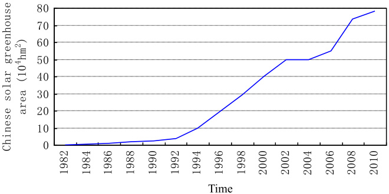
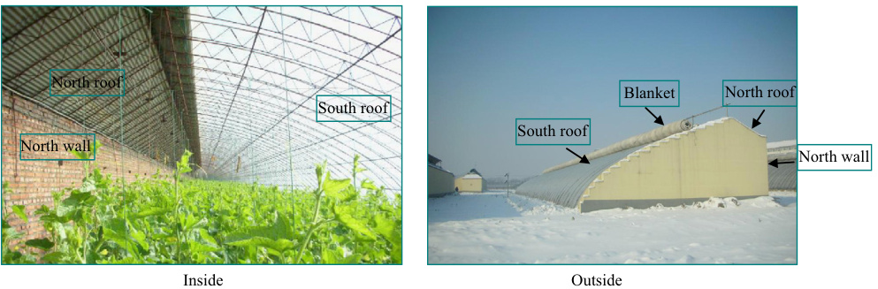
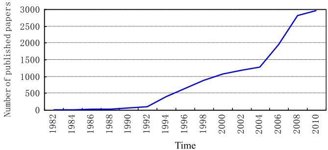
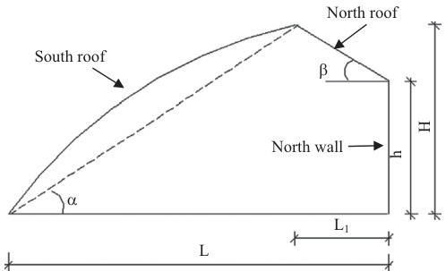
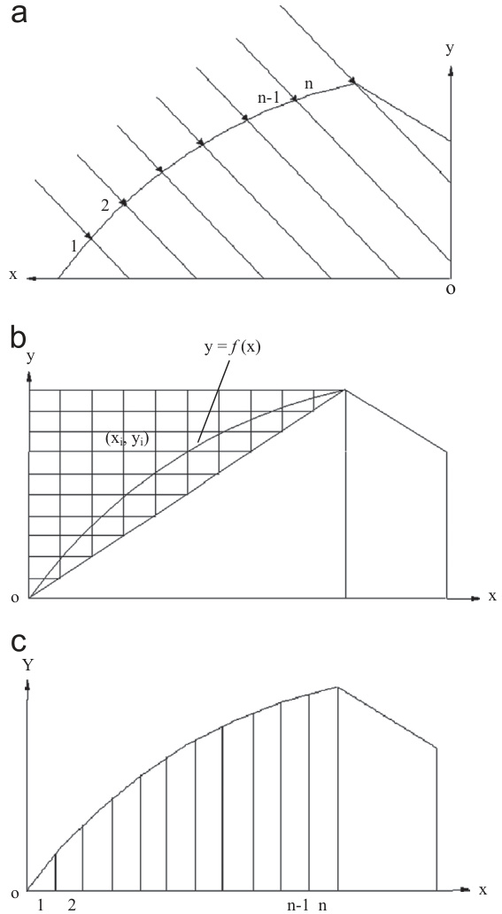

# Passive solar energy utilization: A review of cross-section building parameter selection for Chinese solar greenhouses

# 被动式太阳能利用：中国日光温室截面建筑参数选择综述

Guohong Tong a,n, David M. Christopher b, Tianlai Li c, Tieliang Wang a

a 沈阳农业大学水利学院，沈阳 110866，中国  
b 清华大学热科学与动力工程教育部重点实验室，热能工程系，  
北京 100084，中国  
c 沈阳农业大学园艺学院，沈阳 110866，中国

# 文章信息

# 摘要

文章历史：  
收稿日期：2013年2月17日  
修回日期：2013年5月30日  
录用日期：2013年6月16日  
在线发表日期：2013年7月5日  
关键词：  
中国日光温室（CSG）  
跨度  
高度  
屋顶  
墙体  
太阳能

中国日光温室（CSG）是完全被动式的太阳能温室，可在冬季无需辅助加热的情况下种植蔬菜。建筑参数对温室的太阳能利用和内部温度有重要影响。本文综述了温室建筑设计的研究与发展，这些研究考虑了建筑跨度、高度、南屋面形状和角度、墙体厚度和组成以及北屋面长度和角度等各种设计参数，以提高太阳能利用率。大多数研究通过实验和数值模型重点分析了建筑跨度和高度对内部热环境的影响，使最大直射辐射进入建筑的最佳南屋面形状，以及显著影响太阳能吸收、储存和释放的北墙厚度和结构。本综述中介绍的中国温室建筑参数选择和数值模拟方法将有助于改进未来CSG的设计，最大限度地提高太阳能利用率。

$\circledcirc$ 2013 Elsevier Ltd. 版权所有。

# 目录

1. 引言 . . 541  
1.1. 背景 541  
1.2. CSG建筑参数. 541  
1.3. 研究目的 . 542  
2. CSG截面建筑参数的发展与现状 . 542  
2.1. 高度和跨度 542  
2.2. 南屋面形状和角度 542  
2.2.1. 南屋面形状 . 542  
2.2.2. 南屋面角度 . 542  
2.3. 北墙厚度和结构 . 543  
2.3.1. 土墙 . . . 543  
2.3.2. 砖墙 . . . 543  
2.3.3. 复合墙. 543  
2.4. 北屋面长度和角度 543  
3. 截面设计参数对太阳能利用的影响 . 543  
3.1. 跨度和高度. . 543  
3.1.1. 实验研究 . . . 543  
3.1.2. 数值模型 . . . . 544  
3.2. 南屋面形状和角度 544  
3.2.1. 南屋面形状 . 544  
3.2.2. 南屋面角度 . 545  
3.3. 北墙厚度和结构 . 545  
3.3.1. 实验研究 . . 545  
3.3.2. 数值计算. 546  
3.4. 北屋面长度和角度 . . . . 546  
4. 推广被动式太阳能利用面临的挑战 546  
4.1. 技术挑战 . 546  
4.1.1. CSG建筑设计标准缺乏. . . . 546  
4.1.2. 测量设备落后 . 546  
4.1.3. 模拟速度慢 . . . 546  
4.2. 运营挑战 546  
4.2.1. 缺乏统一的施工验收标准. . . . . 546  
4.2.2. 生产管理不善. . 546  
5. 讨论 . 546  
6. 结论 547  
致谢. 547  
参考文献 . 547

# 1. 引言

# 1.1. 背景

中国日光温室（CSG）用于在冬季无需辅助加热的情况下种植蔬菜，即使在一年中最冷的三个月月平均气温低于$-10^{\circ}\mathsf{C}$的地区也是如此。因此，这些是完全被动式的太阳能温室[1]。第一个CSG于20世纪30年代在中国辽宁省南部开发，当时是一个简单的结构，仅在冬季生产叶菜[2,3]。随着材料和建筑设计参数的逐步改进，CSG可以在冬季无需额外加热的情况下生产蔬菜甚至水果，在中国$32^{\circ}\mathsf{N}$至$41^{\circ}\mathsf{N}$的地区，室内外温差可达$21^{\circ}\mathsf{C}$至$25^{\circ}\mathsf{C}$[3,4]。图1展示了典型CSG的室内外照片。图片中的南北方向适用于北半球。

CSG主要在中国北方使用[5]，在中国超过$80\%$的土地面积上建有CSG[6]。根据中国农业部的统计数据，2010年CSG总面积达到$78.34\times10^{4}\mathrm{hm}^{2}$，各年总面积如图2所示[7]。CSG面积在20世纪90年代初迅速增加，当时中国"八五"计划（1990-1995）将CSG作为农业部的重点科技项目，大大加速了CSG的发展。随后，"九五"计划（1996-2000）期间，科技部又将其作为重大科技项目，并成为国家自然科学基金重点项目[8,9]。然而，CSG面积的快速增长也带来了一些问题，如设计结构差、材料质量差和监管不足[10,11]。因此，迫切需要高质量的CSG建筑标准。2006年至2010年间，辽宁、山东、甘肃、新疆等地区制定了地方CSG建筑标准；然而，仍然需要高质量的系统性CSG建筑标准[12]。对更好CSG的需求引发了许多理论研究。第一篇论文发表于1960年，但20世纪60年代仅发表了两篇论文，70年代发表了四篇[6]。自20世纪80年代以来，每年发表的与CSG设计相关的论文数量如图3所示，数据来自http://www.cnki.net的网页搜索。发表论文数量的增加趋势与CSG面积的增长趋势相同。

中国保护性农业发展的"十二五"规划（2011-2015）预计，CSG面积将继续稳步增长，并更加重视设计理论和方法，以改进CSG结构和操作措施。

# 1.2. CSG建筑参数

通常，CSG的长度为$50\mathrm{m}$至$100\mathrm{m}$，随着农业机械的改进，结构越来越长。因此，端墙对内部小气候的影响很小，而房间和南北墙的设计对太阳能利用有很大影响。横截面建筑参数如图4所示。

  
图2. 各年CSG总面积。

  
图1. CSG室内外照片。

  
图3. 各年发表的中国日光温室相关论文数量。

  
$L$ -跨度；$L_{1}$ -北屋面水平投影长度；$h\cdot$ -北墙高度；$H.$ -总高度；$\alpha\cdot$ -南屋面角度；$\beta$ -北屋面角度。  
图4. CSG横截面建筑参数。$L,$，跨度；$L_{1,}$，北屋面水平投影长度；$h,$，北墙高度；$H,$，总高度；$\alpha_{\iota}$，南屋面角度；$\beta,$，北屋面角度。

南屋面是一个薄而透明的表面，通常由竹子、木材、水泥或钢骨架支撑的塑料制成，白天将太阳光线传输到CSG内部。晚上，在南屋面上放置保温毯以保持温暖。南屋面的形状和角度是最重要的横截面参数，因为它们影响太阳辐射的反射和传输，从而影响温室内部吸收的太阳能。

北墙除了承重外，主要功能是白天吸收太阳能，晚上向内部释放热量，以保持温室内的能量[13]。北墙通常为砖墙、土墙或复合墙，砖墙为矩形截面，大多数土墙为梯形截面。北墙的高度、厚度和组成都会影响白天储存在墙中的太阳能。本文详细分析了厚度和组成的影响。

北屋面是由轻质材料制成的非透明屋顶，如木板、加气混凝土板或稻草。当跨度和高度保持不变时，较长的北屋面可以提高节能效果。然而，当太阳高挂时，较长的北屋面也会增加北屋面下方的阴影。实际上，在设计和施工中使用北屋面水平投影长度而不是北屋面长度。当北屋面水平投影长度保持不变时，北屋面角度的变化会改变北屋面、北墙和土壤表面拦截的太阳辐射量。

跨度和高度实际上是更重要的横截面设计参数，因为它们都影响传输到CSG内部并保留在其中的太阳能。这两个参数通常取决于要种植的蔬菜类型和CSG的位置。

# 1.3. 研究目的

在过去30年中，CSG面积迅速增加，但建筑设计并未得到实质性改进。CSG建筑的设计和施工与当地气候密切相关，特别是在中国气候多样的情况下。因此，为每个特定地区选择合适的CSG横截面建筑参数非常重要。对跨度、高度、南屋面形状和角度、北墙厚度和组成以及北屋面长度和角度等建筑参数选择的研究进行综述，将有助于在未来设计中最大限度地利用太阳能。

# 2. CSG横截面建筑参数的发展与现状

# 2.1. 高度和跨度

从20世纪30年代到80年代初，CSG跨度从$5.5\mathrm{m}$增加到$6\mathrm{m}$，高度从$2\mathrm{m}$增加到$2.5\mathrm{m}$[2]。在80年代中期到90年代初，跨度在$6\mathrm{m}$到$7\mathrm{m}$之间，高度在$2.8\mathrm{m}$到$3\mathrm{m}$之间[3]。Nie[14]和Zhang和Li[15]得出结论，$5.5\mathrm{m}$到$6\mathrm{m}$的跨度通常对应$2.4\mathrm{m}$到$2.6\mathrm{m}$的高度，而$6\mathrm{m}$到$7\mathrm{m}$的跨度通常对应$2.7\mathrm{m}$到$3\mathrm{m}$的高度。Zhou[16]根据纬度对跨度进行了进一步分类。例如，在$40^{\circ}\mathsf{N}$以北，跨度通常小于$6\mathrm{m}$；在$35^{\circ}\mathsf{N}$到$40^{\circ}\mathsf{N}$之间，跨度为$6\mathrm{m}$到$7\mathrm{m}$；在$35^{\circ}\mathsf{N}$以南，跨度为$7\mathrm{m}$到$8\mathrm{m}$。1996年至2000年间，在辽宁省沈阳市（$41.8^{\circ}\mathsf{N}$）设计和建造了跨度为$6\mathrm{m}$到$7.5\mathrm{m}$、高度为$2.9\mathrm{m}$到$3.5\mathrm{m}$的CSG，这在当时的高纬度地区是一个突破[17]。2000年后，跨度一般在$8\mathrm{m}$左右，高度约为$4\mathrm{m}$[6]。根据另一项调查[18]，江苏北部现有的跨度大多在$7.5\mathrm{m}$到$14\mathrm{m}$之间，高度在$2.2\mathrm{m}$到$5.8\mathrm{m}$之间。在大多数其他地区也发现了类似的尺寸。跨度大于$14\mathrm{m}$、高度超过$5.8\mathrm{m}$的CSG尚未见报道。

# 2.2. 南屋面的形状和角度

# 2.2.1. 南屋面形状

南屋面的形状通常为直线形、两段直线形（中间有一个折弯）或曲线形，如表1所示。单一直线形屋面主要在20世纪50年代之前建造，而曲线形现在是最流行的形状。自20世纪60年代以来，两段直线形屋面的覆盖材料通常为塑料，由竹子、木材或水泥骨架支撑，而曲线形通常由钢桁架支撑。

# 2.2.2. 南屋面角度

传入CSG的太阳能数量随南屋面角度的变化而变化。如果角度太小，太阳光线的更大反射会减少传入内部的太阳辐射。Nie [14]指出，南屋面角度一般应在$25^{\circ}$到$30^{\circ}$之间。南屋面角度是纬度的函数，在河南[21]适合的角度大于$27^{\circ}$，在宁夏[22]为$27^{\circ}$到$28.5^{\circ}$之间，在北京[6]为$28.5^{\circ}$到$33.5^{\circ}$之间，在内蒙古[23]为$30.5^{\circ}$到$32.5^{\circ}$之间。

对于两段直线形南屋面，靠近地面的第一段角度建议在$60^{\circ}$到$90^{\circ}$之间，第二段角度建议在$21.5^{\circ}$到$30^{\circ}$之间[14,15,19]。对于曲线形屋面，靠近地面和中间部分的角度建议与两段形相似。为了方便温室内部工作，一些农民在南边缘内侧挖出地面，形成深度可能超过$1\mathrm{m}$的走道[24]，这表明靠近地面的角度必须大于或等于$60^{\circ}$。

表1 南屋面形状

| 序号 | 形状 | 参考文献 | 采光材料 |
|------|------|----------|----------|
| 1    |      | Kang [2] | 玻璃     |
| 2    |      | Kang [2] | 玻璃     |
|      |      | Kang等[19]和Wang等[18] | 塑料     |
|      |      | Li等[2O]和Wang等[18] | 塑料     |
| 4    |      | Kang [2], Kang等[19], Sun等[21],和Wang等[18] | 塑料     |

# 2.3. 北墙厚度与结构

# 2.3.1. 土墙

建造北墙的土壤通常在现场很容易获得，因此可以低成本建造温室。第一个CSG的北墙就是土墙[2]。目前，土墙仍然在大多数CSG中使用，特别是在农村地区和中国西北地区。当前的土墙分为手工夯筑和机械夯筑两种。早期手工夯筑的土墙厚度小于$1\mathrm{m}$[6]，后来认为厚度最好与当地冬季冻土深度相关[14]，北墙厚度通常为$0.8\mathrm{m}-2\mathrm{m}$以获得良好的太阳能蓄热效果[15,21,22]。在新设计的CSG中，机械夯筑的土墙通常具有梯形截面；然而，目前还没有统一的设计标准。例如，据报道，在山东省，机械夯筑的土墙顶部厚度为$1.8\mathrm{m}-2.0\mathrm{m}$，底部厚度为$3.8\mathrm{m}-6\mathrm{m}$[25-27]；在中国西北地区，顶部厚度为$1.1\mathrm{m}-1.8\mathrm{m}$，底部厚度为$2.8\mathrm{m}-4.5\mathrm{m}$[25,28]；在内蒙古，顶部厚度为$2\mathrm{m}-2.5\mathrm{m}$，底部厚度为$4\mathrm{m}-4.5\mathrm{m}$[23,29]。为了进一步提高保温性能，一些地区甚至使用顶部厚度为$3\mathrm{m}$，底部厚度为$8\mathrm{m}$的土墙[6,30]。虽然更厚的夯土墙提供了更好的热性能，但温室设计者和运营者已经意识到，更厚的墙体会占用太多土地[31]。

# 2.3.2. 砖墙

用于北墙的砖层通常是粘土砖墙或空心水泥砖墙，其中粘土砖更为常见。砖的尺寸不同，因此砖墙的厚度取决于砖的类型和施工方法。Wang等[32]建议郑州的粘土砖墙厚度应小于$0.6\mathrm{m}$，并指出更大的厚度不会成比例地增加保温效果。Wang等[18]发现，江苏省的粘土或空心砖北墙厚度在$0.4\mathrm{m}-0.64\mathrm{m}$之间，有些甚至达到$0.8\mathrm{m}$厚。实际上，描述砖墙的报告很少，因为大多数研究更关注分层墙，与相同厚度的砖墙相比，分层墙具有更好的保温性能。

# 2.3.3. 分层墙

分层北墙由两层或更多层材料组成，分为砖分层墙和土分层墙。砖分层墙通常由砖和聚苯乙烯泡沫板建造，而土分层墙通常由粘土砖和土壤建造。也有报道称，土分层墙在粘土砖墙外添加了$0.3\mathrm{m}-0.5\mathrm{m}$厚的土层[33]，或在$1.5\mathrm{m}$厚的夯土墙内添加了粘土砖层[22]。砖分层墙通常在内外都有粘土砖墙，中间夹有聚苯乙烯泡沫板、空气或珍珠岩，总厚度通常为$0.45\mathrm{m}-0.6\mathrm{m}$[34-36]，有些厚度达到$1.1\mathrm{m}$[37,38]。报道的最复杂的砖分层墙由$0.24\mathrm{m}$厚的粘土砖墙、$0.05\mathrm{m}$厚的空气层、$0.05\mathrm{m}$厚的聚苯乙烯泡沫板层、另一个$0.12\mathrm{m}$厚的粘土砖层、另一个$0.05\mathrm{m}$厚的聚苯乙烯泡沫板层、另一个$0.05\mathrm{m}$厚的空气层和另一个$0.12\mathrm{m}$厚的粘土砖层组成，总厚度为$0.68\mathrm{m}$[35]。

# 2.4. 北屋面的长度和角度

实际上，北屋面的长度通常用屋面水平投影$L_{1}$表示，如图4所示。在20世纪60年代之前，水平投影约为$2\mathrm{m}$[2]，在20世纪80年代之后为$1\mathrm{m}-1.5\mathrm{m}$[3,18]。Hu等[39]建议，在$34^{\circ}\mathsf{N}$到$38^{\circ}\mathsf{N}$之间的地区，北屋面长度可以更短，而在$38^{\circ}\mathsf{N}$以北的地区，北屋面长度应该更大。Hu等还建议，对于跨度为$8\mathrm{m}-10\mathrm{m}$的温室，$1.2\mathrm{m}-2.0\mathrm{m}$的北屋面长度是合适的，而对于跨度大于$10\mathrm{m}$的温室，北屋面长度应大于$2.5\mathrm{m}$。

现有CSG结构中北屋面的角度差异很大。一般准则是，该角度应比冬至正午太阳高度大$7^{\circ}-8^{\circ}$[3]或$10^{\circ}$[33]。Zhou[16]建议该角度应大于$30^{\circ}$，并在$35^{\circ}$到$45^{\circ}$之间。据报道，最近一些温室设计在宁夏使用了$46^{\circ}$[25]，在山东使用了$50^{\circ}$[26]。

# 3. 横截面设计参数对太阳能利用的影响

# 3.1. 跨度和高度

# 3.1.1. 实验研究

在两个跨度相同为$8\mathrm{m}$，高度分别为$3.1\mathrm{m}$和$3.7\mathrm{m}$的温室内测量了温度和采光环境，结果显示较高的温室效果更好[40]。Zhang等[25]通过测量两个温室的空气温度和表面热通量得出结论，增加高跨比大大改善了热环境，这两个温室的跨度分别为$6.8\mathrm{m}$和$7.8\mathrm{m}$，高度分别为$3.5\mathrm{m}$和$4.3\mathrm{m}$。

在不同地区测量了不同尺寸CSG的内部热环境，以评估其在冬季的保温能力。例如，在沈阳测量了跨度为$7.5\mathrm{m}$，高度为$3.5\mathrm{m}$[41]和跨度为$12\mathrm{m}$，高度为$5.5\mathrm{m}$[42]的CSG的温度、湿度和太阳辐射，结果显示，较大的CSG温度变化较小，湿度分布更均匀，两者都可以在冬季无需辅助加热的情况下生产蔬菜。在甘肃，跨度为$8\mathrm{m}$，高度为$4\mathrm{m}$的CSG也可以在冬季生产蔬菜，室内外最大温差超过$32^{\circ}\mathsf{C}$[43]；在寿光，跨度为$10.8\mathrm{m}$，高度为$4.7\mathrm{m}$的CSG，室内外最大温差为$25^{\circ}\mathsf{C}-28^{\circ}\mathsf{C}$[44]；在吐鲁番，跨度为$8\mathrm{m}$，高度为$4\mathrm{m}$的CSG，在冬至时室内外温差接近$25^{\circ}\mathsf{C}$[45]。Liu等[46]还详细测量了三个温室的热环境，这三个温室的跨度分别为$8\mathrm{m}$、$9\mathrm{m}$和$10\mathrm{m}$，脊高分别为$3.5\mathrm{m}$、$4.6\mathrm{m}$和$4.6\mathrm{m}$。作者得出结论，跨度为$9\mathrm{m}$的温室效果最好，因为它的湿度较低，保温效果优于其他两个温室。

# 3.1.2. 数值模型

第一个用于预测CSG内部微气象环境的集总参数模型于1994年报道[47]，该模型对跨度为6m、高度为3.1m的温室预测温度与测量值的平均误差为4.9%。该模型包括植物蒸发的内部空气湿度平衡，以及内部空气与地面、北屋面、北墙和南屋面之间的对流、南屋面热平衡、基于热响应因子法的墙体热平衡、北屋面热平衡和假设2m深度土壤温度保持恒定的地面热平衡等五个热平衡。该模型在多项研究中得到了改进。例如，Chen和Wang[48]在模型中加入了土壤蒸发，对跨度为5.9m、高度为2.3m的温室，平均温度误差为3.8%。Li等[49]在模型中将土壤、墙体和北屋面分层，并增加了南屋面与天空的辐射交换和植物冠层的热平衡，对与Li等[47]相同的温室，平均温度误差为5.2%。Wu等[50]包括了植物的辐射发射和吸收以及植物蒸发的潜热，对跨度为7m、高度为3.5m的温室，平均温度误差为5.1%。Meng等[51]使用更详细的模型，将内部植物视为"大叶片"，并使用一致性指数验证了跨度为7m、高度为3m的温室模型，所有部位计算温度的一致性指数均超过0.66。这些模型都是一维集总参数模型。目前正在基于一维集总参数模型构建二维模型[52]。Tong等[53]分析了二维和三维模型对CSG设计预测内部温度的影响，使用计算流体动力学(CFD)方法表明，对于长温室，二维模型是合理的。Tong等[54]使用二维数值模型预测了冬季连续三个晴天和一个阴天期间CSG内部随时间变化的温度分布，使用测量的外部气候条件和CFD分析。他们的结果表明，在晴天夜间，模拟与测量空气温度的平均差异小于1.0°C，在整个阴天期间不超过1.5°C。

Guo等[55]使用热响应因子模型分析温室热响应，假设热参数以等腰三角形的形式随时间连续变化。他们计算了墙体的响应因子，然后计算了墙体的得热和失热。作者使用他们的程序分析了高度(2.2m、2.6m、3.0m和3.3m)对内部热环境的影响，保持跨度、北屋面长度和角度不变，并建议3.3m的高度效果最好[20]。

# 3.2. 南屋面形状和角度

# 3.2.1. 南屋面形状

假设使用相同的材料，太阳光线的反射和透射会随着南屋面形状的变化而变化。Kang等[19]测量了跨度和高度相同但形状不同的两个温室内部的温度、光强和辐射通量，一个为曲线形南屋面，另一个为两段式，结果表明曲线形更好。由于实验的困难和限制，大多数关于南屋面设计影响的研究都使用了数值模型。Wu等[56]和Chen等[57]通过将南屋面分成几个小部分计算了通过南屋面的太阳直射辐射通量，如图5a所示。然后他们计算了从每个部分投射到土壤和墙面的太阳光线，并在时间和每个表面积上积分了太阳通量。Chen等[57]进一步比较了跨度为6m、高度为2.8m的温室中椭圆形、圆形、抛物线和圆形-抛物线形南屋面的总直射辐射通量，结果表明圆形-抛物线形南屋面的温室是最佳选择，直射辐射透射最多。Wang等[58]得出了相同的结论。Zhang等[59]通过对山西省的调查得出结论，曲线形温室跨度的太阳透射率变化较大，而两段式设计的变化较小，并推断两段式设计上部的角度大于曲线形设计上部的角度。

  
图5. 寻找最佳南屋面形状的处理方法

对于内部温度，Li等[20]建议直形南屋面的温室比两段式、抛物线形或椭圆形南屋面的温室温度更高。Sun等[60]分析了具有椭圆形、双曲线形、圆形、对数形、摆线形和抛物线形的南屋面，通过将南屋面分成几个小部分，确定从每个部分投射到北屋面、墙体和土壤表面的太阳光线。然后他们计算了每个部分的瞬时相应光透射率和太阳强度，并在时间和每个表面积上积分了光透射率和太阳通量。Chen等[61]分析了温室方位和长度对太阳透射率、反射率和内部阴影的影响。

Sun等[62]计算了北京12个不同南屋面形状温室内部的直射辐射吸收，最大差异小于4.4%。Du等[63]使用视角因子法预测了内部表面之间的漫射辐射传递。Tong和Li[64]随后提出了一种基于现有直射和漫射辐射模型的简化方法，用于计算不同表面吸收的总太阳辐射。

Zhou等[65]使用网络优化方法确定了最佳南屋面形状，该形状通过图5b中的点$\left( x _ { i } , y _ { i } \right)$传递最大量的直射辐射。其思想是将图5b中网络中的坐标$\left( x _ { i } , y _ { i } \right)$作为变量，找到一组点$\left( x _ { i } , y _ { i } \right)$，在给定的几何约束下，使输入温室的直射辐射量最大，然后通过连接这组点形成南屋面。

Tong等[66]使用动态规划方法确定了最佳南屋面形状，将南屋面沿跨度分成$n$个部分，如图5c所示，问题定义为确定地面上每个点上方的高度，使传入CSG的太阳辐射最大化，然后通过一维动态规划方法解决$n$维问题。分析将$n$个部分视为$n$个阶段，阶段变量$K = 1$，2，…，n。然后定义$x _ { k }$为第k阶段表面的起始高度，决策变量$U _ { k } \left( x _ { k } \right)$，即在$x _ { k }$处的决策，由下式给出：

$$
U _ { k } ( x _ { k } ) = S _ { k }
$$

其中$S _ { k }$是第$k$部分表面的结束高度，使通过该表面的直射辐射量最大化。

状态转移方程，描述了第$( K { + } 1 )$阶段表面的起始高度，由下式给出：

$$
x _ { k + 1 } = U _ { k } ( x _ { k } ) = S _ { k }
$$

目标函数由下式给出：

$$
\begin{array} { l } { f _ { k } ( x _ { k } ) = \operatorname* { m a x } [ g _ { k } ( S _ { k } ) } \\ { \quad + f _ { k + 1 } ( x _ { k + 1 } ) ] k = n , n - 1 , . . . , 1 ; \quad f _ { n + 1 } ( x _ { n + 1 } ) = 0 } \end{array}
$$

其中$f _ { k }$ $\left( x _ { k } \right)$表示从第K阶段到第n阶段获得的最大直射辐射量；$g _ { k } \left( S _ { k } \right)$表示第K阶段从南屋面保温被卷起到下午再次卷下期间输入温室的直射辐射量之和。然后根据最大化直射辐射的目标，在一定的几何限制下，通过连接每个高度获得最佳南屋面形状。

然而，使用这些方法获得的南屋面形状仅考虑了直射辐射，需要包含直射和漫射辐射的新模型。

# 3.2.2. 南屋面角度

在CSG设计中通常考虑三种南屋面角度：理想角度、合理角度和最佳角度。理想南屋面角度是指冬至正午时太阳辐射与表面法线成$0^{\circ}$的角度，而合理角度通常是指冬至正午时太阳辐射与表面法线成$40^{\circ}$的角度。最佳角度是指冬至正午前后$4\mathrm{h}$内，太阳辐射与表面法线角度小于$40^{\circ}$的南屋面角度。这个最佳角度已被广泛应用于CSG设计中。Liu和Ma[67]计算了不同南屋面角度的室内辐射变化，建议当角度大于$35^{\circ}$时，总辐射增加缓慢。Ding等[68]通过对$24^{\circ}$、$30^{\circ}$、$34^{\circ}$和$40^{\circ}$四个南屋面角度的计算，证实最佳南屋面角度应根据冬至正午前后$4\mathrm{h}$以上的太阳角度来确定。Li等[69]进一步研究了南屋面的理想角度、合理角度和最佳角度。

# 3.3. 北墙厚度和结构

# 3.3.1. 实验研究

Kang等[70]测量了一个温室内厚度为$0.5\mathrm{m}$、$1\mathrm{m}$和$1.5\mathrm{m}$的夯土墙的内表面温度，指出夜间所有表面温度都高于空气温度，但随着墙厚增加，墙表面与室内空气的温差变小。因此，确定$1\mathrm{m}$厚度适合鞍山地区，该厚度与当地冬季冻土厚度几乎相同。Sun等[21]测量了$1\mathrm{m}$厚夯土墙的内外表面以及$0.05\mathrm{m}$、$0.1\mathrm{m}$、$0.3\mathrm{m}$、$0.5\mathrm{m}$、$0.7\mathrm{m}$和$0.9\mathrm{m}$深度的温度，结果表明白天$0.3\mathrm{m}$到$0.5\mathrm{m}$深度的温度变化很小，并推断黄淮地区夯土墙厚度应大于$0.8\mathrm{m}$。Yang等[71]选择了中国西北四个地区：新疆塔城、陕西杨凌、甘肃白银和宁夏银川，测量了每个地区三个温室的温度，这些温室的跨度从$7\mathrm{m}$到$7.5\mathrm{m}$，高度从$3.2\mathrm{m}$到$3.6\mathrm{m}$，平均土墙厚度从$0.9\mathrm{m}$到$2.2\mathrm{m}$。作者随后推荐了适合的墙厚：塔城$1.4\mathrm{m}$，杨凌$1\mathrm{m}$，白银$1.3\mathrm{m}$，银川$1.5\mathrm{m}$。

Chen等[34]通过测量分层墙内部的温度，研究了北墙结构的影响，结果表明最佳的CSG墙结构是内部为高热容材料、外部为高绝缘材料的分层墙。现有CSG中的大多数分层墙都遵循这一建议，在不同情况下使用不同层数和类型的材料。

# 3.3.2. 数值计算

Guo等[72]对跨度为$7.2\mathrm{m}$、高度为$3.0\mathrm{m}$的CSG的20种不同单材料或分层墙结构进行了数值分析，得出结论：分层墙优于单材料墙。Li和Chen[73]分析了跨度为$6\mathrm{m}$、高度为$3.3\mathrm{m}$的CSG的各种墙厚和结构，基于$0.12\mathrm{m}$到$0.84\mathrm{m}$以$0.12\mathrm{m}$为增量的墙厚预测空气温度，建议砖墙厚度应大于$0.36\mathrm{m}$且小于$0.6\mathrm{m}$，聚苯乙烯泡沫厚度应大于$0.1\mathrm{m}$，当内部和外部为$0.24\mathrm{m}$厚砖墙，中间为$0.01\mathrm{m}$、$0.03\mathrm{m}$、$0.05\mathrm{m}$、$0.07\mathrm{m}$、$0.1\mathrm{m}$、$0.15\mathrm{m}$、$0.2\mathrm{m}$和$0.3\mathrm{m}$厚的聚苯乙烯泡沫时，室内空气温度缓慢增加。

Tong等[35]使用谐波响应法[74]分析了通过墙体的热传递。该分析涉及边界条件的简化，将内外温度表示为以$\pi/12$ rad为基频的简单谐波函数，通过傅里叶级数展开给出。然后计算了单位内外温度变化下墙体的频率响应，结果用时间滞后和衰减因子表示。然后将每个谐波通过墙体的热传递速率叠加。作者随后分析了总厚度为$0.6\mathrm{m}$、砖墙和聚苯乙烯泡沫层厚度以$0.12\mathrm{m}$为增量的多层砖和聚苯乙烯泡沫的保温能力和延迟时间。聚苯乙烯泡沫作为整体安装在外部或分层墙的砖层之间。在所有情况下保持内部温度恒定时，内部为$0.36\mathrm{m}$厚砖墙、外部为$0.24\mathrm{m}$厚聚苯乙烯泡沫板的分层墙效果最好。

Ma等[36]使用有限差分模型预测了夜间墙体温度和墙体热释放。该模型在跨度为$11\mathrm{m}$、高度为$3.3\mathrm{m}$的CSG中，对厚度为$1.08\mathrm{m}$、内外为$0.49\mathrm{m}$厚砖墙、中间为$0.1\mathrm{m}$空气层的分层墙进行了验证。

# 3.4. 北屋面长度和角度

与北墙和南屋面的研究数量相比，关于CSG北屋面设计影响的研究很少。Li等[20]数值研究了北屋面长度对室内空气温度的影响，保持跨度、高度和北屋面角度不变，建议较短的屋面长度适合低纬度地区，而较长的屋面长度更适合高纬度地区。Tong等[75]在比例模型中实验研究了北屋面角度对室内空气温度的影响，保持跨度、北墙高度和北屋面长度不变，结果显示北屋面角度为$8.2^{\circ}$、$32^{\circ}$和$70.5^{\circ}$时，空气温度没有明显变化。Sun等[62]表明，通过提高北屋面角度增加高度会增加传入室内的阳光量，但由于夜间扩大的南屋面表面热释放较大，能量增加有限。Luo等[76]比较了两个总高度均为$4.2\mathrm{m}$的温室的内部温度，一个北屋面长度为$3\mathrm{m}$、角度为$40^{\circ}$，另一个没有北屋面。他们的测量结果显示，在冬至附近，有北屋面的温室内部温度高于另一个，但当远离冬至、太阳高度增加时，没有北屋面的温室温度更高。

# 4. 推广被动式太阳能利用的挑战

# 4.1. 技术挑战

# 4.1.1. CSG建筑设计标准缺乏

大多数种植者建造的温室都是简单、低成本的结构，有时会因风雪荷载而失效[7]。此外，冬季温室生产经常受到恶劣天气的影响，在寒冷、阴天时过度冷却[77]。极寒天气需要良好的建筑设计和合适的围护材料[78]。CSG建筑的设计标准主要依赖于详细的设计理论[10]，而关于CSG结构的全面理论设计研究很少。

# 4.1.2. 测量设备不佳

测量仪器在高湿度条件下往往不能很好地工作，在夜间或连续阴天时，CSG内部的相对湿度超过$90\%$，甚至达到$100\%$。此外，还没有完整的数据库比较不同类型CSG建筑内部的热环境[6]。

# 4.1.3. 模拟速度慢

围护结构的大热质量使得蔬菜全年种植成为可能。然而，由于热质量的吸热、储热和放热，这种大热质量显著减缓了CSG结构内部传热机制的数值分析。因此，模拟模型难以描述热系统响应，特别是对于CSG设计中遇到的各种结构、材料和边界条件。

# 4.2. 运营挑战

# 4.2.1. 缺乏统一的施工验收标准

不同的施工方法和材料意味着温室施工质量差异很大。例如，建造夯土墙的不同方法会导致不同的压实程度和不同的墙体导热系数，因此太阳能利用率也不同。Zhou等[10]建议CSG建造者必须了解施工目标，以便同类CSG建筑的性能更加统一。

# 4.2.2. 生产管理不善

CSG建筑由各种种植者建造和管理。CSG的运营，如灌溉、通风和保温被管理，不能完全机械化，通常基于种植者的个人经验。因此，很难在CSG内部保持一致的、适宜的热环境。此外，大多数种植者缺乏技术知识，这也是正确运营管理的障碍[9]。

# 5. 讨论

建筑截面参数对CSG内部的太阳能吸收和热量保存有重要影响。本文回顾了建筑截面参数的研究和开发工作，包括跨度、高度、南屋面形状和角度、北墙厚度和结构以及北屋面长度和角度的实验和数值研究。所有这些建筑截面参数在CSG系统中相互关联。因此，在未来的被动式太阳能利用研究中，应一起分析这些截面参数。此外，CSG设计与当地气候相关；因此，建筑截面参数必须随气候而变化，特别是CSG建在中国超过80%的土地面积上[6]。

对建筑截面参数和数值研究方法的回顾将有助于促进被动式太阳能利用的进一步研究。由于CSG在冬季没有辅助供暖，需要更温暖的内部气候来改善生长条件，因此迫切需要提高太阳能利用率。

# 6. 结论

CSG建筑截面参数（跨度、高度、南屋面形状和角度、北墙厚度和结构以及北屋面长度和角度）的实验和数值研究可总结如下：

(a) 目前CSG的跨度通常在8m左右，高度约为4m，最大跨度为14m，最大高度为5.8m。冬季测得的室内外温差有时高达20°C-25°C。一维集总参数模型和时变二维CFD模型已被用于模拟各种类型和尺寸CSG内部的小气候。
(b) 南屋面通常由两部分或曲线形状组成，其中曲线形状现在最受欢迎。最佳南屋面形状是通过直射辐射模型确定的，使用一系列直线段对曲线进行积分，并通过网络优化和动态规划求解。南屋面角度与纬度相关，高纬度地区需要更大的南屋面角度。
(c) 大多数现有CSG使用土墙作为北墙，底部墙厚在2.8m到6m之间。只有少数报告使用砖墙作为北墙，因为与土墙相比，砖墙价格昂贵，且通过墙体的热传导比分层墙更大。
(d) 响应因子法、频率响应法和有限差分法已被用于分析北墙厚度和结构对CSG内部热环境的影响。
(e) 北屋面长度通常在1m-1.5m之间，较短的长度适合低纬度地区，较长的长度用于高纬度地区。研究表明，增加北屋面角度对室内温度影响不大。

# 致谢

本研究得到国家自然科学基金（合同号31071833）和国家高技术研究发展计划（863计划）（合同号2013AA102407）的资助。

# 参考文献

[1] Van Henten EJ, Vanthoor B, Stanghellini C, De Visser PHB, Hemming S. 保护地栽培系统的模型设计-初步结果和剩余挑战. Acta Horticulturae 2012;957:255–66.   
[2] Kang S. 鞍山地区中国日光温室的发展与改进. 农业工程学报 1990;6(2):101–2 (中文).   
[3] Chen D. 中国节能日光温室建筑与环境研究进展. 农业工程学报 1994;1:123–9 (中文附英文摘要).   
[4] Pan J. 中国日光温室的发展. 石河子大学学报(自然科学版) 1996;3:1–4 (中文附英文摘要).   
[5] Wang L, Xiang C. 中国节能日光温室气候区划初步研究. 农业工程学报 1998; (增刊):36–41 (中文附英文摘要).   
[6] Chen Q. 日光温室的实践与理论进展. 上海交通大学学报(农业科学版) 2008;26(5):343–50 (中文附英文摘要).   
[7] Guo S, Sun J, Shu S, Lu X, Tian J, Wang J. 中国设施园艺的概况、特点、存在问题及发展趋势分析. 中国蔬菜 2012;18:1–14 (中文附英文摘要).   
[8] 中国农业工程学会设施园艺工程专业委员会. 农业现代化发展浪潮中的中国设施园艺工程. 农业工程学报 1998; (增刊1–5) (中文附英文摘要).   
[9] Li T. 中国设施园艺的现状及发展趋势. 华中农业大学学报 2004; (增刊):1–4 (中文附英文摘要).   
[10] Zhou C, Wang S, Chen D, Zhou Y, Yang Z. 制定国家温室标准的问题. 农业工程学报 2002;18(4):189–92 (中文附英文摘要).   
[11] Wang S. 加快标准制定，提高市场竞争力. 农业工程技术·温室园艺 2003;2:3–4.   
[12] Zhou C. 中国温室标准化研究进程. 中国蔬菜 2012;18:15–20 (中文附英文摘要).   
[13] Yang $\scriptstyle { \mathrm { Q } } .$ 中国单坡日光温室节能加热技术与模型综述. Acta Horticulturae 2012;957:83–9.   
[14] Nie H. 中国北方日光温室的结构与建造. 农业工程技术·温室园艺 1990;4(2–3):14 (中文).   
[15] Zhang Z, Li J. 优化日光温室结构性能的途径与措施(上). 农业工程技术·温室园艺 1996;8:7 (中文).   
[16] Zhou C. 日光温室建筑设计原理. 农业工程技术·温室园艺 1994;4:7.   
[17] Bai Y, Wang T, Tong G, Liu W. 东北型日光温室-辽沈I型日光温室节能实验研究. 节能技术 2002;20(1):21–3 (中文附英文摘要).   
[18] Wang J, Wang J, Sun J, Guo S. 苏北地区日光温室结构配置与参数. 中国蔬菜 2012;18:89–98 (中文附英文摘要).   
[19] Kang S, Dai Y, Fang S, Wei K. 节能日光温室采光面形状与高度和跨度. 中国蔬菜 1993;1:6–9 (中文).   
[20] Li Z, Guo H, Zhang Z, Cui Y, Wu D. 日光温室几何因素与室内温度环境的关系. 沈阳农业大学学报 1995;26(1):58–63 (中文附英文摘要).   
[21] Sun Z, Wang J, Jia P. 黄淮改良型塑料日光温室设计与性能研究. 农业工程学报 1996;12(增刊):41–7 (中文附英文摘要).   
[22] Qu J, Feng H, Zhang L, Guo W, Li A, Lu Z. 宁夏干旱风沙区4种复合土墙日光温室日环境变化比较研究. 湖北农业科学 2011;50(18):3844–8 (中文附英文摘要).   
[23] Lin L, Chen Z, Su M, Pang Z, Yue L, Wang X, 等. 内蒙古丘陵山区机械建造厚墙温室的建造与应用. 内蒙古农业大学学报 2007;28 (3):313–6 (中文附英文摘要).   
[24] Shi J. 半地下日光温室走道的改造. 现代农业科技 2013;6:193–4 (中文).   
[25] Zhang Y, Bao C, Cao Y. 两种不同日光温室墙体与地面吸放热测量分析. 农业现代化研究 2011;32(4):509–12 (中文附英文摘要).   
[26] Ding X, Zhou C, Wei X. 下沉式土墙日光温室的性能与适应性. 第二届设施园艺高层论坛论文集(寿光 2011:100–7 (中文附英文摘要).   
[27] Cao Y, Zhang J, Zhao S, Ma C, Jiang C, Wei J, 等. 山东寿光日光温室冬季热环境测试. 第二届设施园艺高层论坛论文集(寿光, 中国 2011:138–44 (中文附英文摘要).   
[28] Zou Z, Zhang Y. 山坡地日光温室性能分析. 第二届设施园艺高层论坛论文集(寿光, 中国 2011:86–92 (中文附英文摘要).   
[29] Yue L, Ling G, Zhang Z, Zhang Z, Wu L, Song Y. 赤峰市日光温室厚墙建造技术. 内蒙古农业科技 2005;1:44 (中文).   
[30] Zhang J, Lin L, Yan W, Ji Z. 山西省日光温室结构调查研究. 中国蔬菜 2013;4:90–4 (中文附英文摘要).   
[31] Li J, Li J, Cao K, Zhao Z, Zhang D, Xu F, 等. 西北地区设施农业研究现状与存在问题. 中国蔬菜 2013;6:24–9 (中文附英文摘要).   
[32] Wang Q, Chen J, Sun Z, Zhao Y, Wu M, Yang X, 等. 日光温室北墙内表面热流分析. 中国农业气象 2010:225–9, (中文附英文摘要), 31( 2) 2010:225–9 (中文附英文摘要).   
[33] Jia T. 高效节能日光温室基本结构. 农业工程技术·温室园艺 2001;5:8 (中文).   
[34] Chen D, Zheng H, Liu B. 日光温室气象环境的综合研究. 第一部分: 墙体和覆盖材料热效应的初步研究. 农业工程学报 1990;6(2):77–81 (中文附英文摘要).   
[35] Tong G, Wang T, Bai Y, Liu W. 日光温室墙体传热特性. 农业工程学报 2003;19(3):186–9 (中文附英文摘要).   
[36] Ma C, Bu Y, Ji X, Lu H, Zou L, Wang Y, 等. 日光温室墙体夜间放热量计算方法及保温性能评价. 上海交通大学学报(农业科学版) 2008;26(5):411–5 (中文附英文摘要).   
[37] Wang S, Yang Q. 保温被在日光温室放热控制中的应用. 中国农业气象 2010;31(3):407–10 (中文附英文摘要).   
[38] Ma C, Lu H, Li R, Qu M. 日光温室墙体传热的一维有限差分模型及数值模拟. 农业工程学报 2010;26(6):231–7 (中文附英文摘要).   
[39] Hu Y, Pan Z, Zhao Z, Tian S, Li X. 寿光半地下式日光温室的误区与对策. 中国蔬菜 2013;7:41–3 (中文).   
[40] Tao Z, Li M, Bian M, Zhan J. 寒冷地区日光温室的设计. 中国蔬菜 2002;2:19–21 (中文附英文摘要).   
[41] Bai Y, Liu W, Wang T, Tong G, Meng S. 日光温室环境与保温效果试验研究: 辽沈I型. 农业工程学报 2003;19(5):191–6 (中文附英文摘要).   
[42] Tong G, Li T, Wang T, Tomoharu Y, Bai Y. 大型日光温室小气候环境试验研究. 华中农业大学学报 2004; (增刊):67–73 (中文附英文摘要).   
[43] Chang T. 高保温装配式节能日光温室的优化设计与性能. 农业工程学报 2002;18 (增刊):67–9 (中文附英文摘要).   
[44] Zhang F, Zhang L. 下沉式温室土坯墙保温性能试验研究. 可再生能源 2009;27(3):18–20 (中文附英文摘要).   
[45] Zhang J, Zhou L, Zhou H, Luo W, Wang C. 吐鲁番地区冬季日光温室设计与建造技术及性能. 农业工程技术·温室园艺 2009;28:17 (中文).   
[46] Liu Y, Zou Z, Hu X, Bian Z, Wang Y. 陕西关中平原不同跨度日光温室光温条件分析. 西北农林科技大学学报 2013;41(2):108–16 (中文附英文摘要).   
[47] Li Y, Wu D, Yu Z. 日光温室微气象环境的模拟与测试研究. 农业工程学报 1994;10(1):131–6 (中文附英文摘要).   
[48] Chen $\scriptstyle { \mathrm { ~ Q ~ } }$ Wang Z. 日光温室热环境的动态模拟. 中国农业大学学报 1996;1(1):67–72 (中文附英文摘要).   
[49] Li W, Dong R, Tang C, Zhang S. 单坡面塑料日光温室热环境理论模型. 农业工程学报 1997;13(2):160–3 (中文附英文摘要).   
[50] Wu C, Zhao X, Guo W. 日光温室内温度模拟与分析. 农业工程学报 2007;23(4):190–5 (中文附英文摘要).   
[51] Meng L, Yang Q, Bot GPA, Wang N. 中国日光温室热环境可视化模拟模型. 农业工程学报 2009;25(1):164–70 (中文附英文摘要).   
[52] Ma C, Han J, Li R. 日光温室热环境模拟预测软件研究与开发. 北方园艺 2010;15:69–75 (中文附英文摘要).   
[53] Tong G, Christopher DM, Li T, Wang T. 2D和3D模拟对中国日光温室温度预测的影响. 上海交通大学学报(农业科学版) 2008;26(5):421–3 (中文附英文摘要).   
[54] Tong G, Christopher DM, Li B. 中国日光温室温度变化的数值模拟. Computers and Electronics in Agriculture 2009;68(1):129–39.   
[55] Guo H, Li Z, Zhang Z, Cui Y. 日光温室温度环境模拟：数学模型与程序验证. 沈阳农业大学学报 1994;25(4):438–43 (中文附英文摘要).   
[56] Wu Y, Cao Y, Sun Z, Li Y. 温室设计中的透光率分析方法-设施栽培光环境模拟系列研究之一. 农业工程学报 1992;8(3):73–80 (中文附英文摘要).   
[57] Chen D, Zheng H, Zhang J, Qiu J. 日光温室气象环境综合研究(Ⅲ)-不同弧形采光面温室直射光总量比较研究. 农业工程学报 1992;8(4):78–82 (中文附英文摘要).   
[58] Wang J, Cui $\mathsf { Q }$ Lin M. 不同结构日光温室的光照环境及其补光. 农业工程学报 2002;18(4):86–9 (中文附英文摘要).   
[59] Zhang J, Lin L, Yan W, Ji Z. 山西省日光温室结构调查研究. 中国蔬菜 2013;4:90–4 (中文附英文摘要).   
[60] Sun Z, Wu Y, Cao Y, Li Y. 温室内直射光计算机模拟方法-设施栽培光环境模拟系列研究之三. 农业工程学报 1993;9(1):36–41 (中文附英文摘要).   
[61] Chen Q. 单坡面温室直射光透射的数值试验. 农业工程学报 1993;9(3):96–101 (中文附英文摘要).   
[62] Sun Z, Li Y, Wu Y, Cao Y. 北京地区温室内直射光模拟与分析. 农业工程学报 1993;9(2):45–51 (中文附英文摘要).   
[63] Du J, Wang H, Yang L. 温室内净太阳辐射的分布与计算. 太阳能学报 2001;22(1):115–8 (中文附英文摘要).   
[64] Tong G, Li B. 日光温室表面太阳辐射模拟. 中国农业大学学报 2006;11(1):61–5 (中文附英文摘要).   
[65] Zhou C, Sun S, Wu D. 节能日光温室最佳采光面曲线形状的优化. 农业工程学报 1993;9(4):58–61 (中文附英文摘要).   
[66] Tong G, Li Y, Meng S, Bi C. 用动态规划法设计温室南屋面最佳形状. 沈阳农业大学学报 1998;29(4):340–2 (中文附英文摘要).   
[67] Liu Z, Ma G. 日光温室采光设计. 农业工程技术·温室园艺 1994;3:5 (中文).   
[68] Ding X, Wang F, Chen W, Liu J, Yin F, Li C. 辽宁省节能日光温室南屋面角度的优化选择. 辽宁农业科学 1998;2:28–32 (中文).   
[69] Li J, Zou Z, Yang X, Chen X. 日光温室方位角与采光面角度的分析讨论及应用. 西北农业学报 2003;12(2):105–8 (中文附英文摘要).   
[70] Kang S, Fang S, Dai Y, Wei K, Chen D, Zheng H. 节能日光温室的墙体材料与结构. 中国蔬菜 1992;6:1–5.   
[71] Yang J, Zou Z, Zhang Z, Wang Y, Zhang Z, Yang F. 西北地区日光温室土墙厚度优化及保温性能研究. 农业工程学报 2009;25(8):180–5 (中文附英文摘要).   
[72] Guo H, Li Z, Zhang Z, Cui Y, Wu D. 日光温室北墙构造与室内温度环境的关系. 沈阳农业大学学报 1995;26(2):193–9 (中文附英文摘要).   
[73] Li X, Chen Q. 不同墙体材料对日光温室墙体保温性能的影响. 中国生态农业学报 2006;14(4):185–9 (中文附英文摘要).   
[74] Yan $\scriptstyle { \mathrm { \mathsf { Q } } } ,$ Zhao Q. 建筑热工过程. 中国建筑工业出版社; 1994.   
[75] Tong G, Wang T, Bai Y, Liu W. 日光温室结构参数与室内温度的关系. 沈阳农业大学学报 2003;34(3):203–6 (中文附英文摘要).   
[76] Luo J, Wu H, Gao J. 后屋面结构对温室温度的影响. 新疆农业科学 2012;49(10):1852–8 (中文附英文摘要).   
[77] Cai D, Zhao Y. 南方中部地区日光温室两种恶劣天气及其对策. 中国农业气象 1991;12(4):46–8 (中文).   
[78] Sun Z. 冬季强低温天气对温室作物的影响. 气象科技 2004;32(2):127–31 (中文附英文摘要).

# References

[1] Van Henten EJ, Vanthoor B, Stanghellini C, De Visser PHB, Hemming S. Modelbased design of protected cultivation systems-first results and remaining challenges. Acta Horticulturae 2012;957:255–66.   
[2] Kang S. Development and improvement for Chinese solar greenhouse of Anshan. Transactions of the CSAE 1990;6(2):101–2 (in Chinese).   
[3] Chen D. Advance of the research on the architecture and environment of the Chinese energy-saving sunlight greenhouse. Transactions of the CSAE 1994;1:123–9 (in Chinese with English abstract).   
[4] Pan J. Development of sunlight greenhouse in China. Journal of Shihezi University (Natural Science) 1996;3:1–4 (in Chinese with English abstract).   
[5] Wang L, Xiang C. A preliminary study on the climatic divisions of the energysaving solar greenhouses in China. Transactions of the CSAE 1998; (Supp.):36–41 (in Chinese with English abstract).   
[6] Chen Q. Progress of practice and theory in sunlight greenhouse. Journal of Shanghai Jiaotong University (Agricultural Science) 2008;26(5):343–50 (in Chinese with English abstract).   
[7] Guo S, Sun J, Shu S, Lu X, Tian J, Wang J. Analysis of general situation, characteristics, existing problems and development trend of protected horticulture in China. China Vegetables 2012;18:1–14 (in Chinese with English abstract).   
[8] Committee of Protected Horticultural Engineering, the Chinese Society of Agricultural Engineering. The Chinese protected horticultural engineering in the developmental tide of agricultural modernization. Transactions of the CSAE 1998; (Suppl. 1–5) (in Chinese with English abstract).   
[9] Li T. Present situation and development trend of protected horticulture in China. Journal of Huazhong Agricultural University 2004; (Supp.):1–4 (in Chinese with English abstract).   
[10] Zhou C, Wang S, Chen D, Zhou Y, Yang Z. Issues of Working out National Greenhouse Standards. Transactions of the CSAE 2002;18(4):189–92 (in Chinese with English abstract).   
[11] Wang S. Accelerate the standards development and enhance market competitiveness. Agricultural Engineering Technology, Greenhouse & Horticulture 2003;2:3–4.   
[12] Zhou C. Research process of greenhouse standardization in China. China Vegetables 2012;18:15–20 (in Chinese with English abstract).   
[13] Yang $\scriptstyle { \mathrm { Q } } .$ Energy efficient heating technologies and models in lean-to Chinese solar greenhouses: a review. Acta Horticulturae 2012;957:83–9.   
[14] Nie H. Structure and construction of solar greenhouse in northern China. Agricultural Engineering Technology, Greenhouse & Horticulture 1990;4(2–3):14 (in Chinese).   
[15] Zhang Z, Li J. Ways and measures to optimize the performance of solar greenhouse structure (upper part). Agricultural Engineering Technology, Greenhouse & Horticulture 1996;8:7 (in Chinese).   
[16] Zhou C. Architectural design principles of solar greenhouse. Agricultural Engineering Technology, Greenhouse & Horticulture 1994;4:7.   
[17] Bai Y, Wang T, Tong G, Liu W. Experimental research on energy saving of solar greenhouse of type northeast of China – type Liaoshen I solar greenhouse. Energy Conservation Technology 2002;20(1):21–3 (in Chinese with English abstract).   
[18] Wang J, Wang J, Sun J, Guo S. Structure configuration and parameters of solar greenhouse in northern Jiangsu province. China Vegetables 2012;18:89–98 (in Chinese with English abstract).   
[19] Kang S, Dai Y, Fang S, Wei K. Energy-saving solar greenhouse lighting surface shape and height and span. China Vegetables 1993;1:6–9 (in Chinese).   
[20] Li Z, Guo H, Zhang Z, Cui Y, Wu D. The relationship between the geometric factors and interior temperature environment of solar greenhouse. Journal of Shenyang Agricultural University 1995;26(1):58–63 (in Chinese with English abstract).   
[21] Sun Z, Wang J, Jia P. Study on the design and property of Huanghuai improved solar plastic greenhouse. Transactions of the CSAE 1996;12(Supp.):41–7 (in Chinese with English abstract).   
[22] Qu J, Feng H, Zhang L, Guo W, Li A, Lu Z. Comparison study on daily environment variation in 4 types of compound cob wall solar greenhouse in Ningxia arid sandstorm area. Hubei Agricultural Sciences 2011;50(18):3844–8 (in Chinese with English abstract).   
[23] Lin L, Chen Z, Su M, Pang Z, Yue L, Wang X, et al. Building and application of machine-building thick wall greenhouse in the hilly mountainous areas of Inner Mongolia. Journal of Inner Mongolia Agricultural University 2007;28 (3):313–6 (in Chinese with English abstract).   
[24] Shi J. Alteration of aisle for the semi-underground solar greenhouse. Modern Agriculture Science and Technology 2013;6:193–4 (in Chinese).   
[25] Zhang Y, Bao C, Cao Y. Analysis on measurement of heat absorption and release of wall and ground in two different solar greenhouses. Research of Agricultural Modernization 2011;32(4):509–12 (in Chinese with English abstract).   
[26] Ding X, Zhou C, Wei X. Performance and adaptability of solar greenhouse with sinking floor and adobe wall. Proceedings of the 2nd high-level International Forum on Protected Horticulture (Shouguang 2011:100–7 (in Chinese with English abstract).   
[27] Cao Y, Zhang J, Zhao S, Ma C, Jiang C, Wei J, et al. Thermal environment testing on solar greenhouse of Shandong Shouguang in winter. Proceedings of the 2nd high-level International Forum on Protected Horticulture (Shouguang, China 2011:138–44 (in Chinese with English abstract).   
[28] Zou Z, Zhang Y. Performance analysis of hillside solar greenhouse. Proceedings of the 2nd high-level International Forum on Protected Horticulture (Shouguang, China 2011:86–92 (in Chinese with English abstract).   
[29] Yue L, Ling G, Zhang Z, Zhang Z, Wu L, Song Y. Solar greenhouse thick wall construction technology in Chifeng city. Inner Mongolia Agricultural Science and Technology 2005;1:44 (in Chinese).   
[30] Zhang J, Lin L, Yan W, Ji Z. Investigation and studies on structure of solar greenhouse in Shanxi province. China Vegetables 2013;4:90–4 (in Chinese with English abstract).   
[31] Li J, Li J, Cao K, Zhao Z, Zhang D, Xu F, et al. Present status and existing problems of studies on protected agriculture in northwest China. China Vegetables 2013;6:24–9 (in Chinese with English abstract).   
[32] Wang Q, Chen J, Sun Z, Zhao Y, Wu M, Yang X, et al. Heat flux analysis of inner surface of north wall in solar greenhouse. Chinese Journal of Agrometeorology 2010:225–9, (in Chinese with English abstract), 31( 2) 2010:225–9 (in Chinese with English abstract).   
[33] Jia T. Basic structure of highly efficient energy-saving solar greenhouse. Agricultural Engineering Technology, Greenhouse & Horticulture 2001;5:8 (in Chinese).   
[34] Chen D, Zheng H, Liu B. Comprehensive study on the meteorological environment of the sunlight greenhouse. part1: preliminary study on the thermal effect of the wall body and covering materials. Transactions of the CSAE 1990;6(2):77–81 (in Chinese with English abstract).   
[35] Tong G, Wang T, Bai Y, Liu W. Heat transfer property of wall in solar greenhouse. Transactions of the CSA E 2003;19(3):186–9 (in Chinese with English abstract).   
[36] Ma C, Bu Y, Ji X, Lu H, Zou L, Wang Y, et al. Method for calculation of heat release at night and evaluation for performance of heat preservation of wall in solar greenhouse. Journal of Shanghai Jiaotong University (Agricultural Science) 2008;26(5):411–5 (in Chinese with English abstract).   
[37] Wang S, Yang Q. Application of heat isolation curtain for thermal release controlling in Chinese solar greenhouse. Chinese Journal of Agrometeorology 2010;31(3):407–10 (in Chinese with English abstract).   
[38] Ma C, Lu H, Li R, Qu M. One-dimensional finite difference model and numerical simulation for heat transfer of wall in Chinese solar greenhouse. Transactions of the CSAE 2010;26(6):231–7 (in Chinese with English abstract).   
[39] Hu Y, Pan Z, Zhao Z, Tian S, Li X. Misunderstandings and countermeasures for semi-underground solar greenhouse in Shouguang. China Vegetables 2013;7:41–3 (in Chinese).   
[40] Tao Z, Li M, Bian M, Zhan J. The design for the solar lean-to greenhouses in cold areas. China Vegetables 2002;2:19–21 (in Chinese with English abstract).   
[41] Bai Y, Liu W, Wang T, Tong G, Meng S. Experimental research on environment and heat preservation effect of solar greenhouse: type Liaoshen I. Transactions of the CSAE 2003;19(5):191–6 (in Chinese with English abstract).   
[42] Tong G, Li T, Wang T, Tomoharu Y, Bai Y. Experimental research on microclimate environment in a large-scale solar greenhouse. Journal of Huazhong Agricultural University 2004; (Supp.):67–73 (in Chinese with English abstract).   
[43] Chang T. Optimized design and performance of high insulated assembly energy-saving solar greenhouses. Transactions of the CSAE 2002;18 (Supp.):67–9 (in Chinese with English abstract).   
[44] Zhang F, Zhang L. Experimental research on cob wall’s insulation and heat preservation performance of sunken greenhouse. Renewable Energy Resources 2009;27(3):18–20 (in Chinese with English abstract).   
[45] Zhang J, Zhou L, Zhou H, Luo W, Wang C. Winter solar greenhouse design and construction technology and performance in Turpan area. Agricultural Engineering Technology, Greenhouse & Horticulture 2009;28:17 (in Chinese).   
[46] Liu Y, Zou Z, Hu X, Bian Z, Wang Y. Analysis of light and temperature conditions of sunlight greenhouses with different span lengths in central Shaanxi plain. Journal of Northwest A & F University 2013;41(2):108–16 (in Chinese with English abstract).   
[47] Li Y, Wu D, Yu Z. Simulation and test research of micrometeorology environment in a sun-light greenhouse. Transactions of the CSAE 1994;10(1):131–6 (in Chinese with English abstract).   
[48] Chen $\scriptstyle { \mathrm { ~ Q ~ } }$ Wang Z. Dynamic simulation of sun-light greenhouse thermal environment. Journal of China Agricultural University 1996;1(1):67–72 (in Chinese with English abstract).   
[49] Li W, Dong R, Tang C, Zhang S. A theoretical model of thermal environment in solar plastic greenhouses with one-slope. Transactions of the CSAE 1997;13 (2):160–3 (in Chinese with English abstract).   
[50] Wu C, Zhao X, Guo W. Simulation and analysis of the temperature inside the sunlight greenhouse. Transactions of the CSA 2007;23(4):190–5 (in Chinese with English abstract).   
[51] Meng L, Yang Q, Bot GPA, Wang N. Visual simulation model for thermal environment in Chinese solar greenhouse. Transactions of the CSAE 2009;25 (1):164–70 (in Chinese with English abstract).   
[52] Ma C, Han J, Li R. Research and development of software for thermal environmental simulation and prediction in solar greenhouse. Northern Horticulture 2010;15:69–75 (in Chinese with English abstract).   
[53] Tong G, Christopher DM, Li T, Wang T. Influence of 2D and 3D simulations on temperature predictions for Chinese solar greenhouse. Journal of Shanghai Jiaotong University (Agricultural Science) 2008;26(5):421–3 (in Chinese with English abstract).   
[54] Tong G, Christopher DM, Li B. Numerical modelling of temperature variations in a Chinese solar greenhouse. Computers and Electronics in Agriculture 2009;68(1):129–39.   
[55] Guo H, Li Z, Zhang Z, Cui Y. Simulation of the temperature environment for solar greenhouse: mathematic model and program verification. Journal of Shenyang Agricultural University 1994;25(4):438–43 (in Chinese with English abstract).   
[56] Wu Y, Cao Y, Sun Z, Li Y. An analytical method of light transmissivity in greenhouse design -the first part of serial studies in simulation of light environment in protected cultivation. Transactions of the CSAE 1992;8 (3):73–80 (in Chinese with English abstract).   
[57] Chen D, Zheng H, Zhang J, Qiu J. A comprehensive research on the meteorological environment in sun-light greenhouse(Ⅲ)-A comparative research on the total amount of direct radiation in the greenhouse with different arc lighting surfaces. Transactions of the CSAE 1992;8(4):78–82 (in Chinese with English abstract).   
[58] Wang J, Cui $\mathsf { Q }$ Lin M. Illumination environment of different structural solar greenhouses and their supplement illumination. Transactions of the CSAE 2002;18(4):86–9 (in Chinese with English abstract).   
[59] Zhang J, Lin L, Yan W, Ji Z. Investigation and studies on structure of solar greenhouse in Shanxi province. China Vegetables 2013;4:90–4 (in Chinese with English abstract).   
[60] Sun Z, Wu Y, Cao Y, Li Y. A method of computer simulation of direct solar radiation within greenhouses-the third part of serial studies on simulation of light environment of farming under structure. Transactions of the CSAE 1993;9(1):36–41 (in Chinese with English abstract).   
[61] Chen Q. Numerical experiments on direct light transmission of single roof greenhouse. Transactions of the CSAE 1993;9(3):96–101 (in Chinese with English abstract).   
[62] Sun Z, Li Y, Wu Y, Cao Y. Simulation and analysis of direct solar radiation in greenhouses in Beijing area. Transactions of the CSAE 1993;9(2):45–51 (in Chinese with English abstract).   
[63] Du J, Wang H, Yang L. Distribution and calculation of net solar radiation in greenhouse. Acta Energiae Solaris Sinica 2001;22(1):115–8 (in Chinese with English abstract).   
[64] Tong G, Li B. Simulation of solar radiation on surface s of a solar greenhouse. Journal of China Agricultural University 2006;11(1):61–5 (in Chinese with English abstract).   
[65] Zhou C, Sun S, Wu D. Optimal curve shape of energy-saving sunlight greenhouse with respect to light transmissivity. Transactions of the CSAE 1993;9 (4):58–61 (in Chinese with English abstract ).   
[66] Tong G, Li Y, Meng S, Bi C. Designing optimum shape of greenhouse south roof with Dynamic Programming. Journal of Shenyang Agricultural University 1998;29(4):340–2 (in Chinese with English abstract).   
[67] Liu Z, Ma G. Lighting design of the solar greenhouse. Agricultural Engineering Technology, Greenhouse & Horticulture 1994;3:5 in Chinese.   
[68] Ding X, Wang F, Chen W, Liu J, Yin F, Li C. Optimal choice of energy-saving solar greenhouse south roof angle in Liaoning province. Liaoning Agricultural Sciences 1998;2:28–32 (in Chinese).   
[69] Li J, Zou Z, Yang X, Chen X. Analysis and discussion and application on solar greenhouse about azimuth angle and lighting surface angles. Acta Agriculturae Boreali-occidentalis Sinica 2003;12(2):105–8 (in Chinese with English abstract).   
[70] Kang S, Fang S, Dai Y, Wei K, Chen D, Zheng H. Wall material and the structure of the energy-saving solar greenhouse. Chinese Vegetables 1992;6:1–5.   
[71] Yang J, Zou Z, Zhang Z, Wang Y, Zhang Z, Yang F. Optimization of earth wall thickness and thermal insulation property of solar greenhouse in Northwest China. Transactions of the CSAE 2009;25(8):180–5 (in Chinese with English abstract).   
[72] Guo H, Li Z, Zhang Z, Cui Y, Wu D. The relationship between the north wall construction and interior temperature environment in solar greenhouse. Journal of Shenyang Agricultural University 1995;26(2):193–9 (in Chinese with English abstract).   
[73] Li X, Chen Q. Effects of different wall materials on the performance of heat preservation of wall of sunlight greenhouse. Chinese Journal of EcoAgriculture 2006;14(4):185–9 (in Chinese with English abstract).   
[74] Yan $\scriptstyle { \mathrm { \mathsf { Q } } } ,$ Zhao Q. Process of building thermal. China Building Industry Press; 1994.   
[75] Tong G, Wang T, Bai Y, Liu W. Relationship between structural parameters of solar greenhouse and inside temperature. Journal of Shenyang Agricultural University 2003;34(3):203–6 (in Chinese with English abstract).   
[76] Luo J, Wu H, Gao J. The influence of back roof on greenhouse temperature. Xinjiang Agricultural Sciences 2012;49(10):1852–8 (in Chinese with English abstract).   
[77] Cai D, Zhao Y. Two kinds of severe weather and countermeasures for the solar greenhouse in the south center area. Chinese Journal of Agrometeorology 1991;12(4):46–8 (in Chinese).   
[78] Sun Z. Effect of strong low-temperature weather on greenhouse crops in winter. Meteorological Science and Technology 2004;32(2):127–31 (in Chinese with English abstract).