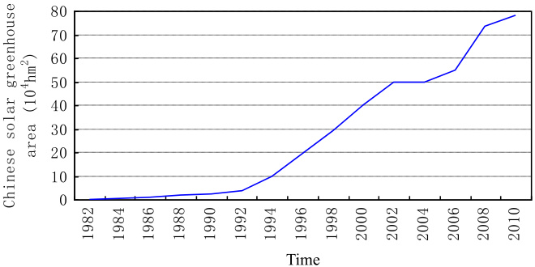
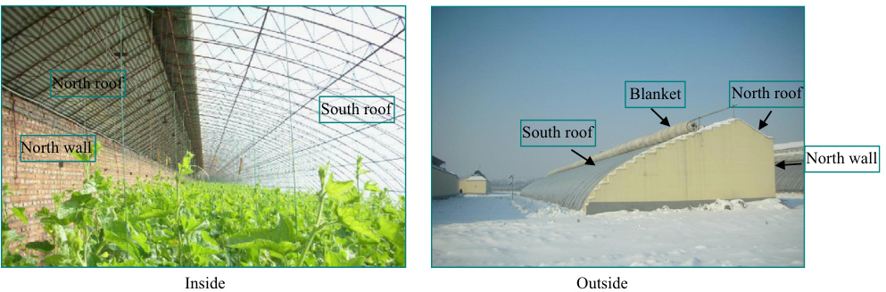
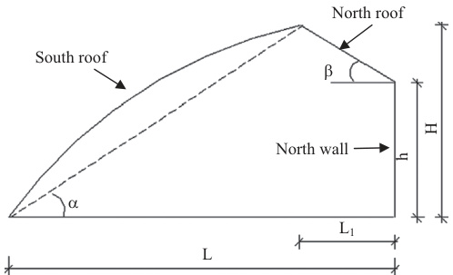

# Passive solar energy utilization: A review of cross-section building parameter selection for Chinese solar greenhouses

Guohong Tong a,n, David M. Christopher b, Tianlai Li c, Tieliang Wang a

a College of Water Conservancy, Shenyang Agricultural University, Shenyang 110866, China   
b Key Laboratory for Thermal Science and Power Engineering of Ministry of Education, Department of Thermal Engineering, Tsinghua University,   
Beijing 100084, China   
c College of Horticulture, Shenyang Agricultural University, Shenyang 110866, China

# a r t i c l e i n f o

# a b s t r a c t

Article history:   
Received 17 February 2013   
Received in revised form   
30 May 2013   
Accepted 16 June 2013   
Available online 5 July 2013   
Keywords:   
Chinese solar greenhouses (CSG)   
Span   
Height   
Roof   
Wall   
Solar energy

Chinese solar greenhouses (CSG) are fully passive solar greenhouses for growing vegetables without auxiliary heating during the winter. The building parameters then have an important effect on the solar energy utilization and the temperatures in the greenhouse. This paper reviews greenhouse building design research and development that is leading to improved solar energy usage with consideration of various design parameters involving the building span, height, south roof shape and angle, wall thickness and composition, and north roof length and angle. Most studies have focused on the influence of the building span and height on the inner thermal environment through experimental and numerical models, the optimum south roof shape that allows the maximum amount of beam radiation into the building and the north wall thickness and configuration that all markedly influenced the solar energy absorption, storage and release. The building parameter selection and the numerical methods used to model Chinese greenhouses introduced in this review will lead to improved designs of future CSG that maximize the solar energy utilization.

$\circledcirc$ 2013 Elsevier Ltd. All rights reserved.

# Contents

1. Introduction . . 541   
1.1. Background 541   
1.2. CSG building parameters. 541   
1.3. Objective . 542   
2. Development and current status of CSG cross-sectional building parameters . 542   
2.1. Height and span 542   
2.2. Shape and angle of the south roof 542   
2.2.1. South roof shape . 542   
2.2.2. South roof angle . 542   
2.3. North wall thickness and configuration . 543   
2.3.1. Earthen wall . . . 543   
2.3.2. Brick wall . . . 543   
2.3.3. Layered wall. 543   
2.4. Length and angle of the north roof 543   
3. Effect of cross-sectional design parameters on the solar energy utilization . 543   
3.1. Span and height. . 543   
3.1.1. Experimental study . . . 543   
3.1.2. Numerical models . . . . 544   
3.2. South roof shape and angle 544   
3.2.1. South roof shape . 544   
3.2.2. South roof angle . 545   
3.3. North wall thickness and configuration . 545   
3.3.1. Experimental studies . . 545   
3.3.2. Numerical calculations. 546   
3.4. North roof length and angle . . . . 546   
4. Challenges for promoting passive solar energy utilization 546   
4.1. Technical challenges . 546   
4.1.1. Shortage of design standards for CSG buildings. . . . 546   
4.1.2. Poor measurement equipment . 546   
4.1.3. Slow simulations . . . 546   
4.2. Operational challenges 546   
4.2.1. Lack of uniform construction acceptance criteria. . . . . 546   
4.2.2. Poor production management. . 546   
5. Discussion . 546   
6. Conclusions 547   
Acknowledgments. 547   
eferences . 547

# 1. Introduction

# 1.1. Background

Chinese solar greenhouses (CSG) are used to grow vegetables in the winter without any auxiliary heating, even when the monthly daily average temperatures in the coldest three months of the year fall below $- 1 0 ^ { \circ } \mathsf C$ Thus, these are fully passive solar greenhouses [1]. The first CSG, which was a simple structure with only leafy vegetables produced during the winter, was developed in the southern part of Liaoning Province, China, in 1930s [2,3]. As the materials and the building design parameters gradually improved, vegetables and even fruit could be produced in the CSG without additional heating during the winter, with temperature differences of $2 1 ^ { \circ } \mathsf { C } \mathsf { - } 2 5 ^ { \circ } \mathsf { C }$ between the inside and outside in areas from $3 2 ^ { \circ } \mathsf { N }$ to $4 1 ^ { \circ } \mathsf { N }$ in China [3,4]. The inside and outside of a typical CSG are shown in the pictures in Fig. 1. The south and north directions in the picture are for the northern hemisphere.

CSG are mostly used in Northern China [5] with CSG built on over $80 \%$ of the land area in China [6]. According to the statistical data of the Chinese Ministry of Agriculture, the total CSG area reached $7 8 . 3 4 \times 1 0 ^ { 4 } \mathrm { h m } ^ { 2 }$ in 2010 with yearly total areas as shown in Fig. 2 [7]. The CSG area rapidly increased in the early 1990s during the Eighth-five Year Plan (1990–1995) of China which promoted the CSG as a key scientific and technological project of the Ministry of Agriculture that greatly accelerated development of the CSG. This development was followed by a major science and technology project in the Ninth-five Year Plan (1996–2000) by the Ministry of Science and Technology and a key project of the National Natural Science Foundation of China [8,9]. However, this fast increase of the CSG area resulted in problems, such as poorly designed structures, poor quality materials and inadequate supervision [10,11]. Therefore, there is a great need for quality CSG building standards. Local CSG building standards were established in Liaoning, Shandong, Gansu, Xinjiang and in other regions between 2006 and 2010; however, there is still a need for quality systematic building standards for CSG [12]. The need for better CSG has led to many theoretical studies. The first paper was published in 1960 but only two papers were published in 1960s and four in 1970s [6]. The number of papers published each year since 1980s that are related to CSG designs are shown in Fig. 3 based on a web search of http://www.cnki.net. The increase in the number of published papers follows the same trend as the growth in the CSG area.

The Twelfth-five Year Plan (2011–2015) for Chinese Protected Agriculture Development projects that the CSG area will continue to steadily increase with more emphasis put on design theory and methods to improve CSG structures and operational measures.

# 1.2. CSG building parameters

Generally, CSG are $5 0 \mathrm { m } { - } 1 0 0 \mathrm { m }$ long with the structures getting longer as the farm machinery improves. Thus, the end walls have little effect on the inner microclimate, while the designs of the room and the north and south walls strongly influence the solar energy utilization. The cross-sectional building parameters are shown in Fig. 4.

  
Fig. 2. Yearly total CSG areas.

  
Fig. 1. Pictures of the inside and outside of a CSG.

  
Fig. 3. Numbers of papers on Chinese solar greenhouse published each year.

  
$L$ -span; $L _ { 1 }$ -Length of north roof horizontal projection; $h \cdot$ - north wall height; $H .$ -total height; $\alpha \cdot$ angle of south roof; $\beta$ angle of north roof.   
Fig. 4. CSG cross-sectional building parameters. $L ,$ , span; $L _ { 1 , }$ length of north roof horizontal projection; $h ,$ , north wall height; $H ,$ total height; $\alpha _ { \iota }$ , angle of south roof; $\beta ,$ angle of north roof.

The south roof is a thin transparent surface, normally made of plastic supported by a bamboo, wood, cement, or steel skeleton that transmits the solar rays to inside the CSG during the daytime. At night, a thermal blanket is placed on top of the south roof to keep the warmth in. The shape and angle of the south roof are the most significant cross-sectional parameters, since these influence the reflection and transmission of solar insolation and, thus, the amount of solar energy absorbed inside the greenhouse.

The main function of the north wall apart from the load bearing is its ability to absorb solar energy during the day and release heat to the inside during the night to conserve the energy inside the greenhouse [13]. The north wall is commonly a brick, earth, or layered wall with a rectangular cross-section for the brick wall and a trapezoidal shape for most of the earthen wall. The height, thickness and composition of the north wall all affect the amount of solar energy stored in the wall during the day. The effects of the thickness and composition are analyzed in detail in this paper.

The north roof is a non-transparent roof made of light materials, such as wood panels, aerated concrete slabs, or straw. A longer north roof improves the energy conservation when the span and height are kept constant. However, a longer north roof also increases the shading below the north roof when the sun is high in the sky. Practically, the length of the north roof horizontal projection is used instead of the length of the north roof during the design and construction. When the length of the north roof horizontal projection is kept constant, changes in the north roof angle change the amount of solar insolation intercepted by the north roof, the north wall and the soil surface.

The span and height are actually both more important crosssectional design parameters because both influence the solar energy transmitted into and retained inside the CSG. These two parameters normally depend on the type of vegetables to be grown and the CSG location.

# 1.3. Objective

The CSG area has increased rapidly during the last 30 years, however, the building designs have not been substantially improved. The design and construction of CSG buildings are closely related to the local climate, especially with the wide variety of climates in China. Thus, the choice of the cross-sectional CSG building parameters for each specific region is very important. A review of the research on the selection of the building parameters, such as the span, height, south roof shape and angle, north wall thickness and composition, and north roof length and angle, will be beneficial for maximizing solar energy utilization in future designs.

# 2. Development and current status of CSG cross-sectional building parameters

# 2.1. Height and span

From 1930s to the early time 1980s, the CSG spans increased from $5 . 5 \mathrm { m }$ to $6 \mathrm { m }$ while the heights increased from $2 \mathrm { m }$ to $2 . 5 \mathrm { { m } }$ [2]. During the mid to late 1980s and early 1990s, the spans varied from $6 \mathrm { m }$ to $7 \mathrm { m }$ with heights from $2 . 8 \mathrm { m }$ to $3 \mathrm { m }$ [3]. Nie [14] and Zhang and Li [15] concluded that spans from $5 . 5 \mathrm { m }$ to $6 \mathrm { m }$ generally had heights from $2 . 4 \mathrm { m }$ to $2 . 6 \mathrm { { m } }$ while spans from $6 \mathrm { m }$ to $7 \mathrm { m }$ generally had heights from $2 . 7 \mathrm { m }$ to $3 \mathrm { m } .$ . Zhou [16] gave a further classification of spans based on the latitude. For example, the spans were generally less than $6 \mathrm { m }$ north of $4 0 ^ { \circ } \mathsf { N } ,$ from $6 \mathrm { m }$ to $7 \mathrm { m }$ between $3 5 ^ { \circ } \mathsf { N }$ and $4 0 ^ { \circ } \mathrm { N }$ and between $7 \mathrm { m }$ and $8 \mathrm { m }$ south of $3 5 ^ { \circ } \mathsf { N }$ CSG with spans from $6 \mathrm { m }$ to $7 . 5 \mathrm { m }$ and heights from $2 . 9 \mathrm { m }$ to $3 . 5 \mathrm { { m } }$ were designed and built between 1996 and 2000 in Shenyang $( 4 1 . 8 ^ { \circ } \mathsf { N } )$ , Liaoning Province, which was a breakthrough in the higher latitudes at that time [17]. After 2000, spans were generally around $8 \mathrm { m }$ with heights about $4 \mathrm { m }$ [6]. According to another survey [18], existing spans in northern Jiangsu province were mostly from $7 . 5 \mathrm { m }$ to $1 4 \mathrm { m }$ with heights from $2 . 2 \mathrm { m }$ to $5 . 8 \mathrm { m }$ . Similar sizes have been found in most other regions. Spans greater than $1 4 \mathrm { m }$ with heights higher than $5 . 8 \mathrm { m }$ have not been reported.

# 2.2. Shape and angle of the south roof

# 2.2.1. South roof shape

The shape of the south roof has normally been a straight line, two straight sections with one bend in between, or a curved crosssection as shown in Table 1. The single straight surfaces were generally built before 1950s, with the curved surfaces now the most popular shape. The cover material for the shape with two straight sections has normally been plastic since 1960s supported by a bamboo, wood, or cement skeletons while the curved shape has usually been supported by a steel truss.

# 2.2.2. South roof angle

The amount of solar energy transmitted into the CSG varies with the angle of the south roof. If the angle is too small, greater reflection of the solar rays reduces the insolation transmitted inside. Nie [14] pointed out that the south roof angle should generally be between $2 5 ^ { \circ }$ and $3 0 ^ { \circ } .$ . The south roof angle is a function of the latitude, with suitable angles of more than $2 7 ^ { \circ }$ in Henan [21], between $2 7 ^ { \circ }$ and $2 8 . 5 ^ { \circ }$ in Ningxia [22], between $2 8 . 5 ^ { \circ }$ and $3 3 . 5 ^ { \circ }$ in Beijing [6] and between $3 0 . 5 ^ { \circ }$ and $3 2 . 5 ^ { \circ }$ in Inner Mongolia [23].

For south roofs with two straight sections, the angle of the first section near the ground was recommended to be between $6 0 ^ { \circ }$ and $9 0 ^ { \circ }$ with the angle of the second section between $2 1 . 5 ^ { \circ }$ and $3 0 ^ { \circ }$ [14,15,19,]. For curved roofs, the angles near the ground and in the middle part are recommended to be similar to the angles in the two-section shape. To facilitate work inside the greenhouse, some farmers have dug out the ground on the inside near the south edge to make a walkway that may be more than $1 \mathrm { m }$ deep adjacent to the south roof [24], which suggests that the angle near the ground must be greater than or equal to $6 0 ^ { \circ }$ .

Table 1 South roof shapes.   

<html><body><table><tr><td>Items</td><td>Shape</td><td>References</td><td>Day lighting material</td></tr><tr><td>1</td><td></td><td>Kang [2]</td><td>Glass</td></tr><tr><td>2</td><td></td><td>Kang [2]</td><td>Glass</td></tr><tr><td></td><td></td><td>Kang et al.[19] and Wang et al. [18]</td><td>Plastic</td></tr><tr><td></td><td></td><td>Li et al. [2O] and Wang et al. [18]</td><td>Plastic</td></tr><tr><td>4</td><td></td><td>Kang [2], Kang et al. [19], Sun et al. [21],and Wang et al. [18]</td><td>Plastic</td></tr></table></body></html>

# 2.3. North wall thickness and configuration

# 2.3.1. Earthen wall

The earth used to build the north wall is always easily available on site, so the greenhouses can be built cheaply. The first CSG wall had an earthen north wall [2]. At this time, earthen walls are still used in most CSGs, especially in rural areas and in northwest China. Current earthen walls are classified as being rammed by hand or by machine. Early hand rammed walls were less than $1 \mathrm { m }$ thick [6], with the thickness later thought to be best related to the local frozen soil depth in the winter [14] and with the north walls usually $0 . 8 \mathrm { m } { - 2 } \mathrm { m }$ thick for good solar heat retention [15,21,22]. Machine rammed walls usually have trapezoidal cross-sections in new CSG designs; however, there is not yet any unified design criteria. For example, machine rammed walls have been reported to be $1 . 8 \ : \mathrm { m } { - 2 . 0 \ : \mathrm { m } }$ thick at the top and $3 . 8 \mathrm { m } 6 \mathrm { m }$ thick at the bottom in Shandong Province [25–27], $1 . 1 ~ \mathrm { m } { - } 1 . 8 ~ \mathrm { m }$ thick at the top and $2 . 8 \ : \mathrm { m } { \ - } 4 . 5 \ : \mathrm { m }$ thick at the bottom in northwest China [25,28] and $2 \mathrm { m } { - } 2 . 5 \mathrm { m }$ thick at the top and $4 \mathrm { m } { \ - } 4 . 5 \mathrm { m }$ thick at the bottom in Inner Mongolia [23,29]. To further increase the thermal insulation, some areas even use top thicknesses of $3 \mathrm { m }$ and bottom thicknesses of $8 \mathrm { m }$ [6,30]. Though a thicker rammed wall provides better thermal properties, greenhouse designers and operators have realized that the thicker walls occupy too much land [31].

# 2.3.2. Brick wall

The brick layer used for the north walls is normally a clay brick wall or a hollow cement brick wall with clay brick being more common. Bricks have different sizes, so the brick wall thickness depends on the type of brick and the construction method. Wang et al. [32] suggested that clay brick walls in Zhengzhou should be less than $0 . 6 \mathrm { m }$ thick and pointed out that greater thicknesses will not proportionally increase the insulation. Wang et al. [18] found that the thicknesses of clay or hollow brick north walls in Jiangsu Province vary from $0 . 4 \mathrm { m }$ to $0 . 6 4 \mathrm { m } ,$ , with some as much as $0 . 8 \mathrm { m }$ thick. There are actually few reports describing brick walls, because most studies have been more concerned about layered walls, which have better thermal insulation properties than just a brick wall of the same thickness.

# 2.3.3. Layered wall

Layered north walls are composed of two or more layers of material and are classified as brick layered walls and earthen layered walls. Brick layered walls are usually built of brick and Styrofoam while earthen layered walls are usually made of clay brick and earth. Earthen layered walls have also been reported with earth thicknesses of $0 . 3 \ \mathrm { m } { - } 0 . 5 \ \mathrm { m }$ added outside the clay brick wall [33] or a $1 . 5 \mathrm { m }$ thick rammed wall with a clay brick layer inside [22]. Brick layered walls usually have clay brick walls inside and outside with Styrofoam, air or perlite in between, usually with total thicknesses of $0 . 4 5 \mathrm { m } { - } 0 . 6 \mathrm { m }$ [34–36] with some as thick as $1 . 1 \mathrm { m }$ [37,38]. The most complex reported brick layered wall was built with a $0 . 2 4 \mathrm { m }$ thick clay brick wall, a $0 . 0 5 \mathrm { m }$ thick air layer, a $0 . 0 5 \mathrm { ~ m ~ }$ Styrofoam layer, another $0 . 1 2 \mathrm { m }$ thick clay brick layer, another $0 . 0 5 \mathrm { ~ m ~ }$ thick Styrofoam layer, another $0 . 0 5 \mathrm { ~ m ~ }$ thick air layer and another $0 . 1 2 \mathrm { m }$ thick clay brick layer, for a total thickness of $0 . 6 8 \mathrm { ~ m ~ }$ [35].

# 2.4. Length and angle of the north roof

Practically, the north roof length is usually indicated by the roof horizontal projection, $L _ { 1 }$ in Fig. 4. The horizontal projection was approximately $2 \mathrm { m }$ before 1960s [2] and $1 \mathrm { m } { - } 1 . 5 \mathrm { m }$ after 1980s [3,18]. Hu et al. [39] suggested that the north roof length could be shorter in the area between $3 4 ^ { \circ } \mathsf { N }$ and $3 8 ^ { \circ } \mathsf { N }$ and larger in north of $3 8 ^ { \circ } \mathsf { N }$ . Hu et al. also recommended that $1 . 2 \ : \mathrm { m } { - 2 . 0 \ : \mathrm { m } }$ north roof length was suitable for greenhouses with $8 \mathrm { m } { - } 1 0 \mathrm { m }$ spans and that the north roof should be longer than $2 . 5 \mathrm { { m } }$ for spans larger than $1 0 \mathrm { m }$ .

The angle of the north roof varies greatly in existing CSG structures. The general guideline is that the angle should be $7 ^ { \circ } - 8 ^ { \circ }$ [3] or $1 0 ^ { \circ }$ [33] greater than the noon solar height on the winter solstice. Zhou [16] suggested that this angle should be larger than $3 0 ^ { \circ }$ and between $3 5 ^ { \circ }$ and $4 5 ^ { \circ }$ . Some greenhouse designs have reportedly recently used $4 6 ^ { \circ }$ in Ningxia [25] and $5 0 ^ { \circ }$ in Shandong [26].

# 3. Effect of cross-sectional design parameters on the solar energy utilization

# 3.1. Span and height

# 3.1.1. Experimental study

Temperature and the day lighting environment were measured inside two greenhouses with the same span of $8 \mathrm { m }$ and different heights of $3 . 1 \mathrm { ~ m ~ }$ and $3 . 7 \mathrm { m }$ with the taller greenhouse having better results [40]. Zhang et al. [25] concluded that increasing the height-to-span ratio greatly improved the thermal environment from air temperature and surface heat flux measurements in two greenhouses with a span of $6 . 8 \mathrm { m }$ and height of $3 . 5 \mathrm { { m } }$ and with a span of $7 . 8 \mathrm { { m } }$ and height of $4 . 3 \mathrm { m }$ .

The inner thermal environments in different size CSG have been measured in different regions to evaluate their thermal capacities in winter. For example, temperatures, humidity and solar radiation were measured in CSG in Shenyang with a span of $7 . 5 \mathrm { m }$ and a height of $3 . 5 \mathrm { { m } }$ [41] and with a span of $1 2 \mathrm { m }$ and a height of $5 . 5 \mathrm { m }$ [42] which showed that the temperature varied a small amount and the humidity was more evenly distributed in the larger CSG and that both could produce vegetables without auxiliary heating in the winter. Vegetables could also be produced in winter in a CSG with a span of $8 \mathrm { m }$ and a height of $4 \mathrm { m }$ in Gansu, where the largest temperature difference between the inside and outside exceeded $3 2 ^ { \circ } \mathsf { C }$ [43]; in Shouguang in a CSG with a span of $1 0 . 8 \mathrm { m }$ and a height of $4 . 7 \mathrm { m }$ , where the largest temperature differences between the inside and outside were $2 5 ^ { \circ } \mathsf { C } \mathsf { - } 2 8 ^ { \circ } \mathsf { C }$ [44] and in Turpan in a CSG with a span of $8 \mathrm { m }$ and a height of $4 \mathrm { m }$ , where the temperature differences between the inside and outside were nearly $2 5 ^ { \circ } \mathsf { C }$ on the winter solstice [45]. Liu et al. [46] also reported detailed measurements of the thermal environments in three greenhouses with an $8 \mathrm { m }$ span and a $3 . 5 \mathrm { { m } }$ ridge height, a ${ 9 } \mathrm { m }$ span and a $4 . 6 \mathrm { { m } }$ ridge height and a $1 0 \mathrm { m }$ span and a $4 . 6 \mathrm { { m } }$ ridge height. The authors concluded that the greenhouse with the ${ 9 } \mathrm { m }$ span was better because it had lower humidities and retained the heat better than the other two.

# 3.1.2. Numerical models

The first known lumped parameter model used to predict the micrometeorological environment inside a CSG was reported in 1994 [47] with the results having an average error of $4 . 9 \%$ for the predicted temperatures compared with measurements for a greenhouse with a $6 \mathrm { m }$ span and a $3 . 1 \mathrm { ~ m ~ }$ height. This model included an inner air humidity balance for the plant evaporation and five thermal balances for the interior air with convection between the air and the ground, the north roof, the north wall and the south roof, a south roof thermal balance, a wall thermal balance based on the thermal response factor method, a north roof thermal balance and a ground thermal balance assuming that the soil temperature at $2 \mathrm { m }$ depth was kept constant. The model has been improved in several other studies. For example, Chen and Wang [48] added soil evaporation in their model with an average temperature error of $3 . 8 \%$ for a greenhouse with a $5 . 9 \mathrm { m }$ span and $2 . 3 \mathrm { m }$ height. Li et al. [49] separated the soil, wall and north roof into layers in their model and added radiation exchange from the south roof to the sky and a thermal balance for the plant canopy, with an average temperature error of $5 . 2 \%$ for the same greenhouse as Li et al. [47]. Wu et al. [50] included the emission and absorption of radiation from the plants and the latent heat for the plant evaporation, with an average temperature error of $5 . 1 \%$ for a greenhouse with $7 \mathrm { m }$ span and $3 . 5 \mathrm { { m } }$ height. Meng et al. [51] used a more detailed model with the plants inside treated as a “big leaf” and validated the model for a greenhouse with a $7 \mathrm { m }$ span and a $3 \mathrm { m }$ height using an Index of Agreement, with the Index of Agreement exceeding 0.66 for the calculated temperatures of all parts. All these models were one-dimensional lumped parameter models. Two-dimensional models are now being built based on the one-dimensional lumped parameter models [52]. Tong et al. [53] analyzed the influence of two and three-dimensional models for CSG designs to predict the interior temperatures using a computational fluid dynamics (CFD) method and showed that the two-dimensional model was reasonable for a long greenhouse. Tong et al. [54] used a two-dimensional numerical model to predicted time-dependent temperature distributions inside a CSG during three clear days followed by a cloudy day during the winter using measured external climatic conditions and a CFD analysis. Their results showed that the average temperature differences between the simulated and measured air temperatures during the nighttime were less than $1 . 0 ^ { \circ } \mathsf { C }$ on the clear days and no more than $1 . 5 ^ { \mathrm { ~ \circ ~ } } \mathsf { C }$ during the entire cloudy day.

Guo et al. [55] used a thermal response factor model to analyze the greenhouse thermal response with the thermal parameters assumed to change continuously with time in the form of an isosceles triangle. They calculate the response factors for the walls and then the wall heat gains and losses. The authors used their program to analyze the influence of the height $2 . 2 \ \mathrm { m } , 2 . 6 \ \mathrm { m } , 3 . 0 \ \mathrm { m }$ and $3 . 3 \mathrm { m } \mathrm { \dot { } }$ ) on the inner thermal environment, keeping the span, length and angle of the north roof constant and suggested that the $3 . 3 \mathrm { { m } }$ height gave the best results [20].

# 3.2. South roof shape and angle

# 3.2.1. South roof shape

The reflection and transmission of the solar rays varies with the shape of the south roof assuming that the same material is used for the south roof. Kang et al. [19] measured temperatures, light intensities and radiation fluxes inside two greenhouses with the same span and height and different shapes, one with a curved south roof and another with two sections with the results showing that the curved surface was better. Most studies of the effect of the south roof design have used numerical models due to the difficulties and limits of experiments. Wu et al. [56] and Chen et al. [57] calculated the solar beam radiation fluxes transmitted through the south roof by separating the south roof into several small sections as shown in Fig. 5a. They then calculated the projections of the solar rays from each section onto the soil and wall surfaces and integrated the solar fluxes over time and over each surface area. Chen et al. [57] further compared the total beam radiative fluxes transmitted through the south roof for elliptical, circular, parabolic, and circular–parabolic shapes in a greenhouse with $6 \mathrm { m }$ span and $2 . 8 \mathrm { m }$ height with the results showing that the greenhouse with a circular–parabolic south roof was the best choice with the most beam radiation transmission. Wang et al. [58] came to the same conclusion. Zhang et al. [59] concluded from an investigation in Shanxi province that the solar transmittance across the greenhouse span changed much for the curved shape and less for the shape with two straight sections and deduced that the angle of the upper part of the two section design was greater than that of the upper part of the curved design.

  
Fig. 5. Treatment for searching for the optimum south roof shape.

For the interior temperature, Li et al. [20] suggested that a greenhouse with a straight south roof had higher temperatures than greenhouses with two sections, parabolic or elliptic south roofs. Sun et al. [60] analyzed south roofs having elliptical, hyperbolic, circular, logarithmic, cycloid and parabolic shapes by separating the south roof into several small sections and determining the projections of the solar rays from each section onto the north roof, wall and soil surfaces. They then calculated the instantaneous corresponding light transmittance and solar intensity for each part and integrated the light transmittance and solar fluxes over time and over each surface area. Chen et al. [61] analyzed the influence of the greenhouse azimuth and length on the solar transmittance, reflectivity and shadows inside.

Sun et al. [62] calculated the beam radiation absorption inside 12 greenhouses with different south roof shapes in Beijing with the largest difference being less than $4 . 4 \%$ . Du et al. [63] used the view factor method to predict the diffuse radiation transfer between the interior surfaces. Tong and Li [64] then proposed a simplified method to calculate the total solar radiation absorbed on different surfaces based on the existing beam and diffuse radiation models.

Zhou et al. [65] used a network optimization method to determine the best south roof shape that gave the maximum amount of beam radiation transmitted through points $\left( x _ { i } , y _ { i } \right)$ in Fig. 5b. The idea was to use the coordinate $\left( x _ { i } , y _ { i } \right)$ in the net shown in Fig. 5b as the variable, with a set of points $\left( x _ { i } , y _ { i } \right)$ found that gave the maximum amount of beam radiation input into the greenhouse for the given geometric constraints, with the south roof then formed by connecting the set of points.

Tong et al. [66] determined the optimum south roof shape using a dynamic programming method where the south roof was separated into $n$ sections along the span as shown in Fig. 5c with the problem defined to determine the heights above each point on the ground that maximized the solar radiation transmitted into the CSG with the $n$ dimensional problem then solved by a one dimensional dynamic programming method. The analysis took the $n$ sections as $n$ phases with phase variable $K = 1$ , 2,…, n. $x _ { k }$ was then defined as the starting heights of the surfaces for the kth phase, with the decision variable $U _ { k } \left( x _ { k } \right)$ , which was the decision at $x _ { k } ,$ given by

$$
U _ { k } ( x _ { k } ) = S _ { k }
$$

where $S _ { k }$ was the ending height of the surface for section $k$ which maximized the amount of beam radiation transmitted through the surface.

The state transition equation, which described the starting height of surface in the $( K { + } 1 ) \mathrm { t h }$ phase, was given by

$$
x _ { k + 1 } = U _ { k } ( x _ { k } ) = S _ { k }
$$

The objective function was given by

$$
\begin{array} { l } { f _ { k } ( x _ { k } ) = \operatorname* { m a x } [ g _ { k } ( S _ { k } ) } \\ { \quad + f _ { k + 1 } ( x _ { k + 1 } ) ] k = n , n - 1 , . . . , 1 ; \quad f _ { n + 1 } ( x _ { n + 1 } ) = 0 } \end{array}
$$

where $f _ { k }$ $\left( x _ { k } \right)$ stood for the maximum amount of beam radiation obtained from the Kth phase to the nth phase; $g _ { k } \left( S _ { k } \right)$ indicated the sum of the beam radiation input into the greenhouse from the time the thermal blanket on the south roof was rolled up to when it was again rolled down in the afternoon for the Kth phase. The best south roof shape was then obtained by connecting each height based on the objective of maximizing the beam radiation subject to some geometric limits.

However, the south roof shapes obtained using these methods considered only the beam radiation with new models needed that include both beam and diffuse radiation.

# 3.2.2. South roof angle

Three kinds of south roof angles are usually considered in CSG designs, an ideal angle, a reasonable angle and an optimal angle. The ideal south roof angle is the roof angle for which the solar insolation has an angle of $0 ^ { \circ }$ to the surface normal at noon on the winter solstice, while the reasonable angle normally has an angle of $4 0 ^ { \circ }$ with the surface normal at noon on the winter solstice. The optimal angle is the south roof angle that makes the solar insolation have an angle of less than $4 0 ^ { \circ }$ to the surface normal for $^ { 4 \mathrm { h } }$ around noon on the winter solstice. This optimal angle has been widely used in CSG designs. Liu and Ma [67] calculated the changes in the interior radiation for various south roof angles and suggested that the total radiation increases slowly for angles greater than $3 5 ^ { \circ }$ . Ding et al. [68] confirmed that the optimal south roof angle should be determined based on the solar angle for more than $^ { 4 \mathrm { h } }$ around noon on the winter solstice after calculations for 4 south roof angles of $2 4 ^ { \circ }$ , $3 0 ^ { \circ }$ , $3 4 ^ { \circ }$ and $4 0 ^ { \circ }$ . Li et al. [69] further investigated the ideal angle, the reasonable angle and the optimal angle for the south roof.

# 3.3. North wall thickness and configuration

# 3.3.1. Experimental studies

Kang et al. [70] measured the inner surface temperatures of rammed earthen walls with thicknesses of $0 . 5 \mathrm { m }$ 1 m and $1 . 5 \mathrm { m }$ in one greenhouse and pointed out that all the surface temperatures were higher than the air temperature during the night but that the temperature difference between the wall surface and the interior air became smaller with increasing wall thickness. Thus, the $1 \mathrm { m }$ thickness was determined to be suitable in Anshan, with this thickness nearly the same as the local frozen soil thickness in winter. Sun et al. [21] measured temperatures of the inside and outside surfaces and at depths of $0 . 0 5 \mathrm { m }$ , $0 . 1 \mathrm { ~ m ~ }$ , $0 . 3 \mathrm { m }$ , 0.5 m, $0 . 7 \mathrm { m }$ and $0 . 9 \mathrm { m }$ in a $1 \mathrm { m }$ thick rammed earthen wall. Their results showed that the temperatures changed little during the day from $0 . 3 \mathrm { m }$ to $0 . 5 \mathrm { m }$ deep in the wall and deduced that the rammed earthen wall thickness should be larger than $0 . 8 \mathrm { m }$ in the Huanghuai area. Yang et al. [71] selected four regions in northwest China, Tacheng in Xinjiang, Yangling in Shanxi, Baiyin in Gansu and Yinchuan in Ningxia, and measured temperatures inside three greenhouses in each region with the greenhouses having spans from $7 \mathrm { m }$ to $7 . 5 \mathrm { m }$ , heights from $3 . 2 \mathrm { m }$ to $3 . 6 \mathrm { { m } }$ and average earthen wall thicknesses from $0 . 9 \mathrm { m }$ to $2 . 2 \mathrm { m }$ . The authors then recommended suitable wall thicknesses of $1 . 4 \mathrm { m }$ for Tacheng, $1 \mathrm { m }$ for Yangling, $1 . 3 \mathrm { m }$ for Baiyin and $1 . 5 \mathrm { m }$ for Yinchuan.

Chen et al. [34] investigated the effect of the north wall configuration with measurements of the temperatures inside layered walls showing that the best CSG wall configuration is a layered wall with a high thermal capacitance material on the inside and highly insulating material on the outside. Most of the layered walls in existing CSG follow this suggestion with different numbers of layers and types of material used in different situations.

# 3.3.2. Numerical calculations

Guo et al. [72] numerically analyzed 20 different wall configurations with single material or layered walls for a CSG with a $7 . 2 \mathrm { m }$ span and $3 . 0 \mathrm { m }$ height and concluded that the layered walls were better than the single material walls. Li and Chen [73] analyzed various wall thicknesses and configurations in a CSG with $6 \mathrm { m }$ span and $3 . 3 \mathrm { ~ m ~ }$ height and recommended that the brick wall should be more than $0 . 3 6 \mathrm { m }$ and less than $0 . 6 \mathrm { { m } }$ thick based on the predicted air temperatures for wall thicknesses from $0 . 1 2 \mathrm { m }$ to $0 . 8 4 \mathrm { m }$ with $0 . 1 2 \mathrm { m }$ increments and that the Styrofoam should be more than $0 . 1 \mathrm { ~ m ~ }$ thick with the inner air temperature increasing slowly with $0 . 2 4 \mathrm { m }$ thick brick walls on the inside and the outside with Styrofoam thicknesses of $0 . 0 1 \mathrm { ~ m ~ }$ , $0 . 0 3 \mathrm { ~ m ~ }$ , $0 . 0 5 \mathrm { m }$ $0 . 0 7 \mathrm { m } , 0 . 1 \mathrm { m } , 0 . 1 5 \mathrm { m } , 0 . 2 \mathrm { m }$ and $0 . 3 \mathrm { m }$ in between.

Tong et al. [35] used the harmonic response method [74] to analyze the heat transfer through the walls. The analysis involved simplification of the boundary condition with the inside and outside temperatures expressed by simple harmonic functions with a fundamental frequency of $\pi / 1 2$ rad given by a Fourier series expansion. The frequency response of the wall was then calculated for unit inside or outside temperature variations with the results indicated by a time lag and decrement factor. The heat transfer rates through the wall for each of the harmonics were then superimposed. The authors then analyzed the insulation abilities and the delay times of multiple layers of brick and Styrofoam with a total thickness of $0 . 6 \mathrm { m }$ with the brick wall and Styrofoam layer thicknesses in increments of $0 . 1 2 \mathrm { m }$ . The Styrofoam was installed as a whole piece on the outside or in between the brick layers in the layered wall. The layered wall with $0 . 3 6 \mathrm { m }$ thick brick wall inside and $0 . 2 4 \mathrm { m }$ thick Styrofoam board on the outside gave the best results when the inner temperature was kept constant for all cases.

Ma et al. [36] used a finite difference model to predict the wall temperature and the thermal release from the wall during the night time. The model was validated for a layered wall $1 . 0 8 \mathrm { m }$ thick with $0 . 4 9 \mathrm { m }$ thick brick walls inside and outside and $0 . 1 \mathrm { ~ m ~ }$ air layer in between for a CSG with a span of $1 1 \mathrm { m }$ and a height of $3 . 3 \mathrm { { m } }$ .

# 3.4. North roof length and angle

There have been few studies of the effect of the CSG north roof design compared to the number of studies of the north wall and the south roof. Li et al. [20] numerically investigated the effect of the north roof length on the inner air temperature with the span, height and north roof angle kept constant and suggested that a shorter roof length was suitable for low latitudes while the longer one was better for higher latitudes. Tong et al. [75] experimentally studied the effect of the north roof angle on the inner air temperature in scale models to show no marked changes in the air temperatures for north roof angles of $8 . 2 ^ { \circ }$ , $3 2 ^ { \circ }$ and $7 0 . 5 ^ { \circ }$ , keeping the span, north wall height and length of the north roof constant. Sun et al. [62] showed that the height increase by raising the north roof angle increased the amount of sunlight transmitted inside, but the energy increase was limited since the heat release was larger from the enlarged south roof surface during the night. Luo et al. [76] compared the inside temperatures of two greenhouses with the same total height of $4 . 2 \mathrm { m }$ with one having a north roof length of $3 \mathrm { m }$ and an angle of $4 0 ^ { \circ }$ and the other without a north roof. Their measurements showed that near the winter solstice the greenhouse with the north roof had higher inside temperatures than the other but when far from the winter solstice when the solar height had increased, the greenhouse without the north roof had higher temperatures.

# 4. Challenges for promoting passive solar energy utilization

# 4.1. Technical challenges

# 4.1.1. Shortage of design standards for CSG buildings

Most greenhouses built by growers are simple, low cost structures that sometimes fail due to wind and snow loads [7]. Furthermore, greenhouse production in the winter often suffers from severe weather with excessive cooling on cold, cloudy days [77]. The very cold weather requires good building designs and suitable enclosure materials [78]. Design standards for CSG buildings are largely dependent on detailed design theories [10] with few thorough theoretical design studies of CSG structures.

# 4.1.2. Poor measurement equipment

Measurement instruments often do not work well in high humidity conditions with relative humidities more than $90 \%$ , even up to $1 0 0 \%$ inside the CSG during the night or on successive cloudy days. In addition, there is no complete database comparing the thermal environments inside different kinds of CSG buildings [6].

# 4.1.3. Slow simulations

The heavy thermal mass of the enclosure enables year-around cultivation of vegetables. However, this large thermal mass of the enclosure significantly slows numerical analyses of the heat transfer mechanisms inside the CSG structure due to the thermal absorption, storage and release from the thermal mass. Thus, simulation models cannot easily describe the thermal system response, especially for the wide variety of structures, materials and boundary conditions encountered in CSG designs.

# 4.2. Operational challenges

# 4.2.1. Lack of uniform construction acceptance criteria

The very different construction methods and materials mean that greenhouse construction quality varies greatly. For example, the different methods used to build the rammed earthen wall can result in very different degrees of compaction and very different thermal conductivities for the walls, so the solar energy utilizations are different. Zhou et al. [10] suggested that CSG builders had to understand the construction objectives so that CSG building properties could be more uniform for the same kind of CSG building.

# 4.2.2. Poor production management

CSG buildings have been built and managed by a wide variety of growers. The CSG operations, such as irrigation, ventilation, and thermal blanket management, cannot be totally mechanized but are generally based on the grower personal experience. Thus, it is hard to maintain a consistent, suitable thermal environment inside the CSG. In addition, most growers are not technically literate which is also a barrier to the proper operation management [9].

# 5. Discussion

The cross-sectional building parameters strongly influence the solar energy absorption and heat conservation inside the CSG. This paper reviews research and development work on the building cross-sectional parameters including experimental and numerical studies of the effects of the span, height, south roof shape and angle, north wall thickness and configuration, and north roof length and angle. All these cross-sectional building parameters are related to each other in a CSG system. Thus, the cross-sectional parameters should be analyzed together in future studies of passive solar energy utilization. In addition, CSG designs are related to the local climate; thus, the cross-sectional building parameters must vary with the climate, especially since the CSG are built on over $80 \%$ of the land area in China [6].

Further studies promoting passive solar energy utilization will benefit from this review of the cross-sectional building parameters and the numerical study methods. Improved solar energy utilization is greatly needed in CSG since they have no auxiliary heating in winter and need warmer interior climates to improve the growing conditions.

# 6. Conclusions

The experimental and numerical studies of CSG cross-sectional building parameters, the span, height, south roof shape and angle, north wall thickness and configuration, and north roof length and angle, can be summarized as:

(a) Current CSG spans are commonly around $8 \mathrm { m }$ with heights of about $4 \mathrm { m }$ with a maximum span of $1 4 \mathrm { m }$ and a maximum height of $5 . 8 \mathrm { m }$ . Measured temperature differences between the inside and the outside are sometimes as great as $2 0 \ { ^ { \circ } C } -$ $2 5 ^ { \circ } \mathsf { C }$ in the winter. One-dimensional lumped parameter models and time-dependent two-dimensional CFD models have been used to model the microclimate inside various kinds and sizes of CSG.   
(b) The south roofs are generally made of two sections or curved shapes with the curved shapes most popular nowadays. The best south roof shape has been determined using models of the beam radiation with integration over a curve using a series of straight line segments solved with network optimization and dynamic programming. The south roof angle is related to the latitude with higher latitudes requiring larger south roof angles.   
(c) Earthen walls are used in the majority of existing CSG for the north wall with the wall thickness at the bottom ranging from $2 . 8 \mathrm { { m } }$ to $6 \mathrm { m }$ . There were only a few reports of brick walls being used for the north wall since they are expensive compared with earthen walls and have greater thermal conduction through the wall than layered walls.   
(d) The response factor, frequency response and finite difference methods have been used to analyze the effects of the north wall thickness and the north wall configuration on the thermal environment inside the CSG.   
(e) The north roof length is usually around $1 \mathrm { m } { - } 1 . 5 \mathrm { m }$ with shorter lengths suitable for lower latitudes and longer lengths used for higher latitudes. Studies have shown that increasing the north roof angle has little effect on the interior temperature.

# Acknowledgments

This work was supported by the National Natural Science Foundation of China under contract number 31071833 and National High-tech R&D Program of China (863 Program) under contract number 2013AA102407.

# References

[1] Van Henten EJ, Vanthoor B, Stanghellini C, De Visser PHB, Hemming S. Modelbased design of protected cultivation systems-first results and remaining challenges. Acta Horticulturae 2012;957:255–66.   
[2] Kang S. Development and improvement for Chinese solar greenhouse of Anshan. Transactions of the CSAE 1990;6(2):101–2 (in Chinese).   
[3] Chen D. Advance of the research on the architecture and environment of the Chinese energy-saving sunlight greenhouse. Transactions of the CSAE 1994;1:123–9 (in Chinese with English abstract).   
[4] Pan J. Development of sunlight greenhouse in China. Journal of Shihezi University (Natural Science) 1996;3:1–4 (in Chinese with English abstract).   
[5] Wang L, Xiang C. A preliminary study on the climatic divisions of the energysaving solar greenhouses in China. Transactions of the CSAE 1998; (Supp.):36–41 (in Chinese with English abstract).   
[6] Chen Q. Progress of practice and theory in sunlight greenhouse. Journal of Shanghai Jiaotong University (Agricultural Science) 2008;26(5):343–50 (in Chinese with English abstract).   
[7] Guo S, Sun J, Shu S, Lu X, Tian J, Wang J. Analysis of general situation, characteristics, existing problems and development trend of protected horticulture in China. China Vegetables 2012;18:1–14 (in Chinese with English abstract).   
[8] Committee of Protected Horticultural Engineering, the Chinese Society of Agricultural Engineering. The Chinese protected horticultural engineering in the developmental tide of agricultural modernization. Transactions of the CSAE 1998; (Suppl. 1–5) (in Chinese with English abstract).   
[9] Li T. Present situation and development trend of protected horticulture in China. Journal of Huazhong Agricultural University 2004; (Supp.):1–4 (in Chinese with English abstract).   
[10] Zhou C, Wang S, Chen D, Zhou Y, Yang Z. Issues of Working out National Greenhouse Standards. Transactions of the CSAE 2002;18(4):189–92 (in Chinese with English abstract).   
[11] Wang S. Accelerate the standards development and enhance market competitiveness. Agricultural Engineering Technology, Greenhouse & Horticulture 2003;2:3–4.   
[12] Zhou C. Research process of greenhouse standardization in China. China Vegetables 2012;18:15–20 (in Chinese with English abstract).   
[13] Yang $\scriptstyle { \mathrm { Q } } .$ Energy efficient heating technologies and models in lean-to Chinese solar greenhouses: a review. Acta Horticulturae 2012;957:83–9.   
[14] Nie H. Structure and construction of solar greenhouse in northern China. Agricultural Engineering Technology, Greenhouse & Horticulture 1990;4(2–3):14 (in Chinese).   
[15] Zhang Z, Li J. Ways and measures to optimize the performance of solar greenhouse structure (upper part). Agricultural Engineering Technology, Greenhouse & Horticulture 1996;8:7 (in Chinese).   
[16] Zhou C. Architectural design principles of solar greenhouse. Agricultural Engineering Technology, Greenhouse & Horticulture 1994;4:7.   
[17] Bai Y, Wang T, Tong G, Liu W. Experimental research on energy saving of solar greenhouse of type northeast of China – type Liaoshen I solar greenhouse. Energy Conservation Technology 2002;20(1):21–3 (in Chinese with English abstract).   
[18] Wang J, Wang J, Sun J, Guo S. Structure configuration and parameters of solar greenhouse in northern Jiangsu province. China Vegetables 2012;18:89–98 (in Chinese with English abstract).   
[19] Kang S, Dai Y, Fang S, Wei K. Energy-saving solar greenhouse lighting surface shape and height and span. China Vegetables 1993;1:6–9 (in Chinese).   
[20] Li Z, Guo H, Zhang Z, Cui Y, Wu D. The relationship between the geometric factors and interior temperature environment of solar greenhouse. Journal of Shenyang Agricultural University 1995;26(1):58–63 (in Chinese with English abstract).   
[21] Sun Z, Wang J, Jia P. Study on the design and property of Huanghuai improved solar plastic greenhouse. Transactions of the CSAE 1996;12(Supp.):41–7 (in Chinese with English abstract).   
[22] Qu J, Feng H, Zhang L, Guo W, Li A, Lu Z. Comparison study on daily environment variation in 4 types of compound cob wall solar greenhouse in Ningxia arid sandstorm area. Hubei Agricultural Sciences 2011;50(18):3844–8 (in Chinese with English abstract).   
[23] Lin L, Chen Z, Su M, Pang Z, Yue L, Wang X, et al. Building and application of machine-building thick wall greenhouse in the hilly mountainous areas of Inner Mongolia. Journal of Inner Mongolia Agricultural University 2007;28 (3):313–6 (in Chinese with English abstract).   
[24] Shi J. Alteration of aisle for the semi-underground solar greenhouse. Modern Agriculture Science and Technology 2013;6:193–4 (in Chinese).   
[25] Zhang Y, Bao C, Cao Y. Analysis on measurement of heat absorption and release of wall and ground in two different solar greenhouses. Research of Agricultural Modernization 2011;32(4):509–12 (in Chinese with English abstract).   
[26] Ding X, Zhou C, Wei X. Performance and adaptability of solar greenhouse with sinking floor and adobe wall. Proceedings of the 2nd high-level International Forum on Protected Horticulture (Shouguang 2011:100–7 (in Chinese with English abstract).   
[27] Cao Y, Zhang J, Zhao S, Ma C, Jiang C, Wei J, et al. Thermal environment testing on solar greenhouse of Shandong Shouguang in winter. Proceedings of the 2nd high-level International Forum on Protected Horticulture (Shouguang, China 2011:138–44 (in Chinese with English abstract).   
[28] Zou Z, Zhang Y. Performance analysis of hillside solar greenhouse. Proceedings of the 2nd high-level International Forum on Protected Horticulture (Shouguang, China 2011:86–92 (in Chinese with English abstract).   
[29] Yue L, Ling G, Zhang Z, Zhang Z, Wu L, Song Y. Solar greenhouse thick wall construction technology in Chifeng city. Inner Mongolia Agricultural Science and Technology 2005;1:44 (in Chinese).   
[30] Zhang J, Lin L, Yan W, Ji Z. Investigation and studies on structure of solar greenhouse in Shanxi province. China Vegetables 2013;4:90–4 (in Chinese with English abstract).   
[31] Li J, Li J, Cao K, Zhao Z, Zhang D, Xu F, et al. Present status and existing problems of studies on protected agriculture in northwest China. China Vegetables 2013;6:24–9 (in Chinese with English abstract).   
[32] Wang Q, Chen J, Sun Z, Zhao Y, Wu M, Yang X, et al. Heat flux analysis of inner surface of north wall in solar greenhouse. Chinese Journal of Agrometeorology 2010:225–9, (in Chinese with English abstract), 31( 2) 2010:225–9 (in Chinese with English abstract).   
[33] Jia T. Basic structure of highly efficient energy-saving solar greenhouse. Agricultural Engineering Technology, Greenhouse & Horticulture 2001;5:8 (in Chinese).   
[34] Chen D, Zheng H, Liu B. Comprehensive study on the meteorological environment of the sunlight greenhouse. part1: preliminary study on the thermal effect of the wall body and covering materials. Transactions of the CSAE 1990;6(2):77–81 (in Chinese with English abstract).   
[35] Tong G, Wang T, Bai Y, Liu W. Heat transfer property of wall in solar greenhouse. Transactions of the CSA E 2003;19(3):186–9 (in Chinese with English abstract).   
[36] Ma C, Bu Y, Ji X, Lu H, Zou L, Wang Y, et al. Method for calculation of heat release at night and evaluation for performance of heat preservation of wall in solar greenhouse. Journal of Shanghai Jiaotong University (Agricultural Science) 2008;26(5):411–5 (in Chinese with English abstract).   
[37] Wang S, Yang Q. Application of heat isolation curtain for thermal release controlling in Chinese solar greenhouse. Chinese Journal of Agrometeorology 2010;31(3):407–10 (in Chinese with English abstract).   
[38] Ma C, Lu H, Li R, Qu M. One-dimensional finite difference model and numerical simulation for heat transfer of wall in Chinese solar greenhouse. Transactions of the CSAE 2010;26(6):231–7 (in Chinese with English abstract).   
[39] Hu Y, Pan Z, Zhao Z, Tian S, Li X. Misunderstandings and countermeasures for semi-underground solar greenhouse in Shouguang. China Vegetables 2013;7:41–3 (in Chinese).   
[40] Tao Z, Li M, Bian M, Zhan J. The design for the solar lean-to greenhouses in cold areas. China Vegetables 2002;2:19–21 (in Chinese with English abstract).   
[41] Bai Y, Liu W, Wang T, Tong G, Meng S. Experimental research on environment and heat preservation effect of solar greenhouse: type Liaoshen I. Transactions of the CSAE 2003;19(5):191–6 (in Chinese with English abstract).   
[42] Tong G, Li T, Wang T, Tomoharu Y, Bai Y. Experimental research on microclimate environment in a large-scale solar greenhouse. Journal of Huazhong Agricultural University 2004; (Supp.):67–73 (in Chinese with English abstract).   
[43] Chang T. Optimized design and performance of high insulated assembly energy-saving solar greenhouses. Transactions of the CSAE 2002;18 (Supp.):67–9 (in Chinese with English abstract).   
[44] Zhang F, Zhang L. Experimental research on cob wall’s insulation and heat preservation performance of sunken greenhouse. Renewable Energy Resources 2009;27(3):18–20 (in Chinese with English abstract).   
[45] Zhang J, Zhou L, Zhou H, Luo W, Wang C. Winter solar greenhouse design and construction technology and performance in Turpan area. Agricultural Engineering Technology, Greenhouse & Horticulture 2009;28:17 (in Chinese).   
[46] Liu Y, Zou Z, Hu X, Bian Z, Wang Y. Analysis of light and temperature conditions of sunlight greenhouses with different span lengths in central Shaanxi plain. Journal of Northwest A & F University 2013;41(2):108–16 (in Chinese with English abstract).   
[47] Li Y, Wu D, Yu Z. Simulation and test research of micrometeorology environment in a sun-light greenhouse. Transactions of the CSAE 1994;10(1):131–6 (in Chinese with English abstract).   
[48] Chen $\scriptstyle { \mathrm { ~ Q ~ } }$ Wang Z. Dynamic simulation of sun-light greenhouse thermal environment. Journal of China Agricultural University 1996;1(1):67–72 (in Chinese with English abstract).   
[49] Li W, Dong R, Tang C, Zhang S. A theoretical model of thermal environment in solar plastic greenhouses with one-slope. Transactions of the CSAE 1997;13 (2):160–3 (in Chinese with English abstract).   
[50] Wu C, Zhao X, Guo W. Simulation and analysis of the temperature inside the sunlight greenhouse. Transactions of the CSA 2007;23(4):190–5 (in Chinese with English abstract).   
[51] Meng L, Yang Q, Bot GPA, Wang N. Visual simulation model for thermal environment in Chinese solar greenhouse. Transactions of the CSAE 2009;25 (1):164–70 (in Chinese with English abstract).   
[52] Ma C, Han J, Li R. Research and development of software for thermal environmental simulation and prediction in solar greenhouse. Northern Horticulture 2010;15:69–75 (in Chinese with English abstract).   
[53] Tong G, Christopher DM, Li T, Wang T. Influence of 2D and 3D simulations on temperature predictions for Chinese solar greenhouse. Journal of Shanghai Jiaotong University (Agricultural Science) 2008;26(5):421–3 (in Chinese with English abstract).   
[54] Tong G, Christopher DM, Li B. Numerical modelling of temperature variations in a Chinese solar greenhouse. Computers and Electronics in Agriculture 2009;68(1):129–39.   
[55] Guo H, Li Z, Zhang Z, Cui Y. Simulation of the temperature environment for solar greenhouse: mathematic model and program verification. Journal of Shenyang Agricultural University 1994;25(4):438–43 (in Chinese with English abstract).   
[56] Wu Y, Cao Y, Sun Z, Li Y. An analytical method of light transmissivity in greenhouse design -the first part of serial studies in simulation of light environment in protected cultivation. Transactions of the CSAE 1992;8 (3):73–80 (in Chinese with English abstract).   
[57] Chen D, Zheng H, Zhang J, Qiu J. A comprehensive research on the meteorological environment in sun-light greenhouse(Ⅲ)-A comparative research on the total amount of direct radiation in the greenhouse with different arc lighting surfaces. Transactions of the CSAE 1992;8(4):78–82 (in Chinese with English abstract).   
[58] Wang J, Cui $\mathsf { Q }$ Lin M. Illumination environment of different structural solar greenhouses and their supplement illumination. Transactions of the CSAE 2002;18(4):86–9 (in Chinese with English abstract).   
[59] Zhang J, Lin L, Yan W, Ji Z. Investigation and studies on structure of solar greenhouse in Shanxi province. China Vegetables 2013;4:90–4 (in Chinese with English abstract).   
[60] Sun Z, Wu Y, Cao Y, Li Y. A method of computer simulation of direct solar radiation within greenhouses-the third part of serial studies on simulation of light environment of farming under structure. Transactions of the CSAE 1993;9(1):36–41 (in Chinese with English abstract).   
[61] Chen Q. Numerical experiments on direct light transmission of single roof greenhouse. Transactions of the CSAE 1993;9(3):96–101 (in Chinese with English abstract).   
[62] Sun Z, Li Y, Wu Y, Cao Y. Simulation and analysis of direct solar radiation in greenhouses in Beijing area. Transactions of the CSAE 1993;9(2):45–51 (in Chinese with English abstract).   
[63] Du J, Wang H, Yang L. Distribution and calculation of net solar radiation in greenhouse. Acta Energiae Solaris Sinica 2001;22(1):115–8 (in Chinese with English abstract).   
[64] Tong G, Li B. Simulation of solar radiation on surface s of a solar greenhouse. Journal of China Agricultural University 2006;11(1):61–5 (in Chinese with English abstract).   
[65] Zhou C, Sun S, Wu D. Optimal curve shape of energy-saving sunlight greenhouse with respect to light transmissivity. Transactions of the CSAE 1993;9 (4):58–61 (in Chinese with English abstract ).   
[66] Tong G, Li Y, Meng S, Bi C. Designing optimum shape of greenhouse south roof with Dynamic Programming. Journal of Shenyang Agricultural University 1998;29(4):340–2 (in Chinese with English abstract).   
[67] Liu Z, Ma G. Lighting design of the solar greenhouse. Agricultural Engineering Technology, Greenhouse & Horticulture 1994;3:5 in Chinese.   
[68] Ding X, Wang F, Chen W, Liu J, Yin F, Li C. Optimal choice of energy-saving solar greenhouse south roof angle in Liaoning province. Liaoning Agricultural Sciences 1998;2:28–32 (in Chinese).   
[69] Li J, Zou Z, Yang X, Chen X. Analysis and discussion and application on solar greenhouse about azimuth angle and lighting surface angles. Acta Agriculturae Boreali-occidentalis Sinica 2003;12(2):105–8 (in Chinese with English abstract).   
[70] Kang S, Fang S, Dai Y, Wei K, Chen D, Zheng H. Wall material and the structure of the energy-saving solar greenhouse. Chinese Vegetables 1992;6:1–5.   
[71] Yang J, Zou Z, Zhang Z, Wang Y, Zhang Z, Yang F. Optimization of earth wall thickness and thermal insulation property of solar greenhouse in Northwest China. Transactions of the CSAE 2009;25(8):180–5 (in Chinese with English abstract).   
[72] Guo H, Li Z, Zhang Z, Cui Y, Wu D. The relationship between the north wall construction and interior temperature environment in solar greenhouse. Journal of Shenyang Agricultural University 1995;26(2):193–9 (in Chinese with English abstract).   
[73] Li X, Chen Q. Effects of different wall materials on the performance of heat preservation of wall of sunlight greenhouse. Chinese Journal of EcoAgriculture 2006;14(4):185–9 (in Chinese with English abstract).   
[74] Yan $\scriptstyle { \mathrm { \mathsf { Q } } } ,$ Zhao Q. Process of building thermal. China Building Industry Press; 1994.   
[75] Tong G, Wang T, Bai Y, Liu W. Relationship between structural parameters of solar greenhouse and inside temperature. Journal of Shenyang Agricultural University 2003;34(3):203–6 (in Chinese with English abstract).   
[76] Luo J, Wu H, Gao J. The influence of back roof on greenhouse temperature. Xinjiang Agricultural Sciences 2012;49(10):1852–8 (in Chinese with English abstract).   
[77] Cai D, Zhao Y. Two kinds of severe weather and countermeasures for the solar greenhouse in the south center area. Chinese Journal of Agrometeorology 1991;12(4):46–8 (in Chinese).   
[78] Sun Z. Effect of strong low-temperature weather on greenhouse crops in winter. Meteorological Science and Technology 2004;32(2):127–31 (in Chinese with English abstract).