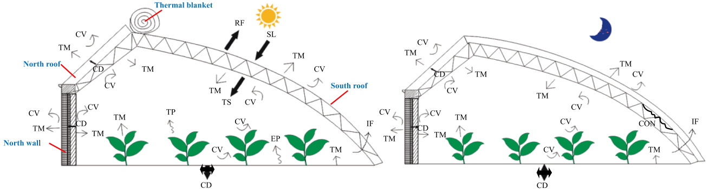
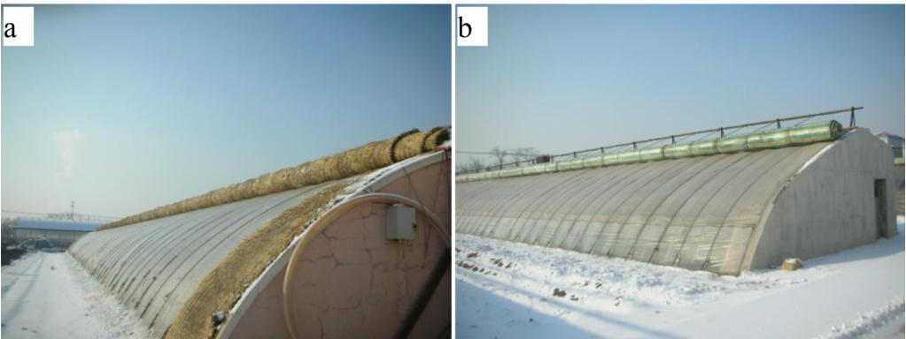
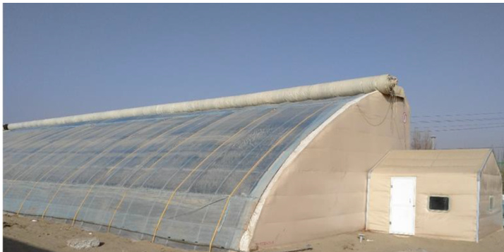

# Passive solar energy utilization: A review of envelope material selection for Chinese solar greenhouses

# 被动式太阳能利用：中国日光温室围护结构材料选择综述

Guohong Tong a,\*, Qingyun Chen b, Hongjun Xu c

a 沈阳农业大学水利学院，沈阳 110866，中国 b 中国农业大学园艺学院，北京 100193，中国 c 新疆农业大学林学与园艺学院，乌鲁木齐 830052，中国

# 文章信息

# 摘要

关键词:   
中国日光温室 (CSG)   
被动式设计   
塑料薄膜   
保温覆盖物   
太阳能

中国日光温室（CSGs）在冬季被动利用太阳能为作物生产提供热量。围护结构材料对于通过太阳辐射捕获、太阳能储存和太阳热保存来实现有效的太阳能利用至关重要。本文综述了围护结构材料的选择，特别是CSG南屋面薄膜、保温覆盖物、北墙材料和北屋面材料的改进和发展趋势，以最大限度地利用太阳能。许多研究分析了CSG薄膜和北墙材料对室内热特性的影响。CSG薄膜选择研究评估了太阳光透射率、室内空气温度和内部作物生长的影响，而北墙材料研究则分析了冬季温暖地区和严寒地区新型分层北墙材料。还考虑了非耕作沙漠地区CSG的围护结构材料选择。本文还回顾了围护结构材料选择的相关问题，并为未来CSG设计提出了建议。中国不同气候区的CSG材料选择可以为世界其他具有类似气候地区的日光温室设计提供参考，以实现高效的太阳能利用。

# 引言

由于对能源依赖程度更高的生活方式导致的大量化石燃料能源消耗，已经带来了严重的环境污染。许多可再生能源利用方法已经发展起来以减少这些环境问题。全球能源转型的基本趋势是向以可再生能源为主的可持续能源系统发展[1]。太阳能是一种清洁的可再生能源，对环境的影响很小，可用于绿色节能建筑[2]。特别是，各种研究已经证明了在农业温室中利用太阳能的巨大潜力[3]，作为生产作物的能源，减少用于加热的化石燃料消耗[4]，并延长各种作物的生长季节[5]。中国日光温室（CSGs）是中国典型的园艺设施[6]，具有北墙、北屋面、南屋面和两个侧墙。墙体通常由重质热容材料制成。南屋面允许入射太阳辐射在白天通过透明覆盖物传输，并在夜间添加额外的保温覆盖物以保持内部热量。典型的CSG结构及相关传热机制如图1所示。CSG具有各种设计，与大型西方塑料/玻璃覆盖温室不同[7]。北墙和北屋面吸收和储存太阳能，作为CSG环境的热缓冲，这与西方温室的透明墙设计不同[8]。此外，与现代西方商业温室中的受控环境不同，中国的CSG是被动式温室，没有环境控制系统[9]，在节省大量能源的同时保持可接受的室内热环境[7]。被动式太阳能加热设计通过在冬季白天最大化太阳能得热和最小化热损失来利用太阳能为建筑供暖[10]。

插入图1

通过增强建筑围护结构的热特性可以最大化太阳能利用[11]，这是一种简单有效的减少能耗的方法，因为大量热量通过围护结构流动[12]。被动式建筑就像一个太阳能收集器，在白天捕获围护结构内的太阳能，并在夜间将热量释放到室内[13]。显著影响太阳能利用的参数包括围护结构储热材料和厚度、玻璃类型以及整体形状[14]。之前已经综述了各种CSG截面参数（如温室跨度、高度以及南屋面、北墙和北屋面的尺寸）对太阳能利用的影响[15]。作者回顾了从原始设计到当前CSG设计的截面参数演变，以及优化CSG设计参数的模型，特别是允许最大直射辐射进入室内的南屋面形状，以及优化能量吸收、储存和释放的北墙。CSG围护结构材料在最大化太阳能吸收和利用方面起着决定性作用，因此一直是CSG种植者和研究人员关注的重点。

-南屋面薄膜：自20世纪50年代以来，种植区域一直使用塑料薄膜进行保护，这种方法迅速在全球传播，因为它减少了室内热量损失、降低了灌溉用水量，并提高了作物对恶劣天气的防护能力[16]。中国是世界上农业薄膜产量和使用量最大的国家[17]，从1991年到2017年，使用量增加了4.05倍[18]，这大大提高了CSG蔬菜、花卉、水果和其他高附加值作物的产量[19]。然而，一些塑料薄膜存在影响南屋面透光率的问题，如塑料薄膜老化[20]和寒冷天气下未加热CSG薄膜内表面的水凝结。被动式温室内的太阳能得热主要通过南屋面覆盖物[21]，高太阳光透射率对于良好的温室设计尤为重要[22]。因此，在塑料薄膜中添加了添加剂和助剂，并在薄膜表面涂覆涂层剂，以制造功能薄膜来覆盖CSG，大大提高了薄膜质量[19]和太阳光透射率。

-北墙：北墙的热特性与墙体材料、设计和厚度有关[23]。CSG北墙通常是单一材料墙或分层墙，由具有高热惯性的重质结构组成，用于太阳能热储存。一些研究考虑了在分层北墙中使用相变材料（PCM）以提供足够的储热能力。白天北墙吸收太阳能，然后在夜间室内空气温度下降时将热量释放回室内，以利用北墙保留的热量[24]。北墙在确保寒冷天气下温室作物生产方面起着重要作用[25]。墙体材料选择、厚度和配置都会影响热量传递[26]。各种研究调查了中国当地CSG的合适北墙材料选择和设计[27]。因此，新的北墙材料和设计显著改善了北墙的热特性。由草捆或保温毯制成的组装北墙也被建造，以便于安装并降低建造成本。

-保温覆盖物：南屋面是CSG围护结构中最大的部分，总热量损失的73%-80%通过南屋面[28]。因此，通常在夜间将可移动的保温覆盖物放在CSG南屋面上，以便在冬季无需辅助加热的情况下进行CSG冬季作物生产。传统的保温覆盖物由草席制成，如图2a所示，从早期CSG设计开始[29]，但这些存在许多问题，如容易被雨水损坏[30]、表面分布不均匀、使用寿命短[29]以及容易污染塑料薄膜[31]。如图2b所示的分层织物毯已被开发出来，现在建议在夜间覆盖CSG南屋面。然而，最近在中国东北和西北地区的调查表明，这些地区的大多数CSG种植者仍然在夜间使用草席作为保温覆盖物[32]。

-北屋面：在中国北方，CSG北屋面通常具有承重、保温和防水功能[31]。北屋面延伸到部分种植区域，由框架和北墙支撑，因此北屋面的重量也很重要。北屋面通常由轻质材料制成，以减少框架和北墙的尺寸。北屋面通常由三层组成（从内到外）：保温层、隔热层和防水层，内部保温层使用秸秆、木板或混凝土板，中间隔热层使用土壤或聚苯乙烯泡沫，外层使用草泥混合物、塑料薄膜层或其他防水材料。在山东[33]、宁夏[34]和新疆[35]的调查显示了各种北屋面材料和设计。在中国南方，北屋面要简单得多，只有一个覆盖塑料薄膜的保温毯[36]。

未来可持续能源发展需要广泛使用可再生能源[1]。CSG是一个在冬季无需辅助加热提供新鲜蔬菜的例子，这归功于CSG围护结构在太阳能利用、减少CSG作物生产能耗以及缓解能源供应压力方面的重要作用[37]。CSG围护结构的形状和尺寸影响太阳能的捕获和储存[38]。本文综述了围护结构材料对太阳能利用的影响，以进一步指导CSG设计并提高CSG能源利用效率。本文首先介绍了CSG围护结构材料的发展和应用，然后回顾了CSG围护结构材料热特性的研究，提出了与CSG围护结构材料选择相关的问题，最后评估了文献中先前研究的贡献和局限性，并提出了未来研究的建议。

# CSG围护结构材料的发展与应用

CSG围护结构材料将太阳光线传输到温室内，储存太阳能并保持内部热量。与早期CSG设计相比，这些功能通过屋顶和北墙材料以及南屋面外部保温覆盖物的显著变化得到了改善。

  
图1. 中国日光温室结构及传热机制。

SL-太阳辐射;RF-反射辐射;TS-透射辐射;CD-传导;CV-对流;TM-热辐射; IF-渗透;TP-蒸腾;EP-蒸发; CON-凝结

  
图2. 卷起的保温覆盖物 (a) 草席和 (b) 分层织物毯。

早期CSG设计。本节回顾了围护结构材料和应用的变化。

# 南屋面透明覆盖材料

CSG是低成本建筑，通常由当地可获得的天然材料制成，内部没有任何环境控制措施。南屋面由具有高透光率和一定保温能力的透明覆盖物覆盖[39]。透明覆盖材料的选择必须适应中国不同地区的气候和地理特征[40]。

# 发展

20世纪30年代，玻璃被用作CSG透明覆盖材料[41]，随后在20世纪50年代被塑料薄膜取代[42]。表1列出了CSG薄膜类型。温室薄膜按树脂材料分为聚氯乙烯（PVC）薄膜、聚乙烯（PE）薄膜和乙烯-醋酸乙烯酯（EVA）薄膜[59]。PVC薄膜是第一种用于在冬季和早春覆盖CSG的薄膜，导致蔬菜产量高[46]。随着石化工业的发展，PE薄膜的生产和使用迅速增长[49]。EVA薄膜比PVC薄膜具有更好的透光性，比PE薄膜具有更好的热性能[55]，因此它们在20世纪90年代中期开始被广泛使用[49]。

随着冬季蔬菜生产用薄膜覆盖CSG的快速发展，薄膜寿命、透光率和保温特性越来越受到关注。自20世纪60年代以来，温室覆盖膜的质量得到了改善，与原始薄膜相比具有更多功能[51]。20世纪70年代中后期开始通过添加抗氧化剂和紫外线吸收剂等添加剂来改善塑料薄膜老化，以延长薄膜寿命。自20世纪80年代以来，薄膜中添加了防滴剂和防雾剂，以减少薄膜内表面的水滴形成和室内雾气，从而提高薄膜透光率。薄膜中添加了红外线阻隔剂，以阻隔温室内发射的长波辐射的透射[60]。20世纪90年代末引入了更好的防雾涂层，以进一步减少热损失[61]。2000年后，温室薄膜的发展集中在进一步改进，如改进防滴剂、光转换剂和单基双能光转换剂[58]。

塑料薄膜还需要抵抗风、雨、冰雹和雪荷载的损坏，并具有良好的保温性能以减少冬季的热损失，这表明不同地区需要不同的添加剂[39]。此外，薄膜功能不仅与薄膜质量有关，还与温室配置和用户栽培技能有关[62]。

# 应用

目前的塑料薄膜比以前普通薄膜要好得多。普通PVC薄膜在紫外线下迅速老化，即使每年仅使用30天，寿命也只有两到三年[47]，其透光率从新薄膜的65%-70%下降到仅四个月后的58%-65%[63]。抗老化和表面张力剂提高了薄膜透光率并延长了其寿命。例如，普通PVC或PE薄膜的寿命为四到六个月，而改进的功能性PVC或PE薄膜的寿命为12-18个月[63]。EVA或聚烯烃薄膜的寿命更长，超过两年[54,64]。

塑料薄膜的选择与具体位置密切相关。功能性PVC薄膜具有低长波辐射透射率，可以阻隔从内表面向外发射的长波辐射，从而减少热损失，因此它们更适合用于夜间温度较低地区的CSG覆盖[65]。例如，新疆北部冬季漫长寒冷，1月最低气温降至-35°C，因此当地种植者使用功能性PVC薄膜覆盖CSG[66]。在寒冷天气下，功能性PE薄膜内表面凝结形成的水膜也会在夜间阻隔通过南屋面的长波辐射，从而减少热损失[55]。因此，功能性PE薄膜被用于覆盖中国北方大部分地区的CSG[67]。功能性EVA薄膜比功能性PVC或功能性PE薄膜具有更高的透光率、更好的保温性和耐候性[68]，因此建议用功能性EVA薄膜取代北纬43°以南地区的功能性PVC薄膜[69]。据报道，功能性EVA薄膜被用于覆盖山东[70]和山西寒冷地区[71]的大多数CSG。聚烯烃薄膜兼具功能性PE和功能性EVA薄膜的优点[72]。在严寒地区使用聚烯烃薄膜、功能性PVC、EVA和PE薄膜进行的CSG田间实验表明，聚烯烃薄膜由于其更好的透光性、更好的保温性和更少的水滴形成和滴落，是这些地区的最佳选择[73]。

CSG设计，特别是南屋面角度，影响薄膜功能[74]。由于没有CSG建筑规范，南屋面具有各种形状和不同的南屋面角度，即使具有相同的CSG脊高和跨度[15]。通过塑料薄膜的太阳透射率和薄膜表面的反射率都受到南屋面形状的影响。因此，温室薄膜为合适的CSG形状提供了良好的功能[53]。

# 北墙材料的发展与应用

CSG北墙的发展可以根据其墙体材料和结构分为三个阶段。第一阶段使用单一材料北墙，第二阶段在20世纪90年代转变为分层北墙，近年来又转变为新型北墙材料[75]。

# 单一材料北墙

土墙是最早的CSG北墙类型，至今仍然很受欢迎，特别是在中国西北地区，那里超过95%的CSG北墙由土壤制成[76]。土墙在现场建造，成本很低或没有成本，主要用于郊区和农村地区。

表1 CSG南屋面覆盖薄膜的历史发展。

| 时间 | 发展指标 | 发展细节 | 参考文献 |
|------|----------|----------|----------|
| 1950年代 | PVC薄膜首次用于CSG覆盖 | 1958年从日本引进农业用PVC薄膜作为温室覆盖材料 | [43] |
|  |  | 1950年代末首次使用PVC树脂设备 | [44] |
| 1960年代 | 国产PVC薄膜的生产和使用 | 1963年中国开始生产PVC温室薄膜 | [45] |
|  |  | 1963年国产PVC温室薄膜用于覆盖CSG | [42] |
|  |  | 1964年PVC薄膜覆盖吉林省严寒地区的CSG | [42] |
|  |  | 1965年PVC薄膜覆盖超过28个省的CSG | [46] |
| 1970年代 | 温室薄膜类型从PVC转变为PVC或PE | 1973年开始研究抗老化PVC温室薄膜 | [47] |
|  |  | 1973-1974年首次使用适合冬季的PVC温室薄膜 | [47] |
|  |  | 1974-1975年首次使用彩色PVC温室薄膜 | [48] |
|  |  | 1976年中国首次生产低密度PE温室薄膜 | [42] |
| 1980年代 | EVA和功能薄膜的发展 | 1970年代末一些PVC工厂开始生产PE薄膜 | [49] |
|  |  | 1983年PE薄膜比PVC薄膜更受欢迎 | [50] |
|  |  | PVC薄膜仍在中国东北地区使用 | [46] |
|  |  | 1980年代初开始使用抗老化PE薄膜 | [51] |
|  |  | 1985年首次生产保温PE薄膜 | [52] |
|  |  | 1985年首次生产抗老化、防滴、保温PE薄膜 | [45] |
|  |  | 1986-1990年间开始使用多层多功能温室薄膜 | [45] |
|  |  | 1980年代末开始使用EVA温室薄膜 | [52][49] |
|  |  | 1980年代末生产抗老化、防滴、防雾温室薄膜 | [53] |
| 1990年代 | 改进的功能薄膜 | 1990年首次使用抗老化、保温、防紫外线的多功能温室薄膜 | [42] |
|  |  | 1990年后使用光转换薄膜 | [54] |
|  |  | 1993年开始使用漫射温室薄膜 | [42] |
|  |  | 1993年首次生产三层多功能EVA薄膜 | [42] |
|  |  | 1993年后专门为中国北方寒冷地区开发三层多功能EVA薄膜 | [54] |
|  |  | 1990年代初开始使用多层共挤多功能EVA薄膜 | [51] |
|  |  | 1991年开始使用改进的抗老化和防滴PE薄膜 | [53] |
|  |  | 1994年开发高透光率多层薄膜 | [42] |
|  |  | 1990年代中期开发抗老化聚烯烃温室薄膜 | [54] |
|  |  | 1990年代生产含有防雾剂、无机保温剂等功能的PE和EVA薄膜 | [54][55] |
| 2000年后 | 改进的防滴、防雾薄膜和光转换薄膜 | 防滴和防雾薄膜被具有防滴和防雾涂层的薄膜取代 | [56] |
|  |  | 广泛使用抗老化和防滴聚烯烃薄膜涂层 | [39] |
|  |  | 抗老化和防滴聚烯烃薄膜涂层逐渐取代含有抗老化和防滴成分的薄膜 | [57] |
|  |  | 广泛使用光转换温室薄膜 | [18] |

其他单一材料的北墙也有用砖、砾石或草捆建造的，但这些远不如土墙常见。

土墙北墙进一步分为夯土墙、土坯墙和草泥混合墙，后两种北墙类型如今已不常用。手工夯土北墙需要大量时间和劳动力，通常厚度为$0.5-1.0\mathrm{m}$。机械夯土北墙底部厚度为$3.0-7.0\mathrm{m}$，呈梯形截面[37]。较厚的北墙根据当地土壤质地和气候而定，在山东[77]、河北[78]和山西[79]等省普遍使用。机械夯土北墙于2004年引入内蒙古[80]，由于成本低廉[81]且内蒙古冬季严寒[82]，至今仍广泛使用。

# 分层北墙

分层北墙由多种材料组成，典型设计见表2。早期的CSG具有相对简单的分层北墙。例如，早期分层土墙只是在外部添加土壤形成分层北墙，如辽宁[100,101]和北京[123]，或在山东[124]、山西[71]和中国北方其他地区[28]添加稻草层。在河北[78]和新疆[122,125]，土壤或沙子被堆放在原有的砾石或砖北墙外部，形成分层北墙。通过使用免费或非常便宜的当地材料作为北墙层，如新疆[122,125]和甘肃[126]现场可得的戈壁沙土或砾石，降低了成本。

耐用的分层北墙包括多层墙体，通常由粘土砖和聚苯乙烯板组成，其中粘土砖墙作为蓄热层，聚苯乙烯板作为保温层。蓄热层也由其他材料制成，如加气混凝土块、空心粘土砖、空心混凝土块、多孔粘土块或煤渣块，如表2所示。在山东[70]、山西[71]、辽宁[102]和北京[85,86]等地，空气层作为常用的保温层被用于各种固体层之间。然而，实验表明，由于空气层中的对流热传递，$0.12\mathrm{m}$厚的空气层提供的保温效果不如相同厚度的其他固体材料作为保温层[102]。松散材料，如矿渣、锯末和珍珠岩，也被用作山西[79]、宁夏[34]或辽宁[102]的保温层。然而，松散材料容易吸收水分并随着时间的推移沉降，在固体墙之间留下上部空气层，从而增加热损失[37]。

# 新型北墙材料

CSG的太阳能输入在很大程度上取决于时间段和地理位置。因此，对于完全被动的CSG，关键问题是如何储存太阳能以及如何根据需要将其释放回室内。PCM（相变材料）墙层已被用作北墙的蓄热层，因为PCM通过相变储存和释放热量，如图3所示。各种PCM材料已被用于CSG，如石蜡、酯类、$\mathrm{Na_{2}SO_{4}{\cdot}10H_{2}O}$、$\mathrm{CaCl_{2}{\cdot}6H_{2}0}$、$\mathrm{Na_{2}H}$­$\mathrm{PO_{4}{\cdot}12H_{2}O}$、脂肪酸等。最近，在北京[87]和陕西[127]的CSG北墙内部安装了密封的PCM层，以增强蓄热能力。然而，由于PCM填充和密封的安装挑战以及成本问题[37]，PCM墙板在CSG分层墙中主要用于实验性CSG。

表2 典型的分层北墙材料及组成。

| 地点 | 1月室外日均气温(℃) | 材料厚度及组成(从内到外) | 总厚度(m) | 参考文献 |
|------|--------------------|--------------------------|----------|----------|
| 北京 | -6-3 | (0.12-0.37)m粘土砖+0.10m聚苯乙烯泡沫+(0.12-0.37)m粘土砖 | 0.46-0.84 | [83-85] |
| 北京 | -6-3 | 0.37m粘土砖+(0.10-0.12)m聚苯乙烯泡沫+(0.37-0.49)m粘土砖+(0.06-0.10)m空气层+(0.37-0.49)m粘土砖 | 0.47-0.49 | [84,85] |
| 北京 | -6-3 | 0.20m加气混凝土块+0.10m聚苯乙烯泡沫+0.20m加气混凝土块 | 0.50 | [85] |
| 北京 | -6-3 | 0.05m相变材料+0.80m粘土砖+0.05m聚苯乙烯泡沫 | 0.90 | [87] |
| 甘肃 | -9-3 | 0.04m相变材料+1.00m粘土砖 | 1.04 | [88] |
| 甘肃 | -9-3 | 梯形截面，0.19m混凝土空心砌块+砾石土层(顶部1.80m，底部3.80m) | 顶部1.99，底部3.99 | [89] |
| 甘肃 | -9-3 | 梯形截面，顶部：0.60m砾石层+0.60m砾石土层；底部：1.50m砾石层+5.00m砾石土层 | 顶部1.20，底部6.50 | [90] |
| 甘肃 | -9-3 | 梯形截面，0.30m加气混凝土砖+砾石土层(顶部0.80m，底部5.50m) | 顶部1.10，底部5.80 | [90] |
| 河北 | -6-3 | 梯形截面：砖和土壤 | 顶部1.50，底部3.50 | [78] |
| 河北 | -6-3 | 梯形截面：砾石和土壤 | 顶部1.50，底部4.50 | [78] |
| 河北 | -6-3 | 0.05m混凝土板+0.45m土壤+0.24m聚苯乙烯框架填充混凝土+0.01m石膏 | 0.75 | [91] |
| 湖北 | 0-9 | 0.24m粘土砖+0.12m空气层+0.12m粘土砖+0.20m稻草+0.80m草泥混合物 | 1.48 | [92] |
| 内蒙古 | -15--5 | 0.24m粘土砖+0.92m土壤+0.24m粘土砖+0.10m聚苯乙烯泡沫 | 1.50 | [93] |
| 内蒙古 | -15--5 | 0.49m多孔粘土块+0.10m聚苯乙烯泡沫 | 0.59 | [93] |
| 江苏 | 0-8 | 0.01m石灰砂浆+0.24m粘土砖+0.10m聚苯乙烯板+0.24m粘土砖+0.01m水泥砂浆 | 0.60 | [94] |
| 江苏 | 0-8 | 0.24m粘土块+0.10m聚苯乙烯板+0.16m烧结多孔粘土块 | 0.50 | [27,95] |
| 江苏 | 0-8 | 0.01m石灰砂浆+0.48m空心砌块+0.10m聚苯乙烯板+0.01m水泥砂浆 | 0.60 | [96,97] |
| 江苏 | 0-8 | 0.24m稻草+0.10m聚苯乙烯板+0.16m稻草+塑料薄膜 | 0.50 | [27] |
| 江苏 | 0-8 | (0.05-0.08)m黄麻板+0.30m空气层+(0.05-0.08)m黄麻板+防虫网和塑料薄膜 | 0.40-0.46 | [98,99] |
| 辽宁 | -18--6 | 土墙和土壤 | 1.50 | [100,101] |
| 辽宁 | -18--6 | 0.12m粘土砖+0.12m空气层+0.24m粘土砖 | 0.48 | [102,103] |
| 辽宁 | -18--6 | 0.12m粘土砖+0.12m空气层+0.24m加气混凝土块 | 0.48 | [102,103] |
| 辽宁 | -18--6 | 0.24m粘土砖+0.09m聚苯乙烯泡沫+0.12m粘土砖 | 0.45 | [104] |
| 辽宁 | -18--6 | 0.36m粘土砖+0.05m聚苯乙烯泡沫+0.02m空气层+0.05m聚苯乙烯泡沫+0.12m粘土砖 | 0.60 | [105] |
| 宁夏 | -11-0 | 梯形截面，0.12m粘土砖+土墙(顶部0.80m，底部1.50m)+0.12m粘土砖 | 顶部1.04，底部1.74 | [106] |
| 宁夏 | -11-0 | 0.20m煤渣块+0.30m沙子+0.10m聚苯乙烯泡沫+0.20m煤渣块 | 0.80 | [107] |
| 宁夏 | -11-0 | 0.24m粘土砖+0.50m矿渣+0.24m粘土砖 | 0.98 | [34] |
| 青海 | -16-2 | 0.24m空心砌块+0.20m加气混凝土块+0.80m土墙+0.24m空心砌块 | 1.48 | [108] |
| 陕西 | -3-5 | 0.24m粘土砖+0.50m加气混凝土块+0.24m粘土砖 | 0.98 | [108] |
| 陕西 | -3-5 | 0.24m相变材料板+0.10m聚苯乙烯泡沫+0.12m相变材料板 | 0.46 | [109] |
| 陕西 | -3-5 | 0.19m空心砖填充相变材料+0.12m聚苯乙烯泡沫+0.19m空心砖 | 0.50 | [109] |
| 陕西 | -3-5 | (0.78-1.08)m土墙+0.12m粘土砖 | 0.90-1.20 | [110] |
| 山东 | -4-5 | 梯形截面：0.24m粘土砖+土墙(顶部1.80m，底部4.00m)+0.05m混凝土板 | 顶部2.09，底部4.29 | [111,112] |
| 山东 | -4-5 | 0.05m聚苯乙烯泡沫+0.20m隔热板+0.05m聚苯乙烯泡沫 | 0.30 | [113] |
| 山西 | -10-3 | 0.24m粘土砖+0.50m土壤或矿渣+0.24m粘土砖 | 0.98 | [114] |
| 山西 | -10-3 | 0.24m粘土砖+0.24m矿渣+0.12m粘土砖+0.10m聚苯乙烯泡沫+(0.02-0.03)m砂浆 | 0.72-0.73 | [115] |
| 山西 | -10-3 | 0.37m粘土砖+0.10m聚苯乙烯泡沫 | 0.47 | [79,114] |
| 山西 | -10-3 | 0.24m加气混凝土块+0.12m粘土砖+0.10m聚苯乙烯泡沫+0.24m粘土砖 | 0.70 | [116] |
| 天津 | -5-2 | 粘土块+聚苯乙烯泡沫 | 0.60 | [117] |
| 新疆 | -16--8 | 0.24m土块+0.50m粘土砖+0.60m聚苯乙烯泡沫 | 1.34 | [118] |
| 新疆 | -16--8 | 0.37m粘土砖+0.10m聚苯乙烯泡沫 | 0.47 | [119,120] |
| 新疆 | -16--8 | 0.01m水泥砂浆+0.50m粘土砖+0.10m聚苯乙烯泡沫和轻质钢板 | 0.61 | [121] |

预制材料近年来在新型CSG设计中变得越来越普遍，因为它们比传统北墙更容易快速安装[128]。在宁夏[107]和江苏[129]，已使用草捆建造组装式CSG北墙。在草捆外部安装附加层以保护墙体免受雨雪损害，例如粘土砖墙层、空心粘土砖墙层[130]或轻质钢板层[131]。具有外部耐候层和由毛毡、可膨胀聚乙烯泡沫、棉花、棉絮或再生棉制成的厚芯层的保温被也被用作组装式CSG北墙材料。在北京[132]和新疆[133]使用保温被层，在山东[113]使用塑料薄膜层加保温被层，在甘肃[134]使用草帘加保温被层建造了组装式北墙。虽然这些轻质材料具有良好的保温性能，但可以进一步改进以提高蓄热能力[135]。此外，其他研究报道了具有蓄热层的组装式CSG北墙，例如在河北[91]使用填充混凝土的聚苯乙烯框架，在新疆[120]使用填充砖块的小麦壳砂浆块，在北京[136]使用填充水泥砂浆的空心混凝土块。另一种组装式多层北墙结构在内部有钢筋混凝土板，外部有保温板，中间有夯土[128]。作者建议内外墙板可以重复使用，填充土在使用后可以返回田间。

中国北方北墙材料的选择应确保CSG冬季生产无需辅助加热[137]，同时要考虑到当地CSG种植者的经济承受能力[138]。在中国南方如江苏[96,97]和浙江[36]，北墙还应可拆卸以便在温暖天气进行通风。

# 南屋面保温覆盖材料的发展与应用

在20世纪30年代，草帘被用于夜间覆盖CSG南屋面以减少通过南屋面的热损失[139]。这些草帘通常由当地可获得的天然材料制成，如稻草、麦秸、香蒲或芦苇。表3列出了各地区报道的草帘应用情况。草帘应用包括简单的草帘、下面有牛皮纸的草帘和带有塑料薄膜的草帘。下面有牛皮纸的草帘减少了通过覆盖物的热传递[139]，在冬季夜晚，特别是在河北[140]和辽宁[101]，使用一层草帘加多层牛皮纸以保持更多热量。替代方案是用旧塑料薄膜层代替牛皮纸层[141]或用防水布包裹草帘[147]。塑料薄膜层已被用于覆盖草帘外部以在江苏[142]防雨，在山东[33]防雨雪，或在新疆[66]减少热损失、防雨雪并为大雪提供结构完整性。

随着化纤工业的发展，20世纪80年代开发了各种分层织物保温被以取代草帘[154]。分层织物保温被减少了热传递，具有光滑表面，重量轻且防水[30]。它们需要足够坚固以在大风中保持原位[155]，同时又要足够轻便以便于卷起和放下以在夜间保持较高的室内空气温度[156]。分层织物保温被有内部芯层和外部表层。芯层应多孔且有弹性[157]，而外层应防水且耐候[72]。芯材包括毛毡、可膨胀聚乙烯泡沫、喷胶棉、PE泡沫、棉絮或再生棉，而外表面则是无纺布、防水织物、镀铝薄膜或PE涂层无纺布。这些分层织物保温被主要用于CSG示范项目[146]和郊区。在目前的发展阶段，还没有保温被的生产标准或质量控制[32]。保温覆盖材料和最佳厚度需要进一步研究[154]。

# 北屋面材料的发展与应用

早期CSG的北屋面材料通常由秋季收获的残余物作为保温层，外部附着草泥混合物作为防水层，无需额外材料成本[101]。这种北屋面结构在一些农村地区仍在使用，使用几乎相同的材料。低成本北屋面使用稻草、玉米秆或高粱秆作为保温层，草泥混合物或旧塑料薄膜作为防水层[71,140]。在冬季，特别是在夜间，封闭且未加热的CSG内部空气非常潮湿，因此北屋面内部的稻草或秸秆层会迅速腐烂。因此，北屋面内表面也需要防水覆盖物以保护免受潮湿内部空气的影响[158]，例如在北屋面内表面使用塑料薄膜或用塑料薄膜密封稻草或秸秆[159]。最简单的方法是在底部和顶部放置塑料薄膜，中间夹一层稻草[131]。一些新型组装式CSG的北屋面使用与北墙相同的分层材料，从内到外依次为草帘、保温被和塑料薄膜[134]。然后，由于随着时间的推移会腐烂，稻草层需要每两到三年更换一次[146]。

  
图3. 中国日光温室中PCM过程示意图。

表3 草帘应用

| 编号 | 地点 | 1月室外日均气温(℃) | 材料(从内到外) | 厚度(mm) | 面密度(kg/m²) | 参考文献 |
|------|------|--------------------|----------------|----------|--------------|----------|
| 1 | 北京 | -6-3 | 双层草帘 | 1 | 1 | [123] |
| 2 | 河北 | -6-3 | 四层牛皮纸/草帘 | 1 | 一 | [140] |
|  |  |  | 草帘 |  | 3.25 | [29] |
| 3 | 河南 | -3-6 | 一层旧塑料膜/草帘 | 30 | 二 | [141] |
| 4 | 江苏 | 0-8 | 草帘/一层塑料膜 | 1 |  | [142] |
|  | 辽宁 | -18--6 | 草帘 | 1 | 4.00-5.00 | [143] |
|  |  |  | 四层牛皮纸/草帘 | 1 | 1 | [100] |
|  |  |  | 四或五层牛皮纸/草帘 | 一 | 一 | [101] |
| 6 |  |  | 草帘 | 40 | 3.85 | [144] |
|  |  |  | 草帘/一层棉被 | 一 |  | [145] |
|  | 宁夏 | -11-0 | 草帘 | 40-50 | 2.27-2.94 | [146] |
|  |  |  | 草帘 | 50 |  | [147] |
| 7 | 青海 | -16-2 | 草帘 | 80 | 一 | [148] |
| 8 | 山东 | -4-5 | 草帘/一层塑料膜 | 1 | 1.78-6.39 | [33] |
|  |  |  | 草帘 | 1 | 4.00-5.00 | [70,149] |
|  |  |  | 草帘 | 32 | 3.34 | [150] |
| 9 | 陕西 | -3-5 | 草帘 | 30 | 1.17 | [151] |
| 10 | 山西 | -10-3 | 草帘 | 50 | 1 | [71] |
|  |  |  | 草帘/一层塑料膜 | 40 | 一 | [152] |
|  |  |  | 草帘/一层塑料膜 |  | 3.50 |  |
|  |  |  | 草帘/一层塑料膜 | 一 |  | [153] |
| 11 | 新疆 | -16--8 | 草帘 | 30 | 一 | [66] |
|  |  |  | 草帘 | 60 | 1.43 | [125] |
|  |  |  | 草帘 |  | 3.30 | [125] |

近年来，耐久材料被越来越多地用于北屋面以减少维护，典型的北屋面材料和结构如表4所示。这些耐久材料通常包括木板、聚苯乙烯板、混凝土板和其他实心板材。尽管CSG种植者希望建造更永久性的北屋面结构，但在辽宁[144]、甘肃[161]、青海[164]和山东[33]等地，仍能发现稻草、玉米秆或高粱秆作为北屋面层，以降低北屋面材料成本。对天津[117]、山东[33]和宁夏[34]CSG的调查发现，田间同时存在永久性和临时性北屋面。北屋面材料的总成本仍然是材料选择的关键因素，特别是在农村地区。

表4 永久性北屋面材料

| 编号 | 地点 | 1月室外日均气温(℃) | 北屋面厚度(m) | 材料*(从内到外) | 参考文献 |
|------|------|--------------------|---------------|----------------|----------|
| 1 | 北京 | -6-3 | 0.20 | 混凝土板 | [160] |
| 2 | 甘肃 | -0-3 | 一 | 聚苯乙烯板/塑料薄膜/麦秸/木板/泥/塑料薄膜/泥 | [161] |
|  |  |  | 一 | 聚苯乙烯板/塑料薄膜/麦秸/石棉瓦/泥/塑料薄膜/泥 | [161] |
| 3 | 内蒙古 | -15--5 | 0.50-0.70 | 混凝土板/矿渣 | [162] |
| 4 | 江苏 | 0-8 | 一 | 混凝土板/泥/塑料薄膜/泥/粘土砖 | [142] [143] |
| 5 | 辽宁 | -18--6 | 0.30-0.35 0.20 | 轻质钢板/聚苯乙烯/聚氨酯塑料板 木板/聚苯乙烯板/矿渣/防水层 | [163] |
|  |  |  |  | 木板/聚苯乙烯板/草席/泥/土 | [144] |
|  |  |  | 0.25 | 木板/聚苯乙烯板/石灰和炉渣/水泥砂浆 | [104] |
|  |  |  | 0.50 | 灌浆/防水层 |  |
| 6 | 宁夏 | -11-0 | 0.60 | 波纹板/草捆/聚苯乙烯板/砂浆 竹胶板/矿渣/混凝土 | [34] |
| 7 | 青海 | -16-2 |  | 聚苯乙烯板/麦秸/泥 | [164] |
| 8 | 陕西 | -3-5 | 大于0.10 | 聚苯乙烯板 | [165] |
| 9 | 山东 | -4-5 | 0.10 | 聚苯乙烯板 | [149] |
|  |  |  | 顶部:0.20;底部:0.60-1.00 | 木板/聚苯乙烯板/玉米或高粱秆/无纺布 | [33] |
|  |  |  | 顶部:0.40-0.60;底部:0.60-0.90 | 空心砖/土/草席 | [33] |
| 10 | 山西 | -10-3 | 0.40 | 聚苯乙烯板/混凝土板/砂浆 | [152] |
|  |  |  |  | 混凝土板/木板/矿渣/粉煤灰/锯末/茅草/水泥抹灰/沥青油毡防水 | [166] |
|  |  |  | 一 | 轻质钢板/聚苯乙烯板/轻质钢板 | [115] |
| 12 |  |  | 0.25 | 防水土工膜/芦苇板/聚苯乙烯板/轻质钢板 |  |
|  | 天津 | -5-2 | 顶部:0.10;底部:0.30 | 木板/聚苯乙烯板/三合土 | [117] |
|  | 新疆 | -16--8 |  | 钢筋混凝土板/矿渣 | [118] |

\* 不含支撑框架材料

# CSG围护结构材料热特性

需要对围护结构材料进行进一步研究，因为：(1)CSG不透明围护结构材料和透明覆盖材料的热性能信息主要来自实验室研究，而实际围护材料的热参数，特别是田间透明薄膜的太阳光透射率需要进一步研究；(2)CSG中北墙和北屋面的材料厚度和分层布置需要进一步研究，以整体评估所有热效应；(3)围护结构材料的整体传热率与CSG设计和当地气候密切相关。

# 透明覆盖材料的热特性

CSG南屋面通过薄塑料薄膜透射阳光。薄膜覆盖了CSG围护结构的大部分，因此薄膜的传热率几乎与透光率同等重要。各种薄膜的实验室甚至田间测试都无法给出完整、可靠的薄膜热特性测量结果。因此需要通过对覆盖不同薄膜的CSG进行对比田间研究，以验证薄膜材料对透光率和保温效果的所有影响[40,45]。表5总结了各种类型薄膜的透光率和由此产生的室内空气温度的田间评估结果。

表5 温室薄膜热特性

| 编号 | 薄膜类型 | 薄膜功能 | 薄膜厚度(mm) | 温室尺寸(m) | 实验时间 | 地点 | 薄膜透光率*(%) | 室内气温*(℃) | 发表年份 | 参考文献 |
|------|----------|----------|--------------|-------------|----------|------|---------------|-------------|----------|----------|
| 1 | 聚烯烃 | 保温;防滴防雾 | 0.08 | 跨度8.0;脊高2.5 | 2017年9月16日-12月15日 |  | 90.1(3个月后) | 10.6(2017年12月5日8:00) | 2018 | [57] |
|  | 聚烯烃 PE | 防滴防雾 一 |  |  |  |  | 89.9(3个月后) 87.6(3个月后) | 9.7(2017年12月5日8:00) 7.4(2017年12月5日8:00) |  |  |
| 2 | 聚烯烃 |  | 0.10 | 跨度8.0 | 2014年8月-2015年5月 | 北京 | 92.0(新) | 14.5(2014年12月13日) 14.3(2014年12月13日) | 2017 | [167] |
| 3 | PE 聚烯烃 EVA |  |  |  | 2013年9月14日-11月10日 | 宁夏 | 90.0(新) | 聚烯烃覆盖温室比EVA高0.2-2.0 | 2016 | [168] |
| 4 | 聚烯烃 | 抗老化,防滴防雾 |  | 跨度8.0 | 2014年11月-2015年3月 | 北京 |  | 14.6(1月) 13.6(1月) | 2015 | [169] |
|  |  |  | 0.10 | 跨度8.0;脊高3.8 | 2010年11月-2011年6月 | 北京 | 81.5(12:30,2011年1月15日) 76.8(12:30,2011年1月15日) | 13.4(1月) 12.0(1月) | 2011 |  |
| 6 | 聚烯烃 EVA |  |  | 跨度10.0;脊高3.3 | 2007年10月-2008年5月 | 山东 | 71.7 61.9 | 11.3(1月) 8.7(1月) | 2009 | [170] |
| 7 | PVC EVA |  |  | 跨度6.8;脊高2.7 | 2007年3月15日-4月26日 | 河北 |  | EVA覆盖温室比PVC高2.5-3.0 | 2008 | [171] |
| 8 | PVC PE |  |  | 跨度7.5;脊高3.5 | 2001年11月15日-2002年8月15日 | 辽宁 | 84.9 75.9 | 10.6(2月8:00) 5.4(2月8:00) | 2006 | [172] |
| 9 | PE | 抗老化和防滴 |  | 跨度7.0;脊高3.5 | 2002年10月20日-2003年3月20日 | 辽宁 | 88.0(新);79.0(5个月后) 89.9(新);83.3(5个月后) |  | 2005 | [173] |
| 10 | 聚烯烃 | 保温;防滴防雾 |  |  | 1996年10月-1997年7月 | 辽宁 | 70.4 | 10.5(最低) | 1999 | [69] |
|  | PVC | 抗老化和防滴 |  |  |  |  |  | 12.1(最低) |  |  |
|  | PE | 抗老化和防滴 |  |  |  |  | 61.5 | 11.3(最低) |  |  |
|  |  |  |  |  |  |  | 68.2 |  |  |  |
| 11 | EVA | 抗老化和防滴 | 0.10 |  | 1996-1997 | 北京 | 71.2 | 10.4(最低) | 1999 | [174] |
|  | PVC |  |  |  |  |  | 61.5 | 19.9 |  |  |
|  | PE | 抗老化 |  |  |  |  | 69.1 | 19.0 |  |  |
|  | PE | 防滴 |  |  |  |  | 67.1 | 19.3 |  |  |
|  | EVA |  |  |  |  |  | 70.8 | 18.0 |  |  |
| 12 | 聚烯烃 |  | 0.15 | 跨度4.5;脊高 | 1993年10月-1996年4月 |  | 76.7(30个月后) | 聚烯烃覆盖温室高2.0-3.5 | 1997 | [175] |

\* 薄膜透光率或室内气温若无特别说明均为实验期间平均值

如表5所示，结果表明聚烯烃薄膜覆盖的CSG的透光率和室内气温通常高于PE、EVA或PVC覆盖的CSG，而EVA薄膜的透光率高于PE薄膜，PVC覆盖的CSG室内气温高于PE覆盖的CSG。表5中结论的一些不同结果可能源于相同薄膜类型使用不同材料配方[55]或不同薄膜功能，例如，即使覆盖相同类型的PE[172]、EVA[174]或聚烯烃薄膜[57]，不同CSG的光照输入和室内气温也不同。此外，抗老化PE薄膜的透光率高于抗老化和防滴PE薄膜[176]，而热EVA薄膜的热损失最低，但透光率较低[177]。

许多因素，如薄膜材料、厚度和使用时间，都会影响CSG内部的光环境。例如，0.08 mm厚的抗老化PE薄膜的直射太阳辐射透过率为88.4%，而0.2 mm厚的薄膜仅为84.0%[176]。研究发现，聚烯烃薄膜覆盖的CSG在第三年[178]甚至第二年[73]的光捕获显著降低，聚烯烃薄膜的透光率每年衰减3.3%，PVC薄膜的衰减率甚至更低，为7.0%[175]。通过在塑料薄膜中添加光转换剂，开发出了将紫外光或绿黄光转换为蓝紫光和红橙光以提高光合作用的光转换薄膜。具有防雾涂层的薄膜比在薄膜材料中使用防雾剂的防雾薄膜具有更高的透光率。在薄膜材料中同时具有防雾涂层和光转换剂的薄膜比仅具有防雾剂和光转换剂的薄膜具有更高的透光率和保温率[179]。结果还表明，具有新型光转换涂层的薄膜大大改善了番茄的生长、产量和生产质量。具有防雾涂层和三种不同光转换剂的EVA薄膜增加了红橙光和远红光的透光率，同时降低了紫光、蓝光和绿光的透光率[180]。作者还发现，不同类型的光转换剂显著影响了CSG的光环境和甜椒的生长。覆盖光扩散薄膜的CSG使作物底部和中部的叶片比其他薄膜获得更多的光照。当覆盖具有55%漫射光透过率和85%总光透过率的薄膜时，CSG在漫射光环境中为东西向和南北向番茄种植模式提供了更均匀的光照[181]。

# 北墙热特性

# 北墙材料厚度和布置的影响

对北京单层CSG粘土砖北墙保温性能的数值研究表明，当砖墙厚度超过0.6 m时，室内气温仅略有升高，因此作者建议使用0.6 m厚的砖墙作为北墙[182]。现场测试表明，北京0.5 m厚的土墙全天都起到热汇的作用[103]。进行了多项测试以找到合适的土墙厚度，例如沿CSG长度使用三种不同墙厚（0.5 m、1.0 m和1.5 m），用塑料薄膜作为隔断，测量每个部分的空气温度以评估北墙热效应[102]。结果表明，最薄的北墙（0.5 m厚）平均气温最低，而1.0 m和1.5 m厚的北墙温度相似且较高[102]。还在新疆、陕西、甘肃和宁夏的不同地区进行了测试，以评估这些地区常用CSG北墙厚度对室内气温的影响，从而为每个地区选择最佳北墙厚度[76]。需要更多研究来找到不同地区不同材料单层北墙的最佳厚度。

分层北墙的热特性受许多因素影响，如墙体材料、厚度和结构[103]。在沈阳12 m跨度的CSG中，通过在0.6 m厚的分层北墙外侧添加0.12 m厚的粘土砖层，平均气温提高了约0.7°C[183]。一项数值研究表明，对于北京两层粘土砖之间的聚苯乙烯板中间层，当中间聚苯乙烯板厚度超过0.1 m时，CSG室内气温没有显著增加[182]。然而，另一项研究表明，当考虑投资成本时，北京分层北墙中0.06 m厚的聚苯乙烯板是合适的[184]。另一项关于分层北墙的研究表明，材料布置会影响CSG室内气温[185]。对于固定0.6 m厚的分层北墙，当保温层布置为一层或两层，总厚度相同但位置不同时，与保温层相邻的内表面为薄砖墙（0.12 m厚）的北墙在夜间的CSG室内气温高于其他北墙材料布置[186]。作者还发现，具有最大时间滞后和最小北墙表面温度波动的北墙材料布置并不能给出最佳的CSG北墙配置。

为了找到经济高效的分层北墙，实验研究比较了设计的分层北墙与当地常用分层北墙的热特性。例如，在宁夏，通过使用沙漠沙作为填充材料，采用从内到外的煤渣块/沙/聚苯乙烯板/煤渣块分层北墙代替波纹板/稻草/煤渣块分层北墙，降低了CSG北墙材料和施工成本，在8 m跨度的CSG中，1月份的平均最低气温提高了约0.7°C[107]。矿渣和黄土在山西很容易获得，已被用作分层CSG北墙的中间填充材料[114]。在陕西，使用固定在铁丝网笼中的砾石作为CSG北墙，层间留有空气间隙[187]。作者发现，与当地粘土砖/聚苯乙烯板/粘土砖北墙相比，具有1.0 m厚砾石北墙层和外侧0.1 m厚聚苯乙烯板的CSG在冬季的日平均气温高出4.0°C。

近年来，研究了其他类型的分层CSG北墙以进一步提高保温性能。由于陶瓷颗粒混凝土具有比相同密度下常用的粘土砖北墙更高的热存储能力，因此建议将其用作热存储层[188]。与以聚苯乙烯板作为外部保温层的北墙相比，以聚氨酯板作为外部保温层的分层北墙在晴天和阴天的日平均室内气温都更高[189]。一项数值研究表明，在粘土砖北墙之间安装覆盖铝箔的空气层有效减少了空气层内的辐射传热，降低了热损失[190]。另一种北墙在空心北墙的底部和顶部有两排通风孔，即空气对流蓄热北墙，用于空心墙内空气与室内空气之间的热交换，使夜间最低室内气温提高了2.2°C，大大改善了CSG的热特性[136]。这些新开发的北墙需要进一步研究以在未来广泛应用。

CSG北墙的热特性通常通过其提高室内气温的能力来评估。表6列出了具有不同北墙材料厚度和布置的CSG的室内气温。单一材料墙体的比较显示了不同材料厚度[193]，特别是土墙厚度[102,191]对CSG室内气温的影响。最近开发的秸秆捆墙通过与当地常见单一材料墙体的热效应比较确定了合适的厚度[129,131,192]。分层北墙与单一材料墙体的比较说明了这些新分层墙体设计的热效应[93,194]，或评估了当地材料作为墙体层的效果，如砾石或砾石土[90]、砾石和戈壁沙[122]或黄麻板[98]。分层北墙的比较旨在确定最佳保温层材料或评估新北墙材料的热特性。需要进一步研究北墙材料和层布置对不同地区室内热环境的影响，以确定适合当地气候的最佳北墙设计。

# CSG北墙蓄热层厚度的影响

CSG北墙蓄热层形成与室内空气接触的内墙。对于单一材料墙体，蓄热层厚度通常确定为北墙温度波动全天小于0.5°C的深度。开发了一个经过实验验证的模型来预测单一材料墙体的北墙温度分布。该模型表明，目前报道的机械夯筑梯形土墙可以被视为半无限平板，因为温度波动幅度随北墙厚度呈指数衰减。该模型还用于根据北墙材料热扩散率和墙表面温度波动预测单一材料墙体的适当蓄热层厚度[199]。北墙温度通常通过位于北墙高度一半处的采样点进行现场测量。对机械夯筑梯形土墙的现场实验表明，在山东，对于4.0 m的墙底厚度，北墙的蓄热层厚度范围为0.3-0.5 m[112]，而在河北需要5.3 m[200]。然而，山东的其他实验报告了更厚的蓄热层厚度。例如，对于5.2 m[77]和3.0 m[201]的北墙底厚度，在夯筑土墙内部0.7 m以外的墙温度全天几乎保持恒定。不同的实验结论可以通过北墙高度上的不同墙厚度和不同的外部气候来解释[202]。实际上，北墙内表面沿墙高度吸收不同量的太阳能[203]，因此具有不同厚度的梯形北墙在墙内相同深度处从顶部到底部具有不同的墙温度[204]。对墙高中间厚度为3.3 m的梯形北墙的测试表明，2011年1月7日至4月30日期间，宁夏的蓄热层厚度从0.55 m变化到2.0 m[205]。作者随后提出了一种基于墙温度传播速度计算最佳土墙厚度的方法。

一项使用固定重质热质对分层墙和单一材料墙体进行的数值研究表明，分层墙中的北墙温度比单一材料墙体下降得更快[199]。因此，分层北墙可以使用比单一材料墙体更薄的蓄能层厚度。通过数值研究预测，沈阳的粘土砖北墙的蓄能层厚度约为0.5 m[199]，而在河南，总厚度为0.6 m的粘土砖北墙实验中观察到0.4 m的厚度[206]。然而，当粘土砖用作分层墙中的蓄热层时，北墙温度下降很快。例如，在新疆，由0.5 m厚粘土砖层、0.1 m厚聚苯乙烯板和外部轻质钢板组成的分层墙中，内表面0.3 m处的北墙温度全天保持恒定[121]。此外，在山西，由0.24 m粘土砖/0.24 m矿渣/0.12 m粘土砖/0.1 m聚苯乙烯/0.02 m砂浆组成的分层北墙中观察到0.25 m的衰减深度[115]。因此，分层北墙中保温层的位置和厚度极大地影响了墙温度分布。这些结果还表明，使用相同热质材料的分层北墙可以比单一材料墙体更薄。各种其他因素，如外部气候和北墙材料及形状，都会影响蓄热层厚度。因此，需要进一步研究探索这些因素变化时北墙温度的变化，并正确描述北墙温度的变化。

# 具有PCM墙板的CSG热特性

在北京的CSG中，内部有PCM墙板、外部有聚苯乙烯板、中间有砖层的分层北墙具有较高的太阳能利用效率[87]。通过将PCM直接与水泥砂浆混合和在两层砂浆层之间插入PCM层，实验测量了两种类型PCM墙板的热性能，以更有效地利用PCM的热阻、热容和密度[207]。结果表明，直接混合的板比三层板具有更短的热存储/释放时间和更大的热存储能力，被作者推荐。

已经进行了各种研究来展示CSG北墙中的PCM板对室内热环境的影响，特别是对夜间气温的影响[127]。开发了一种计算PCM板热存储系数的简化方法，以评估具有PCM的建筑围护结构的热惯性[208]。进行了几项调查以展示北墙中PCM层对室内热特性的影响。与没有PCM的情况相比，40 mm厚的PCM层涂覆在粘土砖墙内表面使平均室内气温提高了1.6-2.1°C[195]，北墙表面温度提高了约2.0°C[88]。40 mm厚的PCM层涂覆在机械夯筑梯形土墙内表面显著提高了室内气温，特别是夜间气温[194]。研究还表明，当与0.3 m厚的复合加气混凝土块墙结合时，PCM层厚度大于40 mm时，北墙表面温度进一步少量增加[209]，但当与0.24 m厚的复合加气混凝土块墙结合时，PCM层只需要30 mm厚[210]。需要进一步研究PCM层与不同墙材料和组合的热传递机制。

# 组装式北墙材料

最近的研究调查了具有组装式北墙的CSG。在山东，对具有塑料薄膜层加分层保温毯的组装墙CSG的室内气温测量[113]；在湖北，对具有聚苯乙烯板加分层织物保温毯的组装墙CSG的测量；在甘肃，对具有草席/保温毯/塑料薄膜墙和草席/聚苯乙烯板/保温毯/塑料薄膜墙的CSG的测量发现，这些CSG的室内温度低于当地具有土墙的CSG。在新疆和田沙漠的组装式CSG中，使用了0.1米厚的分层织物保温毯作为北墙、北屋顶和保温毯，其中织物棉层为核心层，聚酯织物为覆盖层（图4）。2018年2月对该类型CSG的实验表明，中午室内气温过高，但夜间过低，最大室内气温变化达到32.7°C[133]。作者指出，由于晴天沙地表温度超过30.0°C持续4-5小时，作物不能直接种植在地面上，并建议在这种CSG中使用基质栽培。对该类型温室的进一步研究还监测到，与当地具有砖和聚苯乙烯板分层北墙的CSG相比，夜间室内空气湿度较高[119]。轻质墙体材料提供了良好的保温性能，但热储存能力不足导致寒冷地区室内热环境不理想[8]。一种补救措施是在0.1米厚的分层织物保温毯北墙上增加0.24米粘土砖或空心混凝土块层，使最低室内气温提高了2.0-4.0°C[137]。

在寒冷地区使用各种材料、厚度和结构的组装墙的热特性尚未见报道。在中国南方，当地材料如秸秆捆和黄麻板已被用作北墙材料，因为这些材料具有更好的热性能，可以提供比传统多孔粘土块更高的室内气温[97]。当室内气温过高时，它们也更容易拆卸以提供通风[99]。

表6 典型北墙热性能

| 墙体类型 | 编号 | 墙体材料及厚度(m) | 温室尺寸 | 实验时间 | 地点 | 方法 | 室外温度(℃) | 室内温度(℃) | 发表年份 | 参考文献 |
|----------|------|-------------------|----------|----------|------|------|-------------|-------------|----------|----------|
| 单层北墙 | 1 | 土墙顶部2.00；底部6.00 土墙顶部1.30；底部3.00 |  | 2015年12月30日-2016年1月2日 | 山东 | 实验 |  | 厚墙比薄墙高0.6 | 2017 | [191] |
|  | 2 | 上部可移动秸秆0.63；下部空心砖和保温层 | 跨度9.0；脊高 | 2014年12月11日-2015年1月10日 | 江苏 | 实验 | 5.0(最低) | 9.6(最低) | 2016 | [192] |
|  | 3 | 0.63 空心砖0.60 土墙顶部2.00；底部 | 3.8 跨度11.0； | 2013年11月1日-2014年6月1日 | 江苏 | 实验 | 14.8 | 8.8(最低) 32.6 | 2015 | [131] |
|  |  | 6.00 秸秆外覆轻钢 | 脊高4.0 跨度11.0； |  |  |  |  | 30.8 |  |  |
|  |  | 板0.46 秸秆外覆轻钢 | 脊高3.5 |  |  |  |  | 32.1 |  |  |
|  | 4 | 板0.60 土墙顶部2.00；底部6.00 | 跨度11.0； | 2012年12月28日 | 江苏 | 实验 | -7.0(最低) | 10.9(最低) | 2014 | [129] |
|  |  | 秸秆外覆轻钢 | 脊高3.7 跨度11.0； |  |  |  |  | 9.0(最低) |  |  |
|  |  | 板0.46 粘土砖墙0.50 | 脊高4.2 跨度11.0； |  |  |  |  | 9.6(最低) |  |  |
|  | 5 | 土墙 | 脊高3.7 跨度 | 2010年1月 | 宁夏 | 实验 | -19.9(最低) | 3.1(最低) | 2011 | [193] |
|  |  | 顶部1.10；底部2.80 土墙顶部 | 6.8；脊高3.5 跨度 |  |  |  |  |  |  |  |
|  | 6 | 1.80；底部3.80 土墙0.50 | 7.8；脊高4.3 跨度 | 1992年1月 | 辽宁 | 实验 |  | 3.2(最低) |  | [102] |
| 单层北墙与分层北墙 | 1 | 土墙1.00 土墙1.50 | 6.0；脊高2.4 土墙顶部1.85；底部 | 跨度9.0；脊 |  |  |  | 2.2(最低) 2.8(最低) 3.0(最低) | 1992 |  |
|  |  | 5.05 | 高5.0 跨度10.0；高度5.6 跨度10.0； | 2016年1月1日-3月31日 2016年1月1日- |  | 实验 |  | 2.0(最低) | [93] |
|  |  | 0.10 | 粘土砖0.24/土壤0.92/粘土 |  | 2017年3月31日 | 内蒙古 |  |  | 2020 |  |
|  |  | 砖0.24/聚苯乙烯0.10 | 脊高5.7 跨度10.0；冬季 |  |  | 模拟 | -13.0- | 2.1(最低) 2.7(最低) 10.3 | 2019 [90] |
|  |  | 土墙顶部1.46；底部1.80 |  |  | 甘肃 |  |  |  |  |  |
|  |  | 顶部：砾石层0.60/砾石土层0.60；底部：砾石 | 脊高4.7 | 2013-2018年冬至 |  |  |  | 0.0 | 12.9 |  |
|  |  | 层1.50/砾石土层 |  |  |  |  |  |  |  |  |
|  |  | 5.00 顶部：加气混凝土砖0.30/ |  |  |  |  |  |  | 7.5 |  |
|  |  | 砾石土层0.50； |  |  |  |  |  |  |  |  |

表6（续）

| 编号 | 墙体材料及厚度(m) | 温室尺寸 | 实验时间 | 地点 | 方法 | 室外温度(℃) | 室内温度(℃) | 发表年份 | 参考文献 |
|------|-------------------|----------|----------|------|------|-------------|-------------|----------|----------|
| 3 | 土墙顶部0.90；底部2.50 顶部：PCM 0.04/土墙 | 跨度10.0；脊高4.3 | 2018年1月10日 | 宁夏 | 实验 | -18.7 (最低) | 1.1 (最低) 3.2 | 2019 | [194] |
| 4 | 0.90；底部：PCM 0.04/土墙 2.50 土墙 2.10 | 跨度8.0 | 2013年12月26-27日 | 新疆 | 实验 | -8.4 (最低) | (最低) 14.7 | 2014 | [122] |
|  | 粘土砖0.37/聚苯乙烯0.09 |  |  |  |  |  | (最低) 14.8 (最低) |  |  |
| 1.80 5 | 砾石墙加沙堆 粘土砖0.80 | 跨度5.8； | 2011年1月7日 | 北京 | 实验 | 14.7 (最低) 3.2 | 2012 | [195] |  |
| 6 | PCM 0.04/粘土砖0.80 | 脊高2.9 |  | 辽宁 |  |  | (最低) 4.8 (最低) |  |  |
|  | 粘土砖0.60 聚苯乙烯0.60 | 跨度12.0；脊高5.5 | 2004年2月18日 |  | 模拟 | -4.6 (7:00) | 7.6 (7:00) 7.0 (7:00) 7.8 | 2009 [196] |  |
| 8 分层1 | 0.05/粘土砖0.12 7 粘土砖0.12-0.72 粘土砖0.24/聚苯乙烯0.01-0.30/粘土砖0.24 | 0.05/空气层0.02/聚苯乙烯 跨度6.0；脊高3.3 | 2001年12月7日 | 北京 | 模拟 |  | (7:00) 5.4-7.9 (最低) | 2006 | [186] |
|  | 粘土砖0.24/珍珠岩0.12/粘土砖0.12 粘土砖0.12/珍珠岩0.12/粘土砖0.24 | 跨度7.2；脊高3.0 |  | 辽宁 | 模拟 |  | 8.2-8.9 (最低) 11.3 (最低) | 1995 | [185] |
|  | 粘土砖0.12/珍珠岩0.12/加气混凝土块0.24 |  |  |  |  |  | 11.2 (最低) 11.4 (最低) |  |  |
|  | 石头0.50/含秸秆土0.80 粘土砖0.37 |  |  |  |  | 7.5 (最低) | 11.4 (最低) |  |  |
|  | 含秸秆土0.50 含秸秆土0.80 含秸秆土1.20 |  |  |  |  |  | 9.5 (最低) 10.4 (最低) |  |  |
|  | 粘土砖0.24/含秸秆土0.80 秸秆0.24/聚苯乙烯板0.10/秸秆0.16/塑料薄膜 | 跨度9.5；脊高4.0 | 2016年3月10-25日 | 江苏 | 实验 | 6.5(夜间) | 10.6 (最低) 10.7 (最低) 15.6 | 2019 | [96] |
|  | 多孔粘土块0.24/聚苯乙烯板0.10/多孔粘土0.16 |  |  |  |  | 时间) | (夜间时间) |  |  |
|  | 粘土砖0.36/保温层0.12/粘土砖墙0.12 粘土砖0.36/保温层0.12/粘土砖墙0.24 | 跨度12.0；脊高5.5 | 2004年2月18-19日 | 辽宁 | 模拟 |  | 9.0 (6:00 am) 9.6 (6:00 am) | 2017 | [183] |
|  | 多孔砖0.12 /固化砂0.76/多孔砖0.12 多孔砖0.49/聚苯乙烯0.10 | 跨度9.0；脊高4.5 | 2016年1月1-27日 | 内蒙古 | 实验 |  | 10.5 (平均最低) | 2017 | [94] |
|  | 粘土砖0.24/黄土0.50/粘土砖0.24 | 跨度9.0；脊高4.8 | 2016年1月 | 山西 | 实验 |  | 9.6 (平均最低) 9.4 (平均最低) | 2017 | [114] |
|  | 粘土砖0.24/矿渣0.50/粘土砖0.24 粘土砖0.37/聚苯乙烯0.10 |  |  |  |  |  | 6.9 (平均最低) 7.6 (平均最低) |  |  |
|  | 石灰砂浆0.01/粘土砖0.24/聚苯乙烯板0.10/粘土砖0.24 /水泥砂浆0.01 石灰砂浆0.01/空心砖0.58 /水泥砂浆0.01 | 跨度9.8；脊高3.8 |  | 江苏 | 模拟 | -4.7-13.5 | 15.8 (最低) 13.9 (最低) | 2014 [95] |  |
|  | 土墙顶部1.50/水泥砂浆0.01；土墙底部4.50/水泥砂浆0.01 PCM板0.24/聚苯乙烯0.10/PCM板0.12 | 跨度5.0；脊高2.2 | 2010年1月28日 | 陕西 | 实验 |  | 16.0 (最低) 10.2 (最低) | 2011 | [109] |
| 0.12 | 粘土砖0.24/聚苯乙烯0.10/粘土砖0.24 |  |  |  |  |  | 8.5 (最低) |  |  |
| 7 | 粘土砖0.24/聚苯乙烯0.10/粘土砖0.24 | 跨度8.0；脊高3.3 |  | 北京 | 模拟 | -9--2 | 7.4 (最低) | 2008 | [197] |
|  | 加气混凝土块0.25/聚苯乙烯0.10/加气混凝土块0.15 |  |  | 山西 |  |  | 5.7 (最低) |  |  |
|  | 粘土砖0.12/煤矸石0.24/粘土砖0.12 粘土砖0.12/石灰0.24/粘土砖0.12 | 跨度9.8；脊高4.5 | 2006年12月 |  | 实验 |  | 2.9 (最低) 3.4 (最低) | 2007 [198] |

表6（续）

| 墙体类型 | 编号 | 墙体材料及厚度(m) | 温室尺寸 | 实验时间 | 地点 | 方法 | 室外温度(℃) | 室内温度(℃) | 发表年份 | 参考文献 |
|----------|------|-------------------|----------|----------|------|------|-------------|-------------|----------|----------|
| 粘土砖0.12/粘土0.24/粘土砖0.12 粘土砖0.12/粘土0.22/聚苯乙烯板0.24 粘土砖0.12/空气层0.12/粘土砖0.24 | | | | | | | | 2.5 (最低) | | |
| 0.02/粘土砖0.12 9 粘土砖0.12/珍珠岩0.12/粘土砖0.24 | 跨度6.0；脊高2.4 | 1991年1月14-15日 | 辽宁 | 实验 | -16.5 (最低) | 2.8 (最低) 8.6 (最低) | 1992 | [102] |
| 粘土砖0.12/矿渣0.12/粘土砖0.24 粘土砖0.12/锯末0.12/粘土砖 | | | | | | | 7.8 (最低) 7.6 (最低) | | |

CSG保温覆盖材料的热特性

早期在辽宁鞍山进行的跨度6米CSG实验表明，草帘显著提高了夜间室内空气温度。当室外气温为-18.0°C时，使用草帘覆盖的CSG在凌晨4点的室内气温为-0.5°C，而没有草帘时为-10.5°C。在草帘下添加牛皮纸层使凌晨4点的室内气温提高了6.8°C [100]。然而，天津的一项实验显示，与仅使用草帘相比，在草帘下添加牛皮纸层仅使夜间室内气温提高了2.0-3.0°C [103]。这种保温效果的差异可能源于两地CSG尺寸、当地气候和所用草帘的不同。此外，研究人员还研究了草帘层和牛皮纸的效果，结果显示在早上6:30，草帘卷起之前，内层塑料膜和牛皮纸之间的温度为3.3°C，而牛皮纸和草帘之间的温度为-4.0°C，此时室外气温为-14.0°C，室内气温为7.4°C [103]。目前尚未找到关于最佳草帘厚度和组成的研究，但一般建议草帘厚度为50毫米 [71]，面密度大于3.5 kg/m² [153]。需要进一步研究来支持这些建议。

表7总结了南坡保温覆盖材料的现场比较，以评估用分层织物保温被替代现有草帘的优势。使用分层织物保温被的CSG室内气温高于使用草帘的CSG（表7）。然而，这些研究没有说明实验中草帘或分层织物保温被的使用时间。分层织物保温被的核心层在日常卷起和放下过程中经常变得不均匀 [218]，这会降低其保温能力。此外，核心层会随着时间的推移逐渐变薄，这也增加了通过分层织物保温被的热损失 [219]。例如，新的分层织物保温被的传热系数为1.295 W/m²K，但两年后，传热系数增加到1.635 W/m²K [220]。

  
图4. 新疆和田沙漠中的中国日光温室。

现有的南坡分层织物保温被厚度范围为15至50毫米 [221]。实验表明，较厚的分层织物保温被会带来更高的室内气温，但随着保温被变厚，温度升高的速度会减慢 [216]。因此，存在一个最佳保温覆盖厚度，这取决于保温被材料、当地气候和成本。另一项研究建议，40-50毫米厚的南坡分层织物保温被可以使用任何类型的保温材料作为核心层以获得良好的保温效果 [221]，但需要进一步验证来明确这种效果。

北坡材料的热特性

北坡由轻质材料组成，白天吸收的太阳能远少于北墙，因此北坡几乎没有或完全没有太阳能蓄热功能。只有少数文献研究了北坡材料。在新疆的一个CSG中安装了一个宽而厚的北坡，那里1月份的最低室外气温低于-30°C，室内气温变化不小于8°C [66]。作者得出结论，3.0米宽、超过0.5米厚的北坡（从内到外由玉米或高粱秸秆/稻草/草泥混合物组成）作为北墙的一部分，在白天储存热量，在夜间向室内空气释放热量。然而，这个厚屋顶由一个相当大的框架支撑，白天在室内投下很重的阴影。一个0.1米厚的轻质北坡（由轻质钢板/聚苯乙烯板/轻质钢板组成）全天起到散热器的作用 [115]。一个0.1米厚的北坡（由塑料膜/聚苯乙烯压缩泡沫板/塑料膜层组成）比以聚苯乙烯板为中间层的北坡提供了更高的室内气温，两者都比0.26米厚的塑料膜/草帘/塑料膜/草泥混合物北坡具有更好的热特性。0.1米和0.26米厚的薄北坡全天都起到散热器的作用 [222]。需要进一步研究来确定合适的北坡材料、厚度和设计。

# CSG围护材料选择中的问题

CSG是低成本、结构简单的设施，通常位于偏远农村地区，主要由经验有限的种植者设计和安装[8]。与此同时，CSG园艺产业正在通过涉及多学科的系统工程研究，持续开展改进CSG设计的研究与开发[223]。本节将回顾与围护材料选择、质量控制和科研活动相关的问题。

围护材料选择与设计

# (1) 尺寸问题

许多土质北墙为了提升保温性能而建造得非常厚，甚至可达8米[224]。然而，厚北墙不仅大大增加了建造成本，还严重降低了土地利用效率[202]。此外，使用大量土壤建造北墙导致地势低洼，在雨季温室墙体容易坍塌[37]。

表7 南坡不同保温覆盖材料温室内部温度的现场实验测量\*

| 类型 | 编号 | 材料（从内到外） | 厚度(mm) | 面密度(kg/m²) | 温室尺寸(m) | 地点 | 实验时间 | 室外温度(℃) | 室内温度(℃) | 发表年份 | 参考文献 |
|------|------|------------------|----------|---------------|-------------|------|----------|-------------|-------------|----------|----------|
| 草帘和保温被 | 1 | 草帘；铝箔编织布/珍珠棉 | 32 | 3.337 0.769 | 跨度5.3；脊高2.0 | 山东 | 2014年2月21-24日 | -0.5 (最低) | 4.1 (最低) 6.2 (最低) | 2015 | [150] |
|  |  | 泡沫/太空棉/珍珠棉泡沫/迷彩布 | 12 |  |  |  |  |  |  |  |  |
|  |  | 铝箔编织布/珍珠棉 | 19 | 2.297 |  |  |  | 5.2 (最低) |  |  |  |
|  |  | 泡沫/毛毡/迷彩布 铝箔编织布/珍珠棉泡沫/毛毡/迷彩布 | 14 | 1.101 |  |  |  | 5.1 (最低) |  |  |  |
|  | 2 | 草帘；防水涂层布/棉被/防水涂层布 | 50 | 1.5 | 跨度8.0；脊高3.2 | 青海 | 2011年2月6日 | -13.0 (6:00) | 2.5 (6:00) 5.5 (6:00) | 2011 | [148] |
|  | 3 | 草帘；棉层 草帘/保温布 | 50 |  |  | 宁夏 | 2002年12月10日-2003年1月10日 |  | 6.0(8:00) 8.7 (8:00) | 2004 | [147] |
|  | 4 | 草帘；铝箔膜/毛毡/PE泡沫/防水涂层布 | 15 | 3.25 1.1 | 跨度3.7；脊高1.4 | 河北 | 1999年1月31日 | 3.2 (8:00) | 9.2 (8:00) 7.2(8:00) 7.9 (8:00) | 1999 | [29] |
|  |  | 防水涂层布/针刺毡/防水涂层布 铝箔膜/PE泡沫/布 |  | 0.96 0.36 |  |  |  |  | 8.0 (8:00) 7.6 (8:00) |  |  |
| 保温被 | 1 | 无纺布/针刺毡/无纺布 |  | 0.8 | 跨度9.0；脊高4.6 | 新疆 | 2017年1月19日 | -11.0-2.0 | 10.3 (0:00-12:00) | 2020 | [212] |
|  | 2 | PE编织布/毛毡/珍珠棉泡沫/铝箔PE膜 | 26 | 1.75 | 跨度7.8；脊高4.3 | 宁夏 | 2018年1月19日 |  | 10.0 (夜间) | 2019 | [213] |
|  |  | PE编织布/毛毡/珍珠棉泡沫/铝箔PE膜 | 23 | 1.5 |  |  |  |  | 9.3 (夜间) |  |  |
|  |  | 铝箔膜/毛毡/珍珠棉泡沫/铝箔PE膜 | 23 | 1.5 |  |  |  |  | 7.6 (夜间) |  |  |
|  |  | 增强毡/针刺毡/增强毡/无纺布 | 37 | 2.3 |  |  |  |  | 7.0 (夜间) |  |  |
|  | 3 | 增强毡/针刺毡/增强毡/防水涂层布/PE |  |  | 跨度9.0；脊高3.3 | 宁夏 | 2015年1月22日 |  | 12.4 (8:00) | 2017 | [214] |
|  |  | 增强毡/针刺毡/增强毡/防水涂层布 | 38 | 2.45 |  |  |  |  | 11.5 (8:00) |  |  |
|  | 4 | 无纺布/珍珠棉泡沫/棉层/牛津布 | 18 | 1.6 |  | 青海 | 2016年1月20-30日 | -10.5 | 8.8 | 2016 | [215] |
|  |  | 无纺布/珍珠棉泡沫/聚丙烯泡沫板/棉层/PE涂层无纺布 | 20 | 1.6 |  |  |  |  | 8.8 |  |  |
|  |  | 无纺布/珍珠棉泡沫/混纺羊绒/PE涂层无纺布 | 25 | 1.6 |  |  |  |  | 11.3 |  |  |
|  |  | 无纺布/珍珠棉泡沫/棉层/PE涂层无纺布 | 23 | 1.6 |  |  |  |  | 8.7 |  |  |
|  | 5 | 基布/珍珠棉泡沫/喷胶棉/棉层/涂层基布 | 60 | 1.6 | 跨度1.2；脊高0.7 | 山西 | 2011年1月18-25日 | -13.3 (8:00) | 7.3 (8:00) | 2013 | [216] |
|  |  | 无纺布/棉层/无纺布 |  | 1.75 |  |  |  |  | 7.8 (8:00) |  |  |

表7（续）  
\*未特别说明的气温均为实验期间的平均值。

| 类型 | 编号 | 材料（从内到外） | 厚度(mm) | 面密度(kg/m²) | 温室尺寸(m) | 地点 | 实验时间 | 室外温度(℃) | 室内温度(℃) | 发表年份 | 参考文献 |
|------|------|------------------|----------|---------------|-------------|------|----------|-------------|-------------|----------|----------|
| 无纺布/棉絮层/无纺布 | 2.00 | | | | 9.7(8:00 am) |
| 无纺布/棉絮层/无纺布 | 2.15 | | | 10.2(8:00 am) |
| 无纺布/棉絮层/无纺布 | 2.25 | | | 11.1(8:00 am) |
| 无纺布/棉絮层/无纺布 | 2.40 | | | |
| 无纺布/棉絮层/无纺布 | 2.50 | | | 11.3(8:00 am) |
| 无纺布/棉絮层/无纺布 | 2.65 | | | 11.4(8:00 am) |
| 保温被 | 30 | | 跨度8.0；脊高3.6 | 甘肃 | 2009年1月1-31日 -5.5 | 6.6 9.1 | 2012 | [217] |
| 保温被 | 60 | | | | | | | |

尽管中国北方气候多样，但华北和西北地区机械夯实的梯形土质北墙厚度几乎相同，而寒冷的东北地区土墙甚至更薄[225]。此外，表2中的分层墙体、表3中的草帘和表4中的北坡屋顶的厚度在南方和北方之间没有明显差异。

(2) 材料老化

冬季夜间CSG微气候具有低温和高湿的特点。这会导致由稻草或麦秆制成的北墙[130]或由玉米秆制成的北坡屋顶[146]随时间推移而腐烂，从而降低北墙或北坡屋顶的保温性能。此外，当草帘或棉被在夜间覆盖南坡屋顶而没有防水层时，受潮后热损失会急剧增加[36]。

(3) 非本地化选择

南坡屋顶使用过薄的塑料薄膜[51]或不适合当地条件的薄膜[53]会缩短薄膜使用寿命并影响作物产量。南坡屋顶薄膜寿命短增加了原材料使用，因为需要频繁更换薄膜，这也增加了环境污染[226]。

直接照搬其他气候区的北墙结构导致了本地适应性问题甚至失败。例如，在长江流域由于多雨天气和当地土壤质地，很难建造厚土墙。安徽的一些温室因土墙含水量过高而倒塌[227]。

# 材料质量保证

(1) 温室薄膜生产通常没有严格的质量控制来保证薄膜质量的稳定性[17,51]。  
(2) 保温被的生产仅基于有限的经验，没有严格的生产标准[154]，也没有满足材料保温要求的厚度或面密度指标[228]。此外，由于缺乏统一的产品评价指标，保温被的使用寿命是根据材料损坏、降解、腐烂或其他特性来判断的，而不是根据保温能力[32]。  
(3) 北坡屋顶的设计和施工仍然基于传统经验，缺乏科学指导，因此质量往往不达标[34]。  
(4) 蓄热和节能都是被动式太阳能温室的关键因素[224]。然而，一些新组装的CSG北墙没有考虑到北墙是CSG的主要蓄热部件，因此设计无法为冬季作物生产提供合适条件[137]。

研究活动

# (1) 研究需求

文献中关于北坡屋顶的研究很少，没有系统分析屋顶材料和结构对CSG热环境的影响[117]。东西墙材料特性和厚度对内部保温性能的影响尚未见报道。北墙材料厚度和组成的影响也尚未完全研究，特别是在土墙[202]、砾石墙[188]、复合相变墙[209]和组装墙[229]方面需要进一步研究。分层织物保温被收到了一些负面反馈，例如其保温能力不如草帘[32]，且成本高，大多数农村CSG种植者难以承受[230]。因此，仍需要开发低成本、高保温的南坡屋顶保温被。

# (2) 研究结果不完整

许多关于薄膜特性的研究没有详细描述薄膜化学性质、厚度和功能的影响（表5），这影响了研究结果的实用性。此外，还没有广泛推荐和接受的CSG分层北墙保温材料[135]。另外，文献中关于围护材料厚度和结构影响的理论或实验定量和定性分析也不足[224]。

# 讨论

CSG设计最初在20世纪初发展起来，在20世纪80年代有了显著改进，20世纪90年代质量提高，21世纪初开始机械化和信息化[223]。本文回顾了以往关于CSG围护材料选择的研究贡献，重点介绍了CSG南坡薄膜、北墙材料、保温被和北坡屋顶材料在最大化太阳能利用方面的改进和发展。当前的CSG结构和材料与原始CSG有很大不同。CSG的发展与中国广大农村地区生产力的提高同步[231]。早期CSG使用的材料能够生产大量作物，现在需要进一步研究和开发以提高生产质量。

廉价的围护材料是CSG种植者建造CSG的关键需求。过去，种植者尽可能使用当地可用材料建造CSG，以降低初始建设成本。此外，他们设计和安装CSG的经验有限[8]，CSG结构和围护材料使用了各种当地可用材料[232]。基于传统经验的现有CSG设计和施工方法导致了许多不确定性，例如文献中某些CSG围护材料的厚度和选择以及CSG形状（表3、4、5和7）。需要基于理论模型和已知传热机制进行科学研究，以改进围护材料选择。

作为被动式太阳能温室，室内热环境与CSG围护设计的关系比其他建筑更为密切，因为温室热环境只能由围护结构本身维持。因此，分析热环境与围护设计之间的关系具有重要意义[224]。CSG涉及复杂的传热相互作用。围护组件不仅与室外和室内环境以及彼此之间进行热交换，还控制着系统吸收的太阳能。白天，太阳能被保留在围护结构中，然后在夜间释放到室内，这使得传热分析相当困难。CSG围护材料选择旨在最大化CSG内部的太阳能利用，研究旨在根据这些传热机制确定围护材料如何影响室内热特性。

此外，温室结构具有很强的地域性，与当地气候密切相关，中国需要不止一种类型的CSG[233]，因为被动式太阳能温室室内环境对外部条件非常敏感[234]。因此，CSG需要根据当地条件进行设计。研究表明，CSG室内环境受围护材料[235]和CSG形状[38]的影响。假设特定区域的建筑存在理想的围护材料[236]，那么需要模型为每个地区选择合适的CSG围护材料。中国幅员辽阔，不同地区气候差异很大。因此，对中国不同地区CSG围护材料选择的研究可以为世界其他气候相似地区的温室设计提供参考。

全球园艺产业正在寻求减少碳排放和提高能源效率[231]。被动式太阳能温室可以通过使用最佳结构和材料来最大化可再生和可持续能源利用，从而最大限度地减少对环境的影响[237]。通过提高南坡薄膜的透光率、加强CSG内部的太阳能吸收、减少通过围护结构的热损失以及增加温室内的蓄热，可以实现合适的热环境[75]。此外，设计还应关注作物生产条件，因为作物有其最佳生长的适宜条件，如温度、湿度和其他环境因素[4]。因此，CSG设计需要综合分析外部气候、CSG围护形状和材料、作物和土壤的影响。定量研究和真实数据在未来的研究中将尤为重要[238]。

# 结论

被动式太阳能温室围护材料的选择需要最大化太阳能利用。CSG薄膜的选择必须考虑白天的透光率和夜间的保温性能，同时还要促进作物生长。这些效果都与建筑形状和外部气候密切相关。北墙是围护结构的主要太阳能蓄热部分，文献中有许多关于北墙材料如何影响温室内热环境的研究。夜间在南坡屋顶添加的保温被是CSG实现冬季作物生产的关键组件，文献中也有各种关于新型南坡屋顶覆盖材料的研究。主要结论如下：

(1) CSG薄膜已从最初的PVC和PE薄膜改进为功能性PVC、PE、EVA和聚烯烃薄膜，具有更高的透光率、更好的保温性能、更长的使用寿命和改善的作物生长效果。聚烯烃薄膜覆盖的CSG的透光率和室内气温高于PE、EVA或PVC薄膜覆盖的CSG。功能性PVC薄膜适合用于夜间温度较低地区的CSG覆盖，而聚烯烃薄膜更适合严寒地区，功能性PE和EVA薄膜在中国北方大部分地区的CSG中广泛使用。

(2) 北墙材料和组成对CSG的太阳能蓄热和保温起着关键作用。北墙可以是单一材料墙或分层墙。单一材料墙包括土墙、砖墙、砾石墙和草捆墙。分层北墙包括蓄热层和保温层。蓄热层由砖、土、砾石、加气混凝土块、空心粘土砖、空心混凝土块、多孔粘土块或煤渣块制成，而保温层通常由聚苯乙烯泡沫、空气层或矿渣制成。北墙材料和组成与当地气候密切相关。保温层的位置也会影响分层北墙的温度分布。对于相同的蓄热材料质量，分层墙中蓄热层的北墙温度比单一材料墙下降得更快。分层北墙的热特性受材料特性、厚度和排列的影响，但具有最大时间滞后和最小北墙表面温度波动的排列并不是最佳的CSG北墙配置。

(3) 相变材料层已被用于北墙以提高太阳能利用效率。在机械夯实的梯形土墙或砖墙上涂覆40mm厚的相变材料层可提高北墙表面温度和室内气温。已开发出组装式CSG北墙，以提供廉价、简单和快速的安装。分层织物保温被、聚苯乙烯泡沫板或草捆等轻质材料也被用作北墙材料。应在轻质组装墙的内表面添加蓄热层以改善其热特性。

(4) 夜间在南坡屋顶添加保温被以保留更多热量，实现冬季作物生产。两种主要的南坡屋顶保温被是草帘和分层织物保温被。草帘因其由稻草、麦秸、香蒲或芦苇等当地材料制成而广受欢迎。在草帘下添加牛皮纸层可显著提高夜间室内气温。通常在草帘外表面添加塑料薄膜层以防止雨雪损坏并增强保温效果。分层织物保温被通常具有防水外层和由毛毡、珍珠棉泡沫、喷胶棉、PE泡沫、棉絮或再生棉制成的多孔柔性芯层，而外表面层通常由无纺布、防水织物、镀铝膜或PE涂层无纺布制成。目前的分层织物保温被厚度为15-50mm。不同地区适合的保温被材料和厚度仍需进一步研究。

(5) 北坡屋顶通常包括内部蓄热层、中间保温层和外部防水层，中国不同地区使用各种材料。内部保温层通常由秸秆、木板或混凝土板制成，中间保温层通常由土壤或聚苯乙烯泡沫制成，外部层通常由草泥混合物或其他防水材料制成。

(6) 围护材料的选择应着眼于最大化太阳能利用，而不需要非常昂贵的专用产品，因为CSG种植者仍在寻求使CSG盈利的廉价材料。

# 利益冲突声明

作者声明，他们没有已知的可能影响本报告工作的竞争性经济利益或个人关系。

# 致谢

作者感谢David M Christopher教授对文章的校对以及在语法和句法方面提供的宝贵帮助。本研究得到了国家高技术研究发展计划（863计划）[合同编号2013AA102407]的支持。

# 参考文献

[1] Li H, Lv F, Wang Y, Hu R, Zhang X, Shi W, 等. 基于可再生能源的多能互补系统集成应用现状与发展研究. 太阳能 2020;9:14–24 (中文附英文摘要).   
[2] Xu W, Wang X. 太阳能建筑发展研究与分析. 上海节能 2020; 8:862-5. 10.13770/j.cnki.issn2095- 705x.2020.08.009. (中文附英文摘要).   
[3] Gorjian Shiva, Calise Francesco, Kant Karunesh, Ahamed Md Shamim, Copertaro Benedetta, Najafi Gholamhassan, 等. 农业温室中太阳能技术实施机会综述. 清洁生产杂志 2021;285:124807. https://doi.org/10.1016/j.jclepro.2020.124807. 
[4] Esmaeli H, Roshandel R. 基于气候条件的太阳能温室优化设计. 可再生能源 2019;145:1255–65. https://doi.org/10.1016/j. nene.2019.06.090. 
[5] Zhang Yue, Henke Michael, Li Yiming, Yue Xiang, Xu Demin, Liu Xingan, 等. 番茄冠层结构下太阳能温室模型光气候和热性能的高分辨率3D模拟. 可再生能源 2020;160: 730–45. https://doi.org/10.1016/j.renene.2020.06.144. 
[6] Tong X, Sun Z, Sigrimis N, Li T. 滑动覆盖太阳能温室的能源可持续性表现：太阳能捕获方面. 生物系统工程 2018;176: 88–102. https://doi.org/10.1016/j.biosystemseng.2018.10.008. 
[7] Chen Chao, Li Yin, Li Na, Wei Shen, Yang Fengguang, Ling Haoshu, 等. 确定中国不同纬度地区太阳能温室最佳朝向的计算模型. 太阳能 2018;165:19–26. https://doi.org/10.1016/j.solener.2018.02.022. 
[8] Xu F, Li S, Ma C, Zhao S, Han J, Liu Y, 等. 中国日光温室热环境分析与模拟. 农业应用工程 2013;29(6):1–7. https://doi. org/10.13031/aea.29.10205. 
[9] Ahamed MS, Guo H, Tanino K. 中国式日光温室补充供暖需求模拟的热模型开发. 计算机与电子农业 2018;150:235–44. https://doi.org/10.1016/j. compag.2018.04.025.   
[10] Albayyaa H, Hagare D, Saha S. 通过采用被动式太阳能和能效设计策略以及更高热质量实现住宅建筑节能. 能源与建筑 2019;182:205–13. https://doi.org/10.1016/j. enbuild.2018.09.036.   
[11] Omrany H, Ghaffarianhoseini A, Ghaffarianhoseini A, Raahemifar K, Tookey J. 被动式墙体系统在提高建筑能效中的应用：全面综述. 可再生能源与可持续能源评论 2016;62: 1252–69. https://doi.org/10.1016/j.rser.2016.04.010.   
[12] Leccese F, Salvadori G, Asdrubali F, Gori P. 建筑的被动热行为：外部多层墙体的性能及内部墙体的影响. 应用能源 2018;225:1078–89. https://doi.org/10.1016/j. apenergy.2018.05.090.   
[13] Chel Arvind, Kaushik Geetanjali. 可持续能源高效建筑开发的可再生能源技术. 亚历山大工程杂志 2018;57(2):655–69. https://doi.org/10.1016/j.aej.2017.02.027.   
[14] Bastien D, Athienitis AK. 被动式热能储存，第2部分：日光室和温室的设计方法. 可再生能源 2017;103:537–60. https://doi.org/10.1016/j.renene.2016.11.041.   
[15] Tong G, Christopher DM, Li T, Wang T. 被动式太阳能利用：中国日光温室截面建筑参数选择综述. 可再生能源与可持续能源评论 2013;26:540–8. https://doi.org/10.1016/j. r.2013.06.026.   
[16] Balocco C, Mercatelli L, Azzali N, Meucci M, Grazzini G. 聚乙烯薄膜在太阳和红外波长下的实验透射率. 太阳能 2018;165:199–205. https://doi.org/10.1016/j.solener.2018.03.011.   
[17] Wang X, Wang K. 农业温室塑料薄膜材料的发展. 塑料包装 2019;29(3):11–5 (中文附英文摘要).   
[18] Ma Z, Liu Y, Zhang Q, Ying G. 农用地膜的使用与环境污染. 亚洲生态毒理学杂志 2020;4:21–32. https://doi.org/ 10.7524/AJE.1673-5897.20191010002. (中文附英文摘要).   
[19] Gao W, Zhang Y, Shen N, Ding K. 棚膜专用树脂抗老化性能研究. 化工设计通讯 2020;46(4):148:222 (中文附英文摘要).   
[20] Dehbi A, Mourad AI, Bouaza A. 用作温室屋顶的三层聚乙烯薄膜性能的老化效应. 工程学报 2011;10:466–71. https://doi.org/10.1016/j.proeng.2011.04.079.   
[21] Choab N, Allouhi A, El Maakoul A, Kousksou T, Saadeddine S, Jamil A. 温室微气候与应用综述：设计参数、热建模与模拟、气候控制技术. 太阳能 2019;191:109–37. https://doi.org/10.1016/j.solener.2019.08.042.   
[22] Vanthoor BHE, Stigter JD, Van Henten EJ, Stanghellini C, De Visser PHB, Hemming S. 基于模型的温室设计方法：第5部分，西班牙南部和荷兰条件下的温室设计优化. 生物系统工程 2012;111:350–68. https://doi.org/10.1016/j. biosystemseng.2012.01.005.   
[23] Hassanain AA, Hokam EM, Mallick TK. 太阳能储热墙对被动式太阳能加热建筑的影响. 能源与建筑 2011;43(2-3):737–47. https://doi.org/ 10.1016/j.enbuild.2010.11.020.   
[24] Rempel AR, Rempel AW, Gates KR, Shaw B. 太平洋西北地区日光室的气候响应热质量设计. 可再生能源 2016;85:981–93. https:// doi.org/10.1016/j.renene.2015.07.027.   
[25] Din M, Tiwari GN, Ghosal MK, Srivastava NSL, Imran Khan Md, Sodha MS. 蓄热对温室性能的影响. 国际能源研究杂志 2003;27(1):79–92. https://doi.org/10.1002/(ISSN)1099-114X10.1002/er.v27:110.1002/ er.855.   
[26] Bastien D, Athienitis AK. 被动式热能储存，第1部分：设计概念和指标. 可再生能源 2018;115:1319–27. https://doi.org/10.1016/j. renene.2016.04.011.   
[27] Fan P, Feng W, Lu Y, Chen G, Guan A, Miao C, 等. 不同墙体对日光温室保温性能的影响. 山东农业科学 2014;46(3):25–7 (中文附英文摘要).   
[28] Nie H. 中国北方日光温室的结构与建造. 农业工程技术 1990;4(2–3):14 (中文).   
[29] Zhou C, Zhou X, Gui J. 几种日光塑料温室保温被的性能分析. 农业工程学报 1999;15(2):168–71 (中文附英文摘要).   
[30] Qiu Z, Song M, Kang Y, Wang J. 一种复合保温覆盖材料的研究与应用初报. 农业工程学报 1995;11(4):117–20 (中文附英文摘要).   
[31] Chen D. 中国节能日光温室的理论与实践. 农业工程学报 2001;17(1):22–6.   
[32] Zhang F, Chen H. 温室保温覆盖材料的发展现状与趋势. 中国纺织导报 2011;1:73–6 (中文附英文摘要).   
[33] Jiang C, Cheng Y, Xu W, Zhao S, Ma C. 山东省日光温室建造与运行情况调查. 农业机械研究 2011;7:28–33 (中文附英文摘要).   
[34] Huang L, Li J, Gao Y. 宁夏非耕地温室建设现状及对策研究. 北方园艺 2013;13:45–50 (中文附英文摘要).   
[35] Qi F, Wei X, Jin X. 新疆生产建设兵团南疆日光温室建设主要技术问题调查分析. 农业工程学报 2016;32(23):199–206. https://doi.org/ 10.11975/j.issn.1002-6819.2016.23.027 (中文附英文摘要).   
[36] Wu B, Xu Z, Zhang C, Shou W, Dong W, Lei J. 南方型日光温室的结构、环境特征及应用效果. 浙江农业学报 2010;22(6):848–53 (中文附英文摘要).   
[37] Zhou C. 中国日光温室结构的改进与创新：第1部分，基于蓄放热的墙体改进与创新. 中国蔬菜 2018;2:1–5 (中文).   
[38] Tong G, Christopher DM, Zhang G. 基于CFD分析的中国日光温室跨度选择新见解. 计算机与电子农业 2018;149:3–15. https://doi.org/10.1016/j.compag.2017.09.031.   
[39] Zhou D. 中国农膜行业现状分析（2010）及发展对策. 中国塑料 2010;24(8):9–12. https://doi. g/10.19491/j.issn.1001-9278.2010.08.002. (中文附英文摘要).   
[40] Kakuta K. 日本农业用耐久、保温、无滴、防雾温室薄膜技术. 中国塑料 2003;17(1):1–9. https://doi.org/10.19491/j.issn.1001- 9278.2003.01.001 (中文附英文摘要).   
[41] Kang S. 鞍山地区日光温室的改革与演变. 农业工程学报 1990;6(2):101–2 (中文).   
[42] Xu B. 中国农用塑料及其发展前景. 塑料 1998;27(1):8–11 (中文附英文摘要).   
[43] Liu B, Chen D. 发展中的中国设施园艺. 农业工程学报 1989;5(3):38–41 (中文附英文摘要).   
[44] Zhang X. 改革开放中快速发展的中国塑料加工业. 塑料 1993;4:15–6 (中文附英文摘要).   
[45] Zhou Y, Li B. 国产温室薄膜的选用. 塑料 1992;3(8–13):43 (中文附英文摘要).   
[46] Qian H, Liao Z. 农用薄膜的应用与发展. 中国塑料 1987;1(1):53–62 (中文附英文摘要).   
[47] Taiyuan Plastic Industry Corporation Research Institute. 提高PVC农膜质量的研究报告. 塑料 1974;3:19–29 (中文).   
[48] Hunan Plastic Research Institute. 彩色PVC农膜. 塑料 1977;2:8–14 (中文).   
[49] Qin L. 中国农用塑料覆盖材料的应用与发展现状. 塑料 1996;3(38–40):49 (中文).   
[50] Chen F. 2000年中国塑料生产发展趋势. 塑料 1993;2(17):38–40 (中文).   
[51] Zhou D. 农业用塑料温室薄膜的加工技术与产品选择. 中国塑料 1999;13(4):55–62. https://doi.org/10.19491/j. issn.1001-9278.1999.04.010. (中文附英文摘要).   
[52] Han C. 中国多功能PE温室薄膜的新进展. 中国塑料 1992; 6(1):66-71. 10.19491/j.i ssn.1001-9278.1992.01.011. (中文附英文摘要).   
[53] Dai Y, Song Y, Gao J, Li C, Chen Y, Wu R, 等. 功能性聚烯烃温室薄膜在北方园艺设施中的应用. 中国塑料 2001;15 (5):49–56. https://doi.org/10.19491/j.issn.1001-9278.2001.05.012. (中文附英文摘要).   
[54] Chen Y, Gao J. 农业聚烯烃温室薄膜的功能化创新. 塑料 2002; 31(5):17-26, 61. (中文附英文摘要).   
[55] Gao J. PE和EVA薄膜在北方冬季日光温室中的功能. 中国塑料 1999;13(6):66–73. https://doi.org/10.19491/j.issn.1001- 9278.1999.06.012. (中文附英文摘要).   
[56] Liu Y. 温室薄膜防雾机理初探. 塑料 2008; 37(1) 28-32, 87. (中文附英文摘要).   
[57] Li Y, Sun M. 高保温PO EVA涂覆膜的制造与性能分析. 塑料工业 2018;46(7):152–4 (中文附英文摘要).   
[58] Li X, Qin L, Li X, Yin Z, Liu Z, Li X. 农膜功能化研究进展. 塑料 2020;49(1):147–51 (中文附英文摘要).   
[59] Zhang Z, Li J. 温室覆盖材料的应用与发展(下). 长江蔬菜 1997;8:1–5 (中文).   
[60] Chen D. 设施园艺生产对覆盖材料性能的要求. 农业工程技术 2003;1:25–6 (中文).   
[61] Zhang Z. 农膜技术在园艺产业中的应用与发展. 中国蔬菜 2015;7:1–5 (中文).   
[62] Zhou D, Zhao F. 中国农膜行业现状分析. 中国塑料 2005;19(5):1–3. https://doi.org/10.19491/j.issn.1001- 9278.2005.05.001 (中文附英文摘要).   
[63] Wang Y. PVC和PE农用薄膜. 农业工程技术 1997;1:7 (中文).   
[64] Zhang W, Liang Y. 功能性聚烯烃温室薄膜防滴剂涂覆的界面特性. 塑料 2013;42(2):9:54–7 (中文附英文摘要).   
[65] Zhao J, Zhang L, Li X, Li G. 拱形日光温室覆盖用塑料薄膜类型、性能及应用. 现代园艺 2009;6:66–7 (中文).   
[66] Lin C, Ma P, Xie H. 北疆冬季大跨度日光温室技术分析. 石河子大学学报(自然科学版) 1996;3:27–30 (中文附英文摘要).   
[67] Cheng Q, Liu S, Qu M, Gao L. PO与PE温室辐射和温度环境的对比分析. 中国蔬菜 2011; (22/24):72-7. (中文附英文摘要).   
[68] Wu Y, Bai J. 塑料温室薄膜发展分析. 内蒙古石油化工 2009;8:78–9 (中文附英文摘要).   
[69] Qin L. 温室节能膜的研究与开发. 中国塑料 1999;13(1):60–9 (中文附英文摘要).   
[70] Wang H. 山东冬季生产用日光温室建造技术及应用. 当代农机 2013;2:40–2 (中文).   
[71] Cheng J, Cheng B, Guo S. 山西日光温室结构与材料研究. 农业工程技术 2006;7:13–4 (中文).   
[72] Song X, Zhong Y. 中国日光温室覆盖材料概况. 农机 2001;8:38–9 (中文).   
[73] Wei X, Yue L, Jin Y, Song Q, Jiang W, Wang J. 寒冷地区全年及越冬栽培日光温室塑料薄膜的选择. 内蒙古农业科技 2013;2:42–4 (中文附英文摘要).   
[74] Zeng Z, Feng G, Wei J. PVC温室薄膜防雾性能的测试方法. 中国塑料 1999;13(3):66–73 (中文附英文摘要).   
[75] Wang W, Zhang J, Wang Y. 中国日光温室墙体结构与性能研究进展. 山西农业科学 2015; 43(4):496- 8, 504. 10.3969/j.issn.1002-2481.2015.04.34. (中文附英文摘要).   
[76] Yang J, Zou Z, Zhang Z, Wang Y, Zhang Z, Yan F. 西北地区日光温室土墙厚度及保温性能优化. 农业工程学报 2009;25(8):180–5. https://doi.org/10.3969/j.issn.1002- 6819.2009.08.033 (中文附英文摘要).   
[77] Huang X, Wang X, Wei M, Hou J, Liu F, Li $\scriptstyle { \mathrm { Q } } ,$ 等. 下沉式日光温室土墙温度及热通量变化规律. 应用生态学报 2013; 24(6):1669–76 (中文附英文摘要).   
[78] Wei R, Wang X, Di Z. 河北日光温室现状及改进措施. 中国蔬菜 2016;6:6–9 (中文).   
[79] Zhang J, Lin L, Yan W, Ji Z. 山西省日光温室结构调查研究. 中国蔬菜 2013;4:90–4 (中文附英文摘要).   
[80] Liu G, Wei X, Song Y, Wang G, Yue L. 赤峰市设施园艺发展现状、经验及发展思路. 农业工程技术 2013;4: 42–5 (中文).   
[81] Wu Y, Liu J, Yang W, Yang Z, Bai D, Cui S. 厚机夯梯形土墙日光温室蔬菜生产配套技术研究. 内蒙古科技与经济 2010;10:58–9 (中文).   
[82] Zhong Z, Lu L, Li D, Su L, Wang F, Sun H, 等. 呼和浩特厚墙日光温室茄子周年栽培技术. 内蒙古农业科技 2014;5:85–6 (中文).   
[83] Zhao J, Zhou Z, Yu L, Li B, Lan L, Chen L. 中国日光温室墙体发展现状与趋势. 农业工程技术 2019; 4:33-6. 10.16815/j. cnki.11-5436/s.2019.04.005. (中文).   
[84] Liu S, Dai X, Huang L, Xie X, Gao L, Qu M. 北京地区普通日光温室冬季温度特性分析. 中国蔬菜 2011; (22/24):20-5. (中文附英文摘要).   
[85] Chai L, Ma C, Ji X, Yang R, Zhou Z, Bu Y. 北京地区日光温室节能材料应用现状及性能分析. 农业机械研究 2007;8:17–21 (中文附英文摘要).   
[86] Ma C, Lu H, Li R, Qu M. 日光温室墙体传热的一维有限差分模型及数值模拟. 农业工程学报 2010;26(6):231–7. https://doi.org/10.3969/j.issn.1002-6819.2010.06.040. (中文附英文摘要).   
[87] Guan Y, Chen C, Ling H, Han Y, Yan Q. 相变蓄热三层墙体日光温室传热特性分析. 农业工程学报 2013;29(21):166–73. https://doi.org/10.3969/j.issn.1002-6819.2013.21.021. (中文附英文摘要).   
[88] Xue Y, Chen C, Li Q, Li Z, Zhou W. 相变墙板材料在日光温室中的应用试验结果. 北方园艺 2010;15:6–11 (中文附英文摘要).   
[89] Zhao P, Song M, Wang Z. 戈壁沙漠空心砌块墙体日光温室通用建造技术. 甘肃农业科技 2018;6:96–8 (中文).   
[90] Zhang X, Lv J, Dawuda MM, Xie J, Yu J, Gan Y, 等. 创新被动蓄热墙提高非耕地日光温室热性能和能源效率. 太阳能 2019;190:561–75. https://doi. org/10.1016/j.solener.2019.08.056.   
[91] Li M, Zhou C, Ding X, Wei X, Huang S, He Y. 聚苯乙烯-砖复合墙体在日光温室中的保温蓄热性能. 农业工程学报 2016;32(1):200–5. https://doi.org/10.11975/j.issn.1002- 6819.2016.01.028 (中文附英文摘要).   
[92] Chen Z, Liang C, Huang X. 湖北省四湖地区节能日光温室结构与原理. 农业工程学报 2000;16(1):75–8 (中文附英文摘要).   
[93] Lv F, Yang R, Li H, Wang L, Dong X, Gao Z. 不同墙体结构和保温方式日光温室保温性能测试. 北方园艺 2020; 4:58-64. 10.11937/bfyy.20192027. (中文附英文摘要).   
[94] Bao E, Zhu C, Cao Y, Sun Y, He B, Mi X, Zhang Y, Zou Z. 固化砂蓄热墙体日光温室热性能测试. 农业工程学报 2017; 33(9):187-94. 10.11975/j. issn.1002-6819.2017.09.024. (中文附英文摘要).   
[95] Wang J, Li S, Guo S, Ma C, Wang J, Sun J. 苏北地区日光温室模拟与优化. 能源与建筑 2014;78: 143–52. https://doi.org/10.1016/j.enbuild.2014.04.006.   
[96] Ren J, Zhao Z, Zhang J, Wang J, Guo S, Sun J. 秸秆砌块北墙日光温室湿热特性研究. 能源与建筑 2019;193:127–38. https://doi.org/10.1016/j.enbuild.2019.03.040.   
[97] Zhang J, Wang J, Guo S, Wei B, He X, Sun J, 等. 秸秆砌块墙体日光温室传热特性研究. 能源与建筑 2017;139: 91–100. https://doi.org/10.1016/j.enbuild.2016.12.061. [98] He X, Wang J, Guo S, Sun J, Zhang J, Ni M, Lan D. 可拆卸黄麻纤维后墙日光温室热特性研究. 南京农业大学学报 2018; 41(1):172-80. 10.7685 /jnau.201703041. (中文附英文摘要).   
[99] Wei B, Guo S, Wang J, Li J, Wang J, Zhang J, 等. 单跨可拆卸后墙温室热性能研究. 生物系统工程 2016;141:48–57. https://doi.org/10.1016/j.biosystemseng.2015.11.008.   
[100] Zhang Z, Liu X. 鞍山式日光温室温光环境分析. 辽宁农业科学 1988;4:22–6 (中文).   
[101] Zhao Y. 辽宁最优日光温室结构简介. 农业工程技术 1990;1:6 (中文).   
[102] Kang S, Fang S, Dai Y, Wei K, Chen D, Zheng H. 节能日光温室墙体材料与结构. 中国蔬菜 1992;6:1–5 (中文).   
[103] Chen D, Zheng H, Liu B. 日光温室气象环境的综合研究. 第1部分: 墙体和覆盖材料热效应的初步研究. 农业工程学报 1990;6(2):77–81 (中文附英文摘要).   
[104] Bai Y, Liu W, Wang T, Tong G, Meng S. 辽沈I型日光温室环境与保温效果的试验研究. 农业工程学报 2003;19(5):191–6.   
[105] Tong G, Wang T, Bai Y, Liu W. 日光温室墙体的传热特性. 农业工程学报 2003;19(3):186–9 (中文附英文摘要).   
[106] Qu J, Zhang L, Feng H, Guo W. 宁夏风沙区土坯砖复合墙体日光温室保温性能的初步研究. 西北农业学报 2010;19(1):158–63 (中文).   
[107] Gao Y, Wang Y, Huang L, Zhao S, Li J. 宁夏非耕地新型日光温室性能分析. 北方园艺 2014;22:44–7 (中文附英文摘要).   
[108] Zhang H, Xiao T, Wu H. 泡沫混凝土在日光温室墙体中的适用性研究. 安徽农业科学 2014;42(19):6446–7. https://doi.org/ 10.13989/j.cnki.0517-6611.2014.19.123 (中文).   
[109] Wang H, Li X, Zou Z. 相变稻壳砖墙在日光温室中的应用. 农业工程学报 2011;27(5):253–7. https://doi.org/10.3969/j. issn.1002-6819.2011.05.045. (中文附英文摘要).   
[110] Sun X, Zou Z, Wang H, Su Q. 复合相变材料墙体日光温室性能的现场测试与分析. 农业机械研究 2010;3:168–70 (中文附英文摘要).   
[111] Guo J. 关中地区两种日光温室温度变化研究. 陕西农业科学 2010;2:70–2 (中文).   
[112] Peng D, Yang Q, Wei L, Zhang Y, Fang H. 日光温室北墙土墙的测量与热通量分析. 中国农业气象 2014;35 (2):168–73. https://doi.org/10.3969/j.issn.1000-6362.2014.02.008. (中文附英文摘要).   
[113] Wang C, Li C, Wei M, Wang X, Sui S, Zhao L, Li Y. 不同围护结构日光温室环境因子比较. 山东农业科学 2018; 50(8):63-6,71.10.14083 /j.issn.1001-4942.2018.08.013. (中文附英文摘要).   
[114] Shi Y, Pan Y, Zhang Y, Li S, Li M, Hou L. 不同复合墙体结构对日光温室土壤热特性的影响. 山西农业大学学报(自然科学版) 2017;37(9):679–84. https://doi.org/10.13842/j.cnki.issn1671- 8151.2017.09.013 (中文附英文摘要).   
[115] Zhang J, Li C. 砖墙日光温室热性能监测. 农业工程 2019;9(5):62–8 (中文附英文摘要).   
[116] Zhang J, Chai W. 高纬度寒冷地区现代日光温室结构设计与建造. 山西农业科学 2012; 40(8):870-3, 885. (中文附英文摘要).   
[117] Xu F, Liu Y, Ma C. 天津市典型日光温室使用现状调查. 北方园艺 2010;15:19–24 (中文附英文摘要).   
[118] Wu L, Ma C, Zhang C, Zou P, Yang H, Wang X. 新疆标准化日光温室热环境模拟与分析. 新疆农业科学 2013; 50(5): 924-30. 10.6048 /j.issn.1001-4330.2013.05.021. (中文附英文摘要).   
[119] Xu H, Li Y, Cui Y, Jiang W, Qia T, Zi E, et al. 和田沙漠不同墙体材料日光温室光温环境分析.   
[120] Ma Y, Li B, Zhang J, Zhang Y. 北疆麦壳砂浆块填充蓄热材料复合墙体日光温室热性能. 农业工程学报 2018;34(13):233–8. https://doi.org/10.11975/j. issn.1002-6819.2018.13.028 (中文附英文摘要).   
[121] Xu H, Cao Y, Li Y, Alapati Gao J, Jiang W, Zou Z. 基于CFD的日光温室墙体蓄热层厚度确定. 农业工程学报 2019;35 (4):175–84. https://doi.org/10.11975/j.issn.1002-6819.2019.04.022 (中文附英文摘要).   
[122] Ma Y, Ma C, Liu X, Sun L, Jiang L, Liu Z. 新疆日光温室不同围护结构常用材料可用性研究. 中国农业机械学报 2014;35(5):112–7. https://doi.org/10.13733/j.jcam. issn.2095-5553.2014.05.026 (中文附英文摘要).   
[123] Wang S. 节能日光温室结构与性能. 中国蔬菜 1995;3:37–40 (中文).   
[124] Hou J, Wang T, Jiang T, Wang X. 日光温室土墙温度场有限元模拟与验证. 山东农业科学 2014; 46(4):7-11,15. (中文附英文摘要).   
[125] Wu L, Yang W. 和田非耕地日光温室优化设计. 新疆农机化 2014; 3:49-52. 10.13620/j.cnki.issn1007- 7782.2014.03.022. (中文).   
[126] Yin X, Zhang G, Zhao W, Cui H, Yang M, Jiang H. 西北非耕地下沉式石墙日光温室建造技术. 中国蔬菜 2013;11:50–2 (中文).   
[127] Zhang Y, Zou Z, Li J, Hu X. 相变材料混凝土空心小砌块的制备及其在温室中的应用效果. 农业工程学报 2010;26(2):263–7. https://doi. org/10.3969/j.issn.1002-6819.2010.02.045 (中文附英文摘要).   
[128] Zhang G, Shi Y, Liu H, Fei Z, Liu X, Wei M, 等. 考虑湿度的中国日光温室装配式多层墙体传热性能研究. 储能杂志 2021;33:102046. https://doi.org/10.1016/j.est.2020.102046.   
[129] Huang H, Wu G, Sun E, Chen F, Yang X, Chang Z. 秸秆保温墙日光温室在苏北地区的应用. 农业工程学报 2014;30(14):170–8. https://doi.org/10.3969/j.issn.1002- 6819.2014.14.022. (中文附英文摘要).   
[130] Zhou C. 秸秆墙中国日光温室. 农业工程技术 2011;7: 32–4 (中文).   
[131] Wu G, Huang H, Sun E, Xu Y, Chen F, Chang Z. 不同材料北墙日光温室保温性能研究. 农业机械研究 2015; 6:164-8. 10.13427/j.cnki.njyi.2015.06.040. (中文附英文摘要).   
[132] Wan J, Zou Z, Lan X. 轻装配式日光温室的建造与性能. 现代农业科技 2020;12(181–3):187 (中文).   
[133] Xu H, Li Y, Cui Y, Jiang W, Zou Z. 新疆和田沙漠腹地日光温室热性能测试与分析. 农业工程学报 2018; 34(Supp.): 60-5. 10.11975/j.issn.1002-6819.2018.z.010. (中文附英文摘要).   
[134] Song M, Zhao P. 不同复合秸秆墙对装配式温室热性能的影响. 农业工程技术 2019;39(4):16–20. https://doi.org/10.16815/j.cnki.11-5436/s.2019.04.002 (中文).   
[135] Zhou C. 以涤棉材料为墙体和北坡的装配式日光温室. 农业工程技术 2017;37(13):51–4. https://doi.org/ 10.16815/j.cnki.11-5436/s.2017.13.009 (中文).   
[136] Zhao S, Zhuang Y, Zheng K, Ma C, Cheng J, Ma C, Chen X, Zhang T. 中国日光温室空腔对流蓄热墙热性能试验. 农业工程学报2018; 34(4):223-31. 10.11975/j.issn.1002- 6819.2018.04.027. (中文附英文摘要).   
[137] Ma Y, Li B, Wang G, Liu N, Liu D. 装配式日光温室建造蓄热墙的增温及草莓栽培效果. 农业工程学报 2019;35 (15):175–81. https://doi.org/10.11975/j.issn.1002-6819.2019.15.022 (中文附英文摘要).   
[138] Zhang G, Yang Q, Jing M, Yan S. 高寒地区温室后墙节能技术研究与应用. 农业机械研究 2015; 12:218-21. 10.13427/j.cnki.njyi.2015.12.048. (中文附英文摘要).   
[139] Nie H. 中国日光温室建设与发展探讨. 农业工程学报 1990;6(2):100–1 (中文).   
[140] Cai D. 2/3式日光温室小气候特征及调控. 中国农业气象 1989;10(2):34–7 (中文).   
[141] Yan Y, Zhang Y, Zhao Z. 隧道式温室与两段式南坡日光温室的对比试验. 河南大学学报(自然科学版) 1993;23(4):13–21 (中文).   
[142] Shi R, Wang S, Zhang M, Shi X, Qi G, Zhang Z. 短北坡节能日光温室及其利用技术. 现代蔬菜 2004;12:36–7 (中文).   
[143] Fan P, Feng W, Miao C, Xu P, Zhang X, Lu Y, 等. 淮北地区新材料日光温室设计及应用技术. 江苏农业科学 2012;40(11):382–4 (中文).   
[144] Zang Y, Hu G, Li Y. 朝阳式节能日光温室设计与建造. 吉林蔬菜 2004;3:40–1 (中文).   
[145] Sun Z, Huang W, Li T, Tong X, Bai Y, Ma J. 彩板装配式节能日光温室光温性能. 农业工程学报 2013;29 (19):159–67. https://doi.org/10.3969/j.issn.1002-6819.2013.19.020. (中文附英文摘要).   
[146] Guo W, Wang J, Li X. 宁夏日光温室结构选择与布局. 宁夏农林科技 2008;3(51–2):71 (中文).   
[147] Xie H, Cui J, Wang X, Guo S. 不同覆盖材料对日光温室保温及番茄栽培的影响. 北方园艺 2004;1: 48–9 (中文).   
[148] Du Z. 不同覆盖材料对日光温室保温效果的影响. 青海科技 2011;2:121–2 (中文).   
[149] Hu Y, Pan Z, Zhao Z, Tian S, Li X. SG-5-A-I式日光温室结构创新与建造. 长江蔬菜 2013;10:42–4. https://doi.org/ 10.3865/j.issn.1001-3547.2013.10.013. (中文).   
[150] Sun X, Wang X. Wei M. Yang F. 六种保温被应用效果研究. 山东农业科学 2015; 47(12):35-7. 10.14083 /j. issn.1001-4942.2015.12.009. (中文附英文摘要).   
[151] Li H, Liu X, Fan C, Yuan G. 日光温室防辐射保温被的研制与特性研究. 陕西气象 2001;1: 24–6 (中文).   
[152] Li C. 第三代"73155"式日光温室建造与作物种植安排. 农业技术装备 2009;1:22–4 (中文).   
[153] Wang M, Li Y. 日光温室保温增产技术. 现代农业科技 2013;8:177–8 (中文).   
[154] Liu C, Ma C, Zhang X. 几种寿光保温覆盖物保温性能测试与分析. 绿色科技 2019; 24:232-5. 10.16663/j.cnki.lskj.2019.24.085. (中文附英文摘要).   
[155] Li J, Qin H, Ma C. 新疆戈壁沙漠地区温室保温被的需求研究. 新疆农业科学 2015; 52(5):931-9. 10.6048 /j.issn.1001- 4330.2015.05. 023. (中文附英文摘要).   
[156] Huang X, Xie S. 新型高效保温被的效果及应用前景. 天津农业科学 2004;10(3):25–7 (中文附英文摘要).   
[157] Wang Y, Wang J, Chen H, Wang M. 农业温室用纺织复合保温材料热阻和湿阻研究. 产业用纺织品 2014;6:38–41 (中文附英文摘要).   
[158] Zou P, Ma C, Ma J, Xiao L. 钢竹骨架日光温室的建造与安装. 新疆农机化 2013;4:41–3 (中文).   
[159] Zhang X. 日光温室北坡形状改变的初步探讨. 农业科技通讯 2002;1:12 (中文).   
[160] Liu P, Yang H, Guan Y, Chen C, Hu W. EnergyPlus在日光温室热环境模拟中的验证与分析. 建筑节能 2016;10:60–4 (中文).   
[161] Han Q, Wang B. 中国黄土高原地区双层北坡日光温室设计与建造技术研究. 农业工程技术 2006;4: 15–7 (中文).   
[162] Shu Z. 赤峰地区空心北坡日光温室的建造. 中国蔬菜 2005;2:57 (中文).   
[163] Che Z, Tong G, Wang T, Bai Y, Yamaguchi T, Wen Z. 晴天和阴天条件下大型日光温室的环境特征. 沈阳农业大学学报 2005; 36(4):462–5 (中文附英文摘要).   
[164] Wu H. 高海拔地区日光温室建造技术. 北方园艺 2012;5:51–2 (中文).   
[165] Qiao H, Zhao L, Bai M, Guo Q, Gao W. 延安95式日光温室的设计与建造. 西北园艺 2018;1:9–10 (中文).   
[166] Meng X, Wang S, Wang X. 无机复合材料骨架日光温室的建造与性能研究. 农业技术与装备 2009;4(32–3):35 (中文)   
[167] Zong J, Liu B, Wang P, Mu G, Ma X, Wang Q. 四种塑料薄膜对日光温室热环境及草莓产量和品质的影响. 农业工程技术 2017; 34:52-5. 10.16815/j.cnki.11-5436/s.2017.34.008. (中文).   
[168] Li Y, Wang H, Yan Y, He C, Yu X, Mi Q. 聚烯烃薄膜对日光温室温光条件及黄瓜产量的影响. 中国蔬菜 2016;1: 45–8 (中文附英文摘要).   
[169] Li D, Zhao J, Li S, Chen L, Li B, Li L. PO和PE膜对越冬日光温室环境条件及草莓产量和品质的影响. 中国蔬菜 2015;12:53–6 (中文附英文摘要).   
[170] Yan M, Wang X, Mi Q, Shi Q, Li Q. PO和EVA薄膜对温室内光温环境及番茄生长发育的影响. 山东农业科学 2009; 11:36-7, 41. 10.14083/j .issn.1001-4942.2009.11.030. (中文附英文摘要).   
[171] Huang R, Zhang Y, Tao X, Li Q, Yang B. EVA薄膜对黄瓜幼苗的影响. 长江蔬菜 2008;9b:47–50. https://doi.org/10.3865/j.issn.1001-3547 (x).2008.09.015 (中文).   
[172] Guo Y, Yang Y, Li T, He L, Li S. 深冷地区全年及越冬生产用日光温室塑料薄膜的选择. 沈阳农业大学学报 2006;37(1):17–21 (中文附英文摘要).   
[173] Yang C, Sun K, Jiang G. EVA薄膜在日光温室蔬菜生产中的应用研究. 北方园艺 2005;4:22–3 (中文).   
[174] Liu Y. 多功能复合EVA薄膜的开发与应用. 塑料 1999;4:28–33 (中文附英文摘要).   
[175] Chen Q, Yoshinobu H, Mayumi Y. PO和PVC温室的光温环境及其与薄膜结露的关系. 农业工程学报 1997;13(1):130–4 (中文附英文摘要).   
[176] Wang N, Ma C, Zhao S, Jiang Y, Song J. 日光温室覆盖材料透光率的测定. 沈阳农业大学学报 2013;44(5):531–5. https://doi.org/10.3969/j.issn.1000-1700.2013.05.004. (中文附英文摘要).   
[177] Wang X, Wang Q, Hu X, Yan B. 不同类型EVA薄膜对西北地区温室环境条件的影响. 蔬菜 2014;2:17–9 (中文).   
[178] Li X, Luo X, Wang R, Li T, Xu H, Zhao X. 日光温室太阳辐射变化规律及利用分析. 中国农学通报 2012;28(19): 104–8 (中文附英文摘要).   
[179] Li Y, Sun N, Zhao H, Wei M, Mi Q, Wang X, et al. 新型多功能塑料薄膜对日光温室环境条件及番茄生长发育的影响. 山东农业大学学报(自然科学版) 2016;47(2): 161–5. https://doi.org/10.3969/j.issn.1000-2324.2016.02.001. (中文附英文摘要).   
[180] Li Y, Wen L, Jiao J, Wei M, Shi Q, Yang F, Wang X, Mi Q. 不同转红光膜对甜椒光合特性及果实品质的影响. 植物生理学报 2017; 53(12): 2147-56. 10.13592/j.cnki.ppj.2017.0377. (中文附英文摘要).   
[181] Song W, Li C, Sun X, Wang P, Zhao S. 漫射膜日光温室中垄向对番茄生长和产量的影响. 农业工程学报 2017;33(24): 242–8. https://doi.org/10.11975/j.issn.1002-6819.2017.24.032 (中文附英文摘要).   
[182] Li X, Chen Q. 不同墙体材料对日光温室墙体保温性能的影响. 中国生态农业学报 2006;14(4): 185–9 (中文附英文摘要).   
[183] Tong G, Christopher DM. 不同围护材料热性能对中国日光温室温度变化的影响. 2017 ASABE 国际年会, 斯波坎, 华盛顿, 2017年7月16-19日. 10.13031/aim.201700264.   
[184] Guan Y, Chen C, Ma C, Hu W, Ling H, Li D. 日光温室墙体最佳保温厚度的确定. 新疆农业科学 2015; 52(3):542-50. 10.6048 /j.issn.1001-4330.2015.03. 024. (中文附英文摘要).   
[185] Guo H, Li Z, Zhang Z, Cui Y, Wu D. 日光温室北墙构造与室内温度环境的关系. 沈阳农业大学学报 1995;26(2):193–9 (中文附英文摘要).   
[186] Tong G, Christopher DM, Zhao R, Wang J. 保温层位置和分布对中国日光温室墙体动态热性能的影响. 应用农业工程 2014;30(3):457–69. https://doi.org/10.13031/ aea.30.10299.   
[187] Zhang J, Zou Z, Zhang Y, Sun Y. 蓄热砾石墙日光温室的性能研究. 北方园艺 2016; 2: 46-50. 10.11937/bfyy.201602013. (中文附英文摘要).   
[188] Mu L, Feng J, Yang J, Wei X. 山东地区农业温室围护材料热性能分析. 北方园艺 2019; 14: 60-5. 10.11937/bfyy.20190091. (中文附英文摘要).   
[189] Yu X, Wang Z, Jiang X, Li R, Li R, Zhang F, 等. 不同墙体保温材料对日光温室保温性能的影响. 东北农业大学学报 2017;48(6):43–50. https://doi.org/ 10.19720/j.cnki.issn.1005-9369.2017.06.006 (中文附英文摘要).   
[190] Zhang X, Xie J, Yu J, Lü J. 日光温室墙体铝箔覆盖空气夹层热性能的模拟分析. 农业工程学报 2017;33(2):227–33. https://doi.org/10.11975/j.issn.1002-6819.2017.02.031 (中文附英文摘要).   
[191] Shi Y, Wang X, Wei M, Li T, Wang S. 不同厚度土墙日光温室蓄放热特性比较. 农业机械学报 2017;48(11):359–67. https://doi.org/10.6041/j.issn.1000-1298.2017.11.044. (中文附英文摘要).   
[192] Wang J, Hong Z, Guo S, Li S, Sun J, Wang J, 等. 适合冬夏两季使用的日光温室温湿度性能及应用. 农业工程学报 2016;32(23):190–8. https://doi.org/10.11975/j.issn.1002- 6819.2016.23.026 (中文附英文摘要).   
[193] Zhang Y, Bao C, Cao Y. 两种不同日光温室墙体与地面吸放热测量分析. 农业现代化研究 2011;32(4): 509–12 (中文附英文摘要).   
[194] Li P, Zhang Y, Bai Q, Hu W, Jiang L, Zhai X. 基于相变材料的日光温室梯形墙体热特性分析. 中国农业气象 2019;40(10):620–9. https://doi.org/10.3969/j.issn.1000- 6362.2019.10.002. (中文附英文摘要).   
[195] Guan Y, Chen C, Li Z, Han Y, Ling H. 相变蓄热墙改善日光温室热环境的研究. 农业工程学报 2012;28(10): 194–201. https://doi.org/10.3969/j.issn.1002-6819.2012.10.031. (中文附英文摘要).   
[196] Tong G, Christopher DM. 基于计算流体动力学的中国日光温室不同墙体材料温度变化模拟. 农业工程学报 2009;25(3):153–7 (中文附英文摘要).   
[197] Yang R, Ma C, Liu S, Zhou Z, Liu W, Wu S. 日光温室墙体保温性能的模拟分析. 上海交通大学学报(农业科学版) 2008;26(5):449–53 (中文附英文摘要).   
[198] Zhang W, Li L, Wen X, Li Y. 墙体填充材料对日光温室保温性能的影响. 内蒙古农业大学学报(自然科学版) 2007;28(3):1–4 (中文附英文摘要).   
[199] Tong G, Christopher DM. 中国日光温室墙体蓄热层温度变化研究. 农业工程学报 2019;35(7):170–7. https://doi.org/ 10.11975/j.issn.1002-6819.2019.07.021 (中文附英文摘要).   
[200] Li M, Zhou C, Wei X. 日光温室墙体蓄热层厚度的确定. 农业工程学报 2015;31(2):177–83. https://doi.org/10.3969/j. issn.1002-6819.2015.02.025. (中文附英文摘要).   
[201] Shi Y, Wang X, Wei M, Li Q, Liu F, Hou J. 日光温室土墙温度变化及蓄放热特性研究. 农业工程学报 2016;32 (22):214–21. https://doi.org/10.11975/j.issn.1002-6819.2016.22.029 (中文附英文摘要).   
[202] Zhang Z, Wang S, Liu Z, Sun Z. 下沉式日光温室土坯墙热特性试验与分析. 农业工程学报 2012;28(12):208–15. https:// doi.org/10.3969/j.issn.1002-6819.2012.12.034. (中文附英文摘要).   
[203] Zhang Y, Bai Q, Feng M, Sun L. 日光温室梯形土墙及地面太阳辐射的测定与分析. 农业工程学报 2013;29 (11):164–72. https://doi.org/10.3969/j.issn.1002-6819.2013.11.021. (中文附英文摘要).   
[204] Bai Q, Zhang Y, Feng M, Wang L. 日光温室梯形土墙热量的测定与分析. 北方园艺 2017; 7:58-64. 10.11937/ bfyy.201707014. (中文附英文摘要).   
[205] Bai Q, Zhang Y, Sun L. 基于温度波传递理论的日光温室土墙蓄热层及厚度分析. 农业工程学报 2016;32(22):207–13. https://doi.org/10.11975/j.issn.1002-6819.2016.22.028 (中文附英文摘要).   
[206] Wang Q, Chen J, Sun Z, Zhao Y, Wu M, Yang X, Miao L. 日光温室北墙内表面热通量分析. 中国农业气象 2010; 31(2): 225-9. 10.3969/ j issn.1000- 6362.2010.02.011. (中文附英文摘要).   
[207] Chen C, Li Z, Guan Y, Han Y, Ling H. 建造方法对日光温室相变蓄热复合材料热性能的影响. 农业工程学报 2012; 28(Supp.1):186-91. 10.3969/j.issn.1002-6819.2012.z1.032. (中文附英文摘要).   
[208] Ling H, Chen C, Qin H, Wei S, Lin J, Li N, et al. 相变材料围护结构热惰性性能评价指标. Energy Build 2016; 122:175–84. https://doi.org/10.1016/j.enbuild.2016.04.009.   
[209] Shi P, Lyu J, Sun Y, Li X, Wang B, Wang L. 相变蓄热墙最佳复合厚度的模拟研究. 太阳能学报 2019; 40(2):496–504 (中文附英文摘要).   
[210] Zhou Y, Wang S, Liu Z, Ma J, Wang T. 基于ANSYS的日光温室复合相变保温墙模拟研究. 太阳能学报 2020;41(4):113–22 (中文附英文摘要).   
[211] Di Z, Zhang J, Qie D, Yan X, Jin C. 聚苯复合保温板墙日光温室的性能研究. 北方园艺 2018; 21:99-106. 10.11937/ bfyy.20180014. (中文附英文摘要).   
[212] Zou P, Wang R, Jiang L, Ma C. 戈壁日光温室栽培环境与保温被的试验研究. 北方园艺 2020; 8:54-9. 10.11937/bfyy.20192804. (中文附英文摘要).   
[213] Feng X, Zhang Y, Fu Y, Li P, Guo S. 四种保温被对宁夏冬季日光温室保温效果的影响. 北方园艺 2019; 14:66-72. 10.11937/bfyy.20184325. (中文附英文摘要).   
[214] Yu X, Zhang Y. 外覆PE黑膜保温被对日光温室保温性能的影响. 江苏农业科学 2017;45(8):187–91. https://doi. org/10.15889/j.issn.1002-1302.2017.08.053 (中文).   
[215] Xiao T, Zhang H, Wu H, Jin X, Wang B. 新型日光温室保温被结构设计与保温性能研究. 安徽农业科学 2016; 44(25) :233-7, 240. 10.13989/j.cnki.0517- 6611.2016.25.074. (中文附英文摘要).   
[216] Chen Y, Liang M, Jia Q, Jiao L, Xu J. 不同厚度化纤保温被对日光温室保温性能的影响. 山西农业科学 2013; 41(5):491-4, 497. 10.3969/j.issn.1002-2481.2013.05.24. (中文附英文摘要).   
[217] Zhao J, Wu Z. 双层保温被对冬季日光温室精细果蔬生产的影响. 蔬菜 2012;5:53–5 (中文).   
[218] Xu G, Zhou C. 日光温室防水膨化PE保温被的研制与性能测试. 农业工程学报 2005;1: 128–31 (中文附英文摘要).   
[219] Li M, Zheng H, Li X, Cao N. 日光温室保温被现状及新型长效一体防水保温被介绍. 农业工程技术 2016; 19:22-3. 10.16815/j.cnki.11-5436/ s.2016.19.004. (中文附英文摘要).   
[220] Jiang L, Zhang C, Reyimujiang T, Ma Y, Yu X, Ma C. 新疆常用保温被热性能测定与分析. 农业工程技术 2016;36(19):18–21. https://doi.org/10.16815/j.cnki.11-5436/ s.2016.19.003 (中文).   
[221] Liu C, Ma C, Wang P, Zhao S, Cheng J, Wang M. 保温被保温性能影响因素分析. 农业工程学报 2015;31 (20):186–93. https://doi.org/10.11975/j.issn.1002-6819.2015.20.026 (中文附英文摘要).   
[222] Wang Y, Zou Z, Yang J, Zhang Z, Yan F. 高效保温材料在日光温室后屋面中的应用研究. 西北农林科技大学学报(自然科学版) 2010; 38(1):173-80. 10.13207/j.cnki.jnwafu.2010.01.025. (中文附英文摘要).   
[223] Li T. 中国温室产业发展现状与展望. 沈阳农业大学学报 2005;36(2):131–8 (中文附英文摘要).   
[224] Chen Q. 日光温室实践与理论进展. 上海交通大学学报(农业科学版) 2008;26(5):343–50 (中文附英文摘要).   
[225] Fu C, Yang Y, Tong G, Zhao Z, He Y. 中国三北地区日光温室墙体厚度与组成. 第四届设施园艺国际高层论坛论文集(中国寿光) 2015: 61-5. (中文附英文摘要).   
[226] Yu J. 塑料薄膜与环境因素及植物生长的关系. 农业工程学报 1998; 14 (Suppl.): 89-93. (中文附英文摘要).   
[227] Wang L, Xu Y. 长江流域日光温室发展的再思考. 中国蔬菜 1997;4:58 (中文).   
[228] Zhang X, Wei J, Zhang X, Sang R. 保温被生产中的保温问题. 中国蔬菜 2014;6:84–5 (中文).   
[229] Wang S, Zhang G, Liu X, Wu K, Liu F, Wei M, 等. 组装式土壤夹心墙在日光温室中的热湿传递及蓄放热性能. 农业工程学报 2019;35(23):209–17. https://doi.org/10.11975/j. issn.1002-6819.2019.23.026 (中文附英文摘要).   
[230] Qiao Z, Zou Z, Yang S. 一种日光温室保温被的保温性能测试. 农业机械研究 2008;6:131–3 (中文附英文摘要).   
[231] Luo F, Xu H, Zuo Z, Zhao G, Guo X, Wang L. 设施农业现状、问题及对策. 江苏农业科学 2020; 48(10):57-62. 10.15889 /j. issn.1002-1302. 2020.10.010. (中文).   
[232] Shen J, Gao L, Zhang Z, Wang J, Chen Q. 中国设施园艺产业经济分析. 农业现代化研究 2015, 36(4): 651-656. 10.13872/j.1000- 0275.2015.0064 (中文附英文摘要).   
[233] Chen D. 日光温室设计中的区域气候条件考虑. 中国花卉园艺 2001;13:8–9 (中文).   
[234] Wei R, Sun Z. 中国日光温室小气候研究进展与展望. 西北农林科技大学学报(自然科学版) 2014; 42(12) :139-50. 10.13207/j.cnki.jnwafu.2014.12.020. (中文附英文摘要).   
[235] Deiana A, Fabrizio E, Gerboni R. 通过动态模拟优化典型中国日光温室的能源性能. 国际农业工程会议, AgEng, 2014, 苏黎世, 7月6-10日 www.eurageng.eu.   
[236] Zhang Y, Lin K, Zhang Q, Di H. 恒定热物性材料用于建筑自由冷却(或加热)的理想热物理特性. 能源与建筑 2006;38:1164–70. https://doi.org/10.1016/j.enbuild.2006.01.008.   
[237] Cao K, Xu H, Zhang R, Xu D, Yan L, Sun Y, 等. 改善中国日光温室热环境的可再生和可持续策略. 能源与建筑 2019;202:109414. https://doi.org/10.1016/j. enbuild.2019.109414.   
[238] Tian X, He B, Zhu X. 日光温室结构优化现状及进一步探讨. 东北农业科学 2020; 45(4):58-62. 10.16423/ j.cnki.1003-8701.2020.04.016. (中文附英文摘要).

# References

[1] Li H, Lv F, Wang Y, Hu R, Zhang X, Shi W, et al. Status and development research of integrated application of multi-energy complementary system based on renewable energy. Sol Energy 2020;9:14–24 (in Chinese with English abstract).   
[2] Xu W, Wang X. Research and analysis of solar energy building development. Shanghai Energy Conserv 2020; 8:862-5. 10.13770/j.cnki.issn2095- 705x.2020.08.009. (in Chinese with English abstract).   
[3] Gorjian Shiva, Calise Francesco, Kant Karunesh, Ahamed Md Shamim, Copertaro Benedetta, Najafi Gholamhassan, et al. A review on opportunities for implementation of solar energy technologies in agricultural greenhouses. J Clean Produc 2021;285:124807. https://doi.org/10.1016/j.jclepro.2020.124807. [4] Esmaeli H, Roshandel R. Optimal design for solar greenhouses based on climate conditions. Renew Energy 2019;145:1255–65. https://doi.org/10.1016/j. nene.2019.06.090. [5] Zhang Yue, Henke Michael, Li Yiming, Yue Xiang, Xu Demin, Liu Xingan, et al. High resolution 3D simulation of light climate and thermal performance of a solar greenhouse model under tomato canopy structure. Renew Energy 2020;160: 730–45. https://doi.org/10.1016/j.renene.2020.06.144. [6] Tong X, Sun Z, Sigrimis N, Li T. Energy sustainability performance of a sliding cover solar greenhouse: Solar energy capture aspects. Biosyst Eng 2018;176: 88–102. https://doi.org/10.1016/j.biosystemseng.2018.10.008. [7] Chen Chao, Li Yin, Li Na, Wei Shen, Yang Fengguang, Ling Haoshu, et al. A computational model to determine the optimal orientation for solar greenhouses located at different latitudes in China. Sol Energy 2018;165:19–26. https://doi.org/10.1016/j.solener.2018.02.022. [8] Xu F, Li S, Ma C, Zhao S, Han J, Liu Y, et al. Thermal environment of Chinese solar greenhouse analysis and simulation. Appl Eng Agric 2013;29(6):1–7. https://doi. org/10.13031/aea.29.10205. [9] Ahamed MS, Guo H, Tanino K. Development of a thermal model for simulation of supplemental heating requirements in Chinese-style solar greenhouses. Comput Electron Agric 2018;150:235–44. https://doi.org/10.1016/j. compag.2018.04.025.   
[10] Albayyaa H, Hagare D, Saha S. Energy conservation in residential buildings by incorporating passive solar and energy efficiency design strategies and higher thermal mass. Energy Build 2019;182:205–13. https://doi.org/10.1016/j. enbuild.2018.09.036.   
[11] Omrany H, Ghaffarianhoseini A, Ghaffarianhoseini A, Raahemifar K, Tookey J. Application of passive wall systems for improving the energy efficiency in buildings: A comprehensive review. Renew Sustain Energy Rev 2016;62: 1252–69. https://doi.org/10.1016/j.rser.2016.04.010.   
[12] Leccese F, Salvadori G, Asdrubali F, Gori P. Passive thermal behaviour of buildings: performance of external multilayered walls and influence of internal walls. Appl Energy 2018;225:1078–89. https://doi.org/10.1016/j. apenergy.2018.05.090.   
[13] Chel Arvind, Kaushik Geetanjali. Renewable energy technologies for sustainable development of energy efficient building. Alexandria Eng J 2018;57(2):655–69. https://doi.org/10.1016/j.aej.2017.02.027.   
[14] Bastien D, Athienitis AK. Passive thermal energy storage, part 2: Design methodology for solaria and greenhouses. Renew Energy 2017;103:537–60. https://doi.org/10.1016/j.renene.2016.11.041.   
[15] Tong G, Christopher DM, Li T, Wang T. Passive solar energy utilization: A review of cross-section building parameter selection for Chinese solar greenhouses. Renew Sustain Energy Rev 2013;26:540–8. https://doi.org/10.1016/j. r.2013.06.026.   
[16] Balocco C, Mercatelli L, Azzali N, Meucci M, Grazzini G. Experimental transmittance of polyethylene films in the solar and infrared wavelengths. Sol Energy 2018;165:199–205. https://doi.org/10.1016/j.solener.2018.03.011.   
[17] Wang X, Wang K. Development of plastic film materials for agricultural greenhouses. Plast Packag 2019;29(3):11–5 (in Chinese with English abstract).   
[18] Ma Z, Liu Y, Zhang Q, Ying G. The usage and environmental pollution of agricultural plastic film. Asian J Ecotoxicol 2020;4:21–32. https://doi.org/ 10.7524/AJE.1673-5897.20191010002. (in Chinese with English abstract).   
[19] Gao W, Zhang Y, Shen N, Ding K. Study on aging resistance of special resin for shed film. Chem Eng Design Commun 2020;46(4):148:222 (in Chinese with English abstract).   
[20] Dehbi A, Mourad AI, Bouaza A. Ageing effect on the properties of tri-layer polyethylene film used as greenhouse roof. Procedia Eng 2011;10:466–71. https://doi.org/10.1016/j.proeng.2011.04.079.   
[21] Choab N, Allouhi A, El Maakoul A, Kousksou T, Saadeddine S, Jamil A. Review on greenhouse microclimate and application: Design parameters, thermal modeling and simulation, climate controlling technologies. Sol Energy 2019;191:109–37. https://doi.org/10.1016/j.solener.2019.08.042.   
[22] Vanthoor BHE, Stigter JD, Van Henten EJ, Stanghellini C, De Visser PHB, Hemming S. A methodology for model-based greenhouse design: Part 5, greenhouse design optimization for southern-Spanish and Dutch conditions. Biosyst Eng 2012;111:350–68. https://doi.org/10.1016/j. biosystemseng.2012.01.005.   
[23] Hassanain AA, Hokam EM, Mallick TK. Effect of solar storage wall on the passive solar heating constructions. Energy Build 2011;43(2-3):737–47. https://doi.org/ 10.1016/j.enbuild.2010.11.020.   
[24] Rempel AR, Rempel AW, Gates KR, Shaw B. Climate-responsive thermal mass design for Pacific Northwest sunspaces. Renew Energy 2016;85:981–93. https:// doi.org/10.1016/j.renene.2015.07.027.   
[25] Din M, Tiwari GN, Ghosal MK, Srivastava NSL, Imran Khan Md, Sodha MS. Effect of thermal storage on the performance of greenhouse. Int J Energy Res 2003;27 (1):79–92. https://doi.org/10.1002/(ISSN)1099-114X10.1002/er.v27:110.1002/ er.855.   
[26] Bastien D, Athienitis AK. Passive thermal energy storage, part 1: Design concepts and metrics. Renew Energy 2018;115:1319–27. https://doi.org/10.1016/j. renene.2016.04.011.   
[27] Fan P, Feng W, Lu Y, Chen G, Guan A, Miao C, et al. Effects of different walls on thermal insulation properties of solar greenhouse. Shandong Agric Sci 2014;46 (3):25–7 (in Chinese with English abstract).   
[28] Nie H. Structure and construction of solar greenhouse in northern China. Agric Eng Technol 1990;4(2–3):14 (in Chinese).   
[29] Zhou C, Zhou X, Gui J. Performance analysis on several kinds of insulation pads for solar plastic greenhouse. Trans CSAE 1999;15(2):168–71 (in Chinese with English abstract).   
[30] Qiu Z, Song M, Kang Y, Wang J. The primary report on research and application of a compound thermal insulated material for covering. Trans CSAE 1995;11(4): 117–20 (in Chinese with English abstract).   
[31] Chen D. Theory and practice of energy-saving solar greenhouse in China. Trans CSAE 2001;17(1):22–6.   
[32] Zhang F, Chen H. Development status and tendency of heat insulating covering for greenhouse. China Text Lead 2011;1:73–6 (in Chinese with English abstract).   
[33] Jiang C, Cheng Y, Xu W, Zhao S, Ma C. Investigation of the construction and operation of solar greenhouse in Shandong Province. J Agric Mech Res 2011;7: 28–33 (in Chinese with English abstract).   
[34] Huang L, Li J, Gao Y. Study on the status and countermeasures of the greenhouse construction in Ningxia non-cultivated land. North Hortic 2013;13:45–50 (in Chinese with English abstract).   
[35] Qi F, Wei X, Jin X. Investigation and analysis of main technical problems during construction of solar greenhouse in South Xinjiang by Xinjiang Production and Construction Corps. Trans CSAE 2016;32(23):199–206. https://doi.org/ 10.11975/j.issn.1002-6819.2016.23.027 (in Chinese with English abstract).   
[36] Wu B, Xu Z, Zhang C, Shou W, Dong W, Lei J. Structure, environment characteristics and application effect of southern-type solar greenhouse. Acta Agric Zhejiangensis 2010;22(6):848–53 (in Chinese with English abstract).   
[37] Zhou C. Improvement and innovation of Chinese solar greenhouse structure: Part 1, improvement and innovation of wall based on heat storage and release. China Veg 2018;2:1–5 (in Chinese).   
[38] Tong G, Christopher DM, Zhang G. New insights on span selection for Chinese solar greenhouses using CFD analyses. Comput Electron Agric 2018;149:3–15. https://doi.org/10.1016/j.compag.2017.09.031.   
[39] Zhou D. Analysis of situations of China agro-film industry (2010) and countermeasures for its development. China Plast 2010;24(8):9–12. https://doi. g/10.19491/j.issn.1001-9278.2010.08.002. (in Chinese with English abstract).   
[40] Kakuta K. Technologies for green houses films with properties of durability, temperature retention, non dewdrop-forming and fog inhibition for agriculture in Japan. China Plast 2003;17(1):1–9. https://doi.org/10.19491/j.issn.1001- 9278.2003.01.001 (in Chinese with English abstract).   
[41] Kang S. Reform and evolution for Chinese solar greenhouses in Anshan. Trans CSAE 1990;6(2):101–2 (in Chinese).   
[42] Xu B. China’s Agriplastics and developing prospects. Plast 1998;27(1):8–11 (in Chinese with English abstract).   
[43] Liu B, Chen D. Chinese installation horticulture in developing. Trans CSAE 1989;5 (3):38–41 (in Chinese with English abstract).   
[44] Zhang X. Rapidly developing China’s plastics processing industry in reform and opening up. Plast 1993;4:15–6 (in Chinese with English abstract).   
[45] Zhou Y, Li B. Selection of domestic greenhouse film. Plast 1992;3(8–13):43 (in Chinese with English abstract).   
[46] Qian H, Liao Z. Application and development of agriculture film. China Plast 1987;1(1):53–62 (in Chinese with English abstract).   
[47] Taiyuan Plastic Industry Corporation Research Institute. Research report on improving the quality of PVC agriculture film. Plast 1974;3:19–29 (in Chinese).   
[48] Hunan Plastic Research Institute. Colored PVC agriculture film. Plast 1977;2:8–14 (in Chinese).   
[49] Qin L. Present situation of application and development of agriplast covering material in China. Plast 1996;3(38–40):49 (in Chinese).   
[50] Chen F. Development trend of China’s plastics production in 2000. Plast 1993;2 (17):38–40 (in Chinese).   
[51] Zhou D. Process technology and products choice of plastics greenhouse films for agriculture. China Plast 1999;13(4):55–62. https://doi.org/10.19491/j. issn.1001-9278.1999.04.010. (in Chinese with English abstract).   
[52] Han C. New advances of multifunctional PE film for greenhouse in China. China Plast 1992; 6(1):66-71. 10.19491/j.i ssn.1001-9278.1992.01.011. (in Chinese with English abstract).   
[53] Dai Y, Song Y, Gao J, Li C, Chen Y, Wu R, et al. Application of functional polyolefin greenhouse films in north horticulture facilities. China Plast 2001;15 (5):49–56. https://doi.org/10.19491/j.issn.1001-9278.2001.05.012. (in Chinese with English abstract).   
[54] Chen Y, Gao J. Functionalization innovation of agricultural polyolefin greenhouse films. Plast 2002; 31(5):17-26, 61. (in Chinese with English abstract).   
[55] Gao J. Functions of PE and EVA films for sunlight greenhouses in winter in North China. China Plast 1999;13(6):66–73. https://doi.org/10.19491/j.issn.1001- 9278.1999.06.012. (in Chinese with English abstract).   
[56] Liu Y. The elementary discuss on the anti-fogging mechanism of greenhouse film. Plast 2008; 37(1) 28-32, 87. (in Chinese with English abstract).   
[57] Li Y, Sun M. The manufacture and analysis of capability EVA coating highly warm-keeping PO film. China Plast Ind 2018;46(7):152–4 (in Chinese with English abstract).   
[58] Li X, Qin L, Li X, Yin Z, Liu Z, Li X. Research progress in functionalization of agricultural film. Plast 2020;49(1):147–51 (in Chinese with English abstract).   
[59] Zhang Z, Li J. Application and development of greenhouse covering material (Part 2). J Changjiang Veg 1997;8:1–5 (in Chinese).   
[60] Chen D. Facility horticulture production requirement for covering material properties. Agric Eng Technol 2003;1:25–6 (in Chinese).   
[61] Zhang Z. Application and development of agriculture film technology in horticulture industry. China Veg 2015;7:1–5 (in Chinese).   
[62] Zhou D, Zhao F. Analysis for current situation of agro-film industry in China. China Plast 2005;19(5):1–3. https://doi.org/10.19491/j.issn.1001- 9278.2005.05.001 (in Chinese with English abstract).   
[63] Wang Y. PVC and PE agriculture films. Agric Eng Technol 1997;1:7 (in Chinese).   
[64] Zhang W, Liang Y. Interface characteristics of functional polyolefin greenhouse film coated by anti-dripping agent. Plast 2013;42(2):9:54–7 (in Chinese with English abstract).   
[65] Zhao J, Zhang L, Li X, Li G. Plastic film types, properties and applications for covering arc shape solar greenhouses. Xiandai Hortic 2009;6:66–7 (in Chinese).   
[66] Lin C, Ma P, Xie H. Technological analysis of sunlight greenhouse with wide-roof in winter in north Xinjiang. J Shihezi Univ (Nat Sci Ed) 1996;3:27–30 (in Chinese with English abstract).   
[67] Cheng Q, Liu S, Qu M, Gao L. Comparative analysis of radiative and temperature environments between PO and PE greenhouses. China Veg 2011; (22/24):72-7. (in Chinese with English abstract).   
[68] Wu Y, Bai J. Analysis on development of plastics greenhouse films. Inner Mongolia Petrochem Ind 2009;8:78–9 (in Chinese with English abstract).   
[69] Qin L. Research and development of energy conservation film for greenhouse. China Plast 1999;13(1):60–9 (in Chinese with English abstract).   
[70] Wang H. Construction technology and application of solar greenhouse for winter production in Shandong. Contemp Farm Mach 2013;2:40–2 (in Chinese).   
[71] Cheng J, Cheng B, Guo S. Research on structure and material for Chinese solar greenhouses in Shanxi. Agric Eng Technol 2006;7:13–4 (in Chinese).   
[72] Song X, Zhong Y. General situation for Chinese solar greenhouse covering material. Farm Mach 2001;8:38–9 (in Chinese).   
[73] Wei X, Yue L, Jin Y, Song Q, Jiang W, Wang J. Selecting the plastic film of solar greenhouse for whole year and over winter cultivation in cold regions. Inner Mongolia Agric Sci Technol 2013;2:42–4 (in Chinese with English abstract).   
[74] Zeng Z, Feng G, Wei J. The test method of anti-fogging feature of PVC greenhouse film. China Plast 1999;13(3):66–73 (in Chinese with English abstract).   
[75] Wang W, Zhang J, Wang Y. The research progress on the structure and the properties of solar greenhouse walls in China. J Shanxi Agric Sci 2015; 43(4):496- 8, 504. 10.3969/j.issn.1002-2481.2015.04.34. (in Chinese with English abstract).   
[76] Yang J, Zou Z, Zhang Z, Wang Y, Zhang Z, Yan F. Optimization of earth wall thickness and thermal insulation property of solar greenhouse in Northwest China. Trans CSAE 2009;25(8):180–5. https://doi.org/10.3969/j.issn.1002- 6819.2009.08.033 (in Chinese with English abstract).   
[77] Huang X, Wang X, Wei M, Hou J, Liu F, Li $\scriptstyle { \mathrm { Q } } ,$ et al. Variation patterns of soil wall temperature and heat flux in sunken solar greenhouse. Chinese J Appl Ecol 2013; 24(6):1669–76 (in Chinese with English abstract).   
[78] Wei R, Wang X, Di Z. Current situation and improvement measures for Chinese solar greenhouses in Hebei. China Veg 2016;6:6–9 (in Chinese).   
[79] Zhang J, Lin L, Yan W, Ji Z. Investigation and studies on structure of solar greenhouse in Shanxi Province. China Veg 2013;4:90–4 (in Chinese with English abstract).   
[80] Liu G, Wei X, Song Y, Wang G, Yue L. Current situation, experience and development ideas of facility horticulture in Chifeng. Agric Eng Technol 2013;4: 42–5 (in Chinese).   
[81] Wu Y, Liu J, Yang W, Yang Z, Bai D, Cui S. Research on supporting technology of vegetable production for Chinese solar greenhouses with thick machine rammed trapezoidal earthen walls. Inner Mongolia Sci Technol Econ 2010;10:58–9 (in Chinese).   
[82] Zhong Z, Lu L, Li D, Su L, Wang F, Sun H, et al. The annual cultivation technique of eggplant for Chinese solar greenhouses with thick walls in Hohhot. Inner Mongolia Agric Sci Technol 2014;5:85–6 (in Chinese).   
[83] Zhao J, Zhou Z, Yu L, Li B, Lan L, Chen L. Current development and trend for Chinese solar greenhouse walls. Agric Eng Technol 2019; 4:33-6. 10.16815/j. cnki.11-5436/s.2019.04.005. (in Chinese).   
[84] Liu S, Dai X, Huang L, Xie X, Gao L, Qu M. Analysis of winter temperature traits in common solar greenhouse in Beijing areas. China Veg 2011; (22/24):20-5. (in Chinese with English abstract).   
[85] Chai L, Ma C, Ji X, Yang R, Zhou Z, Bu Y. Present situation and the performance analysis of the energy-saving material in solar greenhouse of Beijing region. J Agricl Mech Res 2007;8:17–21 (in Chinese with English abstract).   
[86] Ma C, Lu H, Li R, Qu M. One-dimensional finite difference model and numerical simulation for heat transfer of wall in Chinese solar greenhouse. Trans CSAE 2010;26(6):231–7. https://doi.org/10.3969/j.issn.1002-6819.2010.06.040. (in Chinese with English abstract).   
[87] Guan Y, Chen C, Ling H, Han Y, Yan Q. Analysis of heat transfer properties of three-layer wall with phase-change heat storage in solar greenhouse. Trans CSAE 2013;29(21):166–73. https://doi.org/10.3969/j.issn.1002-6819.2013.21.021. (in Chinese with English abstract).   
[88] Xue Y, Chen C, Li Q, Li Z, Zhou W. Experimental results of the PCM wall board material applied in the solar greenhouse. North Hortic 2010;15:6–11 (in Chinese with English abstract).   
[89] Zhao P, Song M, Wang Z. General construction technology of solar greenhouses with hollow block walls in Gobi Desert. Gansu Agric Sci Technol 2018;6:96–8 (in Chinese).   
[90] Zhang X, Lv J, Dawuda MM, Xie J, Yu J, Gan Y, et al. Innovative passive heatstorage walls improve thermal performance and energy efficiency in Chinese solar greenhouses for non-arable lands. Sol Energy 2019;190:561–75. https://doi. org/10.1016/j.solener.2019.08.056.   
[91] Li M, Zhou C, Ding X, Wei X, Huang S, He Y. Heat insulation and storage performances of polystyrene-brick composite wall in Chinese solar greenhouse. Trans CSAE 2016;32(1):200–5. https://doi.org/10.11975/j.issn.1002- 6819.2016.01.028 (in Chinese with English abstract).   
[92] Chen Z, Liang C, Huang X. Structure and principle of energy-saving solar greenhouse in Sihu area in Hubei Province. Trans CSAE 2000;16(1):75–8 (in Chinese with English abstract).   
[93] Lv F, Yang R, Li H, Wang L, Dong X, Gao Z. Test on the insulation performance of solar greenhouse with different wall structures and insulation methods. North Hortic 2020; 4:58-64. 10.11937/bfyy.20192027. (in Chinese with English abstract).   
[94] Bao E, Zhu C, Cao Y, Sun Y, He B, Mi X, Zhang Y, Zou Z. Thermal performance test of solidified sand heat storage wall in Chinese solar greenhouse. Trans CSAE 2017; 33(9):187-94. 10.11975/j. issn.1002-6819.2017.09.024. (in Chinese with English abstract).   
[95] Wang J, Li S, Guo S, Ma C, Wang J, Sun J. Simulation and optimization of solar greenhouses in Northern Jiangsu Province of China. Energy Build 2014;78: 143–52. https://doi.org/10.1016/j.enbuild.2014.04.006.   
[96] Ren J, Zhao Z, Zhang J, Wang J, Guo S, Sun J. Study on the hygrothermal properties of a Chinese solar greenhouse with a straw block north wall. Energy Build 2019;193:127–38. https://doi.org/10.1016/j.enbuild.2019.03.040.   
[97] Zhang J, Wang J, Guo S, Wei B, He X, Sun J, et al. Study on heat transfer characteristics of straw block wall in solar greenhouse. Energy Build 2017;139: 91–100. https://doi.org/10.1016/j.enbuild.2016.12.061. [98] He X, Wang J, Guo S, Sun J, Zhang J, Ni M, Lan D. The study on the thermal characteristics in solar greenhouse with removable jute fiber back wall. J Nanjing Agric Univ 2018; 41(1):172-80. 10.7685 /jnau.201703041. (in Chinese with English abstract).   
[99] Wei B, Guo S, Wang J, Li J, Wang J, Zhang J, et al. Thermal performance of single span greenhouses with removable back walls. Biosyst Eng 2016;141:48–57. https://doi.org/10.1016/j.biosystemseng.2015.11.008.   
[100] Zhang Z, Liu X. Analyses for Anshan-style Chinese solar greenhouse temperature and light environment. Liaoning Agric Sci 1988;4:22–6 (in Chinese).   
[101] Zhao Y. Brief introduction to the structure of optimum solar greenhouse in Liaoning. Agric Eng Technol 1990;1:6 (in Chinese).   
[102] Kang S, Fang S, Dai Y, Wei K, Chen D, Zheng H. Wall material and the structure of the energy-saving solar greenhouse. China Veg 1992;6:1–5 (in Chinese).   
[103] Chen D, Zheng H, Liu B. Comprehensive study on the meteorological environment of the sunlight greenhouse. part 1: preliminary study on the thermal effect of the wall body and covering materials. Trans CSAE 1990;6(2):77–81 (in Chinese with English abstract).   
[104] Bai Y, Liu W, Wang T, Tong G, Meng S. Experimental research on environment and heat preservation effect of solar greenhouse: type Liaoshen I. Trans CSAE 2003;19(5):191–6.   
[105] Tong G, Wang T, Bai Y, Liu W. Heat transfer property of wall in solar greenhouse. Trans CSAE 2003;19(3):186–9 (in Chinese with English abstract).   
[106] Qu J, Zhang L, Feng H, Guo W. Preliminary study on thermal insulation performance of a Chinese solar greenhouse with a layered wall by rammed earthen wall and clay brick wall in windy desert area in Ningxia. Acta Agric Boreali-occidentalis Sin 2010;19(1):158–63 (in Chinese).   
[107] Gao Y, Wang Y, Huang L, Zhao S, Li J. Analysis of performance in Ningxia noncultivated desert new greenhouse. North Hortic 2014;22:44–7 (in Chinese with English abstract).   
[108] Zhang H, Xiao T, Wu H. Study on applicability of foam concrete in solar greenhouse wall. J Anhui Agric Sci 2014;42(19):6446–7. https://doi.org/ 10.13989/j.cnki.0517-6611.2014.19.123 (in Chinese).   
[109] Wang H, Li X, Zou Z. Application of brick wall with phase change rice husk in solar greenhouses. Trans CSAE 2011;27(5):253–7. https://doi.org/10.3969/j. issn.1002-6819.2011.05.045. (in Chinese with English abstract).   
[110] Sun X, Zou Z, Wang H, Su Q. Field measurement and analysis of performance of solar greenhouse with compound phase change material wall. J Agric Mech Res 2010;3:168–70 (in Chinese with English abstract).   
[111] Guo J. Study on temperature variations for two kinds of solar greenhouses in Guanzhong area. Shaanxi J Agric Sci 2010;2:70–2 (in Chinese).   
[112] Peng D, Yang Q, Wei L, Zhang Y, Fang H. Measurement and heat flux analysis on north earthen wall in Chinese solar Greenhouse. Chinese J Agrometeorol 2014;35 (2):168–73. https://doi.org/10.3969/j.issn.1000-6362.2014.02.008. (in Chinese with English abstract).   
[113] Wang C, Li C, Wei M, Wang X, Sui S, Zhao L, Li Y. Comparison of environmental factors in solar greenhouses with different envelope structures. Shandong Agric Sci 2018; 50(8):63-6,71.10.14083 /j.issn.1001-4942.2018.08.013. (in Chinese with English abstract).   
[114] Shi Y, Pan Y, Zhang Y, Li S, Li M, Hou L. Effect of different compound wall structure on soil thermal properties of solar greenhouse. J Shanxi Agric Univ (Nat Sci Ed) 2017;37(9):679–84. https://doi.org/10.13842/j.cnki.issn1671- 8151.2017.09.013 (in Chinese with English abstract).   
[115] Zhang J, Li C. Monitoring thermal properties of brick wall solar greenhouse. J Agric 2019;9(5):62–8 (in Chinese with English abstract).   
[116] Zhang J, Chai W. Modern solar greenhouse structure design and construction in high latitude and cold climate areas. J Shanxi Agric Sci 2012; 40(8):870-3, 885. (in Chinese with English abstract).   
[117] Xu F, Liu Y, Ma C. Investigation of the using status of typical greenhouse in Tianjin. North Hortic 2010;15:19–24 (in Chinese with English abstract).   
[118] Wu L, Ma C, Zhang C, Zou P, Yang H, Wang X. Thermal environment simulation and analysis of the standardization solar greenhouse in Xinjiang. Xinjiang Agric Sci 2013; 50(5): 924-30. 10.6048 /j.issn.1001-4330.2013.05.021. (in Chinese with English abstract).   
[119] Xu H, Li Y, Cui Y, Jiang W, Qia T, Zi E, et al. Analysis of photoperiod and temperature in solar greenhouses with different wall material in Hotan desert.   
[120] Ma Y, Li B, Zhang J, Zhang Y. Thermal performance of solar greenhouse with composite wall using wheat shell-mortar block filling with heat storage material in north Xinjiang. Trans CSAE 2018;34(13):233–8. https://doi.org/10.11975/j. issn.1002-6819.2018.13.028 (in Chinese with English abstract).   
[121] Xu H, Cao Y, Li Y, Alapati Gao J, Jiang W, Zou Z. Determination of thickness of thermal storage layer of solar greenhouse wall based on CFD. Trans CSAE 2019;35 (4):175–84. https://doi.org/10.11975/j.issn.1002-6819.2019.04.022 (in Chinese with English abstract).   
[122] Ma Y, Ma C, Liu X, Sun L, Jiang L, Liu Z. Research on common material usability with different surrounding structure in sunlight greenhouses in Xinjiang. J Chinese Agric Mech 2014;35(5):112–7. https://doi.org/10.13733/j.jcam. issn.2095-5553.2014.05.026 (in Chinese with English abstract).   
[123] Wang S. Energy saving solar greenhouse structure and properties. China Veg 1995;3:37–40 (in Chinese).   
[124] Hou J, Wang T, Jiang T, Wang X. Simulation and verification of greenhouse soil wall temperature field by FEM analysis. Shandong Agric Sci 2014; 46(4):7-11,15. (in Chinese with English abstract).   
[125] Wu L, Yang W. Optimal design of solar greenhouse for non-cultivated area in Hotan. Xinjiang Agric Mech 2014; 3:49-52. 10.13620/j.cnki.issn1007- 7782.2014.03.022. (in Chinese).   
[126] Yin X, Zhang G, Zhao W, Cui H, Yang M, Jiang H. Construction technology for sunken solar greenhouse with stone wall in northwest non-cultivated area. China Veg 2013;11:50–2 (in Chinese).   
[127] Zhang Y, Zou Z, Li J, Hu X. Preparation of the small concrete hollow block with PCM and its efficacy in greenhouses. Trans CSAE 2010;26(2):263–7. https://doi. org/10.3969/j.issn.1002-6819.2010.02.045 (in Chinese with English abstract).   
[128] Zhang G, Shi Y, Liu H, Fei Z, Liu X, Wei M, et al. Heat transfer performance of an assembled multilayer wall in a Chinese solar greenhouse considering humidity. J Energy Storage 2021;33:102046. https://doi.org/10.1016/j.est.2020.102046.   
[129] Huang H, Wu G, Sun E, Chen F, Yang X, Chang Z. Application of sunlight greenhouse with straw bale thermal insulation wall in north of Jiangsu province. Trans CSAE 2014;30(14):170–8. https://doi.org/10.3969/j.issn.1002- 6819.2014.14.022. (in Chinese with English abstract).   
[130] Zhou C. Chinese solar greenhouse with straw wall. Agric Eng Technol 2011;7: 32–4 (in Chinese).   
[131] Wu G, Huang H, Sun E, Xu Y, Chen F, Chang Z. Study on performance of heat preservation of solar greenhouse with different materials north wall. J Agric Mech Res 2015; 6:164-8. 10.13427/j.cnki.njyi.2015.06.040. (in Chinese with English abstract).   
[132] Wan J, Zou Z, Lan X. Construction and performance of light assembled solar greenhouse. Mod Agric. Sci Technol 2020;12(181–3):187 (in Chinese).   
[133] Xu H, Li Y, Cui Y, Jiang W, Zou Z. Thermal performance test and analysis of solar greenhouse in hinterland of Hotan desert, Xinjiang. Trans CSAE 2018; 34(Supp.): 60-5. 10.11975/j.issn.1002-6819.2018.z.010. (in Chinese with English abstract).   
[134] Song M, Zhao P. Effect of different composite straw walls on thermal performances for assembled greenhouses. Agric Eng Technol 2019;39(4):16–20. https://doi.org/10.16815/j.cnki.11-5436/s.2019.04.002 (in Chinese).   
[135] Zhou C. An assembled solar greenhouse with polyester and cotton materials as wall and north roof. Agric Eng Technol 2017;37(13):51–4. https://doi.org/ 10.16815/j.cnki.11-5436/s.2017.13.009 (in Chinese).   
[136] Zhao S, Zhuang Y, Zheng K, Ma C, Cheng J, Ma C, Chen X, Zhang T. Thermal performance experiment on air convection heat storage wall with cavity in Chinese solar greenhouse. Trans CSAE2018; 34(4):223-31. 10.11975/j.issn.1002- 6819.2018.04.027. (in Chinese with English abstract).   
[137] Ma Y, Li B, Wang G, Liu N, Liu D. Warming and strawberry cultivation effect of building heat storage walls in assembled solar greenhouse. Trans CSAE 2019;35 (15):175–81. https://doi.org/10.11975/j.issn.1002-6819.2019.15.022 (in Chinese with English abstract).   
[138] Zhang G, Yang Q, Jing M, Yan S. The research and application of energy saving technologies alpine region for the back wall in greenhouse. J Agric Mech Res 2015; 12:218-21. 10.13427/j.cnki.njyi.2015.12.048. (in Chinese with English abstract).   
[139] Nie H. Discussion for Chinese solar greenhouse construction and development. Trans CSAE 1990;6(2):100–1 (in Chinese).   
[140] Cai D. Microclimate characteristics and regulations for 2/3-style solar greenhouses. Chinese J Agrometeorol 1989;10(2):34–7 (in Chinese).   
[141] Yan Y, Zhang Y, Zhao Z. A comparative experiment between a tunnel greenhouse and a Chinese solar greenhouse with two sections of the south roof. J Henan Univ (Nat Sci Ed) 1993;23(4):13–21 (in Chinese).   
[142] Shi R, Wang S, Zhang M, Shi X, Qi G, Zhang Z. Energy-saving solar greenhouse with short north roof and its utilization technology. Mod Veg 2004;12:36–7 (in Chinese).   
[143] Fan P, Feng W, Miao C, Xu P, Zhang X, Lu Y, et al. Design and application technology of new material solar greenhouse in Huaibei area. Jiangsu Agric Sci 2012;40(11):382–4 (in Chinese).   
[144] Zang Y, Hu G, Li Y. Chaoyang-style energy saving solar greenhouse design and construction. Jilin Veg 2004;3:40–1 (in Chinese).   
[145] Sun Z, Huang W, Li T, Tong X, Bai Y, Ma J. Light and temperature performance of energy-saving solar greenhouse assembled with color plate. Trans CSAE 2013;29 (19):159–67. https://doi.org/10.3969/j.issn.1002-6819.2013.19.020. (in Chinese with English abstract).   
[146] Guo W, Wang J, Li X. Solar greenhouse structure selection and layout in Ningxia. Ningxia J Agric Forest. Sci Technol 2008;3(51–2):71 (in Chinese).   
[147] Xie H, Cui J, Wang X, Guo S. Effects of different covering materials on thermal conservation and tomato cultivation in solar greenhouses. North Hortic 2004;1: 48–9 (in Chinese).   
[148] Du Z. Effects of different covering materials on solar greenhouse heat conservation. Qinghai Sci Technol 2011;2:121–2 (in Chinese).   
[149] Hu Y, Pan Z, Zhao Z, Tian S, Li X. Structural innovation and construction of SG-5- A-I-style solar greenhouses. J Changjiang Veg 2013;10:42–4. https://doi.org/ 10.3865/j.issn.1001-3547.2013.10.013. (in Chinese).   
[150] Sun X, Wang X. Wei M. Yang F. Research on application effect of six kinds of heat preservation quilts. Shandong Agric Sci 2015; 47(12):35-7. 10.14083 /j. issn.1001-4942.2015.12.009. (in Chinese with English abstract).   
[151] Li H, Liu X, Fan C, Yuan G. The development and characteristic research of the anti-radiation thermal blanket in solar greenhouse. J Shaanxi Meteorol 2001;1: 24–6 (in Chinese).   
[152] Li C. Construction and crop planting arrangement of the third generation of “73155”-style solar greenhouse. Agric Technol Equip 2009;1:22–4 (in Chinese).   
[153] Wang M, Li Y. Heat conservation and yield increase of solar greenhouses. Mod Agric Sci Technol 2013;8:177–8 (in Chinese).   
[154] Liu C, Ma C, Zhang X. Insulation performance testing and analysis of several Shouguang thermal insulation covers. J Green Sci Technol 2019; 24:232-5. 10.16663/j.cnki.lskj.2019.24.085. (in Chinese with English abstract).   
[155] Li J, Qin H, Ma C. Requirements of greenhouse heat preservation quilt in Gobi desert in Xinjiang. Xinjiang Agric Sci 2015; 52(5):931-9. 10.6048 /j.issn.1001- 4330.2015.05. 023. (in Chinese with English abstract).   
[156] Huang X, Xie S. Effect and application perspective of new-type high-efficient heat preservation quilt. Tianjin Agric Sci 2004;10(3):25–7 (in Chinese with English abstract).   
[157] Wang Y, Wang J, Chen H, Wang M. Study on thermal resistance and wet resistance of textile composite insulation materials used for agricultural greenhouse. Tech Text 2014;6:38–41 (in Chinese with English abstract).   
[158] Zou P, Ma C, Ma J, Xiao L. Construction and installation of solar greenhouse with skeleton of steel and bamboo. Xinjiang Agric Mech 2013;4:41–3 (in Chinese).   
[159] Zhang X. Preliminary investigation of the changed shape of north roof for solar greenhouses. Agric Sci-Technol Inf 2002;1:12 (in Chinese).   
[160] Liu P, Yang H, Guan Y, Chen C, Hu W. Verification and analysis of the EnergyPlus application in thermal environment simulation for solar greenhouses. Build Energy Effic 2016;10:60–4 (in Chinese).   
[161] Han Q, Wang B. Study on design and construction technology of solar greenhouse with double-layer north roof on loess plateau in China. Agric Eng Technol 2006;4: 15–7 (in Chinese).   
[162] Shu Z. Construction of solar greenhouses with hollow north roof in Chifeng. China Veg 2005;2:57 (in Chinese).   
[163] Che Z, Tong G, Wang T, Bai Y, Yamaguchi T, Wen Z. Environments of large- scale sunlight greenhouse under clear and over cast days. J Shenyang Agric Univ 2005; 36(4):462–5 (in Chinese with English abstract).   
[164] Wu H. Construction technology of solar greenhouse in high altitude area. North Hortic 2012;5:51–2 (in Chinese).   
[165] Qiao H, Zhao L, Bai M, Guo Q, Gao W. Design and construction of 95-style solar greenhouse in Yan’an. Northwest Hortic 2018;1:9–10 (in Chinese).   
[166] Meng X, Wang S, Wang X. Study on the construction and performance of solar greenhouse with inorganic composite material as skeleton. Agric Technol Equip 2009;4(32–3):35 (in Chinese)   
[167] Zong J, Liu B, Wang P, Mu G, Ma X, Wang Q. Effects of four kinds of plastic film on thermal environment and strawberry yield and quality in solar greenhouses. Agric Eng Technol 2017; 34:52-5. 10.16815/j.cnki.11-5436/s.2017.34.008. (in Chinese).   
[168] Li Y, Wang H, Yan Y, He C, Yu X, Mi Q. Effect of polyolefin film on thermal and light condition and yield of cucumber in solar greenhouse. China Veg 2016;1: 45–8 (in Chinese with English abstract).   
[169] Li D, Zhao J, Li S, Chen L, Li B, Li L. Effect of PO and PE film on environmental condition, strawberry yield and quality in over-winter solar greenhouse. China Veg 2015;12:53–6 (in Chinese with English abstract).   
[170] Yan M, Wang X, Mi Q, Shi Q, Li Q. Effects of PO and EVA films on light and temperature in greenhouse and growth and development of tomato. Shandong Agric Sci 2009; 11:36-7, 41. 10.14083/j .issn.1001-4942.2009.11.030. (in Chinese with English abstract).   
[171] Huang R, Zhang Y, Tao X, Li Q, Yang B. Effects of EVA film on cucumber seedling. J Changjiang Veg 2008;9b:47–50. https://doi.org/10.3865/j.issn.1001-3547 (x).2008.09.015 (in Chinese).   
[172] Guo Y, Yang Y, Li T, He L, Li S. Selecting the plastic film of solar greenhouse used for whole year and over winter production in deep cold regions. J Shenyang Agric Univ 2006;37(1):17–21 (in Chinese with English abstract).   
[173] Yang C, Sun K, Jiang G. Study on the EVA film application in vegetable production in solar greenhouses. North Hortic 2005;4:22–3 (in Chinese).   
[174] Liu Y. Development and application of multifunctional laminated EVA film. Plast 1999;4:28–33 (in Chinese with English abstract).   
[175] Chen Q, Yoshinobu H, Mayumi Y. Light and temperature environment in PO and PVC greenhouses and its relationship with condensation on the films. Trans CSAE 1997;13(1):130–4 (in Chinese with English abstract).   
[176] Wang N, Ma C, Zhao S, Jiang Y, Song J. Measurement of transmissivity of solar greenhouse covering materials. J Shenyang Agric Univ 2013;44(5):531–5. https://doi.org/10.3969/j.issn.1000-1700.2013.05.004. (in Chinese with English abstract).   
[177] Wang X, Wang Q, Hu X, Yan B. Effects of different types of EVA films on greenhouse environmental conditions in northwest China. Veg 2014;2:17–9 (in Chinese).   
[178] Li X, Luo X, Wang R, Li T, Xu H, Zhao X. Analysis on solar radiation’s changing laws and utilization in solar greenhouse. Chinese Agric Sci Bull 2012;28(19): 104–8 (in Chinese with English abstract).   
[179] Li Y, Sun N, Zhao H, Wei M, Mi Q, Wang X, et al. Effects of new type multifunctional plastic films on environmental condition, growth and development of tomato in solar greenhouse. J Shandong Agric Univ (Nat Sci Ed) 2016;47(2): 161–5. https://doi.org/10.3969/j.issn.1000-2324.2016.02.001. (in Chinese with English abstract).   
[180] Li Y, Wen L, Jiao J, Wei M, Shi Q, Yang F, Wang X, Mi Q. Effects of different turning red light films on photosynthetic characteristics and fruit quality of sweet pepper. Plant Physiol J 2017; 53(12): 2147-56. 10.13592/j.cnki.ppj.2017.0377. (in Chinese with English abstract).   
[181] Song W, Li C, Sun X, Wang P, Zhao S. Effects of ridge direction on growth and yield of tomato in solar greenhouse with diffuse film. Trans CSAE 2017;33(24): 242–8. https://doi.org/10.11975/j.issn.1002-6819.2017.24.032 (in Chinese with English abstract).   
[182] Li X, Chen Q. Effects of different wall materials on the performance of heat preservation of wall of sunlight greenhouse. Chinese J Eco-Agric 2006;14(4): 185–9 (in Chinese with English abstract).   
[183] Tong G, Christopher DM. Temperature variations with various enclosure material thermal property for a Chinese solar greenhouse. 2017 ASABE Annu Int Meet, Spokane, Washington, July 16-19, 2017. 10.13031/aim.201700264.   
[184] Guan Y, Chen C, Ma C, Hu W, Ling H, Li D. Determination of optimum insulation thickness for solar greenhouse wall. Xinjiang Agric Sci 2015; 52(3):542-50. 10.6048 /j.issn.1001-4330.2015.03. 024. (in Chinese with English abstract).   
[185] Guo H, Li Z, Zhang Z, Cui Y, Wu D. The relationship between the north wall construction and interior temperature environment in solar greenhouse. J Shenyang Agric Univ 1995;26(2):193–9 (in Chinese with English abstract).   
[186] Tong G, Christopher DM, Zhao R, Wang J. Effect of location and distribution of insulation layers on the dynamic thermal performance of Chinese solar greenhouse walls. Appl Eng Agric 2014;30(3):457–69. https://doi.org/10.13031/ aea.30.10299.   
[187] Zhang J, Zou Z, Zhang Y, Sun Y. Performance of heating storage gravel wall solar greenhouse. North Hortic 2016; 2: 46-50. 10.11937/bfyy.201602013. (in Chinese with English abstract).   
[188] Mu L, Feng J, Yang J, Wei X. Analysis of thermal properties of the surrounding materials in agricultural greenhouse buildings in Shandong region. North Hortic 2019; 14: 60-5. 10.11937/bfyy.20190091. (in Chinese with English abstract).   
[189] Yu X, Wang Z, Jiang X, Li R, Li R, Zhang F, et al. Effect of different heat preservation materials of wall on thermal preservation performance of solar greenhouse. J Northeast Agric Univ 2017;48(6):43–50. https://doi.org/ 10.19720/j.cnki.issn.1005-9369.2017.06.006 (in Chinese with English abstract).   
[190] Zhang X, Xie J, Yu J, Lü J. Simulation analysis of thermal properties of air enclosure covered with aluminum foil in wall of solar greenhouse. Trans CSAE 2017;33(2):227–33. https://doi.org/10.11975/j.issn.1002-6819.2017.02.031 (in Chinese with English abstract).   
[191] Shi Y, Wang X, Wei M, Li T, Wang S. Comparison of heat storage and release characteristics of different thicknesses soil wall solar greenhouse. Trans CSAM 2017;48(11):359–67. https://doi.org/10.6041/j.issn.1000-1298.2017.11.044. (in Chinese with English abstract).   
[192] Wang J, Hong Z, Guo S, Li S, Sun J, Wang J, et al. Temperature humidity performance and application of solar greenhouse suiting for winter and summer. Trans CSAE 2016;32(23):190–8. https://doi.org/10.11975/j.issn.1002- 6819.2016.23.026 (in Chinese with English abstract).   
[193] Zhang Y, Bao C, Cao Y. Analysis on measurement of heat absorption and release of wall and ground in two different solar greenhouses. Res Agric Mod 2011;32(4): 509–12 (in Chinese with English abstract).   
[194] Li P, Zhang Y, Bai Q, Hu W, Jiang L, Zhai X. Analysis on thermal characteristics of trapezoidal wall based on phase change materials in solar greenhouse. Chinese J Agrometeorol 2019;40(10):620–9. https://doi.org/10.3969/j.issn.1000- 6362.2019.10.002. (in Chinese with English abstract).   
[195] Guan Y, Chen C, Li Z, Han Y, Ling H. Improving thermal environment in solar greenhouse with phase-change thermal storage wall. Trans CSAE 2012;28(10): 194–201. https://doi.org/10.3969/j.issn.1002-6819.2012.10.031. (in Chinese with English abstract).   
[196] Tong G, Christopher DM. Simulation of temperature variations for various wall materials in Chinese solar greenhouses using computational fluid dynamics. Trans CSAE 2009;25(3):153–7 (in Chinese with English abstract).   
[197] Yang R, Ma C, Liu S, Zhou Z, Liu W, Wu S. The imitation analysis of heat preservation and capability of the wall of solar greenhouse. J Shanghai Jiaotong Univ (AgricSci) 2008;26(5):449–53 (in Chinese with English abstract).   
[198] Zhang W, Li L, Wen X, Li Y. Influence of filling materials in wall to heat preservation property of solar greenhouse. J Inner Mongolia Agric Univ (Nat Sci Ed) 2007;28(3):1–4 (in Chinese with English abstract).   
[199] Tong G, Christopher DM. Temperature variations in energy storage layers in Chinese solar greenhouse walls. Trans CSAE 2019;35(7):170–7. https://doi.org/ 10.11975/j.issn.1002-6819.2019.07.021 (in Chinese with English abstract).   
[200] Li M, Zhou C, Wei X. Thickness determination of heat storage layer of wall in solar greenhouse. Trans CSAE 2015;31(2):177–83. https://doi.org/10.3969/j. issn.1002-6819.2015.02.025. (in Chinese with English abstract).   
[201] Shi Y, Wang X, Wei M, Li Q, Liu F, Hou J. Temperature variation, heat storage and heat release characteristics of soil wall in solar greenhouse. Trans CSAE 2016;32 (22):214–21. https://doi.org/10.11975/j.issn.1002-6819.2016.22.029 (in Chinese with English abstract).   
[202] Zhang Z, Wang S, Liu Z, Sun Z. Experiment and analysis on thermal characteristics of cob wall in sunken solar greenhouse. Trans CSAE 2012;28(12):208–15. https:// doi.org/10.3969/j.issn.1002-6819.2012.12.034. (in Chinese with English abstract).   
[203] Zhang Y, Bai Q, Feng M, Sun L. Determination and analysis on solar radiation of trapezoidal soil wall and soil surface in solar greenhouse. Trans CSAE 2013;29 (11):164–72. https://doi.org/10.3969/j.issn.1002-6819.2013.11.021. (in Chinese with English abstract).   
[204] Bai Q, Zhang Y, Feng M, Wang L. Determination and analysis on heat of trapezoidal soil wall in solar greenhouse. North Hortic 2017; 7:58-64. 10.11937/ bfyy.201707014. (in Chinese with English abstract).   
[205] Bai Q, Zhang Y, Sun L. Analysis on heat storage layer and thickness of soil wall in solar greenhouse based on theory of temperature-wave transfer. Trans CSAE 2016;32(22):207–13. https://doi.org/10.11975/j.issn.1002-6819.2016.22.028 (in Chinese with English abstract).   
[206] Wang Q, Chen J, Sun Z, Zhao Y, Wu M, Yang X, Miao L. Heat flux analysis of inner surface of north wall in solar greenhouse. Chinese J Agrometeorol 2010; 31(2): 225-9. 10.3969/ j issn.1000- 6362.2010.02.011. (in Chinese with English abstract).   
[207] Chen C, Li Z, Guan Y, Han Y, Ling H. Effects of building methods on thermal properties of phase change heat storage composite for solar greenhouse. Trans CSAE 2012; 28(Supp.1):186-91. 10.3969/j.issn.1002-6819.2012.z1.032. (in Chinese with English abstract).   
[208] Ling H, Chen C, Qin H, Wei S, Lin J, Li N, et al. Indicators evaluating thermal inertia performance of envelops with phase change material. Energy Build 2016; 122:175–84. https://doi.org/10.1016/j.enbuild.2016.04.009.   
[209] Shi P, Lyu J, Sun Y, Li X, Wang B, Wang L. Simulation study on optimum composite thickness of phase change heat storage wall. Acta Energ Sol Sin 2019; 40(2):496–504 (in Chinese with English abstract).   
[210] Zhou Y, Wang S, Liu Z, Ma J, Wang T. Simulation study on composite phase change thermal insulation walls in solar greenhouse based on ANSYS. Acta Energ Sol Sin 2020;41(4):113–22 (in Chinese with English abstract).   
[211] Di Z, Zhang J, Qie D, Yan X, Jin C. Performance of polyphenyl composite thermal insulation board wall solar greenhouse. North Hortic 2018; 21:99-106. 10.11937/ bfyy.20180014. (in Chinese with English abstract).   
[212] Zou P, Wang R, Jiang L, Ma C. Experimental study on cultivation environment and thermal insulation quilt in Gobi solar greenhouse. North Hortic 2020; 8:54-9. 10.11937/bfyy.20192804. (in Chinese with English abstract).   
[213] Feng X, Zhang Y, Fu Y, Li P, Guo S. Effect of four kinds of thermal insulation quilts on the thermal insulation of Ningxia winter solar greenhouse. North Hortic 2019; 14:66-72. 10.11937/bfyy.20184325. (in Chinese with English abstract).   
[214] Yu X, Zhang Y. Effects of thermal blanket coated PE black film outside on solar greenhouse thermal properties. Jiangsu Agric Sci 2017;45(8):187–91. https://doi. org/10.15889/j.issn.1002-1302.2017.08.053 (in Chinese).   
[215] Xiao T, Zhang H, Wu H, Jin X, Wang B. The structure design and thermal insulation performance of a new type of thermal insulation in solar greenhouse. J Anhui Agric Sci 2016; 44(25) :233-7, 240. 10.13989/j.cnki.0517- 6611.2016.25.074. (in Chinese with English abstract).   
[216] Chen Y, Liang M, Jia Q, Jiao L, Xu J. Effect of chemical fiber heat preservation quilt of different thickness on insulating ability of solar greenhouse. J Shanxi Agric Sci 2013; 41(5):491-4, 497. 10.3969/j.issn.1002-2481.2013.05.24. (in Chinese with English abstract).   
[217] Zhao J, Wu Z. Effects of double-layer thermal blanket on fine fruit and vegetable production in solar greenhouse in winter. Veg 2012;5:53–5 (in Chinese).   
[218] Xu G, Zhou C. Research and development and performance test of waterproof puffed PE heat preservation quilt for sunlight greenhouse. Trans CSAE 2005;1: 128–31 (in Chinese with English abstract).   
[219] Li M, Zheng H, Li X, Cao N. The present situation of solar greenhouse thermal blanket and the introduction of the new long-effect integrated waterproof thermal blanket. Agric Eng Technol 2016; 19:22-3. 10.16815/j.cnki.11-5436/ s.2016.19.004. (in Chinese with English abstract).   
[220] Jiang L, Zhang C, Reyimujiang T, Ma Y, Yu X, Ma C. Thermal property measurement and analyses for a common thermal blanket in Xinjiang. Agric. Eng Technol 2016;36(19):18–21. https://doi.org/10.16815/j.cnki.11-5436/ s.2016.19.003 (in Chinese).   
[221] Liu C, Ma C, Wang P, Zhao S, Cheng J, Wang M. Analysis on affecting factors of heat preservation properties for thermal insulation covers. Trans CSAE 2015;31 (20):186–93. https://doi.org/10.11975/j.issn.1002-6819.2015.20.026 (in Chinese with English abstract).   
[222] Wang Y, Zou Z, Yang J, Zhang Z, Yan F. Application research of highly effective thermal insulation materials on solar greenhouse back-roof. J of Northwest A & F Univ (Nat Sci Ed) 2010; 38(1):173-80. 10.13207/j.cnki.jnwafu.2010.01.025. (in Chinese with English abstract).   
[223] Li T. Current situation and prospects of greenhouse industry development in China. J Shenyang Agric Univ 2005;36(2):131–8 (in Chinese with English abstract).   
[224] Chen Q. Progress of practice and theory in sunlight greenhouse. J Shanghai Jiaotong Univ (Agric Sci Ed) 2008;26(5):343–50 (in Chinese with English abstract).   
[225] Fu C, Yang Y, Tong G, Zhao Z, He Y. Chinese solar greenhouse wall thicknesses and compositions in Three-North Area of China. Proc Fourth High-lev Int Forum Prot Hortic (Shouguang, China) 2015: 61-5. (in Chinese with English abstract).   
[226] Yu J. Plastic-film in relation to environmental factors and plant growth. Trans CSAE 1998; 14 (Suppl.): 89-93. (in Chinese with English abstract).   
[227] Wang L, Xu Y. Reconsideration for the development of Chinese solar greenhouses in the Yangtze River basin. China Veg 1997;4:58 (in Chinese).   
[228] Zhang X, Wei J, Zhang X, Sang R. The problems in heat conservation for thermal blanket production. China Veg 2014;6:84–5 (in Chinese).   
[229] Wang S, Zhang G, Liu X, Wu K, Liu F, Wei M, et al. Heat and moisture transfer and heat storage and release performance of assembled soil sandwich wall in solar greenhouse. Trans CSAE 2019;35(23):209–17. https://doi.org/10.11975/j. issn.1002-6819.2019.23.026 (in Chinese with English abstract).   
[230] Qiao Z, Zou Z, Yang S. Heat preservation test of one kind of thermal insulation quilt for solar greenhouse. J Agric Mech Res 2008;6:131–3 (in Chinese with English abstract).   
[231] Luo F, Xu H, Zuo Z, Zhao G, Guo X, Wang L. Facility agriculture present situation shortages and countermeasures. J Jiangsu Agric Sci 2020; 48(10):57-62. 10.15889 /j. issn.1002-1302. 2020.10.010. (in Chinese).   
[232] Shen J, Gao L, Zhang Z, Wang J, Chen Q. Economic Analysis of horticulture facility industry in China. Res Agric Mod 2015, 36(4): 651-656. 10.13872/j.1000- 0275.2015.0064 (In Chinese with English abstract).   
[233] Chen D. Regional climatic conditions included in solar greenhouse designs. China Flowers and Hortic 2001;13:8–9 (in Chinese).   
[234] Wei R, Sun Z. Development and perspective of research on microclimate of sunlight greenhouse in China. J Northwest A & F Univ (Nat Sci Ed) 2014; 42(12) :139-50. 10.13207/j.cnki.jnwafu.2014.12.020. (in Chinese with English abstract).   
[235] Deiana A, Fabrizio E, Gerboni R. Energy performance optimization of typical Chinese solar greenhouses by means of dynamic simulation. Int Conf Agric Eng, AgEng, 2014, Zurich, 6-10 July www.eurageng.eu.   
[236] Zhang Y, Lin K, Zhang Q, Di H. Ideal thermophysical properties for free-cooling (or heating) buildings with constant thermal physical property material. Energy Build 2006;38:1164–70. https://doi.org/10.1016/j.enbuild.2006.01.008.   
[237] Cao K, Xu H, Zhang R, Xu D, Yan L, Sun Y, et al. Renewable and sustainable strategies for improving the thermal environment of Chinese solar greenhouses. Energy Build 2019;202:109414. https://doi.org/10.1016/j. enbuild.2019.109414.   
[238] Tian X, He B, Zhu X. Current situation and further discussion on the optimization of solar greenhouse structure. J Northeast Agric Sci 2020; 45(4):58-62. 10.16423/ j.cnki.1003-8701.2020.04.016. (in Chinese with English abstract).