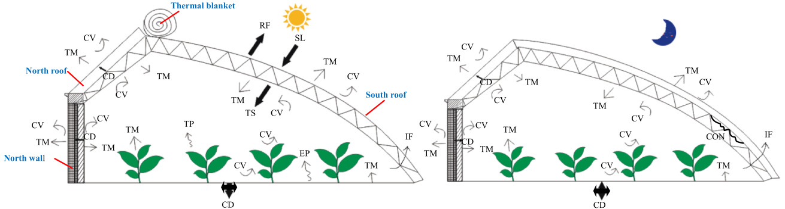
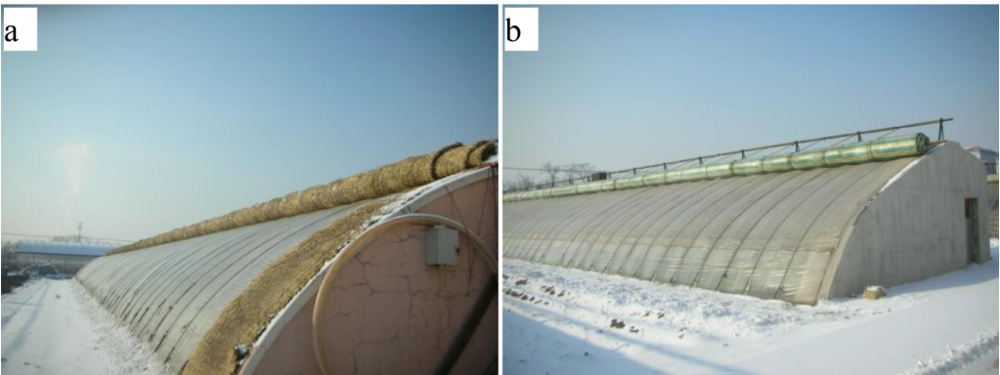
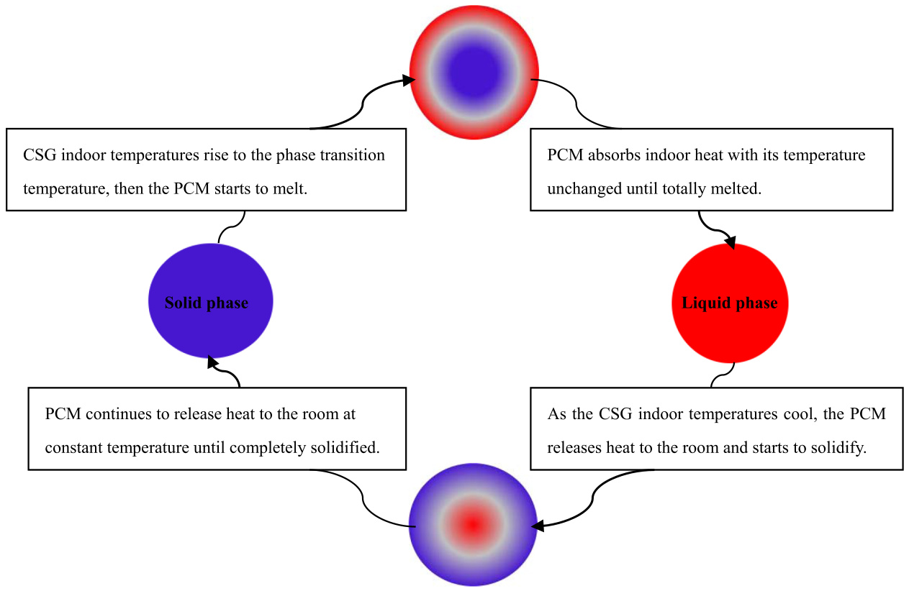
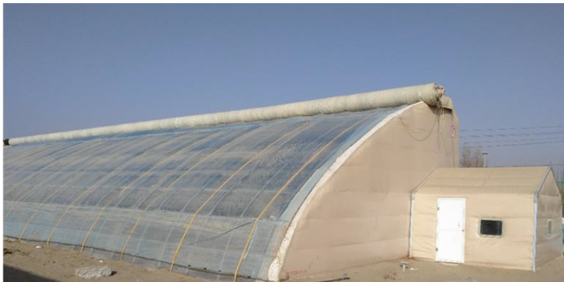

# Passive solar energy utilization: A review of envelope material selection for Chinese solar greenhouses

Guohong Tong a,\*, Qingyun Chen b, Hongjun Xu c

a College of Water Conservancy, Shenyang Agricultural University, Shenyang 110866, China b College of Horticulture, China Agricultural University, Beijing 100193, China c College of Forestry and Horticulture, Xinjiang Agricultural University, Urumqi 830052, China

# A R T I C L E  I N F O

# A B S T R A C T

Keywords:   
Chinese solar greenhouse (CSG)   
Passive designs   
Plastic film   
Insulation cover   
Solar energy

Chinese solar greenhouses (CSGs) passively utilize solar energy to heat the building for crop production during the winter. The envelope materials are critical to effective solar energy utilization through solar radiation capture, solar energy storage and solar heat conservation. This paper reviews envelope material selections, especially material improvement and development trends of CSG south roof films, thermal insulation covers, north wall materials and north roof materials for maximizing solar energy utilization. Many studies have analyzed the effects of the CSG films and north wall materials on the indoor thermal characteristics. The CSG film selection studies have evaluated the effects of the sun ray transmittance, indoor air temperature and inside crop growth while north wall material studies have analyzed new layered north wall materials in both warm areas and severe cold regions in the winter. Envelope material selection for CSGs in non-cultivated desert regions has also been considered. This paper also reviews issues concerning envelope material selection and gives suggestions for future CSG designs. The CSG material selections for different climate regions in China can serve as references for solar greenhouse designs in other regions of the world with similar climates for efficient solar energy utilization.

# Introduction

Huge fossil fuel energy consumption resulting from more energy dependent living has brought about serious environmental pollution. Many renewable energy utilization methods have developed to reduce these environmental problems. The basic trend of global energy trans­ formation is moving towards sustainable energy systems dominated by renewable energy [1]. Solar energy is a clean, renewable energy with little impact on the environment that can be used in green, energysaving buildings [2]. In particular, various studies have demonstrated the great potential for solar energy utilization in agricultural green­ houses [3] as the energy source to produce the crops, reduce fossil fuel consumption for heating [4] and extend the growing seasons for a va­ riety of crops [5]. Chinese solar greenhouses (CSGs) are typical horti­ cultural facilities in China [6] with a north wall, a north roof, a south roof and two side walls. The walls are usually made of heavy thermal mass materials. The south roof allows the incident solar radiation to be transmitted through a transparent cover during the daytime with an additional thermal insulation cover added at night to retain the heat inside. Typical CSG structures and the related heat transfer mechanisms are shown in Fig. 1. The CSGs have various designs that differ from large western plastic/glass covered greenhouses [7]. The north wall and the north roof absorb and store solar energy to function as a thermal buffer for the CSG environment which distinguishes these designs from the transparent walls in western greenhouses [8]. Also, unlike the controlled environment in modern western commercial greenhouses, CSGs in China are passive greenhouses without environmental control systems [9] that maintain an acceptable indoor thermal environment while saving a huge amount of energy [7]. Passive solar heating designs utilize solar energy to heat the building by maximizing the solar heat gain during winter days and minimizing the losses [10].

Insert Fig. 1 here

The solar energy utilization is maximized by enhancing the thermal characteristics of the building envelope [11] which is a simple, effective way to reduce energy consumption because of the large amounts of heat flowing through the envelope [12]. The passive building functions as a solar collector that captures solar energy within the building envelope and releases that heat inside during the night [13]. The parameters that significantly impact the solar energy utilization are the envelope ther­ mal storage material and thickness, the glazing type and the overall shape [14]. The effects of the various CSG cross-sectional parameters, such as the greenhouse span, height and the sizes of the south roof, north wall and north roof, on the solar energy utilization have been reviewed previously [15]. The authors review the evolution of the cross-sectional parameters from the original designs to the current CSG designs and the models for optimizing the CSG design parameters, especially the south roof shape that allows the maximum beam radiation into the room and the north wall to optimize the energy absorption, storage and release. The CSG envelope materials play decisive roles for maximizing the solar energy uptake and utilization and, thus, have been a great concern of CSG growers and researchers.

-South roof film: The cultivation areas have been protected by plastic films since the 1950 s with this method quickly spreading worldwide because of the reduced indoor heat losses, reduced irrigation water use and improved crop protection against adverse weather [16]. China has the greatest agricultural film production and use in the world [17] with the usage increasing 4.05 fold from 1991 to 2017 [18], which has greatly increased the CSG production of vegetables, flowers, fruits and other value-added crops [19]. However, some plastic films have had problems that affected the light transmittance through the south roof, such as plastic film ageing [20] and water condensation on the inside surface of the film in the unheated CSGs in cold weather. The solar heat gain inside a passive greenhouse is mainly through the south roof cover [21] with a high solar transmissivity being especially important for a good greenhouse design [22]. Thus, additives and agents have been added to the plastic film and coating agents have been applied to the film surface to create functional films to cover the CSGs with greatly improved film quality [19] and solar transmissivity.

-North wall: The thermal characteristics of the north wall are related to the wall material, design and thickness [23]. CSG north walls are single material walls or layered walls usually consisting of heavy mass structures with high thermal inertia for solar thermal storage. Some studies have considered phase change materials (PCM) to provide suf­ ficient thermal storage capacity in the layered north wall. Solar energy is absorbed by the north wall during the day and then released heat back into the room as the indoor air temperature drops at night to utilize the heat retained in the north wall [24]. The north wall plays an important role in ensuring greenhouse crop production during cold weather [25]. The wall material selection, thicknesses and configurations all affect the heat delivery [26]. Various studies have investigated suitable north wall material selection and design for local CSGs in China [27]. Thus, the north wall thermal characteristics have been significantly improved by the new north wall materials and designs. Assembled north walls made of straw bales or thermal blankets also have been built for easy instal­ lation with reduced construction costs.

-Thermal insulation cover: The south roof is the largest part of the CSG envelope, with $7 3 \% - 8 0 \%$ of the total heat loss going through the south roof [28]. Thus, a movable thermal insulation cover is normally put over the CSG south roof at night to allow CSG winter crop production in the winter without auxiliary heating. Traditional thermal insulation covers have been made of straw mats such as shown in Fig. 2a starting from early CSG designs [29], but these have many problems such as being easy damaged by rain [30], being unevenly distributed on the surface, having short life spans [29] and easy polluting the plastic film [31]. Layered fabric blankets such as shown in Fig. 2b have been developed and are now suggested to cover CSG south roofs at night. However, recent surveys on sites in northeast and northwest China indicate that most CSG growers in those regions still use straw mats as thermal covers at night [32].

-North roof: In northern China, CSG north roofs are generally loadbearing as well as being insulating and waterproof [31]. The north roofs extend over part of the cultivated area and are supported by a frame and the north wall, so the north roof weight is also important. The north roofs are usually made of light-weight materials to reduce the sizes of the frame and the north wall. The north roof is usually composed of three layers (from inside to outside) with a heat preservation layer, a heat insulation layer and a waterproof layer, with stalks, wood panels or concrete slabs used as the inside heat preservation layer, soil or Styro­ foam used as the middle insulation layer, and a grass-mud mixture, a plastic film layer or some other waterproof material as the outside layer. Surveys in Shandong [33], Ningxia [34] and Xinjiang [35] have shown a variety of north roof materials and designs. In southern China, the north roofs are much simpler with just a thermal blanket covered by a plastic film [36].

Extensive use of renewable energy is needed for future sustainable energy development [1]. The CSG is an example of providing fresh vegetables during the winter without auxiliary heating owing to the important role of the CSG envelope for solar energy utilization, for reducing energy consumption for CSG crop production and for relieving pressure on the energy supply [37]. The CSG envelope shape and size influence the solar energy capture and storage [38]. The effects of the envelope material on the solar energy utilization are reviewed in this paper to further guide CSG designs and improve CSG energy utilization. The paper first introduces CSG envelope material development and applications, then reviews research on CSG envelope material thermal characteristics, presents the issues related to CSG envelope material selection and finally evaluates the contributions and limitations of previous studies in the literature with suggestions for future investigations.

# Development and application of CSG envelope materials

The CSG envelope materials transmit the solar rays into the green­ house, store the solar energy and keep the heat inside. These functions have been improved by significant changes in the roof and north wall materials and in the south roof external insulation covers compared with

  
Fig. 1. Chinese solar greenhouse structures and heat transfer mechanisms.

SL-Solarradiation;RF-Reflectedradiation;TS-Transmitedradiation;CD-Conduction;CV-Convection;TM-Thermalradiation; IF-Infiltration;TP-Transpiration;EP-Evaporation; CON-Condensation

  
Fig. 2. Rolled up thermal insulation covers (a) straw mats and (b) layered fabric blankets.

early CSG designs. The changes in the envelope materials and applica tions are reviewed in this section.

# South roof transparent cover material

CSGs are low cost buildings usually made of locally available, natural materials without any environmental control measures inside. The south roof is covered by a transparent cover with high light transmittance and some insulation capability [39]. The transparent cover material selec­ tion must be adapted to the various Chinese climates and geographical features for different regions [40].

# Development

Glass was used as the CSG transparent covering material in the 1930 s [41] and was then replaced by plastic films in the 1950 s [42]. The CSG film types are listed in Table 1. The greenhouse films are classified by the resin material as polyvinyl chloride (PVC) films, polyethylene (PE) films and ethylene–vinyl acetate (EVA) films [59]. The PVC films were the first type used to cover the CSG in the winter and early spring leading to high vegetable yields [46]. As the petrochemical industry developed, PE film production and use grew rapidly [49]. EVA films have better light transmittance than PVC films and better thermal properties than PE films [55], so they began to be used extensively in the mid-1990 s [49].

With the rapid development of film covered CSG for vegetable pro­ duction in the winter, the film life span, light transmittance and thermal insulation characteristics have been growing concerns. The greenhouse cover film quality has been improved with more functions compared with those of the original films in China since the 1960 s [51]. Plastic film aging began to be improved in the mid to late 1970 s to extend film life spans by additives such as antioxidants and ultraviolet absorbents. Anti-dripping and anti-fogging agents have been added to the films since the 1980 s to reduce water droplet formation on the film inside surface and fog inside the room to improve the film light transmittance. Infrared blocking agents have been added to the films to block transmittance of long wave radiation emitted inside the greenhouse [60]. Better anti-fog coatings were introduced in the late $1 9 9 0 \ s$ to further reduce the heat losses [61]. After 2000, the greenhouse film development focused on further improvements, such as improving the drip-proof agents, light conversion agents, and single-base dual-energy light conversion agents [58].

The plastic films also need to resist damage from wind, rain, hail and snow loads with good thermal insulation to reduce heat losses during the winter, which suggests different agents for different local climates [39]. In addition, the film functions are not only related to the film quality but also to the greenhouse configurations and user cultivation skills [62].

# Applications

The current plastic films are much better than previous normal films. Normal PVC films quickly aged under the ultraviolet light with lifetimes of only two or three years even when used only 30 days a year [47] and their light transmissivities ranged from $6 5 \% - 7 0 \%$ for new films to $5 8 \%$ $- 6 5 \%$ after just four months [63]. Anti-aging and surface tension agents improve the film light transmittance and prolong their lifetimes. For example, the normal PVC or PE lifetimes are four to six months while the improved functional PVC or PE films last 12–18 months [63]. The EVA or polyolefin films last even longer with lifetimes of more than two years [54,64].

Plastic film selection is closely related to the specific location. The functional PVC films have low long wave radiation transmittance that blocks the long wave radiation emitted from the inside surfaces to the outside to reduce the heat losses, so they are more suitable for covering CSGs in regions with low night temperatures [65]. For example, the north part of Xinjiang has long cold winters with the lowest outside air temperatures dropping to $- 3 5 ^ { \circ } \mathsf { C }$ in January, so local growers use the functional PVC films to cover the CSGs [66]. Water film formation resulting from condensation on the functional PE film inside surface also blocks the long wave radiation through the south roof at night in cold weather, which also reduces the heat losses [55]. Thus, functional PE films are used to cover CSGs in most of northern China [67]. The functional EVA films have higher light transmittance and better thermal insulation and weather resistance than the functional PVC or functional PE films [68], so the functional EVA films are recommended to replace the functional PVC films from south of $4 3 \ { } ^ { \circ } { \mathrm { N } }$ latitude [69]. Functional EVA films are reported to be used to cover most CSGs in Shandong [70] and in colder regions in Shanxi [71]. Polyolefin films have the advan­ tages of both functional PE and functional EVA films [72]. CSG field experiments using polyolefin film, functional PVC, EVA and PE films in severe cold regions indicated that the polyolefin film is the best in such regions due to its better light transmittance, better thermal insulation and less droplet formation and dripping [73].

The CSG designs, especially the south roof angles, influence the film functions [74]. Since there are no CSG construction codes, south roofs have a variety of shapes with various south roof angles, even with the same CSG ridge height and span [15]. The solar transmittance through the plastic film and the reflectance from the film surface are both influenced by the south roof shape. Thus, greenhouse films provide good functions for suitable CSG shapes [53].

# North wall material development and applications

CSG north wall development can be divided into three stages based on their wall material and structure. The first stage used single material north walls, with the second stage changing to layered north walls in the 1990 s and then to new north wall materials in recent years [75].

# Single material north walls

Earthen walls, the earliest CSG north wall type, are still popular today, especially in northwest China, where more than $9 5 \%$ of the CSG north walls are made of soil [76]. Earthen north walls are built on site with little or no cost and are mainly used in suburban and rural areas.

Table 1 Historical development of CSG films for covering the south roof.   

<html><body><table><tr><td>Time</td><td>Development indicator</td><td>Development details</td><td>References</td></tr><tr><td>1950 s</td><td>Initial use of PVC films for CSG covers</td><td>Agricultural PVC films from Japan introduced as greenhouse covers in 1958</td><td>[43]</td></tr><tr><td></td><td></td><td>PVC resin equipment first used at the end of the 1950 s</td><td>[44]</td></tr><tr><td>1960 s</td><td>Production and use of domestic PVC films for CSG covers</td><td>PVC greenhouse film production began in China in 1963</td><td>[45]</td></tr><tr><td></td><td></td><td>Domestic PVC greenhouse films used to cover CSG in 1963</td><td>[42]</td></tr><tr><td></td><td></td><td>PVC films covered CSGs in the severe cold region of Jilin Province in 1964</td><td>[42]</td></tr><tr><td></td><td></td><td>PVC films covered CSGs in over 28 provinces in 1965</td><td>[46]</td></tr><tr><td>1970 s</td><td>Greenhouse film type changed from PVC to PVC or PE</td><td>Research on anti-aging PVC greenhouse films began in 1973</td><td>[47]</td></tr><tr><td></td><td></td><td>First winter suitable PVC greenhouse films used from 1973 to 1974</td><td>[47]</td></tr><tr><td></td><td></td><td>First color PVC greenhouse films used froml974 to 1975</td><td>[48]</td></tr><tr><td></td><td></td><td>Low density PE greenhouse films first produced in China in 1976</td><td>[42]</td></tr><tr><td>1980 s</td><td></td><td>Some PVC factories began producing PE films at the end of the 1970 s</td><td>[49]</td></tr><tr><td></td><td>EVA and functional films developed</td><td>PE films became more popular than PVC films for greenhouse covers in 1983</td><td>[50]</td></tr><tr><td></td><td></td><td>PVC films still in use as greenhouse covers in northeast China</td><td>[46]</td></tr><tr><td></td><td></td><td>Anti-aging PE films came into use at the beginning of the 1980 s</td><td>[51]</td></tr><tr><td></td><td></td><td>Heat conserving PE films first produced in 1985</td><td>[52]</td></tr><tr><td></td><td></td><td>Anti-aging,anti-dripping, heat preservation PE films first produced in 1985 Multilayer, multifunction greenhouse films came into use between 1986 and 1990</td><td>[45]</td></tr><tr><td></td><td></td><td>EVA greenhouse films began to be used at the end of the 1980 s</td><td>[52] [49]</td></tr><tr><td></td><td></td><td>Anti-aging,anti-dripping,anti-fogging greenhouse films produced at the end of the 1980</td><td>[53]</td></tr><tr><td></td><td></td><td></td><td></td></tr><tr><td>1990 s</td><td>Improved functional films</td><td>Anti-aging,heat conservation,ultraviolet blocking multifunction greenhouse films first used in 1990</td><td>[42]</td></tr><tr><td></td><td></td><td>Light conversion films used after 1990</td><td>[54]</td></tr><tr><td></td><td></td><td>Diffuse greenhouse films came into use in 1993 Multifunction tri-layer EVA films first produced in 1993</td><td>[42]</td></tr><tr><td></td><td></td><td>Multifunction tri-layer EVA films developed specially for the cold northern part of China</td><td>[54]</td></tr><tr><td></td><td></td><td>after 1993</td><td>[53]</td></tr><tr><td>Time</td><td></td><td>(continued on next page)</td><td></td></tr><tr><td></td><td>Development indicator</td><td>Development details Multilayer co-extruded multifunction EVA films began to be used at the beginning of the</td><td>References [51]</td></tr><tr><td></td><td></td><td>1990 s</td><td></td></tr><tr><td></td><td></td><td>Improved anti-aging and anti-dripping PE films began to be used in 1991</td><td>[53]</td></tr><tr><td></td><td></td><td>High light transmittance multilayer films developed in 1994 Anti-aging polyolefin greenhouse films developed in the mid-1990 s</td><td>[42]</td></tr><tr><td></td><td></td><td>PE and EVA films produced with an antifogging agent,inorganic heat preservation agent</td><td>[54] [55]</td></tr><tr><td></td><td></td><td>and other functions in the 1990 s</td><td></td></tr><tr><td>After</td><td>Improved anti-dripping and anti-fogging films and light</td><td>Anti-dripping and anti-fogging films replaced by films with anti-dripping and anti-</td><td>[56]</td></tr><tr><td>2000</td><td>conversion greenhouse films</td><td>fogging coatings</td><td></td></tr><tr><td></td><td></td><td>Extensive use of anti-aging and anti-dripping polyolefin film coatings</td><td>[39]</td></tr><tr><td></td><td></td><td>Anti-aging and anti-dripping polyolefin film coatings gradually replaced films with anti-</td><td>[57]</td></tr><tr><td></td><td></td><td>aging and anti-dripping components</td><td></td></tr><tr><td></td><td></td><td>Extensive use of light conversion greenhouse films</td><td>[18]</td></tr></table></body></html>

Other single material north walls have been made of brick, gravel or straw bales, but these are far less common than earthen walls.

Earthen north walls are further classified as rammed earthen walls, adobe walls and grass-mud mixture walls with the last two north wall types not being commonly used today. Earthen hand rammed north walls take much time and labor and are usually $0 . 5 \mathrm { - } 1 . 0 \ \mathrm { m }$ thick. Me­ chanically rammed earthen north walls are $3 . 0 { - } 7 . 0 ~ \mathrm { m }$ thick at the bot­ tom with trapezoidal cross-sections [37]. The thicker north walls, which depend on the local soil texture and climate, are commonly used in Shandong [77], Hebei [78] and Shanxi [79] Provinces. Mechanically rammed earthen north walls were introduced into Inner Mongolia in 2004 [80] and are still commonly used today since they are inexpensive [81] and the Inner Mongolian winters are quite severe [82].

# Layered north walls

Layered north walls have layers of more than one material with the typical designs listed in Table2. Early CSGs had relatively simple layered north walls. For example, early layered earthen north walls just had additional soil added to the outside in layers to form layered north walls in Liaoning [100,101] and Beijing [123] or an added straw layer in Shandong [124], Shanxi [71] and other northern regions of China [28]. Soil or sand has been heaped against the outside of the original gravel or brick north wall in Hebei [78] and Xinjiang [122,125] to create layered north walls. The cost has been reduced by using free or very inexpensive locally available materials for the north wall layers, such as Gobi sandy soil or gravel that is available on site in Xinjiang [122,125] and Gansu [126].

Durable layered north walls include multiple wall layers commonly made of clay brick and Styrofoam panels with the clay brick wall acting as a thermal storage layer while the Styrofoam panels are an insulation layer. The thermal storage layer has also been made of other materials like aerated concrete blocks, hollow clay bricks, hollow concrete blocks, porous clay blocks or cinder blocks as shown in Table 2. An air gap, a commonly used insulation layer, has been used between various solid layers in Shandong [70], Shanxi [71], Liaoning [102] and Beijing [85,86]. However, experiments have shown that a $0 . 1 2 \mathrm { m }$ thick air gap provides less thermal insulation effect than the same thickness of other solid materials as insulation layers [102] due to the convective heat transfer in the air gap. Loose materials, such as slag, saw dust and perlite, have also been used as insulation layers in Shanxi [79], Ningxia [34] or Liaoning [102]. However, loose materials easily absorb moisture and settle over time leaving an air gap in the upper part between the solid walls which increases the heat losses [37].

# New north wall materials

The solar energy input to the CSG depends heavily on the time period and the location. Then, for a totally passive CSG, the key issue is how to store the solar heat and how to release it back into the room as needed. PCM wall layers have been used as the thermal storage layers for the north walls, since the PCM stores and releases heat through the phase change as shown in Fig. 3. Various PCM materials have been used in CSGs, such as paraffin, esters, $\mathrm { N a _ { 2 } S O _ { 4 } { \cdot } 1 0 H _ { 2 } O }$ , $\mathrm { C a C l } _ { 2 } { \cdot } 6 \mathrm { H } _ { 2 } 0$ , $\mathrm { N a _ { 2 } H } .$ ­ $\mathrm { P O } _ { 4 } { \cdot } 1 2 \mathrm { H } _ { 2 } \mathrm { O }$ , fatty acid and others. Sealed PCM layers have recently been installed on the inside of CSG north walls in Beijing [87] and Shaanxi [127] to enhance the thermal storage capability. However, PCM wall panels in CSG layered walls have mostly been used in experimental CSGs due to installation challenges in filling and sealing the PCM and the expense [37].

Table 2 Typical layered north wall materials and compositions.   

<html><body><table><tr><td>Location</td><td>Outside daily average air temperature in January (C)</td><td>Material thickness and compositions (from inside to outside)</td><td>Total thickness (m)</td><td>References</td></tr><tr><td>Beijing</td><td>-6-3</td><td>(0.12-0.37) m clay brick +0.10 m Styrofoam +(0.12-0.37) mclay brick</td><td>0.46-0.84</td><td>[83-85]</td></tr><tr><td></td><td></td><td>0.37 m clay brick +(0.10-0.12) m Styrofoam (0.37-0.49) m clay brick +(0.06-0.10)mair gap +(0.37-0.49) m clay brick</td><td>0.47-0.49</td><td>[84,85]</td></tr><tr><td></td><td></td><td></td><td>0.80-1.08 0.50</td><td>[85,86]</td></tr><tr><td></td><td></td><td>0.20 m aerated concrete block + 0.10 m Styrofoam+ O.20 m aerated concrete block</td><td></td><td>[85]</td></tr><tr><td></td><td></td><td>0.05 m PCM+0.80 m clay brick +0.05 m Styrofoam</td><td>0.90</td><td>[87]</td></tr><tr><td>Gansu</td><td></td><td>0.04 m PCM+ 1.00 m clay brick</td><td>1.04</td><td>[88]</td></tr><tr><td></td><td>-9-3</td><td>trapezoidal cross-section, 0.19 m concrete hollow block + gravelly soil layer (top 1.80 m, bottom 3.80 m)</td><td>top 1.99, bottom 3.99</td><td>[89]</td></tr><tr><td></td><td></td><td>trapezoidal cross-section,top:0.60 m gravel layer+0.60 m gravelly soil layer; bottom: 1.50 m gravel layer+ 5.Oo m gravelly soil layer</td><td>top 1.20, bottom 6.50</td><td>[90]</td></tr><tr><td></td><td></td><td>trapezoidal cross-section, O.30 m aerocrete brick + gravelly soil layer (top 0.80 m,</td><td>top 1.10,bottom</td><td>[90]</td></tr><tr><td>Hebei</td><td>-6-3</td><td>bottom 5.50 m); trapezoidal cross-section: brick and soil</td><td>5.80 top 1.50, bottom</td><td>[78]</td></tr><tr><td></td><td></td><td>trapezoidal cross-section: gravel and soil</td><td>3.50 top 1.50,bottom</td><td>[78]</td></tr><tr><td></td><td></td><td>0.05 m concrete panel +O.45 m soil + 0.24 m polystyrene frame filled with concrete +</td><td>4.50 0.75</td><td>[91]</td></tr><tr><td>Hubei</td><td>0-9</td><td>0.01 m plaster 0.24 m clay brick +0.12 m air gap+0.12 m clay brick +0.20 m straw+0.80 m grass-</td><td>1.48</td><td>[92]</td></tr><tr><td>Inner</td><td></td><td>mud mixture 0.24 m clay brick + 0.92 m soil+ 0.24 m clay brick + 0.10 m Styrofoam</td><td>1.50</td><td>[93]</td></tr><tr><td>Mongolia</td><td>-15--5</td><td>0.49 m Porous clay block +0.10 m Styrofoam</td><td>0.59</td><td></td></tr><tr><td>Jiangsu</td><td>0-8</td><td>0.01 m lime mortar+0.24 m clay brick +0.10 m polystyrene panel+0.24 m clay</td><td>0.60</td><td>[94] [27,95]</td></tr><tr><td></td><td></td><td>brick + 0.01 m cement mortar 0.24 m clay block +0.1O m polystyrene panel + O.16 m fired porous clay block</td><td>0.50</td><td></td></tr><tr><td></td><td></td><td>0.01 m lime mortar +0.48 m hollow block +0.10 m polystyrene panel + 0.01 m</td><td>0.60</td><td>[96,97] [27]</td></tr><tr><td></td><td></td><td>cement mortar 0.24 m straw + O.10 m polystyrene panel +0.16 m straw + plastic film</td><td></td><td></td></tr><tr><td></td><td></td><td>(0.05-0.08) m jute panel + 0.30 m air gap +(0.05-0.08) m jute panel + insect-proof</td><td>0.50 0.40-0.46</td><td>[96,97] [98,99]</td></tr><tr><td></td><td></td><td>nets and plastic film</td><td></td><td></td></tr><tr><td>Liaoning</td><td>-18--6</td><td>earthen north wall and soil 0.12 m clay brick +0.12 mair gap +O0.24 mclay brick</td><td>1.50</td><td>[100,101]</td></tr><tr><td></td><td></td><td>0.12 m clay brick + O.12 m air gap + 0.24 m aerated concrete block</td><td>0.48 0.48</td><td>[102,103]</td></tr><tr><td></td><td></td><td>0.24 m clay brick +0.09 m Styrofoam+ 0.12 m clay brick</td><td>0.45</td><td>[102,103] [104]</td></tr><tr><td></td><td></td><td>0.36 m clay brick+0.05 m Styrofoam+0.02 m air gap +0.05 m Styrofoam+0.12 m</td><td>0.60</td><td>[105]</td></tr><tr><td></td><td></td><td>clay brick</td><td></td><td></td></tr><tr><td>Ningxia</td><td>-11-0</td><td>trapezoidal cross-section,0.12 m clay brick + earthen wall(top 0.80 m,bottom 1.50 m)+ 0.12 m clay brick</td><td>top 1.04,bottom 1.74</td><td>[106]</td></tr><tr><td></td><td></td><td>0.20 m cinder block +0.30 m sand +0.10 m Styrofoam +0.20 m cinder block</td><td>0.80</td><td>[107]</td></tr><tr><td></td><td></td><td>0.24 m clay brick +0.50 m slag +0.24 m clay brick</td><td>0.98</td><td>[34]</td></tr><tr><td>Qinghai</td><td>-16-2</td><td>0.24 m hollow block +0.20 m aerated concrete block + 0.80 m earthen wall+0.24 m</td><td>1.48</td><td>[108]</td></tr><tr><td></td><td></td><td>hollow block</td><td></td><td></td></tr><tr><td>Shaanxi</td><td></td><td>0.24 m clay brick + 0.50 m aerated concrete block + 0.24 m clay brick</td><td>0.98</td><td>[108]</td></tr><tr><td></td><td>-3-5</td><td>0.24 m PCM panel +0.10 m Styrofoam + 0.12 m PCM panel 0.19 m hollow brick filled with PCM+0.12 m Styrofoam + 0.19 m hollow brick</td><td>0.46 0.50</td><td>[109]</td></tr><tr><td></td><td></td><td>(0.78-1.08) m earthen wall +0.12 m clay brick</td><td>0.90-1.20</td><td>[110]</td></tr><tr><td>Shandong</td><td>-4-5</td><td>trapezoidal cross-section:0.24 m clay brick +earthen wall (top 1.80 m,bottom 4.00 m)</td><td>top 2.09,bottom</td><td>[111]</td></tr><tr><td></td><td></td><td>+ 0.05 m concrete slab</td><td>4.29</td><td>[112]</td></tr><tr><td></td><td></td><td>0.05 m Styrofoam +0.20 m heat insulation panel + O.O5 m Styrofoam</td><td>0.30</td><td>[113]</td></tr><tr><td>Shanxi</td><td>-10-3</td><td>0.24 m clay brick +0.50 m soil or slag+ O.24 m clay brick</td><td>0.98</td><td>[114]</td></tr><tr><td></td><td></td><td>0.24 m clay brick +0.24 m slag +0.12 m clay brick +0.10 m Styrofoam+(0.02-0.03) m mortar</td><td>0.72-0.73</td><td>[115]</td></tr><tr><td></td><td></td><td>0.37 m clay brick +0.10 m Styrofoam</td><td>0.47</td><td>[79,114]</td></tr><tr><td></td><td></td><td>0.24 m aerated concrete block +0.12 m clay brick +0.10 m Styrofoam + 0.24 m clay</td><td>0.70</td><td>[116]</td></tr><tr><td></td><td></td><td>brick</td><td></td><td></td></tr><tr><td>Tianjin</td><td>-5-2</td><td>clay block + Styrofoam</td><td>0.60</td><td>[117]</td></tr><tr><td> Xinjiang</td><td>-16--8</td><td>0.24 m soil block +0.50 m clay brick +0.60 m Styrofoam</td><td>1.34</td><td>[118]</td></tr><tr><td></td><td></td><td>0.37 m clay brick+0.10 m Styrofoam</td><td>0.47</td><td>[119,120]</td></tr><tr><td></td><td></td><td>0.01 m cement mortar+ O.50 m clay brick +0.10 m Styrofoam and lightweight steel</td><td>0.61</td><td>[121]</td></tr><tr><td></td><td></td><td></td><td></td><td></td></tr><tr><td></td><td></td><td>sheet</td><td></td><td></td></tr></table></body></html>

Prefabricated materials have recently become more common in new

CSG designs since they can be easily and quickly installed compared with traditional north walls [128]. Assembled CSG north walls have been built using straw bales in Ningxia [107] and Jiangsu [129]. An additional layer is installed on the outside of the straw bale to protect the wall against damage from rain or snow, such as a clay brick wall layer, a hollow clay brick wall layer [130], or a lightweight steel sheet layer [131]. Thermal blankets with outside weather resistant layers and a thick core layer made of felt, expandable polyethylene foam, cotton, cotton wool or recycled cotton have also been used as assembled CSG north wall materials. Assembled north walls have been made of a ther­ mal blanket layer in Beijing [132] and Xinjiang [133], a plastic film layer plus a thermal blanket layer in Shandong [113] and straw mats with a thermal blanket in Gansu [134]. Although these light materials have good insulation, they could be further improved to improve the thermal storage capacity [135]. Additionally, other studies have re­ ported assembled CSG north walls with thermal storage layers, such as polystyrene frames filled with concrete in Hebei [91], wheat shellmortar blocks filled with bricks in Xinjiang [120], and hollow con­ crete blocks filled with cement mortar in Beijing [136]. Another assembled multilayer north wall structure had a reinforced concrete panel on the inside and a thermal insulation panel on the outside with rammed earth in between [128]. The authors suggested that the inner and outer wall panels could be reused with the soil filling returned to the field after use.

The north wall material selections in northern China should ensure CSG winter production without auxiliary heating [137] while being affordable to the local CSG growers [138]. In southern China such as Jiangsu [96,97] and Zhejiang [36], the north walls should also be removable for ventilation during warmer days.

# South roof thermal insulation cover material development and applications

In the 1930 s, straw mats were used to cover the CSG south roofs at night to reduce heat losses through the south roof [139]. These straw mats were generally made of locally available natural materials, such as rice straw, wheat straw, cattails or reeds. The reported straw mat ap­ plications in various regions are listed in Table 3. The straw mat appli­ cations are simply straw mats, straw mats with Kraft paper underneath and straw mats with plastic films. Straw mats with Kraft paper under­ neath reduce the heat transfer through the cover [139] with one layer of straw mat plus more than one layer of Kraft paper underneath the mat to keep more heat inside during the winter nights, especially in Hebei [140] and Liaoning [101]. Alternatives were to add old plastic film layers in place of the Kraft paper layers [141] or to wrap the straw mat in a tarpaulin [147]. Plastic film layers have been used to cover the outside of the straw mat to protect from rain in Jiangsu [142] and from rain and snow in Shandong [33] or to reduce heat losses, protect from rain and snow and provide structural integrity for heavy snow loads in Xinjiang [66].

As the chemical textile industry developed, various kinds of layered fabric blankets were developed in the 1980 s to replace the straw mats [154]. The layered fabric blankets reduced the heat transfer, had smooth surfaces and were light weight and waterproof [30]. They need to be strong enough to stay in place in high winds [155] while still being light enough to be easily rolled up and down to maintain higher inside air temperatures at night [156]. The layered fabric blankets have an inside core layer and outside surface layers. The core layer should be porous and elastic [157] while the outside layer should be water-proof and weather resistant [72]. The core materials include felt, expandable polyethylene foam, spray-bonded cotton, PE foam, cotton wool or recycled cotton while the outside surfaces are nonwoven fabrics, waterproof fabrics, aluminized films or PE coated nonwoven fabrics. These layered fabric blankets have mostly been used in CSG demon­ stration projects [146] and in suburban areas. There are no blanket production standards or quality control in the current development stage [32]. The thermal insulation cover material and the optimum thickness need to be investigated further [154].

# North roof material development and applications

North roof materials in early CSGs often consisted of autumn harvest residues as thermal layers with a grass-mud mixture attached to the outside as a waterproof layer without any additional material cost [101]. This kind of north roof structure is still in use in some rural areas using nearly the same materials. Low cost north roofs have used straw, corn stalks or sorghum stalks as the thermal storage layer and a grassmud mixture or old plastic films as the waterproof layer [71,140]. In the winter, especially at night, the air is quite humid inside a closed, unheated CSG, so the inside layer of straw or stalks quickly decays. Thus, the inside surface of the north roof also needs a waterproof cover to protect against the wet inside air [158] such as a plastic film on the north roof inside surface or sealing the straw or stalks with a plastic film [159]. The easiest way is to put plastic films on the bottom and the top with a straw layer in between [131]. The north roofs of some newly assembled CSGs use the same layered materials as the north wall with straw mats, thermal blankets, and plastic films from the inside to the outside [134]. Then, the straw layer needs to be replaced every two to three years because of decay over time [146].

  
Fig. 3. Schematic of the PCM processes in Chinese solar greenhouses.

Table 3 Straw mat applications.   

<html><body><table><tr><td rowspan="2">No.</td><td rowspan="2">Location</td><td rowspan="2">Outside daily average airtemperature in January (C)</td><td rowspan="2">Materials (from inside to outside)</td><td rowspan="2">Thickness(mm)</td><td rowspan="2">Area density(Kg/m²)</td><td rowspan="2">References</td></tr><tr><td></td></tr><tr><td>1</td><td>Beijing</td><td>-6-3</td><td>Two-layer straw mat</td><td>1</td><td>1</td><td>[123]</td></tr><tr><td rowspan="2">2</td><td rowspan="2">Hebei</td><td rowspan="2">-6-3</td><td>Four-layer Kraft paper/straw mat</td><td>1</td><td>一</td><td>[140]</td></tr><tr><td>Straw mat</td><td></td><td>3.25</td><td>[29]</td></tr><tr><td>3</td><td>Henan</td><td>-3-6</td><td>One-layer old plastic film/straw mat</td><td>30</td><td>二</td><td>[141]</td></tr><tr><td rowspan="4">4</td><td rowspan="4">Jiangsu Liaoning</td><td rowspan="4">0-8 -18--6</td><td>Straw mat/one-layer plastic film</td><td>1</td><td></td><td>[142]</td></tr><tr><td>Straw mat</td><td>1</td><td>4.00-5.00</td><td>[143]</td></tr><tr><td>Four-layer Kraft paper/straw mat</td><td>1</td><td>1</td><td>[100]</td></tr><tr><td>Four- or five-layer Kraft paper/ straw mat</td><td>一</td><td>一</td><td>[101]</td></tr><tr><td rowspan="4">6</td><td rowspan="2"></td><td rowspan="2"></td><td>Straw mat</td><td>40</td><td>3.85</td><td>[144]</td></tr><tr><td>Straw mat/one-layer cotton blanket</td><td>一</td><td></td><td>[145]</td></tr><tr><td rowspan="2">Ningxia -11-0</td><td>Straw mat</td><td>40-50</td><td>2.27-2.94</td><td></td><td>[146]</td></tr><tr><td>Straw mat</td><td>50</td><td></td><td>1</td><td>[147]</td></tr><tr><td>7</td><td>Qinghai -16-2</td><td></td><td>Straw mat</td><td>80</td><td>一</td><td>[148]</td></tr><tr><td rowspan="4">8</td><td rowspan="2">Shandong</td><td rowspan="2">-4-5</td><td>Straw mat/one-layer plastic film</td><td>1</td><td>1.78-6.39</td><td>[33]</td></tr><tr><td>Straw mat</td><td>1</td><td>4.00-5.00</td><td>[70,149]</td></tr><tr><td></td><td></td><td>Straw mat</td><td>32</td><td>3.34</td><td>[150]</td></tr><tr><td>9 Shaanxi</td><td>-3-5</td><td>Straw mat</td><td>30</td><td>1.17</td><td>[151]</td></tr><tr><td rowspan="4">10</td><td rowspan="4">Shanxi</td><td rowspan="4">-10-3</td><td>Straw mat</td><td>50</td><td>1</td><td>[71]</td></tr><tr><td>Straw mat/one-layer plastic film</td><td>40</td><td>一</td><td>[152]</td></tr><tr><td>Straw mat/one-layer plastic film</td><td></td><td>3.50</td><td></td></tr><tr><td>Straw mat/one-layer plastic film</td><td>一</td><td></td><td>[153]</td></tr><tr><td rowspan="4">11 Xinjiang</td><td rowspan="4"></td><td rowspan="4">-16--8</td><td></td><td>30</td><td>一 1.43</td><td>[66]</td></tr><tr><td>Straw mat Straw mat</td><td>60</td><td></td><td>[125]</td></tr><tr><td></td><td></td><td>3.30</td><td>[125]</td></tr><tr><td></td><td></td><td></td><td></td></tr></table></body></html>

Durable materials have been more recently used in the north roof to reduce the maintenance with typical north roof materials and arrange­ ments described in Table 4. The durable materials have generally included wood panels, Styrofoam panels, concrete slabs and other solid panels. Although CSG growers want to build more permanent north roof structures, straw, corn stalks or sorghum stalks are still found as north roof layers in Liaoning [144], Gansu [161], Qinghai [164] and Shan­ dong [33] to reduce the north roof material costs. Investigations of CSGs in Tianjin [117], Shandong [33] and Ningxia [34] have found both permanent and temporary north roofs in the field. The total cost of the north roof material is still a decisive factor for material selection, especially in rural areas.

Table 4 Permanent north roof materials.   

<html><body><table><tr><td>Item</td><td>Location</td><td>Outside daily average airtemperature in January(C)</td><td>North roofthickness(m)</td><td>Material*(from inside to outside)</td><td>References</td></tr><tr><td>1</td><td>Beijing</td><td>-6-3</td><td>0.20</td><td>Concrete slab</td><td>[160]</td></tr><tr><td>2</td><td>Gansu</td><td>-0-3</td><td>一</td><td>Styrofoam panel/ plastic film/wheat straw/wood panel /mud/ plastic film/mud</td><td>[161]</td></tr><tr><td></td><td></td><td></td><td>一</td><td>Styrofoam panel /plastic film/wheat straw/asbestos tile/mud/ plastic film/mud</td><td>[161]</td></tr><tr><td>3</td><td>Inner Mongolia</td><td>-15--5</td><td>0.50-0.70</td><td>Concrete slab/slag</td><td>[162]</td></tr><tr><td>4</td><td>Jiangsu</td><td>0-8</td><td>一</td><td>Concrete slab/mud/plastic film/mud/clay brick</td><td>[142] [143]</td></tr><tr><td>5</td><td>Liaoning</td><td>-18--6</td><td>0.30-0.35 0.20</td><td>Light-weight steel plate/Styrofoam/polyurethane plastics panel Wood panel /Styrofoam panel /slag/waterproof layer</td><td>[163]</td></tr><tr><td></td><td></td><td></td><td></td><td>Wood panel /Styrofoam panel /straw mat/mud/soil</td><td>[144]</td></tr><tr><td></td><td></td><td></td><td>0.25</td><td>Plank/polystyrene panel /lime and furnace cinder/cement sand</td><td>[104]</td></tr><tr><td></td><td></td><td></td><td>0.50</td><td>grout/waterproof layer</td><td></td></tr><tr><td>6</td><td>Ningxia</td><td>-11-0</td><td>0.60</td><td>Corrugated panel /grass package/Styrofoam panel /mortar Bamboo plywood/slag/concrete</td><td>[34]</td></tr><tr><td>7</td><td>Qinghai</td><td>-16-2</td><td></td><td>Styrofoam panel /wheat straw/mud</td><td>[164]</td></tr><tr><td>8</td><td>Shaanxi</td><td>-3-5</td><td>Thicker than 0.10</td><td>Styrofoam panel</td><td>[165]</td></tr><tr><td>9</td><td>Shandong</td><td>-4-5</td><td>0.10</td><td>Styrofoam panel</td><td>[149]</td></tr><tr><td></td><td></td><td></td><td>Top: 0.20; bottom:</td><td>Wood panel /Styrofoam panel /corn or sorghum stalks/nonwoven</td><td>[33]</td></tr><tr><td></td><td></td><td></td><td>0.60-1.00</td><td>fabric</td><td></td></tr><tr><td></td><td></td><td></td><td>Top: 040-0.60;bottom: 0.60-0.90</td><td>Hollow brick/soil/straw mat</td><td>[33]</td></tr><tr><td>10</td><td>Shanxi</td><td>-10-3</td><td>0.40</td><td>Styrofoam panel/concrete slab/mortar</td><td>[152]</td></tr><tr><td></td><td></td><td></td><td></td><td>Concrete slab/wood panel /slag/fly ash/saw dust/thatch/cement</td><td>[166]</td></tr><tr><td></td><td></td><td></td><td></td><td>plaster/asphalt felt waterproof</td><td></td></tr><tr><td></td><td></td><td></td><td>一</td><td>light-weight steel plate/Styrofoam panel/light-weight steel plate</td><td>[115]</td></tr><tr><td></td><td></td><td></td><td></td><td></td><td></td></tr><tr><td>11</td><td></td><td></td><td></td><td></td><td></td></tr><tr><td>12</td><td></td><td></td><td>0.25</td><td>Waterproof geomembrane/reed panel/Styrofoam panel /light-</td><td></td></tr><tr><td></td><td></td><td></td><td></td><td></td><td></td></tr><tr><td></td><td></td><td></td><td></td><td></td><td></td></tr><tr><td></td><td></td><td></td><td></td><td></td><td></td></tr><tr><td></td><td></td><td></td><td></td><td></td><td></td></tr><tr><td></td><td></td><td></td><td></td><td></td><td></td></tr><tr><td></td><td></td><td></td><td></td><td></td><td></td></tr><tr><td></td><td></td><td></td><td></td><td></td><td></td></tr><tr><td></td><td></td><td></td><td>/</td><td></td><td></td></tr><tr><td></td><td></td><td></td><td></td><td>Reinforced concrete slab/slag</td><td></td></tr><tr><td></td><td></td><td></td><td></td><td></td><td>[71]</td></tr><tr><td></td><td></td><td></td><td></td><td></td><td></td></tr><tr><td></td><td></td><td></td><td></td><td></td><td></td></tr><tr><td></td><td></td><td></td><td></td><td></td><td></td></tr><tr><td></td><td></td><td></td><td></td><td></td><td></td></tr><tr><td></td><td></td><td></td><td></td><td></td><td></td></tr><tr><td></td><td></td><td></td><td></td><td></td><td></td></tr><tr><td></td><td></td><td></td><td></td><td></td><td></td></tr><tr><td></td><td></td><td></td><td></td><td></td><td></td></tr><tr><td></td><td></td><td></td><td></td><td></td><td></td></tr><tr><td></td><td></td><td></td><td></td><td></td><td></td></tr><tr><td></td><td></td><td></td><td></td><td></td><td></td></tr><tr><td></td><td>Tianjin</td><td></td><td></td><td></td><td></td></tr><tr><td></td><td></td><td></td><td></td><td>Wood panel /Styrofoam panel /tabia</td><td></td></tr><tr><td></td><td></td><td></td><td>Top: 0.10; bottom: 0.30</td><td></td><td></td></tr><tr><td></td><td></td><td></td><td></td><td></td><td></td></tr><tr><td></td><td></td><td>-5-2</td><td></td><td></td><td></td></tr><tr><td></td><td></td><td></td><td></td><td></td><td></td></tr><tr><td></td><td></td><td></td><td></td><td></td><td>[117]</td></tr><tr><td></td><td></td><td></td><td></td><td></td><td></td></tr><tr><td></td><td></td><td></td><td></td><td></td><td></td></tr><tr><td></td><td></td><td></td><td></td><td></td><td></td></tr><tr><td></td><td> Xinjiang</td><td></td><td></td><td></td><td></td></tr><tr><td></td><td></td><td></td><td></td><td></td><td></td></tr><tr><td></td><td></td><td></td><td></td><td></td><td></td></tr><tr><td></td><td></td><td>-16--8</td><td></td><td></td><td></td></tr><tr><td></td><td></td><td></td><td></td><td></td><td>[118]</td></tr><tr><td></td><td></td><td></td><td></td><td></td><td></td></tr><tr><td></td><td></td><td></td><td></td><td>weight steel plate</td><td></td></tr><tr><td></td></table></body></html>

\* Without supporting frame materials

# CSG envelope material thermal characteristics

Further research on the envelope materials is needed because: (1) the thermal property information for the CSG opaque envelope material and the transparent cover is mainly from laboratory studies, while the real envelop material thermal parameters, especially the solar transmissivity of the transparent film in the field, needs further study, (2) the material thicknesses and arrangements in the layered north wall and north roof in CSGs needs to be further investigated to evaluate all the thermal effects as a whole and (3) the overall envelope material heat transfer rates are closely related to the CSG designs and the local climates.

# Thermal characteristics of the transparent cover material

The CSG south roof transmits sunlight through the thin plastic film. The film covers the largest portion of the total CSG envelope, thus, the film heat transfer rates are almost as important as the light trans­ mittance. Laboratory and even field tests of various films cannot give full, robust measurements of the film thermal characteristics. Compar­ ative field studies of CSGs covered by various films are then needed to verify all the effects of the film materials on the light transmittance and thermal insulation [40,45]. The field evaluations of the light trans­ mittance and resulting inside air temperatures for various types of films

Table 5 Thermal characteristics of greenhouse films.   

<html><body><table><tr><td>No.</td><td>Film type</td><td>Film function</td><td>Film thickness (mm)</td><td>CSG size (m)</td><td>Experiment time</td><td>Location</td><td>Film transmissivity* (%)</td><td>Indoor airtemperature*(C)</td><td>Publishedyear</td><td>References</td></tr><tr><td>1</td><td>Polyolefin</td><td>Thermal preservation; anti- dripping and anti-</td><td>0.08</td><td>Span 8.0; ridge height 2.5</td><td>Sep.16- Dec.15,2017</td><td></td><td>90.1(after 3 months)</td><td>10.6(8:00 Dec.5, 2017)</td><td>2018</td><td>[57]</td></tr><tr><td></td><td>Polyolefin PE</td><td>fogging Anti-dripping and anti-fogging 一</td><td></td><td></td><td></td><td></td><td>89.9(after 3 months) 87.6(after 3</td><td>9.7(8:00 Dec.5, 2017) 7.4(8:00 Dec.5,</td><td></td><td></td></tr><tr><td>2</td><td>Polyolefin</td><td></td><td>0.10</td><td>Span 8.0</td><td>Aug.,2014- May 2015</td><td>Beijing</td><td>months) 92.0 (new)</td><td>2017) 14.5(Dec.13, 2014) 14.3 (Dec.13,2014)</td><td>2017</td><td>[167]</td></tr><tr><td>3</td><td>PE Polyolefin EVA</td><td></td><td></td><td></td><td>Sep.14- Nov.10,2013</td><td>Ningxia</td><td>90.0 (new)</td><td>Polyolefin covered CSG 0.2-2.0 higherthan the EVA</td><td>2016</td><td>[168]</td></tr><tr><td>4</td><td>Polyolefin</td><td>Anti-aging, anti-</td><td></td><td>Span 8.0</td><td>Nov.,2014- Mar., 2015</td><td>Beijing</td><td></td><td>CSG 14.6 (Jan.) 13.6 (Jan.)</td><td>2015</td><td>[169]</td></tr><tr><td></td><td></td><td>dripping and anti- fogging</td><td>0.10</td><td>Span 8.0;</td><td>Nov., 2010-</td><td></td><td>81.5 (12:30)</td><td>13.4 (Jan.)</td><td>2011</td><td></td></tr><tr><td></td><td>PE</td><td></td><td></td><td>ridge height 3.8</td><td>Jun., 2011</td><td>Beijing</td><td>(Jan.15,2011) 76.8 (12:30) (Jan. 15,2011)</td><td>12.0 (Jan.)</td><td></td><td></td></tr><tr><td>6</td><td>Polyolefin EVA</td><td></td><td></td><td>Span 10.0; ridge height 3.3</td><td>Oct., 2007- May 2008</td><td>Shandong</td><td>71.7 61.9</td><td>11.3 (Jan.) 8.7 (Jan.)</td><td>2009</td><td>[170]</td></tr><tr><td>7</td><td>PVC EVA</td><td></td><td></td><td>Span 6.8ridge height 2.7</td><td>Mar.15- Apr.26,2007</td><td>Hebei</td><td></td><td>EVA covered CSG 2.5-3.0 higher than</td><td>2008</td><td>[171]</td></tr><tr><td>8</td><td>PVC PE</td><td></td><td></td><td>Span 7.5; ridge height 3.5</td><td>Nov.15,2001- Aug.15,2002</td><td>Liaoning</td><td>84.9 75.9</td><td>the PVC CSG 10.6 (8:00,Feb.) 5.4 (8:00,Feb.)</td><td>2006</td><td>[172]</td></tr><tr><td>No.</td><td>Film type</td><td>Filmfunction</td><td>Film thickness</td><td>CSG size (m)</td><td>Experimenttime</td><td>Location</td><td>75.7 Film transmissivity</td><td>11.7 (8:00, Feb.) Indoor airtemperature(C)</td><td>Publishedyear</td><td>References</td></tr><tr><td>9</td><td>PE</td><td>Anti-aging and</td><td>(mm) 一</td><td>Span 7.0;</td><td>Oct.20,2002-</td><td>Liaoning</td><td>（%） 88.0 (new);79.0</td><td></td><td>2005</td><td>[173]</td></tr><tr><td></td><td>EVA</td><td>anti-dripping 一</td><td></td><td>ridge height 3.5</td><td>Mar.20,2003</td><td></td><td>(after 5 months) 89.9 (new);83.3 (after 5 months)</td><td></td><td></td><td></td></tr><tr><td>10</td><td>Polyolefin</td><td>Thermal preservation; anti- dripping and anti-</td><td></td><td></td><td>Oct.,1996- Jul.,1997</td><td>Liaoning</td><td>70.4</td><td>10.5 (min)</td><td>1999</td><td>[69]</td></tr><tr><td></td><td>PVC</td><td>fogging Anti-aging and</td><td></td><td></td><td></td><td></td><td></td><td>12.1 (min)</td><td></td><td></td></tr><tr><td></td><td>PE</td><td>anti-dripping Anti-aging and</td><td></td><td></td><td></td><td></td><td>61.5</td><td>11.3 (min)</td><td></td><td></td></tr><tr><td></td><td></td><td>anti-dripping</td><td></td><td></td><td></td><td></td><td>68.2</td><td></td><td></td><td></td></tr><tr><td>11</td><td>EVA</td><td>Anti-aging and</td><td>0.10</td><td>一</td><td>1996-1997</td><td></td><td>71.2</td><td>10.4 (min)</td><td></td><td></td></tr><tr><td></td><td>PVC</td><td></td><td></td><td></td><td></td><td>Beijing</td><td>61.5</td><td>19.9</td><td>1999</td><td>[174]</td></tr><tr><td></td><td></td><td>anti-dripping</td><td></td><td></td><td></td><td></td><td></td><td></td><td></td><td></td></tr><tr><td></td><td></td><td></td><td></td><td></td><td></td><td></td><td></td><td></td><td></td><td></td></tr><tr><td></td><td></td><td></td><td></td><td></td><td></td><td></td><td></td><td></td><td></td><td></td></tr><tr><td></td><td>PE</td><td>Anti-aging</td><td></td><td></td><td></td><td></td><td>69.1</td><td>19.0</td><td></td><td></td></tr><tr><td></td><td></td><td></td><td></td><td></td><td></td><td></td><td></td><td></td><td></td><td></td></tr><tr><td></td><td></td><td></td><td></td><td></td><td></td><td></td><td></td><td></td><td></td><td></td></tr><tr><td></td><td></td><td>Anti-dripping</td><td></td><td></td><td></td><td></td><td></td><td></td><td></td><td></td></tr><tr><td></td><td>PE</td><td></td><td></td><td></td><td></td><td></td><td>67.1</td><td>19.3</td><td></td><td></td></tr><tr><td></td><td></td><td></td><td></td><td></td><td></td><td></td><td></td><td></td><td></td><td></td></tr><tr><td></td><td></td><td></td><td></td><td></td><td></td><td></td><td></td><td></td><td></td><td></td></tr><tr><td></td><td>EVA</td><td></td><td></td><td></td><td></td><td></td><td>70.8</td><td>18.0</td><td></td><td></td></tr><tr><td></td><td></td><td></td><td></td><td></td><td></td><td></td><td></td><td></td><td></td><td></td></tr><tr><td>12</td><td></td><td></td><td></td><td></td><td></td><td></td><td></td><td></td><td></td><td></td></tr><tr><td></td><td></td><td></td><td>0.15</td><td>Span 4.5;</td><td>Oct.,1993-</td><td></td><td>76.7(after 30</td><td>Polyolefin covered</td><td>1997</td><td></td></tr><tr><td></td><td>Polyolefin</td><td></td><td></td><td></td><td></td><td></td><td></td><td></td><td></td><td>[175]</td></tr><tr><td></td><td></td><td></td><td></td><td></td><td></td><td></td><td></td><td></td><td></td><td></td></tr><tr><td></td><td></td><td></td><td></td><td></td><td></td><td></td><td></td><td></td><td></td><td></td></tr><tr><td></td><td></td><td></td><td></td><td>ridge</td><td>Apr.,1996</td><td></td><td>months)</td><td>CSG 2.0-3.5 higher</td><td></td><td></td></tr><tr><td></td><td></td><td></td></table></body></html>

\* Film transmissivity or indoor air temperature without special instructions are the average values during the experimental period

are summarized in Table 5.

As shown in Table 5, the results generally indicate that the light transmittance and indoor air temperature for polyolefin film covered CSGs are higher than those for PE, EVA or PVC covered CSGs while EVA films have higher light transmittances than PE films with PVC covered CSG having higher indoor air temperatures than PE covered CSG. Some different results to the conclusions given in Table 5 may result from different material formulations used for the same film type [55] or different film functions, for example, different CSGs have different light inputs and different indoor air temperatures even when covered by the same type of PE [172], EVA [174] or polyolefin films [57]. Also, antiaging PE films had higher light transmittances than anti-aging and anti-dripping PE films [176], while the thermal EVA film had the lowest heat losses but with low light transmittance [177].

Many factors, such as the film material, thickness and service time, influence the light environment inside CSGs. For example, the direct solar radiation transmissivity of an $0 . 0 8 \mathrm { m m }$ thick anti-aging PE film was $8 8 . 4 \%$ but only $8 4 . 0 \%$ for a $0 . 2 \mathrm { m m }$ thick film [176]. Studies have found that polyolefin film covered CSGs had significantly lower light capture in the third year [178] and even in the second year [73], with a yearly $3 . 3 \%$ attenuation of the light transmittance for polyolefin films and an even lower rate of $7 . 0 \%$ for PVC films [175]. Light conversion films, which convert ultraviolet light or green-yellow light into blue-violet and red orange light which improves the photosynthesis have been devel­ oped by adding a light conversion agent to the plastic film. Films with anti-fog coatings have higher light transmittances than anti-fog films using anti-fog agents in the film material. Films with anti-fog coatings and a light conversion agent in the film material have higher light transmittances and heat retention rates than films with anti-fog agents and light conversion agents in the film material [179]. The results also indicate that films with newly developed light-conversion coatings greatly improve tomato growth, yield and production quality. EVA films with anti-fog coatings and three different light conversion agents had increased light transmittances for red orange light and far-red light with lower transmittances of violet, blue and green light [180]. The authors also found that the different types of light conversion agents signifi­ cantly impacted the CSG light environment and the growth of sweet peppers. CSG covered with light diffusing films enable the bottom and middle crop leaves to get more light than other films. A CSG in a diffuse light environment when covered by a film with $5 5 \%$ diffuse light transmittance and $8 5 \%$ total light transmittance provided more uniform light into the CSG for both east–west and north–south tomato planting patterns [181].

# North wall thermal characteristics

# Effect of north wall material thickness and arrangement

A numerical study of the heat retention in a single layer CSG clay brick north wall in Beijing concluded that the indoor air temperatures were only slightly higher when the brick wall thickness was increased beyond $0 . 6 \mathrm { ~ m ~ }$ , so the authors recommended using a $0 . 6 \mathrm { ~ m ~ }$ thick brick wall for the north wall [182]. Field tests showed that a $0 . 5 \mathrm { ~ m ~ }$ thick earthen north wall in Beijing functioned as a heat sink throughout the day [103]. Several tests were conducted to find a suitable earthen north wall thickness, such as using three different wall thicknesses $( 0 . 5 \mathrm { m } , 1 . 0 \$ m and $1 . 5 \mathrm { m } \mathrm { \check { } }$ ) along the length of a CSG with plastic films as partitions with the air temperatures in each section measured to evaluate the north wall thermal effects [102]. The results showed that the thinnest north wall $\mathrm { 7 } 0 . 5 \mathrm { m }$ thick) had the lowest average air temperature while the 1.0 m and $1 . 5 \mathrm { m }$ thick north walls had similar, higher temperatures [102]. Tests have also been conducted in different regions of Xinjiang, Shaanxi, Gansu and Ningxia to evaluate the effects of commonly used local CSG north wall thicknesses on the indoor air temperatures in those regions to select the best north wall thickness for each region [76]. More studies are needed to find the optimum thickness of single material north walls for different materials in different regions.

The thermal characteristics of layered north walls are affected by many factors such as the wall material, thickness and structure [103]. The average air temperature was increased by around $0 . 7 ^ { \circ } \mathrm { C }$ by adding a $0 . 1 2 \mathrm { m }$ thick clay brick layer to the outside of a $0 . 6 \mathrm { { m } }$ thick layered north wall for a $1 2 \mathrm { m }$ span CSG in Shenyang [183]. A numerical study reported that the CSG indoor air temperature did not increase significantly as the middle Styrofoam panel thickness was increased beyond $0 . 1 \mathrm { ~ m ~ }$ for a Styrofoam middle layer between two clay brick layers in Beijing [182]. However, another study indicated that a $0 . 0 6 \mathrm { ~ m ~ }$ thick Styrofoam panel was suitable in a layered north wall in Beijing when the investment cost was also considered [184]. Another study of layered north walls showed that the material arrangement influenced the CSG indoor air tempera­ tures [185]. For a fixed $0 . 6 \mathrm { ~ m ~ }$ layered north wall thickness with the insulation layer arranged as one or two layers with the same total thickness at various positions, the CSG indoor air temperature was higher at night with a thin brick wall ( $\mathrm { 0 . 1 2 m }$ thick) on the inner surface adjacent to an insulation layer than for other north wall material ar­ rangements [186]. The authors also found that the north wall material arrangement with the maximum time lag and the smallest north wall surface temperature oscillations did not give the optimum CSG north wall configuration.

Experimental studies to find economic, efficient layered north walls have compared the thermal characteristics of designed layered north walls with those of local, commonly used layered north walls. For example, the cost of CSG north wall materials and construction in Ningxia was reduced by using desert sand as the fill material in a layered north wall with cinder block/sand/Styrofoam/cinder block layers from inside to outside in place of corrugated plate/straw/cinder block layered north walls with the average minimum air temperature increased by around $0 . 7 ^ { \circ } \mathrm { C }$ in January in an $8 \mathrm { m }$ span CSG [107]. Slag and loess are readily available in Shanxi and have been used as the middle fill material in layered CSG north walls [114]. Gravel, which is commonly available in the northwest of China, has been used with the gravel fixed in wire mesh cages with air gaps between layers as the CSG north wall in Shaanxi [187]. The authors found that a CSG with a $1 . 0 \mathrm { m }$ thick gravel north wall layer with a $0 . 1 \mathrm { m }$ thick Styrofoam panel on the outside had a daily average air temperature $4 . 0 \ ^ { \circ } \mathrm { C }$ higher than that CSG with local north wall layers made of clay brick/Styrofoam/clay brick in the winter.

Other types of layered CSG north walls have been investigated in recent years to further improve the heat retention. Ceramic grain con­ crete was suggested for use as the thermal storage layer because of its high thermal storage capacity which is higher than that of commonly used clay brick north walls for the same density [188]. A layered north wall with a polyurethane panel as the outside insulation layer had higher daily average indoor air temperatures for both clear and cloudy days than a north wall with a Styrofoam panel as the outside thermal insulation layer [189]. A numerical study showed that an air enclosure covered by aluminum foil installed between clay brick north walls effectively reduced the radiation heat transfer within the air enclosure and reduced the thermal losses [190]. Another north wall with two rows of vent holes at the bottom and top of a hollow north wall, an air con­ vection thermal storage north wall, for heat exchange between the air inside the hollow wall and the indoor air increased the lowest indoor air temperature by $2 . 2 \ ^ { \circ } \mathrm { C }$ at night, greatly improving the CSG thermal characteristics [136]. These new developed north walls need further investigations for future widespread use.

The CSG north wall thermal characteristics are normally evaluated by their ability to increase the inside air temperature. Inside air tem­ peratures for CSGs with various north wall material thicknesses and arrangements are listed in Table 6. The comparisons of single material walls showed the effects of different material thicknesses [193], espe­ cially the earthen wall thicknesses, on the CSG inside air temperatures [102,191]. Straw bale walls have been developed recently with suitable thicknesses determined by comparing the thermal effects with those of local common single material walls [129,131,192]. Comparisons be­ tween layered north walls and single material walls illustrated the thermal effects of these new layered wall designs [93,194] or evaluated the effect of a local material for a wall layer, such as gravel or gravelly soil [90], gravel and Gobi sand [122] or jute panels [98]. Comparisons of layered north walls sought to identify the best insulation layer ma­ terial or evaluate the thermal characteristics of new north wall mate­ rials. The effects of the north wall materials and layer arrangements on the indoor thermal environment in various regions will need further investigations to identify the best north wall design for the local climates.

# Effect of CSG north wall thermal storage layer thickness

The CSG north wall thermal storage layer forms the inner wall in contact with the indoor air. The thermal storage layer thickness for a single material wall is generally determined as the depth where the north wall temperature swing is reduced to less than $0 . 5 ^ { \circ } \mathrm { C }$ throughout the day. An experimentally verified model was developed to predict the north wall temperature distributions for a single material wall. The model showed that currently reported machine rammed trapezoidal earthen north walls can be regarded as semi-infinite flat plates since the temperature swing amplitudes decay exponentially through the north wall thickness. The model was also used to predict the appropriate thermal storage layer thickness of a single material wall based on the wall temperature variations which depends on the north wall material thermal diffusivity and wall surface temperature swings [199]. The north wall temperatures are generally measured in situ using sample points located through the north wall at half the wall height. Field ex­ periments for machine rammed trapezoidal earthen north walls showed that the thermal storage layer thickness ranged to $0 . 3 \mathrm { - } 0 . 5 \mathrm { m }$ in the north wall for a $4 . 0 \mathrm { ~ m ~ }$ wall bottom thickness in Shandong [112] with $5 . 3 \mathrm { ~ m ~ }$ needed in Hebei [200]. However, other experiments in Shandong re­ ported thicker thermal storage layer thicknesses. For example, the wall temperatures beyond $0 . 7 \mathrm { ~ m ~ }$ inside a rammed earthen north wall were found to be nearly constant throughout the day for north wall bottom thicknesses of $5 . 2 \mathrm { m }$ [77] and $3 . 0 \mathrm { ~ m ~ }$ [201]. The different experimental conclusions may be explained by the different wall thicknesses along the north wall height and the different outside climates [202]. Actually, the inside north wall surface absorbs different amounts of solar energy along the wall height [203], so trapezoidal north walls with different thick­ nesses have different wall temperatures from the top to the bottom at the same depth inside the wall [204]. Tests with a trapezoidal north wall that was $3 . 3 \mathrm { ~ m ~ }$ thick at the middle of the wall height showed that the thermal storage layer thickness varied from $0 . 5 5 \mathrm { ~ m ~ }$ to $2 . 0 \mathrm { ~ m ~ }$ from January 7 to April 30, 2011 in Ningxia [205]. The authors then pre­ sented a method to calculate the best earthen north wall thickness based on the wall temperature spreading speed.

A numerical study using a fixed heavy thermal mass for both a layered wall and a single material wall showed that the north wall temperatures decreased more quickly in the layered wall than in the single material wall [199]. Thus, a thinner energy storage layer thick­ ness can be used in a layered north wall than in a single material wall. The energy storage layer thickness in a clay brick north wall was pre­ dicted to be around $0 . 5 \mathrm { m }$ in Shenyang by a numerical study [199] with a $0 . 4 \mathrm { ~ m ~ }$ thickness observed in experiments with a clay brick north wall having a total thickness of $0 . 6 \mathrm { ~ m ~ }$ in Henan [206]. However, the north wall temperatures decay quickly with clay brick used as the thermal storage layer in layered walls. For example, the north wall temperature remained constant all day at $0 . 3 \mathrm { m }$ inside the inner surface in a layered wall in Xinjiang having a $0 . 5 \mathrm { m }$ thick clay brick layer with a $0 . 1 \mathrm { { m } }$ thick Styrofoam panel covered by a lightweight steel sheet outside [121]. Also, a decay depth of $0 . 2 5 \mathrm { m }$ was observed in a layered north wall made of $0 . 2 4 \mathrm { ~ m ~ }$ clay brick/0.24 m slag/0.12 m clay brick/ ${ \mathrm { 0 . 1 ~ m } }$ Styrofoam/ $0 . 0 2 \mathrm { ~ m ~ }$ mortar in Shanxi [115]. Thus, the insulation layer location and thickness in a layered north wall greatly influenced the wall temperature distributions. These results also imply that a layered north wall can be thinner than a single material wall using the same thermal mass mate­ rial. Various other factors, such as the outside climates and north wall materials and shapes, influence the thermal storage layer thickness. Thus, further research is needed to explore the north wall temperature changes as these factors vary and to correctly describe the north wall temperature changes.

# CSG thermal characteristics with PCM wall panels

A layered north wall with a PCM wall panel on the inside and polystyrene panels on the outside with a brick layer in between gave a high solar energy utilization efficiency for a CSG in Beijing [87]. The thermal properties of two types of PCM wall panels were measured experimentally by directly mixing the PCM with the cement mortar and by inserting a PCM layer between two mortar layers to more efficiently use the PCM thermal resistance, heat capacity and density [207]. The results showed that the directly mixed panel had shorter thermal stor­ age/release time and larger thermal storage capabilities than the threelayer panel and was recommended by the authors.

Various studies have been conducted to show the effect of a PCM panel in a CSG north wall on the indoor thermal environment, especially on the air temperature at night [127]. A simplified method to calculate the thermal storage coefficient of a PCM panel was developed to eval­ uate the thermal inertia of the building envelope with a PCM [208]. Several investigations were conducted to show the impacts of a PCM layer in a north wall on the indoor thermal characteristics. A $4 0 ~ \mathrm { m m }$ thick PCM layer coated onto a clay brick wall inside surface increased the average indoor air temperature by $1 . 6 { - } 2 . 1 ~ ^ { \circ } \mathrm { C }$ [195] and the north wall surface temperature by around $2 . 0 \ ^ { \circ } \mathrm { C }$ [88] compared to the tem­ peratures without the PCM. A $4 0 \ \mathrm { m m }$ thick PCM layer coated on the inside surface of a machine rammed trapezoidal earthen north wall significantly increased the inside air temperature, especially the night air temperatures [194]. Studies also showed that the north wall surface temperature was further increased in a small amount for PCM layer thicknesses greater than $4 0 \ \mathrm { m m }$ when combined with a $0 . 3 \mathrm { ~ m ~ }$ thick composite aerated concrete block wall [209], but when combined with a $0 . 2 4 \mathrm { ~ m ~ }$ thick composite aerated concrete block wall, the PCM layer needed to be only $3 0 ~ \mathrm { m m }$ thick [210]. The heat transfer mechanism for PCM layers combined with different wall materials and compositions needs further investigations.

# Assembled north wall materials

Recent studies have investigated CSGs with assembled north walls. Measurements of the indoor air temperatures in CSGs with assembled walls having a layer of plastic film plus a layered thermal blanket in Shandong [113], a Styrofoam panel plus a layered fabric blanket in Hubei [211], and straw mat/thermal blanket/plastic film walls and straw mat/Styrofoam panel/thermal blanket/plastic film walls in Gansu [134] found lower temperatures inside those CSGs than in local CSGs with earthen north walls. Assembled CSGs in the Hotan Desert, Xinjiang, used a $0 . 1 \mathrm { ~ m ~ }$ thick layered fabric blanket with a fabric cotton layer as a core layer and polyester fabrics as cover layers as the north wall, north roof and thermal blanket (Fig. 4). Experiments for this type of CSG in February 2018 showed that the indoor air temperature was too high at noon, but too low at night with maximum indoor air temperature changes reaching $3 2 . 7 ^ { \circ } \mathrm { C }$ [133]. The authors indicated that crops could not be directly planted in the ground because of the high sand surface temperatures of more than $3 0 . 0 \ ^ { \circ } \mathrm { C }$ lasting $4 { \ - } 5 \mathrm { ~ h ~ }$ during clear days and suggested a substrate culture for this kind of CSGs. Further research on this type of greenhouse also monitored the high indoor air humidity at night compared with that in a local CSG with a layered north wall made of brick and Styrofoam panel [119]. The light wall materials provided good thermal insulation but the insufficient thermal storage capacity resulted in unsatisfactory indoor thermal conditions in cold regions [8]. A remedial measure added a $0 . 2 4 \mathrm { m }$ clay brick or hollow concrete block layer to the $0 . 1 ~ \mathrm { ~ m ~ }$ thick layered fabric blanket north wall which increased the lowest indoor air temperature $2 . 0 { - } 4 . 0 \ ^ { \circ } \mathrm { C }$ [137].

The thermal characteristics using assembled walls with various ma­ terials, thicknesses and structures in cold regions have not yet been reported. In southern China, local materials such as straw bales and jute panels have been used as the north wall materials since these have better thermal properties that give higher indoor air temperatures than tradi­ tional porous clay blocks [97]. They are also more easily disassembled to provide ventilation when the indoor air temperature is too high [99].

Table 6 Thermal properties of typical north walls.   

<html><body><table><tr><td>Wall type</td><td>No. thickness (m)</td><td>Wall material and (m)</td><td>CSG size time</td><td>Experiment/ simulation</td><td>location Method</td><td>(C）</td><td>Outside air temperature (C)</td><td>Indoor air temperature</td><td>Publishedyear</td><td>References</td></tr><tr><td rowspan="7">Singlematerialnorth walls</td><td>1</td><td>Earthen wall top 2.00; bottom 6.00 Earthen wall top 1.30; bottom 3.00</td><td></td><td>Dec.30,2015- Jan. 2,2016</td><td>Shandong</td><td>Experiment</td><td></td><td>0.6 higher with thickwall than withthin wall</td><td>2017</td><td>[191]</td></tr><tr><td>2</td><td>Upper removable straw 0.63; lower hollow brick and insulation layer</td><td>Span 9.0; ridge height</td><td>Dec.11, 2014- Jan. 10,2015</td><td>Jiangsu</td><td>Experiment</td><td>5.0 (min.)</td><td>9.6 (min.)</td><td>2016</td><td>[192]</td></tr><tr><td>3</td><td>0.63 Hollow bricks 0.60 Earthen wall top2.00; bottom</td><td>3.8 Span 11.0;</td><td>Nov. 1,2013- June 1, 2014</td><td>Jiangsu</td><td>Experiment</td><td>14.8</td><td>8.8 (min.) 32.6</td><td>2015</td><td>[131]</td></tr><tr><td></td><td>6.00 Straw coated with lightweight</td><td>ridge height 4.0 Span 11.0;</td><td></td><td></td><td></td><td></td><td>30.8</td><td></td><td></td></tr><tr><td></td><td>steel sheet outside 0.46 Straw coated with lightweight</td><td>ridge height 3.5</td><td></td><td></td><td></td><td></td><td>32.1</td><td></td><td></td></tr><tr><td>4</td><td>steel sheet outside 0.60 Earthen wall top 2.00; bottom 6.00</td><td>Span 11.0;</td><td>Dec. 28,2012</td><td>Jiangsu</td><td>Experiment</td><td>-7.0 (min)</td><td>10.9 (min)</td><td>2014</td><td>[129]</td></tr><tr><td></td><td>Straw coated with lightweight</td><td>ridge height 3.7 Span 11.0;</td><td></td><td></td><td></td><td></td><td>9.0 (min)</td><td></td><td></td></tr><tr><td></td><td>steel sheet outside 0.46 Clay brick wall 0.50</td><td>ridge height 4.2 Span 11.0;</td><td></td><td></td><td></td><td></td><td>9.6 (min)</td><td></td><td></td></tr><tr><td>5</td><td>Earthen wall</td><td>ridge height 3.7 Span</td><td>Jan., 2010</td><td>Ningxia</td><td>Experiment</td><td>-19.9 (min)</td><td>3.1 (min)</td><td>2011</td><td>[193]</td></tr><tr><td></td><td>top1.10; bottom 2.80 Earthen wall top</td><td>6.8; ridge height 3.5 Span</td><td></td><td></td><td></td><td></td><td></td><td></td><td></td></tr><tr><td>6</td><td>1.80; bottom 3.80 Earthen wall 0.50</td><td>7.8； ridge height 4.3 Span</td><td>Jan.,1992</td><td>Liaoning</td><td>Experiment</td><td></td><td>3.2 (min)</td><td></td><td>[102]</td></tr><tr><td>Single material north wallsandlayerednorth</td><td>Earthen wall 1.00 Earthen wa1.50 1</td><td>6.0； ridge height 2.4 Earthen wall top 1.85; bottom</td><td>Span 9.0; ridge</td><td></td><td></td><td></td><td>2.2 (min) 2.8 (min) 3.0 (min)</td><td>1992</td><td></td></tr><tr><td rowspan="5">walls</td><td colspan="4">5.05</td><td>Jan. 1- Mar.31, 2016Jan. 1-</td><td></td><td>Experiment</td><td></td><td>2.0 (min)</td><td>[93]</td></tr><tr><td rowspan="5">0.10</td><td rowspan="5">Clay brick 0.24/soil 0.92/clay</td><td></td><td>height 5.0 Span 10.0; height 5.6 Span 10.0;</td><td>Mar.31, 2017</td><td>Inner Mongolia</td><td></td><td></td><td>2020</td><td></td></tr><tr><td>Clay brick 0.37/Styrofoam</td><td>ridge ridge</td><td></td><td></td><td></td><td></td><td>2.1 (min) 2.7</td><td></td></tr><tr><td>brick 0.24/Styrofoam 0.10</td><td></td><td>height 5.7 Span 10.0; Winter</td><td></td><td></td><td>Simulation -13.0-</td><td>(min) 10.3</td><td>2019 [90]</td></tr><tr><td>Earthen wall top 1.46; bottom1.80</td><td></td><td></td><td></td><td>Gansu</td><td></td><td></td><td></td></tr><tr><td></td><td></td><td></td><td></td><td></td><td></td><td></td><td></td></tr><tr><td rowspan="6"></td><td></td><td>Top: gravel layer 0.60/gravelly soil layer 0.60; bottom: gravel</td><td></td><td>ridge height 4.7</td><td>solstice,2013-2018</td><td></td><td></td><td>0.0</td><td>12.9</td><td></td></tr><tr><td></td><td>layer 1.50/ gravelly soil layer</td><td></td><td></td><td></td><td></td><td></td><td></td><td></td><td></td></tr><tr><td></td><td></td><td></td><td></td><td></td><td></td><td></td><td></td><td></td><td></td></tr><tr><td></td><td>5.00 Top:aerocrete brick 0.30/</td><td></td><td></td><td></td><td></td><td></td><td></td><td>7.5</td><td></td></tr><tr><td></td><td>gravelly soil layer 0.50;</td><td></td><td></td><td></td><td></td><td></td><td></td><td></td><td></td></tr><tr><td></td><td></td><td></td><td></td><td></td><td></td><td></td><td></td><td></td><td>(continued on next page)</td></tr></table></body></html>

Table 6 (continued )   

<html><body><table><tr><td colspan="2">3</td><td>Earthen wall top 0.90; bottom 2.50 Top: PCM 0.04/earthen wall</td><td>Span 10.0; ridge height 4.3</td><td>Jan.10,2018</td><td>Ningxia</td><td>Experiment</td><td>-18.7 (min)</td><td>1.1 (min) 3.2</td><td>2019</td><td>[194]</td></tr><tr><td colspan="2">4</td><td>0.90; bottom: PCM 0.04/ earthen wall 2.50 Earthen wall 2.10</td><td>Span 8.0</td><td>Dec. 26-27,2013</td><td> Xinjiang</td><td>Experiment</td><td>-8.4 (min)</td><td>(min) 14.7</td><td>2014</td><td>[122]</td></tr><tr><td colspan="2"></td><td>Clay brick 0.37/Styrofoam 0.09</td><td></td><td></td><td></td><td></td><td></td><td>(min) 14.8 (min)</td><td></td><td></td></tr><tr><td></td><td>1.80 5</td><td>Gravel wall plus sand heap Clay brick 0.80</td><td>Span 5.8;</td><td>Jan. 7,2011</td><td>Beijing</td><td>Experiment</td><td>14.7 (min) 3.2</td><td>2012</td><td>[195]</td><td></td></tr><tr><td></td><td>6</td><td>PCM 0.04/clay brick 0.80</td><td>ridge height 2.9</td><td></td><td>Liaoning</td><td></td><td></td><td>(min) 4.8 (min)</td><td></td><td></td></tr><tr><td colspan="2"></td><td>Clay brick 0.60 Styrofoam 0.60</td><td>Span 12.0; ridge height 5.5</td><td>Feb.18,2004</td><td></td><td>Simulation</td><td>-4.6 (7:00)</td><td>7.6 (7:00) 7.0 (7:00) 7.8</td><td>2009 [196]</td><td></td></tr><tr><td rowspan="6">8 Layered 1 north</td><td colspan="2">0.05/ clay brick 0.12 7 Clay brick 0.12-0.72 Clay brick 0.24/Styrofoam 0.01-0.30/clay</td><td>0.05/air gap 0.02/Styrofoam Span 6.0;ridge height 3.3</td><td>Dec.7, 2001</td><td>Beijing</td><td>Simulation</td><td></td><td>(7:00) 5.4-7.9 (min)</td><td>2006</td><td>[186]</td></tr><tr><td colspan="2">brick 0.24 Clay brick 0.24/pearlite 0.12/clay brick 0.12 Clay brick 0.12/pearlite 0.12/clay brick 0.24</td><td>Span 7.2;ridge</td><td></td><td>Liaoning</td><td>Simulation</td><td></td><td>8.2-8.9 (min) 11.3 (min)</td><td>1995</td><td>[185]</td></tr><tr><td colspan="2">Clay brick 0.12/pearlite 0.12/aerated concrete block 0.24</td><td>height 3.0</td><td></td><td></td><td></td><td></td><td>11.2 (min) 11.4 (min)</td><td></td><td></td></tr><tr><td colspan="2">Stone 0.50/earth with straw 0.80 Clay brick 0.37</td><td></td><td></td><td></td><td></td><td>7.5 (min)</td><td>11.4 (min)</td><td></td><td></td></tr><tr><td colspan="2">Earth with straw 0.50 Earth with straw 0.80 Earth with straw 1.20</td><td></td><td></td><td></td><td></td><td></td><td>9.5 (min) 10.4 (min)</td><td></td><td></td></tr><tr><td colspan="2">Clay brick 0.24/earth with straw 0.80 Straw 0.24/polystyrene panel 0.10/straw 0.16/plastic film</td><td>Span 9.5;ridge</td><td>Mar.10-25, 2016</td><td> Jiangsu</td><td>Experiment</td><td>6.5(night</td><td>10.6 (min) 10.7 (min) 15.6</td><td>2019</td><td>[96]</td></tr><tr><td rowspan="6"></td><td colspan="2">Porous clay block 0.24/polystyrene panel 0.10/porous clay 0.16</td><td>height 4.0</td><td></td><td></td><td></td><td>time)</td><td>(night time)</td><td></td><td></td></tr><tr><td colspan="2">Clay brick 0.36/insulation layer 0.12/clay</td><td></td><td></td><td></td><td></td><td></td><td>15.1 (night time)</td><td></td><td></td></tr><tr><td colspan="2">brick wall0.12 Clay brick 0.36/insulation layer 0.12/clay brick wall0.24</td><td>Span 12.0; ridge height 5.5</td><td>Feb.18-19, 2004</td><td>Liaoning</td><td>Simulation</td><td></td><td>9.0 (6:00 am) 9.6 (6:00</td><td>2017</td><td>[183]</td></tr><tr><td colspan="2">Porous brick 0.12 /solidified sand 0.76/ porous brick 0.12 Porous brick 0.49/ Styrofoam 0.10</td><td>Span 9.0;ridge height 4.5</td><td>Jan. 1-27, 2016</td><td>Inner Mongolia</td><td>Experiment</td><td></td><td>am) 10.5 (ave. min)</td><td>2017</td><td>[94]</td></tr><tr><td colspan="2">Clay brick 0.24/loess 0.50/clay brick 0.24</td><td>Span 9.0;ridge height 4.8</td><td>Jan., 2016</td><td>Shanxi</td><td>Experiment</td><td></td><td>9.6 (ave. min) 9.4 (ave.</td><td>2017</td><td>[114]</td></tr><tr><td colspan="2">Clay brick 0.24/slag 0.50/clay brick 0.24 Clay brick 0.37/Styrofoam 0.10</td><td></td><td></td><td></td><td></td><td></td><td>min) 6.9 (ave. min)</td><td></td><td></td></tr><tr><td rowspan="6"></td><td></td><td></td><td></td><td></td><td></td><td></td><td>7.6 (ave. min)</td><td></td><td></td><td></td></tr><tr><td>Lime mortar 0.o1/clay brick 0.24/ polystyrene panel 0.10/clay brick 0.24 /</td><td></td><td>Span 9.8;ridge</td><td></td><td>Jiangsu</td><td>Simulation</td><td>-4.7- 13.5</td><td>15.8 (min)</td><td>2014 [95]</td><td></td></tr><tr><td>cement mortar 0.01 Lime mortar 0.01/hollow block 0.58 /</td><td></td><td>height 3.8</td><td></td><td></td><td></td><td></td><td>13.9 (min)</td><td></td><td></td></tr><tr><td>cement mortar 0.01 Earthen wall top 1.5O/cement mortar 0.01; earthen wall bottom 4.50/cement mortar</td><td></td><td></td><td></td><td></td><td></td><td></td><td>16.0 (min)</td><td></td><td></td></tr><tr><td>0.01 PCM panel 0.24/Styrofoam 0.10/PCM panel 0.12</td><td></td><td>Span 5.0;ridge</td><td>Jan. 28,</td><td>Shaanxi</td><td>Experiment</td><td></td><td>10.2 (min)</td><td>2011</td><td>[109]</td></tr><tr><td>0.12</td><td>Clay brick 0.24/Styrofoam 0.10/clay brick</td><td>height 2.2</td><td>2010</td><td></td><td></td><td></td><td>8.5 (min)</td><td></td><td></td></tr><tr><td rowspan="4">7</td><td>Clay brick 0.24/Styrofoam 0.10/clay</td><td></td><td></td><td>Beijing</td><td>Simulation</td><td>-9--2</td><td></td><td></td><td>[197]</td><td></td></tr><tr><td>brick0.24</td><td>height 3.3</td><td>Span 8.0;ridge</td><td></td><td></td><td></td><td></td><td>7.4 (min)</td><td>2008</td><td></td></tr><tr><td>Aerated concrete block 0.25/Styrofoam 0.10/ aerated concrete block 0.15</td><td></td><td></td><td>Shanxi</td><td></td><td></td><td>5.7 (min)</td><td></td><td></td><td></td></tr><tr><td>Clay brick 0.12/coal gangue 0.24/clay brick 0.12 Clay brick 0.12/lime 0.24/clay brick 0.12</td><td>height 4.5</td><td>Span 9.8;ridge</td><td>Dec., 2006</td><td></td><td>Experiment</td><td></td><td>2.9 (min) 3.4 (min)</td><td>2007 [198]</td><td></td></tr></table></body></html>

Table 6 (continued )   

<html><body><table><tr><td colspan="6">Clay brick 0.12/clay 0.24 /clay brick 0.12 Clay brick 0.12/clay 0.22/polystyrene panel 0.24 Clay brick 0.12/air gap 0.12/clay brick 0.24</td><td colspan="3">2.5 (min)</td></tr><tr><td colspan="3">0.02/clay brick 0.12 9 Clay brick 0.12/perlite 0.12/clay brick 0.24</td><td>Jan. 14-15,</td><td>Liaoning</td><td>Experiment</td><td>-16.5</td><td>2.8 (min) 8.6 (min)</td><td>1992</td><td>[102]</td></tr><tr><td colspan="3">Span 6.0;ridge Clay brick 0.12/slag 0.12/clay brick 0.24 height 2.4 Clay brick 0.12/saw dust 0.12/clay brick</td><td>1991</td><td></td><td></td><td>(min)</td><td>7.8 (min) 7.6 (min)</td><td></td><td></td></tr></table></body></html>

Thermal characteristics of CSG thermal insulation cover materials

An early experiment in a $6 \mathrm { m }$ span CSG in Anshan, Liaoning, showed that straw mats significantly increased the indoor air temperature at night. The measured indoor air temperature for the CSG covered by a straw mat was $- 0 . 5 ^ { \circ } \mathsf { C }$ at 4:00 am but $- 1 0 . 5 ^ { \circ } \mathrm { C }$ without the straw mat when the outside air temperature was $- 1 8 . 0 \ ^ { \circ } \mathrm { C }$ . Putting Kraft paper layers under the straw mat increased the indoor air temperature by $6 . 8 ^ { \circ } \mathrm { C }$ at 4:00 am [100]. However, an experiment in Tianjin showed that the indoor air temperature was only $2 . 0 { - } 3 . 0 ~ ^ { \circ } \mathrm { C }$ higher for a CSG with Kraft paper layers under a straw mat at night compared with having only a straw mat layer [103]. The heat retention differences may be explained by the different CSG sizes, local climates and the straw mats used in the two locations. Additionally, the effects of a straw mat layer and Kraft paper were investigated with the Kraft paper under the straw mat layer with the results showing that at $6 { : } 3 0 \ \mathrm { a m }$ , before the straw mat was rolled up, the temperature between the inner plastic film and the Kraft paper was $3 . 3 ~ ^ { \circ } \mathrm { C }$ while the temperature between the Kraft paper and the straw mat was $- 4 . 0 \ ^ { \circ } \mathrm { C }$ with an outside air temperature of $- 1 4 . 0 \ ^ { \mathrm { ~ \circ ~ } } \mathrm { C }$ and indoor air temperature of $7 . 4 ~ ^ { \circ } \mathrm { C }$ [103]. No further research could be found on optimum straw mat thicknesses and com­ positions, but straw mat thicknesses are generally suggested to be 50 mm [71] with area densities greater than $3 . 5 ~ \mathrm { k g } \mathrm { ~ m } ^ { - 2 }$ [153]. Further research is needed to support these suggestions.

Field comparisons of insulating CSG covers for the south roof are summarized in Table 7 to evaluate the advantages of replacing existing straw mats with layered fabric blankets. The indoor air temperatures in CSGs with layered fabric blankets on the south roof are higher than with straw mats (Table 7). However, the studies did not specify how long the straw mats or the layered fabric blankets were used in the experiments. The core layer in layered fabric blankets often becomes uneven as the layered fabric blanket is rolled up and down every day [218] which reduces the thermal insulating ability. In addition, the core layer grad­ ually becomes thinner over time, which also increases the heat losses through the layered fabric blanket [219]. For example, a new layered fabric blanket had a heat transfer coefficient of $1 . 2 \bar { 9 5 } \mathrm { ~ W ~ m ~ } ^ { - 2 } \mathrm { K } ^ { - \bar { 1 } }$ , but two years later, the heat transfer coefficient increased to $1 . 6 3 5 \mathrm { W } \mathrm { m } ^ { - 2 }$ $\mathbf { K } ^ { - 1 }$ [220].

  
Fig. 4. Chinese solar greenhouse in the Hotan desert, Xinjiang.

Existing layered south roof fabric blanket thicknesses range from 15 to $5 0 ~ \mathrm { m m }$ [221]. Experiments have shown that a thicker layered fabric blanket will give higher indoor air temperatures, but the rate of tem­ perature increase slows as the blanket gets thicker [216]. Thus, there is an optimum thermal insulation cover thickness that depends on the blanket material, the local climate and the cost. Another study suggested that $4 0 { - } 5 0 \mathrm { m m }$ thick layered fabric blankets for the south roof could use any kind of thermal insulation material as the core layer for good insulation [221], but further validation is needed to clarify this effect.

North roof material thermal characteristics

The north roof is composed of light materials and captures much less solar energy during the day than the north wall, so the north roof has little or no solar thermal storage function. Only a few references have investigated the north roof materials. A wide, thick north roof was installed in a CSG in Xinjiang where the lowest outside air temperature was below $- 3 0 ^ { \circ } \mathsf { C }$ in January and the indoor air temperature varied no less than $8 ^ { \circ } \mathrm { C }$ [66]. The authors concluded that the $3 . 0 \mathrm { m }$ wide and more than $0 . 5 \mathrm { m }$ thick north roof composed of (from inside to outside) corn or sorghum stalks/straw/grass-mud mixture worked as a part of the north wall to store heat during the day and release it at night to the indoor air. However, this thick roof was supported by a frame which was quite large and cast a heavy shadow in the room during the day. A light $0 . 1 \mathrm { { m } }$ thick north roof made of light weight steel sheet/Styrofoam panel/light weight steel sheet functioned as a heat sink for the whole day [115]. A $0 . 1 \mathrm { ~ m ~ }$ thick north roof with plastic film/polystyrene compressed foam panel/plastic film layers gave higher inside air temperatures than that with a Styrofoam panel as the middle layer, with both having better thermal characteristics than a $0 . 2 6 \mathrm { ~ m ~ }$ thick plastic film/straw mat/ plastic film/grass-mud mixture north roof. The thin $0 . 1 \mathrm { ~ m ~ }$ and $0 . 2 6 \mathrm { ~ m ~ }$ thick north roofs functioned as heat sinks for the whole day [222]. Further investigations are needed to determine suitable north roof ma­ terials, thicknesses and designs.

# Issues in CSG envelope material selection

CSGs are low cost, simple structures that are generally located in remote rural areas and are mostly designed and installed by growers with limited experience [8]. Meanwhile, the CSG horticulture industry is using systematic engineering studies involving multi-disciplinary studies for continuous research and development of improved CSG de­ signs [223]. The issues related to envelope material choice, quality control and research activities are reviewed in this section.

Envelope material choice and design

# (1) Sizing

Many earthen north walls are very thick to improve their insulating capability, even up to $8 \mathrm { ~ m ~ }$ thick [224]. However, thick north walls not only greatly increase the construction cost, but also seriously reduce the land use efficiency [202]. In addition, the use of a large amount of soil for the north walls has resulted in low-lying sites with the greenhouse walls then collapsing in the rainy season [37].

Table 7 Field experiments measuring interior greenhouse temperatures for various thermal insulation covers on the south roof\*   

<html><body><table><tr><td>Type</td><td>No.</td><td>FieldexperimentsmeasuringinteriorgreennousetemperaturesforVariousthermalinsulationcoversontnesoutnroor Materials (from inside to outside)</td><td>Thickness (mm)</td><td>Area density(Kg/ m）</td><td>Greenhouse size (m)</td><td>location</td><td>Experiment time</td><td>OutsideTemperature (C)</td><td>Inside temperature (C）</td><td>Publishedyear</td><td>references</td></tr><tr><td rowspan="10">Straw mat and layered fabric blanket</td><td rowspan="4">1</td><td>Straw mat; Aluminized woven fabric/pearl wool</td><td>32</td><td>3.337 0.769</td><td>Span 5.3;ridge height 2.0</td><td>Shandong</td><td>Feb. 21-24,2014</td><td>-0.5 (min.)</td><td>4.1 (min.) 6.2 (min.)</td><td>2015</td><td>[150]</td></tr><tr><td>foam/space wadding/pearl wool foam/ camouflage fabric</td><td>12</td><td></td><td></td><td></td><td></td><td></td><td></td><td></td><td></td></tr><tr><td>Aluminized woven fabric/pearl wool</td><td>19</td><td>2.297</td><td></td><td></td><td></td><td></td><td>5.2 (min.)</td><td></td><td></td></tr><tr><td>foam/felt/camouflage fabric Aluminized woven fabric/pearl wool foam/felt/camouflage fabric</td><td>14</td><td>1.101</td><td></td><td></td><td></td><td></td><td>5.1 (min.)</td><td></td><td></td></tr><tr><td>Straw mat;</td><td></td><td></td><td>Span 8.0;ridge</td><td>Qinghai</td><td>Feb.6, 2011</td><td></td><td>-13.0 (6:00 am)</td><td>2.5 (6:00 am)</td><td>2011</td><td>[148]</td></tr><tr><td></td><td>Waterproof coating fabric/blanket/ waterproof coating fabric</td><td>50</td><td>1.5</td><td>height 3.2</td><td></td><td></td><td></td><td>5.5 (6:00 am)</td><td></td><td></td></tr><tr><td>3 Straw mat;</td><td></td><td>50</td><td></td><td></td><td>Ningxia</td><td>Dec.10, 2002-</td><td></td><td>6.0(8:00 am)</td><td>2004</td><td>[147]</td></tr><tr><td>cotton layer</td><td>Straw mat/layered insulation cloth</td><td></td><td></td><td></td><td></td><td>Jan.10,2003</td><td>一</td><td>8.7 (8:00 am)</td><td></td><td></td></tr><tr><td>4 Straw mat;</td><td></td><td>15</td><td></td><td>Span 3.7;ridge</td><td></td><td>Jan. 31,1999</td><td>3.2 (8:00 am)</td><td>9.2 (8:00 am) 7.2(8:00 am)</td><td>1999</td><td>[29]</td></tr><tr><td></td><td>Aluminized film/felt/PE foam/ waterproof coating fabric</td><td>1</td><td>3.25 1.1</td><td>height 1.4</td><td>Hebei</td><td></td><td></td><td>7.9 (8:00 am)</td><td></td><td></td></tr><tr><td></td><td>Waterproof coating fabric/needled felt/</td><td>一</td><td></td><td></td><td></td><td></td><td></td><td></td><td>8.0 (8:00 am)</td><td></td><td></td></tr><tr><td></td><td></td><td>waterproof coating fabric Aluminized film/PE foam/cloth</td><td></td><td>0.96 0.36</td><td></td><td></td><td></td><td></td><td></td><td></td><td></td></tr><tr><td>Type</td><td>No.</td><td>Materials(from inside to outside)</td><td>Thickness</td><td>Area</td><td> Greenhouse size</td><td>location</td><td>Experiment</td><td></td><td>7.6 (8:00 am) Inside</td><td>Publishedyear</td><td></td></tr><tr><td></td><td></td><td></td><td>(mm)</td><td>density(Kg/</td><td>(m)</td><td></td><td>time</td><td>OutsideTemperature (C)</td><td>temperature(°C)</td><td></td><td>references</td></tr><tr><td>layered fabric</td><td>1</td><td>Nonwoven fabric/needled felt/nonwoven fabric</td><td>一</td><td>m2） 0.8</td><td>Span 9.0;ridge</td><td>Xinjiang</td><td>Jan.19, 2017</td><td></td><td>10.3</td><td>2020</td><td></td></tr><tr><td>blanket</td><td>2</td><td>PE woven fabric/felt/pearl wool foam/</td><td></td><td></td><td>height 4.6 Span 7.8;ridge</td><td></td><td></td><td>-11.0-2.0</td><td>(0:00-12:00)</td><td></td><td>[212]</td></tr><tr><td></td><td></td><td>Aluminized PE film</td><td>26</td><td>1.75</td><td>height 4.3</td><td>Ningxia</td><td>Jan.19,2018</td><td></td><td>10.0 (at night)</td><td>2019</td><td>[213]</td></tr><tr><td></td><td></td><td>PE woven fabric/felt/pearl wool foam/ Aluminized PE film</td><td>23</td><td>1.5</td><td></td><td></td><td></td><td></td><td>9.3 (at night)</td><td></td><td></td></tr><tr><td></td><td></td><td>Aluminized film/felt/pearl wool foam/</td><td>23</td><td>1.5</td><td></td><td></td><td></td><td></td><td>7.6 (at night)</td><td></td><td></td></tr><tr><td></td><td></td><td>Aluminized PE film Reinforced felt/needled felt/reinforced felt/</td><td>37</td><td>2.3</td><td></td><td></td><td></td><td></td><td>7.0 (at night)</td><td></td><td></td></tr><tr><td></td><td>3</td><td>nonwoven fabric Reinforced felt/needled felt/reinforced felt/</td><td></td><td></td><td></td><td></td><td></td><td></td><td></td><td></td><td></td></tr><tr><td></td><td></td><td>waterproof coating fabric/PE;</td><td></td><td></td><td>Span 9.0;ridge height 3.3</td><td>Ningxia</td><td>Jan.22, 2015</td><td>一</td><td>12.4 (8:00 am)</td><td>2017</td><td>[214]</td></tr><tr><td></td><td>4</td><td>Reinforced felt/needled felt/reinforced felt/ waterproof coating fabric</td><td>38</td><td>2.45</td><td></td><td></td><td></td><td></td><td>11.5 (8:00 am)</td><td></td><td></td></tr><tr><td></td><td></td><td>Nonwoven fabric/pearl wool foam/layered cotton/ oxford cloth</td><td>18</td><td>1.6</td><td>1</td><td>Qinghai</td><td>Jan.20-30,2016</td><td>-10.5</td><td>8.8</td><td>2016</td><td>[215]</td></tr><tr><td></td><td></td><td>Nonwoven fabric/pearl wool foam/ polypropylene foam panel/layered cotton/PE</td><td>20</td><td>1.6</td><td></td><td></td><td></td><td></td><td>8.8</td><td></td><td></td></tr><tr><td></td><td></td><td>coated nonwoven fabric Nonwoven fabric/pearl wool foam/mixed</td><td></td><td></td><td></td><td></td><td></td><td></td><td></td><td></td><td></td></tr><tr><td></td><td></td><td>cashmere/PE coated nonwoven fabric</td><td>25</td><td>1.6</td><td></td><td></td><td></td><td></td><td>11.3</td><td></td><td></td></tr><tr><td></td><td></td><td>Nonwoven fabric/pearl wool foam/layered cotton/PE coated nonwoven fabric</td><td>23</td><td>1.6</td><td></td><td></td><td></td><td></td><td>8.7</td><td></td><td></td></tr><tr><td></td><td></td><td>Base cloth/pearl wool foam/spray-bonded</td><td>60</td><td>1.6</td><td></td><td></td><td></td><td></td><td>10.2</td><td></td><td></td></tr><tr><td></td><td>5</td><td>cotton/layered cotton/coated base cloth</td><td></td><td></td><td>Span1.2;ridge</td><td>Shanxi</td><td></td><td></td><td></td><td></td><td></td></tr><tr><td></td><td></td><td>Nonwoven fabric/layered cotton/nonwoven fabric</td><td>一</td><td>1.75</td><td>height 0.7</td><td></td><td>Jan.18-25, 2011</td><td>-13.3 (8:00 am)</td><td>7.3 (8:00 am)</td><td>2013</td><td>[216]</td></tr><tr><td></td><td></td><td></td><td></td><td></td><td></td><td></td><td></td><td></td><td></td><td></td><td></td></tr><tr><td></td><td></td><td></td><td>1</td><td></td><td></td><td></td><td></td><td></td><td></td><td></td><td></td></tr><tr><td></td><td></td><td></td><td></td><td>1.90</td><td></td><td></td><td></td><td></td><td></td><td></td><td></td></tr><tr><td></td><td></td><td></td><td></td><td></td><td></td><td></td><td></td><td></td><td>7.8 (8:00 am)</td><td></td><td></td></tr></table></body></html>

Table 7 (continued)   
\*Air temperatures without special instructions are the average values during the experimental period.   

<html><body><table><tr><td>Type</td><td>No.</td><td>Materials(from inside to outside)</td><td>Thickness (mm)</td><td>Area density(Kg/ m2）</td><td>Greenhouse size (m)</td><td>location</td><td>Experiment time</td><td>OutsideTemperature (C)</td><td>Inside temperature(°C)</td><td>Publishedyear</td><td>references</td></tr><tr><td colspan="16" rowspan="19"></td></tr><tr><td>Nonwoven fabric/layered cotton/nonwoven</td><td></td><td></td></tr><tr><td>2.00</td><td></td><td></td></tr><tr><td>2.15</td><td></td><td></td><td>9.7(8:00 am)</td></tr><tr><td>fabric Nonwoven fabric/layered cotton/nonwoven fabric</td><td>2.25</td><td></td><td>10.2(8:00 am)</td></tr><tr><td>Nonwoven fabric/layered cotton/nonwoven</td><td></td><td></td><td>11.1(8:00 am)</td></tr><tr><td>2.40 fabric Nonwoven fabric/layered cotton/nonwoven 一 fabric</td><td></td><td></td><td></td></tr><tr><td>2.50 Nonwoven fabric/layered cotton/nonwoven 一 2.65</td><td></td><td></td><td>11.3(8:00 am)</td></tr><tr><td>fabric 6</td><td></td><td></td><td>11.4(8:00 am)</td></tr><tr><td>Blanket Blanket</td><td></td><td></td><td></td><td></td><td></td><td></td><td></td></tr><tr><td></td><td>30 60</td><td>一</td><td>Span 8.0; ridge height 3.6</td><td>Gansu</td><td>Jan.1-31,2009 -5.5</td><td>6.6 9.1</td><td>2012</td><td></td><td>[217]</td></tr></table></body></html>

Although the northern part of China has a wide variety of climates, the machine rammed trapezoidal earthen north walls in North and Northwest China have nearly the same thicknesses with even thinner earthen walls in cold Northeast China [225]. Also, the thicknesses for the layered walls in Table 2, the straw mats in Table 3, and the north roofs in Table 4 show no obvious differences between southern and northern China.

(2) Material decay

The CSG microclimates at night during the winter have low tem­ peratures and high humidities. These cause decay over time in north walls made of rice straw or wheat straw [130] or north roofs made of corn stalks [146] which reduce the north wall or the north roof thermal insulation capacities. Furthermore, when a straw mat or cotton blanket is put over the south roof at night without a waterproof cover, the thermal losses increase sharply after getting wet [36].

(3) Non-localized choices

Thin plastic films for the south roof [51] or improper films for the local conditions [53] shortened the film lifetime and affected crop production. The short lifetime of the film on the south roof increased raw material use because of frequent film replacements which also increase environmental pollution [226].

Direct copying of the north wall structures from other climate re­ gions has resulted in local adaptability problems and even failures. For example, thick earthen north walls are difficult to build in the Yangtze River basin because of many rainy days and local soil texture. Several greenhouses in Anhui have collapsed due to excessive water content in the earthen walls [227].

# Material quality assurance

(1) The greenhouse film production generally does not have strict quality control to guarantee the film quality stability [17,51].   
(2) Thermal insulation covers are produced just based on limited experience, without strict production standards [154] and without thickness or area density indicators that meet the mate­ rial insulation requirements [228]. Moreover, thermal insulation cover service lives are judged by the material damage, degrada­ tion, decay or other characteristics, rather than the thermal insulation capability since there is no unified product evaluation index [32].   
(3) The design and the construction of north roofs are still based on traditional experience without scientific guidance, so the quality is often substandard [34].   
(4) The thermal storage and the energy conservation are both key factors for passive solar greenhouses [224]. However, some newly assembled CSG north walls do not account for the north wall being the main thermal storage component of the CSG, so the designs do not provide suitable conditions for winter crop pro­ duction [137].

Research activities

# (1) Research needs

The literature has only a few studies on north roofs with no sys­ tematic analyses of the influences of the roof material and structure on the CSG thermal conditions [117]. The effects of the material properties and thicknesses of the east and west walls on the internal thermal insulation properties have not been reported. The effects of the north wall material thicknesses and compositions have also not been completely investigated with further research needed, especially concerning earthen walls [202], gravel walls [188], composite phase change walls [209] and assembled walls [229]. Layered fabric blankets have received some negative feedback, such as their insulating ability not being as good as that of straw mats [32] and their high cost which is difficult for most rural CSG growers [230]. Thus, low cost, highly insulating covers still need to be developed for the south roof insulation cover.

# (2) Incomplete research results

Many studies of the film properties have not given detailed de­ scriptions of the effects of the film chemistry, thickness and functions (Table 5), which affect the usefulness of the research results. Further­ more, no thermal insulating materials have been broadly recommended and accepted for CSG layered north walls [135]. In addition, the liter­ ature does not have enough either theoretical or experimental quanti­ tative and qualitative analyses of the effects of envelope material thicknesses and structures [224].

# Discussion

The CSG design was initially developed in the early 20th century, with significant development improvements in the $^ { 1 9 8 0 \ s }$ , improved quality in the 1990 s and mechanization and informatization as the 21st century began [223]. This paper reviewed the contributions of previous studies concerning CSG envelope material selection with a focus on the improvements and developments of the CSG south roof films, north wall materials, thermal insulation covers and north roof materials for maxi­ mizing solar energy utilization. The current CSG structures and mate­ rials are very different from those used in the original CSGs. The development of the CSGs paralleled the increased productivity in the vast rural regions of China [231]. The materials used in the early CSGs enabled production of large quantities of crops with further research and development now needed to further improve the production quality.

Inexpensive envelope materials are a key need indicated by CSG growers to build CSGs. In the past, growers have built their CSGs using locally available materials as much as possible to reduce the initial construction cost. In addition, they designed and installed CSGs with limited experience [8] with the CSG structures and envelope materials using a wide variety of locally available materials [232]. Existing CSG designs and construction methods based on traditional experience have led to many uncertainties, such as for the thicknesses and selection of some CSG envelope materials and the CSG shapes in the literature (Tables 3, 4, 5, and 7). Scientific studies are needed to improve the envelope material selection based on theoretical models and known heat transfer mechanisms.

As a passive solar greenhouse, the indoor thermal environment is closely related to the CSG envelope design more than in other buildings, since the greenhouse thermal environment can only be maintained by the envelope itself. Thus, analyses of the relationships between the thermal environment and the envelope design are of great significance [224]. The CSG involves complex heat transfer interactions. The enve­ lope components not only exchange heat to the outdoor and indoor environments and to each other, but also control the amount of solar energy absorbed by the system. Solar energy is retained in the envelope during the day and then released into the interior at night which makes the heat transfer analyses quite difficult. The CSG envelope material selection seeks to maximize the solar energy utilization inside the CSG with studies seeking to determine how the envelope materials influence the indoor thermal characteristics based on these many heat transfer mechanisms.

In addition, greenhouse structures are very regional and closely related to the local climates, with more than one type of CSG needed in China [233] since the passive solar greenhouse indoor environments are very sensitive to the outside conditions [234]. Thus, the CSGs need to be designed for the local conditions. Studies have shown how the CSG indoor environment is affected by the envelope materials [235] and the CSG shapes [38]. Assuming that ideal building envelope materials exist for a building in a specific region [236], then models are needed to select suitable CSG envelope materials for each local region. China has a vast area with very different climates in different regions. Therefore, in­ vestigations of CSG envelope material selection for various regions in China can act as a reference for greenhouse designs in other regions of the world with similar climates.

The horticulture industry throughout the world is seeking to reduce carbon emissions and improve energy conservation [231]. Passive solar greenhouses can minimize their environmental impact by using the best structures and materials to maximize renewable and sustainable energy utilization [237]. Suitable thermal conditions can be realized by improving the light transmittance through the south roof film, strengthening the solar energy absorption inside the CSG, reducing heat losses through the envelope, and increasing the thermal storage within the greenhouse [75]. Furthermore, designs should also pay attention to crop production conditions since crops have their own suitable condi­ tions for optimal growth, such as the temperature, humidity and other environmental factors [4]. Thus, CSG designs need comprehensive an­ alyses of the effects of the outside climates, the CSG envelope shape and material, the crops and the soil. Quantitative research and realistic data will be especially important in future research [238].

# Conclusions

Passive solar greenhouse envelope material selection needs to maximize the solar energy utilization. The CSG film selection must take into account the light transmission during the day and the heat con­ servation at night, while also promoting crop growth. These effects are all closely related to the building shape and the external climate. The north wall is the main solar thermal storage part of the envelope with many studies in the literature on how the north wall material affects the thermal conditions inside the greenhouse. The thermal insulation cover added on the south roof at night is a key component of the CSG that enables winter crop production with various studies of new south roof cover materials in the literature. The main conclusions are:

(1) CSG films have been improved from the original PVC and PE films to functional PVC, PE, EVA and polyolefin films with higher light transmissivities, better thermal insulation, longer life spans and improved crop growth. The light transmittance and indoor air temperatures in polyolefin film covered CSGs are higher than those for PE, EVA or PVC covered CSGs. Functional PVC films are suitable for covering CSGs in regions with low night temperatures while polyolefin films are better for severe cold regions with the functional PE and EVA films being widely used in CSGs in most of northern China.   
(2) North wall material and composition play key roles for the CSG solar thermal storage and conservation. North walls can be single material walls or layered walls. The single material walls include earthen walls, brick walls, gravel walls and straw bale walls. The layered north walls include a thermal storage layer and a thermal insulation layer. The thermal storage layers are made of bricks, soil, gravel, aerated concrete blocks, hollow clay bricks, hollow concrete blocks, porous clay blocks or cinder blocks while the insulation layer is usually made of Styrofoam, an air gap or slag. The north wall materials and compositions are closely related to the local climates. The insulation layer positions also affect the layered north wall temperature distributions. For the same ther­ mal storage material mass, the north wall temperatures in the heat storage layer decrease more quickly in a layered wall than in a single material wall. The layered north wall thermal charac­ teristics are affected by the material properties, thickness and arrangement, but the arrangement with the maximum time lag

and the smallest north wall surface temperature oscillations is not the optimum CSG north wall configuration.

(3) PCM layers have been used in the north wall to improve the solar energy utilization efficiency. A $4 0 \mathrm { m m }$ thick PCM layer coated on a machine rammed trapezoidal earthen wall or a brick wall im­ proves the north wall surface temperature and the indoor air temperature. Assembled CSG north walls have been developed to provide inexpensive, easy and fast installations. Light materials such as layered fabric blankets, Styrofoam panels or straw bales have also been used as the north wall materials. A thermal storage layer should be added to the inner surface of light weight assembled walls to improve the thermal characteristics.

(4) A thermal insulation cover is added on the south roof at night to retain more heat in the CSG for winter crop production. The two main kinds of south roof thermal insulation covers are straw mats and layered fabric blankets. Straw mats are popular covers since they are made of local materials such as rice straw, wheat straw, cattails or reeds. Adding Kraft paper layers under the straw mat significantly increases the indoor air temperature at night. A plastic film layer is often added to the outside surface of the straw mat to resist damage by rain or snow and enhance the heat retention. Layered fabric blankets normally have water-proof outside layers and a porous, flexible core layer made of felt, pearl wool foam, spray-bonded cotton, PE foam, cotton wool or recycled cotton while the outside surface layer is normally made of a nonwoven fabric, a waterproof fabric, an aluminized film or a PE coated nonwoven fabric. Current layered fabric blankets are $1 5 \mathrm { - } 5 0 \mathrm { m m }$ thick. The thermal insulation cover suitable materials and thicknesses for different regions need to be further investigated.

(5) The north roofs usually include an inside thermal storage layer, a middle insulation layer and an outside waterproof layer with various materials used in different regions in China. The inside heat preservation layer is usually made of stalks, wood panels or concrete slabs, the middle insulation layer is usually made of soil or Styrofoam, and the outside layer is usually made of a grassmud mixture or some other waterproof material.

(6) Envelope material selection needs to focus on the maximum solar energy utilization without needing very expensive specialized products since CSG growers are still seeking inexpensive mate­ rials to make the CSG profitable.

# Declaration of Competing Interest

The authors declare that they have no known competing financial interests or personal relationships that could have appeared to influence the work reported in this paper.

# Acknowledgements

The authors thank Prof. David M Christopher for his proofreading and providing valuable help on the grammar and syntax. This work was supported by the National High-tech R&D Program of China [Contract number 2013AA102407].

# References

[1] Li H, Lv F, Wang Y, Hu R, Zhang X, Shi W, et al. Status and development research of integrated application of multi-energy complementary system based on renewable energy. Sol Energy 2020;9:14–24 (in Chinese with English abstract).   
[2] Xu W, Wang X. Research and analysis of solar energy building development. Shanghai Energy Conserv 2020; 8:862-5. 10.13770/j.cnki.issn2095- 705x.2020.08.009. (in Chinese with English abstract).   
[3] Gorjian Shiva, Calise Francesco, Kant Karunesh, Ahamed Md Shamim, Copertaro Benedetta, Najafi Gholamhassan, et al. A review on opportunities for implementation of solar energy technologies in agricultural greenhouses. J Clean Produc 2021;285:124807. https://doi.org/10.1016/j.jclepro.2020.124807. [4] Esmaeli H, Roshandel R. Optimal design for solar greenhouses based on climate conditions. Renew Energy 2019;145:1255–65. https://doi.org/10.1016/j. nene.2019.06.090. [5] Zhang Yue, Henke Michael, Li Yiming, Yue Xiang, Xu Demin, Liu Xingan, et al. High resolution 3D simulation of light climate and thermal performance of a solar greenhouse model under tomato canopy structure. Renew Energy 2020;160: 730–45. https://doi.org/10.1016/j.renene.2020.06.144. [6] Tong X, Sun Z, Sigrimis N, Li T. Energy sustainability performance of a sliding cover solar greenhouse: Solar energy capture aspects. Biosyst Eng 2018;176: 88–102. https://doi.org/10.1016/j.biosystemseng.2018.10.008. [7] Chen Chao, Li Yin, Li Na, Wei Shen, Yang Fengguang, Ling Haoshu, et al. A computational model to determine the optimal orientation for solar greenhouses located at different latitudes in China. Sol Energy 2018;165:19–26. https://doi.org/10.1016/j.solener.2018.02.022. [8] Xu F, Li S, Ma C, Zhao S, Han J, Liu Y, et al. Thermal environment of Chinese solar greenhouse analysis and simulation. Appl Eng Agric 2013;29(6):1–7. https://doi. org/10.13031/aea.29.10205. [9] Ahamed MS, Guo H, Tanino K. Development of a thermal model for simulation of supplemental heating requirements in Chinese-style solar greenhouses. Comput Electron Agric 2018;150:235–44. https://doi.org/10.1016/j. compag.2018.04.025.   
[10] Albayyaa H, Hagare D, Saha S. Energy conservation in residential buildings by incorporating passive solar and energy efficiency design strategies and higher thermal mass. Energy Build 2019;182:205–13. https://doi.org/10.1016/j. enbuild.2018.09.036.   
[11] Omrany H, Ghaffarianhoseini A, Ghaffarianhoseini A, Raahemifar K, Tookey J. Application of passive wall systems for improving the energy efficiency in buildings: A comprehensive review. Renew Sustain Energy Rev 2016;62: 1252–69. https://doi.org/10.1016/j.rser.2016.04.010.   
[12] Leccese F, Salvadori G, Asdrubali F, Gori P. Passive thermal behaviour of buildings: performance of external multilayered walls and influence of internal walls. Appl Energy 2018;225:1078–89. https://doi.org/10.1016/j. apenergy.2018.05.090.   
[13] Chel Arvind, Kaushik Geetanjali. Renewable energy technologies for sustainable development of energy efficient building. Alexandria Eng J 2018;57(2):655–69. https://doi.org/10.1016/j.aej.2017.02.027.   
[14] Bastien D, Athienitis AK. Passive thermal energy storage, part 2: Design methodology for solaria and greenhouses. Renew Energy 2017;103:537–60. https://doi.org/10.1016/j.renene.2016.11.041.   
[15] Tong G, Christopher DM, Li T, Wang T. Passive solar energy utilization: A review of cross-section building parameter selection for Chinese solar greenhouses. Renew Sustain Energy Rev 2013;26:540–8. https://doi.org/10.1016/j. r.2013.06.026.   
[16] Balocco C, Mercatelli L, Azzali N, Meucci M, Grazzini G. Experimental transmittance of polyethylene films in the solar and infrared wavelengths. Sol Energy 2018;165:199–205. https://doi.org/10.1016/j.solener.2018.03.011.   
[17] Wang X, Wang K. Development of plastic film materials for agricultural greenhouses. Plast Packag 2019;29(3):11–5 (in Chinese with English abstract).   
[18] Ma Z, Liu Y, Zhang Q, Ying G. The usage and environmental pollution of agricultural plastic film. Asian J Ecotoxicol 2020;4:21–32. https://doi.org/ 10.7524/AJE.1673-5897.20191010002. (in Chinese with English abstract).   
[19] Gao W, Zhang Y, Shen N, Ding K. Study on aging resistance of special resin for shed film. Chem Eng Design Commun 2020;46(4):148:222 (in Chinese with English abstract).   
[20] Dehbi A, Mourad AI, Bouaza A. Ageing effect on the properties of tri-layer polyethylene film used as greenhouse roof. Procedia Eng 2011;10:466–71. https://doi.org/10.1016/j.proeng.2011.04.079.   
[21] Choab N, Allouhi A, El Maakoul A, Kousksou T, Saadeddine S, Jamil A. Review on greenhouse microclimate and application: Design parameters, thermal modeling and simulation, climate controlling technologies. Sol Energy 2019;191:109–37. https://doi.org/10.1016/j.solener.2019.08.042.   
[22] Vanthoor BHE, Stigter JD, Van Henten EJ, Stanghellini C, De Visser PHB, Hemming S. A methodology for model-based greenhouse design: Part 5, greenhouse design optimization for southern-Spanish and Dutch conditions. Biosyst Eng 2012;111:350–68. https://doi.org/10.1016/j. biosystemseng.2012.01.005.   
[23] Hassanain AA, Hokam EM, Mallick TK. Effect of solar storage wall on the passive solar heating constructions. Energy Build 2011;43(2-3):737–47. https://doi.org/ 10.1016/j.enbuild.2010.11.020.   
[24] Rempel AR, Rempel AW, Gates KR, Shaw B. Climate-responsive thermal mass design for Pacific Northwest sunspaces. Renew Energy 2016;85:981–93. https:// doi.org/10.1016/j.renene.2015.07.027.   
[25] Din M, Tiwari GN, Ghosal MK, Srivastava NSL, Imran Khan Md, Sodha MS. Effect of thermal storage on the performance of greenhouse. Int J Energy Res 2003;27 (1):79–92. https://doi.org/10.1002/(ISSN)1099-114X10.1002/er.v27:110.1002/ er.855.   
[26] Bastien D, Athienitis AK. Passive thermal energy storage, part 1: Design concepts and metrics. Renew Energy 2018;115:1319–27. https://doi.org/10.1016/j. renene.2016.04.011.   
[27] Fan P, Feng W, Lu Y, Chen G, Guan A, Miao C, et al. Effects of different walls on thermal insulation properties of solar greenhouse. Shandong Agric Sci 2014;46 (3):25–7 (in Chinese with English abstract).   
[28] Nie H. Structure and construction of solar greenhouse in northern China. Agric Eng Technol 1990;4(2–3):14 (in Chinese).   
[29] Zhou C, Zhou X, Gui J. Performance analysis on several kinds of insulation pads for solar plastic greenhouse. Trans CSAE 1999;15(2):168–71 (in Chinese with English abstract).   
[30] Qiu Z, Song M, Kang Y, Wang J. The primary report on research and application of a compound thermal insulated material for covering. Trans CSAE 1995;11(4): 117–20 (in Chinese with English abstract).   
[31] Chen D. Theory and practice of energy-saving solar greenhouse in China. Trans CSAE 2001;17(1):22–6.   
[32] Zhang F, Chen H. Development status and tendency of heat insulating covering for greenhouse. China Text Lead 2011;1:73–6 (in Chinese with English abstract).   
[33] Jiang C, Cheng Y, Xu W, Zhao S, Ma C. Investigation of the construction and operation of solar greenhouse in Shandong Province. J Agric Mech Res 2011;7: 28–33 (in Chinese with English abstract).   
[34] Huang L, Li J, Gao Y. Study on the status and countermeasures of the greenhouse construction in Ningxia non-cultivated land. North Hortic 2013;13:45–50 (in Chinese with English abstract).   
[35] Qi F, Wei X, Jin X. Investigation and analysis of main technical problems during construction of solar greenhouse in South Xinjiang by Xinjiang Production and Construction Corps. Trans CSAE 2016;32(23):199–206. https://doi.org/ 10.11975/j.issn.1002-6819.2016.23.027 (in Chinese with English abstract).   
[36] Wu B, Xu Z, Zhang C, Shou W, Dong W, Lei J. Structure, environment characteristics and application effect of southern-type solar greenhouse. Acta Agric Zhejiangensis 2010;22(6):848–53 (in Chinese with English abstract).   
[37] Zhou C. Improvement and innovation of Chinese solar greenhouse structure: Part 1, improvement and innovation of wall based on heat storage and release. China Veg 2018;2:1–5 (in Chinese).   
[38] Tong G, Christopher DM, Zhang G. New insights on span selection for Chinese solar greenhouses using CFD analyses. Comput Electron Agric 2018;149:3–15. https://doi.org/10.1016/j.compag.2017.09.031.   
[39] Zhou D. Analysis of situations of China agro-film industry (2010) and countermeasures for its development. China Plast 2010;24(8):9–12. https://doi. g/10.19491/j.issn.1001-9278.2010.08.002. (in Chinese with English abstract).   
[40] Kakuta K. Technologies for green houses films with properties of durability, temperature retention, non dewdrop-forming and fog inhibition for agriculture in Japan. China Plast 2003;17(1):1–9. https://doi.org/10.19491/j.issn.1001- 9278.2003.01.001 (in Chinese with English abstract).   
[41] Kang S. Reform and evolution for Chinese solar greenhouses in Anshan. Trans CSAE 1990;6(2):101–2 (in Chinese).   
[42] Xu B. China’s Agriplastics and developing prospects. Plast 1998;27(1):8–11 (in Chinese with English abstract).   
[43] Liu B, Chen D. Chinese installation horticulture in developing. Trans CSAE 1989;5 (3):38–41 (in Chinese with English abstract).   
[44] Zhang X. Rapidly developing China’s plastics processing industry in reform and opening up. Plast 1993;4:15–6 (in Chinese with English abstract).   
[45] Zhou Y, Li B. Selection of domestic greenhouse film. Plast 1992;3(8–13):43 (in Chinese with English abstract).   
[46] Qian H, Liao Z. Application and development of agriculture film. China Plast 1987;1(1):53–62 (in Chinese with English abstract).   
[47] Taiyuan Plastic Industry Corporation Research Institute. Research report on improving the quality of PVC agriculture film. Plast 1974;3:19–29 (in Chinese).   
[48] Hunan Plastic Research Institute. Colored PVC agriculture film. Plast 1977;2:8–14 (in Chinese).   
[49] Qin L. Present situation of application and development of agriplast covering material in China. Plast 1996;3(38–40):49 (in Chinese).   
[50] Chen F. Development trend of China’s plastics production in 2000. Plast 1993;2 (17):38–40 (in Chinese).   
[51] Zhou D. Process technology and products choice of plastics greenhouse films for agriculture. China Plast 1999;13(4):55–62. https://doi.org/10.19491/j. issn.1001-9278.1999.04.010. (in Chinese with English abstract).   
[52] Han C. New advances of multifunctional PE film for greenhouse in China. China Plast 1992; 6(1):66-71. 10.19491/j.i ssn.1001-9278.1992.01.011. (in Chinese with English abstract).   
[53] Dai Y, Song Y, Gao J, Li C, Chen Y, Wu R, et al. Application of functional polyolefin greenhouse films in north horticulture facilities. China Plast 2001;15 (5):49–56. https://doi.org/10.19491/j.issn.1001-9278.2001.05.012. (in Chinese with English abstract).   
[54] Chen Y, Gao J. Functionalization innovation of agricultural polyolefin greenhouse films. Plast 2002; 31(5):17-26, 61. (in Chinese with English abstract).   
[55] Gao J. Functions of PE and EVA films for sunlight greenhouses in winter in North China. China Plast 1999;13(6):66–73. https://doi.org/10.19491/j.issn.1001- 9278.1999.06.012. (in Chinese with English abstract).   
[56] Liu Y. The elementary discuss on the anti-fogging mechanism of greenhouse film. Plast 2008; 37(1) 28-32, 87. (in Chinese with English abstract).   
[57] Li Y, Sun M. The manufacture and analysis of capability EVA coating highly warm-keeping PO film. China Plast Ind 2018;46(7):152–4 (in Chinese with English abstract).   
[58] Li X, Qin L, Li X, Yin Z, Liu Z, Li X. Research progress in functionalization of agricultural film. Plast 2020;49(1):147–51 (in Chinese with English abstract).   
[59] Zhang Z, Li J. Application and development of greenhouse covering material (Part 2). J Changjiang Veg 1997;8:1–5 (in Chinese).   
[60] Chen D. Facility horticulture production requirement for covering material properties. Agric Eng Technol 2003;1:25–6 (in Chinese).   
[61] Zhang Z. Application and development of agriculture film technology in horticulture industry. China Veg 2015;7:1–5 (in Chinese).   
[62] Zhou D, Zhao F. Analysis for current situation of agro-film industry in China. China Plast 2005;19(5):1–3. https://doi.org/10.19491/j.issn.1001- 9278.2005.05.001 (in Chinese with English abstract).   
[63] Wang Y. PVC and PE agriculture films. Agric Eng Technol 1997;1:7 (in Chinese).   
[64] Zhang W, Liang Y. Interface characteristics of functional polyolefin greenhouse film coated by anti-dripping agent. Plast 2013;42(2):9:54–7 (in Chinese with English abstract).   
[65] Zhao J, Zhang L, Li X, Li G. Plastic film types, properties and applications for covering arc shape solar greenhouses. Xiandai Hortic 2009;6:66–7 (in Chinese).   
[66] Lin C, Ma P, Xie H. Technological analysis of sunlight greenhouse with wide-roof in winter in north Xinjiang. J Shihezi Univ (Nat Sci Ed) 1996;3:27–30 (in Chinese with English abstract).   
[67] Cheng Q, Liu S, Qu M, Gao L. Comparative analysis of radiative and temperature environments between PO and PE greenhouses. China Veg 2011; (22/24):72-7. (in Chinese with English abstract).   
[68] Wu Y, Bai J. Analysis on development of plastics greenhouse films. Inner Mongolia Petrochem Ind 2009;8:78–9 (in Chinese with English abstract).   
[69] Qin L. Research and development of energy conservation film for greenhouse. China Plast 1999;13(1):60–9 (in Chinese with English abstract).   
[70] Wang H. Construction technology and application of solar greenhouse for winter production in Shandong. Contemp Farm Mach 2013;2:40–2 (in Chinese).   
[71] Cheng J, Cheng B, Guo S. Research on structure and material for Chinese solar greenhouses in Shanxi. Agric Eng Technol 2006;7:13–4 (in Chinese).   
[72] Song X, Zhong Y. General situation for Chinese solar greenhouse covering material. Farm Mach 2001;8:38–9 (in Chinese).   
[73] Wei X, Yue L, Jin Y, Song Q, Jiang W, Wang J. Selecting the plastic film of solar greenhouse for whole year and over winter cultivation in cold regions. Inner Mongolia Agric Sci Technol 2013;2:42–4 (in Chinese with English abstract).   
[74] Zeng Z, Feng G, Wei J. The test method of anti-fogging feature of PVC greenhouse film. China Plast 1999;13(3):66–73 (in Chinese with English abstract).   
[75] Wang W, Zhang J, Wang Y. The research progress on the structure and the properties of solar greenhouse walls in China. J Shanxi Agric Sci 2015; 43(4):496- 8, 504. 10.3969/j.issn.1002-2481.2015.04.34. (in Chinese with English abstract).   
[76] Yang J, Zou Z, Zhang Z, Wang Y, Zhang Z, Yan F. Optimization of earth wall thickness and thermal insulation property of solar greenhouse in Northwest China. Trans CSAE 2009;25(8):180–5. https://doi.org/10.3969/j.issn.1002- 6819.2009.08.033 (in Chinese with English abstract).   
[77] Huang X, Wang X, Wei M, Hou J, Liu F, Li $\scriptstyle { \mathrm { Q } } ,$ et al. Variation patterns of soil wall temperature and heat flux in sunken solar greenhouse. Chinese J Appl Ecol 2013; 24(6):1669–76 (in Chinese with English abstract).   
[78] Wei R, Wang X, Di Z. Current situation and improvement measures for Chinese solar greenhouses in Hebei. China Veg 2016;6:6–9 (in Chinese).   
[79] Zhang J, Lin L, Yan W, Ji Z. Investigation and studies on structure of solar greenhouse in Shanxi Province. China Veg 2013;4:90–4 (in Chinese with English abstract).   
[80] Liu G, Wei X, Song Y, Wang G, Yue L. Current situation, experience and development ideas of facility horticulture in Chifeng. Agric Eng Technol 2013;4: 42–5 (in Chinese).   
[81] Wu Y, Liu J, Yang W, Yang Z, Bai D, Cui S. Research on supporting technology of vegetable production for Chinese solar greenhouses with thick machine rammed trapezoidal earthen walls. Inner Mongolia Sci Technol Econ 2010;10:58–9 (in Chinese).   
[82] Zhong Z, Lu L, Li D, Su L, Wang F, Sun H, et al. The annual cultivation technique of eggplant for Chinese solar greenhouses with thick walls in Hohhot. Inner Mongolia Agric Sci Technol 2014;5:85–6 (in Chinese).   
[83] Zhao J, Zhou Z, Yu L, Li B, Lan L, Chen L. Current development and trend for Chinese solar greenhouse walls. Agric Eng Technol 2019; 4:33-6. 10.16815/j. cnki.11-5436/s.2019.04.005. (in Chinese).   
[84] Liu S, Dai X, Huang L, Xie X, Gao L, Qu M. Analysis of winter temperature traits in common solar greenhouse in Beijing areas. China Veg 2011; (22/24):20-5. (in Chinese with English abstract).   
[85] Chai L, Ma C, Ji X, Yang R, Zhou Z, Bu Y. Present situation and the performance analysis of the energy-saving material in solar greenhouse of Beijing region. J Agricl Mech Res 2007;8:17–21 (in Chinese with English abstract).   
[86] Ma C, Lu H, Li R, Qu M. One-dimensional finite difference model and numerical simulation for heat transfer of wall in Chinese solar greenhouse. Trans CSAE 2010;26(6):231–7. https://doi.org/10.3969/j.issn.1002-6819.2010.06.040. (in Chinese with English abstract).   
[87] Guan Y, Chen C, Ling H, Han Y, Yan Q. Analysis of heat transfer properties of three-layer wall with phase-change heat storage in solar greenhouse. Trans CSAE 2013;29(21):166–73. https://doi.org/10.3969/j.issn.1002-6819.2013.21.021. (in Chinese with English abstract).   
[88] Xue Y, Chen C, Li Q, Li Z, Zhou W. Experimental results of the PCM wall board material applied in the solar greenhouse. North Hortic 2010;15:6–11 (in Chinese with English abstract).   
[89] Zhao P, Song M, Wang Z. General construction technology of solar greenhouses with hollow block walls in Gobi Desert. Gansu Agric Sci Technol 2018;6:96–8 (in Chinese).   
[90] Zhang X, Lv J, Dawuda MM, Xie J, Yu J, Gan Y, et al. Innovative passive heatstorage walls improve thermal performance and energy efficiency in Chinese solar greenhouses for non-arable lands. Sol Energy 2019;190:561–75. https://doi. org/10.1016/j.solener.2019.08.056.   
[91] Li M, Zhou C, Ding X, Wei X, Huang S, He Y. Heat insulation and storage performances of polystyrene-brick composite wall in Chinese solar greenhouse. Trans CSAE 2016;32(1):200–5. https://doi.org/10.11975/j.issn.1002- 6819.2016.01.028 (in Chinese with English abstract).   
[92] Chen Z, Liang C, Huang X. Structure and principle of energy-saving solar greenhouse in Sihu area in Hubei Province. Trans CSAE 2000;16(1):75–8 (in Chinese with English abstract).   
[93] Lv F, Yang R, Li H, Wang L, Dong X, Gao Z. Test on the insulation performance of solar greenhouse with different wall structures and insulation methods. North Hortic 2020; 4:58-64. 10.11937/bfyy.20192027. (in Chinese with English abstract).   
[94] Bao E, Zhu C, Cao Y, Sun Y, He B, Mi X, Zhang Y, Zou Z. Thermal performance test of solidified sand heat storage wall in Chinese solar greenhouse. Trans CSAE 2017; 33(9):187-94. 10.11975/j. issn.1002-6819.2017.09.024. (in Chinese with English abstract).   
[95] Wang J, Li S, Guo S, Ma C, Wang J, Sun J. Simulation and optimization of solar greenhouses in Northern Jiangsu Province of China. Energy Build 2014;78: 143–52. https://doi.org/10.1016/j.enbuild.2014.04.006.   
[96] Ren J, Zhao Z, Zhang J, Wang J, Guo S, Sun J. Study on the hygrothermal properties of a Chinese solar greenhouse with a straw block north wall. Energy Build 2019;193:127–38. https://doi.org/10.1016/j.enbuild.2019.03.040.   
[97] Zhang J, Wang J, Guo S, Wei B, He X, Sun J, et al. Study on heat transfer characteristics of straw block wall in solar greenhouse. Energy Build 2017;139: 91–100. https://doi.org/10.1016/j.enbuild.2016.12.061. [98] He X, Wang J, Guo S, Sun J, Zhang J, Ni M, Lan D. The study on the thermal characteristics in solar greenhouse with removable jute fiber back wall. J Nanjing Agric Univ 2018; 41(1):172-80. 10.7685 /jnau.201703041. (in Chinese with English abstract).   
[99] Wei B, Guo S, Wang J, Li J, Wang J, Zhang J, et al. Thermal performance of single span greenhouses with removable back walls. Biosyst Eng 2016;141:48–57. https://doi.org/10.1016/j.biosystemseng.2015.11.008.   
[100] Zhang Z, Liu X. Analyses for Anshan-style Chinese solar greenhouse temperature and light environment. Liaoning Agric Sci 1988;4:22–6 (in Chinese).   
[101] Zhao Y. Brief introduction to the structure of optimum solar greenhouse in Liaoning. Agric Eng Technol 1990;1:6 (in Chinese).   
[102] Kang S, Fang S, Dai Y, Wei K, Chen D, Zheng H. Wall material and the structure of the energy-saving solar greenhouse. China Veg 1992;6:1–5 (in Chinese).   
[103] Chen D, Zheng H, Liu B. Comprehensive study on the meteorological environment of the sunlight greenhouse. part 1: preliminary study on the thermal effect of the wall body and covering materials. Trans CSAE 1990;6(2):77–81 (in Chinese with English abstract).   
[104] Bai Y, Liu W, Wang T, Tong G, Meng S. Experimental research on environment and heat preservation effect of solar greenhouse: type Liaoshen I. Trans CSAE 2003;19(5):191–6.   
[105] Tong G, Wang T, Bai Y, Liu W. Heat transfer property of wall in solar greenhouse. Trans CSAE 2003;19(3):186–9 (in Chinese with English abstract).   
[106] Qu J, Zhang L, Feng H, Guo W. Preliminary study on thermal insulation performance of a Chinese solar greenhouse with a layered wall by rammed earthen wall and clay brick wall in windy desert area in Ningxia. Acta Agric Boreali-occidentalis Sin 2010;19(1):158–63 (in Chinese).   
[107] Gao Y, Wang Y, Huang L, Zhao S, Li J. Analysis of performance in Ningxia noncultivated desert new greenhouse. North Hortic 2014;22:44–7 (in Chinese with English abstract).   
[108] Zhang H, Xiao T, Wu H. Study on applicability of foam concrete in solar greenhouse wall. J Anhui Agric Sci 2014;42(19):6446–7. https://doi.org/ 10.13989/j.cnki.0517-6611.2014.19.123 (in Chinese).   
[109] Wang H, Li X, Zou Z. Application of brick wall with phase change rice husk in solar greenhouses. Trans CSAE 2011;27(5):253–7. https://doi.org/10.3969/j. issn.1002-6819.2011.05.045. (in Chinese with English abstract).   
[110] Sun X, Zou Z, Wang H, Su Q. Field measurement and analysis of performance of solar greenhouse with compound phase change material wall. J Agric Mech Res 2010;3:168–70 (in Chinese with English abstract).   
[111] Guo J. Study on temperature variations for two kinds of solar greenhouses in Guanzhong area. Shaanxi J Agric Sci 2010;2:70–2 (in Chinese).   
[112] Peng D, Yang Q, Wei L, Zhang Y, Fang H. Measurement and heat flux analysis on north earthen wall in Chinese solar Greenhouse. Chinese J Agrometeorol 2014;35 (2):168–73. https://doi.org/10.3969/j.issn.1000-6362.2014.02.008. (in Chinese with English abstract).   
[113] Wang C, Li C, Wei M, Wang X, Sui S, Zhao L, Li Y. Comparison of environmental factors in solar greenhouses with different envelope structures. Shandong Agric Sci 2018; 50(8):63-6,71.10.14083 /j.issn.1001-4942.2018.08.013. (in Chinese with English abstract).   
[114] Shi Y, Pan Y, Zhang Y, Li S, Li M, Hou L. Effect of different compound wall structure on soil thermal properties of solar greenhouse. J Shanxi Agric Univ (Nat Sci Ed) 2017;37(9):679–84. https://doi.org/10.13842/j.cnki.issn1671- 8151.2017.09.013 (in Chinese with English abstract).   
[115] Zhang J, Li C. Monitoring thermal properties of brick wall solar greenhouse. J Agric 2019;9(5):62–8 (in Chinese with English abstract).   
[116] Zhang J, Chai W. Modern solar greenhouse structure design and construction in high latitude and cold climate areas. J Shanxi Agric Sci 2012; 40(8):870-3, 885. (in Chinese with English abstract).   
[117] Xu F, Liu Y, Ma C. Investigation of the using status of typical greenhouse in Tianjin. North Hortic 2010;15:19–24 (in Chinese with English abstract).   
[118] Wu L, Ma C, Zhang C, Zou P, Yang H, Wang X. Thermal environment simulation and analysis of the standardization solar greenhouse in Xinjiang. Xinjiang Agric Sci 2013; 50(5): 924-30. 10.6048 /j.issn.1001-4330.2013.05.021. (in Chinese with English abstract).   
[119] Xu H, Li Y, Cui Y, Jiang W, Qia T, Zi E, et al. Analysis of photoperiod and temperature in solar greenhouses with different wall material in Hotan desert.   
[120] Ma Y, Li B, Zhang J, Zhang Y. Thermal performance of solar greenhouse with composite wall using wheat shell-mortar block filling with heat storage material in north Xinjiang. Trans CSAE 2018;34(13):233–8. https://doi.org/10.11975/j. issn.1002-6819.2018.13.028 (in Chinese with English abstract).   
[121] Xu H, Cao Y, Li Y, Alapati Gao J, Jiang W, Zou Z. Determination of thickness of thermal storage layer of solar greenhouse wall based on CFD. Trans CSAE 2019;35 (4):175–84. https://doi.org/10.11975/j.issn.1002-6819.2019.04.022 (in Chinese with English abstract).   
[122] Ma Y, Ma C, Liu X, Sun L, Jiang L, Liu Z. Research on common material usability with different surrounding structure in sunlight greenhouses in Xinjiang. J Chinese Agric Mech 2014;35(5):112–7. https://doi.org/10.13733/j.jcam. issn.2095-5553.2014.05.026 (in Chinese with English abstract).   
[123] Wang S. Energy saving solar greenhouse structure and properties. China Veg 1995;3:37–40 (in Chinese).   
[124] Hou J, Wang T, Jiang T, Wang X. Simulation and verification of greenhouse soil wall temperature field by FEM analysis. Shandong Agric Sci 2014; 46(4):7-11,15. (in Chinese with English abstract).   
[125] Wu L, Yang W. Optimal design of solar greenhouse for non-cultivated area in Hotan. Xinjiang Agric Mech 2014; 3:49-52. 10.13620/j.cnki.issn1007- 7782.2014.03.022. (in Chinese).   
[126] Yin X, Zhang G, Zhao W, Cui H, Yang M, Jiang H. Construction technology for sunken solar greenhouse with stone wall in northwest non-cultivated area. China Veg 2013;11:50–2 (in Chinese).   
[127] Zhang Y, Zou Z, Li J, Hu X. Preparation of the small concrete hollow block with PCM and its efficacy in greenhouses. Trans CSAE 2010;26(2):263–7. https://doi. org/10.3969/j.issn.1002-6819.2010.02.045 (in Chinese with English abstract).   
[128] Zhang G, Shi Y, Liu H, Fei Z, Liu X, Wei M, et al. Heat transfer performance of an assembled multilayer wall in a Chinese solar greenhouse considering humidity. J Energy Storage 2021;33:102046. https://doi.org/10.1016/j.est.2020.102046.   
[129] Huang H, Wu G, Sun E, Chen F, Yang X, Chang Z. Application of sunlight greenhouse with straw bale thermal insulation wall in north of Jiangsu province. Trans CSAE 2014;30(14):170–8. https://doi.org/10.3969/j.issn.1002- 6819.2014.14.022. (in Chinese with English abstract).   
[130] Zhou C. Chinese solar greenhouse with straw wall. Agric Eng Technol 2011;7: 32–4 (in Chinese).   
[131] Wu G, Huang H, Sun E, Xu Y, Chen F, Chang Z. Study on performance of heat preservation of solar greenhouse with different materials north wall. J Agric Mech Res 2015; 6:164-8. 10.13427/j.cnki.njyi.2015.06.040. (in Chinese with English abstract).   
[132] Wan J, Zou Z, Lan X. Construction and performance of light assembled solar greenhouse. Mod Agric. Sci Technol 2020;12(181–3):187 (in Chinese).   
[133] Xu H, Li Y, Cui Y, Jiang W, Zou Z. Thermal performance test and analysis of solar greenhouse in hinterland of Hotan desert, Xinjiang. Trans CSAE 2018; 34(Supp.): 60-5. 10.11975/j.issn.1002-6819.2018.z.010. (in Chinese with English abstract).   
[134] Song M, Zhao P. Effect of different composite straw walls on thermal performances for assembled greenhouses. Agric Eng Technol 2019;39(4):16–20. https://doi.org/10.16815/j.cnki.11-5436/s.2019.04.002 (in Chinese).   
[135] Zhou C. An assembled solar greenhouse with polyester and cotton materials as wall and north roof. Agric Eng Technol 2017;37(13):51–4. https://doi.org/ 10.16815/j.cnki.11-5436/s.2017.13.009 (in Chinese).   
[136] Zhao S, Zhuang Y, Zheng K, Ma C, Cheng J, Ma C, Chen X, Zhang T. Thermal performance experiment on air convection heat storage wall with cavity in Chinese solar greenhouse. Trans CSAE2018; 34(4):223-31. 10.11975/j.issn.1002- 6819.2018.04.027. (in Chinese with English abstract).   
[137] Ma Y, Li B, Wang G, Liu N, Liu D. Warming and strawberry cultivation effect of building heat storage walls in assembled solar greenhouse. Trans CSAE 2019;35 (15):175–81. https://doi.org/10.11975/j.issn.1002-6819.2019.15.022 (in Chinese with English abstract).   
[138] Zhang G, Yang Q, Jing M, Yan S. The research and application of energy saving technologies alpine region for the back wall in greenhouse. J Agric Mech Res 2015; 12:218-21. 10.13427/j.cnki.njyi.2015.12.048. (in Chinese with English abstract).   
[139] Nie H. Discussion for Chinese solar greenhouse construction and development. Trans CSAE 1990;6(2):100–1 (in Chinese).   
[140] Cai D. Microclimate characteristics and regulations for 2/3-style solar greenhouses. Chinese J Agrometeorol 1989;10(2):34–7 (in Chinese).   
[141] Yan Y, Zhang Y, Zhao Z. A comparative experiment between a tunnel greenhouse and a Chinese solar greenhouse with two sections of the south roof. J Henan Univ (Nat Sci Ed) 1993;23(4):13–21 (in Chinese).   
[142] Shi R, Wang S, Zhang M, Shi X, Qi G, Zhang Z. Energy-saving solar greenhouse with short north roof and its utilization technology. Mod Veg 2004;12:36–7 (in Chinese).   
[143] Fan P, Feng W, Miao C, Xu P, Zhang X, Lu Y, et al. Design and application technology of new material solar greenhouse in Huaibei area. Jiangsu Agric Sci 2012;40(11):382–4 (in Chinese).   
[144] Zang Y, Hu G, Li Y. Chaoyang-style energy saving solar greenhouse design and construction. Jilin Veg 2004;3:40–1 (in Chinese).   
[145] Sun Z, Huang W, Li T, Tong X, Bai Y, Ma J. Light and temperature performance of energy-saving solar greenhouse assembled with color plate. Trans CSAE 2013;29 (19):159–67. https://doi.org/10.3969/j.issn.1002-6819.2013.19.020. (in Chinese with English abstract).   
[146] Guo W, Wang J, Li X. Solar greenhouse structure selection and layout in Ningxia. Ningxia J Agric Forest. Sci Technol 2008;3(51–2):71 (in Chinese).   
[147] Xie H, Cui J, Wang X, Guo S. Effects of different covering materials on thermal conservation and tomato cultivation in solar greenhouses. North Hortic 2004;1: 48–9 (in Chinese).   
[148] Du Z. Effects of different covering materials on solar greenhouse heat conservation. Qinghai Sci Technol 2011;2:121–2 (in Chinese).   
[149] Hu Y, Pan Z, Zhao Z, Tian S, Li X. Structural innovation and construction of SG-5- A-I-style solar greenhouses. J Changjiang Veg 2013;10:42–4. https://doi.org/ 10.3865/j.issn.1001-3547.2013.10.013. (in Chinese).   
[150] Sun X, Wang X. Wei M. Yang F. Research on application effect of six kinds of heat preservation quilts. Shandong Agric Sci 2015; 47(12):35-7. 10.14083 /j. issn.1001-4942.2015.12.009. (in Chinese with English abstract).   
[151] Li H, Liu X, Fan C, Yuan G. The development and characteristic research of the anti-radiation thermal blanket in solar greenhouse. J Shaanxi Meteorol 2001;1: 24–6 (in Chinese).   
[152] Li C. Construction and crop planting arrangement of the third generation of “73155”-style solar greenhouse. Agric Technol Equip 2009;1:22–4 (in Chinese).   
[153] Wang M, Li Y. Heat conservation and yield increase of solar greenhouses. Mod Agric Sci Technol 2013;8:177–8 (in Chinese).   
[154] Liu C, Ma C, Zhang X. Insulation performance testing and analysis of several Shouguang thermal insulation covers. J Green Sci Technol 2019; 24:232-5. 10.16663/j.cnki.lskj.2019.24.085. (in Chinese with English abstract).   
[155] Li J, Qin H, Ma C. Requirements of greenhouse heat preservation quilt in Gobi desert in Xinjiang. Xinjiang Agric Sci 2015; 52(5):931-9. 10.6048 /j.issn.1001- 4330.2015.05. 023. (in Chinese with English abstract).   
[156] Huang X, Xie S. Effect and application perspective of new-type high-efficient heat preservation quilt. Tianjin Agric Sci 2004;10(3):25–7 (in Chinese with English abstract).   
[157] Wang Y, Wang J, Chen H, Wang M. Study on thermal resistance and wet resistance of textile composite insulation materials used for agricultural greenhouse. Tech Text 2014;6:38–41 (in Chinese with English abstract).   
[158] Zou P, Ma C, Ma J, Xiao L. Construction and installation of solar greenhouse with skeleton of steel and bamboo. Xinjiang Agric Mech 2013;4:41–3 (in Chinese).   
[159] Zhang X. Preliminary investigation of the changed shape of north roof for solar greenhouses. Agric Sci-Technol Inf 2002;1:12 (in Chinese).   
[160] Liu P, Yang H, Guan Y, Chen C, Hu W. Verification and analysis of the EnergyPlus application in thermal environment simulation for solar greenhouses. Build Energy Effic 2016;10:60–4 (in Chinese).   
[161] Han Q, Wang B. Study on design and construction technology of solar greenhouse with double-layer north roof on loess plateau in China. Agric Eng Technol 2006;4: 15–7 (in Chinese).   
[162] Shu Z. Construction of solar greenhouses with hollow north roof in Chifeng. China Veg 2005;2:57 (in Chinese).   
[163] Che Z, Tong G, Wang T, Bai Y, Yamaguchi T, Wen Z. Environments of large- scale sunlight greenhouse under clear and over cast days. J Shenyang Agric Univ 2005; 36(4):462–5 (in Chinese with English abstract).   
[164] Wu H. Construction technology of solar greenhouse in high altitude area. North Hortic 2012;5:51–2 (in Chinese).   
[165] Qiao H, Zhao L, Bai M, Guo Q, Gao W. Design and construction of 95-style solar greenhouse in Yan’an. Northwest Hortic 2018;1:9–10 (in Chinese).   
[166] Meng X, Wang S, Wang X. Study on the construction and performance of solar greenhouse with inorganic composite material as skeleton. Agric Technol Equip 2009;4(32–3):35 (in Chinese)   
[167] Zong J, Liu B, Wang P, Mu G, Ma X, Wang Q. Effects of four kinds of plastic film on thermal environment and strawberry yield and quality in solar greenhouses. Agric Eng Technol 2017; 34:52-5. 10.16815/j.cnki.11-5436/s.2017.34.008. (in Chinese).   
[168] Li Y, Wang H, Yan Y, He C, Yu X, Mi Q. Effect of polyolefin film on thermal and light condition and yield of cucumber in solar greenhouse. China Veg 2016;1: 45–8 (in Chinese with English abstract).   
[169] Li D, Zhao J, Li S, Chen L, Li B, Li L. Effect of PO and PE film on environmental condition, strawberry yield and quality in over-winter solar greenhouse. China Veg 2015;12:53–6 (in Chinese with English abstract).   
[170] Yan M, Wang X, Mi Q, Shi Q, Li Q. Effects of PO and EVA films on light and temperature in greenhouse and growth and development of tomato. Shandong Agric Sci 2009; 11:36-7, 41. 10.14083/j .issn.1001-4942.2009.11.030. (in Chinese with English abstract).   
[171] Huang R, Zhang Y, Tao X, Li Q, Yang B. Effects of EVA film on cucumber seedling. J Changjiang Veg 2008;9b:47–50. https://doi.org/10.3865/j.issn.1001-3547 (x).2008.09.015 (in Chinese).   
[172] Guo Y, Yang Y, Li T, He L, Li S. Selecting the plastic film of solar greenhouse used for whole year and over winter production in deep cold regions. J Shenyang Agric Univ 2006;37(1):17–21 (in Chinese with English abstract).   
[173] Yang C, Sun K, Jiang G. Study on the EVA film application in vegetable production in solar greenhouses. North Hortic 2005;4:22–3 (in Chinese).   
[174] Liu Y. Development and application of multifunctional laminated EVA film. Plast 1999;4:28–33 (in Chinese with English abstract).   
[175] Chen Q, Yoshinobu H, Mayumi Y. Light and temperature environment in PO and PVC greenhouses and its relationship with condensation on the films. Trans CSAE 1997;13(1):130–4 (in Chinese with English abstract).   
[176] Wang N, Ma C, Zhao S, Jiang Y, Song J. Measurement of transmissivity of solar greenhouse covering materials. J Shenyang Agric Univ 2013;44(5):531–5. https://doi.org/10.3969/j.issn.1000-1700.2013.05.004. (in Chinese with English abstract).   
[177] Wang X, Wang Q, Hu X, Yan B. Effects of different types of EVA films on greenhouse environmental conditions in northwest China. Veg 2014;2:17–9 (in Chinese).   
[178] Li X, Luo X, Wang R, Li T, Xu H, Zhao X. Analysis on solar radiation’s changing laws and utilization in solar greenhouse. Chinese Agric Sci Bull 2012;28(19): 104–8 (in Chinese with English abstract).   
[179] Li Y, Sun N, Zhao H, Wei M, Mi Q, Wang X, et al. Effects of new type multifunctional plastic films on environmental condition, growth and development of tomato in solar greenhouse. J Shandong Agric Univ (Nat Sci Ed) 2016;47(2): 161–5. https://doi.org/10.3969/j.issn.1000-2324.2016.02.001. (in Chinese with English abstract).   
[180] Li Y, Wen L, Jiao J, Wei M, Shi Q, Yang F, Wang X, Mi Q. Effects of different turning red light films on photosynthetic characteristics and fruit quality of sweet pepper. Plant Physiol J 2017; 53(12): 2147-56. 10.13592/j.cnki.ppj.2017.0377. (in Chinese with English abstract).   
[181] Song W, Li C, Sun X, Wang P, Zhao S. Effects of ridge direction on growth and yield of tomato in solar greenhouse with diffuse film. Trans CSAE 2017;33(24): 242–8. https://doi.org/10.11975/j.issn.1002-6819.2017.24.032 (in Chinese with English abstract).   
[182] Li X, Chen Q. Effects of different wall materials on the performance of heat preservation of wall of sunlight greenhouse. Chinese J Eco-Agric 2006;14(4): 185–9 (in Chinese with English abstract).   
[183] Tong G, Christopher DM. Temperature variations with various enclosure material thermal property for a Chinese solar greenhouse. 2017 ASABE Annu Int Meet, Spokane, Washington, July 16-19, 2017. 10.13031/aim.201700264.   
[184] Guan Y, Chen C, Ma C, Hu W, Ling H, Li D. Determination of optimum insulation thickness for solar greenhouse wall. Xinjiang Agric Sci 2015; 52(3):542-50. 10.6048 /j.issn.1001-4330.2015.03. 024. (in Chinese with English abstract).   
[185] Guo H, Li Z, Zhang Z, Cui Y, Wu D. The relationship between the north wall construction and interior temperature environment in solar greenhouse. J Shenyang Agric Univ 1995;26(2):193–9 (in Chinese with English abstract).   
[186] Tong G, Christopher DM, Zhao R, Wang J. Effect of location and distribution of insulation layers on the dynamic thermal performance of Chinese solar greenhouse walls. Appl Eng Agric 2014;30(3):457–69. https://doi.org/10.13031/ aea.30.10299.   
[187] Zhang J, Zou Z, Zhang Y, Sun Y. Performance of heating storage gravel wall solar greenhouse. North Hortic 2016; 2: 46-50. 10.11937/bfyy.201602013. (in Chinese with English abstract).   
[188] Mu L, Feng J, Yang J, Wei X. Analysis of thermal properties of the surrounding materials in agricultural greenhouse buildings in Shandong region. North Hortic 2019; 14: 60-5. 10.11937/bfyy.20190091. (in Chinese with English abstract).   
[189] Yu X, Wang Z, Jiang X, Li R, Li R, Zhang F, et al. Effect of different heat preservation materials of wall on thermal preservation performance of solar greenhouse. J Northeast Agric Univ 2017;48(6):43–50. https://doi.org/ 10.19720/j.cnki.issn.1005-9369.2017.06.006 (in Chinese with English abstract).   
[190] Zhang X, Xie J, Yu J, Lü J. Simulation analysis of thermal properties of air enclosure covered with aluminum foil in wall of solar greenhouse. Trans CSAE 2017;33(2):227–33. https://doi.org/10.11975/j.issn.1002-6819.2017.02.031 (in Chinese with English abstract).   
[191] Shi Y, Wang X, Wei M, Li T, Wang S. Comparison of heat storage and release characteristics of different thicknesses soil wall solar greenhouse. Trans CSAM 2017;48(11):359–67. https://doi.org/10.6041/j.issn.1000-1298.2017.11.044. (in Chinese with English abstract).   
[192] Wang J, Hong Z, Guo S, Li S, Sun J, Wang J, et al. Temperature humidity performance and application of solar greenhouse suiting for winter and summer. Trans CSAE 2016;32(23):190–8. https://doi.org/10.11975/j.issn.1002- 6819.2016.23.026 (in Chinese with English abstract).   
[193] Zhang Y, Bao C, Cao Y. Analysis on measurement of heat absorption and release of wall and ground in two different solar greenhouses. Res Agric Mod 2011;32(4): 509–12 (in Chinese with English abstract).   
[194] Li P, Zhang Y, Bai Q, Hu W, Jiang L, Zhai X. Analysis on thermal characteristics of trapezoidal wall based on phase change materials in solar greenhouse. Chinese J Agrometeorol 2019;40(10):620–9. https://doi.org/10.3969/j.issn.1000- 6362.2019.10.002. (in Chinese with English abstract).   
[195] Guan Y, Chen C, Li Z, Han Y, Ling H. Improving thermal environment in solar greenhouse with phase-change thermal storage wall. Trans CSAE 2012;28(10): 194–201. https://doi.org/10.3969/j.issn.1002-6819.2012.10.031. (in Chinese with English abstract).   
[196] Tong G, Christopher DM. Simulation of temperature variations for various wall materials in Chinese solar greenhouses using computational fluid dynamics. Trans CSAE 2009;25(3):153–7 (in Chinese with English abstract).   
[197] Yang R, Ma C, Liu S, Zhou Z, Liu W, Wu S. The imitation analysis of heat preservation and capability of the wall of solar greenhouse. J Shanghai Jiaotong Univ (AgricSci) 2008;26(5):449–53 (in Chinese with English abstract).   
[198] Zhang W, Li L, Wen X, Li Y. Influence of filling materials in wall to heat preservation property of solar greenhouse. J Inner Mongolia Agric Univ (Nat Sci Ed) 2007;28(3):1–4 (in Chinese with English abstract).   
[199] Tong G, Christopher DM. Temperature variations in energy storage layers in Chinese solar greenhouse walls. Trans CSAE 2019;35(7):170–7. https://doi.org/ 10.11975/j.issn.1002-6819.2019.07.021 (in Chinese with English abstract).   
[200] Li M, Zhou C, Wei X. Thickness determination of heat storage layer of wall in solar greenhouse. Trans CSAE 2015;31(2):177–83. https://doi.org/10.3969/j. issn.1002-6819.2015.02.025. (in Chinese with English abstract).   
[201] Shi Y, Wang X, Wei M, Li Q, Liu F, Hou J. Temperature variation, heat storage and heat release characteristics of soil wall in solar greenhouse. Trans CSAE 2016;32 (22):214–21. https://doi.org/10.11975/j.issn.1002-6819.2016.22.029 (in Chinese with English abstract).   
[202] Zhang Z, Wang S, Liu Z, Sun Z. Experiment and analysis on thermal characteristics of cob wall in sunken solar greenhouse. Trans CSAE 2012;28(12):208–15. https:// doi.org/10.3969/j.issn.1002-6819.2012.12.034. (in Chinese with English abstract).   
[203] Zhang Y, Bai Q, Feng M, Sun L. Determination and analysis on solar radiation of trapezoidal soil wall and soil surface in solar greenhouse. Trans CSAE 2013;29 (11):164–72. https://doi.org/10.3969/j.issn.1002-6819.2013.11.021. (in Chinese with English abstract).   
[204] Bai Q, Zhang Y, Feng M, Wang L. Determination and analysis on heat of trapezoidal soil wall in solar greenhouse. North Hortic 2017; 7:58-64. 10.11937/ bfyy.201707014. (in Chinese with English abstract).   
[205] Bai Q, Zhang Y, Sun L. Analysis on heat storage layer and thickness of soil wall in solar greenhouse based on theory of temperature-wave transfer. Trans CSAE 2016;32(22):207–13. https://doi.org/10.11975/j.issn.1002-6819.2016.22.028 (in Chinese with English abstract).   
[206] Wang Q, Chen J, Sun Z, Zhao Y, Wu M, Yang X, Miao L. Heat flux analysis of inner surface of north wall in solar greenhouse. Chinese J Agrometeorol 2010; 31(2): 225-9. 10.3969/ j issn.1000- 6362.2010.02.011. (in Chinese with English abstract).   
[207] Chen C, Li Z, Guan Y, Han Y, Ling H. Effects of building methods on thermal properties of phase change heat storage composite for solar greenhouse. Trans CSAE 2012; 28(Supp.1):186-91. 10.3969/j.issn.1002-6819.2012.z1.032. (in Chinese with English abstract).   
[208] Ling H, Chen C, Qin H, Wei S, Lin J, Li N, et al. Indicators evaluating thermal inertia performance of envelops with phase change material. Energy Build 2016; 122:175–84. https://doi.org/10.1016/j.enbuild.2016.04.009.   
[209] Shi P, Lyu J, Sun Y, Li X, Wang B, Wang L. Simulation study on optimum composite thickness of phase change heat storage wall. Acta Energ Sol Sin 2019; 40(2):496–504 (in Chinese with English abstract).   
[210] Zhou Y, Wang S, Liu Z, Ma J, Wang T. Simulation study on composite phase change thermal insulation walls in solar greenhouse based on ANSYS. Acta Energ Sol Sin 2020;41(4):113–22 (in Chinese with English abstract).   
[211] Di Z, Zhang J, Qie D, Yan X, Jin C. Performance of polyphenyl composite thermal insulation board wall solar greenhouse. North Hortic 2018; 21:99-106. 10.11937/ bfyy.20180014. (in Chinese with English abstract).   
[212] Zou P, Wang R, Jiang L, Ma C. Experimental study on cultivation environment and thermal insulation quilt in Gobi solar greenhouse. North Hortic 2020; 8:54-9. 10.11937/bfyy.20192804. (in Chinese with English abstract).   
[213] Feng X, Zhang Y, Fu Y, Li P, Guo S. Effect of four kinds of thermal insulation quilts on the thermal insulation of Ningxia winter solar greenhouse. North Hortic 2019; 14:66-72. 10.11937/bfyy.20184325. (in Chinese with English abstract).   
[214] Yu X, Zhang Y. Effects of thermal blanket coated PE black film outside on solar greenhouse thermal properties. Jiangsu Agric Sci 2017;45(8):187–91. https://doi. org/10.15889/j.issn.1002-1302.2017.08.053 (in Chinese).   
[215] Xiao T, Zhang H, Wu H, Jin X, Wang B. The structure design and thermal insulation performance of a new type of thermal insulation in solar greenhouse. J Anhui Agric Sci 2016; 44(25) :233-7, 240. 10.13989/j.cnki.0517- 6611.2016.25.074. (in Chinese with English abstract).   
[216] Chen Y, Liang M, Jia Q, Jiao L, Xu J. Effect of chemical fiber heat preservation quilt of different thickness on insulating ability of solar greenhouse. J Shanxi Agric Sci 2013; 41(5):491-4, 497. 10.3969/j.issn.1002-2481.2013.05.24. (in Chinese with English abstract).   
[217] Zhao J, Wu Z. Effects of double-layer thermal blanket on fine fruit and vegetable production in solar greenhouse in winter. Veg 2012;5:53–5 (in Chinese).   
[218] Xu G, Zhou C. Research and development and performance test of waterproof puffed PE heat preservation quilt for sunlight greenhouse. Trans CSAE 2005;1: 128–31 (in Chinese with English abstract).   
[219] Li M, Zheng H, Li X, Cao N. The present situation of solar greenhouse thermal blanket and the introduction of the new long-effect integrated waterproof thermal blanket. Agric Eng Technol 2016; 19:22-3. 10.16815/j.cnki.11-5436/ s.2016.19.004. (in Chinese with English abstract).   
[220] Jiang L, Zhang C, Reyimujiang T, Ma Y, Yu X, Ma C. Thermal property measurement and analyses for a common thermal blanket in Xinjiang. Agric. Eng Technol 2016;36(19):18–21. https://doi.org/10.16815/j.cnki.11-5436/ s.2016.19.003 (in Chinese).   
[221] Liu C, Ma C, Wang P, Zhao S, Cheng J, Wang M. Analysis on affecting factors of heat preservation properties for thermal insulation covers. Trans CSAE 2015;31 (20):186–93. https://doi.org/10.11975/j.issn.1002-6819.2015.20.026 (in Chinese with English abstract).   
[222] Wang Y, Zou Z, Yang J, Zhang Z, Yan F. Application research of highly effective thermal insulation materials on solar greenhouse back-roof. J of Northwest A & F Univ (Nat Sci Ed) 2010; 38(1):173-80. 10.13207/j.cnki.jnwafu.2010.01.025. (in Chinese with English abstract).   
[223] Li T. Current situation and prospects of greenhouse industry development in China. J Shenyang Agric Univ 2005;36(2):131–8 (in Chinese with English abstract).   
[224] Chen Q. Progress of practice and theory in sunlight greenhouse. J Shanghai Jiaotong Univ (Agric Sci Ed) 2008;26(5):343–50 (in Chinese with English abstract).   
[225] Fu C, Yang Y, Tong G, Zhao Z, He Y. Chinese solar greenhouse wall thicknesses and compositions in Three-North Area of China. Proc Fourth High-lev Int Forum Prot Hortic (Shouguang, China) 2015: 61-5. (in Chinese with English abstract).   
[226] Yu J. Plastic-film in relation to environmental factors and plant growth. Trans CSAE 1998; 14 (Suppl.): 89-93. (in Chinese with English abstract).   
[227] Wang L, Xu Y. Reconsideration for the development of Chinese solar greenhouses in the Yangtze River basin. China Veg 1997;4:58 (in Chinese).   
[228] Zhang X, Wei J, Zhang X, Sang R. The problems in heat conservation for thermal blanket production. China Veg 2014;6:84–5 (in Chinese).   
[229] Wang S, Zhang G, Liu X, Wu K, Liu F, Wei M, et al. Heat and moisture transfer and heat storage and release performance of assembled soil sandwich wall in solar greenhouse. Trans CSAE 2019;35(23):209–17. https://doi.org/10.11975/j. issn.1002-6819.2019.23.026 (in Chinese with English abstract).   
[230] Qiao Z, Zou Z, Yang S. Heat preservation test of one kind of thermal insulation quilt for solar greenhouse. J Agric Mech Res 2008;6:131–3 (in Chinese with English abstract).   
[231] Luo F, Xu H, Zuo Z, Zhao G, Guo X, Wang L. Facility agriculture present situation shortages and countermeasures. J Jiangsu Agric Sci 2020; 48(10):57-62. 10.15889 /j. issn.1002-1302. 2020.10.010. (in Chinese).   
[232] Shen J, Gao L, Zhang Z, Wang J, Chen Q. Economic Analysis of horticulture facility industry in China. Res Agric Mod 2015, 36(4): 651-656. 10.13872/j.1000- 0275.2015.0064 (In Chinese with English abstract).   
[233] Chen D. Regional climatic conditions included in solar greenhouse designs. China Flowers and Hortic 2001;13:8–9 (in Chinese).   
[234] Wei R, Sun Z. Development and perspective of research on microclimate of sunlight greenhouse in China. J Northwest A & F Univ (Nat Sci Ed) 2014; 42(12) :139-50. 10.13207/j.cnki.jnwafu.2014.12.020. (in Chinese with English abstract).   
[235] Deiana A, Fabrizio E, Gerboni R. Energy performance optimization of typical Chinese solar greenhouses by means of dynamic simulation. Int Conf Agric Eng, AgEng, 2014, Zurich, 6-10 July www.eurageng.eu.   
[236] Zhang Y, Lin K, Zhang Q, Di H. Ideal thermophysical properties for free-cooling (or heating) buildings with constant thermal physical property material. Energy Build 2006;38:1164–70. https://doi.org/10.1016/j.enbuild.2006.01.008.   
[237] Cao K, Xu H, Zhang R, Xu D, Yan L, Sun Y, et al. Renewable and sustainable strategies for improving the thermal environment of Chinese solar greenhouses. Energy Build 2019;202:109414. https://doi.org/10.1016/j. enbuild.2019.109414.   
[238] Tian X, He B, Zhu X. Current situation and further discussion on the optimization of solar greenhouse structure. J Northeast Agric Sci 2020; 45(4):58-62. 10.16423/ j.cnki.1003-8701.2020.04.016. (in Chinese with English abstract).