# A model-based greenhouse design

# 基于模型的温室设计

method Bram Vanthoor

# 命题

1. 由于过去的结果不能保证未来，在使用敏感性分析技术时，应关注收获率而非累计产量。（本论文）

2. 最优温室设计需要最优的气候控制。（本论文）

3. 非专业相关出版物比专业相关出版物更能激发科学家的创造力。

4. 就像园艺作物一样，定期分析人体排泄物（例如每次如厕后）将有益于人类健康。

5. 如果人们不受自身感官影响，将能开发出更好的传感器。

6. 人类并不缺乏能源，只是存在能源转换问题；能源不可能凭空消失。

7. 通讯手段的增加导致社会更加个人主义化。

8. 根据Johan Cruijff的说法，简单的足球最难踢，不幸的是，这也适用于简单的建模。

这些命题属于B.H.E. Vanthoor的博士论文《基于模型的温室设计方法》。

瓦赫宁根，2011年6月17日

# Stellingen

1. Aangezien resultaten uit het verleden geen garanties bieden voor de toekomst, moet men bij gevoeligheidsanalyses focussen op de oogstsnelheid in plaats van op de cumulatieve oogst. (dit proefschrift)

2. Optimaal kasontwerp vereist een optimale klimaatregeling. (dit proefschrift)

3. Niet-vakgerelateerde publicaties stimuleren de creativiteit van een wetenschapper beter dan vakgerelateerde publicaties.

4. Net zoals bij kasplanten zal de gezondheid van mensen verbeteren als hun drain regelmatig wordt geanalyseerd, bijvoorbeeld bij ieder toiletbezoek.

5. Mensen ontwikkelen betere sensoren als ze zich niet laten beïnvloeden door eigen zintuigen.

6. De mensheid heeft geen energietekort, maar een energieconversie probleem; energie kan immers niet verloren gaan.

7. De toename van communicatiemiddelen leidt tot meer individualisme in de maatschappij.

8. Volgens Johan Cruijff is simpel voetballen het moeilijkst, dit geldt helaas ook voor simpel modelleren.

Stellingen behorende bij het proefschrift: ‘A model-based greenhouse design method’, van B.H.E Vanthoor.

Wageningen, 17 juni 2011

# 基于模型的温室设计方法

Bram H.E. Vanthoor

# 论文委员会

论文导师   
Prof. dr. ir. E.J. van Henten   
瓦赫宁根大学农业技术教授

# 论文副导师

Dr. C. Stanghellini   
瓦赫宁根大学温室园艺高级科学家 Dr. P.H.B. de Visser   
瓦赫宁根大学温室园艺高级科学家

# 其他成员

Prof. dr. J. Molenaar, 瓦赫宁根大学 Prof. dr. O. van Kooten, 瓦赫宁根大学 Dr. J.I. Montero, IRTA, Centre de Cabrils, 巴塞罗那, 西班牙 Dr. ir. A.N.M. de Koning, HortiMaX B.V., Pijnacker

本研究在生产和资源保护研究生院（PE&RC）的指导下进行。

# 基于模型的温室设计方法

Bram H.E. Vanthoor

# 论文

为满足博士学位要求提交
于瓦赫宁根大学
经校长Prof. dr. M.J. Kropff授权
在学术委员会任命的论文委员会面前
于2011年6月17日星期五
下午1:30在Aula公开答辩

论文，瓦赫宁根大学，瓦赫宁根，荷兰（2011年）含参考文献，附英文、西班牙文和荷兰文摘要

ISBN 978-90-8585-919-2

# 目录

第1章 论文概述与引言 9
第2章 适用于多种设计和气候的温室气候模型 19
第3章 番茄产量模型的描述与验证 47
第4章 温室气候-作物产量组合模型的敏感性分析 79
第5章 评估西班牙条件下不同温室的经济模型 117
第6章 南西班牙和荷兰条件下的温室设计优化 151
第7章 结论、讨论、建议与未来展望 187
第8章 温室气候模型的详细描述 201
第9章 番茄产量模型的详细描述 241

参考文献 271
摘要 283
Resumen 287
Samenvatting 293
致谢 299
个人简历 303
发表论文列表 304
PE&RC博士教育证书 306

# S 1

论文概述与引言

# 1.1 背景与动机

如表1.1所示，世界各地都有大面积温室。温室在全球范围内的普及有几个有利原因。温室可以保护作物免受病虫害和极端气候条件（如强降水和风）的影响。此外，作物周围的遮蔽物创造了一个相对独立于室外气候的空气环境。在高科技温室中，可以根据作物需求调节光照水平、温度、$\mathrm { C O } _ { 2 }$浓度和相对湿度。这些优势使得温室生产比大田生产具有更高的作物产量、更好的质量和更长的生产周期。此外，与露天生产相比，温室的资源利用效率更高。例如，由于生产率的显著提高和蒸腾速率的降低，水分利用效率提高了数倍。而且，如果安装了循环灌溉系统，养分流失也会减少。

表1.1 全球塑料温室和玻璃温室的生产面积（来源：Giacomelli等，2008）

| 地区 | 塑料温室（公顷） | 玻璃温室（公顷） | 总计（公顷） |
|------|------------------|------------------|--------------|
| 西欧 | 140,000 | 29,000 | 169,000 |
| 东欧 | 25,000 | 1,800 | 26,800 |
| 非洲 | 27,000 | 600 | 27,600 |
| 中东 | 28,000 | 13,000 | 41,000 |
| 北美 | 9,850 | 1,350 | 11,200 |
| 中/南美 | 12,500 | 0 | 12,500 |
| 亚洲/大洋洲 | 450,000 | 2,500 | 452,500 |
| 总面积 | 692,350 | 48,250 | 740,600 |

世界各地存在着多种多样的保护性栽培系统（图1.1）。从中国常见的带有厚实储能墙的完全被动式"太阳能温室"（Sun等，2006），到西欧没有通风口的高科技"封闭式温室"（Heuvelink等，2008），种类繁多。

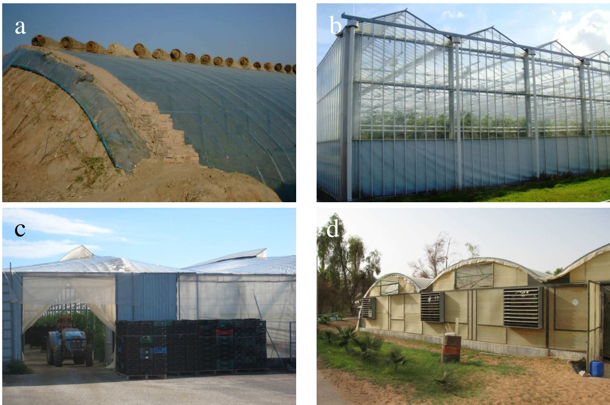  
图1.1 中国(a)、荷兰(b)、西班牙(c)和沙特阿拉伯(d)的不同温室

保护性栽培系统的具体选择取决于许多因素，正如Hanan（1998）以及Van Heurn和Van der Post（2004）所展示的。Van Henten等（2006）综合并扩展了他们的因素列表，包括：（1）市场规模和区域基础设施，这决定了产品销售机会以及运输相关成本；（2）当地气候；（3）燃料和电力的可用性、类型和成本；（4）水的可用性和质量；（5）土壤质量；（6）土地的可用性和成本；（7）资本的可用性；（8）劳动力的可用性和成本以及教育水平；（9）材料、设备和服务的可用性；（10）食品安全、化学品残留、化学品对土壤、水和空气的使用和排放方面的立法。基于这些因素，Von Elsner等（2000）指出，温室的多样性是由于温室对气候、经济和社会条件的适应造成的。图1.2展示了温度和总辐射对气候调节技术的影响，以中国北京、荷兰De Bilt和西班牙Almeria为例。该图显示，在相对阴暗和寒冷的荷兰气候中，人工光合照明和加热系统可能是有用的，而在相对阳光充足和炎热的西班牙气候中，适当的冷却技术可能是有益的。

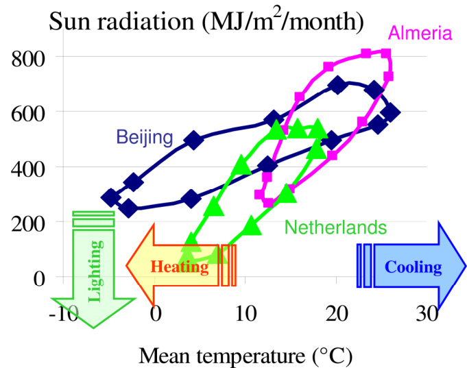  
图1.2 三个不同气候区（中国北京、荷兰De Bilt和西班牙Almeria）的月平均室外温度（x轴）和总辐射量（y轴）。箭头指示了特定气候调节技术可能有益的时期。

商业温室园艺的快速发展催生了许多调节室内气候的技术（Berenschot, 2004），如图1.3所示荷兰的情况。

图1.3 荷兰温室中气候调节技术的引入时间表

| 加热系统 | 气候计算机 | CO2供应 | 人工照明 | 封闭式温室 |
|----------|------------|---------|----------|------------|
| 1960     | 1980       | 1990    | 1995     | 2006       |

边界条件和设计元素的巨大多样性使得温室设计成为一项复杂的任务。Von Elsner等人（2000）得出结论，针对当地气候和经济条件优化温室设计仍然是设计师面临的挑战。正如Baille（1999）所建议的，考虑到全球范围内气候条件的广泛多样性，整合物理、生物和经济模型的系统方法是进行温室配置战略决策最有前景的途径。这种方法有几个好处。

首先，设计师无法考虑所有相关的边界条件和设计元素，这往往导致次优设计。对于温室园艺欠发达地区，系统方法可以支持设计过程，从而为给定的当地条件生产合适的温室。对于温室园艺较发达地区，系统方法可以重新评估现有的温室设计，以检查是否以及如何进一步改进。此外，系统设计程序可能表明温室如何应对未来经济条件（如产品和资源价格）的变化而发展。

其次，在这种系统方法中应用的敏感性分析可能会指出温室设计的关键因素，从而增加我们对设计过程的理解。此外，可以揭示应该修改哪些温室材料特性以使种植者获得额外收入。制造商将知道应该优化哪些特性以及这种修改的经济空间。此外，这种系统方法甚至可能识别出如Sonneveld等人（2011）提出的随时间可调整的设计参数是否会有益。

第三，系统方法可能指出温室在不同地点演变成完全不同的设计的关键因素。此外，可以评估不确定边界条件对温室设计的影响。

然而，考虑到当前温室设计的现状，大多数研究都集中在优化特定地点的设计，或者只考虑单一设计参数（Zaragoza等，2007；Campen，2005；Sonneveld等，2006；Kacira等，2004；Engel，1984；Amir & Hasegawa，1989）。据我们所知，目前还没有一种基于模型的方法来设计适合世界各地各种条件的保护性栽培系统。

# 1.2 研究目标

本论文的目标是开发一种方法，能够为给定的当地气候和经济条件生成合适的温室设计。原则上，这种方法应该适用于世界各地可能遇到的各种条件。

# 1.3 研究范围

如前所述，保护性栽培系统的具体选择取决于许多因素。因此，为了使本研究易于管理，我们关注以下方面。气候和经济条件被用作边界条件，设计问题被缩小到影响空气气候的技术。特别是，本研究关注以下八个设计元素：温室结构类型、覆盖类型、室外遮阳网、白涂料、保温幕、加热系统、冷却系统和$\mathrm { C O } _ { 2 }$富集系统。选择番茄作为模型作物，因为它是世界上种植最广泛的温室蔬菜之一，而且关于番茄产量建模的知识已经相当成熟。

# 1.4 基于模型的设计方法

根据Van Henten等人(2006)的研究，温室设计可以被视为一个多因素优化问题。这种方法依赖于作物经济收益与温室设施建设、维护和运营成本之间的定量权衡。设计优化已被广泛应用于解决其他领域的复杂问题，例如航空航天工程(William Begg & Liu, 2000; Anthony & Keane, 2003)、汽车设计(Yildiz等, 2004)、电子(Abido, 2002)和冷库设计(Lukasse等, 2009)。因此，使用优化技术来解决多因素温室设计问题似乎很有前景。基于此，我们开发了如图1.4所示的基于模型的温室设计方法。该方法的关键组成部分包括温室气候模型、番茄产量模型、经济模型和优化算法。这三个模型用于确定净财务结果与室外气候、温室设计、气候管理和经济变量之间的函数关系。优化算法通过调整温室设计来获得最大净财务结果。由于我们的目标是开发一种专注于设计元素集优化的设计方法，因此可能会忽略或简化与其他设计方面相关的因素。由于基于模型的设计方法具有通用性，当新模块可用时可以轻松实现。

经济变量   
结构 总计   
覆盖类型 室外气候 室内气候: 投资   
遮阳网 气候管理 温室 TCan,CO2Air,RPAR Tyimat 作物产量 经济 净财务   
白涂料 温室设计模型 TAir,VPAir 模型 模型 结果   
保温幕   
加热系统 资源使用:   
冷却系统 水,能源, CO2,电力   
$\mathrm { C O } _ { 2 }$ 富集 投资 净财务结果最大? 温室设计 否: 调整优化 温室设计 是: 温室设计最优

# 1.5 论文结构

基于模型的设计方法的四个关键组成部分(图1.4)和敏感性分析分别在各个章节中进行了描述。第2章介绍了温室气候模型，该模型根据室外气候、气候管理和温室设计确定室内气候。介绍了与模型形式相关的要求，并选择并描述了适用于全球温室设计的通用设计元素的模型方程。该动态模型在三种气候条件下对四种不同的温室设计进行了验证：温带海洋性气候、地中海气候和半干旱气候，以确保其足够准确和通用，可以纳入基于模型的设计方法。

第3章描述了根据预测的室内气候计算番茄产量的模型。介绍了与模型形式相关的要求，并从基于模型的设计方法的角度揭示了相关产量模型方面。回顾了温度对番茄产量的影响，并在模型中实现了这些影响。然后，该模型在四种不同的温度条件下进行了验证。

第4章将三种敏感性分析技术应用于温室气候-番茄产量组合模型，以指出最相关的设计方面并增加我们对设计过程的理解。敏感性分析量化了参数对西班牙阿尔梅里亚的低技术温室和美国德克萨斯州的高技术温室的收获率、资源消耗和室内气候的影响。单变量敏感性分析指出了需要改进的设计参数。多变量敏感性分析揭示了将对作物产量产生联合影响的参数。参数季节性影响的分析表明可调节的设计特性是否可能提高温室性能。

第5章介绍了经济模型，该模型根据作物产量、资源使用以及建筑的折旧和维护确定年度净财务结果。将经济模型与温室气候-番茄产量模型结合，从预定义的设计方案中确定在西班牙南部条件下番茄生产年度净财务结果最高的温室。该分析揭示了哪种温室技术水平在西班牙南部表现最佳。针对不同的室外气候轨迹和番茄价格轨迹重复此过程，以展示最佳设计如何随当地条件的变化而变化。敏感性分析展示了种植者因修改特定设计参数而获得的额外收入。此外，还确定了输入参数（即经济参数和气候设定点）的不确定性对净财务结果的影响，以分析它们对温室设计的影响。

第6章介绍了一种解决多因素设计问题的优化算法。描述了算法的要求。使用并行计算的Price(1977)控制随机搜索算法优化温室设计以最大化财务结果。为了证明基于模型的设计方法能够根据当地条件修改设计，针对西班牙南部和荷兰的条件优化了温室。随后，使用两种技术评估了能够产生相似回报的设计群体，从而揭示最相关的设计元素。

第7章根据最初的目标对本工作的结果进行了评估和讨论。提出了提高方法性能和通用性的建议，并给出了基于模型的设计方法的未来机会。

# 第2章

# 适用于多种设计和气候的温室气候模型

本章内容已被《生物系统工程》期刊接受发表，论文标题为：基于模型的温室设计方法：第一部分，适用于多种设计和气候的温室气候模型。

B. H. E. Vanthoor, C. Stanghellini, E.J. van Henten, P.H.B. de Visser

# Chapter 2

# A greenhouse climate model for a broad range of designs and climates

The contents of this chapter are accepted for publication in Biosystems Engineering as a paper entitled: A methodology for model-based greenhouse design: Part 1, A greenhouse climate model for a broad range of designs and climates.

B. H. E. Vanthoor, C. Stanghellini, E.J. van Henten, P.H.B. de Visser

# 2.1 摘要

为了开发一种基于模型的方法来设计适用于广泛气候和经济条件的温室，我们开发并验证了一个温室气候模型。该模型描述了室外气候和温室设计对室内温室气候的影响。为了用于专注于一组设计元素优化的温室设计方法，该模型应满足以下三个要求：1) 以足够的精度预测温室空气的温度、水汽压和$\mathrm { C O } _ { 2 }$浓度，适用于各种气候条件下的多种温室设计；2) 包含常用的温室建筑参数和气候调节设备；3) 模型应由一组微分方程组成，以确保其可以与番茄产量模型（具有类似结构）结合，并允许使用常微分方程求解器。该动态模型在三种气候条件下对四种不同的温室设计进行了验证：温带海洋性气候、地中海气候和半干旱气候。对于这些条件，模型在未修改模型参数的情况下（除一个案例外）准确预测了所有四种设计的温室气候。在超过$78\%$的情况下，室内气候的模拟与测量结果的相对均方根误差小于$10\%$。鉴于这些结果，该模型被认为足够准确和通用，可用于开发基于模型的温室设计方法。

# 2.2 引言

本章包含温室气候模型的描述和验证。该模型描述了室外气候和温室设计（包括上述设计元素）对室内温室气候的影响。估计的室内气候将作为番茄产量模型的输入。为了用于基于模型的温室设计方法，该模型应满足以下三个要求：(i) 它应以足够的精度预测温室气候：空气的温度、水汽压和$\mathrm { C O } _ { 2 }$浓度，适用于各种气候条件下的多种温室设计，且无需修改模型参数；(ii) 它应包含常用的温室设计元素以控制室内气候，以便可用于设计适用于全球条件的温室；(iii) 模型应由一组微分方程组成，因为它将与由一组微分方程组成的番茄产量模型结合，并允许使用常微分方程求解器。此外，右侧必须连续可微，以加快模拟速度并确保可以将基于梯度的动态优化算法应用于模型。

近几十年来，温室气候模型在文献中受到了相当多的关注（Bot, 1983; Luo等, 2005; Impron等, 2007; De Zwart, 1996; Ooteghem, 2007; De Halleux等, 1991; Baptista, 2007），但所有这些作者都专注于单一地点和有限且特定的建筑和气候调节元素。最近，Fitz-Rodríguez等（2010）开发了一个用于教育目的的温室环境模型，该模型适用于不同的设计配置和地理位置。然而，该模型未经验证，并且缺少一些与当前温室设计目的相关的模型通量。因此，基于Bot（1983）和De Zwart（1996）的工作，在我们的研究中开发并验证了一个更通用的温室模型，适用于广泛的温室设计和气候。选择以下气候来验证模型：温带海洋性气候（荷兰西北部）；地中海气候（意大利西西里岛）；以及半干旱气候（美国亚利桑那州和德克萨斯州）。

# 2.3 模型描述

第2.3.1节介绍了温室气候模型中包含的设计元素。第2.3.2节提供了简明的模型描述。第8章提供了温室气候模型的详细描述，包括所有单独的质量和能量流动。

# 2.3.1 温室设计元素

由于设计方法的重点是一组设计元素的优化，因此将图2.1中所示的选择功能和技术纳入了温室气候模型。在该模型中，温室功能加热、保温、遮阳、冷却、$\mathrm { C O } _ { 2 }$富集、加湿和除湿由一个或多个技术实现。例如，加热功能可能由以下技术实现：直接空气加热器、锅炉、工业热源、地热源和被动缓冲器。

为了开发基于模型的设计方法，这些技术被认为足够通用，适用于全球各地的广泛地点。特定的本地能源生产、能源转换或气候调节解决方案，如热电联产、人工光合照明、主动热缓冲器、热泵和太阳能集热器，不在本研究范围内。

# 2.3.1.1 符号约定

所有状态变量、通量、输入、上标和下标都列在第2.8节的术语表中。遵循De Zwart（1996）的符号约定，模型的状态变量由大写字母名称后跟一个下标表示，例如$T _ { A i r }$。模型通量以大写字母开头，后跟两个下标。第一个下标表示通量的来源，第二个下标表示通量的目的地，例如$H _ { C a n A i r }$。辐射通量以大写字母$R$开头，后跟辐射类型，然后是两个下标，表示特定辐射的来源和汇，即$R _ { P A R \_ S u n C a n }$。

# 2.3.2 模型概述和状态变量

# 2.3.2.1 模型概述和假设

图2.2展示了温室模型的状态变量以及能量和质量通量的概述。该模型基于以下假设：1) 温室空气被视为“完美搅拌罐”，这意味着在温度、水汽压和$\mathrm { C O } _ { 2 }$浓度方面没有空间差异；因此，所有模型通量均以每平方米温室地面描述；2) 为了描述保温幕对室内气候的影响，温室空气被分为两个部分：保温幕下方和上方。

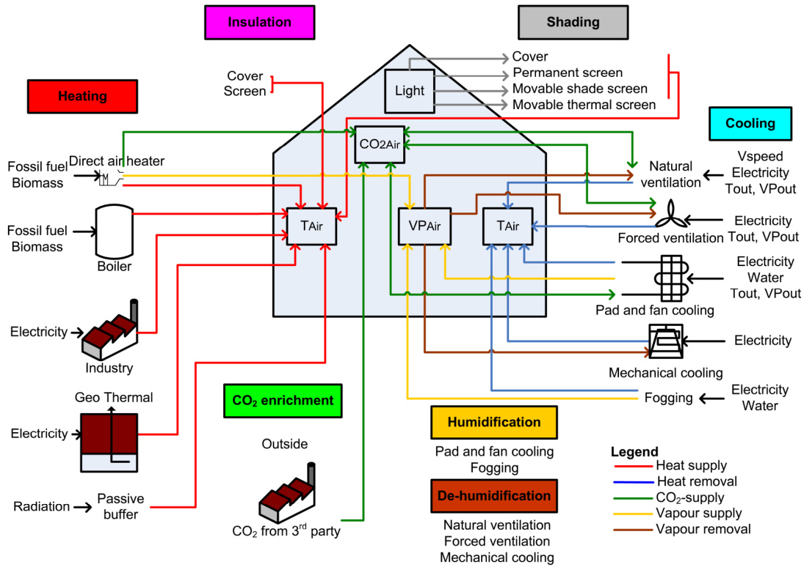  
图2.1 温室设计方法所需的选择功能（彩色框）和设计元素（功能下方的文本框和图片），用于管理温室气候（温室内透明框）。彩色箭头表示各种能量和质量通量（右下角图例）。

该模型基于De Zwart（1996）的温室气候建模研究。为了当前的温室设计目的，添加了额外的模型元素，并简化了一些模型部分。实现了以下模型元素：图2.1中所示的设计元素；一个集成的覆盖层描述，以结合不同覆盖层对室内气候的影响；内部和外部覆盖温度是模型的状态变量，用于描述覆盖保温对室内气候的影响；描述了覆盖层对远红外辐射（FIR）的透射，这对于部分透射FIR的薄膜是必要的；描述了屋顶和侧面通风；描述了防虫网对通风率的影响；以及描述了冠层和地板对近红外辐射（NIR）的吸收，这取决于覆盖层和地板的光学特性。由于温室结构属性的优化，即温室的尺寸、屋顶坡度和方向以及通风口的位置，超出了我们设计方法的目的，因此通过不区分漫射和直接太阳辐射，并假设温室覆盖层的透射系数不依赖于太阳角度，简化了模型。

由于篇幅限制，模型通量的详细描述见第8章中的详细模型描述。这里简要介绍一些相关通量。假设采用非限制性灌溉策略，番茄作物的蒸腾速率基于Stanghellini（1987）的蒸腾和气孔模型确定。由冠层活动引起的$\mathrm { C O } _ { 2 }$通量，即光合作用速率、维持和生长呼吸，在第3章中描述。通风率函数基于Boulard和Baille（1995）以及Kittas等（1997）的方程。

# 2.3.2.2 模型的状态变量

模型的所有状态变量都由微分方程描述。状态变量对时间的导数用状态符号上方的点表示。

2.3.2.2.1 温室不同组件的温度 冠层温度$T _ { C a n }$由下式描述：

$$
\begin{array} { r l } { c a p _ { C a n } \dot { T } _ { C a n } = R _ { P A R \_ S u n C a n } + R _ { N R \_ S u n C a n } + R _ { P i p e C a n } } & { { } \mathrm { [ W ~ m ^ { - 2 } ] } \mathrm { ( } R } \\ { \phantom { \frac { 1 } { 1 } } - \dot { H } _ { C a n A i r } - L _ { C a n A i r } - R _ { C a n C o v , i n } - R _ { C a n F l r } - R _ { C a n S k y } - R _ { C a n T i S c r } \mathrm { ( } R \mathrm { m ^ { - 2 } ] } \mathrm { ( } R \mathrm { m ^ { - 2 } ] } \mathrm { ( } R \mathrm { m ^ { - 2 } ] } } \end{array}
$$

其中$c a p _ { C a n }$是冠层的热容，$R _ { P A R \_ S u n C a n }$是冠层吸收的光合有效辐射，$R _ { N I R \_ S u n C a n }$是冠层吸收的近红外辐射。远红外辐射在冠层与周围元素之间交换，即加热管道$R _ { P i p e C a n }$、内部覆盖层$R _ { C a n C o \nu , i n }$、地板$R _ { C a n F l r }$、天空$R _ { C a n S k y }$和保温幕$R _ { C a n T h S c r }$。$H _ { C a n A i r }$是冠层与温室空气之间的显热交换，$L _ { C a n A i r }$是由蒸腾作用引起的潜热通量。

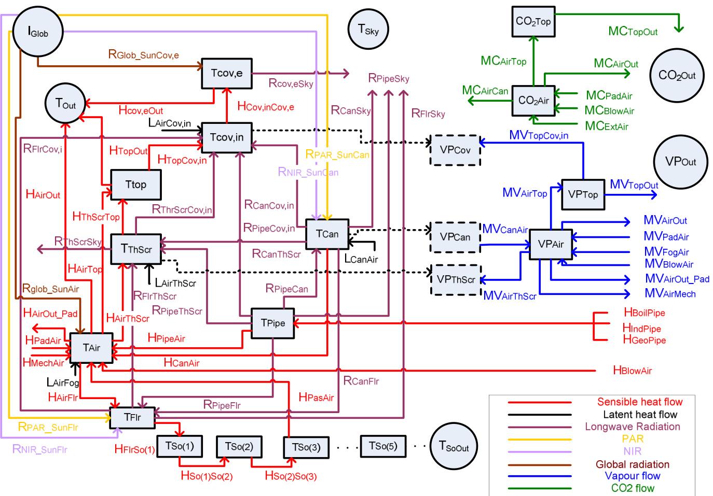  
图2.2 温室模型的状态变量和能量与质量通量概览。彩色箭头表示各种能量和质量通量（图例在右下角）。所有符号都在第2.8节的术语表中列出，基础方程在第2.3.2.2节中给出。

温室空气温度$T _ { A i r }$由下式描述：

$$
\begin{array} { r } { c a p _ { _ { A i r } } \dot { T } _ { _ { A i r } } = H _ { _ { C a n a i r } } + H _ { _ { P a d a i r } } + H _ { _ { M e r h a i r } } + H _ { _ { P i p e A i r } } + H _ { _ { P a s A i r } } + H _ { _ { B l o w A i r } } + R _ { _ { G l a b _ { - } S i n a k i r } } } \\ { - H _ { _ { A i r F l r } } - H _ { _ { A i r T h S c r } } - H _ { _ { A i r o u t } } - H _ { _ { A i r T o p } } - H _ { _ { A i r o u t _ { - } P a d } } - L _ { _ { A i r F o g } } } \\ { [ \mathrm { W ~ m ^ { - 2 } } ] \quad ( 2 . 2 5 ) } \end{array}
$$

其中$c a p _ { A i r }$是温室空气的热容。显热在温室空气与周围元素之间交换，即冠层$H _ { C a n A i r }$、冷却垫出口空气$H _ { P a d A i r }$、机械冷却系统$H _ { M e c h A i r }$、加热管道$H _ { P i p e A i r }$、被动能量缓冲器$H _ { P a s A i r }$、直接空气加热器$H _ { B l o w A i r }$、地板$H _ { A i r F l r }$、保温幕$H _ { A i r T h S c r }$、室外空气$H _ { A i r O u t }$、位于保温幕上方的顶部隔间空气$H _ { A i r T o p }$，以及由垫和风扇系统引起的空气交换导致的室外空气$H _ { A i r O u t \_ P a d }$。$R _ { G l o b \_ S u n A i r }$是被建筑元素吸收并释放到空气中的总辐射，$L _ { A i r F o g }$是雾化系统添加的水滴蒸发所需的潜热。

地板层是温室地下的第一层，其温度$T _ { F l r }$由下式描述：

$$
\begin{array} { r l r } { c a p _ { F l r } \dot { T } _ { F l r } = H _ { A i r F l r } + R _ { P A R _ { - } S u n F l r } + R _ { N I R _ { - } S u n F l r } + R _ { C a n F l r } + R _ { P i p e F l r } } & { } & \\ { - H _ { F l r S o 1 } - R _ { F l r C o v , i n } - R _ { F l r S k y } - R _ { F l r T h S c r } } & { } & { [ \mathrm { W } \mathrm { m } ^ { - } ] } \end{array}
$$

其中$c a p _ { F l r }$是地板的热容；$R _ { P A R \_ S u n F l r }$是地板吸收的光合有效辐射；$R _ { N I R \_ S u n F l r }$是地板吸收的近红外辐射；$R _ { P i p e F l r }$、$R _ { F l r C o \nu , i n }$、$R _ { F l r S k y }$和$R _ { F l r T h S c r }$分别是地板与加热管道、内部覆盖层、天空和保温幕之间的远红外通量；$H _ { F l r S o l }$是从地板到土壤层1的显热通量。

由于土壤的高热容，土壤被分为五层，随着深度的增加，厚度也增加。第$\mathbf { \omega } _ { j }$层的土壤温度$T _ { S o ( j ) }$由下式描述：

$$
c a p _ { _ { S o ( j ) } } T _ { _ { S o ( j ) } } = H _ { _ { S o ( j - 1 ) S o ( j ) } } - H _ { _ { S o ( j ) S o ( j + 1 ) } } \qquad j = 1 , 2 . . . . . . 5
$$

其中$c a p _ { S o ( j ) }$是每层土壤的热容，$H _ { S o ( j - l ) S o ( j ) }$是从层${ \bf \cdot } { \bf \cdot } { \bf \nabla } _ { j - 1 } \cdot { \bf \nabla } $到$\mathbf { \dot { \omega } } _ { j } ,$的传导热通量，$H _ { S o ( j ) S o ( j + I ) }$是从层$\mathbf { \dot { \omega } } _ { j } ,$到$\cdot _ { j + l } ,$的传导热通量。对于第一层土壤，$H _ { S o ( j - l ) S o ( j ) }$等同于$H _ { F l r S o I }$，对于最后一层土壤，$H _ { S o ( j ) S o ( j + I ) }$等同于从第$5 ^ { \mathrm { t h } }$层土壤到外部土壤温度的传导热通量H So5SoOut。

保温幕温度$T _ { T h S c r }$由下式描述：

$$
\begin{array} { r l } { c a p _ { T h S c r } \dot { T } _ { T h S c r } = H _ { A i r T h S c r } + L _ { A i r T h S c r } + R _ { C a n T h S c r } + R _ { F l r T h S c r } + R _ { P i p e T h S c r } } & { } \\ { - H _ { T h S c r T o p } - R _ { T h S c r C o v , i n } - R _ { T h S c r S k y } } & { } \end{array}
$$

其中$c a p _ { T h S c r }$是保温幕的热容；$L _ { A i r T h S c r }$是保温幕上冷凝引起的潜热通量；$R _ { P i p e T h S c r } , R _ { T h S c r C o \nu , i n }$和$R _ { T h S c r S k y }$分别是保温幕与加热管道、内部覆盖层和天空之间的远红外通量；$H _ { T h S c r T o p }$是保温幕与顶部隔间空气之间的热交换。

保温幕上方隔间空气温度$T _ { T o p } \mathrm { \Delta }$，在本研究中称为"顶部隔间"，由下式描述：

$$
c a p _ { _ { T o p } } \dot { T } _ { _ { T o p } } = H _ { _ { T h S c r T o p } } + H _ { _ { A i r T o p } } - H _ { _ { T o p C o v , i n } } - H _ { _ { T o p O u t } }
$$

$$
[ \mathrm { W ~ m } ^ { - 2 } ]
$$

其中$c a p _ { T o p }$是顶部隔间空气的热容，$H _ { T o p C o \nu , i n }$是顶部隔间空气与内部覆盖层之间的热交换，$H _ { T o p O u t }$是顶部隔间与室外空气之间的热交换。

温室覆盖层的热导率是一个温室设计参数，它会在覆盖层上产生显著的温度梯度。因此，内部和外部覆盖层温度都被建模。假设内部和外部覆盖层的热容各占总覆盖结构热容的$10\%$，并假设能量传导是内部和外部覆盖层之间能量传输的主要方式，内部覆盖层温度$T _ { C o \nu , i n }$和外部覆盖层温度$T _ { C o \nu , e }$由下式描述：

$$
\begin{array} { r l r } { c a p _ { _ { C o \nu , i n } } \dot { T } _ { _ { C o \nu , i n } } = H _ { _ { T o p C o \nu , i n } } + L _ { _ { T o p C o \nu , i n } } + R _ { _ { C a n C o \nu , i n } } + R _ { _ { F l r C o \nu , i n } } } & { \quad } & { \mathrm { [ W ~ m ^ { 2 } ] } } \\ { + R _ { _ { P i p e C o \nu , i n } } + R _ { _ { T h S c r C o \nu , i n } } - H _ { _ { C o \nu , i n C o \nu , e } } } & { \quad } & { \mathrm { [ W ~ m ^ { 2 } ] } } \\ { c a p _ { _ { C o \nu , e } } \dot { T } _ { _ { C o \nu , e } } = R _ { _ { G l o b _ { - } } S u n C o \nu } + H _ { _ { C o \nu , i n C o \nu , e } } - H _ { _ { C o \nu , e O u t } } - R _ { _ { C o \nu , e S k \nu } } } & { \quad } & { \mathrm { [ W ~ m ^ { 2 } ] } } \end{array}
$$

其中$c a p _ { C o \nu , i n }$和$c a p _ { C o \nu , e }$分别是内部和外部覆盖层的热容，$L _ { T o p C o \nu , i n }$是温室覆盖层上冷凝引起的潜热通量，$R _ { P i p e C o \nu , i n }$是加热管道与内部覆盖层之间的远红外交换，$H _ { C o \nu , i n C o \nu , e }$是内部和外部覆盖层之间的热通量，$R _ { G l o b \_ S u n C o \nu }$是覆盖层吸收的全球太阳辐射，$H _ { C o \nu , e O u t }$是外部覆盖层到室外空气的显热通量，$R _ { C o \nu , e S k y }$是覆盖层与天空之间的远红外交换。

在本模型中，除了使用直接空气加热器外，还可以使用热水加热管道向温室空气添加热能（图2.2）。加热管道系统的表面温度$T _ { P i p e }$由下式描述：

$$
\begin{array} { r l } & { c a p _ { { P i p e } } \dot { T } _ { { P i p e } } = H _ { { B o i l P i p e } } + H _ { { I n d P i p e } } + H _ { { G e o P i p e } } - R _ { { P i p e S k y } } - R _ { { P i p e C o v , i n } } } \\ & { ~ - R _ { { P i p e C a n } } - R _ { { P i p e F l r } } - R _ { { P i p e T h S c r } } - H _ { { P i p e A i r } } } \end{array}
$$

其中$c a p _ { P i p e }$是加热管道的热容，$H _ { B o i l P i p e }$是锅炉到管道的热通量，$H _ { I n d P i p e }$是工业热源到管道的热通量，$H _ { G e o P i p e }$是地热到管道的热通量，$R _ { P i p e S k y }$是管道与天空之间的远红外交换。

2.3.2.2.2 温室空气和顶部隔间空气的水汽压 温室空气的水汽压$V P _ { A i r }$由下式描述：

$$
\begin{array} { c } { c a p } { _ { V P _ { A i r } } \dot { V } P _ { A i r } = M V _ { C a n A i r } + M V _ { P a d A i r } + M V _ { F o g A i r } + M V _ { B l o w A i r } - M V _ { A i r l u s c r } } \\ { - M V _ { A i r T o p } - M V _ { A i r o u t } - M V _ { A i r o u t \_ P a d \_ P a d } - M V _ { A i r M e c h } } \end{array} [ \mathrm { k g } \mathrm { m ^ { - 2 } s ^ { - 1 } } ]
$$

其中$c a p _ { V P A i r }$是空气储存水汽的能力。水汽在空气与周围元素之间交换，即冠层$M V _ { C a n A i r }$、湿垫出口空气$M V _ { P a d A i r }$、雾化系统$M V _ { F o g A i r }$、直接空气加热器$M V _ { B l o w A i r }$、保温幕$M V _ { A i r T h S c r }$、顶部隔间空气$M V _ { A i r T o p }$、室外空气$M V _ { A i r O u t }$、由湿垫和风扇系统引起的空气交换导致的室外空气$M V _ { A i r O u t \_ P a d }$，以及机械冷却系统MVAirMech。

顶部隔间空气的水汽压$V P _ { T o p }$由下式描述：$c a p _ { { } _ { V P _ { T o p } } } \dot { V } P _ { T o p } = M V _ { A i r T o p } - M V _ { T o p C o \nu , i n } - M V _ { T o p O u t }$ $[ \mathrm { k g ~ m ^ { - 2 } ~ s ^ { - 1 } } ]$ (2.11) 其中$c a p _ { V P T o p }$是顶部隔间储存水汽的能力，$M V _ { T o p C o \nu , i n }$是顶部隔间与内部覆盖层之间的水汽交换，$M V _ { T o p O u t }$是顶部隔间与室外空气之间的水汽交换。

2.3.2.2.3 温室空气和顶部隔间空气的$C O _ { 2 }$浓度

温室空气的$\mathrm { C O } _ { 2 }$浓度$C O _ { 2 A i r }$由下式描述：

$$
\begin{array} { r } { c a p _ { { c o } _ { 2 A i r } } \dot { C } O _ { 2 A i r } = M C _ { { B l o w A i r } } + M C _ { { E x t A i r } } + M C _ { { P a d A i r } } } \\ { - M C _ { { A i r c a n } } - M C _ { { A i r T o p } } - M C _ { { A i r O u t } } } \end{array}
$$

$$
[ \mathrm { m g ~ m ^ { - 2 } ~ s ^ { - 1 } } ]
$$

其中$c a p _ { C O 2 A i r }$是空气储存$\mathrm { C O } _ { 2 }$的能力。二氧化碳在温室空气与周围元素之间交换，即直接空气加热器$M C _ { B l o w A i r }$、外部$\mathrm { C O } _ { 2 }$源$M C _ { E x t A i r }$、湿帘风机系统$M C _ { P a d A i r } .$、顶部隔间空气$M C _ { A i r T o p } \$和室外空气$M C _ { A i r O u t } { \ }$。$M C _ { A i r C a n }$是温室空气与冠层之间的$\mathrm { C O } _ { 2 }$通量，如第3章所述。

顶部隔间空气的$\mathrm { C O } _ { 2 }$浓度$C O _ { 2 T o p }$由下式描述：$c a p _ { { C O } _ { 2 T o p } } \dot { C } O _ { 2 T o p } = M C _ { A i r T o p } - M C _ { T o p O u t }$ $[ \mathrm { m g ~ m ^ { - 2 } ~ s ^ { - 1 } } ]$ (2.13) 其中$c a p _ { C O 2 T o p }$是顶部隔间空气储存$\mathrm { C O } _ { 2 }$的能力$) _ { 2 } , M C _ { T o p O u t }$是顶部隔间空气与室外空气之间的$\mathrm { C O } _ { 2 }$交换。

# 2.4 模型验证

如果该模型能够在不同气候条件下，对多种温室设计中的空气温度、水汽压和$\mathrm{CO}_2$浓度进行足够精确的预测，那么它就可以用于基于模型的温室设计。因此，我们选择了位于不同气候区域的四种温室设计来验证该模型。模型方程使用MatlabTM（Release 14；The MathWorks Inc., Natick, MA, USA）的刚性ODE求解器（ode15s）进行求解。室外气候条件的测量数据和控制阀的设置被用作模型输入。我们定义了一个定量标准来评估模型性能。

# 2.4.1 温室设计概述

这四种温室设计位于三个气候区域：温带海洋性气候的荷兰西北部、地中海气候的意大利西西里岛，以及半干旱气候的美国德克萨斯州和亚利桑那州。各个温室的基本信息，包括位置、温室特征和气候调节技术，列于表2.1中。所展示的设计元素涵盖了图2.1中列出的所有功能：降温、加热、$\mathrm{CO}_2$加富、保温、遮阳、加湿和除湿。关于这些设计元素的详细参数，包括描述温室结构的物理特性、通风特性、覆盖层、白涂料、保温幕、地面、土壤以及主动气候调节技术的容量，可以在第8章中的详细模型描述中找到。所有四个温室都种植了番茄。相关温室设计的验证期和验证期间的叶面积指数（LAI）如表2.2所示。

表2.1 位于西西里、荷兰、德克萨斯和亚利桑那的四个温室的特性及气候调节技术。叉号表示验证期间使用的已安装设备数据。圆圈表示已安装但无可用数据的设备。

| 地点 | 意大利西西里 | 荷兰西北部 | 美国德克萨斯 | 美国亚利桑那+ |
|------|--------------|------------|--------------|---------------|
| 地理坐标 | 36°57'N, 14°26'E | 53°12'N, 5°29'E | 30°21'N, 104°00'W | 32°16'N, 110°56'W |
| 海拔高度（米） | 104 | 0 | 1470 | 715 |
| 温室类型 | 拱形多隧道 | Venlo型 | Venlo型 | 拱形单隧道 |
| 覆盖类型 | 双层充气PE膜 | 单层玻璃 | 单层玻璃 | 聚碳酸酯侧墙和双层充气PE膜 |
| 地面面积（m²） | 1.3×10⁴ | 1.4×10⁴ | 7.8×10⁴ | 278 |
| 自然通风特性 | 每跨单侧连续屋顶通风，覆盖防虫网 | 屋顶两侧通风窗 | 屋顶两侧通风窗 | 通风窗关闭 |
| 湿帘风机降温 |  |  |  | X |
| 管道加热 |  | X | X |  |
| CO₂加富 |  | X | 0 |  |
| 可移动保温幕 |  | X |  |  |
|  |  |  | X |  |
| 可移动遮阳幕 |  |  | X | X |
| 白涂料 | X* |  | X |  |

+ 关于湿帘风机降温温室设计的详细信息参见Sabeh等人(2006)。\* 白涂料仅在第一个验证期使用。- 白涂料仅在夏季使用。

表2.2 位于西西里、荷兰、德克萨斯和亚利桑那的温室室外气候条件平均值。括号中的数字代表标准差。方差分析显示，前三个地点的室外气候存在显著差异，因为所有室外气候变量的Fprob < 0.001。对于亚利桑那的湿帘风机降温温室，模型在2005年5月一个晴天8:00-17:00期间对不同通风量进行了验证。

| 地点 | DOY | 通风量* | LAI | 总辐射 (MJ/m²/天) | 室外温度 (℃) | 室外水汽压 (kPa) | 室外相对湿度 (%) | 风速 (m/s) |
|------|-----|--------|-----|------------------|-------------|----------------|----------------|------------|
| 西西里 | 267-272 | - | 1.5 | 11.6 (2.5) | 22.5 (3.4) | 2.1 (0.2) | 79 (12) | 2.5 (2.7) |
| 西西里 | 293-298 | - | 2.5 | 8.5 (1.7) | 15.2 (3.4) | 1.2 (0.3) | 69 (13) | 2.9 (2.9) |
| 荷兰 | 38-43 |  | 2 | 6.5 (1.9) | 5.9 (2.7) | 0.7 (0.1) | 80 (11) | 2.4 (1.0) |
| 荷兰 | 200-205 |  | 3 | 15.5 (3.0) | 15.2 (1.5) | 1.5 (0.2) | 85 (9.0) | 4.6 (1.4) |
| 德克萨斯 | 3-8 |  | 2.5 | 10.1 (5.9) | 5.4 (5.6) | 0.6 (0.1) | 66 (25) | 3.5 (2.8) |
| 德克萨斯 | 157-162 | - | 2 | 25.5 (2.5) | 23.9 (5.4) | 1.3 (0.5) | 46 (24) | 3.5 (2.4) |
| 亚利桑那 | 139 | 0.016 | 2.5 | 25.2 | 34.2 (2.8) | 0.7 (0.0) | 13 (2.3) | 3.4 (1.2) |
| 亚利桑那 | 151 | 0.034 | 2.5 | 26.3 | 34.2 (3.2) | 0.5 (0.0) | 9 (2.1) | 1.8 (0.9) |
| 亚利桑那 | 131 | 0.047 | 2.5 | 24.3 | 33.5 (3.1) | 0.5 (0.1) | 10 (3.3) | 1.9 (0.9) |
| 亚利桑那 | 132 | 0.060 | 2.5 | 23.8 | 33.5 (2.9) | 0.5 (0.0) | 10 (2.2) | 2.3 (1.1) |

*表示湿帘风机降温系统的通风量

# 2.4.2 气候数据收集

商业温室（即西西里岛、荷兰和德克萨斯州）的气候数据来自气象站$( I _ { G l o b } , \ T _ { O u t } , \ R H _ { O u t } ,$ 和 $V _ { W i n d } )$ 以及测量箱$( T _ { A i r } , \ R H _ { A i r }$ 和 $C O _ { 2 A i r }$（如果可用）），这些数据由中央气候计算机记录。亚利桑那州湿帘风机降温温室的气候数据来自商业气象站$\langle T _ { O u t } \rangle$ $R H _ { O u t } ,$ 和 $V _ { W i n d } )$、总辐射表$( I _ { G l o b } )$、热电偶$( T _ { A i r } )$ 和相对湿度传感器$( R H _ { A i r } )$。这些气候数据使用数据记录仪记录。

所有地点的温室空气$( V P _ { A i r } )$ 和室外空气$( V P _ { O u t } )$ 的水汽压是根据它们与空气温度和空气相对湿度的热力学关系计算的。对于缺失的室外气候变量：室外$\mathrm { C O } _ { 2 }$ 浓度$( C O _ { 2 O u t } )$ 假设恒定在 $6 6 8 \mathrm { \ m g \ m ^ { - 3 } }$ $( 3 7 0 \ \mathrm { p p m } )$；天空温度$( T _ { S k y } )$ 和外部土壤层温度$( T _ { S o O u t } )$ 使用详细模型描述中给出的方程估算。对于位于荷兰和德克萨斯的温室，加热管道的能量流未被测量。在这些验证案例中，使用测量的管道温度作为模型输入。$\mathrm { C O } _ { 2 }$ 注入速率和/或温室空气的$\mathrm { C O } _ { 2 }$ 浓度在西西里岛的温室全年测量，在荷兰的温室夏季测量。因此，$\mathrm { C O } _ { 2 }$ 浓度仅在这两个案例中进行了验证。

# 2.4.3 室外气候比较

对于所有四个地点，表2.2列出了验证实验期间总辐射、室外温度、湿度和风速的平均值和标准差。使用GenStat（VSN International Ltd, Hemel Hempstead, UK的12.1版）进行的方差分析（ANOVA）显示，前三个地点的室外气候存在显著差异，因为所有室外气候变量的$F p r o b < 0 . 0 0 1$。对于亚利桑那州的地点，没有进行ANOVA，因为该地点的时间序列与其他三个时间序列不相等。然而，亚利桑那州的高环境温度确保了这些气候数据集与其他地点的气候数据集不同。

# 2.4.4 模型性能的确定

根据Kobayashi和Salam（2000）的方法，使用相对均方根误差（RRMSE）定量评估模型性能：

$$
R R M S E = \frac { 1 0 0 } { \overline { { y } } _ { D a t a } } \sqrt { \frac { 1 } { n } \sum _ { i = 1 } ^ { n } \big ( y _ { _ { M o d , i } } - y _ { _ { D a t a , i } } \big ) ^ { 2 } }
$$

其中$\overline { { y } } _ { D a t a }$ 是整个时间跨度内测量数据的平均值，$n$ 是测量次数，$y _ { M o d , i }$ 是时间点$\because$ 的模拟气候值，$y _ { D a t a , i }$ 是时间点$\cdot _ { i } ,$ 的测量气候值。在开发最佳温室设计方法时，假设RRMSE为$10 \%$ 或更低就足够了。正如Baptista（2007）所证明的，大多数温室气候模型的性能都在这个值附近。

# 2.5 结果

2.5.1 意大利西西里岛的被动多隧道温室 该模型正确预测了西西里岛"低技术"温室在寒冷和炎热时期的温度（图2.3a,b）和水汽压（图2.3c,d）。温室空气的$\mathrm { C O } _ { 2 }$ 浓度预测得相当准确（图2.3e,f）。尽管模拟的$\mathrm { C O } _ { 2 }$ 趋势与测量结果一致，特别是在夜间，但预测的$\mathrm { C O } _ { 2 }$ 浓度绝对值与测量的$\mathrm { C O } _ { 2 }$ 浓度存在差异。

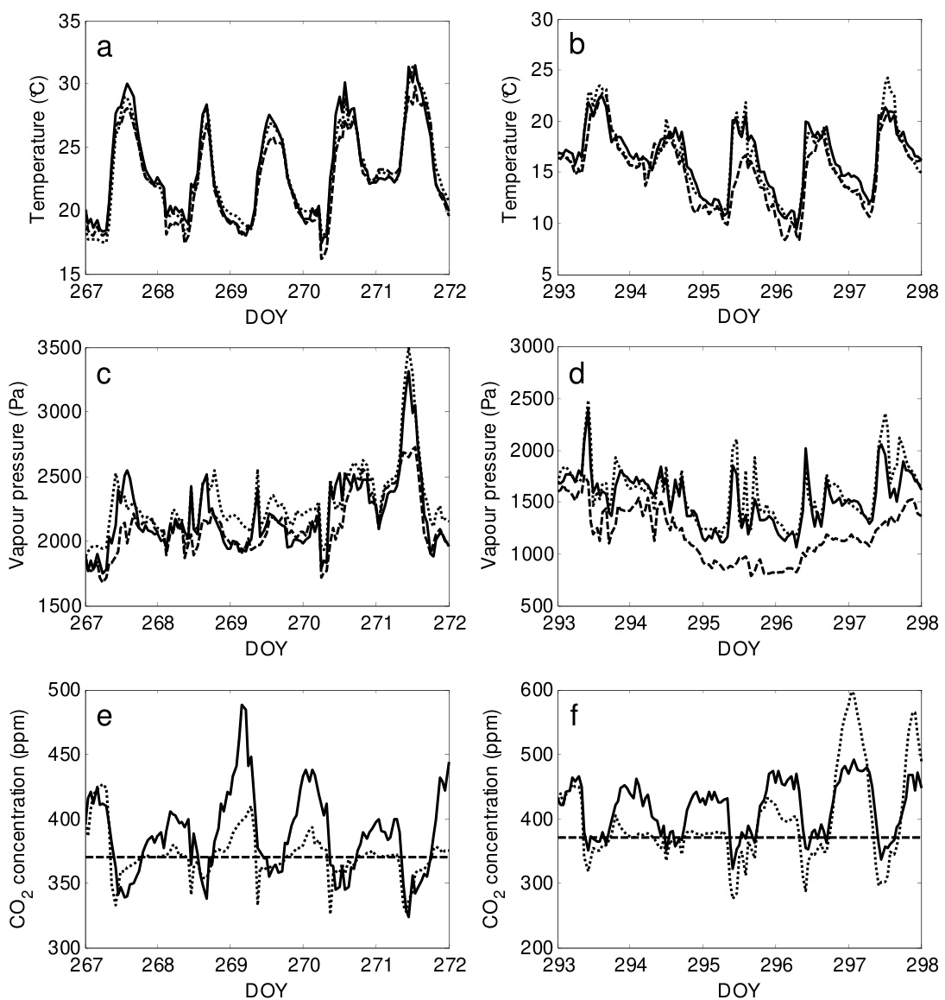  
图2.3 西西里岛炎热期（DOY 267-272）和寒冷期（DOY 293-298）温室内空气温度（a,b）、水汽压（c,d）和$CO_{2}$浓度（e,f）的测量值（实线）、模拟值（虚线）和室外值（点划线）。

2.5.2 荷兰的气候控制温室 该模型正确预测了荷兰冬季和夏季期间的温度（图2.4a,b）和水汽压（图2.4c,d），即使室内外气候差异很大。温室空气的$\mathrm{CO}_{2}$浓度在夏季期间也得到了正确预测（图2.4e）。

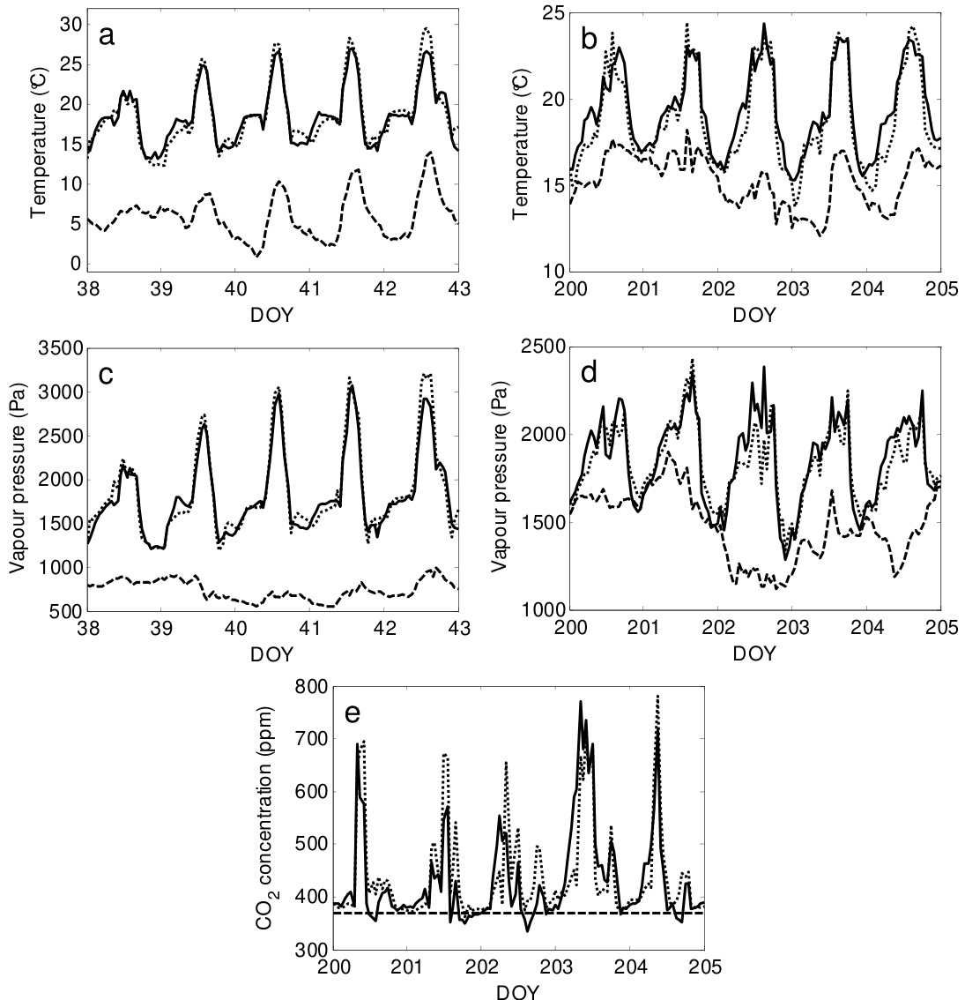  
图2.4 荷兰冬季（DOY 38-43）和夏季（DOY 200-205）期间温室内空气温度（a,b）、水汽压（c,d）和$CO_{2}$浓度（e）的测量值（实线）、模拟值（虚线）和室外值（点划线）。

模拟的温度（图2.4a）和水汽压（图2.4c）仅在DOY 42白天被高估。这是由于模拟的通风率被低估所致。这种低估发生的原因是通风率方程中没有描述水汽压差对通风率的影响（见详细模型描述），而当时温室内外空气的水汽压差很大。为了提高模型性能，应将温室内外空气水汽压差对通风率的影响纳入通风率方程。

# 2.5.3 美国德克萨斯州的气候控制温室

该模型正确预测了德克萨斯州冬季和夏季期间的温度和水汽压（图2.5）。在冬季期间，即使室内外空气的温度和水汽压差异很大，预测的温度和水汽压与测量值非常吻合（图2.5a,c）。在夏季期间，预测的温度和水汽压与测量值也非常吻合（图2.5b,d）。然而，在某些时间点，测量和模拟的温室气候之间出现了小的偏差。DOY 160和DOY 161的白天温度最多被低估了$3^{\circ}\mathrm{C}$。

使用Stanghellini（1987）的气孔阻力模型参数，模拟的蒸腾速率在夏季白天相对于测量值被低估。然而，这些参数是根据叶与空气之间水汽压差最高达$0.9\mathrm{kPa}$的经验确定的。而在德克萨斯州，水汽压差可达$4.0\mathrm{kPa}$，在这个值下，Stanghellini（1987）函数的推断会产生相当大的影响（见第8章公式8.50）。因此，描述气孔对$c_{e\nu ap4}^{day}$反应的参数$10\%$对作物蒸腾产生了更好的结果。我们没有研究其他气孔导度模型，如Blonquist Jr等人（2009）的模型是否会表现更好。

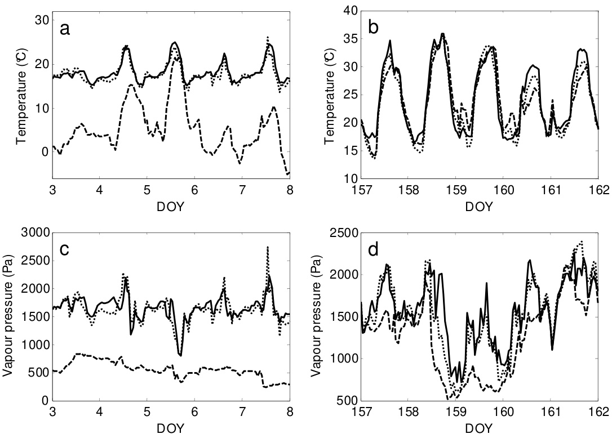  
图2.5 美国德克萨斯州冬季（DOY 3-8）和夏季（DOY 157-162）期间温室内空气温度（a,b）和水汽压（c,d）的测量值（实线）、模拟值（虚线）和室外值（点划线）。

2.5.4 美国亚利桑那州的湿帘风机降温温室 该模型正确预测了亚利桑那州湿帘降温温室在夏季白天不同通风率下的温度和水汽压（图2.6）。该模型仅在最低通风率下略微低估了温室空气的温度和水汽压（图2.6a）。这种低估可能是由于假设温室是一个完全搅拌的罐体，而使用湿帘风机系统时并非如此。具体来说，湿帘风机降温系统会导致水平和垂直的温度和水汽压梯度（Sabeh等人，2006）。

此外，在最低通风率下对水汽压的低估可能是由于对蒸腾速率的低估造成的。蒸腾速率是使用恒定的边界层阻力进行模拟的，这种假设对于室内风速约为$0.10\mathrm{~m~s~}^{-1}$的自然通风温室是有效的（详见模型描述）。在湿帘风机降温温室中使用这种恒定的边界层阻力时，由于室内风速显著更高，没有考虑较高风速对边界层阻力的影响，这最终会导致蒸腾速率的低估。然而，蒸腾速率的低估仅对最低通风率下的模拟室内气候产生了负面影响（图2.6a）。在较高通风率下，湿帘风机系统对能量和水汽平衡的影响相对于蒸腾速率变得占主导地位，从而实现了对温度和水汽压的准确预测（图2.6b-d）。

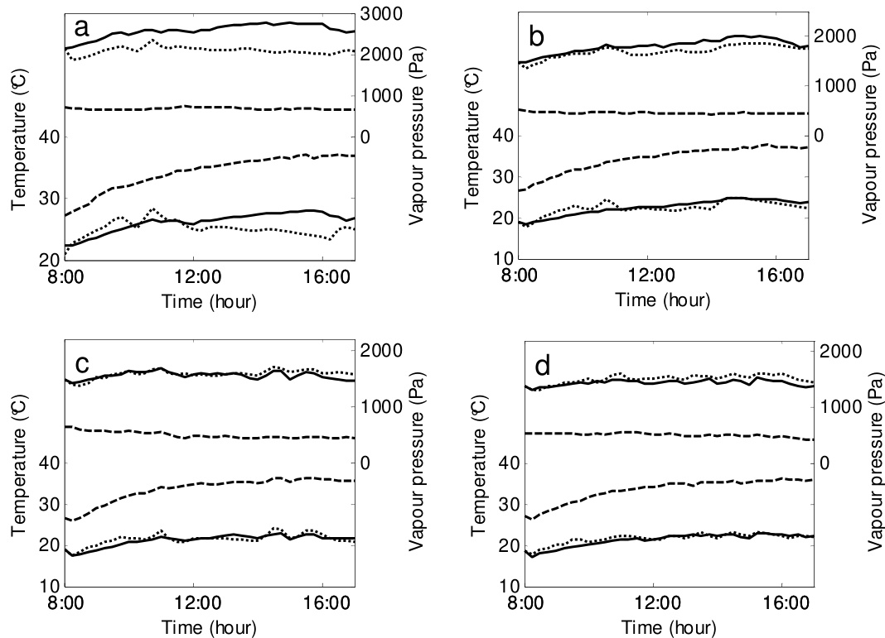  
图2.6 美国亚利桑那州通过湿帘的四种通风率下测量的温室空气（实线）、模拟空气（虚线）和室外空气（点划线）的温度和水汽压：0.016 $m^{3}\ m^{-2}\ s^{-1}$ (a), $0.034\ m^{3}\ m^{-2}\ s^{-1}$ (b), $0.047~m^{3}~m^{-2}~s^{-1}$ (c) 和 $0.060\ m^{3}\ m^{-2}\ s^{-1}$ (d)。

# 2.5.5 整体模型性能

表2.3显示了模型在RRMSE方面的性能。除了定性模型评估外，基于RRMSE的定量模型性能评估清楚地表明了该模型描述不同设计、地点和室外气候条件下温室内气候的能力。在几乎所有情况下，RRMSE都远低于$10\%$的要求阈值。例外情况包括德克萨斯州冬季和夏季期间空气水汽压（分别为$10.0\%$和$12.8\%$）、亚利桑那州最低通风率下的水汽压$(19.8\%)$，以及西西里岛秋季期间$(11.7\%)$和荷兰冬季期间$(12.3\%)$的$\mathrm{CO}_{2}$浓度。

表2.3 用于评估模型描述空气温度、湿度和$CO_{2}$浓度能力的相对均方根误差(RRMSE)值，数据来自位于西西里岛、荷兰、美国德克萨斯州和亚利桑那州的四个温室。叉号表示相关变量的测量值不可用。

| 位置 | DOY | 通量* (m²m² s) | 空气温度 (RRMSE) (%) | 空气蒸汽压 | CO2浓度 |
|------|-----|----------------|----------------------|------------|---------|
| 西西里岛, 意大利 | 267-272 |  | 3.5 | 7.0 | 7.1 |
| 西西里岛, 意大利 | 293-298 | - | 6.6 | 8.9 | 11.7 |
| 荷兰 | 38-43 |  | 6.2 | 6.4 | X |
| 荷兰 | 200 -205 |  | 5.3 | 5.7 | 12.3 |
| 德克萨斯州, 美国 | 3-8 | - | 6.0 | 10.0 | X |
| 德克萨斯州, 美国 | 157-162 |  | 6.8 | 12.8 | X |
| 亚利桑那州, 美国 | 139 | 0.016 | 8.0 | 19.8 | X |
| 亚利桑那州, 美国 | 151 | 0.034 | 4.5 | 6.8 | X |
| 亚利桑那州, 美国 | 131 | 0.047 | 4.1 | 3.9 | X |
| 亚利桑那州, 美国 | 132 | 0.060 | 3.3 | 5.9 | X |

\* 表示湿帘风机降温系统的通风通量。

对于室内外气候差异较大的情况，如荷兰和德克萨斯州的冬季，以及亚利桑那州阳光充足的夏季，模型正确地预测了室内气候。这意味着物理特性和设计元素已被正确建模。通过减少测量箱的测量误差，可以降低计算误差。这些测量误差源于测量不准确，以及单个测量箱无法代表整个温室区域的气候，因为温室并不像假设的那样是一个完全搅拌的罐体。具体而言，Bontsema 等人 (2008) 测量了商用测量箱在空气温度、相对湿度和 $\mathrm{CO}_{2}$ 浓度方面的相对误差，分别为 $1.4\%$、$2.8\%$ 和 $7.2\%$。尽管测量箱经过校准并放置在温室区域的中心，但更准确和随机放置的测量箱能更好地反映整体室内气候。更准确地测量室内气候可以反过来降低 RRMSE。

模型性能以一小时为时间间隔进行测量。这个时间间隔足够小，可以描述温室设计优化所需的每日温室气候波动。因此，没有分析更小时间间隔的模型准确性。然而，由于模型使用微分方程描述并使用可变时间步长的求解器求解，模型性能可能不会随着时间间隔的减小而显著下降。

# 2.6 讨论

为了设计和优化适用于世界各地各种气候条件的保护性栽培系统，拥有一个能够正确预测室内气候的模型至关重要，该模型不仅要考虑各种室外气候条件，还要考虑各种建筑元素和气候调节设备。

因此，这里开发的模型满足了使用可微分方程的要求，并在各种温室设计和室外气候条件下进行了验证。在没有校准的情况下（除一种情况外），模型准确地描述了温室气候，包括动态响应和绝对值。使用 RRMSE 标准对模型性能进行定量评估支持了这些发现。在超过 $78\%$ 的情况下，室内气候的模拟与测量比较得出的 RRMSE 小于 $10\%$。就 RRMSE 而言，这种模型性能与 Baptista (2007) 报告的其他气候建模研究获得的值一致。鉴于这些结果，该模型被认为足够准确和通用，可以作为开发基于模型的温室设计方法的关键组成部分。特别是，我们的模型包含了温室设计的相关过程，如 FIR 辐射通量、$\mathrm{CO}_{2}$ 通量和详细的蒸腾模块，这些在其他模型（如 Fitz-Rodríguez 等人 (2010) 的教育性气候模拟模型）中并不存在。然而，由于我们的目标是开发一种专注于优化一组设计元素的设计方法，可能相关的模型方面可能被忽略或过于简化。

因此，每当有更好或新的模块可用时，它们可以很容易地纳入设计方法。这里更详细地讨论了一些可能提高基于模型的设计方法通用性的问题。特别是，一个描述光传输作为季节、纬度、方向、形状、天沟和屋脊高度以及覆盖材料类型的函数的模块，可能有助于优化温室高度和屋顶坡度。由于辐射扩散材料在高太阳辐射地区似乎很有前景，区分直接辐射和漫射辐射将允许优化覆盖材料的漫射特性以及与扩散相关的内容。此外，其他气候调节技术的模块，如热电联产、人工光合照明、主动热缓冲器、热泵和太阳能集热器，也可能被纳入。

为了系统地量化不确定模型方面对室内气候预测的影响，可以使用敏感性分析技术（Chalabi & Bailey, 1991; Nijskens 等人, 1991）。尽管本章没有进行敏感性分析，但我们的结果允许指出一些可能的模型改进。首先，根据 Campen 和 Bot (2003) 的研究，通风率可能强烈依赖于风向，而建模的通风率并不依赖风向，这可以解释一些偏差。通风率反过来又影响室内温度、水汽压和 $\mathrm{CO}_{2}$ 浓度。尽管天空温度和外部土壤温度没有被测量而是估计的，但模型准确地预测了室内温度，因为所有相关的 RRMSE 值都低于 $10\%$。显然，这些估计值对温度预测的小影响要么是由于准确的计算，要么是由于模型中实现的负反馈机制，如冠层蒸腾和土壤储存热量的能力。然而，在未来的研究中应测量天空温度和外部土壤温度，以提高模型性能。此外，管道温度被视为模型输入，而对于温室设计优化，输入必须是能量，管道温度必须是如本研究所述的状态变量。使用管道温度作为模型输入并没有破坏我们的验证结果，因为从长期来看，供应给加热管道的热量输入等于热量输出。

空气的水汽压预测得相当准确；仅在三项验证实验中，相关的 RRMSE 高于 $10\%$。这证明了 Stanghellini (1987) 的模型在相当极端的气候条件下（VPD 高达 $2.0 \mathrm{kPa}$）能够相当准确地预测作物蒸腾速率，如 Jolliet 和 Bailey (1992) 以及 Prenger 等人 (2002) 所示。此外，冠层蒸腾和空气水汽压之间的负反馈确保了水汽压对蒸腾估计误差的敏感性降低。事实上，即使在极端气候条件下（温度为 $35^{\circ}\mathrm{C}$，VPD 为 $4.0 \mathrm{kPa}$），空气温度也被相当准确地预测（RRMSE $< 10\%$）。然而，通过改进气孔阻力的经验描述，可以进一步提高蒸腾速率的预测。此外，将边界层阻力设为风速依赖而非恒定，可能会改善在较高风速（如湿帘风机降温引起的风速）下的蒸腾速率模拟。

$\mathrm{CO}_{2}$ 浓度预测仅在两种温室设计中进行了验证，因为只有这两种设计有室内数据。$\mathrm{CO}_{2}$ 浓度在有和没有 $\mathrm{CO}_{2}$ 注入的温室中都被合理预测。三项验证实验中有两项的 RRMSE 略高于 $10\%$ 的要求。如果有室外 $\mathrm{CO}_{2}$ 浓度数据，$\mathrm{CO}_{2}$ 浓度预测可能会得到改善。第二个因素是改进维持和光合作用通量的预测。如果温室种植者测量室内和室外 $\mathrm{CO}_{2}$ 浓度以及 $\mathrm{CO}_{2}$ 供应量，对这些 $\mathrm{CO}_{2}$ 通量的了解将会提高。$\mathrm{CO}_{2}$ 浓度缺乏强负反馈机制（图 2.2）确保了这些不确定性来源可能对 $\mathrm{CO}_{2}$ 浓度预测产生相对较大的影响。对于温室设计目的，夜间模拟和测量的 $\mathrm{CO}_{2}$ 浓度之间的偏差并不重要，因为此时 $\mathrm{CO}_{2}$ 浓度不会影响光合作用速率和作物产量。在白天，这些偏差确实会影响光合作用速率，进而影响作物产量和最优温室设计问题。这些偏差对最优温室设计的影响应通过对最优温室设计问题的敏感性分析进行分析。

关于验证研究的设计，所有温室功能都至少由一个设计元素实现（表 2.1）。在功能层面进行验证是足够的，因为模型通量来自哪里并不重要，重要的是模型如何对其做出反应。因此，模型并未对图 2.1 中所示的所有设计元素进行验证。当然，建议用数据验证与这些设计元素相关的模型方面。由于模型应由可微分方程组成的要求，实现了可微分切换函数，而不是条件 "if/else" 语句。尽管切换函数的陡峭边缘接近条件 "if/else" 语句，但这些函数可能会对模型行为产生影响。然而，这些方法之间没有显示出模型输出的差异，这支持了这种方法的可行性。

# 2.7 结论

我们开发并验证了一个温室气候模型，该模型描述了室外气候和温室设计（包括建筑参数和气候调节设备）对温室内气候的影响。该模型旨在用于设计适用于世界各地各种气候条件的温室。为了使我们的研究结果能够被实施和复现，本章和详细的模型描述中提供了所有模型方程。

在各种气候条件下的广泛温室设计中，该模型以合理的准确性预测了温室气候。在我们的研究中，温室气候包括温度、水汽压和$\mathrm{CO}_{2}$浓度。除一种情况外，模型参数均未修改。在超过$78\%$的情况下，室内气候的模拟与测量比较得出的RRMSE小于$10\%$。此外，该模型满足了包含适用于广泛气候条件的设计元素和可微分性的要求。

鉴于这些结果，该模型被认为足够准确和通用，可用于开发基于模型的温室设计方法。因此，温室气候模型将被集成到基于模型的温室设计方法中，与作物产量模型和经济模型相结合。然后，优化算法将在给定的气候和经济条件下选择最佳的设计元素，以最大化种植者的利润。

# 致谢

我们要感谢来自西西里岛的Azienda Fratelli Dezio；来自瓦赫宁根温室园艺的Jan Bontsema；来自德克萨斯州Village Farms的Paul Selina；来自Hortimax的Erwin Gravesteijn；以及来自亚利桑那大学的前博士生Nadia Sabeh，他们提供了验证模型所需的温室气候数据。本研究是作为"生态系统的可持续空间发展、景观、海洋和区域"和"可持续农业"两个战略研究计划的一部分进行的，这两个计划均由荷兰农业、自然保护和食品质量部资助。

# 2.8 术语表

状态变量

$CO_{2}$ 二氧化碳浓度 mg m-3 $T$ 温度 $^{\circ}\mathrm{C}$ VP 水汽压 Pa

通量密度

$H$ 感热通量密度 W m-2 $L$ 潜热通量密度 W m-2 MC 质量$\mathrm{CO}_{2}$通量密度 mg m-2 s-1 $MV$ 质量水汽通量密度 kg m-2 s-1 R 远红外辐射(FIR)通量密度 $\mathbf{W_{\lambda}}\mathbf{m}^{-2}$ $R_{NIR}$ 近红外辐射(NIR)通量密度 W m-2 RPAR 光合有效辐射(PAR)通量密度 $\textrm{W m}^{-2}$ $R_{Glob}$ 总辐射通量密度 $\textrm{W m}^{-2}$

外部气候输入

CO2 Out 室外$\mathrm{CO}_{2}$浓度 mg m-3 $I_{Glob}$ 室外总辐射 W m-2 TOut 室外温度 $^{\circ}\mathrm{C}$ TSky 天空温度 $^{\circ}\mathrm{C}$ TSoOut 外层土壤温度 $^{\circ}\mathrm{C}$ VPOut 室外水汽压 $\mathrm{Pa}$ vWind 室外风速 m s-1

剩余符号 cap 相关状态的容量

# 第2章

下标   
Air 保温幕下方的温室空气区域   
Blow 直接空气加热器   
Boil 锅炉   
Can 冠层   
Cov 覆盖物   
e 外部侧   
Ext 外部 $\mathrm { C O } _ { 2 }$ 源   
Flr 地面   
Fog 喷雾系统   
Geo 地热   
Glob 总辐射   
Ind 工业源   
Mech 机械制冷   
Out 外部空气   
Pad 湿帘风机系统   
Pas 被动储热设施   
Pipe 管道加热系统   
Sky 天空   
So(j) 第j层土壤   
Sun 太阳   
Top 保温幕上方的区域   
ThScr 保温幕

# 第3章

番茄产量模型的描述与验证

本章内容已作为论文提交至《生物系统工程》，论文标题为：基于模型的温室设计方法：第二部分，番茄产量模型的描述与验证。

B.H.E. Vanthoor, P.H.B. de Visser, C. Stanghellini and E.J. van Henten

# Chapter 3

Description and validation of a tomato yield model

The contents of this chapter have been submitted to Biosystems Engineering as a paper entitled: A methodology for model-based greenhouse design: Part 2, Description and validation of a tomato yield model.

B.H.E. Vanthoor, P.H.B. de Visser, C. Stanghellini and E.J. van Henten

# 3.1 摘要

为了开发一种基于模型的方法来设计适用于广泛气候和经济条件的温室，本文描述并验证了一个描述温室气候对产量影响的番茄产量模型。进行了温度对番茄产量影响的文献调查，并将主要温度效应纳入模型中。随后，该产量模型在四种温度条件下进行了验证。结果表明，该模型能够准确模拟荷兰和西班牙南部在不同光照和$\mathrm{CO}_{2}$浓度下接近最佳和非最佳温度条件下的番茄产量。此外，该模型还以较高的精度模拟了极低和极高平均温度对产量和首次果实收获时间的不利影响。模拟的产量对极端昼夜温度波动的响应与文献值一致。此外，该模型由一组具有连续可微右侧的微分方程组成。基于这些结果，该模型被认为足够准确，可用于开发基于模型的温室设计方法。因此，所提出的模型将被整合到基于模型的设计方法中，旨在为当地气候和经济条件设计最佳温室。

# 3.2 引言

本章包含番茄产量模型的描述和验证。由于温室设计通过影响室内气候来影响作物产量，因此提出了一个描述番茄（Lycopersicon esculentum）产量作为室内气候函数的模型。为了用于设计和优化研究，该模型应满足三个要求：（i）描述室内温度、光照和$\mathrm{CO}_{2}$浓度对番茄产量的影响；（ii）描述极低和极高温度对番茄产量的不利影响，因为温室设计优化问题的解决方案预计会允许这些极端温度以节省能源和投资；（iii）模型应由一组微分方程组成，因为它将与由一组微分方程组成的温室气候模型结合，并允许使用常微分方程求解器。此外，右侧必须是连续可微的，以加快模拟速度并确保可以将基于梯度的动态优化算法应用于模型。

在文献中，可以找到几个描述光照、温度和$\mathrm{CO}_{2}$浓度对番茄产量影响的模型。然而，这些模型大多适用于相对较小的温度范围（Seginer等，1994；Tap，2000；Ooteghem，2007），并且不是完全可微的，例如TOMGRO（Jones等，1991；Dayan等，1993）、TOMSIM（Heuvelink，1996）和De Koning（1994）的番茄产量模型。总之，文献综述表明，仍然缺少满足预定要求的番茄产量模型，因此本工作的目的是描述和验证这样的番茄产量模型。由于该模型的目的——将其用于基于模型的温室设计方法——本章的主要重点是描述极端温度对番茄干物质产量的影响。

本章的提纲如下。首先，由于模型应处理极端温度，因此介绍了温度对番茄产量影响的文献调查。其次，描述了这些主要温度效应的模型实现。随后，将模拟的番茄产量与测量的番茄产量进行验证，验证在以下三种温度条件下进行：1）在荷兰的两个温室中，在温和温度和不同光照及$\mathrm{CO}_{2}$条件下；2）在西班牙东南部的一个低技术温室和一个高技术温室中，在极端温度条件和不同光照及$\mathrm{CO}_{2}$条件下；3）在生长室中进行的从次优到超优温度的四个恒定温度轨迹。此外，还评估了极端温度条件的影响，并与文献中的数据进行了比较。

# 3.3 温度对番茄产量的影响

温度影响番茄生长的不同方面（例如，生产率和分配、干物质含量）和发育（例如，叶片和花序的出现、果实生长期、败育和果实质量）（De Koning，1994；Van Der Ploeg & Heuvelink，2005）。光合作用依赖于光照、$\mathrm{CO}_{2}$和温度，产生作物生长所需的碳水化合物。这些碳水化合物被分配到果实、叶片、茎和根，并转化为干物质（如糖、氨基酸和有机酸）。糖满足维持过程和生长过程的能量需求。最后，坐果、果实生长和败育率决定了有多少潜在可用的碳水化合物被分配到果实中。

在本节中，介绍了次优、超优以及昼夜温差对生长、发育和最终对番茄产量影响的文献研究。虽然不全面，但本调查仅旨在捕捉主要趋势。尽管温度的影响取决于相关的太阳辐射、$\mathrm{CO}_{2}$浓度和湿度水平，但本调查的重点是基于自然变化的其他气候因素的温度实验来捕捉主要温度趋势。超优温度对生长的影响隐含了高蒸气压亏缺（VPD）对生长的负面影响。具体来说，高VPD与高温密切相关，因此将这两个因素分开似乎多余。本调查的结果总结在表3.1中。

3.3.1 次优温度对果实鲜重产量的影响 低温可能对光合作用、呼吸作用、膜完整性、水分关系、植物激素平衡和坐果产生负面影响（Van Der Ploeg & Heuvelink，2005；Adams等，2001；Brüggemann等，1992；Yakir等，1986）。此外，果实生长期随着温度的降低而增加（De Koning，1994）。这些不利过程降低了总果实鲜重，如下所示。

在平均温度为$12^{\circ}\mathrm{C}$以下时，Criddle等（1997）观察到没有显著生长和番茄产量。Khayat等（1985）发现，在相似的太阳辐射水平下，夜间温度为$12^{\circ}\mathrm{C}$时，品种Moneymaker的产量仅为$18^{\circ}\mathrm{C}$时观察到的产量的$76\%$。然而，对品种Cherry的相同处理并未影响生长。这些结果表明，低温对作物产量的影响是品种依赖的。根据Baytorun等（1999）的研究，暴露于最低平均夜间温度为$8.2^{\circ}\mathrm{C}$三个月的植物的产量水平降至$11.5^{\circ}\mathrm{C}$时观察到的水平的$46\%$，且太阳辐射水平相似。此外，Adams等（2001）观察到，在平均温度为$14^{\circ}\mathrm{C}$时，产量降至$22^{\circ}\mathrm{C}$时观察到的作物产量的$21\%$，其他气候因素保持不变。此外，Adams等（2001）发现，在平均温度为$14^{\circ}\mathrm{C}$下生长的果实是单性结实的、小的、硬的且没有经济价值。与上述结果相反，Martínez Mirón（2008）在相对低光照条件下（平均全球辐射总量为7.6 M $\mathrm{J~m^{-2}~day^{-1}}$）观察到，在最低平均夜间温度为$13.2^{\circ}\mathrm{C}$时，产量增加到$15.2^{\circ}\mathrm{C}$时观察到的产量的$108\%$。在较高光照水平$9.4~\mathrm{MJ~m^{-2}~day^{-1}}$下，未观察到低平均夜间温度对作物产量的积极影响。这些结果表明，在低光照条件下，低平均夜间温度可能比高平均夜间温度更有利于作物生长。然而，文献中观察到的总体趋势是，产量随着夜间温度的降低而降低。

3.3.2 超优温度对果实鲜重产量的影响 在超优温度水平下，瞬时温度降低了光合作用，平均温度导致坐果率降低、果实生长期缩短和果实变小（Heckathorn等，1998；Camejo等，2005；De Koning，1994；Adams等，2001；Peet等，1997；Sato等，2000）。这些不利过程降低了总果实鲜重，如下所示。Adams等（2001）报告称，在平均温度为$26^{\circ}\mathrm{C}$时，作物产量仅为$22^{\circ}\mathrm{C}$时观察到的产量的$18\%$。Peet等（1997）发现，在平均温度为$29^{\circ}\mathrm{C}$时，作物产量仅为$25^{\circ}\mathrm{C}$时观察到的产量的$17\%$，且光照水平相似。Zhang等（2008）观察到，在白天温度为$35^{\circ}\mathrm{C}$时，作物产量下降至$25^{\circ}\mathrm{C}$时的$46.1\%$。

表3.1 基于文献综述的低温高温对作物生长过程和产量水平影响的总结

| 时期 | 温度 | 结果 | 作者 |
|------|------|------|------|
| **光合作用** |
| 14天 | 光周期10℃ | 初始光合作用的2-5% | Yakir等 (1986) |
|  | 14天10℃光周期后3天 | 恢复至初始光合作用的50% | Yakir等 (1986) |
| 3小时 | 43℃ | 相比25℃显著下降 | Heckathorn等 (1998) |
| 2小时 | 40℃ | 降至30% | Camejo等 (2005) |
| **果实发育时间** |
| 总周期+ | 平均14℃ | 94.8天，是22℃的205% | Adams等 (2001) |
| 总周期+ | 平均26℃ | 41.5天，是22℃的89.6% | Adams等 (2001) |
| 总周期 | 17℃至26℃之间 | 发育速率与温度呈线性关系 | De Koning (1994) |
| **果实大小** |
| 总周期+ | 平均14℃ | 18.3g，是22℃的36% | Adams等 (2001) |
| 总周期+ | 平均26℃ | 23.9g，是22℃的47% | Adams等 (2001) |
| **坐果/败育** |
| 3周 | 恒温6℃ | 不可逆损伤 | Brüggemann等 (1992) |
| 总周期+ | 平均14℃ | 是22℃的59% | Adams等 (2001) |
| 生产期 | 28/22℃ | >75%（所有品种） | Sato等 (2000) |
| 生产期 | 32/26℃ | 0%（5个品种中的4个） | Sato等 (2000) |
| 生产期 | 平均25℃ | 48% | Peet等 (1997) |
| 生产期 | 平均29℃ | 11% | Peet等 (1997) |
| 总周期+ | 平均26℃ | 是22℃的40% | Adams等 (2001) |
| **作物产量** |
| 持续 | 平均12℃ | 0% | Criddle等 (1997) |
| 夜间 | 平均8.2℃ | 是11.5℃的46% | Baytorun等 (1999) |
| 夜间 | 平均13.2℃ | 是15.2℃的108% | Martínez Mirón (2008) |
| 夜间 | 12℃ | 1571g/株，是18℃的76% | Khayat等 (1985) |
| 总周期+ | 平均14,18,22,26℃ | 见表3.4 | Adams等 (2001) |
| 生产期 | 平均29℃ | 117.32g/株，是25℃的17% | Peet等 (1997) |
| 白天 | 35℃ | 是25℃的46.1% | Zhang等 (2008) |
| 每日 | DIF=-6℃（昼18℃/夜24℃） | 植物生长和发育减少 | Heuvelink (1989) |
| 每日生产期 | DIF=10℃（昼26℃/夜16℃） | 与DIF=2℃（昼22℃/夜20℃）生长和发育相同 | Heuvelink (1989) |
|  | DIF=14℃ | 相比5℃DIF产量更高 | Gent和Ma (1998) |
| 生产期 | DIF=18℃ | 与6℃DIF产量相似 | Mavrogianopoulos和Kyritis (1989) |

+表示处理在播种后21天开始。

3.3.3 短期和长期温差的影响 昼夜温差（DIF）也会影响作物生长过程。对于番茄幼苗，Heuvelink (1989)发现，在相似的平均温度下，白天温度低于夜间温度（$\mathrm{DIF = -6^{\circ}C}$）会减少植物生长和发育（叶片数量和花序数量），与DIF为$2^{\circ}C$且辐射水平相似的处理相比。然而，对于$10^{\circ}C$的大正DIF，Heuvelink (1989)观察到的生长速率和发育速率与$2^{\circ}C$的DIF相似。Gent和Ma (1998)观察到，在$14^{\circ}C$的DIF下生长的作物比在$5^{\circ}C$的DIF下生长的作物产量更高，且辐射水平相似，而Mavrogianopoulos和Kyritis (1989)在温暖气候下观察到$6^{\circ}C$和$18^{\circ}C$的DIF下作物产量水平相似。大正DIF对作物产量的负面影响应被视为非最佳温度水平的结果（即由次优夜间温度和/或超优白天温度引起），而不是昼夜差异本身。

# 3.3.4 温度依赖性生长速率响应和模型实现

总结来说，文献调查表明：a) 瞬时温度和平均温度都会影响作物产量，b) 次优和超优温度都会影响多个生长过程，导致产量降低，c) 很难确定单一的生长过程导致作物胁迫，因为生长过程相互影响，d) 胁迫敏感性是品种依赖性的，e) 负DIF和大正DIF由于次优或超优温度会对作物产量产生负面影响。

由于作物产量模型将集成到基于模型的设计方法中，详细模拟非最佳温度对单个作物生长过程的影响超出了本研究的范围。相反，开发了一个模型，通过两个集成的温度依赖性生长抑制函数来捕捉各种过程的温度依赖性。这些抑制函数通过将潜在的番茄生长速率与这些抑制函数相乘来捕捉瞬时和平均温度对整体番茄产量的影响（$0 \leq$ 抑制函数 $\leq 1$）。这些生长抑制函数还将隐含地考虑大VPD对生长过程的影响，因为大VPD主要发生在超优温度下。败育过程已经被两个集成的温度依赖性生长抑制函数捕捉，因此没有明确建模。

# 3.4 模型概述和状态

# 3.4.1 符号约定

为了描述番茄产量模型的状态和流动，使用了De Zwart (1996)的符号约定。模型的状态由大写字母后跟一个下标表示（见第3.8节的术语表）。流动由大写字母后跟两个下标表示。第一个下标表示流动的源，第二个下标表示流动的目的地。例如，$M C _ { A i r B u f } ^ { }$表示从空气到碳缓冲区的碳流动。除非另有说明，表面单位为${ \mathrm { m } } ^ { 2 }$的温室地面。如术语表所示，碳水化合物以mg $\mathrm { \{ C H _ { 2 } O \} ~ m ^ { - 2 } }$表示。

# 3.4.2 模型概述

如图3.1所示的模型结构，采用了一个共同的碳水化合物缓冲区和向植物器官分配碳水化合物的机制，主要基于早期的作物产量模型（Marcelis等，1998；Heuvelink，1996；Dayan等，1993；Seginer等，1994；Linker等，2004），并扩展了两个集成的温度依赖性生长抑制函数。

光合作用$M C _ { A i r B u f } ^ { }$主要取决于冠层温度、冠层吸收的光合有效辐射（PAR）以及温室中的$\mathrm { C O } _ { 2 }$浓度。如果不使用碳水化合物缓冲区而直接将作物生长与光合作用联系起来，在没有光合作用的情况下，夜间温度对生长的影响将被忽略。然而，夜间温度在作物生长和发育中起着重要作用。为了模拟夜间温度对生长和发育的影响，光合作用产生的碳水化合物被储存在一个缓冲区$C _ { B u f } \mathrm { , }$中，其流出量受温度影响。即使在光合作用不发生时，缓冲区也会将碳水化合物$( M C _ { B u f F r u i t } ,$ , $M C _ { B u f L e a f } , M C _ { B u f S t e m } )$分配到植物器官$( C _ { F r u i t } , C _ { L e a f } , C _ { S t e m } )$。这些碳水化合物的流动受到缓冲区中碳水化合物的可用性、器官生长速率系数、两个温度依赖性生长抑制函数（每个函数都描述为瞬时温度$T _ { C a n } \mathrm { ~ . ~ }$和24小时平均温度$T _ { c a n } ^ { 2 4 }$的函数）以及代表作物发育阶段的温度总和$T _ { C a n } ^ { S u m }$的影响。

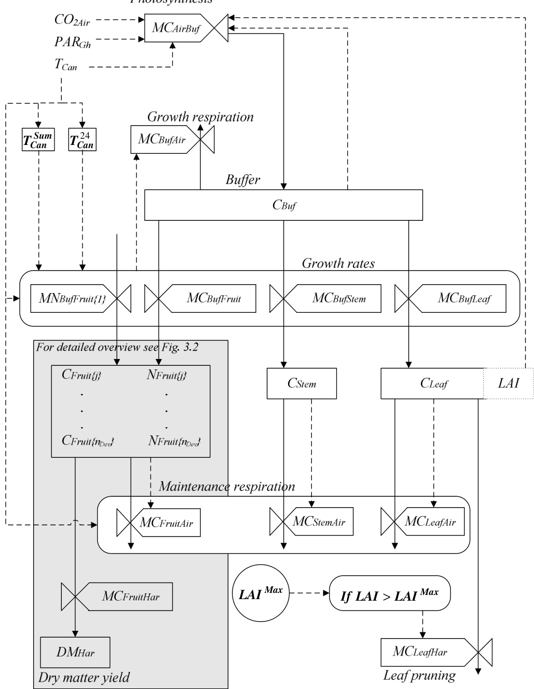  
图3.1 使用Forrester（1962）建模形式表示的番茄产量模型示意图。方框代表模型的状态变量，阀门是速率变量。虚线表示信息流，实线表示物质流。代表果实重量$C _ { f r u i t / j } ,$和果实数量$N _ { F r u i t / j } ,$的方框在图3.2中有更详细的描述。虚线框代表模型的半状态变量。

植物器官$C _ { S t e m }$代表储存在茎和根中的碳水化合物。为了考虑坐果和果实收获之间的时间延迟，模型模拟了每个果实发育阶段$j .$的果实重量$C _ { F r u i t / j \rangle }$和果实数量$N _ { F r u i t / j }$。器官中的一部分碳水化合物用于维持呼吸$( M C _ { F r u i t A i r } ,$ $M C _ { L e a f A i r } , M C _ { S t e m A i r } )$。当叶面积指数（LAI）超过最大值$L A I ^ { M a x }$时，叶片会被修剪回该值，导致物质流$M C _ { L e a f H a r }$。通过积分最后一个果实发育阶段的碳水化合物流出量来确定累积收获的番茄干物质。

本章介绍了状态变量方程和向各个植物器官的碳水化合物流动，特别关注两个集成的温度依赖性生长抑制函数。由于篇幅限制，其余模型过程在番茄产量的详细描述中呈现，可以在第9章中找到。这里简要描述这些模型过程。冠层吸收的PAR由Ross（1975）描述的同质行作物中光随LAI的负指数衰减来描述。冠层光合作用基于Farquhar和Von Caemmerer（1982）、Farquhar等（1980）和Farquhar（1988）的叶片光合作用模型，通过将叶片的最大电子传输速率与LAI相乘来扩展到冠层光合作用，如Evans和Farquhar（1991）所述。尽管VPD强烈影响气孔导度，但光合作用对VPD不敏感（Stanghellini & Bunce，1993）。因此，模型中未纳入VPD对冠层光合作用速率的影响。为了基于模型的温室设计，作物产量模型将与温室气候模型（见第2章）结合，该模型计算冠层温度。该状态变量取决于Stanghellini（1987）的蒸腾和气孔模型。因此，建模的热力和水力反馈系统确保VPD通过其对冠层温度的影响来影响温度依赖性生长抑制函数和作物生长。果实流动和向果实发育阶段的碳水化合物流动以及不同果实发育阶段的每日潜在生长速率基于De Koning（1994）。生长和维持呼吸基于Heuvelink（1996）。模型参数列于表3.2中。

表3.2 模型参数和符号列表。如未特别说明，质量单位均以$\{CH_2O\}$表示

| 参数 | 符号和值 | 单位 | 参考文献 |
|------|----------|------|----------|
| 碳水化合物到干物质的转换系数 | nc_DM =1 |  | mg {DM} mg-1 假设无木质化 |
| 计算24小时平均温度的时间常数 | τ = 86400 |  | 见第9.7.1节 |
| 最大缓冲容量 | C = 20-10 | mg m² | 见第9.5.1节 |
| 缓冲中碳水化合物的最小量 | C=1-10 | mg m-2 | 见第9.5.2节 |
| 计算24小时平均温度过程的增益 | k ="1 |  | 见第9.7.1节 |
| 20℃时果实潜在生长速率系数 | rgFruir= 0.328 | mg m2 s-1 | 见第9.7.3节 (De Koning, 1994) |
| 20℃时叶片潜在生长速率系数 | rgLeaf = 0.095 | mg m² s-1 | 见第9.7.3节 (Heuvelink,1996) |
| 茎干潜在生长速率系数 | rg Stem= 0.074 | mg m2 s-1 | 见第9.7.3节 (Heuvelink,1996) |
| 比叶面积指数 | SLA = 2.66:10-5 |  | m² {leaf} mg-1 基于Heuvelink (1996) |
| 果实生长速率达到最大潜力时的温度总和 | T = 1035 | ℃ | 基于公式(9.32) |
| 24小时平均作物生长抑制的基准温度 | TBase_24= 12 | ℃ | 见第9.7.3节 |
| 24小时作物生长抑制的第一最适温度 | Topt1_24= 18 | ℃ | 见第9.7.3节 |
| 24小时作物生长抑制的第二最适温度 | Topt2_24 = 22 | ℃ | 见第9.7.3节 |
| 24小时作物生长抑制的最高温度 | TMax_24 = 27 | ℃ | 见第9.7.3节 |
| 瞬时作物生长抑制的基准温度 | TBase_Inst = 6 | ℃ | 见第9.7.3节 |
| 瞬时作物生长抑制的第一最适温度 | Toptl_Inst = 14 | ℃ | 见第9.7.3节 |
| 瞬时作物生长抑制的第二最适温度 | Topt2_Inst = 28 | ℃ | 见第9.7.3节 |
| 瞬时作物生长抑制的最高温度 | TMax_Inst = 40 | ℃ | 见第9.7.3节 |

# 3.4.3 模型的状态变量

模型的所有状态变量都用微分方程描述。状态变量对时间的导数用状态符号上方的点表示。

缓冲区中碳水化合物$C _ { B u f } \mathrm { , }$随时间的变化描述为：

$$
\dot { C } _ { B u f } = M C _ { A i r B u f } - M C _ { B u f F r u i t } - M C _ { B u f L e a f } - M C _ { B u f S t e m } - M C _ { B u f A r }
$$

$$
[ \mathrm { m g ~ m ^ { - 2 } ~ s ^ { - 1 } } ]
$$

其中$M C _ { A i r B u f } ^ { }$是光合作用速率，$M C _ { B u f F r u i t } , M C _ { B u f L e a f } , M C _ { B u f S t e m }$分别是流向果实、叶片和茎的碳水化合物流，$M C _ { B u f A i r }$是植物的生长呼吸。在光照期间，光合作用产生的碳水化合物储存在缓冲区中，当缓冲区中有碳水化合物可用时，碳水化合物会流向植物器官。当缓冲区接近其下限时，碳水化合物流停止。当缓冲区接近其上限时，碳水化合物不能再储存在缓冲区中，光合作用将被抑制。

从坐果到果实收获的时间是果实生长期，使用Leffelaar和Ferrari（1989）的"固定车厢列车"方法进行建模。该方法意味着碳水化合物和果实数量以特定的发育速率从一个果实发育阶段流向下一个阶段（图3.2）。当植物从营养阶段转向生殖阶段时，碳水化合物储存在果实发育阶段$j$，$C _ { F r u i t / j \beta } ,$，描述为：

$$
\begin{array} { r l r } & { \dot { C } _ { F r u i t \{ j \} } = M C _ { B u f F r u i t \{ j \} } + M C _ { F r u i t \{ j - 1 \} F r u i t \{ j \} } - M C _ { F r u i t \{ j \} F r u i t \{ j + 1 \} } - M C _ { F r u i t A i r \{ j \} } } & \\ & { \mathrm { w i t h } j = 1 , 2 . . . n _ { D e v } } & { [ \mathrm { m g ~ m ^ { - 2 } ~ s ^ { - 1 } } ] } \end{array}
$$

其中$M C _ { B u f F r u i t / j }$是从缓冲区到果实发育阶段$j _ { : }$的碳水化合物流，$M C _ { F r u i t / j - l / F r u i t / j }$和$M C _ { F r u i t / j / F r u i t / j + l \beta }$分别表示从前一个发育阶段的碳水化合物流入和到下一个阶段的流出，$M C _ { F r u i t A i r / j }$是发育阶段$j ,$的果实维持呼吸，$n _ { D e \nu }$是果实发育阶段的总数。对于第一个果实发育阶段，从前一个阶段的碳水化合物流入为零。对于最后一个发育阶段，到下一个阶段的碳水化合物流出由$M C _ { F r u i t H a r }$描述。

果实发育阶段$j$中的果实数量$N _ { F r u i t / j }$影响碳水化合物的分配，因此描述为：$\dot { N } _ { F r u i t \{ j \} } = M N _ { F r u i t \{ j - 1 \} F r u i t \{ j \} } - M N _ { F r u i t \{ j \} F r u i t \{ j + 1 \} } , \ j = 1 , 2 . . . n _ { D e r } \ [ \mathrm { f r u i t s \ m ^ { - 2 } s ^ { - 1 } } ]$ (3.3) 其中$M N _  F r u i t / j - l / F r u i t / j \}$是从果实发育阶段$j \ – I$到阶段$j$的果实数量流

而$M N _ { F r u i t / j / F r u i t / j + I \beta }$是从果实发育阶段$j$到阶段$j { + } l$的果实数量流。   
对于第一个果实发育阶段，$M N _  F r u i t / j - l / F r u i t / j \}$被$M N _ { B u f F r u i t / l } \mathrm {                                    } $取代。

到第一个果实发育阶段的果实数量流取决于可用于果实生长的碳水化合物和花序出现速率。储存在叶片中的碳水化合物$C _ { L e a f } ,$描述为：$\dot { C } _ { L e a f } = M C _ { B u f L e a f } - M C _ { L e a f A i r } - M C _ { L e a f H a r }$ $[ \mathrm { m g ~ m ^ { - 2 } ~ s ^ { - 1 } } ]$ (3.4) 其中$M C _ { B u f L e a f } $是从缓冲区到叶片的碳水化合物流，$M C _ { L e a f t A i r }$是叶片的维持呼吸，$M C _ { L e a f H a r }$是叶片修剪。

LAI是模型的半状态变量，计算为：

$$
L A I = S L A \cdot C _ { L e a f }
$$

$$
\mathrm { [ m ^ { 2 } \ \{ l e a f \} \ m ^ { - 2 } ] }
$$

其中SLA是比叶面积$\mathrm { ( m ^ { 2 } \ : \{ l e a f \} \ m g ^ { - 1 } \ : \{ C H _ { 2 } O \} ) }$。

储存在茎和根中的碳水化合物$C _ { S t e m }$描述为：$\dot { C } _ { S t e m } = M C _ { B u f S t e m } - M C _ { S t e m A i r }$ $[ \mathrm { m g ~ m } ^ { - 2 } \mathrm { s } ^ { - 1 } ]$ (3.6) 其中$M C _ { B u f S t e m }$是从缓冲区到茎和根的碳水化合物流，$M C _ { S t e m A i r }$是茎和根的维持呼吸。

为了简化模型，假设收获速率是连续的。因此，累积收获的番茄干物质(DM)，$D M _ { H a r } ,$等于最后一个果实发育阶段的干物质流出量，描述为：

$$
\dot { D } M _ { \scriptscriptstyle H a r } = \eta _ { \scriptscriptstyle C _ { - } D M } \cdot M C _ { \scriptscriptstyle F r u i t H a r }
$$

$$
[ \mathrm { m g \ \{ D M \} \ m ^ { - 2 } \ s ^ { - 1 } } ]
$$

其中$\eta _ { C _ { - } D M }$是从碳水化合物到干物质的转换因子。由于模型中包含了生长呼吸，该转换因子为$1 \mathrm { \ m g \ \{ D M \} \ m g ^ { - 1 } }$ $\{ \mathrm { C H } _ { 2 } \mathrm { O } \}$。

描述植物从营养阶段向生殖阶段转变所需的发育阶段用温度总和表示：

$$
\dot { T } _ { C a n } ^ { S u m } = \frac { 1 } { 8 6 4 0 0 } T _ { C a n }
$$

$$
[ ^ { \circ } \mathbf { C } \mathbf { \Lambda } \mathbf { s } ^ { - 1 } ]
$$

其中$T _ { C a n }$是模拟的冠层温度。根据定义，生殖期开始时$T _ { C a n } ^ { S u m }$为零。

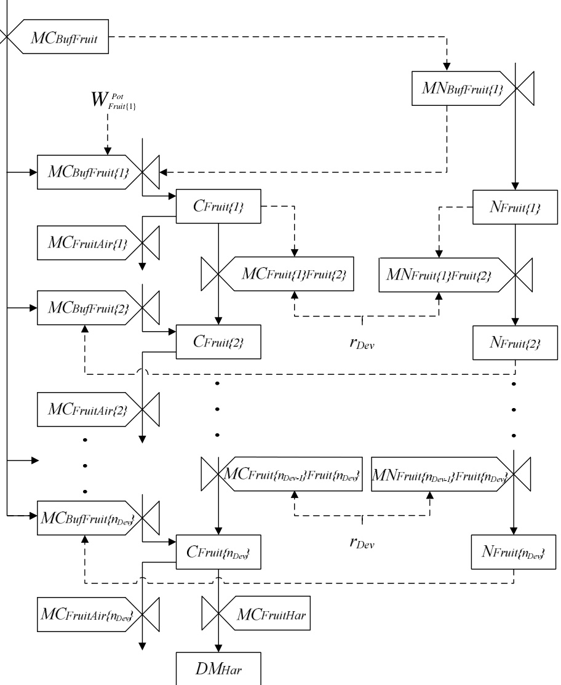

图3.2 通过描述每个果实发育阶段的果实数量$N _ { F r u i t / j }$和碳水化合物量$C _ { F r u i t / j }$来模拟果实发育。如图3.1所示，方框代表模型的状态变量，阀门代表速率变量。虚线表示信息流，实线表示碳流和果实流。可用于果实生长的碳水化合物$M C _ { B u f F r u i t }$被分配到不同的果实发育阶段$C _ { F r u i t / j \rangle }$。流向第一个发育阶段的碳水化合物流MCBufFruit{1}受坐果MNBufFruit{1}的影响，而MNBufFruit{1}又受可用于果实生长的碳水化合物$M C _ { B u f F r u i t }$和潜在果实生长速率$W _ { F r u i t \{ 1 \} } ^ { P o t } a s$的影响，如公式(9.35)所述。流向其余果实发育阶段的碳水化合物流受可用碳水化合物$M C _ { B u f F r u i t }$、果实数量$N _ { F r u i t / j \rangle }$和依赖于发育阶段的果实生长速率的影响，如公式(9.38)所述。

24小时平均冠层温度采用一阶近似：

$$
\dot { T } _ { C a n } ^ { 2 4 } = \frac { 1 } { \tau } \left( k T _ { C a n } - T _ { C a n } ^ { 2 4 } \right)
$$

$$
[ { } ^ { \circ } { \bf C } \ { \bf s } ^ { - 1 } ]
$$

其中$\tau$代表过程的时间常数，$k$是过程的增益。当集成到基于模型的设计方法中时，温室气候模型将冠层温度计算为状态变量。因此，冠层温度和24小时平均冠层温度无法预先计算。为了近似24小时平均冠层温度，将第9.7.1节推导的公式(3.9)的一阶近似方法纳入模型。

3.4.4 碳水化合物流向各植物器官 从缓冲器流向果实的碳水化合物由潜在果实生长系数$r g _ { F r u i t } ,$乘以抑制因子$h$确定：$M C _ { _ { B u j F r u i t } } = h _ { C _ { _ { B u j } } } ^ { M C _ { _ { B u j O r g . } } } \cdot h _ { _ { T c a n } } \cdot h _ { _ { T c a n 2 4 } } \cdot h _ { _ { T c a n S u n } } \cdot g _ { _ { T c a n 2 4 } } \cdot r g _ { _ { F r u i t } } \qquad \mathrm { [ m g ~ m ^ { - 2 } ~ s ^ { - 1 } ] }$ (3.10) 其中抑制因子$( 0 < h < 1 )$为：hCMCBufOrg (-)，缓冲器中碳水化合物不足；$h _ { T c a n }$ (-)，瞬时温度非最优；$h _ { T c a n 2 4 } \ ( - )$，24小时平均冠层温度非最优；$h _ { T c a n S u m } \left( - \right)$，作物发育阶段。24小时平均温度对果实碳水化合物流的影响由$g _ { T c a n 2 4 }$ (-)描述，$r g _ { F r u i t } ( \mathrm { m g } \{ { \bf C H } _ { 2 } { \bf O } \} \mathrm { m } ^ { - 2 } \mathrm { s } ^ { - 1 } )$是$2 0 ^ { \circ } \mathrm { C }$时的潜在果实生长速率系数。

流向第一个果实发育阶段的碳水化合物流受可用于果实生长的碳水化合物、坐果和潜在果实生长速率的影响（图3.2和第9章公式(9.35)）。流向其余果实发育阶段的碳水化合物流取决于可用碳水化合物、果实数量和作为果实发育阶段函数的果实生长速率（图3.2和公式(9.36)）。

从缓冲器流向叶片和茎的碳水化合物描述为：$M C _ { _ { B u f O r g } ( i ) } = h _ { C _ { B u f } } ^ { M C _ { _ { B u f O r g } } } \cdot h _ { _ { T c a n 2 4 } } \cdot g _ { _ { T c a n 2 4 } } \cdot r g _ { _ { O r g } ( i ) } \quad \quad i = 2 , 3 \quad \quad \quad \mathrm { [ m g ~ m ^ { - 2 } ~ s ^ { - 1 } ] }$ (3.11) 其中$i$代表叶片和茎的植物器官代码，$r g _ { O r g ( i ) }$ (mg $\mathrm { ; \ \{ C H _ { 2 } O \} \ m ^ { - 2 } \ s ^ { - 1 } ) }$是$2 0 ^ { \circ } \mathrm { C }$时的器官生长速率系数。与表3.1一致，这些碳水化合物流不受瞬时温度的影响。公式(3.10)和(3.11)中的两个温度依赖性生长抑制函数将在本节中更详细地描述。

文献综述表明，作物生长受到非最优瞬时温度和24小时平均温度的抑制，这分别由两个梯形生长抑制函数$h _ { T c a n }$和$h _ { T c a n 2 4 }$描述。每个抑制函数都基于Boote和Scholberg (2006)的研究，并由四个基本温度描述（图3.3）。

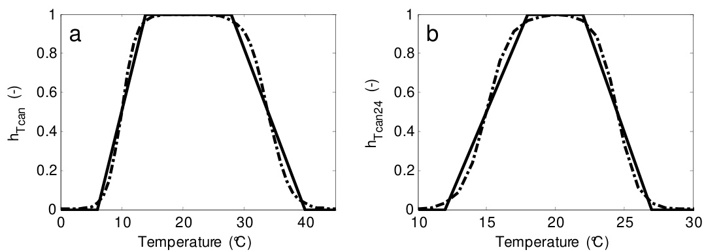  
图3.3 瞬时温度(a)和24小时平均冠层温度$( b )$对生长的抑制。实线表示不可微的抑制函数，虚线点表示可微的抑制函数。不可微的抑制函数通过乘以两个平滑的条件"if/else"语句进行平滑处理，如第9.7.2节所述。两个抑制函数的基本温度见表3.2。

当温度低于基础温度$T _ { B a s e }$时，预计不会有碳水化合物流向器官$\scriptstyle ( h = 0 )$；在$T _ { O p t I }$和$T _ { O p t 2 }$之间，碳流量达到最大$( h { = } 1 )$；当温度高于$T _ { M a x }$时，预计不会有碳水化合物流向器官$\scriptstyle ( h = 0 )$。在$T _ { B a s e }$和$T _ { O p t I }$之间，以及$T _ { O p t 2 }$和$T _ { M a x }$之间，假设抑制与温度呈线性关系。Boote和Scholberg (2006)提出的生长抑制函数不可微，因此不适合用于动态优化。因此，通过将两个平滑的条件"if/else"语句相乘，对每个不可微的抑制函数进行了平滑处理，如第9.7.2节所述。基于表3.1中展示的温度对作物生长的影响，按照第9.7.3节描述的方法确定了表3.2中的基本温度。

# 3.5 模型验证

对于所有四种温度条件，使用相同的模型参数（表3.2）对产量模型进行了验证。由于大多数参数是从文献中提取的，因此没有根据数据对模型参数进行校准。因此，图3.5至图3.7中展示的所有模拟都可以视为模型验证。首先对荷兰温室条件下常见的温和温度进行了验证，其次对西班牙东南部温室条件下的极端温度进行了验证。第三，对非最佳温度条件进行了验证。第四，确定了长期昼夜温度波动下的番茄收获率，并与文献数据进行了比较。

为了模拟作物产量，使用Matlab $7 . 1 ^ { \circledast }$的ODE求解器求解微分方程。每小时温室气候数据，即温室空气温度、$\mathrm { C O } _ { 2 }$浓度和室外总辐射被用作模型输入。由于未测量冠层温度，因此假设其等于温室空气温度。表3.3展示了运行荷兰和西班牙温室模型所需的数据概述。对于荷兰和西班牙的验证研究，仅测量了叶面积指数（LAI）作为初始作物条件。因此，初始叶片碳水化合物是根据LAI和比叶面积计算的（公式3.5）。初始茎和根碳水化合物是通过将叶片碳水化合物乘以取决于营养发育阶段的比率来确定的。由于西班牙研究的初始温度总和未知，因此对该参数进行了拟合，以确保模拟的第一次番茄收获时间与测量的第一次番茄收获时间一致。

# 3.5.1 温和温度条件下的模型验证

该模型使用两位荷兰温室种植者在不同生产年份获得的温和温度条件下的番茄产量测量值进行了验证。在这两种情况下，番茄都是在Venlo型温室中种植的，该温室配备了$\mathrm { C O } _ { 2 }$富集和加热系统。番茄生长接近最佳24小时平均冠层温度区间$1 8 ^ { \circ } \mathrm { C } { - } 2 2 ^ { \circ } \mathrm { C }$，并具有荷兰温室中常见的不同$\mathbf { C O } _ { 2 }$浓度和PAR水平（表3.3）。

表 3.3 荷兰种植者A和B以及西班牙低技术和高技术温室的位置、作物生产数据、初始条件和平均温室气候条件。部分初始作物条件未测量，而是按照3.5节描述的方法计算。

| | 种植者A | 种植者B | 西班牙低技术 | 西班牙高技术 |
|-|-|-|-|-|
| 位置 | | | | |
| 纬度 | 52°0'N | 52°0'N | 36°57'N | 36°48'N |
| 经度 | 4°3'E | 4°3'E | 2°00'W | 2.43'W |
| 海拔(m) | -3 | -3 | 180 | 151 |
| 作物生产数据 | | | | |
| 生长周期开始 | 1999-12-10 | 1997-12-8 | 2009-8-1 | 2003-9-26 |
| 生长周期结束 | 2000-10-2 | 1998-9-23 | 2010-5-5 | 2004-7-9 |
| 品种 | Aromata | Rapsodie | Atletico | Pitenza |
| 温室透光率 | 78% | 78% | 55% | 40% |
| 最大叶面积指数 | 3.0 | 2.85 | 3.5 | 3.5 |
| 初始条件 | | | | |
| 模拟开始 | 2000-1-6* | 1998-1-6* | 2009-8-1 | 2003-9-26 |
| 初始温度总和(℃) | 0 | 0 | -900 | -650 |
| 初始叶面积指数(m²/m²) | 1.06 | 1.25 | 0.4 | 0.1 |
| 初始叶片碳水化合物(mg {CHO}/m²) | 40·10 | 47·10 | 15·10 | 3.8·10 |
| 初始茎干碳水化合物(mg {CH2O}/m²) | 30·10 | 31·10 | 15·10 | 3.8·10 |
| 室内气候 | | | | |
| 平均冠层温度(℃) | 18.2 (2.7) | 19.1 (2.1) | 17.5 (7.0) | 19.7 (3.2) |
| 日平均室外总辐射(MJ/m²/天) | 12.2 (7.4) | 9.7 (5.6) | 12.9 (5.6) | 15.9 (7.7) |
| 白天平均CO2浓度(μmol/mol) | 677 (301) | 659 (253) | 355 (15) | 476 (81) |

\* 表示模拟从生殖阶段开始。

### 3.5.2 西班牙温度条件下的模型验证
该模型使用西班牙南部气候条件下获得的番茄产量测量值进行了验证，包括一个仅配备自然通风的低技术"raspa y amagdo"温室(LT)和一个配备自然通风、加热系统、保温幕、外部遮阳幕、雾化系统和$\mathrm{CO}_2$富集系统的高技术拱形多隧道温室(HT)。在LT温室中，番茄经常处于非最佳温度下的强烈波动温度中(表3.3)。相比之下，在HT温室中，番茄生长更接近最佳的24小时平均冠层温度区间。

## 3.5.3 极端温度条件下的模型验证

将四种不同平均温度水平下的模拟番茄产量与Adams等(2001)在生长室中对Liberto品种进行的产量测量结果进行了比较。在播种后26周内，Adams等确定了四种恒定温度制度下的产量：$14^\circ\mathrm{C}$、$18^\circ\mathrm{C}$、$22^\circ\mathrm{C}$和$26^\circ\mathrm{C}$，并设置了以下气候参数：12小时的光照期，冠层上方$315~\mu\mathrm{mol}$光子$\mathrm{m}^{-2}~\mathrm{s}^{-1}$的PAR，以及$1000~\mu\mathrm{mol}~\mathrm{CO}_2~\mathrm{mol}^{-1}$空气的$\mathrm{CO}_2$浓度。随后，模型使用Adams的气候参数作为输入来模拟番茄产量。

模拟的温度处理与Adams等(2001)类似，从播种后21天开始，此时植株仍处于营养生长阶段。由于未进行破坏性作物测量，因此对21天龄的番茄作物估计了以下初始条件：$LAI_0$为0.1，$C_{Leaf0}$为$3.8\cdot10^3~\mathrm{mg}~\{\mathrm{CH}_2\mathrm{O}\}~\mathrm{m}^{-2}$，$C_{Stem0}$为$2.5\cdot10^3~\mathrm{mg}~\{\mathrm{CH}_2\mathrm{O}\}~\mathrm{m}^{-2}$。根据不同温度处理下首次番茄收获的观察结果确定了生殖阶段开始所需的温度总和，得出平均温度总和$T_{Can}^{Sum}$为$-550~^\circ\mathrm{C}$。作为$LAI^{Max}$的最佳估计，使用了完全成熟的商业番茄作物的平均测量LAI(2.5)。

为了在测量和模拟的作物产量结果之间进行公平比较，将Adams等(2001)获得的每株番茄鲜重产量表示为干物质产量$\mathrm{(g~\{DM\}~m^{-2})}$。在此重新计算中，每个生长室的种植密度设置为2.2株$\mathrm{m}^{-2}$，根据Adams(个人通信，2008)，$14^\circ\mathrm{C}$、$18^\circ\mathrm{C}$、$22^\circ\mathrm{C}$和$26^\circ\mathrm{C}$处理下果实的平均干物质含量分别设置为$10.7\%$、$6.2\%$、$5.6\%$和$6.2\%$。

### 3.5.4 昼夜温度波动影响的模型评估
研究了四种温度轨迹对作物产量的影响，即：低夜温$(T_{night})$、高昼温$(T_{day})$、平均温度$(T_{mean})$和昼夜温差(DIF)$(T_{DIF})$，如图3.4所示。$T_{night}$、$T_{day}$和$T_{DIF}$的温度轨迹由平均温度为$20^\circ\mathrm{C}$、昼夜振幅不同的正弦函数描述。$T_{mean}$的温度轨迹由可变平均温度($14^\circ\mathrm{C}$、$18^\circ\mathrm{C}$、$22^\circ\mathrm{C}$和$26^\circ\mathrm{C}$)描述，固定昼夜振幅为$3^\circ\mathrm{C}$。

在以下条件下模拟了四种温度情景下的番茄收获率：植株完全处于生殖阶段，$LAI^{Max}$为2.5，模拟周期为100天。作物在12小时光照期间吸收的PAR由正弦函数描述。为了研究收获率对温度的响应如何依赖于PAR，使用了两个PAR振幅：$460~\mu\mathrm{mol}$光子$\mathrm{m}^{-2}\mathrm{s}^{-1}$和$920~\mu\mathrm{mol}$光子$\mathrm{s}^{-1}\mathrm{m}^{-2}$。温室中的$\mathrm{CO}_2$水平为$370~\mu\mathrm{mol}~\mathrm{CO}_2~\mathrm{mol}^{-1}$空气。为了消除初始条件对结果的影响，在100天的总生产期的最后7天确定了番茄收获率。

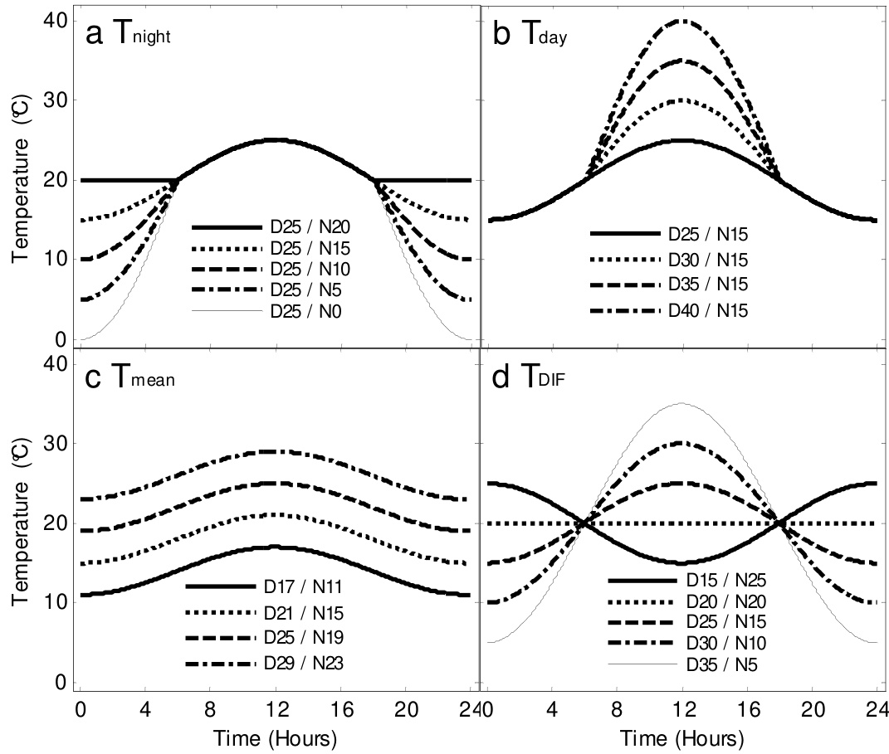  
图 3.4 四种温度敏感性研究的温度轨迹：a) 不同夜间温度$(T_{night})$；b) 不同白天高温$(T_{day})$；c) 不同平均温度$(T_{mean})$；d) 昼夜温差$(T_{DIF})$。

# 3.6 结果与讨论

在3.6.1至3.6.4节中，将展示并讨论模型在番茄产量$( \mathrm {  ~ g ~ } \{ \mathrm { D M } \} \ \mathrm {  ~ m } ^ { - 2 } )$方面的验证结果。在3.6.5节中，将讨论该模型与其他番茄产量模型的比较，以及与温室设计优化相关的产量模型方面。所有番茄产量模拟均使用相同的模型参数集进行。

# 3.6.1 温和温度条件下的模型验证

对于两个具有温和温度条件、不同全球辐射水平和$\mathrm { C O } _ { 2 }$浓度的荷兰商业温室（表3.3），该模型很好地模拟了番茄产量（图3.5）。仅在生产期结束时，种植者B的番茄产量被略微高估。温室A比温室B更高的作物产量是由于其更高的室外全球辐射。

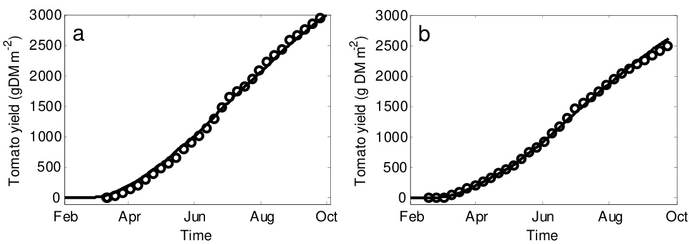  
图 3.5 荷兰温室中温和温度条件下，种植者A（a）和种植者B（b）的模拟番茄产量与测量值的比较。实线代表模拟值，圆圈代表测量值。

3.6.2 西班牙南部温度条件下的模型验证 使用西班牙南部的气候条件评估了非最佳温度对模型性能的影响。LT温室的番茄产量被较为准确地模拟（图3.6a）。累计测量的番茄产量$9 2 2 \textrm { g } \{ \mathrm { D M } \} \ \mathrm { m } ^ { - 2 }$被模型低估了$9 7 \textrm { \text g } \{ \mathrm { D M } \} \textrm { \ m } ^ { - 2 }$。这种差异不会对温室设计造成问题，因为误差将位于模型不确定性中。模拟产量的趋势与测量产量不同，这可能是由于从测量的番茄鲜重产量转换为计算的干物质产量时引入的误差。由于缺少随时间变化的测量值，在此转换中使用了恒定的干物质含量（DMC）。然而，根据Segura等人的研究（2009），在西班牙南部条件下，干物质含量在整个生产期间会发生变化，冬季DMC相对较低，夏季DMC相对较高。使用时间依赖的DMC将改善测量干物质产量的趋势。此外，测量作物产量的低估可能是由于将通用的生长抑制函数的基础温度应用于耐低温品种。为了进一步改善模拟结果，可以选择为每个品种校准这些基础温度。

对于HT温室，模型准确地预测了番茄产量（图3.6b）。仅在生产期结束时，由于模拟了最后一个果实发育阶段的干物质流出（公式3.7），而实际上植株上所有可销售的番茄都被收获，作物产量被略微低估。

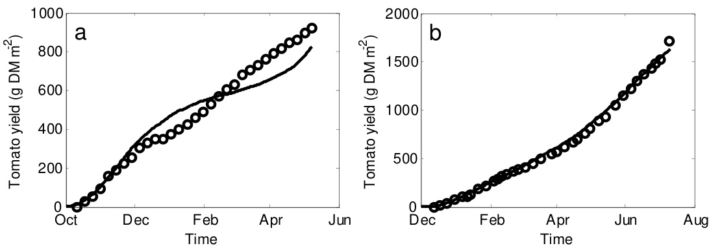  
图 3.6 西班牙南部的低技术温室（a）和高技术温室（b）中模拟番茄产量与测量值的比较。实线代表模拟值，圆圈代表测量值。

3.6.3 极端温度条件下的模型验证 将模拟产量与Adams等人（2001）测量的产量进行比较，可以观察到该模型较为准确地模拟了$1 4 ^ { \circ } \mathrm { C }$、$1 8 ^ { \circ } \mathrm { C }$、$2 2 ^ { \circ } \mathrm { C }$和$2 6 ^ { \circ } \mathrm { C }$平均温度制度对产量的影响（图3.7a，b）。

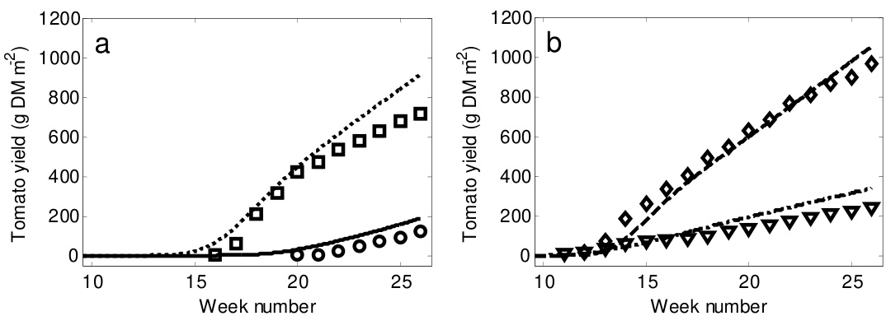  
图 3.7 播种后第$_ { I O }$周至26周期间，四种不同平均温度处理下的模拟番茄产量。图3.7a展示了$\scriptstyle { I 4 ^ { \circ } C }$（实线代表模拟值，圆圈代表测量值）和$\boldsymbol { { 1 8 ^ { \circ } C } }$（虚线代表模拟值，方块代表测量值）的作物产量。图$3 . 7 b$展示了$2 2 ^ { \circ } C$（虚线代表模拟值，菱形代表测量值）和$2 6 ^ { \circ } C$（点划线代表模拟值，三角形代表测量值）的作物产量。测量数据来源为Adams等人（2001）。

该模型正确地捕捉到了在非最佳平均温度$1 4 ^ { \circ } \mathrm { C }$和$2 6 ^ { \circ } \mathrm { C }$下产量的减少。具体而言，由于温度引起的生长抑制（公式（3.10）和图3.3），模拟的非最佳温度下作物产量的相对下降几乎等于测量的相对产量下降（表3.4）。然而，模型倾向于在生长周期结束时平均高估产量$3 3 \%$（表3.4）。这种高估可能是由于生长室条件与模型开发的温室条件不同所致。

表 3.4 四种温度处理下的模拟和实测产量值

| | 温度 (℃) | | | |
|-|----------|-|-|-|
| | 14 | 18 | 22 | 26 |
| 产量 (g {DM} m-2) | | | | |
| 实测值 | 123 | 720 | 970 | 241 |
| 模拟值 | 188 | 919 | 1057 | 340 |
| 相对于最大产量的百分比 (%) | | | | |
| 实测值 | 13 | 74 | 100 | 25 |
| 模拟值 | 18 | 87 | 100 | 32 |
| 模拟与实测的差异 (%) | 53 | 28 | 9 | 41 |

温度对首次果实采收的影响模拟结果与实测值高度吻合。具体而言，低温导致模拟的首次果实采收延迟，这是由于温度对营养生长速率和生殖生长速率的双重影响。然而，在低温条件下（$14^\circ\mathrm{C}$和$18^\circ\mathrm{C}$），模拟的首次果实采收时间早于实测值，而在高温条件下（$22^\circ\mathrm{C}$和$26^\circ\mathrm{C}$），模拟的首次果实采收时间则晚于实测值。在$14^\circ\mathrm{C}$和$26^\circ\mathrm{C}$条件下，模拟的首次果实采收时间相差5周，而实测值相差10周。这种低估是由营养生长期和生殖生长期的过程共同造成的，具体解释如下。

关于营养生长，我们使用详细模型描述中的公式(9.27)建立了与温度的线性关系模型。然而，测量结果表明，在次优温度下，作物需要更高的积温来完成营养生长期（Adams，个人交流，2009）。为了改进营养生长期的模拟，应在公式(3.8)的积温描述中引入基础温度。

生殖生长期所需的积温基于De Koning（1994）确定的果实发育速率公式(9.32)，这与Adams等人（2001）在相关测量中使用的积温不同。在较低温度下对果实生长期的低估是由于De Koning（1994）的积温较低，导致在$14^\circ\mathrm{C}$条件下模拟的生长期比Adams等人（2001）观察到的果实生长期短24天。

# 3.6.4 昼夜温度波动影响的模型评估

为了评估模型对昼夜温度波动的响应，将四种极端温度处理下的模拟作物收获响应趋势（图3.4、图3.8和图3.9）与文献中获得的收获响应（表3.1）进行了比较。低夜温对收获率的影响（图3.8a）表明，模型再现了辐射和温度对收获率的预期交互作用。与Martínez Mirón（2008）的研究一致，最佳夜温随PAR水平的增加而升高。具体而言，在低PAR水平下，最佳夜温为$5^\circ\mathrm{C}$，而在高PAR水平下，最佳夜温为$10–15^\circ\mathrm{C}$。此外，研究还证明了PAR在中等温度轨迹下对收获率的积极影响。例如，在$25^\circ\mathrm{C}/15^\circ\mathrm{C}$的昼夜处理下，低PAR水平下的收获率是高PAR水平下收获率（$123.1~\mathrm{g~m^{-2}~week^{-1}}$）的$55.2\%$。

尽管模型中包含了低夜温对番茄收获率的负面影响，但在低PAR水平下，模拟的番茄收获率随着夜温的降低而略有增加。这一结果与Martínez Mirón（2008）的研究一致，他在西班牙南部秋冬季节的持续遮荫条件下测量到，$13.2^\circ\mathrm{C}$的平均夜温比$15.2^\circ\mathrm{C}$的产量更高。这种效应是由于低夜温下维持呼吸损失较低。模型似乎对极低夜温无效，因为在$0^\circ\mathrm{C}$和$5^\circ\mathrm{C}$下仍然模拟出了合理的作物产量。这种高估是由于没有模拟低温下的致死损伤或激素失衡。然而，极低温度会通过平均温度对番茄产量的影响降低番茄产量率（图3.9a）。

图3.8b显示，过高的昼温降低了两种PAR水平下的收获率。在高PAR水平下，$40^\circ\mathrm{C}$最大昼温下的收获率是$25^\circ\mathrm{C}$最大昼温下收获率的$54.5\%$。这一结果与Zhang等人（2008）观察到的$35^\circ\mathrm{C}$处理下番茄产量比$25^\circ\mathrm{C}$处理下降$46.1\%$的结果一致。

140 a Tnight b Tday 120   
2 100   
生产速率（g DM m-2 周-1） 80 60 山 40 20 0 25/0 25/5 25/10 25/15 25/20 25/15 30/15 35/15 40/15 昼夜温度 $(^\circ\mathrm{C})$

与Adams等人（2001）的作物产量测量结果一致，图3.9a显示非最佳平均温度对两种PAR水平下的收获率都产生了负面影响。具体而言，在高PAR水平下，$14^\circ\mathrm{C}$平均温度下的收获率是$18^\circ\mathrm{C}$平均温度下收获率（$129.1~\mathrm{g~m^{-2}~week^{-1}}$）的$32.0\%$，而$26^\circ\mathrm{C}$平均温度下的收获率是$18^\circ\mathrm{C}$平均温度下收获率的$19.6\%$。这些结果与表3.1中显示的非最佳平均温度下作物产量减少的结果非常吻合。在非最佳平均温度下，番茄收获率在两种PAR水平下是相同的。具体而言，在非最佳温度下，由于温度依赖的生长抑制函数（公式(3.10)和图3.3），从缓冲到果实的碳流出减少，而光合作用产生的碳流入持续到缓冲饱和。在缓冲饱和时，光合作用受到抑制，导致作物产量值降低。因此，限制作物生长的因素不是PAR，而是温度。

低于$20^\circ\mathrm{C}$的DIF对收获率的影响很小（图3.9b），这与Mavrogianopoulos和Kyritis（1989）的研究结果非常一致，他们发现$6^\circ\mathrm{C}$和$18^\circ\mathrm{C}$的DIF下作物产量相似。相比之下，$30^\circ\mathrm{C}$的大DIF确实对作物收获率产生了负面影响。具体而言，对于高PAR水平，$35/5^\circ\mathrm{C}$处理下的收获率是$20/20^\circ\mathrm{C}$处理下收获率（$124.4~\mathrm{g~m^{-2}~week^{-1}}$）的$70.5\%$。模拟的收获减少是由$5^\circ\mathrm{C}$的次优夜温和$35^\circ\mathrm{C}$的超优昼温共同造成的。尽管模型没有明确描述极高DIF对番茄收获率的影响，但它正确地模拟了其对番茄收获率的影响。

120 a Tmean b TDIF   
2   
m 100   
生产速率 (g DM m-2 周-1) 680 40 山 20 0 17/11 21/15 25/19 29/23 15/25 20/20 25/15 30/10 35/5 昼夜温度 $( ^ { \circ } \mathrm { C } )$

3.6.5 从温室设计角度讨论模型性能 在园艺研究中，已经开发了大量番茄产量模型。就温室设计优化而言，与TOMGRO模型（Jones等，1991；Dayan等，1993）相比，本产量模型具有两个优势：1）模型模拟了作物对瞬时和昼夜平均温度极端值的响应，这意味着该模型可用于基于模型的温室设计方法中；2）模型以微分方程形式描述，具有连续可微的右侧，使我们能够将产量模型与第2章介绍的温室气候模型相结合，使用现有的常微分方程求解器求解微分方程，并利用基于梯度的优化算法优化温室设计。此外，该模型基于作物生理过程，描述了极端温度对番茄产量的最重要影响。这些作物生理过程在相关研究中是缺失的。具体而言，Ioslovich和Seginer（1998）限定了最低和最高温度，而Ooteghem（2007）通过在成本标准中引入一项来惩罚极端温度。

鉴于在广泛温度条件下获得的这些结果，该模型被认为足够准确，可用于开发基于模型的温室设计方法。然而，由于我们的目标是开发一种专注于优化一组设计元素的设计方法，可能忽略了或过度简化了一些相关模型方面。因此，当有更好或新的模块可用时，可以轻松地将其纳入设计方法中。这里将更详细地讨论一些可能提高基于模型设计方法通用性的问题。

为了提高通用性，应该开发除番茄之外的其他作物的产量模型，这些模型需要满足与番茄产量模型相同的要求。此外，温室气候模型的蒸腾模块（见第8.9节）也应相应调整。通过描述温度和其他气候变量对每个生长和发育过程（如坐果、落果和膜完整性）的影响，可能会提高番茄产量模型的性能。由于这些过程的模块不可用，本研究使用了两个集成的温度依赖性生长抑制函数。生长抑制函数基于文献值，因此光合作用效应可能已被这些函数捕获。由于模拟的光合作用已经依赖于温度，模型可能高估了非最佳温度对光合作用的影响。

然而，对非最佳温度条件下作物产量预测的初步分析表明，由于植物在缓冲中储存碳水化合物的能力，在抑制函数中加入光合作用效应并没有发挥重要作用，如图3.7和图3.8所示。

为了解决温室设计问题，必须确定作物产量的经济效益。由于本模型将干物质产量描述为温室气候的函数，因此应将干物质含量对番茄鲜重产量的影响纳入模型。此外，该DMC应被描述为生长介质电导率、室外气候变化（Segura等，2009）和非最佳温度（Adams等，2001）的函数。随后，必须将番茄质量纳入模型，因为它们决定了经济产量。根据Adams等（2001）的研究，番茄质量和可销售比例取决于温度和空气湿度。因此，当使用该模型进行最佳温室设计时，最好描述湿度对质量和产量的影响。为此，可以使用Liu等（2007）的番茄质量模型作为起点。模型中没有模拟大VPD对光合作用的直接影响。然而，当集成到基于模型的设计方法中时，大VPD会通过其对蒸腾作用和冠层温度的影响间接影响生长。此外，假设灌溉施肥对作物生长没有限制，而在实践中它可能偶尔会不理想。灌溉施肥对作物产量的影响可以通过Van Straten等（2006）的营养模型来描述。

由于温度对作物产量的影响是品种依赖性的（Camejo等，2005；Khayat等，1985；Adams等，2001；De Koning，1994），可以通过校准与生长抑制函数、光合作用函数和果实生长期相关的参数来提高模型性能。此外，使用基于Heuvelink（1996）的季节性依赖SLA，而不是恒定SLA，可能会提高模型性能。另外，通过在温度总和计算中引入基础温度，可能会改善营养生长期的估计。模型没有模拟极端温度对作物产量的长期影响，而在实践中极端温度确实会影响作物产量的长期表现（Yakir等，1986）。因此，模拟作物可能会错误地从极端温度中完全恢复。为了避免由此产生的高估产量影响温室设计优化问题，温室空气温度不得超过这些极端温度值。

# 3.7 结论

在本研究中，我们开发并验证了一个描述温室气候对番茄产量影响的产量模型。最终目标是将该模型应用于基于模型的方法中，为世界各地可能出现的各种气候和经济条件设计温室。我们进行了关于温度对番茄产量影响的文献调查，并将主要温度效应纳入了作物产量模型。

验证结果表明，该模型满足三个预定义的要求。特别是，该模型涵盖了室内气候和非最佳温度条件对作物产量的影响（要求1和2）。在没有校准模型参数的情况下，作物产量模型对四种温度条件下的作物产量水平进行了较为准确的预测。更详细地说，在荷兰和西班牙南部，考虑到不同的光照水平和$\mathrm{CO}_2$浓度，该模型对接近最佳和非最佳温度条件下的番茄产量进行了准确模拟。此外，该模型还较为准确地模拟了极低和极高平均温度对番茄产量和首次果实采收时间的不利影响。模拟的产量对极端昼夜温度波动的响应与文献值一致。由于所提出的模型由一组具有连续可微右侧的微分方程组成，因此也满足了要求3。本章和详细模型描述中提供了所有模型方程，以确保我们的同事能够实施和重现我们的研究结果。

鉴于在广泛温度条件下获得的这些结果，该模型被认为足够准确，可用于开发基于模型的温室设计方法。因此，所提出的模型将被集成到设计方法中，旨在为当地气候和经济条件设计最佳的温室。

# 致谢

我们感谢荷兰Pijnacker的"De Gebroeders Duijvestijn BV"；荷兰Pijnacker的"Grower Hooymans"；以及英国华威大学的Dr Steven Adams提供的作物产量数据。对于西班牙作物产量数据，我们感谢Francisco Belzunces，苗圃Frutas Nijasol，特别感谢Cajamar实验站"Las Palmerillas"的Mario和Juan José Magan Cañadas。我们感谢Hortimax España的Ignacio Rodríguez Gracia、Eduardo Rumí Ronda和Nelleke Koene帮助我们联系西班牙种植者。本研究是荷兰农业、自然保护和食品质量部资助的战略研究计划"生态系统、景观、海洋和区域的可持续空间发展"和"可持续农业"的一部分。

# 3.8 术语表

状态变量

$C$ 碳水化合物含量 mg {CH2O} m-2  
$D M$ 干物质含量 mg {DM} m-2  
$N$ 果实数量 m-2  
$T$ 温度 $^ { \circ } \mathrm { C }$

半状态变量

LAI 叶面积指数 m2 {leaf} m-2

MC 碳水化合物质量流量 mg {CH2O} m-2 s-1  
MN 果实数量流量 $\mathrm { m } ^ { - 2 } \mathrm { s } ^ { - 1 }$

24 24小时平均值  
Max 最大值  
Air 空气  
Min 最小值  
Buf 碳缓冲池  
Sum 求和  
Can 冠层  
End 周期结束  
Fruit 果实  
Har 收获  
Inst 瞬时温度效应  
$j$ 果实发育阶段  
Leaf 叶片  
Start 周期开始  
Stem 茎和根

# 第4章

温室气候-作物产量联合模型的敏感性分析

本章内容已作为论文提交至《生物系统工程》，论文题目为：基于模型的温室设计方法：第3部分，温室气候-作物产量联合模型的敏感性分析。

B.H.E. Vanthoor, E.J. van Henten, C. Stanghellini, P.H.B. de Visser

# Chapter 4

Sensitivity analysis of a combined greenhouse climate-crop yield model

The contents of this chapter have been submitted to Biosystems Engineering as a paper entitled: A methodology for model-based greenhouse design: Part 3, Sensitivity analysis of a combined greenhouse climate-crop yield model.

B.H.E. Vanthoor, E.J. van Henten, C. Stanghellini, P.H.B. de Visser

# 4.1 摘要

温室设计是一个优化问题，可以通过基于模型的温室设计方法来解决。由于优化因素数量众多，本研究的目的是确定对温室设计影响最大的参数。为此，我们对番茄的温室气候-作物产量联合模型进行了敏感性分析。该分析针对西班牙阿尔梅里亚的低技术温室和美国德克萨斯州的高技术温室进行。模拟结果表明，该模型能够生成真实的室内气候和作物产量数据。单变量敏感性分析结果显示，室外气候对温室系统性能的影响最大，其次是温室设计参数和温室气候设定值。因此，选择合适的温室位置至关重要。就设计参数而言，PAR仍然是温室生产系统的主要限制因素。为了提高作物产量，必须使用具有更高PAR透射率和NIR选择性白涂层的结构。此外，结果还表明是否安装了足够的气候控制能力，以及哪些温室设计参数可以调整以节省资源。另外，模型敏感性中明显的季节性模式表明需要可调节的覆盖参数。多变量敏感性分析揭示了PAR透射率和通风温度设定值对作物产量的强烈联合效应。因此，所提出的SA技术能够量化参数对收获率、资源消耗和室内气候的单一、组合和季节性影响。

# 4.2 引言

针对世界各地存在的各种条件，保护地栽培系统的最优设计可以被视为一个多因素优化问题（Van Henten等，2006），它依赖于作物经济回报与温室设施建设、维护和运营成本之间的定量权衡。由于该设计优化问题涉及的因素非常多，因此识别对经济权衡和温室设计影响最大的参数是有益的。模型敏感性分析（SA）是实现这一目的的合适技术。

在园艺科学中，一些研究人员已经将敏感性分析应用于温室气候模型和作物产量模型（Nijskens等（1991），Chalabi & Bailey（1991），Nava等（1998），Cooman & Schrevens（2007），Van Henten & Van Straten（1994），Van Henten（2003））。然而，他们都没有分析温室气候和作物产量的联合模型，也没有专门从温室设计的角度进行分析。因此，本研究的目标是使用敏感性分析技术以综合的方式解决这两个主题。

一些初步研究已经为调查提供了方向。Vanthoor等（2008b）揭示了番茄产量对单个温室设计参数的敏感性取决于其他参数的绝对值。此外，还发现作物产量对覆盖设计参数的敏感性随时间变化。在另一篇论文中，Vanthoor等（2008a）表明设计和气候管理是相互依赖的。基于这些初步发现，本研究决定分析一些关键性能指标对输入参数变化的敏感性，即设计参数、室外气候和室内气候设定值。特别注意了敏感性中的季节性效应。此外，除了各种研究中常见的单变量参数敏感性分析外，本研究还实施了多变量分析，以识别输入参数联合变化的影响。

本章的组织结构如下：首先，简要介绍用于温室设计的温室气候-作物产量模型，并确定关键性能指标；其次，描述两种SA技术：确定局部敏感性以单独指示相关输入参数的单变量分析，以及揭示两个输入参数联合效应的多变量分析；第三，为了展示SA结果如何依赖于温室设计和气候条件，针对两种不同的温室设计在不同气候条件下的应用进行了SA分析：西班牙阿尔梅里亚的低技术温室和美国德克萨斯州的高技术温室。将展示和讨论这两个案例的结果。

# 4.3 材料与方法

4.3.1 模型描述及分析的输入参数和模型输出

将描述番茄产量作为温室气候函数的模型（见第3章）嵌入到描述温室气候和资源消耗作为室外气候和温室设计参数函数的模型（见第2章）中。

该联合模型由一组常微分方程组成：

$$
\dot { X } = f \big ( X , U , D , P , t \big )
$$

其中$X$是包含室内气候变量、作物变量和资源消耗变量的状态向量，$\dot { X }$表示状态对时间的导数，$U$是气候设定值向量，$D$是室外气候向量，$P$是包含设计参数向量$P _ { d }$的模型参数向量，$t$（s）是时间。

为了聚焦敏感性分析，确定了温室设计和运营的关键性能指标。这些指标是作物产量以及能源、水和二氧化碳的消耗。在本研究中，确定了各种参数对这些性能指标的影响（图4.1）。获得的结果将为温室设计提供方向，因为最终在温室设计中，这些性能指标将被组合成一个需要优化的成本标准。该成本标准如下：

$$
\operatorname* { m a x } _ { P _ { i } } J ( X , U , D , P , t ) = - I n \nu e s t m e n t s + \int _ { t _ { 0 } } ^ { t _ { f } } q _ { \gamma _ { i e l l } } \dot { Y } i e l d - q _ { E } \dot { E } - q _ { w } \dot { W } - q _ { c o _ { 2 } } \dot { C } O _ { 2 } d t
$$

$$
[ \in \mathrm { m } ^ { - 2 } ]
$$

其中，Investments $( \notin \mathrm { m } ^ { - 2 } )$ 表示与温室设计投资相关的成本，$t _ { O }$ (s) 和 $t _ { f }$ (s) 分别表示模拟周期的开始和结束时间，$q$ 表示相关成本方面的价格系数，Yield $( \mathrm { k g } \mathrm { ~ m } ^ { - 2 } )$ 表示累计作物产量，$W$ 表示冠层蒸腾所需的水分消耗 $( \mathrm { k g } \mathrm { ~ \ m ~ } ^ { - 2 } )$，$C O _ { 2 }$ 表示 $\mathrm { C O } _ { 2 }$ 消耗量 $( \mathrm { m g ~ m } ^ { - 2 } )$，$E$ 表示能源消耗量 $( \textrm { W } \operatorname { m } ^ { - 2 } )$。变量 Yield、$W$、$C O _ { 2 }$ 和 $E$ 都属于状态变量集 $X$ 的成员。在这种方法中，劳动力、物流、温室设施的维护和施肥灌溉等因素未被考虑。

如公式(4.2)和图4.1所示，温室设计参数 $P _ { d }$、气候设定值 $U$ 和室外气候变量 $D$ 会影响温室系统状态变量的演变，从而影响上述性能指标。因此，我们决定不仅分析 $P _ { d }$、$U$ 和 $D$ 对作物产量以及能源、水和 $\mathrm { C O } _ { 2 }$ 消耗的影响，还分析它们对影响这些性能指标的中间温室状态变量的影响，即冠层温度 $( T _ { C a n } )$、温室空气温度 $( T _ { A i r } )$、空气中 $\mathrm { C O } _ { 2 }$ 浓度 $( C O _ { 2 A i r } )$ 和空气蒸汽压 $( V P _ { A i r } )$。

经济变量   
结构 敏感性分析 总计   
覆盖类型 室外气候,D 室内气候: 投资   
遮阳网 气候管理, U 温室 TCan, CO2Air,RAR 番茄 作物产量 气候 产量 经济 净财务   
白涂料 温室设计, Pd 模型 TAir,VPAir 模型 模型 结果   
保温幕   
加热系统 资源使用:   
冷却系统 水,能源,CO2, 电力   
$\mathrm { C O } _ { 2 }$ 增施 投资 净财务结果 最大化? 温室设计 否: 调整优化 温室设计 是:温室设计最优

# 4.3.2 敏感性分析技术

参数对模型输出的影响通过单变量分析确定，如第4.3.2.1节所述。使用这种方法可以揭示参数的平均影响和随时间变化的影响。第4.3.2.2节描述了用于评估两个温室参数联合影响的多变量分析。

# 4.3.2.1 单变量敏感性分析

在本研究中，使用了基于 Chalabi 和 Bailey (1991) 的归一化相对敏感性度量。该度量以离散时间形式定义为：

$$
S _ { z } ^ { X } \left( t _ { k } \right) = \frac { X _ { z _ { N o m } + \Delta z } \left( t _ { k } \right) - X _ { z _ { N o m } } \left( t _ { k } \right) } { \Delta z } \frac { z _ { N o m } } { \overline { { X } } _ { z _ { N o m } } }
$$

$$
t _ { k } = k \cdot \Delta t ; k = 0 , 1 , . . . N \mathrm { 且 } N = \big ( t _ { f } - t _ { 0 } \big ) / \Delta t
$$

其中，$S _ { z } ^ { X }$ 是状态变量 $X$ 对输入参数 $z$ 的归一化相对敏感性，$t _ { k }$ (s) 是时间，$z _ { N o m }$ 是输入参数的名义值，$\Delta z$ 是输入参数的偏差，$X _ { z _ { n o m } + \Delta z }$ 是输入参数偏差时的状态值，$X _ { z _ { n o m } }$ 是输入参数名义值后的状态值，$\overline { { X } } _ { z _ { n o m } }$ 是在整个模拟范围内评估的状态平均值，$\Delta t$ (s) 是模拟输出间隔，$N$ 是确定敏感性的总时间点数。相对敏感性度量优于绝对度量，以补偿各种输入参数和模型输出在尺度上的巨大差异。模型输出的相对敏感性可以解释为在时间点 $t _ { k }$ 处，相对于在整个模拟范围内评估的平均值，由相关输入参数名义值增加 $1 \%$ 引起的模型输出相对增加，以 $\%$ 表示。

除了参数对状态的影响外，还通过修改公式(4.3)确定了参数对状态时间导数的影响：

$$
S _ { z } ^ { \dot { X } } \left( t _ { k } \right) = \frac { \dot { X } _ { z _ { N o m } + \Delta z } \left( t _ { k } \right) - \dot { X } _ { z _ { N o m } } \left( t _ { k } \right) } { \Delta z } \frac { z _ { N o m } } { \dot { X } } \mathrm { ~ }
$$

采用这种方法是因为如公式(4.2)所示，温室设计的净收益由某些状态变量的时间导数决定，而不是由它们当前的绝对值决定。因此，分析参数对这些状态时间导数的影响可以提供有关参数季节性效应的有价值信息。第4.6.1节中的附录A提供了一些支持这种方法的细节。

在公式(4.3)和(4.4)中，输入参数 z 包括温室设计参数 $P _ { d }$、气候设定值 $U$ 和室外气候变量 $D$：

$$
z = \{ P _ { d } , U , D \}
$$

在当前研究中，这些参数使用固定的扰动因子 $h { = } 0 . I O$ 进行偏差，导致输入参数的绝对增加：

$$
\begin{array} { l r } { \Delta P _ { d } = h \cdot P _ { d \_ N o m } } \\ { \Delta U = h \cdot U _ { _ { N o m } } } \\ { \Delta D = h \cdot \left| D _ { _ { N o m } } \right| } \end{array}
$$

由于首选时间不变的输入参数偏差，室外气候变量 $D$ 使用室外气候变量绝对值的平均值进行偏差。由于全球辐射在夜间始终为零，因此仅在白天时段对辐射进行偏差。为了确定相对敏感性，首先使用名义输入参数模拟模型，然后使用扰动因子 $h$ 对每个选定的输入参数进行偏差，并再次模拟模型。使用由此产生的状态及其时间导数的演变来计算公式(4.3)和(4.4)的敏感性度量。

在本研究中，使用时间不变的缩放因子 $\frac { z _ { N o m } } { \overline { { X } } _ { z _ { N o m } } }$ 和 $\frac { z _ { N o m } } { \bar { \dot { X } } _ { z _ { N o m } } }$，而不是像 Chalabi 和 Bailey (1991) 以及 Van Henten (2003) 那样使用时间变化的缩放因子。这样做本质上是为了避免当状态值接近零时相对敏感性接近无穷大的情况，这会使相对敏感性的解释变得模糊。较大的相对敏感性可能是由于相关参数的高影响或状态或其导数的非常小的值引起的。此外，这样做是为了确保状态时间导数的平均相对敏感性等于生产周期结束时状态值的相对敏感性（见第4.6.2节中的附录B），这一特性在结果解释过程中被使用。为了简化结果的解释，对公式(4.3)和(4.4)的相对敏感性度量进行了修改。由于这些度量之间的相似性，仅描述公式(4.3)的修改。

对于敏感性结果的初步分析，引入了平均相对敏感性：

$$
\overline { { S } } _ { Z } ^ { X } = \frac { 1 } { N + 1 } \sum _ { k = 0 } ^ { k = N } S _ { Z } ^ { X } \left( t _ { k } \right)
$$

如第4.6.2节所述，状态时间导数的平均相对敏感性等于时刻$t _ { f }$处相似状态的相对敏感性。能量消耗率的平均相对敏感性为2表示当输入参数增加$1\%$时，整个模拟范围内的总能量消耗增加$2\%$。该性质仅在相对敏感性方程包含如公式(4.3)和(4.4)中的时间不变缩放因子时成立。

显然，如公式(4.7)所示的平均相对敏感性度量可能会得到接近零的较小值，尽管在所考虑的时间段内可能存在相当大的正负敏感性变化。因此，将公式(4.7)修改为绝对相对敏感性度量：

$$
\left| S _ { Z } ^ { X } \right| = \frac { 1 } { N + 1 } \sum _ { k = 0 } ^ { k = N } \Bigl | S _ { Z } ^ { X } \left( t _ { k } \right) \Bigr |
$$

正如Chalabi和Bailey (1991)以及Van Henten和Van Straten (1994)所证明的，模型输出的相对敏感性可能在每天基础上强烈波动。这些变化在本分析中具有重要意义。为了使季节性影响更加明显，对公式(4.3)和(4.4)进行了平滑处理：

$$
\begin{array} { l } { { S _ { z } ^ { X , S m o o t h } \left( t _ { k } \right) = \displaystyle \frac { 1 } { 2 N _ { S m o o t h } + 1 } \sum _ { j = - N _ { S m o o t h } } ^ { j = N _ { S m o o t h } } } \left( t _ { j } \right) , t _ { j } = t _ { k } + j \cdot \Delta t , }  \\ { { \displaystyle j = - N _ { S m o o t h } , - N _ { S m o o t h } + 1 , . . . N _ { S m o o t h } } } \end{array}
$$

其中，$N _ { S m o o t h }$是以下公式的整数部分：

$$
N _ { s m o o t h } = t _ { s m o o t h } / 2 \Delta t
$$

其中，$t _ { S m o o t h }$ (s) 是平滑周期。

# 4.3.2.2 多变量敏感性分析

多变量敏感性分析用于识别输入参数对模型输出的联合影响。在本研究中，"联合影响"意味着两个参数同时增加对模型输出的影响不同于它们各自影响的总和。为此，采用了Abusam等人(2001)提出的多变量敏感性分析方法。本质上，该方法使用线性回归元模型来近似敏感性响应面。该元模型的参数可能揭示参数敏感性中的交叉相关性。该方法包括以下步骤。

首先，为选定输入参数的一系列值生成模型输出。为了限制确定线性回归模型回归系数所需的模拟次数，使用了围绕标称参数向量的归一化二阶复合设计(Box & Draper, 1987)。对于2个输入参数，该设计需要9次模拟运行$( 2 ^ { n } + 2 n + 1$，其中$n$为评估的输入参数数量)。

然后，在模拟模型输出和相关输入参数值上拟合以下线性回归元模型：

$$
y ( t _ { f } ) = b _ { 0 } + b _ { 1 } p _ { 1 } + b _ { 2 } p _ { 2 } + b _ { 1 1 } { p _ { 1 } } ^ { 2 } + b _ { 2 2 } { p _ { 2 } } ^ { 2 } + b _ { 1 2 } p _ { 1 } p _ { 2 }
$$

其中 $y ( t _ { f } )$ 是模拟结束时 $t _ { f }$ 时刻的模型输出，$b$ 是回归系数，$p _ { I }$ 和 $p _ { 2 }$ 是表4.1中列出的输入参数的归一化参数。为了确定回归系数，将公式(4.11)改写为向量-矩阵表示法：

$$
Y = C \theta , \quad Y = { \left( \begin{array} { l } { y _ { 1 } } \\ { y _ { 2 } } \\ { \vdots } \\ { y _ { n } } \end{array} \right) } , C = { \left( \begin{array} { l l l l l l l } { 1 } & { p _ { 1 , 1 } } & { p _ { 2 , 1 } } & { p _ { 1 , 1 } ^ { 2 } } & { p _ { 2 , 1 } ^ { 2 } } & { \left( p _ { 1 } p _ { 2 } \right) _ { 1 } } \\ { 1 } & { p _ { 1 , 2 } } & { p _ { 2 , 2 } } & { p _ { 1 , 2 } ^ { 2 } } & { p _ { 2 , 2 } ^ { 2 } } & { \left( p _ { 1 } p _ { 2 } \right) _ { 2 } } \\ { \vdots } & { \vdots } & { \vdots } & { \vdots } & { \vdots } & { \vdots } \\ { 1 } & { p _ { 1 , n } } & { p _ { 2 , n } } & { p _ { 1 , n } ^ { 2 } } & { p _ { 2 , n } ^ { 2 } } & { \left( p _ { 1 } p _ { 2 } \right) _ { n } } \end{array} \right) } , \quad \theta = { \left( \begin{array} { l } { { - \mathrm { e } } } \\ { b _ { 1 } } \\ { b _ { 2 } } \\ { b _ { 1 1 } } \\ { b _ { 2 2 } } \end{array} \right) }
$$

其中 $n$ 是模拟运行的总次数。随后，回归系数向量 $\theta$ 通过以下公式估计：

$$
 { \hat { \theta } } = \bigl ( C ^ { T } C \bigr ) ^ { - 1 } C ^ { T } Y
$$

回归系数的显著性 $( p < 0 . l O )$ 使用 Montgomery 和 Peck (1992) 描述的 T 检验计算。最后，分析了该元模型的显著回归系数，因为它们包含了单个和组合输入参数对模型输出影响的信息。例如，显著的回归系数 $b _ { I 2 }$ 表明归一化输入参数 $p _ { I }$ 和 $p _ { 2 }$ 对模型输出有联合影响。

表4.1 Almeria和Texas温室最终作物产量对某些模型输入的组合敏感性分析的原始参数水平和归一化参数值。原始参数值的编码水平基于Box和Draper(1987)提出的围绕标称参数向量的归一化二阶复合设计。

| 地区 | 编码水平 x=-√2 | X=-1 | X=0 | X=1 | x=√2 | 归一化参数值 |
|------|---------------|------|-----|-----|------|--------------|
| **Almeria** | | | | | | |
| T RfPAR | 0.3272 | 0.41 | 0.61 | 0.81 | 0.8928 | p=(T RfPAR - 0.61)/0.2 |
| T RJNIR | 0.3272 | 0.41 | 0.61 | 0.81 | 0.8928 | p=(T RfNIR - 0.61)/0.2 |
| T RfFIR | 0.1172 | 0.2 | 0.4 | 0.6 | 0.6828 | p=(T RfFIR - 0.61)/0.2 |
| CO20ut | 299.3 | 320 | 370 | 420 | 440.7 | p=(CO20ut -370)/50 |
| TAir_VentOn | 20.17 | 21 | 23 | 25 | 25.83 | p=(TAir_vemtOn - 23)/2 |
| **Texas** | | | | | | |
| T RJPAR | 0.7793 | 0.8 | 0.85 | 0.9 | 0.9207 | p=(TRfPAR - 0.85)/0.05 |
| CO2Air_Exi0On | 517.16 | 600 | 800 | 1000 | 1082.84 | p=(CO2Air_Ext0n - 800)/200 |
| TAir_VentOn | 20.17 | 21 | 23 | 25 | 25.83 | p=(TAir_VentOn - 23)/2 |

4.3.3 两个案例研究：西班牙Almeria和美国Texas

为了展示敏感性分析结果如何依赖于温室设计和气候条件，本研究对两种不同气候条件下的温室设计进行了敏感性分析：西班牙Almeria的低技术温室和美国Texas的高技术温室。这些不同的设计是由当地气候条件决定的，代表了Almeria和Texas温室生产系统的现状。本节将介绍敏感性分析研究的相关假设，包括温室参数、室外气候、温室气候管理、作物条件以及敏感性分析中研究的参数。

# 4.3.3.1 Almeria和Texas的温室设计

低技术温室位于西班牙Almeria（北纬$3 6 ^ { \circ } 4 7 ^ { \circ }$，西经$2 ^ { \circ } 4 3 ^ { \circ }$，海拔$1 5 0 \mathrm { ~ m ~ }$）。这是一个三跨度的多隧道温室，覆盖材料为PE薄膜。温室气候管理的唯一手段是屋顶和侧面的通风装置以及季节性白涂料。高技术温室位于美国Texas（北纬$3 0 ^ { \circ } 2 1 ^ { \circ }$，西经$1 0 4 ^ { \circ } 0 0 ^ { \circ }$，海拔$1 4 7 0 \mathrm { ~ m ~ }$）。这是一个Venlo型温室，采用单层玻璃覆盖，配备管道加热、$\mathrm { C O } _ { 2 }$注入、屋顶通风和保温幕。两个温室设计的详细信息见附录C（见第4.6.3节）。

# 4.3.3.2 室外气候、温室气候管理和作物条件

表4.2展示了两地温室的室外气候、温室气候管理和作物条件的详细信息。为了确保两地敏感性分析结果的差异仅由温室设计和室外气候引起，两地采用了相同的生长期（8月$1 ^ { \mathrm { s t } }$至次年7月$1 ^ { \mathrm { s t } }$）和气候设定值。然而，根据实际数据，Almeria的季节性白涂料使用时间比Texas更早。气候控制策略如图4.2所示。

  
图4.2 基于气候设定值的两地温室气候控制策略。当温室内的$C O _ { 2 }$浓度低于$C O _ { 2 }$补充设定值时，就会进行$C O _ { 2 }$补充。气候设定值见表4.2。

表4.2 Almeria和Texas温室平均室外气候、温室气候管理和作物条件概览。最后一列表示是否对所列指标进行了敏感性分析。括号中的值代表标准差。点号表示该温室未使用相应的气候控制技术。

| | Almeria, 西班牙 | Texas, 美国 | 敏感性分析 |
|------|------|------|------|
| **室外气候 (D)** | | | |
| 总辐射量 (MJ m² 天-1) | 17.3 (7.1) | 17.8 (6.0) | + |
| 室外温度 (℃) | 17.6 (5.3) | 15.7 (9.4) | + |
| 室外水汽压 (kPa) | 1.3 (0.4) | 1.0 (0.6) | + |
| 室外相对湿度 (%) | 65.4 (17.7) | 52.6 (25.6) | + |
| 天空温度 (℃) | -0.4 (7.6) | -4.7 (12.6) | + |
| 土壤表面温度 (℃) | 18.0 (2.6) | 16.2 (3.7) | + |
| 风速 (m s-1) | 3.0 (2.3) | 2.9 (2.1) | + |
| **温室气候管理 (U)** | | | |
| 白涂料使用时间 | 8月1日-9月15日 4月16日-7月1日 | 5月16日-7月1日 | - |
| 通风开启温度 (℃) | 23 | 23 | + |
| 通风关闭温度 (℃) | 17 | 17 | + |
| 通风开启相对湿度 (%) | 90 | 90 | + |
| 通风关闭CO2浓度 (ppm) | 200 | 200 | + |
| 锅炉开启温度 (℃) | * | 18 | + |
| 保温幕开启温度 (℃) | * | 10 | + |
| CO2补充开启浓度 (ppm) | * | 800 | + |
| **作物条件** | | | |
| 初始叶面积指数 | 0.3 | 0.3 | 1 |
| 最大叶面积指数 | 2.5 | 2.5 | - |
| 生长周期开始时间 | 2002年8月1日 | 2007年8月1日 | |
| 生长周期结束时间 | 2003年7月1日 | 2008年7月1日 | |

# 4.3.3.3 模型模拟

模型通过使用Matlab $7 . 1 ^ { \circledast }$ 的可变时间步长ODE求解器求解微分方程进行模拟。模拟的输出间隔$\Delta t$为3600秒，平滑周期$t _ { S m o o t h }$根据实际需要选择为7天，即$6 . 0 { \cdot } 1 0 ^ { 5 } \mathrm { ~ s ~ }$。

# 4.3.3.4 敏感性分析

两个案例均采用以下三步程序进行研究。首先，使用室外气候数据对模型进行模拟。虽然不打算进行深入验证，但对生成输出的评估为模型至少能够产生现实输出提供了有价值的见解。其次，进行单变量敏感性分析。最后，进行多变量敏感性分析。

单变量敏感性分析中评估的参数列于表4.2的最后一列和附录C中表格的最后一列（见第4.6.3节）。对于某些温室设计参数，由于它们与其他温室设计参数相关，因此未进行敏感性分析。具体而言，由于透射率、反射率和吸收率的总和必须始终为1，因此对所有覆盖层（即屋顶、白涂料和保温幕）做出以下假设：a) 在分析光合有效辐射（PAR）和近红外辐射（NIR）透射率的影响时，NIR和PAR的吸收率保持不变；因此，PAR和NIR透射率的变化仅导致PAR和NIR反射率的变化；b) 在分析远红外辐射（FIR）发射率的影响时，FIR透射率保持不变；c) 在分析FIR透射率的影响时，FIR发射率保持不变。

对于多变量敏感性分析，所选参数的范围和归一化值见表4.1，同时附有基于Box和Draper（1987）复合设计程序的编码水平。为了减少潜在参数组合的数量，仅选择了一组有限的参数进行分析。仅选择那些预计会对最终作物产量产生综合影响的组合。太阳辐射、温度和$\mathrm { C O } _ { 2 }$浓度相互影响光合作用速率。由于预计这些气候变量会对作物产量产生综合影响，因此选择覆盖层的PAR透射率、通风温度设定点、Almeria的室外$\mathrm { C O } _ { 2 }$浓度和Texas的$\mathrm { C O } _ { 2 }$补充浓度设定点作为输入参数。Cooman和Schrevens（2007）揭示了太阳辐射强度和空气温度对果实重量的综合影响。因此，对于Almeria的温室，选择了影响太阳辐射和空气温度的输入参数，即：温室覆盖层的PAR、NIR和FIR透射率。

# 4.4 结果与讨论

在第3.1节中，展示了两组案例的标称模型模拟结果。然后，在第3.2至3.6节中，展示了模型的单变量和多变量敏感性分析结果。根据文献中的信息对结果进行了讨论，并提出了对温室设计的影响。在第4.4.7节中，讨论了所应用的敏感性分析。

# 4.4.1 标称模拟结果

显然，敏感性分析的价值取决于所分析模型的质量。有关温室气候模型和作物产量模型的详细描述和验证，请分别参见第2章和第3章。此外，在本研究中，我们检查了两个温室的模拟作物产量（图4.3a，b）和室内气候（图4.3c-f）的数量级是否与西班牙Almeria和美国Texas观察到的条件具有代表性。

正如预期的那样，Texas高技术温室的最终作物产量明显高于Almeria的低技术温室，后者的气候管理对生长的限制要大得多（图4.3c-e）。具体而言，高技术温室中的室内温度、总辐射和$\mathrm { C O } _ { 2 }$浓度比低技术温室更有利于作物生长。Almeria冬季的低收获率是由于次优平均温度对模拟番茄产量的负面影响以及低光照水平造成的，如第3章所述。

Texas的最终模拟番茄产量（每$\mathbf { m } ^ { 2 \cdot }$ 68公斤鲜重）与种植者的观察结果一致。Almeria的最终模拟番茄产量（每$\mathbf { m } ^ { 2 \cdot }$ 24公斤鲜重）略微高估了在西班牙南部条件下'raspa y amagado'温室中获得的$1 8 . 5 - 2 0 . 8 ~ \mathrm { k g }$ $\mathrm { m } ^ { - 2 }$的实测产量（Callejón-Ferre等，2009）。这种高估是由于模拟温室的通风性能优于'raspa y amagado'温室的有限通风，以及模拟考虑了比西班牙实际使用更长的生长期。

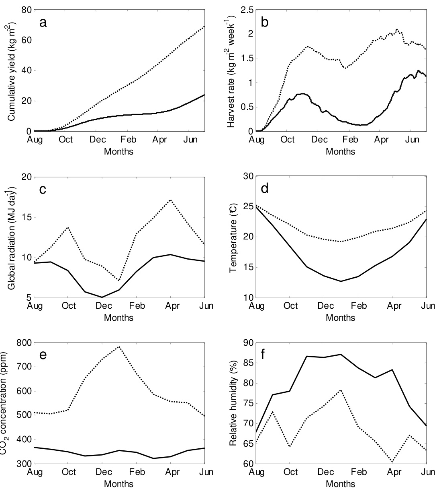  
图4.3 模拟作物产量(a)、收获率(b)，以及西班牙低技术温室（实线）和美国Texas高技术温室（虚线）从8月1日到7月1日的室内总辐射(c)、温室空气温度(d)、白天CO2浓度(e)和相对湿度(f)的月平均值。

# 4.4.2 温室设计参数的影响

根据对收获率的影响，计算的平均相对敏感性在表4.3至表4.8中进行了排序。这些表格提供了大量关于参数对温室性能影响的相关信息。在本章中，仅讨论最相关的发现。对于两个温室，温室屋顶的光谱特性和季节性白涂料对收获率的影响最大（表4.3和表4.4），即使在这两个室外总辐射水平相对较高的地点也是如此。

表4.3 Almeria低技术温室中收获率、用水量和室内气候变量对温室设计参数$P_d$的平均相对敏感性。"$w^{,,}$"表示平均相对敏感性低于0.005。仅列出对收获率影响最大的10个设计参数。注意，收获率、能源使用、水使用和$CO_2$使用的平均相对敏感性等于生产周期结束时的相对敏感性。

| | 收获率 | 用水量 | 冠层温度 | 空气温度 | CO2浓度 | 水汽压 |
|------|------|------|------|------|------|------|
| T RfPAR | 0.77 | 0.44 | 0.07 | 0.04 | 0.02 | 0.03 |
| TShScrPerPAR | 0.27 | 0.15 | 0.02 | 0.01 | 0.01 | 0.01 |
| T RJFIR | -0.24 | -0.18 | -0.06 | -0.04 | -0.01 | -0.04 |
| TRINIR | 0.1 | 0.19 | 0.06 | 0.04 | 0.02 | 0.03 |
| PFlrPAR | 0.09 | 0.05 | 0 | 0 | 0 | 0 |
| ERJFIR | -0.08 | -0.05 | -0.02 | -0.02 | -0.01 | -0.02 |
| P ShScrPerPAR | 0.06 | 0.02 | -0.01 | 0 | 0 | 0 |
| NGlob_Air | -0.04 | -0.02 | 0. | 0 | 0 | 0 |
| TShScrPerNIR | -0.03 | 0.03 | 0.02 | 0.01 | 0.01 | 0.01 |
| PFlrNIR | -0.03 | 0 | -0.02 | -0.01 | -0.01 | -0.01 |

特别是，屋顶的PAR透射率和遮阳涂料是提高收获率最重要的温室设计参数：在Almeria，全年屋顶PAR透射率增加1%会导致收获率增加0.77%，而在Texas，同样的PAR透射率增加仅导致收获率增加0.34%。Marcelis等人(2006)也描述了PAR对作物产量的这种积极影响。然而，增加PAR透射率可能会导致果实温度升高，从而对果实质量产生负面影响。本研究中使用的模型未考虑这一质量因素。

表4.4 Texas高技术温室中收获率、资源使用率和室内气候变量对温室设计参数$P_d$的平均相对敏感性。仅列出对收获率影响最大的10个设计参数。

| | 收获率 | 能源 | 水 | CO2 | 冠层温度 | 空气温度 | CO2浓度 | 水汽压 |
|------|------|------|------|------|------|------|------|------|
| T RfPAR | 0.34 | -0.14 | 0.24 | 0.09 | 0.07 | 0.03 | 0.12 | 0 |
| TShScrPerPAR | 0.07 | -0.02 | 0.04 | 0.01 | 0.02 | 0.01 | 0.03 | 0.01 |
| NGlob_Air | -0.06 | 0.01 | -0.01 | 0.01 | -0.01 | 0 | -0.03 | -0.01 |
| ExcO | 0.06 | 0 | 0 | 0.86 | 0 | 0 | 0.1 | 0 |
| PFlrPAR | 0.05 | 0.04 | 0.02 | 0.01 | 0 | 0 | 0.01 | 0 |
| T RINIR | -0.05 | -0.16 | 0.11 | 0.04 | 0.04 | 0.02 | 0 | 0 |
| hElevation | -0.02 | -0.05 | -0.1 | 0 | 0.02 | 0.01 | 0 | -0.03 |
| TShScrPerNIR | -0.02 | -0.03 | 0 | 0 | 0.02 | 0.01 | 0 | 0 |
| ERjFIR | 0.01 | 0.58 | -0.06 | -0.04 | -0.05 | -0.03 | -0.01 | -0.08 |
| EShSerPerFIR | 0.01 | 0.06 | 0.01 | -0.01 | -0.01 | -0.01 | 0 | -0.01 |

PAR透射率对Almeria收获率影响更大的原因有两点：1）Almeria温室的室内总辐射低于Texas（图4.3c），由于光合作用对PAR的非线性响应，在Almeria较低的PAR水平下增加PAR透射率对光合作用速率的影响相对大于在Texas较高的PAR水平下的影响；2）在Almeria，增加PAR透射率同时有利于光照和温度这两个生长因子，而在Texas，增加PAR仅有利于光照量，因为加热已经确保了所需的温度。

除了具有更高PAR透射率的覆盖材料和涂料外，还可以调整其他温室设计参数以提高收获率。在低技术温室中，增加FIR的透射系数和发射系数都显著降低了收获率（分别为-0.24和-0.08）。这是由于夜间温度较低造成的。这一结果与Nijskens等人（1991）的研究一致，他们证明了在无加热温室中，这些参数对温室空气温度的影响最大。

此外，NIR选择性涂料相对于传统涂料（PAR和NIR透射值相同）的潜在优势得到了明显体现。在两个地点，增加涂料的PAR透射系数有利于收获率（Almeria为0.27，Texas为0.07），而类似地降低涂料的NIR透射系数也有利于收获率（Almeria为-0.03，Texas为-0.02）。因此，通过NIR选择性涂料和传统涂料可以实现相同的温室太阳辐射减少，同时NIR选择性涂料还能提高作物产量。López-Marín等人（2008）证实了这一点，他们观察到在西班牙南部，从5月中旬到8月，使用NIR选择性涂料的甜椒产量高于传统涂料。

降低PAR透射率的设计参数在所有情况下都会降低收获率。例如，随着辐射拦截结构元素的增加，收获率下降，在低技术和高技术条件下的平均相对敏感性分别为-0.04和-0.06。这一结果表明，即使在光照不被认为是限制生产的地方，也需要"轻"结构。此外，增加地板的PAR反射系数显著有利于收获率（低技术为0.09，高技术为0.05）。与此结果相反，Lorenzo等人（2005）发现，在Almeria的无加热塑料温室中，通过使用覆盖物增加地板的PAR和NIR反射系数会降低黄瓜产量。具体来说，他们在相对寒冷的时期（秋季和春季）开始实验，由于土壤中储存的热量较少，导致温度较低。这些低温减缓了植物发育和LAI发育，导致作物产量降低。就这一机制而言，模拟作物产量受到相反的影响，因为在生长初期（8月）出现的高温条件下，较低的温度有利于作物产量。

敏感性分析清楚地表明了是否安装了足够容量的气候控制系统。由于增加锅炉容量对收获率没有好处（0，未显示），因此安装了足够的锅炉容量。然而，增加$\mathrm { C O } _ { 2 }$富集能力确实有利于收获率（0.06）。但增加$\mathrm { C O } _ { 2 }$富集能力会同时增加$\mathrm { C O } _ { 2 }$消耗（0.86）。这表明在额外产量和额外资源使用成本之间存在经济权衡。这一结果明确支持了多因素优化的必要性。

在分析高技术温室时，明确指出了在不影响收获率的情况下可能减少资源使用的温室设计参数。例如，可以通过多种方式节约能源，包括降低屋顶的FIR发射系数（0.58）、增加屋顶的NIR透射率（-0.16）、增加天沟高度（-0.08，未显示）、降低天沟到屋脊的高度（0.18，未显示）、降低温室地板的NIR反射系数（0.13，未显示）和降低锅炉容量（0.20，未显示）。这里简要解释其中一些节能措施背后的过程。

屋顶FIR发射系数对能源使用的大影响与Nijskens等人（1991）报告的结果一致。特别是，降低FIR发射系数会导致FIR反射系数增加，从而减少向天空发射的辐射，导致加热需求降低。

增加天沟高度由于温室缓冲能力更大，导致室内气候更加稳定，因此需要更少的通风来控制湿度，从而减少能源消耗。Raya等人（2006）在加那利群岛的遮阳棚中报告了类似的观察结果。相比之下，增加天沟到屋脊的高度会导致更高的对流热损失和更多的能源消耗，这是由于温室覆盖层表面积更大。这与Chalabi和Bailey（1991）的结果一致，他们证明了增加玻璃与地面的相对表面积确实由于更高的热损失而降低了室内空气温度。天沟和天沟到屋脊高度对能源消耗影响的巨大差异是由温室体积（V）与温室覆盖面积（A）的比率引起的。增加天沟高度会增加V/A比率，从而有利于缓冲效应，而增加天沟到屋顶的高度会降低V/A比率，从而有利于对流热损失。

在现实条件下降低天沟到屋脊的高度会对覆盖层的透射率产生负面影响，从而影响收获率。由于没有模拟覆盖层的角度透射率，这可能会抵消观察到的较低天沟高度对资源消耗的积极影响。

降低温室地板的NIR反射系数可能会减少能源消耗，因为它可以更多地利用土壤中的日常热储存。这与Nijskens等人（1991）的研究一致，他们也证明了地板太阳吸收系数对能源使用的巨大影响。

# 4.4.3 室外气候的影响

对于两种温室，总辐射、$\mathrm { C O } _ { 2 }$浓度和温度对平均收获率的影响最大（表4.5和表4.6）。总辐射的增加（Almeria为1.35，Texas为0.59）和$\mathrm { C O } _ { 2 }$浓度的增加（Almeria为0.62，Texas为0.17）对收获率有积极影响，而室外温度的增加在Almeria有利于收获率（0.36），在Texas则降低了收获率（-0.37）。

表4.5 Almeria低技术温室中收获率、用水量和室内气候变量对室外气候变量D的平均相对敏感性

| | 收获率 | 用水量 | 冠层温度 | 空气温度 | CO2浓度 | 水汽压 |
|------|------|------|------|------|------|------|
| Iglob | 1.35 | 0.81 | 0.21 | 0.14 | -0.01 | 0.19 |
| CO2out | 0.62 | 0.14 | -0.01 | -0.01 | 1.02 | 0.01 |
| Tout | 0.36 | 1.03 | 0.54 | 0.70 | -0.09 | -0.14 |
| VPout | 0.22 | -0.69 | 0.13 | 0.06 | 0.03 | 0.52 |
| Tsky | 0.10 | 0.05 | 0.04 | 0.03 | 0.02 | 0.03 |
| Tsoe | 0.07 | 0.05 | 0.03 | 0.02 | 0.02 | 0.03 |
| Vspeed | 0.05 | 0.08 | 0.01 | 0.01 | 0.01 | -0.02 |

表4.6 Texas高技术温室中收获率、资源使用率和室内气候变量对室外气候变量D的平均相对敏感性

| | 收获率 | 能源 | 水 | CO2 | 冠层温度 | 空气温度 | CO2浓度 | 水汽压 |
|------|------|------|------|------|------|------|------|------|
| Iglob | 0.59 | -0.68 | 0.48 | 0.29 | 0.15 | 0.08 | 0.14 | 0.06 |
| Tout | -0.37 | -0.54 | 0.15 | 0.30 | 0.18 | 0.24 | -0.45 | -0.18 |
| CO2out | 0.17 | 0 | 0 | -0.11 | 0 | 0 | 0.46 | 0 |
| VP out | -0.03 | -0.07 | -0.15 | 0.05 | 0.03 | 0.01 | -0.02 | 0.22 |
| Vspeed | -0.02 | 0.04 | 0.04 | 0.04 | -0.01 | -0.01 | -0.28 | -0.06 |
| Tsky | -0.02 | -0.26 | -0.01 | 0.03 | 0.03 | 0.02 | -0.01 | 0.05 |
| Tsoe | -0.01 | -0.15 | 0.01 | 0.01 | 0.01 | 0.01 | 0.01 | 0.01 |

Marcelis 等人 (2006) 的研究证明了作物产量对光照水平增加的正向响应，他们发现在温带温室气候条件下，果菜类蔬菜的光照每增加 1%，产量就会增加 0.7% 到 1%。总辐射对收获率的巨大影响可以用与上述覆盖材料透射率类似的方式解释。高科技温室的气候控制确保了其对室外气候的敏感性低于低技术温室。这一结果与 Castilla 和 Montero (2008) 的观察结果一致，他们发现地中海地区技术增强的优势在于为极端室外条件增加了安全性和稳定性。

与 Stanghellini 等人 (2008) 的研究一致，地中海温室中 $\mathrm { C O } _ { 2 }$ 富集的潜力得到了证实，因为室内平均 $\mathrm { C O } _ { 2 }$ 浓度增加 1.02% 会使 Almeria 的收获率增加 0.62%（表 4.5）。然而，必须进行包括投资成本在内的经济评估，以确认 $\mathrm { C O } _ { 2 }$ 富集的真正潜力。

此外，与 Nijskens 等人 (1991) 的研究一致，室外气候变量对模型输出的影响远大于设计参数对模型输出的影响（表 4.3-表 4.6）。这一结果证明了根据室外气候选择合适温室位置的重要性。

# 4.4.4 气候设定点的影响

在 Almeria，同时提高通风的相对湿度设定点（RHair_vent_on）和可以打开通风口的温度设定点（Tair_vent_off）会增加收获率（分别为 0.12 和 0.07），这是通过它们在低温（夜间）条件下对冠层温度的正向影响实现的（表 4.7）。显然，必须记住高湿度对病理学的可能影响没有被模拟。

表4.7 Almeria低技术温室中收获率、用水量和室内气候变量对温室气候设定点U的平均相对敏感性

| | 收获率 | 用水量 | 冠层温度 | 空气温度 | CO2浓度 | 水汽压 |
|------|------|------|------|------|------|------|
| RHair_vent_on | 0.12 | -0.13 | 0.08 | 0.07 | -0.10 | 0.16 |
| Tair_vent_off | 0.07 | -0.05 | 0.03 | 0.03 | -0.04 | 0.06 |
| Tair_vent_on | -0.07 | -0.35 | 0.14 | 0.12 | -0.11 | 0.44 |
| CO2air_vent_off |  | 0 | 0 | 0 | 0 | 0 |

在Texas，设定点对资源使用的影响远大于对收获率的影响（表4.8）。特别是，提高加热设定点（Tair_boil_on）会大幅增加能源使用（2.77）。提高通风温度设定点（Tair_vent_on）会增加收获率，同时减少所有资源的使用（能源-0.43，水-0.32，CO2 -0.71）。

表4.8 Texas高技术温室中收获率、资源使用率和室内气候变量对温室气候设定点U的平均相对敏感性

| | 收获率 | 能源 | 水 | CO2 | 冠层温度 | 空气温度 | CO2浓度 | 水汽压 |
|------|------|------|------|------|------|------|------|------|
| Tair_vent_on | 0.15 | -0.43 | -0.32 | -0.71 | 0.19 | 0.16 | 0.34 | 0.55 |
| Tair_boil_on | -0.08 | 2.77 | 0.15 | 0.14 | 0.39 | 0.39 | 0.16 | 0.27 |
| CO2air_ExtC02_on | 0.04 | 0 | 0 | 0.20 | 0 | 0 | 0.31 | 0 |
| RHair_vent_on | 0 | -0.07 | -0.02 | -0.09 | 0.01 | 0.01 | 0.10 | 0.02 |
| Tout_ThSer_on | 0 | -0.20 | 0 | 0 | 0.01 | 0.01 | 0.01 | 0.03 |
| Tair_vent_off | 0 | -0.02 | -0.01 | -0.03 | 0 | 0 | 0.02 | 0.01 |
| CO2air_vent_off | 0 | 0 | 0 | 0 | 0 | 0 | 0 | 0 |

这展示了配备主动冷却技术的半封闭温室的潜在优势。De Zwart (2008)发现，在荷兰和地中海条件下，半封闭温室确实会减少资源使用并提高作物产量。然而，要判断这种系统是否盈利，应该针对当地气候条件和价格变量进行经济评估。

关于最佳温室设计，气候设定点对资源使用有巨大影响，因此这些设定点也应该进行优化，因为资源成本是温室优化问题成本标准的一部分。正如Vanthoor等人(2008a)所展示的，气候设定点甚至会影响优化后的温室设计。

# 4.4.5 温室设计参数的时间效应

屋顶设计参数对收获率的影响是时间依赖性的，因为平均敏感性与绝对敏感性不同（表4.9）。此外，上下百分位值显示这些设计参数对收获率的影响随时间变化很大。

表4.9 Almeria和Texas地区收获率对屋顶PAR透射率、NIR透射率和FIR发射系数的平均相对敏感性和绝对相对敏感性。百分位值描述了相对敏感性的分布：10%的数据位于所示值以下（<10%）或高于所示值（>90%）。与这些设计参数相关的时间依赖性相对敏感性如图4.4所示。

| 地区 | 平均相对敏感性 | 绝对相对敏感性 | 相对敏感性低百分位(<10%) | 相对敏感性高百分位(>90%) |
|------|----------------|----------------|--------------------------|--------------------------|
| Almeria | | | | |
| TRfPAR | 0.77 | 0.77 | 0.305 | 1.265 |
| TRfNIR | 0.10 | 0.18 | -0.127 | 0.401 |
| ERfFIR | -0.08 | 0.09 | -0.221 | 0.000 |
| Texas | | | | |
| TRfPAR | 0.34 | 0.34 | 0.033 | 0.539 |
| TRfNIR | -0.05 | 0.05 | -0.119 | -0.002 |
| ERfFIR | 0.01 | 0.02 | -0.014 | 0.043 |

这种时间依赖性在图4.4中得到了更详细的展示，图中呈现了收获率对这些屋顶设计参数的平滑相对敏感性。在Almeria，PAR透射率对收获率的影响在生长期间波动很大，冬季的影响相对较低。而在Texas，PAR透射率对收获率的影响在冬季并未下降（图4.4）。

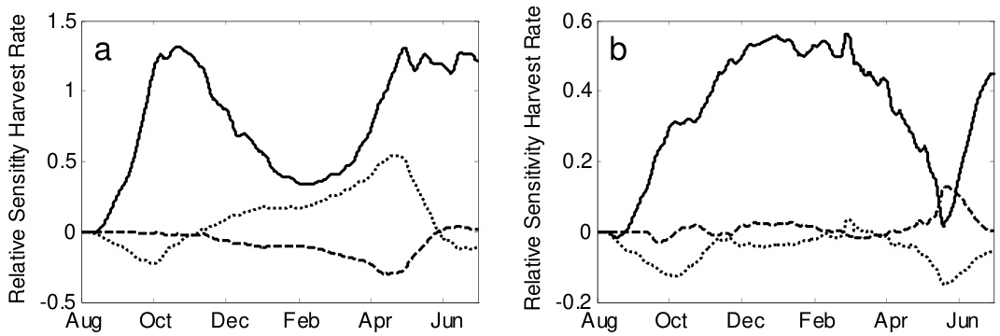  
图4.4 收获率对以下参数的相对敏感性：8月1日至7月1日期间，Almeria（a）和Texas（b）屋顶的PAR透射系数（实线）、NIR透射系数（虚线）和FIR发射系数（点线）。根据定义，相对敏感性轨迹的平均值与表4.9中呈现的平均相对敏感性相对应。

Almeria冬季PAR透射率影响较低似乎有违直觉，因为冬季温室内的总辐射非常低（图4.3c），因此增加温室内的PAR应该像在Texas一样有利于冬季作物生长。然而，图4.3c表明，在Almeria未加热的温室中，冬季冠层温度对于作物生产来说是次优的。因此，由于这些低温，作物无法有效利用PAR的增加。这一推理与Marcelis等人（2006）的研究结果一致，他们揭示了在低温下辐射对作物产量的相对积极影响会降低。在Texas，由于温度接近作物生长的最佳值，PAR的影响在冬季仍然很高。

一些设计参数的影响在正值和负值之间切换，这表明这些设计参数的选择需要在生产周期内进行权衡（图4.4）。例如，较高的NIR透射率在冬季有利于收获率（温度较高），而在生产期开始和结束时则会降低收获率（温度过高）。这一结果表明，需要具有可调节而非固定特性的覆盖材料，以便为每个季节实施最佳的覆盖特性。

# 4.4.6 两个模型输入对作物产量的综合影响

通过分析推导出的线性回归元模型的回归系数，揭示了输入参数对作物产量的综合影响（表4.10）。如公式(4.11)中回归系数$b _ { I 2 }$所量化的，结果表明作物产量显著受到以下综合增加的影响：a) Almeria屋顶的PAR和FIR透射系数（-0.83），b) 屋顶的PAR透射系数和通风温度设定点（Almeria为0.43，Texas为-0.06），以及c) Texas的通风温度设定点和CO2富集浓度设定点（0.27）。对于两个温室，均未发现PAR透射率和CO2浓度对作物产量的综合影响。

表4.10 公式(4.11)的回归系数b，用于确定模型输入对Almeria和Texas温室作物产量的综合影响。加粗数字表示回归系数显著$(p<0.10)$。

| 参数1 | 参数2 | b1 | b2 | b11 | b22 | b12 |
|-------|-------|----|----|-----|-----|-----|
| **Almeria,bo=32.08** | | | | | | |
| TRJPAR | TRINIR | 9.06 | 0.83 | -1.55 | -0.13 | 0.01 |
| TRfPAR | TRfFIR | 9.17 | -4.10 | -1.55 | 0.66 | -0.83 |
| TJPAR | Tair_vent_on | 8.72 | 0.31 | -1.45 | -0.42 | 0.43 |
| TRSPAR | C020ut | 8.70 | 3.38 | -1.44 | -0.79 | 0.01 |
| Tair_vent_on | CO20ut | 0.32 | 3.44 | -0.43 | -0.81 | 0.20 |
| **Texas,bo=68.48** | | | | | | |
| TRJPAR | Tair_vent_on | 1.60 | 0.96 | -0.14 | -0.07 | -0.06 |
| TRfPAR | CO2Air_ExtoOn | 1.62 | 0.98 | -0.13 | -0.36 | -0.06 |
| Tair_vent_on | CO2Air_ExtOn | 0.92 | 0.98 | -0.06 | -0.36 | 0.27 |

令人惊讶的是，屋顶PAR透射系数和通风温度设定点对作物产量的综合影响在Almeria为正，而在Texas为负。似乎在相对较低的辐射和温度水平下（如Almeria），两者的综合增加有利于作物产量。Almeria地区辐射和温度对作物产量的正向综合影响与Cooman和Schrevens（2007）在哥伦比亚波哥大高原无CO2富集的温室中报告的结果一致。PAR增加对作物产量的饱和效应通过相关的负回归系数$b_{II}$得到了清晰展示。在Texas，对10×10个输入参数组合模拟了通风温度设定点和CO2富集浓度设定点对作物产量的影响（图4.5）。

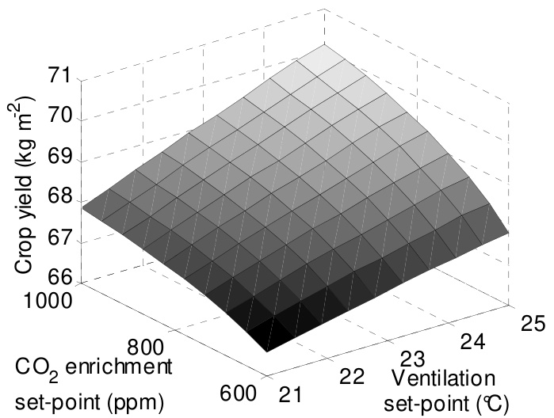  
图4.5 通风温度设定点（Tair_vent_on）和CO2富集浓度设定点（CO2air_Ext_CO2on）对Texas作物产量的综合影响

线性回归模型估计的作物产量与图4.5中模拟的作物产量之间的标准偏差为0.08。这一较小的标准偏差表明，围绕标称参数向量的归一化二阶复合设计对于准确确定回归系数非常有效。

需要注意的是，仅对预期会对作物产量产生综合影响的几组参数组合进行了分析。因此，预先选择这些组合意味着不会揭示意外的综合效应。

4.4.7 敏感性分析使用的方法 与其他敏感性研究（Van Henten & Van Straten, 1994; Cooman & Schrevens, 2007; Nijskens et al., 1991; Chalabi & Bailey, 1991; Nava et al., 1998; Van Henten, 2003; Vanthoor et al., 2008b）相比，本研究使用温室气候-作物产量综合模型同时分析了输入参数对作物产量、资源利用和室内气候的影响。这使得能够选择与设计优化相关的温室参数。此外，还评估了状态时间导数的敏感性，这为温室设计的季节性效应提供了有价值的信息。

作为初步研究，本研究重点关注温室设计参数和气候调节技术对作物产量和资源消耗的影响。

然而，为了进一步深入了解温室优化的相关设计方面，还应确定温室种植者的净利润对输入参数的敏感性。因此，我们目前正在将经济模型纳入温室气候-作物产量综合模型中，以确定作为作物产量、投资、资源消耗和劳动力函数的净利润。

这里简要讨论了平均相对敏感性值对模型精度和模拟精度的重要性。如第2章和第3章所述，温室气候-作物产量综合模型能够以相当高的精度预测室内气候和作物产量。此外，由于所呈现的敏感性基于状态值的变化，绝对模拟误差的影响减小，从而进一步降低了敏感性误差。通过选择ODE求解器的低最大相对误差，确保了模拟精度，使得模型精度不会影响敏感性结果。

尽管分析了季节性效应对敏感性和综合敏感性的影响，但本研究并未分析综合敏感性随时间的变化。然而，我们认为通过以下步骤也可以评估综合敏感性的时间演变：首先，必须确定归一化二阶复合设计的累积作物产量的时间导数。然后，需要在每个时间点计算累积作物产量时间导数的公式（4.11）的回归系数。最后，通过绘制这些时变回归系数，可以分析其时间演变。

本研究分析了标称温室设计参数值附近的敏感性。这种局部敏感性分析适合选择与设计优化最相关的温室设计参数。然而，为了确定更广泛设计参数值范围内的敏感性，应使用Helton等人（2006）的基于采样的敏感性分析，或如Chalabi和Bailey（1991）所做的那样，在广泛的参数值范围内评估平均局部敏感性。

# 4.5 结论

温室设计是一个优化问题，需要在作物的经济回报与温室设施的建造、维护和运营成本之间进行定量权衡。为了解决这个优化问题，我们开发了一种基于模型的温室设计方法。由于该优化问题涉及的因素非常多，识别那些对经济权衡和温室设计影响最大的参数是有益的。模型敏感性分析（SA）是实现这一目的的合适技术。

本研究的目的是识别对温室设计影响最大的参数。为此，对温室气候-番茄产量综合模型进行了敏感性分析，该模型是基于模型设计方法的关键组成部分。为了展示SA结果对温室设计和当地气候条件的依赖性，分别在西班牙Almeria的低技术温室和美国Texas的高技术温室条件下进行了分析。除了早期的验证实验外，使用Almeria和Texas的实际气候数据进行的模拟表明，该模型能够生成真实的室内气候和作物产量数据。然后，实施了单变量和多变量敏感性分析。结果表明，室外气候对温室系统性能的影响最大，其次是温室设计参数，最后是温室气候设定点。这表明选择合适的温室位置至关重要。

关于设计参数，PAR仍然是温室生产系统的主要限制因素。对于这两个地点，可以通过以下方式提高作物产量：提高覆盖物和涂白剂的PAR透射率；提高温室地板的PAR反射系数；以及减少温室结构元件的光吸收。由于涂白剂的NIR透射率对作物产量的影响与其PAR透射率的影响相反，因此NIR选择性涂白剂将提高两个地点的作物产量。对于没有加热系统的低技术温室，降低覆盖物的FIR透射系数和提高NIR透射系数将有利于作物产量，因为它们对冠层温度有积极影响。此外，单变量敏感性分析表明是否安装了足够的气候控制能力，以及必须调整哪些温室设计参数以节省资源。具体而言，对于高技术温室，增加CO2富集能力将有利于作物产量，而降低覆盖物的FIR发射系数将显著降低能耗。研究揭示了模型敏感性的明显季节性模式，例如覆盖材料的PAR透射率、NIR透射率和FIR发射系数。这表明具有可调节覆盖参数的温室设计将优于具有固定覆盖参数的温室设计。多变量分析揭示了参数对作物产量的强烈联合效应。PAR透射率和通风温度设定点的联合增加有利于两个温室的作物产量。

所提出的SA技术能够量化和比较输入参数对收获率、资源消耗和室内气候的单一、综合和季节性影响。本研究的结果将用于进一步开发基于模型的设计方法，旨在为地球上每个地点设计出最适合当地气候和经济条件的最佳温室。

# 致谢

本研究是荷兰农业、自然保护和食品质量部资助的战略研究计划"生态系统、景观、海洋和区域的可持续空间发展"和"可持续农业"的一部分。

# 4.6 附录

# 4.6.1 附录A

附录A解释了为什么在某些情况下需要确定状态时间导数的敏感性，而不是相关状态的敏感性。以"累积作物产量"状态为例进行了说明。

图A1.a和图A1.b分别展示了累积作物产量和收获率的假设值。随后，使用公式(4.3)和(4.4)计算了时间点50和80处累积作物产量和收获率的相对敏感性，假设$z _ { n o m } = 1$且$\Delta z = 0 . 1$：

累积作物产量相对敏感性：收获率相对敏感性：$\begin{array} { c c } { { t _ { k } = 5 0 ; } } &   S _ { z } ^ { X } \left( t _ { k } \right) = \displaystyle { \frac { 2 0 0 - 1 0 0 } { 0 . 1 } \frac { 1 } { 1 0 0 } } = 1 0 \qquad \begin{array} { c c } { { } } & { { t _ { k } = 5 0 ; } } \\ { { } } & { { } } \\ { { t _ { k } = 8 0 ; } } & { { S _ { z } ^ { X } \left( t _ { k } \right) = \displaystyle { \frac { 2 8 0 - 1 6 0 } { 0 . 1 } \frac { 1 } { 1 0 0 } } = 1 2 \qquad \begin{array} { c c } { { } } & { { } } \\ { { } } & { { t _ { k } = 8 0 ; } } \end{array} } } & { { S _ { z } ^ { \dot { X } } \left( t _ { k } \right) = \displaystyle { \frac { 4 - 2 } { 0 . 1 } \frac { 1 } { 2 } = 1 0 \left( \begin{array} { c } { { } } \\ { { } } \\ { { 0 . 1 } } \end{array} \right) } } } \end{array} \end{array}$

值得注意的是，在时间点$t _ { k }$为80时，作物产量对参数扰动敏感$( S _ { Z } ^ { X } \left( t _ { k } \right) = 1 2 )$，而收获率却不受该参数影响（图A1.b），这通过收获率的相对敏感性$( S _ { Z } ^ { X } \left( t _ { k } \right) = 0 )$得到了很好的体现。因此，在本研究中，我们使用收获率敏感性而不是累积作物产量敏感性来揭示输入参数影响的季节性效应。

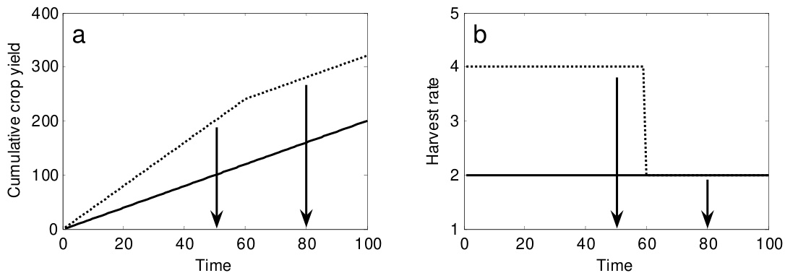  
图A1 使用标称输入参数（实线）和偏离输入参数（虚线）模拟的累积作物产量(a)和相应的收获率$( b )$。此处展示了假设值以简化解释。

# 4.6.2 附录B

附录$\mathbf { B }$证明了状态时间导数的平均相对敏感性$\overline { { S } } _ { z } ^ { \dot { X } }$等于生产周期结束时状态值的相对敏感性$S _ { z } ^ { X } \left( t _ { f } \right)$：

$$
\overline { { S } } _ { Z } ^ { \dot { X } } = S _ { Z } ^ { X } \left( t _ { f } \right)
$$

其中：

$$
\dot { X } \left( t _ { k } \right) = \frac { d X \left( t _ { k } \right) } { d t } { \cdots } ~ X \left( t _ { 0 } \right) + \sum _ { k = 0 } ^ { k = N } \dot { X } \left( t _ { k } \right) \cdot \Delta t = X \left( t _ { f } \right)
$$

由于确定时间导数平均相对敏感性的所有状态变量的初始条件均为零，公式(B.2)可改写为：

$$
\sum _ { k = 0 } ^ { k = N } \dot { X } \left( t _ { k } \right) = \frac { 1 } { \Delta t } \left( X \left( t _ { f } \right) \right)
$$

根据定义：

$$
\overline { { \dot { X } } } _ { Z _ { N o m } } = \frac { 1 } { N + 1 } \sum _ { k = 0 } ^ { k = N } \dot { X } _ { Z _ { N o m } } \left( t _ { k } \right)
$$

根据Chalabi和Bailey(1991)的相对敏感性定义：

$$
S _ { z } ^ { X } \left( t _ { f } \right) = \frac { X _ { z _ { N o m } + \Delta z } \left( t _ { f } } \right) - X _ { z _ { N o m } } \left( t _ { f } \right) } { \Delta z } \frac { z _ { N o m } } { X _ { z _ { N o m } } \left( t _ { f } \right) }
$$

状态时间导数的相对敏感性描述如下：

$$
S _ { z } ^ { \dot { X } } \left( t _ { k } \right) = \frac { \dot { X } _ { z _ { N o m } + \Delta z } \left( t _ { k } \right) - \dot { X } _ { z _ { N o m } } \left( t _ { k } \right) } { \Delta z } \frac { z _ { N o m } } { \dot { X } } \mathrm { ~ }
$$

根据第4.3.2.1节公式(4.7)，状态时间导数的平均相对敏感性描述如下：

$$
\overline { { S } } _ { Z } ^ { \dot { X } } = \frac { 1 } { N + 1 } \sum _ { k = 0 } ^ { k = N } S _ { Z } ^ { \dot { X } } \left( t _ { k } \right)
$$

结合公式(B.6)和(B.7)：

$$
\overline { { S } } _ { Z } ^ { \dot { X } } = \frac { 1 } { N + 1 } \sum _ { k = 0 } ^ { k = N } \frac { \dot { X } _ { z _ { N o m } + \Delta z } \left( t _ { k } \right) - \dot { X } _ { z _ { N o m } } \left( t _ { k } \right) } { \Delta z } \frac { z _ { N o m } } { \dot { X } _ { z _ { N o m } } }
$$

重新排列公式(B.8)：

$$
\overline { { S } } _ { Z } ^ { \dot { X } } = \frac { 1 } { N + 1 } \frac { 1 } { \overline { { \dot { X } } } _ { z _ { N o m } } } \frac { z _ { N o m } } { \Delta z } \Bigg ( \sum _ { k = 0 } ^ { k = N } \dot { X } _ { z _ { N o m } + \Delta z } \big ( t _ { k } \big ) - \dot { X } _ { z _ { N o m } } \big ( t _ { k } \big ) \Bigg )
$$

结合公式(B.4)和(B.9)得到：

$$
\overline { { S } } _ { Z } ^ { \dot { X } } = \frac { 1 } { N + 1 } \frac { 1 } { \displaystyle \frac { 1 } { N + 1 } \sum _ { k = 0 } ^ { k = N } \dot { X } _ { Z _ { N o n } } \left( t _ { k } \right) } \frac { \mathcal { Z } _ { N o n } } { \Delta z } \left( \sum _ { k = 0 } ^ { k = N } \dot { X } _ { z _ { N o n } + \Delta z } \left( t _ { k } \right) - \sum _ { k = 0 } ^ { k = N } \dot { X } _ { z _ { N o n } } \left( t _ { k } \right) \right) \quad [ - 1 \mathrm { ( } \dot { N } + 1 \mathrm { ) } ] .
$$

使用公式(B.3)重写公式(B.10)，从而证明公式(B.1)的陈述：

$$
\overline { { S } } _ { Z } ^ { \dot { X } } = \frac { X _ { z _ { N o m } + \Delta z } \left( t _ { f } \right) - X _ { z _ { N o m } } \left( t _ { f } \right) } { \Delta z } \frac { z _ { N o m } } { X _ { z _ { N o m } } \left( t _ { f } \right) }
$$

4.6.3 附录C 西班牙阿尔梅里亚低技术温室和美国德克萨斯高技术温室的温室设计参数及敏感性分析（预设温室设计参数根据敏感性研究重新评估，表明温室设计不包含相应的设计参数）

| 温室设计参数, Pd | 参数 | 单位 | 西班牙阿尔梅里亚 | 美国德克萨斯 | SA |
|----------------|------|------|----------------|------------|----|
| 结构 | | | | | |
| 温室结构元件吸收的全球辐射比例 | nGlob_Air | | 0.05 | 0.1 | + |
| 温室覆盖层平均坡度 | 4 | 0 | 拱形温室 | 22 | |
| 包括侧墙的覆盖层表面积 | Acov | m | 1.15×10³ | 9.0×104 | |
| 温室地板表面积 | AFlr | m | 0.63×10 | 7.8×104 | + |
| 取决于温室形状的覆盖层与室外空气的对流热交换参数 | CHECin | W m² K⁻² | 2.21 | 1.86 | + |
| Codies | | | | | |
| | | | | 2821 | + |
| 热幕下方温室隔间高度 | hAir | m | 3 | 4.65 | + |
| 温室海拔高度 | hElevation | m | 150 | 1470 | + |
| 温室平均高度 | hGh | m | 4.37 | 5.06 | + |
| 通风特性 | | | | | |
| 昆虫网的孔隙率 | SInsser | | 0.33 | * | + |
| 屋顶通风面积与地板面积比 | ARoo/AFlr | m | 0.13 | 0.18 | + |
| 侧墙通风面积与地板面积比 | ASidelAFlr | m | 0.09 | * | + |
| 取决于温室形状的通风排放系数 | Ch | | 0.65 | 0.65 | + |
| 取决于温室类型的温室泄漏系数 | Cleakage | | 1×10⁻⁴ | 1×10⁻⁴ | + |
| 取决于温室形状的通风全局风压系数 | W CGh | | 0.07 | 0.09 | + |
| 侧墙中点之间的垂直距离 | hsideRoof | m | 3 | * | + |
| 单个通风口的垂直尺寸 | hvent | m | * | 0.97 | + |
| 屋顶 | | | | | |
| 屋顶的FIR发射系数 | &RfFIR | | 0.5 | 0.85 | + |
| 屋顶层密度 | pRf | kg m⁻³ | 0.93×10 | 2.6×10 | |
| 屋顶的NIR反射系数 | P RfNIR | | 0.34 | 0.13 | |
| 屋顶的PAR反射系数 | PRfPAR | | 0.34 | 0.13 | |
| 屋顶的FIR反射系数 | PRfFIR | | 0.1 | 0.15 | |
| 屋顶的NIR透射系数 | TRfNIR | | 0.61 | 0.85 | + |
| 屋顶的PAR透射系数 | TRfPAR | | 0.61 | 0.85 | + |
| 屋顶的FIR透射系数 | TRfFIR | 1 | 0.4 | 0 | + |
| 温室屋顶的热导率 | 2Rf | W m⁻¹ K⁻¹ | 0.2 | 1.05 | + |
| 屋顶层的比热容 | Cp.Rf | J K⁻¹ kg⁻¹ | 2.5×10 | 0.84×10 | + |
| 屋顶层厚度 | hRf | m | 0.25×10⁻³ | 4×10³ | |
| 白涂料 | | | | | |
| 白涂料的FIR发射系数 | εShScrPerFIR | | 0.9 | 0.9 | + |
| 白涂料密度 | PshScrPer | kg m⁻³ | 1×10 | 1×10 | - |
| 白涂料的NIR反射系数 | PShScrPerNIR | | 0.3 | 0.3 | + |
| 白涂料的PAR反射系数 | PShScrPerPAR | | 0.3 | 0.3 | + |
| 白涂料的FIR反射系数 | PShScrPerFIR | | 0.05 | 0.05 | - |
| 白涂料的NIR透射系数 | TShScrPerNIR | | 0.6 | 0.6 | + |
| 白涂料的PAR透射系数 | TShScrPerPAR | | 0.6 | 0.6 | + |
| 白涂料的FIR透射系数 | TShScrPerFIR | | 0.05 | 0.05 | + |
| 白涂料的比热容 | Cp,ShScrPer | JK1kg | 4.18-10 | 4.18-10 | + |
| 白涂料的厚度 | hshScrPer | m | 0.2·10-3 | 0.2-10-3 | |
| **保温幕** | | | | | |
| 保温幕的FIR发射系数 | EThScrFIR | | * | 0.44 | + |
| 保温幕的密度 | PThScr | kg m3 | * | 0.2·10 | |
| 保温幕的NIR反射系数 | PThScrNIR | | * | 0.7 | + |
| 保温幕的PAR反射系数 | PThScrPAR | | * | 0.7 | + |
| 保温幕的FIR反射系数 | PThScrFIR | | * | 0.45 | |
| 保温幕的NIR透射系数 | ThScrNIR | | * | 0.25 | + |
| 保温幕的PAR透射系数 | TThScrPAR | | * | 0.25 | + |
| 保温幕的FIR透射系数 | ThScrFIR | | * | 0.11 | + |
| 保温幕的比热容 | Cp.ThScr | Jkg1K-1 | * | 1.8·10 | + |
| 保温幕的厚度 | hThScr | m | * | 0.35-10-3 | |
| 保温幕的通量系数 | KThScr | m³ m² K-0.66s-1 | * | 0.25-10-3 | + |
| **地面** | | | | | |
| 温室地面的FIR发射系数 | &Flr | | 1 | 1 | + |
| 地面的密度 | PFlr | kg m-3 | 2300 | 2300 | 1 |
| 地面的NIR反射系数 | PFlrNIR | 1 | 0.5 | 0.5 | + |
| 温室地面的PAR反射系数 | PFlrPAR | | 0.65 | 0.65 | + |
| 地面的热导率 | Flr | Wm1K1 | 1.7 | 1.7 | + |
| 地面的比热容 | Cp.Flr | JK1kg1 | 0.88-10 | 0.88-10 | + |
| 温室地面的厚度 | hFlr | m | 0.02 | 0.02 | |
| **土壤特性** | | | | | |
| 土壤的容积热容 | pcp.So | Jm³K1 | 1.73-106 | 1.73·106 | + |
| 土壤层的热导率 | so | Wm1K1 | 0.85 | 0.85 | + |
| **加热系统** | | | | | |
| 加热管的FIR发射系数 | EPipe | - | * | 0.88 | + |
| 加热管的外径 | Pipe,e | m | * | 51-10-3 | |
| 加热管的内径 | Pipe,i | m | * | 47:10-3 | - |
| 每平方米加热管的长度 | lpipe | m m² | * | 1.25 | + |
| **主动气候控制** | | | | | |
| 外部CO2源的容量 | ExtC02 | mg s-1 | * | 4.3·105 | + |
| 锅炉的热容量 | PBoil | W | * | 13.9-106 | + |

# 第5章

评估西班牙条件下不同温室的经济模型

本章内容已作为论文提交至《生物系统工程》，论文标题为：基于模型的温室设计方法：第四部分，评估西班牙条件下不同温室的经济模型。

B.H.E. Vanthoor, J.C. Gázquez, J.J. Magán, M.N.A. Ruijs, E. Baeza, C. Stanghellini, E.J. van Henten, P.H.B. de Visser

# Chapter 5

An economic model to evaluate different greenhouses under Spanish conditions

The contents of this chapter have been submitted to Biosystems Engineering as a paper entitled: A methodology for model-based greenhouse design: Part 4, An economic model to evaluate different greenhouses under Spanish conditions.

B.H.E. Vanthoor, J.C. Gázquez, J.J. Magán, M.N.A. Ruijs, E. Baeza, C. Stanghellini, E.J. van Henten, P.H.B. de Visser

# 5.1 摘要

作为基于模型设计方法的关键组成部分，我们开发了一个经济模型，用于设计适应广泛气候和经济条件的温室。该经济模型与现有的温室气候-作物产量模型相结合，用于计算温室的年度净财务结果(NFR)。本研究的目的是在西班牙南部条件下，从十个预定义的设计方案中找出番茄生产年度NFR最高的温室。基本设计包括parral温室或多隧道温室，可能配备加热、雾化和$\mathrm{CO}_2$富集的任意组合。结果表明，仅配备雾化系统的多隧道温室最有利可图，其次是配备加热、$\mathrm{CO}_2$富集和雾化系统的多隧道温室。然而，这种设计与简单parral温室之间的NFR差异相对于投资差异较小。对两种技术极端的NFR进行敏感性分析表明，番茄价格、可销售产量比例和覆盖物的光合有效辐射透射率对NFR影响最大。随着技术水平的提高，NFR对室外气候的依赖减少，而对番茄价格的依赖增加。这表明低技术温室降低了不同年份价格路径变化的风险，而高技术温室更好地覆盖了"天气风险"。最佳设计还受到气候管理和气候调节技术联合影响的影响。这些结果表明，基于模型的设计方法可以应对多因素设计方面的问题。

# 5.2 引言

本章包含经济模型的描述。该模型将年度净财务结果(NFR)描述为作物产量、可变成本以及建筑折旧和维护的函数。为了展示基于模型设计方法的可行性，经济模型与温室气候-番茄产量模型相结合，用于评估西班牙南部条件下不同番茄生产温室的经济表现。

在西班牙南部的阿尔梅里亚省，约有$27000\ \mathrm{Ha}$的温室，其中$99\%$是低成本结构，覆盖塑料，通过手动调节开口作为主要的气候控制手段(Magán等，2008)。这种温室的低生产率通常归因于有限的气候控制手段(Castilla & Montero，2008)。单一设计因素的改进已被广泛研究：例如，温室的气密性(López等，2001)，通风率的提高(Pérez-Parra等，2004)，覆盖物坡度的增加(Soriano等，2004)，覆盖物类型(Magán等，2008)，加热系统(López等，2008)，冷却系统(Gázquez等，2008；Meca等，2007；Antón等，2006)，通风设计(Pérez-Parra等，2004；Baeza等，2009)和$\mathrm{CO}_2$富集(Stanghellini等，2008)。然而，大多数研究确定的是对生产率的影响，而不是经济表现的改善。此外，通过一次分析一个因素无法客观比较不同的温室设计，因为"最佳"修改可能需要同时调整多个设计因素。

因此，本工作的目标首先是确定在预定义的十个设计方案中年度NFR最高的温室：低技术的西班牙parral和配备各种气候管理工具组合的多隧道温室，然后通过应用于温室气候-作物产量模型和经济模型的敏感性分析来选择有前景的设计改进。作为预定义温室集合的起点，选择了仅具有自然通风的parral，因为这种温室代表了当前状态。导致这种类型温室低生产率的因素已被确定为：a)非常开放的结构使昆虫能够进入并降低资源效率(López等，2001)，b)通风率不足(Pérez-Parra等，2004)，c)低覆盖坡度降低了冬季的光线透射率(Soriano等，2004)，并可能使冷凝水滴落在冠层上，从而增加疾病的发生率。改进温室设计的第一步是优化结构，而不是实施昂贵的气候调节技术(Castilla & Montero，2008)。因此，作为第二个选择，选择了仅具有自然通风的多隧道拱顶温室，因为这种类型的温室满足了上述大多数缺点。改进温室设计的第二步是选择适合当地气候的"温室技术设计包"，以满足全年供应高质量产品的需求(Castilla & Hernandez，2007)。因此，具有自然通风的多隧道逐渐配备了更多(组合)的气候调节技术，如$\mathrm{CO}_2$富集、雾化系统和加热系统。

先前的工作表明，影响NFR的方面受到几个因素的影响，如室外气候条件(Vanthoor等，2009)、温室气候设定点(Vanthoor等，2008a)和设计参数的联合影响(第4章)。因此，我们想在本研究中证明，最佳温室设计确实是一个多因素优化问题。这是通过分析室外气候条件年度变化和番茄价格轨迹的不确定性对温室设计的影响来实现的。本章的组织结构如下：首先描述用于确定年度NFR和投资的经济模型，然后介绍应用的敏感性分析技术，接着是从低技术到高技术温室的设计方案集合。随后，描述了三个评估研究，即不同设计的NFR评估、低技术和高技术温室的敏感性分析以及不确定性分析。最后，展示了最佳温室设计和设计改进的结果，并讨论了设计问题的多因素特征及其对基于模型的温室设计方法的影响。

# 5.3 材料与方法

# 5.3.1 经济模型描述

第1章介绍了基于模型设计方法的总体描述。温室气候-作物产量模型将方法的输入与温室的经济指标联系起来。具体来说，从每小时的室外气候、气候设定点和选定的温室设计，温室气候模型(见第2章)确定每小时的室内气候和资源消耗。随后，产量模型(见第3章)根据计算的室内气候计算番茄产量。这里描述了用于确定净财务结果(NFR)和总投资的经济模型，作为作物产量、可变成本和选定温室设计的函数。

描述NFR所需的经济状态变量被添加到温室气候-作物产量组合中。这些状态变量的时间导数用状态符号上方的点表示，相关的经济参数值见表5.1。为了比较不同的温室设计，使用了年度净财务结果$Q_{NFR}(\in \mathrm{m^{-2}year^{-1}})$：

$$
Q_{NFR}\left(t_{f}\right) = -Q_{Fixed} + \intop_{t=t_{0}}^{t=t_{f}} \dot{Q}_{CropYield} - \dot{Q}_{Var} dt
$$

$$
[\in \mathrm{m^{-2}year^{-1}}]
$$

其中$t_{O}$(s)和$t_{f}\left(\mathrm{s}\right)$分别是生产期的开始和结束，$Q_{Fixed}(\in \mathrm{m^{-2}year^{-1}})$是与有形资产相关的成本，$Q_{CropYield}(\bf{\in}\mathrm{{m}}^{-2}\ year^{-1})$是作物产量的经济价值，$Q_{Var}(\in \mathrm{m^{-2}\ year^{-1}})$是与作物(即植物材料、肥料、作物保护和其他作物资产)、资源使用(在本研究中定义为水、化石能源和$\mathrm{CO}_2$)和劳动力相关的成本。图5.1展示了成本方面的概述。各个成本方面将在后面详细解释。

表5.1 本研究中使用的成本相关变量概述

| 参数说明 | 参数 | 单位 | 值 | 来源 |
|---------|------|------|----|------|
| 番茄干物质到鲜物质的平均转换系数 | 1DMFM | kg{FM} mg{DM}-1 | 15.95:10-6 | 基于(Magan et al., 2008) |
| 保证充分灌溉所需的作物蒸腾分数 | NDrain | % | 30 | 基于实践 |
| 可销售收获比例 | NFMsold |  |  | 见表5.2 |
| 天然气能量含量 | NFuel | Jm | 31.65-106 | 已知 |
| 利率 | NInterest | % | 3.5 | Cajamar |
| 短期借款成本 | YInterest_Short | % | 1 | Cajamar |
| 描述生产水平对劳动力成本影响的劳动力成本系数 | 1 Labour_kg | h kg−1{FM} | 0.01 | 基于(Peréz et al., 2003) |
| 描述植物相关劳动力对可变劳动力成本影响的劳动力成本系数 | NLabour_m2 | h m² | 0.27 | 基于(Peréz et al., 2003) |
| 建筑元素i的年维护成本系数 | 1Maintenance,i | % year-1 |  | 见表5.5 |
| 建筑元素i的年折旧系数 | NDepreciation,i | % year-1 |  | 见表5.5 |
| 未计入的温室建设成本比例 | NRem | % | 2.5 | 假设 |
| 番茄分拣和销售的销售成本系数 | Nsales | % | 9 | Cajamar |
| 可销售产量中一级番茄的比例 | NToml | % |  | 见表5.2 |
| 每公斤番茄的运输成本 | NTransport | €kg1 | 0.02 | Cajamar |
| 温室地面面积 | AFlr | m² | 10000 | 假设 |
| 以干物质表示的番茄收获率 | DM Har | mg{DM} s-1 | 1 | 番茄产量模型输出 |
| 向温室空气的供热 | HBlowAir | W m² |  | 气候模型输出 |
| 向加热管道的供热 | HBoilPipe | W m2 | - | 气候模型输出 |
| CO2供应率 | MCExtAir | mg m² s-1 |  | 气候模型输出 |
| 蒸腾速率 | MVcanAir | kg m² s-1 | - | 气候模型输出 |
| 雾化供应 | MVFogAir | kg m²s-1 |  | 气候模型输出 |
| CO2成本 | qc02 | €kg1 | 0.15 | Cajamar |
| 天然气成本 | qFuel | €m | 0.38 | Cajamar |
| 建筑元素i的初始投资 | qInvest,i | € | - | 见表5.5 |
| 劳动力成本 | qLabour | €h1 | 5.4 | Cajamar |
| 一级番茄价格(随时间变化) | qToml | €kg-1 |  | Cajamar |
| 二级番茄价格(随时间变化) | qTom2 | €kg1 | - | Cajamar |
| 水成本 | qWater | €m | 0.25 | Cajamar |
| 植物材料 |  | € plant-1 | 0.25 | Cajamar |
| 植物密度 |  | m² | 2.5 | 基于实践 |
| 肥料 |  | €m² year1 | 0.6 | Cajamar |
| 作物保护 |  | €m²year1 | 0.35 | Cajamar |
| 废物处理 |  | €m² year-1 | 0.36 | Cajamar |
| 剩余材料 |  | €m² year1 | 0.3 | Cajamar |

# 5.3.1.1 经济作物产量

番茄的经济产量由以下公式描述：

$$
\dot { Q } _ { C r o p Y i e l d } = \eta _ { _ { F M s o l d } } \eta _ { _ { D M F M } } q _ { _ { T o m } } ( t ) \dot { D } M _ { _ { H a r } } ( t )
$$

$$
[ \in \mathrm { m } ^ { - 2 } \mathrm { s } ^ { - 1 } ]
$$

其中 $\eta _ { F M s o l d } \left( - \right)$ 是可销售收获比例，ηDMFM 是从干物质到鲜物质的转换系数 $( \mathbf { k g } \{ \mathbf { F M } \} \ \ \mathbf { m g } \{ \mathbf { D M } \} ^ { - 1 } )$，$q _ { T o m } ~ ( \in ~ \mathrm { k g } ^ { - 1 } )$ 是番茄价格，$\dot { D } M _ { \scriptscriptstyle H a r } ( \mathrm { m g } \{ \mathrm { D M } \} \ \mathrm { m ^ { - 2 } } \ \mathrm { s ^ { - 1 } } )$ 是以干物质表示的番茄收获率，这是番茄产量模型的输出。

番茄价格 $q _ { T o m } ( \in \mathrm { k g } ^ { - 1 } )$ 取决于一级和二级番茄的比例，并且由于生产期间价格轨迹的变化而随时间变化：

$$
q _ { T o m } ( t ) = \frac { \eta _ { T o m 1 } q _ { T o m 1 } ( t ) + ( 1 0 0 - \eta _ { T o m 1 } ) q _ { T o m 2 } ( t ) } { 1 0 0 }
$$

$$
[ \in \mathrm { k g } ^ { - 1 } ]
$$

其中 $q _ { T o m I } ( \tplus \mathbf { k g } ^ { - 1 } )$ 和 $q _ { T o m 2 } ( \tplus \tt k g ^ { - 1 } )$ 分别是一级和二级番茄的价格，$\eta _ { T o m I } ( \% )$ 是一级番茄的比例，这取决于温室设计，在本研究中假设其不随时间变化。

为了计算与番茄收获量相关的成本，质量作物产量由以下公式描述：

$$
\dot { Y } i e l d = \eta _ { _ { D M F M } } \dot { D } M _ { _ { H a r } } ( t )
$$

$$
[ \mathbf { k g \    \{ F M \} \ m ^ { - 2 } \ s ^ { - 1 } } ]
$$

# 5.3.1.2 固定成本

年度固定成本 $Q _ { F i x e d }$ $_ { e d } ( \in \mathrm { m } ^ { - 2 } \mathrm { y e a r } ^ { - 1 } )$ 由以下公式描述：

$$
Q _ { F i x e d } = Q _ { I n t e r e s t } + \sum _ { i = 1 } ^ { i = N } Q _ { C o n s t r , i } + Q _ { R e m }
$$

$$
[ \mathsf { E } \mathrm { m } ^ { - 2 } \mathrm { y e a r } ^ { - 1 } ]
$$

其中 $Q _ { I n t e r e s t } ( \in \mathrm { m ^ { - 2 } y e a r ^ { - 1 } } )$ 是总投资的平均年度利息支付，$i$ (-) 代表温室建筑元素，$N \left( - \right)$ 是温室建筑元素的总数，$Q _ { C o n s t r , i }$ $( \in \mathrm { ~ m } ^ { - 2 } \ : \mathrm { y e a r } ^ { - 1 } )$ 是与建筑元素 $i$ 的维护和折旧相关的成本，$\boldsymbol { Q } _ { R e m }$ $( \mathsf { E } \mathrm { \ m } ^ { - 2 } \mathrm { \ y e a r } ^ { - 1 } )$ 是与温室建设相关的有限剩余成本。

总投资的平均年度利息支付基于温室的线性折旧，在经济寿命结束时没有剩余价值，因此由以下公式描述：

$$
Q _ { I n t e r e s t } = \frac { \eta _ { I n t e r e s t } } { 1 0 0 A _ { F l r } } \sum _ { i = 1 } ^ { i = N } \frac { q _ { I n \nu e s t , i } } { 2 }
$$

$$
[ \in \mathrm { m } ^ { - 2 } \mathrm { y e a r } ^ { - 1 } ]
$$

其中 $\eta _ { I n t e r e s t } ~ ( \% ~ \mathrm { y e a r } ^ { - 1 } )$ 是利率，$A _ { F l r } \ ( \mathbf { m } ^ { 2 } )$ 是温室地面面积，$q _ { I n \nu e s t , i } \left( \tplus \right)$ 是建筑元素 $i$ 的初始投资。

建筑元素的年度维护和折旧成本由以下公式描述：

$$
Q _ { \mathit { C o n s t r , i } } = \frac { \eta _ { \mathit { M a i n t e n a n c e , i } } + \eta _ { \mathit { D e p r e c i a t i o n , i } } } { 1 0 0 A _ { \mathit { F l r } } } \cdot q _ { \mathit { I n v e s t , i } }
$$

$$
[ \in \mathrm { m } ^ { - 2 } \mathrm { y e a r } ^ { - 1 } ]
$$

其中 ηMaintenance,i $\%$ year-1) 决定了建筑元素 $i$ 的年度维护成本，$\eta _ { D e p r e c i a t i o n , i } ( \% \ \mathrm { y e a r ^ { - 1 } } )$ 决定了建筑元素 $i$ 的年度折旧。与温室建设相关的剩余成本由以下公式描述：

$$
Q _ { R e m } = \eta _ { R e m } \sum _ { i = 1 } ^ { i = N } \mathcal { Q } _ { C o n s t r , i }
$$

$$
[ \in \mathrm { m } ^ { - 2 } \mathrm { y e a r } ^ { - 1 } ]
$$

其中 $\eta _ { R e m } \left( \% \right)$ 是温室建设成本中未计入的部分。考虑到不同条件下存在巨大差异，这里没有考虑与温室区域租赁或购买相关的成本。

# 5.3.1.3 可变成本

图5.1中所示的可变成本由以下公式描述：

$$
\dot { \mathcal { Q } } _ { V a r } = \dot { \mathcal { Q } } _ { P l a n t } + \dot { \mathcal { Q } } _ { W a t e r } + \dot { \mathcal { Q } } _ { C O 2 } + \dot { \mathcal { Q } } _ { F u e l }
$$

$$
[ \in \mathrm { m } ^ { - 2 } \mathrm { s } ^ { - 1 } ]
$$

其中 $\dot { Q } _ { P l a n t } ~ ( \in \mathrm { ~ m ~ } ^ { - 2 } \mathrm { ~ s ~ } ^ { - 1 } )$ 是与作物产量相关的植物成本，$\dot { Q } _ { W a t e r } , \dot { Q } _ { c o 2 }$ 和 $\dot { Q } _ { F u e l } \ ( \in \mathrm { m ^ { - 2 } \ s ^ { - 1 } } )$ 分别是与水资源消耗、二氧化碳供应和化石燃料相关的成本，在本研究中被称为"资源成本"。电力成本未被考虑，因为对于所研究的温室设计来说可以忽略不计 (Magán et al., 2008)。显然，   
$Q _ { V a r } \big ( t _ { 0 } \big ) = Q _ { P l a n t } \big ( t _ { 0 } \big )$ $[ \in \mathrm { m } ^ { - 2 } \mathrm { y e a r } ^ { - 1 } ]$ (5.10) 其中 $Q _ { P l a n t } \left( t _ { 0 } \right)$ 是与作物产量无关的植物成本，即植物材料、肥料、作物保护、废物处理和其他材料，如表5.1所示。

与作物产量相关的植物成本，即劳动力、运输、销售和短期利息，由以下公式描述：

$$
\begin{array} { l l } { { \dot { Q } _ { P l a n t } = q _ { L a b o u r } \bigl ( \eta _ { L a b o u r \_ k g } \dot { Y } i e l d + \eta _ { L a b o u r \_ m 2 } \bigr ) } } \\ { { { } } } \\ { { + \eta _ { T r a n s p o r t } \eta _ { F M s o l d } \dot { Y } i e l d + \frac { \eta _ { S a l e s } + \eta _ { I n t e r e s t \_ S h o r t } } { 1 0 0 } \dot { Q } _ { C r o p r i e l d } } } \end{array} \begin{array} { l } { { [ \in \mathrm { m ^ { 2 } y e a r } ^ { - 1 } ] } } \\ { { { } } } \end{array}
$$

其中 $q _ { L a b o u r } ( \mathbf { \hat { t } } \mathbf { h } ^ { - 1 } )$ 是劳动力成本，$\eta _ { L a b o u r \_ k g }$ $( \mathbf { h } \ \mathbf { k g } ^ { - 1 } \{ \mathrm { F M } \} )$ 是描述生产水平对劳动力成本影响的劳动力成本系数，$\eta _ { L a b o u r \_ m 2 } ~ ( \mathrm { h } ~ \mathrm { m } ^ { - 2 } )$ 是描述与植物相关的劳动力（非收获）对劳动力成本影响的系数，$\eta _ { T r a n s p o r t } ( \mathbf { \ t E } \mathbf { k g } ^ { - 1 } )$ 是每 $\mathrm { k g }$ 番茄的运输成本，$\eta _ { S a l e s } \ : ( \% )$ 是描述番茄分拣和销售成本的销售成本系数，ηInterest_Short $( \% )$ 是短期借贷成本。

单个资源使用成本的计算公式为：

$$
\begin{array} { l l } { { \displaystyle { \dot { Q } } _ { w a t e r } = 1 0 ^ { - 3 } q _ { w a t e r } \Biggl ( \Biggl ( 1 + \frac { \eta _ { D r a i n } } { 1 0 0 } \Biggr ) M V _ { C a n A i r } + M V _ { F o g A i r } \Biggr ) } } \\ { { \displaystyle { \dot { Q } } _ { C O 2 } = 1 0 ^ { - 6 } q _ { C O 2 } M C _ { E x t A i r } } } \\ { { \displaystyle { \dot { Q } } _ { F u e l } = \frac { q _ { F u e l } } { \eta _ { F u e l } } \left( H _ { B o i l P i p e } + H _ { B l o w A i r } \right) } } \end{array}
$$

$$
\begin{array} { r l } & { [ \mathsf { E } \mathsf { m } ^ { - 2 } \mathsf { s } ^ { - 1 } ] } \\ & { [ \mathsf { E } \mathsf { m } ^ { - 2 } \mathsf { s } ^ { - 1 } ] } \\ & { [ \mathsf { E } \mathsf { m } ^ { - 2 } \mathsf { s } ^ { - 1 } ] } \\ & { [ \mathsf { E } \mathsf { m } ^ { - 2 } \mathsf { s } ^ { - 1 } ] } \end{array}
$$

其中 $q _ { W a t e r } ( \in \mathbf { m } ^ { - 3 } )$ 是水价，$\eta _ { D r a i n } \left( \% \right)$ 是为保证充分灌溉所需的作物蒸腾量比例，$M V _ { C a n A i r }$ $( \mathrm { k g ~ m } ^ { - 2 } \mathrm { ~ s } ^ { - 1 } )$ 是作物的蒸腾速率，$M V _ { F o g A i r } ( \mathrm { k g ~ m ^ { - 2 } ~ s ^ { - 1 } } )$ 是雾化速率，$q _ { C O 2 } ( \in \mathrm { k g } ^ { - 1 } )$ 是 $\mathrm { C O } _ { 2 }$ 价格，$M C _ { E x t A i r } ( \mathrm { m g ~ m ^ { - 2 } ~ s ^ { - 1 } } )$ 是 $\mathrm { C O } _ { 2 }$ 富集速率，$q _ { F u e l } $ $( \in \mathrm { ~ m } ^ { - 3 } )$ 是燃料价格，$\eta _ { F u e l } \ \mathrm { ~ ( ~ J ~ } \ \mathrm { m } ^ { - 3 } )$ 是燃料的能源效率，$H _ { B o i l P i p e } ( \mathrm { W ~ m } ^ { - 2 } )$ 是加热管道的热供应，$H _ { B l o w A i r }$ $( \mathrm { W ~ m } ^ { - 2 } )$ 是间接空气加热器向温室空气的热供应。

温室的总投资由以下公式描述：

$$
Q _ { I n \nu e s t } = \sum _ { i = 1 } ^ { i = N } q _ { I n \nu e s t , i }
$$

$$
[ \in \mathrm { m } ^ { - 2 } ]
$$

结构 作物产量 - 温室结构 QCropYield - 覆盖材料 - 土壤类型 气候系统 有形资产 - 计算机 加热 - 间接空气加热器 维护和 - 锅炉 $^ +$ 冷凝器) 净财务折旧 - 热分配系统 固定成本 - 有形资产 冷却 reQsNuFlRt, QFixed - FNoatgugrianlgvseynsttielamtion 利息支付 - 投资 幕布 - 刷白 - 保温幕 植物成本, QPlant - 保温幕结构 - 植物材料 $C O _ { 2 }$ 增施 - 肥料 - $\mathrm { C O } _ { 2 }$ 储罐 - 作物保护 - $\mathrm { C O } _ { 2 }$ 分配系统 - 其他作物资产: o 废物处理 施肥灌溉 o 剩余材料 - 肥料计量系统 o 短期利息 - 集水罐 o 运输成本 - 滴灌系统 可变成本, o 销售成本 QVar - 劳动力成本 作物保护 - 作物保护机械 资源成本 其他 - 水, QWater - 应急电源 - CO2 , QCO2 - 内部运输系统 - 化石燃料, QFuel - 剩余成本

5.3.2 经济模型状态的敏感性分析

经济相对敏感性由以下公式描述：

$$
\displaystyle S _ { z } ^ { X } \left( t _ { f } \right) = \frac { X _ { z _ { N o m } + \Delta z } \left( t _ { f } \right) - X _ { z _ { N o m } } \left( t _ { f } \right) } { \Delta z } \frac { z _ { N o m } } { 1 0 0 }
$$

$$
[ \in \mathrm { m ^ { - 2 } } \mathrm { y e a r ^ { - 1 } } \% ^ { - 1 } ]
$$

其中 $X$ 是经济状态：$Q _ { N F R } , \ Q _ { C r o p Y i e l d } , \ Q _ { W a t e r } , \ Q _ { C O 2 } , \ Q _ { F u e l }$ 和 $Q _ { P l a n t } , z _ { N o m }$ 是名义输入参数值，$\Delta z$ 是输入参数偏差，$X _ { z _ { n o m } + \Delta z }$ 是输入参数偏差时的经济状态值，$X _ { _ { z _ { n o m } } }$ 是名义输入参数值后的状态值。这是对第4章中相对敏感性方程的调整，以便以 $\in \mathrm { m } ^ { - 2 } \ \mathrm { y e a r } ^ { - 1 } \ \% ^ { - 1 }$ 表示经济状态对输入参数的敏感性。经济相对敏感性可以解释为当输入参数增加 $1 \%$ 时经济模型状态值的变化。

输入参数 $z$ 包括温室设计参数 $P _ { d }$ 、气候设定值 $U$ 和经济参数值 $\boldsymbol { Q }$ ：

$$
z = P _ { d } \lor U \lor Q
$$

输入参数使用固定扰动因子 $\mathrm { { h = } 0 . 0 1 }$ 进行偏差，导致输入参数的绝对增加：

$$
\begin{array} { l } { \Delta P _ { d } = h \cdot P _ { d \_ N o m } } \\ { \Delta U = h \cdot U _ { _ { N o m } } } \\ { \Delta Q = h \cdot \overline { { Q _ { _ { N o m } } } } } \end{array}
$$

由于首选输入参数的时间不变偏差，时间变化的经济参数 $\boldsymbol { Q }$ ，如番茄价格，以平均值的固定分数进行偏差。

# 不同温室设计和气候管理

# 5.3.3.1 模拟的不同温室设计

表5.2中描述了模拟的十种不同配置。所有模拟的温室设计都覆盖了单层PE膜（Triplast），呈矩形，尺寸为 $2 0 0 \mathrm { ~ x ~ } 5 0 \mathrm { ~ m ~ }$ ，地面面积为 $1 . 0 { \cdot } 1 0 ^ { 4 } ~ \mathrm { m } ^ { 2 }$ 。没有保温幕时的平均覆盖透光率为 $57 \%$ ，有保温幕时为 $54 \%$ 。植物种植在土壤中——一种典型的人工分层土壤，称为'enarenado'（Fernández et al., 2005）——并通过滴灌系统进行灌溉。

表5.2 本研究中的不同温室技术设计方案。Parral代表当前情况。标准的多隧道设计在刷白(W)的基础上，扩展了各种组合：CO2增施(C)、雾化(F)、空气加热(H_)和锅炉管道加热(H)。所有温室都配备了自然屋顶和侧面通风。

| | 多隧道 |
| --- | --- |
| | Parral | W | WC | WF | WFC | WH_ | WH | WHC | WHF | WHFC |
| 加热 | | | | | | | | | | |
| 间接空气加热器 | | | | | | X | | | | |
| 管道加热 | | | | | | | X | X | X | X |
| 保温幕 | | | | | | | X | X | X | X |
| 降温 | | | | | | | | | | |
| 刷白 | X | X | X | X | X | X | X | X | X | X |
| 雾化系统 | | | | × | X | | | | X | × |
| CO2供应 | | | | | | | | | | |
| 纯CO2 | | | X | | X | | | × | | X |
| 经济参数 | | | | | | | | | | |
| 可销售比例 NFMsold, (%) | 90 | 95 | 95 | 95 | 95 | 95 | 95 | 95 | 95 | 95 |
| 一级番茄 NTom1, (%) | 65 | 70 | 70 | 80 | 80 | 80 | 90 | 95 | 95 | 95 |

Parral温室在两侧长边设有侧通风（占地面积的$8\%$），每个跨度的一侧设有连续屋顶通风（$5\%$），总通风面积为占地面积的$13\%$，这大约是Almería地区此类温室的平均通风面积（Céspedes等，2009）。多隧道温室在两侧长边设有侧通风（$6\%$），每个跨度的一侧设有连续屋顶通风（$22.5\%$），总通风面积为占地面积的$28.5\%$。两种温室的通风口都覆盖了防虫网，这将计算通风量减少了$45\%$。

本研究中评估的设计如表5.2所示，用字母组合来描述各种气候调节技术，即刷白（W）、$\mathrm{CO}_2$增施（C）、雾化（F）、间接空气加热器（$\mathrm{H}_-$）和锅炉加热系统（H）。评估了两种加热系统：一种热容量相对较低的间接加热系统，为$50\mathrm{W}\mathrm{m}^{-2}$（$\mathit{\Delta}P_{Blow}=0.50\:\mathrm{MW}$），加热设定点为$12^\circ\mathrm{C}$；另一种锅炉加热系统，热容量为$116\mathrm{W}\mathrm{m}^{-2}$（$\cdot P_{Boil}=1.16~\mathrm{MW}$），加热设定点为$16^\circ\mathrm{C}$，热分配系统为充满热水的金属管道。在所有情况下，这种加热系统都配备了$100\%$铝制保温幕。$\mathrm{CO}_2$增施系统的容量为$50~\mathrm{kg~CO_2\ ha^{-1}\ h^{-1}}$（$\phi_{ExtCO2}=1.39\cdot10^4\mathrm{\ mg\ s^{-1}}$），雾化系统的容量为$0.51\mathrm{m^{-2}h^{-1}}$（$\phi_{Fog}=1.39\mathrm{kg}\mathrm{water\ s^{-1}}$）。

# 5.3.3.2 温室气候控制

空气温度的控制策略如图5.2所示，相关的气候设定值见表5.3。$\mathrm{CO}_2$增施的设定值是一个随外界总辐射增加而随窗户开度减小的函数（Magán等，2008），详见第5.7节的详细描述。温室空气的蒸汽压差由雾化系统控制，当内部蒸汽压差$V P_{Def\_Fog\_On}(\mathrm{kPa})$大于$1.5\mathrm{kPa}$时，雾化系统就会开启（Gázquez等，2010）。

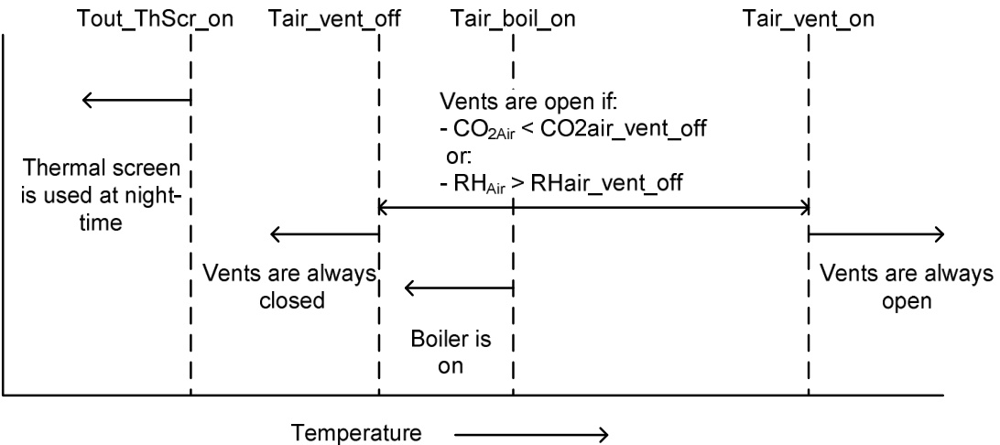  
图5.2 基于气候设定值的温室温度控制策略。气候设定值见表5.3

在所有情况下，刷白都在生产期开始时应用，直到9月15日（全球透射率减少$50\%$），3月1日（减少$25\%$）和4月15日（减少$50\%$），这是Almería种植者常用的方法。在有雾化系统的情况下，种植者倾向于使用较轻的刷白（Gázquez等，2008）。因此，在这种情况下，刷白拦截的辐射比例减少到上述值的$50\%$。

表5.3 不同温室设计经济分析中使用的温室气候管理和作物条件概述

| 参数 | 值 |
| --- | --- |
| **温室气候管理** |  |
| 刷白 | 8月1日-9月15日（减少50%）3月1日-4月15日（减少25%） |
| 通风开启温度 Tair_vent_on (°C) | 4月16日-6月30日（减少50%）23 |
| 通风关闭温度 Tair_vent_off (°C) | 20 |
| 通风关闭相对湿度 RHair_vent_ofr(%) | 90 |
| 通风关闭CO2浓度 CO2air_vent_off (ppm) | 200 |
| 锅炉开启温度 Tair_boil_on (C) | 12*/16 |
| 保温幕开启室外温度 Tout_ThScr_on (C) | 18 |
| 最大外部CO2浓度 CO2Air_ExtMax (ppm) | 850 |
| 最小外部CO2浓度 CO2Air_ExiMin (ppm) | 365 |
| 最大总辐射 IGlob_Max (W m-2) | 500 |
| 最大通风率 Uvent_Max (-) | 0.1 |
| 雾化系统开启蒸汽压差 VPDef_Fog_On (kPa) | 1.5 |
| **作物条件** |  |
| 初始叶面积指数 LAI_start | 0.3 |
| 最大叶面积指数 LAI_max | 2.5 |
| 生长周期开始时间 to | 2008年8月1日 |
| 生长周期结束时间 tf | 2009年7月1日 |

*表示该气候设定值应用于H_加热系统

# 5.3.4 三种设计评估研究

进行了三项模拟研究：1）基于一个气候周期和平均价格轨迹的经济评估；2）经济状态对选定输入参数的敏感性分析；3）NFR对室外气候和价格轨迹的不确定性分析。

这里使用的气候数据记录于2006年至2009年在阿尔梅里亚（北纬$3 6 ^ { \circ } 4 8 ^ { \circ }$，西经$2 ^ { \circ } 4 3 ^ { \circ }$，海拔$1 5 1 \mathrm { ~ m ~ }$），同年的价格轨迹来自Fundación Cajamar（Anonymous, 2009）。对于所有三项模拟研究，经济作物产量取决于可销售比例$( \eta _ { F M s o l d } )$和一级番茄比例$( \eta _ { T o m I } )$。根据Magán, López, Escudero, Pérez-Parra（2007）的经验和实验结果，这两个比例都取决于温室设计，见表5.2。确定年度成本所需的经济参数见表5.5。执行每项模拟研究所需的其余信息将在本节简要介绍。

# 5.3.4.1 基于一个气候周期和平均价格轨迹的经济评估

NFR的确定基于2006年8月$1 ^ { \mathrm { s t } }$至2007年7月$1 ^ { \mathrm { s t } }$的生长周期，因为该时期的室外气候比其他两个时期略为温和（见表5.4）。

表5.4 阿尔梅里亚地区8月1日至次年7月1日三个连续生长季的平均室外气候和番茄价格概况。"Tout < 5%"表示第5百分位数（测量温度有5%的时间低于该值），"Tout > 95%"表示第95百分位数（测量温度有5%的时间高于该值）。

| 时期 | 室外温度(℃) | Tout < 5%(℃) | Tout > 95%(℃) | 总辐射(MJ/m²/天) | 相对湿度(%) | 风速(m/s) | 一级番茄价格(€/kg) | 二级番茄价格(€/kg) |
| --- | --- | --- | --- | --- | --- | --- | --- | --- |
| 2006-2007 | 17.7 | 9.1 | 27.4 | 16.9 | 69.7 | 2.9 | 0.60 | 0.33 |
| 2007-2008 | 17.8 | 10.2 | 27.7 | 17.1 | 67.7 | 3.3 | 0.54 | 0.29 |
| 2008-2009 | 17.2 | 8.3 | 28.1 | 17.2 | 67.9 | 3.3 | 0.51 | 0.28 |

将三个生产年的一级和二级长货架期番茄的周平均价格用于确定公式(5.3)中的时变番茄价格，如图5.3所示。

表5.5 确定所有建筑元素年维护和折旧成本所需的经济参数（式5.7中的$Q_{Constr,i}$）：投资qInvest,i、折旧率ηDepreciation,i和维护率ηMaintenace,i。

| 建筑元素 | qInvest,i (€/m²) | qInvest,i (€) | NDepreciation,i (%/年) | NMaintenace,i (%/年) | Qconstr,i (€/m²/年) |
| --- | --- | --- | --- | --- | --- |
| 建筑结构 | | | | | |
| Parral结构 | 8 | | 6.67 | 2 | 0.69 |
| 多隧道结构 | 18 | | 6.67 | 2 | 1.56 |
| 土壤类型：Enarenado | 0.69 | | 33.33 | 0 | 0.23 |
| 简易气候计算机 | | 8000 | 15 | 8 | 0.18 |
| 覆盖物和幕布 | | | | | |
| Triplast覆盖物 | 1.38 | | 33.33 | 5 | 0.53 |
| 白粉 | 0.09 | | 100 | 0 | 0.09 |
| 保温幕XLS | 2 | | 20 | 5 | 0.50 |
| 保温幕结构 | 3 | | 10 | 5 | 0.45 |
| 加热系统 | | | | | |
| 锅炉加热：1.16 MW | | 82000 | 7 | 1 | 0.66 |
| 间接空气加热器：0.5MW | | 40000 | 15 | 2 | 0.68 |
| 金属管道加热（西班牙） | 6 | | 7 | 0.5 | 0.45 |
| 雾化系统 | | | | | |
| 空气-水系统：500 g/m²/h | 3 | | 10 | 5 | 0.45 |
| CO2增施系统 | | | | | |
| 纯CO2：50 kg/ha/h | | 3120 | 100 | 0 | 0.31 |
| CO2输送系统 | 0.34 | | 10 | 5 | 0.05 |
| 灌溉系统 | | | | | |
| 肥料计量系统 | | 30000 | 10 | 5 | 0.45 |
| 集水罐 | | 13500 | 5 | 1 | 0.08 |
| 滴灌系统 | 1.4 | | 10 | 5 | 0.21 |
| 作物保护 | | | | | |
| 作物保护机械 | | 1500 | 15 | 5 | 0.03 |
| 应急电源 | | 9000 | 5 | 5 | 0.09 |
| 其他 | | | | | |
| 内部运输系统 | | 26580 | 10 | 5 | 0.40 |

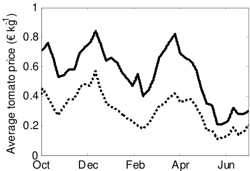  
图5.3 2006年至2009年三个连续生产周期内一级（实线）和二级（虚线）长货架期番茄的周平均价格（来源：Anonymous, 2009）

# 经济状态对输入参数的敏感性分析

针对上述气候周期和价格轨迹，对parral温室和配备所有气候调节技术的高科技多隧道温室（WHFC）的经济状态对某些输入参数的敏感性进行了分析。

由于经济作物产量是唯一的收入来源，公式(5.2)和(5.3)中的经济参数可能对经济状态产生重大影响；因此需要评估结果对这些参数的敏感性。关于温室设计参数和气候参数设定值，我们参考了第4章的结果，这些结果表明覆盖物和白粉对光合有效辐射（PAR）、近红外（NIR）和远红外（FIR）辐射的透射率；通风面积和通风温度设定值对产量有很大影响。因此，评估了NFR对所有这些参数的敏感性。最后，对于多隧道温室，还评估了所有气候调节技术能力及其相应气候管理设定值的敏感性。

5.3.4.3 NFR对室外气候和价格轨迹的不确定性分析 通过以下方法分析了所有温室设计中室外气候和番茄价格年度变化的不确定性对NFR的影响：1）确定三个不同年份（2006-2007、2007-2008和2008-2009，表5.4）的NFR，每个年份与平均价格轨迹相结合；2）确定一年（2006-2007）和三个价格轨迹（2006-2009）的NFR；3）确定三个不同气候周期及相关价格轨迹的NFR；4）确定一年（2006-2007）和三个恒定番茄价格（0.50€/kg、1€/kg和1.50€/kg）的NFR。

# 5.4 结果与讨论

本章评估了不同设计的NFR，分析了NFR在整个生产周期的演变，并根据敏感性分析提出了设计改进建议。随后，介绍了室外气候和番茄价格年度变化的不确定性对NFR和温室设计的影响。

# 5.4.1 不同温室设计的评估

# 5.4.1.1 不同设计的NFR评估

第3章已在西班牙条件下成功验证了parral和配备所有气候调节手段的多隧道温室的作物产量模型。模拟的总用水量和CO2消耗量与Magán等（2008）在多隧道温室中的测量结果一致。他们气体消耗量高于模拟值的事实可以用他们更高的加热设定值来解释。表5.6展示了不同温室设计的经济分析。本节讨论了其中展示的成本组成部分，即经济作物产量、固定成本、可变成本和NFR。与折旧、维护、未计入的温室建设部分和短期借贷成本相关的一些严格假设导致了负的NFR值。请注意，这不会影响结果，因为本研究侧重于温室设计之间的比较，而不是绝对NFR值。

表5.6 不同温室设计的经济分析，基于2006-2009年生长周期和平均周价格。带有白粉（W）的parral温室代表了最常见的现状。标准的多隧道设计带有白粉（W），并扩展了各种组合：CO2增施（C）、雾化（F）、空气加热（H_）和管道加热（H）。所有温室都配备了自然屋顶和侧面通风。

| | 多隧道 |
| --- | --- | --- | --- | --- | --- | --- | --- | --- | --- | --- |
| | Parral | W | WC | WF | WFC | WH_ | WH | WHC | WHF | WHFC |
| 作物产量 (kg/m²) | 21.88 | 23.99 | 25.78 | 26.45 | 28.15 | 27.71 | 28.35 | 31.89 | 31.34 | 35.03 |
| 作物产量 (€/m²/年) | 9.77 | 11.01 | 11.86 | 12.33 | 13.15 | 13.65 | 14.89 | 17.22 | 16.42 | 18.47 |
| 总投资 (€/m²) | 21.54 | 31.79 | 32.46 | 34.86 | 35.53 | 35.89 | 51.47 | 52.14 | 54.54 | 55.21 |
| 固定成本 (€/m²/年) | 3.43 | 4.50 | 4.88 | 5.01 | 5.39 | 5.26 | 6.95 | 7.33 | 7.46 | 7.85 |
| 可变成本 (€/m²/年) | 6.59 | 6.82 | 7.82 | 7.17 | 8.25 | 9.31 | 8.88 | 10.18 | 9.28 | 10.65 |
| 水成本 | 0.17 | 0.18 | 0.18 | 0.21 | 0.21 | 0.18 | 0.19 | 0.19 | 0.22 | 0.22 |
| CO2成本 | 0 | 0 | 0.78 | 0 | 0.87 | 0 | 0 | 0.78 | 0 | 0.88 |
| 化石燃料 | 0 | 0 | 0 | 0 | 0 | 1.94 | 1.34 | 1.34 | 1.32 | 1.32 |
| 人工成本 | 2.77 | 2.82 | 2.92 | 2.96 | 3.06 | 3.03 | 3.07 | 3.27 | 3.24 | 3.45 |
| 其他植物成本 | 3.65 | 3.82 | 3.94 | 4.00 | 4.11 | 4.16 | 4.28 | 4.60 | 4.50 | 4.78 |
| 净财务结果 (€/m²/年) | -0.25 | -0.31 | -0.84 | 0.15 | -0.49 | -0.92 | -0.94 | -0.29 | -0.32 | -0.03 |
| 平均番茄价格 (€/kg) | 0.45 | 0.46 | 0.46 | 0.47 | 0.47 | 0.49 | 0.53 | 0.54 | 0.52 | 0.53 |
| 边际番茄价格 (€/kg) | 0.46 | 0.47 | 0.49 | 0.46 | 0.48 | 0.53 | 0.56 | 0.55 | 0.53 | 0.53 |
| 作物用水量 (l/m²) | 670.7 | 716.1 | 717.1 | 759.4 | 759.9 | 727.3 | 743.0 | 743.8 | 786.9 | 787.1 |
| 雾化系统用水量 (l/m²) | 0 | 0 | 0 | 93.4 | 93.3 | 0 | 0 | 0 | 101.5 | 101.5 |
| 能源使用量 (m³/m²) | 0 | 0 | 0 | 0 | 0 | 5.10 | 3.52 | 3.53 | 3.47 | 3.47 |
| CO2使用量 (kg/m²) | 0 | 0 | 5.23 | 0 | 5.77 | 0 | 0 | 5.23 | 0 | 5.85 |

# 经济作物产量

模拟的经济作物产量随着技术水平的提高显著增加，从parral温室的9.77€/m²/年增加到配备所有气候调节技术的多隧道温室的18.47€/m²/年。从简单的多隧道温室（收入11.01€/m²/年）开始，使用CO₂增施使经济作物产量增加0.85€/m²/年，使用加热系统增加3.88€/m²/年。联合效应为6.21€/m²/年，比两者之和高出约30%，这是因为当仅使用一种气候调节技术时，温度或CO₂浓度成为作物生长的限制因素。使用多变量敏感性分析，第4章的结果显示了在德克萨斯州气候控制温室中，较高的CO₂浓度和气温的正向综合影响。

图5.4a展示了气候调节技术对作物产量影响的时间趋势。在冬季，配备CO₂增施的加热多隧道温室收获量最大，其次是加热多隧道温室和未加热的温室。CO₂增施系统主要在12月至5月提高了收获率，因为相对较小的通风需求导致了较高的CO₂设定点（见第5.7节）和内部CO₂浓度。另一方面，雾化系统从3月到6月提高了作物产量，主要得益于较高的光透射率（较温和的白粉）和较低的空气温度。

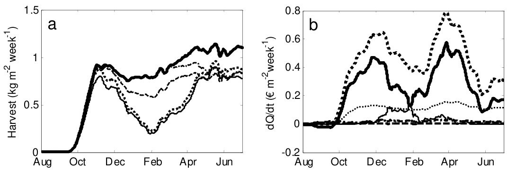  
图5.4 对收获率(a)和经济状态变量(b)的季节性影响。图5.4a 六种不同温室设计的收获率：parral（细实线）、W（点线）、WH（虚线）、WHC（点划线）和WHFC多隧道。图5.4b WHC多隧道的经济状态时间导数：净财务结果（粗实线）；经济作物产量（粗点线）；水成本（虚线）；CO₂成本（点划线）；燃料成本（细实线）；和植物成本（细点线）。

# 固定成本

固定成本和总投资成本随着温室技术水平的提高显著增加（表5.6）。出现了两个投资"跳跃"：1)从parral到多隧道的转变成本为10.25€/m²，2)在多隧道中安装加热系统（包括保温幕和金属加热管道）成本为19.01€/m²。由CO₂增施系统（0.38€/m²/年）或雾化系统（0.51€/m²/年）引起的额外年度固定成本相对较小，这意味着比加热系统（2.45€/m²/年）的风险更小。

# 可变成本

可变成本随着技术水平的提高而增加，主要是由于资源成本的增加（表5.6）。在配备白粉、加热、雾化和CO₂供应的多隧道温室（WHFC）中，人工和其他植物成本占总年度成本的44.5%，而资源消耗占比较小：加热（7.1%）；CO₂（4.8%）和水（1.2%）。

# 净财务结果（NFR）

表5.6显示，仅配备雾化系统的多隧道WF最为盈利（0.15€/m²/年），其次是配备所有气候调节技术的多隧道WHFC（-0.03€/m²/年），parral（-0.25€/m²/年），配备CO₂增施和加热系统的多隧道WHC（-0.29€/m²/年）以及未配备气候调节技术的多隧道W（-0.31€/m²/年）。雾化系统最为盈利，因为应用较薄的白粉和较低极端气温发生率带来的产量增加，很容易抵消雾化系统的相对较低成本。

根据表5.6，parral与配备雾化系统的多隧道结构之间的NFR差异为0.40€/m²/年，相对于13.32€/m²的惊人投资差异来说可能显得较小。投资回收期确实超过了大多数种植者的规划范围。此外，表5.6显示，如果准备为多隧道投资加热系统，那么同时安装CO₂增施系统肯定是值得的。具体来说，配备CO₂增施和加热系统的温室（WHC，-0.29€/m²/年）的NFR明显高于仅配备CO₂增施（WC，-0.84€/m²/年）或仅配备加热系统（WH，-0.94€/m²/年）的温室。

经济状态的时间导数决定了盈利期（图5.4b）。对于配备所有气候调节技术的多隧道，NFR的时间导数有两个局部最大值：12月初的周收入较高，4月初的周收入最高。这两个峰值是由较高的番茄价格而非较高的收获率引起的，如与价格轨迹的相似性所示（图5.3），而WHFC多隧道的收获率（图5.4a）相当稳定。生产期末的周收入较小，这解释了为什么大多数种植者比这里假设的更早停止种植。

# 提高低技术和高技术温室NFR的改进措施

对经济状态进行了敏感性分析，以展示如何改进parral（表5.7）和配备加热、CO₂增施和雾化系统的多隧道（表5.8）以提高NFR。对于两种温室，番茄价格和可销售比例对NFR的影响最大。这一结果表明，价格轨迹的微小变化将显著影响NFR，这证明了协商良好番茄价格的必要性。此外，高技术多隧道（WHFC）的NFR对价格变化的敏感性是parral的两倍（1668€ ha⁻¹ year⁻¹ %⁻¹ vs 892€ ha⁻¹ year⁻¹ %⁻¹）。因此，当番茄价格高时，高技术温室将更有利可图，反之亦然。

# parral温室

经济参数以及覆盖物和白粉的PAR透射率对NFR的影响最大，其次是覆盖物的NIR和FIR透射率以及通风温度设定点（表5.7）。基于这些结果，提出了以下改进parral温室NFR的建议——这些建议与实验结果一致：1）增加可销售作物产量和一级番茄的比例，这可以通过使温室更气密来实现（López等，2001），2）增加温室的PAR和NIR透射率，这可以通过增加覆盖物坡度（Soriano等，2004）和频繁清洗温室覆盖物（Montero等，1985）来实现，3）使用具有较高PAR透射率和较低NIR透射率的白粉，4）降低覆盖物的FIR透射率，这将提高夜间植物温度并带来更高的作物产量，5）提高通风温度设定点。

侧墙和屋顶通风对NFR的影响相对于其他设计参数较低。然而，由于这些参数比其他参数更容易调整，它们可能是调整的良好候选。Perez-Parra等（2004）已经提出，增加parral的通风能力将有利于作物生产，这得益于较低的空气温度、较高的CO₂浓度和较低的相对湿度。

表5.7 对parral温室经济模型状态的敏感性分析，涉及经济作物产量参数、温室设计参数和气候设定点。敏感性值单位为€ ha⁻¹ year⁻¹ %⁻¹。

| 经济参数值, Q | QNFR | QcropYield | QWater | QPlant |
|---------------|------|------------|--------|--------|
| qTom          | 892  | 991        | 0      | 99     |
| NFMsold       | 837  | 978        | 0      | 141    |
| NToml         | 295  | 328        | 0      | 33     |
| 温室设计参数, Pd |      |            |        |        |
| TRfPAR        | 586  | 811        | 6      | 219    |
| TShScrPerPAR  | 107  | 170        | 3      | 60     |
| TRfNIR        | 84   | 116        | 3      | 29     |
| TRfFIR        | -70  | -94        | -1     | -23    |
| ASidd/AFlr    | 17   | 24         | 1      | 6      |
| TShScrPerNIR  | -8   | -11        | 1      | -4     |
| ARoof/AFlr    | 6    | 9          | 0      | 3      |
| 温室气候设定点,U |      |            |        |        |
| Tair_vent_on  | 86   | 100        | -4     | 18     |

# 配备加热、CO₂增施和雾化系统的连栋温室

对于WHFC连栋温室，经济参数输入、覆盖物的PAR透射率以及加热和通风的气候设定点对净财务结果（NFR）影响最大（表5.8）。因此，可以通过以下方式提高WHFC连栋温室的NFR：1）如parral温室所述，增加覆盖物的PAR透射率；2）降低加热设定点并提高通风设定点。此外，NFR对加热系统、CO₂增施系统和雾化系统的容量不敏感，表明这些系统的容量已经足够。

表5.8 对高科技WHFC连栋温室的经济模型状态进行敏感性分析，涉及经济作物产量参数、温室设计参数和气候设定点。敏感性值单位为€ ha⁻¹ year⁻¹ %⁻¹。

| 经济参数值, Q | QNFR | QcropYeld | Qwater | Qc02 | QFuel | QPlant |
|---------------|------|-----------|--------|------|-------|--------|
| qTom          | 1668 | 1854      | 0      | 0    | 0     | 186    |
| NFMsold       | 1593 | 1848      | 0      | 0    | 0     | 255    |
| nToml         | 728  | 809       | 0      | 0    | 0     | 81     |
| 温室设计参数, Pd |      |           |        |      |       |        |
| TRfPAR        | 1067 | 1422      | 7      | 48   | -46   | 346    |
| TRfNIR        | 35   | -45       | 4      | -16  | -57   | -11    |
| PBoil         | -31  | -2        | 0      | 0    | 30    | -1     |
| TShScrPerPAR  | 30   | 55        | 1      | 5    | 0     | 19     |
| AsiddAFlr     | 15   | 35        | 1      | 11   | 0     | 8      |
| TShScrPerNIR  | 7    | 7         | 1      | -1   | -1    | 1      |
| ARoo/AFlr     | 7    | 9         | 1      | -2   | 0     | 3      |
| TRfFIR        | -4   | 7         | -1     | 3    | 7     | 2      |
| ExtC02        | 4    | 26        | 0      | 16   | 0     | 6      |
| Fog           | -1   | -1        | 0      | 0    | 0     | 0      |
| 温室气候设定点,U |      |           |        |      |       |        |
| Tair_boil_on  | -830 | -45       | 3      | -12  | 808   | -14    |
| Tair_vent_on  | 339  | 485       | -7     | 158  | -115  | 110    |
| Tout_ThScr_on | 71   | 32        | 0      | -3   | -44   | 8      |
| CO2Air_ExtMax | 41   | 95        | 0      | 32   | 0     | 22     |
| VPDef_Fog_On  | 18   | 11        | -7     | -2   | 0     | 2      |
| Uvent_Max     | 14   | 44        | 0      | 19   | 0     | 11     |

敏感性分析结果可以加深我们对影响净财务结果(NFR)因素的理解。例如，覆盖物的PAR透射率从54%增加1%到54.54%，导致NFR增加了1067€ ha⁻¹ year⁻¹，这主要归因于光合作用速率提高带来的额外收入(1422€ ha⁻¹ year⁻¹)。这也导致与植物相关的可变成本增加(346€ ha⁻¹ year⁻¹)，以及CO₂和水的消耗量增加(分别为48和7€ ha⁻¹ year⁻¹)。此外，更多的太阳辐射降低了供暖需求，从而减少了燃料成本(-46€ ha⁻¹ year⁻¹)。另外，在西班牙条件下，半封闭温室的潜力得到了证实，因为通风温度设定点提高1%导致NFR增加(339€ ha⁻¹ year⁻¹)，这是由于更高的收入(485€ ha⁻¹ year⁻¹)、更低的供暖成本(-115€ ha⁻¹ year⁻¹)和更低的水成本(-7€ ha⁻¹ year⁻¹)造成的。作物产量增加的主要原因是温室中能够维持更高的CO₂浓度。

5.4.2 室外气候和价格轨迹对NFR的影响
室外气候的变化导致了最佳温室设计的改变(图5.5a)，这表明温室设计是一个多因素优化问题。具体来说，在2008-2009年的"寒冷"生长周期中，配备所有气候调节技术(WHFC连栋温室)的温室设计是最佳的，而在2006-2007和2007-2008年的"温和"周期中，仅配备雾化系统的连栋温室最为盈利。这种依赖性通过不同室外气候周期之间的NFR方差表现出来，从parral温室的1.14下降到WHFC连栋温室的0.08。确实，操纵内部气候的能力使得NFR受室外条件的影响更小，正如Castilla和Montero(2008)所观察到的，他们提出增强温室技术的主要优势可能是为地中海地区的温室生产增加安全性和稳定性。前文已经讨论过parral温室可以与高科技连栋温室竞争。然而，parral温室的NFR在很大程度上取决于室外气候(图5.5)，这增加了种植者的经济风险。因此，供暖系统的唯一作用就是降低"天气"风险，以及与之相关的谈判更好价格的机会。同样，价格轨迹的变化也导致了最佳温室设计的改变(图5.5b)。特别是，在番茄价格相对较低时(2007-2008和2008-2009)，表现最好的温室仅配备雾化系统，而在番茄价格相对较高时(2006-2007)，最佳温室则配备所有气候调节技术。随着技术水平的提高，NFR更多地依赖于价格轨迹，这从NFR方差可以看出，从parral温室的0.18增加到WHFC连栋温室的3.15，这一趋势反映了产量的增加。因此，更高的价格将使高科技温室的NFR比低科技温室受益更多，如图5.5d所示。因此，在高价格不确定性的情况下，低科技温室是最佳选择，因为其NFR对番茄价格轨迹的依赖程度低于高科技温室。最后，年度室外气候条件和价格轨迹的共同变化导致了另一个最佳设计(图5.5c)。特别是，NFR对年度室外气候条件和价格轨迹的依赖程度随着技术水平的提高而增加，这主要是由于2006-2007年的高番茄价格造成的。

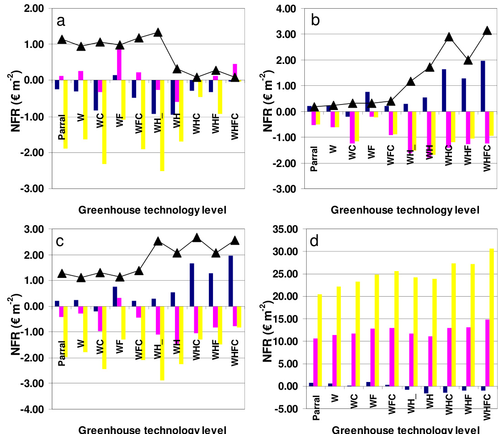  
图5.5 年度室外气候变化(a)、番茄价格(b)、气候和价格共同变化(c)以及不同恒定价格轨迹(d)对净财务结果和最佳设计的影响。

图5.5a 不同室外气候周期的影响：2006-2007(蓝色)、2007-2008(紫色)、2008-2009(黄色)以及这些不同室外气候之间的NFR方差(带三角形的黑线)。应用的价格轨迹是2006-2009年期间每周价格的平均值。

图5.5b 不同价格轨迹的影响：2006-2007(蓝色)、2007-2008(紫色)、2008-2009(黄色)以及这些不同价格轨迹之间的NFR方差(带三角形的黑线)。应用的室外气候是2006-2007年。

图5.5c 不同生产周期及其相关室外气候和价格轨迹的影响：2006-2007(蓝色)、2007-2008(紫色)、2008-2009(黄色)以及这些不同生产周期之间的NFR方差(带三角形的黑线)。

图5.5d 不同恒定价格轨迹的影响：0.50€ kg⁻¹(蓝色)、1.00€ kg⁻¹(紫色)和1.50€ kg⁻¹(黄色)。应用的室外气候是2006-2007年。

# 5.5 总体讨论

本文就研究结果对基于模型的温室设计方法发展的影响进行了讨论。首先介绍了对模型描述的影响，然后是对温室设计优化的影响。

# 5.5.1 模型描述

温室气候-作物产量综合模型已在先前研究中得到验证，并在本研究中证明能够较准确地预测西班牙南部条件下的作物产量和资源消耗。该综合模型在此扩展了经济模型，能够为这些条件选择最有利可图的温室设计。与实验相比，这种设计工具的优势在于，可以在相同假设下快速确定不同温室设计在不同气候年份和价格轨迹下的净财务结果（NFR）。

然而，使用设计工具意味着必须做出一些假设来计算所考虑的不同温室设计的NFR。首先，可销售产量和一级品产量的比例（分别为$\eta _ { F M S o l d }$和$\eta _ { T o m I }$）取决于温室设计（表5.2），并对NFR有很大影响（表5.7和表5.8）。这些参数的选择基于种植者经验和实验结果（Magán等，2007），并假设其不随时间变化，这可能过于乐观。实际上，这些比例取决于病害，如脐腐病（Gázquez等，2008）或疫病发生率，以及极端果实温度，而后者又取决于室内气候，这既与天气有关，也与温室设计有关。将这些参数作为内部气候的函数将是一个改进，但遗憾的是目前的知识体系还远远不够。

此外，为了客观比较温室结构和气候调节技术对NFR的影响，假设所有温室设计与灌溉系统、气候计算机、应急电源和内部运输系统相关的成本相同。然而，实际上一些温室可能配备较少或较便宜的构造元素。

# 5.5.2 温室设计优化

为了将本研究限制在"手动设计优化"范围内，选择了十种替代设计。然而，存在大量的温室设计和气候管理替代方案，这表明需要更高效的优化算法。使用基于模型的设计方法解决这个问题时，有四个方面会影响优化结果。以下简要讨论如何处理这些方面。

首先，关于气候年对最佳设计的重大影响，最好使用一个参考气候年，其中包含长期平均的气候变量动态模式，正如Breuer和Van de Braak（1989）对荷兰气候所做的那样。这样的参考年将消除使用多年气候数据进行计算的需要。其次，与气候参考年类似，"参考价格轨迹"将很有帮助。需要注意的是，优化温室的使用寿命在所有情况下都是几年。因此，一个好的参考期应该远超过一年。由于这似乎不可行，因此需要对温室设计的NFR对这些不确定输入参数进行敏感性分析。这种分析可以告诉我们最佳温室设计对价格和天气等不确定因素的稳健性。第三，气候调节技术对NFR的综合影响可能大于其单独影响的总和，正如$\mathrm { C O } _ { 2 }$增施和加热对NFR的联合影响所揭示的那样（第5.4.1.1节）。这一结果强调了需要同时而不是顺序优化气候调节技术组合。第四，敏感性分析揭示了气候设定点对NFR的显著影响（表5.8），表明对最佳设计也有影响。在先前的研究中，Vanthoor等（2008a）确实表明，气候管理的变化会导致不同的最佳温室设计，这反过来表明了选择适当气候设定点的重要性。

# 5.6 结论

我们已经证明，扩展了经济模块的温室气候-作物产量模型可用于在西班牙南部条件下从预定义的设计方案中选择年NFR最高的温室，并评估现有温室可能的设计改进。结果表明，在给定的气候和经济条件下，仅配备雾化系统的连栋温室将是最有利可图的$( 0 . 1 5 \notin \mathrm { m } ^ { - 2 } \ : \mathrm { y e a r } ^ { - 1 } )$。然而，这种结构与简单parral结构之间的年NFR差异很小$( 0 . 4 0 \notin \mathrm { m } ^ { - 2 } \ : \mathrm { y e a r } ^ { - 1 } )$，相对于巨大的投资差异$( 1 3 . 3 2 \notin \mathrm { m } ^ { - 2 } )$，因此投资回收期将超过大多数种植者的规划范围。此外，研究表明，如果准备为连栋温室投资加热系统，那么同时配备$\mathrm { C O } _ { 2 }$增施系统也肯定是值得的。

对NFR和相关成本因素进行了敏感性分析，以找出在两个极端情况下对利润影响最大的因素：parral温室和配备加热、$\mathrm { C O } _ { 2 }$增施和雾化系统的连栋温室。在这两种情况下，番茄价格、可销售产量比例和覆盖物的PAR透射率对NFR的影响最大。此外，低技术温室的NFR会随着覆盖物NIR透射率的增加、FIR透射率的降低以及通风温度设定点的提高而增加。另一方面，高技术温室的NFR会通过降低加热设定点和提高通风设定点而获益。

关于对天气和价格等不确定因素的敏感性，我们已经表明，随着技术水平的提高，年NFR对室外气候的依赖程度降低，而对番茄价格的依赖程度增加。这些结果表明：1）为了降低价格波动风险，应该运营投资低的低技术温室；2）高技术温室能更好地覆盖"天气风险"，这反过来应该允许更高的番茄价格；3）高技术温室在番茄价格高时更有利，但在价格低时损失更大。

我们的结果证明，最佳温室设计受到四个因素的强烈影响：天气、价格轨迹、气候调节技术的联合影响以及温室气候管理。基于模型的设计方法能够处理这些多因素设计方面，因此是解决由此产生的多因素设计问题的合适方法。显然，一旦考虑更多替代方案，这种设计问题就会变得难以管理。因此，为了更普遍，设计方法必须依赖更高效的算法，这将在第6章中介绍。

# 致谢

我们感谢Cajamar基金会实验站"Las Palmerillas"的所有工作人员，特别是Antonio Céspedes，在第一作者作为客座研究员期间提供所有数据并给予友好合作。经济参数由Cajamar基金会经济研究所的Ana Cabrera和Cajamar农业食品业务部（农业信贷合作社）的工作人员提供。本研究是前荷兰农业、自然保护和食品质量部资助的战略研究计划"生态系统、景观、海洋和区域的可持续空间发展"和"可持续农业"的一部分。

# 5.7 附录

# 附录A $\mathbf{CO}_2$增施设定点的计算

$\mathrm{CO}_2$设定点随总辐射$I_{Glob}$线性增加，直到达到定义的最大$\mathrm{CO}_2$设定点$CO_{2Air\_ExtMax}$，同时$\mathrm{CO}_2$设定点随通风口开度$U_{Vent}$线性减小。

$CO_{2Air\_ExtOn} = f \big( I_{Giob} \big) \cdot g \big( U_{Vent} \big) \cdot \big( CO_{2Air\_ExtMax} - CO_{2Air\_ExtMin} \big) + CO_{2Air\_ExtMin}$ [ppm]   (A.1)

$$
f \left( I_{Glob} \right) = \left\{ \begin{array} { c } { { \displaystyle \frac { I_{Glob} } { I_{Glob} } } , I_{Glob} < I_{Glob_{-}Max} } \\ { { } } \\ { { 1 , I_{Glob} \geq I_{Glob_{-}Max} } } \end{array} \right.
$$

$$
g \big( U_{Vent} \big) = \left\{ \begin{array} { l l } { \displaystyle 1 - \frac { U_{Vent} } { U_{Vent} } , U_{Vent} < U_{Vent_{-}Max} } \\ { \quad } \\ { \quad 0 , \quad \quad U_{Vent} \geq U_{Vent_{-}Max} } \end{array} \right.
$$

其中$I_{Glob} \ \mathrm{(W \ m^{-2})}$为室外总辐射，${ { U }_{Vent} } \left( - \right)$为窗户开度，$CO_{2Air\_ExtMax}$ (ppm)为最大$\mathrm{CO}_2$浓度设定点，$CO_{2Air\_ExtMin}$为最小$\mathrm{CO}_2$浓度设定点(ppm)，$I_{Glob\_Max} \mathrm{(W ~ \ m^{-2})}$为达到最大$\mathrm{CO}_2$浓度设定点时的室外总辐射，$U_{Vent\_Max}$ (-)为$\mathrm{CO}_2$浓度设定点等于最小$\mathrm{CO}_2$浓度设定点时的窗户开度(ppm)。

# 第6章

# 西班牙南部和荷兰条件下的温室设计优化

本章内容已作为论文提交至《生物系统工程》，论文标题为：基于模型的温室设计方法：第五部分，西班牙南部和荷兰条件下的温室设计优化。

B.H.E. Vanthoor, J.D. Stigter, E.J. van Henten, C. Stanghellini, P.H.B. de Visser

# Chapter 6

# Greenhouse design optimisation for SouthernSpanish and Dutch conditions

The contents of this chapter have been submitted to Biosystems Engineering as a paper entitled: A methodology for model-based greenhouse design: Part 5, Greenhouse design optimisation for Southern-Spanish and Dutch conditions.

B.H.E. Vanthoor, J.D. Stigter, E.J. van Henten, C. Stanghellini, P.H.B. de Visser

# 6.1 摘要

本文描述了一种优化算法，作为基于模型的方法的重要组成部分，用于设计适应广泛气候和经济条件的温室。该算法采用改进的并行计算控制随机搜索方法，通过选择最佳方案来满足以下八个设计要素，从而最大化番茄种植者的年净财务回报（NFR）：温室结构类型、覆盖材料、室外遮阳网、白涂料特性、保温幕、加热系统、冷却系统和$\mathrm{CO}_2$增施系统。作为示例，该算法被应用于两个具有不同气候和经济条件的地点，即西班牙阿尔梅里亚和荷兰。由于阿尔梅里亚气候温暖且辐射水平高，选择了具有相对较大通风面积（$20\%$，而荷兰条件为$14\%$）、季节性白涂料和低容量直接空气加热器（$\mathrm{50~W~m}^{-2}$，而荷兰条件为$200\mathrm{~W~m~}^{-2}$）的温室。相比之下，对于荷兰相对寒冷且辐射水平低的气候，$100\%$铝制保温幕且不使用白涂料将产生最佳效果。该设计方法生成了现实的温室及相关年NFR，表明该方法表现良好。对接近最佳温室的分析表明，对于这两个地点，具有高透光率的结构显著提高了温室性能，而室外遮阳网、地热加热和机械冷却则不经济。这些结果证明了基于模型的设计方法的可行性，该方法能够为给定的气候和经济条件生成合适的温室设计。

# 6.2 引言

当考虑当前温室设计现状时，大多数研究都集中在优化特定地点的设计，或者仅考虑单一设计参数。具体而言，Engel（1984）逐步优化了用于南加州地区的能源被动温室的屋顶几何形状、隔热水平和储热容量；Amir和Hasegawa（1989）优化了温室的结构设计，重点关注机械性能；Kacira等（2004）优化了通风配置。然而，正如Baille（1999）所建议的，对于全球气候条件下的温室配置战略决策，整合物理、生物和经济模型的系统方法是最有前景的途径。因此，我们在本研究中描述了一种优化算法，作为基于模型的温室设计方法的重要组成部分。该优化旨在通过修改温室设计来最大化年净财务结果。设计方法着重于选择最佳方案来满足以下八个设计要素：（i）温室结构类型，（ii）覆盖材料，（iii）室外遮阳网的存在及其类型，（iv）白涂料的存在及其特性，（v）保温幕的存在及其类型，（vi）加热系统的类型及其容量，（vii）冷却系统的类型及其容量，以及（viii）$\mathrm{CO}_2$增施系统的类型及其容量。

本研究的目的是将优化算法整合到基于模型的设计方法中，从大量备选方案中选择最佳的温室设计要素组合。为了证明该方法的可行性，针对两个不同地点优化了温室设计：西班牙阿尔梅里亚和荷兰德比尔特。本章的组织结构如下：首先，介绍优化问题的描述；其次，选择并简要讨论优化算法；第三，介绍西班牙和荷兰优化研究的假设；第四，展示优化结果并与文献结果进行讨论。

# 6.3 材料与方法

优化问题描述

# 6.3.1.1 模型概述

设计方法的概述见第1章。温室气候模型在第2章描述，作物产量模型在第3章，经济模型在第5章。因此，这里仅对这些模型进行简要描述。

各种模型由一组微分方程组成：

$$
\dot { X } = f \big ( X , U , D , P , t \big )
$$

其中$X$是包含室内气候变量、作物变量和资源消耗变量的状态向量，$\dot { X }$表示状态向量对时间的导数，$U$是包含气候控制阀设置的气候控制向量，$D$是室外气候向量，$P$是模型参数向量，$t$（s）是时间。

# 6.3.1.2 整数温室设计向量

本优化着重于以下八个设计要素：（i）温室结构类型，（ii）覆盖材料，（iii）室外遮阳网的存在及其类型，（iv）白涂料的存在及其特性，（v）保温幕的存在及其类型，（vi）加热系统的类型及其容量，（vii）冷却系统的类型及其容量，以及（viii）$\mathrm{CO}_2$增施系统的类型及其容量（图6.1）。

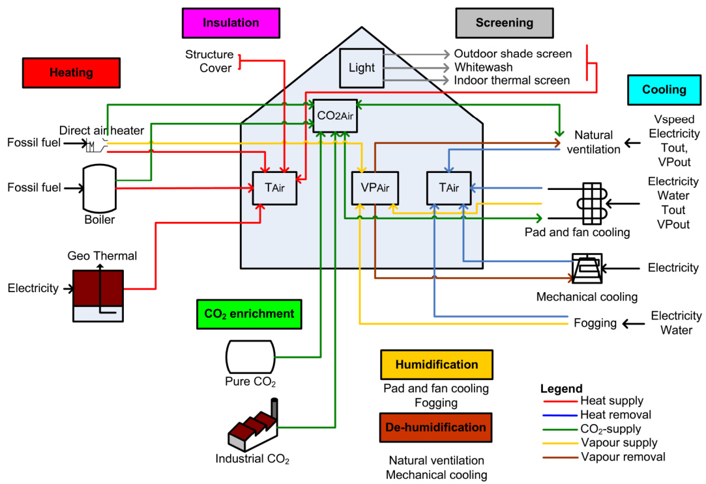  
图6.1 用于管理温室气候的功能（彩色框）和设计元素（相应功能下方的文字块和图片）（温室内透明框）。彩色箭头表示各种能量和质量通量（图例在右下角）。选择以下八个设计元素的替代方案：温室结构类型、覆盖材料、室外遮阳网、白涂料、保温幕、加热系统、冷却系统和$\mathrm{CO}_2$增施系统。

为了优化这组设计元素，定义了一个如图6.2a所示的整数温室设计向量，它由八个设计元素组成：

$$
I = \{ e _ { 1 } , e _ { 2 } , . . . , e _ { 8 } \} \qquad \mathrm { 其中 ~ } 1 \leq e _ { j } \leq n _ { e } ^ { j } \mathrm { 且 ~ } j = 1 , 2 . . . . . 8
$$

其中每个设计元素由一个整数设计变量$e _ { j }$表示，该变量可以通过表6.1中描述的$n _ { e } ^ { \ j }$个替代方案来实现。例如，图6.2b中所示的整数温室设计向量的具体实现表示为：

$$
I = \{ 2 , 1 , 1 , 2 , 5 , 3 , 4 , 1 \}
$$

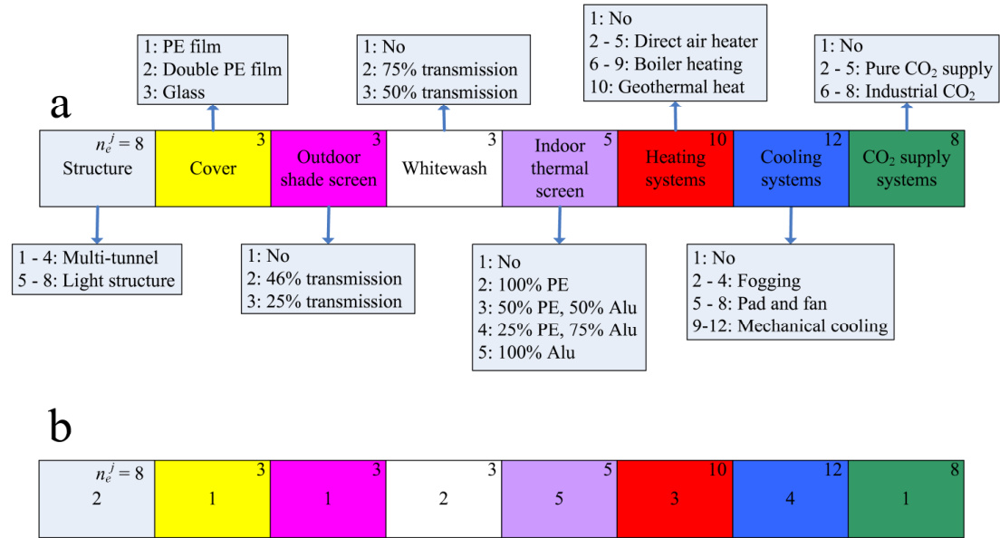  
图6.2 整数温室设计向量概述（a）及示例（b）。图6.2a 每个彩色框代表一个设计元素，可以通过浅蓝色框中所示的多个替代方案来实现。实现设计元素的替代方案数量$n _ { e } ^ { j }$显示在彩色框的右上角。图6.2b 一个整数温室向量的示例，可以使用表6.1进行解释，它表示：一个覆盖PE薄膜的多隧道结构类型2，配备：无室外遮阳网，透光率为$75\%$的季节性白涂料，$100\%$铝制保温幕，容量为1.0 MW的直接空气加热器，容量为$600 \ \mathrm{g \ m^{-2} \ h^{-1}}$的雾化系统，以及无$\mathrm{CO}_2$增施。有关设计元素的具体属性和/或容量的详细信息见表6.1。

从图6.2和表6.1可以推断，这个整数向量表示一个覆盖PE薄膜的多隧道结构类型2，配备：无室外遮阳网，透光率为$75\%$的季节性白涂料，$100\%$铝制保温幕，容量为$1.0 \ \mathrm{MW}$（相当于$100 \mathrm{~W ~ m^{-2}}$）的直接空气加热器，容量为$600 \ \mathrm{g \ m^{-2} \ h^{-1}}$的雾化系统，以及无$\mathrm{CO}_2$增施。

表6.1 确定所有设计元素维护和折旧年度成本所需的经济参数，如第5章所述：投资qInvest,i、折旧率$\eta_{折旧率,i}$和维护率η维护率,i。

| 设计元素 | ej | qInvest,i €/m² | qInvest,i € | 折旧率 %/年 | 维护率 %/年 | 建设成本 €/m²/年 |
|----------|----|----------------|-------------|-------------|-------------|------------------|
| 结构 (j=1) | | | | | | |
| 多隧道1公顷，0%通风 | 1 | 15.00 | | 7.0 | 2.0 | 1.35 |
| 多隧道1公顷，29%通风 | 2 | 18.00 | | 7.0 | 2.0 | 1.62 |
| 多隧道1公顷，45%通风 | 3 | 21.30 | | 7.0 | 2.0 | 1.92 |
| 多隧道1公顷，77%通风 | 4 | 30.14 | | 7.0 | 2.0 | 2.71 |
| Venlo 1公顷，0%通风 | 5 | 29.00 | | 7.0 | 0.5 | 2.18 |
| Venlo 1公顷，14%通风 | 6 | 32.00 | | 7.0 | 0.5 | 2.40 |
| Venlo 1公顷，20%通风 | 7 | 33.25 | | 7.0 | 0.5 | 2.49 |
| Venlo 1公顷，38%通风 | 8 | 47.50 | | 7.0 | 0.5 | 3.56 |
| 覆盖物 (j=2) | | | | | | |
| PE薄膜，西班牙 | 1 | 1.38 | | 33.3 | 5.0 | 0.53 |
| PE薄膜，荷兰 | 1 | 4.00 | | 12.5 | 5.0 | 0.70 |
| 双层PE薄膜，西班牙 | 2 | 2.38 | | 33.3 | 5.0 | 0.91 |
| 双层PE薄膜，荷兰 | 2 | 5.00 | | 12.5 | 5.0 | 0.88 |
| 玻璃 | 3 | 5.00 | | 7.0 | 0.5 | 0.38 |
| 室外遮阳网 (j=3) | | | | | | |
| 无 | 1 | 0.00 | | 0 | 0 | 0 |
| OLS 50 Abri，46%透光率 | 2 | 3.81 | | 20.0 | 5.0 | 0.95 |
| OLS 70 Abri，25%透光率 | 3 | 3.97 | | 20.0 | 5.0 | 0.99 |
| 结构遮阳网 | | 13.30 | | 10.0 | 5.0 | 2.00 |
| 白涂料 (j=4) | | | | | | |
| 无 | 1 | 0.00 | | 0 | 0 | 0 |
| 白涂料75%透光率，西班牙 | 2 | 0.07 | | 100.0 | 0 | 0.07 |
| 白涂料75%透光率，荷兰 | 2 | 0.80 | | 100.0 | 0 | 0.80 |
| 白涂料50%透光率，西班牙 | 3 | 0.09 | | 100.0 | 0 | 0.09 |
| 白涂料50%透光率，荷兰 | 3 | 0.82 | | 100.0 | 0 | 0.82 |
| 室内保温幕 (j=5) | | | | | | |
| 无 | 1 | 0.00 | | 0 | 0 | 0 |
| 100% PE 50%铝/50% PE | 2 | 1.50 | | 20.0 | 5.0 | 0.38 |
| 75%铝/25% PE | 3 | 4.06 | | 20.0 | 5.0 | 1.02 |
| | 4 | 4.24 | | 20.0 | 5.0 | 1.06 |
| 100%铝 | 5 | 5.58 2.97 | | 20.0 10.0 | 5.0 5.0 | 1.40 0.45 |
| 结构保温幕 加热系统 (j=6) | | | | | | |
| 无 | 1 | | 0 | 0 | 0 | 0 |
| 直接空气加热器: 0.5 MW | 2 | | 16725 | 15.0 | 2.5 | 0.29 |
| 直接空气加热器: 1 MW | 3 | | 29225 | 15.0 | 2.5 | 0.51 |
| 直接空气加热器: 1.5 MW | 4 | | 44850 | 15.0 | 2.5 | 0.78 |
| 直接空气加热器: 2 MW | 5 | | 57350 | 15.0 | 2.5 | 1.00 |
| 锅炉: 1.16 MW | 6 | | 60000 | 7.0 | 1.0 | 0.48 |
| 锅炉: 1.74 MW | 7 | | 66000 | 7.0 | 1.0 | 0.53 |
| 锅炉: 2.32 MW | 8 | | 80400 | 7.0 | 1.0 | 0.64 |
| 锅炉: 3.48 MW | 9 | | 92400 | 7.0 | 1.0 | 0.74 |
| 地热: 7 MW | 10 | | 6000000 | 4.0 | 5.0 | 54.00 |
| 加热管道，每米1根 | | 5.45 | | 7.0 | 0.5 | 0.41 |
| **冷却系统 (j=7)** | | | | | | |
| 无 | 1 | | | 0 | 0 | 0 |
| 喷雾: 200 g/m²/h | 2 | 5.50 | | 10.0 | 5 | 0.83 |
| 喷雾: 400 g/m²/h | 3 | 7.00 | | 10.0 | 5.0 | 1.05 |
| 喷雾: 600 g/m²/h | 4 | 10.00 | | 10.0 | 5.0 | 1.50 |
| 湿帘风机: 50 m³/m²/h | 5 | 3.54 | | 10.0 | 5.0 | 0.53 |
| 湿帘风机: 100 m³/m²/h | 6 | 5.07 | | 10.0 | 5.0 | 0.76 |
| 湿帘风机: 150 m³/m²/h | 7 | 6.60 | | 10.0 | 5.0 | 0.99 |
| 湿帘风机: 200 m³/m²/h | 8 | 8.14 | | 10.0 | 5.0 | 1.22 |
| 机械制冷: 0.5 MWe/台 | 9 | | 240000 | 7.0 | 2.0 | 2.16 |
| 机械制冷: 1 MWe/台 | 10 | | 480000 | 7.0 | 2.0 | 4.32 |
| 机械制冷: 1.5 MWe/台 | 11 | | 720000 | 7.0 | 2.0 | 6.48 |
| 机械制冷: 2 MWe/台 | 12 | | 960000 | 7.0 | 2.0 | 8.64 |
| **CO2供应 (j=8)** | | | | | | |
| 无 | 1 | | 0 | 0.0 | 0 | 0 |
| 纯CO2供应: 50 kg/ha/h | 2 | | 3120 | 10.0 | 0 | 0.03 |
| 纯CO2供应: 100 kg/ha/h | 3 | | 3120 | 10.0 | 0 | 0.03 |
| 纯CO2供应: 150 kg/ha/h | 4 | | 4320 | 10.0 | 0 | 0.04 |
| 纯CO2供应: 200 kg/ha/h | 5 | | 4320 | 10.0 | 0 | 0.04 |
| 工业CO2: 100 kg/ha/h | 6 | | 20000 | 6.7 | 2.0 | 0.17 |
| 工业CO2: 150 kg/ha/h | 7 | | 21000 | 6.7 | 2.0 | 0.18 |
| 工业CO2: 200 kg/ha/h | 8 | | 22000 | 6.7 | 2.0 | 0.19 |
| CO2分配系统 | | 0.34 | | 10.0 | 5.0 | 0.05 |
| **灌溉、植保、内部运输、分拣、包装等其他成本** | | | | | | |
| 西班牙 | | 11.13 | | 10.0 | 5.0 | 1.67 |
| 荷兰 | | 38.73 | | 10.0 | 5.0 | 5.81 |

# 6.3.1.3 性能指标

需要最大化的性能指标是种植者的预期年净财务结果(NFR)，其描述如下：

$$
\operatorname* { m a x } _ { I } J \left( t _ { f } \right) = - Q _ { F i x e d } + \intop _ { t = t _ { 0 } } ^ { t = t _ { f } } \dot { Q } _ { C r o p Y i e l d } - \dot { Q } _ { V a r } d t
$$

$$
[ \in \mathrm { m } ^ { - 2 } \mathrm { y e a r } ^ { - 1 } ]
$$

其中$J ( \in \mathrm { m } ^ { - 2 } \ y \mathrm { e a r } ^ { - 1 } )$是种植者的年净财务结果，$t _ { O }$ (s)和$t _ { f } \left( \mathrm { s } \right)$分别是生产周期的开始和结束时间，$Q _ { F i x e d }$ $( \mathsf { E } \ \mathrm { m } ^ { - 2 } \ \mathrm { y e a r } ^ { - 1 } )$是与有形资产相关的固定成本，$Q _ { C r o p Y i e l d } ( \bf { \in } \mathrm { ~ m ^ { - 2 } ~ y e a r ^ { - 1 } ) }$是作物产量的经济价值，$Q _ { V a r } ( \mathsf { E } \mathrm { m } ^ { - 2 } \mathrm { y e a r } ^ { - 1 } )$是与作物相关的成本（即植物材料、肥料、作物保护和其他作物资产）、资源使用（在本研究中定义为水、$\mathrm { C O } _ { 2 }$、化石燃料和电力）以及劳动力。第5章提供了各个成本要素的更详细描述。劳动力成本包括与作物维护相关的固定成本加上与作物产量线性相关的一部分。单个资源使用成本的计算如下：

$$
\begin{array} { r l r } & { \dot { Q } _ { \mathtt { W a t r } } = 1 0 ^ { - 3 } q _ { \mathtt { W a t r } } \Biggl ( \Biggl ( 1 + \frac { \eta _ { \mathtt { D r a i n } } } { 1 0 0 } \Biggr ) M V _ { \scriptscriptstyle { C a u s i r } } + M V _ { \scriptscriptstyle { F o g a i r } } + M V _ { \scriptscriptstyle { F a d i n s e r } } \Biggr ) [ \mathsf { E m } ^ { \scriptscriptstyle 2 } s ^ { \scriptscriptstyle 1 } ] } & \\ & { \dot { Q } _ { \scriptscriptstyle { C o 2 } } = 1 0 ^ { \mathrm { s } } \Bigl ( q _ { \scriptscriptstyle { C O 2 } , \_ { E x } } M C _ { \scriptscriptstyle { E a d i r } } + q _ { \scriptscriptstyle { C O 2 } , \_ { I n d } } M C _ { \scriptscriptstyle { I n d i r } } \Bigr ) } & { [ \mathsf { E m } ^ { \scriptscriptstyle 2 } s ^ { \scriptscriptstyle 1 } ] } \\ & { \dot { Q } _ { \scriptscriptstyle { F i e t } } = \frac { q _ { \scriptscriptstyle { F i e t } } } { \eta _ { \scriptscriptstyle { F i e t } } } \Bigl ( H _ { \scriptscriptstyle { B o i n p l e p } } + H _ { \scriptscriptstyle { B i o s t i r } } \Bigr ) } & { [ \mathsf { E m } ^ { \scriptscriptstyle 2 } s ^ { \scriptscriptstyle 1 } ] } \\ & { \dot { Q } _ { \scriptscriptstyle { E l e c } } = \frac { q _ { \scriptscriptstyle { F l e c } } } { 3 . 6 \cdot 1 0 ^ { 6 } } \Bigl ( P _ { \scriptscriptstyle { P a d } } + P _ { \scriptscriptstyle { F o g } } + P _ { \scriptscriptstyle { G e } } + P _ { \scriptscriptstyle { M e f } } \Bigr ) } & { [ \mathsf { E m } ^ { \scriptscriptstyle 2 } s ^ { \scriptscriptstyle 1 } ] } \end{array}
$$

其中$q _ { W a t e r } ( \in \mathbf { m } ^ { - 3 } )$是水价，$\eta _ { D r a i n } \left( \% \right)$是为保证充分灌溉所需的作物蒸腾比例，$M V _ { C a n A i r }$ $( \mathrm { k g ~ m } ^ { - 2 } \mathrm { ~ s } ^ { - 1 } )$是作物的蒸腾速率，$M V _ { F o g A i r }     ~ ( \mathrm { k g } ~ \mathrm { m ^ { - 2 } } ~ \mathrm { s ^ { - 1 } } )$是喷雾速率，$M V _ { P a d A i r N e t }$ $( \mathrm { k g ~ m } ^ { - 2 } ~ s ^ { - 1 } } )$是添加到湿帘风机系统进风口的加水量，$q _ { C O 2 \_ E x t } \ ( \in \ \mathrm { k g } ^ { - 1 } )$是纯$\mathrm { C O } _ { 2 }$的价格，$M C _ { E x t A i r }$ $( \mathrm { m g ~ m ^ { - 2 } ~ s } ^ { - 1 } )$是纯$\mathrm { C O } _ { 2 }$的富集速率，$q _ { C O 2 \_ I n d } ~ ( \in ~ \mathrm { k g } ^ { - 1 } )$是工业$\mathrm { C O } _ { 2 }$的价格，$M C _ { I n d A i r }$ $\mathrm { ( m g ~ m } ^ { - 2 } ~ \mathrm { s } ^ { - 1 } )$是工业$\mathrm { C O } _ { 2 }$的富集速率，$q _ { F u e l } $ $( \in \mathrm { m } ^ { - 3 } )$是燃料价格，$\eta _ { F u e l } \ : ( \mathrm { J } \ : \mathrm { m } ^ { - 3 } )$是燃料的能源效率，$H _ { B o i l P i p e } ( \mathrm { W ~ m } ^ { - 2 } )$是加热管道的热供应，$H _ { B l o w A i r } ( \mathrm { W ~ m } ^ { - 2 } )$是间接空气加热器对温室空气的热供应，$q _ { E l e c }$是电价$( \notin \mathrm { k W h } ^ { - 1 } )$，$P _ { P a d } , P _ { F o g } , P _ { ( }$ $P _ { G e o }$和

$P _ { M e c h }$分别是湿帘风机系统、喷雾系统、地热源泵和机械冷却系统的电力消耗。电力消耗率的计算见第6.6.1节。

# 6.3.1.4 极端湿度水平对番茄品质参数的影响

如第5章所述，经济作物产量被描述为作物产量质量和两个品质参数的函数，即一级番茄比例和可销售比例。室内气候对这些品质参数的影响描述并未整合到设计方法中。因此，作为初步方法，开发了两个品质过滤器来描述湿度对可销售比例和一级番茄比例的影响。这些品质过滤器基于真实的气候数据和品质参数，如第6.6.2节所述。

# 6.3.2 受控随机搜索优化算法

# 6.3.2.1 算法的描述与实现

使用Price（1977）提出的受控随机搜索（CRS）方法来解决优化问题。之所以需要这种无导数的全局优化方法，是因为性能指标会有许多局部最大值，且其梯度不连续。此外，CRS允许高效的并行计算，易于实现，是一种稳健的优化方法，且无需微调许多算法参数。由于解决优化问题所需的时间（表6.2），需要基于并行计算的解决方案来实现可管理的CPU时间。此外，由于其基于种群的性质，CRS方法的输出会产生关于接近最佳设计的宝贵信息。

表6.2 设计方案数量、评估所有设计方案所需时间以及在约束和非约束条件下进行设计优化所需时间

| 地点 | 设计方案数量 | 单台计算机评估所有设计方案所需年数+ | 并行优化所需天数* |
|------|--------------|--------------------------------------|--------------------|
| 西班牙 | 5.40×10⁵ | 26 | 2 |
| 荷兰 | 8.64×10⁵ | 41 | 3 |

+ 表示假设单次模拟时间为 25 分钟。* 表示使用 50 台计算机进行并行优化，优化算法最多评估所有设计方案的 1% 以得出解决方案。对于西班牙案例，由于没有优化工业 CO₂ 供应，因此评估的设计方案较少。

Price (1977) 提出的原始 CRS 方法通过迭代改进候选种群 A 来优化多个连续设计参数。该种群由 N 个连续设计向量组成，每个向量包含 n 个连续设计变量及其对应的性能指标值。每次迭代后，基于 A 创建一个新的设计向量 I，并评估其性能指标 J_I。如果 J_I 高于 A 中最低的性能指标值，则将最低性能指标对应的设计向量替换为 I，并将最低性能指标值替换为 J_I。

原始 CRS 是为连续优化问题开发的，而温室设计优化则被视为基于整数的问题。然而，根据 Lampinen 和 Zelinka (1999) 的研究，为连续问题开发的基于种群的方法可以解决离散优化问题，前提是即使问题本质上是离散的，离散参数也要表示为浮点值。因此，在将浮点参数值四舍五入到最接近的允许离散值（但不覆盖原始值）后，再评估性能指标（Price 等，2005）。因此，对原始 CRS 算法进行了修改，以确保有效解决整数设计问题。此外，为了加快优化过程，模型只能评估一次新的设计向量。具体来说，只有未存储在种群 A 中，也未存储在内存堆栈 B 中的设计向量才会被评估。修改后的 CRS 算法的详细描述如下：

# 步骤 1 至 3 用于初始化优化参数

1. 定义 N，即设计向量的数量。Price (1983) 提出 N 作为总设计变量数 n=8 的函数：N=25n。
2. 在搜索域 V 上随机选择 N 组 n 个设计变量，并将设计向量存储在 N×(n+1) 种群矩阵 A 的前 n 列中。
3. 初始化 Counter=0，并将内存堆栈 B 初始化为空的 1×(n+1) 向量。内存堆栈 B 用于存储已评估的设计向量及其对应的性能指标。
4. 初始化最大迭代次数 Counter_Max。

# 步骤 4 至 8 用于确定种群 A 中每个个体的性能指标值

5. 更新变量计数器：Counter=Counter+1
6. 如果 Counter≤N，继续步骤 7。如果 Counter>N，转到步骤 8。
7. 获取矩阵 A 中第 Counter 行的设计向量 I。确定 I 的性能指标值 J_I，并将 J_I 存储在公共矩阵 A 的第 Counter 行第 n+1 列。继续步骤 5。

# 这些步骤用于改进种群 A

8. 从种群 A 中随机选择 n+1 个不同的设计向量 R_1, R_2, ..., R_{n+1}。确定点 R_1, ..., R_n 的质心 G。然后确定下一个设计向量 I，使得 I=2G-R_{n+1}。其中 I, G, R_{n+1} 表示 n 维空间中的位置向量。
9. 将 I 四舍五入到最接近的允许整数值，得到量化后的 I_q。将原始 I 保留在浮点参数域中。
10. I_q 是否符合约束条件？如果不符合，转到步骤 8；如果符合，继续步骤 11。
11. 更新变量计数器：Counter=Counter+1
12. I_q 是否存在于量化种群矩阵 A_q 或内存堆栈 B 中？如果不存在，继续步骤 13；如果存在，从 A 或 B 中获取 J_{I_q} 并转到步骤 14。
13. 评估性能指标以确定 I_q 处的性能指标值 J_{I_q}。
14. 从 A 中确定具有最低性能指标值 J_L 的设计向量 L。
15. 如果 J_{I_q}≤J_L，继续步骤 16。如果 J_{I_q}>J_L，转到步骤 17。
16. 将 I_q 和 J_{I_q} 存储在 B 矩阵中。Counter≥Counter_Max 吗？如果是，则达到最大迭代次数并退出优化算法。如果不是，转到步骤 8。
17. 在 A 中，用 I 替换设计向量 L，用 J_{I_q} 替换性能指标 J_L。因此，按照 Lampinen 和 Zelinka (1999) 以及 Price 等 (2005) 的建议，将 I 而不是 I_q 存储在 A 中。将量化设计向量 L_q 及其性能指标 J_L 存储在 B 中。
18. Counter≥Counter_Max 吗？如果是，则达到最大迭代次数。如果不是，转到步骤 8。

修改后的CRS算法在一个并行处理程序中实现，该程序使用了50台个人计算机（每台配备3000 MHz Intel core 2 DUO处理器和2GB内存）。这些计算机可以同时：读取$N$和$Counter_{Max}$；读写矩阵$A$、$B$和Counter变量。每台计算机通过使用Matlab 7.1中包含的变步长ODE求解器求解模型的微分方程来评估特定性能指标。每次评估后，修改公共变量和矩阵，根据修改后的CRS算法确定新的温室设计并对其进行评估。并行计算过程中的所有温室设计评估在时间上同步，以保证客观搜索。种群矩阵$A$中的整数设计向量数量设置为$N=250$，这比Price（1983）提出的$N=25×8=200$更大，以增加找到全局最大值的概率。基于优化过程中性能指标的一致收敛性，最大迭代次数$Counter_{Max}$设置为7500。

# 6.3.2.2 优化运行结果分析

由于CRS方法是一种基于种群的优化方法，退出种群提供了有趣的其他见解。可以使用分布曲线和敏感性分析技术来评估温室设计种群。

分布曲线显示了接近最佳温室设计集合中满足每个设计元素的所有替代方案的频率。在本研究中，接近最佳温室设计集合由NFR与最佳温室NFR差异小于$X \notin$ $\mathrm{m}^{-2}$年-1的温室组成（在本章中用∆NFR $< X \in \mathrm{m}^{-2} \ \mathrm{year}^{-1}$表示）。每个替代方案的频率以所得种群大小的百分比表示。在本研究中，为两组最佳温室确定了设计元素的分布曲线，即$\Delta NFR < 0.25 \notin \mathrm{~m}^{-2}$年-1和$\Delta NFR <$ $1.50 \in \mathrm{m}^{-2} \ : \mathrm{year}^{-1}$。

敏感性分析显示了满足每个设计元素的所有替代方案的影响。敏感性定义如下：对于每个替代方案，创建一个仅包含配备该特定替代方案的设计的子种群。随后，确定该子种群的NFR均值并在敏感性分析中显示。在评估一个替代方案的影响时，允许满足其余七个设计元素的其他替代方案变化。这种单变量分析用于在分析优化结果时降低复杂性。

6.3.3 两个案例：西班牙阿尔梅里亚和荷兰德比尔特 为了展示优化设计如何依赖于当地气候和经济条件，选择了两个地点：西班牙阿尔梅里亚和荷兰德比尔特。本节介绍了优化研究的基本假设。这包括温室设计元素、作物条件、室外气候、气候管理和经济参数。

# 6.3.3.1 温室设计描述

两个地点都使用了较长的番茄生长期：阿尔梅里亚从8月1日到次年7月1日，德比尔特从12月15日到次年12月1日。对于两个地点，都使用了如6.3.3.2节所述的标准气候年，作物条件如表6.3所述。假设两个温室均为200米×50米的矩形，占地面积为1公顷。

表6.1展示了需要优化的八个温室设计元素及其相关经济参数的概述。对于两个地点，考虑了相同的可能设计替代方案，除了在西班牙不考虑来自工业来源的CO₂富集。两种可能的温室结构是：光透射率相对较低（71%）的廉价结构（如铁拱形多隧道）和光透射率较高（95%）的较昂贵结构（如Venlo型结构）。请注意，温室整体透光率还取决于覆盖类型、白涂料以及安装室内外遮阳幕的结构等吸光设计元素。两种结构都可以与四种不同的特定通风面积相结合。低透光率结构在两个长边有侧通风，每个跨度的一侧有连续屋顶通风。这种结构只能用薄膜覆盖。高透光率结构只有屋顶通风。

可能的温室覆盖材料包括：单层PE膜、双层PE膜和单层玻璃。对于可移动的室外遮阳幕和白涂料，可以选择几种具有不同透光率的替代方案。对于可移动的室内保温幕，有几种不同铝和PE比例的替代方案（影响远红外辐射通量）。对于加热系统，可以选择多种容量的直接空气加热器、锅炉和地热，包括零容量。直接空气加热器直接将热量、$\mathrm{CO}_2$和水蒸气供应到温室空气中，而锅炉和地热源都将热量供应到加热管道，然后通过对流热交换和辐射加热温室空气。

与地热源相比，锅炉系统的投资成本较低，但可变成本较高。锅炉产生的$\mathrm{CO}_2$也会供应到温室空气中。供应$\mathrm{CO}_2$的来源可以选择来自储罐的纯$\mathrm{CO}_2$或工业废料$\mathrm{CO}_2$，都有多种容量可选。在同等容量下，纯$\mathrm{CO}_2$供应的投资成本低于工业$\mathrm{CO}_2$，但可变成本更高。可能的冷却系统包括：高压喷雾；湿帘风机和机械冷却，都有多种容量可选。

为每个地点选择了一种常见的种植系统。在Almeria，假设植物在土壤中生长，而在荷兰，植物在白色薄膜上的基质中生长。因此，荷兰的地面层对可见光的反射系数高于西班牙。荷兰使用了带有消毒单元的封闭灌溉系统，与西班牙相比，这导致作物蒸腾需求的比例较低，以确保充足的灌溉。

# 6.3.3.2 当地气候

如第5章所示，不同室外气候年份之间的变化对NFR有显著影响。因此，使用基于Breuer和Van de Braak（1989）的算法创建了代表长期气候数据的标准气候年，如第6.6.3节所述。该算法从长期气候数据系列中，选择与月平均温度和全球辐射总量最接近的每个月。使用2004-2009年期间的西班牙气候数据和1989-2009年期间的荷兰气候数据来确定这些标准气候年。图6.3展示了Almeria和De Bilt的日全球辐射月平均值与月平均室外温度的函数关系。

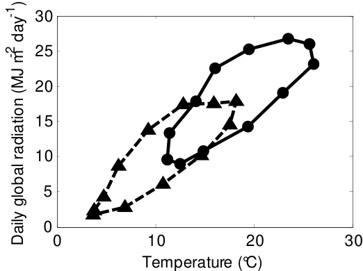  
图6.3 Almeria（实线带圆圈）和De Bilt（虚线带三角形）的日全球辐射月平均值与月平均室外温度的函数关系。

# 6.3.3.3 温室气候管理

气候控制阀的设置取决于气候控制策略和应用的气候设定值。两个地点使用了相同的温室气候设定值，如表6.3所示，以确保优化结果之间的差异仅由气候和经济条件引起。然而，在西班牙可以应用季节性白涂料的时间比荷兰更长。空气温度控制策略如图6.4所示。$\mathrm{CO}_2$富集的设定值$CO_{2Air\_ExtOn}$随着室外全球辐射的增加而增加，随着通风率的增加而减少，这是基于Magán等（2008）的研究，如第6.6.4节所述。当室外全球辐射高于Iglob_ShScr_on时，使用室外遮阳幕。

Tout_ThScr_on Tair_heat_on Tair_vent_on Tair_cool_on 1 1 一 1 1 1 1 1 通风口打开如果。 一 1 主动冷却 -CO2Air<CO2air_vent_off 1 1 机制开启 Ttremaete 1RHu>RHalyar i → → 一 1 1 1 通风口关闭 一 i 通风口打开如果使用湿帘风机或 一 1 1 机械 一 加热 1 1 1 冷却 一 机制开启 1 1 温度 →

# 6.3.3.4 经济条件

使用第5章和第6.3.1.3节中提出的公式计算性能指标。确定与有形资产相关的年度固定成本所需的经济参数如表6.1所示。两个地点的有形资产成本相似，除了薄膜和白涂料，荷兰的投资成本高于西班牙。由于使用了不同的种植系统，每个地点都有不同的剩余成本。确定可变成本的经济参数如表6.4所示。对于Almeria，2006年至2010年期间四个连续生产周期的第一和第二类长寿命番茄的周平均价格（Anonymous，2009）。对于荷兰条件，Vermeulen（2010）的第一和第二类串番茄的4周周期价格在2006年至2009年四个连续年份中取平均值。

表6.3 用于温室设计优化的室外气候、温室气候管理和作物条件概览

| | 西班牙阿尔梅里亚 | 荷兰德比尔特 |
| --- | --- | --- |
| **温室气候管理 8月1日-9月15日** | | |
| 白涂料 | (全白)3月1日-4月15日 (50%白)4月16日-6月30日 | 6月1日-8月15日 (50%白) |
| Iglob_ShScr_on (W/m²) | (全白) 650 | 650 |
| Tair_vent_on (°C) | 24 | 24 |
| RHair_vent_on (%) | 85 | 85 |
| CO2air_vent_min (ppm) | 200 | 200 |
| CO2air_vent_max (ppm) | 3000 | 3000 |
| Tair_heat_on (°C) (夜间/白天) | 17/19 | 17/19 |
| Tair_cool_on (°C) | 26 | 26 |
| Tout_ThScr_on (°C) | 14 | 14 |
| CO2Air_ExiMax (ppm) | 1000 | 1000 |
| CO2Air_ExiMin (ppm) | 390 | 390 |
| IGlob_Max (W/m²) | 500 | 500 |
| fventExtCO2_Max (m³/m²/s) | 6.95×10⁻³ | 6.95×10⁻³ |
| CO2air_ExtCO2_on (ppm) | 全球辐射的函数 | 全球辐射的函数 |
| **作物条件** | | |
| LAI_start | 0.3 | 0.3 |
| LAI_max | 2.5 | 2.5 |
| 种植开始时间, to | 8月1日 | 12月15日 |
| 种植结束时间, tf | 7月1日 | 12月1日 |

表6.4 本研究中使用的成本相关变量概览

| 参数说明 | 参数 | 单位 | 阿尔梅里亚 | 来源 | 德比尔特 | 来源 |
|----------|------|------|------------|------|----------|------|
| 番茄干物质转换系数 | 1DMFM | kg mg1 | 15.95-10-6 基于 | Magän等(2008) | 18.18-10-6 | 基于实践 |
| 排水分数 | NDrain | % | 30 | 基于实践 | 0 | 封闭系统 |
| 可销售收获比例 | 1FMsold |  |  | 取决于室内气候 |  | 取决于室内气候 |
| 天然气能量含量 | NFuel | Jm3 | 31.65-106 已知 |  | 31.65-106 | 已知 |
| 利率 | NInterest | % | 3.5 | Cajamar | 5 | Vermeulen(2008) |
| 短期借款成本 描述生产水平对劳动力成本影响的劳动力成本系数 | Y Interes_Short | % | 1 | Cajamar | 1 | Vermeulen(2008) |
|  | NLabour_kg | h kg1 FM | 0.010 | 基于Perez等 | 0.0043 | Vermeulen(2008) |
|  | NLabour_m2 | h m² | 0.270 | 基于Perez等 | 0.825 | Vermeulen(2008) |
| 设计元素i的年度维护成本系数 | N Maintenance,i | % year-1 |  | 见表6.1 |  | 见表6.1 |
| 设计元素i的折旧系数 | N Depreciation,i | % year-1 |  | 见表6.1 |  | 见表6.1 |
| 包装材料成本 | NPackage | €kg1 | 0 | 包含在销售成本中 | 0.009 | Vermeulen(2008) |
| 温室未计入部分的比例 | 1Rem | % | 2.5 | 假设 | 2.5 | Vermeulen(2008) |
| 销售成本比例 | 1sales | % | 9 | Cajamar | 2.75 | Vermeulen(2008) |
| 可销售产量中一级番茄的比例 | NToml | % |  | 取决于室内气候 |  | 取决于室内气候 |
| 每公斤番茄运输成本 | NTransport | €/kg | 0.02 | Cajamar | 0 | 包含在销售成本中 |
| 温室地面面积 | AFlr | m² | 10000 | 假设 | 10000 | 假设 |
| 纯CO2成本 | qc02_Ext | €/kg | 0.20 | Cajamar | 0.10 | Vermeulen (2008) |
| 工业CO2成本 | qco2_Ind | €/kg |  | 未选择 | 0.06 | OCAP |
| 电力成本 | qElec | €/kWh | 0.13 | Cajamar | 0.07 | Vermeulen (2008) |
| 天然气成本 | qFuel | €/m³ | 0.38 | Cajamar | 0.25 | Vermeulen (2008) |
| 设计元素i的初始投资 | qInvest,i | € |  | 见表6.1 |  | 见表6.1 |
| 劳动力成本 | qLabour | €/h | 5.4 | Cajamar | 16.0 | Vermeulen (2008) |
| 一级番茄价格（随时间变化） | qToml | €/kg |  | Cajamar |  | Vermeulen (2008) |
| 二级番茄价格（随时间变化） | qTom2 | €/kg |  | Cajamar |  | Vermeulen (2008) |
| 水成本 | qWater | €/m³ | 0.25 | Cajamar | 0 | 使用雨水 |
| 植物材料 |  | €/株 | 0.45 | Cajamar | 0.65 | Vermeulen (2008) |
| 种植密度 |  | 株/m² | 2.5 | 实践 | 2.5 | 实践 |
| 肥料 |  | €/m²/年 | 0.6 | Cajamar | 0.9 | Vermeulen (2008) |
| 作物保护 |  | €/m²/年 | 0.35 | Cajamar | 1 | Vermeulen (2008) |
| 废物处理 |  | €/m²/年 | 0.36 | Cajamar | 0.75 | Vermeulen (2008) |
| 其他材料 |  | €/m²/年 | 0.3 | Cajamar | 1.15 | Vermeulen (2008) |
| 基质 |  | €/m²/年 | 0 | 未使用 | 1.3 | Vermeulen (2008) |

# 6.4 结果与讨论

对于每个地点，两个设计群体$A$的演变将在6.4.1节中展示。随后，在6.4.2节中讨论最佳设计并描述相关经济方面。在6.4.3节中使用分布曲线和敏感性分析对接近最佳的设计进行分析。在6.4.4节中讨论基于模型的设计方法的性能。

6.4.1 优化过程中性能指标的评估 对于两个地点，CRS算法都能够解决多因素温室设计优化问题。具体而言，随着迭代次数的增加，设计群体$A$的性能（NFR）有所提高（图6.5）。两个不同的初始设计群体产生了相同的最大NFR，且最终设计群体相似，每次设计群体的平均NFR都收敛到相同的最大NFR。因此，我们可以有把握地认为找到了全局最大NFR。西班牙案例在3000次迭代后达到最高NFR，而荷兰案例则需要约5000次迭代，因为存在更多的设计替代方案，如表6.2所示。这些数字表明，评估不到$1\%$的所有设计替代方案就足以在两种情况下找到性能最高的温室。优化在7500次迭代后停止，因为预计由于NFR的平坦轨迹，设计无法进一步改进。

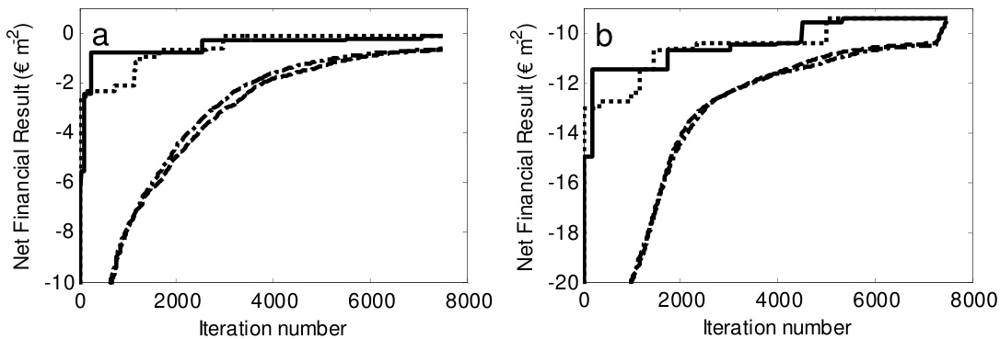  
图6.5 阿尔梅里亚(a)和荷兰(b)设计群体$\cdot _ { A } \cdot$的净财务结果演变。对于两个图，实线表示第一次优化运行的最大NFR，虚线表示第二次优化运行的最大NFR，短划线表示第一次优化运行的平均NFR，点划线表示第二次优化运行的平均NFR。

# 两种条件下的最佳温室设计评估

# 作为当地条件函数的最佳设计

表6.5显示，最佳温室适应了西班牙和荷兰的气候条件，如图6.3所示。对于阿尔梅里亚相对温暖且辐射水平高的气候，选择了具有相对较大通风面积（$20\%$，而荷兰条件为$14\%$）的温室，采用季节性白涂料来降低室内温度，并配备小容量直接空气加热（0.5 MW，而荷兰条件为$2.0 ~ \mathrm { M W }$）。相比之下，考虑到荷兰的低辐射水平，没有选择白涂料，而是选择了保温幕以提高相对寒冷气候下的加热效率。对于两种条件，都选择了高透光率的结构，以尽可能利用室外辐射。$\mathrm { C O } _ { 2 }$应用仅在荷兰条件下有价值，这得益于较低的通风需求（因此$\mathrm { C O } _ { 2 }$供应设定点较高，见6.6.4节）以及荷兰平均番茄价格与可变$\mathrm { C O } _ { 2 }$价格之间的较大差异。具体而言，荷兰的差异为$0.73 \textrm { - } 0.06 = 0.67 \textrm { ‰}$，而西班牙为$0.56 \cdot 0.20 = 0.36 \notin \mathrm { k g } ^ { - 1 }$。

表6.5 阿尔梅里亚和荷兰的优化温室设计

| 位置 | 结构 | 覆盖材料 | 室外遮阳 | 白涂料 | 室内幕布 | 加热(MW) | 降温 | CO2供应(kg/ha/h) | NFR(€/m²/年) |
|------|------|----------|----------|--------|----------|----------|------|------------------|--------------|
| 阿尔梅里亚 | 高透光,20%* | 玻璃 | 无 | 50%透光 | 无 | 直接空气加热:0.5 | 无 | 无 | -0.11 |
| 荷兰 | 高透光,14%* | 玻璃 | 无 | 无 | 100%铝箔 | 直接空气加热:2.0 | 无 | 工业200 | -9.41 |

\* 表示温室的特定通风面积。

对于西班牙条件，年NFR为$-0.11€/m²/year$，对于荷兰条件，年NFR为$-9.41€/m²/year$，这与Vermeulen (2008)对类似温室确定的年NFR $-11.06€/m²/year$相当吻合。这些负值表明，在考虑的经济条件下，种植者在这两个地点都无法维持生计。对于西班牙，与折旧、维护和短期借款成本相关的一些假设可能导致负NFR值。对于荷兰，众所周知，只有拥有热电联产机组出售电力的种植者（本研究未考虑）才能在近年来相对较低的番茄价格下盈利。然而，这些负值不会影响优化结果，因为在本研究中年NFR是最大化的。

为阿尔梅里亚选择的最佳温室与实际中遇到的温室相当吻合。选择了白涂料（而不是其他冷却手段），这与Gázquez等人(2008)的经济分析一致，他们证明白涂料结合足够的通风面积是西班牙南部条件下甜椒最具成本效益的冷却处理。此外，没有选择室外遮阳幕、室内保温幕和$\mathrm{CO}_2$供应，这些在阿尔梅里亚温室中也很少见到。然而，我们的结果表明，常见的parral温室的性能可能通过以下方式得到改善：(i)使用高透光率结构，覆盖玻璃，这将使透光率从$57\%$提高到$75\%$；(ii)将平均通风面积从$13\%$增加到$20\%$；(iii)安装容量有限的低投资加热系统。更高的透光率(Soriano等，2004)和更高的特定通风面积(Pérez-Parra等，2004)对提高作物产量的作用已经得到证实。选择玻璃作为覆盖材料（而不是更广泛使用的单层PE膜），主要是由于其年成本较低（$0.38€/m²/year$，相比$0.53€/m²/year$），以及略高的透光率（$82\%$相比$81\%$）。这一结果表明，如果有足够的资金用于所需的额外投资，采用更先进技术的温室可能是可行的。具体而言，所选设计的投资成本为$52.44€/m²$，远高于普通parral温室所需的$21.54€/m²$。这种巨大的投资成本差异可能是由于我们选择不限制投资潜力造成的。

对于荷兰条件，优化后的温室设计与普通温室非常相似，除了加热系统。设计方法表明，直接空气加热器会带来更高的NFR，而实践中使用的是带有管道加热系统的锅炉。模拟显示，直接空气加热器比锅炉-管道加热系统具有更高的热效率。锅炉-管道加热系统的较低热效率是由于从覆盖层到外部的较高热损失（由于管道到覆盖层的远红外辐射(FIR)）以及由于较高蒸腾速率（由于管道到冠层的FIR导致冠层温度升高）引起的较高湿度水平导致的较高通风需求。然而，实际上，锅炉-管道加热系统有几个优点：管道可以用作内部运输系统；热量可以缓冲，从而实现较小的锅炉容量和更高的废气$\mathrm{CO}_2$效率。此外，直接空气加热器可能会排放烟道气体并增加空间气候差异，这两者都可能对作物生长产生负面影响。由于模型没有描述这些过程，设计优化的结果并不令人惊讶。

# 6.4.2.2

# 决定NFR的相关成本方面

两个地点都有相同的四个主要成本方面，即固定成本、劳动力、能源和植物相关成本（表6.6）。水、电力和$\mathrm{CO}_2$对总成本的贡献很小。尽管温室气候模型和番茄产量模型在第2章和第3章中都得到了成功验证，以确保可靠的NFR值，但作物产量值、劳动力成本和能源与文献中描述的值进行了比较。

表6.6 决定西班牙和荷兰优化温室NFR的模拟经济成本

| 位置 | 西班牙 (€/m²/年) | 荷兰 (€/m²/年) |
|------|------------------|----------------|
| 作物产量 | 22.50 | 41.73 |
| 固定成本 | 6.43 | 14.57 |
| 可变成本 |  |  |
| 劳动力 | 3.63 | 17.73 |
| 能源 | 6.54 | 9.48 |
| 水 | 0.21 | 0.00 |
| 电力 | 0.00 | 0.21 |
| CO2 | 0.00 | 0.34 |
| 植物相关成本 | 5.80 | 8.81 |
| 净财务结果 | -0.11 | -9.41 |

在西班牙，模拟计算的可销售番茄产量为$40.3\ \mathrm{kg\ m}^{-2}$，明显高于Magán等人(2007)在高科技温室中测得的$23.8\ \mathrm{kg\ m}^{-2}$。较高的模拟作物产量是由于模拟生产周期延长了50天（如果使用与测量值相似的模拟生产周期，模拟番茄产量将为$32.1\ \mathrm{kg\ m}^{-2}$），以及优化温室具有更高的透光率，因为它减少了遮阳幕和保温幕等吸光设计元素。为了检查数量级，将模拟结果与Magán、López等人(2008)对甜椒作物的研究结果进行了比较。他们发现劳动力成本相似（$2.3\ \mathrm{€\ m}^{-2}$年与模拟劳动力成本$3.63\ \mathrm{€\ m}^{-2}$年-1），能源成本也相似（$4.56\ \mathrm{€\ m}^{-2}$年-1与模拟天然气消耗$6.54\ \mathrm{€\ m}^{-2}$年-1）。模拟劳动力成本较高是因为产量更高，模拟天然气成本较高是因为没有使用保温幕。这些结果表明，对于西班牙条件，该方法产生了现实的模型输出。在荷兰，模拟成本与Vermeulen(2008)的全国温室统计数据相当吻合，表明对于荷兰条件，该方法也产生了现实的模型输出。特别是：作物产量（$56.5\ \mathrm{kg\ m}^{-2}$和$57.5\ \mathrm{kg\ m}^{-2}$，分别为测量值和模拟值），劳动力（$16.74\ \mathrm{€\ m}^{-2}$年-1和$17.73\ \mathrm{€\ m}^{-2}$年-1）和能源使用（$43.4\ \mathrm{m}^{3}$，$37.9\ \mathrm{m}^{3}$天然气）。因此，如前所述，负的模拟NFR与Vermeulen(2008)提出的NFR相当吻合。荷兰较高的经济作物产量是由于番茄平均价格较高（$0.73\ \mathrm{€\ kg}^{-1}$，而西班牙为$0.56\ \mathrm{€\ kg}^{-1}$），以及可销售产量较高（$57.5\ \mathrm{kg\ m}^{-2}$年-1，而西班牙为$40.3\ \mathrm{kg\ m}^{-2}$年-1）。西班牙较低的作物产量是由于季节性白涂料的应用导致温室透光率较低，以及没有应用$\mathrm{CO}_{2}$富集。

# 6.4.3 接近最佳温室的评估

对于此分析，我们结合了每个案例两次优化运行中获得的温室设计群体。

# 6.4.3.1 西班牙南部条件

对于西班牙条件，图6.6展示了NFR与最佳温室NFR差异小于$0.25\ \mathrm{€\ m}^{-2}$年-1的温室设计元素替代方案的分布。该图显示，接近最佳的温室之间只有微小的差异，这表明优化收敛到了一个最优值。

允许更大的差异（$\Delta NFR < 1.50\ \mathrm{€\ m}^{-2}$年-1）显然导致了更广泛的设计元素谱（图6.7）。具体而言，与$\Delta NFR < 0.25\ \mathrm{€\ m}^{-2}$年-1相比，具有$14\%$特定通风面积的轻型结构、单层PE膜、不使用白涂料和容量为$1.0\ \mathrm{MW}$的直接空气加热器也是可行的设计方案。此外，与室内幕布和$\mathrm{CO}_{2}$供应相关的替代方案的广泛谱表明，这些因素的影响是边际的。图6.8中展示的敏感性分析显示了所有替代方案对每个设计元素对NFR的影响。伴随平均NFR较高的替代方案表明，这些单独的替代方案显著提高了温室的整体性能。由于具有高NFR的设计元素替代方案也出现在接近最佳温室设计集合中（图6.6和图6.7），预计找到了全局最大值。

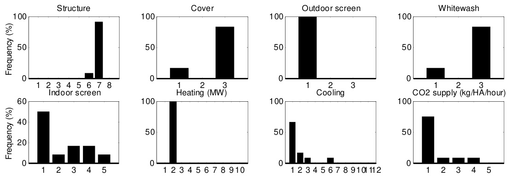  
图6.6 对于西班牙条件，∆NFR $< 0.25\ \mathrm{€\ m}^{-2}$年-1（即净财务结果与最佳温室差异小于$0.25\ \mathrm{€\ m}^{-2}$）的最佳12个设计中设计元素替代方案的频率（以%表示）。x轴上的索引对应于表6.1中展示的设计元素替代方案。

结构 覆盖材料 室外遮阳 白涂料 60 60 100 60   
240 1 240 40 1 50 20 0 0 0 1 2 3 4 5 6 7 8 室内幕布 加热(MW) 2 3 1 2 降温 3 CO2供应(kg/HA/小时)   
120 山 60 20 10 心 120 20 1 2 3 4 5 1 2 3 4 5 6 7 8 9 10 1 2 3 4 5 6 7 8 91011 2 1 2 3 4 5

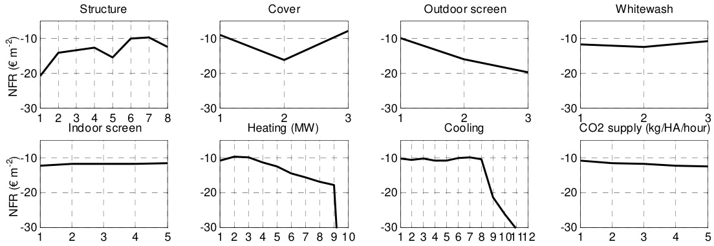  
图6.7 对于西班牙条件，$\Delta NFR < 1.50\ \mathrm{€\ m}^{-2}$年-1的最佳781个设计中设计元素替代方案的频率（以%表示）。   
图6.8 对于所有8个设计元素及其相关替代方案，分别展示配备特定替代方案的温室设计对应的NFR平均值。此分析使用了CRS算法评估的所有设计。

根据上述观察，NFR对选择室内幕布和$\mathrm{CO}_{2}$供应的替代方案不敏感，这通过NFR对这些替代方案的相对平坦响应得到证明。因此，首先关注NFR对所选替代方案变化敏感的设计元素的优化，在这种情况下意味着关注温室结构、覆盖材料、白涂料和加热系统。鉴于应用的温室面积和经济假设，具有极低NFR的技术，即地热加热和机械冷却，应从给定条件下要优化的替代方案中排除。

此外，高透光率结构比低透光率结构更可取（图6.8）。第5章对西班牙温室进行的敏感性分析已经证明了较高透光率对产量和NFR的积极影响。然而，正如选择透光率为$50\%$的白涂料所示，在夏季条件下，较高的温室透光率并不利于增加NFR。这一结果表明，覆盖材料透光率对NFR的影响随季节变化，这已经在第4章中指出。

# 6.4.3.2 荷兰条件

对于荷兰条件，$\Delta NFR < 0.25\ \mathrm{€\ m}^{-2}$年-1的设计元素分布显示，由75%铝和25%PE组成的保温幕、容量为1.5 MW的直接空气加热器以及来自储罐或工业的多种$\mathrm{CO}_2$供应量也是可行的替代方案（图6.9）。$\Delta NFR < 1.50\ \mathrm{€\ m}^{-2}$年-1的设计元素分布表明，降温和$\mathrm{CO}_2$供应可以通过多种可行的替代方案实现（图6.10）。尽管这些降温技术对模拟作物产量和可变成本没有显著影响，但它们的选择源于其较低的年固定成本（表6.1）。

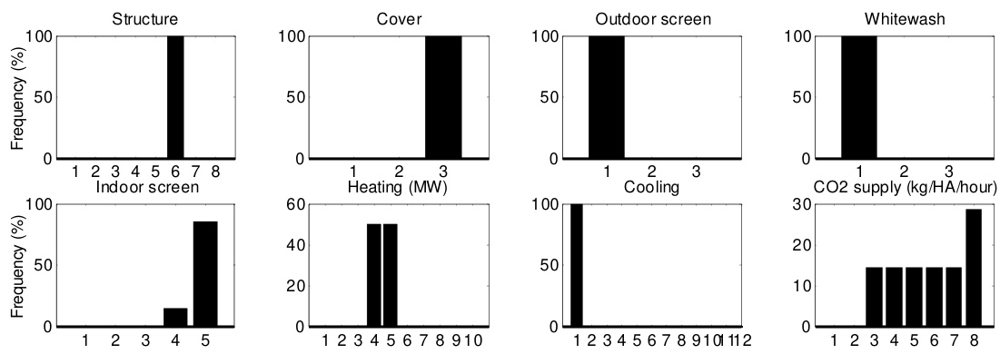  
图6.9 对于荷兰条件，∆NFR $< 0.25\ \mathrm{€\ m}^{-2}$年-1的最佳14个设计中设计元素替代方案的频率（以%表示）。x轴上的索引对应于表6.1中展示的设计元素替代方案

结构 覆盖材料 室外遮阳 白涂料 100 100 100 100   
50 50 L 50 50 1 0 0 0 0 1 2 3 4 5 6 7 8 2 3 1 ，2 3 2 3 室内幕布 加热(MW) 降温 CO2供应(kg/HA/小时) 60 60 30 20   
240 l 40 120 10 20 1 2 3 4 5 0 1 2 3 4 5 6 7 8 9 10 1 2 3 4 5 6 7 8 91011 2 0 1 2 3 4 5 6 7 8

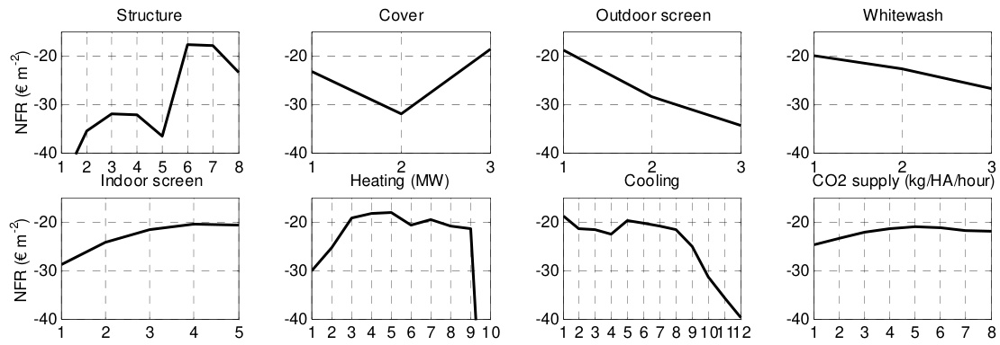  
图6.10 对于荷兰条件，$\Delta NFR < 1.50\ \mathrm{€\ m}^{-2}$年-1的最佳245个设计中设计元素替代方案的频率（以%表示）。  
图6.11 对于所有8个设计元素及其相关替代方案，分别展示配备特定替代方案的温室设计对应的NFR平均值（荷兰条件）。此分析使用了CRS算法评估的所有设计。

由于设计元素替代方案对NFR的影响在西班牙（图6.8）和荷兰条件（图6.11）之间存在显著差异，这再次证明了根据当地条件调整温室的必要性。具体而言，室内幕布和加热系统的平均NFR的不同轨迹表明，在相对寒冷的荷兰，室内保温幕和大容量加热系统比在西班牙更为重要。如前所述，对于两个地点，高透光率结构显然是最佳选择。然而，荷兰高透光率和低透光率结构之间的NFR差异比西班牙大得多，这反过来表明，正如预期的那样，光在荷兰是一个更为限制性的生长因子。

# 6.4.4 基于模型的设计方法讨论

与第5章和其他温室设计研究（Engel, 1984; Amir & Hasegawa, 1989; Kacira et al., 2004）相比，本研究使用基于模型的温室设计方法优化了广泛的设计元素。对于西班牙和荷兰条件，该方法根据当地气候和经济条件调整温室设计，以获得最大NFR。此外，分布曲线和敏感性分析揭示了设计元素对温室设计和相关NFR的影响。尽管该设计方法能够针对不同的气候和经济条件优化温室设计，但仍需解决几个问题以提高基于模型的设计方法的性能和通用性。如图6.5所示，改进的CRS算法能够有效解决多因素温室设计优化问题。尽管CRS是为连续设计变量开发的，但改进的CRS可以解决整数温室设计问题，因为离散优化参数按照Lampinen和Zelinka（1999）的建议表示为浮点值。可以预期，其他基于群体的优化方法，如模拟退火和遗传算法也可以使用（Dréo et al., 2006）。假设这些更优雅的优化算法也能从并行计算中受益，那么与改进的CRS算法相比，这些方法可能会减少优化时间。尽管使用不同起始集的两个优化运行找到了相同的优化温室，但像所有其他优化方法一样，CRS不能保证全局最大值。

优化的性能主要取决于三个因素。首先，优化仅考虑模型中包含的过程。在我们的项目中，重点是优化一组有限的设计元素。因此，没有进行结构设计、气候控制、热缓冲、施肥系统、劳动力和物流的优化。因此，例如，锅炉-管道加热系统对热储存、劳动力和物流的积极影响没有被纳入，因此这些优势无法通过设计方法进行优化。设计方法的通用性使得设计元素、关键组件和模型方面可以轻松调整或添加。其次，模型的准确性决定了NFR的置信限，从而决定了优化的性能。尽管进行了验证，但温室气候模型和番茄产量模型可能如第2章和第3章分别讨论的那样得到改进，这也可能影响优化设计。此外，由于番茄质量方面不仅受湿度水平影响，还受其他气候变量影响（Adams et al., 2001），通过用更详细的质量描述替换第6.6.2节中描述的番茄质量过滤器，可能会提高模型性能。

第三，性能指标和边界条件的选择对优化设计有影响。在本研究中，温室通过最大化每平方米年NFR $( \in \mathrm{€\ m}^{-2}\ \mathrm{year}^{-1} )$ 进行优化，边界条件为固定温室面积 $\mathrm{1\ Ha}$。投资潜力没有受到限制，因为通过这种方式，我们能够在给定的市场和气候条件下找到性能最佳的温室。例如，地方当局可以通过这种方式了解是否可以通过补贴或其他财政刺激措施提高该地区的生产力。结果表明，最佳温室的投资成本高于当地商业parral温室，这表明在这些条件下，这些财政刺激措施可能是有益的。同样有趣的是，在有限投资潜力作为边界条件的情况下，通过最大化年NFR（€ year-1）来优化表面积和温室设计。由于设计方法的模块化结构，性能指标和边界条件可以根据设计者的需求轻松调整。

如第4章和第5章所示，温室气候设定点、经济输入参数和室外气候对NFR有显著影响。此外，Vanthoor等人（2008a）表明，气候设定点的选择甚至影响了一些最佳设计参数。这些结果表明，经济输入参数、室外气候数据和气候设定点参数的变化可能会影响优化设计。设计优化周期为一年，而优化温室的使用寿命约为15年。因此，这些输入参数应以目前已知的信息尽可能代表未来输入参数的方式确定。

# 6.5 结论

本研究的目的是将优化算法整合到基于模型的设计方法中，为不同气候和经济条件下的番茄温室选择能够产生最大年净财务回报的设计。这一目标已经实现。使用并行计算的改进CRS优化算法能够为阿尔梅里亚和荷兰条件选择最佳的设计元素替代方案。

具体而言，由于阿尔梅里亚气候相对温暖且辐射水平较高，选择了通风面积相对较大（$20\%$，而荷兰条件为$14\%$）、季节性白涂料和直接空气加热容量相对较低（$\mathbf { \chi } _ { 0 . 5 \mathbf { M } \mathbf { W } }$，而荷兰条件为$2 . 0 \ : \mathrm { M W }$）的温室。相比之下，对于辐射水平较低的相对寒冷的荷兰气候，没有选择白涂料，而是采用了$100\%$铝制保温幕。仅在荷兰条件下应用了$\mathrm { C O } _ { 2 }$富集。该设计方法产生了现实的设计和相关的年NFR，表明开发出了一种稳健可靠的设计方法。

基于群体的优化方法为分析接近最佳的温室提供了机会。接近最佳温室设计的分布曲线以及对设计元素替代方案的平均NFR的敏感性分析揭示了：a）需要优化的相关设计元素及其相关替代方案；b）是否存在许多具有几乎相似NFR的不同温室。对于这两个地点，选择具有足够通风面积的高透光率结构都很重要，而室外遮阳、地热加热和机械冷却在给定条件下都不可行。此外，对于西班牙条件，还应重点优化覆盖材料、白涂料和加热系统以提高NFR，而对于荷兰条件，室内幕布和加热系统对性能有很大影响。

通过这些结果，基于模型的设计方法的四个关键组成部分，即温室气候模型、番茄产量模型、经济模型和优化算法，都成功地整合在一起。该设计方法能够将温室的经济性能描述为室外气候、气候管理和温室设计的函数。改进的CRS算法使温室适应给定条件，从而获得最大净财务结果。据我们所知，这是首次解决这种多因素优化问题，并获得了更复杂问题的部分解决方案。这些结果证明了基于模型的方法在各种气候和经济条件下进行温室设计的可行性。

# 致谢

我们要感谢来自瓦赫宁根大学的Gerard Folkerts、Andre Aalten和Reggie Naumann使并行计算成为可能。经济参数由Cajamar基金会经济研究所的Ana Cabrera、Cajamar（农业信贷合作社）农业食品业务部门的员工以及瓦赫宁根大学农业经济研究所的Marc Ruijs提供。此外，我们还要感谢来自Ecofys的Bas Speetjens，来自瓦赫宁根大学的Gerard van Willigenburg、Bert van ‘t Ooster，以及来自瓦赫宁根大学温室园艺的Feije de Zwart和Gert Jan Swinkels的有益评论。本研究是"生态系统、景观、海洋和区域的可持续空间发展"和"可持续农业"两个战略研究计划的一部分，这两个计划均由当时的荷兰农业、自然保护和食品质量部资助。

# 6.6 附录

6.6.1 附录A：气候调节技术的电力消耗计算

$$
\begin{array} { l } { { { \displaystyle P _ { F o g } = \frac { p _ { F o g } M V _ { F o g A i r } } { 1 0 0 0 \eta _ { F o g R a m p } } } } } \\ { { { \displaystyle P _ { G e o } = \eta _ { G e o } H _ { G e o P i p e } } } } \\ { { { \displaystyle P _ { M e c h } = U _ { M e c h C o o l } \left( 1 + \eta _ { M e c h C o o l } \right) P _ { M e c h C o o l } \left/ A _ { F l r } \right. } } } \\ { { { \left. P _ { P a d } = c _ { F o d } f _ { P a d } \right. } ^ { 2 } } } \end{array}
$$

其中

[W m-2]  (A.1)

(A.2)

(A.3)

$$
\begin{array} { c } { { { [ } \mathrm { W } \mathrm { m } ^ { - 2 } \mathrm { ] } } } \\ { { { [ } \mathrm { W } \mathrm { m } ^ { - 2 } \mathrm { ] } } } \\ { { { [ } \mathrm { W } \mathrm { m } ^ { - 2 } \mathrm { ] } } } \end{array}
$$

(A.4)

$[ \mathrm { W ~ s } ^ { 2 } \mathrm { m } ^ { - 4 } ]$ (A.5)

$$
\begin{array} { l } { { c _ { \tiny { P a d } } = \displaystyle \frac { P _ { P a d M a x } } { f _ { P a d M a x } } } } \\ { { \displaystyle P _ { P a d M a x } = \displaystyle \frac { n _ { V e n s } P _ { V e n M a x } } { A _ { F I r } } } } \\ { { f _ { P a d M a x } = \displaystyle \frac { n _ { V e n s } f _ { V e n M a x } } { A _ { F I r } } } } \end{array}
$$

$[ \mathrm { W ~ m } ^ { - 2 } ]$ (A.6)

$$
[ \mathrm { m } ^ { 3 } \mathrm { m } ^ { - 2 } \mathrm { s } ^ { - 1 } ]
$$

其中 $p _ { F o g } \left( \mathrm { P a } \right)$ 是雾化系统的静压，$\eta _ { F o g P u m p } \left( - \right)$ 是雾化泵的效率，$\eta _ { G e o } ( \mathbf { J } \ \mathbf { J } ^ { - 1 } )$ 是泵送地热能所需的电能，$U _ { M e c h C o o l } \ ( - )$ 是机械冷却机构的控制阀，ηMechCool $\left( - \right)$ 是机械冷却系统泵成本的系数，$P _ { M e c h C o o l }$ (W) 是机械冷却系统的电功率，$A _ { F l r } ( \mathbf { m } ^ { 2 } )$ 是温室地面面积，$c _ { P a d }$ $( \mathrm { W ~ s } ^ { 2 } \mathrm { m } ^ { - 4 } )$ 是风扇的电力消耗特性，$f _ { P a d } ( \mathbf { m } ^ { 3 } \mathbf { m } ^ { - 2 } \mathbf { s } ^ { - 1 } )$ 是由于湿帘和风扇系统产生的通风流量，PPadMax $( \textrm { W } \textrm { m } ^ { - 2 } )$ 是每平方米温室的最大风扇电力消耗，$f _ { P a d M a x }$ $( \mathrm { m } ^ { 3 } \ \mathrm { m } ^ { - 2 } \ \mathrm { s } ^ { - 1 } )$ 是风扇的最大空气流量，$n _ { V e n t s }$ (-) 是风扇总数，$P _ { V e n t M a x } ~ ( \mathrm { W ~ m } ^ { - 2 } )$ 是一个风扇的最大电功率，$f _ { V e n t M a x } ~ ( \mathrm { m } ^ { 3 } ~ \mathrm { s } ^ { - 1 } ~ \mathrm { f a n } ^ { - 1 } )$ 是一个风扇的最大空气流量。

# 6.6.2

附录B：一级番茄比例和可销售比例作为湿度函数的确定

Körner 和 Challa (2003) 指出，作物生长和发育受24小时平均蒸汽压差 $( \mathrm { V P D } _ { 2 4 } )$ 的影响，而灰霉病受温室空气48小时平均相对湿度 $\mathrm { ( R H _ { 4 8 } ) }$ 的影响。基于这些数据，我们假设一级番茄比例可以描述为 $\mathrm { \Delta V P D } _ { 2 4 }$ 的函数，可销售比例可以描述为 $\mathrm { R H } _ { 4 8 }$ 的函数。这两个函数分别用梯形函数表示，如图B1所示。

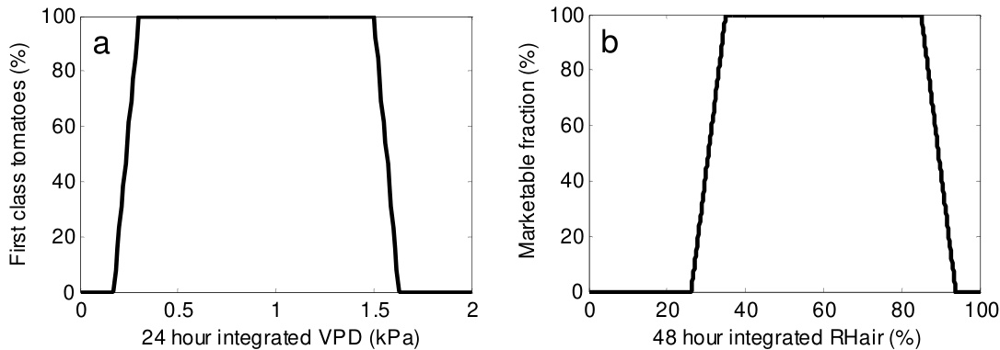  
图 B.1a 一级番茄比例作为24小时平均蒸汽压差 $( V P D _ { 2 4 } )$ 的函数。图 B.1b 可销售比例作为48小时平均相对湿度 $( R H _ { 4 8 } )$ 的函数。

质量参数仍为最大值时的边界条件为：$V P D _ { m i n }$ $= 0 . 3 \ \mathrm { k P a }$ (Körner & Challa, 2003)；$V P D _ { m a x } = 1 . 5 \mathrm { { k P a } }$ Las Palmerillas Cajamar；$R H a i r _ { m i n } { = }$ $3 5 \%$ 温室种植者A 和 $R H a i r _ { m a x } { = 8 5 \% }$ 温室种植者B。这些函数的斜率是通过将估计的质量参数与低技术和高技术温室中测量的室内气候的测量值进行拟合来估计的。假设对于当前方法，这些质量过滤器能够足够准确地估计一级番茄比例和可销售比例（表A1）。

表A1 位于西班牙南部的两个温室的估计质量参数和实测质量参数（括号内）

| 质量参数 | 低技术温室 | 高技术温室 |
|----------|------------|------------|
| 一级番茄比例 nTom1 (%) | 69.9 (65) | 92.5 (95) |
| 可销售比例 nFMsold (%) | 90.1 (90) | 95.2 (95) |

6.6.3 附录C：计算标准气候年的算法

生成标准气候年的算法基于Breuer和Van de Braak（1989）的研究，并进行了调整以生成与月平均温度和总辐射量密切匹配的标准年。生成标准年的步骤如下：

1. 确定所有气候年份中温度和总辐射的月平均值，$\overline { { \boldsymbol { x } } } _ { i , j }$，其中$i$表示月份索引，$j$表示所考虑的气候变量。
2. 对于每个气候年份$k$，确定温度和总辐射的月平均值$x_{i,j,k}$。
3. 对于每个月$i$、每个气候变量$j$和每个气候年份$k$，计算归一化偏差：$S _ { i , j , k } = \Bigg | \frac { \overline { { x } } _ { i , j } - x _ { i , j , k } } { s t d \big ( x _ { i , j } \big ) } \Bigg |$。
4. 对于每个月，确定所有气候变量的标准化偏差之和最小的年份：$Y e a r _ { i } = \operatorname* { m i n } _ { k } \sum _ { j = 1 } ^ { j = N j } S _ { i , j , k }$。
5. 通过连接具有最小月标准化偏差的年份来创建标准年：$S T D y e a r = \left( J a n u a r y ( Y e a r _ { 1 } ) , F e b r u a r y ( Y e a r _ { 2 } ) , . . . . . . . . . D e c e m b e r ( Y e a r _ { 1 2 } ) \right)$。

6.6.4 附录D：CO₂富集的设定点计算

CO₂设定点随总辐射$I_{Glob}$线性增加，直到达到定义的最大CO₂设定点$CO_{2Air\_ExtMax}$，同时CO₂设定点随温室总通风率$fVentTot$线性下降：

$C O _ { _ { 2 A i r _ { - } E x t O n } } = f \big ( I _ { G l o b } \big ) \cdot g \big ( f _ { _ { V e n f o t } } \big ) \cdot \big ( C O _ { _ { 2 A i r _ { - } E x t M a x } } - C O _ { _ { 2 A i r _ { - } E x t M i n } } \big ) + C O _ { _ { 2 A i r _ { - } E x t M i n } }$ [ppm]   (D.1)

$$
f \left( I _ { G l o b } \right) = \left\{ \begin{array} { c } { { \displaystyle { \frac { I _ { G l o b } } { I _ { G l o b } } } , I _ { G l o b } < I _ { G l o b _ { - } M a x } } } \\ { { } } \\ { { 1 , I _ { G l o b } \geq I _ { G l o b _ { - } M a x } } } \end{array} \right.
$$

$$
g \big ( f _ { _ { V e n t T o t } } \big ) = \left\{ \begin{array} { l l } { 1 - \displaystyle \frac { f _ { _ { V e n t T o t } } } { f _ { _ { V e n t E x t C O 2 } } } , f _ { _ { V e n t T o t } } < f _ { _ { V e n t E x t C O 2 } } _ { - } M a x } \\ { ~ } \\ { ~ 0 , ~ } \\ { ~ f _ { _ { V e n t T o t } } \geq f _ { _ { V e n t E x t C O 2 } } _ { - } M a x } \end{array} \right.
$$

其中$I_{Glob} (\mathbf{W} \ \mathbf{m}^{-2})$是室外总辐射，$f_{VentTot} (\mathrm{m}^{3} \mathrm{~\bf ~m}^{-2} \mathrm{~\bf ~s}^{-1})$是总通风率，$CO_{2Air\_ExtMax}$ (ppm)是最大CO₂浓度设定点，$CO_{2Air\_ExtMin}$是最小CO₂浓度设定点(ppm)，$I_{Glob\_Max} (\mathbf{W_{\Sigma}\Sigma} | \mathbf{m^{-2}})$是达到最大CO₂浓度设定点时的室外总辐射，$f_{VentExtCO2\_Max} (\mathrm{m}^{3} \ \mathrm{m}^{-2} \ \mathrm{s}^{-1})$是CO₂浓度设定点等于最小CO₂浓度设定点时的总通风率(ppm)。

# 第7章

结论、讨论、建议与未来展望

# 7.1.1 结论

为了设计适应当地气候和经济条件的温室，我们开发了基于模型的温室设计方法，如图7.1所示。该方法利用温室气候模型、番茄产量模型和经济模型，将温室性能确定为多个设计因素的函数。

经济变量   
结构总成本   
覆盖类型 室外气候 室内气候：投资   
遮阳网 白涂料 气候管理 温室设计 温室模型 TCan, CO2Air,RPAR TAir,VPAir 番茄模型 作物产量 经济模型 净财务结果   
保温幕   
加热系统 资源使用：   
冷却系统 水、能源、CO2、电力   
$\mathrm { C O } _ { 2 }$ 富集 投资 净财务结果最大化？ 温室设计 否：调整优化温室设计 是：温室设计最优

据我们所知，这是首次详细地解决并部分解决了这个多因素优化问题。所提出的方法在给定的当地气候和经济条件下选择了最佳温室，如第6章中西班牙南部和荷兰的两个案例所示。西班牙阿尔梅里亚的最佳温室采用季节性白涂料，并配备了相对较大的通风面积，而荷兰条件下的最佳温室则具有较小的通风面积、较高的加热能力和保温幕。

在这两个案例中，得出的温室设计都较好地代表了当前温室的最新技术水平，这增加了我们对设计方法稳健性和可靠性的信心。此外，结果表明，在广泛的气候条件下，所使用的模型足够准确，可以纳入基于模型的设计方法。特别是，温室气候模型在三种气候条件下（温带海洋性气候、地中海气候和半干旱气候）对四种不同温室设计的室内气候预测具有合理的准确性，如第2章所示。番茄产量模型在多种温度条件下对番茄产量的模拟具有较好的准确性，如第3章所示。年度净财务结果的计算给出了当前经济状况的可靠估计，如第5章和第6章所示。

基于这些结果，本论文的目标已经实现。我们开发了一种用于保护栽培系统的设计方法，可以产生适应当地气候和经济条件的温室设计。正如西班牙南部和荷兰的案例所示，该方法为两个地点产生了非常不同但可靠的温室。由于基础模型在广泛的气候条件下得到了全面验证，因此可以预期该设计方法也能为其他地点产生可靠的温室设计。由于研究重点放在影响空气气候的气候和经济条件及技术上，因此获得了温室设计问题的部分解决方案。这种方法的后果以及设计方法的其他方面将在下文中讨论。

# 7.1.2 讨论与建议

# 7.1.2.1 温室对当地条件的适应

设计方法产生的结果表明了优化后的温室为何以及如何适应当地气候和经济条件。室外气候——特别是全球辐射、温度和$\mathrm { C O } _ { 2 }$浓度——对西班牙的低技术温室和德克萨斯州的高技术温室的作物产量和资源消耗产生了巨大影响（表4.5和4.6），这表明这些气候变量也会影响温室设计。事实上，温室设计确实适应了这些气候条件，如第6章中西班牙南部和荷兰的案例所示。荷兰相对较低的辐射水平和温度（图6.3）导致了一个具有高透光率结构、没有白涂料、加热能力为$2 . 0 ~ \mathrm { M W }$和保温幕的温室。相比之下，西班牙相对较高的辐射水平和高温导致了一个覆盖季节性白涂料（但在冬季月份覆盖物具有高透光率）并配备较大特定通风面积$20 \%$（荷兰为$14 \%$）的温室，以降低温室空气温度。此外，为了避免夜间低温，该温室配备了$0 . 5 \mathrm { M W }$的加热能力，尽管保温幕被证明不经济。

经济条件也强烈影响了温室设计。番茄价格轨迹的变化导致了另一个"最佳"温室，如图5.5b所示。特别是对于西班牙南部条件，高技术温室在高番茄价格下是有利的，但在低价格下则不然。与此一致，荷兰较高的番茄价格$( 0 . 7 3 \notin \mathrm { k g } ^ { - 1 }$，西班牙为$0 . 5 6 \notin \mathrm { k g } ^ { - 1 }$)产生了一个比西班牙技术含量更高的温室。

# 7.1.2.2 温室设计优化问题的定义

在本研究中，温室设计的性能以预期年净财务结果的最大化来表示。鉴于设计方法的通用性，这一性能指标可以很容易地被替换。替代方案可能是其他经济性能指标、资源消耗的最小化或产量的最大化。

由于本研究选择了经济性能指标，因此无法优化设计参数。具体来说，温室设计可以被视为一组设计元素的集合，每个设计元素由一个或多个设计参数组成。例如，设计元素"覆盖材料"由以下一组设计参数组成：PAR、NIR和FIR的透射和吸收系数、厚度、热导率、比热容和覆盖材料的密度。寻找这些设计参数的最优值可能很有趣。然而，为单个设计参数分配成本相当复杂，特别是当相应的设计元素不存在时（例如，具有高PAR透射系数和低NIR透射系数的覆盖材料）。因此，这些成本应基于粗略的假设进行估计，这会导致巨大的价格不确定性。因此，由于设计元素的成本是已知的（表6.1），本研究侧重于优化满足这些设计元素的备选方案集合。然而，如果选择另一个性能指标，例如产量最大化，则也可以优化设计参数集，因为这样就不需要为设计参数的变化分配成本。通过这种方式，可以确定给定设计参数修改的"净价值"，这对温室生产商来说是有用的信息，可以表明种植者的潜在额外收入。如果将温室设计定义为一组可调参数，也可以确定可调参数随时间变化的经济潜力。例如，可以计算可调NIR透射系数的覆盖材料带来的额外收入。

除了选择有限的设计元素集并将温室面积固定为$1 \ \mathrm { H a }$外，本研究没有使用其他约束条件。在需要时，可以很容易地将其他相关的优化约束（如最大投资水平、温室面积或资源使用）应用于设计方法。违反这些约束的设计方案将被从最佳温室设计集合中剔除。

第6章讨论了性能指标和优化约束对温室设计优化的影响。对于西班牙的优化案例，所选的温室与常见的温室相比具有更高的投资和更高的技术水平。这种差异可能是由于应用了最大化每平方米年净财务结果（NFR）的性能指标以及使用了无限的投资潜力。在实践中，投资水平将是有限的。因此，评估以下因素对最佳温室设计的影响可能很有趣：（i）另一个经济性能指标，例如最小化投资回收期或最大化投资回报率；（ii）投资水平的约束；（iii）温室面积的优化。进行这样的评估可能会回答以下两个有趣的设计问题。另一个经济性能指标是否会导致完全不同的"最佳"温室？在特定条件下，种植者应该投资于一个小型高科技温室还是一个大型低技术温室？这些问题需要在项目的后续工作中解决。如果规模经济对投资成本的影响以及投资回收期和投资回报率的计算被整合到经济模型中，设计方法可以回答这些问题。

# 7.1.2.3 解决温室设计问题的不同方法

正如上一节所讨论的，温室设计可以通过三种方式定义：作为一组设计元素；作为一组固定设计参数；作为一组可调设计参数。本节讨论了解决这些不同设计问题的优化技术。

本方法侧重于寻找满足八个设计元素的最佳备选方案组合。在第6章中，这种离散设计优化被定义为一个整数优化问题，并使用能够处理不连续设计参数的无梯度全局优化方法来解决。为此，对Price（1977）提出的基于群体的受控随机搜索（CRS）方法进行了修改并应用于设计方法。选择最佳优化算法超出了本研究的范围。可以预期，其他基于群体的优化方法，如模拟退火和遗传算法，也可以解决这个问题（Dréo等，2006）。如果这些更优雅的优化算法也允许并行计算，它们可能会比修改后的CRS算法减少优化时间。

设计方法还可以优化单个设计参数。这种连续优化问题可以通过基于梯度的优化算法高效解决。由于这些算法需要具有连续可微右侧的微分方程，因此模型已开发为这种格式。通过连接微分方程组，模型可以很容易地相互结合。这些微分方程由MatlabTM的常微分方程求解器求解。为了在软件代码中实现这些方程，不需要重写或线性化。此外，模型性能评估表明，与不可微的右侧相比，可微的右侧加快了模拟速度（结果未显示）。

为了优化可调设计参数随时间的变化并确定其经济潜力，这些参数应被视为动态参数。因此，这个优化问题可以被视为一个动态优化问题。这个问题可以使用动态优化算法来解决，类似于Van Straten等（2010）描述的动态气候控制优化。

# 7.1.2.4 如何揭示相关的设计方面？

应用的基于群体的优化算法提供了最适合当地条件的温室集合的见解，并揭示了该特定位置最相关的设计元素。例如，在西班牙南部和荷兰，具有高透光率和足够通风面积的结构对于提高温室性能都很重要（图6.6-6.11）。此外，对于这两个地点，应用地热热源和机械冷却对于$1 \ \mathrm { H a }$的温室来说是不经济的。

还分析了单个设计参数的影响。单变量敏感性分析指出了可能通过调整来增加净财务结果的设计参数。具体来说，表5.8显示，对于西班牙阿尔梅里亚的高科技温室，PAR透射系数对净财务结果的影响最大：如果覆盖材料的PAR透射系数增加$1\%$，年NFR将增加每公顷1067欧元。对于低技术和高技术温室，覆盖材料和涂料的光学特性以及通风率对净财务结果的影响最大。由于设计参数修改的成本分配复杂（见第7.1.2.2节），因此单变量分析仅指出了参数修改的额外毛收入，而没有指出相应的成本。因此，这种方法没有捕捉到某些参数比其他参数更容易修改（导致特定参数修改的成本较低）的影响。

敏感性结果还表明，覆盖材料特性对番茄产量的影响随季节变化（图4.4），这表明至少对于某些参数，可调特性可能比固定设计参数带来更好的结果。Sonneveld等（2011）已经指出，可调覆盖材料特性可能有利于温室性能。然而，需要更多的研究来确定最有前途的参数并开发具有动态特性的材料。

单变量敏感性分析揭示了经济参数、室外气候条件和气候设定点对NFR的影响。表5.8显示，对于阿尔梅里亚的条件，高科技温室的NFR对经济输入参数高度敏感，即番茄价格、可销售番茄比例、一级番茄比例以及加热和通风设定点。此外，表4.5和4.6表明，对于阿尔梅里亚的低技术温室和德克萨斯州的高技术温室，作物产量和资源消耗对室外气候条件最为敏感。分析了室外气候和番茄价格年变化的不确定性对NFR的影响（图5.5），并揭示了特定年份的选择影响了阿尔梅里亚条件的"最佳"设计。

# 7.1.2.5 输入参数不确定性下的设计优化

前一节的结果表明，经济输入参数、室外气候数据和气候设定点参数的变化可能会显著影响优化设计。由于温室的使用寿命远大于一年的设计优化周期，因此输入参数的选择至关重要。这些输入参数必须以尽可能代表未来输入参数的方式确定，基于当前已知信息。解决输入参数不确定性下设计优化问题的最常用方法是应用随机优化算法（Sahinidis, 2004）。这些算法将为许多不同的随机价格轨迹、气候轨迹和气候设定点集合解决优化问题。因此，这类算法将在输入不确定性的情况下得出最佳温室设计。然而，将随机优化算法应用于基于模型的设计方法将导致巨大的CPU时间消耗。因此，我们提出了一种耗时较少的方法来减少价格轨迹、室外气候和气候管理对最佳设计的影响。

如第6章所述，通过对过去四个连续生产周期的番茄价格进行平均，降低了其不确定性。然而，由于未来价格轨迹不确定，最好对最坏情况和最佳情况价格情景重复优化过程。然后，应选择在这些不同水平下表现最好的温室。设计方法采用了基于较长气候周期的标准气候年（第6章）。为了创建一个"平均"标准年，没有选择可能影响优化过程的极端气候月份。因此，最好以统计上合理的方式将极端事件纳入标准气候年，或使用多年的优化时间跨度和室外气候。

在本研究中，气候控制阀的设置是根据控制策略和气候设定点确定的。为了使优化设计独立于所应用的气候管理策略，这些阀门设置应与设计同时优化。关于冷库设施（Lukasse等，2009）、电梯和汽车悬架系统（Fathy，2003）设计的研究已经证明了这种方法的可行性。尽管气候控制的动态优化已经被深入研究（Seginer，1989；Ooteghem，2007；Van Henten，1994；Van Straten等，2010），但温室的联合控制和设计优化问题尚未得到解决。如果气候管理会显著影响优化温室设计，则必须将温室设计视为联合设计和控制优化问题。解决这样的优化问题将需要巨大的CPU时间。另一种限制所选气候管理影响的方法是优化静态气候设定点，而不是实际控制动作，并以与设计元素类似的方式处理它们。然后，这些气候设定点可以添加到整数设计向量中（图6.2），并以类似的方式进行优化。这种静态优化方法将比联合设计和控制优化方法更快地解决优化问题，因为静态气候设定点不随时间变化，而动态控制阀设置会变化。然而，在优化气候设定点时，所选的控制策略仍会不理想地影响温室设计。

# 7.1.2.6 如何提高设计方法的可靠性？

本节首先从所用模型的准确性方面讨论该方法的可靠性，然后从设计方法的通用性方面进行讨论。由于设计方法的通用性，所提出的改进或调整可以很容易地集成到方法中。由于我们的目标是开发一种专注于一组元素优化的设计方法，因此可能相关的方面可能被简化或有意忽略。由于模型的准确性影响NFR的置信限，从而影响优化过程，因此这里讨论了一些可能提高模型准确性的问题。

温室气候模型和作物产量模型是分别验证的，因为没有同时验证它们的数据。然而，如图7.1所示，这两个模型之间存在多个输入-输出交互。具体来说，作物产量模型使用计算的室内气候作为输入，作物生长过程影响温室空气中的$\mathrm{CO}_2$浓度、温度和湿度。因此，最好联合验证这些模型。更彻底的验证可能会进一步提高模型的可信度。由于作物产量受冠层温度的强烈影响，因此验证冠层温度及相关变量（如蒸腾速率、覆盖物温度和土壤温度）将是有益的。由于光合作用和资源使用对年度净财务结果有重大影响，因此也应进行验证。

温室气候模型使用Stanghellini（1987）的蒸腾和气孔模型，即使在极端气候条件下也能以相当高的准确度预测空气温度，该模型在中等蒸汽压差下进行了验证。为了在胁迫条件下得出现实的蒸腾速率，调整了一个影响气孔对蒸汽压差反应的参数。良好的模型性能可能是由于冠层蒸腾和空气蒸汽压之间的负反馈造成的。由于这种方法不是完全通用的，因此可以通过调整经验描述或使用更通用的气孔模型（如Blonquist Jr.等，2009的模型）来提高蒸腾模型的性能。

将气候变量与番茄生长和发育过程（如坐果、果实生长、果实败育和膜完整性）相关联的模块不可用，因此未集成到产量模型中。第3章所示的文献综述表明，极低和极高的温度会显著影响作物产量。因此，为了近似非最佳温度对番茄生长和发育过程的影响，使用了两个集成的温度依赖性生长抑制函数。为了提高模型的准确性和性能，这两个函数应替换为基于植物生理学原理将气候变量与每个番茄生长和发育过程相关联的模块。将这些生长和发育过程整合到经验番茄产量模型中将是一项复杂的任务。根据Yin和Struik（2010）的研究，将生理建模和遗传图谱结合到基于基因的建模中可能是解决这些复杂环境依赖过程的有力方法。他们建议，为了进一步进展，必须基于对这些复杂现象在较低组织层次上的理解来升级作物模型。

产量模型预测了番茄干物质产量，并使用恒定的干物质含量将其转化为鲜物质产量。由于番茄的干物质含量受许多因素影响，如生长介质的电导率（Van Straten等，2006）、室外气候变化（Segura等，2009）和非最佳温度（Adams等，2001），因此通过整合这些影响可以提高模型性能。为了将鲜物质产量与经济作物产量相关联，使用了一个简单的湿度依赖性质量过滤器，该过滤器确定了可销售番茄比例和一级番茄比例。如第5章和第6章所述，这种方法对经济作物产量给出了合理的预测。然而，如表5.7和5.8所示，这种过滤器对经济作物产量有相当大的影响。因此，质量参数的不确定性将影响NFR的确定，并可能影响优化结果。因此，应将果实和番茄植株质量作为（极端）气候条件（Adams等，2001）和疾病的函数进行更好的描述，并将其纳入方法中。施肥对产量的影响未集成到产量模型中，但被假定为对作物生长无限制。为了描述这种影响，可以使用Van Straten等（2006）的营养模型。

应用了一个简单的函数来描述劳动力成本，该函数是作物维护和番茄收获的函数。虽然劳动力优化不在本研究范围内，但由于劳动力成本对年净财务结果（NFR）有显著贡献，因此更详细的劳动力成本描述将是有益的。

以下描述了未纳入基于模型的设计方法中但可能提高其通用性的因素。为了使本研究可控，我们重点关注：(i) 气候和经济条件对温室设计的影响；(ii) 影响空气气候的设计元素，即温室结构类型、覆盖材料类型、室外遮阳网、白涂料、保温幕、加热系统、冷却系统和$\mathrm{CO}_2$富集系统；(iii) 以番茄作为模型作物。

然而，根据Van Henten等（2006）的研究，保护性栽培系统的具体选择取决于更多因素，如引言部分所列的清单。该清单中的一些因素已被纳入基于模型的设计方法中。具体来说，番茄价格、运输成本和气候是该方法的输入参数，而资源稀缺性（即燃料、电力、水、劳动力和材料）已在相关价格中折现。

该设计方法没有考虑社会条件。根据Von Elsner等（2000）的研究，这些条件确实会影响温室的采用率。例如，系统知识不足的温室种植者可能无法成功采用高科技温室。虽然未纳入，但设计方法可以部分处理种植者的知识水平。一般来说，随着知识水平的提高，种植者的技术水平和最大投资水平也会提高。使用最大投资水平作为优化约束，可以预期最优温室将与种植者的技术水平相匹配。

立法对温室设计的影响，如食品安全、化学品残留、化学品对土壤、水和空气的使用和排放，未纳入设计方法。如果这些方面被建模，当前的设计方法可以通过将它们视为优化约束来处理立法方面的问题。

灌溉系统、劳动力系统和物流系统的整合将提高设计方法的通用性。第6章讨论了忽略劳动力方面对温室设计优化的影响。具体来说，由于未纳入管道加热系统对劳动力的有利影响和直接空气加热器的一些负面影响，设计方法为荷兰条件选择了直接空气加热器，而不是更常见的锅炉-管道轨道加热系统。

为了扩展八个设计元素的集合，应在温室气候模型中整合几个模块。一个描述光传输随季节、纬度、朝向、形状、温室尺寸和覆盖材料类型变化的模块可能使温室形状和尺寸的优化更加详细。这样的模块可以基于Kozai等（1978）、Critten（1983；1988）和De Zwart（1993）开发的模型。由于在太阳辐射高的地区，辐射扩散材料似乎很有前景，区分直射和漫射辐射将允许优化覆盖材料的漫射特性。为了实现这一点，必须修改覆盖传输模块和光合作用模块，并且应该测量全球辐射的直射和漫射分量。为了描述室内直射和漫射辐射作为室外辐射值的函数，可以使用Cabrera等（2009）的研究作为起点。

其他气候调节技术的模块，如热电联产、同化光应用、主动热缓冲、热泵和太阳能集热器，也可以被整合。对于优化目的，如果只选择符合当地建筑规范的温室结构，则无需整合极端室外条件（如地震、强降水和风）对温室设计的影响。

气候模型将温室空气视为"完美搅拌的罐子"。这将限制对受空间气候差异影响或影响空间气候差异的设计元素和过程的评估。特别是，无法分析通风口位置的优化以及由湿帘风机系统、保温幕和侧通风引起的不良空间气候差异的评估。为了分析和优化这些设计方面，应该应用计算流体动力学模型，如Campen和Bot（2003）以及Baeza等（2009）所做的那样。

显然，本方法也可以应用于番茄以外的其他园艺作物。然后必须根据目标作物的特性调整产量模型和蒸腾模型。由于藻类和园艺作物之间存在很强的类比性——两种生物都需要光、温度和$\mathrm{CO}_2$来生长（Norsker等，2011；Slegers等，2011）——所提出的基于模型的设计方法也可能支持藻类生产系统的开发。

# 7.1.2.7 基于模型的设计与系统化设计方法对比

温室设计也可以采用Van den Kroonenberg和Siers（1999）提出的系统化设计流程，该流程包括以下步骤：（1）设计目标定义；（2）需求说明描述；（3）系统分析揭示所需功能；（4）为每个功能推导替代工作原理；（5）概念开发阶段；（6）设计评估和瓶颈分析；（7）选定设计的详细描述；（8）设计原型构建。

Van 't Ooster等人（2008a）通过调整温室设计以适应墨西哥不同气候区，以及Van 't Ooster等人（2008b）为荷兰条件开发零化石能源温室概念，证明了这种方法的可行性。这种方法依赖于专家知识，因为在设计流程的第4和第5步中，专家们推导替代工作原理并提出有限的潜在温室设计方案。由于大多数专家无法考虑复杂设计过程的所有方面，他们的决策将导致有偏见的温室设计。为了避免这种情况，所开发的设计方法完全依赖于客观的数学模型。然而，当前的设计方法并未解决所有相关的温室设计方面，因此与系统化设计的协同将为温室设计提供机会。具体来说，第1步中的设计目标和第2步中的需求说明可以通过将其视为性能指标和优化约束来应用于基于模型的设计方法。在第3步中，专家们选择预计对给定条件有益的设计元素列表，而系统化设计方法的第4和第5步则由基于模型的设计方法执行的设计优化所取代。由于设计方法并未涵盖所有设计方面，专家们可以根据优化输出评估并选择最佳温室。

# 7.1.3 未来展望

本方法可以支持开发适用于全球条件的温室，这将提高温室园艺的生产力。另一方面，基于模型的设计工具也可以用于在有限的选择中挑选最佳位置来建造温室。这对于政策制定者和种植者来说都是一个优势，可以精确定位受保护园艺生产系统的有利位置。只要具备合适的产量模型，也可以设计用于番茄以外其他作物的温室。设计方法可以指出温室设计元素的哪些特性必须由行业调整，以及由此产生的种植者额外收入。更进一步的是确定可调设计参数的额外收益。为了独立于所应用的气候管理策略设计温室，应该同时优化设计和气候控制。这种优化方法理论上将产生绝对最佳的设计。鉴于当前向更可持续农业发展的趋势，重要的是要注意到本设计方法也可以用于选择能够减少温室资源消耗的温室改造方案。此外，还可以评估经济参数变化对净财务结果和最佳温室设计的影响，这为温室应如何调整以适应价格输入参数的变化提供了指导。

# 第8章

# 温室气候模型详细描述

本模型描述已作为电子附录提交至《生物系统工程》，属于：基于模型的温室设计方法：第1部分，适用于广泛设计和气候的温室气候模型

B.H.E. Vanthoor, C. Stanghellini, E.J. van Henten, P.H.B. de Visser

# Chapter 8

# Detailed description of the greenhouse climate model

This model description has been submitted to Biosystems Engineering as an electronic appendix belonging to: A methodology for model-based greenhouse design: Part 1, A greenhouse climate model for a broad range of designs and climates

B.H.E. Vanthoor, C. Stanghellini, E.J. van Henten, P.H.B. de Visser

# 8.1 引言

第8.2节介绍了温室气候模型所需的设计元素。第8.3节描述了温室气候模型的概述和状态方程，第8.4节介绍了集总覆盖模型。第8.5节描述了模型容量，第8.6节描述了热通量，第8.7节描述了水汽通量，第8.8节描述了$\mathrm{CO}_2$通量。第8.9节介绍了冠层蒸腾模型。第8.10节介绍了已实现设计元素的模型方程，第8.11节描述了未知室外气候输入的计算。第8.12节列出了术语表，第8.13节列出了相关表格。

# 8.2 温室设计元素

温室设计模型所选的功能和设计元素如图2.1所示。温室设计功能包括：加热、保温、遮阳、冷却、$\mathrm{CO}_2$富集、加湿和除湿，这些功能由一个或多个设计元素实现。例如，加热功能可以通过以下设计元素实现：直接空气加热器、锅炉、工业热源、地热源和被动缓冲器。从保护性栽培系统的设计角度来看，所提出的设计元素被认为足够通用，适用于世界各地的广泛区域。能源生产、能源转换或气候调节的本地特定解决方案，如热电联产、人工照明、主动热缓冲、热泵和太阳能集热器，不在本研究范围内。

# 8.3 模型概述与状态方程

# 8.3.1 符号约定

所有状态变量、通量、输入、上标和下标均在术语表中列出。所有模型参数和温室设计参数分别列于表8.1和表8.2中。对于温室气候模型的状态变量和通量的描述，采用了De Zwart（1996）的符号约定。模型的状态变量由大写字母加一个下标表示，即$T_{Air}$。模型通量以大写字母开头，后跟两个下标。第一个下标表示通量的来源，第二个下标表示通量的目的地，即$H_{CanAir}$。辐射通量以大写字母$R$开头，后跟辐射类型，然后是两个下标，表示特定辐射的来源和汇，即$R_{PAR\_SunCan}$。

# 8.3.2 模型概述与假设

图2.2展示了温室模型的状态以及能量和质量通量的概述。该模型基于以下假设：

温室空气被视为"完美搅拌的罐子"，这意味着温度、水汽压和$\mathrm{CO}_2$浓度不存在空间差异。因此，所有模型通量均以温室地面每平方米为单位进行描述。为了描述保温幕对室内气候的影响，温室空气被分为两个区域：保温幕下方和上方。

# 8.3.3 模型状态

模型的所有状态均由微分方程描述。状态对时间的导数用状态符号上方的点表示。所有符号均在术语表中定义。

# 8.3.3.1 不同温室物体的温度

冠层温度$T_{Can}$描述如下：

$$
\begin{array}{l}
{cap_{_{Can}}\dot{T}_{_{Can}}=R_{_{PAR_{-}SunCan}}+R_{_{NIR_{-}SunCan}}+R_{_{PipeCan}}}\\
{-H_{_{CanAir}}-L_{_{CanAir}}-R_{_{CanCov,in}}-R_{_{CanFlr}}-R_{_{CanSky}}-R_{_{CanThScr}}}
\end{array}[\mathrm{W}\mathrm{m}^{-2}]
$$

其中$cap_{Can}$是冠层的热容量，$R_{PAR\_SunCan}$是冠层吸收的光合有效辐射，$R_{NIR\_SunCan}$是冠层吸收的近红外辐射。远红外辐射在冠层与周围元素之间交换，即加热管道$R_{PipeCan}$、内部覆盖层$R_{CanCov,in}$、地面$R_{CanFlr}$、天空$R_{CanSky}$和保温幕$R_{CanThScr}$。$H_{CanAir}$是冠层与温室空气之间的显热交换，$L_{CanAir}$是由蒸腾作用引起的潜热通量。

温室空气温度$T_{Air}$描述如下：

$$
\begin{array}{r}
{cap_{_{Air}}\dot{T}_{_{Air}}=H_{_{CanAir}}+H_{_{PadAir}}+H_{_{MechAir}}+H_{_{PipeAir}}+H_{_{PasAir}}+H_{_{BlowAir}}+R_{_{Giab_{-}SunAir}}}\\
{-H_{_{AirFlr}}-H_{_{AirThScr}}-H_{_{AirOut}}-H_{_{AirTop}}-H_{_{AirOut_{-}Pad}}-L_{_{AirFoy}}}\\
{{{[\mathrm{W}\mathrm{m}^{\mathrm{2}}]}~(8.1)}}
\end{array}
$$

其中$cap_{Air}$是温室空气的热容量。显热在温室空气与周围元素之间交换，即冠层$H_{CanAir}$、冷却垫出口空气$H_{PadAir}$、机械冷却系统$H_{MechAir}$、加热管道$H_{PipeAir}$、被动能量缓冲器$H_{PasAir}$、直接空气加热器$H_{BlowAir}$、地面$H_{AirFlr}$、保温幕$H_{AirThScr}$、室外空气$H_{AirOut}$、位于保温幕上方的顶部区域空气$H_{AirTop}$，以及由湿帘风机系统引起的空气交换导致的室外空气$H_{AirOut\_Pad}$。$R_{Glob\_SunAir}$是被建筑元素吸收并释放到空气中的全球辐射，$L_{AirFog}$是由雾化系统添加的水滴蒸发所需的潜热。

地面层是温室地下的第一层，其温度$T_{Flr}$描述如下：

$$
\begin{array} { r l } { c a p _ { F l r } \dot { T } _ { F l r } = H _ { A i r F l r } + R _ { P A R \_ S u n F l r } + R _ { N I R \_ S u n F l r } + R _ { C a n F l r } + R _ { P i p e F l r } } & { } \\ { - H _ { F l r S o 1 } - R _ { F l r C o v , i n } - R _ { F l r S k y } - R _ { F l r T b S e r } } & { } \end{array} [ \mathrm { W } \mathrm { m } ^ { - 2 } ]
$$

其中$c a p _ { F l r }$是地面的热容量；$R _ { P A R \_ S u n F l r }$是地面吸收的光合有效辐射；$R _ { N I R \_ S u n F l r }$是地面吸收的近红外辐射；$R _ { P i p e F l r } , R _ { F l r C o \nu , i n } , R _ { F l r S k y }$和$R _ { F l r T h S c r }$分别是地面与加热管道、内部覆盖层、天空和保温幕之间的远红外辐射通量；$H _ { F l r S o l }$是从地面到第一层土壤的显热通量。

由于土壤具有较高的热容量，将其分为五层，随着土壤深度的增加，厚度也逐渐增加。第$\mathbf { \omega } _ { j } ,$层土壤温度$T _ { S o ( j ) }$描述如下：

$$
c a p _ { _ { S o ( j ) } } T _ { _ { S o ( j ) } } = H _ { _ { S o ( j - 1 ) S o ( j ) } } - H _ { _ { S o ( j ) S o ( j + 1 ) } } \qquad j = 1 , 2 . . . . . 5
$$

其中$c a p _ { S o ( j ) }$是每层土壤的热容量，$H _ { S o ( j - l ) S o ( j ) }$是从${ \bf \cdot } { \bf \cdot } { \bf \nabla } _ { j - 1 } \cdot { \bf \nabla } $层到$\mathbf { \dot { \omega } } _ { j } ,$层的传导热通量，$H _ { S o ( j ) S o ( j + I ) }$是从$\mathbf { \dot { \omega } } _ { j } ,$层到$\cdot _ { j + l } ,$层的传导热通量。对于第一层土壤，$H _ { S o ( j - 1 ) S o ( j ) }$等同于$H _ { \mathit { r l r s o 1 } }$，对于最后一层土壤，$H _ { S o ( j ) S o ( j + 1 ) }$等同于从第$5 ^ { \mathrm { t h } }$层土壤到恒定外部土壤温度$H _ { s o 5 S o O u t }$的传导热通量，如公式(8.78)所述。

保温幕温度$T _ { T h S c r }$描述如下：

$$
\begin{array} { r l } { c a p _ { T h S c r } \dot { T } _ { T h S c r } = H _ { A i r T h S c r } + L _ { A i r T h S c r } + R _ { C a n T h S c r } + R _ { F l r T h S c r } + R _ { P i p e T h S c r } } & { } \\ { - H _ { T h S c r T o p } - R _ { T h S c r C o v , i n } - R _ { T h S c r S k y } } & { } \end{array}
$$

其中$c a p _ { T h S c r }$是保温幕的热容量；$L _ { A i r T h S c r }$是保温幕上冷凝引起的潜热通量；$R _ { P i p e T h S c r } , R _ { T h S c r C o \nu , i n }$和$R _ { T h S c r S k y }$分别是保温幕与加热管道、内部覆盖层和天空之间的远红外辐射通量；$H _ { T h S c r T o p }$是保温幕与顶部区域空气之间的热交换。

保温幕上方区域（在本研究中称为"顶部区域"）的空气温度$T _ { T o p } \mathrm { \Delta }$描述如下：$c a p _ { _ { T o p } } \dot { T } _ { _ { T o p } } = H _ { _ { T h S c r T o p } } + H _ { _ { A i r T o p } } - H _ { _ { T o p C o v , i n } } - H _ { _ { T o p O u t } }$ $[ \mathrm { W ~ m } ^ { - 2 } ]$ (8.6) 其中$c a p _ { T o p }$是顶部区域空气的热容量，$H _ { T o p C o \nu , i n }$是顶部区域空气与内部覆盖层之间的热交换，$H _ { T o p O u t }$是顶部区域与外部空气之间的热交换。

温室覆盖层的热导率是一个温室设计参数，它会在覆盖层上产生显著的温度梯度。因此，我们分别对内部和外部覆盖层温度进行了建模。假设内部和外部覆盖层的热容量各占总覆盖结构热容量的$10\%$，并假设能量传导是内部和外部覆盖层之间能量传输的主要方式，内部覆盖层温度$T _ { C o \nu , i n }$和外部覆盖层温度$T _ { C o \nu , e }$描述如下：

$$
\begin{array} { r l r } & { c a p _ { { _ { C o \nu , i n } } } \dot { T } _ { { _ { C o \nu , i n } } } = H _ { { _ { T o p C o \nu , i n } } } + L _ { { _ { T o p C o \nu , i n } } } + R _ { { _ { C a n C o \nu , i n } } } + R _ { { _ { F l r C o \nu , i n } } } } & { \quad } \\ & { + R _ { { _ { P i p e C o \nu , i n } } } + R _ { { _ { T h S c r C o \nu , i n } } } - H _ { { _ { C o \nu , i n C o \nu , e } } } } & \\ & { c a p _ { { _ { C o \nu , e } } } \dot { T } _ { { _ { C o \nu , e } } } = R _ { { _ { G l o b \_ { - } } } { _ { S u n C o \nu , e } } } + H _ { { _ { C o \nu , i n C o \nu , e } } } - H _ { { _ { C o \nu , e O u t } } } - R _ { { _ { C o \nu , e S k p } } } } & { \quad [ \mathrm { W } \mathrm { m } ^ { - } ] } \end{array}
$$

其中$c a p _ { C o \nu , i n }$和$c a p _ { C o \nu , e }$分别是内部和外部覆盖层的热容量，$L _ { T o p C o \nu , i n }$是温室覆盖层上冷凝引起的潜热通量，$R _ { P i p e C o \nu , i n }$是加热管道与内部覆盖层之间的远红外辐射交换，$H _ { C o \nu , i n C o \nu , e }$是内部与外部覆盖层之间的热通量，$R _ { G l o b \_ S u n C o \nu , e }$是覆盖层吸收的全球太阳辐射，$H _ { C o \nu , e O u t }$是从外部覆盖层到外部空气的显热通量，$R _ { C o \nu , e S k y }$是覆盖层与天空之间的远红外辐射交换。

在本模型中，除了使用直接空气加热器外，还可以使用热水加热管道向温室空气添加热能（图2.2）。加热管道系统的表面温度$T _ { P i p e }$描述如下：

$$
\begin{array} { r l r } { c a p _ { P i p e } \dot { T } _ { P i p e } = H _ { B o i l p i p e } + H _ { I n d P i p e } + H _ { G e o P i p e } - R _ { P i p e S k y } - R _ { P i p e C o v , i n } } & { } & \\ { - R _ { P i p e C a n } - R _ { P i p e F l r } - R _ { P i p e T h S c r } - H _ { P i p e A i r } } & { } & \end{array} \quad [ \mathrm { W } \mathrm { m } ^ { 2 } ]
$$

其中$c a p _ { P i p e }$是加热管道的热容量，$H _ { B o i l P i p e }$是锅炉向管道的热通量，$H _ { I n d P i p e }$是工业向管道的热通量，$H _ { G e o P i p e }$是地热向管道的热通量，$R _ { P i p e S k y }$是管道与天空之间的远红外辐射交换。

# 8.3.3.2

温室空气和顶部区域空气的水汽压

温室空气的水汽压$V P _ { A i r }$描述如下：

$$
\begin{array} { r l } & { c a p _ { _ { W _ { A i r } } } \dot { V } P _ { A i r } = M V _ { C a n A i r } + M V _ { P a d A i r } + M V _ { _ { F o p A i r } } + M V _ { _ { B l o w A i r } } } \\ & { \quad - M V _ { A i r T h S c r } - M V _ { A i r T o p } - M V _ { A i r o u t } - M V _ { A i r o u t _ { - } P a d } - M V _ { A i r M e c h } \quad \mathrm { [ k g ~ m ^ { - 2 } ~ s ^ { - 1 } ] } \mathrm { ( } } \end{array}
$$

其中$c a p _ { V P A i r }$是空气储存水汽的能力。水汽在空气与周围元素之间交换，即冠层$M V _ { C a n A i r }$、湿帘出口空气$M V _ { P a d A i r }$、雾化系统$M V _ { F o g A i r }$、直接空气加热器$M V _ { B l o w A i r }$、保温幕$M V _ { A i r T h S c r }$、顶部区域空气$M V _ { A i r T o p }$、室外空气$M V _ { A i r O u t }$、由湿帘风机系统引起的空气交换导致的室外空气$M V _ { A i r O u t \_ P a d }$，以及机械冷却系统MVAirMech。

顶部区域空气的水汽压$V P _ { T o p }$描述如下：

$$
c a p _ { { } _ { V P _ { T o p } } } \dot { V } P _ { T o p } = M V _ { A i r T o p } - M V _ { T o p C o v , i n } - M V _ { T o p O u t }
$$

$$
[ \mathrm { k g } \mathrm { m } ^ { - 2 } \mathrm { s } ^ { - 1 } ]
$$

其中$c a p _ { { { \scriptscriptstyle V P _ { T o p } } } }$是顶部区域储存水汽的能力，$M V _ { T o p C o \nu , i n }$是顶部区域与内部覆盖层之间的水汽交换，$M V _ { T o p O u t }$是顶部区域与外部空气之间的水汽交换。

# 8.3.3.3 温室空气和顶部区域空气的$\mathbf { C O } _ { 2 }$浓度

温室空气的$\mathrm { C O } _ { 2 }$浓度$C O _ { 2 A i r }$描述如下：

$$
\begin{array} { r } { c a p _ { { c o } _ { 2 A i r } } \dot { C } O _ { 2 A i r } = M C _ { { B l o w A i r } } + M C _ { { E x t A i r } } + M C _ { { P a d A i r } } } \\ { - M C _ { { A i r C a n } } - M C _ { { A i r T o p } } - M C _ { { A i r O u t } } } \end{array}
$$

$$
[ \mathrm { m g ~ m ^ { - 2 } ~ s ^ { - 1 } } ]
$$

其中$c a p _ { C O _ { 2 A i r } }$是空气储存$\mathrm { C O } _ { 2 }$的能力。二氧化碳在温室空气与周围元素之间交换，即直接空气加热器$M C _ { B l o w A i r }$、外部$\mathrm { C O } _ { 2 }$源$M C _ { E x t A i r }$、湿帘风机系统$M C _ { P a d A i r }$、顶部区域空气$M C _ { A i r T o p }$和室外空气$M C _ { A i r O u t }$。$M C _ { A i r C a n }$是温室空气与冠层之间的$\mathrm { C O } _ { 2 }$通量，如第3章所述。

顶部区域空气的$\mathrm { C O } _ { 2 }$浓度$C O _ { 2 T o p }$描述如下：

$$
c a p _ { C O _ { 2 T o p } } \dot { C } O _ { 2 T o p } = M C _ { A i r T o p } - M C _ { T o p O u t }
$$

$$
[ \mathrm { m g ~ m } ^ { - 2 } \mathrm { s } ^ { - 1 } ]
$$

其中$c a p _ { C O _ { 2 T o p } }$是顶部区域空气储存$\mathrm { C O } _ { 2 }$的能力，$M C _ { T o p O u t }$是顶部区域空气与外部空气之间的$\mathrm { C O } _ { 2 }$交换。

# 8.4 集总覆盖层

该模型包含四个覆盖层，即可移动的室外遮阳幕、半永久性遮阳幕、温室屋顶和可移动的室内保温幕。这些覆盖层共同影响着整体的光学特性，即覆盖层的透射、反射和吸收系数。为了简化模型，将四个覆盖层的单独特性集总在一起。关于集总覆盖层的假设如下：

所有四个覆盖层都会影响温室PAR、NIR和FIR的透射、反射和吸收  
半永久性遮阳幕是屋顶的涂层，因此它会影响覆盖层的热导率和热容  
可移动的室外遮阳幕通常具有开放结构，因此遮阳幕下方的温度等于室外温度。因此，可移动的室外遮阳幕不会影响集总覆盖层的热导率和热容  
使用室外遮阳幕会影响通风排放系数  
覆盖层的对流换热系数不受使用一个或多个幕布的影响

这些假设意味着必须将所有四个覆盖层的PAR、NIR和FIR光学特性集总在一起。此外，集总覆盖层的热导率和热容取决于屋顶和半永久性遮阳幕的热导率和热容。

覆盖层的PAR和NIR透射是四个覆盖层的组合透射。根据EN 410标准(Anonymous, 1998)，首先计算前2层的透射和反射系数，然后计算后2层的透射和反射系数，最后计算这两个组合层的整体覆盖层透射。

根据$\mathtt{EN 410}$标准(Anonymous, 1998)，双层覆盖层的透射系数$\tau_{12}\left(-\right)$和反射系数$\rho_{12}\left(-\right)$确定如下：

$$
\begin{array} { l } { \displaystyle \tau _ { 1 2 } = \frac { \tau _ { 1 } \tau _ { 2 } } { 1 - \rho _ { 1 } \rho _ { 2 } } } \\ { \displaystyle \rho _ { 1 2 } = \rho _ { 1 } + \frac { { \tau _ { 1 } } ^ { 2 } \rho _ { 2 } } { 1 - \rho _ { 1 } \rho _ { 2 } } } \end{array}
$$

其中$\tau_{1}\left(-\right)$和$\tau_{2}\left(-\right)$分别是第一层和第二层的透射系数，$\rho_{\mathrm{1}}$(-)和$\rho_{{}_{2}}(-)$分别是第一层和第二层的反射系数。

这里展示了集总覆盖层PAR光学特性的计算示例。NIR的光学特性以类似的方式计算。首先，计算前2个覆盖层的透射系数和反射系数，以确定整个温室覆盖层的PAR透射系数和PAR反射系数。

前两层是可控制的，因此可移动遮阳幕和半永久性遮阳幕的透射系数$\tau_{ShScr\_ShScrPer}$和反射系数$\rho_{shScr\_ShScrPer}$由下式确定：

$$
\begin{array} { r l } & { \tau _ { s h S c r \_ S h S c r P e r P A R } = \frac { \left( 1 - U _ { S h S c r } \left( 1 - \tau _ { S h S c r P A R } \right) \right) \left( 1 - U _ { S h S c r P e r } \left( 1 - \tau _ { S h S c r P e r P A R } \right) \right) } { 1 - U _ { S h S c r P \_ S h S c r P e r } U _ { S h S c r P e r P A R } } \quad [ \mathrm { [ ~ ( 8 . 1 6 ) } } \\ & { \rho _ { S h S c r \_ S h S c r P e r P A R } = U _ { S h S c r } \rho _ { S h S c r P A R } + \frac { \left( 1 - U _ { S h S c r } \left( 1 - \tau _ { S h S c r P A R } \right) \right) ^ { 2 } U _ { S h S c r P e r P \_ S h S c r P e r P A R } } { 1 - U _ { S h S c r P \_ S h S c r P e r } \rho _ { S h S c r P e r P A R } } } \end{array}
$$

其中$U_{shScr}(-)$是可移动遮阳幕的控制，$U_{shScrPer}\left(-\right)$是半永久性遮阳幕的控制，$\tau_{ShScrPAR}\left(-\right)$是可移动遮阳幕的PAR透射系数，$\tau_{ShScrPerPAR}\left(-\right)$是半永久性遮阳幕的PAR透射系数，$\rho_{shScrPAR}\left(-\right)$是可移动遮阳幕的反射系数，$\rho_{{}_{ShScrPerPAR}}\left(-\right)$是半永久性遮阳幕的反射系数。其次，以类似的方式计算最后2个覆盖层（即温室屋顶和保温幕）的透射系数和反射系数。第三，通过代入两个组合层的透射和反射系数，使用公式(8.14)和(8.15)确定集总覆盖层的透射系数$\tau_{Co\nuPAR}$和反射系数$\rho_{{}_{Co\nuPAR}}$。集总覆盖层的吸收系数$a_{GhPAR}$等于1减去透射系数和反射系数之和。

集总覆盖层的FIR光学特性取决于半永久性遮阳幕、可移动遮阳幕和屋顶的FIR光学特性，其计算方式与PAR光学特性类似。集总覆盖层的FIR发射系数$\varepsilon_{{}_{Co\nuFIR}}$(-)等于FIR吸收系数aCovFIR。

集总覆盖层的热容描述如下：$cap_{Cov} = \cos(\psi) \big( U_{\mathit{ShScrPer}} h_{\mathit{ShScrPer}} \rho_{\mathit{ShScrPer}} c_{p,\mathit{ShScrPer}} + h_{\mathit{Rf}} \rho_{\mathit{Rf}} c_{p,\mathit{Rf}} \big) \big[ \mathrm{\mathrm{~J~K}^{-1}~m^{-2}} \big]$ (8.18) 其中$\psi$是温室覆盖层的平均坡度${{\bf\Pi}^{(^{\circ})}}$, $U_{ShScrPer}\left(-\right)$是半永久性遮阳幕的控制，$h_{ShScrPer}$ $\mathrm{{(m)}}$是厚度，$\rho_{{ShScrPer}}~(\mathrm{kg~m}^{-3})$是密度，$c_{p,ShScrPer}~(\mathrm{{J}~K^{'}~kg^{-1})}$是半永久性遮阳幕的比热容，$h_{Rf}\left(\mathbf{m}\right)$是厚度，$\rho_{{}_{Rf}}~(\mathrm{kg}~\mathrm{m}^{-3})$是密度，$c_{p,Rf}~(\mathrm{{J~K}^{-1}~kg^{-1})}$是屋顶层的比热容。

通过集总覆盖层的导热通量取决于半永久性遮阳幕和屋顶的厚度和热导率：

$$
HEC_{co\nu,inCo\nu,e} = \frac{1}{\displaystyle\frac{h_{Rf}}{\lambda_{Rf}} + U_{ShScrPer}\displaystyle\frac{h_{ShScrPer}}{\lambda_{ShScrPer}}}
$$

$[\mathsf{W}\thinspace\mathrm{m}^{-2}\mathrm{K}^{-1}]$ (8.19)

其中$\lambda_{Rf}(\mathbf{W\ m}^{-1}\mathbf{K}^{-1})$是屋顶的热导率，$\lambda_{ShScrPer}(\mathbf{W\ m}^{-1}\mathbf{K}^{-1})$是半永久性遮阳幕的热导率。

# 8.5 热容

冠层的热容$cap_{Can}$由下式描述：

$$
cap_{Can} = cap_{Leaf} \cdot LAI
$$

$[\mathbf{J}~\mathbf{K}^{-1}~\mathbf{m}^{-2}]$ (8.20)

其中$cap_{Leaf}(\mathrm{J~K}^{-1}\mathrm{~m}^{-2}\mathrm{leaf})$是每平方米冠层的热容，LAI是叶面积指数$(\mathrm{m}^{-2}\mathrm{leaf\ m}^{-2})$。

外部和内部覆盖层的热容假设为集总覆盖层总热容的$10\%$，因此由下式描述：

$$
cap_{_{Co\nu,e}} = cap_{_{Co\nu,in}} = 0.1 cap_{_{Co\nu}}
$$

$$
[\mathbf{J}~\mathbf{K}^{-1}~\mathbf{m}^{-2}]
$$

其中$cap_{Co\nu}(\mathrm{J}\mathrm{K}^{-1}\mathrm{m}^{-2})$是集总覆盖层的热容。

加热管的热容是钢管和管内水热容的综合热容：$cap_{Pipe} = 0.25\pi l_{Pipe} \Big( \Big( \phi_{Pipe,e}^{\mathrm{~2~}} - \phi_{Pipe,i}^{\mathrm{~~2~}} \Big) \rho_{Sted} c_{p,Steel} + \phi_{Pipe,i}^{\mathrm{~2~}} \rho_{Water} c_{p,Water} \Big) \mathrm{~[~J~K^{\perp}~m^{-2}]~}$ (8.22) 其中$l_{Pipe}(\mathrm{m}~\mathrm{m}^{-2})$是每平方米温室的加热管长度，$\phi_{Pipe,e}(\mathrm{m})$是加热管外径，$\phi_{Pipe,i}(\mathrm{m})$是加热管内径，$\rho_{steel}(\mathrm{kg~m}^{-3})$是钢的密度，$c_{p,Steel}~(\mathrm{~J~K~}^{-1}~\mathrm{kg}^{-1})$是钢的比热容，$\rho_{water}$是水的密度$(\mathrm{kg}\mathrm{m}^{-3})$，$c_{p,Water}(\mathrm{J~K^{-1}~kg^{-1}})$是水的比热容。

其余温室物体的热容由下式描述：$cap_{obj} = h_{Obj} \rho_{Obj} c_{p,Obj}$ $[\mathbf{J}~\mathbf{K}^{-1}~\mathbf{m}^{-2}]$ (8.23) 其中$h_{Obj}(\mathrm{m})$是温室物体的平均高度，$\rho_{obj}~(\mathrm{kg}~\mathrm{m}^{-3})$是温室物体的密度，$c_{p,Obj}(\mathbf{J}\ \mathbf{K}^{-1}\mathbf{kg}^{-1})$是物体的比热容。物体$cap_{Air}$、$cap_{_{Flr}}$、$cap_{So(j)}$、$cap_{ThScr}$和$cap_{{_{Top}}}$的热容与公式(8.23)类似。

空气密度与海拔高度有关，假设平均气温为$20^{\circ}\mathrm{C}$，空气密度由下式计算：

$$
\rho_{_{Air}} = \rho_{_{Air0}} \exp\left(\frac{g M_{_{Air}} h_{_{Elevation}}}{293.15 R}\right)
$$

$$
[\mathrm{kg}\mathrm{m}^{-3}]
$$

其中$\rho_{Air0}(\mathrm{kg}\mathrm{m}^{-3})$是海平面空气密度，$g$ $\mathrm{(m~s^{-2}}\cdot$)，是重力加速度，$M_{Air}$ $_ {ir} \ (\mathrm{kg\ kmol^{-1}})$)是空气的摩尔质量，hElevation $\mathrm{{(m)}}$是温室海拔高度，$R(\mathrm{J}\mathrm{kmol^{-1}}\mathrm{K^{-1}})$是摩尔气体常数。

从水汽压到保温幕下方空气室每平方米温室水汽质量的转换系数由空气室的水汽容量描述：

$$
cap_{VP_{Air}} = \frac{M_{Water} h_{Air}}{R(T_{Air} + 273.15)}
$$

$[\mathrm{kg}\mathrm{m}^{3}\mathrm{J}^{-1}]$ (8.25)

其中$M_{Water}(\mathrm{kg}\mathrm{kmol^{-1}})$是水的摩尔质量，$h_{Air}$(m)是从地面到保温幕的高度，$R(\mathrm{J}\mathrm{kmol}^{-1}\mathrm{K}^{-1})$是摩尔气体常数。顶部室的水汽容量$cap_{VP_{Top}}$与公式(8.25)类似。

从保温幕下方空气室的$\mathrm{CO}_{2}$浓度到每平方米温室$\mathrm{CO}_{2}$质量的转换系数$cap_{CO_{2Air}}$(m)等于从地面到保温幕的高度$h_{Air}$。从顶部室的$\mathrm{CO}_{2}$浓度到每平方米温室$\mathrm{CO}_{2}$质量的转换系数$cap_{co_{2Top}}$(m)等于温室的平均高度减去从地面到保温幕的高度。

# 8.6 热通量

# 8.6.1 总辐射、PAR和NIR热通量

冠层吸收的PAR $( R _ { P A R \_ S u n C a n } )$ 是温室覆盖层透射后直接被冠层吸收的PAR $( R _ { P A R \_ S u n C a n \downarrow } )$ 与先被温室地面反射再被冠层吸收的PAR $( R _ { { P A R } _ { - } { F l r } C a n \uparrow } )$ 之和

$$
R _ { P A R \_ S u n C a n } = R _ { { P A R \_ S u n C a n \downarrow } } + R _ { { P A R \_ F l r C a n \uparrow } }
$$

$$
[ \mathrm { W ~ m } ^ { - 2 } ]
$$

在均匀作物中，直接被冠层吸收的PAR可以用光随LAI的负指数衰减来描述 (Ross, 1975):

$$
R _ { { _ { P A R \_ S u n C a n \downarrow } } } = R _ { { _ { P A R \_ G h } } \cdot } ( 1 - \rho _ { { _ { C a n P A R } } } ) \cdot  ( 1 - e ^ { - K _ { 1 _ { - P A R } } \cdot L A I } )
$$

$[ \mathrm { W ~ m } ^ { - 2 } ]$ (8.27)

其中 $R _ { P A R \_ G h } \mathrm { ~ ( W ~ m ^ { - 2 } ~ ) ~ }$ 是冠层上方的PAR，ρCanPAR (-) 是冠层对PAR的反射系数，$K _ { I \_ P A R }$ (-) 是冠层对PAR的消光系数。

冠层上方的PAR由下式描述: $R _ { { P A R \_ G h } } = \left( 1 - \eta _ { { G l o b \_ A i r } } \right) \cdot \tau _ { { C o v P A R } } \cdot \eta _ { { G l o b \_ P A R } } \cdot I _ { { G l o b } }$ $[ \mathrm { W ~ m } ^ { - 2 } ]$ (8.28) 其中 $\eta _ { G l o b \_ A i r } ( - )$ 是被温室结构元素吸收的总辐射比例，$\tau _ { C o \nu P A R } \left( - \right)$ 是温室覆盖层的PAR透射系数，$\eta _ { G l o b \_ P A R }$ 是PAR与总辐射的比值，$I _ { G l o b } ( \mathrm { W ~ m } ^ { - 2 } )$ 是外部总辐射。覆盖层的PAR透射取决于以下设计元素的PAR透射：屋顶、半永久性覆盖添加剂、可移动遮阳幕和可移动保温幕（第8.4节）。

被温室地面反射后被冠层吸收的PAR由下式描述：

$$
R _ { _ { P A R \_ F l r C a n \uparrow } } = R _ { _ { P A R \_ G h } } \cdot e ^ { - K _ { _ 1 - P A R } \cdot L A I } \cdot \rho _ { _ { F l r P A R } } \cdot ( 1 - \rho _ { _ { C a n P A R } } ) \cdot ( 1 - e ^ { - K _ { _ 2 - P A R } \cdot L A I } )
$$

$[ \mathrm { W ~ m } ^ { - 2 } ]$ (8.29)

其中 $\rho _ { F l r P A R } \left( - \right)$ 是温室地面对PAR的反射系数，$K _ { 2 \_ P A R }$ (-) 是从地面反射到冠层的PAR消光系数。

冠层的NIR反射系数明显高于PAR反射系数。因此，大量NIR要么被冠层反射回温室覆盖层，要么通过冠层散射到温室地面。温室覆盖层和温室地面可能会将NIR再次反射回温室，导致温室中NIR的显著散射。由于覆盖层和地面的NIR反射系数都是温室设计参数，温室模型中的NIR通量考虑了所有这些反射。

通过将集总覆盖层、冠层和地面视为多层模型，确定了被冠层和地面吸收的NIR。为了确保由该多层模型确定的NIR吸收系数等于冠层的整体NIR吸收系数，使用了集总覆盖层和地面的虚拟NIR透射系数：

$$
\begin{array} { r l } & { \hat { \tau } _ { C o v N I R } = 1 - \rho _ { _ { C o v N I R } } } \\ & { \hat { \tau } _ { F l r N I R } = 1 - \rho _ { _ { F l r N I R } } } \end{array}
$$

为了求解多层模型，首先必须确定冠层对NIR的透射和反射系数。利用De Zwart (1996)提出的LAI与冠层对漫射NIR吸收之间的关系，冠层的NIR透射系数由下式描述：

$$
\hat { \tau } _ { C a n N i r } = e ^ { - K _ { N I R } \cdot L A I }
$$

其中 $\hat { \tau } _ { C a n N i r } \quad ( - )$ 是冠层的NIR透射系数，$K _ { N I R }$ 是冠层对NIR的消光系数 (-)。冠层的NIR反射系数取决于LAI，由下式描述：

$$
\hat { \rho } _ { C a n N I R } = \rho _ { C a n N I R } \left( 1 - \hat { \tau } _ { C a n N i r } \right)
$$

通过将各层的NIR透射和反射系数以类似于公式(8.14)-(8.17)的方式应用于多层模型，确定了多层的NIR透射、反射和吸收系数。随后，计算得到的多层吸收系数等于冠层的整体NIR吸收系数 $\boldsymbol { a } _ { C a n N I R }$，计算得到的多层透射系数等于地面的整体NIR吸收系数，$a _ { F l r N I R }$。

被冠层和地面吸收的NIR由下式描述

$$
\begin{array} { r l } & { R _ { N I R \_ S u n C a n } = \big ( 1 - \eta _ { G l o b \_ A i r } \big ) \cdot a _ { _ { C a n N I R } } \cdot \eta _ { G l o b \_ N I R } \cdot I _ { G l o b } } \\ & { R _ { N I R \_ S u n F l r } = \big ( 1 - \eta _ { G l o b \_ A i r } \big ) \cdot a _ { _ { F l r N I R } } \cdot \eta _ { G l o b \_ N I R } \cdot I _ { G l o b } } \end{array}
$$

$$
\begin{array} { c } { { [ \mathrm { W } \mathrm { ~ m } ^ { - 2 } ] } } \\ { { } } \\ { { [ \mathrm { W } \mathrm { ~ m } ^ { - 2 } ] } } \end{array}
$$

被温室地面吸收的PAR由下式描述：

$$
R _ { { P A R } _ { - } { S u n F l r } } = \left( 1 - \rho _ { { F l r P A R } } \right) \cdot e ^ { - K _ { 1 _ { - } { P A R } } \cdot L A I } \cdot R _ { { P A R } _ { - } { G h } }
$$

$$
[ \mathrm { W ~ m } ^ { - 2 } ]
$$

假设被温室结构元件吸收的全球辐射直接释放到温室空气中：

$$
R _ { G l o b \_ S u n A i r } = \eta _ { G l o b \_ A i r } I _ { G l o b } \left( \tau _ { C o v P A R } \eta _ { G l o b \_ P A R } + \left( a _ { { C a u N I R } } + a _ { { F I n N I } } \right) \eta _ { G l o b \_ N R } \right) [ \textrm { W m } ^ { - 2 } ] ( 8 \textrm { I n R } / \textrm { J } _ { 4 . 0 3 6 } ) .
$$

被覆盖层吸收的全球太阳辐射，$R _ { G l o b - S u n C o \nu , e } ,$ 由下式描述：

$$
R _ { G l o b \_ S u n C o \nu , e } = \big ( a _ { G h P A R } \cdot \eta _ { G l o b \_ P A R } + a _ { G h N I R } \cdot \eta _ { G l o b \_ N I R } \big ) I _ { G l o b }
$$

其中 $a _ { G h P A R } \left( - \right)$ 是温室覆盖层的PAR吸收系数，$a _ { G h N I R } ~ ( - )$ 是温室覆盖层的NIR吸收系数。这两个吸收系数在第8.4节中确定。

# 8.6.2 远红外热通量

从表面 $\cdot _ { i } \cdot \mathbf { \nabla }$ 到 $\cdot _ { j } , F I R _ { i j }$ 的净远红外辐射通量由下式描述：

$$
F I R _ { i j } = A _ { i } \varepsilon _ { i } \varepsilon _ { j } F _ { i j } \sigma \big ( ( T _ { i } + 2 7 3 . 1 5 ) ^ { 4 } - ( T _ { j } + 2 7 3 . 1 5 ) ^ { 4 } \big )
$$

$$
[ \mathrm { W ~ m } ^ { - 2 } ]
$$

其中 $A _ { i }$ $( \mathbf { m } ^ { 2 } ~ \mathbf { m } ^ { - 2 } )$ 是物体 $\mathbf { \ddot { \rho } } _ { i } ,$ 每平方米温室土壤的表面积，$\pmb { \mathcal { E } } _ { i } \left( - \right)$ 和 $\mathcal { E } _ { j } \left( - \right)$ 分别是物体 $\mathbf { \omega } _ { i } ^ { \prime }$ 和 $\mathbf { \dot { \boldsymbol { j } } } ^ { \prime }$ 的热红外发射系数，$F _ { i j } \left( - \right)$ 是从物体 $\cdot _ { i } ,$ 到 $\mathbf { \omega } _ { j } ,$ 的视角系数，$\sigma$ $\mathrm { ~ W ~ m ~ } ^ { - 2 } \mathrm { ~ K ~ } ^ { + } )$ 是Stefan Boltzmann常数，$T _ { i }$ ${ \mathrm { ( } } ^ { \circ } \mathrm { C } ${ \mathrm { ) } }$ 和 $T _ { j } ( ^ { \circ } \mathbf { C } )$ 分别是物体 $\cdot _ { i } ,$ 和 $\mathbf { \omega } _ { j } ,$ 的温度。表8.3显示了基于De Zwart (1996)的所有FIR通量的 $A _ { i }$ 和 $\boldsymbol { F } _ { i j }$ 的方程。这些FIR通量仅在加热管道位于冠层下方的温室中有效。相应的发射系数如表8.1所示。一些覆盖材料对FIR是部分透明的。因此，描述了从温室物体（冠层、加热管道和地面）到天空的FIR通量。为了描述保温幕对FIR通量的影响，使用了FIR透射系数，该系数取决于保温幕的控制和保温幕的物理特性：

$$
\tau _ { T h S c r T I R } ^ { U } = 1 - U _ { T h S c r T I R } \big )
$$

# 8.6.3 对流和传导

对流和传导热通量由下式描述：

$$
H _ { 1 2 } = H E C _ { 1 2 } ( T _ { 1 } - T _ { 2 } )
$$

$$
[ \mathrm { W ~ m } ^ { - 2 } ]
$$

其中 $H _ { I 2 } ( \mathrm { W } \mathrm { \ m } ^ { - 2 } )$ 是从物体1到物体2的热流，$H E C _ { I 2 }$ $\mathbf { W _ { \lambda } } \mathbf { m } ^ { - 2 } \mathbf { K } ^ { - 1 } )$ 是物体1和2之间的热交换系数，$T _ { I }$ 是物体1的温度，$T _ { 2 }$ 是物体2的温度。所有对流和传导热通量及其热交换系数如表8.4所示。

表8.4中显示的自然通风流量 $f _ { V e n t S i d e }$ 和 $f _ { V e n t R o o f }$ 在第8.10.7节中描述，强制通风流量 $f _ { V e n t F o r c e d }$ 在第8.10.8节中描述。通过保温幕的空气流量率 $f _ { T h S c r } ~ ( \mathrm { m } ^ { 3 } ~ \mathrm { m } ^ { - 2 } ~ \mathrm { s } ^ { - 1 } )$ 基于(De Zwart, 1996)，由下式描述：

$$
f _ { T h S c r } = U _ { T h S c r } K _ { T h S c r } \big | T _ { A i r } - T _ { o u t } \big | ^ { 0 . 6 6 } + \frac { 1 - U _ { T h S c r } } { \rho _ { A i r } ^ { M e a n } } \big ( 0 . 5 \rho _ { A i r } ^ { M e a n } \big ( 1 - U _ { T h S c r } \big ) g \big | \rho _ { A i r } - \rho _ { o u t } \big | \big ) ^ { 0 . 5 }
$$

[m3 m-2 s-1]  (8.41)

其中 $K _ { \mathit { T h S c r } } ( \mathrm { m } ^ { 3 } \ \mathrm { ~ m } ^ { - 2 } \ \mathrm { ~ K } ^ { - 0 . 6 6 } \ \mathrm { ~ s } ^ { - 1 } )$ 是决定幕布渗透性的幕布流量系数，$g ( \mathrm { m \ s } ^ { - 2 } )$ 是重力加速度，$\rho _ { A i r } ^ { \mathrm { ~ } } ( \mathrm { k g ~ m } ^ { - 3 } )$ 是温室空气的密度，$\rho _ { o u t } ( \mathrm { k g } \ \mathrm { m } ^ { - 3 } )$ 是室外空气的密度，$\rho _ { A i r } ^ { M e a n }$ $( \mathrm { k g } \mathrm { m } ^ { - 3 } )$ 是温室和室外空气的平均密度。

# 8.6.4 潜热通量

潜热通量是水变成水蒸气（冠层蒸腾）或水蒸气变成水（凝结）时交换的能量。潜热通量与其相关的水汽通量呈线性关系：

$$
L _ { _ { 1 2 } } = \Delta H \cdot M V _ { _ { 1 2 } }
$$

$$
[ \mathrm { W ~ m } ^ { - 2 } ]
$$

其中 $L _ { 1 2 } ( \mathrm { W } \mathrm { m } ^ { - 2 } )$ 是从物体1到物体2的潜热通量，$\Delta H _ { \mathrm { \Phi } } ( \mathrm { J } \mathrm { k g } ^ { - 1 }$ 水) 是蒸发潜热，$M V _ { 1 2 } \ ( \mathrm { k g \ m ^ { - 2 } \ s ^ { - 1 } } )$ 是从物体1到物体2的水汽通量。

潜热通量 $L _ { C a n A i r } , \ L _ { A i r T h S c r }$ 和 $L _ { T o p C o \nu , i n }$ 的公式与式(8.42)类似，其相关的水汽通量在第8.7节和第8.9节中描述。

# 8.7 水汽通量

空气与物体之间的水汽交换系数与空气和物体之间的对流热交换系数呈线性关系。因此，通过凝结从空气到物体的水汽通量描述为：

$$
M V _ { 1 2 } = \left\{ \begin{array} { l l } { { 0 } } & { { \qquad V P _ { 1 } < V P _ { 2 } } } \\ { { 6 . 4 \cdot 1 0 ^ { - 9 } H E C _ { 1 2 } \bigl ( V P _ { 1 } - V P _ { 2 } \bigr ) } } & { { \qquad V P _ { 1 } > V P _ { 2 } } } \end{array} \right. \qquad [ \mathrm { k g ~ m ^ { - 2 } ~ s ^ { - 1 } ~ } ]
$$

其中 $M V _ { 1 2 } \ ( \mathrm { k g \ m ^ { - 2 } \ s ^ { - 1 } } )$ 是从位置1的空气到物体2的水汽通量，${ 6 . 4 \cdot 1 0 ^ { - 9 } }$ 是将热交换系数 $( \textrm { W } \ \mathrm { m } ^ { - 2 } \ \textrm { K } ^ { - 1 }$ ) 转换为水汽交换系数 $( \mathrm { k g ~ m } ^ { - 2 } \mathrm { ~ s } ^ { - 1 } \mathrm { ~ P a } ^ { - 1 } )$ 的转换因子，$H E C _ { 1 2 } ( \mathrm { W ~ m } ^ { - 2 } \ \mathrm { K } ^ { - 1 } )$ 是位置1的空气与物体2之间的热交换系数，$V P _ { \mathrm { 1 } } ( \mathrm { P a } )$ 是位置1空气的水汽压，$V P _ { 2 } \left( \mathrm { P a } \right)$ 是物体2在其温度下的饱和水汽压。

由于模型应仅包含可微方程，因此使用可微的"开关函数"对式(8.43)进行平滑处理，得到：

$M V _ { 1 2 } = { \frac { 1 } { 1 + \exp \bigl ( s _ { M V _ { 1 2 } } ( V P _ { 1 } - V P _ { 2 } ) \bigr ) } } 6 . 4 \cdot 1 0 ^ { - 9 } H E C _ { 1 2 } \bigl ( V P _ { 1 } - V P _ { 2 } \bigr ) \quad [ \mathrm { k g } \mathrm { m ^ { - 2 } s ^ { - 1 } } ]$ (8.44) 其中 $s _ { M V _ { 1 2 } } \left( - \right)$ 是水汽压差可微开关函数的斜率。

从温室空气隔间到保温幕的水汽通量 $M V _ { A i r T h S c r }$ 和从顶部隔间到内部覆盖层的水汽通量 $M V _ { \mathit { T o p C o } \nu , i n }$ 的公式与式(8.43)类似。它们相关的热交换系数列于表8.4中。

伴随空气通量的水汽通量的一般形式描述为：

$$
M V _ { 1 2 } = \frac { M _ { W a t e r } } { R } f _ { 1 2 } \Biggl ( \frac { V P _ { 1 } } { T _ { 1 } + 2 7 3 . 1 5 } - \frac { V P _ { 2 } } { T _ { 2 } + 2 7 3 . 1 5 } \Biggr )
$$

$$
[ \mathrm { k g } \mathrm { m } ^ { - 2 } \mathrm { s } ^ { - 1 } ]
$$

其中 $M V _ { 1 2 }$ 是从位置1到位置2的水汽通量，$f _ { 1 2 } ( \mathbf { m } ^ { 3 } \mathbf { m } ^ { - 2 } \mathbf { s } ^ { - 1 } )$ 是从位置1到位置2的空气通量，$T _ { \mathrm { 1 } } ~ ( ^ { \circ } \mathrm { C } )$ 是位置1的温度，$T _ { \mathrm { 2 } } \ ( ^ { \circ } \mathbf { C } )$ 是位置2的温度。

水汽通量 $M V _ { _ { A i r T o p } } , M V _ { _ { A i r O u t } }$ 和 $M V _ { \mathit { T o p O u t } }$ 的公式与式(8.45)类似，其伴随的空气通量分别为 $f _ { T h S c r }$（通过保温幕的通量）、$f _ { V e n t S i d e } + f _ { V e n t F o r c e d }$（通过侧窗自然通风或强制通风的通量）和 $f _ { V e n t R o o f }$（屋顶通风的通量）。

# 8.8 $\mathrm { C O } _ { 2 }$ 通量

伴随空气通量的 $\mathrm { C O } _ { 2 }$ 通量的一般形式描述为：

$$
M C _ { 1 2 } = f _ { 1 2 } ^ { \phantom { } } ( C O _ { 2 , 1 } ^ { \phantom { } } - C O _ { 2 , 2 } ^ { \phantom { } } )
$$

$$
[ \mathrm { m g ~ m } ^ { - 2 } \mathrm { s } ^ { - 1 } ]
$$

其中 $M C _ { 1 2 }$ 是从位置1到位置2的 $\mathrm { C O } _ { 2 }$ 通量，$f _ { 1 2 } ( \mathrm { m } ^ { 3 } \mathrm { ~ m } ^ { - 2 } \mathrm { ~ s } ^ { - 1 } )$ 是从位置1到位置2的空气通量，$C O _ { 2 , 1 } ( \mathrm { m g } \ \mathrm { m } ^ { - 3 } )$ 是位置1的 $\mathrm { C O } _ { 2 }$ 浓度，$C O _ { 2 , 2 } ( \mathrm { m g } \mathrm { m } ^ { - 3 } )$ 是位置2的 $\mathrm { C O } _ { 2 }$ 浓度。$\mathrm { C O } _ { 2 }$ 通量 $M C _ { A i r T o p } \$ , $M C _ { A i r O u t }$ 和 $M C _ { \mathit { T o p O u t } }$ 的公式与式(8.46)类似，其相关的空气通量分别为 $f _ { T h S c r } , f _ { V e n t S i d e } + f _ { V e n t F o r c e d }$ 和 $f _ { V e n t R o o f }$。

从空气到冠层的净 $\mathrm { C O } _ { 2 }$ 通量 $M C _ { A i r C a n }$ 取决于冠层光合作用速率和呼吸过程，这些内容在第3章中已描述。

# 8.9 冠层蒸腾

冠层蒸腾描述为：

$$
M V _ { c a n A i r } = V E C \sp { } C \sp { } C u n A i r \sp { } \left( V P \sb { C a n } - V P \sb { A i r } \right)
$$

$[ \mathrm { k g } \mathrm { m } ^ { - 2 } \mathrm { s } ^ { - 1 } ]$ (8.47)

其中 $V E C _ { C a n A i r } ( \mathrm { k g } \ P a \ s ^ { - 1 } )$ 是冠层与空气之间的水汽交换系数，$V P _ { C a n }$ 是冠层温度下的饱和水汽压。根据 Stanghellini (1987)，冠层蒸腾的水汽传递系数可计算为：

$$
V E C _ { c a n A i r } = \frac { 2 \rho _ { A i r } c _ { p , A i r } L A I } { \Delta H \gamma \big ( r _ { b } + r _ { s } \big ) }
$$

$[ \mathrm { k g \ m ^ { - 2 } \ P a ^ { - 1 } \ s ^ { - 1 } } ]$ (8.48)

其中 $\rho _ { A i r } ( \mathrm { k g } \mathrm { m } ^ { - 3 } )$ 是温室空气的密度，$c _ { p A i r }$ ( $\mathrm { ~ J ~ K ^ { - 1 } ~ k g ^ { - 1 } ) }$ 是温室空气的比热容，$L A I ( \mathrm { m } ^ { 2 } \mathrm { ~ m } ^ { - 2 } )$ 是叶面积指数，$\boldsymbol { \varDelta H } \mathrm { \left( J \ k g ^ { - 1 } \right) }$ 是水的蒸发潜热，γ $( \mathsf { P a ~ K } ^ { - 1 } )$ 是湿度常数，$r _ { b } ~ ( \mathrm { s } ~ \mathrm { ~ m } ^ { - 1 } )$ 是冠层水汽传输的边界层阻力，$r _ { s } ~ ( \mathrm { s } ~ \mathrm { m } ^ { - 1 } )$ 是冠层水汽传输的气孔阻力。

水汽传输的边界层阻力取决于温室内的风速和冠层与周围空气之间的温差（Stanghellini, 1987）。然而，温室内的风速既没有测量也没有模拟，因此使用了恒定的边界层阻力。冠层的气孔阻力采用 Stanghellini (1987) 气孔阻力模型的简化形式描述：

$$
r _ { s } = r _ { s , \mathrm { m i n } } \cdot r f \left( R _ { _ { C a n } } \right) \cdot r f \left( C O _ { _ { 2 A i r _ { - } p p m } } \right) \cdot r f \left( V P _ { _ { C a n } } - V P _ { _ { A i r } } \right)
$$

其中 $r _ { s , \mathrm { m i n } } ( \mathrm { s } \ \mathrm { m } ^ { - 1 } )$ 是最小冠层阻力，$r f$ 是高辐射水平、高 $\mathrm { C O } _ { 2 }$ 水平和大水汽压差的阻力因子。根据 Stanghellini (1987)，阻力因子描述为：

$$
\begin{array} { l } { { \displaystyle r f \big ( R _ { _ { C a n } } \big ) = \frac { R _ { C a n } + c _ { e v a p 1 } } { R _ { C a n } + c _ { e v a p 2 } } } } \\ { { \displaystyle r f \big ( C O _ { 2 A i r } \big ) = 1 + c _ { e v a p 3 } \big ( \eta _ { m g \_ p p m } C O _ { 2 A i r } - 2 0 0 \big ) ^ { 2 } } } \\ { { \displaystyle r f \big ( V P _ { C a n } - V P _ { A i r } \big ) = 1 + c _ { e v a p 4 } \big ( V P _ { C a n } - V P _ { A i r } \big ) ^ { 2 } } } \end{array}
$$

其中 $R _ { C a n } \mathrm { ( W ~ m ^ { - 2 } ) }$ 是冠层上方的总辐射，$c _ { e \nu a p 1 } ^ { \phantom { * } } ( \mathrm { W } \mathrm { m } ^ { - 2 } )$ , $c _ { e \nu a p 2 } ( \mathbf { W } \mathbf { \Lambda } ^ { \mathbf { m } ^ { - 2 } } )$ , $c _ { e \nu a p 3 } ( \mathrm { p p m } ^ { - 2 } ) c _ { e \nu a p 4 } ( \mathrm { P a } ^ { - 2 } )$ 是经验确定的参数，$\eta _ { m g _ { - } p p m } \mathrm { ( p p m ~ m g ^ { - 1 } ~ }$ $\mathbf { m } ^ { 3 } )$ 是将 $\mathrm { m g \ m ^ { - 3 } C O _ { 2 } }$ 转换为 ppm 的转换因子。Stanghellini 将高 $\mathrm { C O } _ { 2 }$ 水平的阻力因子限制为 1.5，将大水汽压差的阻力因子限制为 5.8，并确定了白天和夜晚的蒸腾变量 $c _ { { e \nu } a p 3 }$ 和 $c _ { { e v a p 4 } }$。蒸腾参数 $c _ { e \nu a p 3 }$ 和 $c _ { { e \nu } a p 4 }$ 的值在夜间和白天不同，这意味着伴随的方程在日出和日落时不可微分。因此，使用可微开关函数对参数 $c _ { e \nu a p 3 }$ 和 $c _ { { _ { e \nu a p 4 } } }$ 进行平滑处理，使式(8.50)可微分：

$$
S _ { r _ { s } } = \frac { 1 } { 1 + \exp \bigl ( s _ { r _ { s } } \bigl ( R _ { C a n } - R _ { C a n _ { - } S P } \bigr ) \bigr ) }
$$

其中 $S _ { r _ { s } } \left( - \right)$ 是可微开关的值，$s _ { r _ { s } } ( \mathbf { m } \ \mathbf { W } ^ { - 2 } )$ 是气孔阻力模型可微开关的斜率，$R _ { C a n _ { - } S P } ^ { } ( \mathbf { W _ { \delta m } } ^ { - 2 } )$ 是定义日出日落的冠层上方辐射值。使用可微开关，平滑后的蒸腾参数描述为：

$$
c _ { e \nu a p 3 } = c _ { e \nu a p 3 } ^ { n i g h t } \left( 1 - S _ { r _ { s } } \right) + c _ { e \nu a p 3 } ^ { n i g h t } S _ { r _ { s } }
$$

参数 $c _ { { e \nu } a p 4 }$ 的描述与参数 $c _ { e \nu a p 3 }$ 类似

# 8.10 温室设计元素

本节描述了第2章图2.1中展示的设计元素。所有控制输入 $U$ 的控制范围都是从0到1。

# 8.10.1 直接空气加热器

从直接空气加热器到温室空气的热通量描述为：

$$
H _ { { _ { B l o w A i r } } } = U _ { { _ { B l o w } } } P _ { { _ { B l o w } } } / A _ { F l r }
$$

$[ \mathrm { W ~ m } ^ { - 2 } ]$ (8.53)

其中 $U _ { B l o w }$ 是直接空气加热器的控制阀 $( - )$，$P _ { B l o w } ( \mathbf { W } )$ 是直接空气加热器的热容量，$A _ { F l r } ( { \bf m } ^ { 2 } )$ 是温室地面的表面积。

从热风机到温室空气的 $\mathrm { C O } _ { 2 }$ 通量与热通量成正比：

$$
M C _ { B l o w A i r } = \eta _ { H e a t C O _ { 2 } } H _ { B l o w A i r }
$$

$\mathrm { [ m g ~ m ^ { - 2 } ~ s ^ { - 1 } ] }$ (8.54)

其中 $\eta _ { H e a t C O _ { 2 } } \mathrm { ~ ( m g ~ C O _ { 2 } ~ J ^ { - 1 } ) }$ 是直接空气加热器产生1焦耳显热时释放的 $\mathrm { C O } _ { 2 }$ 量。

从热风机到温室空气的水汽通量与热通量成正比：

$$
M V _ { B l o w A i r } = \eta _ { H e a t V a p } H _ { B l o w A i r }
$$

$\mathrm { [ m g \ m ^ { - 2 } \ s ^ { - 1 } ] }$ (8.55)

其中 $\eta _ { H e a t V a p } ( \mathrm { k g \ v a p o u r \ J ^ { - 1 } ) }$ 是直接空气加热器产生1焦耳显热时释放的水汽量。

8.10.2 来自锅炉及工业/地热源的热量

从锅炉到加热管的热通量描述为：

$$
H _ { { _ { B o i l P i p e } } } = U _ { { _ { B o i l } } } P _ { { _ { B o i l } } } / A _ { F l r }
$$

$[ \mathrm { W ~ m } ^ { - 2 } ]$ (8.56)

其中 $U _ { B o i l }$ 是锅炉的控制阀 $( - )$，$P _ { B o i l } \left( \mathbf { W } \right)$ 是锅炉的热容量，$A _ { F l r } ( \mathbf { m } ^ { 2 } )$ 是温室地面的表面积。来自工业源 $H _ { _ { I n d P i p e } }$ 和地热源 $H _ { G e o P i p e }$ 到加热管的热通量描述与式(8.56)类似。

# 8.10.3 被动储热

在本研究中，被动储热被认为是一种可以储存来自太阳的持久热量的设施。这种被动储热机制的最重要设计参数通过假设土壤层代表被动热缓冲来进行建模。从缓冲到温室空气的热通量$H _ { P a s A i r }$取决于被动储热设施的热交换系数以及被动热缓冲与温室空气之间的温差：

$$
H _ { P a s A i r } = H E C _ { P a s A i r } ( T _ { S o 3 } - T _ { A i r } )
$$

$$
[ \mathrm { W ~ m } ^ { - 2 } ]
$$

其中$H E C _ { P a s A i r }$是第三层土壤与温室空气温度之间的对流热交换系数，$T _ { S o 3 }$是第三层土壤的温度，$T _ { A i r }$是温室空气温度。选择第三层土壤作为被动热缓冲是因为该层的温度相对于温室空气有大约12小时的延迟，这是由于土壤中24小时周期的温度振荡，这有利于被动储热的效率。

# 8.10.4 湿帘风机降温

从湿帘风机到温室空气的水汽通量描述为：

$$
M V _ { P a d A i r } = \rho _ { A i r } f _ { P a d } \left( \eta _ { P a d } \left( x _ { P a d } - x _ { O u t } \right) + x _ { O u t } \right)
$$

$[ \mathrm { k g ~ m ^ { - 2 } ~ s ^ { - 1 } } ]$ (8.58)

其中$f _ { P a d } ( \mathbf { m } ^ { 3 } \mathbf { m } ^ { - 2 } \mathbf { s } ^ { - 1 } )$是由于湿帘风机系统引起的通风通量，$\eta _ { _ { P a d } } \left( - \right)$是湿帘风机系统的效率，$x _ { P a d }$ $\mathrm { k g }$水$\mathbf { k g } ^ { - 1 }$空气)是湿帘的水汽含量，$x _ { O u t }$ (kg水$\mathbf { k g } ^ { - 1 }$空气)是室外空气的水汽含量。由于湿帘风机系统引起的通风通量描述为：

$$
f _ { P a d } = U _ { P a d } \phi _ { P a d } / A _ { F l r }
$$

$$
[ \mathrm { m } ^ { 3 } \mathrm { m } ^ { - 2 } \mathrm { s } ^ { - 1 } ]
$$

其中$U _ { P a d } \left( - \right)$是湿帘风机系统的控制阀，$\phi _ { P a d } ( \mathbf { m } ^ { 3 } \ \mathbf { s } ^ { - 1 } )$是通过湿帘的空气通量容量。

添加到入口空气的潜热等于室外空气的显热损失。因此，从湿帘到温室空气的显热通量描述为：

$$
H _ { P a d A i r } = f _ { P a d } \left( \rho _ { A i r } c _ { p , A i r } T _ { O u t } - \Delta H \rho _ { A i r } ( \eta _ { P a d } ( x _ { P a d } - x _ { O u t } ) ) \right)
$$

$$
[ \mathrm { W ~ m } ^ { - 2 } ]
$$

当使用湿帘风机系统时，从温室空气到室外空气的显热通量H AirOut _ Pad描述为：

$$
H _ { _ { A i r O u t \_ P a d } } = f _ { _ { P a d } } ( \rho _ { _ { A i r } c _ { p , A i r } } T _ { _ { A i r } } )
$$

$$
[ \mathrm { W ~ m } ^ { - 2 } ]
$$

当使用湿帘风机系统时，从温室空气到室外空气的水汽通量$M V _ { A i r O u t \_ P a d }$描述为：

$$
M V _ { A i r O u t \_ P a d } = f _ { P a d } \frac { M _ { W a t e r } } { R } \Bigg ( \frac { V P _ { A i r } } { T _ { A i r } + 2 7 3 . 1 5 } \Bigg )
$$

$$
[ \mathrm { k g ~ m ^ { - 2 } ~ s ^ { - 1 } } ]
$$

当使用湿帘风机系统时，从室外空气到温室空气的净$\mathrm { C O } _ { 2 }$通量$M C _ { P a d A i r } ,$的描述与由空气通量引起的$\mathrm { C O } _ { 2 }$通量的一般形式类似（式(8.46)）。

# 8.10.5 机械制冷

机械制冷系统可用于降低温室中的显热和潜热。假设机械制冷单元表面的温度是系统的输入，机械制冷装置的总制冷能力（用于热量和水汽去除）取决于性能系数（COP）和安装的电力容量。因此，为了确定机械制冷单元与温室空气之间的热通量和水汽通量，机械制冷单元表面与温室空气之间的热交换系数由下式确定：

$H E C _ { M e c h A i r } = \frac { \left( U _ { M e c h C o o l } C O P _ { M e c h C o o l } P _ { M e c h C o o l } / A _ { F I r } \right) } { T _ { A i r } - T _ { M e c h C o o l } + 6 . 4 \cdot 1 0 ^ { - 9 } \Delta H \left( V P _ { A i r } - V P _ { M e c h C o o l } \right) } \ [ \mathrm { W } \mathrm { m } ^ { - 2 } \mathrm { K } ^ { - 1 } ]$ (8.63) 其中 $U _ { M e c h C o o l } \left( - \right)$ 是机械制冷机构的控制阀，$C O P _ { M e c h C o o l } \left( - \right)$ 是机械制冷系统的性能系数，$P _ { M e c h C o o l } \left( \mathbf { W } \right)$ 是机械制冷系统的电力容量，$T _ { M e c h C o o l } ~ ( ^ { \circ } \mathbf { C } )$ 是作为模型输入的冷却表面温度，$V P _ { M e c h C o o l } $ (Pa) 是机械制冷机构的饱和蒸汽压。

从机械制冷到温室空气的热通量 $H _ { M e c h A i r }$ 的描述类似于对流热通量的一般形式（式(8.40)）。从温室空气到机械制冷系统表面的水汽通量 $M V _ { A i r M e c h }$ 的描述类似于水汽通量的一般形式（式(8.43)）。

# 8.10.6 喷雾

温室空气的潜热通量取决于从喷雾系统到温室空气的水汽通量，其描述为：

$$
M V _ { \mathit { F o g A i r } } = U _ { \mathit { F o g } } \phi _ { \mathit { F o g } } / A _ { \mathit { F l r } }
$$

$$
[ \mathrm { k g ~ m ^ { - 2 } ~ s ^ { - 1 } } ]
$$

其中 $U _ { _ { F o g } } \left( - \right)$ 是喷雾系统的控制阀，$\phi _ { F o g }$ (kg 水 $\mathrm { s } ^ { - 1 } ,$ ) 是喷雾系统的容量。蒸发喷雾所需的空气热通量 $L _ { A i r F o g } $ 的描述类似于式(8.42)。

# 8.10.7 自然通风

本模型实现了三种自然通风机制：通过屋顶开口的通风、通过侧墙开口的通风以及通过侧墙和屋顶开口的通风。由屋顶通风引起的自然通风率由 Boulard 和 Baille (1995) 描述：

$$
f _ { V e n t R o o f } ^ { ' } = \frac { U _ { R o o f } A _ { R o o f } C _ { d } } { 2 A _ { F I r } } \sqrt { \frac { g h _ { V e n t } } { 2 } \frac { T _ { A i r } - T _ { O u t } } { \overline { { T } } + 2 7 3 . 1 5 } + C _ { w } \nu _ { W i n d } } ^ { 2 } \qquad [ \mathrm { m ^ { 3 } m ^ { - 2 } s ^ { - 1 } } \mathrm { R e ^ { - 1 } } \mathrm { R e ^ { - 1 } } \mathrm { R e ^ { - 1 } } \mathrm { R e } \mathrm { R e } \mathrm { R e } \mathrm { R e } \mathrm { R e } \mathrm { R e } ]
$$

其中 $U _ { R o o f } \left( - \right)$ 是屋顶通风口开度的控制，$A _ { R o o f } ( \mathbf { m } ^ { 2 } )$ 是最大屋顶通风面积，$A _ { F l r } \ \ : ( \mathrm { m } ^ { 2 } )$ 是温室地面面积，$C _ { d }$ (-) 是取决于温室形状和使用外部遮阳网的排放系数，$g \ ( \mathrm { m \ s } ^ { - 2 } )$ 是重力加速度，$h _ { V e n t }$ (m) 是单个通风口的垂直尺寸，${ \overline { { T } } } ( ^ { \circ } \mathbf { C } )$ 是温室空气和外部空气的平均温度，$C _ { w } \left( - \right)$ 是取决于温室形状和使用外部遮阳网的全局风压系数，$\nu _ { W i n d } ( \mathrm { m ~ s } ^ { - 1 } )$ 是风速。

通过屋顶和侧墙通风口的通风率由 Kittas 等人 (1997) 描述：

$$
f _ { V e n R e o f S i d e } ^ { ' } = \frac { C _ { d } } { A _ { F I r } } ~ \sqrt { { \left( \frac { A _ { R o o f } ^ { U } A _ { S i d e } ^ { U } } { \sqrt { A _ { R o o f } ^ { U } } ^ { 2 } ~ + A _ { S i d e } ^ { U } } ~ \right) } ^ { 2 } { \left( 2 g h _ { S i d e R o o f } \frac { T _ { A i r } } { ( \overline { { { T } } } + 2 7 3 . 1 5 ) } \right) } + { \left( \frac { A _ { R o o f } ^ { U } ~ + ~ A _ { S i d e } ^ { U } } { 2 } \right) } ^ { 2 } } ~ C _ { w } \nu _ { W i n d } \left( 1 - \overline { { { T } } } \right)  ~ ,
$$

其中 $A _ { R o o f } ^ { U } \ \mathrm { ~ ( m ^ { 2 } ) }$ 是屋顶通风口的开度，$A _ { S i d e } ^ { U } ~ ( \mathrm { m } ^ { 2 } )$ 是侧墙通风口的开度，$h _ { S i d e R o o f } \mathrm { ( m ) }$ 是侧墙和屋顶通风口中点之间的垂直距离。

仅侧墙通风的通风率函数使用式(8.66)确定，因为此时屋顶通风口的开度为零，结果为：

$$
f _ { V e n t S i d e } ^ { " } = \frac { C _ { d } A _ { S i d e } ^ { U } \nu _ { W i n d } } { 2 A _ { F l r } } \sqrt { C _ { w } }
$$

$$
[ \mathrm { m } ^ { 3 } \mathrm { m } ^ { - 2 } \mathrm { s } ^ { - 1 } ]
$$

屋顶和侧墙通风口的开度取决于两个通风口开度的控制：

$$
\begin{array} { l } { { A _ { R o o f } ^ { U } = U _ { _ { R o o f } } A _ { _ { R o o f } } } } \\ { { \ } } \\ { { A _ { S i d e } ^ { U } = U _ { _ { S i d e } } A _ { _ { S i d e } } } } \end{array}
$$

$$
\begin{array} { c } { { { [ } { \mathrm { m } } ^ { 2 } ] } } \\ { { { } } } \\ { { { [ } { \mathrm { m } } ^ { 2 } { ] } } } \end{array}
$$

其中 $U _ { _ { R o o f } } \left( - \right)$ 是屋顶通风口开度的控制，$A _ { R o o f } ( \mathbf { m } ^ { 2 } )$ 是最大屋顶通风面积，$U _ { s i d e } \left( - \right)$ 是侧墙通风口的控制，$A _ { R o o f } ( \mathbf { m } ^ { 2 } )$ 是最大侧墙通风面积。

根据 Perez Parra 等人 (2004) 的研究，防虫网会通过以下系数降低潜在通风率：

$$
\eta _ { _ { I n s S c r } } = \varsigma _ { _ { I n s S c r } } ( 2 - \varsigma _ { _ { I n s S c r } } )
$$

$$
[ \mathrm { m } ^ { 3 } \mathrm { m } ^ { - 2 } \mathrm { s } ^ { - 1 } ]
$$

其中 $\varsigma _ { I n s S c r } \left( - \right)$ 是防虫网的孔隙率，即单位面积防虫网上孔洞的面积。

此外，温室的通风率还受到温室泄漏率的影响，泄漏率取决于风速，其描述如下：

$$
f _ { l e a k a g e } = \left\{ \begin{array} { l l } { 0 . 2 5 c _ { l e a k a g e } , } & { \nu _ { w i n d } < 0 . 2 5 } \\ { c _ { l e a k a g e } \cdot \nu _ { W i n d } , } & { \nu _ { w i n d } \ge 0 . 2 5 } \end{array} \right.
$$

$$
[ \mathrm { m } ^ { 3 } \mathrm { m } ^ { - 2 } \mathrm { s } ^ { - 1 } ]
$$

其中 $c _ { l e a k a g e } \left( - \right)$ 是取决于温室类型的泄漏系数。

要计算屋顶和侧墙通风口的通风率，不能简单地将式(8.65)和式(8.67)的通风率相加，因为这样会忽略式(8.66)描述的烟囱效应。此外，使用保温幕也会影响这种烟囱效应。当使用屋顶和侧墙通风口时，保温幕会降低通风率，因为烟囱效应消失，总通风率等于式(8.65)和式(8.67)之和。

因此，顶部隔间和温室空气隔间的总通风率取决于：净屋顶和侧墙通风率、烟囱效应、保温幕、防虫网和温室泄漏率。考虑到这些过程，并假设当屋顶通风口面积与总通风口面积的比值超过某个值时，烟囱效应可以忽略不计，屋顶和侧墙通风口的总通风率计算如下：

$$
f _ { V e n t R o f } ~ = \left\{ \begin{array} { l l } { \eta _ { t n s c e } f _ { V e n t R o o f } ^ { * } + 0 . 5 f _ { t e a t a g e } } & { i f \eta _ { R o o f } \geq \eta _ { R o o f - I h e } } \\ { \eta _ { t n s c e } \left( U _ { T h o s c e } f _ { V e n t R o o f } ^ { * } + \left( 1 - U _ { T h s c e } \right) f _ { V e n t R o o f 5 i e } ^ { * } \eta _ { R o o f } \right) + 0 . 5 f _ { t e a t a g e } } & { i f \eta _ { R o o f } < \eta _ { R o o f - I h e } } \\ & { \left[ \mathbf { m } ^ { 3 } \mathbf { m } ^ { - 2 } \mathbf { s } ^ { - 1 } \right] \left( 8 . 7 2 \right) } \end{array} \right.
$$

$$
f _ { V e n S i d e } = \{ \begin{array} { l l } { \eta _ { h o s e r } f _ { V e n S i d e } ^ { - } + 0 . 5 f _ { i e a k g e } } & { i f \eta _ { R o f } \ge \eta _ { R o f - T h e m o f - T h e m o f - T h e m o f - T h e m o f - T h e m o f - T h e m o f - T h e m o f - T h e m o f - T h e m o f - T h e m o f - T h e m o f - T h e m o f - T h e m o f - T h e m o f - T h e m o f - T h e m o f - T h e m o f } } \\ { \eta _ { t h o s e r } ( U _ { T h o s e r } f _ { V e n S i d e } ^ { - } + ( 1 - U _ { T h o s e r } ) f _ { V e n R o f S i d e } ^ { \prime } \eta _ { S i d e } ) + 0 . 5 f _ { i e a k o g e } } &  i f \eta _ { R o f e } < \eta _  R o o f - T h e m o f - T h e m o f - T h e m m o f - T h e m m o f - T h e m m o f - T h e m m o f - T h e m m o f - T h e m m o f - T h e m m o f - T h e m m o f - T h e m m o f - T h e m m o f - T h e m m o f - T h e m m o f - T h e m m o f - T h e m m o f - T h e m m o f - T h e m m o f - T h e m m o f - T h e m m o f - T h e m m o f - T h e m m o f - T h e m m o f - T h e m m o f - T h e m m o f - T h e m m o f - T h e m m o f - T h e m m o f - T h e m m o f - T h e m m o f - T h e m m o f - T h e m m o f - T h e m m o f - T h e m m o f - T h e m m o f - T h e m m o f - T h e m m o f - T h e m m o f - T h e m m o f - T h e m m o f - T h e m m o f - T h e m m o f - T h e m m o f - T h e m m o f - T h e m m o f - T h e m m o f - T h e m m o f - T h e m m o f - T h e m m o f - T h e m m o f - T h e m m o f - T h e m m o f - T h e m m o f - T h e m m o f - T h e m m o f - T h e m m o f - T h e m m o f - T h e m m o f - T h e m m o f - T h e m m o f - T h e m m o f - T h e m e m m m o f - T h e m m o f - T h e m e m m - T h e m m o f - T h e m e m m m - T h e m e m e m - T h e m m e m - T h e m e m e m - T h e m e m e m - T h e m e m m e r i n i n - T h e m m m - T h e m e m e m e m - T h e m e m e m e r i n i n - T h e m m m m e m e m - T h e m e m e r m m e r i n i n i n - T h e m m m m m e m e m e r m e m e s i n i n d - T h e m m m m m e m e m e r m m e r m m e s i n i n d e m m m m m e s m m e s m m m e s i n d e s m m m m m e s m m e s i n d e s m m m m m m e s m m e s i n d e s m m m m m m e s m m e r m m m e s m m e s m m m e r m m e s m m m e r m m m e r m e r m m m e r m m m e r m m m e r m m e r m m e m e r m m m e m e r m m m e m e r m m m e m e m m m e r m m e r m m m m e r m m e m m e m m e r m m e m m e r m m m e m m m e r m m m e m e r m m m m e r m m m e m m e r m m m m e r m m m e m m e r m m m e m m e r m m m m e m m m e m e r m m e m m m m e r m m e m m m e m m m m e r m m m m e r m m m m e m m m e r m m m e r m m e m m e m m m e m m m e r m e m m m m e m m m e m e m \end{array}
$$

其中 $\eta _ { R o o f }$ 是屋顶通风口面积与总通风面积的比值，$\eta _ { S i d e }$ 是侧墙通风口面积与总通风面积的比值，$\eta _ { R o o f \_ T h r }$ 是假设烟囱效应不再发生的阈值。隐含地假设了泄漏通风在顶部隔间和温室空气隔间之间均匀分布。

排放系数 $C _ { d }$ 和 $C _ { w }$ 取决于外部遮阳网的使用。对于没有外部遮阳网的温室，假设了外部遮阳网使用与通风排放系数之间的线性关系：

$$
\begin{array}{c} \begin{array} { l } { { C _ { d } } } \\ { { } } \\ { { C _ { \scriptscriptstyle { w } } } } \end{array} = C _ { d } ^ { G h } \left( 1 - \eta _ { _ { S h S c r C _ { d } } } U _ { _ { S h S c } } \right)  \\ { { } } \\ { { C _ { \scriptscriptstyle { w } } } } \\ { { } } \end{array}
$$

其中 $C _ { d } ^ { G h }$ 是没有外部遮阳网的温室的排放系数，$\eta _ { _ { S h S c r C _ { d } } }$ 是决定遮阳网对排放系数影响的参数，$C _ { w } ^ { G h }$ 是没有外部遮阳网的温室的全局风压系数，$\eta _ { s h S c r C _ { w } }$ 是决定遮阳网对全局风压系数影响的参数。

# 8.10.8 强制通风

强制通风由下式描述：

$f _ { { V e n t F o r c e d } } ^ { " } = U _ { { V e n t F o r c e d } } \phi _ { { V e n t F o r c e d } } / A _ { { F l r } }$ $[ \mathrm { m } ^ { 3 } \mathrm { m } ^ { - 2 } \mathrm { s } ^ { - 1 } ]$ (8.76) 其中 $U _ { { \it V e n t F o r c e d } } \left( - \right)$ 是强制通风的控制，$\phi _ { V e n t F o r c e d } ( \mathrm { m } ^ { 3 } \mathrm { ~ s } ^ { - 1 } )$ 是强制通风系统的空气流量能力。防虫网对强制通风流量的影响使用公式(8.70)确定。

# 8.10.9 外部 $\mathbf { C O } _ { 2 }$ 源

外部 $\mathbf { C O } _ { 2 }$ 源向温室添加的 $\mathrm { C O } _ { 2 }$ 由下式描述：

$$
M C _ { \mathit { E x t A i r } } = U _ { \mathit { E x t C O _ { 2 } } } \phi _ { \mathit { E x t C O _ { 2 } } } / A _ { \mathit { F l r } }
$$

$$
\mathrm { [ m g ~ m ^ { - 2 } ~ s ^ { - 1 } ] }
$$

其中 $U _ { _ { E x t C O _ { 2 } } } ( - )$ 是外部 $\mathrm { C O } _ { 2 }$ 源的控制阀，$\phi _ { E x t C O _ { 2 } } ( \mathrm { m g ~ s } ^ { - 1 } )$ 是外部 $\mathrm { C O } _ { 2 }$ 源的容量。

# 8.11 计算的气候输入

通常无法获得以下室外气候条件的测量值：天空温度 $T _ { S k y }$、特定深度的土壤温度 $T _ { S o O u t }$ 以及室外空气的 $\mathrm { C O } _ { 2 }$ 浓度 $C O _ { 2 O u t }$。这里介绍了一种基于可用室外气候数据计算这些气候输入的方法。

特定深度的土壤温度使用 Van Wijk (1963) 确定的年土壤温度变化计算：$T _ { S o \left( d , t \right) } = \overline { { T } } _ { S o } + a _ { 0 } e ^ { - d _ { S o i l } / D } \sin \left( \omega t - d _ { S o i l } / D + \beta \right)$ $[ ^ { \circ } \mathrm { C } ]$ (8.78) 其中 $\overline { { T } } _ { S o } ( ^ { \circ } \mathbf { C } )$ 是平均土壤温度，$a _ { 0 } \left( { } ^ { \circ } \mathbf { C } \right)$ 是地表温度振幅，$d _ { S o i l }$ (m) 是土壤深度，$D$ (m) 是阻尼深度，$t$ 是时间 (s)，$\omega$ 是年频率 $( \mathrm { s } ^ { - 1 } )$，$\beta \ ( - )$ 是正弦函数的时间偏移。平均土壤温度等于年平均室外温度；地表温度振幅等于年室外温度振幅。参数 $\overline { { T } } _ { s o }$、a0 和 $\beta$ 取决于位置，并使用正弦拟合函数确定。阻尼深度由下式描述：

$$
D = \sqrt { \frac { 2 \lambda _ { s o i l } } { \rho _ { s o i l } c _ { p s o i l } } }
$$

其中 $\lambda _ { S o i l } ~ ( \textrm { W } \textrm { m } ^ { - 1 } ~ \textrm { K } ^ { - 1 } )$ 是土壤的热导率，$\rho _ { S o i l } ~ ( \mathrm { k g } \mathrm { ~ m } ^ { - 3 } )$ 是土壤的密度，$c _ { p S o i l } ~ ( \mathbf { J } ~ \mathbf { k g } ^ { - 1 } ~ \mathbf { K } ^ { - 1 } )$ 是土壤的比热容。

天空温度根据 Monteith (1973) 计算：$T _ { S k y } = \left( \left( 1 - f r _ { c l o u d } \right) \varepsilon _ { S k y , C l e a r } \left( T _ { O u t } + 2 7 3 . 1 5 \right) ^ { 4 } + f r _ { c l o u d } \left( \left( T _ { O u t } + 2 7 3 . 1 5 \right) ^ { 4 } - 9 / \sigma \right) \right) ^ { 0 . 2 5 } - 2 7 3 . 1 5$

其中 $f r _ { c l o u d }$ 是云量分数，$\varepsilon _ { S k y C l e a r }$ 是晴天的FIR发射系数，$T _ { O u t }$ 是室外温度，$\sigma$ 是Stefan-Boltzmann常数。白天的云量分数按日周期平均计算：

$$
f r _ { C l o u d \_ D a y } ( D O Y ) = \frac { \sum I _ { G l o b } } { \sum I _ { S o l } }
$$

其中 $I _ { S o l } ~ ( \mathbf { W } ~ \mathbf { m } ^ { - 2 } )$ 是晴天条件下的计算太阳辐射。夜间没有太阳辐射，因此夜间的云量分数通过插值前一天和后一天的云量分数来计算。

晴天的FIR发射系数计算公式为：$\varepsilon _ { s k y , c l e a r } = 0 . 5 3 + 6 \cdot 1 0 ^ { - 3 } V P _ { O u t } ^ { 0 . 5 }$

当未测量时，室外 $\mathrm { C O } _ { 2 }$ 浓度假设全天保持恒定值 $3 7 0 \ \mathrm { p p m }$。

# 8.12 术语表

状态量 名称 单位 
$C O _ { 2 }$ 二氧化碳浓度 mg m-3 
$T$ 温度 $^ { \circ } \mathrm { C }$ 
VP 水汽压 Pa

通量密度

$H$ 感热通量密度 W m-2 
$L$ 潜热通量密度 W m-2 
$M C$ 二氧化碳质量通量密度 $\mathrm { m g \ m } ^ { - 2 } \mathrm { s } ^ { - 1 }$ 
$M V$ 水汽质量通量密度 $\mathrm { k g \ m ^ { - 2 } \ s ^ { - 1 } }$ 
$R$ FIR通量密度 $\mathrm { ~ W ~ m ~ } ^ { - 2 }$ 
RNIR NIR通量密度 W m-2 
RPAR PAR通量密度 $\mathrm { ~ W ~ m ~ } ^ { - 2 }$ 
RGlob 总辐射通量密度 W m-2

上标 名称 下标 名称   
Day 白天时段 Leakage 通过裂缝的泄漏通风   
Night 夜间时段 Mech 机械制冷   
Mean 平均值 NIR 近红外辐射 Obj 不同温室对象   
下标 Out 室外空气   
Air 温室空气隔间 PAR 热幕下方光合有效辐射   
b 边界 Pad 湿帘风机系统   
Blow 直接空气加热器 Pas 被动储热设施   
Boil 锅炉 Pipe 管道加热系统   
Can 冠层 $R f$ 温室屋顶   
Clear 晴天条件 Roof 屋顶通风   
Cloud 阴天条件 $s$ 气孔   
Cov 覆盖物 Side 侧墙通风   
$e$ 外部 $S k y$ 天空   
Ext 外部 $\mathrm { C O } _ { 2 }$ 源 So(j) 第j层土壤   
FIR 远红外辐射 Soil 土壤   
Flr 地面 Sun 太阳

Fog 喷雾系统 ShScr 遮阳网 Geo 地热 ShScrPer 半永久性遮阳网 Gh 温室 Top 热幕上方隔间 Glob 总辐射 ThScr 热幕 in 内部 Vent 自然通风 Ind 工业源 Ventforced 强制通风 Leaf 冠层叶片 Wind 风

外部气候输入 CO2Out 室外 $\mathrm { C O } _ { 2 }$ 浓度 mg m-3 IGlob 室外总辐射 W m-2 TOut 室外温度 $^ { \circ } \mathrm { C }$ TSky 天空温度 $^ { \circ } \mathrm { C }$ TSoOut 外层土壤温度 $^ { \circ } \mathrm { C }$ VPOut 室外水汽压 $\mathrm { P a }$ $\nu _ { W i n d }$ 室外风速 m s-1

# 剩余输入

LAI 叶面积指数 $\mathrm { m } ^ { 2 } \mathrm { m } ^ { - 2 }$   
MCAirCan 从空气到冠层的净 $\mathrm { C O } _ { 2 }$ 通量 mg m-3 s-1   
TMechCool 机械制冷系统冷却表面温度 $^ { \circ } \mathrm { C }$   
气候控制变量   
UBlow 热风机控制   
$U _ { B o i l }$ 锅炉控制   
UHeatInd 工业热源输入控制   
UHeatGeo 地热源输入控制   
UPad 湿帘风机控制   
UMechCool 机械制冷控制   
UFog 喷雾系统控制   
URoof 屋顶通风控制   
USide 侧墙通风控制   
UVentForced 强制通风控制   
UExtCO2 外部 $\mathrm { C O } _ { 2 }$ 输入控制   
UShScr 外部遮阳网控制   
UShScrPer 半永久性遮阳网控制   
UThScr 热幕控制   
剩余符号   
$\beta$ 正弦函数的时间偏移   
$\phi$ 直径 m   
$\varepsilon$ FIR发射系数 -   
$\eta$ 转换系数 -   
$\rho$ 密度或反射系数 $\mathrm { k g } \mathrm { m } ^ { - 3 }$ ,   
$\lambda$ 热导率 $\mathbf { W \ m } ^ { - 1 } \mathbf { K } ^ { - 1 }$   
$\tau$ 透射系数   
$a$ 振幅或吸收系数 -   
A 面积 ${ \mathrm { m } } ^ { 2 }$   
$c _ { p }$ 比热容 $\mathbf { J } \log ^ { - 1 } \mathbf { K } ^ { - 1 }$   
cap 相关状态的容量   
$d$ 深度 m   
$D$ 阻尼深度   
$f r$ 分数   
$f$ 通量 m3 m-2 s-1   
$F$ 视角因子 -   
$h$ 厚度 m   
HEC 热交换系数 W m-2 K-1   
$l$ 长度 m m-2   
r 阻力 s m-1   
rf 蒸腾阻力因子   
S 可微开关值   
t 时间 s   
$\nu$ 速度 m s-1   
VEC 水汽交换系数 $ { \mathrm { k g } }  { \mathrm { m } } ^ { - 2 }  { \mathrm { P a } } ^ { - 1 }  { \mathrm { s } } ^ { - 1 }$   
x 水汽含量 $\mathrm { k g }$ 水 $\mathbf { k g } ^ { - 1 }$ a

# 8.13 表格

# 表8.1 模型参数和符号列表

| 固定模型参数 | 符号和值 | 单位 | 参考文献 |
|--------------|----------|------|----------|
| 冠层叶片到温室空气的对流热交换系数 | aLeafAir= 5 | W m² K-1 | De Zwart (1996) |
| 蒸发潜热 | △H =2.45-106 | J kg-1 水 |  |
| 斯特藩-玻尔兹曼常数 | σ = 5.670:10-8 | W m² K4 |  |
| 冠层的FIR发射系数 | εcan=1 |  | Stanghellini (1987): 叶片被视为黑体 |
| 天空的FIR发射系数 | εsky=1 |  | 根据定义 |
| NIR与外部总辐射的比率 | NGlob_NIR= 0.5 |  | Monteith (1973): UV归因于NIR |
| PAR与外部总辐射的比率 | NGlob_PAR = 0.5 |  | Monteith (1973) |
| 热风机产生1焦耳显热时释放的CO2量 | NHeaico = 0.057 | mg CO2 J-1 |  |
| 热风机产生1焦耳显热时释放的水汽量 | NHeatVap = 4.43-10-8 | kg 水汽 J-1 |  |
| CO2从mg m3到ppm的转换因子 | ηmg_ppm = 0.554 | ppm mg-1 m³ |  |
| 屋顶阈值 | NRoof_Thr = 0.9 |  | 假设值 |
| 海平面空气密度 | PAiro= 1.20 | kg m3 |  |
| PAR反射系数 | PCanPAR = 0.07 | 1 | Marcelis et al. (1998) |
| 冠层顶部的NIR反射系数 | PCanNIR = 0.35 |  | DeZwart(1996): 基于漫射NIR的吸收 |
| 钢的密度 | PSteel = 7850 | kgm3 |  |
| 水的密度 | PWater =1:103 | kg m3 |  |
| 湿度计常数 | y=65.8 | Pa K-1 |  |
| 计算土壤温度的年度频率 | ω= 1.99-10-7 | s1 |  |
| 每平方米冠层叶片的热容量 | cap Leaf= 1.2·103 |  | JK1 m² 叶片 Stanghellini (1987) |
| 气孔阻力模型系数 | Cevap1= 4.30 | W m2 | Stanghellini (1987) |
| 气孔阻力模型中考虑辐射效应的系数 | Cevap2 = 0.54 | W m² | Stanghellini (1987) |
|  | day Cevap3 = 6.1-107 (day) | ppm²2 | Stanghellini (1987) |
|  | ep4 =4.310 (day) | Pa2 | Stanghellini (1987) |
| 空气的比热容 | Cp,Air =1·103 | JK1 kg1 |  |
| 钢的比热容 | Cp,Stee =0.64-103 | JK1 kg1 |  |
| 水的比热容 | Cp.Water= 4.18·103 | JK1 kg1 |  |
| 重力加速度 | g=9.81 | ms² |  |
| 土壤层厚度 | hso,j = [0.04 0.08 0.16 0.32 0.64] | m | 基于De Zwart (1996) |
| 冠层PAR消光系数 | j = 1,2.....5 K1_PAR = 0.7 |  | Marcelis et al. (1998) |
| 冠层对地面反射PAR的消光系数 | K2_PAR = 0.7 |  | 假设，与K1相似 |
| 冠层NIR消光系数 | KNIR = 0.27 |  | 基于De Zwart (1996)的漫射NIR吸收 |
| 冠层FIR消光系数 | KFIR= 0.94 |  | 基于De Zwart (1996) |
| 空气的摩尔质量 | MAir = 28.96 | kg kmol-1 |  |
| 水的摩尔质量 | MWater=18 | kg kmol-1 |  |
| 摩尔气体常数 | R = 8.314·10 | Jkmol1K-1 |  |
| 冠层上方昼夜转换时的辐射值 | Rcan_sp = 5 | W m2 |  |
| 冠层水汽传输的边界层阻力 | rb= 275 | sm1 | 基于Stanghellini的平均值 |
| 冠层蒸腾的最小阻力 | 's,min= 82.0 | s m1 | Stanghellini (1987) |
| 气孔阻力模型的可微开关斜率 | S=-1 | m W-2 |  |
| 水汽压差可微开关函数的斜率 | SMV12=-0.1 | Pa1 |  |

表8.2 四个不同温室设计（西西里、荷兰、得克萨斯和亚利桑那）的温室设计参数。验证实验中未使用的温室设计元素用"X"表示。

| 温室设计参数 | 参数 | 单位 | 西西里 | 荷兰 | 得克萨斯 | 亚利桑那 |
|--------------|------|------|--------|------|----------|----------|
| 结构 | | | | | | |
| 温室结构元素吸收的全球辐射比例 | NGlob_Air | | 0.1 | 0.1 | 0.1 | 0.1 |
| 温室覆盖平均坡度 | 4 | ° | sArchd | 25 | 22 | 拱形 |
| 包括侧墙的覆盖表面积 | Acov | m² | 1.7×10⁴ | 1.8×10⁴ | 9.0×10⁴ | 730 |
| 温室地板表面积 | AFlr | m² | 1.3×10⁴ | 1.4×10⁴ | 7.8×10⁴ | 278 |
| 覆盖与室外空气之间的对流热交换参数（取决于温室形状） | CHECin | W m² K⁻¹ | 2.21 | 1.86 | 1.86 | 2.21 |
| 覆盖与室外空气之间的对流热交换变量（取决于温室形状） | CHECout_1 | W m² cover K⁻¹ | 0.95 | 2.8 | 2.8 | 0.95 |
| | CHECout_2 | Jm³K⁻¹ | 6.76 | 1.2 | 1.2 | 6.76 |
| | CHECout_3 | | 0.49 | 1 | 1 | 0.49 |
| 温室隔间高度 | hAir | m | 4.0 | 3.8 | 4.7 | 5.9 |
| 温室海拔高度 | hElevation | m (a.s.l) | 104 | 0 | 1470 | 715 |
| 温室平均高度 | hGh | m | 4.8 | 4.2 | 5.1 | 6.1 |

通风特性
可移动遮阳幕对排放系数影响的参数

| 温室设计参数 | 参数 | 单位 | 西西里 | 荷兰 | 得克萨斯 | 亚利桑那 |
|--------------|------|------|--------|------|----------|----------|
| 可移动遮阳幕对全局风压系数影响的参数 | nshScrCw | | X | X | X | X |
| 昆虫网的孔隙率 | SInsser | | 0.33 | 1 | 1 | X |
| 屋顶通风面积与地板面积之比 | ARoof AFlr | m | 0.20 | 0.10 | 0.18 | X |
| 侧墙通风面积与地板面积之比 | Aside/AFlr | m² | 0 | 0 | 0 | X |
| 通风排放系数（取决于温室形状） | C | | 0.75 | 0.75 | 0.65 | X |
| 温室泄漏系数 | Cleakage | | 1×10⁻⁴ | 1×10⁻⁴ | 1×10⁻⁴ | 1×10⁻⁴ |
| 通风全局风压系数（取决于温室形状） | W CGh | | 0.12 | 0.09 | 0.09 | X |
| 侧墙和屋顶通风口中点之间的垂直距离 | hsideRoof | m | X | X | X | X |
| 单个通风口的垂直尺寸 | hvent | m | 1.6 | 0.68 | 0.97 | X |
| 屋顶 | | | | | | |
| 屋顶的FIR发射系数 | ERfFIR | | 0.9 | 0.85 | 0.85 | 0.9 |
| 屋顶层密度 | PRf | kg m⁻ | 35 | 2.6×10 | 2.6×10 | 35 |
| 屋顶的NIR反射系数 | PRfNIR | | 0.21 | 0.13 | 0.13 | 0.20 |
| 屋顶的PAR反射系数 | PRfPAR | | 0.21 | 0.13 | 0.13 | 0.20 |
| 屋顶的FIR反射系数 | PRfFIR | 1 | 0 | 0.15 | 0.15 | 0 |
| 屋顶的NIR透射系数 | TRfNIR | | 0.77 | 0.85 | 0.85 | 0.78 |
| 屋顶的PAR透射系数 | TRfPAR | | 0.77 | 0.85 | 0.85 | 0.78 |
| 屋顶的FIR透射系数 | TRfFIR | | 0.1 | 0 | 0 | 0.1 |
| 屋顶的热传导率 | 2Rf | W m⁻¹K⁻¹ | 0.018 | 1.05 | 1.05 | 0.018 |
| 屋顶层的比热容 | Cp.Rf | JK⁻¹ kg⁻¹ | 2.5·10 | 0.84·10 | 0.84·10 | 2.5·10 |
| 屋顶层厚度 | hRf | m | 0.01 | 4·10⁻³ | 4·10⁻³ | 0.01 |
| **白涂料** | | | | | | |
| 白涂料的FIR发射系数 | &ShScrPerFIR | | 0.9 | X | 0.9 | X |
| 半永久遮阳幕的密度 | PShScrPer | kg m³ | 1·10 | X | 1·10 | X |
| 白涂料的NIR反射系数 | PShScrPerNIR | | 0.2 | X | 0.3 | X |
| 白涂料的PAR反射系数 | PShScrPerPAR | | 0.2 | X | 0.3 | X |
| 白涂料的FIR反射系数 | PShScrPerFIR | | 0 | X | 0 | X |
| 白涂料的NIR透射系数 | TShScrPerNIR | | 0.7 | X | 0.6 | X |
| 白涂料的PAR透射系数 | TShScrPerPAR | | 0.7 | X | 0.6 | X |
| 白涂料的FIR透射系数 | TShScrPerFIR | | 0.1 | X | 0.1 | X |
| 白涂料的热传导率 | 2shScrPer | W m⁻¹K⁻¹ | 8 | X | 8 | X |
| 白涂料的比热容 | Cp.ShSerPer | JK⁻¹ kg⁻¹ | 4.18·10³ | X | 4.18·10 | X |
| 白涂料的厚度 | hshScrPer | m | 0.2·10⁻³ | X | 0.2·10⁻³ | X |
| **保温幕** | | | | | | |
| 保温幕的FIR发射系数 | EThScrFIR | | X | 0.67 | 0.44 | 0.8 |
| 保温幕的密度 | PThScr | kg m³ | X | 0.2·10 | 0.2·10 | 0.2·10 |
| 保温幕的NIR反射系数 | PThScrNIR | | X | 0.35 | 0.7 | 0.5 |
| 保温幕的PAR反射系数 | PThScrPAR | | X | 0.35 | 0.7 | 0.5 |
| 保温幕的FIR反射系数 | PThScrFIR | | X | 0.18 | 0.45 | 0 |
| 保温幕的NIR透射系数 | TThScrNIR | | X | 0.6 | 0.25 | 0.4 |
| 保温幕的PAR透射系数 | TThScrPAR | | X | 0.6 | 0.25 | 0.4 |
| 保温幕的FIR透射系数 | TThScrFIR | | X | 0.15 | 0.11 | 0.2 |
| 保温幕的比热容 | Cp,ThScr | Jkg⁻¹K⁻¹ | X | 1.8·10 | 1.8·10 | 1.8-10 |
| 保温幕的厚度 | hThScr | m | X | 0.35·10⁻³ | 0.35·10⁻³ | 0.35·10⁻³ |
| 保温幕的通量系数 | KThScr | m m² K⁻⁰.⁶⁶ s¹ | X | 0.05·10⁻³ | 0.25·10⁻³ | 1·10⁻³ |
| 地面 | | | | | | |
| 地面的FIR发射系数 | εFlr | | 1 | 1 | 1 | 1 |
| 地面的密度 | PFlr | kg m | 2300 | 2300 | 2300 | 2300 |
| 地面的NIR反射系数 | PFlrNIR | | 0.5 | 0.5 | 0.5 | 0.5 |
| 地面的PAR反射系数 | PFlrPAR | | 0.65 | 0.65 | 0.65 | 0.65 |
| 地面的热导率 | 2Flr | W m⁻¹K⁻¹ | 1.7 | 1.7 | 1.7 | 1.7 |
| 地面的比热容 | Cp,Flr | JK⁻¹ kg⁻¹ | 0.88·10 | 0.88·10³ | 0.88·10 | 0.88·10³ |
| 温室地面的厚度 | hFlr | m | 0.02 | 0.02 | 0.02 | 0.02 |
| 土壤特性 | | | | | | |
| 土壤的体积热容 | pCp.So | Jm⁻³K⁻¹ | 1.73·10⁶ | 1.73·10⁶ | 1.73·10⁶ | 1.73·10⁶ |
| 土壤层的热导率 | so | W m⁻¹ K⁻¹ | 0.85 | 0.85 | 0.85 | 0.85 |
| 加热系统 | | | | | | |
| 加热管的FIR发射系数 | εPipe | | 0.88 | 0.88 | 0.88 | X |
| 加热管的外径 | Pipe,e | m | 51·10⁻³ | 51·10⁻³ | 51·10⁻³ | X |
| 加热管的内径 | Pipe,i | m | 47·10⁻³ | 47·10⁻³ | 47·10⁻³ | X |
| 每平方米加热管长度 | lpipe | m m² | 1.25 | 1.875 | 1.25 | X |
| **主动气候控制** | | | | | | |
| 湿帘风机系统效率 | nPad | | X | X | X | 通过湿帘的空气流量的函数 |
| 喷雾系统容量 | Fog | kg water s⁻¹ | X | X | X | 0 |
| 湿帘风机系统空气流量容量 | Pad | m s⁻¹ | X | X | X | 16.7 |
| 强制通风系统空气流量容量 | ΦVentForced | m s⁻¹ | X | X | X | 0 |
| 外部CO₂源容量 | ExtC02 | mg s⁻¹ | X | 7.2·10⁴ | 4.3·10⁵ | X |
| 机械冷却系统性能系数 | COPMechCool | | X | X | X | X |
| 被动储热设施与温室空气温度之间的对流换热系数 | HECPasAir | W m² K⁻¹ | X | X | X | X |
| 热风机的热容量 | PBlow | W | X | X | X | X |
| 锅炉的热容量 | PBoil | W | X | Trinpwas | Trpewas | X |
| 地热源的热容量 | PGeo | W | X | X | X | X |
| 工业热源的热容量 | PInd | W | X | X | X | X |
| 机械冷却系统的热容量 | PMechCool | W | X | X | X | X |

表 8.3 用于计算 FIR 模型通量的 ${ \bf \ddot { \boldsymbol { A } } } _ { i }$ 和 $\boldsymbol { F } _ { i j }$ 方程

| Ai FIRij | Fij |
|----------|-----|
| Acan =1-6 RcanCov.in | KFIRLAI U CanCov,in TThScrFIR |
| Acan =1- e-K riRLAl RcanSky | U FcanSky = TCovFIR TThScrFIR |
| RcanThSer | Acan =1-erA Fc=Uc |
| RcanFlr | Aca=--p Pipe,e |
| RPipeCov.in | Apipe=lPipePipee FipeCovin=TSeFO4 |
| =π p Pipe Pipe RpipeSsky A | F U FPipeSky = TCovFIR 'hSerFIR 0.49e-K IRLAI |
| A PipeThScr Rpip = πlPipePipe,e Pi | Pipe,e FPipeThScr = UTScr0.49e-KFIRLAI |
| A RpipeFlr = πl PipePPipe.e | FPipeFlr = 0.49 |
| 1 =π |  |
| RpipeCan | FPipeCan = 0.49(1-e-KFIRLA1) De A |
| =1 RFlrCov.in AFtr | FFlCovin=(-P Pipe, |
| AFlr =1 RFlrsky | Frsy = TCovFIRThSerFIR (1-O.49πl pipeP |
| AFlr =1 RFlrThSer | FlrThscr =UThscr(1-0.49rd pePipe.e) LAI |
| AThScr =1 RThSerCov.in | FThSerCov.in = UThSer |
| =1 RThSerSky | FThSesky =TCovFRUThScr |
| Acov,e = 1 Rcov,esky | Fcov.esky =1 |

表 8.4 对流和传导热通量及其热交换系数

| H(W m²2) | HEC (W m² K1) | 来源 |
|----------|---------------|------|
| H canAir | HECCanAir = 2αLeafAirLAI [1.7(TFlr - TAir )0.33 | De Zwart (1996) 如果 TFlr >TAir |
| H AirFlr | [1.3(TAir - TFlr)）0.2 HEC AirFr | 如果 TFLr ≤TAir De Zwart (1996) |
| H AirThSer | HECAirThcr=UTAir3 | De Zwart (1996) |
| H AirOut | HECAirOut =PirCAir(fventside+fore |  |
| HAirTop | HECAirTop =PirCpAirfser | De Zwart (1996) 0.33 |
| HThSerTop | HECThSerTop=1.7Ue | De Zwart (1996) |
| HTopCov.in | HECToPCovin = CHECin(Tp Tcov,in ) | Roy et al. (2002) AFlr |
| HTopOut | HECTopOut =PirAirf Ac |  |
| H cov,eout | CHECout_1+CHECout_2VWind HEC cov.eout AFlr | Roy et al. (2002) C HECout3 |
| H PipeAir | HECPipeAir =1.99π φPipe.e Pipe Pip 2 | De Zwart (1996) 0.32 |
| HFlrSo1 | hFlr / 2Flr +hso1 / 2so HECFlrSso1 |  |
|  | 22s H)(H=)+ |  |

# 第9章

# 番茄产量模型的详细描述

本模型描述已作为电子附录提交至《生物系统工程》，属于：基于模型的温室设计方法：第二部分，番茄产量模型的描述与验证

B.H.E. Vanthoor, P.H.B. de Visser, C. Stanghellini 和 E.J. van Henten

# Chapter 9

# Detailed description of the tomato yield model

This model description has been submitted to Biosystems Engineering as an electronic appendix belonging to: A methodology for model-based greenhouse design: Part 2, Description and validation of a tomato yield model

B.H.E. Vanthoor, P.H.B. de Visser, C. Stanghellini and E.J. van Henten

# 9.1 引言

本文档展示了番茄产量模型的所有方程，以确保我们的同事能够实现和复现该模型。第9.2节介绍了本文档中使用的符号约定。第9.3节展示了模型概述，第9.4节介绍了状态变量方程。第9.5节介绍了以下模型流程：冠层光合作用、碳水化合物流向各个植物器官、果实数量和碳水化合物流向果实发育阶段、生长和维持呼吸以及叶片修剪。第9.6节包含附录。

# 9.2 符号约定

为了描述番茄产量模型的状态和流程，使用了De Zwart (1996)的符号约定。模型状态用大写字母加一个下标表示（见第9.6节的术语表）。流程用大写字母加两个下标表示。第一个下标表示流程的源，第二个下标表示流程的目标。例如，$M C _ { A i r B u f } ^ { }$表示从空气到碳缓冲区的碳流。除非另有说明，表面积单位为温室地面的${ \mathrm { m } } ^ { 2 }$。如术语表所示，碳水化合物以mg $\mathrm { \{ C H _ { 2 } O \} ~ m ^ { - 2 } }$表示。

# 9.3 模型概述

该模型结构（如图3.1所示）具有一个共同的碳水化合物缓冲区和碳水化合物分配到植物器官的机制，主要基于早期的作物产量模型（Marcelis et al., 1998; Heuvelink, 1996; Dayan et al., 1993; Seginer et al., 1994; Linker et al., 2004），并扩展了两个集成的温度依赖性生长抑制函数。

光合作用$M C _ { A i r B u f } ^ { }$主要取决于冠层温度、冠层吸收的PAR和温室中的$\mathrm { C O } _ { 2 }$浓度。直接将作物生长与光合作用关联的模型忽略了在没有光合作用的夜间温度对生长的影响。然而，夜间温度在作物生长和发育中起着重要作用。为了模拟夜间温度对生长和发育的影响，产生的碳水化合物被储存在一个缓冲区$C _ { B u f } ,$中，其流出受温度影响。即使在没有光合作用的情况下，缓冲区也会将碳水化合物$( M C _ { B u f F r u i t } , \ M C _ { B u f L e a f } ,$ $M C _ { B u f S t e m } )$分配到植物器官$( C _ { F r u i t } , \ C _ { L e a f } , \ C _ { S t e m } )$。这些碳水化合物流动主要受瞬时温度$( T _ { C a n } )$、24小时平均温度$( T _ { C a n } ^ { 2 4 } )$、温度总和$( T _ { C a n } ^ { S u m } )$以及缓冲区中碳水化合物的可用性影响。植物器官$C _ { S t e m }$表示储存在茎和根中的碳水化合物。为了考虑果实坐果和收获之间的时间延迟，模型模拟了每个果实发育阶段$j .$的果实重量$C _ { F r u i t / j \rangle }$和果实数量$N _ { F r u i t / j }$。器官中的一部分碳水化合物用于维持呼吸$M C _ { F r u i t A i r }$，$M C _ { L e a f A i r } ,$ $M C _ { S t e m A i r } )$。当LAI超过最大值$L A I ^ { M a x }$时，叶片会被修剪回该值，导致质量流$M C _ { L e a f H a r }$。累积收获的番茄干物质通过积分最后一个果实发育阶段的碳水化合物流出量来确定。

本节介绍了状态方程和碳水化合物流向各个植物器官的过程。模型参数列于表9.1中。

# 9.4 模型的状态变量

模型的所有状态变量都用微分方程描述。状态变量对时间的导数用状态符号上方的点表示。

缓冲区中碳水化合物$C _ { B u f } \mathrm {    , }$随时间的演变描述为：$\dot { C } _ { B u f } = M C _ { A i r B u f } - M C _ { B u f F r u i t } - M C _ { B u f L e a f } - M C _ { B u f S t e m } - M C _ { B u f A r }$

$$
[ \mathrm { m g ~ m } ^ { - 2 } \mathrm { s } ^ { - 1 } ]
$$

其中$M C _ { A i r B u f } ^ { }$是光合作用速率，$M C _ { B u f F r u i t } , M C _ { B u f L e a f } , M C _ { B u f S t e m }$分别是流向果实、叶片和茎的碳水化合物流，$M C _ { B u f A i r }$是植物的生长呼吸。在光照期间，光合作用产生的碳水化合物储存在缓冲区中，只要缓冲区中有碳水化合物，碳水化合物就会流向植物器官。当缓冲区接近其下限时，这种碳水化合物流动会停止。当缓冲区接近其上限时，碳水化合物不能再储存在缓冲区中，光合作用将受到抑制。

从果实坐果到收获的时间是果实生长期，使用Leffelaar和Ferrari (1989)的"固定车厢列车"方法进行建模。该方法意味着碳水化合物和果实数量以特定的发育速率从一个果实发育阶段流向下一个阶段（图3.2）。

当植物从营养阶段转向生殖阶段时，碳水化合物储存在果实发育阶段$j .$，$C _  F r u i t / j \} ,$中，描述为：$\begin{array} { r l r } & { \dot { C } _ { F r u i t \{ j \} } = M C _ { _ { B u j F r u i t \{ j \} } } + M C _ { _ { F r u i t \{ j - 1 \} F r u i t \{ j \} } } - M C _ { _ { F r u i t \{ j \} F r u i t \{ j + 1 \} } } - M C _ { _ { F r u i t A i r \{ j \} } } } & \\ & { \mathrm { w i t h } \ j = 1 , 2 . . . n _ { _ { D e v } } \qquad } & { [ \mathrm { m g \ m ^ { - 2 } \ s ^ { - 1 } } ] } \end{array}$ (9.2) 其中$M C _ { B u f F r u i t \{ j \} }$是从缓冲区到果实发育阶段$j$的碳水化合物流，MCFruit{ j−1}Fruit{ j}和MCFruit{ }Fruit{j+1}分别表示从前一个发育阶段的碳水化合物流入和到下一个阶段的流出，$M C _ { F r u i t A i r \{ j \} }$是发育阶段$j ,$的果实维持呼吸，$n _ { D e \nu }$是果实发育阶段的总数。对于第一个果实发育阶段，从前一个阶段的碳水化合物流入为零。对于最后一个发育阶段，到下一个阶段的碳水化合物流出由MCFruitHar描述。

果实发育阶段$j$中的果实数量$N _ { F r u i t / j }$会影响碳水化合物流向果实的分配，因此描述为：

$\dot { N } _ { F r u i t \{ j \} } = M N _ { F r u i t \{ j - 1 \} F r u i t \{ j \} } - M N _ { F r u i t \{ j \} F r u i t \{ j + 1 \} } , ~ j = 1 , 2 . . . n _ { D e v } ~ [ \mathrm { 果实 ~ m ^ { - 2 } ~ s ^ { - 1 } } ]$ (9.3) 其中$M N _ { F r u i t \{ j - 1 \} F r u i t \{ j \} }$是从果实发育阶段$j \ – I$到阶段$j$的果实数量流，$M N _ { F r u i t \{ j \} F r u i t \{ j + 1 \} }$是从果实发育阶段$j$到阶段$j { + } l$的果实数量流。对于第一个果实发育阶段，$M N _ { F r u i t \{ j - 1 \} F r u i t \{ j \} }$被替换为$M N _ { _ { B u f F r u i t } \{ 1 \} }$。流向第一个果实发育阶段的果实数量流取决于可用于果实生长的碳水化合物和花序出现率。

叶片中储存的碳水化合物$C _ { L e a f } ,$描述为：$\dot { C } _ { L e a f } = M C _ { B u f L e a f } - M C _ { L e a f A i r } - M C _ { L e a f H a r }$ $[ \mathrm { m g ~ m } ^ { - 2 } \mathrm { s } ^ { - 1 } ]$ (9.4) 其中$M C _ { B u f L e a f } $是从缓冲区到叶片的碳水化合物流，$M C _ { L e a f t A i r }$是叶片的维持呼吸，$M C _ { L e a f H a r }$是叶片修剪。LAI是模型的半状态变量，计算如下：

$$
L A I = S L A \cdot C _ { L e a f }
$$

$$
\mathrm { [ m ^ { 2 } \ \{ 叶片 \} \ m ^ { - 2 } ] }
$$

其中SLA是比叶面积$\mathrm { ( m ^ { 2 } \ : \{ 叶片 \} \ m g ^ { - 1 } \ : \{ C H _ { 2 } O \} ) }$。

茎和根中储存的碳水化合物$C _ { S t e m }$描述为：

$$
\dot { C } _ { S t e m } = M C _ { B u f S t e m } - M C _ { S t e m A i r }
$$

$$
[ \mathrm { m g ~ m } ^ { - 2 } \mathrm { s } ^ { - 1 } ]
$$

其中$M C _ { B u f S t e m }$是从缓冲区到茎和根的碳水化合物流，$M C _ { S t e m A i r }$是茎和根的维持呼吸。

为了简化，假设了连续收获率。因此，累积收获的番茄干物质(DM)$D M _ { H a r } ,$等于最后一个果实发育阶段的干物质流出量，描述为：

$$
\dot { D } M _ { \scriptscriptstyle H a r } = \eta _ { \scriptscriptstyle C _ { - } D M } \cdot M C _ { \scriptscriptstyle F r u i t H a r }
$$

$$
[ \mathrm { m g \ \{ 干物质 \} \ m ^ { - 2 } \ s ^ { - 1 } } ]
$$

其中$\eta _ { C _ { - } D M }$是从碳水化合物到干物质的转换因子。由于生长呼吸已纳入模型，该转换因子为$1 \mathrm { \ m g \ \{ 干物质 \} \ m g ^ { - 1 } }$ $\{ \mathrm { C H } _ { 2 } \mathrm { O } \}$。

植物的发育阶段，用于描述从营养阶段到生殖阶段的转变（公式9.24和9.27），通过温度总和表示：

$$
\dot { T } _ { C a n } ^ { S u m } = \frac { 1 } { 8 6 4 0 0 } T _ { C a n }
$$

$$
[ ^ { \circ } \mathbf { C } \mathbf { \Lambda } \mathbf { s } ^ { - 1 } ]
$$

其中$T _ { \mathrm { { } } C a n }$是模拟的冠层温度。根据定义，生殖期开始时$T _ { C a n } ^ { S u m }$为零。

24小时平均冠层温度采用一阶近似：

$$
\dot { T } _ { C a n } ^ { 2 4 } = \frac { 1 } { \tau } \left( k T _ { C a n } - T _ { C a n } ^ { 2 4 } \right)
$$

$$
[ ^ { \circ } \mathbf { C } \mathbf { \Lambda } \mathbf { s } ^ { - 1 } ]
$$

其中$\tau$表示过程的时间常数，$k$是过程的增益。当集成到基于模型的设计方法中时，温室气候模型（见第2章）将冠层温度计算为状态变量。因此，冠层温度和24小时平均冠层温度无法预先计算。为了近似24小时平均冠层温度，将第9.7.1节推导的公式(9.9)的一阶近似纳入模型。

# 9.5 模型流

# 9.5.1 冠层光合作用

冠层光合作用的计算基于Farquhar和Von Caemmerer(1982)的冠层光合作用模型，并将Farquhar(1980, 1988)的叶片光合作用模型扩展到冠层水平。

# 9.5.1.1 净光合作用速率

净光合作用速率等于总光合作用速率减去光呼吸(Farquhar & Von Caemmerer, 1982):

$$
M C _ { _ { A i r B u f } } = M _ { _ { C H 2 O } } \cdot h _ { _ { C _ { B u f } } } ^ { ^ { M C _ { A i r B u f } } } \left( P - R \right)
$$

$$
[ \mathrm { m g ~ m ^ { - 2 } ~ s ^ { - 1 } } ]
$$

其中$M _ { \mathit { c H 2 O } } \ ( \mathrm { m g \mu m o l ^ { - 1 } } )$是$C H _ { 2 } O$的摩尔质量，$h _ { C _ { B u f } } ^ { M C _ { A i r B u f } }$ hCMBuCfAirBuf (-)是叶片碳水化合物饱和对光合作用速率的抑制，$P ( \mathrm { \mu m o l ^ { - 1 } \{ C O _ { 2 } \} \ m ^ { - 2 } \ s ^ { - 1 } } )$ 1是冠层总光合作用速率，$R ( \mu \mathrm { m o l } ^ { - 1 } \{ \mathbf { C O } _ { 2 } \} \ \mathbf { m } ^ { - 2 } \ \mathrm { s } ^ { - 1 } )$是光合作用过程中的光呼吸。

当缓冲区的碳水化合物量超过其最大存储容量时，光合作用会受到抑制。这种抑制描述为:

$$
h _ { C _ { B u f } } ^ { M C _ { A i r B u f } } = \left\{ \begin{array} { l l } { 0 , \ C _ { B u f } > C _ { B u f } ^ { M a x } } \\ { 1 , \ C _ { B u f } \le C _ { B u f } ^ { M a x } } \end{array} \right.
$$

其中$C _ { B u f } ^ { M a x } ( \mathrm { m g } \{ { C H _ { 2 } O } \} \mathrm { m } ^ { - 2 } )$是最大缓冲容量，假设等于潜在光合作用能力下每天产生的碳水化合物总量。为了增强可读性，这里展示了条件"if/else"语句。然而，这些语句的可微分形式已在附录B的9.7.2节中建模并给出(公式(B.1)和表9.2)。

冠层水平的光合作用速率$P$描述为(Farquhar, 1988): $P = \frac { J \cdot \left( C O 2 _ { _ { S t o m } } - \Gamma \right) } { 4 \cdot \left( C O 2 _ { _ { S t o m } } + 2 \Gamma \right) }$ $[ \mu \mathrm { m o l } \ \{ \mathrm { C O } _ { 2 } \} \ \boldsymbol { \mathrm { m } } ^ { - 2 } \ \mathrm { s } ^ { - 1 } ]$ (9.12) 其中$J ( \mu \mathrm { m o l } \textrm { e } ^ { - } \textrm { m } ^ { - 2 } \textrm { s } ^ { - 1 } )$是电子传输速率，$4 ~ ( \mu \mathrm { m o l } ~ \{ \mathrm { e } ^ { - } } ~ \mu \mathrm { m o l } ^ { - 1 } ~ \{ \mathrm { C O } _ { 2 } \} )$是每个固定$\mathrm { C O } _ { 2 }$分子的电子数，$C O 2 _ { S t o m } ( \mu \mathrm { m o l } \ \{ \mathrm { C O } _ { 2 } \} \ \mathrm { m o l } ^ { - 1 } \ \{ \mathrm { a i r } \} )$是气孔中的$\mathrm { C O } _ { 2 }$浓度，${ \cal { T } } ~ ( \mathrm { \small { ~ \mu  m o l ~ } } \{ { \bf C O } _ { 2 } \} ~ \mathrm { \small { ~ m o l ^ { - 1 } ~ } } \{ \mathrm { \small { ~ a i r } } \} )$是$\mathrm { C O } _ { 2 }$补偿点。

光呼吸$R$描述为(Farquhar & Von Caemmerer, 1982): $R = P \cdot \frac { \Gamma } { C O 2 _ { s t o m } }$ $[ \mu \mathrm { m o l } \ \{ \mathrm { C O } _ { 2 } \} \ \boldsymbol { \mathrm { m } } ^ { - 2 } \ \mathrm { s } ^ { - 1 } ]$

(9.13)

# 9.5.1.2 电子传输速率

电子传输速率$J _ { \cdot }$是潜在电子传输速率和冠层吸收的PAR的函数(Farquhar, 1988; Evans & Farquhar, 1991):

$$
J = \frac { J ^ { P O T } + \alpha P A R _ { C a n } - \sqrt { \left( J ^ { P O T } + \alpha P A R _ { C a n } \right) ^ { 2 } - 4 \Theta \cdot J ^ { P O T } \cdot \alpha P A R _ { C a n } } } { 2 \Theta } \nonumber
$$

(9.14)

其中$J ^ { P O T } \left( \mathrm { \mu m o l ~ } \left\{ \mathrm { e ^ { - } } \right\} \mathrm { \ m ^ { - 2 } } \mathrm { \ s ^ { - 1 } } \right)$是潜在电子传输速率，$P A R _ { c a n }$ $\operatorname { \mu m o l }$ $\{ { \mathrm { p h o t o n s } } \} \ \mathbf { m } ^ { - 2 } \ { \mathrm { s } } ^ { - 1 } )$是吸收的PAR，$\mathfrak { a } ( \mu \mathrm { m o l } \{ \mathrm { e } ^ { - } \} \mu \mathrm { m o l } ^ { - 1 }$ {photons})是从光子到电子的转换因子，包括效率项，$\Theta$ (-)是电子传输速率的曲率程度。

潜在电子传输速率$J ^ { P O T }$取决于温度(Farquhar et al., 1980):

$$
J ^ { P O T } = J _ { 2 5 , C a n } ^ { M A X } \cdot e ^ { E _ { j } \cdot \frac { T _ { C a n , K } - T _ { 2 5 , K } } { R \cdot T _ { C a n , K } \cdot T _ { 2 5 , K } } } \cdot \frac { 1 + e ^ { \frac { S \cdot T _ { 2 5 , K } - H } { R \cdot T _ { 2 5 , K } } } } { 1 + e ^ { \frac { S \cdot T _ { C a n , K } - H } { R \cdot T _ { C a n , K } } } }
$$

$[ \mu \mathrm { m o l } \mathrm { e } ^ { - } \mathrm { m } ^ { - 2 } \mathrm { s } ^ { - 1 } ]$ (9.15)

其中$J _ { 2 5 , C a n } ^ { M A X } \ \mathrm { ( \mu m o l \ \ell \bar { \ e ^ { - } } ) } \ \mathrm { m ^ { - 2 } } \ \mathrm { s ^ { - 1 } } )$是冠层在$2 5 ^ { \circ } \mathrm { C }$时的最大电子传输速率，$E _ { j } ~ ( \mathrm { { J } \mod ^ { - 1 } ) }$是$J ^ { P O T }$的活化能，$T _ { C a n , K }$，(K)是冠层温度，$T _ { 2 5 , K }$ (K)是$2 5 ^ { \circ } \mathrm { C }$的参考温度，$R _ { g }$ $( \mathbf { J } \ \mathrm { m o l } ^ { - 1 } \ \mathbf { K } ^ { - 1 } )$是摩尔气体常数，$S \left( \mathrm { J \ m o l ^ { - 1 } \ K ^ { - 1 } } \right)$是熵项，$\mathbf { I } ( \mathbf { J } \mathbf { m o l } ^ { - 1 } )$是失活能

冠层在$2 5 ^ { \circ } \mathrm { C }$时的最大电子传输速率由(Evans & Farquhar, 1991)计算： J 2M5,ACXan = LAI ⋅ J 2M5,ALXeaf $[ \mu \mathrm { m o l } \mathrm { e } ^ { - } \mathrm { m } ^ { - 2 } \mathrm { s } ^ { - 1 } ]$ (9.16) 其中J 2M5,ALXea f (µmol {e-} m-2 {leaf} s-1)是叶片在$2 5 ^ { \circ } \mathrm { C }$时的最大电子传输速率(Farquhar et al., 1980)。

# 9.5.1.3 冠层吸收的PAR

冠层吸收的总PAR是温室覆盖层直接透射吸收的PAR与温室地面反射间接吸收的PAR之和：

$$
P A R _ { C a n } = P A R _ { G h C a n } + P A R _ { F l r C a n } \mathrm { [ [ u m o l ~ \{ p h o t o n s \} ~ m ^ { - 2 } ~ s ^ { - 1 } ] }
$$

冠层直接吸收的PAR由均质作物中光随LAI的负指数衰减描述(Ross, 1975):

$P A R _ { G h C a n } = P A R _ { G h } \cdot \left( 1 - \rho _ { C a n } \right) \cdot \left( 1 - \exp \{ - K _ { 1 } \cdot L A I \} \right) \ [ \mathrm { [ u m o l ~ \{ p h o t o n s \} ~ m ^ { - 2 } ~ s ^ { - 1 } ] ( 5 ) } ]$ .18) 其中$P A R _ { G h } \ ( \mathrm { \mu { m o l } \ \left\{ p h o t o n s \right\} \ \mathrm { \ m } ^ { - 2 } \mathrm { \ s } ^ { - 1 } ) }$是冠层上方的PAR，$\rho _ { C a n }$ (-)是冠层对PAR的反射系数，$K _ { I }$是冠层对PAR的消光系数(-)。

冠层上方的PAR描述为： $P A R _ { _ { G h } } = \tau _ { _ { G h } } \cdot \eta _ { _ { G l o b \_ P A R } } \cdot I _ { _ { G l o b } }$ $[ \mu \mathrm { m o l } \ \{ \mathrm { p h o t o n s } \} \ \mathrm { m } ^ { - 2 } \mathrm { s } ^ { - 1 } ]$ (9.19) 其中$\tau _ { G h } \left( - \right)$是温室覆盖层的光透射率，$\eta _ { G l o b \_ P A R } \mathrm { ( \mu m o l }$ {photons} $\mathbf { J } ^ { - 1 }$ )是从总辐射到PAR的转换因子，$I _ { G l o b } ( \mathrm { W ~ m } ^ { - 2 } )$是外部总辐射。

温室地面反射的PAR吸收描述为： $\begin{array} { r l r } & { } & { P A R _ { F l r C a n } = \rho _ { F l r } P A R _ { G h } \cdot \left( 1 - \rho _ { C a n } \right) \cdot \exp \left( - K _ { 1 } \cdot L A I \right) \cdot \left( 1 - \exp \left\{ - K _ { 2 } \cdot L A I \right\} \right) } \\ & { } & { \mathrm { [ \mu m o l ~ \{ p h o t o n s \} ~ m ^ { - 2 } ~ s ^ { - 1 } ] ~ } \mathrm { ( } } \end{array}$

其中$\rho _ { F l r } ( - )$是温室地面的反射系数，$K _ { 2 }$ (-)是PAR从地面反射到冠层时冠层的消光系数。我们假设$K _ { 2 }$等于$K _ { I }$。

# 光合组织中的$\mathbf { C O } _ { 2 }$关系

气孔内的$\mathrm { C O } _ { 2 }$浓度$C O _ { 2 S t o m }$取决于气孔和叶肉导度、边界层阻力、光合作用速率以及气孔内$\mathrm { C O } _ { 2 }$浓度与温室内$\mathrm { C O } _ { 2 }$浓度之差。然而，气孔内的$\mathrm { C O } _ { 2 }$浓度被假设为温室内$\mathrm { C O } _ { 2 }$浓度的固定比例(Evans & Farquhar, 1991):

$$
C O 2 _ { _ { S t o m } } = \eta _ { _ { C O 2 A i r \_ S t o m } } \cdot C O 2 _ { _ { A i r } } \qquad [ \mathrm { u m o l ~ \{ C O _ { 2 } \} ~ m o l ^ { - 1 } \{ a i r \} } ]
$$

其中$\eta _ { c o 2 A i r \_ S t o m } \left( - \right)$是从温室内$\mathrm { C O } _ { 2 }$浓度$C O _ { 2 A i r } .$到气孔内$\mathrm { C O } _ { 2 }$浓度的转换因子(Evans & Farquhar, 1991)。

$\mathrm { C O } _ { 2 }$补偿点$( \Gamma )$影响叶片光合作用速率，并取决于温度(Farquhar, 1988):

$$
\Gamma = c _ { \Gamma } T _ { C a n }
$$

$\left[ \mu \mathrm { m o l } \left\{ \mathbf { C O } _ { 2 } \right\} \mathrm { m o l } ^ { - 1 } \left\{ \mathrm { a i r } \right\} \right]$ (9.22)

其中$c _ { \Gamma } ( \mathrm { \small { [ \ k m o l ~ \{ C O _ { 2 } \} \ m o l ^ { - 1 } \ \{ a i r \} ~ K ^ { - 1 } ) } }$决定了冠层温度对$\mathrm { C O } _ { 2 }$补偿点的影响。

冠层温度与$\mathrm{CO}_2$补偿点之间的关系对于叶片光合作用速率的计算是有效的。然而，将公式(9.22)应用于冠层水平时，在低光照和$\mathrm{CO}_2$水平下会导致不切实际的低冠层光合作用速率的最优冠层温度，因为在冠层光合作用计算中使用了比$J_{25,Leaf}^{MAX}$更高的$J_{25,Can}^{MAX}$，如公式(9.16)所述。为了避免这些不切实际的低最优冠层温度，通过使公式(9.22)的斜率依赖于$J_{25,Leaf}^{MAX}$和$J_{25,Can}^{MAX}$的比值来调整补偿点对温度的敏感性：

$$
\Gamma = \frac{J_{25,Leaf}^{MAX}}{J_{25,Can}^{MAX}} c_{\Gamma} T_{Can} + 20 c_{\Gamma} \left(1 - \frac{J_{25,Leaf}^{MAX}}{J_{25,Can}^{MAX}}\right)
$$

[µmol {CO2} mol-1 {air}] (9.23)

公式(9.23)的右侧项是为了确保在$20^{\circ}\mathrm{C}$时，对于所有$J_{25,Can}^{MAX}$值，由公式(9.23)计算的补偿点等于由公式(9.22)计算的补偿点。

9.5.2 碳水化合物向各植物器官的流动  
从缓冲库到果实的碳水化合物流动通过将潜在果实生长系数与抑制因子$h$相乘来确定：  
$MC_{_{BufFruit}} = h_{C_{_{Buf}}}^{MC_{_{BufOp.}}} \cdot h_{_{Tcan}} \cdot h_{_{Tcan24}} \cdot h_{_{TcanSun}} \cdot g_{_{Tcan24}} \cdot rg_{_{Fruit}} \qquad \mathrm{[mg~m^{-2}~s^{-1}]}$ (9.24) 其中抑制因子$(0 < h < 1)$为：$h_{C_{Buf}}^{MC_{BufOrg}}$ (-)，缓冲库中碳水化合物不足；$h_{Tcan}$ (-)，瞬时温度不适宜；$h_{Tcan24} \ \left(-\right)$，24小时冠层温度不适宜；以及$h_{TcanSum}$ (-)，作物发育阶段。温度对碳水化合物流向果实的影响由$g_{Tcan24} \left(-\right)$描述，$rg_{\it Fruit}^{{\mathrm{~~}}} (\mathrm{mg~m^{-2}~s^{-1}})$是$20^{\circ}\mathrm{C}$时的潜在果实生长速率系数。

从缓冲库到叶片和茎的碳水化合物流动描述为：$MC_{_{BufOrg(i)}} = h_{C_{_{Buff}}}^{^{MC_{_{BufjfOrg}}}} \cdot h_{_{Tcan24}} \cdot g_{_{Tcan24}} \cdot rg_{_{Org(i)}} \quad \quad i = 2,3 \quad \quad \quad \mathrm{[mg~m^{-2}~s^{-1}]}$ (9.25) 其中$i$代表叶片和茎的植物器官代码，$rg_{org(i)} (\mathrm{mg\ \{CH_2O\}\ m^{-2}\ s^{-1}})$是$20^{\circ}\mathrm{C}$时的器官生长速率系数。与第3章表3.1一致，这些碳水化合物流动不受瞬时温度的影响。公式(9.24)和(9.25)的各个过程将在本节中更详细地描述。

# 9.5.2.1 缓冲库中碳水化合物不足

由缓冲库中碳水化合物不足引起的对植物器官碳水化合物流动的抑制描述为：

$$
h_{C_{Buf}}^{MC_{BufOrg}} = \left\{ \begin{array}{ll} {0, C_{Buf} \le C_{Buf}^{Min}} \\ {1, C_{Buf} > C_{Buf}^{Min}} \end{array} \right.
$$

其中$C_{Buf}^{Min} \ \mathrm{(CH_2O\ m^{-2})}$是缓冲库中碳水化合物的最小量。假设缓冲库永远不会完全为空，因此$C_{Buf}^{Min}$是$C_{Buf}^{Max}$的$5\%$。公式(9.26)的可微形式在9.7.2节中给出。

# .5.2.2 不适宜的瞬时和24小时平均温度

文献综述表明，作物生长受到不适宜的瞬时和24小时平均温度水平的抑制，这分别由两个梯形生长抑制函数$h_{Tcan}$和$h_{Tcan24}$描述。每个抑制函数基于Boote和Scholberg (2006)，并由四个基本温度描述，如第3章图3.3所示。低于某个基础温度$T_{Base}$时，预计没有碳水化合物流向器官$\scriptstyle(h=0)$，在$T_{OptI}$和$T_{Opt2}$之间，碳流动最大$\scriptstyle(h=1)$，高于$T_{Max}$时，预计没有碳水化合物流动$(h{=}0)$。在$T_{Base}$和$T_{OptI}$之间以及$T_{Opt2}$和$T_{Max}$之间，假设抑制与温度呈线性关系。Boote和Scholberg (2006)的生长抑制函数不可微，因此不适合动态优化目的。抑制函数的可微近似在9.7.2节中列出。

# 9.5.2.3 生殖生长阶段的开始

第一个发育阶段是营养生长阶段，所有碳水化合物都用于叶片和茎的生长。当达到一定的积温时，生殖生长阶段开始，碳水化合物被分配到果实、叶片和茎（根属于茎的一部分）。假设果实生长速率从零开始，随着积温的增加线性增加到最大潜力。根据番茄发育阶段，果实生长速率的逐渐增加$h _ { T c a n S u m }$描述如下：

$$
h _ { T c a n S u m } = \left\{ \begin{array} { l l } { 0 \qquad } & { 如果 \quad T _ { c a n } ^ { S u m } \leq T _ { S t a r t } ^ { S u m } } \\ { \frac { T _ { C a n } ^ { S u m } } { T _ { E n d } ^ { S u m } } \qquad } & { 如果 \quad T _ { S t a r t } ^ { S u m } < T _ { C a n } ^ { S u m } \leq T _ { E n d } ^ { S u m } } \\ { 1 \qquad } & { 如果 \quad T _ { C a n } ^ { S u m } > T _ { E n d } ^ { S u m } } \end{array} \right.
$$

其中$T _ { C a n } ^ { S u m } ~ ( ^ { \circ } \mathbf { C } )$是积温，$T _ { s t a r t } ^ { S u m } ( ^ { \circ } \mathbf { C } )$是生殖生长阶段开始时的积温，$T _ { E n d } ^ { S u m } ~ ( ^ { \circ } \mathbf { C } )$是果实生长速率达到最大潜力时的积温。根据定义，$T _ { s t a r t } ^ { S u m }$为零，因为在生殖生长阶段开始时$T _ { C a n } ^ { S u m }$为零。此外，假设在一个果实生长周期后，果实生长速率达到最大，根据公式(9.32)得出$T _ { E n d } ^ { S u m }$为$1 0 3 5 ~ ^ { \circ } \mathrm { C } .$。公式(9.27)的可微形式在9.7.2节中描述。

# 9.5.2.4 温度对器官结构碳流动的影响

生长速率系数$( r g _ { F r u i t } , r g _ { L e a f }$和$r g _ { S t e m } )$与温度无关。然而在生物学中，生长速率随着温度的升高而增加。假设生长对温度的依赖性与开花率对温度的依赖性相关。根据De Koning (1994)的研究，番茄单位时间的开花率在$1 7 ^ { \circ } \mathrm { C }$到$2 3 ^ { \circ } \mathrm { C }$的温度范围内与温度呈线性关系。基于这种关系，生长对温度的依赖性$\mathtt { g } _ { \mathrm { T c a n 2 4 } } .$描述如下：

$$
g _ { _ { T c a n 2 4 } } = 0 . 0 4 7 \cdot T _ { _ { C a n } } ^ { 2 4 } + 0 . 0 6 0
$$

这些系数是通过将开花率对温度的依赖性（De Koning, 1994）转换为生长对温度的依赖性来确定的，要求$g _ { T c a n 2 4 }$在$2 0 ^ { \circ } \mathrm { C }$时为1，因为生长速率系数$( r g _ { F r u i t , } \ r g _ { L e a f }$和$r g _ { S t e m } )$是在$2 0 ^ { \circ } \mathrm { C }$下定义的。尽管公式(9.28)仅在$1 7 ^ { \circ } \mathbf { C } .$到$2 3 ^ { \circ } \mathrm { C }$的温度范围内得到验证，但这种关系也被应用于该范围之外的温度。在该范围之外，温度效应由生长抑制函数描述。

# 9.5.3 果实数量和碳水化合物向果实发育阶段的流动

通过描述每个果实发育阶段的果实数量和碳水化合物量来模拟果实发育（见第3章图3.2）。果实和碳水化合物通过不同果实发育阶段的流动由一系列池表示。模拟果实数量以确定每个果实发育阶段的碳水化合物需求。本节描述了果实数量和碳水化合物向不同果实发育阶段的流动。

# 9.5.3.1 果实向不同发育阶段的流动

各发育阶段的果实数量$N _ { \mathit { F r u i t } \{ j \} }$取决于第一发育阶段的坐果量$M N _ { _ { B u f F r u i t } \{ 1 \} }$以及基于"固定车厢列车"方法向剩余发育阶段的果实流动量$M N _ { F r u i t \{ j \} F r u i t \{ j + 1 \} }$。第一发育阶段的坐果量取决于从缓冲库到果实的碳水化合物流动和最大坐果量。假设当从缓冲库到果实的碳水化合物流动超过一定值时，坐果量达到最大。低于该碳水化合物流动值时，坐果量随缓冲库到果实的碳水化合物流动减少而线性下降：

$$
M N _ { _ { B u f F r u i t \{ 1 \} } } = \left\{ \begin{array} { l l } { \displaystyle { \frac { M C _ { _ { B u f F r u i t } } } { r _ { _ { B u f F r u i t } } ^ { M a x } } \cdot M N _ { _ { B u f F r u i t } \{ 1 \} } ^ { _ { M a x } } } , \qquad } & { M C _ { _ { B u f F r u i t } } \leq r _ { _ { B u f F r u i t } } ^ { M a x , F r t S e t } } \\ { \displaystyle M N _ { _ { B u f F r u i t } \{ 1 \} } ^ { _ { M a x } } , \qquad } & { M C _ { _ { B u f F r u i t } } > r _ { _ { B u f F r u i t } } ^ { M a x , F r u S e t } } \end{array} \right.
$$

[果实 m-2 s-1] (9.29)

其中$M C _ { B u f F r u i t }$是从缓冲库到果实的碳水化合物总流动量，$M N _ { B u f F r u i t \{ 1 \} } ^ { M a x }$是最大坐果量，$r _ { B u f F r u i t } ^ { M a x , F r t S e t } ( \mathrm { m g } \{ \mathrm { C H } _ { 2 } \mathrm { O } \} \ \mathrm { m } ^ { - 2 } \ \mathrm { s } ^ { - 1 } )$是使坐果量达到最大的缓冲库到果实的碳水化合物流动量。公式(9.29)的可微形式在9.7.2节中给出。

花序出现与冠层平均温度呈线性关系(De Koning, 1994)。最大坐果量对温度的依赖性$M N _ { B u f F r u i t } ^ { M a x } { \ l } _ { 1 }$通过放大花序出现率获得：$M N _ { \mathit { B u f F r u i t } \{ 1 \} } ^ { \mathit { M a x } } = n _ { \mathit { P l a n t s } } \cdot \left( c _ { \mathit { B u f F r u i t } _ { 1 } } ^ { \mathit { M a x } } + c _ { \mathit { B u f F r u i t } _ { 2 } } ^ { \mathit { M a x } } \cdot T _ { \mathit { C a n } } ^ { 2 4 } \right)$ [果实 $\mathrm { m } ^ { - 2 } \mathrm { s } ^ { - 1 } ]$ (9.30) 其中$n _ { P l a n t s } ( \mathrm { p l a n t } \ \mathrm { m } ^ { - 2 } )$是温室中的植物密度，$c _ { B u f F r u i t _ { 1 } } ^ { M a x }$ (果实 株- $^ 1 { \mathrm { s } } ^ { - 1 }$ ) 和$c _ { B u f F r u i t _ { 2 } } ^ { M a x }$ (果实 株- ${ } ^ { \cdot 1 } \mathrm { s } ^ { - 1 } \ { } ^ { \circ } \mathrm { C } ^ { - 1 } \mathrm { \bar { \Phi } } ,$ )是回归系数。根据De Koning (1994)的研究，通过假设每个花序有9个果实，将花序出现的回归系数调整为最大坐果量系数。

果实通过发育阶段的流动基于Leffelaar和Ferrari (1989)的"固定车厢列车机制"，取决于果实生长期和发育阶段的果实数量：$M N _ { F r u i t \{ j \} F r u i t \{ j + 1 \} } = r _ { D e \nu } \cdot n _ { D e \nu } \cdot h _ { T _ { C a n } ^ { S u n } } ^ { M N _ { F r u i t } } \cdot N _ { F r u i t \{ j \} }$ j = 1,2.......nDev [果实 $\mathbf { m } ^ { - 2 } \mathbf { s } ^ { - 1 } ]$ (9.31) 其中，$r _ { D e \nu } ( \mathrm { s } ^ { - 1 } )$是果实发育速率，$n _ { D e \nu }$ (-)是发育阶段数量，$h _ { T _ { C a n } ^ { S u m } } ^ { M N _ { F r u i t } } \left( - \right)$确保当植物处于生殖阶段时，番茄果实能够通过发育阶段流动。

果实发育速率与温度呈线性关系，由(De Koning, 1994)描述：$r _ { D e \nu } = c _ { D e \nu 1 } + c _ { D e \nu 2 } \cdot T _ { C a n } ^ { 2 4 }$ $[ \mathrm { s } ^ { - 1 } ]$ (9.32) 其中系数$c _ { D e \nu I } ~ ( \mathrm { s } ^ { - 1 } )$和$c _ { D e \nu 2 } ~ ( \mathrm { s } ^ { - 1 } ~ ^ { \circ } \mathrm { C } ^ { - 1 } )$由De Koning在$1 7 ^ { \circ } \mathrm { C }$到$2 7 ^ { \circ } \mathrm { C }$的温度范围内确定。

为了确保果实开始发育，在初始模拟条件下，分配给第一发育阶段的果实数量被设置为大于零。为了确保在营养阶段果实停留在第一发育阶段，作为积温函数的果实流动抑制描述如下：

$$
h _ { T _ { C a n } ^ { S u m } } ^ { M N _ { F r u i t } } = \left\{ \begin{array} { l l } { 0 } & { \qquad 如果 \quad T _ { C a n } ^ { S u m } \leq T _ { S t a r t } ^ { S u m } } \\ { 1 } & { \qquad 如果 \quad T _ { C a n } ^ { S u m } > T _ { S t a r t } ^ { S u m } } \end{array} \right.
$$

公式(9.33)的可微形式在9.7.2节中描述。

# 9.5.3.2

# 碳水化合物从缓冲库向不同果实发育阶段的流动

各发育阶段的果实碳水化合物量$C _ { F r u i t \{ j \} }$取决于两个碳水化合物流入过程：通过发育阶段的碳水化合物流动$M C _ { F r u i t \{ j \} F r u i t \{ j + 1 \} }$和从碳水化合物缓冲库向特定果实发育阶段的流动MCBufFruit{ }。

果实碳水化合物从一个发育阶段向下一个发育阶段的流动描述如下：

$$
M C _ { F r u i t \{ j \} F r u i t \{ j + 1 \} } = r _ { D e \nu } \cdot n _ { D e \nu } \cdot C _ { F r u i t \{ j \} }
$$

$\mathrm { [ m g ~ m ^ { - 2 } ~ s ^ { - 1 } ] }$ (9.34)

可用于果实生长的碳水化合物$M C _ { B u f F r u i t }$被分配到不同的果实发育阶段$C _ { B u f F r u i t \{ j \} }$。流向第一个果实发育阶段的碳水化合物$M C _ { _ { B u f F r u i t } \{ 1 \} }$取决于公式(9.29)的坐果量，描述如下：$M C _ { _ { B u f F r u i t \{ 1 \} } } = W _ { F r u i t \{ 1 \} } ^ { P o t } \cdot M N _ { _ { B u f F r u i t \{ 1 \} } }$ $[ \mathrm { m g ~ m ^ { - 2 } ~ s ^ { - 1 } } ]$ (9.35) 其中$W _ { F r u i t \{ 1 \} } ^ { P o t } ( \mathrm { m g \ \{ C H _ { 2 } O \} }$ fruit-1)是第一个果实发育阶段每果实的潜在干物质，通过积分Gompertz生长速率函数确定，如公式(9.38)所述。

从碳水化合物缓冲库流入剩余果实发育阶段的碳水化合物$M C _ { B u f F r u i t \{ j \} }$取决于：果实数量、果实生长速率以及可用于果实生长的碳水化合物：

$$
\begin{array} { r l r } & { M C _ { _ { B u f F r u i t } \{ j \} } = \eta _ { _ { B u f F r u i t } } \cdot N _ { _ { F r u i t } \{ j \} } \cdot G R \{ j \} \cdot \big ( M C _ { _ { B u f F r u i t } } - M C _ { _ { B u f F r u i t } \{ 1 \} } \big ) } & \\ & { j = 2 , 3 . . . . . . n _ { _ { D e r } } } & { [ \mathrm { m g \ m ^ { - 2 } \ s ^ { - 1 } } ] } \end{array}
$$

(9.36)

其中$\eta _ { B u f F r u i t }$ $\mathrm { ( d ~ m ^ { 2 } ~ m g ^ { - 1 } ~ C H _ { 2 } O ) }$是转换因子，用于确保$M C _ { B u f F r u i t }$等于流向不同果实发育阶段的碳水化合物总和，$N _ { F r u i t / j }$ (fruit $\mathbf { m } ^ { - 2 } )$是某个果实发育阶段的果实数量，$G R \langle j \rangle ~ ( \mathrm { m g \{ C H _ { 2 } O \} f r u i t ^ { - 1 } d ^ { - 1 } } )$是发育阶段$j$每果实的每日潜在生长速率。

转换因子$\eta _ { B u f F r u i t } .$定义为：

$$
\eta _ { B u f F r u i t } = \frac { 1 } { \displaystyle { \sum _ { j = 1 } ^ { j = n _ { D e v } } } N _ { F r u i t \{ j \} } \cdot G R \{ j \} } \qquad j = 2 , 3 . . . . . . . n _ { D e v } \qquad [ \mathrm { d } \mathrm { m } ^ { 2 } \mathrm { m g } ^ { - 1 } \{ \mathrm { C H } _ { 2 } \mathrm { O } \} ]
$$

果实生长速率取决于果实发育阶段，由Gompertz方程对时间的一阶导数描述(De Koning, 1994)：

$$
G R { \left\{ j \right\} } = G ^ { M a x } \exp \left\{ - \exp \left[ - B { \left( t _ { j } ^ { F G P } - M \right) } \right] \right\} . B \exp \left[ - B { \left( t _ { j } ^ { F G P } - M \right) } \right]
$$

$\mathrm { { [ m g \ \{ C H _ { 2 } O \} \ f r u i t ^ { - 1 } d ^ { - 1 } ] } }$ (9.38)

其中$\mathrm { { \it G R } } \{ j \} \ ( \mathrm { m g } \ \{ \mathrm { C H } _ { 2 } \mathrm { O } \}$ fruit ${ } ^ { - 1 } \mathbf { d } ^ { - 1 } )$ )是果实发育阶段$j$每果实的每日潜在生长速率，$G ^ { M a x } \ \mathrm { ( m g \ \{ C H _ { 2 } O \} }$ fruit-1)是潜在果实重量，$B ~ ( \mathsf { d } ^ { - 1 } )$表示曲线的陡峭程度，$t _ { j } ^ { F G P }$ (d)是发育阶段$j$自坐果后的天数，$M$ (d)是$G R$达到最大时的果实发育时间（以天计）。参数$\mathbf { B }$和$\mathbf { M }$取决于果实生长期$F G P$，由(De Koning, 1994)描述：

$$
\begin{array} { l } { F G P = \displaystyle \frac { 1 } { r _ { D e \nu } \cdot 8 6 4 0 0 } } \\ { M = - 4 . 9 3 + 0 . 5 4 8 \cdot F G P } \\ { B = 1 / \big ( 2 . 4 4 + 0 . 4 0 3 \cdot M \big ) } \end{array}
$$

发育阶段$j$自坐果后的天数$t _ { j } ^ { F G P }$取决于总果实生长期：

$$
t _ { j } ^ { F G P } = \frac { \big ( j - 1 \big ) + 0 . 5 } { n _ { D e v } } F G P
$$

# 9.5.4 生长呼吸和维持呼吸

由碳缓冲库释放的整株植物的生长呼吸$\cdot M C _ { B u f A i r } $)通过累加各植物器官的生长呼吸来确定：

$$
M C _ { B u f A i r } = \sum _ { i = 1 } ^ { i = 3 } M C _ { O r g ( i ) A i r \_ g }
$$

$$
[ \mathrm { m g ~ m ^ { - 2 } ~ s ^ { - 1 } } ]
$$

其中$i$表示植物器官代码，$M C _ { o r g ( i ) A i r \_ g }$是单个植物器官的生长呼吸，它与流向植物器官的碳水化合物流量呈线性关系：

$$
M C _ { O r g ( i ) A i r \_ g } = c _ { O r g ( i ) \_ g } M C _ { B u f O r g ( i ) } \qquad i = 1 , 2 , 3 \qquad [ \mathrm { m g \ m ^ { - 2 } \ s ^ { - 1 } } ]
$$

其中$c _ { O r g \left( i \right) _ { - } g } \left( - \right)$是植物器官$i$的生长呼吸系数。生长呼吸系数是根据果实、叶片、茎和根形成所需的同化物需求计算的(Heuvelink, 1996)。

单个植物器官的维持呼吸$M C _ { o r g ( i ) A i r }$，由(Heuvelink, 1996)描述：

$$
M C _ { O r g ( i ) A i r } = c _ { O r g ( i ) \_ m } \cdot Q _ { 1 0 \_ m } ^ { \_ 1 . ( T c a n 2 4 - 2 5 ) } \cdot C _ { O r g ( i ) } \cdot \left( 1 - e ^ { - c _ { R G K } \cdot R G R } \right) \ i = 1 , 2 , 3 \
$$

(9.45)

其中$c _ { O r g ( i ) \_ m } ( \mathrm { m g \{ C H 2 O \} m g ^ { - 1 \{ C H 2 O \} } s ^ { - 1 } ) }$是植物器官的维持呼吸系数，$Q _ { 1 0 _ { - } m } \left( - \right)$是温度对维持呼吸影响的$Q _ { 1 0 }$值，$C _ { o r g ( i ) }$是植物器官的碳水化合物重量，RGR $( \mathrm { s } ^ { - 1 } )$是净相对生长率，$c _ { R G R }$ (s)是维持呼吸的回归系数。

# 9.5.5 叶片修剪

叶片修剪取决于种植者的管理。为了处理这种不确定性，假设当模拟的LAI超过最大允许LAI时，叶片会被修剪。

叶片中允许储存的最大碳水化合物$C _ { L e a f } ^ { M a x }$，由下式确定：

$$
C _ { L e a f } ^ { M a x } = \frac { L A I ^ { M a x } } { S L A }
$$

$[ \mathrm { m g } \mathrm { m } ^ { - 2 } ]$ (9.46)

叶片收获率$M C _ { L e a f H a r }$由下式确定：

$$
M C _ { _ { L e a f H a r } } = \left\{ \begin{array} { l i f } { { \medskip } } & { { i f { \ U } \ C _ { _ { L e a f } } < C _ { L e a f } ^ { M a x } } } \\ { { \medskip } } & { { \ u } } \\ { { C _ { L e a f } - C _ { L e a f } ^ { M a x } } } & { { i f { \ C } \ C _ { _ { L e a f } } \geq C _ { L e a f } ^ { M a x } } } \end{array} \right.
$$

公式(9.47)的可微形式在9.7.2节中给出。

$[ \mathrm { m g ~ m ^ { - 2 } ~ s ^ { - 1 } } ]$ (9.47)

# 9.6 术语表

状态变量 名称 单位  
$C$ 碳水化合物含量 mg {CH2O} m-2  
DM 干物质 m $\textrm { g } \{ { \mathrm { D M } } \} \ \mathrm { m } ^ { - 2 }$  
$N$ 果实数量 m-2  
$T$ 温度 $^ { \circ } \mathrm { C }$

# 半状态变量

LAI 叶面积指数 m2 {leaf} m-2  
流量 MC 碳水化合物质量流量 m $\mathrm { ~ y ~ } \{ \mathrm { C H } _ { 2 } \mathrm { O } \} \ \mathrm { m } ^ { - 2 } \mathrm { s } ^ { - 1 }$  
MN 果实数量流量 $\mathrm { m } ^ { - 2 } \mathrm { s } ^ { - 1 }$

下标 名称 下标 名称   
_g 生长呼吸 $K$ 开尔文温度   
$- ^ { m }$ 维持呼吸 Leaf 叶片   
24 24小时平均值 Org 植物器官（果实、叶片、茎和根）   
Air 空气 Plants 植物   
Buf 碳缓冲库 Start 周期开始   
Can 冠层 Stem 茎和根   
Dev 发育 Stom 气孔   
End 周期结束   
Flr 地面 上标 名称   
Fruit 果实 Max 最大值   
Gh 温室 Min 最小值   
Har 收获 Pot 潜在值   
i 器官代码：$\mathrm { i } { = } 1$，果实； Sum 求和 $\mathrm { i } { = } 2$，叶片；$\mathrm { i } \stackrel { } { = } \ 3$，茎和根   
Inst 瞬时 FrtSet 果实坐果温度效应   
j 果实发育阶段 FGP 果实生长期   
其他符号 符号 单位   
$\mathrm { C O } _ { 2 }$ 补偿点 $\boldsymbol { { \cal T } }$ µmol {CO2} mol-1 {air}   
果实干物质分配转换系数 ηBufFruit d m2 mg-1 {CH2O}   
过程1被过程2抑制 $h _ { 2 } ^ { 1 }$ -   
Gompertz生长率曲线陡度 $B$ d-1   
二氧化碳浓度 $C O _ { 2 }$ µmol {CO2} mol-1 {air}   
单果日潜在生长率 $_ { G R }$ mg {CH2O} fruit-1 d-1   
外界总辐射 IGlob W m-2   
电子传输速率 $J$ µmol {e-} m-2 s-1   
决定$s$的状态或流量 $k$   
${ S _ { k } } ^ { l }$为0.5时的$\mathbf { k }$值 $k _ { S w i t c h }$   
受可微开关影响的过程 $l$   
叶片修剪后的LAI LAIMax $\mathbf { m } ^ { 2 } \mathbf { m } ^ { - 2 }$   
果实生长速率最大时的发育时间 $M$ d   
冠层光合速率 $P$ $\begin{array} { r l } & { \mathrm { ~ \mu m o l ^ { - 1 } ~ \{ C O _ 2 \} ~ m ^ { - 2 } ~ s ^ { - 1 } ~ } } \\ & { \mathrm { ~ \mu m o l ~ \{ p h o t o n s \} ~ m ^ { - 2 } ~ s ^ { - 1 } ~ } } \\ & { \mathrm { ~ \sigma ^ { - 1 } ~ } } \\ & { \mathrm { ~ \mu m o l ^ { - 1 } ~ \{ C O _ 2 \} ~ m ^ { - 2 } ~ s ^ { - 1 } ~ } } \\ & { \mathrm { ~ \sigma ^ { - 1 } ~ } } \end{array}$   
光合有效辐射 $P A R$   
果实发育速率 $r _ { D e \nu }$   
光合作用过程中的光呼吸 $R$   
相对生长率 $R G R$   
$k _ { S w i t c h }$处的斜率 $s$   
可微开关的值 $S _ { k } ^ { l }$   
时间 $t$ s   
果实坐果后发育阶段$j$的天数 t FGP d   
温度 $T$ $^ { \circ } \mathrm { C }$   
单位干物质重量 W mg {CH2O} unit-1

# 9.7 附录

# 9.7.1 附录A 24小时平均温度的计算

多个生长过程都受到24小时冠层平均温度的影响。在状态空间格式下计算24小时冠层平均温度相当复杂，因为状态空间格式假设未来状态只能通过当前状态和输入值来预测。换句话说，24小时冠层平均温度应该在不需要过去信息的情况下进行描述。根据Van Straten（个人交流，2008年），24小时冠层平均温度采用一阶近似方法：

$$
\tau \frac { d T _ { C a n } ^ { 2 4 } } { d t } + T _ { C a n } ^ { 2 4 } = k T _ { C a n }
$$

这可以重写并成为模型的一个状态：

$$
\frac { d T _ { C a n } ^ { 2 4 } } { d t } = \frac { 1 } { \tau } \left( k T _ { C a n } - T _ { C a n } ^ { 2 4 } \right)
$$

$$
[ ^ { \circ } \mathbf { C } \mathbf { \Lambda } \mathbf { s } ^ { - 1 } ]
$$

其中$\tau$表示过程的时间常数，$k$是过程的增益。这是一个典型的一阶系统（Stephanopoulos，1984），时间常数$\boldsymbol { \tau }$为86400秒，增益$k$为1。

# 9.7.2 附录B 条件模型语句的可微表示

条件"if/else"语句（根据过程条件输出值为0或1）不可微，因此在模型中被平滑的条件"if/else"语句所取代：

$$
S _ { k } ^ { l } = \frac { 1 } { 1 + e ^ { \left( s _ { k } ^ { l } \cdot \left\{ k - k _ { S w i t c h } \right\} \right) } }
$$

其中$S _ { k } ^ { l }$是可微开关的值，$k$是决定S的状态或流量，l是受可微开关影响的过程，$k _ { S w i t c h }$是$S$为0.5时的$\mathbf { k }$值，$s$是$k _ { S w i t c h }$处的斜率。$s$的符号决定了可微开关值是否随着状态值的增加而增加$( \mathrm { s } ~ < ~ 0 )$或减少${ \mathrm { ( s ~ } } > { \mathrm { ~ 0 ~ ) ~ } }$。以下非微分模型方程使用平滑的条件"if/else"语句（公式B.1）和表9.2中所示的参数进行了平滑处理。

公式（9.11）中描述的缓冲饱和对光合作用的抑制hCMCAirBuf，公式（9.26）中描述的缓冲中碳水化合物不足对植物器官碳水化合物流动的抑制hCMBuCfBufOrg，以及公式（9.33）中描述的作为温度总和函数的果实流动抑制$h _ { T _ { C a n } ^ { S u m } } ^ { M N _ { F r u i t } }$，都仅使用公式（B.1）的平滑条件"if/else"语句进行了平滑处理。

图3.3中描述的瞬时温度$( h _ { T c a n } )$和24小时平均温度$( h _ { T c a n 2 4 } )$的生长抑制函数，分别通过两个平滑的条件"if/else"语句相乘来近似：

$$
\begin{array} { l } { { h _ { _ { T c a n } } = S _ { _ { T c a n } } ^ { _ { M i n } } \cdot S _ { _ { T c a n } } ^ { _ { M a x } } } } \\ { { h _ { _ { T c a n 2 4 } } = S _ { _ { T c a n 2 4 } } ^ { _ { M i n } } \cdot S _ { _ { T c a n 2 4 } } ^ { _ { M a x } } } } \end{array}
$$

表9.2中显示的$s$值是通过要求平滑函数与梯形生长抑制函数在基本温度处的偏差小于$3\%$来确定的。

公式（9.29）中描述的果实坐果对从缓冲到果实的碳水化合物流动的依赖性$M N _ { B u f F r u i t } \mathrm { _ { \it { 1 \ / } } }$，通过以下方式平滑：

$$
M N _ { \mathit { B u f F r u i t } \{ 1 \} } = S _ { \mathit { M C } _ { \mathit { B u f F r u i t } } } ^ { \mathit { M N } _ { \mathit { B u f F r u i t } \{ 1 \} } } \cdot M N _ { \mathit { B u f F r u i t } \{ 1 \} } ^ { \mathit { M a x } }
$$

$$
\mathrm { [ 果实 ~ m ^ { - 2 } ~ s ^ { - 1 } ] }
$$

公式(9.47)中描述的叶片修剪$M C _ { L e a f H a r }$通过以下方式平滑：

$$
M C _ { L e a f H a r } = S _ { C _ { L e a f } } ^ { M C _ { L e a f H a r } } \cdot \left( C _ { L e a f } - C _ { L e a f } ^ { M a x } \right)
$$

$$
[ \mathrm { m g ~ m ^ { - 2 } ~ s ^ { - 1 } } ]
$$

公式(9.27)中描述的果实生长速率的非微分渐进增加$h _ { T c a n S u m }$，由于果实生长速率的渐进增加与温度总和呈线性关系，因此无法通过公式(B.1)进行平滑。为了描述有界线性关系(Ooteghem, 2007)，结合了两个平滑函数，使公式(9.27)可微：

$$
\begin{array} { c } { { \displaystyle h _ { \mathit { T e a n S u m } } = 0 . 5 \cdot \left( \frac { 1 } { T _ { \mathit { E n d } } ^ { S u m } } T _ { \mathit { C a n } } ^ { S u m } + \sqrt { \left| \frac { 1 } { T _ { \mathit { E n d } } ^ { S u m } } T _ { \mathit { C a n } } ^ { S u m } \right| ^ { 2 } + 1 \cdot 1 0 ^ { - 4 } } \right) - } } \\ { { 0 . 5 \cdot \left( \frac { 1 } { T _ { \mathit { E n d } } ^ { S u m } } \left( T _ { \mathit { C a n } } ^ { S u m } - T _ { \mathit { E n d } } ^ { S u m } \right) + \sqrt { \left| \frac { 1 } { T _ { \mathit { E n d } } ^ { S u m } } \left( T _ { \mathit { C a n } } ^ { S u m } - T _ { \mathit { E n d } } ^ { S u m } \right) ^ { 2 } + 1 \cdot 1 0 ^ { - 4 } \right. } \right) } } \end{array}
$$

# 9.7.3

# 附录C 部分模型参数的确定

# 潜在生长系数

潜在果实生长系数是净潜在果实生长速率系数和维持呼吸系数的总和。使用公式(9.38)的Gompertz方程确定每日净潜在果实生长速率，结果为26克$\{ \mathrm { C H } _ { 2 } \mathrm { O } \} \ \mathrm { ~ d } ^ { - 1 } \ \mathrm { m } ^ { - 2 }$，相当于$0 . 3 0 1 \mathrm { \ m g } \{ \mathrm { C H } _ { 2 } \mathrm { O } \} \ \mathrm { m } ^ { - 2 } \mathrm { \ s } ^ { - 1 }$。此外，使用公式(9.45)计算果实维持呼吸。假设生殖阶段所有果实的平均干物质重量，得出维持呼吸为0.027 mg $\mathrm { \{ C H _ { 2 } O \} ~ m ^ { - 2 } ~ s ^ { - 1 } }$。因此，潜在果实生长系数$r g _ { F r u i t }$为$0 . 3 2 8 ~ \mathrm { m g ~ \{ C H _ { 2 } O \} ~ m ^ { - 2 } ~ s ^ { - 1 } }$。

叶片和茎干（包括根）的潜在生长速率系数计算如下。根据Heuvelink (1996)，当番茄植株完全处于生殖阶段时，$74 \%$的碳水化合物分配给果实，$2 6 \%$分配给营养部分，其中叶片、茎干和根的比例为7:3:1.5。因此，$1 5 . 8 \%$的可用碳水化合物分配给叶片，$1 0 . 2 \%$分配给茎干和根。应用这些值，净叶片生长速率为$0 . 0 6 4 ~ \mathrm { m g ~ \{ C H _ { 2 } O \} ~ m ^ { - 2 } ~ s ^ { - 1 } }$，茎干生长速率为$0 . 0 4 2 \mathrm { m g } \{ \mathrm { C H } _ { 2 } \mathrm { O } \} \mathrm { m } ^ { - 2 } \mathrm { s } ^ { - 1 }$。将这些净生长速率与维持呼吸相加，得出潜在叶片生长速率系数$r g _ { L e a f }$为$0 . 0 9 5 \mathrm { m g } \{ \mathrm { C H } _ { 2 } \mathrm { O } \} \mathrm { m } ^ { - }$ $^ 2 { \mathrm { \Delta } } _ { \mathrm { S } } \mathrm { ^ { - 1 } }$，潜在茎干生长速率系数$r g _ { S t e m }$为0.074 mg $\mathrm { \{ C H _ { 2 } O \} ~ m ^ { - 2 } \ s ^ { - 1 } }$。

# 基本温度

瞬时和24小时平均冠层作物生长抑制函数的基本温度基于文献综述，其结果总结在第3章表3.1中。根据Brüggemann等(1992)的研究，瞬时作物生长抑制的基准温度$T _ { B a s e \_ I n s t }$为$6 ^ { \circ } \mathrm { C }$。根据Khayat等(1985)在夜间温度$1 2 ^ { \circ } \mathrm { C }$下获得的$7 5 \%$生产水平进行外推，得出$T _ { O p t I \_ I n s t }$为$1 4 ^ { \circ } \mathrm { C }$。根据Sato等(2000)的研究，在白天温度$2 8 ^ { \circ } \mathrm { C }$下几乎不会发生坐果损失，因此假设没有作物生产损失，得出$T _ { o p t 2 \_ I n s t }$为$2 8 ^ { \circ } \mathrm { C }$。在$4 0 ^ { \circ } \mathrm { C }$时坐果受到抑制，因此假设$T _ { M a x \_ I n s t }$为$4 0 ^ { \circ } \mathrm { C }$。结合后两个基本温度，Zhang等(2008)在$3 5 ^ { \circ } \mathrm { C }$下获得的$5 0 \%$生长抑制接近抑制滤波器在$3 5 ^ { \circ } \mathrm { C }$下获得的抑制值。根据Criddle等(1997)的研究，在平均温度低于$1 2 ^ { \circ } \mathrm { C }$时不会发生作物生长，因此24小时平均温度对作物生长抑制的基准温度$T _ { B a s e \_ 2 4 }$为$1 2 ^ { \circ } \mathrm { C }$。根据Adams等(2001)的研究，在平均温度$1 8 ^ { \circ } \mathrm { C }$和$2 2 ^ { \circ } \mathrm { C }$下生长的植物能产生正常果实并具有正常的冠层结构。因此，$T _ { O p t I \_ 2 4 }$和$T _ { O p t 2 \_ 2 4 }$分别为$1 8 ^ { \circ } \mathrm { C }$和$2 2 ^ { \circ } \mathrm { C }$。通过外推Adams等(2001)在平均温度$2 2 ^ { \circ } \mathrm { C }$和$2 6 ^ { \circ } \mathrm { C }$下的生产值，假设最大基本平均温度$T _ { M a x \_ 2 4 }$为$2 7 ^ { \circ } \mathrm { C }$。这两个抑制函数的平滑和非平滑表示如图3.3所示。

# 9.8 表格

表9.1 模型参数和符号列表

| 参数 | 符号和值 | 单位 | 参考文献 |
|------|----------|------|----------|
| Thecodtors85 |  | μmol {e-} μmol1 {photons} | Farquhar et al. (1980) |
| 冠层PAR反射系数 | Pcan = 0.07 |  | Marcelis et al. (1998) |
| 地面PAR反射系数 | PFlr = 0.5 |  | 假设为白色覆盖物 |
| 电子传输速率曲率 | 0.7 |  | Farquhar (1988) |
| 碳水化合物到干物质转换因子 | tdry=1 | mg {DM} mg-1 {CH2O} | 假设无木质化 |
| 温室空气CO2浓度到气孔浓度转换因子 | CO2- Nco2Air_Stom =0.67 | μmol {CO2} mol1 {air} | Evans and Farquhar (1991) |
| 全球辐射到PAR转换因子 | NGlob_PAR = 2.3 | μmol {photons} J-1 | 基于De Zwart (1996) |
| 计算24小时平均温度的时间常数 | 86400 | S | 见第9.7.1节 |
| 温室覆盖层透光率 | TGh = 0.78 |  | 荷兰种植者测量值 |
| 冠层温度对CO2补偿点的影响 | Cr =1.7 | μmol {CO2} mol¹ {air} K1 | Farquhar (1988) |
| 最大坐果回归系数1 | CBufFruit =-1.71107 | fruits plant1s1 | 基于De Koning (1994) |
| 最大坐果回归系数2 | Max CBufFruit =7.31·10-7 | fruits plant-1 s-1 C-1 | 基于De Koning (1994) |
| 果实发育速率系数1 | CDevl = -7.64·10'9 | s1 | 基于De Koning (1994) |
| 果实发育速率系数2 | CDev2 = 1.16:10-8 | s−1℃-1 | 基于De Koning (1994) |
| 果实维持呼吸系数 | CFruit_m=1.16:10-7 | mg {CH2O} mg-1 {CH2O} s-1 | Heuvelink (1996) |
| 果实生长呼吸系数 | CFruit_g = 0.27 |  | 基于Heuvelink (1996) |
| 叶片维持呼吸系数 | CLeaf_m = 3.47:10-7 | mg {CH2O} mg"1 {CHO} s-1 | Heuvelink (1996) |
| 叶片生长呼吸系数 | CLeaf_g = 0.28 |  | 基于Heuvelink (1996) |
| 茎干维持呼吸系数 | CStem_m= 1.47:10-7 | mg {CHO} mg1 {CHO} s'1 | Heuvelink (1996) |
| 茎干生长呼吸系数 | CStem_g = 0.30 |  | 基于Heuvelink (1996) |
| 维持呼吸函数回归系数 | CRGR = 2.85-106 | S | Heuvelink (1996) |
| 最大缓冲容量 | CM =20-102 | mg {CHO} m² | 假设，见正文 |
| 缓冲器中最小碳水化合物量 | CBuf =1-10 | mg {CHO} m²2 | 假设，见正文 |
| JPOT计算活化能 | E,= 37:10³ | Jmol-1 | Farquhar et al. (1980) |
| 收获时潜在果实干重 | GMax = 1·104 | mg {CHO} fruit-1 | 基于De Koning (1994) |
| jPoT计算失活能 | H= 22·104 | Jmol-1 | Farquhar et al. (1980) |
| 25℃时叶片最大电子传输速率 | J25,Leaf = 210 | μmol {e} m² {leaf} s1 | Farquhar et al. (1980) |
| 计算24小时平均温度的增益 | k = 1 |  | 见第9.7.1节 |

| 参数 | 符号和值 | 单位 | 参考文献 |
|------|----------|------|----------|
| 小时平均温度 |  |  |  |
| PAR冠层消光系数 | K = 0.7 |  | Marcelis et al. (1998) |
| 地面反射PAR消光系数 |  |  | 假设，与K1类似 |
| CHO的摩尔质量 | McH20 = 30·10-3 | mg {CHO} μmol1 {CHO} |  |
| 温室种植密度 | nplants = 2.5 | plants m-2 | 荷兰种植者测量值 |
| 果实发育阶段数 | nDev= 50 |  | 假设 |
| 最大坐果时的碳水化合物流量 | BufFruit = 0.1 | mg {CH2O} m² s-1 | 假设 |
| 20℃时潜在果实生长速率 |  | mg {CHO} m² s-1 | 见第9.7.3节 |
| 20℃时潜在叶片生长速率系数 | rgaf=0095 | mg {CHO} m² s-1 | 见第9.7.3节 |
| 潜在茎干生长速率系数 | rg stem= 0.074 | mg {CHO} m² s-1 | 见第9.7.3节 |
| 摩尔气体常数 | R= 8.314 | Jmol1 K-1 |  |
| JPOT计算的熵项 | S= 710 | Jmol1 K-1 | Farquhar et al. (1980) |
| 比叶面积指数 | SLA = 2.66:10-5 | m² {leaf} mg1 {CH2O} | 假设为常数 |
| JPOT计算的参考温度 | T25.K = 298.15 | K | Heuvelink (1996) |
| 果实生长速率总和温度 | TE=1035 | ℃ | 基于公式(9.32) |

| 参数 | 符号和值 | 单位 | 参考文献 |
|------|----------|------|----------|
| 24小时平均作物生长抑制的基准温度 | TBase_24=12 | ℃ | 见第9.7.3节 |
| 24小时平均作物生长抑制的第一最适温度 |  | ℃ | 见第9.7.3节 |
| 24小时平均作物生长抑制的第二最适温度 |  | ℃ | 见第9.7.3节 |
| 24小时平均作物生长抑制的最高温度 | TMax_24=27 | ℃ | 见第9.7.3节 |
| 瞬时作物生长抑制的基准温度 | TBase_Inst=6 | ℃ | 见第9.7.3节 |
| 瞬时作物生长抑制的第一最适温度 |  | ℃ | 见第9.7.3节 |
| 瞬时作物生长抑制的第二最适温度 | Topi2_Inst=28 | ℃ | 见第9.7.3节 |
| 瞬时作物生长抑制的最高温度 | TMax_Inst=40 | ℃ | 见第9.7.3节 |
| 温度对维持呼吸影响的Q10值 | Q10_m=2 |  | Heuvelink (1996) |

表9.2 第9.7.2节中公式(B1)描述的不同模型方程的微分开关函数参数值

| s | 相关非可微函数 | sk | k | kswitch |
| --- | --- | --- | --- | --- |
| ncBu MCAirBuf | 公式(9.11) | = 5:10-4 MCAirBuf SCBu | CBuf | CM = 20-10 mgm² |
| 1 MCBufOrg hcBu | 公式(9.26) | MC Bu(Orsf = -5·10-3 SCBuf | CBuf | C =1-102 mg m² |
| hMNFrit TCan | 公式(9.33) | STCam SMN Frui = -5·10-2 | Tam | Tcam = 0℃ |
| S | 图3.3 | sMin = - 0.8690 STcan | Tcan | Can = 10°℃ TMin |
| Tcan SMax | 图3.3 | Max = 0.5793 STcan | Tcan | Can =34℃ TMax |
| Tcan24 SMin | 图3.3 | Min = - 1.1587 STcan24 | Tcan24 | TMin Can24 = 15℃ |
| S24 | 图3.3 | Max = 1.3904 STcan24 | Tcan24 | T =24.5℃C |
| MC BufFruit | 公式(9.29) | MNBufFruit{[1)=-58.9 S MCBuFrit | MC BufFruit | MCBuFrt=0.05 mgm² s-1 |
| S MC LeafHar CLeaf | 公式(9.47) | S MCLeafHar =-5·-10-5 | CLeaf | CLax SLA LA1 Max |

# 参考文献

Abido M A (2002). 使用粒子群优化算法优化电力系统稳定器设计. IEEE Transactions on Energy Conversion, 17(3), 406-413   
Abusam A; Keesman K J; Van Straten G; Spanjers H; Meinema K (2001). 氧化沟模型中的敏感性分析：化学计量、动力学和操作参数变化对性能指标的影响. Journal of Chemical Technology and Biotechnology, 76(4), 430-438   
Adams S R; Cockshull K E; Cave C R J (2001). 温度对番茄果实生长和发育的影响. Annals of Botany, 88(5), 869-877   
Amir H M and Hasegawa T (1989). 温室结构设计优化. Journal of irrigation engineering and rural planning, (14), 33-52   
Anonymous (1998). 建筑玻璃 - 玻璃光度和太阳能特性的测定: EN 410, pp. 38. 欧洲标准化委员会, 布鲁塞尔, 比利时   
Anonymous (2009). 阿尔梅里亚园艺作物2008/2009季分析 pp. 51. Fundación Cajamar, 阿尔梅里亚, 西班牙   
Anthony D K and Keane A J (2003). 使用遗传算法进行轻量化空间结构的鲁棒优化设计. AIAA Journal, 41(8), 1601-1604   
Antón A; Montero J I; Muñoz P; Soriano T; Escobar I; Hernández J; Castilla N; Pérez-Parra J; Baeza E (2006). 西班牙南部温室冷却系统的环境和经济评估. Acta Horticulturae, 719, 211-214   
Baeza E J; Pérez-Parra J J; Montero J I; Bailey B J; López J C; Gázquez J C (2009). 使用计算流体动力学分析侧壁通风口在带和不带防虫网的parral型温室中对浮力驱动自然通风的作用. Biosystems Engineering, 104(1), 86-96   
Baille A (1999). 地中海地区温室气候控制概述. Cahiers options mediterraneennes, 31, 59-76   
Baptista F J (2007) 未加热番茄温室气候建模及灰霉病预测. 博士论文, 埃武拉大学, 葡萄牙   
Baytorun A N; Topçu S; Abak K; Daşgan Y (1999). 不同温度水平下温室番茄的生长和产量. Gartenbauwissenschaft, 64(1), 33- 39   
Berenschot (2004). 玻璃屋中的创新, pp. 24. AVAG, 's Gravenzande, 荷兰   
Blonquist Jr J M; Norman J M; Bugbee B (2009). 基于红外温度的冠层气孔导度自动测量. Agricultural and Forest Meteorology, 149(11), 1931-1945   
Bontsema J; Gieling T H; Kornet J G; Swinkels G J; Van Henten E J (2008). 测量不准确对温室园艺能耗的影响. in: IFAC Proceedings Volumes (IFAC-PapersOnline), pp. 2931-2936   
Boote K J and Scholberg J M S (2006). 园艺作物动态生长模型的开发、参数化和测试. Acta Horticulturae, 718, 23- 34   
Bot G P A (1983) 温室气候：从物理过程到动态模型. 博士论文, 瓦赫宁根大学, 荷兰   
Boulard T and Baille A (1995). 配备连续屋顶通风口的温室空气交换率建模. Journal of Agricultural Engineering Research, 61(1), 37-48   
Box G E P and Draper N R (1987). 经验模型构建和响应面. Wiley, 纽约, 美国   
Breuer J J G and Van de Braak N J (1989). 荷兰温室参考年. Acta Horticulturae, 248, 101-108   
Brüggemann W; Van der Kooij T A W; Van Hasselt P R (1992). 低光下番茄幼苗长期低温及其恢复 - I. 生长、发育和光合作用. Planta, 186(2), 172-178   
Cabrera F J; Baille A; López J C; González-Real M M; Pérez-Parra J (2009). 覆盖材料扩散特性对温室太阳辐射组分的影响. Biosystems Engineering, 103(3), 344-356   
Callejón-Ferre A J; Manzano-Agugliaro F; Díaz-Pérez M; Carreño-Ortega A; PérezAlonso J (2009). 温室条件下使用铝化遮阳网对番茄(Solanum lycopersicum L.)果实产量和品质的影响. Spanish Journal of Agricultural Research, 7(1), 41-49   
Camejo D; Rodríguez P; Angeles Morales M; Miguel Dell'Amico J; Torrecillas A; Alarcón J J (2005). 高温对两种不同耐热性番茄品种光合活性的影响. Journal of Plant Physiology, 162(3), 281-289   
Campen J B (2005). 应用CFD进行印度尼西亚条件下的温室设计. Acta Horticulturae, 691(1), 419-424   
Campen J B and Bot G P A (2003). 使用三维计算流体动力学确定温室特定通风特性. Biosystems Engineering, 84(1), 69-77   
Castilla N and Hernandez J (2007). 高质量作物生产的温室技术包. Acta Horticulturae, 761, 285-297   
Castilla N and Montero J I (2008). 地中海温室环境控制与作物生产. Acta Horticulturae, 797, 25-36   
Céspedes A J; García M C; Pérez-Parra J J; Cuadrado I M (2009). 阿尔梅里亚保护地园艺种植特征. Fundación para Investigación Agraria Provincia de Almería (FIAPA), Almería, Spain   
Chalabi Z S and Bailey B J (1991). 温室微气候非稳态模型的敏感性分析. Agricultural and Forest Meteorology, 56(1-2), 111-127   
Cooman A and Schrevens E (2007). Tomgro模型对太阳辐射强度、气温和二氧化碳浓度的敏感性. Biosystems Engineering, 96(2), 249-255   
Criddle R S; Smith B N; Hansen L D (1997). 基于呼吸作用的植物生长速率对温度的响应描述. Planta, 201(4), 441-445   
Critten D L (1983). 计算温室日光照总量和透光率的计算机模型. Journal of Agricultural Engineering Research, 28(1), 61-76   
Critten D L (1988). 无结构多跨温室"哥特式拱形"屋顶的光传输. Journal of Agricultural Engineering Research, 41(4), 319-325   
Dayan E; Van Keulen H; Jones J W; Zipori I; Shmuel D; Challa H (1993). 温室番茄生长模型的开发、校准和验证：I. 模型描述. Agricultural Systems, 43(2), 145-163   
De Halleux D; Nijskens J; Deltour J (1991). 温室气候动态模型的调整和验证. Bulletin des Recherches Agronomiques de Gembloux, 26(4), 429-453   
De Koning A N M (1994) 温室番茄发育和干物质分布的定量研究. PhD thesis, Wageningen University, The Netherlands   
De Zwart H F (1993). 使用向量代数确定多跨温室的直接透光率. Journal of Agricultural Engineering Research, 56(1), 39- 49   
De Zwart H F (1996) 使用模拟模型分析温室栽培中的节能方案. PhD thesis, Wageningen University, The Netherlands   
De Zwart H F (2008). (半)封闭温室的整体能源分析. Acta Horticulturae, 801(1), 811-817   
Dréo J; Pétrowski A; Siarry P; Taillard E (2006). 复杂优化的元启发式方法：方法与案例研究. Springer-Verlag Berlin Heidelberg, Germany   
Engel R D (1984). 使用模拟优化太阳能温室设计. in: Record of Proceedings - Annual Simulation Symposium, pp. 119-139. IEEE, Tampa, USA   
Evans J R and Farquhar G D (1991). 从C3叶绿体生物化学角度模拟冠层光合作用. In: Modeling crop photosynthesis - from biochemistry to canopy (Boote K J; Loomis R S, eds), pp. 1-15. CSSA Madison, Wisconsin, USA   
Farquhar G D (1988). 将温度对亚细胞的影响与整株植物反应联系起来的模型. Symposia of the society for experimental biology, 42, 395-409   
Farquhar G D and Von Caemmerer S (1982). 光合作用对环境条件的响应建模. In: Physiological plant ecology, Water relations and carbon assimilation (Lange O L; Nobel P S; Osmond C B, eds), pp. 549-582. Springer-Verlag, New York, USA   
Farquhar G D; Von Caemmerer S; Berry J A (1980). C3植物叶片光合CO2同化的生化模型. Planta, 149(1), 78-90   
Fathy H K (2003) 植物与控制联合优化：理论、策略与应用. PhD thesis, University of Michigan, USA   
Fernández M D; Gallardo M; Bonachela S; Orgaz F; Thompson R B; Fereres E (2005). 最佳和有限供水条件下温室辣椒作物的用水和生产. Journal of Horticultural Science & Biotechnology, 80(1), 87-96   
Fitz-Rodríguez E; Kubota C; Giacomelli G A; Tignor M E; Wilson S B; McMahon M (2010). 多种情景下温室环境的动态建模与模拟：一个基于web的应用. Computers and Electronics in Agriculture, 70(1), 105-116   
Forrester J W (1962). 工业动力学. MIT Press, Cambridge, UK   
Gázquez J C; López J C; Pérez-Parra J; Baeza E J (2010). 水蒸发冷却. In: Manejo del Clima en el Invernadero mediterráneo (Sánchez-Guerrero M C; Alonso F J; Lorenzo P; Medrano E, eds), pp. 55-79. IFAPA, Almería, Spain   
Gázquez J C; López J C; Pérez-Parra J J; Baeza E J; Saéz M; Parra A (2008). 地中海气候区的温室降温策略. Acta Horticulturae, 801(1), 425-431   
Gent M P N and Ma Y Z (1998). 根和茎的昼夜温度变化对温室番茄产量的影响. HortScience, 33(1), 47-51   
Giacomelli G; Castilla N; Van Henten E J; Mears D a; Sase S (2008). 温室工程创新. Acta Horticulturae, 801, 75-88   
Hanan J J (1998). 温室：保护地园艺的先进技术. CRC Press, Boca Raton, USA   
Heckathorn S A; Downs C A; Sharkey T D; Coleman J S (1998). 富含甲硫氨酸的小分子叶绿体热休克蛋白在热胁迫期间保护光系统II电子传递. Plant Physiology, 116(1), 439-444   
Helton J C; Johnson J D; Sallaberry C J; Storlie C B (2006). 基于采样的不确定性和敏感性分析方法综述. Reliability Engineering and System Safety, 91(10-11), 1175-1209   
Heuvelink E (1989). 昼夜温度对番茄幼苗生长的影响. Scientia Horticulturae, 38(1-2), 11-22   
Heuvelink E (1996) 番茄生长和产量：定量分析与综合. PhD thesis, Wageningen University, The Netherlands   
Heuvelink E; Bakker M; Marcelis L F M; Raaphorst M (2008). 封闭温室中的气候与产量. Acta Horticulturae, 801, 1083-1092   
Impron I; Hemming S; Bot G P A (2007). 作为热带低地温室设计工具的简单温室气候模型. Biosystems Engineering, 98(1), 79-89   
Ioslovich I and Seginer I (1998). 多状态变量番茄模型温室环境的近似季节性优化. Transactions of the American Society of Agricultural Engineers, 41(4), 1139-1149   
Jolliet O and Bailey B J (1992). 气候对温室番茄蒸腾作用的影响：测量与模型比较. Agricultural and Forest Meteorology, 58(1-2), 43-62   
Jones J W; Dayan E; Allen L H; Van Keulen H; Challa H (1991). 动态番茄生长和产量模型(TOMGRO). Transactions of the American Society of Agricultural Engineers, 34(2), 663-672   
Kacira M; Sase S; Okushima L (2004). 通过评估风诱导通风下温室和植物冠层通风率优化通风配置. Transactions of the American Society of Agricultural Engineers, 47(6), 2059-2067   
Khayat E; Ravad D; Zieslin N (1985). 不同夜间温度制度对番茄植株营养生长和果实生产的影响. Scientia Horticulturae, 27(1-2), 9-13

Kittas C; Boulard T; Papadakis G (1997). 带有脊部和侧面开口的温室自然通风：对温度和风效应的敏感性. Transactions of the ASAE, 40(2), 415-425   
Kobayashi K and Salam M U (2000). 使用均方偏差及其分量比较模拟值和测量值. Agronomy Journal, 92(2), 345-352   
Körner O and Challa H (2003). 基于过程的温室作物湿度控制制度. Computers and Electronics in Agriculture, 39(3), 173-192   
Kozai T; Goudriaan J; Kimura M (1978). 温室中的光传输和光合作用. Pudoc, Wageningen, The Netherlands   
Lampinen J and Zelinka I (1999). 通过差分进化进行机械工程设计优化. In: New ideas in optimization (Corne D; Dorigo M; F. G, eds), McGraw-Hill, London, UK   
Leffelaar P A and Ferrari T J (1989). 动态模拟的一些要素. In: Simulation and systems management in crop protection (Rabbinge R; Ward S A; Van Laar H H, eds), pp. 19-45. Pudoc, Wageningen, The Netherlands   
Linker R; Seginer I; Buwalda F (2004). 在硝酸盐限制环境中生长的生菜动态模型的描述和校准. Mathematical and Computer Modelling, 40(9-10), 1009-1024   
Liu H F; Génard M; Guichard S; Bertin N (2007). 番茄果实生长与碳和水通量关系的模型辅助分析. Journal of Experimental Botany, 58(13), 3567-3580   
López-Marín J; González A; García-Alonso Y; Espí E; Salmerón A; Fontecha A; Real A I (2008). 西班牙南部温室覆盖用冷却塑料薄膜的使用. Acta Horticulturae, 801(1), 181-186   
López J C; Baille A; Bonachela S; Pérez-Parra J (2008). 地中海气候下温室菜豆(Phaseolus vulgaris L.)生产的分析与预测. Biosystems Engineering, 100(1), 86-95   
López J C; Pérez J; Montero J I; Antón A (2001). 阿尔梅里亚"parral型"温室的空气渗透率. Acta Horticulturae, 559(1), 229-232   
Lorenzo P; Sánchez-Guerrero M C; Medrano E; Soriano T; Castilla N (2005). 黄瓜在未加热塑料温室中覆盖的反应. Journal of Horticultural Science and Biotechnology, 80(1), 11-17   
Lukasse L; Broeze J; Van der Sluis S (2009). 使用动态优化进行冷库的优化控制与设计. Optimal Control Applications and Methods, 30(1),   
Luo W; De Zwart H F; DaiI J; Wang X; Stanghellini C; Bu C (2005). 亚热带温室管理模拟，第一部分：模型验证和冬季情景研究. Biosystems Engineering, 90(3), 307-318   
Magán J J; López A B; Pérez-Parra J J; López J C (2008). 西班牙东南部塑料和玻璃覆盖的温室. in: 研究手册, pp. 54. Fundación Cajamar, Almería, Spain   
Magán J J; López J C; Escudero A; Pérez-Parra J (2007). 两种配备主动气候控制系统的温室结构比较（玻璃 vs. 塑料）. 园艺学报, 48, 880-883   
Marcelis L F M; Broekhuijsen A G M; Meinen E; Nijs E M F M; Raaphorst M G M (2006). 温室作物对光量生长响应的量化. 园艺学报, 711, 97-104   
Marcelis L F M; Heuvelink E; Goudriaan J (1998). 园艺作物生物量生产和产量建模：综述. 园艺科学, 74(1-2), 83-111   
Martínez Mirón A (2008) 温度和辐射对温室番茄栽培的影响. 硕士论文, Universidad de Almería, Almería, Spain   
Mavrogianopoulos G and Kyritis S (1989). 昼夜温度设定点对温室番茄产量的影响. 地中海农业, 119, 255-261   
Meca D; López J C; Gázquez J C; Baeza E; Pérez-Parra J; Zaragoza G (2007). 阿尔梅里亚parral型温室三种不同降温系统的比较. 西班牙农业研究杂志, 5(3), 285-292   
Monteith J L (1973). 环境物理学原理. Arnold, London, UK   
Montero J I; Castilla N; Gutierrez de Ravé E; Bretones F (1985). 阿尔梅里亚地区塑料覆盖下的气候. 园艺学报, 170, 227-234   
Montgomery D C and Peck E A (1992). 线性回归分析导论. Wiley, New York, USA   
Nava L M; Plaza S d l; Garcia J L; Luna L; Benavente R; Duran J M; Retamal N (1998). 温和地中海气候下温室气候动态模型的构建与敏感性分析. 园艺学报, 456, 305- 312   
Nijskens J; De Halleux D; Deltour J (1991). 温室气候动态模型的敏感性研究. 根特农业研究通报, 26(3), 389- 410   
Norsker N H; Barbosa M J; Vermuë M H; Wijffels R H (2011). 微藻生产 - 经济学视角. 生物技术进展, 29(1), 24-27   
Ooteghem R J C (2007) 太阳能温室的最优控制设计. 博士论文, Wageningen University, The Netherlands   
Peet M M; Willits D H; Gardner R (1997). 雄性不育番茄胚珠发育和花粉后生产过程对慢性亚急性高温胁迫的响应. 实验植物学杂志, 48(306), 101-111   
Pérez-Parra J; Baeza E; Montero J I; Bailey B J (2004). parral温室的自然通风. 生物系统工程, 87(3), 355-366   
Peréz J C; Pablo Valenciano de J; Escudero M C (2003). 番茄生产成本和劳动力使用：阿尔梅里亚塑料栽培的实证研究 in: 应用经济学年鉴. Asepelt, Almeria, Spain   
Perez Parra J; Baeza E; Montero J I; Bailey B J (2004). parral温室的自然通风. 生物系统工程, 87(3), 355-366   
Prenger J J; Fynn R P; Hansen R C (2002). 温室环境中四种蒸散模型的比较. 美国农业工程师学会会刊, 45(6), 1779-1788   
Price K V; Lampinen J A; Storn R M (2005). 差分进化：全局优化的实用方法. Springer-Verlag Berlin Heidelberg, Germany   
Price W L (1977). 全局优化的受控随机搜索程序. 计算机杂志, 20(4), 367-370   
Price W L (1983). 通过受控随机搜索进行全局优化. 优化理论与应用杂志, 40, 333-348   
Raya V; Parra M; Cid M C (2006). 覆盖和高度变化对加那利群岛番茄生长网室气候的影响：初步结果. 园艺学报, 719, 535-541   
Ross J (1975). 植物群落中的辐射传输. In: 植被与大气 (Monteith J L, ed), pp. 13-55. Academic Press, London, UK   
Roy J C; Boulard T; Kittas C; Wang S (2002). 温室中的对流和通风传输，第一部分：将温室视为完全搅拌槽. 生物系统工程, 83(1), 1-20   
Sabeh N C; Giacomelli G A; Kubota C (2006). 半干旱气候下温室湿帘风机蒸发冷却的用水量. 园艺学报, 719, 409-416   
Sahinidis N V (2004). 不确定性下的优化：现状与机遇. 计算机与化学工程, 28(6-7), 971-983   
Sato S; Peet M M; Thomas J F (2000). 生理因素限制番茄（Lycopersicon esculentum Mill.）在慢性轻度热胁迫下的坐果. 植物、细胞与环境, 23(7), 719-726   
Seginer I (1989). 经济约束下的最优温室生产. 农业系统, 29(1), 67-80   
Seginer I; Gary C; Tchamitchian M (1994). 具有碳水化合物库的温室作物的最佳温度制度：建模研究. Scientia Horticulturae, 60(1-2), 55-80   
Segura M L; Contreras J I; Salinas R; Lao M T (2009). 盐度和施肥水平对温室番茄产量和品质的影响. Communications in Soil Science and Plant Analysis, 40(1-6), 485-497   
Slegers P M; Wijffels R H; Van Straten G; Van Boxtel A J B (2011). 平板光生物反应器的设计场景. Applied Energy, doi:10.1016/j.apenergy. 2010.12.037   
Sonneveld P J; Swinkels G L A M; Kempkes F; Campen J B; Bot G P A (2006). 集成近红外滤光片和太阳能冷却系统的温室. Acta Horticulturae, 719, 123-130   
Sonneveld P J; Swinkels G L A M; Van Tuijl B A J; Janssen H J J; Campen J B; Bot G P A (2011). 带有静态线性菲涅耳透镜的聚光光伏能源系统的能源性能. Solar Energy, 85, 432-442   
Soriano T; Montero J I; Sánchez-Guerrero M C; Medrano E; Antón A; Hernández J; Morales M I; Castilla N (2004). 使用比例模型和模拟模型研究不对称多跨温室的直接太阳辐射传输. Biosystems Engineering, 88(2), 243-253   
Stanghellini C (1987) 温室作物的蒸腾作用：气候管理的辅助工具. 博士论文, Wageningen University, The Netherlands   
Stanghellini C and Bunce J A (1993). 番茄植物在环境和高浓度$\mathrm { C O } _ { 2 }$下光合作用和导度对光、$\mathrm { C O } _ { 2 }$、温度和湿度的响应. Photosynthetica, 19(4), 487-497   
Stanghellini C; Incrocci L; Gázquez J C; Dimauro B (2008). 地中海温室中的二氧化碳浓度：多少产量损失？ Acta Horticulturae, 801(2), 1541-1550   
Stephanopoulos G (1984). 化工过程控制：理论与实践导论. Prentice Hall International Inc, New Yersey, USA   
Sun X; Zhang W; Wang Z; Cao Q; Gu S (2006). 山东省太阳能塑料温室蔬菜生产：过去、现在和未来. in: Acta Horticulturae, pp. 299-303   
Tap F (2000) 基于经济学的温室番茄作物生产最优控制. 博士论文, Wageningen University, The Netherlands   
Van 't Ooster A; Heuvelink E; Loaiza Mejía V M; Van Henten E J (2008a). 防止墨西哥三个气候区域热应激导致作物生长减少的技术解决方案. Acta Horticulturae, 801, 1251-1258   
Van 't Ooster A; Van Henten E J; Janssen E G O N; Bot G P A; Dekker E (2008b). 零化石能源温室概念的开发. Acta Horticulturae, 801, 725-732   
Van den Kroonenberg H H and Siers F J (1999). 方法论设计. EPN BV, Houten, The Netherlands   
Van Der Ploeg A and Heuvelink E (2005). 次优温度对番茄生长和产量的影响：综述. Journal of Horticultural Science and Biotechnology, 80(6), 652-659   
Van Henten E J (1994) 温室气候管理：最优控制方法. 博士论文, Wageningen University, The Netherlands   
Van Henten E J (2003). 温室气候管理中最优控制问题的敏感性分析. Biosystems Engineering, 85(3), 355-364   
Van Henten E J; Bakker J C; Marcelis L F M; Van 't Ooster A; Dekker E; Stanghellini C; Vanthoor B H E; Van Randeraat B; Westra J (2006). 适应性温室 - 开发保护栽培系统的综合系统方法. Acta Horticulturae, 718, 399-406   
Van Henten E J and Van Straten G (1994). 生菜动态生长模型的敏感性分析. Journal of Agricultural Engineering Research, 59(1), 19-31   
Van Heurn E and Van der Post K (2004). 保护栽培：不同气候下温室的建造、要求和使用. Agromisa, Wageningen, The Netherlands   
Van Straten G; Van Henten E J; Willigenburg L G; Ooteghem R J C (2010). 温室栽培的最优控制. CRC Press, Wageningen, The Netherlands   
Van Straten G; Vanthoor B H E; Van Willigenburg L G; Elings A (2006). 用于温室番茄营养供应后退时域最优控制实验的"大叶、大果、大基质"模型. Acta Horticulturae, 718, 147-155   
Van Wijk W R (1963). 植物环境物理学. North-Holland publ. Co., Amsterdam, The Netherlands   
Vanthoor B H E; Stanghellini C; Van Henten E J; De Visser P H B (2008a). 最佳温室设计应考虑最佳气候管理. Acta Horticulturae, 802, 97-104   
Vanthoor B H E; Stanghellini C; Van Henten E J; De Visser P H B (2009). 室外气候条件对被动温室设计的影响. Acta Horticulturae, 807, 61-66   
Vanthoor B H E; Stanghellini C; Van Henten E J; Gazquez Garrido J C (2008b). 覆盖设计参数对被动温室番茄生产的综合影响. Acta Horticulturae, 801, 383-392   
Vermeulen P C M (2008). 温室园艺定量信息 2008, pp. 146. Wageningen UR Glastuinbouw, Wageningen   
Vermeulen P C M (2010). 温室园艺定量信息 2010. Wageningen UR Glastuinbouw, Wageningen   
Von Elsner B; Briassoulis D; Waaijenberg D; Mistriotis A; von Zabeltitz C; Gratraud J; Russo G; Suay-Cortes R (2000). 欧盟国家温室结构和功能特征综述，第二部分：典型设计. 农业工程研究杂志, 75(2), 111-126   
William Begg D and Liu X (2000). 智能结构同步优化 - 第二部分：算法与实例. 应用力学与工程中的计算机方法, 184(1), 25-37   
Yakir D; Rudich J; Bravdo B A (1986). 低温适应：栽培番茄和高海拔野生种的光合特性. 植物、细胞与环境, 9(6), 477-484   
Yildiz A R; Kaya N; Öztürk F; Alankuş O (2004). 使用拓扑设计和优化的车辆部件优化设计. 国际车辆设计杂志, 34(4), 387-398   
Yin X and Struik P C (2010). 作物建模：从系统动力学到系统生物学. 实验植物学杂志, 61(8), 2171-2183   
Zaragoza G; Buchholz M; Jochum P; Perez-Parra J (2007). Watergy项目：迈向温室农业和可持续建筑中水资源的合理利用. 海水淡化, 211(1-3), 296-303   
Zhang J; Li T; Xu J (2008). 不同阶段白天亚高温对温室番茄光合作用和产量的影响. 农业工程学报, 24(3), 193-197

# References

Abido M A (2002). Optimal design of power-system stabilizers using particle swarm optimization. IEEE Transactions on Energy Conversion, 17(3), 406-413   
Abusam A; Keesman K J; Van Straten G; Spanjers H; Meinema K (2001). Sensitivity analysis in oxidation ditch modelling: The effect of variations in stoichiometric, kinetic and operating parameters on the performance indices. Journal of Chemical Technology and Biotechnology, 76(4), 430-438   
Adams S R; Cockshull K E; Cave C R J (2001). Effect of Temperature on the Growth and Development of Tomato Fruits. Annals of Botany, 88(5), 869-877   
Amir H M and Hasegawa T (1989). Greenhouse structure design optimization. Journal of irrigation engineering and rural planning, (14), 33-52   
Anonymous (1998). Glass in building - Determination of luminous and solar characteristics of glazing in: EN 410, pp. 38. European committee for standardization, Brussels, Belgium   
Anonymous (2009). Análisis de la campaña hortofrutícola de Almería Campaña 2008/2009 pp. 51. Fundación Cajamar, Almería, Spain   
Anthony D K and Keane A J (2003). Robust-optimal design of a lightweight space structure using a genetic algorithm. AIAA Journal, 41(8), 1601-1604   
Antón A; Montero J I; Muñoz P; Soriano T; Escobar I; Hernández J; Castilla N; Pérez-Parra J; Baeza E (2006). Environmental and economic evaluation of greenhouse cooling systems in southern Spain. Acta Horticulturae, 719, 211-214   
Baeza E J; Pérez-Parra J J; Montero J I; Bailey B J; López J C; Gázquez J C (2009). Analysis of the role of sidewall vents on buoyancy-driven natural ventilation in parral-type greenhouses with and without insect screens using computational fluid dynamics. Biosystems Engineering, 104(1), 86-96   
Baille A (1999). Overview of greenhouse climate control in the mediterranean regions. Cahiers options mediterraneennes, 31, 59-76   
Baptista F J (2007) Modelling the Climate in Unheated Tomato Greenhouses and predicting Botrytis cinerea infection. PhD thesis, Évora University, Portugal   
Baytorun A N; Topçu S; Abak K; Daşgan Y (1999). Growth and production of tomatoes in greenhouses at different temperature levels. Gartenbauwissenschaft, 64(1), 33- 39   
Berenschot (2004). Innoveren in een glazen huis, pp. 24. AVAG, 's Gravenzande, The Netherlands   
Blonquist Jr J M; Norman J M; Bugbee B (2009). Automated measurement of canopy stomatal conductance based on infrared temperature. Agricultural and Forest Meteorology, 149(11), 1931-1945   
Bontsema J; Gieling T H; Kornet J G; Swinkels G J; Van Henten E J (2008). Effect of innaccurate measurements on energy consumption in greenhouse horticulture. in: IFAC Proceedings Volumes (IFAC-PapersOnline), pp. 2931-2936   
Boote K J and Scholberg J M S (2006). Developing, parameterizing, and testing of dynamic crop growth models for horticultural crops. Acta Horticulturae, 718, 23- 34   
Bot G P A (1983) Greenhouse climate: from physical processes to a dynamic model. PhD thesis, Wageningen University, The Netherlands   
Boulard T and Baille A (1995). Modelling of Air Exchange Rate in a Greenhouse Equipped with Continuous Roof Vents. Journal of Agricultural Engineering Research, 61(1), 37-48   
Box G E P and Draper N R (1987). Empirical model - building and response surfaces. Wiley, New York, USA   
Breuer J J G and Van de Braak N J (1989). Reference year for Dutch greenhouses. Acta Horticulturae, 248, 101-108   
Brüggemann W; Van der Kooij T A W; Van Hasselt P R (1992). Long-term chilling of young tomato plants under low light and subsequent recovery - I. Growth, development and photosynthesis. Planta, 186(2), 172-178   
Cabrera F J; Baille A; López J C; González-Real M M; Pérez-Parra J (2009). Effects of cover diffusive properties on the components of greenhouse solar radiation. Biosystems Engineering, 103(3), 344-356   
Callejón-Ferre A J; Manzano-Agugliaro F; Díaz-Pérez M; Carreño-Ortega A; PérezAlonso J (2009). Effect of shading with aluminised screens on fruit production and quality in tomato (Solanum lycopersicum L.) under greenhouse conditions. Spanish Journal of Agricultural Research, 7(1), 41-49   
Camejo D; Rodríguez P; Angeles Morales M; Miguel Dell'Amico J; Torrecillas A; Alarcón J J (2005). High temperature effects on photosynthetic activity of two tomato cultivars with different heat susceptibility. Journal of Plant Physiology, 162(3), 281-289   
Campen J B (2005). Greenhouse design applying CFD for Indonesian conditions. Acta Horticulturae, 691(1), 419-424   
Campen J B and Bot G P A (2003). Determination of greenhouse-specific aspects of ventilation using three-dimensional computational fluid dynamics. Biosystems Engineering, 84(1), 69-77   
Castilla N and Hernandez J (2007). Greenhouse technological packages for high-quality crop production. Acta Horticulturae, 761, 285-297   
Castilla N and Montero J I (2008). Environmental control and crop production in Mediterranean greenhouses. Acta Horticulturae, 797, 25-36   
Céspedes A J; García M C; Pérez-Parra J J; Cuadrado I M (2009). Caracterización de la explotación hortícola protegida de Almería. Fundación para Investigación Agraria Provincia de Almería (FIAPA), Almería, Spain   
Chalabi Z S and Bailey B J (1991). Sensitivity analysis of a non-steady state model of the greenhouse microclimate. Agricultural and Forest Meteorology, 56(1-2), 111-127   
Cooman A and Schrevens E (2007). Sensitivity of the Tomgro Model to Solar Radiation Intensity, Air Temperature and Carbon Dioxide Concentration. Biosystems Engineering, 96(2), 249-255   
Criddle R S; Smith B N; Hansen L D (1997). A respiration based description of plant growth rate responses to temperature. Planta, 201(4), 441-445   
Critten D L (1983). A computer model to calculate the daily light integral and transmissivity of a greenhouse. Journal of Agricultural Engineering Research, 28(1), 61-76   
Critten D L (1988). Light transmission through structureless multispan greenhouse roofs of "Gothic arch" cross section. Journal of Agricultural Engineering Research, 41(4), 319-325   
Dayan E; Van Keulen H; Jones J W; Zipori I; Shmuel D; Challa H (1993). Development, calibration and validation of a greenhouse tomato growth model: I. Description of the model. Agricultural Systems, 43(2), 145-163   
De Halleux D; Nijskens J; Deltour J (1991). Adjustment and validation of a greenhouse climate dynamic model. Bulletin des Recherches Agronomiques de Gembloux, 26(4), 429-453   
De Koning A N M (1994) Development and dry matter distribution in glasshouse tomato: a quantitative approach. PhD thesis, Wageningen University, The Netherlands   
De Zwart H F (1993). Determination of Direct Transmission of a Multispan Greenhouse Using Vector Algebra. Journal of Agricultural Engineering Research, 56(1), 39- 49   
De Zwart H F (1996) Analyzing energy-saving options in greenhouse cultivation using a simulation model. PhD thesis, Wageningen University, The Netherlands   
De Zwart H F (2008). Overall energy analysis of (semi) closed greenhouses. Acta Horticulturae, 801(1), 811-817   
Dréo J; Pétrowski A; Siarry P; Taillard E (2006). Metaheuristics for Hard Optimization: Methods and Case Studies. Springer-Verlag Berlin Heidelberg, Germany   
Engel R D (1984). Using simulation to optimize solar greenhouse design. in: Record of Proceedings - Annual Simulation Symposium, pp. 119-139. IEEE, Tampa, USA   
Evans J R and Farquhar G D (1991). Modelling canopy photosynthesis from the biochemistry of the $\mathbf { C } _ { 3 }$ chloroplast. In: Modeling crop photosynthesis - from biochemistry to canopy (Boote K J; Loomis R S, eds), pp. 1-15. CSSA Madison, Wisconsin, USA   
Farquhar G D (1988). Model relating subcellular effects of temperature to whole plant responses. Symposia of the society for experimental biology, 42, 395-409   
Farquhar G D and Von Caemmerer S (1982). Modelling of photosynthetic response to environmental conditions. In: Physiological plant ecology, Water relations and carbon assimilation (Lange O L; Nobel P S; Osmond C B, eds), pp. 549-582. Springer-Verlag, New York, USA   
Farquhar G D; Von Caemmerer S; Berry J A (1980). A biochemical model of photosynthetic $\mathrm { C O } _ { 2 }$ assimilation in leaves of $\mathrm { C } _ { 3 }$ species. Planta, 149(1), 78-90   
Fathy H K (2003) Combined plant and control optimization: theory, strategies and applications. PhD thesis, University of Michigan, USA   
Fernández M D; Gallardo M; Bonachela S; Orgaz F; Thompson R B; Fereres E (2005). Water use and production of a greenhouse pepper crop under optimum and limited water supply. Journal of Horticultural Science & Biotechnology, 80(1), 87-96   
Fitz-Rodríguez E; Kubota C; Giacomelli G A; Tignor M E; Wilson S B; McMahon M (2010). Dynamic modeling and simulation of greenhouse environments under several scenarios: A web-based application. Computers and Electronics in Agriculture, 70(1), 105-116   
Forrester J W (1962). Industrial dynamics. MIT Press, Cambridge, UK   
Gázquez J C; López J C; Pérez-Parra J; Baeza E J (2010). Refrigeración por evaporación de agua. In: Manejo del Clima en el Invernadero mediterráneo (Sánchez-Guerrero M C; Alonso F J; Lorenzo P; Medrano E, eds), pp. 55-79. IFAPA, Almería, Spain   
Gázquez J C; López J C; Pérez-Parra J J; Baeza E J; Saéz M; Parra A (2008). Greenhouse cooling strategies for Mediterranean climate areas. Acta

Horticulturae, 801(1), 425-431   
Gent M P N and Ma Y Z (1998). Diurnal Temperature Variation of the Root and Shoot Affects Yield of Greenhouse Tomato. HortScience, 33(1), 47-51   
Giacomelli G; Castilla N; Van Henten E J; Mears D a; Sase S (2008). Innovation in greenhouse engineering. Acta Horticulturae, 801, 75-88   
Hanan J J (1998). Greenhouses: advanced technology for protected horticulture. CRC Press, Boca Raton, USA   
Heckathorn S A; Downs C A; Sharkey T D; Coleman J S (1998). The small, methionine-rich chloroplast heat-shock protein protects photosystem II electron transport during heat stress. Plant Physiology, 116(1), 439-444   
Helton J C; Johnson J D; Sallaberry C J; Storlie C B (2006). Survey of sampling-based methods for uncertainty and sensitivity analysis. Reliability Engineering and System Safety, 91(10-11), 1175-1209   
Heuvelink E (1989). Influence of day and night temperature on the growth of young tomato plants. Scientia Horticulturae, 38(1-2), 11-22   
Heuvelink E (1996) Tomato growth and yield: quantitative analysis and synthesis. PhD thesis, Wageningen University, The Netherlands   
Heuvelink E; Bakker M; Marcelis L F M; Raaphorst M (2008). Climate and yield in a closed greenhouse. Acta Horticulturae, 801, 1083-1092   
Impron I; Hemming S; Bot G P A (2007). Simple greenhouse climate model as a design tool for greenhouses in tropical lowland. Biosystems Engineering, 98(1), 79-89   
Ioslovich I and Seginer I (1998). Approximate seasonal optimization of the greenhouse environment for a multi-state-variable tomato model. Transactions of the American Society of Agricultural Engineers, 41(4), 1139-1149   
Jolliet O and Bailey B J (1992). The effect of climate on tomato transpiration in greenhouses: measurements and models comparison. Agricultural and Forest Meteorology, 58(1-2), 43-62   
Jones J W; Dayan E; Allen L H; Van Keulen H; Challa H (1991). Dynamic tomato growth and yield model (TOMGRO). Transactions of the American Society of Agricultural Engineers, 34(2), 663-672   
Kacira M; Sase S; Okushima L (2004). Optimization of vent configuration by evaluating greenhouse and plant canopy ventilation rates under wind-induced ventilation. Transactions of the American Society of Agricultural Engineers, 47(6), 2059-2067   
Khayat E; Ravad D; Zieslin N (1985). The effects of various night-temperature regimes on the vegetative growth and fruit production of tomato plants. Scientia

Horticulturae, 27(1-2), 9-13

Kittas C; Boulard T; Papadakis G (1997). Natural ventilation of a greenhouse with ridge and side openings: sensitivity to temperature and wind effects. Transactions of the ASAE, 40(2), 415-425   
Kobayashi K and Salam M U (2000). Comparing Simulated and Measured Values Using Mean Squared Deviation and its Components. Agronomy Journal, 92(2), 345-352   
Körner O and Challa H (2003). Process-based humidity control regime for greenhouse crops. Computers and Electronics in Agriculture, 39(3), 173-192   
Kozai T; Goudriaan J; Kimura M (1978). Light transmission and photosynthesis in greenhouses. Pudoc, Wageningen, The Netherlands   
Lampinen J and Zelinka I (1999). Mechanical engineering design optimization by differential evolution. In: New ideas in optimization (Corne D; Dorigo M; F. G, eds), McGraw-Hill, London, UK   
Leffelaar P A and Ferrari T J (1989). Some elements of dynamic simulation. In: Simulation and systems management in crop protection (Rabbinge R; Ward S A; Van Laar H H, eds), pp. 19-45. Pudoc, Wageningen, The Netherlands   
Linker R; Seginer I; Buwalda F (2004). Description and calibration of a dynamic model for lettuce grown in a nitrate-limiting environment. Mathematical and Computer Modelling, 40(9-10), 1009-1024   
Liu H F; Génard M; Guichard S; Bertin N (2007). Model-assisted analysis of tomato fruit growth in relation to carbon and water fluxes. Journal of Experimental Botany, 58(13), 3567-3580   
López-Marín J; González A; García-Alonso Y; Espí E; Salmerón A; Fontecha A; Real A I (2008). Use of cool plastic films for greenhouse covering in Southern Spain. Acta Horticulturae, 801(1), 181-186   
López J C; Baille A; Bonachela S; Pérez-Parra J (2008). Analysis and prediction of greenhouse green bean (Phaseolus vulgaris L.) production in a Mediterranean climate. Biosystems Engineering, 100(1), 86-95   
López J C; Pérez J; Montero J I; Antón A (2001). Air infiltration rate of Almeria "parral type" greenhouses. Acta Horticulturae, 559(1), 229-232   
Lorenzo P; Sánchez-Guerrero M C; Medrano E; Soriano T; Castilla N (2005). Responses of cucumbers to mulching in an unheated plastic greenhouse. Journal of Horticultural Science and Biotechnology, 80(1), 11-17   
Lukasse L; Broeze J; Van der Sluis S (2009). Optimal control and design of a cold store using dynamic optimization. Optimal Control Applications and Methods, 30(1),   
Luo W; De Zwart H F; DaiI J; Wang X; Stanghellini C; Bu C (2005). Simulation of greenhouse management in the subtropics, Part I: Model validation and scenario study for the winter season. Biosystems Engineering, 90(3), 307-318   
Magán J J; López A B; Pérez-Parra J J; López J C (2008). Invernaderos con cubierta de plástico y cristal en el sureste español. in: Cuadernos de investigación, pp. 54. Fundación Cajamar, Almería, Spain   
Magán J J; López J C; Escudero A; Pérez-Parra J (2007). Comparación de dos estructuras de invernadero (cristal vs. plástico) equipadas con sistemas de control activo del clima. Actas de Horticultura, 48, 880-883   
Marcelis L F M; Broekhuijsen A G M; Meinen E; Nijs E M F M; Raaphorst M G M (2006). Quantification of the growth response to light quantity of greenhouse grown crops. Acta Horticulturae, 711, 97-104   
Marcelis L F M; Heuvelink E; Goudriaan J (1998). Modelling biomass production and yield of horticultural crops: a review. Scientia Horticulturae, 74(1-2), 83-111   
Martínez Mirón A (2008) Influencia de la temperatura y de la radiación sobre un cultivo de tomate en invernadero. MSc thesis, Universidad de Almería, Almería, Spain   
Mavrogianopoulos G and Kyritis S (1989). The effect of day and night temperatures set points on yield of greenhouse tomatoes. Agricoltura Mediterranea, 119, 255-261   
Meca D; López J C; Gázquez J C; Baeza E; Pérez-Parra J; Zaragoza G (2007). A comparison of three different cooling systems in parral type greenhouses in Almería. Spanish Journal of Agricultural Research, 5(3), 285-292   
Monteith J L (1973). Principles of environmental physics. Arnold, London, UK   
Montero J I; Castilla N; Gutierrez de Ravé E; Bretones F (1985). Climate under plastic in the Almería area. Acta Horticulturae, 170, 227-234   
Montgomery D C and Peck E A (1992). Introduction to linear regression analysis. Wiley, New York, USA   
Nava L M; Plaza S d l; Garcia J L; Luna L; Benavente R; Duran J M; Retamal N (1998). Formulation and sensitivity analysis of a dynamic model of the greenhouse climate validation for a mild Mediterranean climate. Acta Horticulturae, 456, 305- 312   
Nijskens J; De Halleux D; Deltour J (1991). Sensitivity study of a greenhouse climate dynamic model. Bulletin des Recherches Agronomiques de Gembloux, 26(3), 389- 410   
Norsker N H; Barbosa M J; Vermuë M H; Wijffels R H (2011). Microalgal production -

A close look at the economics. Biotechnology Advances, 29(1), 24-27   
Ooteghem R J C (2007) Optimal control design for a solar greenhouse. PhD thesis, Wageningen University, The Netherlands   
Peet M M; Willits D H; Gardner R (1997). Response of ovule development and postpollen production processes in male-sterile tomatoes to chronic, sub-acute high temperature stress. Journal of Experimental Botany, 48(306), 101-111   
Pérez-Parra J; Baeza E; Montero J I; Bailey B J (2004). Natural ventilation of parral greenhouses. Biosystems Engineering, 87(3), 355-366   
Peréz J C; Pablo Valenciano de J; Escudero M C (2003). Costes de producción y utilización de la mano de obra en tomate: un estudio empírico para el cultivo bajo plástico en Almería in: Anales de economía aplicada. Asepelt, Almeria, Spain   
Perez Parra J; Baeza E; Montero J I; Bailey B J (2004). Natural ventilation of parral greenhouses. Biosystems Engineering, 87(3), 355-366   
Prenger J J; Fynn R P; Hansen R C (2002). A Comparison of Four Evapotranspiration Models in a Greenhouse Environment. Transactions of the American Society of Agricultural Engineers, 45(6), 1779-1788   
Price K V; Lampinen J A; Storn R M (2005). Differential Evolution : A Practical Approach to Global Optimization. Springer-Verlag Berlin Heidelberg, Germany   
Price W L (1977). A controlled random search procedure for global optimisation. The Computer Journal, 20(4), 367-370   
Price W L (1983). Global optimization by controlled random search. Journal of optimization theory and applications, 40, 333-348   
Raya V; Parra M; Cid M C (2006). Influence of changes in cover and height on the climate of Canary-screenhouses for tomato growth: Preliminary results. Acta Horticulturae, 719, 535-541   
Ross J (1975). Radiative transfer in plant communities. In: Vegetation and Atmosphere (Monteith J L, ed), pp. 13-55. Academic Press, London, UK   
Roy J C; Boulard T; Kittas C; Wang S (2002). Convective and ventilation transfers in greenhouses, part 1: The greenhouse considered as a perfectly stirred tank. Biosystems Engineering, 83(1), 1-20   
Sabeh N C; Giacomelli G A; Kubota C (2006). Water use for pad and fan evaporative cooling of a greenhouse in a semi-arid climate. Acta Horticulturae, 719, 409-416   
Sahinidis N V (2004). Optimization under uncertainty: State-of-the-art and opportunities. Computers and Chemical Engineering, 28(6-7), 971-983   
Sato S; Peet M M; Thomas J F (2000). Physiological factors limit fruit set of tomato (Lycopersicon esculentum Mill.) under chronic, mild heat stress. Plant, Cell and Environment, 23(7), 719-726   
Seginer I (1989). Optimal greenhouse production under economic constraints. Agricultural Systems, 29(1), 67-80   
Seginer I; Gary C; Tchamitchian M (1994). Optimal temperature regimes for a greenhouse crop with a carbohydrate pool: A modelling study. Scientia Horticulturae, 60(1-2), 55-80   
Segura M L; Contreras J I; Salinas R; Lao M T (2009). Influence of salinity and fertilization level on greenhouse tomato yield and quality. Communications in Soil Science and Plant Analysis, 40(1-6), 485-497   
Slegers P M; Wijffels R H; Van Straten G; Van Boxtel A J B (2011). Design scenarios for flat panel photobioreactors. Applied Energy, doi:10.1016/j.apenergy. 2010.12.037   
Sonneveld P J; Swinkels G L A M; Kempkes F; Campen J B; Bot G P A (2006). Greenhouse with an integrated NIR filter and a solar cooling system. Acta Horticulturae, 719, 123-130   
Sonneveld P J; Swinkels G L A M; Van Tuijl B A J; Janssen H J J; Campen J B; Bot G P A (2011). Energy performance of a concentrated photovoltaic energy system with static linear Fresnel lenses. Solar Energy, 85, 432-442   
Soriano T; Montero J I; Sánchez-Guerrero M C; Medrano E; Antón A; Hernández J; Morales M I; Castilla N (2004). A Study of direct solar radiation transmission in asymmetrical multi-span greenhouses using scale models and simulation models. Biosystems Engineering, 88(2), 243-253   
Stanghellini C (1987) Transpiration of greenhouse crops: an aid to climate management. PhD thesis, Wageningen University, The Netherlands   
Stanghellini C and Bunce J A (1993). Response of photosynthesis and conductance to light, $\mathrm { C O } _ { 2 }$ , temperature and humidity in tomato plants grown at ambient and elevated $\mathrm { C O } _ { 2 }$ . Photosynthetica, 19(4), 487-497   
Stanghellini C; Incrocci L; Gázquez J C; Dimauro B (2008). Carbon dioxide concentration in Mediterranean greenhouses: how much lost production? Acta Horticulturae, 801(2), 1541-1550   
Stephanopoulos G (1984). Chemical process control: an introduction to theory and practice. Prentice Hall International Inc, New Yersey, USA   
Sun X; Zhang W; Wang Z; Cao Q; Gu S (2006). Vegetable production in solar plastic greenhouses: Past, present and future in Shandong Province. in: Acta Horticulturae, pp. 299-303   
Tap F (2000) Economics-based optimal control of greenhouse tomato crop production. PhD thesis, Wageningen University, The Netherlands   
Van 't Ooster A; Heuvelink E; Loaiza Mejía V M; Van Henten E J (2008a). Technical solutions to prevent heat stress induced crop growth reduction for three climatic regions in Mexico. Acta Horticulturae, 801, 1251-1258   
Van 't Ooster A; Van Henten E J; Janssen E G O N; Bot G P A; Dekker E (2008b). Development of concepts for a zero-fossil-energy greenhouse. Acta Horticulturae, 801, 725-732   
Van den Kroonenberg H H and Siers F J (1999). Methodisch ontwerpen. EPN BV, Houten, The Netherlands   
Van Der Ploeg A and Heuvelink E (2005). Influence of sub-optimal temperature on tomato growth and yield: A review. Journal of Horticultural Science and Biotechnology, 80(6), 652-659   
Van Henten E J (1994) Greenhouse climate management: an optimal control approach. PhD thesis, Wageningen University, The Netherlands   
Van Henten E J (2003). Sensitivity Analysis of an Optimal Control Problem in Greenhouse Climate Management. Biosystems Engineering, 85(3), 355-364   
Van Henten E J; Bakker J C; Marcelis L F M; Van 't Ooster A; Dekker E; Stanghellini C; Vanthoor B H E; Van Randeraat B; Westra J (2006). The adaptive greenhouse - An integrated systems approach to developing protected cultivation systems. Acta Horticulturae, 718, 399-406   
Van Henten E J and Van Straten G (1994). Sensitivity Analysis of a Dynamic Growth Model of Lettuce. Journal of Agricultural Engineering Research, 59(1), 19-31   
Van Heurn E and Van der Post K (2004). Protected cultivation : construction, requirements and use of greenhouses in various climates. Agromisa, Wageningen, The Netherlands   
Van Straten G; Van Henten E J; Willigenburg L G; Ooteghem R J C (2010). Optimal control of greenhouse cultivation. CRC Press, Wageningen, The Netherlands   
Van Straten G; Vanthoor B H E; Van Willigenburg L G; Elings A (2006). A 'big leaf, big fruit, big substrate' model for experiments on receding horizon optimal control of nutrient supply to greenhouse tomato. Acta Horticulturae, 718, 147-155   
Van Wijk W R (1963). Physics of plant environment. North-Holland publ. Co., Amsterdam, The Netherlands   
Vanthoor B H E; Stanghellini C; Van Henten E J; De Visser P H B (2008a). Optimal greenhouse design should take into account optimal climate management. Acta Horticulturae, 802, 97-104   
Vanthoor B H E; Stanghellini C; Van Henten E J; De Visser P H B (2009). The effect of outdoor climate conditions on passive greenhouse design. Acta Horticulturae, 807, 61-66   
Vanthoor B H E; Stanghellini C; Van Henten E J; Gazquez Garrido J C (2008b). The combined effects of cover design parameters on tomato production of a passive greenhouse. Acta Horticulturae, 801, 383-392   
Vermeulen P C M (2008). Kwantitatieve informatie voor de glastuinbouw 2008, pp. 146. Wageningen UR Glastuinbouw, Wageningen   
Vermeulen P C M (2010). Kwantitatieve informatie voor de glastuinbouw 2010. Wageningen UR Glastuinbouw, Wageningen   
Von Elsner B; Briassoulis D; Waaijenberg D; Mistriotis A; von Zabeltitz C; Gratraud J; Russo G; Suay-Cortes R (2000). Review of Structural and Functional Characteristics of Greenhouses in European Union Countries, Part II: Typical Designs. Journal of Agricultural Engineering Research, 75(2), 111-126   
William Begg D and Liu X (2000). On simultaneous optimization of smart structures - Part II: Algorithms and examples. Computer Methods in Applied Mechanics and Engineering, 184(1), 25-37   
Yakir D; Rudich J; Bravdo B A (1986). Adaptation to chilling: photosynthetic characteristics of the cultivated tomato and a high altitude wild species. Plant, Cell and Environment, 9(6), 477-484   
Yildiz A R; Kaya N; Öztürk F; Alankuş O (2004). Optimal design of vehicle components using topology design and optimisation. International Journal of Vehicle Design, 34(4), 387-398   
Yin X and Struik P C (2010). Modelling the crop: From system dynamics to systems biology. Journal of Experimental Botany, 61(8), 2171-2183   
Zaragoza G; Buchholz M; Jochum P; Perez-Parra J (2007). Watergy project: Towards a rational use of water in greenhouse agriculture and sustainable architecture. Desalination, 211(1-3), 296-303   
Zhang J; Li T; Xu J (2008). Effects of sub-high temperature in daytime from different stages on tomato photosynthesis and yield in greenhouse. Nongye Gongcheng Xuebao/Transactions of the Chinese Society of Agricultural Engineering, 24(3), 193-197

# 摘要

在世界各地可以发现各种各样的设施栽培系统。主要原因是当地的气候、经济、社会因素、资源可用性和立法等条件。当地边界条件和温室元素的多样性使设计过程复杂化，可能导致次优设计。一个整合物理、生物和经济模型的系统方法是进行温室配置战略决策的有前途的途径。这种方法可能使温室更好地适应当地条件，并可以为现有温室提出设计改进建议。

因此，本论文的目标是开发一种方法，能够生成适合给定当地气候和经济条件的温室设计，并且能够应对世界各地可能遇到的各种条件。由于这显然是一个多因素优化问题，我们开发了一个基于模型的温室设计方法，通过调整设计来获得最大的净财务收益(NFR)。为了聚焦本研究，将气候和经济条件视为边界条件，选择番茄作为模型作物，并将设计问题缩小到影响空气气候的设计元素。

开发了一个温室气候模型来确定室内气候（温度、蒸汽压和空气中$\mathrm { C O } _ { 2 }$浓度），作为室外气候、气候管理、温室设计和作物条件的函数（第2章）。该模型包含了对广泛气候条件足够通用的设计元素。此外，该模型由一组微分方程组成，因此可以很容易地与结构相似的番茄产量模型结合。该模型在三种气候条件下对四种不同的温室设计进行了验证：温带海洋气候、地中海气候和半干旱气候。在所有情况下，该模型都准确预测了所有四种设计的温室气候，无需修改预先选择的模型参数（除一种情况外）。特别是在超过$78\%$的情况下，室内气候的模拟和测量比较的相对均方根误差小于$10\%$。

第3章描述了计算番茄产量的模型，作为模拟冠层温度、光合有效辐射(PAR)和室内空气$\mathrm { C O } _ { 2 }$浓度的函数。由于预计温室设计优化问题的解决方案将允许极低和极高的温度以节省能源和投资，因此将温度对番茄产量的影响整合到模型中。对现有知识的回顾表明，次优和超优温度都会即时和日均影响多个生长和发育过程，导致产量降低。这些温度效应通过两个集总温度依赖的生长抑制函数在模型中捕获，分别描述了即时和平均温度对番茄生长的影响。无需校准预先选择的模型参数，番茄产量模型就准确预测了四种温度条件下的作物产量水平：荷兰的近最优温度；西班牙南部的非最优温度；极低和极高的平均温度，以及极端的昼夜温度波动。

在第4章中，对温室气候-番茄产量组合模型应用了三种敏感性分析技术，以识别对温室设计影响最大的参数，并增加我们对设计过程的理解。该分析针对西班牙阿尔梅里亚的低技术温室和美国德克萨斯州的高技术温室进行。模拟表明，该模型为室内气候和作物产量生成了现实的数据。单变量敏感性结果显示，室外气候对温室系统性能的影响最大，其次是温室设计参数和温室气候设定点。因此，选择合适的温室位置至关重要。关于设计参数，PAR是温室生产系统的主要限制因素。为了提高作物产量，必须使用具有更高PAR透射率和近红外辐射(NIR)选择性白涂料/遮阳网的结构。结果还可以用于确定是否安装了足够的气候控制能力，以及可以调整哪些温室设计参数以节省资源。此外，模型敏感性中明显的季节性模式表明了可调节覆盖参数的优势。多变量敏感性分析揭示了PAR透射率和通风设定点对作物产量的强烈联合影响。因此，敏感性分析技术能够量化参数对收获率、资源消耗和室内气候的单一、联合和季节性影响。然而，为了进一步深入了解温室优化的相关设计方面，必须确定温室种植者净收益对输入参数的敏感性。

第5章描述了评估年度NFR的经济模型，作为作物产量、资源使用以及建筑折旧和维护的函数。将经济模型与温室气候-作物产量模型结合，从十个预定义的设计方案中识别出在西班牙南部条件下番茄生产年度NFR最高的温室。基本设计是parral温室或多隧道温室，可能配备加热、雾化和$\mathrm { C O } _ { 2 }$富集的任意组合。结果表明，仅配备雾化系统的多隧道温室最有利可图，其次是配备加热、$\mathrm { C O } _ { 2 }$富集和雾化系统的多隧道。然而，这种设计与简单parral之间的NFR差异相对于投资差异较小。对两种技术极端的NFR敏感性分析表明，番茄价格、可销售产量比例和覆盖物的PAR透射率对NFR影响最大。结果证明，最佳温室设计受到四个因素的强烈影响：天气、价格轨迹、气候调节技术的联合影响以及温室气候管理。随着技术水平的提高，NFR对室外气候的依赖减少，而对番茄价格的依赖增加。这表明低技术温室降低了不同年份价格路径变化的风险，而高技术温室更好地覆盖了"天气风险"。

为了应对更多的设计方案，在设计方法中集成了高效的优化算法（第6章）。该算法通过优化选择替代方案来实现以下八个设计元素，从而最大化年度NFR：（i）温室结构类型，（ii）覆盖材料，（iii）室外遮阳网的存在和类型，（iv）白涂料特性，（v）保温幕的存在和类型，（vi）加热系统类型及其容量，（vii）冷却系统类型及其容量，以及（viii）$\mathrm { C O } _ { 2 }$富集系统类型及其容量。使用并行计算的改进控制随机搜索算法，以阿尔梅里亚和荷兰两个地点为例，使温室设计适应当地气候和经济条件。对于阿尔梅里亚高辐射水平的温暖气候，选择了具有相对较大比通风面积（$20\%$，而荷兰条件为$14\%$）、季节性白涂料和低容量直接空气加热器（$50\mathrm{W}\mathrm{m}^{-2}$，而荷兰条件为$200\mathrm{W\ m}^{-2}$）的温室作为最优设计。相比之下，对于荷兰相对寒冷、辐射水平低的气候，没有选择白涂料，而是应用了$100\%$铝制保温幕。设计方法生成了现实的温室和相关的年度NFR，表明开发了一个稳健可靠的设计方法。对接近最佳温室的分析表明，对于这两个地点，高光透射率结构显著提高了温室性能，而室外遮阳网、地热加热和机械冷却不经济。

鉴于目前呈现的结果，我们在第7章得出结论，本论文的目标已经实现，因为设计方法生成了不同的温室设计，每种设计都适合西班牙和荷兰的给定气候和经济条件。由于基础模型在各种气候条件下得到了彻底验证，设计方法可能也会为其他地点生成可靠的温室设计。此外，开发了技术来精确定位最相关的设计参数和设计元素，这反过来增加了我们对设计过程的理解。据我们所知，这是第一次如此详细地解决并部分解决了这种多因素优化问题。为了优化整体设计，应将社会因素、劳动力和物流对温室设计的影响纳入设计方法。还讨论了提高三个模型可靠性和通用性的其他方面。由于设计方法的通用性，可以很容易地集成更多方面。讨论了天气和价格不确定性对温室设计的影响，并提出了减少这种影响的措施。最后，提出了设计方法的几个未来展望。

# 致谢

我永远不会忘记Eldert打电话问我是否有兴趣攻读博士学位。在墨西哥实习期间，我已经意识到温室需要适应当地条件，这里存在巨大的机会。还有什么比深入研究这个领域更美好的事呢？在读博期间，我从你那里学到了很多，最美好的是，除了科学知识外，更多的是生活中真正重要的事情。感谢你的耐心和永远敞开的大门。Cecilia，感谢你的微笑和你对事物的批判性眼光。我很高兴能向你学习很多，并享受你的烹饪艺术。Pieter，你作为第三位导师加入，丰富了我们的植物知识。感谢你帮助开发植物模型。你对博士过程的创造性视角总是很受欢迎。Silke，你后来加入了导师团队，我非常珍惜。由于你的果断，你是一个受欢迎的补充。

我要感谢当时的荷兰农业、自然和食品质量部为该项目提供的基础研究资金支持。多亏了Gerie van der Heijden和Chris de Visser的年度项目评估，我们才能满意地完成这个项目。

工作开始了，我在咖啡机、打印机旁边得到了一间办公室，还有两位从不羞于聊天的同事。似乎每个有问题的人都会去找Frank - 别名der Kaiser - 这让我很快认识了所有同事。如果Frank解决不了问题，Jouke就会来帮忙。不要担心，保持简单是我很快从你那里学到的两件事。非常感谢你们，我从你们那里学到了很多。之后还有一系列室友：Vida, Didi, Fleur, Roberta, Vaia, Julienne，最后是Bert。感谢大家在办公室的愉快氛围。我要特别感谢最后两位，因为你们的好心情和积极的态度让工作变得非常愉快。祝你们好运，希望你们也能很快完成论文。Bert，感谢你总是有时间回答专业问题，并为我的研究出谋划策。

我们很荣幸能在Priva测试项目提案。感谢Jorrit Budding, Jan Westra, Theo Rieswijk和Bob van Randeraat的好主意。我要感谢HortiMaX的Ad de Koning，通过你的联系，我能够获得来自世界各地的气候数据，以及Erwin Gravesteijn帮助将不清楚的计算机字符转换为可读的气候数据。

对于提供气候和番茄产量数据，我要感谢以下人员：山西农业大学的Yaling Li；南京大学的Luo Weihong；Pijnacker的种植者Duijvestijn和Hooijmans；华威大学的Steven Adams；西班牙种植者Francisco Belzunces和Frutas Nijasol的Mario；Hortimax西班牙的Ignacio Rodríguez Gracia, Eduardo Rumí Ronda和Nelleke Koene；西西里的Azienda Fratelli Dezio；Village Farms的Paul Selina；亚利桑那大学的前博士生Nadia Sabeh；以及Eurofresh的Kees Rodenburg。此外，我要感谢我们前硕士生Mitiku Kinfe Abdissa，他在硕士论文中为埃塞俄比亚温室设计改进所做的准备工作，以及他为收集埃塞俄比亚气候数据所做的努力。

软件技巧总是很受欢迎，Gert-Jan感谢你在这方面的帮助。这为我节省了很多时间。Feije感谢你回答所有关于温室设计和建模的问题。Roel感谢你的所有建议和你对博士过程的批判性眼光。Jan感谢你提供荷兰气候数据，并对我研究的兴趣。我还要感谢瓦赫宁根大学温室园艺系和农业工程技术系的所有同事，感谢他们的兴趣、愉快的咖啡时光和有用的建议。

在开发作物生长模型的过程中，我还有幸与Rachel van Ooteghem, Gerrit van Straten和Fokke Buwalda交流。我非常珍视你们的意见。在确定模型的组合敏感性时，Karel Keesman给了我很好的指导，当统计变得太困难时，Saskia Burgers总是帮我解决问题，这非常值得赞赏。经济模型是与LEI的Marc Ruijs一起建立的。Marc，你还为我提供了很多经济数据。感谢你的付出。

我想向西班牙阿尔梅里亚Cajamar基金会实验站"Las Palmerillas"的研究人员表示深深的感谢。特别感谢Juan Carlos Gázquez, Juan José Magan, Esteban Baeza, Antonio Céspedes, Juan Carlos López和Jerónimo Pérez Parra在我学习期间给予的支持。在你们研究所的时光对我和我的博士研究项目非常重要。Juan Carlos和Esteban，我很喜欢和你们一起品尝小吃、去酒吧和踢快速足球。Antonio，感谢你每天早上开车，我从未见过一个男人在我唯一一次开车时如此害怕。Diego感谢你在我们的公寓里烹饪西班牙特色菜。我还要感谢Robert和Claudia，因为他们让我们在阿尔梅里亚一起享受了我们的空闲时间。

对于解决优化问题，我非常感谢Hans Stigter, Gerard van Willigenburg和Ecofys的Bas Speetjens。感谢你们的好主意和优化软件。Gerard Folkerts让我可以24小时运行50台PC，非常感谢。然后，Andre Aalten, Raymond Kraaijenzang和Reggie Naumann确保我即使在最奇怪的时间也能进入PC室，和你们一起工作很愉快。

因为博士的成功很大程度上取决于与科学完全无关的人，我想感谢以下人员。首先感谢WVV Wageningen男子1队的男孩们和教练们。除了有趣的足球比赛外，在俱乐部和更衣室里总是很愉快。我会想念这一切的。Mariaheide的Tap 3朋友圈也总是很愉快。虽然我不常见到你们，但每次去那里都感觉像回家一样。Marjan和Tijn，我要特别感谢你们美好的友谊、愉快的时光，以及我可以和你们讨论任何事情。Jim，在过去的12年里，我们在瓦赫宁根建立了美好的关系。很高兴这些年有你在我身边。与Rick, Klaske, Aafke, Linette和Simon一起度过的愉快夜晚每次都很放松。我还要感谢Heerenstraat 8号的所有室友，我和他们一起住了这么多年。Ruben和Hermijn感谢你们让我在那个房子里过得如此愉快。像一个"迷失的儿子"一样，我被你们收养了。Jochem和Toon感谢你们用很少的话语建立的美好友谊，却如此理解彼此。

此外，我要感谢我的兄弟Evert和我的姐妹Judith和Loes，感谢我们之间美好的关系。特别是在最近几年，我开始非常珍惜这一点，如果我们能长期享受这种关系，那就太好了。对于那个温暖的家，我必须特别感谢两个人，那就是我们的爸爸和妈妈。感谢你们良好的教育，以及每次我们"回家"到Mariaheide时总是如此愉快。在需要的时候，你们给了我正确的支持来完成这一切。Marieke，在未来的餐厅共进午餐和博士庆祝活动是多么美好。和你在一起很愉快。你也帮了我很多完成论文。鼓励的话语，以及在需要时偶尔的务实推动。现在这一切都不再需要了。我们现在将在墨西哥好好享受，

# 个人简历

Bram Henricus Emanuel Vanthoor 于1980年11月7日出生于荷兰Mariaheide。他在Veghel的Fioretti学院就读中学。1999年获得VWO文凭后，他开始在瓦赫宁根大学攻读农业工程专业。在他的主修论文中，他建模并优化了番茄的养分供应。这项研究是在瓦赫宁根大学的系统与控制小组进行的。

在为期六个月的实习期间，Bram前往墨西哥的La Universidad Autónoma Chapingo。他测量并建模了墨西哥中部高原地区被动自然通风温室的气候。2005年11月毕业后，他开始攻读博士学位，专注于开发适用于全球条件的基于模型的温室设计方法。该项目在瓦赫宁根大学温室园艺研究所和农业技术小组进行。自2011年3月起，Bram居住在墨西哥Santiago de Querétaro，并在那里担任HortiMaX的业务开发人员。

# 发表论文列表

Claessens L; Huizinga P; Huls M; Miltenburg A; Thelen J; Vanthoor B H E (2003). 机器人蚂蚁在植物生产微机械化中的应用. Landwards, 58(1), 2-7   
López Cruz I  L; Vanthoor B H E; Rojano Aguilar A (2004). 墨西哥温室温度预测的机械论和经验动态模型. 第六届拉丁美洲和加勒比农业工程大会会议论文集   
Hemming S; Van Henten E J; Vanthoor B H E; Ooster A v t; Bakker J C (2008). 温室生产系统的系统设计. 收录于: INCOSE 植物系统工程. INCOSE, 乌得勒支   
Jansen R M C; Hofstee J W; Wildt J; Vanthoor B H E; Verstappen F W A; Takayama K; Bouwmeester H J; van Henten E J (2010). 通过植物挥发物进行健康监测: 预测灰霉病对大型温室内挥发物浓度影响的模型. Biosystems Engineering, 106(1), 37-47   
Van Henten E J; Bakker J C; Marcelis L F M; Van 't Ooster A; Dekker E; Stanghellini C; Vanthoor B H E; Van Randeraat B; Westra J (2006). 适应性温室 - 开发保护栽培系统的综合系统方法. Acta Horticulturae, 718, 399-406   
Van Straten G; Vanthoor B H E; Van Willigenburg L G; Elings A (2006). "大叶、大果、大基质"模型用于温室番茄营养供应后退时域最优控制实验. Acta Horticulturae, 718, 147-155   
Vanthoor B H E; Stanghellini C; Van Henten E J; De Visser P H B (2008). 最佳温室设计应考虑最佳气候管理. Acta Horticulturae, 802, 97-104   
Vanthoor B H E; Stanghellini C; Van Henten E J; Gazquez Garrido J C (2008). 覆盖设计参数对被动温室番茄生产的综合影响. Acta Horticulturae, 801, 383-392   
Vanthoor B H E; Stanghellini C; Van Henten E J; De Visser P H B (2009). 室外气候条件对被动温室设计的影响. Acta Horticulturae, 807, 61-66   
Vanthoor B H E; Stanghellini C; Van Henten E J; De Visser P H B (2011). 基于模型的温室设计方法: 第1部分, 适用于广泛设计和气候的温室气候模型. Biosystems Engineering, 已接受   
Vanthoor B H E; De Visser P H B; Stanghellini C; Van Henten E J (已提交). 基于模型的温室设计方法: 第2部分, 番茄产量模型的描述和验证. Biosystems Engineering,   
Vanthoor B H E; Van Henten E J; Stanghellini C; De Visser P H B (已提交). 基于模型的温室设计方法: 第3部分, 温室气候-作物产量组合模型的敏感性分析. Biosystems Engineering,   
Vanthoor B H E; Gázquez J C; Magán J J; Ruijs M N A; Baeza E; Stanghellini C; Van Henten E J; De Visser P H B (已提交). 基于模型的温室设计方法: 第4部分, 西班牙条件下不同温室的经济分析. Biosystems Engineering   
Vanthoor B H E; Stigter J D; Van Henten E J; Stanghellini C; De Visser P H B (已提交). 基于模型的温室设计方法: 第5部分, 西班牙南部和荷兰条件下的温室设计优化. Biosystems Engineering

# List of publications

Claessens L; Huizinga P; Huls M; Miltenburg A; Thelen J; Vanthoor B H E (2003). Robot ants in micro-mechanisation of plant production. Landwards, 58(1), 2-7   
López Cruz I  L; Vanthoor B H E; Rojano Aguilar A (2004). Modelos dinámicos mecanicista y empírico para predicción de la temperatura en un invernadero Mexicano. Conference proceeding VI Congreso Latinoamericano y del Caribe de Ingeniería Agrícola   
Hemming S; Van Henten E J; Vanthoor B H E; Ooster A v t; Bakker J C (2008). Systematic design of greenhouse production systems. in: INCOSE Systems Engineering for the Plant. INCOSE, Utrecht   
Jansen R M C; Hofstee J W; Wildt J; Vanthoor B H E; Verstappen F W A; Takayama K; Bouwmeester H J; van Henten E J (2010). Health monitoring of plants by their emitted volatiles: A model to predict the effect of Botrytis cinerea on the concentration of volatiles in a large-scale greenhouse. Biosystems Engineering, 106(1), 37-47   
Van Henten E J; Bakker J C; Marcelis L F M; Van 't Ooster A; Dekker E; Stanghellini C; Vanthoor B H E; Van Randeraat B; Westra J (2006). The adaptive greenhouse - An integrated systems approach to developing protected cultivation systems. Acta Horticulturae, 718, 399-406   
Van Straten G; Vanthoor B H E; Van Willigenburg L G; Elings A (2006). A 'big leaf, big fruit, big substrate' model for experiments on receding horizon optimal control of nutrient supply to greenhouse tomato. Acta Horticulturae, 718, 147-155   
Vanthoor B H E; Stanghellini C; Van Henten E J; De Visser P H B (2008). Optimal greenhouse design should take into account optimal climate management. Acta Horticulturae, 802, 97-104   
Vanthoor B H E; Stanghellini C; Van Henten E J; Gazquez Garrido J C (2008). The combined effects of cover design parameters on tomato production of a passive greenhouse. Acta Horticulturae, 801, 383-392   
Vanthoor B H E; Stanghellini C; Van Henten E J; De Visser P H B (2009). The effect of outdoor climate conditions on passive greenhouse design. Acta Horticulturae, 807, 61-66   
Vanthoor B H E; Stanghellini C; Van Henten E J; De Visser P H B (2011). A methodology for model-based greenhouse design: Part 1, A greenhouse climate model for a broad range of designs and climates. Biosystems Engineering, In press   
Vanthoor B H E; De Visser P H B; Stanghellini C; Van Henten E J (Submitted). A methodology for model-based greenhouse design: Part 2, Description and validation of a tomato yield model. Biosystems Engineering,   
Vanthoor B H E; Van Henten E J; Stanghellini C; De Visser P H B (Submitted). A methodology for model-based greenhouse design: Part 3, Sensitivity analysis of a combined greenhouse climate-crop yield model. Biosystems Engineering,   
Vanthoor B H E; Gázquez J C; Magán J J; Ruijs M N A; Baeza E; Stanghellini C; Van Henten E J; De Visser P H B (Submitted). A methodology for model-based greenhouse design: Part 4, Economic analysis of different greenhouses under Spanish conditions. Biosystems Engineering   
Vanthoor B H E; Stigter J D; Van Henten E J; Stanghellini C; De Visser P H B (Submitted). A methodology for model-based greenhouse design: Part 5, Greenhouse design optimisation for Southern-Spanish and Dutch conditions. Biosystems Engineering

# PE&RC 博士教育证书

C.T.De Wit 生产生态学研究生院  
PE&RC 资源保护

通过以下教育活动，该博士生已满足C.T. de Wit生产生态与资源保护研究生院(PE&RC)设定的教育要求，最低总学分为32 ECTS $( = 2 2$周活动)

# 文献综述 (2 ECTS)

保护栽培系统的系统集成设计；在Priva B.V.公司展示(2006)

项目提案撰写 (2.5 ECTS) 保护栽培系统的系统集成设计(2006)

研究生课程 (4 ECTS) 不确定性建模与分析(2008)

# 实验室培训和工作访问 (4.5 ECTS)

不同西班牙温室设计的经济评估；Cajamar基金会，Las Palmerillas，阿尔梅里亚，西班牙(2010)

受邀评审(未发表)期刊 (1 ECTS) 生物系统工程：温室气候建模(2007)

# 补修、复习、提升课程 (1.6 ECTS)

信息素养(2006) 硕士论文指导(2008)

# 能力提升/技能课程 (4.3 ECTS)

时间规划与项目管理(2006)   
博士能力评估(2006)   
写作艺术(2007)   
科技论文写作与展示技巧(2008)   
职业评估(2010)

# PE&RC年度会议、研讨会和PE&RC周末 (1.5 ECTS)

PE&RC周末(2007) PE&RC日：我们的文明能否经受住时间的考验？(2007) PE&RC日：科学议程：谁在幕后操纵？(2006)

# 讨论小组/本地研讨会/其他科学会议 (4.8 ECTS)

数学与统计(2006-2010) 农场技术组博士讨论小组(2007-2009) 欧盟项目Euphoros启动会议(2008)

# 国际研讨会、工作坊和会议 (6.3 ECTS)

温室系统管理高技术国际研讨会；意大利那不勒斯(2007)   
温和冬季气候下保护栽培的可持续性策略；土耳其安塔利亚(2008)   
Model-IT：建模作为农业食品链创新技术的应用；西班牙马德里(2008)

# 授课/实践指导/辅导 (4.5 ECTS)

硕士课程：温室技术；15天(2007-2008)

指导1名硕士生；10天(3 ECTS) 埃塞俄比亚温室设计优化(2008)