#

A model-based greenhouse design

method Bram Vanthoor

# Propositions

1. Since results from the past do not provide guarantees for the future, one should focus on the harvest rate instead of cumulative yield when using sensitivity analysis techniques. (this thesis)

2. Optimal greenhouse design requires optimal climate control. (this thesis)

3. Not-field-related publications stimulates the scientist’s creativity better than field-related publications.

4. Just like horticultural crops, the health of human beings will benefit by regular analysis of their drain, for example following each visit to the toilet.

5. People will develop better sensors if they are not influenced by their own senses.

6 .The human race does not have a shortage of energy, only an energy conversion problem;   
energy can simply not be lost.

7. The increase in communication means results in a more individualistic society.

8. According to Johan Cruijff simple soccer is the most difficult to play, and unfortunately, this also applies to simple modelling.

Propositions belonging to the PhD thesis of B.H.E. Vanthoor entitled: ‘A model-based greenhouse design method’.

Wageningen, June 17, 2011

# Stellingen

1. Aangezien resultaten uit het verleden geen garanties bieden voor de toekomst, moet men bij gevoeligheidsanalyses focussen op de oogstsnelheid in plaats van op de cumulatieve oogst. (dit proefschrift)

2. Optimaal kasontwerp vereist een optimale klimaatregeling. (dit proefschrift)

3. Niet-vakgerelateerde publicaties stimuleren de creativiteit van een wetenschapper beter dan vakgerelateerde publicaties.

4. Net zoals bij kasplanten zal de gezondheid van mensen verbeteren als hun drain regelmatig wordt geanalyseerd, bijvoorbeeld bij ieder toiletbezoek.

5. Mensen ontwikkelen betere sensoren als ze zich niet laten beïnvloeden door eigen zintuigen.

6. De mensheid heeft geen energietekort, maar een energieconversie probleem; energie kan immers niet verloren gaan.

7. De toename van communicatiemiddelen leidt tot meer individualisme in de maatschappij.

8. Volgens Johan Cruijff is simpel voetballen het moeilijkst, dit geldt helaas ook voor simpel modelleren.

Stellingen behorende bij het proefschrift: ‘A model-based greenhouse design method’, van B.H.E Vanthoor.

Wageningen, 17 juni 2011

# A model-based greenhouse design method

Bram H.E. Vanthoor

# Thesis committee

Thesis supervisor   
Prof. dr. ir. E.J. van Henten   
Professor of Farm Technology, Wageningen University

# Thesis co-supervisors

Dr. C. Stanghellini   
Senior scientist, Wageningen UR Greenhouse Horticulture Dr. P.H.B. de Visser   
Senior scientist, Wageningen UR Greenhouse Horticulture

# Other members

Prof. dr. J. Molenaar, Wageningen University Prof. dr. O. van Kooten, Wageningen University Dr. J.I. Montero, IRTA, Centre de Cabrils, Barcelona, Spain Dr. ir. A.N.M. de Koning, HortiMaX B.V., Pijnacker

This research was conducted under the auspices of the Graduate School of Production Ecology and Resource Conservation (PE&RC).

# A model-based greenhouse design method

Bram H.E. Vanthoor

# Thesis

submitted in fulfilment of the requirements for the degree of doctor   
at Wageningen University   
by the authority of the Rector Magnificus,   
Prof. dr. M.J. Kropff,   
in the presence of the   
Thesis Committee appointed by the Academic Board   
to be defended in public   
on Friday 17 June 2011   
at $1 . 3 0 \mathrm { p . m }$ . in the Aula.

Thesis, Wageningen University, Wageningen, NL (2011) With references, with summaries in English, Spanish and Dutch

ISBN 978-90-8585-919-2

# Contents

Chapter 1 General introduction and outline of the thesis 9   
Chapter 2 A greenhouse climate model for a broad range of designs 19 and climates   
Chapter 3 Description and validation of a tomato yield model 47   
Chapter 4 Sensitivity analysis of a combined greenhouse climate-crop 79 yield model   
Chapter 5 An economic model to evaluate different greenhouses under 117 Spanish conditions   
Chapter 6 Greenhouse design optimisation for Southern-Spanish 151 and Dutch conditions   
Chapter 7 Conclusion, discussion, recommendations and future perspectives 187   
Chapter 8 Detailed description of the greenhouse climate model 201   
Chapter 9 Detailed description of the tomato yield model 241

References 271   
Summary 283   
Resumen 287   
Samenvatting 293   
Dankwoord 299   
Curriculum Vitae 303   
List of publications 304   
PE&RC PhD education certificate 306

# S 1

General introduction and outline of the thesis

# 1.1 Background and motivation

Large greenhouse areas can be found all over the world, as presented in Table 1.1. This worldwide spread of greenhouses was caused by several beneficial reasons. A greenhouse protects the crop against pests, insects and extreme climate conditions such as heavy precipitation and wind. Moreover, the shelter around the crop enables an aerial environment somewhat independent from the outdoor climate. In high-technology greenhouses, one can adapt the light level, temperature, $\mathrm { C O } _ { 2 }$ concentration and relative humidity to the needs of the crop. These advantages result in higher crop yields, higher quality and longer production periods than field production. In addition, compared to open field production, the resource use efficiency of a greenhouse is higher. For example, water use efficiency is several times higher thanks to the combination of a much higher productivity and a lower transpiration rate. Moreover, fewer nutrients are leached if a recirculation irrigation system is installed.

Table 1.1 The production area of plastic greenhouses and glasshouses all over the world (source: Giacomelli et al., 2008).   

<html><body><table><tr><td>Location</td><td>Plastic greenhouses (Ha)</td><td>Glasshouses (Ha)</td><td>Total (Ha)</td></tr><tr><td>Western Europe</td><td>140,000</td><td>29.000</td><td>169,000</td></tr><tr><td>Eastern Europe</td><td>25,000</td><td>1,800</td><td>26,800</td></tr><tr><td>Africa</td><td>27,000</td><td>600</td><td>27,600</td></tr><tr><td>Middle East</td><td>28.000</td><td>13,000</td><td>41,000</td></tr><tr><td>NorthAmerica</td><td>9,850</td><td>1,350</td><td>11,200</td></tr><tr><td>Central/South America</td><td>12,500</td><td>0</td><td>12,500</td></tr><tr><td>Asia/Oceania</td><td>450,000</td><td>2,500</td><td>452,500</td></tr><tr><td>Total area</td><td>692,350</td><td>48,250</td><td>740,600</td></tr></table></body></html>

An enormous variety of protected cultivation systems can be found throughout the world (Fig. 1.1). They range from fully passive “solar greenhouses” with thick energy storage walls as found in China (Sun et al., 2006) to the high-tech “closed greenhouses” without ventilation openings in Western Europe (Heuvelink et al., 2008).

  
Fig. 1.1 Different greenhouses in China (a), The Netherlands (b), Spain (c) and Saudi Arabia (d).

The particular choice of a protected cultivation system depends on many factors, as demonstrated by Hanan (1998) and Van Heurn and Van der Post (2004). Van Henten et al. (2006) combined and extended their list of factors to: (1) market size and regional infrastructure which determines the opportunity to sell products as well as the costs associated with transportation; (2) local climate; (3) availability, type and costs of fuels and electric power; (4) availability and quality of water; (5) soil quality; (6) availability and cost of land; (7) availability of capital; (8) the availability and cost of labour as well as the level of education; (9) the availability of materials, equipment and service level; (10) legislation in terms of food safety, residuals of chemicals, the use and emission of chemicals to soil, water and air. In line with these factors, Von Elsner et al. (2000) stated that the variety of greenhouses is caused by the adaption of greenhouses to climatic, economic and social conditions. An example of the impact of the temperature and the global radiation on climate modification techniques is presented in Fig. 1.2 for Beijing China, De Bilt The Netherlands, and Almeria Spain. This figure shows that in the relatively dark and cold Dutch climate artificial photosynthetic lighting and a heating system might be useful whereas in the relatively sunny and hot climate in Spain an appropriate cooling technique might be beneficial.

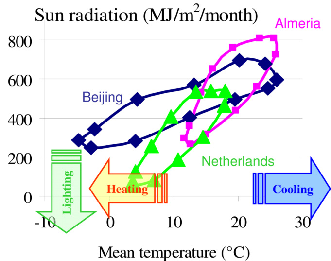  
Fig. 1.2 The monthly mean outdoor temperature $_ x$ -axis) and the global radiation sum (y-axis) for three different climate zones, i.e. Beijing China, De Bilt The Netherlands and Almeria, Spain. The arrows indicate when a specific climate modification technique might be beneficial.

The fast development of commercial greenhouse horticulture has resulted in many techniques to modify the indoor climate (Berenschot, 2004) as presented for Dutch conditions in Fig. 1.3.

Fig. 1.3 Timing of the introduction of climate modification techniques in Dutch greenhouses.   

<html><body><table><tr><td>Heating</td><td>Climate computer</td><td>CO2 supply</td><td>Lighting</td><td>Closed greenhouse →</td></tr><tr><td>1960</td><td>1980</td><td>1990</td><td>1995</td><td>2006</td></tr></table></body></html>

The enormous variety of boundary conditions and design elements makes greenhouse design a complex task. Von Elsner et al. (2000) concluded that optimisation of a greenhouse design with respect to local climatic and economic conditions still remains a challenge for the designer. As suggested by Baille (1999) a systematic approach that integrates physical, biological and economical models is the most promising way for strategic decision making on greenhouse configurations given the wide variety of climate conditions on a worldwide scale. Such a method would be beneficial for several reasons.

First, a designer is unable to take into account all relevant boundary conditions and design elements which results often in sub-optimal designs. For areas where greenhouse horticulture is less developed, the systematic approach could support the design process so that suitable greenhouses for the given local conditions are produced. For areas where greenhouse horticulture is more developed, the systematic approach can re-evaluate existing greenhouse designs to check whether and how they might be improved further. In addition, a systematic design procedure might indicate how greenhouses might evolve in the face of future changes in economic conditions, such as product and resources prices.

Second, sensitivity analysis applied in such a systematic approach might pinpoint the key factors for greenhouse design which increases our understanding of the design process. In addition, the properties of greenhouse materials that should be modified so that growers gain extra revenues could be revealed. The manufacturers then would know which properties should be optimised and what would be the economic margin for this modification. Additionally, this systematic approach might even identify whether adjustable design parameters over time as proposed by e.g. Sonneveld et al. (2011) would be beneficial.

Third, the systematic approach might indicate the decisive factors why greenhouses have evolved to totally different designs at different locations. Furthermore, the impact of uncertain boundary conditions on greenhouse design can be evaluated.

However, when the current state in greenhouse design is considered, most studies have focused on optimising the design for a specific location, or they considered only a single design parameter (Zaragoza et al., 2007; Campen, 2005; Sonneveld et al., 2006; Kacira et al., 2004; Engel, 1984; Amir & Hasegawa, 1989). To the best of our knowledge, a model-based methodology to design protected cultivation systems for the wide variety of conditions that exist around the world is thus not yet available.

# 1.2 Research objective

The objective of this thesis is to develop a method that produces a greenhouse design suitable for the given local climatic and economic conditions. In principle, this methodology should work for the wide variety of conditions that can be found throughout the world.

# 1.3 Scope of the research

As described before, the particular choice of a protected cultivation system depends on many factors. Therefore, to keep this research manageable, we focus on the following aspects. The climatic and economic conditions are used as boundary conditions and the design problem is narrowed down to techniques that influence the aerial climate. In particular, this study focuses on the following eight design elements: the type of greenhouse structure, the cover type, the outdoor shade screen, the whitewash, the thermal screen, the heating system, the cooling system and the $\mathrm { C O } _ { 2 }$ enrichment system. Tomato is selected as model crop since it is one of the most widely produced greenhouse vegetables in the world and knowledge about tomato yield modelling is well established.

# 1.4 Model-based design approach

According to Van Henten et al. (2006) greenhouse design can be addressed as a multifactorial optimisation problem. Such an approach relies on a quantitative trade-off between the economic return of the crop and the costs associated with construction, maintenance and operation of the greenhouse facility. Design optimisation has been used intensively to solve complex problems in other application domains e.g. aerospace engineering (William Begg & Liu, 2000; Anthony & Keane, 2003), automobile design (Yildiz et al., 2004), electronics (Abido, 2002) and cold stores design (Lukasse et al., 2009). Using optimisation techniques to solve the multi-factorial greenhouse design problem thus seems promising. Therefore, a model-based greenhouse design method as presented in Fig. 1.4 was developed. The key components of the method are a greenhouse climate model, a tomato yield model, an economic model and an optimisation algorithm. The three models are used to determine the net financial result as a function of outdoor climate, greenhouse design, climate management and economic variables. The optimisation algorithm adjusts the greenhouse in such a way that a maximum net financial result will be obtained. Since our aim is to develop a design method that focuses on the optimisation of the set of design elements, aspects that might be relevant for other design aspects will be neglected or simplified. Due to the generic nature of the model-based design method, new modules can easily be implemented whenever they become available.

Economic variables   
Structure Total   
Cover type Outdoor climate Indoor climate: investments   
Shade screen Climate management Grenhouse TCan,CO2Air,RPAR Tyimat Cropyield Economic Net financial   
Whitewash Greenhouse design model TAir,VPAir model model result   
Thermal screen   
Heating system Resource use:   
Cooling system water,energy, CO2,electricity   
$\mathrm { C O } _ { 2 }$ enrichment Investments Net financial result maximum? Greenhouse design NO: Adjust optimisation greenhouse design YES: Greenhouse design is optimal

# 1.5 Thesis outline

The four key components of the model-based design method (Fig. 1.4) and a sensitivity analysis are each described in a chapter. In Chapter 2, the greenhouse climate model that determines the indoor climate as a function of outdoor climate, climate management and greenhouse design is presented. Requirements related to the model formalism are presented and the design elements that are sufficiently generic for worldwide greenhouse design are selected and described in model equations. The dynamic model is validated for four different greenhouse designs under three climate conditions: a temperate marine climate, a Mediterranean climate and a semi-arid climate to assure that it is sufficiently accurate and generic to be incorporated in the model-based design method.

Chapter 3 describes the model to calculate the tomato yield as a function of the predicted indoor climate. Requirements related to the model formalism are presented and relevant yield model aspects are revealed in view of the model-based design method. Temperature effects on tomato yield are reviewed and are implemented in the model. The model is then validated for four different temperature regimes.

In Chapter 4 three sensitivity analysis techniques are applied to the combined greenhouse climate-tomato yield model to indicate the most relevant design aspects and to increase our understanding of the design process. The sensitivity analysis quantifies the impact of parameters on the harvest rate, resource consumption and indoor climate for a low-tech greenhouse in Almeria, Spain and a high-tech greenhouse in Texas, USA. The single-variate sensitivity analysis pinpoints design parameters that are candidates for improvement. The multi-variate sensitivity analysis reveals the parameters that will have a joint effect on crop yield. The analysis of the seasonal impact of parameters indicates whether adjustable design properties might increase greenhouse performance.

Chapter 5 presents the economic model that determines the annual net financial result as a function of crop yield, the resource use and the depreciation and maintenance of the construction. The economic model is joined with the greenhouse climate-tomato yield model to identify – among a predefined set of design alternatives – the greenhouse with the highest annual net financial result for tomato production under South-Spanish conditions. This analysis reveals which greenhouse technology level will perform best in South Spain. This procedure is repeated for different outdoor climate trajectories and tomato price trajectories to demonstrate how the best design will change with changing local conditions. A sensitivity analysis presents the extra revenue of a grower caused by a modification of a specific design parameter. In addition, the impact of uncertainty in input parameters, i.e. economic parameters and climate set-points on net financial result is determined to analyse their impact on greenhouse design.

Chapter 6 presents an optimisation algorithm to solve the multi-factorial design problem. Requirements of the algorithm are described. The controlled random search algorithm of Price (1977) using parallel computing, optimises the greenhouse design in order to maximise the financial result. To demonstrate that the model-based design method is able to modify the design to local condition, the greenhouse is optimised for Southern Spanish and Dutch conditions. Subsequently, two techniques evaluate the population of designs that would give similar returns so that the most relevant design elements are revealed.

In Chapter 7, the results of this work are evaluated and discussed in view of the initial objective. Recommendations to improve the performance and generality of the method are presented and future opportunities of the model-based design method are given.

# Chapter 2

# A greenhouse climate model for a broad range of designs and climates

The contents of this chapter are accepted for publication in Biosystems Engineering as a paper entitled: A methodology for model-based greenhouse design: Part 1, A greenhouse climate model for a broad range of designs and climates.

B. H. E. Vanthoor, C. Stanghellini, E.J. van Henten, P.H.B. de Visser

# 2.1 Abstract

With the aim of developing a model-based method to design greenhouses for a broad range of climatic and economic conditions, a greenhouse climate model was developed and validated. This model describes the effects of the outdoor climate and greenhouse design on the indoor greenhouse climate. For use in a greenhouse design method that focused on the optimisation of a set of design elements, the model should fulfil the following three requirements: 1) predict the temperature, vapour pressure and $\mathrm { C O } _ { 2 }$ concentration of the greenhouse air, with sufficient accuracy for a wide variety of greenhouse designs under varying climate conditions, 2) include the commonly used greenhouse construction parameters and climate conditioning equipment, and 3) the model should consist of a set of differential equations to assure that it can be combined with a tomato yield model (of a similar structure) and to allow the use of ordinary differential equation solvers. The dynamic model was validated for four different greenhouse designs under three climatic conditions: a temperate marine climate, a Mediterranean climate and a semi-arid climate. For these conditions, the model accurately predicted the greenhouse climate for all four designs without modification of the model parameters (except for one case). In more than $78 \%$ of the cases, comparison of simulations and measurements of the indoor climate yielded a relative root mean square error of less than $10 \%$ . Given these results, the model is considered to be sufficiently accurate and sufficiently generic to be used for developing a model-based greenhouse design method.

# 2.2 Introduction

This chapter contains a description and validation of the greenhouse climate model. This model describes the effects of outdoor climate and the greenhouse design, including the above mentioned design elements, on the indoor greenhouse climate. The estimated indoor climate will be used as input for the tomato yield model. For use in a model-based greenhouse design method, the model should fulfil the following three requirements: (i) it should predict the greenhouse climate: temperature, vapour pressure and $\mathrm { C O } _ { 2 }$ concentration of the air with sufficient accuracy for a wide variety of greenhouse designs under varying climate conditions, without modification of model parameters, (ii) it should include the commonly used greenhouse design elements to control the indoor climate, so that it can be used to design greenhouses for worldwide conditions, (iii) the model should consist of a set of differential equations since it will be combined with a tomato yield model consisting of a set of differential equations and to allow the use of ordinary differential equation solvers. In addition, the right-hand sides must be continuously differentiable to speed up the simulation and to assure that gradient-based dynamic optimisation algorithms can be applied to the model.

Greenhouse climate models have received considerable attention in the literature in recent decades (Bot, 1983; Luo et al., 2005; Impron et al., 2007; De Zwart, 1996; Ooteghem, 2007; De Halleux et al., 1991; Baptista, 2007), but all these authors focused on a single location and a limited and specific set of construction and climate modification elements. Recently, Fitz-Rodríguez et al. (2010) developed a greenhouse environmental model for educational purposes which was applicable to different design configurations and geographic locations. However, this model was not validated and some model fluxes relevant for the present purpose of greenhouse design were missing. Therefore, by building on the work of Bot (1983) and De Zwart (1996), in our study a more generic greenhouse model was developed and validated for a wide range of greenhouse designs and climates. The following climates were selected to validate the model: a temperate marine climate (northwest part of The Netherlands); a Mediterranean climate, (Sicily, Italy); and a semiarid climate (Arizona and Texas, USA).

# 2.3 Model description

Section 2.3.1 presents the design elements included in the greenhouse climate model. A concise model description is presented in the section 2.3.2. A detailed description of the greenhouse climate model with all the individual mass and energy flows can be found in chapter 8.

# 2.3.1 Greenhouse design elements

Since the focus of the design method is on optimisation of a set of design elements, the selected functions and techniques presented in Fig. 2.1 were incorporated in the greenhouse climate model. In this model, the greenhouse functions heating, insulation, shading, cooling, $\mathrm { C O } _ { 2 }$ enrichment, humidification and de-humidification are fulfilled by one or more techniques. For example, the function heating might be fulfilled by the following techniques: a direct air heater, a boiler, an industrial heat source, a geothermal source and a passive buffer.

For the development of a model-based design method, these techniques are considered to be sufficiently generic for a wide range of locations all over the world. Specific local solutions for energy production, energy conversion or climate modification, such as co-generation of heat and electricity, artificial photosynthetic lighting, an active heat buffer, a heat pump and a solar heat collector, lie outside the scope of this study.

# 2.3.1.1 Notational conventions

All the state variables, fluxes, inputs, superscripts and subscripts are listed in the Nomenclature in section 2.8. Following the notational conventions of De Zwart (1996), the state variables of the model are denoted by names with capital letters followed by one subscript, e.g. $T _ { A i r }$ . The model fluxes start with a capital letter and are followed by two subscripts. The first subscript represents the source of the flux and the second subscript represents the destination of the flux, e.g. $H _ { C a n A i r }$ . The radiation fluxes start with a capital letter $R$ followed with the type of radiation and then two subscripts to represent the source and sink of the specific radiation, i.e. $R _ { P A R \_ S u n C a n }$ .

# 2.3.2 Model overview and state variables

# 2.3.2.1 Model overview and assumptions

An overview of the state variables and the energy and mass fluxes of the greenhouse model are shown in Fig. 2.2. The model was based on the following assumptions: 1) the greenhouse air is considered to be a “perfectly stirred tank”, which means that there are no spatial differences in temperature, vapour pressure and the $\mathrm { C O } _ { 2 }$ concentration; therefore, all the model fluxes were described per square metre of greenhouse floor; 2) to describe the effect of the thermal screen on the indoor climate, the greenhouse air was divided into two compartments: one below and one above the thermal screen.

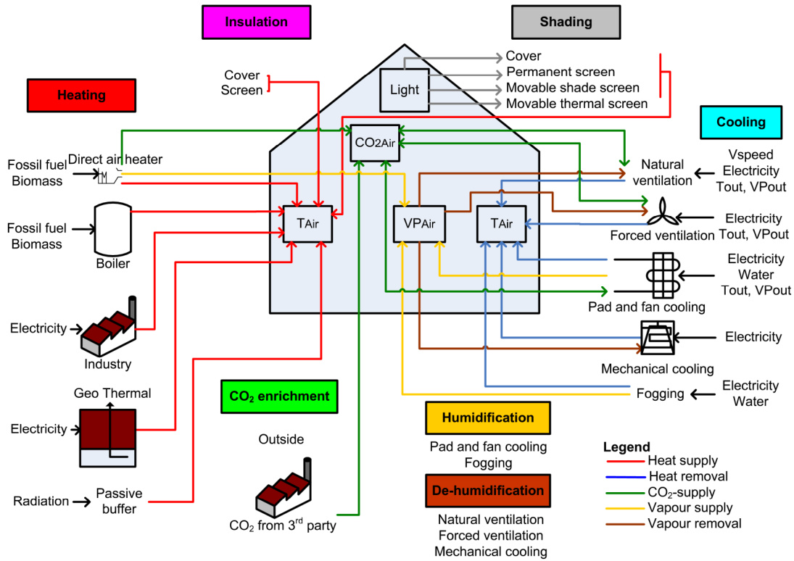  
Fig. 2.1 Selected functions (coloured boxes), and design elements (text blocks and pictures below the accompanying functions), needed for the greenhouse design method to manage the greenhouse climate (transparent boxes inside the greenhouse). The coloured arrows represent the various energy and mass fluxes (legend at the bottom right).

This model was based on the greenhouse climate modelling study of De Zwart (1996). For the current purpose of greenhouse design, extra model elements were added and some model parts were simplified. The following model elements were implemented: the design elements presented in Fig. 2.1; a lumped cover description to combine the impact of different cover layers on indoor climate; the internal and external cover temperature are state variables of the model to describe the impact of cover insulation on indoor climate; a description of the far infrared radiation (FIR) transmission through the cover, which is needed for films that partially transmit FIR; a description of both roof and side ventilation; a description of the impact of insect screens on ventilation rate; and a description of the near infrared radiation (NIR) absorption of both canopy and floor, which depend on the optical properties of the cover and floor. Since optimisation of the properties of the greenhouse structure i.e. dimensions of the greenhouse, roof slope and orientation and location of the vents, exceeded the purpose of our design method, the model was simplified by making no distinction between diffuse and direct solar radiation and by assuming that the transmission coefficient of the greenhouse cover did not depend on solar angle.

Because of space limitations, the model fluxes are described in detail in the detailed model description as presented in Chapter 8. A brief description of some relevant fluxes is given here. Assuming a non-limiting irrigation strategy, the transpiration rate of a tomato crop was determined based on the transpiration and stomata model of Stanghellini (1987). The $\mathrm { C O } _ { 2 }$ fluxes caused by canopy activity, i.e. photosynthesis rate, maintenance and growth respiration, were described in chapter 3. The ventilation rate function was based on equations of Boulard and Baille (1995) and Kittas et al. (1997).

# 2.3.2.2 State variables of the model

The state variables of the model are all described by differential equations. The derivatives of the state variables to time are indicated by a dot above the state symbol.

2.3.2.2.1 Temperature of different greenhouse components Canopy temperature $T _ { C a n }$ is described by:

$$
\begin{array} { r l } { c a p _ { C a n } \dot { T } _ { C a n } = R _ { P A R \_ S u n C a n } + R _ { N R \_ S u n C a n } + R _ { P i p e C a n } } & { { } \mathrm { [ W ~ m ^ { - 2 } ] } \mathrm { ( } R } \\ { \phantom { \frac { 1 } { 1 } } - \dot { H } _ { C a n A i r } - L _ { C a n A i r } - R _ { C a n C o v , i n } - R _ { C a n F l r } - R _ { C a n S k y } - R _ { C a n T i S c r } \mathrm { ( } R \mathrm { m ^ { - 2 } ] } \mathrm { ( } R \mathrm { m ^ { - 2 } ] } \mathrm { ( } R \mathrm { m ^ { - 2 } ] } } \end{array}
$$

where $c a p _ { C a n }$ is the heat capacity of the canopy, $R _ { P A R \_ S u n C a n }$ is the PAR absorbed by the canopy, $R _ { N I R \_ S u n C a n }$ is the NIR absorbed by the canopy. FIR is exchanged between the canopy and surrounding elements i.e. the heating pipes $R _ { P i p e C a n }$ , the internal cover layer $R _ { C a n C o \nu , i n } .$ the floor $R _ { C a n F l r } ,$ the sky $R _ { C a n S k y }$ , and the thermal screen $R _ { C a n T h S c r } . \ H _ { C a n A i r }$ is the sensible heat exchange between canopy and greenhouse air and $L _ { C a n A i r }$ is the latent heat flux caused by transpiration.

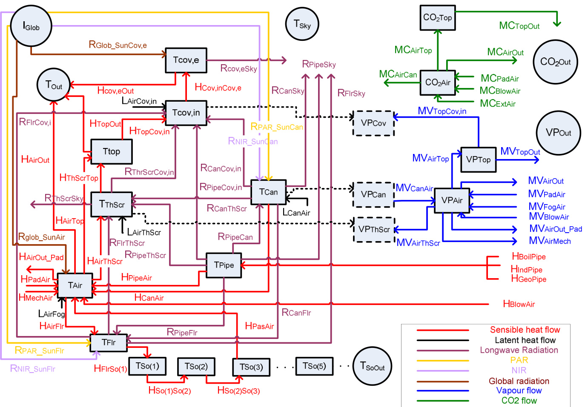  
Fig.2.2Overefeatebsbos)mstateblsddocs)tealteutscesesf greenousmodel.Colouedarowseprenthevrouseerdmassflues(legndattebottightbevatiosdeo are listed in the Nomenclature in section 2.8, and the underlying equations are presented in section 2.3.2.2.

The greenhouse air temperature $T _ { A i r }$ is described by:

$$
\begin{array} { r } { c a p _ { _ { A i r } } \dot { T } _ { _ { A i r } } = H _ { _ { C a n a i r } } + H _ { _ { P a d a i r } } + H _ { _ { M e r h a i r } } + H _ { _ { P i p e A i r } } + H _ { _ { P a s A i r } } + H _ { _ { B l o w A i r } } + R _ { _ { G l a b _ { - } S i n a k i r } } } \\ { - H _ { _ { A i r F l r } } - H _ { _ { A i r T h S c r } } - H _ { _ { A i r o u t } } - H _ { _ { A i r T o p } } - H _ { _ { A i r o u t _ { - } P a d } } - L _ { _ { A i r F o g } } } \\ { [ \mathrm { W ~ m ^ { - 2 } } ] \quad ( 2 . 2 5 ) } \end{array}
$$

where $c a p _ { A i r }$ is the heat capacity of the greenhouse air. Sensible heat is exchanged between the greenhouse air and the surrounding elements i.e. the canopy $H _ { C a n A i r }$ , the outlet air of a cooling pad $H _ { P a d A i r } ,$ the mechanical cooling system $H _ { M e c h A i r }$ , the heating pipes $H _ { P i p e A i r } ,$ the passive energy buffer $H _ { P a s A i r }$ , the direct air heater $H _ { B l o w A i r }$ , the floor $H _ { A i r F l r } ,$ the thermal screen $H _ { A i r T h S c r } ,$ the outdoor air $H _ { A i r O u t } .$ the air of the top compartment which is located above the thermal screen $H _ { A i r T o p }$ , and the outdoor air due to the air exchange caused by the pad and fan system $H _ { A i r O u t \_ P a d }$ . $R _ { G l o b \_ S u n A i r }$ is the global radiation which is absorbed by the construction elements and which is released to the air and $L _ { A i r F o g } $ is the latent heat needed to evaporate the water droplets added by a fogging system.

The floor layer is the first layer of the greenhouse underground and its temperature $T _ { F l r }$ is described by:

$$
\begin{array} { r l r } { c a p _ { F l r } \dot { T } _ { F l r } = H _ { A i r F l r } + R _ { P A R _ { - } S u n F l r } + R _ { N I R _ { - } S u n F l r } + R _ { C a n F l r } + R _ { P i p e F l r } } & { } & \\ { - H _ { F l r S o 1 } - R _ { F l r C o v , i n } - R _ { F l r S k y } - R _ { F l r T h S c r } } & { } & { [ \mathrm { W } \mathrm { m } ^ { - } ] } \end{array}
$$

where $c a p _ { F l r }$ is the heat capacity of the floor; $R _ { P A R \_ S u n F l r }$ is the PAR absorbed by the floor; $R _ { N I R \_ S u n F l r }$ is the NIR absorbed by the floor; $R _ { P i p e F l r } , R _ { F l r C o \nu , i n } , R _ { F l r S k y }$ and $R _ { F l r T h S c r }$ are the FIR fluxes between the floor and heating pipes, internal cover layer, sky and thermal screen respectively; and $H _ { F l r S o l }$ is the sensible heat flux from the floor to soil layer 1.

Because of the high thermal capacity, the soil was divided into five layers with an increasing thickness with increasing depth. The soil temperature $T _ { S o ( j ) }$ of layer $\mathbf { \omega } _ { j } ,$ is described by:

$$
c a p _ { _ { S o ( j ) } } T _ { _ { S o ( j ) } } = H _ { _ { S o ( j - 1 ) S o ( j ) } } - H _ { _ { S o ( j ) S o ( j + 1 ) } } \qquad j = 1 , 2 . . . . . . 5
$$

where $c a p _ { S o ( j ) }$ is the heat capacity of each soil layer, $H _ { S o ( j - l ) S o ( j ) }$ is the conductive heat flux from layer ${ \bf \cdot } { \bf \cdot } { \bf \nabla } _ { j - 1 } \cdot { \bf \nabla } $ to $\mathbf { \dot { \omega } } _ { j } ,$ and $H _ { S o ( j ) S o ( j + I ) }$ is the conductive heat flux from layer $\mathbf { \dot { \omega } } _ { j } ,$ to $\cdot _ { j + l } ,$ . For the first soil layer, $H _ { S o ( j - l ) S o ( j ) }$ is equivalent to $H _ { F l r S o I }$ and for the last soil layer, $H _ { S o ( j ) S o ( j + I ) }$ is equivalent to the conductive heat flux from the $5 ^ { \mathrm { t h } }$ soil layer to the external soil temperature H So5SoOut .

Temperature of the thermal screen $T _ { T h S c r }$ is described by:

$$
\begin{array} { r l } { c a p _ { T h S c r } \dot { T } _ { T h S c r } = H _ { A i r T h S c r } + L _ { A i r T h S c r } + R _ { C a n T h S c r } + R _ { F l r T h S c r } + R _ { P i p e T h S c r } } & { } \\ { - H _ { T h S c r T o p } - R _ { T h S c r C o v , i n } - R _ { T h S c r S k y } } & { } \end{array}
$$

where $c a p _ { T h S c r }$ is the heat capacity of the thermal screen; $L _ { A i r T h S c r }$ is the latent heat flux caused by condensation on the thermal screen; $R _ { P i p e T h S c r } , R _ { T h S c r C o \nu , i n }$ and $R _ { T h S c r S k y }$ are the FIR fluxes between the thermal screen and the heating pipes, internal cover layer and sky respectively; and $H _ { T h S c r T o p }$ is the heat exchange between the thermal screen and the top compartment air.

The air temperature of the compartment above the thermal screen $T _ { T o p } \mathrm { \Delta }$ , in this study denoted as the ‘top compartment’, is described by:

$$
c a p _ { _ { T o p } } \dot { T } _ { _ { T o p } } = H _ { _ { T h S c r T o p } } + H _ { _ { A i r T o p } } - H _ { _ { T o p C o v , i n } } - H _ { _ { T o p O u t } }
$$

$$
[ \mathrm { W ~ m } ^ { - 2 } ]
$$

where $c a p _ { T o p }$ is the heat capacity of the top compartment air, $H _ { T o p C o \nu , i n }$ is the heat exchange between the top compartment air and the internal cover layer and $H _ { T o p O u t }$ is the heat exchange between the top compartment and the outside air.

The thermal heat conductivity of the greenhouse cover is a greenhouse design parameter which can induce a significant temperature gradient over the cover. Therefore, both the internal cover temperature and external cover temperature have been modelled. Assuming that the heat capacity of the internal and external cover layer each constitute $10 \%$ of the heat capacity of the total cover construction, and assuming that conduction of energy is the dominant mode of energy transport between the internal and the external cover, the internal cover temperature $T _ { C o \nu , i n }$ and external cover temperature $T _ { C o \nu , e }$ are described by:

$$
\begin{array} { r l r } { c a p _ { _ { C o \nu , i n } } \dot { T } _ { _ { C o \nu , i n } } = H _ { _ { T o p C o \nu , i n } } + L _ { _ { T o p C o \nu , i n } } + R _ { _ { C a n C o \nu , i n } } + R _ { _ { F l r C o \nu , i n } } } & { \quad } & { \mathrm { [ W ~ m ^ { 2 } ] } } \\ { + R _ { _ { P i p e C o \nu , i n } } + R _ { _ { T h S c r C o \nu , i n } } - H _ { _ { C o \nu , i n C o \nu , e } } } & { \quad } & { \mathrm { [ W ~ m ^ { 2 } ] } } \\ { c a p _ { _ { C o \nu , e } } \dot { T } _ { _ { C o \nu , e } } = R _ { _ { G l o b _ { - } } S u n C o \nu } + H _ { _ { C o \nu , i n C o \nu , e } } - H _ { _ { C o \nu , e O u t } } - R _ { _ { C o \nu , e S k \nu } } } & { \quad } & { \mathrm { [ W ~ m ^ { 2 } ] } } \end{array}
$$

where $c a p _ { C o \nu , i n }$ and $c a p _ { C o \nu , e }$ are the heat capacities of the internal and external cover layer respectively, $L _ { T o p C o \nu , i n }$ is the latent heat flux caused by condensation on the greenhouse cover, $R _ { P i p e C o \nu , i n }$ is the FIR exchange between the heating pipes and internal cover layer, $H _ { C o \nu , i n C o \nu , e }$ is the heat flux between the internal and external cover layer, $R _ { G l o b \_ S u n C o \nu }$ is the absorbed global solar radiation by the cover, $H _ { C o \nu , e O u t }$ is the sensible heat flux from the external cover layer to the outside air and $R _ { C o \nu , e S k y }$ is the FIR exchange between the cover and the sky.

In this model, besides using a direct air heater, heat energy can be added to the greenhouse air using hot water heating pipes (Fig. 2.2). The surface temperature of the heating pipe system $T _ { P i p e }$ is described by:

$$
\begin{array} { r l } & { c a p _ { { P i p e } } \dot { T } _ { { P i p e } } = H _ { { B o i l P i p e } } + H _ { { I n d P i p e } } + H _ { { G e o P i p e } } - R _ { { P i p e S k y } } - R _ { { P i p e C o v , i n } } } \\ & { ~ - R _ { { P i p e C a n } } - R _ { { P i p e F l r } } - R _ { { P i p e T h S c r } } - H _ { { P i p e A i r } } } \end{array}
$$

where $c a p _ { P i p e }$ is the heat capacity of the heating pipes, $H _ { B o i l P i p e }$ is the boiler heat flux to the pipes, $H _ { I n d P i p e }$ is the industrial heat flux to the pipes, $H _ { G e o P i p e }$ is the geothermal heat flux to the pipes and $R _ { P i p e S k y }$ , is the FIR exchange between the pipes and sky.

2.3.2.2.2 Vapour pressure of the greenhouse air and the air in the top compartment The vapour pressure of the greenhouse air $V P _ { A i r }$ is described by:

$$
\begin{array} { c } { c a p } { _ { V P _ { A i r } } \dot { V } P _ { A i r } = M V _ { C a n A i r } + M V _ { P a d A i r } + M V _ { F o g A i r } + M V _ { B l o w A i r } - M V _ { A i r l u s c r } } \\ { - M V _ { A i r T o p } - M V _ { A i r o u t } - M V _ { A i r o u t \_ P a d \_ P a d } - M V _ { A i r M e c h } } \end{array} [ \mathrm { k g } \mathrm { m ^ { - 2 } s ^ { - 1 } } ]
$$

where $c a p _ { V P A i r }$ is the capacity of the air to store water vapour. Vapour is exchanged between the air and surrounding elements i.e. the canopy $M V _ { C a n A i r }$ , the outlet air of the pad $M V _ { P a d A i r } ,$ the fogging system $M V _ { F o g A i r }$ , the direct air heater $M V _ { B l o w A i r }$ , the thermal screen $M V _ { A i r T h S c r } ,$ the top compartment air $M V _ { A i r T o p }$ , the outdoor air $M V _ { A i r O u t } { , }$ , the outdoor air due to the air exchange caused by the pad and fan system $M V _ { A i r O u t \_ P a d } ,$ and the mechanical cooling system MVAirMech.

The vapour pressure of the air in the top compartment $V P _ { T o p }$ is described by: $c a p _ { { } _ { V P _ { T o p } } } \dot { V } P _ { T o p } = M V _ { A i r T o p } - M V _ { T o p C o \nu , i n } - M V _ { T o p O u t }$ $[ \mathrm { k g ~ m ^ { - 2 } ~ s ^ { - 1 } } ]$ (2.11) where $c a p _ { V P T o p }$ is the capacity of the top compartment to store water vapour, $M V _ { T o p C o \nu , i n }$ is the vapour exchange between the top compartment and the internal cover layer and $M V _ { T o p O u t }$ is the vapour exchange between the top compartment and the outside air.

2.3.2.2.3 $C O _ { 2 }$ concentration of the greenhouse air and the air in the top compartment

The greenhouse air $\mathrm { C O } _ { 2 }$ concentration $C O _ { 2 A i r }$ is described by:

$$
\begin{array} { r } { c a p _ { { c o } _ { 2 A i r } } \dot { C } O _ { 2 A i r } = M C _ { { B l o w A i r } } + M C _ { { E x t A i r } } + M C _ { { P a d A i r } } } \\ { - M C _ { { A i r c a n } } - M C _ { { A i r T o p } } - M C _ { { A i r O u t } } } \end{array}
$$

$$
[ \mathrm { m g ~ m ^ { - 2 } ~ s ^ { - 1 } } ]
$$

where $c a p _ { C O 2 A i r }$ is the capacity of the air to store $\mathrm { C O } _ { 2 }$ . Carbon dioxide is exchanged between the greenhouse air and surrounding elements i.e. the direct air heater $M C _ { B l o w A i r }$ , the external $\mathrm { C O } _ { 2 }$ source $M C _ { E x t A i r }$ , the pad and fan system $M C _ { P a d A i r } .$ , the top compartment air $M C _ { A i r T o p } \$ and the outdoor air $M C _ { A i r O u t } { \ }$ . $M C _ { A i r C a n }$ is the $\mathrm { C O } _ { 2 }$ flux between the greenhouse air and the canopy as described in chapter 3.

The $\mathrm { C O } _ { 2 }$ concentration of the top compartment air $C O _ { 2 T o p }$ is described by: $c a p _ { { C O } _ { 2 T o p } } \dot { C } O _ { 2 T o p } = M C _ { A i r T o p } - M C _ { T o p O u t }$ $[ \mathrm { m g ~ m ^ { - 2 } ~ s ^ { - 1 } } ]$ (2.13) where $c a p _ { C O 2 T o p }$ is the capacity of the top compartment air to store $\mathrm { C O } _ { 2 }$ $) _ { 2 } , M C _ { T o p O u t }$ is the $\mathrm { C O } _ { 2 }$ exchange between the top compartment air and the outside air.

# 2.4 Model validation

The model could be used for model-based greenhouse design if it is able to predict the temperature, vapour pressure and $\mathrm { C O } _ { 2 }$ concentration of the air with sufficient accuracy for a wide range of greenhouse designs under varying climate conditions. Therefore, four greenhouse designs located in different climate regions were selected to validate the model. The model equations were solved with a stiff ODE solver (ode15s) of MatlabTM (Release 14; The MathWorks Inc., Natick, MA, USA). Measured data of outdoor climate conditions and settings of control valves were used as model inputs. A quantitative criterion was defined to evaluate the model performance.

# 2.4.1 Greenhouse design overview

The four greenhouse designs were located in three climatic regions: a temperate marine climate, northwest Netherlands; a Mediterranean climate, Sicily, Italy; and a semi-arid climate, Texas and Arizona, USA. The general details of the individual greenhouses, i.e. location, greenhouse characteristics and climate modification techniques, are listed in Table 2.1. The presented design elements cover the entire range of functions as listed in Fig. 2.1: cooling, heating, $\mathrm { C O } _ { 2 }$ enrichment, insulating, shading, humidification and dehumidification. A detailed overview of the parameters belonging to these design elements, i.e. physical properties to describe the greenhouse structure; ventilation characteristics; cover; whitewash; thermal screen; floor; soil and the capacities of the active climate modification techniques, can be found in the detailed model description as presented in chapter 8. In all four greenhouses tomatoes were grown. The validation periods of the associated greenhouse designs and the leaf area index (LAI) during validation are shown in Table 2.2.

Table 2.1 Greenhouse characteristics and climate modification techniques used in the four greenhouses located in Sicily, The Netherlands, and Texas and Arizona, USA. Crosses denote the installed equipment for which data was used during the validation. Circles denote equipment that was installed, but for which no data was available.   

<html><body><table><tr><td>Location</td><td>Sicily, Italy</td><td>Northwest part of The Netherlands</td><td>Texas, USA</td><td>Arizona, USA+</td></tr><tr><td>Geographical</td><td>36°57'N,</td><td>53°12'N,</td><td>30°21'N,</td><td>32°16'N,</td></tr><tr><td>coordinates</td><td>14°26'E</td><td>5°29'E</td><td>104°00'W</td><td>110°56'W</td></tr><tr><td>Elevation (m above sea 104 level)</td><td></td><td>0</td><td>1470</td><td>715</td></tr><tr><td>Greenhouse type</td><td>Arch shape multi-tunnel</td><td>Venlo-type</td><td>Venlo-type</td><td>Arch-shaped single tunnel</td></tr><tr><td>Cover type</td><td>A double inflated PE layer layer</td><td>A single glass</td><td>A single glass layer</td><td>Polycarbonate sidewalls and an inflated double PE</td></tr><tr><td>Floor area (m²) Natural ventilation</td><td>1.3:104</td><td>1.4-104</td><td>7.8:104</td><td>layer 278 Ventilation</td></tr><tr><td>characteristics</td><td>Continuous roof Ventilation ventilation on one side of each wind and leeside</td><td>windows on both</td><td>Ventilation windows on both wind and leeside</td><td>windows were closed</td></tr><tr><td></td><td>span,covered with insect netting</td><td>of the roof</td><td>of the roof</td><td></td></tr><tr><td>Pad and fan cooling</td><td></td><td></td><td></td><td>X</td></tr><tr><td>Pipe heating</td><td></td><td>X</td><td>X</td><td></td></tr><tr><td>CO2 enrichment</td><td></td><td>X</td><td>0</td><td></td></tr><tr><td>Movable thermal screen</td><td></td><td>X</td><td></td><td></td></tr><tr><td></td><td></td><td></td><td>X</td><td></td></tr><tr><td>Movable shade screen</td><td></td><td></td><td>X</td><td>X</td></tr><tr><td>Whitewash</td><td>X*</td><td></td><td>X</td><td></td></tr></table></body></html>

+ See Sabeh et al. (2006) for details about the pad and fan cooled greenhouse design. \* Whitewash was only applied to the greenhouse in the first validation period. - Whitewash was only applied to the greenhouse in the summer period.

Table 2.2 Averages of the outdoor climate conditions for the greenhouses located in Sicily, The Netherlands and Texas and Arizona, USA. Numbers between the brackets represent the standard deviations. An ANOVA revealed that the outdoor climate differed considerably between the first three location because for all outdoor climate variables Fprob $\textbf { < } 0 . 0 0 I$ . For the pad and fan cooled greenhouse in Arizona, the model was validated for different ventilation fluxes applied to the greenhouse between $8 . O O - I 7 . O O h$ for a sunny day in May 2005.   

<html><body><table><tr><td></td><td>DOY</td><td>Flux *</td><td>LAI</td><td>IGlob_sum (m³ m² s¹) (m²m²) (MJm² day1)</td><td>Tout (℃)</td><td>VPout (kPa)</td><td>RHout (%)</td><td>Vspeed (m s−1)</td></tr><tr><td>Location Sicily</td><td>267-272</td><td>-</td><td>1.5</td><td>11.6 (2.5)</td><td>22.5 (3.4)</td><td>2.1 (0.2)</td><td>79 (12)</td><td>2.5 (2.7)</td></tr><tr><td>Sicily</td><td>293-298</td><td>-</td><td>2.5</td><td>8.5 (1.7)</td><td>15.2 (3.4)</td><td>1.2 (0.3)</td><td>69 (13)</td><td>2.9 (2.9)</td></tr><tr><td>Netherlands</td><td>38-43</td><td></td><td>2</td><td>6.5 (1.9)</td><td>5.9 (2.7)</td><td>0.7 (0.1)</td><td>80 (11)</td><td>2.4 (1.0)</td></tr><tr><td>Netherlands</td><td>200-205</td><td></td><td>3</td><td>15.5 (3.0)</td><td>15.2 (1.5)</td><td>1.5 (0.2)</td><td>85 (9.0)</td><td>4.6 (1.4)</td></tr><tr><td>Texas</td><td>3-8</td><td></td><td>2.5</td><td>10.1 (5.9)</td><td>5.4 (5.6)</td><td>0.6 (0.1)</td><td>66 (25)</td><td>3.5 (2.8)</td></tr><tr><td>Texas</td><td>157-162</td><td>-</td><td>2</td><td>25.5 (2.5)</td><td>23.9 (5.4)</td><td>1.3 (0.5)</td><td>46 (24)</td><td>3.5 (2.4)</td></tr><tr><td>Arizona</td><td>139</td><td>0.016</td><td>2.5</td><td>25.2</td><td>34.2 (2.8)</td><td>0.7 (0.0)</td><td>13 (2.3)</td><td>3.4 (1.2)</td></tr><tr><td>Arizona</td><td>151</td><td>0.034</td><td>2.5</td><td>26.3</td><td>34.2 (3.2)</td><td>0.5 (0.0)</td><td>9 (2.1)</td><td>1.8 (0.9)</td></tr><tr><td>Arizona</td><td>131</td><td>0.047</td><td>2.5</td><td>24.3</td><td>33.5 (3.1)</td><td>0.5 (0.1)</td><td>10 (3.3)</td><td>1.9 (0.9)</td></tr><tr><td>Arizona</td><td>132</td><td>0.060</td><td>2.5</td><td>23.8</td><td>33.5 (2.9)</td><td>0.5 (0.0)</td><td>10 (2.2)</td><td>2.3 (1.1)</td></tr></table></body></html>

The \* indicates the ventilation flux of the pad and fan cooling system.

# 2.4.2 Climate data collection

The climate data of the commercial greenhouses, i.e. Sicily, The Netherlands and Texas, were obtained from weather stations $( I _ { G l o b } , \ T _ { O u t } , \ R H _ { O u t } ,$ and $V _ { W i n d } )$ and measurement boxes $( T _ { A i r } , \ R H _ { A i r }$ and $C O _ { 2 A i r }$ if available), and these data were recorded by the central climate computer. The climate data of the pad and fan cooled greenhouse in Arizona were obtained from a commercial weather station $\langle T _ { O u t } \rangle$ $R H _ { O u t } ,$ and $V _ { W i n d } )$ , pyranometers $( I _ { G l o b } )$ , thermocouples $( T _ { A i r } )$ and relative humidity sensors $( R H _ { A i r } )$ . These climate data were recorded using a data logger.

The vapour pressures of the greenhouse air $( V P _ { A i r } )$ and outside air $( V P _ { O u t } )$ for all locations were calculated from their psychrometric relationship to the air temperature and air relative humidity. For the missing outdoor climate variables: the outdoor $\mathrm { C O } _ { 2 }$ concentration $( C O _ { 2 O u t } )$ was assumed to be constant at $6 6 8 \mathrm { \ m g \ m ^ { - 3 } }$ $( 3 7 0 \ \mathrm { p p m } )$ ; the sky temperature $( T _ { S k y } )$ and the temperature of the outer soil layer $( T _ { S o O u t } )$ were estimated using the equations presented in the detailed model description. The energy flow into the heating pipes for the greenhouses located in The Netherlands and in Texas was not measured. For these validation cases the measured pipe temperature was used as an input of the model. The $\mathrm { C O } _ { 2 }$ injection rate and/or $\mathrm { C O } _ { 2 }$ concentration of the greenhouse air were measured in the greenhouse in Sicily throughout the year and during the summer in the greenhouse in The Netherlands. Therefore, the $\mathrm { C O } _ { 2 }$ concentration was only validated for these two cases.

# 2.4.3 Outdoor climate comparison

For all four locations, Table 2.2 lists the average values and standard deviations of the global radiation and the outdoor temperature, humidity and windspeed during the validation experiments. An analysis of variance (ANOVA) using GenStat (Release 12.1 of VSN International Ltd, Hemel Hempstead, UK) revealed that the outdoor climate differed significantly amongst the first three locations, because for all outdoor climate variables $F p r o b < 0 . 0 0 1$ . For the Arizona location, no ANOVA was performed because the time series of this location were not equal to the other three time series. However, the high ambient temperatures in Arizona ensured that these climate data sets differed from the climate data sets at the other locations.

# 2.4.4 Determination of model performance

Model performance was evaluated in quantitative terms using the relative root mean square error (RRMSE) according to Kobayashi and Salam (2000):

$$
R R M S E = \frac { 1 0 0 } { \overline { { y } } _ { D a t a } } \sqrt { \frac { 1 } { n } \sum _ { i = 1 } ^ { n } \big ( y _ { _ { M o d , i } } - y _ { _ { D a t a , i } } \big ) ^ { 2 } }
$$

where $\overline { { y } } _ { D a t a }$ is the mean of measured data over the total time span, $n$ is the number of measurements, $y _ { M o d , i }$ is the simulated climate value at time instant $\because$ and $y _ { D a t a , i }$ is the measured climate value at time instant $\cdot _ { i } ,$ . For developing the methodology of optimal greenhouse design, it was assumed that an RRMSE of $10 \%$ or less would be sufficient. As demonstrated by Baptista (2007), the performance of most greenhouse climate models is around this value.

# 2.5 Results

2.5.1 A passive multi-tunnel greenhouse in Sicily, Italy The model correctly predicted the temperature (Fig. 2.3a,b) and the vapour pressure (Fig. 2.3c,d) for a cold and a hot period in the ‘low–tech’ greenhouse in Sicily. The $\mathrm { C O } _ { 2 }$ concentration of the greenhouse air was predicted with fair accuracy (Fig. 2.3e,f). Although the simulated $\mathrm { C O } _ { 2 }$ trend was in agreement with the measurements, especially at night, the absolute predicted $\mathrm { C O } _ { 2 }$ concentrations differed from the measured $\mathrm { C O } _ { 2 }$ concentrations.

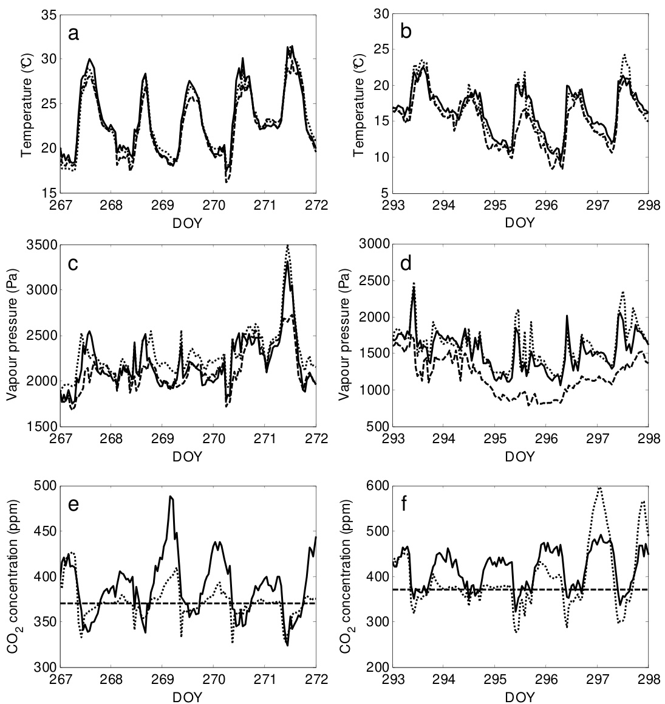  
Fig. 2.3 Temperature (a, b), vapour pressure (c, d) and the $C O _ { 2 }$ concentration (e, $f )$ of measured greenhouse air (solid line), simulated air (dotted line) and outdoor air (dashed line) for the hot period (DOY 267 - 272) and for the cold period (DOY 293 – 298) in Sicily.

2.5.2 A climate-controlled greenhouse in The Netherlands The model correctly predicted the temperature (Fig. 2.4a,b) and the vapour pressure (Fig. 2.4c,d) during the winter and summer period in The Netherlands, even with large differences between indoor and outdoor climate. The $\mathrm { C O } _ { 2 }$ concentration of the greenhouse air was correctly predicted during the summer period (Fig. 2.4e).

  
Fig. 2.4 Temperature (a,b), vapour pressure (c,d) and the $C O _ { 2 }$ concentration (e) of the measured greenhouse air (solid line), simulated air (dotted line) and outdoor air (dashed line) for the winter period (DOY 38 - 43) and for the summer period $( D O Y 2 0 0 - 2 0 5 ,$ in The Netherlands.

The simulated temperature (Fig. 2.4a) and vapour pressure (Fig. 2.4c) were overestimated only at day-of-the-year (DOY) 42 during the daytime. This was caused by an underestimated simulated ventilation rate. This underestimation took place because the effect of the vapour pressure difference on ventilation rate was not described in the ventilation rate equation (see detailed model description), and this vapour pressure difference between greenhouse air and outdoor air was large at that time. To improve the model performance, the impact of the vapour pressure difference between greenhouse air and outdoor air on ventilation rate should be incorporated in the ventilation rate equation.

# 2.5.3 A climate-controlled greenhouse in Texas, USA

The model correctly predicted the temperature and the vapour pressure for both a winter and a summer period in Texas (Fig. 2.5). During the winter period, the temperature and vapour pressure were predicted in close agreement with the measurements, even when temperature and vapour differences between indoor air and outdoor air were large (Fig. 2.5a,c). During summer period, the temperature and vapour pressure were predicted in close agreement with the measurements (Fig. 2.5b,d). However, at some points in time small deviations between the measured and simulated greenhouse climate occurred. The daytime temperatures on DOY 160 and DOY 161 were underestimated at most by $3 ^ { \circ } \mathrm { C }$ .

Using the parameters of the stomatal resistance model of Stanghellini (1987), the simulated transpiration rate was underestimated with respect to the measured transpiration rate during daytime in the summer. Those parameters, however, were determined empirically for vapour pressure differences between leaf and air up to $0 . 9 \mathrm { k P a }$ . The vapour pressure differences in Texas, however, could reach $4 . 0 \mathrm { k P a }$ , a value where extrapolation of Stanghellini’s (1987) function would have a considerable impact (see Eq. (8.50) in chapter 8). Therefore the parameter of the stomatal resistance model describing stomatal reaction to $c _ { e \nu a p 4 } ^ { d a y }$ $10 \%$ yielded better results for crop transpiration. We did not investigate whether other models of stomatal conductance, such as Blonquist Jr et al. (2009) would perform better.

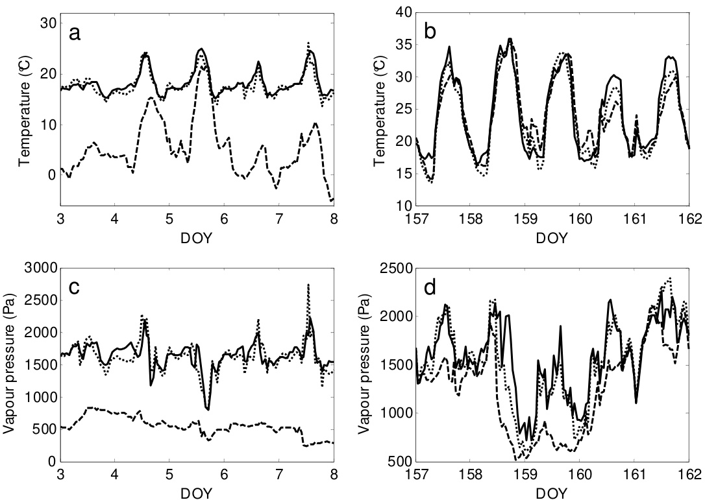  
Fig. 2.5 Temperature (a,b) and the vapour pressure (c,d) of measured greenhouse air (solid line), simulated air (dotted line) and outdoor air (dashed line) for the winter period (DOY 3 - 8) and for the summer period $( D O Y I 5 7 - I 6 2 )$ in Texas, USA.

2.5.4 A pad and fan cooled greenhouse in Arizona, USA The model correctly predicted the temperature and vapour pressure for a pad cooled greenhouse in Arizona for various ventilation rates during the day in the summer period (Fig. 2.6). The model slightly underestimated the temperature and the vapour pressure of the greenhouse air (Fig. 2.6a) only for the lowest ventilation rate. This underestimation could have been caused by assuming that the greenhouse was a perfectly stirred tank, which is not the case when a pad and fan system is used. Specifically, a pad and fan cooling system causes horizontal temperature and vapour pressure gradients (Sabeh et al., 2006).

Furthermore, the underestimation of the vapour pressure at the lowest ventilation rate might have been caused by an underestimated transpiration rate. The transpiration rate was simulated using a constant boundary layer resistance, which was valid for naturally ventilated greenhouses with an indoor wind speed around $0 . 1 0 \mathrm { ~ m ~ } \mathrm { ~ s ~ } ^ { - 1 }$ (detailed model description). By using this constant boundary layer resistance in a pad and fan cooled greenhouse with a considerably higher indoor wind speed, the impact of higher wind speeds on boundary layer resistance was not taken into account, which would ultimately result in an underestimated transpiration rate. However, the underestimation of the transpiration rate negatively affected the simulated indoor climate only at the lowest ventilation rate (Fig. 2.6a). At higher ventilation rates, the impact of the pad and fan system on energy and vapour balance became dominant with respect to transpiration rate, which resulted in an accurate prediction of temperature and vapour pressure (Fig. 2.6b-d).

  
Fig. 2.6 Temperature and the vapour pressure of the measured greenhouse air (solid line), simulated air (dotted line) and of outdoor air (dashed line) for data obtained with four ventilation rates through the pad: 0.016 $m ^ { 3 } \ m ^ { - 2 } \ s ^ { - 1 }$ (a), $0 . 0 3 4 \ m ^ { 3 } \ m ^ { - 2 } \ s ^ { - 1 }$ (b), $0 . 0 4 7 ~ m ^ { 3 } ~ m ^ { - 2 } ~ s ^ { - 1 }$ (c) and $0 . 0 6 0 \ m ^ { 3 } \ m ^ { - 2 } \ s ^ { - { I } }$ (d) in Arizona, USA.

# 2.5.5 Overall model performance

The model performance in terms of RRMSE is shown in Table 2.3. Additional to the qualitative model evaluation, the more quantitative model performance evaluation, based on the RRMSE, clearly indicates the ability of the model to describe the greenhouse indoor climate for different designs, locations and outdoor climate conditions. In almost all cases, the RRMSE was well below the required threshold of $10 \%$ . Exceptions were the vapour pressure of the air in Texas during the winter and summer periods $1 0 . 0 \%$ and $1 2 . 8 \%$ respectively), in Arizona at the lowest ventilation rate $( 1 9 . 8 \% )$ and the $\mathrm { C O } _ { 2 }$ concentration in both Sicily in the autumn period $( 1 1 . 7 \% )$ and in The Netherlands in the winter period $( 1 2 . 3 \% )$ .

Table 2.3 Relative root mean square error (RRMSE) values used to evaluate the ability of the model to describe the air temperature, the humidity and the $C O _ { 2 }$ concentration in the four greenhouses located in Sicily, The Netherlands, and in Texas and Arizona in the USA. The crosses indicate that measurements of the associated variables were not available.   

<html><body><table><tr><td colspan="4">Relative Root Mean Square Error</td></tr><tr><td>Location</td><td>DOY</td><td>Flux* (m²m² s)</td><td>Tair</td><td>(RRMSE) (%) VP air CO2air</td></tr><tr><td></td><td>267-272</td><td></td><td>3.5</td><td>7.0 7.1</td></tr><tr><td>Sicily, Italy Sicily, Italy</td><td>293-298</td><td>- -</td><td>6.6 8.9</td><td>11.7</td></tr><tr><td>TheNetherlands</td><td>38-43</td><td></td><td>6.2 6.4</td><td>X</td></tr><tr><td>The Netherlands</td><td>200 -205</td><td></td><td>5.3 5.7</td><td>12.3</td></tr><tr><td>Texas,USA</td><td>3-8</td><td>- -</td><td>6.0 10.0</td><td>X</td></tr><tr><td>Texas, USA</td><td>157-162</td><td></td><td>6.8 12.8</td><td>X</td></tr><tr><td>Arizona, USA</td><td>139</td><td>0.016</td><td>8.0 19.8</td><td>X</td></tr><tr><td>Arizona, USA</td><td>151</td><td>0.034</td><td>4.5 6.8</td><td>X</td></tr><tr><td>Arizona, USA</td><td>131</td><td>0.047</td><td>4.1 3.9</td><td>X</td></tr><tr><td>Arizona, USA</td><td>132</td><td>0.060</td><td>3.3</td><td>5.9 X</td></tr></table></body></html>

The \* indicates the ventilation flux of the pad and fan cooling system.

For large differences between the indoor climate and the outdoor climate, which occurred during the winter in The Netherlands and in Texas, and during sunny summer days in Arizona, the model correctly predicted the indoor climate. This means that the physical properties and the design elements had properly been modelled. The calculated errors could be decreased by reducing the measurement errors of the measurement boxes. These measurements contained errors due to measurement inaccuracy and because one measurement box was unable to represent the climate of the whole greenhouse section, because a greenhouse is not as assumed a perfectly stirred tank. Specifically, Bontsema et al. (2008) measured the relative errors of commercial measurement boxes for the air temperature, relative humidity and $\mathrm { C O } _ { 2 }$ concentration, which were $1 . 4 \% , 2 . 8 \%$ and $7 . 2 \%$ respectively. Although the measurement boxes were calibrated and placed at the centre of a greenhouse section, more accurate and randomly placed measurement boxes would reflect the overall indoor climate better. More accurately measuring indoor climate could in turn decrease the RRMSE.

Model performance was measured at a time interval of one hour. This time interval was sufficiently small to describe the daily greenhouse climate fluctuations needed for greenhouse design optimisation. Therefore, the model accuracy for smaller time intervals was not analysed. However, the model performance will probably not decline significantly with smaller time intervals because the model is described using differential equations and solved with a solver with a variable time step.

# 2.6 Discussion

To design and optimise protected cultivation systems for the wide variety of climate conditions that can be expected around the world, it is essential to have a model that correctly predicts the indoor climate, not only as a function of a wide range of outdoor climate conditions, but also as a function of a wide range of construction elements and climate conditioning equipment.

Accordingly, the model developed here, fulfilling the requirement of using differentiable equations, was validated for a variety of greenhouse designs and outdoor climate conditions. Without calibration (except in one case), the model accurately described the greenhouse climate, both in terms of dynamic responses and absolute values. Quantitative evaluation of the model performance using an RRMSE criterion supported these findings. In more than $78 \%$ of the cases, comparison of simulations and measurements of the indoor climate yielded an RRMSE of less than $10 \%$ . This model performance, in terms of RRMSE, corresponds with values obtained by other climate modelling studies as reported by Baptista (2007). Given these results, the model is considered to be sufficiently accurate and generic to be used as a key component for developing a model-based greenhouse design method. In particular, our model includes relevant processes for greenhouse design, such as FIR radiation fluxes, $\mathrm { C O } _ { 2 }$ fluxes and a detailed transpiration module, that are not present in other models, such as the educational climate simulation model of Fitz-Rodríguez et al. (2010). However, since our aim was to develop a design method that focussed on the optimisation of a set of design elements, model aspects that might be relevant may have been neglected or too much simplified.

Therefore, whenever better or new modules are available, they can be easily incorporated into the design method. Some issues that might improve the generality of the model-based design method are discussed in more detail here. In particular, a module that describes the light transmission as a function of season, latitude, orientation, shape, gutter and ridge height and type of cover material might enable the optimisation of the greenhouse height and the roof slope. Since radiation diffusing materials seem promising in areas with high solar radiation, differentiation between direct and diffuse radiation would allow diffuse properties of cover materials to be optimised also in relation to diffusion. Additionally, modules of other climate modification techniques such as co-generation of heat and electricity, artificial photosynthetic lighting, an active heat buffer, a heat pump and a solar heat collector might be incorporated.

To systematically quantify the impact of uncertain model aspects on indoor climate prediction, sensitivity analysis techniques can be used (Chalabi & Bailey, 1991; Nijskens et al., 1991). Although a sensitivity analysis was not performed in this chapter, our results allow for some possible model improvements to be indicated. Firstly, according to Campen and Bot (2003), the ventilation rate may depend strongly on wind direction, whereas the modelled ventilation rate was not which, could explain some of the deviations. The ventilation rate influences in turn the indoor temperature, vapour pressure and $\mathrm { C O } _ { 2 }$ concentration. Although the sky temperature and the external soil temperature were not measured but estimated, the indoor temperature was accurately predicted by the model because all the associated RRMSE values were lower than $10 \%$ . Apparently, the small impact of these estimated values on temperature prediction was caused either by accurate calculations or by the negative feedback mechanisms implemented in the model, such as the canopy transpiration and the capacity of the soil to store heat. Nevertheless, the sky temperature and external soil temperature should be measured in future research to increase the model performance. Additionally, pipe temperature was considered as a model input, whereas for greenhouse design optimisation the input must be energy and the pipe temperature must be a state variable as described in this study. Using the pipe temperature as a model input did not undermine our validation results because in the long term the heat input supplied to the heating pipes equals the heat output.

The vapour pressure of the air was predicted with reasonable accuracy; the associated RRMSE was higher than $10 \%$ for only three validation experiments. This attests to the ability of the model of Stanghellini (1987) to predict crop transpiration rate with fair accuracy under quite extreme climate conditions (VPD up to $2 . 0 \mathrm { k P a }$ ), as shown by Jolliet and Bailey (1992) and Prenger et al. (2002). In addition, the negative feedback between canopy transpiration and air vapour pressure ensures a reduced sensitivity of the vapour pressure to errors in the estimate of transpiration. Indeed, even for extreme climate conditions (temperature of $3 5 ^ { \circ } \mathrm { C }$ and VPD of $4 . 0 \ \mathrm { k P a }$ ), the air temperature was predicted with fair accuracy (RRMSE $< 1 0 \%$ ). Nevertheless, the prediction of the transpiration rate could be improved further, by improving the empirical description of the stomatal resistance. In addition, making the boundary layer resistance wind-speed dependent rather than constant might improve the simulation of the transpiration rate under higher wind speeds caused by e.g. pad and fan cooling.

The $\mathrm { C O } _ { 2 }$ concentration prediction was validated for only the two greenhouse designs for which the indoor data were available. The $\mathrm { C O } _ { 2 }$ concentration was predicted reasonably well for a greenhouse with and without $\mathrm { C O } _ { 2 }$ injection. The RRMSE of two out of three validation experiments was slightly higher than the requirement of $10 \%$ . $\mathrm { C O } _ { 2 }$ concentration prediction might be improved if the outdoor $\mathrm { C O } _ { 2 }$ concentration data were available. A secondary factor is the improvement of the prediction of the maintenance and photosynthesis fluxes. Insight into these $\mathrm { C O } _ { 2 }$ fluxes would improve if greenhouse growers would measure the indoor and outdoor $\mathrm { C O } _ { 2 }$ concentration and the $\mathrm { C O } _ { 2 }$ supply. The lack of a strong negative feedback mechanism for the $\mathrm { C O } _ { 2 }$ concentration (Fig. 2.2) ensures that these sources of uncertainty might have a relatively large impact on the prediction of $\mathrm { C O } _ { 2 }$ concentration. For greenhouse design purposes, deviations between simulated and measured $\mathrm { C O } _ { 2 }$ concentration at night are not important, because then the $\mathrm { C O } _ { 2 }$ concentration does not influence photosynthesis rate and crop yield. During day, these deviations do influence the photosynthesis rate, which in turn influence crop yield and the optimal greenhouse design problem. The impact of these deviations on optimal greenhouse design should be analysed with a sensitivity analysis of the optimal greenhouse design problem.

Regarding the design of the validation study, all the greenhouse functions were fulfilled by at least one design element (Table 2.1). Validation on function level was sufficient because it did not matter where a model flux came from, but it did matter how the model reacted to it. Consequently, the model was not validated for all the design elements shown in Fig. 2.1. It is, of course, advisable to validate the model aspects related to these design elements with data. Differentiable switch functions were implemented instead of conditional “if/else” statements, due to the requirement that the model should consist of differentiable equations. Although the steep flanks of the switch function approached the conditional “if/else” statements, these functions might have an impact on model behaviour. Nevertheless, no discrepancies in model output between these approaches were shown, which support the feasibility of this approach.

# 2.7 Conclusion

A greenhouse climate model that describes the effect of outdoor climate and greenhouse design, including construction parameters and climate conditioning equipment on indoor greenhouse climate, was developed and validated. The aim is to use this model in a method to design greenhouses for the wide variety of climate conditions that can be expected around the world. To enable our findings to be implemented and reproduced, all model equations are presented in this chapter and in the detailed model description.

For a broad range of greenhouse designs under varying climate conditions, the model predicted the greenhouse climate with reasonable accuracy. In our study, the greenhouse climate consisted of the temperature, vapour pressure and the $\mathrm { C O } _ { 2 }$ concentration. With the exception of one case, model parameters were not modified. In more than $78 \%$ of the cases, comparison of simulations and measurements of the indoor climate yielded an RRMSE of less than $10 \%$ . Additionally, the model fulfilled the requirements of containing the design elements that are sufficiently generic for a wide range of climate conditions and of being differentiable.

Given these results, the model is considered to be sufficiently accurate and sufficiently generic to be used for developing a model-based greenhouse design method. Therefore, the greenhouse climate model will be integrated into a model-based greenhouse design method, where it will be combined with a crop yield model and an economic model. An optimisation algorithm will then select the best design elements under the given climatic and economic conditions in order to maximize the profit of the grower.

# Acknowledgements

We would like to thank Azienda Fratelli Dezio from Sicily; Jan Bontsema from Wageningen Greenhouse Horticulture; Paul Selina from Village Farms, Texas; Erwin Gravesteijn from Hortimax; and Nadia Sabeh, a former PhD student from the University of Arizona, for delivering the greenhouse climate data needed to validate the model. This study was conducted as part of the strategic research programmes "Sustainable spatial development of ecosystems, landscapes, seas and regions" and "Sustainable Agriculture", both funded by the Dutch Ministry of Agriculture, Nature Conservation and Food Quality.

# 2.8 Nomenclature

State variables

$C O _ { 2 }$ Carbon dioxide concentration mg m-3 $T$ Temperature $^ { \circ } \mathrm { C }$ VP Vapour pressure Pa

Flux densities

$H$ Sensible heat flux density W m-2 $L$ Latent heat flux density W m-2 MC Mass $\mathrm { C O } _ { 2 }$ -flux density mg m-2 s-1 $M V$ Mass vapour flux density kg m-2 s-1 R Far infrared radiation (FIR) flux density $\mathbf { W _ { \lambda } } \mathbf { m } ^ { - 2 }$ $R _ { N I R }$ Near infrared radiation (NIR) flux density W m-2 RPAR Photosynthetically active radiation (PAR) flux density $\textrm { W m } ^ { - 2 }$ $R _ { G l o b }$ Global radiation flux density $\textrm { W m } ^ { - 2 }$

# External Climate Inputs

CO2 Out Outdoor $\mathrm { C O } _ { 2 }$ concentration mg m-3 $I _ { G l o b }$ The outside global radiation W m-2 TOut Outdoor temperature $^ { \circ } \mathrm { C }$ TSky Sky temperature $^ { \circ } \mathrm { C }$ TSoOut Soil temperature of outer soil layer $^ { \circ } \mathrm { C }$ VPOut Outdoor vapour pressure $\mathrm { \ P a }$ vWind Outdoor wind speed m s-1

Remaining symbol cap Capacity of the associated state

# Chapter 2

Subscripts   
Air Greenhouse air compartment below thermal screen   
Blow Direct air heater   
Boil Boiler   
Can Canopy   
Cov Cover   
e External side   
Ext External $\mathrm { C O } _ { 2 }$ source   
Flr Floor   
Fog Fogging system   
Geo Geothermal heat   
Glob Global radiation   
Ind Industrial source   
Mech Mechanical cooling   
Out Outside air   
Pad Pad and fan system   
Pas Passive heat storage facility   
Pipe Pipe heating system   
Sky Sky   
So(j) The ‘j’th the soil layer   
Sun The sun   
Top Compartment above the thermal screen   
ThScr Thermal screen

# Chapter 3

Description and validation of a tomato yield model

The contents of this chapter have been submitted to Biosystems Engineering as a paper entitled: A methodology for model-based greenhouse design: Part 2, Description and validation of a tomato yield model.

B.H.E. Vanthoor, P.H.B. de Visser, C. Stanghellini and E.J. van Henten

# 3.1 Abstract

With the aim of developing a model-based method to design greenhouses for a broad range of climatic and economic conditions, a tomato yield model that describes the effects of greenhouse climate on yield was described and validated. A literature survey of temperature effects on tomato yield was performed and the main temperature effects were implemented in the model. Subsequently, the yield model was validated for four temperature regimes. Results demonstrated that the tomato yield was simulated accurately for both near-optimal and non-optimal temperature conditions in respectively The Netherlands and Southern Spain with varying light and $\mathrm { C O } _ { 2 }$ concentrations. In addition, the adverse effects of extremely low as well as high mean temperatures on yield and moment of first fruit harvest were simulated with fair accuracy. The simulated yield response to extreme diurnal temperature oscillations were in agreement with literature values. In addition, the model consisted of a set of differential equations with continuous differentiable right-hand sides. Given these results, the model is considered to be sufficiently accurate to be used for developing a model-based greenhouse design method. Therefore, the presented model will be integrated in the model-based design method with the aim to design the best greenhouse for local climate and economic conditions.

# 3.2 Introduction

This chapter contains a description and validation of the tomato yield model. Since greenhouse design affects crop yield through its effect on indoor climate, a model is presented that describes the tomato (Lycopersicon esculentum) yield as a function of indoor climate. For use in design and optimisation studies, the model should fulfil three requirements: (i) describe the effects of the indoor temperature, light, and $\mathrm { C O } _ { 2 }$ - concentration on tomato yield; (ii) describe adverse effects of extremely low as well as high temperatures on tomato yield since the solution of a greenhouse design optimisation problem is expected to allow these extreme temperatures in order to save energy and investments; (iii) the model should consist of a set of differential equations since it will be combined with a greenhouse climate model consisting of a set of differential equations and to allow the use of ordinary differential equation solvers. In addition, the right-hand sides must be continuously differentiable to speed up the simulation and to assure that gradientbased dynamic optimisation algorithms can be applied to the model.

In the literature, several models can be found that describe the influence of light, temperature and $\mathrm { C O } _ { 2 }$ -concentration on tomato yield. However, these models are mostly valid for relatively small temperature ranges (Seginer et al., 1994; Tap, 2000; Ooteghem, 2007) and are not fully differentiable e.g. TOMGRO (Jones et al., 1991; Dayan et al., 1993), TOMSIM (Heuvelink, 1996), and the tomato yield model of De Koning (1994). In conclusion, the literature review revealed that a tomato yield model satisfying the predefined requirements is still missing and therefore the aim of this work was to describe and validate such a tomato yield model. Due to the aim of the model – to use it in a modelbased greenhouse design method –, the primary focus of this chapter is to describe the extreme temperature effects on tomato dry matter yield.

The outline of this chapter is as follows. Firstly, since the model should deal with extreme temperatures, a literature survey of temperature effects on tomato yield is presented. Secondly, the model implementation of these main temperature effects is described. Subsequently, the simulated tomato yield is validated with the measured tomato yield for the following three temperature regimes: 1) mild temperatures with varying light and $\mathrm { C O } _ { 2 }$ conditions in two Dutch greenhouses; 2) extreme temperature conditions with varying light and $\mathrm { C O } _ { 2 }$ conditions in a low-tech greenhouse and a high-tech greenhouse in southeast Spain and 3) four constant temperature trajectories varying from sub-optimal to supra-optimal temperatures conducted in growth chambers. In addition, the effect of extreme temperature regimes is evaluated and compared with data found in the literature.

# 3.3 Temperature effects on tomato yield

Temperature influences different aspects of tomato growth (e.g., production rate and partitioning, dry matter content) and development (e.g., leaf and truss appearance, fruit growth period, abortion and fruit quality) (De Koning, 1994; Van Der Ploeg & Heuvelink, 2005). Photosynthesis, which depends on light, $\mathrm { C O } _ { 2 }$ and temperature, produces carbohydrates needed for crop growth. These carbohydrates are distributed to fruits, leaves, stems and roots and are converted to dry matter (such as sugars, amino acids and organic acids). The sugars fulfil the energy requirement for maintenance processes and growth processes. Finally, fruit set, fruit growth and abortion rates determine how much of the potentially available carbohydrates are allocated to the fruits.

In this section, a literature study of the effects of sub-optimal, supra-optimal and (large) differences between day and night temperature on growth, development and ultimately on tomato yield is presented. Being not exhaustive, this survey is only considered to capture the main trends. Although the impact of temperature depends on the associated solar radiation, $\mathrm { C O } _ { 2 }$ concentration and humidity levels, the focus of this survey was to capture the main temperature trends based on temperature experiments with naturally varying levels of the other climatic factors. The impact of supra-optimal temperature on growth implicitly comprises the negative effect of high vapour pressure deficit (VPD) on growth. Specifically, a high VPD is strongly correlated to a high temperature so that uncoupling both factors seemed superfluous. Results of this survey are summarized in Table 3.1.

3.3.1 Effect of sub-optimal temperatures on fruit fresh weight yield Chilling temperatures may affect negatively photosynthesis, respiration, membrane integrity, water relations, the hormone balance of the plants and fruit set (Van Der Ploeg & Heuvelink, 2005; Adams et al., 2001; Brüggemann et al., 1992; Yakir et al., 1986). Additionally, the fruit growth period increases with decreasing temperatures (De Koning, 1994). These unfavourable processes decrease the total fruit fresh weight as shown hereafter.

Below a mean temperature of $1 2 ^ { \circ } \mathrm { C }$ , Criddle et al. (1997) observed no significant growth and tomato yield. Khayat et al. (1985) found that with similar solar radiation levels, the cultivar Moneymaker, grown at a night temperature of $1 2 ^ { \circ } \mathrm { C }$ , yielded only $76 \%$ of the yield observed at $1 8 ^ { \circ } \mathrm { C }$ . However, the same treatment for the cultivar Cherry did not affect growth. These results indicate that the impact of low temperature on crop yield is cultivar dependent. According to Baytorun et al. (1999), yield levels of plants exposed for 3 months to a minimum mean night temperature of $8 . 2 ^ { \circ } \mathrm { C }$ decreased to $46 \%$ compared to levels observed at a minimum mean night temperature of $1 1 . 5 ^ { \circ } \mathrm { C }$ with similar solar radiation levels. Furthermore, Adams et al. (2001) observed at a mean temperature of $1 4 ^ { \circ } \mathrm { C } .$ , a yield decrease to $21 \%$ of the crop yield observed at $2 2 ^ { \circ } \mathrm { C }$ with other climatic factors remained similar. Additionally, Adams et al. (2001) found that fruits grown at a mean temperature of $1 4 ^ { \circ } \mathrm { C }$ were parthenocarpic, small, hard and without economical value. In contrast to the above-mentioned results, Martínez Mirón (2008) observed under relatively low light conditions (mean global radiation sum of 7.6 M $\mathrm { ~ J ~ m ~ } ^ { - 2 } \ \mathrm { d a y } ^ { - 1 } )$ ) at a mean minimum night temperature of $1 3 . 2 ^ { \circ } \mathrm { C }$ , a yield increase to $10 8 \%$ of the yield observed at $1 5 . 2 ^ { \circ } \mathrm { C }$ . At higher light levels $9 . 4 ~ \mathrm { M J ~ m ^ { - 2 } ~ d a y ^ { - 1 } } ,$ no positive effect of a low mean night temperature on crop yield was observed. These results indicate that under low light conditions, low rather than high mean night temperature may favour crop growth. However, the general trend observed in the literature was that yield decreased with decreasing night temperatures.

3.3.2 Effects of supra-optimal temperatures on fruit fresh weight yield At supra-optimal levels, the instantaneous temperature decreased photosynthesis and the mean temperature caused a lower fruit set, shorter fruit growth period and smaller fruits (Heckathorn et al., 1998; Camejo et al., 2005; De Koning, 1994; Adams et al., 2001; Peet et al., 1997; Sato et al., 2000). These unfavourable processes decreased the total fruit fresh weight as shown hereafter. Adams et al. (2001) reported at a mean temperature of $2 6 ^ { \circ } \mathrm { C }$ , $1 8 \%$ of the crop yield observed at $2 2 ^ { \circ } \mathrm { C }$ and Peet et al. (1997) found at a mean temperature of $2 9 ^ { \circ } \mathrm { C }$ , $17 \%$ of the crop yield observed at $2 5 ^ { \circ } \mathrm { C }$ with similar radiation levels. Zhang et al. (2008) observed at a day temperature of $3 5 ^ { \circ } \mathrm { C }$ a crop yield decrease to $4 6 . 1 \%$ compared to a day temperature of $2 5 ^ { \circ } \mathrm { C }$ .

Table 3.lAsummaryof fectsoflowndhightemperaturesoncropgrowth processsandcropyieldlevelsbasedonaliteraturereview.   

<html><body><table><tr><td>Period</td><td>Temperature</td><td>Results</td><td>Author</td></tr><tr><td colspan="4">Photosynthesis</td></tr><tr><td>14 days</td><td>10C at photoperiod</td><td>2-5% of initial photosynthesis</td><td>Yakir et al. (1986)</td></tr><tr><td></td><td>3 days after 14 days 10C at photoperiod</td><td>Recovering to 5O% of initial photosynthesis</td><td>Yakir et al. (1986)</td></tr><tr><td colspan="4">treatment</td></tr><tr><td>3 hour</td><td>43℃</td><td>Significant decrease compared to 25C</td><td>Heckathorn et al. (1998)</td></tr><tr><td>2 hours</td><td>40℃</td><td>Reduced to30%</td><td>Camejo et al. (2005)</td></tr><tr><td colspan="4">Fruit development time</td></tr><tr><td>Total period+</td><td>14 C mean</td><td>94.8 days,205% of 22 C mean</td><td>Adams et al. (2001)</td></tr><tr><td>Total period+</td><td>26℃ mean</td><td>41.5 days, 89.6% of 22 C mean</td><td>Adams et al. (2001)</td></tr><tr><td>Total period</td><td>Between 17C and 26C</td><td>Development rate is linearly related to temperature</td><td>De Koning (1994)</td></tr><tr><td colspan="4">Fruit size</td></tr><tr><td>Total period+</td><td>14 C mean</td><td>18.3 g,36 % of 22℃ mean</td><td>Adams et al. (2001)</td></tr><tr><td>Total period+</td><td>26℃C mean</td><td>23.9 g,47% compared to 22 C mean</td><td>Adams et al. (2001)</td></tr><tr><td colspan="4">Fruit set/abortion</td></tr><tr><td>3 weeks</td><td>6C constant</td><td>irreversible damage</td><td>Brüiggemann et al. (1992)</td></tr><tr><td>Total period+</td><td>14 C mean</td><td>59 % compared to 22 C mean</td><td>Adams et al. (2001)</td></tr><tr><td>Production period</td><td>28/22C</td><td>>75% (for all cultivars)</td><td>Sato et al. (2000)</td></tr><tr><td>Production period</td><td>32/26C</td><td>0% (for 4 out 5 cultivars)</td><td>Sato et al. (2000)</td></tr><tr><td>Production period</td><td> 25C mean</td><td>48%</td><td>Peet et al. (1997)</td></tr><tr><td>Production period</td><td>29 C mean</td><td>11%</td><td>Peet et al. (1997)</td></tr><tr><td>Total period+</td><td>26℃ mean</td><td>40 % compared to 22 C mean</td><td>Adams et al. (2001)</td></tr><tr><td colspan="4">Crop production</td></tr><tr><td>Continuous</td><td>12C mean</td><td>0%</td><td>Criddle et al. (1997)</td></tr><tr><td>During night</td><td>8.2℃ mean</td><td>46% compared to 11.5C mean</td><td>Baytorun et al. (1999)</td></tr><tr><td>During night</td><td>13.2C mean</td><td>108% compared to 15.2C mean</td><td>Martinez Mirón (2008)</td></tr><tr><td>During night</td><td>12℃</td><td>1571 g/plant,76% of 18C night</td><td>Khayat et al. (1985)</td></tr><tr><td>Total period+</td><td>14,18,22,26 C mean</td><td>See Table 3.4</td><td>Adams et al. (2001)</td></tr><tr><td>Production period</td><td>29C mean</td><td>117.32 g/plant 17% compared to 25C mean</td><td>Peet et al. (1997)</td></tr><tr><td>Day time</td><td>35℃</td><td>46,1% compared to 25C</td><td>Zhang et al. (2008)</td></tr><tr><td>Daily</td><td>DIF=-6°C (D=18°C,N=24C)</td><td>Reduced plant growth and development</td><td>Heuvelink (1989)</td></tr><tr><td>Daily Production period</td><td>DIF=10°C (D=26C,N=16C)</td><td>Same growth and development as DIF=2C(D=22C,N=20C)</td><td>Heuvelink (1989)</td></tr><tr><td></td><td>DIF= 14℃</td><td>Higher production compared to 5C DIF</td><td>Gent and Ma (1998)</td></tr><tr><td>Production period</td><td>DIF=18℃</td><td>Similar production to a DIF is 6C</td><td>Mavrogianopoulos and Kyritis (1989)</td></tr></table></body></html>

The+indicates that the treatment started after 2l days after sowing.

3.3.3 Effects of both short term and long term temperature differences The difference between day and night temperature (DIF) also affects crop growth processes. For young tomato plants, Heuvelink (1989) found that for similar mean temperatures, a lower day than night temperature $\mathrm { ( D I F = - 6 \Omega ^ { \circ } C }$ ) reduced plant growth and development (number of leaves and number of trusses) with respect to a treatment with a DIF of $2 ^ { \circ } \mathrm { C }$ with similar radiation levels. Yet, for a large positive DIF of $1 0 ^ { \circ } \mathrm { C }$ , Heuvelink (1989) observed a growth rate and development rate similar to a DIF of $2 ^ { \circ } \mathrm { C }$ . Gent and Ma (1998) observed that crops grown at a DIF of $1 4 ^ { \circ } \mathrm { C }$ yielded more fruit fresh weight than those grown under $5 ^ { \circ } \mathrm { C }$ DIF with similar radiation levels whereas Mavrogianopoulos and Kyritis (1989) observed at a DIF of $6 ^ { \circ } \mathrm { C }$ and $1 8 ^ { \circ } \mathrm { C }$ similar crop yield levels in warm climates. The negative effects of a large positive DIF on crop yield should be seen as a result of non-optimal temperature levels (i.e. caused by sub-optimal night temperature and/or supra-optimal day temperature) rather than day-night differences per se.

# 3.3.4 Temperature dependent growth rate responses and model implementation

Summarizing, the literature survey indicated that a) both instantaneous and mean temperatures affect crop yield, b) both sub-and supra-optimal temperatures affect several growth processes, resulting in lower yield, c) it is difficult to identify one single growth process causing crop stress because growth processes influence each other, d) stress sensitivity is cultivar dependent and, e) a negative DIF and a large positive DIF negatively affect crop yield due to sub-or supra-optimal temperatures.

Since the crop yield model will be integrated in a model-based design method, detailed modelling of the effects of non-optimal temperatures on individual crop growth processes was beyond the scope of this research. In contrast, a model was developed that captures the temperature dependency of various processes by means of two lumped temperature-dependent growth inhibition functions. These inhibition functions capture the instantaneous and the mean temperature effects on overall tomato yield by multiplying the potential tomato growth rate with these inhibition functions $0 \leq$ inhibition function $\leq 1$ ). These growth inhibition functions will implicitly take into account also the impact of large VPD on growth processes because a large VPD mainly occurs at a supra-optimal temperature. Abortion processes were already captured by the two lumped temperaturedependent growth inhibition functions and were therefore not modelled explicitly.

# 3.4 Model overview and states

# 3.4.1 Notational conventions

To describe the states and the flows of the tomato yield model the notational conventions of De Zwart (1996) are used. The states of the model are denoted by names with capital letters followed by one subscript (see the Nomenclature in section 3.8). The flows are denoted by a capital letter followed by two subscripts. The first subscript represents the source of the flow and the second subscript represents the destination of the flow. For example, $M C _ { A i r B u f } ^ { }$ denotes the carbon flow from air to the carbon buffer. The surface unit is ${ \mathrm { m } } ^ { 2 }$ of greenhouse floor, unless specified otherwise. As presented in the Nomenclature, the carbohydrates are expressed in mg $\mathrm { \{ C H _ { 2 } O \} ~ m ^ { - 2 } }$ .

# 3.4.2 Model overview

The model structure, with a common carbohydrate buffer and carbohydrate distribution to plant organs as presented in Fig. 3.1, was essentially based on earlier crop yield models (Marcelis et al., 1998; Heuvelink, 1996; Dayan et al., 1993; Seginer et al., 1994; Linker et al., 2004) and extended with the two lumped temperature-dependent growth inhibition functions.

Photosynthesis $M C _ { A i r B u f } ^ { }$ depends mainly on the canopy temperature, the photosynthetically active radiation (PAR) absorbed by the canopy and the $\mathrm { C O } _ { 2 }$ - concentration in the greenhouse. When relating crop growth directly to photosynthesis without using a carbohydrate buffer, the impact of night temperature on growth would be neglected in the absence of photosynthesis. However, night temperatures play an important role in crop growth and development. To model the effects of night temperature on growth and development, the photosynthesised carbohydrates are stored in a buffer, $C _ { B u f } \mathrm { , }$ whose outflow is affected by temperature. The buffer distributes the carbohydrates $( M C _ { B u f F r u i t } ,$ , $M C _ { B u f L e a f } , M C _ { B u f S t e m } )$ to the plant organs $( C _ { F r u i t } , C _ { L e a f } , C _ { S t e m } )$ even when no photosynthesis occurs. These carbohydrate flows are influenced by the availability of carbohydrates in the buffer, the organ growth rate coefficients, two temperature dependent growth inhibition functions (each described as a function of the instantaneous temperature, $T _ { C a n } \mathrm { ~ . ~ }$ , and the 24 hour mean temperature, $T _ { c a n } ^ { 2 4 }$ ) and the temperature sum, $T _ { C a n } ^ { S u m }$ , representing the development stage of the crop.

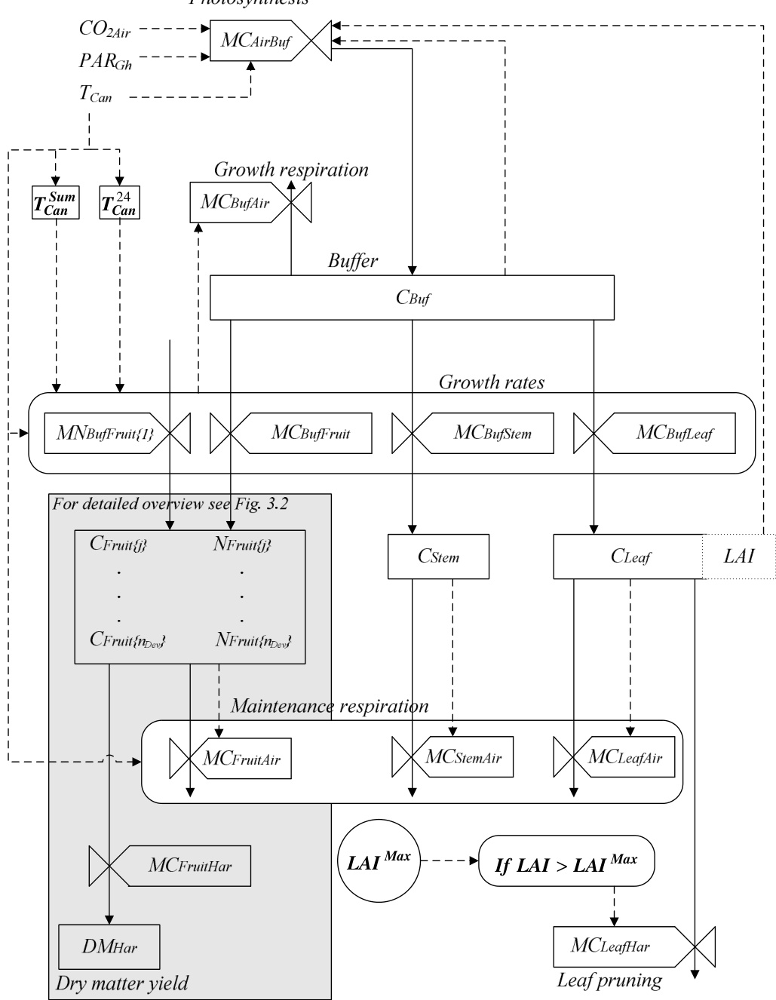  
Fig. 3.1 Schematic diagram of the tomato yield model using a modelling formalism of Forrester (1962). The boxes represent the state variables of the model, valves are rate variables. The dashed lines are information flows and the solid lines represent mass flows. The box representing the fruit weight, $C _ { f r u i t / j } ,$ and the number of fruits, $N _ { F r u i t / j } ,$ , is described in more detail in Fig. 3.2. The dotted box represents a semi-state variable of the model

The plant organ $C _ { S t e m }$ represents the carbohydrates which are stored in both stem and root. To take into account the time delay between fruit set and fruit harvest, the model simulates for each fruit development stage, $j .$ , the fruit weight $C _ { F r u i t / j \rangle }$ and the fruit numbers $N _ { F r u i t / j }$ . A part of the carbohydrates in the organs is used for maintenance respiration $( M C _ { F r u i t A i r } ,$ $M C _ { L e a f A i r } , M C _ { S t e m A i r } )$ . When the leaf area index (LAI) exceeds a maximum value, $L A I ^ { M a x }$ , the leaves are pruned back to this value, resulting in the mass flow $M C _ { L e a f H a r }$ . The accumulated harvested tomato dry matter is determined by integrating the carbohydrate outflow of the last fruit development stage.

The state variable equations and the carbohydrate flow to the individual plant organs with special interest for the two lumped temperature-dependent growth inhibition functions are presented in this chapter. Because of space limitations the remaining model processes are presented in the detailed description of the tomato yield with which can be found in chapter 9. A brief description of these model processes is given here. The PAR absorbed by the canopy is described by a negative exponential decay of light with LAI in a homogeneous row crop as described by Ross (1975). The canopy photosynthesis is based on the leaf photosynthesis model of Farquhar and Von Caemmerer (1982), Farquhar et al. (1980) and Farquhar (1988) which is scaled up to canopy photosynthesis by multiplying the maximal rate of electron transport for a leaf with the LAI as described by Evans and Farquhar (1991). Even though VPD strongly affects stomatal conductance, photosynthesis is not sensitive to VPD (Stanghellini & Bunce, 1993). Therefore, VPD effects on canopy photosynthesis rate were not incorporated in the model. For the purpose of model-based greenhouse design, the crop yield model will be combined with a greenhouse climate model (see chapter 2) that calculates the canopy temperature. This state variable depends on the transpiration and stomatal model of Stanghellini (1987). Consequently, the modelled thermal and hydraulic feedback systems ensure that VPD affects the temperature dependent growth inhibition functions and crop growth through its effect on canopy temperature. The fruit flow and carbohydrate flow to fruit development stages and the daily potential growth rate per fruit for different fruit development stages are based on De Koning (1994). The growth and maintenance respiration are based on Heuvelink (1996). The model parameters are listed in Table 3.2.

Table 3.2 List ofmodel parameters and symbols.If not specified,themass units are expressed in $\{ C H _ { 2 } O \}$   

<html><body><table><tr><td>Parameter</td><td>Symbol and value Unit</td><td></td><td>Reference</td></tr><tr><td>Conversion factor from carbohydrate to dry matter</td><td>nc_DM =1</td><td></td><td>mg {DM} mg-1 No lignification assumed</td></tr><tr><td>The time constant to calculate the 24 hour mean temperature</td><td>τ = 86400</td><td></td><td>See section 9.7.1</td></tr><tr><td>Maximum buffer capacity</td><td>C = 20-10</td><td>mg m²</td><td>See section 9.5.1</td></tr><tr><td>Minimum amount of carbohydrates in the buffer</td><td>C=1-10</td><td>mg m-2</td><td>See section 9.5.2</td></tr><tr><td>The gain of the process to calculate the 24 hour mean temperature k ="1</td><td></td><td></td><td>See section 9.7.1</td></tr><tr><td>Potential fruit growth rate coefficient at 20℃</td><td>rgFruir= 0.328</td><td>mg m2 s-1</td><td>See section 9.7.3 (De Koning, 1994)</td></tr><tr><td>Potential leaf growth rate coefficient at 20C</td><td>rgLeaf = 0.095</td><td>mg m² s-1</td><td>See section 9.7.3.(Heuvelink,1996)</td></tr><tr><td>Potential stem growth rate coefficient</td><td>rg Stem= 0.074</td><td>mg m2 s-1</td><td>See section 9.7.3 (Heuvelink,1996)</td></tr><tr><td>Specific leaf area index</td><td>SLA = 2.66:10-5</td><td></td><td>m² {leaf} mg-1 Based on Heuvelink (1996)</td></tr><tr><td>Temperature sum when fruit growth rate is at full potential</td><td>T = 1035</td><td>℃</td><td>Based upon Eq. (9.32)</td></tr><tr><td>Base temperature for 24 hour mean crop growth inhibition</td><td>TBase_24= 12</td><td>℃</td><td>See section 9.7.3</td></tr><tr><td>1't optimal temperature for 24 hour crop growth inhibition</td><td>Topt1_24= 18</td><td>℃</td><td>See section 9.7.3</td></tr><tr><td>2nd optimal temperature for 24 hour crop growth inhibition</td><td>Topt2_24 = 22</td><td>℃</td><td>See section 9.7.3</td></tr><tr><td>Maximum temperature for 24 hour crop growth inhibition</td><td>TMax_24 = 27</td><td>℃</td><td>See section 9.7.3</td></tr><tr><td>Base temperature for instantaneous crop growth inhibition</td><td>TBase_Inst = 6</td><td>℃</td><td>See section 9.7.3</td></tr><tr><td>1't optimal temperature for instantaneous crop growth inhibition</td><td>Toptl_Inst = 14</td><td>℃</td><td>See section 9.7.3</td></tr><tr><td>2nd optimal temperature for instantaneous crop growth inhibition</td><td>Topt2_Inst = 28</td><td>℃</td><td>See section 9.7.3</td></tr><tr><td>Maximum temperature for instantaneous crop growth inhibition</td><td>TMax_Inst = 40</td><td>℃</td><td>See section 9.7.3</td></tr></table></body></html>

# 3.4.3 State variables of the model

The state variables of the model are all described by differential equations. The derivatives of the state variables to time are indicated by a dot above the state symbol.

The evolution of the carbohydrates in the buffer, $C _ { B u f } \mathrm { , }$ in time is described by:

$$
\dot { C } _ { B u f } = M C _ { A i r B u f } - M C _ { B u f F r u i t } - M C _ { B u f L e a f } - M C _ { B u f S t e m } - M C _ { B u f A r }
$$

$$
[ \mathrm { m g ~ m ^ { - 2 } ~ s ^ { - 1 } } ]
$$

where $M C _ { A i r B u f } ^ { }$ is the photosynthesis rate, $M C _ { B u f F r u i t } , M C _ { B u f L e a f } , M C _ { B u f S t e m }$ are the carbohydrate flows to fruits, leaves and stems respectively, and $M C _ { B u f A i r }$ is the growth respiration of the plant. During the light period carbohydrates produced by the photosynthesis are stored in the buffer and, whenever carbohydrates are available in the buffer, carbohydrates flow to the plant organs. This carbohydrate flow stops when the buffer approaches its lower limit. When the buffer approaches its upper limit, carbohydrates can not be stored anymore in the buffer and the photosynthesis will be inhibited.

The time between fruit set and fruit harvest is the fruit growth period which is modelled using a “fixed boxcar train” method of Leffelaar and Ferrari (1989). This method implies that carbohydrates and the number of fruits flow from one fruit development stage to the next with a specific development rate (Fig. 3.2). When the plant shifts from the vegetative stage to the generative stage, carbohydrates are stored in the fruit development stage $j$ , $C _ { F r u i t / j \beta } ,$ ,, as described by:

$$
\begin{array} { r l r } & { \dot { C } _ { F r u i t \{ j \} } = M C _ { B u f F r u i t \{ j \} } + M C _ { F r u i t \{ j - 1 \} F r u i t \{ j \} } - M C _ { F r u i t \{ j \} F r u i t \{ j + 1 \} } - M C _ { F r u i t A i r \{ j \} } } & \\ & { \mathrm { w i t h } j = 1 , 2 . . . n _ { D e v } } & { [ \mathrm { m g ~ m ^ { - 2 } ~ s ^ { - 1 } } ] } \end{array}
$$

where $M C _ { B u f F r u i t / j }$ is the carbohydrate flow from the buffer to fruit development stage $j _ { : }$ , $M C _ { F r u i t / j - l / F r u i t / j }$ and $M C _ { F r u i t / j / F r u i t / j + l \beta }$ represent the carbohydrate inflow from the previous development stage and the outflow to the next stage respectively, $M C _ { F r u i t A i r / j }$ is the fruit maintenance respiration of development stage $j ,$ and $n _ { D e \nu }$ is the total number of fruit development stages. For the first fruit development stage, the carbohydrate inflow from the previous stage is zero. For the last development stage, the carbohydrate outflow to the next stage is described by $M C _ { F r u i t H a r }$ .

The number of fruits in the fruit development stage $j$ , $N _ { F r u i t / j }$ , affects the carbohydrate distribution to the fruits and is therefore described by: $\dot { N } _ { F r u i t \{ j \} } = M N _ { F r u i t \{ j - 1 \} F r u i t \{ j \} } - M N _ { F r u i t \{ j \} F r u i t \{ j + 1 \} } , \ j = 1 , 2 . . . n _ { D e r } \ [ \mathrm { f r u i t s \ m ^ { - 2 } s ^ { - 1 } } ]$ (3.3) where $M N _  F r u i t / j - l / F r u i t / j \}$ is the fruit number flow from fruit development stage $j \ – I$ to stage $j$

and $M N _ { F r u i t / j / F r u i t / j + I \beta }$ is the fruit number flow from fruit development stage $j$ to stage $j { + } l$ .   
For the first fruit development stage $M N _  F r u i t / j - l / F r u i t / j \}$ is replaced by $M N _ { B u f F r u i t / l } \mathrm {                                    } $ .

The fruit number flow to the first fruit development stage depends on carbohydrates available for fruit growth and on the truss appearance rate. The carbohydrates stored in the leaves, $C _ { L e a f } ,$ are described by: $\dot { C } _ { L e a f } = M C _ { B u f L e a f } - M C _ { L e a f A i r } - M C _ { L e a f H a r }$ $[ \mathrm { m g ~ m ^ { - 2 } ~ s ^ { - 1 } } ]$ (3.4) where $M C _ { B u f L e a f } $ is the carbohydrate flow from the buffer to leaves, $M C _ { L e a f t A i r }$ is the maintenance respiration of the leaves and $M C _ { L e a f H a r }$ is the leaf pruning.

The LAI is a semi-state of the model and is calculated by:

$$
L A I = S L A \cdot C _ { L e a f }
$$

$$
\mathrm { [ m ^ { 2 } \ \{ l e a f \} \ m ^ { - 2 } ] }
$$

where SLA is the specific leaf area $\mathrm { ( m ^ { 2 } \ : \{ l e a f \} \ m g ^ { - 1 } \ : \{ C H _ { 2 } O \} ) }$ .

The carbohydrates stored in the stem and roots, $C _ { S t e m }$ , are described by: $\dot { C } _ { S t e m } = M C _ { B u f S t e m } - M C _ { S t e m A i r }$ $[ \mathrm { m g ~ m } ^ { - 2 } \mathrm { s } ^ { - 1 } ]$ (3.6) where $M C _ { B u f S t e m }$ is the carbohydrate flow from the buffer to stems and roots, $M C _ { S t e m A i r }$ is the maintenance respiration of the stems and roots.

For sake of simplicity a continuous harvest rate was assumed. Consequently, the accumulated harvested tomato dry matter (DM), $D M _ { H a r } ,$ equals the outflow of dry matter from the last fruit development stage and is described by:

$$
\dot { D } M _ { \scriptscriptstyle H a r } = \eta _ { \scriptscriptstyle C _ { - } D M } \cdot M C _ { \scriptscriptstyle F r u i t H a r }
$$

$$
[ \mathrm { m g \ \{ D M \} \ m ^ { - 2 } \ s ^ { - 1 } } ]
$$

where $\eta _ { C _ { - } D M }$ is the conversion factor from carbohydrate to dry matter. Since growth respiration was incorporated into the model, this conversion factor is $1 \mathrm { \ m g \ \{ D M \} \ m g ^ { - 1 } }$ $\{ \mathrm { C H } _ { 2 } \mathrm { O } \}$ .

The development stage of the plant, required to describe the transition from the vegetative to the generative stage, is expressed by the temperature sum:

$$
\dot { T } _ { C a n } ^ { S u m } = \frac { 1 } { 8 6 4 0 0 } T _ { C a n }
$$

$$
[ ^ { \circ } \mathbf { C } \mathbf { \Lambda } \mathbf { s } ^ { - 1 } ]
$$

where $T _ { C a n }$ is the simulated canopy temperature. By definition, the start of the generative period $T _ { C a n } ^ { S u m }$ is zero.

Fig. 3.2 Fruit development is modelled by describing for each fruit development stage the number of fruits, $N _ { F r u i t / j }$ and the amount of carbohydrates, $C _ { F r u i t / j } .$ . As in Fig. 3.1, the boxes represent the state variables of the model, valves are rate variables. The dashed lines are information flows and the solid lines represent the carbon and fruit flows. The carbohydrates available for fruit growth, $M C _ { B u f F r u i t } $ are distributed to the different fruit development stages $C _ { F r u i t / j \rangle }$ . The carbohydrate flow to the first development stage MCBufFruit{1} is affected by the fruit set MNBufFruit{1} which in turn is influenced by the carbohydrates available for fruit growth $M C _ { B u f F r u i t }$ and the potential fruit growth rate $W _ { F r u i t \{ 1 \} } ^ { P o t } a s$ described in Eq.(9.35). The carbohydrate flow to the remaining fruit development stages is influenced by the available carbohydrates $M C _ { B u f F r u i t }$ , the number of fruits $N _ { F r u i t / j \rangle }$ and by a development stage dependent fruit growth rate as described by Eq. (9.38).

The 24 hour mean canopy temperature was approached by a $1 ^ { \mathrm { s t } }$ order approach:

$$
\dot { T } _ { C a n } ^ { 2 4 } = \frac { 1 } { \tau } \left( k T _ { C a n } - T _ { C a n } ^ { 2 4 } \right)
$$

$$
[ { } ^ { \circ } { \bf C } \ { \bf s } ^ { - 1 } ]
$$

where $\tau$ , represents the time constant of the process and $k$ is the gain of the process. When integrated in the model-based design method, the greenhouse climate model calculates the canopy temperature as a state variable. Therefore, the canopy temperature and the 24 hour mean canopy temperature could not be calculated beforehand. To approximate the 24 hour mean canopy anyway, the first order approach of Eq. (3.9) as derived in section 9.7.1 was incorporated into the model.

3.4.4 The carbohydrate flow to the individual plant organs The carbohydrate flow from buffer to the fruits is determined by multiplying the potential fruit growth coefficient $r g _ { F r u i t } ,$ by the inhibition factors $h$ : $M C _ { _ { B u j F r u i t } } = h _ { C _ { _ { B u j } } } ^ { M C _ { _ { B u j O r g . } } } \cdot h _ { _ { T c a n } } \cdot h _ { _ { T c a n 2 4 } } \cdot h _ { _ { T c a n S u n } } \cdot g _ { _ { T c a n 2 4 } } \cdot r g _ { _ { F r u i t } } \qquad \mathrm { [ m g ~ m ^ { - 2 } ~ s ^ { - 1 } ] }$ (3.10) where the inhibition factors $( 0 < h < 1 )$ : are : hCMCBufOrg (-), insufficient carbohydrates in the buffer; $h _ { T c a n }$ (-), non-optimal instantaneous temperature; $h _ { T c a n 2 4 } \ ( - )$ , non-optimal 24 hour mean canopy temperatures; and $h _ { T c a n S u m } \left( - \right)$ , crop development stage. The effect of the 24 hour mean temperature on the carbohydrate flow to fruits is described by $g _ { T c a n 2 4 }$ (-) and $r g _ { F r u i t } ( \mathrm { m g } \{ { \bf C H } _ { 2 } { \bf O } \} \mathrm { m } ^ { - 2 } \mathrm { s } ^ { - 1 } )$ is the potential fruit growth rate coefficient at $2 0 ^ { \circ } \mathrm { C }$ .

The carbohydrate flow to the first fruit development stage is influenced by the available carbohydrates for fruit growth, fruit set and potential fruit growth rate (Fig. 3.2 and Eq. (9.35) in chapter 9). The carbohydrate flow to the remaining fruit development stages depends on the available carbohydrates, the number of fruits and the fruit growth rate as a function of fruit development stage (Fig. 3.2 and Eq. (9.36)).

The carbohydrate flow from buffer to the leaves and stem is described by: $M C _ { _ { B u f O r g } ( i ) } = h _ { C _ { B u f } } ^ { M C _ { _ { B u f O r g } } } \cdot h _ { _ { T c a n 2 4 } } \cdot g _ { _ { T c a n 2 4 } } \cdot r g _ { _ { O r g } ( i ) } \quad \quad i = 2 , 3 \quad \quad \quad \mathrm { [ m g ~ m ^ { - 2 } ~ s ^ { - 1 } ] }$ (3.11) where $i$ represents the plant organ code for Leaf and Stem, $r g _ { O r g ( i ) }$ (mg $\mathrm { ; \ \{ C H _ { 2 } O \} \ m ^ { - 2 } \ s ^ { - 1 } ) }$ is the organ growth rate coefficient at $2 0 ^ { \circ } \mathrm { C }$ . As in agreement with Table 3.1, these carbohydrate flows are not influenced by instantaneous temperature. The two lumped temperature-dependent growth inhibition functions of Eqs. (3.10) and (3.11) are described in more detail in this section.

The literature review revealed that crop growth was inhibited by non-optimal levels of the instantaneous and 24 hour mean temperature which was described by two trapezoid growth inhibition functions, $h _ { T c a n }$ and $h _ { T c a n 2 4 }$ , respectively. Each inhibition function was based on Boote and Scholberg (2006) and was described by four cardinal temperatures (Fig. 3.3).

  
Fig. 3.3 The growth inhibition by the instantaneous temperature (a) and by the 24 hour mean canopy temperature $( b )$ . The solid lines represent the non-differentiable inhibition functions and the dashed dotted lines represent the differentiable inhibition functions. The non-differentiable inhibition functions were each smoothed by multiplying two smoothed conditional “if/else” statements as described in section 9.7.2. The cardinal temperatures for both inhibition functions are presented in Table 3.2.

Below a certain base temperature $T _ { B a s e }$ no carbohydrate flow to organs is expected $\scriptstyle ( h = 0 )$ , between $T _ { O p t I }$ and $T _ { O p t 2 }$ the carbon flow is maximal $( h { = } 1 )$ ) and above $T _ { M a x }$ no carbohydrate flow is expected $\scriptstyle ( h = 0 )$ ). Between $T _ { B a s e }$ and $T _ { O p t I }$ and between $T _ { O p t 2 }$ and $T _ { M a x }$ a linear relationship between inhibition and temperature is assumed. The growth inhibition function of Boote and Scholberg (2006) is not differentiable and therefore not suitable for dynamic optimisation purposes. Therefore, the non-differentiable inhibition functions were each smoothed by multiplying two smoothed conditional “if/else” statements as described in section 9.7.2. Based on the temperature effects on crop growth presented in Table 3.1, the cardinal temperatures presented in Table 3.2 were determined as described in section 9.7.3

# 3.5 Model validation

For all four temperature regimes, the yield model was validated using the same model parameters (Table 3.2). Since most of these parameters were extracted from literature, model parameters were not calibrated on data. Therefore, all simulations presented in Fig. 3.5 to Fig. 3.7 can be considered as model validations. The model was first validated for mild temperatures commonly encountered under Dutch greenhouse conditions and second for extreme temperatures encountered under southeast Spanish greenhouse conditions. Third, the model was validated for non-optimal temperature conditions. Fourth, the tomato harvest rate for long-term diurnal temperature oscillations was determined and compared with data obtained from literature.

To simulate crop yield, the differential equations were solved with an ODE solver of Matlab $7 . 1 ^ { \circledast }$ . Hourly greenhouse climate data, i.e. greenhouse air temperature, $\mathrm { C O } _ { 2 }$ - concentration and outside global radiation were used as model inputs. Since the canopy temperature was not measured, it was assumed to be equal to the greenhouse air temperature. An overview of the data needed to run the model for the Dutch and Spanish greenhouses is presented in Table 3.3. For the Dutch and Spanish validation studies, solely the LAI was measured as initial crop condition. Therefore, the initial leaf carbohydrates were calculated based on the LAI and the specific leaf area (Eq. 3.5). The initial stem and root carbohydrates were determined by multiplying the leaf carbohydrates with a ratio that depends on the vegetative development. Since the initial temperature sum was unknown for the Spanish studies, this parameter was fitted to the data to assure that the moment of the simulated first tomato harvest was equal to the measured first tomato harvest.

# 3.5.1 Model validation for mild temperature conditions

The model was validated with measured tomato yield–obtained under mild temperature conditions–of two Dutch greenhouse growers in different production years. In both cases tomatoes were grown in a Venlo-type greenhouse which was equipped with $\mathrm { C O } _ { 2 }$ - enrichment and a heating system. Tomatoes were grown close to the optimal 24 hour mean canopy temperature interval of $1 8 ^ { \circ } \mathrm { C } { - } 2 2 ^ { \circ } \mathrm { C }$ with varying $\mathbf { C O } _ { 2 }$ -concentrations and PAR levels commonly encountered in the Dutch greenhouses (Table 3.3).

Table 3.3 The location, crop production data, initial conditions, the mean greenhouse climate conditions for the Dutch growers A and B and for the low-tech and high-tech located in Southern Spain. Some initial crop conditions were not measured but calculated as described in section 3.5.   

<html><body><table><tr><td></td><td>Grower A</td><td>Grower B</td><td>Low-tech Spain</td><td>High-tech Spain</td></tr><tr><td>Location</td><td></td><td></td><td></td><td></td></tr><tr><td>Latitude</td><td>52°0'N</td><td>52°0'N</td><td>36°57'N</td><td>36°48'N</td></tr><tr><td>Longitud</td><td>4°3'E</td><td>4°3'E</td><td>2°00'W</td><td>2.43'W</td></tr><tr><td>Elevation (m)</td><td>-3</td><td>-3</td><td>180</td><td>151</td></tr><tr><td>Crop production data</td><td></td><td></td><td></td><td></td></tr><tr><td>Start growing cycle</td><td>10-12- 1999</td><td>8-12-1997</td><td>1-8-2009</td><td>26-9-2003</td></tr><tr><td>End growing cycle</td><td>2-10-2000</td><td>23-9-1998</td><td>5-05-2010</td><td>9-07-2004</td></tr><tr><td>Cultivar</td><td>Aromata</td><td>Rapsodie</td><td>Atletico</td><td>Pitenza</td></tr><tr><td>Greenhouse transmission</td><td>78%</td><td>78%</td><td>55%</td><td>40%</td></tr><tr><td>LAI Max</td><td>3.0</td><td>2.85</td><td>3.5</td><td>3.5</td></tr><tr><td>Initial conditions</td><td></td><td></td><td></td><td></td></tr><tr><td>Start simulation</td><td>6-1-2000*</td><td>6-1-1998*</td><td>1-8-2009</td><td>26-9-2003</td></tr><tr><td>TcanSumo (C)</td><td>0</td><td>0</td><td>-900</td><td>-650</td></tr><tr><td>LAIo (m² m2)</td><td>1.06</td><td>1.25</td><td>0.4</td><td>0.1</td></tr><tr><td>CLeafo (mg {CHO} m-2)</td><td>40-10</td><td>47·10</td><td>15:10</td><td>3.8-10</td></tr><tr><td>Cstemo (mg {CH2O} m²2)</td><td>30·10</td><td>31-10</td><td>15:10</td><td>3.8-10</td></tr><tr><td>Indoorclimate</td><td></td><td></td><td></td><td></td></tr><tr><td>Mean canopy</td><td>18.2 (2.7)</td><td>19.1 (2.1)</td><td>17.5 (7.0)</td><td>19.7 (3.2)</td></tr><tr><td>temperature (C) Daily global outside</td><td>12.2 (7.4)</td><td>9.7 (5.6)</td><td>12.9 (5.6)</td><td>15.9 (7.7)</td></tr><tr><td>radiation (MJ m² day -1) Mean CO2 concentration</td><td></td><td></td><td></td><td></td></tr><tr><td>at daylight (μmol mol-1)</td><td>677 (301)</td><td>659 (253)</td><td>355 (15)</td><td>476 (81)</td></tr></table></body></html>

The \* indicates that the simulation started at onset generative phase.

3.5.2 Model validation for Spanish temperature conditions The model was validated with measured tomato yield obtained for Southern Spanish climate conditions for a low tech “raspa y amagdo” greenhouse (LT) with only natural ventilation and a high tech greenhouse arch shape multi-tunnel (HT) equipped with natural ventilation, a heating system, a thermal screen, an external shade screen, a fogging system and $\mathrm { C O } _ { 2 }$ enrichment. In the LT greenhouse tomatoes were imposed to strongly fluctuating temperatures being frequently non-optimal (Table 3.3). In contrast, in the HT greenhouse tomatoes were grown closer to the optimal 24 hour mean canopy temperature interval.

# 3.5.3 Model validation for extreme temperature conditions

The simulated tomato yield for four different mean temperature levels was compared with yield measurements of the cultivar Liberto conducted in growth chambers by Adams et al. (2001). Until 26 weeks after sowing, Adams et al. determined the yield for four constant temperature regimes of $1 4 ^ { \circ } \mathrm { C }$ , $1 8 ^ { \circ } \mathrm { C }$ , $2 2 ^ { \circ } \mathrm { C }$ and $2 6 ^ { \circ } \mathrm { C }$ with the following climate set-points: a daylight period of 12 hours with $3 1 5 ~ { \mu \mathrm { m o l } }$ photons $\mathrm { m } ^ { - 2 } \mathrm { ~ s } ^ { - 1 }$ PAR above the canopy and a $\mathrm { C O } _ { 2 }$ -concentration of $1 0 0 0 \ \mu \mathrm { m o l } \ \mathrm { C O } _ { 2 } \ \mathrm { m o l } ^ { - 1 }$ air. Subsequently the model simulated tomato yield using the climate set-points of Adams as model inputs.

The simulated temperature treatment started similarly to Adams et al. (2001) – 21 days after sowing – when plants were still in the vegetative stage. Since destructive crop measurements were not performed, the following initial conditions were estimated for the 21 days old tomato crop: $L A I _ { O }$ was 0.1, $C _ { L e a f 0 }$ was $3 . 8 { \cdot } 1 0 ^ { 3 } ~ \mathrm { m g } ~ \{ \mathrm { C H } _ { 2 } \mathrm { O } \} ~ \mathrm { m } ^ { - 2 } , ~ \mathrm { } \Omega$ $C _ { S t e m O }$ was $2 . 5 { \cdot } 1 0 ^ { 3 } \ \mathrm { m g } \ \{ \mathrm { C H } _ { 2 } \mathrm { O } \} \ \mathrm { m } ^ { - 2 }$ . The temperature sum for onset of the generative stage was determined from the observations of the first fruit harvest for the different temperature treatments, which resulted in a mean temperature sum, $T _ { C a n } ^ { S u m }$ , of $- 5 5 0 ~ ^ { \circ } \mathrm { C }$ . As a best estimate of $L A I ^ { ~ M a x }$ , the mean of the measured LAI (2.5) of a full grown commercial tomato crop was used.

To make a fair comparison between the measured and simulated crop yield results, the measured fresh tomato yield per plant obtained by Adams et al. (2001) was expressed in dry matter tomato yield $\mathrm { ( g \ \{ D M \} \ m ^ { - 2 } ) }$ . For this re-calculation, the plant density of each growth chamber was set to 2.2 plants $\mathrm { m } ^ { - 2 }$ and the average dry matter content of the fruits for the treatments $1 4 ^ { \circ } \mathrm { C }$ , $1 8 ^ { \circ } \mathrm { C }$ , $2 2 ^ { \circ } \mathrm { C }$ and $2 6 ^ { \circ } \mathrm { C }$ were set at $1 0 . 7 \%$ , $6 . 2 \%$ , $5 . 6 \%$ and $6 . 2 \%$ , respectively according to Adams (personal communication, 2008).

3.5.4 Model evaluation of effects of diurnal temperature oscillations The effect of diurnal temperature oscillations on crop yield was investigated for four temperature trajectories, namely: low night temperatures $( T _ { n i g h t } )$ , high day temperatures $( T _ { d a y } )$ , mean temperature $( T _ { m e a n } )$ and the difference between day and night temperature (DIF) $( T _ { D I F } )$ as shown in Fig. 3.4. The temperature trajectories of $T _ { n i g h t } , T _ { d a y }$ and $T _ { D I F }$ were described by a sine function with a mean temperature of $2 0 ^ { \circ } \mathrm { C }$ and a different day and night amplitude. The temperature trajectory of $T _ { m e a n }$ , was described by a variable mean temperature ( $1 4 ^ { \circ } \mathrm { C }$ , $1 8 ^ { \circ } \mathrm { C }$ , $2 2 ^ { \circ } \mathrm { C }$ and $2 6 ^ { \circ } \mathrm { C }$ ) with a fixed day and night amplitude of $3 ^ { \circ } \mathrm { C }$ .

The tomato harvest rate for the four temperature scenarios was simulated under the following conditions: the plant was totally in the generative stage with a $L A I ^ { M a x }$ of 2.5 and the simulation period was 100 days. The PAR absorbed by the crop during the light period of 12 hours was described by a sinus function. To investigate how the harvest rate response to temperature depends on PAR, two PAR amplitudes were used: $4 6 0 ~ \mathrm { \mu m o l }$ photons $\mathrm { m } ^ { - 2 } \mathrm { s } ^ { - 1 }$ and $9 2 0 ~ \mathrm { \textmu m o l }$ photons $\mathrm { s } ^ { - 1 } \mathrm { m } ^ { - 2 }$ . The $\mathrm { C O } _ { 2 }$ level in the greenhouse was $3 7 0 \ \mu \mathrm { m o l } \ \mathrm { C O } _ { 2 } \ \mathrm { m }$ ol-1 air. The tomato harvest rates were determined for the last seven days of the total production period of 100 days to prevent the influence of the initial conditions on the results.

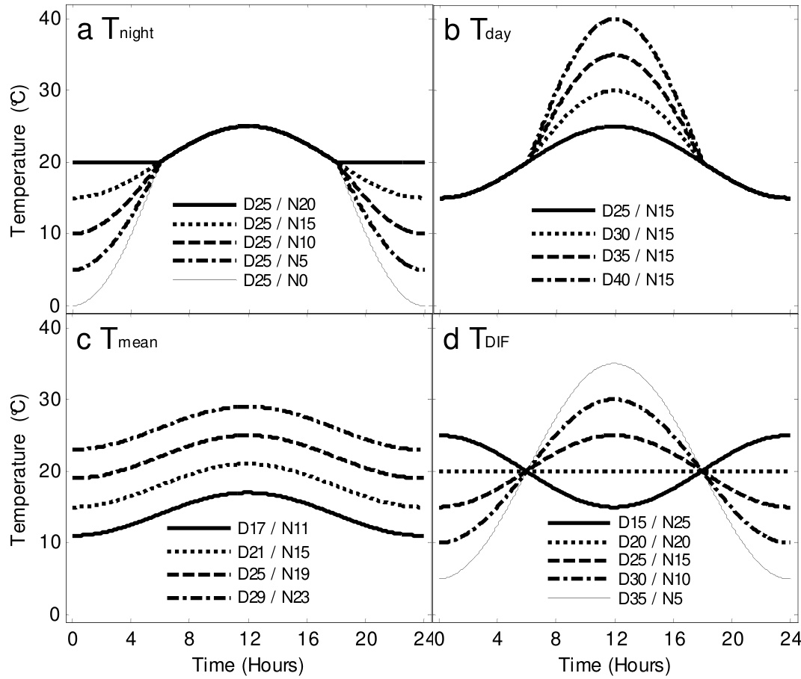  
Fig. 3.4 The temperature trajectories for the four temperature sensitivity studies: a) different night temperatures $( T _ { n i g h t } ) ; \ b )$ different high day temperatures $( T _ { d a y } ) ; c )$ different mean temperatures $( T _ { m e a n } )$ ; and $d$ ) difference between day and night temperature $( T _ { D I F } )$ .

# 3.6 Results and discussion

In section 3.6.1 to 3.6.4 the validation results are presented and discussed with respect to model performance on the tomato yield $( \mathrm {  ~ g ~ } \{ \mathrm { D M } \} \ \mathrm {  ~ m } ^ { - 2 } )$ . In section 3.6.5 the model is discussed with respect to other tomato yield models and relevant yield model aspects for greenhouse design optimisation are discussed as well. All tomato yield simulations were performed with the same set of model parameters.

# 3.6.1 Model validation for mild temperature conditions

For two commercial Dutch greenhouses, with mild temperature conditions and varying global radiation levels and $\mathrm { C O } _ { 2 }$ -concentrations (Table 3.3), the model simulated the tomato yield very well (Fig. 3.5). Only the tomato yield of grower B was slightly overestimated at the end of the production period. The higher crop yield of greenhouse A compared to greenhouse B was caused by its higher outside global radiation.

  
Fig. 3.5 The simulated tomato yield compared with measurements for grower A (a) and for grower B (b) under mild temperatures in Dutch greenhouses. Solid lines represent the simulations and the circles represent the measurements.

3.6.2 Model validation for Southern Spanish temperature conditions The impact of non-optimal temperatures on model performance was evaluated using Southern Spanish climate conditions. The tomato yield of the LT greenhouse was simulated with fair accuracy (Fig. 3.6a). The cumulative measured tomato yield of $9 2 2 \textrm { g } \{ \mathrm { D M } \} \ \mathrm { m } ^ { - 2 }$ was underestimated by the model with $9 7 \textrm { \text g } \{ \mathrm { D M } \} \textrm { \ m } ^ { - 2 }$ . This difference will not be a problem for greenhouse design because the error will be located in model uncertainty. The trend of the simulated yield differed from the measured yield which might be caused by errors introduced due to the conversion from measured tomato fresh tomato yield to calculated dry matter yield. For this conversion a constant dry matter content (DMC) was used since time variant measurements were missing. However, according to Segura et al. (2009) the dry matter content varies along the production period with a relatively low DMC in winter and a relatively high DMC in summer under South Spanish conditions. Using a time dependent DMC would improve the trend of the measured dry matter yield. Additionally, the underestimation of the measured crop yield might be caused by applying generic cardinal temperatures for the growth inhibition functions to a cultivar bred to withstand low temperatures. To improve the simulation result further, an option is to calibrate these cardinal temperatures for each cultivar.

For the HT greenhouse, the model predicted accurately the tomato yield (Fig. 3.6b). Only at the end of the production period the crop yield was underestimated slightly due to harvest simulation of the dry matter outflow from the last fruit development stage (Eq. 3.7) whereas in practise all marketable tomatoes on the plant were harvested.

  
Fig. 3.6 The simulated tomato yield compared with measurements in a low-tech greenhouse (a) and a high-tech greenhouse (b) located in South Spain. Solid lines represent the simulations and the circles represent the measurements.

3.6.3 Model validation for extreme temperature conditions Comparing simulated yield with yield measured by Adams et al. (2001), it can be observed that the model simulated with fair accuracy the effect of the mean temperature regimes of $1 4 ^ { \circ } \mathrm { C }$ , $1 8 ^ { \circ } \mathrm { C }$ , $2 2 ^ { \circ } \mathrm { C }$ and $2 6 ^ { \circ } \mathrm { C }$ on yield (Fig. 3.7a, b).

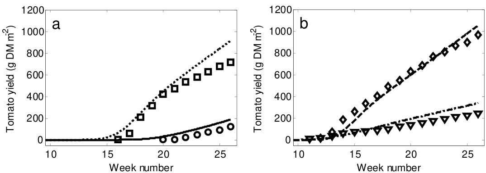  
Fig. 3.7 The simulated tomato yield for four different mean temperature treatments between week number $_ { I O }$ and 26 after sowing. Fig.3.7a presents the crop yield at $\scriptstyle { I 4 ^ { \circ } C }$ (solid line represents the simulation and circles the measurements) and at $\boldsymbol { { 1 8 ^ { \circ } C } }$ (dotted line represents the simulation and squares the measurements). Fig. $3 . 7 b$ presents the crop yield at $2 2 ^ { \circ } C$ (dashed line represents the simulation and diamonds the measurements) and at $2 6 ^ { \circ } C$ (dashed dotted line represents the simulation and triangles the measurements). Source of the measured data was Adams et al. (2001).

The model correctly captured a reduction in yield at non-optimal mean temperatures of $1 4 ^ { \circ } \mathrm { C }$ and $2 6 ^ { \circ } \mathrm { C }$ . Specifically, the simulated relative decrease in crop yield at non-optimal temperatures was almost equal to the measured relative reduction in yield (Table 3.4) as caused by the growth inhibition due to temperature (Eq. (3.10) and Fig. 3.3). However, the model tended to overestimate the yield at the end of the growing period by on average $3 3 \%$ (Table 3.4). This overestimation might be caused by growth chamber conditions not equal to those in the greenhouse for which the model was developed.

Table 3.4 Simulated and measured production values for four temperature treatments.   

<html><body><table><tr><td rowspan="3"></td><td colspan="4">Temperature (C)</td></tr><tr><td>14</td><td>18</td><td>22</td><td>26</td></tr><tr><td colspan="5">Production (g {DM} m-2)</td></tr><tr><td>Measured</td><td>123</td><td>720</td><td>970</td><td>241</td></tr><tr><td>Simulated</td><td>188</td><td>919</td><td>1057</td><td>340</td></tr><tr><td colspan="5">Relative production compared to maximum (%)</td></tr><tr><td>Measured</td><td>13</td><td>74</td><td>100</td><td>25</td></tr><tr><td>Simulated</td><td>18</td><td>87</td><td>100</td><td>32</td></tr><tr><td>Difference between simulations and</td><td>53</td><td>28</td><td>9</td><td>41</td></tr><tr><td colspan="5">measurements (%)</td></tr></table></body></html>

Temperature effects on first fruit harvest were simulated in close agreement to the measured first fruit harvest. Specifically, low mean temperature resulted in a delayed simulated first fruit harvest which was caused by the temperature effect on both vegetative development rate and generative development rate. However, for low mean temperatures $1 4 ^ { \circ } \mathrm { C }$ and $1 8 ^ { \circ } \mathrm { C }$ ) the simulated first fruit harvest was earlier than the measured first fruit harvest whereas for high mean temperatures $2 2 ^ { \circ } \mathrm { C }$ and $2 6 ^ { \circ } \mathrm { C }$ ) the simulated first fruit harvest was later than the measured values. The moment of simulated first fruit harvest at $1 4 ^ { \circ } \mathrm { C }$ and $2 6 ^ { \circ } \mathrm { C }$ differed 5 weeks whereas 10 weeks were measured. This underestimation was caused by processes both in the vegetative and generative period as explained hereafter.

Regarding vegetative development, a linear relationship with temperature was modelled using Eq. (9.27) of the detailed model description. However, measurements indicated that at sub-optimal temperatures the crop needs a higher temperature sum to fulfil the vegetative development period (Adams, personal communication 2009). To improve the simulation of the vegetative period, a base temperature should be introduced in the temperature sum description of Eq. (3.8).

The temperature sum needed for the generative period was based on the fruit development rate of Eq. (9.32) as determined by De Koning (1994), being different from the temperature sum of Adams et al. (2001) for the measurements under consideration. The underestimation of the fruit growth period at lower temperatures is due to the lower temperature sum from De Koning (1994) which resulted in a 24 days shorter growing period at $1 4 ^ { \circ } \mathrm { C }$ than the observed fruit growth period of Adams et al. (2001).

# 3.6.4 Model evaluation for diurnal temperature oscillations

To evaluate the model for its response to diurnal temperature oscillations, the trends of the simulated crop harvest responses to four extreme temperature treatments (Fig. 3.4, Fig. 3.8 and Fig. 3.9) were compared with harvest responses obtained from literature (Table 3.1). The impact of a low night temperature on harvest rate (Fig. 3.8a) shows that the model reproduced the expected interaction between radiation and temperature on harvest rate. In agreement with Martínez Mirón (2008), the optimum night temperature increased with increasing PAR level. Specifically, at a low PAR level the optimum night temperature was $5 ^ { \circ } \mathrm { C }$ whereas at a high PAR level the optimum night temperature was $1 0 – 1 5 ^ { \circ } \mathrm { C }$ . In addition, the positive impact of PAR on harvest rate at moderate temperature trajectories was demonstrated. For instance, for the day/night treatment of $2 5 ^ { \circ } \mathrm { C } / 1 5 ^ { \circ } \mathrm { C } .$ , the harvest rate at a low PAR level was $5 5 . 2 \%$ of the harvest rate at a high PAR level $( 1 2 3 . 1 \ \mathrm { g \ m ^ { - 2 } \ w e e k ^ { - 1 } } )$ .

Although negative effects of low night temperatures on tomato harvest rate were incorporated in the model, at low PAR levels the simulated tomato harvest rate increased slightly with decreasing night temperature. This result was in agreement with Martínez Mirón (2008) who measured under constant shading in the autumn and winter season in Southern Spain a higher yield at a mean night-time temperature of $1 3 . 2 ^ { \circ } \mathrm { C }$ than at $1 5 . 2 ^ { \circ } \mathrm { C }$ . This effect was caused by lower maintenance respiration losses at low night temperature It seems that the model was not valid for extremely low night temperatures because at $0 ^ { \circ } \mathrm { C }$ and $5 ^ { \circ } \mathrm { C }$ still a reasonable crop yield was simulated. This overestimation was caused by not modelling lethal damage or hormonal misbalances at low temperature. Nevertheless, extremely low temperatures will decrease tomato yield rate through the effect of mean temperature on tomato yield (Fig. 3.9a).

Fig. 3.8b shows that too high day temperatures lowered the harvest rate for both PAR levels. Under high PAR levels, the harvest rate at a maximum day temperature of $4 0 ^ { \circ } \mathrm { C }$ was $54 . 5 ~ \%$ of the harvest rate at a maximum day temperature of $2 5 ^ { \circ } \mathrm { C }$ . This result was in agreement with a measured tomato yield decrease of $4 6 . 1 \%$ at $3 5 ^ { \circ } \mathrm { C }$ compared to the $2 5 ^ { \circ } \mathrm { C }$ treatment which was observed by Zhang et al. (2008).

140 a Tnight b Tday 120   
2 100   
Production rate (g DM m-2 week-1) 80 60 山 40 20 0 25/0 25/5 25/10 25/15 25/20 25/15 30/15 35/15 40/15 Day / Night Temperature $( ^ { \circ } \mathrm { C } )$

In agreement with the crop yield measurements of Adams et al. (2001), Fig. 3.9a shows that non-optimal mean temperature affected negatively the harvest rate at both PAR levels. Specifically, the harvest rate under high PAR levels at a mean temperature of $1 4 ^ { \circ } \mathrm { C }$ was $3 2 . 0 \ \%$ of the harvest rate at the mean temperature of $1 8 ^ { \circ } \mathrm { C }$ $1 2 9 . 1 \ \mathrm { g \ m } ^ { - 2 }$ week-1) whereas the harvest rate at a mean temperature of $2 6 ~ ^ { \circ } \mathrm { C }$ was $1 9 . 6 \%$ of the harvest rate at the mean temperature of $1 8 ^ { \circ } \mathrm { C }$ . These results agreed well with crop yield reductions at non-optimal mean temperatures shown in Table 3.1. The tomato harvest rate at non-optimal mean temperatures was equal for both PAR levels. Specifically, at non-optimal temperatures the carbon outflow from buffer to fruits was reduced due to the temperature dependent growth inhibition functions (Eq. (3.10) and Fig. 3.3) whereas the inflow of carbon produced by photosynthesis sustained until buffer saturation. At buffer saturation, the photosynthesis was inhibited which resulted in lower crop yield values. Not PAR but temperature was thus the limiting factor for crop growth.

A DIF lower than $2 0 ^ { \circ } \mathrm { C }$ influenced only slightly the harvest rate (Fig. 3.9b) which was in close agreement with Mavrogianopoulos and Kyritis (1989) who found a similar crop yield at a DIF of $6 ^ { \circ } \mathrm { C }$ and $1 8 ^ { \circ } \mathrm { C }$ . In contrast, a large DIF of $3 0 ^ { \circ } \mathrm { C }$ did negatively affect the crop harvest rate. Specifically, for high PAR levels, the treatment of $3 5 / 5 ^ { \circ } \mathrm { C }$ resulted in $7 0 . 5 ~ \%$ of the harvest rate obtained in the treatment of $2 0 / 2 0 ^ { \circ } \mathrm { C }$ $1 2 4 . 4 \ \mathrm { g \ m ^ { - 2 } \ w e e k ^ { - 1 } ) }$ . The simulated harvest reduction was caused by both a sub-optimal night temperature of $5 ^ { \circ } \mathrm { C }$ and a supra-optimal day temperature of $3 5 ^ { \circ } \mathrm { C }$ . Although the effect of an extremely high DIF on tomato harvest rate was not explicitly described by the model, its impact on tomato harvest rate was properly simulated.

120 a Tmean b TDIF   
2   
m 100   
Production rate (g DM m-2 week-1) 680 40 山 20 0 17/11 21/15 25/19 29/23 15/25 20/20 25/15 30/10 35/5 Day / Night Temperature $( ^ { \circ } \mathrm { C } )$

3.6.5 Discussion of model performance in view of greenhouse design In horticultural research a considerable number of tomato yield models have been developed. For the aim of greenhouse design optimisation, the presented yield model has two advantages compared to, for example, the TOMGRO model (Jones et al., 1991; Dayan et al., 1993): 1) the crop response to extreme values for both instantaneous and diurnal mean temperature effects are modelled implying that the model can be used within a model-based greenhouse design method, 2) the model is described in differential equations with continuous differentiable right hand sides enabling us to combine the yield model with the greenhouse climate model presented in chapter 2 to solve differential equations with an existing ordinary differential equations solver and to use gradient based-optimisation algorithms to optimise greenhouse design. Furthermore, the model describes, based on crop physiological processes, the most important effects of extreme temperatures on tomato yield. These crop physiological processes were lacking in related studies. Specifically, Ioslovich and Seginer (1998) bounded the minimum and maximum temperature and Ooteghem (2007) penalized extreme temperatures by introducing a term in the cost criterion.

Given these results, obtained for a broad range of temperature conditions, the model is considered to be sufficiently accurate to be used for developing a model-based greenhouse design method. However, since our aim was to develop a design method that focussed on the optimisation of a set of design elements, model aspects that might be relevant may have been neglected or too much simplified. Therefore, whenever better or new modules are available, they can be easily incorporated into the design method. Some issues that might improve the generality of the model-based design method are discussed in more detail here.

To enhance the generality, yield models of other crops than tomatoes should be developed that fulfil the same requirements as demanded for the tomato yield model. Additionally, the transpiration module of the greenhouse climate model (see section 8.9) should then be adjusted to this crop as well. Performance of the tomato yield model might be improved by describing the impact of temperature and other climate variables on each growth and development process such as fruit set, fruit abortion and membrane integrity. Since modules of these processes were not available, two lumped temperature dependent growth inhibition functions were used in this study. Growth inhibition functions were based on literature values and therefore photosynthesis effects might have been captured in these functions. Since the simulated photosynthesis depended already on temperature, effects of non-optimal temperatures on photosynthesis might have been overestimated by the model.

However, first analysis of the crop yield prediction for non-optimal temperature conditions revealed that the incorporation of photosynthesis effects in the inhibition functions did not play an important role as can be seen in Fig. 3.7 and Fig. 3.8 due to the plant’s ability to store carbohydrates in the buffer.

To solve a greenhouse design problem, the economic benefits of crop yield must be determined. Since the presented model described dry matter yield as a function of greenhouse climate, the impact of dry matter content on fresh tomato yield should be integrated into the model. In addition, this DMC should then be described as a function of electrical conductivity of the growing medium, on outdoor climate variations (Segura et al., 2009) and on non-optimal temperatures (Adams et al., 2001). Subsequently, the quality of the tomatoes must be incorporated into the model since they determine the economic yield. According to Adams et al. (2001) the quality of the tomatoes and marketable ratio depends on temperature and air humidity. Therefore, when using the model for optimal greenhouse design, it would be better to describe the impact of humidity on quality and yield. To do this, the tomato quality model of Liu et al. (2007) can be used as a starting point. No direct effects of a large VPD on photosynthesis were modelled. However, when integrated in de model-based design method, a large VPD will indirectly affect growth through its effect on transpiration and canopy temperature. Additionally, fertigation was assumed to be nonlimiting for crop growth whereas in practise it might occasionally be non-optimal. The impact of fertigation on crop yield can be described by the nutrient model of Van Straten et al. (2006).

Since temperature effects on crop yield are cultivar dependent (Camejo et al., 2005; Khayat et al., 1985; Adams et al., 2001; De Koning, 1994), the model performance can be increased by calibration of the parameters related to the growth inhibition functions, photosynthesis functions and fruit growth period. Furthermore, instead of using a constant SLA, a seasonal dependent SLA based on Heuvelink (1996) might improve the model performance. Additionally, the estimation of the vegetative growth period might be improved by introducing a base temperature in the temperature sum calculation. No long term effects of extreme temperatures on crop yield were modelled, whereas in practice extreme temperatures indeed affect crop yield on the long term (Yakir et al., 1986). Consequently, the simulated crop could, erroneously, totally recover from extreme temperatures. To avoid that the resulting overestimated yields affect the greenhouse design optimisation problem, the greenhouse air temperature must not go beyond these extreme temperature values.

# 3.7 Conclusion

In this research, a yield model that describes the effect of greenhouse climate on tomato yield was developed and validated. The ultimate aim is to use this model in a model-based method to design greenhouses for the wide variety of climate and economic conditions that can be expected around the world. A literature survey of temperature effects on tomato yield was performed and the main temperature effects were implemented in the crop yield model.

Validations results showed that the model fulfilled the three predefined requirements. Specially, the model covers the effects of indoor climate and non-optimal temperature conditions on crop yield (requirements 1 and 2). Without calibration of model parameters, the crop yield model predicted with fair accuracy the crop yield levels for four temperature regimes. In more detail, the tomato yield was simulated accurately for both near-optimal and non-optimal temperature conditions in respectively The Netherlands and Southern Spain, given the varying light levels and $\mathrm { C O } _ { 2 }$ concentrations. In addition, the adverse effects of extremely low as well as high mean temperatures on tomato yield and moment of first fruit harvest was simulated with fair accuracy. The simulated yield response to extreme diurnal temperature oscillations were in agreement with literature values. Since the presented model consisted of a set of differential equations with continuous differentiable right-hand sides, requirement 3 was fulfilled as well. All model equations are presented in this chapter and in the detailed model description to assure that our colleagues are able to implement and reproduce our findings.

Given these results, obtained for a broad range of temperature conditions, the model is considered to be sufficiently accurate to be used for developing a model-based greenhouse design method. Therefore, the presented model will be integrated in the design method with the aim to design the best greenhouse design for local climate and economic conditions.

# Acknowledgement

We thank “De Gebroeders Duijvestijn BV”, Pijnacker, The Netherlands; “Grower Hooymans”, Pijnacker, The Netherlands; and Dr Steven Adams, Warwick University, United Kingdom for providing the crop yield data. For providing the Spanish crop yield data we thank Francisco Belzunces, the nursery Frutas Nijasol with special thanks to Mario and Juan José Magan Cañadas of the experimental station “Las Palmerillas” of Cajamar. We thank Ignacio Rodríguez Gracia, Eduardo Rumí Ronda and Nelleke Koene of Hortimax

Chapter 3

España to bring us into contact with the Spanish growers. This research is part of the strategic research programs "Sustainable spatial development of ecosystems, landscapes, seas and regions" and "Sustainable Agriculture" that are funded by the Dutch Ministry of Agriculture, Nature Conservation and Food Quality.

# 3.8 Nomenclature

States

$C$ Carbohydrate amount mg {CH2O} m-2 $D M$ Dry matter mg {DM} m-2 $N$ Number fruits m-2 $T$ Temperature $^ { \circ } \mathrm { C }$

Semi-state

LAI Leaf Area Index m2 {leaf} m-2

MC Carbohydrate mass flow mg {CH2O} m-2 s-1 MN Number flow fruits $\mathrm { m } ^ { - 2 } \mathrm { s } ^ { - 1 }$

24 Mean of 24 hour Max Maximum   
Air Air Min Minimum   
Buf The carbon buffer Sum Summation   
Can Canopy   
End End of period   
Fruit Fruit   
Har Harvest   
Inst Instantaneous temperature effect   
$j$ Fruit development stage   
Leaf Leaves   
Start Start of period   
Stem Stem and roots

# Chapter 4

Sensitivity analysis of a combined greenhouse climate-crop yield model

The contents of this chapter have been submitted to Biosystems Engineering as a paper entitled: A methodology for model-based greenhouse design: Part 3, Sensitivity analysis of a combined greenhouse climate-crop yield model.

B.H.E. Vanthoor, E.J. van Henten, C. Stanghellini, P.H.B. de Visser

# 4.1 Abstract

Greenhouse design is an optimisation problem that could be solved by a model-based greenhouse design method. Since the number of optimisation factors is very large, the objective of this research was to identify those parameters that most strongly influence a greenhouse design. For that purpose a sensitivity analysis was applied to a combined greenhouse climate crop yield model of tomato. The analysis was performed for a low-tech greenhouse in Almeria, Spain and a high-tech greenhouse in Texas, USA. Simulations indicated that the model produced realistic data of the indoor climate and crop yield. Single variate sensitivity results showed that outdoor climate has the strongest impact on the performance of the greenhouse system, followed by the greenhouse design parameters and the greenhouse climate set-points. The selection of a proper greenhouse location is thus of utmost importance. Concerning the design parameters, PAR remains the main limiting factor for greenhouse production systems. To increase crop yield, structures with a higher PAR transmission and a NIR selective whitewash must be used. Furthermore, results indicated whether sufficient climate control capacities were installed and which greenhouse design parameters can be adjusted to save resources. In addition, clear seasonal patterns in the model sensitivity suggested the need of adjustable cover parameters. The multi-variate sensitivity analysis revealed strong joint effects of the PAR transmission and temperature set-point for ventilation on crop yield. The presented SA techniques were thus able to quantify the single, combined and seasonal impact of parameters on the harvest rate, resource consumption and indoor climate.

# 4.2 Introduction

Optimal design of protected cultivation systems for the wide variety of conditions that exist around the world can be addressed as a multi-factorial optimisation problem (Van Henten et al., 2006) that relies on a quantitative trade-off between economic return of the crop and the costs associated with construction, maintenance and operation of the greenhouse facility. As the number of factors involved in this design optimisation problem is very large, it is beneficial to identify those parameters that most strongly influence the economic trade-off and consequently the greenhouse design. A model sensitivity analysis (SA) is an appropriate technique for that purpose.

In horticultural science, several researchers applied a sensitivity analysis to greenhouse climate models and crop yield models (Nijskens et al. (1991), Chalabi & Bailey (1991), Nava et al. (1998), Cooman & Schrevens (2007), Van Henten & Van Straten (1994), Van Henten (2003)). However, none of them analyzed a combined greenhouse climate and crop yield model and none of them performed the analysis specifically in view of greenhouse design. Therefore, the goal of this study was to address both these topics in an integral fashion using sensitivity analysis techniques.

Some preliminary studies already gave directions for investigation. Vanthoor et al. (2008b) revealed that the sensitivity of tomato yield to a single greenhouse design parameter depends on the absolute values of the other parameters. Additionally, it was found that the sensitivity of the crop yield with respect to the cover design parameters changed over time. In another paper Vanthoor et al. (2008a) showed that the design and climate management are mutually dependent. Based on these preliminary findings, in this study it was decided to analyse the sensitivity of some key performance indicators to variations in the input parameters i.e. design parameters, the outdoor climate and the indoor climate setpoints. Attention was paid to seasonal effects in the sensitivity. Additionally, further to a single variate parameter sensitivity analysis as commonly implemented in various studies, in this study, also a multi-variate analysis was implemented to identify the impact of joint variations in input parameters.

The chapter is organized as follows. Firstly, the greenhouse climate-crop yield model to be used for greenhouse design is presented briefly and key performance indicators are identified. Secondly, two SA techniques are described: a single-variate analysis that determines local sensitivities to indicate relevant input parameters at an individual basis and a multi-variate analysis to reveal the combined effect of two input parameters. Thirdly, to show how the results of the SA depend on greenhouse design and climate conditions, the SA was performed for two different greenhouse designs used under different climate conditions: a low-tech greenhouse in Almeria, Spain and a high-tech greenhouse in Texas, USA. Results of these two cases will be presented and discussed.

# 4.3 Materials and methods

4.3.1 Model description and analysed input parameters and model outputs

A model that describes tomato yield as a function of greenhouse climate (see chapter 3) was embedded into a model that describes greenhouse climate and resource consumption as a function of outdoor climate and greenhouse design parameters (see chapter 2).

The combined model consists of a set of ordinary differential equations:

$$
\dot { X } = f \big ( X , U , D , P , t \big )
$$

where $X$ is the state vector containing the indoor climate variables, the crop variables and resource consumption variables, $\dot { X }$ denotes the derivatives of the states to time, $U$ is the climate set-point vector, $D$ is the outdoor climate vector, $P$ is the model parameter vector including the design parameter vector $P _ { d } ,$ and $t$ (s) is the time.

To focus the sensitivity analysis, key performance indicators were identified for greenhouse design and operation. These indicators were the crop yield and the consumption of energy, water and carbon dioxide. In this research, the impact of various parameters on these performance indicators was determined (Fig. 4.1). Results obtained will give directions for greenhouse design, since ultimately, in greenhouse design, these performance indicators will be combined into a cost criterion to be optimised. This cost criterion reads:

$$
\operatorname* { m a x } _ { P _ { i } } J ( X , U , D , P , t ) = - I n \nu e s t m e n t s + \int _ { t _ { 0 } } ^ { t _ { f } } q _ { \gamma _ { i e l l } } \dot { Y } i e l d - q _ { E } \dot { E } - q _ { w } \dot { W } - q _ { c o _ { 2 } } \dot { C } O _ { 2 } d t
$$

$$
[ \in \mathrm { m } ^ { - 2 } ]
$$

where Investments $( \notin \mathrm { m } ^ { - 2 } )$ are the costs related to greenhouse design investments, $t _ { O }$ (s) and $t _ { f }$ (s) are the start and the end, respectively, of the simulation period, $q$ is the price coefficient of the associated cost aspect, Yield $( \mathrm { k g } \mathrm { ~ m } ^ { - 2 } )$ is the cumulative crop yield, $W$ is the water consumption $( \mathrm { k g } \mathrm { ~ \ m ~ } ^ { - 2 } )$ needed for canopy transpiration, $C O _ { 2 }$ is the $\mathrm { C O } _ { 2 }$ consumption $( \mathrm { m g ~ m } ^ { - 2 } )$ and $E$ is the energy consumption $( \textrm { W } \operatorname { m } ^ { - 2 } )$ . The variables Yield, $W$ ,

$C O _ { 2 }$ and $E$ are a member of the set of state variables $X$ . In this approach labour, logistics, maintenance of the greenhouse facility and fertigation, to mention a few, are not taken into account.

As indicated by Eq. (4.2) and Fig. 4.1, the greenhouse design parameters $P _ { d } .$ the climate set-points $U$ and the outdoor climate variables $D$ affect the evolution of the state variables of the greenhouse system and consequently the performance indicators mentioned above. Therefore, it was decided to analyse, not only, the impact of $P _ { d }$ , $U$ and $D$ on the crop yield and consumption of energy, water and $\mathrm { C O } _ { 2 }$ , but also their impact on the intermediate greenhouse state variables influencing these performance indicators, i.e. the canopy temperature $( T _ { C a n } )$ , greenhouse air temperature $( T _ { A i r } )$ , $\mathrm { C O } _ { 2 }$ concentration of the air $( C O _ { 2 A i r } )$ and the vapour pressure of the air $( V P _ { A i r } )$ .

Economic variables   
Structure Sensitivity analysis Total   
Cover type Outdoor climate,D Indoor climate: investments   
Shade screen Climate management, U Greenhouse TCan, CO2Air,RAR Tomato Cropyield climate yield Economic Net financial   
Whitewash Greenhouse design, Pd model TAir,VPAir model model result   
Thermal screen   
Heating system Resource use:   
Cooling system water,energy,CO2, electricity   
$\mathrm { C O } _ { 2 }$ enrichment Investments Net financial result maximum? Greenhouse design NO: Adjust optimisation greenhouse design YES:Greenhouse design is optimal

# 4.3.2 Sensitivity analysis techniques

The impact of a parameter on model output was determined using a single-variate analysis as described in section 4.3.2.1. Using this method the mean impact and the time dependent impact of the parameters could be revealed. Section 4.3.2.2 describes a multi-variate analysis to asses the joint impact of two greenhouse parameters.

# 4.3.2.1 A single-variate sensitivity analysis

In this research, a normalized relative sensitivity measure based on Chalabi and Bailey (1991) was used. This measure is defined in discrete time form as:

$$
S _ { z } ^ { X } \left( t _ { k } \right) = \frac { X _ { z _ { N o m } + \Delta z } \left( t _ { k } \right) - X _ { z _ { N o m } } \left( t _ { k } \right) } { \Delta z } \frac { z _ { N o m } } { \overline { { X } } _ { z _ { N o m } } }
$$

$$
t _ { k } = k \cdot \Delta t ; k = 0 , 1 , . . . N \mathrm { a n d } N = \big ( t _ { f } - t _ { 0 } \big ) / \Delta t
$$

where $S _ { z } ^ { X }$ is the normalised relative sensitivity of state variable $X$ to input parameter $z$ , $t _ { k }$ (s) is the time, $z _ { N o m }$ is the nominal input parameter value, $\Delta z$ is the input parameter deviation, $X _ { z _ { n o m } + \Delta z }$ is the state value at input parameter deviation, $X _ { z _ { n o m } }$ is the state value after the nominal input parameter value, and $\overline { { X } } _ { z _ { n o m } }$ is the mean value of the state evaluated over the whole simulation horizon, $\Delta t$ (s) is the simulation output interval, $N$ is the total number of time instants at which the sensitivity is determined. A relative sensitivity measure is preferred over an absolute measure, to compensate for the large differences in scale size of the various input parameters and model outputs. The relative sensitivity of the model output can be interpreted as the relative increase of the model output at time instant $t _ { k }$ , with respect to its mean value evaluated over the whole simulation horizon, expressed in $\%$ , caused by an increase of $1 \%$ of the nominal value of the associated input parameter.

Additional to the impact of the parameters on the states, the impact of the parameters on the time derivatives of the states were determined through a modification of Eq. (4.3):

$$
S _ { z } ^ { \dot { X } } \left( t _ { k } \right) = \frac { \dot { X } _ { z _ { N o m } + \Delta z } \left( t _ { k } \right) - \dot { X } _ { z _ { N o m } } \left( t _ { k } \right) } { \Delta z } \frac { z _ { N o m } } { \dot { X } } \mathrm { ~ }
$$

This approach was implemented, because as indicated by Eq. (4.2), the net return of the greenhouse design is determined by the time derivatives of some state variables and not by their current absolute values. Therefore analysing the impact of the parameters on the time

derivatives of these states offers valuable information about the seasonal effects of parameters. Appendix A presented in section 4.6.1 contains some details offering support for this approach.

In Eqs. (4.3) and (4.4), input parameter z includes the greenhouse design parameters $P _ { d }$ , the climate set-points $U$ and the outdoor climate variables $D$ :

$$
z = \{ P _ { d } , U , D \}
$$

In the current research these parameters were deviated using a fixed perturbation factor, $h { = } 0 . I O$ for all input parameters, resulting in an absolute increase of the input parameters:

$$
\begin{array} { l r } { \Delta P _ { d } = h \cdot P _ { d \_ N o m } } \\ { \Delta U = h \cdot U _ { _ { N o m } } } \\ { \Delta D = h \cdot \left| D _ { _ { N o m } } \right| } \end{array}
$$

Since time invariant deviations of input parameters were preferred, the outdoor climate variables, $D$ , were deviated with the average of the absolute values of the outdoor climate variables. Since global radiation is always zero during night time, radiation was only deviated during the day time period. To determine the relative sensitivities, the model was simulated once with the nominal input parameters and thereafter each selected input parameter was deviated with a perturbation factor $h$ and the model was simulated again. The resulting evolution of the states and their time derivatives were used to calculate the sensitivity measures of Eqns. (4.3) and (4.4).

In this study, time invariant scaling factors $\frac { z _ { N o m } } { \overline { { X } } _ { z _ { N o m } } }$ and $\frac { z _ { N o m } } { \bar { \dot { X } } _ { z _ { N o m } } }$ were used in Eqs.

(4.3) and (4.4) in stead of time variant scaling factors as was done by Chalabi and Bailey (1991) and Van Henten (2003). Essentially, this was done to avoid the situation that the relative sensitivity approaches infinity when a state value approaches zero, which would make the interpretation of the relative sensitivity ambiguous. The reason for the large relative sensitivity might be caused by a high impact of the associated parameter or by a very small value of the state or its derivative. Additionally, this was done to assure that the mean relative sensitivity of the time derivative of a state equals the relative sensitivity of the state value at the end of the production period (see Appendix B in section 4.6.2), a property that was used during the interpretation of the results. To simplify the interpretation of the results, the relative sensitivity measures of Eqs. (4.3) and (4.4) were modified. Due to similarity between these measures, only the modifications of Eq. (4.3) will be described.

For first analysis of the sensitivity results, a mean relative sensitivity was introduced:

$$
\overline { { S } } _ { Z } ^ { X } = \frac { 1 } { N + 1 } \sum _ { k = 0 } ^ { k = N } S _ { Z } ^ { X } \left( t _ { k } \right)
$$

As clarified in section 4.6.2, the mean relative sensitivity of the time derivative of a state equals the relative sensitivity of the similar state at time instant $t _ { f }$ . A mean relative sensitivity of the energy consumption rate of 2 indicates that the total energy consumption for the total simulation horizon increases with $2 \%$ when the input parameter increases with $1 \%$ . This property is only valid if the relative sensitivity equations contain time invariant scaling factors as in Eqs. (4.3) and (4.4).

Clearly, a mean relative sensitivity measure as in Eq. (4.7) might result in small values around zero although considerable positive and negative variations in sensitivity might exist in the time period considered. Therefore, Eq. (4.7) was modified to an absolute relative sensitivity measure:

$$
\left| S _ { Z } ^ { X } \right| = \frac { 1 } { N + 1 } \sum _ { k = 0 } ^ { k = N } \Bigl | S _ { Z } ^ { X } \left( t _ { k } \right) \Bigr |
$$

As demonstrated by Chalabi and Bailey (1991) and Van Henten and Van Straten (1994), the relative sensitivity of the model outputs may fluctuate strongly on a daily base. These variations are of interest in this analysis. To make the seasonal impact readily visible Eqs. (4.3) and (4.4) were smoothed:

$$
\begin{array} { l } { { S _ { z } ^ { X , S m o o t h } \left( t _ { k } \right) = \displaystyle \frac { 1 } { 2 N _ { S m o o t h } + 1 } \sum _ { j = - N _ { S m o o t h } } ^ { j = N _ { S m o o t h } } } \left( t _ { j } \right) , t _ { j } = t _ { k } + j \cdot \Delta t , }  \\ { { \displaystyle j = - N _ { S m o o t h } , - N _ { S m o o t h } + 1 , . . . N _ { S m o o t h } } } \end{array}
$$

where $N _ { S m o o t h }$ is the integer part of:

$$
N _ { s m o o t h } = t _ { s m o o t h } / 2 \Delta t
$$

where $t _ { S m o o t h }$ (s) is the smoothing period.

# 4.3.2.2 A multi-variate sensitivity analysis

A multi-variate sensitivity analysis was used to identify the combined effect of input parameters on model output. In this study, “a combined effect” means that a simultaneous increase of two parameters has a different impact on model output than the sum of their individual impacts on model output. For this purpose, the multi-variate sensitivity analysis according to Abusam et al. (2001) was implemented. Essentially, this approach approximates the sensitivity response surface with a linear regression meta model. Potentially, the parameters of this meta model reveal cross correlations in the parameter sensitivity. The approach consists of the following steps.

Firstly, model output was generated for a range of values of the selected set of input parameters. To limit the number of simulations needed to determine the regression coefficients of the linear regression model, a normalised second-order composite design around the nominal parameter vector was used (Box & Draper, 1987). For 2 input parameters, this design requires 9 simulation runs $( 2 ^ { n } + 2 n + 1$ with $n$ the number of evaluated input parameters).

Then, the following linear regression meta-model was fitted on the simulated model output and the associated input parameters values:

$$
y ( t _ { f } ) = b _ { 0 } + b _ { 1 } p _ { 1 } + b _ { 2 } p _ { 2 } + b _ { 1 1 } { p _ { 1 } } ^ { 2 } + b _ { 2 2 } { p _ { 2 } } ^ { 2 } + b _ { 1 2 } p _ { 1 } p _ { 2 }
$$

where $y ( t _ { f } )$ is the model output at the end of the simulation horizon $t _ { f } , b$ are the regression coefficients, $p _ { I }$ and $p _ { 2 }$ are the scaled parameters for the input parameters as listed in Table 4.1. To determine the regression coefficients, Eq. (4.11) was reformulated in vector-matrix notation as:

$$
Y = C \theta , \quad Y = { \left( \begin{array} { l } { y _ { 1 } } \\ { y _ { 2 } } \\ { \vdots } \\ { y _ { n } } \end{array} \right) } , C = { \left( \begin{array} { l l l l l l l } { 1 } & { p _ { 1 , 1 } } & { p _ { 2 , 1 } } & { p _ { 1 , 1 } ^ { 2 } } & { p _ { 2 , 1 } ^ { 2 } } & { \left( p _ { 1 } p _ { 2 } \right) _ { 1 } } \\ { 1 } & { p _ { 1 , 2 } } & { p _ { 2 , 2 } } & { p _ { 1 , 2 } ^ { 2 } } & { p _ { 2 , 2 } ^ { 2 } } & { \left( p _ { 1 } p _ { 2 } \right) _ { 2 } } \\ { \vdots } & { \vdots } & { \vdots } & { \vdots } & { \vdots } & { \vdots } \\ { 1 } & { p _ { 1 , n } } & { p _ { 2 , n } } & { p _ { 1 , n } ^ { 2 } } & { p _ { 2 , n } ^ { 2 } } & { \left( p _ { 1 } p _ { 2 } \right) _ { n } } \end{array} \right) } , \quad \theta = { \left( \begin{array} { l } { { - \mathrm { e } } } \\ { b _ { 1 } } \\ { b _ { 2 } } \\ { b _ { 1 1 } } \\ { b _ { 2 2 } } \end{array} \right) }
$$

where $n$ is the total number of simulation runs. Subsequently, the regression coefficient vector $\theta$ was estimated by:

$$
 { \hat { \theta } } = \bigl ( C ^ { T } C \bigr ) ^ { - 1 } C ^ { T } Y
$$

The significance $( p < 0 . l O )$ of the regression coefficients was calculated with the T-test as described by Montgomery and Peck (1992). Finally, the significant regression coefficients of this meta-model were analysed because they contain information about the impact of both single and combined input parameters on the model output. For example, a significant regression coefficient $b _ { I 2 }$ indicates a combined effect of the scaled input parameters $p _ { I }$ and $p _ { 2 }$ on model output.

Table 4.1 The original parameter levels and the normalised parameter values for the combined sensitivity of the final crop yield towards some model inputs for the greenhouse in Almeria and Texas. The coded levels accompanying the original parameter values were based on the normalised secondorder composite design around the nominal parameter vector of Box and Draper (1987).   

<html><body><table><tr><td>Almeria</td><td colspan="5">Original parameter values</td></tr><tr><td>Coded level x=- √2</td><td></td><td>X=-1 X=0</td><td></td><td>X=1</td><td>x =√2</td><td>Normalised parameter values</td></tr><tr><td>T RfPAR</td><td>0.3272</td><td>0.41</td><td>0.61</td><td>0.81</td><td>0.8928</td><td>p=(T RfPAR - 0.61)/0.2</td></tr><tr><td>T RJNIR</td><td>0.3272</td><td>0.41</td><td>0.61</td><td>0.81</td><td>0.8928</td><td>p=(T RfNIR - 0.61)/0.2</td></tr><tr><td>T RfFIR</td><td>0.1172</td><td>0.2</td><td>0.4</td><td>0.6</td><td>0.6828</td><td>p=(T RfFIR - 0.61)/0.2</td></tr><tr><td>CO20ut</td><td>299.3</td><td>320</td><td>370</td><td>420</td><td>440.7</td><td>p=(CO20ut -370)/50</td></tr><tr><td>TAir_VentOn</td><td>20.17</td><td>21</td><td>23</td><td>25</td><td>25.83</td><td>p=(TAir_vemtOn - 23)/2</td></tr><tr><td>Texas</td><td></td><td></td><td></td><td></td><td></td><td></td></tr><tr><td>T RJPAR</td><td>0.7793</td><td>0.8</td><td>0.85</td><td>0.9</td><td>0.9207</td><td>p=(TRfPAR - 0.85)/0.05</td></tr><tr><td>CO2Air_Exi0On 517.16</td><td></td><td>600</td><td>800</td><td>1000</td><td>1082.84</td><td>p=(CO2Air_Ext0n - 800)/200</td></tr><tr><td>TAir_VentOn</td><td>20.17</td><td>21</td><td>23</td><td>25</td><td>25.83</td><td>p=(TAir_VentOn - 23)/2</td></tr></table></body></html>

4.3.3 Two case studies: Almeria, Spain and Texas, USA

To show how the sensitivity results depend on greenhouse design and climate conditions, the SA was performed for two different greenhouse designs under different climate conditions: a low-tech greenhouse in Almeria, Spain and a high-tech greenhouse in Texas, USA. These different designs were caused by local climate conditions and represent the current state of greenhouse production systems in Almeria and Texas. In this section the assumptions concerning the sensitivity analysis study are presented. This includes the greenhouse parameters, outdoor climate, greenhouse climate management and the crop conditions as well as the parameters studied in the sensitivity analysis.

# 4.3.3.1 Greenhouse design in Almeria and Texas

The low-tech greenhouse was located in Almeria, Spain $3 6 ^ { \circ } 4 7 ^ { \circ } \mathrm { N }$ , $2 ^ { \circ } 4 3 ^ { \circ } \mathrm { W }$ and $1 5 0 \mathrm { ~ m ~ }$ above sea level). The 3-span multi-tunnel greenhouse was covered with a PE foil. Sole means for greenhouse climate management were roof and side ventilators and seasonal whitewash. The high-tech greenhouse was located in Texas, USA $3 0 ^ { \circ } 2 1 ^ { \circ } \mathrm { N }$ , $1 0 4 ^ { \circ } 0 0 ^ { \circ } \mathrm { W }$ and $1 4 7 0 \mathrm { ~ m ~ }$ a.s.l.). The Venlo-type greenhouse was covered with a single glass layer and was equipped with pipe heating, $\mathrm { C O } _ { 2 }$ injection, roof ventilation and with a thermal screen. Details of the two greenhouse designs are presented in Appendix C (see section 4.6.3).

# 4.3.3.2 Outdoor climate, greenhouse climate management and crop conditions

Details of the outdoor climate, the greenhouse climate management and the crop conditions for both greenhouses are presented in Table 4.2. For both locations the same growing period (August $1 ^ { \mathrm { s t } }$ to July $1 ^ { \mathrm { s t } }$ ) and climate set-points were used to assure that differences between sensitivity results of both locations were only caused by greenhouse design and outdoor climate. However, the seasonal whitewash was applied earlier in Almeria than in Texas based on real data. The climate control strategy is described in Fig. 4.2.

  
Fig. 4.2 The climate control strategy based upon climate set-points for both greenhouses. $C O _ { 2 }$ was supplied whenever the $C O _ { 2 }$ concentration in the greenhouse was below the $C O _ { 2 }$ concentration setpoint for enrichment. Values of the climate set-points are listed in Table 4.2.

Table 4.2 Overview of the average outdoor climate, the greenhouse climate management and the crop conditions for the greenhouses in Almeria and Texas. The last column presents if a Sensitivity Analysis was performed on the presented measures. The values between the brackets represent the standard deviation. The dots indicate that the accompanying climate control techniques were not used in the greenhouse.   

<html><body><table><tr><td></td><td>Almeria, Spain</td><td>Texas,USA</td><td>Sensitivity Analysis</td></tr><tr><td>Outdoor climate (D)</td><td></td><td></td><td></td></tr><tr><td>Iglob_sum (MJ m² day-1)</td><td>17.3 (7.1)</td><td>17.8 (6.0)</td><td>+</td></tr><tr><td>Tout (C)</td><td>17.6 (5.3)</td><td>15.7 (9.4)</td><td>+</td></tr><tr><td>VPout (kPa)</td><td>1.3 (0.4)</td><td>1.0 (0.6)</td><td>+</td></tr><tr><td>RHout (%)</td><td>65.4 (17.7)</td><td>52.6 (25.6)</td><td>+</td></tr><tr><td>Tsky (C)</td><td>-0.4 (7.6)</td><td>-4.7 (12.6)</td><td>+</td></tr><tr><td>TsoOut(C)</td><td>18.0 (2.6)</td><td>16.2 (3.7)</td><td>+</td></tr><tr><td>Vwind (m s-1)</td><td>3.0 (2.3)</td><td>2.9 (2.1)</td><td>+</td></tr><tr><td>Greenhouse climate management (U)</td><td></td><td></td><td></td></tr><tr><td>Whitewash</td><td>August 1st- September 15th August 1st- September 15th April16th-July1st</td><td>May 16th- July 1st</td><td>-</td></tr><tr><td>Tair_vent_on</td><td>23</td><td>23</td><td>+</td></tr><tr><td>Tair_vent_off</td><td>17</td><td>17</td><td>+</td></tr><tr><td>RHair_vent_on</td><td>90</td><td>90</td><td>+</td></tr><tr><td>CO2air_vent_off</td><td>200</td><td>200</td><td>+</td></tr><tr><td>Tair_boil_on</td><td>*</td><td>18</td><td>+</td></tr><tr><td>Tout_ThScr_on</td><td>*</td><td>10</td><td>+</td></tr><tr><td>CO2air_ExtCO2_on</td><td>*</td><td>800</td><td>+</td></tr><tr><td>Crop conditions</td><td></td><td></td><td></td></tr><tr><td>LAI_start</td><td>0.3</td><td>0.3</td><td>1</td></tr><tr><td>LAI_max</td><td>2.5</td><td>2.5</td><td>-</td></tr><tr><td>Start growing period</td><td>August 1't 2002</td><td>August 1't 2007</td><td></td></tr><tr><td>End growing period</td><td>July 1't 2003</td><td>July 1"t 2008</td><td></td></tr></table></body></html>

# 4.3.3.3 Simulation of the model

The model was simulated by solving the differential equations with a variable time step ODE solver of Matlab $7 . 1 ^ { \circledast }$ . The output interval of the simulation $\Delta t$ , was 3600 s and the smoothing period, $t _ { S m o o t h }$ , was chosen pragmatically to be 7 days which equals $6 . 0 { \cdot } 1 0 ^ { 5 } \mathrm { ~ s ~ }$ .

# 4.3.3.4 Sensitivity analysis

Both cases were investigated with the following three step procedure. First the model was simulated with the outdoor climate data. Not intended to be an in depth validation, evaluation of the produced output offered valuable insight into the ability of the model to produce at least realistic output. Secondly, a single-variate sensitivity analysis was performed. Followed, thirdly, with the multi-variate sensitivity analysis.

The parameters evaluated in the single-variate sensitivity analysis are listed in the last column of Table 4.2 and in the last column of the table presented in Appendix C (see section 4.6.3). For some greenhouse design parameters no sensitivity analysis was performed since they were related to other greenhouse design parameters. Specifically, since the sum of the transmission, reflection and absorption coefficients must always be one, the following assumptions for all the cover layers, i.e. the roof, whitewash and thermal screen, were made: a) when analyzing the impact of the photosynthetically active radiation (PAR) and the near infrared radiation (NIR) transmission coefficient, the absorption coefficient for NIR and PAR remained the same; consequently a change in the PAR and NIR transmission coefficient resulted only in a change of the PAR and NIR reflection coefficient, b) when analyzing the impact of the far infrared radiation (FIR) emission coefficient, the FIR transmission coefficient remained the same, and c) when analyzing the impact of the FIR transmission coefficient, the FIR emission coefficient remained the same.

For the multi-variate sensitivity analysis the ranges and normalised values of the selected parameters are presented in Table 4.1 together with the accompanying coded levels based on the composite design procedure of Box and Draper (1987). To reduce the number of potential parameter combinations, only a limited set of parameters was selected for analysis. Only those combinations were selected for which a combined effect on final crop yield was expected. Solar radiation, temperature and $\mathrm { C O } _ { 2 }$ concentration mutually influence the photosynthesis rate. Since a combined impact of these climate variables on crop yield was expected, the PAR transmission of the cover, temperature set-point for ventilation, the outdoor $\mathrm { C O } _ { 2 }$ -concentration in Almeria and the $\mathrm { C O } _ { 2 }$ concentration set-point for $\mathrm { C O } _ { 2 }$ enrichment in Texas were selected as input parameters. Cooman and Schrevens (2007) revealed that solar radiation intensity and air temperature had a combined effect on fruit weight. Therefore, for the greenhouse in Almeria, the input parameters influencing the solar radiation and air temperature were selected, namely: the PAR, NIR and FIR transmission of the greenhouse cover.

# 4.4 Results and discussion

In section 3.1 results are presented of the nominal model simulations for both cases. Then, results are presented of the single and multi-variate sensitivity analysis of the model in sections 3.2 to 3.6. Results are discussed in view of information available from literature and implications for greenhouse design are presented. In section 4.4.7 the applied sensitivity analysis is discussed.

# 4.4.1 Nominal simulation results

Obviously, the value of a sensitivity analysis depends on the quality of the model to which the analysis is applied. For a detailed description and validation of the greenhouse climate model and crop yield model, see chapter 2 and 3 respectively. Additionally, in this research we checked that the order of magnitude of the simulated crop yield (Fig. 4.3a, b) and the indoor climate (Fig. 4.3c-f) of both greenhouses were representative for the conditions observed in Almeria, Spain and Texas, USA.

As might be expected, the final crop yield in the high-tech greenhouse in Texas was considerably higher than in the low-tech greenhouse in Almeria which had a much more growth-limiting climate management (Fig. 4.3c-e). Specifically, the indoor temperature, global radiation and $\mathrm { C O } _ { 2 }$ concentration were more favourable for crop growth in the high-tech greenhouse than in the low-tech greenhouse. The low harvest rate in winter in Almeria was caused by the negative effect of sub-optimal mean temperatures on simulated tomato yield and low light levels as described in chapter 3.

The final simulated tomato yield in Texas $6 8 ~ \mathrm { k g }$ fresh weight per $\mathbf { m } ^ { 2 \cdot }$ ) was in agreement with the grower’s observation. The final simulated tomato yield in Almeria (24 kg fresh weight per $\mathbf { m } ^ { 2 \cdot }$ ) overestimated slightly the measured production of $1 8 . 5 - 2 0 . 8 ~ \mathrm { k g }$ $\mathrm { m } ^ { - 2 }$ obtained in a ‘raspa y amagado’ greenhouse under Southern Spanish conditions (Callejón-Ferre et al., 2009). This overestimation was caused by the better ventilation performance of the simulated greenhouse compared to the limited ventilation of a ‘raspa y amagado’ greenhouse and because the simulation considered a longer growing period than used in Spanish practice.

  
Fig. 4.3 Simulated crop yield (a), harvest rate $( b )$ , and the simulated monthly mean indoor values of the global indoor radiation (c), greenhouse air temperature (d), $C O _ { 2 }$ concentration during day period (e) and the relative humidity (f) in the low-tech greenhouse in Spain (solid line) and in the high-tech greenhouse in Texas, USA (dotted line) from August $\boldsymbol { I } ^ { s t }$ to July $\boldsymbol { I } ^ { s t }$ .

# 4.4.2 Impact of greenhouse design parameters

The calculated mean relative sensitivities were ordered in Table 4.3 – Table 4.8 based on their impact on harvest rate. These tables present an enormous amount of relevant information about the impact of parameters on greenhouse performance. In this chapter only the most relevant findings will be discussed. For both greenhouses, the spectral properties of the greenhouse roof and the seasonal whitewash had the highest impact on the harvest rate (Table 4.3 and Table 4.4), even at 2 locations with relatively high outside global radiation levels.

Table 4.3 The mean relative sensitivity of the harvest rate, water use rate and indoor climate variables towards the greenhouse design parameters, $P _ { d } ,$ with the highest impact on harvest rate for the low-tech greenhouse in Almeria. The” $w ^ { , , }$ indicates that the mean relative sensitivity was lower than 0.005. Only the 10 design parameters with the highest impact on harvest rate are presented. Note that the presented mean relative sensitivities of the harvest rate, energy use, water use and $C O _ { 2 }$ use, equal the relative sensitivities of the states at the end of the production period.   

<html><body><table><tr><td></td><td>Harvest rate</td><td>Water use</td><td>Tcan</td><td>TAir</td><td>CO2Air</td><td>VPAir</td></tr><tr><td>T RfPAR</td><td>0.77</td><td>0.44</td><td>0.07</td><td>0.04</td><td>0.02</td><td>0.03</td></tr><tr><td>TShScrPerPAR</td><td>0.27</td><td>0.15</td><td>0.02</td><td>0.01</td><td>0.01</td><td>0.01</td></tr><tr><td>T RJFIR</td><td>-0.24</td><td>-0.18</td><td>-0.06</td><td>-0.04</td><td>-0.01</td><td>-0.04</td></tr><tr><td>TRINIR</td><td>0.1</td><td>0.19</td><td>0.06</td><td>0.04</td><td>0.02</td><td>0.03</td></tr><tr><td>PFlrPAR</td><td>0.09</td><td>0.05</td><td>0</td><td>0</td><td>0</td><td>0</td></tr><tr><td>ERJFIR</td><td>-0.08</td><td>-0.05</td><td>-0.02</td><td>-0.02</td><td>-0.01</td><td>-0.02</td></tr><tr><td>P ShScrPerPAR</td><td>0.06</td><td>0.02</td><td>-0.01</td><td>0</td><td>0</td><td>0</td></tr><tr><td>NGlob_Air</td><td>-0.04</td><td>-0.02</td><td>0.</td><td>0</td><td>0</td><td>0</td></tr><tr><td>TShScrPerNIR</td><td>-0.03</td><td>0.03</td><td>0.02</td><td>0.01</td><td>0.01</td><td>0.01</td></tr><tr><td>PFlrNIR</td><td>-0.03</td><td>0</td><td>-0.02</td><td>-0.01</td><td>-0.01</td><td>-0.01</td></tr></table></body></html>

Particularly, the PAR transmission of the roof and the whitewash were the most important greenhouse design parameter to improve the harvest rate: in Almeria a year-round increase of the PAR transmission of the roof with $1 \%$ resulted in a harvest rate increase of $0 . 7 7 \%$ whereas in Texas the same PAR transmission increase resulted in a harvest rate increase of $0 . 3 4 \%$ . Such a positive impact of PAR on crop yield was also described by Marcelis et al.

(2006). However, increasing the PAR transmission might also result in a higher fruit temperature which then could negatively affect the fruit quality. This quality aspect was not included in the model used in this study.

Table 4.4 The mean relative sensitivity of the harvest rate, resource use rate and indoor climate variables towards the greenhouse design parameters, $P _ { d } ,$ with the highest impact on harvest rate for the high-tech greenhouse in Texas. Only the 10 design parameters with the highest impact on harvest rate are presented.   

<html><body><table><tr><td></td><td>Harvest</td><td>Energy</td><td>Water</td><td>CO2</td><td>Tcan</td><td>TAir</td><td>CO2Air</td><td>VPAir</td></tr><tr><td>T RfPAR</td><td>0.34</td><td>-0.14</td><td>0.24</td><td>0.09</td><td>0.07</td><td>0.03</td><td>0.12</td><td>0</td></tr><tr><td>TShScrPerPAR</td><td>0.07</td><td>-0.02</td><td>0.04</td><td>0.01</td><td>0.02</td><td>0.01</td><td>0.03</td><td>0.01</td></tr><tr><td>NGlob_Air</td><td>-0.06</td><td>0.01</td><td>-0.01</td><td>0.01</td><td>-0.01</td><td>0</td><td>-0.03</td><td>-0.01</td></tr><tr><td>ExcO</td><td>0.06</td><td>0</td><td>0</td><td>0.86</td><td>0</td><td>0</td><td>0.1</td><td>0</td></tr><tr><td>PFlrPAR</td><td>0.05</td><td>0.04</td><td>0.02</td><td>0.01</td><td>0</td><td>0</td><td>0.01</td><td>0</td></tr><tr><td>T RINIR</td><td>-0.05</td><td>-0.16</td><td>0.11</td><td>0.04</td><td>0.04</td><td>0.02</td><td>0</td><td>0</td></tr><tr><td>hElevation</td><td>-0.02</td><td>-0.05</td><td>-0.1</td><td>0</td><td>0.02</td><td>0.01</td><td>0</td><td>-0.03</td></tr><tr><td>TShScrPerNIR</td><td>-0.02</td><td>-0.03</td><td>0</td><td>0</td><td>0.02</td><td>0.01</td><td>0</td><td>0</td></tr><tr><td>ERjFIR</td><td>0.01</td><td>0.58</td><td>-0.06</td><td>-0.04</td><td>-0.05</td><td>-0.03</td><td>-0.01</td><td>-0.08</td></tr><tr><td>EShSerPerFIR</td><td>0.01</td><td>0.06</td><td>0.01</td><td>-0.01</td><td>-0.01</td><td>-0.01</td><td>0</td><td>-0.01</td></tr></table></body></html>

Reasons for the higher impact of the PAR transmission on harvest rate in Almeria were $: 1$ ) the indoor global radiation of the greenhouse in Almeria was lower than in Texas (Fig. 4.3c) and due to the non-linear response of the photosynthesis to PAR, the increase of the PAR transmission at the lower PAR levels in Almeria affected the photosynthesis rate relatively more than at the higher PAR levels in Texas and 2) in Almeria an increase of PAR transmission favoured both the growing factors light and temperature whereas in Texas an increase of PAR favoured only the amount of growing light because heating already ensured the desired temperature.

Besides cover materials and whitewash with a higher PAR transmission also other greenhouse design parameters might be adjusted to improve the harvest rate. In the lowtech greenhouse both an increase of the transmission and emission coefficient for FIR decreased the harvest rate considerably (-0.24 and -0.08, respectively). This was caused by a lower night time temperature. This result was in agreement with Nijskens et al. (1991) who demonstrated that in an unheated greenhouse these parameters had the largest impact on greenhouse air temperature.

Furthermore, the potential advantage of a NIR-selective whitewash over a conventional whitewash (with equal transmission values for PAR and NIR) was clearly demonstrated. At both locations, an increase of the PAR transmission coefficient of the whitewash favoured harvest rate (0.27 in Almeria and 0.07 in Texas) whereas a similar decrease of the NIR transmission coefficient of the whitewash favoured harvest rate (-0.03 in Almeria and -0.02 in Texas) as well. Therefore, the same reduction of solar radiation in the greenhouse can be achieved by means of a NIR-selective whitewash and a conventional whitewash whilst additionally, the NIR-selective whitewash would increase crop yield. This was confirmed by López-Marín et al. (2008) who observed under a NIR-selective whitewash a higher sweet pepper yield than under a conventional whitewash in Southern Spain from half May to August.

Design parameters that decrease PAR transmissivity decreased in all cases the harvest rate. For instance, the harvest rate decreased with increasing radiation intercepting construction elements demonstrated by the associated mean relative sensitivity of -0.04 under low-tech and -0.06 under high-tech conditions. This result indicates the need for “light” structures even in places where light is not perceived to be limiting production. Furthermore, an increase of the PAR reflection coefficient of the floor favoured the harvest rate (0.09 in the low-tech and 0.05 in the high-tech) considerably. In contrast to this result, Lorenzo et al. (2005) revealed that increasing the PAR and NIR reflection coefficient of the floor by using mulching decreased the cucumber yield in an unheated plastic greenhouse in Almeria. Specifically, they started their experiment in a relative cold period (autumn and spring) which resulted, due to less heat storage in the soil, in lower temperatures. These low temperatures slowed down plant development and LAI development resulting in lower crop yield. With respect to this mechanism, the simulated crop yield was affected oppositely because lower temperatures favoured crop yield under high temperature conditions which occurred at the beginning of the growth period (August).

The sensitivity analysis gave clear indications about whether or not sufficient climate control systems with sufficient capacity had been installed. Enough boiler capacity was installed because an increase of the boiler capacity did not benefit harvest rate (0, not shown). However, an increase of the $\mathrm { C O } _ { 2 }$ enrichment capacity did favour the harvest rate (0.06). Yet, increasing the $\mathrm { C O } _ { 2 }$ enrichment capacity would simultaneously increase the $\mathrm { C O } _ { 2 }$ consumption (0.86). This indicates an economic trade-off between extra yield and extra resource use costs. This result clearly supports the need for multi-factorial optimisation.

Greenhouse design parameters that are candidates for reduction of resource use without compromising the harvest rate were clearly indicated in the analysis of the hightech greenhouse. For example, energy might be saved by a variety of options including decreasing the FIR emission coefficient of the roof (0.58), increasing the NIR transmission of the roof (-0.16), increasing the gutter height (-0.08, not presented), decreasing the gutter to ridge height (0.18, not presented), decreasing the NIR reflection coefficient of the greenhouse floor (0.13, not presented) and decreasing the boiler capacity (0.20, not presented). The processes behind some of these energy saving measures are explained briefly here.

The large impact of the FIR emission coefficient of the roof on energy use was in agreement with results reported by Nijskens et al. (1991). Particularly, decreasing the FIR emission coefficient resulted in an increase of the reflection coefficient for FIR which in turn decreased the radiation emitted to the sky resulting in a lower heating demand.

Increasing the gutter height induced a more stable indoor climate, due to a larger buffer capacity of the greenhouse, and therefore less ventilation for humidity control was needed resulting in less energy consumption. Similar observations have been reported by Raya et al. (2006) for Canarian screenhouses. In contrast, increasing the height from gutter to ridge results in a higher convective heat loss and more energy consumption due to a larger surface of the greenhouse cover. This is in agreement with the results of Chalabi and Bailey (1991) who demonstrated that an increase of the glass to ground relative surface indeed decreased indoor air temperature due to a higher heat loss. The large difference of the impact of both gutter and gutter to ridge height on energy consumption was caused by the ratio between the greenhouse volume (V) and the greenhouse cover area (A). An increase of the gutter height increases the ratio V/A which in turn favours the buffer effect, whereas, an increase of the height from gutter to roof decreases the ratio V/A which in turn favours the convective heat loss.

Decreasing the height from gutter to ridge in real world conditions will negatively influence the transmission of the cover and thus the harvest rate. The angular transmissivity of the cover was not modelled, and could possibly cancel out the observed positive impact of a lower gutter height on resource consumption.

Decreasing the NIR reflection coefficient of the greenhouse floor might decrease the energy consumption because it would allow more use of daily thermal storage in the soil. This is in agreement with (Nijskens et al., 1991) who also demonstrated the large impact of solar absorption coefficient of the floor on energy use.

# 4.4.3 Impact of outdoor climate

For both greenhouses, the global radiation, the $\mathrm { C O } _ { 2 }$ -concentration and the temperature had the largest impact on the mean harvest rate (Table 4.5 and Table 4.6). The harvest rate was positively influenced by an increase of the global radiation (1.35 in Almeria and 0.59 in Texas) and $\mathrm { C O } _ { 2 }$ concentration (0.62 in Almeria and 0.17 in Texas) whereas an increase of outdoor temperature favoured the harvest rate in Almeria (0.36) and decreased the harvest rate in Texas (-0.37).

Table 4.5 The mean relative sensitivity of the harvest rate, water use rate and indoor climate variables towards the outdoor climate variables, D, for the low-tech greenhouse in Almeria.   

<html><body><table><tr><td></td><td>Harvest rate</td><td>Water use</td><td>Tcan</td><td>TAir</td><td>CO2Air</td><td>VPAir</td></tr><tr><td>Iglob</td><td>1.35</td><td>0.81</td><td>0.21</td><td>0.14</td><td>-0.01</td><td>0.19</td></tr><tr><td>CO2out</td><td>0.62</td><td>0.14</td><td>-0.01</td><td>-0.01</td><td>1.02</td><td>0.01</td></tr><tr><td>Tout</td><td>0.36</td><td>1.03</td><td>0.54</td><td>0.70</td><td>-0.09</td><td>-0.14</td></tr><tr><td>VPout</td><td>0.22</td><td>-0.69</td><td>0.13</td><td>0.06</td><td>0.03</td><td>0.52</td></tr><tr><td>Tsky</td><td>0.10</td><td>0.05</td><td>0.04</td><td>0.03</td><td>0.02</td><td>0.03</td></tr><tr><td>Tsoe</td><td>0.07</td><td>0.05</td><td>0.03</td><td>0.02</td><td>0.02</td><td>0.03</td></tr><tr><td>Vspeed</td><td>0.05</td><td>0.08</td><td>0.01</td><td>0.01</td><td>0.01</td><td>-0.02</td></tr></table></body></html>

Table 4.6 The mean relative sensitivity of the harvest rate, resource use rate and indoor climate variables towards the outdoor climate variables, D, for the high-tech greenhouse in Texas.   

<html><body><table><tr><td></td><td>Harvest</td><td>Energy</td><td>Water</td><td>CO2</td><td>Tcan</td><td>TAir</td><td>CO2Air</td><td>VPAir</td></tr><tr><td>Iglob</td><td>0.59</td><td>-0.68</td><td>0.48</td><td>0.29</td><td>0.15</td><td>0.08</td><td>0.14</td><td>0.06</td></tr><tr><td>Tout</td><td>-0.37</td><td>-0.54</td><td>0.15</td><td>0.30</td><td>0.18</td><td>0.24</td><td>-0.45</td><td>-0.18</td></tr><tr><td>CO2out</td><td>0.17</td><td>0</td><td>0</td><td>-0.11</td><td>0</td><td>0</td><td>0.46</td><td>0</td></tr><tr><td>VP out</td><td>-0.03</td><td>-0.07</td><td>-0.15</td><td>0.05</td><td>0.03</td><td>0.01</td><td>-0.02</td><td>0.22</td></tr><tr><td>Vspeed</td><td>-0.02</td><td>0.04</td><td>0.04</td><td>0.04</td><td>-0.01</td><td>-0.01</td><td>-0.28</td><td>-0.06</td></tr><tr><td>Tsky</td><td>-0.02</td><td>-0.26</td><td>-0.01</td><td>0.03</td><td>0.03</td><td>0.02</td><td>-0.01</td><td>0.05</td></tr><tr><td>Tsoe</td><td>-0.01</td><td>-0.15</td><td>0.01</td><td>0.01</td><td>0.01</td><td>0.01</td><td>0.01</td><td>0.01</td></tr></table></body></html>

The positive crop yield response to an increased light level was demonstrated by Marcelis et al. (2006) who found 0.7 to $1 \%$ yield increase for $1 \%$ light increase for fruit vegetables under temperate greenhouse climate conditions. The large impact of global radiation on harvest rate can be explained in a similar way as was stated above for cover transmissivity. The climate control of the high-tech greenhouse ensured a lower sensitivity to the outdoor climate than the low-tech greenhouse. This result is in agreement with Castilla and Montero (2008) who observed that an advantage of enhanced technology in the Mediterranean was to add security and stability to extreme outdoor conditions.

In agreement with Stanghellini et al. (2008), the potential of $\mathrm { C O } _ { 2 }$ enrichment in Mediterranean greenhouses was demonstrated because an increase of the mean indoor $\mathrm { C O } _ { 2 }$ concentration with $1 . 0 2 ~ \%$ would favour an harvest rate increase of $0 . 6 2 \ \%$ in Almeria (Table 4.5). However an economic evaluation including investment costs must be carried out to confirm the true potential of $\mathrm { C O } _ { 2 }$ enrichment.

Additionally, in agreement with Nijskens et al. (1991), the impact of outdoor climate variables on model outputs was considerable higher than the impact of design parameters on model outputs (Table 4.3-Table 4.6). This result demonstrates the importance of selecting an appropriate greenhouse location with respect to outdoor climate.

# 4.4.4 Impact of climate set-points

In Almeria, increasing both the relative humidity set-point for ventilation (RHair_vent_on) and the temperature set-point above which the vents may be opened (Tair_vent_off) would increase the harvest rate (0.12 and 0.07, respectively) through their positive effect on canopy temperature at low (night) temperatures (Table 4.7). Obviously, one has to keep in mind that the possible effect of high humidity on pathologies was not modelled.

Table 4.7 The mean relative sensitivity of the harvest rate, water use rate and indoor climate variables towards the greenhouse climate set-points, U, for the low-tech greenhouse in Almeria.   

<html><body><table><tr><td></td><td>Harvest</td><td>Water use</td><td>Tcan</td><td>TAir</td><td>CO2Air</td><td>VPAir</td></tr><tr><td>RHair_vent_on</td><td>0.12</td><td>-0.13</td><td>0.08</td><td>0.07</td><td>-0.10</td><td>0.16</td></tr><tr><td>Tair_vent_off</td><td>0.07</td><td>-0.05</td><td>0.03</td><td>0.03</td><td>-0.04</td><td>0.06</td></tr><tr><td>Tair_vent_on</td><td>-0.07</td><td>-0.35</td><td>0.14</td><td>0.12</td><td>-0.11</td><td>0.44</td></tr><tr><td>CO2air_vent_off</td><td></td><td>0</td><td>0</td><td>0</td><td>0</td><td>0</td></tr></table></body></html>

In Texas, the impact of set-points on resource use was considerably higher than on harvest rate (Table 4.8). Particularly, an increase of the heating set-point (Tair_boil_on) increased drastically energy use (2.77). An increase of the temperature set-point for ventilation (Tair_vent_on) increased harvest rate and decreased the use of all resources (-0.43 for energy, -0.32 for water and -0.71 for $\mathrm { C O } _ { 2 } \mathrm { . }$ ).

Table 4.8 The mean relative sensitivity of the harvest rate, resource use rate and indoor climate variables towards the greenhouse climate set-points, $U _ { : }$ , for the high-tech greenhouse in Texas.   

<html><body><table><tr><td></td><td>Harvest</td><td>Energy</td><td>Water</td><td>CO2</td><td>Tcan</td><td>TAir</td><td>CO2Air</td><td>VPAir</td></tr><tr><td>Tair_vent_on</td><td>0.15</td><td>-0.43</td><td>-0.32</td><td>-0.71</td><td>0.19</td><td>0.16</td><td>0.34</td><td>0.55</td></tr><tr><td>Tair_boil_on</td><td>-0.08</td><td>2.77</td><td>0.15</td><td>0.14</td><td>0.39</td><td>0.39</td><td>0.16</td><td>0.27</td></tr><tr><td>CO2air_ExtC02_on</td><td>0.04</td><td>0</td><td>0</td><td>0.20</td><td>0</td><td>0</td><td>0.31</td><td>0</td></tr><tr><td>RHair_vent_on</td><td>0</td><td>-0.07</td><td>-0.02</td><td>-0.09</td><td>0.01</td><td>0.01</td><td>0.10</td><td>0.02</td></tr><tr><td>Tout_ThSer_on</td><td>0</td><td>-0.20</td><td>0</td><td>0</td><td>0.01</td><td>0.01</td><td>0.01</td><td>0.03</td></tr><tr><td>Tair_vent_off</td><td>0</td><td>-0.02</td><td>-0.01</td><td>-0.03</td><td>0</td><td>0</td><td>0.02</td><td>0.01</td></tr><tr><td>CO2air_vent_off</td><td>0</td><td>0</td><td>0</td><td>0</td><td>0</td><td>0</td><td>0</td><td>0</td></tr></table></body></html>

This demonstrates the possible advantage of a semi-closed greenhouse equipped with active cooling techniques. De Zwart (2008) found that in a semi-closed greenhouse under Dutch and Mediterranean conditions indeed less resources would be used and crop yield would increase. However, to judge if such a system will be profitable one should perform an economic evaluation for the local climate conditions and price variables.

Regarding optimal greenhouse design, the impact of climate set-points has a tremendous impact on resource use and therefore these set-points should be optimised as well because resource costs are part of the cost criterion of the greenhouse optimisation problem. As demonstrated by Vanthoor et al. (2008a), climate set-points affects even the optimised greenhouse design.

# 4.4.5 Time effect of greenhouse design parameters

The impact of the roof design parameters on harvest rate was time dependent because the mean sensitivity differed with the absolute sensitivity (Table 4.9). In addition, the upper and lower percentile values showed that the impact of these design parameters on harvest rate varied considerably over time.

Table 4.9 The mean relative sensitivity and the absolute relative sensitivity of the harvest rate in Almeria and Texas towards the PAR transmission, NIR transmission and the FIR emission coefficient of the roof. The percentile values describe the spreading of the relative sensitivity: $10 \%$ of the data is located below the presented value $( < I O \% )$ or above the presented value $( > 9 0 \% )$ . The time dependent relative sensitivities related to these design parameters are shown in Fig. 4.4.   

<html><body><table><tr><td>Almeria</td><td>Mean relative sensitivity</td><td>Absolute relative sensitivity</td><td>Lower percentile (<10%) of relative sensitivity</td><td>Higher percentile (> 90%) of relative sensitivity</td></tr><tr><td>TRfPAR</td><td>0.77</td><td>0.77</td><td>0.305</td><td>1.265</td></tr><tr><td>TRfNIR</td><td>0.10</td><td>0.18</td><td>-0.127</td><td>0.401</td></tr><tr><td>ERfFIR</td><td>-0.08</td><td>0.09</td><td>-0.221</td><td>0.000</td></tr><tr><td>Texas</td><td></td><td></td><td></td><td></td></tr><tr><td>TRfPAR</td><td>0.34</td><td>0.34</td><td>0.033</td><td>0.539</td></tr><tr><td>TRfNIR</td><td>-0.05</td><td>0.05</td><td>-0.119</td><td>-0.002</td></tr><tr><td>ERfFIR</td><td>0.01</td><td>0.02</td><td>-0.014</td><td>0.043</td></tr></table></body></html>

This time dependency is shown in more detail in Fig. 4.4, in which the smoothed relative sensitivity of the harvest rate towards these roof design parameters is presented. In Almeria, the impact of PAR transmission on the harvest rate fluctuated strongly during the growing period, with a relatively low impact in winter time. In Texas the impact of PAR transmission on the harvest rate did not decrease during winter time (Fig. 4.4).

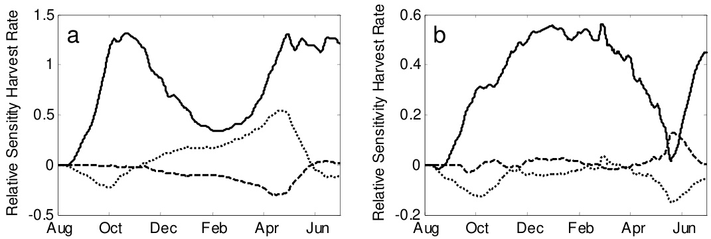  
Fig. 4.4 The relative sensitivity of the harvest rate towards: the PAR transmission coefficient (solid line), NIR transmission coefficient (dotted line) and the FIR emission coefficient (dashed line) of the roof from August 1st to July 1st in Almeria (a) and Texas (b). Note that by definition the mean values of the trajectories of the relative sensitivities correspond with the mean relative sensitivities presented in Table 4.9.

The low impact of PAR transmission in Almeria during winter time seems counterintuitive because in winter the inside global radiation is very low (Fig. 4.3c) and consequently an increase of PAR inside the greenhouse would favour crop growth in winter time like in Texas. However, Fig. 4.3c demonstrates that in wintertime canopy temperature is suboptimal with respect to crop production in an unheated greenhouse in Almeria. Consequently, due to these low temperatures the crop did not benefit efficiently an increase of PAR. This reasoning is in agreement with Marcelis et al. (2006) who revealed that the relative positive effect of radiation on crop yield decreases at low temperatures. In Texas, where temperature was near optimal for crop growth, the impact of PAR remained high during the winter time.

The impact of some design parameters switched between positive and negative values which indicates that selection of these design parameters is a trade-off along the production horizon (Fig. 4.4). For example, a higher NIR transmission would favour harvest rate in winter time (higher temperature) whereas it would decrease harvest rate at the beginning and end of the production period (too high temperature). This result suggests that cover materials with adjustable in stead of fixed properties are needed so that for each season the best cover properties can be implemented.

# 4.4.6 Combined effect of two model inputs on crop yield

Combined effects of input parameters on crop yield were revealed by analysing the regression coefficients of the derived linear regression meta-model (Table 4.10). As quantified by the regression coefficients $b _ { I 2 }$ of Eq. (4.11), results showed that crop yield was significantly affected by a combined increase of: a) the PAR and FIR transmission coefficient of the roof in Almeria (-0.83), b) the PAR transmission coefficient of the roof and the temperature set-point for ventilation (0.43 in Almeria and -0.06 in Texas) and c) the temperature set-point for ventilation and $\mathrm { C O } _ { 2 }$ concentration set-point for $\mathrm { C O } _ { 2 }$ enrichment in Texas (0.27). For both greenhouses no combined effect of the PAR transmission and $\mathrm { C O } _ { 2 }$ concentration on crop yield was found.

Table 4.10 The regression coefficients, b, of Eq. (4.11) to determine the combined effect of model inputs on crop yield for the greenhouse in Almeria and Texas. Bold numbers indicate that the regression coefficients are significant $( p < 0 . I O )$ .   

<html><body><table><tr><td colspan="2">Parameters</td><td colspan="5">Regression coefficients</td></tr><tr><td>P1</td><td>P2</td><td>b1</td><td>b2</td><td>b11</td><td>b22</td><td>b12</td></tr><tr><td colspan="7">Almeria,bo=32.08</td></tr><tr><td>T RJPAR</td><td>T RINIR</td><td>9.06</td><td>0.83</td><td>-1.55</td><td>-0.13</td><td>0.01</td></tr><tr><td>T RfPAR</td><td>T RfFIR</td><td>9.17</td><td>-4.10</td><td>-1.55</td><td>0.66</td><td>-0.83</td></tr><tr><td>T JPAR</td><td>Tair_vent_on</td><td>8.72</td><td>0.31</td><td>-1.45</td><td>-0.42</td><td>0.43</td></tr><tr><td>TRSPAR</td><td>C020ut</td><td>8.70</td><td>3.38</td><td>-1.44</td><td>-0.79</td><td>0.01</td></tr><tr><td>Tair_vent_on</td><td>CO20ut</td><td>0.32</td><td>3.44</td><td>-0.43</td><td>-0.81</td><td>0.20</td></tr><tr><td colspan="7">Texas,bo= 68.48</td></tr><tr><td>T RJPAR</td><td>Tair_vent_on</td><td>1.60</td><td>0.96</td><td>-0.14</td><td>-0.07</td><td>-0.06</td></tr><tr><td>T RfPAR</td><td>CO2Air_ExtoOn</td><td>1.62</td><td>0.98</td><td>-0.13</td><td>-0.36</td><td>-0.06</td></tr><tr><td>Tair_vent_on</td><td>CO2Air_ExtOn</td><td>0.92</td><td>0.98</td><td>-0.06</td><td>-0.36</td><td>0.27</td></tr></table></body></html>

Surprisingly, the combined impact of the PAR transmission coefficient of the roof and the temperature set-point for ventilation on crop yield was positive in Almeria and negative in Texas. It seems that at relative lower radiation and temperature levels (like in Almeria) a combined increase favours crop yield. The positive combined impact of radiation and temperature on crop yield in Almeria was in agreement with results reported by Cooman and Schrevens (2007) for a greenhouse without $\mathrm { C O } _ { 2 }$ enrichment located at the Bogota Plateau, Colombia. The saturating impact of an increase of PAR on crop yield was clearly demonstrated by the associated negative regression coefficients $b _ { I I }$ . The impact of the temperature set-point for ventilation and the $\mathrm { C O } _ { 2 }$ -concentration set-point for $\mathrm { C O } _ { 2 }$ enrichment on crop yield in Texas was simulated for $1 0 \mathrm { x } 1 0$ input parameter combinations (Fig. 4.5).

  
Fig. 4.5 The combined effect of the temperature set-point for ventilation (Tair_vent_on) and the $C O _ { 2 }$ concentration set-point for $C O _ { 2 }$ enrichment (CO2air_Ext_CO2on) on crop yield in Texas.

The standard deviation between the crop yield estimated by the linear regression model and the simulated crop yield presented in Fig. 4.5 was 0.08. This small standard deviation showed that a normalised second-order composite design around the nominal parameter vector was very efficient to determine the regression coefficients accurately.

Note that, the combined effects of input parameters on crop yield were only analysed for several sets of parameter combinations for which a combined effect on crop yield was expected. Consequently, selecting these combinations beforehand implied that unexpected combined effects would not be revealed.

4.4.7 The methodology used for the sensitivity analysis In contrast to other sensitivity studies (Van Henten & Van Straten, 1994; Cooman & Schrevens, 2007; Nijskens et al., 1991; Chalabi & Bailey, 1991; Nava et al., 1998; Van Henten, 2003; Vanthoor et al., 2008b), the impact of input parameters on crop yield, resource use and indoor climate was analysed simultaneously using a combined greenhouse climate crop yield model. This enables the selection of greenhouse parameters relevant for design optimisation. Additionally, the sensitivity of the time derivatives of the states was evaluated which produced valuable information about the seasonal effects of the greenhouse design.

As a first approach, this study focused on the impact of greenhouse design parameters and climate modification techniques on crop yield and resource consumption.

However, to increase the insight in relevant design aspects for greenhouse optimisation even further, the sensitivity of the net profit of the greenhouse grower to input parameters should be determined as well. Therefore, we are currently incorporating an economic model into the combined greenhouse climate-crop yield model in order to determine the net profit as a function of crop yield, investments, resource consumption and labour.

The significance of the mean relative sensitivity values with respect to model accuracy and simulation accuracy is discussed briefly here. The combined greenhouse climate-crop yield model predicted the indoor climate and crop yield with fair accuracy as described in chapter 2 and 3. Furthermore, since the presented sensitivities are based on changes in state values, the impact of absolute simulation errors reduced which in turn further reduced the sensitivity errors. Simulation accuracy was ensured because the selection of a low maximum relative error of the ODE solver resulted that model precision did not influence the sensitivity results.

Although the impact of seasonal effects on sensitivities and combined sensitivities were analysed, the evolution of the combined sensitivities in time was not analysed in this study. However, we think it might be possible to evaluate the combined sensitivities in time as well by performing the following steps. Firstly, the time derivatives of the cumulative crop yield must be determined for the normalised second-order composite design. Subsequently, the regression coefficients of Eq. (4.11) have to be calculated for the time derivatives of the cumulative crop yield at each time instant. Subsequently, the evolution in time can be analysed by plotting these time variant regression coefficients.

This study analysed the sensitivities around the nominal greenhouse design parameters values. This local SA was suitable to select the most relevant greenhouse design parameters for design optimisation. However, to determine the sensitivities for a broader range of design parameter values sampling-based sensitivity analysis of Helton et al. (2006) or the average local sensitivity evaluated over a wide range of parameter values should be used as performed Chalabi and Bailey (1991).

# 4.5 Conclusion

Greenhouse design is an optimization problem that relies on a quantitative trade-off between the economic return of the crop and the costs associated with construction, maintenance and operation of the greenhouse facility. To solve this optimisation problem, we developed a model-based greenhouse design method. Since the number of factors involved in this optimisation problem is very large, it is beneficial to identify those parameters that most strongly influence the economic trade-off and consequently the greenhouse design. A model sensitivity analysis (SA) is an appropriate technique for that purpose.

The objective of this research was to identify those parameters that most strongly influence a greenhouse design. For that purpose a sensitivity analysis was applied to the combined greenhouse climate-tomato yield model which is a key component of the modelbased design method. To show that the results of the SA depend on the greenhouse design and the local climate conditions, the analysis was performed for a low-tech greenhouse under conditions encountered in Almeria, Spain and a high-tech greenhouse under conditions encountered in Texas, USA. Additional to earlier validation experiments, simulations with real climate data from Almeria and Texas indicated that the model was able to produce realistic data of the indoor climate and crop yield. Then, a single variate and a multi-variate sensitivity analysis were implemented. Results showed that the outdoor climate had the strongest impact on the performance of the greenhouse system, followed by the greenhouse design parameters and finally, the greenhouse climate set-points. This indicates that the selection of a proper location for the greenhouse is of utmost importance.

Concerning the design parameters, PAR remains the main limiting factor for greenhouse production systems. For both locations the crop yield can be increased using: a higher PAR transmission of both the cover and the whitewash; a higher PAR reflection coefficient of the greenhouse floor and by less light-absorbing greenhouse construction elements. Since the impact of the NIR transmission of the whitewash on crop yield is opposite to the impact of its PAR transmission, a NIR selective whitewash would increase crop yield for both locations. For the low-tech greenhouse without a heating system, a decrease of the FIR transmission coefficient and an increase of the NIR transmission coefficient of the cover would favour crop yield due to their positive impact on the canopy temperature. Furthermore, the single variate sensitivity analysis indicated whether sufficient climate control capacities were installed and which greenhouse design parameters must be adjusted to save resources. Specifically, for the high-tech greenhouse, an increase of the $\mathrm { C O } _ { 2 }$ enrichment capacity would favour crop yield and a decrease of the FIR emission coefficient of the cover would considerably lower the energy consumption. The research revealed clear seasonal patterns in the model sensitivity for instance for the PAR transmission, NIR transmission and FIR emission coefficient of the cover material. This suggests that a greenhouse design with adjustable cover parameters will be advantageous over a design with fixed greenhouse cover parameters. The multi-variate analysis revealed strong joint effects of parameters on crop yield. A joint increase of PAR transmission and temperature set-point for ventilation favoured the crop yield for both greenhouses.

The presented SA techniques were able to quantify and compare the single, combined and seasonal impact of input parameters on the harvest rate, resource consumption and indoor climate. The results presented in this study will be used to further develop the model-based design method which aims to design the best greenhouse with respect to local climate and economic conditions for each location on earth.

# Acknowledgement

This research is part of the strategic research programs "Sustainable spatial development of ecosystems, landscapes, seas and regions" and "Sustainable Agriculture" funded by the Dutch Ministry of Agriculture, Nature Conservation and Food Quality.

# 4.6 Appendices

# 4.6.1 Appendix A

Appendix A explains why, in some cases, the sensitivity of the time derivatives of states had to be determined instead of the sensitivity of the associated states. An example is presented for the state “cumulative crop yield”.

Fictive values of the cumulative crop yield and the harvest rate are presented respectively in Fig. A1.a and Fig. A1.b. Subsequently, the relative sensitivity of both the cumulative crop yield and the harvest rate at time instants 50 and 80 was calculated using Eq. (4.3) and (4.4) assuming $z _ { n o m } = 1$ and $\Delta z = 0 . 1$ :

Relative sensitivity cumulative crop yield: Relative sensitivity harvest rate: $\begin{array} { c c } { { t _ { k } = 5 0 ; } } &   S _ { z } ^ { X } \left( t _ { k } \right) = \displaystyle { \frac { 2 0 0 - 1 0 0 } { 0 . 1 } \frac { 1 } { 1 0 0 } } = 1 0 \qquad \begin{array} { c c } { { } } & { { t _ { k } = 5 0 ; } } \\ { { } } & { { } } \\ { { t _ { k } = 8 0 ; } } & { { S _ { z } ^ { X } \left( t _ { k } \right) = \displaystyle { \frac { 2 8 0 - 1 6 0 } { 0 . 1 } \frac { 1 } { 1 0 0 } } = 1 2 \qquad \begin{array} { c c } { { } } & { { } } \\ { { } } & { { t _ { k } = 8 0 ; } } \end{array} } } & { { S _ { z } ^ { \dot { X } } \left( t _ { k } \right) = \displaystyle { \frac { 4 - 2 } { 0 . 1 } \frac { 1 } { 2 } = 1 0 \left( \begin{array} { c } { { } } \\ { { } } \\ { { 0 . 1 } } \end{array} \right) } } } \end{array} \end{array}$

Now it is remarkable that at time instant $t _ { k }$ is 80 the crop yield is sensitive to a parameter disturbance $( S _ { Z } ^ { X } \left( t _ { k } \right) = 1 2 )$ whereas the harvest rate was not influenced by this parameter (Fig. A1.b) which was presented well by the relative sensitivity of the harvest rate $( S _ { Z } ^ { X } \left( t _ { k } \right) = 0 )$ . Therefore, we used in this study the harvest rate sensitivity instead of the cumulative crop yield sensitivity to reveal the seasonal effect of input parameter impact.

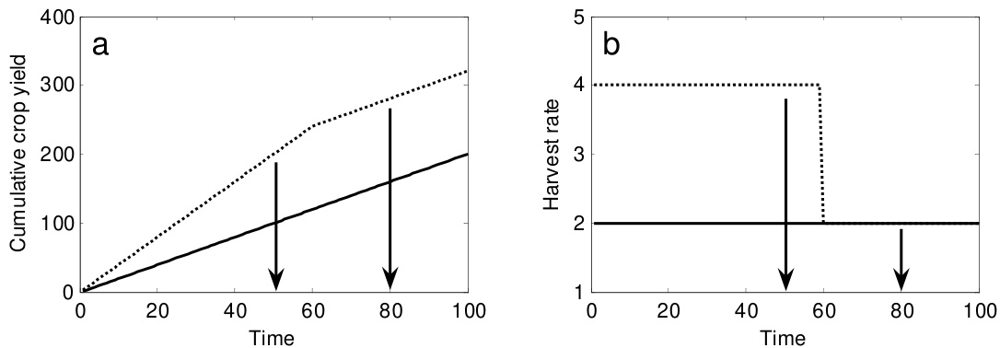  
Fig. A1 The cumulative crop yield (a) and the accompanying harvest rate $( b )$ for a simulation with a nominal input parameter (solid line) and for the deviated input parameter (dotted line). Fictive values were presented here to simplify the explanation.

# 4.6.2 Appendix B

Appendix $\mathbf { B }$ proves that the mean relative sensitivity of the time derivative of a state, $\overline { { S } } _ { z } ^ { \dot { X } }$ equals the relative sensitivity of a state value at the end of the production period, $S _ { z } ^ { X } \left( t _ { f } \right)$ :

$$
\overline { { S } } _ { Z } ^ { \dot { X } } = S _ { Z } ^ { X } \left( t _ { f } \right)
$$

with:

$$
\dot { X } \left( t _ { k } \right) = \frac { d X \left( t _ { k } \right) } { d t } { \cdots } ~ X \left( t _ { 0 } \right) + \sum _ { k = 0 } ^ { k = N } \dot { X } \left( t _ { k } \right) \cdot \Delta t = X \left( t _ { f } \right)
$$

Since all initial conditions of the state variables for which the mean relative sensitivity of the time derivatives was determined were zero, Eq. (B.2) can be rewritten into:

$$
\sum _ { k = 0 } ^ { k = N } \dot { X } \left( t _ { k } \right) = \frac { 1 } { \Delta t } \left( X \left( t _ { f } \right) \right)
$$

By definition:

$$
\overline { { \dot { X } } } _ { Z _ { N o m } } = \frac { 1 } { N + 1 } \sum _ { k = 0 } ^ { k = N } \dot { X } _ { Z _ { N o m } } \left( t _ { k } \right)
$$

According to the relative sensitivity definition of Chalabi and Bailey (1991):

$$
S _ { z } ^ { X } \left( t _ { f } \right) = \frac { X _ { z _ { N o m } + \Delta z } \left( t _ { f } \right) - X _ { z _ { N o m } } \left( t _ { f } \right) } { \Delta z } \frac { z _ { N o m } } { X _ { z _ { N o m } } \left( t _ { f } \right) }
$$

The relative sensitivity of the time derivate of a state is described by:

$$
S _ { z } ^ { \dot { X } } \left( t _ { k } \right) = \frac { \dot { X } _ { z _ { N o m } + \Delta z } \left( t _ { k } \right) - \dot { X } _ { z _ { N o m } } \left( t _ { k } \right) } { \Delta z } \frac { z _ { N o m } } { \dot { X } } \mathrm { ~ }
$$

Based on Eq. (4.7) of section 4.3.2.1, the mean relative sensitivity of the time derivate of a state is described by:

$$
\overline { { S } } _ { Z } ^ { \dot { X } } = \frac { 1 } { N + 1 } \sum _ { k = 0 } ^ { k = N } S _ { Z } ^ { \dot { X } } \left( t _ { k } \right)
$$

Combining Eqs. (B.6) and (B.7):

$$
\overline { { S } } _ { Z } ^ { \dot { X } } = \frac { 1 } { N + 1 } \sum _ { k = 0 } ^ { k = N } \frac { \dot { X } _ { z _ { N o m } + \Delta z } \left( t _ { k } \right) - \dot { X } _ { z _ { N o m } } \left( t _ { k } \right) } { \Delta z } \frac { z _ { N o m } } { \dot { X } _ { z _ { N o m } } }
$$

Re-arrangement of Eq. (B.8):

$$
\overline { { S } } _ { Z } ^ { \dot { X } } = \frac { 1 } { N + 1 } \frac { 1 } { \overline { { \dot { X } } } _ { z _ { N o m } } } \frac { z _ { N o m } } { \Delta z } \Bigg ( \sum _ { k = 0 } ^ { k = N } \dot { X } _ { z _ { N o m } + \Delta z } \big ( t _ { k } \big ) - \dot { X } _ { z _ { N o m } } \big ( t _ { k } \big ) \Bigg )
$$

Combining Eqs. (B.4) and (B.9) results in:

$$
\overline { { S } } _ { Z } ^ { \dot { X } } = \frac { 1 } { N + 1 } \frac { 1 } { \displaystyle \frac { 1 } { N + 1 } \sum _ { k = 0 } ^ { k = N } \dot { X } _ { Z _ { N o n } } \left( t _ { k } \right) } \frac { \mathcal { Z } _ { N o n } } { \Delta z } \left( \sum _ { k = 0 } ^ { k = N } \dot { X } _ { z _ { N o n } + \Delta z } \left( t _ { k } \right) - \sum _ { k = 0 } ^ { k = N } \dot { X } _ { z _ { N o n } } \left( t _ { k } \right) \right) \quad [ - 1 \mathrm { ( } \dot { N } + 1 \mathrm { ) } ] .
$$

Eq. (B.10) is rewritten using Eq. (B.3), so that the statement of Eq. (B.1) is proven:

$$
\overline { { S } } _ { Z } ^ { \dot { X } } = \frac { X _ { z _ { N o m } + \Delta z } \left( t _ { f } \right) - X _ { z _ { N o m } } \left( t _ { f } \right) } { \Delta z } \frac { z _ { N o m } } { X _ { z _ { N o m } } \left( t _ { f } \right) }
$$

4.6.3 Appendix C Thegreenhousedsinparaetersforthlo-techgeoseinlmeriinandforthgcheouseinTexasUAecol sensitivityalysis(presetshcgeouedesiparameersreealuaeduigteesitivityalyudyetcateat the greenhouse design did not contain the accompanying design parameter.   

<html><body><table><tr><td>Greenhouse design parameters, Pd</td><td>Parameter</td><td>Unit</td><td>Almeria, Spain</td><td>Texas, USA</td><td>SA</td></tr><tr><td>Construction</td><td></td><td></td><td></td><td></td><td></td></tr><tr><td>The ratio of the global radiation which is absorbed by the greenhouse construction elements</td><td>nGlob_Air</td><td></td><td>0.05</td><td>0.1</td><td>+</td></tr><tr><td>Mean greenhouse cover slope</td><td>4</td><td>0</td><td>Arch shaped greenhouse</td><td>22</td><td></td></tr><tr><td>Surface of the cover including side-walls</td><td>Acov</td><td>m</td><td>1.15:10³</td><td>9.0-104</td><td></td></tr><tr><td>Surface of the greenhouse floor</td><td>AFlr</td><td>m</td><td>0.63·10</td><td>7.8-104</td><td>+</td></tr><tr><td>Convective heat exchange parameter between cover and outdoor air that depends on the greenhouse shape</td><td>CHECin</td><td>W m² K-²</td><td>2.21</td><td>1.86</td><td>+</td></tr><tr><td>Codies</td><td></td><td></td><td></td><td></td><td></td></tr><tr><td></td><td></td><td></td><td></td><td>2821</td><td>+</td></tr><tr><td>Height of the greenhouse compartment below the thermal screen</td><td>hAir</td><td>m</td><td>3</td><td>4.65</td><td>+</td></tr><tr><td>The altitude of the greenhouse</td><td>hElevation</td><td>m</td><td>150</td><td>1470</td><td>+</td></tr><tr><td>Mean height of the greenhouse</td><td>hGh</td><td>m</td><td>4.37</td><td>5.06</td><td>+</td></tr><tr><td>Ventilation properties</td><td></td><td></td><td></td><td></td><td></td></tr><tr><td>The porosity of the insect screens</td><td>SInsser</td><td></td><td>0.33</td><td>*</td><td>+</td></tr><tr><td>The specific roof ventilation area</td><td>ARoo/AFlr</td><td>m</td><td>0.13</td><td>0.18</td><td>+</td></tr><tr><td>The side ventilation area</td><td>ASidelAFlr</td><td>m</td><td>0.09</td><td>*</td><td>+</td></tr></table></body></html>

<html><body><table><tr><td>Greenhouse design parameters, Pd</td><td>Parameter</td><td>Unit</td><td>Almeria, Spain</td><td>Texas, USA</td><td>SA</td></tr><tr><td>Ventilation discharge coefficient depends on greenhouse shape</td><td>Ch</td><td></td><td>0.65</td><td>0.65</td><td>+</td></tr><tr><td>Greenhouse leakage coeficient which depends on the greenhouse type</td><td>Cleakage</td><td></td><td>1·10-4</td><td>1·10-4</td><td>+</td></tr><tr><td>Ventilation global wind pressure coefficient depends on greenhouse shape</td><td>W CGh</td><td></td><td>0.07</td><td>0.09</td><td>+</td></tr><tr><td>Verticalditince etseem midoints f side aa</td><td>hsideRoof</td><td>m</td><td>3</td><td>*</td><td>+</td></tr><tr><td>Vertical dimension of a single ventilation opening</td><td>hvent</td><td>m</td><td>*</td><td>0.97</td><td>+</td></tr><tr><td colspan="6">Roof</td></tr><tr><td>The FIR emission coefficient of the roof</td><td>&RfFIR</td><td></td><td>0.5</td><td>0.85</td><td>+</td></tr><tr><td>Density of the roof layer</td><td>pRf</td><td>kg m-3</td><td>0.93:10</td><td>2.6·10</td><td></td></tr><tr><td>The NIR reflection coefficient of the roof</td><td>P RfNIR</td><td></td><td>0.34</td><td>0.13</td><td></td></tr><tr><td>The PAR reflection coefficient of the roof</td><td>PRfPAR</td><td></td><td>0.34</td><td>0.13</td><td></td></tr><tr><td>The FIR reflection coefficient of the roof</td><td>PRfFIR</td><td></td><td>0.1</td><td>0.15</td><td></td></tr><tr><td>The NIR transmission coefficient of the roof</td><td>TRfNIR</td><td></td><td>0.61</td><td>0.85</td><td>+</td></tr><tr><td>The PAR transmission coefficient of the roof</td><td>TRfPAR</td><td></td><td>0.61</td><td>0.85</td><td>+</td></tr><tr><td>FIR transmission coefficient of the roof</td><td>TRfFIR</td><td>1</td><td>0.4</td><td>0</td><td>+</td></tr><tr><td>Thermal heat conductivity of greenhouse roof</td><td>2Rf</td><td>W m1 K1</td><td>0.2</td><td>1.05</td><td>+</td></tr><tr><td>The specific heat capacity of the roof layer</td><td>Cp.Rf</td><td>JK1 kg1</td><td>2.5:10</td><td>0.84-10</td><td>+</td></tr><tr><td>Thickness of the roof layer</td><td>hRf</td><td>m</td><td>0.25-10-3</td><td>4·103</td><td></td></tr><tr><td colspan="6">Whitewash</td></tr><tr><td>The FIR emission coefficient of the whitewash</td><td>εShScrPerFIR</td><td></td><td>0.9</td><td>0.9</td><td>+</td></tr><tr><td>Density of the whitewash</td><td>PshScrPer</td><td>kg m-3</td><td>1·10</td><td>1:10</td><td>-</td></tr><tr><td>NIR reflection coefficient of the whitewash</td><td>PShScrPerNIR</td><td></td><td>0.3</td><td>0.3</td><td>+</td></tr></table></body></html>

<html><body><table><tr><td>Greenhouse design parameters, Pd</td><td>Parameter</td><td>Unit</td><td>Almeria, Spain</td><td>Texas, USA</td><td>SA</td></tr><tr><td>PAR reflection coefficient of the whitewash</td><td>PShScrPerPAR</td><td></td><td>0.3</td><td>0.3</td><td>+</td></tr><tr><td>FIR reflection coefficient of the whitewash</td><td>PShScrPerFIR</td><td></td><td>0.05</td><td>0.05</td><td>-</td></tr><tr><td>NIR transmission coefficient of the whitewash</td><td>TShScrPerNIR</td><td></td><td>0.6</td><td>0.6</td><td>+</td></tr><tr><td>PAR transmission coefficient of the whitewash</td><td>TShScrPerPAR</td><td></td><td>0.6</td><td>0.6</td><td>+</td></tr><tr><td>FIR transmission coefficient of the whitewash</td><td>TShScrPerFIR</td><td></td><td>0.05</td><td>0.05</td><td>+</td></tr><tr><td>Specific heat capacity of the whitewash</td><td>Cp,ShScrPer</td><td>JK1kg</td><td>4.18-10</td><td>4.18-10</td><td>+</td></tr><tr><td>Thickness of the whitewash</td><td>hshScrPer</td><td>m</td><td>0.2·10-3</td><td>0.2-10-3</td><td></td></tr><tr><td colspan="6">Thermal screen</td></tr><tr><td>The FIR emission coefficient of the thermal screen</td><td>EThScrFIR</td><td></td><td>*</td><td>0.44</td><td>+</td></tr><tr><td>Density of the thermal screen</td><td>PThScr</td><td>kg m3</td><td>*</td><td>0.2·10</td><td></td></tr><tr><td>The NIR reflection coefficient of the thermal screen</td><td>PThScrNIR</td><td></td><td>*</td><td>0.7</td><td>+</td></tr><tr><td>The PAR reflection coefficient of the thermal screen</td><td>PThScrPAR</td><td></td><td>*</td><td>0.7</td><td>+</td></tr><tr><td>The FIR reflection coefficient of the thermal screen</td><td>PThScrFIR</td><td></td><td>*</td><td>0.45</td><td></td></tr><tr><td>The NIR transmission coeficient of the thermal screen ThScrNIR</td><td></td><td></td><td>*</td><td>0.25</td><td>+</td></tr><tr><td>PAR transmission coefficient of the thermal screen</td><td>TThScrPAR</td><td></td><td>*</td><td>0.25</td><td>+</td></tr><tr><td>FIR transmission coefficient of the thermal screen</td><td>ThScrFIR</td><td></td><td>*</td><td>0.11</td><td>+</td></tr><tr><td>Specific heat capacity of the thermal screen</td><td>Cp.ThScr</td><td>Jkg1K-1</td><td>*</td><td>1.8·10</td><td>+</td></tr><tr><td>Thickness of the thermal screen</td><td>hThScr</td><td>m</td><td>*</td><td>0.35-10-3</td><td></td></tr><tr><td>The thermal screen flux coefficient</td><td>KThScr</td><td>m³ m² K-0.66s-1</td><td>*</td><td>0.25-10-3</td><td>+</td></tr><tr><td colspan="6">Floor</td></tr><tr><td>FIR emission coefficient of the greenhouse floor</td><td>&Flr</td><td></td><td>1</td><td>1</td><td>+</td></tr><tr><td>Density of the floor</td><td>PFlr</td><td>kg m-3</td><td>2300</td><td>2300</td><td>1</td></tr><tr><td>NIR reflection coefficient of the floor</td><td>PFlrNIR</td><td>1</td><td>0.5</td><td>0.5</td><td>+</td></tr><tr><td>PAR reflection coefficient of the greenhouse floor</td><td>PFlrPAR</td><td></td><td>0.65</td><td>0.65</td><td>+</td></tr></table></body></html>

<html><body><table><tr><td>Greenhouse design parameters, Pd</td><td>Parameter</td><td>Unit</td><td>Almeria, Spain</td><td>Texas, USA</td><td>SA</td></tr><tr><td>Thermal heat conductivity of the floor</td><td>Flr</td><td>Wm1K1</td><td>1.7</td><td>1.7</td><td>+</td></tr><tr><td>Specific heat capacity of the floor</td><td>Cp.Flr</td><td>JK1kg1</td><td>0.88-10</td><td>0.88-10</td><td>+</td></tr><tr><td>Thickness of the greenhouse floor</td><td>hFlr</td><td>m</td><td>0.02</td><td>0.02</td><td></td></tr><tr><td>Soil properties</td><td></td><td></td><td></td><td></td><td></td></tr><tr><td>The volumetric heat capacity of the soil</td><td>pcp.So</td><td>Jm³K1</td><td>1.73-106</td><td>1.73·106</td><td>+</td></tr><tr><td>Thermal heat conductivity of the soil layers.</td><td>so</td><td>Wm1K1</td><td>0.85</td><td>0.85</td><td>+</td></tr><tr><td>Heating system</td><td></td><td></td><td></td><td></td><td></td></tr><tr><td>FIR emission coefficient of the heating pipes</td><td>EPipe</td><td>-</td><td>*</td><td>0.88</td><td>+</td></tr><tr><td>External diameter of the heating pipe</td><td>Pipe,e</td><td>m</td><td>*</td><td>51-10-3</td><td></td></tr><tr><td>Internal diameter of the heating pipe</td><td>Pipe,i</td><td>m</td><td>*</td><td>47:10-3</td><td>-</td></tr><tr><td>Lengthof the heaig pipe per square meter</td><td>lpipe</td><td>m m²</td><td>*</td><td>1.25</td><td>+</td></tr><tr><td>Active climate control</td><td></td><td></td><td></td><td></td><td></td></tr><tr><td>Capacity of the external CO2 source</td><td> ExtC02</td><td>mg s-1</td><td>*</td><td>4.3·105</td><td>+</td></tr><tr><td>Thermal heat capacity of the boiler</td><td>PBoil</td><td>W</td><td>*</td><td>13.9-106</td><td>+</td></tr></table></body></html>

# Chapter 5

An economic model to evaluate different greenhouses under Spanish conditions

The contents of this chapter have been submitted to Biosystems Engineering as a paper entitled: A methodology for model-based greenhouse design: Part 4, An economic model to evaluate different greenhouses under Spanish conditions.

B.H.E. Vanthoor, J.C. Gázquez, J.J. Magán, M.N.A. Ruijs, E. Baeza, C. Stanghellini, E.J. van Henten, P.H.B. de Visser

# 5.1 Abstract

An economic model was developed as a key component of a model-based method to design greenhouses for a broad range of climatic and economic conditions. This economic model was joined with an existing greenhouse climate-crop yield model to calculate the annual Net Financial Result (NFR) of a greenhouse. The aim of this study was to identify–among ten predefined design alternatives–the greenhouse with the highest annual NFR for tomato production under South-Spanish conditions. The basic designs were either the parral greenhouse, or a multi-tunnel, possibly fitted with any combination of heating, fogging and $\mathrm { C O } _ { 2 }$ enrichment. Results demonstrated that the multi-tunnel, fitted with only a fogging system was most profitable, followed by the multi-tunnel with heating, $\mathrm { C O } _ { 2 }$ enrichment and fogging. However, the difference in NFR between such a design and a simple parral was small with respect to the difference in investment. A sensitivity analysis of the NFR of the two technology extremes shows that tomato price, the fraction of marketable yield and the photosynthetically active radiation transmission of the cover had the largest bearing on NFR. With increasing technology level, the NFR depended less on outdoor climate and more on tomato price. This indicates that a low-tech greenhouse diminishes the risk of variations among price paths in different years, whereas a high-tech greenhouse covers better the “weather risk”. The best design was also affected by climate management and the joint impact of climate modification techniques. These results demonstrated that a modelbased design approach can cope with multi-factorial design aspects.

# 5.2 Introduction

This chapter contains a description of the economic model. This model describes the annual Net Financial Result (NFR) as a function of the crop yield, the variable costs and the depreciation and maintenance of the construction. To demonstrate the feasibility of a model-based design approach, the economic model is joined with the greenhouse climatetomato yield model to evaluate the economic performance of different tomato producing greenhouses under South-Spanish conditions.

In the South-Spanish province Almería there are about $2 7 0 0 0 \ \mathrm { H a }$ greenhouses of which $9 9 \%$ are low-cost structures, covered with plastic and manual regulation of openings as the one mean of climate control (Magán et al., 2008). The low productivity of such greenhouses is often attributed to the limited means for climate control (Castilla & Montero, 2008). Possible improvements of one design factor have been researched extensively: for instance, air tightness of the greenhouse (López et al., 2001), increase of the ventilation rate (Pérez-Parra et al., 2004), increase of the cover slope (Soriano et al., 2004), cover type (Magán et al., 2008), heating system (López et al., 2008), cooling system (Gázquez et al., 2008; Meca et al., 2007; Antón et al., 2006), ventilation design (PérezParra et al., 2004; Baeza et al., 2009) and $\mathrm { C O } _ { 2 }$ enrichment (Stanghellini et al., 2008). However, most studies determined the effect on productivity, rather than the improvement of economical performance. In addition, an objective comparison between different greenhouse designs cannot be done by analysing one factor at a time, since an “optimal” modification may require concurrent adaptation of several design factors.

Therefore, the aims of this work were first to identify the greenhouse with the highest annual NFR, among a predefined set of ten design alternatives: a low-tech Spanish parral and a multi-tunnel fitted with various combinations of climate management tools and then to select promising design improvements, by means of a sensitivity analysis applied to the combined greenhouse climate-crop yield model and economic model. As starting point for the predefined set of greenhouses, a parral with only natural ventilation was selected, because this greenhouse represents the current state. Contributing factors to the low productivity of this type of greenhouse have been identified as: a) the very open structure enables insects to enter and decreases the resource efficiency (López et al., 2001), b) insufficient ventilation rate (Pérez-Parra et al., 2004) and c) the low cover slope decreases light transmission in winter time (Soriano et al., 2004) and may enable falling of the condensate droplets on the canopy which in turn increases the incidence of diseases. The first step to improve a greenhouse design is to optimise the structure rather than to implement expensive climate modification techniques (Castilla & Montero, 2008). Therefore, as a second alternative, a multitunnel arch-roof greenhouse with only natural ventilation was selected because this type of greenhouse meets most of the shortcomings mentioned above. The second step to improve a greenhouse design is to select a “greenhouse technological design package” that suits the local climate, in order to comply with the demand for year-round supply of high quality products (Castilla & Hernandez, 2007). Therefore, the multitunnel with natural ventilation was gradually equipped with more (combined) climate modification techniques such as $\mathrm { C O } _ { 2 }$ enrichment, fogging system and a heating system.

Previous works have shown that the aspects influencing the NFR are affected by several factors, such as outdoor climate conditions (Vanthoor et al., 2009), greenhouse climate set-points (Vanthoor et al., 2008a) and the combined impact of design parameters (chapter 4). Therefore, we wanted to demonstrate in this study that optimal greenhouse design is indeed a multi-factorial optimisation problem. This was done by analysing the impact of the uncertainty in yearly variations of outdoor climate conditions and tomato price trajectories on greenhouse design. The chapter is organised as follows. An economic model to determine the annual NFR and the investments is described. Then the applied sensitivity analysis technique is presented, followed by the set of design alternatives that ranges from low-tech to high-tech greenhouses. Subsequently, the three evaluation studies, i.e. the NFR evaluation of different designs, a sensitivity analysis of a low-tech and a hightech greenhouse, and the uncertainty analysis are described. Results of the best greenhouse design and design improvements are presented. Finally, the multi-factorial character of the design problem is presented and implications on the model-based greenhouse design method are discussed.

# 5.3 Materials and method

# 5.3.1 Description of the economic model

The overall description of the model-based design method is presented in chapter 1. A greenhouse climate-crop yield model relates the inputs of the method to the economic indicators of the greenhouse. Specifically, from the hourly outdoor climate; climate setpoints and selected greenhouse design, the greenhouse climate model (see chapter 2) determines the hourly indoor climate and resource consumption. Subsequently, the tomato production is calculated by the yield model (see chapter 3) as a function of the calculated indoor climate. Here the economic model to determine the net financial result (NFR) and total investments, as a function of the crop yield, variable costs and the selected greenhouse design is described.

The economic state variables needed to describe the NFR are added to the combined greenhouse climate-crop yield. The time derivatives of these state variables are presented by a dot above the state symbol and the related economic parameter values are presented in Table 5.1. To compare the different greenhouse designs, the annual net financial result, $Q _ { N F R } ( \in \mathrm { m ^ { - 2 } y e a r ^ { - 1 } } )$ was used:

$$
Q _ { N F R } \left( t _ { f } \right) = - Q _ { F i x e d } + \intop _ { t = t _ { 0 } } ^ { t = t _ { f } } \dot { Q } _ { C r o p Y i e l d } - \dot { Q } _ { V a r } d t
$$

$$
[ \in \mathrm { m } ^ { - 2 } \mathrm { y e a r } ^ { - 1 } ]
$$

where $t _ { O }$ (s) and $t _ { f } \left( \mathrm { s } \right)$ are the beginning and the end of the production period respectively, $Q _ { F i x e d } ( \in \mathrm { m ^ { - 2 } y e a r ^ { - 1 } } )$ are the costs related to the tangible assets, $Q _ { C r o p Y i e l d } ( \bf { \in } \mathrm { { m } } ^ { - 2 } \ y e a r ^ { - 1 } )$ is the economic value of crop yield, $Q _ { V a r } ( \in \mathrm { m ^ { - 2 } \ y e a r ^ { - 1 } } )$ are the costs related to the crop (i.e. plant material, fertilizers, crop protection and other crop assets), resource use (in this study defined as water, fossil energy and $\mathrm { C O } _ { 2 }$ ) and labour. An overview of the cost aspects is presented in Fig. 5.1. The individual cost aspects are explained in more detail hereafter.

Table 5.1 An overview of the costs-related variablesused in this study   

<html><body><table><tr><td>Parameter explanation</td><td>Parameter</td><td>Unit</td><td>Value</td><td>Source</td></tr><tr><td>Average conversion factor from tomato dry matter to fresh matter</td><td>1DMFM</td><td>kg{FM} mg{DM}-1</td><td>15.95:10-6</td><td>Based on (Magan et al., 2008)</td></tr><tr><td>Fraction of crop transpiration needs to assure sufficient irrigation</td><td>NDrain</td><td>%</td><td>30</td><td>Based on practice</td></tr><tr><td>Marketable fraction of harvest</td><td>NFMsold</td><td></td><td></td><td>See Table 5.2</td></tr><tr><td>Energy content of gas</td><td>NFuel</td><td>Jm</td><td>31.65-106</td><td>Known</td></tr><tr><td>Interest rate</td><td>NInterest</td><td>%</td><td>3.5</td><td>Cajamar</td></tr><tr><td>Cost of short-term borrowing</td><td>YInterest_Short</td><td>%</td><td>1</td><td>Cajamar</td></tr><tr><td>Labour cost coefficient that describes impact of the production level on labour cost</td><td>1 Labour_kg</td><td>h kg−1{FM}</td><td>0.01</td><td>Based on (Peréz et al., 2003)</td></tr><tr><td>Labour cost coefficient that describes the impact of plant related labour on variable labour cost</td><td>NLabour_m2</td><td>h m²</td><td>0.27</td><td>Based on (Peréz et al., 2003)</td></tr><tr><td>Annual maintenance cost coefficient of construction element i,</td><td>1Maintenance,i</td><td>% year-1</td><td></td><td>See Table 5.5</td></tr><tr><td>Annual depreciation coefficient of construction element i.</td><td>NDepreciation,i</td><td>% year-1</td><td></td><td>See Table 5.5</td></tr><tr><td>Unaccounted fraction of greenhouse construction costs</td><td>NRem</td><td>%</td><td>2.5</td><td>Assumed</td></tr><tr><td>Sales cost coefficient for sorting and selling the tomatoes</td><td>Nsales</td><td>%</td><td>9</td><td>Cajamar</td></tr><tr><td>Fraction of first class tomatoes in marketable yield</td><td>NToml</td><td>%</td><td></td><td>See Table 5.2</td></tr><tr><td>Transport cost per kg tomatoes</td><td>NTransport</td><td>€kg1</td><td>0.02</td><td>Cajamar</td></tr><tr><td>Greenhouse floor area</td><td>AFlr</td><td>m²</td><td>10000</td><td>Assumed</td></tr><tr><td>Harvest rate of tomatoes expressed in dry matter</td><td>DM Har</td><td>mg{DM} s-1</td><td>1</td><td>Output tomato yield model</td></tr><tr><td>Heat supply to the greenhouse air</td><td>HBlowAir</td><td>W m²</td><td></td><td>Output climate model</td></tr></table></body></html>

<html><body><table><tr><td>Heat supply to heating pipes</td><td>HBoilPipe</td><td>W m2</td><td>-</td><td>Output climate model</td></tr><tr><td>CO2 supply rate</td><td>MCExtAir</td><td>mg m² s-1</td><td></td><td>Output climate model</td></tr><tr><td>Transpiration rate</td><td>MVcanAir</td><td>kg m² s-1</td><td>-</td><td>Output climate model</td></tr><tr><td>Fog supply</td><td>MVFogAir</td><td>kg m²s-1</td><td></td><td>Output of climate model</td></tr><tr><td>CO2 costs</td><td>qc02</td><td>€kg1</td><td>0.15</td><td>Cajamar</td></tr><tr><td>Gas costs</td><td>qFuel</td><td>€m</td><td>0.38</td><td>Cajamar</td></tr><tr><td>Initial investment of construction element i</td><td>qInvest,i</td><td>€</td><td>-</td><td> See Table 5.5</td></tr><tr><td>Labour costs</td><td>qLabour</td><td>€h1</td><td>5.4</td><td>Cajamar</td></tr><tr><td>First class tomato price which is time dependent</td><td>qToml</td><td>€kg-1</td><td></td><td>Cajamar</td></tr><tr><td>Second class tomato price which is time dependent</td><td>qTom2</td><td>€kg1</td><td>-</td><td>Cajamar</td></tr><tr><td>Water costs</td><td>qWater</td><td>€m</td><td>0.25</td><td>Cajamar</td></tr><tr><td>Plant material</td><td></td><td>€ plant-1</td><td>0.25</td><td>Cajamar</td></tr><tr><td>Plant density</td><td></td><td>m²</td><td>2.5</td><td>Based on practice</td></tr><tr><td>Fertilizer</td><td></td><td>€m² year1</td><td>0.6</td><td>Cajamar</td></tr><tr><td>Crop protection</td><td></td><td>€m²year1</td><td>0.35</td><td>Cajamar</td></tr><tr><td>Waste treatment</td><td></td><td>€m² year-1</td><td>0.36</td><td>Cajamar</td></tr><tr><td>Remaining materials</td><td></td><td>€m² year1</td><td>0.3</td><td>Cajamar</td></tr></table></body></html>

# 5.3.1.1 Economic crop yield

The economic tomato yield is described by:

$$
\dot { Q } _ { C r o p Y i e l d } = \eta _ { _ { F M s o l d } } \eta _ { _ { D M F M } } q _ { _ { T o m } } ( t ) \dot { D } M _ { _ { H a r } } ( t )
$$

$$
[ \in \mathrm { m } ^ { - 2 } \mathrm { s } ^ { - 1 } ]
$$

where $\eta _ { F M s o l d } \left( - \right)$ is the marketable fraction of harvest, ηDMFM  is the conversion factor from dry matter to fresh matter $( \mathbf { k g } \{ \mathbf { F M } \} \ \ \mathbf { m g } \{ \mathbf { D M } \} ^ { - 1 } )$ , $q _ { T o m } ~ ( \in ~ \mathrm { k g } ^ { - 1 } )$ is the price of tomatoes, $\dot { D } M _ { \scriptscriptstyle H a r } ( \mathrm { m g } \{ \mathrm { D M } \} \ \mathrm { m ^ { - 2 } } \ \mathrm { s ^ { - 1 } } )$ is the harvest rate of tomatoes expressed in dry matter, which is an output of the tomato yield model.

The tomato price $q _ { T o m } ( \in \mathrm { k g } ^ { - 1 } )$ depends on the ratio between first class and second class tomatoes and is time-variant due to changing price trajectories throughout the production period:

$$
q _ { T o m } ( t ) = \frac { \eta _ { T o m 1 } q _ { T o m 1 } ( t ) + ( 1 0 0 - \eta _ { T o m 1 } ) q _ { T o m 2 } ( t ) } { 1 0 0 }
$$

$$
[ \in \mathrm { k g } ^ { - 1 } ]
$$

where $q _ { T o m I } ( \tplus \mathbf { k g } ^ { - 1 } )$ and $q _ { T o m 2 } ( \tplus \tt k g ^ { - 1 } )$ are respectively the price of the first and second class tomatoes, and $\eta _ { T o m I } ( \% )$ is the ratio of first class tomatoes which depends on the greenhouse design and which was assumed to be time invariant in this study.

To calculate the costs related to the harvested amount of tomatoes the mass crop yield is described by:

$$
\dot { Y } i e l d = \eta _ { _ { D M F M } } \dot { D } M _ { _ { H a r } } ( t )
$$

$$
[ \mathbf { k g \    \{ F M \} \ m ^ { - 2 } \ s ^ { - 1 } } ]
$$

# 5.3.1.2 The fixed costs

The annual fixed costs, $Q _ { F i x e d }$ $_ { e d } ( \in \mathrm { m } ^ { - 2 } \mathrm { y e a r } ^ { - 1 } )$ are described by:

$$
Q _ { F i x e d } = Q _ { I n t e r e s t } + \sum _ { i = 1 } ^ { i = N } Q _ { C o n s t r , i } + Q _ { R e m }
$$

$$
[ \mathsf { E } \mathrm { m } ^ { - 2 } \mathrm { y e a r } ^ { - 1 } ]
$$

where $Q _ { I n t e r e s t } ( \in \mathrm { m ^ { - 2 } y e a r ^ { - 1 } } )$ is the annual average interest payment of the total investment, $i$ (-) represents the greenhouse construction element, $N \left( - \right)$ is the total number of greenhouse construction elements, $Q _ { C o n s t r , i }$ $( \in \mathrm { ~ m } ^ { - 2 } \ : \mathrm { y e a r } ^ { - 1 } )$ are the costs related to the maintenance and depreciation of construction element $i$ , and the $\boldsymbol { Q } _ { R e m }$ $( \mathsf { E } \mathrm { \ m } ^ { - 2 } \mathrm { \ y e a r } ^ { - 1 } )$ are limited remaining costs related to the greenhouse construction.

The annual average interest payment of the total investment is based on a linear depreciation of the greenhouse with no rest value at the end of the economic lifespan, and is therefore described by:

$$
Q _ { I n t e r e s t } = \frac { \eta _ { I n t e r e s t } } { 1 0 0 A _ { F l r } } \sum _ { i = 1 } ^ { i = N } \frac { q _ { I n \nu e s t , i } } { 2 }
$$

$$
[ \in \mathrm { m } ^ { - 2 } \mathrm { y e a r } ^ { - 1 } ]
$$

where $\eta _ { I n t e r e s t } ~ ( \% ~ \mathrm { y e a r } ^ { - 1 } )$ is the interest rate, $A _ { F l r } \ ( \mathbf { m } ^ { 2 } )$ is the greenhouse floor area, and $q _ { I n \nu e s t , i } \left( \tplus \right)$ is the initial investment of construction element $i$ .

The annual costs of the maintenance and depreciation of the construction elements is described by:

$$
Q _ { \mathit { C o n s t r , i } } = \frac { \eta _ { \mathit { M a i n t e n a n c e , i } } + \eta _ { \mathit { D e p r e c i a t i o n , i } } } { 1 0 0 A _ { \mathit { F l r } } } \cdot q _ { \mathit { I n v e s t , i } }
$$

$$
[ \in \mathrm { m } ^ { - 2 } \mathrm { y e a r } ^ { - 1 } ]
$$

where ηMaintenance,i $\%$ year-1) determines the annual maintenance costs of construction element $i ,$ , $\eta _ { D e p r e c i a t i o n , i } ( \% \ \mathrm { y e a r ^ { - 1 } } )$ determines the annual depreciation of construction element $i$ . The remaining costs related to the greenhouse construction are described by:

$$
Q _ { R e m } = \eta _ { R e m } \sum _ { i = 1 } ^ { i = N } \mathcal { Q } _ { C o n s t r , i }
$$

$$
[ \in \mathrm { m } ^ { - 2 } \mathrm { y e a r } ^ { - 1 } ]
$$

where $\eta _ { R e m } \left( \% \right)$ is the unaccounted fraction of greenhouse construction costs. In view of the huge variability among conditions, costs related to the rent or purchase of the greenhouse area were not taken into account here.

# 5.3.1.3 The variable costs

The variable costs presented in Fig. 5.1 are described by:

$$
\dot { \mathcal { Q } } _ { V a r } = \dot { \mathcal { Q } } _ { P l a n t } + \dot { \mathcal { Q } } _ { W a t e r } + \dot { \mathcal { Q } } _ { C O 2 } + \dot { \mathcal { Q } } _ { F u e l }
$$

$$
[ \in \mathrm { m } ^ { - 2 } \mathrm { s } ^ { - 1 } ]
$$

where $\dot { Q } _ { P l a n t } ~ ( \in \mathrm { ~ m ~ } ^ { - 2 } \mathrm { ~ s ~ } ^ { - 1 } )$ are plant costs that depend on crop yield, $\dot { Q } _ { W a t e r } , \dot { Q } _ { c o 2 }$ and $\dot { Q } _ { F u e l } \ ( \in \mathrm { m ^ { - 2 } \ s ^ { - 1 } } )$ are the costs related to the consumption of water, carbon dioxide supply and fossil fuel, respectively, denoted in this study as ‘resource costs’. The electricity costs were not taken into account because they are negligible for the greenhouse designs under consideration (Magán et al., 2008). Obviously,   
$Q _ { V a r } \big ( t _ { 0 } \big ) = Q _ { P l a n t } \big ( t _ { 0 } \big )$ $[ \in \mathrm { m } ^ { - 2 } \mathrm { y e a r } ^ { - 1 } ]$ (5.10) where $Q _ { P l a n t } \left( t _ { 0 } \right)$ are the plant costs that do not depend on crop yield, i.e. plant material, fertilizers, crop protection, waste treatment and remaining materials which are presented in Table 5.1.

The plant costs that depend on the crop yield i.e. labour, transport, sales, and short term interest are described by:

$$
\begin{array} { l l } { { \dot { Q } _ { P l a n t } = q _ { L a b o u r } \bigl ( \eta _ { L a b o u r \_ k g } \dot { Y } i e l d + \eta _ { L a b o u r \_ m 2 } \bigr ) } } \\ { { { } } } \\ { { + \eta _ { T r a n s p o r t } \eta _ { F M s o l d } \dot { Y } i e l d + \frac { \eta _ { S a l e s } + \eta _ { I n t e r e s t \_ S h o r t } } { 1 0 0 } \dot { Q } _ { C r o p r i e l d } } } \end{array} \begin{array} { l } { { [ \in \mathrm { m ^ { 2 } y e a r } ^ { - 1 } ] } } \\ { { { } } } \end{array}
$$

where $q _ { L a b o u r } ( \mathbf { \hat { t } } \mathbf { h } ^ { - 1 } )$ is the labour costs, $\eta _ { L a b o u r \_ k g }$ $( \mathbf { h } \ \mathbf { k g } ^ { - 1 } \{ \mathrm { F M } \} )$ is the labour cost coefficient that describes the impact of the production level on labour cost, $\eta _ { L a b o u r \_ m 2 } ~ ( \mathrm { h } ~ \mathrm { m } ^ { - 2 } )$ is the labour cost coefficient that describes the impact of plant related labour (no harvest) on labour cost, $\eta _ { T r a n s p o r t } ( \mathbf { \ t E } \mathbf { k g } ^ { - 1 } )$ is the transport cost per $\mathrm { k g }$ tomatoes, $\eta _ { S a l e s } \ : ( \% )$ is the sales cost coefficient describing the costs of sorting and selling the tomatoes, and ηInterest_Short $( \% )$ is the cost of short term borrowing.

The cost of the use of individual resources is calculated with:

$$
\begin{array} { l l } { { \displaystyle { \dot { Q } } _ { w a t e r } = 1 0 ^ { - 3 } q _ { w a t e r } \Biggl ( \Biggl ( 1 + \frac { \eta _ { D r a i n } } { 1 0 0 } \Biggr ) M V _ { C a n A i r } + M V _ { F o g A i r } \Biggr ) } } \\ { { \displaystyle { \dot { Q } } _ { C O 2 } = 1 0 ^ { - 6 } q _ { C O 2 } M C _ { E x t A i r } } } \\ { { \displaystyle { \dot { Q } } _ { F u e l } = \frac { q _ { F u e l } } { \eta _ { F u e l } } \left( H _ { B o i l P i p e } + H _ { B l o w A i r } \right) } } \end{array}
$$

$$
\begin{array} { r l } & { [ \mathsf { E } \mathsf { m } ^ { - 2 } \mathsf { s } ^ { - 1 } ] } \\ & { [ \mathsf { E } \mathsf { m } ^ { - 2 } \mathsf { s } ^ { - 1 } ] } \\ & { [ \mathsf { E } \mathsf { m } ^ { - 2 } \mathsf { s } ^ { - 1 } ] } \\ & { [ \mathsf { E } \mathsf { m } ^ { - 2 } \mathsf { s } ^ { - 1 } ] } \end{array}
$$

where $q _ { W a t e r } ( \in \mathbf { m } ^ { - 3 } )$ is the water price, $\eta _ { D r a i n } \left( \% \right)$ is a fraction of crop transpiration needs to assure sufficient irrigation, $M V _ { C a n A i r }$ $( \mathrm { k g ~ m } ^ { - 2 } \mathrm { ~ s } ^ { - 1 } )$ is the transpiration rate of the crop, $M V _ { F o g A i r } ( \mathrm { k g ~ m ^ { - 2 } ~ s ^ { - 1 } } )$ is the fogging rate, $q _ { C O 2 } ( \in \mathrm { k g } ^ { - 1 } )$ is the $\mathrm { C O } _ { 2 }$ price, $M C _ { E x t A i r } ( \mathrm { m g ~ m ^ { - 2 } ~ s ^ { - 1 } } )$ is the $\mathrm { C O } _ { 2 }$ enrichment rate, $q _ { F u e l } $ $( \in \mathrm { ~ m } ^ { - 3 } )$ is the fuel price, $\eta _ { F u e l } \ \mathrm { ~ ( ~ J ~ } \ \mathrm { m } ^ { - 3 } )$ is the energy efficiency of the fuel, $H _ { B o i l P i p e } ( \mathrm { W ~ m } ^ { - 2 } )$ is the heat supply to the heating pipes and $H _ { B l o w A i r }$ $( \mathrm { W ~ m } ^ { - 2 } )$ is the heat supply from the indirect air heater to the greenhouse air.

The total investment for a greenhouse is described by:

$$
Q _ { I n \nu e s t } = \sum _ { i = 1 } ^ { i = N } q _ { I n \nu e s t , i }
$$

$$
[ \in \mathrm { m } ^ { - 2 } ]
$$

Structure Crop yield, - Greenhouse structure QCropYield - Cover material - Soil type Climate systems Tangible assets - Computer Heating - Indirect air heater Maintenance and - Boiler $^ +$ condensor) Net financial depreciation - Heat distribution system Fixed costs - Tangible assets Cooling reQsNuFlRt, QFixed - FNoatgugrianlgvseynsttielamtion Interest payments - Investments Screens - Whitewash - Thermal screen Plant costs, QPlant - Structure for thermal screen - Plant material $C O _ { 2 }$ enrichment - Fertilizers - $\mathrm { C O } _ { 2 }$ storage tank - Crop protection - $\mathrm { C O } _ { 2 }$ distribution system - Other crop assets: o Waste treatment Fertigation o Remaining materials - Fertilizer dosing system o Short term interest - Water collection tank o Transport costs - Drip irrigation system Variable costs, o Sales costs QVar - Labour costs Crop protection - Crop protection machinery Resource costs Others - Water, QWater - Emergency power supply - CO2 , QCO2 - Internal transport system - Fossil fuel, QFuel - Remaining costs

5.3.2 Sensitivity analysis of the economic model states

The economic relative sensitivity is described by:

$$
\displaystyle S _ { z } ^ { X } \left( t _ { f } \right) = \frac { X _ { z _ { N o m } + \Delta z } \left( t _ { f } \right) - X _ { z _ { N o m } } \left( t _ { f } \right) } { \Delta z } \frac { z _ { N o m } } { 1 0 0 }
$$

$$
[ \in \mathrm { m ^ { - 2 } } \mathrm { y e a r ^ { - 1 } } \% ^ { - 1 } ]
$$

where $X$ are the economic states: $Q _ { N F R } , \ Q _ { C r o p Y i e l d } , \ Q _ { W a t e r } , \ Q _ { C O 2 } , \ Q _ { F u e l }$ and $Q _ { P l a n t } , z _ { N o m }$ is the nominal input parameter value, $\Delta z$ is the input parameter deviation, $X _ { z _ { n o m } + \Delta z }$ is the economic state value at input parameter deviation and $X _ { _ { z _ { n o m } } }$ is the state value after the nominal input parameter value. This is an adjustment of the relative sensitivity equation presented in chapter 4 in view of the need to express the sensitivity of the economic states to the input parameters in $\in \mathrm { m } ^ { - 2 } \ \mathrm { y e a r } ^ { - 1 } \ \% ^ { - 1 }$ . The economic relative sensitivity can be interpreted as the change of the value of the economic model state when an input parameter increases with $1 \%$ .

The input parameter $z$ includes the greenhouse design parameters $P _ { d }$ , the climate set-points $U$ and economic parameter values $\boldsymbol { Q }$ :

$$
z = P _ { d } \lor U \lor Q
$$

The input parameters were deviated using a fixed perturbation factor, $\mathrm { { h = } 0 . 0 1 }$ , resulting in an absolute increase of the input parameters:

$$
\begin{array} { l } { \Delta P _ { d } = h \cdot P _ { d \_ N o m } } \\ { \Delta U = h \cdot U _ { _ { N o m } } } \\ { \Delta Q = h \cdot \overline { { Q _ { _ { N o m } } } } } \end{array}
$$

Since time invariant deviations of the input parameters were preferred, the time variant economic parameters, $\boldsymbol { Q }$ , such as the tomato price, were deviated with a fixed fraction of the mean value.

# Different greenhouse design and climate management

# 5.3.3.1 Simulated different greenhouse designs

The ten different configurations that were simulated are described in Table 5.2. All simulated greenhouse designs were covered with a single PE layer (Triplast) and were of rectangular shape of $2 0 0 \mathrm { ~ x ~ } 5 0 \mathrm { ~ m ~ }$ resulting in a floor area of $1 . 0 { \cdot } 1 0 ^ { 4 } ~ \mathrm { m } ^ { 2 }$ . The average cover transmission without a thermal screen was $57 \%$ and with a thermal screen was $54 \%$ . Plants were grown in the soil–a typically artificial layered soil called ‘enarenado’ (Fernández et al., 2005)–and irrigated by a drip irrigation system.

Table 5.2 The different greenhouse technological design packages studied here. The parral represents the current situation. The standard multitunnel design with whitewash (W) was extended with various combinations of $C O _ { 2 }$ enrichment $( C )$ ; fogging $( F )$ ; air heating $( H _ { - } )$ and boiler-pipe heating (H). All greenhouses were equipped with natural roof and side ventilation.   

<html><body><table><tr><td></td><td colspan="10">Multi-tunnel</td></tr><tr><td></td><td>Parral</td><td>W</td><td>WC</td><td>WF</td><td>WFC</td><td>WH_</td><td>WH</td><td>WHC</td><td>WHF</td><td>WHFC</td></tr><tr><td>Heating</td><td></td><td></td><td></td><td></td><td></td><td></td><td></td><td></td><td></td><td></td></tr><tr><td>Indirect air heater</td><td></td><td></td><td></td><td></td><td></td><td>X</td><td></td><td></td><td></td><td></td></tr><tr><td>Pipe heating</td><td></td><td></td><td></td><td></td><td></td><td></td><td>X</td><td>X</td><td>X</td><td>X</td></tr><tr><td>Thermal screen</td><td></td><td></td><td></td><td></td><td></td><td></td><td>X</td><td>X</td><td>X</td><td>X</td></tr><tr><td>Cooling</td><td></td><td></td><td></td><td></td><td></td><td></td><td></td><td></td><td></td><td></td></tr><tr><td>Whitewash</td><td>X</td><td>X</td><td>X</td><td>X</td><td>X</td><td>X</td><td>X</td><td>X</td><td>X</td><td>X</td></tr><tr><td>Fog system</td><td></td><td></td><td></td><td>×</td><td>X</td><td></td><td></td><td></td><td>X</td><td>×</td></tr><tr><td>CO2-supply</td><td></td><td></td><td></td><td></td><td></td><td></td><td></td><td></td><td></td><td></td></tr><tr><td>Pure CO2</td><td></td><td></td><td>X</td><td></td><td>X</td><td></td><td></td><td>×</td><td></td><td>X</td></tr><tr><td>Economic parameters</td><td></td><td></td><td></td><td></td><td></td><td></td><td></td><td></td><td></td><td></td></tr><tr><td>Marketable fraction NFMsold, (%)</td><td>90</td><td>95</td><td>95</td><td>95</td><td>95</td><td>95</td><td>95</td><td>95</td><td>95</td><td>95</td></tr><tr><td>1st class tomatoes NTom1, (%)</td><td>65</td><td>70</td><td>70</td><td>80</td><td>80</td><td>80</td><td>90</td><td>95</td><td>95</td><td>95</td></tr></table></body></html>

The parral had side ventilation in the 2 long sides $8 \%$ of floor area) and continuous roof ventilation in one side of each span $(5 \% )$ , resulting in a total ventilation area of $13 \%$ of the floor area, which is approximately the mean ventilation area of this type of greenhouse in

Almería (Céspedes et al., 2009). The multi-tunnel had side ventilation in the 2 long sides $( 6 \% )$ and continuous roof ventilation in one side of each span $( 2 2 . 5 \% )$ resulting in a total ventilation area of $2 8 . 5 ~ \%$ of the floor area. The ventilation openings of both greenhouses were covered with insect nets, which reduced the calculated ventilation by $45 \%$ .

The designs evaluated in this study as presented in Table 5.2 were described with a combination of letters each denoting a climate modification technique i.e. whitewash (W), $\mathrm { C O } _ { 2 }$ enrichment (C), fogging (F), indirect air heater $\left( \mathrm { H } _ { - } \right)$ and a boiler heating system (H). Two types of heating systems were evaluated: a indirect heating system with a relative low heat capacity of $5 0 \mathrm { W } \mathrm { m } ^ { - 2 }$ $\mathit { \Delta } P _ { B l o w } = 0 . 5 0 \ : \mathrm { M W } ,$ ) and a heating set-point of $1 2 ^ { \circ } \mathrm { C }$ ; and a boiler heating system with a heat capacity of $1 1 6 \mathrm { W } \mathrm { m } ^ { - 2 }$ $\cdot P _ { B o i l } = 1 . 1 6 ~ \mathrm { M W } )$ and a heating set-point of $1 6 ^ { \circ } \mathrm { C }$ , the heat distribution system being metallic pipes filled with hot water. A $100 \%$ aluminium thermal screen was in all cases associated with this type of heating. The capacity of the $\mathrm { C O } _ { 2 }$ enrichment system was $5 0 ~ \mathrm { k g ~ C O _ { 2 } \ h a ^ { - 1 } \ h ^ { - 1 } }$ ( $\phi _ { E x t C O 2 } = 1 . 3 9 \cdot 1 0 ^ { 4 } \mathrm { \ m g \ s ^ { - 1 } } )$ and the capacity of the fogging system was $0 . 5 1 \mathrm { m ^ { - 2 } h ^ { - 1 } } ( \phi _ { F o g } = 1 . 3 9 \mathrm { k g } \mathrm { w a t e r s ^ { - 1 } } )$ ).

# 5.3.3.2 Greenhouse climate control

The control strategy for air temperature is presented in Fig. 5.2, and the related climate setpoints are given in Table 5.3. The set point for $\mathrm { C O } _ { 2 }$ enrichment was a function increasing with outside global radiation and decreasing with window aperture (Magán et al., 2008), see section 5.7 for a detailed description. The vapour pressure deficit of the greenhouse air was controlled by the fogging system, which was switched on whenever the vapour pressure deficit inside, $V P _ { D e f \_ F o g \_ O n } ( \mathrm { k P a } )$ , was larger than $1 . 5 \mathrm { { k P a } }$ (Gázquez et al., 2010).

  
Fig. 5.2 The greenhouse temperature control strategy based upon climate set-points. Values of the climate set-points are listed in Table 5.3

Whitewash was applied in all cases at the beginning of the production period till 15 September $5 0 \%$ decrease of the global transmission), 1 March $2 5 \%$ decrease of the global transmission) and 15 April $5 0 \%$ decrease of the global transmission) which is a commonly used approach in Almería by growers. In the presence of a fogging system growers tend to use a lighter whitewash (Gázquez et al., 2008). Accordingly the fraction of radiation intercepted by the whitewash was reduced in this case to $50 \%$ of the values given above.

Table 5.3 Overview of the greenhouse climate management and the crop conditions used for the economic analysis of the different greenhouse designs.   

<html><body><table><tr><td>Parameter</td><td>Value</td></tr><tr><td>Greenhouse climate management</td><td></td></tr><tr><td>Whitewash</td><td>August 1st- September15th (50% decrease) March 1" - April 15th (25% decrease)</td></tr><tr><td>Tair_vent_on (°C)</td><td>April 16th - June 30th (50% decrease) 23</td></tr><tr><td>Tair_vent_off (°C)</td><td>20</td></tr><tr><td>RHair_vent_ofr(%))</td><td>90</td></tr><tr><td>CO2air_vent_off (ppm)</td><td>200</td></tr><tr><td>Tair_boil_on (C)</td><td>12*/16</td></tr><tr><td>Tout_ThScr_on (C)</td><td>18</td></tr><tr><td>CO2Air_ExtMax (ppm)</td><td>850</td></tr><tr><td>CO2Air_ExiMin (ppm)</td><td>365</td></tr><tr><td>IGlob_Max (W m-2)</td><td>500</td></tr><tr><td>Uvent_Max (-)</td><td>0.1</td></tr><tr><td>VPDef_Fog_On (kPa)</td><td>1.5</td></tr><tr><td>Crop conditions</td><td></td></tr><tr><td>LAI_start</td><td>0.3</td></tr><tr><td>LAI_max</td><td>2.5</td></tr><tr><td>Start growing period, to</td><td>August 1st 2008</td></tr><tr><td>End growing period, tf</td><td>July 1h 2009</td></tr></table></body></html>

The \* indicates that this climate set-point was applied for the heating system H_.

# 5.3.4 Three design evaluation studies

Three simulation studies were performed: 1) an economic evaluation based on one climate period and average price trajectories; 2) a sensitivity analysis of the economic states to selected input parameters and 3) an uncertainty analysis of NFR to outdoor climate and price trajectories.

The climate data used here were recorded from 2006 to 2009 in Almería $3 6 ^ { \circ } 4 8 ^ { \circ } \mathrm { N }$ , $2 ^ { \circ } 4 3 ^ { \circ } \mathrm { W }$ and $1 5 1 \mathrm { ~ m ~ }$ above sea level) and the price trajectories for the same years are from the Fundación Cajamar (Anonymous, 2009). For all three simulation studies, the economic crop yield depends on the marketable fraction $( \eta _ { F M s o l d } )$ and on the fraction of first class tomatoes $( \eta _ { T o m I } )$ . Based on experience and on experimental results of Magán, López, Escudero, Pérez-Parra (2007), both fractions were made dependent on greenhouse design, see Table 5.2. The economic parameters needed to determine the annual costs are presented in Table 5.5. The remaining information needed to perform each simulation study is presented briefly in this section.

# 5.3.4.1 Economic evaluation based on one climate period and average price trajectories

The NFR was determined for the growing period from August $1 ^ { \mathrm { s t } } 2 0 0 6$ to July $1 ^ { \mathrm { s t } } ~ 2 0 0 7$ , since the outdoor climate was slightly more moderate than the other two (see Table 5.4).

Table 5.4 Overview of the average outdoor climate and tomato price in Almería from August $\boldsymbol { I } ^ { s t }$ to July $\boldsymbol { I } ^ { s t }$ for three successive growing periods. “Tout $4 5 \%$ ”is the lower ${ { 5 } ^ { t h } }$ percentiles (the measured temperature is $5 \%$ of the time lower than this value) and “Tout $> 9 5 \%$ ”is the upper ${ 5 ^ { t h } }$ percentile (the measured temperature is $5 \%$ of the time higher than this value).   

<html><body><table><tr><td>Period</td><td>Tout</td><td>Tout < 5% (C)</td><td>Tout > 95% (℃)</td><td>Global radiation (MJ m² day)</td><td>RH (%)</td><td>Vwind (ms)</td><td>qToml</td><td>qTom2</td></tr><tr><td>2006-2007</td><td>(℃) 17.7</td><td>9.1</td><td>27.4</td><td>16.9</td><td>69.7</td><td>2.9</td><td>(€kg) 0.60</td><td>(€kg-1) 0.33</td></tr><tr><td>2007-2008</td><td>17.8</td><td>10.2</td><td>27.7</td><td>17.1</td><td>67.7</td><td>3.3</td><td>0.54</td><td>0.29</td></tr><tr><td>2008-2009</td><td>17.2</td><td>8.3</td><td>28.1</td><td>17.2</td><td>67.9</td><td>3.3</td><td>0.51</td><td>0.28</td></tr></table></body></html>

The weekly tomato price of the first and second class long life tomatoes were averaged over the three considered production years to determine the time variant tomato price of Eq. (5.3) as presented in Fig. 5.3.

Table 5.5 The economic parameters needed to determine the annual costs of the maintenance and depreciation for all construction elements $Q _ { C o n s t r , i }$ of Eq. (5.7): the investments qInvest,i, the depreciation ηDepreciation,i, and the maintenance ηMaintenace,i.   

<html><body><table><tr><td>Construction element</td><td>qInvest,i (€m²)</td><td>qInvest,i (€</td><td>NDepreciation,i (% year-1)</td><td>NMaintenace,i (% year-1)</td><td>year-1) Qconstr,i (€m²y</td></tr><tr><td>Construction</td><td></td><td></td><td></td><td></td><td></td></tr><tr><td>Parral structure</td><td>8</td><td></td><td>6.67</td><td>2</td><td>0.69</td></tr><tr><td>Multi-tunnel structure</td><td>18</td><td></td><td>6.67</td><td>2</td><td>1.56</td></tr><tr><td>Soil type: Enarenado</td><td>0.69</td><td></td><td>33.33</td><td>0</td><td>0.23</td></tr><tr><td>Simple climate computer</td><td></td><td>8000</td><td>15</td><td>8</td><td>0.18</td></tr><tr><td>Cover and screens</td><td></td><td></td><td></td><td></td><td></td></tr><tr><td>Triplast cover</td><td>1.38</td><td></td><td>33.33</td><td>5</td><td>0.53</td></tr><tr><td>Whitewash</td><td>0.09</td><td></td><td>100</td><td>0</td><td>0.09</td></tr><tr><td>Thermal screen XLS</td><td>2</td><td></td><td>20</td><td>5</td><td>0.50</td></tr><tr><td>Structure for thermal screen</td><td>3</td><td></td><td>10</td><td>5</td><td>0.45</td></tr><tr><td>Heating system</td><td></td><td></td><td></td><td></td><td></td></tr><tr><td>Boiler heating: 1.16 MW</td><td></td><td>82000</td><td>7</td><td>1</td><td>0.66</td></tr><tr><td>Indirectair heater: O.5MW</td><td></td><td>40000</td><td>15</td><td>2</td><td>0.68</td></tr><tr><td>Metalic pipe heating Spain</td><td>6</td><td></td><td>7</td><td>0.5</td><td>0.45</td></tr><tr><td>Fogging system</td><td></td><td></td><td></td><td></td><td></td></tr><tr><td>System air-water: 500 g m² h-1</td><td>3</td><td></td><td>10</td><td>5</td><td>0.45</td></tr><tr><td>CO2 enrichment system</td><td></td><td></td><td></td><td></td><td></td></tr><tr><td>Pure CO2: 50 kg Ha'1 h-1</td><td></td><td>3120</td><td>100</td><td>0</td><td>0.31</td></tr><tr><td>CO2 delivering system</td><td>0.34</td><td></td><td>10</td><td>5</td><td>0.05</td></tr><tr><td>Irrigation</td><td></td><td></td><td></td><td></td><td></td></tr><tr><td>Fertilizer dosing system</td><td></td><td>30000</td><td>10</td><td>5</td><td>0.45</td></tr><tr><td>Water collection tank</td><td></td><td>13500</td><td>5</td><td>1</td><td>0.08</td></tr><tr><td>Drip irrigation system</td><td>1.4</td><td></td><td>10</td><td>5</td><td>0.21</td></tr><tr><td>Crop protection</td><td></td><td></td><td></td><td></td><td></td></tr><tr><td>Crop protection machinery</td><td></td><td>1500</td><td>15</td><td>5</td><td>0.03</td></tr><tr><td>Emergency power</td><td></td><td>9000</td><td>5</td><td>5</td><td>0.09</td></tr><tr><td>Remaining</td><td></td><td></td><td></td><td></td><td></td></tr><tr><td>Internal transport system</td><td></td><td>26580</td><td>10</td><td>5</td><td>0.40</td></tr></table></body></html>

  
Fig. 5.3 The weekly price of the first class (solid line) and second class (dotted line) long life tomatoes averaged over the three successive production cycles between 2006 and 2009 (Source: Anonymous, 2009)

# Sensitivity of analysis of economic states to input parameters

The sensitivity of the economic states to some input parameters was determined for the parral and for the high-tech multitunnel (equipped with all climate modification techniques, WHFC) for the climate period and price trajectories as above.

As the economic crop yield is the only revenue, the economic parameters of Eqs. (5.2) and (5.3) might have a large impact on the economic states; therefore the sensitivity of the results to these parameters needs to be evaluated. With respect to the greenhouse design parameters and climate parameters set-points, we relied on results presented in chapter 4 showing that transmission of the cover and whitewash for photosynthetically active radiation (PAR); near infrared (NIR) and far infrared (FIR) radiation; the ventilation area and temperature set-point for ventilation have a large impact on yield. Therefore the sensitivity of the NFR to all these parameters was evaluated. Finally, for the multi-tunnel the sensitivity to all capacities of the climate modification techniques and corresponding climate management set-points were evaluated as well.

5.3.4.3 Uncertainty analysis of NFR to outdoor climate and price trajectories The impact of the uncertainty in yearly variations of outdoor climate and tomato price on the NFR was analysed for all greenhouse designs by: 1) determining the NFR for three different years $( 2 0 0 6 - 2 0 0 7 , 2 0 0 7 - 2 0 0 8$ and $2 0 0 8 \textrm { -- } 2 0 0 9$ , Table 5.4), each combined with the average price trajectory, 2) determining the NFR for one year $( 2 0 0 6 - 2 0 0 7 )$ , and the three price trajectories (2006-2009), 3) determining the NFR for the three different climate periods and related price trajectories and 4) determining the NFR for one year (2006 – 2007), and three constant tomato prices of $0 . 5 0 \notin \mathrm { k g } ^ { - 1 }$ , $1 \in \mathrm { k g } ^ { - 1 }$ and $1 . 5 0 \notin \mathrm { k g } ^ { - 1 }$ .

# 5.4 Results and discussion

In this chapter the NFR of the different designs is evaluated, the evolution of the NFR along the production period is analysed and design improvements are suggested based on the sensitivity analysis. Subsequently, the impact of the uncertainty in yearly variations of outdoor climate and tomato price on NFR and greenhouse design is presented.

# 5.4.1 Evaluation of different greenhouse designs

# 5.4.1.1 NFR evaluation of different designs

The crop yield model has been successfully validated in chapter 3 for both the parral and the multitunnel with all means of climate modification, under Spanish conditions. The total simulated water and $\mathrm { C O } _ { 2 }$ consumption agree with measurements of Magán et al. (2008) in a multi-tunnel. The fact that their gas consumption was higher than the simulated one can be explained by their higher heating set-point. The economic analysis of the different greenhouse designs is presented in Table 5.6. The costs components presented there, i.e. the economic crop yield, fixed costs, variable costs and NFR are discussed in this section. Some strict assumptions related to the depreciation, maintenance, the unaccounted fraction of greenhouse construction and the short term borrowing costs, have resulted in negative NFR values. Be aware that this will not influence the results because this study focussed on the comparison between greenhouse designs rather than on absolute NFR values.

Table5.6Econmcaloftedifentgreeousedesisetemdforeowgperdimeaneklyprceerthe years2006-2O09.Theparralwithwhitewash(W）represetsthemostcommoncurrentsituation.Thestandardmulti-tunneldesignwith whitewash (W） was extended with various combinations of $C O _ { 2 }$ enrichment $( C )$ : fogging $( F )$ ； air heating $( H _ { - } )$ and pipe heating (H). All greenhouses were equipped with natural roof and side ventilation.   

<html><body><table><tr><td></td><td colspan="10">Multi-tunnel</td></tr><tr><td></td><td>Parral</td><td>W</td><td>WC</td><td>WF</td><td>WFC</td><td>WH_</td><td>WH</td><td>WHC</td><td>WHF</td><td>WHFC</td></tr><tr><td>Crop Yield (kg m 2)</td><td>21.88</td><td>23.99</td><td>25.78</td><td>26.45</td><td>28.15</td><td>27.71</td><td>28.35</td><td>31.89</td><td>31.34</td><td>35.03</td></tr><tr><td>Crop Yield (€ m² year-1)</td><td>9.77</td><td>11.01</td><td>11.86</td><td>12.33</td><td>13.15</td><td>13.65</td><td>14.89</td><td>17.22</td><td>16.42</td><td>18.47</td></tr><tr><td>Total investments (€ m-2)</td><td>21.54</td><td>31.79</td><td>32.46</td><td>34.86</td><td>35.53</td><td>35.89</td><td>51.47</td><td>52.14</td><td>54.54</td><td>55.21</td></tr><tr><td>Fixed costs (€ m² year-1)</td><td>3.43</td><td>4.50</td><td>4.88</td><td>5.01</td><td>5.39</td><td>5.26</td><td>6.95</td><td>7.33</td><td>7.46</td><td>7.85</td></tr><tr><td>Variable costs (€ m² year-1)</td><td>6.59</td><td>6.82</td><td>7.82</td><td>7.17</td><td>8.25</td><td>9.31</td><td>8.88</td><td>10.18</td><td>9.28</td><td>10.65</td></tr><tr><td>Water costs</td><td>0.17</td><td>0.18</td><td>0.18</td><td>0.21</td><td>0.21</td><td>0.18</td><td>0.19</td><td>0.19</td><td>0.22</td><td>0.22</td></tr><tr><td>CO2 costs</td><td>0</td><td>0</td><td>0.78</td><td>0</td><td>0.87</td><td>0</td><td>0</td><td>0.78</td><td>0</td><td>0.88</td></tr><tr><td>Fossil fuel</td><td>0</td><td>0</td><td>0</td><td>0</td><td>0</td><td>1.94</td><td>1.34</td><td>1.34</td><td>1.32</td><td>1.32</td></tr><tr><td>Labour costs</td><td>2.77</td><td>2.82</td><td>2.92</td><td>2.96</td><td>3.06</td><td>3.03</td><td>3.07</td><td>3.27</td><td>3.24</td><td>3.45</td></tr><tr><td>Remaining plant costs</td><td>3.65</td><td>3.82</td><td>3.94</td><td>4.00</td><td>4.11</td><td>4.16</td><td>4.28</td><td>4.60</td><td>4.50</td><td>4.78</td></tr><tr><td>Net financial result (€ m² year-1)</td><td>-0.25</td><td>-0.31</td><td>-0.84</td><td>0.15</td><td>-0.49</td><td>-0.92</td><td>-0.94</td><td>-0.29</td><td>-0.32</td><td>-0.03</td></tr><tr><td>Mean tomato price (€ kg-1)</td><td>0.45</td><td>0.46</td><td>0.46</td><td>0.47</td><td>0.47</td><td>0.49</td><td>0.53</td><td>0.54</td><td>0.52</td><td>0.53</td></tr><tr><td>Marginal tomato price € kg-1)</td><td>0.46</td><td>0.47</td><td>0.49</td><td>0.46</td><td>0.48</td><td>0.53</td><td>0.56</td><td>0.55</td><td>0.53</td><td>0.53</td></tr><tr><td>Water use crop (l m-2)</td><td>670.7</td><td>716.1</td><td>717.1</td><td>759.4</td><td>759.9</td><td>727.3</td><td>743.0</td><td>743.8</td><td>786.9</td><td>787.1</td></tr><tr><td>Water use fogging system (l m-2)</td><td>0</td><td>0</td><td>0</td><td>93.4</td><td>93.3</td><td>0</td><td>0</td><td>0</td><td>101.5</td><td>101.5</td></tr><tr><td>Energy use (m³ m2)</td><td>0</td><td>0</td><td>0</td><td>0</td><td>0</td><td>5.10</td><td>3.52</td><td>3.53</td><td>3.47</td><td>3.47</td></tr><tr><td>CO2 use (kg m-2)</td><td>0</td><td>0</td><td>5.23</td><td>0</td><td>5.77</td><td>0</td><td>0</td><td>5.23</td><td>0</td><td>5.85</td></tr></table></body></html>

# Economic crop yield

The simulated economic crop yield increased considerably with increasing technology from $9 . 7 7 \notin \mathrm { m } ^ { - 2 }$ year-1 for the parral to $1 8 . 4 7 \notin \mathrm { m } ^ { - 2 }$ year-1 for the multi-tunnel equipped with all climate modification techniques. Starting from the simple multitunnel (revenue $1 1 . 0 1 \notin \mathrm { m } ^ { - 2 }$ year-1) the economic crop yield increased $0 . 8 5 \notin \mathrm { m } ^ { - 2 }$ year-1 by using $\mathrm { C O } _ { 2 }$ enrichment and $3 . 8 8 \notin \mathrm { m } ^ { - 2 }$ year-1 by using a heating system. The joint effect, $6 . 2 1 \notin \mathrm { m } ^ { - 2 }$ year-1, would be some $30 \%$ more than the sum of the two, which follows from the fact that when using only one climate modification technique, either temperature or $\mathrm { C O } _ { 2 }$ concentration became the limiting factor for crop growth. Using a multivariate sensitivity analysis, results in chapter 4 have shown such a positive combined impact of a higher $\mathrm { C O } _ { 2 }$ concentration and air temperature for a climate-controlled glasshouse in Texas.

Fig. 5.4a presents the trend in time of the effect of the climate modification techniques on crop yield. During winter, harvest was maximal in a heated multi-tunnel with $\mathrm { C O } _ { 2 }$ enrichment, followed by a heated multi-tunnel and the unheated one. The $\mathrm { C O } _ { 2 }$ enrichment system enhanced the harvest rate mainly from December to May, since the relatively small ventilation requirement resulted in a higher $\mathrm { C O } _ { 2 }$ set-point (see section 5.7) and $\mathrm { C O } _ { 2 }$ concentration inside. On the other hand, the fogging system boosted crop yield from March through June, mainly thanks to the higher light transmission (milder whitewash) and the lower air temperature.

  
Fig. 5.4 The seasonal impact on the harvest rate (a) and the economic state variables (b). Fig 5.4a The harvest rate for the six different greenhouse designs: the parral (thin solid line), the W (dotted line), the WH (dashed line), the WHC (dashed dotted line) and the WHFC multi-tunnel. Fig. 5.4b The time derivatives of the economic states for the WHC multi-tunnel: the net financial result, (thick solid line); the economic crop yield (thick dotted line); the water costs, (dashed line); the $C O _ { 2 }$ costs (dashed dotted line); the fuel costs (thin solid line); and the plant costs (thin dotted line).

# The fixed costs

The fixed costs and total investment costs augmented considerably with increasing greenhouse technology level (Table 5.6). Two investments “jumps” occurred: 1) the change from parral to multi-tunnel costs $1 0 . 2 5 \notin \mathrm { ~ m } ^ { - 2 }$ and 2) fitting heating into a multi-tunnel (including thermal screens and metallic heating pipes) costs $1 9 . 0 1 \in \mathrm { m } ^ { - 2 }$ . The extra annual fixed costs caused by $\mathrm { C O } _ { 2 }$ enrichment system $( 0 . 3 8 \in \mathrm { m } ^ { - 2 } \ : \mathrm { y e a r } ^ { - 1 } )$ or a fogging system (0.51 $\mathsf { \in m } ^ { - 2 } \mathsf { y e a r } ^ { - 1 } )$ are relatively small, which entails a smaller risk than a heating system $( 2 . 4 5 \notin$ $\mathrm { m } ^ { - 2 } \ : \mathrm { y e a r } ^ { - 1 } ,$ ).

# The variable costs

The variable costs increased with technology level mainly due to a higher resource costs (Table 5.6). Labour and remaining plant costs amount to $4 4 . 5 \%$ of the total annual costs of the multi-tunnel with whitewash, heating, fogging and $\mathrm { C O } _ { 2 }$ supply (WHFC), whereas resource consumption accounts for a relatively small fraction: heating $( 7 . 1 \% )$ ; $\mathrm { C O } _ { 2 }$ $( 4 . 8 \% )$ and water $( 1 . 2 \% )$ ).

# The NFR

Table 5.6 shows that the multi-tunnel with only fogging system, WF, was the most profitable $( 0 . 1 5 \notin \mathrm { m } ^ { - 2 } \ : \mathrm { y e a r } ^ { - 1 } ,$ ), followed by the multi-tunnel with all climate modification techniques, WHFC, $( - 0 . 0 3 \notin \mathrm { m } ^ { - 2 }$ year-1), the parral, $( - 0 . 2 5 \notin \mathrm { m } ^ { - 2 }$ year-1), the multi-tunnel with $\mathrm { C O } _ { 2 }$ enrichment and heating, WHC, $( - 0 . 2 9 \notin \mathrm { m } ^ { - 2 }$ year-1) and the multi-tunnel without climate modification techniques, W, $( - 0 . 3 1 \ \mathrm { \in \ m ^ { - 2 } \ y e a r ^ { - 1 } ) }$ . Fogging was most profitable, since the yield increase thanks to the application of a thinner whitewash and to a lower incidence of extreme air temperatures, easily offset the relatively low costs of a fogging system.

According to Table 5.6, the differences in NFR between the parral and a multitunnel structure equipped with a fogging system is $0 . 4 0 \mathsf { \in m } ^ { - 2 } \mathsf { y e a r } ^ { - 1 }$ , which may seem small with respect to the daunting difference in investment of $1 3 . 3 2 \notin \mathrm { m } ^ { - 2 }$ . The investment payback time does indeed exceed the planning horizon of most growers. In addition, Table 5.6 shows that if one is prepared to invest in a heating system for a multi-tunnel, then it would be certainly worthwhile to fit a $\mathrm { C O } _ { 2 }$ enrichment system as well. Specifically, the NFR of a greenhouse with a $\mathrm { C O } _ { 2 }$ enrichment and heating system (WHC, $- 0 . 2 9 \notin \mathrm { m } ^ { - 2 }$ year-1) was considerably higher than a greenhouse with either $\mathrm { C O } _ { 2 }$ enrichment (WC, $- 0 . 8 4 \notin \mathrm { m } ^ { - 2 }$ year-1) or a heating system (WH, - $. 0 . 9 4 \notin \mathrm { m } ^ { - 2 }$ year-1).

The time derivatives of the economic states determine the profitable periods (Fig. 5.4b). For the multi-tunnel equipped with all climate modification techniques, the time derivative of the NFR had two local maxima: the income per week was high at the beginning of December and highest at the beginning of April. The two peaks were caused by a higher tomato price and not by a higher harvest rate, as shown by the similarity with the price trajectory (Fig. 5.3), whereas the harvest rate of the WHFC multi-tunnel (Fig. 5.4a) was rather stable. The weekly income at the end of the production period was small, which explains why most growers stop cultivating even earlier than assumed here.

# .2 Improvements of low-tech and high tech greenhouse to increase NFR

A sensitivity analysis of the economic states was carried out to demonstrate how the parral (Table 5.7) and the multi-tunnel with heating, $\mathrm { C O } _ { 2 }$ enrichment and fogging (Table 5.8) could be improved to increase the NFR. For both greenhouses the tomato price and the marketable fraction had the largest impact on NFR. This result indicates that a small change in price trajectories will influence the NFR considerably, which demonstrates the need for negotiating a good tomato price. In addition, the NFR of a high-tech multi-tunnel (WHFC) is twice as sensitive to changes in prices than that of the parral $1 6 6 8 \notin \mathrm { H a } ^ { - 1 }$ year $\% ^ { - 1 }$ versus $8 9 2 \notin \mathrm { H a } ^ { - 1 }$ year-1 $\% ^ { - 1 }$ , respectively). Consequently, a high tech greenhouse will be more profitable when tomato prices are high and vice versa.

# The parral greenhouse

The economic parameters and the PAR transmission of both cover and whitewash had the largest impact on the NFR followed by the NIR and FIR transmission of the cover and the temperature set-point for ventilation (Table 5.7). Based on these results the following recommendations to improve the NFR of the parral– which are in agreement with experimental results – are given: 1) increase the fraction of marketable crop yield and of first class tomatoes, which can be done by making the greenhouse more airtight (López et al., 2001), 2) increase the PAR and NIR transmission of the greenhouse, which can be done by incrementing the cover slope (Soriano et al., 2004) and by washing the greenhouse cover frequently (Montero et al., 1985), 3) use whitewash with a higher PAR transmission and a lower NIR transmission, 4) decrease the FIR transmission of the cover which will increase the plant temperature during night and give a higher crop yield, and 5) increase the temperature set-point for ventilation.

The impact of the side and roof ventilation on NFR was relatively low compared to other design parameters. However, as these parameters can be adjusted more easily than others, they might be good candidates for adjustment. Perez-Parra et al. (2004) already suggested that an increase of the ventilation capacity of a parral would favour crop production, thanks to lower air temperature, higher $\mathrm { C O } _ { 2 }$ concentration and a lower relative humidity.

Table 5.7 The sensitivity analysis of the economic model states to some economic crop yield parameters, greenhouse design parameters and climate-set-points for the parral greenhouse. The sensitivity values are expressed in $\epsilon { _ { H a } } ^ { - l } \mathrm { y } e a r ^ { - l } \mathrm { \% } ^ { - l }$ .   

<html><body><table><tr><td>Economic parameter values, Q</td><td>QNFR</td><td>QcropYield</td><td>QWater</td><td>QPlant</td></tr><tr><td>qTom</td><td>892</td><td>991</td><td>0</td><td>99</td></tr><tr><td>NFMsold</td><td>837</td><td>978</td><td>0</td><td>141</td></tr><tr><td>NToml</td><td>295</td><td>328</td><td>0</td><td>33</td></tr><tr><td>Greenhouse design parameters, Pd</td><td></td><td></td><td></td><td></td></tr><tr><td>TRfPAR</td><td>586</td><td>811</td><td>6</td><td>219</td></tr><tr><td>TShScrPerPAR</td><td>107</td><td>170</td><td>3</td><td>60</td></tr><tr><td>TRfNIR</td><td>84</td><td>116</td><td>3</td><td>29</td></tr><tr><td>TRfFIR</td><td>-70</td><td>-94</td><td>-1</td><td>-23</td></tr><tr><td>ASidd/AFlr</td><td>17</td><td>24</td><td>1</td><td>6</td></tr><tr><td>TShScrPerNIR</td><td>-8</td><td>-11</td><td>1</td><td>-4</td></tr><tr><td>ARoof/AFlr</td><td>6</td><td>9</td><td>0</td><td>3</td></tr><tr><td>Greenhouse climate set-points, U</td><td></td><td></td><td></td><td></td></tr><tr><td>Tair_vent_on</td><td>86</td><td>100</td><td>-4</td><td>18</td></tr></table></body></html>

# The multitunnel with heating, $\mathbf { C O } _ { 2 }$ enrichment and fogging

For the WHFC multi-tunnel, the economic parameter inputs, the PAR transmission of the cover and the climate set-points for heating and ventilation had the largest impact on NFR (Table 5.8). Accordingly, the NFR of the WHFC multi-tunnel can be improved by: 1) increasing the PAR transmission of the cover, as described for the parral and 2) decreasing the heating set-point and increasing the ventilation set-point. Furthermore, the NFR was insensitive to the capacities for the heating system, $\mathrm { C O } _ { 2 }$ enrichment systems and fogging systems indicating that these capacities were sufficient.

Table 5.8 The sensitivity analysis of the economic model states to some economic crop yield parameters, greenhouse design parameters and climate-set-points for the high-tech, WHFC, multitunnel. Sensitivity values are in $\epsilon H a ^ { - I } y e a r ^ { - I } \% ^ { - I }$ .   

<html><body><table><tr><td>Economic parameter values, Q</td><td>QNFR</td><td>QcropYeld</td><td>Qwater</td><td>Qc02</td><td>QFuel</td><td>QPlant</td></tr><tr><td>qTom</td><td>1668</td><td>1854</td><td>0</td><td>0</td><td>0</td><td>186</td></tr><tr><td>NFMsold</td><td>1593</td><td>1848</td><td>0</td><td>0</td><td>0</td><td>255</td></tr><tr><td>nToml</td><td>728</td><td>809</td><td>0</td><td>0</td><td>0</td><td>81</td></tr><tr><td>Greenhouse design parameters, Pd</td><td></td><td></td><td></td><td></td><td></td><td></td></tr><tr><td>TRfPAR</td><td>1067</td><td>1422</td><td>7</td><td>48</td><td>-46</td><td>346</td></tr><tr><td>TRfNIR</td><td>35</td><td>-45</td><td>4</td><td>-16</td><td>-57</td><td>-11</td></tr><tr><td>PBoil</td><td>-31</td><td>-2</td><td>0</td><td>0</td><td>30</td><td>-1</td></tr><tr><td>TShScrPerPAR</td><td>30</td><td>55</td><td>1</td><td>5</td><td>0</td><td>19</td></tr><tr><td>AsiddAFlr</td><td>15</td><td>35</td><td>1</td><td>11</td><td>0</td><td>8</td></tr><tr><td>TShScrPerNIR</td><td>7</td><td>7</td><td>1</td><td>-1</td><td>-1</td><td>1</td></tr><tr><td>ARoo/AFlr</td><td>7</td><td>9</td><td>1</td><td>-2</td><td>0</td><td>3</td></tr><tr><td>TRfFIR</td><td>-4</td><td>7</td><td>-1</td><td>3</td><td>7</td><td>2</td></tr><tr><td> ExtC02</td><td>4</td><td>26</td><td>0</td><td>16</td><td>0</td><td>6</td></tr><tr><td>Fog</td><td>-1</td><td>-1</td><td>0</td><td>0</td><td>0</td><td>0</td></tr><tr><td>Greenhouse climate set-points,U</td><td></td><td></td><td></td><td></td><td></td><td></td></tr><tr><td>Tair_boil_on</td><td>-830</td><td>-45</td><td>3</td><td>-12</td><td>808</td><td>-14</td></tr><tr><td>Tair_vent_on</td><td>339</td><td>485</td><td>-7</td><td>158</td><td>-115</td><td>110</td></tr><tr><td>Tout_ThScr_on</td><td>71</td><td>32</td><td>0</td><td>-3</td><td>-44</td><td>8</td></tr><tr><td>CO2Air_ExtMax</td><td>41</td><td>95</td><td>0</td><td>32</td><td>0</td><td>22</td></tr><tr><td>VPDef_Fog_On</td><td>18</td><td>11</td><td>-7</td><td>-2</td><td>0</td><td>2</td></tr><tr><td>Uvent_Max</td><td>14</td><td>44</td><td>0</td><td>19</td><td>0</td><td>11</td></tr></table></body></html>

The sensitivity results can increase our understanding of the factors influencing the NFR. For instance, an increase of the PAR transmission of the cover by $1 \%$ from $54 \%$ to $5 4 . 5 4 \%$ resulted in a NFR increase of $1 0 6 7 \notin \mathrm { H a } ^ { - 1 }$ year-1 which was mainly caused by the extra revenue $( 1 4 2 2 \notin \mathrm { H a ^ { - 1 } \ y e a r ^ { - 1 } } )$ ) thanks to the effect of an increased photosynthesis rate. This causes plant related variable costs to increase $3 4 6 \notin \mathrm { H a } ^ { - 1 }$ year-1) and the consumption of $\mathrm { C O } _ { 2 }$ and water (48 and $7 \ \in \ \mathrm { H a } ^ { - 1 } \ \mathrm { y e a r } ^ { - 1 }$ , respectively) as well. In addition, more solar radiation decreased the heating requirement resulting in less fuel costs $( - 4 6 \notin \mathrm { H a } ^ { - 1 } \ \mathrm { y e a r } ^ { - 1 } )$ . Additionally, the potential of a semi-closed greenhouse under Spanish conditions was demonstrated, since an increase by $1 \%$ of the temperature set-point for ventilation resulted in a higher NFR $( 3 3 9 \notin \mathrm { H a } ^ { - 1 } \ \mathrm { y e a r } ^ { - 1 } .$ ) caused by higher revenue ( $4 8 5 \notin \mathrm { H A } ^ { - 1 }$ year-1), lower heating costs $( - 1 1 5 \notin \mathrm { H a } ^ { - 1 } \ \mathrm { y e a r } ^ { - 1 } )$ and lower water costs $( - 7 \notin \mathrm { H a } ^ { - 1 } \ \mathrm { y e a r } ^ { - 1 } )$ . The main cause of the increase in crop yield was the higher $\mathrm { C O } _ { 2 }$ concentration that could be maintained in the greenhouse.

5.4.2 Impact of outdoor climate and price trajectory on NFR A change of outdoor climate resulted in another best greenhouse design (Fig. 5.5a), which demonstrates that greenhouse design is a multi-factorial optimisation problem. In more detail, for the ‘cold’ growing cycle of 2008-2009 the best greenhouse design was equipped with all climate modification techniques (WHFC multi-tunnel) whereas for the ‘temperate’ cycles 2006-2007 and 2007-2008 the multi-tunnel equipped with only a fogging system was most profitable. This dependency is expressed by the NFR variance between these different outdoor climate periods which decreased from 1.14 for the parral to 0.08 for the WHFC multi-tunnel. Indeed, it is obvious that the ability to manipulate the inner climate, causes the NFR to be less affected by outdoor conditions, as observed by Castilla and Montero (2008), who suggested that the main advantage of enhanced greenhouse technology could be to add security and stability to the greenhouse production in the Mediterranean area. It was already discussed that the parral can compete with a high-tech multi-tunnel. However, the NFR of a parral depends strongly on outdoor climate (Fig. 5.5), which increases the economic risk of the grower. The sole point of a heating system, therefore, would be to decrease the “weather” risk, and the related chance of negotiating better prices. Similarly, also a change of price trajectory resulted in another best greenhouse design (Fig. 5.5b). In particular, with relatively low tomato prices (2007 – 2008 and 2008 – 2009) the best performing greenhouse was equipped with only a fogging system whereas with relatively high tomato prices (2006-2007) the best greenhouse was equipped with all climate modification techniques. With increasing technology level, the NFR depended thus more on price trajectories, as shown by the NFR variance that increased from 0.18 for the parral to 3.15 for the WHFC multi-tunnel, a trend reflecting the increase in yield. Consequently, a higher price will benefit the NFR of a high-tech greenhouse more than the NFR of a low-tech greenhouse, as shown by Fig. 5.5d. Therefore, in a regime of high price uncertainty a low-tech greenhouse is the best bet, since the NFR depends less on tomato price trajectories than that of a high-tech greenhouse. Finally, a change of both the yearly outdoor climate conditions and price trajectories resulted in even another best design (Fig. 5.5c). In particular, the dependence of NFR on yearly outdoor climate conditions and price trajectories went up with the technology level, which was mainly caused by the high tomato prices in 2006-2007.

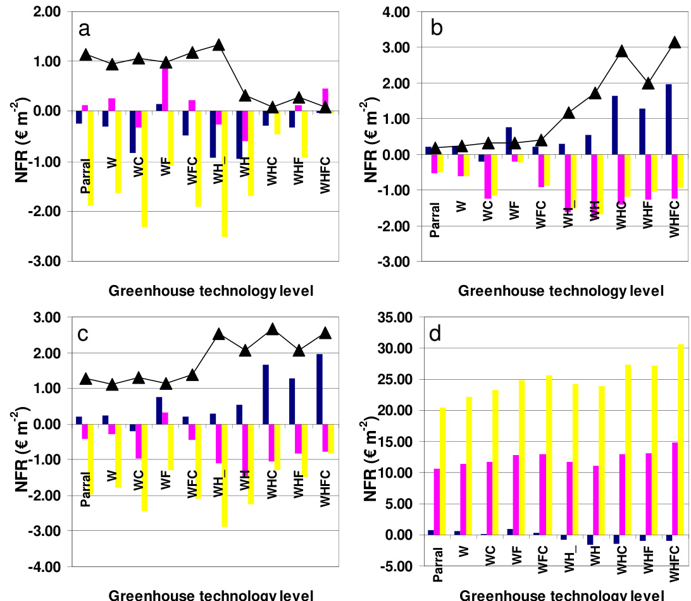  
Fig. 5.5 The impact of yearly variations of the outdoor climate (a), the tomato price (b), both the climate and the tomato price (c) and the impact of different constant price trajectories (d) on the net financial result and optimal design.

Fig 5.5a The impact of different outdoor climate periods: 2006 – 2007 (blue), 2007 – 2008 (purple), 2008-2009 (yellow) and the accompanying NFR variance between these different outdoor climate (black line with triangles). The applied price trajectory was the weekly prices averaged over the period 2006-2009.

Fig. 5.5b The impact of different price trajectories: 2006 – 2007 (blue), 2007 – 2008 (purple), 2008- 2009 (yellow) and the accompanying NFR variance between these different price trajectories (black line with triangles). The applied outdoor climate was 2006 – 2007.

Fig. $5 . 5 c$ The impact of different production periods with related outdoor climate and price trajectories: 2006 – 2007 (blue), 2007 – 2008 (purple), 2008-2009 (yellow) and the accompanying NFR variance between these different production periods (black line with triangles).

Fig. 5.5d The impact of different constant price trajectories: $0 . 5 0 \notin k g ^ { - 1 }$ (blue), $I . O O \notin k g ^ { - I }$ (purple) and $I . 5 0 \notin k g ^ { - I }$ (yellow). The applied outdoor climate was 2006 – 2007.

# 5.5 General discussion

The presented results are discussed with respect to their impact on the development of the model-based greenhouse design method. First the effect on model description is presented, followed by the effect on the greenhouse design optimisation.

# 5.5.1 Model description

The combined greenhouse climate-crop yield model was already validated in previous studies and demonstrated in this study to predict with fair accuracy the crop yield and resource consumption for Southern Spanish conditions. This combined model was extended here with an economic model and was able to select the most profitable greenhouse design for such conditions. The advantage of this design tool instead of practical experiments is that the NFR of different greenhouse designs can be determined quickly, for different climate years and different price trajectories, with the same assumptions.

However, using a design tool implied that several assumptions had to be made to calculate the NFR for the different greenhouse designs under consideration. Firstly, the fractions of marketable and of first class yield $\eta _ { F M S o l d }$ and $\eta _ { T o m I }$ respectively) depend on greenhouse design (Table 5.2) and have a large impact on NFR (Table 5.7 and Table 5.8). The values chosen for these parameters were based on grower experience and on experimental results (Magán et al., 2007) and were assumed to be time invariant, which may be too optimistic. In practice, such fractions depend on diseases, such as blossom end rot (Gázquez et al., 2008) or phytophthora incidence, and extreme fruit temperatures which in turn depend on indoor climate, which follows from weather as much as from greenhouse design. Making these parameters functions of the inner climate would be an improvement, but unfortunately the present knowledge body is far from adequate.

In addition, costs related to the irrigation system, climate computer, emergency power and internal transport system were assumed to be equal for all greenhouse designs in order to compare objectively the impact of greenhouse structure and climate modification techniques on NFR. However, in practice some greenhouses may be equipped with less or cheaper construction elements than others.

# 5.5.2 Greenhouse design optimisation

In order to limit this study to a “manual design optimisation”, ten alternative designs were selected. However, an enormous amount of greenhouse design and climate management alternatives exists, which demonstrates the need for a more efficient optimisation algorithm. When solving this problem using the model-based design method, four aspects will affect the optimisation result. How to cope with these aspects is discussed shortly hereafter.

First, regarding the large impact of the climate year on the best design, it would be preferable to use one reference climate year that contains the dynamic pattern of climate variables averaged over a long period, as was done by Breuer and Van de Braak (1989) for the Dutch climate. Such a reference year would dispose of the need for calculations with climate data of several years. Second, similarly to the climate reference year, a “reference price trajectory” would be helpful. A word of caution is needed, since the life-span of the optimised greenhouse is in all cases several years. Therefore a good reference period should span much more than one year. As this does not seem feasible, a sensitivity analysis of the NFR of the greenhouse designs to these uncertain input parameters is required. Such an analysis tells how robust the optimal greenhouse design is with respect to uncertain factors such as prices and weather. Third, the combined impact of climate modification techniques on NFR might be larger than the sum of their individual impact as revealed by the joint affect of $\mathrm { C O } _ { 2 }$ enrichment and heating on NFR (section 5.4.1.1). This result stresses the need to optimise the set of climate modification techniques simultaneously instead of sequentially. Fourth, the sensitivity analysis revealed the considerable impact of climate set-points on NFR (Table 5.8), indicating an effect on the optimal design as well. In a previous study, Vanthoor et al. (2008a) indeed have shown that a change in climate management would result in a different optimal greenhouse design which in turn indicates the relevance to select appropriate climate-set-points.

# 5.6 Conclusion

We have shown that a greenhouse climate-crop yield model, extended with an economic module can be used to select the greenhouse with the highest annual NFR among a predefined set of design alternatives for Southern Spanish conditions and to evaluate possible design improvements of existing greenhouses. Results demonstrated that for the given climatic and economic conditions, a multi-tunnel with only a fogging system would be most profitable $( 0 . 1 5 \notin \mathrm { m } ^ { - 2 } \ : \mathrm { y e a r } ^ { - 1 } )$ . However, the difference in annual NFR between such a structure and a simple parral structure is small $( 0 . 4 0 \notin \mathrm { m } ^ { - 2 } \ : \mathrm { y e a r } ^ { - 1 } )$ with respect to the big difference in investment $( 1 3 . 3 2 \notin \mathrm { m } ^ { - 2 } )$ , so that the investment pay-back time would exceed the planning horizon of most growers. In addition, it was shown that if one is prepared to invest in a heating system for a multi-tunnel, then it would be certainly worthwhile to fit $\mathrm { C O } _ { 2 }$ enrichment as well.

A sensitivity analysis of the NFR and related cost factors was carried out to find the factors with the largest bearing on profit at the two extremes: the parral and the multitunnel with heating, $\mathrm { C O } _ { 2 }$ enrichment and fogging. In both cases the tomato price, the fraction of marketable yield and the PAR transmission of the cover had the largest impact on NFR. In addition, the NFR of the low-tech greenhouse would grow with NIR transmission of the cover, with a decrease of the FIR transmission of the cover and with an increase of the temperature set-point for ventilation. On the other hand, the NFR of the high-tech greenhouse would gain by lowering the heating set-point and raising the ventilation set-point.

With respect to sensitivity to uncertain factors, such as weather and prices, we have shown that with increasing technology level, the annual NFR depends less on outdoor climate and more on tomato price. These results indicate that 1) to diminish the risk to fluctuating price trajectories one should operate a low-tech greenhouse with low investments, whereas 2) a high-tech greenhouse would cover better the “weather risk”, which should in turn allow for a higher tomato price. Finally, 3) a high tech greenhouse would be more beneficial at high tomato prices but would suffer more at low price levels.

Our results prove that the best greenhouse design is strongly affected by four factors: weather, price trajectories, joint impact of climate modification techniques, and greenhouse climate management. A model-based design method can cope with these multifactorial design aspects and is therefore a suitable approach to solve the resulting multifactorial design problem. Obviously, such design a problem becomes unmanageable as soon as more alternatives are considered. Therefore, to be more general, the design method must rely on a more efficient algorithm which will be presented in chapter 6.

# Acknowledgements

We thank all the staff of the experimental station “Las Palmerillas” of the Fundación Cajamar, particularly Antonio Céspedes, for providing all data and for their kind cooperation while the first author was a guest at their institute. The economic parameters were kindly provided by Ana Cabrera from the Economic Studies Institute of the Cajamar Foundation Fundación Cajamar and the staff from the Agrifood Business Division of Cajamar (Agricultural Credit Cooperative). This research is part of the strategic research programs "Sustainable spatial development of ecosystems, landscapes, seas and regions" and "Sustainable Agriculture" that are funded by the former Dutch Ministry of Agriculture, Nature Conservation and Food Quality.

# 5.7 Appendix

# Appendix A The calculation of the $\mathbf { C O } _ { 2 }$ set-point for $\mathbf { C O } _ { 2 }$ enrichment

The $\mathrm { C O } _ { 2 }$ set-point increases linearly with global radiation, $I _ { G l o b }$ , until a defined maximum $\mathrm { C O } _ { 2 }$ set-point, $C O _ { 2 A i r \_ E x t M a x }$ , is reached and, simultaneously, the $\mathrm { C O } _ { 2 }$ set-point decreases linearly with the aperture of the ventilation openings, $U _ { \scriptscriptstyle { V e n t } }$

$C O _ { 2 A i r \_ E x t O n } = f \big ( I _ { G i o b } \big ) \cdot g \big ( U _ { V e n t } \big ) \cdot \big ( C O _ { 2 A i r \_ E x t M a x } - C O _ { 2 A i r \_ E x t M i n } \big ) + C O _ { 2 A i r \_ E x t M i n }$ [ppm]   (A.1)

$$
f \left( I _ { G l o b } \right) = \left\{ \begin{array} { c } { { \displaystyle \frac { I _ { G l o b } } { I _ { G l o b } } } , I _ { G l o b } < I _ { G l o b _ { - } M a x } } \\ { { } } \\ { { 1 , I _ { G l o b } \geq I _ { G l o b _ { - } M a x } } } \end{array} \right.
$$

$$
g \big ( U _ { V e n t } \big ) = \left\{ \begin{array} { l l } { \displaystyle 1 - \frac { U _ { V e n t } } { U _ { V e n t } } , U _ { V e n t } < U _ { V e n t _ { - } M a x } } \\ { \quad } \\ { \quad 0 , \quad \quad U _ { V e n t } \geq U _ { V e n t _ { - } M a x } } \end{array} \right.
$$

where $I _ { G l o b } \ \mathrm { ( W \ m ^ { - 2 } ) }$ is the outdoor global radiation, ${ { U } _ { V e n t } } \left( - \right)$ is the window aperture, $C O _ { 2 A i r \_ E x t M a x }$ (ppm) is the maximum $\mathrm { C O } _ { 2 }$ concentration set-point, $C O _ { 2 A i r \_ E x t M i n }$ is the minimum $\mathrm { C O } _ { 2 }$ concentration set-point (ppm), $I _ { G l o b \_ M a x } \mathrm { ( W ~ \ m ^ { - 2 } ) }$ is the outdoor global radiation at which the maximum $\mathrm { C O } _ { 2 }$ concentration set-point could be reached and $U _ { V e n t \_ M a x }$ (-) is the window aperture at which the $\mathrm { C O } _ { 2 }$ concentration set-point equals the minimum $\mathrm { C O } _ { 2 }$ concentration set-point (ppm).

# Chapter 6

# Greenhouse design optimisation for SouthernSpanish and Dutch conditions

The contents of this chapter have been submitted to Biosystems Engineering as a paper entitled: A methodology for model-based greenhouse design: Part 5, Greenhouse design optimisation for Southern-Spanish and Dutch conditions.

B.H.E. Vanthoor, J.D. Stigter, E.J. van Henten, C. Stanghellini, P.H.B. de Visser

# 6.1 Abstract

An optimisation algorithm, as an essential part of a model-based method to design greenhouses for a broad range of climatic and economic conditions was described. This algorithm–a modified controlled random search using parallel computing–maximised the annual Net Financial Return (NFR) of a tomato grower by selecting the best alternative to fulfil the following eight design elements: type of greenhouse structure, material of the cover, outdoor shade screen, whitewash properties, thermal screen, heating system, cooling system and a $\mathrm { C O } _ { 2 }$ enrichment system. As an example, the algorithm was applied to two locations with different climatic and economic conditions, i.e. Almeria and The Netherlands. Due to the warm climate with high radiation levels in Almeria, a greenhouse with a relatively large specific ventilation area $20 \%$ compared to $14 \%$ for Dutch conditions), seasonal whitewash and a low-capacity direct air heater $\mathrm { 5 0 ~ W ~ m } ^ { - 2 }$ compared to $2 0 0 \mathrm { ~ W ~ m ~ } ^ { - 2 }$ for Dutch conditions) was selected. In contrast, for the relatively cold climate with low radiation levels of The Netherlands, a $100 \%$ aluminium thermal screen and no whitewash would give the best result. The design method produced realistic greenhouses and related annual NFR, indicating that the method performs well. An analysis of the closeto-best greenhouses showed that for both locations a structure with high light transmissivity considerably enhanced the greenhouse performance whereas an outdoor shade screen, geothermal heating and mechanical cooling would be not economical. These results demonstrate the feasibility of a model-based design approach that produces suitable greenhouse designs for given climatic and economic conditions.

# 6.2 Introduction

When the current state in greenhouse design is considered, most studies have focused on optimising the design for a specific location, or they considered only a single design parameter. Specifically, Engel (1984) has optimised step by step the roof geometry, insulation level and the size of the heat storage of an energy passive greenhouse for use in the Southern California area; Amir and Hasegawa (1989) optimised the structural design of a greenhouse with respect to mechanical properties and Kacira et al. (2004) have optimised the vent configuration. However, for strategic decision making of greenhouse configuration for world-wide climate conditions, a systematic approach that integrates physical, biological and economical models is the most promising way as suggested by Baille (1999). Therefore, we describe in this study an optimisation algorithm, as an essential part of a model-based method to design greenhouses. The optimisation aims to maximise the annual net financial result by modifying the greenhouse design. The design method focuses to select the best alternative to fulfil the following eight design elements: (i) the type of a greenhouse structure, (ii) the material of the cover, (iii) the presence and type of an outdoor shading screen, (iv) the presence of a whitewash and its properties, (v) the presence and type of a thermal screen, (vi) the type of a heating system and its capacity, (vii) the type of a cooling system and its capacity and (viii) the type of a $\mathrm { C O } _ { 2 }$ enrichment system and its capacity.

The aim of this study is to integrate an optimisation algorithm into the modelbased design method to select the best set of greenhouse design elements from of a large number of alternatives. To demonstrate the feasibility of this approach, the greenhouse design is optimised for two different locations: Almeria, Spain and De Bilt, The Netherlands. The chapter is organised as follows. First, a description of the optimisation problem is presented. Second, an optimisation algorithm is selected and briefly discussed. Third, the assumptions for the Spanish and Dutch optimisation studies are presented. Fourth, the optimisation results are presented and discussed with respect to literature results.

# 6.3 Material and method

Description of the optimisation problem

# 6.3.1.1 Model overview

An overview of the design method is shown in chapter 1. The greenhouse climate model is described in chapter 2, the crop yield model in chapter 3, and the economical model in chapter 5. Therefore only a concise description of these models is presented here.

The various models consist of a set of differential equations:

$$
\dot { X } = f \big ( X , U , D , P , t \big )
$$

where $X$ is the state vector containing the indoor climate variables, the crop variables and the resource consumption variables, $\dot { X }$ denotes the derivative of the state vector with respect to time, $U$ is the climate control vector containing the climate control valve settings, $D$ is the outdoor climate vector, $P$ is the model parameter vector and $t$ (s) is time.

# 6.3.1.2 The integer greenhouse design vector

This optimisation focuses on the following eight design elements: (i) the type of a greenhouse structure, (ii) the material of the cover, (iii) the presence and type of an outdoor shading screen, (iv) the presence of a whitewash and its properties, (v) the presence and type of a thermal screen, (vi) the type of a heating system and its capacity, (vii) the type of a cooling system and its capacity and (viii) the type of a $\mathrm { C O } _ { 2 }$ enrichment system and its capacity (Fig. 6.1).

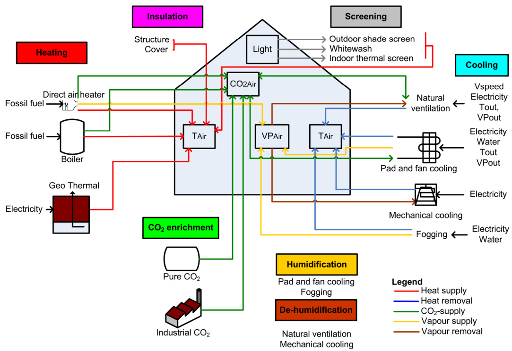  
Fig. 6.1 Functions (coloured boxes) and design elements (text blocks and pictures below the accompanying functions) used to manage the greenhouse climate (transparent boxes inside the greenhouse). The coloured arrows represent the various energy and mass fluxes (legend at the bottom right). The selection of alternatives to fulfil the following eight design elements: the type of greenhouse structure, the cover type, the outdoor shade screen, the whitewash, the thermal screen, the heating system, the cooling system and the $C O _ { 2 }$ enrichment system.

To optimise this set of design elements, an integer greenhouse design vector as shown in Fig. 6.2a was defined, which consists of eight design elements:

$$
I = \{ e _ { 1 } , e _ { 2 } , . . . , e _ { 8 } \} \qquad \mathrm { w i t h ~ } 1 \leq e _ { j } \leq n _ { e } ^ { j } \mathrm { a n d ~ } j = 1 , 2 . . . . . 8
$$

where each design element is denoted by an integer design variable $e _ { j }$ that can be fulfilled by $n _ { e } ^ { \ j }$ alternatives as described in Table 6.1. For example, the particular realisation of the integer greenhouse design vector as presented in Fig. 6.2b is thus represented as:

$$
I = \{ 2 , 1 , 1 , 2 , 5 , 3 , 4 , 1 \}
$$

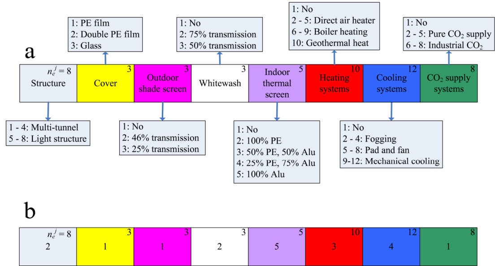  
Fig. 6.2 An overview of the integer greenhouse design vector (a) with an example (b). Fig. 6.2a Each coloured box represents a design element that could be executed by several alternatives as presented in the light-blue boxes. The number of alternatives to fulfil a design element $n _ { e } ^ { j }$ , is presented in the upright corner of coloured boxes. Fig. $6 . 2 b A n$ example of a integer greenhouse vector which can be interpreted using Table 6.1 and represents: a multi-tunnel structure type 2 covered with a PE film and equipped with: no outdoor shade screen, a seasonable whitewash with a transmission of $7 5 \% ,$ a $100 \%$ aluminium thermal screen, a direct air heater with a capacity of 1.0 MW, a fogging system with a capacity of $6 0 0 \ g \ m ^ { - 2 } \ h ^ { - I }$ and no $C O _ { 2 }$ enrichment. Detailed information about the specific properties and/or capacities of the design elements is presented in Table 6.1.

From Fig. 6.2 and Table 6.1 it can be inferred that this integer vector presents a multitunnel structure type 2 covered with a PE film and equipped with: no outdoor shade screen, a seasonal whitewash with a transmission of $7 5 \%$ , a $100 \%$ aluminium thermal screen, a direct air heater with a capacity of $1 . 0 \ \mathrm { M W }$ (equivalent to $1 0 0 \mathrm { ~ W ~ m ~ } ^ { - 2 } ,$ ), a fogging system with a capacity of $6 0 0 \ \mathrm { g \ m ^ { - 2 } h ^ { - 1 } }$ and no $\mathrm { C O } _ { 2 }$ enrichment.

Table 6.1 The economic parameters needed to determine the annual costs of the maintenance and depreciation for all design elements as described in chapter 5: the investments qInvest,i, the depreciation $\eta _ { D e p r e c i a t i o n , i } ,$ and the maintenance ηMaintenace,i.   

<html><body><table><tr><td>Design element</td><td>ej</td><td>qInvest,i €m2</td><td>qInvest,i €</td><td>NDepreciation,i NMaintenace,i % year-1</td><td>% year-1</td><td>€m²year-1 Qconstr,i</td></tr><tr><td>Structure ( j=1)</td><td></td><td></td><td></td><td></td><td></td><td></td></tr><tr><td>Multi-tunnel 1Ha, O% Vent</td><td>1</td><td>15.00</td><td></td><td>7.0</td><td>2.0</td><td>1.35</td></tr><tr><td>Multi-tunnel 1Ha, 29% Vent</td><td>2</td><td>18.00</td><td></td><td>7.0</td><td>2.0</td><td>1.62</td></tr><tr><td>Multi-tunnel 1Ha, 45% Vent</td><td>3</td><td>21.30</td><td></td><td>7.0</td><td>2.0</td><td>1.92</td></tr><tr><td>Multi-tunnel 1Ha,77% Vent</td><td>4</td><td>30.14</td><td></td><td>7.0</td><td>2.0</td><td>2.71</td></tr><tr><td>Venlo 1Ha, 0% Vent</td><td>5</td><td>29.00</td><td></td><td>7.0</td><td>0.5</td><td>2.18</td></tr><tr><td>Venlo 1Ha,14% Vent</td><td>6</td><td>32.00</td><td></td><td>7.0</td><td>0.5</td><td>2.40</td></tr><tr><td>Venlo 1Ha,20% Vent</td><td>7</td><td>33.25</td><td></td><td>7.0</td><td>0.5</td><td>2.49</td></tr><tr><td>Venlo 1Ha,38% Vent</td><td>8</td><td>47.50</td><td></td><td>7.0</td><td>0.5</td><td>3.56</td></tr><tr><td>Covers (j=2)</td><td></td><td></td><td></td><td></td><td></td><td></td></tr><tr><td>PE Film, Spain</td><td>1</td><td>1.38</td><td></td><td>33.3</td><td>5.0</td><td>0.53</td></tr><tr><td>PE Film,Netherlands</td><td>1</td><td>4.00</td><td></td><td>12.5</td><td>5.0</td><td>0.70</td></tr><tr><td>Double PE film, Spain</td><td>2</td><td>2.38</td><td></td><td>33.3</td><td>5.0</td><td>0.91</td></tr><tr><td>Double PE film,Netherlands</td><td>2</td><td>5.00</td><td></td><td>12.5</td><td>5.0</td><td>0.88</td></tr><tr><td>Glass</td><td>3</td><td>5.00</td><td></td><td>7.0</td><td>0.5</td><td>0.38</td></tr><tr><td colspan="7">Outdoor shade screen (j=3)</td></tr><tr><td>No</td><td>1</td><td>0.00</td><td></td><td>0</td><td>0</td><td>0</td></tr><tr><td>OLS 50 Abri, 46% transmission</td><td>2</td><td>3.81</td><td></td><td>20.0</td><td>5.0</td><td>0.95</td></tr><tr><td>OLS 70 Abri, 25% transmission</td><td>3</td><td>3.97</td><td></td><td>20.0</td><td>5.0</td><td>0.99</td></tr><tr><td>Structure shade screen</td><td></td><td>13.30</td><td></td><td>10.0</td><td>5.0</td><td>2.00</td></tr><tr><td colspan="7">Whitewash (j=4)</td></tr><tr><td>No</td><td>1</td><td>0.00</td><td></td><td>0</td><td>0</td><td>0</td></tr><tr><td>Whitewash 75% tr Spain</td><td>2</td><td>0.07</td><td></td><td>100.0</td><td>0</td><td>0.07</td></tr><tr><td>Whitewash 75% tr Neth</td><td>2</td><td>0.80</td><td></td><td>100.0</td><td>0</td><td>0.80</td></tr><tr><td>Whitewash 50% tr Spain</td><td>3</td><td>0.09</td><td></td><td>100.0</td><td>0</td><td>0.09</td></tr><tr><td>Whitewash 50% tr Neth</td><td>3</td><td>0.82</td><td></td><td>100.0</td><td>0</td><td>0.82</td></tr><tr><td colspan="7">Indoor thermal screen (j=5)</td></tr><tr><td>No</td><td>1</td><td>0.00</td><td></td><td>0</td><td>0</td><td>0</td></tr><tr><td>100 % PE 50% Aluminium/50 % PE</td><td>2</td><td>1.50</td><td></td><td>20.0</td><td>5.0</td><td>0.38</td></tr><tr><td>75% Aluminium/25 % PE</td><td>3</td><td>4.06</td><td></td><td>20.0</td><td>5.0</td><td>1.02</td></tr><tr><td></td><td>4</td><td>4.24</td><td></td><td>20.0</td><td>5.0</td><td>1.06</td></tr><tr><td>100% Aluminum</td><td>5</td><td>5.58 2.97</td><td></td><td>20.0 10.0</td><td>5.0 5.0</td><td>1.40 0.45</td></tr><tr><td colspan="7">Structure thermal screen Heating systems (j=6)</td></tr><tr><td>No</td><td>1</td><td></td><td>0</td><td>0</td><td>0</td><td>0</td></tr></table></body></html>

<html><body><table><tr><td>Design element</td><td>ej</td><td>qInvest,i €m2</td><td>qInvest,i €</td><td>NDepreciationiaintenacei % year-1</td><td>% year1</td><td>€m² Qconstr,i year1</td></tr><tr><td>Direct air heater: O.5 MW</td><td>2</td><td></td><td>16725</td><td>15.0</td><td>2.5</td><td>0.29</td></tr><tr><td>Direct air heater:1 MW</td><td>3</td><td></td><td>29225</td><td>15.0</td><td>2.5</td><td>0.51</td></tr><tr><td>Direct air heater: 1.5 MW</td><td>4</td><td></td><td>44850</td><td>15.0</td><td>2.5</td><td>0.78</td></tr><tr><td>Direct air heater: 2 MW</td><td>5</td><td></td><td>57350</td><td>15.0</td><td>2.5</td><td>1.00</td></tr><tr><td>Boiler: 1.16 MW</td><td>6</td><td></td><td>60000</td><td>7.0</td><td>1.0</td><td>0.48</td></tr><tr><td>Boiler:1.74MW</td><td>7</td><td></td><td>66000</td><td>7.0</td><td>1.0</td><td>0.53</td></tr><tr><td>Boiler: 2.32 MW</td><td>8</td><td></td><td>80400</td><td>7.0</td><td>1.0</td><td>0.64</td></tr><tr><td>Boiler: 3.48 MW</td><td>9</td><td></td><td>92400</td><td>7.0</td><td>1.0</td><td>0.74</td></tr><tr><td>Geothermal 7 MW</td><td>10</td><td></td><td>6000000</td><td>4.0</td><td>5.0</td><td>54.00</td></tr><tr><td>Heating pipes, 1 pipe per m</td><td></td><td>5.45</td><td></td><td>7.0</td><td>0.5</td><td>0.41</td></tr><tr><td colspan="7">Cooling systems (j=7)</td></tr><tr><td>No</td><td>1</td><td></td><td></td><td>0</td><td>0</td><td>0</td></tr><tr><td>Fogging: 200 g m² h1</td><td>2</td><td>5.50</td><td></td><td>10.0</td><td>5</td><td>0.83</td></tr><tr><td>Fogging: 400 g m² h-1</td><td>3</td><td>7.00</td><td></td><td>10.0</td><td>5.0</td><td>1.05</td></tr><tr><td>Fogging: 600 g m² h1</td><td>4</td><td>10.00</td><td></td><td>10.0</td><td>5.0</td><td>1.50</td></tr><tr><td>Pad and fan: 50 m³ m² h-1</td><td>5</td><td>3.54</td><td></td><td>10.0</td><td>5.0</td><td>0.53</td></tr><tr><td>Pad and fan: 100 m³ m² h1</td><td>6</td><td>5.07</td><td></td><td>10.0</td><td>5.0</td><td>0.76</td></tr><tr><td>Pad and fan: 150 m³ m² h-1</td><td>7</td><td>6.60</td><td></td><td>10.0</td><td>5.0</td><td>0.99</td></tr><tr><td>Pad and fan: 200 m m² h-1</td><td>8</td><td>8.14</td><td></td><td>10.0</td><td>5.0</td><td>1.22</td></tr><tr><td>Mechanical cool: 0.5 MWe/unit</td><td>9</td><td></td><td>240000</td><td>7.0</td><td>2.0</td><td>2.16</td></tr><tr><td>Mechanical cool: 1MWe/unit</td><td>10</td><td></td><td>480000</td><td>7.0</td><td>2.0</td><td>4.32</td></tr><tr><td>Mechanical cool: 1.5 MWe/unit</td><td>11</td><td></td><td>720000</td><td>7.0</td><td>2.0</td><td>6.48</td></tr><tr><td>Mechanical cool: 2MWe/unit</td><td>12</td><td></td><td>960000</td><td>7.0</td><td>2.0</td><td>8.64</td></tr><tr><td colspan="7">CO2 supply (j=8)</td></tr><tr><td>No</td><td>1</td><td></td><td>0</td><td>0.0</td><td>0</td><td>0</td></tr><tr><td>Pure supply: 50 kg Ha1 h-1</td><td>2</td><td></td><td>3120</td><td>10.0</td><td>0</td><td>0.03</td></tr><tr><td>Pure supply: 100 kg Ha1 h-1</td><td>3</td><td></td><td>3120</td><td>10.0</td><td>0</td><td>0.03</td></tr><tr><td>Pure supply: 150 kg Ha-1 h'1</td><td>4</td><td></td><td>4320</td><td>10.0</td><td>0</td><td>0.04</td></tr><tr><td>Pure supply: 200 kg Ha1 h-1</td><td>5</td><td></td><td>4320</td><td>10.0</td><td>0</td><td>0.04</td></tr><tr><td>Industrial CO2: 100 kg Ha-1 h-1</td><td>6</td><td></td><td>20000</td><td>6.7</td><td>2.0</td><td>0.17</td></tr><tr><td>Industrial CO2:150 kg Ha−1 h1</td><td>7</td><td></td><td>21000</td><td>6.7</td><td>2.0</td><td>0.18</td></tr><tr><td>Industrial CO2: 200 kg Ha-1 h-1</td><td>8</td><td></td><td>22000</td><td>6.7</td><td>2.0</td><td>0.19</td></tr><tr><td>CO2 distribution system</td><td></td><td>0.34</td><td></td><td>10.0</td><td>5.0</td><td>0.05</td></tr><tr><td colspan="7">Remaining costs for irrigation, crop protection, internal transport, sorting, packaging etc.</td></tr><tr><td colspan="7">Spain 11.13 10.0 5.0</td></tr><tr><td>The Netherlands</td><td></td><td>38.73</td><td></td><td>10.0</td><td>5.0</td><td>1.67 5.81</td></tr><tr><td colspan="7"></td></tr></table></body></html>

# 6.3.1.3 Performance measure

The performance measure to be maximised is the expected annual net financial result (NFR) of the grower, described by:

$$
\operatorname* { m a x } _ { I } J \left( t _ { f } \right) = - Q _ { F i x e d } + \intop _ { t = t _ { 0 } } ^ { t = t _ { f } } \dot { Q } _ { C r o p Y i e l d } - \dot { Q } _ { V a r } d t
$$

$$
[ \in \mathrm { m } ^ { - 2 } \mathrm { y e a r } ^ { - 1 } ]
$$

where $J ( \in \mathrm { m } ^ { - 2 } \ y \mathrm { e a r } ^ { - 1 } )$ is the annual net financial result of the grower, $t _ { O }$ (s) and $t _ { f } \left( \mathrm { s } \right)$ are the beginning and the end of the production period respectively, $Q _ { F i x e d }$ $( \mathsf { E } \ \mathrm { m } ^ { - 2 } \ \mathrm { y e a r } ^ { - 1 } )$ are the fixed costs related to the tangible assets, $Q _ { C r o p Y i e l d } ( \bf { \in } \mathrm { ~ m ^ { - 2 } ~ y e a r ^ { - 1 } ) }$ is the economic value of crop yield, $Q _ { V a r } ( \mathsf { E } \mathrm { m } ^ { - 2 } \mathrm { y e a r } ^ { - 1 } )$ are the costs related to the crop (i.e. plant material, fertilisers, crop protection and other crop assets), resource use (in this study defined as water, $\mathrm { C O } _ { 2 }$ , fossil fuel and electricity) and labour. A more detailed description of the individual cost elements can be found in chapter 5. Labour costs consisted of fixed cost related to crop maintenance plus a fraction that was linearly related to crop yield. The cost of the use of individual resources was calculated with:

$$
\begin{array} { r l r } & { \dot { Q } _ { \mathtt { W a t r } } = 1 0 ^ { - 3 } q _ { \mathtt { W a t r } } \Biggl ( \Biggl ( 1 + \frac { \eta _ { \mathtt { D r a i n } } } { 1 0 0 } \Biggr ) M V _ { \scriptscriptstyle { C a u s i r } } + M V _ { \scriptscriptstyle { F o g a i r } } + M V _ { \scriptscriptstyle { F a d i n s e r } } \Biggr ) [ \mathsf { E m } ^ { \scriptscriptstyle 2 } s ^ { \scriptscriptstyle 1 } ] } & \\ & { \dot { Q } _ { \scriptscriptstyle { C o 2 } } = 1 0 ^ { \mathrm { s } } \Bigl ( q _ { \scriptscriptstyle { C O 2 } , \_ { E x } } M C _ { \scriptscriptstyle { E a d i r } } + q _ { \scriptscriptstyle { C O 2 } , \_ { I n d } } M C _ { \scriptscriptstyle { I n d i r } } \Bigr ) } & { [ \mathsf { E m } ^ { \scriptscriptstyle 2 } s ^ { \scriptscriptstyle 1 } ] } \\ & { \dot { Q } _ { \scriptscriptstyle { F i e t } } = \frac { q _ { \scriptscriptstyle { F i e t } } } { \eta _ { \scriptscriptstyle { F i e t } } } \Bigl ( H _ { \scriptscriptstyle { B o i n p l e p } } + H _ { \scriptscriptstyle { B i o s t i r } } \Bigr ) } & { [ \mathsf { E m } ^ { \scriptscriptstyle 2 } s ^ { \scriptscriptstyle 1 } ] } \\ & { \dot { Q } _ { \scriptscriptstyle { E l e c } } = \frac { q _ { \scriptscriptstyle { F l e c } } } { 3 . 6 \cdot 1 0 ^ { 6 } } \Bigl ( P _ { \scriptscriptstyle { P a d } } + P _ { \scriptscriptstyle { F o g } } + P _ { \scriptscriptstyle { G e } } + P _ { \scriptscriptstyle { M e f } } \Bigr ) } & { [ \mathsf { E m } ^ { \scriptscriptstyle 2 } s ^ { \scriptscriptstyle 1 } ] } \end{array}
$$

where $q _ { W a t e r } ( \in \mathbf { m } ^ { - 3 } )$ is the water price, $\eta _ { D r a i n } \left( \% \right)$ is a fraction of crop transpiration needs to assure sufficient irrigation, $M V _ { C a n A i r }$ $( \mathrm { k g ~ m } ^ { - 2 } \mathrm { ~ s } ^ { - 1 } )$ is the transpiration rate of the crop, $M V _ { F o g A i r }     ~ ( \mathrm { k g } ~ \mathrm { m ^ { - 2 } } ~ \mathrm { s ^ { - 1 } } )$ is the fogging rate, $M V _ { P a d A i r N e t }$ $( \mathrm { k g ~ m ^ { - 2 } ~ s ^ { - 1 } } )$ is the water added to the inlet air of the pad and fan system, $q _ { C O 2 \_ E x t } \ ( \in \ \mathrm { k g } ^ { - 1 } )$ is the price of pure $\mathrm { C O } _ { 2 }$ , $M C _ { E x t A i r }$ $( \mathrm { m g ~ m ^ { - 2 } ~ s ^ { - 1 } } )$ is the $\mathrm { C O } _ { 2 }$ enrichment rate of pure $\mathrm { C O } _ { 2 } , ~ q _ { C O 2 \_ I n d } ~ ( \in ~ \mathrm { k g } ^ { - 1 } )$ is the price of industrial $\mathrm { C O } _ { 2 }$ , $M C _ { I n d A i r }$ $\mathrm { ( m g ~ m ^ { - 2 } ~ s ^ { - 1 } ) }$ is the $\mathrm { C O } _ { 2 }$ enrichment rate of industrial $\mathrm { C O } _ { 2 }$ , $q _ { F u e l } $ $( \in \mathrm { m } ^ { - 3 } )$ is the fuel price, $\eta _ { F u e l } \ : ( \mathrm { J } \ : \mathrm { m } ^ { - 3 } )$ is the energy efficiency of the fuel, $H _ { B o i l P i p e } ( \mathrm { W ~ m } ^ { - 2 } )$ is the heat supply to the heating pipes, $H _ { B l o w A i r } ( \mathrm { W ~ m } ^ { - 2 } )$ is the heat supply from the indirect air heater to the greenhouse air, $q _ { E l e c }$ is the electricity price $( \notin \mathrm { k W h } ^ { - 1 } )$ , $P _ { P a d } , P _ { F o g } , P _ { ( }$ $P _ { G e o }$ and

$P _ { M e c h }$ , is the electricity consumption of the pad and fan system, the fogging system, the pump of the geothermal source and the mechanical cooling system respectively. Calculation of electricity consumption rates is presented in section 6.6.1.

# 6.3.1.4 Impact of extreme humidity levels on tomato quality parameters

As presented in chapter 5 the economic crop yield is described as a function of crop yield mass and two quality parameters i.e. the fraction of first class tomatoes and the marketable fraction. A description of the impact of indoor climate on these quality parameters was not integrated in the design method. Therefore, as a first approach two quality filters were developed to describe the impact of humidity on the marketable fraction and fraction of first class tomatoes. These quality filters were based on real climate data and quality parameters as described in section 6.6.2.

# 6.3.2 The controlled random search optimisation algorithm

# 6.3.2.1 Description and implementation of the algorithm

The controlled random search (CRS) method of Price (1977) was used to solve the optimisation problem. Such a derivative-free global optimisation method was required because the performance measure will have many local maxima and its gradient is not continuous. In addition, the CRS allows efficient parallel computing, it is easy to implement, it is a robust optimisation method and there is no need to fine-tune many algorithm parameters. Because of the time needed to solve the optimisation problem (Table 6.2), a solution based on parallel computing is needed to achieve manageable CPU times. Furthermore, due to its population-based nature, the output of the CRS method produces valuable information about the close-to-best designs.

Table 6.2 The number of design alternatives, time needed to evaluate all design alternatives and the time needed for design optimisation under constrained and unconstrained conditions.   

<html><body><table><tr><td>Location</td><td>Number of design alternatives</td><td>Years needed to evaluate all design alternatives by one computer+</td><td>Days needed for parallel optimisation*</td></tr><tr><td>Spain</td><td>5.40-105</td><td>26</td><td>2</td></tr><tr><td>Netherland</td><td>8.64-105</td><td>41</td><td>3</td></tr></table></body></html>

The + indicates that a single simulation time of 25 minutes was assumed. The \* indicates parallel optimisation with $5 0$ computers and an optimisation algorithm that evaluates at most $1 \%$ of all design alternatives to come up with a solution. For the Spanish case fewer designs were evaluated because the $C O _ { 2 }$ supply from industry was not optimised.

The original CRS method of Price (1977) iteratively improves a candidate population $A$ of best guesses for a number of continuous design parameters. This population consists of $N$ continuous design vectors constituting each of $n$ continuous design variables and the accompanying performance measure values. After each iteration, a new design vector $I _ { : }$ , is created based on $A$ and the performance measure $J _ { I }$ is evaluated. If $J _ { I }$ is higher than the lowest performance measure value in $A$ , the design vector associated to the lowest performance measure is replaced by $I$ and the lowest performance measure value is replaced by $J _ { I }$ .

The original CRS was developed for continuous optimisation problems whereas the greenhouse design optimisation is approached as an integer based problem. However, according to Lampinen and Zelinka (1999), population-based methods developed for continuous problems could solve discrete optimisation problems provided that the discrete parameters are represented as floating point values even when the problem is inherently discrete. The performance measure is thus evaluated once the floating-point parameter values are rounded to, but not overwritten by, their nearest allowable discrete values (Price et al., 2005). The original CRS algorithm was thus modified to assure that the integer design problem was efficiently solved. In addition, to speed up the optimisation process, a new design vector could only be evaluated once by the model. Specifically, only design vectors which are not stored in population $A$ , nor in the memory stack $B$ will be evaluated. A detailed description of the modified CRS algorithm is presented as software steps below:

# Steps 1 to 3 are performed to initialise the optimisation parameters

1. Define $N .$ , the number of design vectors. Price (1983) proposed $N$ as a function of the total number of $\scriptstyle n = 8$ design variables: $N { = } 2 5 n$ .   
2. Choose randomly $N$ sets of $n$ design variables over the search domain $V$ and store the design vectors in the first $n$ columns of the $N \times ( n { + } I )$ population matrix $A$ .   
3. Initialise $C o u n t e r = O$ and the memory stack $B$ as an empty $l \ x \left( n { + } l \right)$ vector. The memory stack $B$ is used to store the evaluated design vectors and accompanying performance measures.   
4. Initialise the maximum number of iterations $C o u n t e r _ { M a x }$ .

# Steps 4 to 8 determine the performance measure value for each individual in the population $A$ .

5. Update the variable counter: $C o u n t e r = C o u n t e r + I$   
6. If Counter $\leq N$ , proceed with step 7. If Counter $> N$ , go to step 8.

# Chapter 6

7. Obtain the design vector $I$ , located at row number Counter of matrix $A$ . Determine $J _ { I } ,$ ， the value of the performance measure of $I$ and store $J _ { I }$ in the common matrix $A$ at row number Counter and column number $n { + } l$ . Proceed with step 5.

# These steps are performed to improve the population $A$

8. Choose randomly $n + { \mathit { 1 } }$ distinct sets of the design vectors $R _ { I } , R _ { 2 } , \ldots R _ { n + I }$ from the population $A$ . Determine the centroid $G$ of the points $R _ { I } , \ldots R _ { n }$ . Then determine the next design vector $I$ such that $\overline { { I } } = 2 \overline { { G } } - \overline { { R } } _ { n + 1 }$ . Where $\bar { I } , \overline { { G } } , \overline { { R } } _ { n + 1 }$ represent the position vectors in the $n$ -space.   
9. Round $I$ to the nearest allowed integer values so that the quantified $I _ { q }$ is obtained. Keep the original $I$ in the floating-point parameter domain.   
10. Is $I _ { q }$ consistent with the constraints? If not go to step 8, if so, proceed with step 11.   
11. Update the variable counter: $C o u n t e r = C o u n t e r + I$   
12. Exist $I _ { q }$ in the quantified population matrix $A _ { q }$ or in the memory stack $B \mathrm { ? }$ If not, proceed with step 13, if so, obtain $J _ { I _ { q } }$ from $A$ or $B$ and go to step 14.   
13. Evaluate the performance measure to determine $J _ { I _ { q } }$ , the value of the performance measure at $I _ { q }$ .   
14. Determine from $A$ the design vector, $L$ , which has the lowest performance measure value $J _ { L }$ .   
15. If ${ \boldsymbol { J } } _ { I _ { q } } \leq { \boldsymbol { J } } _ { L } ,$ proceed with step 16. If $J _ { I _ { q } } > J _ { L }$ , go to step 17.   
16. Store $I _ { q }$ and $J _ { I _ { q } }$ in the $B$ matrix. Is $C o u n t e r \geq C o u n t e r _ { M a x } ?$ If so, maximum number of iterations reached and exit optimisation algorithm. If not, go to step 8.   
17. Replace in $A$ , the design vector $L$ by $I$ and the performance measure $J _ { L }$ by $J _ { I _ { q } }$ .Thus $I$ and not $I _ { q }$ is stored in $A$ as recommended by Lampinen and Zelinka (1999) and Price et al. (2005). Store the quantified design vector $L _ { q }$ and its performance measure $J _ { L }$ in $B$ .   
18. Is $C o u n t e r \geq C o u n t e r _ { M a x } ?$ If so, maximum number of iterations reached. If not, go to

step 8.

This modified CRS algorithm was implemented in a parallel processing program that used 50 personal computers (each equipped with a $3 0 0 0 \mathrm { M H z }$ Intel core 2 DUO processor with 2 GB internal memory). These computers could simultaneously: read $N$ and $C o u n t e r _ { M a x }$ ; read and write the matrices $A$ , $B$ and the Counter variable. Each computer evaluated a particular performance measure by solving the differential equations of the model with a variable time step ODE solver as included in Matlab $7 . 1 ^ { \circledast }$ . After each evaluation, the common variables and matrices were modified, a new greenhouse design was determined as described by the modified CRS algorithm and this design was evaluated. All greenhouse design evaluations in the parallel computation process were synchronised in time as to guarantee an objective search. The number of integer design vectors in the population matrix $A$ was set to $N = 2 5 0$ which was larger than Price’s (1983) proposition of $N = 2 5 { \cdot } 8 = 2 0 0$ as to increase the probability that a global maximum was found. Based on the consistent convergence of the performance measure during optimisation, the maximum number of iterations $C o u n t e r _ { M a x }$ was set to 7500.

# 6.3.2.2 Analysis of the results of an optimisation run

As the CRS method is a population-based optimisation method, the exit-population offers interesting additional insights. The population of greenhouse designs can be evaluated using distribution curves and sensitivity analysis techniques.

The distribution curves show for the set of close-to-best greenhouse designs the frequency of all alternatives to fulfil each design element. In this study, the set of close-tobest greenhouse designs consisted of greenhouses for which the NFR differed less than $X \notin$ $\mathrm { m } ^ { - 2 }$ year-1 compared to the NFR of the best greenhouse (in this chapter denoted with ∆NFR $< X \in \mathrm { m } ^ { - 2 } \ \mathrm { y e a r } ^ { - 1 } )$ . The frequency of each alternative was expressed in $\%$ of the resulting population size. In this study the distribution curves of the design elements were determined for two sets of best greenhouses, i.e. $\Delta N F R < 0 . 2 5 \notin \mathrm { ~ m } ^ { - 2 }$ year-1 and $\Delta N F R <$ $1 . 5 0 \in \mathrm { m } ^ { - 2 } \ : \mathrm { y e a r } ^ { - 1 }$ .

The sensitivity analysis shows the impact of all alternatives to fulfil each design element. The sensitivity was defined as follows. For each alternative, a sub-population was created that existed of only designs equipped with this specific alternative. Subsequently, the mean of the NFR of this sub-population was determined and shown in the sensitivity analysis. When evaluating the impact of one alternative, the other alternatives to fulfil the remaining seven design elements were thus allowed to vary. This single-variate analysis was used to reduce complexity when analysing the optimisation results.

6.3.3 Two cases: Almeria, Spain and De Bilt, The Netherlands To demonstrate how the optimised design depends on local climate and economic conditions, two locations were selected: Almeria, Spain and De Bilt, The Netherlands. In this section, the assumptions underlying the optimisation study are presented. This includes the greenhouse design elements, crop conditions, outdoor climate, climate management and economic parameters.

# 6.3.3.1 Greenhouse design description

A long tomato growing period was used for both locations: in Almeria from August $1 ^ { \mathrm { s t } }$ to July $1 ^ { \mathrm { s t } }$ and in De Bilt from December $1 5 ^ { \mathrm { t h } }$ to December $1 ^ { \mathrm { s t } }$ . For both locations the standard climate year was used as described in section 6.3.3.2 and the crop conditions are described in Table 6.3. Both greenhouses were assumed to have a rectangular shape of $2 0 0 \mathrm { ~ x ~ } 5 0 \mathrm { ~ m ~ }$ resulting in a floor area of 1Ha.

An overview of the set of eight greenhouse design elements to be optimised and their accompanying economic parameters are presented in Table 6.1. For both locations, the same possible design alternatives were considered with the exception that $\mathrm { C O } _ { 2 }$ enrichment from an industrial source was not considered possible in Spain. The two possible greenhouse structures were: a cheap structure with a relatively low light transmissivity of $71 \%$ (such as an iron arch-shaped multitunnel) and a more expensive structure with a higher light transmissivity of $9 5 \%$ (such as a Venlo-type structure). Note that the overall greenhouse transmission depends also on cover type, whitewash, and light absorbing design elements such as structures to mount the indoor and outdoor screen. Both structures could be coupled to four different specific ventilation areas. The structure with the low lighttransmissivity had side ventilation in the 2 long sides and continuous roof ventilation in one side of each span. This structure could only be covered with a film. The structure with the high light-transmissivity had only roof ventilation.

The possible greenhouse cover materials were: a single PE film, a double PE film and a single glass cover. For the movable outdoor shade screen and for the whitewash, several alternatives with different light transmission could be selected. For the movable indoor thermal screen there were several alternatives with different ratios of aluminium and PE (influencing the far infrared radiation fluxes). For the heating system, a number of capacities, including zero, of a direct air heater, a boiler and geothermal heat could be selected. A direct air heater supplies heat, $\mathrm { C O } _ { 2 }$ and the water vapour directly to the greenhouse air, whereas a boiler and a geothermal source both supply heat to the heating pipes, which, in turn, heat up the greenhouse air by convective heat exchange and radiation.

The boiler system had lower investment costs and higher variable costs compared to the geothermal source. The $\mathrm { C O } _ { 2 }$ produced by the boiler is also supplied to the greenhouse air. The source to supply $\mathrm { C O } _ { 2 }$ to the greenhouse could be selected between pure $\mathrm { C O } _ { 2 }$ from a tank and industrial waste $\mathrm { C O } _ { 2 }$ , all with a number of capacities. At equal capacity, pure $\mathrm { C O } _ { 2 }$ supply had lower investments cost and higher variable costs than industrial $\mathrm { C O } _ { 2 }$ . The possible cooling systems were: high-pressure fogging; pad and fan and mechanical cooling, all possible with a number of capacities.

A commonly encountered growing system was selected for each location. In Almeria, plants were assumed to grow in soil whereas in The Netherlands plants were grown in substrate above a white foil. Therefore, the reflection coefficient for visible light of the floor layer was higher in The Netherlands than in Spain. A closed irrigation system with disinfection unit was used in The Netherlands which resulted, compared to Spain, in a lower fraction of crop transpiration needs to assure sufficient irrigation.

# 6.3.3.2 Local climate

Variations between different outdoor climate years have a significant impact on the NFR as demonstrated in chapter 5. Therefore, a standard climate year representing long term climate data was created using the algorithm based on Breuer and Van de Braak (1989) as presented in section 6.6.3. This algorithm selects from the long term series climate data, each single month with the closest match to the mean monthly values of temperature and global radiation sums. Spanish climate data of the period 2004 – 2009 and Dutch climate data of the period 1989 – 2009 were used to determine such standard climate years. Fig. 6.3 presents the monthly mean values of the daily global radiation as a function of monthly mean outdoor temperature for Almeria and for De Bilt.

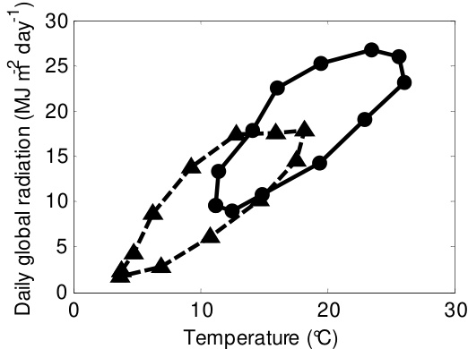  
Fig. 6.3 The monthly mean values of the daily global radiation as a function of the monthly mean outdoor temperature for Almeria (solid line with circles) and for De Bilt (dashed line with triangles).

# 6.3.3.3 Greenhouse climate management

The climate control valve settings are determined as a function of the climate control strategy and the applied climate set-points. For both locations the same greenhouse climate set-points were used, as presented in Table 6.3, to ensure that differences between optimisation results were only caused by climatic and economic conditions. However, the period for which a seasonal whitewash could be applied was longer in Spain than in The Netherlands. The strategy for controlling the air temperature is presented in Fig. 6.4. The set point for $\mathrm { C O } _ { 2 }$ enrichment $C O _ { 2 A i r \_ E x t O n }$ , increased with increasing outside global radiation and decreased with increasing ventilation rate which was based on Magán et al. (2008) as described in section 6.6.4. The outdoor shade screen was used when the outdoor global radiation was higher than Iglob_ShScr_on.

Tout_ThScr_on Tair_heat_on Tair_vent_on Tair_cool_on 1 1 一 1 1 1 1 1 Vents are open if. 一 1 Active cooling -CO2Air<CO2air_vent_off 1 1 mechanisms on Ttremaete 1RHu>RHalyar i → → 一 1 1 1 Vents are closed 一 i Vents are open if pad and fan or 一 1 1 mechanical 一 Heating 1 1 1 cooling is used 一 mechanisms on 1 1 Temperature →

# 6.3.3.4 Economic conditions

The performance measure was calculated using the equations presented in chapter 5 and section 6.3.1.3. The economic parameters needed to determine the annual fixed costs related to the tangible assets are presented in Table 6.1. Similar costs for the tangible assets were used for the two locations, except for the films and the whitewash, for which the investments costs were higher in The Netherlands than in Spain. Since different growing systems were used, each location had different remaining costs. The economic parameters to determine the variable costs are presented in Table 6.4. For Almeria, the weekly tomato price of the first and second class long life tomatoes (Anonymous, 2009) were averaged over four successive production periods between 2006 and 2010. For Dutch conditions, the 4 week period price of the first and second class truss tomatoes of Vermeulen (2010) were averaged over four successive years i.e. 2006 – 2009.

Table 6.3 Overview of the outdoor climate, the greenhouse climate management and the crop conditions used for the greenhouse design optimisation.   

<html><body><table><tr><td></td><td>Almeria, Spain</td><td>DeBilt,TheNetherlands</td></tr><tr><td colspan="3">Greenhouse climate management August 1st- September 15th</td></tr><tr><td>Whitewash</td><td>(full whitewash) March 1st- April 15th (50 % whitewash) April16th-June 30th</td><td>June 1st - August 15th (50 % whitewash)</td></tr><tr><td>Iglob_ShScr_on (W m²)</td><td>(full whitewash) 650</td><td>650</td></tr><tr><td>Tair_vent_on (°C)</td><td>24</td><td>24</td></tr><tr><td>RHair_vent_on (%)</td><td>85</td><td>85</td></tr><tr><td>CO2air_vent_min (ppm)</td><td>200</td><td>200</td></tr><tr><td>CO2air_vent_max (ppm)</td><td>3000</td><td>3000</td></tr><tr><td>Tair_heat_on (C) (night/day)</td><td>17/19</td><td>17/19</td></tr><tr><td>Tair_cool_on (C)</td><td>26</td><td>26</td></tr><tr><td>Tout_ThScr_on (C)</td><td>14</td><td>14</td></tr><tr><td>CO2Air_ExiMax (ppm)</td><td>1000</td><td>1000</td></tr><tr><td>CO2Air_ExiMin (ppm)</td><td>390</td><td>390</td></tr><tr><td>IGlob_Max (W m²)</td><td>500</td><td>500</td></tr><tr><td>fventExtCO2_Max (m³ m² s1)</td><td>6.95:10-3</td><td>6.95:10-3</td></tr><tr><td></td><td></td><td></td></tr><tr><td>CO2air_ExtCO2_on (ppm)</td><td>Functionof global radiation</td><td>Function of global radiation</td></tr><tr><td>Crop conditions</td><td></td><td></td></tr><tr><td>LAI_start</td><td>0.3</td><td>0.3</td></tr><tr><td>LAI_max</td><td>2.5</td><td>2.5</td></tr><tr><td>Start growing period, to</td><td>August 1st</td><td>December 15th</td></tr><tr><td>End growing period, tf</td><td>July 1th</td><td>December 1st</td></tr></table></body></html>

Table 6.4 An overview of the costs-related variables used in this study   

<html><body><table><tr><td>Parameter explanation</td><td>Parameter</td><td>Unit</td><td>Almeria</td><td>Source</td><td>De Bilt</td><td>Source</td></tr><tr><td>Thy arert consrsion factor from tomato</td><td>1DMFM</td><td>kg mg1</td><td>15.95-10-6 Based on</td><td>Magän et al. (2008)</td><td>18.18-10-6</td><td>Based on practice</td></tr><tr><td>Afractisst</td><td>NDrain</td><td>%</td><td>30</td><td>Based on practice</td><td>0</td><td>Closed system</td></tr><tr><td>Marketable fraction of harvest</td><td>1FMsold</td><td></td><td></td><td>Function of indoor climate</td><td></td><td>Function of indoor climate</td></tr><tr><td>Energy content of gas</td><td>NFuel</td><td>Jm3</td><td>31.65-106 Known</td><td></td><td>31.65-106</td><td>Known</td></tr><tr><td>Interest rate</td><td>NInterest</td><td>%</td><td>3.5</td><td>Cajamar</td><td>5</td><td>Vermeulen (2008)</td></tr><tr><td>The cost of short-term borrowing The labour cost coefficient that describes</td><td>Y Interes_Short</td><td>%</td><td>1</td><td>Cajamar</td><td>1</td><td>Vermeulen (2008)</td></tr><tr><td>impact of the production level on labour cost</td><td>NLabour_kg</td><td>h kg1 FM</td><td>0.010</td><td>Bl. ed on Perez et</td><td>0.0043</td><td>Vermeulen (2008)</td></tr><tr><td></td><td>NLabour_m2</td><td>h m²</td><td>0.270</td><td>al (2don Perez et</td><td>0.825</td><td>Vermeulen (2008)</td></tr><tr><td>The annual maintenance cost coeficient of design elementi</td><td>N Maintenance,i</td><td>% year-1</td><td></td><td>See Table 6.1</td><td></td><td>See Table 6.1</td></tr><tr><td>Tte analerectoffientf</td><td>N Depreciation,i</td><td>% year-1</td><td></td><td>See Table 6.1</td><td></td><td>See Table 6.1</td></tr><tr><td>The material costs for packaging</td><td>NPackage</td><td>€kg1</td><td>0</td><td>Part of sales cost</td><td>0.009</td><td>Vermeulen (2008)</td></tr><tr><td>The unacounted frctio of grenhouse</td><td>1Rem</td><td>%</td><td>2.5</td><td>Assumed</td><td>2.5</td><td>Vermeulen (2008)</td></tr><tr><td>Thneotfian</td><td>1sales</td><td>%</td><td>9</td><td>Cajamar</td><td>2.75</td><td>Vermeulen (2008)</td></tr><tr><td>The fraction of first class tomatoes in</td><td>NToml</td><td>%</td><td></td><td>Depends on indoor</td><td></td><td>Depends on indoor</td></tr></table></body></html>

<html><body><table><tr><td colspan="4">marketable yield</td><td colspan="2">climate</td><td>climate</td></tr><tr><td>The transport cost per kg tomatoes</td><td>NTransport</td><td>€kg1</td><td>0.02</td><td>Cajamar</td><td>0</td><td>Included in sales</td></tr><tr><td>Greenhouse floor area</td><td>AFlr</td><td>m</td><td>10000</td><td>Assumed</td><td>10000</td><td>Assumed</td></tr><tr><td>Pure CO2 costs</td><td>qc02_Ext</td><td>€kg1</td><td>0.20</td><td>Cajamar</td><td>0.10</td><td>Vermeulen (2008)</td></tr><tr><td>Industrial CO2 costs</td><td>qco2_Ind</td><td>€kg1</td><td></td><td>Not selected</td><td>0.06</td><td>OCAP</td></tr><tr><td>Electricity costs</td><td>qElec</td><td>€kWh-1</td><td>0.13</td><td>Cajamar</td><td>0.07</td><td>Vermeulen (2008)</td></tr><tr><td>Gas costs</td><td>qFuel</td><td>€m3</td><td>0.38</td><td>Cajamar</td><td>0.25</td><td>Vermeulen (2008)</td></tr><tr><td>Initial investment of design element i</td><td>qInvest,i</td><td>€</td><td></td><td>See Table 6.1</td><td></td><td>See Table 6.1</td></tr><tr><td>The labour costs</td><td>qLabour</td><td>€h1</td><td>5.4</td><td>Cajamar</td><td>16.0</td><td>Vermeulen (2008)</td></tr><tr><td>Time variant first class tomato price</td><td>qToml</td><td>€kg1</td><td></td><td>Cajamar</td><td></td><td>Vermeulen (2008)</td></tr><tr><td>Time variant second class tomato price</td><td>qTom2</td><td>€kg1</td><td></td><td>Cajamar</td><td></td><td>Vermeulen (2008)</td></tr><tr><td>Water costs</td><td>qWater</td><td>€m</td><td>0.25</td><td>Cajamar</td><td>0</td><td>Rain water is used</td></tr><tr><td>Plant material</td><td></td><td>€ plant-1</td><td>0.45</td><td>Cajamar</td><td>0.65</td><td>Vermeulen (2008)</td></tr><tr><td>Plant density</td><td></td><td>m²</td><td>2.5</td><td>Practice</td><td>2.5</td><td>Practice</td></tr><tr><td>Fertiliser</td><td></td><td>€m² year1</td><td>0.6</td><td>Cajamar</td><td>0.9</td><td>Vermeulen (2008)</td></tr><tr><td>Crop protection</td><td></td><td>€m² year'1</td><td>0.35</td><td>Cajamar</td><td>1</td><td>Vermeulen (2008)</td></tr><tr><td>Waste treatment</td><td></td><td>€ m² year1</td><td>0.36</td><td>Cajamar</td><td>0.75</td><td>Vermeulen (2008)</td></tr><tr><td>Remaining materials</td><td></td><td>€m²year'1</td><td>0.3</td><td>Cajamar</td><td>1.15</td><td>Vermeulen (2008)</td></tr><tr><td>Substrate</td><td></td><td>€m² year'1</td><td>0</td><td>Not used</td><td>1.3</td><td>Vermeulen (2008)</td></tr></table></body></html>

# 6.4 Results and discussion

For each location, the evolution of the two design populations $A$ are presented in section 6.4.1. Then, in section 6.4.2 the best designs are discussed and relevant economic aspects are described. The close-to-best designs are analysed in section 6.4.3 using distribution curves and sensitivity analysis. In section 6.4.4 the performance of the model-based designmethod is discussed.

6.4.1 Evaluation of the performance measure during optimisation For both locations, the CRS algorithm was able to solve the multi-factorial greenhouse design optimisation problem. Specifically, with increasing iteration number, the performance (NFR) of the design population $A$ increased (Fig. 6.5). Two different start design populations yielded the same maximum NFR with similar end design populations and each time the mean NFR of the design population converged to the same maximum NFR. Therefore we can claim with some confidence that a global maximum NFR was found. The highest NFR was reached after 3000 iterations for the Spanish case, whereas the Dutch one required some 5000 since there were more design alternatives, as presented in Table 6.2. These numbers indicate that the evaluation of less than $1 \%$ of all design alternatives was sufficient to come up with the greenhouse with the highest performance in both cases. The optimisation was stopped after 7500 iterations because it was expected that, due to the flat trajectory of the NFR, the design could not be improved much further.

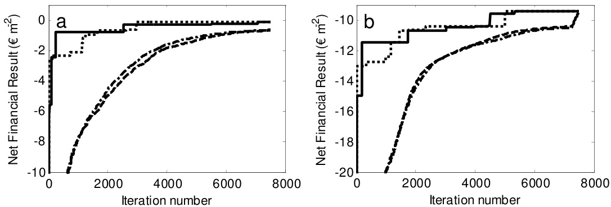  
Fig. 6.5 The evolution of the net financial result of the design population $\cdot _ { A } \cdot$ in Almeria (a) and in The Netherlands (b). For both figures, the solid line represents the maximum NFR of the first optimisation run, the dotted line represents the maximum NFR of the second optimisation run, the dashed line represents the mean NFR of the first optimisation run and the dashed-dotted line represents the mean NFR of the second optimisation run.

# Evaluation of the best greenhouse design for both conditions

# The best design as a function of local conditions

Table 6.5 shows that the best greenhouses were adapted to Spanish and Dutch climate conditions as presented in Fig. 6.3. For the relatively warm climate with high radiation levels in Almeria, a greenhouse with a relatively large ventilation area $20 \%$ compared to $14 \%$ for Dutch conditions), with seasonal whitewash to reduce the indoor temperature and fitted with a direct air heating of small capacity (0.5 MW compared to $2 . 0 ~ \mathrm { M W }$ for Dutch conditions) was selected. In contrast, whitewash was not selected in view of the low radiation levels in The Netherlands, and a thermal screen was selected to increase the heating efficiency for the relatively cold climate. For both conditions, a structure of high light transmissivity was selected to benefit as much as possible from outdoor radiation. $\mathrm { C O } _ { 2 }$ application was worthwhile only for Dutch conditions, thanks to the lower ventilation requirement (and thus a higher $\mathrm { C O } _ { 2 }$ supply set-point, see section 6.6.4) and the larger difference between the average tomato price and the variable $\mathrm { C O } _ { 2 }$ price in The Netherlands. Specifically, this difference was in The Netherlands $0 . 7 3 \textrm { - } 0 . 0 6 = 0 . 6 7 \textrm { ‰}$ and in Spain $0 . 5 6 \cdot 0 . 2 0 = 0 . 3 6 \notin \mathrm { k g } ^ { - 1 }$ .

Table 6.5 The optimised greenhouse design in Almeria and The Netherlands.   

<html><body><table><tr><td>Location</td><td>Structure</td><td>Cover</td><td>Outdoor White screen</td><td>wash</td><td>Indoor screen</td><td>MW Heating</td><td>Cooling</td><td>CO2 supply kg Ha1h1</td><td>NFR year-1 €m²</td></tr><tr><td></td><td>Almeria Light,20%*</td><td>Glass</td><td>No</td><td>50% tr</td><td>No</td><td>Dirair: 0.5</td><td>No</td><td>No</td><td>-0.11</td></tr><tr><td>Netherland Light,14%* Glass</td><td></td><td></td><td>No</td><td>No</td><td></td><td>100% AluDirair: 2.0</td><td>No</td><td>Ind 200</td><td>-9.41</td></tr></table></body></html>

The \* indicates the specific ventilation area of the greenhouse.

For Spanish conditions the annual NFR was $- 0 . 1 1 \notin \mathrm { m } ^ { - 2 }$ year-1 and for Dutch conditions the annual NFR was $- 9 . 4 1 \in \mathrm { m } ^ { - 2 } \ : \mathrm { y e a r } ^ { - 1 }$ , which agreed reasonably well with Vermeulen (2008) who determined an annual NFR of $- 1 1 . 0 6 \notin \mathrm { m } ^ { - 2 }$ year-1 for a similar greenhouse. These negative values indicate that growers, under the economic conditions considered, could not make a living at both locations. For Spain, some assumptions related to the depreciation, maintenance and the short term borrowing costs might have resulted in negative NFR values. For The Netherlands, it is known that only growers with a co-generator to sell electricity (not considered in this study) have earned money in spite of the relatively low tomato prices of the last years. However, these negative values will not have affected the optimisation outcome, since in this study the annual NFR was maximised.

The selected best greenhouse for Almeria agrees reasonably with the greenhouses encountered in practice. Whitewash (and not other cooling means) was selected, which agrees with an economic analysis of Gázquez et al. (2008) who demonstrated that whitewash in combination with sufficient ventilation area was the most cost-efficient cooling treatment for sweet peppers under Southern Spanish conditions. Moreover an outdoor shade screen, an indoor thermal screen and $\mathrm { C O } _ { 2 }$ supply were not selected, and they seldom are found in Almeria greenhouses. However, our results suggest that the performance of the commonly encountered parral greenhouses might be improved by; (i) using a high-light transmissivity structure, covered with glass, which would increase light transmissivity from $57 \%$ to $7 5 \%$ ; (ii) increasing the mean ventilation area from $13 \%$ to $20 \%$ ; and (iii) by installing a low-investment heating system with a limited capacity. The use of a higher light transmission (Soriano et al., 2004) and higher specific ventilation area (Pérez-Parra et al., 2004) to increase crop yield was already demonstrated. As cover material glass (rather than the much more widely applied single PE film) was selected, mainly for its lower annual costs $( 0 . 3 8 \notin \mathrm { m } ^ { - 2 }$ year-1 compared to $0 . 5 3 \not \in \mathrm { m } ^ { - 2 } \ : \mathrm { y e a r } ^ { - 1 } ,$ ) and for the slightly higher light transmission $82 \%$ compared to $81 \%$ ). This result indicates that a greenhouse with more advanced technology might be feasible provided that enough funds are available for the required additional investment. Specifically, the investment cost of the selected design is $5 2 . 4 4 \notin \mathrm { m } ^ { - 2 }$ which is much higher than the $2 1 . 5 4 \textup { \texteuro } \mathrm { m } ^ { - 2 }$ required for a common parral greenhouse. This large difference in investment cost was probably caused by our choice of not constraining the investment potential.

For Dutch conditions the optimised greenhouse design was quite similar to the common greenhouses, with exception of the heating system. The design method suggests that a direct air heater would give a higher NFR, whereas a boiler with pipe heating system is used in practice. Simulations revealed that a direct air heater had a higher heat efficiency than a boiler-pipe heating system. The lower heat efficiency of the boiler-pipe heating system was caused by higher heat losses from the cover to outside (due to the far infrared radiation (FIR) from pipes to cover) and because of the higher ventilation demand due to higher humidity levels caused by a higher transpiration rate (due to the FIR from pipes to canopy resulting in a higher canopy temperature). However, in reality, the boiler-pipe heating system has several advantages: the pipes can be used as internal transportation system; the heat can be buffered enabling a smaller boiler capacity and higher $\mathrm { C O } _ { 2 }$ efficiency of exhaust gasses. In addition, the direct air heater might exhaust flue gasses and increases spatial climate differences which both might negatively affect crop growth. Since these processes were not described by the model, the results of the design optimisation are not surprising.

# 6.4.2.2

# Relevant cost aspects that determine the NFR

Both locations had the same four main costs aspects i.e. fixed costs, labour, energy and plant related costs (Table 6.6). The contribution of water, electricity and $\mathrm { C O } _ { 2 }$ to the total costs was small. Although the greenhouse climate model and tomato yield model were both successfully validated in chapters 2 and 3 to assure reliable NFR values the crop yield value, labour costs and energy were compared with values described in literature.

Table 6.6 The simulated economic costs that determine the NFR of the optimised greenhouse in Spain and in The Netherlands.   

<html><body><table><tr><td>Location</td><td>Spain (€m²year−1)</td><td>Netherland (€ m² year1)</td></tr><tr><td>Crop Yield</td><td>22.50</td><td>41.73</td></tr><tr><td>Fixed costs</td><td>6.43</td><td>14.57</td></tr><tr><td>Variable costs</td><td></td><td></td></tr><tr><td>Labour</td><td>3.63</td><td>17.73</td></tr><tr><td>Energy</td><td>6.54</td><td>9.48</td></tr><tr><td>Water</td><td>0.21</td><td>0.00</td></tr><tr><td>Electricity</td><td>0.00</td><td>0.21</td></tr><tr><td>CO2</td><td>0.00</td><td>0.34</td></tr><tr><td>Plant related costs</td><td>5.80</td><td>8.81</td></tr><tr><td>Net financial result</td><td>-0.11</td><td>-9.41</td></tr></table></body></html>

In Spain, the calculated marketable tomato yield of $4 0 . 3 \ \mathrm { k g \ m } ^ { - 2 }$ was considerably higher than the marketable tomato yield of $2 3 . 8 ~ \mathrm { k g ~ m } ^ { - 2 }$ measured in a high tech greenhouse by Magán et al. (2007). The higher simulated crop yield was caused by a 50 days longer simulated production period (using a simulated production period similar to the measured one would have resulted in a simulated crop tomato yield of $3 2 . 1 \mathrm { ~ k g ~ m } ^ { - 2 }$ ) and by the higher light transmission of the optimised greenhouse since it had less light absorption design elements i.e. no shading screen and no thermal screen. To check the order of magnitude, simulation results were compared with values obtained for a sweet pepper crop by Magán, López et al. (2008). They found similar amounts for labour costs $( 2 . 3 \notin \mathrm { m } ^ { - 2 }$ year versus the simulated labour of $3 . 6 3 \notin \mathrm { m } ^ { - 2 }$ year-1) and energy costs $4 . 5 6 \notin \mathrm { m } ^ { - 2 }$ year-1 versus the simulated gas consumption of $6 . 5 4 \in \mathrm { m } ^ { - 2 } \ y \mathrm { e a r } ^ { - 1 } )$ ). The simulated labour costs were higher because of the higher production and simulated gas costs were higher because no thermal screen was used. These results indicate that for Spanish conditions the method produced realistic model output. In The Netherlands, the simulated costs agreed with fair accuracy with the national greenhouse statistics of Vermeulen (2008) indicating that for Dutch conditions the method produced realistic model outputs as well. In particular: the crop yield $( 5 6 . 5 \mathrm { ~ k g ~ m } ^ { - 2 }$ and $5 7 . 5 ~ \mathrm { k g ~ m } ^ { - 2 }$ , measured and simulated, respectively), labour $( 1 6 . 7 4 \notin \mathrm { m } ^ { - 2 }$ year-1 and $1 7 . 7 3 \notin \mathrm { m } ^ { - 2 }$ year-1) and energy use $( 4 3 . 4 ~ \mathrm { m } ^ { 3 } , 3 7 . 9 ~ \mathrm { m } ^ { 3 }$ gas). Consequently, as described before, the negative simulated NFR agreed reasonably well with the NFR presented by Vermeulen (2008). The higher economic crop yield in The Netherlands was caused by the higher average tomato price of $0 . 7 3 \notin \mathrm { k g } ^ { - 1 }$ compared to $0 . 5 6 \notin \mathrm { k g } ^ { - 1 }$ in Spain, and by the higher marketable yield of $5 7 . 5 \mathrm { k g \ m } ^ { - 2 }$ year-1 compared to $4 0 . 3 \mathrm { ~ k g ~ m } ^ { - 2 }$ year-1 in Spain. The lower crop yield in Spain was caused by the lower light transmission of the greenhouse due to the appliance of seasonal whitewash and by not applying $\mathrm { C O } _ { 2 }$ enrichment.

# 6.4.3 Evaluation of the close-to-best greenhouses

For this analysis we combined the population of greenhouse designs obtained during the two optimisations runs for each case.

# 6.4.3.1 Southern Spanish conditions

For Spanish conditions, the distribution of the design elements alternatives of the greenhouses for which the NFR differed less than $\notin 0 . 2 5 \mathrm { ~ m } ^ { - 2 }$ year-1 from the NFR of the best greenhouse $( \Delta N F R < 0 . 2 5 \in \mathrm { { m ^ { - 2 } y e a r } ^ { - 1 } } )$ is presented in Fig. 6.6. This figure shows that there were only minimal differences among the close-to-best greenhouses which indicates that the optimisation converged to an optimum.

Allowing for larger differences $( \Delta N F R < 1 . 5 0 \in \mathrm { m ^ { - 2 } y e a r ^ { - 1 } } )$ resulted obviously in a broader spectrum of design elements (Fig. 6.7). Specifically, compared to $\Delta N F R < 0 . 2 5 \notin$ $\mathrm { m } ^ { - 2 }$ year-1, a light structure with a specific ventilation area of $14 \%$ , a single PE film, no appliance of whitewash and a direct air heater with a capacity of $1 . 0  { \mathrm { M } }  { \mathrm { W } }$ were also feasible designs solutions. In addition, the broad spectrum of the alternatives related to the indoor screen and the $\mathrm { C O } _ { 2 }$ supply, indicated that the effect of these factor was marginal. The sensitivity analysis presented in Fig. 6.8 shows the impact of all alternatives to fulfil each design element on the NFR. Alternatives for which the accompanying mean NFR was high indicate that these individual alternatives enhanced the overall performance of a greenhouse significantly. Since the design element alternatives with a high NFR were present as well in the set of close-to-best greenhouse designs (Fig. 6.6 and Fig. 6.7), it is expected that a global maximum was found.

  
Fig. 6.6 The frequency of the design element alternatives expressed in $\%$ of the best 12 designs for which the ∆NFR $< 0 . 2 5 \notin m ^ { - 2 }$ year-1 (i.e. all greenhouses for which the net financial result differed less than $\notin 0 . 2 5 m ^ { - 2 }$ with respect to the best greenhouse) for Spanish conditions. The indices on the xaxis correspond with the design element alternatives presented in Table 6.1.

Structure Cover Outdoor screen Whitewash 60 60 100 60   
240 1 240 40 1 50 20 0 0 0 1 2 3 4 5 6 7 8 Indoor screen Heating (MW) 2 3 1 2 Cooling 3 CO2 s1upply2(kg/H3A/hour)   
120 山 60 20 10 心 120 20 1 2 3 4 5 1 2 3 4 5 6 7 8 9 10 1 2 3 4 5 6 7 8 91011 2 1 2 3 4 5

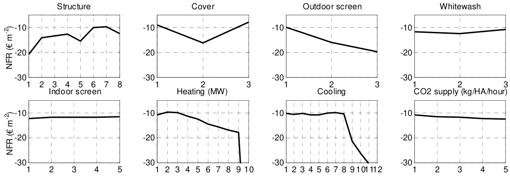  
Fig. 6.7. The frequency of the design element alternatives expressed in $\%$ of the best 781 designs for which the $\Delta N F R < I . 5 \theta \in {  m } ^ { - 2 }$ year-1 for Spanish conditions.   
Fig. 6.8 For all 8 design elements and associated alternatives individually, the mean average of the NFR belonging to the greenhouse designs that were equipped with a particular alternative for Spanish conditions. All designs evaluated by the CRS algorithm were used for this analysis.

As follows from the observation above, the NFR was not sensitive to the selection of an alternative to fulfil the indoor screen and $\mathrm { C O } _ { 2 }$ supply as demonstrated by the relatively flat response of the NFR to these alternatives. Therefore, focussing first on the optimisation of the design elements for which the NFR is sensitive to changes in the selected alternatives, would in this case mean focusing on the greenhouse structure, cover, whitewash and a heating system. Given the applied assumptions on greenhouse floor area and economics, techniques with an extreme low NFR, i.e. geothermal heating and mechanical cooling should be discarded from the alternatives to be optimised under the given conditions.

Additionally, a high light transmissivity structure rather than a low light transmissivity structure was preferable (Fig. 6.8). The large positive impact of a higher light transmission on yield and resulting NFR was already demonstrated by the sensitivity analysis of a Spanish greenhouse performed in chapter 5. However, as indicated by the selection of a whitewash with a transmission of $50 \%$ , a higher greenhouse transmission was not favourable in summer conditions to increase the NFR. This result indicates that the impact of the cover transmission on NFR varies with seasons, which was already pointed out in chapter 4.

# 6.4.3.2 Dutch conditions

For Dutch conditions, the design element distribution of $\Delta N F R < 0 . 2 5 \notin \mathrm { m } ^ { - 2 }$ year-1 revealed that also a thermal screen constituting of $7 5 \%$ aluminium and $2 5 \%$ PE, a direct air heater of capacity $1 . 5 \ \mathrm { M W }$ and several capacities of $\mathrm { C O } _ { 2 }$ supply from the tank or industry were feasible alternatives as well (Fig. 6.9). The design element distribution of $\Delta N F R < 1 . 5 0 \notin$ $\mathrm { m } ^ { - 2 }$ year-1 demonstrated that cooling and $\mathrm { C O } _ { 2 }$ supply could be fulfilled by several feasible alternatives (Fig. 6.10). Although these cooling techniques did not have a significant impact on simulated crop yield and variable costs, their selection resulted from their low annual fixed cost (Table 6.1).

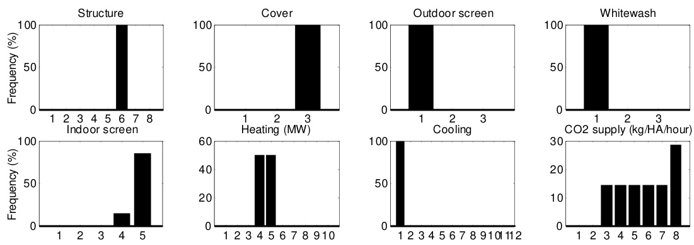  
Fig. 6.9 The frequency of the design element alternatives expressed in $\%$ of the best 14 designs for which the ∆NFR $< 0 . 2 5 \notin m ^ { - 2 }$ year-1 for Dutch conditions. The indices on the $x$ -axis correspond with the design element alternatives presented in Table 6.1

Structure Cover Outdoor screen Whitewash 100 100 100 100   
50 50 L 50 50 1 0 0 0 0 1 2 3 4 5 6 7 8 2 3 1 ，2 3 2 3 Indoor screen Heating (MW) Cooling CO2 supply (kg/HA/hour) 60 60 30 20   
240 l 40 120 10 20 1 2 3 4 5 0 1 2 3 4 5 6 7 8 9 10 1 2 3 4 5 6 7 8 91011 2 0 1 2 3 4 5 6 7 8

  
Fig. 6.10 The frequency of the design element alternatives expressed in $\%$ of the best 245 designs for which the ∆ $. N F R < I . 5 \theta \in m ^ { - 2 }$ year-1 for Dutch conditions.   
Fig. 6.11 For all 8 design elements and associated alternatives individually, the mean average of the NFR belonging to the greenhouse designs that were equipped with a particular alternative for Dutch conditions. All designs evaluated by the CRS algorithm were used for this analysis.

Since the impact of design element alternatives on NFR differed considerably between Spanish (Fig. 6.8) and Dutch conditions (Fig. 6.11) the need to adjust greenhouses to local conditions is demonstrated once again. Specifically, the different trajectories of the mean NFR for the indoor screen and heating system indicates that in the relatively cold Netherlands an indoor thermal screen and a large heating capacity are more relevant than in Spain. As presented before, for both locations a high light transmissivity structure was obviously the best. However, the NFR difference between a high light and a low light structure is much larger in The Netherlands than in Spain which in turn indicates that light in the Netherland is a much more limiting growth factor, as expected

# 6.4.4 Discussion of the model-based design method

In contrast to chapter 5 and other greenhouse design studies (Engel, 1984; Amir & Hasegawa, 1989; Kacira et al., 2004), a broad set of design elements were optimised using a model-based greenhouse design method. For Spanish and Dutch conditions, this method adjusted the greenhouse designs to the local climate and economic conditions in order to obtain a maximum NFR. Additionally, the distribution curves and sensitivity analysis revealed the impact of design elements on greenhouse design and related NFR. Although, the design method was able to optimise greenhouse designs for different climatic and economic conditions, several issues need to be addressed to improve the performance and generality of the model-based design method. The modified CRS algorithm was able to solve efficiently the multi-factorial greenhouse design optimisation problem as demonstrated in Fig. 6.5. Although the CRS was developed for continuous design variables, the modified CRS could solve the integer greenhouse design problem because the discrete optimisation parameters were represented as floating point values as proposed by Lampinen and Zelinka (1999). It might be expected that other population-based optimisation methods like simulated annealing and a genetic algorithm could be used as well (Dréo et al., 2006). Provided that these more elegant optimisation algorithms also may benefit from parallel computing, these methods might decrease optimisation time compared to the modified CRS algorithm. Even though two optimisation runs with different start sets found the same optimised greenhouse, like all other optimisation methods, the CRS could not guarantee a global maximum.

The performance of an optimisation depends mainly on three factors. First, the optimisation takes into account only processes which are included in the models. In our project, the focus was to optimise a limited set of design elements. Therefore, optimisation of the structural design, climate control, heat buffers, fertigation systems, labour and logistics was not carried out. Consequently, for example the positive effects of a boiler-pipe heating system on heat storage, labour and logistics were not incorporated and therefore these advantageous of this heating system could not be optimised by the design method. The generic nature of the design method allows that design elements, key components and model aspects can easily be adjusted or added. Second, the accuracy of the models determines the confidence limits of the NFR and consequently the performance of the optimisation. In spite of the validation, the greenhouse climate model and tomato yield model might be improved as discussed in chapter 2 and 3 respectively, which might also influence the optimised design. Furthermore, since tomato quality aspects are not only affected by humidity levels but also by other climatic variables (Adams et al., 2001), model performance might be improved by replacing the tomato quality filter described in section 6.6.2 by a more detailed description of the quality aspects.

Third, the selection of the performance measure and boundary conditions have an impact on the optimised design. In this study, greenhouses were optimised by maximising the annual NFR per square meter $( \in \mathrm { ~ m } ^ { - 2 } \ \mathrm { y e a r } ^ { - 1 } ,$ ) under the boundary condition of a fixed greenhouse area $\mathrm { 1 \ H a ) }$ ). The investment potential was not constrained, because in this way we were able to find out the best performing greenhouses in given market and climate conditions. In this way, for instance, local authorities could find out whether productivity in a region could be improved through subsidies or other financial stimuli. Results demonstrated that the investments cost of the best greenhouse was higher than for the local commercial parral greenhouses which indicates that these financial stimuli might be beneficial under these conditions. It might be interesting as well to optimise both the surface and greenhouse design by maximising the annual NFR (€ year-1) with a limited investment potential as boundary condition. Because of the modular structure of the design method, the performance measure and boundary conditions can be adjusted easily to the demands of the designer.

As demonstrated in chapters 4 and 5 the greenhouse climate set-points, economic input parameters and outdoor climate have a significant impact on NFR. In addition, Vanthoor et al. (2008a) have shown that the choice of climate set-points even affected some optimal design parameters. These results indicate that changes of economic input parameters, outdoor climate data and climate set-point parameter might influence the optimised design. The design optimisation horizon was one year whereas the optimised greenhouse will have a lifespan of approximately 15 years. Therefore, these input parameters should be determined in such a way that they represent, with the currently known information, the future input parameters at best.

# 6.5 Conclusion

The aim of this study was to integrate an optimisation algorithm into the model-based design method to select the greenhouse design that would yield the largest annual Net Financial Return for a tomato greenhouse for different climatic and economic conditions. This aim was fulfilled. A modified CRS optimisation algorithm using parallel computing was able to select the best set of alternatives to fulfil the design elements for Almeria and Dutch conditions.

Specifically, due to the relatively warm climate with high radiation levels in Almeria, a greenhouse with a relatively large ventilation area ( $20 \%$ compared to $14 \%$ for Dutch conditions), seasonal whitewash and a relatively low capacity of the direct air heating $\mathbf { \chi } _ { 0 . 5 \mathbf { M } \mathbf { W } }$ compared to $2 . 0 \ : \mathrm { M W }$ for Dutch conditions) was selected. In contrast, for the relatively cold climate with low radiation levels in The Netherlands, whitewash was not selected and a $100 \%$ aluminium thermal screen was applied. Only for Dutch conditions $\mathrm { C O } _ { 2 }$ enrichment was applied. The design method produced realistic designs and related annual NFR which indicates that a robust and reliable design method was developed.

A population-based optimisation method offers the opportunity to analyse the close-to-best greenhouses. The distribution curves of the close-to-best greenhouse designs and a sensitivity analysis of the mean NFR to the design element alternatives revealed: a) the relevant design elements and associated alternatives for optimisation and b) whether there are many different greenhouses with an almost similar NFR. For both locations, the selection of a high-light transmissivity structure with sufficient ventilation area was important and an outdoor shade screen, geothermal heating and mechanic cooling were not feasible for the given conditions. Additionally, for Spanish conditions, one should also focus on the optimisation of the cover material, whitewash and heating system to increase the NFR whereas for Dutch conditions, the indoor screen and heating system have a large impact on performance.

With these results, all four key components of the model-based design method i.e. the greenhouse climate model, the tomato yield model, the economic model and an optimisation algorithm were successfully integrated. This design method is able to describe the economic performance of a greenhouse as a function of outdoor climate, climate management and greenhouse design. The modified CRS algorithm adapts the greenhouse to given conditions so that the maximum net financial result will be obtained. To the best of our knowledge, it is the first time that this multi-factorial optimisation problem is addressed and a partial solution of the more complex problem is obtained. These results demonstrate the feasibility of a model-based approach towards greenhouse design for a wide variety of climatic and economic conditions.

# Acknowledgement

We would like to thank Gerard Folkerts, Andre Aalten and Reggie Naumann from Wageningen University to make the parallel computing possible. The economic parameters were kindly provided by Ana Cabrera from the Economic Studies Institute of the Cajamar Foundation and the staff from the Agrifood Business Division of Cajamar (Agricultural Credit Cooperative) and by Marc Ruijs from the Agricultural Economics Institute, Wageningen UR. In addition we would like to thank Bas Speetjens from Ecofys, Gerard van Willigenburg, Bert van ‘t Ooster from Wageningen University and Feije de Zwart and Gert Jan Swinkels from Wageningen UR Greenhouse Horticulture for their useful comments. This study was part of the strategic research programmes "Sustainable spatial development of ecosystems, landscapes, seas and regions" and "Sustainable Agriculture", both funded by the then Dutch Ministry of Agriculture, Nature Conservation and Food Quality.

# 6.6 Appendices

6.6.1 Appendix A: Calculation of electric consumption of climate modification techniques

$$
\begin{array} { l } { { { \displaystyle P _ { F o g } = \frac { p _ { F o g } M V _ { F o g A i r } } { 1 0 0 0 \eta _ { F o g R a m p } } } } } \\ { { { \displaystyle P _ { G e o } = \eta _ { G e o } H _ { G e o P i p e } } } } \\ { { { \displaystyle P _ { M e c h } = U _ { M e c h C o o l } \left( 1 + \eta _ { M e c h C o o l } \right) P _ { M e c h C o o l } \left/ A _ { F l r } \right. } } } \\ { { { \left. P _ { P a d } = c _ { F o d } f _ { P a d } \right. } ^ { 2 } } } \end{array}
$$

where

[W m-2]  (A.1)

(A.2)

(A.3)

$$
\begin{array} { c } { { { [ } \mathrm { W } \mathrm { m } ^ { - 2 } \mathrm { ] } } } \\ { { { [ } \mathrm { W } \mathrm { m } ^ { - 2 } \mathrm { ] } } } \\ { { { [ } \mathrm { W } \mathrm { m } ^ { - 2 } \mathrm { ] } } } \end{array}
$$

(A.4)

$[ \mathrm { W ~ s } ^ { 2 } \mathrm { m } ^ { - 4 } ]$ (A.5)

$$
\begin{array} { l } { { c _ { \tiny { P a d } } = \displaystyle \frac { P _ { P a d M a x } } { f _ { P a d M a x } } } } \\ { { \displaystyle P _ { P a d M a x } = \displaystyle \frac { n _ { V e n s } P _ { V e n M a x } } { A _ { F I r } } } } \\ { { f _ { P a d M a x } = \displaystyle \frac { n _ { V e n s } f _ { V e n M a x } } { A _ { F I r } } } } \end{array}
$$

$[ \mathrm { W ~ m } ^ { - 2 } ]$ (A.6)

$$
[ \mathrm { m } ^ { 3 } \mathrm { m } ^ { - 2 } \mathrm { s } ^ { - 1 } ]
$$

where $p _ { F o g } \left( \mathrm { P a } \right)$ is the static pressure of the fogging system, $\eta _ { F o g P u m p } \left( - \right)$ is the efficiency of the fogging pump, $\eta _ { G e o } ( \mathbf { J } \ \mathbf { J } ^ { - 1 } )$ is the electrical energy needed to pump the geothermal heat, $U _ { M e c h C o o l } \ ( - )$ is the control valve of the mechanical cooling mechanism, ηMechCool $\left( - \right)$ is a fraction to account for pump costs of the mechanical cooling system, $P _ { M e c h C o o l }$ (W) is the electric power of the mechanical cooling system, $A _ { F l r } ( \mathbf { m } ^ { 2 } )$ is the greenhouse floor area, $c _ { P a d }$ $( \mathrm { W ~ s } ^ { 2 } \mathrm { m } ^ { - 4 } )$ is the fan characteristic in terms of electricity consumption, $f _ { P a d } ( \mathbf { m } ^ { 3 } \mathbf { m } ^ { - 2 } \mathbf { s } ^ { - 1 } )$ is the ventilation flux due to the pad and fan system, PPadMax $( \textrm { W } \textrm { m } ^ { - 2 } )$ is the maximum electric consumption of the fans expressed per square meter greenhouse, $f _ { P a d M a x }$ $( \mathrm { m } ^ { 3 } \ \mathrm { m } ^ { - 2 } \ \mathrm { s } ^ { - 1 } )$ is the maximum air flow of the fans, $n _ { V e n t s }$ (-) is the total number of fans, $P _ { V e n t M a x } ~ ( \mathrm { W ~ m } ^ { - 2 } )$ is the maximum electric power of one fan, and $f _ { V e n t M a x } ~ ( \mathrm { m } ^ { 3 } ~ \mathrm { s } ^ { - 1 } ~ \mathrm { f a n } ^ { - 1 } )$ is the maximum air flux of one fan.

# 6.6.2

Appendix B: Determination of the fraction of first class tomatoes and marketable fraction as a function of humidity

Körner and Challa (2003) indicated that the crop growth and development is affected by the 24 hour running mean value of the vapour pressure difference $( \mathrm { V P D } _ { 2 4 } )$ ) and that botrytis is affected by the 48 hour running mean value of the relative humidity of the greenhouse air $\mathrm { ( R H _ { 4 8 } ) }$ . Based on these data, we assumed that the fraction of first class tomatoes can be described as a function of $\mathrm { \Delta V P D } _ { 2 4 }$ and that the marketable fraction can be described as a function of $\mathrm { R H } _ { 4 8 }$ . These two functions are each described by a trapezoid function as presented in Fig. B1

  
Fig. B.1a The fraction of first class tomatoes as a function of the 24 hour running mean value of the vapour pressure difference $( V P D _ { 2 4 } )$ . Fig. B.1b The marketable fraction as a function of the 48 hour running mean value of the relative humidity $( R H _ { 4 8 } )$ .

The boundary conditions at which the quality parameters were still maximal were: $V P D _ { m i n }$ $= 0 . 3 \ \mathrm { k P a }$ (Körner & Challa, 2003); $V P D _ { m a x } = 1 . 5 \mathrm { { k P a } }$ Las Palmerillas Cajamar; $R H a i r _ { m i n } { = }$ $3 5 \%$ greenhouse grower A and $R H a i r _ { m a x } { = 8 5 \% }$ greenhouse grower B. The slopes of these functions were estimated by fitting the estimated quality parameters on the measured values as a function of the measured indoor climate in a low-tech and high-tech greenhouse. It was assumed that for the current approach, these quality filters estimated sufficiently accurate the fraction of first class tomatoes and marketable fraction (Table A1).

Table A1 The estimated quality parameters and the measured quality parameters (between brackets) for two greenhouses located in South Spain   

<html><body><table><tr><td>Qualityparameters</td><td>Low-tech greenhouse</td><td colspan="2">High-tech greenhouse</td></tr><tr><td>First class tomatoes, nTom1 (%)</td><td>69.9 (65)</td><td>92.5</td><td>(95)</td></tr><tr><td>Marketable fraction nFMsold (%)</td><td>90.1 (90)</td><td>95.2</td><td>(95)</td></tr></table></body></html>

6.6.3 Appendix C: The algorithm to calculate a standard climate year The algorithm to generate a standard climate year was based on Breuer and Van de Braak (1989) and adjusted to produce a standard year that has a close match with the mean monthly values of temperature and global radiation sums. To produce the standard year the following steps were performed:

1. Determine the monthly mean values of temperature and global radiation averaged over all the climate years, $\overline { { \boldsymbol { x } } } _ { i , j }$ , where $i$ denotes the month indices and $j$ denotes the climate variables under consideration.   
2. Determine for each climate year, $k$ , the monthly mean values of temperature and global radiation, xi, j,k   
3. Determine for each month, $i$ , for each climate variable, $j$ and for each climate year, k the normalised deviation: Si, j,k $S _ { i , j , k } = \Bigg | \frac { \overline { { x } } _ { i , j } - x _ { i , j , k } } { s t d \big ( x _ { i , j } \big ) } \Bigg |$   
4. Determine for each month, the year with the smallest summed standardised deviation for all climate variables: $Y e a r _ { i } = \operatorname* { m i n } _ { k } \sum _ { j = 1 } ^ { j = N j } S _ { i , j , k }$   
5. Create the standard year by appending the years with the smallest monthly standardised deviation $S T D y e a r = \left( J a n u a r y ( Y e a r _ { 1 } ) , F e b r u a r y ( Y e a r _ { 2 } ) , . . . . . . . . . D e c e m b e r ( Y e a r _ { 1 2 } ) \right)$

6.6.4 Appendix D: The calculation of the $\mathrm { C O } _ { 2 }$ set-point for $\mathrm { C O } _ { 2 }$ enrichment

The $\mathbf { C O } _ { 2 }$ set-point increases linearly with global radiation, $I _ { G l o b }$ , until a defined maximum $\mathrm { C O } _ { 2 }$ set-point, $C O _ { 2 A i r \_ E x t M a x }$ , is reached and, simultaneously, the $\mathrm { C O } _ { 2 }$ set-point decreases linearly with the total ventilation rate of the greenhouse, fVentTot :

$C O _ { _ { 2 A i r _ { - } E x t O n } } = f \big ( I _ { G l o b } \big ) \cdot g \big ( f _ { _ { V e n f o t } } \big ) \cdot \big ( C O _ { _ { 2 A i r _ { - } E x t M a x } } - C O _ { _ { 2 A i r _ { - } E x t M i n } } \big ) + C O _ { _ { 2 A i r _ { - } E x t M i n } }$ [ppm]   (D.1)

$$
f \left( I _ { G l o b } \right) = \left\{ \begin{array} { c } { { \displaystyle { \frac { I _ { G l o b } } { I _ { G l o b } } } , I _ { G l o b } < I _ { G l o b _ { - } M a x } } } \\ { { } } \\ { { 1 , I _ { G l o b } \geq I _ { G l o b _ { - } M a x } } } \end{array} \right.
$$

$$
g \big ( f _ { _ { V e n t T o t } } \big ) = \left\{ \begin{array} { l l } { 1 - \displaystyle \frac { f _ { _ { V e n t T o t } } } { f _ { _ { V e n t E x t C O 2 } } } , f _ { _ { V e n t T o t } } < f _ { _ { V e n t E x t C O 2 } } _ { - } M a x } \\ { ~ } \\ { ~ 0 , ~ } \\ { ~ f _ { _ { V e n t T o t } } \geq f _ { _ { V e n t E x t C O 2 } } _ { - } M a x } \end{array} \right.
$$

where $I _ { G l o b } \ ( \mathbf { W } \ \mathbf { m } ^ { - 2 } )$ ) is the outdoor global radiation, $f _ { V e n t T o t } ( \mathrm { m } ^ { 3 } \mathrm { ~ \bf ~ m } ^ { - 2 } \mathrm { ~ \bf ~ s } ^ { - 1 } )$ is the total ventilation rate, $C O _ { 2 A i r \_ E x t M a x }$ (ppm) is the maximum $\mathrm { C O } _ { 2 }$ concentration set-point, $C O _ { 2 A i r \_ E x t M i n }$ is the minimum $\mathrm { C O } _ { 2 }$ concentration set-point (ppm), $I _ { G l o b \_ M a x } ( \mathbf { W _ { \Sigma } \Sigma } | \mathbf { m ^ { - 2 } } )$ is the outdoor global radiation at which the maximum $\mathrm { C O } _ { 2 }$ concentration set-point could be reached and $f _ { V e n t E x t C O 2 \_ M a x }$ $( \mathrm { m } ^ { 3 } \ \mathrm { m } ^ { - 2 } \ \mathrm { s } ^ { - 1 } )$ is the total ventilation rate at which the $\mathrm { C O } _ { 2 }$ concentration set-point equals the minimum $\mathrm { C O } _ { 2 }$ concentration set-point (ppm).

# Chapter 7

Conclusion, discussion, recommendations and future perspectives

# 7.1.1 Conclusion

To design greenhouses that are adapted to local climatic and economic conditions, the model-based greenhouse design method presented in Fig. 7.1 was developed. This method determined the greenhouse performance as a function of multiple design factors using a greenhouse climate model, a tomato yield model and an economic model.

Economic variables   
Structure Total   
Cover type Outdoor climate Indoor climate: investments   
Shade screen Whitewash Climate management Greenhouse design Grenhouse model TCan, CO2Air,RPAR TAir,VPAir Tomato model Cropyield Economic model Net financial result   
Thermal screen   
Heating system Resource use:   
Cooling system water,energy,CO2,electricity   
$\mathrm { C O } _ { 2 }$ enrichment Investments Net financial result maximum? Greenhouse design NO: Adjust optimisation greenhouse design YES:Greenhouse design is optimal

To the best of our knowledge, it is the first time that this multi-factorial optimisation problem is addressed in detail and partly solved. The presented method selected the best greenhouse under given local climatic and economic conditions, as demonstrated by two cases i.e. South Spain and The Netherlands (Chapter 6). The best greenhouse for Almeria (South Spain) had seasonal whitewash and was equipped with a relatively large ventilation area, whereas for Dutch conditions a greenhouse with a lower ventilation area, a higher heating capacity and thermal screen was found to be the best.

In both cases, the derived greenhouse designs represented reasonably well the current greenhouse state-of-the-art, which increases our confidence in the robustness and reliability of the design method. Furthermore, results demonstrated that for a wide range of climatic conditions the models used were sufficiently accurate to be incorporated in the model-based design method. In particular, the greenhouse climate model predicted the indoor climate with reasonable accuracy for four different greenhouse designs, under three climatic conditions: a temperate marine climate, a Mediterranean climate and a semi-arid climate, as shown in Chapter 2. The tomato yield model simulated the tomato yield with fair accuracy for a wide variety of temperature regimes, as shown in Chapter 3. Calculation of the annual net financial result gave reliable estimates of current economics as shown in Chapters 5 and 6.

Given these results, the objective of this thesis was fulfilled. A design method for protected cultivation systems has been developed that produces greenhouse designs adapted to local climatic and economic conditions. As demonstrated for South Spain and The Netherlands, this method produces very different reliable greenhouses for both locations. As the underlying models were validated thoroughly for a wide variety of climatic conditions, the design method might be expected to produce reliable greenhouse designs for other locations as well. Since the focus was on climatic and economic conditions and techniques that influence the aerial climate, a partial solution of the greenhouse design problem was obtained. Consequences of this approach as well as other aspects of the design method will be discussed hereafter.

# 7.1.2 Discussion and recommendations

# 7.1.2.1 Adaptation of greenhouses to local conditions

Results generated by the design method gave indications why and how the optimised greenhouses were adapted to local climate and economic conditions. The outdoor climate - particularly the global radiation, temperature and $\mathrm { C O } _ { 2 }$ concentration – affected the crop yield and resource consumption enormously for a low-tech greenhouse in Spain and a hightech greenhouse in Texas (Table 4.5 and 4.6) which indicates that these climate variables will affect greenhouse design as well. Indeed, the greenhouse designs were adapted to these climate conditions as demonstrated for South Spain and The Netherlands in Chapter 6. The relatively low radiation levels and temperature in The Netherlands (Fig. 6.3) resulted in a greenhouse with a structure of high light transmissivity, without whitewash, a heater capacity of $2 . 0 ~ \mathrm { M W }$ and a thermal screen. In contrast, the relatively high radiation levels and high temperature in Spain resulted in a greenhouse covered with seasonal whitewash (but high transmissivity of the cover, for the winter months) and equipped with a larger specific ventilation area $20 \%$ against $14 \%$ in The Netherlands) to reduce greenhouse air temperature. In addition, to avoid low night temperatures, this greenhouse was equipped with a heater capacity of $0 . 5 \mathrm { M W }$ , although a thermal screen did not prove economical.

Economic conditions strongly affected the greenhouse design as well. Changing tomato price trajectories resulted in another “best” greenhouse as indicated in Fig. 5.5b. In particular, or Southern Spanish conditions, a high tech greenhouse would be beneficial at high tomato prices but not for low prices. In agreement with this, the higher tomato prices in The Netherlands $( 0 . 7 3 \notin \mathrm { k g } ^ { - 1 }$ compared to $0 . 5 6 \notin \mathrm { k g } ^ { - 1 }$ in Spain) yielded a greenhouse with more technology than in Spain.

# 7.1.2.2 Definition of a greenhouse design optimisation problem

In this research, the performance of a greenhouse design was expressed in terms of maximisation of the expected annual net financial result. Given the generic nature of the design method, this performance measure can be easily replaced. Alternatives might be another economic performance measure, minimisation of the resource consumption or maximisation of the yield.

Since an economic performance measure was selected in this study, the design parameters could not be optimised. Specifically, a greenhouse design can be considered to exist of as a set of design elements that each consist of one or more design parameters. For example, the design element ‘cover material’ consists of the following set of design parameters: the transmission-and absorption coefficients for PAR, NIR and FIR, the thickness, thermal heat conductivity, the specific heat capacity and the density of the cover. It might be interesting to search for optimal values of these design parameters. Yet, allocating costs to individual design parameters is rather complex especially when the accompanying design element does not exist (e.g. a cover material with a high PAR transmission coefficient and low NIR transmission coefficient). Consequently, these costs should be estimated based on rough assumptions which result in a huge price uncertainty. Therefore, since the costs of design elements are known (Table 6.1), this study focussed on optimisation of the set of alternatives to fulfil these design elements. However, if another performance measure would be selected e.g. yield maximisation, the set of design parameters can be optimised as well since then no costs need to be allocated to design parameter changes. In this way the “net worth” of a given modification of a design parameters is determined, which is useful information for producers of greenhouses to indicate the potential additional revenue of the grower. The economic potential of adjustable parameters over time can be determined as well if the greenhouse design is defined as a set of adjustable parameters. For example, the resulting extra revenues of an adjustable NIR transmission coefficient of the cover can be calculated then.

Besides the selection of a limited set of design elements, and fixing the greenhouse area to $1 \ \mathrm { H a }$ , no other constraints were used in this study. Whenever needed, other relevant optimisation constraints such as maximum levels of investments, greenhouse area or resource use can easily be applied to the design method. Design solutions that violate these constraints will then be discarded from the best set of greenhouse designs.

The impact of the performance measure and optimisation constraints on the greenhouse design optimisation was discussed in Chapter 6. For the Spanish optimisation case, the selected greenhouse had higher investments and a higher technology level compared to the commonly encountered ones. This difference was probably caused by the applied performance measure that maximises the annual net financial result (NFR) per square meter and by using an unlimited investment potential. In practice investment levels will be limited. Therefore, it might be interesting to evaluate how the best greenhouse design will be affected by: (i) another economic performance measure, for instance minimisation of the payback period or maximisation of the return on investment; (ii) a constraint on the investment level; and (iii) optimisation of the greenhouse area. Performing such an evaluation might answer the following two interesting design questions. Would another economic performance measure result in a totally different “optimal” greenhouse? And, should a grower under particular conditions invest in a small high-tech greenhouse or in a large low-tech one? These are questions that need to be addressed in a follow-up to this project. The design method can answer these questions provided that the effects of economy of scale on investment costs and a calculations of the pay-back period and return on investment will be integrated in the economic model.

# 7.1.2.3 Different ways to solve the greenhouse design problem

As discussed in the previous section greenhouse design can be defined in three ways: as a set of design elements; as a set of fixed design parameters and as a set of adjustable design parameters. In this section, optimisation techniques are discussed to solve these different design problems.

The present method focused on finding the optimal combination of possible alternatives to fulfil the eight design elements. In Chapter 6, this discrete design optimisation was defined as an integer optimisation problem and was solved with, a gradient-free global optimisation method that could cope with the discontinuous design parameters. For this purpose, the population-based controlled random search (CRS) method of Price (1977) was modified and applied to the design method. Selecting the best optimisation algorithm for this problem was outside the scope of this research. It might be expected, that other population-based optimisation methods like simulated annealing and genetic algorithms can solve this problem as well (Dréo et al., 2006). Provided that these more elegant optimisation algorithms allow parallel computing as well they might decrease optimisation time compared to the modified CRS algorithm.

The design method can also optimise individual design parameters. This continuous optimisation problem can efficiently be solved by gradient-based optimisation algorithms. Since these algorithms require differential equations with continuously differentiable right-hand sides, the models have been developed in this format. By joining the set of differential equations, the models were easily combined with each other. These differential equations were solved by an ordinary differential equation solver of MatlabTM. To implement these equations in software code, no rewriting or linearization was needed. Additionally, evaluation of the model performance revealed that the differentiable righthand sides speeded up the simulation compared to non-differentiable ones (results not shown).

To optimise the adjustable design parameters over time and to determine their economic potential, these parameters should be considered as dynamic parameters. This optimisation problem can thus be considered as a dynamic optimisation problem. This problem can be solved using a dynamic optimisation algorithm in a similar way as the dynamic climate control optimisation described by Van Straten et al. (2010).

# 7.1.2.4 How to reveal relevant design aspects?

The applied population based optimisation algorithm produces insight into the set of greenhouses most suitable for the local conditions and reveals the most relevant design elements for that specific location. For instance, a structure with a high light transmissivity and sufficient ventilation area is of importance to increase the performance of a greenhouse both in South Spain and The Netherlands (Fig. 6.6– 6.11). In addition, for both locations, applying a geothermal heat source and mechanical cooling is not economic for a $1 \ \mathrm { H a }$ greenhouse.

The impact of the individual design parameters was analysed as well. A singlevariate sensitivity analysis pinpointed the design parameters that were candidates for adjustment to increase the net financial result. Specifically, Table 5.8 shows that for a high tech greenhouse in Almeria Spain, the PAR transmission coefficient had the largest impact on net financial result: if the cover PAR transmission coefficient would increase by $1 \%$ , the annual NFR would increase € 1067 per Ha. For both a low-tech and a high-tech greenhouse, the optical properties of the cover and whitewash, and the ventilation rate had the largest impact on the net financial result. No costs were allocated to design parameter modifications due to its complexity (see section 7.1.2.2), and therefore the single-variate analysis indicated only the extra gross revenues of a parameter modification and not the accompanying costs. The impact that some parameters can be modified easier than others (resulting in lower costs of a specific parameter modification) was thus not captured by this approach.

Sensitivity results also demonstrated that the impact of the cover properties on tomato yield varies with the season (Fig. 4.4), which indicates that, at least for some parameters, adjustable properties might give better results than fixed design parameters. Sonneveld et al. (2011) already indicated that adjustable cover properties might be beneficial for greenhouse performance. Nevertheless, more research is needed to identify the most promising parameters and to develop materials with dynamic properties.

The impact of economic parameters, outdoor climate conditions and climate setpoints on NFR was revealed by the single-variate sensitivity analysis. Table 5.8 shows that for the conditions of Almeria, the NFR of a high-tech greenhouse was highly sensitive to economic input parameters, i.e. tomato price, marketable tomato fraction, ratio of first class tomatoes, and the heating and ventilation set-points. In addition, Table 4.5 and 4.6 demonstrate that the crop yield and the resource consumption were most sensitive to outdoor climate conditions both for a low-tech greenhouse in Almeria and a high-tech greenhouse in Texas. The impact of the uncertainty in yearly variations of outdoor climate and tomato price on the NFR was analysed (Fig. 5.5) and revealed that the selection of a specific year affected the “best” design for Almeria conditions.

# 7.1.2.5 Design optimisation under uncertainty of input parameters

Results presented in the previous section indicate that changes of economic input parameters, outdoor climate data and climate set-point parameters might considerably influence the optimised design. Since the lifespan of a greenhouse is much larger than the design optimisation horizon of one year, the selection of the input parameters is of utmost importance. These input parameters must be determined in such a way that they represent as best as possible the future input parameters with the currently known information. The most common approach to solve design optimisation under uncertainty of input parameters is to apply stochastic optimisation algorithms (Sahinidis, 2004). These algorithms would solve the optimisation problem for many different sets of stochastic price trajectories, climate trajectories and climate set-points. This type of algorithms will thus come up with the best greenhouse design under input uncertainty. However, applying stochastic optimisation algorithms to the model-based design method will result in huge CPU times. Therefore a less time consuming approach to diminish the impact of price trajectories, outdoor climate and climate management on best design is proposed.

Averaging the tomato price over the last four successive production periods as was done in Chapter 6, reduced its uncertainty. However, since future price trajectories are uncertain, it would be better to repeat the optimisation procedure for a worst case and best case price scenario. Then, the greenhouse that performs best for these different levels should be selected. A standard climate year based on a longer climate period was applied to the design method (Chapter 6). To create a ‘mean’ standard year, extreme climate months were not selected which might influence the optimisation procedure. Therefore, it would be better to incorporate extreme events in a statistically sound fashion in the standard climate year, or to use an optimisation time span and outdoor climate for several years.

In this study, the climate control valves settings were determined as a function of the control strategy and climate set-points. To make the optimised design independently of the applied climate management strategy, these valves settings should be optimised simultaneously with the design. Research on the design of cold storage facilities (Lukasse et al., 2009), elevators and car suspension systems (Fathy, 2003) has shown the feasibility of this approach. Though dynamic optimisation of climate control was already researched intensively (Seginer, 1989; Ooteghem, 2007; Van Henten, 1994; Van Straten et al., 2010), a combined control and design optimisation problem for greenhouses has not been addressed. If the climate management will significantly affect the optimised greenhouse design, greenhouse design must be considered as a combined design and control optimisation problem. Solving such an optimisation problem will require an enormous CPU time. Another approach to limit the impact of the chosen climate management is to optimise the static climate set-points in stead of the actual control actions and treat them in a similar way as the design elements. These climate set-points can then be added to the integer design vector (Fig. 6.2) and optimised in a similar way. This static optimisation approach will solve the optimisation problem faster than the combined design and control optimisation approach because the static climate-set-points do not vary in time whereas the dynamic control valve settings do. However, when optimising the climate-set-points, the selected control strategy undesirably would still affect the greenhouse design.

# 7.1.2.6

# How to improve the reliability of the design method?

In this section the reliability of the method is first discussed in terms of accuracy of the used models and then in terms of the generality of the design method. Due to the generic nature of the design method, the proposed improvements or adjustments can easily be integrated into the method. Since our aim was to develop a design method that focussed on the optimisation of a set of elements, aspects that might be relevant may have been simplified or on purpose neglected. Since the accuracy of the models influences the confidence limits of the NFR and hence the optimisation procedure, some issues that might improve the accuracy of the models are discussed here.

The greenhouse climate model and crop yield model were validated separately, because data to validate them simultaneously were not available. However, as presented in Fig. 7.1, there are several input-output interactions between both models. Specifically, the crop yield model used the calculated indoor climate as input and crop growth processes affected the indoor $\mathrm { C O } _ { 2 }$ concentration, temperature and humidity of the greenhouse air. Therefore, it would have been better to jointly validate these models. A more thorough validation might improve the model confidence even further. Since crop yield is strongly affected by the canopy temperature, it would be beneficial to validate the canopy temperature and related variables such as the transpiration rate, and the temperatures of the cover and of the soil. Since photosynthesis and resource use have a major impact on the annual net financial result they should be validated as well.

The greenhouse climate model predicted the air temperature with fair accuracy even for extreme climate conditions by using the transpiration and stomata model of Stanghellini (1987) that was validated for a moderate vapour pressure differences. To come up with realistic transpiration rates under stress conditions, one parameter affecting the stomatal reaction to vapour pressure difference was adjusted. The good model performance was probably caused by the negative feedback between canopy transpiration and air vapour pressure. Since this approach is not fully-generic, the performance of the transpiration model might be improved by either adjusting the empirical description or by using a more generic stomatal model such as the model of Blonquist Jr. et al. (2009).

Modules to relate climate variables to each tomato growth and development process such as fruit set, fruit growth, fruit abortion and membrane integrity were not available and thus not integrated in the yield model. The literature review shown in chapter 3, indicated that extremely low and high temperatures considerably affect the crop yield. Therefore, to approximate non-optimal temperature effects on tomato growth and development processes, two lumped temperature-dependent growth inhibition functions were used. To improve the model accuracy and performance these two functions should be replaced by modules that relate climate variables to each tomato growth and development process based on principles of plant physiology. Incorporation of these growth and development processes into the empirical tomato yield model will be a complex task. According to Yin and Struik (2010), combining physiological modelling and genetic mapping into gene-based modelling could be a powerful method to resolve these complex environment-dependent processes. They suggested that for further progress, crop models must be upgraded based on understanding of these complicated phenomena at lower organisational levels.

The yield model predicted the dry matter tomato yield and to transform this into fresh matter yield, a constant dry matter content was used. Since the dry matter content of tomatoes is affected by many factors such as electrical conductivity of the growing medium (Van Straten et al., 2006), outdoor climate variations (Segura et al., 2009) and non-optimal temperatures (Adams et al., 2001), model performance can be improved by integrating these effects. To relate fresh matter yield to economic crop yield, a simple humiditydependent quality filter that determined the marketable tomato fraction and the ratio of first class tomatoes was used. This approach gave a reasonable prediction of economic crop yield, as discussed in chapters 5 and 6. Nevertheless, such a filter had a considerable impact on economic crop yield as shown in Table 5.7 and 5.8. Therefore, uncertainty in the quality parameters will influence the determination of NFR and might affect the optimisation result as well. Therefore, a better description of the quality of fruits and tomato plants as a function of (extreme) climatic conditions (Adams et al., 2001) and diseases should be incorporated into the method. The impact of fertigation on yield was not integrated in the yield model but was assumed to be non-limiting for crop growth. To describe this impact, the nutrient model of Van Straten et al. (2006) might be used.

A simple function that described labour costs as a function of crop maintenance and tomato harvest was applied. Although, labour optimisation was outside the scope of this research, a more detailed description of labour costs would be beneficial since it significantly contributes to the annual NFR

Factors that were not incorporated in the model-based design method and which might improve its generality are described hereafter. To keep this study manageable we focussed on: (i) the impact of climate and economic conditions on greenhouse design; (ii) the design elements that influence the aerial climate, i.e. the type of greenhouse structure, the cover type, the outdoor shade screen, the whitewash, the thermal screen, the heating system, the cooling system and the $\mathrm { C O } _ { 2 }$ enrichment system; and (iii) tomato as model crop.

However, the particular choice of the protected cultivation system depends on more factors according to Van Henten et al. (2006) as described in the list presented in the introduction section. Some factors of this list were incorporated in the model-based-design method. Specifically, tomato price, transportation costs and climate were input parameters of the method and the scarcity of resources, i.e. fuels, electricity, water, labour and materials was discounted in the associated prices.

The design method did not take into account social conditions. According to Von Elsner et al. (2000), these conditions do influence the adoption rate of greenhouses. For instance, a greenhouse grower with insufficient system knowledge will probably not adopt successfully a high-technology greenhouse. Although not incorporated, the design method could partly deal with the knowledge level of the grower. Generally, with increasing knowledge level, the technology level and maximum investment level of a grower will increase. Using the maximum investment level as optimisation constraint, it might be expected that the optimal greenhouse will match with the technology level of the grower.

The influence of legislation on greenhouse design in terms of food safety, residuals of chemicals, the use and emission of chemicals to soil, water and air were not integrated into the design method. Provided that these aspects are modelled, the current design method could cope with legislation aspects by considering them as optimisation constraints.

Integration of irrigation systems, labour systems and logistics systems would increase the generality of the design method. An example of the consequence of ignoring labour aspects on greenhouse design optimisation was discussed in Chapter 6. Specifically, since beneficial effects of a pipe heating system on labour and some negative effects of a direct air heater were not incorporated, the design method selected for Dutch conditions a direct air heater and not the much more common boiler-pipe rail heating.

To extend the set of eight design elements, several modules should be integrated in the greenhouse climate model. A module that describes the light transmission as a function of season, latitude, orientation, shape, greenhouse dimensions and type of cover material might enable the optimisation of the greenhouse shape and dimensions in more detail. Such a module might be based on models developed by Kozai et al. (1978), Critten (1983; 1988) and De Zwart (1993). Since radiation-diffusing materials seem promising in areas with high solar radiation, differentiation between direct and diffuse radiation would allow diffuse properties of cover materials to be optimised. To enable this, the cover transmission module and photosynthesis module must be modified and both the direct and diffuse component of the global radiation should be measured. To describe direct and diffuse indoor radiation as a function of outdoor radiation values, the research of Cabrera et al. (2009) can be used as

starting point.

Modules of other climate modification techniques such as co-generation of heat and electricity, application of assimilation light, an active heat buffer, a heat pump and a solar heat collector might be incorporated as well. For optimisation purposes, there is no need to integrate the effects of extreme outdoor conditions such as earthquakes, heavy precipitation and wind on greenhouse design if only greenhouse structures are selected that comply with the local construction norms.

The climate model considers the greenhouse air as a “perfectly stirred tank”. This will limit the evaluation of design elements and processes that are affected by or affect spatial climate differences. Particularly, optimisation of the location of the ventilation openings and the evaluation of undesirable spatial climate differences caused by a pad and fan system, a thermal screen and side ventilation could not be analysed. To analyse and optimise these design aspects, one should apply computational fluid dynamic models as was done by Campen and Bot (2003) and Baeza et al. (2009).

The present method can obviously be applied also to other horticultural crops than tomatoes. The yield model and the transpiration model must then be adjusted to the characteristics of the desired crop. Since there is a strong the analogy between algae and horticultural crops - both organisms need light, temperature and $\mathrm { C O } _ { 2 }$ to grow (Norsker et al., 2011; Slegers et al., 2011) - the presented model-based design approach might support the development of an algae producing system as well.

# 7.1.2.7 Model-based design versus methodical design approach

Greenhouse design can also be approached by the methodical design procedure of Van den Kroonenberg and Siers (1999), which consist of the following steps: (1) definition of design objective; (2) a description of the brief of requirements; (3) a system analysis revealing the required functions; (4) derivation of alternative working principles for each function; (5) concept development stage; (6) design evaluation and bottle-neck assessment; (7) detailed description of the selected designs and (8) the design prototype is built.

The feasibility of this approach was demonstrated by Van 't Ooster et al. (2008a) who adjusted the greenhouse designs to different climate zones in Mexico and by Van 't Ooster et al. (2008b) who developed a concept for a zero-fossil-energy greenhouse for Dutch conditions. This approach relies on expert knowledge because in step 4 and 5 of this design procedure experts derive alternative working principles and propose a limited set of potential greenhouse designs. Since most experts are not able to take into account all aspects of the complex design process, their decisions will result in a biased greenhouse design. To avoid this, the developed design method fully relied on objective mathematical models. However, the current design method does not tackle all relevant greenhouse design aspects and therefore a synergy with methodical design will offer opportunities for greenhouse design. Specifically, the design objective in step 1 and the brief of requirements of step 2 can be applied to the model-based design method by considering them as the performance measure and the optimisation constraints respectively. In step 3, experts select the list of design elements that are expected to be beneficial for the given conditions and steps 4 and 5 of the methodical design approach are replaced by the design optimisation, as performed by the model-based design method. Since the design method does not cover all design aspects, experts can evaluate and select the best greenhouse based on the optimisation output.

# 7.1.3 Future perspectives

The present method can support the development of greenhouses for worldwide conditions, which will improve the productivity of greenhouse horticulture. On the other hand, the model-based design tool could be used as well to select the best location, among a limited number of options, to construct a greenhouse. This is an advantage for both policy makers and growers to pinpoint beneficial locations for protected horticultural production systems. Greenhouses for other crops than tomatoes can be designed as well, provided that suitable yield models are available. The design method can indicate which properties of greenhouse design elements must be adjusted by the industry and what the resulting extra grower’s revenue will be. A step further is that the extra revenues of adjustable design parameters are determined. To design greenhouses independently of the applied climate management strategy, the design and climate control should be optimised simultaneously. Such an optimisation approach will theoretically result in the absolute best design. In view of the current evolution to a more sustainable agriculture, it is important to observe that the present design method can also be used to select greenhouse modifications which would reduce the resource consumption of a greenhouse. In addition, the impact of changing economic parameters on the net financial result and on the best greenhouse design can be evaluated as well, which gives an indication how greenhouses should be adjusted to changing price input parameters

# Chapter 8

# Detailed description of the greenhouse climate model

This model description has been submitted to Biosystems Engineering as an electronic appendix belonging to: A methodology for model-based greenhouse design: Part 1, A greenhouse climate model for a broad range of designs and climates

B.H.E. Vanthoor, C. Stanghellini, E.J. van Henten, P.H.B. de Visser

# 8.1 Introduction

Section 8.2 presents the design elements needed for the greenhouse climate model. The overview and states of the greenhouse climate model are described in section 8.3 and the lumped cover model is described in section 8.4. The model capacities are described in section 8.5. The heat fluxes are described in section 8.6, the vapour fluxes in section 8.7 and the $\mathrm { C O } _ { 2 }$ - fluxes in Section 8.8. The canopy transpiration model is presented in section 8.9. Section 8.10 presents the model equations of the implemented design elements and section 8.11 describes the calculation of unknown outdoor climate inputs. The Nomenclature is presented in section 8.12 and the tables in section 8.13.

# 8.2 Greenhouse design elements

The selected functions and design elements for the greenhouse design model are presented in Fig. 2.1 in chapter 2. The greenhouse design functions: heating, insulation, shading, cooling, $\mathrm { C O } _ { 2 }$ enrichment, humidification and de-humidification were fulfilled by one or more design elements For example, the function heating could thus be fulfilled by the following design elements: the direct air heater, boiler, industrial heat source, geo-thermal source, and a passive buffer. In view of design of protected cultivation systems, the presented design elements are considered to be sufficiently generic for a wide range of locations all over the world. Local particular solutions for energy production, energy conversion or climate modification such as a co-generator, artificial light, an active heat buffer, a heat pump and a solar heat collector lie outside the scope of the current study.

# 8.3 Model overview and state equations

# 8.3.1 Notational conventions

All the state variables, fluxes, inputs, superscripts and subscripts are listed in the Nomenclature. All the model parameters and greenhouse design parameters are listed in Table 8.1 and Table 8.2, respectively. For the description of the state variables and the fluxes of the greenhouse climate model, the notational conventions of De Zwart (1996) are used. The state variables of the model are denoted by names with capital letters followed by one subscript, i.e. $T _ { A i r }$ . The model fluxes start with a capital letter and are followed by two subscripts. The first subscript represents the source of the flux and the second subscript represents the destination of the flux, i.e. $H _ { C a n A i r }$ . The radiation fluxes start with a capital letter $R$ followed with the type of radiation and then two subscripts to represent the source and sink of the specific radiation, i.e. $R _ { P A R \_ S u n C a n }$ .

# 8.3.2 Model overview and assumptions

An overview of the states and the energy and mass fluxes of the greenhouse model is presented in Fig. 2.2. The model is based on the following assumptions:

greenhouse air is considered to be a “perfectly stirred tank” which means that no spatial differences in temperature, vapour pressure and the $\mathrm { C O } _ { 2 }$ -concentration occur. Therefore all the model fluxes are described per square metre of greenhouse floor. to describe the effect of the thermal screen on the indoor climate, the greenhouse air is divided into two compartments: one below and one above the thermal screen.

# 8.3.3 States of the model

The states of the model are all described by differential equations. The time derivatives of the states to time are presented by a dot above the state symbol. All symbols are defined in the Nomenclature.

# 8.3.3.1 Temperature of different greenhouse objects

Canopy temperature $T _ { C a n }$ is described by:

$$
\begin{array} { l } { { c a p _ { _ { C a n } } \dot { T } _ { _ { C a n } } = R _ { _ { P A R _ { - } S u n C a n } } + R _ { _ { N I R _ { - } S u n C a n } } + R _ { _ { P i p e C a n } } } } \\ { { - H _ { _ { C a n A i r } } - L _ { _ { C a n A i r } } - R _ { _ { C a n C o v , i n } } - R _ { _ { C a n F I r } } - R _ { _ { C a n S k y } } - R _ { _ { C a n T h S c r } } } } \end{array} [ \mathrm { W } \mathrm { m } ^ { - 2 } ]
$$

where $c a p _ { C a n }$ is the heat capacity of the canopy, $R _ { P A R \_ S u n C a n }$ is the PAR absorbed by the canopy, $R _ { N I R \_ S u n C a n }$ is the NIR absorbed by the canopy. FIR is exchanged between the canopy and surrounding elements i.e. the heating pipes $R _ { P i p e C a n }$ , the internal cover layer $R _ { C a n C o \nu , i n } ,$ the floor $R _ { C a n F l r } ,$ the sky $R _ { C a n S k y }$ , and the thermal screen $R _ { C a n T h S c r } . \ H _ { C a n A i r }$ is the sensible heat exchange between canopy and greenhouse air and $L _ { C a n A i r }$ is the latent heat flux caused by transpiration.

Greenhouse air temperature $T _ { A i r }$ is described by:

$$
\begin{array} { r } { c a p _ { _ { A i r } } \dot { T } _ { _ { A i r } } = H _ { _ { C a n A i r } } + H _ { _ { P a d A i r } } + H _ { _ { M e c h A i r } } + H _ { _ { P i p e A i r } } + H _ { _ { P a s A i r } } + H _ { _ { B l o w A i r } } + R _ { _ { G i a b _ { - } S u n A i r } } } \\ { - H _ { _ { A i r F l r } } - H _ { _ { A i r T h S c r } } - H _ { _ { A i r O u t } } - H _ { _ { A i r T o p } } - H _ { _ { A i r O u t _ { - } P a d } } - L _ { _ { A i r F o y } } } \\ { { { [ \mathrm { W } \mathrm { m } ^ { \mathrm { 2 } } ] } ~ ( 8 . 1 ) } } \end{array}
$$

where $c a p _ { A i r }$ is the heat capacity of the greenhouse air. Sensible heat is exchanged between the greenhouse air and the surrounding elements i.e. the canopy $H _ { C a n A i r }$ , the outlet air of a cooling pad $H _ { P a d A i r } ,$ , the mechanical cooling system $H _ { M e c h A i r } .$ , the heating pipes $H _ { P i p e A i r } ,$ the passive energy buffer $H _ { P a s A i r }$ , the direct air heater $H _ { B l o w A i r }$ , the floor $H _ { A i r F l r }$ , the thermal screen $H _ { A i r T h S c r } ,$ the outdoor air $H _ { A i r O u t }$ , the air of the top compartment which is located above the thermal screen $H _ { A i r T o p }$ , and the outdoor air due to the air exchange caused by the pad and fan system $H _ { A i r O u t \_ P a d }$ . $R _ { G l o b \_ S u n A i r }$ is the global radiation which is absorbed by the construction elements and which is released to the air and $L _ { A i r F o g } $ is the latent heat needed to evaporate the water droplets added by a fogging system.

The floor layer is the first layer of the greenhouse underground and its temperature $T _ { F l r }$ is described by:

$$
\begin{array} { r l } { c a p _ { F l r } \dot { T } _ { F l r } = H _ { A i r F l r } + R _ { P A R \_ S u n F l r } + R _ { N I R \_ S u n F l r } + R _ { C a n F l r } + R _ { P i p e F l r } } & { } \\ { - H _ { F l r S o 1 } - R _ { F l r C o v , i n } - R _ { F l r S k y } - R _ { F l r T b S e r } } & { } \end{array} [ \mathrm { W } \mathrm { m } ^ { - 2 } ]
$$

where $c a p _ { F l r }$ is the heat capacity of the floor; $R _ { P A R \_ S u n F l r }$ is the PAR absorbed by the floor; $R _ { N I R \_ S u n F l r }$ is the NIR absorbed by the floor; $R _ { P i p e F l r } , R _ { F l r C o \nu , i n } , R _ { F l r S k y }$ and $R _ { F l r T h S c r }$ are the FIR fluxes between the floor and heating pipes, internal cover layer, sky and thermal screen respectively; and $H _ { F l r S o l }$ is the sensible heat flux from the floor to soil layer 1.

Because of the high thermal capacity, the soil was divided into five layers with an increasing thickness with increasing soil depth. The soil temperature $T _ { S o ( j ) }$ of layer $\mathbf { \omega } _ { j } ,$ is described by:

$$
c a p _ { _ { S o ( j ) } } T _ { _ { S o ( j ) } } = H _ { _ { S o ( j - 1 ) S o ( j ) } } - H _ { _ { S o ( j ) S o ( j + 1 ) } } \qquad j = 1 , 2 . . . . . 5
$$

where $c a p _ { S o ( j ) }$ is the heat capacity of each soil layer, $H _ { S o ( j - l ) S o ( j ) }$ is the conductive heat flux from layer ${ \bf \cdot } { \bf \cdot } { \bf \nabla } _ { j - 1 } \cdot { \bf \nabla } $ to $\mathbf { \dot { \omega } } _ { j } ,$ and $H _ { S o ( j ) S o ( j + I ) }$ is the conductive heat flux from layer $\mathbf { \dot { \omega } } _ { j } ,$ to $\cdot _ { j + l } ,$ . For the first soil layer, $H _ { S o ( j - 1 ) S o ( j ) }$ is equivalent to $H _ { \mathit { r l r s o 1 } }$ and for the last soil layer, $H _ { S o ( j ) S o ( j + 1 ) }$ is equivalent to the conductive heat flux from the $5 ^ { \mathrm { t h } }$ soil layer to the constant external soil temperature $H _ { s o 5 S o O u t }$ which is described by Eq. (8.78).

Temperature of the thermal screen $T _ { T h S c r }$ is described by:

$$
\begin{array} { r l } { c a p _ { T h S c r } \dot { T } _ { T h S c r } = H _ { A i r T h S c r } + L _ { A i r T h S c r } + R _ { C a n T h S c r } + R _ { F l r T h S c r } + R _ { P i p e T h S c r } } & { } \\ { - H _ { T h S c r T o p } - R _ { T h S c r C o v , i n } - R _ { T h S c r S k y } } & { } \end{array}
$$

where $c a p _ { T h S c r }$ is the heat capacity of the thermal screen; $L _ { A i r T h S c r }$ is the latent heat flux caused by condensation on the thermal screen; $R _ { P i p e T h S c r } , R _ { T h S c r C o \nu , i n }$ and $R _ { T h S c r S k y }$ are the FIR fluxes between the thermal screen and the heating pipes, internal cover layer and sky respectively; and $H _ { T h S c r T o p }$ is the heat exchange between the thermal screen and the top

compartment air.

The air temperature of the compartment above the thermal screen $T _ { T o p } \mathrm { \Delta }$ , in this study denoted as the ‘top compartment’, is described by: $c a p _ { _ { T o p } } \dot { T } _ { _ { T o p } } = H _ { _ { T h S c r T o p } } + H _ { _ { A i r T o p } } - H _ { _ { T o p C o v , i n } } - H _ { _ { T o p O u t } }$ $[ \mathrm { W ~ m } ^ { - 2 } ]$ (8.6) where $c a p _ { T o p }$ is the heat capacity of the top compartment air, $H _ { T o p C o \nu , i n }$ is the heat exchange between the top compartment air and the internal cover layer and $H _ { T o p O u t }$ is the heat exchange between the top compartment and the outside air.

The thermal heat conductivity of the greenhouse cover is a greenhouse design parameter which can induce a significant temperature gradient over the cover. Therefore, both the internal cover temperature and external cover temperature have been modelled. Assuming that the heat capacity of the internal and external cover layer each constitute $10 \%$ of the heat capacity of the total cover construction, and assuming that conduction of energy is the dominant mode of energy transport between the internal and the external cover, the internal cover temperature $T _ { C o \nu , i n }$ and external cover temperature $T _ { C o \nu , e }$ are described by:

$$
\begin{array} { r l r } & { c a p _ { { _ { C o \nu , i n } } } \dot { T } _ { { _ { C o \nu , i n } } } = H _ { { _ { T o p C o \nu , i n } } } + L _ { { _ { T o p C o \nu , i n } } } + R _ { { _ { C a n C o \nu , i n } } } + R _ { { _ { F l r C o \nu , i n } } } } & { \quad } \\ & { + R _ { { _ { P i p e C o \nu , i n } } } + R _ { { _ { T h S c r C o \nu , i n } } } - H _ { { _ { C o \nu , i n C o \nu , e } } } } & \\ & { c a p _ { { _ { C o \nu , e } } } \dot { T } _ { { _ { C o \nu , e } } } = R _ { { _ { G l o b \_ { - } } } { _ { S u n C o \nu , e } } } + H _ { { _ { C o \nu , i n C o \nu , e } } } - H _ { { _ { C o \nu , e O u t } } } - R _ { { _ { C o \nu , e S k p } } } } & { \quad [ \mathrm { W } \mathrm { m } ^ { - } ] } \end{array}
$$

where $c a p _ { C o \nu , i n }$ and $c a p _ { C o \nu , e }$ are the heat capacities of the internal and external cover layer respectively, $L _ { T o p C o \nu , i n }$ is the latent heat flux caused by condensation on the greenhouse cover, $R _ { P i p e C o \nu , i n }$ is the FIR exchange between the heating pipes and internal cover layer, $H _ { C o \nu , i n C o \nu , e }$ is the heat flux between the internal and external cover layer, $R _ { G l o b \_ S u n C o \nu , e }$ is the absorbed global solar radiation by the cover, $H _ { C o \nu , e O u t }$ is the sensible heat flux from the external cover layer to the outside air and $R _ { C o \nu , e S k y }$ is the FIR exchange between the cover and the sky.

In this model, besides using a direct air heater, heat energy can be added to the greenhouse air using hot water heating pipes (Fig. 2.2). The surface temperature of the heating pipe system $T _ { P i p e }$ is described by:

$$
\begin{array} { r l r } { c a p _ { P i p e } \dot { T } _ { P i p e } = H _ { B o i l p i p e } + H _ { I n d P i p e } + H _ { G e o P i p e } - R _ { P i p e S k y } - R _ { P i p e C o v , i n } } & { } & \\ { - R _ { P i p e C a n } - R _ { P i p e F l r } - R _ { P i p e T h S c r } - H _ { P i p e A i r } } & { } & \end{array} \quad [ \mathrm { W } \mathrm { m } ^ { 2 } ]
$$

where $c a p _ { P i p e }$ is the heat capacity of the heating pipes, $H _ { B o i l P i p e }$ is the boiler heat flux to the pipes, $H _ { I n d P i p e }$ is the industrial heat flux to the pipes, $H _ { G e o P i p e }$ is the geothermal heat flux to the pipes and $R _ { P i p e S k y }$ , is the FIR exchange between the pipes and sky.

# 8.3.3.2

Vapour pressure of the greenhouse air and the air in the top compartment

The vapour pressure of the greenhouse air $V P _ { A i r }$ is described by:

$$
\begin{array} { r l } & { c a p _ { _ { W _ { A i r } } } \dot { V } P _ { A i r } = M V _ { C a n A i r } + M V _ { P a d A i r } + M V _ { _ { F o p A i r } } + M V _ { _ { B l o w A i r } } } \\ & { \quad - M V _ { A i r T h S c r } - M V _ { A i r T o p } - M V _ { A i r o u t } - M V _ { A i r o u t _ { - } P a d } - M V _ { A i r M e c h } \quad \mathrm { [ k g ~ m ^ { - 2 } ~ s ^ { - 1 } ] } \mathrm { ( } } \end{array}
$$

where $c a p _ { V P A i r }$ is the capacity of the air to store water vapour. Vapour is exchanged between the air and surrounding elements i.e. the canopy $M V _ { C a n A i r }$ , the outlet air of the pad $M V _ { P a d A i r } ,$ the fogging system $M V _ { F o g A i r } \$ the direct air heater $M V _ { B l o w A i r }$ , the thermal screen $M V _ { A i r T h S c r } ,$ the top compartment air $M V _ { A i r T o p } $ , the outdoor air $M V _ { A i r O u t }$ , the outdoor air due to the air exchange caused by the pad and fan system $M V _ { A i r O u t \_ P a d } ,$ and the mechanical cooling system MVAirMech.

The vapour pressure of the air in the top compartment $V P _ { T o p }$ is described by:

$$
c a p _ { { } _ { V P _ { T o p } } } \dot { V } P _ { T o p } = M V _ { A i r T o p } - M V _ { T o p C o v , i n } - M V _ { T o p O u t }
$$

$$
[ \mathrm { k g } \mathrm { m } ^ { - 2 } \mathrm { s } ^ { - 1 } ]
$$

where $c a p _ { { { \scriptscriptstyle V P _ { T o p } } } }$ is the capacity of the top compartment to store water vapour, $M V _ { T o p C o \nu , i n }$ is the vapour exchange between the top compartment and the internal cover layer and $M V _ { T o p O u t }$ is the vapour exchange between the top compartment and the outside air.

# 8.3.3.3 $\mathbf { C O } _ { 2 }$ -concentration of the greenhouse air and the air in the top compartment

The greenhouse air $\mathrm { C O } _ { 2 }$ concentration $C O _ { 2 A i r }$ is described by:

$$
\begin{array} { r } { c a p _ { { c o } _ { 2 A i r } } \dot { C } O _ { 2 A i r } = M C _ { { B l o w A i r } } + M C _ { { E x t A i r } } + M C _ { { P a d A i r } } } \\ { - M C _ { { A i r C a n } } - M C _ { { A i r T o p } } - M C _ { { A i r O u t } } } \end{array}
$$

$$
[ \mathrm { m g ~ m ^ { - 2 } ~ s ^ { - 1 } } ]
$$

where $c a p _ { C O _ { 2 A i r } }$ is the capacity of the air to store $\mathrm { C O } _ { 2 }$ . Carbon dioxide is exchanged between the greenhouse air and surrounding elements i.e. the direct air heater $M C _ { B l o w A i r }$ , the external $\mathrm { C O } _ { 2 }$ source $M C _ { E x t A i r } ,$ , the pad and fan system $M C _ { P a d A i r } ,$ , the top compartment air $M C _ { A i r T o p } \$ and the outdoor air $M C _ { A i r O u t } . \ M C _ { A i r C a n }$ is the $\mathrm { C O } _ { 2 }$ flux between the greenhouse air and the canopy as described in chapter 3.

The $\mathrm { C O } _ { 2 }$ concentration of the top compartment air $C O _ { 2 T o p }$ is described by:

$$
c a p _ { C O _ { 2 T o p } } \dot { C } O _ { 2 T o p } = M C _ { A i r T o p } - M C _ { T o p O u t }
$$

$$
[ \mathrm { m g ~ m } ^ { - 2 } \mathrm { s } ^ { - 1 } ]
$$

where $c a p _ { C O _ { 2 T o p } }$ is the capacity of the top compartment air to store $\mathrm { C O } _ { 2 }$ , $M C _ { T o p O u t }$ is the $\mathrm { C O } _ { 2 }$ exchange between the top compartment air and the outside air.

# 8.4 Lumped cover layers

The model contains four cover layers, i.e. a movable outdoor shading screen, a semipermanent shading screen, the greenhouse roof and a movable indoor thermal screen. These cover layers have a combined influence on the overall optical properties. i.e. transmission, reflection and absorption coefficients of the cover. To simplify the model, individual properties of the four cover layers are lumped together. Assumptions concerning the lumped cover are:

All four cover layers influence the transmission, reflection and absorption of PAR, NIR and FIR of the greenhouse   
The semi-permanent shading screen is a coating on the roof and therefore it influences the thermal heat conductance and the heat capacity of the cover   
The movable outdoor shading screen has generally an open structure and consequently the temperature below the shading screen equals the outdoor temperature. Therefore the movable outdoor shading screen does not influence the thermal heat conductance and the heat capacity of the lumped cover.   
The use of an outdoor shading screen will influence the ventilation discharge   
coefficients.   
The convective heat exchange coefficients of the cover are not influenced by the use of one or more screens.

These assumptions imply that the optical properties of PAR, NIR and FIR of all four cover layers must be lumped together. Furthermore, the thermal heat conductance and the heat capacity of the lumped cover depend on the thermal heat conductance and the heat capacity of both the roof as well as the semi-permanent shading screen.

The PAR and NIR transmission of the cover is a combined transmission of the four cover layers. The total cover PAR and NIR transmission is calculated according to the EN 410 standard (Anonymous, 1998) by determining first the transmission and reflection coefficient of the first 2 layers and subsequently the last 2 layers. Secondly, for these 2 combined layers the overall cover transmission is calculated.

The transmission coefficient $\tau _ { 1 2 } \left( - \right)$ and the reflection coefficient $\rho _ { 1 2 } \left( - \right)$ of a double layer cover are determined according the $\mathtt { E N 4 1 0 }$ standard (Anonymous, 1998):

$$
\begin{array} { l } { \displaystyle \tau _ { 1 2 } = \frac { \tau _ { 1 } \tau _ { 2 } } { 1 - \rho _ { 1 } \rho _ { 2 } } } \\ { \displaystyle \rho _ { 1 2 } = \rho _ { 1 } + \frac { { \tau _ { 1 } } ^ { 2 } \rho _ { 2 } } { 1 - \rho _ { 1 } \rho _ { 2 } } } \end{array}
$$

where $\tau _ { 1 } \left( - \right)$ and $\tau _ { 2 } \left( - \right)$ are the transmission coefficients of the first and second layer respectively, $\rho _ { \mathrm { 1 } }$ (-) and $\rho _ { { } _ { 2 } } ( - )$ are the reflection coefficients of the first and second layer respectively.

An example of the calculation of the optical properties of PAR for the lumped cover is presented. The optical properties for NIR are calculated in a similar way. Firstly, the transmission coefficient and the reflection coefficient of the first 2 cover layers are calculated in order to determine the PAR transmission coefficient and PAR reflection coefficient of the total greenhouse cover.

The first two layers can be controlled and therefore the transmission coefficient, $\tau _ { S h S c r \_ S h S c r P e r }$ and the reflection coefficient $\rho _ { s h S c r \_ S h S c r P e r }$ of the movable shading screen and the semi-permanent shading screen are determined by:

$$
\begin{array} { r l } & { \tau _ { s h S c r \_ S h S c r P e r P A R } = \frac { \left( 1 - U _ { S h S c r } \left( 1 - \tau _ { S h S c r P A R } \right) \right) \left( 1 - U _ { S h S c r P e r } \left( 1 - \tau _ { S h S c r P e r P A R } \right) \right) } { 1 - U _ { S h S c r P \_ S h S c r P e r } U _ { S h S c r P e r P A R } } \quad [ \mathrm { [ ~ ( 8 . 1 6 ) } } \\ & { \rho _ { S h S c r \_ S h S c r P e r P A R } = U _ { S h S c r } \rho _ { S h S c r P A R } + \frac { \left( 1 - U _ { S h S c r } \left( 1 - \tau _ { S h S c r P A R } \right) \right) ^ { 2 } U _ { S h S c r P e r P \_ S h S c r P e r P A R } } { 1 - U _ { S h S c r P \_ S h S c r P e r } \rho _ { S h S c r P e r P A R } } } \end{array}
$$

where $U _ { s h S c r } ( - )$ is the control of the movable shading screen, $U _ { s h S c r P e r } \left( - \right)$ is the control of the semi-permanent shading screen, $\tau _ { S h S c r P A R } \left( - \right)$ is the PAR transmission coefficient of the movable shading screen, $\tau _ { S h S c r P e r P A R } \left( - \right)$ is the PAR transmission coefficient of the semipermanent shading screen, $\rho _ { s h S c r P A R } \left( - \right)$ is the reflection coefficient of the movable shading screen and $\rho _ { _ { S h S c r P e r P A R } } \left( - \right)$ is the reflection coefficient of the semi permanent shading screen. Secondly, the transmission coefficient and the reflection coefficient of the last 2 cover layers, i.e. the greenhouse roof and the thermal screen, are calculated analogously to

Eqs. (8.16) and (8.17). Thirdly, the transmission coefficient $\tau _ { C o \nu P A R }$ and the reflection coefficient $\rho _ { _ { C o \nu P A R } }$ of the lumped cover are determined using Eqs. (8.14) and (8.15) by filling in the transmission and reflection coefficients of the two combined layers. The absorption coefficient of the lumped cover, $a _ { G h P A R }$ , is one minus the sum of the transmission and reflection coefficient.

The optical properties of FIR for the lumped cover depend on the optical properties of FIR of the semi-permanent shading screen, the movable shading screen and the roof and they are calculated analogously to the optical properties of PAR. The FIR emission coefficient of the lumped cover, $\varepsilon _ { { _ { C o \nu F I R } } }$ (-), equals the FIR absorption coefficient aCovFIR .

The heat capacity of the lumped cover is described by: $c a p _ { C o v } = \cos ( \psi ) \big ( U _ { \mathit { S h S c r P e r } } h _ { \mathit { S h S c r P e r } } \rho _ { \mathit { S h S c r P e r } } c _ { p , \mathit { S h S c r P e r } } + h _ { \mathit { R f } } \rho _ { \mathit { R f } } c _ { p , \mathit { R f } } \big ) \big [ \mathrm { \mathrm { ~ J ~ K } ^ { - 1 } ~ m ^ { - 2 } } \big ]$ (8.18) where $\psi$ is the mean greenhouse cover slope ${ { \bf \Pi } ^ { ( ^ { \circ } ) } } , ~ U _ { S h S c r P e r } \left( - \right)$ is the control of the semi permanent shading screen, $h _ { S h S c r P e r }$ $\mathrm { { ( m ) } }$ is the thickness, $\rho _ { { S h S c r P e r } } ~ ( \mathrm { k g ~ m } ^ { - 3 } )$ is the density and $c _ { p , S h S c r P e r } ~ ( \mathrm { { J } ~ K ^ { ' } ~ k g ^ { - 1 } ) }$ is the specific heat capacity of the semi permanent shading screen, $h _ { R f } \left( \mathbf { m } \right)$ is the thickness, $\rho _ { { R f } } ~ ( \mathrm { k g } ~ \mathrm { m } ^ { - 3 } )$ is the density and $c _ { p , R f } ~ ( \mathrm { { J ~ K } ^ { - 1 } ~ k g ^ { - 1 } ) }$ is the specific heat capacity of the roof layer.

The conductive heat flux through the lumped cover depends on the thickness and the thermal heat conductivity of both the semi permanent shading screen and the roof :

$$
H E C _ { c o \nu , i n C o \nu , e } = \frac { 1 } { \displaystyle \frac { h _ { R f } } { \lambda _ { R f } } + U _ { S h S c r P e r } \displaystyle \frac { h _ { S h S c r P e r } } { \lambda _ { S h S c r P e r } } }
$$

$[ \mathsf { W } \thinspace \mathrm { m } ^ { - 2 } \mathrm { K } ^ { - 1 } ]$ (8.19)

where $\lambda _ { R f } ( \mathbf { W \ m } ^ { - 1 } \mathbf { K } ^ { - 1 } )$ is the thermal heat conductivity of the roof and $\lambda _ { S h S c r P e r } ( \mathbf { W \ m } ^ { - 1 } \mathbf { K } ^ { - 1 } )$ is the thermal heat conductivity of semi permanent shading screen.

# 8.5 Capacities

The heat capacity of the canopy, $c a p _ { C a n } ,$ , is described by:

$$
c a p _ { C a n } = c a p _ { L e a f } \cdot L A I
$$

$[ \mathbf { J } ~ \mathbf { K } ^ { - 1 } ~ \mathbf { m } ^ { - 2 } ]$ (8.20)

where $c a p _ { L e a f } ( \mathrm { J ~ K } ^ { - 1 } \mathrm { ~ m } ^ { - 2 } \mathrm { l e a f } )$ is the heat capacity of a square meter of canopy and LAI is the leaf area index $( \mathrm { m } ^ { - 2 } \mathrm { l e a f \ m } ^ { - 2 } )$ .

The heat capacity of the external and internal cover is assumed to be $10 \%$ of the total heat capacity of the lumped cover and is therefore described by:

$$
c a p _ { _ { C o \nu , e } } = c a p _ { _ { C o \nu , i n } } = 0 . 1 c a p _ { _ { C o \nu } }
$$

$$
[ \mathbf { J } ~ \mathbf { K } ^ { - 1 } ~ \mathbf { m } ^ { - 2 } ]
$$

where $c a p _ { C o \nu } ( \mathrm { J } \mathrm { K } ^ { - 1 } \mathrm { m } ^ { - 2 } )$ is the heat capacity of the lumped cover.

The heat capacity of the heating pipes is an aggregated heat capacity combining the heat capacity of the steel pipe and of the water inside the pipe: $c a p _ { P i p e } = 0 . 2 5 \pi l _ { P i p e } \Big ( \Big ( \phi _ { P i p e , e } ^ { \mathrm { ~ 2 ~ } } - \phi _ { P i p e , i } ^ { \mathrm { ~ ~ 2 ~ } } \Big ) \rho _ { S t e d } c _ { p , S t e e l } + \phi _ { P i p e , i } ^ { \mathrm { ~ 2 ~ } } \rho _ { W a t e r } c _ { p , W a t e r } \Big ) \mathrm { ~ [ ~ J ~ K ^ { \perp } ~ m ^ { - 2 } ] ~ }$ (8.22) where $l _ { P i p e } ( \mathrm { m } ~ \mathrm { m } ^ { - 2 } )$ is the length of the heating pipe per square meter greenhouse, $\phi _ { P i p e , e } ( \mathrm { m } )$ is the external diameter of the heating pipe, $\phi _ { P i p e , i } ( \mathrm { m } )$ is the internal diameter of the heating pipe, $\rho _ { s t e e l } ( \mathrm { k g ~ m } ^ { - 3 } )$ is the density of steel, $c _ { p , S t e e l } ~ ( \mathrm { ~ J ~ K ~ } ^ { - 1 } ~ \mathrm { k g } ^ { - 1 } )$ is the specific heat capacity of steel, $\rho _ { w a t e r }$ is the density of water $( \mathrm { k g } \mathrm { m } ^ { - 3 } )$ and $c _ { p , W a t e r } ( \mathrm { J ~ K ^ { - 1 } ~ k g ^ { - 1 } } )$ is the specific heat capacity of water.

The heat capacity of the remaining greenhouse objects is described by $c a p _ { o b j } = h _ { O b j } \rho _ { O b j } c _ { p , O b j }$ $[ \mathbf { J } ~ \mathbf { K } ^ { - 1 } ~ \mathbf { m } ^ { - 2 } ]$ (8.23) where $h _ { O b j } ( \mathrm { m } )$ is the mean height of the greenhouse object, $\rho _ { o b j } ~ ( \mathrm { k g } ~ \mathrm { m } ^ { - 3 } )$ is the density of the greenhouse object and $c _ { p , O b j } ( \mathbf { J } \ \mathbf { K } ^ { - 1 } \mathbf { k g } ^ { - 1 } )$ is the specific heat capacity of the object. The capacity of the objects, $c a p _ { A i r }$ , $c a p _ { _ { F l r } }$ , $c a p _ { S o ( j ) }$ , $c a p _ { T h S c r }$ and $c a p _ { { _ { T o p } } }$ are described in an similar way as Eq. (8.23).

The density of the air is elevation dependent and by assuming a mean air temperature of $2 0 ^ { \circ } \mathrm { C }$ the density of the air is calculated by:

$$
\rho _ { _ { A i r } } = \rho _ { _ { A i r 0 } } \exp \left( \frac { g M _ { _ { A i r } } h _ { _ { E l e v a t i o n } } } { 2 9 3 . 1 5 R } \right)
$$

$$
[ \mathrm { k g } \mathrm { m } ^ { - 3 } ]
$$

where $\rho _ { A i r 0 } ( \mathrm { k g } \mathrm { m } ^ { - 3 } )$ is the air density at sea level, $g$ $\mathrm { ( m ~ s ^ { - 2 } } \cdot$ ), is the acceleration of gravity, $M _ { A i r }$ $_ { i r } \ ( \mathrm { k g \ k m o l ^ { - 1 } } )$ ) is the molar mass of air, hElevation $\mathrm { { ( m ) } }$ is the altitude of the greenhouse above sea level and $R ( \mathrm { J } \mathrm { k m o l ^ { - 1 } } \mathrm { K ^ { - 1 } } )$ is the molar gas constant.

The conversion factor from the water vapour pressure to the water vapour mass per square meter greenhouse of the air compartment below the thermal screen is described by a water vapour capacity of the air compartment:

$$
c a p _ { V P _ { A i r } } = \frac { M _ { W a t e r } h _ { A i r } } { R ( T _ { A i r } + 2 7 3 . 1 5 ) }
$$

$[ \mathrm { k g } \mathrm { m } ^ { 3 } \mathrm { J } ^ { - 1 } ]$ (8.25)

where $M _ { W a t e r } ( \mathrm { k g } \mathrm { k m o l ^ { - 1 } } )$ is the molar mass of water, $h _ { A i r }$ (m) is the height from the floor to the thermal screen, $R ( \mathrm { J } \mathrm { k m o l } ^ { - 1 } \mathrm { K } ^ { - 1 } )$ is the molar gas constant. The water vapour capacity of the top compartment, $c a p _ { V P _ { T o p } }$ , is described with a similar equation as Eq. (8.25).

The conversion factor from the $\mathrm { C O } _ { 2 }$ concentration of the air compartment below the thermal screen to the $\mathrm { C O } _ { 2 }$ mass per square meter greenhouse, $c a p _ { C O _ { 2 A i r } }$ (m), equals the height from the floor to the thermal screen, $h _ { A i r }$ . The conversion factor from the $\mathrm { C O } _ { 2 }$ concentration of the top compartment to the $\mathrm { C O } _ { 2 }$ mass per square metre greenhouse, $c a p _ { c o _ { 2 T o p } }$ (m), equals the mean height of the greenhouse minus the height from the floor to the thermal screen.

# 8.6 Heat fluxes

# 8.6.1 Global, PAR and NIR heat fluxes

The PAR absorbed by the canopy $( R _ { P A R \_ S u n C a n } )$ is the sum of the PAR transmitted by the greenhouse cover that is directly absorbed by the canopy $( R _ { P A R \_ S u n C a n \downarrow } )$ , and the PAR that is first reflected by the greenhouse floor and then is absorbed by the canopy $( R _ { { P A R } _ { - } { F l r } C a n \uparrow } )$

$$
R _ { P A R \_ S u n C a n } = R _ { { P A R \_ S u n C a n \downarrow } } + R _ { { P A R \_ F l r C a n \uparrow } }
$$

$$
[ \mathrm { W ~ m } ^ { - 2 } ]
$$

The PAR which is directly absorbed by the canopy is described by a negative exponential decay of light with LAI in a homogeneous crop (Ross, 1975):

$$
R _ { { _ { P A R \_ S u n C a n \downarrow } } } = R _ { { _ { P A R \_ G h } } \cdot } ( 1 - \rho _ { { _ { C a n P A R } } } ) \cdot  ( 1 - e ^ { - K _ { 1 _ { - P A R } } \cdot L A I } )
$$

$[ \mathrm { W ~ m } ^ { - 2 } ]$ (8.27)

where $R _ { P A R \_ G h } \mathrm { ~ ( W ~ m ^ { - 2 } ~ ) ~ }$ is the PAR above the canopy, ρCanPAR (-) is the reflection coefficient of the canopy for PAR and $K _ { I \_ P A R }$ (-) is the extinction coefficient of the canopy for PAR.

The PAR above the canopy is described by: $R _ { { P A R \_ G h } } = \left( 1 - \eta _ { { G l o b \_ A i r } } \right) \cdot \tau _ { { C o v P A R } } \cdot \eta _ { { G l o b \_ P A R } } \cdot I _ { { G l o b } }$ $[ \mathrm { W ~ m } ^ { - 2 } ]$ (8.28) where $\eta _ { G l o b \_ A i r } ( - )$ is the ratio of the global radiation which is absorbed by the greenhouse construction elements, $\tau _ { C o \nu P A R } \left( - \right)$ is the PAR transmission coefficient of the greenhouse cover, $\eta _ { G l o b \_ P A R }$ is the ratio between PAR and the global radiation and $I _ { G l o b } ( \mathrm { W ~ m } ^ { - 2 } )$ is the outside global radiation. The PAR transmission of the cover depends on the PAR transmission of the following design elements: the roof, a semi-permanent cover additive, the movable shading screen and the movable thermal screen (Section 8.4).

The PAR that is absorbed by the canopy after reflection by the greenhouse floor is described by:

$$
R _ { _ { P A R \_ F l r C a n \uparrow } } = R _ { _ { P A R \_ G h } } \cdot e ^ { - K _ { _ 1 - P A R } \cdot L A I } \cdot \rho _ { _ { F l r P A R } } \cdot ( 1 - \rho _ { _ { C a n P A R } } ) \cdot ( 1 - e ^ { - K _ { _ 2 - P A R } \cdot L A I } )
$$

$[ \mathrm { W ~ m } ^ { - 2 } ]$ (8.29)

where $\rho _ { F l r P A R } \left( - \right)$ is the reflection coefficient of the greenhouse floor for PAR and $K _ { 2 \_ P A R }$ (-) is the extinction coefficient for PAR that is reflected from the floor to the canopy.

The NIR reflection coefficient of the canopy is considerably higher than the PAR reflection coefficient. Consequently, a large amount of the NIR is either reflected by the canopy back to the greenhouse cover or is scattered through the canopy to the greenhouse floor. The greenhouse cover and greenhouse floor may reflect the NIR back into the greenhouse again leading to a considerable scattering of NIR in the greenhouse. Because the NIR reflection coefficient of both the cover and floor are greenhouse design parameters, the NIR fluxes in the greenhouses model account for all these reflections.

The NIR absorbed by the canopy and by the floor was determined by considering the lumped cover, the canopy and the floor as a multiple layer model. To assure that the NIR absorption coefficient determined by this multiple-layer model equals the overall NIR absorption coefficient of the canopy, virtual NIR transmission coefficients of the lumped cover and floor were used:

$$
\begin{array} { r l } & { \hat { \tau } _ { C o v N I R } = 1 - \rho _ { _ { C o v N I R } } } \\ & { \hat { \tau } _ { F l r N I R } = 1 - \rho _ { _ { F l r N I R } } } \end{array}
$$

To solve the multiple-layer model, first the transmission and reflection coefficient for NIR of the canopy must be determined. Using the relationship between the LAI and the diffuse NIR absorption by the canopy of De Zwart (1996), the NIR transmission coefficient of the canopy is described by:

$$
\hat { \tau } _ { C a n N i r } = e ^ { - K _ { N I R } \cdot L A I }
$$

where $\hat { \tau } _ { C a n N i r } \quad ( - )$ is the NIR transmission coefficient of the canopy and $K _ { N I R }$ is the extinction coefficient of the canopy for NIR (-). The NIR reflection coefficient of the canopy depends on the LAI which is described by:

$$
\hat { \rho } _ { C a n N I R } = \rho _ { C a n N I R } \left( 1 - \hat { \tau } _ { C a n N i r } \right)
$$

The NIR transmission, reflection and absorption coefficients of the multiple-layers are determined by implementing the NIR transmission and reflection coefficients of the individual layers in the multiple-layer model in a similar way as Eqs. (8.14)-(8.17). Subsequently, the calculated absorption coefficient of the multiple-layers equals the overall NIR absorption coefficient of the canopy $\boldsymbol { a } _ { C a n N I R }$ and the calculated transmission coefficient of the multiple-layers equals the overall NIR absorption coefficient of the floor, $a _ { F l r N I R }$ .

The NIR absorbed by the canopy and by the floor is described by

$$
\begin{array} { r l } & { R _ { N I R \_ S u n C a n } = \big ( 1 - \eta _ { G l o b \_ A i r } \big ) \cdot a _ { _ { C a n N I R } } \cdot \eta _ { G l o b \_ N I R } \cdot I _ { G l o b } } \\ & { R _ { N I R \_ S u n F l r } = \big ( 1 - \eta _ { G l o b \_ A i r } \big ) \cdot a _ { _ { F l r N I R } } \cdot \eta _ { G l o b \_ N I R } \cdot I _ { G l o b } } \end{array}
$$

$$
\begin{array} { c } { { [ \mathrm { W } \mathrm { ~ m } ^ { - 2 } ] } } \\ { { } } \\ { { [ \mathrm { W } \mathrm { ~ m } ^ { - 2 } ] } } \end{array}
$$

The PAR absorbed by the greenhouse floor is described by:

$$
R _ { { P A R } _ { - } { S u n F l r } } = \left( 1 - \rho _ { { F l r P A R } } \right) \cdot e ^ { - K _ { 1 _ { - } { P A R } } \cdot L A I } \cdot R _ { { P A R } _ { - } { G h } }
$$

$$
[ \mathrm { W ~ m } ^ { - 2 } ]
$$

It was assumed that the global radiation which is absorbed by the greenhouse construction elements is directly released to the greenhouse air:

$$
R _ { G l o b \_ S u n A i r } = \eta _ { G l o b \_ A i r } I _ { G l o b } \left( \tau _ { C o v P A R } \eta _ { G l o b \_ P A R } + \left( a _ { { C a u N I R } } + a _ { { F I n N I } } \right) \eta _ { G l o b \_ N R } \right) [ \textrm { W m } ^ { - 2 } ] ( 8 \textrm { I n R } / \textrm { J } _ { 4 . 0 3 6 } ) .
$$

The global solar radiation that is absorbed by the cover, $R _ { G l o b - S u n C o \nu , e } ,$ is described by:

$$
R _ { G l o b \_ S u n C o \nu , e } = \big ( a _ { G h P A R } \cdot \eta _ { G l o b \_ P A R } + a _ { G h N I R } \cdot \eta _ { G l o b \_ N I R } \big ) I _ { G l o b }
$$

where $a _ { G h P A R } \left( - \right)$ is the PAR absorption coefficient of the greenhouse cover, $a _ { G h N I R } ~ ( - )$ is the NIR absorption coefficient of the greenhouse cover. Both absorption coefficients are determined in Section 8.4.

# 8.6.2 FIR heat fluxes

The net far infrared radiation fluxes from surface $\cdot _ { i } \cdot \mathbf { \nabla }$ to $\cdot _ { j } , F I R _ { i j }$ are described by:

$$
F I R _ { i j } = A _ { i } \varepsilon _ { i } \varepsilon _ { j } F _ { i j } \sigma \big ( ( T _ { i } + 2 7 3 . 1 5 ) ^ { 4 } - ( T _ { j } + 2 7 3 . 1 5 ) ^ { 4 } \big )
$$

$$
[ \mathrm { W ~ m } ^ { - 2 } ]
$$

where $A _ { i }$ $( \mathbf { m } ^ { 2 } ~ \mathbf { m } ^ { - 2 } )$ is the surface of object $\mathbf { \ddot { \rho } } _ { i } ,$ per square meter greenhouse soil, $\pmb { \mathcal { E } } _ { i } \left( - \right)$ and $\mathcal { E } _ { j } \left( - \right)$ are the thermal infrared emission coefficients for object $\mathbf { \omega } _ { i } ^ { \prime }$ and $\mathbf { \dot { \boldsymbol { j } } } ^ { \prime }$ respectively, $F _ { i j } \left( - \right)$ is the view factor from object $\cdot _ { i } ,$ to $\mathbf { \omega } _ { j } ,$ , $\sigma$ $\mathrm { ~ W ~ m ~ } ^ { - 2 } \mathrm { ~ K ~ } ^ { + } )$ is the Stefan Boltzmann constant, $T _ { i }$ ${ \mathrm { ( } } ^ { \circ } \mathrm { C } { \mathrm { ) } }$ and $T _ { j } ( ^ { \circ } \mathbf { C } )$ are the temperatures of object $\cdot _ { i } ,$ and $\mathbf { \omega } _ { j } ,$ respectively. Table 8.3 shows the equations of $A _ { i }$ and $\boldsymbol { F } _ { i j }$ for all the FIR fluxes based upon De Zwart (1996). These FIR fluxes are only valid in a greenhouse where the heating pipes are located below the canopy. The accompanying emission coefficients are shown in Table 8.1. Some cover materials are partly transparent for FIR. Therefore, the FIR fluxes from the greenhouse objects (canopy, heating pipe and floor) to the sky are described. To describe the effect of the thermal screen on the FIR fluxes, FIR transmission coefficient is used which depends on the control of the thermal screen and on the physical properties of the thermal screen:

$$
\tau _ { T h S c r T I R } ^ { U } = 1 - U _ { T h S c r T I R } \big )
$$

# 8.6.3 Convection and conduction

Convective and conductive heat fluxes are described by:

$$
H _ { 1 2 } = H E C _ { 1 2 } ( T _ { 1 } - T _ { 2 } )
$$

$$
[ \mathrm { W ~ m } ^ { - 2 } ]
$$

where $H _ { I 2 } ( \mathrm { W } \mathrm { \ m } ^ { - 2 } )$ is the heat flow from object 1 to object 2, $H E C _ { I 2 }$ $\mathbf { W _ { \lambda } } \mathbf { m } ^ { - 2 } \mathbf { K } ^ { - 1 } )$ is the heat exchange coefficient between object 1 and 2, $T _ { I }$ is the temperature of object 1 and $T _ { 2 }$ is the temperature of object 2. All the convective and conductive heat fluxes and their heat exchange coefficients are presented in Table 8.4.

The natural ventilation flows $f _ { V e n t S i d e }$ and $f _ { V e n t R o o f }$ presented in Table 8.4 are described in Section 8.10.7 and the forced ventilation flow $f _ { V e n t F o r c e d }$ , is described in Section 8.10.8. The air flux rate through the thermal screen $f _ { T h S c r } ~ ( \mathrm { m } ^ { 3 } ~ \mathrm { m } ^ { - 2 } ~ \mathrm { s } ^ { - 1 } )$ is based on (De Zwart, 1996) and is described by:

$$
f _ { T h S c r } = U _ { T h S c r } K _ { T h S c r } \big | T _ { A i r } - T _ { o u t } \big | ^ { 0 . 6 6 } + \frac { 1 - U _ { T h S c r } } { \rho _ { A i r } ^ { M e a n } } \big ( 0 . 5 \rho _ { A i r } ^ { M e a n } \big ( 1 - U _ { T h S c r } \big ) g \big | \rho _ { A i r } - \rho _ { o u t } \big | \big ) ^ { 0 . 5 }
$$

[m3 m-2 s-1]  (8.41)

where $K _ { \mathit { T h S c r } } ( \mathrm { m } ^ { 3 } \ \mathrm { ~ m } ^ { - 2 } \ \mathrm { ~ K } ^ { - 0 . 6 6 } \ \mathrm { ~ s } ^ { - 1 } )$ is the screen flux coefficient which determines the permeability of the screen, $g ( \mathrm { m \ s } ^ { - 2 } )$ is the gravitational acceleration, $\rho _ { A i r } ^ { \mathrm { ~ } } ( \mathrm { k g ~ m } ^ { - 3 } )$ is the density of the greenhouse air, $\rho _ { o u t } ( \mathrm { k g } \ \mathrm { m } ^ { - 3 } )$ is the density of the outdoor air and $\rho _ { A i r } ^ { M e a n }$ $( \mathrm { k g } \mathrm { m } ^ { - 3 } )$ is the mean density of the greenhouse and the outdoor air.

# 8.6.4 Latent heat fluxes

The latent heat flux is the energy which is exchanged when water becomes water vapour (canopy transpiration) or when water vapour becomes water (condensation). The latent heat flux is linearly related with its associated vapour flux:

$$
L _ { _ { 1 2 } } = \Delta H \cdot M V _ { _ { 1 2 } }
$$

$$
[ \mathrm { W ~ m } ^ { - 2 } ]
$$

where $L _ { 1 2 } ( \mathrm { W } \mathrm { m } ^ { - 2 } )$ is the latent heat flux from object 1 to object 2, $\Delta H _ { \mathrm { \Phi } } ( \mathrm { J } \mathrm { k g } ^ { - 1 }$ water) is the heat of evaporation and $M V _ { 1 2 } \ ( \mathrm { k g \ m ^ { - 2 } \ s ^ { - 1 } } )$ is the vapour flux from object 1 to object 2.

The latent heat fluxes, $L _ { C a n A i r } , \ L _ { A i r T h S c r }$ and $L _ { T o p C o \nu , i n }$ are described analogously to Eq. (8.42), their accompanying vapour fluxes are described in Section 8.7 and 8.9.

# 8.7 Vapour fluxes

The vapour exchange coefficient between the air and an object is linearly related to the convective heat exchange coefficient between the air and the object. Therefore, the vapour flux from the air to an object by condensation is described by:

$$
M V _ { 1 2 } = \left\{ \begin{array} { l l } { { 0 } } & { { \qquad V P _ { 1 } < V P _ { 2 } } } \\ { { 6 . 4 \cdot 1 0 ^ { - 9 } H E C _ { 1 2 } \bigl ( V P _ { 1 } - V P _ { 2 } \bigr ) } } & { { \qquad V P _ { 1 } > V P _ { 2 } } } \end{array} \right. \qquad [ \mathrm { k g ~ m ^ { - 2 } ~ s ^ { - 1 } ~ } ]
$$

where $M V _ { 1 2 } \ ( \mathrm { k g \ m ^ { - 2 } \ s ^ { - 1 } } )$ is the vapour flux from air of location 1 to object 2, ${ 6 . 4 \cdot 1 0 ^ { - 9 } }$ is the conversion factor relating the heat exchange coefficient $( \textrm { W } \ \mathrm { m } ^ { - 2 } \ \textrm { K } ^ { - 1 }$ ) to the vapour exchange coefficient $( \mathrm { k g ~ m } ^ { - 2 } \mathrm { ~ s } ^ { - 1 } \mathrm { ~ P a } ^ { - 1 } )$ , $H E C _ { 1 2 } ( \mathrm { W ~ m } ^ { - 2 } \ \mathrm { K } ^ { - 1 } )$ is the heat exchange coefficient between the air of location 1 to object 2 and $V P _ { \mathrm { 1 } } ( \mathrm { P a } )$ is the vapour pressure of the air of location 1 and $V P _ { 2 } \left( \mathrm { P a } \right)$ is the saturated vapour pressure of object 2 at its temperature.

Because the model should consist of only differentiable equations, Eq. (8.43) was smoothed using a differentiable ‘switch function’ to yield:

$M V _ { 1 2 } = { \frac { 1 } { 1 + \exp \bigl ( s _ { M V _ { 1 2 } } ( V P _ { 1 } - V P _ { 2 } ) \bigr ) } } 6 . 4 \cdot 1 0 ^ { - 9 } H E C _ { 1 2 } \bigl ( V P _ { 1 } - V P _ { 2 } \bigr ) \quad [ \mathrm { k g } \mathrm { m ^ { - 2 } s ^ { - 1 } } ]$ (8.44) where $s _ { M V _ { 1 2 } } \left( - \right)$ is the slope of the differentiable switch function for vapour pressure differences.

The vapour flux from the greenhouse air compartment to the thermal screen, $M V _ { A i r T h S c r }$ and the vapour flux from the top compartment to the internal cover layer, $M V _ { \mathit { T o p C o } \nu , i n }$ , are described analogously to Eq. (8.43). Their associated heat exchange coefficients are listed in Table 8.4.

The general form of a vapour flux accompanying an air flux is described by:

$$
M V _ { 1 2 } = \frac { M _ { W a t e r } } { R } f _ { 1 2 } \Biggl ( \frac { V P _ { 1 } } { T _ { 1 } + 2 7 3 . 1 5 } - \frac { V P _ { 2 } } { T _ { 2 } + 2 7 3 . 1 5 } \Biggr )
$$

$$
[ \mathrm { k g } \mathrm { m } ^ { - 2 } \mathrm { s } ^ { - 1 } ]
$$

where $M V _ { 1 2 }$ is the vapour flux from location 1 to location 2, $f _ { 1 2 } ( \mathbf { m } ^ { 3 } \mathbf { m } ^ { - 2 } \mathbf { s } ^ { - 1 } )$ is the air flux from location 1 to location 2, $T _ { \mathrm { 1 } } ~ ( ^ { \circ } \mathrm { C } )$ is the temperature at location 1 and $T _ { \mathrm { 2 } } \ ( ^ { \circ } \mathbf { C } )$ is the temperature at location 2.

The vapour fluxes, $M V _ { _ { A i r T o p } } , M V _ { _ { A i r O u t } }$ and $M V _ { \mathit { T o p O u t } }$ are described analogously to Eq. (8.45) whereby their accompanying air fluxes are $f _ { T h S c r }$ (the flux through the thermal screen), $f _ { V e n t S i d e } + f _ { V e n t F o r c e d }$ (the flux due to natural ventilation through the side windows or forced ventilation) and $f _ { V e n t R o o f }$ (flux due to roof ventilation) respectively.

# 8.8 $\mathrm { C O } _ { 2 }$ fluxes

The general form of a $\mathrm { C O } _ { 2 }$ flux accompanying an air flux is described by:

$$
M C _ { 1 2 } = f _ { 1 2 } ^ { \phantom { } } ( C O _ { 2 , 1 } ^ { \phantom { } } - C O _ { 2 , 2 } ^ { \phantom { } } )
$$

$$
[ \mathrm { m g ~ m } ^ { - 2 } \mathrm { s } ^ { - 1 } ]
$$

where $M C _ { 1 2 }$ is the $\mathrm { C O } _ { 2 }$ flux from location 1 to location 2, $f _ { 1 2 } ( \mathrm { m } ^ { 3 } \mathrm { ~ m } ^ { - 2 } \mathrm { ~ s } ^ { - 1 } )$ is the air flux from location 1 to location 2, $C O _ { 2 , 1 } ( \mathrm { m g } \ \mathrm { m } ^ { - 3 } )$ is the $\mathrm { C O } _ { 2 }$ -concentration at location 1 and $C O _ { 2 , 2 } ( \mathrm { m g } \mathrm { m } ^ { - 3 } )$ is the $\mathrm { C O } _ { 2 }$ -concentration at location 2. The $\mathrm { C O } _ { 2 }$ fluxes, $M C _ { A i r T o p } \$ , $M C _ { A i r O u t }$ and $M C _ { \mathit { T o p O u t } }$ are described analogously to Eq. (8.46) whereby their related air fluxes are $f _ { T h S c r } , f _ { V e n t S i d e } + f _ { V e n t F o r c e d }$ and $f _ { V e n t R o o f }$ respectively.

The net $\mathrm { C O } _ { 2 }$ flux from the air to the canopy $M C _ { A i r C a n }$ depends on the canopy photosynthesis rate and respiration processes which were described in chapter 3.

# 8.9 Canopy transpiration

The canopy transpiration is described by:

$$
M V _ { c a n A i r } = V E C \sp { } C \sp { } C u n A i r \sp { } \left( V P \sb { C a n } - V P \sb { A i r } \right)
$$

$[ \mathrm { k g } \mathrm { m } ^ { - 2 } \mathrm { s } ^ { - 1 } ]$ (8.47)

where $V E C _ { C a n A i r } ( \mathrm { k g } \ P a \ s ^ { - 1 } )$ is the vapour exchange coefficient between the canopy and air, $V P _ { C a n }$ is the saturated vapour pressure at canopy temperature. According to Stanghellini (1987) the vapour transfer coefficient of the canopy transpiration can be calculated by:

$$
V E C _ { c a n A i r } = \frac { 2 \rho _ { A i r } c _ { p , A i r } L A I } { \Delta H \gamma \big ( r _ { b } + r _ { s } \big ) }
$$

$[ \mathrm { k g \ m ^ { - 2 } \ P a ^ { - 1 } \ s ^ { - 1 } } ]$ (8.48)

where $\rho _ { A i r } ( \mathrm { k g } \mathrm { m } ^ { - 3 } )$ is the density of the greenhouse air, $c _ { p A i r }$ ( $\mathrm { ~ J ~ K ^ { - 1 } ~ k g ^ { - 1 } ) }$ is the specific heat capacity of the greenhouse air, $L A I ( \mathrm { m } ^ { 2 } \mathrm { ~ m } ^ { - 2 } )$ is the leaf area index, $\boldsymbol { \varDelta H } \mathrm { \left( J \ k g ^ { - 1 } \right) }$ is the latent heat of evaporation of water, γ $( \mathsf { P a ~ K } ^ { - 1 } )$ is the psychometric constant, $r _ { b } ~ ( \mathrm { s } ~ \mathrm { ~ m } ^ { - 1 } )$ is the boundary layer resistance of the canopy for vapour transport and $r _ { s } ~ ( \mathrm { s } ~ \mathrm { m } ^ { - 1 } )$ is the stomatal resistance of the canopy for vapour transport.

The boundary layer resistance for vapour transport depends on the wind speed in the greenhouse and the temperature difference between the canopy and surrounding air (Stanghellini, 1987). However, the wind speed in the greenhouse is not measured nor simulated and therefore a constant boundary layer resistance was used. The stomatal resistance of the canopy is described by a simplification of the stomatal resistance model of Stanghellini (1987) :

$$
r _ { s } = r _ { s , \mathrm { m i n } } \cdot r f \left( R _ { _ { C a n } } \right) \cdot r f \left( C O _ { _ { 2 A i r _ { - } p p m } } \right) \cdot r f \left( V P _ { _ { C a n } } - V P _ { _ { A i r } } \right)
$$

where $r _ { s , \mathrm { m i n } } ( \mathrm { s } \ \mathrm { m } ^ { - 1 } )$ is the minimum canopy resistance and $r f$ is the resistance factor for high radiation levels, high $\mathrm { C O } _ { 2 }$ levels and large vapour pressure differences. The resistance factors are described according to Stanghellini (1987):

$$
\begin{array} { l } { { \displaystyle r f \big ( R _ { _ { C a n } } \big ) = \frac { R _ { C a n } + c _ { e v a p 1 } } { R _ { C a n } + c _ { e v a p 2 } } } } \\ { { \displaystyle r f \big ( C O _ { 2 A i r } \big ) = 1 + c _ { e v a p 3 } \big ( \eta _ { m g \_ p p m } C O _ { 2 A i r } - 2 0 0 \big ) ^ { 2 } } } \\ { { \displaystyle r f \big ( V P _ { C a n } - V P _ { A i r } \big ) = 1 + c _ { e v a p 4 } \big ( V P _ { C a n } - V P _ { A i r } \big ) ^ { 2 } } } \end{array}
$$

where $R _ { C a n } \mathrm { ( W ~ m ^ { - 2 } ) }$ is the global radiation above the canopy, $c _ { e \nu a p 1 } ^ { \phantom { * } } ( \mathrm { W } \mathrm { m } ^ { - 2 } )$ , $c _ { e \nu a p 2 } ( \mathbf { W } \mathbf { \Lambda } ^ { \mathbf { m } ^ { - 2 } } )$ , $c _ { e \nu a p 3 } ( \mathrm { p p m } ^ { - 2 } ) c _ { e \nu a p 4 } ( \mathrm { P a } ^ { - 2 } )$ are empirically determined parameters and $\eta _ { m g _ { - } p p m } \mathrm { ( p p m ~ m g ^ { - 1 } ~ }$ $\mathbf { m } ^ { 3 } )$ is the conversion factor from $\mathrm { m g \ m ^ { - 3 } C O _ { 2 } }$ to ppm. Stanghellini limited the resistance factor for high $\mathrm { C O } _ { 2 }$ levels to 1.5 and the resistance factor for large vapour pressure differences to 5.8 and determined the transpiration variables $c _ { { e \nu } a p 3 }$ and $c _ { { e v a p 4 } }$ for day time and night time. The values of the transpiration parameters $c _ { e \nu a p 3 }$ and $c _ { { e \nu } a p 4 }$ differed between the night period and day period which means that the accompanying equations are not differentiable at sunrise and sunset. Therefore the parameters $c _ { e \nu a p 3 }$ and $c _ { { _ { e \nu a p 4 } } }$ were smoothed to make Eq. (8.50) differentiable using the differentiable switch function:

$$
S _ { r _ { s } } = \frac { 1 } { 1 + \exp \bigl ( s _ { r _ { s } } \bigl ( R _ { C a n } - R _ { C a n _ { - } S P } \bigr ) \bigr ) }
$$

where $S _ { r _ { s } } \left( - \right)$ is the value of the differentiable switch, $s _ { r _ { s } } ( \mathbf { m } \ \mathbf { W } ^ { - 2 } )$ is the slope of the differentiable switch for the stomatal resistance model and $R _ { C a n _ { - } S P } ^ { } ( \mathbf { W _ { \delta m } } ^ { - 2 } )$ is the radiation value above the canopy to define sunrise and sunset. Using the differential switch, the smoothed transpiration parameters were described by:

$$
c _ { e \nu a p 3 } = c _ { e \nu a p 3 } ^ { n i g h t } \left( 1 - S _ { r _ { s } } \right) + c _ { e \nu a p 3 } ^ { n i g h t } S _ { r _ { s } }
$$

The parameter $c _ { { e \nu } a p 4 }$ was described analogously to parameter $c _ { e \nu a p 3 }$

# 8.10 Greenhouse design elements

The design elements presented in Fig. 2.1 in chapter 2 are described in this section. All the control inputs, $U$ , have a control range from zero to one.

# 8.10.1 Direct air heater

The heat flux from the direct air heater to the greenhouse air is described by:

$$
H _ { { _ { B l o w A i r } } } = U _ { { _ { B l o w } } } P _ { { _ { B l o w } } } / A _ { F l r }
$$

$[ \mathrm { W ~ m } ^ { - 2 } ]$ (8.53)

where $U _ { B l o w }$ is the control valve of the direct air heater $( - ) , P _ { B l o w } ( \mathbf { W } )$ is the heat capacity of the direct air heaters and $A _ { F l r } ( { \bf m } ^ { 2 } )$ is the surface of the greenhouse floor.

The $\mathrm { C O } _ { 2 }$ flux from the heat blower to the greenhouse air is proportional to the heat flux:

$$
M C _ { B l o w A i r } = \eta _ { H e a t C O _ { 2 } } H _ { B l o w A i r }
$$

$\mathrm { [ m g ~ m ^ { - 2 } ~ s ^ { - 1 } ] }$ (8.54)

where $\eta _ { H e a t C O _ { 2 } } \mathrm { ~ ( m g ~ C O _ { 2 } ~ J ^ { - 1 } ) }$ is the amount of $\mathrm { C O } _ { 2 }$ which is released when 1 Joule of sensible energy is produced by the direct air heater.

The vapour flux from the heat blower to the greenhouse air is proportional to the heat flux:

$$
M V _ { B l o w A i r } = \eta _ { H e a t V a p } H _ { B l o w A i r }
$$

$\mathrm { [ m g \ m ^ { - 2 } \ s ^ { - 1 } ] }$ (8.55)

where $\eta _ { H e a t V a p } ( \mathrm { k g \ v a p o u r \ J ^ { - 1 } ) }$ is the amount of vapour which is released when 1 Joule of sensible energy is produced by the direct air heater.

8.10.2 Heat from a boiler and from industrial and/or geothermal sources

The heat flux from the boiler to the heating pipe is described by:

$$
H _ { { _ { B o i l P i p e } } } = U _ { { _ { B o i l } } } P _ { { _ { B o i l } } } / A _ { F l r }
$$

$[ \mathrm { W ~ m } ^ { - 2 } ]$ (8.56)

where $U _ { B o i l }$ is the control valve of the heat boiler $( - ) , P _ { B o i l } \left( \mathbf { W } \right)$ is the heat capacity of the boiler and $A _ { F l r } ( \mathbf { m } ^ { 2 } )$ is the surface of the greenhouse floor. The heat flux to the heating pipes from an industrial source $H _ { _ { I n d P i p e } }$ and the geothermal source $H _ { G e o P i p e }$ are described analogously to Eq. (8.56).

# 8.10.3 Passive heat storage

In this study, passive heat storage was considered to be a facility that could store durable heat coming from the sun. The most important design parameters of such a passive heat storage mechanisms are modelled by assuming that a soil layer represents the passive heat buffer. The heat flux from the buffer to the greenhouse air, $H _ { P a s A i r }$ , depends on the heat exchange coefficient of the passive heat storage facility and the temperature difference between the passive heat buffer and the greenhouse air:

$$
H _ { P a s A i r } = H E C _ { P a s A i r } ( T _ { S o 3 } - T _ { A i r } )
$$

$$
[ \mathrm { W ~ m } ^ { - 2 } ]
$$

where $H E C _ { P a s A i r }$ is the convective heat exchange coefficient between soil layer three and the greenhouse air temperature, $T _ { S o 3 }$ is the temperature of the third soil layer and $T _ { A i r }$ is the greenhouse air temperature. Soil layer three was selected as a passive heat buffer because the temperature of this layer has a time delay of about 12 hours with respect to the greenhouse air, due to temperature oscillations in the soil on a 24 hour base, which favours the efficiency of the passive heat storage.

# 8.10.4 Pad and fan cooling

The vapour flux from the pad and fan to the greenhouse air is described by:

$$
M V _ { P a d A i r } = \rho _ { A i r } f _ { P a d } \left( \eta _ { P a d } \left( x _ { P a d } - x _ { O u t } \right) + x _ { O u t } \right)
$$

$[ \mathrm { k g ~ m ^ { - 2 } ~ s ^ { - 1 } } ]$ (8.58)

where $f _ { P a d } ( \mathbf { m } ^ { 3 } \mathbf { m } ^ { - 2 } \mathbf { s } ^ { - 1 } )$ is the ventilation flux due to the pad and fan system, $\eta _ { _ { P a d } } \left( - \right)$ is the efficiency of the pad and fan system, $x _ { P a d }$ $\mathrm { k g }$ water $\mathbf { k g } ^ { - 1 }$ air) is the water vapour content of the pad and $x _ { O u t }$ (kg water $\mathbf { k g } ^ { - 1 }$ air) is the water vapour content of the outdoor air. The ventilation flux due to the pad and fan system is described by:

$$
f _ { P a d } = U _ { P a d } \phi _ { P a d } / A _ { F l r }
$$

$$
[ \mathrm { m } ^ { 3 } \mathrm { m } ^ { - 2 } \mathrm { s } ^ { - 1 } ]
$$

where $U _ { P a d } \left( - \right)$ is the control valve of the pad and fan system and $\phi _ { P a d } ( \mathbf { m } ^ { 3 } \ \mathbf { s } ^ { - 1 } )$ is the capacity of the air flux through the pad.

The latent energy added to the inlet air equals the sensible heat loss of the outdoor air. Consequently, the sensible heat flux from the pad to the greenhouse air is described by:

$$
H _ { P a d A i r } = f _ { P a d } \left( \rho _ { A i r } c _ { p , A i r } T _ { O u t } - \Delta H \rho _ { A i r } ( \eta _ { P a d } ( x _ { P a d } - x _ { O u t } ) ) \right)
$$

$$
[ \mathrm { W ~ m } ^ { - 2 } ]
$$

The sensible heat flux from the greenhouse air to the outside air H AirOut _ Pad , when using the pad and fan system is described by:

$$
H _ { _ { A i r O u t \_ P a d } } = f _ { _ { P a d } } ( \rho _ { _ { A i r } c _ { p , A i r } } T _ { _ { A i r } } )
$$

$$
[ \mathrm { W ~ m } ^ { - 2 } ]
$$

The vapour flux from the greenhouse air to the outside air $M V _ { A i r O u t \_ P a d }$ , when using the pad and fan system is described by:

$$
M V _ { A i r O u t \_ P a d } = f _ { P a d } \frac { M _ { W a t e r } } { R } \Bigg ( \frac { V P _ { A i r } } { T _ { A i r } + 2 7 3 . 1 5 } \Bigg )
$$

$$
[ \mathrm { k g ~ m ^ { - 2 } ~ s ^ { - 1 } } ]
$$

The net $\mathrm { C O } _ { 2 }$ flux from the outside air to the greenhouse air $M C _ { P a d A i r } ,$ when using the pad and fan system is described analogously to the general form of the $\mathrm { C O } _ { 2 }$ flux caused by an air flux (Eq. (8.46)).

# 8.10.5 Mechanical cooling

A mechanical cooling system can be used to decrease both the sensible and latent heat in the greenhouse. It was assumed that the temperature of the surface of the mechanical cooling unit is an input of the system and that the total cooling capacity of the mechanical cooling installation (used for heat and vapour removal) depends on the coefficient of performance (COP) and the installed electrical capacity. Therefore, to determine the heat and vapour flux between the mechanical cooling unit and the greenhouse air, the heat exchange coefficient between the surface of the mechanical cooling unit and the greenhouse air is determined by:

$H E C _ { M e c h A i r } = \frac { \left( U _ { M e c h C o o l } C O P _ { M e c h C o o l } P _ { M e c h C o o l } / A _ { F I r } \right) } { T _ { A i r } - T _ { M e c h C o o l } + 6 . 4 \cdot 1 0 ^ { - 9 } \Delta H \left( V P _ { A i r } - V P _ { M e c h C o o l } \right) } \ [ \mathrm { W } \mathrm { m } ^ { - 2 } \mathrm { K } ^ { - 1 } ]$ (8.63) where $U _ { M e c h C o o l } \left( - \right)$ is the control valve of the mechanical cooling mechanism, $C O P _ { M e c h C o o l } \left( - \right)$ is the coefficient of performance of the mechanical cooling system and $P _ { M e c h C o o l } \left( \mathbf { W } \right)$ is the electrical capacity of the mechanical cooling system, $T _ { M e c h C o o l } ~ ( ^ { \circ } \mathbf { C } )$ is the temperature of the cooling surface which is an input of the model, and $V P _ { M e c h C o o l } $ (Pa) is the saturated vapour pressure of the mechanical cooling mechanism.

The heat flux from the mechanical cooling to the greenhouse air, $H _ { M e c h A i r }$ , is described analogously to the general form of convective heat flux (Eq. (8.40)). The vapour flux from the greenhouse air to the surface of mechanical cooling system, $M V _ { A i r M e c h }$ , is described analogously to the general form of the vapour flux (Eq. (8.43)).

# 8.10.6 Fogging

The latent heat flux from the greenhouse air depends on the vapour flux from the fogging system to the greenhouse air which is described by:

$$
M V _ { \mathit { F o g A i r } } = U _ { \mathit { F o g } } \phi _ { \mathit { F o g } } / A _ { \mathit { F l r } }
$$

$$
[ \mathrm { k g ~ m ^ { - 2 } ~ s ^ { - 1 } } ]
$$

where $U _ { _ { F o g } } \left( - \right)$ is the control valve of the fogging system and $\phi _ { F o g }$ (kg water $\mathrm { s } ^ { - 1 } ,$ ) is the capacity of the fogging system. The heat flux of the air needed to evaporate the fog $L _ { A i r F o g } $ , is described in a similar way as Eq. (8.42).

# 8.10.7 Natural ventilation

Three natural ventilation mechanisms are implemented in this model: ventilation through roof openings, ventilation through openings in the side walls and ventilation through both openings in the side walls and the roof. The natural ventilation rate due to roof ventilation is described by Boulard and Baille (1995):

$$
f _ { V e n t R o o f } ^ { ' } = \frac { U _ { R o o f } A _ { R o o f } C _ { d } } { 2 A _ { F I r } } \sqrt { \frac { g h _ { V e n t } } { 2 } \frac { T _ { A i r } - T _ { O u t } } { \overline { { T } } + 2 7 3 . 1 5 } + C _ { w } \nu _ { W i n d } } ^ { 2 } \qquad [ \mathrm { m ^ { 3 } m ^ { - 2 } s ^ { - 1 } } \mathrm { R e ^ { - 1 } } \mathrm { R e ^ { - 1 } } \mathrm { R e ^ { - 1 } } \mathrm { R e } \mathrm { R e } \mathrm { R e } \mathrm { R e } \mathrm { R e } \mathrm { R e } ]
$$

where $U _ { R o o f } \left( - \right)$ is the control of the aperture of the roof vents $A _ { R o o f } ( \mathbf { m } ^ { 2 } )$ is the maximum roof ventilation area, $A _ { F l r } \ \ : ( \mathrm { m } ^ { 2 } )$ is the greenhouse floor area, $C _ { d }$ (-) is the discharge coefficient which depends on the greenhouse shape and on the use of an outdoor thermal screen, $g \ ( \mathrm { m \ s } ^ { - 2 } )$ , is the acceleration of gravity, $h _ { V e n t }$ (m) is the vertical dimension of a single ventilation opening, ${ \overline { { T } } } ( ^ { \circ } \mathbf { C } )$ is the mean temperature of the greenhouse air and the outside air, $C _ { w } \left( - \right)$ is the global wind pressure coefficient which depends on the greenhouse shape and on the use of an outdoor thermal screen and $\nu _ { W i n d } ( \mathrm { m ~ s } ^ { - 1 } )$ is the wind speed.

The ventilation rate through both the roof and side vents is described by Kittas et al. (1997):

$$
f _ { V e n R e o f S i d e } ^ { ' } = \frac { C _ { d } } { A _ { F I r } } ~ \sqrt { { \left( \frac { A _ { R o o f } ^ { U } A _ { S i d e } ^ { U } } { \sqrt { A _ { R o o f } ^ { U } } ^ { 2 } ~ + A _ { S i d e } ^ { U } } ~ \right) } ^ { 2 } { \left( 2 g h _ { S i d e R o o f } \frac { T _ { A i r } } { ( \overline { { { T } } } + 2 7 3 . 1 5 ) } \right) } + { \left( \frac { A _ { R o o f } ^ { U } ~ + ~ A _ { S i d e } ^ { U } } { 2 } \right) } ^ { 2 } } ~ C _ { w } \nu _ { W i n d } \left( 1 - \overline { { { T } } } \right)  ~ ,
$$

where $A _ { R o o f } ^ { U } \ \mathrm { ~ ( m ^ { 2 } ) }$ is the aperture of roof vents, $A _ { S i d e } ^ { U } ~ ( \mathrm { m } ^ { 2 } )$ is the aperture of the side vents and $h _ { S i d e R o o f } \mathrm { ( m ) }$ is the vertical distance between mid-points of side wall and roof ventilation openings.

The ventilation rate function for sidewall ventilation only, was determined using

Eq. (8.66), because then the aperture of roof vents becomes zero which results in:

$$
f _ { V e n t S i d e } ^ { " } = \frac { C _ { d } A _ { S i d e } ^ { U } \nu _ { W i n d } } { 2 A _ { F l r } } \sqrt { C _ { w } }
$$

$$
[ \mathrm { m } ^ { 3 } \mathrm { m } ^ { - 2 } \mathrm { s } ^ { - 1 } ]
$$

The apertures of the roof and sidewall vents depend on the control of the aperture of both vents:

$$
\begin{array} { l } { { A _ { R o o f } ^ { U } = U _ { _ { R o o f } } A _ { _ { R o o f } } } } \\ { { \ } } \\ { { A _ { S i d e } ^ { U } = U _ { _ { S i d e } } A _ { _ { S i d e } } } } \end{array}
$$

$$
\begin{array} { c } { { { [ } { \mathrm { m } } ^ { 2 } ] } } \\ { { { } } } \\ { { { [ } { \mathrm { m } } ^ { 2 } { ] } } } \end{array}
$$

where $U _ { _ { R o o f } } \left( - \right)$ is the control of the aperture of the roof vents and $A _ { R o o f } ( \mathbf { m } ^ { 2 } )$ is the maximum roof ventilation area, $U _ { s i d e } \left( - \right)$ is the control of the sidewall vents and $A _ { R o o f } ( \mathbf { m } ^ { 2 } )$ is the maximum sidewall ventilation area.

According to Perez Parra et al. (2004) insect screens reduce the potential ventilation rate by a factor:

$$
\eta _ { _ { I n s S c r } } = \varsigma _ { _ { I n s S c r } } ( 2 - \varsigma _ { _ { I n s S c r } } )
$$

$$
[ \mathrm { m } ^ { 3 } \mathrm { m } ^ { - 2 } \mathrm { s } ^ { - 1 } ]
$$

where $\varsigma _ { I n s S c r } \left( - \right)$ the screen porosity which is the area of holes per unit area of screen.

Furthermore the ventilation rate of the greenhouse is influenced by the greenhouse leakage rate which depends on wind speed and is described by:

$$
f _ { l e a k a g e } = \left\{ \begin{array} { l l } { 0 . 2 5 c _ { l e a k a g e } , } & { \nu _ { w i n d } < 0 . 2 5 } \\ { c _ { l e a k a g e } \cdot \nu _ { W i n d } , } & { \nu _ { w i n d } \ge 0 . 2 5 } \end{array} \right.
$$

$$
[ \mathrm { m } ^ { 3 } \mathrm { m } ^ { - 2 } \mathrm { s } ^ { - 1 } ]
$$

where $c _ { l e a k a g e } \left( - \right)$ is the leakage coefficient which depends on the greenhouse type.

To calculate the ventilation rate though both the roof and side vents, the roof ventilation rates and side ventilations rates of Eqs. (8.65) and (8.67) respectively may not be added because then the chimney effect as described by Eq. (8.66) is neglected. Additionally, this chimney effect is also influenced by using a thermal screen. A thermal screen will decrease the ventilation rate when roof and side vents are used because then the chimney effect disappears and then the total ventilation equals the sum of Eqs. (8.65) and (8.67).

The total ventilation rate of the top compartment and greenhouse air compartment depends thus on: the net roof and side ventilation rates, the chimney effect, the thermal screen, the insect screens and the leakage rate of the greenhouse. Taking into account these processes and assuming that above a certain ratio between roof vent area and total vent area, the chimney effect becomes negligible, the total ventilation rates for roof and side vents are calculated by:

$$
f _ { V e n t R o f } ~ = \left\{ \begin{array} { l l } { \eta _ { t n s c e } f _ { V e n t R o o f } ^ { * } + 0 . 5 f _ { t e a t a g e } } & { i f \eta _ { R o o f } \geq \eta _ { R o o f - I h e } } \\ { \eta _ { t n s c e } \left( U _ { T h o s c e } f _ { V e n t R o o f } ^ { * } + \left( 1 - U _ { T h s c e } \right) f _ { V e n t R o o f 5 i e } ^ { * } \eta _ { R o o f } \right) + 0 . 5 f _ { t e a t a g e } } & { i f \eta _ { R o o f } < \eta _ { R o o f - I h e } } \\ & { \left[ \mathbf { m } ^ { 3 } \mathbf { m } ^ { - 2 } \mathbf { s } ^ { - 1 } \right] \left( 8 . 7 2 \right) } \end{array} \right.
$$

$$
f _ { V e n S i d e } = \{ \begin{array} { l l } { \eta _ { h o s e r } f _ { V e n S i d e } ^ { - } + 0 . 5 f _ { i e a k g e } } & { i f \eta _ { R o f } \ge \eta _ { R o f - T h e m o f - T h e m o f - T h e m o f - T h e m o f - T h e m o f - T h e m o f - T h e m o f - T h e m o f - T h e m o f - T h e m o f - T h e m o f - T h e m o f - T h e m o f - T h e m o f - T h e m o f - T h e m o f - T h e m o f } } \\ { \eta _ { t h o s e r } ( U _ { T h o s e r } f _ { V e n S i d e } ^ { - } + ( 1 - U _ { T h o s e r } ) f _ { V e n R o f S i d e } ^ { \prime } \eta _ { S i d e } ) + 0 . 5 f _ { i e a k o g e } } &  i f \eta _ { R o f e } < \eta _  R o o f - T h e m o f - T h e m o f - T h e m m o f - T h e m m o f - T h e m m o f - T h e m m o f - T h e m m o f - T h e m m o f - T h e m m o f - T h e m m o f - T h e m m o f - T h e m m o f - T h e m m o f - T h e m m o f - T h e m m o f - T h e m m o f - T h e m m o f - T h e m m o f - T h e m m o f - T h e m m o f - T h e m m o f - T h e m m o f - T h e m m o f - T h e m m o f - T h e m m o f - T h e m m o f - T h e m m o f - T h e m m o f - T h e m m o f - T h e m m o f - T h e m m o f - T h e m m o f - T h e m m o f - T h e m m o f - T h e m m o f - T h e m m o f - T h e m m o f - T h e m m o f - T h e m m o f - T h e m m o f - T h e m m o f - T h e m m o f - T h e m m o f - T h e m m o f - T h e m m o f - T h e m m o f - T h e m m o f - T h e m m o f - T h e m m o f - T h e m m o f - T h e m m o f - T h e m m o f - T h e m m o f - T h e m m o f - T h e m m o f - T h e m m o f - T h e m m o f - T h e m m o f - T h e m m o f - T h e m m o f - T h e m m o f - T h e m e m m m o f - T h e m m o f - T h e m e m m - T h e m m o f - T h e m e m m m - T h e m e m e m - T h e m m e m - T h e m e m e m - T h e m e m e m - T h e m e m m e r i n i n - T h e m m m - T h e m e m e m e m - T h e m e m e m e r i n i n - T h e m m m m e m e m - T h e m e m e r m m e r i n i n i n - T h e m m m m m e m e m e r m e m e s i n i n d - T h e m m m m m e m e m e r m m e r m m e s i n i n d e m m m m m e s m m e s m m m e s i n d e s m m m m m e s m m e s i n d e s m m m m m m e s m m e s i n d e s m m m m m m e s m m e r m m m e s m m e s m m m e r m m e s m m m e r m m m e r m e r m m m e r m m m e r m m m e r m m e r m m e m e r m m m e m e r m m m e m e r m m m e m e m m m e r m m e r m m m m e r m m e m m e m m e r m m e m m e r m m m e m m m e r m m m e m e r m m m m e r m m m e m m e r m m m m e r m m m e m m e r m m m e m m e r m m m m e m m m e m e r m m e m m m m e r m m e m m m e m m m m e r m m m m e r m m m m e m m m e r m m m e r m m e m m e m m m e m m m e r m e m m m m e m m m e m e m \end{array}
$$

where $\eta _ { R o o f }$ is the ratio between the roof vent area and total ventilation area, $\eta _ { S i d e }$ is the ratio between the side vents area and total ventilation area and $\eta _ { R o o f \_ T h r }$ is the threshold value above which no chimney effect is assumed to occur. Implicitly, it was assumed that the leak ventilation is equally distributed over the top compartment and greenhouse air compartment.

The discharge coefficients, $C _ { d }$ and $C _ { w }$ depend on the use of an external shading screen. A linear relationship between the use of an external shading screen and the ventilation discharge coefficients was assumed for a greenhouse without an external shading screen:

$$
\begin{array}{c} \begin{array} { l } { { C _ { d } } } \\ { { } } \\ { { C _ { \scriptscriptstyle { w } } } } \end{array} = C _ { d } ^ { G h } \left( 1 - \eta _ { _ { S h S c r C _ { d } } } U _ { _ { S h S c } } \right)  \\ { { } } \\ { { C _ { \scriptscriptstyle { w } } } } \\ { { } } \end{array}
$$

where $C _ { d } ^ { G h }$ is the discharge coefficient determined for a greenhouse without an external shading screen, $\eta _ { _ { S h S c r C _ { d } } }$ is a parameter that determines the effect of the shading screen on the discharge coefficient, $C _ { w } ^ { G h }$ is the global wind pressure coefficient for a greenhouse without an external shading screen and $\eta _ { s h S c r C _ { w } }$ is a parameter that determines the effect of the shading screen on the global wind pressure coefficient.

# 8.10.8 Forced ventilation

The forced ventilation is described by:

$f _ { { V e n t F o r c e d } } ^ { " } = U _ { { V e n t F o r c e d } } \phi _ { { V e n t F o r c e d } } / A _ { { F l r } }$ $[ \mathrm { m } ^ { 3 } \mathrm { m } ^ { - 2 } \mathrm { s } ^ { - 1 } ]$ (8.76) where $U _ { { \it V e n t F o r c e d } } \left( - \right)$ is the control of the forced ventilation and $\phi _ { V e n t F o r c e d } ( \mathrm { m } ^ { 3 } \mathrm { ~ s } ^ { - 1 } )$ is the air

flow capacity of the forced ventilation system. The effect of the insect screens on the forced ventilation flow is determined using Eq. (8.70).

# 8.10.9 External $\mathbf { C O } _ { 2 }$ source

The $\mathrm { C O } _ { 2 }$ added to the green greenhouse by an external $\mathbf { C O } _ { 2 }$ -source is described by:

$$
M C _ { \mathit { E x t A i r } } = U _ { \mathit { E x t C O _ { 2 } } } \phi _ { \mathit { E x t C O _ { 2 } } } / A _ { \mathit { F l r } }
$$

$$
\mathrm { [ m g ~ m ^ { - 2 } ~ s ^ { - 1 } ] }
$$

where $U _ { _ { E x t C O _ { 2 } } } ( - )$ is the control valve of the external $\mathrm { C O } _ { 2 }$ source, $\phi _ { E x t C O _ { 2 } } ( \mathrm { m g ~ s } ^ { - 1 } )$ is the capacity of the external $\mathrm { C O } _ { 2 }$ source.

# 8.11 Calculated climate inputs

Usually, measurements of the following outdoor climate conditions are not available: the sky temperature $T _ { S k y }$ , the soil temperature at a certain depth $T _ { S o O u t }$ , and the $\mathrm { C O } _ { 2 }$ - concentration of the outside air $C O _ { 2 O u t }$ . An approach to calculate these climate inputs based on the available outside climate data is presented here.

The soil temperature at a certain depth is calculated using the yearly soil temperature variation determined by Van Wijk (1963): $T _ { S o \left( d , t \right) } = \overline { { T } } _ { S o } + a _ { 0 } e ^ { - d _ { S o i l } / D } \sin \left( \omega t - d _ { S o i l } / D + \beta \right)$ $[ ^ { \circ } \mathrm { C } ]$ (8.78) where $\overline { { T } } _ { S o } ( ^ { \circ } \mathbf { C } )$ is the mean soil temperature, $a _ { 0 } \left( { } ^ { \circ } \mathbf { C } \right)$ is the amplitude of the temperature at surface level, $d _ { S o i l }$ (m) is the soil depth, $D$ (m) is the damping depth, $t$ is the time (s), $\omega$ is the yearly frequency $( \mathrm { s } ^ { - 1 } )$ and $\beta \ ( - )$ is the time shift of the sine function. The mean soil temperature equals the yearly mean outdoor temperature; the amplitude of the temperature at surface level equals the yearly outdoor temperature amplitude. The parameters $\overline { { T } } _ { s o }$ , a0 and $\beta$ are location dependent and determined using a sinus fitting function. The damping depth is described by:

$$
D = \sqrt { \frac { 2 \lambda _ { s o i l } } { \rho _ { s o i l } c _ { p s o i l } } }
$$

where $\lambda _ { S o i l } ~ ( \textrm { W } \textrm { m } ^ { - 1 } ~ \textrm { K } ^ { - 1 } )$ is the thermal heat conductivity of the soil, $\rho _ { S o i l } ~ ( \mathrm { k g } \mathrm { ~ m } ^ { - 3 } )$ is the density of the soil and $c _ { p S o i l } ~ ( \mathbf { J } ~ \mathbf { k g } ^ { - 1 } ~ \mathbf { K } ^ { - 1 } )$ is the specific heat capacity of the soil.

The sky temperature is calculated according Monteith (1973): $T _ { S k y } = \left( \left( 1 - f r _ { c l o u d } \right) \varepsilon _ { S k y , C l e a r } \left( T _ { O u t } + 2 7 3 . 1 5 \right) ^ { 4 } + f r _ { c l o u d } \left( \left( T _ { O u t } + 2 7 3 . 1 5 \right) ^ { 4 } - 9 / \sigma \right) \right) ^ { 0 . 2 5 } - 2 7 3 . 1 5$

where $f r _ { c l o u d }$ is the fraction of clouds, $\varepsilon _ { S k y C l e a r }$ is the FIR emission coefficient of a clear sky, $T _ { O u t }$ is the outdoor temperature and $\sigma$ is the Stefan Boltzmann constant. The fraction clouds during day time is averaged for the day period and calculated by:

$$
f r _ { C l o u d \_ D a y } ( D O Y ) = \frac { \sum I _ { G l o b } } { \sum I _ { S o l } }
$$

where $I _ { S o l } ~ ( \mathbf { W } ~ \mathbf { m } ^ { - 2 } )$ is the calculated solar radiation under clear sky conditions. During the night there is no solar radiation and therefore the fraction of clouds during the night is calculated by interpolating the fraction of clouds of the preceding day with the fraction of clouds of the next day.

The FIR emission coefficient of a clear sky is calculated by: $\varepsilon _ { s k y , c l e a r } = 0 . 5 3 + 6 \cdot 1 0 ^ { - 3 } V P _ { O u t } ^ { 0 . 5 }$

When not measured, the outdoor $\mathrm { C O } _ { 2 }$ concentration was assumed to have a constant value of $3 7 0 \ \mathrm { p p m }$ throughout the day.

# 8.12 Nomenclature

States Name Unit $C O _ { 2 }$ Carbon dioxide concentration mg m-3 $T$ Temperature $^ { \circ } \mathrm { C }$ VP Vapour pressure Pa

Flux densities

$H$ Sensible heat flux density W m-2 $L$ latent heat flux density W m-2 $M C$ mass $\mathrm { C O } _ { 2 }$ -flux density $\mathrm { m g \ m } ^ { - 2 } \mathrm { s } ^ { - 1 }$ $M V$ mass vapour flux density $\mathrm { k g \ m ^ { - 2 } \ s ^ { - 1 } }$ $R$ FIR flux density $\mathrm { ~ W ~ m ~ } ^ { - 2 }$ RNIR NIR flux density W m-2 RPAR PAR flux density $\mathrm { ~ W ~ m ~ } ^ { - 2 }$ RGlob Global radiation flux density W m-2

Superscripts Name Subscripts Name   
Day Day period Leakage Leak ventilation through cracks   
Night Night period Mech Mechanical cooling   
Mean Mean value NIR Near infrared radiation Obj Different greenhouse objects   
Subscripts Out Outside air   
Air Greenhouse air compartment PAR Photosynthetically active below thermal screen radiation   
b Boundary Pad Pad and fan system   
Blow Direct air heater. Pas Passive heat storage facility   
Boil Boiler Pipe Pipe heating system   
Can Canopy $R f$ Roof of the greenhouse   
Clear Clear sky conditions Roof Roof ventilation   
Cloud Cloudy sky conditions $s$ Stomata   
Cov Cover Side Side ventilation   
$e$ External side $S k y$ Sky   
Ext External $\mathrm { C O } _ { 2 }$ source So(j) The ‘j’th the soil layer   
FIR Far infrared radiation Soil The soil   
Flr Floor Sun The sun

Fog Fogging system ShScr Shading screen Geo Geothermal heat ShScrPer Semi permanent screen Gh Greenhouse Top Compartment above the thermal screen Glob Global radiation ThScr Thermal screen in Internal side Vent Natural ventilation Ind Industrial source Ventforced Forced ventilation Leaf Canopy leaf Wind Wind

External climate inputs CO2Out Outdoor $\mathrm { C O } _ { 2 }$ concentration mg m-3 IGlob The outside global radiation W m-2 TOut Outdoor temperature $^ { \circ } \mathrm { C }$ TSky Sky temperature $^ { \circ } \mathrm { C }$ TSoOut Soil temperature of outer soil layer $^ { \circ } \mathrm { C }$ VPOut Outdoor vapour pressure $\mathrm { P a }$ $\nu _ { W i n d }$ Outdoor wind speed m s-1

# Remaining inputs

LAI The leaf area index $\mathrm { m } ^ { 2 } \mathrm { m } ^ { - 2 }$   
MCAirCan The net $\mathrm { C O } _ { 2 }$ flux from the air to the canopy mg m-3 s-1   
TMechCool The temperature of the cool surface of the $^ { \circ } \mathrm { C }$ mechanical cooling system   
Climate control variables   
UBlow Heat blower control   
$U _ { B o i l }$ Boiler control   
UHeatInd Control of the heat input from industry   
UHeatGeo Control of the heat input from geothermal source   
UPad Pad and fan control   
UMechCool Control of the mechanical cooling   
UFog Control of fogging system   
URoof Control of the roof ventilators   
USide Control of the side ventilators   
UVentForced Control of the forced ventilation   
UExtCO2 Control of the $\mathrm { C O } _ { 2 }$ -input from an external source   
UShScr Control of the external shading screen   
UShScrPer Control of the semi-permanent shading screen   
UThScr Control of the thermal screen   
Remaining symbols   
$\beta$ Time shift of sine function   
$\phi$ Diameter m   
$\varepsilon$ FIR emission coefficient -   
$\eta$ Conversion coefficient -   
$\rho$ Density or reflection coefficient $\mathrm { k g } \mathrm { m } ^ { - 3 }$ ,   
$\lambda$ Thermal heat conductivity $\mathbf { W \ m } ^ { - 1 } \mathbf { K } ^ { - 1 }$   
$\tau$ Transmission coefficient   
$a$ Amplitude or absorption coefficient -   
A Area ${ \mathrm { m } } ^ { 2 }$   
$c _ { p }$ Specific heat capacity $\mathbf { J } \log ^ { - 1 } \mathbf { K } ^ { - 1 }$   
cap Capacity of the associated state   
$d$ Depth m   
$D$ Damping depth   
$f r$ Fraction   
$f$ Flux m3 m-2 s-1   
$F$ View factor -   
$h$ Thickness m   
HEC Heat exchange coefficient W m-2 K-1   
$l$ Length m m-2   
r Resistance s m-1   
rf Resistance factor for transpiration   
S Value of the differentiable switch   
t Time s   
$\nu$ Speed m s-1   
VEC Vapour exchange coefficient $ { \mathrm { k g } }  { \mathrm { m } } ^ { - 2 }  { \mathrm { P a } } ^ { - 1 }  { \mathrm { s } } ^ { - 1 }$   
x Water vapour content $\mathrm { k g }$ water $\mathbf { k g } ^ { - 1 }$ a

# 8.13 Tables

Table 8.1 List of model parameters and symbols   

<html><body><table><tr><td>Fixed model parameters</td><td>Symbol and value</td><td>Unit</td><td>Reference</td></tr><tr><td>Convective heat exchange coefficient from the canopy leaf to the greenhouse air</td><td>aLeafAir= 5</td><td>W m² K-1</td><td>De Zwart (1996)</td></tr><tr><td>Latent heat of evaporation</td><td>△H =2.45-106</td><td>J kg-1 water</td><td></td></tr><tr><td>Stefan Boltzmann constant</td><td>σ = 5.670:10-8</td><td>W m² K4</td><td></td></tr><tr><td>FIR emission coefficient of the canopy</td><td>εcan=1</td><td></td><td>Stanghellini (1987): leavesare considered as black bodies</td></tr><tr><td>FIR emission coefficient of the sky</td><td>εsky=1</td><td></td><td>By definition</td></tr><tr><td>Ratio between NIR and the outside global radiation</td><td>NGlob_NIR= 0.5</td><td></td><td>Monteith (1973):UV is attributed to NIR.</td></tr><tr><td>Ratio between PAR and the outside global radiation</td><td>NGlob_PAR = 0.5</td><td></td><td>Monteith (1973)</td></tr><tr><td>Amsibne ofCOsphichisbythedeatbn1Joule of</td><td>NHeaico = 0.057</td><td>mg CO2 J-1</td><td></td></tr><tr><td>Amount of vapour which is released when 1 Joule of sensible energy is produced by the heat blower</td><td>NHeatVap = 4.43-10-8</td><td>kg vapour J-1</td><td></td></tr><tr><td>CO2 conversion factor from mg m3 to ppm.</td><td>ηmg_ppm = 0.554</td><td> ppm mg-1 m³</td><td></td></tr><tr><td>Thtiatieaeiot</td><td>NRoof_Thr = 0.9</td><td></td><td>Assumed</td></tr><tr><td>Density of the air at sea level</td><td>PAiro= 1.20</td><td>kg m3</td><td></td></tr></table></body></html>

<html><body><table><tr><td>Fixed model parameters</td><td>Symbol and value</td><td>Unit</td><td>Reference</td></tr><tr><td>The PAR reflection coefficient</td><td>PCanPAR = 0.07</td><td>1</td><td>Marcelis et al. (1998).</td></tr><tr><td>The NIR reflection coefficient of the top of the canopy</td><td>PCanNIR = 0.35</td><td></td><td>DeZwart(1996):based absorption of diffuse NIR of</td></tr><tr><td>Density of steel</td><td>PSteel = 7850</td><td>kgm3</td><td></td></tr><tr><td>Density of water</td><td>PWater =1:103</td><td>kg m3</td><td></td></tr><tr><td>Psychrometric constant</td><td>y=65.8</td><td>Pa K-1</td><td></td></tr><tr><td>The yearly frequency to calculate the soil temperature</td><td>ω= 1.99-10-7</td><td>s1</td><td></td></tr><tr><td>Heat capacity of a square meter canopy leaves</td><td>cap Leaf= 1.2·103</td><td></td><td>JK1 m² leaf Stanghellini (1987):</td></tr><tr><td>Coeficientftistmatalestaeodeto</td><td>Cevap1= 4.30</td><td>W m2</td><td>Stanghellini (1987):</td></tr><tr><td>Coefficient of the stomatal resistance model to account for radiation effect</td><td>Cevap2 = 0.54</td><td>W m²</td><td>Stanghellini (1987):</td></tr><tr><td></td><td>day Cevap3 = 6.1-107 (day)</td><td>ppm²2</td><td>Stanghellini (1987):</td></tr><tr><td></td><td>ep4 =4.310 (day)</td><td>Pa2</td><td>Stanghellini (1987):</td></tr><tr><td>Specific heat capacity of the air</td><td>Cp,Air =1·103</td><td>JK1 kg1</td><td></td></tr><tr><td>Specific heat capacity of steel</td><td>Cp,Stee =0.64-103</td><td>JK1 kg1</td><td></td></tr><tr><td>Specific heat capacity of water</td><td>Cp.Water= 4.18·103</td><td>JK1 kg1</td><td></td></tr></table></body></html>

<html><body><table><tr><td>Fixed model parameters</td><td>Symbol and value</td><td>Unit</td><td>Reference</td></tr><tr><td>The acceleration of gravity</td><td>g=9.81</td><td>ms²</td><td></td></tr><tr><td>The thickness of the soil layers</td><td>hso,j = [0.04 0.08 0.16 0.32 0.64]</td><td>m</td><td>Based on De Zwart (1996)</td></tr><tr><td>PAR extinction coefficient of the canopy</td><td>j = 1,2.....5 K1_PAR = 0.7</td><td></td><td>Marcelis et al. (1998)</td></tr><tr><td>PAR extinction coeficient of the canopy when PAR is reflected from the floor</td><td>K2_PAR = 0.7</td><td></td><td>Assumed, similar to K1</td></tr><tr><td>Extinction coefficient of the canopy for NIR</td><td>KNIR = 0.27</td><td></td><td>Based on absorption of diffuse NIR of De Zwart (1996)</td></tr><tr><td>Extinction coefficient of the canopy for FIR</td><td>KFIR= 0.94</td><td></td><td>Based on De Zwart (1996)</td></tr><tr><td>Molar mass of air</td><td>MAir = 28.96</td><td>kg kmol-1</td><td></td></tr><tr><td>Molar mass of water</td><td>MWater=18</td><td>kg kmol-1</td><td></td></tr><tr><td>Molar gas constant</td><td>R = 8.314·10</td><td>Jkmol1K-1</td><td></td></tr><tr><td>The radiation value above the canopy when the night becomes day and vice versa.</td><td>Rcan_sp = 5</td><td>W m2</td><td></td></tr><tr><td>Boundary layer resistance of the canopy for vapour</td><td>rb= 275</td><td>sm1</td><td>Mean value based on Stanghellini</td></tr><tr><td>transport The minimum canopy resistance for transpiration</td><td>'s,min= 82.0</td><td>s m1</td><td>(Stanghellini, 1987) Stanghellini (Stanghellini, 1987)</td></tr><tr><td>The slope of the differentiable switch for the stomatical resistance model</td><td>S=-1</td><td>m W-2</td><td></td></tr><tr><td>The slope of the differentiable switch function for vapour pressure differences</td><td>SMV12=-0.1</td><td>Pa1</td><td></td></tr></table></body></html>

Table8.2ThegreeousedesignparametersfortefourdiferentgenousedesigsiniciheNeterlndsTexasndAzae greenhouse design elements which were not used during the validation experiments are denoted with a cross.   

<html><body><table><tr><td>Greenhouse design parameters</td><td>Parameter</td><td>Unit</td><td>Sicily</td><td>Netherland</td><td>Texas</td><td>Arizona</td></tr><tr><td>Construction</td><td></td><td></td><td></td><td></td><td></td><td></td></tr><tr><td>The ratio of the global radiation which is absorbed bythe greenhouse construction elements</td><td>NGlob_Air</td><td></td><td>0.1</td><td>0.1</td><td>0.1</td><td>0.1</td></tr><tr><td>Mean greenhouse cover slope</td><td>4</td><td>。</td><td>sArchd</td><td>25</td><td>22</td><td>Arch shaped</td></tr><tr><td>Surface of the cover including side-walls</td><td>Acov</td><td>m²</td><td>1.7:104</td><td>1.8·104</td><td>9.0-104</td><td>730</td></tr><tr><td>Surface of the greenhouse floor</td><td>AFlr</td><td>m²</td><td>1.3:104</td><td>1.4-104</td><td>7.8-104</td><td>278</td></tr><tr><td>Convective heat exchange parameter between cover and outdoor air that depends on the</td><td>CHECin</td><td>W m² K-1</td><td>2.21</td><td>1.86</td><td>1.86</td><td>2.21</td></tr><tr><td>greenhouse shape Convective heat exchange variables between</td><td>CHECout_1</td><td>W m² cover K-1</td><td>0.95</td><td>2.8</td><td>2.8</td><td>0.95</td></tr><tr><td>cover and outdoor air which depend on the greenhouse shape</td><td>CHECout_2</td><td>Jm³K1</td><td>6.76</td><td>1.2</td><td>1.2</td><td>6.76</td></tr><tr><td></td><td>CHECout_3</td><td></td><td>0.49</td><td>1</td><td>1</td><td>0.49</td></tr><tr><td>Height of the grenhouse compartment elow</td><td>hAir</td><td>m</td><td>4.0</td><td>3.8</td><td>4.7</td><td>5.9</td></tr><tr><td> The altitude of the greenhouse</td><td>hElevation</td><td>m (a.s.l)</td><td>104</td><td>0</td><td>1470</td><td>715</td></tr><tr><td>Mean height of the greenhouse</td><td>hGh</td><td>m</td><td>4.8</td><td>4.2</td><td>5.1</td><td>6.1</td></tr></table></body></html>

Ventilationproperties   
Parameter that determines the effect of the movable shading screen on the discharge coefficient

<html><body><table><tr><td>Greenhouse design parameters</td><td>Parameter</td><td>Unit</td><td>Sicily</td><td>Netherland</td><td>Texas</td><td>Arizona</td></tr><tr><td>Parameter that determines the effect of the movable shading screen on the global wind pressure coefficient</td><td>nshScrCw</td><td></td><td>X</td><td>X</td><td>X</td><td>X</td></tr><tr><td>The porosity of the insect screens</td><td>SInsser</td><td></td><td>0.33</td><td>1</td><td>1</td><td>X</td></tr><tr><td>The specific roof ventilation area</td><td>ARoof AFlr</td><td>m</td><td>0.20</td><td>0.10</td><td>0.18</td><td>X</td></tr><tr><td>The side ventilation area</td><td>Aside/AFlr</td><td>m²</td><td>0</td><td>0</td><td>0</td><td>X</td></tr><tr><td>Ventilation discharge coeficient depends on greenhouse shape</td><td>C</td><td></td><td>0.75</td><td>0.75</td><td>0.65</td><td>X</td></tr><tr><td>Greenhouse leakage coefficient</td><td>Cleakage</td><td></td><td>1·10-4</td><td>1:10-4</td><td>1:10-4</td><td>1:10-4</td></tr><tr><td>Ventilation global wind pressure coefficient depends on greenhouse shape</td><td>W CGh</td><td></td><td>0.12</td><td>0.09</td><td>0.09</td><td>X</td></tr><tr><td>The vertical distance between mid-points of side wall and roof ventilation openings</td><td>hsideRoof</td><td>m</td><td>X</td><td>X</td><td>X</td><td>X</td></tr><tr><td>The vertical dimension of a single ventilation opening</td><td>hvent</td><td>m</td><td>1.6</td><td>0.68</td><td>0.97</td><td>X</td></tr><tr><td>Roof</td><td></td><td></td><td></td><td></td><td></td><td></td></tr><tr><td>The FIR emission coefficient of the roof</td><td>ERfFIR</td><td></td><td>0.9</td><td>0.85</td><td>0.85</td><td>0.9</td></tr><tr><td>Density of the roof layer</td><td>PRf</td><td>kg m-</td><td>35</td><td>2.6:10</td><td>2.6:10</td><td>35</td></tr><tr><td>The NIR reflection coeficient of the roof</td><td>PRfNIR</td><td></td><td>0.21</td><td>0.13</td><td>0.13</td><td>0.20</td></tr><tr><td>The PAR reflection coefficient of the roof</td><td>PRfPAR</td><td></td><td>0.21</td><td>0.13</td><td>0.13</td><td>0.20</td></tr><tr><td>The FIR reflection coefficient of the roof</td><td>PRfFIR</td><td>1</td><td>0</td><td>0.15</td><td>0.15</td><td>0</td></tr><tr><td>The NIR transmission coeficient of the roof</td><td>TRfNIR</td><td></td><td>0.77</td><td>0.85</td><td>0.85</td><td>0.78</td></tr><tr><td>The PAR transmission coefficient of the roof</td><td>TRfPAR</td><td></td><td>0.77</td><td>0.85</td><td>0.85</td><td>0.78</td></tr><tr><td>FIR transmission coefficient of the roof</td><td>TRfFIR</td><td></td><td>0.1</td><td>0</td><td>0</td><td>0.1</td></tr></table></body></html>

<html><body><table><tr><td>Greenhouse design parameters</td><td>Parameter</td><td>Unit</td><td>Sicily</td><td>Netherland</td><td>Texas</td><td>Arizona</td></tr><tr><td>Thermal heat conductivity of the roof</td><td>2Rf</td><td>W m-1K-1</td><td>0.018</td><td>1.05</td><td>1.05</td><td>0.018</td></tr><tr><td>The specific heat capacity of the roof layer</td><td>Cp.Rf</td><td>JK1 kg-1</td><td>2.5:10</td><td>0.84-10</td><td>0.84-10</td><td>2.5·10</td></tr><tr><td>Thickness of the roof layer</td><td>hRf</td><td>m</td><td>0.01</td><td>4·10-3</td><td>4·10-3</td><td>0.01</td></tr><tr><td colspan="7">Whitewash</td></tr><tr><td>FIR emission coefficient of the whitewash</td><td>&ShScrPerFIR</td><td></td><td>0.9</td><td>X</td><td>0.9</td><td>X</td></tr><tr><td>Density of the semi permanent shading screen</td><td>PShScrPer</td><td>kg m3</td><td>1:10</td><td>X</td><td>1:10</td><td>X</td></tr><tr><td>NIR reflection coefficient of the whitewash</td><td>PShScrPerNIR</td><td></td><td>0.2</td><td>X</td><td>0.3</td><td>X</td></tr><tr><td>PAR reflection coefficient of the whitewash</td><td>PShScrPerPAR</td><td></td><td>0.2</td><td>X</td><td>0.3</td><td>X</td></tr><tr><td>FIR reflection coefficient of the whitewash</td><td>PShScrPerFIR</td><td></td><td>0</td><td>X</td><td>0</td><td>X</td></tr><tr><td>NIR transmission coefficient of the whitewash</td><td>TShScrPerNIR</td><td></td><td>0.7</td><td>X</td><td>0.6</td><td>X</td></tr><tr><td>PAR transmission coefficient of the whitewash</td><td>TShScrPerPAR</td><td></td><td>0.7</td><td>X</td><td>0.6</td><td>X</td></tr><tr><td>FIR transmission coefficient of the whitewash</td><td>TShScrPerFIR</td><td></td><td>0.1</td><td>X</td><td>0.1</td><td>X</td></tr><tr><td>Thermal heat conductivity of the whitewash</td><td>2shScrPer</td><td>W m1K1</td><td>8</td><td>X</td><td>8</td><td>X</td></tr><tr><td>Specific heat capacity of the whitewash</td><td>Cp.ShSerPer</td><td>JK¹1 kg1</td><td>4.18·103</td><td>X</td><td>4.18·10</td><td>X</td></tr><tr><td>Thickness of the whitewash</td><td>hshScrPer</td><td>m</td><td>0.2·10-3</td><td>X</td><td>0.2·10-3</td><td>X</td></tr><tr><td colspan="7">Thermal screen</td></tr><tr><td>The FIR emission coefficient of the thermal screen</td><td>EThScrFIR</td><td></td><td>X</td><td>0.67</td><td>0.44</td><td>0.8</td></tr><tr><td>Density of the thermal screen</td><td>PThScr</td><td>kg m3</td><td>X</td><td>0.2-10</td><td>0.2-10</td><td>0.2-10</td></tr><tr><td>The NIR reflection coefficient of the thermal screen</td><td>PThScrNIR</td><td></td><td>X</td><td>0.35</td><td>0.7</td><td>0.5</td></tr><tr><td>The PAR reflectioncoeficietof the thermal</td><td>PThScrPAR</td><td></td><td>X</td><td>0.35</td><td>0.7</td><td>0.5</td></tr><tr><td>The FIR reflection coefficient of the thermal screen</td><td>PThScrFIR</td><td></td><td>X</td><td>0.18</td><td>0.45</td><td>0</td></tr></table></body></html>

<html><body><table><tr><td>Greenhouse design parameters</td><td>Parameter</td><td>Unit</td><td>Sicily</td><td>Netherland</td><td>Texas</td><td>Arizona</td></tr><tr><td>TheNIRr.transmission coefint of</td><td>the TThScrNIR</td><td></td><td>X</td><td>0.6</td><td>0.25</td><td>0.4</td></tr><tr><td>The PAR transmission coefficient of the thermal screen</td><td>TThScrPAR</td><td></td><td>X</td><td>0.6</td><td>0.25</td><td>0.4</td></tr><tr><td>FIR transmission coefficient of the thermal screen</td><td>TThScrFIR</td><td></td><td>X</td><td>0.15</td><td>0.11</td><td>0.2</td></tr><tr><td>Specific heat capacity of the thermal screen</td><td>Cp,ThScr</td><td>Jkg-1K-1</td><td>X</td><td>1.8·10</td><td>1.8·10</td><td>1.8-10</td></tr><tr><td>Thickness of the thermal screen</td><td>hThScr</td><td>m</td><td>X</td><td>0.35-10-3</td><td>0.35:10-3</td><td>0.35:10-3</td></tr><tr><td>The thermal screen flux coefficient</td><td>KThScr</td><td>m m² K-0.66 s1</td><td>X</td><td>0.05:10-3</td><td>0.25-10-3</td><td>1·10-3</td></tr><tr><td>Floor</td><td></td><td></td><td></td><td></td><td></td><td></td></tr><tr><td>FIR emission coeficient of the floor</td><td>εFlr</td><td></td><td>1</td><td>1</td><td>1</td><td>1</td></tr><tr><td>Density of the floor</td><td>PFlr</td><td>kg m</td><td>2300</td><td>2300</td><td>2300</td><td>2300</td></tr><tr><td>NIR reflection coefficient of the floor</td><td>PFlrNIR</td><td></td><td>0.5</td><td>0.5</td><td>0.5</td><td>0.5</td></tr><tr><td>PAR reflection coefficient of the floor</td><td>PFlrPAR</td><td></td><td>0.65</td><td>0.65</td><td>0.65</td><td>0.65</td></tr><tr><td>Thermal heat conductivity of the floor</td><td>2Flr</td><td>W m1K1</td><td>1.7</td><td>1.7</td><td>1.7</td><td>1.7</td></tr><tr><td>Specific heat capacity of the floor</td><td>Cp,Flr</td><td>JK1 kg1</td><td>0.88-10</td><td>0.88-103</td><td>0.88-10</td><td>0.88-103</td></tr><tr><td>Thickness of the greenhouse floor</td><td>hFlr</td><td>m</td><td>0.02</td><td>0.02</td><td>0.02</td><td>0.02</td></tr><tr><td>Soil properties</td><td></td><td></td><td></td><td></td><td></td><td></td></tr><tr><td>The volumetric heat capacity of the soil</td><td>pCp.So</td><td>Jm³K1</td><td>1.73:106</td><td>1.73-106</td><td>1.73-106</td><td>1.73-106</td></tr><tr><td>Thermal heat conductivity of the soil layers.</td><td>so</td><td>W m−1 K1</td><td>0.85</td><td>0.85</td><td>0.85</td><td>0.85</td></tr><tr><td>Heating system</td><td></td><td></td><td></td><td></td><td></td><td></td></tr><tr><td>FIR emission coefficient of the heating pipes</td><td>εPipe</td><td></td><td>0.88</td><td>0.88</td><td>0.88</td><td>X</td></tr><tr><td>External diameter of the heating pipe</td><td>Pipe,e</td><td>m</td><td>51-10-3</td><td>51-10-3</td><td>51-10-3</td><td>X</td></tr><tr><td>Internal diameter of the heating pipe</td><td>Pipe,i</td><td>m</td><td>47-10-3</td><td>47-10-3</td><td>47:10-3</td><td>X</td></tr></table></body></html>

<html><body><table><tr><td>Greenhouse design parameters</td><td>Parameter</td><td>Unit</td><td>Sicily</td><td>Netherland</td><td>Texas</td><td>Arizona</td></tr><tr><td>Lenenhof te heating pipes per square meter</td><td>lpipe</td><td>m m²</td><td>1.25</td><td>1.875</td><td>1.25</td><td>X</td></tr><tr><td colspan="7">Active climate control</td></tr><tr><td>Efficiency of the pad and fan system</td><td>nPad</td><td></td><td>X</td><td>X</td><td>X</td><td>Function of the air flux through the pad</td></tr><tr><td>Capacity of the fogging system</td><td>Fog</td><td>kg water s-1</td><td>X</td><td>X</td><td>X</td><td>0</td></tr><tr><td>Capacity of the air flux through the pad and fan system</td><td>Pad</td><td>ms1</td><td>X</td><td>X</td><td>X</td><td>16.7</td></tr><tr><td>Air flow capacity of the forced ventilation system</td><td>ΦVentForced</td><td>ms1</td><td>X</td><td>X</td><td>X</td><td>0</td></tr><tr><td>Capacity of the external CO2 source</td><td> ExtC02</td><td>mg s-1</td><td>X</td><td>7.2·104</td><td>4.3·105</td><td>X</td></tr><tr><td>Coefficient of performance of the mechanical cooling system</td><td>COPMechCool</td><td></td><td>X</td><td>X</td><td>X</td><td>X</td></tr><tr><td>The convective heat exchange coefficient between the passive heat storage facility and</td><td>HECPasAir</td><td>W m² K-1</td><td>X</td><td>X</td><td>X</td><td>X</td></tr><tr><td>the greenhouse air temperature Heat capacity of the heat blowers</td><td>PBlow</td><td>W</td><td>X</td><td>X</td><td>X</td><td>X</td></tr><tr><td>Thermal heat capacity of the boiler</td><td>PBoil</td><td>W</td><td>X</td><td>Trinpwas</td><td>Trpewas</td><td>X</td></tr><tr><td>Heat capacity of the geothermal heat source</td><td>PGeo</td><td>W</td><td>X</td><td>X</td><td>X</td><td>X</td></tr><tr><td>Heat capacity of the industrial heat source</td><td>PInd</td><td>W</td><td>X</td><td>X</td><td>X</td><td>X</td></tr><tr><td>lecrii</td><td>PMechCool</td><td>W</td><td>X</td><td>X</td><td>X</td><td>X</td></tr></table></body></html>

Table 8.3 The equations of ${ \bf \ddot { \boldsymbol { A } } } _ { i }$ and $\boldsymbol { F } _ { i j }$ used to calculate the FIR model fluxes   

<html><body><table><tr><td>Ai FIRij</td><td>Fij</td></tr><tr><td>Acan =1-6 RcanCov.in</td><td>KFIRLAI U CanCov,in TThScrFIR</td></tr><tr><td>Acan =1- e-K riRLAl RcanSky</td><td>U FcanSky = TCovFIR TThScrFIR</td></tr><tr><td>RcanThSer</td><td>Acan =1-erA Fc=Uc</td></tr><tr><td>RcanFlr</td><td>Aca=--p Pipe,e</td></tr><tr><td>RPipeCov.in</td><td>Apipe=lPipePipee FipeCovin=TSeFO4</td></tr><tr><td>=π p Pipe Pipe RpipeSsky A</td><td>F U FPipeSky = TCovFIR 'hSerFIR 0.49e-K IRLAI</td></tr><tr><td>A PipeThScr Rpip = πlPipePipe,e Pi</td><td>Pipe,e FPipeThScr = UTScr0.49e-KFIRLAI</td></tr><tr><td>A RpipeFlr = πl PipePPipe.e</td><td>FPipeFlr = 0.49</td></tr><tr><td>1 =π</td><td></td></tr><tr><td>RpipeCan</td><td>FPipeCan = 0.49(1-e-KFIRLA1) De A</td></tr><tr><td>=1 RFlrCov.in AFtr</td><td>FFlCovin=(-P Pipe,</td></tr><tr><td>AFlr =1 RFlrsky</td><td>Frsy = TCovFIRThSerFIR (1-O.49πl pipeP</td></tr><tr><td>AFlr =1 RFlrThSer</td><td>FlrThscr =UThscr(1-0.49rd pePipe.e) LAI</td></tr><tr><td>AThScr =1 RThSerCov.in</td><td>FThSerCov.in = UThSer</td></tr><tr><td>=1 RThSerSky</td><td>FThSesky =TCovFRUThScr</td></tr><tr><td>Acov,e = 1 Rcov,esky</td><td>Fcov.esky =1</td></tr></table></body></html>

Table 8.4 The convective and conductive heat fluxes and their heat exchange coefficients   

<html><body><table><tr><td>H(W m²2)</td><td>HEC (W m² K1)</td><td>Source</td></tr><tr><td>H canAir</td><td>HECCanAir = 2αLeafAirLAI [1.7(TFlr - TAir )0.33</td><td>De Zwart (1996) if TFlr >TAir</td></tr><tr><td>H AirFlr</td><td>[1.3(TAir - TFlr)）0.2 HEC AirFr</td><td>if TFLr ≤TAir De Zwart (1996)</td></tr><tr><td>H AirThSer</td><td>HECAirThcr=UTAir3</td><td>De Zwart (1996)</td></tr><tr><td>H AirOut</td><td>HECAirOut =PirCAir(fventside+fore</td><td></td></tr><tr><td>HAirTop</td><td>HECAirTop =PirCpAirfser</td><td>De Zwart (1996) 0.33</td></tr><tr><td>HThSerTop</td><td>HECThSerTop=1.7Ue</td><td>De Zwart (1996)</td></tr><tr><td>HTopCov.in</td><td>HECToPCovin = CHECin(Tp Tcov,in )</td><td>Roy et al. (2002) AFlr</td></tr><tr><td>HTopOut</td><td>HECTopOut =PirAirf Ac</td><td></td></tr><tr><td>H cov,eout</td><td>CHECout_1+CHECout_2VWind HEC cov.eout AFlr</td><td>Roy et al. (2002) C HECout3</td></tr><tr><td>H PipeAir</td><td>HECPipeAir =1.99π φPipe.e Pipe Pip 2</td><td>De Zwart (1996) 0.32</td></tr><tr><td>HFlrSo1</td><td>hFlr / 2Flr +hso1 / 2so HECFlrSso1</td><td></td></tr><tr><td></td><td>22s H)(H=)+</td><td></td></tr></table></body></html>

# Chapter 9

# Detailed description of the tomato yield model

This model description has been submitted to Biosystems Engineering as an electronic appendix belonging to: A methodology for model-based greenhouse design: Part 2, Description and validation of a tomato yield model

B.H.E. Vanthoor, P.H.B. de Visser, C. Stanghellini and E.J. van Henten

# 9.1 Introduction

In this document all the equations of the tomato yield model are presented to assure that our colleagues are able to implement and reproduce the model. Section 9.2 presents the notational conventions used in this document. Section 9.3 shows the model overview and Section 9.4 presents the state variable equations. In Section 9.5 the following model flows are presented: canopy photosynthesis, the carbohydrate flow to individual plant organs, the fruit number and carbohydrate flow to the fruit development stages, growth and maintenance respiration and leaf pruning. Section 9.6 contains the appendices.

# 9.2 Notational conventions

To describe the states and the flows of the tomato yield model the notational conventions of De Zwart (1996) are used. The states of the model are denoted by names with capital letters followed by one subscript (see Nomenclature in section 9.6). The flows are denoted by a capital letter followed by two subscripts. The first subscript represents the source of the flow and the second subscript represents the destination of the flow. For example, $M C _ { A i r B u f } ^ { }$ denotes the carbon flow from air to the carbon buffer. The surface unit is ${ \mathrm { m } } ^ { 2 }$ of greenhouse floor, unless otherwise specified. As presented in the Nomenclature the carbohydrates are expressed in mg $\mathrm { \{ C H _ { 2 } O \} ~ m ^ { - 2 } }$ .

# 9.3 Model overview

The model structure, with a common carbohydrate buffer and carbohydrate distribution to plant organs as presented in Fig. 3.1, was essentially based on earlier crop yield models (Marcelis et al., 1998; Heuvelink, 1996; Dayan et al., 1993; Seginer et al., 1994; Linker et al., 2004) and extended with the two lumped temperature-dependent growth inhibition functions.

Photosynthesis $M C _ { A i r B u f } ^ { }$ depends mainly on the canopy temperature, the PAR absorbed by the canopy and the $\mathrm { C O } _ { 2 }$ -concentration in the greenhouse. Models that relate crop growth directly to photosynthesis neglect temperature effects on growth in the absence of photosynthesis during the night. However, night temperatures play an important role in crop growth and development. To model the effects of night temperature on growth and development, the produced carbohydrates are stored in a buffer, $C _ { B u f } ,$ whose outflow is affected by temperature. The buffer distributes the carbohydrates $( M C _ { B u f F r u i t } , \ M C _ { B u f L e a f } ,$ $M C _ { B u f S t e m } )$ to the plant organs $( C _ { F r u i t } , \ C _ { L e a f } , \ C _ { S t e m } )$ even when no photosynthesis occurs. These carbohydrate flows are mainly influenced by the instantaneous temperature $( T _ { C a n } )$ , the 24 hour mean temperature $( T _ { C a n } ^ { 2 4 } )$ , the temperature sum ( $T _ { C a n } ^ { S u m } )$ ) and the availability of carbohydrates in the buffer. The plant organ $C _ { S t e m }$ represents the carbohydrates which are stored in both stem and root. To take into account the time delay between fruit set and fruit harvest, the model simulates for each fruit development stage, $j .$ , the fruit weight $C _ { F r u i t / j \rangle }$ and the fruit numbers $N _ { F r u i t / j }$ . A part of the carbohydrates in the organs is used for maintenance respiration $M C _ { F r u i t A i r }$ , $M C _ { L e a f A i r } ,$ $M C _ { S t e m A i r } )$ . When the LAI exceeds a maximum value, $L A I ^ { M a x }$ , the leaves are pruned back to this value, resulting in the mass flow $M C _ { L e a f H a r }$ . The accumulated harvested tomato dry matter is determined by integrating the carbohydrate outflow of the last fruit development stage.

The state equations and the carbohydrate flow to the individual plant organs are presented in this section. The model parameters are listed in Table 9.1.

# 9.4 State variables of the model

The state variables of the model are all described by differential equations. The derivatives of the state variables to time are shown by a dot above the state symbol.

The evolution of the carbohydrates in the buffer, $C _ { B u f } \mathrm {    , }$ in time is described by: $\dot { C } _ { B u f } = M C _ { A i r B u f } - M C _ { B u f F r u i t } - M C _ { B u f L e a f } - M C _ { B u f S t e m } - M C _ { B u f A r }$

$$
[ \mathrm { m g ~ m } ^ { - 2 } \mathrm { s } ^ { - 1 } ]
$$

where $M C _ { A i r B u f } ^ { }$ is the photosynthesis rate, $M C _ { B u f F r u i t } , M C _ { B u f L e a f } , M C _ { B u f S t e m }$ are the carbohydrate flows to fruits, leaves and stems respectively, and $M C _ { B u f A i r }$ is the growth respiration of the plant. During the light period carbohydrates produced by the photosynthesis are stored in the buffer and, whenever carbohydrates are available in the buffer, carbohydrates flow to the plant organs. This carbohydrate flow stops when the buffer approaches its lower limit. When the buffer approaches its upper limit, carbohydrates can not be stored anymore in the buffer and the photosynthesis will be inhibited.

The time between fruit set and fruit harvest is the fruit growth period which is modelled using a “fixed boxcar train” method of Leffelaar and Ferrari (1989). This method implies that carbohydrates and the number of fruits flow from one fruit development stage to the next with a specific development rate (Fig. 3.2).

When the plant shifts from the vegetative stage to the generative stage, carbohydrates are stored in the fruit development stage $j .$ , $C _  F r u i t / j \} ,$ ,, as described by: $\begin{array} { r l r } & { \dot { C } _ { F r u i t \{ j \} } = M C _ { _ { B u j F r u i t \{ j \} } } + M C _ { _ { F r u i t \{ j - 1 \} F r u i t \{ j \} } } - M C _ { _ { F r u i t \{ j \} F r u i t \{ j + 1 \} } } - M C _ { _ { F r u i t A i r \{ j \} } } } & \\ & { \mathrm { w i t h } \ j = 1 , 2 . . . n _ { _ { D e v } } \qquad } & { [ \mathrm { m g \ m ^ { - 2 } \ s ^ { - 1 } } ] } \end{array}$ (9.2) where $M C _ { B u f F r u i t \{ j \} }$ is the carbohydrate flow from the buffer to fruit development stage $j$ , MCFruit{ j−1}Fruit{ j} and MCFruit{ }Fruit{j+1} represent the carbohydrate inflow from the previous development stage and the outflow to the next stage respectively, $M C _ { F r u i t A i r \{ j \} }$ is the fruit maintenance respiration of development stage $j ,$ and $n _ { D e \nu }$ is the total number of fruit development stages. For the first fruit development stage, the carbohydrate inflow from the previous stage is zero. For the last development stage, the carbohydrate outflow to the next stage is described by MCFruitHar .

The number of fruits in the fruit development stage $j$ , $N _ { F r u i t / j }$ , affects the carbohydrate distribution to the fruits and is therefore described by:

$\dot { N } _ { F r u i t \{ j \} } = M N _ { F r u i t \{ j - 1 \} F r u i t \{ j \} } - M N _ { F r u i t \{ j \} F r u i t \{ j + 1 \} } , ~ j = 1 , 2 . . . n _ { D e v } ~ [ \mathrm { f r u i t s ~ m ^ { - 2 } ~ s ^ { - 1 } } ]$ (9.3) where $M N _ { F r u i t \{ j - 1 \} F r u i t \{ j \} }$ is the fruit number flow from fruit development stage $j \ – I$ to stage $j$ and $M N _ { F r u i t \{ j \} F r u i t \{ j + 1 \} }$ is the fruit number flow from fruit development stage $j$ to stage $j { + } l$ . For the first fruit development stage $M N _ { F r u i t \{ j - 1 \} F r u i t \{ j \} }$ is replaced by $M N _ { _ { B u f F r u i t } \{ 1 \} }$ . The fruit number flow to the first fruit development stage depends on carbohydrates available for fruit growth and on the truss appearance rate.

The carbohydrates stored in the leaves, $C _ { L e a f } ,$ are described by: $\dot { C } _ { L e a f } = M C _ { B u f L e a f } - M C _ { L e a f A i r } - M C _ { L e a f H a r }$ $[ \mathrm { m g ~ m } ^ { - 2 } \mathrm { s } ^ { - 1 } ]$ (9.4) where $M C _ { B u f L e a f } $ is the carbohydrate flow from the buffer to leaves, $M C _ { L e a f t A i r }$ is the maintenance respiration of the leaves and $M C _ { L e a f H a r }$ is the leaf pruning. The LAI is a semistate of the model and is calculated by:

$$
L A I = S L A \cdot C _ { L e a f }
$$

$$
\mathrm { [ m ^ { 2 } \ \{ l e a f \} \ m ^ { - 2 } ] }
$$

where SLA is the specific leaf area $\mathrm { ( m ^ { 2 } \ : \{ l e a f \} \ m g ^ { - 1 } \ : \{ C H _ { 2 } O \} ) }$ .

The carbohydrates stored in the stem and roots, $C _ { S t e m }$ , are described by:

$$
\dot { C } _ { S t e m } = M C _ { B u f S t e m } - M C _ { S t e m A i r }
$$

$$
[ \mathrm { m g ~ m } ^ { - 2 } \mathrm { s } ^ { - 1 } ]
$$

where $M C _ { B u f S t e m }$ is the carbohydrate flow from the buffer to stems and roots, $M C _ { S t e m A i r }$ is the maintenance respiration of the stems and roots.

For sake of simplicity a continuous harvest rate was assumed. Consequently, the accumulated harvested tomato dry matter (DM), $D M _ { H a r } ,$ equals the outflow of dry matter from the last fruit development stage and is described by:

$$
\dot { D } M _ { \scriptscriptstyle H a r } = \eta _ { \scriptscriptstyle C _ { - } D M } \cdot M C _ { \scriptscriptstyle F r u i t H a r }
$$

$$
[ \mathrm { m g \ \{ D M \} \ m ^ { - 2 } \ s ^ { - 1 } } ]
$$

where $\eta _ { C _ { - } D M }$ is the conversion factor from carbohydrate to dry matter. Since growth respiration was incorporated into the model, this conversion factor was $1 \mathrm { \ m g \ \{ D M \} \ m g ^ { - 1 } }$ $\{ \mathrm { C H } _ { 2 } \mathrm { O } \}$ .

The development stage of the plant, required to describe the transition from the vegetative to the generative stage (Eqs. 9.24 and 9.27), is expressed by the temperature sum:

$$
\dot { T } _ { C a n } ^ { S u m } = \frac { 1 } { 8 6 4 0 0 } T _ { C a n }
$$

$$
[ ^ { \circ } \mathbf { C } \mathbf { \Lambda } \mathbf { s } ^ { - 1 } ]
$$

where $T _ { \mathrm { { } } C a n }$ is the simulated canopy temperature. By definition, the start of the generative

period $T _ { C a n } ^ { S u m }$ is zero.

The 24 hour mean canopy temperature was approached by a $1 ^ { \mathrm { s t } }$ order approach:

$$
\dot { T } _ { C a n } ^ { 2 4 } = \frac { 1 } { \tau } \left( k T _ { C a n } - T _ { C a n } ^ { 2 4 } \right)
$$

$$
[ ^ { \circ } \mathbf { C } \mathbf { \Lambda } \mathbf { s } ^ { - 1 } ]
$$

where $\tau$ , represents the time constant of the process and $k$ is the gain of the process. When integrated in the model-based design method, the greenhouse climate model (see chapter 2) calculates the canopy temperature as a state variable. Therefore, the canopy temperature and the 24 hour mean canopy temperature could not be calculated beforehand. To approximate the 24 hour mean canopy anyway, the first order approach of Eq. (9.9) as derived in section 9.7.1 was incorporated into the model.

# 9.5 Model flows

# 9.5.1 Canopy photosynthesis

The canopy photosynthesis calculation is based on the canopy photosynthesis model of Farquhar and Von Caemmerer (1982) and by up-scaling the leaf based photosynthesis model of Farquhar (1980, 1988) to canopy level.

# 9.5.1.1 The net photosynthesis rate

The net photosynthesis rate equals the gross photosynthesis rate minus photorespiration (Farquhar & Von Caemmerer, 1982):

$$
M C _ { _ { A i r B u f } } = M _ { _ { C H 2 O } } \cdot h _ { _ { C _ { B u f } } } ^ { ^ { M C _ { A i r B u f } } } \left( P - R \right)
$$

$$
[ \mathrm { m g ~ m ^ { - 2 } ~ s ^ { - 1 } } ]
$$

where $M _ { \mathit { c H 2 O } } \ ( \mathrm { m g \mu m o l ^ { - 1 } } )$ is the molar mass of $C H _ { 2 } O , \ h _ { C _ { B u f } } ^ { M C _ { A i r B u f } }$ hCMBuCfAirBuf (-) is the inhibition of the photosynthesis rate by saturation of the leaves with carbohydrates, $P ( \mathrm { \mu m o l ^ { - 1 } \{ C O _ { 2 } \} \ m ^ { - 2 } \ s ^ { - 1 } } )$ 1 is the gross canopy photosynthesis rate and $R ( \mu \mathrm { m o l } ^ { - 1 } \{ \mathbf { C O } _ { 2 } \} \ \mathbf { m } ^ { - 2 } \ \mathrm { s } ^ { - 1 } )$ is the photorespiration during the photosynthesis process.

When the carbohydrate amount in the buffer exceeds its maximum storage capacity, then the photosynthesis is inhibited. This inhibition is described by:

$$
h _ { C _ { B u f } } ^ { M C _ { A i r B u f } } = \left\{ \begin{array} { l l } { 0 , \ C _ { B u f } > C _ { B u f } ^ { M a x } } \\ { 1 , \ C _ { B u f } \le C _ { B u f } ^ { M a x } } \end{array} \right.
$$

where $C _ { B u f } ^ { M a x } ( \mathrm { m g } \{ { C H _ { 2 } O } \} \mathrm { m } ^ { - 2 } )$ is the maximum buffer capacity which was assumed to be equal to the sum of carbohydrates produced at potential photosynthesis capacity on a daily basis. To enhance readability the conditional “if/else” statements are presented here. However, a differentiable form of these statements are modelled and given in Appendix B in section 9.7.2 (Eq. (B.1) and Table 9.2).

Photosynthesis rate at canopy level, $P$ , is described by (Farquhar, 1988): $P = \frac { J \cdot \left( C O 2 _ { _ { S t o m } } - \Gamma \right) } { 4 \cdot \left( C O 2 _ { _ { S t o m } } + 2 \Gamma \right) }$ $[ \mu \mathrm { m o l } \ \{ \mathrm { C O } _ { 2 } \} \ \boldsymbol { \mathrm { m } } ^ { - 2 } \ \mathrm { s } ^ { - 1 } ]$ (9.12) where $J ( \mu \mathrm { m o l } \textrm { e } ^ { - } \textrm { m } ^ { - 2 } \textrm { s } ^ { - 1 } )$ is the electron transport rate, $4 ~ ( \mu \mathrm { m o l } ~ \{ \mathrm { e } ^ { - } \} ~ \mu \mathrm { m o l } ^ { - 1 } ~ \{ \mathrm { C O } _ { 2 } \} )$ is the number of electrons per fixed $\mathrm { C O } _ { 2 }$ molecule, $C O 2 _ { S t o m } ( \mu \mathrm { m o l } \ \{ \mathrm { C O } _ { 2 } \} \ \mathrm { m o l } ^ { - 1 } \ \{ \mathrm { a i r } \} )$ is the $\mathrm { C O } _ { 2 }$ - concentration in the stomata and ${ \cal { T } } ~ ( \mathrm { \small { ~ \mu  m o l ~ } } \{ { \bf C O } _ { 2 } \} ~ \mathrm { \small { ~ m o l ^ { - 1 } ~ } } \{ \mathrm { \small { ~ a i r } } \} )$ is the $\mathrm { C O } _ { 2 }$ compensation point.

The photorespiration, $R$ , is described by (Farquhar & Von Caemmerer, 1982): $R = P \cdot \frac { \Gamma } { C O 2 _ { s t o m } }$ $[ \mu \mathrm { m o l } \ \{ \mathrm { C O } _ { 2 } \} \ \boldsymbol { \mathrm { m } } ^ { - 2 } \ \mathrm { s } ^ { - 1 } ]$

(9.13)

# 9.5.1.2 The electron transport rate

The electron transport rate, $J _ { \cdot }$ , is a function of the potential rate of electron transport and of the absorbed PAR by the canopy (Farquhar, 1988; Evans & Farquhar, 1991):

$$
J = \frac { J ^ { P O T } + \alpha P A R _ { C a n } - \sqrt { \left( J ^ { P O T } + \alpha P A R _ { C a n } \right) ^ { 2 } - 4 \Theta \cdot J ^ { P O T } \cdot \alpha P A R _ { C a n } } } { 2 \Theta } \nonumber
$$

(9.14)

where $J ^ { P O T } \left( \mathrm { \mu m o l ~ } \left\{ \mathrm { e ^ { - } } \right\} \mathrm { \ m ^ { - 2 } } \mathrm { \ s ^ { - 1 } } \right)$ is the potential rate of electron transport, $P A R _ { c a n }$ $\operatorname { \mu m o l }$ $\{ { \mathrm { p h o t o n s } } \} \ \mathbf { m } ^ { - 2 } \ { \mathrm { s } } ^ { - 1 } )$ is the absorbed PAR, $\mathfrak { a } ( \mu \mathrm { m o l } \{ \mathrm { e } ^ { - } \} \mu \mathrm { m o l } ^ { - 1 }$ {photons}) is the conversion factor from photons to electrons, including an efficiency term, and $\Theta$ (-) is the degree of curvature of the electron transport rate.

The potential rate of electron transport $J ^ { P O T }$ , depends on temperature (Farquhar et al., 1980):

$$
J ^ { P O T } = J _ { 2 5 , C a n } ^ { M A X } \cdot e ^ { E _ { j } \cdot \frac { T _ { C a n , K } - T _ { 2 5 , K } } { R \cdot T _ { C a n , K } \cdot T _ { 2 5 , K } } } \cdot \frac { 1 + e ^ { \frac { S \cdot T _ { 2 5 , K } - H } { R \cdot T _ { 2 5 , K } } } } { 1 + e ^ { \frac { S \cdot T _ { C a n , K } - H } { R \cdot T _ { C a n , K } } } }
$$

$[ \mu \mathrm { m o l } \mathrm { e } ^ { - } \mathrm { m } ^ { - 2 } \mathrm { s } ^ { - 1 } ]$ (9.15)

where $J _ { 2 5 , C a n } ^ { M A X } \ \mathrm { ( \mu m o l \ \ell \bar { \ e ^ { - } } ) } \ \mathrm { m ^ { - 2 } } \ \mathrm { s ^ { - 1 } } )$ is the maximum rate of electron transport at $2 5 ^ { \circ } \mathrm { C }$ for the canopy, $E _ { j } ~ ( \mathrm { { J } \mod ^ { - 1 } ) }$ is the activation energy for $J ^ { P O T }$ , $T _ { C a n , K }$ , (K) is the canopy temperature, $T _ { 2 5 , K }$ (K) is the reference temperature at $2 5 ^ { \circ } \mathrm { C }$ , $R _ { g }$ $( \mathbf { J } \ \mathrm { m o l } ^ { - 1 } \ \mathbf { K } ^ { - 1 } )$ is the molar gas constant, $S \left( \mathrm { J \ m o l ^ { - 1 } \ K ^ { - 1 } } \right)$ is the entropy term and $\mathbf { I } ( \mathbf { J } \mathbf { m o l } ^ { - 1 } )$ is the deactivation energy

The maximum rate of electron transport at $2 5 ^ { \circ } \mathrm { C }$ for the canopy is calculated by (Evans & Farquhar, 1991): J 2M5,ACXan = LAI ⋅ J 2M5,ALXeaf $[ \mu \mathrm { m o l } \mathrm { e } ^ { - } \mathrm { m } ^ { - 2 } \mathrm { s } ^ { - 1 } ]$ (9.16) where J 2M5,ALXea f (µmol {e-} m-2 {leaf} s-1) is the maximum rate of electron transport for the leaf at $2 5 ^ { \circ } \mathrm { C }$ (Farquhar et al., 1980).

# 9.5.1.3 The absorbed PAR by the canopy

The total PAR absorbed by the canopy is the sum of the PAR transmitted by the greenhouse cover that is directly absorbed, and the PAR reflected by the greenhouse floor that is indirectly absorbed:

$$
P A R _ { C a n } = P A R _ { G h C a n } + P A R _ { F l r C a n } \mathrm { [ [ u m o l ~ \{ p h o t o n s \} ~ m ^ { - 2 } ~ s ^ { - 1 } ] }
$$

The PAR which is directly absorbed by the canopy is described by a negative exponential decay of light with LAI in a homogeneous crop (Ross, 1975):

$P A R _ { G h C a n } = P A R _ { G h } \cdot \left( 1 - \rho _ { C a n } \right) \cdot \left( 1 - \exp \{ - K _ { 1 } \cdot L A I \} \right) \ [ \mathrm { [ u m o l ~ \{ p h o t o n s \} ~ m ^ { - 2 } ~ s ^ { - 1 } ] ( 5 ) } ]$ .18) where $P A R _ { G h } \ ( \mathrm { \mu { m o l } \ \left\{ p h o t o n s \right\} \ \mathrm { \ m } ^ { - 2 } \mathrm { \ s } ^ { - 1 } ) }$ is the PAR above the canopy, $\rho _ { C a n }$ (-) is the reflection coefficient of the canopy for PAR and $K _ { I }$ is the extinction coefficient of the canopy for PAR (-).

The PAR above the canopy is described by: $P A R _ { _ { G h } } = \tau _ { _ { G h } } \cdot \eta _ { _ { G l o b \_ P A R } } \cdot I _ { _ { G l o b } }$ $[ \mu \mathrm { m o l } \ \{ \mathrm { p h o t o n s } \} \ \mathrm { m } ^ { - 2 } \mathrm { s } ^ { - 1 } ]$ (9.19) where $\tau _ { G h } \left( - \right)$ is the light transmission of the greenhouse cover and $\eta _ { G l o b \_ P A R } \mathrm { ( \mu m o l }$ {photons} $\mathbf { J } ^ { - 1 }$ ) is a conversion factor from global radiation to PAR and $I _ { G l o b } ( \mathrm { W ~ m } ^ { - 2 } )$ is the outside global radiation.

Absorption of PAR reflected by the greenhouse floor is described by: $\begin{array} { r l r } & { } & { P A R _ { F l r C a n } = \rho _ { F l r } P A R _ { G h } \cdot \left( 1 - \rho _ { C a n } \right) \cdot \exp \left( - K _ { 1 } \cdot L A I \right) \cdot \left( 1 - \exp \left\{ - K _ { 2 } \cdot L A I \right\} \right) } \\ & { } & { \mathrm { [ \mu m o l ~ \{ p h o t o n s \} ~ m ^ { - 2 } ~ s ^ { - 1 } ] ~ } \mathrm { ( } } \end{array}$

where $\rho _ { F l r } ( - )$ is the reflection coefficient of the greenhouse floor and $K _ { 2 }$ (-) is the extinction coefficient of the canopy when PAR is reflected from the floor to the canopy. We assumed $K _ { 2 }$ to be equal to $K _ { I }$ .

# $\mathbf { C O } _ { 2 }$ -relationships in the photosynthetic tissue

The $\mathrm { C O } _ { 2 }$ -concentration inside the stomata, $C O _ { 2 S t o m }$ depends on the stomatal and mesophyl conductance, boundary layer resistance, the photosynthesis rate and the difference between the $\mathrm { C O } _ { 2 }$ -concentration in the stomata and the $\mathrm { C O } _ { 2 }$ -concentration of the greenhouse air. However, the $\mathrm { C O } _ { 2 }$ -concentration in the stomata is assumed to be a fixed fraction of the $\mathrm { C O } _ { 2 }$ -concentration in the greenhouse air (Evans & Farquhar, 1991):

$$
C O 2 _ { _ { S t o m } } = \eta _ { _ { C O 2 A i r \_ S t o m } } \cdot C O 2 _ { _ { A i r } } \qquad [ \mathrm { u m o l ~ \{ C O _ { 2 } \} ~ m o l ^ { - 1 } \{ a i r \} } ]
$$

where $\eta _ { c o 2 A i r \_ S t o m } \left( - \right)$ is conversion factor from the $\mathrm { C O } _ { 2 }$ -concentration of the greenhouse air, $C O _ { 2 A i r } .$ , to the $\mathrm { C O } _ { 2 }$ -concentration in the stomata (Evans & Farquhar, 1991).

The $\mathrm { C O } _ { 2 }$ compensation point $( \Gamma )$ affects the leaf photosynthesis rate and depends on temperature (Farquhar, 1988):

$$
\Gamma = c _ { \Gamma } T _ { C a n }
$$

$\left[ \mu \mathrm { m o l } \left\{ \mathbf { C O } _ { 2 } \right\} \mathrm { m o l } ^ { - 1 } \left\{ \mathrm { a i r } \right\} \right]$ (9.22)

where $c _ { \Gamma } ( \mathrm { \small { [ \ k m o l ~ \{ C O _ { 2 } \} \ m o l ^ { - 1 } \ \{ a i r \} ~ K ^ { - 1 } ) } }$ determines the effect of canopy temperature on the $\mathrm { C O } _ { 2 }$ compensation point.

The relation between the canopy temperature and $\mathrm { C O } _ { 2 }$ -compensation point is valid for leaf photosynthesis rate calculations. However, applying Eq. (9.22) to canopy level results in unrealistically low optimal canopy temperature for canopy photosynthesis rate at low light and $\mathrm { C O } _ { 2 }$ -levels, because for canopy photosynthesis calculation a higher $J _ { 2 5 , C a n } ^ { M A X }$ compared to $J _ { 2 5 , L e a f } ^ { M A X }$ was used as described by Eq. (9.16). To avoid these unrealistically low optimal canopy temperatures, the sensitivity of the compensation point to temperature was adjusted by making the slope of Eq. (9.22) dependent of the ratio of $J _ { 2 5 , L e a f } ^ { M A X }$ and $J _ { 2 5 , C a n } ^ { M A X }$ :

$$
\Gamma = \frac { J _ { 2 5 , L e a f } ^ { M A X } } { J _ { 2 5 , C a n } ^ { M A X } } c _ { \Gamma } T _ { C a n } + 2 0 c _ { \Gamma } \left( 1 - \frac { J _ { 2 5 , L e a f } ^ { M A X } } { J _ { 2 5 , C a n } ^ { M A X } } \right)
$$

[µmol {CO2} mol-1 {air}] (9.23)

The right term of Eq. (9.23) is introduced to assure that, for all values of $J _ { 2 5 , C a n } ^ { M A X }$ at a temperature of $2 0 ^ { \circ } \mathrm { C }$ , the compensation point calculated by Eq. (9.23) equals the compensation point calculated by Eq. (9.22).

9.5.2 The carbohydrate flow to the individual plant organs   
The carbohydrate flow from buffer to the fruits is determined by multiplying the potential fruit growth coefficient by the inhibition factors $h$   
$M C _ { _ { B u f F r u i t } } = h _ { C _ { _ { B u f } } } ^ { M C _ { _ { B u f O p . } } } \cdot h _ { _ { T c a n } } \cdot h _ { _ { T c a n 2 4 } } \cdot h _ { _ { T c a n S u n } } \cdot g _ { _ { T c a n 2 4 } } \cdot r g _ { _ { F r u i t } } \qquad \mathrm { [ m g ~ m ^ { - 2 } ~ s ^ { - 1 } ] }$ (9.24) where the inhibition factors $( 0 < h < 1 )$ : are: $h _ { C _ { B u f } } ^ { M C _ { B u f O r g } }$ (-), insufficient carbohydrates in the buffer; $h _ { T c a n }$ (-), non-optimal instantaneous temperature; $h _ { T c a n 2 4 } \ \left( - \right)$ , non-optimal 24 hour canopy temperatures; and $h _ { T c a n S u m }$ (-), crop development stage. The effect of temperature on the carbohydrate flow to fruits is described by $g _ { T c a n 2 4 } \left( - \right)$ and $r g _ { \it F r u i t } ^ { { \mathrm { ~ ~ } } } ( \mathrm { m g ~ m ^ { - 2 } ~ s ^ { - 1 } } )$ is the potential fruit growth rate coefficient at $2 0 ^ { \circ } \mathrm { C }$ .

The carbohydrate flow from buffer to the leaves and stem is described by: $M C _ { _ { B u f O r g ( i ) } } = h _ { C _ { _ { B u f f } } } ^ { ^ { M C _ { _ { B u j f O r g } } } } \cdot h _ { _ { T c a n 2 4 } } \cdot g _ { _ { T c a n 2 4 } } \cdot r g _ { _ { O r g ( i ) } } \quad \quad i = 2 , 3 \quad \quad \quad \mathrm { [ m g ~ m ^ { - 2 } ~ s ^ { - 1 } ] }$ (9.25) where $i$ represents the plant organ code for Leaf and Stem, $r g _ { o r g ( i ) } ( \mathrm { m g \ \{ C H _ { 2 } O \} \ m ^ { - 2 } \ s ^ { - 1 } } )$ is the organ growth rate coefficient at $2 0 ^ { \circ } \mathrm { C }$ . As in agreement with Table 3.1 in chapter 3, these carbohydrate flows are not influenced by instantaneous temperature. The individual processes of Eqs. (9.24) and (9.25) are described in more detail in this section.

# 9.5.2.1 Insufficient carbohydrates in the buffer

The inhibition of the carbohydrate flow to the plant organs caused by insufficient carbohydrates in the buffer is described by:

$$
h _ { C _ { B u f } } ^ { M C _ { B u f O r g } } = \left\{ \begin{array} { l l } { 0 , C _ { B u f } \le C _ { B u f } ^ { M i n } } \\ { 1 , C _ { B u f } > C _ { B u f } ^ { M i n } } \end{array} \right.
$$

where $C _ { B u f } ^ { M i n } \ \mathrm { ( C H _ { 2 } O \ m ^ { - 2 } ) }$ is the minimum amount of carbohydrates in the buffer. It was

assumed that the buffer is never totally empty and therefore $C _ { B u f } ^ { M i n }$ is $5 \%$ of $C _ { B u f } ^ { M a x }$ . A differentiable form of Eq. (9.26) is given in 9.7.2.

# .5.2.2 Non-optimal instantaneous and 24 hour mean temperature

The literature review revealed that crop growth was inhibited by non-optimal levels of the instantaneous and 24 hour mean temperature which was described by two trapezoid growth inhibition functions, $h _ { T c a n }$ and $h _ { T c a n 2 4 }$ , respectively. Each inhibition function was based on Boote and Scholberg (2006) and was described by four cardinal temperatures as shown in Fig. 3.3 in chapter 3. Below a certain base temperature $T _ { B a s e }$ no carbohydrate flow to organs is expected $\scriptstyle ( h = 0 )$ , between $T _ { O p t I }$ and $T _ { O p t 2 }$ the carbon flow is maximal $\scriptstyle ( h = 1 )$ ) and above $T _ { M a x }$ no carbohydrate flow is expected $( h { = } 0 )$ ). Between $T _ { B a s e }$ and $T _ { O p t I }$ and between $T _ { O p t 2 }$ and $T _ { M a x }$ a linear relationship between inhibition and temperature is assumed. The growth inhibition function of Boote and Scholberg (2006) is not differentiable and therefore not suitable for dynamic optimisation purposes. The differentiable approximation of the inhibition function is listed in section 9.7.2.

# 9.5.2.3 Start of the generative phase

The first development stage is vegetative and all carbohydrates are used for leaf and stem growth. When a given temperature sum is reached, the generative stage starts and the carbohydrates are divided over the fruits, leafs and stems (root is part of the stem). It was assumed that the fruit growth rate starts at zero and increases linearly to full potential with increasing temperature sum. The gradual increase in fruit growth rate, depending on tomato development stage, $h _ { T c a n S u m }$ , is described by:

$$
h _ { T c a n S u m } = \left\{ \begin{array} { l l } { 0 \qquad } & { i f \quad T _ { c a n } ^ { S u m } \leq T _ { S t a r t } ^ { S u m } } \\ { \frac { T _ { C a n } ^ { S u m } } { T _ { E n d } ^ { S u m } } \qquad } & { i f \quad T _ { S t a r t } ^ { S u m } < T _ { C a n } ^ { S u m } \leq T _ { E n d } ^ { S u m } } \\ { 1 \qquad } & { i f \quad T _ { C a n } ^ { S u m } > T _ { E n d } ^ { S u m } } \end{array} \right.
$$

where $T _ { C a n } ^ { S u m } ~ ( ^ { \circ } \mathbf { C } )$ is the temperature sum, $T _ { s t a r t } ^ { S u m } ( ^ { \circ } \mathbf { C } )$ is the temperature sum when the generative stage starts, $T _ { E n d } ^ { S u m } ~ ( ^ { \circ } \mathbf { C } )$ is the temperature sum when the fruit growth rate is at full potential. By definition, $T _ { s t a r t } ^ { S u m }$ is zero because at the start of the generative stage $T _ { C a n } ^ { S u m }$

is zero. Furthermore, it was assumed that the fruit growth rate is maximal after one fruit growth period, which result based upon Eq. (9.32) in $T _ { E n d } ^ { S u m }$ of $1 0 3 5 ~ ^ { \circ } \mathrm { C } .$ . A differentiable form of Eq. (9.27) is described in section 9.7.2.

# 9.5.2.4 The temperature effect on structural carbon flow to organs

The growth rate coefficients $( r g _ { F r u i t } , r g _ { L e a f }$ and $r g _ { S t e m } )$ are temperature independent. However in biology, growth rate increases with increasing temperature. Growth dependency on temperature was assumed to be related to flowering rate dependency on temperature. According to the De Koning, (1994), flowering rate per unit time of tomato was linearly related to temperature for temperatures ranging between $1 7 ^ { \circ } \mathrm { C }$ and $2 3 ^ { \circ } \mathrm { C }$ . Based upon this relation, the growth rate dependency to temperature, $\mathtt { g } _ { \mathrm { T c a n 2 4 } } .$ , is described by:

$$
g _ { _ { T c a n 2 4 } } = 0 . 0 4 7 \cdot T _ { _ { C a n } } ^ { 2 4 } + 0 . 0 6 0
$$

The coefficients were determined by converting the flowering rate dependency on temperature (De Koning, 1994) to growth dependency on temperature by demanding that $g _ { T c a n 2 4 }$ is 1 at $2 0 ^ { \circ } \mathrm { C }$ , because the growth rate coefficients $( r g _ { F r u i t , } \ r g _ { L e a f }$ and $r g _ { S t e m } )$ ) were defined at $2 0 ^ { \circ } \mathrm { C }$ . Although Eq. (9.28) was only validated for the temperature range $1 7 ^ { \circ } \mathbf { C } .$ - $2 3 ^ { \circ } \mathrm { C }$ , this relation was applied for temperature ranges outside this range. Outside this range, temperature effects are described by the growth inhibition functions.

# 9.5.3 The fruit number and carbohydrate flows to fruit development stages

Fruit development is modelled by describing the number of fruits and the amount of carbohydrates for each fruit development stage (Fig. 3.2 in chapter 3). Fruits and carbohydrates flow through different fruit development stages are represented by a series of pools. Fruit numbers are modelled to determine for each fruit development stage the carbohydrate demand. The fruit number and carbohydrate flows to different fruit development stages are described in this section.

# 9.5.3.1 The fruit flow to different the fruit development stages

The number of fruits in the development stages, $N _ { \mathit { F r u i t } \{ j \} }$ , depend on the fruit set in the first development stage, $M N _ { _ { B u f F r u i t } \{ 1 \} }$ , and on the fruit flow to the remaining development stages, $M N _ { F r u i t \{ j \} F r u i t \{ j + 1 \} }$ based on the fixed boxcar train” method. The fruit set of the first development stage depends on the carbohydrate flow from buffer to fruits and on the maximum fruit set. It was assumed that above a certain carbohydrate flow from buffer to the fruits, fruit set is maximal. Below this carbohydrate flow, fruit set decreases linearly with a decreasing carbohydrate flow from buffer to the fruits:

$$
M N _ { _ { B u f F r u i t \{ 1 \} } } = \left\{ \begin{array} { l l } { \displaystyle { \frac { M C _ { _ { B u f F r u i t } } } { r _ { _ { B u f F r u i t } } ^ { M a x } } \cdot M N _ { _ { B u f F r u i t } \{ 1 \} } ^ { _ { M a x } } } , \qquad } & { M C _ { _ { B u f F r u i t } } \leq r _ { _ { B u f F r u i t } } ^ { M a x , F r t S e t } } \\ { \displaystyle M N _ { _ { B u f F r u i t } \{ 1 \} } ^ { _ { M a x } } , \qquad } & { M C _ { _ { B u f F r u i t } } > r _ { _ { B u f F r u i t } } ^ { M a x , F r u S e t } } \end{array} \right.
$$

[fruits m-2 s-1] (9.29)

where $M C _ { B u f F r u i t }$ is the total carbohydrate flow from buffer to fruits, $M N _ { B u f F r u i t \{ 1 \} } ^ { M a x }$ is the maximum fruit set and $r _ { B u f F r u i t } ^ { M a x , F r t S e t } ( \mathrm { m g } \{ \mathrm { C H } _ { 2 } \mathrm { O } \} \ \mathrm { m } ^ { - 2 } \ \mathrm { s } ^ { - 1 } )$ is the carbohydrate flow from buffer to the fruits above which fruit set is maximal. A differentiable form of Eq. (9.29) is given in section 9.7.2.

Truss appearance is linearly related to the mean canopy temperature (De Koning, 1994). The maximum fruit set dependency on temperature, $M N _ { B u f F r u i t } ^ { M a x } { \ l } _ { 1 }$ , is obtained by up-scaling the truss appearance rate: $M N _ { \mathit { B u f F r u i t } \{ 1 \} } ^ { \mathit { M a x } } = n _ { \mathit { P l a n t s } } \cdot \left( c _ { \mathit { B u f F r u i t } _ { 1 } } ^ { \mathit { M a x } } + c _ { \mathit { B u f F r u i t } _ { 2 } } ^ { \mathit { M a x } } \cdot T _ { \mathit { C a n } } ^ { 2 4 } \right)$ [fruits $\mathrm { m } ^ { - 2 } \mathrm { s } ^ { - 1 } ]$ (9.30) where $n _ { P l a n t s } ( \mathrm { p l a n t } \ \mathrm { m } ^ { - 2 } )$ is the plant density in the greenhouse and $c _ { B u f F r u i t _ { 1 } } ^ { M a x }$ (fruits plant- $^ 1 { \mathrm { s } } ^ { - 1 }$ ) and $c _ { B u f F r u i t _ { 2 } } ^ { M a x }$ (fruits plant- ${ } ^ { \cdot 1 } \mathrm { s } ^ { - 1 } \ { } ^ { \circ } \mathrm { C } ^ { - 1 } \mathrm { \bar { \Phi } } ,$ ) are regression coefficients. The regression coefficients of the truss appearance according to De Koning (1994) were adjusted to maximum fruit set coefficients by assuming nine fruits per truss.

The fruit flow through the fruit development stages is based upon “the fixed boxcar train mechanism” of Leffelaar and Ferrari (1989) and depends on the fruit growth period and on the number of fruits in the development stage: $M N _ { F r u i t \{ j \} F r u i t \{ j + 1 \} } = r _ { D e \nu } \cdot n _ { D e \nu } \cdot h _ { T _ { C a n } ^ { S u n } } ^ { M N _ { F r u i t } } \cdot N _ { F r u i t \{ j \} }$ j = 1,2.......nDev [fruits $\mathbf { m } ^ { - 2 } \mathbf { s } ^ { - 1 } ]$ (9.31) where, $r _ { D e \nu } ( \mathrm { s } ^ { - 1 } )$ is the fruit development rate, $n _ { D e \nu }$ (-) is the number of development stages and $h _ { T _ { C a n } ^ { S u m } } ^ { M N _ { F r u i t } } \left( - \right)$ assures that tomatoes flow though the fruit development stages when the plant is in the generative phase.

The fruit development rate is linearly related to temperature and is described by (De Koning, 1994): $r _ { D e \nu } = c _ { D e \nu 1 } + c _ { D e \nu 2 } \cdot T _ { C a n } ^ { 2 4 }$ $[ \mathrm { s } ^ { - 1 } ]$ (9.32) where the coefficients $c _ { D e \nu I } ~ ( \mathrm { s } ^ { - 1 } )$ and $c _ { D e \nu 2 } ~ ( \mathrm { s } ^ { - 1 } ~ ^ { \circ } \mathrm { C } ^ { - 1 } )$ were determined by De Koning for a temperature range between $1 7 ^ { \circ } \mathrm { C }$ and $2 7 ^ { \circ } \mathrm { C }$ .

To assure the onset of fruits, the fruit number allocated to the first development stage at initial simulation conditions was set larger than zero. To assure that fruits stay in this first development stage at vegetative stage, the fruit flow inhibition as a function of temperature sum is described by:

$$
h _ { T _ { C a n } ^ { S u m } } ^ { M N _ { F r u i t } } = \left\{ \begin{array} { l l } { 0 } & { \qquad i f \quad T _ { C a n } ^ { S u m } \leq T _ { S t a r t } ^ { S u m } } \\ { 1 } & { \qquad i f \quad T _ { C a n } ^ { S u m } > T _ { S t a r t } ^ { S u m } } \end{array} \right.
$$

A differentiable form of Eq. (9.33) is described in section 9.7.2.

# 9.5.3.2

# The carbohydrate flow from carbohydrate buffer to different fruit development stages

The amount of fruit carbohydrates in the development stages, $C _ { F r u i t \{ j \} }$ , depends on two carbohydrate inflow processes: the carbohydrate flow through the development stages, $M C _ { F r u i t \{ j \} F r u i t \{ j + 1 \} }$ and the carbohydrate flow from the carbohydrate buffer to a specific fruit development stage MCBufFruit{ } .

The fruit carbohydrates flow from one development stage to the next development stage is described by:

$$
M C _ { F r u i t \{ j \} F r u i t \{ j + 1 \} } = r _ { D e \nu } \cdot n _ { D e \nu } \cdot C _ { F r u i t \{ j \} }
$$

$\mathrm { [ m g ~ m ^ { - 2 } ~ s ^ { - 1 } ] }$ (9.34)

The available carbohydrates for fruit growth $M C _ { B u f F r u i t }$ , are distributed to the different fruit development stages, $C _ { B u f F r u i t \{ j \} }$ . The carbohydrate flow to the first fruit development stage, $M C _ { _ { B u f F r u i t } \{ 1 \} }$ , depends on the fruit set of Eq. (9.29) and is described by: $M C _ { _ { B u f F r u i t \{ 1 \} } } = W _ { F r u i t \{ 1 \} } ^ { P o t } \cdot M N _ { _ { B u f F r u i t \{ 1 \} } }$ $[ \mathrm { m g ~ m ^ { - 2 } ~ s ^ { - 1 } } ]$ (9.35) where $W _ { F r u i t \{ 1 \} } ^ { P o t } ( \mathrm { m g \ \{ C H _ { 2 } O \} }$ fruit-1) is the potential dry matter per fruit in fruit development stage one, which is determined by integration of the Gompertz growth rate function as described in Eq. (9.38).

The carbohydrate flow from the carbohydrate buffer into the remaining fruit development stages $M C _ { B u f F r u i t \{ j \} }$ depends on: the number of fruits, the fruit growth rate, and on the carbohydrates available for fruit growth:

$$
\begin{array} { r l r } & { M C _ { _ { B u f F r u i t } \{ j \} } = \eta _ { _ { B u f F r u i t } } \cdot N _ { _ { F r u i t } \{ j \} } \cdot G R \{ j \} \cdot \big ( M C _ { _ { B u f F r u i t } } - M C _ { _ { B u f F r u i t } \{ 1 \} } \big ) } & \\ & { j = 2 , 3 . . . . . . n _ { _ { D e r } } } & { [ \mathrm { m g \ m ^ { - 2 } \ s ^ { - 1 } } ] } \end{array}
$$

(9.36)

where $\eta _ { B u f F r u i t }$ $\mathrm { ( d ~ m ^ { 2 } ~ m g ^ { - 1 } ~ C H _ { 2 } O ) }$ is a conversion factor to ensure that $M C _ { B u f F r u i t }$ equals the sum of the carbohydrates that flow to the different fruit development stages, $N _ { F r u i t / j }$ (fruit $\mathbf { m } ^ { - 2 } )$ is the number of fruits in a fruit development stage and $G R \langle j \rangle ~ ( \mathrm { m g \{ C H _ { 2 } O \} f r u i t ^ { - 1 } d ^ { - 1 } } )$ is the daily potential growth rate per fruit in development stage $j$ .

The conversion factor, $\eta _ { B u f F r u i t } .$ , is defined by:

$$
\eta _ { B u f F r u i t } = \frac { 1 } { \displaystyle { \sum _ { j = 1 } ^ { j = n _ { D e v } } } N _ { F r u i t \{ j \} } \cdot G R \{ j \} } \qquad j = 2 , 3 . . . . . . . n _ { D e v } \qquad [ \mathrm { d } \mathrm { m } ^ { 2 } \mathrm { m g } ^ { - 1 } \{ \mathrm { C H } _ { 2 } \mathrm { O } \} ]
$$

The fruit growth rate depends on the fruit development stage and is described by the first derivative of the Gompertz equation to time (De Koning, 1994):

$$
G R { \left\{ j \right\} } = G ^ { M a x } \exp \left\{ - \exp \left[ - B { \left( t _ { j } ^ { F G P } - M \right) } \right] \right\} . B \exp \left[ - B { \left( t _ { j } ^ { F G P } - M \right) } \right]
$$

$\mathrm { { [ m g \ \{ C H _ { 2 } O \} \ f r u i t ^ { - 1 } d ^ { - 1 } ] } }$ (9.38)

where $\mathrm { { \it G R } } \{ j \} \ ( \mathrm { m g } \ \{ \mathrm { C H } _ { 2 } \mathrm { O } \}$ fruit ${ } ^ { - 1 } \mathbf { d } ^ { - 1 } )$ ) is the daily potential growth rate per fruit in fruit development stage $j , \ G ^ { M a x } \ \mathrm { ( m g \ \{ C H _ { 2 } O \} }$ fruit-1) is the potential fruit weight, $B ~ ( \mathsf { d } ^ { - 1 } )$ represents the steepness of the curve, $t _ { j } ^ { F G P }$ (d) is the number of days after fruit set for development stage $j$ and $M$ (d) is the fruit development time in days where $G R$ is maximal. Parameters $\mathbf { B }$ and $\mathbf { M }$ depend on the fruit growth period, $F G P$ , and are described by (De Koning, 1994):

$$
\begin{array} { l } { F G P = \displaystyle \frac { 1 } { r _ { D e \nu } \cdot 8 6 4 0 0 } } \\ { M = - 4 . 9 3 + 0 . 5 4 8 \cdot F G P } \\ { B = 1 / \big ( 2 . 4 4 + 0 . 4 0 3 \cdot M \big ) } \end{array}
$$

The number of days after fruit set for development stage $j , \ t _ { j } ^ { F G P }$ , depends on the total fruit growth period:

$$
t _ { j } ^ { F G P } = \frac { \big ( j - 1 \big ) + 0 . 5 } { n _ { D e v } } F G P
$$

# 9.5.4 Growth and maintenance respiration

The growth respiration of the total plant which is released by the carbon buffer $\cdot M C _ { B u f A i r } $ ) is determined by adding the growth respiration of the individual plant organs:

$$
M C _ { B u f A i r } = \sum _ { i = 1 } ^ { i = 3 } M C _ { O r g ( i ) A i r \_ g }
$$

$$
[ \mathrm { m g ~ m ^ { - 2 } ~ s ^ { - 1 } } ]
$$

where $i$ represents the plant organ code and $M C _ { o r g ( i ) A i r \_ g }$ is the growth respiration of the individual plant organ which is linearly related to the carbohydrate flow to the plant organ:

$$
M C _ { O r g ( i ) A i r \_ g } = c _ { O r g ( i ) \_ g } M C _ { B u f O r g ( i ) } \qquad i = 1 , 2 , 3 \qquad [ \mathrm { m g \ m ^ { - 2 } \ s ^ { - 1 } } ]
$$

where $c _ { O r g \left( i \right) _ { - } g } \left( - \right)$ is the growth respiration coefficient of plant organ $i$ . The growth respiration coefficients were calculated based on the assimilate requirements for formation of fruits, leaves, stems and roots (Heuvelink, 1996).

The maintenance respiration of the individual plant organs, $M C _ { o r g ( i ) A i r }$ , is described by (Heuvelink, 1996):

$$
M C _ { O r g ( i ) A i r } = c _ { O r g ( i ) \_ m } \cdot Q _ { 1 0 \_ m } ^ { \_ 1 . ( T c a n 2 4 - 2 5 ) } \cdot C _ { O r g ( i ) } \cdot \left( 1 - e ^ { - c _ { R G K } \cdot R G R } \right) \ i = 1 , 2 , 3 \
$$

(9.45)

where $c _ { O r g ( i ) \_ m } ( \mathrm { m g \{ C H 2 O \} m g ^ { - 1 \{ C H 2 O \} } s ^ { - 1 } ) }$ is the maintenance respiration coefficient of the plant organ, $Q _ { 1 0 _ { - } m } \left( - \right)$ is the $Q _ { 1 0 }$ value for temperature effect on maintenance respiration, $C _ { o r g ( i ) }$ is the carbohydrate weight of plant organ, RGR $( \mathrm { s } ^ { - 1 } )$ is the net relative growth rate and $c _ { R G R }$ (s) is the regression coefficient for maintenance respiration.

# 9.5.5 Leaf pruning

Leaf pruning depends on the management of the grower. To deal with this uncertainty, it was assumed that leafs were pruned if the simulated LAI exceeds the maximum allowed LAI.

The maximum allowed carbohydrates stored in the leaves $C _ { L e a f } ^ { M a x }$ , is determined by:

$$
C _ { L e a f } ^ { M a x } = \frac { L A I ^ { M a x } } { S L A }
$$

$[ \mathrm { m g } \mathrm { m } ^ { - 2 } ]$ (9.46)

The leaf harvest rate $M C _ { L e a f H a r }$ is determined by:

$$
M C _ { _ { L e a f H a r } } = \left\{ \begin{array} { l i f } { { \medskip } } & { { i f { \ U } \ C _ { _ { L e a f } } < C _ { L e a f } ^ { M a x } } } \\ { { \medskip } } & { { \ u } } \\ { { C _ { L e a f } - C _ { L e a f } ^ { M a x } } } & { { i f { \ C } \ C _ { _ { L e a f } } \geq C _ { L e a f } ^ { M a x } } } \end{array} \right.
$$

A differentiable form of Eq. (9.47) is given in section 9.7.2.

$[ \mathrm { m g ~ m ^ { - 2 } ~ s ^ { - 1 } } ]$ (9.47)

# 9.6 Nomenclature

States Name Unit $C$ Carbohydrate amount mg {CH2O} m-2 DM Dry matter m $\textrm { g } \{ { \mathrm { D M } } \} \ \mathrm { m } ^ { - 2 }$ $N$ Number fruits m-2 $T$ Temperature $^ { \circ } \mathrm { C }$

# Semi-state

LAI Leaf Area Index m2 {leaf} m-2 Flow MC Carbohydrate mass flow m $\mathrm { ~ y ~ } \{ \mathrm { C H } _ { 2 } \mathrm { O } \} \ \mathrm { m } ^ { - 2 } \mathrm { s } ^ { - 1 }$ MN Number flow fruits $\mathrm { m } ^ { - 2 } \mathrm { s } ^ { - 1 }$

Subscripts Name Subscripts Name   
_g Growth respiration $K$ Temperature in Kelvin   
$- ^ { m }$ Maintenance respiration Leaf Leaves   
24 Mean of 24 hour Org Plant organ (fruit, leaves, stem and roots)   
Air Air Plants Plants   
Buf The carbon buffer Start Start of period   
Can Canopy Stem Stem and roots   
Dev Development Stom Stomata   
End End of period   
Flr Floor Superscripts Name   
Fruit Fruit Max Maximum   
Gh Greenhouse Min Minimum   
Har Harvest Pot Potential   
i Organ code: $\mathrm { i } { = } 1$ , fruits; Sum Summation $\mathrm { i } { = } 2$ , leaves; and $\mathrm { i } \stackrel { } { = } \ 3$ , stem and roots   
Inst Instantaneous FrtSet Fruit set temperature effect   
j Fruit development stage FGP Fruit Growth Period   
Remaining symbols Symbol Unit   
$\mathrm { C O } _ { 2 }$ compensation point $\boldsymbol { { \cal T } }$ µmol {CO2} mol-1 {air}   
Conversion factor for fruit dry matter distribution ηBufFruit d m2 mg-1 {CH2O}   
Inhibition of process 1 by process 2 $h _ { 2 } ^ { 1 }$ -   
Steepness of the Gompertz growth rate curve $B$ d-1   
Carbon dioxide concentration $C O _ { 2 }$ µmol {CO2} mol-1 {air}   
Daily potential growth rate per fruit $_ { G R }$ mg {CH2O} fruit-1 d-1   
Outside global radiation IGlob W m-2   
The electron transport rate $J$ µmol {e-} m-2 s-1   
The state or flow that determines $s$ $k$   
The value of $\mathbf { k }$ where ${ S _ { k } } ^ { l }$ is 0.5 $k _ { S w i t c h }$   
The process that is influenced by the $l$   
differentiable switch   
Leaves are pruned back to this LAI LAIMax $\mathbf { m } ^ { 2 } \mathbf { m } ^ { - 2 }$   
The fruit development time where fruit growth $M$ d   
rate is maximal   
Canopy photosynthesis rate $P$ $\begin{array} { r l } & { \mathrm { ~ \mu m o l ^ { - 1 } ~ \{ C O _ 2 \} ~ m ^ { - 2 } ~ s ^ { - 1 } ~ } } \\ & { \mathrm { ~ \mu m o l ~ \{ p h o t o n s \} ~ m ^ { - 2 } ~ s ^ { - 1 } ~ } } \\ & { \mathrm { ~ \sigma ^ { - 1 } ~ } } \\ & { \mathrm { ~ \mu m o l ^ { - 1 } ~ \{ C O _ 2 \} ~ m ^ { - 2 } ~ s ^ { - 1 } ~ } } \\ & { \mathrm { ~ \sigma ^ { - 1 } ~ } } \end{array}$   
Photosynthetic active radiation $P A R$   
Fruit development rate $r _ { D e \nu }$   
Photorespiration during photosynthesis processes $R$   
Relative Growth Rate $R G R$   
The slope at $k _ { S w i t c h }$ $s$   
Value of the differentiable switch $S _ { k } ^ { l }$   
Time $t$ s   
Days after fruit set for development stage $j$ t FGP d   
Temperature $T$ $^ { \circ } \mathrm { C }$   
Dry matter per unit W mg {CH2O} unit-1

# 9.7 Appendices

# 9.7.1 Appendix A Calculation of the 24 hour mean temperature

Several growth processes are influenced by the 24 hour mean canopy temperature. To calculate the 24 hour mean canopy temperature in a state space format is rather complicated because the state space format assumes that the future states could be predicted by using only the values of the current states and inputs. In other words, the 24 hour mean canopy temperature should be described without information from the past. The 24 hour mean canopy temperature was approached by a $1 ^ { \mathrm { s t } }$ order approach according to Van Straten (personal communication, 2008):

$$
\tau \frac { d T _ { C a n } ^ { 2 4 } } { d t } + T _ { C a n } ^ { 2 4 } = k T _ { C a n }
$$

This can be re-written and becomes a state of the model:

$$
\frac { d T _ { C a n } ^ { 2 4 } } { d t } = \frac { 1 } { \tau } \left( k T _ { C a n } - T _ { C a n } ^ { 2 4 } \right)
$$

$$
[ ^ { \circ } \mathbf { C } \mathbf { \Lambda } \mathbf { s } ^ { - 1 } ]
$$

where $\tau$ , represents the time constant of the process and $k$ is the gain of the process. This is a typical first order system (Stephanopoulos, 1984) with a time constant, $\boldsymbol { \tau }$ , of 86400 s and a gain, $k$ , of 1.

# 9.7.2 Appendix B Differentiable representation of conditional model statements

The conditional “if/else” statements, in which output values are zero or one depending on the process condition, are not differentiable and therefore these statements were replaced in the model by smoothed conditional “if/else” statements:

$$
S _ { k } ^ { l } = \frac { 1 } { 1 + e ^ { \left( s _ { k } ^ { l } \cdot \left\{ k - k _ { S w i t c h } \right\} \right) } }
$$

where $S _ { k } ^ { l }$ is the value of the differentiable switch, $k$ is the state or flow that determines S, l is the process that is influenced by the differentiable switch, $k _ { S w i t c h }$ is the value of $\mathbf { k }$ where $S$ is 0.5 and $s$ is the slope at $k _ { S w i t c h }$ . The sign of $s$ determines if the differentiable switch value increases $( \mathrm { s } ~ < ~ 0 )$ ) or decreases ${ \mathrm { ( s ~ } } > { \mathrm { ~ 0 ~ ) ~ } }$ with increasing state value. The following nondifferential model equations were smoothed using the smoothed conditional “if/else” statement (Eq. (B.1)) and the parameters shown Table 9.2.

The photosynthesis inhibition by buffer saturation, hCMCAirBuf , described in Eq. (9.11), the inhibition of the carbohydrate flow to plant organs by insufficient carbohydrates in the buffer, hCMBuCfBufOrg , described by Eq. (9.26) and the fruit flow inhibition as a function of temperature sum, $h _ { T _ { C a n } ^ { S u m } } ^ { M N _ { F r u i t } }$ , described by described by Eq. (9.33) were smoothed using only the smoothed conditional “if/else” statement of Eq. (B.1).

The growth inhibition functions by: instantaneous temperature, $( h _ { T c a n } )$ , and 24 hour mean temperature $( h _ { T c a n 2 4 } )$ described in Fig. 3.3 were each approximated by multiplying two smoothed conditional “if/else” statement:

$$
\begin{array} { l } { { h _ { _ { T c a n } } = S _ { _ { T c a n } } ^ { _ { M i n } } \cdot S _ { _ { T c a n } } ^ { _ { M a x } } } } \\ { { h _ { _ { T c a n 2 4 } } = S _ { _ { T c a n 2 4 } } ^ { _ { M i n } } \cdot S _ { _ { T c a n 2 4 } } ^ { _ { M a x } } } } \end{array}
$$

The values of $s$ shown in Table 9.2 were determined by demanding that the deviation between the smoothed function and the trapezoid growth inhibition functions at the cardinal temperatures should be less than $3 \%$ .

The fruit set dependency on carbohydrate flow from buffer to the fruits, $M N _ { B u f F r u i t } \mathrm { _ { \it { 1 \ / } } }$ , described in Eq. (9.29) was smoothed by:

$$
M N _ { \mathit { B u f F r u i t } \{ 1 \} } = S _ { \mathit { M C } _ { \mathit { B u f F r u i t } } } ^ { \mathit { M N } _ { \mathit { B u f F r u i t } \{ 1 \} } } \cdot M N _ { \mathit { B u f F r u i t } \{ 1 \} } ^ { \mathit { M a x } }
$$

$$
\mathrm { [ f r u i t s ~ m ^ { - 2 } ~ s ^ { - 1 } ] }
$$

The leaf pruning, $M C _ { L e a f H a r }$ , described in Eq. (9.47) was smoothed by

$$
M C _ { L e a f H a r } = S _ { C _ { L e a f } } ^ { M C _ { L e a f H a r } } \cdot \left( C _ { L e a f } - C _ { L e a f } ^ { M a x } \right)
$$

$$
[ \mathrm { m g ~ m ^ { - 2 } ~ s ^ { - 1 } } ]
$$

The non-differential gradual increase in fruit growth rate, depending on tomato development stage, $h _ { T c a n S u m }$ , described in Eq. (9.27) could not be smoothed by Eq. (B.1) because the gradual increase in fruit growth rate was linearly related to the temperature sum. Two smoothed functions to describe a bounded linear relationship (Ooteghem, 2007) were combined to make Eq. (9.27) differentiable:

$$
\begin{array} { c } { { \displaystyle h _ { \mathit { T e a n S u m } } = 0 . 5 \cdot \left( \frac { 1 } { T _ { \mathit { E n d } } ^ { S u m } } T _ { \mathit { C a n } } ^ { S u m } + \sqrt { \left| \frac { 1 } { T _ { \mathit { E n d } } ^ { S u m } } T _ { \mathit { C a n } } ^ { S u m } \right| ^ { 2 } + 1 \cdot 1 0 ^ { - 4 } } \right) - } } \\ { { 0 . 5 \cdot \left( \frac { 1 } { T _ { \mathit { E n d } } ^ { S u m } } \left( T _ { \mathit { C a n } } ^ { S u m } - T _ { \mathit { E n d } } ^ { S u m } \right) + \sqrt { \left| \frac { 1 } { T _ { \mathit { E n d } } ^ { S u m } } \left( T _ { \mathit { C a n } } ^ { S u m } - T _ { \mathit { E n d } } ^ { S u m } \right) ^ { 2 } + 1 \cdot 1 0 ^ { - 4 } \right. } \right) } } \end{array}
$$

# 9.7.3

# Appendix C Determination of some model parameters

# Potential growth coefficients

The potential fruit growth coefficient is the sum of the net potential fruit growth rate coefficient and the maintenance respiration coefficient. The daily potential net fruit growth rate was determined by using the Gompertz equation of Eq. (9.38) which resulted in 26 gram $\{ \mathrm { C H } _ { 2 } \mathrm { O } \} \ \mathrm { ~ d } ^ { - 1 } \ \mathrm { m } ^ { - 2 }$ which equals $0 . 3 0 1 \mathrm { \ m g } \{ \mathrm { C H } _ { 2 } \mathrm { O } \} \ \mathrm { m } ^ { - 2 } \mathrm { \ s } ^ { - 1 }$ . Furthermore, the fruit maintenance respiration was calculated using Eq. (9.45). Assuming a mean dry matter weight for all fruits during the generative stage resulted in a maintenance respiration of 0.027 mg $\mathrm { \{ C H _ { 2 } O \} ~ m ^ { - 2 } ~ s ^ { - 1 } }$ . Consequently, the potential fruit growth coefficient, $r g _ { F r u i t }$ , was $0 . 3 2 8 ~ \mathrm { m g ~ \{ C H _ { 2 } O \} ~ m ^ { - 2 } ~ s ^ { - 1 } }$ .

The potential growth rate coefficients of the leaves and stems (roots included) were calculated as follows. According to Heuvelink (1996), when tomato plants were fully generative, $74 \%$ of the carbohydrates was distributed to the fruits and $2 6 \%$ to the vegetative parts at a ratio of 7:3:1.5 for leaves stems and roots respectively. Thus $1 5 . 8 \%$ of the available carbohydrates were distributed to the leaves and $1 0 . 2 \%$ to the stem and roots. By applying these values, the net leaf growth rate was $0 . 0 6 4 ~ \mathrm { m g ~ \{ C H _ { 2 } O \} ~ m ^ { - 2 } ~ s ^ { - 1 } }$ and the stem growth rate was $0 . 0 4 2 \mathrm { m g } \{ \mathrm { C H } _ { 2 } \mathrm { O } \} \mathrm { m } ^ { - 2 } \mathrm { s } ^ { - 1 }$ . Adding these net growth rates with maintenance respiration resulted in a potential leaf growth rate coefficient $r g _ { L e a f } ,$ of $0 . 0 9 5 \mathrm { m g } \{ \mathrm { C H } _ { 2 } \mathrm { O } \} \mathrm { m } ^ { - }$ $^ 2 { \mathrm { \Delta } } _ { \mathrm { S } } \mathrm { ^ { - 1 } }$ and a potential stem growth rate coefficient $r g _ { S t e m }$ , of 0.074 mg $\mathrm { \{ C H _ { 2 } O \} ~ m ^ { - 2 } \ s ^ { - 1 } }$ .

# Cardinal temperatures

The cardinal temperatures of the crop growth inhibition function for the instantaneous and 24 hour mean canopy were based upon the literature review of which results were summarized in Table 3.1 in chapter 3. According to Brüggemann et al. (1992) the base temperature for instantaneous crop growth inhibition, $T _ { B a s e \_ I n s t }$ , was $6 ^ { \circ } \mathrm { C }$ . Extrapolation of the $7 5 \%$ production level obtained at a night temperature of $1 2 ^ { \circ } \mathrm { C }$ (Khayat et al., 1985) resulted in a $T _ { O p t I \_ I n s t }$ of $1 4 ^ { \circ } \mathrm { C }$ . According to Sato et al. (2000) at a day temperature of $2 8 ^ { \circ } \mathrm { C }$ almost no loss in fruit set occurred and therefore no crop production loss was assumed which resulted in $T _ { o p t 2 \_ I n s t }$ of $2 8 ^ { \circ } \mathrm { C }$ . At $4 0 ^ { \circ } \mathrm { C }$ fruit set was inhibited and therefore $T _ { M a x \_ I n s t }$ was assumed to be $4 0 ^ { \circ } \mathrm { C }$ . With the latter two cardinal temperatures, the growth inhibition of $5 0 \%$ at $3 5 ^ { \circ } \mathrm { C }$ obtained by Zhang et al. (2008) approached the inhibition value obtained by the inhibition filter at $3 5 ^ { \circ } \mathrm { C }$ . According to Criddle et al. (1997) below a mean temperature of $1 2 ^ { \circ } \mathrm { C }$ no crop growth was expected and therefore the base temperature for crop growth inhibition by the 24 hour mean temperature, $T _ { B a s e \_ 2 4 }$ , was $1 2 ^ { \circ } \mathrm { C }$ . According to Adams et al. (2001) plants grown at a mean temperature of $1 8 ^ { \circ } \mathrm { C }$ and $2 2 ^ { \circ } \mathrm { C }$ produced normal fruits and had a normal canopy structure. Therefore $T _ { O p t I \_ 2 4 }$ and $T _ { O p t 2 \_ 2 4 }$ were respectively $1 8 ^ { \circ } \mathrm { C }$ and $2 2 ^ { \circ } \mathrm { C }$ . By extrapolating the production values of Adams et al. (2001) at a mean temperature of $2 2 ^ { \circ } \mathrm { C }$ and $2 6 ^ { \circ } \mathrm { C }$ , a maximum cardinal mean temperature, $T _ { M a x \_ 2 4 }$ , of $2 7 ^ { \circ } \mathrm { C }$ was assumed. Smooth and non-smooth representations of the two inhibition functions are shown in Fig. 3.3.

# 9.8 Tables

Table9.1 Listof model parameters and symbols   

<html><body><table><tr><td>Parameter</td><td>Symbol and value</td><td>Unit</td><td>Reference</td></tr><tr><td>Thecodtors85</td><td></td><td>μmol {e-} μmol1 {photons}</td><td>Farquhar et al. (1980)</td></tr><tr><td>PAR reflection coeficient of the canopy</td><td>Pcan = 0.07</td><td></td><td>Marcelis et al. (1998)</td></tr><tr><td>PAR reflection coefficient of the floor</td><td>PFlr = 0.5</td><td></td><td>Assumed for white mulching</td></tr><tr><td>transport rate Degreeof curvature of the electron =0.7</td><td></td><td></td><td>Farquhar (1988)</td></tr><tr><td>matter Conversionfactorfromcarbydrate tdry=1</td><td></td><td>mg {DM} mg-1 {CH2O}</td><td>No lignification assumed</td></tr><tr><td>Conversion factor from the greenhouse air CO2-concentration to the concentration in the stomata</td><td>CO2- Nco2Air_Stom =0.67μmol {CO2} mol1 {air}</td><td></td><td>Evans and Farquhar (1991)</td></tr><tr><td>Conversion factor from global radiation to NGlob_PAR = 2.3 PAR</td><td></td><td>μmol {photons} J-1</td><td>Based upon De Zwart (1996)</td></tr><tr><td>mean temperature Thetimeconstant tocalculate the24our=86400</td><td></td><td>S</td><td>See section 9.7.1</td></tr><tr><td>Light transmission of the greenhouse cover TGh = 0.78</td><td></td><td></td><td>Measured for Dutch growers</td></tr><tr><td>The effect of _canopy temperature on the Cr =1.7 CO2 compensation point.</td><td></td><td>μmol {CO2} mol¹ {air} K1</td><td>Farquhar (1988)</td></tr><tr><td>Maximum fruit set regression coefficient 1</td><td>CBufFruit =-1.71107fruits plant1s1</td><td></td><td>Based upon De Koning (1994).</td></tr></table></body></html>

<html><body><table><tr><td>Parameter</td><td>Symbol and value</td><td>Unit</td><td>Reference</td></tr><tr><td>Maximum fruit set regression coefficient 2</td><td>Max CBufFruit =7.31·10-7</td><td>fruits plant-1 s-1 C-1</td><td>Based upon De Koning (1994)</td></tr><tr><td>Fruit development rate coeficient 1</td><td>CDevl = -7.64·10'9</td><td>s1</td><td>Based upon De Koning (1994)</td></tr><tr><td>Fruit development rate coefficient 2</td><td>CDev2 = 1.16:10-8</td><td>s−1℃-1</td><td>Based upon De Koning (1994)</td></tr><tr><td>Fruit maintenance respiration coefficient</td><td>CFruit_m=1.16:10-7</td><td>mg {CH2O} mg-1 {CH2O} s-1Heuvelink (1996)</td><td></td></tr><tr><td>Fruit growth respiration coefficient</td><td>CFruit_g = 0.27</td><td></td><td>Based upon Heuvelink (1996)</td></tr><tr><td>Leaf maintenance respiration coefficient</td><td>CLeaf_m = 3.47:10-7</td><td>mg {CH2O} mg"1 {CHO} s-1Heuvelink (1996)</td><td></td></tr><tr><td>Leaf growth respiration coefficient</td><td>CLeaf_g = 0.28</td><td></td><td>Based upon Heuvelink (1996)</td></tr><tr><td>Stem maintenance respiration coefficient</td><td>CStem_m= 1.47:10-7</td><td>mg {CHO} mg1 {CHO} s'1Heuvelink (1996)</td><td></td></tr><tr><td>Stem growth respiration coefficient</td><td>CStem_g = 0.30</td><td></td><td>Based upon Heuvelink (1996)</td></tr><tr><td>Regressioncoefficientinmaintenance respiration function</td><td>CRGR = 2.85-106</td><td>S</td><td>Heuvelink (1996)</td></tr><tr><td>Maximum buffer capacity</td><td>CM =20-102</td><td>mg {CHO} m²</td><td>Assumed, see text</td></tr><tr><td>buffer Minimum amount of carbohydrates in the CBuf =1-10</td><td></td><td>mg {CHO} m²2</td><td>Assumed, see text</td></tr><tr><td>Activation energy for JPOT calculation</td><td>E,= 37:10³</td><td>Jmol-1</td><td>Farquhar et al. (1980)</td></tr><tr><td>Potential fruit dry weight at harvest</td><td>GMax = 1·104</td><td>mg {CHO} fruit-1</td><td>Based upon De Koning (1994)</td></tr><tr><td>Deactivation energy for jPoT calculation</td><td>H= 22·104</td><td>Jmol-1</td><td>Farquhar et al. (1980)</td></tr><tr><td>Maximal rate of electron transport at 25C JMAX for the leaf</td><td>J25,Leaf = 210</td><td>μmol {e} m² {leaf} s1</td><td>Farquhar et al. (1980)</td></tr><tr><td colspan="2">The gain of the process to calculate the 24 k = 1</td><td></td><td>See section 9.7.1</td></tr></table></body></html>

<html><body><table><tr><td>Parameter</td><td>Symbol and value</td><td>Unit</td><td>Reference</td></tr><tr><td>hour mean temperature</td><td></td><td></td><td></td></tr><tr><td>PAR The extinctioncoefficentofthecanoyforK =0.7</td><td></td><td></td><td>Marcelis et al. (1998)</td></tr><tr><td>PAR when PAR is reflected from the floor Theextincto=.7</td><td></td><td></td><td>Assumed, similar to K1</td></tr><tr><td>Molar mass of CHO</td><td>McH20 = 30·10-3</td><td>mg {CHO} μmol1 {CHO}</td><td></td></tr><tr><td>Plant density in the greenhouse</td><td>nplants = 2.5</td><td>plants m-2</td><td>Measured for Dutch growers</td></tr><tr><td>Number of fruit development stages</td><td>nDev= 50</td><td></td><td>Assumption</td></tr><tr><td>above which fruit set is maximal Carbohydrate flow frombufer tothe fruitsrBax.Frise = 0.1</td><td>BufFruit</td><td>mg {CH2O} m² s-1</td><td>Assumption</td></tr><tr><td>20℃ Potentialfruitateet</td><td></td><td>mg {CHO} m² s-1</td><td>See section 9.7.3</td></tr><tr><td>20℃ Potentialleafowthatecoeicientatrgaf=0095</td><td></td><td>mg {CHO} m² s-1</td><td>See section 9.7.3</td></tr><tr><td>Potential stem growth rate coefficient</td><td>rg stem= 0.074</td><td>mg {CHO} m² s-1</td><td>See section 9.7.3</td></tr><tr><td>Molar gas constant</td><td>R= 8.314</td><td>Jmol1 K-1</td><td></td></tr><tr><td>Entrop termfor JOTcalculation</td><td>S= 710</td><td>Jmol1 K-1</td><td>Farquhar et al. (1980)</td></tr><tr><td>Specific leaf area index</td><td>SLA = 2.66:10-5</td><td>m² {leaf} mg1 {CH2O}</td><td>Assumed to be constant,</td></tr><tr><td>Reference temperature for J POT calculation T25.K = 298.15</td><td></td><td>K</td><td>Heuvelink (1996)</td></tr><tr><td>Tefullpaturesumwhenfruit growthrateisTE=1035</td><td></td><td>℃</td><td>Based upon Eq. (9.32)</td></tr></table></body></html>

<html><body><table><tr><td>Parameter</td><td>Symbol and value</td><td>Unit</td><td>Reference</td></tr><tr><td>growth inhibition Basetemperaturefor4 hourmeancropse24=12</td><td></td><td>℃</td><td>See section 9.7.3</td></tr><tr><td>crop growth inhibition Firstoptialtemperaturefo4ourea</td><td></td><td>℃</td><td>See section 9.7.3</td></tr><tr><td>mean crop growth inhibition Secondoptilperaturefoo</td><td></td><td>℃</td><td>See section 9.7.3</td></tr><tr><td>crop growth inhibition Maximumtemperaturefor24hourmeanTMa24=27</td><td></td><td>℃</td><td>See section 9.7.3</td></tr><tr><td>growth inhibition Basetemperatureforistanteouso=6</td><td></td><td>℃</td><td>See section 9.7.3</td></tr><tr><td>Frstti</td><td></td><td>℃</td><td>See section 9.7.3</td></tr><tr><td>Second optimal temperature instantaneous crop growth inhibition</td><td>for Topi2_Jnr 2</td><td>℃</td><td>See section 9.7.3</td></tr><tr><td>Maximum_temperature for instantaneousTMaxInst = 40 crop growth inhibition</td><td></td><td>℃</td><td>See section 9.7.3</td></tr><tr><td>Q1o valueoftemperature effect on maintenace respiration</td><td>Q10_m=2</td><td></td><td>Heuvelink (1996)</td></tr></table></body></html>

Table 9.2 Parameter values of the differential switch functions described by Eq. (B1) in section 9.7.2 for different model equations.   

<html><body><table><tr><td>s</td><td>Related to the non differentiable function</td><td>sk</td><td>k</td><td>kswitch</td></tr><tr><td>ncBu MCAirBuf</td><td>Eq. (9.11)</td><td>= 5:10-4 MCAirBuf SCBu</td><td>CBuf</td><td>CM = 20-10 mgm²</td></tr><tr><td>1 MCBufOrg hcBu</td><td>Eq. (9.26)</td><td>MC Bu(Orsf = -5·10-3 SCBuf</td><td>CBuf</td><td>C =1-102 mg m²</td></tr><tr><td>hMNFrit TCan</td><td>Eq. (9.33)</td><td>STCam SMN Frui = -5·10-2</td><td>Tam</td><td>Tcam = 0℃</td></tr><tr><td>S</td><td>Fig. 3.3</td><td>sMin = - 0.8690 STcan</td><td>Tcan</td><td>Can = 10°℃ TMin</td></tr><tr><td>Tcan SMax</td><td>Fig. 3.3</td><td>Max = 0.5793 STcan</td><td>Tcan</td><td>Can =34℃ TMax</td></tr><tr><td>Tcan24 SMin</td><td>Fig. 3.3</td><td>Min = - 1.1587 STcan24</td><td>Tcan24</td><td>TMin Can24 = 15℃</td></tr><tr><td>S24</td><td>Fig. 3.3</td><td>Max = 1.3904 STcan24</td><td>Tcan24</td><td>T =24.5℃C</td></tr><tr><td>MC BufFruit</td><td>Eq. (9.29)</td><td>MNBufFruit{[1)=-58.9 S MCBuFrit</td><td>MC BufFruit</td><td>MCBuFrt=0.05 mgm² s-1</td></tr><tr><td>S MC LeafHar CLeaf</td><td>Eq. (9.47)</td><td>S MCLeafHar =-5·-10-5</td><td>CLeaf</td><td>CLax SLA LA1 Max</td></tr></table></body></html>

# References

Abido M A (2002). Optimal design of power-system stabilizers using particle swarm optimization. IEEE Transactions on Energy Conversion, 17(3), 406-413   
Abusam A; Keesman K J; Van Straten G; Spanjers H; Meinema K (2001). Sensitivity analysis in oxidation ditch modelling: The effect of variations in stoichiometric, kinetic and operating parameters on the performance indices. Journal of Chemical Technology and Biotechnology, 76(4), 430-438   
Adams S R; Cockshull K E; Cave C R J (2001). Effect of Temperature on the Growth and Development of Tomato Fruits. Annals of Botany, 88(5), 869-877   
Amir H M and Hasegawa T (1989). Greenhouse structure design optimization. Journal of irrigation engineering and rural planning, (14), 33-52   
Anonymous (1998). Glass in building - Determination of luminous and solar characteristics of glazing in: EN 410, pp. 38. European committee for standardization, Brussels, Belgium   
Anonymous (2009). Análisis de la campaña hortofrutícola de Almería Campaña 2008/2009 pp. 51. Fundación Cajamar, Almería, Spain   
Anthony D K and Keane A J (2003). Robust-optimal design of a lightweight space structure using a genetic algorithm. AIAA Journal, 41(8), 1601-1604   
Antón A; Montero J I; Muñoz P; Soriano T; Escobar I; Hernández J; Castilla N; Pérez-Parra J; Baeza E (2006). Environmental and economic evaluation of greenhouse cooling systems in southern Spain. Acta Horticulturae, 719, 211-214   
Baeza E J; Pérez-Parra J J; Montero J I; Bailey B J; López J C; Gázquez J C (2009). Analysis of the role of sidewall vents on buoyancy-driven natural ventilation in parral-type greenhouses with and without insect screens using computational fluid dynamics. Biosystems Engineering, 104(1), 86-96   
Baille A (1999). Overview of greenhouse climate control in the mediterranean regions. Cahiers options mediterraneennes, 31, 59-76   
Baptista F J (2007) Modelling the Climate in Unheated Tomato Greenhouses and predicting Botrytis cinerea infection. PhD thesis, Évora University, Portugal   
Baytorun A N; Topçu S; Abak K; Daşgan Y (1999). Growth and production of tomatoes in greenhouses at different temperature levels. Gartenbauwissenschaft, 64(1), 33- 39   
Berenschot (2004). Innoveren in een glazen huis, pp. 24. AVAG, 's Gravenzande, The Netherlands   
Blonquist Jr J M; Norman J M; Bugbee B (2009). Automated measurement of canopy stomatal conductance based on infrared temperature. Agricultural and Forest Meteorology, 149(11), 1931-1945   
Bontsema J; Gieling T H; Kornet J G; Swinkels G J; Van Henten E J (2008). Effect of innaccurate measurements on energy consumption in greenhouse horticulture. in: IFAC Proceedings Volumes (IFAC-PapersOnline), pp. 2931-2936   
Boote K J and Scholberg J M S (2006). Developing, parameterizing, and testing of dynamic crop growth models for horticultural crops. Acta Horticulturae, 718, 23- 34   
Bot G P A (1983) Greenhouse climate: from physical processes to a dynamic model. PhD thesis, Wageningen University, The Netherlands   
Boulard T and Baille A (1995). Modelling of Air Exchange Rate in a Greenhouse Equipped with Continuous Roof Vents. Journal of Agricultural Engineering Research, 61(1), 37-48   
Box G E P and Draper N R (1987). Empirical model - building and response surfaces. Wiley, New York, USA   
Breuer J J G and Van de Braak N J (1989). Reference year for Dutch greenhouses. Acta Horticulturae, 248, 101-108   
Brüggemann W; Van der Kooij T A W; Van Hasselt P R (1992). Long-term chilling of young tomato plants under low light and subsequent recovery - I. Growth, development and photosynthesis. Planta, 186(2), 172-178   
Cabrera F J; Baille A; López J C; González-Real M M; Pérez-Parra J (2009). Effects of cover diffusive properties on the components of greenhouse solar radiation. Biosystems Engineering, 103(3), 344-356   
Callejón-Ferre A J; Manzano-Agugliaro F; Díaz-Pérez M; Carreño-Ortega A; PérezAlonso J (2009). Effect of shading with aluminised screens on fruit production and quality in tomato (Solanum lycopersicum L.) under greenhouse conditions. Spanish Journal of Agricultural Research, 7(1), 41-49   
Camejo D; Rodríguez P; Angeles Morales M; Miguel Dell'Amico J; Torrecillas A; Alarcón J J (2005). High temperature effects on photosynthetic activity of two tomato cultivars with different heat susceptibility. Journal of Plant Physiology, 162(3), 281-289   
Campen J B (2005). Greenhouse design applying CFD for Indonesian conditions. Acta Horticulturae, 691(1), 419-424   
Campen J B and Bot G P A (2003). Determination of greenhouse-specific aspects of ventilation using three-dimensional computational fluid dynamics. Biosystems Engineering, 84(1), 69-77   
Castilla N and Hernandez J (2007). Greenhouse technological packages for high-quality crop production. Acta Horticulturae, 761, 285-297   
Castilla N and Montero J I (2008). Environmental control and crop production in Mediterranean greenhouses. Acta Horticulturae, 797, 25-36   
Céspedes A J; García M C; Pérez-Parra J J; Cuadrado I M (2009). Caracterización de la explotación hortícola protegida de Almería. Fundación para Investigación Agraria Provincia de Almería (FIAPA), Almería, Spain   
Chalabi Z S and Bailey B J (1991). Sensitivity analysis of a non-steady state model of the greenhouse microclimate. Agricultural and Forest Meteorology, 56(1-2), 111-127   
Cooman A and Schrevens E (2007). Sensitivity of the Tomgro Model to Solar Radiation Intensity, Air Temperature and Carbon Dioxide Concentration. Biosystems Engineering, 96(2), 249-255   
Criddle R S; Smith B N; Hansen L D (1997). A respiration based description of plant growth rate responses to temperature. Planta, 201(4), 441-445   
Critten D L (1983). A computer model to calculate the daily light integral and transmissivity of a greenhouse. Journal of Agricultural Engineering Research, 28(1), 61-76   
Critten D L (1988). Light transmission through structureless multispan greenhouse roofs of "Gothic arch" cross section. Journal of Agricultural Engineering Research, 41(4), 319-325   
Dayan E; Van Keulen H; Jones J W; Zipori I; Shmuel D; Challa H (1993). Development, calibration and validation of a greenhouse tomato growth model: I. Description of the model. Agricultural Systems, 43(2), 145-163   
De Halleux D; Nijskens J; Deltour J (1991). Adjustment and validation of a greenhouse climate dynamic model. Bulletin des Recherches Agronomiques de Gembloux, 26(4), 429-453   
De Koning A N M (1994) Development and dry matter distribution in glasshouse tomato: a quantitative approach. PhD thesis, Wageningen University, The Netherlands   
De Zwart H F (1993). Determination of Direct Transmission of a Multispan Greenhouse Using Vector Algebra. Journal of Agricultural Engineering Research, 56(1), 39- 49   
De Zwart H F (1996) Analyzing energy-saving options in greenhouse cultivation using a simulation model. PhD thesis, Wageningen University, The Netherlands   
De Zwart H F (2008). Overall energy analysis of (semi) closed greenhouses. Acta Horticulturae, 801(1), 811-817   
Dréo J; Pétrowski A; Siarry P; Taillard E (2006). Metaheuristics for Hard Optimization: Methods and Case Studies. Springer-Verlag Berlin Heidelberg, Germany   
Engel R D (1984). Using simulation to optimize solar greenhouse design. in: Record of Proceedings - Annual Simulation Symposium, pp. 119-139. IEEE, Tampa, USA   
Evans J R and Farquhar G D (1991). Modelling canopy photosynthesis from the biochemistry of the $\mathbf { C } _ { 3 }$ chloroplast. In: Modeling crop photosynthesis - from biochemistry to canopy (Boote K J; Loomis R S, eds), pp. 1-15. CSSA Madison, Wisconsin, USA   
Farquhar G D (1988). Model relating subcellular effects of temperature to whole plant responses. Symposia of the society for experimental biology, 42, 395-409   
Farquhar G D and Von Caemmerer S (1982). Modelling of photosynthetic response to environmental conditions. In: Physiological plant ecology, Water relations and carbon assimilation (Lange O L; Nobel P S; Osmond C B, eds), pp. 549-582. Springer-Verlag, New York, USA   
Farquhar G D; Von Caemmerer S; Berry J A (1980). A biochemical model of photosynthetic $\mathrm { C O } _ { 2 }$ assimilation in leaves of $\mathrm { C } _ { 3 }$ species. Planta, 149(1), 78-90   
Fathy H K (2003) Combined plant and control optimization: theory, strategies and applications. PhD thesis, University of Michigan, USA   
Fernández M D; Gallardo M; Bonachela S; Orgaz F; Thompson R B; Fereres E (2005). Water use and production of a greenhouse pepper crop under optimum and limited water supply. Journal of Horticultural Science & Biotechnology, 80(1), 87-96   
Fitz-Rodríguez E; Kubota C; Giacomelli G A; Tignor M E; Wilson S B; McMahon M (2010). Dynamic modeling and simulation of greenhouse environments under several scenarios: A web-based application. Computers and Electronics in Agriculture, 70(1), 105-116   
Forrester J W (1962). Industrial dynamics. MIT Press, Cambridge, UK   
Gázquez J C; López J C; Pérez-Parra J; Baeza E J (2010). Refrigeración por evaporación de agua. In: Manejo del Clima en el Invernadero mediterráneo (Sánchez-Guerrero M C; Alonso F J; Lorenzo P; Medrano E, eds), pp. 55-79. IFAPA, Almería, Spain   
Gázquez J C; López J C; Pérez-Parra J J; Baeza E J; Saéz M; Parra A (2008). Greenhouse cooling strategies for Mediterranean climate areas. Acta

Horticulturae, 801(1), 425-431   
Gent M P N and Ma Y Z (1998). Diurnal Temperature Variation of the Root and Shoot Affects Yield of Greenhouse Tomato. HortScience, 33(1), 47-51   
Giacomelli G; Castilla N; Van Henten E J; Mears D a; Sase S (2008). Innovation in greenhouse engineering. Acta Horticulturae, 801, 75-88   
Hanan J J (1998). Greenhouses: advanced technology for protected horticulture. CRC Press, Boca Raton, USA   
Heckathorn S A; Downs C A; Sharkey T D; Coleman J S (1998). The small, methionine-rich chloroplast heat-shock protein protects photosystem II electron transport during heat stress. Plant Physiology, 116(1), 439-444   
Helton J C; Johnson J D; Sallaberry C J; Storlie C B (2006). Survey of sampling-based methods for uncertainty and sensitivity analysis. Reliability Engineering and System Safety, 91(10-11), 1175-1209   
Heuvelink E (1989). Influence of day and night temperature on the growth of young tomato plants. Scientia Horticulturae, 38(1-2), 11-22   
Heuvelink E (1996) Tomato growth and yield: quantitative analysis and synthesis. PhD thesis, Wageningen University, The Netherlands   
Heuvelink E; Bakker M; Marcelis L F M; Raaphorst M (2008). Climate and yield in a closed greenhouse. Acta Horticulturae, 801, 1083-1092   
Impron I; Hemming S; Bot G P A (2007). Simple greenhouse climate model as a design tool for greenhouses in tropical lowland. Biosystems Engineering, 98(1), 79-89   
Ioslovich I and Seginer I (1998). Approximate seasonal optimization of the greenhouse environment for a multi-state-variable tomato model. Transactions of the American Society of Agricultural Engineers, 41(4), 1139-1149   
Jolliet O and Bailey B J (1992). The effect of climate on tomato transpiration in greenhouses: measurements and models comparison. Agricultural and Forest Meteorology, 58(1-2), 43-62   
Jones J W; Dayan E; Allen L H; Van Keulen H; Challa H (1991). Dynamic tomato growth and yield model (TOMGRO). Transactions of the American Society of Agricultural Engineers, 34(2), 663-672   
Kacira M; Sase S; Okushima L (2004). Optimization of vent configuration by evaluating greenhouse and plant canopy ventilation rates under wind-induced ventilation. Transactions of the American Society of Agricultural Engineers, 47(6), 2059-2067   
Khayat E; Ravad D; Zieslin N (1985). The effects of various night-temperature regimes on the vegetative growth and fruit production of tomato plants. Scientia

Horticulturae, 27(1-2), 9-13

Kittas C; Boulard T; Papadakis G (1997). Natural ventilation of a greenhouse with ridge and side openings: sensitivity to temperature and wind effects. Transactions of the ASAE, 40(2), 415-425   
Kobayashi K and Salam M U (2000). Comparing Simulated and Measured Values Using Mean Squared Deviation and its Components. Agronomy Journal, 92(2), 345-352   
Körner O and Challa H (2003). Process-based humidity control regime for greenhouse crops. Computers and Electronics in Agriculture, 39(3), 173-192   
Kozai T; Goudriaan J; Kimura M (1978). Light transmission and photosynthesis in greenhouses. Pudoc, Wageningen, The Netherlands   
Lampinen J and Zelinka I (1999). Mechanical engineering design optimization by differential evolution. In: New ideas in optimization (Corne D; Dorigo M; F. G, eds), McGraw-Hill, London, UK   
Leffelaar P A and Ferrari T J (1989). Some elements of dynamic simulation. In: Simulation and systems management in crop protection (Rabbinge R; Ward S A; Van Laar H H, eds), pp. 19-45. Pudoc, Wageningen, The Netherlands   
Linker R; Seginer I; Buwalda F (2004). Description and calibration of a dynamic model for lettuce grown in a nitrate-limiting environment. Mathematical and Computer Modelling, 40(9-10), 1009-1024   
Liu H F; Génard M; Guichard S; Bertin N (2007). Model-assisted analysis of tomato fruit growth in relation to carbon and water fluxes. Journal of Experimental Botany, 58(13), 3567-3580   
López-Marín J; González A; García-Alonso Y; Espí E; Salmerón A; Fontecha A; Real A I (2008). Use of cool plastic films for greenhouse covering in Southern Spain. Acta Horticulturae, 801(1), 181-186   
López J C; Baille A; Bonachela S; Pérez-Parra J (2008). Analysis and prediction of greenhouse green bean (Phaseolus vulgaris L.) production in a Mediterranean climate. Biosystems Engineering, 100(1), 86-95   
López J C; Pérez J; Montero J I; Antón A (2001). Air infiltration rate of Almeria "parral type" greenhouses. Acta Horticulturae, 559(1), 229-232   
Lorenzo P; Sánchez-Guerrero M C; Medrano E; Soriano T; Castilla N (2005). Responses of cucumbers to mulching in an unheated plastic greenhouse. Journal of Horticultural Science and Biotechnology, 80(1), 11-17   
Lukasse L; Broeze J; Van der Sluis S (2009). Optimal control and design of a cold store using dynamic optimization. Optimal Control Applications and Methods, 30(1),   
Luo W; De Zwart H F; DaiI J; Wang X; Stanghellini C; Bu C (2005). Simulation of greenhouse management in the subtropics, Part I: Model validation and scenario study for the winter season. Biosystems Engineering, 90(3), 307-318   
Magán J J; López A B; Pérez-Parra J J; López J C (2008). Invernaderos con cubierta de plástico y cristal en el sureste español. in: Cuadernos de investigación, pp. 54. Fundación Cajamar, Almería, Spain   
Magán J J; López J C; Escudero A; Pérez-Parra J (2007). Comparación de dos estructuras de invernadero (cristal vs. plástico) equipadas con sistemas de control activo del clima. Actas de Horticultura, 48, 880-883   
Marcelis L F M; Broekhuijsen A G M; Meinen E; Nijs E M F M; Raaphorst M G M (2006). Quantification of the growth response to light quantity of greenhouse grown crops. Acta Horticulturae, 711, 97-104   
Marcelis L F M; Heuvelink E; Goudriaan J (1998). Modelling biomass production and yield of horticultural crops: a review. Scientia Horticulturae, 74(1-2), 83-111   
Martínez Mirón A (2008) Influencia de la temperatura y de la radiación sobre un cultivo de tomate en invernadero. MSc thesis, Universidad de Almería, Almería, Spain   
Mavrogianopoulos G and Kyritis S (1989). The effect of day and night temperatures set points on yield of greenhouse tomatoes. Agricoltura Mediterranea, 119, 255-261   
Meca D; López J C; Gázquez J C; Baeza E; Pérez-Parra J; Zaragoza G (2007). A comparison of three different cooling systems in parral type greenhouses in Almería. Spanish Journal of Agricultural Research, 5(3), 285-292   
Monteith J L (1973). Principles of environmental physics. Arnold, London, UK   
Montero J I; Castilla N; Gutierrez de Ravé E; Bretones F (1985). Climate under plastic in the Almería area. Acta Horticulturae, 170, 227-234   
Montgomery D C and Peck E A (1992). Introduction to linear regression analysis. Wiley, New York, USA   
Nava L M; Plaza S d l; Garcia J L; Luna L; Benavente R; Duran J M; Retamal N (1998). Formulation and sensitivity analysis of a dynamic model of the greenhouse climate validation for a mild Mediterranean climate. Acta Horticulturae, 456, 305- 312   
Nijskens J; De Halleux D; Deltour J (1991). Sensitivity study of a greenhouse climate dynamic model. Bulletin des Recherches Agronomiques de Gembloux, 26(3), 389- 410   
Norsker N H; Barbosa M J; Vermuë M H; Wijffels R H (2011). Microalgal production -

A close look at the economics. Biotechnology Advances, 29(1), 24-27   
Ooteghem R J C (2007) Optimal control design for a solar greenhouse. PhD thesis, Wageningen University, The Netherlands   
Peet M M; Willits D H; Gardner R (1997). Response of ovule development and postpollen production processes in male-sterile tomatoes to chronic, sub-acute high temperature stress. Journal of Experimental Botany, 48(306), 101-111   
Pérez-Parra J; Baeza E; Montero J I; Bailey B J (2004). Natural ventilation of parral greenhouses. Biosystems Engineering, 87(3), 355-366   
Peréz J C; Pablo Valenciano de J; Escudero M C (2003). Costes de producción y utilización de la mano de obra en tomate: un estudio empírico para el cultivo bajo plástico en Almería in: Anales de economía aplicada. Asepelt, Almeria, Spain   
Perez Parra J; Baeza E; Montero J I; Bailey B J (2004). Natural ventilation of parral greenhouses. Biosystems Engineering, 87(3), 355-366   
Prenger J J; Fynn R P; Hansen R C (2002). A Comparison of Four Evapotranspiration Models in a Greenhouse Environment. Transactions of the American Society of Agricultural Engineers, 45(6), 1779-1788   
Price K V; Lampinen J A; Storn R M (2005). Differential Evolution : A Practical Approach to Global Optimization. Springer-Verlag Berlin Heidelberg, Germany   
Price W L (1977). A controlled random search procedure for global optimisation. The Computer Journal, 20(4), 367-370   
Price W L (1983). Global optimization by controlled random search. Journal of optimization theory and applications, 40, 333-348   
Raya V; Parra M; Cid M C (2006). Influence of changes in cover and height on the climate of Canary-screenhouses for tomato growth: Preliminary results. Acta Horticulturae, 719, 535-541   
Ross J (1975). Radiative transfer in plant communities. In: Vegetation and Atmosphere (Monteith J L, ed), pp. 13-55. Academic Press, London, UK   
Roy J C; Boulard T; Kittas C; Wang S (2002). Convective and ventilation transfers in greenhouses, part 1: The greenhouse considered as a perfectly stirred tank. Biosystems Engineering, 83(1), 1-20   
Sabeh N C; Giacomelli G A; Kubota C (2006). Water use for pad and fan evaporative cooling of a greenhouse in a semi-arid climate. Acta Horticulturae, 719, 409-416   
Sahinidis N V (2004). Optimization under uncertainty: State-of-the-art and opportunities. Computers and Chemical Engineering, 28(6-7), 971-983   
Sato S; Peet M M; Thomas J F (2000). Physiological factors limit fruit set of tomato (Lycopersicon esculentum Mill.) under chronic, mild heat stress. Plant, Cell and Environment, 23(7), 719-726   
Seginer I (1989). Optimal greenhouse production under economic constraints. Agricultural Systems, 29(1), 67-80   
Seginer I; Gary C; Tchamitchian M (1994). Optimal temperature regimes for a greenhouse crop with a carbohydrate pool: A modelling study. Scientia Horticulturae, 60(1-2), 55-80   
Segura M L; Contreras J I; Salinas R; Lao M T (2009). Influence of salinity and fertilization level on greenhouse tomato yield and quality. Communications in Soil Science and Plant Analysis, 40(1-6), 485-497   
Slegers P M; Wijffels R H; Van Straten G; Van Boxtel A J B (2011). Design scenarios for flat panel photobioreactors. Applied Energy, doi:10.1016/j.apenergy. 2010.12.037   
Sonneveld P J; Swinkels G L A M; Kempkes F; Campen J B; Bot G P A (2006). Greenhouse with an integrated NIR filter and a solar cooling system. Acta Horticulturae, 719, 123-130   
Sonneveld P J; Swinkels G L A M; Van Tuijl B A J; Janssen H J J; Campen J B; Bot G P A (2011). Energy performance of a concentrated photovoltaic energy system with static linear Fresnel lenses. Solar Energy, 85, 432-442   
Soriano T; Montero J I; Sánchez-Guerrero M C; Medrano E; Antón A; Hernández J; Morales M I; Castilla N (2004). A Study of direct solar radiation transmission in asymmetrical multi-span greenhouses using scale models and simulation models. Biosystems Engineering, 88(2), 243-253   
Stanghellini C (1987) Transpiration of greenhouse crops: an aid to climate management. PhD thesis, Wageningen University, The Netherlands   
Stanghellini C and Bunce J A (1993). Response of photosynthesis and conductance to light, $\mathrm { C O } _ { 2 }$ , temperature and humidity in tomato plants grown at ambient and elevated $\mathrm { C O } _ { 2 }$ . Photosynthetica, 19(4), 487-497   
Stanghellini C; Incrocci L; Gázquez J C; Dimauro B (2008). Carbon dioxide concentration in Mediterranean greenhouses: how much lost production? Acta Horticulturae, 801(2), 1541-1550   
Stephanopoulos G (1984). Chemical process control: an introduction to theory and practice. Prentice Hall International Inc, New Yersey, USA   
Sun X; Zhang W; Wang Z; Cao Q; Gu S (2006). Vegetable production in solar plastic greenhouses: Past, present and future in Shandong Province. in: Acta Horticulturae, pp. 299-303   
Tap F (2000) Economics-based optimal control of greenhouse tomato crop production. PhD thesis, Wageningen University, The Netherlands   
Van 't Ooster A; Heuvelink E; Loaiza Mejía V M; Van Henten E J (2008a). Technical solutions to prevent heat stress induced crop growth reduction for three climatic regions in Mexico. Acta Horticulturae, 801, 1251-1258   
Van 't Ooster A; Van Henten E J; Janssen E G O N; Bot G P A; Dekker E (2008b). Development of concepts for a zero-fossil-energy greenhouse. Acta Horticulturae, 801, 725-732   
Van den Kroonenberg H H and Siers F J (1999). Methodisch ontwerpen. EPN BV, Houten, The Netherlands   
Van Der Ploeg A and Heuvelink E (2005). Influence of sub-optimal temperature on tomato growth and yield: A review. Journal of Horticultural Science and Biotechnology, 80(6), 652-659   
Van Henten E J (1994) Greenhouse climate management: an optimal control approach. PhD thesis, Wageningen University, The Netherlands   
Van Henten E J (2003). Sensitivity Analysis of an Optimal Control Problem in Greenhouse Climate Management. Biosystems Engineering, 85(3), 355-364   
Van Henten E J; Bakker J C; Marcelis L F M; Van 't Ooster A; Dekker E; Stanghellini C; Vanthoor B H E; Van Randeraat B; Westra J (2006). The adaptive greenhouse - An integrated systems approach to developing protected cultivation systems. Acta Horticulturae, 718, 399-406   
Van Henten E J and Van Straten G (1994). Sensitivity Analysis of a Dynamic Growth Model of Lettuce. Journal of Agricultural Engineering Research, 59(1), 19-31   
Van Heurn E and Van der Post K (2004). Protected cultivation : construction, requirements and use of greenhouses in various climates. Agromisa, Wageningen, The Netherlands   
Van Straten G; Van Henten E J; Willigenburg L G; Ooteghem R J C (2010). Optimal control of greenhouse cultivation. CRC Press, Wageningen, The Netherlands   
Van Straten G; Vanthoor B H E; Van Willigenburg L G; Elings A (2006). A 'big leaf, big fruit, big substrate' model for experiments on receding horizon optimal control of nutrient supply to greenhouse tomato. Acta Horticulturae, 718, 147-155   
Van Wijk W R (1963). Physics of plant environment. North-Holland publ. Co., Amsterdam, The Netherlands   
Vanthoor B H E; Stanghellini C; Van Henten E J; De Visser P H B (2008a). Optimal greenhouse design should take into account optimal climate management. Acta Horticulturae, 802, 97-104   
Vanthoor B H E; Stanghellini C; Van Henten E J; De Visser P H B (2009). The effect of outdoor climate conditions on passive greenhouse design. Acta Horticulturae, 807, 61-66   
Vanthoor B H E; Stanghellini C; Van Henten E J; Gazquez Garrido J C (2008b). The combined effects of cover design parameters on tomato production of a passive greenhouse. Acta Horticulturae, 801, 383-392   
Vermeulen P C M (2008). Kwantitatieve informatie voor de glastuinbouw 2008, pp. 146. Wageningen UR Glastuinbouw, Wageningen   
Vermeulen P C M (2010). Kwantitatieve informatie voor de glastuinbouw 2010. Wageningen UR Glastuinbouw, Wageningen   
Von Elsner B; Briassoulis D; Waaijenberg D; Mistriotis A; von Zabeltitz C; Gratraud J; Russo G; Suay-Cortes R (2000). Review of Structural and Functional Characteristics of Greenhouses in European Union Countries, Part II: Typical Designs. Journal of Agricultural Engineering Research, 75(2), 111-126   
William Begg D and Liu X (2000). On simultaneous optimization of smart structures - Part II: Algorithms and examples. Computer Methods in Applied Mechanics and Engineering, 184(1), 25-37   
Yakir D; Rudich J; Bravdo B A (1986). Adaptation to chilling: photosynthetic characteristics of the cultivated tomato and a high altitude wild species. Plant, Cell and Environment, 9(6), 477-484   
Yildiz A R; Kaya N; Öztürk F; Alankuş O (2004). Optimal design of vehicle components using topology design and optimisation. International Journal of Vehicle Design, 34(4), 387-398   
Yin X and Struik P C (2010). Modelling the crop: From system dynamics to systems biology. Journal of Experimental Botany, 61(8), 2171-2183   
Zaragoza G; Buchholz M; Jochum P; Perez-Parra J (2007). Watergy project: Towards a rational use of water in greenhouse agriculture and sustainable architecture. Desalination, 211(1-3), 296-303   
Zhang J; Li T; Xu J (2008). Effects of sub-high temperature in daytime from different stages on tomato photosynthesis and yield in greenhouse. Nongye Gongcheng Xuebao/Transactions of the Chinese Society of Agricultural Engineering, 24(3), 193-197

# Summary

An enormous variety of protected cultivation systems can be found throughout the world. Prevailing local conditions, such as climate, economy, social aspects, availability of resources and legislation are the main causes. The diversity of local boundary conditions and greenhouse elements complicate the design process and may result in sub-optimal designs. A systematic approach that integrates physical, biological and economical models is a promising way for strategic decision making on greenhouse configurations. This approach might adapt greenhouses better to local conditions and it can suggest design improvements for existing greenhouses.

The objective of this thesis was therefore to develop a method that produces a greenhouse design suitable for the given local climatic and economic conditions, and that can cope with the diversity of conditions that can be found throughout the world. Since this is obviously a multi-factorial optimisation problem, a model-based greenhouse design method was developed that adjusts the design in such a way that the maximum net financial result (NFR) will be obtained. To focus this research, the climatic and economic conditions were regarded as boundary conditions, tomato was selected as model crop and the design problem was narrowed down to design elements that influence the aerial climate.

A greenhouse climate model was developed to determine the indoor climate (temperature, vapour pressure and $\mathrm { C O } _ { 2 }$ concentration of the air), as a function of outdoor climate, climate management, greenhouse design and crop condition (Chapter 2). The model contained design elements that are sufficiently generic for a wide range of climate conditions. Furthermore, the model consisted of a set of differential equations, so that it could easily be combined with the tomato yield model of a similar structure. The model was validated for four different greenhouse designs under three climatic conditions: a temperate marine climate, a Mediterranean climate and a semi-arid climate. In all cases, the model accurately predicted the greenhouse climate for all four designs, without modification of the pre-selected model parameters (except for one case). In particular, in more than $78 \%$ of the cases, comparison of simulations and measurements of the indoor climate yielded a relative root mean square error of less than $10 \%$ .

Chapter 3 describes the model to calculate the tomato yield as a function of the simulated canopy temperature, photosynthetically active radiation (PAR) and $\mathrm { C O } _ { 2 }$ - concentration of the indoor air. Since the solution of a greenhouse design optimisation problem was expected to allow extremely low and high temperatures in order to save energy and investments, temperature effects on tomato yield were integrated in the model. A review of existing knowledge on this matter indicated that both sub-and supra-optimal temperatures can affect, both instantaneously and on daily average base, several growth and development processes resulting in lower yield. Such temperature effects were captured in the model by means of two lumped temperature-dependent growth inhibition functions, describing the instantaneous and the mean temperature effects on tomato growth, respectively. Without calibration of pre-selected model parameters, the tomato yield model predicted with accuracy the crop yield levels for four temperature regimes: near-optimal temperatures in the Netherlands; non-optimal temperatures in South Spain; extremely low as well as high mean temperatures, and extreme diurnal temperature oscillations.

In Chapter 4, three sensitivity analysis techniques were applied to the combined greenhouse climate-tomato yield model, to identify the parameters that most strongly influence greenhouse design, and to increase our understanding of the design process. The analysis was performed for a low-tech greenhouse in Almeria, Spain and a high-tech greenhouse in Texas, USA. Simulations indicated that the model produced realistic data for both the indoor climate and crop yield. Single-variate sensitivity results showed that outdoor climate had the strongest impact on the performance of the greenhouse system, followed by the greenhouse design parameters and the greenhouse climate set-points. The selection of a proper greenhouse location is thus of utmost importance. Concerning the design parameters, PAR was the main limiting factor for greenhouse production systems. To increase crop yield, structures with a higher PAR transmission and a near infrared radiation (NIR)-selective whitewash/screens must be used. Results can also be used to determine whether sufficient climate control capacities are installed, and which greenhouse design parameters can be adjusted to save resources. In addition, obvious seasonal patterns in the model sensitivity suggested the advantage of adjustable cover parameters. The multivariate sensitivity analysis revealed strong joint effects of the PAR transmission and ventilation set-point on crop yield. Sensitivity analysis techniques were thus able to quantify the single, combined and seasonal impact of parameters on the harvest rate, resource consumption and indoor climate. However, to increase the insight in relevant design aspects for greenhouse optimisation even further, the sensitivity of the net profit of the greenhouse grower to input parameters had to be determined next.

The economic model to evaluate the annual NFR as a function of crop yield, the resource use and the depreciation and maintenance of the construction is described in Chapter 5. The economic model was joined with the greenhouse climate-crop yield model to identify–among ten predefined design alternatives–the greenhouse with the highest annual NFR for tomato production under South-Spanish conditions. The basic designs were either the parral greenhouse, or a multi-tunnel, possibly fitted with any combination of heating, fogging and $\mathrm { C O } _ { 2 }$ enrichment. Results demonstrated that the multi-tunnel, fitted with only a fogging system, was most profitable, followed by the multi-tunnel with heating, $\mathrm { C O } _ { 2 }$ enrichment and fogging. However, the difference in NFR between such a design and a simple parral was small with respect to the difference in investment. A sensitivity analysis of the NFR of the two technology extremes showed that tomato price, the fraction of marketable yield and the PAR transmission of the cover had the largest bearing on NFR. Results proved that the best greenhouse design was strongly affected by four factors: weather, price trajectories, joint impact of climate modification techniques, and greenhouse climate management. With increasing technology level, the NFR depended less on outdoor climate and more on tomato price. This indicates that a low-tech greenhouse diminishes the risk of variations among price paths in different years, whereas a high-tech greenhouse covers better the “weather risk”.

To cope with a larger numbers of design alternatives, an efficient optimisation algorithm was integrated in the design method (Chapter 6). The algorithm maximised the annual NFR by optimising the selection of alternatives to fulfil the following eight design elements: (i) the type of greenhouse structure, (ii) the material of the cover, (iii) the presence and type of outdoor shade screen, (iv) the whitewash properties, (v) the presence and type of thermal screen, (vi) the type of heating system and its capacity, (vii) the type of cooling system and its capacity and (viii) the type of $\mathrm { C O } _ { 2 }$ enrichment system and its capacity. A modified controlled random search algorithm, using parallel computing adapted the greenhouse design to local climatic and economic conditions of two locations (Almeria and The Netherlands), taken as example. A greenhouse with a relatively large specific ventilation area $20 \%$ compared to $14 \%$ for Dutch conditions), seasonal whitewash and a low-capacity direct air heater $5 0 \mathrm { W } \mathrm { m } ^ { - 2 }$ compared to $2 0 0 \mathrm { W \ m ^ { - 2 } }$ for Dutch conditions) was selected as optimal for the warm climate with high radiation levels of Almeria. In contrast, for the relatively cold climate with low radiation levels of The Netherlands, whitewash was not selected and a $100 \%$ aluminium thermal screen was applied. The design method produced realistic greenhouses and related annual NFR, indicating that a robust and reliable design method was developed. An analysis of the close-to-best greenhouses showed that for both locations a high-light transmissivity-structure considerably enhanced the greenhouse performance whereas an outdoor shade screen, geothermal heating and mechanical cooling were not economic.

Given the results presented so far, we concluded in Chapter 7 that the objective of this thesis was fulfilled, since the design method produced different greenhouse designs, each suitable for given climatic and economic conditions in Spain and The Netherlands. As the underlying models were validated thoroughly for a wide variety of climatic conditions, the design method might be expected to produce reliable greenhouse designs for other locations as well. Furthermore, techniques were developed to pinpoint the most relevant design parameters and design elements, which in turn increased our understanding of the design process. To the best of our knowledge, it is the first time that such a multi-factorial optimisation problem was addressed in detail and partly solved. To optimise the total design, the impact of social aspects, labour and logistics on greenhouse design should be incorporated in the design method. Other aspects that would improve the reliability and generality of the three models are discussed as well. Due to the generic nature of the design method, more aspects could easily be integrated. The impact of the uncertainty in weather and prices on greenhouse design is discussed, and measures that would reduce this impact are proposed. Last, several future perspectives of the design method are presented.

# Resumen

Alrededor del mundo se encuentran diferentes tipos de invernaderos. Estas diferencias se deben a las condiciones locales como la meteorología, la economía, las condiciones sociales, la legislación y la presencia de fuentes como de agua, de energía y de $\mathrm { C O } _ { 2 }$ . También porque existe una gran variedad de elementos de diseño, como por ejemplo cubiertas, sistemas de calefacción y de refrigeración, el diseño de invernaderos es muy complicado. Esto es la razón por la que se diseñan invernaderos que no se adaptan bien a las condiciones locales y por lo tanto no ofrecen un rendimiento óptimo. Un trabajo sistemático basado en modelos físicos, biológicos y económicos es una forma de diseñar invernaderos que ofrece grandes expectativas. Esto hará posible una mayor adaptación a las condiciones locales e indicará mejoras para invernaderos existentes.

El objetivo de esta tesis ha sido el desarrollo de un método generador de diseños de invernaderos, adaptados a las condiciones climáticas y económicas locales. Este método debe funcionar para las diferentes condiciones a nivel mundial. Ya que el diseño de invernaderos es un complicado problema de optimización que depende de diferentes factores, hemos desarrollado un método de diseño que utiliza modelos de ordenador. Este método maximiza el resultado financiero del invernadero, adaptándolo a las condiciones locales. El resultado financiero del invernadero es la diferencia entre los rendimientos económicos de por ejemplo tomates y los gastos fijos y variables del invernadero. En esta investigación nos hemos concentrado en el cultivo del tomate y el clima y las condiciones económicas se han seleccionado como condiciones previas. Además se ha reducido el problema de diseño a elementos que influyen sobre el clima del invernadero.

Se ha desarrollado un modelo de clima de invernadero para predecir el clima en el interior del invernadero (temperatura, humedad y concentración de $\mathrm { C O } _ { 2 }$ del aire y la temperatura del cultivo) (Capítulo 2). Se han incluido las siguientes variables en el modelo: el clima exterior (p.e. radiación solar, temperatura, humedad, velocidad del viento y concentración de $\mathrm { C O } _ { 2 } \mathrm { , }$ ), el control de clima, el diseño de invernadero y el cultivo. El modelo contenía elementos genéricos de diseño de invernadero para poder diseñar invernaderos para diferentes climas. La predicción del clima se ha comparado con el clima medido para cuatro invernaderos diferentes y tres climas diferentes: un clima templado marítimo, un clima mediterráneo y un clima semidesértico. El modelo predijo con precisión el clima interior del invernadero en todos estos casos. En más del $78 \%$ de los casos la diferencia entre las simulaciones y las mediciones era menos de un $10 \%$ .

En el Capítulo 3 se describe el modelo que predice el rendimiento de tomates dependiendo de la temperatura del cultivo, la radiación fotosintéticamente activa (PAR, la parte de la luz solar que utiliza la planta para su crecimiento) y la concentración de $\mathrm { C O } _ { 2 }$ del aire interior (una mayor concentración de $\mathrm { C O } _ { 2 }$ estimula el crecimiento). La solución del diseño de invernadero tenderá a invernaderos que permiten tanto temperaturas extremadamente altas como extremadamente bajas con el fin de mantener los gastos energéticos a un mínimo. Por esta razón es muy importante que estén bien descritos estos efectos de temperaturas sobre el rendimiento de tomates. Un estudio de literatura muestra con claridad que tanto las temperaturas altas como las bajas, ejercen una influencia negativa sobre diferentes procesos de crecimiento y de desarrollo de la planta, resultando en un menor rendimiento. Tanto efectos de temperatura directos como medios, influyen sobre el crecimiento del tomate y estos efectos han sido implementado de manera sencilla en el modelo. Sin la adaptación de parámetros determinados con antelación, el modelo desarrollado fue capaz de predecir con precisión el rendimiento de tomate para cuatro trayectos de temperatura diferentes, que son: temperaturas casi óptimas para condiciones de clima de invernadero holandeses; temperaturas no optimas para condiciones de clima de invernadero del sur de España; temperaturas medias extremadamente altas y bajas y variaciones extremas diarias de temperaturas.

Capítulo 4 describe un análisis de sensibilidad para descubrir los parámetros de mayor influencia sobre el diseño de invernadero y para aumentar nuestro entendimiento del proceso de diseño. Se han aplicado tres técnicas de análisis de sensibilidad al modelo combinado de clima de invernadero-rendimiento de tomates, con el fin de determinar las sensibilidades para un invernadero con un bajo nivel de tecnificación en Almería en el sur de España y para un invernadero con un alto nivel de tecnificación en Texas, Estados Unidos. El modelo predijo de forma realista el clima interior y el rendimiento de tomates. Los resultados del análisis de sensibilidad enfocado al efecto de uno de los parámetros, demostraban que el clima exterior ejercía la mayor influencia sobre el rendimiento del invernadero, seguido por los parámetros de diseño y los ajustes de regulación del clima interior. Por lo tanto resulta muy importante la elección correcta de la ubicación  para la construcción del invernadero. Referente a los parámetros de del invernadero, la luz PAR resultaba el factor más importante para el rendimiento de los invernaderos. Para aumentar el rendimiento de tomates será necesario diseñar estructuras con mayor permeabilidad para esta luz de crecimiento y los invernaderos deberán ser equipados con pantalla o blanqueo que permitan que pase la radiación cercano-infrarrojo (NIR, la parte de la radiación solar que funciona como fuente de calor para el invernadero) de forma selectiva. Los resultados de este análisis de sensibilidad mostraron si la capacidad del sistema de calefacción y la inyección de $\mathrm { C O } _ { 2 }$ era suficiente. También se revelaron parámetros de invernadero que deberían ser adaptados para el ahorro de agua, energía y $\mathrm { C O } _ { 2 }$ . El impacto de la luz sobre el rendimiento de tomates variaba a lo largo de la temporada, lo cual sugiere que tiene preferencia una cubierta de invernadero de características variables sobre características fijas de la cubierta de invernadero. Los resultados del análisis de sensibilidad enfocado en efectos combinados de parámetros, demuestran fuertes efectos combinados de la transmisión PAR y los ajustes de ventilación sobre el rendimiento de tomates. Las técnicas utilizadas de análisis de sensibilidad, son capaces de cuantificar tanto el impacto de un solo parámetro, como de parámetros combinados y su dependencia del tiempo sobre el rendimiento de tomates, el clima interior y sobre el consumo de fuentes. Sin embargo, para mejorar el entendimiento de aspectos importantes del diseño de invernaderos, será necesario determinar el impacto sobre el resultado financiero neto del invernadero.

El modelo económico que calcula el resultado financiero neto (NFR) como función del rendimiento de tomates, el consumo de fuentes y la amortización y el mantenimiento del invernadero, se describe en el Capítulo 5. El modelo económico fue combinado con el modelo clima de invernadero-rendimiento de tomates para determinar, entre diez diseños diferentes de invernadero – todos con diferente nivel de tecnificación - el invernadero de tomates con el mayor resultado financiero neto para  las condiciones en el sur de España. Los diseños de invernadero eran un invernadero de plástico típico de parral con una baja inclinación de techo o un invernadero de arcos equipado con diferentes combinaciones de técnicas para el control climático como sistemas de calefacción, nebulización (para la refrigeración) y dosificación de $\mathrm { C O } _ { 2 }$ . Los resultados indicaban que un invernadero de arcos con solamente nebulización era el más rentable, seguido por un invernadero de arcos con calefacción, nebulización y dosificación de $\mathrm { C O } _ { 2 }$ . La diferencia de resultado financiero entre un invernadero de este tipo y un invernadero relativamente barato de parral, sin embargo era pequeña en comparación con la diferencia en la inversión. Un análisis de sensibilidad del resultado financiero neto para los dos extremos de tecnología, revelaba que el precio del tomate, la parte de tomates para la venta y la permeabilidad PAR de la cubierta del invernadero, tenían el mayor impacto sobre el resultado financiero neto. Los resultados demostraron que el rendimiento financiero del invernadero se veía fuertemente influenciado por cuatro factores: la meteorología, los precios del tomate, impacto combinado de técnicas de control climático y la regulación del clima aplicado. El rendimiento financiero neto en el caso de mayor tecnificación, dependía en menor grado de las variaciones anuales en el clima y más de las variaciones anuales de los precios del tomate. Esto indica que un invernadero de bajo nivel de tecnificación depende en menor grado de las variaciones en los precios del tomate y que el invernadero con alto nivel de tecnificación depende en menor grado de las variaciones climáticas.

Para poder elegir de forma rápida y sencilla el mejor invernadero entre muchas alternativas, hemos integrado un algoritmo de optimización en el método de diseño (Capítulo 6). Este algoritmo maximiza el rendimiento financiero neto, optimizando la selección de alternativas para la realización de los siguientes ocho elementos de diseño: (i) el tipo de construcción de invernadero, (ii) el material de cubierta de invernadero, (iii) la presencia y el tipo de pantalla de sombreo exterior (iv), las propiedades de blanqueo para la disminución de la entrada de radiación, (v) la presencia y el tipo de pantalla térmica, (vi) la capacidad y el tipo de sistema de calefacción, (vii) la capacidad y el tipo de sistema de refrigeración, y (viii) la capacidad y el tipo de sistema de dosificación de $\mathrm { C O } _ { 2 }$ . Un algoritmo de búsqueda controlado y variable (controlled random search algorithm) se aplicaba sobre 50 PC’s veloces y adaptaba el diseño de invernadero al clima y las condiciones económicas locales para dos ubicaciones diferentes, Almería y Holanda. El modelo seleccionó un invernadero con una superficie relativamente grande de ventilación (la superficie de ventilación era igual al $20 \%$ de la superficie de suelo, mientras que esto era de un $14 \%$ para las condiciones holandesas), blanqueo para disminuir la temperatura del aire en el interior del invernadero y una capacidad relativamente baja de calefactor de aire $( 5 0 ~ \mathrm { W / m } ^ { 2 }$ en comparación con $2 0 0 \ \mathrm { W / m } ^ { 2 }$ para las condiciones holandesas) para el clima soleado y cálido en Almería. Para el clima relativamente frío y oscuro en Holanda, el blanqueo no era necesario y el invernadero estaba equipado con una pantalla energética de un $100 \%$ de aluminio. Para ambas ubicaciones el método de diseño seleccionó invernaderos realistas y resultados financieros netos correspondientes, lo que indica que ha sido desarrollado un método fiable y robusto. Un análisis de los mejores invernaderos mostró que para ambas ubicaciones una construcción de invernadero con alta permeabilidad a la luz, mejoraba el rendimiento económico del invernadero mientras que una pantalla de sombreo exterior, calefacción geotérmica y refrigeración mecánica empeoraban el rendimiento del invernadero.

En el Capítulo 7 se discute el método de diseño basado en modelos desarrollado. Basándonos en los resultados presentados podemos concluir que el objetivo de esta tesis se ha cumplido. El método de diseño de invernaderos generó dos invernaderos diferentes adaptados a las condiciones climáticas y económicas locales en España y en Holanda. Es de esperar que el método de diseño genere igualmente invernaderos fiables para otras ubicaciones ya que los modelos de su base han sido validados profundamente para una amplia gama de climas. Hasta donde sabemos, es la primera vez que se describe en detalle y se soluciona en su mayor parte, un problema de optimización de diseño de invernadero. Para seguir optimizando el problema de diseño en su totalidad será necesario integrar en el método de diseño de invernadero la influencia de aspectos sociales, mano de obra y logística sobre el diseño de invernaderos. Se discuten aspectos para la mejora de la fiabilidad de los tres modelos. Dado el hecho que el método de diseño ha sido construido de forma genérica, estos aspectos se podrán integrar de forma sencilla en el método. La influencia de la inseguridad del clima y de los precios sobre el diseño de invernadero ha sido descrita y se han propuesto medidas para limitar su influencia. Finalmente se presentan perspectivas futuras del método de diseño.

# Samenvatting

Wereldwijd kom je verschillende soorten kassen tegen. Deze verschillen worden veroorzaakt door locale omstandigheden zoals het weer, economie, sociale condities, de wetgeving en de aanwezigheid van bronnen zoals water, energie en $\mathrm { C O } _ { 2 }$ . Omdat er ook nog eens veel verschillende ontwerp elementen - bijvoorbeeld constructies, kasdekken, verwarmingssystemen en koelsystemen - beschikbaar zijn is het ontwerpen van kassen erg moeilijk. Daardoor worden er kassen ontworpen die niet goed zijn aangepast aan de locale omstandigheden, waardoor deze financieel niet optimaal presteren. Een systematische aanpak die gebruik maakt van fysische, biologische en economische modellen is een veelbelovende manier om kassen te ontwerpen. Deze aanpak kan het mogelijk maken om kassen beter aan te passen aan locale omstandigheden en om verbeteringen voor bestaande kassen aan te wijzen.

Het doel van dit proefschrift was het ontwikkelen van een methode die kasontwerpen genereert die geschikt zijn voor de locale klimaat en economische condities. Deze methode moet functioneren voor de verschillende condities die men wereldwijd tegen kan komen. Omdat kasontwerp een ingewikkeld optimalisatieprobleem is, hebben we een ontwerpmethode ontwikkeld die gebruik maakt van computermodellen. Deze methode maximaliseert het financiële resultaat van de kas door deze aan de locale omstandigheden aan te passen. Het financiële resultaat van een kas is het verschil tussen de economische opbrengsten van bijvoorbeeld tomaten en de variabele en vaste kosten van de kas. In dit onderzoek hebben we ons gericht op tomaat als gewas, en het klimaat en economische condities zijn geselecteerd als randvoorwaarden. Tevens is het ontwerpprobleem teruggebracht tot elementen die het kasklimaat beïnvloeden.

Een kasklimaatmodel is ontwikkeld om het klimaat in de kas (temperatuur, vochtigheid en de $\mathrm { C O } _ { 2 }$ concentratie van de lucht en de gewastemperatuur) te voorspellen (Hoofdstuk 2). De volgende variabelen zijn meegenomen in het model: het buitenklimaat (bv. zoninstraling, temperatuur, vochtigheid, windsnelheid en $\mathrm { C O } _ { 2 }$ concentratie), de klimaatregeling, het kasontwerp en het gewas. Om kassen te kunnen ontwerpen voor verschillende klimaten bevatte het model generieke kasontwerp elementen. Het voorspelde klimaat was vergeleken met het gemeten klimaat voor vier verschillende kassen en drie verschillende klimaten: een gematigd zeeklimaat, een Mediterraan klimaat en een semiwoestijn klimaat. Het model voorspelde voor al deze gevallen het kasklimaat nauwkeurig. In meer dan $78 \%$ van de gevallen was de afwijking tussen de simulaties en

metingen kleiner dan $10 \%$ .

In Hoofdstuk 3 is het model beschreven dat de tomatenopbrengst voorspelt afhankelijk van de gewastemperatuur, de fotosynthetische actieve straling (PAR, het gedeelte van het zonlicht dat de plant gebruikt voor groei) en de $\mathrm { C O } _ { 2 }$ concentratie van de kaslucht (een hogere $\mathrm { C O } _ { 2 }$ concentratie stimuleert de groei). De oplossing van het kasontwerp probleem zal neigen naar kassen die zowel extreem lage als hoge temperaturen toestaan om investeringen en energiekosten zo laag mogelijk te houden. Daarom is het erg belangrijk dat deze temperatuureffecten op tomaten opbrengst goed beschreven zijn. Een literatuurstudie maakte duidelijk dat zowel lage als hoge temperaturen een negatieve invloed hebben op verschillende groei en ontwikkelingsprocessen van de plant wat vervolgens resulteert in een lagere tomatenopbrengst. Zowel directe en gemiddelde temperatuur effecten beïnvloeden de tomatengroei en deze effecten zijn op een simpele manier geïmplementeerd in het model. Zonder aanpassing van vooraf vastgestelde modelparameters was het ontwikkelde model in staat om de tomatenopbrengst nauwkeurig te voorspellen voor vier verschillende temperatuur trajecten, namelijk voor: bijna optimale temperaturen voor Nederlandse kasklimaat condities; niet-optimale temperaturen voor Zuid Spaanse kasklimaat condities; extreem lage en hoge gemiddelde temperaturen en extreme dagelijkse temperatuur schommelingen.

Hoofdstuk 4 beschrijft een gevoeligheidsanalyse om de parameters te onthullen die de meeste invloed hebben op het kasontwerp en om ons begrip van het ontwerpproces te vergroten. Drie gevoeligheidanalyse technieken zijn toegepast op het gecombineerde kasklimaat-tomatenopbrengst model om de gevoeligheden te bepalen voor een kas met een laag technologieniveau in Almeria, Zuid-Spanje en voor een kas met een hoog technologieniveau in Texas, Verenigde Staten. Het model voorspelde voor beide locaties het binnenklimaat en de tomatenopbrengst realistisch. Resultaten van de gevoeligheidanalyse gericht op het effect van één parameter toonden aan dat het buitenklimaat de meeste invloed had op de prestaties van de kas, gevolgd door de ontwerpparameters en de setpoints om het binnenklimaat te regelen. Het kiezen van een juiste locatie om een kas te bouwen is dus erg belangrijk. Wat betreft de kasparameters, PAR was de belangrijkste factor voor de prestatie van kassen. Om de tomatenopbrengst te verhogen moeten structuren met een hogere doorlaatbaarheid voor het groeilicht ontworpen worden, tevens moeten de kassen uitgerust worden met kalk of een scherm die de nabijinfrarode straling (NIR, het gedeelte van het zonlicht dat als warmtebron voor de kas fungeert) selectief doorlaat. Resultaten van deze gevoeligheidsanalyse lieten zien of de capaciteit van het verwarmingsysteem en de $\mathrm { C O } _ { 2 }$ toediening voldoende was. Ook werden kasparameters onthuld die aangepast moeten worden om water, energie en $\mathbf { C O } _ { 2 }$ te besparen. De impact van licht op tomatenopbrengst varieerde gedurende de seizoenen wat suggereert dat aanpasbare kasdek eigenschappen een voordeel hebben ten opzichte van vaste kasdek eigenschappen. Resultaten van de gevoeligheidanalyse gericht op gecombineerde effecten van parameters onthulde sterke gecombineerde effecten van de PAR transmissie en ventilatie setpoint op tomatenopbrengst. De gebruikte gevoeligheidanalyse technieken zijn in staat om de impact van zowel één parameter, gecombineerde parameters als hun tijdsafhankelijkheid op tomatenopbrengst, het binnenklimaat en op de consumptie van bronnen te kwantificeren. Echter, om het inzicht in belangrijke kasontwerp aspecten te verbeteren moet de impact op het netto financiële resultaat van de kas worden bepaald.

Het economische model dat het netto financiële resultaat (NFR) berekent als functie van de tomatenopbrengst, het verbruik van de bronnen en de afschrijving en onderhoud van de kas is beschreven in Hoofdstuk 5. Het economisch model was samengevoegd met het kasklimaat-tomatenopbrengst model zodat uit tien verschillende kasontwerpen – allemaal variërend in technologieniveau - de tomatenkas met het hoogste netto financiële resultaat voor Zuid Spaanse condities kon worden bepaald. De kasontwerpen waren een typische plastic parral kas met een lage dakhelling of een boogkas uitgerust met verschillende combinaties van technieken om het kasklimaat te beïnvloeden zoals systemen om te verwarmen, vocht te vernevelen (om de lucht te koelen) en om $\mathrm { C O } _ { 2 }$ te doseren. Resultaten toonden aan dat een boogkas met alleen verneveling het meest rendabel was, gevolgd door een boogkas uitgerust met verwarming, verneveling en $\mathrm { C O } _ { 2 }$ dosering. Het verschil in financieel resultaat tussen een dergelijke kas en een relatief goedkope parral kas was echter klein in vergelijking met het verschil in investering. Een gevoeligheidanalyse van het netto financiële resultaat voor de twee technologie extremen onthulde dat de tomatenprijs, de fractie van de verkoopbare tomaten en de PAR doorlaatbaarheid van het kasdek de grootste impact hadden op het NFR. De resultaten toonden aan dat de financiële prestatie van de kas sterk beïnvloed werd door vier factoren: het weer, de tomaten prijzen, gecombineerde impact van technieken om het klimaat te regelen en de toegepaste klimaatbesturing. Het netto financiële resultaat hing met toenemend technologieniveau minder af van jaarlijkse variaties in het buitenklimaat en meer af van jaarlijkse variaties in tomatenprijzen. Dit geeft aan dat een kas met een laag technologieniveau minder afhankelijk is van variaties in tomatenprijs en dat een kas met een hoog technologieniveau minder afhankelijk is van variaties in het klimaat.

Om relatief snel en gemakkelijk de beste kas uit een heleboel alternatieven te kunnen kiezen, hebben we een optimalisatie algoritme geïntegreerd in de ontwerp methode (Hoofdstuk 6). Dit algoritme maximaliseert het netto financiële resultaat door het optimaliseren van de selectie van alternatieven om de volgende acht ontwerpelementen te vervullen: (i) het type kasconstructie, (ii) het kasdekmateriaal, (iii) de aanwezigheid en het type buiten schaduwscherm (iv), de eigenschappen van kalk om de zoninstraling te verminderen, (v) de aanwezigheid en het type thermisch scherm, (vi) de capaciteit en het type verwarmingssysteem en capaciteit, (vii) de capaciteit en het type koelsysteem, en (viii) de capaciteit en het type $\mathrm { C O } _ { 2 }$ toedieningsysteem. Een gecontroleerd variabel zoekalgoritme (controlled random search algorithm) was toegepast op 50 snelle PC’s en paste het kasontwerp aan op het locale klimaat en economische omstandigheden voor twee verschillende locaties, Almeria en Nederland. Het model selecteerde een kas met een relatief groot ventilatie oppervlak (het ventilatie oppervlak was net zo groot als $20 \%$ van het grondoppervlak terwijl dit voor Nederlandse omstandigheden $14 \%$ was), kalk om de kaslucht temperatuur te verlagen en een relatief lage capaciteit hete-lucht kanon $( 5 0 ~ \mathrm { W / m } ^ { 2 }$ vergeleken met $2 0 0 \ \mathrm { W / m } ^ { 2 }$ voor Nederlandse omstandigheden) voor het zonnige en warme klimaat in Almeria. Voor het relatieve koude en donkere klimaat in Nederland, was kalk niet nodig en was de kas uitgerust met een energiescherm van $100 \%$ aluminium. Voor beide locaties selecteerde de ontwerp methode realistische kassen en bijbehorende netto financiële resultaten wat aangeeft dat een robuuste en betrouwbare methode was ontwikkeld. Een analyse van de beste kassen liet zien dat voor beide locaties een kasconstructie met een hoge lichtdoorlaatbaarheid de economische prestatie van de kas verbeterde terwijl een buiten schaduwscherm, geothermische verwarming en mechanische koeling de prestatie van de kas verslechterde.

In Hoofdstuk 7 wordt de ontwikkelde modelgebaseerde ontwerpmethode bediscussieerd. Gebaseerd op de gepresenteerde resultaten kunnen we concluderen dat het doel van dit proefschrift is vervuld. De kasontwerpmethode genereerde namelijk twee verschillende kassen die geschikt waren voor de locale klimaat en economische condities in Spanje en Nederland. Het mag worden verwacht dat de ontwerpmethode ook voor andere locaties betrouwbare kassen genereert omdat de onderliggende modellen grondig zijn gevalideerd voor een breed scala aan klimaten. Voor zover wij weten, is het de eerste keer dat een kasontwerp optimalisatie probleem gedetailleerd is beschreven en gedeeltelijk is opgelost. Om het hele ontwerpprobleem verder te optimaliseren, moet de invloed van sociale aspecten, arbeid en logistiek op het kasontwerp worden geïntegreerd in de kasontwerpmethode. Aspecten om de betrouwbaarheid van de drie modellen te verbeteren worden bediscussieerd. Omdat de ontwerpmethode generiek is opgezet kunnen deze aspecten eenvoudig geïntegreerd worden in de methode. De invloed van onzekerheid in klimaat en prijzen op het kasontwerp is beschreven en maatregelen om hun invloed te beperken zijn voorgesteld. Tenslotte worden de toekomstige perspectieven van de ontwerpmethode gepresenteerd.

# Dankwoord

Ik zal nooit vergeten dat ik werd opgebeld door Eldert met de vraag of ik zin had om een PhD te doen. Op stage in Mexico was ik er al achter gekomen dat kassen aangepast moeten worden aan de omstandigheden en dat hier grote kansen lagen. Wat is er dan mooier om je hierin te verdiepen? Tijdens de promotie heb ik veel van je geleerd, het mooie was, dat dat naast wetenschappelijke zaken vooral dingen waren die er echt toe doen in het leven. Bedankt voor je geduld en dat je deur altijd open stond. Cecilia, bedankt voor je glimlach en je kritische blik op de zaken. Ik ben blij dat ik veel van je heb mogen leren en dat ik van je kookkunsten heb mogen genieten. Pieter je kwam als derde begeleider onze planten kennis vergroten. Dankjewel voor het meehelpen bij het ontwikkelen van het plantmodel. Je creatieve blik op het AIO proces was altijd erg welkom. Silke je kwam later nog bij het groepje begeleiders wat ik erg waardeerde. Dankzij je doortastendheid was je een welkome aanvulling.

Graag wil ik het toenmalig ministerie van LNV bedanken voor het toewijzen van de kennisbasisgelden waarmee dit project financieel ondersteund werd. Dankzij de jaarlijkse projectevaluatie van Gerie van der Heijden en Chris de Visser hebben we het project naar tevredenheid hebben kunnen afronden.

Het werk kon beginnen en ik kreeg een werkkamer bij de koffieautomaat, printer en bij twee collega’s die nooit verlegen zaten om een praatje. Het leek wel of iedereen die een vraag had naar Frank - alias der Kaiser - ging, waardoor ik direct alle collega’s leerde kennen. Als Frank de problemen niet kon oplossen dan kwam Jouke op de proppen. Maak je niet druk en houd het simpel zijn twee dingen die ik al snel van je leerde. Allebei hartstikke bedankt, ik heb veel van jullie geleerd. Daarna kwamen er nog een hele rij kamergenoten voorbij. Vida, Didi, Fleur, Roberta, Vaia, Julienne en uiteindelijk Bert. Allen bedankt voor de gezelligheid op de kamer. De laatste twee wil ik extra bedanken doordat jullie goede humeur en positieve kijk op de dingen het werken erg aangenaam maakte. Heel veel succes en ik hoop dat jullie ook spoedig je proefschrift afmaken. Bert, nog bedankt dat je altijd tijd had om vakinhoudelijke vragen te beantwoorden en mee te denken met mijn onderzoek.

Het projectvoorstel hebben we bij Priva mogen toetsen. Jorrit Budding, Jan Westra, Theo Rieswijk en Bob van Randeraat bedankt voor jullie goede ideeën. Graag wil ik Ad de Koning van HortiMaX bedanken, via jouw contacten kon ik aan klimaat data uit verschillende werelddelen komen en Erwin Gravesteijn voor het helpen met het omzetten van onduidelijke computer tekens naar leesbare klimaatdata.

For delivering the climate and tomato yield data I would like to thank the following people: Yaling Li from Shanxi Agricultural University; Luo Weihong from the university of Nanjing; the growers Duijvestijn and Hooijmans from Pijnacker; Steven Adams from the university of Warwick; the Spanish growers Francisco Belzunces and Mario from Frutas Nijasol; Ignacio Rodríguez Gracia, Eduardo Rumí Ronda and Nelleke Koene from Hortimax Spain; Azienda Fratelli Dezio from Sicily; Paul Selina from Village Farms; Nadia Sabeh, a former PhD student from the university of Arizona and Kees Rodenburg from Eurofresh. Furthermore I would like to thank our former MSc. Student Mitiku Kinfe Abdissa for his preparing work in his Master thesis on Greenhouse design improvement in Ethiopia and for his effort to collect Ethiopian climate data.

Software handigheidjes waren natuurlijk altijd erg welkom, Gert-Jan bedankt voor je hulp hierbij. Dat heeft me erg veel tijd gescheeld. Feije bedankt voor het beantwoorden van alle vragen over kasontwerp en modellering. Roel bedankt voor al je tips en je kritische blik op het AIO proces. Jan bedankt voor de Nederlandse klimaatgegevens en voor je interesse in mijn onderzoek. Verder wil ik alle collega’s van Wageningen UR Glastuinbouw en van de leerstoelgroep Agrarische bedrijfstechnologie bedanken voor hun interesse, de gezellige bakjes koffie en de nuttige tips.

Tijdens het ontwikkelen van het gewasgroeimodel heb ik ook nog mogen bomen met Rachel van Ooteghem, Gerrit van Straten en Fokke Buwalda. Jullie input heb ik erg op prijs gesteld. Voor het bepalen van de gecombineerde gevoeligheden van de modellen heeft Karel Keesman me mooi op weg geholpen en daar waar de statistiek te moeilijk werd, hielp Saskia Burgers me altijd uit de brand, wat erg gewaardeerd werd. Het economische model is samen met Marc Ruijs van het LEI opgezet. Marc je hebt tevens erg veel economische gegevens voor mij boven tafel weten te toveren. Dank je voor je inzet.

Quisiera mostrar mi profundo agradecimiento a los investigadores de la Estacion Experimental de la Fundacion Cajamar "Las Palmerillas" en Almeria, España. Especialmente a Juan Carlos Gázquez, Juan José Magan, Esteban Baeza, Antonio Céspedes, Juan Carlos López y Jerónimo Pérez Parra por el apoyo que me brindaron durante mi estudios. El tiempo en su instituto fue muy importante para mí y para  mi proyecto de investigación doctoral. Juan Carlos y Esteban, me gustó tapear con vosotros, salir a los bares y jugar futbol rápido. Antonio, gracias por conducir la furgoneta todas las mañanas y nunca he visto un hombre con tanto miedo cuando yo estaba, por unica vez, conduciéndola. Diego gracias por cocinar en nuestro piso los platillos típicos de España. También quiero agradecerles a Robert y Claudia porque nos permitieron disfrutar juntos

nuestro tiempo libre en Almería.

Voor het oplossen van het optimalisatieprobleem ben ik veel dank verschuldigd aan Hans Stigter, Gerard van Willigenburg en Bas Speetjens van Ecofys. Bedankt voor jullie goede ideeën en optimalisatie software. Gerard Folkerts heeft het mogelijk gemaakt dat ik $5 0 \ \mathrm { P c }$ ’s dag en nacht mocht laten draaien, bedankt daarvoor. Vervolgens zorgden Andre Aalten, Raymond Kraaijenzang en Reggie Naumann ervoor dat ik zelfs op de gekste momenten de PC zalen in mocht, het was fijn werken met jullie.

Omdat het succes van een PhD grotendeels wordt bepaald door mensen die helemaal niets met de wetenschap te maken hebben, wil ik graag de volgende mensen bedanken. Allereerst de jongens en begeleiders van heren 1 van WVV Wageningen. Naast het leuke voetballen was het ook altijd gezellig op de club en in de kleedkamer. Ik zal het allemaal gaan missen. Ook bij de vriendengroep Tap 3 uit Mariaheide is het altijd gezellig. Ook al zie ik jullie niet zo vaak meer, het voelt altijd meteen als thuiskomen als ik er ben. Marjan en Tijn, jullie wil ik speciaal bedanken voor de fijne vriendschap, gezelligheid en omdat ik alles met jullie kan bespreken. Jim de afgelopen 12 jaar hebben we een mooie band opgebouwd in Wageningen. Het was fijn om je in de buurt te hebben al die tijd. Ook de gezellige avondjes met Rick, Klaske, Aafke, Linette en Simon waren iedere keer weer erg aangenaam om lekker te relaxen. Verder wil ik nog alle huisgenoten aan de Heerenstraat 8 bedanken waar ik al die jaren mee heb samengewoond. Ruben en Hermijn bedankt voor het zo naar mijn zin maken in dat huis. Als een ‘verloren zoon’ werd ik geadopteerd door jullie. Jochem en Toon bedankt voor de mooie vriendschap van weinig woorden en elkaar toch zo goed begrijpen.

Verder wil ik mijn broer Evert en mijn zussen Judith en Loes bedanken voor de mooie band die we samen hebben. Dit ben ik vooral de laatste jaren erg gaan waarderen en het zou mooi zijn als we hier nog lang van mogen genieten. Voor dat warme nest moet ik toch eigenlijk twee mensen heel erg bedanken en dat zijn ons pap en ons mam. Bedankt voor de goede opvoeding en dat het altijd zo gezellig is als we ‘thuiskomen’ in Mariaheide. Op het moment dat het nodig was, hebben jullie me toch het juiste steuntje in de rug gegeven om dit alles af te maken. Marieke, waar lunchen in het restaurant van de toekomst en een AIO feest wel niet goed voor kan zijn. Het is erg fijn om samen met je te zijn. Je hebt me ook erg geholpen met mijn proefschrift. Opbeurende woorden en af en toe een pragmatische schop onder de kont als het nodig was. Dat is nu allemaal niet meer nodig. We gaan nu lekker genieten in Mexico,

# Curriculum Vitae

Bram Henricus Emanuel Vanthoor was born on November $7 ^ { \mathrm { t h } } 1 9 8 0$ in Mariaheide, The Netherlands. He attended secondary school at the Fioretti College in Veghel. After receiving his VWO diploma in 1999 he started his studies in Agricultural Engineering at Wageningen University. In his major thesis he modelled and optimised the nutrient supply to tomatoes. This research was executed at the System and

Control group of Wageningen University. For his six months internship Bram went to La Universidad Autónoma Chapingo in Mexico. He measured and modelled the greenhouse climate of a passive naturally ventilated greenhouse at the central highland of Mexico. After graduating in November 2005 he started his PhD project that focussed on the development of a model-based greenhouse design method for worldwide conditions. This project was executed at the institute Wageningen UR Greenhouse Horticulture and at the Farm Technology Group of Wageningen University. Since March 2011 Bram lives in Santiago de Querétaro, Mexico and works there as Business Developer for HortiMaX.

# List of publications

Claessens L; Huizinga P; Huls M; Miltenburg A; Thelen J; Vanthoor B H E (2003). Robot ants in micro-mechanisation of plant production. Landwards, 58(1), 2-7   
López Cruz I  L; Vanthoor B H E; Rojano Aguilar A (2004). Modelos dinámicos mecanicista y empírico para predicción de la temperatura en un invernadero Mexicano. Conference proceeding VI Congreso Latinoamericano y del Caribe de Ingeniería Agrícola   
Hemming S; Van Henten E J; Vanthoor B H E; Ooster A v t; Bakker J C (2008). Systematic design of greenhouse production systems. in: INCOSE Systems Engineering for the Plant. INCOSE, Utrecht   
Jansen R M C; Hofstee J W; Wildt J; Vanthoor B H E; Verstappen F W A; Takayama K; Bouwmeester H J; van Henten E J (2010). Health monitoring of plants by their emitted volatiles: A model to predict the effect of Botrytis cinerea on the concentration of volatiles in a large-scale greenhouse. Biosystems Engineering, 106(1), 37-47   
Van Henten E J; Bakker J C; Marcelis L F M; Van 't Ooster A; Dekker E; Stanghellini C; Vanthoor B H E; Van Randeraat B; Westra J (2006). The adaptive greenhouse - An integrated systems approach to developing protected cultivation systems. Acta Horticulturae, 718, 399-406   
Van Straten G; Vanthoor B H E; Van Willigenburg L G; Elings A (2006). A 'big leaf, big fruit, big substrate' model for experiments on receding horizon optimal control of nutrient supply to greenhouse tomato. Acta Horticulturae, 718, 147-155   
Vanthoor B H E; Stanghellini C; Van Henten E J; De Visser P H B (2008). Optimal greenhouse design should take into account optimal climate management. Acta Horticulturae, 802, 97-104   
Vanthoor B H E; Stanghellini C; Van Henten E J; Gazquez Garrido J C (2008). The combined effects of cover design parameters on tomato production of a passive greenhouse. Acta Horticulturae, 801, 383-392   
Vanthoor B H E; Stanghellini C; Van Henten E J; De Visser P H B (2009). The effect of outdoor climate conditions on passive greenhouse design. Acta Horticulturae, 807, 61-66   
Vanthoor B H E; Stanghellini C; Van Henten E J; De Visser P H B (2011). A methodology for model-based greenhouse design: Part 1, A greenhouse climate model for a broad range of designs and climates. Biosystems Engineering, In press   
Vanthoor B H E; De Visser P H B; Stanghellini C; Van Henten E J (Submitted). A methodology for model-based greenhouse design: Part 2, Description and validation of a tomato yield model. Biosystems Engineering,   
Vanthoor B H E; Van Henten E J; Stanghellini C; De Visser P H B (Submitted). A methodology for model-based greenhouse design: Part 3, Sensitivity analysis of a combined greenhouse climate-crop yield model. Biosystems Engineering,   
Vanthoor B H E; Gázquez J C; Magán J J; Ruijs M N A; Baeza E; Stanghellini C; Van Henten E J; De Visser P H B (Submitted). A methodology for model-based greenhouse design: Part 4, Economic analysis of different greenhouses under Spanish conditions. Biosystems Engineering   
Vanthoor B H E; Stigter J D; Van Henten E J; Stanghellini C; De Visser P H B (Submitted). A methodology for model-based greenhouse design: Part 5, Greenhouse design optimisation for Southern-Spanish and Dutch conditions. Biosystems Engineering

# PE&RC PhD education certificate

The C.T.De WitPRODUCTION   
Graduate School ECOLOGY   
PE&RC &RESOURCE ICONSERVATION

With the educational activities listed below the PhD candidate has complied with the educational requirements set by the C.T. de Wit Graduate School for Production Ecology and Resource Conservation (PE&RC) which comprises of a minimum total of 32 ECTS $( = 2 2$ weeks of activities)

# Review of literature (2 ECTS)

Systematic Integral Design in Protected Cultivation Systems; presented at Priva B.V. (2006)

Writing of project proposal (2.5 ECTS) Systematic Integral Design of Protected Cultivation Systems (2006)

Post-graduate courses (4 ECTS) Uncertainty modelling and analysis (2008)

# Laboratory training and working visits (4.5 ECTS)

Economic evaluation of different Spanish greenhouse designs; Fundación Cajamar, Las Palmerillas, Almería, Spain (2010)

Invited review of (unpublished) journal (1 ECTS) Biosystems Engineering: greenhouse climate modelling (2007)

# Deficiency, refresh, brush-up courses (1.6 ECTS)

Information literacy (2006) Supervision MSc theses (2008)

# Competence strengthening / skills courses (4.3 ECTS)

Time planning and project management (2006)   
PhD Competence assessment (2006)   
The art of writing (2007)   
Techniques for writing and presenting a scientific paper (2008)   
Career assessment (2010)

# PE&RC Annual meetings, seminars and the PE&RC weekend (1.5 ECTS)

PE&RC Weekend (2007) PE&RC Day: Collapse is our civilization able to stand the test of time? (2007) PE&RC Day: The scientific agenda: who pulls the strings? (2006)

# Discussion groups / local seminars / other scientific meetings (4.8 ECTS)

Maths & Stats (2006-2010) PhD Discussion group of the Farm Technology Group (2007-2009) Kick off meeting EU project Euphoros (2008)

# International symposia, workshops and conferences (6.3 ECTS)

International symposium on high technology for greenhouse system management; Naples, Italy (2007)   
Strategies towards sustainability of protected cultivation in mild winter climate; Antalya, Turkey (2008)   
Model-IT: applications of modeling as an innovative technology in the agri-food chain; Madrid, Spain (2008)

# Lecturing / supervision of practical ‘s / tutorials (4.5 ECTS)

MSc. Course: greenhouse technology; 15 days (2007-2008)

Supervision of 1 MSc student; 10 days (3 ECTS) Optimization of greenhouse design in Ethiopia (2008)