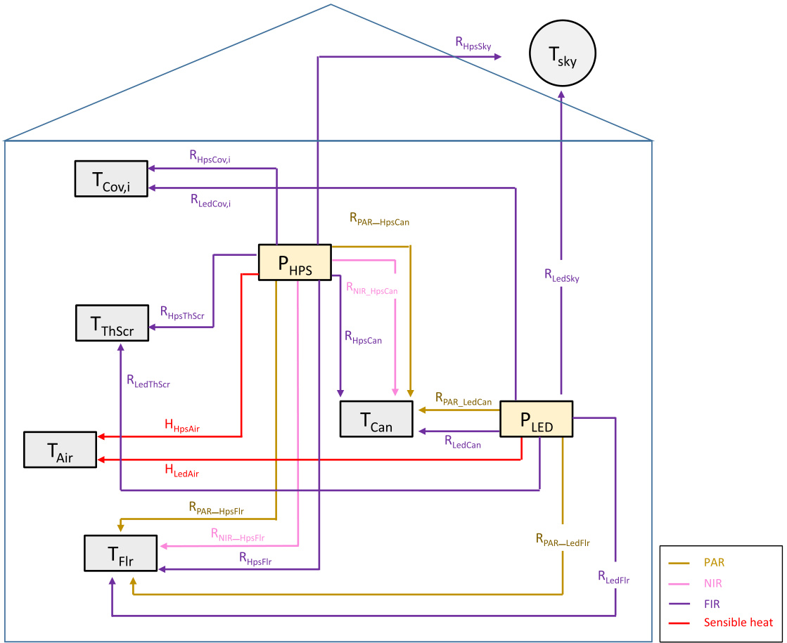
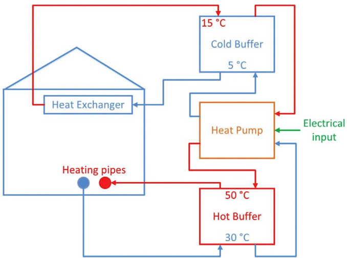
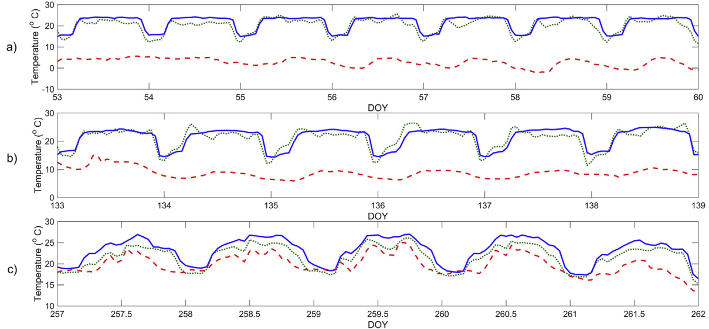
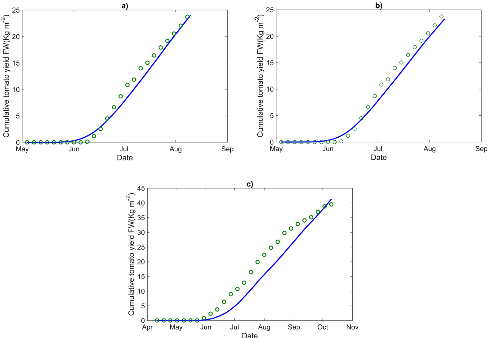
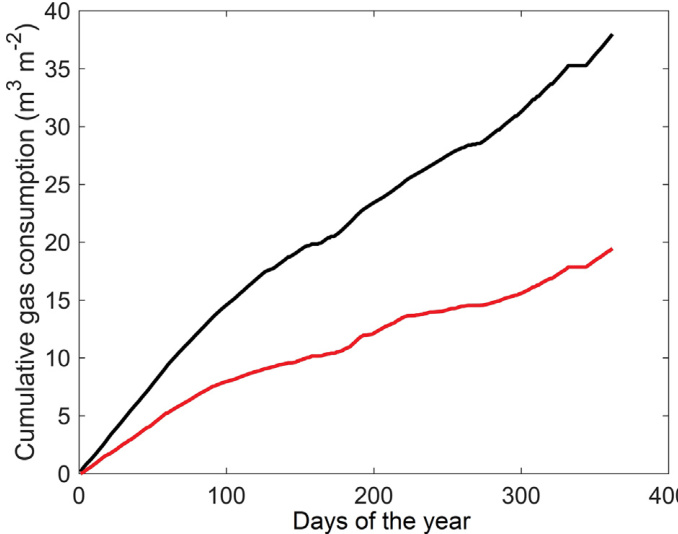
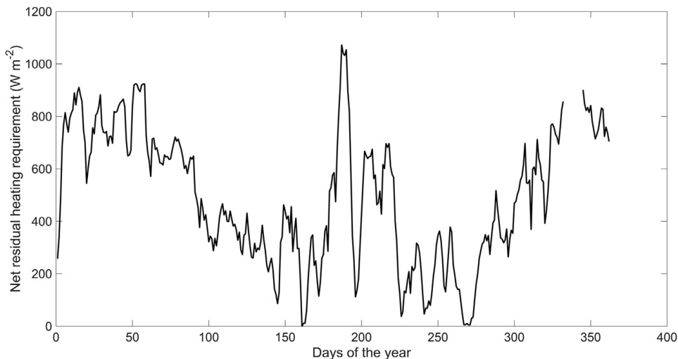

# Research Paper

# A greenhouse climate-yield model focussing on additional light, heat harvesting and its validation

Isabella Righini a,\*, Bram Vanthoor a, Michel J. Verheul b, Muhammad Naseer b, Henk Maessen b, Tomas Persson Cecilia Stanghellini a

a Wageningen UR Greenhouse Horticulture, P.O. Box 644, 6700, AP, Wageningen, the Netherlands b NIBIO, Norwegian Institute of Bioeconomy Research, Division of Food Production and Society, P.O. Box 115, NO-1431 As, Norway

# a r t i c l e i n f o

Article history:   
Received 18 July 2019   
Received in revised form   
9 March 2020   
Accepted 11 March 2020   
Keywords:   
Climate model   
Crop-yield model   
Supplementary lighting   
Secondary heating system   
Heat harvesting technology   
Tomato

A greenhouse climate-crop yield model was adapted to include additional climate modification techniques suitable for enabling sustainable greenhouse management at high latitudes. Additions to the model were supplementary lighting, secondary heating and heat harvesting technologies. The model: 1) included the impact of different light sources on greenhouse air temperature and tomato production 2) included a secondary heating system 3) calculated the amount of harvested heat whilst lighting was used. The crop yield model was not modified but it was validated for growing tomato in a semi-closed greenhouse equipped with HPS lamps (top-lights) and LED (inter-lights) in Norway. The combined climate-yield model was validated with data from a commercial greenhouse in Norway. The results showed that the model was able to predict the air temperature with sufficient accuracy during the validation periods with Relative Root Mean Square Error $< 1 0 \%$ . Tomato yield was accurately simulated in the cases under investigation, yielding a final production difference between $0 . 7 \%$ and $4 . 3 \%$ . Lack of suitable data prevented validation of the heat harvest sub-model, but a scenario is presented calculating the maximum harvestable heat in an illuminated greenhouse. Given the cumulative energy used for heating, the total amount of heating pipe energy which could be fulfilled with the heat harvestable from the greenhouse air was around $5 0 \%$ . Given the overall results, the greenhouse climate(-crop yield) model modified and presented in this study is considered accurate enough to support decisions about investments at farm level and/or evaluate beforehand the possible consequences of environmental policies.

$\circledcirc$ 2020 IAgrE. Published by Elsevier Ltd. All rights reserved.

# 1. Introduction

The multiplicity of greenhouse designs existing worldwide follows from their adaptation to regional climatic, economic and social conditions. These include: the local climate, the availability and quality of the resources (e.g. water, energy), capital availability, market size and local legislation (Hanan, 1998; Van Henten et al., 2006; Van Heurn & Van der Post,

<html><body><table><tr><td colspan="2">Nomenclature</td><td>Air</td><td>Downward flux</td></tr><tr><td colspan="2">Symbols, notations and abbreviations</td><td></td><td>Greenhouse air compartment below thermal</td></tr><tr><td colspan="2">A Area, m²</td><td>Blow</td><td>screen Direct air heater</td></tr><tr><td>C</td><td> Carbohydrates amount, mg [CH2O] m-2</td><td>Boil</td><td>Boiler</td></tr><tr><td>Cap</td><td>Capacity of the associated state</td><td>Buf</td><td> Storage buffer</td></tr><tr><td>Con</td><td>Conversion factor</td><td>Can</td><td>Canopy</td></tr><tr><td>Constr</td><td>Greenhouse construction element</td><td>Cold</td><td></td></tr><tr><td>COP</td><td>Coefficient of performance</td><td>Cov</td><td>Cold water</td></tr><tr><td>d</td><td></td><td>e</td><td>Cover External side</td></tr><tr><td>DM</td><td>Day Dry matter, %</td><td>FIR</td><td>Far infrared radiation</td></tr><tr><td>DOY</td><td>Day of the year</td><td>Flr</td><td>Floor</td></tr><tr><td>e</td><td> Energy content of water buffers, MJ m-2</td><td>Fog</td><td>Fogging system</td></tr><tr><td>f</td><td></td><td>Geo</td><td>Geothermal heat</td></tr><tr><td>h</td><td>View factor hour</td><td></td><td>Greenhouse</td></tr><tr><td>H</td><td> Sensible heat flux density, W m-2</td><td>Gh Glob</td><td>Global radiation</td></tr><tr><td>HPS</td><td> High pressure sodium lamp</td><td>Grow</td><td>Secondary “grow pipe” heating system</td></tr><tr><td>i</td><td> Solar radiation, W m-2</td><td></td><td></td></tr><tr><td>l</td><td> Latent heat flux density, W m-2</td><td>Hot</td><td>Heatpump Heat pump Hot water</td></tr><tr><td>1</td><td>Length, m</td><td></td><td></td></tr><tr><td>LAI</td><td> Leaf area index, m² [leaf] m-2</td><td>Hps in</td><td>High pressure sodium lamp</td></tr><tr><td> LED</td><td>Light emitting diode lamp</td><td>Ind</td><td>Indoor side Industrial waste heat</td></tr><tr><td>Max</td><td>Maximum</td><td>K</td><td></td></tr><tr><td>NIBIO</td><td> Norsk institutt for biogkonomi (Norwegian</td><td>Lamp</td><td>Canopy extinction coeficient Artificial illumination</td></tr><tr><td></td><td> institute of bioeconomy research)</td><td>Leaf</td><td>Leaves</td></tr><tr><td>p</td><td>Electrical input, W m-2</td><td>Led</td><td>Light emitting diode lamp</td></tr><tr><td>r</td><td> Radiation flux density, W m-2</td><td>Mech</td><td> Mechanical cooling</td></tr><tr><td>RH</td><td>Relative humidity, %</td><td>NIR</td><td>Near Infrared radiation</td></tr><tr><td>RRMSE</td><td>Relative root mean square error, %</td><td>Out</td><td>Outside air</td></tr><tr><td>SLA</td><td> Specific leaf area, cm² g-1 [DM]</td><td>Pad</td><td> Pad and fan system</td></tr><tr><td>T</td><td>Temperature,℃</td><td>PAR</td><td>Photosynthetically active radiation</td></tr><tr><td>u</td><td>Control of the associated climate control</td><td>Pas</td><td>Passive heat storage facility</td></tr><tr><td></td><td>equipment</td><td>Pipe</td><td>Pipe heating system</td></tr><tr><td>V</td><td> Speed, m s-1</td><td>rf</td><td>Roof of the greenhouse</td></tr><tr><td>VP</td><td>Vapour pressure, kPa</td><td> Sky</td><td>Sky</td></tr><tr><td>α</td><td>Absorption coefficient</td><td>So1</td><td>The 1st soil layer</td></tr><tr><td>m</td><td>Emission coeficient or efficiency</td><td> Stem</td><td>Stem</td></tr><tr><td></td><td>Conversion coefficient or fraction</td><td> Sum</td><td>Summation</td></tr><tr><td>n</td><td></td><td></td><td>The sun </td></tr><tr><td>t Φ</td><td>Transmission coeficient</td><td>Sun ThScr</td><td>Thermal screen</td></tr><tr><td></td><td>Diameter, m</td><td>Top</td><td>Compartment above the thermal screen</td></tr><tr><td>Subscripts</td><td></td><td>Wind</td><td>Wind</td></tr><tr><td>→</td><td>Upward flux</td><td></td><td></td></tr></table></body></html>

2004). The choices underlying greenhouse investment are primarily dependent on the producer's personal view and experience (Von Elsner et al., 2000). However, there is a high risk associated with such decisions in a socio-economic landscape characterised by a dynamic behaviour of the factors mentioned above both in the short term (such as energy costs, product prices) and the long term (such as shifts in social acceptance or climate change) which makes the profitability of investments difficult to predict.

Greenhouse production systems are a result of multiple and complex climate-crop interactions taking place simultaneously and reacting with different response time and patterns (Challa & Van Straten, 1991). Mathematical models, built on solid physical and physiological knowledge can help in understanding these processes and addressing the complexity of the system. A greenhouse-yield modelling approach enables different hypothetical scenarios to be tested for given climatic conditions and to simulate the effect of predefined improved design elements and climate management on the indoor greenhouse climate and yield (Vanthoor, Stanghellini, de Visser and Van Henten, 2011a and 2011b). For an overall optimisation of the greenhouse system, the costs and economic return as well as the resource use need to be considered (Vanthoor et al., 2012).

On a farm scale, a modelling approach supports decisions as it allows to evaluate beforehand the consequences of greenhouse investments (e.g. greenhouse structure, climate equipment) and management (e.g. of climate and crop) on productivity, financial outlook and resource requirements.

On a larger scale, the knowledge and results of such an objective evaluation can guide policy makers and financial institutions at governmental and sub-national levels as well as local authorities (e.g. for water and energy management) in offering subsidies, defining research programs and setting guidelines and (environmental) rules in view of a greenhouse sector that is both more cost-effective and sustainable. Technological and process innovations realised in the greenhouse business can improve the energy-efficiency and the sustainability of the system (Breukers, Hietbrink, & Ruijs, 2008), possibly to reap marketing benefits as well.

The limiting conditions typical of greenhouse crop cultivation in Norway and other temperate regions at high latitudes, make it a common practice the use of supplementary lighting to maximise yield and ensure year-round production (Moe, R., Grimstad, Gislerod, 2005; Verheul, Maessen, Grimastad, 2012). They also include the use of a split heating system (use of the so called ‘grow pipe’, an additional lowtemperature heating pipe placed within crop rows).

Solutions which can lower the heat and electricity demand, costs and environmental issues deriving from current fossil-based energy systems, are important for the overall resource use efficiency of greenhouse horticultural production. Often the heat generated by the lights exceeds the heat demand of the greenhouse. Normally this excess of energy, consisting of sensible and latent heat, is discharged by ventilation, thus constituting a system energy loss. Alternatively, the excess of solar radiation, usually experienced in summertime, or the excess energy in presence of artificial light can be harvested by heat exchangers, heat pumps, and storage buffers to be used in periods of heating demand as an option to decrease heat input. In this study, the greenhouse climate model developed by Vanthoor, Stanghellini, van Henten, and de Visser (2011a) is adapted to include additional control techniques such as artificial lights, a secondary heating system and heat harvesting, to make it suitable for whole year greenhouse management under high-latitude conditions.

The new model presented in this study fulfils the following requirements:

1) To include the impact of different light sources on greenhouse air temperature and tomato production;   
2) To include a secondary ‘grow pipe’ heating system;   
3) To calculate the possible contribution of heat harvesting to energy saving.

The adaptions were performed in the greenhouse climate part of the model, since the new climate control techniques mainly influence the greenhouse climate. Artificial lights will increase the PAR absorbed by the crop, which will be accounted for in the greenhouse climate model when calculating crop temperature. Since this is an input of the crop yield part of the model, no changes to the crop yield model were needed, as the assumption about interception of light by the canopy affects the climate model. Therefore in this study only the adaptations to the greenhouse climate part of the model are described. However, as the crop model had not been previously validated for situations using supplementary light, a validation of both the greenhouse climate model and the crop yield model (under the two configurations of supplementary light) is presented.

# 2. Model adjustments

# 2.1. Light and heat fluxes from artificial lights

Lamps of all types convert electrical energy into light, convective heat and far infrared radiation (FIR). The most common light sources used in greenhouses nowadays are high pressure sodium (HPS) lamps and light emitting diode (LED) lamps. The main difference between these lamps lies in their efficiency expressed as PAR output per unit of input electrical energy. This is higher for LED lamps than for HPS lamps (Persoon & Hogewoning, 2014). Moreover, HPS lamps emit near infrared radiation (NIR) which is responsible for consuming about $1 5 \%$ of the electrical input, while LED lamps do not (Nelson & Bugbee, 2015). HPS lamps exchange more far-red, thermal radiation (FIR), since the temperature of the HPS armatures is much higher than that of the LED armature, whereas the LED lamps whose armatures are designed to facilitate cooling, loose relatively more heat through convection. Because of the high temperatures they reach, HPS lamps are always placed well above the canopy, whereas LED lamps can be placed lower between the canopy as inter-lighting systems, as well as above the canopy as top lighting.

# 2.1.1. Differences between HPS, LED top lighting and LED inter-lighting

The PAR absorbed by the canopy (that is, the extinction coefficient for PAR light) is assumed to be equal for sunlight, HPS and LED top-lighting since these sources are located above the canopy. When using LED inter-lighting the height of the lamps in the canopy influences considerably the light absorption as described by Dieleman et al. (2015, p. 74). However, they found that for lamps located at between 1.5 and $2 . 1 \mathrm { m }$ height within a tall, well-developed canopy, light absorption was above $90 \%$ and still there was light lost towards the cover and the soil. Janse, Weerheim, and Dieleman (2018) measured $9 5 . 6 \%$ light absorption by a cucumber crop on a horizontal plane from inter-crop LED modules and $9 6 \%$ for light from the top. Based on these results we have assumed here that the light absorption by a canopy can be described similarly for a LED toplighting and LED inter-lighting system, that is, there is no need to introduce a separate extinction coefficient for light produced by LED elements within the canopy. This is obviously true for a dense canopy with a spherical leaf angle distribution, whereas it would not hold true for crops with a preferential angle (such as perfectly horizontal leaves and light coming either from above or the side). Therefore this hypothesis should be verified before application to crops with a preferential leaf angle distribution (e.g. nearly horizontal or vertical).

The FIR fluxes of the LED lamps depend on the location of the LED in the canopy. LED top lighting will emit more FIR to the upper part of the greenhouse (screen, greenhouse cover, or to the sky) whereas LED inter-lighting will emit more radiation to the canopy.

In summary, the following was assumed:

- $1 \mathrm { m o l }$ intercepted PAR from HPS lamps has a similar impact on crop yield to $1 \mathrm { m o l }$ intercepted PAR from top and inter-canopy LED light or natural sunlight.   
- HPS lamps emit both PAR and NIR in the shortwave spectrum $2 8 \%$ and $1 5 \%$ of the electrical input, respectively), whereas there is no NIR component in the shortwave spectrum of the LED lamps.   
- The temperature of the lamps was not modelled. A fixed fraction of the electrical input of the lamps is converted into convective heat loss and a fixed fraction into FIR energy loss (these fractions are different for HPS and LED).   
- The FIR of the HPS lamps is emitted both down $( 6 0 \% )$ and upwards $( 4 0 \% )$ .   
- The FIR of the LED lamps is emitted both down $( 5 0 \% )$ and upwards $( 5 0 \% )$ .   
- The FIR exchanged between the lamps and the heating pipes is neglected.   
- When lights are switched off there is neither FIR nor convective heat exchange with the surroundings.   
- The FIR radiation fluxes of inter-canopy LED lamps will change based on height of the LED lamps in the canopy.

This means that the electrical input of the artificial lamps is equal to the sum of the following fluxes.

$$
\begin{array} { r l } & { P _ { L a m p } = R _ { P A R \_ L a m p } + R _ { N I R \_ L a m p } + H _ { L a m p A i r } + R _ { L a m p C a n } + R _ { L a m p F | r } } \\ & { \phantom { \frac { 1 } { 1 } } + R _ { L a m p T h S c r } + R _ { L a m p C o v , i n } + R _ { L a m p S k y } \left[ \mathrm { W m ^ { - 2 } } \right] } \end{array}
$$

where $\mathtt { R } _ { P A R \_ L a m p }$ is the PAR output of the lamp and $R _ { \mathrm { N I R \_ L a m p } }$ is the NIR output of the lamp. $\mathrm { H } _ { \mathrm { L } a m p A i r }$ is the convective heat flux from the lamp to the greenhouse air and RLampCan; RLampFlr; RLampThScr; RLampCov;in and $R _ { L a m p S k y }$ are the FIR radiation fluxes from the lamps to the canopy, floor, thermal screen, cover and sky respectively. As the temperature of the lamps was not calculated, the (prefixed) upward and downward radiation is allocated among the receiving elements in the measure that it is intercepted by them. An overview of the state variables and fluxes affected by the introduction of the lamps is given in Fig. 1.

# 2.2. The grow pipe

The grow pipe was handled within the model similarly to the primary (‘pipe rail’) heating system. However, in view of the different configuration, the formula for calculating the heat exchange coefficient was slightly different, as proposed by De Zwart (1996, p 86). On the other hand, the thermal radiation exchange was split between the upper and lower hemispheres, depending on the amount of leaf area above and below the pipe, respectively. In particular, the fraction of LAI above and below the ‘grow’ pipe determined the view factor for its FIR radiation exchange with the canopy and all underlying greenhouse elements.

# 2.3. Heat harvesting and buffering

The excess heat was harvested through a heat exchanger and was stored as water of around $1 5 ^ { \circ } \mathsf { C }$ in a cold water buffer. A heat pump increased the temperature of this water to around $5 0 ^ { \circ } \mathrm { C }$ before being stored in a hot water buffer, for later use as a heating source. Figure 2 shows the overview of this subsystem.

The following assumptions were made regarding this submodel:

- Two extra model states were added to the model: the energy content of the cold and hot water buffers (MJ $\mathrm { m } ^ { - 2 } )$ ) - Constant temperatures for the minimum and maximum temperatures of both the cold and hot buffer were used, with a constant coefficient of performance (COP) of both the heat exchanger and the heat pump.

In principle the COPs of the heat exchanger and heat pump, as well as the minimum and maximum temperatures of both the cold and hot buffer, should change slightly based on temperature and humidity variations. However, as most applications of the model require full crop cycles to be simulated, the use of average values for these variables seems reasonable.

# 3. Model description

# 3.1. State equations

To include artificial lights, heat harvesting and secondary pipe heating, the following model states of the greenhouse climate model were modified and added with respect to the greenhouse climate model of Vanthoor et al. (2011a). The model calculates the variation in all state variables (temperature, vapour and carbon dioxide content) of each element of the greenhouse system (canopy, cover, floor, etc) as follows from the corresponding balance (energy, mass) equation. The variables in round brackets () are related to the incorporation of artificial lights, the variables in square brackets [] are related to the use of secondary grow pipe heating and the variables in curly brackets {} are related to the harvesting of excess energy from the greenhouse air. The remaining variables in Eqs. 2e9 were not changed with respect to the original model and therefore not described in this study. The new model fluxes are described in the following sections.

The temperature of the canopy, $\scriptstyle { \mathsf { T } } _ { C a n }$ , was described by:

$$
\begin{array} { r l } & { c a p _ { C a n } \dot { T } _ { C a n } = \left( { \cal R } _ { \tt P A R \mathrm { - } G h C a n } + { \cal R } _ { \tt N I R \mathrm { - } G h C a n } \right) + { \cal R } _ { \tt P i p e C a n } + \left[ { \cal R } _ { G r o w C a n } \right] } \\ & { ~ + \left( { \cal R } _ { H p s C a n } + { \cal R } _ { \tt L e d C a n } \right) - H _ { C a n A i r } - { \cal L } _ { C a n A i r } - { \cal R } _ { C a n C o v , I n } } \\ & { ~ - { \cal R } _ { C a n F l r } - { \cal R } _ { C a n S k y } - { \cal R } _ { C a n T h S c r } \left[ \mathrm { W m ^ { - 2 } } \right] } \end{array}
$$

where R, H and L indicate radiation, sensible heat and latent heat, respectively; $c a p _ { c a n }$ is the thermal capacity of the canopy, per unit greenhouse area $[ \mathrm { J } \mathrm { K } ^ { - 1 } \mathrm { m } ^ { - 2 } ]$ and the suffix GhCan indicates solar radiation transmitted by the structure and absorbed by the canopy.

The temperature of the air, $\tau _ { \mathrm { A i r } }$ , is described by:

$$
\begin{array} { r } { c a p _ { \mathrm { A i r } } \dot { T } _ { \mathrm { A i r } } = H _ { C a n \mathrm { A i r } } + H _ { \mathrm { P } a d \mathrm { A i r } } + H _ { \mathrm { M e c h A i r } } + H _ { \mathrm { P i p } e \mathrm { A i r } } + \left[ H _ { \mathrm { G r o w A i r } } \right] + H _ { \mathrm { P a s A i r } } } \\ { + H _ { \mathrm { B l o w A i r } } + \left( R _ { \mathrm { G l o b } - \mathrm { S u n A i r } } \right) + \left( H _ { \mathrm { H p s A i r } } \right) + \left( H _ { \mathrm { L } e d \mathrm { A i r } } \right) - H _ { \mathrm { A i r f r } } } \\ { - H _ { \mathrm { A i r T } h S c r } - H _ { \mathrm { A i r o u t } } - H _ { \mathrm { A i r T o p } } - H _ { \mathrm { A i r o u t } _ { \mathrm { P a } \mathrm { A } } } - L _ { \mathrm { A i r \mathrm { F o g } } } \left[ \mathrm { W } \mathrm { m } ^ { - 2 } \right] } \end{array}
$$

The contribution of solar radiation to air temperature was modified to take into account light interception by the lamps, Eq (13). The suffixes PadAir, MechAir, BlowAir refer to the outlet air from the cooling pad, mechanical cooling and direct air heater.

The temperature of the floor, $T _ { F l r }$ , was described by:

$$
\begin{array} { r l } & { c a p _ { F | r } \dot { T _ { F | r } } = H _ { \mathrm { A i r F } | r } + \left( R _ { \mathrm { P A R } _ { - } G h F | r } \right) + \left( R _ { N \mathrm { I R } _ { - } G h F | r } \right) + R _ { C a n F | r } + R _ { \mathrm { P i } p e F | r } } \\ & { ~ + \left[ R _ { G r o w F | r } \right] + \left( R _ { H p s F | r } \right) + \left( R _ { L e d F | r } \right) - H _ { \mathrm { F } | r s o 1 } - R _ { \mathrm { F } | r C o v , i n } } \\ & { ~ - R _ { \mathrm { F I r } S k y } - R _ { \mathrm { F I } r T h S c r } \left[ \mathrm { W m } ^ { - 2 } \right] } \end{array}
$$

The temperature of the thermal screen, $T _ { T h S c r }$ , was described by:

$$
\begin{array} { r l } { c a p _ { T h S c r } \dot { \Gamma } _ { T h S c r } = H _ { A i r T h S c r } + L _ { A i r T h S c r } + R _ { C a n \Gamma h S c r } + R _ { F l r T h S c r } + R _ { \mathrm { P i p } e T h S c r } } & { } \\ { + \left[ R _ { G r o w T h S c r } \right] + \left( R _ { H p s T h S c r } \right) + \left( R _ { L e d \Gamma h S c r } \right) - { H } _ { \mathrm { T h S c r T o p } } } & { } \\ { - R _ { T h S c r C o v , i n } - R _ { T h S c r S k y } \left[ \mathrm { W m ^ { - 2 } } \right] } & { } \end{array}
$$

The temperature of the inner side of the cover, $\boldsymbol { T } _ { \mathrm { { C o v } , i n } }$ , was described by:

$$
\begin{array} { r l } & { c a p _ { { \mathsf { C o v } } , l n } \dot { T } _ { { \mathsf { C o v } } , i n } = H _ { \mathsf { T o p } { \mathsf { C o v } } , i n } + L _ { \mathsf { T o p } { \mathsf { C o v } } , i n } + R _ { { \mathsf { C a n } } { \mathsf { C o v } } , i n } + R _ { \mathsf { F l r } { \mathsf { C o v } } , i n } + R _ { \mathsf { P i p } e { \mathsf { C o v } } , i n } } \\ & { \qquad + \left[ R _ { { \mathsf { G r o w } } { \mathsf { C o v } } , i n } \right] + R _ { \mathsf { T h S c r } { \mathsf { C o v } } , i n } + \left( R _ { \mathsf { H p s } { \mathsf { C o v } } , i n } \right) + \left( R _ { \mathsf { L e d C o v } , i n } \right) } \\ & { \qquad - H _ { { \mathsf { C o v } } , i n { \mathsf { C o v } } , e } \left[ \mathsf { W m } ^ { - 2 } \right] } \end{array}
$$

The temperature of the elements of either pipe heating system, ${ T _ { P i p e } }$ , was described by:

$$
\begin{array} { r l } & { c a p _ { \mathrm { { P i p e } } } \dot { \mathrm { \cal T } } _ { \mathrm { P i p e } } = \dot { \mathrm { \cal H } } _ { \mathrm { B o i l P i p e } } + \dot { \mathrm { \cal H } } _ { \mathrm { I n d P i p e } } + \dot { \mathrm { \cal H } } _ { G e o P i p e } + \Bigl \{ \dot { \mathrm { \cal H } } _ { B u f h o t P i p e } \Bigr \} } \\ & { ~ - ~ \mathrm { \cal R } _ { \mathrm { P i p e S k y } } - { \mathrm { \cal R } } _ { \mathrm { P i p e C o v } } - { \mathrm { \cal R } } _ { \mathrm { P i p e C a n } } - ~ { \mathrm { \cal R } } _ { \mathrm { P i p e F l } r } } \\ & { ~ - ~ { \mathrm { \cal R } } _ { \mathrm { P i p e T h S c r } } - { \mathrm { \cal H } } _ { \mathrm { P i p e A i r } } ~ \bigl [ \mathrm { \mathbb { W } } \mathrm { m } ^ { - 2 } \bigr ] } \end{array}
$$

where all possible sources of energy are explicitly considered (boiler, industrial waste heat, geothermal and the buffer), and the calculation of the relative energy flow is based on heating set-points and capacities $( \mathsf { c a p } _ { \mathrm { F l r } } , \mathsf { c a p } _ { \mathrm { T h S c r } }$ etc). The FIR fluxes were described using Stefan Boltzmann's equations as described in Vanthoor (2011) and $\mathrm { H } _ { \mathrm { P i p e A i r } }$ is the convective heat exchange between the grow pipe and greenhouse air.

The energy content of the cold water buffer, $E _ { B u f c o l d } \ ( \mathbf { M } \ \mathbf { m } ^ { - 2 } )$ , was described by:

$$
\left\{ c o n _ { B u f } \dot { E } _ { B u f c o l d } = - H _ { M e c h A i r } + L _ { A i r M e c h } - H _ { B u f c o l d H e a t p u m p } \right\} \left[ \mathrm { W m ^ { - 2 } } \right]
$$

where $c o n _ { B u f } $ is the conversion from Joule to MegaJoule, HMechAir and $\mathtt { L } _ { \mathtt { A i r M e c h } }$ are respectively the sensible and latent heat

  
Fig. 1 e Detail of the state variables (blocks), external climate input (circle), radiation and convective heat fluxes (coloured arrows) of the greenhouse climate model, concerning the supplemental lighting (HPS and LED). The fluxes are additional to those already reported by Vanthoor (2011a, p. 368). T represents the temperature of floor, air, thermal screen, canopy, cover (inner side) and sky whereas P is the electrical inputs of the artificial lamps.

  
Fig. 2 e Overview of the system to harvest the excess energy in the greenhouse air. The system consists of a heat exchanger, a cold water buffer, a heat pump and a hot water buffer. The temperatures are shown to give an order of magnitude of the energy.

harvest by the heat exchangers (these fluxes are described by Vanthoor, 2011) and $\mathrm { H } _ { B u f c o l d H e a t p u m p }$ is the heat flux from the cold buffer to the heat pump.

The energy content of the hot water buffer, $E _ { B u f h o t }$ $( \mathrm { M J } \mathrm { m } ^ { - 2 } )$ , was described by:

$$
\left\{ { c o n } _ { \scriptscriptstyle B u f } ^ { \mathrm { } } \dot { E } _ { \scriptscriptstyle B u f h o t } ^ { \mathrm { } } = H _ { \scriptscriptstyle H e a t p u m p B u f h o t } ^ { \mathrm { } } - H _ { \scriptscriptstyle B u f h o t p i p e } ^ { \mathrm { } } \right\} ~ [ \mathrm { W m } ^ { - 2 } ]
$$

where $\mathrm { H } _ { H e a t p u m p B u f h o t }$ is the heat flux from the heat pump to the hot water buffer.

# 3.2. Artificial lights

# 3.2.1. Global radiation fluxes

The amount of sunlight transmitted by the cover, that is absorbed by the construction elements below was described by:

$$
R _ { G l o b \_ S u n \& i r } = \eta _ { G l o b \_ A i r } I _ { G l o b } \left( \tau _ { C o v \_ P A R } \eta _ { G l o b \_ P A R } + \tau _ { C o v \_ N I R } \eta _ { G l o b \_ N I R } \right) \left[ \mathrm { W m ^ { - 2 } } \right]
$$

where $\eta _ { G l o b \_ A i r }$ is the fraction of incoming radiation that is absorbed by all greenhouse elements below the cover, including the artificial lamps, was described as follows:

$$
\eta _ { G l o b \_ A i r } = \eta _ { G l o b \_ C o n s t r } + \eta _ { G l o b \_ H p s } + \eta _ { G l o b \_ L e d }
$$

with:

$$
\eta _ { G l o b \_ H p s } = \frac { A _ { H p s } } { A _ { G h } }
$$

with $\mathsf { A } _ { \mathrm { H } p s }$ the horizontal projection of the lamps. The variable $\mathsf { A } _ { \mathrm { L } e d }$ was calculated in the same way. Thus, the fraction of sun radiation loss by reflection of the lamps armatures was neglected. Parameter values are described in section Appendix (Tables A1 and A2).

# 3.2.2. PAR fluxes

The PAR emitted by the HPS lamps above the canopy was calculated as follows:

$$
R _ { P A R \_ H p s } = \varepsilon _ { H p s \_ P A R } U _ { H p s } P _ { H p s } \ [ \mathrm { W m ^ { - 2 } } ]
$$

with $P _ { \mathrm { H } p s }$ the electrical input of the lamps $( \mathrm { W } \mathrm { m } ^ { - 2 } )$ ; $U _ { H p s }$ is the control (0 or 1) of the HPS lamps and $\varepsilon _ { \mathrm { H } p s \_ P A R } \left( - \right)$ the fraction of electrical input that is converted to PAR light $( \mathrm { W } \mathrm { m } ^ { - 2 } )$ , calculated as:

$$
\varepsilon _ { H { p s \_ P } A R } = \frac { n _ { H p s } } { n _ { H p s \_ P A R } }
$$

with $n _ { \mathrm { H } p s }$ $p s \ ( \mu \mathrm { m o l } \ \mathrm { J o u l e } ^ { - 1 } )$ is the amount of $\mu \mathrm { m o l }$ PAR per Joule electrical input and $\eta _ { \tt H p s \mathrm { - } P A R } \ ( \mathrm { \mu m o l \ J o u l e ^ { - 1 } } )$ is the amount of $\mu \mathrm { m o l }$ PAR per Joule PAR output of the lamp. The emitted PAR by the LED lamps, $R _ { P A R \_ L e d }$ , is described in the same way.

The PAR above the canopy, accounting for reduced transmission caused by the lamps, see Eq. (13), was described by:

$$
\begin{array} { r } { R _ { \texttt { P A R \_ G h } } = \left( 1 - \eta _ { \texttt G l o b \_ A i r } \right) \cdot \tau _ { \texttt G o v \tt A R } \cdot \eta _ { \texttt G l o b \_ A R } \cdot I _ { \cal G l o b } + R _ { \texttt P A R \_ H p s } } \\ { + R _ { \texttt P A R \_ L e d } \left[ \texttt W \tt m ^ { - 2 } \right] \quad } \end{array}
$$

The total PAR absorbed by the canopy, $\mathtt { R } _ { P A R \_ G h C a n }$ , is calculated according to the standard exponential model, analogously to Eqs. 25, 26 and 28 of the e-appendix of Vanthoor et al. (2011a). The total PAR absorbed by the floor, $R _ { P A R \_ G h F l r }$ , was calculated analogously by Eq. 34 of the e-appendix of Vanthoor et al. (2011a).

# 3.2.3. NIR fluxes

Similarly, the amount of NIR emitted by the HPS lamps was described by:

$$
R _ { N I R \_ H p s } = \varepsilon _ { H p s \_ N I R } U _ { H p s } P _ { H p s } \ \big [ \mathrm { W m ^ { - 2 } } \big ]
$$

with $\varepsilon _ { H p s \_ N I R }$ the fraction of electrical input $( - )$ that is converted to NIR light $( \mathrm { W } \mathrm { m } ^ { - 2 } )$ .

Since LED lamps do not emit NIR light, the total NIR flux to the canopy and floor was described as follows.

$$
\begin{array} { r l } & { R _ { \mathrm { N I R \_ G h C a n } } = \left( 1 - \eta _ { G l o b \_ A i r } \right) \cdot a _ { \mathrm { C a n N I R } } \cdot \eta _ { G l o b \_ N I R } \cdot I _ { G l o b } } \\ & { \quad \quad \quad \quad \quad \quad \quad \quad \quad \quad \quad \quad \quad \quad \quad } \\ & { \quad \quad \quad \quad \quad \quad \quad \quad \quad + a _ { \mathrm { C a n N I R } } \cdot R _ { \mathrm { N I R \_ H p s } } \ \left[ \mathrm { W m } ^ { - 2 } \right] } \end{array}
$$

$$
\begin{array} { r l } { R _ { N I R _ { - } G h F l r } = \left( 1 - \eta _ { G l o b \_ A i r } \right) \cdot a _ { F l r N I R } \cdot \eta _ { G l o b \_ N I R } \cdot I _ { G l o b } } & { } \\ { + a _ { F l r N I R } \cdot R _ { N I R \_ H p s } \left[ \mathrm { W m } ^ { - 2 } \right] } & { } \end{array}
$$

in which $a _ { \scriptscriptstyle \mathrm { C } a n N I R }$ and $a _ { F l r \mathrm { N I R } }$ are the NIR absorption coefficients of the canopy and floor, respectively, which are calculated by applying the standard exponential model to a multi-layer representation of the canopy (see Eqs. 14-17 of the e-appendix of Vanthoor et al., 2011a). Obviously, the resulting overall absorption coefficients depend, among other factors, on the LAI of the canopy.

# 3.2.4. FIR heat fluxes Since

$$
\begin{array} { r l } & { P _ { L e d } = \mathrm { R } _ { \mathrm { P A } R _ { - } L e d } + \mathrm { R } _ { \mathrm { N I R } _ { - } L e d } + \mathrm { H } _ { L e d \mathrm { A i r } } + \mathrm { R } _ { L e d C a n } + \mathrm { R } _ { L e d F | r } } \\ & { \qquad + \mathrm { R } _ { L e d \mathrm { T } h S c r } + \mathrm { R } _ { L e d C o v , \mathrm { i n } } \ \big [ \mathrm { W m } ^ { - 2 } \big ] } \end{array}
$$

the FIR emitted downwards by both top-lighting and interlighting was described by:

$$
R _ { L e d \downarrow } = \left( P _ { L e d } - R _ { P A R \_ L e d } - R _ { N I R \_ L e d } \right) \cdot \eta _ { L e d \_ F I R } \cdot \eta _ { L e d \_ F I R \downarrow } \ \left[ \mathrm { W m ^ { - 2 } } \right]
$$

$$
R _ { L e d C a n \downarrow } = R _ { L e d \downarrow } \cdot ( 1 - e ^ { - K _ { F I R } \cdot n L e d _ { - } L { \mathrm { A } } I \cdot L { \mathrm { A } } I } ) ~ [ \mathrm { W m ^ { - 2 } } ]
$$

$$
R _ { L e d F l r } = R _ { L e d \downarrow } \cdot e ^ { - K _ { F l R } \cdot n _ { L e d \_ L A l } . L A l } \ \left[ \mathrm { { W m ^ { - 2 } } } \right]
$$

with $\eta _ { \tt L e d \_ F I R }$ is the fraction of the energy input not used to make PAR and NIR light, that is converted to FIR exchange and hLed FIRY is the fraction of the FIR that is exchanged downwards and $n _ { L e d \_ L A I }$ defines the fraction (ranging from 0 to 1) of the LAI due to the leaves that are located below the LED lamps. $K _ { F I R }$ is the canopy extinction coefficient for thermal (longwave) radiation.

Conversely, the FIR emitted upwards by both top-lighting and inter-lighting was described by:

$$
\mathsf { R } _ { L e d \uparrow } = \left( \mathsf { P } _ { L e d } - \mathsf { R } _ { \mathsf { P A R } _ { - } L e d } - \mathsf { R } _ { \mathsf { N I R } _ { - } L e d } \right) \cdot \eta _ { L e d _ { - } \mathsf { F I R } } \bullet \left( 1 - \eta _ { L e d _ { - } \mathsf { F I R } \downarrow } \right) \left[ \mathsf { W } \mathsf { m } ^ { - 2 } \right]
$$

$$
R _ { L e d C a n \uparrow } = R _ { L e d \uparrow } \cdot \left( 1 - e ^ { - K _ { F l R } ( 1 - \eta L e d _ { - } L A I ) L A I } \right) \left[ \mathrm { W m ^ { - 2 } } \right]
$$

$$
R _ { L e d T h S c r } = R _ { L e d \uparrow } \cdot e ^ { - K _ { F I R } \left( 1 - \eta _ { L e d \_ L A I } \right) L A I } \cdot U _ { T h S c r } \bullet \varepsilon _ { T h S c r F I R } \ \big [ \mathrm { W m ^ { - 2 } } \big ]
$$

where $U _ { T h S c r }$ is the control of the thermal screen (contained between 0, folded and 1, fully unfolded), indicates the emissivity.

$$
R _ { L e d C o v , i n } = R _ { L e d \uparrow } \cdot e ^ { - K _ { F I R } ( 1 - \eta L e d _ { - } L { \bf A } I ) L { \bf A } I } \bullet \tau _ { T h S c r F I R } ^ { U } \bullet \varepsilon _ { R f F I R } \left[ \mathrm { W m } ^ { - 2 } \right]
$$

$$
R _ { L e d S k y } = R _ { L e d \uparrow } \cdot e ^ { - K _ { F I R } ( 1 - \eta _ { L e d \_ L A I } ) L A I } \bullet \tau _ { T h S c r F I R } ^ { U } \bullet \tau _ { R f F I R } \left[ \mathsf { W m } ^ { - 2 } \right]
$$

with $\tau _ { T h S c r F I R } ^ { U }$ and $\tau _ { \scriptscriptstyle { \mathrm { R f F I R } } }$ the far infrared transmission coefficient for thermal screen and cover, respectively. Finally, the overall FIR radiation to the canopy was described by:

$$
R _ { L e d C a n } = R _ { L e d C a n \downarrow } + R _ { L e d C a n \uparrow } \ \mathrm { [ W m ^ { - 2 } ] }
$$

For the HPS lamps the Eqs. (20)e(28) apply as well, but then with the restriction that $\eta _ { { \scriptscriptstyle \mathrm { H } p s } _ { - } { \scriptscriptstyle \mathrm { L A I } } } = 1$ since the HPS lamps are located above the canopy.

# 3.2.5. Convective heat fluxes

The convective heat flux from the artificial lights to the greenhouse air was described by:

$$
H _ { H p s A i r } = \left( P _ { H p s } - R _ { P A R \_ H p s } - R _ { N I R \_ H p s } \right) \cdot \left( 1 - \eta _ { H p s \_ F I R } \right) \left[ \mathrm { W m ^ { - 2 } } \right]
$$

The convective heat flux for the LED lamps was described analogously, yet it accounts for the absence of NIR emission.

# 3.3. Heat harvesting from greenhouse air

The heat flux from the cold buffer to the heat pump which was described by:

$$
H _ { B u f c o l d H e a t p u m p } = \bigl ( C O P _ { H e a t p u m p } - 1 \bigr ) U _ { H e a t p u m p } P _ { H e a t p u m p } \ [ \mathrm { { W m ^ { - 2 } } ] }
$$

where the $C O P _ { \mathrm { H e a t p u m p } }$ of the heat pump is calculated based on the efficiency of the heat pump and on the temperature of the cold and warm side of the heat pump, $U _ { \mathrm { H } e a t p u m p }$ is the control of the heat pump (ranging from 0 to 1) which was calculated based on the filling percentage of the cold and hot water buffer. If the hot water buffer was not full and the cold water buffer was not empty then the heat pump was allowed to run. PHeatpump is the electrical consumption of the heat pump.

The heat flux from the heat pump to the hot water buffer was described by:

$$
H _ { H e a t p u m p B u f h o t } = C O P _ { H e a t p u m p } U _ { H e a t p u m p } P _ { H e a t p u m p } \ [ \mathrm { { W m ^ { - 2 } } ] }
$$

The heat flux from the hot water buffer to the heating pipes was described by:

$$
H _ { B u f h o t p i p e } = U _ { B u f h o t } P _ { B u f h o t } \ \mathrm { [ W m ^ { - 2 } ] }
$$

where $P _ { B u f h o t }$ is the maximum heat flux that can flow from the hot water buffer to the heating pipes and ${ U _ { B u f h o t } } ~ ( 0 { - } 1 )$ is the control of the heat flux from the hot water buffer to the heating pipes which was calculated based upon greenhouse heating set-points.

# 3.4. Secondary heating system, the grow pipe

The FIR fluxes related to the secondary grow heating pipe were described using Stefan Boltzmann's equations as described in Vanthoor (2011). The surface of the heating pipe was described by:

$$
A _ { G r o w } = \pi \mathsf { l } _ { G r o w } \otimes _ { G r o w , e } \left[ \mathsf { m } ^ { 2 } \right]
$$

where $\mathsf { l } _ { G r o w }$ is the length of the grow pipes per square meter greenhouse and $\varnothing _ { G r o w } , e$ is the external diameter of the grow pipe. It is assumed that the height of the grow pipe can vary but it must be above the roots and below the head of the crop. Similarly as done with inter-lighting, the height of the grow pipe was expressed by the fraction of LAI that is located below the grow pipe, $n _ { G r o w \_ L A I }$ . If $n _ { G r o w \_ L A I }$ equals 1, than the grow pipe is located above the canopy. The thermal radiation exchange of the grow pipe was allocated among the greenhouse elements according to their view factors as described in Table 1. The view factors are based on De Zwart (1996, pp 95e98). Obviously, the sum of all view factors is 1.

The convective heat release from the grow pipe were calculated based on De Zwart (1996):

$$
H _ { G r o w A i r } = 1 . 2 8 \pi \mathcal { Q } _ { G r o w , e } { } ^ { 0 . 7 5 } \vert _ { G r o w } ( T _ { G r o w } - \mathrm { T } _ { \mathrm { A i r } } ) ^ { 1 . 2 5 } \ [ \mathrm { W m } ^ { - 2 } ]
$$

# 4. Model validation

The model equations were solved with a moderately stiff ODE solver (ode23t) of MATLAB (Release 16b; The MathWorks Inc., Natick, MA, USA).

First of all, the performance of the crop yield model, under two different configurations of supplementary lighting, was independently evaluated with measured tomato yield obtained in two greenhouse compartments ( NIBIO Saerheim ) in Klepp (Rogaland county, Norway, $5 8 ^ { \circ }$ 46' N, $0 5 ^ { \circ }$ 39' E). Canopy temperature, together with hourly greenhouse variables such as outside global radiation, PAR radiation from artificial lamps, ${ \mathsf { C O } } _ { 2 }$ air concentration, were used as model inputs, to test its accuracy in simulating measured yield under different light sources. The details on crop cycle, lighting systems and model inputs are given in section 4.1.

<html><body><table><tr><td colspan="2">Table1-Theview factors,indicatedbyFromto,fromthegrow pipe totherelevant greenhouse elements,usedtoalocate</td></tr><tr><td>the FIR exchange among them. Element</td><td>View factor from the grow pipe</td></tr><tr><td>canopy floor</td><td>FGrowCan =0.5(1-e-KFR(1-nGrow-LA)AI)+O.5(1-e-KFIR·NGrow-LAAI)</td></tr><tr><td>thermal screen cover</td><td>FGrowCov,in=[(1-UThSer）+UThSerTThSer](1-TCov)O.5e-K(1-nGrow)A FGrowFlr = 0.5e-KFir *nGrow_LA1·.LAI FGrowThSer = UThScr(1- TThSerFIR)0.5e-KFIR(1-nGrow_A)LAI</td></tr></table></body></html>

The combined greenhouse climate-crop yield model was validated with a dataset from a commercial greenhouse with supplementary lighting, located in a marine temperate region in Norway (Orre, Rogaland county, $5 8 ^ { \circ }$ 42' N, $0 5 ^ { \circ }$ 31' E). Measured data of outdoor climate, settings of control valves and temperature of both rail and grow pipe systems, were used as model inputs. The details on greenhouse design are given in section 4.2.1 The accuracy of the model was tested with respect to prediction of greenhouse air temperature (during three preselected winter, spring and summer periods), and crop yield along the growing cycle. Model performance was quantitatively evaluated using the Relative Root Mean Square Error (RRMSE) as described by Kobayashi and Salam (2000).

# 4.1. Crop yield model

In order to check the performance of the crop yield model alone with respect to supplementary lighting, the temperature of the crop should be known. The closest available data derived from an experiment in which leaf temperature was incidentally measured. Thus, leaf temperature measurements taken during 10 days along the cropping cycle were used to calculate leaf-to-air temperature differences under light (sun and/or lamp radiation sources) and dark conditions. Canopy temperature during the whole cropping cycle were estimated from those differences.

A tomato crop (cv. Dometica) was grown in two compartments, both with HPS lamps and one of the two with additional LED inter-lighting, two rows of LEDs between plants at a height above ground of $1 . 5 0 \mathrm { m }$ and $1 . 8 5 \mathrm { ~ m ~ }$ , respectively. The HPS lamps were used in both compartments for a maximum of $1 5 \mathrm { h } \mathrm { d } ^ { - 1 }$ (during the first 6 weeks) and $1 8 \mathrm { h } \mathrm { d } ^ { - 1 }$ (from week 7 until harvest) and were switched off when outside global radiation was higher than $2 5 0 \mathrm { W } \mathrm { m } ^ { - 2 }$ . LED inter-lighting started when total plant height exceeded about $2 . 7 5 \mathrm { m }$ , and the lamps were used for a maximum of $1 5 \mathrm { ~ h ~ d ~ } ^ { - 1 }$ (week 5e7) and $^ { 1 8 \mathrm { ~ h ~ } }$ day1 (from week 7 until harvest).

The crop was grown in a summer cycle (transplanted on May, 4th 2017 with a density of 4.5 plants $\mathrm { m } ^ { - 2 }$ ). The $2 4 \mathrm { h }$ mean canopy temperature was maintained between 21 and $2 4 ^ { \circ } \mathrm { C }$ (in the compartment with HPS) and $2 1 - 2 4 . 5 ^ { \circ } \mathsf C$ (in the compartment with HPS and LED). The crop cycle lasted $9 8 \mathrm { d }$ , with final harvest carried out on August, 10th 2017. Table 2 reports an overview of the data that were needed to run the model for the validation study at the experimental greenhouse at NIBIO in Klepp.

Small plants were transplanted with the flowering of the first truss. Measured leaf area, plant density and leaf dry matter were used to determine initial leaf carbohydrates $\scriptstyle ( \mathbf { C } _ { \mathrm { l e a f 0 } } )$ and the initial stem and root carbohydrates were set equal to $\mathsf { C } _ { \mathrm { l e a f } 0 }$ Leaf area and leaf dry matter were measured in both compartments almost twice a week, from June 25 till the last harvest. The measurements were taken on sample plants on the first fully developed leaf and on the oldest leaf at harvest time. SLA (specific leaf area) was calculated as ratio between the measured leaf area and leaf DM (dry matter). Results show that SLA was constant during the whole experiment (so an average value was taken). Climate conditions prior to transplanting were not recorded, therefore the temperature sum at transplanting (a model input, indicator of plant age ) was estimated in order to match simulated and measured first fruit set. Dry matter content of the fruits at harvest was determined.

# 4.2. Combined greenhouse climate-crop yield model

# 4.2.1. Greenhouse design

The greenhouse compartment used for validation had an area of $5 7 6 0 ~ \mathrm { m } ^ { 2 }$ and clear glass was used as the covering material. It was equipped with pipe rail and secondary ‘grow pipe’ heating systems, ${ \mathsf { C O } } _ { 2 }$ enrichment, HPS lighting, movable thermal screen and natural ventilation (with alternate roof vents both sides, projected opening area $1 5 \%$ of floor area). Air temperature was controlled between 19 and $2 4 ^ { \circ } \mathrm { C }$ . Tomatoes (cv. Dometica) were grown in a sequential intercropping system with 3 plantings over the years 2015 and 2016 (details in Table 3).

The supplementary lighting was 600 W HPS lamps (MASTER Green Power CG, Philips, The Netherlands), with an installation capacity of 0.386 lamps $\mathrm { m } ^ { - 2 }$ and electrical capacity of $2 3 0 \mathrm { ~ W ~ m ~ } ^ { - 2 }$ . Since half of the lamps were replaced during the period under investigation, with more efficient ones $( 1 . 8 ~ \mu \mathrm { m o l } ~ \mathrm { J } ^ { - 1 }$ nominal) an average efficiency value of $1 . 4 \mu \mathrm { m o l } \mathrm { J } ^ { - 1 }$ was used for the whole period. The dimensions of each lamp, including reflector and housing, were $6 8 \times 2 2 \times 2 0 \ \mathrm { c m }$ (length $\mathbf { x }$ width $\mathbf { x }$ height). Thus, the surface $( { \cal A } _ { \mathrm { H } p s } )$ of HPS lamps that lowers the incoming amount of PAR and NIR was calculated as $6 \%$ of the floor area. The light transmission measured above and below lamps was $6 8 \%$ and $6 3 \%$ , respectively. Artificial light was used for a maximum of $1 8 \mathrm { h } \mathrm { d } ^ { - 1 }$ (from 4 am to $1 0 \mathrm { p m }$ ) during the entire growing cycle, unless solar radiation exceeded $2 5 0 \mathrm { W } \mathrm { m } ^ { - 2 }$ .

<html><body><table><tr><td colspan="3">Table2-Greenhouse,crop and climate for the experimental greenhouse at NIBIO in Klepp. Greenhouse data transmissivitywasmeasured,thecharacteristicsofthelightingsystemswerenominal,asprovidedbythemanufacturer, cropdata were measuredand climatedata were downloaded fromtheclimatecontrolcomputer,connected toaweather</td></tr><tr><td colspan="3">stationoutsideandventilatedsensorsinside.</td></tr><tr><td></td><td>HPS Klepp</td><td>HPS/LED Klepp</td></tr><tr><td colspan="3"> Location</td></tr><tr><td> Latitude</td><td>58° 46' N</td><td></td></tr><tr><td>Longitude</td><td>05° 39' E</td><td></td></tr><tr><td>Elevation (m a.s.l.)</td><td>102</td><td></td></tr><tr><td> Average daily global outside radiation during the experiment (Mj m-² d -1)</td><td>14.8</td><td></td></tr><tr><td>Crop production data Start growing cycle</td><td>04-05-2017</td><td></td></tr><tr><td>End growing cycle</td><td>10-08-2017</td><td></td></tr><tr><td>Cultivar</td><td>Dometica</td><td></td></tr><tr><td>Greenhouse transmission Installed power HPS (W m-2)</td><td>60% (56% below lamps) 286</td><td>60% (56% below lamps) 286</td></tr><tr><td>Efficiency HPS (μmol [PAR] J-1)</td><td>1.22</td><td>1.22</td></tr><tr><td>Installed power LED (W m-2)</td><td>一</td><td>70</td></tr><tr><td></td><td></td><td></td></tr><tr><td>Efficiency LED (μmol [PAR] J-1)</td><td>一</td><td>2.3</td></tr><tr><td> LAImax</td><td>4.45</td><td>4.35</td></tr><tr><td> SLA (cm² g-1[DM])</td><td>313</td><td>319</td></tr><tr><td>Dry matter content fruit DM(%)</td><td>5.99</td><td>6.15</td></tr><tr><td> Initial conditions</td><td></td><td></td></tr><tr><td>Start simulation</td><td>04-05-2017</td><td>04-05-2017</td></tr><tr><td>Tcansumo (C)</td><td>650</td><td>650</td></tr><tr><td> LAI (m² m-2)</td><td>0.3</td><td>0.3</td></tr><tr><td> CLeafo (mg [CH2O] m-2)</td><td>9.6 × 10³</td><td>9.4 × 10³</td></tr><tr><td>Cstemo (mg [CH2O] m-2)</td><td>9.6 × 10³</td><td>9.4 × 10²</td></tr><tr><td>Indoor climate</td><td></td><td></td></tr><tr><td> Mean canopy temperature (C)</td><td>22.5 (3.3)</td><td>22.9 (3.5)</td></tr><tr><td> Mean CO2 concentration at daylight (ppm)</td><td>682 (209)</td><td></td></tr><tr><td></td><td></td><td>610 (186)</td></tr></table></body></html>

4.2.2. Climate data collection and model inputs The outdoor $( \mathrm { I _ { g l o b } , \ T _ { o u t } , \ R H _ { o u t } , \ V _ { w i n d } } )$ and indoor $( \mathrm { T _ { a i r } }$ , $\mathrm { R H } _ { \mathrm { a i r } } ,$ $\mathrm { C O } _ { 2 \mathrm { a i r } } )$ climate data from the commercial greenhouse in Orre were downloaded from the central climate process computer. The vapour pressure of the greenhouse air $( \mathrm { V P _ { a i r } } )$ and outside air $( \mathrm { V P _ { o u t } } )$ were calculated from air temperature and relative humidity. The outside $\mathsf { C O } _ { 2 }$ air concentration was not measured thus assumed to be constant at $3 9 0 \mathrm { p p m }$ . The outer soil temperature and the sky temperature were estimated as described by the Eqs. 77 and 78 of the e-appendix of Vanthoor et al. (2011a).

<html><body><table><tr><td colspan="2">Table3- Crop production data and average indoor climate conditions for the commercial greenhouse in Orre, Norway.</td></tr><tr><td></td><td>HPS Orre</td></tr><tr><td>Crop production data Cultivar Start growing cycle End growing cycle Startsimulation End simulation LAIMax</td><td>Dometica Week 34 (2015)a Week 23 (2017) 3 Week 15 (2016) Week 41 (2016)</td></tr><tr><td>Climate Daily global outside radiation (MJ m-² d-1) Mean CO2 concentration at daylight (ppm)</td><td>8.8 1289 (595)</td></tr><tr><td>1st planting: week 34 2015 (17-23 Aug),last harvest week 23 2016 (6-12 Jun). 2nd planting: week 15 (11-17 April) 2016,last harvest week 41 2016 (10-16 Oct). 3rd planting:week 34 (22-28 Aug) 2016,last harvest week 23 2017 (5-11 Jun). a Inter-planting system.</td><td></td></tr></table></body></html>

Hourly data of outdoor climate and operation of control valves were used as model inputs. However, as there was no information on the supply rate of ${ \mathsf { C O } } _ { 2 }$ in the greenhouse nor on the energy flow to the heating system, measured values of ${ \mathsf { C O } } _ { 2 }$ greenhouse air concentration $( \mathsf { C O } _ { 2 \mathrm { a i r } } )$ and temperature of the heating pipes were input into the model. As neither crop initial conditions (nor fruit dry matter content) were known, they were set as reported in Table 2. An overview of data needed to run the model for the greenhouse compartment with the use of supplementary light is presented in the Table 3. The validation of yield was performed analogously to the experimental greenhouse in Klepp, as explained in paragraph 4.1, for the second crop cycle.

# 5. Results

# 5.1. Crop yield model

The model accurately predicted the measured tomato yield in the experimental greenhouse in Klepp, with a final production difference of $0 . 7 \%$ (in the compartment equipped with HPS lamps only) and $2 . 0 \%$ (in the compartment with hybrid system of HPS and LED inter light). Measured values and simulated values were 23.51 and $2 3 . 3 4 ~ \mathrm { k g } ~ \mathrm { m } ^ { - 2 }$ in the first compartment and 23.73 and $2 3 . 2 5 ~ \mathrm { k g } ~ \mathrm { m } ^ { - 2 }$ in the second one (Figure $\mathtt { 4 a }$ and b).

<html><body><table><tr><td colspan="8">Table4-Averageconditions (standarddeviations withinbrackets)forthe threevalidation periods,asdetermined bythe weather stationconnectedto theclimatecontrolcomputerof the commercial greenhouse.DOY isdayof year.The rightmostcolumn is therelativerootmeansquare eror(RMSE%)ofthecalculatedvs measuredair temperature for the</td></tr><tr><td>period. Location and type of light source</td><td>DOY</td><td>Iglob_sum</td><td>Tout C</td><td> VPout</td><td>RHout</td><td>Vwind</td><td>RRmse Tair</td></tr><tr><td></td><td></td><td>MJ m-² d-1</td><td></td><td>kPa</td><td>%</td><td>m s-1</td><td>[%]</td></tr><tr><td>Orre, HPS</td><td>53-60</td><td>6.1 (1.6)</td><td>2.7 (2.0)</td><td>0.6 (0.1)</td><td>86.1 (7.0)</td><td>3.3 (2.0)</td><td>9.6</td></tr><tr><td>Orre,HPS Orre, HPS</td><td>133-139 257-262</td><td>23.5 (1.4) 11.4 (1.6)</td><td>8.8 (1.8) 19.8 (2.4)</td><td>0.8 (0.1) 1.6 (0.2)</td><td>72.0 (10.2) 69.4 (8.9)</td><td>4.5 (2.5) 2.8 (1.8)</td><td>8.8 7.1</td></tr></table></body></html>

  
Fig. 3 e Validation of greenhouse air temperature. Temperature (a, b, c) of outside air (dashed red line), measured air (solid blue line), simulated air (dotted green line) during winter (DOY 53e60), spring (DOY 133e139) and summer period (DOY 257e262) in the greenhouse at Orre, Norway.

# 5.2. Combined greenhouse climate-crop yield model

The performance of the model in calculating air temperature was analysed for three periods winter, spring and summer), whose average climate conditions are reported in Table 4. As inter-planting ensured the presence of a mature crop throughout the validation periods, LAI was assumed to be constant at 3.

The values of RRMSE, calculated with a time interval of $^ { 1 \mathrm { h } }$ , describe the predictive accuracy of the model. The values were $< 1 0 \%$ in all the periods under investigation (Table 4). The performance of the model in predicting greenhouse air temperature during winter (Fig. 3a), spring (Fig. 3b) and summer (Fig. 3c) was reasonably good. The model performance calculated by regressing simulated values with measured values, over the whole growing period, showed an underestimation trend for greenhouse air temperature of around $4 \%$ .

The model slightly overestimated $( 4 . 3 \% )$ the measured tomato yield obtained during the second-planting cycle (week 15e41 of 2016). Simulated and measured values were 41.29 and $3 9 . 5 0 \mathrm { k g } \mathrm { m } ^ { - 2 }$ , respectively (Fig. 4c). Considering that there was no calibration of the initial crop conditions, this was deemed satisfactory.

# 6. Heat harvest: scenario calculation

As stated above, the heat harvesting sub-model could not be validated. Nevertheless, as it was based on well-known, textbook equations (Stanghellini, van 't Ooster, Heuvelink, 2019) the model was deemed suitable to compute the maximum amount of harvestable heat which could have contributed to fulfil the actual heating requirement of the Orre greenhouse. For this purpose, the scenario included a heat pump capacity of $5 0 \mathrm { W } \mathrm { m } ^ { - 2 }$ and hot and cold buffer volumes of $0 . 0 1 \mathrm { m } ^ { 3 } \mathrm { m } ^ { - 2 }$ . The results show that the total energy delivered by the primary and secondary pipes was 1.2 GJ $\mathrm { m } ^ { - 2 }$ (corresponding to a heat usage of $3 . 1 \mathrm { k W h } \mathrm { k g } ^ { - 1 }$ of product), whereas the maximum amount of harvestable heat was $0 . 6 \mathrm { G J } \mathrm { m } ^ { - 2 }$ . For this scenario, it means that around $50 \%$ of the heating requirement could be met by the sensible and latent heat harvested from the greenhouse air while lighting. A total of $3 7 . 9 ~ \mathrm { m } ^ { 3 } ~ \mathrm { m } ^ { - 2 }$ of natural gas was consumed for heating purposes during the year-round production and $1 8 . 5 ~ \mathrm { m } ^ { 3 } ~ \mathrm { m } ^ { - 2 }$ would have been saved if harvesting technology were implemented (net calorific value of natural gas used for calculation was $3 1 . 6 5 \mathrm { M J } \mathrm { m } ^ { - 3 }$ ), Fig. 5.

  
Fig. 4 e Validation of crop yield model. Simulated (solid line) and measured (dotted line) tomato yield $( \log \mathbf { m } ^ { - 2 }$ , fresh weight) at the experimental greenhouse at Klepp, equipped with HPS (a) and HPS and LED inter-lighting (b). In (c) the simulation is based on crop temperature calculated by the model and refers to the second crop cycle of the commercial greenhouse at Orre.

Figure 6, shows the monthly values of heating requirement and harvestable heat. As even in summer the heating requirement exceeds harvestable heat, there appears to be no reason for using long-term seasonal energy storage. This was confirmed by Fig. 7, showing the daily residual heating requirement. As there is hardly ever an excess of energy, a short-term, even daytime, storage buffer would appear to be a suitable option, which implies a relatively small investment. On the other hand, the figures show the limit of the energy that can be recovered and it emphasises the need for better insulation to reduce the heating requirement, particularly in view of the growing pressure on reducing the burning of fossil fuels.

  
Fig. 5 e Cumulative gas consumption $( \mathbf { m } ^ { 3 } \mathbf { m } ^ { - 2 }$ equivalent) in scenarios without (black line) and with heat harvesting (redline), calculated for the commercial greenhouse in Orre, Norway.

# 7. Discussion

Greenhouse crop production in Norway, as in other countries at moderate-to-high latitudes, is often limited by low levels of natural light, especially during wintertime. The use of supplementary assimilation light ensures production year round and constitutes an additional control over the quantity and quality of harvested products (Heuvelink et al., 2005; Marcelis, Broekhuijsen, Meinen, Nijs, & Raaphorst, 2005) when crop management is optimal and there are no other limiting factors (e.g. temperature, ${ \mathsf { C O } } _ { 2 }$ , relative humidity) (Hemming, 2011). Lighting installations with high capacities

4.5×104 4 3.5 3 2.5 山 1.5 0.5 0 2 3 4 5 6 7 8 9 10 11 12 Months of the year

  
Fig. 6 e Monthly overview of pipe heating requirement (black bars) and amount of energy potentially harvestable from the greenhouse air (grey bars) at the Orre greenhouse.   
Fig. 7 e Daily net residual heating requirement after having harvested sensible and latent heat from the greenhouse air. The gap (DOY 333e344) is due to missing values of heating pipe energy in the Orre greenhouse dataset.

are commonly used in Norwegian conditions and have a considerable effect on the overall greenhouse energy budget, in addition to their effect on crop growth and development (De Zwart, 1996). Nevertheless, all growers have to match the economic feasibility of their businesses with [local] legislation and social pressures.

In this study, an existing, validated greenhouse climatecrop yield model has been extended to account for additional climate control equipment, particularly relevant for high-tech greenhouses, in view of the need for lowering use of non-renewable energy sources. After confirming its accuracy, it has been shown that it can be used to assess the effect of structural or technological improvements to the greenhouse configuration on yield and resource requirement. The validation results show that the model is able to consider the impact of different light sources and their position, as well as of the additional, within-crop, heating pipe on the greenhouse air temperature and tomato yield.

In implementing any structural or technological improvements to the greenhouse configuration, growers face new environmental challenges and societal pressures, which require attention to resource type and use. At the same time they have to consider the economic feasibility of the system and comply with local legislation. Performing what if scenarios including different choices related to greenhouse design and management gives the opportunity to evaluate beforehand their consequences on productivity, profitability and resource use. This can be of primary importance to assist decision-making on a farm-scale, where entrepreneurs encounter the risks associated to the unpredictable profitability of the investments. The outcomes and the obtained knowledge can be used by financial institutions and policy makers to orient subsidy programs and research plans, steering the focus toward specific strategies. Should the focus be, for example, on a shift from seasonal to year-round production in illuminated greenhouses?

In Norway, full-year production of cucumber and tomato with the use of artificial light already showed a yield increase of 3e4 times (compared to unlighted production) along with a reduction of $4 0 \%$ in the consumption of fossil energy (http:// www.gartnerforbundet.no/hvorfor-du-bor-velge-tronderskagurk/). Indeed, the application of light is favoured by a relatively long winter season since the system can be fed by green electricity coming from several renewable sources available in the country (e.g. hydropower, wind power) (Verheul, Maessen, & Grimstad, 2012). Other options encompassing a more efficient use of energy (e.g. by shifting from HPS to LED lighting system) or a general reduction of energy use by means of technical improvements (e.g. better greenhouse insulation by efficiently combining covering materials and thermal screens) can be also evaluated. Recently, new technologies moving towards a more closed-greenhouse concept have been developed to reduce energy and ${ \mathsf { C O } } _ { 2 }$ emissions in Norway (Verheul & Thorsen, 2010). In fact, the energy costs for temperature control, dehumidification, artificial illumination and $\mathsf { C O } _ { 2 }$ supply constitute the largest part of total production costs (Dieleman & Hemming, 2011). In Norway they account for $4 4 \%$ of tomato production value (and $9 5 \%$ of ${ \mathsf { C O } } _ { 2 }$ emissions) (Verheul & Thorsen, 2010) whereas in the Netherlands they are as little as $23 \%$ (this value refers to greenhouse with artificial light and use of CHP, Vermeulen, 2016, p. 162). In Canada, costs for heating range between 10 and $3 5 \%$ of the total production costs depending on different factors (Ahamed, Guo, Taylor, & Tanino, 2019b).

Greenhouse production at high latitudes is subject to seasonal variation, experiencing an excess of solar radiation during summer period and high heating demand during cold winter period. The use of heat pump coupled with short-term or long-term storage buffers and heat exchangers allow to harvest and store daily or seasonal surplus heat (otherwise discharged by ventilation) to compensate periods of higher heat demand (night or winter) (De Zwart, 2009; Stanghellini, Oosfer, & Heuvelink, 2019). Indeed, heat excess and [possibly] radiative energy input from lighting system can considerably lower the conventional gas heating inputs. The heat contribution depends on different factors such as lamp type (efficiency and radiation output), light levels and photoperiod, ventilation set points, external climate and greenhouse energy efficiency (Ahmed et al., 2019a; Brault, Gueymard, Boily, & Gosselin, 1989). In Canada, Brault et al. (1989) estimated a heat contribution between 25 and $4 1 \%$ for a double polyethylene greenhouse and Ahmed et al. (2019a) reported a contribution of $3 8 \%$ to the total heat requirement from HPS lamps $( 1 0 0 ~ \mathrm { W ~ m } ^ { - 2 }$ , 8-hour photoperiod) at the winter solstice. By increasing the efficiency of the lighting system (e.g. LEDs rather than HPS) and with equal PAR light level supplied, it is expected that the amount of excessive heat and thus the subsequent heat recovery diminishes. In fact, the crop under such a system may require more thermal energy and, if heat (and ventilation) setpoints are adjusted accordingly to maintain the desired crop temperature (Dueck, Janse, Eveleens, Kempkes, & Marcelis, 2012), this should produce less energy surplus. A scenario with a system to harvest heat excess will also reduce the need for ventilation through both cooling and dehumidification. The heat removal from the greenhouse air (and the recovery of the associated energy) can be performed, for example, by means of a heat pump that regulates the surface temperature of the heat exchanger (Kempkes et al., 2017b). In general, the reduction of ventilation will make it possible to increase and optimise the ${ \mathsf { C O } } _ { 2 }$ concentration in the greenhouse in relation to the lighting and thus increase yield and energy efficiency. It is shown that a model, as described here, can help in estimating beforehand also the effect of such climate management choices.

# 8. Conclusion

This study describes the modifications performed on the greenhouse climate model developed by Vanthoor et al. (2011a) to incorporate supplementary light and secondary grow pipe heating system as new design elements. The validation, carried out for both an experimental and a commercial greenhouse in Norway, shows that the model is able to predict the effect of the new design elements on greenhouse air temperature and crop yield under various conditions with an accuracy well below $1 0 \%$ . Hence, the greenhouse climate-yield model modified and presented in this study, is reliable enough to predict the result on yield and resource requirement of what if scenarios.

In particular it has been shown that harvesting excess heat in lighted greenhouses, coupled to increased insulation, could lower significantly the heating requirement of greenhouses in Norway (and other high-latitude regions) which is presently fulfilled by burning fossil fuels. It has been also illustrated that a relatively short-term storage could suffice, although it must be pointed out that this specific part of the model could not be validated.

When this knowledge is combined with economic parameters (as in Vanthoor et al., 2012), the overall modelling approach can assist decision-making on greenhouse configuration by quantifying the impact of adapting the greenhouse design technology to productivity and resource use.

# Declaration of Competing Interest

The authors declare that they have no known competing financial interests or personal relationships that could have appeared to influence the work reported in this paper.

# Acknowledgement

This study is a part of the research project ‘Biofresh’, which is financially supported by the Bionær program of the Research Council of Norway, project number 255613/E50.

# Appendix. input parameters of the model

Table A1 e List of lamp design parameter and symbols.   

<html><body><table><tr><td>Design parameter value</td><td> Symbol</td><td>Value</td><td>Unit</td><td>Reference</td></tr><tr><td>Efficiency of HPS lights expressed in μmol PAR output per electrical Joule input</td><td>nHps</td><td>1.4</td><td>μmol PAR/Joule electrical input</td><td>Assumed</td></tr><tr><td>Efficiency of LED lights expressed in μmol PAR output per electrical Joule input</td><td>mLEd</td><td>2.3</td><td> μmol PAR/Joule electrical input</td><td> Manufacturer</td></tr><tr><td>The fraction of electrical input (W/m²) that is converted to PAR light (W/m²) for a HPS lamp</td><td>εHps_PAR</td><td></td><td></td><td>Calculated based on εsont and nsont_PAR</td></tr><tr><td>The fraction of electrical input(W/m²) that is converted to PAR light (W/m²) for a LED lamp</td><td>εLed_PAR</td><td></td><td></td><td>Calculated based on εLed and nLed_PAR</td></tr><tr><td>The fraction of leaves that are located below the LED lamps. Value depends on location of the lamps.</td><td>ηLed_LAI</td><td>0.5</td><td></td><td>Assumed</td></tr><tr><td>With Asont is the surface of the SONT-T lamps that lowers the incoming amount of PAR and NIR light.</td><td>Asont</td><td>0.06</td><td></td><td>Measured</td></tr><tr><td>With ALed is the surface of the LED lamps that lowers the incoming amount of PAR and NIR light.</td><td>ALed</td><td>0.06</td><td></td><td>Measured</td></tr></table></body></html>

HPS lamps were used both in the experimental (Klepp) and commercial (Orre) greenhouse, LED lamps were used for inter-lighting in the experimental greenhouse.

Table A2 e List of fixed model parameters and symbols concerning the artificial light.   

<html><body><table><tr><td>Fixed model parameters</td><td> Symbol</td><td>Value</td><td>Unit</td><td>Reference</td></tr><tr><td>The amount of μmol PAR per Joule PAR output of the HPS lamp</td><td>ηHps_PAR</td><td>4.95</td><td> μmol Joule-1</td><td>Plant Dynamics</td></tr><tr><td>The amount of μmol PAR per Joule PAR output of the LED lamp</td><td>mLED_PAR</td><td>4.6</td><td> μmol Joule-1</td><td> Philips</td></tr><tr><td>Ratio of the energy input of the HPS lamp not used to make PAR light that is converted to FIR exchange</td><td>ηHps_FIR</td><td>0.83</td><td></td><td>Philips</td></tr><tr><td>Ratio of the energy input of the LED lamp not used to make PAR light that is converted to FIR exchange</td><td>ηLed_FIR</td><td>0.30</td><td>一</td><td>Philips</td></tr><tr><td>Ratio of the FIR exchange that is emitted downwards.</td><td>ηHps_FIR↓</td><td>0.60</td><td></td><td>Assumed</td></tr><tr><td>Ratio of the FIR exchange that is emitted downwards.</td><td>ηLed_FIR</td><td>0.50</td><td></td><td> Philips</td></tr><tr><td>The fraction of electrical input (W m-2) that is converted to NIR light (W m-2) for a HPS lamp</td><td>εSont_NIr</td><td>0.15</td><td></td><td>Measured</td></tr></table></body></html>

# r e f e r e n c e s

Ahamed, M. S., Guo, H., & Tanino, K. (2019a). Energy saving techniques for reducing the heating cost of conventional greenhouses. Biosystems Engineering, 178, 9e33. https://doi.org/ 10.1016/j.biosystemseng.2018.10.017.   
Ahamed, M. S., Guo, H., Taylor, L., & Tanino, K. (2019b). Heating demand and economic feasibility analysis for year-round vegetable production in Canadian Prairies greenhouses. Information Processing in Agriculture, 6(1), 81e90. https://doi.org/ 10.1016/j.inpa.2018.08.005.   
Brault, D., Gueymard, C., Boily, R., & Gosselin, A. (1989). Contribution of HPS lighting to the heating requirements of a greenhouse. USA: Paper-American Society of Agricultural Engineers.   
Breukers, A., Hietbrink, O., & Ruijs, M. N. A. (2008). The power of Dutch greenhouse vegetable horticulture: An analysis of the private sector and its institutional framework. LEI Wageningen UR. https://edepot.wur.nl/27928.   
Challa, H., & Van Straten, G. (1991). Reflections about optimal climate control in greenhouse cultivation. IFAC Proceedings Volumes, 24(11), 13e18. https://doi.org/10.1016/B978-0-08- 041273-3.50007-0.   
De Zwart, H. F. (1996). PhD thesis. Analyzing energy-saving options in greenhouse cultivation using a simulation model (Vol. 236). Wageningen University https://edepot.wur.nl/195238.   
De Zwart, H. F. (2009). The sunergy greenhouse-one year of measurements in a next generation greenhouse. In , Vol. 893. International symposium on high technology for greenhouse systems: GreenSys2009 (pp. 351e358). https://doi.org/10.17660/ ActaHortic.2011.893.31.   
Dieleman, J. A., & Hemming, S. (2011). Energy saving: From engineering to crop management. In International symposium on high technology for greenhouse systems: GreenSys2009 (Vol. 893, pp. 65e73). https://doi.org/10.17660/ActaHortic.2011.893.2.   
Dieleman, J. A., Janse, J., de Gelder, A., Kempkes, F. L. K., de Visser, P. H. B., Lagas, P., et al. (2015). Tomaten belichten met minder elektriciteit (No. 1338). Wageningen UR Glastuinbouw. http://edepot.wur.nl/338578.   
Dueck, T. A., Janse, J., Eveleens, B. A., Kempkes, F. L. K., & Marcelis, L. F. M. (2012). Growth of tomatoes under hybrid LED and HPS lighting. Acta Horticulturae, 952, 335e342. https:// doi.org/10.17660/ActaHortic.2012.952.42.   
Hanan, J. J. (1998). Greenhouses: Advanced technology for protected cultivation, Chapter 2. Boca Raton, USA: CRC Press.   
Hemming, S. (2011). Use of natural and artificial light in horticulture-interaction of plant and technology. In VI international symposium on light in horticulture (Vol. 907, pp. 25e35). https://doi.org/10.17660/ActaHortic.2011.907.1.   
Heuvelink, E., Bakker, M. J., Hogendonk, L., Janse, J., Kaarsemaker, R., & Maaswinkel, R. (2005). Horticultural lighting in The Netherlands: New developments. In V international symposium on artificial lighting in horticulture (Vol. 711, pp. 25e34). https://doi.org/10.17660/ActaHortic.2006.711.1.   
Janse, J., Weerheim, K., & Dieleman, A. (2018). Lichtmetingen op komkommerbedrijven met LED-tussenbelichting: Begeleiden en monitoren van energie-innovaties in de praktijk (No. WPR-763). Wageningen University & Research, BU Glastuinbouw. https:// library.wur.nl/WebQuery/wurpubs/fulltext/444366.   
Kempkes, F., De Zwart, H. F., Munoz, P., Montero, J. I., Baptista, F. J., Giuffrida, F., et al. (2017b). Heating and dehumidification in production greenhouses at northern latitudes: Energy use. Acta Horticulturae, 1164, 445e452. https:// doi.org/10.17660/ActaHortic.2017.1164.58.   
Kobayashi, K., & Salam, M. U. (2000). Comparing simulated and measured values using mean squared deviation and its components. Agronomy Journal, 92(2), 345e352. https://doi.org/ 10.2134/agronj2000.922345x.   
Marcelis, L. F. M., Broekhuijsen, A. G. M., Meinen, E., Nijs, E. M. F. M., & Raaphorst, M. G. M. (2005). June. Quantification of the growth response to light quantity of greenhouse grown crops. In V international symposium on artificial lighting in horticulture (Vol. 711, pp. 97e104). https:// doi.org/10.17660/ActaHortic.2006.711.9.   
Moe, R., Grimstad, S. O., & Gislerod, H. R. (2005). The use of artificial light in year round production of greenhouse crops in Norway. In V international symposium on artificial lighting in horticulture (Vol. 711, pp. 35e42). https://doi.org/10.17660/ ActaHortic.2006.711.2.   
Nelson, J. A., & Bugbee, B. (2015). Analysis of environmental effects on leaf temperature under sunlight, high pressure sodium and light emitting diodes. PloS One, 10(10), e0138930. https://doi.org/10.1371/journal.pone.0138930.   
Persoon, S., & Hogewoning, S. W. (2014). Consultancy opdracht: Onderzoek naar de fundamenten van energiebesparing in de belichte teelt. Productschap Tuinbouw, 16e18. https://www. kasalsenergiebron.nl/content/research/14764.04_ Fundamenten_energiebesparing_belichte_teelt.pdf.   
Stanghellini, C., Oosfer, B., & Heuvelink, E. (2019). Greenhouse horticulture: Technology for optimal crop production. Wageningen Academic Publishers. https://doi.org/10.3920/978-90-8686-879-7.   
Van Henten, E. J., Bakker, J. C., Marcelis, L. F. M., van 't Ooster, A., Dekker, E., Stanghellini, C., et al. (2006). The adaptive greenhouse-an integrated system approach to developing protected cultivation system. Acta Horticulturae, 718, 399e406. https://doi.org/10.17660/ActaHortic.2006.718.46.   
Van Heurn, E., & Van der Post, K. (2004). Protected cultivation: Construction, requirements and use of greenhouses in various climates. Agrodok (Vol. 23). Wageningen, The Netherlands: CTA Publications. https://hdl.handle.net/10568/73088.   
Vanthoor, B. H. (2011). A model-based greenhouse design method. PhD thesis. Wageningen University https://library.wur.nl/ WebQuery/wurpubs/fulltext/170301.   
Vanthoor, B. H. E., de Visser, P. H. B., Stanghellini, C., & van Henten, E. J. (2011b). A methodology for model-based greenhouse design: Part 2, description and validation of a tomato yield model. Biosystems Engineering, 110(4), 378e395. https://doi.org/10.1016/j.biosystemseng.2011.08.005.   
Vanthoor, B. H., Gazquez, J. C., Magan, J. J., Ruijs, M. N., Baeza, E., Stanghellini, C., et al. (2012). A methodology for model-based greenhouse design: Part 4, economic evaluation of different greenhouse designs: A Spanish case. Biosystems Engineering, 111(4), 336e349. https://doi.org/10.1016/ j.biosystemseng.2011.12.008.   
Vanthoor, B. H. E., Stanghellini, C., van Henten, E. J., & de Visser, P. H. B. (2011a). A methodology for model-based greenhouse design: Part 1, a greenhouse climate model for a broad range of designs and climates. Biosystems Engineering, 110(4), 363e377. https://doi.org/10.1016/ j.biosystemseng.2011.06.001.   
Verheul, M. J., Maessen, H. F. R., & Grimstad, S. O. (2012). Optimizing a year-round cultivation system of tomato under artificial light. In VII international symposium on light in horticultural systems (Vol. 956, pp. 389e394). https://doi.org/ 10.17660/ActaHortic.2012.956.45.   
Verheul, M. J., & Thorsen, S. M. (2010). Klimagassregnskap for norske veksthusprodukter. Bioforsk Rapport, 5(135).   
Vermeulen, P. (2016). Kwantitatieve informatie voor de glastuinbouw 2016-2017: Kengetallen voor groenten, snijbloemen, pot en perkplanten teelten. Bleiswijk: Wageningen UR Glastuinbouw.   
Von Elsner, B., Briassoulis, D., Waaijenberg, D., Mistriotis, A., Von Zabeltitz, C., Gratraud, J., et al. (2000). Review of structural and functional characteristics of greenhouses in European union countries: Part I, design requirements. Journal of Agricultural Engineering Research, 75(1), 1e16. https://doi.org/10.1006/ jaer.1999.0502.

# w e b r e f e r e n c e s

Derfor Bør Du Velge Trøndersk Agurk. (2019). Norsk gartnerforbund. www.gartnerforbundet.no/hvorfor-du-bor-velge-tronderskagurk/.   
Statistics Norway. (2013). Statistical yearbook of Norway 2013. https://www.ssb.no/en/befolkning/artikler-og publikasjoner/_ attachment/146776?_ts&equals;143c3b051c8.   
Myter Om Veksthusproduksjon i Norge. (2019). Norsk gartnerforbund. www.gartnerforbundet.no/tre-myter-omveksthusproduksjon-av-gronnsaker-i-norge/?fbclid&equals; IwAR3bUIuwvGDCpQMD5BIjuOFs3HYMujGJrA9d_ wRDm96mIjTBUyUs3U3XB9k.