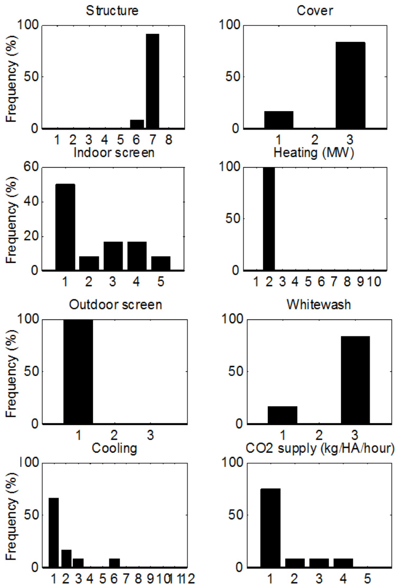

# Model-Based Design of Protected Cultivation Systems – First Results and Remaining Challenges

E.J. van Henten1, 2, a, B. Vanthoor1,3, C. Stanghellini2, P.H.B. de Visser2 and S. Hemming2 1Farm Technology Group, Wageningen University, P.O. Box 317, 6700 AH Wageningen, The Netherlands   
2Wageningen UR Greenhouse Horticulture, P.O. Box 16, 6700 AA Wageningen, The Netherlands   
3HortMaX B.V., Pijnacker, The Netherlands

Keywords: sensitivity analysis, optimization

# Abstract

Protected cultivation systems are used throughout the world as a powerful instrument to produce crops. They protect the crops from unfavorable outdoor climate conditions and pests and offer the opportunity to modify the indoor climate to create an environment that is optimal for crop growth and production, both in terms of quality and quantity. A quick scan of protected cultivation systems presently in use reveals that quite a variety of protected cultivation systems can be found throughout the world. They range from fully passive “solar greenhouses” with thick energy storage walls as found in China to the high-tech “closed greenhouses” in Western Europe. This variety is due to local conditions, including the local climate, the availability of resources like water, energy, capital, labor and materials, local legislation and social aspects, to mention a few. This paper presents a methodology of a model based method for designing protected cultivation systems. First results will be reported as well as directions for future research.

# INTRODUCTION

Protected cultivation systems are used throughout the world as a powerful instrument to produce crops. They protect the crops from unfavorable outdoor climate conditions and pests and offer the opportunity to modify the indoor climate to create an environment that is optimal for crop growth and production, both in terms of quality and quantity.

As illustrated by Figure 1, a quick scan of protected cultivation systems used throughout the world reveals that a wide range of protected cultivation systems has evolved. They range from low-tech, low-cost plastic tunnels to high-tech expensive glasshouses used in Western-Europe and North-America. Greenhouses differ in size, shape and materials used, ranging from Quonset type single span structures covered with plastic to multi-span greenhouses with glass covers. Instrumentation ranges from unheated greenhouses to production systems with computer controlled heating, natural ventilation, $\mathrm { C O } _ { 2 }$ -supply and artificial light. Full scale experiments with semi-closed greenhouses are ongoing in the Netherlands, France and USA. Crops are grown in soil, but also in hydroponic substrates with water and nutrient supply using drip irrigation. Manual labor is commonly used throughout the world, but in high-tech greenhouses the first robots have recently been introduced to replace human labor.

Based on Hanan (1998) and Van Heurn and Van der Post (2004), Van Henten et al. (2006) listed a collection of factors that determine the particular choice of the protected cultivation system used:

1. Market size and regional infrastructure which determines the opportunity to sell products as well as the costs associated with transportation.   
2. Local climate which determines crop production and thus the need for climate conditioning and associated costs for equipment and energy and it determines the greenhouse construction dependent of, for example, wind forces, snow and hail.   
3. Availability, type and costs of fuels and electric power to be used for operating and climate conditioning of the greenhouse.   
4. Availability and quality of water.   
5. Soil quality in terms of drainage, the level of the water table, risk of flooding and topography.   
6. Availability and cost of land, present and future urbanisation of the area, the presence of (polluting) industries and zoning restrictions.   
7. Availability of capital.   
8. The availability and cost of labour as well as the level of education,   
9. The availability of materials, equipment and service level that determines the structures and instrumentation of the protected cultivation systems.   
10. Legislation in terms of food safety, residuals of chemicals, the use and emission of

chemicals to soil, water and air.

The potential impact of the local climate on greenhouse design is demonstrated in a straight forward way by Figure 2. This figure shows, on a monthly basis, the mean outdoor temperature and global radiation sum for three different climate zones i.e. Beijing China, De Bilt The Netherlands and Almeria Spain. In the relatively dark and cold Dutch climate, focus should lie on high light transmitting covers and artificial photosynthetic lighting and a heating system might be profitable. In the relatively sunny and hot climate in Spain, an appropriate cooling technique might be beneficial. Compared to the Netherlands, the Beijing location in China, has sufficient light, but production might benefit from some means of heating in winter time and cooling in summer time.

When the current state in greenhouse design is considered, most studies have focused on optimising the design for a specific location, or they considered only a single design parameter. However, for strategic decision making on the best greenhouse configuration for the different climate conditions throughout the world, a systematic approach that integrates physical, biological and economical models is the most promising way as suggested by Baille (1999). Greenhouse design should then be addressed as a multi-factorial optimisation problem that relies on a quantitative trade-off between the economic return of the crop and the costs associated with construction, maintenance and operation of the greenhouse facility (Van Henten et al., 2006; Vanthoor, 2011). This approach serves three goals. First of all, it offers a basis for understanding the local development of particular greenhouse design. Secondly, it might act as a method to identify new directions for greenhouse design. And thirdly, it can be used as a Decision Support System (DSS) which produces conceptual designs and management of protected cultivation systems for various regions throughout the world.

This paper describes the methodology and some results of a model-based approach to the design of protected cultivation systems. It is based on the work of Vanthoor et al. (2011a, b, c, 2012a, b). Promising and interesting results have been obtained with this methodology so far, but quite some interesting challenges do still remain. These will be addressed at the end of this paper.

Clearly, there are many different ways in which a greenhouse design problem can be addressed. It is not the intention of this paper to review all these different possibilities. This paper illustrates one approach, and hopefully, by doing so, serves as a source of inspiration for other research lines in the broad field of greenhouse design.

# MODEL BASED DESIGN METHODOLOGY

# The Models

Figure 3 illustrates the elements used in the model based greenhouse design methodology (Vanthoor, 2011; Vanthoor et al., 2011a, b, c, 2012a, b). In this approach, attention was focused on a limited sub-set op design parameters. The design parameters, listed on the left hand side in the figure, include the structure of the greenhouse, cover type, shade screen, whitewash, thermal screen, heating system, cooling system and $\mathrm { C O } _ { 2 }$ enrichment. A greenhouse climate model then translates the impact of design parameters, outdoor climate and climate management, i.e. climate setpoints, into indoor climate of the greenhouse in terms of the temperature of the air and the canopy, the $\mathrm { C O } _ { 2 }$ concentration and water vapour concentration and radiation level in the greenhouse. These values are used to calculate crop yield. In this research, a tomato crop was used as model crop. An economic model was then used to calculate the net financial result of the crop production. This financial result includes the investment costs and operational costs of this greenhouse design.

Figure 4 illustrates the outlines of the greenhouse climate model. Different design options are shown that can be used for heating, insulation, shading, cooling, humidification, de-humidification and $\mathrm { C O } _ { 2 }$ -enrichment. The core of the model dates back to Bot (1987) and De Zwart (1996) and was extended to include more equipment and new relationships describing for instance natural side ventilation of the greenhouse.

Figure 5 gives some insight into the structure of the tomato growth model. Photosynthesis is the driving force for tomato growth. Produced carbohydrates are distributed amongst stems, leaves and fruits. The model was essentially based on earlier crop yield models of Dayan et al. (1993), Seginer et al. (1994), Heuvelink (1996), Marcelis et al. (1998), and Linker et al. (2004) with one important extension. As it was expected that novel greenhouse designs might drive the process into unfavourable climate conditions such as very low and very high temperatures, in the current model, a temperature based growth inhibition function was included.

As the design procedure fully leans on mathematical models, the design results will be strongly affected by the ability of the models to describe the characteristics of the real process under a wide range of conditions. Therefore quite some attention was paid to model validation. The greenhouse model was validated with data from the temperate marine climate of The Netherlands, a Mediterranean climate of Sicily, Italy and a semiarid climate of Texas and Arizona, USA. The tomato growth model was validated with data from The Netherlands, from Spain and from a growth experiment with sub-optimal temperatures performed by Adams in the United Kingdom. Both models were able to describe the process fairly well without almost any modification of the model parameters (Vanthoor et al., 2011a, b).

# The Design Methodology

In the current research three techniques were used for (manually) analysing existing or novel designs and for optimizing new designs: (1) sensitivity analysis, (2) scenario studies, and (3) numerical optimization.

1. Sensitivity Analysis. In a sensitivity analysis the influence of parameter variation on for instance yield and resource use can be investigated. Assessing the influence of individual parameters provides very valuable insight into the relative importance of the parameter. If the sensitivity is high, the parameter considered might be a very suitable candidate for design modification. Some more insight can be obtained when doing a combined multi-parameter sensitivity analysis. Some parameters show strong correlations and their combined effect might be stronger than their individual impact on yield and resource use. It is worth noting that the word design parameter should be interpreted in a broad sense. Design parameters can include the obvious parameters like light transmission of the cover, but also setpoints used in climate management and even the outdoor climate can be seen as a design parameter, because the choice of a location might be a factor of choice to the designer as well, thus having consequences in terms of the local climate as well. As was demonstrated by Vanthoor (2011c), it is worth investigating both aggregated values as well as time courses of the sensitivity functions. Single aggregated values allow comparison of the impact of different parameters. The time course produces valuable information of the sensitivity at particular moments in time. This might indicate that during particular moments of the crop production period a design parameter has more effect than at other moments in the production period.

2. Scenario Analysis. Scenario analysis aims at evaluating different pre-defined designs in view of crop yield, resource use and economic return. Vanthoor (2012a) evaluated for

Almeria, Spain, a range of greenhouse designs ranging from the existing low tech designs to more sophisticated designs with heating, cooling and $\mathrm { C O } _ { 2 }$ -enrichment.

3. Optimization. In this case, the optimization module indicated in Figure 3 is put to work and aims at deriving those combinations and values of design parameters that yield the best economic return under the given local circumstances. As the number of design variables is usually large, numerical enumeration of all possible combinations is not feasible in time, and smart numerical algorithms need to be adopted to generate close to optimal solutions in reasonable time. In this research, a population based controlled random search according to Price (1977) was used. A greenhouse design was represented by a design factor, as illustrated in Figure 6, indicating whether or not a particular design factor was used at all, and if it was used, its value was indicated. Vanthoor et al. (2012b) solved the optimization problem using 50 PC’s in parallel for climate conditions in De Bilt, The Netherlands and in Almeria, Spain.

# RESULTS

# Sensitivity Analysis

In a sensitivity analysis, the individual impact and combined impact of design parameters was evaluated for two locations, i.e. Almeria, Spain and Texas, USA (Vanthoor et al., 2011c). Figure 7 shows the time course of the relative sensitivity of the harvest rate towards the PAR $\mathit { \Psi } = \mathit { \Psi }$ photosynthetic active radiation $4 0 0 { - } 7 0 0 ~ \mathrm { n m } )$ transmission coefficient, the NIR (=near infrared radiation $7 0 0 { - } 2 5 0 0 ~ \mathrm { n m } )$ transmission coefficient and the FIR $\mathbf { \bar { \rho } } = \mathbf { \rho }$ far infrared radiation ${ > } 2 5 0 0 ~ \mathrm { n m }$ ) emission coefficient. Positive values indicate that a positive change in the parameter yields an increase in the growth rate and viceversa. It is interesting to note, first of all, that the sensitivity varies quite significantly during the growing season. Secondly, these figures show that the effect of the PAR transmission is more pronounced than the effect of the other two design parameters. Thirdly, for NIR transmission and FIR emission, the sensitivity changes sign, which means that during some stages of the growing period the parameter will positively affect the harvest rate, and during others it will have a negative effect. Finally, for Spain, there is a pronounced dip in the sensitivity function of PAR transmission in winter time. This is counterintuitive as one would expect light to be a limiting factor at that time, even in Spain. This however is due to a secondary effect. At that time, the canopy temperature is sub-optimal and the crop will not benefit from an increase in PAR.

Figure 8 shows the combined effect of the $\mathrm { C O } _ { 2 }$ -enrichment set-point and the ventilation-setpoint on crop yield. Joint effects were also found for, for instance, PAR and FIR transmission of the roof and the PAR transmission of the roof and the temperature set-point for ventilation. Interestingly enough no combined effect was found for the PAR transmission of the roof and the $\mathrm { C O } _ { 2 }$ -concentration in the greenhouse.

# Scenario Studies

In a scenario study for Almeria Spain, the economic return and resource use of a standard parral greenhouse was compared with a multi-tunnel design equipped with combinations of whitewash, $\mathrm { C O } _ { 2 }$ -enrichment, fogging, air heating and hot water pipe heating (Vanthoor et al., 2012a). It was found that a multi-tunnel with whitewash and fogging was most profitable, directly followed by the currently employed parral greenhouse. Other designs yielded a lower economic return. It was interesting to observe that a relatively small increase in the tomato price would make a more advanced greenhouse design economically feasible. Also the impact of price variations and variations in outdoor weather between years was investigated. This revealed that in case of high-price uncertainty, a low tech greenhouse design is the best option. Greenhouses with a more high tech infrastructure are better suited for conditions with large variations in outdoor climate conditions.

# Optimization

The greenhouse optimization was not guided by input of any prior knowledge except for the models as described above. It was interesting to observe that in general terms the optimization yielded greenhouse designs for both Spain and The Netherlands that were quite similar to the designs commonly employed in these locations. This indicates that local designs are at least close to optimal, as one might expect. Alternatively, it indicates that the optimization methods yields realistic results. Because the optimization used a population based evolutionary approach, it allowed for the analysis of the resulting population upon termination of the optimization. Figure 9 shows that, for Spain, the frequency distribution of the various design parameters in the final population, considering greenhouse designs with a reduction in net financial result of maximally $0 . 2 5 \ { \in } . \mathrm { m } ^ { - 2 }$ , compared to the optimal design. This figure tells us that within a range of $\bar { 0 } . 2 5 \ : { \in } . \mathrm { m } ^ { - 2 }$ , some design parameters are very distinct, such as the heating system as well as the outdoor screen. For the indoor screen the result is more diffuse. For both locations the results show that structures with a higher light transmission strongly enhance greenhouse performance. In all cases geothermal energy and mechanical cooling were not considered to be economically feasible because of the high investments with respect to the greenhouse size of 1 ha.

# FUTURE OUTLOOK

Promising results have been obtained with this methodology so far, but quite some interesting challenges still do remain.

# Design Aspects

The list of aspects that play a role in choosing a particular greenhouse design based on Hanan (1998) and Van Heurn and Van der Post (2004) as shown at the beginning of this paper clearly indicates that there is more to the choice and the design of a greenhouse than the aspects covered so far by the work of Vanthoor et al. (2011a, b, c, 2012a, b).

Additionally, inside the greenhouse the design mainly focussed on climate and crop relations in the above soil compartment of a greenhouse. Water and nutrient supply was considered sufficient. Especially in cases when water is a scarce and expensive resource, this research and all its related aspects within the greenhouse should be explicitly considered. In Western societies, availability of sufficiently skilled labour is becoming a pressing issue. Currently, the model based design approach is being extended to labour aspects of protected cultivation as well (Van’t Ooster et al., 2012).

Although already a wide range of equipment was taken into account in this design instrument, there is room for extension with existing and new instrumentation when that appears on the market. For instance heat storage in aquifers was not considered in this approach.

# Crops

To build up the methodology, tomato was used as a model crop. Clearly, this can be easily extended to the many other crops grown worldwide, from potted plants, through fruits and vegetables to flowers, given the fact that a mathematical description of this crop is available. It may not be necessary to model all crops individually, but to consider groups or classes of crops that have similar characteristics in terms of production and response to environment and thus to the design. Beyond standard crops, it would be worth a while to extend this approach also to novelty crops like algae and fish. A first approach in that direction has been described by Slager et al. (2012) for combined production of algae and tomato in greenhouses.

# Economic Criterion

So far, focus was on net financial return. But depending on the local conditions or the interest of the stakeholders, alternative performance criteria can be implemented as well, amongst others maximization of production, minimization of resource use, minimization of emissions, e.g. $\mathrm { C O } _ { 2 }$ , product quality and optimization of land use. Also a Life Cycle Analysis might be included to evaluate the performance of a particular greenhouse design.

# Optimization

The optimization was solved in a practical way by converting a discrete valued design vector into a continuous valued optimization vector which allowed for a solution using the Controlled Random Search algorithm. Some issues are of interest when further research is considered. It was for instance shown by Vanthoor et al. (2008) that there is a potential benefit of simultaneously optimizing both the design as well as the climate control of a protected cultivation system. Also the sensitivity analysis revealed that the sensitivity of some of the design parameters various considerably during the growing period. The transmission factor of the cover for PAR in Spain was an example. This suggests that it might be worth considering to treat a design variable as a continuously varying control variable. Another example is the potential benefit of the explicit use of multi-objective optimization as it is sometimes difficult to derive one unified performance criterion, especially if one or more terms are hard to explicitly express in money. Finally, the optimization described in this paper was very much based on quantitative mathematical models. As it is difficult to capture all knowledge on protected cultivation systems in such models, it is worth investigating mixtures of hard quantitative optimization with more qualitative heuristic knowledge.

# Uncertainty, Risk and Robustness

Weather and market prices will affect the design of a greenhouse. This is a wellknown fact. Investigating the effect of variation or uncertainty in these factors, might produce valuable insight into the robustness of the design in view of these varying external conditions and might serve as an assessment of the risk of failure. Then, the attitude of the grower with respect to risk might influence the particular choice of greenhouse design. Next to that, other uncertainties like grower’s knowledge and skills and pest and diseases in greenhouses affect crop performance and should be included in the overall analysis probably leading to different greenhouse system designs.

# Decision Support System

One of the objectives of this approach was to use the design methodology in a Decision Support System. Various aspects as already listed above, extending the range of design aspects, include more crops, alternative performance criteria, attention need to be paid to a suitable user-interface. Also computation time needed for an optimization has to be drastically reduced. In the current form, the package was written in Matlab®. It is easy to use but notably slow, when large iterative calculations have to be performed. Conversion of the package into a language like C#, might solve this issue.

# ACKNOWLEDGEMENTS

This research was part of the strategic research programmes "Sustainable spatial development of ecosystems, landscapes, seas and regions" and "Sustainable Agriculture", both funded by the Dutch Ministry of Economics, Agriculture and Innovation.

# Literature Cited

Baille, A. 1999. Overview of greenhouse climate control in the mediterranean regions. Cahiers Options Méditerranéennes 31:59-76.   
Bot, G.P.A. 1987. Greenhouse Climate: From Physical Processes to a Dynamic Model. PhD Thesis. Wageningen University, Wageningen, The Netherlands.   
Dayan, E., Van Keulen, H., Jones, J.W., Zipori, I., Shmuel, D. and Challa, H. 1993. Development, calibration and validation of a greenhouse tomato growth model: I. Description of the model. Agricultural Systems 4:145-163.   
De Zwart, H.F. 1996. Analyzing energy-saving options in greenhouse cultivation using a simulation model. PhD Thesis. Wageningen University, Wageningen, The Netherlands.   
Forrester, J.W. 1962. Industrial Dynamics. MIT Press, Cambridge.   
Hanan, J.J. 1998. Greenhouses: Advanced Technology for Protected Cultivation. CRC Press, Boca Raton, USA.   
Heuvelink, E. 1996. Tomato Growth and Yield: Quantitative Analysis and Synthesis. PhD Thesis. Wageningen University, Wageningen, The Netherlands.   
Linker, R., Seginer, I. and Buwalda, F. 2004. Description and calibration of a dynamic model for lettuce grown in a nitrate-limiting environment. Mathematical and Computer Modelling 40:1009-1024.   
Marcelis, L.F.M., Heuvelink, E. and Goudriaan, J. 1998. Modelling biomass production and yield of horticultural crops: a review. Scientia Horticulturae 74:83-111.   
Price, W.L. 1977. A controlled random search procedure for global optimisation. The Computer Journal 20:367-370.   
Seginer, I., Gary, C. and Tchamitchian, M. 1994. Optimal temperature regimes for a greenhouse crop with a carbohydrate pool: A modelling study. Scientia Horticulturae 60:55-80.   
Slager, A.A., Sapounas, A.A., van Henten, E.J. and Hemming, S. 2012. Feasibility study on combined production of algae and tomatoes in a Dutch greenhouse. Submitted to ISHS $7 ^ { \mathrm { t h } }$ International Symposium on Light in Horticultural Systems, Wageningen, The Netherlands.   
Vanthoor, B.H.E. 2011. A Model-based Greenhouse Design Method. PhD Thesis. Wageningen University, Wageningen, The Netherlands.   
Vanthoor, B.H.E., Stanghellini, C., van Henten, E.J. and de Visser, P. 2008. Optimal greenhouse design should take into account optimal climate management. Acta Hort. 802:97-104.   
Vanthoor, B.H.E., Stanghellini, C., van Henten, E.J. and de Visser, P. 2011a. A methodology for model-based greenhouse design: Part 1. Description and validation of a greenhouse climate model for a broad range of designs and climate conditions. Biosystems Engineering 110:363-377.   
Vanthoor, B.H.E., de Visser, P.H.B., Stanghellini, C. and van Henten, E.J. 2011b. A methodology for model-based greenhouse design: Part 2, description and validation of a tomato yield model. Biosystems Engineering 110:378-395.   
Vanthoor, B.H.E., van Henten, E.J., Stanghellini, C. and de Visser, P.H.B. 2011c. A methodology for model-based greenhouse design: Part 3, sensitivity analysis of a combined greenhouse climate-crop yield model. Biosystems Engineering 110:396- 412.   
Vanthoor, B.H.E., Stanghellini, C., van Henten, E.J. and de Visser, P. 2012a. A methodology for model-based greenhouse design: Part 4, Economic evaluation of different greenhouse designs: a Spanish case. Biosystems Engineering 111:336-349.   
Vanthoor, B.H.E., Stanghellini, C., van Henten, E.J. and de Visser, P. 2012b. A methodology for model-based greenhouse design: Part 5, Greenhouse design optimisation for Southern-Spanish and Dutch conditions. Biosystems Engineering 111:350-368.   
Van Henten, E.J., Bakker, J.C., Marcelis, L.F.M., Van’t Ooster, A., Dekker, E., Stanghellini, C., Vanthoor, B.H.E., Van Randeraat, B. and Westra, J. 2006. The adaptive greenhouse - An integrated systems approach to developing protected cultivation systems. Acta Hort. 718:399-406.   
Van Heurn, E. and Van der Post, K. 2004. Protected cultivation - construction, requirements and use of greenhouses in various climates. Agrodok-series No. 23, Agromisa, Wageningen, The Netherlands.   
Van’t Ooster, A., Bontsema, J., van Henten, E.J. and Hemming, S. 2012. GWorkS - a discrete event simulation model on crop handling processes in a mobile rose cultivation system. Biosystems Engineering 112:108-120. Economic variables   
Structure Total   
Cover type Outdoor climate Indoor climate: investments   
Shade screen Climate management Greenhouse TCan, CO2Air,RPAR Tomato Cropyield Economic Net financial   
Whitewash Greenhouse design model TAir,VPAir model model result   
Thermal screen   
Heating system Resource use:   
Cooling system water, energy, CO2, electricity   
$\mathrm { C O } _ { 2 }$ enrichment Investments Net financial result maximum? Greenhouse design NO: Adjust optimisation greenhouse design YES: Greenhouse design is optimal

  
Fig. 1. Different greenhouses in China (a), The Netherlands (b), Spain (c) and Saudi Arabia (d) (Vanthoor, 2011).

  
Fig. 2. The monthly mean outdoor temperature (x-axis) and the global radiation sum (yaxis) for three different climate zones i.e. Beijing China, De Bilt The Netherlands and Almeria, Spain. The arrows indicate when a specific climate modification technique might be beneficial (Vanthoor, 2011).

  
Fig. 3. A model-based greenhouse design method. Design parameters that can be optimized are depicted on the left hand side. A greenhouse climate model, a tomato model and an economic model allow economic evaluation of a handpicked design. The optimization module allows automatic generation of economic optimal design using a population based optimization algorithm (Reproduced from Vanthoor et al. (2011a) with kind permission of IAgrE).   
Fig. 4. The greenhouse climate model (Reproduced from Vanthoor et al. (2011a) with kind permission of IAgrE).

  
Fig. 5. Schematic diagram of the tomato yield model using a modelling formalism of Forrester (1962). The boxes represent the state variables of the model, valves are rate variables. The dashed lines are information flows and the solid lines represent mass flows. The dotted box represents a semi-state variable of the model (Reproduced from Vanthoor et al. (2011b) with kind permission of IAgrE).

  
Fig. 6. A greenhouse design translated into a design vector to be used for the optimization. (a) Each coloured box represents a design element that could be executed by several alternatives as presented in the light-blue boxes. The number of alternatives to fulfil a design element is presented in the upright corner of coloured boxes. (b) An example of a integer greenhouse vector (reproduced from Vanthoor et al. (2012b) with kind permission of IAgrE).

  
Fig. 7. The relative sensitivity of the harvest rate to a variation in: the PAR transmission coefficient (solid line), NIR transmission coefficient (dotted line) and the FIR emission coefficient (dashed line) of the roof from August 1st to July $1 ^ { \mathrm { s t } }$ in Almeria, Spain (a) and Texas, USA (b) (reproduced from Vanthoor et al. (2011c) with kind permission of IAgrE).

  
Fig. 8. The combined effect of the temperature set-point for ventilation  and the $\mathrm { C O } _ { 2 }$ concentration set-point for $\mathrm { C O } _ { 2 } ^ { - }$ enrichment on crop yield in Texas, USA (reproduced from Vanthoor et al. (2011c) with kind permission of IAgrE).

  
Fig. 9. The frequency distribution of the design element alternatives for which the ∆NFR $< 0 . 2 5 \ \mathrm { \epsilon } ^ { \cdot } \mathrm { m } ^ { - 2 }$ year-1 compared to the best greenhouse for Spain (reproduced from Vanthoor et al. (2012b) with kind permission of IAgrE).