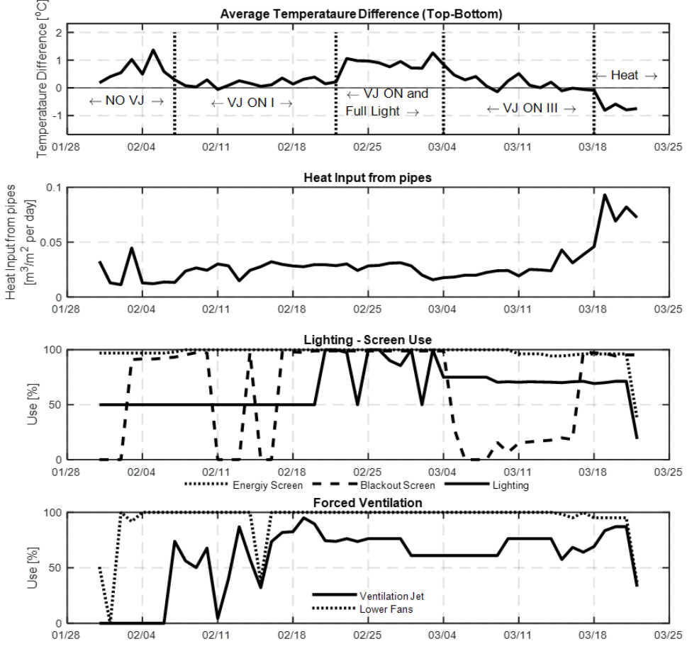
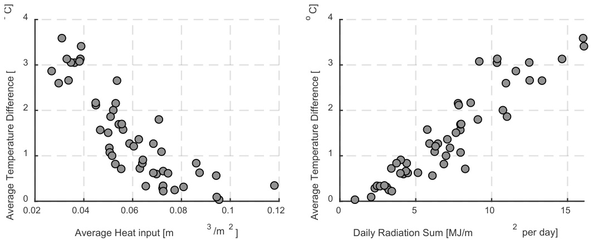
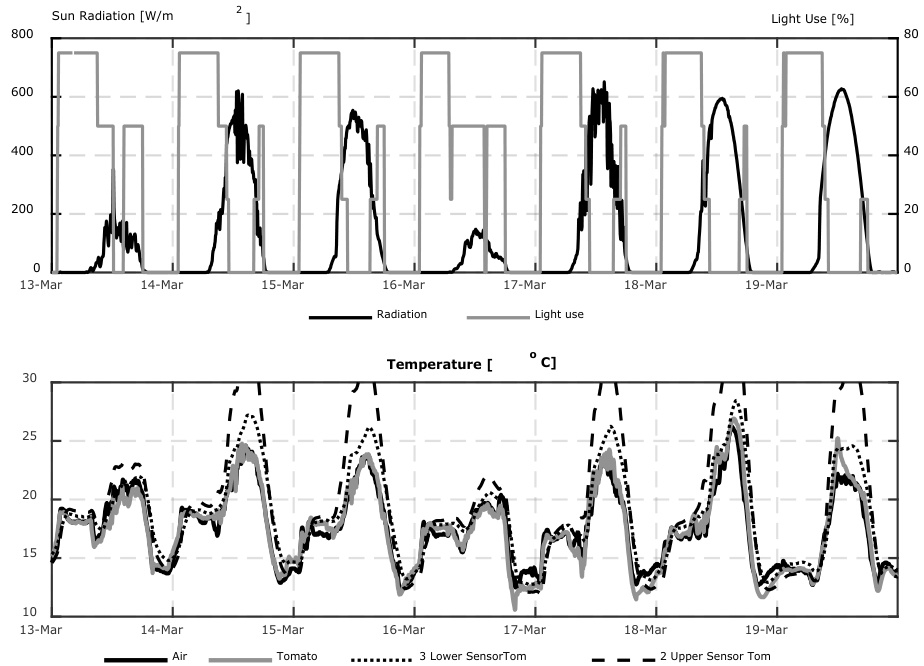
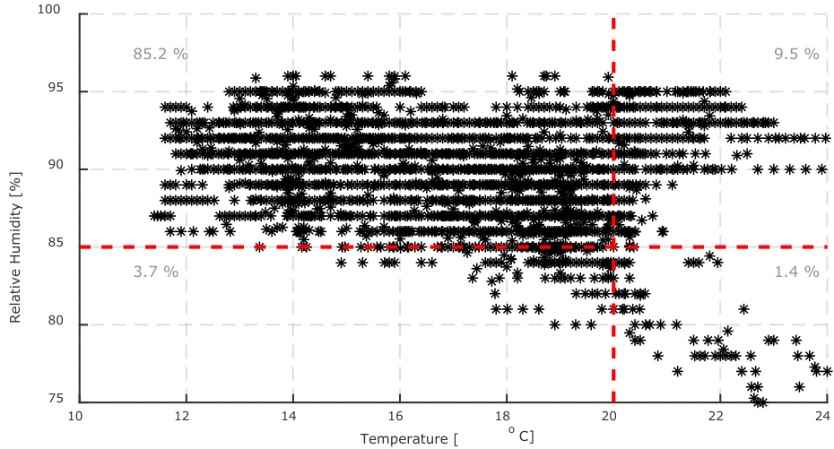

# Study of the vertical temperature profile in a tomato greenhouse equipped with lighting, two screens and a VentilationJet system

# 配备照明、双层幕布和通风喷射系统的番茄温室垂直温度分布研究

Acta Horticulturae Tsafaras, I.; Gelder, A.; Vanthoor, B.H.E. https://doi.org/10.17660/ActaHortic.2020.1296.16

# 配备照明、双层幕布和通风喷射系统的番茄温室垂直温度分布研究

I. Tsafarasa, A. de Gelder and B.H.E. Vanthoor

瓦赫宁根大学与研究中心，温室园艺，邮政信箱644，6700AP瓦赫宁根，荷兰

# 摘要

下一代种植技术（NGG，荷兰语为"Het Nieuwe Telen"）在荷兰温室中的应用带来了节能效果，同时伴随着幕布的广泛使用。后者影响了温室气候的控制，因为温室气候在很大程度上取决于顶部和底部温室隔间之间的空气和湿度交换，而它们被幕布本身隔开。当幕布完全展开时，可以使用空气交换/混合系统（VentilationJet）将干燥和寒冷的空气从顶部隔间吹入温室，以可控的方式降低温室空气温度和相对湿度。在商业温室中研究了这种温室气候控制设备的使用对垂直空气温度分布以及能源使用的影响。分析了2018年冬季人工照明、作物下方管道加热、垂直风扇激活和空气交换率的影响。观察到当作物顶部发生显著的热量输入（辐射）时，存在高达$\mathbf { 2 ^ { \circ } C }$的垂直温度梯度，作物底部比顶部更冷。这种温度梯度不能仅通过使用垂直空气循环风扇来减少，但可以通过底部的额外热量输入来最小化；这可能导致需要通过自然通风或在使用幕布时使用VentilationJet来去除多余的热量。在研究期间，大约四分之一的每日加热用气发生在VentilationJet从温室顶部去除温暖潮湿空气的同时。

关键词：空气温度，垂直温度分布，空气混合系统，微气候，番茄温度

# 引言

商业温室气候控制通常基于一系列测量的气候数据，这些数据作为一系列规则（如果...那么）、影响和相关设置的输入，种植者试图管理这些以实现作物生长和生产的最有利气候，同时应用策略不应导致不必要的资源使用。气候均匀性也是温室控制系统的主要目标之一，因为它与许多明显优势相关，如作物均匀性、较少疾病和潜在节能。通常上述气候数据包括在温室中代表性点收集的温度和湿度测量值。显然，测量的准确性会影响控制的效率。然而，尽管单个传感器获得的测量值准确，但几乎无法提供这些测量值的空间分布信息。先前的研究表明，温室中的温度和湿度变化是常见的（Balendonck等，2014）。

现代温室中不同气候控制设备的应用强烈影响气候均匀性。最具代表性的例子之一是空气交换/混合系统（VentilationJet），当幕布展开时，通常通过将干燥和寒冷的空气从顶部隔间吹入温室来以可控的方式降低温室空气温度和相对湿度。同时使用多个气候控制系统（例如加热、人工照明、幕布和VentilationJet）增加了复杂性，使得难以预测温室中不同地方的局部微气候。无线传感器的出现允许收集更多关于气候均匀性的信息。

本研究的目的是调查气候控制策略，特别是VentilationJet与其他气候控制设备的结合使用如何影响商业温室中的垂直温度分布。

# 材料与方法

实验在荷兰北部的番茄种植者Gardener's Pride的设施中进行。监测气候的温室建于2014年，配备有人工照明（安装强度：$1 2 0 \mathrm { { W m ^ { - 2 } } }$，提供$2 0 0 \mu \mathrm { m o l }$ PAR $\mathbf { m } ^ { - 2 }$ $\left. s ^ { - 1 ^ { \cdot } } \right|$），双层幕布（LUXOUS 1347 FR（节能幕布）和OBSCURA 9950 FR W（遮光幕布）），轨道管道（$5 1 \mathrm { m m } \cdot 1 . 1 7 \mathrm { m }$管道$\mathbf { m } ^ { - 2 }$温室面积）和生长管道（$5 1 \mathrm { m m } \cdot 0 . 5 8 \$ m管道$\mathbf { m } ^ { - 2 }$温室面积）加热系统，VentilationJets（容量$1 5 ~ \mathrm { m ^ { 3 } ~ m ^ { - 2 } ~ h ^ { - 1 } }$）和下部空气循环风扇。自2017年夏季（2017年6月移植）以来，该温室中一直种植着樱桃番茄（'Juanita'）。

使用来自AgriSensys（荷兰）的五个垂直放置的通风温度传感器监测垂直温度分布。数据在温室中的三个位置以5分钟的频率记录，从2018年1月底开始，持续2个月。由于研究VentilationJets和下部空气循环风扇的影响是本研究的目的之一，因此传感器的位置选择在VentilationJet下方、两个VentilationJet之间和与VentilationJet尽可能远的位置；从现在起，报告中这三个位置分别称为"Between VJ"、"Below VJ"和"$\mathrm { N o } \mathrm { V J ^ { \prime \prime } }$"。

还监测了番茄温度。这是通过在番茄果实内部放置热电偶来实现的，当由于插入热电偶而造成的孔洞导致番茄果实物理损坏时，重新放置热电偶。此外，使用红外相机（FLIR $\mathsf { A } 6 5 5 ^ { \mathrm { ~ c ~ } }$，来自FLIR Systems, Inc.，瑞典Täby）监测番茄温度。另外，使用人工制作的番茄（来自HortiMaX，荷兰的SensorTom）配备温度传感器（PT1000）监测较大番茄果实的温度，这些人工番茄具有与真实番茄相同的物理特性；人工番茄的大小与约$2 2 0 { \mathrm { g } }$的番茄果实相当。番茄温度测量在两个VentilationJet之间和与两个VentilationJet在一条线上的测量点（"Between VJ"）进行。

# 结果

在分析期间发现，作物顶部的空气温度平均比作物底部高$0.4^{\circ}\mathrm{C}$（每日变化在0到$1^{\circ}\mathrm{C}$之间）。在光照期间（无论是太阳辐射还是人工照明），这种温差平均几乎翻倍$(0.7^{\circ}\mathrm{C})$，而在黑暗期间，作物底部平均比顶部温暖$0.6^{\circ}\mathrm{C}$。关于垂直温度分布的均匀性，光照和黑暗期间没有显著差异；在5个不同高度测量的温度平均标准差为$0.4^{\circ}\mathrm{C}$。记录的数据与预期没有差异；在光照期间，主要的热量输入来自太阳或人工照明，导致顶部温度较高，而在黑暗期间（在一年中的这个时候）几乎总是有来自加热系统的热量输入，导致底部比顶部温暖。

为了更详细地分析气候控制措施与天气对垂直空气温度分布的影响，每天定义了三个不同的时期，并分别讨论了每个时期的结果。

# 空气温度

# 1. 人工照明且无阳光的时期

这是一天中使用人工照明并展开幕布的时期。这是本研究主要关注的时期，因为这是大多数气候控制措施发生的时期。图1（上图）显示了在人工照明开启、至少一个幕布展开且没有太阳辐射的时段内，作物顶部和底部之间温度差异的日平均值。在分析期间，关于垂直温度差异，可以区分出5个子时期（图1）：

  
图1. 在照明开启且无阳光的时段内，垂直温度差异（上图）和气候控制设备（加热、照明、幕布使用、垂直风扇和VentilationJets）的日平均值。

子时期1：仅使用下部通风机

2月第一周，温度差异较大。在此期间，作物顶部的空气平均比底部温暖$0.8^{\circ}\mathrm{C}$，在某些夜晚达到$1.5^{\circ}\mathrm{C}$。这一时期的特点是：使用人工照明（总容量的一半），管道热量输入较低（除一天外），幕布未展开，未使用VentilationJets，仅使用了下部空气循环风扇。可以得出结论，照明提供的热量在垂直方向上没有均匀分布到温室中；可能是作物对气流的阻力起到了重要作用（特别是对于植物之间传感器记录的测量值）。比较使用下部空气循环风扇的夜晚与未使用的夜晚（例如2月1日和2日）的垂直温度差异，可以得出结论，使用风扇并不能减少垂直温度差异。一个可能的原因是作物的阻力迫使暖空气主要水平移动而不是垂直向下移动。

# 子时期2：VentilationJet开启I

接下来的两周（2月第二和第三周），顶部和底部之间的温度差异最小化。在此期间，平均温度差异小于$0.2^{\circ}\mathrm{C}$（每日从0到$0.4^{\circ}\mathrm{C}$）。在此期间使用了VentilationJets，此外，管道的热量输入平均比2月第一周多了一倍以上（估计平均分别为23.5和$11\mathrm{W}\mathrm{m}^{-2}$）。显然，来自顶部（人工照明）和底部（加热系统）的热量输入更加平衡，导致垂直温度分布更加均匀。我们可以假设，由于测量位置靠近或远离VentilationJets没有大的差异，来自VentilationJets的冷空气输入通过下部空气循环风扇相当均匀地分布。此外，由于密度差异，冷空气更容易向下移动，也有助于更均匀的温度分布。

# 子时期3：VentilationJet开启且全光照

2月最后一周和3月前10天，顶部和底部之间的温度差异再次增加到$0.8^{\circ}\mathrm{C}$（平均）。在此期间，人工照明以全容量使用，导致温室顶部的热量输入是前几天的两倍；下部（加热系统）的热量输入与之前没有显著差异。另一方面，时期3的室外空气温度平均比时期2低$5^{\circ}\mathrm{C}$（分别为-5.3和$-0.2^{\circ}\mathsf{C}$），但由于窗户开得较少，来自冷空气输入（VentilationJets）的额外热量去除很少，显然不足以补偿来自照明的额外热量输入。为了提供上述热通量的数量级，假设在时期3中冷空气输入比时期2低$2^{\circ}\mathrm{C}$，那么这将导致仅去除约$8~\mathrm{W}~\mathrm{m}^{-2}$，而双倍光强为温室能量平衡增加了约$30\mathrm{W}\mathrm{m}^{-2}$。

# 子时期4：VentilationJet开启III

从3月5日开始的2周期间，顶部和底部之间的空气温度差异再次很小。在此期间，光强设置为总容量的$75\%$，此外，一个幕布主要保持折叠，允许更容易地将（热）空气去除到顶部隔间（幕布上方）。在此期间，记录的顶部和底部之间的平均空气温度差异仅为$0.1^{\circ}\mathrm{C}$。

子时期5：加热

分析期间的5天，作物底部（平均$0.8^{\circ}\mathrm{C}$）比顶部温暖。在此期间，加热系统的热量输入增加了4倍（与时期4相比），管道温度约为$50^{\circ}\mathrm{C}$。底部额外热量输入的结果是上述顶部和底部之间的负温度差异。

总结发现，使用人工照明而没有来自管道的热量输入且不使用VentilationJets会导致垂直温度梯度，作物顶部比底部温暖约$1^{\circ}\mathrm{C}$。这种温度差异不能仅通过使用下部垂直风扇来控制，但当同时使用VentilationJets和加热系统时可以控制。具体来说，当VentilationJets从温室顶部去除部分热量，同时几乎相同数量的热量从加热系统添加时，垂直维度上的温度分布非常均匀。然而，需要在这些热通量之间保持平衡；发现来自照明（时期3）或管道（时期5）的更多能量输入仍可能导致垂直温度差异，分别使顶部或底部更温暖。

# 2. 白天时段（有太阳辐射）

在光照期间，作物顶部的空气几乎总是比底部更温暖。可以得出结论，太阳和灯具提供的热量相对更多地加热了温室空气的顶部而不是底部；考虑到发育良好的番茄冠层（叶面积指数为$3.5\mathrm{m}^{2}\mathrm{m}^{-2}$）吸收了超过$90\%$的直接太阳辐射，上述结果是预期的。直到2月中旬，当天气相对寒冷、白天较短且较暗时，记录的垂直温度差异较小。2月下旬和3月期间，温度差异略有增加，既有垂直温度差异较大的日子，也有较小的日子。

在光照期间，观察到热量输入量与垂直温度差异之间存在强相关性；从轨道和生长管道输入的热量越多，作物顶部和底部之间的温度差异越小，这主要是由于底部温度升高。这在3月更加明显，当管道热量输入较低的日子，垂直温度差异比管道热量输入较多的日子要大得多（图2）。当然，实现管道热量输入的日子也是最黑暗的日子，因此太阳辐射的影响也会影响垂直温度分布。可以大致得出结论，在非常黑暗的日子（每日总辐射量$<2\mathrm{MJ}\mathrm{m}^{-2}$）和实现约17 MJ$\mathbf{m}^{-2}$天-1辐射量的日子之间，每增加1 MJ$\mathbf{m}^{-2}$辐射量，垂直温度差异增加约$0.2^{\circ}\mathrm{C}$（顶部更温暖）（图2）。

  
图2. 光照期间每日平均垂直温度差异（顶部-底部）与加热系统热量供应（左）和每日辐射量（右）的关系。

总结来说，在晴天应该预期会存在垂直温度梯度。如果想要最小化这些差异，观察到使用加热系统可以很好地实现这一点；如果额外的热量供应导致需要排出的热量过剩，预计增加的通风率将有助于实现更均匀的垂直温度分布，但需要评估这是否比其他副作用（如更高的$\mathsf{CO}_{2}$损失）更可取。

# 3. 黑暗时段

在分析期间，Gardener's Pride通常实现了约$6\mathrm{h}$的黑暗时段，从18:00到00:00。在黑暗时段，加热系统几乎连续使用以达到温度设定值。这几乎总是导致负的垂直温度差异，换句话说，作物底部比顶部更温暖。考虑到在此期间窗户总是稍微打开，从外部进入的冷空气（比温室空气低达$15^{\circ}\mathrm{C}$）与加热系统的热量输入共同造成了上述差异。由于浮力作用，垂直温度分布趋于均匀化，但只要底部继续输入热量并且冷空气继续进入，差异就会保持。当外部空气温度较低时（例如2月底和3月初），垂直温度差异往往更大（底部更温暖）。

# 番茄温度

观察到果实温度通常非常接近空气温度。樱桃番茄的温度与空气温度几乎没有差异（图3），即使在早晨升温期间和下午降温期间，也只观察到空气和番茄温度变化的轻微延迟。更具体地说，在早晨，番茄从太阳中升温比空气稍快，在下午，它们降温比空气慢几分钟。在白天期间，番茄温度非常接近空气温度；只有在少数晴天，番茄温度超过了空气温度（图3）。在黑暗期间，番茄温度往往略高于空气温度，主要是因为番茄降温比空气稍慢。最后，在人工照明期间，番茄保持略高于空气的温度。在24小时的基础上，平均番茄温度比平均空气温度高约$0.12^{\circ}\mathrm{C}$。

  
图3. 2018年3月一周期间的太阳辐射强度和照明（上图）以及空气、真实（樱桃）番茄和人工（大）番茄（下SensorTom）温度。

总的来说，在不同高度记录的番茄温度没有显著差异；番茄温度跟随空气温度，当不同高度的空气温度相似时，番茄温度也是如此。

人工番茄的结果则大不相同，与温室空气温度（和真实（樱桃）番茄温度）相比，人工番茄在升温和降温方面表现出显著的延迟。显然，番茄大小（以及热容量）对跟随气候条件变化所需的时间有很大影响。

此外，在晴天，人工番茄的温度比空气温度高达$5^{\circ}\mathrm{C}$，而真实（樱桃）番茄的温度与温室空气温度的差异几乎不超过$1^{\circ}\mathrm{C}$。此外，在这些日子里，顶部2个和底部3个人工番茄之间存在很大的温度差异，展示了直接太阳辐射对番茄温度的影响（图3）。

# 讨论与结论

本研究收集了大量数据，旨在尽可能清晰地展示所应用的气候控制措施如何影响垂直温度分布，以及额外的能量输入是否会导致更有利于作物生长的气候。总的来说，可以得出结论：当作物顶部有显著的热量输入（辐射）时，作物底部通常会保持较冷；这在白天的阳光照射期间和黑暗的照明期间都很明显。研究发现，在晴天期间，这种温度差异超过$3^{\circ}\mathrm{C}$，而在黑暗照明期间则超过$1^{\circ}\mathrm{C}$。在这种情况下，很难产生能够将热量从作物顶部传递到底部的垂直空气流动。因此，仅使用下部垂直循环风扇对垂直温度分布没有影响。通过在作物底部增加热量输入，垂直温度梯度会变小。研究发现，在阴天更密集使用加热系统时，顶部和底部的温度相似。在黑暗照明期间，当更多地使用加热系统时，也发现了类似的结果。在这种情况下，VentilationJets被用来去除作物顶部几乎与加热系统添加的相同数量的能量，从而形成了均匀的垂直温度分布。

在使用VentilationJets的月份中，加热系统总日使用量的大约$26\%$（约$2~\mathrm{m}^{3}$气体）发生在使用人工照明和VentilationJets的时刻。VentilationJets从温室中去除的热量大致等于加热管道添加的热量。因此，形成了均匀的垂直温度分布。换句话说，通过增加来自管道的热量输入和VentilationJet的热量释放，可以创建更均匀的垂直温度分布。从能源角度来看，这并不明智，因为理论上，似乎可以在不使用VentilationJets去除热量和同时不使用加热系统输入热量的情况下实现相同的净能量平衡。

然而，对幕布展开期间相对湿度值（达到或超过温室中高质量番茄生长和生产的最大可接受限度）的更详细观察表明，在不改变温室设备（幕布类型）或气候控制（例如，幕布位置、照明、温度设定值）的情况下停止使用VentilationJets，会由于超优湿度水平而导致重大问题（图4）。

总结来说，来自管道的热量输入旨在降低相对湿度。因此，多余的热量和湿度被VentilationJets去除，垂直温度分布同时受到管道加热和VentilationJets的影响。

此外，科学研究表明，在作物顶部周围空气温度相同的情况下，是否存在垂直温度梯度（即作物底部周围空气温度较低或保持相同温度）对作物生长和果实产量的影响最小，因为大多数生理过程，如同化物的生产和分配，不会受到影响（Qian et al., 2012, 2015）。

总结来说，本研究详细展示了气候控制措施如何影响垂直空气温度梯度，以及维持垂直维度上均匀温度所需的（能源）成本。它还解释了种植者应用的气候控制方法（可被描述为"高能量输入-高能量输出"方法）何时以及如何导致均匀的垂直温度分布。虽然本研究范围之外的是检查均匀温度分布与垂直温度梯度相比是否以及在多大程度上有利于作物生长和产量，但基于已发表的研究数据，可以注意到在一定限度内的垂直温度梯度不会对作物生长产生显著的负面影响，只会影响果实的生长速度和大小。然而，研究也表明，即使作物生长和产量方面的预期收益不是维持所应用的气候控制方法的强有力论据，对除湿的高需求也不允许对上述策略进行重大改变，除非有替代的除湿方法可用。

  
图4. 使用VentilationJet期间的温室气候（空气温度和相对湿度）。

# 参考文献

Balendonck, J., Sapounas, A.A., Kempkes, F., van Os, E.A., van der Schoor, R., van Tuijl, B.A.J., and Keizer, L.C.P. (2014). 使用无线传感器网络确定温室环境的气候异质性. Acta Hortic. 1037, 539–546 https://doi.org/10.17660/ActaHortic.2014.1037.67.   
Qian, T., Dieleman, J.A., Elings, A., De Gelder, A., Van Kooten, O., and Marcelis, L.F.M. (2012). 半封闭温室中的垂直温度梯度：发生与影响. Acta Hortic. 927, 59–66 https://doi.org/ 10.17660/ActaHortic.2012.927.5.   
Qian, T., Dieleman, J.A., Elings, A., De Gelder, A., and Marcelis, L.F.M. (2015). 番茄作物生长和发育对半封闭温室中垂直温度梯度的响应. J. Hortic. Sci. Biotechnol. 90 (5), 578– 584 https://doi.org/10.1080/14620316.2015.11668717.

# Literature cited

Balendonck, J., Sapounas, A.A., Kempkes, F., van Os, E.A., van der Schoor, R., van Tuijl, B.A.J., and Keizer, L.C.P. (2014). Using a wireless sensor network to determine climate heterogeneity of a greenhouse environment. Acta Hortic. 1037, 539–546 https://doi.org/10.17660/ActaHortic.2014.1037.67.   
Qian, T., Dieleman, J.A., Elings, A., De Gelder, A., Van Kooten, O., and Marcelis, L.F.M. (2012). Vertical temperature gradients in the semi-closed greenhouses: occurrence and effects. Acta Hortic. 927, 59–66 https://doi.org/ 10.17660/ActaHortic.2012.927.5.   
Qian, T., Dieleman, J.A., Elings, A., De Gelder, A., and Marcelis, L.F.M. (2015). Response of tomato crop growth and development to a vertical temperature gradient in a semi-closed greenhouse. J. Hortic. Sci. Biotechnol. 90 (5), 578– 584 https://doi.org/10.1080/14620316.2015.11668717.