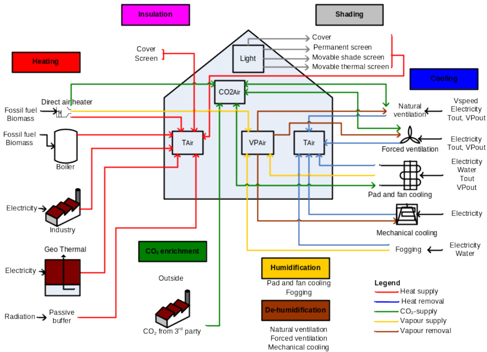
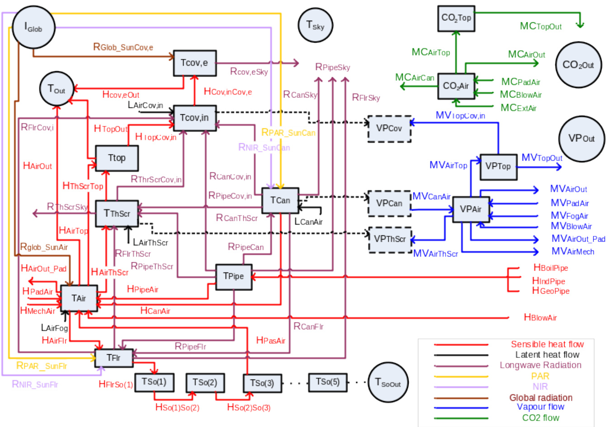

Electronic appendix of the manuscript entitled: A methodology for model-based greenhouse design: Part 1, A greenhouse climate model for a broad range of designs and climates

B.H.E. Vanthoor1,2, C. Stanghellini1, E.J. van Henten1,2, P.H.B. de Visser1

1Wageningen UR Greenhouse Horticulture, P.O. Box 644, NL-6700 AP Wageningen, The Netherlands 2Farm Technology Group, Wageningen University, P.O. Box 17, NL-6700 AA Wageningen, The Netherlands

# Greenhouse climate model description

Section 1 presents the design elements needed for the greenhouse climate model. The overview and states of the greenhouse climate model are described in Section 2 and the lumped cover model is described in Section 3. The model capacities are described in Section 4. The heat fluxes are described in Section 5, the vapour fluxes in Section 6 and the $\mathrm { C O } _ { 2 }$ - fluxes in Section 7. The canopy transpiration model is presented in Section 8. Section 9 presents the model equations of the implemented design elements and Section 10 describes the calculation of unknown outdoor climate inputs. The tables are presented in Section 11.

# Nomenclature

States, flux densities, superscripts and subscripts used in the model

<html><body><table><tr><td></td><td>Name</td><td>Unit</td><td></td></tr><tr><td>States</td><td></td><td></td><td></td></tr><tr><td>CO2</td><td>Carbon dioxide concentration</td><td>mg m-³</td><td></td></tr><tr><td>T</td><td>Temperature</td><td>℃</td><td></td></tr><tr><td>VP</td><td>Vapour pressure</td><td>Pa</td><td></td></tr><tr><td></td><td></td><td></td><td></td></tr><tr><td>Flux densities</td><td></td><td></td><td></td></tr><tr><td>H</td><td>Sensible heat flux density</td><td>W m-2</td><td></td></tr><tr><td>L</td><td>latent heat flux density</td><td>Wm²</td><td></td></tr><tr><td>MC</td><td>mass COz-flux density</td><td>mg m² s-1</td><td></td></tr><tr><td>MV</td><td>mass vapour flux density</td><td>kg m2 s-1</td><td></td></tr><tr><td>R</td><td>FIR flux density</td><td>W m²</td><td></td></tr><tr><td>RNIR</td><td>NIR flux density</td><td>W m²</td><td></td></tr></table></body></html>

<html><body><table><tr><td>RPAR</td><td>PAR flux density</td><td>Wm²</td></tr><tr><td>RGlob</td><td>Global radiation flux</td><td>W m²</td></tr><tr><td></td><td>density</td><td></td></tr><tr><td>Superscripts</td><td></td><td></td></tr><tr><td>Day</td><td>Day period</td><td>Mean Mean value</td></tr><tr><td>Night</td><td>Night period</td><td></td></tr><tr><td>Subscripts Air</td><td>Greenhouse air</td><td>Obj Different greenhouse</td></tr><tr><td></td><td>compartment below thermal screen</td><td>objects</td></tr><tr><td>b</td><td>Boundary</td><td>Out Outside air</td></tr><tr><td>Blow</td><td>Direct air heater.</td><td>PAR Photosynthetically</td></tr><tr><td>Boil</td><td>Boiler</td><td>Active Radiation Pad Pad and fan system</td></tr><tr><td>Can</td><td>Canopy</td><td>Pas Passive heat storage</td></tr><tr><td></td><td></td><td>facility</td></tr><tr><td>Clear Cloud</td><td>Clear sky conditions Pipe</td><td> Pipe heating system</td></tr><tr><td>Cov</td><td>Cloudy sky conditions Rf</td><td>Roof of the greenhouse</td></tr><tr><td>e</td><td>Cover Roof</td><td>Roof ventilation</td></tr><tr><td>Ext</td><td>External side s</td><td> Stomata</td></tr><tr><td></td><td>External CO source Side</td><td>Side ventilation</td></tr><tr><td>FIR</td><td>Far Infrared Radiation Sky</td><td>Sky</td></tr><tr><td>Flr</td><td>Floor So(i)</td><td>The ‘j'th the soil layer</td></tr><tr><td>Fog</td><td>Fogging system Soil</td><td>The soil</td></tr><tr><td>Geo</td><td>Geothermal heat Sun</td><td>The sun</td></tr><tr><td>Gh</td><td>Greenhouse ShScr</td><td>Shading screen</td></tr><tr><td>Glob in</td><td>Global radiation</td><td>ShScrPer Semi permanent screen</td></tr><tr><td></td><td>Internal side Top</td><td>Compartment above the thermal screen</td></tr><tr><td>Ind</td><td>Industrial source</td><td>ThScr Thermal screen</td></tr><tr><td>Leaf</td><td>Canopy leaf</td><td>Vent Natural ventilation</td></tr><tr><td>Leakage</td><td>Leak ventilation</td><td>Ventforced Forced ventilation</td></tr><tr><td></td><td>through cracks</td><td></td></tr><tr><td>Mech</td><td> Mechanical cooling</td><td>Wind Wind</td></tr></table></body></html>

<html><body><table><tr><td></td><td></td><td></td><td></td></tr><tr><td>NIR</td><td>NearInfrared Radiation</td><td></td><td></td></tr></table></body></html>

External climate inputs, remaining inputs and climate control variables.

<html><body><table><tr><td>External Climate Inputs CO20ut</td><td>Outdoor CO2 concentration</td><td>mg m-3</td><td></td></tr><tr><td>IGlob</td><td>The outside global radiation</td><td>Wm²</td><td></td></tr><tr><td>Tout</td><td>Outdoor temperature</td><td>℃</td><td></td></tr><tr><td>Tsly</td><td> Sky temperature</td><td>℃</td><td></td></tr><tr><td>Tsoout</td><td>Soil temperature of outer soil layer</td><td>℃</td><td></td></tr><tr><td>VPout</td><td>Outdoor vapour pressure</td><td>Pa</td><td></td></tr><tr><td>Vwind</td><td>Outdoor wind speed</td><td>ms-1</td><td></td></tr><tr><td></td><td></td><td></td><td></td></tr><tr><td>Remaining inputs</td><td></td><td></td><td></td></tr><tr><td>LAI</td><td>The leaf area index The net CO2 flux from</td><td>m²m² mg m3 s-1</td><td>Vanthoor et al</td></tr><tr><td>MCAirCan</td><td>the air to the canopy by taking into account the canopy photosynthesis rate and respiration processes</td><td></td><td>(Submitted)</td></tr><tr><td>TMechCool</td><td>The temperature of the cool surface of the mechanical cooling system</td><td>℃</td><td></td></tr><tr><td></td><td></td><td></td><td></td></tr><tr><td>Climate control variables (-)</td><td></td><td></td><td></td></tr><tr><td>U Blow</td><td>Heat blower control</td><td>U Roof</td><td>Control of the roof</td></tr></table></body></html>

<html><body><table><tr><td></td><td></td><td></td><td>ventilators</td></tr><tr><td>U Boil</td><td>Boiler control</td><td>U side</td><td>Control of the side ventilators</td></tr><tr><td>U Heatind</td><td>Control of the heat input from industry</td><td>UventForced</td><td>Control of the forced ventilation</td></tr><tr><td>U HeatGeo</td><td>Control of the heat input from geothermal source</td><td>U ExtCO2</td><td>Control of the CO2- input from an external source</td></tr><tr><td>U pad</td><td>Pad and fan control</td><td>U shScr</td><td>Control of the external shading screen</td></tr><tr><td>U MechCool</td><td>Control of the mechanical cooling</td><td>U shSerPer</td><td>Control of the semi- permanent shading screen</td></tr><tr><td>U Fog</td><td>Control of fogging system</td><td>U ThSer</td><td>Control of the thermal screen</td></tr></table></body></html>

Overview of the remaining model symbols with their units.

<html><body><table><tr><td>Water vapour content</td><td>Vapour exchange coefficient</td><td>Speed Λ</td><td>Time switch</td><td>Value of the differentiable</td><td>transpiration</td><td>Resistance factor for Resistance 1</td><td>Length 1</td><td>Heat exchange coefficient</td><td>Thickness 4</td><td>View factor H</td><td>Flux</td><td>Fraction J</td><td>Damping gdepth a</td><td>Depth p</td><td>Capacity of t f theassociated state</td><td>Specific I Area ：heat capacity H</td><td>coefficient</td><td>Amplitude or absorption D</td><td>Transmission coefficient 1 I</td><td>Thermal heat conductivity</td><td>Density or 1 Conversion( r reflection coefficient coefficient 0</td><td>FIR emission coefficient 3</td><td>Diameter Time e shift of sine function P d</td><td>Remaining symbols</td></tr><tr><td>X</td><td>品</td><td></td><td>1</td><td>S</td><td></td><td>sm</td><td>m-2</td><td>HEC M</td><td>Ⅱ -</td><td></td><td>-</td><td>-</td><td></td><td>cap</td><td>Jkg1K1</td><td></td><td></td><td></td><td></td><td></td><td></td><td></td><td></td></tr><tr><td>kg water kg1 air</td><td>Pa-1 s</td><td></td><td></td><td></td><td></td><td></td><td></td><td>K-1</td><td></td><td>ms11</td><td></td><td></td><td></td><td></td><td>I</td><td></td><td></td><td>Wm1 K</td><td>kg m3， 1</td><td></td><td></td><td></td></tr></table></body></html>

# 1 Greenhouse design elements

The selected functions and design elements for the greenhouse design model are presented in Fig. 1. The greenhouse design functions: heating, insulation, shading, cooling, $\mathrm { C O } _ { 2 }$ enrichment, humidification and de-humidification were fulfilled by one or more design elements For example, the function heating could thus be fulfilled by the following design elements: the direct air heater, boiler, industrial heat source, geo-thermal source, and a passive buffer. In view of design of protected cultivation systems, the presented design elements are considered to be sufficiently generic for a wide range of locations all over the world. Local particular solutions for energy production, energy conversion or climate modification such as a co-generator, artificial light, an active heat buffer, a heat pump and a solar heat collector lie outside the scope of the current study.

Fig. 1 Selected functions (coloured boxes), and design elements (text blocks and pictures below the accompanying functions), needed for the greenhouse design method to manage the greenhouse climate (transparent boxes inside the greenhouse). The coloured arrows represent the various energy and mass fluxes (legend at the bottom right).

# 2 Model overview and state equations

# 2.1 Notational conventions

All the state variables, fluxes, inputs, superscripts and subscripts are listed in the Nomenclature. All the model parameters and greenhouse design parameters are listed in Table 1 and Table 2, respectively. For the description of  the state variables and the fluxes of the greenhouse climate model, the notational conventions of De Zwart (1996) are used. The state variables of the model are denoted by names with capital letters followed by one subscript, i.e. $T _ { A i r }$ . The model fluxes start with a capital letter and are followed by two subscripts. The first subscript represents the source of the flux and the second subscript represents the destination of the flux, i.e. $H _ { C a n A i r }$ . The radiation fluxes start with a capital letter $R$ followed with the type of radiation and then two subscripts to represent the source and sink of the specific radiation, i.e. RPAR_SunCan.

# 2.2 Model overview and assumptions

An overview of the states and the energy and mass fluxes of the greenhouse model is presented in Fig. 1. The model is based on the following assumptions:

1. greenhouse air is considered to be a “perfectly stirred tank” which means that no spatial differences in temperature, vapour pressure and the $\mathbf { C O } _ { 2 } .$ -concentration occur. Therefore all the model fluxes are described  per square metre of  greenhouse floor.   
2. to describe the effect of the thermal screen on the indoor climate, the greenhouse air is divided into two compartments: one below and one above the thermal screen.

Fig. 2 Overview of the state variables (blocks), semi-state variables (dotted blocks), external climate inputs (circles) and fluxes (arrows) of the greenhouse model. Coloured arrows represent the various energy and mass fluxes (legend at the bottom right).The abbreviations and their meaning are listed in the Nomenclature and the underlying equations are presented in Section 2.3.

# 2.3 States of the model

The states of the model are all described by differential equations. The time derivatives of the states to time are presented by a dot above the state symbol. All symbols are defined in the Nomenclature.

2.3.1 Temperature of different greenhouse objects Canopy temperature $T _ { C a n }$ is described by:

$$
\begin{array} { r l r } { c a p _ { _ { C a n } } \dot { T } _ { _ { C a n } } = R _ { _ { P i R _ { - } } > s u r c a n } + R _ { _ { N I R _ { - } } < s u r c a n } + R _ { _ { P i p e C a n } } } & { } & \\ { - \textbf { \textit { H } } _ { _ { C a n a i r } } - L _ { _ { C a n a i r } } - R _ { _ { C a n c o v , i n } } - R _ { _ { C a n c r i r } } - R _ { _ { C a n s i y } } - R _ { _ { C a n a i r i s c r } } } & { } & { [ \mathrm { W } \mathrm { m } ^ { - 2 } ] } \end{array}
$$

where $c a p _ { C a n }$ is the heat capacity of the canopy, $R _ { P A R \_ S u n C a n }$ is the PAR absorbed by the canopy, $R _ { N I R \_ S u n C a n }$ is the NIR absorbed by the canopy. FIR is exchanged between the canopy and surrounding elements i.e. the heating pipes $R _ { P i p e C a n }$ , the internal cover layer $R _ { C a n C o v , i n } .$ , the floor $R _ { C a n F l r } ,$ the sky $R _ { C a n S k y } ,$ and the thermal screen RCanThScr. $H _ { C a n A i r }$ is the sensible heat exchange between canopy and greenhouse air and $L _ { C a n A i r }$ is the latent heat flux caused by transpiration.

Greenhouse air temperature $T _ { A i r }$ is described by:

$$
\begin{array} { r l } & { c a p _ { A r } \dot { T } _ { A i r } = H _ { c a n A i r } + H _ { p _ { a d A i r } } + H _ { M e c h a i r } + H _ { P i p e A i r } + H _ { p _ { a s A i r } } + H _ { B o w A i r } + R _ { G l a b _ { - } S u n A i r } } \\ & { \phantom { c a p p c } - H _ { A i r R i r } - H _ { A i r n S c r } - H _ { A i r o u t } - H _ { A i r n p } - H _ { A i r o u t _ { - } P a d } - L _ { A i r e g } } \end{array} [ \mathrm { W } \mathrm { m } ^ { - 2 } ]
$$

where $c a p _ { A i r }$ is the heat capacity of the greenhouse air. Sensible heat is exchanged between the greenhouse air and the surrounding elements i.e. the canopy $H _ { C a n A i r }$ , the outlet air of a cooling pad $H _ { P a d A i r } ,$ the mechanical cooling system $H _ { M e c h A i r . }$ , the heating pipes $H _ { P i p e A i r ; }$ the passive energy buffer $H _ { P a s A i r }$ , the direct air heater $H _ { B l o w A i r } ,$ , the floor $H _ { A i r F l r }$ , the thermal screen $H _ { A i r T h S c r . }$ , the outdoor air $H _ { A i r O u t } ,$ the air of the top compartment which is located above the thermal screen $H _ { A i r T o p }$ , and the outdoor air due to the air exchange caused by the pad and fan system $H _ { A i r O u t \_ P a d }$ . $R _ { G l o b \_ S u n A i r }$ is the global radiation which is absorbed by the construction elements and which is released to the air and $L _ { A i r F o g } $ is the latent heat needed to evaporate the water droplets added by a fogging system.

The floor layer is the first layer of the greenhouse underground and its temperature $T _ { F l r }$ is described by:

$$
\begin{array} { r l } & { c a p _ { _ { F l r } } \dot { T } _ { _ { F l r } } = H _ { _ { A i r F l r } } + R _ { _ { P A R _ { - } S u n F l r } } + R _ { _ { N I R _ { - } S u n F l r } } + R _ { _ { C a n F l r } } + R _ { _ { P i p e F l r } } } \\ & { ~ - ~ H _ { _ { F l r S o 1 } } - R _ { _ { F l r C o v , i n } } ~ - ~ R _ { _ { F l r S k y } } ~ - ~ R _ { _ { F l r T h S c r } } } \end{array}
$$

[W m-2]

where $c a p _ { F l r }$ is the heat capacity of the floor; $R _ { P A R \_ S u n F l r }$ is the PAR absorbed by the floor; $R _ { N I R \_ S u n F l r }$ is the NIR absorbed by the floor; RPipeFlr, RFlrCov,in, $R _ { F l r S k y }$ and $R _ { F l r T h S c r }$ are the FIR fluxes between the floor and heating pipes, internal cover layer, sky and thermal screen respectively; and $H _ { F l r S o 1 }$ is the sensible heat flux from the floor to soil layer 1.

Because of the high thermal capacity, the soil was divided into five layers with an increasing thickness with increasing soil depth. The soil temperature $T _ { S o ( j ) }$ of layer $\mathbf { \omega } ^ { \ast } j ^ { \prime }$ is described by: $c a p _ { _ { S o } ( j ) } T _ { _ { S o } ( j ) } = H _ { _ { S o } ( j - 1 ) S o } ( _ { j } ) \cdot \ H _ { _ { S o } ( j ) S o } ( _ { j + 1 } ) \qquad j = 1 , 2 . . . . . 5$ $\mathrm { [ w _ { m } \mathrm { \cdot } 2 ] }$ (4) where $c a p _ { S o ( j ) }$ is the heat capacity of each soil layer, $H _ { S o ( j - 1 ) S o ( j ) }$ is the conductive heat flux from layer $$ - $\mathbf { \nabla } _ { 1 } \cdot \mathbf { \nabla } _ { 1 } \cdot \mathbf { \varepsilon } _ { 1 } \cdot \mathbf { \varepsilon } _ { \mathrm { ~ } }$ to $\mathbf { \omega } ^ { \prime } j ^ { \prime }$ and $H _ { S o ( j ) S o ( j + 1 ) }$ is the conductive heat flux from layer $\mathbf { \omega } _ { j } ,$ to $\cdot _ { j + 1 } ,$ . For the first soil layer, $H _ { S o } ( \mathfrak { \_ { j - 1 } } ) _ { S o } ( \mathfrak { \_ { j } } )$ is equivalent to $H _ { \scriptscriptstyle F l r S o 1 }$ and for the last soil layer, $H _ { S o } ( _ { j } ) _ { S o } ( _ { j + 1 } )$ is equivalent to the conductive heat flux from the $5 ^ { \mathrm { t h } }$ soil layer to the constant external soil temperature $H _ { s o 5 S o O u t }$ which is described by Eq. (77).

Temperature of the thermal screen $T _ { T h S c r }$ is described by: $\begin{array} { r l r l r } { c a p _ { \mathit { m s c r } } \dot { T } _ { \mathit { m s c r } } = H _ { \mathit { A i r T h S c r } } + L _ { \mathit { A i r T h S c r } } + R _ { \mathit { C a n T h S c r } } + R _ { \mathit { F i r T h S c r } } + R _ { \mathit { P i p e T h S c r } } } & { } & & { } \\ { - \textbf { \delta } H _ { \mathit { m s c r T o p } } - \textbf { \delta } R _ { \mathit { T h S c r C o v , i n } } - \textbf { \delta } R _ { \mathit { T h S c r S t y } } } & { } & & { \mathrm { [ W ~ n ~ m ~ m ~ m ~ a ~ ] } } \end{array}$

-2]

where $c a p _ { T h S c r }$ is the heat capacity of the thermal screen; $L _ { A i r T h S c r }$ is the latent heat flux caused by condensation on the thermal screen; RPipeThScr, RThScrCov,in and RThScrSky are the FIR fluxes between the thermal screen and the heating pipes, internal cover layer and sky respectively; and $H _ { T h S c r T o p }$ is the heat exchange between the thermal screen and the top compartment air.

The air temperature of the compartment above the thermal screen $T _ { T o p ; }$ , in this study denoted as the ‘top compartment’, is described by:

$$
c a p _ { _ { I o p } } \dot { T } _ { _ { I o p } } = H _ { _ { T h S c r T o p } } + H _ { _ { A i r T D p } } - H _ { _ { T o p C o v , i n } } - H _ { _ { T o p O u t } }
$$

where $c a p _ { T o p }$ is the heat capacity of the top compartment air, $H _ { T o p C o v , i n }$ is the heat exchange between the top compartment air and the internal cover layer and $H _ { T o p O u t }$ is the heat exchange between the top compartment and the outside air.

The thermal heat conductivity of the greenhouse cover is a greenhouse design parameter which can induce a significant temperature gradient over the cover. Therefore, both the internal cover temperature and external cover temperature have been modelled. Assuming that the heat capacity of the internal and external cover layer each constitute $10 \%$ of the heat capacity of the total cover construction, and assuming that conduction of energy is the dominant mode of energy transport between the internal and the external cover, the internal cover temperature $T _ { C o v , i n }$ and external cover temperature $T _ { C o v , e }$ are described by:

$\begin{array} { r } { \cdot a p _ { _ { C o v , i n } } \dot { T } _ { C o v , i n } = H _ { \mathit { T o p C o v , i n } } + L _ { \mathit { R p C o v , i n } } + R _ { \mathit { C a n C o v , i n } } + R _ { \mathit { F i r f c o v , i n } } + R _ { \mathit { P l e r c o v , i n } } + R _ { \mathit { T i n s t , i n } } - H _ { \mathit { C o p e , i n } } - R _ { \mathit { T o p e c h , i n } } - R _ { \mathit { C o p e , i n } } + R _ { \mathit { T o p e c h , i n } } - \frac { \delta } { \delta } \Pi _ { \mathit { C o p e , i n } } } \end{array}$

$$
\begin{array} { r l r l } & { } & { \qquad = \hat { \Gamma } _ { G o v , e m , e } \hat { T } _ { C o v , e } = R _ { G i o b , - S u n C o v , e } + H _ { C o v , i n C o v , e } - \hat { H } _ { C o v , e O u t } - R _ { C o v , e S u p } \hat { \Gamma } _ { C o v , e S u p } \qquad } & { \qquad [ \mathrm { W ~ m ^ { - 2 } } ] } \end{array}
$$

where $c a p _ { C o v , i n }$ and $c a p _ { C o v , e }$ are the heat capacities of the internal and external cover layer respectively, $L _ { T o p C o v , i n }$ is the latent heat flux caused by condensation on the greenhouse cover, $R _ { P i p e C o v , i n }$ is the FIR exchange between the heating pipes and internal cover layer, $H _ { C o v , i n C o v , e }$ is the heat flux between the internal and external cover layer, $R _ { G l o b \_ S u n C o v , e }$ is the absorbed global solar radiation by the cover, $H _ { C o v , e O u t }$ is the sensible heat flux from the external cover layer to the outside air and $R _ { C o v , e S k y }$ is the FIR exchange between the cover and the sky.

In this model, besides using a direct air heater, heat energy can be added to the greenhouse air using hot water heating pipes (Fig. 2). The surface temperature of the heating pipe system $T _ { P i p e }$ is described by:

$$
\begin{array} { r } { c a p _ { { P i p e } } \dot { T } _ { { P i p e } } = H _ { { B o i l p i p e } } + H _ { { I n d P i p e } } + H _ { { G e o p i p e } } } \\ { - \textbf { \textsc { R } } _ { { P i p e S k y } } - \textbf { \textsc { R } } _ { { P i p e C o v , i n } } - \textbf { \textsc { R } } _ { { P i p e C a n } } - \textbf { \textsc { R } } _ { { P i p e F l r } } - \textbf { \textsc { R } } _ { { P i p e T h S e r } } - \textbf { \textsc { H } } _ { { P i p e A r k } } } \end{array}
$$

[W m-2]

where $c a p _ { P i p e }$ is the heat capacity of the heating pipes, $H _ { B o i l P i p e }$ is the boiler heat flux to the pipes,

$H _ { I n d P i p e }$ is the industrial heat flux to the pipes, $H _ { G e o P i p e }$ is the geothermal heat flux to the pipes and $R _ { P i p e S k y } ,$ is the FIR exchange between the pipes and sky.

2.3.2 Vapour pressure of the greenhouse air and the air in the top compartment The vapour pressure of the greenhouse air $V P _ { A i r }$ is described by:

$$
\begin{array}{c} \begin{array} { r l } & { c a p _ { _ { V P _ { A i r } } } \dot { V } P _ { _ { A i r } } = M V _ { _ { C a n A i r } } + M V _ { _ { P a d A i r } } + M V _ { _ { F o g a i r } } + M V _ { _ { B l o w A i r } } } \\ { - \ M V _ { _ { A i r n S c r } } - \ M V _ { _ { A i r n p } } \cdot \ m V _ { _ { A i r o u t } } - \ M V _ { _ { A i r o u t } _ { - } p _ { a d } } - \ M V _ { _ { A i r M e c h } } } \end{array} \qquad [ \mathrm { k g } \ \mathrm { m ^ { 2 } ~ s ^ { - 1 } } ]  \end{array}
$$

where capVPAir is the capacity of the air to store water vapour. Vapour is exchanged between the air and surrounding elements i.e. the canopy $M V _ { C a n A i r ; }$ , the outlet air of the pad $M V _ { P a d A i r } ,$ the fogging system $M V _ { F o g A i r }$ , the direct air heater $M V _ { B l o w A i r ; }$ , the thermal screen $M V _ { A i r T h S c r ; }$ , the top compartment air $M V _ { A i r T o p ; }$ the outdoor air $M V _ { A i r O u t } ,$ the outdoor air due to the air exchange caused by the pad and fan system $M V _ { A i r O u t \_ P a d } ,$ , and the mechanical cooling system $M V _ { A i r M e c h }$ .

The vapour pressure of the air in the top compartment $\displaystyle { V P _ { T o p } }$ is described by: $c a p _ { { } _ { V P _ { D p } } } \dot { V } P _ { { } _ { T o p } } = M V _ { A i r T o p } \ - \ M V _ { { } _ { T o p C o v , i n } } \ - \ M V _ { { T o p O u t } }$ $[ \mathrm { k g \ m ^ { - 2 } \ s ^ { - 1 } } ]$ (11) where $c a p _ { { { \scriptscriptstyle V P _ { T o p } } } }$ is the capacity of the top compartment to store water vapour, $M V _ { T o p C o v , i n }$ is the vapour exchange between the top compartment and the internal cover layer and $M V _ { \mathit { T o p O u t } }$ is the vapour exchange between the top compartment and the outside air.

2.3.3 CO2-concentration of the greenhouse air and the air in the top compartment The greenhouse air $\mathrm { C O _ { 2 } }$ concentration $C O _ { 2 A i r }$ is described by:

$$
\begin{array} { r } { c a p } { _ { C O _ { 2 A i r } } \dot { C } O _ { 2 A i r } = M C _ { _ { B l o w A i r } } + M C _ { _ { E x t a i r } } + M C _ { _ { P a d A i r } } } \\ { - \ M C _ { A i r C a n } \ - \ M C _ { _ { A i r T o p } } \ - \ M C _ { _ { A i r O u t } } } \end{array}
$$

$$
[ \mathrm { m g } \mathrm { m } ^ { - 2 } \mathrm { s } ^ { - 1 } ]
$$

where $c a p _ { C O _ { 2 A i r } }$ is the capacity of the air to store $\mathrm { C O } _ { 2 }$ . Carbon dioxide is exchanged between the greenhouse air and surrounding elements i.e. the direct air heater $M C _ { B l o w A i r }$ , the external $\mathrm { C O } _ { 2 }$ source $M C _ { E x t A i r }$ , the pad and fan system $M C _ { P a d A i r }$ , the top compartment air $M C _ { A i r T o p } \$ and the outdoor air $M C _ { A i r O u t }$ . $M C _ { A i r C a n }$ is the $\mathrm { C O } _ { 2 }$ flux between the greenhouse air and the canopy as described by Vanthoor et al. (Submitted).

The $\mathrm { C O } _ { 2 }$ concentration of the top compartment air $C O _ { 2 T o p }$ is described by: $c a p _ { { } _ { C O _ { 2 T o p } } } \dot { C } O _ { 2 T o p } = M C _ { { } _ { A i r T o p } } \cdot M C _ { { } _ { T o p O u t } }$ $[ \mathrm { m g } \mathrm { m } ^ { - 2 } \mathrm { s } ^ { - 1 } ]$ (13) where $c a p _ { c o _ { 2 T o p } }$ is the capacity of the top compartment air to store $\mathrm { C O } _ { 2 }$ , $M C _ { T o p O u t }$ is the $\mathrm { C O _ { 2 } }$ exchange between the top compartment air and the outside air.

# 3 Lumped cover layers

The model contains four cover layers, i.e. a movable outdoor shading screen, a semi-permanent shading screen, the greenhouse roof and a movable indoor thermal screen. These cover layers have a combined influence on the overall optical properties. i.e. transmission, reflection and absorption coefficients of the cover. To simplify the model, individual properties of the four cover layers are lumped together. Assumptions concerning the lumped cover are:

All four cover layers influence the transmission, reflection and absorption of PAR, NIR and FIR of the greenhouse   
The semi-permanent shading screen is a coating on the roof and therefore it influences the thermal heat conductance and the heat capacity of the cover   
The movable outdoor shading screen has generally an open structure and consequently the temperature below the shading screen equals the outdoor temperature. Therefore the movable outdoor shading screen does not influence the thermal heat conductance and the heat capacity of the lumped cover.   
The use of an outdoor shading screen will influence the ventilation discharge coefficients. The convective heat exchange coefficients of the cover are not influenced by the use of one or more screens.

These assumptions imply that the optical properties of PAR, NIR and FIR of all four cover layers must be lumped together. Furthermore, the thermal heat conductance and the heat capacity of the lumped cover depend on the thermal heat conductance and the heat capacity of both the roof as well as the semi-permanent shading screen.

The PAR and NIR transmission of the cover is a combined transmission of the four cover layers. The total cover PAR and NIR transmission is calculated according to the EN 410 standard (Anonymous, 1998) by determining first the transmission and reflection coefficient of the first 2 layers and subsequently the last 2 layers. Secondly, for these 2 combined layers the overall cover transmission is calculated.

The transmission coefficient $\tau _ { 1 2 } \left( - \right)$ and the reflection coefficient $\rho _ { { } _ { 1 2 } } ( - )$ of a double layer cover are determined according the EN 410 standard (Anonymous, 1998):

$$
\begin{array} { l } { \displaystyle \tau _ { { 1 2 } } = \frac { \tau _ { 1 } \tau _ { 2 } } { 1 - \rho _ { 1 } \rho _ { 2 } } } \\ { \displaystyle } \\ { \displaystyle \rho _ { { 1 2 } } = \rho _ { 1 } + \frac { { \tau _ { 1 } } ^ { 2 } \rho _ { 2 } } { 1 - \rho _ { 1 } \rho _ { 2 } } } \end{array}
$$

where $\tau _ { 1 } ( - )$ and $\tau _ { 2 } \left( - \right)$ are the transmission coefficients of the first and second layer respectively, $\rho _ { 1 }$ $( - )$ and $\rho _ { { } _ { 2 } } ( - )$ are the reflection coefficients of the first and second layer respectively.

An example of the calculation of the optical properties of PAR for the lumped cover is presented. The optical properties for NIR are calculated in a similar way. Firstly, the transmission coefficient and the reflection coefficient of the first 2 cover layers are calculated in order to determine the PAR transmission coefficient and PAR reflection coefficient of the total greenhouse cover.

The first two layers can be controlled and therefore the transmission coefficient, $\tau _ { S h S c r \_ S h S c r P e r }$ and the reflection coefficient $\rho _ { s h S c r \_ S h S c r P e r }$ of the movable shading screen and the semi-permanent shading screen are determined by:

$$
\begin{array} { r l } & { \tau _ { _ { S h S C r \_ S h S c r P e r P a R } } = \frac { \left( 1 - \mathrm { \it ~ U } _ { S h S c r } \left( 1 - \mathrm { \it ~ \tau } _ { { S h S c r P e r R a R } } \right) \right) \left( 1 - \mathrm { \it ~ U } _ { S h S c r P e r } \left( 1 - \mathrm { \it ~ \tau } _ { _ { S h S c r P e r P e r R a R } } \right) \right) } { 1 - \mathrm { \it ~ U } _ { S h S c r P , \mit \left( { S h S c r P e r } \right) \left( { S h S c r P e r P } \right) \left( { S h S c r P e r P a R } \right. \right. } } } \\ & { \left. \left. \rho _ { _ { S h S c r \_ S h S c r P e r P a R } } - \frac { \left( 1 - \mathrm { \it ~ U } _ { S h S c r P e r P a R } \right) } { 1 - \mathrm { \it ~ U } _ { S h S c r P e r A R } \left. \left( 1 - \mathrm { \it ~ U } _ { S h S c r P e r P a R } \right. \right. } \right) ^ { \mathrm { \it ~ \it ~ \left. ~ \right. } } U _ { S h S c r P e r P e r P a h S c r P e r P a R } } \\ & { \left. \left. \rho _ { S h S c r \_ S h S c r P e r P a R } - U _ { S h S c r } \rho _ { S h S c r P e r P a R } + \frac { \left( 1 - \mathrm { \it ~ U } _ { S h S c r P e r P a R } \right) } { 1 - \mathrm { \it ~ U } _ { S h S c r P e r P a R } \mathrm { \it ~ U } _ { S h S c r P e r P a R } \mathrm { \it ~ U } _ { S h S c r P e r P a R } } \right. \right. } \end{array}
$$

where $U _ { s h S c r } \left( - \right)$ is the control of the movable shading screen, $U _ { s h S c r P e r } \left( - \right)$ is the control of the semipermanent shading screen, $\tau _ { _ { S h S c r P A R } } \left( - \right)$ is the PAR transmission coefficient of the movable shading screen, $\tau _ { S h S c r P e r P A R } \left( - \right)$ is the PAR transmission coefficient of the semi-permanent shading screen, $\rho _ { s h S c r P A R } \left( - \right)$ is the reflection coefficient of the movable shading screen and $\rho _ { s h S c r P e r P A R } \left( - \right)$ is the

reflection coefficient of the semi permanent shading screen. Secondly, the transmission coefficient and the reflection coefficient of the last 2 cover layers, i.e. the greenhouse roof and the thermal screen, are calculated analogously to Eqs. (16) and (17). Thirdly, the transmission coefficient $\tau _ { { C o v P A R } }$ and the reflection coefficient $\rho _ { _ { C o v P A R } }$ of the lumped cover are determined using Eqs. (14) and (15) by filling in the transmission and reflection coefficients of the two combined layers. The absorption coefficient of the lumped cover, $a _ { G h P A R }$ , is one minus the sum of the transmission and reflection coefficient.

The optical properties of FIR for the lumped cover depend on the optical properties of FIR of the semi-permanent shading screen, the movable shading screen and the roof and they are calculated analogously to the optical properties of PAR. The FIR emission coefficient of the lumped cover, $\varepsilon _ { C o v F I R }$ (-), equals the FIR absorption coefficient $\boldsymbol { a } _ { \mathit { C o v F I R } }$ .

The heat capacity of the lumped cover is described by: $c a p _ { \varsigma o v } = \cos ( \psi ) \mathsf { U } _ { \mathit { s h s c r P e r } } \mathsf { h } _ { \mathit { s h s c r P e r } } \rho _ { \mathit { s h s c r P e r } } \rho _ { \mathit { s h s c r P e r } } c _ { p , \mathit { s h s c r P e r } } + \mathsf { h } _ { \mathit { R f } } \rho _ { \mathit { R f } } c _ { p , \mathit { R f } } \mathsf { ) } \qquad [ \mathrm { J ~ K } ^ { \cdot 1 } \mathrm { m } ^ { \cdot 2 } ]$ (18) where $\psi$ is the mean greenhouse cover slope $( ^ { \circ } ) , U _ { S h S c r P e r } ( - )$ is the control of the semi permanent shading screen, hShScrPer (m) is the thickness, $\rho _ { { S h S c r P e r } } ~ ( \mathrm { k g } ~ \mathrm { m } ^ { - 3 } )$ is the density and $C _ { p , S h S c r P e r }$ $( \mathrm { J } \mathrm { K } ^ { - 1 } \mathrm { k g } ^ { - 1 } )$ is the specific heat capacity of the semi permanent shading screen, $h _ { R f } ( \mathbf { m } )$ is the thickness, $\rho _ { _ { R f } }$ $\mathrm { { k g } \ m ^ { \cdot } }$ 3) is the density and $C _ { p , R f }$ $( \mathrm { J } \ \mathrm { K } ^ { - 1 } \ \mathrm { k g } ^ { - 1 } )$ is the specific heat capacity of the roof layer.

The conductive heat flux through the lumped cover depends on the thickness and the thermal heat conductivity of both the semi permanent shading screen and the roof :

$$
H E C _ { c o v , i n C o v , e } = \frac { 1 } { \displaystyle \frac { h _ { _ { R f } } } { \lambda _ { _ { R f } } } + U _ { _ { S h S c r P e r } } \ \frac { h _ { _ { S h S c r P e r } } } { \lambda _ { _ { S h S c r P e r } } } }
$$

# 4 Capacities

The heat capacity of the canopy, $c a p _ { C a n } ,$ is described by:   
$c a p _ { \scriptscriptstyle { C a n } } = c a p _ { \scriptscriptstyle { L e a f } } \mathrm { ~ } \cdot L A I$ $[ \mathrm { J } \mathrm { K } ^ { - 1 } \mathrm { m } ^ { - 2 } ]$ (1 where $c a p _ { L e a f } ( \mathrm { J ~ K ^ { - 1 } ~ m ^ { - 2 } } \mathrm { l e a f } )$ is the heat capacity of a square meter of canopy and LAI is the leaf area index $( \mathrm { m ^ { - 2 } l e a f m ^ { - 2 } } )$ .

The heat capacity of the external and internal cover is assumed to be $10 \%$ of the total heat capacity of the lumped cover and is therefore described by: $c a p _ { _ { C o v , e } } = c a p _ { _ { C o v , i n } } = 0 . 1 c a p _ { _ { C o v } }$ $[ \mathrm { J } \mathrm { K } ^ { - 1 } \mathrm { m } ^ { - 2 } ]$ where capCov $( \mathrm { J } \mathrm { K } ^ { - 1 } \mathrm { m } ^ { - 2 } )$ is the heat capacity of the lumped cover.

The heat capacity of the heating pipes is an aggregated heat capacity combining the heat capacity of the steel pipe and of the water inside the pipe: $c a p _ { { p _ { i p e } } } = 0 . 2 5 \ : \pi { l _ { p _ { i p e } } } ( { \{ { \phi _ { p _ { i p e } , e } } ^ { 2 } - { \phi _ { p _ { i p e } , i } } ^ { 2 } } \} _ { { \rho _ { S t e e l } } } { c _ { p , S t e e l } } \ : + { \phi _ { p _ { i p e } , i } } ^ { 2 } \rho _ { { w a t e r } } { c _ { p , W a t e r } } ) _ { [ \mathrm { J \ : K ^ { 1 } \ : m ^ { 2 } } ] } \ :$ (21) where $l _ { P i p e } ( \mathrm { m } \mathrm { m } ^ { - 2 } )$ is the length of the heating pipe per square meter greenhouse, $\phi _ { { P i p e } , e } ( \mathrm { m } )$ is the external diameter of the heating pipe, $\phi _ { { P i p e } , i } ( \mathrm { m } )$ is the internal diameter of the heating pipe, $\rho _ { s t e e l }$ (kg $\mathfrak { m } ^ { \cdot 3 \cdot }$ ) is the density of steel, $C _ { p , S t e e l }$ $( \mathrm { J ~ K ^ { - 1 } ~ k g ^ { - 1 } } )$ is the specific heat capacity of steel, $\rho _ { w a t e r }$ is the density of water $( \mathrm { k g } \mathrm { m } ^ { - 3 } )$ and $C _ { p , W a t e r } ( \mathrm { J ~ K ^ { - 1 } ~ k g ^ { - 1 } } )$ is the specific heat capacity of water.

The heat capacity of the remaining greenhouse objects is described by $c a p _ { o b j } = h _ { o b j } \rho _ { o b j } c _ { p , O b j }$ $[ \mathrm { J } \mathrm { K } ^ { - 1 } \mathrm { m } ^ { - 2 } ]$ (22) where $h _ { o b j } ( \mathbf { m } )$ is the mean height of the greenhouse object, $\rho _ { o b j }$ $( \mathrm { k g } \mathrm { m } ^ { - 3 } )$ is the density of the greenhouse object and $c _ { p , O b j } ( \mathrm { J } \mathrm { K } ^ { - 1 } \mathrm { k g } ^ { - 1 } )$ is the specific heat capacity of the object. The capacity of the objects, $c a p _ { A i r }$ , $c a p _ { { } _ { F l r } }$ , $c a p _ { s o ( j ) }$ , $c a p _ { \scriptscriptstyle { T h S c r } }$ and $c a p _ { \scriptscriptstyle T o p }$ are described in an similar way as Eq. (22).

The density of the air is elevation dependent and by assuming a mean air temperature of $2 0 { } ^ { \circ } \mathrm { C }$ the density of the air is calculated by:

$$
\rho _ { _ { A i r } } = \rho _ { _ { A i r 0 } } \exp \left( \frac { g M _ { _ { A i r } } h _ { _ { E l e v a t i o n } } } { 2 9 3 . 1 5 R } \right)
$$

where $\rho _ { A i r 0 } ( \mathrm { k g } \mathrm { m } ^ { - 3 } )$ is the air density at sea level, $g ( \mathbf { m } \mathbf { \Lambda } ^ { s ^ { - 2 } } )$ , is the acceleration of gravity, $M _ { A i r }$ (kg $\mathrm { k m o l ^ { - 1 } }$ is the molar mass of air, hElevation (m) is the altitude of the greenhouse above sea level and $R$ (J $\mathrm { k m o l ^ { - 1 } K ^ { - 1 } }$ is the molar gas constant.

The conversion factor from the water vapour pressure to the water vapour mass per square metre greenhouse of the air compartment below the thermal screen is described by a water vapour capacity of the air compartment:

$$
c a p _ { { _ { V P _ { A i r } } } } = \frac { M _ { { _ { W a t e r } } } h _ { _ { A i r } } } { R ( T _ { A i r } + 2 7 3 . 1 5 ) }
$$

$$
[ \mathrm { k g } \mathrm { m } ^ { 3 } \mathrm { J } ^ { - 1 } ]
$$

where $M _ { W a t e r } ( \mathrm { k g } \mathrm { k m o l ^ { - 1 } } )$ is the molar mass of water, $h _ { A i r } ( \mathbf { m } )$ is the height from the floor to the thermal screen, $R \ \mathrm { ( J \ k m o l ^ { - 1 } \ K ^ { - 1 } ) }$ is the molar gas constant. The water vapour capacity of the top compartment, $c a p _ { { { \scriptscriptstyle V P _ { T o p } } } }$ , is described with a similar equation as Eq. (24).

The conversion factor from the $\mathrm { C O _ { 2 } }$ concentration of the air compartment below the thermal screen to the $\mathrm { C O } _ { 2 }$ mass per square meter greenhouse, $c a p _ { C O _ { 2 A i r } }$ (m), equals the height from the floor to the thermal screen, $h _ { A i r }$ . The conversion factor from the $\mathrm { C O _ { 2 } }$ concentration of the top compartment to the $\mathrm { C O } _ { 2 }$ mass per square metre greenhouse, $c a p _ { C O _ { 2 T o p } }$ (m), equals the mean height of the greenhouse minus the height from the floor to the thermal screen.

5 Heat fluxes

# 5.1 Global, PAR and NIR heat fluxes

The PAR absorbed by the canopy $( R _ { P A R \_ S u n C a n } )$ is the sum of the PAR transmitted by the greenhouse cover that is directly absorbed by the canopy $( R _ { P A R \_ S u n C a n \downarrow } )$ , and the PAR that is first reflected by the greenhouse floor and then is absorbed by the canopy $( { { R } _ { P A R \_ F l r C a n \uparrow } }$ ): $R _ { \scriptscriptstyle P A R \_ S u n C a n } = R _ { \scriptscriptstyle P A R \_ S u n C a n \downarrow } + R _ { \scriptscriptstyle P A R \_ F l r C a n \uparrow }$ $[ \mathrm { W ~ m ^ { - 2 } } ]$

The PAR which is directly absorbed by the canopy is described by a negative exponential decay of light with LAI in a homogeneous crop (Ross, 1975): $R _ { \scriptscriptstyle { R A R \_ S u n C a n \downarrow } } = R _ { \scriptscriptstyle { R A R \_ G h } } \cdot \left( 1 - \rho _ { \scriptscriptstyle { C a n P A R } } \right) . \left\{ 1 - e ^ { - K _ { 1 \_ P A R } \cdot L A I } \right)$ $\mathrm { [ w _ { m } \mathrm { \overline { { \Omega } } ] } }$ where $R _ { p A R \_ G h } \ ( \mathrm { W \ m ^ { - 2 } } )$ is the PAR above the canopy, $\rho _ { C a n P A R } \left( - \right)$ is the reflection coefficient of the canopy for PAR and $K _ { 1 \_ P A R } \left( - \right)$ is the extinction coefficient of the canopy for PAR.

The PAR above the canopy is described by: $R _ { _ { P A R \_ G h } } = \left( \mathbb { 1 } - \eta _ { _ { G I o b \_ A i r } } \right) \cdot \tau _ { _ { C o v P A R } } \cdot \eta _ { _ { G I o b \_ P A R } } \cdot I _ { _ { G I o b } }$ $\mathrm { [ w _ { m } \mathrm { \cdot } 2 ] }$ (27) where $\eta _ { G l o b \_ A i r } ( - )$ is the ratio of the global radiation which is absorbed by the greenhouse construction elements, $\tau _ { { C o v P A R } } \left( - \right)$ is the PAR transmission coefficient of the greenhouse cover, $\eta _ { G l o b \_ P A R }$ is the ratio between PAR and the global radiation and $I _ { G l o b } ( \mathrm { W } \mathrm { m } ^ { - 2 } )$ is the outside global radiation. The PAR transmission of the cover depends on the PAR transmission of the following design elements: the roof, a semi-permanent cover additive, the movable shading screen and the movable thermal screen (Section 3).

The PAR that is absorbed by the canopy after reflection by the greenhouse floor is described by:

$$
R _ { _ { P A R \_ F i r C a n \ } } = R _ { _ { P A R \_ G h } } \cdot e ^ { \cdot K _ { _ 1 \_ R A R } \cdot A A I } \cdot \rho _ { _ { F l r P A R } } \cdot ( 1 - \rho _ { _ { C a n P A R } } ) . ( 1 - e ^ { - K _ { _ 2 \_ R A R } \cdot A A I } )
$$

[W m-2]

where $\rho _ { F l r P A R } ( - )$ is the reflection coefficient of the greenhouse floor for PAR and $K _ { 2 \_ P A R }$ (-) is the extinction coefficient for PAR that is reflected from the floor to the canopy.

The NIR reflection coefficient of the canopy is considerably higher than the PAR reflection coefficient. Consequently, a large amount of the NIR is either reflected by the canopy back to the greenhouse cover or is scattered through the canopy to the greenhouse floor. The greenhouse cover and greenhouse floor may reflect the NIR back into the greenhouse again leading to a considerable scattering of NIR in the greenhouse. Because the NIR reflection coefficient of both the cover and floor are greenhouse design parameters, the NIR fluxes in the greenhouses model account for all these reflections.

The NIR absorbed by the canopy and by the floor was determined by considering the lumped cover, the canopy and the floor as a multiple layer model. To assure that the NIR absorption coefficient determined by this multiple-layer model equals the overall NIR absorption coefficient of the canopy, virtual NIR transmission coefficients of the lumped cover and floor were used:

$$
\begin{array} { r } { \stackrel { \bigcup } { \tau } _ { C o v N I R } = 1 - \mathrm { ~ } \rho _ { C o v N I R } } \\ { \stackrel { \prod } { \tau } _ { F l r N I R } = 1 - \mathrm { ~ } \rho _ { F l r N I R } } \end{array}
$$

To solve the multiple-layer model, first the transmission and reflection coefficient for NIR of the canopy must be determined. Using the relationship between the LAI and the diffuse NIR absorption by the canopy of De Zwart  (1996), the NIR transmission coefficient of the canopy is described by:

$$
\frac { \mathsf { U } } { \tau _ { C a n N i r } } = e ^ { - K _ { N I R } \cdot L A I }
$$

where $\frac { \sqcup } { \tau _ { C a n N i r } }$ (-) is the NIR transmission coefficient of the canopy and $K _ { N I R }$ is the extinction coefficient of the canopy for NIR (-). The NIR reflection coefficient of the canopy depends on the LAI which is described by:

$$
\overset { \sqcup } { \rho } _ { C a n N I R } = \rho _ { C a n N I R } ( 1 - \overset { \sqcup } { \tau } _ { C a n N i r } )
$$

The NIR transmission, reflection and absorption coefficients of the multiple-layers are determined by implementing the NIR transmission and reflection coefficients of the individual layers in the multiple-layer model in a similar way as Eqs. (14)-(17). Subsequently, the calculated absorption coefficient of the multiple-layers equals the overall NIR absorption coefficient of the canopy aCanNIR and the calculated transmission coefficient of the multiple-layers equals the overall NIR absorption coefficient of the floor, $\boldsymbol { a } _ { F l r N I R }$ .

The NIR absorbed by the canopy and by the floor is described by: $\begin{array} { r l } { R _ { _ { N I R _ { - } S u n C a n } } = \rvert \rvert - \eta _ { _ { G l o b \_ A i r } } \rvert . _ { G _ { C a n N I R } } \cdot \eta _ { _ { G l o b \_ N I R } } \cdot I _ { _ { G l o b } } } \\ { R _ { _ { N I R _ { - } S u n F l r } } = \rvert \rvert - \eta _ { _ { G l o b \_ A i r } } \rvert . _ { G _ { F l r N I R } } \cdot \eta _ { _ { G l o b \_ N I R } } \cdot I _ { _ { G l o b } } } \end{array}$ $\mathrm { [ w _ { m ^ { - 2 } } ] }$ $[ \mathrm { W ~ m ^ { - 2 } } ]$

The PAR absorbed by the greenhouse floor is described by: $R _ { \scriptscriptstyle P A R \_ S u n F l r } = \bigr ( 1 - \rho _ { \scriptscriptstyle F l r P A R } \bigr ) \cdot e ^ { - K _ { \scriptscriptstyle 1 \_ P A R } \cdot L A I } \cdot R _ { \scriptscriptstyle P A R \_ G h }$ $\mathrm { [ w _ { m } \mathrm { \overline { { \Omega } } ] } }$

It was assumed that the global radiation which is absorbed by the greenhouse construction elements is directly released to the greenhouse air:

$$
R _ { G l o b \_ S u n A i r } = \eta _ { _ { G l o b \_ A i r } } I _ { G l o b } \{ \tau _ { C o v p A R } \eta _ { _ { G l o b \_ R i R } } + ( q _ { _ { C a n N I R } } + a _ { _ { F l r N I R } } ) \eta _ { _ { G l o b \_ N I R } } \}
$$

The global solar radiation that is absorbed by the cover, $R _ { G l o b \_ S u n C o v , e ; }$ is described by: $R _ { _ { G I o b \_ S u n C o v , e } } = ( a _ { _ { G h P A R } } \cdot \eta _ { _ { G I o b \_ P A R } } + a _ { _ { G h N I R } } \cdot \eta _ { _ { G I o b \_ N R } } ) I _ { _ { G I o b \_ R I o b } }$ $[ \mathrm { W ~ m ^ { - 2 } } ]$ (36) where $a _ { G h P A R } \left( - \right)$ is the PAR absorption coefficient of the greenhouse cover, $a _ { G h N I R } \ : ( - )$ is the NIR absorption coefficient of the greenhouse cover. Both absorption coefficients are determined in Section 3.

# 5.2 FIR heat fluxes

The net far infrared radiation fluxes from surface $\mathbf { \epsilon } _ { \mathcal { \hat { \imath } } } \mathbf { \epsilon } _ { \mathcal { \tilde { \imath } } } ,$ to $\mathbf { \omega } _ { j } ,$ , $F I R _ { i j }$ are described by:

$$
F I R _ { i j } = A _ { i } \varepsilon _ { i } \varepsilon _ { j } F _ { i j } \sigma  { \big ( } ( _ { T _ { i } } + 2 7 3 . 1 5 { \big ) } ^ { 4 } - ( _ { T _ { j } } + 2 7 3 . 1 5 { \big ) } ^ { 4 } { \big ) }
$$

$$
[ \mathrm { W ~ m ^ { - 2 } } ]
$$

where $A _ { i } ( \mathbf { m } ^ { 2 } \mathbf { m } ^ { - 2 } )$ is the surface of object $\mathbf { \epsilon } _ { \mathcal { \hat { \imath } } } \mathbf { \epsilon } _ { \mathcal { \tilde { \imath } } } ,$ per square meter greenhouse soil, $\varepsilon _ { i } \left( - \right)$ and $\varepsilon _ { j } ( - )$ are the thermal infrared emission coefficients for object $\mathbf { \epsilon } _ { \mathcal { \hat { \mathbf { l } } } } \mathbf { \prime } _ { \mathbf { \lambda } }$ and $\mathbf { \omega } ^ { \ast } j ^ { \prime }$ respectively, $F _ { i j }$ (-)is the view factor from object $\mathbf { \epsilon } _ { \mathcal { \hat { \mathbf { l } } } } \mathbf { \prime } _ { \mathbf { \lambda } }$ to $\cdot j ^ { \prime } , \sigma \ ( \mathrm { W \ m ^ { - 2 } \ K ^ { - 4 } } )$ is the Stefan Boltzmann constant, $T _ { i } ( ^ { \circ } \mathrm { C } )$ and $T _ { j } ( ^ { \circ } \mathrm { C } )$ are the

temperatures of object $\mathbf { \epsilon } _ { \mathcal { \dot { l } } } \mathbf { \epsilon } _ { \mathcal { \dot { l } } } ,$ and $\mathbf { \omega } _ { j } ,$ respectively. Table 3 shows the equations of $A _ { i }$ and $F _ { i j }$ for all the FIR fluxes based upon De Zwart (1996). These FIR fluxes are only valid in a greenhouse where the heating pipes are located below the canopy.

The accompanying emission coefficients are shown in Table 1. Some cover materials are partly transparent for FIR. Therefore, the FIR fluxes from the greenhouse objects (canopy, heating pipe and floor) to the sky are described. To describe the effect of the thermal screen on the FIR fluxes, FIR transmission coefficient is used which depends on the control of the thermal screen and on the physical properties of the thermal screen:

$$
\tau _ { \scriptscriptstyle T h S c r T I R } ^ { \scriptscriptstyle U } = 1 - U _ { \scriptscriptstyle T h S c r T I R } )
$$

# 5.3 Convection and conduction

Convective and conductive heat fluxes are described by:

$$
H _ { _ { 1 2 } } = H E C _ { _ { 1 2 } } ( T _ { _ { 1 } } - T _ { _ { 2 } } )
$$

$$
[ \mathrm { W ~ m ^ { - 2 } } ]
$$

where $H _ { 1 2 } ( \mathrm { { W } \thinspace { m } ^ { - 2 } ) }$ is the heat flow from object 1 to object 2, $H E C _ { 1 2 }$ ( $\mathrm { ~ W ~ m ^ { - 2 } ~ K ^ { - 1 } ) }$ is the heat exchange coefficient between object 1 and 2, $T _ { 1 }$ is the temperature of object 1 and $T _ { 2 }$ is the temperature of object 2. All the convective and conductive heat fluxes and their heat exchange coefficients are presented in Table 4.

The natural ventilation flows $f _ { v e n t S i d e }$ and $f _ { \scriptscriptstyle { V e n t R o o f } }$ presented in Table 4 are described in Section 9.7 and the forced ventilation flow $f _ { v e n t F o r c e d }$ , is described in Section 9.8. The air flux rate through the thermal screen $f _ { \scriptscriptstyle T h S c r }$ $( \boldsymbol { \mathrm { m } } ^ { 3 } \boldsymbol { \mathrm { m } } ^ { - 2 } \boldsymbol { \mathrm { s } } ^ { - 1 } )$ is based on  (De Zwart, 1996) and is described by:

$$
f _ { m s c r } = U _ { m s c r } K _ { m s c r } \big | T _ { A i r } ~ - ~ T _ { o u t } \big | ^ { 0 . 6 6 } + \frac { 1 - ~ U _ { m s c r } } { \rho _ { A r } ^ { M e a n } } \big ( 0 . 5 \rho _ { A i r } ^ { M e a n } \big ( 1 - U _ { m s c r } \big ) g \big | \rho _ { A i r } ~ - ~ \rho _ { O u t } \big | \big ) ^ { 0 . 5 }
$$

[m3 m-2 s-1]

where $K _ { \mathit { T h S c r } } ( \mathbf { m } ^ { 3 } \mathbf { m } ^ { - 2 } \mathbf { K } ^ { - 0 . 6 6 } \mathbf { s } ^ { - 1 } )$ is the screen flux coefficient which determines the permeability of the screen, $g ( \mathfrak { m } s ^ { - 2 } )$ is the gravitational acceleration, $\rho _ { A i r } ( \mathrm { k g } \mathrm { m } ^ { - 3 } )$ is the density of the greenhouse air,

$\rho _ { o u t } ( \mathrm { k g } \mathrm { m } ^ { - 3 } )$ is the density of the outdoor air and $\rho _ { A i r } ^ { M e a n }$ $( \mathrm { k g } \mathrm { m } ^ { - 3 } )$ is the mean density of the greenhouse and the outdoor air.

# 5.4 Latent heat fluxes

The latent heat flux is the energy which is exchanged when water becomes water vapour (canopy transpiration) or when water vapour becomes water (condensation). The latent heat flux is linearly related with its associated vapour flux:

$$
L _ { \scriptscriptstyle { 1 2 } } = \Delta H \cdot M V _ { \scriptscriptstyle { 1 2 } }
$$

$$
[ \mathrm { W ~ m ^ { - 2 } } ]
$$

where $L _ { 1 2 } ( \mathsf { W } \thinspace \mathrm { m } ^ { - 2 } )$ is the latent heat flux from object 1 to object 2, $\Delta H \left( \mathbf { J } \mathbf { k g } ^ { - 1 } \right.$ water) is the heat of evaporation and $M V _ { \mathrm { 1 2 } }$ $( \mathrm { k g \ m ^ { - 2 } \ s ^ { - 1 } } )$ is the vapour flux from object 1 to object 2.

The latent heat fluxes, $L _ { c a n A i r }$ , $L _ { A i r T h S c r }$ and $L _ { { _ { T o p C o v , i n } } }$ are described analogously to Eq.  (41), their accompanying vapour fluxes are described in Section 6 and 8.

The vapour exchange coefficient between the air and an object is linearly related to the convective heat exchange coefficient between the air and the object. Therefore, the vapour flux from the air to an object by condensation is described by:

$$
M V _ { 1 2 } = \left\{ \begin{array} { l l } { { 0 } } & { { \qquad V P _ { 1 } < V P _ { 2 } } } \\ { { 6 . 4 \cdot 1 0 ^ { - 9 } H E C _ { 1 2 } ( V P _ { 1 } - V P _ { 2 } ) } } & { { \qquad V P _ { 1 } > V P _ { 2 } } } \end{array} \right.
$$

$$
[ \mathrm { k g \ m ^ { - 2 } \ s ^ { - 1 } } ]
$$

where $M V _ { \scriptscriptstyle { 1 2 } }$ $( \mathrm { k g } \mathrm { m } ^ { - 2 } \mathsf { s } ^ { - 1 } )$ is the vapour flux from air of location 1 to object 2, $\cdot 1 0 ^ { - 9 }$ is the conversion factor relating the heat exchange coefficient $( \mathrm { W } \mathrm { m } ^ { - 2 } \mathrm { K } ^ { - 1 }$ ) to the vapour exchange coefficient $( \mathrm { k g \ m ^ { - 2 } \ s ^ { - 1 } \ P a ^ { - 1 } } )$ , $H E C _ { 1 2 } ( \mathrm { W } \mathrm { m } ^ { - 2 } \mathrm { K } ^ { - 1 } )$ is the heat exchange coefficient between the air of location 1 to object 2 and $V P _ { \mathrm { 1 } } ( \mathrm { P a } )$ is the vapour pressure of the air of location 1 and $\boldsymbol { V P _ { 2 } }$ (Pa) is the saturated vapour pressure of object 2 at its temperature.

Because the model should consist of only differentiable equations, Eq. (42) was smoothed using a differentiable ‘switch function’ to yield:

$$
M V _ { 1 2 } = { \frac { 1 } { 1 + \exp ( \mathsf { \bar { c } } _ { _ { M V _ { 1 2 } } } ( V P _ { 1 } - V P _ { 2 } ) ) } } 6 . 4 \cdot 1 0 ^ { - 9 } H E C _ { 1 2 } ( V P _ { 1 } - V P _ { 2 } ) \qquad [ \mathrm { k g } \mathrm { m ^ { - 2 } s ^ { - 1 } } ]
$$

where ${ { S } _ { M } } _ { { { V } _ { 1 2 } } } \left( - \right)$ is the slope of the differentiable switch function for vapour pressure differences.

The vapour flux from the greenhouse air compartment to the thermal screen, $M V _ { A i r T h S c r }$ and the vapour flux from the top compartment to the internal cover layer, $M V _ { \mathit { T o p C o v , i n } }$ , are described analogously to Eq. (42). Their associated heat exchange coefficients are listed in Table 4.

The general form of a vapour flux accompanying an air flux is described by:

$$
M V _ { \scriptscriptstyle 1 2 } = \frac { M _ { w a t e r } } { R } f _ { \scriptscriptstyle 1 2 } \left( \frac { V P _ { \scriptscriptstyle 1 } } { T _ { \scriptscriptstyle 1 } + 2 7 3 . 1 5 } - \frac { V P _ { \scriptscriptstyle 2 } } { T _ { \scriptscriptstyle 2 } + 2 7 3 . 1 5 } \right)
$$

$$
[ \mathrm { k g \ m ^ { - 2 } \ s ^ { - 1 } } ]
$$

where $M V _ { \mathrm { 1 2 } }$ is the vapour flux from location 1 to location 2, $f _ { 1 2 } ( \mathbf { m } ^ { 3 } \mathbf { m } ^ { - 2 } \mathbf { s } ^ { - 1 } )$ is the air flux from location 1 to location 2, $T _ { 1 }$ ${ } ^ { \mathrm { { \circ } } } \mathrm { { C } } )$ is the temperature at location 1 and $T _ { 2 }$ ${ } ^ { \circ } \mathrm { C } )$ is the temperature at location 2.

The vapour fluxes, $M V _ { A i r T o p }$ , $M V _ { A i r O u t }$ and $M V _ { \mathit { t o p o u t } }$ are described analogously to Eq. (44) whereby their accompanying air fluxes are $f _ { \scriptscriptstyle T h S c r }$ (the flux through the thermal screen), $f _ { v e n t S i d e } + f _ { v e n t F o r c e d }$ (the flux due to natural ventilation through the side windows or forced ventilation) and $f _ { v e n t R o o f }$ (flux due to roof ventilation) respectively.

# 7 $\mathrm { C O } _ { 2 }$ fluxes

The general form of a $\mathrm { C O } _ { 2 }$ flux accompanying an air flux is described by:

$$
M C _ { 1 2 } = f _ { 1 2 } ( { C O } _ { 2 , 1 } - { C O } _ { 2 , 2 } )
$$

$$
[ \mathrm { m g } \mathrm { m } ^ { - 2 } \mathrm { s } ^ { - 1 } ]
$$

where $M C _ { \scriptscriptstyle { 1 2 } }$ is the $\mathrm { C O } _ { 2 }$ flux from location 1 to location 2, $f _ { 1 2 } ( \mathbf { m } ^ { 3 } \mathbf { m } ^ { - 2 } \mathbf { s } ^ { - 1 } )$ is the air flux from location 1 to location 2, $C O _ { 2 , 1 } ( \mathrm { m g } \mathrm { m } ^ { - 3 } )$ is the $\mathrm { C O } _ { 2 }$ -concentration at location 1 and $C O _ { 2 , 2 } ( \mathrm { m g } \mathrm { m } ^ { - 3 } )$ is the $\mathrm { C O } _ { 2 } .$ - concentration at location 2. The $\mathrm { C O } _ { 2 }$ fluxes, $M C _ { A i r T o p }$ , $M C _ { A i r O u t }$ and $M C _ { \mathit { \mathrm { { r o p o u t } } } }$ are described analogously to Eq. (45) whereby their accompanying air fluxes are $f _ { \mathit { T h S c r } } , f _ { \mathit { V e n t S i d e } } + f _ { \mathit { V e n t F o r c e d } }$ and respectively.

The net $\mathrm { C O } _ { 2 }$ flux from the air to the canopy $M C _ { A i r C a n }$ depends on the canopy photosynthesis rate and respiration processes which were described by Vanthoor et al  (Submitted).

# 8 Canopy transpiration

The canopy transpiration is described by:

$$
M V _ { _ { C a n A i r } } = V E C _ { _ { C a n A i r } } ( V P _ { _ { C a n } } \cdot V P _ { _ { A i r } } )
$$

$$
[ \mathrm { k g \ m ^ { - 2 } \ s ^ { - 1 } } ]
$$

where $V E C _ { C a n A i r } ( \mathrm { k g } \mathrm { P a } \mathrm { s } ^ { - 1 } )$ is the vapour exchange coefficient between the canopy and air, $V P _ { C a n }$ is the saturated vapour pressure at canopy temperature. According to Stanghellini (1987) the vapour transfer coefficient of the canopy transpiration can be calculated by:

$$
V E C _ { c a n A i r } = { \frac { 2 \rho _ { A i r } c _ { p , A i r } L A I } { \Delta H y ( r _ { b } + r _ { s } ) } }
$$

$$
[ \mathrm { k g \ m ^ { - 2 } \ P a ^ { - 1 } \mathsf { s } ^ { - 1 } } ]
$$

where $\rho _ { A i r } ( \mathrm { k g } \mathrm { m } ^ { - 3 } )$ is the density of the greenhouse air, $c _ { p A i r } ( \mathbf { J } \mathbf { K } ^ { - 1 } \mathbf { k g } ^ { - 1 } )$ is the specific heat capacity of the greenhouse air, $L A I ( \mathbf { m } ^ { 2 } \mathbf { m } ^ { - 2 } )$ is the leaf area index, $\Delta H ( \mathrm { J } \log ^ { - 1 } )$ is the latent heat of evaporation of water, $\gamma ( \mathrm { P a } \ K ^ { - 1 } )$ is the psychometric constant, $r _ { b } \left( \mathrm { s } \mathrm { m } ^ { - 1 } \right)$ is the boundary layer resistance of the canopy for vapour transport and $r _ { s } ( \mathsf { s m } ^ { - 1 } )$ is the stomatal resistance of the canopy for vapour transport.

The boundary layer resistance for vapour transport depends on the wind speed in the greenhouse and the temperature difference between the canopy and surrounding air (Stanghellini, 1987).  However, the wind speed in the greenhouse is not measured nor simulated and therefore a constant boundary layer resistance was used. The stomatal resistance of the canopy is described by a simplification of the stomatal resistance model of  Stanghellini (1987) :

$$
r _ { s } = r _ { s , \mathrm { m i n } } \cdot r f ( R _ { _ { C a n } } ) . . r f ( C O _ { _ { 2 A i r _ { - } p p m } } ) . . r f ( \psi P _ { _ { C a n } } - \psi P _ { _ { A i r } } )
$$

$$
\mathrm { [ s \ m ^ { - 1 } ] }
$$

where $r _ { s , \mathrm { m i n } } ( s \ \mathrm { m ^ { - 1 } } )$ is the minimum canopy resistance and $r f$ is the resistance factor for high radiation levels, high $\mathrm { C O } _ { 2 }$ levels and large vapour pressure differences.  The resistance factors are described according to Stanghellini (1987):

$$
\begin{array} { l } { { r f } { { \left( { { R } _ { _ { C a n } } } \right) } = \frac { { { R } _ { _ { C a n } } } \mathrm { ~ + ~ } { { c } _ { e v a p 1 } } } { { { R } _ { C a n } } \mathrm { ~ + ~ } { { c } _ { e v a p 2 } } } } } \\ { { \mathrm { } _ { r f } } { { \left( { { C O } _ { _ { 2 A i r } } } \right) } = 1 + { { c } _ { e v a p 3 } } { { \left( { { \eta } _ { _ { m g \_ p o m } } } \cdot { { C O } _ { _ { 2 A i r } } } \mathrm { ~ - ~ } 2 0 0 \right)}  } ^ { \mathrm { { z } } } } } \\ { { \mathrm { } _ { r f } } { { \left( { V { P } _ { _ { C a n } } } \cdot { { V P } _ { _ { A i r } } } \right) } = 1 + { { c } _ { e v a p 4 } } { { \left( { V { P } _ { _ { C a n } } } \cdot { { V P } _ { _ { A i r } } } \right) } ^ { \mathrm { { z } } } } } } \end{array}
$$

where $R _ { C a n } ( \mathrm { W ~ m ^ { - 2 } } )$ is the global radiation above the canopy, $c _ { e v a p 1 } ( \mathbf { W _ { \rho } } \mathbf { m } ^ { - 2 } ) , c _ { e v a p 2 } ( \mathbf { W _ { \rho } } \mathbf { m } ^ { - 2 } ) , c _ { e v a p 3 }$ $\mathrm { ( p p m ^ { - 2 } ) } \ c _ { e v a p 4 } \ : ( \mathrm { P a ^ { - 2 } ) }$ are empirically determined parameters and $\eta _ { m g \_ p p m } \left( \mathrm { p p m } \ : \mathrm { m g ^ { - 1 } } \ : \mathrm { m ^ { 3 } } \right)$ is the conversion factor from $\mathrm { \Omega \ n g \ m ^ { - 3 } C O _ { 2 } }$ to ppm. Stanghellini limited the resistance factor for high $\mathrm { C O } _ { 2 }$ levels to 1.5 and the resistance factor for large vapour pressure differences to 5.8 and determined the transpiration variables $C _ { e v a p 3 }$ and $C _ { e v a p 4 }$ for day time and night time. The values of the transpiration parameters and $C _ { e v a p 4 }$ differed between the night period and day period which means that the accompanying equations are not differentiable at sunrise and sunset. Therefore the parameters $C _ { e v a p 3 }$ and $C _ { e v a p 4 }$ were smoothed to make Eq. (49) differentiable using the differentiable switch function:

$$
S _ { r _ { s } } = \frac { 1 } { 1 + \exp ( { \zeta _ { r _ { s } } } ( R _ { C a n } - R _ { C a n \_ S P } ) ) }
$$

where $S _ { r _ { s } } ( - )$ is the value of the differentiable switch, $S _ { r _ { s } } ( \mathrm { m } \ W ^ { - 2 } )$ is the slope of the differentiable switch for the stomatal resistance model and $R _ { C a n \_ S P } ( \mathrm { W } \mathrm { m } ^ { - 2 } )$ is the radiation value above the canopy to define sunrise and sunset. Using the differential switch, the smoothed transpiration parameters were described by:

$$
c _ { e v a p 3 } = c _ { e v a p 3 } ^ { n i g h t } \left( 1 - \textit { S } _ { r _ { s } } \right) + c _ { e v a p 3 } ^ { d a y } { S } _ { r _ { s } }
$$

The parameter $C _ { e v a p 4 }$ was described analogously to parameter $C _ { e v a p 3 }$ .

# 9 Greenhouse design elements

The design elements presented in Fig. 1 are described in this section. All the control inputs, $U _ { : }$ , have a control range from zero to one.

# 9.1 Direct air heater

The heat flux from the direct air heater to the greenhouse air is described by:

$$
H _ { { } _ { B l o w A i r } } = U _ { { } _ { B l o w } } P _ { { } _ { B l o w } } / A _ { { } _ { F l r } }
$$

$$
[ \mathrm { W ~ m ^ { - 2 } } ]
$$

where $U _ { B l o w }$ is the control valve of the direct air heater $( - ) , P _ { _ { B l o w } } ( \mathbf { W } )$ is the heat capacity of the direct air heaters and $A _ { F l r } ( \mathbf { m } ^ { 2 } )$ is the surface of the greenhouse floor.

The $\mathrm { C O } _ { 2 }$ flux from the heat blower to the greenhouse air is proportional to the heat flux: $M C _ { B l o w A i r } = \eta _ { H e a t C O _ { 2 } } H _ { B l o w A i r }$ $[ \mathrm { m g } \mathrm { m } ^ { - 2 } \mathrm { s } ^ { - 1 } ]$ (53) where $\eta _ { H e a t C O _ { 2 } } ( \mathrm { m g C O _ { 2 } J ^ { - 1 } } )$ is the amount of $\mathrm { C O } _ { 2 }$ which is released when 1 Joule of sensible energy is produced by the direct air heater.

The vapour flux from the heat blower to the greenhouse air is proportional to the heat flux: $M V _ { \substack { _ { B l o w A i r } } } = \eta _ { \substack { _ { H e a t V a p } } } H _ { \substack { _ { B l o w A i r } } }$ $[ \mathrm { m g } \mathrm { m } ^ { - 2 } \mathrm { s } ^ { - 1 } ]$ where $\eta _ { H e a t V a p } ( \mathrm { k g \ v a p o u r \ J ^ { - 1 } ) }$ is the amount of vapour which is released when 1 Joule of sensible energy is produced by the direct air heater..

9.2 Heat from a boiler and from industrial and/or geothermal sources

The heat flux from the boiler to the heating pipe is described by:

$$
H _ { { _ { B o i l P i p e } } } = U _ { { _ { B o i l } } } P _ { { _ { B o i l } } } \mathrm { ~ / ~ } A _ { { _ { F l r } } }
$$

where $U _ { B o i l }$ is the control valve of the heat boiler (-), $P _ { B o i l }$ (W) is the heat capacity of the boiler and $A _ { F l r }$ $( \mathrm { m } ^ { 2 } )$ is the surface of the greenhouse floor. The heat flux to the heating pipes from an industrial source $H _ { _ { I n d P i p e } }$ and the geothermal source $H _ { G e o P i p e }$ are described analogously to Eq. (55).

# 9.3 Passive heat storage

In this study, passive heat storage was considered to be a facility that could store durable heat coming  from  the  sun.  The  most  important  design  parameters  of  such  a  passive  heat  storage mechanisms are modelled by assuming that a soil layer represents the passive heat buffer. The heat flux from the buffer to the greenhouse air, $H _ { p a s A i r }$ , depends on the heat exchange coefficient of the passive heat storage facility and the temperature difference between the passive heat buffer and the greenhouse air:

$$
H _ { _ { P a s A i r } } = H E C _ { _ { P a s A i r } } ( T _ { _ { S o 3 } } - T _ { _ { A i r } } )
$$

$$
[ \mathrm { W ~ m ^ { - 2 } } ]
$$

where $H E C _ { P a s A i r }$ is the convective heat exchange coefficient between soil layer three and the greenhouse air temperature, $T _ { S o 3 }$ is the temperature of the third soil layer and $T _ { A i r }$ is the greenhouse air temperature.  Soil layer three was selected as a passive heat buffer because the temperature of this layer has a time delay of about 12 hours with respect to the greenhouse air, due to temperature oscillations in the soil on a 24 hour base, which favours the efficiency of the passive heat storage.

# 9.4 Pad and fan cooling

The vapour flux from the pad and fan to the greenhouse air is described by:

$$
\begin{array} { r } { M V _ { \ P a d A i r } = \rho _ { \ A i r } \ f _ { _ { P a d } } \big ( \eta _ { P a d } \big ( \boldsymbol { \chi } _ { P _ { P a d } } - \boldsymbol { \chi } _ { O u t } \big ) + \boldsymbol { \chi } _ { O u t } \big ) } \end{array}
$$

$$
[ \mathrm { k g \ m ^ { - 2 } \ s ^ { - 1 } } ]
$$

where $f _ { P a d } \ ( \mathbf { m } ^ { 3 } \mathbf { m } ^ { - 2 } \mathbf { s } ^ { - 1 } )$ is the ventilation flux due to the pad and fan system, $\eta _ { { \scriptscriptstyle P a d } } ( { \scriptscriptstyle - } )$ is the efficiency of the pad and fan system, $X _ { P a d }$ ( $\mathrm { k g }$ water ${ \bf k g } ^ { - 1 }$ air) is the water vapour content of the pad and $x _ { O u t }$ (kg water ${ \bf k g } ^ { - 1 }$ air) is the water vapour content of the outdoor air. The ventilation flux due to the pad and

fan system is described by:

$$
f _ { { P a d } } = U _ { { P a d } } \phi _ { P a d } / A _ { F l r }
$$

where $U _ { { P a d } } \left( - \right)$ is the control valve of the pad and fan system and $\phi _ { P a d } ( \mathbf { m } ^ { 3 } \thinspace \mathbf { s } ^ { - 1 } )$ is the capacity  of the air flux through the pad.

The latent energy added to the inlet air equals the sensible heat loss of the outdoor air. Consequently, the sensible heat flux from the pad to the greenhouse air is described by: $H _ { P a d A i r } = f _ { P a d } \cup _ { A i r } c _ { p , A i r } T _ { O u t } - \Delta H \rho _ { A i r } \space ( \eta _ { P a d } ( \chi _ { _ { P a d } } - \chi _ { _ { O u t } } ) ) )$ $[ \mathrm { W ~ m ^ { - 2 } } ]$

The sensible heat flux from the greenhouse air to the outside air $H _ { A i r O u t \_ P a d }$ , when using the pad and fan system is described by:

$$
H _ { _ { A i r O u t \_ P a d } } = f _ { _ { P a d } } ( \underset { \_ { A i r } C _ { p , A i r } } { \underbrace { \sum _ { A i r } C _ { p , A i r } T _ { _ { A i r } } } } )
$$

$$
[ \mathrm { W ~ m ^ { - 2 } } ]
$$

The vapour flux from the greenhouse air to the outside air $M V _ { A i r O u t \_ P a d }$ , when using the pad and fan system is described by:

$$
M V _ { A i r O u t \_ P a d } = f _ { P a d } \frac { M _ { w a t e r } } { R } \Bigg ( \frac { V P _ { A i r } } { T _ { A i r } + 2 7 3 . 1 5 } \Bigg )
$$

$$
[ \mathrm { k g \ m ^ { - 2 } \ s ^ { - 1 } } ]
$$

The net $\mathrm { C O } _ { 2 }$ flux from the outside air to the greenhouse air $M C _ { P a d A i r . }$ , when using the pad and fan system is described analogously to the general form of the $\mathrm { C O } _ { 2 }$ flux caused by an air flux (Eq. (45)).

# 9.5 Mechanical cooling

A mechanical cooling system can be used to decrease both the sensible and latent heat in the greenhouse. It was assumed that the temperature of the surface of the mechanical cooling unit is an input of the system and that the total cooling capacity of the mechanical cooling installation (used for heat and vapour removal) depends on the coefficient of performance (COP) and the installed electrical capacity. Therefore, to determine the heat and vapour flux between the mechanical cooling unit and the greenhouse air, the heat exchange coefficient between the surface of the mechanical cooling unit

and the greenhouse air is determined by:

$$
H E C _ { _ { M e c h A i r } } = \frac { \left( U _ { _ { M e c h C o o l } } C O P _ { _ { M e c h C o o l } } P _ { _ { M e c h C o o l } } / A _ { _ { F i r } } \right) } { T _ { _ { A i r } } \cdot \textit { T } _ { _ { M e c h C o o l } } + 6 . 4 \cdot 1 0 ^ { - 9 } \Delta H \left( \sqrt { P _ { _ { A i r } } } \cdot \mathrm { V } P _ { _ { M e c h C o o l } } \right) } \qquad \mathrm { [ W \ m ^ { - 2 } K ^ { - 1 } ] }
$$

where $U _ { _ { M e c h C o o l } } \left( - \right)$ is the control valve of the mechanical cooling mechanism, $C O P _ { M e c h C o o l } \left( - \right)$ is the coefficient of performance of the mechanical cooling system and $P _ { _ { M e c h C o o l } } ( \mathrm { w } )$ is the electrical capacity of the mechanical cooling system, $T _ { _ { M e c h C o o l } }$ $( ^ { \circ } \mathrm { C } )$ is the temperature of the cooling surface which is an input of the model, and $V P _ { _ { M e c h C o o l } }$ (Pa) is the saturated vapour pressure of the mechanical cooling mechanism.

The heat flux from the mechanical cooling to the greenhouse air, $H _ { _ { M e c h A i r } }$ , is described analogously to the general form of convective heat flux (Eq. (39)). The vapour flux from the greenhouse air to the surface of mechanical cooling system, $M V _ { A i r M e c h }$ , is described analogously to the general form of the vapour flux (Eq. (42)).

# 9.6 Fogging

The latent heat flux from the greenhouse air depends on the vapour flux from the fogging system to the greenhouse air which is described by:

$$
M V _ { \mathit { F o g A i r } } ~ = U _ { \mathit { F o g } } \phi _ { \mathit { F o g } } ~ / ~ A _ { \mathit { F l r } }
$$

$$
[ \mathrm { k g \ m ^ { - 2 } \ s ^ { - 1 } } ]
$$

where $U _ { { \scriptscriptstyle F o g } } \left( - \right)$ is the control valve of the fogging system and $\phi _ { F o g }$ (kg water $\mathsf { s } ^ { - 1 }$ ) is the capacity of the fogging system.

The heat flux of the air needed to evaporate the fog $L _ { A i r F o g } ,$ is described in a similar way as Eq. (41).

# 9.7 Natural ventilation

Three natural ventilation mechanisms are implemented in this model: ventilation through roof

openings, ventilation through openings in the side walls and ventilation through both openings in the side walls and the roof. The natural ventilation rate due to roof ventilation is described by Boulard and Baille (1995):

$$
\begin{array} { r l } { f _ { \mathit { v e n t R o o f } } ^ { ' } } &  = \frac { U _ { \mathit { R o o f } } A _ { \mathit { R o o f } } C _ { d } } { 2 A _ { \mathit { F r } } } \sqrt { \frac { g h _ { \mathit { v e n t } } } { 2 } \frac { T _ { \mathit { A i r } } - T _ { \mathit { O u t } } } { \left( \overline { { T } } + 2 7 3 . 1 5 \right) } + C _ { \mathit { w } } v _ { \mathit { w i n d } } ^ { \phantom { - 1 } } } \end{array} \quad \quad \quad \quad \begin{array} { r l } { [ \mathrm { m } ^ { 3 } \mathrm { m } ^ { - 2 } \mathrm { s } ^ { - 1 } ] } & { } \end{array}
$$

where $U _ { R o o f } \left( - \right)$ is the control of the aperture of the roof vents $A _ { R o o f } ( \mathrm { m } ^ { 2 } )$ is the maximum roof ventilation area, $A _ { F l r } ( \mathbf { m } ^ { 2 } )$ is the greenhouse floor area, $C _ { d } \left( - \right)$ is the discharge coefficient which depends on the greenhouse shape and on the use of an outdoor thermal screen, $g ( \mathbf { m } \mathbf { \Lambda } ^ { s ^ { - 2 } } )$ , is the acceleration of gravity, $h _ { V e n t }$ (m) is the vertical dimension of a single ventilation opening, ${ \overline { { T } } } ( ^ { \circ } \mathrm { C } )$ is the mean temperature of the greenhouse air and the outside air, $C _ { w } \left( - \right)$ is the global wind pressure coefficient which depends on the greenhouse shape and on the use of an outdoor thermal screen and $V _ { W i n d } \left( \mathrm { m } { \ s } ^ { - 1 } \right)$ is the wind speed.

The ventilation rate through both the roof and side vents is described by Kittas et al. (1997):

$$
f _ { \natural e n R o o p i d e } ^ { \circ } = \frac { C _ { d } } { A _ { F i r } } \sqrt { \left( \frac { A _ { R o o f } ^ { U } A _ { s i d e } ^ { U } } { \sqrt { A _ { R o o f } ^ { U } } ^ { 2 } + A _ { s i d e } ^ { U } } \right) ^ { 2 } } \left( 2 g h _ { S i d e B o f } \frac { T _ { A i r } - T _ { O u t } } { ( \overline { { T } } + 2 7 3 . 1 5 ) } \right) + \left( \frac { A _ { R o o f } ^ { U } + A _ { S i d e } ^ { U } } { 2 } \right) ^ { 2 } C _ { w } v _ { W i n d } ^ { \circ }
$$

$$
[ \boldsymbol { \mathrm { m } } ^ { 3 } \boldsymbol { \mathrm { m } } ^ { - 2 } \boldsymbol { \mathrm { s } } ^ { - 1 } ]
$$

where $A _ { R o o f } ^ { U }$ $( \mathrm { m } ^ { 2 } )$ is the aperture of roof vents, $A _ { S i d e } ^ { U }$ $( \mathrm { m } ^ { 2 } )$ is the aperture of the side vents and hSideRoof $\mathrm { ( m ) }$ is the vertical distance between mid-points of side wall and roof ventilation openings.

The ventilation rate function for sidewall ventilation only, was determined using Eq. (65), because then the aperture of roof vents becomes zero which results in:

$$
f _ { _ { V e n t S i d e } } ^ { " } = \frac { C _ { d } A _ { S i d e } ^ { U } \nu _ { _ { W i n d } } } { 2 A _ { _ { F l r } } } \sqrt { C _ { _ { w } } }
$$

$$
[ \boldsymbol { \mathrm { m } } ^ { 3 } \boldsymbol { \mathrm { m } } ^ { - 2 } \boldsymbol { \mathrm { s } } ^ { - 1 } ]
$$

The apertures of the roof and sidewall vents depend on the control of the aperture of both vents:

$$
\begin{array} { l } { { A _ { { h o o f } } ^ { U } \ = U _ { _ { R o o f } } A _ { { h o o f } } } } \\ { { \ } } \\ { { A _ { { S i d e } } ^ { U } \ = U _ { _ { S i d e } } A _ { { S i d e } } } } \end{array}
$$

where $U _ { _ { R o o f } }$ (-) is the control of the aperture of the roof vents and $A _ { R o o f } ( \mathbf { m } ^ { 2 } )$ is the maximum roof ventilation area, $U _ { s i d e } \left( - \right)$ is the control of the sidewall vents and $A _ { R o o f } ( \mathbf { m } ^ { 2 } )$ is the maximum sidewall ventilation area.

According to Perez Parra et al.(2004) insect screens reduce the potential ventilation rate by a factor:

$$
\eta _ { _ { I n s S c r } } = _ { \zeta _ { I n s S c r } } ( 2 - \varsigma _ { _ { I n s S c r } } )
$$

$$
[ \mathbf { m } ^ { 3 } \mathbf { m } ^ { - 2 } \mathbf { s } ^ { - 1 } ]
$$

where $\varsigma _ { I n s S c r } ( - )$ the screen porosity which is the area of holes per unit area of screen.

Furthermore the ventilation rate of the greenhouse is influenced by the greenhouse leakage rate which depends on wind speed and is described by:

$$
f _ { l e a k a g e } = \left\{ \begin{array} { l l } { 0 . 2 5 c _ { l e a k a g e } , } & { V _ { w i n d } < 0 . 2 5 } \\ { c _ { l e a k a g e } \cdot v _ { W i n d } , } & { V _ { w i n d } \geq 0 . 2 5 } \end{array} \right.
$$

$$
[ \boldsymbol { \mathrm { m } } ^ { 3 } \boldsymbol { \mathrm { m } } ^ { - 2 } \ : \mathsf { s } ^ { - 1 } ]
$$

where cleakage $( - )$ is the leakage coefficient which depends on the greenhouse type.

To calculate the ventilation rate though both the roof and side vents, the roof ventilation rates and side ventilations rates of Eqs. (64) and (66) respectively may not be added because then the chimney effect as described by Eq. (65) is neglected. Additionally, this chimney effect is also influenced by using a thermal screen. A thermal screen will decrease the ventilation rate when roof and side vents are used because then the chimney effect disappears and then the total ventilation equals the sum of Eqs. (64) and (66).

The total ventilation rate of the top compartment and greenhouse air compartment depends thus on: the net roof and side ventilation rates, the chimney effect, the thermal screen, the insect screens and the leakage rate of the greenhouse. Taking into account these processes and assuming that above a certain ratio between roof vent area and total vent area, the chimney effect becomes negligible, the total ventilation rates for roof and side vents are calculated by:

$$
\begin{array} { r l } { f _ { u e n R o o f } } & { = \left\{ \eta _ { l n s c r } f _ { u e n R o o f } ^ { - } + 0 . 5 f _ { l e a s g e } \right. } & { i f \ \eta _ { R o o f } \geq \eta _ { R o o f } _ { - R n } } \\ { f _ { u e n R o o f } } & { = \left\{ \eta _ { l n s c r } \underline { { f } } _ { r h o r e } f _ { u e n R o o f } ^ { - } + ( \mathbb { I } - U _ { T n s c r } ) f _ { u e n R o o f \backslash i e l e } ^ { - } \eta _ { R o o f } \right. \left. \eta _ { R o o f } \right. \left. \eta _ { 1 } f _ { l e a s e } \right. } & { i f \ \eta _ { R o o f } < \eta _ { R o o f } _ { - R n } } \end{array}
$$

$$
[ \boldsymbol { \mathrm { m } } ^ { 3 } \boldsymbol { \mathrm { m } } ^ { - 2 } \ : \mathsf { s } ^ { - 1 } ]
$$

$$
\begin{array} { r l } { f _ { u n s c e } } & { = \left\{ \begin{array} { l l } { \eta _ { n s c r } f _ { u n s t d e } ^ { * } + 0 . 5 f _ { i e a t o r e } } & { i f \ \eta _ { n o t } \geq \eta _ { n o t - n r } } \\ { \eta _ { n s c r } \eta _ { n s c r } f _ { u n s t d e } ^ { * } + ( 1 - U _ { n s c r } ) f _ { u n s o t ( x ( e ) s i e } ^ { * } \eta _ { s i e } ) _ { + 0 . 5 } f _ { i e a t o r e } } & { i f \ \eta _ { n o t } < \eta _ { n o t - n r } } \end{array} \right. } \end{array}
$$

$$
[ \boldsymbol { \mathrm { m } } ^ { 3 } \boldsymbol { \mathrm { m } } ^ { - 2 } \ : \mathsf { s } ^ { - 1 } ]
$$

where $\eta _ { _ { R o o f } }$ is the ratio between the roof vent area and total ventilation area, $\eta _ { s i d e }$ is the ratio between the side vents area and total ventilation area and $\eta _ { _ { R o o f \_ T h r } }$ is the threshold value above which no chimney effect is assumed to occur. Implicitly, it was assumed that the leak ventilation is equally distributed over the top compartment and greenhouse air compartment.

The discharge coefficients, $C _ { d }$ and $C _ { w }$ depend on the use of an external shading screen. A linear relationship between the use of an external shading screen and the ventilation discharge coefficients was assumed for a greenhouse without an external shading screen:

$\begin{array} { r c l } { { } } & { { } } & { { C _ { d \phantom { e } } ~ { = } C _ { d \phantom { e } } ^ { G h } \bigl ( 1 - \eta _ { _ { S h S c r C _ { d } } } U _ { _ { S h S c } } ^ { \phantom { } } \bigr ) } } \\ { { } } & { { } } & { { } } \\ { { } } & { { } } & { { C _ { w \phantom { e } } ^ { \phantom { } } ~ { = } C _ { w } ^ { G h } \bigl ( 1 - \eta _ { _ { S h S c r C _ { w } } } U _ { _ { S h S c } } ^ { \phantom { } } \bigr ) } } \end{array}$ [-] (73) [-] (74)

where $C _ { d } ^ { G h }$ is the discharge coefficient determined for a greenhouse without an external shading screen, $\eta _ { S h S c r C _ { d } }$ is a parameter that determines the effect of the shading screen on the discharge coefficient, $C _ { w } ^ { G h }$ is the global wind pressure coefficient for a greenhouse without an external shading screen and $\eta _ { _ { S h S c r C _ { w } } }$ is a parameter that determines the effect of the shading screen on the global wind pressure coefficient.

# 9.8 Forced ventilation

The forced ventilation is described by:

$f _ { { v e n t F o r c e d } } ^ { " } ~ { = } U _ { { v e n t F o r c e d } } \phi _ { { V e n t F o r c e d } } ~ / A _ { { F l r } }$ $[ \mathbf { m } ^ { 3 } \mathbf { m } ^ { - 2 } \mathbf { s } ^ { - 1 } ]$ (7 where $U _ { \it V e n t F o r c e d }$ $( - )$ is the control of the forced ventilation and $\phi _ { \it V e n t F o r c e d } ( \mathrm { m } ^ { 3 } \mathrm { s } ^ { - 1 } )$ is the air flow capacity of the forced ventilation system. The effect of the insect screens on the forced ventilation flow is determined using Eq. (69).

# 9.9 External $\mathrm { C O } _ { 2 }$ source

The $\mathrm { C O } _ { 2 }$ added to the green greenhouse by an external $\mathrm { C O _ { 2 } }$ -source is described by: $\scriptstyle M C _ { _ { E x t A i r } } = U _ { _ { E x t C O _ { 2 } } } \phi _ { _ { E x t C O _ { 2 } } } \mid A _ { _ { F l r } }$ $[ \mathrm { m g } \mathrm { m } ^ { - 2 } \mathrm { s } ^ { - 1 } ]$ (76) where $U _ { _ { E x t C O _ { 2 } } } ( - )$ is the control valve of the external $\mathrm { C O } _ { 2 }$ source, $\phi _ { E x t C O _ { 2 } } ( \mathrm { m g } \mathrm { s } ^ { - 1 } )$ is the capacity of the external $\mathrm { C O } _ { 2 }$ source.

# 10 Calculated climate inputs

Usually, measurements of the following outdoor climate conditions are not available: the sky temperature $T _ { S k y }$ , the soil temperature at a certain depth $T _ { S o O u t . }$ , and the $\mathrm { C O _ { 2 } }$ -concentration of the outside air $C O 2 _ { O u t }$ . An approach to calculate these climate inputs based on the available outside climate data is presented here.

The soil temperature at a certain depth is calculated using the yearly soil temperature variation determined by van Wijk (1963): $T _ { _ { S o \left( d , t \right) } } = \overline { { T } } _ { s o } + a _ { 0 } e ^ { - { d _ { s o i l } } / { D } } \sin \left( \omega t - { d _ { s o i l } } / { D } + \beta \right)$ [°C] (77) where ${ \overline { { T } } } _ { S o } ( ^ { \circ } \mathrm { C } )$ is the mean soil temperature, $a _ { 0 } \left( ^ { \circ } \mathrm { C } \right)$ is the amplitude of the temperature at surface level, $d _ { S o i l }$ (m) is the soil depth, $D \left( \mathrm { m } \right)$ is the damping depth, $t$ is the time (s), $\omega$ is the yearly frequency $( s ^ { - 1 } )$ and $\beta \left( - \right)$ is the time shift of the sine function. The mean soil temperature equals the yearly mean outdoor temperature; the amplitude of the temperature at surface level equals the yearly outdoor temperature amplitude. The parameters $\overline { { T } } _ { s o }$ , $a _ { 0 }$ and $\boldsymbol { { \mathit { 1 } } }$ are location dependent and determined using a sinus fitting function. The damping depth is described by: $D = \sqrt { \frac { 2 \lambda _ { S o i l } } { \rho _ { S o i l } C _ { p S o i l } } }$ where $\lambda _ { S o i l } \left( \mathrm { W \ m ^ { - 1 } \ K ^ { - 1 } } \right)$ is the thermal heat conductivity of the soil, $\rho _ { S o i l } \ : ( \mathrm { k g \ : m ^ { - 3 } } )$ is the density of the soil and $c _ { p S o i l } ~ ( \mathrm { J } ~ \mathrm { k g } ^ { - 1 } ~ \mathrm { K } ^ { - 1 } )$ is the specific heat capacity of the soil.

The sky temperature is calculated according Monteith (1973): $T _ { s _ { k y } } = \bigr ( \bar { 0 } _ { 1 } - \mathrm { ~ } f r _ { c l o u d } \bigr ) \varepsilon _ { s _ { k y , C l e a r } } ( T _ { o u t } + 2 7 3 . 1 5 ) ^ { 4 } + \mathrm { ~ } f r _ { c l o u d } \bigl ( ( T _ { o u t } + 2 7 3 . 1 5 ) ^ { 4 } - 9 / \sigma \bigr ) \bigr ) ^ { 2 . 5 } - 2 7 3 . 1 5$ [°C]

where $f r _ { c l o u d }$ is the fraction of clouds, $\varepsilon _ { S k y C l e a r }$ is the FIR emission coefficient of a clear sky, $T _ { O u t }$ is the outdoor temperature and $\sigma$ is the Stefan Boltzmann constant. The fraction clouds during day time is averaged for the day period and calculated by:

$$
f r _ { _ { C l o u d \_ D a y } \left( D O Y \right) } = \frac { \sum I _ { _ { G l o b } } } { \sum I _ { _ { S o l } } }
$$

where $I _ { S o l } ( \mathsf { W } \thinspace \mathrm { m } ^ { - 2 } )$ is the calculated solar radiation under clear sky conditions. During the night there is no solar radiation and therefore the fraction of clouds during the night is calculated by interpolating the fraction of clouds of the preceding day with the fraction of clouds of the next day.

The FIR emission coefficient of a clear sky is calculated by: $\varepsilon _ { s k y , c l e a r } = 0 . 5 3 + 6 \cdot 1 0 ^ { - 3 } V P _ { O u t } ^ { 0 . 5 }$

When not measured, the outdoor $\mathrm { C O } _ { 2 }$ concentration was assumed to have a constant value of 370 ppm throughout the day.

# 11 Tables

Table 1 List of model parameters and symbols   

<html><body><table><tr><td>Fixed model parameters</td><td>Symbol and value</td><td>Unit</td><td>Reference</td></tr><tr><td>Convective heat</td><td>αLeafAir= 5</td><td>W m² K-1</td><td>(De Zwart, 1996)</td></tr><tr><td>exchange coefficient</td><td></td><td></td><td></td></tr><tr><td>from the canopy leaf to</td><td></td><td></td><td></td></tr><tr><td>the greenhouse air</td><td></td><td></td><td></td></tr><tr><td>Latent heat of</td><td>△H=2.45·106</td><td>J kg-1 water</td><td></td></tr><tr><td>evaporation</td><td></td><td></td><td></td></tr><tr><td>Stefan Boltzmann</td><td>σ = 5.670·10-8</td><td>W m² K-4</td><td></td></tr><tr><td>constant</td><td></td><td></td><td></td></tr><tr><td>FIR emission</td><td>εcan=1</td><td></td><td>Leaves are considered as black bodies.</td></tr><tr><td>coefficient of the</td><td></td><td></td><td>(Stanghellini, 1987)</td></tr><tr><td>canopy</td><td></td><td></td><td>By definition</td></tr><tr><td>FIR emission coefficient of the sky</td><td>εsky =1</td><td></td><td></td></tr><tr><td>The ratio between NIR</td><td>NGlob_NIR= 0.5</td><td></td><td>UV is attributed to NIR</td></tr><tr><td>and the outside global</td><td></td><td></td><td>(Monteith, 1973)</td></tr><tr><td></td><td></td><td></td><td></td></tr><tr><td>radiation</td><td>NGlob_PAR = 0.5</td><td></td><td>(Monteith, 1973)</td></tr><tr><td>The ratio between PAR</td><td></td><td></td><td></td></tr><tr><td>and the outside global</td><td></td><td></td><td></td></tr><tr><td>radiation</td><td>NHeatCo2 = 0.057</td><td>mg CO2 J-1</td><td></td></tr><tr><td>Amount of CO2 which</td><td></td><td></td><td></td></tr><tr><td>is released when 1</td><td></td><td></td><td></td></tr><tr><td>Joule of sensible</td><td></td><td></td><td></td></tr><tr><td>energy is produced by</td><td></td><td></td><td></td></tr><tr><td>the heat blower</td><td></td><td></td><td></td></tr><tr><td>Amount of vapour</td><td>N Heatvap = 4.43·10-8</td><td>kg vapour J-1</td><td></td></tr><tr><td>which is released when</td><td></td><td></td><td></td></tr><tr><td>1 Joule of sensible</td><td></td><td></td><td></td></tr><tr><td></td><td></td><td></td><td></td></tr><tr><td>energy is produced by</td><td></td><td></td><td></td></tr></table></body></html>

<html><body><table><tr><td>the heat blower</td><td></td><td></td><td></td></tr><tr><td>CO2 conversion factor</td><td>1/mg_ppm = 0.554</td><td>ppm mg-1 m³</td><td></td></tr><tr><td>from mg m³ to ppm. The ratio between the</td><td>1Roof_Thr = 0.9</td><td></td><td>Assumed</td></tr><tr><td>roof vent area and total</td><td></td><td></td><td></td></tr><tr><td></td><td></td><td></td><td></td></tr><tr><td>ventilation area above</td><td></td><td></td><td></td></tr><tr><td>no chimney effect was</td><td></td><td></td><td></td></tr><tr><td>assumed</td><td></td><td></td><td></td></tr><tr><td>Density of the air at sea level</td><td>PAiro =1.20</td><td>kg m³</td><td></td></tr><tr><td>The PAR reflection</td><td></td><td></td><td></td></tr><tr><td>coefficient</td><td>PCanPAR = 0.07</td><td></td><td>(Marcelis et al., 1998).</td></tr><tr><td>The NIR reflection</td><td>PCanNIR = 0.35</td><td></td><td>Based on absorption of</td></tr><tr><td>coefficient of the top of</td><td></td><td></td><td>diffuse NIR of (De</td></tr><tr><td>the canopy</td><td></td><td></td><td>Zwart, 1996)</td></tr><tr><td>Density of steel</td><td>Psteel = 7850</td><td>kg m-³</td><td></td></tr><tr><td>Density of water</td><td>Pwater =1·103</td><td>kg m-³</td><td></td></tr><tr><td>Psychrometric constant</td><td>y=65.8</td><td>Pa K-1</td><td></td></tr><tr><td>The yearly frequency</td><td>ω= 1.99·10-7</td><td>s-1</td><td></td></tr><tr><td>to calculate the soil</td><td></td><td></td><td></td></tr><tr><td>temperature</td><td></td><td></td><td></td></tr><tr><td>Heat capacity of a</td><td>capLeaf= 1.2·103</td><td>JK¹ m² leaf</td><td>(Stanghellini, 1987)</td></tr><tr><td></td><td></td><td></td><td></td></tr><tr><td>square meter canopy</td><td></td><td></td><td></td></tr><tr><td>leaves Coefficient of the</td><td></td><td></td><td></td></tr><tr><td>stomatal resistance</td><td></td><td></td><td></td></tr><tr><td></td><td>Cevap1= 4.30</td><td>W m2</td><td>(Stanghellini, 1987)</td></tr><tr><td>model to account for</td><td></td><td></td><td></td></tr><tr><td>radiation effect Coefficient of the</td><td></td><td></td><td></td></tr><tr><td>stomatal resistance</td><td></td><td></td><td></td></tr><tr><td>model to account for</td><td>Cevap2 = 0.54</td><td>W m²</td><td>(Stanghellini, 1987)</td></tr><tr><td>radiation effect</td><td></td><td></td><td></td></tr><tr><td></td><td></td><td>ppm-²</td><td></td></tr><tr><td>Coefficient of the stomatal resistance</td><td>ep3 = 6.1-10-7(day)</td><td></td><td>(Stanghellini, 1987)</td></tr></table></body></html>

<html><body><table><tr><td>model to account CO2 effect</td><td>Cevap3 =1.1·10-11 (night) Cenight</td><td></td><td></td></tr><tr><td>Coefficient of the stomatal resistance</td><td>dvap4 = 4.3·10-6 (day) cday</td><td></td><td></td></tr><tr><td>model to account for vapor pressure difference</td><td>cep4 = 5.2-10 (night)</td><td>Pa2</td><td>(Stanghellini, 1987)</td></tr><tr><td>Specific heat capacity of the air</td><td>Cp.Air =1·103</td><td>JK1 kg1</td><td></td></tr><tr><td>Specific heat capacity of steel</td><td>Cp,Steel =0.64·103</td><td>JK-1 kg1</td><td></td></tr><tr><td>Specific heat capacity of water</td><td>Cp.Water = 4.18·103</td><td>JK1kg1</td><td></td></tr><tr><td>The acceleration of gravity</td><td>g = 9.81</td><td>m s-</td><td></td></tr><tr><td>The thickness of the soil layers</td><td>hso,j = [0.04 0.08 0.16 0.32 0.64]</td><td>m</td><td>Based on (De Zwart, 1996)</td></tr><tr><td>The PAR extinction</td><td>j = 1,2...5</td><td></td><td></td></tr><tr><td>coefficient of the canopy</td><td>K1_PAR = 0.7</td><td></td><td>(Marcelis et al., 1998)</td></tr><tr><td>The PAR extinction</td><td></td><td></td><td></td></tr><tr><td>coefficient of the</td><td></td><td></td><td></td></tr><tr><td></td><td>K2_PAR = 0.7</td><td></td><td>Assumed, similar to Ki</td></tr><tr><td>canopy when PAR is</td><td></td><td></td><td></td></tr><tr><td></td><td></td><td></td><td></td></tr><tr><td>reflected from the floor</td><td></td><td></td><td></td></tr><tr><td></td><td></td><td></td><td></td></tr><tr><td>The extinction</td><td>KNIR = 0.27</td><td></td><td>Based on absorption of</td></tr><tr><td></td><td></td><td></td><td></td></tr><tr><td>coefficient of the</td><td></td><td></td><td>diffuse NIR of (De</td></tr><tr><td></td><td></td><td></td><td>Zwart, 1996)</td></tr><tr><td>canopy for NIR</td><td></td><td></td><td></td></tr><tr><td>The extinction</td><td>KFIR= 0.94</td><td></td><td>Based on (De Zwart,</td></tr><tr><td>coefficient of the</td><td></td><td></td><td>1996)</td></tr><tr><td>canopy for FIR</td><td></td><td></td><td></td></tr><tr><td></td><td></td><td></td><td></td></tr><tr><td>Molar mass of air</td><td>MAir = 28.96</td><td>kg kmol-1</td><td></td></tr><tr><td></td><td></td><td></td><td></td></tr><tr><td></td><td></td><td></td><td></td></tr><tr><td></td><td></td><td></td><td></td></tr><tr><td></td><td></td><td></td><td></td></tr><tr><td></td><td></td><td></td><td></td></tr><tr><td></td><td></td><td></td><td></td></tr><tr><td></td><td></td><td></td><td></td></tr><tr><td>Molar mass of water</td><td></td><td>kg kmol-1</td><td></td></tr><tr><td></td><td></td><td></td><td></td></tr><tr><td></td><td></td><td></td><td></td></tr><tr><td></td><td></td><td></td><td></td></tr><tr><td></td><td></td><td></td><td></td></tr><tr><td></td><td></td><td></td><td></td></tr><tr><td></td><td></td><td></td><td></td></tr><tr><td></td><td></td><td></td><td></td></tr><tr><td></td><td></td><td></td><td></td></tr><tr><td></td><td></td><td></td><td></td></tr><tr><td></td><td></td><td></td><td></td></tr><tr><td></td><td></td><td></td><td></td></tr><tr><td></td><td></td><td></td><td></td></tr><tr><td></td><td></td><td></td><td></td></tr><tr><td></td><td></td><td></td><td></td></tr><tr><td></td><td>Mwater= 18</td><td></td><td></td></tr></table></body></html>

<html><body><table><tr><td>Molar gas constant</td><td>R = 8.314·10³</td><td>Jkmol-1 K-1</td><td></td></tr><tr><td>The radiation value above the canopy when the night becomes day and vice versa.</td><td>Rcan_sp = 5</td><td>(W m-2)</td><td></td></tr><tr><td>Boundary layer resistance of the canopy for vapour transport</td><td>rb = 275</td><td>sm-1</td><td>Mean value based on (Stanghellini, 1987)</td></tr><tr><td>The minimum canopy resistance for transpiration</td><td>rs,min = 82.0</td><td>s m-1</td><td>(Stanghellini, 1987)</td></tr><tr><td>The slope of the differentiable switch for the stomatical resistance model</td><td>Sr =-1</td><td>m W-2</td><td></td></tr><tr><td>The slope of the differentiable switch function for vapour pressure differences</td><td>SMν12 =- 0.1</td><td>Pa-1</td><td></td></tr></table></body></html>

Table 2 The greenhouse design parameters for the four different greenhouse designs in Sicily, The Netherlands, Texas and Arizona. The greenhouse design elements which were not used during the validation experiments are denoted with a cross.

<html><body><table><tr><td>Greenhouse</td><td rowspan="3">Unit</td><td rowspan="3">Sicily</td><td rowspan="3"></td><td rowspan="3">Texas</td><td rowspan="3">Arizona</td></tr><tr><td>design</td><td>Netherland</td></tr><tr><td>parameters</td><td></td></tr><tr><td>Construction The ratio of the</td><td></td><td></td><td></td><td></td><td></td></tr><tr><td>global radiation which is absorbed NGlob_Air by the greenhouse construction elements</td><td></td><td>0.1</td><td>0.1</td><td>0.1</td><td>0.1</td></tr><tr><td>Mean greenhouse 4 cover slope Surface of the</td><td>0</td><td>Arch shaped</td><td>25</td><td>22</td><td>Arch shaped</td></tr><tr><td>cover including Acov side-walls</td><td>m²</td><td>1.7·104</td><td>1.8·104</td><td>9.0·104</td><td>730</td></tr><tr><td>Surface of the greenhouse floor Convective heat exchange</td><td>AFlr m²</td><td>1.3·104</td><td>1.4·104</td><td>7.8·104</td><td>278</td></tr><tr><td>parameter between cover and outdoor air that depends on the greenhouse</td><td>W m² K-1 CHECin</td><td>2.21</td><td>1.86</td><td>1.86</td><td>2.21</td></tr><tr><td>shape Convective heat</td><td>Wm²</td><td>0.95</td><td>2.8</td><td>2.8</td><td>0.95</td></tr><tr><td>exchange variables</td><td>cover K-1 CHECout_1</td><td></td><td></td><td></td><td></td></tr><tr><td>between cover and outdoor air which</td><td>C HECout _2</td><td>6.76 Jm³K-1</td><td>1.2</td><td>1.2</td><td>6.76</td></tr><tr><td>depend on the</td><td>C HECout_3</td><td></td><td></td><td></td><td></td></tr><tr><td> greenhouse shape</td><td>-</td><td>0.49</td><td>1</td><td>1</td><td>0.49</td></tr><tr><td></td><td></td><td></td><td></td><td></td><td></td></tr><tr><td></td><td></td><td></td><td></td><td></td><td></td></tr><tr><td>greenhouse</td><td></td><td></td><td>3.8</td><td></td><td></td></tr><tr><td></td><td></td><td></td><td></td><td></td><td></td></tr><tr><td></td><td></td><td></td><td></td><td>4.7</td><td>5.9</td></tr><tr><td></td><td>hAir</td><td></td><td></td><td></td><td></td></tr><tr><td></td><td></td><td></td><td>4.0</td><td></td><td></td></tr><tr><td></td><td></td><td></td><td></td><td></td><td></td></tr><tr><td>Height of the</td><td></td><td></td><td></td><td></td><td></td></tr><tr><td></td><td></td><td></td><td></td><td></td><td></td></tr><tr><td></td><td></td><td></td><td></td><td></td><td></td></tr><tr><td></td><td></td><td>m</td><td></td><td></td><td></td></tr><tr><td></td><td></td><td></td><td></td><td></td><td></td></tr><tr><td></td><td></td><td></td><td></td><td></td><td></td></tr><tr><td></td><td></td><td></td><td></td><td></td><td></td></tr><tr><td></td><td></td><td></td><td></td><td></td><td></td></tr><tr><td></td><td></td><td></td><td></td><td></td><td></td></tr><tr><td></td><td></td><td></td><td></td><td></td><td></td></tr><tr><td></td><td></td><td></td><td></td><td></td><td></td></tr><tr><td></td><td></td><td></td><td></td><td></td><td></td></tr><tr><td></td><td></td><td></td><td></td><td></td><td></td></tr><tr><td></td><td></td><td></td><td></td><td></td><td></td></tr><tr><td></td><td></td><td></td><td></td><td></td><td></td></tr><tr><td></td><td></td><td></td><td></td><td></td><td></td></tr><tr><td></td><td></td><td></td><td></td><td></td><td></td></tr><tr><td></td><td></td><td></td><td></td><td></td><td></td></tr><tr><td></td><td></td><td></td><td></td><td></td><td></td></tr><tr><td></td><td></td><td></td><td></td><td></td><td></td></tr><tr><td></td><td></td><td></td><td></td><td></td><td></td></tr><tr><td></td><td></td><td></td><td></td><td></td><td></td></tr><tr><td></td><td></td><td></td><td></td><td></td><td></td></tr><tr><td></td><td></td><td></td><td></td><td></td><td></td></tr><tr><td></td><td></td><td></td><td></td><td></td><td></td></tr><tr><td></td><td></td><td></td><td></td><td></td><td></td></tr><tr><td></td><td></td><td></td><td></td><td></td><td></td></tr><tr><td></td><td></td><td></td><td></td><td></td><td></td></tr><tr><td></td><td></td><td></td><td></td><td></td><td></td></tr><tr><td></td><td></td><td></td><td></td><td></td><td></td></tr><tr><td></td><td></td><td></td><td></td><td></td><td></td></tr><tr><td></td><td></td><td></td><td></td><td></td><td></td></tr><tr><td></td><td></td><td></td><td></td><td></td><td></td></tr><tr><td></td><td></td><td></td><td></td><td></td><td></td></tr><tr><td></td><td></td><td></td><td></td><td></td><td></td></tr><tr><td></td><td></td><td></td><td></td><td></td><td></td></tr><tr><td></td><td></td><td></td><td></td><td></td><td></td></tr><tr><td></td><td></td><td></td><td></td><td></td><td></td></tr><tr><td></td><td></td><td></td><td></td><td></td><td></td></tr><tr><td></td><td></td><td></td><td></td></table></body></html>

<html><body><table><tr><td>compartment below the thermal screen The altitude of the greenhouse</td><td rowspan="2"></td><td rowspan="2">m (above sea level)</td><td rowspan="2">104</td><td rowspan="2">0</td><td rowspan="2">1470</td><td rowspan="2">715</td></tr><tr><td>hElevation</td></tr><tr><td>Mean height of the greenhouse</td><td>hch</td><td>m</td><td>4.8</td><td>4.2</td><td>5.1</td><td>6.1</td></tr><tr><td>Ventilation</td><td></td><td></td><td></td><td></td><td></td><td></td></tr><tr><td>properties Parameter that determines the effect of the movable shading screen on the discharge</td><td>NshScrCd</td><td></td><td>X</td><td>X</td><td>X</td><td>X</td></tr><tr><td>coefficient Parameter that determines the effect of the movable shading screen on the global wind pressure</td><td>1shScrCw</td><td></td><td>X</td><td>X</td><td>X</td><td>X</td></tr><tr><td>coefficient The porosity of the insect screens</td><td>S InsSer</td><td>一</td><td>0.33</td><td>1</td><td>1</td><td>X</td></tr><tr><td>The specific roof ventilation area</td><td>ARoof / AFIr</td><td>m</td><td>0.20</td><td>0.10</td><td>0.18</td><td>X</td></tr><tr><td>The side ventilation area</td><td>Aside/AFIr</td><td>m</td><td>0</td><td>0</td><td>0</td><td>X</td></tr><tr><td>Ventilation discharge coefficient depends on greenhouse</td><td>Ch</td><td>1</td><td>0.75</td><td>0.75</td><td>0.65</td><td>X</td></tr></table></body></html>

<html><body><table><tr><td> shape</td><td></td><td></td><td></td><td></td><td colspan="2"></td></tr><tr><td>Greenhouse leakage coefficient</td><td>Cleakage</td><td></td><td>1·10-4</td><td>1·10-4</td><td>1·10-4</td><td>1·10-4</td></tr><tr><td>Ventilation global wind pressure coefficient depends on greenhouse shape</td><td>CG</td><td></td><td>0.12</td><td>0.09</td><td>0.09</td><td>X</td></tr><tr><td>The vertical distance between mid-points of side wall and roof ventilation openings</td><td>hsideRoof</td><td>m</td><td>X</td><td>X</td><td>X</td><td>X</td></tr><tr><td>The vertical dimension of a single ventilation opening</td><td>hvent</td><td>m</td><td>1.6</td><td>0.68</td><td>0.97</td><td>X</td></tr><tr><td></td><td></td><td></td><td></td><td></td><td></td><td></td></tr><tr><td>Roof The FIR emission</td><td></td><td></td><td></td><td></td><td></td><td></td></tr><tr><td>coefficient of the roof</td><td>εRfFIR</td><td></td><td>0.9</td><td>0.85</td><td>0.85</td><td>0.9</td></tr><tr><td>Density of the roof layer</td><td>PRf</td><td>kg m</td><td>35</td><td>2.6·10³</td><td>2.6·10</td><td>35</td></tr><tr><td>The NIR reflection coefficient of the roof</td><td>PRINIR</td><td>一</td><td>0.21</td><td>0.13</td><td>0.13</td><td>0.20</td></tr><tr><td>The PAR reflection coefficient of the roof</td><td>PR[PAR</td><td></td><td>0.21</td><td>0.13</td><td>0.13</td><td>0.20</td></tr><tr><td>The FIR reflection coefficient of the roof</td><td>PRfFIR</td><td></td><td>0</td><td>0.15</td><td>0.15</td><td>0</td></tr><tr><td>The NIR</td><td>T RfNIR</td><td>1</td><td>0.77</td><td>0.85</td><td>0.85</td><td>0.78</td></tr></table></body></html>

<html><body><table><tr><td>transmission coefficient of the roof The PAR transmission coefficient of the</td><td>T RfPAR</td><td></td><td>0.77</td><td>0.85</td><td>0.85</td><td>0.78</td></tr><tr><td>FIR transmission coefficient of the</td><td>T RfFIR</td><td></td><td>0.1</td><td>0</td><td>0</td><td>0.1</td></tr><tr><td>Thermal heat conductivity of greenhouse roof</td><td>?Rf</td><td>W m1 K-1</td><td>0.018</td><td>1.05</td><td>1.05</td><td>0.018</td></tr><tr><td>The specific heat capacity of the roof layer</td><td>Cp.Rf</td><td>JK1 kg'1</td><td>2.5.10</td><td>0.84·10²</td><td>0.84·10</td><td>2.5·10</td></tr><tr><td>Thickness of the roof layer</td><td>hRf</td><td>m</td><td>0.01</td><td>4·10-3</td><td>4:10-3</td><td>0.01</td></tr><tr><td></td><td></td><td></td><td></td><td></td><td></td><td></td></tr><tr><td>Whitewash The FIR emission</td><td></td><td></td><td></td><td></td><td></td><td></td></tr><tr><td>coefficient of the whitewash</td><td>EShScrPerFIR</td><td></td><td>0.9</td><td>X</td><td>0.9</td><td>X</td></tr><tr><td>Density of the semi permanent shading screen</td><td>PShScrPer</td><td>kg m</td><td>1·10</td><td>X</td><td>1·10</td><td>X</td></tr><tr><td>The NIR reflection coefficient of the whitewash</td><td>PShScrPerNIR</td><td></td><td>0.2</td><td>X</td><td>0.3</td><td>X</td></tr><tr><td>The PAR reflection coefficient of the whitewash</td><td>PShScrPerPAR</td><td></td><td>0.2</td><td>X</td><td>0.3</td><td>X</td></tr><tr><td>coefficient of the whitewash</td><td>PShScrPerFIR</td><td></td><td>0</td><td>X</td><td>0</td><td>X</td></tr></table></body></html>

<html><body><table><tr><td>The NIR transmission coefficient of the whitewash</td><td>T ShScrPerNIR</td><td></td><td>0.7</td><td>X</td><td>0.6</td><td>X</td></tr><tr><td>The PAR transmission coefficient of the whitewash</td><td>T ShScrPerPA R</td><td></td><td>0.7</td><td>X</td><td>0.6</td><td>X</td></tr><tr><td>FIR transmission coefficient of the whitewash</td><td>T ShScrPerFIR</td><td></td><td>0.1</td><td>X</td><td>0.1</td><td>X</td></tr><tr><td>Thermal heat conductivity of the whitewash</td><td>shserPer</td><td>W m1 K-1</td><td>8</td><td>X</td><td>00</td><td>X</td></tr><tr><td>Specific heat capacity of the whitewash</td><td>C p,ShSerPer</td><td>JK-1 kg1</td><td>4.18-103</td><td>X</td><td>4.18·103</td><td>X</td></tr><tr><td>Thickness of the whitewash</td><td>hshSerPer</td><td>m</td><td>0.2·10-3</td><td>X</td><td>0.2·10-3</td><td>X</td></tr><tr><td>Thermal screen</td><td></td><td></td><td></td><td></td><td></td><td></td></tr><tr><td>The FIR emission</td><td></td><td></td><td></td><td></td><td></td><td></td></tr><tr><td>coefficient of the thermal screen</td><td>£ThScrFIR</td><td></td><td>X</td><td>0.67</td><td>0.44</td><td>0.8</td></tr><tr><td>Density of the thermal screen The NIR reflection</td><td>PThScr</td><td>kg m</td><td>X</td><td>0.2·10</td><td>0.2·103</td><td>0.2-103</td></tr><tr><td>coefficient of the thermal screen The PAR reflection</td><td>PThSerNIR</td><td></td><td>X</td><td>0.35</td><td>0.7</td><td>0.5</td></tr><tr><td>coefficient of the thermal screen The FIR reflection</td><td>PThScrPAR</td><td></td><td>X</td><td>0.35</td><td>0.7</td><td>0.5</td></tr><tr><td>coefficient of the thermal screen</td><td>PThScrFIR</td><td></td><td>X</td><td>0.18</td><td>0.45</td><td>0</td></tr></table></body></html>

<html><body><table><tr><td>The NIR transmission coefficient of the thermal screen</td><td>TThScrNIR</td><td></td><td>X</td><td>0.6</td><td>0.25</td><td>0.4</td></tr><tr><td>The PAR transmission coefficient of the thermal screen</td><td>TThScrPAR</td><td></td><td>X</td><td>0.6</td><td>0.25</td><td>0.4</td></tr><tr><td>FIR transmission coefficient of the thermal screen</td><td>TThScrFIR</td><td></td><td>X</td><td>0.15</td><td>0.11</td><td>0.2</td></tr><tr><td>Specific heat capacity of the thermal screen</td><td>Cp,ThScr</td><td>Jkg1K1</td><td>X</td><td>1.8-103</td><td>1.8-103</td><td>1.8-103</td></tr><tr><td>Thickness of the thermal screen</td><td>hThSer</td><td>m</td><td>X</td><td>0.35-10-3</td><td>0.35-10-3</td><td>0.35-10-³</td></tr><tr><td>The thermal screen flux coefficient</td><td>KThSer</td><td>m m² K 0.6 5 1</td><td>X</td><td>0.05-10-3</td><td>0.25-10-3</td><td>1:10-3</td></tr><tr><td></td><td></td><td></td><td></td><td></td><td></td><td></td></tr><tr><td>Floor FIR emission</td><td></td><td></td><td></td><td></td><td></td><td></td></tr><tr><td>coefficient of the greenhouse floor</td><td>EFlr</td><td></td><td>1</td><td>1</td><td>1</td><td>1</td></tr><tr><td>Density of the floor</td><td>PFIr</td><td>kg m-</td><td>2300</td><td>2300</td><td>2300</td><td>2300</td></tr><tr><td>NIR reflection coefficient of the floor</td><td>PFlr NIR</td><td></td><td>0.5</td><td>0.5</td><td>0.5</td><td>0.5</td></tr><tr><td>PAR reflection coefficient of the greenhouse floor</td><td>PFIrPAR</td><td></td><td>0.65</td><td>0.65</td><td>0.65</td><td>0.65</td></tr><tr><td>Thermal heat conductivity of the</td><td>~F1r</td><td>Wm1 K1</td><td>1.7</td><td>1.7</td><td>1.7</td><td>1.7</td></tr><tr><td>floor Specific heat</td><td>Cp.Flr</td><td>JK1 kg-1</td><td>0.88-10³</td><td>0.88·103</td><td>0.88-103</td><td>0.88-10³</td></tr></table></body></html>

<html><body><table><tr><td>capacity of the</td><td rowspan="2"></td><td rowspan="2"></td><td rowspan="2"></td><td rowspan="2"></td><td rowspan="2"></td><td rowspan="2"></td></tr><tr><td>floor</td></tr><tr><td>Thickness of the greenhouse floor</td><td>hplr</td><td>m</td><td>0.02</td><td>0.02</td><td>0.02</td><td>0.02</td></tr><tr><td>Soil properties</td><td></td><td></td><td></td><td></td><td></td><td></td></tr><tr><td>The volumetric</td><td>pCp.So</td><td>JmK-1</td><td>1.73-106</td><td>1.73-106</td><td>1.73-106</td><td>1.73·106</td></tr><tr><td>heat capacity of the soil Thermal heat</td><td>1so</td><td></td><td></td><td></td><td></td><td></td></tr><tr><td>conductivity of the</td><td></td><td>W m-1 K-1</td><td>0.85</td><td>0.85</td><td>0.85</td><td>0.85</td></tr><tr><td> soil layers.</td><td></td><td></td><td></td><td></td><td></td><td></td></tr><tr><td>Heating system</td><td></td><td></td><td></td><td></td><td></td><td></td></tr><tr><td>FIR emission</td><td></td><td></td><td></td><td></td><td></td><td></td></tr><tr><td>coefficient of the</td><td>εPipe</td><td></td><td>0.88</td><td>0.88</td><td>0.88</td><td>X</td></tr><tr><td>heating pipes</td><td></td><td></td><td></td><td></td><td></td><td></td></tr><tr><td>External diameter</td><td>pipe.e</td><td>m</td><td>51·10-</td><td>51·10-</td><td>51·10-3</td><td>X</td></tr><tr><td>of the heating pipe</td><td>ppipe.i</td><td></td><td></td><td></td><td></td><td></td></tr><tr><td>Internal diameter of the heating pipe</td><td></td><td>m</td><td>47-10-3</td><td>47-10-3</td><td>47-10-3</td><td>X</td></tr><tr><td>Length of the</td><td rowspan="3">lpipe</td><td rowspan="3">m m²</td><td rowspan="3">1.25</td><td rowspan="3">1.875</td><td rowspan="3">1.25</td><td rowspan="3">X</td></tr><tr><td>heating pipes per</td></tr><tr><td>square meter greenhouse</td></tr><tr><td>Active climate control</td><td></td><td></td><td></td><td></td><td></td><td></td></tr><tr><td>Efficiency of the pad and fan system</td><td>npad</td><td></td><td>X</td><td>X</td><td>X</td><td>Function of the air flux</td></tr><tr><td></td><td></td><td></td><td></td><td></td><td></td><td>through the pad</td></tr><tr><td>Capacity of the fogging system</td><td>Fog</td><td>kg water s"</td><td>X</td><td>X</td><td>X</td><td>0</td></tr></table></body></html>

<html><body><table><tr><td>of the mechanical Electrical capacity source the industrial heat Heat capacity of PMechCool PInd</td><td>heat source the geothermal Heat capacity of PGeo</td><td>boiler capacity of the PBoil</td><td>Thermal heat the heat blowers Heat capacity of Pblow</td><td>temperature the greenhouse air storage facility and passive heat HECpasAir</td><td>between the coefficient heat exchange The convective system</td><td>Coefficient of COPMechCool</td><td>source external CO2 Capacity of the system PExiCO2</td><td>forced ventilation PventForced</td><td>capacity of the The air flow pad and fan system flux through the pad</td></tr><tr><td>W M</td><td>M</td><td>M</td><td>M</td><td>Wm²K1</td><td></td><td>mg s-1</td><td>ms1</td><td></td><td></td></tr><tr><td>X</td><td></td><td></td><td></td><td></td><td>X</td><td></td><td></td><td></td><td></td></tr><tr><td></td><td></td><td>input Tpipe was</td><td>X</td><td>X</td><td>X</td><td>7.2·104</td><td></td><td></td><td></td></tr><tr><td>×</td><td>X</td><td>input Tpipe was</td><td>X</td><td></td><td></td><td>4.3·105</td><td></td><td>×</td><td></td></tr><tr><td></td><td></td><td></td><td></td><td></td><td></td><td>X</td><td></td><td>0</td><td>16.7</td></tr></table></body></html>

<html><body><table><tr><td>cooling system</td><td></td><td></td><td></td><td></td><td></td><td></td></tr></table></body></html>

Table 3 The equations of $A _ { i }$ and $F _ { i j }$ used to calculate the FIR model fluxes.   

<html><body><table><tr><td>FIRi</td><td>Ai</td><td>Fi</td></tr><tr><td>RcanCov.in</td><td>ACan =(1- e KPRLAI)</td><td>=TsecFrIR FcanCov.in</td></tr><tr><td>RcanSsky</td><td>ACan =(1- eKFIRLAI)</td><td>FconSky =TCovFIRTsFIR</td></tr><tr><td>RcanThSer</td><td>ACan =(1- eKFRLA1)</td><td>FcanThser =U Thscr</td></tr><tr><td>RcanFIr</td><td>Acan =(1- e*KFIRLA1)</td><td>FcanFlr =1- 0.49rd pipePpipe,e</td></tr><tr><td>RpipeCov.in</td><td>Apipe =t pipePpipe</td><td></td></tr><tr><td>Rpipesky</td><td>Apipe = pipePpipe</td><td>FPeSyIA</td></tr><tr><td>RpipeThScr</td><td>Apipe =d pipePpipe.e</td><td>FPipeThSer =UThScr0.49e KFIRLAI</td></tr><tr><td>RpipeFIr</td><td>Apipe =rdpipePpipe,e</td><td>FpipeFIr =0.49</td></tr><tr><td>RpipeCan</td><td>Apipe =d pipePpipe,e</td><td>FPipeCan =0.49Q1- e KFIRLA1)</td></tr><tr><td>RFIrCov.in</td><td>AFr=1</td><td>F</td></tr><tr><td>RFlrsky</td><td>Ap =1</td><td>Fs=</td></tr><tr><td>RFlrThSer</td><td>AFIr =1</td><td>FlrThSer=U-4pePpeA</td></tr><tr><td>RThSerCov.in</td><td>AThscr =1</td><td>FThSerCovin =UTscr</td></tr><tr><td>RThSerSky</td><td>Arhscr =1</td><td>Frh5crSky =TCovFRUThScr</td></tr><tr><td>Rcov,esky</td><td>Acov,e =1</td><td>=1 Fcov.esky</td></tr></table></body></html>

Table 4 The convective and conductive heat fluxes and their heat exchange coefficients   

<html><body><table><tr><td>H (W m²2)</td><td>HEC (W m² K1)</td><td>Source</td></tr><tr><td>HcanAir</td><td>HEC CanAir =2α LeafAirLAI</td><td>De Zwart (1996)</td></tr><tr><td>H AirFlr</td><td>[1.7(TFlr - TAir).33 if TFIr >TAir [1.3(TAir - TFI)0.25 ifTFlr ≤TAir HEC AirFir</td><td>De Zwart (1996)</td></tr><tr><td>H AirThSer</td><td>HECirThSer=1.7UscrTAir-Trncr33</td><td>De Zwart (1996)</td></tr><tr><td>H AirOut</td><td>HECAirOut =PAirCpAir（fventSide +fventForced)</td><td></td></tr><tr><td>H AirTop</td><td>HEC AirTop = PAirCp,Air fThScr</td><td>De Zwart (1996)</td></tr><tr><td>H ThScrTop</td><td>Trhscr - TTop|0.33 HECThScrTop =1.7U ThSer</td><td>De Zwart (1996)</td></tr><tr><td>H TopCov.in</td><td>TT p.33 Acov Top op- TCov,in) HEC TopCov,in =C HECin AFIr</td><td>Roy et al. (2002)</td></tr><tr><td>H TopOut</td><td>HECTopOut =PAirC p.Air fventRoof</td><td></td></tr><tr><td>H cov,eOut</td><td>Ac CHECout_1+CHECout_2:VindHECo_3) HEC cov,eOut AFr</td><td>(Roy et al., 2002)</td></tr><tr><td>H pipeAir</td><td>HEC PipeAir =1.99π φpipe,e Pipe|TPipe - TAir| 0.32</td><td>De Zwart (1996)</td></tr><tr><td>HFlrSo1</td><td>2 hFir / 2Fir +hso1/λso HEC FlrSo1</td><td></td></tr><tr><td>H so(j-1)so(j)</td><td>22so HEC so(j-1)so(j） =（ Thso(j-1)+hso(j)</td><td></td></tr></table></body></html>

# 12 References

Anonymous (1998). Glass in building - Determination of luminous and solar characteristics of glazing. European committee for standardization   
Boulard T and Baille A (1995). Modelling of Air Exchange Rate in a Greenhouse Equipped with Continuous Roof Vents. Journal of Agricultural Engineering Research, 61(1), 37-48   
De Zwart H F (1996) Analyzing energy-saving options in greenhouse cultivation using a simulation model. PhD thesis, Wageningen University, 236pp.   
Kittas C; Boulard T; Papadakis G (1997). Natural ventilation of a greenhouse with ridge and side openings: sensitivity to temperature and wind effects. Transactions of the ASAE, 40(2), 415- 425   
Marcelis L F M; Heuvelink E; Goudriaan J (1998). Modelling biomass production and yield of horticultural crops: a review. Scientia Horticulturae, 74(1-2), 83-111   
Monteith J L (1973). Principles of environmental physics. Arnold, London   
Perez Parra J; Baeza E; Montero J I; Bailey B J (2004). Natural ventilation of parral greenhouses. Biosystems Engineering, 87(3), 355-366   
Ross J (1975). Radiative transfer in plant communities. In: Vegetation and Atmosphere (Monteith J L, ed), pp. 13-55. Academic Press, London   
Roy J C; Boulard T; Kittas C; Wang S (2002). Convective and ventilation transfers in greenhouses, part 1: The greenhouse considered as a perfectly stirred tank. Biosystems Engineering, 83(1), 1-20   
Stanghellini C (1987) Transpiration of greenhouse crops: an aid to climate management. PhD thesis, IMAG, 150pp.   
van Wijk W R (1963). Physics of plant environment. North-Holland publ.Co., Amsterdam   
Vanthoor B H E; De Visser P H B; Stanghellini C; Van Henten E J (Submitted). A methodology for model-based greenhouse design: Part 2, Description and validation of a tomato yield model. Biosystems Engineering,