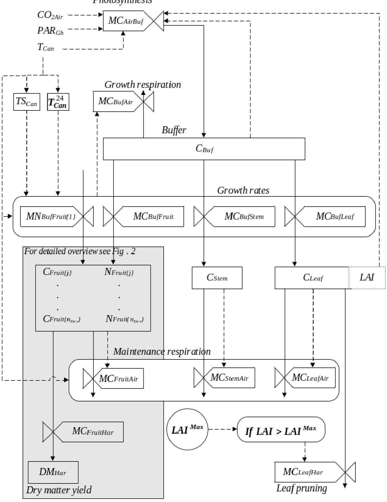
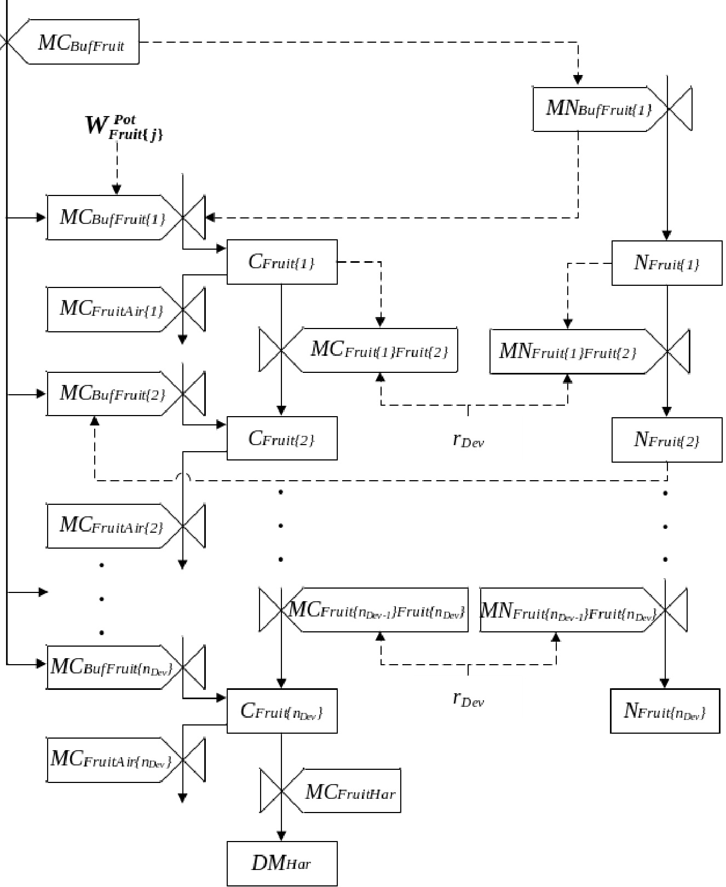
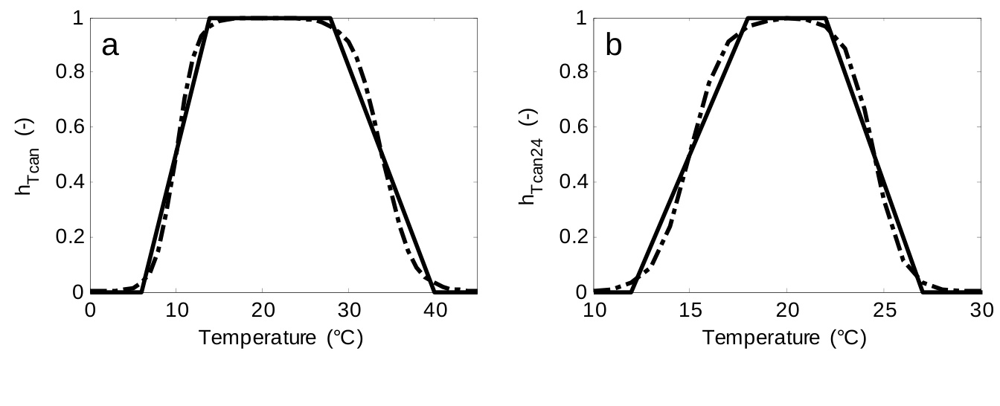

Electronic appendix of the manuscript entitled: A 2 methodology for model-based greenhouse design: Part 2, 3 Description and validation of a tomato yield model

4

5 B.H.E. Vanthoor1,2, P.H.B. de Visser1, C. Stanghellini1 and E.J. van Henten1,2 6 7 1Wageningen UR Greenhouse Horticulture, P.O. Box 644, NL-6700 AP Wageningen, the 8 Netherlands   
9 2Farm Technology Group, Wageningen University, P.O. Box 17, NL-6700 AA Wageningen,   
10 the Netherlands   
11   
12

# 1 Tomato yield model description

2 In this electronic appendix all the equations of the tomato yield model are presented to assure   
3 that our colleagues are able to implement and reproduce the model. Chapter 1 presents the   
4 notational conventions used in this document. Chapter 2 shows the model overview and   
5 chapter 3 presents the state variable equations. In chapter 4 the following model flows are   
6 presented: canopy photosynthesis, the carbohydrate flow to individual plant organs, the fruit   
7 number and carbohydrate flow to the fruit development stages, growth and maintenance   
8 respiration and leaf pruning. In chapter 5 the reference list is presented followed by Chapter 6   
9 which contains the appendices. Chapter 7 shows the tables and chapter 8 shows the figures.

# 11 1 Notational conventions

To describe the states and the flows of the tomato yield model the notational conventions of De Zwart (1996) are used. The states of the model are denoted by names with capital letters followed by one subscript (Table 1 and Table 2). The flows are denoted by a capital letter followed by two subscripts. The first subscript represents the source of the flow and the second subscript represents the destination of the flow. For example, $M C _ { A i r B u f } ^ { }$ denotes the carbon flow from air to the carbon buffer. The surface unit is ${ \mathfrak { m } } ^ { 2 }$ of greenhouse floor, unless otherwise specified. For clarity reasons, all carbohydrates are expressed in mg $\{ \mathrm { C H _ { 2 } O } \} \ \mathrm { m } ^ { - 2 }$ . When leaving the carbohydrate buffer, these carbohydrates transform from non-structural carbohydrates to dry matter since growth respiration is removed from the carbohydrate buffer prior to partitioning. The model parameters are listed in Table 3.

# 2 Model overview

The model structure, with a common carbohydrate buffer and carbohydrate distribution to plant organs as presented in Fig. 1, was essentially based on earlier crop yield models (Marcelis et al., 1998; Heuvelink, 1996; Dayan et al., 1993; Seginer et al., 1994; Linker et al., 2004) and extended with the two lumped temperature-dependent growth inhibition functions. A temperature sum representing the development stage of the crop was modelled to

1 define the timing of first fruit set and the time at which the carbohydrate distribution to the 2 fruits reaches its potential. 3 Photosynthesis $M C _ { A i r B u f } ^ { }$ depends mainly on the canopy temperature, the 4 photosynthetically active radiation (PAR) absorbed by the canopy and the $\mathrm { C O } _ { 2 }$ -concentration 5 in the greenhouse. When relating crop growth directly to photosynthesis without using a 6 carbohydrate buffer, the impact of night temperature on growth would be neglected. However, 7 night temperatures play an important role in crop growth and development. To model the 8 effects of night temperature on growth and development, the photosynthesised carbohydrates 9 are stored in a buffer, $C _ { B u f } ,$ whose outflow is affected by temperature. The buffer distributes 10 the carbohydrates $( M C _ { B u f F r u i t } , M C _ { B u f L e a f } , M C _ { B u f S t e m } )$ to the plant organs $( C _ { F r u i t } , C _ { L e a f } , C _ { S t e m } )$ even 11 when no photosynthesis occurs. These carbohydrate flows are influenced by the availability 12 of carbohydrates in the buffer, the organ growth rate coefficients, two temperature-dependent 13 growth inhibition functions (each described as function of the instantaneous temperature, $T _ { C a n } ,$ 14 and the 24 hour mean temperature, $T _ { c a n } ^ { 2 4 }$ ) and the temperature sum, $T S _ { \mathrm { \it { C a n } } } ^ { \it { S u m } }$ , representing the 15 development stage of the crop.

The plant organ $C _ { S t e m }$ represents the carbohydrates which are stored in both stem and root. To take into account the time delay between fruit set and fruit harvest, the model simulates for each fruit development stage, $j ,$ the fruit weight $C _ { F r u i t \{ j \} }$ and the fruit numbers $N _ { F r u i t \{ j \} }$ . A part of the carbohydrates in the organs is used for maintenance respiration $( M C _ { F r u i t A i r } , M C _ { L e a f A i r } , M C _ { S t e m A i r } )$ . When the LAI exceeds a maximum value, $L A I ^ { M a x }$ , the leaves are pruned back to this value, resulting in the mass flow $M C _ { L e a f H a r }$ . The accumulated harvested tomato dry matter is determined by integrating the carbohydrate outflow of the last fruit development stage.

The state equations and the carbohydrate flow to the individual plant organs are presented in this chapter. The model parameters are listed in Table 3 and the remaining symbols in Table 4.

# 1 3 State variables of the model

2 The state variables of the model are all described by differential equations. The time   
3 derivatives of the state variables are indicated by a dot above the state symbol.   
4 The development rate of the plant, which determines the transition from the vegetative   
5 to the generative stage (Eqs. 24 and 27), is expressed as the time derivative of the temperature   
6 sum, and is equal to the instantaneous temperature (normalised to allow for the expression of   
7 the temperature sum as $^ { \circ } \mathrm { C }$ d):

$$
\dot { T } S _ { c a n } = { \frac { 1 } { 8 6 4 0 0 } } T _ { c a n }
$$

where $T _ { c a n }$ is the simulated canopy temperature. In this model we set $T S _ { c a n }$ to $0 \ { } ^ { \circ } { \mathrm { C } } \ { \mathrm { d } }$ at the start of the generative period (i.e. the first fruit set). This means that the initial value of $T S _ { c a n }$ is negative and will stay negative whilst the plant is vegetative. When $T S _ { c a n }$ exceeds $0 ^ { \circ } \mathrm { C } \mathrm { d }$ , the carbohydrate distribution to the fruits increases linearly from zero till its full potential is reached at the temperature sum $T S _ { E n d } ^ { S u m }$ . At values higher than $T S _ { E n d } ^ { S u m }$ , the carbohydrate distribution to the fruits remains at its potential value.

The evolution of the carbohydrates in the buffer, $C _ { B u f } ,$ in time is described by: $\begin{array} { r } { \dot { C } _ { B u f } \ = M C _ { A i r B u f } \ - \ M C _ { B u f f r u i t } \ - \ M C _ { B u f l e a f } \ - \ M C _ { B u f S t e m } \ - \ M C _ { B u f A i r } \ [ \mathrm { m g \ m ^ { - 2 } \ s ^ { - 1 } } ] } \end{array}$ (2)

where $M C _ { A i r B u f } ^ { }$ is the photosynthesis rate, $M C _ { B u f F r u i t } , M C _ { B u f L e a f } , M C _ { B u f S t e m }$ are the carbohydrate flows to fruits, leaves and stems respectively, and $M C _ { B u f A i r }$ is the growth respiration of the plant. During the light period, carbohydrates produced by photosynthesis are stored in the buffer and, whenever carbohydrates are available in the buffer, carbohydrates flow to the plant organs. This carbohydrate flow stops when the buffer approaches its lower limit. When the buffer approaches its upper limit, further carbohydrates cannot be stored and photosynthesis will be inhibited.

The time between fruit set and fruit harvest is the fruit growth period which is modelled using a “fixed boxcar train” method of Leffelaar & Ferrari (1989). This method implies that carbohydrates and the number of fruits flow from one fruit development stage to the next with a specific development rate (Fig. 2).

When the temperature sum of the plant reaches $0 \ { ^ \circ } \mathrm { C } \ \mathrm { d }$ , the plant shifts from the vegetative stage to the generative stage and carbohydrates are stored in the fruit development stage j: $\dot { C } _ { F r u i t [ j ] } = M C _ { B u f F r u i t ( j ) } + M C _ { F r u i t \{ j - 1 \} F r u i t \{ j \} } - M C _ { F r u i t [ j ] F r u i t [ j + 1 ] } - M C _ { F r u i t A r [ j ] } .$ with $j = 1 , 2 . . . n _ { \scriptscriptstyle D e v }$ $[ \mathrm { m g } \mathrm { m } ^ { - 2 } \mathrm { s } ^ { - 1 } ]$ (3)

where $M C _ { B u f F r u i t \{ j \} }$ is the carbohydrate flow from the buffer to fruit development stage $j$ , $M C _ { F r u i t \left\{ j - 1 \right\} F r u i t \left\{ j \right\} }$ and $M C _ { F r u i t \left\{ j \right\} F r u i t \left\{ j + 1 \right\} }$ represent the carbohydrate inflow from the previous development stage and the outflow to the next stage respectively, $M C _ { F r u i t A i r \{ j \} }$ is the fruit maintenance respiration of development stage $j ,$ and $n _ { D e v }$ is the total number of fruit development stages. For the first fruit development stage, the carbohydrate inflow from the previous stage is zero. For the last development stage, the carbohydrate outflow to the next stage is described by $M C _ { F r u i t H a r }$ .

The number of fruits in the fruit development stage $j$ , $N _ { F r u i t \{ j \} }$ , affects the carbohydrate distribution to the fruits and is therefore described by: $\dot { N } _ { F r u i t \mid j } = M N _ { F r u i t \mid j - 1 \mid F r u i t \mid j } \cdot M N _ { F r u i t \mid j \mid F r u i t \mid j + 1 } , j = 1 , 2 . . . n _ { D e v } \left[ \mathrm { f r u i t s ~ m \dot { ^ { - 2 } } { \bf s } } ^ { - 1 } \right]$ (4)

where $M N _ { F r u i t \left\{ j - 1 \right\} F r u i t \left\{ j \right\} }$ is the fruit number flow from fruit development stage $j { - } 1$ to stage $j$ and $M N _ { F r u i t \left\{ j \right\} F r u i t \left\{ j + 1 \right\} }$ is the fruit number flow from fruit development stage $j$ to stage $j { + } 1$ . For the first fruit development stage $M N _ { \mathit { F r u i t } \left\{ \ j - 1 \right\} \mathit { F r u i t } \left\{ \ j \right\} }$ is replaced by $M N _ { _ { B u f F r u i t } \{ 1 \} }$ . The fruit number flow to the first fruit development stage depends on carbohydrates available for fruit growth and on the truss appearance rate.

The carbohydrates stored in the leaves, $C _ { L e a f } ,$ are described by: $\dot { C } _ { L e a f } \ = M C _ { B u f L e a f } \ - \ M C _ { L e a f A i r } \ - \ M C _ { L e a f H a r }$ $[ \mathrm { m g } \mathrm { m } ^ { - 2 } \mathrm { s } ^ { - 1 } ]$ where $M C _ { B u f L e a f } $ is the carbohydrate flow from the buffer to leaves, $M C _ { L e a f t A i r }$ is the maintenance respiration of the leaves and $M C _ { L e a f H a r }$ is the leaf pruning. The LAI is a semi-state of the model and is calculated by:

$$
\mathrm { [ m ^ { 2 } \ \{ l e a f \} \ m ^ { - 2 } ] }
$$

where SLA is the specific leaf area $\mathrm { ( m ^ { 2 } \ : \{ l e a f \} \ m g ^ { - 1 } \ : \{ C H _ { 2 } O \} ) }$ .

The carbohydrates stored in the stem and roots, $C _ { S t e m _ { . } }$ , are described by:

$$
\dot { C } _ { s t e m } = M C _ { \scriptscriptstyle B u f S t e m } \cdot { \cal M } C _ { \scriptscriptstyle S t e m A i r }
$$

$$
[ \mathrm { m g } \mathrm { m } ^ { - 2 } \mathrm { s } ^ { - 1 } ]
$$

where $M C _ { B u f S t e m }$ is the carbohydrate flow from the buffer to stems and roots, $M C _ { S t e m A i r }$ is the maintenance respiration of the stems and roots.

For simplicity, a continuous harvest rate was assumed. Consequently, the accumulated harvested tomato dry matter (DM), $D M _ { H a r }$ , equals the outflow of dry matter from the last fruit

1 development stage and is described by:

$\dot { D } M _ { \scriptscriptstyle H a r } = \eta _ { \scriptscriptstyle C _ { - } D M } \ \cdot M C _ { \scriptscriptstyle F r u i t H a r }$ $[ \mathrm { m g \ \{ D M \} \ m ^ { - 2 } \ s ^ { - 1 } } ]$

Since all the carbohydrates leaving the carbohydrate buffer are dry matter equivalents, the conversion factor from carbohydrates to dry matter, $\eta _ { C \_ D M }$ , was obviously $1 \mathrm { m g \ \{ D M \} \ m g ^ { - 1 } }$ $\{ \mathrm { C H _ { 2 } O } \}$ .

The 24 hour mean canopy temperature was approximated by a first order differential equation:

$\frac { d T _ { C a n } ^ { 2 4 } } { d t } = \frac { 1 } { \tau } \left( k T _ { C a n } - T _ { C a n } ^ { 2 4 } \right)$ $[ { } ^ { \circ } { \bf C } \thinspace s ^ { { - 1 } } ]$ (9)

where $\tau$ , represents the time constant of the process and $k$ is the gain of the process. When integrated in the model-based design method, the greenhouse climate model (Vanthoor et al., in press) calculates the canopy temperature as a state variable. Therefore, the canopy temperature and the 24 hour mean canopy temperature could not be calculated beforehand. To approximate the 24 hour mean canopy, the first order approach of Eq. (9) as derived in Appendix A was incorporated into the model.

# 4 Model flows

# 17 4.1 Canopy photosynthesis

The canopy photosynthesis calculation is based on  the canopy photosynthesis model of Farquhar and von Caemmerer (1982) and by up-scaling the leaf based photosynthesis model of Farquhar (1980, 1988) to canopy level. The impact of rubisco on photosynthesis depends highly on the stomata behaviour of the leaves which in turn is strongly affected by extreme temperatures. In this research it was assumed that that the two  temperature-dependent growth inhibition functions implicitly described the impact of rubisco on the photosynthesis rate.

# The net photosynthesis rate

26 The net photosynthesis rate equals the gross photosynthesis rate minus photorespiration   
27 (Farquhar & von Caemmerer, 1982):

$$
M C _ { _ { A i r B u f } } = M _ { _ { C H 2 O } } \cdot h _ { _ { C _ { B u f } } } ^ { ^ { M C _ { A i r B u f } } } \left( P - \ R \right)
$$

$$
[ \mathrm { m g } \mathrm { m } ^ { - 2 } \mathrm { s } ^ { - 1 } ]
$$

2 where $M _ { \scriptscriptstyle C H 2 O }$ $( \mathrm { m g \mu m o l ^ { - 1 } } )$ is the molar mass of $C H _ { 2 } O$ , $h _ { C _ { B u f } } ^ { M C _ { A i r B u f } } ( - )$ is the inhibition of the   
3 photosynthesis rate by saturation of the leaves with carbohydrates, $P \left( \mathrm { \mu \mathrm { m o l } ^ { - 1 } } \left\{ \mathrm { C O } _ { 2 } \right\} \mathrm { \ m } ^ { - 2 } \mathrm { \ s } ^ { - 1 } \right)$ is   
4 the gross canopy photosynthesis rate and $R ( \mu \mathrm { m o l } ^ { - 1 } \left\{ \mathrm { C O } _ { 2 } \right\} \mathrm { m } ^ { - 2 } \mathrm { s } ^ { - 1 } )$ is the photorespiration   
5 during the photosynthesis process.   
6 When the carbohydrate amount in the buffer exceeds its maximum storage capacity,   
7 then the photosynthesis is inhibited. This inhibition is described by:

$$
h _ { C _ { B u f } } ^ { M C _ { A i r B u f } } = \left\{ \begin{array} { l l } { 0 , \ C _ { B u f } > C _ { B u f } ^ { M a x } } \\ { 1 , \ C _ { B u f } \ \le C _ { B u f } ^ { M a x } } \end{array} \right.
$$

where $C _ { B u f } ^ { M a x } ( \mathrm { { m g } \{ C H _ { 2 } O \} m ^ { - 2 } ) }$ is the maximum buffer capacity which was assumed to be equal to the sum of carbohydrates produced at potential photosynthesis capacity on a daily basis. To enhance readability the conditional “if/else” statements are presented here. However, a differentiable form of these statements are modelled and given in Appendix B (Eq. (B.1) and Table 5).

Photosynthesis rate at canopy level, $P$ , is described by (Farquhar, 1988): $P \ = \frac { J \ \cdot \left( C O 2 _ { _ { S t o m } } - \Gamma \right) } { 4 \cdot \left( C O 2 _ { _ { S t o m } } + 2 \Gamma \right) }$ $[ \mu \mathrm { m o l } \ \{ \mathrm { C O _ { 2 } } \} \ \mathrm { m ^ { - 2 } } \ \mathrm { s ^ { - 1 } } ]$ where $J ( \mu \mathrm { m o l } \textrm { e } ^ { - } \mathbf { m } ^ { - 2 } \mathbf { s } ^ { - 1 } )$ is the electron transport rate, $4 \left( \mathrm { \mu m o l \ \{ e ^ { - } \} \ \mu m o l ^ { - 1 } \ \{ C O _ { 2 } \} } \right)$ is the number of electrons per fixed $\mathrm { C O } _ { 2 }$ molecule, $C O 2 _ { S t o m } ( \mu \mathrm { m o l } \ \{ \mathrm { C O _ { 2 } } \} \ \mathrm { m o l ^ { - 1 } \{ a i r \} } )$ is the $\mathbf { C O } _ { 2 } .$ - concentration in the stomata and ${ \cal { T } } \left( \mathrm { \small { \mu m o l } } \left\{ \mathrm { \small { C O _ { 2 } } } \right\} \mathrm { \ m o l ^ { - 1 } } \left\{ \mathrm { a i r } \right\} \right)$ is the $\mathrm { C O } _ { 2 }$ compensation point. The photorespiration, $R ,$ is described by (Farquhar & von Caemmerer, 1982): $R = P \cdot \frac { \Gamma } { C O 2 _ { s t o m } }$ $[ \mu \mathrm { m o l } \ \{ \mathrm { C O _ { 2 } } \} \ \mathrm { m ^ { - 2 } } \ \mathrm { s ^ { - 1 } } ]$ (13)

# The electron transport rate

The electron transport rate, $J _ { : }$ is a function of the potential rate of electron transport and of the PAR absorbed by the canopy  (Farquhar, 1988; Evans & Farquhar, 1991):

$$
J = \frac { J ^ { p o r } + \alpha P A R _ { c a n } - \sqrt { \big ( J ^ { p o r } + \alpha P A R _ { c a n } \big ) ^ { \sharp } - 4 \Theta \cdot J ^ { P o r } \cdot \alpha P A R _ { c a n } } } { 2 \Theta } \qquad \mathrm { [ u m o l ~ \{ e ^ { - } \} ~ m \cdot \xi ^ { - 1 } ~ ] }
$$

where $J ^ { P O T } \left( \mu \mathrm { m o l } ~ \{ \mathrm { e ^ { - } } \} ~ \mathrm { m ^ { - 2 } } { \mathrm { s ^ { - } } } \right)$ is the potential rate of electron transport, $P A R _ { c a n }$ ( $\scriptstyle \left[ \mu \ m o l \right.$ {photons} $\mathbf { m } ^ { - 2 } \mathbf { s } ^ { - 1 }$ ) is the absorbed PAR, $\propto ( \mathsf { \mu m o l } \{ \mathrm { e ^ { - } } \} \mathsf { \mu m o l ^ { - 1 } }$ {photons}) is the conversion factor from photons to electrons, including an efficiency term, and $\Theta \left( - \right)$ is the degree of curvature of the electron transport rate.

The potential rate of electron transport $J ^ { P O T }$ , depends on temperature (Farquhar et al., 1980):

$$
J ^ { P O T } = J _ { 2 5 , C a n } ^ { M A X } \cdot e ^ { E _ { j } \frac { T _ { C a n , K } - T _ { 2 5 , K } } { R T _ { C a n , K } T _ { 2 5 , K } } } \cdot \frac { 1 + e ^ { \frac { S T _ { 2 5 , K } - H } { R T _ { 2 5 , K } } } } { 1 + e ^ { \frac { S T _ { C a n , K } - H } { R T _ { C a n , K } } } } \qquad [ \mathrm { ~ | a m o l ~ \{ e ^ \cdot \} ~ m ^ { - 2 } ~ s ^ { - 1 } ~ } ]
$$

where $J _ { 2 5 , C a n } ^ { M A X } ~ ( \mu \mathrm { m o l } ~ \{ \mathrm { e ^ { - } } \} \ \mathrm { m ^ { - 2 } } \ \mathrm { s ^ { - 1 } } )$ is the maximum rate of electron transport at $2 5 ^ { \circ } \mathrm { C }$ for the canopy, $E _ { j } ( \mathrm { J } \mathrm { m o l } ^ { - 1 } )$ is the activation energy for $J ^ { P O T }$ , $T _ { C a n , K } ,$ (K) is the canopy temperature, $T _ { 2 5 , K }$ (K) is the reference temperature at $2 5 ^ { \circ } \mathrm { C } , R _ { g } ( \mathrm { J } \mathrm { m o l } ^ { - 1 } \mathrm { K } ^ { - 1 } )$ is the molar gas constant, S (J $\mathrm { m o l ^ { - 1 } K ^ { \ - 1 } }$ is the entropy term and $\mathrm { H ( J \ m o l ^ { - 1 } ) }$ is the deactivation energy The maximum rate of electron transport at $2 5 ^ { \circ } \mathrm { C }$ for the canopy is calculated by (Evans & Farquhar, 1991):

$$
J _ { 2 5 , C a n } ^ { M A X } = L A I \cdot J _ { 2 5 , L e a f } ^ { M A X }
$$

$$
[ \mu \mathrm { m o l } \ \{ \mathrm { e } ^ { - } \} \ \mathrm { m } ^ { - 2 } \mathrm { s } ^ { - 1 } ]
$$

where $J _ { 2 5 , L e a f } ^ { M A X } \ \mathrm { ( \mu m o l \ \{ e ^ { - } \} \ m ^ { - 2 } \ \{ l e a f \} \ s ^ { - 1 } ) }$ is the maximum rate of electron transport for the leaf at $2 5 ^ { \circ } \mathrm { C }$ (Farquhar et al., 1980).

# The PAR absorbed by the canopy

The total PAR absorbed by the canopy is the sum of the PAR transmitted by the greenhouse cover that is directly absorbed, and the PAR reflected by the greenhouse floor that is indirectly absorbed:

$$
P A R _ { c a n } = P A R _ { G h C a n } + P A R _ { F I r C a n } \ [ \mathrm { [ u m o l ~ \{ p h o t o n s \} ~ m ^ { - 2 } ~ s ^ { - 1 } ] } \ ]
$$

The PAR which is directly absorbed by the canopy is described by a negative exponential decay of light with LAI in a homogeneous crop (Ross, 1975):

$$
P A R _ { G h C a n } = P A R _ { G h } \cdot \left( 1 - \rho _ { C a n } \right) \cdot \left( 1 - \exp \left| - \ K _ { 1 } \cdot L A I \right| \right) \ [ \mathrm { | u m o l \ \{ p h o t o n s \} \ m ^ { - 2 } \ s ^ { - 1 } } ]
$$

where $P A R _ { G h } ( \mu \mathrm { m o l } \ \mathrm { \{ p h o t o n s \} \ m ^ { - 2 } } \mathrm { s ^ { - 1 } } )$ is the PAR above the canopy, $\rho _ { C a n } \left( - \right)$ is the reflection coefficient of the canopy for PAR and $K _ { \iota }$ is the extinction coefficient of the canopy for PAR (-).

The PAR above the canopy is described by:

$P A R _ { _ { G h } } = \tau _ { _ { G h } } \cdot \eta _ { _ { G l o b \_ P A R } } \cdot I _ { _ { G l o b } }$

$$
[ \mu \mathrm { m o l } \ \{ \mathrm { p h o t o n s } \} \ \mathrm { m } ^ { - 2 } \ \mathrm { s } ^ { - 1 } ]
$$

where $\tau _ { G h } \left( - \right)$ is the light transmission of the greenhouse cover and $\eta _ { G l o b \_ P A R } \left( \mathsf { \mu m o l \ \{ p h o t o n s \} \ J ^ { - 1 } } \right)$ is a conversion factor from global radiation to PAR and $I _ { G l o b } ( \mathsf { W } \mathsf { m } ^ { - 2 } )$ is the outside global radiation.

Absorption of PAR reflected by the greenhouse floor is described by:

$$
\begin{array} { r l } & { P A R _ { _ { F I r C a n } } = \rho _ { _ { F I r } } P A R _ { _ { G h } } \cdot ( 1 - \rho _ { _ { C a n } } ) \cdot \exp ( - \textit { K } _ { 1 } \cdot L A I ) \cdot ( 1 - \exp \{ - \textit { K } _ { 2 } \cdot L A I \} ) } \\ & { ~ [ \mathrm { | u m o l ~ \{ p h o t o n s \} ~ m ^ { 2 } \cdot s ^ { - 1 } } ] } \end{array}
$$

where $\rho _ { F l r } ( - )$ is the reflection coefficient of the greenhouse floor and $K _ { 2 } \left( - \right)$ is the extinction coefficient of the canopy when PAR is reflected from the floor to the canopy. We assumed $K _ { 2 }$ to be equal to $K _ { 1 }$ .

# $\mathbf { C O } _ { 2 }$ -relationships in the photosynthetic tissue

The $\mathrm { C O } _ { 2 }$ -concentration inside the stomata, $C O _ { 2 S t o m }$ depends on the stomatal and mesophyl conductance, boundary layer resistance, the photosynthesis rate and the difference between the $\mathrm { C O } _ { 2 }$ -concentration in the stomata and the $\mathrm { C O } _ { 2 }$ -concentration of the greenhouse air. However, the $\mathbf { C O } _ { 2 }$ -concentration in the stomata is assumed to be a fixed fraction of the $\mathrm { C O } _ { 2 } .$ - concentration in the greenhouse air (Evans & Farquhar, 1991):

$$
C O 2 _ { S t o m } = \eta _ { C O 2 A i r \_ S t o m } \cdot C O 2 _ { A i r } \qquad [ \mathrm { [ u m o l ~ \{ C O _ { 2 } \} ~ m o l ^ { - 1 } ~ \{ a i r \} ] }
$$

where $\eta _ { C O 2 A i r \_ S t o m } ( - )$ is conversion factor from the $\mathrm { C O } _ { 2 }$ -concentration of the greenhouse air, $C O _ { 2 A i r } ,$ , to the $\mathrm { C O } _ { 2 }$ -concentration in the stomata (Evans & Farquhar, 1991).

The $\mathrm { C O } _ { 2 }$ compensation point $( \Gamma )$ affects the leaf photosynthesis rate and depends on temperature (Farquhar, 1988):

$$
\Gamma = c _ { \Gamma } T _ { \mathrm c a n }
$$

$$
\mathrm { \small { [ \mu m o l ~ \{ C O _ { 2 } \} ~ m o l ^ { - 1 } ~ \{ a i r \} ] } }
$$

where $c _ { \Gamma } ( \mathrm { \small { [ [object Object] ~ \{ C O _ 2 \} ~ m o l ^ { - 1 } ~ \{ a i r \} ~ K ^ { - 1 } ) } }$ determines the effect of canopy temperature on the $\mathrm { C O } _ { 2 }$ compensation point.

The relation between the canopy temperature and $\mathrm { C O } _ { 2 }$ -compensation point is valid for leaf photosynthesis rate calculations. However, applying Eq. (22) to canopy level results in unrealistically low optimal canopy temperature for canopy photosynthesis rate at low light and $\mathrm { C O } _ { 2 }$ -levels, because for canopy photosynthesis calculation a higher $J _ { 2 5 , C a n } ^ { M A X }$ compared to $J _ { 2 5 , L e a f } ^ { M A X }$ was used as described by Eq. (16). To avoid these unrealistically low optimal canopy

1 temperatures, the sensitivity of the compensation point to temperature was adjusted by   
2 making the slope of Eq. (22) depended of the ratio of $J _ { 2 5 , L e a f } ^ { M A X }$ and $J _ { 2 5 , C a n } ^ { M A X }$ :   
3 $\Gamma = \frac { J _ { 2 5 , L e a f } ^ { M A X } } { J _ { 2 5 , C a n } ^ { M A X } } c _ { \Gamma } T _ { C a n } + 2 0 c _ { \Gamma } \left( 1 - \frac { J _ { 2 5 , L e a f } ^ { M A X } } { J _ { 2 5 , C a n } ^ { M A X } } \right) \qquad [ \mathrm { [ u m o l ~ \{ C O _ { 2 } \} ~ m o l ^ { \ - 1 } ~ \{ a i r \} ] }$ (23)   
4 The right term of Eq. (23) is introduced to assure that, for all values of $J _ { 2 5 , C a n } ^ { M A X }$ at a temperature   
5 of $2 0 ^ { \circ } \mathrm { C }$ , the compensation point calculated by Eq. (23) equals the compensation point   
6 calculated by Eq. (22).

# 4.2 The carbohydrate flow to the individual plant organs

The carbohydrate flow from buffer to the fruits is determined by multiplying the potential fruit growth coefficient by the inhibition factors $h$

$$
M C _ { B u f F r u i t } = h _ { C _ { B u f } } ^ { M C _ { B u ( 0 \eta ) } } \cdot h _ { \bar { T } \bar { c } a n } \cdot h _ { \bar { T } \bar { c } a n 2 4 } \cdot h _ { \bar { T } \bar { c } a n S u m } \cdot g _ { \bar { T } \bar { c } a n 2 4 } \cdot r g _ { F r u i t } \qquad [ \mathrm { m g } \mathrm { m ^ { - 2 } s ^ { - 1 } } ]
$$

where the inhibition factors $( 0 < h < 1 )$ : are: $h _ { C _ { B u f } } ^ { M C _ { B u f O r g } }$ (-), insufficient carbohydrates in the buffer; $h _ { \scriptscriptstyle { T c a n } }$ $( - )$ , non-optimal instantaneous temperature; $h _ { \scriptscriptstyle { T c a n 2 4 } }$ (-), non-optimal 24 hour canopy temperatures; and $h _ { \mathit { T c a n S u m } }$ $\left( - \right)$ , crop development stage. The effect of temperature on the carbohydrate flow to fruits is described by $g _ { T c a n 2 4 } ( - )$ and $r g _ { \mathit { F r u i t } } ( \mathrm { m g } \mathrm { m } ^ { - 2 } \mathrm { s } ^ { - 1 } )$ is the potential fruit growth rate coefficient at $2 0 ^ { \circ } \mathrm { C }$ . The daily potential net fruit growth rate was based on experiments conducted by De Koning (1994) which resulted in $0 . 3 2 8 \mathrm { m g } \left\{ \mathrm { C H _ { 2 } O } \right\} \mathrm { m ^ { - 2 } } \mathrm { s ^ { - 1 } }$ . See Appendix C for a detailed description of the derivation of the potential organ growth rate coefficients. The daily potential fruit growth rate will only be obtained if: a) sufficient carbohydrates are available in the carbohydrate buffer which in turn depends of the photosynthesis rate; b) the temperature is optimal and c) the plant is fully generative.

The carbohydrate flow from buffer to the leaves and stem is described by:

$$
M C _ { B u t / O r g } ( _ { i } ) = h _ { C _ { B u t } } ^ { M C _ { B u t / O r g } } \cdot h _ { T e a n 2 4 } \cdot g _ { T e a n 2 4 } \cdot r g _ { O r g } ( _ { i } ) \quad \quad i = 2 , 3 \quad \quad \quad \quad \quad \quad \mathrm { [ m g ~ m ^ { - 2 } ~ s ^ { - 1 } ] }
$$

where $i$ represents the plant organ code for Leaf and Stem, and $r g _ { O r g ( i ) }$ is the potential organ growth rate coefficient at $2 0 ^ { \circ } \mathrm { C }$ .The potential vegetative growth rate coefficients were based on the carbohydrate distribution to different plant organs as described by Heuvelink (1996) and on the potential fruit growth rate coefficient which resulted in $r g _ { L e a f }$ of $0 . 0 9 5 \mathrm { m g } \left\{ \mathrm { C H } _ { 2 } \mathrm { O } \right\}$ $\mathbf { m } ^ { - 2 } \mathbf { s } ^ { - 1 }$ and $r g _ { S t e m }$ of $0 . 0 7 4 \mathrm { m g } \left\{ \mathrm { C H } _ { 2 } \mathrm { O } \right\} \mathrm { m } ^ { - 2 } \mathrm { s } ^ { - 1 }$ . As in agreement with Table 1 of the article, these carbohydrate flows are not influenced by instantaneous temperature. The individual processes of Eqs. (24) and (25) are described in more detail in this section.

4.2.1 Insufficient carbohydrates in the buffer

4 The inhibition of the carbohydrate flow to the plant organs caused by insufficient carbohydrates in the buffer is described by:

$$
h _ { C _ { B u f } } ^ { M C _ { B u f O r g } } = \left\{ \begin{array} { l l } { 0 , C _ { B u f } \ \leq C _ { B u f } ^ { M i n } } \\ { 1 , C _ { B u f } > C _ { B u f } ^ { M i n } } \end{array} \right.
$$

[-] (26)

where $C _ { B u f } ^ { M i n }$ $\mathrm { ( C H _ { 2 } O \ m ^ { - 2 } ) }$ is the minimum amount of carbohydrates in the buffer. It was assumed that the buffer is never totally empty and therefore $C _ { B u f } ^ { M i n }$ is $5 \%$ of $C _ { B u f } ^ { M a x }$ . A differentiable form of Eq. (26) is given in Appendix B.

4.2.2 Non-optimal instantaneous and 24 hour mean temperature

The literature review revealed that crop growth was inhibited by non-optimal levels of the instantaneous and 24 hour mean temperature which was described by two trapezoid growth inhibition functions, $h _ { T c a n }$ and $h _ { T c a n 2 4 }$ , respectively. Each inhibition function was based on Boote and Scholberg (2006) and was described by four cardinal temperatures (Fig. 3). Below a certain base temperature $T _ { B a s e }$ no carbohydrate flow to organs is expected $( h { = } 0 )$ , between $T _ { O p t 1 }$ and $T _ { O p t 2 }$ the carbon flow is maximal $( h { = } 1 )$ and above $T _ { M a x }$ no carbohydrate flow is expected $( h { = } 0 )$ . Between $T _ { B a s e }$ and $T _ { O p t 1 }$ and between $T _ { O p t 2 }$ and $T _ { M a x }$ a linear relationship between inhibition and temperature is assumed. The growth inhibition function of Boote and Scholberg (2006) is not differentiable and therefore not suitable for dynamic optimisation purposes. The differentiable approximation of the inhibition function is listed in Appendix B.

4.2.3 Start of the generative phase

The first development stage is vegetative and all carbohydrates are used for leaf and stem growth. When a given temperature sum is reached, the generative stage starts and the carbohydrates are divided over the fruits, leafs and stems (root is part of the stem). It was assumed that the fruit growth rate starts at zero and increases linearly to full potential with increasing temperature sum. The gradual increase in fruit growth rate, depending on tomato development stage, $h _ { T c a n S u m } ,$ is described by:

$$
{ \begin{array} { r l } { r _ { \mathbf { \Phi } _ { T \mid \mathbf { S } \times \mathbf { \Phi } \times \mathbf { \Phi } \times \mathbf { \Phi } \times \mathbf { \Phi } \times \mathbf { \Phi } \times \mathbf { \Phi } } } } & { = { \left[ \begin{array} { l l l l l l l l } { \mathbf { \Phi } _ { T \leq \mathbf { \Phi } _ { \infty \times \infty } ^ { \infty } , } } & { } & { } & { } & { } & { } & { } & { \mathbf { \Lambda } ^ { i f } } & { } & { \mathbf { \Lambda } ^ { \infty } \leq \mathbf { \Phi } _ { \infty \times \infty } ^ { \infty } , } & { \mathbf { \Phi } = T \leq \mathbf { \Phi } _ { \infty \times \infty } ^ { \infty } , } \\ { \frac { T \leq \mathbf { \Phi } _ { \infty \times \infty } ^ { \infty } , } { T \leq \mathbf { \Phi } _ { \infty \times \infty } ^ { \infty } , } } & { } & { } & { } & { } & { } & { } & { \mathbf { \Lambda } ^ { i f } } & { } & { \mathbf { \Lambda } ^ { \infty } \leq \mathbf { \Phi } _ { \infty \times \infty } ^ { \infty } , } & { = T \leq \mathbf { \Phi } _ { \infty \times \infty } ^ { \infty } , } & { \mathbf { \Phi } = \mathbf { T } \leq \mathbf { \Phi } _ { \infty \times \infty } ^ { \infty } , } \\ { \mathbf { \Phi } _ { \mathbf { \Phi } } } & { } & { } & { } & { } & { } & { } & { } & { \mathbf { \Lambda } ^ { i f } } & { } & { \mathbf { \Lambda } ^ { \infty } \leq \mathbf { \Phi } _ { \infty \times \infty } ^ { \infty } , } & { \mathbf { \Phi } = T \leq \mathbf { \Phi } _ { \infty \times \infty } ^ { \infty } . } \end{array} \right] } } \end{array} }
$$

where $T S _ { C a n } ^ { s u m } ~ ( ^ { \circ } \mathrm { C } ~ \mathrm { d } )$ is the temperature sum, $T S _ { s t a r t } ^ { s u m } \ ( ^ { \circ } \mathbf { C } \ : \mathrm { d } )$ is the temperature sum when the generative stage starts, $T S _ { E n d } ^ { S u m } ~ ( ^ { \circ } \mathrm { C } \mathrm { d } )$ is the temperature sum when the fruit growth rate is at full potential. By definition, $T S _ { s t a r t } ^ { s u m }$ is zero because at the start of the generative stage $T S _ { c a n } ^ { S u m }$ is zero. Furthermore, it was assumed that the fruit growth rate is maximal after one fruit growth period, which result based upon Eq. (32)  in $T S _ { E n d } ^ { S u m }$ of $1 0 3 5 ^ { \circ } \mathrm { C }$ d. A differentiable form of Eq. (27) is described in Appendix B.

4.2.4 The temperature effect on structural carbon flow to organs The growth rate coefficients $( r g _ { F r u i t } , r g _ { L e a f }$ and $r g _ { S t e m } )$ are temperature independent. However in biology, growth rate increases with increasing temperature. Growth dependency on temperature was assumed to be related to flowering rate dependency on temperature. According to the  De Koning, (1994), flowering rate per unit time of tomato was linearly related to temperature for temperatures ranging between $1 7 ^ { \circ } \mathrm { C }$ and $2 3 ^ { \circ } \mathrm { C }$ . Based upon this relation, the growth rate dependency to temperature, $\mathbf { g } _ { \mathrm { T c a n 2 4 } }$ is described by:

$$
g _ { _ { T c a n 2 4 } } = 0 . 0 4 7 \cdot T _ { _ { C a n } } ^ { 2 4 } + 0 . 0 6 0
$$

[-]

The coefficients were determined by converting the flowering rate dependency on temperature (De Koning, 1994) to growth dependency on temperature by demanding that $g _ { T c a n 2 4 }$ is 1 at $2 0 ^ { \circ } \mathrm { C }$ , because the growth rate coefficients $( r g _ { F r u i t } , r g _ { L e a f }$ and $r g _ { S t e m _ { , } }$ ) were defined at $2 0 ^ { \circ } \mathrm { C }$ . Although Eq. (28) was only validated for the temperature range $1 7 ^ { \circ } \mathrm { C } { - } 2 3 ^ { \circ } \mathrm { C }$ , this relation was applied for temperature ranges outside this range. Outside this range, temperature effects are described by the growth inhibition functions.

# 4.3 The fruit number and carbohydrate flows to fruit development stages

Fruit development is modelled by describing the number of fruits and the amount of carbohydrates for each fruit development stage (Fig. 2). Fruits and carbohydrates flow through different fruit development stages are represented by a series of pools. Fruit numbers are modelled to determine for each fruit development stage the carbohydrate demand. The fruit number and carbohydrate flows to different fruit development stages are described in this section.

4.3.1 The fruit flow to different the fruit development stages

The number of fruits in the development stages, $N _ { { _ { F r u i t } } \{ j \} }$ , depend on the fruit set in the first development stage, $M N _ { _ { B u f F r u i t } \{ 1 \} }$ , and on the fruit flow to the remaining development stages, $M N _ { \mathit { F r u i t } \left\{ \ j \right\} \mathit { F r u i t } \left\{ \mathit { j } + 1 \right\} }$ based on the fixed boxcar train” method. The fruit set of the first development stage depends on the carbohydrate flow from buffer to fruits and on the maximum fruit set. It was assumed that above a certain carbohydrate flow from buffer to the fruits, fruit set is maximal. Below this carbohydrate flow, fruit set decreases linearly with a decreasing carbohydrate flow from buffer to the fruits:

$$
\begin{array} { r l } { M N _ { \mathrm { \tiny ~ B a f f r e a t } [ 1 ] } } & { = \left\{ \begin{array} { l l } { \displaystyle { \frac { M C _ { \mathrm { \tiny ~ B a f f r e a t } } } { r _ { \mathrm { \tiny ~ R a f f r e a t } } ^ { M a } } } \cdot \cdot { M N _ { \mathrm { \tiny ~ B a f f r e a t } } ^ { \mathrm { \tiny ~ M a x } } } [ 1 ] \cdot } & { \qquad \quad { M C _ { \mathrm { \tiny ~ B a f f r e a t } } } \quad { \le } { r _ { \mathrm { \tiny ~ B a f f r e a t } } ^ { M a x , F r e e } } } \\ { \displaystyle { M N _ { \mathrm { \tiny ~ B a f f r e a t } } ^ { \mathrm { \tiny ~ M a x } } } [ 1 ] \cdot } & { \qquad \quad { M C _ { \mathrm { \tiny ~ B a f f r e a t } } } \quad { > } { r _ { \mathrm { \tiny ~ B a f f r e a t } } ^ { M a x , F r e e } } } \end{array} \right. [ \mathrm { f r u i t } { \mathrm { \tiny ~ S ~ m ^ { - 2 } ~ } } { > } ^ { 1 } ] ( } \\ & { } \end{array}
$$

where $M C _ { B u f F r u i t }$ is the total carbohydrate flow from buffer to fruits, $M N _ { B u f F r u i t \{ 1 \} } ^ { M a x }$ is the maximum fruit set and $r _ { B u f F r u i t } ^ { M a x , F r t S e t }$ ( $\mathrm { \Omega m g \ \{ C H _ { 2 } O \} \ m ^ { - 2 } \ s ^ { - 1 } ) }$ is the carbohydrate flow from buffer to the fruits above which fruit set is maximal. A differentiable form of Eq. (29) is given in Appendix B.

Truss appearance is linearly related to the mean canopy temperature (De Koning, 1994). The maximum fruit set dependency on temperature, $M N _ { B u f F r u i t ( 1 ) } ^ { M a x }$ , is obtained by upscaling the truss appearance rate:

$$
M N _ { _ { B u f f r u i t } \mid 1 } ^ { { \it M a x } } = n _ { _ { P l a n s } } \cdot \left. { \cal C } _ { _ { B u f f r u i t _ { 1 } } } ^ { _ { { \it M a x } } } + { \cal C } _ { _ { B u f f r u i t _ { 2 } } } ^ { _ { { \it M a x } } } \cdot { \cal T } _ { _ { C a n } } ^ { _ { 2 4 } } \right. \qquad { \mathrm { [ f r u i t s ~ m ^ { - 2 } ~ t ^ { 2 } ~ o ~ } } { \mathrm { ] } }
$$

s-1]

where $n _ { _ { P l a n t s } }$ (plant $\mathrm { m } ^ { - 2 }$ ) is the plant density in the greenhouse, and $C _ { B u f F r u i t _ { 1 } } ^ { M a x }$ (fruits plant-1 s-1) and $C _ { B u f F r u i t _ { 2 } } ^ { M a x }$ (fruits plant-1 s-1 °C-1) are regression coefficients. The regression coefficients of the truss appearance according to De Koning (1994) were adjusted to maximum fruit set coefficients by assuming nine fruits per truss.

The fruit flow through the fruit development stages is based upon “the fixed boxcar train mechanism” of  Leffelaar and Ferrari (1989) and depends on the fruit growth period and on the number of fruits in the development stage:

$$
\begin{array} { r } { M N _ { F r u i t [ j ] F r u i t { \left[ j + 1 \right] } } = r _ { D e v } \cdot n _ { D e v } \cdot h _ { T _ { c a n } ^ { S o m } } ^ { M N _ { F n u i t } } \cdot N _ { F r u i t { \left[ j \right] } } j = 1 , 2 . . . . . . . . n _ { D e v } \ [ \mathrm { f r u i t s ~ m ^ { - 2 } ~ s ^ { - 1 } } ] } \end{array}
$$

where, $r _ { D e v } ( \mathsf { s } ^ { - 1 } )$ is the fruit development rate, $n _ { D e v } \left( - \right)$ is the number of development stages and (-) assures that tomatoes flow though the fruit development stages when the plant is in the generative phase.

The fruit development rate is linearly related to temperature and is described by (De Koning, 1994):

$$
r _ { D e v } = c _ { D e v 1 } + c _ { D e v 2 } \cdot T _ { C a n } ^ { 2 4 }
$$

[s-1]

where the coefficients $c _ { D e v 1 } \left( \mathsf { s } ^ { - 1 } \right)$ and $c _ { D e v 2 } ( \mathsf { s } ^ { - 1 } \mathsf { \circ C } ^ { - 1 } )$ were determined by De Koning for a temperature range between $1 7 ^ { \circ } \mathrm { C }$ and $2 7 ^ { \circ } \mathrm { C }$ .

To assure the onset of fruits, the fruit number allocated to the first development stage at initial simulation conditions was set larger than zero. To assure that fruits stay in this first development stage at vegetative stage, the fruit flow inhibition as function of temperature sum is described by:

$$
h _ { { _ { T _ { c a n } ^ { S u n } } } } ^ { { _ { M N _ { F r u t } } } } ~ = \{ \begin{array} { l l } { 0 ~ } & { \qquad i f \quad { _ { T S _ { c a n } ^ { S u m } } } \leq T S _ { s t a r t } ^ { _ { S u m } } } \\ { 1 ~ } & { \qquad i f \quad { _ { T S _ { c a n } ^ { S u m } } } > T S _ { s t a r t } ^ { _ { S u m } } } \end{array}
$$

A differentiable form of Eq. (33) is described in Appendix B.

4.3.2 The carbohydrate flow from carbohydrate buffer to different fruit development stages

The amount of fruit carbohydrates in the development stages, $C _  F r u i t ( j \}$ , depends on two carbohydrate inflow processes: the carbohydrate flow through the development stages, $M C _ { F r u i t \left\{ j \right\} F r u i t \left\{ j + 1 \right\} }$ and the carbohydrate flow from the carbohydrate buffer to a specific fruit development stage $M C _ { _ { B u f F r u i t } \{ j \} }$ .

The fruit carbohydrates flow from one development stage to the next development ge is described by:

$$
M C _ { F r u i t \mid j \mid F r u i t \mid j + 1 \mid } = r _ { D e v } \cdot n _ { D e v } \cdot C _ { F r u i t \mid j \mid }
$$

$$
[ \mathrm { m g } \mathrm { m } ^ { - 2 } \mathrm { s } ^ { - 1 } ]
$$

The available carbohydrates for fruit growth $M C _ { B u f F r u i t }$ , are distributed to the different fruit development stages, $C _ { B u f F r u i t ( j ) }$ . The carbohydrate flow to the first fruit development stage, $M C _ { B u f F r u i t ( 1 ) }$ , depends on the fruit set of Eq. (29) and is described by:

$$
M C _ { _ { B u f F r u i t ( 1 ) } } = W _ { F r u i t ( 1 ) } ^ { \mathit { P o t } } \cdot M N _ { _ { B u f F r u i t ( 1 ) } }
$$

$$
[ \mathrm { m g } \mathrm { m } ^ { - 2 } \mathrm { s } ^ { - 1 } ]
$$

where $W _ { F r u i t ( 1 ) } ^ { P o t } ( \mathrm { m g \{ C H _ { 2 } O \} }$ fruit-1) is the potential dry matter per fruit in fruit development stage one, which is determined by integration of the Gompertz growth rate function as

described in Eq. (38). The carbohydrate flow from the carbohydrate buffer into the remaining fruit   
development stages $M C _ { B u f F r u i t \{ j \} }$ depends on: the number of fruits, the fruit growth rate, and   
on the carbohydrates available for fruit growth:   
$\begin{array} { r l r } { M C _ { B u f F r u i l ( j ) } = \eta _ { B u f F r u i t } \cdot N _ { F r u i t ( j ) } \cdot G R \big [ j \big ] \cdot \big ( M C _ { B u f F r u i t } \cdot M C _ { B u f F r u i t ( 1 ) } \big ) } & { j = 2 , 3 . . . . . . . n _ { D e v } } \\ & { } & { \mathrm { ( r m g ~ m ^ { \prime } { \bf ~ s } ^ { \scriptscriptstyle 1 } ] } \phantom { . } \qquad ( 3 . . . 4 ) \times } \end{array}$ 36)

where $\eta _ { B u f F r u i t }$ $\left( \mathrm { d } \mathrm { m } ^ { 2 } \mathrm { m g } ^ { - 1 } \mathrm { C H } _ { 2 } \mathrm { O } \right)$ is a conversion factor to ensure that $M C _ { B u f F r u i t }$ equals the sum of the carbohydrates that flow to the different fruit development stages, $N _ { F r u i t ( j ) } ( \mathrm { f r u i t } \ \mathrm { m } ^ { - 2 } )$ is the number of fruits in a fruit development stage and $G R \left. \ j \right. \ ( \mathrm { m g } \{ \mathrm { C H } _ { 2 } \mathrm { O } \} \mathrm { f r u i t } ^ { - 1 } \mathrm { d } ^ { - 1 } )$ is the daily potential growth rate per fruit in fruit development stage $j$ as described by (De Koning, 1994) and presented in the electronic appendix.

The conversion factor, $\eta _ { B u f F r u i t }$ , is defined by:

$$
\eta _ { B u f F u i t } = \frac { 1 } { \displaystyle { \sum _ { j = 1 } ^ { j = n _ { D v } } } N _ { F r u i t \ i j } \ \cdot G R \big [ j \big ] } \qquad j = 2 , 3 . . . . . . . . n _ { D e v } \ [ \mathrm { d } \ \mathrm { m } ^ { 2 } \ \mathrm { m g } ^ { - 1 } \ \{ \mathrm { C H } _ { 2 } \mathrm { O } \} ]
$$

The fruit growth rate depends on the fruit development stage and is described by the first derivative of the Gompertz equation to time (De Koning, 1994):

$$
G R { \{ j \} } = G ^ { M a x } \exp { | - \ \exp { | - \ B { ( t _ { j } ^ { F G P } - \ M ) } | } \cdot B \exp { | - \ B { ( t _ { j } ^ { F G P } - \ M ) } | } }
$$

[mg {CH2O} fruit-1 d-1]

where $G R \{ j \} ( \mathrm { m g \{ C H _ { 2 } O \} }$ fruit- $\mathrm { ^ { - 1 } d ^ { - 1 } }$ ) is the daily potential growth rate per fruit in fruit development stage $j , G ^ { M a x } ( \mathrm { m g \{ C H _ { 2 } O \} }$ fruit-1) is the potential fruit weight, $B ( { \mathsf { d } } ^ { - 1 } )$ represents the steepness of the curve, $t _ { j } ^ { F G P }$ (d) is the number of days after fruit set for development stage $j$ and M (d) is the fruit development time in days where $G R$ is maximal. Parameters B and M depend on the fruit growth period, $F G P$ , and are described by (De Koning, 1994):

$$
\begin{array} { l } { F G P = \cfrac { 1 } { r _ { D e v } \cdot 8 6 4 0 0 } } \\ { M = - 4 . 9 3 + 0 . 5 4 8 \cdot F G P } \\ { B = 1 / ( _ { 2 . 4 4 + 0 . 4 0 3 \cdot M } ) } \end{array}
$$

The number of days after fruit set for development stage $j$ , $t _ { j } ^ { F G P }$ , depends on the total fruit growth period:

1 $t _ { j } ^ { F G P } = \frac { ( { { \it j - 1 } ) + 0 . 5 } } { n _ { _ { D e v } } } F G P$

# 3 4.4 Growth and maintenance respiration

The growth respiration of the total plant which is released by the carbon buffer ( $\cdot M C _ { _ { B u f A i r } } )$ is determined by adding the growth respiration of the individual plant organs:

$$
M C _ { _ { B u f A i r } } = \sum _ { i = 1 } ^ { i = 3 } M C _ { _ { O r g } ( { i } ) _ { A i r _ { - } g } }
$$

$$
[ \mathrm { m g } \mathrm { m } ^ { - 2 } \mathrm { s } ^ { - 1 } ]
$$

where $i$ represents the plant organ code and $M C _ { o r g } ( _ { i } ) _ { A i r \_ g }$ is the growth respiration of the individual plant organ which is linearly related to the carbohydrate flow to the plant organ:

$$
M C _ { O r g ( \imath ) A i r _ { - } g } = c _ { O r g ( \imath ) _ { - } g } M C _ { B u f O r g ( \imath ) } \qquad \quad i = 1 , 2 , 3 \eqno [ \mathrm { m g \ m ^ { - 2 } \thinspace s ^ { - 1 } } ]
$$

where $c _ { O r g } ( _ { i } ) _ { _ { - } g } \left( - \right)$ is the growth respiration coefficient of plant organ $i$ . The growth respiration coefficients were calculated based on the assimilate requirements for formation of fruits, leaves, stems and roots (Heuvelink, 1996).

The maintenance respiration of the individual plant organs, $M C _ { o r g } ( _ { i } ) _ { A i r }$ , is described by (Heuvelink, 1996):

$$
M C _ { O r g ( i ) A i r } = c _ { O r g ( i ) \_ m } \cdot \boldsymbol { Q } _ { 1 0 \_ m } \cdot \left( c _ { O r g ( i ) } + \cdot 2 \cdot \boldsymbol { \mathrm { S } } \right) \cdot C _ { O r g ( i ) } \cdot \left( 1 - e ^ { - c _ { R e g R } R G R } \right) \qquad \quad i = 1 , 2 , 3
$$

where $C _ { O r g ( i ) \_ m } ( \mathrm { m g \{ C H 2 O \} m g ^ { - 1 \{ C H 2 O \} } s ^ { - 1 } ) }$ is the maintenance respiration coefficient of the plant organ, $Q _ { 1 0 _ { - } m } ( - )$ is the $Q _ { 1 0 }$ value for temperature effect on maintenance respiration, $C _ { o r g ( i ) }$ is the carbohydrate weight of plant organ, RGR $( s ^ { - 1 } )$ is the net relative growth rate and $c _ { R G R }$ (s) is the regression coefficient for maintenance respiration.

# 4.5 Leaf pruning

Leaf pruning depends on the management of the grower. To deal with this uncertainty, it was assumed that leafs were pruned if the simulated LAI exceeds the maximum allowed LAI. The maximum allowed carbohydrates stored in the leaves $C _ { L e a f } ^ { M a x }$ , is determined by:

1 $C _ { L e a f } ^ { M a x } = \frac { L A I ^ { M a x } } { S L A }$ $[ \mathrm { m g } \mathrm { m } ^ { - 2 } ]$

The leaf harvest rate $M C _ { L e a f H a r }$ is determined by:

3 $\begin{array} { r } { M C _ { L e a f f L a r } \ = \left\{ \begin{array} { l l } { 0 } & { i f \quad C _ { L e a f } \ < C _ { L e a f } ^ { M a x } } \\ { C _ { L e a f f } \ - \ C _ { L e a f } ^ { M a x } } & { i f \quad C _ { L e a f f } \ \equiv C _ { L e a f } ^ { M a x } } \end{array} \right. } \end{array}$ $[ \mathrm { m g } \mathrm { m } ^ { - 2 } \mathrm { s } ^ { - 1 } ]$

4 A differentiable form of Eq. (47) is given in Appendix B.

# 1 5 References

2 Adams S R; Cockshull K E; Cave C R J (2001). Effect of Temperature on the Growth and   
3 Development of Tomato Fruits. Annals of Botany, 88(5), 869-877   
4 Boote K J; Scholberg J M S (2006). Developing, parameterizing, and testing of dynamic crop growth   
5 models for horticultural crops. Acta Horticulturae, 718, 23-34   
6 Brüggemann W; van der Kooij T A W; van Hasselt P R (1992). Long-term chilling of young   
7 tomato plants under low light and subsequent recovery - I. Growth, development and   
8 photosynthesis. Planta, 186(2), 172-178   
9 Criddle R S; Smith B N; Hansen L D (1997). A respiration based description of plant growth rate   
10 responses to temperature. Planta, 201(4), 441-445   
1 Dayan E; van Keulen H; Jones J W; Zipori I; Shmuel D; Challa H (1993). Development,   
12 calibration and validation of a greenhouse tomato growth model: I. Description of the model.   
13 Agricultural Systems, 43(2), 145-163   
4 De Koning A N M (1994). Development and dry matter distribution in glasshouse tomato: a   
15 quantitative approach, pp. 240. Wageningen University, Wageningen   
6 De Zwart H F (1996). Analyzing energy-saving options in greenhouse cultivation using a simulation   
17 model, pp. 236. Wageningen University, Wageningen   
8 Evans J R; Farquhar G D (1991). Modelling canopy photosynthesis from the biochemistry of the $\mathrm { C } _ { 3 }$   
19 chloroplast. In: Modeling crop photosynthesis - from biochemistry to canopy (Boote K J;   
20 Loomis R S, eds), pp. 1-15. CSSA Madison, Wisconsin, USA   
1 Farquhar G D (1988). Model relating subcellular effects of temperature to whole plant responses.   
22 Symposia of the society for experimental biology, 42, 395-409   
3 Farquhar G D; Caemmerer S v; Berry J A (1980). A biochemical model of photosynthetic $\mathrm { C O } _ { 2 }$   
4 assimilation in leaves of $\mathrm { C } _ { 3 }$ species. Planta, 149(1), 78-90   
5 Farquhar G D; von Caemmerer S (1982). Modelling of photosynthetic response to environmental   
26 conditions. In: Physiological plant ecology, Water relations and carbon assimilation (Lange O   
27 L; Nobel P S; Osmond C B, eds), pp. 549-582. Springer-Verlag, Berlin   
8 Forrester J W (1962). Industrial dynamics. MIT Press, Cambridge   
9 Heuvelink E (1996). Tomato growth and yield: quantitative analysis and synthesis, pp. 326.   
30 Wageningen University, Wageningen   
1 Khayat E; Ravad D; Zieslin N (1985). The effects of various night-temperature regimes on the   
32 vegetative growth and fruit production of tomato plants. Scientia Horticulturae, 27(1-2), 9-13   
3 Leffelaar P A; Ferrari T J (1989). Some elements of dynamic simulation. In: Simulation and   
1 systems management in crop protection (Rabbinge R; Ward S A; van Laar H H, eds), pp. 19-   
2 45. Pudoc, Wageningen   
3 Linker R; Seginer I; Buwalda F (2004). Description and calibration of a dynamic model for lettuce   
4 grown in a nitrate-limiting environment. Mathematical and Computer Modelling, 40(9-10),   
5 1009-1024   
6 Marcelis L F M; Heuvelink E; Goudriaan J (1998). Modelling biomass production and yield of   
7 horticultural crops: a review. Scientia Horticulturae, 74(1-2), 83-111   
8 Ooteghem R J C (2007). Optimal control design for a solar greenhouse, pp. 304. Wageningen   
9 University, Wageningen   
10 Ross J (1975). Radiative transfer in plant communities. In: Vegetation and Atmosphere (Monteith J L,   
11 ed), pp. 13-55. Academic Press, London   
12 Sato S; Peet M M; Thomas J F (2000). Physiological factors limit fruit set of tomato (Lycopersicon   
13 esculentum Mill.) under chronic, mild heat stress. Plant, Cell and Environment, 23(7), 719-   
14 726   
5 Seginer I; Gary C; Tchamitchian M (1994). Optimal temperature regimes for a greenhouse crop   
6 with a carbohydrate pool: A modelling study. Scientia Horticulturae, 60(1-2), 55-80   
17 Stephanopoulos G (1984). Chemical process control: an introduction to theory and practice. Pretence   
18 Hall International Inc, New Yersey   
19 Vanthoor B H E; Stanghellini C; Van Henten E J; De Visser P H B (in press). A methodology for   
20 model-based greenhouse design: Part 1, a greenhouse climate model for a broad range of   
21 designs and climates. Biosystems Engineering,   
22 Zhang J; Li T; Xu J (2008). Effects of sub-high temperature in daytime from different stages on   
23 tomato photosynthesis and yield in greenhouse. Nongye Gongcheng Xuebao/Transactions of   
24 the Chinese Society of Agricultural Engineering, 24(3), 193-197

# 1 6 Appendix

# 2 Appendix A Calculation of the 24 hour mean temperature

3 Several growth processes are influenced by the 24 hour mean canopy temperature. To   
4 calculate the 24 hour mean canopy temperature in a state space format is rather complicated   
5 because the state space format assumes that the future states could be predicted by using only   
6 the values of the current states and inputs. In other words, the 24 hour mean canopy   
7 temperature should be described without information from the past. The 24 hour mean canopy   
8 temperature was approached by a $1 ^ { \mathrm { s t } }$ order approach according to Van Straten (personal   
9 communication, 2008):

$$
\tau \frac { d T _ { C a n } ^ { 2 4 } } { d t } + T _ { C a n } ^ { 2 4 } = k T _ { C a n }
$$

[°C] (A.48)

11 This can be re-written and becomes a state of the model:

$\frac { d T _ { C a n } ^ { 2 4 } } { d t } = \frac { 1 } { \tau } \big ( k T _ { C a n } - T _ { C a n } ^ { 2 4 } \big )$ $[ { } ^ { \circ } { \bf C } \thinspace { \bf s } ^ { { \bf { - 1 } } } ]$

where $\tau$ , represents the time constant of the process and $k$ is the gain of the process. This is a typical first order system (Stephanopoulos, 1984) with a time constant, τ, of 86400 s and a gain, $k ,$ of 1.

# Appendix B Differentiable representation of conditional model statements

The conditional “if/else” statements, in which output values are zero or one depending on the process condition, are not differentiable and therefore these statements were replaced in the model by smoothed conditional “if/else” statements:

$$
S _ { k } ^ { l } = \frac { 1 } { 1 + e ^ { \left( \varsigma _ { k } ^ { l } \left\{ k - k _ { s w i t c h } \right\} \right) } }
$$

where $S _ { k } ^ { l }$ is the value of the differentiable switch, $k$ is the state or flow  that determines S, l is the process that is influenced by the differentiable switch, $k _ { S w i t c h }$ is the value of $\mathbf { k }$ where $S$ is 0.5 and s is the slope at $k _ { S w i t c h }$ . The sign of s determines if the differentiable switch value increases $( s < 0 )$ ) or decreases $( s > 0 )$ ) with increasing state value. The following nondifferential model equations were smoothed using the smoothed conditional “if/else” statement (Eq. (B.1)) and the parameters shown Table 5.

The photosynthesis inhibition by buffer saturation, , described in Eq. (11), the inhibition of the carbohydrate flow to plant organs by insufficient carbohydrates in the buffer, ,  described by Eq. (26)  and the fruit flow inhibition as function of temperature sum, , described by described by Eq. (33) were smoothed using only the smoothed

conditional “if/else” statement of Eq. (B.1).

The growth inhibition functions by: instantaneous temperature, $\left( h _ { T c a n } \right)$ , and 24 hour mean temperature $( h _ { T c a n 2 4 } )$ described in Fig. 3 were each approximated by multiplying two smoothed conditional “if/else” statement:

$$
\begin{array} { l } { { h _ { _ { T c a n } } = S _ { _ { T c a n } } ^ { _ { M i n } } \cdot S _ { _ { T c a n } } ^ { _ { M a x } } } } \\ { { \phantom { h _ { _ { T c a n } } = S _ { _ { T c a n 2 4 } } ^ { _ { M i n } } \cdot S _ { _ { T c a n 2 4 } } ^ { _ { M a x } } } } } \end{array}
$$

[-] (B.3)

The values of s shown in Table 5 were determined by demanding that the deviation between the smoothed function and the trapezoid growth inhibition functions at the cardinal temperatures should be less than $3 \%$ .

The fruit set dependency on carbohydrate flow from buffer to the fruits, $M N _ { _ { B u f F r u i t } \{ 1 \} }$ , described in Eq. (29)  was smoothed by:

$$
M N _ { _ { B u f F r u i t [ 1 ] } } = S _ { _ { M C _ { B u f F r u i t } } } ^ { ^ { M N _ { _ { B u f F r u i t [ 1 ] } } } } \cdot M N _ { _ { B u f F r u i t [ 1 ] } } ^ { ^ { M a x } }
$$

$$
\mathrm { [ f r u i t s ~ m ^ { - 2 } \thinspace s ^ { - 1 } ] }
$$

The leaf pruning, $M C _ { L e a f H a r }$ , described in Eq. (47)  was smoothed by

$$
M C _ { _ { L e a f H a r } } ^ { } = S _ { C _ { _ { L e a f } } } ^ { ^ { M C _ { _ { L e a f H a r } } } } \cdot \left( C _ { _ { L e a f } } ^ { } \cdot C _ { _ { L e a f } } ^ { ^ { M a x } } \right)
$$

$$
[ \mathrm { m g } \mathrm { m } ^ { - 2 } \mathrm { s } ^ { - 1 } ]
$$

4 The non-differential gradual increase in fruit growth rate, depending on tomato development   
5 stage, hTcanSum, described in Eq. (27) could not be smoothed by Eq. (B.1) because the gradual   
6 increase in fruit growth rate was linearly related to the temperature sum. Two smoothed   
7 functions to describe a bounded linear relationship (Ooteghem, 2007) were combined to make   
8 Eq. (27) differentiable:

$$
\begin{array} { c } { { h _ { \scriptscriptstyle { T e a n S u m } } \ = 0 . 5 \cdot \left\{ \frac { 1 } { T _ { \scriptscriptstyle { E n d } } ^ { s u m } } T _ { \scriptscriptstyle { C a n } } ^ { s u m } \ + \sqrt { \left| \frac { 1 } { T _ { \scriptscriptstyle { E n d } } ^ { s u m } } T _ { \scriptscriptstyle { C a n } } ^ { s u m } \right| ^ { 2 } + 1 \cdot 1 0 ^ { - 4 } } \right\} - } } \\ { { 0 . 5 \cdot \left\{ \frac { 1 } { T _ { \scriptscriptstyle { E n d } } ^ { s u m } } ( T _ { \scriptscriptstyle { C a n } } ^ { s u m } - T _ { \scriptscriptstyle { E n d } } ^ { s u m } ) + \sqrt { \left| \frac { 1 } { T _ { \scriptscriptstyle { E n d } } ^ { s u m } } \left( T _ { \scriptscriptstyle { C a n } } ^ { s u m } - T _ { \scriptscriptstyle { E n d } } ^ { s u m } \right) ^ { 2 } + 1 \cdot 1 0 ^ { - 4 } \right.}  \right\} } } \end{array}
$$

# 1 Appendix C Determination of some model parameters

# Potential growth coefficients

The potential fruit growth coefficient is the sum of the net potential fruit growth rate coefficient and the maintenance respiration coefficient. The daily potential net fruit growth rate was determined by using the Gompertz equation of Eq. (38) which resulted in 26 gram $\mathrm { \{ C H _ { 2 } O \} d ^ { - 1 } m ^ { - 2 } }$ which equals $0 . 3 0 1 \mathrm { m g } \left\{ \mathrm { C H } _ { 2 } \mathrm { O } \right\} \mathrm { m } ^ { - 2 } \mathrm { s } ^ { - 1 }$ . Furthermore, the fruit maintenance respiration was calculated using Eq.  (45). Assuming a mean dry matter weight for all fruits during the generative stage resulted in a maintenance respiration of 0.027 mg $\mathrm { \{ C H _ { 2 } O \} \ m ^ { - 2 } \ s ^ { - 1 } }$ . Consequently, the potential fruit growth coefficient, $r g _ { \mathit { \Pi } _ { F r u i t } }$ , was $0 . 3 2 8 \mathrm { m g } \left\{ \mathrm { C H _ { 2 } O } \right\} \mathrm { m ^ { - 2 } } \mathrm { s ^ { - 1 } }$ . The potential growth rate coefficients of the leaves and stems (roots included) were calculated as follows. According to Heuvelink (1996), when tomato plants were fully generative, $74 \%$ of the carbohydrates was distributed to the fruits and $2 6 \%$ to the vegetative parts at a ratio of 7:3:1.5 for leaves stems and roots respectively. Thus $1 5 . 8 \%$ of the available carbohydrates were distributed to the leaves and $1 0 . 2 \%$ to the stem and roots. By applying these values, the net leaf growth rate was $0 . 0 6 4 \mathrm { m g } \left\{ \mathrm { C H } _ { 2 } \mathrm { O } \right\} \mathrm { m } ^ { - 2 } \mathrm { s } ^ { - 1 }$ and the stem growth rate was $0 . 0 4 2 \mathrm { m g } \left\{ \mathrm { C H } _ { 2 } \mathrm { O } \right\} \mathrm { m } ^ { - 2 } \mathrm { s } ^ { - 1 }$ . Adding these net growth rates with maintenance respiration resulted in a potential leaf growth rate coefficient $r g _ { L e a f }$ , of 0.095 mg $\{ \mathrm { C H _ { 2 } O } \} \ \mathbf { m } ^ { - 2 } \ \mathbf { s } ^ { - 1 }$ and a potential stem growth rate coefficient $r g _ { s t e m }$ , of $0 . 0 7 4 \mathrm { m g } \{ \mathrm { C H } _ { 2 } \mathrm { O } \} \mathrm { m } ^ { - 2 } \mathrm { s } ^ { - 1 } .$

# Cardinal temperatures

The cardinal temperatures of the crop growth inhibition function for the instantaneous and 24 hour mean canopy were based upon the literature review of which results were summarized in Table 1 of the article. According to  Brüggemann et al. (1992) the base temperature for instantaneous crop growth inhibition, $T _ { B a s e \_ I n s t ; }$ , was $6 ^ { \circ } \mathrm { C }$ . Extrapolation of the $7 5 \%$ production level obtained at a night temperature of $1 2 ^ { \circ } \mathrm { C }$ (Khayat et al., 1985) resulted in a $T _ { O p t 1 \_ I n s t }$ of $1 4 ^ { \circ } \mathrm { C }$ . According to Sato et al. (2000) at a day temperature of $2 8 ^ { \circ } \mathrm { C }$ almost no loss in fruit set occurred and therefore no crop production loss was assumed which resulted in $T _ { o p t 2 \_ I n s t }$ of $2 8 ^ { \circ } \mathrm { C }$ . At $4 0 ^ { \circ } \mathrm { C }$ fruit set was inhibited and therefore $T _ { M a x \_ I n s t }$ was assumed to be $4 0 ^ { \circ } \mathrm { C }$ . With the latter two cardinal temperatures, the growth inhibition of $5 0 \%$ at $3 5 ^ { \circ } \mathrm { C }$ obtained by Zhang et al. (2008) approached the inhibition value obtained by the inhibition filter at $3 5 ^ { \circ } \mathrm { C }$ . According to Criddle et al. (1997) below a mean temperature of $1 2 ^ { \circ } \mathrm { C }$ no crop growth was

1 expected and therefore the base temperature for crop growth inhibition by the 24 hour mean   
2 temperature, $T _ { B a s e \_ 2 4 ; }$ , was $1 2 ^ { \circ } \mathrm { C }$ . According to Adams et al. (2001) plants grown at a mean   
3 temperature of $1 8 ^ { \circ } \mathrm { C }$ and $2 2 ^ { \circ } \mathrm { C }$ produced normal fruits and had a normal canopy structure.   
4 Therefore $T _ { O p t 1 \_ 2 4 }$ and $T _ { O p t 2 \_ 2 4 }$ were respectively $1 8 ^ { \circ } \mathrm { C }$ and $2 2 ^ { \circ } \mathrm { C }$ . By extrapolating the   
5 production values of Adams et al. (2001)  at a mean temperature of $2 2 ^ { \circ } \mathrm { C }$ and $2 6 ^ { \circ } \mathrm { C }$ , a   
6 maximum cardinal mean temperature, $T _ { M a x \_ 2 4 } .$ , of $2 7 ^ { \circ } \mathrm { C }$ was assumed. Smooth and non-smooth   
7 representations of the two inhibition functions are shown in Fig. 3.

# 1 7 Tables

2 Table 1 State, semi-state and flows used in the model   

<html><body><table><tr><td></td><td>Name</td><td>Unit</td></tr><tr><td>States</td><td></td><td></td></tr><tr><td>C</td><td>Carbohydrate amount</td><td>mg {CH2O} m²</td></tr><tr><td>DM</td><td>Dry matter</td><td>mg {DM} m²</td></tr><tr><td>N</td><td>Number</td><td>fruits m²2</td></tr><tr><td>T</td><td>Temperature</td><td>℃</td></tr><tr><td>TS</td><td>Temperature sum</td><td>℃d</td></tr><tr><td></td><td></td><td></td></tr><tr><td>Semi-state</td><td></td><td></td></tr><tr><td>LAI</td><td>Leaf Area Index</td><td>m² {leaf} m-²</td></tr><tr><td></td><td></td><td></td></tr><tr><td>Flow</td><td></td><td></td></tr><tr><td>MC</td><td>Carbohydrate mass flow</td><td>mg {CH2O} m² s-1</td></tr><tr><td>MN</td><td>Number flow</td><td>fruits m² s-1</td></tr></table></body></html>

2 Table 2, Subscripts and superscripts used in the model   

<html><body><table><tr><td>Subscripts</td><td>Name</td><td>Subscripts</td><td>Name</td></tr><tr><td>g</td><td>Growth respiration</td><td>Leaf</td><td>Leaves</td></tr><tr><td>_m</td><td>Maintenance respiration</td><td>Org</td><td>Plant organ (fruit, leaves, stem and roots)</td></tr><tr><td>24</td><td>Mean of 24 hour</td><td>Plants</td><td>Plants</td></tr><tr><td>Air</td><td>Air</td><td>Start</td><td> Start of period</td></tr><tr><td>Buf</td><td>The carbon buffer</td><td>Stem</td><td>Stem and roots</td></tr><tr><td>Can</td><td>Canopy</td><td>Stom</td><td> Stomata</td></tr><tr><td>Dev</td><td>Development</td><td></td><td></td></tr><tr><td>End</td><td>End of period</td><td></td><td></td></tr><tr><td>Flr</td><td>Floor</td><td>Superscripts</td><td></td></tr><tr><td>Fruit</td><td>Fruit</td><td>Max</td><td>Maximum</td></tr><tr><td>Gh</td><td>Greenhouse</td><td>Min</td><td>Minimum</td></tr><tr><td>Har</td><td>Harvest</td><td>Pot</td><td>Potential</td></tr><tr><td>i</td><td>Organ code, i=1 represents fruits, i=2 represents leaves and i= 3 represents stem and roots</td><td>Sum</td><td>Summation</td></tr><tr><td>Inst</td><td>Instantaneous temperature effect</td><td>FrtSet</td><td>Fruit set</td></tr><tr><td>j</td><td>Fruit development stage</td><td>FGP</td><td>Fruit Growth Period</td></tr><tr><td>K</td><td>Temperature in Kelvin</td><td></td><td></td></tr></table></body></html>

2 Table 3 List of model parameters and symbols

<html><body><table><tr><td>Parameter</td><td>Symbol and value</td><td>Unit</td><td>Reference</td></tr><tr><td>The conversion factor from photons to electrons including an</td><td>α = 0.385</td><td>μmol {e-} μmol-1 {photons}</td><td>Farquhar et al., 1980</td></tr><tr><td>efficiency term The reflection coefficient of the</td><td>Pcan = 0.07</td><td></td><td>Marcelis et al.,1998.</td></tr><tr><td>canopy for PAR The reflection coefficient of the</td><td>PFir = 0.5</td><td></td><td>Assumed for white mulching</td></tr><tr><td>floor for PAR Degree of curvature of the electron transport rate</td><td>Θ = 0.7</td><td></td><td>Farquhar, 1988.</td></tr><tr><td>Conversion factor from carbohydrate to dry matter</td><td>nc_DM = 1</td><td>mg {DM} mg-1 {CHO}</td><td>Growth respiration was described and no</td></tr><tr><td>Conversion factor from the greenhouse air COz- concentration to the COz-</td><td>Nc02 Air_Stom =0.67</td><td>μmol {CO2} mol1 {air}</td><td>lignification assumed Evans and Farquhar,1991</td></tr><tr><td>concentration in the stomata Conversion factor from global</td><td>NGlob_PAR = 2.3</td><td>μmol {photons} J-1</td><td>Based upon De Zwart,</td></tr><tr><td>radiation to PAR The time constant to calculate</td><td>T = 86400</td><td>S</td><td>1996 See appendix A</td></tr><tr><td>the 24 hour mean temperature Light transmission of the</td><td>TGh = 0.78</td><td></td><td>Measured for Dutch</td></tr><tr><td>greenhouse cover The effect of canopy temperature</td><td>Cr =1.7</td><td>μmol {CO2} mol-1 {air}</td><td>growers Farquhar, 1988</td></tr><tr><td>on the CO2 compensation point. Maximum rut sr rressn</td><td>CufFruit =-1.71 10-7</td><td>K1 fruits plant-1 s-1</td><td>Basedupo DdeKkoming,</td></tr><tr><td>Maximum fruit set regression</td><td></td><td>fruits plant1 s-1 ℃-1</td><td>Based upon De Koning,</td></tr><tr><td>coefficient 2 Fruit development rate</td><td>CDev1 = -7.64 10-9</td><td>s-1</td><td>1994 Based upon De Koning,</td></tr><tr><td>coefficient 1</td><td></td><td></td><td>1994</td></tr><tr><td>Fruit development rate coefficient 2</td><td>CDev2 = 1.16 10-8</td><td>s-1℃-1</td><td>Based upon De Koning, 1994</td></tr></table></body></html>

<html><body><table><tr><td>Fruit maintenance respiration coefficient</td><td>CFruit_m=1.16 10-7</td><td>mg {CHO} mg-1 {CH2O} s-1</td><td>Heuvelink, 1996</td></tr><tr><td>Fruit growth respiration coefficient</td><td>CFruit_g=0.27</td><td></td><td>Based upon Heuvelink, 1996</td></tr><tr><td>Leaf maintenance respiration coefficient</td><td>CLeaf_m = 3.47 10-7</td><td>mg {CHO} mg-1 {CH2O} s-1</td><td>Heuvelink,1996:</td></tr><tr><td>Leaf growth respiration coefficient</td><td>CLeaf-g = 0.28</td><td></td><td>Based upon Heuvelink, 1996</td></tr><tr><td>Stem maintenance respiration coefficient</td><td>Cstem_m= 1.47 10-7</td><td>mg {CHO} mg-1 {CH2O} s-1</td><td>Heuvelink, 1996</td></tr><tr><td>Stem growth respiration coefficient</td><td>Cstem_g = 0.30</td><td></td><td>Based upon Heuvelink, 1996</td></tr><tr><td>Regression coefficient in maintenance respiration function</td><td>CRGR = 2.85 106</td><td>S</td><td>Heuvelink, 1996</td></tr><tr><td>Maximum buffer capacity Minimum amount of</td><td>C =2010</td><td>mg {CHO} m²</td><td>Assumed, see text</td></tr><tr><td>carbohydrates in the buffer Activation energy for J POT</td><td>C =1102 CMin</td><td>mg {CHO} m2</td><td>Assumed, see text</td></tr><tr><td>calculation Potential fruit dry weight at</td><td>Ej= 37 10²</td><td>Jmol-1</td><td>Farquhar et al., 1980 Based upon De Koning,</td></tr><tr><td>harvest Deactivation energy for J POT</td><td>GMax = 1 104</td><td>mg {CH2O} fruit-1</td><td>1994</td></tr><tr><td>calculation Maximal rate of electron</td><td>H= 22 104</td><td>Jmol-1</td><td>Farquhar et al., 1980</td></tr><tr><td>transport at 25C for the leaf The gain of the process to</td><td>J = 210</td><td>μmol {e'} m² {leaf} s-1</td><td>Farquhar et al.,1980</td></tr><tr><td>calculate the 24 hour mean temperature The extinction coefficient of the</td><td>k=1</td><td></td><td>See appendix A</td></tr><tr><td>canopy for PAR The extinction coefficient of the</td><td>K1 = 0.7</td><td></td><td>Marcelis et al., 1998</td></tr><tr><td>canopy for PAR when PAR is reflected from the floor</td><td>K2= 0.7</td><td></td><td>Assumed, similar to K1</td></tr><tr><td>Molar mass of CHO</td><td>MCH2o = 30 10-</td><td>mg {CHO} μmol-1 {CH2O}</td><td></td></tr><tr><td>Plant density in the greenhouse</td><td>nplants = 2.5</td><td>plants m-2</td><td>Measured for Dutch</td></tr></table></body></html>

<html><body><table><tr><td></td><td></td><td></td><td>growers</td></tr><tr><td>Number of fruit development stages</td><td>nDev= 50 1</td><td></td><td>Assumption</td></tr><tr><td>Carbohydrate flow from buffer to the fruits above which fruit set is maximal</td><td>BufFruit rMax,FriSe = 0.1</td><td>mg {CHO} m² s-1</td><td>Assumption</td></tr><tr><td>Potential fruit growth rate coefficient at 20C</td><td>rg Fruit = 0.328</td><td>mg {CHO} m² s-1</td><td> See Appendix C</td></tr><tr><td>Potential leaf growth rate coefficient at 20C</td><td>rg Leaf = 0.095</td><td>mg {CHO} m² s-1</td><td> See Appendix C</td></tr><tr><td>Potential stem growth rate coefficient</td><td>rg stem = 0.074</td><td>mg {CHO} m² s-1</td><td> See Appendix C</td></tr><tr><td>Molar gas constant Entropy term for J POT</td><td>R = 8.314</td><td>Jmol1K1</td><td></td></tr><tr><td>calculation</td><td>S= 710</td><td>J mol1 K-1</td><td>Farquhar et al.,1980</td></tr><tr><td>Specific leaf area index</td><td>SLA = 2.66 10-5</td><td>m² {leaf} mg1 {CHO}</td><td>Assumed to be constant, Heuvelink, 1996</td></tr><tr><td>Reference temperature for J POT calculation</td><td>T25,k = 298.15 K</td><td></td><td></td></tr><tr><td>Temperature sum when fruit growth rate is at full potential</td><td>TS Su = 1035</td><td>℃d</td><td>Based upon Eq. (31)</td></tr><tr><td>Base temperature for 24 hour mean crop growth inhibition First optimal temperature for 24</td><td>TBase_24= 12</td><td>℃</td><td>See Appendix C</td></tr><tr><td>hour mean crop growth inhibition</td><td>Topu1_24= 18</td><td>℃</td><td> See Appendix C</td></tr><tr><td>Second optimal temperature for 24 hour mean crop growth inhibition</td><td>Topt2_24 = 22</td><td>℃</td><td>See Appendix C</td></tr><tr><td>Maximum temperature for 24 hour mean crop growth inhibition</td><td>TMax_24 = 27</td><td>℃</td><td>See Appendix C</td></tr><tr><td>Base temperature for instantaneous crop growth inhibition</td><td>TBase_Inst = 6</td><td>℃</td><td>See Appendix C</td></tr><tr><td>First optimal temperature for instantaneous crop growth</td><td>Topt1_Inst = 14</td><td>℃</td><td>See Appendix C</td></tr></table></body></html>

<html><body><table><tr><td>inhibition</td><td></td><td></td><td></td></tr><tr><td>Second optimal temperature for instantaneous crop growth inhibition</td><td>Topt2_Inst = 28</td><td>℃</td><td>See Appendix C</td></tr><tr><td>Maximum temperature for instantaneous crop growth inhibition</td><td>TMax_Inst = 40</td><td>℃</td><td>See Appendix C</td></tr><tr><td>Q10 value of temperature effect on maintenace respiration</td><td>0_m=2</td><td>1</td><td>Heuvelink,1996</td></tr></table></body></html>

2 Table 4 List of remaining symbols

<html><body><table><tr><td>Remaining symbols</td><td>Symbol and value</td><td>Unit</td></tr><tr><td>CO2 compensation point</td><td></td><td>μmol {CO2} mol-1 {air}</td></tr><tr><td>Conversion factor for fruit dry matter distribution</td><td>NBufFruit</td><td>d m² mg'1 {CHO}</td></tr><tr><td>Inhibition of process 1 by process 2</td><td>h</td><td></td></tr><tr><td>Steepness of the Gompertz growth rate curve</td><td>B</td><td>d1</td></tr><tr><td>Carbon dioxide concentration</td><td>CO2</td><td>μmol {CO2} mol¹ {air}</td></tr><tr><td>Daily potential growth rate per</td><td>GR</td><td>mg {CHO} fruit1 d-1</td></tr><tr><td>fruit Outside global radiation</td><td>IGlob</td><td>Wm2</td></tr><tr><td>The electron transport rate</td><td>J</td><td>μmol {e} m² s-1</td></tr><tr><td>The state or flow that determines</td><td>k</td><td></td></tr><tr><td>S The value of k where Sk is 0.5</td><td>kswich</td><td></td></tr><tr><td>The process that is influenced by</td><td>1</td><td></td></tr><tr><td>the differentiable switch Leaves are pruned back to this</td><td></td><td></td></tr><tr><td>LAI The fruit development time</td><td>LAI Max</td><td>m² m²</td></tr><tr><td>where fruit growth rate is maximal</td><td>M</td><td>d</td></tr><tr><td>Canopy photosynthesis rate</td><td>P</td><td>μmol-¹ {CO2} m² s-1</td></tr><tr><td>Photosynthetic active radiation Fruit development rate</td><td>PAR</td><td>μmol {photons} m² s-1</td></tr><tr><td>Photorespiration during</td><td>rDev</td><td>s1</td></tr><tr><td>photosynthesis processes</td><td>R</td><td>μmol-¹ {CO2} m² s-1</td></tr><tr><td>Relative Growth Rate</td><td>RGR</td><td>s1</td></tr><tr><td>The slope at Kswitch</td><td>S</td><td></td></tr><tr><td>Valu fthe tferiable</td><td>S</td><td></td></tr><tr><td>Time</td><td>t</td><td></td></tr><tr><td>Days after fruit set for</td><td></td><td>d</td></tr></table></body></html>

<html><body><table><tr><td>development stage j</td><td></td><td></td></tr><tr><td>Temperature</td><td>T</td><td>℃</td></tr><tr><td>Dry matter per unit</td><td>W</td><td>mg {CH2O} unit1</td></tr></table></body></html>

<html><body><table><tr><td>S</td><td>Related to the non differentiable function</td><td>s</td><td>k</td><td>Kswich</td></tr><tr><td></td><td>Eq (11)</td><td>= 5 10-4 MCAirBuf SCBuf</td><td>CBuf</td><td>Cm = 20 10 mg m²</td></tr><tr><td></td><td>Eq. (26)</td><td>sMC Bufrgf = -5 10-3 SCBul</td><td>CBuf</td><td>C =1 103 mg m²</td></tr><tr><td></td><td>Eq. (33)</td><td>-51</td><td>Tcu</td><td>Tm = 0℃C</td></tr><tr><td>S</td><td>Fig.3</td><td>s = - 0.8690</td><td>Tcan</td><td>Tc = 10℃</td></tr><tr><td>Sea</td><td>Fig.3</td><td>STo= 0.5793</td><td>Tcan</td><td>Tcx =34C</td></tr><tr><td>Sn24</td><td>Fig. 3</td><td>SMin = - 1.1587 STcan24</td><td>Tcan24</td><td>Tcan24 = 15 ℃ TMin</td></tr><tr><td>Sn24</td><td>Fig.3</td><td>s = 1.3904</td><td>Tcan24</td><td>Tc4= 24.5℃</td></tr><tr><td></td><td>Eq. (29)</td><td>MN BufFru(1)=-58.9 S MCBufFrut</td><td>MC BufFruit</td><td>MCm=0.05 mg ²s1</td></tr><tr><td></td><td>Eq. (47)</td><td>sMCLeotor =-5 10-5.</td><td>CLeaf</td><td>Ce SLA LAI Max</td></tr></table></body></html>

3

4 and the fruit flow inhibition as function of temperature sum, $h _ { T _ { C a n } ^ { S u m } } ^ { M N _ { F r u i t } }$ , described by described   
5 by Eq. (33) were smoothed using only the smoothed conditional “if/else” statement of Eq.   
6 (B.1).

  
3 Fig. 1 Schematic diagram of the tomato yield model using a modelling formalism of Forrester (1962) . The boxes represent the states of the 4 model, valves are rate variables. The dashed lines are information flows and the solid lines represent mass flows. The box representing the 5 fruit weight, $C _ { f r u i t \{ j \} }$ , and the number of fruits, $N _ { F r u i t / j } ,$ is described in more detail in Fig. 2. The dotted box represents a semi-state of the 6 model.

2

  
3 Fig. 2 Fruit development is modelled by describing for each fruit development stage the number of fruits, NFruit{j} and the amount of 4 carbohydrates, CFruit{j}. As in Fig. 1, the boxes represent the states of the model, valves are rate variables. The dashed lines are information 5 flows and the solid lines represent flows. The sum of all carbon flows to the fruits MCBufFruit{j} equals $M C _ { B u f F r u i t }$ . Fruit set, $M N _  B u f F r u i t : 1 \} ;$ , is 6 influenced by the carbohydrates available for fruit growth, $M C _ { B u f F r u i t . }$ , and the carbohydrate flow from buffer to fruits, $M C _ { B u f F r u i t \{ j \} }$ is influenced 7 by the number of fruits, NFruit{j}.

3 Fig. 3 The growth inhibition by the instantaneous temperature (a) and by the 24 hour mean canopy temperature (b). The solid lines represent   
4 the linear inhibition functions and the dashed dotted lines represent the differentiable inhibition functions. The differentiable inhibition   
5 functions are presented in appendix B by Eqs. B.2 and B.3 using parameters of Table 5.