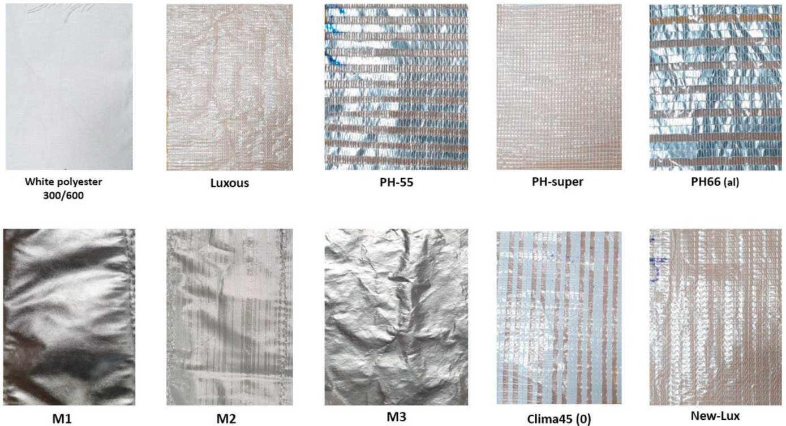
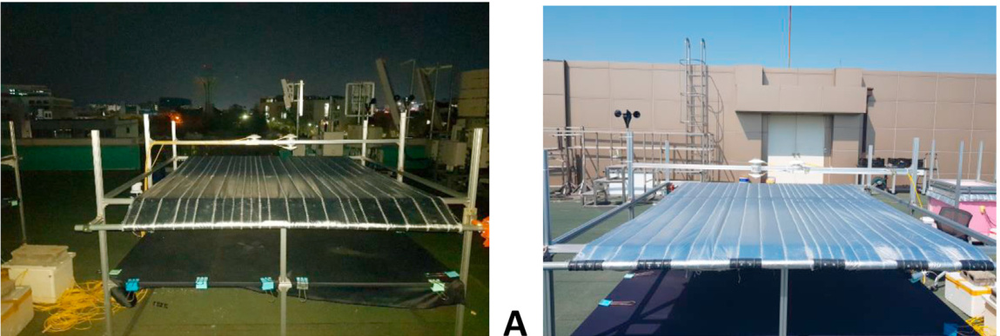
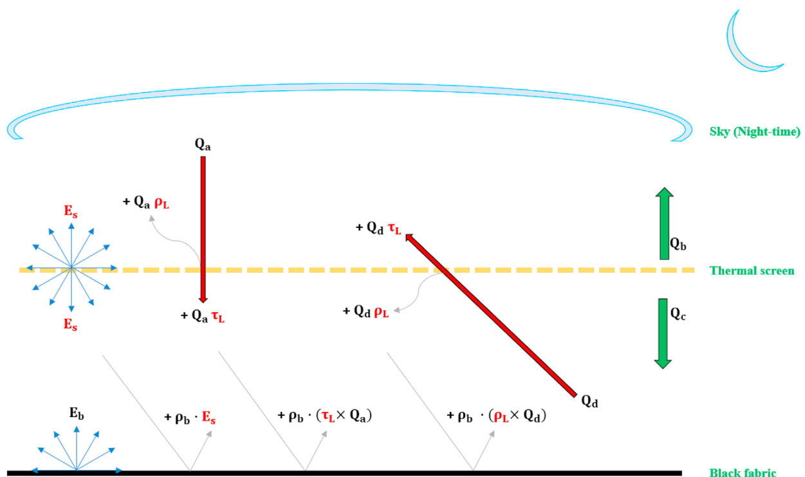
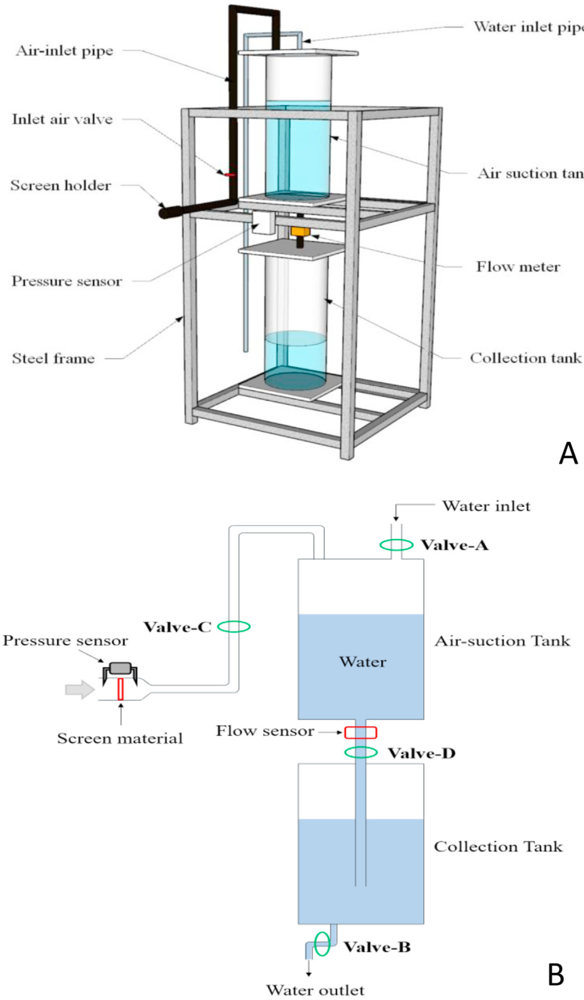
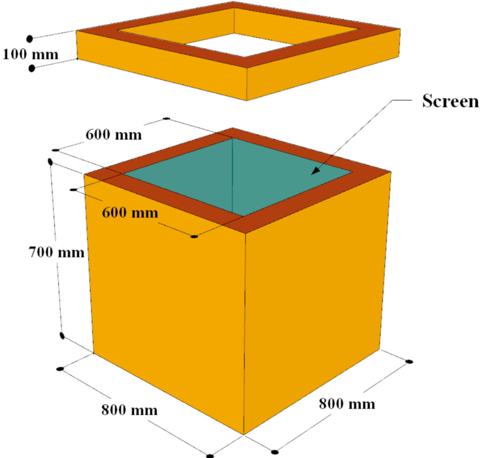
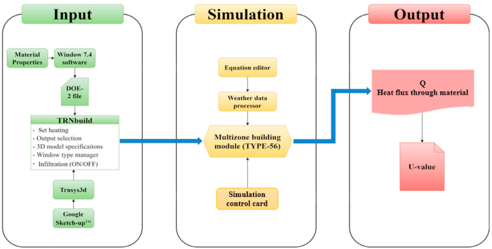
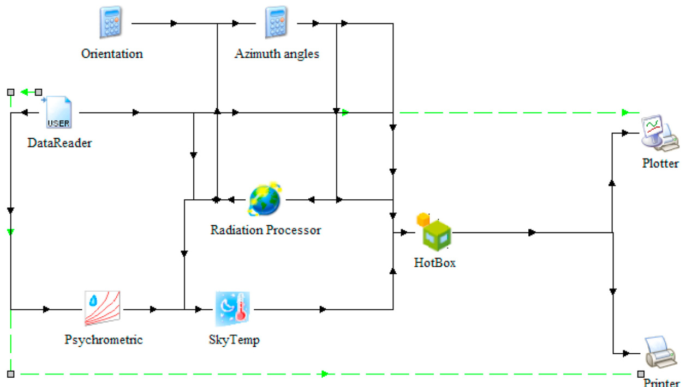
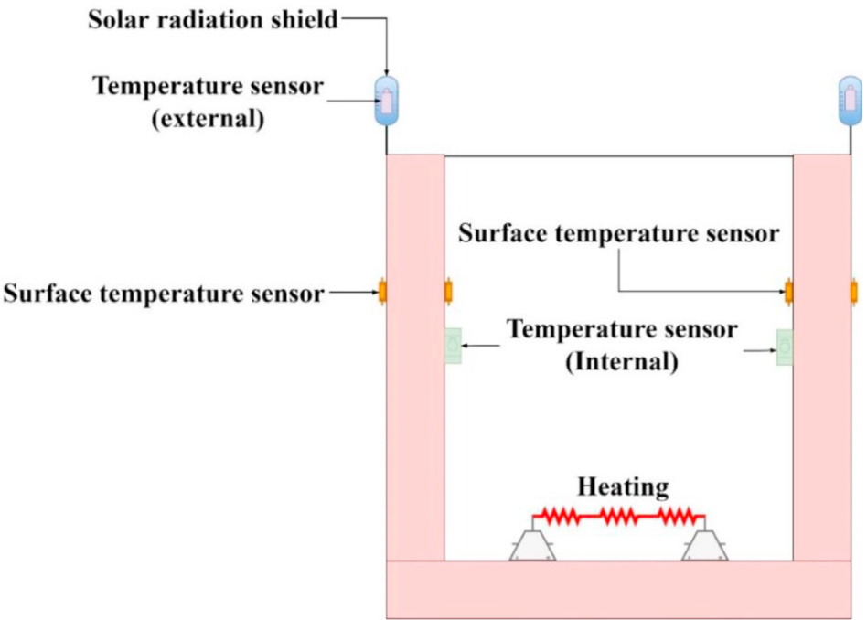
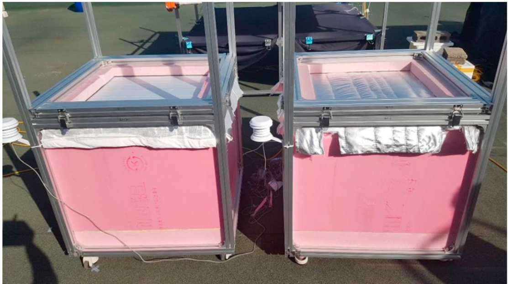

# Determination of overall heat transfer coefficient for greenhouse energy-saving screen using Trnsys and hotbox

研究论文

# 利用Trnsys和热箱法测定温室节能幕布的整体传热系数

Anis Rabiu a, Wook-Ho Na b, Timothy Denen Akpenpuun c, Adnan Rasheed b, Misbaudeen Aderemi Adesanya a, Qazeem Opeyemi Ogunlowo a, Hyeon Tae Kim d, Hyun-Woo Lee a,b,\*  
a 韩国庆北国立大学 农业与生命科学学院 农业土木工程系，Daegu 702-701, South Korea  
b 韩国庆北国立大学 智能农业创新中心，Daegu 41566, South Korea  
c 尼日利亚伊洛林大学 农业与生物系统工程系，PMB 1515, Ilorin, Nigeria  
d 韩国庆尚国立大学 生物产业机械工程系，Jinju 52828, South Korea

# 文章信息

文章历史：  
收到日期：2021年7月28日  
修订稿收到日期：2022年2月25日  
接受日期：2022年3月8日  
在线发表日期：2022年3月29日  
关键词：  
节能幕布  
渗透性  
气流  
TRNSYS  
热箱

温室在冬季的高能耗促使了多种节能幕布的开发。然而，目前关于节能幕布精确性能的数据有限，针对幕布节能能力测量方法的研究也较少。本研究旨在确定选定的商业温室节能幕布的热物理、辐射和空气动力学特性。采用瞬态系统仿真（TRNSYS）模型，通过测量的幕布性能模拟热流并推导幕布的保温特性。通过对比模拟与实验获得的传热系数（以整体传热系数U值表示）对模型进行验证，从而确定幕布的保温能力。此外，将模拟U值与实验U值在材料渗透性方面进行对比，以探究幕布孔隙率对热损失的影响。采用t检验对模拟与热箱实验获得的U值进行统计分析。模拟U值（基于计算的渗透性）显示，M1和M3样品的U值最低，为$4.4 \mathrm{W} \mathrm{m}^{-2} \mathrm{K}^{-1}$，而白色聚酯、Luxous、PH-super、PH-66、M2、Clima45 (0)和New-Lux的U值分别较高，分别为$82\%$、$105\%$、$161\%$、$123\%$、$41\%$、$102\%$和$118\%$。由于材料孔隙率较低，M1、M2和M3样品的温室保温性能优于其他样品。综上所述，温室节能幕布材料的渗透性特征对其U值有显著影响。

$\circledcirc$ 2022 IAgrE. 由Elsevier Ltd.出版。保留所有权利。

## 名词解释

| 符号/缩写 | 含义 |
| --- | --- |
| Ti | 室内空气温度，℃ |
| Tis | 内表面温度，℃ |
| A | 样品横截面积，m² |
| tes | 外表面温度，℃ |
| Tfsky | 长波辐射用的虚拟天空温度，℃ |
| ACH | 换气次数，h⁻¹ |
| Ccover | 天空云量因子 |
| Tgrd | 长波辐射用的虚拟地面温度，℃ |
| Cp | 空气比热容，kJ·K⁻¹·kg⁻¹ |
| dp | 压差，Pa |
| Tsky | 有效天空温度，℃ |
| Es | 节能幕布的发射功率，W·m⁻² |
| u | 风速，m·s⁻¹ |
| u | 整体传热系数，W·m⁻²·K⁻¹ |
| fs,sky | 外表面可见天空比例 |
| He | 外部对流换热系数，W·m⁻²·K⁻¹ |
| Uavg | 实验平均U值，W·m⁻²·K⁻¹ |
| uexp | 实验U值，W·m⁻²·K⁻¹ |
| k | 幕布渗透率，m² |
| Kt | 幕布样品流量系数，m³·m⁻²·s⁻¹ |
| Usim | 模拟U值，W·m⁻²·K⁻¹ |
| v | 环境风速，m·s⁻¹ |
| v | 气流量，m³·s⁻¹ |
| l | 热箱厚度，m·Pa⁻⁰·⁶⁶ |
| △Pr | 参考压差，Pa |
| X | 幕布厚度，m |
| Qconv | 向表面的对流热损失，W |
| Qrad | 向表面的辐射热损失，W |
| Q | 通过幕布的热损失，W |
| Q1oss | 热箱模型总热损失，W |
| Qinf | 通过幕布孔隙的热损失，W |
| Qa | 指向幕布的天空辐射，W·m⁻² |
| Qb | 幕布向天空的上行辐射，W·m⁻² |
| Qc | 幕布向黑布的上行长波辐射，W·m⁻² |
| Qd | 黑布向幕布的入射长波辐射，W·m⁻² |
| Qfrate | 单位面积幕布渗透气流量，m³·h⁻¹·m⁻² |
| Qr | 加热器加热功率，W |
| Qw | 热箱表面热损失，W |
| Sa | 幕布向天空的短波辐射，W·m⁻² |
| Sb | 幕布向天空的短波辐射，W·m⁻² |
| Sc | 幕布向黑布的短波辐射，W·m⁻² |
| Sd | 黑布向幕布的短波辐射，W·m⁻² |
| Sw | 表面积，m² |
| Ta | 环境温度，℃ |

### 希腊字母

| 符号 | 含义 |
| --- | --- |
| αL | 幕布长波吸收率 |
| εb | 黑布发射率 |
| ε0 | 晴空发射率 |
| λ | 聚苯乙烯保温材料导热系数，W·m⁻¹·K⁻¹ |
| μ、μd | 空气动力粘度，Pa·s，10⁻⁶量级 |
| p | 空气密度，kg·m⁻³ |
| pb | 黑布反射率 |
| PL | 幕布长波反射率 |
| Ps | 幕布反射率 |
| tb | 黑布透射率 |
| TL | 幕布长波透射率 |
| ts | 幕布透射率 |
| σ | 斯特藩-玻尔兹曼常数 |

### 缩写

| 缩写 | 含义 |
| --- | --- |
| ASHRAE | 美国供热、制冷与空调工程师学会 |
| BES | 建筑能耗模拟 |
| KMA | 韩国气象厅 |
| LBNL | 劳伦斯伯克利国家实验室 |
| PE | 聚乙烯 |
| QTM-500 | 快速热导率测试仪 |
| TRNSYS | 瞬态系统仿真软件 |

# 1. 引言

全球人口的持续增长导致了对食品需求的指数级上升，受控环境农业（如温室）为作物全年种植提供了有利条件。温室种植是最常见的方法之一，能够为作物生长创造理想的小气候。这种种植策略具有成本效益，有助于实现全球粮食安全和环境可持续性（Ouazzani Chahidi 等, 2021）。然而，温室是商业农业中能源消耗最高的领域（Zhang 等, 2020）。例如，在韩国，冬季温室加热能耗约占总生产成本的 $40\%$（Rasheed 等, 2018b）。因此，高能耗促使人们寻求创新的节能解决方案和技术，以在不影响作物生长的前提下实现节能（Yano & Cossu, 2019）。据前人研究，已经应用了多种节能技术和策略，通过减少冬季温室加热需求来降低运营成本（Cuce 等, 2016）。

能量模拟工具通过分析能耗和节能幕布，成功预测了温室的热行为和性能，从而缓解了高加热需求并降低了运营成本（Yano & Cossu, 2019）。持续高企的能耗一直是温室种植者、研究人员和从业者的主要关注点（Teitel 等, 2009; Rasheed 等, 2018b; Yano & Cossu, 2019），因此必须妥善管理和优化，以维持最有利于作物生长的环境，实现冬季经济生产（Akpenpuun 等, 2021）。

在多种降低加热需求和提升温室内部能量保留的技术中，热屏幕（节能幕布）可减少夜间热损失约 $40\%-70\%$（Ahamed 等, 2019），并通过减少温室微环境中的加热空气，节省约 $23\%-60\%$ 的加热能耗（Ahamed 等, 2019）。热屏幕如同毯子（绝热材料），在夜间防止热量向外环境流失（Frangi, Piatti, & Amoroso, 2011），其节能性能受幕布位置和类型影响（De Zwart, 1996）。Abu Bakar 等（2015）和 Rasheed 等（2018a）指出，温室设计参数、建材、节能幕布的类型和数量显著影响加热能耗，进而影响温室的能量需求。因此，提升节能幕布的热性能对于改善温室保温至关重要（Vitoshkin 等, 2019），而整体传热系数（U值）可衡量幕布材料的热容量（Rasheed 等, 2018c）。据 Rasheed 等（2018c）报道，韩国市场上有许多新型热屏幕，但其性能尚未明确，导致种植者难以选择最优节能材料。然而，全面的U值信息有助于在合适的节能幕布上做出明智的经济投资，从而降低初始生产成本（Baeza 等, 2020）。此外，U值及其他关键材料信息也有助于制造商生产最适合温室的材料（Hemming 等, 2017）。

Geoola 等（2009）构建了带护罩的热箱，测试了温差和风速对温室聚乙烯塑料薄膜整体传热系数的影响，实验条件包括有无热屏幕。Diop 等（2012）开发了带护罩的热箱，同时测定温室覆盖材料和热屏幕的U值，实验条件包括有无天空辐射遮蔽。Lu 和 Memari（2018）对建筑围护结构实验室热箱进行了对比研究，评估了建筑围护系统的热性能，并采用动态模型（包括Anderlind回归和ReC网络模型）并用热箱测试法验证了结果（Lu & Memari, 2018）。Rasheed 等（2018a）建立了热箱建筑能耗模拟（BES）模型，计算了聚乙烯、聚碳酸酯、聚氯乙烯和园艺玻璃的U值。该研究将所有被测材料视为不可渗透、无空气动力学特性，并考虑了孔隙热损失（Rasheed 等, 2018a）。此外，Rasheed 等（2018a）还利用热箱BES模型，在明确气候条件下研究了多种温室热屏幕的U值及其热性能。然而，只有少数研究在模型中考虑了热屏幕的空气动力学特性（气流特性和渗透性），以预测幕布材料的能量保留能力。Miguel 等（1997）利用Forcheimer方程和Darcy公式，研究了9种不同热屏幕、遮阳网和防虫网的气流特性，测定了其孔隙率和渗透性。实验表明，热屏幕的渗透性约为 $10^{-11} \mathrm{m}^2$，因操作不当损坏可提升至3.5倍。Castellano 等（2016）利用实验室大型风洞，测定了15种温室网幕的空气动力学和几何参数。该研究基于Bernoulli损失系数原理，在风速小于 $4\ \mathrm{m}\ s^{-1}$ 时建立了气流速率和压降曲线。Valera 等（2006）则采用吸气和风洞系统，评估了选定温室网的流动阻力、渗透性和惯性因子，并发现幕布孔隙率在0.29至0.48之间，且惯性因子与孔隙率之间可用二次多项式描述。

近年来，动态模拟软件被引入温室研究以解决热现象问题。其中，瞬态系统仿真（TRNSYS）是一种BES工具，用于研究热系统、估算能耗并分析温室微气候的能量管理，实现经济高效运行（Rasheed 等, 2015; Ahamed 等, 2020）。TRNSYS是一款多功能软件，也广泛应用于商业、工业和民用建筑。此外，该软件已扩展至农业领域，可模拟实际场景，包括处理动态气象数据、太阳辐射、建筑朝向与几何、储能系统、通风、暖通空调（HVAC）及可再生能源（Baglivo 等, 2020）。TRNSYS工具可根据输入参数模拟热系统，确定逐时、逐日和逐年能耗（Rasheed 等, 2015; Choab 等, 2021）。此外，已有多项研究应用TRNSYS模型模拟温室微气候并分析能量管理（Ahamed 等, 2020; Baglivo 等, 2020; Mashonjowa 等, 2013; Rasheed 等, 2018b, 2020a）。Ahamed 等（2020）利用TRNSYS预测了加拿大草原地区中式太阳能温室的加热需求，由于TRNBuild库缺乏温室模型所需的特定功能，对热屏幕做出了一些假设。然而，采用实际幕布属性可降低模型预测能耗的不确定性。同样，Rasheed 等（2020）利用TRNSYS模拟了多跨温室的微气候，考虑了幕布、屋顶通风口和加热设定点的日常和年度控制，以满足作物需求（Rasheed 等, 2020）。该研究考察了温室设计参数对最大加热负荷的影响，包括自然通风、幕布数量、双层玻璃、北墙保温、屋顶几何、覆盖材料、加热设定点控制和热屏幕等。然而，对热屏幕气流特性的关注较少，未充分考虑节能时通过幕布孔隙的热损失。

已有研究报道了多种材料配置的温室幕布的渗透性（Miguel, 1998; López 等, 2016; Hemming 等, 2017; Hung Anh & Pásztory, 2021）、辐射特性（Abdel-Ghany 等, 2015; Rafiq, 2019）和热辐射性能（Balemans, 1989; Papadakis 等, 2000; Andersson, 2010; Rafiq 等, 2019）。但这些特性往往被单独使用，忽略了它们对幕布热性能的综合影响。热屏幕对太阳光谱或长波辐射的散射、发射和反射能力取决于其材料组成和结构，使得单一热屏幕难以适用于所有作物、地点和季节气候变化（Baeza 等, 2020）。因此，必须利用能量模拟软件综合考虑热屏幕的多种属性，以确定温室能耗。

Hemming 等（2017）利用KASPRO软件研究了热屏幕和遮阳幕的节能能力。其研究考虑了幕布的辐射交换、湿度传递、机织和针织纺织品或薄膜的空气渗透性、开闭结构、扩散、铝化透明和不同颜色等因素。研究基于辐射交换，包括长波辐射的透射率和发射率。Baneshi 等（2020）在MATLAB中开发了温室模型，模拟了作物微气候，并测量了部分温室覆盖材料在0.2至 $28~{\mu\mathrm{m}}$ 波长范围内的光谱辐射特性。作者认为，合适的覆盖塑料可分别减少年冷负荷和热负荷 $9.8\%$ 和 $6.3\%$。然而，该研究揭示了关于温室塑料幕布特定光谱辐射特性的数据不足（Baneshi 等, 2020），且关于热屏幕热性能的信息有限，难以满足种植者对特定作物需求的选择（Rafiq 等, 2020）。Rafiq 等（2019）在自然条件下研究了热屏幕的属性，报告了PE、LD-13、LD-15和PH-20材料的发射率分别为 $0.439\pm0.020$、$0.460\pm0.010$、$0.454\pm0.010$ 和 $0.499\pm0.006$。Abdel-Ghany 等（2015）通过分析遮阳网的能量交换，测定了其短波和长波辐射。向下和向上的太阳及热辐射通量分别用于测量网面上下的能量平衡。因此，本研究通过新颖的方法学，弥补了准确测定热屏幕属性的数据空白，评估了幕布的节能能力以提升温室能效。此外，本研究还考虑了幕布材料的渗透性。模型还模拟了现实场景，涵盖了以往研究未考虑的所有气候条件，如环境压力、外部温度和风速。

此外，本研究通过BES模型，进一步考察了节能幕布的热物理、辐射和空气动力学等属性（基于各自的U值），以确定幕布孔隙率对整体传热系数的影响。利用BES精确测定不同节能幕布的U值，有助于温室能源系统的模拟与能耗分析，并能准确估算温室的年能耗，从而减少在预测节能幕布节能能力时对能耗的假设。此外，关于U值及热性能的信息也将为幕布制造行业提供更优的生产决策依据。

# 2. 材料与方法

本研究考察了节能幕布的热物理（厚度、密度、导热系数及几何特征）、辐射（长波、太阳和可见辐射）及空气动力学（气流与渗透性）等属性，并通过TRNSYS和实验热箱（U值）对其整体传热系数进行评估。

# 2.1. 热物理属性

如图1所示，测量了10种温室节能幕布的热物理属性。幕布厚度（mm）采用电子数显卡尺（TED PELLA, Inc., USA）测量，导热系数（$\mathrm{W}\,\mathrm{m}^{-1}\,\mathrm{K}^{-1}$）采用快速热导率测试仪（QTM-500, Kyoto Electronics MFG. Co., Ltd, Japan）进行测试（Rasheed等, 2020）。

幕布按对称/非对称、不透明/透明、有无铝条或铝层进行分类（Balemans, 1989; Rafiq等, 2019）。据此，幕布材料的物理属性用于将其归类为均质或非均质。样品M1、M2和M3由三种以上不同材料组成（见表1），包括铝化表面、无纺聚酯、卡西米罗棉及反面白色聚酯。利用劳伦斯伯克利国家实验室（LBNL）软件将这些属性输入TRNBuild，生成可读的建筑文件DOE-2。

# 2.2. 辐射属性

为测定所选材料的热红外和太阳辐射，采用辐射平衡法对其辐射特性进行测试。通过计算节能幕布与黑布之间的辐射交换，评估其辐射属性，包括进出幕布的短波辐射（Rafiq等, 2019）以及来自天空的进出长波辐射（单位$\textrm{W m}^{-2}$）（Rafiq等, 2019; Blonquist等, 2009; Rasheed等, 2020）。辐射平衡实验装置为$2\,\mathrm{m} \times 2\,\mathrm{m} \times 1\,\mathrm{m}$（长$\times$宽$\times$高）的铝钢框架。辐射实验在韩国大邱庆北国立大学农业土木工程系楼顶进行。

  
图1 节能温室幕布选定样品概览。

表1 多层节能幕布的材料组成

| 序号 | 名称 | 材料组成 |
| ---- | ---- | ------------------------------------------------------------ |
| 1    | M1   | 铝表面（Y1-Al/J1）+无纺聚酯+卡西米罗棉+无纺聚酯+白色聚酯300/300 |
| 2    | M2   | 铝条表面（Y1-Al/DN1）+无纺聚酯+白色聚酯300/300                |
| 3    | M3   | 铝表面（Y1-Al/W1）+无纺聚酯+卡西米罗棉+无纺聚酯+白色聚酯300/300 |

韩国。黑色织物被拉伸覆盖在热屏幕下方的支架上，距离地面 $0.5\ \mathrm{m}$，用于吸收通过热屏幕的辐射，同时也铺设在装置的上表面。如图2所示，黑色织物会将辐射反射回热屏幕。覆盖在框架底部的黑布具有已知的辐射特性：发射率 $(\varepsilon_{\mathrm{b}}) = 0.93$，透射率 $(\tau_{\mathrm{b}}) = 0$，反射率 $(\rho_{\mathrm{b}}) = 0.07$（Rafiq等, 2020）。

表2列出了本研究中使用的辐射传感器。这些传感器安装在铝钢框架的中心位置，分别位于热屏幕上方以及热屏幕与黑色织物之间。因此，位于热屏幕上方的顶部传感器记录天空辐射，而位于热屏幕与黑色织物之间的传感器则记录两者之间的辐射交换。所有必要参数均通过两台数据记录仪（见表2）以10分钟为间隔采集。材料测试时间为早上6点至下午6点（$0600$至$1800\ \mathrm{h}$），太阳辐射全天测量。相反，长波辐射则在夜间（$1800$至次日$0600\ \mathrm{h}$）进行测量，如图2所示。热屏幕的辐射特性，即长波辐射的入射和出射方向，通过净辐射计和长波辐射计进行测量，如图3所示。用于测量进入和离开屏幕的太阳辐射的日射表（pyranometer）则用于测量短波辐射的向下和向上分量，如图4所示。

  
图2 节能幕辐射特性实验装置示意图：（A）夜间，（B）白天。

辐射平衡方程用于计算长波辐射，如图3所示。长波红外辐射（$\mathrm{W}\ \mathrm{m}^{-2}$）决定了屏幕表面的向上和向下辐射，其中$\textcircled{2}_{\textmd b}$为热屏幕向天空的向上长波辐射，$\mathsf{Q}_{\mathsf{c}}$为夜间热屏幕向黑色织物的向上长波辐射（Abdel-Ghany等, 2015）。

$$
\mathsf Q_{b} = \mathsf E_{s} + \left( \rho_{\mathrm{L}} \times \mathsf Q_{a} \right) + \left( \mathsf Q_{d} \times \tau_{\mathrm{L}} \right)
$$

$$
\mathsf{Q}_{\mathsf{c}} = \mathsf{E}_{s} + \left( \tau_{\mathrm{L}} \times \mathsf{Q}_{a} \right) + \left( \mathsf{Q}_{d} \times \rho_{\mathrm{L}} \right)
$$

其中，$\mathsf{Q}_{\mathrm{d}}$为黑色织物向热屏幕的入射长波辐射（$\mathbb{W}\ \mathrm{m}^{-2}$），$\mathsf{Q}_{\mathrm{a}}$为天空向热屏幕的入射长波辐射，$\rho_{\mathrm{L}}$为热屏幕的长波反射率，$\boldsymbol{\tau_{\mathrm{L}}}$为热屏幕的长波透射率，$\mathtt{E}_{\mathrm{s}}$为热屏幕的发射功率（$\textrm{W m}^{-2}$），其值由Stefan-Boltzmann定律决定。

$$
\mathsf{Q}_{d} = \mathsf{E}_{b} + (\rho_{b} + \mu) \times \mathsf{E}_{s} + (\rho_{b} - \mu) \times (\rho_{L} \times \mathsf{Q}_{d}) + (\rho_{b} - \mu) \times (\tau_{L} \times \mathsf{Q}_{a})
$$

$$
\alpha_{\mathrm{L}} = 1 - \rho_{\mathrm{L}} - \tau_{\mathrm{L}}
$$

其中，$a_{\mathrm{L}}$为热屏幕的长波吸收率（Al-Helal & Abdel-Ghany, 2011; Balocco等, 2018; Hemming等, 2017; Rafiq等, 2021）。尽管方程数等于未知数，但在MATLAB中采用迭代法同时求解公式(1)-(3)时，公式(3)会导致兼容性问题。为同时求解这些方程，将微小量（表示$10^{-6}$）从$\tau_{\mathrm{L}} \times \mathsf{Q}_{\mathrm{a}}$和$\rho_{\mathrm{L}} \times \mathsf{Q}_{\mathtt{d}}$的反射部分中减去，同时在公式(3)中加到$\mathsf{E}_{s}$的反射部分。微小量$\mu$为假定的最小数值，用于容忍黑布反射率$\left(\rho_{\mathrm{b}}\right)$，对辐射值无影响，仅作为迭代平衡的容差。

短波辐射在白天通过辐射特性表达（见图4），测量屏幕材料上的入射和出射短波辐射，具体如公式(5)和(6)所示。

$$
\pmb{S}_{\mathsf{b}} = (\rho_{\mathsf{s}} \times \pmb{S}_{a}) + (\pmb{\tau_{s}} \times \pmb{S}_{d})
$$

$$
\pmb{\mathrm{S}}_{\mathrm{c}} = (\rho_{\mathrm{s}} \mathbf{\nabla} \times \pmb{S}_{d}) + (\pmb{\tau_{\mathrm{s}}} \times \pmb{S}_{a})
$$

其中，$S_{\mathrm{b}}$为热屏幕向天空的出射短波辐射，$\mathsf{S}_{\mathsf{c}}$为热屏幕向黑色织物的出射短波辐射，$\rho_{\mathrm{s}}$为热屏幕的反射率，$\boldsymbol{\tau_{S}}$为热屏幕的透射率，$S_{\mathrm{a}}$和$\mathsf{S}_{\mathrm{d}}$分别为天空向下的短波辐射和黑色织物向热屏幕的辐射。公式(1)-(4)通过MATLAB（MATLAB 20B, MathWorks, USA）迭代法同时求解以获得长波辐射，公式(5)和(6)则用于确定短波辐射。

  
图3 节能幕夜间入射（$\mathsf{Q}_{\mathsf{a}}$和$\pmb{\mathrm{Q}}_{\pmb{\mathrm{d}}_{i}}$）与出射（$\spadesuit_{\textnormal{b}}$和$(a_{\mathrm{c}})$）长波辐射示意图。

  
图4 节能幕白天入射（$S_{\mathbf{a}}$和$\pmb{\mathscr{s}}_{\bf d}$）与出射（$S_{\mathbf{b}}$和$\mathsf{\pmb{s}}_{\mathrm{c}}$）短波辐射示意图。

# 2.3. 空气动力学性能

空气通过节能幕的孔隙在两侧之间交换。空气渗透性导致温室顶部空间的热量和能量损失（Hemming等, 2017），因此可用于精确确定空气交换量。为测量节能幕的空气渗透性，开发了一种带排水水箱的实验室级吸气装置，如图5A所示。该装置基于空气-水流吸机制工作，其中重力作用下的空气通过自然吸入作用在幕布表面产生压降（Miguel, 1998）。选择带排水水箱的封闭系统，是因为其能精确测量空气渗透性。吸气水箱为密封容器，设有三个开口：顶部两个（一个用于幕布支架，另一个用于进水阀），第三个为排水口，连接流量传感器。当D和C阀门打开时，吸气水箱排出水，如图5B所示。水箱通过材料孔隙从外部环境吸入空气，导致水流出。由此，排出的水体积及其流速与通过幕布孔隙进入吸气水箱的空气体积和空气流速完全相同。采用测量水流量而非直接测量材料内的空气流量，是因为水的体积更易于量化，从而提高了测量的准确性（Hemming等, 2017）。如图5B所示，节能幕安装在幕布支架内，暴露于大气，并通过管道与吸气水箱上部连接。样品幕布被裁剪为直径$10\ \mathrm{cm}$的圆片，并安装在内径8cm、外径10cm的橡胶支撑环上。水箱排出的水体积通过流量传感器F-1000-RT测量，工作范围为$0{-}500~\mathrm{Pa}$（Blue-white industries, Ltd. USA）；幕布的压降通过差压变送器DPUH-0500测量，工作范围同为$0{-}500~\mathrm{Pa}$（Sensys industries, Ltd. South Korea），在空气被吸入系统时自动记录压力。然而，本研究未采用风洞法测量幕布渗透性，如前人所述（Hemming等, 2017；Santolini等, 2019）。

  
图5 e (A) 吸气装置CAD设计图 (B) 吸气装置原理示意图。

Darcy方程描述了空气通过两种可渗透材料时，空气速度与压差之间的基本关系。Darcy定律还描述了等温流体在压力梯度作用下以缓慢且稳定的速度通过材料的过程（Miguel, 1998）。因此，Darcy方程适用于低速层流条件下的流体运动，材料的渗透性由其通过孔隙分散流体的能力决定（Hemming等, 2017）。

$$
\frac { d P } { d \mathbf { x } } = \frac { \mu _ { d } } { K } \mathbf { \nabla } u ,
$$

其中，$dP$为空气压差[Pa]，$u$为空气速度$[\mathsf{m}\ \mathsf{s}^{-1}]$，$K$为节能幕的渗透性$[\mathrm{m}^2]$，$\mu_d$为空气的动力粘度[Pa·s]，$x$为节能幕的厚度[m]（Lopez-Martínez等, 2020）。此外，幕布的渗透率通过改进的LBNL模型确定，该模型利用等效泄漏面积、流量系数和参考压差来估算温室内空气渗透引起的热交换速率，具体如公式(8)所示。流量系数由材料的渗透性及其空气动力学性能决定。

在消除风和浮力影响的条件下，通过织物的空气流量在恒定压力$50\ \mathrm{Pa}$下测量（Jones等, 2012）。此外，实际运行时的压差是动态的，通常比$50\ \mathrm{Pa}$低一个数量级，约为$4\ \mathrm{Pa}$或更低，用于换算为渗透流量以预测实际空气泄漏（Balemans, 1989；Kraniotis, 2015）。在建筑围护结构中，泄漏处的平均压差更接近1Pa而非$50\ \mathrm{Pa}$（Sherman & Chan, 2004）。本研究还认为应采用1~4Pa的参考压差，以反映自然压力的变化并避免高压带来的非线性效应，这些效应无法准确反映实际压力（Sherman & Chan, 2004）。Hemming等（2017）通过实验温室测量幕布孔隙的空气速度，以表征不同幕布的空气渗透性。因此，记录了低于$0.2\ \mathrm{m}\ \mathrm{s}^{-1}$的空气速度范围，最大空气速度$0.2\ \mathrm{m}\ \mathrm{s}^{-1}$对于准确表征空气动力学性能是必要的。本研究采用1Pa作为参考压差，依据Lopez等（2016）提出的温室幕布压降-速度关系模型，并采用$0.2\ \mathrm{m}\ \mathrm{s}^{-1}$的空气速度（Hemming等, 2017）。

表3 聚苯乙烯的性能

| 性能               | 数值      |
|--------------------|-----------|
| 厚度 (mm)          | 100       |
| 密度 (kg·m⁻³)      | 15        |
| 导热系数 (W·m⁻¹·K⁻¹) | 0.033     |
| 比热容 (kJ·kg⁻¹·K⁻¹) | 1.25      |

主要实验设备参数如下：

| 设备名称                                   | 参数/说明                                                                                  |
|--------------------------------------------|-------------------------------------------------------------------------------------------|
| PM-B540-W 功率计 CM-100S                   | 功率单位：瓦时；200 V，60 Hz，-10℃~60℃（AI power manager，韩国）                          |
|                                            | 600 W，220 V，60 Hz（Comax Electric，中国）                                                |
| 电加热器                                   |                                                                                           |
| LTH-203 加热控制继电器箱                   | 220V，30A（韩国）                                                                         |
| HOBO MX2301A（内部温湿度记录仪）           | 单位：℃，%；10分钟采样；温度范围：-40℃~70℃；一体式；精度：±0.2℃（-0℃~70℃）；             |
|                                            | 湿度范围：0-100%；精度：±2.5%（10~100%）（Onset，美国）                                   |
|                                            | 10分钟采样；温度范围：-40℃~70℃；HOBO四通道模拟数据记录仪                                 |
| HOBO TMCx-HD（外部温度）热电偶探头         | 单位：℃；10分钟采样；精度：±0.25℃（-40℃~50℃）（Onset，美国）；测量范围：-270℃~1260℃      |
|                                            | UX120-006M（Onset，美国）HOBO四通道热电偶数据记录仪                                       |
|                                            | 精度：±0.25℃（-40℃~50℃）；UX120-014M（Onset，美国）                                      |
| RS3-B（太阳辐射防护罩）                    | 测量范围：-40℃~75℃                                                                        |
|                                            | 重量：113g（Onset，美国）                                                                  |

表5 节能幕的热物理性能

| 序号 | 样品（商品名）           | 厚度 (mm) | 导热系数 (W·m⁻¹·K⁻¹) | 层数   | 对称/非对称 | 铝条 | 组成         |
|------|-------------------------|-----------|-----------------------|--------|-------------|------|--------------|
| 1    | White Polyester 300/600 | 0.34      | 0.1066                | 单层   | 对称        | 无   | 非均质       |
| 2    | Luxous                  | 0.31      | 0.0558                | 单层   | 对称        | 无   | 非均质       |
| 3    | PH-55                   | 0.41      | 0.1486                | 单层   | 非对称      | 1/   | 非均质       |
| 4    | PH-super                | 0.33      | 0.0946                | 单层   | 对称        | 无   | 非均质       |
| 5    | PH-66al                 | 0.46      | 0.1573                | 单层   | 非对称      | 2/3  | 非均质       |
| 6    | m1                      | 1.74      | 0.0440                | 多层   | 非对称      | 无   | 非均质       |
| 7    | m2                      | 0.9       | 0.6623                | 多层   | 非对称      | 无   | 非均质       |
| 8    | m3                      | 1.85      | 0.0486                | 多层   | 非对称      | 无   | 非均质       |
| 9    | Clima45 (0)             | 0.24      | 0.0660                | 单层   | 对称        | 无   | 非均质       |
| 10   | New-lux                 | 0.25      | 0.0525                | 单层   | 对称        | 无   | 非均质       |

表6 节能幕材料的辐射学性能

| 序号 | 样品（商品名）           | 表面  | 热辐射 (2500-40000 nm) |   |   |   | 太阳辐射 (300-2500 nm) |   |
|------|-------------------------|-------|------------------------|---|---|---|-----------------------|---|
|      |                         |       |                        |P  |t  |   |t                      |   |
| 1    | White Polyester 300/600 | 正面  | 0.94                   |0.04|0.02|   |                       |p  |
| 2    | Luxous                  | 背面  | 0.94                   |0.04|0.02|   |                       |   |
|      |                         | 正面  | 0.44                   |0.18|0.38|   |0.58                   |0.30|
| 3    |                         | 背面  | 0.44                   |0.18|0.38|   |0.57                   |0.25|
|      |                         | 亮面  | 0.25                   |0.35|    |0.40|0.38                  |0.43|
| 4    | PH-55                   | 哑光面| 0.31                   |0.36|0.33|   |0.41                   |0.31|
|      |                         | 正面  | 0.60                   |0.02|    |0.38|                      |   |
| 5    | PH-super PH-66al        | 背面  | 0.60                   |0.02|0.38|   |                       |   |
|      |                         | 亮面  | 0.32                   |0.58|    |0.10|0.17                  |0.67|
| 6    | M1                      | 哑光面| 0.52                   |0.38|    |0.10|0.17                  |0.57|
|      |                         | 正面  | 0.01                   |0.99|    |<0.01|<0.01                |0.99|
| 7    | M2                      | 背面  | 0.51                   |0.49|    |<0.01|<0.01                |0.49|
|      |                         | 正面  | 0.02                   |0.98|    |<0.01|<0.01                |0.98|
| 8    | M3                      | 背面  | 0.51                   |0.49|    |<0.01|<0.01                |0.49|
|      |                         | 正面  | 0.01                   |0.99|    |<0.01|<0.01                |0.99|
| 9    | Clima45 (0)             | 背面  | 0.51                   |0.49|    |<0.01|<0.01                |0.49|
|      |                         | 正面  | 0.48                   |0.17|    |0.35|0.38                  |0.50|
| 10   | New-lux                 | 背面  | 0.55                   |0.14|0.31|   |0.38                   |0.48|
|      |                         | 正面  | 0.45                   |0.30|    |0.26|0.58                  |0.30|
|      |                         |       |                        |0.27|0.31|   |0.57                   |0.25|
|      |                         | 背面  | 0.42                   |    |    |   |                       |   |

表7 节能幕材料的空气动力学性能

| 序号 | 样品（商品名）                | 渗透率 (m²)                | 单位面积渗透流量 (cm³·cm⁻²·s⁻¹) | 热箱换气次数 ACH (h⁻¹) |
|------|------------------------------|----------------------------|-------------------------------|----------------------|
| 1    | White Polyester 300/600      | 6.51E-12 ± 8.9E-13         | 0.086                         | 5.1                  |
| 2    | Luxous                       | 1.71E-11 ± 1.0E-12         | 0.179                         | 10.8                 |
| 3    | PH-55 (open)                 | 7.25E-10 ± 4.0E-11         | 2.344                         | 140.6                |
| 4    | PH-super                     | 2.53E-11 ± 3.0E-13         | 0.220                         | 13.2                 |
| 5    | PH-66al                      | 3.41E-11 ± 2.7E-12         | 0.182                         | 10.9                 |
| 6    | M1                           | 2.66E-13 ± 2.2E-14         | 0.002                         | 0.1                  |
| 7    | M2                           | 1.42E-12 ± 2.4E-14         | 0.028                         | 1.7                  |
| 8    | M3                           | 0.00                        | 0.00                          | 0.0                  |
| 9    | Clima45 (0)                  | 1.49E-11 ± 1.3E-12         | 0.151                         | 9.1                  |
| 10   | New-lux                      | 1.33E-11 ± 1.6E-13         | 0.194                         | 11.7                 |

# 2.4. BES模型

TRNSYS 是一种用于创建热箱模型几何结构的BES（建筑能耗仿真）软件。首先，利用Transys3d（Google SketchUpTM的扩展插件）建立了热箱的三维模型。其次，将该模型以IDF文件格式导入TRNBuild中，以定义热箱的材料属性。聚苯乙烯的属性、节能幕参数以及外部气象参数被用作输入参数。热箱的墙体由聚苯乙烯保温材料组成，墙体属性从TRNBuild库中选择，如表3所示。第三，节能幕的属性包括长波辐射、短波辐射、物理属性和空气动力学属性，这些参数如表5至表7所示，并通过Lawrence Berkeley National Laboratory (LBNL) 的Window 7.4软件进行处理。最后，如图7所示，生成了DOE-2数据文件并导入TRNBuild。

TRNSYS studio包含以下用于热箱仿真的组件（称为type）：多区域建筑（type56）、气象数据读取器（type9c）、太阳辐射处理器（type16a）、打印机（type25c）、绘图仪（type65c）以及方程编辑器，如图8所示。每小时的外部气象信息，包括环境空气温度、天空温度、风速和大气压，均来自韩国气象厅（KMA）。气象数据读取器对数据进行处理，以模拟实际的外部气候条件。所有这些组件相互连接，并作为输入输出与type56关联。TRNBuild生成的建筑信息以b18文件形式存储，定义了所有热箱的输入参数。同时，绘图仪和打印机显示仿真输出结果。该模型在考虑节能幕为可渗透或不可渗透的情况下，确定通过节能幕的热通量。渗透性是指空气通过幕材料孔隙的流速，反映了泄漏或损失。

根据TRNSYS 18，TRNBuild允许通过设置幕材料的空气流量（以每小时换气次数ACH $\ln ^ { - 1 }$ 表示）为常数或输入变量，进行标准的渗透仿真。然而，空气流量由布尔控制器（开/关）操作，考虑渗透时为开，否则为关。因此，ACH $( \mathrm { h } ^ { - 1 } )$ 的表达式如下，符合ASHRAE标准：

$$
\ A C H = \frac { A _ { s } \times \ Q _ { f r a t e } } { \mathrm { V } _ { b o x } }
$$

其中，$\mathsf { A } _ { \mathsf { s } }$ 为被幕覆盖的热箱表面积 $( \mathrm { m } ^ { 2 } )$，$\mathrm { V _ { b o x } }$ 为热箱体积 $( \mathbf { m } ^ { 3 } )$，$\scriptstyle \mathbf { Q } _ { \mathrm { f r a t e } }$ 为幕区域的空气流量 $( \mathrm { m } ^ { 3 } \mathrm { m } ^ { - 2 } \mathrm { h } ^ { - 1 } )$。

热箱几何体的总热损失和模型的传热过程（Solar Energy Laboratory, 2018, pp. 7e36）如下所示：

$$
Q _ { l o s s } = Q _ { c o n v } + Q _ { r a d } + Q _ { i n f }
$$

热箱的对流热损失表示热箱表面与外部环境之间的热损失，如下所示：

$$
Q _ { c o n v } = H _ { e } \ ( T _ { e s } - T _ { a } )
$$

模型采用天空温度方程来确定外表面的长波辐射交换和辐射传热，如公式(12)所示（Asdrubali等, 2019；SCL, 2018, pp. 7e36；Zhang等, 2017）：

$$
Q _ { r a d } = \sigma ~ \varepsilon _ { 0 } ~ \left( T _ { e s } ^ { 4 } - T _ { f s k y } ^ { 4 } \right)
$$

$$
T _ { f s k y } = \left( 1 - f _ { s , s k y } \right) . \ T _ { g r d } - f _ { s , s k y } \ . \ T _ { s k y }
$$

$$
T _ { s k y } = T _ { a } \big ( \varepsilon _ { 0 } + 0 . 8 ( 1 - \varepsilon _ { 0 } ) C _ { c o v e r } \big ) ^ { 0 . 2 5 }
$$

此外，由于空气通过材料孔隙流动导致的渗透热损失可由下式描述：

$$
Q _ { i n f } = V \rho C _ { p } ( T _ { i } - T _ { a } )
$$

总的加热需求等于所有热箱表面的热损失，模型对每个表面分别计算。最终，通过幕的热损失用于计算材料的U值。

# 2.5. 热箱模型验证

对决定系数$\scriptstyle { \mathbb { R } } ^ { 2 }$进行了统计分析，以评估热箱模型的性能，定量表达模型的拟合程度，如公式(16)所示。$\scriptstyle { \mathsf { R } } ^ { 2 }$的准确度值范围为0到1，越接近1表示模型拟合越好。结果通过Microsoft Excel 2016统计软件包（Ogunlowo等, 2021）进行统计分析。模型的拟合度通过对比白色聚酯的模拟U值和实验U值进行验证。还对每种材料的计算U值（包括可渗透和不可渗透情况，取多次试验的平均值）与实验U值进行了t检验统计分析，以判断结果差异的显著性。该研究在$5 \%$的显著性水平下进行。

$$
R ^ { 2 } = 1 -  { \left[ \frac { \sum _ { \mathrm { i = 0 } } ^ { n } \left( U _ { \mathrm { i } } ^ { e x p } - \ U _ { \mathrm { i } } ^ { s i m } \right) ^ { 2 } } { \sum _ { \mathrm { i = 0 } } ^ { n } \left( U _ { \mathrm { i } } ^ { e x p } - \ { U } _ { a v g } ^ { e x p } \right) ^ { 2 } } \right] }
$$

# 2.6. 实验热箱

根据 ASTM 标准 C 236e89 和 C 976，构建了四台经过校准的实验室热箱装置，用于研究温室保温幕的整体传热系数（U 值）。这些装置由聚苯乙烯保温材料和铝制框架（用于外部支撑和刚性）制成。热箱分为两组，体积尺寸分别为 $8 0 0 \times 8 0 0 \times 8 0 0 ~ \mathrm { mm }$ 和 $7 0 0 \times 7 0 0 \times 7 0 0 ~ \mathrm { mm }$（长、宽、高），壁厚为 $1 0 0 ~ \mathrm { mm }$（见图6）。热箱顶部设有开口，称为“窗口”，用于放置待测试的保温幕材料。箱体腔室分别在 700 mm 和 $6 0 0 ~ \mathrm { mm }$ 高度处分隔，以便测试不同的幕样品。为防止系统漏气，在幕样品和金属框架上放置了一段聚苯乙烯，并用带绳固定在箱体框架上。聚苯乙烯上表面和聚苯乙烯盖下表面粘有海绵角垫，以实现窗口的气密性和表面平整贴合，防止热箱上表面与幕样品之间的漏气。

  
图6 e 热箱模拟模型的 Trnsys3d 草图。

热箱加热系统通过电加热器在设定温度 $4 0 ~ ^ { \circ } \mathrm { C }$ 下运行，以维持所需的箱内温度。加热源被战略性地放置在样品箱的中心，以保证实验期间热量分布均匀（见图9），热箱的组成部件见表4。两个外部 HOBO TMCx-HD 传感器配备太阳辐射防护罩（RS3-B）精确测量环境温度，防止气候对传感器测量的影响。这些传感器连接到四通道模拟数据记录仪，每 $1 0 \mathrm { min }$ 记录一次数据。箱内空气温度由两个 HOBO MX2301A 传感器自动测量并记录。内外表面温度由四个热电偶探头测量，并连接到 HOBO UX120-06M 数据记录仪，每 $1 0 ~ \mathrm { min }$ 记录一次。电加热器的功率输入通过瓦特计（Watts）测量，箱内空气温度由加热控制箱调节。此外，热箱外表面还设有一个控制箱，连接热电偶测量热箱内空气温度，并调节电加热器以控制热箱温度。实验在冬季夜间进行，适合保温幕的使用。最佳环境气候条件为 21:00 至 05:00（见图10）。但该热箱方法未考虑（Feuilloley & Issanchou, 1996；Geoola 等, 2009）曾考虑的湿度传递。

  
图7 e 热箱 TRNSYS 模型流程图。

  
图8 e TRNSYS 仿真工作室热箱模型。

这些实验在夜间进行，以观察夜间的热损失。然而，如果热箱的壁和底部视为绝热，且通过保温幕的传热稳定，系统处于稳态，则实验过程可视为遵循热平衡理论，其表达式如式（17）所示：

$$
U { = } \frac { \mathsf Q } { \mathsf { A } ( \mathsf T { i } - \mathsf T _ { a } ) }
$$

其中，U 为整体传热系数 $( \mathrm { W } \mathrm { m } ^ { - 2 } \mathrm { K } ^ { - 1 } )$，Q 为通过保温幕的热损失（瓦特），A 为测试样品的截面积 $( \mathbf { m } ^ { 2 } )$，$\mathrm { T _ { i } }$ 为箱内空气温度 $( ^ { \circ } \mathsf { C } )$，$\mathrm { T _ { a } }$ 为环境温度 $( ^ { \circ } \mathsf { C } )$。但式（17）未考虑通过热箱壁的能量损失，因系统并非绝热。因此，需测量热箱内外表面温度以量化墙体的能量损失。箱体的能量平衡方程如下：

  
图9 e 热箱原理示意图。

$$
Q = Q _ { r } - Q _ { w }
$$

其中，$\mathsf { Q } _ { \mathtt { r } }$ 为加热器的加热功率（瓦特），$\mathsf { Q } _ { \mathrm { w } }$ 为通过热箱表面（侧壁和底部）的热损失（瓦特）。

$$
{ { \mathrm { Q } } _ { w } } = \frac { \lambda \ S _ { w } \ ( { { T } _ { i s } } - { { T } _ { e s } } ) } { \ L }
$$

其中，$\mathsf { S } _ { \mathsf { w } }$ 为表面积 $( \mathbf { m } ^ { 2 } )$，$\lambda$ 为聚苯乙烯保温材料的导热系数 $( \mathrm { W . m } ^ { - 1 } . \mathrm { K } ^ { - 1 } )$，$\mathrm { T _ { i s } }$ 为内表面温度 $( ^ { \circ } \mathsf { C } )$，$\mathsf { T } _ { \mathsf { e s } }$ 为外表面温度 $( ^ { \circ } \mathsf { C } )$，$\mathtt { L }$ 为热箱壁厚 $( \mathrm { m } )$。

# 3. 结果与讨论

# 3.1. 热物理性能

根据热物理性能，温室保温幕可分为对称型和非对称型。幕材料表面（相同或不同）影响其分类，如表5所示。对称型幕材料两面具有相同的化学成分和表面颜色，而非对称型幕材料两面则不同，一面暗淡一面明亮，从而导致不同的物理属性。温室保温幕还可分为均质和非均质型，幕材料的物理属性对其热性能有显著影响。本研究中，PH-super材料的实验导热系数为$0.094~\mathrm{W~m}^{-1}~\mathrm{K}^{-1}$，与Rasheed等（2020）报道的0.08 W $\mathrm{m}^{-1}\mathrm{K}^{-1}$相近。样品M1、M2和M3具有相同的物理特性：非对称、铝化表面和多层结构，但材料成分和厚度不同，如表5所示。M1、M2和M3的导热系数分别为0.0440（最低）、0.6623（最高）和0.0486 W $\mathrm{m}^{-1}\mathrm{K}^{-1}$，厚度分别为1.74、0.9和$1.85~\mathrm{mm}$（最高）。这些结果表明，幕厚度对热阻的影响大于对导热系数的影响（Hung Anh & Pasztory, 2021）。

如表1所示，这些非均质幕材料由三种以上不同材料组成：铝化表面、无纺聚酯、casimiro棉和背面的白色聚酯，因此常用于温室中以减少热损失。Luxous、PHsuper、New-Lux和Clima45 (0)为对称型单层薄膜条和透明材料（Rafiq等, 2019）。而PH-55和PH-66al为非对称（均质）材料，由铝条和开孔遮阳带组成，气流阻力最小，表面成分差异较小。由于光亮铝条的快速传热，PH-55和PH-66al材料与其他单层幕相比具有较高的导热系数。

# 3.2. 辐射性能

表6展示了保温幕的辐射特性，包括长波辐射（透射率、反射率和发射率）和太阳辐射。M1、M2和M3的前表面为不透明且铝化，具有较高的长波反射率（高于$95\%$）和较低的透射率（低于$1\%$）。相反，背面表面的反射率和发射率分别约为$49\%$和$51\%$。前后表面材料成分的差异导致幕材料的非对称性，从而使其入射和出射辐射特性不同。PH-55和PH-66al的前（亮）表面反射率高于背（暗）表面。前表面光亮铝膜条与背面暗淡铝条的对比导致反射率存在差异。PH-super、Luxous、New-Lux和Clima45 (0)由于对称性（透明性），两面均具有较高的透射率和散射率，反射率较低，两面辐射特性相同。例如，Luxous（LD-13）的反射率、透射率和发射率分别为0.158、0.382和0.46（Rafiq等, 2019），与Luxous数据中反射率0.18、透射率0.38和发射率0.44的结果基本一致。

均质材料PH-55、PH-66al和Clima45 (0)由于表面结构的原因表现为非对称性，这影响了其辐射性能。白色聚酯的长波发射率最高（$94\%$），但反射率和透射率分别较低（$4\%$和$2\%$）。综上，保温幕材料的物理属性和化学成分对其辐射性能有显著影响。

# 3.3. 空气动力学性能

不同样品的空气动力学性能，包括渗透率和单位面积气流速率，见表7。Luxous的渗透率为$1.71\mathrm{E}^{-11}\mathrm{m}^2$，略低于Hemming等（2017）报道的$1.93\mathrm{E}^{-11}\mathrm{m}^2$。多孔幕材料的空气动力学性能受材料孔隙率影响显著。PH-55因其高孔隙率表现出最高的渗透率，单位面积渗透速率为$2.34\mathrm{cm}^3\mathrm{cm}^{-2}\mathbf{s}^{-1}$，低于Miguel（1998）报道的最大空气通量$2.5\mathrm{cm}^3\mathrm{cm}^{-2}\mathbf{s}^{-1}$。该幕材料还含有开口条带，允许空气自由流通。然而，实验表明M3对空气完全不透，未检测到气流，说明该样品材料渗透率为零，阻止了空气通过孔隙。此外，M1和M2的渗透率较低，限制了空气通过孔隙的流动。

  
图10 e 实验热箱装置。

# 3.4. 模型仿真与验证

利用模型计算了多种温室保温幕的整体传热系数。对于白色聚酯材料，模拟（分别考虑材料透气性和不透气性）与实验得到的U值的$\scriptstyle { \mathrm { \mathrm { R } } } ^ { 2 }$分别为0.87和0.88（见图11），表明该模型在预测保温幕U值方面具有较高的准确性。

同样，白色聚酯材料在不透气和透气条件下计算得到的U值百分比误差分别为$32.4\%$和$2.4\%$（见表8）。因此，不透气幕材料的结果误差较大，而透气幕材料的不确定性显著降低，结果更为准确。这表明模型与实验U值之间具有良好的一致性。

在不考虑材料透气性的情况下，已有研究发现白色聚酯300/600的U值为$5.5\ \mathrm{W}\ \mathrm{m}^{-2}\ \mathrm{K}^{-1}$（Rasheed等, 2018a），本研究计算的不透气结果也为$5.5\ \mathrm{W}\ \mathrm{m}^{-2}\ \mathrm{K}^{-1}$。另一项研究中，聚乙烯覆盖幕的实际和估算U值分别为9.2和11.37 W$\mathrm{m}^{-2}\mathrm{K}^{-1}$（Vitoshkin等, 2021）。此外，Feuilloley和Issanchou（1996）报道，多层（LDPE$^+$矿物掺杂）聚乙烯的实验和模拟U值分别为9.2和$10.5\ \mathrm{W}\ \mathrm{m}^{-2}\ \mathrm{K}^{-1}$。尽管由于方法和材料的多样性，这些研究结果难以直接比较，但图11所示的结果与本研究具有一定的相似性。类似的实验热箱也被用于研究覆盖幕的U值，方法与本研究一致。还有研究发现，单层聚乙烯的U值为$9.7\ \mathrm{W}\ \mathrm{m}^{-2}\ \mathrm{K}^{-1}$（Geoola等, 2009）。Diop等（2012）也发现，单层和双层聚乙烯的U值分别为7.7和$10.4\ \mathrm{W}\ \mathrm{m}^{-2}\ \mathrm{K}^{-1}$，均较高。

在模型成功验证后，进一步探讨了不同材料的U值，并考察了幕材料透气性的影响。因此，采用t检验统计分析，比较了计算得到的透气与不透气条件下多次试验的平均U值与实验结果之间的显著性差异。

此外，t检验显示，White polyester、Luxous、PH-55、PHsuper、PH-66、Clima45 (0)和New-Lux的计算不透气U值与实验U值之间存在显著差异。相比之下，在$5\%$显著性水平下，M1、M2和M3则无显著差异。因此，多层保温幕M1、M2和M3几乎完全密封，通过孔隙的热损失极小，且在$5\ \mathrm{m}\ \mathrm{s}^{-1}$风速下不受影响（见图11）。此外，风速低于$2.5\ \mathrm{m}\ \mathrm{s}^{-1}$时，其他幕材料的U值变化范围为$\pm0.5\ \mathrm{W}\ \mathrm{m}^{-2}\ \mathrm{K}^{-1}$。另外，仅PH-55在$95\%$置信水平下，计算透气U值与实验U值存在显著差异。而其他保温幕的U值相近，说明在温室节能应用中，保温幕材料的透气性应予以考虑。

# 3.5. 整体传热损失系数

本节讨论了实验热箱和模拟下保温幕的U值，见表8。根据实验U值数据，样品M1的U值最低，为$3.9\ \mathrm{W}\ \mathrm{m}^{-2}\ \mathrm{K}^{-1}$，而白色聚酯、Luxous、PH-55、PH-super、PH-66、M2、M3、Clima45 (0)和New-Lux的U值分别比M1高$110\%$、$144\%$、$897\%$、$177\%$、$133\%$、$49\%$、$18\%$、$123\%$和$151\%$。模拟U值（计算不透气）结果显示，Luxous的U值最低，为3.8 W$\mathrm{m}^{-2}\mathrm{K}^{-1}$，而白色聚酯、PH-55、PH-super、PH-66、M1、M2、M3、

20 10 20 10 中 Cal.,impermeable] 中 Cale,ipermeable 8 8 Calc.(permeable) Calc.(permeable) .……. wind speed 1 ...…. wind speed 1 2 0 0 0 22 23 24 1 2 3 4 5 22 23 24 1 2 3 4 5 Time (h) Time (h) 120 10 20 10 PH-55 o Exper. PH-Super 0 Exper. Calc.timrmtabie 8 Calc.(imrmrtaee 8 80 ..… wind speed 6 60 1 8 40 日 20 4 □ 0 0 0 0 22 23 24 1 2 3 4 5 22 23 24 1 2 3 4 5 Time (h) Time (h) 20 10 20 10 中 Cal(impermealie) T 中 Cale(ipermeale Calc.(permeable) 8 Calc.(permeable) 8 ....…· wind speed ...... wind speed 6 1 1 0 0 0 0 22 23 24 2 3 4 5 22 23 24 1 2 3 4 5 Time (h) Time (h) 20 10 20 10   
1 Exper. M3 Exper. 中 Calc.(impermeable) 中 Calc.(impermeable)] 8 8 Calc.(permeable) ...... wind speed …wind speed 6 ） 1 4 8 4 日 2 4 2 0 0 0 22 23 24 1 2 3 4 5 22 23 24 1 2 3 4 5 Time (h) Time (h) 20 10 20 10   
Exper. New_Lux Exper. 中 Calc.(impermeable)] 中 Calc.(impermeable)] 8 Calc.(permeable) Calc.(permeable) ....…· wind speed ...· wind speed 6 ） ? 1 8 4 □ 0 0 0 22 23 24 1 2 3 4 5 22 23 24 1 2 3 4 5 Time (h) Time (h)

Clima45 (0)和New-Lux的U值分别比Luxous高$45\%$、$16\%$、$37\%$、$21\%$、$13\%$、$42\%$、$16\%$、$18\%$和$5\%$。此外，模拟U值（计算透气）结果显示，M1和M3的U值最低，为$4.4\ \mathrm{W}\ \mathrm{m}^{-2}\ \mathrm{K}^{-1}$，而白色聚酯、Luxous、PH-super、PH-66、M2、Clima45 (0)和New-Lux分别比M1和M3高$82\%$、$105\%$、$161\%$、$123\%$、$41\%$、$102\%$和$118\%$。

然而，无论是实验还是模拟结果，M1、M2和M3的U值均无显著差异。这些材料对空气流动具有较高的阻力，降低了因幕材料渗透造成的热损失。

样品M3同样完全不透气，能有效阻止热量通过孔隙逸散。相反，PH-55含有宽大的开口条带，约占材料总面积的$45\%$。这些大孔洞使空气几乎无阻力流通，气流和其他气候因素对热损失影响显著。由于空气阻力极小，PH-55两侧的压差趋近于零（0 Pa），影响了其渗透速率和U值。以1 Pa为参考压差会改变渗透速率，从而影响U值。例如，若采用一半压差（即0.5 Pa），模拟U值会降低，更接近实验U值。因此，PH-55是一种温室用开孔遮阳幕，通常与其他单层保温幕配合使用，以提升热性能、降低湿度，为植物生长提供良好环境（Baeza等, 2020）。

表8  温室保温幕材料整体传热系数的计算值与实验值对比

| 序号 | 样品（商品名）            | 计算U值（W·m⁻²·K⁻¹） | 计算U值（W·m⁻²·K⁻¹） | 实验U值（W·m⁻²·K⁻¹） |
|------|--------------------------|----------------------|----------------------|----------------------|
|      |                          | 不透气               | 透气                 |                      |
| 1    | 白色聚酯 300/600         | 5.5                  | 8.0                  | 8.2                  |
| 2    | Luxous                   | 3.8                  | 9.0                  | 9.5                  |
| 3    | PH-55（开孔）            | 4.4                  | 72.1                 | 38.9                 |
| 4    | PH-super                 | 5.2                  | 11.5                 | 10.8                 |
| 5    | PH-66（铝）              | 4.6                  | 9.8                  | 9.1                  |
| 6    | M1                       | 4.3                  | 4.4                  | 3.9                  |
| 7    | M2                       | 5.4                  | 6.2                  | 5.8                  |
| 8    | M3                       | 4.4                  | 4.4                  | 4.6                  |
| 9    | Clima45 (0)              | 4.5                  | 8.9                  | 8.7                  |
| 10   | New-lux                  | 4.0                  | 9.6                  | 9.8                  |

对于样品M1、M2和M3，计算与实验得到的U值结果较为一致。这些样品能够更好地保留热量，并且对水和空气的流动具有良好的阻隔性。本研究认为，厚度大、渗透率低、红外发射率低、红外反射率高的材料，其U值最低，更适合用于温室的保温。

# 4. 结论

本研究采用TRNSYS模型和实验热箱，研究了商业温室保温幕的性能，并计算了整体传热系数（U值）以评估其热工性能。为量化保温幕的各项属性，采用了实验方法，并在BES中用于获得幕材料的U值。同时，提出了实用的热箱法以验证模拟模型的准确性。在对保温幕材料进行节能评估时，该方法可提升温室能耗模拟和前期设计的有效性。

M1和M3幕材料的计算透气U值最低，为$4.4~\mathrm{W~m}^{-2}~\mathrm{K}^{-1}$，而白色聚酯、Luxous、PH-super、PH-66、M2、Clima45 (0)和New-Lux的U值分别比M1和M3高$82\%$、$105\%$、$161\%$、$123\%$、$41\%$、$102\%$和$118\%$。M1的实验U值为$3.9~\mathrm{W~m}^{-2}~\mathrm{K}^{-1}$，而白色聚酯、Luxous、PH-55、PH-super、PH-66、M2、M3、Clima45 (0)和New-Lux的U值分别比M1高$110\%$、$144\%$、$89\%$、$177\%$、$133\%$、$49\%$、$18\%$、$123\%$和$151\%$。对模拟和实验热箱U值数据的t检验分析显示，M1、M2和M3的结果最为显著，且这些幕材料之间无显著差异。

本研究还探讨了材料渗透性对热箱模型中保温幕U值的影响，分析了空气通过材料孔隙的流速对U值的作用。为观察幕材料孔隙率对热损失的影响，模拟结果分别给出了透气和不透气条件下的U值。对比模拟与实验U值，发现计算的透气U值与实验值高度一致。在预测能耗和评估不同幕材料性能时，发现温室节能模拟（TRNSYS）中必须考虑幕材料的透气性。

综上所述，具有铝化表面、非对称结构、低红外发射率、低红外透过率、低孔隙率、高红外反射率和高厚度等特性的节能幕材料，具有更高的热阻。基于这些特性，此类幕材料可有效减少空气渗漏和能耗，是防止过度热损失的理想选择。

# 资金支持

本研究得到了韩国食品、农业、林业技术企划评价院（IPET）通过“农业食品农村融合新产业创意全球领袖培养项目”以及韩国农业、食品和农村事务部（MAFRA）（项目号：717001-7）的资助。同时还得到了韩国教育部通过韩国国家研究基金会（NRF）基础科学研究项目（NRF-2019R1I1A3A01051739）的支持。

# 利益冲突声明

作者声明不存在可能影响本论文工作的已知财务利益或个人关系。

# 附录A. 补充数据

本文的补充数据可在线获取：  
https://doi.org/10.1016/j.biosystemseng.2022.03.002. 

# 参考文献   
Abdel-Ghany, A. M., Al-Helal, I. M., Shady, M. R., & Ibrahim, A. A. (2015). 水平塑料遮阳网与空气之间的对流换热系数. Energy and Buildings, 93, 119e125. https://doi.org/10.1016/j.enbuild.2015.02.010. October 2017.   
Abu Bakar, N. N., Hassan, M. Y., Abdullah, H., Rahman, H. A., Abdullah, M. P., Hussin, F., & Bandi, M. (2015). 能源效率指数作为衡量建筑能源性能的指标：综述. Renewable and Sustainable Energy Reviews, 44, 1e11. https://doi.org/10.1016/j.rser.2014.12.018. April.   
Ahamed, M. S., Guo, H., & Tanino, K. (2019). 降低传统温室供暖成本的节能技术. Biosystems Engineering, 178, 9e33. https://doi.org/ 10.1016/j.biosystemseng.2018.10.017   
Ahamed, M. S., Guo, H., & Tanino, K. (2020). 使用瞬态建筑能源模拟模型TRNSYS对中国式太阳能温室供暖需求建模. Journal of Building Engineering, 29, 101114. https://doi.org/10.1016/ j.jobe.2019.101114. April 2019.   
Akpenpuun, T. D., Na, W. H., Ogunlowo, Q. O., Rabiu, A., Adesanya, M. A., Addae, K. S., Kim, H. T., & Lee, H.-W. (2021). 玻璃配置作为自然通风温室草莓（<em>Seolhyang sp.</em>）栽培节能策略的效果. Journal of Agricultural Engineering, 52(2), 1e22. https://doi.org/10.4081/jae.2021.1177   
Al-Helal, I. M., & Abdel-Ghany, A. M. (2011). 干旱条件下温室中太阳辐射和热辐射向显热和潜热的能量分配和转换. Energy and Buildings, 43(7), 1740e1747. https://doi.org/10.1016/ j.enbuild.2011.03.017   
Andersson, N. E. (2010). 用于温室节能的保温幕特性. In International conference on agricultural engineering (pp. 1e6).   
Asdrubali, F., Evangelisti, L., Grazieschi, G., & Guattari, C. (2019). 天空温度对建筑能源需求的影响. Building Simulation Conference Proceedings, 1, 293e299. https:// doi.org/10.26868/25222708.2019.210326   
Baeza, E., Hemming, S., & Stanghellini, C. (2020). 具有可切换辐射特性的材料：它们能否成为完美的温室覆盖物？Biosystems Engineering, 193, 157e173. https://doi.org/10.1016/j.biosystemseng.2020.02.012   
Baglivo, C., Mazzeo, D., Panico, S., Bonuso, S., Matera, N., Congedo, P. M., & Oliveti, G. (2020). 用于评估作物热舒适性和能源需求的完整温室动态模拟工具. Applied Thermal Engineering, 179, 115698. https://doi.org/10.1016/j.applthermaleng.2020.115698. July.   
Balemans, L. (1989). 温室幕布能源有效性标准的评估 (Ph.D Dessertation.   
Balocco, C., Mercatelli, L., Azzali, N., Meucci, M., & Grazzini, G. (2018). 聚乙烯薄膜在太阳和红外波长的实验透射率. Solar Energy, 165, 199e205. https://doi.org/10.1016/j.solener.2018.03.011. December 2017.   
Baneshi, M., Gonome, H., & Maruyama, S. (2020). 商业温室覆盖塑料辐射特性的广谱测量及其对温室能源管理的影响. Energy, 210, 118535. https://doi.org/10.1016/j.energy.2020.118535   
Blonquist, J. M., Tanner, B. D., & Bugbee, B. (2009). 两种新型和三种传统净辐射计测量精度的评估和比较. Agricultural and Forest Meteorology, 149(10), 1709e1721. https://doi.org/10.1016/ j.agrformet.2009.05.015   
Castellano, S., Starace, G., De Pascalis, L., Lippolis, M., & Scarascia Mugnozza, G. (2016). 农业网空气渗透性的测试结果和经验相关性. Biosystems Engineering, 150, 131e141. https://doi.org/10.1016/ j.biosystemseng.2016.07.007   
Choab, N., Allouhi, A., Maakoul, A. El, Kousksou, T., Saadeddine, S., & Jamil, A. (2021). 温室设计参数对摩洛哥气候条件下温室供暖和制冷需求的影响. IEEE Access, 9, 2986e3003. https://doi.org/10.1109/ACCESS.2020.3047851   
Cuce, E., Harjunowibowo, D., & Cuce, P. M. (2016). 温室系统可再生能源和可持续节能策略：综合综述. Renewable and Sustainable Energy Reviews, 64, 34e59. https://doi.org/10.1016/j.rser.2016.05.077   
De Zwart, H. F. (1996). 使用模拟模型分析温室栽培中的节能选择. the Netherlands: Agricultural University Of Wageningen. PhD Thesis. Ph.D. Dissertation.   
Diop, S., Lee, J.-W., Na, W.-H., & Lee, H.-W. (2012). 使用热箱法测量带保温幕的温室覆盖材料整体传热系数. Journal of The Korean Society of Agricultural Engineers, 54(5), 1e7. https://doi.org/10.5389/ksae.2012.54.5.001   
Feuilloley, P., & Issanchou, G. (1996). 温室覆盖材料：使用热箱法测量和建模热特性，以及冷凝效应. Journal of Agricultural Engineering Research, 65(2), 129e142. https:// doi.org/10.1006/jaer.1996.0085   
Frangi, P., Piatti, R., & Amoroso, G. (2011). 温室节能不同幕布的评估. Acta Horticulturae, 893, 275e280. https://doi.org/10.17660/actahortic.2011.893.22   
Geoola, F., Kashti, Y., Levi, A., & Brickman, R. (2009). 使用热箱法研究带保温幕的温室覆盖材料整体传热系数. Polymer Testing, 28(5), 470e474. https://doi.org/10.1016/ j.polymertesting.2009.02.006   
Hemming, S., Baeza, E., Mohammadkhani, V., & Van Breugel, B. (2017). 节能幕材料 (Vol. 94). https://www. kasalsenergiebron.nl/content/research/20035_ Schermprestaties__methode_voor_bepaling_ energiebesparing.pdf.   
Hung Anh, L. D., & Pasztory, Z. (2021). 影响建筑保温材料导热系数因素概述. Journal of Building Engineering, 44, 102604. https:// doi.org/10.1016/j.jobe.2021.102604   
Jones, B., Das, P., Chalabi, Z., Davies, M., Hamilton, I., Lowe, R., Milner, J., Ridley, I., & Shrubsole, C. (2012). 联排住宅中渗透性与渗透的关系. August 2016..   
Kraniotis, D. (2015). 建筑中风驱空气渗透的动态特性 - 不稳定风条件下阵风的影响. https://doi.org/10.13140/RG.2.1.3607.9444. Dynamic characteristics of wind-driven air infiltration in buildings The impact of wind gusts under unsteady wind conditions Dyn (Issue December).   
Lopez-Martı´nez, A., Molina-Aiz, F. D., Valera, D. L., & EspinozaRamos, K. E. (2020). 从几何参数表征防虫网空气动力学的模型. Biosystems Engineering, 192, 42e55. https://doi.org/ 10.1016/j.biosystemseng.2020.01.013   
Lopez, A., Molina-Aiz, F. D., Valera, D. L., & Pen\~a, A. (2016). 防虫网气流的风洞分析及其在地中海温室中安装时的效果比较. Sensors, 16(5), 5e8. https://doi.org/ 10.3390/s16050690   
Lu, X., & Memari, A. M. (2018). 使用实验室评估给定建筑围护系统类型热性能的热箱测试方法比较研究. Energy and Buildings, 178, 130e139. https://doi.org/10.1016/j.enbuild.2018.08.044   
Mashonjowa, E., Ronsse, F., Milford, J. R., & Pieters, J. G. (2013). 使用动态温室气候模型模拟津巴布韦自然通风温室的热性能. Solar Energy, 91, 381e393. https://doi.org/10.1016/ j.solener.2012.09.010   
Miguel, A. F. (1998). 多孔网的气流：从理论到实际考虑. Energy and Buildings, 28(1), 63e69. https://doi.org/10.1016/S0378-7788(97)00065-0   
Miguel, A. F., Van De Braak, N. J., & Bot, G. P. A. (1997). 温室遮阳材料气流特性分析. Journal of Agricultural Engineering Research, 67(2), 105e112. https://doi.org/10.1006/jaer.1997.0157   
Ogunlowo, Q. O., Akpenpuun, T. D., Na, W. H., Rabiu, A., Adesanya, M. A., Addae, K. S., Kim, H. T., & Lee, H. W. (2021). 单跨和多跨温室微气候中热量和质量分布分析. Agriculture, 11(9), 891. https:// doi.org/10.3390/agriculture11090891   
Ouazzani Chahidi, L., Fossa, M., Priarone, A., & Mechaqrane, A. (2021). 地中海气候可持续温室栽培节能策略 - 案例研究. Applied Energy, 282, 116156. https://doi.org/10.1016/ j.apenergy.2020.116156. PA.   
Papadakis, G., Briassoulis, D., Scarascia Mugnozza, G., Vox, G., Feuilloley, P., & Stoffers, J. A. (2000). 温室覆盖材料的辐射和热性能及测试方法. Journal of Agricultural Engineering Research, 77(1), 7e38. https://doi.org/10.1006/jaer.2000.0525   
Rafiq, A. (2019). 节能温室幕长波辐射特性测量 (Measurement of Longwave Radiative Properties of Energy Saving Greenhouse Screens. December.   
Rafiq, A., Na, W. H., Rasheed, A., Kim, H. T., & Lee, H. W. (2019). 温室保温幕热辐射发射率和吸收率测定. Protected Horticulture and Plant Factory, 28(4), 311e321. https://doi.org/ 10.12791/KSBEC.2019.28.4.311   
Rafiq, A., Na, W. H., Rasheed, A., Kim, H. T., & Lee, L. (2020). 自然条件下水平保温幕对流换热系数测量. Protected Horticulture and Plant Factory, 29(1), 9e19. https://doi.org/ 10.12791/KSBEC.2020.29.1.9   
Rafiq, A., Na, W. H., Rasheed, A., Lee, J. W., Kim, H. T., & Lee, H. W. (2021). 节能温室幕长波辐射特性测量. Journal of Agricultural Engineering, 52(3). https://doi.org/10.4081/jae.2021.1209   
Rasheed, A., Kwak, C. S., Kim, H. T., & Lee, H. W. (2020). 用于分析多跨温室节能选项的建筑能源模拟模型. Applied Sciences, 10(19), 1e23. https://doi.org/10.3390/app10196884   
Rasheed, A., Kwak, C. S., Na, W. H., Lee, J. W., Kim, H. T., & Lee, H. W. (2020). 多跨温室微气候控制建筑能源模拟模型开发. Agronomy, 10(9). https://doi.org/10.3390/agronomy10091236   
Rasheed, A., Lee, J. W., & Lee, H. W. (2015). 使用建筑能源模拟进行温室能源管理综述. Protected Horticulture and Plant Factory, 24(4), 317e325. https:// doi.org/10.12791/ksbec.2015.24.4.317   
Rasheed, A., Lee, J. W., & Lee, H. W. (2018a). 温室覆盖材料整体传热系数计算模型开发. Spanish Journal of Agricultural Research, 15(4), Article e0208. https://doi.org/10.5424/sjar/2017154-10777   
Rasheed, A., Lee, J. W., & Lee, H. W. (2018b). 建筑能源模拟模型开发与优化以研究温室设计参数的影响. Energies, 11(8), 2001. https://doi.org/10.3390/en11082001   
Rasheed, A., Lee, J. W., & Lee, H. W. (2018c). 使用建筑能源模拟评估不同温室保温幕的整体传热系数. Protected Horticulture and Plant Factory, 27(4), 294e301. https://doi.org/10.12791/ ksbec.2018.27.4.294   
Santolini, E., Pulvirenti, B., Torreggiani, D., & Tassinari, P. (2019). 通过风洞实验和CFD数值建模表征遮阳网气流特性的新方法. Computers and Electronics in Agriculture, 163, 104800. https://doi.org/10.1016/ j.compag.2019.05.009. January.   
SCL. (2018). Trnsys 18 (Vol. 3). Solar Energy Laboratory, Univ. of Wisconsin-Madison. http://www.trnsys.com/.   
Sherman, M. H., & Chan, R. (2004). 建筑气密性：研究与实践. Lawrence Berkeley National Library. Report No. LBNL -53356. https://www.researchgate.net/publication/ 238573993_Building_Airtightness_Research_and_Practice.   
Solar Energy Laboratory. (2018). Trnsys 18 manual, documentation, vols. 4,5 & 7 (Vol. 3). Solar Energy Laboratory, Univ. of Wisconsin-Madison. http://www.trnsys.com/.   
Teitel, M., Barak, M., & Antler, A. (2009). 循环加热和保温幕对温室夜间热损失和微气候的影响. Biosystems Engineering, 102(2), 162e170. https://doi.org/10.1016/ j.biosystemseng.2008.11.013   
Valera, D. L., Álvarez, A. J., & Molina, F. D. (2006). 温室中使用的几种防虫网的空气动力学分析. Spanish Journal of Agricultural Research, 4(4), 273e279. https:// doi.org/10.5424/sjar/2006044-204   
Vitoshkin, H., Barak, M., Shenderey, C., Haslavsky, V., & Arbel, A. (2019). 使用热箱法通过多层保温幕改善温室保温. Proceedings of the World Congress on Mechanical, Chemical, and Material Engineering, 8e11. https://doi.org/10.11159/htff19.124   
Vitoshkin, H., Haslavsky, V., Barak, M., Ziffer, E., & Arbel, A. (2021). 半透明水平幕层传热的数值和实验研究. Journal of Building Engineering, 42(March), 103082. https:// doi.org/10.1016/j.jobe.2021.103082   
Yano, A., & Cossu, M. (2019). 使用光伏技术的能源可持续温室作物栽培. Renewable and Sustainable Energy Reviews, 109(April), 116e137. https://doi.org/ 10.1016/j.rser.2019.04.026   
Zhang, S., Guo, Y., Zhao, H., Wang, Y., Chow, D., & Fang, Y. (2020). 改善农业温室能源效率的控制策略方法. Journal of Cleaner Production, 274, 122695. https://doi.org/10.1016/ j.jclepro.2020.122695   
Zhang, K., Mcdowell, T. P., & Kummert, M. (2017). 长波辐射计算的天空温度估算和测量 polytechnique montréal , dept . of mechanical engineering , montréal , QC , Canada thermal energy system specialists , LLC , madison , WI , USA abstract modelling longwave heat. Building Simulation, 3, 2093e2102.

# r e f e r e n c e s   
Abdel-Ghany, A. M., Al-Helal, I. M., Shady, M. R., & Ibrahim, A. A. (2015). Convective heat transfer coefficients between horizontal plastic shading nets and air. Energy and Buildings, 93, 119e125. https://doi.org/10.1016/j.enbuild.2015.02.010. October 2017.   
Abu Bakar, N. N., Hassan, M. Y., Abdullah, H., Rahman, H. A., Abdullah, M. P., Hussin, F., & Bandi, M. (2015). Energy efficiency index as an indicator for measuring building energy performance: A review. Renewable and Sustainable Energy Reviews, 44, 1e11. https://doi.org/10.1016/j.rser.2014.12.018. April.   
Ahamed, M. S., Guo, H., & Tanino, K. (2019). Energy saving techniques for reducing the heating cost of conventional greenhouses. Biosystems Engineering, 178, 9e33. https://doi.org/ 10.1016/j.biosystemseng.2018.10.017   
Ahamed, M. S., Guo, H., & Tanino, K. (2020). Modeling heating demands in a Chinese-style solar greenhouse using the transient building energy simulation model TRNSYS. Journal of Building Engineering, 29, 101114. https://doi.org/10.1016/ j.jobe.2019.101114. April 2019.   
Akpenpuun, T. D., Na, W. H., Ogunlowo, Q. O., Rabiu, A., Adesanya, M. A., Addae, K. S., Kim, H. T., & Lee, H.-W. (2021). Effect of glazing configuration as an energy-saving strategy in naturally ventilated greenhouses for strawberry (<em>Seolhyang sp.</em>) cultivation. Journal of Agricultural Engineering, 52(2), 1e22. https://doi.org/10.4081/jae.2021.1177   
Al-Helal, I. M., & Abdel-Ghany, A. M. (2011). Energy partition and conversion of solar and thermal radiation into sensible and latent heat in a greenhouse under arid conditions. Energy and Buildings, 43(7), 1740e1747. https://doi.org/10.1016/ j.enbuild.2011.03.017   
Andersson, N. E. (2010). Properties of thermal screens used for energy saving in greenhouses. In International conference on agricultural engineering (pp. 1e6).   
Asdrubali, F., Evangelisti, L., Grazieschi, G., & Guattari, C. (2019). Influence of sky temperatures on building energy needs. Building Simulation Conference Proceedings, 1, 293e299. https:// doi.org/10.26868/25222708.2019.210326   
Baeza, E., Hemming, S., & Stanghellini, C. (2020). Materials with switchable radiometric properties: Could they become the perfect greenhouse cover? Biosystems Engineering, 193, 157e173. https://doi.org/10.1016/j.biosystemseng.2020.02.012   
Baglivo, C., Mazzeo, D., Panico, S., Bonuso, S., Matera, N., Congedo, P. M., & Oliveti, G. (2020). Complete greenhouse dynamic simulation tool to assess the crop thermal well-being and energy needs. Applied Thermal Engineering, 179, 115698. https://doi.org/10.1016/j.applthermaleng.2020.115698. July.   
Balemans, L. (1989). Assessment of criteria for energetic effectiveness of greenhouse screen (Ph.D Dessertation.   
Balocco, C., Mercatelli, L., Azzali, N., Meucci, M., & Grazzini, G. (2018). Experimental transmittance of polyethylene films in the solar and infrared wavelengths. Solar Energy, 165, 199e205. https://doi.org/10.1016/j.solener.2018.03.011. December 2017.   
Baneshi, M., Gonome, H., & Maruyama, S. (2020). Wide-range spectral measurement of radiative properties of commercial greenhouse covering plastics and their impacts into the energy management in a greenhouse. Energy, 210, 118535. https://doi.org/10.1016/j.energy.2020.118535   
Blonquist, J. M., Tanner, B. D., & Bugbee, B. (2009). Evaluation of measurement accuracy and comparison of two new and three traditional net radiometers. Agricultural and Forest Meteorology, 149(10), 1709e1721. https://doi.org/10.1016/ j.agrformet.2009.05.015   
Castellano, S., Starace, G., De Pascalis, L., Lippolis, M., & Scarascia Mugnozza, G. (2016). Test results and empirical correlations to account for air permeability of agricultural nets. Biosystems Engineering, 150, 131e141. https://doi.org/10.1016/ j.biosystemseng.2016.07.007   
Choab, N., Allouhi, A., Maakoul, A. El, Kousksou, T., Saadeddine, S., & Jamil, A. (2021). Effect of greenhouse design parameters on the heating and cooling requirement of greenhouses in Moroccan climatic conditions. IEEE Access, 9, 2986e3003. https://doi.org/10.1109/ACCESS.2020.3047851   
Cuce, E., Harjunowibowo, D., & Cuce, P. M. (2016). Renewable and sustainable energy saving strategies for greenhouse systems: A comprehensive review. Renewable and Sustainable Energy Reviews, 64, 34e59. https://doi.org/10.1016/j.rser.2016.05.077   
De Zwart, H. F. (1996). In Analyzing energy-saving options in greenhouse cultivation using a simulation model. the Netherlands: Agricultural University Of Wageningen. PhD Thesis. Ph.D. Dissertation.   
Diop, S., Lee, J.-W., Na, W.-H., & Lee, H.-W. (2012). Overall heat transfer coefficient measurement of covering materials with thermal screens for greenhouse using the hot box method. Journal of The Korean Society of Agricultural Engineers, 54(5), 1e7. https://doi.org/10.5389/ksae.2012.54.5.001   
Feuilloley, P., & Issanchou, G. (1996). Greenhouse covering materials measurement and modelling of thermal properties using the hot box method, and condensation effects. Journal of Agricultural Engineering Research, 65(2), 129e142. https:// doi.org/10.1006/jaer.1996.0085   
Frangi, P., Piatti, R., & Amoroso, G. (2011). Evaluation of different screens for energy saving in the greenhouse. Acta Horticulturae, 893, 275e280. https://doi.org/10.17660/actahortic.2011.893.22   
Geoola, F., Kashti, Y., Levi, A., & Brickman, R. (2009). A study of the overall heat transfer coefficient of greenhouse cladding materials with thermal screens using the hot box method. Polymer Testing, 28(5), 470e474. https://doi.org/10.1016/ j.polymertesting.2009.02.006   
Hemming, S., Baeza, E., Mohammadkhani, V., & Van Breugel, B. (2017). Energy saving screen materials (Vol. 94). https://www. kasalsenergiebron.nl/content/research/20035_ Schermprestaties__methode_voor_bepaling_ energiebesparing.pdf.   
Hung Anh, L. D., & Pasztory, Z. (2021). An overview of factors influencing thermal conductivity of building insulation materials. Journal of Building Engineering, 44, 102604. https:// doi.org/10.1016/j.jobe.2021.102604   
Jones, B., Das, P., Chalabi, Z., Davies, M., Hamilton, I., Lowe, R., Milner, J., Ridley, I., & Shrubsole, C. (2012). In The relationship between permeability and infiltration in conjoined dwellings. August 2016..   
Kraniotis, D. (2015). Dynamic characteristics of wind-driven air infiltration in buildings - the impact of wind gusts under unsteady wind conditions. https://doi.org/10.13140/RG.2.1.3607.9444. Dynamic characteristics of wind-driven air infiltration in buildings The impact of wind gusts under unsteady wind conditions Dyn (Issue December).   
Lopez-Martı´nez, A., Molina-Aiz, F. D., Valera, D. L., & EspinozaRamos, K. E. (2020). Models for characterising the aerodynamics of insect-proof screens from their geometric parameters. Biosystems Engineering, 192, 42e55. https://doi.org/ 10.1016/j.biosystemseng.2020.01.013   
Lopez, A., Molina-Aiz, F. D., Valera, D. L., & Pen\~a, A. (2016). Wind tunnel analysis of the airflow through insect-proof screens and comparison of their effect when installed in a mediterranean greenhouse. Sensors, 16(5), 5e8. https://doi.org/ 10.3390/s16050690   
Lu, X., & Memari, A. M. (2018). Comparative study of Hot Box Test Method using laboratory evaluation of thermal properties of a given building envelope system type. Energy and Buildings, 178, 130e139. https://doi.org/10.1016/j.enbuild.2018.08.044   
Mashonjowa, E., Ronsse, F., Milford, J. R., & Pieters, J. G. (2013). Modelling the thermal performance of a naturally ventilated greenhouse in Zimbabwe using a dynamic greenhouse climate model. Solar Energy, 91, 381e393. https://doi.org/10.1016/ j.solener.2012.09.010   
Miguel, A. F. (1998). Airflow through porous screens: From theory to practical considerations. Energy and Buildings, 28(1), 63e69. https://doi.org/10.1016/S0378-7788(97)00065-0   
Miguel, A. F., Van De Braak, N. J., & Bot, G. P. A. (1997). Analysis of the airflow characteristics of greenhouse screening materials. Journal of Agricultural Engineering Research, 67(2), 105e112. https://doi.org/10.1006/jaer.1997.0157   
Ogunlowo, Q. O., Akpenpuun, T. D., Na, W. H., Rabiu, A., Adesanya, M. A., Addae, K. S., Kim, H. T., & Lee, H. W. (2021). Analysis of heat and mass distribution in a single-and multispan greenhouse microclimate. Agriculture, 11(9), 891. https:// doi.org/10.3390/agriculture11090891   
Ouazzani Chahidi, L., Fossa, M., Priarone, A., & Mechaqrane, A. (2021). Energy saving strategies in sustainable greenhouse cultivation in the mediterranean climate e a case study. Applied Energy, 282, 116156. https://doi.org/10.1016/ j.apenergy.2020.116156. PA.   
Papadakis, G., Briassoulis, D., Scarascia Mugnozza, G., Vox, G., Feuilloley, P., & Stoffers, J. A. (2000). Radiometric and thermal properties of, and testing methods for, greenhouse covering materials. Journal of Agricultural Engineering Research, 77(1), 7e38. https://doi.org/10.1006/jaer.2000.0525   
Rafiq, A. (2019). Measurement of longwave radiative properties of energy saving greenhouse screens (Measurement of Longwave Radiative Properties of Energy Saving Greenhouse Screens. December.   
Rafiq, A., Na, W. H., Rasheed, A., Kim, H. T., & Lee, H. W. (2019). Determination of thermal radiation emissivity and absorptivity of thermal screens for greenhouse. Protected Horticulture and Plant Factory, 28(4), 311e321. https://doi.org/ 10.12791/KSBEC.2019.28.4.311   
Rafiq, A., Na, W. H., Rasheed, A., Kim, H. T., & Lee, L. (2020). Measurement of convective heat transfer coefficients of horizontal thermal screens under natural conditions. Protected Horticulture and Plant Factory, 29(1), 9e19. https://doi.org/ 10.12791/KSBEC.2020.29.1.9   
Rafiq, A., Na, W. H., Rasheed, A., Lee, J. W., Kim, H. T., & Lee, H. W. (2021). Measurement of longwave radiative properties of energysaving greenhouse screens. Journal of Agricultural Engineering, 52(3). https://doi.org/10.4081/jae.2021.1209   
Rasheed, A., Kwak, C. S., Kim, H. T., & Lee, H. W. (2020). Building energy an simulation model for analyzing energy saving options of multi-span greenhouses. Applied Sciences, 10(19), 1e23. https://doi.org/10.3390/app10196884   
Rasheed, A., Kwak, C. S., Na, W. H., Lee, J. W., Kim, H. T., & Lee, H. W. (2020). Development of a building energy simulation model for control of multi-span greenhouse microclimate. Agronomy, 10(9). https://doi.org/10.3390/agronomy10091236   
Rasheed, A., Lee, J. W., & Lee, H. W. (2015). A review of greenhouse energy management by using building energy simulation. Protected Horticulture and Plant Factory, 24(4), 317e325. https:// doi.org/10.12791/ksbec.2015.24.4.317   
Rasheed, A., Lee, J. W., & Lee, H. W. (2018a). Development of a model to calculate the overall heat transfer coefficient of greenhouse covers. Spanish Journal of Agricultural Research, 15(4), Article e0208. https://doi.org/10.5424/sjar/2017154-10777   
Rasheed, A., Lee, J. W., & Lee, H. W. (2018b). Development and optimization of a building energy simulation model to study the effect of greenhouse design parameters. Energies, 11(8), 2001. https://doi.org/10.3390/en11082001   
Rasheed, A., Lee, J. W., & Lee, H. W. (2018c). Evaluation of overall heat transfer coefficient of different greenhouse thermal screens using building energy simulation. Protected Horticulture and Plant Factory, 27(4), 294e301. https://doi.org/10.12791/ ksbec.2018.27.4.294   
Santolini, E., Pulvirenti, B., Torreggiani, D., & Tassinari, P. (2019). Novel methodologies for the characterization of airflow properties of shading screens by means of wind-tunnel experiments and CFD numerical modeling. Computers and Electronics in Agriculture, 163, 104800. https://doi.org/10.1016/ j.compag.2019.05.009. January.   
SCL. (2018). Trnsys 18 (Vol. 3). Solar Energy Laboratory, Univ. of Wisconsin-Madison. http://www.trnsys.com/.   
Sherman, M. H., & Chan, R. (2004). Building airtightness: Research and practice. Lawrence Berkeley National Library. Report No. LBNL -53356. https://www.researchgate.net/publication/ 238573993_Building_Airtightness_Research_and_Practice.   
Solar Energy Laboratory. (2018). Trnsys 18 manual, documentation, vols. 4,5 & 7 (Vol. 3). Solar Energy Laboratory, Univ. of Wisconsin-Madison. http://www.trnsys.com/.   
Teitel, M., Barak, M., & Antler, A. (2009). Effect of cyclic heating and a thermal screen on the nocturnal heat loss and microclimate of a greenhouse. Biosystems Engineering, 102(2), 162e170. https://doi.org/10.1016/ j.biosystemseng.2008.11.013   
Valera, D. L., Alvarez, A. J., & Molina, F. D. (2006). Aerodynamic analysis of several insect-proof screens used in greenhouses. Spanish Journal of Agricultural Research, 4(4), 273e279. https:// doi.org/10.5424/sjar/2006044-204   
Vitoshkin, H., Barak, M., Shenderey, C., Haslavsky, V., & Arbel, A. (2019). Improving greenhouse insulation through multilayer thermal screens using the hot box method. Proceedings of the World Congress on Mechanical, Chemical, and Material Engineering, 8e11. https://doi.org/10.11159/htff19.124   
Vitoshkin, H., Haslavsky, V., Barak, M., Ziffer, E., & Arbel, A. (2021). Numerical and experimental investigation of heat transfer across semi-transparent horizontal screen layers. Journal of Building Engineering, 42(March), 103082. https:// doi.org/10.1016/j.jobe.2021.103082   
Yano, A., & Cossu, M. (2019). Energy sustainable greenhouse crop cultivation using photovoltaic technologies. Renewable and Sustainable Energy Reviews, 109(April), 116e137. https://doi.org/ 10.1016/j.rser.2019.04.026   
Zhang, S., Guo, Y., Zhao, H., Wang, Y., Chow, D., & Fang, Y. (2020). Methodologies of control strategies for improving energy efficiency in agricultural greenhouses. Journal of Cleaner Production, 274, 122695. https://doi.org/10.1016/ j.jclepro.2020.122695   
Zhang, K., Mcdowell, T. P., & Kummert, M. (2017). Sky temperature estimation and measurement for longwave radiation calculation polytechnique montreal , dept . of mechanical engineering , montreal , QC , Canada thermal energy system specialists , LLC , madison , WI , USA abstract modelling longwave heat. Building Simulation, 3, 2093e2102.