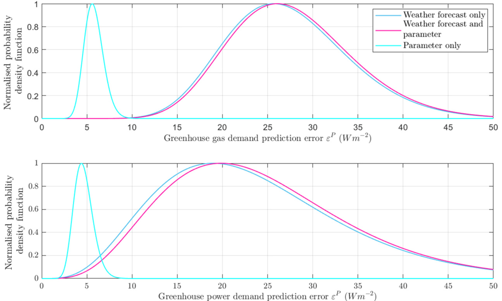
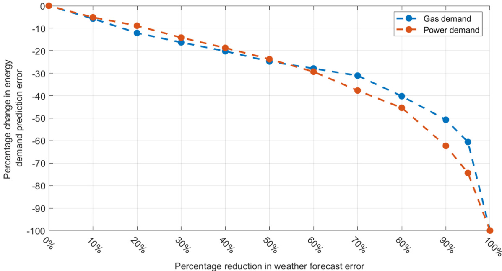
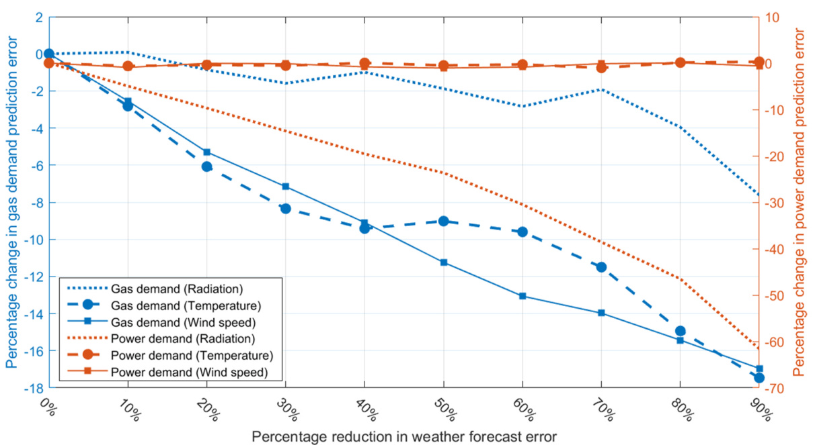

# Prediction uncertainty of greenhouse electrical power and gas demand: Part 2, the role of parametric and weather forecast error

研究论文

# 温室电力需求和燃气需求预测不确定性：第2部分，参数和天气预报误差的作用

H.J. Payne , E.J. van Henten, S. van Mourik

瓦赫宁根大学农场技术组，荷兰瓦赫宁根

# 文章信息

# 摘要

关键词：温室园艺 统计不确定性 能源效率

本研究通过评估天气预报变量中的个体和集体误差以及模型参数误差对温室电力和燃气需求预测误差的影响，开辟了新的研究领域。为了实现这一目标，提出了基于样本和基于多项式混沌的敏感性分析，使用高阶敏感性指数。这伴随着对减少个体天气预报误差对温室能源需求预测误差影响的敏感性分析。本研究的结果表明，天气预报误差在产生平均燃气 $( 2 7 ~ W m ^ { - 2 } .$ ) 和电力 $( 2 4 ~ W m ^ { - 2 } .$ ) 预测不确定性方面比参数误差 $( 5 . 7 ~ W m ^ { - 2 }$ 和 $4 . 6 \ : W m ^ { - 2 } .$ ) 起着更大的作用。此外，关键的是，发现天气预报和参数误差是独立因素。减少天气预报误差在减少预测误差方面表现出大幅递减回报。例如，所有变量的预报误差减少 $8 0 { - } 9 0 ~ \%$ 的情景仅导致燃气和电力预测误差减少 $5 0 \%$ 。辐射预报误差成为电力需求预测误差的主要贡献者，显示出将电力需求预测误差减少约 $6 0 \%$ 的潜力。风和室外空气温度预报误差的减少被确定为主要贡献者，分别为燃气需求预测误差提供 $1 7 \ \%$ 减少的潜力。

# 1. 引言

荷兰温室园艺部门在生长季节消耗大量燃气和电力。这种依赖外部能源输入温室的成本由种植者承担，因为其业务的财务稳定性与燃气和电力的价格相关。因此，高效使用进口能源对成功的温室运营至关重要。为了确保高效运营，该部门使用计算机化决策支持系统来建议温室应如何运营、需要多少燃气和电力以及何时购买。这是通过使用温室系统的数学模型结合预报天气数据来预测未来电力和燃气需求来实现的。

然而，使用基于模型的计算机支持系统预测的温室运营策略容易受到误差的影响。这些误差可能由模型参数值的不准确性或天气预报数据的干扰引起。模型参数和天气预报中可能不准确性的概率分布导致模型预测中误差的概率分布，这构成了预测不确定性。预测不确定性是不理想的，因为它可能导致资源效率低下的策略，因此减少模型参数和天气预报中的不准确性是优先事项。

改进天气预报和参数准确性将反过来创建更准确的温室电力和燃气需求预测，这可能导致种植者更高效的能源购买。在社会层面，温室园艺获得的这种能源效率将导致荷兰国家电力和燃气需求的减少，这反过来将导致总电力发电、燃气使用和 $C O _ { 2 }$ 排放的减少。

在温室园艺领域内，天气预报的数据不确定性已在先前研究中被包括。Sigrimis, Ferentinos, Arvanitis, 和 Anastasiou (2001) 以及 Vogler-Finck, Bacher, 和 Madsen (2017) 分析了预报误差如何影响预测温室加热需求的不确定性。两项研究都得出结论，与使用基本预报相比，包含天气预报改善了温室加热性能。然而，Sigrimis 和 Doeswijk 等人 (2006) 也得出结论，天气预报误差的存在分别将温室和仓库的加热成本增加了 $1 9 \%$ 和 $3 . 1 \ \%$，并且当使用更长的预报时，这种成本只会恶化。这得到了 Tap, van Willigenburg, 和 van Straten (1996) 的证实，他们研究了包含天气预报误差如何影响最优控制的温室室内气候。Tap 得出结论，当引入1小时懒人预报时，温室的 $\mathrm { C O } _ { 2 }$ 、加热需求和财务性能的最优性下降了 $1 5 \%$，并且对于更长的预报，性能会恶化。上述研究已经研究了天气预报不确定性对温室模型预测的影响，但主要集中在预测的热需求和经济学上。这为研究天气预报误差对预测温室电力和燃气需求的影响提供了机会。

| 符号 | 定义 | 符号 | 定义 |
|------|------|------|------|
| α | 方差减少因子 | β | 偏差校正因子 |
| h | 小时时间实例 | | 修正的天气预报误差 |
| hmax | 最终时间索引 | | 采样的天气预报误差 |
| ho | 初始时间索引 | | 两周能源需求预测误差 |
| M | 多项式混沌展开元模型 | pRMS | 能源需求预测误差 |
| n | 样本索引 | | 能源需求预测均方根(RMS)误差 |
| nmax | 样本数量 | P.RMS | |
| u | 合成天气预报 | Yθ | |
| uR | 记录天气 | θ | 标称参数 |
| W | 两周周期索引 | | |
| Wmax | 两周周期数量 | | |

温室园艺领域的先前文献已经考虑了参数不确定性在温室能源预测不确定性产生中的作用。Golzar, Heeren, Hellweg, 和 Roshandel (2018) 以及 Vanthoor, van Henten, Stanghellini, 和 de Visser (2011) 都考虑了有限数量的气候设定点对温室作物生长和能源需求的影响。Golzar 发现潜在的巨大能源减少是以作物生长小幅减少为代价的。Vanthoor, van Henten, 等人 (2011) 得出结论，玻璃的辐射传输特性和室外辐射水平对作物生长和能源预测具有最大影响。两项研究都考虑只有锅炉的温室和整体能源使用，而不分析燃气和电力需求。在温室园艺领域应用有限的一种替代方法是使用基于元模型的参数敏感性分析方法。一种称为多项式混沌展开 (PCE) 的方法可用于计算大量参数的个体和组合效应的敏感性指数 (Sudret, 2008)。这些 Sobol 敏感性指数是从元模型的系数解析计算的 (Mara & Becker, 2021)。因此，该方法只需要用于拟合元模型的样本。因此，PCE 可用于估计更多参数的敏感性指数，所需的参数样本比传统穷举基于样本的敏感性分析要少得多 (Blatman & Sudret, 2011)。

虽然模型参数和天气预报数据产生的不确定性已被单独考虑，但这些因素如何相互作用并共同影响预测不确定性方面存在知识空白。这种组合效应问题很重要，因为它显示了解决模型参数和天气预报数据中错误的相对重要性，以及可能在何处寻求预测不确定性的最大减少。

在温室园艺领域之外，已经提出了许多方法来分析多种输入不确定性来源对模型预测的作用。例如，Ramdani, Candau, Guyon, 和 Dalibart (2006) 通过假设输入数据误差是恒定的并且可以作为参数处理，将基于数据和参数的不确定性结合起来。该方法允许使用 Volterra 级数解析地将具有时变方差的误差包含到简单模型中。此外，Ajami, Duan, 和 Sorooshian (2007) 提出了一种贝叶斯方法 (IBUNE)，同时考虑模型中的参数、输入和结构不确定性。这是通过使用多个模型执行模型平均并通过定义输入误差分布将基于数据的不确定性包含到分析中来完成的。然而，这种方法确实从输入数据中移除了任何自相关或互相关，限制了方法与真实数据动态的关系。因此，在当前研究中有机会分析参数和基于天气的预测不确定性，同时保留天气数据中的相关效应。

针对上述确定的当前研究中的这些空白，我们提出了一种算法来同时评估参数和输入不确定性对温室电力和燃气需求的影响。这些算法结合了拉丁超立方采样方法、输入数据时间序列的直接使用，以及基于多项式混沌展开 (PCE) 的敏感性分析。该算法允许使用高阶敏感性指数对个体因素和参数组以及天气预报变量的误差影响进行方差的计算可处理分析。本研究还强调了在哪些领域有针对性的误差减少将导致模型预测误差的减少以及这些减少的可能规模。所提出的算法被应用于荷兰番茄种植温室的模型。

本研究旨在通过提出一种新颖的算法来研究该领域的一个未充分探索的方面，为温室园艺领域做出重要贡献。本研究的新颖性有两个方面。第一个新颖点是统计不确定性分析的应用，该分析考虑了温室园艺研究领域中天气预报和参数误差的个体和集体影响。第二个新颖点是本研究调查了时间序列误差和参数误差对能源需求预测不确定性的高阶效应。

# 2. 材料和方法

以下章节（2.1-2.2）描述了温室模型以及用于在案例研究中演示算法的记录和预报天气数据。本研究中描述的算法步骤在2.3节中描述。应该注意的是，在本研究的其余部分中，电力将被称为功率。此外，在本研究的其余部分中，能量一词用于表示功率和燃气。

# 2.1. 温室模型

使用的温室气候、番茄作物和能源模型是Greenlight（Katzin, van Mourik, Kempkes, & van Henten, 2020），这是一个经过校准的开源模型。Greenlight是一个基于动态微分方程的模型，模拟种植番茄的Venlo型温室。该模型接收来自外部温度、风速、辐射、水汽密度和$\mathrm{CO}_2$浓度天气数据的输入。该模型预测温室室内气候状态，包括室内空气温度、水汽浓度、环境辐射和$CO_2$浓度。此外，Greenlight预测温室的功率和燃气需求以及温室内番茄作物的生长。被模拟的温室参数化用于荷兰Bleiswijk。本研究使用了基于规则的控

表1 模型参数分布定义

| 模型参数名称 (θ) | 分布范围 (θl,θu) | 分布均值 (μ) | 分布标准误差 (σ) | 单位 | 参考文献 |
|---|---|---|---|---|---|
| 加热管FIR发射系数 (epsPipe) | [0,1] | 0.88 | 0.029 | 1 | Vanthoor, Stanghellini, van Henten, and de Visser (2011) |
| 灯具热交换系数 (θcHecLampAir) | [0,1] | 0.09 | 0.0030 | Wm-2K-1 | Kusuma, Pattison, and Bugbee (2020) |
| 冠层PAR消光系数 (θPAR.can) | [0,1] | 0.7 | 0.023 | 1 | Vanthoor, Stanghellini, et al. (2011) |
| 灯具最大强度 (θlamp.max) | [0,inf] | 110 | 3.7 | Wm-2 | Katzin et al. (2020) |
| 灯具顶面发射率 (θemistamp) | [0,1] | 0.1 | 3.3×10-3 | 1 | Katzin et al. (2020) |
| 屋顶PAR透射系数 (θPAR.trans.rof) | [0,1] | 0.85 | 0.028 | 1 | Vanthoor, Stanghellini, et al. (2011) |
| 地面PAR反射系数 (θRrflor) | [0,1] | 0.65 | 0.022 | 1 | Vanthoor, Stanghellini, et al. (2011) |

$$
\widehat { \mathbf { u } } _ { \mathrm { n } } ^ { \mathrm { F } } ( \mathrm { h } ) = \mathbf { u } ^ { \mathrm { R } } ( \mathrm { h } ) + \varepsilon _ { \mathrm { n } } ^ { \mathrm { F } } ( \mathrm { h } ) .
$$

对于每个样本n的合成天气预报 $\widehat { \mathbf { u } } _ { \mathrm { n } } ^ { \mathrm { F } }$ 随后被收集到一组预报中，其中 $\widehat { \mathbf { u } } _ { \mathrm { n } } ^ { \mathrm { F } } = \{ \widehat { \mathbf { u } } _ { 1 } ^ { \mathrm { F } } , \widehat { \mathbf { u } } _ { 2 } ^ { \mathrm { F } } . . . \widehat { \mathbf { u } } _ { \mathrm { n } \mathrm { m a x } } ^ { \mathrm { F } } \}$

# 2.3.2. 计算功率需求预测误差

在本研究中，温室模型能源预测在2.1节中被称为Y，其中 $\mathrm { \Delta Y }$ 是初始时间步长 $\left( \mathrm { h } _ { 0 } \right)$ 、时间(h)、模型参数值(θ)和天气数据(u)的函数。对于每个样本 $\mathfrak { n }$ ，预测误差 $\mathfrak { E } _ { \mathrm { n } } ^ { \mathrm { P } }$ 和均方根误差 $\varepsilon _ { \mathrm { n } } ^ { \mathrm { P , R M S } }$ 随后被计算。这些是通过比较使用采样的模型参数 $\left( \Theta _ { \mathrm { n } } \right)$ 、采样的合成天气预报数据 $\widehat { \mathbf { u } } _ { \mathrm { n } } ^ { \mathrm { F } }$ 与使用实际天气预报 $\mathrm { \mathbf { u } } ^ { \mathrm { F } }$ 和标称参数值θ进行的能源需求预测来计算的，其中，

$$
\varepsilon _ { \mathrm { n } } ^ { \mathrm { P } } \big ( \mathrm { h } _ { 0 } , \mathrm { h } , \theta _ { \mathrm { n } } , \overline { { \theta } } , \widehat { \mathrm { u } } _ { \mathrm { n } } ^ { \mathrm { F } } ( \mathrm { h } ) \big ) = \mathrm { Y } \big ( \mathrm { h } _ { 0 } , \mathrm { h } , \theta _ { \mathrm { n } } , \widehat { \mathrm { u } } _ { \mathrm { n } } ^ { \mathrm { F } } ( \mathrm { h } ) \big ) - \mathrm { Y } \big ( \mathrm { h } _ { 0 } , \mathrm { h } , \overline { { \theta } } , \mathrm { u } ^ { \mathrm { F } } ( \mathrm { h } ) \big ) ,
$$

以及

$$
\mathfrak { E } _ { \mathfrak { n } } ^ { \mathrm { P } , \mathrm { R M S } } \left( \theta _ { \mathfrak { n } } , \overline { { \theta } } , \widehat { \mathfrak { u } } _ { \mathfrak { n } } ^ { \mathrm { F } } \right) = \sqrt { \frac { 1 } { \mathfrak { h } _ { 0 } - \mathfrak { h } _ { \operatorname* { m a x } } + 1 } \sum _ { \mathrm { h } = \mathtt { h } _ { 0 } } ^ { \mathtt { h } _ { \operatorname* { m a x } } } \left( \mathfrak { E } _ { \mathfrak { n } } ^ { \mathrm { P } } \left( \mathbf { h } _ { 0 } , \mathbf { h } , \theta _ { \mathfrak { n } } , \overline { { \theta } } , \widehat { \mathfrak { u } } _ { \mathfrak { n } } ^ { \mathrm { F } } ( \mathrm { h } ) \right) \right) ^ { 2 } } \ .
$$

标称参数值被定义为模型参数分布 ${ \bf D } ( \boldsymbol { \theta } )$ 的均值。该预测误差用于确定天气预报误差和模型参数的比较作用。为此，采样的模型参数 $\theta _ { \mathrm { n } }$ 、采样预报误差的均值和标准差 $\mu ( \varepsilon _ { \mathrm { n } } )$ 和 $\sigma ( \mathfrak { E } _ { \mathrm { n } } )$ 以及预测误差 $\varepsilon _ { \mathrm { n } } ^ { \mathrm { P , R M S } }$ 被用于预测方差分析中，详见下一节。

# 2.3.3. 预测方差分析

本研究中的方差分析是使用基于多项式混沌展开(PCE)的敏感性分析进行的，这些方法的详细信息可以在Blatman和Sudret (2008, 2011)中找到。该PCE由元模型 $M$ 组成，该元模型基于预测误差 $\varepsilon _ { 1 \ldots \ n } ^ { \mathrm { { P , R M S } } }$ 对采样的模型参数θ、采样预报误差的均值和标准差 $\mu ( \mathfrak { E } _ { 1 . . \mathrm { n } } ^ { \mathrm { F } } )$ 和 $\sigma ( \mathfrak { E } _ { 1 . . \mathrm { n } } ^ { \mathrm { F } } )$ 变化的响应进行回归。因此，它可以用于估计预测误差 $\widetilde { \varepsilon } ^ { \mathrm { P , R M S } }$

$$
\widetilde { \varepsilon } ^ { \mathrm { P , R M S } } = \mathbf { M } \big ( \varepsilon _ { 1 . . \mathrm { n } } ^ { \mathrm { P , R M S } } , \Theta _ { . } , \mu ( \varepsilon _ { 1 . . \mathrm { n } } ^ { \mathrm { F } } \big ) , \sigma ( \varepsilon _ { 1 . . \mathrm { n } } ^ { \mathrm { F } } \big ) \big ) .
$$

进行了进一步的方差分析，通过依次固定天气和参数误差来检查这些组的比较影响。这是使用2.3.1和2.3.2节中定义的步骤完成的，并重复了三次。最初，描述的步骤被不加改变地应用。然后使用原始天气预报 $( \mathrm { u } ^ { \mathrm { F } } )$ 代替合成天气预报 $( \widehat { \mathbf { u } } _ { \mathfrak { n } } ^ { \mathrm { F } } )$ 执行步骤。随后，通过将参数值固定在其标称值上来执行步骤。以下小节中提出的场景研究了通过考虑预报误差偏差和减少敏感预报误差的方差可以实现预测不确定性减少。

# 2.3.4. 场景1 – 给定预报误差方差减少的温室能源预测需求不确定性

该场景研究了通过考虑预报误差中的预报误差方差减少可以实现的不确定性减少程度。为此，定义了一个方差减少因子α来缩放所有预报变量和单个预报变量。通过这样做，研究了单个预报变量针对性改进的相对影响。然后使用该因子计算修正的预报误差，使得，

$$
{ \widehat { \boldsymbol { \varepsilon } } } ^ { \mathrm { F } } { = } { \boldsymbol { \alpha } } \bullet { \boldsymbol { \varepsilon } } ^ { \mathrm { F } } .
$$

对于该场景，α范围从0到1，以0.1为增量递增，意味着误差方差减少$10\mathrm{-}100\mathrm{~\%}$。然后使用这组修正的预报误差，通过2.3.2节中描述的步骤计算修正的预测误差$\varepsilon ^ { \mathrm { P , \alpha , R M S } }$。

# 2.3.5. 场景2 – 给定预报误差偏差校正的温室能源预测需求不确定性

为了分析预报误差偏差对预测不确定性的影响，通过将校正因子$\beta$和缩放因子$\boldsymbol { \gamma }$的乘积加到等式(2)中描述的预报误差上来进行偏差校正，使得

$$
{ \widehat { \boldsymbol { \varepsilon } } } ^ { \mathrm { F } } = ( { \boldsymbol { \gamma } } * { \boldsymbol { \beta } } ) + { \boldsymbol { \varepsilon } } ^ { \mathrm { F } } .
$$

其中校正因子被定义为每个敏感预报变量的预报误差均值，使得$\beta = - \mu ( \varepsilon ^ { \mathrm { F } } )$。缩放因子$\boldsymbol { \gamma }$被设置为取0到0.9范围的值，以0.1为增量递增。然后使用这组修正的预报误差$\widehat { \varepsilon } ^ { \mathrm { F } }$在2.3.2节中描述的上述步骤来计算修正的预测误差$\varepsilon ^ { \mathrm { P , \beta , \mathrm { R M S } } }$。这反过来被用于比较具有不同偏差校正程度的预测不确定性。

# 3. 结果

2.3节中描述的算法和场景应用于荷兰番茄生产温室模型的案例研究，详见2.1节。3.1节显示了案例研究的结果，该结果证明了天气数据误差和参数导出的预测不确定性的比较作用。3.2和3.3节显示了案例研究的结果，该研究检查了通过天气预报误差的针对性改进可以实现多少预测不确定性减少。

# 3.1. 模型参数和天气预报不确定性综合影响分析结果

本节详细介绍了演示2.3节中描述算法的案例研究结果。参数和天气预报误差对能源预测不确定性影响的比较可以在图2中看到。

来自天气预报的预测不确定性${ \varepsilon } ^ { p }$远大于来自模型参数的不确定性。此外，图2显示天气预报和综合预测不确定性分布相似。这种相似性意味着天气预报占预测不确定性的大部分，并且来自预报和参数的不确定性之间相互作用可忽略不计。表2中描述的分布特性也证实了这一点，其中对于气体和功率需求，由天气预报误差产生的平均预测不确定性与天气预报和参数误差综合效应之间的差异仅为$1 W m ^ { - 2 }$。因此，参数和天气预报误差可以被认为是独立分布。

# 3.1.1. 基于PCE的敏感性分析结果

为了验证和详细阐述图2得出的结论，对预测功率需求进行了PCE敏感性分析。这是使用采样的模型参数值和合成天气预报完成的。PCE拟合了9个自由度，留一法误差为$7.4 \times 10^{-2}$。然后使用该PCE计算敏感性指数，得到的一阶和总阶Sobol敏感性指数如图2所示。

从PCE可以得出结论，天气预报是功率需求预测不确定性的主要来源。这一结论证实了图2显示的发现。这一结果也证实了Payne等人(2022)的结论，即在功率需求预测不确定性的情况下，辐射预报是最大的贡献者。此外，一阶和总阶指数之间的巨大差异表明高阶效应有很大影响。二阶相互作用，特别是天气预报变量之间的相互作用，可以在表3中看到。特别是辐射和温度预报在二阶指数中起最大作用，再次反映了Payne等人(2022)的结论以及太阳辐射热与空气温度之间的联系。

表2 气体和功率预测不确定性的分布特性

| | 仅天气预报 | 天气预报和参数 | 仅参数 |
|---|---|---|---|
| 气体需求 | μ | 27 | 28 | 5.7 |
| | σ | 7.0 | 6.8 | 1.1 |
| 功率需求 | μ | 24 | 25 | 4.6 |
| | σ | 11 | 11 | 1.1 |

表3 二阶PCE敏感性指数

| 参数名称(P) | 二阶指数 |
|---|---|
| μ(εF.Temperature) × σ(εF.Radiation) | 0.30 |
| μ(εF.Radiation) × σ(εF.Radiation) | 0.30 |
| μ(εF.Temperature) × σ(εF.Wind speed) | 2.0×10^-6 |
| σ(εF.Wind speed) × σ(εF.Temperature) | 2.0×10^-6 |
| σ(lamp.max) × σ(εF.Radiation) | 1.1×10^-9 |

  
图2. 给定天气预报（蓝色）、模型参数（青色）和两者组合（粉色）引入的误差的功率（底部）和气体（顶部）需求预测不确定性的归一化概率密度函数。（关于图例中颜色参考的解释，读者可参考本文的网络版本。）

# 3.2. 场景1中预报误差减少对能源预测不确定性影响的结果

本节描述了演示2.3.4节中描述的场景1所提出方法的案例研究结果。在得出天气预报误差是能源预测不确定性的主要贡献者且与参数不确定性独立的结论后，研究了如果误差被减少可能实现的潜在减少。首先通过同时缩放所有预报变量，然后单独缩放来实现。以下图表显示了所有预报的修改如何影响预测不确定性。

图4显示了给定天气预报误差减少时气体和功率需求误差的百分比减少。该图显示所有预报变量的误差减少$80-90\%$将产生气体和功率预测不确定性约$50\%$的减少。此外，预测不确定性减少与天气预报误差减少之间的关系在天气预报误差减少$60\%$之前近似线性。之后功率需求预测不确定性的减少大于气体。

图5显示在功率预测不确定性的情况下，辐射误差的减少导致预测不确定性的最大减少。这重新确认了从图3得出的结论，即辐射预报是功率需求预测不确定性的关键贡献者。温度和风速预报误差的减少不会导致功率需求预测不确定性的降低。气体需求预测不确定性受到所有预报变量内误差减少的影响。温度和辐射预报误差的减少对预测误差减少程度最大，温度和辐射预报的方差减少$40\%$导致气体需求预测不确定性减少$9\%$。

# 3.3. 场景2中预报误差偏差校正对能源预测不确定性影响的结果

以下部分描述了2.3.5节中提出的偏差校正场景案例研究的结果。

图6中显示的单个预报变量的偏差校正表明，在功率需求预测不确定性的情况下，偏差校正对预测不确定性减少的影响很小，且没有明显随偏差校正增加而增加的效果。在气体需求的情况下，通过校正温度和辐射预报误差的偏差可以实现$1-2\%$的改进。关键是要注意，对风速预报误差偏差的校正会增加预测不确定性。

# 4. 讨论

本研究发现，天气预报引入的误差产生的气体$(27.4~W.m^{-2})$和功率$(24~W.m^{-2})$需求平均预测误差远大于参数误差产生的误差。参数误差导致气体需求平均预测误差为$5.7~W.m^{-2}$，功率需求为$4.6~W.m^{-2}$。这一结果证实了先前研究对减轻天气预报误差的重视（Doeswijk, 2007, p. 174; Kuijpers, Antunes, van Mourik, van Henten, & van de Molengraft, 2022）。本研究还通过提出一个比较天气预报和参数误差影响及其潜在相互作用的新算法开辟了新领域。本研究旨在使用计算效率高的高阶指数分析天气预报和模型参数的组合误差。因此，本研究中详述的算法非常适合这一目的。这是因为基于PCE的分析允许通过PCE的高阶项将模型预测中的不确定性有效地归因于单个和参数组（Sudret, 2008）。使用这种方法，本研究能够在图3中得出结论，因子间的高阶相互作用比一阶效应有更大的影响。此外，本研究在图2中得出结论，天气预报误差比参数误差有更大的影响。这些结论挑战了仅考虑一阶效应和仅分析模型参数误差在温室模型中归因能源预测不确定性的敏感性分析先例。该算法还突出了在预测不确定性方面最容易实现减少的地方。这是通过研究减少天气数据和参数误差导致的预测不确定性减少所面临的困难程度来实现的。

  
图3. 给定模型参数和天气预报数据误差的功率需求预测误差$\varepsilon^p$的PCE敏感性分析的一阶（橙色）和总阶（蓝色）Sobol敏感性指数。（关于图例中颜色参考的解释，读者可参考本文的网络版本。）

  
图4. 使用所有天气预报变量的$\alpha$缩放系数的气体（蓝色）和功率（橙色）预测误差$(\widetilde{\varepsilon}^{P,RMS})$的百分比变化。（关于图例中颜色参考的解释，读者可参考本文的网络版本。）

  
图5. 作为每个天气预报变量的方差减少缩放系数$\alpha$函数的气体（蓝色）和功率（橙色）预测误差$(\widetilde{\varepsilon}^{P,RMS})$的百分比变化。虚线表示辐射预报误差的减少，带圆形标记的虚线表示温度预报误差的减少。带方形标记的实线表示风速预报误差的减少。（关于图例中颜色参考的解释，读者可参考本文的网络版本。）

在应用该算法时，本研究还发现天气预报误差产生的平均预测不确定性与天气预报和参数误差组合效应之间的差异很小，仅为$1~W~m^{-2}$。这一结果意味着参数和基于天气的误差之间几乎没有相互作用。因此，这些不确定性来源可以被视为未来研究中的独立不确定性来源。

该案例研究的结果得出结论，对于功率需求预测不确定性的一阶敏感性指数（图3），辐射预报的平均误差是唯一的个体贡献者。这是辐射预报中引入的不确定性传播到与外部辐射水平相关的灯具照明控制规则的结果。这一结果支持了辐射相关过程在能源需求预测中的重要性，这在Bontsema, van Henten, Gieling, and Swinkels (2011)和Payne等人(2022)中也发现了。具体而言，Bontsema等人(2011)得出结论，传感器精度是能源预测精度的关键，Payne等人(2022)发现辐射预报误差是功率需求预测不确定性的最大贡献者。

表3显示了作为PCE分析一部分发现的二阶相互作用，其中温度和辐射预报的不确定性组合传播到功率需求预测不确定性中。这些预报变量都对温度状态起作用，因此通过温室控制器中使用的规则集组合影响灯具的控制。这一结果邀请改变观点，即气候控制器的设计在减轻预测不确定性方面至关重要。尽管先前的研究没有关注预测的功率需求，但该示例的结果重新确认了先前研究的结论，即天气预报误差的引入确实影响模型精度（Sigrimis等人, 2001）和温室性能（Tap等人, 1996）。

  
图6. 作为每个天气预报变量的预报偏差减少因子$\beta$函数的气体（蓝色）和功率（橙色）预测误差$(\widetilde{\varepsilon}^{P,RMS})$的百分比变化。虚线表示辐射预报误差的减少，带圆形标记的虚线表示温度预报误差的减少。带方形标记的实线表示风速预报误差的减少。（关于图例中颜色参考的解释，读者可参考本文的网络版本。）

本研究进行了全局方差减少分析，发现随着天气预报误差方差的减少，预测不确定性减少最初是线性的，直到误差减少80%，并且需要超过80-90%的误差减少才能看到预测误差大于50%的改善。这一结果表明，通过减少预报误差来实现预测不确定性的潜在改善是困难的。然而，在过去15年中，天气预报准确性有所改善，例如Haiden等人(2021)发现地表温度预报误差改善了2.5%，风速预报误差改善了1.5%。如果这些趋势继续下去，在整个行业的背景下，这些改善可能会累积成大量的能源。

根据第3.2节中更详细的个体分析，辐射预报误差是功率需求不确定性的最大个体贡献者。本研究中发现的辐射预报的重要性得到了Payne等人(2022)中不确定性分析结果的证实。Payne等人(2022)中的不确定性分析研究了天气预报误差对温室能源需求预测不确定性的作用。本研究中进行的分析还发现，温度和风速预报误差不会影响功率需求预测误差。这是由于这些变量没有包含在控制温室灯具的规则中，而温室灯具负责温室功率需求。本研究进一步表明，虽然有针对性的减少预报误差是减少功率预测不确定性的最有效方法，但存在收益递减，即需要越来越大的预报误差改善才能获得递减的预测不确定性改善。在气体需求预测的情况下，所有预报变量的改善都会产生预测不确定性的改善。此外，气体需求预测准确性的最大改善可以通过减少温度和风速预报误差来实现。然而，这些总体上都小于功率需求情况下看到的改善。

还进行了偏差校正分析，得出的结论是偏差校正对功率需求误差影响很小。这是因为辐射预报误差的偏差很低，因此校正这种偏差对预测误差影响很小。此外，如果对辐射和温度预报误差进行偏差校正，偏差校正可以有益于气体需求误差，但仅占预测误差减少的1-2%。事实上，对于风速预报误差的情况，偏差校正会引入更多预测误差。这是由于校正风速预报的2.1 m.s^-1正误差偏差导致更多具有更大负值的风速预报误差，这反过来将更多风速预报值设为零。这反过来引入了预报的低估，增加了预测不确定性。这一结果可能意味着预报误差偏差中存在结构信息，并且误差在风速误差的情况下不是纯粹的彩色噪声形式。

所提出算法的一个局限性是本研究中选择包含的参数。这种参数选择没有考虑不同参数可能通过与天气预报误差的交互效应而变得有影响。因此，这些参数从本分析中被排除，可能移除了一些有影响的参数。应该注意的是，本研究中使用的参数在未发表的与温室气体和功率需求相关的全局参数不确定性分析中被发现是有影响的。因此，它们确实为温室能源分析目的的相关参数提供了可接受的指导方针。此外，本研究发现任何参数与天气预报变量之间几乎没有交互作用，因此不同参数和预报之间的交互作用是可能的，但不太可能。尽管如此，未来的研究可能对所有模型参数进行确认性全局敏感性分析，以研究任何潜在的与天气预报变量的交互效应。本研究的另一个局限性是其结论仅限于本分析中使用的数据和模型，模型的任何变化都可能影响本研究的结果。为了解决这一局限性，进一步的研究应该包括使用多个数据集在多个时期的多模型分析。未来研究的另一个考虑是在运营温室中运行实验设置。这项研究将分析使用包含不确定模型参数和天气预报的决策支持系统管理能源需求的实际影响。这样的分析将是实验数据的关键验证。

就本研究结果的影响而言，应该注意的是，当代文献强调了天气预报准确性过去和未来的改善潜力(Frnda等人，2022；Haiden等人，2021；Hewson & Pillosu，2021)。因此，随着行业天气预报准确性的持续改善，本研究结果影响温室园艺能源管理的潜力是可能的。虽然本研究确实确定了天气预报是预测不确定性的重要贡献者，但它们更难改善。因此，对于行业来说，专注于参数误差的改善也是实用的，尽管它们的影响相对较小，因为参数更容易通过校准和验证分析来识别。本研究提供了一个新颖的算法，为通过特别解决天气预报误差来改善温室能源需求预测的未来研究指明了明确的方向。确实，未来的研究也可能研究使用鲁棒控制方法来适应天气预报不确定性，特别是在气体和功率需求管理的具体情况下，正如先前研究中部分探索的那样(Bennis, Duplaix, En´ea, Haloua, & Youlal，2008；Chen, Du, He, Liang, & Xu，2018)。总的来说，如果这些算法被未来研究和行业采用，温室园艺行业可以提高其预测能源需求的准确性，并增加温室随后的能源和财务效率。

# 5. 结论

总结本研究调查了天气预报和模型参数不确定性对温室功率和气体需求的影响。这是使用基于样本和基于多项式混沌的敏感性分析完成的。此外，还进行了分析以研究如果预报误差被校正，能源预测不确定性的潜在减少。本研究发现，天气预报误差对预测不确定性的影响远大于参数误差。确实，本研究特别发现参数和天气预报不确定性没有任何组合效应，因此可以分别处理。然而，天气预报误差的改善显示出预测误差减少的收益递减。所有预报变量的预报误差大幅减少80-90%只会产生能源预测误差50%的减少。在功率需求不确定性的具体情况下，辐射预报是最大贡献者，功率需求预测误差可能减少60%。在气体需求的情况下，风速和室外空气温度预报误差是更大贡献者，气体需求预测误差分别可能减少17%。

# 资助

这项工作是由荷兰研究委员会(NWO)和公司AgroEnergy、Blue Radix、BMex、LTO Glaskracht Nederland、Letsgrow.com、WUR Greenhouse Horticulture和Delphy部分资助的研究项目FlexCrop的一部分，项目编号为647.003.006。

# 竞争利益声明

作者声明他们没有已知的竞争财务利益或个人关系可能影响本论文报告的工作。

# 致谢

我们感谢David Katzin在Greenlight温室模型使用方面的支持，我们也感谢Letsgrow.com和Solyco为本研究提供的数据。

# 参考文献

Ajami, N. K., Duan, Q., & Sorooshian, S. (2007). 综合水文贝叶斯多模型组合框架：应对水文预测中的输入、参数和模型结构不确定性 (Vol. 43, pp. 1–19). https://doi.org/10.1029/ 2005WR004745   
Bennis, N., Duplaix, J., En´ea, G., Haloua, M., & Youlal, H. (2008). 温室气候建模和鲁棒控制. Computers and Electronics in Agriculture, 61(2), 96–107. https://doi.org/10.1016/j.compag.2007.09.014   
Blatman, G., & Sudret, B. (2011). 基于最小角度回归的自适应稀疏多项式混沌展开. Journal of Computational Physics, 230(6), 2345–2367. https:// doi.org/10.1016/j.jcp.2010.12.021   
Bontsema, J., van Henten, E. J., Gieling, H., & Swinkels, G. (2011). 传感器误差对温室园艺生产和能耗的影响. Computers and Electronics in Agriculture, 79(1), 63–66. https://doi.org/10.1016/j. compag.2011.08.008   
Chen, L., Du, S., He, Y., Liang, M., & Xu, D. (2018). 基于粒子群优化的温室温度鲁棒模型预测控制. Information Processing in Agriculture, 5(3), 329–338. https://doi.org/10.1016/j.inpa.2018.04.003   
Doeswijk, T. (2007). 减少天气控制系统的预测不确定性. 博士论文. http://edepot.wur.nl/36597.   
Doeswijk, T., Keesman, K. J., & Van Straten, G. (2006). 天气预报不确定性对仓库最优气候控制的影响. In 4th IFAC workshop on control applications in post-harvest and processing technology, january (pp. 46–57).   
Frnda, J., Durica, M., Rozhon, J., Vojtekova, M., Nedoma, J., & Martinek, R. (2022). 通过深度学习改进ECMWF短期预测精度. Scientific Reports, 12(1), 1–11. https://doi.org/10.1038/s41598-022-11936-9   
Golzar, F., Heeren, N., Hellweg, S., & Roshandel, R. (2018). 评估温室能源需求和作物产量生产的新型综合框架. Renewable and Sustainable Energy Reviews, 96, 487–501. https://doi.org/10.1016/j. rser.2018.06.046   
Haiden, T., Janousek, M., Vitart, F., Ben-Bouallegue, Z., Ferranti, L., & Prates, F. (2021). ECMWF预报评估，包括2021年升级. In ECMWF technical memoranda (issue 884). ECMWF. https://doi.org/10.21957/90pgicjk4.   
Hewson, T. D., & Pillosu, F. M. (2021). 低成本后处理技术改善全球天气预报. Communications Earth and Environment, 2(1), 1–10. https://doi.org/10.1038/s43247-021-00185-9   
Katzin, D., van Mourik, S., Kempkes, F., & van Henten, E. J. (2020). GreenLight – 带补充照明的温室开源模型：LED和HPS灯下热需求评估. Biosystems Engineering, 194, 61–81. https:// doi.org/10.1016/j.biosystemseng.2020.03.010   
Kuijpers, W. J. P., Antunes, D. J., van Mourik, S., van Henten, E. J., & van de Molengraft, M. J. G. (2022). 天气预报误差建模和自动温室气候控制性能分析. Biosystems Engineering, 214, 207–229. https://doi.org/10.1016/j.biosystemseng.2021.12.014   
Kusuma, P., Pattison, P. M., & Bugbee, B. (2020). 从物理到灯具到食物：当前和潜在的LED效率. Horticulture Research, 7(1). https://doi.org/ 10.1038/s41438-020-0283-7   
Luo, W., de Zwart, H. F., DaiI, J., Wang, X., Stanghellini, C., & Bu, C. (2005). 亚热带温室管理模拟，第一部分：模型验证和冬季情景研究. Biosystems Engineering, 90(3), 307–318. https://doi.org/ 10.1016/j.biosystemseng.2004.11.008   
Mara, T. A., & Becker, W. E. (2021). 用于依赖输入模型输出敏感性分析的多项式混沌展开. Reliability Engineering & System Safety, 214. https://doi.org/10.1016/j.ress.2021.107795. May.   
Orgill, J., & Hollands, K. (1977). 水平面小时漫射辐射相关方程. Solar Energy, 19(4), 357–359. https://doi.org/10.1016/0038- 092X(77)90006-8   
Payne, H. J., Hemming, S., van Rens, B. A. P., van Henten, E. J., & van Mourik, S. (2022). 量化天气预报误差对温室能源预测和电力市场交易不确定性的作用. Biosystems Engineering, 224, 1–15. https://doi.org/10.1016/j.biosystemseng.2022.09.009   
Ramdani, N., Candau, Y., Guyon, G., & Dalibart, C. (2006). 动态模型对时变方差输入数据不确定性的敏感性分析. Technometrics, 48(1), 74–87. https://doi.org/10.1198/004017005000000337   
Sigrimis, N., Ferentinos, K. P., Arvanitis, K. G., & Anastasiou, A. (2001). 用于节能的最优温室加热设定点生成算法比较. IFAC Proceedings Volumes, 34(11), 61–66. https://doi.org/10.1016/S1474-6670(17) 34107-1   
Sudret, B. (2008). 使用多项式混沌展开的全局敏感性分析. Reliability Engineering & System Safety, 93(7), 964–979. https://doi.org/10.1016/j. s.2007.04.002   
Tap, F., van Willigenburg, L. G., & van Straten, G. (1996). 基于懒人天气预报的温室气候滚动时域最优控制 (pp. 387–392). San Francisco: Proc. Of 13th IFAC World Congress. https://doi.org/10.1016/S1474-6670 (17)57776-9   
Vanthoor, B., Stanghellini, C., van Henten, E. J., & de Visser, P. (2011). 基于模型的温室设计方法：第1部分，适用于广泛设计和气候的温室气候模型. Biosystems Engineering, 110(4), 363–377. https://doi.org/10.1016/j.biosystemseng.2011.06.001 
Vanthoor, B., van Henten, E. J., Stanghellini, C., & de Visser, P. H. B. B. (2011). 基于模型的温室设计方法：第3部分，组合温室气候-作物产量模型的敏感性分析. Biosystems Engineering, 110(4), 396–412. https://doi.org/10.1016/j.biosystemseng.2011.08.006 
Vogler-Finck, P., Bacher, P., & Madsen, H. (2017). 使用天气预报服务的温室热负荷在线短期预测. Applied Energy, 205 (September), 1298–1310. https://doi.org/10.1016/j.apenergy.2017.08.013

# References

Ajami, N. K., Duan, Q., & Sorooshian, S. (2007). An integrated hydrologic Bayesian multimodel combination framework : Confronting input, parameter, and model structural uncertainty in hydrologic prediction (Vol. 43, pp. 1–19). https://doi.org/10.1029/ 2005WR004745   
Bennis, N., Duplaix, J., En´ea, G., Haloua, M., & Youlal, H. (2008). Greenhouse climate modelling and robust control. Computers and Electronics in Agriculture, 61(2), 96–107. https://doi.org/10.1016/j.compag.2007.09.014   
Blatman, G., & Sudret, B. (2011). Adaptive sparse polynomial chaos expansion based on least angle regression. Journal of Computational Physics, 230(6), 2345–2367. https:// doi.org/10.1016/j.jcp.2010.12.021   
Bontsema, J., van Henten, E. J., Gieling, H., & Swinkels, G. (2011). The effect of sensor errors on production and energy consumption in greenhouse horticulture. Computers and Electronics in Agriculture, 79(1), 63–66. https://doi.org/10.1016/j. compag.2011.08.008   
Chen, L., Du, S., He, Y., Liang, M., & Xu, D. (2018). Robust model predictive control for greenhouse temperature based on particle swarm optimization. Information Processing in Agriculture, 5(3), 329–338. https://doi.org/10.1016/j.inpa.2018.04.003   
Doeswijk, T. (2007). Reducing prediction uncertainty of weather controlled systems. Doctoral dissertation. http://edepot.wur.nl/36597.   
Doeswijk, T., Keesman, K. J., & Van Straten, G. (2006). Impact of weather forecast rtainty in optimal climate control of storehouses. In 4th IFAC workshop on control applications in post-harvest and processing technology, january (pp. 46–57).   
Frnda, J., Durica, M., Rozhon, J., Vojtekova, M., Nedoma, J., & Martinek, R. (2022). ECMWF short-term prediction accuracy improvement by deep learning. Scientific Reports, 12(1), 1–11. https://doi.org/10.1038/s41598-022-11936-9   
Golzar, F., Heeren, N., Hellweg, S., & Roshandel, R. (2018). A novel integrated framework to evaluate greenhouse energy demand and crop yield production. Renewable and Sustainable Energy Reviews, 96, 487–501. https://doi.org/10.1016/j. rser.2018.06.046   
Haiden, T., Janousek, M., Vitart, F., Ben-Bouallegue, Z., Ferranti, L., & Prates, F. (2021). Evaluation of ECMWF forecasts, including the 2021 upgrade. In ECMWF technical memoranda (issue 884). ECMWF. https://doi.org/10.21957/90pgicjk4.   
Hewson, T. D., & Pillosu, F. M. (2021). A low-cost post-processing technique improves weather forecasts around the world. Communications Earth and Environment, 2(1), 1–10. https://doi.org/10.1038/s43247-021-00185-9   
Katzin, D., van Mourik, S., Kempkes, F., & van Henten, E. J. (2020). GreenLight – an open source model for greenhouses with supplemental lighting: Evaluation of heat requirements under LED and HPS lamps. Biosystems Engineering, 194, 61–81. https:// doi.org/10.1016/j.biosystemseng.2020.03.010   
Kuijpers, W. J. P., Antunes, D. J., van Mourik, S., van Henten, E. J., & van de Molengraft, M. J. G. (2022). Weather forecast error modelling and performance analysis of automatic greenhouse climate control. Biosystems Engineering, 214, 207–229. https://doi.org/10.1016/j.biosystemseng.2021.12.014   
Kusuma, P., Pattison, P. M., & Bugbee, B. (2020). From physics to fixtures to food: Current and potential LED efficacy. Horticulture Research, 7(1). https://doi.org/ 10.1038/s41438-020-0283-7   
Luo, W., de Zwart, H. F., DaiI, J., Wang, X., Stanghellini, C., & Bu, C. (2005). Simulation of greenhouse management in the subtropics, Part I: Model validation and scenario study for the winter season. Biosystems Engineering, 90(3), 307–318. https://doi.org/ 10.1016/j.biosystemseng.2004.11.008   
Mara, T. A., & Becker, W. E. (2021). Polynomial chaos expansion for sensitivity analysis of model output with dependent inputs. Reliability Engineering & System Safety, 214. https://doi.org/10.1016/j.ress.2021.107795. May.   
Orgill, J., & Hollands, K. (1977). Correlation equation for hourly diffuse radiation on a horizontal surface. Solar Energy, 19(4), 357–359. https://doi.org/10.1016/0038- 092X(77)90006-8   
Payne, H. J., Hemming, S., van Rens, B. A. P., van Henten, E. J., & van Mourik, S. (2022). Quantifying the role of weather forecast error on the uncertainty of greenhouse energy prediction and power market trading. Biosystems Engineering, 224, 1–15. https://doi.org/10.1016/j.biosystemseng.2022.09.009   
Ramdani, N., Candau, Y., Guyon, G., & Dalibart, C. (2006). Sensitivity analysis of dynamic models to uncertainties in inputs data with time-varying variances. Technometrics, 48(1), 74–87. https://doi.org/10.1198/004017005000000337   
Sigrimis, N., Ferentinos, K. P., Arvanitis, K. G., & Anastasiou, A. (2001). A comparison of optimal greenhouse heating setpoint generation algorithms for energy conservation. IFAC Proceedings Volumes, 34(11), 61–66. https://doi.org/10.1016/S1474-6670(17) 34107-1   
Sudret, B. (2008). Global sensitivity analysis using polynomial chaos expansions. Reliability Engineering & System Safety, 93(7), 964–979. https://doi.org/10.1016/j. s.2007.04.002   
Tap, F., van Willigenburg, L. G., & van Straten, G. (1996). Receding horizon optimal control of greenhouse climate based on the lazy man weather prediction (pp. 387–392). San Francisco: Proc. Of 13th IFAC World Congress. https://doi.org/10.1016/S1474-6670 (17)57776-9   
Vanthoor, B., Stanghellini, C., van Henten, E. J., & de Visser, P. (2011). A methodology for model-based greenhouse design : Part 1 , a greenhouse climate model for a broad
range of designs and climates. Biosystems Engineering, 110(4), 363–377. https://doi. org/10.1016/j.biosystemseng.2011.06.001 Vanthoor, B., van Henten, E. J., Stanghellini, C., & de Visser, P. H. B. B. (2011). A methodology for model-based greenhouse design: Part 3, sensitivity analysis of a

combined greenhouse climate-crop yield model. Biosystems Engineering, 110(4), 396–412. https://doi.org/10.1016/j.biosystemseng.2011.08.006 Vogler-Finck, P., Bacher, P., & Madsen, H. (2017). Online short-term forecast of greenhouse heat load using a weather forecast service. Applied Energy, 205 (September), 1298–1310. https://doi.org/10.1016/j.apenergy.2017.08.013