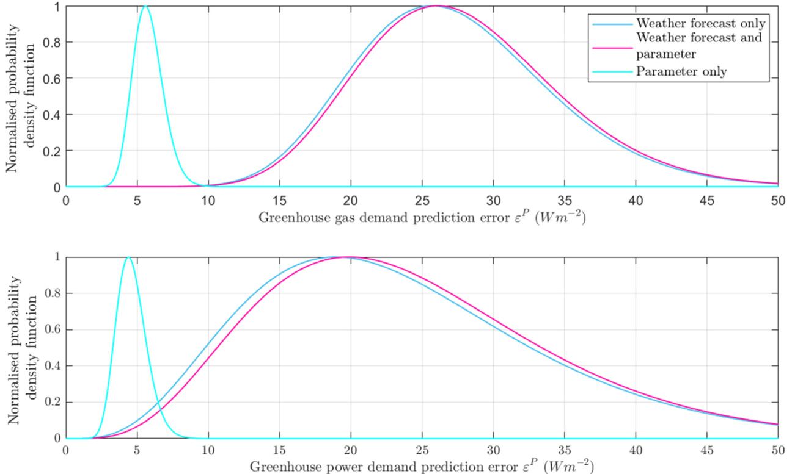
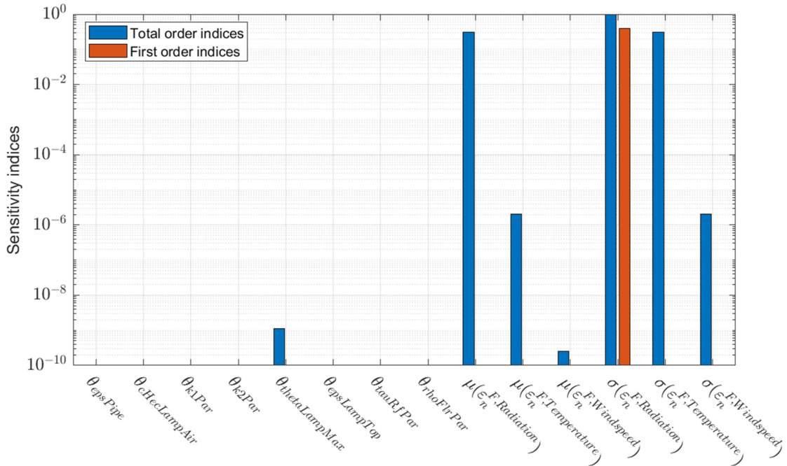
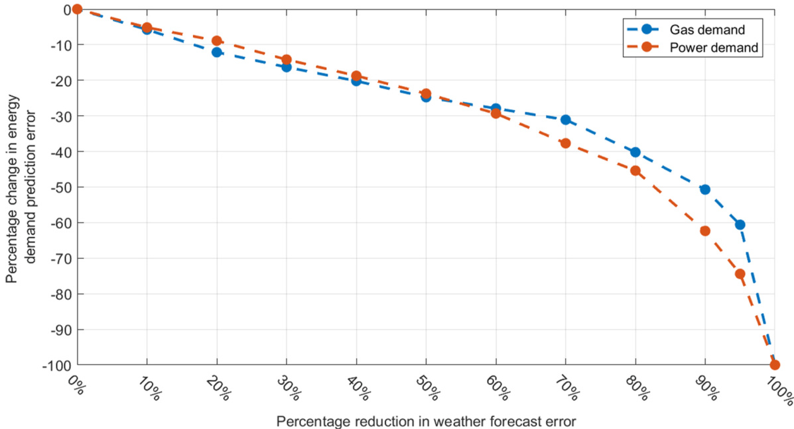
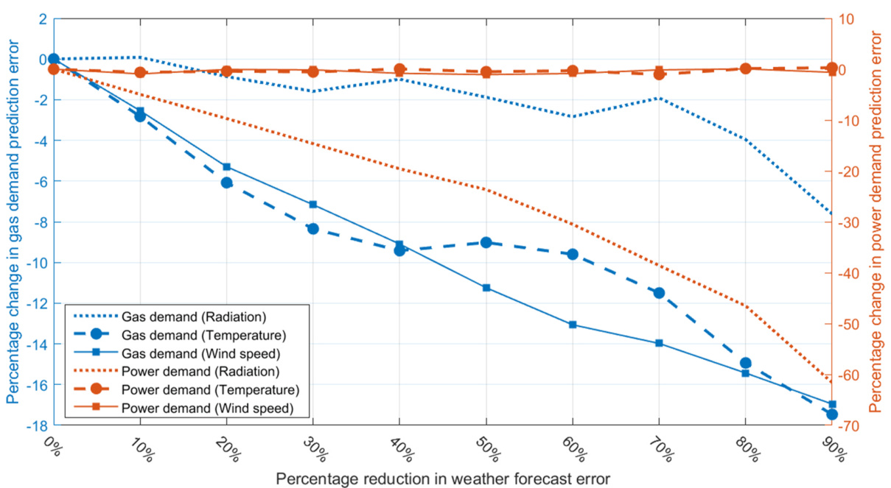
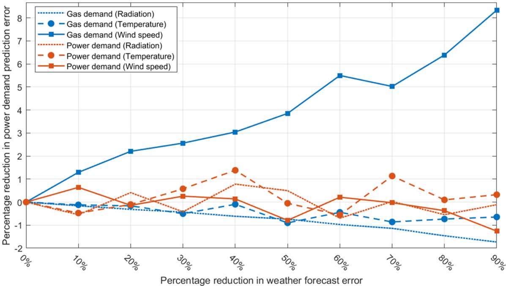

Research Paper

# Prediction uncertainty of greenhouse electrical power and gas demand: Part 2, the role of parametric and weather forecast error

H.J. Payne , E.J. van Henten, S. van Mourik

Farm Technology Group, Wageningen University, Wageningen, the Netherlands

# A R T I C L E  I N F O

# A B S T R A C T

Keywords: Greenhouse horticulture Statistical uncertainty Energy efficiency

This study breaks new ground by assessing the influence of individual and collective errors in weather forecast variables and errors in model parameters on the prediction error of greenhouse power and gas demand. To achieve this a sample-based and a Polynomial Chaos based sensitivity analysis using higher order sensitivity indices is proposed. This is accompanied by a sensitivity analysis of the impact of reducing individual weather forecast errors on greenhouse energy demand prediction error. The findings of this study show that weather forecast errors have a far greater role in creating mean gas $( 2 7 ~ W m ^ { - 2 } .$ ) and power $( 2 4 ~ W m ^ { - 2 } .$ ) prediction un­ certainty than parametric errors $( 5 . 7 ~ W m ^ { - 2 }$ and $4 . 6 \ : W m ^ { - 2 } .$ ). In addition, and crucially, weather forecast and parameter errors were found to be independent factors. Reducing weather forecast error exhibited large diminishing returns with the reduction in prediction error. For instance, a scenario where the forecast error of all variables is reduced by $8 0 { - } 9 0 ~ \%$ resulted in only a $5 0 \%$ decrease in gas and electrical power prediction error. The radiation forecast errors emerged as the primary contributor to power demand prediction errors, exhibiting the potential to reduce the power demand prediction error by approximately $6 0 \%$ . Reductions of forecast errors in wind and outdoor air temperature were identified as the predominant contributors, offering a respective potential for a $1 7 \ \%$ reduction in gas demand prediction error.

# 1. Introduction

The Dutch greenhouse horticulture sector consumes a large amount of gas and electrical power over a growing season. This reliance on importing external energy into the greenhouse comes at a cost to the grower, as the financial stability of their business is linked to the prices of gas and electrical power. As such the efficient use of imported energy is crucial to successful greenhouse operation. To ensure efficient oper­ ation, the sector uses computerised decision support systems to advise how the greenhouse should be operated, how much gas and electrical power are required and when it should be bought. This is done by pre­ dicting the future electrical power and gas demand using a mathematical model of the greenhouse system together with forecasted weather data.

Greenhouse operational strategies that use predictions from a modelbased computer support system are however susceptible to errors. These errors can be caused by inaccuracies in the parameter values of the model or through disturbances in the weather forecast data. The prob­ ability distribution of possible inaccuracies in model parameters and weather forecasts results in a probability distribution of errors in the model prediction, which constitute prediction uncertainty. Prediction uncertainty is undesirable as it can lead to strategies that are resource inefficient and as such reducing inaccuracies in the model parameter and weather forecasts is a priority.

Improvements in weather forecast and parameter accuracy would in turn create more accurate predictions of greenhouse electrical power and gas demand, which could lead to more efficient energy buying by the grower. On a societal level this gained energy efficiency from greenhouse horticulture would cause a decrease in the Dutch national electrical power and gas demand, which in turn would result in less total electrical power generation, gas usage and a decrease in $C O _ { 2 }$ emissions.

Within the field of greenhouse horticulture, the data-based uncer­ tainty from the weather forecasts has been included in previous studies. Sigrimis, Ferentinos, Arvanitis, and Anastasiou (2001) and Vogler-Finck, Bacher, and Madsen (2017) analysed how forecast error affected the uncertainty in the predicted greenhouse heating demand. Both studies concluded that the inclusion of weather forecasts improved greenhouse heating performance when compared to using a rudimentary forecast. However, Sigrimis and Doeswijk et al. (2006) also concluded that the presence of weather forecast errors increased the costs of heating a greenhouse and a storehouse by $1 9 \%$ and $3 . 1 \ \%$ respectively and that this cost only worsened when using longer forecasts. This is corrobo­ rated by Tap, van Willigenburg, and van Straten (1996), who studied how the inclusion of weather forecast error affected an optimally controlled greenhouse indoor climate. Tap concluded that the opti­ mality of the greenhouse’s $\mathrm { C O } _ { 2 }$ , heating demand and financial perfor­ mance dropped by $1 5 \%$ when a 1 h lazy-man forecast was introduced, and that the performance worsened for longer forecasts. The afore­ mentioned research has studied the impact of weather forecast uncer­ tainty on greenhouse model prediction but has focussed on the predicted heat demand and economics. This presents an opportunity to study the impact of weather forecast error on the predicted greenhouse electrical power and gas demand.

<html><body><table><tr><td colspan="2">Nomenclature</td><td>α</td><td>Variance reductions factor</td></tr><tr><td>h</td><td>Hourly time instances</td><td>β</td><td>Bias correction factor</td></tr><tr><td>hmax</td><td>Final time index</td><td></td><td>Modified weather forecast error Sampled weather forecast error</td></tr><tr><td>ho</td><td>Initial time index</td><td></td><td></td></tr><tr><td>M</td><td>Polynomial Chaos Expansion meta-model</td><td></td><td>Two weeklong energy demand prediction error</td></tr><tr><td>n</td><td>Sample index</td><td>pRMS</td><td>Energy demand prediction error</td></tr><tr><td>nmax</td><td>Number of samples</td><td></td><td>Energy demand prediction Root Mean Square (RMS) error</td></tr><tr><td>u</td><td></td><td>P.RMS</td><td></td></tr><tr><td></td><td>Fynthetic weater foreast</td><td>Yθ</td><td></td></tr><tr><td>uR</td><td>Recorded weather</td><td>日</td><td></td></tr><tr><td>W</td><td>Two week period index</td><td></td><td>Nominal parameter</td></tr><tr><td>Wmax</td><td>Number of two weeklong periods</td><td></td><td></td></tr></table></body></html>

Previous literature in greenhouse horticulture has considered the role of parametric uncertainty in the creation of greenhouse energy prediction uncertainty. Golzar, Heeren, Hellweg, and Roshandel (2018) and Vanthoor, van Henten, Stanghellini, and de Visser (2011) both considered the influence of a limited number of climate setpoint on greenhouse crop growth and energy demand. Golzar found potentially large energy reductions at the expense of small reductions crop growth. Vanthoor, van Henten, et al. (2011) concluded that radiation trans­ mission properties of the glass and the outdoor radiation levels have the greatest impact on crop growth and energy predictions. Both studies consider greenhouses with only a boiler and the overall energy usage and do not analyse gas and power demand. An alternative that has had limited application in the greenhouse horticultural domain is to use a meta-model based approach for parametric sensitivity analysis. One such method called polynomial chaos expansion (PCE) can be used to calculate sensitivity indices for the individual and combined effect of large groups of parameters (Sudret, 2008). These Sobol sensitivity indices are analytically calculated from the coefficients of the meta-model (Mara & Becker, 2021). As a result, this method only re­ quires samples for fitting the meta-model. As such PCE can be used to estimate sensitivity indices of a greater number of parameters with far fewer parameter samples than would be required for a traditional exhaustive sample-based sensitivity analysis (Blatman & Sudret, 2011).

While uncertainty resulting from model parameters and weather forecast data have been considered separately there is a knowledge gap in how these factors interact and impact prediction uncertainty in combination. This issue of combined effect is important as it shows the comparative importance of addressing errors within the model param­ eters and weather forecast data and where the greatest reduction in prediction uncertainty might be sought.

Outside of the field of greenhouse horticulture a number of methods have been proposed to analyse the role of multiple sources of input uncertainty on the prediction of a model. For example, Ramdani, Can­ dau, Guyon, and Dalibart (2006) combined data-based and parametric uncertainty by assuming that the input data error is constant and can be treated as a parameter. This method allows the inclusion of errors with time varying variances into simple models analytically using a Volterra series. Additionally, Ajami, Duan, and Sorooshian (2007) proposes a Bayesian approach (IBUNE) that considers parameter, input and struc­ tural uncertainty in a model simultaneously. This is done using multiple models to perform model averaging and by defining an input error distribution to include data-based uncertainty into the analysis. This approach does however remove any auto or cross-correlation from the input data limiting the approaches relations to real data dynamics. As such there is an opportunity in the current research to analyse parameter and weather-based prediction uncertainty that retains correlative effects within the weather data.

In response to these gaps in the current research identified above we propose an algorithm to assess the impact of parameter and input un­ certainty on greenhouse electrical power and gas demand simulta­ neously. These algorithms combine a Latin hypercube sampling approach, the direct use of input data time series, and a Polynomial chaos expansion (PCE) based sensitivity analysis. This algorithm allows a computationally tractable analysis of variance of the impact of errors in both individual factors and groups of parameters and weather forecast variables using higher order sensitivity indices. This study also high­ lights in which areas targeted error reductions would create reduction in model prediction error and the possible scale of these reductions. The proposed algorithm was applied to a model of a Dutch tomato growing greenhouse.

This study aims to make an important contribution to the field of greenhouse horticulture by proposing a novel algorithm to investigate an underexplored aspect of the field. The novelty of this study has two aspects. The first point of novelty is the application of statistical un­ certainty analyses that considers both the individual and collective impact of weather forecast and parameters errors in the domain of greenhouse horticultural research. The second point of novelty is that this study investigates the higher order effects of time series error and parametric error on energy demand prediction uncertainty.

# 2. Materials and methods

The following sections (2.1–2.2) describe the greenhouse model and the recorded and forecast weather data used to demonstrate the algo­ rithm in a case study. The steps used for the algorithm described in this study is described in section 2.3. It should be noted that for the remainder of this study electrical power will be referred to as power. Furthermore, for the remainder of the study the word energy is used to denote power and gas.

# 2.1. Greenhouse model

The greenhouse climate, tomato crop and energy model used was Greenlight (Katzin, van Mourik, Kempkes, & van Henten, 2020), which is a calibrated, open source model. Greenlight is a dynamic differential equation-based model which emulates a tomato growing Venlo type greenhouse. The model receives input from weather data of the outside temperature, wind speed, radiation, vapour density and $\mathrm { C O } _ { 2 }$ concen­ tration. The model predicts the greenhouse indoor climate states, which are the indoor air temperature, vapour concentration, ambient radiation and $C O _ { 2 }$ concentration. In addition, Greenlight predicts the power and gas demand of the greenhouse and the growth of the tomato crop within the greenhouse. The greenhouse being simulated was parametrised for Bleiswijk in the Netherlands. This study used a rule-based control scheme that is based on the current industry standard and was originally described by Vanthoor, van Henten, et al. (2011).

# 2.2. Weather data

The recorded weather data used was taken from a weather recording station in Bleiswijk, the Netherlands from 2018 to 01-01 00:00 to 2019- 01-01 00:00 at 5-min intervals. The recorded weather data variables are the outside temperature $( ^ { \circ } C )$ , wind speed $( \mathrm { m ~ s ^ { - 1 } } )$ , direct solar radiation $\left( \mathrm { W ~ m } ^ { 2 } \right) .$ and outside relative humidity $( \% )$ .

The outdoor $C 0 _ { 2 }$ concentration for both the weather forecast and recordings was assumed to be constant at $4 1 0 \ \mathrm { p p m }$ . In addition, the cloudiness index (CI) was fixed to the average of the period $\mathrm { ( C I } = 0 . 7 \mathrm { ) }$ ) and the sky temperature (Luo et al., 2005) and levels of diffuse radiation (Orgill & Hollands, 1977) were estimated using the available climate variables. Any missing entries in the datasets were filled with the line­ arly interpolated values of the adjacent data points.

The forecasted weather variables used are the hourly outside tem­ perature $( ^ { \circ } C )$ , wind speed $( \mathrm { m } \mathrm { { \bf ~ s } ^ { - 1 } } )$ and direct solar radiation $\left( \mathrm { W ~ m } ^ { 2 } \right) .$ ) these were generated for Bleiswijk, the Netherlands 2018-01-01 00:00:00 to 2019-01-01 00:00:00. The time step of the forecasts was regulated to 1 h and any missing entries in the data were filled via linear interpolation. For the purposes of the case study demonstrating the al­ gorithms presented in this paper in a way that is computationally trac­ table this study focussed on the simulation period of 2018-03-01 00:00:00 to 2018-03-14 00:00:00, while using the full period of the dataset for estimating weather forecast error. To allow the direct com­ parison of forecasted and recorded weather the forecasts were resam­ pled to 5-min timestep using a zero-order-hold method.

# 2.3. An algorithm to assess how weather forecast and model parameter uncertainty propagates into greenhouse power and gas demand prediction uncertainty

To analyse the impact of weather forecast error and model parameter error on the uncertainty of model predictions a sample-based uncer­ tainty analysis was done using sampled model parameter values and synthetic weather forecasts using sampled weather forecast errors. The steps in the proposed algorithm are shown in Fig. 1.

In addition to the algorithm shown in Fig. 1 further scenarios are proposed in subsections 2.3.4 and 2.3.5 that investigate the impact of bias corrected forecast errors and scaled down forecast error variance. These scenarios demonstrate the potential change in prediction uncer­ tainty if targeted improvements in weather forecast errors were to be made.

# 2.3.1. Algorithm setup and calculating synthetic weather forecasts

In this study time was defined on an hourly time step which is indexed using the variable h. To initialise the algorithm the model parameter distributions $\mathrm { d } ( \mu , \sigma , \theta _ { \mathrm { l } } , \theta _ { \mathrm { u } } )$ used in this study (Table 1) were modelled as normal distributions that are truncated by an upper and lower limit $\theta _ { 1 }$ and $\theta _ { \mathrm { u } }$ .

The forecast error $( \varepsilon ^ { \mathrm { F } } )$ was then calculated for the entire dataset length (01-01-2018 to 01-01-2019) and was indexed using the time index h where:

$$
\begin{array} { r } { \boldsymbol { \varepsilon } ^ { \mathrm { F } } ( \mathbf { h } ) = \mathbf { u } ^ { \mathrm { R } } ( \mathbf { h } ) - \mathbf { u } ^ { \mathrm { F } } ( \mathbf { h } ) . } \end{array}
$$

2.3.1: Algorithm setup   
- Set the maximum number of   
samples $( n _ { m a x } )$   
- Define the model parameter   
distributions (0)   
-Define a collection of two week   
long forecast errors $\left( \varepsilon _ { w } ^ { F } \right)$ $n = n + 1$   
2.3.1. Calculate synthetic weather   
forecast   
- Draw model parameter sample $( \theta _ { n } )$   
-Formulate a weather forecast error   
$\left( \varepsilon _ { n } ^ { F } \right)$   
- Calculate synthetic weather   
forecast $\left( { \widehat { u } } _ { n } ^ { F } \right)$   
2.3.2. Calculate energy prediction   
error $\left( \varepsilon _ { n } ^ { P , R M S } \right)$   
- Simulate greenhouse energy   
demand $\left( Y \big ( h _ { 0 } , \ h , \theta , \widehat { u } _ { n } ^ { F } ( h ) \big ) \right)$   
- Calculate energy demand error   
(e,RMs) No Isn ≥nmax Yes   
2.3.3: Analysis of prediction variance   
(P,RMs，θ,μ(eF),σ(eF)) end

In which ${ \tt u } ^ { \tt R }$ is the recorded weather and $\mathrm { \mathbf { u } } ^ { \mathrm { F } }$ is the forecasted weather. This vector of forecast error vector $( \varepsilon ^ { \mathrm { F } } )$ was then apportioned into two weeklong periods $\mathfrak { E } _ { \mathrm { w } } ^ { \mathrm { F } }$ where:

$$
\begin{array} { r } { \pmb { \varepsilon } _ { \mathrm { w } } ^ { \mathrm { F } } = \pmb { \varepsilon } ^ { \mathrm { F } } \big ( \big ( \mathbf { w } - 1 \big ) \bullet \mathrm { h } _ { \mathrm { m a x } } : \mathrm { w } \bullet \mathrm { h } _ { \mathrm { m a x } } \big ) , } \end{array}
$$

These two-week periods were then formed into a set $\{ \mathfrak { E } _ { 1 } ^ { \mathrm { F } } , . . \mathfrak { E } _ { w _ { m a x } } ^ { \mathrm { F } } \}$ . In this case w is the index of the two-week periods and $\mathrm { w } = 1 . . \mathrm { w } _ { \mathrm { m a x } }$ where $\mathbf { w } _ { \mathrm { m a x } } = 2 6$ and $\boldsymbol { \mathrm { h } } _ { \mathrm { m a x } }$ is the number of samples in a two-week period where $\mathrm { h } _ { \operatorname* { m a x } } = 1 3 4 4$ . For each sample iteration (n) a forecast error vector was randomly drawn from the set of forecast errors and a parameter value was randomly drawn from each parameter distribution using a Latin hypercube sampling method,

$$
\theta _ { \mathrm { n } } \ \sim \ \mathrm { D } ( \theta ) \ \mathrm { a n d } \ \varepsilon _ { \mathrm { n } } ^ { \mathrm { F } } \ \sim \ \left\{ \varepsilon _ { \mathrm { w } } ^ { \mathrm { F } } \right\} \ \mathrm { f o r ~ \ n = 1 ~ . . . \ n _ { \mathrm { m a x } } . }
$$

For this study, the number of samples used was set to $1 0 0 0 \ ( n _ { m a x } )$ . The drawing of a forecast error and model parameter value was done by including the index for the set of forecast errors as a parameter that was sampled. In doing so the sample space used in this study is augmented to allow the drawing of parameter values and vectors of forecast error data. For each sample n eq. (4) produces a vector of forecast errors, whose length is that of the simulation period $\mathrm { h } _ { \mathrm { m a x } }$ . This sampled vector of forecast errors $\mathfrak { E } _ { \mathrm { n } } ^ { \mathrm { F } }$ was then added to the recorded weather data ${ \bf u } ^ { \mathrm { R } }$ to simulate a representative synthetic weather forecast $\widehat { \mathbf { u } } _ { \mathrm { n } } ^ { \mathrm { F } }$ in the following manner,

Table 1Definition of model parameter distributions.  

<html><body><table><tr><td>Model parameter name (0)</td><td>Distribution range (01,0u)</td><td>Distribution mean (m）</td><td>Distribution standard error (σ)</td><td>Units</td><td>Reference</td></tr><tr><td>FIR emission coeficient of the heating pipes (epsPipe).</td><td>[0,1]</td><td>0.88</td><td>0.029</td><td>1</td><td>Vanthoor, Stanghellini, van Henten,</td></tr><tr><td>Heat exchange coeficient of lamp (0cHecLampAir).</td><td>[0,1]</td><td>0.09</td><td>0.0030</td><td>Wm-2K-1</td><td>and de Visser (2011) Kusuma, Pattison, and Bugbee (2020)</td></tr><tr><td>PAR extinction coefficient of the canopy (OpAR.can).</td><td>[0,1]</td><td>0.7</td><td>0.023</td><td>1</td><td>Vanthoor, Stanghellini, et al. (2011)</td></tr><tr><td></td><td>[0,1]</td><td>0.7</td><td>0.023</td><td>1</td><td>Vanthoor, Stanghellini, et al. (2011)</td></tr><tr><td>Maximum intensity of lamps (0lamp.max).</td><td>[0,inf]</td><td>110</td><td>3.7</td><td>Wm-2</td><td>Katzin et al. (2020)</td></tr><tr><td>Emissivityoftopsideoflamp(0emistamp).</td><td>[0,1]</td><td>0.1</td><td>3.3× 10-3</td><td>1</td><td>Katzin et al. (2020)</td></tr><tr><td>PAR transmission coeficient of the roof (OPAR.trans.rof).</td><td>[0,1]</td><td>0.85</td><td>0.028</td><td>1</td><td>Vanthoor, Stanghellini, et al. (2011)</td></tr><tr><td>PAR reflectioncoeficientofthefloor(pRrflor).</td><td>[0,1]</td><td>0.65</td><td>0.022</td><td>一</td><td>Vanthoor, Stanghellini, et al. (2011)</td></tr></table></body></html>

$$
\widehat { \mathbf { u } } _ { \mathrm { n } } ^ { \mathrm { F } } ( \mathrm { h } ) = \mathbf { u } ^ { \mathrm { R } } ( \mathrm { h } ) + \varepsilon _ { \mathrm { n } } ^ { \mathrm { F } } ( \mathrm { h } ) .
$$

The synthetic weather forecasts $\widehat { \mathbf { u } } _ { \mathrm { n } } ^ { \mathrm { F } }$ for each sample n were then collected into a set of forecasts wherê $\widehat { \mathbf { u } } _ { \mathrm { n } } ^ { \mathrm { F } } = \{ \widehat { \mathbf { u } } _ { 1 } ^ { \mathrm { F } } , \widehat { \mathbf { u } } _ { 2 } ^ { \mathrm { F } } . . . \widehat { \mathbf { u } } _ { \mathrm { n } \mathrm { m a x } } ^ { \mathrm { F } } \}$

# 2.3.2. Calculate power demand prediction error

In this study greenhouse model energy predictions are referred to as Y in section 2.1, where $\mathrm { \Delta Y }$ is a function of the initial time step $\left( \mathrm { h } _ { 0 } \right)$ , time (h), model parameter values (θ) and weather data (u). For each sample $\mathfrak { n }$ , the prediction error $\mathfrak { E } _ { \mathrm { n } } ^ { \mathrm { P } }$ and root mean square error $\varepsilon _ { \mathrm { n } } ^ { \mathrm { P , R M S } }$ were then calculated. These were calculated by comparing the greenhouse energy demand prediction made using the sampled model parameters $\left( \Theta _ { \mathrm { n } } \right)$ , sampled synthetic weather forecast data $\widehat { \mathbf { u } } _ { \mathrm { n } } ^ { \mathrm { F } }$ with the energy demand prediction made using the actual weather̂forecast $\mathrm { \mathbf { u } } ^ { \mathrm { F } }$ and the nominal parameter values θ where,

$$
\varepsilon _ { \mathrm { n } } ^ { \mathrm { P } } \big ( \mathrm { h } _ { 0 } , \mathrm { h } , \theta _ { \mathrm { n } } , \overline { { \theta } } , \widehat { \mathrm { u } } _ { \mathrm { n } } ^ { \mathrm { F } } ( \mathrm { h } ) \big ) = \mathrm { Y } \big ( \mathrm { h } _ { 0 } , \mathrm { h } , \theta _ { \mathrm { n } } , \widehat { \mathrm { u } } _ { \mathrm { n } } ^ { \mathrm { F } } ( \mathrm { h } ) \big ) - \mathrm { Y } \big ( \mathrm { h } _ { 0 } , \mathrm { h } , \overline { { \theta } } , \mathrm { u } ^ { \mathrm { F } } ( \mathrm { h } ) \big ) ,
$$

and

$$
\mathfrak { E } _ { \mathfrak { n } } ^ { \mathrm { P } , \mathrm { R M S } } \left( \theta _ { \mathfrak { n } } , \overline { { \theta } } , \widehat { \mathfrak { u } } _ { \mathfrak { n } } ^ { \mathrm { F } } \right) = \sqrt { \frac { 1 } { \mathfrak { h } _ { 0 } - \mathfrak { h } _ { \operatorname* { m a x } } + 1 } \sum _ { \mathrm { h } = \mathtt { h } _ { 0 } } ^ { \mathtt { h } _ { \operatorname* { m a x } } } \left( \mathfrak { E } _ { \mathfrak { n } } ^ { \mathrm { P } } \left( \mathbf { h } _ { 0 } , \mathbf { h } , \theta _ { \mathfrak { n } } , \overline { { \theta } } , \widehat { \mathfrak { u } } _ { \mathfrak { n } } ^ { \mathrm { F } } ( \mathrm { h } ) \right) \right) ^ { 2 } } \ .
$$

The nominal parameter values were defined as the mean value of the distributions of model parameters ${ \bf D } ( \boldsymbol { \theta } )$ . This prediction error was used to determine the comparative role of the weather forecast errors and model parameters. To do this the sampled model parameter $\theta _ { \mathrm { n } }$ , mean and standard deviation of the sampled forecast error $\mu ( \varepsilon _ { \mathrm { n } } )$ and $\sigma ( \mathfrak { E } _ { \mathrm { n } } )$ and the prediction error $\varepsilon _ { \mathrm { n } } ^ { \mathrm { P , R M S } }$ were used in an analysis of prediction vari­ ance as detailed in the following section.

# 2.3.3. Analysis of prediction variance

The analysis of variance within this study was performed using a Polynomial Chaos Expansion (PCE) based sensitivity analysis the details of these approaches can be found in Blatman and Sudret (2008, 2011). This PCE is made of a meta-model $M$ that is regressed-based on the prediction errors $\varepsilon _ { 1 \ldots \ n } ^ { \mathrm { { P , R M S } } }$ response to variations in the sampled model parameter θ., mean and standard deviation of the sampled forecast error $\mu ( \mathfrak { E } _ { 1 . . \mathrm { n } } ^ { \mathrm { F } } )$ and $\sigma ( \mathfrak { E } _ { 1 . . \mathrm { n } } ^ { \mathrm { F } } )$ . As such it can be used to estimate the prediction error $\widetilde { \varepsilon } ^ { \mathrm { P , R M S } }$

$$
\widetilde { \varepsilon } ^ { \mathrm { P , R M S } } = \mathbf { M } \big ( \varepsilon _ { 1 . . \mathrm { n } } ^ { \mathrm { P , R M S } } , \Theta _ { . } , \mu ( \varepsilon _ { 1 . . \mathrm { n } } ^ { \mathrm { F } } \big ) , \sigma ( \varepsilon _ { 1 . . \mathrm { n } } ^ { \mathrm { F } } \big ) \big ) .
$$

A further analysis of variance was performed to examine the comparative impact of these groups by fixing the weather and parameter error in turn. This was done using the steps defined in section 2.3.1 and 2.3.2 and was repeated three times. Initially the steps described are applied unaltered. Then the steps are performed using the original weather forecast $( \mathrm { u } ^ { \mathrm { F } } )$ in place of the synthetic weather forecast $( \widehat { \mathbf { u } } _ { \mathfrak { n } } ^ { \mathrm { F } } )$ . Subsequently the steps were performed setting the parameter valueŝ to be fixed on their nominal values. The scenarios proposed in the following subsections investigate the prediction uncertainty reduction that could be achieved by accounting for forecast error bias and reducing the variance of sensitive forecast errors.

# 2.3.4. Scenario 1 – greenhouse energy prediction demand uncertainty given reductions in forecast error variance

This scenario investigates the degree to which uncertainty reduction could be achieved by accounting for forecast error variance reduction in forecast errors. To do this a variance reduction factor α was defined to scale all of the forecast variables and for forecast variables individually. By doing this the relative impact of targeted improvement of a single forecast variable was investigated. This factor was then used to calculate a modified forecast error such that,

$$
{ \widehat { \boldsymbol { \varepsilon } } } ^ { \mathrm { F } } { = } { \boldsymbol { \alpha } } \bullet { \boldsymbol { \varepsilon } } ^ { \mathrm { F } } .
$$

For this scenario α ranges from 0 to 1 increasing in increments of 0.1, meaning a $1 0 \mathrm { - } 1 0 0 \mathrm { ~ \% ~ }$ reduction in error variance. This modified set of forecast errors was then used to calculate the modified prediction error $\varepsilon ^ { \mathrm { P , \alpha , R M S } }$ using the steps described in section 2.3.2.

# 2.3.5. Scenario 2 – greenhouse energy prediction demand uncertainty given forecast error bias correction

To analyse the impact of forecast error biases on prediction uncer­ tainty a bias correction was done by adding the product of a correction factor $\beta$ and a scaling factor $\boldsymbol { \gamma }$ to the forecast error described in eq. (2) such that

$$
{ \widehat { \boldsymbol { \varepsilon } } } ^ { \mathrm { F } } = ( { \boldsymbol { \gamma } } * { \boldsymbol { \beta } } ) + { \boldsymbol { \varepsilon } } ^ { \mathrm { F } } .
$$

Where the correction factor is defined as the mean of the forecast error of each sensitive forecast variables such that $\beta = - \mu ( \varepsilon ^ { \mathrm { F } } )$ . The scaling factor $\boldsymbol { \gamma }$ was set to take a ranges of values from 0 to 0.9 increasing in increments of 0.1. This modified set of forecast errors $\widehat { \varepsilon } ^ { \mathrm { F } }$ were then used in the steps described above in section 2.3.2 to calcûlate the modified prediction error $\varepsilon ^ { \mathrm { P , \beta , \mathrm { R M S } } }$ . Which was in turn used to compare the pre­ diction uncertainty with differing degrees of bias correction.

# 3. Results

The algorithm and scenarios described in section 2.3 are applied to a case study of a tomato producing Dutch greenhouse model, detailed in section 2.1. Section 3.1 shows the results of the case study that dem­ onstrates the comparative role of weather data error and parameter derived prediction uncertainty. Section 3.2 and 3.3 show the results of the case study that examines how much prediction uncertainty reduc­ tion can be achieved through targeted improvements in weather forecast error.

# 3.1. Results from the analysis of the combined impact of model parameter and weather forecast uncertainty

This section details the results of a case study demonstrating the algorithm described in section 2.3. The comparison of the impact of parameters and weather forecast error on energy prediction uncertainty can be seen in Fig. 2.

The prediction uncertainty $ { \varepsilon } ^ { p }$ derived from weather forecasts is far greater than that derived from model parameters. Furthermore Fig. 2 shows that the weather forecast and combined prediction uncertainty distributions are similar. This similarity implies that the weather fore­ casts account for most prediction uncertainty and that there is negligible interaction between uncertainty introduced from forecast and parame­ ters. This is also confirmed by the distribution properties described in Table 2, in which for both gas and power demand the difference in mean prediction uncertainty created from weather forecast error and the combined effect of weather forecast and parametric error was only $1 W m ^ { - 2 }$ . Accordingly, parameter and weather forecast error can be considered as independent distributions.

# 3.1.1. Results from the PCE based sensitivity analysis To corroborate and elaborate on the conclusions drawn from Fig. 2 a

Table 2 Distribution properties of gas and power prediction uncertainty.   

<html><body><table><tr><td></td><td>only</td><td>Weather forecast</td><td>Weather forecast and parameter</td><td>Parameter only</td></tr><tr><td>Gas demand</td><td>μ</td><td>27</td><td>28</td><td>5.7</td></tr><tr><td></td><td>0</td><td>7.0</td><td>6.8</td><td>1.1</td></tr><tr><td>Power</td><td>μ</td><td>24</td><td>25</td><td>4.6</td></tr><tr><td>demand</td><td>0</td><td>11</td><td>11</td><td>1.1</td></tr></table></body></html>

PCE sensitivity analysis was done on the predicted power demand. This was done using the sampled model parameter values and synthetic weather forecasts. The PCE was fitted with 9 degrees of freedom and a leave-one-out error of $7 . 4 \times 1 0 ^ { - 2 }$ . This PCE was then used to calculate sensitivity indices, the resulting first and total order Sobol sensitivity indices are displayed in Fig. 2.

It can be concluded from the PCE that the weather forecasts are the major producers of prediction uncertainty for power demand prediction. This conclusion confirms the findings displayed in Fig. 2. This outcome also confirms the conclusion found in Payne, Hemming, van Rens, van Henten, and van Mourik (2022) that in the case of power demand pro­ duction uncertainty, the radiation forecast is the greatest contributor. Furthermore, the large difference between first and total order indices indicates a large influence of higher order effects. The second order interactions, specifically between weather forecast variables which can be seen in Table 3. In particular the radiation and temperature forecast have the largest role in the second order indices again mirroring the conclusion of Payne et al. (2022) and the link between radiative heat from the sun and air temperature.

Table 3 Second order PCE sensitivity indices.   

<html><body><table><tr><td>Parameter names (P)</td><td>Second order indices</td></tr><tr><td>(eF.Temperature) ）*σ(εF,Radiation)</td><td>0.30</td></tr><tr><td>μ（eFRadiation）*(eFRadiation)</td><td>0.30</td></tr><tr><td>μ（eFTeperature）*(eu)</td><td>2.0×10-6</td></tr><tr><td>(eFWin spe*tur</td><td>2.0×10-6</td></tr><tr><td>Olamp.max * O(FRadiaton)</td><td>1.1 × 10-9</td></tr></table></body></html>

  
Fig. 2. Normalised probability density function of power (bottom) and gas (top) demand prediction uncertainty given errors introduced from weather forecasts (blue), model parameters (cyan) and both in combination (pink). (For interpretation of the references to colour in this figure legend, the reader is referred to the Web version of this article.)

# 3.2. Results of forecast error reduction on energy prediction uncertainty from scenario 1

This section describes the results of the case study demonstrating the methods proposed in scenario 1 that is described in section 2.3.4. Having concluded that the weather forecast error is the major contributor in energy prediction uncertainty and is independent from parametric un­ certainty, the potential reductions if errors were to be reduced was investigated. First this was done by scaling all forecast variables simultaneously and then individually. How the modification of all forecasts influences prediction uncertainty is shown the following figures.

Fig. 4 shows the percentage reduction in gas and power demand error given reductions in weather forecast error. This figure shows that a reduction in the error of all forecast variables by $8 0 { \ - } 9 0 \%$ would yield an approximate $5 0 \ \%$ reduction in the prediction uncertainty of both gas and power. Furthermore, the relationship between reduction in pre­ diction uncertainty is approximately linear up to a $60 \%$ reduction of weather forecast error. After which reductions in power demand pre­ diction uncertainty are greater than gas.

Fig. 5 shows that in the case of power prediction uncertainty the reduction in radiation error resulted in the greatest reduction in pre­ diction uncertainty. This reconfirms the conclusions drawn from Fig. 3 that radiation forecast is the key contributor to power demand predic­ tion uncertainty. Reductions in error in temperature and wind speed forecasts do not result in lower power demand prediction uncertainty. Gas demand prediction uncertainty is influenced by the reduction in the errors within all forecast variables. Reductions in temperature and ra­ diation forecast error is accountable for the greatest degree of reduction in prediction error, with a variance reduction of $40 \%$ in temperature and radiation forecasts resulting in a $9 \%$ reduction gas demand pre­ diction uncertainty.

# 3.3. Results of forecast error bias correction on energy prediction uncertainty from scenario 2

The following section describes the outcome of the case study of the bias correction scenario proposed in section 2.3.5.

The bias correction of individual forecast variables shown in Fig. 6 shows that in the case of power demand prediction uncertainty bias correction has a small effect on the reduction of prediction uncertainty and no effect that clearly increases with an increased bias correction. In the case of gas demand an improvement of $1 { - } 2 \%$ can be made by cor­ recting for bias in temperature and radiation forecast errors. It is key to note that corrections for bias in wind speed forecast errors increase prediction uncertainty.

# 4. Discussion

This study found that the error introduced from the weather forecasts created far greater gas $( 2 7 . 4 ~ W . m ^ { - 2 } )$ and power $( 2 4 ~ W . m ^ { - 2 } ) ,$ demand mean prediction error than that created by parametric error. Parametric error resulted in mean prediction error in gas demand of $5 . 7 W . m ^ { - 2 }$ and power demand of $4 . 6 \ W . m ^ { - 2 }$ . This outcome confirms the emphasis put on mitigating weather forecast error by previous studies (Doeswijk, 2007, p. 174; Kuijpers, Antunes, van Mourik, van Henten, & van de Molengraft, 2022). This study also breaks new ground by proposing a novel algorithm that compares the impact of weather forecast and parametric error and their potential interactions. This study aimed to analyse the combined errors from weather forecasts and model param­ eters using higher order indices that are computationally efficient to calculate. As such the algorithm detailed in this study is perfectly suited for this purpose. This is as the use of a PCE based analysis allows the uncertainty in the model predictions to be efficiently attributed to in­ dividual and groups of parameters via the PCE’s higher order terms (Sudret, 2008). Using this approach this study was able to conclude in Fig. 3 that higher order interactions between factors has a greater impact than the first order effects. Furthermore, this study concluded in Fig. 2 that weather forecast error has a greater impact than parametric error. These conclusions challenge the precedent of sensitivity analyses that only consider first order effects and the analysis of only model parameter error in attributing energy prediction uncertainty in a greenhouse model. This algorithm also highlights where the easiest reductions in prediction uncertainty could be made. This was done by investigating the degree of difficult posed by reducing the amount of prediction un­ certainty as a result of reducing weather data and parameters errors.

  
Fig. 3. The first (orange) and total (blue) order Sobol sensitivity indices for a PCE sensitivity analysis of power demand prediction error $\varepsilon ^ { p }$ given errors in mode parameters and weather forecast data. (For interpretation of the references to colour in this figure legend, the reader is referred to the Web version of this article.)

  
Fig. 4. Percentage change in gas (blue) and power (orange) prediction error $( \widetilde { \varepsilon } ^ { P , R M S } )$ using an $\alpha$ scaling coefficient for all weather forecast variables. (For inter pretation of the references to colour in this figure legend, the reader is referred̃to the Web version of this article.)

  
Fig. 5. Percentage change in gas (blue) and power (orange) prediction error $( \widetilde { \varepsilon } ^ { P , R M S } )$ as a function of the variance reduction scaling coefficient $\alpha$ for each weather forecast variable. The dotted lines are associated with a reduction in radiatiõn forecast error and the dashed lines with circular markers are associated with a reduction in temperature forecast error. The solid lines with the square markers are associated with a reduction in wind speed forecast error. (For interpretation of the references to colour in this figure legend, the reader is referred to the Web version of this article.)

In applying this algorithm this study also found that there was a very small difference of $1 W m ^ { - 2 }$ in the mean prediction uncertainty created from weather forecast error and the combined effect of weather forecast and parametric error. This outcome implies little interaction between parametric and weather-based errors. As such these sources of uncer­ tainty can be considered as independent source of uncertainty in future research.

The outcomes of this case study concluded that for the first order sensitivity indices of the power demand prediction uncertainty (Fig. 3) the mean error of the radiation forecast is the only individual contrib­ utor. This is a result of uncertainty introduced in the radiation forecast propagating into the lamp lighting control rules that are related to the outside radiation level. This outcome supports the importance of radi­ ation related processes in energy demand prediction that were also found in Bontsema, van Henten, Gieling, and Swinkels (2011) and Payne et al. (2022). Specifically, Bontsema et al. (2011) concluded that sensor accuracy was key to energy prediction accuracy and Payne et al. (2022) found radiation forecast error to be the greatest contributor to power demand prediction uncertainty.

Table 3 shows the second order interaction found as part of the PCE analysis, where uncertainty in the temperature and radiation forecast propagates in combination into power demand prediction uncertainty. These forecast variables act both on the temperature state, and as a result influence the controls of the lamps in combination through the rule set used in the greenhouse controller. This outcome invites a change in perspective that design of the climate controller is crucial in the mitigation of prediction uncertainty. Despite previous research not focussing on predicted power demand, the outcomes of this example reassert the conclusion of previous studies in that the introduction of weather forecast errors do impact model accuracy (Sigrimis et al., 2001) and greenhouse performance (Tap et al., 1996).

  
Fig. 6. Percentage change in gas (blue) and power (orange) prediction error $( \widetilde { \varepsilon } ^ { P , R M S } )$ as a function of forecast bias reduction factor $\beta$ or each weather forecast variable individually. The dotted lines are associated with a reduction in radiation forẽcast error and the dashed lines with circular markers are associated with a reduction in temperature forecast error. The solid lines with the square markers are associated with a reduction in wind speed forecast error. (For interpretation of the references to colour in this figure legend, the reader is referred to the Web version of this article.)

This study performed a global variance reduction analysis and found that as the variance in weather forecast error decreased, prediction uncertainty reduction is initially linear up to an $8 0 ~ \%$ error reduction and that over $8 0 { \ - } 9 0 \ \%$ error reduction is required to see improvements in prediction error of greater than $5 0 ~ \%$ . This outcome indicates that potential improvements in prediction uncertainty are difficult to achieve through forecast error reduction. However there have been improve­ ments in weather forecast accuracy over the last 15 years, for example Haiden et al. (2021) found a $2 . 5 \%$ improvement in surface temperature forecast error and a $1 . 5 \%$ improvement in wind speed forecast error. If these trends continue, in the context of the entire sector these im­ provements might cumulatively equate to substantial amounts of energy.

Given a more detailed individual analysis in section 3.2, the radia­ tion forecast error is individually the largest power demand uncertainty. The importance of the radiation forecast found in this study is corrob­ orated by the results of the uncertainty analysis preformed in Payne et al. (2022). The uncertainty analysis preformed in Payne et al. (2022) investigated the role of weather forecast error on greenhouse energy demand prediction uncertainty. The analysis performed in this study also found that temperature and wind speed forecast error do not in­ fluence power demand prediction error. This is due to these variables not being included in the rules that control the greenhouse lamps, which are responsible for greenhouse power demand. This study goes further by showing that while a targeted reduction in forecast error is the most effective way to reduce power prediction uncertainty there are dimin­ ishing returns, in which ever greater improvements in forecast error are required for diminishing improvements in prediction uncertainty. In the case of gas demand prediction an improvement in all of the forecast variables yields an improvement in prediction uncertainty. Further­ more, the greatest improvements in gas demand prediction accuracy can be made by mitigating the temperature and wind speed forecast errors.

However, these are smaller overall than those seen in the power demand case.

A bias correction analysis was also done and concluded that bias correction has little influence on power demand error. This is as the radiation forecast error has very low bias and as such correcting this bias has little effect on prediction error. Moreover, bias correction can benefit gas demand error if done for radiation and temperature forecast error but only accounts for $1 { - } 2 \%$ reduction in prediction error. In fact, for the case of wind speed forecast error, bias correction introduces more prediction error. This is due to the correction of the wind forecast’s positive error bias of $2 . 1 m . s ^ { - 1 }$ leading to a greater number of wind speed forecast errors with a larger negative value, which in turn set more values of the wind speed forecast to zero. This in turn introduced an underestimation of the forecast which increased prediction uncertainty. This result may imply that there is structural information in the forecast error bias and that the error in not purely a form of coloured noise in the case of wind speed error.

A limitation of the proposed algorithm is that the parameters that were selected to be included in this study. This selection of parameters does not consider that different parameters may become impactful through interactive effects with weather forecast errors. As such these parameters are relegated from this analysis, potentially removing some impactful parameters. It should be noted that the parameters that were used in this study were found to be impactful in an unpublished global parametric uncertainty analysis related to greenhouse gas and power demand. As such they do provide an acceptable guideline for relevant parameters for the purpose of greenhouse energy analysis. In addition, this study found little to no interaction between any parameters and weather forecast variables, as such an interaction from different pa­ rameters and forecasts is possible but unlikely. Nevertheless, future research might perform a confirmatory global sensitivity analysis on all model parameters to investigate any potential interactive effects with weather forecasts variables. A further limitation of this study is that its conclusions are limited to the data and models used in this analysis and any changes in the model may affect this study’s outcomes. To address this limitation further study should include multi-model analysis over multiple periods using multiple datasets. A further consideration for future research is to run an experimental setup within an operational greenhouse. This research would analyse the practical implications of managing energy demand with a decision support system that in­ corporates uncertain model parameters and weather forecasts. Such an analysis would be a crucial validation with experimental data.

In terms of the impact of this study’s findings it should be noted that contemporary literature highlights the past and future potential for improvements in weather forecast accuracy (Frnda et al., 2022; Haiden et al., 2021; Hewson & Pillosu, 2021). As such the potential of the findings of this study to impact the energy management of greenhouse horticulture are possible as weather forecasts from industry continue to improve in accuracy. While this study did identify that weather forecasts are significant contributors to prediction uncertainty, they are more challenging to improve. As a result, it is also practical for industry to focus on the improvement of parametric errors despite their relatively small impact, as parameters are more easily identified through cali­ bration and validation analyses. This study provides a novel algorithm that indicates a clear direction of future research to improve greenhouse energy demand predictions by addressing weather forecast errors in particular. Indeed, future research may also investigate the use of robust control methods to accommodate weather forecast uncertainty in the specific case of gas and power demand management as has been partially explored in previous studies (Bennis, Duplaix, En´ea, Haloua, & Youlal, 2008; Chen, Du, He, Liang, & Xu, 2018). Overall if these algo­ rithms were adopted by future research and industry the greenhouse horticulture sector could improve the accuracy of their predicted energy demand and increase the subsequent energy and financial efficiency of greenhouses.

# 5. Conclusion

To conclude this study investigated the impact of weather forecast and model parameter uncertainty on greenhouse power and gas de­ mand. This was done using a sample-based and Polynomial Chaos based sensitivity analysis. In addition, an analysis was done to investigate the potential reductions in energy prediction uncertainty if forecast errors were to be corrected for. This study found that weather forecast errors have a far greater impact of prediction uncertainty than parametric er­ rors. Indeed, this study notably found that parameter and weather forecast uncertainty do not have any combined effects and as such can be treated separately. However, improvements in weather forecast er­ rors were shown to have diminishing return with reductions in predic­ tion error. A large $8 0 { \ - } 9 0 \%$ reduction in the forecast error of all forecast variables would only yield a $5 0 \%$ reduction in energy prediction error. In the case of the power demand uncertainty specifically the radiation forecast was the greatest contributor with a potential $6 0 \%$ reduction in power demand prediction error. In the case of gas demand wind and outdoor air temperature forecast error was the greater contributor with a respective potential for $1 7 \%$ reduction in gas demand prediction error.

# Funding

This work is part of the research programme FlexCrop with the project number 647.003.006, which is (partly) financed by the Dutch Research Council (NWO) and the companies, AgroEnergy, Blue Radix, BMex, LTO Glaskracht Nederland, Letsgrow.com, WUR Greenhouse Horticulture and Delphy.

# Declaration of competing interest

The authors declare that they have no known competing financial interests or personal relationships that could have appeared to influence the work reported in this paper.

# Acknowledgments

We thank David Katzin for his support in the use of the Greenlight

greenhouse model and we would also like to thank Letsgrow.com and Solyco for the provision of the data used in this study.

# References

Ajami, N. K., Duan, Q., & Sorooshian, S. (2007). An integrated hydrologic Bayesian multimodel combination framework : Confronting input, parameter, and model structural uncertainty in hydrologic prediction (Vol. 43, pp. 1–19). https://doi.org/10.1029/ 2005WR004745   
Bennis, N., Duplaix, J., En´ea, G., Haloua, M., & Youlal, H. (2008). Greenhouse climate modelling and robust control. Computers and Electronics in Agriculture, 61(2), 96–107. https://doi.org/10.1016/j.compag.2007.09.014   
Blatman, G., & Sudret, B. (2011). Adaptive sparse polynomial chaos expansion based on least angle regression. Journal of Computational Physics, 230(6), 2345–2367. https:// doi.org/10.1016/j.jcp.2010.12.021   
Bontsema, J., van Henten, E. J., Gieling, H., & Swinkels, G. (2011). The effect of sensor errors on production and energy consumption in greenhouse horticulture. Computers and Electronics in Agriculture, 79(1), 63–66. https://doi.org/10.1016/j. compag.2011.08.008   
Chen, L., Du, S., He, Y., Liang, M., & Xu, D. (2018). Robust model predictive control for greenhouse temperature based on particle swarm optimization. Information Processing in Agriculture, 5(3), 329–338. https://doi.org/10.1016/j.inpa.2018.04.003   
Doeswijk, T. (2007). Reducing prediction uncertainty of weather controlled systems. Doctoral dissertation. http://edepot.wur.nl/36597.   
Doeswijk, T., Keesman, K. J., & Van Straten, G. (2006). Impact of weather forecast rtainty in optimal climate control of storehouses. In 4th IFAC workshop on control applications in post-harvest and processing technology, january (pp. 46–57).   
Frnda, J., Durica, M., Rozhon, J., Vojtekova, M., Nedoma, J., & Martinek, R. (2022). ECMWF short-term prediction accuracy improvement by deep learning. Scientific Reports, 12(1), 1–11. https://doi.org/10.1038/s41598-022-11936-9   
Golzar, F., Heeren, N., Hellweg, S., & Roshandel, R. (2018). A novel integrated framework to evaluate greenhouse energy demand and crop yield production. Renewable and Sustainable Energy Reviews, 96, 487–501. https://doi.org/10.1016/j. rser.2018.06.046   
Haiden, T., Janousek, M., Vitart, F., Ben-Bouallegue, Z., Ferranti, L., & Prates, F. (2021). Evaluation of ECMWF forecasts, including the 2021 upgrade. In ECMWF technical memoranda (issue 884). ECMWF. https://doi.org/10.21957/90pgicjk4.   
Hewson, T. D., & Pillosu, F. M. (2021). A low-cost post-processing technique improves weather forecasts around the world. Communications Earth and Environment, 2(1), 1–10. https://doi.org/10.1038/s43247-021-00185-9   
Katzin, D., van Mourik, S., Kempkes, F., & van Henten, E. J. (2020). GreenLight – an open source model for greenhouses with supplemental lighting: Evaluation of heat requirements under LED and HPS lamps. Biosystems Engineering, 194, 61–81. https:// doi.org/10.1016/j.biosystemseng.2020.03.010   
Kuijpers, W. J. P., Antunes, D. J., van Mourik, S., van Henten, E. J., & van de Molengraft, M. J. G. (2022). Weather forecast error modelling and performance analysis of automatic greenhouse climate control. Biosystems Engineering, 214, 207–229. https://doi.org/10.1016/j.biosystemseng.2021.12.014   
Kusuma, P., Pattison, P. M., & Bugbee, B. (2020). From physics to fixtures to food: Current and potential LED efficacy. Horticulture Research, 7(1). https://doi.org/ 10.1038/s41438-020-0283-7   
Luo, W., de Zwart, H. F., DaiI, J., Wang, X., Stanghellini, C., & Bu, C. (2005). Simulation of greenhouse management in the subtropics, Part I: Model validation and scenario study for the winter season. Biosystems Engineering, 90(3), 307–318. https://doi.org/ 10.1016/j.biosystemseng.2004.11.008   
Mara, T. A., & Becker, W. E. (2021). Polynomial chaos expansion for sensitivity analysis of model output with dependent inputs. Reliability Engineering & System Safety, 214. https://doi.org/10.1016/j.ress.2021.107795. May.   
Orgill, J., & Hollands, K. (1977). Correlation equation for hourly diffuse radiation on a horizontal surface. Solar Energy, 19(4), 357–359. https://doi.org/10.1016/0038- 092X(77)90006-8   
Payne, H. J., Hemming, S., van Rens, B. A. P., van Henten, E. J., & van Mourik, S. (2022). Quantifying the role of weather forecast error on the uncertainty of greenhouse energy prediction and power market trading. Biosystems Engineering, 224, 1–15. https://doi.org/10.1016/j.biosystemseng.2022.09.009   
Ramdani, N., Candau, Y., Guyon, G., & Dalibart, C. (2006). Sensitivity analysis of dynamic models to uncertainties in inputs data with time-varying variances. Technometrics, 48(1), 74–87. https://doi.org/10.1198/004017005000000337   
Sigrimis, N., Ferentinos, K. P., Arvanitis, K. G., & Anastasiou, A. (2001). A comparison of optimal greenhouse heating setpoint generation algorithms for energy conservation. IFAC Proceedings Volumes, 34(11), 61–66. https://doi.org/10.1016/S1474-6670(17) 34107-1   
Sudret, B. (2008). Global sensitivity analysis using polynomial chaos expansions. Reliability Engineering & System Safety, 93(7), 964–979. https://doi.org/10.1016/j. s.2007.04.002   
Tap, F., van Willigenburg, L. G., & van Straten, G. (1996). Receding horizon optimal control of greenhouse climate based on the lazy man weather prediction (pp. 387–392). San Francisco: Proc. Of 13th IFAC World Congress. https://doi.org/10.1016/S1474-6670 (17)57776-9   
Vanthoor, B., Stanghellini, C., van Henten, E. J., & de Visser, P. (2011). A methodology for model-based greenhouse design : Part 1 , a greenhouse climate model for a broad

# H.J. Payne et al.

range of designs and climates. Biosystems Engineering, 110(4), 363–377. https://doi. org/10.1016/j.biosystemseng.2011.06.001 Vanthoor, B., van Henten, E. J., Stanghellini, C., & de Visser, P. H. B. B. (2011). A methodology for model-based greenhouse design: Part 3, sensitivity analysis of a

combined greenhouse climate-crop yield model. Biosystems Engineering, 110(4), 396–412. https://doi.org/10.1016/j.biosystemseng.2011.08.006 Vogler-Finck, P., Bacher, P., & Madsen, H. (2017). Online short-term forecast of greenhouse heat load using a weather forecast service. Applied Energy, 205 (September), 1298–1310. https://doi.org/10.1016/j.apenergy.2017.08.013