# Flexible energy management in an uncertain greenhouse

# 命题

1. 为了减轻温室能源预测的不确定性，解决天气预报误差比参数误差更为紧迫。（本论文）   
2. 为了使研究能够继续为改善温室经济性能提供见解，应该包含动态能源价格。（本论文）   
3. 科学前沿的进步使当代研究变得越来越复杂。   
4. 数学方法的重新概念化并不缺乏新颖性，而是对同一问题替代表示的关键验证。   
5. 延续大规模畜牧业是对全球人类灭绝的默许接受。   
6. 与技术的流行互动将变得完全仪式化，技术素养者将崛起为新的祭司阶层。属于论文的命题，题为《不确定温室中的灵活能源管理》Henry Payne 瓦赫宁根，2024年6月11日

不确定温室中的灵活能源管理

Henry Payne

# 论文委员会

# 导师

Prof. Dr E.J. van Henten 个人教授，农业生物系统工程 瓦赫宁根大学与研究

# 副导师

Dr. S. van Mourik   
助理教授，农业生物系统工程   
瓦赫宁根大学与研究

# 其他成员

Prof .Dr. L.F.M Marcelis, 瓦赫宁根大学与研究 Prof .Dr. D. De Ridder, 瓦赫宁根大学与研究 Prof. Dr. E. Schrevens, 比利时鲁汶天主教大学 Dr. F. Buwalda, B-Mex B.V., 瓦赫宁根

本研究在C.T. de Wit生产生态与资源保护研究生院的指导下进行

# 不确定温室中的灵活能源管理

Henry Payne

# 论文

提交以完成博士学位要求   
在瓦赫宁根大学   
由校长授权，   
Prof. Dr A.P.J. Mol,   
在   
由学术委员会任命的论文委员会   
面前   
将于2024年6月11日星期二   
上午11点在Omnia礼堂公开答辩。

Henry Payne 不确定温室中的灵活能源管理，198页。

博士论文，瓦赫宁根大学，瓦赫宁根，荷兰（2023）含参考文献，英文摘要。

DOI: 10.18174/653978

目录

摘要

第2页

第1章. 总体介绍

第9页

第2章. 量化天气预报误差对温室能源预测和电力市场交易不确定性的作用

第23页

第3章. 温室电力和天然气需求预测不确定性：第1部分，参数不确定性的作用

第51页

第4章. 温室电力和天然气需求预测不确定性：第2部分，参数和天气预报误差的作用

第89页

第5章. 波动能源价格下温室室内气候的模型预测控制

第113页

第6章. 总体讨论

第145页

第7章. 附录

第157页

参考文献

致谢

关于作者

发表论文列表

PE&RC培训和教育声明

# 摘要

全球能源部门通过碳排放对气候变化做出了相当大的贡献。作为回应，世界各地的能源密集型部门和行业正在努力提高能源效率并转向可持续能源。在荷兰的背景下，温室园艺部门是能源消耗大户，以电力和天然气的形式向温室提供能源。考虑到气候变化的压力和温室在经济上可行且具有竞争力的需求，高效使用能源和经济获取能源是当务之急。

温室内的能源使用和获取策略由计算机模拟支持，这些模拟预测如果遵循某种管理策略，温室的未来性能。使用这些计算机模拟，可以在将多种理论策略应用于温室之前对其进行测试。这些策略描述了温室技术方面的潜在运行方式、温室内作物的管理方式以及如何满足温室的能源需求。

这种方法可以从依赖温室数学模型和预测天气及能源价格数据的计算机模拟中产生高效的管理策略。然而，计算机模型的使用确实存在一个问题，如果模型不准确，它们用于的模拟就不正确，由此产生的管理策略可能有缺陷。

因此，本论文中的工作重点研究用于温室模拟的模型和数据中的不准确性如何影响这些预测的准确性。此外，这如何影响由此产生的管理策略以及改进的机会在哪里。这些改进可以通过减少特定的不准确性或将不准确性纳入策略制定过程来实现。

从能源管理的角度来看，温室的效率可以通过提高获取能源数量的准确性或以更好的价格获取能源来改善。虽然之前已经概述了如何提高准确性，但以更好价格获取能源的一个可能途径是利用温室内固有的储能能力。通过这样做，可以购买廉价能源并以某种形式储存，用于高价格时期。现有的温室策略将温室热水缓冲器作为储存多余热能的容量。然而，温室内还有其他能源容量，例如，如果温室内作物可以在其同化物库中储存多余的糖分。因此，本论文还重点研究识别将同化物库纳入温室管理策略制定过程的潜力。本论文探讨的另一个例子是，使用温室内热电联产发电机(CHP)利用可用天然气储备发电以抵消高价格时期，或者温室是否可以通过使用天气预报预测更高外部辐射的时期来抵消电力需求。

第1章以对全球温室园艺领域和荷兰该领域现状的总体介绍开始本论文。本章还详细阐述了该部门当前的能源气候以及考虑到能源价格、全球化和气候变化压力下的能源效率潜力。

第2章研究了天气预报中存在的不确定性如何影响温室电力和天然气需求预测的准确性，同时使用基于规则的温室控制方法。此外，本章通过电力市场不确定性分析探讨了这种预测不确定性如何影响拟议温室管理策略的经济性。本章建议，纳入多个电力市场是准确分析温室财务绩效的关键。此外，纳入天气预报误差导致温室能源需求的一致过度预测。

第3章提出了模型参数误差如何影响使用基于规则温室控制器时预测温室能源需求不确定性的不确定性分析。本章的结论认识到灯具照明模型参数在温室电力和天然气需求预测不确定性产生中的重要性。此外，本章得出结论，预测不确定性也源于在模型内传播不确定性的更大参数组。

第4章提出了天气预报和模型参数误差如何影响使用基于规则控制方法的温室模型预测温室能源需求不确定性的不确定性分析。本章发现天气预报对能源预测不确定性影响最大，预报误差的改善在预测误差减少方面产生递减回报。

第5章研究了波动的电力价格如何影响由最优控制温室提出的管理策略。此外，本研究调查了使用CHP、预测室外辐射和作物同化物库作为缓冲电力价格波动机制的潜力。本研究得出结论，优化器通过在高价格时期销售CHP产生的电力并减少外部购买的电力量来管理这些波动价格。本研究还发现，为了渡过高电力价格时期，与作物同化物库和可用辐射相比，天然气价格是关键因素。这是由于天然气价格与使用天然气从温室CHP发电之间的联系。然而，未来研究可能探索作物模型可能改进的许多领域，以探索使用作物作为能源缓冲的有效性。

第6章包括对本论文所做工作的总体讨论。本章讨论了本论文所有章节和整个论文的前提、方法和结论。此外，本讨论包括对论文局限性的评估，以及其对行业、科学界和更广泛社会的潜在影响。

# Glossary of terms

<html><body><table><tr><td></td><td>Polynomial chaos expansion coefficients</td><td>#</td><td>Carbohydratebufferstate</td></tr><tr><td>#</td><td>Maximum fraction of reservecarbohydrates</td><td>#</td><td>Crop buffer maximum</td></tr><tr><td>#</td><td>Crop buffer minimum</td><td>Ω</td><td>Cost of boiler operation</td></tr><tr><td></td><td>Cost of#</td><td>Ω</td><td>Cost of boiler operation</td></tr><tr><td></td><td>Electrical power buying price</td><td></td><td>Electrical power selling price</td></tr><tr><td>#</td><td>Crop carbohydrates in the fruits</td><td></td><td>Harvested fruit selling price</td></tr><tr><td>#</td><td>Crop carbohydrates in the leaves</td><td>m</td><td>Specific heat capacity of air</td></tr><tr><td>#</td><td>Cost of initial power demand prediction</td><td>#</td><td>Cost of corrective power demand prediction</td></tr><tr><td></td><td>Greenhouseair# concentration</td><td>#6</td><td>Coefficient of variance</td></tr><tr><td>s</td><td>Vector of model disturbances</td><td>s</td><td>Outdoor# concentration</td></tr><tr><td>s</td><td>Outdoor air vapour density</td><td>s</td><td>Outdoor global radiation</td></tr><tr><td>s</td><td>Outdoor air temperature</td><td>s</td><td>Outdoor wind speed</td></tr><tr><td>$</td><td>Index of days in the year</td><td>T</td><td>Window ventilation rate upper constraint</td></tr><tr><td>T</td><td>Window ventilation rate lowerconstraint</td><td>?</td><td>Time instances</td></tr><tr><td>?</td><td>Final time index</td><td>?</td><td>Initial time index</td></tr><tr><td>（</td><td>Heat flux between the main compartment air and cover</td><td>（</td><td>Heat flux between the main compartment air and floor</td></tr><tr><td>（</td><td>Heat flux between the main compartmentair and outside air</td><td>（</td><td>Heat flux between the main compartment air and screen</td></tr><tr><td>（</td><td>Heat flux between the main compartment air and the top compartmentair</td><td>（</td><td>Heat flux between the main compartment air and the canopy level air</td></tr><tr><td>（</td><td>Heat flux between the main compartmentair</td><td>（</td><td>Heat flux between the main compartment air and the upper heating pipe</td></tr></table></body></html>

and the lower heating pipe

<html><body><table><tr><td></td><td>pP Index of parameters</td><td>TM Index of parameters being sampled</td></tr><tr><td></td><td>being analysed Optimisation cost -</td><td>Greenhouse operations costs</td></tr><tr><td>-</td><td>function Greenhouse revenue</td><td>Polynomial chaos expansion model</td></tr><tr><td></td><td>Molar mass of water -#</td><td>Assimilates from photosynthesis</td></tr><tr><td>1#</td><td>Assimilates partitioned 1# to growth respiration</td><td>Assimilates partitioned to fruits</td></tr><tr><td>-#</td><td>Assimilates partitioned -# to leaves</td><td>Assimilates partitioned to stems</td></tr><tr><td>A</td><td>Sample index/Index of A parameter subsets</td><td>Number of samples/ Number of parameter</td></tr><tr><td>AE</td><td>Number of parameters</td><td>subsets 8 Vector of model parameters</td></tr><tr><td>0</td><td>Heat flux with the lamps</td><td>0 APX day-ahead price</td></tr><tr><td>0</td><td>Imbalance price 0</td><td>Heat flux incoming from the sun</td></tr><tr><td>±</td><td>LH sampling index ±</td><td>LH sample size</td></tr><tr><td>1</td><td>Forecast prediction</td><td>2 Universal gas constant</td></tr><tr><td>M</td><td>horizon length Orderof interaction</td><td>3) Sensitivity indices</td></tr><tr><td>3</td><td>One-by-one local sensitivityindices</td><td>3) Total order Sobol sensitivity indices</td></tr><tr><td>3</td><td>Firstorder Sobol sensitivity indices</td><td>3,！ Specific leaf area</td></tr><tr><td>￥</td><td>Optimiser time index</td><td>￥ Optimiser final time index</td></tr><tr><td>￥</td><td>Optimiser starting time 4 index</td><td>Indoor air temperature</td></tr><tr><td>4</td><td>Greenhouse air daily temperature sum</td><td>μ Vector of controlled inputs</td></tr><tr><td>μ</td><td>Requested heat flux μ from the boiler</td><td>Volume of bought#</td></tr><tr><td>μ</td><td>Requested heat flux μ from the CHP</td><td>Requested #injection</td></tr><tr><td>μ</td><td>Bought electrical μ power</td><td>Sold electrical power</td></tr></table></body></html>

<html><body><table><tr><td colspan="3">r the high pressure sodium lamp lighting</td><td></td></tr><tr><td>μ</td><td>Controlled input upper constraint</td><td>μ</td><td>Controlled input lower constraint</td></tr><tr><td>μ</td><td>Requested screen set</td><td>μ</td><td>Requested heat flux to heat buffer</td></tr><tr><td>μ</td><td>Requested amount of ventilation</td><td>μ</td><td>Forecast weather</td></tr><tr><td>μ</td><td>Recorded weather</td><td>μ</td><td>Synthetic weather forecast Water vapour flux</td></tr><tr><td>a</td><td>Greenhouse air volume</td><td>6</td><td>between the main compartment air and the cover</td></tr><tr><td>6</td><td>Water vapour flux between the main compartmentair and the outside air</td><td>6</td><td>Water vapour flux between the main compartment air and the screen</td></tr><tr><td>6</td><td>Water vapour flux between the main compartment air and the top compartment air</td><td>6</td><td>Water vapour flux between the main compartment air and the canopy level air</td></tr><tr><td>60</td><td>Main compartment water vapour pressure</td><td>£</td><td>Two week period index</td></tr><tr><td>£</td><td>Number of two week long periods</td><td></td><td>Vector of model states</td></tr><tr><td></td><td>The yield of mature fruits</td><td>Ⅱ</td><td>Model state upper constraint</td></tr><tr><td>Ⅱ</td><td>Model state lower constraint</td><td>Ⅱ</td><td>Heat stored in heat Buffer</td></tr><tr><td>Ⅱ</td><td>Model state initial conditions</td><td>9</td><td>Model output</td></tr><tr><td rowspan="4">9</td><td>Energy prediction made with weather forecasts</td><td>9</td><td>Energy prediction made with weather recordings</td></tr><tr><td>Index of subset of polynomial chaos</td><td></td><td>Bias correction factor</td></tr><tr><td>expansion indices Bias scaling factor</td><td>9</td><td>The first order forecast</td></tr><tr><td>The second order forecast error</td><td>error</td><td>Percentage prediction error</td></tr><tr><td></td><td>Weather forecast error</td><td></td><td>Modified weather forecast error</td></tr></table></body></html>

<html><body><table><tr><td>forecastperiod</td><td>Total forecast error in a</td><td>Sampledweather forecast error</td></tr><tr><td></td><td>demand prediction error Two week long energy</td><td>Energy prediction error</td></tr><tr><td></td><td>Accumulated energy demandover- prediction</td><td>Accumulated energy demand under-prediction</td></tr><tr><td></td><td>Energy demand prediction root mean square (RMS) error</td><td>Estimated energy demand prediction root mean square (RMS) error</td></tr><tr><td></td><td>Model parameter</td><td>Nominal parameter</td></tr><tr><td></td><td>Parameter lower bounds</td><td>Parameter upper bounds</td></tr><tr><td></td><td>Total dry matter of sunlitleaves</td><td>Air density</td></tr><tr><td></td><td>Subsetof polynomial chaos expansion indices</td><td>Multivariate polynomials of the polynomial chaos</td></tr><tr><td>factor</td><td colspan="2">expansion Variation reductions</td></tr></table></body></html>

# Chapter 1. General introduction

Modern climate change poses a serious existential threat to the quality of human life and stability of our planet’s ecosystems. There is now a large body of scientific, empirical and experimental evidence that links human activity to our changing climate. While many aspects of human behaviour are linked to climate change, a sector of human industry that is a large contributor is the energy sector, and in particular the fossil fuel reliant areas of that sector. This sector’s carbon emissions contribute to approximately two thirds of global greenhouse gas emissions (Core et al., 2014) which are a key driver in climate change.

This link between climate change, emissions and energy supply have stimulated a transition in the energy sector towards methods of electrical power generation that are not dependant on fossil fuels (Organisation for Economic Co-operation and Development. International Energy Agency, 2012). These methods of renewable electrical power generation are often dependant on the weather. Common examples of this being wind or solar power. These sources are unable to guarantee a power supply to an instant demand due to the variability of the weather unlike their fossil fuel-based predecessors. In terms of power security this creates a conflict between the desire to increase the share of renewable power production in the power mix and this issue of weather-based reliability (Smith et al., 2022). This issue is further compounded by a consistent increase in the globe’s yearly power demand (M. Cook, 2021). This increase in global demand creates greater competition for a finite amount of renewable energy infrastructure while also exposing more of the world economy to an unreliable weather dependant energy supply. To address the problem of providing sufficient renewable electric power generation, production and construction of renewable power sources is being increased and incentivized by government.

There is also a need for changes in consumer behaviour as well as the construction of new infrastructure. For example, periods of sudden high electrical power demand are often met with quick access fossil fuel energy (Pina et al., 2012).  In response to this supply side incentives have been created to encourage power consumers to move their consumption away from times of peak power demand (Gellings & Chamberlin, 1987).

In the Netherlands, all the previous issues and proposed solutions are present. However, the position of Dutch energy security is made more precarious by a historic reliance on domestic gas from the Groningen gas fields (Scheepers et al., 2022). Which has led to the use of a large amount of natural gas reliant infrastructure. The Groningen gas fields have been closed and large sections of what was gas reliant infrastructure are planned to be electrified (Rijksoverheid,

2019). This additional transition exacerbates the already challenging magnitude of power demand and primes the Netherlands for alternative alterations and solutions across all sectors of the Dutch economy.

Within the Netherlands a sector that consumes a large amount of energy is the greenhouse horticulture sector which required 110 PJ of electrical power and 55 million MWhrs of natural gas in 2020 (Statistics Netherlands [Internet], 2021) and is responsible for producing a substantial amount of greenhouse gases as a result (Xue et al., 2021).  This reliance on external carbon intensive energy sources to run an industrial greenhouse has left the sector exposed to changes in energy availability and the corresponding fluctuations in prices. This vulnerability of the sector has become apparent given rapid rises in the gas (TTF) (Investing.com [Internet], 2021) and electrical power (APX day-ahead) (EnergieMarktInformatie.com [Internet], 2021) market prices over the years 2021-2022 as can be seen in Fig. 1.1.

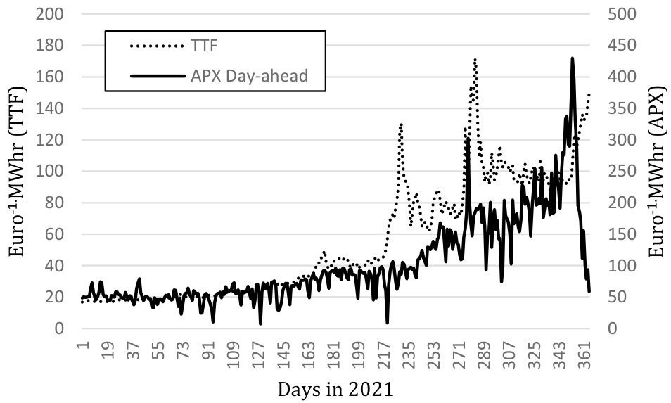  
Fig. 1.1: TTF gas prices and APX day-ahead electrical power prices for 2021.

Historically the sectors response to fluctuating and higher power prices was to use its access to contractually fixed price natural gas to sell power generated using gas powered generators within the greenhouse back to the grid instead of growing crops. While effective, this approach can diminish productivity and relies on the availability and affordability of increasingly scarce natural gas. This issue combined with increasing external pressure to reduce the carbon footprint of the sector has stimulated significant research and development of tools to improve the energy efficiency and minimise the climate impact of greenhouses. As such the work within this thesis is aimed to investigate how the greenhouse’s energy demand might be managed such that the greenhouse’s energy efficiency is improved, and the greenhouse’s climate impact can be reduced. For the purposes of clarity this thesis focusses on energy improvements in specific areas of the greenhouse operation. As such the following section demarcated what aspects of the greenhouse system that are considered in this thesis.

# 1.1. The greenhouse system

The following section outlines the definition of the greenhouse system considered in this thesis, its components and how they interrelate. The greenhouse system that is studied in this thesis reflects a conventional Dutch Venlo style greenhouse. The general layout of this greenhouse system is demarcated in the following section. Multiple greenhouse models and configurations are used in this thesis, as such the reader is encouraged to read the system description in each chapter for a detailed overview of the greenhouse system used in that chapter. For ease of explanation the general greenhouse system described here is divided into sections which are detailed below and in Fig. 1.2. These sections contain the transient dynamics of the climate within the greenhouse, which includes for example the air temperature, vapour density and ଶconcentration.

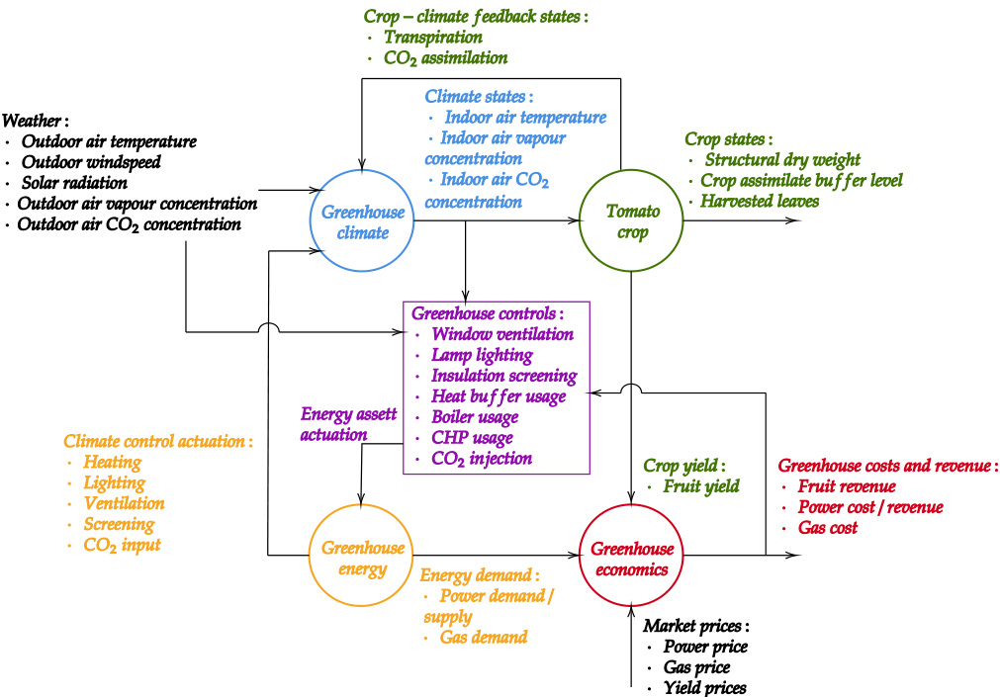  
Fig. 1.2 - The layout of the general greenhouse model considered in this thesis, displaying the 5 main high-level components of the greenhouse and their interrelation. The greenhouse climate (blue) is influenced by the weather, crop and input from the greenhouse energy system. The tomato crop (green) is influenced by the greenhouse climate. The greenhouse controls (purple) respond to the greenhouse climate, economics and weather. The greenhouse energy (yellow) is derived from the greenhouse controls through the actuation of energy assets. The greenhouse economics (red) are related to the yield from the tomato crop and the greenhouses energy balance.

While the indoor climate within the greenhouse is influenced by the external weather conditions, the studied greenhouse includes a set of equipment that allow the greenhouse climate to be controlled. In the case of the greenhouse air temperature, this includes ventilation through the windows for cooling, and heating that is conserved with an insulating screen or heat buffer and supplied from the boiler or Combined Heat and Power generator (CHP) via heating pipes within the greenhouse. The light levels within the greenhouse is supplemented with High Pressure Sodium (HPS) lamps within the greenhouse chamber. The $\#$ levels within the greenhouse chamber are also supplemented using the exhaust of the CHP and boiler as well as pure $\#$ that is imported externally.

The economics of the greenhouse that are considered include the revenues that are generated via the selling of the crops and electrical power that is generated within the greenhouse. The costs that are considered relate to the externally bought gas and electrical power required to operate the greenhouse. This thesis uses the market prices derives from the Amsterdam Power Exchange (APX) dayahead market as well as the imbalance market to offer a more realistic costing of a Dutch greenhouse’s electrical power demand.

The crop grown within this greenhouse is a generic tomato crop that is not specific to any cultivar and whose growth is described in terms of the structural biomass the plant has as well as the non-structural biomass or photo-assimilates the plant has produced and stored. Furthermore, the weight of mature fruits that are harvested are key outputs for the calculation of the greenhouse’s revenue.

It should be noted that the greenhouse system considered in this thesis does not include the crop root system or the water and nutrition supply. Another aspect that is not included in the scope of this thesis is disease or plant health. Furthermore, while this thesis does focus on the energy efficiency of the greenhouse, the energy mix such as the use of renewable resources like solar power and wind power will not explicitly be considered. Instead, this thesis considers the greenhouse gas and power demand and their corresponding markets.

# 1.2. Energy efficiency in greenhouse horticultural literature

The extensive literature surrounding energy efficiency in greenhouses can be broadly divided into research into the introduction of new equipment and materials for the greenhouse and research into improved strategies to control the greenhouse through advanced control methods.

Previous research regarding the use of new technologies can be further subdivided by the efficient operation of new equipment reducing energy demand and equipment being used for the reclamation of previously lost energy. An example of the research of contemporary equipment with a greater energy efficiency is the use of Light Emitting Diode (LED) lamps over traditional HPS lamps as investigated in (Katzin, 2021). Previous studies have investigated energy reclamation in greenhouses through the use of water buffers to store surplus heat energy for later use (Seginer, van Straten, et al., 2017b; van Beveren et al., 2019, 2020). A further example of an energy retention technology covered in literature is the potential of energy screens.  These screens trap heat within the greenhouse chamber which otherwise would have been lost to the outside (Dieleman & Kempkes, 2006).

Presently most greenhouses are controlled using a set of heuristic rules to control the greenhouse climate (Ali & Abdalla, 1993; Kuijpers, Katzin, et al., 2021). These rules dictated the desired climate within the greenhouse and how the various equipment within the greenhouse should react if certain climate indicators exceed some threshold values that show a notable deviation from the desired climate. This desired climate is defined as a series of climate setpoints.

A further way research has aimed to improve the energy efficiency of greenhouses is to improve the managerial strategies used to operate the greenhouse. Most commonly this is done by either introducing a more advanced control algorithm, using an optimiser to derive management strategies, deriving new climate setpoints or by exploiting some as yet underutilised energy buffer within the greenhouse to give some managerial flexibility.

A significant body of research exists that aims to manage the control input of the greenhouse in a way that tracks predefined climate setpoints with ever greater accuracy. Doing so reduces managerial errors and can improve the operational efficiency of the greenhouse. These studies have done this by conceiving of new ways to control the greenhouse to meet target climate setpoints with greater precision than previous methods. While the original and most common form of controller used in industry is still the rule-based controller, researchers have also proposed the use of alternative controllers. These include Proportional, Integral, Derivative (PID) controllers (Hu et al., 2011; Pawlowski et al., 2016; Zeng et al., 2012) as well as Open and Closed loop feedback controllers (Henten et al., 2008; Pasgianos et al., 2003). The aforementioned forms of greenhouse control are reactive as they respond to the status of the greenhouse in real time.

Researchers have also proposed control algorithms that are predictive whereby a model is used to predict the future behaviour of a greenhouse if a certain management strategy were to be adopted to meet a series of climate setpoints. In doing this it is possible to iteratively test multiple possible control strategies and find one that provides the best energy efficiency and overall greenhouse performance. This performance is often assessed using some predefined measure which can included variables such as the total mass of produce or the finances of the greenhouse operation. Examples of this type of controller are Model Predictive Control (MPC) (Blasco et al., 2007; L. Chen et al., 2018; W. Chen & You, 2020; Ramí rez-Arias et al., 2005) and Receding horizon optimal control (RHOC) (Gonza lez et al., 2014; Tap et al., 1996; van Straten et al., 2002; van Willigenburg et al., 2000). Other examples of control methods that have been proposed to improve the operational efficiency of greenhouses also include Fuzzy controllers (Atia & El-madany, 2016; Iliev et al., 2014; Ma rquez-Vera et al., 2016; Mohamed, 2015; Su et al., 2017a) and Artificial neural network of Genetic algorithm-based controllers (Faouzi & Bibi-Triki, 2016; Guzman-Cruz et al., 2010; Hasni et al., 2011; Pohlheim & Heiner, 1999; Seginer, 1997).

In addition to previous literature investigating the optimisation of the control of the greenhouse climate such that it accurately tracks the climate setpoints there is a body of literature that covers the generation of new climate setpoints (Henten & Bontsema, 2009; Seginer, 2011). For example, previous research has defined setpoints for the efficient management of air humidity (Ko rner & Challa, 2003) and heating control (Hwang et al., 1990; Lacroix & Kok, 1999). Furthermore, previous studies have defined setpoints-based on greenhouse economics (Su et al., 2021) and setpoints that considers the maximisation of crop production (Korner, 2003). These studies also increase the scope of greenhouse management to include the interaction between climate management, economic performance and the crop within the greenhouse.

In summation, a significant amount of research has been done to improve the energy efficiency of greenhouses. However, given the scale of the pressures on the sector both from the potential scarcity of energy and the climate impact of greenhouse energy usage there is still a societal need for further improvements. To achieve this there are a number of specific areas of opportunity in which further energy efficiencies might be sought. These areas include the potential to reduce error in predictions of greenhouse energy demand through uncertainty analysis (section 1.2.1). Another avenue is to explore improvements that can be made by incorporating energy markets into greenhouse economics and energy demand analysis (section 1.2.2).  The third area investigated how the incorporation of the greenhouse crop as an energy buffer might improve greenhouse energy management (section 1.2.3).

# 1.2.1. Uncertainty analysis in greenhouse horticultural research

A number of the greenhouse control methods discussed above rely on predictions of the future indoor climate of the greenhouse if a certain management strategy were to be adopted. This is done using a computerised mathematical model of the greenhouse and the forecasted weather and energy prices. However, if there are any errors within these models of the greenhouse or the data used in the simulations then any strategies derived from their predictions would be inaccurate. This distribution of errors in the prediction, resulting from a distribution of errors in the model or data, is known as prediction uncertainty and is assessed using an uncertainty analysis.

Previous research has performed uncertainty analyses that investigated the impact of parametric uncertainty in relation to greenhouses.  A number of these studies focus on the impact of crop model parameterisation on the prediction uncertainty of crop yield (Cooman & Schrevens, 2006; Lo pez-Cruz et al., 2013, 2020) and dehumidification usage (Schrevens et al., 2008). There are however no studies that analyse the parameters relating to the greenhouse climate and energy model in the context of electrical power and gas demand.

There is also research relating to the role of errors within the weather forecast on the uncertainty in the prediction of greenhouse heating demand (Sigrimis et al., 2001; Vogler-Finck et al., 2017).  While other studies have assessed the impact of forecast error on the performance of greenhouses that are controlled using an optimal controller (Doeswijk et al., 2006; Tap et al., 1996). The aforementioned studies concluded that the inclusion of weather forecast errors degraded the performance of the greenhouse. However, there is a gap in literature to assess the impact of forecast error on the energy demand of the greenhouse. Specifically considering the influence on gas and power demand as well as on the economics of the greenhouse.

As such there is a gap in the existing literature to analyse the impact of both weather forecast-based and model parameter-based error on greenhouse model prediction uncertainty. In particular the prediction of the economics of the greenhouse and the gas and electrical power demand.

# 1.2.2. Energy resource pricing in greenhouse horticultural literature

The prices of gas and electrical power are key inputs in determining a greenhouse management strategy that is efficient in an economical and resource sense. Energy resources the greenhouse needs are traded for on the open market. More specifically the price of resources can guide when energy intensive equipment is operated or when energy should be acquired and stored for use in a later period, perhaps when prices are higher. As such the dynamics of energy prices should be as realistic as possible to produce an efficient and representative management strategy. However much of previous research into greenhouse management on an economic basis has used fixed value energy prices (Golzar et al., 2021; Kuijpers, 2021; Maga et al., 2012; Vadiee & Martin, 2012). While there have been studies that use dynamic prices (van Beveren et al., 2019) there is a little else in the existing literature where the performance of the greenhouse is assessed using dynamic prices. Specifically in the case of electrical power, prices from multiple markets should be incorporated as this is what is done in practice. By increasing the detail of the resource pricing used in greenhouse horticultural research the resulting recommendations for energy efficient operation are more accurate and reliable. This is because these recommendations will be based on more realistic representations of how energy is managed in the horticulture sector.

# 1.2.3. Crop assisted energy management in Greenhouses

Previous research (Elings et al., 2005; Korner, 2003; Ko rner & van Straten, 2008) has proposed using the inherent robustness of the greenhouse crop to manage fluctuation in available heat energy from both the outdoor environment and the greenhouse heating system. The underlying principle of this approach is known as temperature integration, in which the response of a crop to temperature fluctuations is averaged over a period of time. Allowing the crop to tolerate fluctuation in temperature.

The aforementioned research has investigated the management of surplus heat energy but not surplus electrical energy. Previous research has introduced a concept that could be applied to storing both surplus heat and electrical energy. This opportunity comes in the form of the crop’s ability to store surplus sugars internally in what is called the assimilate pool (Heuvelink, 1996; Jones et al., 1991). The assimilate pool serves as a temporary reservoir for carbohydrates that are produced during photosynthesis and are later utilized to maintain and grow the plant. The rates at which this pool is filled or emptied is influenced by the greenhouse climate and as such it could be employed as an energy buffer. Furthermore, as these sugars are generated by photosynthesis, a process that is dependent on both heat and light it is possible to use the assimilate pool to store both surplus electrical energy through artificial lighting and heat energy through hot water-based heating.

The impact of assimilate pool modelling on the performance of an optimally controlled greenhouse was investigated in Seginer (2022). This study found that the inclusion of an assimilate pool in the crop model is important for prediction accuracy and optimal controller performance. But this study does not consider how errors in the modelling of the assimilate pool might effect prediction accuracy or if the assimilate pool might be used as ana energy buffer. As such there is a gap in previous research as to the possible impact of using the assimilate pool as an energy buffer for the purpose of energy management.

# 1.3. Aims

As previously discussed, there has been a concerted effort to improve the energy performance of greenhouses in previous research, and a number of opportunities for future research have been identified above.  In response to these gaps this thesis contains two overarching aims. The first is to investigate the improvement in greenhouse energy management that can be made by accounting for uncertainty introduced from model parameters, weather forecasts and fluctuating energy prices. The second aim is to assess how the inclusion of the crop’s assimilate pool as an energy buffer, the use of the CHP or the radiation forecast might offer opportunities to manage the impact of fluctuating power prices. These aims can be more precisely articulated as a series of technical challenges to be overcome and a number of opportunities to address those challenges.

# 1.4. Technical challenges

1) Possible errors in predictive models

The future power demand of the greenhouse is traded for on the open market, based on the anticipated future demand of the greenhouse. The accuracy of this anticipated demand is dependent on the accuracy of the computer model used to make that prediction. Subsequently errors in these models can lead to energy management strategies that are economically suboptimal through the introduction of prediction uncertainty. This may lead to additional power being generated, or incorrectly bought power may be sold by the grower on more volatile short term markets. However, the potential of the model error to affect the accuracy of greenhouse energy demand prediction and the interaction between the greenhouse and the energy markets remains unknown.

# 2) Variability in the weather forecasts

Weather forecasts form a key component of the power trading process as they indicate the availability of natural energy. This is used to define how much heating and lighting is required, and how much power needs to be subsequently bought. Weather forecasts contain error and as such represent the uncertainty of future weather. These errors within the weather forecasts lead to inaccurate and uncertain predictions of power demand. Which can lead to subsequently inaccurate power trading, which has to be corrected via trading on short-term more volatile power markets which exposes the grower to potentially financial losses. Given this, the potential impact of weather forecast-based uncertainty on energy prediction and trading requires further research.

3) The volatility of electrical power and gas prices

Issues with improving greenhouse energy efficiency are not only limited to the models that are used to make predictions. The volatility in energy markets make optimising greenhouse energy usage more challenging. This volatility is further complicated by the reality that multiple electrical power markets which span different future periods of time are used in practice. This significantly more complex arrangement for electrical power acquisition in particular is not reflected in the literature but is key to assessing the true financial cost of greenhouse operations.

# 1.5. Opportunities

Given these challenges there are corresponding opportunities to address them, both within the current greenhouse paradigm and from other areas of academia.

Opportunities from within the contemporary greenhouse paradigm

1) The availability of data streams

The growing digitisation of the greenhouse sector has led to a greater availability of data which describe the status of the greenhouse and crop. Furthermore, data is available on the status of the weather, and the power market prices in the form of weather forecasts and historic data from multiple power markets. This increasing availability of accurate and comprehensive greenhouse data offers an opportunity for the analysis of the accuracy of models as well as the impact of inaccuracies within data streams on model performance.

2) Managerial flexibility from the greenhouse crop

Within the field of crop physiology there is a concept of a crop assimilate pool or crop buffer, this buffer represents the stored sugars in the plant that were generated via photosynthesis in surplus to the immediate requirements of the plant. There is an opportunity to incorporate this buffer in the control of a greenhouse in which the sugars generated by the plant can be deposited in this buffer when externally sourced energy is available and withdrawn from the buffer when viable externally sourced energy is scarce. Thus, giving more flexibility in how a greenhouse is managed in how and when externally sourced energy is acquired.

Opportunities from outside the contemporary greenhouse paradigm

# 3) Uncertainty analysis methods

In other fields of research there is a body of statistical methods that can be used to better understand the uncertainty in greenhouse model predictions. These methods permit the quantification of prediction uncertainty that introduced from errors found in model parameters and input data. Moreover, they demonstrate how these sources compare and interact with each other and contribute to prediction uncertainty. By applying these methods, prediction uncertainty can be reduced through targeted improvements of the accuracy of input data and model parameters.

# 4) Optimization methods

Optimization methods that may help improve operational efficiency by mitigating the costs of undesired future events and developments regarding weather and energy availability. The potential of this opportunity is further expanded by employing the natural flexibility of the crop to buffer power price fluctuations.

# 1.6. Approach

The research aims presented in this thesis is addressed in a series of chapters. These chapters pursue the aims of the thesis by address the challenges detailed above using the aforementioned opportunities:

o Chapter 1 investigates how errors within weather forecasts affect greenhouse power trading. As such this chapter approaches challenge 2 and 3 through opportunities 1 and 3.   
o Chapter 2 assesses the impact of parametric error on greenhouse energy demand prediction using an uncertainty analysis, this approach challenges 1 through opportunities 3.   
o Chapter 3 performs an uncertainty analysis on the combined impact of parametric and weather forecast error on energy demand prediction. This chapter approaches challenges 2 through opportunities 1 and 3.   
o Chapter 4 assesses if an optimal control method, the crop’s assimilate pool, CHP and radiation forecasts can be used to buffer fluctuating electrical power prices, approaching challenge 3 through opportunities 1, 2 and 4.

Chapter 2. Quantifying the role of weather forecast error on the uncertainty of greenhouse energy prediction and power market trading

# Henry Payne, Silke Hemming, Bram van Rens, Eldert van Henten, Simon van Mourik

Published in Biosystems Engineering (2022), 224, pp 1-15   
https://doi.org/10.1016/j.biosystemseng.2022.09.009

# Highlights

The study shows that weather forecasts create energy demand uncertainty. A data-based sensitivity analysis was done for input data weather variables. The greenhouse power costs are calculated using imbalance and day-ahead markets. As the weather forecasts lengthen, the energy prediction error and power costs increase. • The radiation forecast has the greatest impact on the predicted power error.

# Abstract

Currently the Dutch greenhouse horticultural sector has a high energy demand. The present use of weather forecasts can exacerbate this high energy consumption by contributing to suboptimal prediction and trading of the greenhouse’s power demand. This study investigates the role of weather forecast errors on energy prediction power and trading uncertainty in greenhouse horticulture. This was done using an uncertainty analysis and computer model of a tomato producing Venlo style greenhouse in Bleiswijk, The Netherlands. This greenhouse model was used to predict the greenhouse’s gas and electrical power demand. The study concluded that errors in the weather forecast of outdoor radiation, temperature and wind speed caused an overestimation of greenhouse energy demand. A sensitivity analysis showed that the radiation forecast error had the greatest impact on predicted greenhouse power demand errors with a mean relative error of Ψ. Predicted gas demand errors were most dependent on the outside wind speed forecast mean relative error ሻand temperature forecast error ǤA power trading uncertainty analysis was done to investigate the impact of predicted energy demand errors on the cost of buying power on the Dutch imbalance and Amsterdam Power Exchange day-ahead market. This cost analysis found that the volume of initial power trading was greater than corrective trading. Additionally, the higher volatility in short term power prices resulted in higher corrective power costs per unit of power than if the power demand had been initially predicted with more accuracy.

# 2.1. Introduction

The Netherlands has a large greenhouse sector of approximately $\textcircled{8} ^ { < }$ (Statistics Netherlands [Internet], 2021), with a power demand of ͳͲi
n 2020. This power annually costs the grower ̀ $\neq$ ଶ(van der Velden & Smit, 2021) on average making cost effective energy buying a priority. An industrial greenhouse is a highly complex system, and the grower may require frequent advice to achieve efficient management. This advice is used to supplement and computerise human expertise by predicting the greenhouse’s future behaviour and offering appropriate climate management advice as shown in Fig. 2.1. Computer models and data streams are used to generate the advice and form part of a decision support system (DSS). The advice that this study focusses on is how much energy should be bought to operate the greenhouse. The external sources of energy being considered in this study are the gas and electrical power required by the greenhouse.

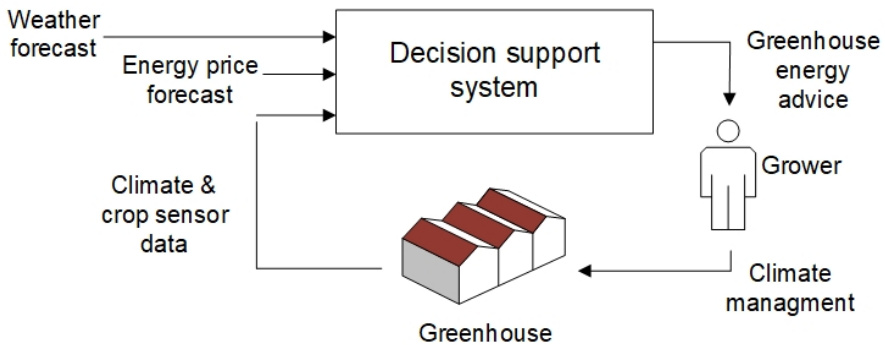  
Fig. $2 . 1 \cdot \mathbf { A }$ flow diagram of how a greenhouse decision support system connects sensor data, forecast data and the grower, and how advice on greenhouse energy consumption may be applied in the greenhouse.

The predictive accuracy of a DSS is important as it allows the accurate planning and trading of power on the power markets (Wang et al., 2015). This greenhouse’s future energy demand is predicted using the weather forecast and predicted energy prices (van Beveren et al., 2020). However, errors within the weather forecasts may affect the accuracy of predictions and the efficiency of subsequent energy trading.

In the Netherlands the greenhouse’s predicted power demand is initially bought using the APX (Amsterdam Power Exchange) day-ahead power market. The dayahead market allows bidders to submit an order for power at an hourly rate, which will be delivered the next day. Any errors in this initial purchase are resolved by using corrective power trading on the APX intra-day market or imbalance market. The intra-day market allows the continuous trading of power on an hourly rate, and the imbalance price is used to reflect the immediate value of power given the current ratio of supply and demand on the grid.

In previous greenhouse studies weather forecasts have been included in various forms. Some studies have used actual forecast data (Sigrimis et al., 2001; Su et al., 2021), and others include simplified forms of forecasts such as a lazy-man forecast (Tap et al., 1996; van Ooteghem, 2010). Some studies create synthetic forecasts using models (Seginer, van Beveren, et al., 2018; Su et al., 2017a).

Several studies that have focused on greenhouse energy management have included weather forecasts. Among these some address reducing the greenhouse’s heating demand (Chalabi et al., 1996; Su et al., 2021) or heating costs (Gutman et al., 1993). Keesman et al., (2003) investigates the reduction of ventilation costs in a potato storage facility using a receding horizon optimal controller and weather forecasts. However in these studies and several other studies it is assumed that the errors in weather forecasts have a negligible effect on the prediction accuracy of greenhouse models (Seginer et al., 2006; Seginer & McClendon, 1992).

The potential impact of weather forecast errors on greenhouse prediction uncertainty has been partially addressed. Vogler-Finck et al., (2017) use a simple linear model and a recursive least squares approach to predict the heat demand of a Danish greenhouses using short term weather forecasts. Vogler-Finck concluded that the inclusion of real weather forecasts significantly improved the online prediction of heat load over using simplified weather forecasts. Tap et al., (1996), studied the greenhouse’s $\#$ and heating demand and simulated the financial performances of a greenhouse model being controlled with a receding horizon optimal controller. Tap et al., (1996) found a drop in the performance of a greenhouse when forecast errors were introduced, and that the performance worsened for longer forecasts. Doeswijk et al., (2006) also found that weather forecast errors increase the heating costs of operating a climate controlled storehouse. Sigrimis et al., (2001) offer a nuanced perspective by concluding that while the inclusion of weather forecasts can improve performance, the presence of weather forecast errors increased the costs of heating and that this cost only worsened with longer forecasts.

As shown above the error within weather forecasts previous research has analysed in the context of greenhouse heating control and economic optimisation. However, there is a knowledge gap as there are limited studies about the effects of weather forecast error on power demand prediction and the subsequent consequences for power trading.

Several studies optimised the cost of the of the greenhouse’s energy usage (Golzar et al., 2021; Seginer et al., 2017; Vadiee & Martin, 2012; van Beveren et al., 2019; van Henten & Bontsema, 2009; Vanthoor et al., 2012) and several studies have included weather forecasts (Doeswijk et al., 2006; Gutman et al., 1993; Keesman et al., 2003; Sigrimis et al., 2001; Tap et al., 1996). However, many studies are limited in how realistic they are when compared to what is done in practice as the economics of the greenhouse were often significantly simplified. For example a fixed power price is often used (Golzar et al., 2021; Kuijpers, Katzin, et al., 2021; Vadiee & Martin, 2012; Vanthoor et al., 2012). van Beveren et al., (2019) did include a fluctuating price by optimising the use of the greenhouse’s energy equipment using the imbalance price. However as discussed above, this is not what is done in practice.

Many studies have optimised the economics of a greenhouse by using simplified market prices to assess the greenhouse’s economic performance. As a result, there is an additional knowledge gap as little information is available on the potential costs of power trading using fluctuating prices and multiple markets as is done in the greenhouse horticulture sector.

The objective of this paper is to determine the impact of weather forecast error on greenhouse energy demand prediction and power trading. In addition, this study investigated which forecast variables have the greatest impact on power prediction error and how this impact changes depending on the weather forecast prediction horizon length.

By identifying the roles of the error in weather forecast variables, improvements can be made to the most error prone variables through the targeted application of improved sensors or by using combinations of multiple forecasts. This in turn can improve the accuracy of energy demand prediction and the economic efficiency of power trading.

In the subsequent sections the greenhouse model is briefly described. This is followed by an uncertainty analysis that describes the error in the weather forecast and how that propagates into uncertainty in the energy demand prediction. Next the uncertainty in the energy demand prediction was used to calculate the costs of power trading when trading on the APX day-ahead and imbalance markets. A local sensitivity analysis was then done to assess which weather forecast variable’s errors are having the greatest impact on prediction uncertainty. The results are then interpreted to focus on the impact weather forecast errors have on energy prediction and trading. Moreover, this study aims to assess how this impact changes when using weather forecasts of differing prediction horizon lengths.

This paper makes a novel contribution to the field of greenhouse horticultural modelling by investigating the propagation of weather forecast error into predicted greenhouse energy demand and power trading. The novelty of this work consists of the following features:

This study takes a detailed approach to assessing the costs of buying the greenhouse’s power demand. This demand is calculated initially using the APX day-ahead power market price, which is a realistic representation of the initial and largest round of trading done by growers in practice in the Netherlands. Then the cost of the mispredicted power is calculated using the imbalance market price to represent the costs of short-term corrective trading.   
The application of this input data-based uncertainty analysis in the greenhouse horticulture domain is novel and in particular the application of a weather forecast-based uncertainty analysis within the greenhouse domain.   
Unlike previous sensitivity analysis methods in the greenhouse modelling domain which focused on the sensitivity of parameters, this study uses an input data discrete sensitivity analysis which is applied on the weather variables to determine the largest contributors to the energy prediction uncertainty.

# 2.2. Materials and methods

# 2.2.1. Model definition

The greenhouse model used in this study is composed of modules (Fig. 2.2) which are described in the following subsections. This study uses the greenhouse model KASPRO (de Zwart, 1996; Dieleman et al., 2005; Elings et al., 2006; Luo, de Zwart, et al., 2005; Luo, Stanghellini, et al., 2005) which is extensively calibrated to represent a commercial Venlo type Dutch greenhouse. For clarity of explanation the KASPRO model is described as being divided into modules which simulate the operation of the indoor greenhouse climate, energy system and rule-based controller. The energy asset control action is the response of the controller to activate the greenhouse energy assets (CHP, Boiler, lamps, screens, and ventilation). The climate control action defines the heating, lighting and  input to the greenhouse climate from the energy assets.

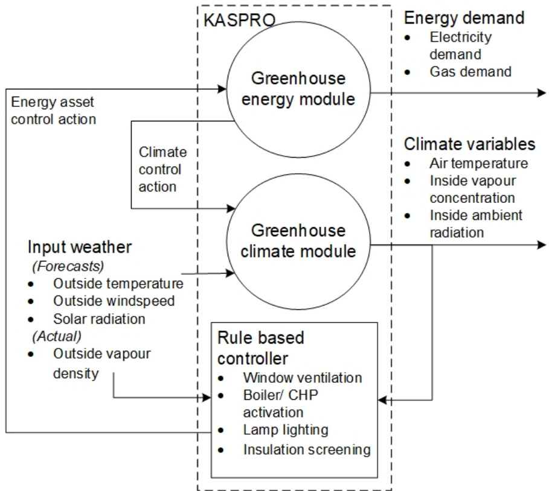  
Fig. 2.2 - This figure shows the relations of the modules within the KASPRO greenhouse model and the role of weather data.

# 2.2.2. Greenhouse climate module

The climate module models the indoor climate of the top and main compartments of the greenhouse and includes 16 state variables, including the indoor air temperature, carbon dioxide concentration, and vapour pressure. The greenhouse climate module (Fig. 2.2) receives input data from the outside weather and the energy input to the climate from the energy module. Fig. 2.3 shows the relative position of the elements in the greenhouse and their relation to the top and main compartments. This includes the air above and below the thermal screen, at the greenhouse cover and crop canopy level, as well as in six layers of soil. The elements displayed in this figure are not to scale. The transfer of water vapour, $\#$ and energy between elements of the greenhouse are governed by the processes of radiative and latent heat exchange, conduction, convection, ventilation, and condensation.

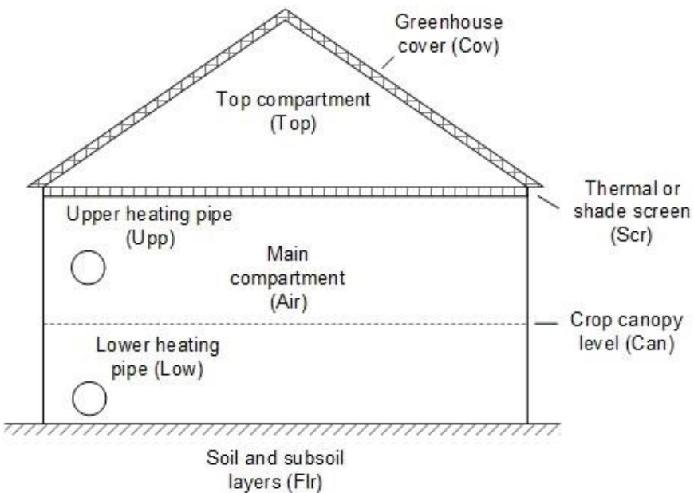  
Fig. 2.3 - This figure shows a cross section of the modelled Venlo type greenhouse. The figure describes the location of the greenhouse elements (screens, covers and pipes) within the greenhouse compartments as described in the KASPRO greenhouse model. The elements in this figure are not to scale but shows their relative positions in the greenhouse and abbreviations.

This study focusses on the states in the model describing the indoor air temperature and water vapor pressure in the main compartment in the form of differential equations (Eqs. 2.1 – 2.2). The insight gained from the model’s indoor air $\#$ state (de Zwart, 1996) was not used in this paper as the relevant outdoor $\#$ data was unavailable. The implications of this limitation are examined using a sensitivity analysis described in appendix A.

The main compartment temperature (Eq. 2.1) (de Zwart, 1996) is scaled by a fraction of air density ( $\scriptstyle \mathbf { < } \ @$ ”ǡspecific heat capacity of air ( $\quad : \sum _ { \mathbf { \sigma } } \mathbf { \sigma } _ { \infty \oplus \mathbf { \sigma } } .$ a”nd the volume of air ( $\mathbf { \partial } \cdot \mathbf { \partial } \mathbf { \partial } \mathbf { \partial } \cdot \mathbf { \partial } \mathbf { \partial } \cdot \mathbf { \partial } \cdot \mathbf { \partial } \cdot \mathbf { \partial } \cdot \mathbf { \partial } \cdot \mathbf { \partial } \cdot \mathbf { \partial } \cdot \mathbf { \partial } \cdot$ ”This is then multiplied by the net energy being transferred between the regions of the greenhouse, composed of the heat gained from the artificial lights $( 0 _ { ! } - \mu$ ሻa‹n”d solar radiation ( $\scriptstyle \mathbf { Q } _ { \mathsf { H } \ E }$ ሻԛ‹ǡ”upper and lower heating pipes $( 5 \cos \theta \le \cos \theta \le \cos \theta \underline { { \theta } } ) \theta \underline { { \theta } } \underline { { \mathrm { i } } }$ the canopy airሺେ୰ ሻ. Also included are the heat lost to the floor $\stackrel { \triangledown } { \mathbf { \mathbb { C } } } _ { \mathtt { \mathbb { P } } } \mathtt { \le } \mathtt { \& } ^ { \mathtt { t o p } }$ compartment ( $\scriptstyle { \mathsf { G e } } = 4$ ǡ‘sԛh’ade screen $\mathbf { \mathscr { G } } _ { \mathbb { \odot } \leq 3 }$ t…h”ermal cover ( $( 1 0 \leq 1 + 2 ) 1 0$ the outside ( $\cos \angle A Y$

$$
\begin{array} { r l } & { \frac { 8 4 e _ { \odot \le } } { \bigotimes \mathbb { X } } \frac { 1 } { { \textrm { \tiny { S C } } } ^ { \le } } \frac { \bigotimes \bigotimes \bigotimes \bigotimes \bigotimes \bigotimes \bigcirc } { \bigcirc } \mathrm { O } _ { \mathbb { P } ^ { - } \mu } \mathfrak { L } \mathfrak { L } \mathfrak { L } \mathfrak { L } \mathfrak { L } \bigotimes \big < \mathbb { S } \bigotimes \bigotimes \big < \mathbb { C } , \emptyset \Sigma \ \mathfrak { L } \mathfrak { L } } \\ & { \qquad \big < \mathcal { H } \le \sim \mathfrak { L } \mathfrak { L } \mathfrak { L } \mathfrak { L } \le \& \big < \mathfrak { L } \odot \le 4 \mathcal { O } \big < \mathfrak { L } \mathfrak { L } \odot \le 3 \Sigma \le } \\ & { \qquad \big < \mathfrak { L } \odot \le { \small { \mathcal { N } } } \mathfrak { L } \mathfrak { L } \mathfrak { L } \mathfrak { Q } \le \mathcal { H } \mathcal { Q } \big > } \end{array}
$$

Within the model the main compartment vapour pressure state (Eq. 2.2) (de Zwart, 1996) is defined as a fraction of the water molar mass $( - \epsilon$ ሻ, the gas constant ( $^ { \cdot _ { 2 } }$ ሻ, the volume of air $\mathbf { \partial } \cdot \mathbf { \partial } \mathbf { \partial } \mathbf { \partial } \cdot \mathbf { \partial } \mathbf { \partial } \cdot \mathbf { \partial } \mathbf { \partial } \cdot \mathbf { \partial } \mathbf { \partial } \cdot \mathbf { \partial } \mathbf { \partial } \phi .$ a”nd the main compartment air temperature ( $\left. 4 \phi \right.$ ”This was then multiplied by the sum of the vapour released from the canopy ሺେ ሻ୧a୰nd lost to the top compartment, screen, cover and outside (‹”ǡ‘’‹”ǡ…”‹”ǡ‘˜‹”ሻ. —–

For the purposes of this study a representative greenhouse design was specified. This greenhouse is a Venlo type greenhouse producing tomato in Bleiswijk, Netherlands. The greenhouse has the following physical parameters:

<html><body><table><tr><td colspan="6">Table 2.1:Parameters of the simulated greenhouse structure</td></tr><tr><td>Property</td><td>Value</td><td>Units</td><td>Property</td><td>Value</td><td>Units</td></tr><tr><td>Footing area</td><td>2.4</td><td>?0</td><td>Window size</td><td>2.5 x 1.2</td><td></td></tr><tr><td>Total height</td><td>6.5</td><td></td><td>Upper heating pipe diameter</td><td>0.027</td><td></td></tr><tr><td>Number of windows</td><td>1200</td><td>~</td><td>Lower heating</td><td>0.051</td><td></td></tr><tr><td>Number of chambers</td><td>1</td><td>~</td><td>pipe diameter Numberoflower heating pipe per floor area</td><td>1.25</td><td>0@8。 ↑</td></tr></table></body></html>

<html><body><table><tr><td>Gutter height</td><td>6</td><td>↑</td><td>Number of</td><td>0.625</td><td></td></tr><tr><td rowspan="3"></td><td rowspan="3"></td><td rowspan="3"></td><td>upper heating</td><td></td><td>↑</td></tr><tr><td>pipe per floor</td><td></td><td></td></tr><tr><td>area</td><td></td><td></td></tr><tr><td>Cladding</td><td>27000</td><td></td><td></td><td></td><td></td></tr><tr><td>area</td><td></td><td></td><td></td><td></td><td></td></tr></table></body></html>

# 2.2.3. Greenhouse energy module

The greenhouse energy module receives the data describing the use of energy system components from the rule-based controller. The energy module describes the amount of pipe heating, lamp lighting and injected ଶ input into the greenhouse climate as well as the required gas and power to operate the components of the energy system. These components include a shading and energy screens. Heating was supplied via a lower and upper heating rail pipe system from a boiler, combined heat and power generator (CHP) and heat storage tank. Lighting was supplied from two arrays of SON-T 1000W HPS (High Pressure Sodium) lamps. The greenhouse energy system components properties are listed in table 2.2.

<html><body><table><tr><td colspan="3">relating to the capacity of the components,and eficiency of energy</td></tr><tr><td>assets Property</td><td>Value</td><td>Units</td></tr><tr><td>Lower heating pipe diameter</td><td>51 mm</td><td rowspan="6"></td></tr><tr><td>CHP power rating</td><td>43 7‡</td></tr><tr><td>CHP thermal capacity</td><td>60 7± ?</td></tr><tr><td>Artificial light intensity</td><td>0.648 ‡Q'</td></tr><tr><td>Upper heating pipe 27 diameter</td><td>++</td></tr><tr><td>CHP heating efficiency</td><td>47</td></tr><tr><td>Boiler thermal capacity</td><td>170 7≠</td></tr><tr><td>Heat tank volume</td><td>1000</td></tr><tr><td>Boiler heating efficiency</td><td>94</td></tr><tr><td>CHP electrical efficiency 37</td><td>%</td></tr></table></body></html>

# 2.2.4. Rule-based controller

The rule-based controller module receives data from the outside weather and the indoor greenhouse climate and outputs the usage of greenhouse energy assets to meet predefined indoor climate conditions (Luo, de Zwart, et al., 2005). The use of energy assets was defined as the immediate fraction of window aperture, fraction of lamp lighting levels and fraction of insulation screen coverage. The controller also dictates the temperature of the greenhouse heating system via the control of the CHP and boiler.

The controller resembles an industrial grade controller which operates from a considerable library of threshold-based rules. The threshold values were defined by climate profiles which detail desired climate conditions as a series of setpoints over time, as well as the time, outside weather and the actual indoor climate. The climate profile used in this study has a relative humidity set point of $8 5 \%$ and a requirement to light the greenhouse for 18 hours a day ending at 20:00. The temperature climate profile has setpoints of ͳͺbetween sunset and sunrise,ʹלͲ one hour after sunrise, ͻ one hour before sunset. For consistency over the simulations the climate set point scheme was kept the same for all weather forecast prediction horizon lengths.

# 2.2.5.  Model assumptions

The greenhouse climate and energy system model were implemented with some simplifications and assumptions. Key simplifications and assumptions are listed below:

The greenhouse compartments are homogeneous spaces, with no spatial microclimate variation within them.   
The effects of shadow screens, covers, ventilation windows and artificial lighting on state variables are uniform within their related regions of the greenhouse.   
The flow of water through the heating system was assumed to be constant over time.   
KASPRO (de Zwart, 1996; Dieleman et al., 2005; Elings et al., 2006; Luo, de Zwart, et al., 2005; Luo, Stanghellini, et al., 2005) is an extensively calibrated model and it is assumed that this calibration makes it a sufficiently representative predictor.   
It is assumed that the predictions made using the weather recordings represent a ground truth to be compared with the weather forecasts. This is

necessary as it is not possible to record the performance of a real greenhouse that operates using forecasts with no error as no such forecasts exist.

# 2.2.6. Power market data

The cost of power trading in this study was calculated using the Netherlands APX day-ahead and the imbalance market price for power over the same period as the forecast data. The APX day-ahead market was chosen as it represents the prices upon which the majority of initial energy trading is done for growers. The APX price data is applied in an uncertainty analysis along with weather forecast data. This is done to represent a medium-term energy planning scenario over multiple days. To calculate the costs of corrective power trading that is done based on the mispredicted power demand the imbalance market price is used. The imbalance price was chosen over the intra-day market due to the lack of availability of intraday market data. In this study it is assumed that the volumes of power traded by the grower do not affect the market price.

# 2.2.7. Recorded and forecasted weather data

A dataset of hourly weather forecasts and weather recordings is used in this study. The dataset includes hourly forecast and recording variables of the outside temperature Ԩሻ, wind speed ሻand global solar radiation The forecasts have a five-day length and were generated at: 06:00, 09:00, 12:00, 15:00 and 17:00 over a two-month period (13 Oct 2019 – 16 Dec 2019), resulting in 292 five-day forecasts in total. The forecasts were generated by the weather forecast company Meteoconsult and was sourced from an operational greenhouse and is comparative to what information is available to growers.

The forecasts of outside vapour concentration ሻwere not included in the original dataset. In place of these forecasts, recordings were retrieved from a nearby KNMI (Koninklijk Nederlands Meteorologisch Instituut) meteorological station for the same period of time were used in place of a forecast. The outdoor concentration for both the weather forecast and recordings was assumed to be constant at $4 1 0 \mathrm { p p m } _ { \cdot }$ , the impact of this assumption is examined in appendix A.

In addition, the cloudiness index (CI) was fixed to the average of the period $[ \mathsf { C l } =$ 0.7). A sensitivity analysis found that this assumption has little impact on the study’s result, the results of which can be seen in appendix A. The sky temperature (Luo, de Zwart, et al., 2005) and levels of diffused radiation (Orgill & Hollands, 1977) were computed using the available climate variables. Any missing entries in the datasets were filled with the value at the previous time instance, this was done for simplicity.

# 2.2.8. Uncertainty analysis method

This study uses a method that is described in four sections. These sections describe the method used to compose the weather forecasts, and to explain the uncertainty in the weather forecast, energy prediction and power trading respectively. The steps of the method, their relations, key variables, and sections are shown in Fig. 2.4. This study analyses the effect of using weather forecasts of increasing length ሺܳሻ, from 1 to 5 days long at daily intervals. This study defines uncertainty analysis as the analysis of a distribution of errors.

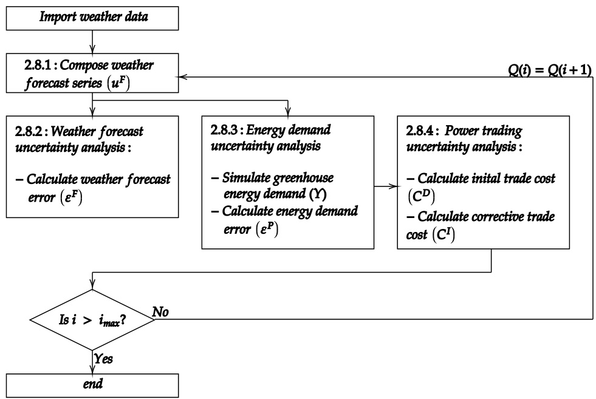  
Fig. 2.4 - The steps for the analysis method used in this study and the corresponding sections of the manuscript. Each step in the figure includes title of the step, the corresponding section of the manuscript and the key variable from that step. This method is iterated through each forecast prediction horizon length ࡽሻusing the index .࢏

# 2.2.8.1. Compose weather forecast series

This study uses series of weather forecasts with a horizon length in hours ,where .ሿͲThese horizon lengths are indexed through using ,௫where ͷ. For each weather forecast horizon length and forecast starting time, a series of consecutive forecasts ሻwas used. This series of forecasts spanned the time period of the entire dataset. Due to 5-day forecasts being recalculated daily, it is possible to concatenate forecasts with periods shorter than 5 days. This was done by truncating the weather forecasts from their starting sample to the given horizon length.

# 2.2.8.2. Weather forecast uncertainty analysis

To investigate the role of weather forecast uncertainty on greenhouse energy prediction uncertainty, a sample-based uncertainty propagation method is adapted and applied (van der Meer et al., 2018). In this study time in is discretised using hourly time steps and each time interval is defined by its length in hours, ݅ሻ, and starting point ሻ, where ݀is the day of the year, and ݄is the time index, defined in this study as the hours in the day. The hourly forecast error ሻat each time instance is defined as the difference between the weather recording ( and forecasts ( ሻ:

$$
\begin{array} { c c c } { { \ l _ { 1 } ^ { \mathrm { \tiny ~ \& ~ } } \$ \oplus } } & { { \ l _ { 1 } ^ { \mathrm { \tiny ~ \& ~ } } \oplus \oplus } } & { { \ l _ { 1 } ^ { \mathrm { \tiny ~ \ge ~ } } \oplus \oplus } } \end{array}
$$

These errors were then summed ሺ $\mathbf { \Sigma } _ { 4 } ^ { \& }$ ሻas this represented the quantity of error made over a forecast period, such that,

$$
\begin{array} { r l } { \mathbf { \Sigma } _ { 4 } ^ { \otimes } \Phi } & { { } \overset { \quad 1 \odot \mathrm { ~ \otimes ~ } } {  } \Phi \Phi . } \end{array}
$$

# 2.2.8.3. Energy demand uncertainty analysis

The energy prediction error is calculated as the difference between predictions calculated using weather forecasts and predictions made with weather recordings for the same period. The energy demand predictions from the model includes the gas demand ܩ( ) and power demand (

ଵ) where . The greenhouse energy demand ቁis calculated using the KASPRO model over a period ሺ݅ሻ, with inputs equal to the forecasted weather data ሻ. This results in predicted energy demand as a function of forecasted data,

$$
\Re _ { \mathbb { O } } \sp { \ast } \Phi \mathbb { B } \quad \Re \mathcal { \bar { \Psi } } _ { \mathbb { O } } \Phi \mathbb { B } .
$$

Then the energy demand ሺ୕ୖ is calculated using the recorded weather data ሺ—ୖሻas input,

$$
\begin{array} { r } { \mathfrak { G } _ { \odot } \$ \Phi \odot \phantom { \dag } \mathfrak { g } _ { \sf k } \mathcal { F } _ { \odot } \Phi \odot . } \end{array}
$$

The hourly prediction error ሻis calculated by comparing the weather forecast and weather recording-based energy predictions. Where

$$
\begin{array} { r l } { \mathsf { \Omega } _ { 1 \odot } ^ { 0 } \$ \Phi \odot } & { { } \mathsf { \Omega } _ { 1 \odot } ^ { \mathsf { R } } \Phi \odot \mathsf { \Omega } \odot \mathsf { \Omega } _ { 1 \odot } ^ { 2 } \Phi \odot . } \end{array}
$$

To avoid having the prediction errors cancel each other out the positive and negative error are summed for each forecast period $\mathsf { \pm } \odot$ ሻto represent the accumulated over-prediction ሺɂሻand accumulated under-prediction respectively. Such that,

$$
\begin{array} { r l } { \stackrel { 0 } { 0 } _ { 4 } \Phi } & { \stackrel { 1 } { \circledcirc } \stackrel { \circ } { \circ } \stackrel { \circ } { \circ } \scriptscriptstyle { \mathfrak { P } } } & { \stackrel { 0 } { 1 } \odot \Phi \textcircled { \div } \mathrm { a n d } } \\ { \stackrel { 0 } { \phantom { 0 } } _ { 4 } \Phi } & { \stackrel { 1 } { \circledcirc } \stackrel { \circ } { \circ } \scriptscriptstyle { \mathfrak { O } } \oplus \oplus \mathrm { \quad ~ } \stackrel { 0 } { 1 } \odot \Phi \textcircled { \div } } \end{array}
$$

The initially predicted energy demand ሺ୕ ሻand mispredicted energy demand are summed to allow a direct comparison of the quantity of error made over a forecast period, where,

$$
\begin{array} { c c c } { { \mathfrak { Q } _ { \mathrm { 1 } } ^ { \mathrm { s } } \Phi } } & { { \uparrow \odot \mathfrak { Q } _ { \mathrm { 1 } \odot } ^ { \mathrm { s } } \Phi \Theta . } } \\ { { \mathfrak { Q } \Phi } } & { { \uparrow \odot \mathbf { 0 } } } \\ { { \mathfrak { Q } \Phi } } & { { \ @ } } & { { \uparrow \odot \Phi , \mathrm { a n d } } } \end{array}
$$

# 2.2.8.4. Power trading uncertainty analysis

This study investigates the financial consequences of power demand misprediction. These consequences are dependent on the volume of misprediction and the price of power on the markets it is being traded on. The hourly APX day-ahead market price ሻwas used to calculate the power cost ሻof the initially predicted energy demand ሻ, where,

The cost of the corrective bidding of the mispredicted energy ሻis calculated using the imbalance market price ሻand

$$
\# _ { 1 } ^ { \bullet } \ L _ { \odot } \$ \mathbb { \circledast } \quad \Phi \$ \mathbb { \circledast } \quad \mathbf { \Omega } _ { 1 } ^ { 0 } \ L _ { \odot } \ L _ { \Phi } \mathbf { \circledast }
$$

To analyse and display the distribution of costs the matrices are concatenated into a vector. It should be noted that the power that can be generated and sold from the combined heat and power generator (CHP) is not considered in this study. This analysis does not consider the cost of gas demand as it is often fixed by contract unless a maximum supply rate is exceeded, which is assumed to be the case.

# 2.2.9. Sensitivity analysis of energy demand predictions

To understand which weather variable’s forecast has the greatest effect on the predicted power and gas demand $\mathbf { \^ { 9 } }$ a local discrete sensitivity analysis was performed. This sensitivity analysis was done on the forecast and recorded weather variables which include, outdoor temperature, global radiation and wind speed. The first order error ሺ $\mathbf { 9 }$ ሻof each weather forecast variables are calculated ൫—	൯. Each weather forecast variable is in turn used to replace the corresponding recorded weather variable and applied to calculate the energy demand predictions with the remaining recorded weather variables ሺ—୨ሻ. The index is the index of each weather forecast variable and $\pi _ { h _ { s } }$ the index of the remaining weather variables. Such that

# ୩ଵሺǡŠሻ ሺ—ୖሺǡŠሻ ሺ—୨ሺǡŠሻǡ—୩ሺǡŠሻ,

where all the weather forecast variables were made equal to the recorded variables, except index :

The second order error interactions $\mathbf { 9 }$ ቁis calculated by replacing pairs of weather forecast variables ሺ—୫୊ ሻto assess their combined influence. Where,

# where —Œ	ൌ—ŒǡŒ്ǡŒ്.

Where $\neq$ and are the indexes of all pairs of weather forecast variables. To allow comparison between predicted gas and power demand the percentile prediction error ሻwas then calculated for the first and second order errors, accordingly

$$
\begin{array} { r l } { \$ } & { { } \frac { 1 } { \mathbb { P } } \begin{array} { l l l l l } { \texttt { \^ { * } } } & { } & { \mathbb { S } } & { } & { } \\ { \mathbb { P } } & { \mathbb { P } ^ { 2 } \mathbb { S } \mathbb { B } } & { } & { } & { } \end{array} . } \end{array}
$$

This percentile prediction error was then used to calculate the first and second sensitivity indices ሻܫwhich is defined as the average absolute percentage error,

# ൌ തሺതതሻത.ȁ

# 2.3. Results

The results describe the effect of weather forecast uncertainty on energy use predictions and are split into four sections. The first section assesses the uncertainty in weather forecast variables. The second section shows the effect of the weather forecast error on greenhouse model prediction uncertainty and how it changes with the length of the weather forecast prediction horizon. The third section includes a power trading uncertainty analysis using multiple markets and weather forecast prediction horizon lengths. The last section investigates the interrelations between the input weather data and energy predictions using a discrete sensitivity analysis.

# 2.3.1. Weather forecast uncertainty

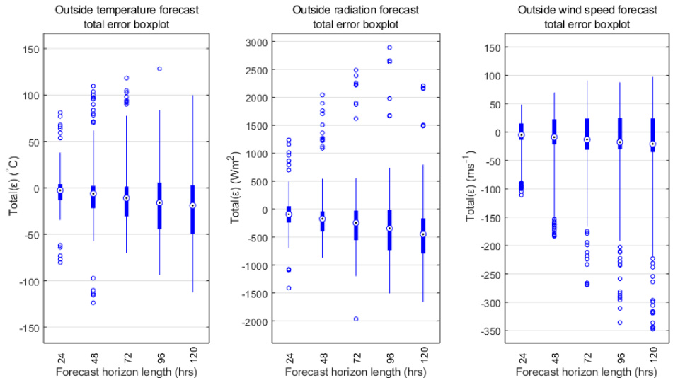  
Fig. 2.5 - Boxplots of the total weather forecast errors (Eq. 2.4) made over the forecast prediction horizon forecast length ሺࡽሻ. Where the encircled point is the mean, the box is the 1st, the whiskers are the $2 ^ { \mathrm { n d } }$ standard deviations, and the open circles are the outliers.

Fig. 2.5 presents the total weather forecast errors (Eq. 2.4) within each forecast variable for an increasing forecast horizon length. For all the forecast variables the mean error becomes more negative, and the variance increases as the horizon increases. This means that on average the forecast consistently underestimates the available outside temperature, global radiation and wind speed.

# 2.3.2. Greenhouse gas and power demand uncertainty

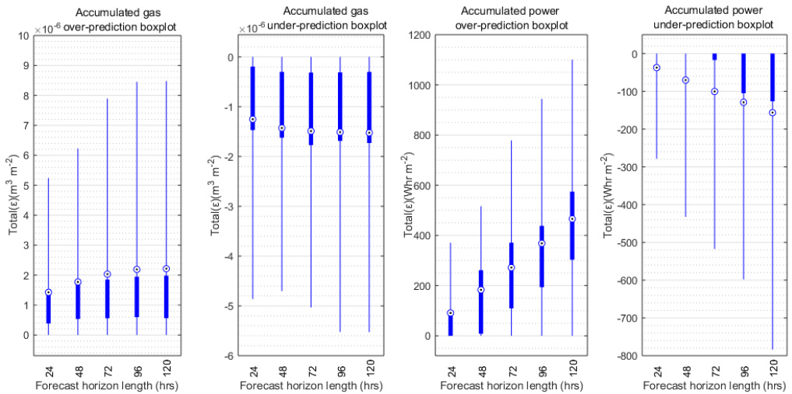  
Fig. 2.6 - Boxplot distributions of the accumulated over and under prediction (Eqs. 2.8-2.9)of gas and power demand when using forecasts of different forecast prediction horizon lengths. Where the encircled point is the mean, the box is the $\mathbf { 1 ^ { s t , } }$ and the whiskers are the $2 ^ { \mathrm { n d } }$ standard deviations (outliers omitted for clarity).

The greenhouse gas and power demand were simulated using different weather forecast prediction horizon lengths. Fig. 2.6 shows that as the forecast horizon increases the variance and mean of the over and under-predicted power and gas increases. In addition, the amount of over-predicted power and gas is greater than the under-predicted amount in both mean and variation. Subsequently in this case the greenhouse model tends to overestimate the power and gas demand. This originates from the bias present in the weather forecasts, namely, in the case of power demand, a negative bias in the global radiation forecast error (Fig. 2.7), meaning too little natural light is being forecast. This result is also reflected in the sensitivity results shown in section 2.3.4.

# 2.3.3. Greenhouse power trading uncertainty analysis

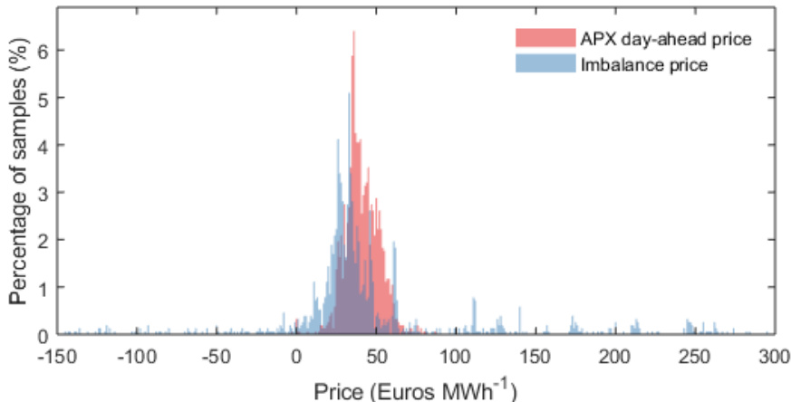  
Fig. $2 . 7 \cdot \mathbf { A }$ histogram of the market prices on the APX day-ahead and imbalance power markets.

A comparison between the prices of the APX day-ahead and imbalance market is shown in Fig. 2.7. The comparison shows that the day-ahead price has a higher mean price than the imbalance price. However, the imbalance price has a far longer tail than the day-ahead price where extreme prices can occur. In addition, the day-ahead price is strictly positive during this period, and the imbalance price ranges over both positive and negative values.

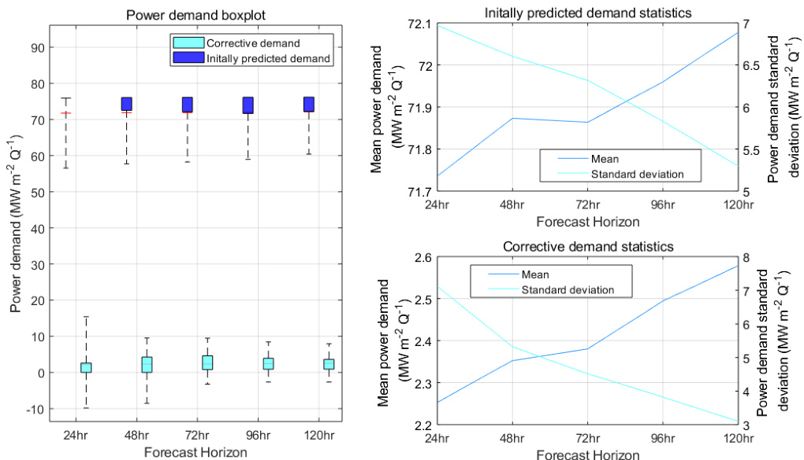  
Fig. 2.8 - A boxplot (left) of the initially predicted power demand (Eq. 2.10) and the subsequently calculated corrective power demand (Eq. 2.11). These power demands are described as the total per forecast period ࡽ. The mean and standard deviation for the initial and corrective demands (right) are displayed for each forecast prediction horizon length. Where the box is the 1st, and the whiskers are the $2 ^ { \mathrm { n d } }$ standard deviations.

Fig. 2.8 shows the total volume of the initial and corrective power demand prediction of a forecast period (Eqs. 2.10-2.11). The total volume of the initially predicted demand is much greater than the corrective demand for all weather forecast prediction horizon lengths. For both the initial and corrective demand the mean increases, and the standard deviation decreases with the weather forecast prediction horizon length. In addition, the initial and corrective demand has a positive bias for all the forecast prediction horizon lengths. To better look at the impact of misprediction on incurred costs only nonzero results are shown for the power demand and costs (Eqs. 2.12-2.13) displayed in Fig. 2.9.

  
Fig. $2 . 9 \cdot \mathbf { A }$ boxplot (left) of the initial power costs (Eq. 2.12) and the subsequently calculated corrective power costs (Eq. 2.13). The mean and standard deviation for the initial and corrective demands (right) are displayed for each forecast prediction horizon length.Where the box is the 1st, and the whiskers are the $2 ^ { \mathrm { n d } }$ standard deviations.

The comparative costs of the initial and corrective trading are shown in Fig. 2.9 and are derived from Eqs. 2.12 – 2.13. The initial bid is the larger in mean cost than the corrective costs and increases in mean and standard deviations as the forecast prediction lengths increase. The corrective costs have a greater variation and increase in mean cost with the forecast prediction horizon lengths. The standard deviation of the corrective costs does rise to a peak at a $7 2 \mathrm { h r }$ forecast horizon before declining. The negative value of the corrective bid cost represents the grower being paid as an incentive to purchase power on the imbalance market. This can occur when there is a surplus of power on the grid.

# 2.3.4. Sensitivity analysis of greenhouse gas and power demand

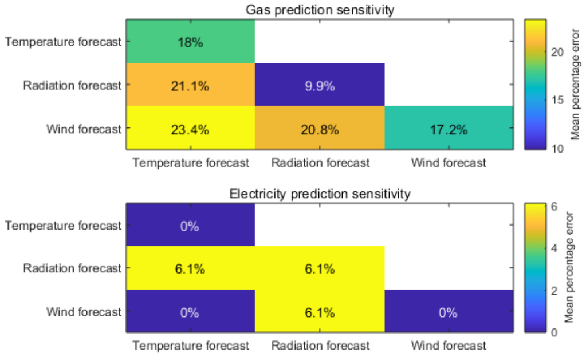  
Fig. 2.10 - A heatmap of the local discrete sensitivities (Eq. 2.19) of the predicted power and gas usage to weather forecast error.

The sensitivity analysis shown in Fig. 2.10 is done using a 48-hour weather forecast. This analysis revealed that the power demand prediction error is most related to the global radiation forecast error. The gas use prediction error is most related to the temperature forecast error, then the wind forecast error and marginally to the global radiation forecast error. Moreover the error in gas prediction is highly sensitive to the second order interactions of errors in forecast variables.

# 2.4. Discussion

This study investigates the role of weather forecast error on greenhouse energy demand prediction and power trading. Additionally this study considers the impact of each forecasted weather variable and how power trading is impacted when using multiple markets. This study uses a method that is not validated as part of this studies analysis but provides novel and relevant insight into the management of energy in greenhouses.

This study explores how weather forecast errors can result in the misprediction of both gas and power demand in a greenhouse. In this specific study, the prediction uncertainty suggests an overprediction of the gas and power demand of the greenhouse. The overprediction of energy demand is linked to the notable negative bias in the temperature and global radiation forecast errors (Figs. 2.5). As a result, the amount of available natural heat and radiation is being consistently underestimated and as a result excess gas and power is being bought to meet this perceived deficit (Fig. 2.6). It should be noted that the overprediction of the greenhouse energy demand in this study is case specific and it is entirely possible for different weather forecasts to produce alternate patterns of misprediction. However this study demonstrates that the effects of misprediction can be large. The analysis also concludes that the cumulative amount of energy being mispredicted increased with the weather forecast prediction horizon length, corroborating the conclusions of (Tap et al., 1996). This is understandable as longer forecasts should become progressively more uncertain. The conclusions made on the volume of the predicted energy demand were made using a winter dataset and have not been extrapolated to the whole year. This is as the winter is the season of the highest use of artificial lighting in practice and requires more power than the rest of the year.

The sensitivities of the energy predictions to weather forecast variables showed that gas prediction is sensitive to wind and temperature forecast error while power prediction is sensitive to the global radiation forecast error (Fig. 2.10). This observation is due to the fact that the global radiation forecast directly influences the need for supplementary artificial lighting and therefore the power demand. Gas is used to provide heat and its demand depends on heat moving through the greenhouse based on the temperature gradient between the inside and outside temperature and the convective energy transported through the greenhouse shell. The dependence of gas use prediction error on the temperature forecast and not the global radiation forecast may be because the dataset used in the study was from a Dutch winter where the ambient radiation levels are low. In summer one would expect that both the outside radiation and temperature would have a large effect on gas demand prediction as solar radiation is a key source of natural heat in the greenhouse. These results were calculated using 48- hour long weather forecasts and as such this assumption excludes how these sensitivities might change over varying weather forecast prediction horizon lengths. While this does provide an opening for future research this study has shown that the broad trends and biases in the weather forecast error are consistent for all horizon lengths. Consequently it is anticipated that the conclusions of this analysis would be broadly consistent for all horizon lengths.

The power trading uncertainty analysis included in this paper offers a number of key insights into how weather forecast error might affect the power trading process and economic efficiency of the greenhouse. Most prominently, the corrective trading of mispredicted power can impact the economic performance of the greenhouse. This impact arises from the fact that although the volume of power being traded in corrective bidding is relatively smaller than the initial trade (Fig. 2.8), the corrective imbalance price is more volatile (Fig. 2.7). This can lead to the grower risking a higher price for their power than if it had been bought correctly in the initial trade. In this way it is better to reduce the impact of weather forecast error to mitigate the risk of volatile short-term prices.

Additionally the power trading analysis confirmed the conclusion of Sigrimis et al., (2001), in that the inclusion of forecast errors increases the operating costs of a greenhouse. Moreover, these costs worsen with the increasing length of the weather forecasts as can be seen by the increase in the mean costs for both the initial and corrective trading (Fig. 2.9). Subsequently shorter weather forecasts would be preferable for minimising error. Interestingly the standard deviation of the initial and corrective power demand decreases as the forecast horizon increases. A hypothesis is that the errors tend to cancel out when summed over longer periods. So a large deviation from the mean is less probable for a long prediction horizon. An analysis should be performed with a larger dataset for more reliable conclusions to be drawn. It should also be noted that the markets used are Dutch and conclusions may vary based on the region of the market used. Another interesting observation is that the standard deviation of the corrective power demand costs (Fig. 2.9) rise to a peak at a 72 hour long forecast and then decreases. This is a potential result of a combination of lower prediction error at shorter forecast lengths and a cancellation of costs at longer forecasts lengths. Indeed, this happened in the corrective costs and not the initial costs as the price distribution for the day-ahead market has a greater bias to positive values, whereas the imbalance price is more centred on zero and takes negative values more frequently, as can be seen in Fig. 2.7.

While this method is simple to apply it calculates the prediction error directly, without the assumptions related to the initial distribution of the weather forecast error that have been used in previous studies (Seginer, van Beveren, et al., 2018; Su et al., 2017b). Thus, the conclusions drawn from this method are inexorably linked to the weather forecast dataset as they are so spatially and temporally specific. While this specificity makes conclusions difficult to generalise it could be done using large or varied forecast datasets and multiple greenhouse models.

Despite this the use of direct comparison of energy predictions in this method means that it can be applied other greenhouse systems and model formats and offer the same analysis. Moreover this method can be applied to data from any place or time and produce relevant insight.

This study does not include outside $\#$ data but assumes it is constant, this presents limitations to the conclusions regarding energy consumption as one use of a CHP is to provide supplementary $\#$ , which in turn is dependent on the outside conditions. The operation of the CHP for this purpose also affects the greenhouse energy demand due to the power and heat that is also produced. The inclusion of outside $\#$ data may offer insight into how the CHP is operated based on motives other than power demand and how that might affect selling surplus power to the grid. As this study is conducted in winter when the demand for supplementary $\#$ is less, it is anticipated that this surplus power will be relatively minor when compared to the power trading discussed in this study.

A limitation of this study is that the economic analysis uses the imbalance market price for the short-term trading of power. While the imbalance price has been used in previous research (van Beveren et al., 2019) it is more common in practice to use the intra-day market price. Despite this limitation the conclusions of this study are relevant as the imbalance and intra-day markets are comparable representations of short-term power prices.

The possible practical consequences of energy demand prediction error and the subsequent power trading are that grower may lose economic efficiency by having to trade on the more volatile short-term markets. These short-term markets are often supplied by immediately accessible power, often originating from fossil fuels. As a result, decreasing the corrective power trading of a greenhouse may also help reduce its carbon footprint. To try and achieve this the weather forecast bias could be accounted for in the energy prediction and energy buying process. This would need to have a highly localised approach as the variations in local climate strongly influence the validity of the global radiation forecast as demonstrated by Doeswijk & Keesman, (2005).

Additionally, the insight from the sensitivity analysis presents an opportunity to improve the data collection and screening process by identifying weather forecast data with errors that disproportionally impact the uncertainty of model prediction. In particular this study’s conclusion that the global radiation forecast is a key cause of power misprediction parallels the importance of accounting for the error in radiation sensors found in Bontsema et al., (2011). This type of insight can drive more efficient energy consumption in the horticultural sector, but also extends to any facility that uses weather forecasts to define its climate and energy buying strategy, such as food storage warehouses and offices.

# 2.5. Conclusion

To conclude, this study investigates the role of weather forecast uncertainty and its effect on greenhouse energy demand prediction and power trading. This was done through the direct comparison of predictions made with weather recordings and forecasts. The economic analysis of power trading was done using multiple markets to quantify the costs more realistically.

This study shows a clear bias in the prediction of gas and power demand to buy more than is necessary when using a weather forecast. This bias is linked to the high sensitivity of the energy predictions to underestimate of temperature and global radiation in the forecasts in this study. The error present in weather forecasts and in greenhouse energy demand predictions do increase with longer weather forecast prediction horizon lengths. The power trading analysis concluded that while the volume of initial trading was greater than the corrective trading, the higher volatility in short term Imbalance market prices can result in higher costs per unit of power. Additionally, the means of the demand and cost of both initial and corrective demand increase with the forecast horizon prediction length. A sensitivity analysis was done on the weather forecast variables and concluded that in the Dutch winter case the global radiation forecasts have the greatest impact on power prediction error ሻ, whereas gas demand prediction is strongly influenced by the wind ሻand outside temperature forecast

# Acknowledgments

We thank Gert-Jan Swinkels of Wageningen Research, business unit Greenhouse Horticulture, for technical support and valuable discussions on using the online version of KASPRO  (de Zwart, 1996; Dieleman et al., 2005; Elings et al., 2006; Luo, de Zwart, et al., 2005; Luo, Stanghellini, et al., 2005) for this study. We would also like to thank the reviewers for the constructive feedback to improve the quality of this paper.

# Chapter 3. Prediction uncertainty of greenhouse electrical power and gas demand: Part 1, The role of parameter uncertainty

# Henry Payne, Eldert van Henten, Simon van Mourik

Published in Biosystems Engineering (2024), 239, pp 35-48   
https://doi.org/10.1016/j.biosystemseng.2024.01.006

# Highlights

An electrical power and gas demand uncertainty analysis was performed.   
. A polynomial chaos expansion was used as part of an uncertainty analysis.   
• The proposed algorithm shows groups of parameters impacting prediction uncertainty.   
• Lamp intensity is the key factor for power and gas demand prediction uncertainty.

# Abstract

Within the modern greenhouse horticultural sector energy usage is planned using mathematical models that simulate the greenhouse’s future performance. These models contain parameters whose values can be inaccurate which create errors in model predictions. This reduces the effectiveness of energy management and planning done using these models. This study proposes and demonstrates an algorithm to quantify the impact of parameter errors on greenhouse gas and electric power prediction uncertainty. The proposed algorithm introduces a Polynomial Chaos Expansion as a method for the sensitivity analysis in the domain of greenhouse horticulture. Contrary to commonly used sensitivity analyses, this approach introduces the analysis of higher order interactions into the domain of greenhouse horticultural research. It was found that for both electric power and gas production the HPS lamp power rating was the most influential individual parameter. Moreover this study found that for power demand the uncertainty in parameters relating to the lamp system were far more impactful than those related to the crop or greenhouse structure, with a respective coefficient of variation of $2 4 \%$ , $5 \%$ and $5 \%$ . This study makes a notable and novel conclusion that for parameters related to the greenhouse structure, larger groups of parameters were responsible for prediction uncertainty through higher order interactions of second to sixth order. These results reinforce the importance of future greenhouse research considering the impact of higher order parameter interactions on prediction uncertainty using the algorithm proposed in this study.

# 3.1. Introduction

Growers in the modern greenhouse horticulture sector use computerised decision support systems to aid in the electrical power and gas buying processes. This is done by predicting the greenhouse’s future electrical power and gas demand using a mathematical model of the greenhouse and forecasted weather data. However, these predictions are vulnerable to errors that are introduced through inaccuracies in the parameter values of the model.

The exact value of a parameter is often unknown. If we estimate the parameter value it is likely to contain some errors. When these parameters are used for model predictions their errors translate into errors in the predictions. As the values of these errors are unknown the true values of these parameters are uncertain, which leads to uncertainty in the predictions. In practice uncertainty in the predictions can result in the misprediction and mis-buying of power and gas, which can result in financial loss for the grower and unnecessary energy consumption.

This insight allows for the targeted improvement of model parameter and input data used in decision support tools. Any improvement in the accuracy of model parameters and input data would in turn create more accurate predictions of greenhouse electrical power and gas demand, which would lead to more efficient electrical power and gas buying by the grower. On a societal level this gained energy efficiency from greenhouse horticulture would cause a sizable decrease in the Dutch national electrical power demand, which in turn would result in less total electrical power generation, gas demand and a decrease in $\#$ emissions.

Previous research in greenhouse horticulture has included the impact of parametric uncertainty in greenhouse modelling. For example, (Lo pez-Cruz, Martí nez-Ruiz, Ruiz-García , & Gallardo, 2020; Lo pez-Cruz, Ruiz-Garcí a, Ramí rezArias, & Va zquez-Pen a, 2013), performed a parametric uncertainty analysis on the uncertainty of a predicted greenhouse lettuce growth. (Cooman & Schrevens, 2006) performs a similar analysis but uses an individual Monte Carlo sample for each tomato crop model parameter. Cooman concluded that the light and $\#$ use efficiency of the crop are key parameters in propagating uncertainty into the predicted fruit dry weight. (Schrevens, Jancsok, & Dieussaert, 2008) assesses the impact of crop parameter uncertainty on the dehumidification and electrical power demand of a greenhouse and concluded that the uncertainty in crop parameters had little effect on the uncertainty of the predicted power demand.

These studies have mainly focussed on the role of parametric uncertainty within the greenhouse crop model parameters. However, there is a knowledge gap pertaining to the effects of greenhouse climate and energy model parameters on greenhouse electrical power and gas demand prediction.

A few studies considered parametric uncertainty in the context of energy demand. For example (Golzar, Heeren, Hellweg, & Roshandel, 2018) performed a sensitivity analysis on the climate setpoints and found a trade-off between crop yield and energy demand whereby large energy savings could be made but at the expense of a slightly lower crop production. (Vanthoor, van Henten, et al., 2011) performed a similar analysis on the effect of errors in the weather, greenhouse design parameters and set points on boiler energy demand and crop growth. This was done using a normalised derivative-based sensitivity index for the individual or first order effect of parameters and a meta-model based approach for the combined effects of parameter pairs, also known as second order effects. Vanthoor’s study highlighted the importance of glass PAR and FIR transmission properties as well as outdoor radiation levels for growth and energy predictions. However, in both of these cases the analysis considered the overall energy demand of the greenhouse and does not consider the impact on the constituent gas and electrical power demand that make up a greenhouse energy demand and only considered a system with a boiler. As a result, there is a clear opportunity to explore the impact of model parameter uncertainty on an operational level where gas and electrical power demand can be managed separately.

Although a number of studies have proposed methods to assess the impact of multiple sources of prediction uncertainty. These methods rely on sampling these sources which can become computationally intractable with a large number of parameters or data streams. This makes many of these methods unsuitable due to the large number of parameters associated with greenhouse models. To mitigate these issues previous studies have performed uncertainty analyses using a meta-model based approach to attribute the sources of uncertainty to a large number of parameters and the interactions between parameters (Blatman & Sudret, 2011). This was done using a polynomial chaos expansion (PCE) based meta-model, where the Sobol sensitivity indices of each parameter were analytically calculated from the coefficients of the meta-model (Mara & Becker, 2021; Sudret, 2008).

While previous parameter uncertainty analyses have been conducted in greenhouse horticulture as detailed above, in all of these studies the number of analysed parameters were only a small fraction of the total number of parameters used within these models, leaving a gap for an algorithm that systematically considers a larger number of relevant parameters in an uncertainty analysis using a method such as PCE. Furthermore, the application of PCE would allow the assessment of the combined effects of groups of parameters. Additionally, while previous research has focused on predicting crop growth and energy demand, there is a gap in the literature for an uncertainty analysis that applies to the prediction of electrical power and gas demand.

To address the research gaps detailed above, this study proposes an algorithm inspired by the methodologies described in the aforementioned literature. This algorithm combines a Latin Hypercube sampling approach, parameter prescreening that considers all model parameters, and a PCE-based sensitivity analysis to allow for an analysis of the variance in energy predictions. This PCE analysis is preferable as it efficiently attributes prediction variance to errors present in a large set of model parameter on both an individual parameter level and collectively via higher order sensitivity indices that are calculated from the PCE. The proposed uncertainty algorithms were applied on a Dutch tomato growing greenhouse use case to identify the comparative roles of different model parameters on the prediction of electrical power and gas usage.

# 3.2. Materials and Methods

This study proposes and demonstrates an algorithm for the analysis of greenhouse power and gas demand prediction uncertainty that arises from parametric uncertainty. The following sections (3.2.1-3.2.2) describe the greenhouse model and weather data used to demonstrate the algorithm described in this study. The algorithm is described in section 3.2.3 and is then applied to three use cases, the results of which are described in section 3.3. It should be noted that for the remainder of this study electrical power will be referred to as power.

# 3.2.1. Greenhouse model

The greenhouse climate, tomato crop and energy model being used was Greenlight (Katzin et al., 2020), which is a calibrated, open source model. Greenlight is a dynamic differential equation-based model which emulates a tomato growing Venlo type greenhouse. The model receives input from weather data of the outside temperature, wind speed, radiation, vapour density and  concentration. The model predicts the greenhouse indoor climate states, which are the indoor air temperature, vapour concentration, ambient radiation and  concentration. In addition, Greenlight predicts the power and gas demand of the greenhouse and the growth of the tomato crop within the greenhouse. The model was parametrised for Bleiswijk in the Netherlands. This study used a rule-based control scheme that is based on the current industry standard and was originally described by (Vanthoor, Stanghellini, van Henten, & de Visser, 2011). Due to the importance of the gas and power demand we have included a brief description of their corresponding equations. The power demand $\mathbf { 9 }$ $^ { 7 } \neq$ ଶሻwas calculated as the product of the power rating of the HPS lamps ( ୟ)୶and the degree of actuation of the HPS lamps (୐ ୟ),୲w୧h୭e୬re 0 is no lighting and 1 is full lighting. Accordingly $\mathbf { 9 }$ i୬sୢdefined as

# ୔

# ή୐

The formula for gas demand ୋ ሺୢଷή•ିଵޏ was defined as the amount of energy used by both the boiler $( \pmb { \mathscr { s } }$ ୰)୥a୷nd CHP $( \pmb { 9 }$ ୰) generator in watts per square meter, divided by the energy content per cube of gas a୥s୷defined by Vermeulen, (2008), where ሺ $\neq$ ଷሻ.  Accordingly

# 3.2.2. Weather data

The recorded weather data used was taken from a weather recording station in Bleiswijk, the Netherlands from 2018-01-01 00:00 to 2019-01-01 00:00 at 5- minute intervals. The recorded weather data variables are the outside temperatureሺԨሻ, wind speed $\neq \geq$ ଵሻ, direct solar radiation $^ { 7 \neq }$ ሻand outside relative humidity (Ψ). The outdoor $\#$ concentration for both the weather forecast and recordings was assumed to be constant at 410 $( \infty \infty ) \neq 1 1$ addition, the cloudiness index (CI) was fixed to the average of the period $\operatorname { C I } =$ 0.7) and the sky temperature  and levels of diffuse radiation  were estimated using the available climate variables and according to the respective methods proposed in (Luo, de Zwart, et al., 2005) and (Orgill & Hollands, 1977). Any missing entries in the datasets were filled with the linearly interpolated values of the adjacent data points. For the purposes of demonstrating the algorithm presented in this paper in a way that is computationally tractable this study focussed on a simulation period of 2018-03-01 00:00:00 to 2018-03-15 00:00:00.

# 3.2.3. An algorithm to compute how parameter uncertainty propagates into prediction uncertainty

In this study the propagation of greenhouse model parameter uncertainty into greenhouse power and gas demand prediction uncertainty was investigated. This was done using an algorithm whose steps begin with a pre-selection of any parameters that are not relevant to this analysis. Then the distributions of each parameter that remains were defined. These parameters were then grouped into subsets of parameters that were linked by processes they are related to. For each of these subsets of parameters, sampled values were taken from each parameter distribution and were used to calculate the predicted greenhouse energy demand. This predicted energy demand was then compared with the prediction that was made with the nominal parameter values to calculate the prediction error that arose from sampling these parameters. This was then repeated until the full number of samples has been drawn. A PCE analysis was then performed using the sampled parameter values and the corresponding energy demand prediction error. These steps are then repeated for each subset of parameters.

Once this has been done the parameters that were found to be sensitive in each subset were used to form a new subset. This was done to investigate any combined effect that may exist between the most sensitive parameters of all of the parameter subsets. This new subset was then sampled and used for energy predictions and a PCE analysis in the same fashion as has been previously described. Having done this the final PCE will give a measure of contribution to energy demand prediction uncertainty from each parameter and combination of parameters. Crucially this algorithm proposes a structure way to consider all parameters within the model and arrive at a computationally tractable set of uncertainty indices.

The steps of a this algorithm are shown in Fig. 3.1 and applied in three use cases. In the first use case 3 subsets of model parameters and their influence on power demand prediction uncertainty is examined. In the second use case a subset of these model parameters is taken to examine its influence on greenhouse gas demand prediction uncertainty. In the third use case the two most sensitive parameters from the previous two use cases is taken and used to perform an analysis on both gas and power demand prediction uncertainty. The steps for the algorithm used in each of these use cases are described in detail in the following subsections and for a clear overview is displayed diagrammatically below in Fig. 3.1 in the form of a block diagram.

2.3.1: Define model parameter   
distributions and experimental   
settings   
- Set the maximum numberof   
samples $( q _ { m a x } )$   
- Set the maximum number of   
parameter sets $( n _ { m a x } )$   
2.3.2:Initial parameter pre-selection   
(0)and set formation $n = n + 1$   
2.3.2: Select a parameter subset (n)   
and set q to zero $q = q + 1$   
2.3.3:Calculate power prediction   
error (eP,RMs,n   
- Generate parameter sample $\left( \theta _ { q } ^ { n } \right)$   
-Simulate greenhouse power   
demand $\left( Y _ { q } ^ { n } \left( h , \theta _ { q } ^ { n } , u ^ { R } \left( h \right) \right) \right)$   
- Calculate energy demand error   
(eP,RMS.n) No Isq≥qmax? Yes   
2.4:Analysis of prediction variance   
$\left( \varepsilon _ { q } ^ { P , R M S , n } , \theta _ { q } ^ { n } \right)$ Is n ≥ nmax? No Yes   
2.5: Form an augmented subset of the   
most sensitive paramters from the   
previous subsets (0)   
2.5:Perform steps in section 2.3.2   
to 2.5 using the augmented parameter   
subset end

This algorithm contains two loops.  The first loop iterates through each subset of parameters ሻup to the number of parameter subsets per use case (ܖܕ܉)ܠ. The second loop iterates through the parameter sample until the sample size ሻis reached.

# 3.2.3.1. Model parameter distributions

The parameters were modelled as truncated normal distributions in which each parameter distribution ( $\otimes$ was defined as the product of a uniform distribution $( \infty )$ and a normal distribution $( \infty )$ . The normal distribution $( \infty )$ defined the statistical distribution of values for each parameter, and a uniform distribution $( \infty )$ that sets limits to prevent extremely small and large sample values. As a result each parameter had an associated distribution †with a mean (Ɋ), standard deviation (ɐ) and an upper and lower limit ( ୳) such that $\lessgtr$ where

was a uniform distribution with finite lower and upper bounds and that truncates a normal distribution $\infty$ which was defined as,

denotes a normal distribution with a mean set at the parameters nominal value such that

and 3 standard errors was set to $1 0 \%$ of the mean, so the standard deviation is

Each of the model parameterwas assumed to be independently distributed from any other parameter.

# 3.2.3.2. Initial parameter pre-selection

The algorithm includes a pre-selection process from the full set of model parameters, then a metamodel based sensitivity analysis was done using a selected subset of parameters. A pre-selection process was done to reduce the number of relevant parameters as the application of uncertainty analysis methods on large models like Greenlight is computationally intensive. This is because sampling models with a large number of parameters require a large number of samples to cover all the possible combinations (Vazquez-Cruz et al., 2014). This pre-selection process was performed using a series of rules to exclude model parameters from the full sample set that were not relevant for this study. Parameters that met any one of the following criteria were discarded from the analysis:

The model parameter is related to an unused section of the model.   
The model parameter does not contain uncertainty.   
The model parameter is a climate set point.   
The model parameter is not related to the process involved in the power generation, light physics or heating in the greenhouse.

Parameters relating to the greenhouse’s power generation, light physics and heating were selected to demarcate the study’s scope and as the study only focusses on the prediction of power and gas demand. The key process contributing to power demand is the power demand of the lighting, so the processes that are related to the artificial lighting in the greenhouse were included. Furthermore, the process of indoor heating consumes a large amount of gas. For the use case analysing gas demand prediction uncertainty this study focusses on the parameters relating to the greenhouse heating system.

The parameters that were selected were then apportioned into four subsets where each subset is related to a specific operation that is simulated in the greenhouse model. This was done to highlight the sensitivity of different processes in the greenhouse as well as the parameters themselves and to reduce the computational intensity of the analysis by subdividing the parameters into relevant groups. The following subsets were used in this study:

1. Power demand and greenhouse structure related parameters   
2. Power demand and HPS lamps related parameters   
3. Power demand and crop related parameters   
4. Gas demand and heating related parameters

These subsets of parameters were then assigned to a use case that focussed on either power or gas demand prediction. The first three parameter subsets are related to power demand prediction uncertainty and are used in the first use case. The fourth parameter subset is related to greenhouse gas demand and is used in the second use case. These two use cases are analysed and the parameters that were found to be sensitive were combined into a third use case that analyses the combined impact of these sensitive parameters on both gas and power demand prediction.

After this pre-selection process was completed, each subset of model parameters was included in an analysis of variance. This was done by drawing a Latin Hypercube (LH) sample (Eq. 3.5) from the selected parameters and using this to simulate the resulting prediction error when compared to predictions made with nominal parameter values. For simplicity the mean value of each parameter was set as its nominal value as in Eq. 3.3. For the remainder of the study, steps in the algorithm that can be interchangeably applied to the analysis of both gas and power demand will be referred to using the collective term energy in place of either power or gas.

# 3.2.3.3. Calculation of energy demand prediction error

Initially a subset of parameters (Ʌ୯୬) was selected using the index where 

Ǥ୫ୟ.୶This subset of parameters was then sampled, where “is the index of the sample, this sample was taken from the distributions of each parameter where ሺŒǡ ሻwhere Œis the index of each parameter. These samples were taken using a Latin Hypercube sampling method, resulting in

where ୮ୟ i୰s the number of parameters. Time was discretised to hourly time instances Šwith $\textcircled{8}$ ൌ $\textcircled{8}$ Ǥ $\textcircled{8}$ where $\textsuperscript { \textregistered }$ is the starting index and $\textcircled{8}$ is the final index. The predicted energy demand of the greenhouse was defined as $\Lsh$ where is a function of the initial time $\circledast ,$ , the time step of the simulation $\textsuperscript { \textregistered }$ the parameter values of the model Ʌand the uncontrolled weather input to the model —. Each set of sampled parameter values ɅǤand the recorded weather — was used to run the model and predict the energy demand ${ \ 9 \circledast \circledast \mid \bf \Xi \mit  \mit \Xi  \bullet \mit \circledast \mit \circledast  }$ ሻ. The nominal predicted energy demand ${ \ 9 \circledast \circledast \mid } \approx$ ቁwas used as a base reference and was calculated using the nominal parameter values Ʌത(table 2.3). Subsequently the prediction error and its root mean squared error were then calculated for each parameter sample “where

<html><body><table><tr><td>A±? ? μ? 9®® μ? 9@? μ ? and</td></tr><tr><td>A±? μ A±? ? μ?</td></tr></table></body></html>

For each parameter subset , ɅǤis the set of samples for all the parameters in the subset and the corresponding set of root mean squared error ( ) are then used to perform an analysis of the prediction variance.

# 3.2.4. Analysis of prediction variance

The analysis of variance within this study was performed using a Polynomial Chaos Expansion based sensitivity analysis and a coefficient of variation-based uncertainty analysis which are detailed below.

# 3.2.4.1. Polynomial Chaos Expansion based global sensitivity analysis

Due to the large number of greenhouse model parameters, a sampling-based approach to a global sensitivity analysis would require a large number of samples to accurately assess the prediction variation resulting from all possible combinations of parameter values. For example, an uniform discretisation of a parameter space of N points per parameter would need  samples, with being the number of parameters. Given this, if hypothetically  Ͳand  Ͳthe number of samples required is Ͳ. This requirement means that a samplingbased approach is computationally intensive and ultimately computational intractable.

To avoids these issues and conduct a sensitivity analysis on the large number of model parameters, a polynomial chaos expansion (PCE) based sensitivity analysis was conducted. A PCE is a form of meta-model and allows for greater computational efficiency when compared to a conventional sampling-based analysis. This is as parameter samples are used to calibrate the meta-model and the Sobol sensitivity indices can be calculated analytically from the coefficients of the meta-model (Sudret, 2008).

For the algorithm described in section 3.2.3, the variance in the energy demand prediction error was decomposed and attributed to the respective input parameters used in each parameter subset. Sobol $1 ^ { \mathrm { s t } } , 2 ^ { \mathrm { n d } }$ and total order indices (Archer et al., 1997; Sobol, 1993) were used as the metric of variance in the variance decomposition.

The PCE used in this study for each subset was in the form of a deterministic   
model and can be described as a polynomial. This model was calibrated using and the corresponding parameters samplesɅ୬Ȉ.  Accordingly this model   
described the relationship between a set of model parameters ሺ୮ୟሻ୰,ሿand the approximated energy demand error ୗsuch   
that

This PCE is formed of a series of multivariate polynomials (Ȳ) and coefficients (…) whose basis functions are based on Hermite polynomials. Each univariate component of the PCE is considered to be orthogonal each other. The PCE terms are described using the index ‹ୱwhere • Ǥǡ୮ୟ,୰and are used to group terms that represent every possible combination of parameters. The PCE can subsequently be described as a series of summations that collect the terms relating to the impact and interactions of model parameters Ʌ. These summation terms describe the collection of PCE terms relating to the impacts of groups of parameters of different sizes such that,

Here ౨is a $\mathscr { E }$ ୟ-୰dimensional index representing the entire parameter space. The terms of the PCE are collected into groups using a subset Ԅ୧which denoted a subset of terms related to parameters which are defined in its subscript .‹This series of summations collect terms that relate to the mean (…଴) and the impact of groups of parameters, where the second term denotes the first order impact of parameters $\circledcirc$ . The third term relates to the second order impact of any pair of parameters whose index is described using ‹ଵand $\circledcirc$ The fourth term relates to the higher order impact of any number of parameters $\begin{array} { r l } { ( \odot } & { { } \odot } \end{array}$ and the fifth term is the total order impact of all the parameters where the index is from 1 to $\mathscr { E }$ ୟ.

The polynomials used in this PCE were constructed using Hermite polynomials, whose coefficients (…) were calculated with the sparse-favouring least-square minimization least angle regression (LARS) method (Efron et al., 2004). Using LARS was shown to be advantageous as it greatly improved overall computational efficiency by using an iterative method to only identify the PCE coefficients relating to the impactful parameters (Blatman & Sudret, 2011).

The method used in this study also included a degree-adaptive calculation of the order of the polynomials as part of the meta-model calibration process. The degree range is set from 1 to 10 degrees. This method iteratively increased the degree of the PCE polynomials, assessed the a-posteriori cross-validation error using a leave-one-out error metric and selecting the degree of polynomial that has the lowest error. This study used a proposal range of one to ten degrees within which the optimal polynomial degree was found.

The Sobol sensitivity indices were derived from the coefficients of the metamodel (…஑) as described in (Sudret, 2008). The first order Sobol indices $^ { 3 }$ ሻfor each parameter were defined as the fraction of prediction variance that can be attributed exclusively to a single parameter (Ʌ୧ሻover the total variance in the PCE. The total variance of the PCE prediction was calculated as

Subsequently the first order sensitivity ( $^ { \cdot } { \_ { 3 } }$ ୧)for each parameter was calculated

In which the numerator of the first order Sobol indices was defined as the square sum of a subset $( \pmb { \ ! } )$ of the non-zero terms which include coefficients ሺ…஑ሻand bases (Ȳ஑) relating exclusively to parameter Ʌ୧. The total order Sobol indices ሺ୧୘ሻwere defined as

Where the total order sensitivity indices is the sum of a subset of sensitivity coefficients $( 3 )$ that relate exclusively to parameter Ʌ୧or having any interactions with Ʌ୧at any order of basis function in the polynomial.

# 3.2.4.2. Coefficients of variation

In addition to the Sobol indices, the coefficients of variation ሻwere used to compare the variability of the energy prediction uncertainty created by each subset of parameters, where

# 3.2.5. Combined parameter subset

Following the analysis of all four parameter subsets, the two most sensitive parameters found in each subset were then combined into a new subset and analysed using the steps describes in section 3.2.3.3 and 3.2.4.1. For this subset of parameters both predicted electrical power and gas demand were considered.

# 3.3. Results

The algorithm proposed in this study is now demonstrated in three use cases using a model that describes a Dutch tomato producing greenhouse. The outcomes of the use cases below demonstrate in which areas uncertainty reduction can be most effectively applied to ensure accurate greenhouse power and gas demand prediction. According to the algorithm described in section

3.2.3, initially the full set of 242 parameters in Greenlight were reduced to 36 viable parameters (table 3.1) using the pre-selection criteria. The full set of parameter descriptions can be found in (Katzin et al., 2020) and the full preselection process is detailed in the supplementary material. This document details how the pre-section criteria was applied to the complete dataset and how the subset of accepted parameters was reached.

<html><body><table><tr><td colspan="6">Table 3.3: Pre-selection of accepted parameters</td></tr><tr><td></td><td>Full In active Uncertain Not</td><td></td><td>Associated</td><td>Associated Accepted</td><td></td></tr><tr><td rowspan="3"></td><td>set module constants climate</td><td></td><td>with power</td><td>with</td><td></td></tr><tr><td></td><td></td><td>setpoint & Lighting</td><td>heating</td><td></td></tr><tr><td></td><td></td><td></td><td></td><td></td></tr></table></body></html>

The 36 parameter that were accepted in the pre-selection were then apportioned into four subsets and assigned to two use cases relating either to power or gas demand prediction uncertainty. The number of accepted parameters (୮ୟ)୰per subset () and their associated use case can be seen in table 3.2.

<html><body><table><tr><td colspan="4">Table3.2: Use casesand subsetsof accepted parameters</td></tr><tr><td colspan="3">Greenhouse power demand uncertainty use case</td><td>Greenhouse gas demand uncertainty use case Gas demand and heating</td></tr><tr><td>Power structure related</td><td>Power demand Power demand and and HPS lamps demand related parameters parameters</td><td>and crop related parameters</td><td>related parameters</td></tr></table></body></html>

The following subsections address each use case in turn focussing first on the power demand uncertainty, then gas demand uncertainty and then the combined gas and power demand uncertainty.

# 3.3.1. Computational settings

For the application of the algorithm proposed in this study the following settings are used, ， ͲanͲd

# 3.3.2. Greenhouse power demand uncertainty use case

The parameters used for the greenhouse power demand uncertainty use case are described below in table 3.3. This table details which parameter subset each parameter is assigned to, each parameter mean, standard error (as defined in section 3.2.3.1), range of possible values and literary reference.

Table 3.3: Definition of model parameter distributions   

<html><body><table><tr><td colspan="5">Power demand and greenhouse structure related parameter subset</td></tr><tr><td>Parameter name</td><td>Distributi on range</td><td>Mean</td><td>Standard Units error</td><td>Mean value reference</td></tr><tr><td>Ratio of global radiation absorbed</td><td></td><td></td><td></td><td>(Vanthoor, Stanghellini, et al., 2011)</td></tr><tr><td>by the greenhouse construction</td><td></td><td></td><td></td><td>(Vanthoor,</td></tr><tr><td>NIR reflection coefficient of the roof</td><td></td><td></td><td></td><td>Stanghellini, et al., 2011) (Vanthoor,</td></tr><tr><td>PAR reflection coefficient of the</td><td></td><td></td><td></td><td></td></tr><tr><td>roof NIR transmission</td><td></td><td></td><td></td><td>Stanghellini,</td></tr><tr><td>coefficient of the roof</td><td></td><td></td><td></td><td>et al., 2011) (Vanthoor, Stanghellini, et al., 2011)</td></tr></table></body></html>

<html><body><table><tr><td>PARreflection</td><td>(Vanthoor,</td></tr><tr><td>coefficient of thermal screen</td><td>Stanghellini, et al., 2011)</td></tr><tr><td></td><td></td></tr><tr><td>NIR transmission</td><td>(Vanthoor,</td></tr><tr><td>coefficient of</td><td>Stanghellini,</td></tr><tr><td>thermal screen</td><td>et al., 2011)</td></tr><tr><td>PAR transmission</td><td></td></tr><tr><td>coefficient of</td><td>(Vanthoor, Stanghellini,</td></tr><tr><td>thermal screen</td><td>et al., 2011)</td></tr><tr><td></td><td></td></tr><tr><td>NIR reflection</td><td></td></tr><tr><td></td><td>(Vanthoor,</td></tr><tr><td>coefficient of the</td><td>Stanghellini,</td></tr><tr><td>floor</td><td>et al., 2011)</td></tr><tr><td></td><td></td></tr><tr><td>PAR reflection</td><td>(Vanthoor,</td></tr><tr><td>coefficient of the</td><td></td></tr><tr><td></td><td>Stanghellini,</td></tr><tr><td>floor</td><td>et al., 2011)</td></tr></table></body></html>

Power demand and HPS lamps related parameter subset   

<html><body><table><tr><td>Parameter name</td><td>Distributi on range</td><td>Mean</td><td>Standard error</td><td>Units</td><td>Mean value reference</td></tr><tr><td>Maximum</td><td></td><td></td><td></td><td>7</td><td>(Katzin et</td></tr><tr><td>intensity of lamps</td><td></td><td></td><td></td><td></td><td>al., 2020)</td></tr><tr><td>Fraction of lamp</td><td></td><td></td><td></td><td></td><td>(J. A. Nelson</td></tr><tr><td>input converted to PAR</td><td></td><td></td><td></td><td></td><td>& Bugbee, 2014)</td></tr><tr><td></td><td></td><td></td><td></td><td></td><td></td></tr><tr><td>Fraction of lamp input converted to</td><td></td><td></td><td></td><td></td><td>(J. Nelson & Bugbee,</td></tr><tr><td>NIR</td><td></td><td></td><td></td><td></td><td>2015)</td></tr><tr><td></td><td></td><td></td><td></td><td></td><td></td></tr></table></body></html>

<html><body><table><tr><td>Trans Issivityof lamp layer to PAR</td><td></td><td>deZwartet al., 2017)</td></tr><tr><td>Reflectivity of lamp layer to PAR</td><td></td><td>(de Zwart et al., 2017)</td></tr><tr><td>Transmissivity of lamp layer to NIR</td><td></td><td>(de Zwart et al., 2017)</td></tr><tr><td>Reflectivity of</td><td></td><td>(Katzin et</td></tr><tr><td>lamp layer to NIR Lamp area</td><td>↑</td><td>al., 2020) (de Zwart et</td></tr><tr><td></td><td>↑ 1''Q!</td><td>≠( al.,2017)</td></tr><tr><td>Emissivity of topside of lamp</td><td></td><td>(Katzin et al., 2020)</td></tr><tr><td>Emissivity of bottom side of lamp Joules to</td><td></td><td>(Katzin et al., 2020)</td></tr><tr><td>micromole</td><td></td><td>≠Q"- (J. Nelson & O ！2 Bugbee, 2015)</td></tr><tr><td>conversion of PAR output of lamp</td><td></td><td></td></tr><tr><td></td><td> Units</td><td></td></tr><tr><td>Power demand and crop related parameter subset</td><td>Mean Standard</td><td></td></tr><tr><td>Parameter name</td><td>Distributi on range error</td><td>Mean value</td></tr></table></body></html>

<html><body><table><tr><td>PAR extinction coefficient of the</td><td>(Vanthoor, Stanghellini,</td></tr><tr><td>canopy for light reflected from the</td><td>et al., 2011)</td></tr><tr><td>floor</td><td></td></tr><tr><td>NIR extinction</td><td>(Vanthoor,</td></tr><tr><td>coefficient of the</td><td>Stanghellini,</td></tr><tr><td>canopy</td><td>et al., 2011)</td></tr><tr><td>Maximum capacity</td><td>(Vanthoor,</td></tr><tr><td>of the crop buffer</td><td>Stanghellini, et al., 2011)</td></tr></table></body></html>

In accordance with the algorithm set out in section 3.2.3 each subset of parameters had 1000 samples drawn. These sampled parameter values of each subset were used to predict the greenhouse power demand for the purpose of an uncertainty analysis. The results from each subset of parameters are described below.

# 3.3.2.1. Results for the power demand uncertainty analysis use case using the greenhouse structure related parameter subset

To assess the sensitivity of the predicted greenhouse power demand a PCE based sensitivity analysis was performed using the model parameter sample from the greenhouse structure related parameter subset and the corresponding greenhouse power demand prediction error. The predicted power demand error was found to have a CV of $5 . 1 \%$ . The corresponding first order and total sensitivity indices are presented in Fig. 3.2.

1 Total order indices 0.9 Firstorder indices 0.8 u.I. B Q Rr AR ret R Rrer Ries tran Rtan Rres 2 e

Fig. 3.2 shows that for the structure related parameter subset all parameters do impact the variation in the prediction via the total order indices. However, none of the included parameters are found to have a first order effect, meaning no single parameter was found to be individually responsible for variation the predictions. Instead this PCE analysis predicts that the variation in the predictions are only attributed to larger groups of parameters via higher order interactions of second to sixth order which implies errors amplify as they interact dynamically. The indices for these higher order effects can be seen in table 3.4. This insight along with the low coefficient of variation indicate that while these parameters do produce a small amount of prediction variation no one parameters is notably impactful.

The two parameters with the greatest total order indices (Fig. 3.2) are a௢n௥d ௢. T௙he most sensitive parameter i௢s௥used to calculate how much radiation is reflected from the floor. Subsequently the amount of radiative energy absorbed by the floor was calculated and then how the floor temperature changes. This change in floor and crop canopy temperature influences the air temperature via latent heat exchange. The air temperature is used to control the lamps, which in turn affects the power demand of the greenhouse. The second most sensitive parameter ௢i௙s the reflection coefficient of the glass. d௙etermines how much radiation is being reflected and transmitted through the glass, cover and blackout screen. Then

i௙nfluences how much radiation reaches the thermal screen, top compartment, pipes and floor. As such these states describe how much heat from the sun is transferred to the aforementioned components and then to the indoor air. The air temperature is then used to control the lamps and therefore influences the power demand.

The analysis of this subset reveals that parametric uncertainty propagates into the indoor air temperature state through the absorption and transmission of radiative heat by the structure. The indoor temperature then influences the temperature-based lamp lighting rule set, which in turn affects the power demand. Overall, it can be concluded that uncertainty in the parameters related to the structure has a small net impact on prediction uncertainty. However, the design of the controller, particularly the air temperature-based rule, allows the propagation of uncertainty into greenhouse power demand prediction.

<html><body><table><tr><td colspan="2">Table 3.4:Higher order sensitivity indices from the power demand uncertainty analysis use case using the greenhouse structure related</td></tr><tr><td>parametersubset Parameter names</td><td>Second order indices</td></tr><tr><td></td><td></td></tr><tr><td></td><td>Third order indices</td></tr><tr><td></td><td></td></tr><tr><td></td><td>Fourth order indices</td></tr><tr><td></td><td></td></tr><tr><td></td><td>Fifth order indices</td></tr><tr><td></td><td></td></tr><tr><td></td><td>Sixth order indices</td></tr><tr><td></td><td></td></tr></table></body></html>

# 3.3.2.2. Results for the power demand uncertainty analysis use case using the HPS lamps related parameter subset

Performing the analysis using the HPS lamps related parameter subset and the corresponding predicted power demand produced a PCE, the power demand predictions used to calculate this PCE had a CV of $2 4 \%$ . The resulting first and total order sensitivities can be seen in Fig. 3.3.

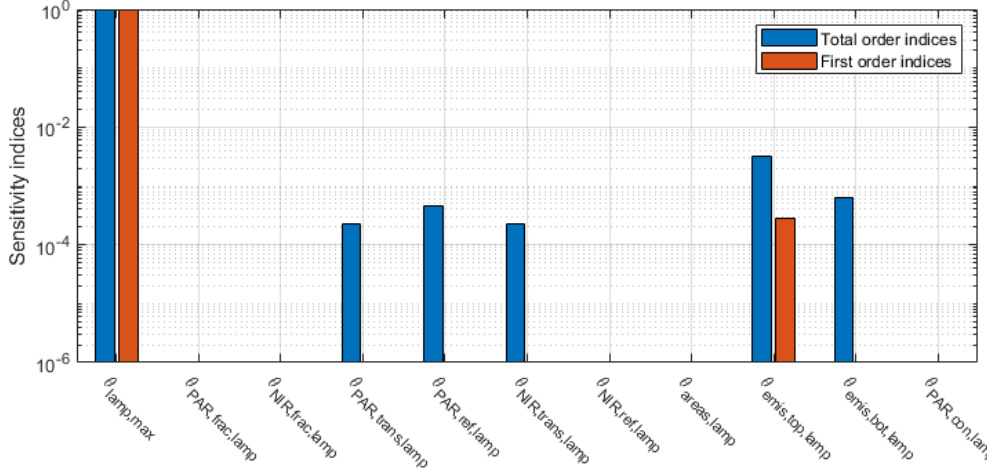  
Fig. 3.3 - First and total order sensitivity indices from the power demand uncertainty analysis use case using the HPS lamps related parameter subset on a logarithmic scale.

For the HPS lamps related parameter subset the parameter relating to the maximum intensity of the HPS lamps ( ௫) was by far the most impactful on power demand prediction uncertainty, accounting for nearly all of the variation in the predicted power demand. This result is understandable as the power demand of the greenhouse is almost entirely from operating the lamps, and by changing their power rating the total demand changes. In addition, the power rating of the lamps influences the amount of heat energy the lamps transfer into the greenhouse. As such also influences the air temperature and consequently the control dynamics. The parameter with the second largest impact was ௣ǤThis parameter is related to what fraction of the radiation from the lamps is emitted above the lamps. This radiation interacts with the greenhouse screen, cover and is transmitted into the sky, in doing so influencing lamp, screen and indoor air temperature. A change in air temperature influences the temperature-based rules controlling the lamps and subsequently the power demand.

While other parameters are found to have some impact, these impacts are small in comparison to the role of .௫The PCE did predict a number of second order effects in which a pair of parameters was found to have a role in creating prediction uncertainty. The 5 largest second order indices can be seen in table 3.5.

<html><body><table><tr><td colspan="2">Table 3.5: Second order sensitivity indices from the power demand uncertainty analysis use case using the HPSlampsrelatedparametersubset</td></tr><tr><td>Parameter names</td><td>Second order indices</td></tr><tr><td></td><td></td></tr></table></body></html>

The second order sensitivities shown in table 3.5 are all of small orders of magnitude when compared to the other sensitivity indices that range between 0 and 1, the largest of which is the combined influence of the ௫and the emissivity of the top of the lamp ௠.௣This combined effect is logical as the maximum intensity of the lamp influences the amount of radiation that can be transmitted upwards. These combined effects influence the air temperature and as previously described propagate into the control dynamics and the power demand. The remaining second order sensitivity indices reflect the combine impacts of the upper ௣and lower ௣emissivity of the lamps and how the lamp radiation is transmitted and reflected from the cover.

# 3.3.2.3. Results for the power demand uncertainty analysis use case using the crop related parameter subset

The third parameter subset in the power demand use case was related to the parameters used in the crop model. The power demand predictions used for this PCE had a CV of $5 . 1 \%$ . The first and total order sensitivity indices for this subset are displayed below in Fig. 3.4.

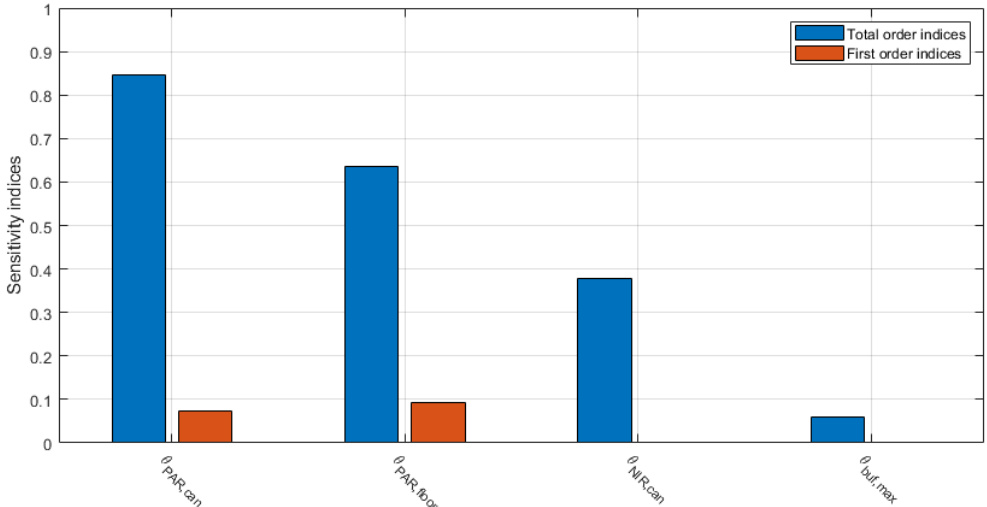  
Fig. 3.4 - First and total order sensitivity indices from the power demand uncertainty analysis use case using the crop related parameter subset.

The analysis performed on the crop related parameter subset show that parameters in the crop model do influence the predicted power demand uncertainty and that the magnitude of this influence is comparatively small given the low value of the coefficient of variance. This outcome highlights the impact of the parameters relating to the PAR extinction coefficient of the crop’s canopy from above ( ௔)௡and below ( ௢).௢T௥he parameter i௡s used to calculate how much downwards lamp radiation is absorbed by the crop canopy. This is then used to calculate the amount of heat that the incoming radiation contributes to the air temperature through the canopy temperature, which as in the previous cases influences the control of the lamps. The parameter is used to calculate how much lamp radiation is absorbed by the crop that is reflected from the floor and how this affects the temperature of the air. The analysis also provided two second order indices that are displayed below in table 3.6.

<html><body><table><tr><td>Table 3.6: Second order sensitivity indices from the power demand uncertainty analysis use case using the croprelated parametersubset</td></tr><tr><td>Parameter names Second order indices</td></tr><tr><td></td></tr></table></body></html>

The second order indices in table 3.6 show that the largest second order interaction that the PCE defined was between ௡and ௢.௢T௥hese two parameters having a combined effect is logical as both influence the absorption of radiation by the crop canopy from above and below. The next second order sensitivity indices highlights the combined impact of the lamp PAR and NIR radiation that is absorbed by the crop canopy. These parameters both influence the amount of heat the lamps transmit to the indoor air and thereby influence the control of the lamps.

The parameter ௫was found to have a nonzero total order indices, this impact was caused by a small magnitude higher order interaction in which the parameter ௫was included. In Fig. 3.4 the total order indices are much greater than the first order indices. This is as the total order indices are a combination of the first and second order indices and as the second order effects are large the total order effects are far greater than the first order effects.

# 3.3.3. Greenhouse gas demand uncertainty use case

The second use case in this study focusses on the prediction uncertainty in the prediction of gas demand arising from variations in parameters related to the heating system. The parameters that were selected as part of the pre-selection process are detailed in table 3.7.

<html><body><table><tr><td colspan="4">Table 3.7:Definition of model parameter distributions for the gas demand and heating related parameter subset</td></tr><tr><td>Parameter name range</td><td>Distribution Mean</td><td>Standard Units error</td><td>Mean value reference</td></tr><tr><td>Ventilation discharge coefficient</td><td></td><td></td><td>(Vanthoor, Stanghelli ni, et al., 2011)</td></tr><tr><td>Greenhouse leakage coefficient</td><td></td><td></td><td>(Vanthoor, Stanghelli ni, et al.,</td></tr></table></body></html>

<html><body><table><tr><td>Specific heat</td><td>*+ `B</td><td>(Vanthoor, Stanghelli</td></tr><tr><td>capacity of roof layer</td><td></td><td>ni, et al., 2011) (Vanthoor,</td></tr><tr><td>Thermal screen flux</td><td>+ +</td><td>Stanghelli ni, et al.,</td></tr><tr><td>coefficient</td><td></td><td>2011)</td></tr><tr><td>FIR emission</td><td>M -</td><td>(Vanthoor,</td></tr><tr><td>coefficient of the</td><td></td><td>Stanghelli ni, et al.,</td></tr><tr><td>heating pipes</td><td></td><td>2011) (Vermeule</td></tr><tr><td>Capacity of the heating system</td><td>7</td><td></td></tr><tr><td></td><td></td><td>n, 2016)</td></tr><tr><td>Heat capacity of</td><td>*+</td><td>(Kusuma</td></tr><tr><td>lamp</td><td>↑</td><td>et al.,</td></tr><tr><td></td><td></td><td>2020)</td></tr><tr><td></td><td></td><td></td></tr><tr><td>Heat exchange</td><td>7 ↑</td><td>(Kusuma</td></tr><tr><td>coefficient of lamp</td><td>+</td><td>et al., 2020)</td></tr></table></body></html>

These parameters were sampled and used to calculate the gas demand. These samples and predictions were then used to calculate a PCE. The gas demand prediction errors were found to have a CV of $12 \%$ . The first and total order sensitivity indices that were calculated from the PCE are displayed in Fig. 3.5.

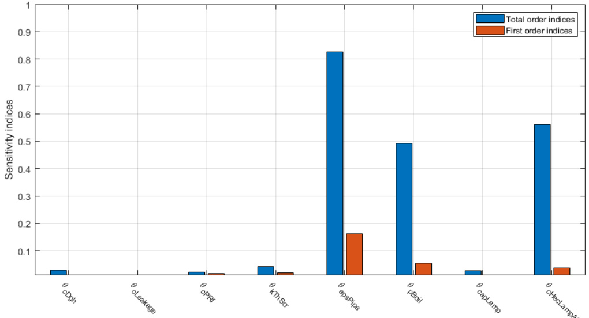  
Fig. 3.5 - First and total order sensitivity indices from the gas demand uncertainty analysis use case using the gas demand and heating related parameter subset.

The sensitivities displayed in Fig. 3.5 show that the gas demand prediction is sensitive to variations in the FIR emission coefficient of the heating pipes ( ௦௉)௜, t௣h௘e capacity of heating system (ߠ௣஻௢)௜a௟nd heat exchange coefficient of lamp and the air ( ௠).௣T஺h௜e௥parameters ௜an௣d௘ a௜r௟e related to the amount and efficiency of heat transferred from the boiler to the air temperature. By influencing the air temperature these parameters interact with the control dynamics as defined by the rules that control the boiler that are based on the air temperature. The same relationship is true for ௣w஺he௜r௥e the heat from the lamps influences the air temperature. The second order sensitivity indices found as part of the sensitivity analysis are displayed in table 3.8.

<html><body><table><tr><td colspan="2">Table 3.8:Second order sensitivity indices from the gas demand and heating related parametersubset</td></tr><tr><td>Parameter names</td><td>Second order indices</td></tr><tr><td></td><td></td></tr><tr><td colspan="2"></td></tr></table></body></html>

The second order sensitivities are displayed in Fig. 3.5. The combined effect of ௜a௣nd௘ ௣w஺er௜e௥found to have the greatest combined impact.

These two parameters influence the temperature within the greenhouse by influencing the amount of heat energy that is transmitted into the greenhouse air from the lamps and hot water pipes.

# 3.3.4. Greenhouse combined gas and power demand uncertainty use case

The two most sensitive parameters from each of the previous two use cases were then taken and combined in an analysis of both gas and power demand prediction uncertainty, the selected parameters are described below in table 3.9.

Table 3.9: Definition of model parameter distributions   

<html><body><table><tr><td colspan="5">Combined gas and power demand parameter subset</td></tr><tr><td colspan="4">Parameter name Distribution Mean Standard</td></tr><tr><td>range</td><td></td><td>error</td><td>Units</td><td>Reference</td></tr><tr><td>FIR emission</td><td></td><td></td><td></td><td>(Vanthoor, Stanghelli</td></tr><tr><td>coefficient of the heating pipes</td><td></td><td></td><td></td><td>ni, et al., 2011)</td></tr><tr><td>Heat exchange</td><td></td><td></td><td></td><td>(Kusuma</td></tr><tr><td>coefficient of lamp</td><td></td><td></td><td></td><td>et al., 2020)</td></tr><tr><td>PAR extinction</td><td></td><td></td><td></td><td>(Vanthoor,</td></tr><tr><td>coefficient of the</td><td></td><td></td><td></td><td>Stanghelli ni, et al.,</td></tr><tr><td>canopy</td><td></td><td></td><td></td><td>2011)</td></tr><tr><td>PAR extinction</td><td></td><td></td><td></td><td>(Vanthoor,</td></tr><tr><td>coefficient of the</td><td></td><td></td><td></td><td>Stanghelli</td></tr><tr><td>canopy for light</td><td></td><td></td><td></td><td>ni, et al.,</td></tr><tr><td>reflected from the</td><td></td><td></td><td></td><td>2011)</td></tr><tr><td>floor</td><td></td><td></td><td></td><td></td></tr><tr><td>Maximum</td><td></td><td></td><td></td><td>(Katzin et</td></tr><tr><td>intensity of lamps</td><td></td><td></td><td></td><td>al., 2020)</td></tr><tr><td></td><td></td><td></td><td></td><td></td></tr><tr><td></td><td></td><td></td><td></td><td></td></tr><tr><td></td><td></td><td></td><td></td><td></td></tr><tr><td>Emissivity of</td><td></td><td></td><td></td><td></td></tr><tr><td></td><td></td><td></td><td></td><td></td></tr><tr><td></td><td></td><td></td><td></td><td>(Katzin et</td></tr><tr><td></td><td></td><td></td><td></td><td></td></tr><tr><td></td><td></td><td></td><td></td><td></td></tr><tr><td>topside of lamp</td><td></td><td></td><td></td><td>al., 2020)</td></tr></table></body></html>

<html><body><table><tr><td>PAR transmission</td><td>- (Vanthoor,</td></tr><tr><td>coefficientofthe</td><td> Stanghelli</td></tr><tr><td>roof</td><td> ni, et al.,</td></tr><tr><td>）</td><td>2011)</td></tr><tr><td>PARreflection</td><td>(Vanthoor,</td></tr><tr><td>coefficient of the</td><td>Stanghelli ni, et al.,</td></tr><tr><td>floor</td><td>2011)</td></tr></table></body></html>

The parameters described in the table above were sampled and used to calculate the power and gas demand. A PCE was subsequently fitted for the gas and power demand separately. In the case of the gas demand PCE which had a maximum polynomial degree of 5 and a final LOO error estimate of . The gas demand prediction errors were found to have a CV of $1 8 \%$ . The PCE generated using power demand predictions For the PCE made using the greenhouse power demand predictions which had a maximum polynomial degree of 9 and a final LOO error estimate of ସ. The gas demand prediction errors were found to have a CV of $1 8 \%$ and the power demand prediction errors had a CV of $2 4 \%$ . The first and total order sensitivity indices that were calculated from the gas and power PCE are displayed in Fig. 3.6.

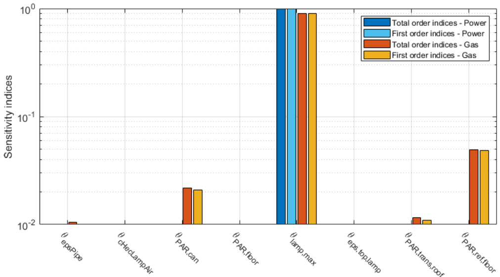  
Fig. 3.6 - First and total order sensitivity indices using the gas demand and heating related parameter subset. This figure is presented with a logarithmic scale.

Fig. 3.6 shows us that the PCE for the power demand attributes almost all of the prediction variation to the uncertainty introduced via the parameter for the lamps power rating .௫This corroborates the importance of ௫that was highlighted in the sensitivity indices and large coefficient of variance found in the lamp parameter subset (section 3.1.2) and in the local sensitivity analysis in appendix B. For the gas demand PCE, the parameter ௫also had the greatest impact. This high sensitivity highlights the influence of the lamps power rating on the amount of heat that is transmitted to the air from the lamps. Which in turn influences the control of the boiler through the control dynamics and rules that references the air temperature. The second most sensitive parameter was ௢, t௙his parameter it is used to calculate the amount of heat from the sun that is transmitted through the greenhouse glass and into the indoor air, which also affects the control of the boiler and CHP. A number of second order sensitivity indices were found for the PCE based on the gas demand which are displayed in table 3.10.

<html><body><table><tr><td>Table 3.1O: Second order sensitivity indices from the combined parameter subset on the uncertainty in gas demand</td></tr><tr><td>Parameter names Second order indices</td></tr></table></body></html>

In the case of the greenhouse gas demand the PCE does identify a number of second order interactions and these interactions are comparatively small in magnitude. The largest of these combined effects identifies a combined impact from variation in ୭an୤d ୟ.୬Both of these parameters influence the temperature within the greenhouse as they are used to calculate how much radiative heat enters the greenhouse respectively and is absorbed by the crop canopy. As such this combined sensitivity indices highlights the impact of the heat transferred from the ambient radiation to the air via the crop canopy.

In the case of power demand the PCE found no second order interactions but did find very small interactions at higher orders fourth and fifth order. This means that the PCE could not attribute variation in the prediction to any group of 2 or 3 parameters and that there is a high degree of interaction amongst larger groups of parameters that accounts for a small fraction of prediction variation. To corroborate the power demand uncertainty results a local one-by-one sensitivity analysis of Greenlight was performed and can be seen in appendix B.

# 3.4. Discussion

This study proposed and demonstrated an algorithm to analyse the greenhouse energy prediction uncertainty arising from the combined and individual impact of errors in the model parameters using a global sensitivity analysis.

The analysis performed on the subset of parameters related to the greenhouse structure concluded that the most impactful parameters on power demand prediction were total order effects related to the amount of radiation that is reflected from the floor and transmitted through the greenhouse glass. This result was corroborated by (Vanthoor, van Henten, et al., 2011), which also found that the transmissive properties of the glass to incoming PAR and NIR had the greatest impact on greenhouse energy demand. This study makes a clear departure from previous research by concluding that for the greenhouse structure subset of parameters, no first order effect were found and instead groups of parameters were responsible for the variation in the prediction. This collective impact stems from the compounding of uncertainties as multiple equations with uncertain parameters feed into each other and feedback propagation where parameters influence states in the model that are selfreferential and iteratively create ever greater uncertainty. This insight offers a crucial new perspective from conventional wisdom in the field that has considered the impact of pairs of parameters to be sufficient. This study demonstrates that the impact of higher order interactions and groups of parameters is a central tool to understanding the causes of prediction uncertainty. Furthermore, this implies that the tuning of any single or pair or parameters will not necessarily reduce prediction uncertainty due to the high levels of interaction. As such this study highlights the opportunity and a method to consider higher order interactions in greenhouse parametric uncertainty analyses.

This study also examined the influence of crop parameters on greenhouse power demand prediction. The results from this subset highlighted the parameters relating to the amount of radiation absorbed from below and above the canopy to be the most influential factors on power demand prediction. This finding is corroborated by (Schrevens et al., 2008), who found that parameters related to the light use efficiency of the crop also have the greatest impact on energy demand prediction. While this study and Schrevens consider different greenhouses using different energy systems. Schrevens concluded that the magnitude of power prediction uncertainty from crop parameters was $5 . 8 \%$ and is comparable to the $5 . 1 \%$ prediction uncertainty described in section 3.2.3. It should also be noted that while these studies provide some comparable insights to literature the degree to which any set of parameters influences the energy demand of the greenhouse is dependent on the design of the rule set used to control the greenhouse.

The analysis of the subset related to lamp parameters found that $9 9 \%$ of the variation in greenhouse power demand prediction uncertainty could be attributed to a first order effect from the HPS lamp light intensity parameter ( ୟ)୶. This result is understandable as the power demand of the greenhouse is almost entirely from operating the lamps and by changing their power rating the total demand changes. It should also be noted that ୶also influences the air temperature through radiative heat exchange, which in turn influences the temperature-based rules that control the lamps themselves. In doing so ୶has multiple routes of propagation throughout the model and influences a feedback loop between the air temperature and the lamp rules. The consistency of this result was corroborated by previous unpublished research done using the KASPRO model (de Zwart, 1996; Dieleman et al., 2005) and using a local one-by-one sensitivity analysis of Greenlight in appendix B. While we assume sufficiency for the other methods this does present an interesting avenue for future research whereby multiple methods are applied to the same sets of parameters proposed in this study. While this study did highlight the impact of lamp light intensity, other parameters were also found to be impactful through second order interactions as shown in table 3.4. However, these effects were minor, meaning that no large improvement in prediction uncertainty could be made by tuning any one of the pairs highlighted in the second order indices.

A further subset of parameters was proposed to investigate the prediction uncertainty in gas demand. The analysis of this subset of parameters found that the parameters relating to the capacity of the boiler and the lamps to deliver heat to the greenhouse is key. Furthermore, this analysis found that the parametrisation of the greenhouse structure or air leakage was comparably unimportant for gas demand prediction.

The analysis of the combined subset found that the maximum intensity of the lamps ( )୶was the most sensitive parameter for power and gas demand prediction accounting for 99 and $9 0 \%$ respectively. In the case of power demand this result was already indicated by the high sensitivity of ୶and high coefficient of variation for the lamp parameter subset. For the gas demand prediction uncertainty, the CV for the combined parameter subset $( 1 8 \% )$ is higher than the initial heating parameter set $( 1 2 \% )$ . This indicates that parameters that were added from the sets related to power demand had some impact of gas demand prediction uncertainty. Specifically, ୶was found to be the most sensitive in the augmented set. The overall importance of stems directly from the air temperature-based control rules that operate the boiler and the lamps. This highlights the importance of the augmented subset and the need for a carefully designed selection criteria so that impactful parameters like ୶are not overlooked.

The demonstration of the algorithm proposed in this study found that for power demand prediction uncertainty variation in crop and structurally related parameter caused a coefficient of variation of $5 . 1 \%$ and $5 . 2 \%$ respectively. Variation in the subset of parameters related to the HPS lamp lighting resulted in a coefficient of variation of $2 4 \%$ for power demand prediction. This outcome shows that for the purposes of reducing power demand prediction uncertainty the accurate parametrisation of the lamp lighting system are more impactful than the greenhouse structure or crop.

A key conclusion that can be drawn from this study is that the greenhouse air temperature is a major contributor to uncertainty propagation in both gas and power prediction uncertainty. This route for uncertainty propagation is facilitated by the way the greenhouse controller is designed. Accordingly, an effective way to combat prediction uncertainty of greenhouse power and gas demand is to focus first on the attributes used in the rules that control the greenhouse lighting before addressing the accuracy of the internal light physics of the greenhouse. In a similar way van Henten (2003) concluded that the economic optimisation of the greenhouse’s operation were not sensitive to the internal climate dynamics of the greenhouse. The reason the parameterisation of the greenhouse’s light physics do not have an effect on the control rules that respond to light levels is that the rules used to control the lighting in (Katzin et al., 2020) do not consider the internal light physics of the greenhouse but instead respond to the ambient outdoor radiation.

Despite the benefits of the proposed algorithms, there is potential for improvement. For example, due to a lack of available information this study assumed that all of the model parameters have standard error that are defined according to Eq. 3.4. It may be that for some of the parameters the standard error may differ from this assumed value and may be known very precisely. Despite this limitation, the algorithm proposed in this study offer insight as to what processes in the model are vulnerable to uncertainty.

A potential limitations of this study’s algorithms is that a PCE is a form of regression and as such has an associated error, this may marginally alter the sensitivities but not the algorithms main conclusions. While this study has addressed the impact of this error on the insight the algorithm produces using a validatory local sensitivity analysis (Appendix. B). Future research may assess the impact of this PCE error via an analysis where an increasing sample size is used to assess the development of PCE error. Furthermore, there is an opportunity to conduct conventional sample based Sobol sensitivity indices for higher orders of interaction to validate the higher order insights gained from this study. It should also be noted that for all of the analyses described in this study a number of factors with low total order sensitivities are given a value of zero for their first order sensitivity indices. This is an outcome of using the LARS algorithm (described in section 3.2.4.1) whose sparce-favouring method sets low correlation coefficients from the meta-model to zero to reduce the required computation.

A further limitation of this study is that the use of subsets to further subdivide the parameter population does preclude the analysis of the effect of interactions between all of the parameters within different subsets. Interactions within the subsets are included in the augmented subset but only for the parameters that were initially found to be most sensitive. This design decision in the proposed algorithm does effectively focus the analysis on the most important factors but may also remove interactions between the subsets from parameters that initially were not found to be sensitive. This does open the opportunity of further analysis where all of the preselected parameters might be repeatedly shuffled into new subset to explore the impact of all the possible combinations.

While previous studies have analysed the effect of parameter uncertainty in greenhouse (Cooman & Schrevens, 2006; Lo pez-Cruz et al., 2013; Schrevens et al., 2008) this study progresses the field by proposing an algorithm that systematically considers all of the model parameters and ultimately selects and analyses the impact of the relevant parameters. Moreover, unlike previous studies (Cooman & Schrevens, 2004; Vanthoor, van Henten, et al., 2011) this study introduced the use of polynomial chaos expansions for uncertainty and sensitivity analyses in the field of greenhouse horticultural research. In doing so this study was able to attribute prediction uncertainty to individual and grouped uncertainty sources, ranging in size from 1 to 10 members, allowing for a more detailed and targeted analysis of larger groups of parameters.

This study introduces a new form of promising uncertainty analysis in the form of polynomial chaos expansions, and while it contains a number of outstanding challenges it also opens avenues for furthering the use of uncertainty analysis in the field of greenhouse horticultural research. Future research in this field might consider if the design of the greenhouse controller influences the sensitivity of the model parameters. This could be done by performing a PCE analysis on a greenhouse that is controlled by an optimal controller and rule-based controller.

# 3.5. Conclusion

This study introduced an algorithm to investigate the role of parametric uncertainty on the prediction uncertainty of greenhouse gas and electrical power demand. This algorithm included an pre-screening process to reduce the number of relevant parameters considered in the analysis and a Polynomial Chaos Expansion based sensitivity analyses. The application of this algorithm concluded that parameters related to the greenhouse lighting were the greatest contributors to greenhouse power demand prediction uncertainty over crop and greenhouse structure related parameters. In particular the power relating to the power rating of the lamps was found to be the single greatest contributor to both gas and power demand prediction uncertainty. In addition this study made the notable finding that larger groups of model parameters were responsible for energy demand prediction uncertainty. This novel insight highlights the need for future research to consider the impact of higher order parameter interactions on prediction uncertainty using the algorithm proposed in this study.

# Acknowledgements

We thank David Katzin for his support in the use of the Greenlight greenhouse model and we would also like to thank Letsgrow.com and Solyco for the provision of the data used in this study.

Chapter 4.   
Prediction uncertainty of   
greenhouse electrical power and gas demand: Part 2, The role of parametric and weather forecast error

# Henry Payne, Eldert van Henten, Simon van Mourik

Published in Biosystems Engineering (2024), 239, pp 25-34   
https://doi.org/10.1016/j.biosystemseng.2024.01.007

# Highlights

An uncertainty analysis was proposed and demonstrated that considers both parametric and weather forecast derived energy demand prediction   
uncertainty.   
Weather forecast error has a greater contribution than the parameter error to energy prediction error.   
This study found that reductions in weather forecast error had diminishing returns with reductions in error in the predicted greenhouse energy demand.

# Abstract

This study breaks new ground by assessing the influence of individual and collective errors in weather forecast variables and errors in model parameters on the prediction error of greenhouse power and gas demand. To achieve this a sample-based and a Polynomial Chaos based sensitivity analysis using higher order sensitivity indices is proposed. This is accompanied by a sensitivity analysis of the impact of reducing individual weather forecast errors on greenhouse energy demand prediction error. The findings of this study indicate that weather forecast errors have a greater role in creating mean gas $( \gamma \neq )$ and power $( \quad 7 \neq )$ prediction uncertainty than parametric errors ( and ͶǤ͸ $\ l \textbf { 7 } \neq \mathbf { \ l }$ . In addition, weather forecast and parameter errors were found to be independent factors. Reducing weather forecast error exhibited diminishing returns with the reduction in prediction error. For instance, a scenario where the forecast error of all variables is reduced by 80- $9 0 \%$ resulted in a $5 0 \%$ decrease in gas and electrical power prediction error. The radiation forecast errors emerged as the primary contributor to power demand prediction errors, exhibiting the potential to reduce the power demand prediction error by approximately $6 0 \%$ . Reductions of forecast errors in wind and outdoor air temperature were identified as the predominant contributors, offering a respective potential for a $1 7 \%$ reduction in gas demand prediction error.

# 4.1. Introduction

The Dutch greenhouse horticulture sector consumes a large amount of gas and electrical power over a growing season. This reliance on importing external energy into the greenhouse comes at a cost to the grower, as the financial stability of their business is linked to the prices of gas and electrical power. As such the efficient use of imported energy is crucial to successful greenhouse operation. To ensure efficient operation, the sector uses computerised decision support systems to advise how the greenhouse should be operated, how much gas and electrical power are required and when it should be bought. This is done by predicting the future electrical power and gas demand using a mathematical model of the greenhouse system together with forecasted weather data.

Greenhouse operational strategies that use predictions from a model-based computer support system are however susceptible to errors. These errors can be caused by inaccuracies in the parameter values of the model or through disturbances in the weather forecast data. The probability distribution of possible inaccuracies in model parameters and weather forecasts results in a probability distribution of errors in the model prediction, which constitute prediction uncertainty. Prediction uncertainty is undesirable as it can lead to strategies that are resource inefficient and as such reducing inaccuracies in the model parameter and weather forecasts is a priority.

Improvements in weather forecast and parameter accuracy would in turn create more accurate predictions of greenhouse electrical power and gas demand, which could lead to more efficient energy buying by the grower. On a societal level this gained energy efficiency from greenhouse horticulture would cause a decrease in the Dutch national electrical power and gas demand, which in turn would result in less total electrical power generation, gas usage and a decrease in emissions.

Within the field of greenhouse horticulture the data-based uncertainty from the weather forecasts has been included in previous studies. Sigrimis et al., (2001) and Vogler-Finck et al., (2017) analysed how forecast error affected the uncertainty in the predicted greenhouse heating demand. Both studies concluded that the inclusion of weather forecasts improved greenhouse heating performance when compared to using a rudimentary forecast. However Sigrimis and Doeswijk et al.,  (2006) also concluded that the presence of weather forecast errors increased the costs of heating a greenhouse and a storehouse by $1 9 \%$ and

$3 . 1 \%$ respectively and that this cost only worsened when using longer forecasts. This is corroborated by Tap et al., (1996), who studied how the inclusion of weather forecast error affected an optimally controlled greenhouse indoor climate. Tap concluded that the optimality of the greenhouse’s $\#$ , heating demand and financial performance dropped by $1 5 \%$ when a one hour lazy-man forecast was introduced, and that the performance worsened for longer forecasts. The aforementioned research has studied the impact of weather forecast uncertainty on greenhouse model prediction but has focussed on the predicted heat demand and economics. This presents an opportunity to study the impact of weather forecast error on the predicted greenhouse electrical power and gas demand.

Previous literature in greenhouse horticulture has considered the role of parametric uncertainty in the creation of greenhouse energy prediction uncertainty. (Golzar et al., 2018; Vanthoor, van Henten, et al., 2011) both considered the influence of a limited number of climate setpoint on greenhouse crop growth and energy demand. Golzar found potentially large energy reductions at the expense of small reductions crop growth. Vanthoor concluded that radiation transmission properties of the glass and the outdoor radiation levels have the greatest impact on crop growth and energy predictions. Both of these studies consider greenhouses with only a boiler and the overall energy usage and do not analyse gas and power demand. An alternative that has not been applied in the greenhouse horticultural domain is to use a meta-model based approach for parametric sensitivity analysis. One such method called polynomial chaos expansion (PCE) can be used to calculate sensitivity indices for the individual and combined effect of large groups of parameters (Sudret, 2008). These Sobol sensitivity indices are analytically calculated from the coefficients of the meta-model (Mara & Becker, 2021). As a result this method only requires samples for fitting the meta-model. As such PCE can be used to estimate sensitivity indices of a greater number of parameters with far fewer parameters samples than would be required for a traditional exhaustive sample based sensitivity analysis (Blatman & Sudret, 2011).

While uncertainty resulting from model parameters and weather forecast data have been considered separately there is a knowledge gap in how these factors interact and impact prediction uncertainty in combination. This issue of combined effect is important as it shows the comparative importance of addressing errors within the model parameters and weather forecast data and where the greatest reduction in prediction uncertainty might be sought.

Outside of the field of greenhouse horticulture a number of methods have been proposed to analyse the role of multiple sources of input uncertainty on the prediction of a model. For example, Ramdani et al., (2006) combined data based and parametric uncertainty by assuming that the input data error is constant and can be treated as a parameter. This method allows the inclusion of errors with time varying variances into simple models analytically using a Volterra series. Additionally Ajami et al., (2007) proposes a Bayesian approach (IBUNE) that considers parameter, input and structural uncertainty in a model simultaneously. This is done using multiple models to perform model averaging and by defining an input error distribution to include data-based uncertainty into the analysis. This approach does however remove any auto or cross-correlation from the input data limiting the approaches relations to real data dynamics. As such there is an opportunity in the current research to analyse parameter and weather based prediction uncertainty that retains correlative effects within the weather data.

In response to these gaps in the current research identified above we propose an algorithm to assess the impact of parameter and input uncertainty on greenhouse electrical power and gas demand simultaneously. These algorithms combine a Latin hypercube sampling approach, the direct use of input data time series, and a Polynomial chaos expansion (PCE) based sensitivity analysis. This algorithm allows a computationally tractable analysis of variance of the impact of errors in both individual factors and groups of parameters and weather forecast variables using higher order sensitivity indices. This study also highlights in which areas targeted error reductions would create reduction in model prediction error and the possible scale of these reductions. The proposed algorithm was applied to a model of a Dutch tomato growing greenhouse.

This study aims to make an important contribution to the field of greenhouse horticulture by proposing a novel algorithm to investigate an underexplored aspect of the field. The novelty of this study has two aspects. The first point of novelty is the application of statistical uncertainty analyses that considers both the individual and collective impact of weather forecast and parameters errors in the domain of greenhouse horticultural research. The second point of novelty is that this study investigates the higher order effects of time series error and parametric error on energy demand prediction uncertainty.

# 4.2. Materials and Methods

The following sections (4.2.1-4.2.2) describe the greenhouse model and the recorded and forecast weather data used to demonstrate the algorithm in a case study. The steps used for the algorithm described in this study is described in section 4.2.3. It should be noted that for the remainder of this study electrical power will be referred to as power. Furthermore, for the remainder of the study the word energy is used to denote power and gas.

# 4.2.1. Greenhouse model

The greenhouse climate, tomato crop and energy model used was Greenlight (Katzin et al., 2020), which is a calibrated, open source model. Greenlight is a dynamic differential equation-based model which emulates a tomato growing Venlo type greenhouse. The model receives input from weather data of the outside temperature, wind speed, radiation, vapour density and  concentration. The model predicts the greenhouse indoor climate states, which are the indoor air temperature, vapour concentration, ambient radiation and concentration. In addition, Greenlight predicts the power and gas demand of the greenhouse and the growth of the tomato crop within the greenhouse. The greenhouse being simulated was parametrised for Bleiswijk in the Netherlands. This study used a rule-based control scheme that is based on the current industry standard and was originally described by Vanthoor, Stanghellini, et al., (2011).

# 4.2.2. Weather data

The recorded weather data used was taken from a weather recording station in Bleiswijk, the Netherlands from 2018-01-01 00:00 to 2019-01-01 00:00 at 5- minute intervals. The recorded weather data variables are the outside temperature ሻ, wind speedሺ•ିଵሻ, direct solar radiation $^ { 7 \neq }$ and outside relative humidity $( \% )$ .

The outdoor concentration for both the weather forecast and recordings was assumed to be constant at $4 1 0 \mathrm { p p m }$ . In addition, the cloudiness index (CI) was fixed to the average of the period $[ \mathrm { C I } = 0 . 7 ]$ ) and the sky temperature (Luo, de Zwart, et al., 2005) and levels of diffuse radiation (Orgill & Hollands, 1977) were estimated using the available climate variables. Any missing entries in the datasets were filled with the linearly interpolated values of the adjacent data points.

The forecasted weather variables used are the hourly outside temperature wind speed $\neq \geq$ ଵሻand direct solar radiation $^ { 7 \neq }$ ሻthese were generated for Bleiswijk, the Netherlands 2018-01-01 00:00:00 to 2019-01-01 00:00:00. The time step of the forecasts was regulated to 1 hour and any missing entries in the data were filled via linear interpolation. For the purposes of the case study demonstrating the algorithms presented in this paper in a way that is computationally tractable this study focussed on the simulation period of 2018- 03-01 00:00:00 to 2018-03-14 00:00:00, while using the full period of the dataset for estimating weather forecast error. To allow the direct comparison of forecasted and recorded weather the forecasts were resampled to 5-minute timestep using a zero-order-hold method.

# 4.2.3.  An algorithm to assess how weather forecast and model parameter uncertainty propagates into greenhouse power and gas demand prediction uncertainty

To analyse the impact of weather forecast error and model parameter error on the uncertainty of model predictions a sample-based uncertainty analysis was done using sampled model parameter values and synthetic weather forecasts using sampled weather forecast errors. The steps in the proposed algorithm are shown in Fig. 4.1.

2.3.1: Algorithm setup   
- Set the maximum number of   
samples $( n _ { m a x } )$   
- Define the model parameter   
distributions (0)   
- Define a collection of two week   
long forecast errors $\left( \pmb { \varepsilon _ { w } ^ { F } } \right)$ n=n+1   
2.3.1. Calculate synthetic weather   
forecast   
- Draw model parameter sample $( \theta _ { n } )$   
- Formulate a weather forecast error   
$\left( \pmb { \varepsilon _ { n } ^ { F } } \right)$   
- Calculate synthetic weather   
forecast $\left( \widehat { \pmb { u } } _ { n } ^ { F } \right)$   
2.3.2. Calculate energy prediction   
error (en, RMs)   
- Simulate greenhouse energy   
demand $\left( Y \big ( h _ { 0 } , h , \theta , \widehat { u } _ { n } ^ { F } ( h ) \big ) \right)$   
- Calculate energy demand error   
(eRM） No Is n ≥ nmax Yes   
2.3.3: Analysis of prediction variance   
(eP,RMs, 0, μ(eF), (eF)) end

In addition to the algorithm shown in Fig. 4.1 further scenarios are proposed in subsections 4.2.3.4 and 4.2.3.5 that investigate the impact of bias corrected forecast errors and scaled down forecast error variance. These scenarios demonstrate the potential change in prediction uncertainty if targeted improvements in weather forecast errors were to be made.

# 4.2.3.1. Algorithm setup and calculating synthetic weather forecasts

In this study time was defined on an hourly time step which is indexed using the variable h. To initialise the algorithm the model parameter distributions ௨) used in this study (table 4.1) were modelled as normal distributions that are truncated by an upper and lower limit Ʌ୪and

Table 4.1: Definition of model parameter distributions   

<html><body><table><tr><td colspan="6">Table4.i:Derinition ormodelparameterdistributions Model Distribution</td></tr><tr><td>parameter name</td><td>range</td><td>Mean</td><td>Standard error</td><td>Units</td><td>Reference</td></tr><tr><td>FIR emission coefficient of the heating</td><td></td><td></td><td></td><td></td><td>(Vanthoor, Stanghellini, et al., 2011)</td></tr><tr><td> pipes</td><td></td><td></td><td></td><td></td><td></td></tr><tr><td>Heat exchange coefficient of</td><td></td><td></td><td></td><td></td><td>(Kusuma et al., 2020)</td></tr><tr><td>lamp</td><td></td><td></td><td></td><td></td><td></td></tr><tr><td>PAR extinction coefficient of</td><td></td><td></td><td></td><td></td><td>(Vanthoor,</td></tr><tr><td>the canopy</td><td></td><td></td><td></td><td></td><td>Stanghellini,</td></tr><tr><td></td><td></td><td></td><td></td><td></td><td>et al., 2011)</td></tr><tr><td></td><td></td><td></td><td></td><td></td><td></td></tr><tr><td></td><td></td><td></td><td></td><td></td><td></td></tr><tr><td>PAR extinction</td><td></td><td></td><td></td><td></td><td></td></tr><tr><td></td><td></td><td></td><td></td><td></td><td>(Vanthoor,</td></tr><tr><td>coefficient of</td><td></td><td></td><td></td><td></td><td></td></tr><tr><td></td><td></td><td></td><td></td><td></td><td>Stanghellini,</td></tr><tr><td>the canopy for</td><td></td><td></td><td></td><td></td><td></td></tr><tr><td>light reflected</td><td></td><td></td><td></td><td></td><td>et al., 2011)</td></tr><tr><td></td><td></td><td></td><td></td><td></td><td></td></tr><tr><td>from the floor</td><td></td><td></td><td></td><td></td><td></td></tr><tr><td></td><td></td><td></td><td></td><td></td><td></td></tr><tr><td></td><td></td><td></td><td></td><td></td><td></td></tr><tr><td></td><td></td><td></td><td></td><td></td><td></td></tr><tr><td>Maximum</td><td>@ET</td><td></td><td></td><td></td><td></td></tr><tr><td></td><td></td><td></td><td></td><td></td><td></td></tr><tr><td></td><td></td><td></td><td></td><td></td><td></td></tr><tr><td></td><td></td><td></td><td></td><td></td><td>(Katzin et</td></tr><tr><td></td><td></td><td></td><td></td><td></td><td></td></tr><tr><td></td><td></td><td></td><td></td><td></td><td></td></tr><tr><td></td><td></td><td></td><td></td><td></td><td></td></tr><tr><td>intensity of</td><td></td><td></td><td></td><td></td><td></td></tr><tr><td></td><td></td><td></td><td></td><td></td><td></td></tr><tr><td></td><td></td><td></td><td></td><td></td><td>al., 2020)</td></tr><tr><td></td><td></td><td></td><td></td><td></td><td></td></tr><tr><td></td><td></td><td></td><td></td><td></td><td></td></tr><tr><td></td><td></td><td></td><td></td><td></td><td></td></tr><tr><td></td><td></td><td></td><td></td><td></td><td></td></tr><tr><td></td><td></td><td></td><td></td><td></td><td></td></tr><tr><td></td><td></td><td></td><td></td><td></td><td></td></tr><tr><td>lamps</td><td></td><td></td><td></td><td></td><td></td></tr></table></body></html>

<html><body><table><tr><td>Emissivity of</td><td></td><td>(Katzin et</td></tr><tr><td>topside of lamp</td><td></td><td>al., 2020)</td></tr><tr><td></td><td></td><td></td></tr><tr><td>PAR</td><td></td><td>(Vanthoor,</td></tr><tr><td>transmission</td><td></td><td>Stanghellini,</td></tr><tr><td>coefficient of</td><td></td><td>et al., 2011)</td></tr><tr><td>the roof</td><td></td><td></td></tr><tr><td></td><td></td><td></td></tr><tr><td>PAR reflection</td><td></td><td>(Vanthoor,</td></tr><tr><td>coefficient of</td><td></td><td>Stanghellini,</td></tr><tr><td></td><td></td><td></td></tr><tr><td>the floor</td><td></td><td>et al., 2011)</td></tr></table></body></html>

The forecast error (ɂ୊) was then calculated for the entire dataset length (Ͳ -ͳͲ - ͳtoͺ )ͳaͻnd was indexed using the time index Šwhere

$$
\begin{array} { r } { \circledast \quad \mu \circledast \quad \mu \circledast . } \end{array}
$$

In which — is the recorded weather and $\mu$ is the forecasted weather. This vector of forecast error vector ሻwas then apportioned into two weeklong periods where

$$
\Sigma \qquad \circledast \qquad \Sigma \ \circledast \quad ,
$$

These two-week periods were then formed into a set ሽ. In this case $\Sigma$ is the index of the two-week periods and $\Sigma$ Ǥ™ ୶where ™ ͸and $\textcircled{8}$ ୟ୶is the number of samples in a two-week period where $\textsuperscript { \textregistered }$ .ͶFͶor each sample iteration (ሻa forecast error vector was randomly drawn from the set of forecast errors and a parameter value was randomly drawn from each parameter distribution using a Latin hypercube sampling method,

For this study, the number of samples used was set to 1000 (݊௠௔௫). The drawing of a forecast error and model parameter value was done by including the index for the set of forecast errors as a parameter that was sampled. In doing so the sample space used in this study is augmented to allow the drawing of parameter values and vectors of forecast error data. For each sample eq. 4.4 produces a vector of forecast errors, whose length is that of the simulation period $\textcircled{8}$ ୟ.୶This sampled vector of forecast errors was then added to the recorded weather data $\mu$ to simulate a representative synthetic weather forecast $\mu$ in the following manner

$$
{ \bf { \mu } } \circledast \mathrm { ~ \bf { \mu } ~ } \circledast \mathrm { ~ \bf { \ s } ~ }
$$

The synthetic weather forecasts —ො୬୊for each sample were then collected into a set of forecasts where —ො୬୊ ሼ—ොଵǡ—ොଶǤ—ො୬

# 4.2.3.2. Calculate power demand prediction error

In this study greenhouse model energy predictions are referred to as in section 4.2.1, where is a function of the initial time step $\textsuperscript { \textregistered }$ , time $\circled { \ + } ,$ model parameter values (Ʌ) and weather data (—). For each sample $\textstyle { \mathcal { E } }$ the prediction error ɂ୬୔and root mean square error were then calculated. These were calculated by comparing the greenhouse energy demand prediction made using the sampled model parameters Ʌ୬ሻ, sampled synthetic weather forecast data $\mu$ with the energy demand prediction made using the actual weather forecast $\mu$ and the nominal parameter values Ʌതwhere,

$$
\begin{array} { r } { \odot \odot \qquad \mu \circledast \qquad \odot \circledast \circledast \quad \mu \circledast } \end{array}
$$

and ǡ—ො୬

The nominal parameter values were defined as the mean value of the distributions of model parameters $\$ 1$ ሺɅሻ. This prediction error was used to determine the comparative role of the weather forecast errors and model parameters. To do this the sampled model parameter Ʌ୬, mean and standard deviation of the sampled forecast error ሻand ሻand the prediction error

were used in an analysis of prediction variance as detailed in the following section.

# 4.2.3.3. Analysis of prediction variance

The analysis of variance within this study was performed using a Polynomial Chaos Expansion (PCE) based sensitivity analysis the details of these approaches can be found in Blatman & Sudret, (2011) and Sudret (2008). This PCE is made of a meta-model ܯ that is regressed based on the  prediction errors response to variations in the sampled model parameter Ʌ,Ǥmean and standard deviation of the sampled forecast error ሻand ሻ. As such it can be used to estimate the prediction error

A further analysis of variance was performed to examine the comparative impact of these groups by fixing the weather and parameter error in turn. This was done using the steps defined in section 4.2.3.1 and 4.2.3.2 and was repeated three times. Initially the steps described are applied unaltered. Then the steps are performed using the original weather forecast (—୊) in place of the synthetic weather forecast (—ො୬). Subsequently the steps were performed setting the parameter values to be fixed on their nominal values. The scenarios proposed in the following subsections investigate the prediction uncertainty reduction that could be achieved by accounting for forecast error bias and reducing the variance of sensitive forecast errors.

# 4.2.3.4. Scenario 1 – Greenhouse energy prediction demand uncertainty given reductions in forecast error variance

This scenario investigates the degree to which uncertainty reduction could be achieved by accounting for forecast error variance reduction in forecast errors. To do this a variance reduction factor ሻwas defined to scale all of the forecast variables and for forecast variables individually. By doing this the relative impact of targeted improvement of a single forecast variable was investigated. This factor was then used to calculate a modified forecast error such that,

For this scenario Ƚranges from 0 to 1 increasing in increments of 0.1, meaning a $1 0 { - } 1 0 0 \%$ reduction in error variance. This modified set of forecast errors was then used to calculate the modified prediction error described in section 4.2.3.2.

# 4.2.3.5. Scenario 2 – Greenhouse energy prediction demand uncertainty given forecast error bias correction

To analyse the impact of forecast error biases on prediction uncertainty a bias correction was done by adding the product of a correction factor Ⱦand a scaling factor ɀto the forecast error described in eq. 4.2 such that

Where the correction factor is defined as the mean of the forecast error of each sensitive forecast variables such that ሻ. The scaling factor ɀwas set to take a ranges of values from 0 to 0.9 increasing in increments of 0.1. This modified set of forecast errors ɂො୊were then used in the steps described above in section 4.2.3.2 to calculate the modified prediction error .ୗWhich was in turn used to compare the prediction uncertainty with differing degrees of bias correction.

# 4.3. Results

The algorithm and scenarios described in section 4.2.3 are applied to a case study of a tomato producing Dutch greenhouse  model, , detailed in section 4.2.1. Section 4.3.1 shows the results of the case study that demonstrates the comparative role of weather data error and parameter derived prediction uncertainty. Section 4.3.2 and 4.3.3 show the results of the case study that examines how much prediction uncertainty reduction can be achieved through targeted improvements in weather forecast error.

# 4.3.1. Results from the analysis of the combined impact of model parameter and weather forecast uncertainty

This section details the results of a case study demonstrating the algorithm described in section 4.2.3. The comparison of the impact of parameters and weather forecast error on energy prediction uncertainty can be seen in Fig. 4.2.

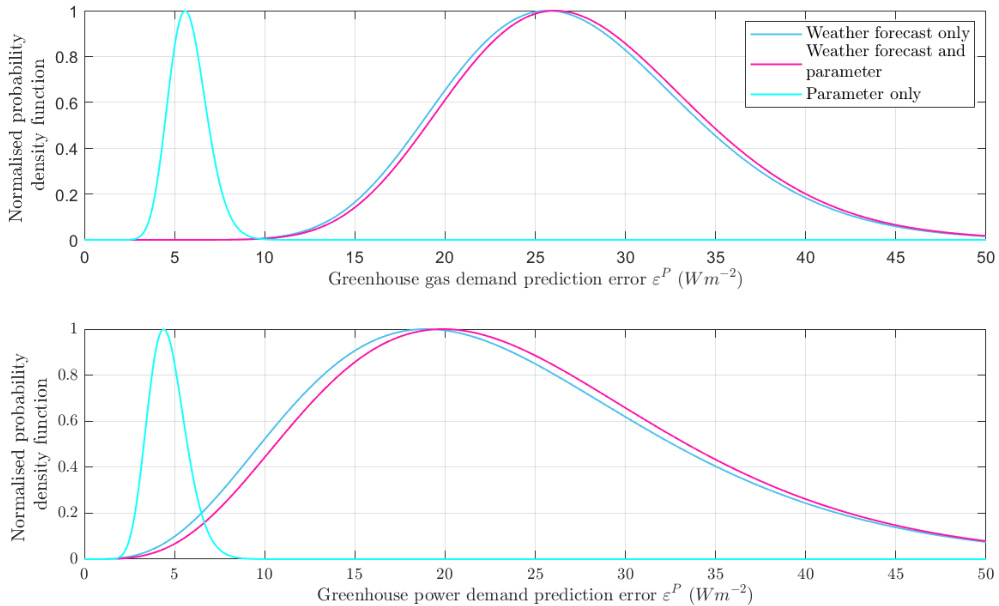  
Fig. 4.2 - Normalised probability density function of power (bottom) and gas (top) demand prediction uncertainty given errors introduced from weather forecasts (blue), model parameters (cyan) and both in combination (pink).

The prediction uncertainty derived from weather forecasts is far greater than that derived from model parameters. Furthermore Fig. 4.2 shows that the weather forecast and combined prediction uncertainty distributions are similar. This similarity implies that the weather forecasts account for most prediction uncertainty and that there is negligible interaction between uncertainty introduced from forecast and parameters. This is also confirmed by the distribution properties described in table 4.2. Accordingly, parameter and weather forecast error can be considered as independent distributions.

<html><body><table><tr><td colspan="4">Table 4.2: Distribution properties of gas and power prediction</td></tr><tr><td rowspan="3">uncertainty Gas</td><td>Weather</td><td>Weather forecast</td><td rowspan="3">Paramet er only</td></tr><tr><td>forecast only</td><td>and parameter</td></tr><tr><td></td><td></td></tr><tr><td>demand</td><td></td><td></td><td></td></tr><tr><td>Power</td><td></td><td></td><td></td></tr><tr><td>demand</td><td></td><td></td><td></td></tr></table></body></html>

# 4.3.1.1. Results from the PCE based sensitivity analysis

To corroborate and elaborate on the conclusions drawn from Fig. 4.1 a PCE sensitivity analysis was done on the predicted power demand. This was done using the sampled model parameter values and synthetic weather forecasts. The PCE was fitted with 9 degrees of freedom and a leave-one-out error of This PCE was then used to calculate sensitivity indices, the resulting first and total order Sobol sensitivity indices are displayed in Fig. 4.3.

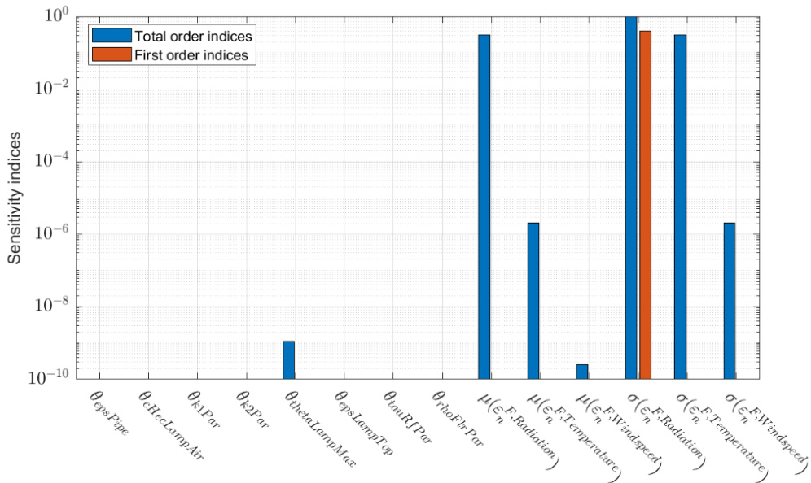  
Fig. 4.3 - The first (orange) and total (blue) order Sobol sensitivity indices for a PCE sensitivity analysis of power demand prediction error given errors in model parameters and weather forecast data.

It can be concluded from the PCE that the weather forecasts are the major producers of prediction uncertainty for power demand prediction. This conclusion confirms the findings displayed in Fig. 4.2. This outcome also confirms the conclusion found in Payne et al., (2022) that in the case of power demand production uncertainty, the radiation forecast is the greatest contributor. Furthermore, the large difference between first and total order indices indicates a large influence of higher order effects. The second order interactions, specifically between weather forecast variables which can be seen in table 4.3. In particular the radiation and temperature forecast have the largest role in the second order indices again mirroring the conclusion of Payne et al., (2022) and the link between radiative heat from the sun and air temperature.

Table 4.3: Second order PCE sensitivity indices   

<html><body><table><tr><td>Parameter names</td></tr><tr><td></td></tr><tr><td></td></tr><tr><td></td></tr></table></body></html>

# 4.3.2. Results of forecast error reduction on energy prediction uncertainty from scenario 1

This section describes the results of the case study demonstrating the methods proposed in scenario 1 that is described in section 4.2.3.4. Having concluded that the weather forecast error is the major contributor in energy prediction uncertainty and is independent from parametric uncertainty, , the potential reductions if errors were to be reduced was investigated. First this was done by scaling all forecast variables simultaneously and then individually. How the modification of all forecasts influences prediction uncertainty is shown the figures below.

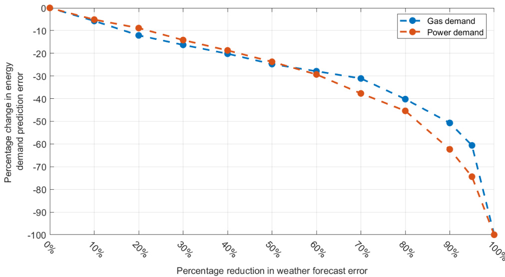  
Fig. 4.4 - Percentage change in gas (blue) and power (orange) prediction error ( ) using an ࣓scaling coefficient for all weather forecast variables..

Fig 4.4. shows the percentage reduction in gas and power demand error given reductions in weather forecast error. This figure shows that a reduction in the error of all forecast variables by $8 0 { - } 9 0 \%$ would yield an approximate $5 0 \%$ reduction in the prediction uncertainty of both gas and power. Furthermore, the relationship between reduction in prediction uncertainty is approximately linear up to a $6 0 \%$ reduction of weather forecast error. After which reductions in power demand prediction uncertainty are greater than gas.

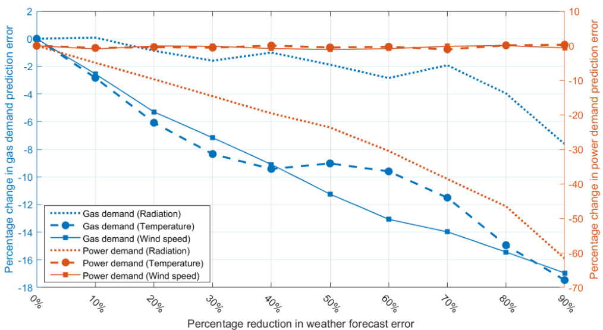  
Fig. 4.5 - Percentage change in gas (blue) and power (orange) prediction error ( ࡹࡿ) as a function of the variance reduction scaling coefficient for each weather forecast variable. The dotted lines are associated with a reduction in radiation forecast error and the dashed lines with circular markers are associated with a reduction in temperature forecast error. The solid lines with the square markers are associated with a reduction in wind speed forecast error.

Fig. 4.5 shows that in the case of power prediction uncertainty the reduction in radiation error resulted in the greatest reduction in prediction uncertainty. This reconfirms the conclusions drawn from Fig. 4.2 that radiation forecast is the key contributor to power demand prediction uncertainty. Reductions in error in temperature and wind speed forecasts do not result in lower power demand prediction uncertainty. Gas demand prediction uncertainty is influenced by the reduction in the errors within all forecast variables. Reductions in temperature and radiation forecast error is accountable for the greatest degree of reduction in prediction error, with a variance reduction of $4 0 \%$ in temperature and radiation forecasts resulting in a $9 \%$ reduction gas demand prediction uncertainty.

# 4.3.3. Results of forecast error bias correction on energy prediction uncertainty from scenario 2

The following section describes the outcome of the case study of the bias correction scenario proposed in section 4.2.3.5.

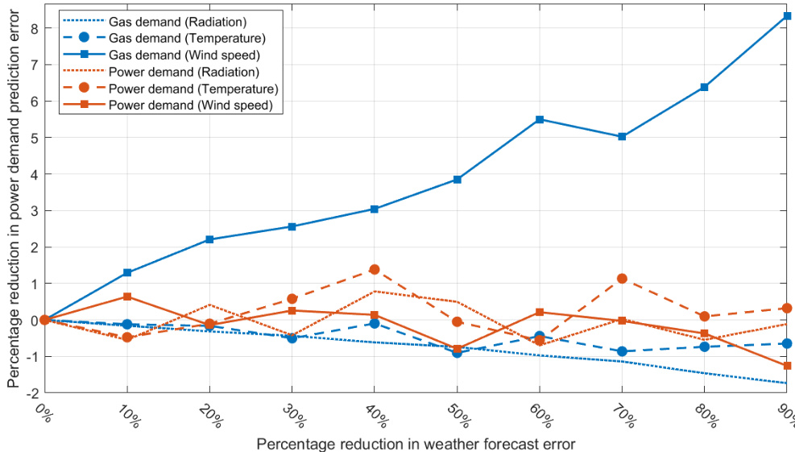  
Fig. 4.6 - Percentage change in gas (blue) and power (orange) prediction error ( ࡿ) as a function of forecast bias reduction factor ࢼor each weather forecast variable individually. The dotted lines are associated with a reduction in radiation forecast error and the dashed lines with circular markers are associated with a reduction in temperature forecast error. The solid lines with the square markers are associated with a reduction in wind speed forecast error.

The bias correction of individual forecast variables shown in Fig. 4.6 shows that in the case of power demand prediction uncertainty bias correction has a small effect on the reduction of prediction uncertainty and no effect that clearly increases with an increased bias correction. In the case of gas demand an improvement of $1 { - } 2 \%$ can be made by correcting for bias in temperature and radiation forecast errors. It is key to note that corrections for bias in wind speed forecast errors increase prediction uncertainty.

# 4.4. Discussion

This study found that the error introduced from the weather forecasts created far greater gas $^ { 7 } \neq$ ିଶሻand power $7 \neq$ ଶሻdemand mean prediction error than that created by parametric error. Parametric error resulted in mean prediction error in gas demand of ͷǤ͹ $^ { 7 } \neq$ ଶand power demand of ͶǤ͸ $^ { \triangledown } \neq { \mathbf \xi }$ . This outcome confirms the emphasis put on mitigating weather forecast error by previous studies (Doeswijk, 2007; Kuijpers et al., 2022) This study also breaks new ground by proposing a novel algorithm that compares the impact of weather forecast and parametric error and their potential interactions. This study aimed to analyse the combined errors from weather forecasts and model parameters using a higher order indices that are computationally efficient to calculate. As such the algorithm detailed in this study is perfectly suited for this purpose. This is as the use of a PCE based analysis allows the uncertainty in the model predictions to be efficiently attributed to individual and groups of parameters via the PCE’s higher order terms (Sudret, 2008). Using this approach this study was able to conclude in Fig. 4.3 that higher order interactions between factors has a greater impact than the first order effects. Furthermore this study concluded in Fig. 4.2 that weather forecast error has a greater impact than parametric error. These conclusions challenge the precedent of sensitivity analyses that only consider first order effects and the analysis of only model parameter error in attributing energy prediction uncertainty in a greenhouse model. This algorithm also highlights where the easiest reductions in prediction uncertainty could be made. This was done by investigating the degree of difficult posed by reducing the amount of prediction uncertainty as a result of reducing weather data and parameters errors.

In applying this algorithm this study also found that there was a very small difference of $^ { \circ } \neq$ ଶin the mean prediction uncertainty created from weather forecast error and the combined effect of weather forecast and parametric error. This outcome implies little interaction between parametric and weather-based errors. As such these sources of uncertainty can be considered as independent source of uncertainty in future research.

The outcomes of this case study concluded that for the first order sensitivity indices of the power demand prediction uncertainty (Fig. 4.3) the mean error of the radiation forecast is the only individual contributor. This is a result of uncertainty introduced in the radiation forecast propagating into the lamp lighting control rules that are related to the outside radiation level. This outcome supports the importance of radiation related processes in energy demand prediction that were also found in Bontsema et al., (2011) and Payne et al., (2022). Specifically Bontsema et al., (2011) concluded that sensor accuracy was key to energy prediction accuracy and Payne et al., (2022) found radiation forecast error to be the greatest contributor to power demand prediction uncertainty.

Table 4.4 shows the second order interaction found as part of the PCE analysis, where uncertainty in the temperature and radiation forecast propagates in combination into power demand prediction uncertainty. These forecast variables act both on the temperature state, and as a result influence the controls of the lamps in combination through the rule set used in the greenhouse controller. This outcome invites a change in perspective that design of the climate controller is crucial in the mitigation of prediction uncertainty. Despite previous research not focussing on predicted power demand, the outcomes of this example reassert the conclusion of previous studies in that the introduction of weather forecast errors do impact model accuracy (Sigrimis et al., 2001) and greenhouse performance (Tap et al., 1996).

This study performed a global variance reduction analysis and found that as the variance in weather forecast error decreased, prediction uncertainty reduction is initially linear up a $8 0 \%$ error reduction and that over $8 0 { - } 9 0 \%$ error reduction is required to see improvements in prediction error of greater than $5 0 \%$ . This outcome indicates that potential improvements in prediction uncertainty are difficult to achieve through forecast error reduction. However there have been improvements in weather forecast accuracy over the last 15 years, for example Haiden et al., (2021) found a $2 . 5 \%$ improvement in surface temperature forecast error and a $1 . 5 \%$ improvement in wind speed forecast error. If these trends continue, in the context of the entire sector these improvements might cumulatively equate to substantial amounts of energy.

Given a more detailed individual analysis in section 4.3.2, the radiation forecast error is individually the largest power demand uncertainty. The importance of the radiation forecast found in this study is corroborated by the results of the uncertainty analysis preformed in Payne et al., (2022). The uncertainty analysis preformed in Payne et al., (2022) investigated the role of weather forecast error on greenhouse energy demand prediction uncertainty. This analysis found that temperature and wind speed forecast error do not influence power demand prediction error. This is due to these variables not being included in the rules that control the greenhouse lamps, which are responsible for greenhouse power demand. This study goes further by showing that while a targeted reduction in forecast error is the most effective way to reduce power prediction uncertainty there are diminishing returns, in which ever greater improvements in forecast error are required for diminishing improvements in prediction uncertainty. In the case of gas demand prediction an improvement in all of the forecast variables yields an improvement in prediction uncertainty. Furthermore the greatest improvements in gas demand prediction accuracy can be made by mitigating the temperature and wind speed forecast errors. However, these are smaller overall than those seen in the power demand case.

A bias correction analysis was also done and concluded that bias correction has little influence on power demand error. This is as the radiation forecast error has very low bias and as such correcting this bias has little effect on prediction error. Moreover, bias correction can benefit gas demand error if done for radiation and temperature forecast error but only accounts for $1 { - } 2 \%$ reduction in prediction error. In fact, for the case of wind speed forecast error, bias correction introduces more prediction error. This is due to the correction of the wind forecast’s positive error bias of ʹǤͳ $\neq \geq$ leading to a greater number of wind speed forecast errors with a larger negative value, which in turn set more values of the wind speed forecast to zero. This in turn introduced an underestimation of the forecast which increased prediction uncertainty. This result may imply that there is structural information in the forecast error bias and that the error in not purely a form of coloured noise in the case of wind speed error.

A limitation of the proposed algorithm is that the parameters that were selected to be included in this study. This selection of parameters does not consider that different parameters may become impactful through interactive effects with weather forecast errors. As such these parameters are relegated from this analysis, potentially removing some impactful parameters. It should be noted that the parameters that were used in this study were found to be impactful in an unpublished global parametric uncertainty analysis related to greenhouse gas and power demand. As such they do provide an acceptable guideline for relevant parameters for the purpose of greenhouse energy analysis. In addition, this study found little to no interaction between any parameters and weather forecast variables, as such an interaction from different parameters and forecasts is possible but unlikely. Nevertheless, future research might perform a confirmatory global sensitivity analysis on all model parameters to investigate any potential interactive effects with weather forecasts variables. A further limitation of this study is that its conclusions are limited to the data and models used in this analysis and any changes in the model may affect this study’s outcomes. To address this limitation further study should include multi-model analysis over multiple periods using multiple datasets. A further consideration for future research is to run an experimental setup within an operational greenhouse. This research would analyse the practical implications of managing energy demand with a decision support system that incorporates uncertain model parameters and weather forecasts. Such an analysis would be a crucial validation with experimental data.

In terms of the impact of this study’s findings it should be noted that contemporary literature highlights the past and future potential for improvements in weather forecast accuracy (Frnda et al., 2022; Haiden et al., 2021; Hewson & Pillosu, 2021). As such the potential of the findings of this study to impact the energy management of greenhouse horticulture are possible as weather forecasts from industry continue to improve in accuracy. This study also indicates a clear direction of future research to improve greenhouse energy demand predictions by addressing weather forecast errors in particular. Indeed, future research may also investigate the use of robust control methods to accommodate weather forecast uncertainty in the specific case of gas and power demand management as has been partially explored in previous studies (Bennis et al., 2008; L. Chen et al., 2018). Overall if these algorithms were adopted by future research and industry the greenhouse horticulture sector could improve the accuracy of their predicted energy demand and increase the subsequent energy and financial efficiency of greenhouses.

# 4.5. Conclusion

To conclude this study investigated the impact of weather forecast and model parameter uncertainty on greenhouse power and gas demand. This was done using a sample based and Polynomial Chaos based sensitivity analysis. In addition, an analysis was done to investigate the potential reductions in energy prediction uncertainty if forecast errors were to be corrected for. This study found that weather forecast errors have a much greater impact of prediction uncertainty than parametric errors. Indeed, this study notably found that parameter and weather forecast uncertainty do not have any combined effects and as such can be treated separately. However, improvements in weather forecast errors were shown to have diminishing return with reductions in prediction error. An $8 0 { - } 9 0 \%$ reduction in the forecast error of all forecast variables would yield a $5 0 \%$ reduction in energy prediction error. In the case of the power demand uncertainty specifically the radiation forecast was the greatest contributor with a potential $6 0 \%$ reduction in power demand prediction error. In the case of gas demand wind and outdoor air temperature forecast error was the greater contributor with a respective potential for $1 7 \%$ reduction in gas demand prediction error.

# Acknowledgements

We thank David Katzin for his support in the use of the Greenlight greenhouse model and we would also like to thank Letsgrow.com and Solyco for the provision of the data used in this study.

Chapter 5. Model predictive control of greenhouse indoor climate under fluctuating energy prices.

Henry Payne, Eldert van Henten, Simon van Mourik

# Highlights

Model predictive control design of a greenhouse under fluctuating power prices.   
Power trading was a crucial response to fluctuating prices.   
Price of natural gas largest contributor to managing power price   
fluctuations when compared to forecasted radiation and the size of the crop’s assimilate pool.

# Abstract

The objective of this study was to assess how a receding horizon optimal controller would operate a greenhouse  given disturbances from fluctuating electrical power prices. This study also explores how fluctuating power prices can be managed by an optimal controller through the utilisation of the combined heat and power generator, radiation forecasts and the crop’s assimilate pool. This study found that in reacts to fluctuating electrical power prices ranging between and the optimiser decreases the amount of bought electrical power by $5 0 \%$ . The power demand was met with an increase in electrical power that was generated via the Combined Heat and Power generator, which also led to an increase in natural gas usage of $2 5 \%$ . In addition there was an increase in electrical power selling during periods of high outdoor radiation and power prices leading to an increase of $1 4 5 \%$ in power selling over the simulation period. Despite these large changes in energy strategy the optimiser proposed a management strategy that decreased crop yield by $1 . 4 \%$ . This study also found that for the examined case study, the mechanism that enables energy management under fluctuating power prices was the price of natural gas and the use of the combined heat and power generator. Furthermore this study found that in this case the crop’s assimilate pool was not an effective energy buffer.

# 5.1. Introduction

The Dutch greenhouse horticultural sector uses a significant 110PJ (Statistics Netherlands [Internet], 2021) of electrical power each year, which was approximately $4 \%$ of the net energy consumption of the Netherlands. This demand adds to a growing strain on the Dutch electrical power grid that is in part due to increasing electrification and fossil fuel sources becoming less secure (Scheepers et al., 2022). The climate impact of greenhouse electrical power demand is particularly severe when it coincides with times of high demand and price on the national grid, as often the generation methods that are mobilised to meet this temporary demand are fossil fuel based (Powells et al., 2014). If energy management in greenhouses prioritised shifting the electrical power demand peaks to low demand times on the grid, savings in emissions may be made and the electrical power costs growers pay may decrease. This peak shifting of electrical power demand could be done by harnessing the as yet underutilised robustness within the energy system by postponing the supply of external energy during high demand periods and instead relying on energy that is already within the greenhouse.

An example of system robustness is presented in previous research, which has proposed using the robustness of the crop to mitigate fluctuations in the air temperature (Elings et al., 2005; Korner & Challa, 2003; Ko rner & van Straten, 2008). This proposes using the crop’s ability to integrate temperature fluctuations to derive a more energy efficient greenhouse management strategy without impacting overall growth. These studies found that energy savings and reductions in gas usage could be made using this approach. However, these studies did not consider that energy market prices fluctuate, and that electrical power demand is a key factor.

Managerial robustness has also been incorporated in previous literature by optimizing the hot water buffer within the greenhouse to store and remobilize heat energy (Seginer et al., 2017b; van Beveren et al., 2019; van Willigenburg et al., 2000). This water is heated using a gas fired boiler or a gas fired combined heat and power generator (CHP). If there is hot water generated by the CHP that is surplus to the immediate requirements of the greenhouse, it is stored in a water tank and is used to heat the greenhouse later instead of heating further water. As such it is possible to buffer heat energy within the greenhouse by storing hot water. While the studies do provide examples of how the performance of the greenhouse can be maintained when exposed to fluctuations in the availability of heat energy and gas, these studies do not consider how electrical energy might be buffered.

A key part of a greenhouse’s energy system are the electrical lamps which provide supplementary lighting to the greenhouse crops. These lamps can be powered from market bought electricity or from internally generated electricity from the CHP. However, unlike heat energy there is no method currently employed within greenhouses that allows for the buffering of surplus electrical power. As such any electrical power that is bought or generated in surplus is wasted or sold back to the grid, potentially at a financial loss. However, it should be noted that the capability of the CHP to generate electricity can be used to manage fluctuating electrical power prices as explored in previous greenhouse horticultural research (Seginer et al., 2018; van Beveren et al., 2019) and in broader research (Mitra et al., 2013). The CHP can be used to generate power that offsets power demand during high power price times in exchange for an increased gas demand as described in (van Beveren et al., 2019). While previous research has identified the energy saving potential of the managerial robustness provided by CHP trading (van Beveren et al., 2019), trading was also found to be less important than running a productive greenhouse (Seginer et al., 2018). However, there is a gap in existing research to quantify the potential efficacy of using the CHP to provide power to bridge fluctuating electrical power prices given, changes in the gas price and seasonal weather.

Previous research has investigated how disturbances introduced by the weather forecasts can be incorporated into a receding horizon optimal controller. Specifically previous research has investigated how hot water buffers in greenhouses might be optimally operated to buffer fluctuations in forecasted outdoor air temperature (Keesman et al., 2003; Seginer et al., 2017a; van Beveren et al., 2019). A principle of these strategies being to pre-emptively store heat energy in the water buffer when the outdoor air temperature is high, and to release stored heat energy when outside air temperatures are low. However, there is a gap in previous research to assess how a receding horizon optimal controller might use the availability of forecasted radiation to manage fluctuations in electrical power prices, as electrical power is mostly used to power artificial lighting.

An opportunity to manage the impact of fluctuating electrical power prices is using the systemic robustness within the crop to store sugars (Elings et al., 2005; Korner & Challa, 2003; Ko rner & van Straten, 2008). Previous research has proposed the use of the crops ability to buffer sugars as a potential energy buffer (Seginer, 2022). A common conceptualization of crop models in previous research (Heuvelink, 1996; Jones et al., 1991) has described the development of a crop using sugars generated through photosynthesis that are stored in an assimilate pool. These sugars are then modelled as being partitioned from this buffer to grow and maintain the crop as well as developing fruits (Heuvelink, 1995).

This assimilate pool stores sugars in-between photosynthesis and partitioning and can be used as an energy buffer by influencing the rates of these two processes through the greenhouse climate. Seginer et al, (1994, 2022) did use a model of the assimilate pool as an energy buffer to optimise temperature. While this study did demonstrate the possibility of managing the assimilate pool by changing the air temperature within the greenhouse there are further opportunities to consider the influence of flexible lighting and energy prices.

This study aimed to assess how to manage the greenhouse when exposed to fluctuating electrical power prices. This is done by examining the managerial strategy proposed by a receding horizon optimal economic controller when presented with fixed and fluctuating electrical power prices. Furthermore, this research goes a level deeper and also investigates how fluctuations in the electrical power price may be managed using the assimilate pool as an energy buffer, or by using the CHP to generate electricity based on the gas price, or by scheduling operations around the availability of outdoor radiation.

# 5.2. Materials and Methods

In this study two experiments were performed. In the first experiment we compared how a receding horizon optimal controller (described in section 5.2.2) manages the greenhouse climate in response to both fixed and fluctuating electrical power prices (explained in section 5.2.3). The second  experiment was a sensitivity analysis that assessed if the gas prices, forecasted outdoor radiation or crop’s assimilate pool can be used by the optimiser to mitigate the effect of fluctuating prices on greenhouse energy and crop management. Throughout the rest of this study, we will refer to electrical power as power.

# 5.2.1.  Greenhouse system definition

The greenhouse model used in this study included a climate, energy system and tomato crop model. In this study, we used a greenhouse climate and energy model that was developed by Kuijpers, Katzin, et al., (2021).  Their model, in turn, was based on the one originally described by Kuijpers, Katzin, et al., (2021) and Vanthoor et al., (2011). This study used a crop model of a tomato in a generative state that was proposed in Kuijpers, Katzin, et al., (2021) that was originally derived from the crop model presented in Vanthoor et al., (2011). In this study the greenhouse model was described as a dynamic system:

$$
\begin{array} { c } { { \Pi \ \ P \Pi ^ { \yen \yen \mu \mu \mu \mu \nu } \ S ^ { \ast \infty , } } } \\ { { \Pi ^ { \ast } \ \Pi . } } \end{array}
$$

Where:

–଴൑–൑–୤is the time vector of the prediction horizon, given that –଴is the initial time and –୤is the finishing time,   
šis the model state vector,   
š଴are the initial state values,   
—is the controllable input vector,   
†is the disturbance input vector,   
’is the parameter vector.

The model contains 8 states ሺšሻ, 11 controlled inputs ሺ—ሻand 6 disturbances ሺ† used can be found in table 5.1. The parameter values ( $\cdot \nrightarrow$ used in this study were taken form (Kuijpers, Katzin, et al., 2021) unless stated otherwise.

<html><body><table><tr><td>Table 5.1: Greenhouse climate and crop model states(）,controlled inputs()and disturbances()</td></tr><tr><td>Model states</td></tr><tr><td>ⅡΠ468# 4# # #</td></tr><tr><td>Name Symbol</td></tr><tr><td>Heat stored in heat Buffer Ⅱ Greenhouse air temperature 4 Greenhouse air vapour density 60 Greenhouse air #/ concentration #</td></tr></table></body></html>

<html><body><table><tr><td>Crop carbohydrates in the buffer # Crop carbohydrates in the leaves # Crop carbohydrates in the fruits # Disturbances</td></tr><tr><td>sss ssss</td></tr><tr><td>Name Symbol Global Radiation s</td></tr><tr><td>Outside temperature s Outside air #/ concentration s Outside air vapour density s Outside windspeed s</td></tr><tr><td>Controlled inputs</td></tr><tr><td>μ μ μ μ μ μ μ μ μ μ μμ Name Symbol</td></tr><tr><td>Requested heat flux from the CHP μ Requested heat flux from the boiler μ</td></tr><tr><td>Requested energy for the high pressure μ sodium lamp lighting</td></tr><tr><td>Requested buy electrical energy μ</td></tr><tr><td>Requested sell electrical energy μ</td></tr><tr><td>Requested #' injection μ</td></tr><tr><td>Requested amount of #/ bought μ</td></tr><tr><td>Requested heat flux to heat buffer</td></tr><tr><td>μ</td></tr><tr><td>Requested amount of ventilation μ</td></tr><tr><td>Requested screen set μ</td></tr><tr><td></td></tr><tr><td>Leaf harvest μ</td></tr></table></body></html>

The crop’s assimilate pool (௙ ଶ)  dynamics was modelled using the following equation;

In this equation the crops assimilate level was modelled as the amount of assimilate received from photosynthesis ( ௕),௨t௙he amount assimilates partitioned from the buffer to the fruits ( ி),௥l௧eaves ( ௅),௘s௔tem ( )௧a௠nd for the maintenance respiration of the plant ( ஺).௜F௥or further details on the assimilate pool modelling see Vanthoor et al., (2011).

# 5.2.2. Greenhouse control problem

The receding horizon optimal controller used a time step of 15 minutes and a prediction horizon of 3 days, this was based on an analysis performed in Kuijpers, Katzin, et al., (2021) that balanced the prediction accuracy of the same model used in this study and performance loss of different prediction horizon lengths. A control horizon of 1 day was used, meaning there was a daily re-optimisation of the control problem. This optimiser’s objective was to find a control input trajectory (ݑ) that produced a state trajectory ሺݔሻsuch that the cost function was maximised. This optimisation problem was assumed to have full state information and is mathematically represented by

$$
\begin{array} { r l } { \star _ { \Pi \mathcal { X } } } & { \neq ^ { \infty } \Pi ^ { \bigodot } \neq \emptyset \Leftrightarrow \emptyset \Leftrightarrow - , \Pi \mathcal { X } \cup \mathcal { \ast } \otimes \mathcal { \ast } \infty \otimes \mathcal { \ast } } \\ & { \qquad \Pi \quad \ P \Pi \not \simeq \emptyset \otimes \mathcal { \ast } \infty , } \\ & { \qquad \hfill \hfill \hfill _ { \sf ~  \sf ~  \atop \sf ~  \hfill ~  \hfill ~  \mathcal { X } \quad \hfill ~ \hfill ~ \forall ~ \mathrm { \neq ~ \ } \mathrm { \ \ \ } \mathrm { \ \ \ } \mathrm { \ \ \ } \mathrm { \ \ \ } \mathrm { \ \ \ } \mathrm { \ \ } \mathrm { \ \ } \mathrm { \ \ } \mathrm { \ \ } \mathrm { \ \ } \mathrm { \ \ } \mathrm { \ \ } \mathrm { \ \ } \mathrm { \ \ } \mathrm { \ } \mathrm { \ \ } \mathrm { \ \ } } } \\ & { \qquad \Pi \quad \Pi \ll \mathrm { \ \ } \Pi \quad \forall \ \mathrm { \ } \mathrm { \ } \mathrm { \ \ } \mathrm { \ \ } \mathrm { \ \ } \mathrm { \ \ } \mathrm { \ \ } \mathrm { \ \ } \mathrm { \ \ } \mathrm { \ \ } \mathrm { \ \ } \mathrm { \ \ } \mathrm { \ \ } \mathrm { \ \ } \mathrm { \ \ } \mathrm { \ \ } \mathrm { \ \ } \mathrm { \ \ } \mathrm { \ \ } \mathrm { \ \ } \mathrm { \ \ } \mathrm { \ \ } \mathrm { \ \ } \mathrm { \ \ } \mathrm { \ \ } }  \\ & { \qquad \Pi \not \simeq \ } \end{array}
$$

Where ௡and ௫are constraints imposed on each controlled input and and ௫are constraints imposed on each model state (as shown in table 5.3) for the duration of the simulation (ݐ௙). ܮwas defined as a balance between the value invested in input costs ሻa௧nd value gained from the revenues both costs and revenues are in ଵ, such that

୬w୳aୣs composed of the value derived from the fruits and the sale of power and is described as,

The revenue derived from the harvesting of mature fruits was defined as the product of the price of the fruits (…୤୰) ୲and the volume of mature fruits (š୤ ୳).୰ୣThe volume of mature fruits was calculated using the fruit development model proposed in Kuijpers, Antunes, et al., (2021). This fruit development model contains 8 fruit development stages that tracks the development of fruits over a 30-day developmental period. Furthermore Kuijpers, Antunes, et al., (2021) designed and validated this fruit development for use in optimal control in conjunction with the same greenhouse model used in this study.

The revenue from selling electricity back to the grid was calculated as the product of the power price (ܿ௘௦)௘and the power generated by the CHP that is sold to the grid (ݑୣୱ).ୣThe value of operational costs (ܮ஼௢௦) a௧re hereto defined as,

$$
\frac  \texttt { \texttt { E } } \texttt { \textsf { H } } \texttt { \mathcal { H } } \texttt { \textsf { E } } \texttt { \textsf { H } } \texttt { \textsf { K } } \texttt { \textsf { H } } \texttt { \textsf { X } }
$$

方程5.7中的各项定义了CHP（热电联产机组）（ܿ௖௛௣）、锅炉（ܿ௕）、二氧化碳购买（ܿ௖௕）以及从电网购电（ܿ௘௕）的运行成本。方程5.7还包括了CHP（μ_CH_P）、锅炉（μ_B）、二氧化碳购买量（u_CB）和购电量（u_EB）的利用程度。本研究对电力买卖价格采用了固定价格和波动价格两种情形。固定电价定义为仿真期间荷兰电力市场均衡价格的平均值，成本函数中各项的固定取值见表5.2。波动的买卖电价详见5.2.3节。成本项的取值参考了Kuijpers, Katzin等（2021）和Vermeulen（2016）。

| 表5.2：优化成本函数中资源与收益的成本项 |  |  |  |  |
| --- | --- | --- | --- | --- |
|  |  |  |  |  |
|  |  |  |  |  |
|  |  |  |  |  |

表5.3中所述的状态变量和受控输入约束的取值同样来源于Kuijpers, Katzin等（2021）。这些取值适用于现代荷兰工业化温室，因此具有现实参考意义。温室窗户的通风速率约束（μ_V）采用de Jong（1990）提出的模型计算，并依赖于气象条件。

| 表5.3：应用于滚动时域最优控制器的模型状态与受控输入约束 |  |  |  |
| --- | --- | --- | --- |
| 符号/单位 | 下限 | 上限 |  |
| I 4 6 # 4 # # | 1*+ 0 # 10 β‡ 5 β‡ 0.69 | 3 35 35 2.79 |  |
| # | +β↓ 0 +β↓ 0 | 0.12 0.04 |  |
| 受控输入约束 |  |  |  |
| 符号μ | 单位/下限 | 上限 |  |
| μ | 7 ↑ 7 0 | 0 125.28 |  |
| μ | 7 | 83.33 |  |
| μ | 0 7 0 | 100 |  |
|  |  | 250 |  |
| μ | 7 0 | 250 |  |
| μ | B‡ M 0 | 250 |  |
| μ | M 0 | 250 |  |
| μ | 7 ↑ -100 |  |  |
|  |  | 250 |  |
| μ | ↑ ↑ |  |  |
|  | T M | 1 |  |
|  |  |  |  |
|  | 0 | 1 |  |
|  |  |  |  |
|  |  |  |  |
|  |  |  |  |
|  |  |  |  |
| μ |  |  |  |
|  | - |  |  |
|  |  |  |  |
|  |  |  |  |
|  |  |  |  |
|  |  |  |  |
|  |  |  |  |
|  |  |  |  |
|  |  |  |  |
|  |  |  |  |
|  |  |  |  |
|  |  |  |  |
|  | β‡ |  |  |
|  |  | 0 0.4e-6 |  |
| μ | M |  |  |
|  |  |  |  |
|  |  |  |  |
|  |  |  |  |

The upper constraint on the crop’s assimilate pool state ( )௔r௫eflects the capacity of the buffer to store assimilates and as such was key to the outcomes of this study. The buffer’s capacity has been the subject of much debate due to its changing size over the plant’s lifetime and the challenges inherent in measuring it experimentally. While previous work (Vanthoor et al., 2011a) has set the capacity as the maximum amount of assimilate that could be generated in a day, this study uses the equation proposed by Seginer, (2022),

which uses the maximum fraction of reserve carbohydrates (ܿ), the total dry matter of sunlit leaves (߉ሻ, and the specific leaf area (ܵܮ).ܣSeginer calculated a value of 0.014 ( ଶ) for a mature tomato plant, which was applied in this study. It should be noted that the constraints of the crop’s assimilate pool state were implemented as constraints within the optimiser’s cost function and not within the crop model.

The optimisation problem described in Eq. 5.4 used in this study was computed using the Interior Point Optimizer (IPOPT), (Wa chter & Biegler, 2006) optimisation algorithm and the MA57 solver from HSL (HSL, 2019) from the CasADI framework (Andersson et al., 2019).

# 5.2.3. Disturbance data

The weather data used was taken from a weather recording station in Bleiswijk, the Netherlands from 2014-01-11 00:00 to 2014-07-11 00:00 at 5-minute intervals. This data was initially collected as part of the experiment detailed in Kempkes, Janse, & Hemming, (2014). The weather data variables are the outside temperature ሻ, wind speed $\neq \geq$ ሻ, global solar radiation $^ { 7 } \neq$ and outside air vapour density (݃ή݉ିଷ) and outdoor concentration (݌ ݌).݉Any missing entries in the datasets were filled with the linearly interpolated values of the adjacent data points.

本研究比较了电力价格波动与固定价格对温室运营的影响。固定电价取值为仿真期间荷兰电力市场均衡价格的平均值，具体数值见表2。所用的波动电价基于Tennet市场数据门户（Tennet [Internet], 2019）中与气象数据同期的荷兰电力市场买入（ܿୣୠ）和卖出（ܿୣୱ）价格。随后，研究基于这些市场数据提出了标准化的波动买入和卖出价格，详见表5.4。这样做有助于结果解释的清晰性，同时保证价格具有现实市场代表性。标准化的波动价格通过定义买入和卖出价格为方波实现，方波在每天中间8小时达到峰值。峰值价格取仿真期间市场价格的第95百分位，谷值价格取市场价格的均值。选择方波作为简化价格的代表，是为了反映现实短期市场中白天用电高峰价格上升、夜间用电减少价格下降的普遍趋势。固定电力买卖价格则基于仿真期间的市场均值。

| 表5.4：波动电力买入（£）与卖出（£）价格 | £（*） | £（*） |
| --- | --- | --- |

尽管天然气价格的波动会影响温室的运营策略，本研究将其固定为0.17，依据Kuijpers, Katzin等（2021）中的价格。在实际中，这可以代表种植者通过固定价格合同获得的天然气价格。

# 5.2.4. 应对电价波动机制的敏感性分析

本节通过敏感性分析，评估三种机制在应对电价波动对温室优化运营带来扰动时的相对作用。分析的目的是确定哪种机制对缓冲电价波动的能力最大。这三种机制分别为作物在同化物缓冲池中的糖储存能力、购买天然气驱动CHP（热电联产）以及基于室外辐射预测进行温室运营规划。为分析各机制作用，分别提高了天然气价格、室外辐射水平和同化物缓冲池上限，并针对每种情况重复了5.2节所述的优化过程。随后，通过比较每种机制原始值与提高值下的能耗和作物产量变化，单独评估了同化物缓冲池上限、天然气价格和室外辐射水平增加的影响。分析所用的正常值与提高值见表5.5。

| 表5.5：电价波动缓解机制的原始值与提高值 | 原始值 | 提高值 |
| --- | --- | --- |

Furthermore, the increased levels of radiation ( )௔௦w௘erௗe double the normal levels of radiation (݀ ௔)ௗ, as such

# 5.3. Results

The results from two experiments are presented, the first was the comparison of the optimisation of greenhouse operations given fluctuating and fixed power prices. The second was a sensitivity analysis (section 5.2.4) to assess which mechanisms were used by the optimiser to mitigate the effect of fluctuating prices on greenhouse energy and crop management.

# 5.3.1. Comparison of the optimisation of fluctuating and fixed power prices

In the following section the results from the comparison of the optimisation of fixed and fluctuating power prices are displayed. This analysis was conducted over a period of 6 months, so to be able break down the outcomes of the study clearly the results are presented on two time scales. This approach has been taken by previous research where the long-term strategic and short-term operational performance of the greenhouse are described and analysed separately (Henten & Bontema, 1996; Xu et al., 2018). The long-term perspective will observe the net external energy demand and crop development of the entire 6-month period. The short-term perspective focussed on the operational dynamics of the greenhouse on an hourly level over three one day periods throughout the season. The following subsections address the results in the short term (5.3.1.1) and then in the long term (5.3.1.2).

# 5.3.1.1. Short-term time scale results

The following results focus on three one-day long periods of the $1 ^ { \mathrm { s t } }$ of February/April/July. These results include the operation of the amount of power being traded, HPS lighting levels, the level of the crops assimilate pool.

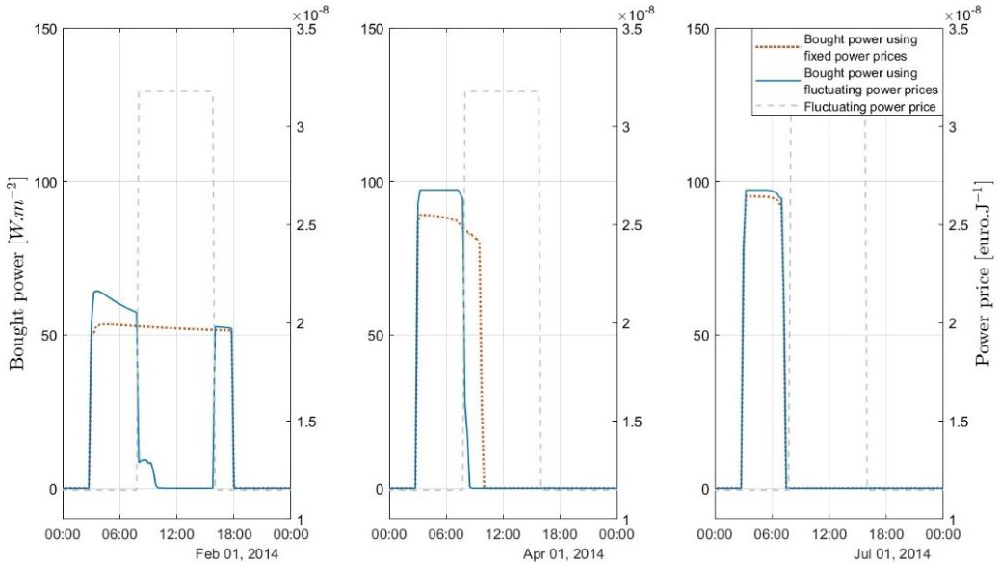  
Fig. 5.1- The bought power demand of the greenhouse for the $\mathbf { 1 ^ { s t } }$ of February (left) /April (middle) /July (right).

Fig. 5.1 shows the amount of power that was bought throughout the simulation period. Fig. 5.1 displays the bought power demand using the fixed power prices (red) and the bought power demand using the fluctuating power prices (blue). Furthermore the fluctuating power price is displayed (grey). This figure shows that in the fixed price scenario, power was bought throughout the day in the beginning of the season (left), as the season progressed power was only bought in the morning (middle and right). In the fluctuating scenario, power was not bought during high price times in the beginning of the season (left) and also transitions over the season to only being bought in the mornings (middle and right).

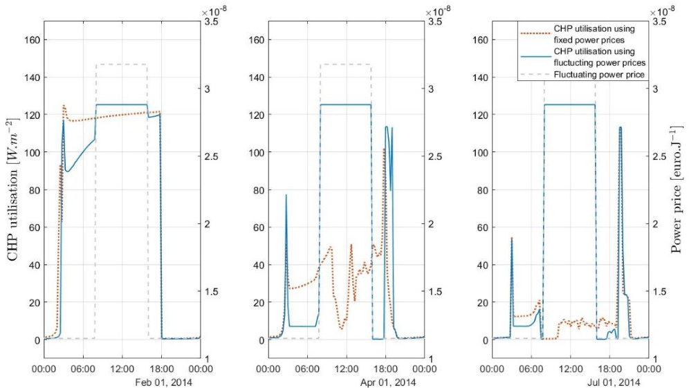  
Fig. 5.2 - The CHP utilisation for the $\mathbf { 1 ^ { s t } }$ of February (left) /April (middle) /July (right).

Fig. 5.2 shows the utilisation of the CHP throughout the season for the scenarios with fixed (red) and fluctuating (blue) power prices as well as the power fluctuating power price itself (grey). Fig. 5.2 shows that for the fluctuating price scenario the CHP was used throughout the season. In the early season (left) the CHP was operational throughout the day and as the season progressed (middle and right) increasingly the CHP was only used during high price periods. It should be noted that for the fixed price scenario in the beginning of the growing season the CHP was used and was used less and less as the season progresses.

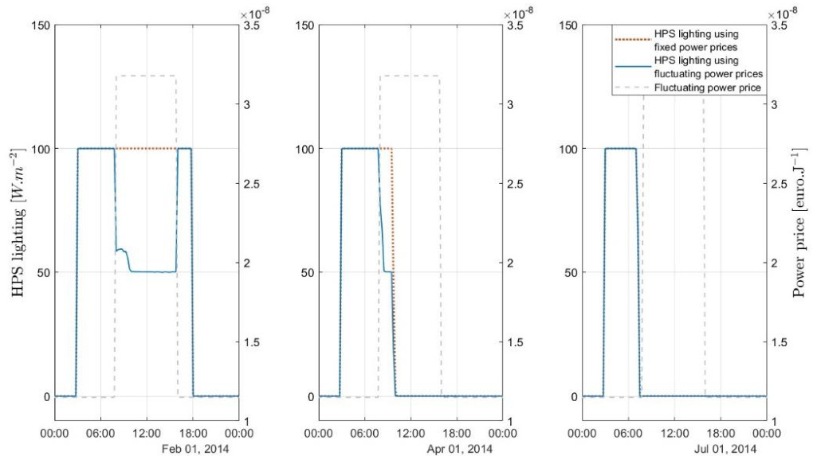  
Fig. 5.3 - The operation of the HPS lighting within the greenhouse for the 1st of February (left) /April (middle) /July (right).

Fig. 5.3 shows that the behaviour of the lamps over the simulation period given fluctuating (blue) and fixed (red) power prices. This behaviour mirrors the behaviours of the CHP for both scenarios, as seen in Fig. 5.1. Where usage was restricted to the morning as the season progresses. A key distinction was that for the fluctuating power price scenario, in the early season the lamps were operated at half capacity during the peak power price times, during which the power is provided by the CHP.

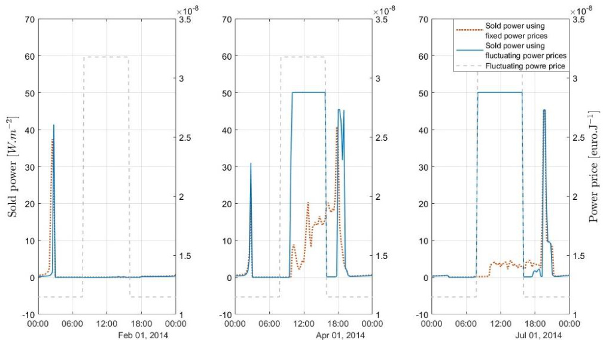  
Fig. 5.4 - The amount of sold power that is generated from the greenhouse CHP on the $\mathbf { 1 ^ { s t } }$ of February (left) , $\mathbf { 1 ^ { s t } }$ of April (middle) and the $\mathbf { 1 ^ { s t } }$ of July (right).

Fig. 5.4 shows the levels of sold power when exposed to fixed (red) and fluctuating (blue) power prices for three  periods throughout the simulation period. This figure shows that as the season progressed, the fluctuating price scenario increasingly sells power to the grid during high price periods. Whereas the fixed price scenario does not sell power in the early season (Fig. 5.4 (left)) but does so increasingly over the season in the midday.

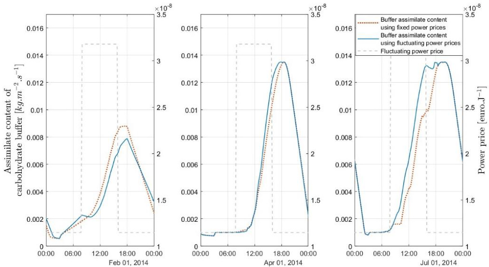  
Fig. 5.5- The crop assimilate pool level for the 1st of February (left) /April (middle) /July (right).

Fig. 5.5 shows the assimilate levels in the assimilate pool, throughout the season at three distinct day-long periods as was outlined at the beginning of section 5.3.1.1. In each panel the response to fixed (red) and fluctuating (blue) power price is displayed.  The fluctuating power price is shown in grey. This figure shows that the sugars were stored in the buffer in the afternoons and portioned overnight. Furthermore, over the season the amount of assimilate stored in the buffer increases.

# 5.3.1.2. Long-term time scale results

The breakdown of the energy usage and assimilate pool levels over the entire simulation period are described in the following section. This long-term perspective gives insights into how the short term behaviours translate over the entire simulation period.  The cumulative gas and power demand are shown in Fig 5.6.

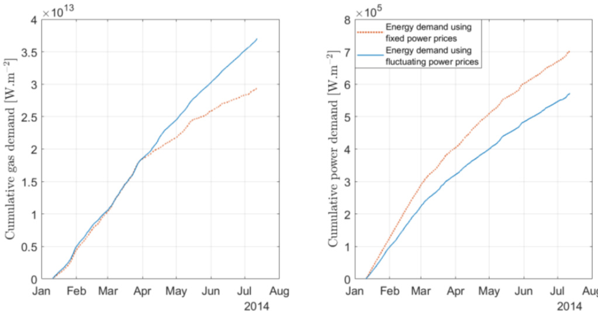  
Fig. 5.6 - The cumulative net gas (left) and power (right) demand of the greenhouse over the entire simulation period using fixed and fluctuating power prices.

Fig. 5.6 shows the cumulative net gas and power demand over the simulation period using fixed (red) and fluctuating (blue) power prices. This figure shows that until April both simulations have a similar gas demands however the simulations diverge in April, after which the fluctuating price scenario has a greater gas demand. In the case of power demand fixed price scenario has the greater power consumption throughout the season.

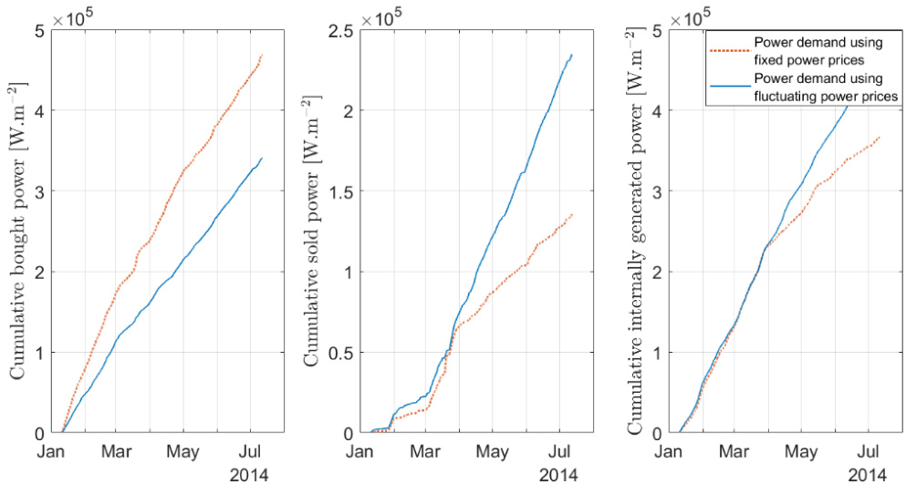  
Fig. 5.7 – The breakdown of the cumulative power buying (left), selling (centre) and internal power generation from the CHP (right) of the greenhouse over the entire simulation period.

Fig. 5.7 shows the cumulative power buying, selling and internal power generation from the CHP using fixed (red) and fluctuating (blue) power prices. This figure shows a breakdown of how power was used within the greenhouse. Fig. 5.7 shows that when comparing the fixed and fluctuating price scenarios, in the fixed price scenario more power was bought (left) and after April less was generated internally (right) and sold (middle). This outcome explains the divergence in gas demand between the fixed and fluctuating price scenarios seen in Fig. 5.6 as the CHP utilisation was less after April in the fixed price scenario.

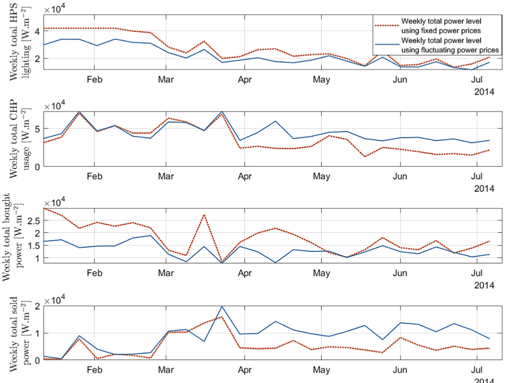  
Fig. 5.8 - The breakdown of the weekly total HPS lighting (top), CHP usage, power buying and power selling (bottom).

Fig. 5.8 shows the weekly totals of energy used in HPS lighting, generated from the CHP, bought, and sold from the market. Each of these variables is displayed in its own panel with the responses to both fluctuating (blue) and fixed (red) power prices. It shows that for the fixed price scenario more lighting was used throughout the season. This increase in lighting was powered using a greater and corresponding amount of bought power, when compared to the fluctuating price scenario. For the fluctuating price scenario, less lighting was used. This was because a larger amount of power generated from the CHP was sold due to the higher power prices instead of being used for lighting. The fluctuating price scenario shown in Fig. 5.8 sells more power throughout the season, a distinction which was made clearer after April. Indeed after April, the fixed price scenario buys more power from the market while generating and selling less.

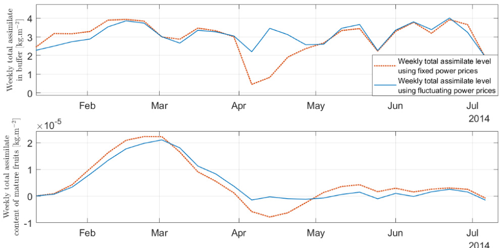  
Fig. 5.9 - Weekly total assimilate in the assimilate pool (top) and mature fruits (bottom) over the growing season.

Fig. 5.9 shows the weekly total amount of assimilates in the buffer and in the mature fruits. In both panel each variable is displayed in response to both fluctuating (blue) and fixed (red) power prices. This figure shows that early in the season the fixed power scenario has a faster development of assimilates within the fruits as more assimilate was transferred to the fruits. Fig. 5.9 also shows that while the amounts of assimilates in the buffer were comparable throughout the season the fixed price scenario delivers more assimilate to the buffer in the early season and a large drop in early April. Which coincided with when the CHP was turned off, as shown in Fig. 5.7.

# 5.3.1.3. Results summary

The results from the analysis was summarised in the following section. For the fixed price scenario shown in Fig. 5.6-5.8 the optimiser buys the most power over the season, initially there was some trading, in April there was a change of strategy where less power was generated and sold. In contrast to this the fluctuating price scenario has a greater focus on trading throughout the season where the CHP was used to sell power. Overall, less lighting was used, and the power that was generated was used for trading instead. Levels of production were comparable between the fluctuating and fixed price scenarios. This midday trading and less lighting shown in the fluctuating power price scenario does slow development speed but impact to overall production was limited.

更详细地说，在电价波动情景下，季节初期CHP（热电联产机组）主要用于为温室照明和售电。特别是在早晚的非高峰时段，照明主要依靠购电；而在电价高峰时段，CHP为照明提供一半的电力，剩余部分则用于售电。随着季节推进，这种平衡逐渐向以CHP售电为主、减少购电用于照明的方向转变。在该情景下，为了作物的长期生长，即使电价较高，仍优先在季节初期通过CHP在高价时段为温室照明。需要注意的是，如图9所示，糖分缓冲的情况在两种情景下没有差异。对于固定电价情景，季节初期所有电力都用于照明，随着室外辐射的增加，购电量减少，灯具使用减少，CHP则越来越多地用于照明和售电。能源和作物产量水平及收益的总变化如表5.6所示，表中为固定电价与波动电价情景下的百分比差异。

| 指标                         | 购电量变化(%) | 售电量变化(%) | 燃气用量变化(%) | 产量变化(%) |
|------------------------------|--------------|--------------|----------------|------------|
| 净购电量变化                 | -27%         | +74%         | +25%           | -0.34%     |
| 净购电成本变化               | -49%         | +145%        | +25%           | -1.4%      |

表5.6：引入电价波动后净能量与作物产量百分比收益变化

表5.6显示，在优化器考虑电价波动的情景下，CHP（热电联产机组）使用成本上升，因此售电和燃气购买的收益也随之增加。此外，购电量减少，作物产量略有下降。

# 5.3.2. 管理电价波动机制的敏感性分析

本节通过敏感性分析，探讨了燃气价格、室外辐射水平和作物缓冲池容量对电价波动影响的缓解潜力。在分析中，分别提高了作物缓冲池上限、燃气价格和室外辐射水平，并将温室产量、电力使用和燃气使用的相应百分比变化展示于表5.7。

表5.7：提高燃气价格、作物缓冲池容量和室外辐射水平对净能量与作物产量百分比收益的影响

|                | 购电量变化 | 售电量变化 | 燃气用量变化 | 作物产量变化 |
|----------------|-----------|-----------|--------------|--------------|
| 缓冲池容量加倍 | +17%      | +3.8%     | +0.93%       | -17%         |
| 燃气价格加倍   | +34%      | -33%      | -33%         | +1.2%        |
| 辐射水平加倍   | -23%      | +14%      | +0.80%       | +5.2%        |

Table 5.7 shows that an increase in buffer size has the smallest impact on energy demand but the largest impact on crop yield. In addition, increases in gas prices were found to have the greatest impact on energy management. Specifically when the gas price increased the amount of gas that was bought and used to generate power in the CHP decreased and the amount of bought power increases. Regarding the increase of outdoor radiation, the amount of bought power decreased as less artificial lighting was used and more power was sold to the grid. Both increased in gas prices and radiation levels have a small impact on the crop yield.

# 5.4. General discussion

Given the results outlined in this study the following section discusses the relevance of these results given the context of the limitation under which this study was performed and the context of previous literature.

# 5.4.1. The influence of fluctuating power price results on energy management

The results show that the fluctuating price scenario has a greater focus on trading throughout the season where gas was bought to run the CHP which was then used to sell power as seen in table 5.6 and 5.7. As a result, in this scenario less lighting was used, as the power that was generated by the CHP was used for trading instead. Despite this decrease in lighting it should be noted that the crops productivity was only slightly lower in the fluctuating price scenarios (Fig. 5.9) with a net decrease of $1 . 4 \%$ (table 5.6). As such the optimiser was able to provide a robust strategy to fluctuating power prices that maintains productivity but does consume more gas. This in conjunction with the conclusions made in table 5.7 regarding the role of the crop buffer size and gas price in managing power prices tells us that the availability of affordable gas and not the presence of a crop buffer provided the necessary robustness to tolerate fluctuating power prices. This conclusion was however opposed to the inciting notion of this study that the greenhouse sector should reduce its emissions. Indeed, while this study highlights the roles of available gas and the gas price, its future affordability is in doubt as its sources become more scarce and the drive to sustainable energy renders it unavailable. As such this study highlights a key interdependency between gas and power in tolerating energy price fluctuations that is provided by the CHP. As such future studies that aim to make sector more sustainable should penalise gas usage in particular. It should be noted that the sensitivity analysis  whose results are shown in section 5.3.2 uses the gas price as a parameter that would incentivise the usage of the CHP. Another parameter that could also be considered in future research is the capacity CHP itself. By investigating the effect of the CHP’s capacity future research could investigate how energy management strategy might change if more power full CHPs were to be used.

It should also be noted that the strategy that is employed to run the greenhouse changed over the season. Indeed, for the fluctuating price scenario, in the early season the CHP was used generate power for running the lamps and for selling power. Subsequently, over the season this balance shifts more towards trading power and less buying power for lighting (Fig. 5.8). This was a reaction to the availability of natural light and heat whose levels increase as the year develops.

This was also observed in the fixed power price scenario where all power goes to lighting in the early season, and as the outdoor radiation increased over the season the amount of bought power decreased as lamps were used less as corroborated in table 5.7, which also showed that as the radiation levels increased, power buying decreased, and more power was sold from the CHP. As such these results also indicate that the fluctuating weather, and in particular the outside radiation levels was an important factor in defining the power management strategies derived by the optimiser. A notable behaviour seen in Figs 5.4 and 5.2 are spikes in early morning CHP operations and power selling. This peak in selling is caused by the CHP being activated to heat the greenhouse before the lights are switched on, as such there is a spike in power generation which is sold to the grid.

The results for the increased gas price shown in table 5.7 also represent a scenario in which the price of gas has doubled, in a scenario that might become reality due to climate change. This analysis confirmed the importance of CHP trading to greenhouse energy management highlighted in Seginer et al., (2018) and van Beveren et al., (2019). It was found that even with higher gas prices the greenhouse was able to maintain yield levels $( + 1 . 2 \% )$ but reduced the selling of CHP derived power $( - 3 3 \% )$ . This indicated that while the greenhouse business model may have to adapt in the future, production was still possible with higher gas prices if the management strategy adapts.

The potential effect of fluctuating weather and power prices on energy and crop dynamics was also examined in a series of unpublished experiments, these experiments concluded that weather dynamics were dominant in driving long term seasonal variation in energy strategy and power dynamics drive energy systems decisions only during high price periods. Furthermore, these experiments found that the fluctuating weather dynamics result in less productive growth than the fixed weather scenarios which in this case represents a perpetual summer. Which indicated that the crop was influenced by weather dynamics more than prices over longer periods. Based on these preliminary results this investigation into the interrelation between weather and price dynamics was a promising frontier for future research.

# 5.4.2. The suitability of the assimilate pool as an energy buffer

The optimisation scenarios described in the above section concluded that the assimilate pool was not being used as an energy buffer (Fig. 5.5) to bridge fluctuating prices. To investigate this outcome further a number of smaller scenarios were performed in appendix C. The analysis performed in appendix C investigated the potential capacity of the crop assimilate pool to act as an energy buffer. This analysis concluded that for a day in which the greenhouse lighting and heating system were operated for 8 hours the crop buffer had a size of approximately $3 \%$ of the energy required to run the greenhouse. As such, the crop buffer represents a comparatively very small energy buffer and as such was not used by the optimisations shown in section 5.3.1 and 5.3.2.

A further analysis performed in appendix D, investigated the response of the crop yield of mature fruits to fluctuations in the greenhouse climate. These fluctuations were in the indoor radiation and temperature levels and were represented as two square waves with a range of periods and amplitudes. This analysis found that yield fell dramatically when fluctuations had high amplitudes and exceeded a one day frequency. This result implies that the crop as modelled in this study was unable to buffer heightened fluctuations in climate. Indeed, this analysis also showed that for a standard amplitude the crop was able to tolerate a fluctuating climate of up to 10 days but with lower levels of mature fruits than when a shorter period was used. Given the loss of productivity shown in appendix D, it indicated that the crop’s assimilate pool is unsuitable as an energy buffer, particularly in the context of the optimisations performed as part of this study. This conclusion diverged from the temperature integration schemes proposed in previous literature. For example, the scheme proposed by Korner & Challa, (2003) and Ko rner & van Straten, (2008) who demonstrated that temperature fluctuations within a 6 day period could be tolerated provided that the average temperature was consistent. While this approach could be used for energy savings, they did not consider the impact of fluctuating lighting and temperature. The potential impact of fluctuating light and temperature levels was previously explored in Zepeda et al., (2022) who found that fluctuations in light and temperature with a period of 2 to 10 days did not have a large influence on the levels of assimilates in the crop. While this research does suggest a degree of tolerance to a fluctuating climate, Zepeda considered young plants and this study focussed on mature crops. This conclusions in conjunction with the results found in this study indicate that the integration of temperature and light levels in mature crops was not viable for the model representation used in this study, and requires further experimental research.

A further consideration as to why the assimilate pool was not used was the influence the design of the cost function might have on the outcomes of this study. The cost function used in this study optimises (Eq. 5.6) the harvested fruits, as such the cost function does not reward assimilate storage. Indeed, if the optimiser only considered mature fruits there was no incentive to manage the assimilate pool outside its role in maturing fruits. Furthermore, if the prediction horizon was too short the link between stored surplus assimilates and harvested fruits was lost. This was the case as the prediction horizon was 3 days and the fruit development period was between 36 and 52 days (Kuijpers, Antunes, et al., 2021). As a result, the optimiser may be unable to assess the benefit of using the assimilate pool in the way that this study proposes. This was tested in an unpublished analysis that performed an optimisation on an open loop optimal controller over the entire simulation period. In doing so the relationship between the buffer and mature fruits can be included in the optimisation. However, this analysis also found that the assimilate pool was not being used as an energy buffer. Indeed, as it takes a long time for the benefits of developing mature fruits to appear in the cost function, as a result the optimiser would focus on the short term trading of power.

This link between assimilate pooling and harvested fruit in the cost function was further complicated as the development of fruit was modelled as being dependent on the daily temperature sum, and the main adaptation to power price fluctuations was the use of lighting. As such there was also a mechanistic disconnect with the motivation to buffer energy from the power price and the mechanism to do so which was temperature based.

# 5.4.3. Limitations and future research

Despite the outcomes of this study there are a number of areas where improvements might be made in future research. Given that this study found that the crop’s assimilate pool was unsuitable for energy buffering, it is worth considering the potential limitations the modelling of the crop and its buffer impose on the conclusions of this analysis. An omission from the crop model used in all chapters of this thesis was the modelling of the transfer between liquid assimilate and starch. This limitation was key for the research proposed in this study as the flow of sugars in the crop’s assimilate pool was one of the potential energy buffers that are being investigated. Current research suggests that a plant with excess sugars will convert them into starch (Gent et al., 2012; Stitt & Zeeman, 2012). This mechanism was key as it can provide longer term storage of energy, but also implies that there can be a surplus of assimilates that can be stored in starch over multiple days. The fact that the crop model used in this thesis did not model starch conversion should be addressed in future research as previously recommended by (Zepeda et al., 2023). This should be done to assess if such a mechanism would allow the crop to function as an effective energy buffer.

This study considers the potential of the crop’s assimilate pool being used as an energy buffer, however there are still outstanding challenges as to how this pool is quantified. For example, there is little experimental data as to the size of the assimilate pool and how the pool size may change over time. The parameter defining the crop’s assimilate pool maximum capacity is particularly relevant to the research performed in this study as it defines the potential size of the energy buffer. The value used for the pools maximum capacity was taken from Seginer, (2022). The capacity of the assimilate pool proposed by Seginer was one that incorporates the crops maturity, which is a more realistic representation. However, this approach along with other studies (Heuvelink, 1996; Jones et al., 1991) have proposed models for the size of the assimilate pool that have not been experimentally validated. As such the outcomes of this study may vary depending on the defined size of the assimilate pool. This was investigated in table 5.7 in which the pool size was doubled. This analysis found that increasing the pool size had the smallest influence of the mechanism examined in this study and in this case decreased productivity. However the values used for the buffer limit are purely theoretical and further research should experimentally quantify the size of the assimilate pool and assess whether that influences the applicability of the assimilate pool as an energy buffer.

One other limitation was that the usage of the crop buffer and its potential influence on crop health was not modelled. Previous research has proposed models of aspects of the crop’s health. Specifically for the purpose of predicting disease in tomato (Verma et al., 2018) and assessing harvest quality (Bertin & Ge nard, 2018). However, for the crop model used in this study, the aforementioned aspects of crop health and other important indicators such as fruit setting and abortion were not included. As such the potentially detrimental health influence a particular management strategy would have, would not be reflected in the strategies proposed by this analysis. Consequently, the strategies proposed in this thesis may have some detrimental effect on the greenhouse crops in practice due to this modelling omission. As such further research should be done to assess the impacts of these omitted behaviours on greenhouse management.

The posing of the control problem in this study may also pose a limitation on the conclusions. In this study a RHOC controller was used along with a fruit development model. The optimiser’s cost function calculated revenue from mature crops and costs from immediate energy expenditure (Eq. 5.6). This design can lead to a disconnect where the optimiser cannot link changes in short term energy strategy to mature fruit yield. Indeed, this disconnect was compounded as crop attenuated fluctuations in photosynthesis through the development stages of the fruits. As such a change in management strategy, which does result in a fluctuation in photosynthesis was filtered out by the time the effects of that fluctuation reach the mature fruit state. As such the optimiser cannot observe any managerial impact of short-term climate fluctuations. In this case using both mature fruits and instantaneous assimilate levels in the optimiser’s cost function may be preferable in future research. This was as energy expenditure can be linked to fruit development through the immediate creation of assimilates. This suggestion does however remove the optimisers incentive to develop mature fruits and as such may be suboptimal.

A further limitation concerning the optimisation used in this study is that the constraints that were set for the model states were defined as soft constraints within the optimiser. In doing so exceeding these constraints was disincentivised but possible. As such, state constraints defined in the optimiser can be interpreted as state value limits over which values are tolerable but undesirable or state value limits which we are usure of. Considering the model states that were constrained (see table 5.3) the climate variables can be seen as managerial guidelines and the constraints of the crop states are founded in previous literature but require experimental validation. Having considered this, while it was possible it was unlikely that these limits should be exceeded, and such are unlikely to impact the overall conclusions that were drawn from this analysis. The validity of this setup is further supported as this setup was validated in Kuijpers, Katzin, et al., (2021). However, future research should assess the impact of this assumption this by incorporating these constraints as hard constraints within the model itself.

The study used data from a single season and a single location in the Netherlands, the validation and generalisation of the outcomes of this study would require multiple datasets. Indeed, this study also used a single model of the greenhouse and crop. While this model was validated by Kuijpers, Antunes, et al., (2021), the outcomes of this study may be limited in its generalisability due to some nuance of the model. As such, this study should be repeated using multiple models.

The power price data (table 5.4) used to simulate this experiment was a square wave, being high in the middle 8 hours of the day and low for the 8 hours on either side. Using this simplified price signal makes the analysis of the greenhouse and crop’s response clear by demarcating times when changes in strategy may be observed in the optimiser. While this simplification was based on the broad trend of rising daytime prices on short term markets this simplification was a departure from reality in that power prices are dynamic and proto-stochastic as they can be influenced by sudden unforeseen changes in the power grid. For the purposes of this study the assumption of a square wave price is sufficient as it demonstrated the optimisers response to regular fluctuations in power pricing, but future research should also investigate the impact of real power price data.

# 5.5. Conclusion

This study investigated how the energy management of the greenhouse can be optimised under fluctuating power prices.  A key outcome was that the optimiser proposed an adaptation of the greenhouse power management strategy. This strategy focussed on buying far less power $( - 5 0 \% )$ and using more natural gas $( + 2 5 \% )$ to generate power in high price times to power the greenhouse lighting and selling power to the grid $( + 1 4 5 \% )$ . This study also found that the fixed gas price had the largest role in  managing power price fluctuations when compared to the forecasted radiation levels and the crop’s assimilate pool. This study investigated the suitability of the assimilate pool as an energy buffer and found that in this case the buffer is not suitable due to its small size.

# Acknowledgements

We thank Wouter Kuijpers for sharing his code for the greenhouse model and MPC algorithm.

# Chapter 6. General discussion

The work set out in this thesis was incited to address two lines of thinking within greenhouse horticultural research that were articulated as aims in the general introduction. The first aim was to assess how fluctuation within weather data, errors in model parameters and power price data influence errors within greenhouse energy predictions. This aim was addressed in Chapters 2 to 4 which focussed on assessing the individual and combined impact of weather forecast and model parameter errors. The second aim of this thesis aim is to assess if the crop’s assimilate pool, CHP and radiation forecast can be used to manage fluctuating power prices. This second aim was investigated in Chapter 5.

# 6.1. Uncertainty vs. precision

Much of current thinking in greenhouse horticultural research and industry is focused towards developing methods and tools with ever greater precision. This perspective is grounded in the idea that all things can be known deterministically and with ever greater accuracy, if only more data and resources are invested. While this approach can often yield improvements it relegates another type of insight. That is, the degree to which something can be known, also known as quantifying uncertainty. From a practical perspective, this kind of insight is vital for assessing risk and planning for possible futures. The pursuit of uncertainty exploration sits apart from the pursuit of precision as a perspective that highlights areas that require improvement and investigating how system dynamics and disturbances can oppose the pursuit of precision. As such the work presented in this thesis in relation to the first aim of this thesis, “to investigate the improvement in greenhouse energy management that can be made by accounting for uncertainty introduced from model parameters, weather forecasts and fluctuating energy prices.” should be seen as providing crucial tools that are complementary to the pursuit of precision. Allowing from the assessment of a desired deterministic outcome and the statistical risk posed by an uncertain future.

# 6.2. Reflection on findings

The Dutch horticultural sector is a large producer of horticultural crops and a large consumer of energy. This energy demand comes at a cost to the environment as fossil fuels are burned as part of the energy mix that provides the sector’s required energy, which contributes to climate change. In the face the challenge to reduce the greenhouse horticulture sector’s environmental impact, previous research has aimed to balance the production of crops and the usage of energy. Chapters 2 to 4 of this thesis was poised address the first aim of this thesis by improving greenhouse energy efficiency through managerial improvements by identifying and making targeted reductions in sources of energy demand prediction uncertainty.

In addressing the first aim of this thesis Chapter 2 found that the improvements of energy predictions were relevant for greenhouse management given that energy was bought on multiple markets. This was as the prediction errors made as a result of weather forecast errors exposed the grower to more volatile power prices on shorter term markets. Radiation forecast error had the greatest impact on predicted greenhouse power demand errors with a mean relative error of Ψ. For gas demand errors the outside wind speed forecast mean relative error ሻand temperature forecast error ሻwere the most impactful. These insights can be understood by observing the processes that create energy demand and are related to the weather variables. For example, the lamp lighting within the greenhouse is the main source of power demand and is used depending on the availability of natural light. As such it is logical that errors in the radiation forecasts would impact lamp usage and in turn impact on power demand. Given this kind of logical deduction it could also be possible to perform rudimentary analysis to identify individual sources of uncertainty purely through observation of the equations of the greenhouse model.

In addition to prediction errors introduced from weather forecasts, errors in the value of model parameters can also lead to energy prediction uncertainty. This impact was assessed in Chapter 3 which concluded that parameters relating to the model of the lamp were the largest contributors to gas and power demand prediction uncertainty. In the case of power demand, parameters relating to the lamp model were found to have a greater coefficient of variation (ʹͶ)Ψthan those related to the crop (ͷΨ) or greenhouse structure (ͷΨ). Again as in Chapter 2 the outcomes of this research highlight the role of model design in the prorogation of uncertainty and in particular the design of lamp model. But this chapter made the significant conclusion that larger groups of parameters are also responsible for prediction uncertainty. This insight invites a fundamental change in perspective whereby future analysis should consider the impact of larger groups of parameters and not only groups of one or two parameters.

When analysing the combined impact of parametric and weather forecast-based uncertainty in Chapter 4, it was found that the weather forecast error was by far the larger contributor. Creating a mean gas (ʹ $\forall \neq \ )$ and power $( \quad 7 \neq )$ prediction error when compared to parametric errors (ͷ ͹ $\gamma _ { \neq }$ and

$\forall \neq \ )$ . Furthermore, for the purposes of energy demand uncertainty analysis weather forecast and parametric error could be treated independently. This insight was a cornerstone for this uncertainty analysis as it allows for the partitioning of the sample space between data and parametric error, making the analysis less computationally intensive. While this was very useful for this analysis, it should not be overlooked that assessing the combined impact of uncertainties from different sources is a powerful tool for deep insights into how uncertainty propagates through entire systems. This chapter also concluded that improvements in weather forecast error have large diminishing returns with prediction error where significant improvements in weather forecasts are required for modest reductions in prediction uncertainty. For example, a large $8 0 { - } 9 0 \%$ reduction in forecast error only resulted in a $5 0 \%$ decrease in gas and electrical power prediction error. The methodology proposed in Chapter 4 goes a level deeper than a traditional sensitivity analysis by not only identifying how much prediction error could be reduced but also how hard that would be to achieve. Indeed, the conclusion of this analysis tells us that reductions in weather forecast errors would yield improvements in energy predictions, but major improvements are not easy to achieve.

In addition to the impact of greenhouse energy consumption directly on the climate, climate change itself can have an effect on the availability of energy resources. As the globe transitions to more sustainable weather-based energy sources, the price of energy may become more volatile as it was increasingly based on the availability of ideal weather conditions. As such Chapter 5 of this thesis addressed the second aim of this thesis by investigating how a greenhouse can be managed under disturbance from fluctuating energy prices by using the CHP, the forecasted radiation level or the crop’s assimilate pool as an energy buffer. This chapter concluded that the CHP and more specifically the gas price was the main mechanism used to manage fluctuating power process. This chapter also concluded that the crop’s assimilate pool has limited use as an energy buffer. With the assimilate pool only having a small capacity to buffer when compared to the greenhouse’s daily energy demand.

An overall conclusion that can be drawn from the work presented in this thesis is that the design of the greenhouse controller is a key contributor to how input error propagates into energy demand prediction uncertainty. Indeed, this conclusion was found in Chapters 2-4 for traditional rule-based controllers that are still common in industry. As such a contribution this thesis makes to the progression of the field of greenhouse horticultural research and to industry is that rule-based control methods may be used and new control methods may be developed, but without the understanding of the interaction of controller design and input error, predictions will be uncertain.

# 6.3. Limitations from weather data

Chapters 2, 3 and 4 include demonstrations of the methods they propose using historic weather data. The use of this weather data is predicated on a number of simplifications and assumptions, which in turn apply limitations on the research this data is used for. Firstly, the weather data used in this thesis was augmented with synthetic sky temperature and diffuse radiation data. This synthetic data was derived from weather variables within the dataset and using formulas from literature (Luo, de Zwart, et al., 2005; Orgill & Hollands, 1977). While these synthetic variables may be representative, they may contain errors from simplifications or assumptions used in these formulas which influence the outcomes of the thesis. As such the accuracy of these equations should be examined using recorded data of sky temperature and diffuse radiation levels as well as different formulas for their estimation. This limitation was previously partially addressed in appendix A, which concluded that the assumptions made regarding sky temperature and diffuse radiation levels did not affect the outcomes of Chapter 2 with regards to the creation of weather forecast derived prediction uncertainty of energy demand. Having said this, future research should apply the analysis proposed in appendix A to the Chapters 3 and 4 to investigate the potential impact on parametric uncertainty and combined parametric and weather forecast-based uncertainty. However, given the conclusion of Chapter 4 that there is little interaction between parametric uncertainty and weather forecast-based uncertainty it would be reasonable to generalise the conclusions of appendix A to Chapters 3 and 4.

A further consideration when analyzing weather data is that in reality weather is dynamic over the surface of the greenhouse and the data that is used in this thesis are sampled from the single point where the weather measurement station was located. As such all transient weather dynamics around the greenhouse are removed. This has consequences for the analysis presented in this thesis as it may introduce a form of spatial uncertainty. Whereby the sample point in the weather station is not representative of the average climate around the greenhouse. The significance of this simplification was addressed in Balendonck et al., (2010)

who concluded experimentally that spatial variation in the greenhouse air temperature was high at Ԩ. Despite the impact of spatial variation identified by Balendonck little attention has been given as to how this spatial variation might influence uncertainty analyses. If spatial variation were to be incorporated, they may deepen the insight gained from an uncertainty analysis by identifying precise locations in the greenhouse where the influence of weather forecasts errors are most impactful. As such future research should consider the implications of the removal of temporal and spatial variation in weather data by performing an uncertainty analysis with data recorded from multiple locations both within and outside the greenhouse or using a 3D model of the greenhouse. Despite the potential ramifications of this simplification an aspatial perspective is an industry standard and the norm for a large portion of greenhouse horticultural research (Katzin et al., 2020; Seginer et al., 2017; van Henten, 1994). As such the insight set out in this thesis are not compromised by the exclusion of spatial variation in terms of their relevance to industry and contemporary research, but instead this limitation is an invitation for a new challenging dimension in future research in greenhouse uncertainty analysis.

Chapter 2 and 4 perform uncertainty analyses using time series of weather forecast data. While these chapters capitalise on the availability of data streams as articulated in Opportunity 1, they also must consider the impact of correlative effects such as auto-correlation and cross-correlation on an uncertainty analysis. These correlatory effects include auto-correlation, which is a measure of similarity between samples in a data series. As such, any errors in a set of time series data may be influenced by correlation between the data points in that time series. These correlatory effects were found to play a large role in creating weather forecast errors in Scher & Messori, (2018). If correlatory effects then influence forecast error, the analyses in Chapters 2 and 4, which looks at the prediction uncertainty caused by forecast errors may also be influenced by auto-correlation and cross-correlation. This possibility is further complicated by the fact that the analysis in Chapter 2 and 4 segment data streams. This apportioning and rearranging of segments of weather data in effects breaks the relationship between auto and cross-correlation, error and uncertainty that had existed in the original dataset. This was done based on the underlying assumption that correlatory effects which segmenting will remove are either small or can be partially included using segments of a certain length and as such have a limited influence on the uncertain analysis. In Chapter 4 weather data was segmented into two week periods, the underlying assumption being that two weeks was a sufficient period to maintain the autocorrelatory effects within the weather data. This assumption reflects insight gained by Kuijpers et al., (2022) and from an unpublished autocorrelatory analysis performed as part of the Flexcrop project which indicated that 7 days was a sufficient period. Indeed, studies from outside the domain of greenhouse horticulture such as Polasek & C adí k, (2023) concluded that only a period of 5 days of radiation forecasts contained sufficient correlative effects to predict the power produce from photovoltaic cells. As such previous research choosing shorter periods indicates that the segmenting of data into two-week periods in this thesis is unlikely to impact its conclusions. It however remains unclear how significant autocorrelatory effects are in influencing the propagation of weather forecast error in greenhouse models, and indeed whether the two week period could be shortened as seen in Polasek & C adí k, (2023) without impacting the outcomes of the analysis. If it were possible to shorten the length of data segments, more unique samples could be drawn from the same dataset. This would in turn increase the density of the weather forecast error sample space and could in turn increase the accuracy of the corresponding prediction uncertainty distribution.

# 6.4. Limitations in greenhouse modelling and control

The modelling of parametric uncertainty performed in Chapters 2 and 3 assumed that the parameters were normally distributed. This assumption is a simplification as the distribution of these parameters may be alternatively shaped, leading to a different profile of sampled values. The parameter distributions used in this thesis were defined as having a $4 ^ { \mathrm { t h } }$ quartiles with a value of Ψof the distribution’s mean value. Again, this assumption is a simplification as many parameter may be known with a high degree of accuracy. As such values sampled from these parameter distributions may have a larger or small range than their true distribution. The potential limitations this poses on the conclusions of Chapters 2 and 3 are that the exact sensitivity indices may differ from those found in this thesis given different initial parameters distributions. This is however unlikely, as if the response of the model predictions to changes in a parameters value is approximately linear. This linear relationship was found to be the case between power demand prediction error and the parameter in unpublished figures included as part of Chapter 3 section 3.3.4. As such, for this case the ratio of changes in predictions to changes in the parameter value should be comparable in magnitude despite potential inaccuracies in the range of parameter used.

As such the conclusions relating to parameters which are not sensitive should remain consistent even if the exact sensitivity may change given a more informed parameter distributions. It should also be noted that these assumptions while imposing limitations as to the insight of these chapters are also practically necessary given the lack of previous studies and available information to inform these distributions. It would be of great interest for future research to perform a large-scale parameter identification analysis with the goal of defining these distributions more accurately.

A key outcome of Chapter 3 was that groups of parameters create prediction uncertainty through interactive effects. These parameters also create prediction uncertainty through feedback loops within the model whereby errors iteratively propagate and grow. This considerable insight leads us to a paradigm shift to consider uncertainty not as a linear propagation from parameters and input data to predictions, but a process that is influenced by the design of the greenhouse model and controller. As such the addition of uncertain parameters in models, feedback loops and rules within the controller may alter or introduce an equation that represents a relationship in the greenhouse system that had previously been omitted. In doing so this can produce unforeseen changes in prediction uncertainty by mechanistically altering the link between sources of error and prediction states. These interactive and iterative effects have been identified in the specific case study examined in Chapter 3.  The link between system design and prediction uncertainty invites a broader change in methodology to the design of models and control systems. A change whereby the designer not only considers relevant mechanisms that embody the target system, but how the accuracy of the components of these mechanisms will influence overall prediction uncertainty. This concept parallels the notion of structural uncertainty analysis as described by Hoeting et al., (1999) but should be involved in design and not only retrospective analysis.

A rule-based controller was used in Chapters 3 and 4, this controller was based on the controller proposed in Katzin et al., (2020) and Vanthoor, Stanghellini, et al., (2011). While this controller was designed to represent a consumer grade climate controller, there is a great degree of variation in the design and calibration of rules sets used across the sector. As such the insight in Chapters 3 and 4 relating to the design of the controller impacting uncertainty propagation may only be linked to the specific controller design used in this thesis and as such may place a limitation on this conclusion. However, this insight is also corroborated by previous research, for example van Henten, (2003) concluded that parameters related to the control of greenhouse humidity were key in creating uncertainty in greenhouse economic performance. Furthermore (Vanthoor, van Henten, et al., (2011) also concluded that the addition of a controller reduced the impact of weather data error on prediction uncertainty. As such there is a foundation in literature that is an affront to this limitation and supports the general conclusion that controller design contributes to greenhouse prediction uncertainty propagation.

# 6.5. Limitations from power market data

This thesis posits that the economic analysis in greenhouse horticultural research should become more advanced and representative to remain impactful. Chapter 2 has achieved this by introducing an economic analysis using time series prices from multiple power markets. This is done in Chapter 2 using data from the Dutch imbalance and day-ahead market to demonstrate how growers might trade power using multiple markets. However, given the selection of data, the insight from this analysis is specific only to the Netherlands. As such it has limited relation to the dynamics in international markets and is only approximately related to the trends within power markets within adjacent European countries. More broadly the power price data used in this thesis are exclusive to the period of time that data represents. As such the economic analysis may include dynamics that are not relevant outside of that period of time and may become less relevant as long-term market trends develop. Having considered this the methodology and intention of Chapter 2 to broaden the economic analysis of greenhouse energy demand remains an important contribution as the methodology can be applied to any set of markets of varying timescale and volatility.

A further limitation is that this analysis does not use data from the intra-day market due to a lack of available data. This market is a where trading is done on a 15 minute basis and up to 90 minutes before delivery (Chaves-A vila et al., 2013). As such this market fills an important role in the power trading ecosystem that is not met by the day-ahead or imbalance market which were included in this thesis. As such the intra-day market is an important market for corrective trading and should be included in future research.  However, having considered this, the demonstration performed in Chapter 2 retains its value as a demonstration of the risks taken by growers when trading on more volatile power markets, regardless of the specific properties of these markets.

The day-ahead market price was used as a continuous market in this thesis, where power can be bought from this market at any time. This is a simplification of the reality of how this market operates. In reality this market is planned whereby orders for the demand, supply and timing of power are collected until 12:00 every day. At this point supply and demand orders are matched, a contract is formed and the power is supplied when specified (Chaves-A vila et al., 2013). Given this the inclusion of day-ahead market data does introduce a more detailed economic analysis that considers corrective trading. However, the assumption that the day-ahead market is a continuous market limits the conclusions of Chapter 2 in their relation to real trading dynamics. As such a next step would be to construct a more realistic market structure that includes the different mechanism power markets use for trading.

# 6.6. Recommendations and future research

The outcomes of this thesis have a number of implications for broader society and for the greenhouse horticultural sector. This thesis makes strides in providing tools to analyse and improve greenhouse energy management through prediction uncertainty mitigation. In doing so highlighting how the climate impact of the greenhouse sector might be reduced through improved energy management. Furthermore, the research performed in Chapters 2 and 5 of this thesis investigated ways in which greenhouses can operate in a volatile energy markets landscape. In doing so these chapters can aid a wider society by stimulating development as to how the food supply from greenhouses can be made secure in an increasingly unstable future where climate change drives shifts in energy availability.

The research performed in Chapter 2 addressed Challenge 3 in assessing the potential risk of increased costs from corrective trading on power markets. This chapter concluded that the grower incurs excess costs by trading for mispredicted energy on short term markets. In response to this the sector should pursue contracts for the provision of power at fixed or banded rates to avoid potentially volatile markets (Tanrisever et al., 2015). This proposal is made more acute by the potential for increased market volatility as a results of global climate change (Mulder & Scholtens, 2013). In addition, future research might consider how the analysis of greenhouse economics can be extended to incorporate the contract format upon which revenue is received, with lump payments made after delivery of bulk quantities of crops. In doing so the analysis of greenhouse economics can become a closer approximation of practice allowing for deeper practical insight and more relevant analysis.

A key conclusion of the research within this thesis is that the design of the greenhouse controller strongly influences which factors impact the creation of energy demand prediction uncertainty. As such a promising avenue for future research is to go a level deeper to assess exactly how the composition and design of greenhouse climate controllers influences which parameters are impactful. For industry this insight should act as a warning to growers. A warning that altering rules within their climate controller may diminish the overall prediction accuracy of any associated decision support system by introducing new sources of prediction error.

Research performed in Chapter 3 and 4 addressed Challenge 1 and highlighted the overwhelming importance of lamp model parametrisation in the creation of energy demand prediction uncertainty. As such industry should be sure to correctly calibrate any lamp light model that is used as part of a decision support system.  Furthermore a key part of the research performed in Chapter 4 highlight the potential impact of groups of parameters through higher order interactions. As such this thesis posits a significant paradigm shift in the application of uncertainty analysis in the domain of greenhouse horticultural research by including higher order interactions in sensitivity analyses. Indeed, this chapter concludes that for any complex system, assessing the combined influence of large groups of parameters should become a staple part of uncertainty analysis.

Chapter 5 concluded that for the purposes of buffering electrical energy the crop’s assimilate pool as modelled in this thesis has limited potential in industry as an energy buffer. This is due to the crop buffer’s small size relative greenhouse energy demand. This chapter did conclude that the access to fixed price gas was the most effective way to manage fluctuation in power prices. However, this solution relies on the availability of cheap fixed price gas, which may not be possible in the future given the pressures of climate change.  To avoid the use of fossils fuels, the installation of a battery system in the greenhouse would allow the greenhouse to buy power at cheap periods, store it and remobilise it during peak times. In essence performing the same function that was hypothesised for the crop’s assimilate pool and gas run CHP, but with a larger capacity and the potential to use renewable energy which makes a battery a viable solution.

Chapters 2, 3 and 4 make a significant contribution to the cause of uncertainty analysis in greenhouse horticulture. These chapters proposed methods of uncertainty analysis that are novel for the domain and indeed investigate novel aspects of energy demand prediction. Specifically, the work in this thesis introduced the method of Polynomial chaos expansions as a method of large scale uncertainty analysis to the domain of greenhouse horticultural research. Such a tool offers valuable novel insight but also invites a retrospective re-evaluation of previous work. Future greenhouse research should embrace the forms of largescale uncertainty analysis that PCE offers, to deepen our understanding of complex systems. Furthermore, the kind of insight that methods like PCE offers invites future research to think about uncertainty propagation not as the agitation of a linear system but as a ripple through a complex series of loops, webs and buffers in which the design of the system is of paramount concern.

Chapter 4 considers the combined effect of parametric and data derived prediction uncertainty. This research introduced a methodology that provides the tools for future research and industry to not consider types of uncertainty sources separately but to address interactions between different types of uncertainty sources. Furthermore, these combined effects can vary with time and the status of the system allowing analysis to be more situational and accurate in identifying compounding and additive relations that would otherwise have been undefined.

# Appendix

# Appendix A – Cloudiness index and ambient ଶlevel sensitivity analysis

A Sobol sensitivity analysis (Saltelli et al., 2008) was performed to assess the impact of the assumptions made about the weather data used in this study. The assumptions that are included are that the cloudiness index (CI) is constant at 0.7 and that the Outdoor Ͳଶlevel (Ͳଶ ) is constant at $4 1 0 \ \mathrm { p p m }$ .

To perform a sensitivity analysis, the parameter Ͳଶ has a normal prior distribution defined. Its mean is the nominal value used in the study, with a standard deviation (ݏǤ݀) defined so that the $9 9 ^ { \mathrm { t h } }$ percentile of the prior is approximately $\pm 1 0 \%$ of the mean value:

$$
\yen 123,456
$$

云量指数参数（CI）的先验分布被定义为均匀分布。该分布的形状和取值范围基于专家意见以及历史云量指数数据的分布确定。该先验分布的取值范围为0.4至0.8。

表A.1：假设敏感性分析中使用的参数先验分布

|                | 正态分布 户外CO₂（ppm） |                | 均匀分布 云量指数（CI） |
|:--------------:|:----------------------:|:--------------:|:----------------------:|
| 均值           | 410                    | 最小值         | 0.4                    |
| 标准差         | 8.20                   | 最大值         | 0.8                    |
| 假定值         | 410                    |                | 0.7                    |

These parameter distributions are sampled 1000 times using a Monte-Carlo method. This set of samples are used to simulate 1000 greenhouse power demand predictions using the KASPRO model and recorded weather data setup described in section 2.2.1 and 2.2.7.

These simulations when used in the Sobol sensitivity framework concluded that the prediction of greenhouse power demand is completely insensitive to variations in the two parameters included in this analysis. This result is logical as within KASPRO the greenhouse power demand is derived from the lamp lighting power demand and the parameters Ͳଶ and CI are not included in the control of the lamp lighting. In the case of the CI, this parameter is used to calculate the diffuse radiation but a separate data stream, the global radiation, is used to control the lighting. This means that while the values used in these assumptions should be realistic, their precise value has no impact on the analysis done in this study.

# Appendix B – Local one-by-one parametric uncertainty analysis

To corroborate and assess the consistency of the results found in the parametric PCE meta-model-based analysis (section 2.2.4.1) a one-by-one local sensitivity analysis was done. This uses the power prediction demand calculated using a parameter sample set in which each parameter is sampled 20 times individually. All the remaining parameters retained their nominal value, as defined in table 2.3. The sensitivity of each parameter ( $\mathfrak { P }$ was then defined as the fraction of variation in the power demand prediction RMS error made using a parameter set with variations in only one parameter , over the variation of perturbing all of the parameters simultaneously 1000 times, .ୗAs such these sensitivity indices are defined as follows,

$$
3 \frac { 0 ^ { 0 } \leq } { 0 ^ { 0 } \leq }
$$

The resulting sensitivity indices are shown in the figure below.

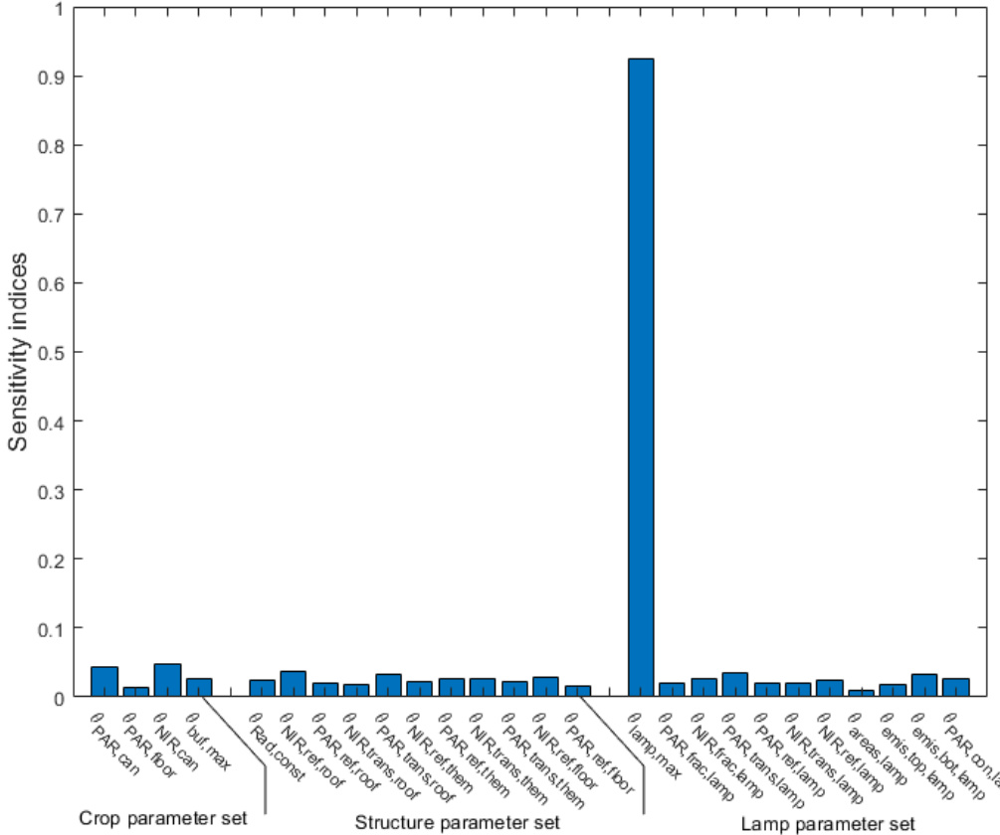  
Fig. B.1 - The one-by-one sensitivity indices (ࡿࡵ࢏) of the greenhouse’s power demand prediction to individual variation in the model parameters.

Fig. B.1 shows that even though this analysis does not consider interaction and has a limited sample size the key outcomes mirror that of the total order indices of the PCE used in the study. These being that the lamp light intensity has the greatest contribution and that remaining parameters do have a limited impact.

# Appendix C – The capacity of the crop assimilate pool

To assess the feasibility of the crop’s assimilate pool as an energy buffer, an analysis was performed that compares the scales of the energy buffer with the energy demand of a greenhouse over a day. In doing so this analysis shows how much energy might be buffered and puts the potential role of the buffer in context when compared to the operations of a greenhouse.

Concerning the crop, it was assumed that the crop’s assimilate pool has one cycle of being filled during the day and emptied during the night. This assumption was founded on insight from experimental observations and previous models of the assimilate pool (Heuvelink, 1999; Vanthoor, de Visser, et al., 2011). An additional assumption made for this analysis is that the assimilate stored in the buffer is treated as glucose for the purposes of energy density calculations. Given these assumptions the potential energy that can be stored in the crop’s assimilate pool $( \cdots \pmb { \lvert \lvert \lvert { \pmb { \mathscr { n } } } \rvert \rvert } )$ ୲was defined as the product of the buffer’s capacity (ୠ୳ǡ୳୤୮)୮and the energy density of glucose $( \%$ ୪ )୳,ୡsuch that

$$
\because \mu ( 1 , 4 ) = 4 9 9 . 9 6 - \mu ( - \infty ) = 8 9 7 1
$$

In which the crop’s assimilate pool capacity (ୠ was defined as

‰ሺ $\Leftarrow$ ଶ(Seginer, 2022) and the energy density of glucose $( \%$ ୡwas set to ͹
Ǥ‰ିଵ(Pielou, 2001).  The energy potential of the buffer is was compared to the potential energy demand of the greenhouse heating $( \textsf { C } \texttt { P } )$ and lighting ( $O A B / / C D$ system over a day. It was assumed that the lighting and heating was operated for 8 hours during the day. As such the energy potentials of heating and lighting can be defined as the product of the energy rating of the heating system ( )୶and lamps ( )୶respectively and the period of operation, where

‹–‰୮୭Š୲

and

In this case the lighting ( )୶is rated at $\begin{array} { r l } { \nsim } & { { } \ge } \end{array}$ (Katzin et al., 2020) and the heating system capacity ( )୶ at $\begin{array} { r l } { \nsim } & { { } \neq } \end{array} \quad \geq$ (Vermeulen, 2016). Accordingly it is possible to compare the energy potentials of the crop’s assimilate pool, greenhouse heating system demand and greenhouse power demand. The results of this comparison can be seen in Fig C.2.

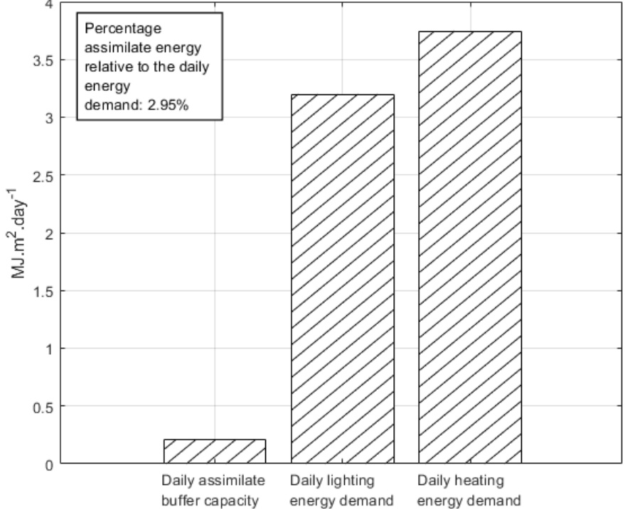  
Fig A.2 - A comparison of the potential energy capacity of the crop assimilate pool ( ࢌ࢕)࢚and the greenhouse energy inputs ( ࢕࢚).࢚

Fig. C.2 shows that the crop’s assimilate pool is much smaller than the energy demand of the greenhouse, indeed it is $2 . 9 5 \%$ the size of the combined demand of the greenhouse heating and power. As such in this scenario it is not a viable buffer for the storage of energy due to its size.

# 附录 D - 作物耐受波动气候能力分析

进行了一项分析来研究作物同化产物库缓冲室内温度和辐射波动的能力。通过这项分析，可以评估作物耐受波动气候的适宜性。此外，作物耐受波动气候的能力对其作为能量缓冲器的潜力具有影响，因为能量缓冲取决于能量可用性的波动，这可能导致温室内气候的波动。

因此，本分析使用了由 (Kuijpers, Antunes, et al., 2021) 提出的作物模型，该模型输入了代表30天期间合成室内气候的数据。这种合成气候具有波动的温度和辐射水平，这些波动表示为两个同相方波，初始水平较高，其上下水平详见表D.1。

表D.1：波动的室内辐射和空气

| 参数 | 数值 |
|------|------|
| 温度 | 4-8°C |
| 辐射 | 0-200 W/m² |

In addition, the ambient $\#$ levels were fixed at and no leaves were harvested over the simulation period. To assess the impact of the fluctuating climate variables the periods of the fluctuations were increased from 1 to 14 days with a step of 1 day, and the amplitudes of the fluctuations were scaled by a factor of 0.5 to 1.5 at a step of 0.1. In doing so it is possible to assess the crop’s ability to tolerate various climate fluctuations and their impact on yield. The amount of assimilate in the mature fruits, given climate fluctuations of various amplitude and periods can be seen in Fig D.1.

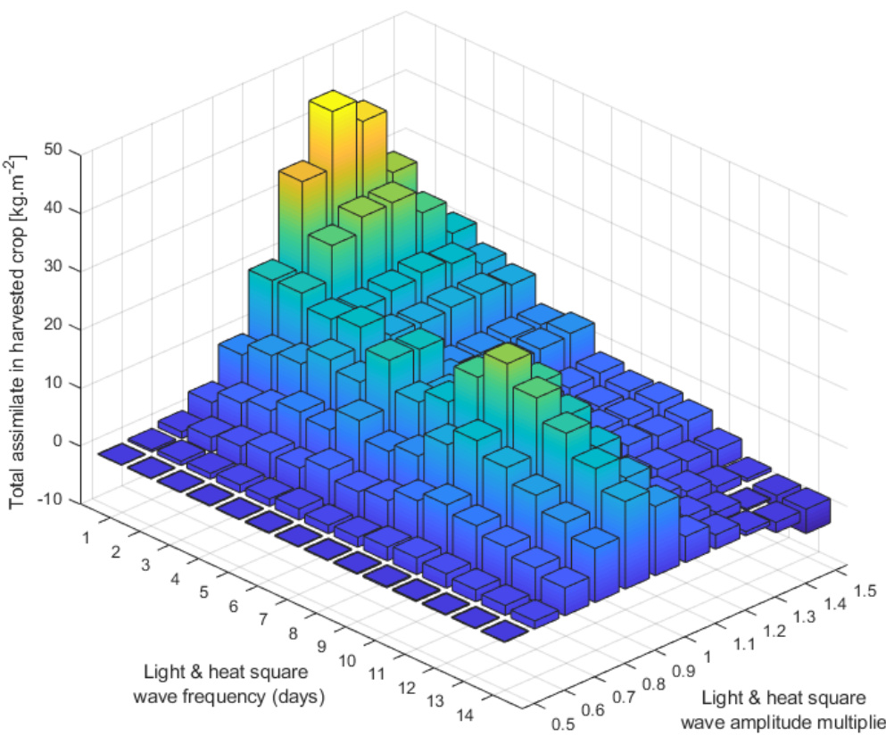  
Fig. D.1 – The assimilate content of mature fruits given fluctuating lighting and heating and changes in the period and amplitude of these fluctuations.

Fig D.1 shows that the greatest quantity of assimilate in the mature fruits is in a fluctuating climate with a period of 1 day and an amplitude scaling factor of 1.2. Indeed, as the period of fluctuations increase, the level of assimilates falls away rapidly, implying that the yield of mature fruits are not robust to large fluctuations in climate. Another observation is that for a climate whose levels have an amplitude scaling factor of 0.8 to 1 there is some ability to buffer longer periods of fluctuations with the second peak having a period of 10 days. However, it should be noted that this buffering is lower than keeping the fluctuation period to one day.

It should also be noted that the insight drawn from this analysis is dependent on the design of the crop model, the completeness of the data used to calibrate it and the omission of behaviours which might impact the crop’s ability to buffer assimilates. Indeed, future research may investigate the role of model design on the crop response to a fluctuating climate.

# References

Ajami, N. K., Duan, Q., & Sorooshian, S. (2007). An integrated hydrologic Bayesian multimodel combination framework : Confronting input, parameter, and model structural uncertainty in hydrologic prediction. 43, 1–19. https://doi.org/10.1029/2005WR004745   
Ali, I. A., & Abdalla, A. M. (1993). A microcomputer-based system for all-yearround temperature control in greenhouses in dry arid lands. Computer and Electronics in Agriculture, 8, 195–210.   
Andersson, J. A. E., Gillis, J., Horn, G., Rawlings, J. B., & Diehl, M. (2019). CasADi: a software framework for nonlinear optimization and optimal control. Mathematical Programming Computation, 11(1), 1–36. https://doi.org/10.1007/s12532-018-0139-4   
Archer, G. E. B., Saltelli, A., & Sobol, I. M. (1997). Sensitivity measures, anova-like Techniques and the use of bootstrap. Journal of Statistical Computation and Simulation, 58(2), 99–120. https://doi.org/10.1080/00949659708811825   
Atia, D. M., & El-madany, H. T. (2016). Analysis and design of greenhouse temperature control using adaptive neuro-fuzzy inference system. Journal of Electrical Systems and Information Technology, 4(1), 34–48. https://doi.org/10.1016/j.jesit.2016.10.014   
Balendonck, J., Os, E. A. Van, Schoor, R. Van Der, & Tuijl, B. A. J. Van. (2010). Monitoring Spatial and Temporal Distribution of Temperature and Relative Humidity in Greenhouses based on Wireless Sensor Technology. Trials, 2000, 1–10.   
Bennis, N., Duplaix, J., Ene a, G., Haloua, M., & Youlal, H. (2008). Greenhouse climate modelling and robust control. Computers and Electronics in Agriculture, 61(2), 96–107. https://doi.org/10.1016/j.compag.2007.09.014   
Bertin, N., & Ge nard, M. (2018). Tomato quality as influenced by preharvest factors. Scientia Horticulturae, 233, 264–276. https://doi.org/https://doi.org/10.1016/j.scienta.2018.01.056   
Blasco, X., Mart, M., Herrero, J. M., Ramos, C., & Sanchis, J. (2007). Model-based Predictive Control of Greenhouse Climate for Reducing Energy and Water Consumption. Computer and Electronics in Agricutlure, 55, 49–70. https://doi.org/10.1016/j.compag.2006.12.001   
Blatman, G., & Sudret, B. (2011). Adaptive sparse polynomial chaos expansion based on least angle regression. Journal of Computational Physics, 230(6), 2345–2367. https://doi.org/10.1016/j.jcp.2010.12.021   
Bontsema, J., van Henten, E. J., Gieling, H., & Swinkels, G. (2011). The effect of sensor errors on production and energy consumption in greenhouse horticulture. Computers and Electronics in Agriculture, 79(1), 63–66. https://doi.org/10.1016/j.compag.2011.08.008   
Chalabi, Z. S., Bailey, B. J., & Wilkinson, D. J. (1996). A real-time optimal control algorithm for greenhouse heating. Computer and Electronics in Agricutlure, 15(1), 1–13. https://doi.org/10.1016/0168-1699(95)00053-4   
Chaves-A vila, J. P., Hakvoort, R. A., & Ramos, A. (2013). Short-term strategies for Dutch wind power producers to reduce imbalance costs. Energy Policy, 52, 573–582. https://doi.org/https://doi.org/10.1016/j.enpol.2012.10.011   
Chen, L., Du, S., He, Y., Liang, M., & Xu, D. (2018). Robust model predictive control for greenhouse temperature based on particle swarm optimization. Information Processing in Agriculture, 5(3), 329–338. https://doi.org/10.1016/j.inpa.2018.04.003   
Chen, W., & You, F. (2020). Efficient greenhouse temperature control with datadriven robust model predictive. American Control Conference (ACC). https://doi.org/https://doi.org/10.23919/ACC45564.2020.9147701   
Cook, M. (2021). Chapter 2 - Trends in global energy supply and demand. In M. B. T.-D. in P. S. Cook (Ed.), Petroleum Economics and Risk Analysis (Vol. 71, pp. 15–42). Elsevier. https://doi.org/https://doi.org/10.1016/B978-0- 12-821190-8.00002-2   
Cooman, A., & Schrevens, E. (2004). Sensitivity analyses of TOMGRO output variables to variations in climate conditions. Acta Horticulturae, 654, 317– 324. https://doi.org/10.17660/ActaHortic.2004.654.37   
Cooman, A., & Schrevens, E. (2006). A Monte Carlo Approach for estimating the Uncertainty of Predictions with the Tomato Plant Growth Model, Tomgro. Biosystems Engineering, 94(4), 517–524. https://doi.org/10.1016/j.biosystemseng.2006.05.005   
Core, W. T., Pachauri, P., & Meyer, L. (2014). Climate Change 2014: Synthesis Report. Contribution of Working Groups I, II and III to the Fifth Assessment Report of the Intergovernmental Panel on Climate Change (IPCC).   
de Jong, T. (1990). Natural ventilation of large multi-span greenhouses. (Ph.D Thesis). Wageningen University.   
de Zwart, H. F. (1996). Analysis energy-saving options in greenhouse cultivation using a simulation model. (Ph.D Thesis). Landbouwuniversiteit Wageningen.   
de Zwart, H. F., Baeza, E., van Breugel, B., Mohammadkhani, V., & Janssen, H. (2017). De uitstralingmonitor.   
Dieleman, J. A., & Kempkes, F. L. K. (2006). Energy screens in tomato: Determining the optimal opening strategy. Acta Horticulturae, 718, 599– 606. https://doi.org/10.17660/ActaHortic.2006.718.70   
Dieleman, J. A., Meinen, E., Marcelis, L. F. M., de Zwart, H. F., & van Henten, E. J. (2005). Optimisation of CO2 and temperature in terms of crop growth and energy use. Acta Horticulturae, 691, 149–154. https://doi.org/10.17660/ActaHortic.2005.691.16   
Doeswijk, T. (2007). Reducing Prediction Uncertainty of Weather Controlled Systems. Doctoral dissertation. Wageningen University.   
Doeswijk, T. G., & Keesman, K. J. (2005). Adaptive weather forecasting using local meteorological information. Biosystems Engineering, 91(4), 421–431. https://doi.org/10.1016/j.biosystemseng.2005.05.013   
Doeswijk, T., Keesman, K. J., & Van Straten, G. (2006). Impact of weather forecast uncertainty in optimal climate control of storehouses. 4th IFAC Workshop on Control Applications in Post-Harvest and Processing Technology, January, 46–57.   
Efron, B., Hastie, T., Johnstone, I., & Tibshirani, R. (2004). Least Angle Regression. The Annals of Statistics, 32(2), 407–499. https://doi.org/10.1214/009053604000000067   
Elings, A., de Zwart, H. F., Janse, J., Marcelis, L. F. M., & Buwalda, F. (2006). Multiple-day temperature settings on the basis of the assimilate balance: A simulation study. Acta Horticulturae, 718, 219–226. https://doi.org/10.17660/ActaHortic.2006.718.24   
Elings, A., Kempkes, F. L. K., Kaarsemaker, R. C., Ruijs, M. N. A., & Braak, N. J. Van De. (2005). The energy balance and Energy-Saving Measures in Greenhouse Tomato Cultivation. GreenSys, 67–74.   
Faouzi, D., & Bibi-Triki, N. (2016). Modeling, simulation and optimization of agricultural greenhouse microclimate by application of artificial intelligence and/or fuzzy logic. Preprints.Org, July. https://doi.org/10.20944/preprints201607.0064.v1   
Frnda, J., Durica, M., Rozhon, J., Vojtekova, M., Nedoma, J., & Martinek, R. (2022). ECMWF short-term prediction accuracy improvement by deep learning. Scientific Reports, 12(1), 1–11. https://doi.org/10.1038/s41598-022- 11936-9   
Gellings, C. W., & Chamberlin, J. H. (1987). Demand-side management: Concepts and methods.   
Gent, M., Seginer, I., & Gent, M. (2012). Vegetative growth response to light and temperature, interpreted by carbohydrate-pool dynamics. Acta Horticulturae, 956(1), 231–238. https://doi.org/10.17660/ActaHortic.2012.956.25   
Golzar, F., Heeren, N., Hellweg, S., & Roshandel, R. (2018). A novel integrated framework to evaluate greenhouse energy demand and crop yield production. Renewable and Sustainable Energy Reviews, 96(November 2017), 487–501. https://doi.org/10.1016/j.rser.2018.06.046   
Golzar, F., Heeren, N., Hellweg, S., & Roshandel, R. (2021). Optimisation of energy-efficient greenhouses based on an integrated energy demand-yield production model. Biosystems Engineering, 202, 1–15. https://doi.org/10.1016/j.biosystemseng.2020.11.012   
Gonza lez, R., Rodrí guez, F., Guzma n, J. L., & Berenguel, M. (2014). Robust constrained economic receding horizon control applied to the two timescale dynamics problem of a greenhouse. Optimal Control Applications and Methods, 35(4), 435–453. https://doi.org/10.1002/oca.2080   
Gutman, P., Lindberg, P., Ioslovich, I., & Seginer, I. (1993). A non-linear optimal greenhouse control problem solved by linear programming. Journal of Agricutlural Engineering, 55(4), 335–351. https://doi.org/10.1006/jaer.1993.1054   
Guzman-Cruz, R., Castaneda-Miranda, R., Garcia-Escalante, J., Lara-Herrera, A., Serroukh, I., & Solis-Sanchez, L. (2010). Genetic algorithm for calibration of a greenhouse climate model. Revista Chapingo Serie Horticultura, 16(1), 23–30.   
Haiden, T., Janousek, M., Vitart, F., Ben-Bouallegue, Z., Ferranti, L., & Prates, F. (2021). Evaluation of ECMWF forecasts, including the 2021 upgrade. In ECMWF Technical Memoranda (Issue 884). ECMWF. https://doi.org/10.21957/90pgicjk4   
Hasni, A., Taibi, R., Draoui, B., & Boulard, T. (2011). Optimization of Greenhouse Climate Model Parameters Using Particle Swarm Optimization and Genetic Algorithms. 6, 371–380. https://doi.org/10.1016/j.egypro.2011.05.043   
Henten, E. J. Van, & Bontema, J. (1996). Greenhosue Climate Control: A Two Time-Scale Approach. Mathematics and Control Applications in Agricutlure and Horticulture, 406.   
Henten, E. J. van, & Bontsema, J. (2009). Time-scale decomposition of an optimal control problem in greenhouse climate management. Control Engineering Practice, 17, 88–96. https://doi.org/10.1016/j.conengprac.2008.05.008   
Henten, E. J. van, Bontsema, J., Group, F. T., van Henten, E. J., & Bontsema, J. (2008). Open-loop optimal temperature control in greenhouses. Acta Horticulturae, 801 PART 1, 629–635. https://doi.org/10.17660/actahortic.2008.801.72   
Heuvelink, E. (1995). Dry Matter Production in a Tomato Crop: Measurements and Simulation. Annals of Botany, 75(4), 369–379.   
Heuvelink, E. (1996). Tomato growth and yield : quantitative analysis and synthesis. (PhD Thesis) (p. 325).   
Heuvelink, E. (1999). Evaluation of a Dynamic Simulation Model for Tomato Crop Growth and Development. Annals of Botany, 83, 413–422.   
Hewson, T. D., & Pillosu, F. M. (2021). A low-cost post-processing technique improves weather forecasts around the world. Communications Earth and Environment, 2(1), 1–10. https://doi.org/10.1038/s43247-021-00185-9   
Hoeting, J. A., Madigan, D., Raftery, A. E., & Volinsky, C. T. (1999). Bayesian model averaging: a tutorial. Statistical Science, 14(4), 382 – 417. https://doi.org/10.1214/ss/1009212519   
HSL. (2019). HSL, a collection of Fortran codes for large-scale scientific computation. http://www.hsl.rl.ac.uk.   
Hu, H., Xu, L., Wei, R., & Zhu, B. (2011). Multi-objective control optimization for greenhouse environment using evolutionary algorithms. Sensors, 11(6), 5792–5807. https://doi.org/10.3390/s110605792   
Hwang, Y., JONES, P., JONES, J. W., Hwang, Y., JONES, P., JONES, J. W., & Hwang, Y. (1990). Simulation for Determining Greenhouse Temperature Setpoints. Transactions of the Asae, 33(5), 1722–1728. https://doi.org/10.13031/2013.31532   
Iliev, O. L., Sazdov, P., & Zakeri, A. (2014). A fuzzy logic-based controller for integrated control of protected cultivation. Management of Environmental Quality: An International Journal, 25(1), 75–85. https://doi.org/10.1108/MEQ-06-2013-0065   
[Internet], EnergieMarktInformatie. com. (2021). APX day ahead data portal. https://www.energiemarktinformatie.nl/beurzen/elektra/   
[Internet], Investing. com. (2021). TTF market data portal. https://www.investing.com/commodities/dutch-ttf-gas-c1-futureshistorical-data   
[Internet], S. N. (2021). Horticulture Underglass Cultivation Census. Statistics Netherlands [Electronic Data set]. https://opendata.cbs.nl/statline/portal.html?_la $\ c =$ en&_catalog $\mathbf { \bar { \rho } } = \mathbf { \rho }$ CBS&table $\scriptstyle \mathrm { I d } = 8 0 7 8 3$ eng&_theme $_ { = 1 1 0 7 }$   
Jones, J. W., Dayan, E., Allen, L. H., Keulen, H. Van, & Challa, H. (1991). A dynamic tomato growth and yield model (TOMGRO). American Society of Agricultural Engineers, 34(2), 663–672.   
Katzin, D. (2021). Energy saving by LED lighting in greenhouses A process-based modelling approach. (Ph.D Thesis).   
Katzin, D., van Mourik, S., Kempkes, F., & van Henten, E. J. (2020). GreenLight – An open source model for greenhouses with supplemental lighting: Evaluation of heat requirements under LED and HPS lamps. Biosystems Engineering, 194, 61–81. https://doi.org/10.1016/j.biosystemseng.2020.03.010   
Keesman, K. J., Peters, D., & Lukasse, L. J. S. (2003). Optimal climate control of a storage facility using local weather forecasts. Control Engineering Practice, 11(5), 505–516. https://doi.org/10.1016/S0967-0661(02)00144-2   
Kempkes, F., Janse, J., & Hemming, S. (2014). Greenhouse concept with high insulating double glass with coatings and new climate control strategies; from design to results from tomato experiments. Acta Horticulturae, 1(1037), 83–92.   
Korner, O. (2003). Crop Based Climate Regimes for Energy Saving in Greenhouse Cultivation. Wageningen University.   
Korner, O., & Challa, H. (2003). Design for an improved temperature integration concept in greenhouse cultivation. Computer and Electronics in Agriculture, 39, 39–59. https://doi.org/10.1016/S0168-1699(03)00006-1   
Ko rner, O., & Challa, H. (2003). Process-based humidity control regime for greenhouse crops. Computers and Electronics in Agriculture, 39(3), 173– 192. https://doi.org/https://doi.org/10.1016/S0168-1699(03)00079-6   
Ko rner, O., & van Straten, G. (2008). Decision support for dynamic greenhouse climate control strategies. Computers and Electronics in Agriculture, 60(1), 18–30. https://doi.org/10.1016/j.compag.2007.05.005   
Kuijpers, W. J. P. (2021). Model Selection and Optimal Control Design for Automatic Greenhouse Climate Control (Issue 2021). www.tue.nl/taverne   
Kuijpers, W. J. P., Antunes, D. J., Hemming, S., van Henten, E. J., & van de Molengraft, M. J. G. (2021). Fruit development modelling and performance analysis of automatic greenhouse control. Biosystems Engineering, 208, 300–318. https://doi.org/10.1016/j.biosystemseng.2021.06.002   
Kuijpers, W. J. P., Antunes, D. J., van Mourik, S., van Henten, E. J., & van de Molengraft, M. J. G. (2022). Weather forecast error modelling and performance analysis of automatic greenhouse climate control. Biosystems Engineering, 214, 207–229. https://doi.org/10.1016/j.biosystemseng.2021.12.014   
Kuijpers, W. J. P., Katzin, D., van Mourik, S., Antunes, D. J., Hemming, S., & van de Molengraft, M. J. G. (2021). Lighting systems and strategies compared in an optimally controlled greenhouse. Biosystems Engineering, 202, 195– 216. https://doi.org/10.1016/j.biosystemseng.2020.12.006   
Kusuma, P., Pattison, P. M., & Bugbee, B. (2020). From physics to fixtures to food: current and potential LED efficacy. Horticulture Research, 7(1). https://doi.org/10.1038/s41438-020-0283-7   
Lacroix, R., & Kok, R. (1999). Simulation-Based Control of Enclosed Ecosystems - A Case Study: Determination of Greenhouse Heating Setpoints. Canadian Agricultural Engineering, 41(3), 175–184.   
Lo pez-Cruz, I. L., Martí nez-Ruiz, A., Ruiz-García , A., & Gallardo, M. (2020). Uncertainty analyses of the VegSyst model applied to greenhouse crops. Acta Horticulturae, 1271, 199–206. https://doi.org/10.17660/ActaHortic.2020.1271.28   
Lo pez-Cruz, I. L., Ruiz-Garcí a, A., Ramí rez-Arias, A., & Va zquez-Pen a, M. (2013). Uncertainty analysis of a greenhouse lettuce crop model. Revista Chapingo, Serie Horticultura, 19(1), 33–47. https://doi.org/10.5154/r.rchsh.2011.09.049   
Luo, W., de Zwart, H. F., DaiI, J., Wang, X., Stanghellini, C., & Bu, C. (2005). Simulation of greenhouse management in the subtropics, Part I: Model validation and scenario study for the winter season. Biosystems Engineering, 90(3), 307–318. https://doi.org/10.1016/j.biosystemseng.2004.11.008   
Luo, W., Stanghellini, C., Dai, J., Wang, X., de Zwart, H., & Bu, C. (2005). Simulation of greenhouse management in the subtropics, part II: Scenario study for the summer season. Biosystems Engineering, 90(4), 433–441. https://doi.org/10.1016/j.biosystemseng.2004.12.002   
Maga, J. J., Ruijs, M. N. A., Vanthoor, B. H. E., Ga, J. C., Baeza, E., Stanghellini, C., Henten, E. J. van, & Visser, P. H. B. de. (2012). A methodology for modelbased greenhouse design : Part 4 , economic evaluation of different greenhouse designs : A Spanish case. 1. https://doi.org/10.1016/j.biosystemseng.2011.12.008   
Mara, T. A., & Becker, W. E. (2021). Polynomial chaos expansion for sensitivity analysis of model output with dependent inputs. Reliability Engineering and System Safety, 214. https://doi.org/10.1016/j.ress.2021.107795   
Ma rquez-Vera, M. A., Ramos-Ferna ndez, J. C., Cerecero-Natale, L. F., Lafont, F., Balmat, J. F., & Esparza-Villanueva, J. I. (2016). Temperature control in a MISO greenhouse by inverting its fuzzy model. Computers and Electronics in Agriculture, 124, 168–174. https://doi.org/10.1016/j.compag.2016.04.005   
Mitra, S., Sun, L., & Grossmann, I. E. (2013). Optimal scheduling of industrial combined heat and power plants under time-sensitive electricity prices. Energy, 54, 194–211. https://doi.org/10.1016/j.energy.2013.02.030   
Mohamed, S. (2015). A GA-Based Adaptive Neuro-Fuzzy Controller for Greenhouse Climate Control System. Alexandria Engineering Journal. https://doi.org/10.1016/j.aej.2014.04.009   
Mulder, M., & Scholtens, B. (2013). The impact of renewable energy on electricity prices in the Netherlands. Renewable Energy, 57, 94–100. https://doi.org/https://doi.org/10.1016/j.renene.2013.01.025   
Nelson, J. A., & Bugbee, B. (2014). Economic analysis of greenhouse lighting: light emitting diodes vs. high intensity discharge fixtures. PloS One, 9(6). https://doi.org/10.1371/journal.pone.0099010   
Nelson, J., & Bugbee, B. (2015). Analysis of Environmental Effects on Leaf Temperature under Sunlight, High Pressure Sodium and Light Emitting Diodes. Plos One, 10(10). https://doi.org/10.1371/journal.pone.0138930   
Organisation for Economic Co-operation and Development.International Energy Agency. (2012). Energy (NV-1 onl). OECD.   
Orgill, J., & Hollands, K. (1977). Correlation equation for hourly diffuse radiation on a horizontal surface. Solar Energy, 19(4), 357–359. https://doi.org/10.1016/0038-092X(77)90006-8   
Pasgianos, G. D., Arvanitis, K. G., Polycarpou, P., & Sigrimis, N. (2003). A nonlinear feedback technique for greenhouse environmental control. Computers and Electronics in Agriculture, 40(1–3), 153–177. https://doi.org/10.1016/S0168-1699(03)00018-8   
Pawlowski, A., Beschi, M., Guzma n, J. L., Visioli, A., Berenguel, M., & Dormido, S. (2016). Application of SSOD-PI and PI-SSOD event-based controllers to greenhouse climatic control. ISA Transactions, 65, 525–536. https://doi.org/10.1016/j.isatra.2016.08.008   
Payne, H. J., Hemming, S., van Rens, B. A. P., van Henten, E. J., & van Mourik, S. (2022). Quantifying the role of weather forecast error on the uncertainty of greenhouse energy prediction and power market trading. Biosystems Engineering, 224, 1–15. https://doi.org/10.1016/j.biosystemseng.2022.09.009   
Pielou, E. C. (2001). The Energy of Nature. University of Chicago Press. https://doi.org/10.7208/chicago/9780226668055.001.0001   
Pina, A., Silva, C., & Ferra o, P. (2012). The impact of demand side management strategies in the penetration of renewable electricity. Energy, 41(1), 128– 137. https://doi.org/https://doi.org/10.1016/j.energy.2011.06.013   
Pohlheim, H., & Heiner, A. (1999). Optimal Control of Greenhouse Climate using Real-World Weather Data and Evolutionary Algorithms. Proceedings of the Genetic and Evolutionary Computation Conference, San Francisco, CA, 1672–1677. http://citeseerx.ist.psu.edu/viewdoc/summary;jsessionid $\ c =$ 7448B640302 308DEC44C5D876BDD2A01?do $\ c =$ 10.1.1.16.494   
Polasek, T., & C adí k, M. (2023). Predicting photovoltaic power production using high-uncertainty weather forecasts. Applied Energy, 339, 120989. https://doi.org/https://doi.org/10.1016/j.apenergy.2023.120989   
Powells, G., Bulkeley, H., Bell, S., & Judson, E. (2014). Peak electricity demand and the flexibility of everyday life. Geoforum, 55, 43–52. https://doi.org/10.1016/j.geoforum.2014.04.014   
Ramdani, N., Candau, Y., Guyon, G., & Dalibart, C. (2006). Sensitivity analysis of dynamic models to uncertainties in inputs data with time-varying variances. Technometrics, 48(1), 74–87. https://doi.org/10.1198/004017005000000337   
Ramí rez-Arias, A., Rodrí guez, F., Guzma n, J. L., Arahal, M. R., Berenguel, M., & Lo pez, J. C. (2005). Improving Efficiency of Greenhouse Heating Systems Using Model Predictive Control. In IFAC Proceedings Volumes (Vol. 38, Issue 1). IFAC. https://doi.org/10.3182/20050703-6-CZ-1902.02097   
Rijksoverheid. (2019). Klimaatakkoord [Climate agreement].   
Saltelli, A., Ratto, M., Andres, T., Campolongo, F., Cariboni, J., Gatelli, D., Saisana, M., & Tarantola, S. (2008). Global Sensitivity Analysis. The Primer. In Global Sensitivity Analysis. The Primer. John Wiley & Sons Ltd. https://doi.org/10.1002/9780470725184   
Scheepers, M., Palacios, S. G., Jegu, E., Nogueira, L. P., Rutten, L., van Stralen, J., Smekens, K., West, K., & van der Zwaan, B. (2022). Towards a climateneutral energy system in the Netherlands. Renewable and Sustainable Energy Reviews, 158. https://doi.org/10.1016/j.rser.2022.112097   
Scher, S., & Messori, G. (2018). Predicting weather forecast uncertainty with machine learning. Quarterly Journal of the Royal Meteorological Society, 144(717), 2830–2841. https://doi.org/https://doi.org/10.1002/qj.3410   
Schrevens, E., Jancsok, P., & Dieussaert, K. (2008). Uncertainty on estimated predictions of energy demand for dehumidification in a closed tomato greenhouse. Acta Horticulturae, 801 PART 2, 1347–1354. https://doi.org/10.17660/ActaHortic.2008.801.165   
Seginer, I. (1997). Some artificial neural network applications to greenhouse environmental control. Computers and Electronics in Agriculture, 18(2–3), 167–186. https://doi.org/10.1016/S0168-1699(97)00028-8   
Seginer, I. (2022). Sub-optimal control of the greenhouse environment : Crop models with and without an assimilates buffer. Biosystems Engineering, 221, 236–257. https://doi.org/10.1016/j.biosystemseng.2022.06.011   
Seginer, I., Beveren, P. J. M. Van, & Straten, G. Van. (2018). Day-to-night heat storage in greenhouses : 3 Co-generation of heat and electricity (CHP). Biosystems Engineering, 172, 1–18. https://doi.org/10.1016/j.biosystemseng.2018.05.006   
Seginer, I., Gary, C., & Tchamitchian, M. (1994). Optimal temperature regimes for a greenhouse crop with a carbohydrate pool : A modelling study. Science And Technology, 60, 55–80. https://doi.org/10.3182/20130828-2-SF3019.00006   
Seginer, I., Ioslovich, I., & Albright, L. D. (2006). Improved strategy for a constant daily light integral in greenhouses. Biosystems Engineering, 93(1), 69–80. https://doi.org/10.1016/j.biosystemseng.2005.09.007   
Seginer, I., & McClendon, R. (1992). Methods for optimal control of the greenhouse environment. American Society of Agricultural Engineers, 35(August), 1299–1307. https://doi.org/10.13031/2013.28733   
Seginer, I., Straten, G. Van, & Beveren, P. J. M. Van. (2017). Day-To-night heat storage in greenhouses: A simulation study. Acta Horticulturae, 1182, 119– 127. https://doi.org/10.17660/ActaHortic.2017.1182.14   
Seginer, I., van Beveren, P. J. M., & van Straten, G. (2018). Day-to-night heat storage in greenhouses: 3 Co-generation of heat and electricity (CHP). Biosystems Engineering, 172, 1–18. https://doi.org/10.1016/j.biosystemseng.2018.05.006   
Seginer, I., van Straten, G., & van Beveren, P. (2017a). Day-to-night heat storage in greenhouses: 2 Sub-optimal solution for realistic weather. Biosystems Engineering, 161, 188–199. https://doi.org/10.1016/j.biosystemseng.2017.06.023   
Seginer, I., van Straten, G., & van Beveren, P. J. (2017b). Day-to-night heat storage in greenhouses : 1 Optimisation for periodic weather. Biosystems Engineering, 161, 174–187. https://doi.org/10.1016/j.biosystemseng.2017.06.024   
Seginer, I. (2011). Co-state variables as strategic set-points for environmental control of greenhouses: Two state-variables. Acta Horticulturae, 893, 697– 704. https://doi.org/10.17660/ActaHortic.2008.797.7   
Sigrimis, N., Ferentinos, K. P., Arvanitis, K. G., & Anastasiou, A. (2001). A comparison of optimal greenhouse heating setpoint generation algorithms for energy conservation. IFAC Proceedings Volumes, 34(11), 61–66. https://doi.org/10.1016/S1474-6670(17)34107-1   
Smith, O., Cattell, O., Farcot, E., O’Dea, R. D., & Hopcraft, K. I. (2022). The effect of renewable energy incorporation on power grid stability and resilience. Science Advances TA  - TT  -, 8(9), eabj6734. https://doi.org/10.1126/sciadv.abj6734 LK  - https://wur.on.worldcat.org/oclc/9431568262   
Sobol, I. M. (1993). Sensitivity Estimates for Nonlinear Mathematical Models. Math Modeling Computer Exp, 1(4), 407–414.   
Statistics Netherlands [Internet]. (2021). Horticulture Underglass Cultivation Census. Statistics Netherlands [Electronic Data set]. https://opendata.cbs.nl/statline/portal.html?_la $\ c =$ en&_catalog $\mathbf { \bar { \rho } } = \mathbf { \rho }$ CBS&table Id=80783eng&_theme $_ { = 1 1 0 7 }$   
Stitt, M., & Zeeman, S. C. (2012). Starch turnover: pathways, regulation and role in growth. Current Opinion in Plant Biology, 15(3), 282–292. https://doi.org/https://doi.org/10.1016/j.pbi.2012.03.016   
Su, Y., Xu, L., & Goodman, E. D. (2017a). Greenhouse climate fuzzy adaptive control considering energy saving. International Journal of Control, Automation and Systems, 15(4), 1936–1948. https://doi.org/10.1007/s12555-016-0220-6   
Su, Y., Xu, L., & Goodman, E. D. (2017b). Nearly dynamic programming NNapproximation-based optimal control for greenhouse climate: A simulation study. Optimal Control Applications and Methods, August, 1–25. https://doi.org/10.1002/oca.2370   
Su, Y., Xu, L., & Goodman, E. D. (2021). Multi-layer hierarchical optimisation of greenhouse climate setpoints for energy conservation and improvement of crop yield. Biosystems Engineering, 205(1180), 212–233. https://doi.org/10.1016/j.biosystemseng.2021.03.004   
Sudret, B. (2008). Global sensitivity analysis using polynomial chaos expansions. Reliability Engineering and System Safety, 93(7), 964–979. https://doi.org/10.1016/j.ress.2007.04.002   
Tanrisever, F., Derinkuyu, K., & Jongen, G. (2015). Organization and functioning of liberalized electricity markets: An overview of the Dutch market. Renewable and Sustainable Energy Reviews, 51, 1363–1374. https://doi.org/https://doi.org/10.1016/j.rser.2015.07.019   
Tap, F., van Willigenburg, L. G., & van Straten, G. (1996). Receding horizon optimal control of greenhouse climate based on the lazy man weather prediction. Proc. Of 13th IFAC World Congress, San Francisco, 387–392. https://doi.org/10.1016/S1474-6670(17)57776-9   
Tennet [Internet]. (2019). Tennet data portal. https://www.tennet.org/english/operational_management/export_data.a spx   
Vadiee, A., & Martin, V. (2012). Energy management in horticultural applications through the closed greenhouse concept, state of the art. Renewable and Sustainable Energy Reviews, 16(7), 5087–5100. https://doi.org/10.1016/j.rser.2012.04.022   
van Beveren, P. J. M., Bontsema, J., van Straten, G., & van Henten, E. J. (2019). Optimal utilization of a boiler, combined heat and power installation, and heat buffers in horticultural greenhouses. Computers and Electronics in Agriculture, 162(February), 1035–1048. https://doi.org/10.1016/j.compag.2019.05.040   
van Beveren, P. J. M., Bontsema, J., van ’t Ooster, A., van Straten, G., & van Henten, E. J. (2020). Optimal utilization of energy equipment in a semi-closed greenhouse. Computers and Electronics in Agriculture, 179(October). https://doi.org/10.1016/j.compag.2020.105800   
van der Meer, D., Wide n, J., & Munkhammar, J. (2018). Review on probabilistic forecasting of photovoltaic power production and electricity consumption. Renewable and Sustainable Energy Reviews, 81, 1484–1512. https://doi.org/10.1016/j.rser.2017.05.212   
van der Velden, N., & Smit, P. (2021). Energiemonitor van de Nederlandse glastuinbouw 2020. (Wageningen Economic Research rapport; No. 2021- 127). Wageningen Economic Research. https://doi.org/doi:10.18174/505786   
van Henten, E. J. (1994). Greenhouse climate management: an optimal control approach. In Agricultural Systems (Vol. 45, Issue 1). https://doi.org/10.1016/S0308-521X(94)90280-1   
van Henten, E. J. (2003). Sensitivity analysis of an optimal control problem in greenhouse climate management. Biosystems Engineering, 85(3), 355– 364. https://doi.org/10.1016/S1537-5110(03)00068-0   
van Henten, E. J., & Bontsema, J. (2009). Time-scale decomposition of an optimal control problem in greenhouse climate mmanagement. Control Engineering Practice, 17, 88–96. https://doi.org/10.1016/j.conengprac.2008.05.008   
van Ooteghem, R. J. C. C. (2010). Optimal Control Design for a Solar Greenhouse. IFAC Proceedings Volumes, 43(26), 304–309. https://doi.org/10.3182/20101206-3-JP-3009.00054   
van Straten, G., Willigenburg, L. G. van, & Tap, R. F. (2002). The significance of crop co-states for receding horizon optimal control of greenhouse climate. Control Engineering Practice, 10, 625–632.   
van Willigenburg, L. G., van Henten, E. J., & van Meurs, W. M. (2000). Three timescale digital optimal receding horizon control of the climate in a greenhouse with a heat storage tank. IFAC Proceedings Volumes, 33(19), 149–154. https://doi.org/10.1016/S1474-6670(17)40904-9   
Vanthoor, B., de Visser, P., Stanghellini, C., & van Henten, E. J. (2011). A methodology for model-based greenhouse design: Part 2, description and validation of a tomato yield model. Biosystems Engineering, 110(4), 378– 395. https://doi.org/10.1016/j.biosystemseng.2011.08.005   
Vanthoor, B., Stanghellini, C., van Henten, E. J., & de Visser, P. (2011). A methodology for model-based greenhouse design $\because$ Part 1 , a greenhouse climate model for a broad range of designs and climates. Biosystems Engineering, 110(4), 363–377. https://doi.org/10.1016/j.biosystemseng.2011.06.001   
Vanthoor, B., Stigter, J. D., van Henten, E. J., Stanghellini, C., Visser, P. H. B. de, & Hemming, S. (2012). A methodology for model-based greenhouse design : Part 5 , greenhouse design optimisation for southern-Spanish and Dutch conditions. Biosystems Engineering, 111(4), 350–368. https://doi.org/10.1016/j.biosystemseng.2012.01.005   
Vanthoor, B., van Henten, E. J., Stanghellini, C., & de Visser, P. H. B. B. (2011). A methodology for model-based greenhouse design: Part 3, sensitivity analysis of a combined greenhouse climate-crop yield model. Biosystems Engineering, 110(4), 396–412. https://doi.org/10.1016/j.biosystemseng.2011.08.006   
Vazquez-Cruz, M. A., Guzman-Cruz, R., Lopez-Cruz, I. L., Cornejo-Perez, O., Torres-Pacheco, I., & Guevara-Gonzalez, R. G. (2014). Global sensitivity analysis by means of EFAST and Sobol’ methods and calibration of reduced state-variable TOMGRO model using genetic algorithms. Computers and Electronics in Agriculture, 100, 1–12. https://doi.org/10.1016/j.compag.2013.10.006   
Verma, S., Chug, A., & Singh, A. P. (2018). Prediction Models for Identification and Diagnosis of Tomato Plant Diseases. 2018 International Conference on Advances in Computing, Communications and Informatics (ICACCI), 1557– 1563. https://doi.org/10.1109/ICACCI.2018.8554842   
Vermeulen, P. C. M. (2016). Kwantitatieve informatie voor de glastuinbouw 2016-2017. In Business Unit Glastuinbouw: Wageningen University & Research.   
Vogler-Finck, P., Bacher, P., & Madsen, H. (2017). Online short-term forecast of greenhouse heat load using a weather forecast service. Applied Energy, 205(September), 1298–1310. https://doi.org/10.1016/j.apenergy.2017.08.013   
Wa chter, A., & Biegler, L. T. (2006). On the implementation of an interior-point filter line-search algorithm for large-scale nonlinear programming. Mathematical Programming, 106(1), 25. https://doi.org/https://doi.org/10.1007/s10107-004-0559-y   
Wang, Y., Mao, S., & Nelms, R. (2015). Online algorithms for optimal energy distribution in microgrids. Springer. https://doi.org/10.1007/978-3-319- 17133-3   
Xu, D., Du, S., & van Willigenburg, G. (2018). Adaptive two time-scale receding horizon optimal control for greenhouse lettuce cultivation. Computers and Electronics in Agriculture, 146. https://doi.org/10.1016/j.compag.2018.02.001   
Xue, L., Cao, Z., Scherhaufer, S., O stergren, K., Cheng, S., & Liu, G. (2021). Mapping the EU tomato supply chain from farm to fork for greenhouse gas emission mitigation strategies. Journal of Industrial Ecology, 25(2), 377–389. https://doi.org/10.1111/jiec.13080   
Zeng, S., Hu, H., Xu, L., & Li, G. (2012). Nonlinear Adaptive PID Control for Greenhouse Environment Based on RBF Network. Sensors, 12(12), 5328– 5348. https://doi.org/10.3390/s120505328   
Zepeda, A. C., Heuvelink, E., & Marcelis, L. F. M. (2022). Non-structural carbohydrate dynamics and growth in tomato plants grown at fluctuating light and temperature. Frontiers in Plant Science, 13. https://doi.org/10.3389/fpls.2022.968881   
Zepeda, A. C., Heuvelink, E., & Marcelis, L. F. M. (2023). Carbon storage in plants: a buffer for temporal light and temperature fluctuations. In Silico Plants, 5(1). https://doi.org/10.1093/insilicoplants/diac020

# Acknowledgements

The process of a PhD is a long one and one that cannot be achieved without the support of those close to you.  I would like to personally thank my daily supervisor Dr. Simon van Mourik for his unwavering support and guidance. Throughout the process the constructive discussions and many diagrams were key to clarity in my thought process and to the ultimate success of this thesis. I would also like to thank Professor Eldert van Henten for his steady wisdom and good sense.  I would also like to  express my sincere gratitude for the supportive conversations and unwavering support I have had with my colleges in the Agricultural Biosystems Engineering  department. I would also like to highlight the role of Dr. Silke Hemming and Dr. Bram van Rens in the process of this thesis. Your patience and insight have been invaluable for my development as a scientist and facilitated a smooth transition for me into greenhouse horticulture as a new field of study. To  Cristina I am grateful to have had such an optimistic and proactive colleague as part of the Flexcrop project. It is difficult to find a confidant who has experiential understanding of the work we do, and as such our conversations were truly invaluable.

I would like to also thank my wonderful friends, David, Ambra, Lucy, Jan, Maarten, Helena, Andriy, Marijn and Suzette. Whose endless compassion and companionship have given me respite and strength through the easy and difficult times. To my other friends in the Discussion group, Creative garden and Bike repair club, thank you. It is my time with you that has been a most sacred haven in times of hardship. My thanks also go out to Anna van de Meer for the wonderful art presented as a cover to this thesis.

To my Father, Mother, Sister and Grandfather, Thank you for being there for me. Not just over this PhD but my entire life. It is only on reflection that I remember that which should never be forgotten, that you are my reason for being. You cared for me in true selflessness and with a deepness that I can only hope to emulate. You are the people who have known me most truly and despite your better judgement continue to take my calls. I love you all.  To my partner Linh, without your love and support I don’t think any of this would have been possible, thank you.  In you I have found a kindred soul, and my best friend. I also want you to know how grateful I am for you listening to my inane ramblings about maths in the small hours.

# About the author

Henry Payne was born in Taunton in the United Kingdom on the $2 2 ^ { \mathrm { n d } }$ December 1994. He studied Automated Control and Systems Engineering at Sheffield University. During which time he received the Lyapunov Award for his role in designing an autonomous microsubmarine and wrote his thesis on the topic on the modelling of alcoholism as a behavioural contagion. He subsequently graduated in 2018 with a MEng.

Following a period working at Pine Lodge and Copper Beech farm as a shepherd and farm hand he moved to the Netherlands to participate in the Flexcrop Project at Wageningen university as a PhD candidate.

During his time in Wageningen Henry participated in the Creative garden community project, the Wageningen student bike repair club as well as developing a  keen interest in home food preservation.

# List of publications

Peer-reviewed journals

Payne, H. J., Hemming, S., van Rens, B. A. P., van Henten, E. J., & van Mourik, S. (2022). Quantifying the role of weather forecast error on the uncertainty of greenhouse energy prediction and power market trading. Biosystems Engineering, 224, 1-15. https://doi.org/10.1016/j.biosystemseng.2022.09.009

Payne, H. J., van Henten, E. J., & van Mourik, S. (2024). Prediction uncertainty of greenhouse electrical power and gas demand: Part 1, The role of parameter uncertainty. Biosystems Engineering (2024), 239, pp 35-48. https://doi.org/10.1016/j.biosystemseng.2024.01.006

Payne, H. J., van Henten, E. J., & van Mourik, S. (2024). Prediction uncertainty of greenhouse electrical power and gas demand: Part 2, The role of parametric and weather forecast error. Biosystems Engineering, 239, 25-34. https://doi.org/10.1016/j.biosystemseng.2024.01.007

# Talks and presentations

Energy management in greenhouses using crop flexibility (Poster presentation). Energy system integration workshop, Commit2data NOW meeting (Amsterdam; 2018).

The analysis of the combined impact of data based and parametric uncertainty on the prediction of greenhouse electricity demand (oral presentation). AGENG conference (Berlin; 2022).

Disentangling the roles of uncertain weather forecast variables on greenhouse energy demand predictions (Poster presentation). AGRITECH DAY conference (Paris; 2022).

# PE&RC Training and Education Statement

With the training and education activities listed below the PhD candidate has complied with the requirements set by the C.T. de Wit Graduate School for Production Ecology and Resource Conservation (PE&RC) which comprises of a minimum total of 32 ECTS $\left( = 2 2 \right.$ weeks of activities)

# Review/project proposal (4.5 ECTS)

A review of adaptive greenhouse energy systems and strategies

# Post-graduate courses (4.1 ECTS)

Bayesian statistics; PE&RC (2018)   
Statistical uncertainty analysis of dynamic models; PE&RC (2019)   
Nonlinear control system; DISC (2022)   
Multivariate analysis; PE&RC (2022)   
Introduction to ecological remote sensing in R; Physalia (2022)

Deficiency, refresh, brush-up courses (3 ECTS) Greenhouse technology; WUR (2019)

Invited review of journal manuscripts (1 ECTS) Biosystems engineering: greenhouse energy demand (2023)

# Competence, skills and career-oriented activities (4.95 ECTS)

Research data management; WGS (2018) Searching and organising literature; WGS (2018) Project and time management; WGS (2018) Supervising BSc and MSc thesis students; WGS (2020) Scientific writing; WGS (2022) Career perspectives; PE&RC (2022)

# Scientific integrity/ethics in science activities (0.9 ECTS)

Ethics in plant and environmental sciences; WGS (2018)

Scientific integrity; WGS (2019)

# PE&RC Annual meetings, seminars and PE&RC weekend/retreat (1.5 ECTS)

PE&RC First year weekend (2018) PE&RC Last year weekend (2021)

# Discussion groups/local seminars or scientific meetings (4.5 ECTS)

Thematic department discussion group (2018-2022) Modelling and simulation discussion group (2019-2020)

# International symposia, workshops and conferences (4.2 ECTS)

Energy system integration workshop; Amsterdam (2019)   
AgriTech Day; Paris (2022)   
AgEng; Berlin (2022)

# Societally relevant exposure (0.1 ECTS)

Press article related to my research published by platform for the information society (2021)

Lecturing/supervision of practicals/tutorials (3 ECTS) Precision farming (2020)

BSc/MSc thesis supervision (3 ECTS) Greenhouse control and modelling

The research described in this thesis was part of the “Flexcrop” of the project number 647.003.006, supported by the Netherlands Organization for Scientific Research (NWO), Glastuinbouw Nederland, Delphy, B-Mex, Blue radix, Agroenergy and letsgrow.com.

Cover design Anna van de Meer