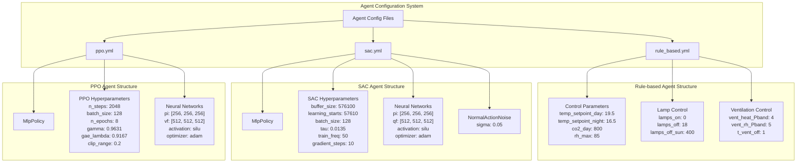
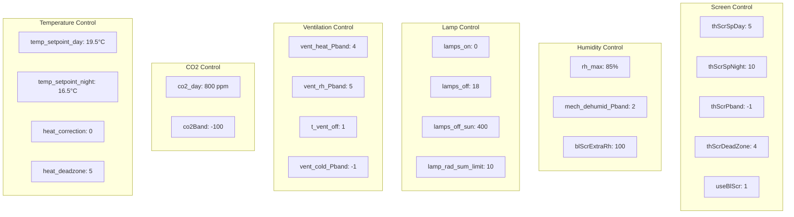

# 智能体类型

> **相关源文件**
> * [gl_gym/configs/agents/ppo.yml](https://github.com/BartvLaatum/GreenLight-Gym2/blob/f4a2727d/gl_gym/configs/agents/ppo.yml)
> * [gl_gym/configs/agents/rule_based.yml](https://github.com/BartvLaatum/GreenLight-Gym2/blob/f4a2727d/gl_gym/configs/agents/rule_based.yml)
> * [gl_gym/configs/agents/sac.yml](https://github.com/BartvLaatum/GreenLight-Gym2/blob/f4a2727d/gl_gym/configs/agents/sac.yml)

本文档介绍了 GreenLight-Gym 中可用的三种智能体类型：PPO（Proximal Policy Optimization）、SAC（Soft Actor-Critic）以及基于规则的控制智能体。每种智能体类型在温室控制优化中具有不同的特性、配置参数和应用场景。关于训练流程和实验管理的信息，请参见 [训练流程](/BartvLaatum/GreenLight-Gym2/4.2-training-process)。关于评估方法和性能追踪，请参见 [评估与回调](/BartvLaatum/GreenLight-Gym2/4.3-evaluation-and-callbacks)。

## 概述

GreenLight-Gym 支持三种用于温室控制的智能体类型：

| 智能体类型 | 算法 | 配置文件 | 主要应用场景 |
| --- | --- | --- | --- |
| PPO | Proximal Policy Optimization | `gl_gym/configs/agents/ppo.yml` | 基于策略的强化学习训练，学习过程稳定 |
| SAC | Soft Actor-Critic | `gl_gym/configs/agents/sac.yml` | 离策略强化学习，采样效率高 |
| Rule-based | 传统控制 | `gl_gym/configs/agents/rule_based.yml` | 基线对比与专家知识 |

## 智能体配置架构

来源: [gl_gym/configs/agents/ppo.yml L1-L27](https://github.com/BartvLaatum/GreenLight-Gym2/blob/f4a2727d/gl_gym/configs/agents/ppo.yml#L1-L27)

 [gl_gym/configs/agents/sac.yml L1-L33](https://github.com/BartvLaatum/GreenLight-Gym2/blob/f4a2727d/gl_gym/configs/agents/sac.yml#L1-L33)

 [gl_gym/configs/agents/rule_based.yml L1-L31](https://github.com/BartvLaatum/GreenLight-Gym2/blob/f4a2727d/gl_gym/configs/agents/rule_based.yml#L1-L31)

## PPO智能体

PPO（Proximal Policy Optimization，近端策略优化）智能体实现了一种基于策略的强化学习算法，通过裁剪的策略更新提供稳定的学习过程。

### 主要配置参数

| 参数 | 数值 | 说明 |
| --- | --- | --- |
| `total_timesteps` | 2,000,000 | 总训练步数 |
| `n_envs` | 8 | 并行环境数量 |
| `policy` | MlpPolicy | 多层感知机策略 |
| `n_steps` | 2048 | 每个环境更新前的步数 |
| `batch_size` | 128 | 训练批量大小 |
| `n_epochs` | 8 | 每次更新的训练轮数 |
| `gamma` | 0.9631 | 折扣因子 |
| `gae_lambda` | 0.9167 | GAE lambda参数 |
| `clip_range` | 0.2 | PPO裁剪参数 |

### 神经网络结构

PPO智能体为策略（`pi`）和值函数（`vf`）分别使用独立的神经网络：

* **策略网络**：3层隐藏层，每层256个神经元
* **价值网络**：3层隐藏层，每层512个神经元
* **激活函数**：SiLU（Swish）
* **优化器**：Adam，启用AMSGrad
* **学习率**：2e-5

来源: [gl_gym/configs/agents/ppo.yml L1-L27](https://github.com/BartvLaatum/GreenLight-Gym2/blob/f4a2727d/gl_gym/configs/agents/ppo.yml#L1-L27)

## SAC智能体

SAC（Soft Actor-Critic，软行为者-评论家）智能体实现了一种离策略算法，通过最大化期望回报和策略熵来提升探索能力。

### 主要配置参数

| 参数 | 数值 | 说明 |
| --- | --- | --- |
| `total_timesteps` | 2,000,000 | 总训练步数 |
| `n_envs` | 8 | 并行环境数量 |
| `policy` | MlpPolicy | 多层感知机策略 |
| `buffer_size` | 576,100 | 回放缓冲区大小 |
| `learning_starts` | 57,610 | 随机探索步数 |
| `batch_size` | 128 | 训练批量大小 |
| `tau` | 0.0135 | 目标网络更新速率 |
| `train_freq` | 50 | 训练频率（步数） |
| `gradient_steps` | 10 | 每次更新的梯度步数 |

### 神经网络结构

SAC智能体为策略（`pi`）和Q函数（`qf`）分别使用独立的神经网络：

* **策略网络**：3层隐藏层，每层256个神经元
* **Q函数网络**：3层隐藏层，每层512个神经元
* **激活函数**：SiLU（Swish）
* **优化器**：Adam，启用AMSGrad
* **学习率**：7e-4

### 动作噪声

SAC包含用于探索的动作噪声：

* **类型**：NormalActionNoise
* **标准差**：0.05

来源: [gl_gym/configs/agents/sac.yml L1-L33](https://github.com/BartvLaatum/GreenLight-Gym2/blob/f4a2727d/gl_gym/configs/agents/sac.yml#L1-L33)

## 基于规则的智能体

基于规则的智能体实现了传统的温室控制逻辑，不依赖机器学习，作为对比基线，并融合了领域专家知识。

### 控制参数

### 控制逻辑类别

| 类别 | 参数 | 目的 |
| --- | --- | --- |
| **温度** | `temp_setpoint_day`, `temp_setpoint_night`, `heat_correction`, `heat_deadzone` | 维持最佳温度范围 |
| **CO2** | `co2_day`, `co2Band` | 控制CO2补充 |
| **通风** | `vent_heat_Pband`, `vent_rh_Pband`, `t_vent_off`, `vent_cold_Pband` | 管理空气交换 |
| **照明** | `lamps_on`, `lamps_off`, `lamps_off_sun`, `lamp_rad_sum_limit` | 控制人工照明 |
| **湿度** | `rh_max`, `mech_dehumid_Pband`, `blScrExtraRh` | 调节湿度水平 |
| **幕布** | `thScrSpDay`, `thScrSpNight`, `thScrPband`, `useBlScr` | 控制保温幕布 |

来源: [gl_gym/configs/agents/rule_based.yml L1-L31](https://github.com/BartvLaatum/GreenLight-Gym2/blob/f4a2727d/gl_gym/configs/agents/rule_based.yml#L1-L31)

## 智能体选择指南

### PPO Agent

**最适用场景：**

* 稳定学习且表现一致
* 允许样本相关性的on-policy场景
* 环境本身鼓励探索
* 初步实验和概念验证开发

**特点：**

* on-policy学习（使用当前策略数据）
* 稳定但样本利用率可能较低
* 良好的基线表现
* 对超参数调优不太敏感

### SAC Agent

**最适用场景：**

* 样本高效的学习
* 连续控制问题
* 需要大量探索的环境
* 对训练时间有要求的生产部署

**特点：**

* off-policy学习（可重复利用过往经验）
* 样本高效但稳定性可能略低
* 通过熵最大化内建探索机制
* 对超参数调优更敏感

### Rule-based Agent

**最适用场景：**

* 基线对比
* 融合专家知识
* 理解系统行为
* 满足合规性要求的场景

**特点：**

* 确定性控制逻辑
* 无需学习或自适应
* 决策过程透明
* 可立即部署，无需训练

来源: [gl_gym/configs/agents/ppo.yml L1-L27](https://github.com/BartvLaatum/GreenLight-Gym2/blob/f4a2727d/gl_gym/configs/agents/ppo.yml#L1-L27)

 [gl_gym/configs/agents/sac.yml L1-L33](https://github.com/BartvLaatum/GreenLight-Gym2/blob/f4a2727d/gl_gym/configs/agents/sac.yml#L1-L33)

 [gl_gym/configs/agents/rule_based.yml L1-L31](https://github.com/BartvLaatum/GreenLight-Gym2/blob/f4a2727d/gl_gym/configs/agents/rule_based.yml#L1-L31)