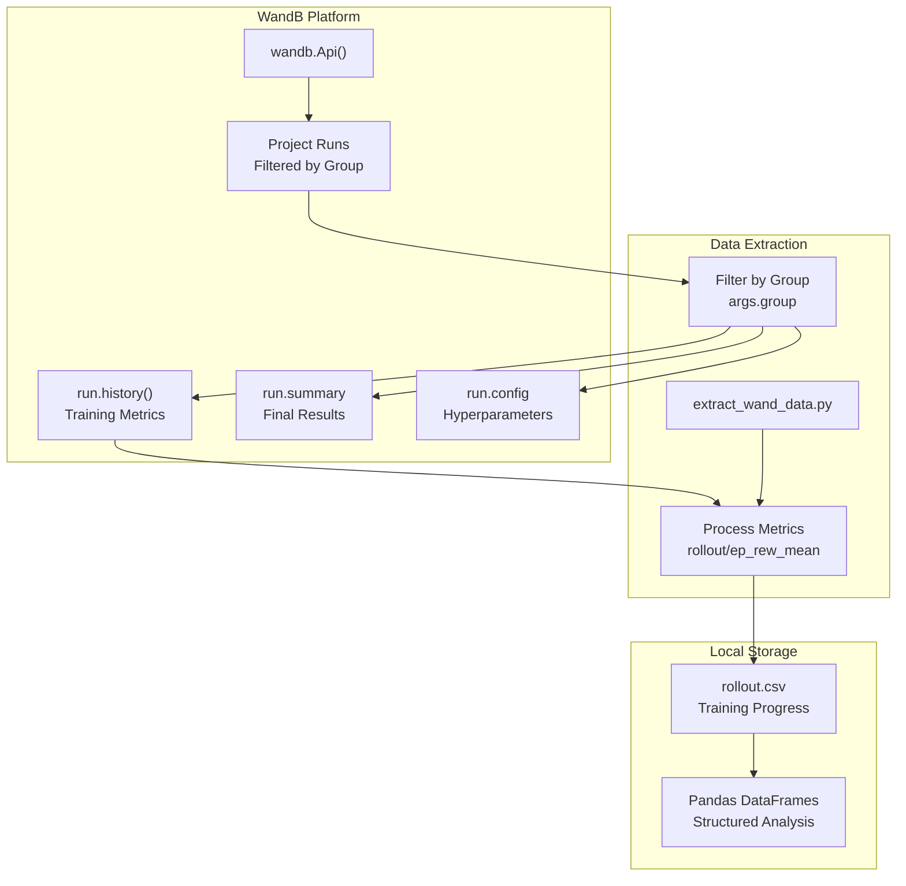

# 分析与可视化

> **相关源文件**
> * [processing/extract_wand_data.py](https://github.com/BartvLaatum/GreenLight-Gym2/blob/f4a2727d/processing/extract_wand_data.py)
> * [visualisations/cost_metrics.py](https://github.com/BartvLaatum/GreenLight-Gym2/blob/f4a2727d/visualisations/cost_metrics.py)
> * [visualisations/trajectories.py](https://github.com/BartvLaatum/GreenLight-Gym2/blob/f4a2727d/visualisations/trajectories.py)

本节介绍用于评估和理解 GreenLight-Gym 中智能体表现的训练后分析框架。该分析系统为不同强化学习智能体和基线控制器提供了全面的工具，用于检查学习曲线、状态轨迹、控制动作、经济表现以及约束违规情况。

关于具体可视化类型的详细信息，请参见 [轨迹可视化](/BartvLaatum/GreenLight-Gym2/5.1-trajectory-visualization)、[性能指标](/BartvLaatum/GreenLight-Gym2/5.2-performance-metrics) 和 [不确定性分析](/BartvLaatum/GreenLight-Gym2/5.3-uncertainty-analysis)。

## 目的与范围

分析与可视化系统具有多重用途：

* **性能评估**：比较 PPO、SAC 及基于规则的智能体在经济表现、约束违规和控制策略方面的差异
* **行为分析**：检查状态轨迹和控制动作，以理解学习到的策略
* **训练诊断**：从 Weights & Biases 实验中提取并分析学习曲线
* **鲁棒性评估**：在参数不确定性和不同环境条件下评估智能体表现

## 分析工作流程

分析流程通过结构化的工作流处理实验结果，集成了数据提取、处理与可视化：

**分析流程架构**

```

```

来源: [visualisations/cost_metrics.py L41-L66](https://github.com/BartvLaatum/GreenLight-Gym2/blob/f4a2727d/visualisations/cost_metrics.py#L41-L66)

 [visualisations/trajectories.py L38-L76](https://github.com/BartvLaatum/GreenLight-Gym2/blob/f4a2727d/visualisations/trajectories.py#L38-L76)

 [processing/extract_wand_data.py L19-L58](https://github.com/BartvLaatum/GreenLight-Gym2/blob/f4a2727d/processing/extract_wand_data.py#L19-L58)

## 数据组织与来源

分析系统处理来自多个来源的数据，这些数据以分层结构进行组织：

**数据结构与文件组织**

```

```

来源: [visualisations/cost_metrics.py L42-L59](https://github.com/BartvLaatum/GreenLight-Gym2/blob/f4a2727d/visualisations/cost_metrics.py#L42-L59)

 [visualisations/trajectories.py L91-L106](https://github.com/BartvLaatum/GreenLight-Gym2/blob/f4a2727d/visualisations/trajectories.py#L91-L106)

### 数据加载与处理

`cost_metrics.py` 中的 `load_data()` 函数实现了灵活的数据加载，能够同时处理确定性和随机性仿真模式：

| 参数 | 说明 | 文件模式 |
| --- | --- | --- |
| `project` | 实验项目名称 | `data/{project}/` |
| `mode` | 仿真模式 | `deterministic/` 或 `stochastic/` |
| `growth_year` | 生长季年份 | 文件包含年份字符串 |
| `start_day` | 年内起始日 | 文件包含起始日字符串 |
| `location` | 天气地点 | 文件包含地点代码 |
| `uncertainty_value` | 参数不确定性尺度 | 随机模式下的子文件夹 |

来源: [visualisations/cost_metrics.py L41-L66](https://github.com/BartvLaatum/GreenLight-Gym2/blob/f4a2727d/visualisations/cost_metrics.py#L41-L66)

## 可视化工具概览

该系统为智能体分析的不同方面提供了专用的可视化工具：

### 成本与性能分析

`cost_metrics.py` 模块生成经济表现的对比分析：

* **成本指标**：EPI（经济表现指数）、收入、热能成本、电力成本、CO₂成本
* **违规指标**：温度违规、CO₂违规、相对湿度违规
* **模型对比**：PPO、SAC 和基于规则控制器的并列对比

主要函数：

* `costs_plot()`：生成不同模型累计成本对比的柱状图
* `violations_plot()`：可视化约束违规惩罚

来源: [visualisations/cost_metrics.py L67-L102](https://github.com/BartvLaatum/GreenLight-Gym2/blob/f4a2727d/visualisations/cost_metrics.py#L67-L102)

 [visualisations/cost_metrics.py L103-L137](https://github.com/BartvLaatum/GreenLight-Gym2/blob/f4a2727d/visualisations/cost_metrics.py#L103-L137)

### 轨迹与控制分析

`trajectories.py` 模块提供详细的行为分析：

* **状态变量**：温度、相对湿度、CO₂浓度及其约束边界
* **控制动作**：锅炉使用、CO₂注入、热幕位置
* **行为模式**：热力图展示状态与控制变量之间的关系

主要可视化函数：

* `state_plot()`：带有约束可视化的多面板状态变量时间序列
* 控制动作绘图：执行器使用情况的时间序列分析
* 热力图生成：展示控制-状态关系的二维直方图

来源: [visualisations/trajectories.py L38-L76](https://github.com/BartvLaatum/GreenLight-Gym2/blob/f4a2727d/visualisations/trajectories.py#L38-L76)

 [visualisations/trajectories.py L122-L149](https://github.com/BartvLaatum/GreenLight-Gym2/blob/f4a2727d/visualisations/trajectories.py#L122-L149)

 [visualisations/trajectories.py L171-L190](https://github.com/BartvLaatum/GreenLight-Gym2/blob/f4a2727d/visualisations/trajectories.py#L171-L190)

## 配置与样式

两个可视化模块均实现了统一的样式设置，以生成具备发表水准的图表：

### Matplotlib 配置

可视化脚本对 matplotlib 进行了专业化输出配置：

| 设置项 | 值 | 作用 |
| --- | --- | --- |
| `font.family` | "serif" | 期刊级排版风格 |
| `font.size` | 8-20 | 针对不同图表类型优化字号 |
| `svg.fonttype` | "path" | 兼容 Illustrator 编辑 |
| `axes.spines.top/right` | False | 清爽的图表外观 |
| `lines.linewidth` | 1.5-4 | 明显的线宽 |

### 配色方案

所有可视化图表采用统一的配色规范：

* PPO Agent: `#003366`（深蓝色）
* SAC Agent: `#0066CC` / `#A60000`（蓝色/红色变体）
* Rule-Based: `grey` / `#4394E5`（中性色）

来源: [visualisations/cost_metrics.py L8-L40](https://github.com/BartvLaatum/GreenLight-Gym2/blob/f4a2727d/visualisations/cost_metrics.py#L8-L40)

 [visualisations/trajectories.py L9-L37](https://github.com/BartvLaatum/GreenLight-Gym2/blob/f4a2727d/visualisations/trajectories.py#L9-L37)

## 与实验追踪系统集成

分析系统与 Weights & Biases 集成，实现全面的实验管理：

**WandB 集成架构**



来源: [processing/extract_wand_data.py L19-L58](https://github.com/BartvLaatum/GreenLight-Gym2/blob/f4a2727d/processing/extract_wand_data.py#L19-L58)

数据提取过程收集了以下内容：

* 训练奖励进展（`rollout/ep_rew_mean`）
* 用于时间对齐的全局步数
* 用于参数分析的运行配置
* 用于最终性能比较的汇总统计

这一全面的分析框架能够对强化学习智能体在多个维度上进行系统性评估，既支持温室控制应用中的科研洞察，也支持实际部署决策。