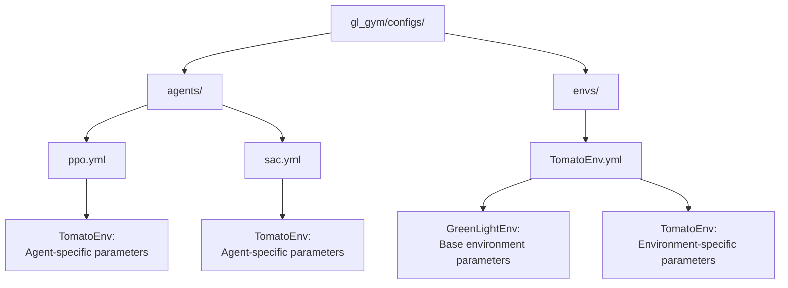
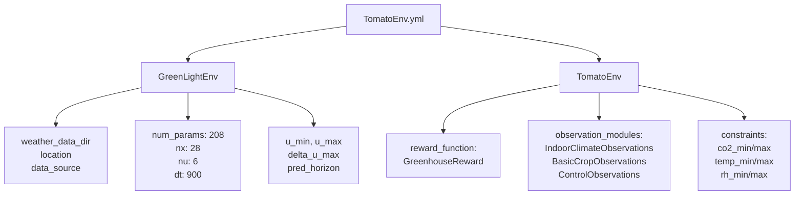
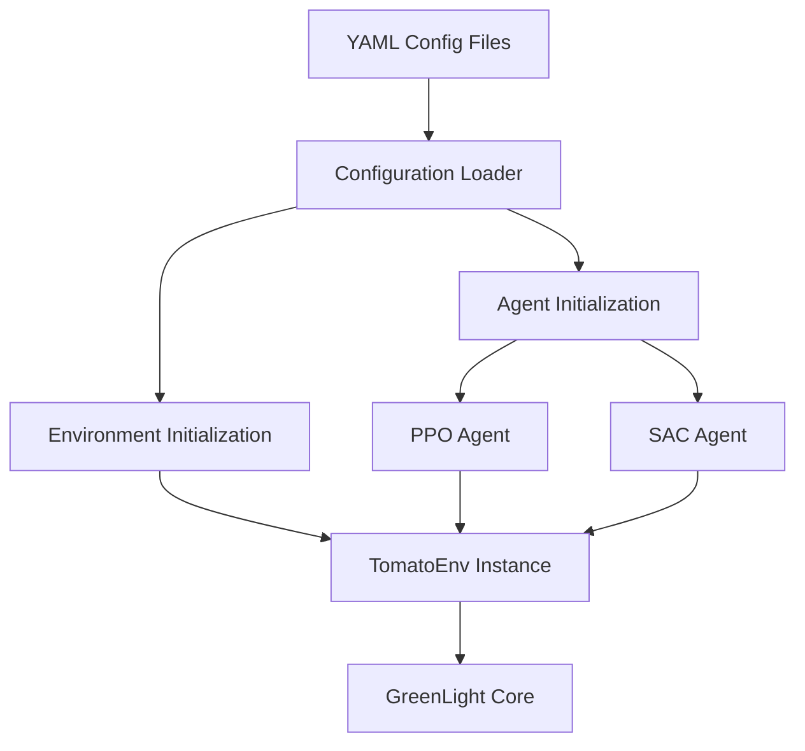

# 配置管理

> **相关源文件**
> * [gl_gym/configs/agents/ppo.yml](https://github.com/BartvLaatum/GreenLight-Gym2/blob/f4a2727d/gl_gym/configs/agents/ppo.yml)
> * [gl_gym/configs/agents/sac.yml](https://github.com/BartvLaatum/GreenLight-Gym2/blob/f4a2727d/gl_gym/configs/agents/sac.yml)
> * [gl_gym/configs/envs/TomatoEnv.yml](https://github.com/BartvLaatum/GreenLight-Gym2/blob/f4a2727d/gl_gym/configs/envs/TomatoEnv.yml)

本文档介绍了 GreenLight-Gym 中基于 YAML 的配置系统，该系统用于参数化强化学习智能体和温室环境。该配置系统采用分层结构，便于管理不同类型智能体和环境设置的参数。

关于仿真核心内部的参数管理系统，请参见 [参数管理](/BartvLaatum/GreenLight-Gym2/6.3-parameter-management)。关于使用这些配置进行实验编排的详细信息，请参见 [训练流程](/BartvLaatum/GreenLight-Gym2/4.2-training-process)。

## 配置文件结构

配置系统分为两大类：智能体配置和环境配置。所有配置文件均采用 YAML 格式，存放于 `gl_gym/configs/` 目录下。

### 配置文件层级结构



**配置文件组织结构**

该配置系统采用结构化方法：智能体配置会引用特定的环境类型，而环境配置则定义了基础参数和专用参数。

来源: [gl_gym/configs/agents/ppo.yml L1-L27](https://github.com/BartvLaatum/GreenLight-Gym2/blob/f4a2727d/gl_gym/configs/agents/ppo.yml#L1-L27)

 [gl_gym/configs/agents/sac.yml L1-L33](https://github.com/BartvLaatum/GreenLight-Gym2/blob/f4a2727d/gl_gym/configs/agents/sac.yml#L1-L33)

 [gl_gym/configs/envs/TomatoEnv.yml L1-L70](https://github.com/BartvLaatum/GreenLight-Gym2/blob/f4a2727d/gl_gym/configs/envs/TomatoEnv.yml#L1-L70)

## 智能体配置

智能体配置文件用于定义不同强化学习算法的超参数和训练设置。每种智能体类型都有独立的配置文件，并在环境相关的部分下指定参数。

### PPO 智能体配置

PPO 配置包括标准的 PPO 超参数和策略网络结构：

| 参数 | 数值 | 说明 |
| --- | --- | --- |
| `total_timesteps` | 2,000,000 | 总训练步数 |
| `n_envs` | 8 | 并行环境数量 |
| `policy` | MlpPolicy | 策略网络类型 |
| `learning_rate` | 2e-5 | 优化器学习率 |
| `gamma` | 0.9631 | 折扣因子 |
| `clip_range` | 0.2 | PPO 剪切参数 |

策略网络结构在 `policy_kwargs` 中定义，分别为策略（`pi`）和价值函数（`vf`）单独设置网络：

```yaml
policy_kwargs: {
  net_arch: {pi: [256, 256, 256], vf: [512, 512, 512]},
  optimizer_class: adam,
  activation_fn: silu
}
```

来源: [gl_gym/configs/agents/ppo.yml L1-L27](https://github.com/BartvLaatum/GreenLight-Gym2/blob/f4a2727d/gl_gym/configs/agents/ppo.yml#L1-L27)

### SAC 智能体配置

SAC 配置包含了针对 off-policy 学习的专用参数：

| 参数 | 数值 | 说明 |
| --- | --- | --- |
| `buffer_size` | 576,100 | 回放缓冲区大小 |
| `learning_starts` | 57,610 | 开始学习前的步数 |
| `tau` | 0.0135 | 软更新系数 |
| `train_freq` | 50 | 训练频率 |
| `gradient_steps` | 10 | 每次更新的梯度步数 |

SAC 还包含用于探索的动作噪声配置：

```yaml
action_noise: 
  normalactionnoise:
    sigma: 0.05
```

来源: [gl_gym/configs/agents/sac.yml L1-L33](https://github.com/BartvLaatum/GreenLight-Gym2/blob/f4a2727d/gl_gym/configs/agents/sac.yml#L1-L33)

## 环境配置

环境配置文件用于定义基础环境 `GreenLightEnv` 以及如 `TomatoEnv` 等专用环境的参数。配置采用分层结构，将通用参数和特定参数分开管理。

### 配置参数流程



**基础环境参数**

`GreenLightEnv` 部分定义了核心仿真参数：

* **气象配置**：数据目录、地点（Amsterdam）以及数据源（KNMI）
* **模型维度**：208 个参数、28 个状态、6 个控制输入、10 个扰动
* **仿真设置**：900 秒时间步长、控制边界、预测时域

来源: [gl_gym/configs/envs/TomatoEnv.yml L3-L21](https://github.com/BartvLaatum/GreenLight-Gym2/blob/f4a2727d/gl_gym/configs/envs/TomatoEnv.yml#L3-L21)

### 专用环境参数

`TomatoEnv` 部分定义了番茄专用参数：

#### 观测模块

环境使用多个观测模块以提供全面的状态信息：

```yaml
observation_modules: [                  
  IndoorClimateObservations,   
  BasicCropObservations, 
  ControlObservations, 
  WeatherObservations,
  TimeObservations,
  WeatherForecastObservations
]
```

#### 环境约束

物理约束确保温室运行的现实性：

| 约束项 | 最小值 | 最大值 | 单位 |
| --- | --- | --- | --- |
| CO2 浓度 | 300 | 1600 | ppm |
| 温度 | 15 | 34 | °C |
| 相对湿度 | 50 | 85 | % |

#### 经济参数

奖励函数相关参数定义了各项成本与价格：

| 参数 | 数值 | 单位 | 说明 |
| --- | --- | --- | --- |
| `elec_price` | 0.3 | €/kWh | 电力成本 |
| `heating_price` | 0.09 | €/kWh | 供暖成本 |
| `co2_price` | 0.3 | €/kg | CO2 成本 |
| `fruit_price` | 1.6 | €/kg | 番茄销售价格 |

来源: [gl_gym/configs/envs/TomatoEnv.yml L23-L70](https://github.com/BartvLaatum/GreenLight-Gym2/blob/f4a2727d/gl_gym/configs/envs/TomatoEnv.yml#L23-L70)

## 配置使用模式

配置系统遵循统一模式：在系统初始化时加载配置，并应用到各自的组件。

### 配置加载流程



**配置应用流程**

1. **智能体配置**：通过 agent 的 YAML 文件中的参数，配置强化学习算法的超参数、网络结构和训练计划。
2. **环境配置**：通过环境 YAML 文件中的参数，初始化仿真环境、观测模块和奖励函数。
3. **参数校验**：在初始化过程中，配置值会根据预期的范围和类型进行校验。

这种分层结构支持灵活的配置管理，基础参数可以被更具体的设置覆盖，从而便于对不同参数组合进行实验。

来源: [gl_gym/configs/agents/ppo.yml L1-L27](https://github.com/BartvLaatum/GreenLight-Gym2/blob/f4a2727d/gl_gym/configs/agents/ppo.yml#L1-L27)

 [gl_gym/configs/agents/sac.yml L1-L33](https://github.com/BartvLaatum/GreenLight-Gym2/blob/f4a2727d/gl_gym/configs/agents/sac.yml#L1-L33)

 [gl_gym/configs/envs/TomatoEnv.yml L1-L70](https://github.com/BartvLaatum/GreenLight-Gym2/blob/f4a2727d/gl_gym/configs/envs/TomatoEnv.yml#L1-L70)