# 环境接口

> **相关源文件**
> * [gl_gym/environments/base_env.py](https://github.com/BartvLaatum/GreenLight-Gym2/blob/f4a2727d/gl_gym/environments/base_env.py)
> * [gl_gym/environments/tomato_env.py](https://github.com/BartvLaatum/GreenLight-Gym2/blob/f4a2727d/gl_gym/environments/tomato_env.py)

本文档介绍了用于温室控制的、符合 Gymnasium 标准的强化学习环境的 Python 环境接口层。该环境接口作为 C++ GreenLight 仿真核心与强化学习智能体之间的桥梁，负责观测收集、动作缩放、奖励计算以及环境生命周期管理。

关于底层 C++ 仿真引擎的信息，请参见 [Simulation Core](/BartvLaatum/GreenLight-Gym2/3.1-simulation-core)。关于配置管理的详细内容，请参见 [Configuration Management](/BartvLaatum/GreenLight-Gym2/3.3-configuration-management)。关于具体的奖励和观测实现，请参见 [Reward System](/BartvLaatum/GreenLight-Gym2/6.1-reward-system) 和 [Observation System](/BartvLaatum/GreenLight-Gym2/6.2-observation-system)。

## 架构概览

环境接口采用两层类层次结构：`GreenLightEnv` 提供抽象基础功能，`TomatoEnv` 实现具体的温室控制环境。

```

```

**来源：** [gl_gym/environments/base_env.py L14-L180](https://github.com/BartvLaatum/GreenLight-Gym2/blob/f4a2727d/gl_gym/environments/base_env.py#L14-L180)

 [gl_gym/environments/tomato_env.py L27-L271](https://github.com/BartvLaatum/GreenLight-Gym2/blob/f4a2727d/gl_gym/environments/tomato_env.py#L27-L271)

## 基础环境类

`GreenLightEnv` 类为所有温室环境提供了基础接口。它继承自 `gym.Env`，并定义了温室仿真环境的核心结构。

### 核心组件

| 组件 | 类型 | 作用 |
| --- | --- | --- |
| `gl_model` | `GreenLight` | 用于物理仿真的 C++ 模型封装 |
| `growth_year` | `int` | 当前仿真年份 |
| `start_day` | `int` | 仿真起始日（年内天数） |
| `training` | `bool` | 训练/评估模式标志 |
| `eval_idx` | `int` | 评估回合计数器 |

### 抽象接口

基础类定义了多个抽象方法，具体实现类必须实现这些方法：

```

```

**来源：** [gl_gym/environments/base_env.py L94-L180](https://github.com/BartvLaatum/GreenLight-Gym2/blob/f4a2727d/gl_gym/environments/base_env.py#L94-L180)

## TomatoEnv 实现

`TomatoEnv` 类提供了一个完整的番茄温室控制环境实现，支持可配置的观测模块、奖励函数和约束条件。

### 初始化与配置

该环境通过构造函数接受全面的配置参数：

| 参数 | 类型 | 作用 |
| --- | --- | --- |
| `reward_function` | `str` | 所用奖励函数名称 |
| `observation_modules` | `List[str]` | 观测模块名称列表 |
| `constraints` | `Dict[str, Any]` | 环境约束边界 |
| `eval_options` | `Dict[str, Any]` | 评估配置 |
| `uncertainty_scale` | `float` | 参数不确定性幅度 |

初始化流程如下：

```

```

**来源：** [gl_gym/environments/tomato_env.py L28-L66](https://github.com/BartvLaatum/GreenLight-Gym2/blob/f4a2727d/gl_gym/environments/tomato_env.py#L28-L66)

### 动作与控制管理

环境通过若干关键方法实现动作缩放与控制输入管理：

* **动作空间**：通过 `_generate_action_space()` 方法将动作归一化到 `[-1, 1]` 区间 [gl_gym/environments/tomato_env.py L97-L98](https://github.com/BartvLaatum/GreenLight-Gym2/blob/f4a2727d/gl_gym/environments/tomato_env.py#L97-L98)
* **动作缩放**：`action_to_control()` 方法将归一化动作转换为物理控制输入 [gl_gym/environments/tomato_env.py L109-L113](https://github.com/BartvLaatum/GreenLight-Gym2/blob/f4a2727d/gl_gym/environments/tomato_env.py#L109-L113)
* **控制边界**：动作会被裁剪以满足由 `u_min`、`u_max` 和 `delta_u_max` 定义的物理约束

### 环境步进流程

`step()` 方法实现了环境的核心动态过程：

```

```

**来源：** [gl_gym/environments/tomato_env.py L115-L146](https://github.com/BartvLaatum/GreenLight-Gym2/blob/f4a2727d/gl_gym/environments/tomato_env.py#L115-L146)

## 观测系统集成

该环境采用模块化观测系统，不同观测模块可灵活组合：

### 可用观测模块

| 模块 | 作用 | 位置 |
| --- | --- | --- |
| `StateObservations` | 原始温室状态变量 | Observations module |
| `IndoorClimateObservations` | 处理后的气候条件 | Observations module |
| `BasicCropObservations` | 作物生长参数 | Observations module |
| `ControlObservations` | 当前控制输入 | Observations module |
| `WeatherObservations` | 当前天气状况 | Observations module |
| `WeatherForecastObservations` | 未来天气预测 | Observations module |
| `TimeObservations` | 时间信息 | Observations module |

### 观测收集流程

观测系统会根据配置的模块动态构建观测空间：

```mermaid
flowchart TD

GenSpace["_generate_observation_space()"]
ModuleSpace["module.observation_space()"]
CombineSpaces["Combine low/high bounds"]
CreateBox["spaces.Box(low, high)"]
GetObs["_get_obs()"]
ModuleLoop["For each observation module"]
ComputeObs["module.compute_obs()"]
Concatenate["Concatenate all observations"]

subgraph subGraph1 ["Space Generation"]
    GenSpace
    ModuleSpace
    CombineSpaces
    CreateBox
    GenSpace --> ModuleSpace
    ModuleSpace --> CombineSpaces
    CombineSpaces --> CreateBox
end

subgraph subGraph0 ["Observation Collection"]
    GetObs
    ModuleLoop
    ComputeObs
    Concatenate
    GetObs --> ModuleLoop
    ModuleLoop --> ComputeObs
    ComputeObs --> Concatenate
end
```



**来源:** [gl_gym/environments/tomato_env.py L77-L95](https://github.com/BartvLaatum/GreenLight-Gym2/blob/f4a2727d/gl_gym/environments/tomato_env.py#L77-L95)

 [gl_gym/environments/tomato_env.py L193-L198](https://github.com/BartvLaatum/GreenLight-Gym2/blob/f4a2727d/gl_gym/environments/tomato_env.py#L193-L198)

## 环境生命周期管理

### 重置流程

`reset()` 方法用于在每个新回合初始化随机条件：

1. **年份与起始日选择**：根据训练/评估模式，随机选择生长年份和起始日 [gl_gym/environments/tomato_env.py L236-L244](https://github.com/BartvLaatum/GreenLight-Gym2/blob/f4a2727d/gl_gym/environments/tomato_env.py#L236-L244)
2. **天气数据加载**：为所选时间段加载相应的天气数据 [gl_gym/environments/tomato_env.py L249-L260](https://github.com/BartvLaatum/GreenLight-Gym2/blob/f4a2727d/gl_gym/environments/tomato_env.py#L249-L260)
3. **状态初始化**：根据天气相关条件初始化温室状态 [gl_gym/environments/tomato_env.py L262-L264](https://github.com/BartvLaatum/GreenLight-Gym2/blob/f4a2727d/gl_gym/environments/tomato_env.py#L262-L264)
4. **变量重置**：重置时间步计数器和控制输入 [gl_gym/environments/tomato_env.py L262-L269](https://github.com/BartvLaatum/GreenLight-Gym2/blob/f4a2727d/gl_gym/environments/tomato_env.py#L262-L269)

### 终止条件

当仿真达到生长季末尾时，回合终止。由 `_terminalState()` 判断 `timestep >= N` 是否成立 [gl_gym/environments/tomato_env.py L68-L75](https://github.com/BartvLaatum/GreenLight-Gym2/blob/f4a2727d/gl_gym/environments/tomato_env.py#L68-L75)

### 信息追踪

环境通过 `_get_info()` 跟踪完整的回合信息，包括：

* 经济绩效指标（EPI）
* 收入与成本明细
* 约束违规情况
* 当前控制输入

**来源:** [gl_gym/environments/tomato_env.py L208-L222](https://github.com/BartvLaatum/GreenLight-Gym2/blob/f4a2727d/gl_gym/environments/tomato_env.py#L208-L222)

 [gl_gym/environments/tomato_env.py L231-L270](https://github.com/BartvLaatum/GreenLight-Gym2/blob/f4a2727d/gl_gym/environments/tomato_env.py#L231-L270)