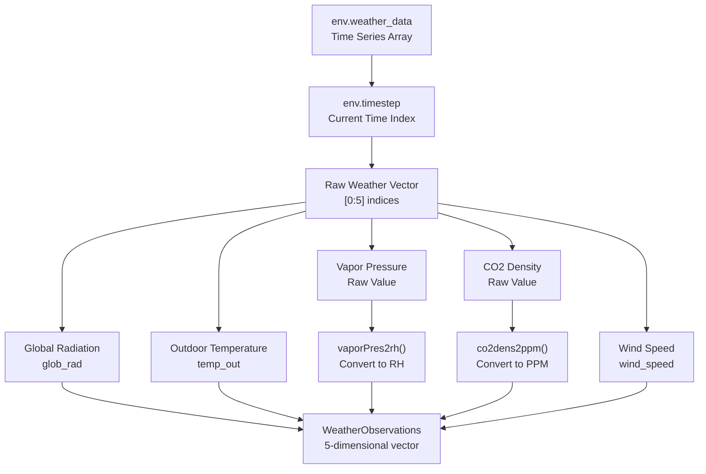
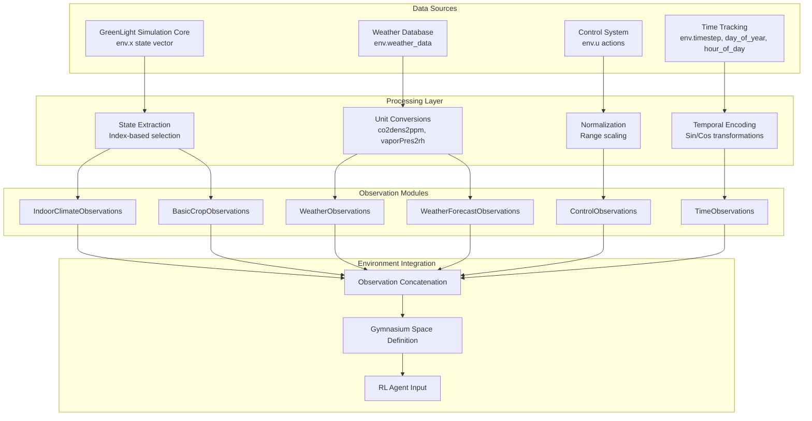

# 观测系统

> **相关源文件**
> * [gl_gym/environments/observations.py](https://github.com/BartvLaatum/GreenLight-Gym2/blob/f4a2727d/gl_gym/environments/observations.py)

观测系统为强化学习智能体提供了一个模块化框架，用于获取温室仿真的环境信息。该系统将原始仿真状态、气象数据和控制输入转化为结构化的观测数据，供RL智能体用于决策。

本文档介绍了多模态观测模块及其数据处理方式。关于这些观测如何用于奖励计算，请参见 [Reward System](/BartvLaatum/GreenLight-Gym2/6.1-reward-system)。关于整体环境架构的详细信息，请参见 [Environment Interface](/BartvLaatum/GreenLight-Gym2/3.2-environment-interface)。

## 系统架构

观测系统采用模块化设计，不同类型的环境信息由专门的观测类处理。每个模块实现了统一的接口，同时提供领域特定的数据处理和归一化功能。

```

```

来源: [gl_gym/environments/observations.py L1-L182](https://github.com/BartvLaatum/GreenLight-Gym2/blob/f4a2727d/gl_gym/environments/observations.py#L1-L182)

## 基础观测接口

`BaseObservations` 类定义了所有观测模块必须实现的通用接口。这个抽象基类确保了不同观测类型之间的一致行为。

| 方法 | 作用 | 返回类型 |
| --- | --- | --- |
| `observation_space()` | 定义 Gymnasium 的观测空间 | `spaces.Box` |
| `compute_obs()` | 生成当前观测 | `np.ndarray` |

每个观测模块都维护关于其观测的元数据：

* `n_obs`：观测维度数量
* `obs_names`：每个观测的人类可读名称
* `low`/`high`：观测值的可选上下界

来源: [gl_gym/environments/observations.py L9-L33](https://github.com/BartvLaatum/GreenLight-Gym2/blob/f4a2727d/gl_gym/environments/observations.py#L9-L33)

## 观测模块

### 室内气候观测

`IndoorClimateObservations` 类提供了对温室环境控制决策至关重要的关键气候测量数据。

```

```

该模块提取特定的状态索引 `[0, 2, 15, 9]`，并对数据进行单位转换以提升可读性。CO2 从密度单位转换为百万分之一浓度（ppm），蒸汽压则转换为相对湿度百分比。

来源: [gl_gym/environments/observations.py L59-L77](https://github.com/BartvLaatum/GreenLight-Gym2/blob/f4a2727d/gl_gym/environments/observations.py#L59-L77)

### 作物生长观测

`BasicCropObservations` 类用于追踪植物生长的关键指标，这些指标对于生长监测和收获时机决策至关重要。

三项主要作物观测指标为：

* **24CanTemp**：24小时冠层平均温度
* **cFruit**：果实生物量累积
* **tSum**：用于生长发育追踪的温度积算

来源: [gl_gym/environments/observations.py L79-L95](https://github.com/BartvLaatum/GreenLight-Gym2/blob/f4a2727d/gl_gym/environments/observations.py#L79-L95)

### 控制动作观测

`ControlObservations` 类提供当前控制设定的反馈，使智能体能够理解其动作的即时影响。

六个控制维度包括：

* `uBoil`：锅炉加热控制
* `uCo2`：CO2 注入控制
* `uThScr`：保温幕位置
* `uVent`：通风控制
* `uLamp`：补光灯控制
* `uBlScr`：遮光幕位置

所有控制值均归一化到 [0, 1] 区间，表示最大控制能力的比例。

来源: [gl_gym/environments/observations.py L97-L112](https://github.com/BartvLaatum/GreenLight-Gym2/blob/f4a2727d/gl_gym/environments/observations.py#L97-L112)

### 天气观测

`WeatherObservations` 类提供当前室外环境条件，这些条件会直接影响温室的运行。



来源: [gl_gym/environments/observations.py L114-L136](https://github.com/BartvLaatum/GreenLight-Gym2/blob/f4a2727d/gl_gym/environments/observations.py#L114-L136)

### 时间观测

`TimeObservations` 类通过周期性函数对时间信息进行编码，帮助智能体理解季节性和日常模式。

时间编码包括：

* **timestep**：当前仿真步数
* **day_of_year_sin/cos**：季节性周期编码
* **hour_of_day_sin/cos**：日常周期编码

正弦/余弦编码确保时间边界（如12月31日到1月1日）以连续的方式表示，而不是不连续的跳变。

来源: [gl_gym/environments/observations.py L138-L161](https://github.com/BartvLaatum/GreenLight-Gym2/blob/f4a2727d/gl_gym/environments/observations.py#L138-L161)

### 天气预报观测

`WeatherForecastObservations` 类提供未来的天气预测，以支持前瞻性的控制策略。

预测的维度为 `5 * env.Np`，其中 `Np` 表示预测步长。对于每一个未来的时间步，都会提供与当前天气观测相同的五个气象变量。

来源: [gl_gym/environments/observations.py L163-L182](https://github.com/BartvLaatum/GreenLight-Gym2/blob/f4a2727d/gl_gym/environments/observations.py#L163-L182)

## 数据流与处理

观测系统整合了环境中的多个数据源：



来源: [gl_gym/environments/observations.py L1-L182](https://github.com/BartvLaatum/GreenLight-Gym2/blob/f4a2727d/gl_gym/environments/observations.py#L1-L182)

## 使用模式

观测模块通常在环境初始化时由环境实例化，并在每个仿真步调用。模块化设计允许环境根据具体的强化学习任务需求选择包含哪些观测类型。

每个模块的 `observation_space()` 方法定义了与 Gymnasium 兼容的边界和维度，而 `compute_obs()` 则在环境执行期间完成实际的数据提取和处理。

来源: [gl_gym/environments/observations.py L1-L182](https://github.com/BartvLaatum/GreenLight-Gym2/blob/f4a2727d/gl_gym/environments/observations.py#L1-L182)