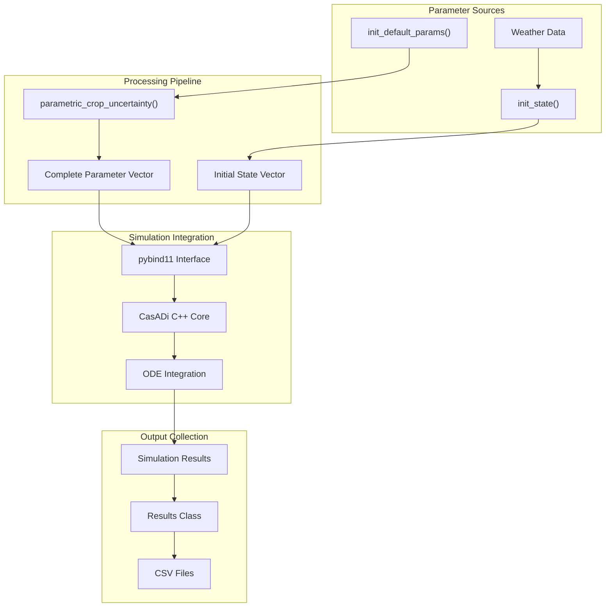

# 参数管理

> **相关源文件**
> * [gl_gym/common/results.py](https://github.com/BartvLaatum/GreenLight-Gym2/blob/f4a2727d/gl_gym/common/results.py)
> * [gl_gym/environments/noise.py](https://github.com/BartvLaatum/GreenLight-Gym2/blob/f4a2727d/gl_gym/environments/noise.py)
> * [gl_gym/environments/parameters.py](https://github.com/BartvLaatum/GreenLight-Gym2/blob/f4a2727d/gl_gym/environments/parameters.py)

本文档介绍了 GreenLight-Gym 的参数管理系统，包括模型参数初始化、物理常数定义、不确定性注入机制以及结果收集工具。该系统管理着 200 多个物理和温室参数，这些参数驱动着仿真核心。

关于整体仿真架构的信息，请参见 [Simulation Core](/BartvLaatum/GreenLight-Gym2/3.1-simulation-core)。关于使用这些参数的观测系统详情，请参见 [Observation System](/BartvLaatum/GreenLight-Gym2/6.2-observation-system)。

## 系统概述

参数管理系统主要包括三个部分：参数初始化、不确定性注入和结果收集。所有参数以 NumPy 数组形式存储，并通过 pybind11 接口传递给 C++ 仿真核心。

**参数管理架构**

```

```

来源: [gl_gym/environments/parameters.py L1-L298](https://github.com/BartvLaatum/GreenLight-Gym2/blob/f4a2727d/gl_gym/environments/parameters.py#L1-L298)

 [gl_gym/environments/noise.py L1-L24](https://github.com/BartvLaatum/GreenLight-Gym2/blob/f4a2727d/gl_gym/environments/noise.py#L1-L24)

 [gl_gym/common/results.py L1-L18](https://github.com/BartvLaatum/GreenLight-Gym2/blob/f4a2727d/gl_gym/common/results.py#L1-L18)

## 默认参数初始化

`init_default_params` 函数会初始化温室仿真所需的全套物理参数。参数被按逻辑类别组织，并存储在一个 NumPy 数组中。

**参数向量结构**

```

```

### 主要参数类别

| 类别 | 索引范围 | 描述 | 示例 |
| --- | --- | --- | --- |
| 物理常数 | 0-38 | 通用物理参数 | Stefan-Boltzmann 常数、重力加速度 |
| 温室结构 | 44-78 | 温室结构参数 | 地面面积、覆盖表面、通风高度 |
| 保温/遮光幕 | 74-94, 85-94 | 幕布材料属性 | 发射率、反射系数、厚度 |
| 供热系统 | 104-110 | 管道尺寸与容量 | 管道直径、锅炉容量、热容量 |
| 作物模型 | 128-162 | 植物生长参数 | 最大叶面积指数、生长速率、呼吸作用 |
| LED 系统 | 172-187 | 人工照明参数 | PAR 效率、热修正、灯具容量 |

来源: [gl_gym/environments/parameters.py L4-L261](https://github.com/BartvLaatum/GreenLight-Gym2/blob/f4a2727d/gl_gym/environments/parameters.py#L4-L261)

## 状态初始化

`init_state` 函数用于初始化一个包含 28 个元素的状态向量，代表温室系统当前的各项状态。状态变量包括温度、CO2 浓度以及作物生长指标等。

```

```

### 状态向量组成

| 索引 | 变量 | 描述 | 初始化方式 |
| --- | --- | --- | --- |
| 0-1 | `co2Air`, `co2Top` | CO2 浓度 | 来自气象数据 `d0[3]` |
| 2-14 | 温度状态 | 各类温度分量 | 基础温度 18.5°C 加偏移 |
| 15-16 | `vpAir`, `vpTop` | 水汽压 | 通过 `satVp()` 函数计算 |
| 21-26 | 作物状态 | 碳缓冲池与生物量 | 固定初始值 |
| 27 | `time` | 仿真时间 | 输入参数 `time_in_days` |

来源: [gl_gym/environments/parameters.py L264-L298](https://github.com/BartvLaatum/GreenLight-Gym2/blob/f4a2727d/gl_gym/environments/parameters.py#L264-L298)

## 不确定性注入

不确定性系统允许对作物参数进行系统性扰动，以测试模型的鲁棒性。`parametric_crop_uncertainty` 函数有选择地为作物相关参数添加噪声，同时保持物理一致性。

```

```

该函数专门针对作物参数（索引 128-162），并确保派生参数的一致性。例如，`cLeafMax`（索引 144）在扰动后会根据 `laiMax/sla` 重新计算，以维持物理关系。

来源: [gl_gym/environments/noise.py L3-L24](https://github.com/BartvLaatum/GreenLight-Gym2/blob/f4a2727d/gl_gym/environments/noise.py#L3-L24)

## 结果收集

`Results` 类提供了标准化接口，用于收集仿真数据并导出为 CSV 格式。其内部使用 pandas DataFrame 以实现高效数据管理。

**结果收集流程**

```

```

### Results 类方法

| 方法 | 参数 | 描述 |
| --- | --- | --- |
| `__init__` | `col_names` | 以列名列表初始化 |
| `update_result` | `data: np.ndarray` | 追加新数据行并校验形状 |
| `save` | `filename` | 导出 DataFrame 为 CSV 文件 |

该类会校验输入数据的维度是否与列数匹配，并使用 pandas 的 `_append()` 方法实现增量数据收集。

来源: [gl_gym/common/results.py L4-L18](https://github.com/BartvLaatum/GreenLight-Gym2/blob/f4a2727d/gl_gym/common/results.py#L4-L18)

## 参数与仿真核心的集成

参数从初始化、经过不确定性注入，最终流入仿真核心，驱动物理建模计算。系统始终保持参数定义、修改与使用的清晰分离。

**参数流动架构**



参数管理系统确保所有物理常数和模型参数都被正确初始化，可选地进行扰动以进行鲁棒性测试，并高效地传递到C++仿真核心，同时保持数据收集能力以便后续分析。

来源: [gl_gym/environments/parameters.py L1-L298](https://github.com/BartvLaatum/GreenLight-Gym2/blob/f4a2727d/gl_gym/environments/parameters.py#L1-L298)

 [gl_gym/environments/noise.py L1-L24](https://github.com/BartvLaatum/GreenLight-Gym2/blob/f4a2727d/gl_gym/environments/noise.py#L1-L24)

 [gl_gym/common/results.py L1-L18](https://github.com/BartvLaatum/GreenLight-Gym2/blob/f4a2727d/gl_gym/common/results.py#L1-L18)