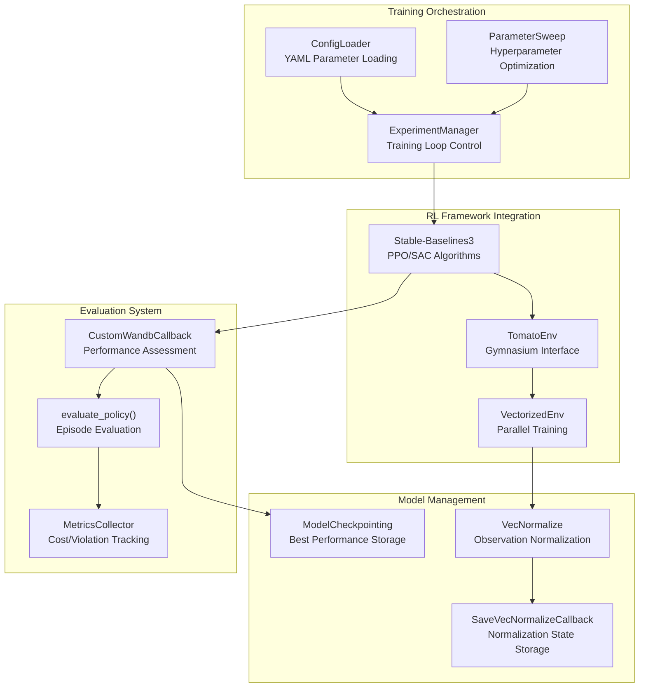
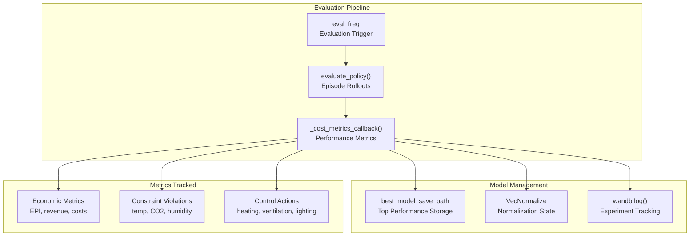
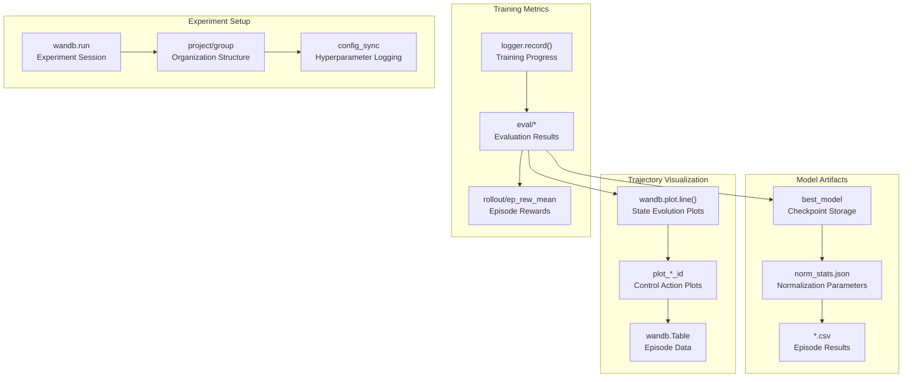
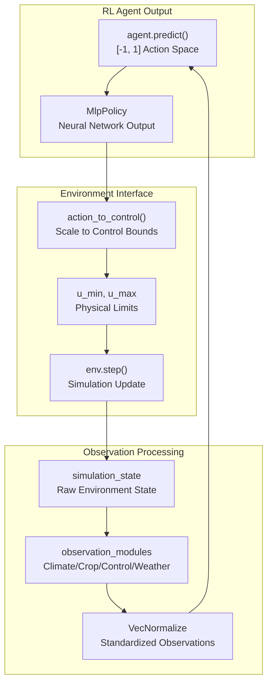

# 强化学习

> **相关源文件**
> * [gl_gym/common/callbacks.py](https://github.com/BartvLaatum/GreenLight-Gym2/blob/f4a2727d/gl_gym/common/callbacks.py)
> * [gl_gym/common/evaluation.py](https://github.com/BartvLaatum/GreenLight-Gym2/blob/f4a2727d/gl_gym/common/evaluation.py)
> * [gl_gym/configs/sweeps/sac.yml](https://github.com/BartvLaatum/GreenLight-Gym2/blob/f4a2727d/gl_gym/configs/sweeps/sac.yml)
> * [tests/env_test.py](https://github.com/BartvLaatum/GreenLight-Gym2/blob/f4a2727d/tests/env_test.py)
> * [visualisations/inspect_mat.py](https://github.com/BartvLaatum/GreenLight-Gym2/blob/f4a2727d/visualisations/inspect_mat.py)

本文档介绍了 GreenLight-Gym 的强化学习功能，包括支持的RL算法、训练编排、评估系统以及实验追踪基础设施。该RL框架通过与 `TomatoEnv` 环境的交互，实现温室控制策略的自动化学习。关于底层环境实现的信息，请参见 [环境接口](/BartvLaatum/GreenLight-Gym2/3.2-environment-interface)。关于具体智能体配置的详细信息，请参见 [智能体类型](/BartvLaatum/GreenLight-Gym2/4.1-agent-types)。

## 支持的算法与框架

GreenLight-Gym 集成了 Stable-Baselines3，为温室控制优化提供强化学习能力。系统支持多种RL算法，并包含基于规则的基线以供对比。

### 算法支持

系统支持以下强化学习算法：

| 算法 | 类型 | 配置文件 | 主要特性 |
| --- | --- | --- | --- |
| PPO | On-policy（基于策略） | `gl_gym/configs/agents/ppo.yml` | 带裁剪的策略梯度 |
| SAC | Off-policy（离策略） | `gl_gym/configs/agents/sac.yml` | 带熵正则化的软行为者-评论家 |
| Rule-based | 确定性 | `gl_gym/configs/agents/rule_based.yml` | 传统温室控制规则 |

### 强化学习训练架构



来源: [gl_gym/common/callbacks.py L21-L306](https://github.com/BartvLaatum/GreenLight-Gym2/blob/f4a2727d/gl_gym/common/callbacks.py#L21-L306)

 [gl_gym/common/evaluation.py L10-L167](https://github.com/BartvLaatum/GreenLight-Gym2/blob/f4a2727d/gl_gym/common/evaluation.py#L10-L167)

 [tests/env_test.py L6-L95](https://github.com/BartvLaatum/GreenLight-Gym2/blob/f4a2727d/tests/env_test.py#L6-L95)

## 训练流程与评估

训练过程通过一个全面的评估与回调系统进行管理，该系统跟踪多项性能指标，并实现了自动化的模型检查点保存。

### 自定义评估回调

`CustomWandbCallback` 类继承自 Stable-Baselines3 的 `EvalCallback`，用于提供温室控制的专项评估：



### 关键性能指标

评估系统会跟踪温室的全面性能指标：

| 指标类别 | 具体指标 | 代码参考 |
| --- | --- | --- |
| 经济表现 | `EPI`、`revenue`、`variable_costs`、`fixed_costs` | [gl_gym/common/callbacks.py L77-L87](https://github.com/BartvLaatum/GreenLight-Gym2/blob/f4a2727d/gl_gym/common/callbacks.py#L77-L87) |
| 能源成本 | `co2_cost`、`heat_cost`、`elec_cost` | [gl_gym/common/callbacks.py L85-L87](https://github.com/BartvLaatum/GreenLight-Gym2/blob/f4a2727d/gl_gym/common/callbacks.py#L85-L87) |
| 约束违规 | `temp_violation`、`co2_violation`、`rh_violation`、`lamp_violation` | [gl_gym/common/callbacks.py L79-L82](https://github.com/BartvLaatum/GreenLight-Gym2/blob/f4a2727d/gl_gym/common/callbacks.py#L79-L82) |
| 控制动作 | 供暖、通风、CO2注入、照明 | [gl_gym/common/evaluation.py L104](https://github.com/BartvLaatum/GreenLight-Gym2/blob/f4a2727d/gl_gym/common/evaluation.py#L104-L104) |

来源： [gl_gym/common/callbacks.py L65-L88](https://github.com/BartvLaatum/GreenLight-Gym2/blob/f4a2727d/gl_gym/common/callbacks.py#L65-L88)

 [gl_gym/common/callbacks.py L107-L119](https://github.com/BartvLaatum/GreenLight-Gym2/blob/f4a2727d/gl_gym/common/callbacks.py#L107-L119)

 [gl_gym/common/evaluation.py L10-L167](https://github.com/BartvLaatum/GreenLight-Gym2/blob/f4a2727d/gl_gym/common/evaluation.py#L10-L167)

## 实验追踪与可视化

系统集成了 Weights & Biases，实现了全面的实验追踪，并自动可视化训练进展和策略行为。

### Weights & Biases 集成



### 轨迹自动绘图

回调系统会自动为温室关键变量生成轨迹图：

```
cols2plot = ["co2_air", "temp_air", "rh_air", "pipe_temp", "cFruit", 
             "uBoil", "uCo2", "uThScr", "uVent", "uLamp", "uBlScr"]
```

每当发现新的最佳模型时，这些轨迹图会自动记录到 Weights & Biases，便于即时可视化策略行为。

来源: [gl_gym/common/callbacks.py L197-L210](https://github.com/BartvLaatum/GreenLight-Gym2/blob/f4a2727d/gl_gym/common/callbacks.py#L197-L210)

 [gl_gym/common/callbacks.py L38-L63](https://github.com/BartvLaatum/GreenLight-Gym2/blob/f4a2727d/gl_gym/common/callbacks.py#L38-L63)

 [gl_gym/common/callbacks.py L294-L300](https://github.com/BartvLaatum/GreenLight-Gym2/blob/f4a2727d/gl_gym/common/callbacks.py#L294-L300)

## 超参数优化

本系统支持通过 YAML 配置文件自动进行超参数搜索，可为不同的强化学习算法定义搜索空间。

### SAC 超参数配置

SAC 搜索配置展示了系统的超参数优化能力：

| 参数 | 搜索方法 | 范围/取值 | 作用 |
| --- | --- | --- | --- |
| `learning_rate` | `log_uniform_values` | 1e-6 到 1e-3 | 优化器步长 |
| `batch_size` | `values` | [64, 128, 256, 512, 1024] | 小批量大小 |
| `tau` | `log_uniform_values` | 0.001 到 0.1 | 软更新系数 |
| `train_freq` | `values` | [10, 25, 50] | 训练频率 |
| `gamma_offset` | `log_uniform_values` | 0.001 到 0.1 | 折扣因子调整 |

### 网络结构搜索

配置同样支持网络结构优化：

```javascript
pi: [64, 128, 256, 512, 1024]  # Policy network sizes
qf: [64, 128, 256, 512, 1024]  # Q-function network sizes  
activation_fn: [silu, relu, tanh]  # Activation functions
```

来源: [gl_gym/configs/sweeps/sac.yml L1-L58](https://github.com/BartvLaatum/GreenLight-Gym2/blob/f4a2727d/gl_gym/configs/sweeps/sac.yml#L1-L58)

## 环境集成

强化学习系统通过标准化的 Gymnasium 接口与 `TomatoEnv` 环境无缝集成，实现了动作缩放与观测归一化。

### 动作与观测处理



### 环境测试

系统包含了全面的测试，以验证强化学习的集成效果：

* **动作缩放验证**：确保动作被正确缩放到控制边界 [tests/env_test.py L68-L76](https://github.com/BartvLaatum/GreenLight-Gym2/blob/f4a2727d/tests/env_test.py#L68-L76)
* **奖励归一化**：验证经济奖励的缩放 [tests/env_test.py L17-L31](https://github.com/BartvLaatum/GreenLight-Gym2/blob/f4a2727d/tests/env_test.py#L17-L31)
* **回合终止**：确认回合长度的正确处理 [tests/env_test.py L77-L93](https://github.com/BartvLaatum/GreenLight-Gym2/blob/f4a2727d/tests/env_test.py#L77-L93)
* **观测空间一致性**：验证观测维度的正确性 [tests/env_test.py L35-L36](https://github.com/BartvLaatum/GreenLight-Gym2/blob/f4a2727d/tests/env_test.py#L35-L36)

来源: [tests/env_test.py L6-L95](https://github.com/BartvLaatum/GreenLight-Gym2/blob/f4a2727d/tests/env_test.py#L6-L95)

 [gl_gym/common/evaluation.py L102-L104](https://github.com/BartvLaatum/GreenLight-Gym2/blob/f4a2727d/gl_gym/common/evaluation.py#L102-L104)