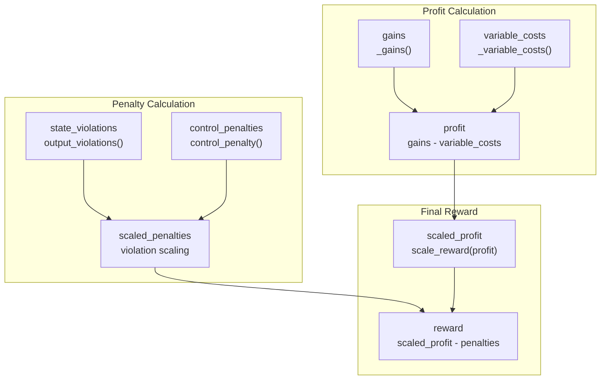

# 奖励系统

> **相关源文件**
> * [gl_gym/environments/rewards.py](https://github.com/BartvLaatum/GreenLight-Gym2/blob/f4a2727d/gl_gym/environments/rewards.py)

奖励系统在 GreenLight-Gym 中实现了温室控制的经济绩效评估。它根据作物利润、运营成本和约束违规惩罚来计算奖励。该系统通过建模真实的温室经济，包括固定基础设施成本、可变运营费用和合规性惩罚，为强化学习智能体提供反馈信号。

关于为奖励计算提供状态输入的观测系统，请参见 [Observation System](/BartvLaatum/GreenLight-Gym2/6.2-observation-system)。关于奖励计算中参数管理的详细信息，请参见 [Parameter Management](/BartvLaatum/GreenLight-Gym2/6.3-parameter-management)。

## 奖励架构

奖励系统采用分层设计，包含抽象基类和针对温室环境的专用实现。

```

```

来源: [gl_gym/environments/rewards.py L1-L232](https://github.com/BartvLaatum/GreenLight-Gym2/blob/f4a2727d/gl_gym/environments/rewards.py#L1-L232)

## 经济模型

奖励系统通过基于利润的方法对温室经济进行建模，既考虑收入生成，也考虑运营支出。

### 收入计算

果实收入基于作物生长和市场价格计算：

```

```

`_gains()` 方法实现了该计算，具体步骤如下：

1. 通过状态差异计算果实干物质增长
2. 使用 `dmfm` 比率将干物质转换为鲜果重量
3. 乘以 `fruit_price` 得到以 €/m² 为单位的收入

### 成本结构

成本模型包括固定基础设施成本和可变运营费用：

| 成本类别 | 组成部分 | 单位 | 计算方法 |
| --- | --- | --- | --- |
| 固定成本 | `fixed_greenhouse_cost`, `fixed_co2_cost`, `fixed_lamp_cost`, `fixed_screen_cost` | €/m²/时间步 | 年度成本 / 365 / 每天时间步数 |
| 可变成本 | 供暖、CO₂ 施加、电力 | €/m²/时间步 | 控制输入 × 价格 × 换算因子 |

`_variable_costs()` 方法用于计算运营费用：

* **供暖**: `u[0] * p[108] / p[46] * dt/3600*1e-3 * heating_price`
* **CO₂ 施加**: `u[1] * p[109] / p[46] * dt * 1e-6 * co2_price`
* **电力**: `u[4] * p[172] * dt/3600*1e-3 * elec_price`

来源: [gl_gym/environments/rewards.py L156-L183](https://github.com/BartvLaatum/GreenLight-Gym2/blob/f4a2727d/gl_gym/environments/rewards.py#L156-L183)

## 惩罚系统

惩罚系统通过违规检测和经济惩罚来强制执行操作约束。

### 状态约束违规

`output_violations()` 方法监控三项主要环境约束：

```

```

### 控制约束违规

`control_violation()` 方法用于在夜间（20:00 以后）对灯光使用进行监管限制，当在禁止时段内灯光开启时，将 `lamp_violation` 设为 1。

### 惩罚缩放

违规行为通过加权缩放转化为经济惩罚：

* **状态惩罚**：`np.dot(pen_weights, violations)`
* **控制惩罚**：`lamp_violation * pen_lamp`

来源: [gl_gym/environments/rewards.py L185-L216](https://github.com/BartvLaatum/GreenLight-Gym2/blob/f4a2727d/gl_gym/environments/rewards.py#L185-L216)

## 奖励计算

最终奖励将经济利润与约束惩罚相结合：



`compute_reward()` 方法实现了如下计算流程：

1. 计算可变成本和收益
2. 利润 = 收益 - 可变成本
3. 检测并缩放约束违规
4. 返回缩放后的利润减去惩罚项

来源: [gl_gym/environments/rewards.py L218-L231](https://github.com/BartvLaatum/GreenLight-Gym2/blob/f4a2727d/gl_gym/environments/rewards.py#L218-L231)

## 奖励缩放与边界

奖励系统通过归一化确保学习过程的稳定性。

### 利润边界

系统设定了理论上的最小和最大利润边界：

| 边界类型 | 计算方式 | 目的 |
| --- | --- | --- |
| `max_profit` | 最大果实生长量 × 果实价格 | 奖励上界 |
| `min_profit` | 最大运营成本（负值） | 奖励下界 |

### 违规边界

约束违规受到物理极限的限制：

```markdown
# From max_violations() method
co2_violation = 2500    # ppm
temp_violation = 15     # °C  
rh_violation = 15       # %
```

### 缩放函数

`scale_reward()` 方法将数值归一化到 [0,1] 区间：

```
scaled_value = (value - min_value) / (max_value - min_value)
```

这种归一化方式确保奖励在经济参数变化时依然保持在可预测的范围内。

来源: [gl_gym/environments/rewards.py L87-L125](https://github.com/BartvLaatum/GreenLight-Gym2/blob/f4a2727d/gl_gym/environments/rewards.py#L87-L125)