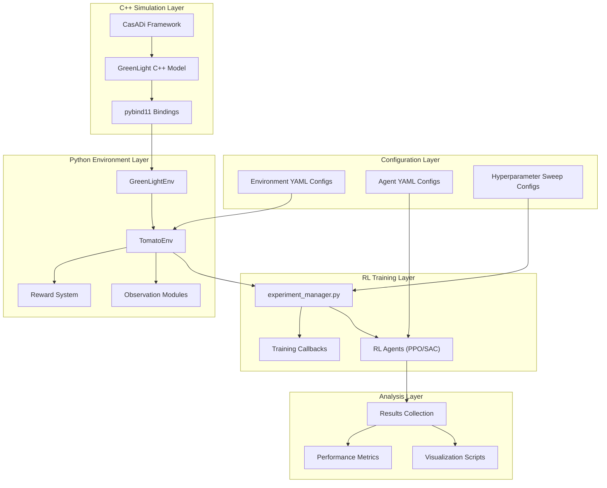
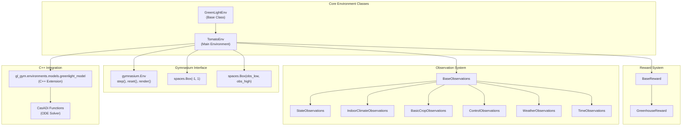
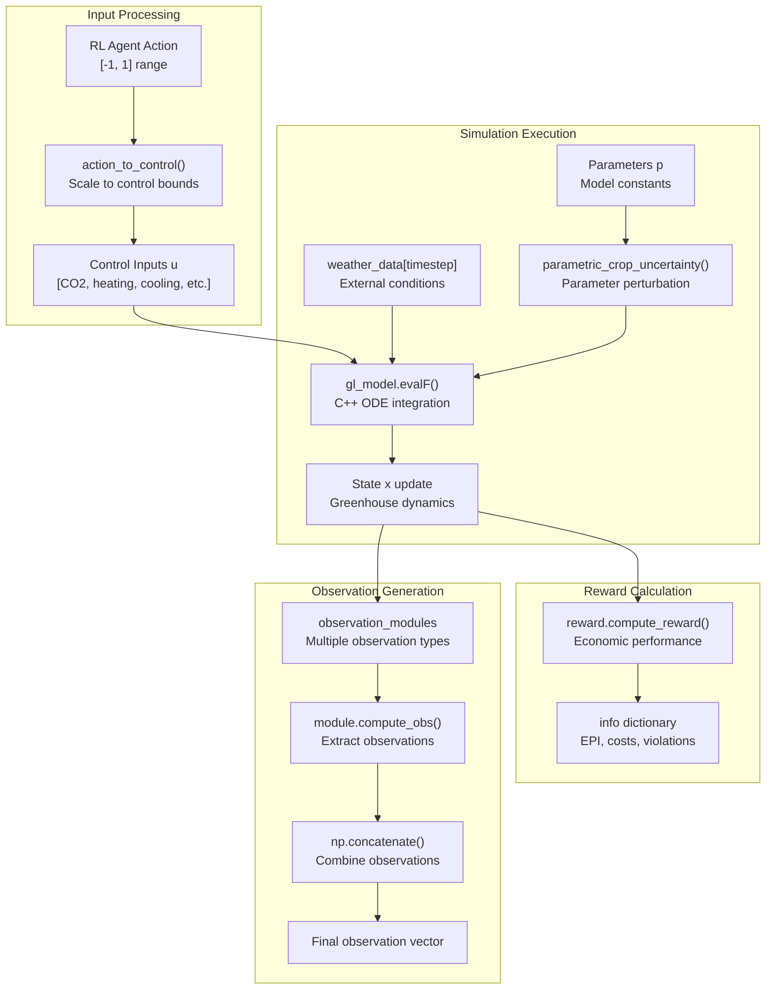
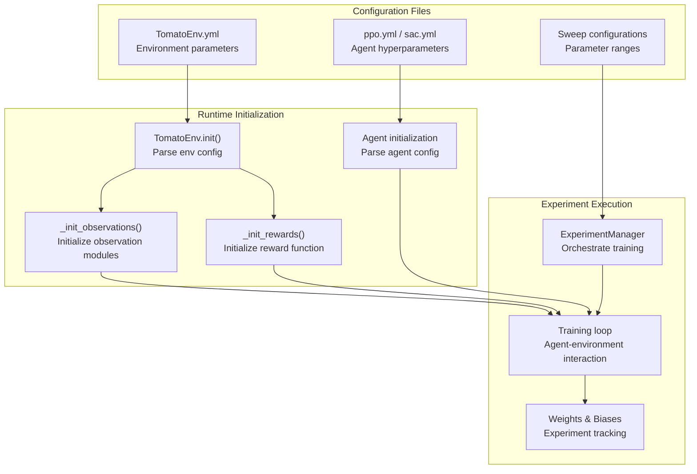

# 系统架构

> **相关源文件**
> * [CITATION.cff](https://github.com/BartvLaatum/GreenLight-Gym2/blob/f4a2727d/CITATION.cff)
> * [README.md](https://github.com/BartvLaatum/GreenLight-Gym2/blob/f4a2727d/README.md)
> * [gl_gym/environments/tomato_env.py](https://github.com/BartvLaatum/GreenLight-Gym2/blob/f4a2727d/gl_gym/environments/tomato_env.py)
> * [setup.py](https://github.com/BartvLaatum/GreenLight-Gym2/blob/f4a2727d/setup.py)

本文档概述了GreenLight-Gym的多层架构，重点介绍了C++仿真核心、Python环境接口与强化学习组件如何集成，构建完整的温室控制训练系统。关于各层的详细实现，请参见[仿真核心](/BartvLaatum/GreenLight-Gym2/3.1-simulation-core)、[环境接口](/BartvLaatum/GreenLight-Gym2/3.2-environment-interface)和[配置管理](/BartvLaatum/GreenLight-Gym2/3.3-configuration-management)。

## 架构概览

GreenLight-Gym采用分层架构，将数学建模、环境仿真和机器学习等关注点进行分离。该系统通过定义良好的接口，将高性能的C++数值计算与灵活的基于Python的强化学习实验相结合。

### 多层架构

**标题：GreenLight-Gym 多层架构**

来源: [README.md L12-L13](https://github.com/BartvLaatum/GreenLight-Gym2/blob/f4a2727d/README.md#L12-L13)

 [setup.py L17-L27](https://github.com/BartvLaatum/GreenLight-Gym2/blob/f4a2727d/setup.py#L17-L27)

 [gl_gym/environments/tomato_env.py L27-L66](https://github.com/BartvLaatum/GreenLight-Gym2/blob/f4a2727d/gl_gym/environments/tomato_env.py#L27-L66)

## 核心组件集成

系统的核心集成围绕 `TomatoEnv` 类展开，该类协调 C++ 仿真引擎、观测模块、奖励计算和强化学习智能体之间的交互。

### 环境类层级与依赖关系

**标题：TomatoEnv 类的依赖关系与集成点**

来源: [gl_gym/environments/tomato_env.py L27-L37](https://github.com/BartvLaatum/GreenLight-Gym2/blob/f4a2727d/gl_gym/environments/tomato_env.py#L27-L37)

 [gl_gym/environments/tomato_env.py L17-L25](https://github.com/BartvLaatum/GreenLight-Gym2/blob/f4a2727d/gl_gym/environments/tomato_env.py#L17-L25)

 [gl_gym/environments/tomato_env.py L44-L49](https://github.com/BartvLaatum/GreenLight-Gym2/blob/f4a2727d/gl_gym/environments/tomato_env.py#L44-L49)

## 数据流架构

系统通过一条清晰的数据管道处理信息，从气象输入到RL智能体决策，每一层都有明确的数据转换节点。

### 环境步进流程

**标题：TomatoEnv.step() 数据流管线**

来源: [gl_gym/environments/tomato_env.py L115-L146](https://github.com/BartvLaatum/GreenLight-Gym2/blob/f4a2727d/gl_gym/environments/tomato_env.py#L115-L146)

 [gl_gym/environments/tomato_env.py L109-L113](https://github.com/BartvLaatum/GreenLight-Gym2/blob/f4a2727d/gl_gym/environments/tomato_env.py#L109-L113)

 [gl_gym/environments/tomato_env.py L193-L198](https://github.com/BartvLaatum/GreenLight-Gym2/blob/f4a2727d/gl_gym/environments/tomato_env.py#L193-L198)

## 配置与可扩展性

该架构通过 YAML 文件和模块化组件注册支持灵活配置，使得在不同观测空间、奖励函数和智能体类型之间轻松进行实验成为可能。

### 组件注册系统

| 组件类型         | 注册字典                | 示例组件                                      |
| --------------- | ---------------------- | --------------------------------------------- |
| 观测模块         | `OBSERVATION_MODULES`  | `StateObservations`、`IndoorClimateObservations`、`BasicCropObservations` |
| 奖励函数         | `REWARDS`              | `GreenhouseReward`                            |
| 强化学习算法     | Experiment Manager     | `ppo`、`sac`、基于规则的                      |

### 配置流程

**标题：配置系统与运行时初始化**

来源: [gl_gym/environments/tomato_env.py L28-L66](https://github.com/BartvLaatum/GreenLight-Gym2/blob/f4a2727d/gl_gym/environments/tomato_env.py#L28-L66)

 [gl_gym/environments/tomato_env.py L77-L81](https://github.com/BartvLaatum/GreenLight-Gym2/blob/f4a2727d/gl_gym/environments/tomato_env.py#L77-L81)

 [gl_gym/environments/tomato_env.py L100-L101](https://github.com/BartvLaatum/GreenLight-Gym2/blob/f4a2727d/gl_gym/environments/tomato_env.py#L100-L101)

## 构建与集成系统

本系统使用 `pybind11` 为 C++ 仿真核心创建 Python 绑定，从而实现高性能数值计算与灵活的 Python 实验框架之间的无缝集成。

### C++ 扩展构建流程

| 构建组件         | 描述                                 | 文件参考 |
| --------------- | ------------------------------------ | -------- |
| 扩展定义         | `greenlight_model` 扩展模块          | [setup.py L17-L27](https://github.com/BartvLaatum/GreenLight-Gym2/blob/f4a2727d/setup.py#L17-L27) |
| 包含目录         | CasADi 头文件、pybind11 头文件        | [setup.py L21](https://github.com/BartvLaatum/GreenLight-Gym2/blob/f4a2727d/setup.py#L21-L21) |
| 库依赖           | CasADi 共享库                        | [setup.py L22-L23](https://github.com/BartvLaatum/GreenLight-Gym2/blob/f4a2727d/setup.py#L22-L23) |
| 编译参数         | C++17 标准，位置无关代码              | [setup.py L25](https://github.com/BartvLaatum/GreenLight-Gym2/blob/f4a2727d/setup.py#L25-L25) |

构建系统会自动发现 CasADi 的安装路径，并在执行 `pip install -e .` 时配置 Python 扩展模块，从而在 C++ 的 `GreenLight` 模型与 Python 的 `TomatoEnv` 接口之间建立直接桥梁。

来源: [setup.py L1-L44](https://github.com/BartvLaatum/GreenLight-Gym2/blob/f4a2727d/setup.py#L1-L44)

 [README.md L34-L72](https://github.com/BartvLaatum/GreenLight-Gym2/blob/f4a2727d/README.md#L34-L72)

 [README.md L92-L100](https://github.com/BartvLaatum/GreenLight-Gym2/blob/f4a2727d/README.md#L92-L100)