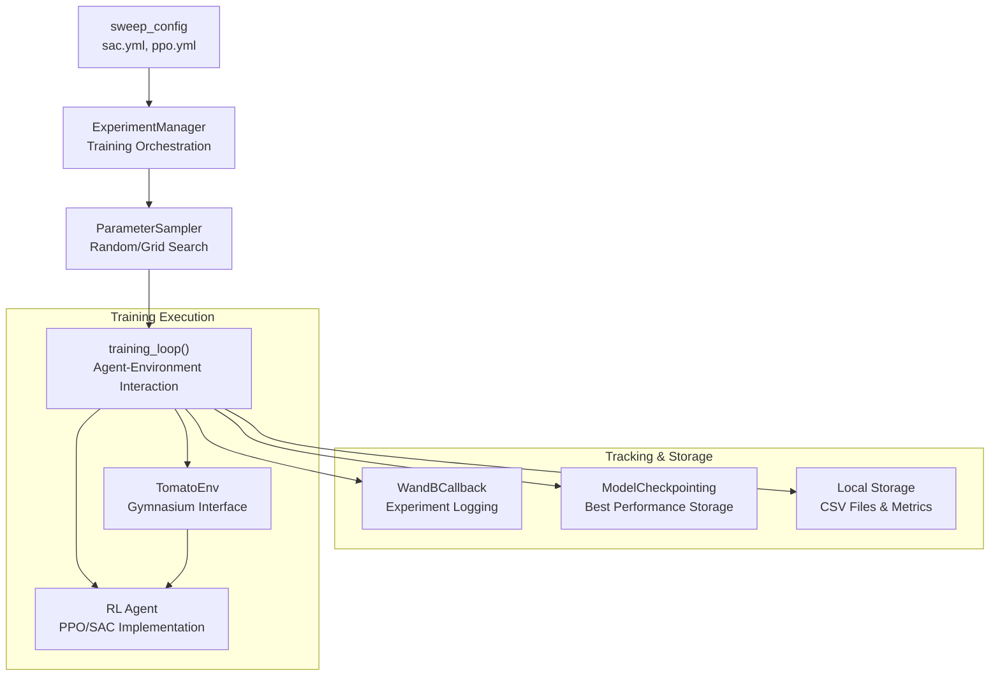
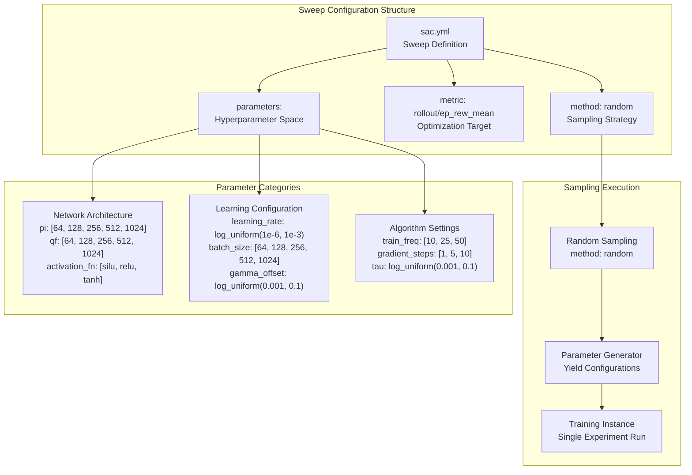
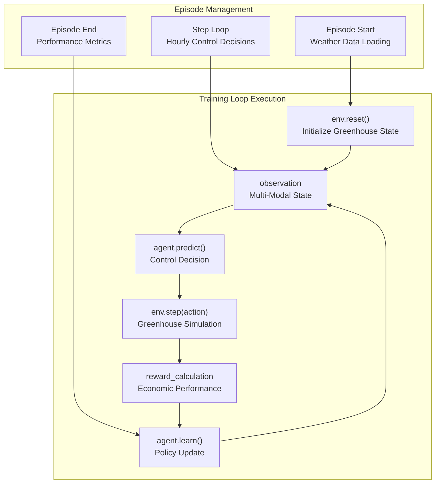
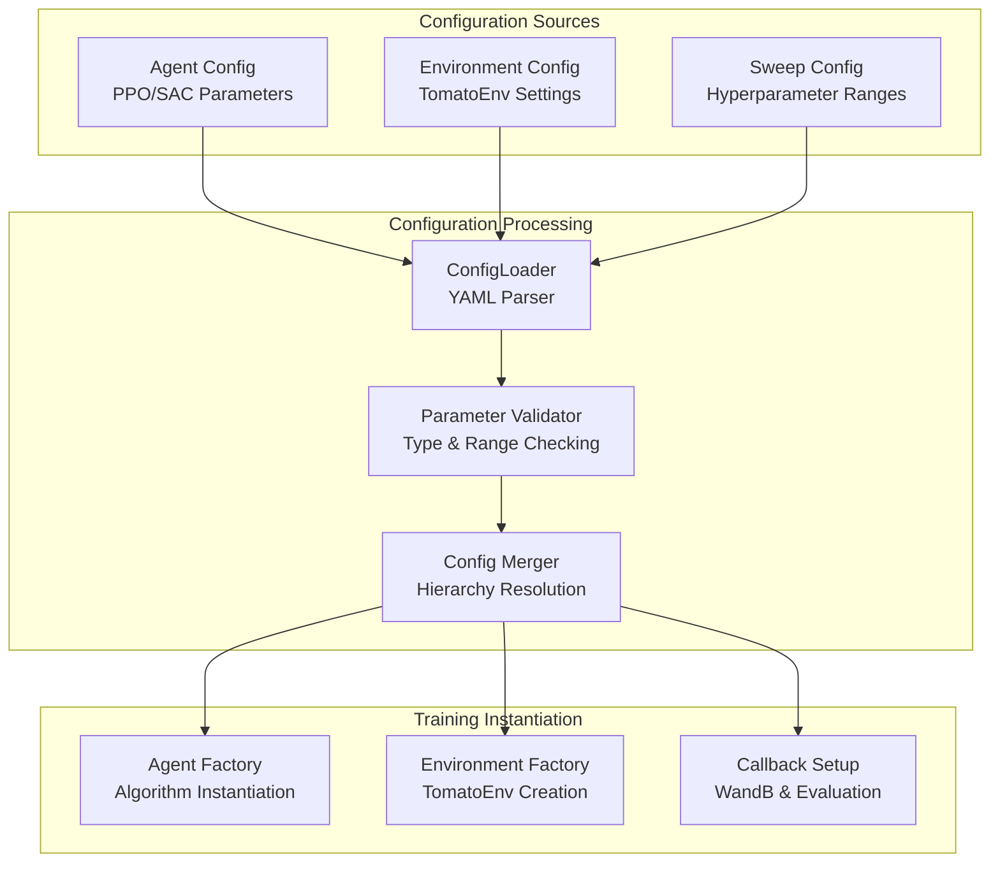

# 训练流程

> **相关源文件**
> * [gl_gym/configs/sweeps/sac.yml](https://github.com/BartvLaatum/GreenLight-Gym2/blob/f4a2727d/gl_gym/configs/sweeps/sac.yml)

本文档介绍了 GreenLight-Gym 中的实验编排与训练循环管理。重点说明了系统如何执行强化学习训练会话、管理超参数搜索，并协调配置文件与训练算法之间的关系。

关于具体智能体实现的信息，请参见 [Agent Types](/BartvLaatum/GreenLight-Gym2/4.1-agent-types)。关于评估指标和实验追踪的详细内容，请参见 [Evaluation and Callbacks](/BartvLaatum/GreenLight-Gym2/4.3-evaluation-and-callbacks)。关于底层配置系统结构，请参见 [Configuration Management](/BartvLaatum/GreenLight-Gym2/3.3-configuration-management)。

## 训练架构概览

GreenLight-Gym 的训练流程遵循分层编排模式，配置文件驱动实验执行、超参数优化和模型训练。



**训练流程架构**

本系统实现了一个以配置驱动的训练流水线，YAML 格式的 sweep 配置文件用于定义超参数空间，实验管理器负责整体流程的协调，专用回调函数则用于实验追踪与结果存储。

来源: [gl_gym/configs/sweeps/sac.yml L1-L58](https://github.com/BartvLaatum/GreenLight-Gym2/blob/f4a2727d/gl_gym/configs/sweeps/sac.yml#L1-L58)

## 实验管理器（Experiment Manager）

`ExperimentManager` 是训练会话的核心调度者。它负责管理训练实验的全生命周期，包括配置解析、模型评估与存储等环节。

### 核心职责

| 组件 | 功能 | 实现方式 |
| --- | --- | --- |
| 配置加载 | 解析 YAML sweep 配置 | 加载 sweep 参数与智能体配置 |
| 参数采样 | 生成超参数组合 | 根据配置方法进行随机或网格搜索 |
| 训练协调 | 执行训练循环 | 管理智能体与环境的交互周期 |
| 资源管理 | 管理计算资源 | 协调训练所需的 GPU/CPU 分配 |

实验管理器采用生产者-消费者模式：配置文件作为生产者生成参数组合，训练工作者作为消费者执行具体训练任务。

## 超参数搜索（Hyperparameter Sweeps）

系统通过基于 YAML 的 sweep 配置支持系统化的超参数优化。每个 sweep 文件定义参数空间及采样策略，实现自动化实验流程。



**超参数搜索配置结构**

超参数搜索系统采用分层参数定义，支持多种分布类型，包括离散取值、均匀区间以及针对学习率和正则化参数的对数均匀分布。

### 参数分布类型

配置系统支持多种参数采样策略：

* **离散取值**：`values: [64, 128, 256, 512, 1024]`，用于网络层大小
* **对数均匀分布**：`distribution: log_uniform_values`，用于学习率和正则化参数
* **固定取值**：`value: MlpPolicy`，用于策略类型和布尔标志

### SAC 专用配置

SAC 的超参数搜索配置涵盖了网络结构、学习动态和算法相关参数的完整超参数空间：

```yaml
train_freq: [10, 25, 50]
gradient_steps: [1, 5, 10]
tau: log_uniform(0.001, 0.1)
batch_size: [64, 128, 256, 512, 1024]
learning_rate: log_uniform(1e-6, 1e-3)
```

来源: [gl_gym/configs/sweeps/sac.yml L1-L58](https://github.com/BartvLaatum/GreenLight-Gym2/blob/f4a2727d/gl_gym/configs/sweeps/sac.yml#L1-L58)

## 训练循环执行

训练循环实现了标准的强化学习训练流程，并针对温室的长时序控制任务进行了专门适配。

### 训练循环组成部分



**训练循环结构**

训练循环不仅管理智能体与环境的即时交互，还负责更广泛的回合生命周期，包括气象数据管理和性能评估。

### 训练参数

主要训练参数通过超参数搜索系统（sweep system）进行配置：

| 参数 | 作用 | 典型取值 |
| --- | --- | --- |
| `train_freq` | 策略更新的步数间隔 | [10, 25, 50] |
| `gradient_steps` | 每次训练步的更新次数 | [1, 5, 10] |
| `batch_size` | 每次梯度更新的样本数 | [64, 128, 256, 512, 1024] |
| `learning_starts` | 初始探索步数 | 57610（10周） |

### 内存管理

训练系统包含内存优化相关设置：

* `optimize_memory_usage`：控制回放缓冲区的效率
* `replay_buffer_class`：可配置的缓冲区实现
* `stats_window_size`：滚动统计窗口（默认：100）

来源: [gl_gym/configs/sweeps/sac.yml L36-L53](https://github.com/BartvLaatum/GreenLight-Gym2/blob/f4a2727d/gl_gym/configs/sweeps/sac.yml#L36-L53)

## 配置驱动的训练

本系统实现了完全基于配置的训练流程，所有训练过程的细节（从算法超参数到评估指标）均通过YAML文件定义。

### 训练配置流程



**配置处理流程**

配置系统实现了分层合并策略：基础配置首先被环境特定设置覆盖，最后由超参数搜索（sweep）中的参数范围进一步覆盖。

### 优化目标

超参数搜索配置定义了指导超参数选择的优化目标：

```yaml
metric:
  name: rollout/ep_rew_mean
  goal: maximize
```

该目标为平均每回合奖励（mean episodic reward），代表温室控制策略在评估回合中的经济表现均值。

来源: [gl_gym/configs/sweeps/sac.yml L3-L5](https://github.com/BartvLaatum/GreenLight-Gym2/blob/f4a2727d/gl_gym/configs/sweeps/sac.yml#L3-L5)